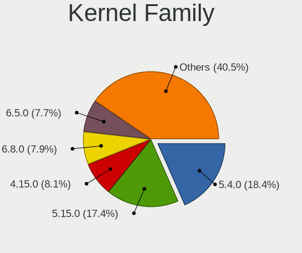
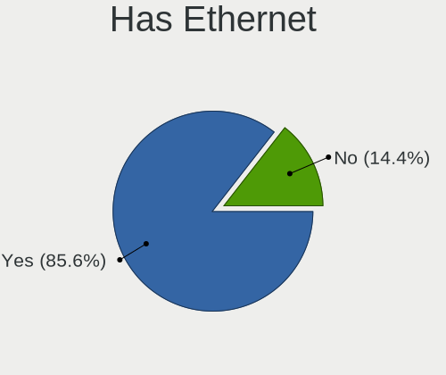
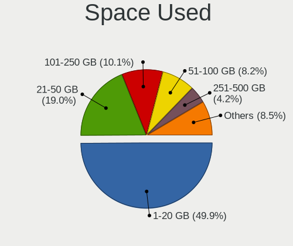
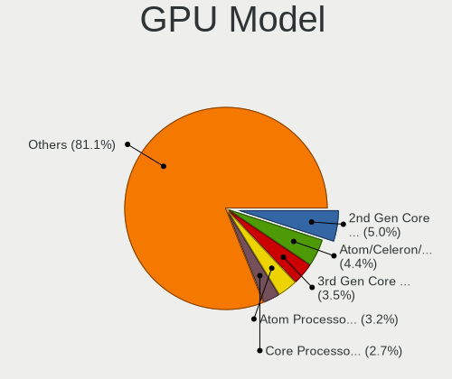
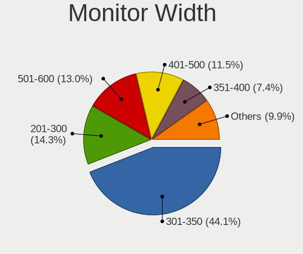
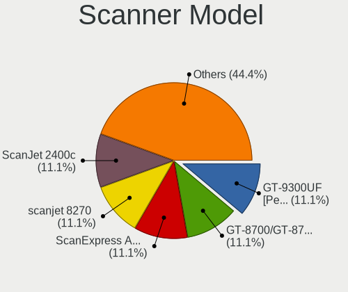

Lubuntu - Tested Hardware & Statistics
--------------------------------------

A project to collect tested hardware configurations for Lubuntu.

Anyone can contribute to this report by the [hw-probe](https://github.com/linuxhw/hw-probe) tool:

    sudo -E hw-probe -all -upload

Please contribute! Especially if your hardware is rare.

This is a report for all computer types. See also reports for [desktops](/Dist/Lubuntu/Desktop/README.md) and [notebooks](/Dist/Lubuntu/Notebook/README.md).

Contents
--------

* [ Test Cases ](#test-cases)

* [ System ](#system)
  - [ OS                       ](#os)
  - [ OS Family                ](#os-family)
  - [ Kernel                   ](#kernel)
  - [ Kernel Family            ](#kernel-family)
  - [ Kernel Major Ver.        ](#kernel-major-ver)
  - [ Arch                     ](#arch)
  - [ DE                       ](#de)
  - [ Display Server           ](#display-server)
  - [ Display Manager          ](#display-manager)
  - [ OS Lang                  ](#os-lang)
  - [ Boot Mode                ](#boot-mode)
  - [ Filesystem               ](#filesystem)
  - [ Part. scheme             ](#part-scheme)
  - [ Dual Boot with Linux/BSD ](#dual-boot-with-linuxbsd)
  - [ Dual Boot (Win)          ](#dual-boot-win)

* [ Board ](#board)
  - [ Vendor                   ](#vendor)
  - [ Model                    ](#model)
  - [ Model Family             ](#model-family)
  - [ MFG Year                 ](#mfg-year)
  - [ Form Factor              ](#form-factor)
  - [ Secure Boot              ](#secure-boot)
  - [ Coreboot                 ](#coreboot)
  - [ RAM Size                 ](#ram-size)
  - [ RAM Used                 ](#ram-used)
  - [ Total Drives             ](#total-drives)
  - [ Has CD-ROM               ](#has-cd-rom)
  - [ Has Ethernet             ](#has-ethernet)
  - [ Has WiFi                 ](#has-wifi)
  - [ Has Bluetooth            ](#has-bluetooth)

* [ Location ](#location)
  - [ Country                  ](#country)
  - [ City                     ](#city)

* [ Drives ](#drives)
  - [ Drive Vendor             ](#drive-vendor)
  - [ Drive Model              ](#drive-model)
  - [ HDD Vendor               ](#hdd-vendor)
  - [ SSD Vendor               ](#ssd-vendor)
  - [ Drive Kind               ](#drive-kind)
  - [ Drive Connector          ](#drive-connector)
  - [ Drive Size               ](#drive-size)
  - [ Space Total              ](#space-total)
  - [ Space Used               ](#space-used)
  - [ Malfunc. Drives          ](#malfunc-drives)
  - [ Malfunc. Drive Vendor    ](#malfunc-drive-vendor)
  - [ Malfunc. HDD Vendor      ](#malfunc-hdd-vendor)
  - [ Malfunc. Drive Kind      ](#malfunc-drive-kind)
  - [ Failed Drives            ](#failed-drives)
  - [ Failed Drive Vendor      ](#failed-drive-vendor)
  - [ Drive Status             ](#drive-status)

* [ Storage controller ](#storage-controller)
  - [ Storage Vendor           ](#storage-vendor)
  - [ Storage Model            ](#storage-model)
  - [ Storage Kind             ](#storage-kind)

* [ Processor ](#processor)
  - [ CPU Vendor               ](#cpu-vendor)
  - [ CPU Model                ](#cpu-model)
  - [ CPU Model Family         ](#cpu-model-family)
  - [ CPU Cores                ](#cpu-cores)
  - [ CPU Sockets              ](#cpu-sockets)
  - [ CPU Threads              ](#cpu-threads)
  - [ CPU Op-Modes             ](#cpu-op-modes)
  - [ CPU Microcode            ](#cpu-microcode)
  - [ CPU Microarch            ](#cpu-microarch)

* [ Graphics ](#graphics)
  - [ GPU Vendor               ](#gpu-vendor)
  - [ GPU Model                ](#gpu-model)
  - [ GPU Combo                ](#gpu-combo)
  - [ GPU Driver               ](#gpu-driver)
  - [ GPU Memory               ](#gpu-memory)

* [ Monitor ](#monitor)
  - [ Monitor Vendor           ](#monitor-vendor)
  - [ Monitor Model            ](#monitor-model)
  - [ Monitor Resolution       ](#monitor-resolution)
  - [ Monitor Diagonal         ](#monitor-diagonal)
  - [ Monitor Width            ](#monitor-width)
  - [ Aspect Ratio             ](#aspect-ratio)
  - [ Monitor Area             ](#monitor-area)
  - [ Pixel Density            ](#pixel-density)
  - [ Multiple Monitors        ](#multiple-monitors)

* [ Network ](#network)
  - [ Net Controller Vendor    ](#net-controller-vendor)
  - [ Net Controller Model     ](#net-controller-model)
  - [ Wireless Vendor          ](#wireless-vendor)
  - [ Wireless Model           ](#wireless-model)
  - [ Ethernet Vendor          ](#ethernet-vendor)
  - [ Ethernet Model           ](#ethernet-model)
  - [ Net Controller Kind      ](#net-controller-kind)
  - [ Used Controller          ](#used-controller)
  - [ NICs                     ](#nics)
  - [ IPv6                     ](#ipv6)

* [ Bluetooth ](#bluetooth)
  - [ Bluetooth Vendor         ](#bluetooth-vendor)
  - [ Bluetooth Model          ](#bluetooth-model)

* [ Sound ](#sound)
  - [ Sound Vendor             ](#sound-vendor)
  - [ Sound Model              ](#sound-model)

* [ Memory ](#memory)
  - [ Memory Vendor            ](#memory-vendor)
  - [ Memory Model             ](#memory-model)
  - [ Memory Kind              ](#memory-kind)
  - [ Memory Form Factor       ](#memory-form-factor)
  - [ Memory Size              ](#memory-size)
  - [ Memory Speed             ](#memory-speed)

* [ Printers & scanners ](#printers--scanners)
  - [ Printer Vendor           ](#printer-vendor)
  - [ Printer Model            ](#printer-model)
  - [ Scanner Vendor           ](#scanner-vendor)
  - [ Scanner Model            ](#scanner-model)

* [ Camera ](#camera)
  - [ Camera Vendor            ](#camera-vendor)
  - [ Camera Model             ](#camera-model)

* [ Security ](#security)
  - [ Fingerprint Vendor       ](#fingerprint-vendor)
  - [ Fingerprint Model        ](#fingerprint-model)
  - [ Chipcard Vendor          ](#chipcard-vendor)
  - [ Chipcard Model           ](#chipcard-model)

* [ Unsupported ](#unsupported)
  - [ Unsupported Devices      ](#unsupported-devices)
  - [ Unsupported Device Types ](#unsupported-device-types)

Test Cases
----------

Total: 1709

| Vendor        | Model                       | Form-Factor | Probe                                                      | Date         |
|---------------|-----------------------------|-------------|------------------------------------------------------------|--------------|
| ASUSTek       | K52JB                       | Notebook    | [0e18c3546c](https://linux-hardware.org/?probe=0e18c3546c) | Apr 01, 2023 |
| MSI           | B550-A PRO                  | Desktop     | [f243351def](https://linux-hardware.org/?probe=f243351def) | Mar 31, 2023 |
| ASRock        | G31M-S                      | Desktop     | [4ad324790c](https://linux-hardware.org/?probe=4ad324790c) | Mar 28, 2023 |
| ASRock        | G31M-S                      | Desktop     | [225f122e05](https://linux-hardware.org/?probe=225f122e05) | Mar 28, 2023 |
| YANYU         | ITX-S192                    | Desktop     | [0d2fb6a8d7](https://linux-hardware.org/?probe=0d2fb6a8d7) | Mar 27, 2023 |
| ASUSTek       | VivoBook_ASUSLaptop X515... | Notebook    | [fe79f70952](https://linux-hardware.org/?probe=fe79f70952) | Mar 27, 2023 |
| Pegatron      | Acacia                      | Desktop     | [4ce0966b14](https://linux-hardware.org/?probe=4ce0966b14) | Mar 26, 2023 |
| Pegatron      | Acacia                      | Desktop     | [4faa2a52d3](https://linux-hardware.org/?probe=4faa2a52d3) | Mar 26, 2023 |
| Apple         | MacBookPro9,2               | Notebook    | [35eaaaac45](https://linux-hardware.org/?probe=35eaaaac45) | Mar 26, 2023 |
| Packard Be... | EasyNote SB65               | Notebook    | [f49cf1aa7a](https://linux-hardware.org/?probe=f49cf1aa7a) | Mar 25, 2023 |
| ASRock        | N68-GS4/USB3 FX             | Desktop     | [b846b11174](https://linux-hardware.org/?probe=b846b11174) | Mar 25, 2023 |
| HP            | Laptop 17-ak0xx             | Notebook    | [872e7f18c5](https://linux-hardware.org/?probe=872e7f18c5) | Mar 24, 2023 |
| ASRock        | H110M-HDV                   | Desktop     | [cfe369e6b8](https://linux-hardware.org/?probe=cfe369e6b8) | Mar 24, 2023 |
| Samsung       | 530XBB                      | Notebook    | [2bb5946ee7](https://linux-hardware.org/?probe=2bb5946ee7) | Mar 23, 2023 |
| Lenovo        | IdeaPad 1 15AMN7 82VG       | Notebook    | [104f6a754e](https://linux-hardware.org/?probe=104f6a754e) | Mar 22, 2023 |
| HP            | 89DC 0100                   | All in one  | [d8afbb81f9](https://linux-hardware.org/?probe=d8afbb81f9) | Mar 21, 2023 |
| Acer          | Aspire one 1-131            | Notebook    | [ea5065ef8f](https://linux-hardware.org/?probe=ea5065ef8f) | Mar 21, 2023 |
| Dell          | Precision M3800             | Notebook    | [1d20598cc5](https://linux-hardware.org/?probe=1d20598cc5) | Mar 17, 2023 |
| ASRock        | H110M-HDV                   | Desktop     | [5228141efd](https://linux-hardware.org/?probe=5228141efd) | Mar 16, 2023 |
| Dell          | Latitude 5290               | Notebook    | [2b4d5d7866](https://linux-hardware.org/?probe=2b4d5d7866) | Mar 15, 2023 |
| HP            | ZBook Fury 15.6 inch G8 ... | Notebook    | [2d5d0e42c5](https://linux-hardware.org/?probe=2d5d0e42c5) | Mar 15, 2023 |
| Dell          | Latitude 7480               | Notebook    | [2c1cca300c](https://linux-hardware.org/?probe=2c1cca300c) | Mar 13, 2023 |
| Gigabyte      | MJPLNBB-00                  | Desktop     | [e8c31757e0](https://linux-hardware.org/?probe=e8c31757e0) | Mar 12, 2023 |
| Positivo      | P5VD2-MX                    | Desktop     | [50b7084313](https://linux-hardware.org/?probe=50b7084313) | Mar 12, 2023 |
| ASRock        | G41M-VS3                    | Desktop     | [309d95f00f](https://linux-hardware.org/?probe=309d95f00f) | Mar 11, 2023 |
| BANGHO        | LITE E34                    | Desktop     | [39f7b525e2](https://linux-hardware.org/?probe=39f7b525e2) | Mar 10, 2023 |
| MSI           | S12T 3M/S12 3M              | Notebook    | [b12ff30d25](https://linux-hardware.org/?probe=b12ff30d25) | Mar 09, 2023 |
| HP            | Compaq Presario CQ60        | Notebook    | [4167bec602](https://linux-hardware.org/?probe=4167bec602) | Mar 09, 2023 |
| Gigabyte      | B360M DS3H                  | Desktop     | [3710f0f407](https://linux-hardware.org/?probe=3710f0f407) | Mar 07, 2023 |
| Chuwi         | LarkBox Pro                 | Mini pc     | [256a8abb58](https://linux-hardware.org/?probe=256a8abb58) | Mar 06, 2023 |
| Pegatron      | 2AD5                        | Desktop     | [3356f97e00](https://linux-hardware.org/?probe=3356f97e00) | Mar 06, 2023 |
| Chuwi         | LarkBox Pro                 | Mini pc     | [dbe64de6bd](https://linux-hardware.org/?probe=dbe64de6bd) | Mar 06, 2023 |
| ASUSTek       | A7N8X-E                     | Desktop     | [d0847fb118](https://linux-hardware.org/?probe=d0847fb118) | Mar 06, 2023 |
| HP            | Laptop 15-da0xxx            | Notebook    | [f4e7268671](https://linux-hardware.org/?probe=f4e7268671) | Mar 05, 2023 |
| Lenovo        | IdeaPad L340-15IRH Gamin... | Notebook    | [96738d19ab](https://linux-hardware.org/?probe=96738d19ab) | Mar 05, 2023 |
| ASUSTek       | T200TA                      | Notebook    | [4d2a27cffa](https://linux-hardware.org/?probe=4d2a27cffa) | Mar 05, 2023 |
| MSI           | GS65 Stealth 9SD            | Notebook    | [1eef9edf97](https://linux-hardware.org/?probe=1eef9edf97) | Mar 04, 2023 |
| Dell          | Latitude E6230              | Notebook    | [1909328685](https://linux-hardware.org/?probe=1909328685) | Mar 04, 2023 |
| HP            | Laptop 14-dk0xxx            | Notebook    | [b492e1c092](https://linux-hardware.org/?probe=b492e1c092) | Mar 04, 2023 |
| Pegatron      | 2AD5                        | Desktop     | [86b939ac1a](https://linux-hardware.org/?probe=86b939ac1a) | Mar 03, 2023 |
| DEXP          | Aquilon C15                 | Notebook    | [9ae006e12a](https://linux-hardware.org/?probe=9ae006e12a) | Mar 03, 2023 |
| ASRock        | Z87 Extreme4                | Desktop     | [d085a259d5](https://linux-hardware.org/?probe=d085a259d5) | Mar 03, 2023 |
| Intel         | W7650                       | Notebook    | [30bde4c2d8](https://linux-hardware.org/?probe=30bde4c2d8) | Mar 03, 2023 |
| Intel         | X79 V2.72A                  | Desktop     | [ae4efdfbc5](https://linux-hardware.org/?probe=ae4efdfbc5) | Mar 02, 2023 |
| Google        | Celes                       | Notebook    | [1952ca99b7](https://linux-hardware.org/?probe=1952ca99b7) | Mar 01, 2023 |
| Google        | Celes                       | Notebook    | [097300a7d3](https://linux-hardware.org/?probe=097300a7d3) | Mar 01, 2023 |
| Lenovo        | ThinkPad X201 3626AL3       | Notebook    | [6741a47327](https://linux-hardware.org/?probe=6741a47327) | Mar 01, 2023 |
| Acer          | Aspire Z5101                | All in one  | [ec55f791bb](https://linux-hardware.org/?probe=ec55f791bb) | Feb 28, 2023 |
| Dell          | Inspiron 1525               | Notebook    | [264f8cb6db](https://linux-hardware.org/?probe=264f8cb6db) | Feb 27, 2023 |
| Getac         | V200-X                      | Notebook    | [f3a5da3eae](https://linux-hardware.org/?probe=f3a5da3eae) | Feb 27, 2023 |
| Acer          | Aspire Z5101                | All in one  | [3dd821cc61](https://linux-hardware.org/?probe=3dd821cc61) | Feb 27, 2023 |
| HP            | Pavilion 17                 | Notebook    | [dfd1ca1091](https://linux-hardware.org/?probe=dfd1ca1091) | Feb 27, 2023 |
| Lenovo        | G505s 20255                 | Notebook    | [26548764cd](https://linux-hardware.org/?probe=26548764cd) | Feb 26, 2023 |
| Lenovo        | ThinkPad X230 Tablet 343... | Notebook    | [be9468c864](https://linux-hardware.org/?probe=be9468c864) | Feb 26, 2023 |
| Lenovo        | ThinkPad X201 3626AL3       | Notebook    | [9c3a1f5cd5](https://linux-hardware.org/?probe=9c3a1f5cd5) | Feb 26, 2023 |
| Pegatron      | 2AD5                        | Desktop     | [0f487c3a2a](https://linux-hardware.org/?probe=0f487c3a2a) | Feb 26, 2023 |
| Unknown       | Unknown                     | Notebook    | [1dfaaf5a59](https://linux-hardware.org/?probe=1dfaaf5a59) | Feb 25, 2023 |
| Pegatron      | 2AD5                        | Desktop     | [4c68f5ea84](https://linux-hardware.org/?probe=4c68f5ea84) | Feb 25, 2023 |
| Apple         | MacBookPro8,1               | Notebook    | [21335c1268](https://linux-hardware.org/?probe=21335c1268) | Feb 23, 2023 |
| Gigabyte      | B450M S2H                   | Desktop     | [4b440b2084](https://linux-hardware.org/?probe=4b440b2084) | Feb 22, 2023 |
| Positivo      | Q232A                       | Notebook    | [71c020b7e4](https://linux-hardware.org/?probe=71c020b7e4) | Feb 22, 2023 |
| Pegatron      | 2A73h                       | Desktop     | [835743de83](https://linux-hardware.org/?probe=835743de83) | Feb 21, 2023 |
| Lenovo        | IdeaPad 100S-14IBR 80R9     | Notebook    | [e61bce94ea](https://linux-hardware.org/?probe=e61bce94ea) | Feb 20, 2023 |
| Gigabyte      | A320M-H-CF                  | Desktop     | [11739ccfa1](https://linux-hardware.org/?probe=11739ccfa1) | Feb 20, 2023 |
| Mediacom      | SmartBook 14 FullHD - SB... | Notebook    | [6f9ef751cd](https://linux-hardware.org/?probe=6f9ef751cd) | Feb 20, 2023 |
| Gigabyte      | F2A88XM-D3HP                | Desktop     | [1c2d1949fd](https://linux-hardware.org/?probe=1c2d1949fd) | Feb 19, 2023 |
| Gigabyte      | F2A88XM-D3HP                | Desktop     | [edfa765236](https://linux-hardware.org/?probe=edfa765236) | Feb 19, 2023 |
| HUAWEI        | KLVD-WXX9                   | Notebook    | [d65b4290e6](https://linux-hardware.org/?probe=d65b4290e6) | Feb 19, 2023 |
| Medion        | Akoya E6412T                | Notebook    | [41a31b6bd1](https://linux-hardware.org/?probe=41a31b6bd1) | Feb 18, 2023 |
| Lenovo        | IdeaPad 100S-14IBR 80R9     | Notebook    | [cbf0e3814c](https://linux-hardware.org/?probe=cbf0e3814c) | Feb 18, 2023 |
| Gigabyte      | B450M S2H                   | Desktop     | [2420c1fb57](https://linux-hardware.org/?probe=2420c1fb57) | Feb 18, 2023 |
| HP            | Notebook                    | Notebook    | [9fbe66f89a](https://linux-hardware.org/?probe=9fbe66f89a) | Feb 18, 2023 |
| Lenovo        | ThinkPad X240 20AMS0RR00    | Notebook    | [d159971f77](https://linux-hardware.org/?probe=d159971f77) | Feb 18, 2023 |
| Getac         | V200-X                      | Notebook    | [754a4bd022](https://linux-hardware.org/?probe=754a4bd022) | Feb 17, 2023 |
| Getac         | V200-X                      | Notebook    | [6794c7246f](https://linux-hardware.org/?probe=6794c7246f) | Feb 17, 2023 |
| Lenovo        | IdeaPad 1 14IGL7 82V6       | Notebook    | [39dfda526c](https://linux-hardware.org/?probe=39dfda526c) | Feb 17, 2023 |
| MSI           | MS-7267                     | Desktop     | [0b89f039c1](https://linux-hardware.org/?probe=0b89f039c1) | Feb 17, 2023 |
| Gigabyte      | B450M S2H                   | Desktop     | [72b29b5f80](https://linux-hardware.org/?probe=72b29b5f80) | Feb 16, 2023 |
| Lenovo        | IdeaPadFlex 3 11ADA05 82... | Convertible | [1fbc4cea88](https://linux-hardware.org/?probe=1fbc4cea88) | Feb 16, 2023 |
| Lenovo        | IdeaPad 1 14IGL7 82V6       | Notebook    | [fbe0863656](https://linux-hardware.org/?probe=fbe0863656) | Feb 15, 2023 |
| Toshiba       | Satellite L650              | Notebook    | [553bddf256](https://linux-hardware.org/?probe=553bddf256) | Feb 15, 2023 |
| ECS           | G41T-M7                     | Desktop     | [3308b85e2f](https://linux-hardware.org/?probe=3308b85e2f) | Feb 15, 2023 |
| Lenovo        | ThinkPad L520 5015AH2       | Notebook    | [8f2bad1d66](https://linux-hardware.org/?probe=8f2bad1d66) | Feb 13, 2023 |
| Acer          | Aspire E5-411G              | Notebook    | [360789275e](https://linux-hardware.org/?probe=360789275e) | Feb 13, 2023 |
| ASUSTek       | M5A78L-M LX3                | Desktop     | [c7374801ac](https://linux-hardware.org/?probe=c7374801ac) | Feb 13, 2023 |
| MSI           | 970A-G46                    | Desktop     | [6012e644eb](https://linux-hardware.org/?probe=6012e644eb) | Feb 13, 2023 |
| Acer          | Extensa 2540                | Notebook    | [6e7e38afb4](https://linux-hardware.org/?probe=6e7e38afb4) | Feb 12, 2023 |
| HP            | 89D8 SMVB                   | Desktop     | [49d1ea8b3e](https://linux-hardware.org/?probe=49d1ea8b3e) | Feb 11, 2023 |
| Dell          | 0FPP7F A00                  | Desktop     | [0a67b25026](https://linux-hardware.org/?probe=0a67b25026) | Feb 11, 2023 |
| Acer          | Aspire A515-45              | Notebook    | [dcecd700f9](https://linux-hardware.org/?probe=dcecd700f9) | Feb 10, 2023 |
| Insyde        | CherryTrail                 | Notebook    | [db3d49fa06](https://linux-hardware.org/?probe=db3d49fa06) | Feb 08, 2023 |
| Gigabyte      | H61MA-D2V                   | Desktop     | [380eb0d0e1](https://linux-hardware.org/?probe=380eb0d0e1) | Feb 08, 2023 |
| Intel         | NUC5PPYB H76558-109         | Mini pc     | [a3384bd952](https://linux-hardware.org/?probe=a3384bd952) | Feb 06, 2023 |
| Toshiba       | Satellite C55D-A            | Notebook    | [38083cc2a4](https://linux-hardware.org/?probe=38083cc2a4) | Feb 05, 2023 |
| Acer          | TravelMate P253             | Notebook    | [b2cad8970a](https://linux-hardware.org/?probe=b2cad8970a) | Feb 04, 2023 |
| MSI           | B550-A PRO                  | Desktop     | [55e2abbd96](https://linux-hardware.org/?probe=55e2abbd96) | Feb 04, 2023 |
| Acer          | AO756                       | Notebook    | [630b2b9b5b](https://linux-hardware.org/?probe=630b2b9b5b) | Feb 03, 2023 |
| MSI           | MPG X570 GAMING EDGE WIF... | Desktop     | [4f6655087b](https://linux-hardware.org/?probe=4f6655087b) | Feb 03, 2023 |
| Lenovo        | IdeaPad S340-15IWL 81N8     | Notebook    | [88be1adb45](https://linux-hardware.org/?probe=88be1adb45) | Feb 02, 2023 |
| Intel         | powered classmate PC        | Notebook    | [a3e602934b](https://linux-hardware.org/?probe=a3e602934b) | Jan 29, 2023 |
| Intel         | Unknown                     | Notebook    | [f387a4b732](https://linux-hardware.org/?probe=f387a4b732) | Jan 29, 2023 |
| Intel         | Unknown                     | Notebook    | [79aa357327](https://linux-hardware.org/?probe=79aa357327) | Jan 29, 2023 |
| Lenovo        | ThinkPad X220 4291H82       | Notebook    | [f9781882f8](https://linux-hardware.org/?probe=f9781882f8) | Jan 28, 2023 |
| OEM           | M882CWP                     | Tablet      | [d98f389956](https://linux-hardware.org/?probe=d98f389956) | Jan 28, 2023 |
| OEM           | M882CWP                     | Tablet      | [152e24910a](https://linux-hardware.org/?probe=152e24910a) | Jan 28, 2023 |
| Lenovo        | G50-30 80G0                 | Notebook    | [850fc5b742](https://linux-hardware.org/?probe=850fc5b742) | Jan 25, 2023 |
| MSI           | MS-7032                     | Desktop     | [7b481f4c8c](https://linux-hardware.org/?probe=7b481f4c8c) | Jan 25, 2023 |
| Dell          | Latitude E6410              | Notebook    | [03463d0a58](https://linux-hardware.org/?probe=03463d0a58) | Jan 25, 2023 |
| ASUSTek       | VivoBook_ASUSLaptop X415... | Notebook    | [f0d73c960e](https://linux-hardware.org/?probe=f0d73c960e) | Jan 25, 2023 |
| AXDIA Inte... | WINPAD V10                  | Notebook    | [be66e9073f](https://linux-hardware.org/?probe=be66e9073f) | Jan 25, 2023 |
| AXDIA Inte... | WINPAD V10                  | Notebook    | [3a8aced1b7](https://linux-hardware.org/?probe=3a8aced1b7) | Jan 25, 2023 |
| ASUSTek       | ROG STRIX Z590-E GAMING ... | Desktop     | [1099a3c6c9](https://linux-hardware.org/?probe=1099a3c6c9) | Jan 24, 2023 |
| ASUSTek       | ROG STRIX Z590-E GAMING ... | Desktop     | [4944e0cddd](https://linux-hardware.org/?probe=4944e0cddd) | Jan 24, 2023 |
| Toshiba       | Satellite Pro S500          | Notebook    | [d529b5d578](https://linux-hardware.org/?probe=d529b5d578) | Jan 24, 2023 |
| Alienware     | 15 R3                       | Notebook    | [f70ed3a363](https://linux-hardware.org/?probe=f70ed3a363) | Jan 23, 2023 |
| Lenovo        | G505s 20255                 | Notebook    | [4eb3c2afb3](https://linux-hardware.org/?probe=4eb3c2afb3) | Jan 23, 2023 |
| Toshiba       | Satellite Pro S500          | Notebook    | [118cda5e06](https://linux-hardware.org/?probe=118cda5e06) | Jan 23, 2023 |
| ASUSTek       | TUF B450-PRO GAMING         | Desktop     | [27ea4205e5](https://linux-hardware.org/?probe=27ea4205e5) | Jan 22, 2023 |
| Toshiba       | Satellite Pro S500          | Notebook    | [f1e995c40b](https://linux-hardware.org/?probe=f1e995c40b) | Jan 20, 2023 |
| Toshiba       | Satellite Pro S500          | Notebook    | [16708a6471](https://linux-hardware.org/?probe=16708a6471) | Jan 20, 2023 |
| HP            | Compaq 6510b (GM108UC#AB... | Notebook    | [45ae9ca3c9](https://linux-hardware.org/?probe=45ae9ca3c9) | Jan 20, 2023 |
| Toshiba       | Satellite Pro S500          | Notebook    | [194f5676bd](https://linux-hardware.org/?probe=194f5676bd) | Jan 20, 2023 |
| ASUSTek       | 1011PX                      | Notebook    | [4c7cc6f614](https://linux-hardware.org/?probe=4c7cc6f614) | Jan 19, 2023 |
| Lenovo        | ThinkPad P14s Gen 2a 21A... | Notebook    | [8c57e1afda](https://linux-hardware.org/?probe=8c57e1afda) | Jan 18, 2023 |
| Lenovo        | ThinkPad P14s Gen 2a 21A... | Notebook    | [c0055f8de2](https://linux-hardware.org/?probe=c0055f8de2) | Jan 18, 2023 |
| Acer          | Swift SF314-54G             | Notebook    | [c666c8f973](https://linux-hardware.org/?probe=c666c8f973) | Jan 18, 2023 |
| Fujitsu Si... | MS-7504VP-PV                | Desktop     | [11964c6701](https://linux-hardware.org/?probe=11964c6701) | Jan 16, 2023 |
| HP            | Laptop 15-da0xxx            | Notebook    | [f33868aba0](https://linux-hardware.org/?probe=f33868aba0) | Jan 15, 2023 |
| NEC Comput... | ECS-945G                    | Desktop     | [8226ffab22](https://linux-hardware.org/?probe=8226ffab22) | Jan 14, 2023 |
| MSI           | K9A2VM                      | Desktop     | [98ce1d06ad](https://linux-hardware.org/?probe=98ce1d06ad) | Jan 14, 2023 |
| Acer          | Aspire ES1-711              | Notebook    | [87c00cc849](https://linux-hardware.org/?probe=87c00cc849) | Jan 12, 2023 |
| ASRock        | ION3D-HT                    | Desktop     | [48707e3794](https://linux-hardware.org/?probe=48707e3794) | Jan 12, 2023 |
| Fujitsu Si... | AMILO Si 2636               | Notebook    | [4a918c5503](https://linux-hardware.org/?probe=4a918c5503) | Jan 11, 2023 |
| Toshiba       | Satellite Pro S500          | Notebook    | [2549187c34](https://linux-hardware.org/?probe=2549187c34) | Jan 10, 2023 |
| Thomson       | N14C4WH64                   | Notebook    | [e9050d81df](https://linux-hardware.org/?probe=e9050d81df) | Jan 09, 2023 |
| Acer          | Aspire One 721              | Notebook    | [4b9311cfed](https://linux-hardware.org/?probe=4b9311cfed) | Jan 08, 2023 |
| Toshiba       | Satellite Pro S500          | Notebook    | [da62202546](https://linux-hardware.org/?probe=da62202546) | Jan 08, 2023 |
| ASUSTek       | W5Fe                        | Notebook    | [d56398aefd](https://linux-hardware.org/?probe=d56398aefd) | Jan 07, 2023 |
| ASRock        | H110M-HDV                   | Desktop     | [deff7fc898](https://linux-hardware.org/?probe=deff7fc898) | Jan 07, 2023 |
| Google        | Candy                       | Notebook    | [1b955d9847](https://linux-hardware.org/?probe=1b955d9847) | Jan 07, 2023 |
| MSI           | A320M-A PRO                 | Desktop     | [e8147a271c](https://linux-hardware.org/?probe=e8147a271c) | Jan 06, 2023 |
| Apple         | Mac-F2268CC8                | All in one  | [6ef8fba020](https://linux-hardware.org/?probe=6ef8fba020) | Jan 06, 2023 |
| ASUSTek       | F50SV                       | Notebook    | [ae6f64f5df](https://linux-hardware.org/?probe=ae6f64f5df) | Jan 05, 2023 |
| ASUSTek       | M5A97 PRO                   | Desktop     | [7921dc0197](https://linux-hardware.org/?probe=7921dc0197) | Jan 05, 2023 |
| ASUSTek       | F8SG                        | Notebook    | [d70636ce7e](https://linux-hardware.org/?probe=d70636ce7e) | Jan 05, 2023 |
| Dell          | Dimension 4500S             | Desktop     | [5b907b07e4](https://linux-hardware.org/?probe=5b907b07e4) | Jan 05, 2023 |
| Google        | Celes                       | Notebook    | [4036321fcf](https://linux-hardware.org/?probe=4036321fcf) | Jan 05, 2023 |
| Google        | Celes                       | Notebook    | [70525bfcb2](https://linux-hardware.org/?probe=70525bfcb2) | Jan 05, 2023 |
| Acer          | Aspire E5-573               | Notebook    | [bd9e90dca3](https://linux-hardware.org/?probe=bd9e90dca3) | Jan 04, 2023 |
| ASUSTek       | T100TA                      | Notebook    | [73a67d66af](https://linux-hardware.org/?probe=73a67d66af) | Jan 02, 2023 |
| Positivo      | POS-AG31AP                  | Desktop     | [a0ef7524c6](https://linux-hardware.org/?probe=a0ef7524c6) | Jan 02, 2023 |
| Positivo      | POS-AG31AP                  | Desktop     | [4cc8fbf002](https://linux-hardware.org/?probe=4cc8fbf002) | Jan 02, 2023 |
| Acer          | Aspire SW3-013              | Notebook    | [44016de6db](https://linux-hardware.org/?probe=44016de6db) | Jan 01, 2023 |
| HP            | 21B4 A01                    | Desktop     | [cdc9730e81](https://linux-hardware.org/?probe=cdc9730e81) | Dec 31, 2022 |
| Google        | Candy                       | Notebook    | [86bb9a73fc](https://linux-hardware.org/?probe=86bb9a73fc) | Dec 31, 2022 |
| Acer          | TravelMate B117-M           | Notebook    | [23985812a9](https://linux-hardware.org/?probe=23985812a9) | Dec 30, 2022 |
| Dell          | 05KX61 A00                  | Server      | [9f365307f3](https://linux-hardware.org/?probe=9f365307f3) | Dec 30, 2022 |
| ASUSTek       | K72F                        | Notebook    | [f761bf9bd6](https://linux-hardware.org/?probe=f761bf9bd6) | Dec 30, 2022 |
| Google        | Edgar                       | Notebook    | [738a0d9324](https://linux-hardware.org/?probe=738a0d9324) | Dec 30, 2022 |
| Apple         | MacBook4,1                  | Notebook    | [41a9d09ec8](https://linux-hardware.org/?probe=41a9d09ec8) | Dec 29, 2022 |
| Rockchip      | RK3318 BOX                  | Soc         | [a9c1fc9fbd](https://linux-hardware.org/?probe=a9c1fc9fbd) | Dec 28, 2022 |
| Apple         | Mac-F2268CC8                | All in one  | [fd1cdfc132](https://linux-hardware.org/?probe=fd1cdfc132) | Dec 28, 2022 |
| Acer          | Aspire SW3-013              | Notebook    | [04286c0e93](https://linux-hardware.org/?probe=04286c0e93) | Dec 27, 2022 |
| Digma         | CITI E401 ET4007EW          | Notebook    | [252a51f201](https://linux-hardware.org/?probe=252a51f201) | Dec 26, 2022 |
| Acer          | Swift SF314-54G             | Notebook    | [34532e7f7d](https://linux-hardware.org/?probe=34532e7f7d) | Dec 26, 2022 |
| HP            | Laptop 15-da0xxx            | Notebook    | [96a4f739b8](https://linux-hardware.org/?probe=96a4f739b8) | Dec 26, 2022 |
| HP            | Laptop 15-da0xxx            | Notebook    | [19af161114](https://linux-hardware.org/?probe=19af161114) | Dec 26, 2022 |
| Toshiba       | Satellite Pro S500          | Notebook    | [cd547b04a1](https://linux-hardware.org/?probe=cd547b04a1) | Dec 25, 2022 |
| ASRock        | 970DE3/U3S3                 | Desktop     | [1505706e04](https://linux-hardware.org/?probe=1505706e04) | Dec 25, 2022 |
| ASRock        | 970DE3/U3S3                 | Desktop     | [1c996d8122](https://linux-hardware.org/?probe=1c996d8122) | Dec 25, 2022 |
| HP            | Stream Notebook PC 11       | Notebook    | [f33ebabb99](https://linux-hardware.org/?probe=f33ebabb99) | Dec 24, 2022 |
| HP            | Stream 8 Tablet             | Tablet      | [752a0b9007](https://linux-hardware.org/?probe=752a0b9007) | Dec 23, 2022 |
| Positivo      | C14CR21                     | Notebook    | [be49c26bb4](https://linux-hardware.org/?probe=be49c26bb4) | Dec 21, 2022 |
| HP            | Compaq 6715b (RM174UT#AB... | Notebook    | [db3b8615f7](https://linux-hardware.org/?probe=db3b8615f7) | Dec 21, 2022 |
| ZOTAC         | NM10                        | Desktop     | [98b6981431](https://linux-hardware.org/?probe=98b6981431) | Dec 21, 2022 |
| Dell          | Latitude E7470              | Notebook    | [e171eea812](https://linux-hardware.org/?probe=e171eea812) | Dec 21, 2022 |
| Google        | Coral                       | Notebook    | [8e2407d4b2](https://linux-hardware.org/?probe=8e2407d4b2) | Dec 19, 2022 |
| Lenovo        | ThinkPad R61 77324TG        | Notebook    | [90c300a51c](https://linux-hardware.org/?probe=90c300a51c) | Dec 18, 2022 |
| HP            | 2000                        | Notebook    | [bcbeb17a60](https://linux-hardware.org/?probe=bcbeb17a60) | Dec 15, 2022 |
| HP            | Compaq 6830s                | Notebook    | [1883df2312](https://linux-hardware.org/?probe=1883df2312) | Dec 14, 2022 |
| ASUSTek       | ROG STRIX B450-F GAMING ... | Desktop     | [5c437c961e](https://linux-hardware.org/?probe=5c437c961e) | Dec 13, 2022 |
| Apple         | MacBookPro8,1               | Notebook    | [9ddb08e4ae](https://linux-hardware.org/?probe=9ddb08e4ae) | Dec 13, 2022 |
| Lenovo        | G500 20236                  | Notebook    | [becb2e6bbc](https://linux-hardware.org/?probe=becb2e6bbc) | Dec 12, 2022 |
| SGIN          | laptop                      | Notebook    | [8f650d00dd](https://linux-hardware.org/?probe=8f650d00dd) | Dec 11, 2022 |
| ASUSTek       | K50C                        | Notebook    | [6cf2037e0f](https://linux-hardware.org/?probe=6cf2037e0f) | Dec 11, 2022 |
| Lenovo        | Z70-80 80FG                 | Notebook    | [492071e526](https://linux-hardware.org/?probe=492071e526) | Dec 09, 2022 |
| Apple         | MacBookPro8,1               | Notebook    | [71137ab051](https://linux-hardware.org/?probe=71137ab051) | Dec 08, 2022 |
| Toshiba       | Satellite Pro S500          | Notebook    | [bcf1460e47](https://linux-hardware.org/?probe=bcf1460e47) | Dec 08, 2022 |
| Apple         | MacBookPro8,1               | Notebook    | [651f6f4d18](https://linux-hardware.org/?probe=651f6f4d18) | Dec 07, 2022 |
| GPU Compan... | GWTC116-2                   | Notebook    | [bdbc74a754](https://linux-hardware.org/?probe=bdbc74a754) | Dec 07, 2022 |
| Lenovo        | IdeaPad 5 14ABA7 82SE       | Notebook    | [659b20c9b8](https://linux-hardware.org/?probe=659b20c9b8) | Dec 06, 2022 |
| ASUSTek       | K70IO                       | Notebook    | [193053a6ef](https://linux-hardware.org/?probe=193053a6ef) | Dec 05, 2022 |
| HP            | Laptop 15-da0xxx            | Notebook    | [de8272cf2e](https://linux-hardware.org/?probe=de8272cf2e) | Dec 05, 2022 |
| ASUSTek       | M4A785TD-V EVO              | Desktop     | [88e60fc0ba](https://linux-hardware.org/?probe=88e60fc0ba) | Dec 04, 2022 |
| ASUSTek       | PRIME A320M-F               | Desktop     | [abe82b0f58](https://linux-hardware.org/?probe=abe82b0f58) | Dec 04, 2022 |
| ASUSTek       | ET1610PT                    | Desktop     | [d8b1840336](https://linux-hardware.org/?probe=d8b1840336) | Dec 03, 2022 |
| ASUSTek       | K70IO                       | Notebook    | [179ce76921](https://linux-hardware.org/?probe=179ce76921) | Dec 02, 2022 |
| Positivo      | i500pro                     | Notebook    | [4a79aa2383](https://linux-hardware.org/?probe=4a79aa2383) | Nov 30, 2022 |
| ASUSTek       | K70IO                       | Notebook    | [f91b4cdb61](https://linux-hardware.org/?probe=f91b4cdb61) | Nov 29, 2022 |
| HP            | 620                         | Notebook    | [5baeeace34](https://linux-hardware.org/?probe=5baeeace34) | Nov 28, 2022 |
| ASUSTek       | M4A87TD/USB3                | Desktop     | [e38a783ce1](https://linux-hardware.org/?probe=e38a783ce1) | Nov 28, 2022 |
| Dell          | Inspiron 15-3552            | Notebook    | [03a1a706d1](https://linux-hardware.org/?probe=03a1a706d1) | Nov 28, 2022 |
| Lenovo        | 0B98401 PRO                 | Desktop     | [63487a2957](https://linux-hardware.org/?probe=63487a2957) | Nov 28, 2022 |
| ASUSTek       | K70IO                       | Notebook    | [4eabf9a0d4](https://linux-hardware.org/?probe=4eabf9a0d4) | Nov 28, 2022 |
| Lenovo        | 0B98401 PRO                 | Desktop     | [0b632b7ae8](https://linux-hardware.org/?probe=0b632b7ae8) | Nov 27, 2022 |
| Acer          | AO722                       | Notebook    | [fb75768c70](https://linux-hardware.org/?probe=fb75768c70) | Nov 26, 2022 |
| MSI           | B550M PRO-VDH               | Desktop     | [ba7b5c7748](https://linux-hardware.org/?probe=ba7b5c7748) | Nov 26, 2022 |
| Lenovo        | Yoga C940-14IIL 81Q9        | Convertible | [2d8e324570](https://linux-hardware.org/?probe=2d8e324570) | Nov 26, 2022 |
| Foxconn       | G41MXP/G41MXP-V             | Desktop     | [f8e0414c84](https://linux-hardware.org/?probe=f8e0414c84) | Nov 26, 2022 |
| Intel         | BTC-T37                     | Desktop     | [f52a08ae38](https://linux-hardware.org/?probe=f52a08ae38) | Nov 25, 2022 |
| MSI           | A520M-A PRO                 | Desktop     | [8db2bc8883](https://linux-hardware.org/?probe=8db2bc8883) | Nov 25, 2022 |
| Lenovo        | V145-15AST 81MT             | Notebook    | [b37755877d](https://linux-hardware.org/?probe=b37755877d) | Nov 24, 2022 |
| Unknown       | Unknown                     | Notebook    | [f40545f0d5](https://linux-hardware.org/?probe=f40545f0d5) | Nov 23, 2022 |
| Unknown       | Unknown                     | Desktop     | [029cddbcd6](https://linux-hardware.org/?probe=029cddbcd6) | Nov 23, 2022 |
| HP            | Pavilion g6                 | Notebook    | [9b9cd79752](https://linux-hardware.org/?probe=9b9cd79752) | Nov 23, 2022 |
| HP            | 620                         | Notebook    | [a09882989c](https://linux-hardware.org/?probe=a09882989c) | Nov 23, 2022 |
| Fujitsu       | LIFEBOOK A3510              | Notebook    | [e1c126c1f2](https://linux-hardware.org/?probe=e1c126c1f2) | Nov 22, 2022 |
| HP            | 250 G7 Notebook PC          | Notebook    | [242d685287](https://linux-hardware.org/?probe=242d685287) | Nov 22, 2022 |
| Toshiba       | Satellite Pro S500          | Notebook    | [a9d392c0c3](https://linux-hardware.org/?probe=a9d392c0c3) | Nov 22, 2022 |
| HP            | Laptop 14s-fq0xxx           | Notebook    | [cc9c76c85c](https://linux-hardware.org/?probe=cc9c76c85c) | Nov 21, 2022 |
| Dell          | Latitude 3310 2-in-1        | Convertible | [2574454ebe](https://linux-hardware.org/?probe=2574454ebe) | Nov 21, 2022 |
| ASUSTek       | IP4BL-ME-Oli                | Desktop     | [242fd5b355](https://linux-hardware.org/?probe=242fd5b355) | Nov 21, 2022 |
| HP            | Pavilion g6                 | Notebook    | [63e70c5e46](https://linux-hardware.org/?probe=63e70c5e46) | Nov 20, 2022 |
| HP            | Spectre x360 Convertible... | Convertible | [3b7077c5ab](https://linux-hardware.org/?probe=3b7077c5ab) | Nov 19, 2022 |
| Fujitsu       | LIFEBOOK A3510              | Notebook    | [9eb6a535ac](https://linux-hardware.org/?probe=9eb6a535ac) | Nov 19, 2022 |
| HP            | 3048h                       | Desktop     | [33ced86304](https://linux-hardware.org/?probe=33ced86304) | Nov 19, 2022 |
| HP            | 3048h                       | Desktop     | [e5fdb1f67a](https://linux-hardware.org/?probe=e5fdb1f67a) | Nov 19, 2022 |
| ASUSTek       | K55A                        | Notebook    | [d09b309d4d](https://linux-hardware.org/?probe=d09b309d4d) | Nov 19, 2022 |
| GPU Compan... | GWTC116-2                   | Notebook    | [4825e06bd4](https://linux-hardware.org/?probe=4825e06bd4) | Nov 19, 2022 |
| GPU Compan... | GWTC116-2                   | Notebook    | [57bcd4363a](https://linux-hardware.org/?probe=57bcd4363a) | Nov 19, 2022 |
| Samsung       | 300V3A/300V4A/300V5A/200... | Notebook    | [4d8be4bb54](https://linux-hardware.org/?probe=4d8be4bb54) | Nov 18, 2022 |
| ASUSTek       | T100TA                      | Notebook    | [3d49b98878](https://linux-hardware.org/?probe=3d49b98878) | Nov 16, 2022 |
| Toshiba       | Satellite Pro S500          | Notebook    | [f528238460](https://linux-hardware.org/?probe=f528238460) | Nov 16, 2022 |
| Toshiba       | Satellite Pro S500          | Notebook    | [97ccc55f03](https://linux-hardware.org/?probe=97ccc55f03) | Nov 16, 2022 |
| Dell          | Latitude E6520              | Notebook    | [ed6f93342d](https://linux-hardware.org/?probe=ed6f93342d) | Nov 15, 2022 |
| HP            | ProBook 430 G7              | Notebook    | [a7f77757c7](https://linux-hardware.org/?probe=a7f77757c7) | Nov 13, 2022 |
| HP            | Pavilion g6                 | Notebook    | [759ee850cc](https://linux-hardware.org/?probe=759ee850cc) | Nov 13, 2022 |
| HP            | Pavilion g6                 | Notebook    | [f506c5c2fa](https://linux-hardware.org/?probe=f506c5c2fa) | Nov 13, 2022 |
| ASUSTek       | M2NPV-VM                    | Desktop     | [db28f53298](https://linux-hardware.org/?probe=db28f53298) | Nov 12, 2022 |
| Apple         | Mac-031AEE4D24BFF0B1 Mac... | Mini pc     | [8a149b06a1](https://linux-hardware.org/?probe=8a149b06a1) | Nov 12, 2022 |
| Acer          | AOD255E                     | Notebook    | [817724283b](https://linux-hardware.org/?probe=817724283b) | Nov 11, 2022 |
| ASUSTek       | EB1501P                     | Desktop     | [0664261b3a](https://linux-hardware.org/?probe=0664261b3a) | Nov 11, 2022 |
| ASUSTek       | EB1501P                     | Desktop     | [ad47bcfb8b](https://linux-hardware.org/?probe=ad47bcfb8b) | Nov 11, 2022 |
| Toshiba       | Satellite L15-B             | Notebook    | [b7a5fabbbd](https://linux-hardware.org/?probe=b7a5fabbbd) | Nov 08, 2022 |
| Lenovo        | G50-45 80E3                 | Notebook    | [70940de14e](https://linux-hardware.org/?probe=70940de14e) | Nov 08, 2022 |
| HP            | EliteBook 850 G5            | Notebook    | [3408fb4c36](https://linux-hardware.org/?probe=3408fb4c36) | Nov 07, 2022 |
| AMI           | Cherry Trail CR             | Desktop     | [f731a55cc1](https://linux-hardware.org/?probe=f731a55cc1) | Nov 05, 2022 |
| ASRock        | FM2A88X Extreme4+           | Desktop     | [7596586a99](https://linux-hardware.org/?probe=7596586a99) | Nov 05, 2022 |
| Pretech       | EVE 1801 3G ES1049EG        | Notebook    | [19205fc20b](https://linux-hardware.org/?probe=19205fc20b) | Nov 04, 2022 |
| HP            | ProBook 450 15.6 inch G9... | Notebook    | [29617200dd](https://linux-hardware.org/?probe=29617200dd) | Nov 03, 2022 |
| HP            | ProBook 450 15.6 inch G9... | Notebook    | [24f27140f8](https://linux-hardware.org/?probe=24f27140f8) | Nov 03, 2022 |
| Intel         | D33217GKE G76540-203        | Desktop     | [eb15ca5b98](https://linux-hardware.org/?probe=eb15ca5b98) | Nov 03, 2022 |
| Intel         | D33217GKE G76540-203        | Desktop     | [20824af437](https://linux-hardware.org/?probe=20824af437) | Nov 03, 2022 |
| Raspberry ... | Raspberry Pi                | Soc         | [a922f68180](https://linux-hardware.org/?probe=a922f68180) | Nov 03, 2022 |
| Lenovo        | NOK                         | Desktop     | [8c9f8ff505](https://linux-hardware.org/?probe=8c9f8ff505) | Nov 03, 2022 |
| ASUSTek       | VivoBook 15_ASUS Laptop ... | Notebook    | [027cfb43c4](https://linux-hardware.org/?probe=027cfb43c4) | Oct 31, 2022 |
| ASUSTek       | VivoBook 15_ASUS Laptop ... | Notebook    | [113930496e](https://linux-hardware.org/?probe=113930496e) | Oct 31, 2022 |
| ASUSTek       | VivoBook 15_ASUS Laptop ... | Notebook    | [2934bab108](https://linux-hardware.org/?probe=2934bab108) | Oct 31, 2022 |
| Dell          | Inspiron N5010              | Notebook    | [a5712d3982](https://linux-hardware.org/?probe=a5712d3982) | Oct 31, 2022 |
| Dell          | Inspiron N5010              | Notebook    | [9b53e5c27d](https://linux-hardware.org/?probe=9b53e5c27d) | Oct 31, 2022 |
| Intel         | D33217GKE G76540-203        | Desktop     | [95238cc6e8](https://linux-hardware.org/?probe=95238cc6e8) | Oct 30, 2022 |
| Acer          | Aspire E1-571               | Notebook    | [4ba79bc73e](https://linux-hardware.org/?probe=4ba79bc73e) | Oct 30, 2022 |
| Kiano         | SlimNote 1.0                | Notebook    | [db1ae618d8](https://linux-hardware.org/?probe=db1ae618d8) | Oct 29, 2022 |
| Teclast       | F7 Plus                     | Notebook    | [f416278476](https://linux-hardware.org/?probe=f416278476) | Oct 29, 2022 |
| Intel         | D33217GKE G76540-203        | Desktop     | [2501d67199](https://linux-hardware.org/?probe=2501d67199) | Oct 28, 2022 |
| Lenovo        | IdeaPad Slim 1-14AST-05 ... | Notebook    | [4b4c00b0a9](https://linux-hardware.org/?probe=4b4c00b0a9) | Oct 28, 2022 |
| LG Electro... | 22V280 FAB1                 | All in one  | [9c7127a256](https://linux-hardware.org/?probe=9c7127a256) | Oct 27, 2022 |
| Acer          | Extensa 2509                | Notebook    | [a27b3d38a9](https://linux-hardware.org/?probe=a27b3d38a9) | Oct 27, 2022 |
| Google        | Apel                        | Notebook    | [f3bf9850dd](https://linux-hardware.org/?probe=f3bf9850dd) | Oct 26, 2022 |
| Fujitsu Si... | AMILO Li 2727               | Notebook    | [084149046b](https://linux-hardware.org/?probe=084149046b) | Oct 25, 2022 |
| Fujitsu Si... | AMILO Li 2727               | Notebook    | [c9811709ec](https://linux-hardware.org/?probe=c9811709ec) | Oct 25, 2022 |
| Lenovo        | ThinkCentre M81 5048E2G     | Desktop     | [35840b3b8c](https://linux-hardware.org/?probe=35840b3b8c) | Oct 23, 2022 |
| Acer          | Aspire one                  | Notebook    | [fced25613a](https://linux-hardware.org/?probe=fced25613a) | Oct 18, 2022 |
| Lenovo        | IdeaPad 330-14AST 81D5      | Notebook    | [b7a14994b1](https://linux-hardware.org/?probe=b7a14994b1) | Oct 17, 2022 |
| ASRock        | H110M-HDV                   | Desktop     | [3d1fde3114](https://linux-hardware.org/?probe=3d1fde3114) | Oct 17, 2022 |
| HP            | 431 Notebook                | Notebook    | [fd2980af46](https://linux-hardware.org/?probe=fd2980af46) | Oct 16, 2022 |
| Lenovo        | G50-70 20351                | Notebook    | [9a17926acb](https://linux-hardware.org/?probe=9a17926acb) | Oct 15, 2022 |
| Lenovo        | B590 20208                  | Notebook    | [6a3309f753](https://linux-hardware.org/?probe=6a3309f753) | Oct 14, 2022 |
| Dell          | Latitude E5430 non-vPro     | Notebook    | [784360100d](https://linux-hardware.org/?probe=784360100d) | Oct 14, 2022 |
| Dell          | Latitude E5430 non-vPro     | Notebook    | [15ba599a80](https://linux-hardware.org/?probe=15ba599a80) | Oct 14, 2022 |
| Gigabyte      | F2A58M-HD2                  | Desktop     | [944509d58b](https://linux-hardware.org/?probe=944509d58b) | Oct 12, 2022 |
| Lenovo        | ThinkPad SL510 2847CXG      | Notebook    | [5680d8a827](https://linux-hardware.org/?probe=5680d8a827) | Oct 12, 2022 |
| Acer          | EM61SM/EM61PM               | Desktop     | [191540e7bc](https://linux-hardware.org/?probe=191540e7bc) | Oct 12, 2022 |
| Acer          | EM61SM/EM61PM               | Desktop     | [fb2dd76511](https://linux-hardware.org/?probe=fb2dd76511) | Oct 10, 2022 |
| AOpen         | D1007 0BBA                  | Desktop     | [b3597a7cbc](https://linux-hardware.org/?probe=b3597a7cbc) | Oct 10, 2022 |
| Acer          | Aspire 4739Z                | Notebook    | [b85222f02c](https://linux-hardware.org/?probe=b85222f02c) | Oct 09, 2022 |
| Fujitsu       | D3003-D1 S26361-D3003-D1    | Desktop     | [afba95481a](https://linux-hardware.org/?probe=afba95481a) | Oct 09, 2022 |
| Fujitsu       | LIFEBOOK U904               | Notebook    | [b4a8655f31](https://linux-hardware.org/?probe=b4a8655f31) | Oct 08, 2022 |
| Toshiba       | Satellite C655D             | Notebook    | [80ec8503c0](https://linux-hardware.org/?probe=80ec8503c0) | Oct 05, 2022 |
| Lenovo        | ThinkPad T410 2537CS0       | Notebook    | [c6a45619c4](https://linux-hardware.org/?probe=c6a45619c4) | Oct 03, 2022 |
| HP            | 0B4Ch D                     | Desktop     | [1b409fc1f6](https://linux-hardware.org/?probe=1b409fc1f6) | Oct 01, 2022 |
| HP            | 0B4Ch D                     | Desktop     | [ccc7fe3103](https://linux-hardware.org/?probe=ccc7fe3103) | Oct 01, 2022 |
| ASUSTek       | P8P67                       | Desktop     | [1ad22cf7a8](https://linux-hardware.org/?probe=1ad22cf7a8) | Sep 28, 2022 |
| Dell          | 0PU052                      | Desktop     | [2890a8407e](https://linux-hardware.org/?probe=2890a8407e) | Sep 28, 2022 |
| Lenovo        | ThinkPad E550 20DF00CUFR    | Notebook    | [7b5e707097](https://linux-hardware.org/?probe=7b5e707097) | Sep 27, 2022 |
| Dell          | 0R849J A00                  | Desktop     | [cf2069932e](https://linux-hardware.org/?probe=cf2069932e) | Sep 26, 2022 |
| Packard Be... | EasyNote TS44HR             | Notebook    | [4005a32539](https://linux-hardware.org/?probe=4005a32539) | Sep 26, 2022 |
| ASUSTek       | UX360CAK                    | Convertible | [015df11bc4](https://linux-hardware.org/?probe=015df11bc4) | Sep 25, 2022 |
| ASUSTek       | Maximus V FORMULA           | Desktop     | [cf8128637b](https://linux-hardware.org/?probe=cf8128637b) | Sep 24, 2022 |
| ASUSTek       | Maximus V FORMULA           | Desktop     | [e63b24acc3](https://linux-hardware.org/?probe=e63b24acc3) | Sep 24, 2022 |
| Intel         | DH67CL AAG10212-210         | Desktop     | [3468d8c911](https://linux-hardware.org/?probe=3468d8c911) | Sep 24, 2022 |
| Dell          | 0PU052                      | Desktop     | [6ca93366df](https://linux-hardware.org/?probe=6ca93366df) | Sep 23, 2022 |
| Lenovo        | IdeaPad L340-15IRH Gamin... | Notebook    | [68d36ec742](https://linux-hardware.org/?probe=68d36ec742) | Sep 23, 2022 |
| Lenovo        | IdeaPad Slim 1-14AST-05 ... | Notebook    | [1dbeac403e](https://linux-hardware.org/?probe=1dbeac403e) | Sep 22, 2022 |
| Dell          | 09M8Y8 A01                  | Desktop     | [aa3088ed0e](https://linux-hardware.org/?probe=aa3088ed0e) | Sep 22, 2022 |
| ASUSTek       | X451CA                      | Notebook    | [bdfe92eb66](https://linux-hardware.org/?probe=bdfe92eb66) | Sep 21, 2022 |
| Lenovo        | MIIX 310-10ICR 80SG         | Tablet      | [c45724d6d3](https://linux-hardware.org/?probe=c45724d6d3) | Sep 20, 2022 |
| Lenovo        | MIIX 310-10ICR 80SG         | Tablet      | [2f9ab4273a](https://linux-hardware.org/?probe=2f9ab4273a) | Sep 20, 2022 |
| Gateway       | NE46R                       | Notebook    | [61ee26263b](https://linux-hardware.org/?probe=61ee26263b) | Sep 20, 2022 |
| MSI           | B450-A PRO MAX              | Desktop     | [89fad64303](https://linux-hardware.org/?probe=89fad64303) | Sep 20, 2022 |
| Gigabyte      | G31M-S2C                    | Desktop     | [f7f3a2e7c8](https://linux-hardware.org/?probe=f7f3a2e7c8) | Sep 17, 2022 |
| Dell          | Inspiron 11-3168            | Notebook    | [29241bb609](https://linux-hardware.org/?probe=29241bb609) | Sep 15, 2022 |
| AMI           | Cherry Trail CR             | Desktop     | [1c131a1acb](https://linux-hardware.org/?probe=1c131a1acb) | Sep 15, 2022 |
| ASUSTek       | 1201N                       | Notebook    | [0a48f359f8](https://linux-hardware.org/?probe=0a48f359f8) | Sep 15, 2022 |
| Lenovo        | Z70-80 80FG                 | Notebook    | [93cb353340](https://linux-hardware.org/?probe=93cb353340) | Sep 14, 2022 |
| Dell          | Inspiron 11-3168            | Notebook    | [763b0fced4](https://linux-hardware.org/?probe=763b0fced4) | Sep 14, 2022 |
| Unknown       | Unknown                     | Notebook    | [8b85e41d17](https://linux-hardware.org/?probe=8b85e41d17) | Sep 14, 2022 |
| Sony          | SVE14A2V1EW                 | Notebook    | [5123cfd3cd](https://linux-hardware.org/?probe=5123cfd3cd) | Sep 09, 2022 |
| Star Labs     | Lite                        | Notebook    | [c08b209f09](https://linux-hardware.org/?probe=c08b209f09) | Sep 09, 2022 |
| HP            | ProBook 4730s               | Notebook    | [5d0a59d50b](https://linux-hardware.org/?probe=5d0a59d50b) | Sep 05, 2022 |
| Dell          | XPS L322X                   | Notebook    | [bd4b0713a8](https://linux-hardware.org/?probe=bd4b0713a8) | Sep 04, 2022 |
| Acer          | AOA150                      | Notebook    | [3146707963](https://linux-hardware.org/?probe=3146707963) | Sep 02, 2022 |
| Dell          | 0J584C A00                  | Desktop     | [de442f1c61](https://linux-hardware.org/?probe=de442f1c61) | Sep 01, 2022 |
| Lenovo        | ThinkPad T430 2342A19       | Notebook    | [1fee695aec](https://linux-hardware.org/?probe=1fee695aec) | Sep 01, 2022 |
| Lenovo        | ThinkPad X1 Carbon 2nd 2... | Notebook    | [f7189849b4](https://linux-hardware.org/?probe=f7189849b4) | Sep 01, 2022 |
| HP            | ProBook 450 G6              | Notebook    | [7763040d56](https://linux-hardware.org/?probe=7763040d56) | Aug 30, 2022 |
| Gigabyte      | G31M-S2C                    | Desktop     | [61a4780992](https://linux-hardware.org/?probe=61a4780992) | Aug 30, 2022 |
| Gigabyte      | G31M-S2C                    | Desktop     | [8beed8e261](https://linux-hardware.org/?probe=8beed8e261) | Aug 30, 2022 |
| Lenovo        | B590 20208                  | Notebook    | [7eaabdb9ca](https://linux-hardware.org/?probe=7eaabdb9ca) | Aug 27, 2022 |
| Unknown       | Unknown                     | Notebook    | [3c18cd9208](https://linux-hardware.org/?probe=3c18cd9208) | Aug 25, 2022 |
| Standard      | AHV                         | Notebook    | [1a4d477350](https://linux-hardware.org/?probe=1a4d477350) | Aug 24, 2022 |
| Acer          | Aspire 7250G                | Notebook    | [7035af5c32](https://linux-hardware.org/?probe=7035af5c32) | Aug 23, 2022 |
| ASRock        | A520M-HVS                   | Desktop     | [842ad7d4d2](https://linux-hardware.org/?probe=842ad7d4d2) | Aug 22, 2022 |
| MSI           | Z590-A PRO                  | Desktop     | [c74bbc2f61](https://linux-hardware.org/?probe=c74bbc2f61) | Aug 21, 2022 |
| Dell          | Vostro 3360                 | Notebook    | [0964195fe5](https://linux-hardware.org/?probe=0964195fe5) | Aug 21, 2022 |
| ASUSTek       | H110M-CS                    | Desktop     | [df6dff3fa3](https://linux-hardware.org/?probe=df6dff3fa3) | Aug 19, 2022 |
| Prestigio     | PSB141C01BFH                | Notebook    | [37e5052027](https://linux-hardware.org/?probe=37e5052027) | Aug 18, 2022 |
| MSI           | Z170A GAMING M3             | Desktop     | [e0834224d7](https://linux-hardware.org/?probe=e0834224d7) | Aug 16, 2022 |
| Lenovo        | IdeaPad 330-15IKB Touch ... | Notebook    | [0d774697cc](https://linux-hardware.org/?probe=0d774697cc) | Aug 11, 2022 |
| ASUSTek       | M5A97 R2.0                  | Desktop     | [c2acc2d803](https://linux-hardware.org/?probe=c2acc2d803) | Aug 10, 2022 |
| Intel         | W7650                       | Notebook    | [1c8a9fd64b](https://linux-hardware.org/?probe=1c8a9fd64b) | Aug 10, 2022 |
| ASRock        | G41M-VS3                    | Desktop     | [16a2e0ab5d](https://linux-hardware.org/?probe=16a2e0ab5d) | Aug 09, 2022 |
| OEM           | Unknown                     | Notebook    | [d95f8f1502](https://linux-hardware.org/?probe=d95f8f1502) | Aug 09, 2022 |
| Dell          | Inspiron 11-3168            | Notebook    | [11beb61f79](https://linux-hardware.org/?probe=11beb61f79) | Aug 09, 2022 |
| ASUSTek       | H110M-CS                    | Desktop     | [98c601bb55](https://linux-hardware.org/?probe=98c601bb55) | Aug 08, 2022 |
| ASUSTek       | H110M-CS                    | Desktop     | [01e4feaac6](https://linux-hardware.org/?probe=01e4feaac6) | Aug 07, 2022 |
| Dell          | Inspiron 11-3168            | Notebook    | [7a3c91b14a](https://linux-hardware.org/?probe=7a3c91b14a) | Aug 07, 2022 |
| HP            | 8768 A                      | Desktop     | [2ee49e3506](https://linux-hardware.org/?probe=2ee49e3506) | Aug 07, 2022 |
| HP            | 15 Notebook PC              | Notebook    | [c857595b97](https://linux-hardware.org/?probe=c857595b97) | Aug 05, 2022 |
| Lenovo        | BRASWELL SDK0J40697 WIN ... | Desktop     | [f601e2f557](https://linux-hardware.org/?probe=f601e2f557) | Aug 05, 2022 |
| ASRock        | G41M-VS3                    | Desktop     | [16c2b30680](https://linux-hardware.org/?probe=16c2b30680) | Aug 04, 2022 |
| Acer          | EG31M R01-A3                | Desktop     | [c5b4092eb4](https://linux-hardware.org/?probe=c5b4092eb4) | Aug 04, 2022 |
| Lenovo        | MIIX 2 11 20327             | Tablet      | [49ba856687](https://linux-hardware.org/?probe=49ba856687) | Aug 03, 2022 |
| Dell          | Precision 3510              | Notebook    | [2d74356174](https://linux-hardware.org/?probe=2d74356174) | Aug 03, 2022 |
| Apple         | MacBook7,1                  | Notebook    | [84efbc858e](https://linux-hardware.org/?probe=84efbc858e) | Aug 02, 2022 |
| Dell          | Precision 3510              | Notebook    | [d2e79b01bb](https://linux-hardware.org/?probe=d2e79b01bb) | Aug 02, 2022 |
| IFSA          | Positivo BGH                | Notebook    | [ec0aa9bc36](https://linux-hardware.org/?probe=ec0aa9bc36) | Aug 02, 2022 |
| HP            | 240 G8 Notebook PC          | Notebook    | [f4533284b4](https://linux-hardware.org/?probe=f4533284b4) | Aug 01, 2022 |
| MSI           | X399 SLI PLUS               | Desktop     | [515c5375c1](https://linux-hardware.org/?probe=515c5375c1) | Jul 31, 2022 |
| Google        | Celes                       | Notebook    | [6a4bc65f84](https://linux-hardware.org/?probe=6a4bc65f84) | Jul 31, 2022 |
| Google        | Celes                       | Notebook    | [fae813e4dc](https://linux-hardware.org/?probe=fae813e4dc) | Jul 31, 2022 |
| Dell          | XPS M1330                   | Notebook    | [2abad8da86](https://linux-hardware.org/?probe=2abad8da86) | Jul 30, 2022 |
| Toshiba       | NB250                       | Notebook    | [e320782bcf](https://linux-hardware.org/?probe=e320782bcf) | Jul 30, 2022 |
| HP            | Presario CQ56               | Notebook    | [aead18fee1](https://linux-hardware.org/?probe=aead18fee1) | Jul 28, 2022 |
| Fujitsu       | LIFEBOOK AH531              | Notebook    | [894bf232f8](https://linux-hardware.org/?probe=894bf232f8) | Jul 28, 2022 |
| Fujitsu       | LIFEBOOK AH531              | Notebook    | [eb752c319e](https://linux-hardware.org/?probe=eb752c319e) | Jul 28, 2022 |
| Dell          | 0WR7PY A03                  | Desktop     | [0cabe39a74](https://linux-hardware.org/?probe=0cabe39a74) | Jul 27, 2022 |
| MSI           | AMETHYST-M                  | Desktop     | [d5fb610246](https://linux-hardware.org/?probe=d5fb610246) | Jul 26, 2022 |
| Dell          | 0X8582                      | Desktop     | [b52bb428f4](https://linux-hardware.org/?probe=b52bb428f4) | Jul 26, 2022 |
| Lenovo        | IdeaPad 330-15IKB 81DC      | Notebook    | [3451f0e8b5](https://linux-hardware.org/?probe=3451f0e8b5) | Jul 26, 2022 |
| ASRock        | M3A785GMH/128M              | Desktop     | [87836918b2](https://linux-hardware.org/?probe=87836918b2) | Jul 25, 2022 |
| AMI           | Cherry Trail CR             | Desktop     | [6463c26211](https://linux-hardware.org/?probe=6463c26211) | Jul 25, 2022 |
| ASUSTek       | 900                         | Notebook    | [ae42d40b7a](https://linux-hardware.org/?probe=ae42d40b7a) | Jul 25, 2022 |
| HP            | Laptop 17-cn0xxx            | Notebook    | [55d8e5a779](https://linux-hardware.org/?probe=55d8e5a779) | Jul 24, 2022 |
| Sony          | VPCEB15FM                   | Notebook    | [340ef685ef](https://linux-hardware.org/?probe=340ef685ef) | Jul 24, 2022 |
| ASUSTek       | M5A78L LE                   | Desktop     | [4ade852983](https://linux-hardware.org/?probe=4ade852983) | Jul 23, 2022 |
| Dell          | Inspiron N5010              | Notebook    | [826672a49e](https://linux-hardware.org/?probe=826672a49e) | Jul 22, 2022 |
| Dell          | 0X8582                      | Desktop     | [ab2bf3496e](https://linux-hardware.org/?probe=ab2bf3496e) | Jul 20, 2022 |
| MSI           | H510I PRO WIFI              | Desktop     | [cb9ba02bb3](https://linux-hardware.org/?probe=cb9ba02bb3) | Jul 20, 2022 |
| ASRock        | A75M-HVS                    | Desktop     | [c88ac89032](https://linux-hardware.org/?probe=c88ac89032) | Jul 20, 2022 |
| Dell          | 0X8582                      | Desktop     | [5b8458f200](https://linux-hardware.org/?probe=5b8458f200) | Jul 19, 2022 |
| HP            | 245 G2                      | Notebook    | [03a8791b0c](https://linux-hardware.org/?probe=03a8791b0c) | Jul 18, 2022 |
| Samsung       | N130                        | Notebook    | [4874e0173d](https://linux-hardware.org/?probe=4874e0173d) | Jul 17, 2022 |
| HP            | 245 G2                      | Notebook    | [f37ddc5aed](https://linux-hardware.org/?probe=f37ddc5aed) | Jul 17, 2022 |
| MSI           | X570-A PRO                  | Desktop     | [84b1994696](https://linux-hardware.org/?probe=84b1994696) | Jul 16, 2022 |
| Lenovo        | G50-30 80G0                 | Notebook    | [27a46d46dd](https://linux-hardware.org/?probe=27a46d46dd) | Jul 16, 2022 |
| Gigabyte      | GA-MA785GT-UD3H             | Desktop     | [21b83125d8](https://linux-hardware.org/?probe=21b83125d8) | Jul 14, 2022 |
| Standard      | AHV                         | Notebook    | [2499cab6bd](https://linux-hardware.org/?probe=2499cab6bd) | Jul 12, 2022 |
| Nokia         | Booklet 3G                  | Notebook    | [08b1b304ae](https://linux-hardware.org/?probe=08b1b304ae) | Jul 11, 2022 |
| Foxconn       | 2ACA                        | Desktop     | [92681ef1e5](https://linux-hardware.org/?probe=92681ef1e5) | Jul 07, 2022 |
| Chuwi         | GemiBook Pro                | Notebook    | [ff08461db4](https://linux-hardware.org/?probe=ff08461db4) | Jul 07, 2022 |
| HP            | 1495                        | Desktop     | [32ea18bc68](https://linux-hardware.org/?probe=32ea18bc68) | Jul 06, 2022 |
| Toshiba       | Satellite A300              | Notebook    | [dd80f74e85](https://linux-hardware.org/?probe=dd80f74e85) | Jul 05, 2022 |
| Toshiba       | Satellite A300              | Notebook    | [69e4341e99](https://linux-hardware.org/?probe=69e4341e99) | Jul 05, 2022 |
| MSI           | A88XM-E35                   | Desktop     | [8767210da3](https://linux-hardware.org/?probe=8767210da3) | Jul 04, 2022 |
| HP            | 1495                        | Desktop     | [6300d25ff0](https://linux-hardware.org/?probe=6300d25ff0) | Jul 04, 2022 |
| Intel         | DQ57TM AAE70931-403         | Desktop     | [92c11e77c4](https://linux-hardware.org/?probe=92c11e77c4) | Jul 03, 2022 |
| Lenovo        | IdeaPad S145-15IGM 81MX     | Notebook    | [de35c60b5f](https://linux-hardware.org/?probe=de35c60b5f) | Jul 01, 2022 |
| MSI           | VR630                       | Notebook    | [097cd732b3](https://linux-hardware.org/?probe=097cd732b3) | Jun 27, 2022 |
| Apple         | MacBookPro10,1              | Notebook    | [a27f696a28](https://linux-hardware.org/?probe=a27f696a28) | Jun 27, 2022 |
| Google        | Bobba360                    | Notebook    | [6fcae5202a](https://linux-hardware.org/?probe=6fcae5202a) | Jun 26, 2022 |
| MSI           | 760GM-P23                   | Desktop     | [ff0f44e63c](https://linux-hardware.org/?probe=ff0f44e63c) | Jun 26, 2022 |
| Dell          | 0VRWRC A00                  | Desktop     | [fe159bf237](https://linux-hardware.org/?probe=fe159bf237) | Jun 26, 2022 |
| Intel         | DQ57TM AAE70931-403         | Desktop     | [357e062693](https://linux-hardware.org/?probe=357e062693) | Jun 25, 2022 |
| Lenovo        | Yoga 710-11IKB 80V6         | Notebook    | [f6f825d83a](https://linux-hardware.org/?probe=f6f825d83a) | Jun 22, 2022 |
| ASUSTek       | M4N78-AM                    | Desktop     | [f98db3efe8](https://linux-hardware.org/?probe=f98db3efe8) | Jun 22, 2022 |
| HP            | Notebook                    | Notebook    | [76d300309e](https://linux-hardware.org/?probe=76d300309e) | Jun 21, 2022 |
| Gateway       | Sonic-C                     | Notebook    | [6bec9c80ea](https://linux-hardware.org/?probe=6bec9c80ea) | Jun 21, 2022 |
| Gigabyte      | GA-MA69G-S3H                | Desktop     | [2dba47edb2](https://linux-hardware.org/?probe=2dba47edb2) | Jun 18, 2022 |
| Lenovo        | SHARKBAY SDK0E50510 PRO     | Desktop     | [474c946289](https://linux-hardware.org/?probe=474c946289) | Jun 17, 2022 |
| Dell          | Latitude XT                 | Notebook    | [c07eac8a84](https://linux-hardware.org/?probe=c07eac8a84) | Jun 17, 2022 |
| Dell          | Studio 1537                 | Notebook    | [12a651ebd2](https://linux-hardware.org/?probe=12a651ebd2) | Jun 16, 2022 |
| ASUSTek       | M4N78-AM                    | Desktop     | [d7dddc4270](https://linux-hardware.org/?probe=d7dddc4270) | Jun 16, 2022 |
| Gigabyte      | H370 AORUS GAMING 3 WIFI... | Desktop     | [14ed78a258](https://linux-hardware.org/?probe=14ed78a258) | Jun 11, 2022 |
| ASUSTek       | E403SA                      | Notebook    | [9ca6a865ff](https://linux-hardware.org/?probe=9ca6a865ff) | Jun 11, 2022 |
| HP            | Notebook                    | Notebook    | [5c18b71eb1](https://linux-hardware.org/?probe=5c18b71eb1) | Jun 10, 2022 |
| HP            | Pavilion Sleekbook 15 PC    | Notebook    | [1a41b08f4f](https://linux-hardware.org/?probe=1a41b08f4f) | Jun 10, 2022 |
| ASUSTek       | N56VZ                       | Notebook    | [3c1a5025f1](https://linux-hardware.org/?probe=3c1a5025f1) | Jun 09, 2022 |
| Sony          | VGN-SZ71WN_C                | Notebook    | [aece18b520](https://linux-hardware.org/?probe=aece18b520) | Jun 06, 2022 |
| MSI           | MS-AA1511                   | All in one  | [80c9ccb7c7](https://linux-hardware.org/?probe=80c9ccb7c7) | Jun 06, 2022 |
| ASUSTek       | PRIME X370-A                | Desktop     | [bd1889b281](https://linux-hardware.org/?probe=bd1889b281) | Jun 06, 2022 |
| Intel         | W7650                       | Notebook    | [fd4abd788b](https://linux-hardware.org/?probe=fd4abd788b) | Jun 06, 2022 |
| ASUSTek       | 1000H                       | Notebook    | [b2ae36f165](https://linux-hardware.org/?probe=b2ae36f165) | Jun 05, 2022 |
| Apple         | MacBookPro8,1               | Notebook    | [d191629954](https://linux-hardware.org/?probe=d191629954) | Jun 04, 2022 |
| Apple         | MacBookPro8,1               | Notebook    | [816c29b1df](https://linux-hardware.org/?probe=816c29b1df) | Jun 04, 2022 |
| HP            | G62                         | Notebook    | [2411be6ba6](https://linux-hardware.org/?probe=2411be6ba6) | Jun 04, 2022 |
| HP            | 3397                        | Desktop     | [2f3fb08195](https://linux-hardware.org/?probe=2f3fb08195) | Jun 03, 2022 |
| HP            | Pavilion g6                 | Notebook    | [7c389588bb](https://linux-hardware.org/?probe=7c389588bb) | Jun 02, 2022 |
| AMI           | Aptio CRB A                 | Mini pc     | [8fe291470d](https://linux-hardware.org/?probe=8fe291470d) | Jun 02, 2022 |
| HP            | ProBook 640 G1              | Notebook    | [a1c25fad70](https://linux-hardware.org/?probe=a1c25fad70) | Jun 01, 2022 |
| Packard Be... | EasyNote TE11HC             | Notebook    | [8350bd6d87](https://linux-hardware.org/?probe=8350bd6d87) | May 30, 2022 |
| Unknown       | Unknown                     | Desktop     | [b64c215325](https://linux-hardware.org/?probe=b64c215325) | May 30, 2022 |
| AMI           | Aptio CRB                   | Mini pc     | [63ccee44b1](https://linux-hardware.org/?probe=63ccee44b1) | May 28, 2022 |
| HP            | Berknip                     | Notebook    | [c81d3442c2](https://linux-hardware.org/?probe=c81d3442c2) | May 27, 2022 |
| ASRock        | FM2A85X Extreme6            | Desktop     | [365ff27343](https://linux-hardware.org/?probe=365ff27343) | May 27, 2022 |
| AMI           | Aptio CRB A                 | Mini pc     | [c77f0f6328](https://linux-hardware.org/?probe=c77f0f6328) | May 27, 2022 |
| ASUSTek       | X205TA                      | Notebook    | [9fa4c6beef](https://linux-hardware.org/?probe=9fa4c6beef) | May 26, 2022 |
| HP            | Pavilion g6                 | Notebook    | [3972cb6508](https://linux-hardware.org/?probe=3972cb6508) | May 25, 2022 |
| HP            | OMEN by Laptop              | Notebook    | [6e1f063199](https://linux-hardware.org/?probe=6e1f063199) | May 24, 2022 |
| ASRock        | FM2A85X Extreme6            | Desktop     | [00d4dc8661](https://linux-hardware.org/?probe=00d4dc8661) | May 24, 2022 |
| Toshiba       | Satellite L40               | Notebook    | [37af5b0ba4](https://linux-hardware.org/?probe=37af5b0ba4) | May 24, 2022 |
| Mediacom      | WinPad 11,6 FullHD- WPU1... | Notebook    | [0d13155508](https://linux-hardware.org/?probe=0d13155508) | May 23, 2022 |
| Dell          | System Inspiron 17 7000 ... | Notebook    | [5f646f4e8c](https://linux-hardware.org/?probe=5f646f4e8c) | May 23, 2022 |
| Unknown       | Unknown                     | Desktop     | [aa6db2ed41](https://linux-hardware.org/?probe=aa6db2ed41) | May 23, 2022 |
| Unknown       | HX90                        | Desktop     | [22dac34b7b](https://linux-hardware.org/?probe=22dac34b7b) | May 21, 2022 |
| ASUSTek       | X402CA                      | Notebook    | [eb6132725e](https://linux-hardware.org/?probe=eb6132725e) | May 21, 2022 |
| Mediacom      | WinPad 11,6 FullHD- WPU1... | Notebook    | [f52f5b7be2](https://linux-hardware.org/?probe=f52f5b7be2) | May 21, 2022 |
| Fujitsu       | D3164-C2 S26361-D3164-C2    | Desktop     | [942f142f46](https://linux-hardware.org/?probe=942f142f46) | May 20, 2022 |
| Lenovo        | IdeaPad Slim 1-14AST-05 ... | Notebook    | [6528155c00](https://linux-hardware.org/?probe=6528155c00) | May 19, 2022 |
| Lenovo        | IdeaPad Slim 1-14AST-05 ... | Notebook    | [53219da3f5](https://linux-hardware.org/?probe=53219da3f5) | May 19, 2022 |
| Intel         | X79 (INTEL Xeon E5/Corei... | Desktop     | [9254de4361](https://linux-hardware.org/?probe=9254de4361) | May 18, 2022 |
| Lenovo        | NOK                         | Desktop     | [e7a84a12e6](https://linux-hardware.org/?probe=e7a84a12e6) | May 16, 2022 |
| Microsoft     | Surface Pro                 | Tablet      | [7807aa5ed4](https://linux-hardware.org/?probe=7807aa5ed4) | May 16, 2022 |
| Google        | Terra                       | Notebook    | [35088c1c05](https://linux-hardware.org/?probe=35088c1c05) | May 16, 2022 |
| Unknown       | Unknown                     | Desktop     | [1aba67a1ac](https://linux-hardware.org/?probe=1aba67a1ac) | May 15, 2022 |
| Dell          | 0CRH6C A00                  | Desktop     | [fe2648c1f7](https://linux-hardware.org/?probe=fe2648c1f7) | May 14, 2022 |
| Lenovo        | IdeaPad Slim 1-14AST-05 ... | Notebook    | [68ee4b094a](https://linux-hardware.org/?probe=68ee4b094a) | May 13, 2022 |
| Pegatron      | VIOLET6                     | Desktop     | [dbbdea4231](https://linux-hardware.org/?probe=dbbdea4231) | May 12, 2022 |
| Acer          | Swift SF114-34              | Notebook    | [5774e3f483](https://linux-hardware.org/?probe=5774e3f483) | May 12, 2022 |
| Acer          | Aspire A317-33              | Notebook    | [f3bd3e55aa](https://linux-hardware.org/?probe=f3bd3e55aa) | May 12, 2022 |
| Acer          | Aspire A317-33              | Notebook    | [3a09364bb2](https://linux-hardware.org/?probe=3a09364bb2) | May 12, 2022 |
| Toshiba       | Satellite P20               | Notebook    | [923779da79](https://linux-hardware.org/?probe=923779da79) | May 11, 2022 |
| Acer          | Aspire V5-573G              | Notebook    | [4477112f3a](https://linux-hardware.org/?probe=4477112f3a) | May 11, 2022 |
| Positivo      | AT300b                      | Notebook    | [7f5c5ceed4](https://linux-hardware.org/?probe=7f5c5ceed4) | May 11, 2022 |
| ASUSTek       | Rampage III GENE            | Desktop     | [798c1f07f6](https://linux-hardware.org/?probe=798c1f07f6) | May 10, 2022 |
| ASUSTek       | VivoBook 14_ASUS Laptop ... | Notebook    | [f151955e44](https://linux-hardware.org/?probe=f151955e44) | May 10, 2022 |
| Google        | Relm                        | Notebook    | [37a9101768](https://linux-hardware.org/?probe=37a9101768) | May 09, 2022 |
| ASUSTek       | 900                         | Notebook    | [6cbd0391b3](https://linux-hardware.org/?probe=6cbd0391b3) | May 07, 2022 |
| Intel         | W7650                       | Notebook    | [bd5d159229](https://linux-hardware.org/?probe=bd5d159229) | May 07, 2022 |
| ASUSTek       | K55VD                       | Notebook    | [8ff47b2a2c](https://linux-hardware.org/?probe=8ff47b2a2c) | May 05, 2022 |
| Toshiba       | Satellite C670D-12N         | Notebook    | [f6bd692d1f](https://linux-hardware.org/?probe=f6bd692d1f) | May 05, 2022 |
| Apple         | MacBookPro14,1              | Notebook    | [fd19fe90e5](https://linux-hardware.org/?probe=fd19fe90e5) | May 05, 2022 |
| Lenovo        | IdeaPad Slim 1-14AST-05 ... | Notebook    | [4682643304](https://linux-hardware.org/?probe=4682643304) | May 05, 2022 |
| Apple         | MacBookPro14,1              | Notebook    | [dc913baa2b](https://linux-hardware.org/?probe=dc913baa2b) | May 04, 2022 |
| Lenovo        | Legion Y540-15IRH 81SX      | Notebook    | [5a36e4d0fc](https://linux-hardware.org/?probe=5a36e4d0fc) | May 04, 2022 |
| Gigabyte      | G31M-ES2L                   | Desktop     | [bf9f724f45](https://linux-hardware.org/?probe=bf9f724f45) | May 04, 2022 |
| Gigabyte      | G31M-ES2L                   | Desktop     | [05585fedf4](https://linux-hardware.org/?probe=05585fedf4) | May 04, 2022 |
| Samsung       | RV415/RV515                 | Notebook    | [bc88bd7582](https://linux-hardware.org/?probe=bc88bd7582) | May 04, 2022 |
| HP            | Pavilion g4                 | Notebook    | [afad13fa01](https://linux-hardware.org/?probe=afad13fa01) | May 04, 2022 |
| Acer          | Aspire XC100A               | Desktop     | [dbad5c417d](https://linux-hardware.org/?probe=dbad5c417d) | May 04, 2022 |
| ASUSTek       | 900                         | Notebook    | [70b70a4392](https://linux-hardware.org/?probe=70b70a4392) | May 03, 2022 |
| Intel         | DQ57TM AAE70931-403         | Desktop     | [dd1df3c77d](https://linux-hardware.org/?probe=dd1df3c77d) | May 02, 2022 |
| Fujitsu       | LIFEBOOK S751               | Notebook    | [6150343dc0](https://linux-hardware.org/?probe=6150343dc0) | May 01, 2022 |
| Dell          | 02YYK5 A01                  | Desktop     | [19dd091f8b](https://linux-hardware.org/?probe=19dd091f8b) | May 01, 2022 |
| Lenovo        | IdeaPad 310-15IKB 80TV      | Notebook    | [39475a20ff](https://linux-hardware.org/?probe=39475a20ff) | May 01, 2022 |
| Lenovo        | IdeaPad 310-15IKB 80TV      | Notebook    | [1ec609b350](https://linux-hardware.org/?probe=1ec609b350) | May 01, 2022 |
| YASHI         | MYBOOK 360                  | Notebook    | [c206790d1e](https://linux-hardware.org/?probe=c206790d1e) | May 01, 2022 |
| HP            | EliteBook 8570p             | Notebook    | [2dffdad8a4](https://linux-hardware.org/?probe=2dffdad8a4) | May 01, 2022 |
| Google        | Bobba360                    | Notebook    | [e90fbcc91d](https://linux-hardware.org/?probe=e90fbcc91d) | Apr 29, 2022 |
| HP            | Laptop 15-da0xxx            | Notebook    | [6ad1b34a48](https://linux-hardware.org/?probe=6ad1b34a48) | Apr 29, 2022 |
| YASHI         | MYBOOK 360                  | Notebook    | [d44c4fd567](https://linux-hardware.org/?probe=d44c4fd567) | Apr 29, 2022 |
| HP            | Pavilion g4                 | Notebook    | [a10918283d](https://linux-hardware.org/?probe=a10918283d) | Apr 28, 2022 |
| Dell          | 08NPPY A00                  | Desktop     | [6c4d2173a5](https://linux-hardware.org/?probe=6c4d2173a5) | Apr 27, 2022 |
| ASUSTek       | T102HA                      | Tablet      | [1406a26a6e](https://linux-hardware.org/?probe=1406a26a6e) | Apr 27, 2022 |
| ASUSTek       | T102HA                      | Tablet      | [6dd79c7d6a](https://linux-hardware.org/?probe=6dd79c7d6a) | Apr 27, 2022 |
| MSI           | MPG X570 GAMING EDGE WIF... | Desktop     | [a547974d27](https://linux-hardware.org/?probe=a547974d27) | Apr 27, 2022 |
| MSI           | MPG X570 GAMING EDGE WIF... | Desktop     | [7be2e51c84](https://linux-hardware.org/?probe=7be2e51c84) | Apr 27, 2022 |
| HP            | ProBook 440 G8 Notebook ... | Notebook    | [753e3fda7d](https://linux-hardware.org/?probe=753e3fda7d) | Apr 26, 2022 |
| Intel         | NUC7JYB J67967-404          | Mini pc     | [727b677ecb](https://linux-hardware.org/?probe=727b677ecb) | Apr 26, 2022 |
| Dell          | Latitude 7480               | Notebook    | [817415642f](https://linux-hardware.org/?probe=817415642f) | Apr 26, 2022 |
| Gigabyte      | M912                        | Notebook    | [fd0834889a](https://linux-hardware.org/?probe=fd0834889a) | Apr 25, 2022 |
| ASUSTek       | 1215N                       | Notebook    | [b921f6fbae](https://linux-hardware.org/?probe=b921f6fbae) | Apr 24, 2022 |
| Dell          | 018D1Y A00                  | Desktop     | [705fbe0501](https://linux-hardware.org/?probe=705fbe0501) | Apr 23, 2022 |
| Mediacom      | GTZS                        | Notebook    | [41939828a4](https://linux-hardware.org/?probe=41939828a4) | Apr 23, 2022 |
| HP            | ProBook 440 G8 Notebook ... | Notebook    | [c8f16c0d16](https://linux-hardware.org/?probe=c8f16c0d16) | Apr 22, 2022 |
| Microsoft     | Surface Pro                 | Tablet      | [12d817136f](https://linux-hardware.org/?probe=12d817136f) | Apr 22, 2022 |
| Google        | Droid                       | Notebook    | [b7b4dc6117](https://linux-hardware.org/?probe=b7b4dc6117) | Apr 22, 2022 |
| HP            | ProBook 440 G8 Notebook ... | Notebook    | [ff77bbf8ae](https://linux-hardware.org/?probe=ff77bbf8ae) | Apr 22, 2022 |
| Mediacom      | GTZS                        | Notebook    | [edc22ef82a](https://linux-hardware.org/?probe=edc22ef82a) | Apr 21, 2022 |
| HP            | Laptop 14s-dk0xxx           | Notebook    | [ec7bef597a](https://linux-hardware.org/?probe=ec7bef597a) | Apr 20, 2022 |
| HP            | Laptop 14s-dk0xxx           | Notebook    | [1edc356b52](https://linux-hardware.org/?probe=1edc356b52) | Apr 20, 2022 |
| HP            | Pavilion dv4                | Notebook    | [7bd955f313](https://linux-hardware.org/?probe=7bd955f313) | Apr 18, 2022 |
| Apple         | MacBookPro8,1               | Notebook    | [f74cae630d](https://linux-hardware.org/?probe=f74cae630d) | Apr 16, 2022 |
| ZOTAC         | NM10                        | Desktop     | [b2983fdd9d](https://linux-hardware.org/?probe=b2983fdd9d) | Apr 15, 2022 |
| Intel         | W7650                       | Notebook    | [9144ca0d30](https://linux-hardware.org/?probe=9144ca0d30) | Apr 15, 2022 |
| HP            | Compaq Presario C700        | Notebook    | [4f723964d5](https://linux-hardware.org/?probe=4f723964d5) | Apr 15, 2022 |
| Gigabyte      | H97-D3H-CF                  | Desktop     | [e9ad69846b](https://linux-hardware.org/?probe=e9ad69846b) | Apr 14, 2022 |
| Dell          | Inspiron 3180               | Notebook    | [9d280b4678](https://linux-hardware.org/?probe=9d280b4678) | Apr 14, 2022 |
| ASUSTek       | PRIME A320M-F               | Desktop     | [1e81b06f04](https://linux-hardware.org/?probe=1e81b06f04) | Apr 14, 2022 |
| Dell          | Latitude E6410              | Notebook    | [e5e350a4a8](https://linux-hardware.org/?probe=e5e350a4a8) | Apr 13, 2022 |
| Google        | Kip                         | Notebook    | [4641a94428](https://linux-hardware.org/?probe=4641a94428) | Apr 13, 2022 |
| Dell          | Latitude E7240              | Notebook    | [1a08843719](https://linux-hardware.org/?probe=1a08843719) | Apr 13, 2022 |
| Nvidia        | Tegra                       | Soc         | [1a369ad73a](https://linux-hardware.org/?probe=1a369ad73a) | Apr 12, 2022 |
| ASRock        | G31M-S                      | Desktop     | [e02bbd85b4](https://linux-hardware.org/?probe=e02bbd85b4) | Apr 10, 2022 |
| ASUSTek       | 1000H                       | Notebook    | [725f548eab](https://linux-hardware.org/?probe=725f548eab) | Apr 09, 2022 |
| Samsung       | 950QDB                      | Convertible | [41d1bb5ecf](https://linux-hardware.org/?probe=41d1bb5ecf) | Apr 08, 2022 |
| Lenovo        | SHARKBAY 0B98401 PRO        | Desktop     | [a09ecdae05](https://linux-hardware.org/?probe=a09ecdae05) | Apr 07, 2022 |
| Dell          | Inspiron N4010              | Notebook    | [0aac536dbf](https://linux-hardware.org/?probe=0aac536dbf) | Apr 04, 2022 |
| Unknown       | Unknown                     | Desktop     | [4de543bc53](https://linux-hardware.org/?probe=4de543bc53) | Apr 03, 2022 |
| Gigabyte      | Q77M-D2H                    | Desktop     | [ecbd26a0e1](https://linux-hardware.org/?probe=ecbd26a0e1) | Apr 02, 2022 |
| MSI           | 990FXA-GD65                 | Desktop     | [52598b41a6](https://linux-hardware.org/?probe=52598b41a6) | Mar 31, 2022 |
| Samsung       | N100SP                      | Notebook    | [6a70399256](https://linux-hardware.org/?probe=6a70399256) | Mar 31, 2022 |
| Acer          | AOA150                      | Notebook    | [a59a005250](https://linux-hardware.org/?probe=a59a005250) | Mar 30, 2022 |
| Unknown       | Unknown                     | Desktop     | [926a8980fc](https://linux-hardware.org/?probe=926a8980fc) | Mar 30, 2022 |
| Intel         | W7650                       | Notebook    | [67d43b2ee4](https://linux-hardware.org/?probe=67d43b2ee4) | Mar 28, 2022 |
| Lenovo        | ThinkCentre M55p 8811VQV    | Desktop     | [dc2a995551](https://linux-hardware.org/?probe=dc2a995551) | Mar 27, 2022 |
| Dell          | Latitude 3310 2-in-1        | Convertible | [abdf251dcf](https://linux-hardware.org/?probe=abdf251dcf) | Mar 25, 2022 |
| Haier         | U1520EM                     | Notebook    | [5fde1c39e9](https://linux-hardware.org/?probe=5fde1c39e9) | Mar 25, 2022 |
| Fujitsu Si... | AMILO Li3710                | Notebook    | [ab84e23108](https://linux-hardware.org/?probe=ab84e23108) | Mar 24, 2022 |
| AMI           | Cherry Trail CR             | Notebook    | [af80d44a27](https://linux-hardware.org/?probe=af80d44a27) | Mar 23, 2022 |
| HP            | Pavilion g7                 | Notebook    | [2c480cdfac](https://linux-hardware.org/?probe=2c480cdfac) | Mar 22, 2022 |
| IBM           | Unknown                     | Notebook    | [2bcbb8a946](https://linux-hardware.org/?probe=2bcbb8a946) | Mar 21, 2022 |
| HP            | EliteBook 745 G6            | Notebook    | [a3f94c2957](https://linux-hardware.org/?probe=a3f94c2957) | Mar 20, 2022 |
| Apple         | MacBookPro6,2               | Notebook    | [d4c7ecbc5e](https://linux-hardware.org/?probe=d4c7ecbc5e) | Mar 20, 2022 |
| Acer          | AO751h                      | Notebook    | [edea28357c](https://linux-hardware.org/?probe=edea28357c) | Mar 18, 2022 |
| Google        | Celes                       | Notebook    | [cfcec68610](https://linux-hardware.org/?probe=cfcec68610) | Mar 15, 2022 |
| ASUSTek       | M4N68T-M LE                 | Desktop     | [8d26cd120c](https://linux-hardware.org/?probe=8d26cd120c) | Mar 15, 2022 |
| ASUSTek       | M4N68T-M LE                 | Desktop     | [2ba5a37abd](https://linux-hardware.org/?probe=2ba5a37abd) | Mar 15, 2022 |
| HP            | Laptop 15-bs0xx             | Notebook    | [37a24fa0b8](https://linux-hardware.org/?probe=37a24fa0b8) | Mar 13, 2022 |
| HP            | Laptop 15-da0xxx            | Notebook    | [a8531f3837](https://linux-hardware.org/?probe=a8531f3837) | Mar 13, 2022 |
| Dell          | Latitude D630               | Notebook    | [707be96775](https://linux-hardware.org/?probe=707be96775) | Mar 13, 2022 |
| ASUSTek       | X550LA                      | Notebook    | [eb7071ed13](https://linux-hardware.org/?probe=eb7071ed13) | Mar 12, 2022 |
| Nvidia        | Tegra                       | Soc         | [3f369fa012](https://linux-hardware.org/?probe=3f369fa012) | Mar 11, 2022 |
| ASRock        | Q1900M                      | Desktop     | [ce28f1e721](https://linux-hardware.org/?probe=ce28f1e721) | Mar 09, 2022 |
| MSI           | MAG B460M MORTAR            | Desktop     | [0e1398474c](https://linux-hardware.org/?probe=0e1398474c) | Mar 09, 2022 |
| Lenovo        | ThinkPad X240 20AMS35500    | Notebook    | [af08ab87c5](https://linux-hardware.org/?probe=af08ab87c5) | Mar 07, 2022 |
| ASUSTek       | M2N-SLI                     | Desktop     | [675f15b6db](https://linux-hardware.org/?probe=675f15b6db) | Mar 07, 2022 |
| Fujitsu Si... | AMILO Li3710                | Notebook    | [7a4a682f45](https://linux-hardware.org/?probe=7a4a682f45) | Mar 07, 2022 |
| Intel         | DH87RL AAG74240-403         | Desktop     | [9c8ac31778](https://linux-hardware.org/?probe=9c8ac31778) | Mar 07, 2022 |
| HP            | 3647h                       | Desktop     | [11858412ec](https://linux-hardware.org/?probe=11858412ec) | Mar 06, 2022 |
| Lenovo        | G50-30 80G0                 | Notebook    | [efc41b55f4](https://linux-hardware.org/?probe=efc41b55f4) | Mar 06, 2022 |
| Dell          | 0HN7XN A00                  | Desktop     | [ac36138ae4](https://linux-hardware.org/?probe=ac36138ae4) | Mar 04, 2022 |
| ASRock        | H110M-HDV                   | Desktop     | [96416af97f](https://linux-hardware.org/?probe=96416af97f) | Mar 03, 2022 |
| Dell          | Inspiron 1090               | Notebook    | [31efa1bb6f](https://linux-hardware.org/?probe=31efa1bb6f) | Mar 03, 2022 |
| Dell          | 0HN7XN A00                  | Desktop     | [1da1f4ab04](https://linux-hardware.org/?probe=1da1f4ab04) | Mar 03, 2022 |
| Dell          | Inspiron 1090               | Notebook    | [6a97a96f56](https://linux-hardware.org/?probe=6a97a96f56) | Mar 01, 2022 |
| Dell          | Inspiron 1090               | Notebook    | [9d63b9e47f](https://linux-hardware.org/?probe=9d63b9e47f) | Mar 01, 2022 |
| HP            | 339A                        | Desktop     | [820ebf5859](https://linux-hardware.org/?probe=820ebf5859) | Feb 26, 2022 |
| ASUSTek       | VivoBook_ASUSLaptop E410... | Notebook    | [9a59eff157](https://linux-hardware.org/?probe=9a59eff157) | Feb 26, 2022 |
| Toshiba       | Satellite S55-B             | Notebook    | [f07aaa2fd3](https://linux-hardware.org/?probe=f07aaa2fd3) | Feb 25, 2022 |
| Insyde        | N116                        | Notebook    | [a6dd43dfb4](https://linux-hardware.org/?probe=a6dd43dfb4) | Feb 21, 2022 |
| HP            | 2AF7                        | Desktop     | [116084cb0a](https://linux-hardware.org/?probe=116084cb0a) | Feb 20, 2022 |
| Toshiba       | Satellite S55-B             | Notebook    | [8551d043a9](https://linux-hardware.org/?probe=8551d043a9) | Feb 20, 2022 |
| Dell          | 0DR845                      | Desktop     | [73ab1563bc](https://linux-hardware.org/?probe=73ab1563bc) | Feb 18, 2022 |
| ASUSTek       | PRIME B350M-E               | Desktop     | [70f555009e](https://linux-hardware.org/?probe=70f555009e) | Feb 18, 2022 |
| Intel         | W7650                       | Notebook    | [df2f2041d1](https://linux-hardware.org/?probe=df2f2041d1) | Feb 18, 2022 |
| Alienware     | M17                         | Notebook    | [9d29db918d](https://linux-hardware.org/?probe=9d29db918d) | Feb 18, 2022 |
| Pegatron      | Narra6                      | Desktop     | [712b5069b6](https://linux-hardware.org/?probe=712b5069b6) | Feb 17, 2022 |
| HP            | Pavilion g6                 | Notebook    | [5601a4d596](https://linux-hardware.org/?probe=5601a4d596) | Feb 14, 2022 |
| Biostar       | H81MHV3 5.0                 | Desktop     | [c70891d986](https://linux-hardware.org/?probe=c70891d986) | Feb 14, 2022 |
| ASRock        | A320M-HDV R4.0              | Desktop     | [27e20ff1d8](https://linux-hardware.org/?probe=27e20ff1d8) | Feb 14, 2022 |
| Gigabyte      | GA-MA69G-S3H                | Desktop     | [7e455c0441](https://linux-hardware.org/?probe=7e455c0441) | Feb 13, 2022 |
| HP            | Laptop 15-da0xxx            | Notebook    | [ce15566bc3](https://linux-hardware.org/?probe=ce15566bc3) | Feb 12, 2022 |
| Lenovo        | ThinkPad Edge 0301FAG       | Notebook    | [1f9694d47d](https://linux-hardware.org/?probe=1f9694d47d) | Feb 12, 2022 |
| Sony          | VGN-SZ71WN_C                | Notebook    | [677d24e366](https://linux-hardware.org/?probe=677d24e366) | Feb 11, 2022 |
| Gigabyte      | G41M-Combo                  | Desktop     | [a72979e0f8](https://linux-hardware.org/?probe=a72979e0f8) | Feb 11, 2022 |
| Raspberry ... | Raspberry Pi 400 Rev 1.0    | Soc         | [3731e90788](https://linux-hardware.org/?probe=3731e90788) | Feb 11, 2022 |
| Intel         | D945GCLF2 AAE46416-103      | Desktop     | [b3977cd496](https://linux-hardware.org/?probe=b3977cd496) | Feb 10, 2022 |
| Positivo      | N600                        | Notebook    | [0181f9186d](https://linux-hardware.org/?probe=0181f9186d) | Feb 08, 2022 |
| Dell          | Inspiron 11-3168            | Notebook    | [c4ed40f38f](https://linux-hardware.org/?probe=c4ed40f38f) | Feb 07, 2022 |
| Dell          | Latitude E5540              | Notebook    | [e895dcce0f](https://linux-hardware.org/?probe=e895dcce0f) | Feb 07, 2022 |
| Dell          | Inspiron 11-3168            | Notebook    | [2178360bbd](https://linux-hardware.org/?probe=2178360bbd) | Feb 07, 2022 |
| HP            | 255 G6 Notebook PC          | Notebook    | [9c5efed237](https://linux-hardware.org/?probe=9c5efed237) | Feb 06, 2022 |
| ASUSTek       | Puffer                      | Desktop     | [a14c8ed9ad](https://linux-hardware.org/?probe=a14c8ed9ad) | Feb 06, 2022 |
| Unknown       | 865G-M8                     | Desktop     | [ecc67cf3bc](https://linux-hardware.org/?probe=ecc67cf3bc) | Feb 06, 2022 |
| Lenovo        | 3000 N200 0769ALU           | Notebook    | [695855f143](https://linux-hardware.org/?probe=695855f143) | Feb 05, 2022 |
| Lenovo        | 3000 N200 0769ALU           | Notebook    | [661ffedd80](https://linux-hardware.org/?probe=661ffedd80) | Feb 05, 2022 |
| HP            | 255 G6 Notebook PC          | Notebook    | [4c355aa7c2](https://linux-hardware.org/?probe=4c355aa7c2) | Feb 05, 2022 |
| HP            | 255 G6 Notebook PC          | Notebook    | [61fc6b2cb0](https://linux-hardware.org/?probe=61fc6b2cb0) | Feb 05, 2022 |
| Gigabyte      | B450M S2H                   | Desktop     | [1a0186c0a7](https://linux-hardware.org/?probe=1a0186c0a7) | Feb 04, 2022 |
| HP            | 0A80h                       | Desktop     | [ad7e41ed45](https://linux-hardware.org/?probe=ad7e41ed45) | Feb 04, 2022 |
| AAEON         | MF-001 V1.0                 | Desktop     | [01244429c8](https://linux-hardware.org/?probe=01244429c8) | Feb 03, 2022 |
| Acer          | Aspire TC-105               | Desktop     | [638079e113](https://linux-hardware.org/?probe=638079e113) | Feb 03, 2022 |
| Toshiba       | Satellite C875              | Notebook    | [1dd31ebdd6](https://linux-hardware.org/?probe=1dd31ebdd6) | Feb 02, 2022 |
| Insyde        | i101c                       | Notebook    | [375f7e61b2](https://linux-hardware.org/?probe=375f7e61b2) | Feb 02, 2022 |
| Dell          | 0FJM8V A03                  | Server      | [398f8f6326](https://linux-hardware.org/?probe=398f8f6326) | Feb 01, 2022 |
| Lenovo        | ThinkPad T460 20FMS2J000    | Notebook    | [f75f8240a4](https://linux-hardware.org/?probe=f75f8240a4) | Jan 31, 2022 |
| Prestigio     | PSB141C01BFH                | Notebook    | [5adcd620f6](https://linux-hardware.org/?probe=5adcd620f6) | Jan 30, 2022 |
| Dell          | 0TW904 A01                  | Desktop     | [f80a01d518](https://linux-hardware.org/?probe=f80a01d518) | Jan 30, 2022 |
| Dell          | 0NKW6Y A02                  | Desktop     | [f01b040659](https://linux-hardware.org/?probe=f01b040659) | Jan 30, 2022 |
| Foxconn       | H61MXL/H61MXL-K             | Desktop     | [9b0853e1e9](https://linux-hardware.org/?probe=9b0853e1e9) | Jan 29, 2022 |
| Google        | Peppy                       | Notebook    | [15cd563f21](https://linux-hardware.org/?probe=15cd563f21) | Jan 27, 2022 |
| HP            | 3048h                       | Desktop     | [829e0c8a9c](https://linux-hardware.org/?probe=829e0c8a9c) | Jan 25, 2022 |
| ASUSTek       | GL553VW                     | Notebook    | [7713319e74](https://linux-hardware.org/?probe=7713319e74) | Jan 24, 2022 |
| HP            | 3048h                       | Desktop     | [5fa883113f](https://linux-hardware.org/?probe=5fa883113f) | Jan 24, 2022 |
| Pegatron      | EVE                         | Desktop     | [06d22ac6e2](https://linux-hardware.org/?probe=06d22ac6e2) | Jan 21, 2022 |
| Pegatron      | EVE                         | Desktop     | [5640f6122a](https://linux-hardware.org/?probe=5640f6122a) | Jan 21, 2022 |
| HP            | ProBook 440 G8 Notebook ... | Notebook    | [433e46caa5](https://linux-hardware.org/?probe=433e46caa5) | Jan 19, 2022 |
| ASUSTek       | 1000H                       | Notebook    | [f88ac2dd3e](https://linux-hardware.org/?probe=f88ac2dd3e) | Jan 19, 2022 |
| ASUSTek       | 1000H                       | Notebook    | [6c56c2c8b3](https://linux-hardware.org/?probe=6c56c2c8b3) | Jan 19, 2022 |
| Apple         | MacBookPro10,1              | Notebook    | [1aa2cd2e8f](https://linux-hardware.org/?probe=1aa2cd2e8f) | Jan 19, 2022 |
| Dell          | Inspiron 15-3573            | Notebook    | [306c4cc1ae](https://linux-hardware.org/?probe=306c4cc1ae) | Jan 16, 2022 |
| Apple         | MacBookPro10,2              | Notebook    | [804b4adedc](https://linux-hardware.org/?probe=804b4adedc) | Jan 15, 2022 |
| Unknown       | K8Upgrade-1689              | Desktop     | [d2e29b9e82](https://linux-hardware.org/?probe=d2e29b9e82) | Jan 15, 2022 |
| Dell          | 07N90W A01                  | Desktop     | [c8db7d01bd](https://linux-hardware.org/?probe=c8db7d01bd) | Jan 15, 2022 |
| HP            | ProBook 450 G2              | Notebook    | [bf909a21dd](https://linux-hardware.org/?probe=bf909a21dd) | Jan 15, 2022 |
| Nvidia        | Tegra                       | Soc         | [143a4e3c60](https://linux-hardware.org/?probe=143a4e3c60) | Jan 13, 2022 |
| ASRock        | B450M Pro4 R2.0             | Desktop     | [79e8f681f1](https://linux-hardware.org/?probe=79e8f681f1) | Jan 13, 2022 |
| HP            | Notebook                    | Notebook    | [847afd8ac5](https://linux-hardware.org/?probe=847afd8ac5) | Jan 12, 2022 |
| Acer          | WG43M                       | Desktop     | [af76e9bcfe](https://linux-hardware.org/?probe=af76e9bcfe) | Jan 12, 2022 |
| Acer          | WG43M                       | Desktop     | [5784b66aee](https://linux-hardware.org/?probe=5784b66aee) | Jan 12, 2022 |
| Unknown       | Unknown                     | Desktop     | [a80be6a29f](https://linux-hardware.org/?probe=a80be6a29f) | Jan 12, 2022 |
| Dell          | 02YYK5 A01                  | Desktop     | [e41c34594e](https://linux-hardware.org/?probe=e41c34594e) | Jan 11, 2022 |
| Gigabyte      | A320M-S2H-CF                | Desktop     | [4c24369bb7](https://linux-hardware.org/?probe=4c24369bb7) | Jan 11, 2022 |
| System76      | Lemur Pro                   | Notebook    | [fa22d4610e](https://linux-hardware.org/?probe=fa22d4610e) | Jan 11, 2022 |
| Positivo      | N600                        | Notebook    | [2088081d6e](https://linux-hardware.org/?probe=2088081d6e) | Jan 10, 2022 |
| ASUSTek       | P8P67 DELUXE                | Desktop     | [9bd6fe4b7c](https://linux-hardware.org/?probe=9bd6fe4b7c) | Jan 08, 2022 |
| HP            | Compaq 6910p (GX316UC#AB... | Notebook    | [0ffa23c15e](https://linux-hardware.org/?probe=0ffa23c15e) | Jan 07, 2022 |
| Toshiba       | Satellite L50D-B            | Notebook    | [e253741d9f](https://linux-hardware.org/?probe=e253741d9f) | Jan 05, 2022 |
| UNOWHY        | Y13G010S4EI                 | Notebook    | [66d00e2cd5](https://linux-hardware.org/?probe=66d00e2cd5) | Jan 05, 2022 |
| UNOWHY        | Y13G010S4EI                 | Notebook    | [7cf1327087](https://linux-hardware.org/?probe=7cf1327087) | Jan 05, 2022 |
| Dell          | 032W55 A03                  | Desktop     | [e68d1bd4aa](https://linux-hardware.org/?probe=e68d1bd4aa) | Jan 04, 2022 |
| HP            | Pavilion dv2700             | Notebook    | [c8aafbbc8d](https://linux-hardware.org/?probe=c8aafbbc8d) | Jan 04, 2022 |
| Alienware     | m15                         | Notebook    | [a0d4f93250](https://linux-hardware.org/?probe=a0d4f93250) | Jan 04, 2022 |
| Apple         | MacBookPro8,1               | Notebook    | [eaf2e708d9](https://linux-hardware.org/?probe=eaf2e708d9) | Jan 03, 2022 |
| Acer          | Aspire 7715Z                | Notebook    | [4f79a85c6b](https://linux-hardware.org/?probe=4f79a85c6b) | Jan 03, 2022 |
| Lanix         | NeuronALV5                  | Notebook    | [11aa45646b](https://linux-hardware.org/?probe=11aa45646b) | Jan 01, 2022 |
| Dell          | Latitude 7480               | Notebook    | [a338b67d45](https://linux-hardware.org/?probe=a338b67d45) | Dec 30, 2021 |
| Pegatron      | 2AD5                        | Desktop     | [efc0a3875a](https://linux-hardware.org/?probe=efc0a3875a) | Dec 29, 2021 |
| Sony          | VPCEJ1E1E                   | Notebook    | [0211323709](https://linux-hardware.org/?probe=0211323709) | Dec 28, 2021 |
| Dell          | Inspiron 15 3515            | Notebook    | [8d130910ab](https://linux-hardware.org/?probe=8d130910ab) | Dec 26, 2021 |
| Biostar       | A68N-2100                   | Desktop     | [81f4a18209](https://linux-hardware.org/?probe=81f4a18209) | Dec 26, 2021 |
| Lenovo        | IdeaPad 330-17AST 81D7      | Notebook    | [f5924cb8b4](https://linux-hardware.org/?probe=f5924cb8b4) | Dec 25, 2021 |
| Sony          | VPCEJ1E1E                   | Notebook    | [d8d2b553bf](https://linux-hardware.org/?probe=d8d2b553bf) | Dec 24, 2021 |
| ASUSTek       | A8N5X                       | Desktop     | [4786d6b56c](https://linux-hardware.org/?probe=4786d6b56c) | Dec 24, 2021 |
| Dell          | XPS 13 9365                 | Convertible | [ea7740294a](https://linux-hardware.org/?probe=ea7740294a) | Dec 24, 2021 |
| I-Life Dig... | ZED AIR                     | Notebook    | [4ff26a058b](https://linux-hardware.org/?probe=4ff26a058b) | Dec 22, 2021 |
| HP            | 090Ch                       | Desktop     | [bf92e3c728](https://linux-hardware.org/?probe=bf92e3c728) | Dec 22, 2021 |
| Acer          | AOA150                      | Notebook    | [47cae573c1](https://linux-hardware.org/?probe=47cae573c1) | Dec 22, 2021 |
| Acer          | Aspire E1-572G              | Notebook    | [44551d08cd](https://linux-hardware.org/?probe=44551d08cd) | Dec 21, 2021 |
| AMI           | Cherry Trail Tablet         | Desktop     | [c5c7ca1d56](https://linux-hardware.org/?probe=c5c7ca1d56) | Dec 20, 2021 |
| Acer          | Aspire F5-573G              | Notebook    | [2e9fd50292](https://linux-hardware.org/?probe=2e9fd50292) | Dec 20, 2021 |
| Acer          | Aspire F5-573G              | Notebook    | [452b8c0ac4](https://linux-hardware.org/?probe=452b8c0ac4) | Dec 20, 2021 |
| Dell          | Latitude E6520              | Notebook    | [c7edb79be7](https://linux-hardware.org/?probe=c7edb79be7) | Dec 20, 2021 |
| Lenovo        | MAHOBAY NO DPK              | Desktop     | [c52d7dc596](https://linux-hardware.org/?probe=c52d7dc596) | Dec 17, 2021 |
| Lenovo        | MAHOBAY NO DPK              | Desktop     | [a58123c368](https://linux-hardware.org/?probe=a58123c368) | Dec 17, 2021 |
| Samsung       | 275E4E/275E5E               | Notebook    | [3d01509464](https://linux-hardware.org/?probe=3d01509464) | Dec 15, 2021 |
| ZOTAC         | ZBOX-CI323NANO              | Mini pc     | [175dda01f6](https://linux-hardware.org/?probe=175dda01f6) | Dec 15, 2021 |
| HP            | Stream Laptop 14-CB1xxx     | Notebook    | [b956646608](https://linux-hardware.org/?probe=b956646608) | Dec 12, 2021 |
| HP            | EliteBook 850 G3            | Notebook    | [7cf21876b0](https://linux-hardware.org/?probe=7cf21876b0) | Dec 12, 2021 |
| Acer          | Aspire 5742G                | Notebook    | [950da990e7](https://linux-hardware.org/?probe=950da990e7) | Dec 12, 2021 |
| ASUSTek       | 1015BXO                     | Notebook    | [f9eb963d74](https://linux-hardware.org/?probe=f9eb963d74) | Dec 12, 2021 |
| MSI           | Katana GF76 11UC            | Notebook    | [73fd53a50c](https://linux-hardware.org/?probe=73fd53a50c) | Dec 08, 2021 |
| Hungaro Fl... | Navon Loop 360              | Notebook    | [96b150762b](https://linux-hardware.org/?probe=96b150762b) | Dec 08, 2021 |
| Dell          | 0J3C2F A02                  | Desktop     | [a1cc2ad6fd](https://linux-hardware.org/?probe=a1cc2ad6fd) | Dec 08, 2021 |
| Positivo      | AT300b                      | Notebook    | [20b3635188](https://linux-hardware.org/?probe=20b3635188) | Dec 06, 2021 |
| HP            | Compaq 6510b (GR691EA#AB... | Notebook    | [4d657211eb](https://linux-hardware.org/?probe=4d657211eb) | Dec 04, 2021 |
| ASUSTek       | TUF Gaming X570-PLUS        | Desktop     | [ddafe324b7](https://linux-hardware.org/?probe=ddafe324b7) | Dec 04, 2021 |
| ASUSTek       | M2N68-AM Plus               | Desktop     | [e9b454a745](https://linux-hardware.org/?probe=e9b454a745) | Dec 04, 2021 |
| MSI           | Boston                      | Desktop     | [0b79772dfa](https://linux-hardware.org/?probe=0b79772dfa) | Dec 04, 2021 |
| HP            | 1497                        | Desktop     | [f848ad29cd](https://linux-hardware.org/?probe=f848ad29cd) | Dec 04, 2021 |
| Acer          | AOD255E                     | Notebook    | [390afd35cb](https://linux-hardware.org/?probe=390afd35cb) | Dec 03, 2021 |
| HP            | ProBook 440 G7              | Notebook    | [155ec30920](https://linux-hardware.org/?probe=155ec30920) | Dec 03, 2021 |
| ASUSTek       | M2N68-AM Plus               | Desktop     | [b096d0494e](https://linux-hardware.org/?probe=b096d0494e) | Dec 02, 2021 |
| Gigabyte      | P35-DS3L                    | Desktop     | [2e5a8410bc](https://linux-hardware.org/?probe=2e5a8410bc) | Dec 01, 2021 |
| HP            | Stream Laptop 14-CB1xxx     | Notebook    | [edce40927f](https://linux-hardware.org/?probe=edce40927f) | Dec 01, 2021 |
| Toshiba       | Satellite C50-A-19U         | Notebook    | [89f2320bc9](https://linux-hardware.org/?probe=89f2320bc9) | Nov 30, 2021 |
| Samsung       | 300E4Z/300E5Z/300E7Z        | Notebook    | [8c0fabf18d](https://linux-hardware.org/?probe=8c0fabf18d) | Nov 30, 2021 |
| Samsung       | 300E4Z/300E5Z/300E7Z        | Notebook    | [693e2b3171](https://linux-hardware.org/?probe=693e2b3171) | Nov 30, 2021 |
| ASUSTek       | CM1435                      | Desktop     | [febd571863](https://linux-hardware.org/?probe=febd571863) | Nov 28, 2021 |
| HP            | Compaq 6720s                | Notebook    | [2c62d9df9c](https://linux-hardware.org/?probe=2c62d9df9c) | Nov 28, 2021 |
| Lenovo        | SHARKBAY 0B98401 WIN        | Desktop     | [c4345f14ad](https://linux-hardware.org/?probe=c4345f14ad) | Nov 27, 2021 |
| Gigabyte      | G31M-S2C                    | Desktop     | [0598f63a64](https://linux-hardware.org/?probe=0598f63a64) | Nov 25, 2021 |
| Gigabyte      | G31M-S2C                    | Desktop     | [4528ddf31d](https://linux-hardware.org/?probe=4528ddf31d) | Nov 25, 2021 |
| ASUSTek       | 1000HE                      | Notebook    | [5923c0d7e3](https://linux-hardware.org/?probe=5923c0d7e3) | Nov 25, 2021 |
| I-Life Dig... | ZED AIR                     | Notebook    | [a6e2e61f26](https://linux-hardware.org/?probe=a6e2e61f26) | Nov 24, 2021 |
| Toshiba       | Satellite L40               | Notebook    | [43d9bb451a](https://linux-hardware.org/?probe=43d9bb451a) | Nov 23, 2021 |
| Gigabyte      | A520I AC                    | Desktop     | [ae985a32ad](https://linux-hardware.org/?probe=ae985a32ad) | Nov 23, 2021 |
| Dell          | Latitude 3330               | Notebook    | [2c8f88588b](https://linux-hardware.org/?probe=2c8f88588b) | Nov 23, 2021 |
| Packard Be... | EasyNote_ST85-M-010FR       | Notebook    | [867419b410](https://linux-hardware.org/?probe=867419b410) | Nov 21, 2021 |
| Acer          | Aspire XC600 v1.0           | Desktop     | [2f1bc07165](https://linux-hardware.org/?probe=2f1bc07165) | Nov 17, 2021 |
| Medion        | P6630                       | Notebook    | [edc09031bd](https://linux-hardware.org/?probe=edc09031bd) | Nov 16, 2021 |
| HP            | Pavilion dv6                | Notebook    | [591f986631](https://linux-hardware.org/?probe=591f986631) | Nov 14, 2021 |
| ASUSTek       | 1015BX                      | Notebook    | [51933ea3ac](https://linux-hardware.org/?probe=51933ea3ac) | Nov 14, 2021 |
| Dell          | 0T568R A00                  | Desktop     | [bee032ad7d](https://linux-hardware.org/?probe=bee032ad7d) | Nov 14, 2021 |
| Lenovo        | IdeaPad S145-15AST 81N3     | Notebook    | [0e17c0b84d](https://linux-hardware.org/?probe=0e17c0b84d) | Nov 13, 2021 |
| Intel         | S1200BTL E98681-307         | Server      | [13f02631fe](https://linux-hardware.org/?probe=13f02631fe) | Nov 12, 2021 |
| Acer          | Aspire X1700                | Desktop     | [c5f8009554](https://linux-hardware.org/?probe=c5f8009554) | Nov 11, 2021 |
| ASUSTek       | Z170-A                      | Desktop     | [614e3100c1](https://linux-hardware.org/?probe=614e3100c1) | Nov 11, 2021 |
| HP            | ProBook 440 G7              | Notebook    | [35b6f85a28](https://linux-hardware.org/?probe=35b6f85a28) | Nov 10, 2021 |
| Acer          | AO751h                      | Notebook    | [e2beb798cc](https://linux-hardware.org/?probe=e2beb798cc) | Nov 10, 2021 |
| Dell          | Inspiron MM061              | Notebook    | [03bba840c5](https://linux-hardware.org/?probe=03bba840c5) | Nov 07, 2021 |
| Lenovo        | ThinkPad L440 20ASS0QS00    | Notebook    | [4e3e71f6ab](https://linux-hardware.org/?probe=4e3e71f6ab) | Nov 07, 2021 |
| Acer          | Aspire X1700                | Desktop     | [57213f86cb](https://linux-hardware.org/?probe=57213f86cb) | Nov 05, 2021 |
| HP            | Laptop 15s-fq1xxx           | Notebook    | [25f858c7b1](https://linux-hardware.org/?probe=25f858c7b1) | Nov 05, 2021 |
| MSI           | MAG Z490 TOMAHAWK           | Desktop     | [5cea4f8e91](https://linux-hardware.org/?probe=5cea4f8e91) | Nov 04, 2021 |
| Mediacom      | GTZS                        | Notebook    | [a2a881793d](https://linux-hardware.org/?probe=a2a881793d) | Nov 03, 2021 |
| Foxconn       | 2AA9h                       | Desktop     | [92ec7d0070](https://linux-hardware.org/?probe=92ec7d0070) | Nov 03, 2021 |
| Medion        | MS-7728                     | Desktop     | [564ffdab3d](https://linux-hardware.org/?probe=564ffdab3d) | Nov 02, 2021 |
| HP            | ProBook 4540s               | Notebook    | [fca622f4c4](https://linux-hardware.org/?probe=fca622f4c4) | Nov 01, 2021 |
| Samsung       | R40/R41                     | Notebook    | [5c44d1e88b](https://linux-hardware.org/?probe=5c44d1e88b) | Nov 01, 2021 |
| HP            | Pavilion dv6                | Notebook    | [e84cd86eb0](https://linux-hardware.org/?probe=e84cd86eb0) | Oct 31, 2021 |
| HP            | Pavilion Notebook           | Notebook    | [2c6c86b1fb](https://linux-hardware.org/?probe=2c6c86b1fb) | Oct 31, 2021 |
| HP            | ProBook 4540s               | Notebook    | [e12d7e47e6](https://linux-hardware.org/?probe=e12d7e47e6) | Oct 31, 2021 |
| HP            | ProBook 4540s               | Notebook    | [e565d7befe](https://linux-hardware.org/?probe=e565d7befe) | Oct 31, 2021 |
| Lenovo        | IdeaPad 330-15IKB 81DE      | Notebook    | [f86520f5a7](https://linux-hardware.org/?probe=f86520f5a7) | Oct 28, 2021 |
| HP            | Presario CQ58               | Notebook    | [60d72bdce7](https://linux-hardware.org/?probe=60d72bdce7) | Oct 28, 2021 |
| HP            | Presario CQ58               | Notebook    | [8989debda6](https://linux-hardware.org/?probe=8989debda6) | Oct 27, 2021 |
| Lenovo        | ThinkPad L440 20ASS0QS00    | Notebook    | [e1e44b58f3](https://linux-hardware.org/?probe=e1e44b58f3) | Oct 27, 2021 |
| ASUSTek       | PRIME H410M-E               | Desktop     | [7b62ad7c35](https://linux-hardware.org/?probe=7b62ad7c35) | Oct 27, 2021 |
| Lenovo        | ThinkPad L440 20ASS0QS00    | Notebook    | [42d3788463](https://linux-hardware.org/?probe=42d3788463) | Oct 27, 2021 |
| HP            | 2000                        | Notebook    | [65ec913842](https://linux-hardware.org/?probe=65ec913842) | Oct 27, 2021 |
| HP            | Spectre x360 Convertible    | Convertible | [45ba0657f1](https://linux-hardware.org/?probe=45ba0657f1) | Oct 26, 2021 |
| ASUSTek       | ASUS TUF Gaming A15 FA50... | Notebook    | [1663dc4946](https://linux-hardware.org/?probe=1663dc4946) | Oct 26, 2021 |
| Samsung       | N100SP                      | Notebook    | [7e4ef50289](https://linux-hardware.org/?probe=7e4ef50289) | Oct 26, 2021 |
| MSI           | MS-7309                     | Desktop     | [72f1e0a452](https://linux-hardware.org/?probe=72f1e0a452) | Oct 25, 2021 |
| Acer          | TravelMate P253             | Notebook    | [d74c10f41f](https://linux-hardware.org/?probe=d74c10f41f) | Oct 24, 2021 |
| Dell          | Inspiron 3583               | Notebook    | [8f25043c64](https://linux-hardware.org/?probe=8f25043c64) | Oct 24, 2021 |
| Sony          | VGN-CR11Z_R                 | Notebook    | [538c03b235](https://linux-hardware.org/?probe=538c03b235) | Oct 23, 2021 |
| Samsung       | N100SP                      | Notebook    | [4d8eadf806](https://linux-hardware.org/?probe=4d8eadf806) | Oct 23, 2021 |
| Apple         | MacBookPro8,1               | Notebook    | [e7e870c6cc](https://linux-hardware.org/?probe=e7e870c6cc) | Oct 22, 2021 |
| Sony          | VGN-CR11Z_R                 | Notebook    | [57043d09fe](https://linux-hardware.org/?probe=57043d09fe) | Oct 22, 2021 |
| Acer          | Aspire ES1-131              | Notebook    | [de7bee5c36](https://linux-hardware.org/?probe=de7bee5c36) | Oct 20, 2021 |
| Intel         | W7650                       | Notebook    | [6fb87337c0](https://linux-hardware.org/?probe=6fb87337c0) | Oct 19, 2021 |
| Toshiba       | Satellite C50D-A-13G        | Notebook    | [32f90e6cf8](https://linux-hardware.org/?probe=32f90e6cf8) | Oct 18, 2021 |
| MSI           | Modern 15 A10M              | Notebook    | [184c512c35](https://linux-hardware.org/?probe=184c512c35) | Oct 18, 2021 |
| ASUSTek       | H170M-PLUS                  | Desktop     | [15969208ae](https://linux-hardware.org/?probe=15969208ae) | Oct 18, 2021 |
| Unknown       | X99-D8                      | Desktop     | [e335225bdb](https://linux-hardware.org/?probe=e335225bdb) | Oct 17, 2021 |
| Lenovo        | ThinkPad X61 76744NG        | Notebook    | [ee90608b54](https://linux-hardware.org/?probe=ee90608b54) | Oct 15, 2021 |
| NOBLEX        | E11IS2                      | Notebook    | [463e1f38e8](https://linux-hardware.org/?probe=463e1f38e8) | Oct 14, 2021 |
| AAEON         | MF-001 V1.0                 | Desktop     | [3f6dfebdf6](https://linux-hardware.org/?probe=3f6dfebdf6) | Oct 12, 2021 |
| HP            | Pavilion x2 Detachable      | Notebook    | [e5702172f9](https://linux-hardware.org/?probe=e5702172f9) | Oct 11, 2021 |
| HP            | Notebook                    | Notebook    | [d332712e6f](https://linux-hardware.org/?probe=d332712e6f) | Oct 08, 2021 |
| HP            | 2000                        | Notebook    | [d84546de1b](https://linux-hardware.org/?probe=d84546de1b) | Oct 08, 2021 |
| HP            | Pavilion x2 Detachable      | Notebook    | [f81838645f](https://linux-hardware.org/?probe=f81838645f) | Oct 07, 2021 |
| Acer          | Aspire X1700                | Desktop     | [0fe52aff1e](https://linux-hardware.org/?probe=0fe52aff1e) | Oct 07, 2021 |
| Acer          | Aspire X1700                | Desktop     | [0a715fa1e0](https://linux-hardware.org/?probe=0a715fa1e0) | Oct 07, 2021 |
| HP            | Notebook                    | Notebook    | [04313f623e](https://linux-hardware.org/?probe=04313f623e) | Oct 07, 2021 |
| HP            | Notebook                    | Notebook    | [282f030bc4](https://linux-hardware.org/?probe=282f030bc4) | Oct 07, 2021 |
| Dell          | Inspiron 15-3567            | Notebook    | [414e52d7a4](https://linux-hardware.org/?probe=414e52d7a4) | Oct 06, 2021 |
| Lenovo        | ThinkPad X1 Carbon 6th 2... | Notebook    | [a927e8ff8e](https://linux-hardware.org/?probe=a927e8ff8e) | Oct 06, 2021 |
| MSI           | B350 TOMAHAWK PLUS          | Desktop     | [acbc75f1b8](https://linux-hardware.org/?probe=acbc75f1b8) | Oct 06, 2021 |
| Unknown       | X79M2-Q                     | Desktop     | [c864ea2ab2](https://linux-hardware.org/?probe=c864ea2ab2) | Oct 05, 2021 |
| HP            | Laptop 15-da0xxx            | Notebook    | [da71bb02c1](https://linux-hardware.org/?probe=da71bb02c1) | Oct 03, 2021 |
| Gigabyte      | P35-DS3L                    | Desktop     | [2f7c2f51f8](https://linux-hardware.org/?probe=2f7c2f51f8) | Oct 01, 2021 |
| HP            | EliteBook 8440p (SH923UC... | Notebook    | [61b646614a](https://linux-hardware.org/?probe=61b646614a) | Sep 30, 2021 |
| Sony          | VPCSA2FGX                   | Notebook    | [60cfbaebef](https://linux-hardware.org/?probe=60cfbaebef) | Sep 29, 2021 |
| Pegatron      | Acacia                      | Desktop     | [645d85506e](https://linux-hardware.org/?probe=645d85506e) | Sep 28, 2021 |
| HP            | EliteBook 2560p             | Notebook    | [28d13c49b3](https://linux-hardware.org/?probe=28d13c49b3) | Sep 28, 2021 |
| ZOTAC         | NM10                        | Desktop     | [94313faa27](https://linux-hardware.org/?probe=94313faa27) | Sep 27, 2021 |
| HP            | EliteBook 8440p (SH923UC... | Notebook    | [21ddcdea76](https://linux-hardware.org/?probe=21ddcdea76) | Sep 27, 2021 |
| Acer          | Aspire Z1-601               | All in one  | [29a6b45091](https://linux-hardware.org/?probe=29a6b45091) | Sep 26, 2021 |
| Acer          | Aspire Z1-601               | All in one  | [5ed9f083e1](https://linux-hardware.org/?probe=5ed9f083e1) | Sep 26, 2021 |
| Apple         | MacBookPro8,1               | Notebook    | [3a8451c3d2](https://linux-hardware.org/?probe=3a8451c3d2) | Sep 25, 2021 |
| Apple         | MacBookPro8,1               | Notebook    | [0a7625c3ec](https://linux-hardware.org/?probe=0a7625c3ec) | Sep 25, 2021 |
| Foxconn       | Priv                        | Desktop     | [78997c0b10](https://linux-hardware.org/?probe=78997c0b10) | Sep 24, 2021 |
| Acer          | H57M01                      | Desktop     | [6e58f49020](https://linux-hardware.org/?probe=6e58f49020) | Sep 24, 2021 |
| Gigabyte      | H61M-DS2H                   | Desktop     | [16783c2955](https://linux-hardware.org/?probe=16783c2955) | Sep 21, 2021 |
| ASUSTek       | 1215B                       | Notebook    | [c45de8d3b1](https://linux-hardware.org/?probe=c45de8d3b1) | Sep 21, 2021 |
| Toshiba       | Satellite L20               | Notebook    | [654c60e971](https://linux-hardware.org/?probe=654c60e971) | Sep 20, 2021 |
| Apple         | MacBookPro8,1               | Notebook    | [2c4c85f574](https://linux-hardware.org/?probe=2c4c85f574) | Sep 20, 2021 |
| Unknown       | Unknown                     | Notebook    | [64604612b2](https://linux-hardware.org/?probe=64604612b2) | Sep 19, 2021 |
| ASUSTek       | P8C WS                      | Desktop     | [e1dce50aa6](https://linux-hardware.org/?probe=e1dce50aa6) | Sep 18, 2021 |
| Lenovo        | G50-80 80L0                 | Notebook    | [b818d8d0f6](https://linux-hardware.org/?probe=b818d8d0f6) | Sep 17, 2021 |
| ASRock        | Z590M-ITX/ax                | Desktop     | [2496caf8c3](https://linux-hardware.org/?probe=2496caf8c3) | Sep 17, 2021 |
| Foxconn       | 2AAF                        | Desktop     | [be2ce05253](https://linux-hardware.org/?probe=be2ce05253) | Sep 17, 2021 |
| ASRock        | Z590M-ITX/ax                | Desktop     | [8027337fff](https://linux-hardware.org/?probe=8027337fff) | Sep 16, 2021 |
| ASUSTek       | P6T SE                      | Desktop     | [b50449f73f](https://linux-hardware.org/?probe=b50449f73f) | Sep 14, 2021 |
| Dell          | Inspiron 3558               | Notebook    | [be96e8a7e1](https://linux-hardware.org/?probe=be96e8a7e1) | Sep 13, 2021 |
| Dell          | Inspiron 3558               | Notebook    | [f1414fdf7b](https://linux-hardware.org/?probe=f1414fdf7b) | Sep 13, 2021 |
| Apple         | MacBookPro8,1               | Notebook    | [dcf03222dc](https://linux-hardware.org/?probe=dcf03222dc) | Sep 12, 2021 |
| Lenovo        | G50-80 80L0                 | Notebook    | [46e1004405](https://linux-hardware.org/?probe=46e1004405) | Sep 10, 2021 |
| Dell          | 0M5DCD A00                  | Desktop     | [f4c9642d6f](https://linux-hardware.org/?probe=f4c9642d6f) | Sep 10, 2021 |
| HP            | ProBook 450 G1              | Notebook    | [284c0763b3](https://linux-hardware.org/?probe=284c0763b3) | Sep 09, 2021 |
| Lenovo        | ThinkPad T14 Gen 1 20UDC... | Notebook    | [727f3718a1](https://linux-hardware.org/?probe=727f3718a1) | Sep 08, 2021 |
| MSI           | AMETHYST-M                  | Desktop     | [eea8d03e34](https://linux-hardware.org/?probe=eea8d03e34) | Sep 05, 2021 |
| Lenovo        | ThinkPad L15 Gen 1 20U8S... | Notebook    | [d819b1cc24](https://linux-hardware.org/?probe=d819b1cc24) | Sep 04, 2021 |
| Lenovo        | ThinkPad L15 Gen 1 20U8S... | Notebook    | [b5388437b9](https://linux-hardware.org/?probe=b5388437b9) | Sep 04, 2021 |
| Dell          | 01V648 A03                  | Server      | [f46a021c88](https://linux-hardware.org/?probe=f46a021c88) | Sep 02, 2021 |
| Toshiba       | Satellite A215              | Notebook    | [2d0d778e8e](https://linux-hardware.org/?probe=2d0d778e8e) | Aug 31, 2021 |
| Notebook      | NL40_50GU                   | Notebook    | [977812d04b](https://linux-hardware.org/?probe=977812d04b) | Aug 29, 2021 |
| Google        | Careena                     | Notebook    | [ab1bafda25](https://linux-hardware.org/?probe=ab1bafda25) | Aug 27, 2021 |
| Toshiba       | Satellite A205              | Notebook    | [50f9ce0180](https://linux-hardware.org/?probe=50f9ce0180) | Aug 26, 2021 |
| Dell          | XPS 13 9300                 | Notebook    | [6e1f484406](https://linux-hardware.org/?probe=6e1f484406) | Aug 24, 2021 |
| Lenovo        | MAHOBAY NO DPK              | Desktop     | [0fa53c65bb](https://linux-hardware.org/?probe=0fa53c65bb) | Aug 24, 2021 |
| ASRock        | FM2A68M-DG3+                | Desktop     | [157d6655d0](https://linux-hardware.org/?probe=157d6655d0) | Aug 23, 2021 |
| ZOTAC         | NM10                        | Desktop     | [f735937235](https://linux-hardware.org/?probe=f735937235) | Aug 22, 2021 |
| Toshiba       | Satellite A205              | Notebook    | [63b870739f](https://linux-hardware.org/?probe=63b870739f) | Aug 19, 2021 |
| MSI           | 760GM-E51                   | Desktop     | [1edbc1f4d8](https://linux-hardware.org/?probe=1edbc1f4d8) | Aug 19, 2021 |
| Nvidia        | Tegra                       | Soc         | [369b72f0fd](https://linux-hardware.org/?probe=369b72f0fd) | Aug 18, 2021 |
| Lenovo        | IdeaPad 320-15AST 80XV      | Notebook    | [92d57d3ea8](https://linux-hardware.org/?probe=92d57d3ea8) | Aug 15, 2021 |
| Lenovo        | IdeaPad 320-15AST 80XV      | Notebook    | [3edbab6d15](https://linux-hardware.org/?probe=3edbab6d15) | Aug 15, 2021 |
| Toshiba       | Satellite A205              | Notebook    | [bc09a1e988](https://linux-hardware.org/?probe=bc09a1e988) | Aug 15, 2021 |
| Lenovo        | ThinkPad W500 406138U       | Notebook    | [a72c7ecd8a](https://linux-hardware.org/?probe=a72c7ecd8a) | Aug 14, 2021 |
| Dell          | Inspiron 3583               | Notebook    | [17b5565505](https://linux-hardware.org/?probe=17b5565505) | Aug 08, 2021 |
| MSI           | CR70 2M/CX70 2OC/CX70 2O... | Notebook    | [798feee097](https://linux-hardware.org/?probe=798feee097) | Aug 07, 2021 |
| ASUSTek       | VivoBook_ASUS Laptop E41... | Notebook    | [9b893159ef](https://linux-hardware.org/?probe=9b893159ef) | Aug 06, 2021 |
| HP            | Pavilion g4                 | Notebook    | [f1d3ddf197](https://linux-hardware.org/?probe=f1d3ddf197) | Aug 06, 2021 |
| Dell          | G3 3500                     | Notebook    | [239b740235](https://linux-hardware.org/?probe=239b740235) | Aug 03, 2021 |
| Mediacom      | SmartBook 14 FullHD - SB... | Notebook    | [0719538c6e](https://linux-hardware.org/?probe=0719538c6e) | Aug 02, 2021 |
| HP            | OMEN by Laptop              | Notebook    | [7ca0de35b4](https://linux-hardware.org/?probe=7ca0de35b4) | Aug 01, 2021 |
| Dell          | Latitude E5450              | Notebook    | [203e92fef9](https://linux-hardware.org/?probe=203e92fef9) | Jul 30, 2021 |
| HP            | 8299                        | Desktop     | [48455294be](https://linux-hardware.org/?probe=48455294be) | Jul 28, 2021 |
| HP            | ProBook 6450b               | Notebook    | [95ce6f4407](https://linux-hardware.org/?probe=95ce6f4407) | Jul 26, 2021 |
| HP            | ProBook 6450b               | Notebook    | [79d6b91845](https://linux-hardware.org/?probe=79d6b91845) | Jul 26, 2021 |
| Huanan        | X99-TF V2.0                 | Desktop     | [f6911a81e8](https://linux-hardware.org/?probe=f6911a81e8) | Jul 26, 2021 |
| Acer          | Aspire 5735                 | Notebook    | [db933e0ebd](https://linux-hardware.org/?probe=db933e0ebd) | Jul 24, 2021 |
| Raspberry ... | Raspberry Pi                | Soc         | [51a121d461](https://linux-hardware.org/?probe=51a121d461) | Jul 24, 2021 |
| Intel         | DG965SS AAD41678-307        | Desktop     | [d3f38dbf63](https://linux-hardware.org/?probe=d3f38dbf63) | Jul 24, 2021 |
| Lenovo        | IdeaPad 330-15ARR 81D2      | Notebook    | [d77a8cde0f](https://linux-hardware.org/?probe=d77a8cde0f) | Jul 23, 2021 |
| HP            | 1495                        | Desktop     | [3f39c0e882](https://linux-hardware.org/?probe=3f39c0e882) | Jul 23, 2021 |
| Dell          | Inspiron M5040              | Notebook    | [c38c747e1b](https://linux-hardware.org/?probe=c38c747e1b) | Jul 23, 2021 |
| Dell          | 0CN7X8 A05                  | Server      | [e5766c8331](https://linux-hardware.org/?probe=e5766c8331) | Jul 22, 2021 |
| HP            | 0A1Ch E                     | Desktop     | [6d6f2ce899](https://linux-hardware.org/?probe=6d6f2ce899) | Jul 21, 2021 |
| Gigabyte      | B450M H                     | Desktop     | [cb2babd945](https://linux-hardware.org/?probe=cb2babd945) | Jul 20, 2021 |
| Dell          | Inspiron 1018               | Notebook    | [2e26e3540a](https://linux-hardware.org/?probe=2e26e3540a) | Jul 20, 2021 |
| Dell          | Inspiron 1018               | Notebook    | [b74062f49d](https://linux-hardware.org/?probe=b74062f49d) | Jul 20, 2021 |
| Sony          | SVE1113M1EW                 | Notebook    | [b01beadd52](https://linux-hardware.org/?probe=b01beadd52) | Jul 16, 2021 |
| Toshiba       | K201                        | Notebook    | [85abf16ca0](https://linux-hardware.org/?probe=85abf16ca0) | Jul 15, 2021 |
| Lenovo        | IdeaPad 320-14IKB 80YF      | Notebook    | [d4852f4d01](https://linux-hardware.org/?probe=d4852f4d01) | Jul 14, 2021 |
| Google        | Winky                       | Notebook    | [696230b066](https://linux-hardware.org/?probe=696230b066) | Jul 14, 2021 |
| Google        | Winky                       | Notebook    | [6048ac2ff9](https://linux-hardware.org/?probe=6048ac2ff9) | Jul 14, 2021 |
| ASUSTek       | V-P8H67E                    | Desktop     | [e0ff38374e](https://linux-hardware.org/?probe=e0ff38374e) | Jul 13, 2021 |
| Apple         | MacBookPro10,2              | Notebook    | [0f8c7a6b66](https://linux-hardware.org/?probe=0f8c7a6b66) | Jul 12, 2021 |
| Gigabyte      | Z77X-UD3H                   | Desktop     | [572b814c9a](https://linux-hardware.org/?probe=572b814c9a) | Jul 11, 2021 |
| Medion        | E3216 MD60900               | Convertible | [bc2d5652f6](https://linux-hardware.org/?probe=bc2d5652f6) | Jul 10, 2021 |
| HP            | 3397                        | Desktop     | [b9b07bdc0a](https://linux-hardware.org/?probe=b9b07bdc0a) | Jul 09, 2021 |
| LEADER        | TW9/SW9                     | Notebook    | [6da16947e1](https://linux-hardware.org/?probe=6da16947e1) | Jul 07, 2021 |
| Positivo      | POS-MI945AA                 | Desktop     | [2a1eda1972](https://linux-hardware.org/?probe=2a1eda1972) | Jul 07, 2021 |
| ASUSTek       | P8H61-M LE                  | Desktop     | [456048c8ee](https://linux-hardware.org/?probe=456048c8ee) | Jul 06, 2021 |
| Hardkernel    | ODROID-H2                   | Desktop     | [37fdca8e63](https://linux-hardware.org/?probe=37fdca8e63) | Jul 06, 2021 |
| ASUSTek       | 1015PE                      | Notebook    | [051265df6e](https://linux-hardware.org/?probe=051265df6e) | Jul 05, 2021 |
| MSI           | CR70 2M/CX70 2OC/CX70 2O... | Notebook    | [b083bc08c4](https://linux-hardware.org/?probe=b083bc08c4) | Jul 04, 2021 |
| Lenovo        | ThinkPad T460s 20FAA0860... | Notebook    | [850c33e5c3](https://linux-hardware.org/?probe=850c33e5c3) | Jul 04, 2021 |
| ASUSTek       | P5K                         | Desktop     | [11fed8f8ae](https://linux-hardware.org/?probe=11fed8f8ae) | Jul 03, 2021 |
| Apple         | MacBook4,1                  | Notebook    | [17dcc66fd5](https://linux-hardware.org/?probe=17dcc66fd5) | Jul 02, 2021 |
| Biostar       | A68N-2100                   | Desktop     | [bffed391bc](https://linux-hardware.org/?probe=bffed391bc) | Jul 02, 2021 |
| MSI           | GX780R/GT780R/GT780DXR/G... | Notebook    | [212a084b93](https://linux-hardware.org/?probe=212a084b93) | Jul 01, 2021 |
| HP            | ProBook x360 435 G7         | Convertible | [2383fe9425](https://linux-hardware.org/?probe=2383fe9425) | Jun 30, 2021 |
| Samsung       | RV415/RV515                 | Notebook    | [581180a4d8](https://linux-hardware.org/?probe=581180a4d8) | Jun 30, 2021 |
| Dell          | 0TW904 A01                  | Desktop     | [b98c7e4685](https://linux-hardware.org/?probe=b98c7e4685) | Jun 29, 2021 |
| Samsung       | RV415/RV515                 | Notebook    | [99a0739814](https://linux-hardware.org/?probe=99a0739814) | Jun 28, 2021 |
| Intel         | DG41WV AAE90316-102         | Desktop     | [c04c0fcc65](https://linux-hardware.org/?probe=c04c0fcc65) | Jun 25, 2021 |
| Gigabyte      | B550M AORUS PRO             | Desktop     | [5d8e8c301f](https://linux-hardware.org/?probe=5d8e8c301f) | Jun 24, 2021 |
| HP            | EliteBook 840 G6            | Notebook    | [cfd34d8c5b](https://linux-hardware.org/?probe=cfd34d8c5b) | Jun 22, 2021 |
| ASUSTek       | T100TA                      | Notebook    | [8a1c5e9daf](https://linux-hardware.org/?probe=8a1c5e9daf) | Jun 21, 2021 |
| Fujitsu Si... | AMILO PRO V3515             | Notebook    | [d94415969c](https://linux-hardware.org/?probe=d94415969c) | Jun 19, 2021 |
| Notebook      | NHxxRZQ                     | Notebook    | [221e4d197b](https://linux-hardware.org/?probe=221e4d197b) | Jun 19, 2021 |
| HP            | ProLiant DL360p Gen8        | Server      | [5e9110ee62](https://linux-hardware.org/?probe=5e9110ee62) | Jun 18, 2021 |
| IBM           | 8183V6D                     | Desktop     | [d5c4e8c76b](https://linux-hardware.org/?probe=d5c4e8c76b) | Jun 18, 2021 |
| Lenovo        | IdeaPad 320-15ISK 80XH      | Notebook    | [fdbc9729c1](https://linux-hardware.org/?probe=fdbc9729c1) | Jun 18, 2021 |
| Dell          | 0TW904 A01                  | Desktop     | [51b0adff27](https://linux-hardware.org/?probe=51b0adff27) | Jun 17, 2021 |
| HP            | EliteBook 2560p             | Notebook    | [b8cf45e412](https://linux-hardware.org/?probe=b8cf45e412) | Jun 15, 2021 |
| Positivo      | Mobile                      | Notebook    | [050aa55013](https://linux-hardware.org/?probe=050aa55013) | Jun 14, 2021 |
| Samsung       | RC512                       | Notebook    | [d8681e5e08](https://linux-hardware.org/?probe=d8681e5e08) | Jun 11, 2021 |
| Dell          | Vostro 3360                 | Notebook    | [3427b85349](https://linux-hardware.org/?probe=3427b85349) | Jun 11, 2021 |
| Google        | Kohaku                      | Notebook    | [6de3f99f1d](https://linux-hardware.org/?probe=6de3f99f1d) | Jun 08, 2021 |
| ASUSTek       | PRIME H410M-E               | Desktop     | [0eb8caf654](https://linux-hardware.org/?probe=0eb8caf654) | Jun 08, 2021 |
| Toshiba       | Satellite Pro C850-1GR      | Notebook    | [0a5cb29f98](https://linux-hardware.org/?probe=0a5cb29f98) | Jun 07, 2021 |
| Toshiba       | Satellite Pro C850-1GR      | Notebook    | [29f66db2d1](https://linux-hardware.org/?probe=29f66db2d1) | Jun 07, 2021 |
| Fujitsu Si... | D2584-A1 S26361-D2584-A1    | Desktop     | [ec208f5ad8](https://linux-hardware.org/?probe=ec208f5ad8) | Jun 06, 2021 |
| Acer          | Aspire 5715Z                | Notebook    | [5824a05a58](https://linux-hardware.org/?probe=5824a05a58) | Jun 05, 2021 |
| ASUSTek       | T100HAN                     | Notebook    | [d13f35a6f4](https://linux-hardware.org/?probe=d13f35a6f4) | Jun 04, 2021 |
| Gigabyte      | B450 AORUS ELITE            | Desktop     | [f4ce6e2f6a](https://linux-hardware.org/?probe=f4ce6e2f6a) | Jun 02, 2021 |
| ASUSTek       | VivoBook 12_ASUS Laptop ... | Notebook    | [b24bfd08ee](https://linux-hardware.org/?probe=b24bfd08ee) | Jun 02, 2021 |
| Lenovo        | IdeaPad 320-15ABR 80XS      | Notebook    | [c72d3fa57d](https://linux-hardware.org/?probe=c72d3fa57d) | Jun 02, 2021 |
| MSI           | B350M GAMING PRO            | Desktop     | [52c67d407d](https://linux-hardware.org/?probe=52c67d407d) | May 31, 2021 |
| Lenovo        | ThinkPad T410s 2924C39      | Notebook    | [5dc4a1e557](https://linux-hardware.org/?probe=5dc4a1e557) | May 31, 2021 |
| Acer          | Aspire 5715Z                | Notebook    | [2e325cddc1](https://linux-hardware.org/?probe=2e325cddc1) | May 30, 2021 |
| Acer          | Aspire 5715Z                | Notebook    | [417206cc6a](https://linux-hardware.org/?probe=417206cc6a) | May 30, 2021 |
| Dell          | Latitude D820               | Notebook    | [5b23528d58](https://linux-hardware.org/?probe=5b23528d58) | May 29, 2021 |
| MSI           | Modern 15 A10M              | Notebook    | [23182c745b](https://linux-hardware.org/?probe=23182c745b) | May 27, 2021 |
| HP            | ProBook 6550b               | Notebook    | [523c397ab6](https://linux-hardware.org/?probe=523c397ab6) | May 27, 2021 |
| Dell          | Latitude D630               | Notebook    | [e65fcdd35a](https://linux-hardware.org/?probe=e65fcdd35a) | May 24, 2021 |
| ASUSTek       | K8N                         | Desktop     | [2bfbb90a8e](https://linux-hardware.org/?probe=2bfbb90a8e) | May 24, 2021 |
| HP            | 1905                        | Desktop     | [fd0f9e5ab1](https://linux-hardware.org/?probe=fd0f9e5ab1) | May 23, 2021 |
| Acer          | Aspire 5715Z                | Notebook    | [24040eecb6](https://linux-hardware.org/?probe=24040eecb6) | May 23, 2021 |
| Dell          | Inspiron MM061              | Notebook    | [3eb7729825](https://linux-hardware.org/?probe=3eb7729825) | May 23, 2021 |
| HP            | 09C4h                       | Desktop     | [a94946d561](https://linux-hardware.org/?probe=a94946d561) | May 23, 2021 |
| HP            | 21B4 A01                    | Desktop     | [b2a7cbbc72](https://linux-hardware.org/?probe=b2a7cbbc72) | May 23, 2021 |
| Lenovo        | G70-80 80FF                 | Notebook    | [fba07779e2](https://linux-hardware.org/?probe=fba07779e2) | May 21, 2021 |
| MSI           | Modern 15 A10M              | Notebook    | [001eb9ea2f](https://linux-hardware.org/?probe=001eb9ea2f) | May 21, 2021 |
| Dell          | 0HY175 A03                  | Desktop     | [d1b6626b26](https://linux-hardware.org/?probe=d1b6626b26) | May 20, 2021 |
| HP            | 1905                        | Desktop     | [28fb3ce7e8](https://linux-hardware.org/?probe=28fb3ce7e8) | May 20, 2021 |
| Lenovo        | ThinkPad W510 4318CTO       | Notebook    | [bc53ad8072](https://linux-hardware.org/?probe=bc53ad8072) | May 20, 2021 |
| Samsung       | 300E4A/300E5A/300E7A        | Notebook    | [6e24cb56ad](https://linux-hardware.org/?probe=6e24cb56ad) | May 19, 2021 |
| ASUSTek       | V-P8H67E                    | Desktop     | [e8f0220bba](https://linux-hardware.org/?probe=e8f0220bba) | May 19, 2021 |
| ASUSTek       | K8N                         | Desktop     | [1d266884ca](https://linux-hardware.org/?probe=1d266884ca) | May 19, 2021 |
| HP            | Presario V5000 (ET820UA#... | Notebook    | [f91a752d4d](https://linux-hardware.org/?probe=f91a752d4d) | May 19, 2021 |
| ASRock        | N68-VS3 UCC                 | Desktop     | [85eaf93d23](https://linux-hardware.org/?probe=85eaf93d23) | May 18, 2021 |
| ASUSTek       | 1005HA                      | Notebook    | [e819e51835](https://linux-hardware.org/?probe=e819e51835) | May 18, 2021 |
| Dell          | 0D441T A03                  | Desktop     | [c23a919651](https://linux-hardware.org/?probe=c23a919651) | May 18, 2021 |
| Acer          | Extensa 5620                | Notebook    | [2da2f6a795](https://linux-hardware.org/?probe=2da2f6a795) | May 17, 2021 |
| Apple         | MacBookPro8,1               | Notebook    | [4a32129550](https://linux-hardware.org/?probe=4a32129550) | May 15, 2021 |
| Toshiba       | Satellite L70-B             | Notebook    | [aba62024a7](https://linux-hardware.org/?probe=aba62024a7) | May 15, 2021 |
| Sony          | VPCSB1V9E                   | Notebook    | [5682d68364](https://linux-hardware.org/?probe=5682d68364) | May 14, 2021 |
| Samsung       | R520/R522/R620              | Notebook    | [2216d5b0b1](https://linux-hardware.org/?probe=2216d5b0b1) | May 14, 2021 |
| Samsung       | R520/R522/R620              | Notebook    | [b724b0cc62](https://linux-hardware.org/?probe=b724b0cc62) | May 14, 2021 |
| Lenovo        | ThinkPad X240 20AMS2P400    | Notebook    | [9f6e7024d4](https://linux-hardware.org/?probe=9f6e7024d4) | May 13, 2021 |
| MSI           | H61M-E33                    | Desktop     | [23d2285e8a](https://linux-hardware.org/?probe=23d2285e8a) | May 13, 2021 |
| Sony          | VPCSB1V9E                   | Notebook    | [d044706f11](https://linux-hardware.org/?probe=d044706f11) | May 13, 2021 |
| Lenovo        | G40-30 80FY                 | Notebook    | [822f3e9a7d](https://linux-hardware.org/?probe=822f3e9a7d) | May 13, 2021 |
| ASRock        | N68-VS3 UCC                 | Desktop     | [b4015edbbe](https://linux-hardware.org/?probe=b4015edbbe) | May 12, 2021 |
| Sony          | VPCSB1V9E                   | Notebook    | [25eb899222](https://linux-hardware.org/?probe=25eb899222) | May 12, 2021 |
| Unknown       | Unknown                     | Notebook    | [a54c655ae8](https://linux-hardware.org/?probe=a54c655ae8) | May 12, 2021 |
| Packard Be... | EasyNote MH35               | Notebook    | [b755c5449a](https://linux-hardware.org/?probe=b755c5449a) | May 11, 2021 |
| ASUSTek       | K8N                         | Desktop     | [e692a4b6aa](https://linux-hardware.org/?probe=e692a4b6aa) | May 11, 2021 |
| Unknown       | Unknown                     | Desktop     | [c42f475a67](https://linux-hardware.org/?probe=c42f475a67) | May 08, 2021 |
| ASUSTek       | H110I-PLUS                  | Desktop     | [0f9c2db369](https://linux-hardware.org/?probe=0f9c2db369) | May 07, 2021 |
| Dell          | 09M8Y8 A01                  | Desktop     | [8c9dd0e965](https://linux-hardware.org/?probe=8c9dd0e965) | May 06, 2021 |
| IBM           | ThinkPad Z60m 25303JM       | Notebook    | [c25352d131](https://linux-hardware.org/?probe=c25352d131) | May 05, 2021 |
| Fujitsu Si... | ESPRIMO Mobile V6535        | Notebook    | [0b34a1f92d](https://linux-hardware.org/?probe=0b34a1f92d) | May 04, 2021 |
| ASUSTek       | H110I-PLUS                  | Desktop     | [579414cef4](https://linux-hardware.org/?probe=579414cef4) | May 04, 2021 |
| HP            | Laptop 15-da0xxx            | Notebook    | [b91d32b11a](https://linux-hardware.org/?probe=b91d32b11a) | May 03, 2021 |
| IBM           | 8183V6D                     | Desktop     | [0df40278d1](https://linux-hardware.org/?probe=0df40278d1) | May 02, 2021 |
| HP            | Notebook                    | Notebook    | [ca99bba8dc](https://linux-hardware.org/?probe=ca99bba8dc) | May 02, 2021 |
| Lenovo        | 100-14IBY 80R7              | Notebook    | [61af9638d2](https://linux-hardware.org/?probe=61af9638d2) | Apr 30, 2021 |
| ASUSTek       | P5GC-MX/1333                | Desktop     | [9088160499](https://linux-hardware.org/?probe=9088160499) | Apr 30, 2021 |
| ASUSTek       | P5GC-MX/1333                | Desktop     | [7feaa72545](https://linux-hardware.org/?probe=7feaa72545) | Apr 30, 2021 |
| LG Electro... | S425-L.BC22P1               | Notebook    | [791fd9ff12](https://linux-hardware.org/?probe=791fd9ff12) | Apr 28, 2021 |
| AAEON         | MF-001 V1.0                 | Desktop     | [ef051b442a](https://linux-hardware.org/?probe=ef051b442a) | Apr 28, 2021 |
| Packard Be... | IMEDIA S1350                | Desktop     | [781d544a3e](https://linux-hardware.org/?probe=781d544a3e) | Apr 27, 2021 |
| Lenovo        | G460 20041                  | Notebook    | [4015285676](https://linux-hardware.org/?probe=4015285676) | Apr 26, 2021 |
| ASRock        | FM2A88M Extreme4+           | Desktop     | [25f6cfe2bb](https://linux-hardware.org/?probe=25f6cfe2bb) | Apr 26, 2021 |
| ASUSTek       | X102BA                      | Notebook    | [de8b267423](https://linux-hardware.org/?probe=de8b267423) | Apr 25, 2021 |
| ASUSTek       | X102BA                      | Notebook    | [c660d95c3f](https://linux-hardware.org/?probe=c660d95c3f) | Apr 25, 2021 |
| Intel         | SHARKBAY                    | Desktop     | [cf6ec831df](https://linux-hardware.org/?probe=cf6ec831df) | Apr 25, 2021 |
| ASUSTek       | P5Q DELUXE                  | Desktop     | [145106a409](https://linux-hardware.org/?probe=145106a409) | Apr 25, 2021 |
| Sony          | VGN-SZ670AN                 | Notebook    | [e958267bec](https://linux-hardware.org/?probe=e958267bec) | Apr 25, 2021 |
| Sony          | VGN-SZ670AN                 | Notebook    | [cf6e170fcc](https://linux-hardware.org/?probe=cf6e170fcc) | Apr 25, 2021 |
| Dell          | Vostro A90                  | Notebook    | [21b167db8c](https://linux-hardware.org/?probe=21b167db8c) | Apr 25, 2021 |
| HP            | Laptop 15-da0xxx            | Notebook    | [fd209ac377](https://linux-hardware.org/?probe=fd209ac377) | Apr 24, 2021 |
| Intel         | DX58SO AAE29331-404         | Desktop     | [e4f384c278](https://linux-hardware.org/?probe=e4f384c278) | Apr 24, 2021 |
| Gateway       | Blade-K8F                   | Notebook    | [13e1a6028e](https://linux-hardware.org/?probe=13e1a6028e) | Apr 24, 2021 |
| Dell          | Inspiron 7706 2n1           | Convertible | [82eb222c26](https://linux-hardware.org/?probe=82eb222c26) | Apr 23, 2021 |
| Dell          | Inspiron N4020              | Notebook    | [9002772847](https://linux-hardware.org/?probe=9002772847) | Apr 21, 2021 |
| Intel Clie... | LAPQC71B                    | Notebook    | [272956b140](https://linux-hardware.org/?probe=272956b140) | Apr 20, 2021 |
| Acer          | Aspire V5-123               | Notebook    | [448b0afd35](https://linux-hardware.org/?probe=448b0afd35) | Apr 20, 2021 |
| Lenovo        | Z50-70 20354                | Notebook    | [b1a5f6b663](https://linux-hardware.org/?probe=b1a5f6b663) | Apr 18, 2021 |
| Apple         | MacBook2,1                  | Notebook    | [a0590a2529](https://linux-hardware.org/?probe=a0590a2529) | Apr 18, 2021 |
| Lenovo        | IdeaPad 320-15IKB 80XL      | Notebook    | [6a22991dbe](https://linux-hardware.org/?probe=6a22991dbe) | Apr 18, 2021 |
| Lenovo        | Z50-70 20354                | Notebook    | [fd354e9bec](https://linux-hardware.org/?probe=fd354e9bec) | Apr 18, 2021 |
| Dell          | Inspiron 15-3567            | Notebook    | [0a367170ed](https://linux-hardware.org/?probe=0a367170ed) | Apr 17, 2021 |
| HP            | Laptop 15-da0xxx            | Notebook    | [5afa66a433](https://linux-hardware.org/?probe=5afa66a433) | Apr 17, 2021 |
| Toshiba       | Satellite L35               | Notebook    | [1abffa2c4c](https://linux-hardware.org/?probe=1abffa2c4c) | Apr 16, 2021 |
| LG Electro... | S425-L.BC22P1               | Notebook    | [64a50f7bb8](https://linux-hardware.org/?probe=64a50f7bb8) | Apr 15, 2021 |
| Dell          | Inspiron N4020              | Notebook    | [e0086be941](https://linux-hardware.org/?probe=e0086be941) | Apr 15, 2021 |
| HP            | Compaq 6820s                | Notebook    | [551053e9d6](https://linux-hardware.org/?probe=551053e9d6) | Apr 15, 2021 |
| Lenovo        | G460 20041                  | Notebook    | [e2dea3ec01](https://linux-hardware.org/?probe=e2dea3ec01) | Apr 14, 2021 |
| Dell          | Studio 1555                 | Notebook    | [c161e182c2](https://linux-hardware.org/?probe=c161e182c2) | Apr 14, 2021 |
| Toshiba       | Satellite L450              | Notebook    | [2c5ef0687b](https://linux-hardware.org/?probe=2c5ef0687b) | Apr 13, 2021 |
| Intel         | D525MW AAE93082-401         | Desktop     | [aea7beb5c3](https://linux-hardware.org/?probe=aea7beb5c3) | Apr 12, 2021 |
| HP            | EliteBook 8440p (VV954AV... | Notebook    | [3e0b56daf3](https://linux-hardware.org/?probe=3e0b56daf3) | Apr 12, 2021 |
| ASHI          | Unknown                     | Notebook    | [68a2b34c2f](https://linux-hardware.org/?probe=68a2b34c2f) | Apr 12, 2021 |
| HP            | ProBook 6560b               | Notebook    | [8c2a2cfdef](https://linux-hardware.org/?probe=8c2a2cfdef) | Apr 12, 2021 |
| ASUSTek       | P7P55 LX                    | Desktop     | [219757d806](https://linux-hardware.org/?probe=219757d806) | Apr 11, 2021 |
| Toshiba       | Satellite L40               | Notebook    | [0f6ed90100](https://linux-hardware.org/?probe=0f6ed90100) | Apr 11, 2021 |
| ASRock        | N68-VS3 UCC                 | Desktop     | [72861aa353](https://linux-hardware.org/?probe=72861aa353) | Apr 09, 2021 |
| HP            | Laptop 15s-eq1xxx           | Notebook    | [530be6ce7b](https://linux-hardware.org/?probe=530be6ce7b) | Apr 08, 2021 |
| Acer          | Aspire 5715Z                | Notebook    | [30729baf7a](https://linux-hardware.org/?probe=30729baf7a) | Apr 07, 2021 |
| GTZS          | Unknown                     | Notebook    | [5600074bc0](https://linux-hardware.org/?probe=5600074bc0) | Apr 07, 2021 |
| Samsung       | R520/R522/R620              | Notebook    | [a7f2749d3b](https://linux-hardware.org/?probe=a7f2749d3b) | Apr 06, 2021 |
| Toshiba       | Satellite C70D-B            | Notebook    | [f3e45414fa](https://linux-hardware.org/?probe=f3e45414fa) | Apr 04, 2021 |
| Toshiba       | Satellite C70D-B            | Notebook    | [eacca5eceb](https://linux-hardware.org/?probe=eacca5eceb) | Apr 04, 2021 |
| Lenovo        | 1046 SDK0T08861 WIN 3305... | Desktop     | [2c58a29c2a](https://linux-hardware.org/?probe=2c58a29c2a) | Apr 02, 2021 |
| Gigabyte      | X570 GAMING X               | Desktop     | [d36d3e1e58](https://linux-hardware.org/?probe=d36d3e1e58) | Apr 01, 2021 |
| ASUSTek       | VivoBook_ASUSLaptop X512... | Notebook    | [db0eb79b4e](https://linux-hardware.org/?probe=db0eb79b4e) | Mar 31, 2021 |
| ASUSTek       | 1005PE                      | Notebook    | [d75411e5b3](https://linux-hardware.org/?probe=d75411e5b3) | Mar 30, 2021 |
| MSI           | Boston                      | Desktop     | [e0cfb03088](https://linux-hardware.org/?probe=e0cfb03088) | Mar 30, 2021 |
| Lenovo        | IdeaPad Z580                | Notebook    | [6224897fde](https://linux-hardware.org/?probe=6224897fde) | Mar 29, 2021 |
| HP            | 1589                        | Desktop     | [8b3a28644e](https://linux-hardware.org/?probe=8b3a28644e) | Mar 28, 2021 |
| ASUSTek       | P8Z77-I DELUXE              | Desktop     | [25fd34ad8f](https://linux-hardware.org/?probe=25fd34ad8f) | Mar 27, 2021 |
| ASUSTek       | P8Z77-I DELUXE              | Desktop     | [354da6602b](https://linux-hardware.org/?probe=354da6602b) | Mar 27, 2021 |
| HP            | 8054                        | Desktop     | [b3bc9388b0](https://linux-hardware.org/?probe=b3bc9388b0) | Mar 27, 2021 |
| HP            | 1589                        | Desktop     | [7b3c9bf186](https://linux-hardware.org/?probe=7b3c9bf186) | Mar 27, 2021 |
| Toshiba       | Satellite L70-B             | Notebook    | [4f1445876a](https://linux-hardware.org/?probe=4f1445876a) | Mar 27, 2021 |
| Toshiba       | Satellite A200              | Notebook    | [b477c99ab7](https://linux-hardware.org/?probe=b477c99ab7) | Mar 27, 2021 |
| Dell          | Vostro 5470                 | Notebook    | [c9dfbce9bd](https://linux-hardware.org/?probe=c9dfbce9bd) | Mar 26, 2021 |
| ASUSTek       | K45VD                       | Notebook    | [74592068ee](https://linux-hardware.org/?probe=74592068ee) | Mar 25, 2021 |
| ASUSTek       | Z97-K                       | Desktop     | [383cee85b7](https://linux-hardware.org/?probe=383cee85b7) | Mar 25, 2021 |
| Dell          | Latitude D810               | Notebook    | [ca3886900f](https://linux-hardware.org/?probe=ca3886900f) | Mar 25, 2021 |

...

See full list of test cases in the file [Test_Cases.md](</Dist/Lubuntu/All/Test_Cases.md>).

System
------

OS
--

Installed operating systems

| Name            | Computers | Percent |
|-----------------|-----------|---------|
| Lubuntu 20.04   | 432       | 35.85%  |
| Lubuntu 22.04   | 216       | 17.93%  |
| Lubuntu 18.04   | 210       | 17.43%  |
| Lubuntu 21.10   | 80        | 6.64%   |
| Lubuntu 19.10   | 62        | 5.15%   |
| Lubuntu 21.04   | 52        | 4.32%   |
| Lubuntu 20.10   | 48        | 3.98%   |
| Lubuntu 22.10   | 37        | 3.07%   |
| Lubuntu 16.04   | 30        | 2.49%   |
| Lubuntu 19.04   | 14        | 1.16%   |
| Lubuntu 18.10   | 13        | 1.08%   |
| Lubuntu         | 3         | 0.25%   |
| Lubuntu 23.04   | 2         | 0.17%   |
| Lubuntu 16.10   | 2         | 0.17%   |
| Lubuntu 20.04.1 | 1         | 0.08%   |
| Lubuntu 17.10   | 1         | 0.08%   |
| Lubuntu 17.04   | 1         | 0.08%   |
| Lubuntu 12.04   | 1         | 0.08%   |

OS Family
---------

OS without a version

| Name    | Computers | Percent |
|---------|-----------|---------|
| Lubuntu | 1167      | 100%    |

Kernel
------

Version of the Linux kernel

| Version           | Computers | Percent |
|-------------------|-----------|---------|
| 5.4.0-42-generic  | 37        | 2.81%   |
| 5.15.0-43-generic | 35        | 2.66%   |
| 5.4.0-52-generic  | 24        | 1.82%   |
| 5.15.0-56-generic | 20        | 1.52%   |
| 5.13.0-19-generic | 18        | 1.37%   |
| 5.13.0-40-generic | 16        | 1.22%   |
| 5.13.0-28-generic | 16        | 1.22%   |
| 5.15.0-60-generic | 15        | 1.14%   |
| 5.4.0-48-generic  | 14        | 1.06%   |
| 5.4.0-47-generic  | 14        | 1.06%   |
| 5.3.0-46-generic  | 14        | 1.06%   |
| 5.15.0-46-generic | 14        | 1.06%   |
| 5.15.0-41-generic | 14        | 1.06%   |
| 5.15.0-25-generic | 14        | 1.06%   |
| 5.11.0-16-generic | 14        | 1.06%   |
| 5.4.0-54-generic  | 12        | 0.91%   |
| 5.4.0-26-generic  | 12        | 0.91%   |
| 5.15.0-47-generic | 12        | 0.91%   |
| 5.13.0-30-generic | 12        | 0.91%   |
| 5.11.0-27-generic | 12        | 0.91%   |
| 5.8.0-50-generic  | 11        | 0.84%   |
| 5.4.0-73-generic  | 11        | 0.84%   |
| 5.4.0-40-generic  | 11        | 0.84%   |
| 5.19.0-35-generic | 11        | 0.84%   |
| 5.15.0-58-generic | 11        | 0.84%   |
| 5.15.0-53-generic | 11        | 0.84%   |
| 5.15.0-30-generic | 11        | 0.84%   |
| 5.13.0-35-generic | 11        | 0.84%   |
| 5.4.0-29-generic  | 10        | 0.76%   |
| 5.3.0-18-generic  | 10        | 0.76%   |
| 5.15.0-52-generic | 10        | 0.76%   |
| 4.15.0-91-generic | 10        | 0.76%   |
| 5.8.0-63-generic  | 9         | 0.68%   |
| 5.4.0-72-generic  | 9         | 0.68%   |
| 5.4.0-65-generic  | 9         | 0.68%   |
| 5.4.0-33-generic  | 9         | 0.68%   |
| 5.3.0-51-generic  | 9         | 0.68%   |
| 5.3.0-42-generic  | 9         | 0.68%   |
| 5.3.0-40-generic  | 9         | 0.68%   |
| 5.15.0-67-generic | 9         | 0.68%   |

Kernel Family
-------------

Linux kernel without a distro release

| Version | Computers | Percent |
|---------|-----------|---------|
| 5.4.0   | 317       | 25.96%  |
| 5.15.0  | 224       | 18.35%  |
| 4.15.0  | 141       | 11.55%  |
| 5.13.0  | 118       | 9.66%   |
| 5.11.0  | 99        | 8.11%   |
| 5.8.0   | 98        | 8.03%   |
| 5.3.0   | 86        | 7.04%   |
| 5.19.0  | 46        | 3.77%   |
| 5.0.0   | 22        | 1.8%    |
| 4.18.0  | 13        | 1.06%   |
| 4.4.0   | 8         | 0.66%   |
| 6.1.0   | 3         | 0.25%   |
| 5.6.0   | 2         | 0.16%   |
| 5.14.0  | 2         | 0.16%   |
| 4.9.253 | 2         | 0.16%   |
| 4.8.0   | 2         | 0.16%   |
| 4.13.0  | 2         | 0.16%   |
| 4.10.0  | 2         | 0.16%   |
| 6.2.8   | 1         | 0.08%   |
| 6.2.6   | 1         | 0.08%   |
| 6.2.0   | 1         | 0.08%   |
| 6.1.6   | 1         | 0.08%   |
| 6.1.3   | 1         | 0.08%   |
| 6.1.12  | 1         | 0.08%   |
| 6.0.9   | 1         | 0.08%   |
| 6.0.8   | 1         | 0.08%   |
| 6.0.14  | 1         | 0.08%   |
| 6.0.12  | 1         | 0.08%   |
| 6.0.10  | 1         | 0.08%   |
| 6.0.0   | 1         | 0.08%   |
| 5.9.0   | 1         | 0.08%   |
| 5.7.9   | 1         | 0.08%   |
| 5.7.0   | 1         | 0.08%   |
| 5.6.15  | 1         | 0.08%   |
| 5.5.2   | 1         | 0.08%   |
| 5.4.30  | 1         | 0.08%   |
| 5.3.18  | 1         | 0.08%   |
| 5.19.8  | 1         | 0.08%   |
| 5.19.11 | 1         | 0.08%   |
| 5.18.0  | 1         | 0.08%   |

Kernel Major Ver.
-----------------

Linux kernel major version

| Version | Computers | Percent |
|---------|-----------|---------|
| 5.4     | 318       | 26.04%  |
| 5.15    | 225       | 18.43%  |
| 4.15    | 142       | 11.63%  |
| 5.13    | 118       | 9.66%   |
| 5.11    | 99        | 8.11%   |
| 5.8     | 98        | 8.03%   |
| 5.3     | 87        | 7.13%   |
| 5.19    | 48        | 3.93%   |
| 5.0     | 22        | 1.8%    |
| 4.18    | 13        | 1.06%   |
| 4.4     | 8         | 0.66%   |
| 6.1     | 6         | 0.49%   |
| 6.0     | 6         | 0.49%   |
| 6.2     | 3         | 0.25%   |
| 5.6     | 3         | 0.25%   |
| 4.9     | 3         | 0.25%   |
| 4.13    | 3         | 0.25%   |
| 5.7     | 2         | 0.16%   |
| 5.16    | 2         | 0.16%   |
| 5.14    | 2         | 0.16%   |
| 5.10    | 2         | 0.16%   |
| 4.8     | 2         | 0.16%   |
| 4.10    | 2         | 0.16%   |
| 5.9     | 1         | 0.08%   |
| 5.5     | 1         | 0.08%   |
| 5.18    | 1         | 0.08%   |
| 5.12    | 1         | 0.08%   |
| 4.20    | 1         | 0.08%   |
| 4.14    | 1         | 0.08%   |
| 3.13    | 1         | 0.08%   |

Arch
----

OS architecture (x86_64, i586, etc.)

| Name    | Computers | Percent |
|---------|-----------|---------|
| x86_64  | 1033      | 88.52%  |
| i686    | 124       | 10.63%  |
| aarch64 | 8         | 0.69%   |
| ppc64   | 1         | 0.09%   |
| armv7l  | 1         | 0.09%   |

DE
--

Desktop Environment

| Name            | Computers | Percent |
|-----------------|-----------|---------|
| LXQt            | 885       | 75.38%  |
| LXDE            | 222       | 18.91%  |
| Unknown         | 22        | 1.87%   |
| GNOME           | 16        | 1.36%   |
| Openbox         | 7         | 0.6%    |
| X-Cinnamon      | 5         | 0.43%   |
| KDE5            | 3         | 0.26%   |
| XFCE            | 2         | 0.17%   |
| Lubuntu         | 2         | 0.17%   |
| i3              | 2         | 0.17%   |
| GNOME Flashback | 2         | 0.17%   |
| Cinnamon        | 2         | 0.17%   |
| Budgie          | 2         | 0.17%   |
| MATE            | 1         | 0.09%   |
| KDE             | 1         | 0.09%   |

Display Server
--------------

X11 or Wayland

| Name        | Computers | Percent |
|-------------|-----------|---------|
| X11         | 1128      | 96.16%  |
| Tty         | 33        | 2.81%   |
| Wayland     | 9         | 0.77%   |
| Unknown     | 2         | 0.17%   |
| Unspecified | 1         | 0.09%   |

Display Manager
---------------

SDDM, LightDM, etc.

| Name    | Computers | Percent |
|---------|-----------|---------|
| SDDM    | 574       | 48.36%  |
| Unknown | 376       | 31.68%  |
| LightDM | 117       | 9.86%   |
| TDM     | 68        | 5.73%   |
| GDM     | 38        | 3.2%    |
| GDM3    | 8         | 0.67%   |
| XDM     | 3         | 0.25%   |
| LXDM    | 2         | 0.17%   |
| SLiM    | 1         | 0.08%   |

OS Lang
-------

Language

| Lang    | Computers | Percent |
|---------|-----------|---------|
| en_US   | 326       | 27.77%  |
| fr_FR   | 103       | 8.77%   |
| pt_BR   | 85        | 7.24%   |
| it_IT   | 75        | 6.39%   |
| de_DE   | 72        | 6.13%   |
| en_GB   | 65        | 5.54%   |
| C       | 52        | 4.43%   |
| ru_RU   | 41        | 3.49%   |
| Unknown | 31        | 2.64%   |
| pl_PL   | 30        | 2.56%   |
| es_ES   | 28        | 2.39%   |
| en_CA   | 24        | 2.04%   |
| en_AU   | 20        | 1.7%    |
| es_AR   | 17        | 1.45%   |
| cs_CZ   | 14        | 1.19%   |
| tr_TR   | 11        | 0.94%   |
| hu_HU   | 11        | 0.94%   |
| en_IN   | 11        | 0.94%   |
| nl_NL   | 10        | 0.85%   |
| es_MX   | 10        | 0.85%   |
| ja_JP   | 8         | 0.68%   |
| es_CR   | 8         | 0.68%   |
| en_AG   | 8         | 0.68%   |
| es_CL   | 6         | 0.51%   |
| el_GR   | 6         | 0.51%   |
| nl_BE   | 5         | 0.43%   |
| fr_BE   | 5         | 0.43%   |
| fi_FI   | 5         | 0.43%   |
| es_PE   | 5         | 0.43%   |
| es_CO   | 5         | 0.43%   |
| en_IE   | 5         | 0.43%   |
| fr_CA   | 4         | 0.34%   |
| es_UY   | 4         | 0.34%   |
| en_ZA   | 4         | 0.34%   |
| en_NZ   | 4         | 0.34%   |
| zh_TW   | 3         | 0.26%   |
| pt_PT   | 3         | 0.26%   |
| fr_CH   | 3         | 0.26%   |
| en_SG   | 3         | 0.26%   |
| en_PH   | 3         | 0.26%   |

Boot Mode
---------

EFI or BIOS

| Mode | Computers | Percent |
|------|-----------|---------|
| BIOS | 775       | 65.85%  |
| EFI  | 402       | 34.15%  |

Filesystem
----------

Type of filesystem

| Type    | Computers | Percent |
|---------|-----------|---------|
| Ext4    | 1079      | 92.3%   |
| Overlay | 53        | 4.53%   |
| Btrfs   | 14        | 1.2%    |
| Xfs     | 5         | 0.43%   |
| Aufs    | 5         | 0.43%   |
| Unknown | 5         | 0.43%   |
| Ext3    | 3         | 0.26%   |
| Ext2    | 2         | 0.17%   |
| Zfs     | 1         | 0.09%   |
| XXX4    | 1         | 0.09%   |
| F2fs    | 1         | 0.09%   |

Part. scheme
------------

Scheme of partitioning

| Type    | Computers | Percent |
|---------|-----------|---------|
| Unknown | 508       | 43.16%  |
| GPT     | 366       | 31.1%   |
| MBR     | 303       | 25.74%  |

Dual Boot with Linux/BSD
------------------------

Hosting more than one Linux/BSD

| Dual boot | Computers | Percent |
|-----------|-----------|---------|
| No        | 1042      | 88.53%  |
| Yes       | 135       | 11.47%  |

Dual Boot (Win)
---------------

Hosting Linux and Windows

| Dual boot | Computers | Percent |
|-----------|-----------|---------|
| No        | 847       | 72.15%  |
| Yes       | 327       | 27.85%  |

Board
-----

Vendor
------

Motherboard manufacturer

| Name                    | Computers | Percent |
|-------------------------|-----------|---------|
| Hewlett-Packard         | 197       | 16.88%  |
| ASUSTek Computer        | 151       | 12.94%  |
| Lenovo                  | 121       | 10.37%  |
| Dell                    | 117       | 10.03%  |
| Acer                    | 83        | 7.11%   |
| MSI                     | 51        | 4.37%   |
| Gigabyte Technology     | 47        | 4.03%   |
| Toshiba                 | 42        | 3.6%    |
| ASRock                  | 37        | 3.17%   |
| Samsung Electronics     | 27        | 2.31%   |
| Intel                   | 27        | 2.31%   |
| Apple                   | 22        | 1.89%   |
| Unknown                 | 19        | 1.63%   |
| Positivo                | 18        | 1.54%   |
| Sony                    | 17        | 1.46%   |
| Google                  | 17        | 1.46%   |
| Fujitsu                 | 11        | 0.94%   |
| Pegatron                | 10        | 0.86%   |
| AMI                     | 10        | 0.86%   |
| Fujitsu Siemens         | 9         | 0.77%   |
| Packard Bell            | 8         | 0.69%   |
| Foxconn                 | 8         | 0.69%   |
| Mediacom                | 6         | 0.51%   |
| Raspberry Pi Foundation | 5         | 0.43%   |
| Notebook                | 5         | 0.43%   |
| IBM                     | 5         | 0.43%   |
| Biostar                 | 5         | 0.43%   |
| Gateway                 | 4         | 0.34%   |
| Alienware               | 4         | 0.34%   |
| AAEON                   | 4         | 0.34%   |
| OEM                     | 3         | 0.26%   |
| Nvidia                  | 3         | 0.26%   |
| ZOTAC                   | 2         | 0.17%   |
| YASHI                   | 2         | 0.17%   |
| TrekStor                | 2         | 0.17%   |
| Thomson                 | 2         | 0.17%   |
| Standard                | 2         | 0.17%   |
| Prestigio               | 2         | 0.17%   |
| Philco                  | 2         | 0.17%   |
| Panasonic               | 2         | 0.17%   |

Model
-----

Motherboard model

| Name                                  | Computers | Percent |
|---------------------------------------|-----------|---------|
| Unknown                               | 28        | 2.4%    |
| HP Notebook                           | 8         | 0.69%   |
| Apple MacBookPro8,1                   | 6         | 0.51%   |
| HP Pavilion g6                        | 5         | 0.43%   |
| MSI MS-7C37                           | 4         | 0.34%   |
| HP Pavilion dv6                       | 4         | 0.34%   |
| Dell Latitude D630                    | 4         | 0.34%   |
| AAEON MF-001                          | 4         | 0.34%   |
| Nvidia Tegra                          | 3         | 0.26%   |
| Lenovo IdeaPad Slim 1-14AST-05 81VS   | 3         | 0.26%   |
| Lenovo G50-30 80G0                    | 3         | 0.26%   |
| HP t620 Quad Core TC                  | 3         | 0.26%   |
| HP ProBook 440 G7                     | 3         | 0.26%   |
| HP Pavilion 15                        | 3         | 0.26%   |
| HP Laptop 15-da0xxx                   | 3         | 0.26%   |
| Dell OptiPlex 790                     | 3         | 0.26%   |
| Dell OptiPlex 7010                    | 3         | 0.26%   |
| Dell Inspiron N5010                   | 3         | 0.26%   |
| ASUS V-P8H67E                         | 3         | 0.26%   |
| ASUS All Series                       | 3         | 0.26%   |
| ASUS 1000H                            | 3         | 0.26%   |
| ASRock FM2A85X Extreme6               | 3         | 0.26%   |
| Acer Aspire 5742G                     | 3         | 0.26%   |
| YASHI MYBOOK 360                      | 2         | 0.17%   |
| Toshiba Satellite L40                 | 2         | 0.17%   |
| Toshiba Satellite A205                | 2         | 0.17%   |
| Samsung RV415/RV515                   | 2         | 0.17%   |
| Samsung 275E4E/275E5E                 | 2         | 0.17%   |
| RPi Raspberry Pi                      | 2         | 0.17%   |
| Prestigio PSB141C01BFH                | 2         | 0.17%   |
| Positivo Mobile                       | 2         | 0.17%   |
| Positivo H14BT58                      | 2         | 0.17%   |
| Pegatron NC689AA-ABA s3700y           | 2         | 0.17%   |
| MSI MS-7B89                           | 2         | 0.17%   |
| MSI MS-7B86                           | 2         | 0.17%   |
| Mediacom WinPad 11,6 FullHD- WPU11    | 2         | 0.17%   |
| Mediacom SmartBook 14 FullHD - SB14UC | 2         | 0.17%   |
| Mediacom GTZS                         | 2         | 0.17%   |
| Lenovo IdeaPad L340-15IRH Gaming 81LK | 2         | 0.17%   |
| Lenovo IdeaPad 330-17AST 81D7         | 2         | 0.17%   |

Model Family
------------

Motherboard model prefix

| Name                  | Computers | Percent |
|-----------------------|-----------|---------|
| Acer Aspire           | 61        | 5.23%   |
| Lenovo IdeaPad        | 38        | 3.26%   |
| HP Pavilion           | 38        | 3.26%   |
| Toshiba Satellite     | 37        | 3.17%   |
| Lenovo ThinkPad       | 37        | 3.17%   |
| HP Compaq             | 37        | 3.17%   |
| Dell Inspiron         | 36        | 3.08%   |
| Unknown               | 28        | 2.4%    |
| HP ProBook            | 27        | 2.31%   |
| Dell Latitude         | 27        | 2.31%   |
| HP EliteBook          | 16        | 1.37%   |
| Dell OptiPlex         | 16        | 1.37%   |
| HP Laptop             | 14        | 1.2%    |
| Lenovo ThinkCentre    | 13        | 1.11%   |
| HP Notebook           | 8         | 0.69%   |
| Fujitsu Siemens AMILO | 8         | 0.69%   |
| Dell Vostro           | 8         | 0.69%   |
| ASUS VivoBook         | 8         | 0.69%   |
| Fujitsu LIFEBOOK      | 7         | 0.6%    |
| Dell XPS              | 7         | 0.6%    |
| Packard Bell EasyNote | 6         | 0.51%   |
| ASUS PRIME            | 6         | 0.51%   |
| Apple MacBookPro8     | 6         | 0.51%   |
| RPi Raspberry         | 5         | 0.43%   |
| HP Stream             | 5         | 0.43%   |
| HP Spectre            | 5         | 0.43%   |
| HP Presario           | 5         | 0.43%   |
| Dell Studio           | 5         | 0.43%   |
| Dell Precision        | 5         | 0.43%   |
| Acer Extensa          | 5         | 0.43%   |
| MSI MS-7C37           | 4         | 0.34%   |
| HP t620               | 4         | 0.34%   |
| Dell PowerEdge        | 4         | 0.34%   |
| Dell Dimension        | 4         | 0.34%   |
| AAEON MF-001          | 4         | 0.34%   |
| Nvidia Tegra          | 3         | 0.26%   |
| Lenovo Yoga           | 3         | 0.26%   |
| Lenovo MIIX           | 3         | 0.26%   |
| Lenovo G50-30         | 3         | 0.26%   |
| ASUS V-P8H67E         | 3         | 0.26%   |

MFG Year
--------

Motherboard manufacture year

| Year    | Computers | Percent |
|---------|-----------|---------|
| 2011    | 115       | 9.85%   |
| 2012    | 94        | 8.05%   |
| 2008    | 94        | 8.05%   |
| 2010    | 89        | 7.63%   |
| 2007    | 83        | 7.11%   |
| 2013    | 82        | 7.03%   |
| 2009    | 69        | 5.91%   |
| 2019    | 68        | 5.83%   |
| 2014    | 61        | 5.23%   |
| 2020    | 58        | 4.97%   |
| 2017    | 57        | 4.88%   |
| 2016    | 50        | 4.28%   |
| 2018    | 49        | 4.2%    |
| 2015    | 49        | 4.2%    |
| 2021    | 47        | 4.03%   |
| 2006    | 45        | 3.86%   |
| 2005    | 18        | 1.54%   |
| 2022    | 14        | 1.2%    |
| Unknown | 11        | 0.94%   |
| 2004    | 6         | 0.51%   |
| 2002    | 3         | 0.26%   |
| 2001    | 2         | 0.17%   |
| 2023    | 1         | 0.09%   |
| 2003    | 1         | 0.09%   |
| 2000    | 1         | 0.09%   |

Form Factor
-----------

Physical design of the computer

| Name           | Computers | Percent |
|----------------|-----------|---------|
| Notebook       | 717       | 61.44%  |
| Desktop        | 389       | 33.33%  |
| Convertible    | 16        | 1.37%   |
| Mini pc        | 11        | 0.94%   |
| All in one     | 10        | 0.86%   |
| System on chip | 9         | 0.77%   |
| Tablet         | 8         | 0.69%   |
| Server         | 7         | 0.6%    |

Secure Boot
-----------

Enabled or disabled

| State    | Computers | Percent |
|----------|-----------|---------|
| Disabled | 1113      | 95.21%  |
| Enabled  | 56        | 4.79%   |

Coreboot
--------

Have coreboot on board

| Used | Computers | Percent |
|------|-----------|---------|
| No   | 1147      | 98.2%   |
| Yes  | 21        | 1.8%    |

RAM Size
--------

Total RAM memory

| Size in GB      | Computers | Percent |
|-----------------|-----------|---------|
| 3.01-4.0        | 359       | 30.35%  |
| 4.01-8.0        | 234       | 19.78%  |
| 1.01-2.0        | 200       | 16.91%  |
| 8.01-16.0       | 132       | 11.16%  |
| 16.01-24.0      | 99        | 8.37%   |
| 2.01-3.0        | 60        | 5.07%   |
| 0.51-1.0        | 41        | 3.47%   |
| 32.01-64.0      | 34        | 2.87%   |
| 24.01-32.0      | 8         | 0.68%   |
| 64.01-256.0     | 7         | 0.59%   |
| 0.01-0.5        | 7         | 0.59%   |
| More than 256.0 | 2         | 0.17%   |

RAM Used
--------

Used RAM memory

| Used GB    | Computers | Percent |
|------------|-----------|---------|
| 1.01-2.0   | 542       | 43.46%  |
| 0.51-1.0   | 313       | 25.1%   |
| 2.01-3.0   | 180       | 14.43%  |
| 4.01-8.0   | 76        | 6.09%   |
| 0.01-0.5   | 64        | 5.13%   |
| 3.01-4.0   | 59        | 4.73%   |
| 8.01-16.0  | 10        | 0.8%    |
| 32.01-64.0 | 1         | 0.08%   |
| 16.01-24.0 | 1         | 0.08%   |
| Unknown    | 1         | 0.08%   |

Total Drives
------------

Number of drives on board

| Drives | Computers | Percent |
|--------|-----------|---------|
| 1      | 805       | 68.39%  |
| 2      | 269       | 22.85%  |
| 3      | 33        | 2.8%    |
| 4      | 24        | 2.04%   |
| 0      | 21        | 1.78%   |
| 5      | 13        | 1.1%    |
| 6      | 5         | 0.42%   |
| 7      | 3         | 0.25%   |
| 17     | 1         | 0.08%   |
| 14     | 1         | 0.08%   |
| 12     | 1         | 0.08%   |
| 10     | 1         | 0.08%   |

Has CD-ROM
----------

Has CD-ROM on board

| Presented | Computers | Percent |
|-----------|-----------|---------|
| No        | 602       | 51.32%  |
| Yes       | 571       | 48.68%  |

Has Ethernet
------------

Has Ethernet on board

| Presented | Computers | Percent |
|-----------|-----------|---------|
| Yes       | 1019      | 87.17%  |
| No        | 150       | 12.83%  |

Has WiFi
--------

Has WiFi module

| Presented | Computers | Percent |
|-----------|-----------|---------|
| Yes       | 871       | 74.44%  |
| No        | 299       | 25.56%  |

Has Bluetooth
-------------

Has Bluetooth module

| Presented | Computers | Percent |
|-----------|-----------|---------|
| No        | 647       | 54.78%  |
| Yes       | 534       | 45.22%  |

Location
--------

Country
-------

Geographic location (country)

| Country      | Computers | Percent |
|--------------|-----------|---------|
| USA          | 177       | 15.13%  |
| France       | 106       | 9.06%   |
| Brazil       | 104       | 8.89%   |
| Italy        | 92        | 7.86%   |
| Germany      | 91        | 7.78%   |
| Russia       | 59        | 5.04%   |
| UK           | 51        | 4.36%   |
| Canada       | 36        | 3.08%   |
| Poland       | 35        | 2.99%   |
| Spain        | 30        | 2.56%   |
| Netherlands  | 25        | 2.14%   |
| Australia    | 19        | 1.62%   |
| Argentina    | 19        | 1.62%   |
| Czechia      | 18        | 1.54%   |
| Belgium      | 17        | 1.45%   |
| Turkey       | 16        | 1.37%   |
| Switzerland  | 15        | 1.28%   |
| Mexico       | 15        | 1.28%   |
| Hungary      | 15        | 1.28%   |
| Indonesia    | 13        | 1.11%   |
| India        | 12        | 1.03%   |
| Finland      | 12        | 1.03%   |
| Ukraine      | 11        | 0.94%   |
| Costa Rica   | 9         | 0.77%   |
| Ireland      | 8         | 0.68%   |
| Malaysia     | 7         | 0.6%    |
| Japan        | 7         | 0.6%    |
| Greece       | 7         | 0.6%    |
| Colombia     | 7         | 0.6%    |
| Bulgaria     | 7         | 0.6%    |
| South Africa | 6         | 0.51%   |
| Chile        | 6         | 0.51%   |
| Sweden       | 5         | 0.43%   |
| Romania      | 5         | 0.43%   |
| Portugal     | 5         | 0.43%   |
| Peru         | 5         | 0.43%   |
| New Zealand  | 5         | 0.43%   |
| Austria      | 5         | 0.43%   |
| Vietnam      | 4         | 0.34%   |
| Uruguay      | 4         | 0.34%   |

City
----

Geographic location (city)

| City              | Computers | Percent |
|-------------------|-----------|---------|
| Paris             | 15        | 1.22%   |
| Rome              | 13        | 1.06%   |
| Milan             | 13        | 1.06%   |
| Melbourne         | 11        | 0.9%    |
| Moscow            | 10        | 0.81%   |
| Sao Paulo         | 7         | 0.57%   |
| Oshawa            | 7         | 0.57%   |
| Heredia           | 7         | 0.57%   |
| Zurich            | 6         | 0.49%   |
| Rio de Janeiro    | 6         | 0.49%   |
| Prague            | 6         | 0.49%   |
| New York          | 6         | 0.49%   |
| Istanbul          | 6         | 0.49%   |
| Bengaluru         | 6         | 0.49%   |
| Wellington        | 5         | 0.41%   |
| Warsaw            | 5         | 0.41%   |
| Porto Alegre      | 5         | 0.41%   |
| Munich            | 5         | 0.41%   |
| Mexico City       | 5         | 0.41%   |
| Kyiv              | 5         | 0.41%   |
| Helsinki          | 5         | 0.41%   |
| Frankfurt am Main | 5         | 0.41%   |
| Athens            | 5         | 0.41%   |
| Yekaterinburg     | 4         | 0.33%   |
| Winnipeg          | 4         | 0.33%   |
| Stuttgart         | 4         | 0.33%   |
| St Petersburg     | 4         | 0.33%   |
| Rio Segundo       | 4         | 0.33%   |
| Madrid            | 4         | 0.33%   |
| Lyon              | 4         | 0.33%   |
| Kuala Lumpur      | 4         | 0.33%   |
| Hamburg           | 4         | 0.33%   |
| Ghent             | 4         | 0.33%   |
| Dublin            | 4         | 0.33%   |
| Budapest          | 4         | 0.33%   |
| Braslia         | 4         | 0.33%   |
| Bogot           | 4         | 0.33%   |
| Berlin            | 4         | 0.33%   |
| Voronezh          | 3         | 0.24%   |
| Vienna            | 3         | 0.24%   |

Drives
------

Drive Vendor
------------

Hard drive vendors

| Vendor                    | Computers | Drives | Percent |
|---------------------------|-----------|--------|---------|
| Seagate                   | 254       | 332    | 17.39%  |
| WDC                       | 245       | 328    | 16.77%  |
| Samsung Electronics       | 140       | 203    | 9.58%   |
| Unknown                   | 114       | 154    | 7.8%    |
| Toshiba                   | 103       | 116    | 7.05%   |
| Hitachi                   | 97        | 120    | 6.64%   |
| Kingston                  | 69        | 76     | 4.72%   |
| Crucial                   | 46        | 63     | 3.15%   |
| SanDisk                   | 44        | 50     | 3.01%   |
| HGST                      | 29        | 34     | 1.98%   |
| Intel                     | 27        | 36     | 1.85%   |
| Fujitsu                   | 24        | 25     | 1.64%   |
| A-DATA Technology         | 18        | 20     | 1.23%   |
| Maxtor                    | 17        | 18     | 1.16%   |
| SK hynix                  | 15        | 15     | 1.03%   |
| Micron Technology         | 14        | 15     | 0.96%   |
| China                     | 14        | 16     | 0.96%   |
| Apacer                    | 10        | 10     | 0.68%   |
| SPCC                      | 7         | 10     | 0.48%   |
| Patriot                   | 7         | 7      | 0.48%   |
| OCZ                       | 7         | 8      | 0.48%   |
| KIOXIA                    | 7         | 7      | 0.48%   |
| Unknown                   | 7         | 8      | 0.48%   |
| Transcend                 | 5         | 6      | 0.34%   |
| PNY                       | 5         | 5      | 0.34%   |
| LITEONIT                  | 5         | 5      | 0.34%   |
| LDLC                      | 5         | 5      | 0.34%   |
| Intenso                   | 5         | 5      | 0.34%   |
| GOODRAM                   | 5         | 5      | 0.34%   |
| Apple                     | 5         | 12     | 0.34%   |
| Team                      | 4         | 4      | 0.27%   |
| LITEON                    | 4         | 5      | 0.27%   |
| Corsair                   | 4         | 4      | 0.27%   |
| TO Exter                  | 3         | 3      | 0.21%   |
| Plextor                   | 3         | 5      | 0.21%   |
| Micron/Crucial Technology | 3         | 4      | 0.21%   |
| Lexar                     | 3         | 3      | 0.21%   |
| JMicron Technology        | 3         | 3      | 0.21%   |
| IBM/Hitachi               | 3         | 4      | 0.21%   |
| Gigabyte Technology       | 3         | 3      | 0.21%   |

Drive Model
-----------

Hard drive models

| Model                               | Computers | Percent |
|-------------------------------------|-----------|---------|
| Unknown MMC Card  32GB              | 25        | 1.58%   |
| Kingston SA400S37240G 240GB SSD     | 19        | 1.2%    |
| Unknown MMC Card  64GB              | 15        | 0.95%   |
| Seagate ST9500325AS 500GB           | 13        | 0.82%   |
| Seagate ST500DM002-1BD142 500GB     | 13        | 0.82%   |
| Seagate ST1000LM024 HN-M101MBB 1TB  | 13        | 0.82%   |
| Seagate ST500LT012-1DG142 500GB     | 11        | 0.7%    |
| Toshiba MQ01ABF050 500GB            | 9         | 0.57%   |
| Toshiba MQ01ABD100 1TB              | 9         | 0.57%   |
| Seagate ST500LM012 HN-M500MBB 500GB | 9         | 0.57%   |
| Seagate ST1000LM035-1RK172 1TB      | 9         | 0.57%   |
| Samsung SSD 850 EVO 250GB           | 9         | 0.57%   |
| Crucial CT240BX500SSD1 240GB        | 9         | 0.57%   |
| Unknown SD/MMC/MS PRO 64GB          | 8         | 0.51%   |
| Kingston SA400S37120G 120GB SSD     | 8         | 0.51%   |
| Unknown MMC Card  16GB              | 7         | 0.44%   |
| Unknown                             | 7         | 0.44%   |
| WDC WDS120G2G0A-00JH30 120GB SSD    | 6         | 0.38%   |
| WDC WD3200BPVT-22JJ5T0 320GB        | 6         | 0.38%   |
| Toshiba MQ01ABD050 500GB            | 6         | 0.38%   |
| Seagate ST9250315AS 250GB           | 6         | 0.38%   |
| Seagate ST3500418AS 500GB           | 6         | 0.38%   |
| Seagate ST2000DM008-2FR102 2TB      | 6         | 0.38%   |
| Seagate ST1000DM010-2EP102 1TB      | 6         | 0.38%   |
| SanDisk DF4032  32GB                | 6         | 0.38%   |
| WDC WD5000LPVX-22V0TT0 500GB        | 5         | 0.32%   |
| WDC WD3200BEVT-22ZCT0 320GB         | 5         | 0.32%   |
| Unknown NCard  32GB                 | 5         | 0.32%   |
| Unknown DA4064  64GB                | 5         | 0.32%   |
| Toshiba MQ04ABF100 1TB              | 5         | 0.32%   |
| Seagate ST9320325AS 320GB           | 5         | 0.32%   |
| Seagate ST320LM001 HN-M320MBB 320GB | 5         | 0.32%   |
| Samsung SSD 860 EVO 500GB           | 5         | 0.32%   |
| Samsung SSD 850 EVO 500GB           | 5         | 0.32%   |
| Kingston SA400S37480G 480GB SSD     | 5         | 0.32%   |
| HGST HTS545050A7E680 500GB          | 5         | 0.32%   |
| HGST HTS545050A7E380 500GB          | 5         | 0.32%   |
| Crucial CT480BX500SSD1 480GB        | 5         | 0.32%   |
| A-DATA SU650 240GB SSD              | 5         | 0.32%   |
| WDC WD10SPZX-24Z10T0 1TB            | 4         | 0.25%   |

HDD Vendor
----------

Hard disk drive vendors

| Vendor              | Computers | Drives | Percent |
|---------------------|-----------|--------|---------|
| Seagate             | 253       | 330    | 31.78%  |
| WDC                 | 218       | 289    | 27.39%  |
| Hitachi             | 97        | 120    | 12.19%  |
| Toshiba             | 86        | 95     | 10.8%   |
| Samsung Electronics | 51        | 73     | 6.41%   |
| HGST                | 29        | 34     | 3.64%   |
| Fujitsu             | 24        | 25     | 3.02%   |
| Maxtor              | 16        | 17     | 2.01%   |
| Unknown             | 8         | 10     | 1.01%   |
| IBM/Hitachi         | 3         | 4      | 0.38%   |
| USB                 | 2         | 2      | 0.25%   |
| Apple               | 2         | 2      | 0.25%   |
| WD MediaMax         | 1         | 1      | 0.13%   |
| RSH-319             | 1         | 1      | 0.13%   |
| LaCie               | 1         | 1      | 0.13%   |
| Hewlett-Packard     | 1         | 1      | 0.13%   |
| External            | 1         | 1      | 0.13%   |
| ASMT                | 1         | 2      | 0.13%   |
| Apricorn            | 1         | 1      | 0.13%   |

SSD Vendor
----------

Solid state drive vendors

| Vendor              | Computers | Drives | Percent |
|---------------------|-----------|--------|---------|
| Samsung Electronics | 64        | 87     | 15.24%  |
| Kingston            | 60        | 66     | 14.29%  |
| Crucial             | 42        | 59     | 10%     |
| SanDisk             | 28        | 34     | 6.67%   |
| Intel               | 21        | 29     | 5%      |
| WDC                 | 20        | 25     | 4.76%   |
| A-DATA Technology   | 16        | 18     | 3.81%   |
| China               | 13        | 15     | 3.1%    |
| Toshiba             | 11        | 13     | 2.62%   |
| Apacer              | 10        | 10     | 2.38%   |
| Micron Technology   | 9         | 9      | 2.14%   |
| Patriot             | 7         | 7      | 1.67%   |
| OCZ                 | 7         | 8      | 1.67%   |
| Transcend           | 5         | 6      | 1.19%   |
| SPCC                | 5         | 6      | 1.19%   |
| PNY                 | 5         | 5      | 1.19%   |
| LITEONIT            | 5         | 5      | 1.19%   |
| GOODRAM             | 5         | 5      | 1.19%   |
| Team                | 4         | 4      | 0.95%   |
| LITEON              | 4         | 5      | 0.95%   |
| Intenso             | 4         | 4      | 0.95%   |
| Corsair             | 4         | 4      | 0.95%   |
| TO Exter            | 3         | 3      | 0.71%   |
| SK hynix            | 3         | 3      | 0.71%   |
| Plextor             | 3         | 5      | 0.71%   |
| Lexar               | 3         | 3      | 0.71%   |
| LDLC                | 3         | 3      | 0.71%   |
| Unknown             | 2         | 2      | 0.48%   |
| Teclast             | 2         | 2      | 0.48%   |
| NGFF                | 2         | 2      | 0.48%   |
| Mushkin             | 2         | 2      | 0.48%   |
| KingSpec            | 2         | 4      | 0.48%   |
| KingDian            | 2         | 2      | 0.48%   |
| Gigabyte Technology | 2         | 2      | 0.48%   |
| Dogfish             | 2         | 2      | 0.48%   |
| Apple               | 2         | 8      | 0.48%   |
| XrayDisk            | 1         | 1      | 0.24%   |
| W800S               | 1         | 1      | 0.24%   |
| Verbatim            | 1         | 1      | 0.24%   |
| Vaseky              | 1         | 1      | 0.24%   |

Drive Kind
----------

HDD or SSD

| Kind    | Computers | Drives | Percent |
|---------|-----------|--------|---------|
| HDD     | 701       | 1009   | 51.96%  |
| SSD     | 399       | 516    | 29.58%  |
| MMC     | 122       | 161    | 9.04%   |
| NVMe    | 110       | 144    | 8.15%   |
| Unknown | 17        | 22     | 1.26%   |

Drive Connector
---------------

SATA, SAS, NVMe, etc.

| Type | Computers | Drives | Percent |
|------|-----------|--------|---------|
| SATA | 976       | 1483   | 77.83%  |
| MMC  | 122       | 161    | 9.73%   |
| NVMe | 109       | 143    | 8.69%   |
| SAS  | 47        | 65     | 3.75%   |

Drive Size
----------

Size of hard drive

| Size in TB | Computers | Drives | Percent |
|------------|-----------|--------|---------|
| 0.01-0.5   | 811       | 1084   | 72.67%  |
| 0.51-1.0   | 217       | 314    | 19.44%  |
| 1.01-2.0   | 53        | 69     | 4.75%   |
| 3.01-4.0   | 14        | 29     | 1.25%   |
| 4.01-10.0  | 12        | 18     | 1.08%   |
| 2.01-3.0   | 9         | 11     | 0.81%   |

Space Total
-----------

Amount of disk space available on the file system

| Size in GB     | Computers | Percent |
|----------------|-----------|---------|
| 101-250        | 360       | 30.28%  |
| 251-500        | 275       | 23.13%  |
| 51-100         | 131       | 11.02%  |
| 501-1000       | 111       | 9.34%   |
| 21-50          | 96        | 8.07%   |
| 1-20           | 91        | 7.65%   |
| 1001-2000      | 59        | 4.96%   |
| More than 3000 | 35        | 2.94%   |
| 2001-3000      | 25        | 2.1%    |
| Unknown        | 6         | 0.5%    |

Space Used
----------

Amount of used disk space

| Used GB        | Computers | Percent |
|----------------|-----------|---------|
| 1-20           | 613       | 50.08%  |
| 21-50          | 231       | 18.87%  |
| 101-250        | 128       | 10.46%  |
| 51-100         | 97        | 7.92%   |
| 251-500        | 50        | 4.08%   |
| 501-1000       | 46        | 3.76%   |
| 1001-2000      | 28        | 2.29%   |
| More than 3000 | 17        | 1.39%   |
| 2001-3000      | 8         | 0.65%   |
| Unknown        | 6         | 0.49%   |

Malfunc. Drives
---------------

Drive models with a malfunction

| Model                              | Computers | Drives | Percent |
|------------------------------------|-----------|--------|---------|
| Seagate ST1000LM024 HN-M101MBB 1TB | 6         | 7      | 3.87%   |
| Seagate ST9500325AS 500GB          | 4         | 4      | 2.58%   |
| Seagate ST9320325AS 320GB          | 3         | 3      | 1.94%   |
| Seagate ST500LT012-1DG142 500GB    | 3         | 3      | 1.94%   |
| Seagate ST1000DM003-9YN162 1TB     | 3         | 3      | 1.94%   |
| Hitachi HTS545032B9A300 320GB      | 3         | 3      | 1.94%   |
| Apacer 16GB SATA Flash Drive SSD   | 3         | 3      | 1.94%   |
| Seagate ST9250315AS 250GB          | 2         | 2      | 1.29%   |
| Seagate ST500DM002-1BD142 500GB    | 2         | 2      | 1.29%   |
| Samsung Electronics HD502IJ 500GB  | 2         | 2      | 1.29%   |
| Hitachi HTS542512K9SA00 120GB      | 2         | 2      | 1.29%   |
| WDC WDS240G2G0A-00JH30 240GB SSD   | 1         | 1      | 0.65%   |
| WDC WD800BEVS-60RST0 80GB          | 1         | 1      | 0.65%   |
| WDC WD60EFRX-68L0BN1 6TB           | 1         | 2      | 0.65%   |
| WDC WD5000LUCT-62C26Y0 500GB       | 1         | 1      | 0.65%   |
| WDC WD5000AAKX-003CA0 500GB        | 1         | 1      | 0.65%   |
| WDC WD40EFRX-68WT0N0 4TB           | 1         | 1      | 0.65%   |
| WDC WD400EB-00CPF0 40GB            | 1         | 1      | 0.65%   |
| WDC WD400BB-75CAA0 40GB            | 1         | 1      | 0.65%   |
| WDC WD3200BPVT-80ZEST0 320GB       | 1         | 1      | 0.65%   |
| WDC WD3200BEVT-75A23T0 320GB       | 1         | 1      | 0.65%   |
| WDC WD3200BEKT-60PVMT0 320GB       | 1         | 1      | 0.65%   |
| WDC WD3200AAJS-00L7A0 320GB        | 1         | 1      | 0.65%   |
| WDC WD3200AACS-00M6B0 320GB        | 1         | 1      | 0.65%   |
| WDC WD2500HHTZ-04N21V0 250GB       | 1         | 1      | 0.65%   |
| WDC WD2500BEVT-80A23T0 250GB       | 1         | 2      | 0.65%   |
| WDC WD2500AAJS-75M0A0 250GB        | 1         | 1      | 0.65%   |
| WDC WD2003FYYS-02W0B0 2TB          | 1         | 1      | 0.65%   |
| WDC WD1600AAJS-60B4A0 160GB        | 1         | 2      | 0.65%   |
| WDC WD1200BEVS-60UST0 120GB        | 1         | 1      | 0.65%   |
| WDC WD1200BEVS-07LAT0 120GB        | 1         | 1      | 0.65%   |
| WDC WD10SPZX-24Z10T0 1TB           | 1         | 1      | 0.65%   |
| WDC WD10SPZX-08Z10 1TB             | 1         | 1      | 0.65%   |
| WDC WD10JPVX-75JC3T0 1TB           | 1         | 1      | 0.65%   |
| WDC WD10JPVX-60JC3T1 1TB           | 1         | 1      | 0.65%   |
| WDC WD10EZEX-60WN4A1 1TB           | 1         | 1      | 0.65%   |
| WDC WD10EZEX-60WN4A0 1TB           | 1         | 1      | 0.65%   |
| WDC WD10EADS-65M2B0 1TB            | 1         | 1      | 0.65%   |
| WDC WD10EACS-00D6B1 1TB            | 1         | 1      | 0.65%   |
| WDC WD1003FBYX-01Y7B0 1TB          | 1         | 2      | 0.65%   |

Malfunc. Drive Vendor
---------------------

Vendors of faulty drives

| Vendor              | Computers | Drives | Percent |
|---------------------|-----------|--------|---------|
| Seagate             | 43        | 52     | 28.67%  |
| WDC                 | 28        | 34     | 18.67%  |
| Hitachi             | 17        | 19     | 11.33%  |
| Toshiba             | 8         | 8      | 5.33%   |
| Samsung Electronics | 6         | 12     | 4%      |
| HGST                | 6         | 6      | 4%      |
| Kingston            | 5         | 5      | 3.33%   |
| Crucial             | 5         | 5      | 3.33%   |
| Maxtor              | 4         | 4      | 2.67%   |
| Intel               | 4         | 5      | 2.67%   |
| Fujitsu             | 4         | 4      | 2.67%   |
| Apacer              | 3         | 3      | 2%      |
| SK hynix            | 2         | 2      | 1.33%   |
| OCZ                 | 2         | 3      | 1.33%   |
| LITEON              | 2         | 2      | 1.33%   |
| KingSpec            | 2         | 4      | 1.33%   |
| A-DATA Technology   | 2         | 2      | 1.33%   |
| TCSUNBOW            | 1         | 1      | 0.67%   |
| SanDisk             | 1         | 1      | 0.67%   |
| Plextor             | 1         | 1      | 0.67%   |
| NGFF                | 1         | 1      | 0.67%   |
| Mushkin             | 1         | 1      | 0.67%   |
| Micron Technology   | 1         | 1      | 0.67%   |
| LDLC                | 1         | 1      | 0.67%   |

Malfunc. HDD Vendor
-------------------

Vendors of faulty HDD drives

| Vendor              | Computers | Drives | Percent |
|---------------------|-----------|--------|---------|
| Seagate             | 43        | 52     | 37.39%  |
| WDC                 | 27        | 33     | 23.48%  |
| Hitachi             | 17        | 19     | 14.78%  |
| Toshiba             | 8         | 8      | 6.96%   |
| Samsung Electronics | 6         | 12     | 5.22%   |
| HGST                | 6         | 6      | 5.22%   |
| Maxtor              | 4         | 4      | 3.48%   |
| Fujitsu             | 4         | 4      | 3.48%   |

Malfunc. Drive Kind
-------------------

Kinds of faulty drives

| Kind | Computers | Drives | Percent |
|------|-----------|--------|---------|
| HDD  | 111       | 138    | 76.03%  |
| SSD  | 34        | 38     | 23.29%  |
| NVMe | 1         | 1      | 0.68%   |

Failed Drives
-------------

Failed drive models

| Model                             | Computers | Drives | Percent |
|-----------------------------------|-----------|--------|---------|
| WDC WD3200AAJS-40RYA0 320GB       | 1         | 1      | 9.09%   |
| WDC WD2500BEVT-75A23T0 250GB      | 1         | 2      | 9.09%   |
| WDC WD1200BEVS-22UST0 120GB       | 1         | 1      | 9.09%   |
| WDC WD10SPZX-22Z10T0 1TB          | 1         | 1      | 9.09%   |
| Seagate ST3500418AS 500GB         | 1         | 1      | 9.09%   |
| Samsung Electronics SSD 980 1TB   | 1         | 1      | 9.09%   |
| Samsung Electronics SSD 850 250GB | 1         | 1      | 9.09%   |
| Samsung Electronics HM320JI 320GB | 1         | 1      | 9.09%   |
| Samsung Electronics HD080HJ 80GB  | 1         | 1      | 9.09%   |
| Intel SSDSA1M160G2HP 160GB        | 1         | 1      | 9.09%   |
| HGST HTS725025A7 250GB            | 1         | 1      | 9.09%   |

Failed Drive Vendor
-------------------

Failed drive vendors

| Vendor              | Computers | Drives | Percent |
|---------------------|-----------|--------|---------|
| WDC                 | 4         | 5      | 36.36%  |
| Samsung Electronics | 4         | 4      | 36.36%  |
| Seagate             | 1         | 1      | 9.09%   |
| Intel               | 1         | 1      | 9.09%   |
| HGST                | 1         | 1      | 9.09%   |

Drive Status
------------

Number of failed and malfunc. drives

| Status   | Computers | Drives | Percent |
|----------|-----------|--------|---------|
| Detected | 651       | 1021   | 52.54%  |
| Works    | 434       | 642    | 35.03%  |
| Malfunc  | 143       | 177    | 11.54%  |
| Failed   | 11        | 12     | 0.89%   |

Storage controller
------------------

Storage Vendor
--------------

Storage controller vendors

| Vendor                           | Computers | Percent |
|----------------------------------|-----------|---------|
| Intel                            | 761       | 62.79%  |
| AMD                              | 204       | 16.83%  |
| Nvidia                           | 59        | 4.87%   |
| Samsung Electronics              | 30        | 2.48%   |
| JMicron Technology               | 18        | 1.49%   |
| SanDisk                          | 17        | 1.4%    |
| VIA Technologies                 | 13        | 1.07%   |
| Marvell Technology Group         | 13        | 1.07%   |
| ASMedia Technology               | 12        | 0.99%   |
| Silicon Integrated Systems [SiS] | 9         | 0.74%   |
| Kingston Technology Company      | 9         | 0.74%   |
| SK hynix                         | 8         | 0.66%   |
| Micron/Crucial Technology        | 7         | 0.58%   |
| KIOXIA                           | 7         | 0.58%   |
| Toshiba America Info Systems     | 6         | 0.5%    |
| Silicon Motion                   | 6         | 0.5%    |
| Micron Technology                | 6         | 0.5%    |
| Silicon Image                    | 5         | 0.41%   |
| LSI Logic / Symbios Logic        | 5         | 0.41%   |
| Phison Electronics               | 4         | 0.33%   |
| Union Memory (Shenzhen)          | 2         | 0.17%   |
| ULi Electronics                  | 2         | 0.17%   |
| ADATA Technology                 | 2         | 0.17%   |
| Solid State Storage Technology   | 1         | 0.08%   |
| Shenzhen Longsys Electronics     | 1         | 0.08%   |
| Seagate Technology               | 1         | 0.08%   |
| Hewlett-Packard                  | 1         | 0.08%   |
| Broadcom / LSI                   | 1         | 0.08%   |
| Broadcom                         | 1         | 0.08%   |
| Adaptec                          | 1         | 0.08%   |

Storage Model
-------------

Storage controller models

| Model                                                                                   | Computers | Percent |
|-----------------------------------------------------------------------------------------|-----------|---------|
| AMD FCH SATA Controller [AHCI mode]                                                     | 112       | 7.4%    |
| Intel 7 Series Chipset Family 6-port SATA Controller [AHCI mode]                        | 60        | 3.96%   |
| Intel 82801HM/HEM (ICH8M/ICH8M-E) IDE Controller                                        | 55        | 3.63%   |
| Intel 82801HM/HEM (ICH8M/ICH8M-E) SATA Controller [AHCI mode]                           | 45        | 2.97%   |
| AMD SB7x0/SB8x0/SB9x0 SATA Controller [AHCI mode]                                       | 45        | 2.97%   |
| Intel NM10/ICH7 Family SATA Controller [IDE mode]                                       | 42        | 2.77%   |
| Intel 6 Series/C200 Series Chipset Family 6 port Mobile SATA AHCI Controller            | 42        | 2.77%   |
| Intel 82801G (ICH7 Family) IDE Controller                                               | 40        | 2.64%   |
| Intel 82801IBM/IEM (ICH9M/ICH9M-E) 4 port SATA Controller [AHCI mode]                   | 37        | 2.44%   |
| Intel Sunrise Point-LP SATA Controller [AHCI mode]                                      | 36        | 2.38%   |
| Intel 8 Series SATA Controller 1 [AHCI mode]                                            | 32        | 2.11%   |
| Intel NM10/ICH7 Family SATA Controller [AHCI mode]                                      | 31        | 2.05%   |
| Intel 8 Series/C220 Series Chipset Family 6-port SATA Controller 1 [AHCI mode]          | 31        | 2.05%   |
| Intel Atom Processor E3800 Series SATA AHCI Controller                                  | 25        | 1.65%   |
| Intel Celeron/Pentium Silver Processor SATA Controller                                  | 24        | 1.59%   |
| Intel 82801 Mobile SATA Controller [RAID mode]                                          | 24        | 1.59%   |
| Intel 5 Series/3400 Series Chipset 4 port SATA AHCI Controller                          | 23        | 1.52%   |
| Intel 82801GBM/GHM (ICH7-M Family) SATA Controller [IDE mode]                           | 20        | 1.32%   |
| Intel 5 Series/3400 Series Chipset 6 port SATA AHCI Controller                          | 19        | 1.25%   |
| AMD SB7x0/SB8x0/SB9x0 IDE Controller                                                    | 19        | 1.25%   |
| Nvidia MCP61 SATA Controller                                                            | 18        | 1.19%   |
| Samsung NVMe SSD Controller SM981/PM981/PM983                                           | 17        | 1.12%   |
| Intel 6 Series/C200 Series Chipset Family 6 port Desktop SATA AHCI Controller           | 17        | 1.12%   |
| Intel 7 Series/C210 Series Chipset Family 6-port SATA Controller [AHCI mode]            | 16        | 1.06%   |
| Nvidia MCP61 IDE                                                                        | 15        | 0.99%   |
| AMD SB7x0/SB8x0/SB9x0 SATA Controller [IDE mode]                                        | 14        | 0.92%   |
| VIA VT82C586A/B/VT82C686/A/B/VT823x/A/C PIPC Bus Master IDE                             | 13        | 0.86%   |
| Intel Wildcat Point-LP SATA Controller [AHCI Mode]                                      | 13        | 0.86%   |
| Intel Atom/Celeron/Pentium Processor x5-E8000/J3xxx/N3xxx Series SATA Controller        | 13        | 0.86%   |
| Intel Celeron N3350/Pentium N4200/Atom E3900 Series SATA AHCI Controller                | 12        | 0.79%   |
| Intel 82801I (ICH9 Family) 2 port SATA Controller [IDE mode]                            | 12        | 0.79%   |
| Intel 82801HM/HEM (ICH8M/ICH8M-E) SATA Controller [IDE mode]                            | 12        | 0.79%   |
| ASMedia ASM1062 Serial ATA Controller                                                   | 12        | 0.79%   |
| Intel SATA Controller [RAID mode]                                                       | 11        | 0.73%   |
| Intel 6 Series/C200 Series Chipset Family Desktop SATA Controller (IDE mode, ports 4-5) | 11        | 0.73%   |
| Intel 6 Series/C200 Series Chipset Family Desktop SATA Controller (IDE mode, ports 0-3) | 11        | 0.73%   |
| AMD SB600 IDE                                                                           | 11        | 0.73%   |
| AMD 400 Series Chipset SATA Controller                                                  | 11        | 0.73%   |
| JMicron JMB363 SATA/IDE Controller                                                      | 10        | 0.66%   |
| AMD SB600 Non-Raid-5 SATA                                                               | 10        | 0.66%   |

Storage Kind
------------

Kind of storage controller (IDE, SATA, NVMe, SAS, ...)

| Kind | Computers | Percent |
|------|-----------|---------|
| SATA | 770       | 59.46%  |
| IDE  | 352       | 27.18%  |
| NVMe | 107       | 8.26%   |
| RAID | 61        | 4.71%   |
| SCSI | 3         | 0.23%   |
| SAS  | 2         | 0.15%   |

Processor
---------

CPU Vendor
----------

Processor vendors

| Vendor      | Computers | Percent |
|-------------|-----------|---------|
| Intel       | 897       | 76.86%  |
| AMD         | 260       | 22.28%  |
| ARM         | 9         | 0.77%   |
| PowerMac7,2 | 1         | 0.09%   |

CPU Model
---------

Processor models

| Model                                       | Computers | Percent |
|---------------------------------------------|-----------|---------|
| Intel Atom x5-Z8350 CPU @ 1.44GHz           | 24        | 2.06%   |
| Intel Atom CPU N270 @ 1.60GHz               | 13        | 1.11%   |
| Intel Celeron N4020 CPU @ 1.10GHz           | 11        | 0.94%   |
| Intel Atom x5-Z8300 CPU @ 1.44GHz           | 11        | 0.94%   |
| Intel Core i5-8265U CPU @ 1.60GHz           | 9         | 0.77%   |
| Intel Core i3 CPU M 370 @ 2.40GHz           | 9         | 0.77%   |
| Intel Core 2 Duo CPU T7250 @ 2.00GHz        | 9         | 0.77%   |
| Intel Celeron CPU N2840 @ 2.16GHz           | 9         | 0.77%   |
| Intel Atom CPU Z3735F @ 1.33GHz             | 9         | 0.77%   |
| Intel Atom CPU N455 @ 1.66GHz               | 9         | 0.77%   |
| AMD E-450 APU with Radeon HD Graphics       | 9         | 0.77%   |
| Intel Core i5-2520M CPU @ 2.50GHz           | 8         | 0.69%   |
| Intel Core i3-6006U CPU @ 2.00GHz           | 8         | 0.69%   |
| ARM Processor                               | 8         | 0.69%   |
| Intel Core i7-1065G7 CPU @ 1.30GHz          | 7         | 0.6%    |
| Intel Core i5-8250U CPU @ 1.60GHz           | 7         | 0.6%    |
| Intel Core i5-3210M CPU @ 2.50GHz           | 7         | 0.6%    |
| Intel Core 2 Duo CPU E8400 @ 3.00GHz        | 7         | 0.6%    |
| Intel Pentium CPU N3710 @ 1.60GHz           | 6         | 0.51%   |
| Intel Pentium 4 CPU 2.80GHz                 | 6         | 0.51%   |
| Intel Core i5-4200U CPU @ 1.60GHz           | 6         | 0.51%   |
| Intel Core i5-3470 CPU @ 3.20GHz            | 6         | 0.51%   |
| Intel Core i5-3320M CPU @ 2.60GHz           | 6         | 0.51%   |
| Intel Core i5-10210U CPU @ 1.60GHz          | 6         | 0.51%   |
| Intel Celeron N4000 CPU @ 1.10GHz           | 6         | 0.51%   |
| Intel Celeron CPU N3060 @ 1.60GHz           | 6         | 0.51%   |
| Intel Atom CPU N450 @ 1.66GHz               | 6         | 0.51%   |
| AMD Athlon 64 X2 Dual Core Processor 5000+  | 6         | 0.51%   |
| Intel Pentium Dual-Core CPU T4500 @ 2.30GHz | 5         | 0.43%   |
| Intel Pentium Dual-Core CPU E5400 @ 2.70GHz | 5         | 0.43%   |
| Intel Pentium Dual CPU T2370 @ 1.73GHz      | 5         | 0.43%   |
| Intel Pentium Dual CPU E2180 @ 2.00GHz      | 5         | 0.43%   |
| Intel Pentium 4 CPU 3.00GHz                 | 5         | 0.43%   |
| Intel Core i7-8550U CPU @ 1.80GHz           | 5         | 0.43%   |
| Intel Core i7-4600U CPU @ 2.10GHz           | 5         | 0.43%   |
| Intel Core i7-2600 CPU @ 3.40GHz            | 5         | 0.43%   |
| Intel Core i5-6200U CPU @ 2.30GHz           | 5         | 0.43%   |
| Intel Core i5-5200U CPU @ 2.20GHz           | 5         | 0.43%   |
| Intel Core i5-4210U CPU @ 1.70GHz           | 5         | 0.43%   |
| Intel Core i5-2410M CPU @ 2.30GHz           | 5         | 0.43%   |

CPU Model Family
----------------

Processor model prefix

| Model                   | Computers | Percent |
|-------------------------|-----------|---------|
| Intel Core i5           | 173       | 14.82%  |
| Intel Celeron           | 117       | 10.03%  |
| Intel Atom              | 106       | 9.08%   |
| Intel Core i7           | 102       | 8.74%   |
| Intel Core 2 Duo        | 89        | 7.63%   |
| Intel Core i3           | 87        | 7.46%   |
| Intel Pentium           | 36        | 3.08%   |
| Intel Pentium Dual      | 32        | 2.74%   |
| Other                   | 27        | 2.31%   |
| Intel Pentium Dual-Core | 27        | 2.31%   |
| AMD Athlon 64 X2        | 23        | 1.97%   |
| AMD Ryzen 5             | 22        | 1.89%   |
| AMD Ryzen 7             | 21        | 1.8%    |
| Intel Core 2            | 20        | 1.71%   |
| AMD E                   | 19        | 1.63%   |
| Intel Xeon              | 18        | 1.54%   |
| Intel Pentium 4         | 17        | 1.46%   |
| AMD E1                  | 14        | 1.2%    |
| AMD A4                  | 13        | 1.11%   |
| Intel Core 2 Quad       | 12        | 1.03%   |
| AMD A6                  | 12        | 1.03%   |
| Intel Genuine           | 11        | 0.94%   |
| AMD Athlon II X2        | 11        | 0.94%   |
| AMD FX                  | 10        | 0.86%   |
| AMD A8                  | 9         | 0.77%   |
| AMD A10                 | 9         | 0.77%   |
| AMD Athlon 64           | 8         | 0.69%   |
| AMD Ryzen 3             | 7         | 0.6%    |
| Intel Celeron M         | 6         | 0.51%   |
| AMD E2                  | 6         | 0.51%   |
| AMD Athlon              | 6         | 0.51%   |
| Intel Pentium Silver    | 5         | 0.43%   |
| Intel Pentium M         | 5         | 0.43%   |
| Intel Pentium D         | 5         | 0.43%   |
| Intel Celeron Dual-Core | 5         | 0.43%   |
| AMD Phenom II X4        | 5         | 0.43%   |
| AMD Turion 64 X2 Mobile | 4         | 0.34%   |
| AMD Mobile Sempron      | 4         | 0.34%   |
| AMD GX                  | 4         | 0.34%   |
| AMD C-50                | 4         | 0.34%   |

CPU Cores
---------

Number of processor cores

| Number  | Computers | Percent |
|---------|-----------|---------|
| 2       | 680       | 58.27%  |
| 4       | 302       | 25.88%  |
| 1       | 108       | 9.25%   |
| 8       | 30        | 2.57%   |
| 6       | 29        | 2.49%   |
| 3       | 7         | 0.6%    |
| 12      | 3         | 0.26%   |
| 10      | 3         | 0.26%   |
| 64      | 1         | 0.09%   |
| 40      | 1         | 0.09%   |
| 20      | 1         | 0.09%   |
| 16      | 1         | 0.09%   |
| Unknown | 1         | 0.09%   |

CPU Sockets
-----------

Number of sockets

| Number  | Computers | Percent |
|---------|-----------|---------|
| 1       | 1159      | 99.31%  |
| 2       | 6         | 0.51%   |
| 4       | 1         | 0.09%   |
| Unknown | 1         | 0.09%   |

CPU Threads
-----------

Threads per core (Hyper-Threading)

| Number  | Computers | Percent |
|---------|-----------|---------|
| 1       | 672       | 57.58%  |
| 2       | 493       | 42.25%  |
| 8       | 1         | 0.09%   |
| Unknown | 1         | 0.09%   |

CPU Op-Modes
------------

CPU Operation Modes (32-bit, 64-bit)

| Op mode        | Computers | Percent |
|----------------|-----------|---------|
| 32-bit, 64-bit | 1103      | 94.52%  |
| 32-bit         | 55        | 4.71%   |
| Unknown        | 8         | 0.69%   |
| 64-bit         | 1         | 0.09%   |

CPU Microcode
-------------

Microcode number

| Number     | Computers | Percent |
|------------|-----------|---------|
| Unknown    | 263       | 22.16%  |
| 0x206a7    | 75        | 6.32%   |
| 0x1067a    | 57        | 4.8%    |
| 0x6fd      | 51        | 4.3%    |
| 0x306a9    | 50        | 4.21%   |
| 0x406c4    | 31        | 2.61%   |
| 0x20655    | 29        | 2.44%   |
| 0x40651    | 28        | 2.36%   |
| 0x30678    | 27        | 2.27%   |
| 0x306c3    | 26        | 2.19%   |
| 0x106ca    | 26        | 2.19%   |
| 0x05000119 | 25        | 2.11%   |
| 0x406c3    | 19        | 1.6%    |
| 0x806ec    | 17        | 1.43%   |
| 0x6fb      | 17        | 1.43%   |
| 0x406e3    | 17        | 1.43%   |
| 0x106c2    | 17        | 1.43%   |
| 0x10676    | 15        | 1.26%   |
| 0x706a8    | 13        | 1.1%    |
| 0x706a1    | 13        | 1.1%    |
| 0x6f6      | 13        | 1.1%    |
| 0x806ea    | 12        | 1.01%   |
| 0x20652    | 12        | 1.01%   |
| 0x806e9    | 11        | 0.93%   |
| 0x0700010f | 11        | 0.93%   |
| 0x06006705 | 11        | 0.93%   |
| 0x06001119 | 11        | 0.93%   |
| 0x05000029 | 10        | 0.84%   |
| 0x010000c8 | 10        | 0.84%   |
| 0x906ea    | 9         | 0.76%   |
| 0x6e8      | 9         | 0.76%   |
| 0x6d8      | 9         | 0.76%   |
| 0x306d4    | 9         | 0.76%   |
| 0x706e5    | 8         | 0.67%   |
| 0x506c9    | 8         | 0.67%   |
| 0x806c1    | 7         | 0.59%   |
| 0x10661    | 7         | 0.59%   |
| 0x06000852 | 7         | 0.59%   |
| 0x506e3    | 6         | 0.51%   |
| 0x30661    | 6         | 0.51%   |

CPU Microarch
-------------

Microarchitecture

| Name             | Computers | Percent |
|------------------|-----------|---------|
| Core             | 110       | 9.43%   |
| Silvermont       | 104       | 8.91%   |
| SandyBridge      | 98        | 8.4%    |
| Penryn           | 87        | 7.46%   |
| KabyLake         | 72        | 6.17%   |
| Haswell          | 72        | 6.17%   |
| IvyBridge        | 68        | 5.83%   |
| Westmere         | 54        | 4.63%   |
| Bonnell          | 53        | 4.54%   |
| K8 Hammer        | 45        | 3.86%   |
| Bobcat           | 38        | 3.26%   |
| K10              | 31        | 2.66%   |
| Skylake          | 30        | 2.57%   |
| Goldmont plus    | 29        | 2.49%   |
| NetBurst         | 27        | 2.31%   |
| Excavator        | 26        | 2.23%   |
| P6               | 24        | 2.06%   |
| Piledriver       | 23        | 1.97%   |
| Zen 2            | 21        | 1.8%    |
| Zen+             | 16        | 1.37%   |
| Broadwell        | 14        | 1.2%    |
| Jaguar           | 13        | 1.11%   |
| Goldmont         | 13        | 1.11%   |
| Unknown          | 13        | 1.11%   |
| Zen 3            | 12        | 1.03%   |
| IceLake          | 11        | 0.94%   |
| Zen              | 10        | 0.86%   |
| Puma             | 9         | 0.77%   |
| CometLake        | 9         | 0.77%   |
| TigerLake        | 8         | 0.69%   |
| Nehalem          | 7         | 0.6%    |
| K8 & K10 hybrid  | 6         | 0.51%   |
| Tremont          | 5         | 0.43%   |
| Steamroller      | 3         | 0.26%   |
| K10 Llano        | 3         | 0.26%   |
| K6               | 1         | 0.09%   |
| Bulldozer        | 1         | 0.09%   |
| Alderlake Hybrid | 1         | 0.09%   |

Graphics
--------

GPU Vendor
----------

Vendors of graphics cards

| Vendor                           | Computers | Percent |
|----------------------------------|-----------|---------|
| Intel                            | 692       | 54.7%   |
| AMD                              | 304       | 24.03%  |
| Nvidia                           | 248       | 19.6%   |
| Silicon Integrated Systems [SiS] | 7         | 0.55%   |
| Matrox Electronics Systems       | 7         | 0.55%   |
| VIA Technologies                 | 6         | 0.47%   |
| S3 Graphics                      | 1         | 0.08%   |

GPU Model
---------

Graphics card models

| Model                                                                                    | Computers | Percent |
|------------------------------------------------------------------------------------------|-----------|---------|
| Intel 2nd Generation Core Processor Family Integrated Graphics Controller                | 78        | 5.71%   |
| Intel Atom/Celeron/Pentium Processor x5-E8000/J3xxx/N3xxx Integrated Graphics Controller | 61        | 4.46%   |
| Intel Mobile GM965/GL960 Integrated Graphics Controller (secondary)                      | 45        | 3.29%   |
| Intel Mobile GM965/GL960 Integrated Graphics Controller (primary)                        | 45        | 3.29%   |
| Intel Atom Processor Z36xxx/Z37xxx Series Graphics & Display                             | 43        | 3.15%   |
| Intel 3rd Gen Core processor Graphics Controller                                         | 43        | 3.15%   |
| Intel Core Processor Integrated Graphics Controller                                      | 34        | 2.49%   |
| Intel Haswell-ULT Integrated Graphics Controller                                         | 32        | 2.34%   |
| Intel Mobile 4 Series Chipset Integrated Graphics Controller                             | 30        | 2.19%   |
| Intel Mobile 945GM/GMS/GME, 943/940GML Express Integrated Graphics Controller            | 27        | 1.98%   |
| Intel GeminiLake [UHD Graphics 600]                                                      | 25        | 1.83%   |
| Intel Atom Processor D4xx/D5xx/N4xx/N5xx Integrated Graphics Controller                  | 24        | 1.76%   |
| AMD Stoney [Radeon R2/R3/R4/R5 Graphics]                                                 | 21        | 1.54%   |
| Intel Skylake GT2 [HD Graphics 520]                                                      | 17        | 1.24%   |
| Intel WhiskeyLake-U GT2 [UHD Graphics 620]                                               | 14        | 1.02%   |
| Intel Mobile 945GM/GMS, 943/940GML Express Integrated Graphics Controller                | 14        | 1.02%   |
| Intel Mobile 945GSE Express Integrated Graphics Controller                               | 13        | 0.95%   |
| Intel 4 Series Chipset Integrated Graphics Controller                                    | 13        | 0.95%   |
| Nvidia GT218 [GeForce 210]                                                               | 12        | 0.88%   |
| Intel UHD Graphics 620                                                                   | 12        | 0.88%   |
| Intel HD Graphics 500                                                                    | 12        | 0.88%   |
| Intel CometLake-U GT2 [UHD Graphics]                                                     | 11        | 0.8%    |
| Intel 4th Gen Core Processor Integrated Graphics Controller                              | 11        | 0.8%    |
| AMD Picasso/Raven 2 [Radeon Vega Series / Radeon Vega Mobile Series]                     | 11        | 0.8%    |
| Intel Xeon E3-1200 v3/4th Gen Core Processor Integrated Graphics Controller              | 10        | 0.73%   |
| Intel HD Graphics 620                                                                    | 10        | 0.73%   |
| Intel 82G33/G31 Express Integrated Graphics Controller                                   | 10        | 0.73%   |
| AMD Wrestler [Radeon HD 6320]                                                            | 10        | 0.73%   |
| AMD Wrestler [Radeon HD 6310]                                                            | 10        | 0.73%   |
| AMD Seymour [Radeon HD 6400M/7400M Series]                                               | 10        | 0.73%   |
| AMD Renoir                                                                               | 10        | 0.73%   |
| Nvidia C61 [GeForce 6150SE nForce 430]                                                   | 9         | 0.66%   |
| Intel HD Graphics 5500                                                                   | 9         | 0.66%   |
| AMD Cedar [Radeon HD 5000/6000/7350/8350 Series]                                         | 9         | 0.66%   |
| Nvidia GP107 [GeForce GTX 1050 Ti]                                                       | 8         | 0.59%   |
| Intel HD Graphics 530                                                                    | 8         | 0.59%   |
| AMD Cezanne [Radeon Vega Series / Radeon Vega Mobile Series]                             | 8         | 0.59%   |
| Nvidia GK208B [GeForce GT 710]                                                           | 7         | 0.51%   |
| Intel Xeon E3-1200 v2/3rd Gen Core processor Graphics Controller                         | 7         | 0.51%   |
| Intel Iris Plus Graphics G7                                                              | 7         | 0.51%   |

GPU Combo
---------

Combinations of graphics cards

| Name               | Computers | Percent |
|--------------------|-----------|---------|
| 1 x Intel          | 592       | 50.6%   |
| 1 x AMD            | 244       | 20.85%  |
| 1 x Nvidia         | 179       | 15.3%   |
| Intel + Nvidia     | 57        | 4.87%   |
| Intel + AMD        | 29        | 2.48%   |
| 2 x AMD            | 24        | 2.05%   |
| Other              | 12        | 1.03%   |
| 1 x SiS            | 7         | 0.6%    |
| 1 x VIA            | 6         | 0.51%   |
| 1 x Matrox         | 6         | 0.51%   |
| AMD + Nvidia       | 6         | 0.51%   |
| 2 x Nvidia         | 2         | 0.17%   |
| 2 x Intel          | 2         | 0.17%   |
| 1 x S3 Graphics    | 1         | 0.09%   |
| Nvidia + Matrox    | 1         | 0.09%   |
| Intel + 2 x Nvidia | 1         | 0.09%   |
| Intel + 2 x AMD    | 1         | 0.09%   |

GPU Driver
----------

Free vs proprietary

| Driver      | Computers | Percent |
|-------------|-----------|---------|
| Free        | 1023      | 87.36%  |
| Proprietary | 97        | 8.28%   |
| Unknown     | 51        | 4.36%   |

GPU Memory
----------

Total video memory

| Size in GB | Computers | Percent |
|------------|-----------|---------|
| Unknown    | 674       | 57.22%  |
| 0.01-0.5   | 274       | 23.26%  |
| 1.01-2.0   | 94        | 7.98%   |
| 0.51-1.0   | 78        | 6.62%   |
| 3.01-4.0   | 30        | 2.55%   |
| 7.01-8.0   | 11        | 0.93%   |
| 5.01-6.0   | 6         | 0.51%   |
| 2.01-3.0   | 6         | 0.51%   |
| 8.01-16.0  | 5         | 0.42%   |

Monitor
-------

Monitor Vendor
--------------

Monitor vendors

| Vendor                  | Computers | Percent |
|-------------------------|-----------|---------|
| Samsung Electronics     | 166       | 14.69%  |
| AU Optronics            | 141       | 12.48%  |
| LG Display              | 103       | 9.12%   |
| Chimei Innolux          | 87        | 7.7%    |
| BOE                     | 82        | 7.26%   |
| Dell                    | 52        | 4.6%    |
| Goldstar                | 41        | 3.63%   |
| Hewlett-Packard         | 36        | 3.19%   |
| Acer                    | 36        | 3.19%   |
| Chi Mei Optoelectronics | 35        | 3.1%    |
| LG Philips              | 25        | 2.21%   |
| Philips                 | 23        | 2.04%   |
| Apple                   | 23        | 2.04%   |
| Lenovo                  | 22        | 1.95%   |
| HannStar                | 20        | 1.77%   |
| AOC                     | 19        | 1.68%   |
| BenQ                    | 18        | 1.59%   |
| CPT                     | 14        | 1.24%   |
| Ancor Communications    | 13        | 1.15%   |
| InfoVision              | 12        | 1.06%   |
| Iiyama                  | 12        | 1.06%   |
| Sharp                   | 9         | 0.8%    |
| Vizio                   | 8         | 0.71%   |
| Unknown                 | 8         | 0.71%   |
| NEC Computers           | 8         | 0.71%   |
| Sony                    | 6         | 0.53%   |
| Toshiba                 | 5         | 0.44%   |
| PANDA                   | 5         | 0.44%   |
| LG Electronics          | 5         | 0.44%   |
| Eizo                    | 5         | 0.44%   |
| Sceptre Tech            | 4         | 0.35%   |
| ViewSonic               | 3         | 0.27%   |
| Positivo                | 3         | 0.27%   |
| MSI                     | 3         | 0.27%   |
| Fujitsu Siemens         | 3         | 0.27%   |
| ___                     | 2         | 0.18%   |
| Videoseven              | 2         | 0.18%   |
| Unknown (ADA)           | 2         | 0.18%   |
| Plain Tree Systems      | 2         | 0.18%   |
| Panasonic               | 2         | 0.18%   |

Monitor Model
-------------

Monitor models

| Model                                                                    | Computers | Percent |
|--------------------------------------------------------------------------|-----------|---------|
| HannStar LCD Monitor HSD03E9 1024x600 220x129mm 10.0-inch                | 10        | 0.88%   |
| Samsung Electronics LCD Monitor SEC5441 1366x768 344x194mm 15.5-inch     | 8         | 0.7%    |
| Chimei Innolux LCD Monitor CMN1132 1366x768 256x144mm 11.6-inch          | 7         | 0.61%   |
| AU Optronics LCD Monitor AUO10EC 1366x768 344x193mm 15.5-inch            | 7         | 0.61%   |
| LG Display LCD Monitor LGD02DC 1366x768 344x194mm 15.5-inch              | 6         | 0.53%   |
| InfoVision LCD Monitor IVO03F4 1920x1080 344x193mm 15.5-inch             | 6         | 0.53%   |
| Chimei Innolux LCD Monitor CMN15DB 1366x768 344x193mm 15.5-inch          | 6         | 0.53%   |
| LG Display LCD Monitor LGD0384 1366x768 344x194mm 15.5-inch              | 5         | 0.44%   |
| AU Optronics LCD Monitor AUO105C 1366x768 256x144mm 11.6-inch            | 5         | 0.44%   |
| Lenovo LCD Monitor LEN4031 1280x800 304x190mm 14.1-inch                  | 4         | 0.35%   |
| Chi Mei Optoelectronics LCD Monitor CMO15A7 1366x768 344x193mm 15.5-inch | 4         | 0.35%   |
| BOE LCD Monitor BOE06A5 1366x768 344x194mm 15.5-inch                     | 4         | 0.35%   |
| AU Optronics LCD Monitor AUO2E3C 1366x768 309x173mm 13.9-inch            | 4         | 0.35%   |
| AU Optronics LCD Monitor AUO26EC 1366x768 344x193mm 15.5-inch            | 4         | 0.35%   |
| AU Optronics LCD Monitor AUO106C 1366x768 276x155mm 12.5-inch            | 4         | 0.35%   |
| Samsung Electronics LCD Monitor SEC5541 1366x768 344x193mm 15.5-inch     | 3         | 0.26%   |
| Samsung Electronics LCD Monitor SEC3741 1280x800 331x207mm 15.4-inch     | 3         | 0.26%   |
| Samsung Electronics LCD Monitor SEC324A 1366x768 344x194mm 15.5-inch     | 3         | 0.26%   |
| Samsung Electronics LCD Monitor SDC4E51 1366x768 344x194mm 15.5-inch     | 3         | 0.26%   |
| Samsung Electronics LCD Monitor SDC4852 3840x2160 344x194mm 15.5-inch    | 3         | 0.26%   |
| Samsung Electronics C27F390 SAM0D32 1920x1080 598x336mm 27.0-inch        | 3         | 0.26%   |
| LG Philips LP154WX4-TLCB LPL3101 1280x800 331x207mm 15.4-inch            | 3         | 0.26%   |
| LG Philips LCD Monitor LPL2A00 1280x800 330x210mm 15.4-inch              | 3         | 0.26%   |
| LG Display LCD Monitor LGD033F 1366x768 310x174mm 14.0-inch              | 3         | 0.26%   |
| LG Display LCD Monitor LGD02E9 1366x768 309x174mm 14.0-inch              | 3         | 0.26%   |
| LG Display LCD Monitor LGD02D8 1366x768 277x156mm 12.5-inch              | 3         | 0.26%   |
| InfoVision LCD Monitor IVO057A 1366x768 309x174mm 14.0-inch              | 3         | 0.26%   |
| Hewlett-Packard 2009 HWP2827 1600x900 443x250mm 20.0-inch                | 3         | 0.26%   |
| HannStar HSD121PHW1 HSD04B6 1366x768 270x150mm 12.2-inch                 | 3         | 0.26%   |
| Goldstar IPS FULLHD GSM5AB6 1920x1080 480x270mm 21.7-inch                | 3         | 0.26%   |
| Dell U2412M DELA07A 1920x1200 518x324mm 24.1-inch                        | 3         | 0.26%   |
| Dell E176FP DELA014 1280x1024 338x270mm 17.0-inch                        | 3         | 0.26%   |
| CPT LCD Monitor CPT1415 1280x800 331x207mm 15.4-inch                     | 3         | 0.26%   |
| Chimei Innolux LCD Monitor CMN15E7 1920x1080 344x193mm 15.5-inch         | 3         | 0.26%   |
| Chimei Innolux LCD Monitor CMN15C6 1366x768 344x193mm 15.5-inch          | 3         | 0.26%   |
| Chimei Innolux LCD Monitor CMN15AB 1366x768 344x194mm 15.5-inch          | 3         | 0.26%   |
| Chimei Innolux LCD Monitor CMN14D6 1366x768 309x173mm 13.9-inch          | 3         | 0.26%   |
| Chimei Innolux LCD Monitor CMN14D4 1920x1080 309x173mm 13.9-inch         | 3         | 0.26%   |
| Chi Mei Optoelectronics LCD Monitor CMO15A2 1366x768 344x193mm 15.5-inch | 3         | 0.26%   |
| Chi Mei Optoelectronics LCD Monitor CMO1526 1280x800 331x207mm 15.4-inch | 3         | 0.26%   |

Monitor Resolution
------------------

Monitor screen resolution

| Resolution         | Computers | Percent |
|--------------------|-----------|---------|
| 1366x768 (WXGA)    | 358       | 32.05%  |
| 1920x1080 (FHD)    | 290       | 25.96%  |
| 1280x800 (WXGA)    | 97        | 8.68%   |
| 1280x1024 (SXGA)   | 67        | 6%      |
| 1600x900 (HD+)     | 53        | 4.74%   |
| 1680x1050 (WSXGA+) | 43        | 3.85%   |
| 1024x600           | 30        | 2.69%   |
| 1440x900 (WXGA+)   | 29        | 2.6%    |
| 1920x1200 (WUXGA)  | 24        | 2.15%   |
| 3840x2160 (4K)     | 23        | 2.06%   |
| 2560x1440 (QHD)    | 23        | 2.06%   |
| 1024x768 (XGA)     | 13        | 1.16%   |
| 1360x768           | 10        | 0.9%    |
| Unknown            | 9         | 0.81%   |
| 2288x1287          | 5         | 0.45%   |
| 1280x720 (HD)      | 4         | 0.36%   |
| 3200x1800 (QHD+)   | 3         | 0.27%   |
| 2560x1600          | 3         | 0.27%   |
| 2560x1080          | 3         | 0.27%   |
| 1280x768           | 3         | 0.27%   |
| 3840x2400          | 2         | 0.18%   |
| 3600x1200          | 2         | 0.18%   |
| 3440x1440          | 2         | 0.18%   |
| 3200x1080          | 2         | 0.18%   |
| 2880x1800          | 2         | 0.18%   |
| 2160x1440          | 2         | 0.18%   |
| 2048x1536          | 2         | 0.18%   |
| 1920x540           | 2         | 0.18%   |
| 1600x1200          | 2         | 0.18%   |
| 800x600            | 1         | 0.09%   |
| 5760x2160          | 1         | 0.09%   |
| 3000x2000          | 1         | 0.09%   |
| 2736x1824          | 1         | 0.09%   |
| 2160x1200          | 1         | 0.09%   |
| 2048x1152          | 1         | 0.09%   |
| 1528x1222          | 1         | 0.09%   |
| 1360x765           | 1         | 0.09%   |
| 1152x864           | 1         | 0.09%   |

Monitor Diagonal
----------------

Diagonal size in inches

| Inches  | Computers | Percent |
|---------|-----------|---------|
| 15      | 312       | 27.66%  |
| 14      | 109       | 9.66%   |
| 13      | 104       | 9.22%   |
| 17      | 77        | 6.83%   |
| 11      | 53        | 4.7%    |
| 24      | 50        | 4.43%   |
| 23      | 50        | 4.43%   |
| Unknown | 46        | 4.08%   |
| 19      | 45        | 3.99%   |
| 21      | 39        | 3.46%   |
| 27      | 35        | 3.1%    |
| 10      | 32        | 2.84%   |
| 18      | 31        | 2.75%   |
| 22      | 27        | 2.39%   |
| 20      | 26        | 2.3%    |
| 12      | 25        | 2.22%   |
| 72      | 7         | 0.62%   |
| 31      | 6         | 0.53%   |
| 84      | 5         | 0.44%   |
| 47      | 4         | 0.35%   |
| 40      | 4         | 0.35%   |
| 34      | 4         | 0.35%   |
| 8       | 4         | 0.35%   |
| 26      | 3         | 0.27%   |
| 9       | 3         | 0.27%   |
| 142     | 2         | 0.18%   |
| 48      | 2         | 0.18%   |
| 39      | 2         | 0.18%   |
| 38      | 2         | 0.18%   |
| 25      | 2         | 0.18%   |
| 7       | 2         | 0.18%   |
| 65      | 1         | 0.09%   |
| 63      | 1         | 0.09%   |
| 60      | 1         | 0.09%   |
| 52      | 1         | 0.09%   |
| 49      | 1         | 0.09%   |
| 43      | 1         | 0.09%   |
| 42      | 1         | 0.09%   |
| 41      | 1         | 0.09%   |
| 37      | 1         | 0.09%   |

Monitor Width
-------------

Physical width

| Width in mm    | Computers | Percent |
|----------------|-----------|---------|
| 301-350        | 495       | 44.2%   |
| 201-300        | 162       | 14.46%  |
| 501-600        | 136       | 12.14%  |
| 401-500        | 134       | 11.96%  |
| 351-400        | 85        | 7.59%   |
| Unknown        | 46        | 4.11%   |
| 1501-2000      | 12        | 1.07%   |
| 601-700        | 11        | 0.98%   |
| 1001-1500      | 11        | 0.98%   |
| 801-900        | 9         | 0.8%    |
| 101-200        | 8         | 0.71%   |
| 701-800        | 6         | 0.54%   |
| 901-1000       | 3         | 0.27%   |
| More than 2000 | 2         | 0.18%   |

Aspect Ratio
------------

Proportional relationship between the width and the height

| Ratio   | Computers | Percent |
|---------|-----------|---------|
| 16/9    | 741       | 69.25%  |
| 16/10   | 190       | 17.76%  |
| 5/4     | 62        | 5.79%   |
| Unknown | 35        | 3.27%   |
| 4/3     | 25        | 2.34%   |
| 3/2     | 8         | 0.75%   |
| 21/9    | 5         | 0.47%   |
| 6/5     | 2         | 0.19%   |
| 1.00    | 2         | 0.19%   |

Monitor Area
------------

Area in inch

| Area in inch | Computers | Percent |
|----------------|-----------|---------|
| 101-110        | 308       | 27.43%  |
| 81-90          | 178       | 15.85%  |
| 201-250        | 139       | 12.38%  |
| 151-200        | 85        | 7.57%   |
| 141-150        | 58        | 5.16%   |
| 51-60          | 53        | 4.72%   |
| Unknown        | 46        | 4.1%    |
| 301-350        | 37        | 3.29%   |
| 71-80          | 36        | 3.21%   |
| 41-50          | 35        | 3.12%   |
| 121-130        | 33        | 2.94%   |
| 61-70          | 22        | 1.96%   |
| More than 1000 | 21        | 1.87%   |
| 251-300        | 21        | 1.87%   |
| 501-1000       | 17        | 1.51%   |
| 351-500        | 11        | 0.98%   |
| 131-140        | 10        | 0.89%   |
| 1-40           | 7         | 0.62%   |
| 111-120        | 4         | 0.36%   |
| 91-100         | 2         | 0.18%   |

Pixel Density
-------------

Pixels per inch

| Density       | Computers | Percent |
|---------------|-----------|---------|
| 51-100        | 392       | 35.44%  |
| 101-120       | 385       | 34.81%  |
| 121-160       | 212       | 19.17%  |
| Unknown       | 46        | 4.16%   |
| 161-240       | 35        | 3.16%   |
| 1-50          | 26        | 2.35%   |
| More than 240 | 10        | 0.9%    |

Multiple Monitors
-----------------

Total monitors connected

| Total | Computers | Percent |
|-------|-----------|---------|
| 1     | 1038      | 87.89%  |
| 2     | 98        | 8.3%    |
| 0     | 37        | 3.13%   |
| 3     | 7         | 0.59%   |
| 4     | 1         | 0.08%   |

Network
-------

Net Controller Vendor
---------------------

Controller vendors

| Vendor                            | Computers | Percent |
|-----------------------------------|-----------|---------|
| Realtek Semiconductor             | 615       | 34.34%  |
| Intel                             | 394       | 22%     |
| Qualcomm Atheros                  | 260       | 14.52%  |
| Broadcom                          | 132       | 7.37%   |
| Nvidia                            | 50        | 2.79%   |
| Ralink Technology                 | 43        | 2.4%    |
| Marvell Technology Group          | 43        | 2.4%    |
| Broadcom Limited                  | 37        | 2.07%   |
| Ralink                            | 32        | 1.79%   |
| TP-Link                           | 22        | 1.23%   |
| Samsung Electronics               | 16        | 0.89%   |
| ASIX Electronics                  | 12        | 0.67%   |
| VIA Technologies                  | 11        | 0.61%   |
| Attansic Technology               | 10        | 0.56%   |
| Qualcomm Atheros Communications   | 7         | 0.39%   |
| JMicron Technology                | 7         | 0.39%   |
| Huawei Technologies               | 7         | 0.39%   |
| Xiaomi                            | 6         | 0.34%   |
| MediaTek                          | 6         | 0.34%   |
| Silicon Integrated Systems [SiS]  | 5         | 0.28%   |
| NetGear                           | 5         | 0.28%   |
| Belkin Components                 | 5         | 0.28%   |
| ICS Advent                        | 4         | 0.22%   |
| D-Link System                     | 4         | 0.22%   |
| AMD                               | 4         | 0.22%   |
| Hewlett-Packard                   | 3         | 0.17%   |
| Dell                              | 3         | 0.17%   |
| D-Link                            | 3         | 0.17%   |
| ASUSTek Computer                  | 3         | 0.17%   |
| 3Com                              | 3         | 0.17%   |
| ULi Electronics                   | 2         | 0.11%   |
| Qualcomm                          | 2         | 0.11%   |
| Motorola PCS                      | 2         | 0.11%   |
| Intersil                          | 2         | 0.11%   |
| FIBOCOM                           | 2         | 0.11%   |
| Ericsson Business Mobile Networks | 2         | 0.11%   |
| ZyXEL Communications              | 1         | 0.06%   |
| ZTE WCDMA Technologies MSM        | 1         | 0.06%   |
| Yulong                            | 1         | 0.06%   |
| U-Blox                            | 1         | 0.06%   |

Net Controller Model
--------------------

Controller models

| Model                                                                   | Computers | Percent |
|-------------------------------------------------------------------------|-----------|---------|
| Realtek RTL8111/8168/8411 PCI Express Gigabit Ethernet Controller       | 350       | 17.06%  |
| Realtek RTL810xE PCI Express Fast Ethernet controller                   | 122       | 5.95%   |
| Qualcomm Atheros AR9285 Wireless Network Adapter (PCI-Express)          | 50        | 2.44%   |
| Intel 82579LM Gigabit Network Connection (Lewisville)                   | 40        | 1.95%   |
| Realtek RTL-8100/8101L/8139 PCI Fast Ethernet Adapter                   | 38        | 1.85%   |
| Intel Wireless 7260                                                     | 33        | 1.61%   |
| Qualcomm Atheros AR242x / AR542x Wireless Network Adapter (PCI-Express) | 30        | 1.46%   |
| Broadcom BCM4313 802.11bgn Wireless Network Adapter                     | 30        | 1.46%   |
| Intel PRO/Wireless 3945ABG [Golan] Network Connection                   | 29        | 1.41%   |
| Qualcomm Atheros AR9485 Wireless Network Adapter                        | 28        | 1.37%   |
| Qualcomm Atheros QCA9565 / AR9565 Wireless Network Adapter              | 25        | 1.22%   |
| Qualcomm Atheros QCA9377 802.11ac Wireless Network Adapter              | 25        | 1.22%   |
| Realtek RTL8821CE 802.11ac PCIe Wireless Network Adapter                | 21        | 1.02%   |
| Intel Wireless 7265                                                     | 19        | 0.93%   |
| Realtek RTL8153 Gigabit Ethernet Adapter                                | 18        | 0.88%   |
| Ralink MT7601U Wireless Adapter                                         | 17        | 0.83%   |
| Realtek RTL8723BE PCIe Wireless Network Adapter                         | 16        | 0.78%   |
| Nvidia MCP61 Ethernet                                                   | 16        | 0.78%   |
| Intel Centrino Advanced-N 6205 [Taylor Peak]                            | 15        | 0.73%   |
| Realtek RTL8188CE 802.11b/g/n WiFi Adapter                              | 14        | 0.68%   |
| Intel 82577LM Gigabit Network Connection                                | 14        | 0.68%   |
| Realtek RTL8188EE Wireless Network Adapter                              | 13        | 0.63%   |
| Intel PRO/Wireless 4965 AG or AGN [Kedron] Network Connection           | 13        | 0.63%   |
| Realtek RTL8188EUS 802.11n Wireless Network Adapter                     | 12        | 0.59%   |
| Qualcomm Atheros AR928X Wireless Network Adapter (PCI-Express)          | 12        | 0.59%   |
| Qualcomm Atheros AR8132 Fast Ethernet                                   | 12        | 0.59%   |
| Intel Wireless 3165                                                     | 12        | 0.59%   |
| Intel Wi-Fi 6 AX200                                                     | 12        | 0.59%   |
| Realtek RTL8822CE 802.11ac PCIe Wireless Network Adapter                | 11        | 0.54%   |
| Realtek 802.11ac NIC                                                    | 11        | 0.54%   |
| Intel Wireless 3160                                                     | 11        | 0.54%   |
| Samsung Galaxy series, misc. (tethering mode)                           | 10        | 0.49%   |
| Ralink RT3290 Wireless 802.11n 1T/1R PCIe                               | 10        | 0.49%   |
| Qualcomm Atheros AR9462 Wireless Network Adapter                        | 10        | 0.49%   |
| Qualcomm Atheros AR8161 Gigabit Ethernet                                | 10        | 0.49%   |
| Intel Wireless 8265 / 8275                                              | 10        | 0.49%   |
| Broadcom NetLink BCM57785 Gigabit Ethernet PCIe                         | 10        | 0.49%   |
| Attansic AR8152 v2.0 Fast Ethernet                                      | 10        | 0.49%   |
| VIA VT6102/VT6103 [Rhine-II]                                            | 9         | 0.44%   |
| Qualcomm Atheros AR8152 v2.0 Fast Ethernet                              | 9         | 0.44%   |

Wireless Vendor
---------------

Wireless vendors

| Vendor                          | Computers | Percent |
|---------------------------------|-----------|---------|
| Intel                           | 292       | 31.7%   |
| Qualcomm Atheros                | 213       | 23.13%  |
| Realtek Semiconductor           | 176       | 19.11%  |
| Broadcom                        | 81        | 8.79%   |
| Ralink Technology               | 43        | 4.67%   |
| Ralink                          | 32        | 3.47%   |
| TP-Link                         | 21        | 2.28%   |
| Broadcom Limited                | 19        | 2.06%   |
| Qualcomm Atheros Communications | 7         | 0.76%   |
| NetGear                         | 5         | 0.54%   |
| MediaTek                        | 5         | 0.54%   |
| Belkin Components               | 5         | 0.54%   |
| ASUSTek Computer                | 3         | 0.33%   |
| FIBOCOM                         | 2         | 0.22%   |
| Dell                            | 2         | 0.22%   |
| D-Link System                   | 2         | 0.22%   |
| D-Link                          | 2         | 0.22%   |
| ZyXEL Communications            | 1         | 0.11%   |
| Tenda                           | 1         | 0.11%   |
| Sitecom Europe                  | 1         | 0.11%   |
| Sierra Wireless                 | 1         | 0.11%   |
| Samsung Electronics             | 1         | 0.11%   |
| Microsoft                       | 1         | 0.11%   |
| Marvell Technology Group        | 1         | 0.11%   |
| Logitec                         | 1         | 0.11%   |
| Linksys                         | 1         | 0.11%   |
| IMC Networks                    | 1         | 0.11%   |
| Edimax Technology               | 1         | 0.11%   |

Wireless Model
--------------

Wireless models

| Model                                                                   | Computers | Percent |
|-------------------------------------------------------------------------|-----------|---------|
| Qualcomm Atheros AR9285 Wireless Network Adapter (PCI-Express)          | 50        | 5.41%   |
| Intel Wireless 7260                                                     | 33        | 3.57%   |
| Qualcomm Atheros AR242x / AR542x Wireless Network Adapter (PCI-Express) | 30        | 3.24%   |
| Broadcom BCM4313 802.11bgn Wireless Network Adapter                     | 30        | 3.24%   |
| Intel PRO/Wireless 3945ABG [Golan] Network Connection                   | 29        | 3.14%   |
| Qualcomm Atheros AR9485 Wireless Network Adapter                        | 28        | 3.03%   |
| Qualcomm Atheros QCA9565 / AR9565 Wireless Network Adapter              | 25        | 2.7%    |
| Qualcomm Atheros QCA9377 802.11ac Wireless Network Adapter              | 25        | 2.7%    |
| Realtek RTL8821CE 802.11ac PCIe Wireless Network Adapter                | 21        | 2.27%   |
| Intel Wireless 7265                                                     | 19        | 2.05%   |
| Ralink MT7601U Wireless Adapter                                         | 17        | 1.84%   |
| Realtek RTL8723BE PCIe Wireless Network Adapter                         | 16        | 1.73%   |
| Intel Centrino Advanced-N 6205 [Taylor Peak]                            | 15        | 1.62%   |
| Realtek RTL8188CE 802.11b/g/n WiFi Adapter                              | 14        | 1.51%   |
| Realtek RTL8188EE Wireless Network Adapter                              | 13        | 1.41%   |
| Intel PRO/Wireless 4965 AG or AGN [Kedron] Network Connection           | 13        | 1.41%   |
| Realtek RTL8188EUS 802.11n Wireless Network Adapter                     | 12        | 1.3%    |
| Qualcomm Atheros AR928X Wireless Network Adapter (PCI-Express)          | 12        | 1.3%    |
| Intel Wireless 3165                                                     | 12        | 1.3%    |
| Intel Wi-Fi 6 AX200                                                     | 12        | 1.3%    |
| Realtek RTL8822CE 802.11ac PCIe Wireless Network Adapter                | 11        | 1.19%   |
| Realtek 802.11ac NIC                                                    | 11        | 1.19%   |
| Intel Wireless 3160                                                     | 11        | 1.19%   |
| Ralink RT3290 Wireless 802.11n 1T/1R PCIe                               | 10        | 1.08%   |
| Qualcomm Atheros AR9462 Wireless Network Adapter                        | 10        | 1.08%   |
| Intel Wireless 8265 / 8275                                              | 10        | 1.08%   |
| Intel Cannon Point-LP CNVi [Wireless-AC]                                | 9         | 0.97%   |
| Broadcom BCM4331 802.11a/b/g/n                                          | 9         | 0.97%   |
| Ralink RT5370 Wireless Adapter                                          | 8         | 0.86%   |
| Intel Wireless 8260                                                     | 8         | 0.86%   |
| Intel WiFi Link 5100                                                    | 8         | 0.86%   |
| Intel PRO/Wireless 5100 AGN [Shiloh] Network Connection                 | 8         | 0.86%   |
| Intel Gemini Lake PCH CNVi WiFi                                         | 8         | 0.86%   |
| Realtek RTL8187B Wireless 802.11g 54Mbps Network Adapter                | 7         | 0.76%   |
| Realtek 802.11n WLAN Adapter                                            | 7         | 0.76%   |
| Ralink RT2870/RT3070 Wireless Adapter                                   | 7         | 0.76%   |
| Qualcomm Atheros QCA6174 802.11ac Wireless Network Adapter              | 7         | 0.76%   |
| Qualcomm Atheros AR9287 Wireless Network Adapter (PCI-Express)          | 7         | 0.76%   |
| Intel Ice Lake-LP PCH CNVi WiFi                                         | 7         | 0.76%   |
| Intel Dual Band Wireless-AC 3168NGW [Stone Peak]                        | 7         | 0.76%   |

Ethernet Vendor
---------------

Ethernet vendors

| Vendor                           | Computers | Percent |
|----------------------------------|-----------|---------|
| Realtek Semiconductor            | 541       | 49.72%  |
| Intel                            | 184       | 16.91%  |
| Qualcomm Atheros                 | 82        | 7.54%   |
| Broadcom                         | 67        | 6.16%   |
| Nvidia                           | 50        | 4.6%    |
| Marvell Technology Group         | 42        | 3.86%   |
| Broadcom Limited                 | 18        | 1.65%   |
| Samsung Electronics              | 15        | 1.38%   |
| ASIX Electronics                 | 12        | 1.1%    |
| VIA Technologies                 | 11        | 1.01%   |
| Attansic Technology              | 10        | 0.92%   |
| JMicron Technology               | 7         | 0.64%   |
| Xiaomi                           | 6         | 0.55%   |
| Silicon Integrated Systems [SiS] | 5         | 0.46%   |
| Huawei Technologies              | 5         | 0.46%   |
| ICS Advent                       | 4         | 0.37%   |
| 3Com                             | 3         | 0.28%   |
| ULi Electronics                  | 2         | 0.18%   |
| Qualcomm                         | 2         | 0.18%   |
| Motorola PCS                     | 2         | 0.18%   |
| D-Link System                    | 2         | 0.18%   |
| ZTE WCDMA Technologies MSM       | 1         | 0.09%   |
| Yulong                           | 1         | 0.09%   |
| Trident Microsystems             | 1         | 0.09%   |
| TP-Link                          | 1         | 0.09%   |
| T & A Mobile Phones              | 1         | 0.09%   |
| Research In Motion               | 1         | 0.09%   |
| OnePlus Technology (Shenzhen)    | 1         | 0.09%   |
| Microchip Technology             | 1         | 0.09%   |
| MediaTek                         | 1         | 0.09%   |
| LG Electronics                   | 1         | 0.09%   |
| Lab126                           | 1         | 0.09%   |
| Intersil                         | 1         | 0.09%   |
| Hewlett-Packard                  | 1         | 0.09%   |
| D-Link                           | 1         | 0.09%   |
| Aquantia                         | 1         | 0.09%   |
| Apple                            | 1         | 0.09%   |
| ADMtek                           | 1         | 0.09%   |
| Accton Technology                | 1         | 0.09%   |

Ethernet Model
--------------

Ethernet models

| Model                                                             | Computers | Percent |
|-------------------------------------------------------------------|-----------|---------|
| Realtek RTL8111/8168/8411 PCI Express Gigabit Ethernet Controller | 350       | 31.79%  |
| Realtek RTL810xE PCI Express Fast Ethernet controller             | 122       | 11.08%  |
| Intel 82579LM Gigabit Network Connection (Lewisville)             | 40        | 3.63%   |
| Realtek RTL-8100/8101L/8139 PCI Fast Ethernet Adapter             | 38        | 3.45%   |
| Realtek RTL8153 Gigabit Ethernet Adapter                          | 18        | 1.63%   |
| Nvidia MCP61 Ethernet                                             | 16        | 1.45%   |
| Intel 82577LM Gigabit Network Connection                          | 14        | 1.27%   |
| Qualcomm Atheros AR8132 Fast Ethernet                             | 12        | 1.09%   |
| Samsung Galaxy series, misc. (tethering mode)                     | 10        | 0.91%   |
| Qualcomm Atheros AR8161 Gigabit Ethernet                          | 10        | 0.91%   |
| Broadcom NetLink BCM57785 Gigabit Ethernet PCIe                   | 10        | 0.91%   |
| Attansic AR8152 v2.0 Fast Ethernet                                | 10        | 0.91%   |
| VIA VT6102/VT6103 [Rhine-II]                                      | 9         | 0.82%   |
| Qualcomm Atheros AR8152 v2.0 Fast Ethernet                        | 9         | 0.82%   |
| Qualcomm Atheros AR8151 v2.0 Gigabit Ethernet                     | 9         | 0.82%   |
| Intel Ethernet Connection I218-LM                                 | 9         | 0.82%   |
| Intel Ethernet Connection I217-LM                                 | 9         | 0.82%   |
| Intel 82579V Gigabit Network Connection                           | 9         | 0.82%   |
| Qualcomm Atheros AR8131 Gigabit Ethernet                          | 8         | 0.73%   |
| Marvell Group 88E8040 PCI-E Fast Ethernet Controller              | 8         | 0.73%   |
| Broadcom NetXtreme BCM57765 Gigabit Ethernet PCIe                 | 8         | 0.73%   |
| ASIX AX88179 Gigabit Ethernet                                     | 8         | 0.73%   |
| Realtek RTL8152 Fast Ethernet Adapter                             | 7         | 0.64%   |
| Intel 82567LM-3 Gigabit Network Connection                        | 7         | 0.64%   |
| Qualcomm Atheros AR8152 v1.1 Fast Ethernet                        | 6         | 0.54%   |
| Qualcomm Atheros AR8121/AR8113/AR8114 Gigabit or Fast Ethernet    | 6         | 0.54%   |
| Nvidia CK804 Ethernet Controller                                  | 6         | 0.54%   |
| JMicron JMC250 PCI Express Gigabit Ethernet Controller            | 6         | 0.54%   |
| Intel Ethernet Connection I217-V                                  | 6         | 0.54%   |
| Intel 82566DM-2 Gigabit Network Connection                        | 6         | 0.54%   |
| Broadcom NetXtreme BCM57786 Gigabit Ethernet PCIe                 | 6         | 0.54%   |
| Broadcom Limited NetLink BCM5787M Gigabit Ethernet PCI Express    | 6         | 0.54%   |
| Realtek RTL8169 PCI Gigabit Ethernet Controller                   | 5         | 0.45%   |
| Qualcomm Atheros AR8162 Fast Ethernet                             | 5         | 0.45%   |
| Nvidia MCP77 Ethernet                                             | 5         | 0.45%   |
| Nvidia MCP73 Ethernet                                             | 5         | 0.45%   |
| Nvidia MCP67 Ethernet                                             | 5         | 0.45%   |
| Nvidia MCP51 Ethernet Controller                                  | 5         | 0.45%   |
| Marvell Group 88E8058 PCI-E Gigabit Ethernet Controller           | 5         | 0.45%   |
| Marvell Group 88E8055 PCI-E Gigabit Ethernet Controller           | 5         | 0.45%   |

Net Controller Kind
-------------------

Ethernet, WiFi or modem

| Kind     | Computers | Percent |
|----------|-----------|---------|
| Ethernet | 1016      | 53.11%  |
| WiFi     | 872       | 45.58%  |
| Modem    | 24        | 1.25%   |
| Unknown  | 1         | 0.05%   |

Used Controller
---------------

Currently used network controller

| Kind     | Computers | Percent |
|----------|-----------|---------|
| WiFi     | 677       | 57.91%  |
| Ethernet | 492       | 42.09%  |

NICs
----

Total network controllers on board

| Total | Computers | Percent |
|-------|-----------|---------|
| 2     | 642       | 54.97%  |
| 1     | 441       | 37.76%  |
| 0     | 62        | 5.31%   |
| 3     | 18        | 1.54%   |
| 4     | 4         | 0.34%   |
| 6     | 1         | 0.09%   |

IPv6
----

IPv6 vs IPv4

| Used | Computers | Percent |
|------|-----------|---------|
| No   | 988       | 83.66%  |
| Yes  | 193       | 16.34%  |

Bluetooth
---------

Bluetooth Vendor
----------------

Controller vendors

| Vendor                          | Computers | Percent |
|---------------------------------|-----------|---------|
| Intel                           | 180       | 33.27%  |
| Realtek Semiconductor           | 59        | 10.91%  |
| Qualcomm Atheros Communications | 51        | 9.43%   |
| Broadcom                        | 43        | 7.95%   |
| Cambridge Silicon Radio         | 40        | 7.39%   |
| Apple                           | 21        | 3.88%   |
| Lite-On Technology              | 19        | 3.51%   |
| IMC Networks                    | 19        | 3.51%   |
| Foxconn / Hon Hai               | 18        | 3.33%   |
| Hewlett-Packard                 | 17        | 3.14%   |
| Dell                            | 16        | 2.96%   |
| Toshiba                         | 11        | 2.03%   |
| Ralink                          | 10        | 1.85%   |
| ASUSTek Computer                | 10        | 1.85%   |
| Alps Electric                   | 8         | 1.48%   |
| MediaTek                        | 3         | 0.55%   |
| Ralink Technology               | 2         | 0.37%   |
| Logitech                        | 2         | 0.37%   |
| Askey Computer                  | 2         | 0.37%   |
| Syntek                          | 1         | 0.18%   |
| Smart Modular Technologies      | 1         | 0.18%   |
| Qcom                            | 1         | 0.18%   |
| Micro Star International        | 1         | 0.18%   |
| Marvell Semiconductor           | 1         | 0.18%   |
| Integrated System Solution      | 1         | 0.18%   |
| HTC (High Tech Computer)        | 1         | 0.18%   |
| Fujitsu                         | 1         | 0.18%   |
| Dynex                           | 1         | 0.18%   |
| Chicony Electronics             | 1         | 0.18%   |

Bluetooth Model
---------------

Controller models

| Model                                                                               | Computers | Percent |
|-------------------------------------------------------------------------------------|-----------|---------|
| Intel Bluetooth wireless interface                                                  | 96        | 17.71%  |
| Cambridge Silicon Radio Bluetooth Dongle (HCI mode)                                 | 40        | 7.38%   |
| Realtek Bluetooth Radio                                                             | 37        | 6.83%   |
| Intel Bluetooth 9460/9560 Jefferson Peak (JfP)                                      | 30        | 5.54%   |
| Qualcomm Atheros  Bluetooth Device                                                  | 21        | 3.87%   |
| Intel AX201 Bluetooth                                                               | 14        | 2.58%   |
| Qualcomm Atheros AR3011 Bluetooth                                                   | 12        | 2.21%   |
| Realtek  Bluetooth 4.2 Adapter                                                      | 11        | 2.03%   |
| Intel AX200 Bluetooth                                                               | 11        | 2.03%   |
| Apple Bluetooth Host Controller                                                     | 11        | 2.03%   |
| Ralink RT3290 Bluetooth                                                             | 10        | 1.85%   |
| Qualcomm Atheros AR3012 Bluetooth 4.0                                               | 10        | 1.85%   |
| Broadcom BCM2045B (BDC-2.1)                                                         | 10        | 1.85%   |
| HP Broadcom 2070 Bluetooth Combo                                                    | 9         | 1.66%   |
| Foxconn / Hon Hai Bluetooth Device                                                  | 9         | 1.66%   |
| Realtek RTL8723B Bluetooth                                                          | 7         | 1.29%   |
| Intel Wireless-AC 3168 Bluetooth                                                    | 7         | 1.29%   |
| Intel Centrino Bluetooth Wireless Transceiver                                       | 7         | 1.29%   |
| Intel Centrino Advanced-N 6230 Bluetooth adapter                                    | 7         | 1.29%   |
| HP Bluetooth 2.0 Interface [Broadcom BCM2045]                                       | 7         | 1.29%   |
| Lite-On Qualcomm Atheros QCA9377 Bluetooth                                          | 6         | 1.11%   |
| Apple Bluetooth HCI                                                                 | 6         | 1.11%   |
| Toshiba Integrated Bluetooth HCI                                                    | 5         | 0.92%   |
| Qualcomm Atheros QCA61x4 Bluetooth 4.0                                              | 5         | 0.92%   |
| Lite-On Atheros AR3012 Bluetooth                                                    | 5         | 0.92%   |
| Intel AX210 Bluetooth                                                               | 5         | 0.92%   |
| IMC Networks Bluetooth module                                                       | 5         | 0.92%   |
| IMC Networks Bluetooth Device                                                       | 5         | 0.92%   |
| Broadcom BCM43142A0 Bluetooth 4.0                                                   | 5         | 0.92%   |
| Realtek RTL8821A Bluetooth                                                          | 4         | 0.74%   |
| Intel Wireless-AC 9260 Bluetooth Adapter                                            | 4         | 0.74%   |
| IMC Networks Bluetooth Radio                                                        | 4         | 0.74%   |
| Foxconn / Hon Hai Foxconn T77H114 BCM2070 [Single-Chip Bluetooth 2.1 + EDR Adapter] | 4         | 0.74%   |
| Dell Wireless 365 Bluetooth                                                         | 4         | 0.74%   |
| Broadcom BCM2070 Bluetooth 2.1 + EDR                                                | 4         | 0.74%   |
| Lite-On Qualcomm Atheros Bluetooth                                                  | 3         | 0.55%   |
| Dell Wireless 350 Bluetooth                                                         | 3         | 0.55%   |
| Broadcom HP Portable Bumble Bee                                                     | 3         | 0.55%   |
| Broadcom BCM20702A0 Bluetooth 4.0                                                   | 3         | 0.55%   |
| Broadcom BCM2045B (BDC-2) [Bluetooth Controller]                                    | 3         | 0.55%   |

Sound
-----

Sound Vendor
------------

Sound card vendors

| Vendor                                       | Computers | Percent |
|----------------------------------------------|-----------|---------|
| Intel                                        | 786       | 58.27%  |
| AMD                                          | 273       | 20.24%  |
| Nvidia                                       | 184       | 13.64%  |
| C-Media Electronics                          | 20        | 1.48%   |
| VIA Technologies                             | 14        | 1.04%   |
| Creative Labs                                | 10        | 0.74%   |
| Silicon Integrated Systems [SiS]             | 8         | 0.59%   |
| Logitech                                     | 8         | 0.59%   |
| Texas Instruments                            | 4         | 0.3%    |
| GN Netcom                                    | 4         | 0.3%    |
| XMOS                                         | 3         | 0.22%   |
| ASUSTek Computer                             | 3         | 0.22%   |
| ULi Electronics                              | 2         | 0.15%   |
| Realtek Semiconductor                        | 2         | 0.15%   |
| Razer USA                                    | 2         | 0.15%   |
| Plantronics                                  | 2         | 0.15%   |
| Generalplus Technology                       | 2         | 0.15%   |
| Focusrite-Novation                           | 2         | 0.15%   |
| Creative Technology                          | 2         | 0.15%   |
| Zoran Co. Personal Media Division (Nogatech) | 1         | 0.07%   |
| Sony                                         | 1         | 0.07%   |
| Setek Elektronik                             | 1         | 0.07%   |
| QinHeng Electronics                          | 1         | 0.07%   |
| Nordic Semiconductor ASA                     | 1         | 0.07%   |
| MosArt Semiconductor                         | 1         | 0.07%   |
| KORG                                         | 1         | 0.07%   |
| JMTek                                        | 1         | 0.07%   |
| Hewlett-Packard                              | 1         | 0.07%   |
| Guillemot                                    | 1         | 0.07%   |
| ESI                                          | 1         | 0.07%   |
| Ensoniq                                      | 1         | 0.07%   |
| Elitegroup Computer Systems (ECS)            | 1         | 0.07%   |
| Elgato Systems                               | 1         | 0.07%   |
| EGO SYStems                                  | 1         | 0.07%   |
| Dell                                         | 1         | 0.07%   |
| Cirrus Logic                                 | 1         | 0.07%   |
| Asahi Kasei Microsystems                     | 1         | 0.07%   |

Sound Model
-----------

Sound card models

| Model                                                                                             | Computers | Percent |
|---------------------------------------------------------------------------------------------------|-----------|---------|
| Intel NM10/ICH7 Family High Definition Audio Controller                                           | 102       | 6.43%   |
| Intel 7 Series/C216 Chipset Family High Definition Audio Controller                               | 83        | 5.23%   |
| Intel 6 Series/C200 Series Chipset Family High Definition Audio Controller                        | 73        | 4.6%    |
| AMD SBx00 Azalia (Intel HDA)                                                                      | 68        | 4.28%   |
| Intel 82801H (ICH8 Family) HD Audio Controller                                                    | 66        | 4.16%   |
| Intel 82801I (ICH9 Family) HD Audio Controller                                                    | 53        | 3.34%   |
| Intel 5 Series/3400 Series Chipset High Definition Audio                                          | 51        | 3.21%   |
| AMD FCH Azalia Controller                                                                         | 50        | 3.15%   |
| Intel Sunrise Point-LP HD Audio                                                                   | 45        | 2.84%   |
| AMD Family 17h/19h HD Audio Controller                                                            | 38        | 2.39%   |
| Intel 8 Series HD Audio Controller                                                                | 34        | 2.14%   |
| Intel Haswell-ULT HD Audio Controller                                                             | 33        | 2.08%   |
| Nvidia High Definition Audio Controller                                                           | 31        | 1.95%   |
| Intel 8 Series/C220 Series Chipset High Definition Audio Controller                               | 31        | 1.95%   |
| AMD Wrestler HDMI Audio                                                                           | 31        | 1.95%   |
| Intel Atom Processor Z36xxx/Z37xxx Series High Definition Audio Controller                        | 30        | 1.89%   |
| Intel Celeron/Pentium Silver Processor High Definition Audio                                      | 29        | 1.83%   |
| AMD Kabini HDMI/DP Audio                                                                          | 27        | 1.7%    |
| Intel Xeon E3-1200 v3/4th Gen Core Processor HD Audio Controller                                  | 26        | 1.64%   |
| AMD Family 15h (Models 60h-6fh) Audio Controller                                                  | 25        | 1.58%   |
| Intel Atom/Celeron/Pentium Processor x5-E8000/J3xxx/N3xxx Series High Definition Audio Controller | 23        | 1.45%   |
| AMD Renoir Radeon High Definition Audio Controller                                                | 21        | 1.32%   |
| AMD High Definition Audio Controller                                                              | 21        | 1.32%   |
| Nvidia MCP61 High Definition Audio                                                                | 18        | 1.13%   |
| Nvidia GP107GL High Definition Audio Controller                                                   | 16        | 1.01%   |
| Nvidia GF108 High Definition Audio Controller                                                     | 15        | 0.95%   |
| Intel Cannon Point-LP High Definition Audio Controller                                            | 15        | 0.95%   |
| AMD Raven/Raven2/Fenghuang HDMI/DP Audio Controller                                               | 15        | 0.95%   |
| Intel Celeron N3350/Pentium N4200/Atom E3900 Series Audio Cluster                                 | 13        | 0.82%   |
| Intel Cannon Lake PCH cAVS                                                                        | 13        | 0.82%   |
| Intel Broadwell-U Audio Controller                                                                | 13        | 0.82%   |
| AMD Cedar HDMI Audio [Radeon HD 5400/6300/7300 Series]                                            | 13        | 0.82%   |
| Intel Wildcat Point-LP High Definition Audio Controller                                           | 12        | 0.76%   |
| AMD Trinity HDMI Audio Controller                                                                 | 12        | 0.76%   |
| AMD Starship/Matisse HD Audio Controller                                                          | 12        | 0.76%   |
| Nvidia GK208 HDMI/DP Audio Controller                                                             | 11        | 0.69%   |
| Intel Comet Lake PCH-LP cAVS                                                                      | 11        | 0.69%   |
| Intel 82801JI (ICH10 Family) HD Audio Controller                                                  | 11        | 0.69%   |
| AMD RV710/730 HDMI Audio [Radeon HD 4000 series]                                                  | 11        | 0.69%   |
| Intel 100 Series/C230 Series Chipset Family HD Audio Controller                                   | 10        | 0.63%   |

Memory
------

Memory Vendor
-------------

Memory module vendors

| Vendor              | Computers | Percent |
|---------------------|-----------|---------|
| Samsung Electronics | 169       | 20.53%  |
| Unknown             | 167       | 20.29%  |
| SK hynix            | 135       | 16.4%   |
| Micron Technology   | 69        | 8.38%   |
| Kingston            | 62        | 7.53%   |
| Corsair             | 27        | 3.28%   |
| Crucial             | 26        | 3.16%   |
| Nanya Technology    | 21        | 2.55%   |
| A-DATA Technology   | 20        | 2.43%   |
| Unknown (ABCD)      | 18        | 2.19%   |
| G.Skill             | 18        | 2.19%   |
| Elpida              | 16        | 1.94%   |
| Smart               | 9         | 1.09%   |
| Ramaxel Technology  | 6         | 0.73%   |
| Unknown             | 6         | 0.73%   |
| Transcend           | 5         | 0.61%   |
| Team                | 4         | 0.49%   |
| Patriot             | 4         | 0.49%   |
| Teikon              | 3         | 0.36%   |
| Qimonda             | 3         | 0.36%   |
| PNY                 | 3         | 0.36%   |
| Apacer              | 3         | 0.36%   |
| Timetec             | 2         | 0.24%   |
| GOODRAM             | 2         | 0.24%   |
| ASint Technology    | 2         | 0.24%   |
| Unknown (07FB)      | 1         | 0.12%   |
| Unifosa             | 1         | 0.12%   |
| Toshiba             | 1         | 0.12%   |
| Smart Brazil        | 1         | 0.12%   |
| Silicon Power       | 1         | 0.12%   |
| Sesame              | 1         | 0.12%   |
| Princeton           | 1         | 0.12%   |
| Novatech            | 1         | 0.12%   |
| Neo Forza           | 1         | 0.12%   |
| Multilaser          | 1         | 0.12%   |
| Kllisre             | 1         | 0.12%   |
| Kingmax             | 1         | 0.12%   |
| Infineon            | 1         | 0.12%   |
| HMD                 | 1         | 0.12%   |
| High Bridge         | 1         | 0.12%   |

Memory Model
------------

Memory module models

| Model                                                            | Computers | Percent |
|------------------------------------------------------------------|-----------|---------|
| Unknown RAM Module 2048MB SODIMM DDR2 667MT/s                    | 12        | 1.34%   |
| Unknown (ABCD) RAM 123456789012345678 2GB SODIMM LPDDR4 2400MT/s | 12        | 1.34%   |
| Samsung RAM M471B5273DH0-CH9 4GB SODIMM DDR3 1334MT/s            | 11        | 1.22%   |
| Unknown RAM Module 1024MB SODIMM DDR2 667MT/s                    | 9         | 1%      |
| Samsung RAM M471B5173DB0-YK0 4GB SODIMM DDR3 1600MT/s            | 9         | 1%      |
| Samsung RAM M471A5244CB0-CTD 4GB SODIMM DDR4 3266MT/s            | 8         | 0.89%   |
| Samsung RAM M471A5244CB0-CRC 4GB SODIMM DDR4 2667MT/s            | 8         | 0.89%   |
| Nanya RAM NT2GC64B88B0NS-CG 2GB SODIMM DDR3 1334MT/s             | 8         | 0.89%   |
| Unknown RAM Module 1024MB SODIMM DDR2                            | 7         | 0.78%   |
| SK hynix RAM HMT351S6CFR8C-PB 4GB SODIMM DDR3 1600MT/s           | 7         | 0.78%   |
| Samsung RAM M471B5773DH0-CH9 2GB SODIMM DDR3 1600MT/s            | 7         | 0.78%   |
| Unknown (ABCD) RAM 123456789012345678 1GB DIMM DDR3 2400MT/s     | 6         | 0.67%   |
| SK hynix RAM HMT451S6AFR8A-PB 4GB SODIMM DDR3 1600MT/s           | 6         | 0.67%   |
| Samsung RAM M471B5173QH0-YK0 4GB SODIMM DDR3 1600MT/s            | 6         | 0.67%   |
| Unknown                                                          | 6         | 0.67%   |
| Unknown RAM Module 1024MB SODIMM DRAM                            | 5         | 0.56%   |
| Samsung RAM M471B5673FH0-CF8 2GB SODIMM DDR3 1067MT/s            | 5         | 0.56%   |
| Micron RAM 8KTF51264HZ-1G6E1 4GB SODIMM DDR3 1600MT/s            | 5         | 0.56%   |
| Unknown RAM Module 2GB SODIMM DDR2 667MT/s                       | 4         | 0.45%   |
| SK hynix RAM Module 2048MB DIMM DDR3 1600MT/s                    | 4         | 0.45%   |
| SK hynix RAM HMT41GS6BFR8A-PB 8GB SODIMM DDR3 1600MT/s           | 4         | 0.45%   |
| SK hynix RAM HMT325S6CFR8C-PB 2GB SODIMM DDR3 1600MT/s           | 4         | 0.45%   |
| Samsung RAM M471B5673FH0-CH9 2GB SODIMM DDR3 1334MT/s            | 4         | 0.45%   |
| Samsung RAM M471B1G73QH0-YK0 8GB SODIMM DDR3 1867MT/s            | 4         | 0.45%   |
| Unknown RAM Module 4GB SODIMM DDR3 1600MT/s                      | 3         | 0.33%   |
| Unknown RAM Module 4GB SODIMM DDR3                               | 3         | 0.33%   |
| Unknown RAM Module 2GB SODIMM DDR3 1066MT/s                      | 3         | 0.33%   |
| Unknown RAM Module 2GB DIMM DDR2 667MT/s                         | 3         | 0.33%   |
| Unknown RAM Module 2048MB SODIMM DDR3 1333MT/s                   | 3         | 0.33%   |
| Unknown RAM Module 2048MB SODIMM DDR2                            | 3         | 0.33%   |
| Unknown RAM Module 2048MB DIMM 400MT/s                           | 3         | 0.33%   |
| Unknown RAM Module 1GB SODIMM DDR2 667MT/s                       | 3         | 0.33%   |
| Unknown RAM Module 1024MB SODIMM DDR2 533MT/s                    | 3         | 0.33%   |
| Unknown RAM Module 1024MB SODIMM DDR                             | 3         | 0.33%   |
| SK hynix RAM HMT451S6BFR8A-PB 4GB SODIMM DDR3 1600MT/s           | 3         | 0.33%   |
| SK hynix RAM HMT425S6AFR6A-PB 2GB SODIMM DDR3 1600MT/s           | 3         | 0.33%   |
| SK hynix RAM HMT351S6EFR8C-PB 4GB SODIMM DDR3 1600MT/s           | 3         | 0.33%   |
| SK hynix RAM HMT351S6BFR8C-H9 4GB SODIMM DDR3 1333MT/s           | 3         | 0.33%   |
| SK hynix RAM HMAA1GS6CJR6N-XN 8GB SODIMM DDR4 3200MT/s           | 3         | 0.33%   |
| SK hynix RAM H5TC4G63CFR-PBA 2GB SODIMM DDR3 1600MT/s            | 3         | 0.33%   |

Memory Kind
-----------

Memory module kinds

| Kind    | Computers | Percent |
|---------|-----------|---------|
| DDR3    | 319       | 44.24%  |
| DDR4    | 162       | 22.47%  |
| DDR2    | 97        | 13.45%  |
| SDRAM   | 43        | 5.96%   |
| LPDDR4  | 33        | 4.58%   |
| Unknown | 27        | 3.74%   |
| DDR     | 16        | 2.22%   |
| LPDDR3  | 14        | 1.94%   |
| DRAM    | 9         | 1.25%   |
| LPDDR5  | 1         | 0.14%   |

Memory Form Factor
------------------

Physical design of the memory module

| Name         | Computers | Percent |
|--------------|-----------|---------|
| SODIMM       | 457       | 64.55%  |
| DIMM         | 216       | 30.51%  |
| Row Of Chips | 30        | 4.24%   |
| Unknown      | 4         | 0.56%   |
| Chip         | 1         | 0.14%   |

Memory Size
-----------

Memory module size

| Size  | Computers | Percent |
|-------|-----------|---------|
| 4096  | 247       | 30.57%  |
| 2048  | 224       | 27.72%  |
| 8192  | 177       | 21.91%  |
| 1024  | 88        | 10.89%  |
| 16384 | 41        | 5.07%   |
| 512   | 17        | 2.1%    |
| 32768 | 6         | 0.74%   |
| 256   | 5         | 0.62%   |
| 128   | 2         | 0.25%   |
| 65536 | 1         | 0.12%   |

Memory Speed
------------

Memory module speed

| Speed   | Computers | Percent |
|---------|-----------|---------|
| 1600    | 182       | 23.48%  |
| 1333    | 63        | 8.13%   |
| 2400    | 53        | 6.84%   |
| 2667    | 50        | 6.45%   |
| 3200    | 49        | 6.32%   |
| 667     | 49        | 6.32%   |
| Unknown | 47        | 6.06%   |
| 1334    | 46        | 5.94%   |
| 800     | 30        | 3.87%   |
| 2133    | 26        | 3.35%   |
| 1066    | 24        | 3.1%    |
| 533     | 21        | 2.71%   |
| 1067    | 19        | 2.45%   |
| 1867    | 15        | 1.94%   |
| 2048    | 13        | 1.68%   |
| 1866    | 12        | 1.55%   |
| 3266    | 10        | 1.29%   |
| 400     | 9         | 1.16%   |
| 4267    | 7         | 0.9%    |
| 333     | 5         | 0.65%   |
| 4199    | 4         | 0.52%   |
| 3600    | 4         | 0.52%   |
| 3400    | 4         | 0.52%   |
| 975     | 4         | 0.52%   |
| 49926   | 3         | 0.39%   |
| 3000    | 3         | 0.39%   |
| 266     | 3         | 0.39%   |
| 3866    | 2         | 0.26%   |
| 3066    | 2         | 0.26%   |
| 1639    | 2         | 0.26%   |
| 41632   | 1         | 0.13%   |
| 8400    | 1         | 0.13%   |
| 5500    | 1         | 0.13%   |
| 3733    | 1         | 0.13%   |
| 3666    | 1         | 0.13%   |
| 3151    | 1         | 0.13%   |
| 2933    | 1         | 0.13%   |
| 2800    | 1         | 0.13%   |
| 2733    | 1         | 0.13%   |
| 2666    | 1         | 0.13%   |

Printers & scanners
-------------------

Printer Vendor
--------------

Printer device vendors

| Vendor                | Computers | Percent |
|-----------------------|-----------|---------|
| Hewlett-Packard       | 9         | 33.33%  |
| Samsung Electronics   | 6         | 22.22%  |
| Brother Industries    | 5         | 18.52%  |
| Canon                 | 4         | 14.81%  |
| Lexmark International | 2         | 7.41%   |
| STMicroelectronics    | 1         | 3.7%    |

Printer Model
-------------

Printer device models

| Model                                   | Computers | Percent |
|-----------------------------------------|-----------|---------|
| Samsung SCX-4200 series                 | 2         | 7.41%   |
| Brother DCP-7055W                       | 2         | 7.41%   |
| STMicroelectronics USB Printer P        | 1         | 3.7%    |
| Samsung Xerox Phaser 3117 Laser Printer | 1         | 3.7%    |
| Samsung SCX-3400 Series                 | 1         | 3.7%    |
| Samsung ML-1640 Series Laser Printer    | 1         | 3.7%    |
| Samsung M2020 Series                    | 1         | 3.7%    |
| Lexmark International Z33 Printer       | 1         | 3.7%    |
| Lexmark International MS610de           | 1         | 3.7%    |
| HP PSC 1500 series                      | 1         | 3.7%    |
| HP OfficeJet 4650 series                | 1         | 3.7%    |
| HP LaserJet P2015 series                | 1         | 3.7%    |
| HP LaserJet P1102                       | 1         | 3.7%    |
| HP LaserJet 1200                        | 1         | 3.7%    |
| HP DeskJet D2460                        | 1         | 3.7%    |
| HP DeskJet 3630 series                  | 1         | 3.7%    |
| HP Deskjet 3520 series                  | 1         | 3.7%    |
| HP Deskjet 1050 J410                    | 1         | 3.7%    |
| Canon TS5100 series                     | 1         | 3.7%    |
| Canon PIXMA MP250                       | 1         | 3.7%    |
| Canon MF3110                            | 1         | 3.7%    |
| Canon CanoScan LiDE 300                 | 1         | 3.7%    |
| Brother PTUSB Printing                  | 1         | 3.7%    |
| Brother PT-2450DX                       | 1         | 3.7%    |
| Brother Printer                         | 1         | 3.7%    |

Scanner Vendor
--------------

Scanner device vendors

| Vendor          | Computers | Percent |
|-----------------|-----------|---------|
| Hewlett-Packard | 3         | 42.86%  |
| Canon           | 3         | 42.86%  |
| Seiko Epson     | 1         | 14.29%  |

Scanner Model
-------------

Scanner device models

| Model                                                         | Computers | Percent |
|---------------------------------------------------------------|-----------|---------|
| Seiko Epson GT-8700/GT-8700F [Perfection 1640SU/1640SU PHOTO] | 1         | 14.29%  |
| HP scanjet 8270                                               | 1         | 14.29%  |
| HP ScanJet 2400c                                              | 1         | 14.29%  |
| HP HP4470C                                                    | 1         | 14.29%  |
| Canon CanoScan LiDE 500F                                      | 1         | 14.29%  |
| Canon CanoScan LiDE 220                                       | 1         | 14.29%  |
| Canon CanoScan LiDE 200                                       | 1         | 14.29%  |

Camera
------

Camera Vendor
-------------

Camera device vendors

| Vendor                                 | Computers | Percent |
|----------------------------------------|-----------|---------|
| Chicony Electronics                    | 166       | 25.74%  |
| Realtek Semiconductor                  | 50        | 7.75%   |
| IMC Networks                           | 47        | 7.29%   |
| Microdia                               | 43        | 6.67%   |
| Suyin                                  | 32        | 4.96%   |
| Acer                                   | 30        | 4.65%   |
| Sunplus Innovation Technology          | 26        | 4.03%   |
| Cheng Uei Precision Industry (Foxlink) | 25        | 3.88%   |
| Apple                                  | 25        | 3.88%   |
| Alcor Micro                            | 25        | 3.88%   |
| Silicon Motion                         | 21        | 3.26%   |
| Quanta                                 | 21        | 3.26%   |
| Syntek                                 | 13        | 2.02%   |
| Logitech                               | 13        | 2.02%   |
| Lite-On Technology                     | 12        | 1.86%   |
| Ricoh                                  | 9         | 1.4%    |
| Lenovo                                 | 9         | 1.4%    |
| ALi                                    | 6         | 0.93%   |
| Importek                               | 5         | 0.78%   |
| GEMBIRD                                | 5         | 0.78%   |
| Z-Star Microelectronics                | 4         | 0.62%   |
| SunplusIT                              | 4         | 0.62%   |
| Samsung Electronics                    | 4         | 0.62%   |
| Microsoft                              | 4         | 0.62%   |
| Luxvisions Innotech Limited            | 4         | 0.62%   |
| Genesys Logic                          | 4         | 0.62%   |
| Generalplus Technology                 | 4         | 0.62%   |
| Bison Electronics                      | 3         | 0.47%   |
| Y Media                                | 2         | 0.31%   |
| USB Camera                             | 2         | 0.31%   |
| Shenzhen Kingcome Optoelectronic       | 2         | 0.31%   |
| OmniVision Technologies                | 2         | 0.31%   |
| LG Electronics                         | 2         | 0.31%   |
| KYE Systems (Mouse Systems)            | 2         | 0.31%   |
| ARC International                      | 2         | 0.31%   |
| WCM_USB                                | 1         | 0.16%   |
| WaveRider Communications               | 1         | 0.16%   |
| USB Camera CS                          | 1         | 0.16%   |
| Toshiba                                | 1         | 0.16%   |
| Sunplus Technology                     | 1         | 0.16%   |

Camera Model
------------

Camera device models

| Model                                                | Computers | Percent |
|------------------------------------------------------|-----------|---------|
| Chicony Integrated Camera                            | 19        | 2.93%   |
| Realtek Integrated_Webcam_HD                         | 16        | 2.47%   |
| Alcor Micro USB 2.0 Camera                           | 14        | 2.16%   |
| Chicony HD WebCam                                    | 11        | 1.69%   |
| Chicony HP Truevision HD                             | 10        | 1.54%   |
| Chicony EasyCamera                                   | 8         | 1.23%   |
| Apple iPhone 5/5C/5S/6/SE/7/8/X                      | 8         | 1.23%   |
| Sunplus HD WebCam                                    | 7         | 1.08%   |
| Chicony USB 2.0 Camera                               | 7         | 1.08%   |
| Chicony TOSHIBA Web Camera - HD                      | 7         | 1.08%   |
| Chicony 2.0M UVC Webcam / CNF7129                    | 7         | 1.08%   |
| Apple FaceTime HD Camera                             | 7         | 1.08%   |
| Acer Lenovo EasyCamera                               | 7         | 1.08%   |
| Microdia 1.3 MPixel Integrated Webcam                | 6         | 0.92%   |
| IMC Networks UVC VGA Webcam                          | 6         | 0.92%   |
| IMC Networks USB2.0 HD UVC WebCam                    | 6         | 0.92%   |
| IMC Networks USB 2.0 UVC VGA WebCam                  | 6         | 0.92%   |
| Chicony HP Webcam                                    | 6         | 0.92%   |
| Chicony HP HD Webcam                                 | 6         | 0.92%   |
| Silicon Motion WebCam SC-0311139N                    | 5         | 0.77%   |
| Lenovo Integrated Webcam [R5U877]                    | 5         | 0.77%   |
| IMC Networks USB2.0 VGA UVC WebCam                   | 5         | 0.77%   |
| Chicony HP TrueVision HD Camera                      | 5         | 0.77%   |
| Chicony HP HD Camera                                 | 5         | 0.77%   |
| Cheng Uei Precision Industry (Foxlink) HP Webcam-101 | 5         | 0.77%   |
| Apple Built-in iSight                                | 5         | 0.77%   |
| Suyin Acer CrystalEye Webcam                         | 4         | 0.62%   |
| Samsung Galaxy A5 (MTP)                              | 4         | 0.62%   |
| Realtek USB2.0-Camera                                | 4         | 0.62%   |
| Realtek Lenovo EasyCamera                            | 4         | 0.62%   |
| Realtek HD WebCam                                    | 4         | 0.62%   |
| Quanta HP Webcam                                     | 4         | 0.62%   |
| Quanta HP HD Camera                                  | 4         | 0.62%   |
| Microdia Sonix USB 2.0 Camera                        | 4         | 0.62%   |
| Microdia Integrated_Webcam_HD                        | 4         | 0.62%   |
| Microdia Integrated Webcam                           | 4         | 0.62%   |
| Lite-On HP HD Camera                                 | 4         | 0.62%   |
| IMC Networks USB2.0 UVC HD Webcam                    | 4         | 0.62%   |
| IMC Networks Integrated Webcam                       | 4         | 0.62%   |
| GEMBIRD Generic UVC 1.00 camera [AppoTech AX2311]    | 4         | 0.62%   |

Security
--------

Fingerprint Vendor
------------------

Fingerprint sensor vendors

| Vendor                     | Computers | Percent |
|----------------------------|-----------|---------|
| Validity Sensors           | 32        | 39.02%  |
| AuthenTec                  | 15        | 18.29%  |
| Upek                       | 10        | 12.2%   |
| Synaptics                  | 7         | 8.54%   |
| STMicroelectronics         | 7         | 8.54%   |
| Shenzhen Goodix Technology | 5         | 6.1%    |
| Samsung Electronics        | 2         | 2.44%   |
| LighTuning Technology      | 2         | 2.44%   |
| Elan Microelectronics      | 2         | 2.44%   |

Fingerprint Model
-----------------

Fingerprint sensor models

| Model                                                      | Computers | Percent |
|------------------------------------------------------------|-----------|---------|
| Upek Biometric Touchchip/Touchstrip Fingerprint Sensor     | 9         | 10.98%  |
| STMicroelectronics Fingerprint Reader                      | 7         | 8.54%   |
| Validity Sensors VFS495 Fingerprint Reader                 | 6         | 7.32%   |
| Validity Sensors VFS471 Fingerprint Reader                 | 5         | 6.1%    |
| AuthenTec AES2501 Fingerprint Sensor                       | 5         | 6.1%    |
| AuthenTec AES2810                                          | 4         | 4.88%   |
| Validity Sensors VFS5011 Fingerprint Reader                | 3         | 3.66%   |
| Validity Sensors VFS491                                    | 3         | 3.66%   |
| Validity Sensors VFS451 Fingerprint Reader                 | 3         | 3.66%   |
| AuthenTec AES1600                                          | 3         | 3.66%   |
| Validity Sensors VFS7500 Touch Fingerprint Sensor          | 2         | 2.44%   |
| Validity Sensors VFS 5011 fingerprint sensor               | 2         | 2.44%   |
| Validity Sensors Fingerprint scanner                       | 2         | 2.44%   |
| Synaptics  VFS7552 Touch Fingerprint Sensor with PurePrint | 2         | 2.44%   |
| Shenzhen Goodix  Fingerprint Device                        | 2         | 2.44%   |
| Shenzhen Goodix FingerPrint                                | 2         | 2.44%   |
| LighTuning EgisTec Touch Fingerprint Sensor                | 2         | 2.44%   |
| Elan ELAN:Fingerprint                                      | 2         | 2.44%   |
| AuthenTec AES1660 Fingerprint Sensor                       | 2         | 2.44%   |
| Validity Sensors VFS7552 Touch Fingerprint Sensor          | 1         | 1.22%   |
| Validity Sensors VFS301 Fingerprint Reader                 | 1         | 1.22%   |
| Validity Sensors VFS300 Fingerprint Reader                 | 1         | 1.22%   |
| Validity Sensors VFS101 Fingerprint Reader                 | 1         | 1.22%   |
| Validity Sensors VFS Fingerprint sensor                    | 1         | 1.22%   |
| Validity Sensors Swipe Fingerprint Sensor                  | 1         | 1.22%   |
| Upek TCS5B Fingerprint sensor                              | 1         | 1.22%   |
| Synaptics WBDI                                             | 1         | 1.22%   |
| Synaptics UWP WBDI                                         | 1         | 1.22%   |
| Synaptics  FS7604 Touch Fingerprint Sensor with PurePrint  | 1         | 1.22%   |
| Synaptics Prometheus MIS Touch Fingerprint Reader          | 1         | 1.22%   |
| Synaptics Metallica MIS Touch Fingerprint Reader           | 1         | 1.22%   |
| Shenzhen Goodix Fingerprint Reader                         | 1         | 1.22%   |
| Samsung Fingerprint Sensor Device - 730B                   | 1         | 1.22%   |
| Samsung Fingerprint Device                                 | 1         | 1.22%   |
| AuthenTec Fingerprint Sensor                               | 1         | 1.22%   |

Chipcard Vendor
---------------

Chipcard module vendors

| Vendor                | Computers | Percent |
|-----------------------|-----------|---------|
| Broadcom              | 10        | 32.26%  |
| Alcor Micro           | 10        | 32.26%  |
| O2 Micro              | 7         | 22.58%  |
| Upek                  | 1         | 3.23%   |
| Realtek Semiconductor | 1         | 3.23%   |
| OmniKey               | 1         | 3.23%   |
| Cherry                | 1         | 3.23%   |

Chipcard Model
--------------

Chipcard module models

| Model                                                                        | Computers | Percent |
|------------------------------------------------------------------------------|-----------|---------|
| Alcor Micro AU9540 Smartcard Reader                                          | 9         | 29.03%  |
| O2 Micro OZ776 CCID Smartcard Reader                                         | 5         | 16.13%  |
| Broadcom BCM5880 Secure Applications Processor                               | 5         | 16.13%  |
| Broadcom 5880                                                                | 4         | 12.9%   |
| O2 Micro Oz776 SmartCard Reader                                              | 2         | 6.45%   |
| Upek TouchChip Fingerprint Coprocessor (WBF advanced mode)                   | 1         | 3.23%   |
| Realtek Semiconductor Smart Card Reader Interface                            | 1         | 3.23%   |
| OmniKey CardMan 3021 / 3121                                                  | 1         | 3.23%   |
| Cherry SmartCard Reader Keyboard KC 1000 SC                                  | 1         | 3.23%   |
| Broadcom BCM5880 Secure Applications Processor with fingerprint swipe sensor | 1         | 3.23%   |
| Alcor Micro Watchdata W 1981                                                 | 1         | 3.23%   |

Unsupported
-----------

Unsupported Devices
-------------------

Total unsupported devices on board

| Total | Computers | Percent |
|-------|-----------|---------|
| 0     | 890       | 75.55%  |
| 1     | 237       | 20.12%  |
| 2     | 43        | 3.65%   |
| 3     | 6         | 0.51%   |
| 4     | 2         | 0.17%   |

Unsupported Device Types
------------------------

Types of unsupported devices

| Type                     | Computers | Percent |
|--------------------------|-----------|---------|
| Graphics card            | 86        | 25.15%  |
| Fingerprint reader       | 82        | 23.98%  |
| Net/wireless             | 45        | 13.16%  |
| Chipcard                 | 28        | 8.19%   |
| Bluetooth                | 17        | 4.97%   |
| Communication controller | 14        | 4.09%   |
| Camera                   | 12        | 3.51%   |
| Multimedia controller    | 11        | 3.22%   |
| Modem                    | 9         | 2.63%   |
| Sound                    | 8         | 2.34%   |
| Net/ethernet             | 8         | 2.34%   |
| Storage                  | 7         | 2.05%   |
| Unassigned class         | 4         | 1.17%   |
| Flash memory             | 4         | 1.17%   |
| Dvb card                 | 3         | 0.88%   |
| Network                  | 2         | 0.58%   |
| Card reader              | 2         | 0.58%   |

