Lubuntu - Tested Hardware & Statistics (Desktops)
-------------------------------------------------

A project to collect tested hardware configurations for Lubuntu.

Anyone can contribute to this report by the [hw-probe](https://github.com/linuxhw/hw-probe) tool:

    sudo -E hw-probe -all -upload

Please contribute! Especially if your hardware is rare.

Contents
--------

* [ Test Cases ](#test-cases)

* [ System ](#system)
  - [ OS                       ](#os)
  - [ OS Family                ](#os-family)
  - [ Kernel                   ](#kernel)
  - [ Kernel Family            ](#kernel-family)
  - [ Kernel Major Ver.        ](#kernel-major-ver)
  - [ Arch                     ](#arch)
  - [ DE                       ](#de)
  - [ Display Server           ](#display-server)
  - [ Display Manager          ](#display-manager)
  - [ OS Lang                  ](#os-lang)
  - [ Boot Mode                ](#boot-mode)
  - [ Filesystem               ](#filesystem)
  - [ Part. scheme             ](#part-scheme)
  - [ Dual Boot with Linux/BSD ](#dual-boot-with-linuxbsd)
  - [ Dual Boot (Win)          ](#dual-boot-win)

* [ Board ](#board)
  - [ Vendor                   ](#vendor)
  - [ Model                    ](#model)
  - [ Model Family             ](#model-family)
  - [ MFG Year                 ](#mfg-year)
  - [ Form Factor              ](#form-factor)
  - [ Secure Boot              ](#secure-boot)
  - [ Coreboot                 ](#coreboot)
  - [ RAM Size                 ](#ram-size)
  - [ RAM Used                 ](#ram-used)
  - [ Total Drives             ](#total-drives)
  - [ Has CD-ROM               ](#has-cd-rom)
  - [ Has Ethernet             ](#has-ethernet)
  - [ Has WiFi                 ](#has-wifi)
  - [ Has Bluetooth            ](#has-bluetooth)

* [ Location ](#location)
  - [ Country                  ](#country)
  - [ City                     ](#city)

* [ Drives ](#drives)
  - [ Drive Vendor             ](#drive-vendor)
  - [ Drive Model              ](#drive-model)
  - [ HDD Vendor               ](#hdd-vendor)
  - [ SSD Vendor               ](#ssd-vendor)
  - [ Drive Kind               ](#drive-kind)
  - [ Drive Connector          ](#drive-connector)
  - [ Drive Size               ](#drive-size)
  - [ Space Total              ](#space-total)
  - [ Space Used               ](#space-used)
  - [ Malfunc. Drives          ](#malfunc-drives)
  - [ Malfunc. Drive Vendor    ](#malfunc-drive-vendor)
  - [ Malfunc. HDD Vendor      ](#malfunc-hdd-vendor)
  - [ Malfunc. Drive Kind      ](#malfunc-drive-kind)
  - [ Failed Drives            ](#failed-drives)
  - [ Failed Drive Vendor      ](#failed-drive-vendor)
  - [ Drive Status             ](#drive-status)

* [ Storage controller ](#storage-controller)
  - [ Storage Vendor           ](#storage-vendor)
  - [ Storage Model            ](#storage-model)
  - [ Storage Kind             ](#storage-kind)

* [ Processor ](#processor)
  - [ CPU Vendor               ](#cpu-vendor)
  - [ CPU Model                ](#cpu-model)
  - [ CPU Model Family         ](#cpu-model-family)
  - [ CPU Cores                ](#cpu-cores)
  - [ CPU Sockets              ](#cpu-sockets)
  - [ CPU Threads              ](#cpu-threads)
  - [ CPU Op-Modes             ](#cpu-op-modes)
  - [ CPU Microcode            ](#cpu-microcode)
  - [ CPU Microarch            ](#cpu-microarch)

* [ Graphics ](#graphics)
  - [ GPU Vendor               ](#gpu-vendor)
  - [ GPU Model                ](#gpu-model)
  - [ GPU Combo                ](#gpu-combo)
  - [ GPU Driver               ](#gpu-driver)
  - [ GPU Memory               ](#gpu-memory)

* [ Monitor ](#monitor)
  - [ Monitor Vendor           ](#monitor-vendor)
  - [ Monitor Model            ](#monitor-model)
  - [ Monitor Resolution       ](#monitor-resolution)
  - [ Monitor Diagonal         ](#monitor-diagonal)
  - [ Monitor Width            ](#monitor-width)
  - [ Aspect Ratio             ](#aspect-ratio)
  - [ Monitor Area             ](#monitor-area)
  - [ Pixel Density            ](#pixel-density)
  - [ Multiple Monitors        ](#multiple-monitors)

* [ Network ](#network)
  - [ Net Controller Vendor    ](#net-controller-vendor)
  - [ Net Controller Model     ](#net-controller-model)
  - [ Wireless Vendor          ](#wireless-vendor)
  - [ Wireless Model           ](#wireless-model)
  - [ Ethernet Vendor          ](#ethernet-vendor)
  - [ Ethernet Model           ](#ethernet-model)
  - [ Net Controller Kind      ](#net-controller-kind)
  - [ Used Controller          ](#used-controller)
  - [ NICs                     ](#nics)
  - [ IPv6                     ](#ipv6)

* [ Bluetooth ](#bluetooth)
  - [ Bluetooth Vendor         ](#bluetooth-vendor)
  - [ Bluetooth Model          ](#bluetooth-model)

* [ Sound ](#sound)
  - [ Sound Vendor             ](#sound-vendor)
  - [ Sound Model              ](#sound-model)

* [ Memory ](#memory)
  - [ Memory Vendor            ](#memory-vendor)
  - [ Memory Model             ](#memory-model)
  - [ Memory Kind              ](#memory-kind)
  - [ Memory Form Factor       ](#memory-form-factor)
  - [ Memory Size              ](#memory-size)
  - [ Memory Speed             ](#memory-speed)

* [ Printers & scanners ](#printers--scanners)
  - [ Printer Vendor           ](#printer-vendor)
  - [ Printer Model            ](#printer-model)
  - [ Scanner Vendor           ](#scanner-vendor)
  - [ Scanner Model            ](#scanner-model)

* [ Camera ](#camera)
  - [ Camera Vendor            ](#camera-vendor)
  - [ Camera Model             ](#camera-model)

* [ Security ](#security)
  - [ Fingerprint Vendor       ](#fingerprint-vendor)
  - [ Fingerprint Model        ](#fingerprint-model)
  - [ Chipcard Vendor          ](#chipcard-vendor)
  - [ Chipcard Model           ](#chipcard-model)

* [ Unsupported ](#unsupported)
  - [ Unsupported Devices      ](#unsupported-devices)
  - [ Unsupported Device Types ](#unsupported-device-types)

Test Cases
----------

Total: 649

| Vendor        | Model                       | Probe                                                      | Date         |
|---------------|-----------------------------|------------------------------------------------------------|--------------|
| Dell          | 0PU052                      | [7da56e0b33](https://linux-hardware.org/?probe=7da56e0b33) | Dec 29, 2023 |
| EPoX Compu... | MCP61 Series                | [730493cca3](https://linux-hardware.org/?probe=730493cca3) | Dec 29, 2023 |
| ASUSTek       | PRIME B250-PLUS             | [8f6b669800](https://linux-hardware.org/?probe=8f6b669800) | Dec 27, 2023 |
| Dell          | 0XPDFK A01                  | [538aa9126b](https://linux-hardware.org/?probe=538aa9126b) | Dec 23, 2023 |
| AAEON         | MF-001 V1.0                 | [9e7c59246d](https://linux-hardware.org/?probe=9e7c59246d) | Dec 19, 2023 |
| PELADN        | HA-3                        | [cd40102512](https://linux-hardware.org/?probe=cd40102512) | Dec 17, 2023 |
| XFX           | MI-9300-7AS9                | [a3015ca40c](https://linux-hardware.org/?probe=a3015ca40c) | Dec 14, 2023 |
| ASUSTek       | M4N68T-M-LE-V2              | [e126cdbf4b](https://linux-hardware.org/?probe=e126cdbf4b) | Dec 10, 2023 |
| Dell          | 0XPDFK A01                  | [5ebbbca196](https://linux-hardware.org/?probe=5ebbbca196) | Dec 04, 2023 |
| Dell          | 0PU052                      | [4a653cc26a](https://linux-hardware.org/?probe=4a653cc26a) | Dec 02, 2023 |
| eMachines     | EL1358                      | [f22b0b98c3](https://linux-hardware.org/?probe=f22b0b98c3) | Nov 23, 2023 |
| MSI           | MS-7309                     | [c6ca259cae](https://linux-hardware.org/?probe=c6ca259cae) | Nov 13, 2023 |
| Intel         | STK2MV64CC H89290-502       | [041670b7d8](https://linux-hardware.org/?probe=041670b7d8) | Nov 13, 2023 |
| PCChips       | P49G                        | [6b1de00356](https://linux-hardware.org/?probe=6b1de00356) | Nov 02, 2023 |
| ZOTAC         | NM10                        | [5a951d80a6](https://linux-hardware.org/?probe=5a951d80a6) | Oct 31, 2023 |
| Dell          | 0WR7PY A02                  | [d63ccd5259](https://linux-hardware.org/?probe=d63ccd5259) | Oct 30, 2023 |
| ASUSTek       | P7P55-M                     | [3fa8a23f12](https://linux-hardware.org/?probe=3fa8a23f12) | Oct 29, 2023 |
| Intel         | H61                         | [fccff5fcb2](https://linux-hardware.org/?probe=fccff5fcb2) | Oct 27, 2023 |
| Acer          | Veriton N4660G              | [712511f568](https://linux-hardware.org/?probe=712511f568) | Oct 27, 2023 |
| Gigabyte      | B75M-D3H                    | [5a23f97862](https://linux-hardware.org/?probe=5a23f97862) | Oct 23, 2023 |
| ZOTAC         | NM10                        | [2e0ab67bec](https://linux-hardware.org/?probe=2e0ab67bec) | Oct 21, 2023 |
| HP            | 8265                        | [f1bdedb075](https://linux-hardware.org/?probe=f1bdedb075) | Oct 20, 2023 |
| ASUSTek       | M5A97 LE R2.0               | [8ff07b1c79](https://linux-hardware.org/?probe=8ff07b1c79) | Oct 19, 2023 |
| MSI           | B550-A PRO                  | [c60b3dbfa2](https://linux-hardware.org/?probe=c60b3dbfa2) | Oct 17, 2023 |
| ASRock        | Q1900B-ITX                  | [f8ad7736e2](https://linux-hardware.org/?probe=f8ad7736e2) | Oct 07, 2023 |
| ASUSTek       | PRIME B450M-A               | [bf8761b854](https://linux-hardware.org/?probe=bf8761b854) | Oct 06, 2023 |
| Dell          | 0JP3NX A01                  | [d14bc5c139](https://linux-hardware.org/?probe=d14bc5c139) | Sep 27, 2023 |
| Intel         | H61                         | [ee0266b53c](https://linux-hardware.org/?probe=ee0266b53c) | Sep 25, 2023 |
| IceWhale T... | ZimaBoard 216 ZMB           | [7b1aae3e2b](https://linux-hardware.org/?probe=7b1aae3e2b) | Sep 20, 2023 |
| Apple         | Mac-7BA5B2D9E42DDD94 iMa... | [47d423039b](https://linux-hardware.org/?probe=47d423039b) | Sep 19, 2023 |
| Intel         | D945GCZ AAD32112-503        | [806f698174](https://linux-hardware.org/?probe=806f698174) | Sep 14, 2023 |
| ASRock        | X570 Steel Legend           | [04666fa9b7](https://linux-hardware.org/?probe=04666fa9b7) | Sep 11, 2023 |
| ASUSTek       | M4A87TD/USB3                | [6aea4eb6c4](https://linux-hardware.org/?probe=6aea4eb6c4) | Sep 09, 2023 |
| Dell          | 0T10XW A00                  | [89f4028960](https://linux-hardware.org/?probe=89f4028960) | Sep 05, 2023 |
| ASUSTek       | ROG STRIX B550-I GAMING     | [23f0f9321c](https://linux-hardware.org/?probe=23f0f9321c) | Sep 05, 2023 |
| Seeed Stud... | ODYSSEY-X86J41X5 SD-BS-C... | [69fec63660](https://linux-hardware.org/?probe=69fec63660) | Sep 04, 2023 |
| Seeed Stud... | ODYSSEY-X86J41X5 SD-BS-C... | [ea00f871b9](https://linux-hardware.org/?probe=ea00f871b9) | Sep 04, 2023 |
| Acer          | Predator G3610              | [04153b05c7](https://linux-hardware.org/?probe=04153b05c7) | Aug 22, 2023 |
| Gigabyte      | B560 HD3                    | [3dfc4104a4](https://linux-hardware.org/?probe=3dfc4104a4) | Aug 18, 2023 |
| Inventec      | DQ Class A02                | [92a3afc475](https://linux-hardware.org/?probe=92a3afc475) | Aug 17, 2023 |
| Gigabyte      | H510M H                     | [374096baa6](https://linux-hardware.org/?probe=374096baa6) | Aug 15, 2023 |
| ASUSTek       | BM6875_BM6675_BP6375        | [0a2cdad4c1](https://linux-hardware.org/?probe=0a2cdad4c1) | Aug 15, 2023 |
| Apple         | Mac-F223BEC8                | [74a3be9a4a](https://linux-hardware.org/?probe=74a3be9a4a) | Aug 14, 2023 |
| Gigabyte      | H61M-D2H-USB3               | [0028486d9d](https://linux-hardware.org/?probe=0028486d9d) | Aug 10, 2023 |
| Shuttle       | XS35V3                      | [ced8776e4d](https://linux-hardware.org/?probe=ced8776e4d) | Aug 09, 2023 |
| ASUSTek       | P5QD TURBO                  | [ffbbe60721](https://linux-hardware.org/?probe=ffbbe60721) | Aug 05, 2023 |
| Shuttle       | XS35V3                      | [52c5dda710](https://linux-hardware.org/?probe=52c5dda710) | Jul 31, 2023 |
| AAEON         | MF-001 V1.0                 | [1a2d3f1778](https://linux-hardware.org/?probe=1a2d3f1778) | Jul 30, 2023 |
| Unknown       | Unknown                     | [80a34d344b](https://linux-hardware.org/?probe=80a34d344b) | Jul 28, 2023 |
| Unknown       | SCHNEIDER                   | [6ab609f07e](https://linux-hardware.org/?probe=6ab609f07e) | Jul 27, 2023 |
| Unknown       | T3 MRD                      | [5539799efa](https://linux-hardware.org/?probe=5539799efa) | Jul 26, 2023 |
| ASUSTek       | P5G41T-M LX2/BR             | [5ca26c7da9](https://linux-hardware.org/?probe=5ca26c7da9) | Jul 26, 2023 |
| ASUSTek       | TUF Gaming X570-PLUS        | [4fe4e8b639](https://linux-hardware.org/?probe=4fe4e8b639) | Jul 24, 2023 |
| ASUSTek       | TUF Gaming X570-PLUS        | [742d3b24c8](https://linux-hardware.org/?probe=742d3b24c8) | Jul 24, 2023 |
| HP            | 2187 A01                    | [efd197811b](https://linux-hardware.org/?probe=efd197811b) | Jul 22, 2023 |
| HP            | 3646h                       | [01f2207fe0](https://linux-hardware.org/?probe=01f2207fe0) | Jul 22, 2023 |
| ASRock        | 970M Pro3                   | [07809870aa](https://linux-hardware.org/?probe=07809870aa) | Jul 19, 2023 |
| MSI           | A68HM-E33 V2                | [2d896167d8](https://linux-hardware.org/?probe=2d896167d8) | Jul 16, 2023 |
| Apple         | Mac-F42C88C8 Proto1         | [493d7a5ab7](https://linux-hardware.org/?probe=493d7a5ab7) | Jul 12, 2023 |
| MSI           | MAG X570S TOMAHAWK MAX W... | [b6b1cf5b68](https://linux-hardware.org/?probe=b6b1cf5b68) | Jul 02, 2023 |
| Dell          | 0T656F A02                  | [e9b879f3ff](https://linux-hardware.org/?probe=e9b879f3ff) | Jul 02, 2023 |
| ASUSTek       | M4A87TD/USB3                | [fa54c60ae0](https://linux-hardware.org/?probe=fa54c60ae0) | Jun 26, 2023 |
| MSI           | MPG X570 GAMING EDGE WIF... | [f0268ac6a8](https://linux-hardware.org/?probe=f0268ac6a8) | Jun 26, 2023 |
| Gigabyte      | B450 AORUS ELITE V2         | [004f9be7a7](https://linux-hardware.org/?probe=004f9be7a7) | Jun 21, 2023 |
| ASRock        | J4125-ITX                   | [b4c617c995](https://linux-hardware.org/?probe=b4c617c995) | Jun 19, 2023 |
| ASUSTek       | ROG STRIX B650E-E GAMING... | [f52a0ddf99](https://linux-hardware.org/?probe=f52a0ddf99) | Jun 16, 2023 |
| ASUSTek       | ROG STRIX B650E-E GAMING... | [7b9388df1b](https://linux-hardware.org/?probe=7b9388df1b) | Jun 16, 2023 |
| Pegatron      | 2A73h                       | [a96d9ae076](https://linux-hardware.org/?probe=a96d9ae076) | Jun 15, 2023 |
| HP            | 21B4 A01                    | [16b576ebea](https://linux-hardware.org/?probe=16b576ebea) | Jun 15, 2023 |
| HP            | 3646h                       | [046f5d1a5b](https://linux-hardware.org/?probe=046f5d1a5b) | Jun 09, 2023 |
| HP            | 3646h                       | [02353b5e9f](https://linux-hardware.org/?probe=02353b5e9f) | Jun 06, 2023 |
| HP            | 3397                        | [046df77f81](https://linux-hardware.org/?probe=046df77f81) | Jun 02, 2023 |
| Unknown       | Unknown                     | [a1a76abc51](https://linux-hardware.org/?probe=a1a76abc51) | May 24, 2023 |
| Foxconn       | G41MXE-V                    | [ffc74ae329](https://linux-hardware.org/?probe=ffc74ae329) | May 21, 2023 |
| ASUSTek       | A88XM-A                     | [eea6382d39](https://linux-hardware.org/?probe=eea6382d39) | May 19, 2023 |
| ZOTAC         | NM10                        | [0be7755cf9](https://linux-hardware.org/?probe=0be7755cf9) | May 19, 2023 |
| PCWare        | IPX1800E2                   | [f19d94af88](https://linux-hardware.org/?probe=f19d94af88) | May 18, 2023 |
| PCWare        | IPX1800E2                   | [a75df73ade](https://linux-hardware.org/?probe=a75df73ade) | May 18, 2023 |
| Acer          | EQ45M                       | [57fa86c8dc](https://linux-hardware.org/?probe=57fa86c8dc) | May 11, 2023 |
| ASUSTek       | M4A87TD/USB3                | [5438ddaf64](https://linux-hardware.org/?probe=5438ddaf64) | May 08, 2023 |
| Unknown       | Phitronics N68C-M           | [77747ce79b](https://linux-hardware.org/?probe=77747ce79b) | May 02, 2023 |
| Intel         | DG41RQ AAE54511-203         | [4eb2bc6e88](https://linux-hardware.org/?probe=4eb2bc6e88) | May 01, 2023 |
| NEC Comput... | ECS-945G                    | [5f6daf506f](https://linux-hardware.org/?probe=5f6daf506f) | May 01, 2023 |
| ASUSTek       | F1A55-M LK R2.0             | [234e0d0738](https://linux-hardware.org/?probe=234e0d0738) | Apr 23, 2023 |
| Fujitsu       | D3221-A1 S26361-D3221-A1    | [f79af9bad0](https://linux-hardware.org/?probe=f79af9bad0) | Apr 20, 2023 |
| MSI           | H310M PRO-VD                | [498c52e62e](https://linux-hardware.org/?probe=498c52e62e) | Apr 10, 2023 |
| ASRock        | G31M-S                      | [70f35c82f1](https://linux-hardware.org/?probe=70f35c82f1) | Apr 03, 2023 |
| MSI           | B550-A PRO                  | [f243351def](https://linux-hardware.org/?probe=f243351def) | Mar 31, 2023 |
| ASRock        | G31M-S                      | [4ad324790c](https://linux-hardware.org/?probe=4ad324790c) | Mar 28, 2023 |
| ASRock        | G31M-S                      | [225f122e05](https://linux-hardware.org/?probe=225f122e05) | Mar 28, 2023 |
| YANYU         | ITX-S192                    | [0d2fb6a8d7](https://linux-hardware.org/?probe=0d2fb6a8d7) | Mar 27, 2023 |
| Pegatron      | Acacia                      | [4ce0966b14](https://linux-hardware.org/?probe=4ce0966b14) | Mar 26, 2023 |
| Pegatron      | Acacia                      | [4faa2a52d3](https://linux-hardware.org/?probe=4faa2a52d3) | Mar 26, 2023 |
| ASRock        | N68-GS4/USB3 FX             | [b846b11174](https://linux-hardware.org/?probe=b846b11174) | Mar 25, 2023 |
| ASRock        | H110M-HDV                   | [cfe369e6b8](https://linux-hardware.org/?probe=cfe369e6b8) | Mar 24, 2023 |
| ASRock        | H110M-HDV                   | [5228141efd](https://linux-hardware.org/?probe=5228141efd) | Mar 16, 2023 |
| Gigabyte      | MJPLNBB-00                  | [e8c31757e0](https://linux-hardware.org/?probe=e8c31757e0) | Mar 12, 2023 |
| Positivo      | P5VD2-MX                    | [50b7084313](https://linux-hardware.org/?probe=50b7084313) | Mar 12, 2023 |
| ASRock        | G41M-VS3                    | [309d95f00f](https://linux-hardware.org/?probe=309d95f00f) | Mar 11, 2023 |
| BANGHO        | LITE E34                    | [39f7b525e2](https://linux-hardware.org/?probe=39f7b525e2) | Mar 10, 2023 |
| Gigabyte      | B360M DS3H                  | [3710f0f407](https://linux-hardware.org/?probe=3710f0f407) | Mar 07, 2023 |
| Pegatron      | 2AD5                        | [3356f97e00](https://linux-hardware.org/?probe=3356f97e00) | Mar 06, 2023 |
| ASUSTek       | A7N8X-E                     | [d0847fb118](https://linux-hardware.org/?probe=d0847fb118) | Mar 06, 2023 |
| Pegatron      | 2AD5                        | [86b939ac1a](https://linux-hardware.org/?probe=86b939ac1a) | Mar 03, 2023 |
| ASRock        | Z87 Extreme4                | [d085a259d5](https://linux-hardware.org/?probe=d085a259d5) | Mar 03, 2023 |
| Intel         | X79 V2.72A                  | [ae4efdfbc5](https://linux-hardware.org/?probe=ae4efdfbc5) | Mar 02, 2023 |
| Pegatron      | 2AD5                        | [0f487c3a2a](https://linux-hardware.org/?probe=0f487c3a2a) | Feb 26, 2023 |
| Pegatron      | 2AD5                        | [4c68f5ea84](https://linux-hardware.org/?probe=4c68f5ea84) | Feb 25, 2023 |
| Gigabyte      | B450M S2H                   | [4b440b2084](https://linux-hardware.org/?probe=4b440b2084) | Feb 22, 2023 |
| Pegatron      | 2A73h                       | [835743de83](https://linux-hardware.org/?probe=835743de83) | Feb 21, 2023 |
| Gigabyte      | A320M-H-CF                  | [11739ccfa1](https://linux-hardware.org/?probe=11739ccfa1) | Feb 20, 2023 |
| Gigabyte      | F2A88XM-D3HP                | [1c2d1949fd](https://linux-hardware.org/?probe=1c2d1949fd) | Feb 19, 2023 |
| Gigabyte      | F2A88XM-D3HP                | [edfa765236](https://linux-hardware.org/?probe=edfa765236) | Feb 19, 2023 |
| Gigabyte      | B450M S2H                   | [2420c1fb57](https://linux-hardware.org/?probe=2420c1fb57) | Feb 18, 2023 |
| MSI           | MS-7267                     | [0b89f039c1](https://linux-hardware.org/?probe=0b89f039c1) | Feb 17, 2023 |
| Gigabyte      | B450M S2H                   | [72b29b5f80](https://linux-hardware.org/?probe=72b29b5f80) | Feb 16, 2023 |
| ECS           | G41T-M7                     | [3308b85e2f](https://linux-hardware.org/?probe=3308b85e2f) | Feb 15, 2023 |
| ASUSTek       | M5A78L-M LX3                | [c7374801ac](https://linux-hardware.org/?probe=c7374801ac) | Feb 13, 2023 |
| MSI           | 970A-G46                    | [6012e644eb](https://linux-hardware.org/?probe=6012e644eb) | Feb 13, 2023 |
| HP            | 89D8 SMVB                   | [49d1ea8b3e](https://linux-hardware.org/?probe=49d1ea8b3e) | Feb 11, 2023 |
| Dell          | 0FPP7F A00                  | [0a67b25026](https://linux-hardware.org/?probe=0a67b25026) | Feb 11, 2023 |
| Gigabyte      | H61MA-D2V                   | [380eb0d0e1](https://linux-hardware.org/?probe=380eb0d0e1) | Feb 08, 2023 |
| MSI           | B550-A PRO                  | [55e2abbd96](https://linux-hardware.org/?probe=55e2abbd96) | Feb 04, 2023 |
| MSI           | MPG X570 GAMING EDGE WIF... | [4f6655087b](https://linux-hardware.org/?probe=4f6655087b) | Feb 03, 2023 |
| MSI           | MS-7032                     | [7b481f4c8c](https://linux-hardware.org/?probe=7b481f4c8c) | Jan 25, 2023 |
| ASUSTek       | ROG STRIX Z590-E GAMING ... | [1099a3c6c9](https://linux-hardware.org/?probe=1099a3c6c9) | Jan 24, 2023 |
| ASUSTek       | ROG STRIX Z590-E GAMING ... | [4944e0cddd](https://linux-hardware.org/?probe=4944e0cddd) | Jan 24, 2023 |
| ASUSTek       | TUF B450-PRO GAMING         | [27ea4205e5](https://linux-hardware.org/?probe=27ea4205e5) | Jan 22, 2023 |
| Fujitsu Si... | MS-7504VP-PV                | [11964c6701](https://linux-hardware.org/?probe=11964c6701) | Jan 16, 2023 |
| NEC Comput... | ECS-945G                    | [8226ffab22](https://linux-hardware.org/?probe=8226ffab22) | Jan 14, 2023 |
| MSI           | K9A2VM                      | [98ce1d06ad](https://linux-hardware.org/?probe=98ce1d06ad) | Jan 14, 2023 |
| ASRock        | ION3D-HT                    | [48707e3794](https://linux-hardware.org/?probe=48707e3794) | Jan 12, 2023 |
| ASRock        | H110M-HDV                   | [deff7fc898](https://linux-hardware.org/?probe=deff7fc898) | Jan 07, 2023 |
| MSI           | A320M-A PRO                 | [e8147a271c](https://linux-hardware.org/?probe=e8147a271c) | Jan 06, 2023 |
| ASUSTek       | M5A97 PRO                   | [7921dc0197](https://linux-hardware.org/?probe=7921dc0197) | Jan 05, 2023 |
| Dell          | Dimension 4500S             | [5b907b07e4](https://linux-hardware.org/?probe=5b907b07e4) | Jan 05, 2023 |
| Positivo      | POS-AG31AP                  | [a0ef7524c6](https://linux-hardware.org/?probe=a0ef7524c6) | Jan 02, 2023 |
| Positivo      | POS-AG31AP                  | [4cc8fbf002](https://linux-hardware.org/?probe=4cc8fbf002) | Jan 02, 2023 |
| HP            | 21B4 A01                    | [cdc9730e81](https://linux-hardware.org/?probe=cdc9730e81) | Dec 31, 2022 |
| ASRock        | 970DE3/U3S3                 | [1505706e04](https://linux-hardware.org/?probe=1505706e04) | Dec 25, 2022 |
| ASRock        | 970DE3/U3S3                 | [1c996d8122](https://linux-hardware.org/?probe=1c996d8122) | Dec 25, 2022 |
| ZOTAC         | NM10                        | [98b6981431](https://linux-hardware.org/?probe=98b6981431) | Dec 21, 2022 |
| ASUSTek       | ROG STRIX B450-F GAMING ... | [5c437c961e](https://linux-hardware.org/?probe=5c437c961e) | Dec 13, 2022 |
| ASUSTek       | M4A785TD-V EVO              | [88e60fc0ba](https://linux-hardware.org/?probe=88e60fc0ba) | Dec 04, 2022 |
| ASUSTek       | PRIME A320M-F               | [abe82b0f58](https://linux-hardware.org/?probe=abe82b0f58) | Dec 04, 2022 |
| ASUSTek       | ET1610PT                    | [d8b1840336](https://linux-hardware.org/?probe=d8b1840336) | Dec 03, 2022 |
| ASUSTek       | M4A87TD/USB3                | [e38a783ce1](https://linux-hardware.org/?probe=e38a783ce1) | Nov 28, 2022 |
| Lenovo        | 0B98401 PRO                 | [63487a2957](https://linux-hardware.org/?probe=63487a2957) | Nov 28, 2022 |
| Lenovo        | 0B98401 PRO                 | [0b632b7ae8](https://linux-hardware.org/?probe=0b632b7ae8) | Nov 27, 2022 |
| MSI           | B550M PRO-VDH               | [ba7b5c7748](https://linux-hardware.org/?probe=ba7b5c7748) | Nov 26, 2022 |
| Foxconn       | G41MXP/G41MXP-V             | [f8e0414c84](https://linux-hardware.org/?probe=f8e0414c84) | Nov 26, 2022 |
| Intel         | BTC-T37                     | [f52a08ae38](https://linux-hardware.org/?probe=f52a08ae38) | Nov 25, 2022 |
| MSI           | A520M-A PRO                 | [8db2bc8883](https://linux-hardware.org/?probe=8db2bc8883) | Nov 25, 2022 |
| Unknown       | Unknown                     | [029cddbcd6](https://linux-hardware.org/?probe=029cddbcd6) | Nov 23, 2022 |
| ASUSTek       | IP4BL-ME-Oli                | [242fd5b355](https://linux-hardware.org/?probe=242fd5b355) | Nov 21, 2022 |
| HP            | 3048h                       | [33ced86304](https://linux-hardware.org/?probe=33ced86304) | Nov 19, 2022 |
| HP            | 3048h                       | [e5fdb1f67a](https://linux-hardware.org/?probe=e5fdb1f67a) | Nov 19, 2022 |
| ASUSTek       | M2NPV-VM                    | [db28f53298](https://linux-hardware.org/?probe=db28f53298) | Nov 12, 2022 |
| ASUSTek       | EB1501P                     | [0664261b3a](https://linux-hardware.org/?probe=0664261b3a) | Nov 11, 2022 |
| ASUSTek       | EB1501P                     | [ad47bcfb8b](https://linux-hardware.org/?probe=ad47bcfb8b) | Nov 11, 2022 |
| AMI           | Cherry Trail CR             | [f731a55cc1](https://linux-hardware.org/?probe=f731a55cc1) | Nov 05, 2022 |
| ASRock        | FM2A88X Extreme4+           | [7596586a99](https://linux-hardware.org/?probe=7596586a99) | Nov 05, 2022 |
| Intel         | D33217GKE G76540-203        | [eb15ca5b98](https://linux-hardware.org/?probe=eb15ca5b98) | Nov 03, 2022 |
| Intel         | D33217GKE G76540-203        | [20824af437](https://linux-hardware.org/?probe=20824af437) | Nov 03, 2022 |
| Lenovo        | NOK                         | [8c9f8ff505](https://linux-hardware.org/?probe=8c9f8ff505) | Nov 03, 2022 |
| Intel         | D33217GKE G76540-203        | [95238cc6e8](https://linux-hardware.org/?probe=95238cc6e8) | Oct 30, 2022 |
| Intel         | D33217GKE G76540-203        | [2501d67199](https://linux-hardware.org/?probe=2501d67199) | Oct 28, 2022 |
| Lenovo        | ThinkCentre M81 5048E2G     | [35840b3b8c](https://linux-hardware.org/?probe=35840b3b8c) | Oct 23, 2022 |
| ASRock        | H110M-HDV                   | [3d1fde3114](https://linux-hardware.org/?probe=3d1fde3114) | Oct 17, 2022 |
| Gigabyte      | F2A58M-HD2                  | [944509d58b](https://linux-hardware.org/?probe=944509d58b) | Oct 12, 2022 |
| Acer          | EM61SM/EM61PM               | [191540e7bc](https://linux-hardware.org/?probe=191540e7bc) | Oct 12, 2022 |
| Acer          | EM61SM/EM61PM               | [fb2dd76511](https://linux-hardware.org/?probe=fb2dd76511) | Oct 10, 2022 |
| AOpen         | D1007 0BBA                  | [b3597a7cbc](https://linux-hardware.org/?probe=b3597a7cbc) | Oct 10, 2022 |
| Fujitsu       | D3003-D1 S26361-D3003-D1    | [afba95481a](https://linux-hardware.org/?probe=afba95481a) | Oct 09, 2022 |
| HP            | 0B4Ch D                     | [1b409fc1f6](https://linux-hardware.org/?probe=1b409fc1f6) | Oct 01, 2022 |
| HP            | 0B4Ch D                     | [ccc7fe3103](https://linux-hardware.org/?probe=ccc7fe3103) | Oct 01, 2022 |
| ASUSTek       | P8P67                       | [1ad22cf7a8](https://linux-hardware.org/?probe=1ad22cf7a8) | Sep 28, 2022 |
| Dell          | 0PU052                      | [2890a8407e](https://linux-hardware.org/?probe=2890a8407e) | Sep 28, 2022 |
| Dell          | 0R849J A00                  | [cf2069932e](https://linux-hardware.org/?probe=cf2069932e) | Sep 26, 2022 |
| ASUSTek       | Maximus V FORMULA           | [cf8128637b](https://linux-hardware.org/?probe=cf8128637b) | Sep 24, 2022 |
| ASUSTek       | Maximus V FORMULA           | [e63b24acc3](https://linux-hardware.org/?probe=e63b24acc3) | Sep 24, 2022 |
| Intel         | DH67CL AAG10212-210         | [3468d8c911](https://linux-hardware.org/?probe=3468d8c911) | Sep 24, 2022 |
| Dell          | 0PU052                      | [6ca93366df](https://linux-hardware.org/?probe=6ca93366df) | Sep 23, 2022 |
| Dell          | 09M8Y8 A01                  | [aa3088ed0e](https://linux-hardware.org/?probe=aa3088ed0e) | Sep 22, 2022 |
| MSI           | B450-A PRO MAX              | [89fad64303](https://linux-hardware.org/?probe=89fad64303) | Sep 20, 2022 |
| Gigabyte      | G31M-S2C                    | [f7f3a2e7c8](https://linux-hardware.org/?probe=f7f3a2e7c8) | Sep 17, 2022 |
| AMI           | Cherry Trail CR             | [1c131a1acb](https://linux-hardware.org/?probe=1c131a1acb) | Sep 15, 2022 |
| Dell          | 0J584C A00                  | [de442f1c61](https://linux-hardware.org/?probe=de442f1c61) | Sep 01, 2022 |
| Gigabyte      | G31M-S2C                    | [61a4780992](https://linux-hardware.org/?probe=61a4780992) | Aug 30, 2022 |
| Gigabyte      | G31M-S2C                    | [8beed8e261](https://linux-hardware.org/?probe=8beed8e261) | Aug 30, 2022 |
| ASRock        | A520M-HVS                   | [842ad7d4d2](https://linux-hardware.org/?probe=842ad7d4d2) | Aug 22, 2022 |
| MSI           | Z590-A PRO                  | [c74bbc2f61](https://linux-hardware.org/?probe=c74bbc2f61) | Aug 21, 2022 |
| ASUSTek       | H110M-CS                    | [df6dff3fa3](https://linux-hardware.org/?probe=df6dff3fa3) | Aug 19, 2022 |
| MSI           | Z170A GAMING M3             | [e0834224d7](https://linux-hardware.org/?probe=e0834224d7) | Aug 16, 2022 |
| ASUSTek       | M5A97 R2.0                  | [c2acc2d803](https://linux-hardware.org/?probe=c2acc2d803) | Aug 10, 2022 |
| ASRock        | G41M-VS3                    | [16a2e0ab5d](https://linux-hardware.org/?probe=16a2e0ab5d) | Aug 09, 2022 |
| ASUSTek       | H110M-CS                    | [98c601bb55](https://linux-hardware.org/?probe=98c601bb55) | Aug 08, 2022 |
| ASUSTek       | H110M-CS                    | [01e4feaac6](https://linux-hardware.org/?probe=01e4feaac6) | Aug 07, 2022 |
| HP            | 8768 A                      | [2ee49e3506](https://linux-hardware.org/?probe=2ee49e3506) | Aug 07, 2022 |
| Lenovo        | BRASWELL SDK0J40697 WIN ... | [f601e2f557](https://linux-hardware.org/?probe=f601e2f557) | Aug 05, 2022 |
| ASRock        | G41M-VS3                    | [16c2b30680](https://linux-hardware.org/?probe=16c2b30680) | Aug 04, 2022 |
| Acer          | EG31M R01-A3                | [c5b4092eb4](https://linux-hardware.org/?probe=c5b4092eb4) | Aug 04, 2022 |
| MSI           | X399 SLI PLUS               | [515c5375c1](https://linux-hardware.org/?probe=515c5375c1) | Jul 31, 2022 |
| Dell          | 0WR7PY A03                  | [0cabe39a74](https://linux-hardware.org/?probe=0cabe39a74) | Jul 27, 2022 |
| MSI           | AMETHYST-M                  | [d5fb610246](https://linux-hardware.org/?probe=d5fb610246) | Jul 26, 2022 |
| Dell          | 0X8582                      | [b52bb428f4](https://linux-hardware.org/?probe=b52bb428f4) | Jul 26, 2022 |
| ASRock        | M3A785GMH/128M              | [87836918b2](https://linux-hardware.org/?probe=87836918b2) | Jul 25, 2022 |
| AMI           | Cherry Trail CR             | [6463c26211](https://linux-hardware.org/?probe=6463c26211) | Jul 25, 2022 |
| ASUSTek       | M5A78L LE                   | [4ade852983](https://linux-hardware.org/?probe=4ade852983) | Jul 23, 2022 |
| Dell          | 0X8582                      | [ab2bf3496e](https://linux-hardware.org/?probe=ab2bf3496e) | Jul 20, 2022 |
| MSI           | H510I PRO WIFI              | [cb9ba02bb3](https://linux-hardware.org/?probe=cb9ba02bb3) | Jul 20, 2022 |
| ASRock        | A75M-HVS                    | [c88ac89032](https://linux-hardware.org/?probe=c88ac89032) | Jul 20, 2022 |
| Dell          | 0X8582                      | [5b8458f200](https://linux-hardware.org/?probe=5b8458f200) | Jul 19, 2022 |
| MSI           | X570-A PRO                  | [84b1994696](https://linux-hardware.org/?probe=84b1994696) | Jul 16, 2022 |
| Gigabyte      | GA-MA785GT-UD3H             | [21b83125d8](https://linux-hardware.org/?probe=21b83125d8) | Jul 14, 2022 |
| Foxconn       | 2ACA                        | [92681ef1e5](https://linux-hardware.org/?probe=92681ef1e5) | Jul 07, 2022 |
| HP            | 1495                        | [32ea18bc68](https://linux-hardware.org/?probe=32ea18bc68) | Jul 06, 2022 |
| MSI           | A88XM-E35                   | [8767210da3](https://linux-hardware.org/?probe=8767210da3) | Jul 04, 2022 |
| HP            | 1495                        | [6300d25ff0](https://linux-hardware.org/?probe=6300d25ff0) | Jul 04, 2022 |
| Intel         | DQ57TM AAE70931-403         | [92c11e77c4](https://linux-hardware.org/?probe=92c11e77c4) | Jul 03, 2022 |
| MSI           | 760GM-P23                   | [ff0f44e63c](https://linux-hardware.org/?probe=ff0f44e63c) | Jun 26, 2022 |
| Dell          | 0VRWRC A00                  | [fe159bf237](https://linux-hardware.org/?probe=fe159bf237) | Jun 26, 2022 |
| Intel         | DQ57TM AAE70931-403         | [357e062693](https://linux-hardware.org/?probe=357e062693) | Jun 25, 2022 |
| ASUSTek       | M4N78-AM                    | [f98db3efe8](https://linux-hardware.org/?probe=f98db3efe8) | Jun 22, 2022 |
| Gigabyte      | GA-MA69G-S3H                | [2dba47edb2](https://linux-hardware.org/?probe=2dba47edb2) | Jun 18, 2022 |
| Lenovo        | SHARKBAY SDK0E50510 PRO     | [474c946289](https://linux-hardware.org/?probe=474c946289) | Jun 17, 2022 |
| ASUSTek       | M4N78-AM                    | [d7dddc4270](https://linux-hardware.org/?probe=d7dddc4270) | Jun 16, 2022 |
| Gigabyte      | H370 AORUS GAMING 3 WIFI... | [14ed78a258](https://linux-hardware.org/?probe=14ed78a258) | Jun 11, 2022 |
| ASUSTek       | PRIME X370-A                | [bd1889b281](https://linux-hardware.org/?probe=bd1889b281) | Jun 06, 2022 |
| HP            | 3397                        | [2f3fb08195](https://linux-hardware.org/?probe=2f3fb08195) | Jun 03, 2022 |
| Unknown       | Unknown                     | [b64c215325](https://linux-hardware.org/?probe=b64c215325) | May 30, 2022 |
| ASRock        | FM2A85X Extreme6            | [365ff27343](https://linux-hardware.org/?probe=365ff27343) | May 27, 2022 |
| ASRock        | FM2A85X Extreme6            | [00d4dc8661](https://linux-hardware.org/?probe=00d4dc8661) | May 24, 2022 |
| Unknown       | Unknown                     | [aa6db2ed41](https://linux-hardware.org/?probe=aa6db2ed41) | May 23, 2022 |
| Unknown       | HX90                        | [22dac34b7b](https://linux-hardware.org/?probe=22dac34b7b) | May 21, 2022 |
| Fujitsu       | D3164-C2 S26361-D3164-C2    | [942f142f46](https://linux-hardware.org/?probe=942f142f46) | May 20, 2022 |
| Intel         | X79 (INTEL Xeon E5/Corei... | [9254de4361](https://linux-hardware.org/?probe=9254de4361) | May 18, 2022 |
| Lenovo        | NOK                         | [e7a84a12e6](https://linux-hardware.org/?probe=e7a84a12e6) | May 16, 2022 |
| Unknown       | Unknown                     | [1aba67a1ac](https://linux-hardware.org/?probe=1aba67a1ac) | May 15, 2022 |
| Dell          | 0CRH6C A00                  | [fe2648c1f7](https://linux-hardware.org/?probe=fe2648c1f7) | May 14, 2022 |
| Pegatron      | VIOLET6                     | [dbbdea4231](https://linux-hardware.org/?probe=dbbdea4231) | May 12, 2022 |
| ASUSTek       | Rampage III GENE            | [798c1f07f6](https://linux-hardware.org/?probe=798c1f07f6) | May 10, 2022 |
| Gigabyte      | G31M-ES2L                   | [bf9f724f45](https://linux-hardware.org/?probe=bf9f724f45) | May 04, 2022 |
| Gigabyte      | G31M-ES2L                   | [05585fedf4](https://linux-hardware.org/?probe=05585fedf4) | May 04, 2022 |
| Acer          | Aspire XC100A               | [dbad5c417d](https://linux-hardware.org/?probe=dbad5c417d) | May 04, 2022 |
| Intel         | DQ57TM AAE70931-403         | [dd1df3c77d](https://linux-hardware.org/?probe=dd1df3c77d) | May 02, 2022 |
| Dell          | 02YYK5 A01                  | [19dd091f8b](https://linux-hardware.org/?probe=19dd091f8b) | May 01, 2022 |
| Dell          | 08NPPY A00                  | [6c4d2173a5](https://linux-hardware.org/?probe=6c4d2173a5) | Apr 27, 2022 |
| MSI           | MPG X570 GAMING EDGE WIF... | [a547974d27](https://linux-hardware.org/?probe=a547974d27) | Apr 27, 2022 |
| MSI           | MPG X570 GAMING EDGE WIF... | [7be2e51c84](https://linux-hardware.org/?probe=7be2e51c84) | Apr 27, 2022 |
| Dell          | 018D1Y A00                  | [705fbe0501](https://linux-hardware.org/?probe=705fbe0501) | Apr 23, 2022 |
| ZOTAC         | NM10                        | [b2983fdd9d](https://linux-hardware.org/?probe=b2983fdd9d) | Apr 15, 2022 |
| Gigabyte      | H97-D3H-CF                  | [e9ad69846b](https://linux-hardware.org/?probe=e9ad69846b) | Apr 14, 2022 |
| ASUSTek       | PRIME A320M-F               | [1e81b06f04](https://linux-hardware.org/?probe=1e81b06f04) | Apr 14, 2022 |
| ASRock        | G31M-S                      | [e02bbd85b4](https://linux-hardware.org/?probe=e02bbd85b4) | Apr 10, 2022 |
| Lenovo        | SHARKBAY 0B98401 PRO        | [a09ecdae05](https://linux-hardware.org/?probe=a09ecdae05) | Apr 07, 2022 |
| Unknown       | Unknown                     | [4de543bc53](https://linux-hardware.org/?probe=4de543bc53) | Apr 03, 2022 |
| Gigabyte      | Q77M-D2H                    | [ecbd26a0e1](https://linux-hardware.org/?probe=ecbd26a0e1) | Apr 02, 2022 |
| MSI           | 990FXA-GD65                 | [52598b41a6](https://linux-hardware.org/?probe=52598b41a6) | Mar 31, 2022 |
| Unknown       | Unknown                     | [926a8980fc](https://linux-hardware.org/?probe=926a8980fc) | Mar 30, 2022 |
| Lenovo        | ThinkCentre M55p 8811VQV    | [dc2a995551](https://linux-hardware.org/?probe=dc2a995551) | Mar 27, 2022 |
| ASUSTek       | M4N68T-M LE                 | [8d26cd120c](https://linux-hardware.org/?probe=8d26cd120c) | Mar 15, 2022 |
| ASUSTek       | M4N68T-M LE                 | [2ba5a37abd](https://linux-hardware.org/?probe=2ba5a37abd) | Mar 15, 2022 |
| ASRock        | Q1900M                      | [ce28f1e721](https://linux-hardware.org/?probe=ce28f1e721) | Mar 09, 2022 |
| MSI           | MAG B460M MORTAR            | [0e1398474c](https://linux-hardware.org/?probe=0e1398474c) | Mar 09, 2022 |
| ASUSTek       | M2N-SLI                     | [675f15b6db](https://linux-hardware.org/?probe=675f15b6db) | Mar 07, 2022 |
| Intel         | DH87RL AAG74240-403         | [9c8ac31778](https://linux-hardware.org/?probe=9c8ac31778) | Mar 07, 2022 |
| HP            | 3647h                       | [11858412ec](https://linux-hardware.org/?probe=11858412ec) | Mar 06, 2022 |
| Dell          | 0HN7XN A00                  | [ac36138ae4](https://linux-hardware.org/?probe=ac36138ae4) | Mar 04, 2022 |
| ASRock        | H110M-HDV                   | [96416af97f](https://linux-hardware.org/?probe=96416af97f) | Mar 03, 2022 |
| Dell          | 0HN7XN A00                  | [1da1f4ab04](https://linux-hardware.org/?probe=1da1f4ab04) | Mar 03, 2022 |
| HP            | 339A                        | [820ebf5859](https://linux-hardware.org/?probe=820ebf5859) | Feb 26, 2022 |
| HP            | 2AF7                        | [116084cb0a](https://linux-hardware.org/?probe=116084cb0a) | Feb 20, 2022 |
| Dell          | 0DR845                      | [73ab1563bc](https://linux-hardware.org/?probe=73ab1563bc) | Feb 18, 2022 |
| ASUSTek       | PRIME B350M-E               | [70f555009e](https://linux-hardware.org/?probe=70f555009e) | Feb 18, 2022 |
| Pegatron      | Narra6                      | [712b5069b6](https://linux-hardware.org/?probe=712b5069b6) | Feb 17, 2022 |
| Biostar       | H81MHV3 5.0                 | [c70891d986](https://linux-hardware.org/?probe=c70891d986) | Feb 14, 2022 |
| ASRock        | A320M-HDV R4.0              | [27e20ff1d8](https://linux-hardware.org/?probe=27e20ff1d8) | Feb 14, 2022 |
| Gigabyte      | GA-MA69G-S3H                | [7e455c0441](https://linux-hardware.org/?probe=7e455c0441) | Feb 13, 2022 |
| Gigabyte      | G41M-Combo                  | [a72979e0f8](https://linux-hardware.org/?probe=a72979e0f8) | Feb 11, 2022 |
| Intel         | D945GCLF2 AAE46416-103      | [b3977cd496](https://linux-hardware.org/?probe=b3977cd496) | Feb 10, 2022 |
| ASUSTek       | Puffer                      | [a14c8ed9ad](https://linux-hardware.org/?probe=a14c8ed9ad) | Feb 06, 2022 |
| Unknown       | 865G-M8                     | [ecc67cf3bc](https://linux-hardware.org/?probe=ecc67cf3bc) | Feb 06, 2022 |
| Gigabyte      | B450M S2H                   | [1a0186c0a7](https://linux-hardware.org/?probe=1a0186c0a7) | Feb 04, 2022 |
| HP            | 0A80h                       | [ad7e41ed45](https://linux-hardware.org/?probe=ad7e41ed45) | Feb 04, 2022 |
| AAEON         | MF-001 V1.0                 | [01244429c8](https://linux-hardware.org/?probe=01244429c8) | Feb 03, 2022 |
| Acer          | Aspire TC-105               | [638079e113](https://linux-hardware.org/?probe=638079e113) | Feb 03, 2022 |
| Dell          | 0TW904 A01                  | [f80a01d518](https://linux-hardware.org/?probe=f80a01d518) | Jan 30, 2022 |
| Dell          | 0NKW6Y A02                  | [f01b040659](https://linux-hardware.org/?probe=f01b040659) | Jan 30, 2022 |
| Foxconn       | H61MXL/H61MXL-K             | [9b0853e1e9](https://linux-hardware.org/?probe=9b0853e1e9) | Jan 29, 2022 |
| HP            | 3048h                       | [829e0c8a9c](https://linux-hardware.org/?probe=829e0c8a9c) | Jan 25, 2022 |
| HP            | 3048h                       | [5fa883113f](https://linux-hardware.org/?probe=5fa883113f) | Jan 24, 2022 |
| Pegatron      | EVE                         | [06d22ac6e2](https://linux-hardware.org/?probe=06d22ac6e2) | Jan 21, 2022 |
| Pegatron      | EVE                         | [5640f6122a](https://linux-hardware.org/?probe=5640f6122a) | Jan 21, 2022 |
| Unknown       | K8Upgrade-1689              | [d2e29b9e82](https://linux-hardware.org/?probe=d2e29b9e82) | Jan 15, 2022 |
| Dell          | 07N90W A01                  | [c8db7d01bd](https://linux-hardware.org/?probe=c8db7d01bd) | Jan 15, 2022 |
| ASRock        | B450M Pro4 R2.0             | [79e8f681f1](https://linux-hardware.org/?probe=79e8f681f1) | Jan 13, 2022 |
| Acer          | WG43M                       | [af76e9bcfe](https://linux-hardware.org/?probe=af76e9bcfe) | Jan 12, 2022 |
| Acer          | WG43M                       | [5784b66aee](https://linux-hardware.org/?probe=5784b66aee) | Jan 12, 2022 |
| Unknown       | Unknown                     | [a80be6a29f](https://linux-hardware.org/?probe=a80be6a29f) | Jan 12, 2022 |
| Dell          | 02YYK5 A01                  | [e41c34594e](https://linux-hardware.org/?probe=e41c34594e) | Jan 11, 2022 |
| Gigabyte      | A320M-S2H-CF                | [4c24369bb7](https://linux-hardware.org/?probe=4c24369bb7) | Jan 11, 2022 |
| ASUSTek       | P8P67 DELUXE                | [9bd6fe4b7c](https://linux-hardware.org/?probe=9bd6fe4b7c) | Jan 08, 2022 |
| Dell          | 032W55 A03                  | [e68d1bd4aa](https://linux-hardware.org/?probe=e68d1bd4aa) | Jan 04, 2022 |
| Pegatron      | 2AD5                        | [efc0a3875a](https://linux-hardware.org/?probe=efc0a3875a) | Dec 29, 2021 |
| Biostar       | A68N-2100                   | [81f4a18209](https://linux-hardware.org/?probe=81f4a18209) | Dec 26, 2021 |
| ASUSTek       | A8N5X                       | [4786d6b56c](https://linux-hardware.org/?probe=4786d6b56c) | Dec 24, 2021 |
| HP            | 090Ch                       | [bf92e3c728](https://linux-hardware.org/?probe=bf92e3c728) | Dec 22, 2021 |
| AMI           | Cherry Trail Tablet         | [c5c7ca1d56](https://linux-hardware.org/?probe=c5c7ca1d56) | Dec 20, 2021 |
| Lenovo        | MAHOBAY NO DPK              | [c52d7dc596](https://linux-hardware.org/?probe=c52d7dc596) | Dec 17, 2021 |
| Lenovo        | MAHOBAY NO DPK              | [a58123c368](https://linux-hardware.org/?probe=a58123c368) | Dec 17, 2021 |
| Dell          | 0J3C2F A02                  | [a1cc2ad6fd](https://linux-hardware.org/?probe=a1cc2ad6fd) | Dec 08, 2021 |
| ASUSTek       | TUF Gaming X570-PLUS        | [ddafe324b7](https://linux-hardware.org/?probe=ddafe324b7) | Dec 04, 2021 |
| ASUSTek       | M2N68-AM Plus               | [e9b454a745](https://linux-hardware.org/?probe=e9b454a745) | Dec 04, 2021 |
| MSI           | Boston                      | [0b79772dfa](https://linux-hardware.org/?probe=0b79772dfa) | Dec 04, 2021 |
| HP            | 1497                        | [f848ad29cd](https://linux-hardware.org/?probe=f848ad29cd) | Dec 04, 2021 |
| ASUSTek       | M2N68-AM Plus               | [b096d0494e](https://linux-hardware.org/?probe=b096d0494e) | Dec 02, 2021 |
| Gigabyte      | P35-DS3L                    | [2e5a8410bc](https://linux-hardware.org/?probe=2e5a8410bc) | Dec 01, 2021 |
| ASUSTek       | CM1435                      | [febd571863](https://linux-hardware.org/?probe=febd571863) | Nov 28, 2021 |
| Lenovo        | SHARKBAY 0B98401 WIN        | [c4345f14ad](https://linux-hardware.org/?probe=c4345f14ad) | Nov 27, 2021 |
| Gigabyte      | G31M-S2C                    | [0598f63a64](https://linux-hardware.org/?probe=0598f63a64) | Nov 25, 2021 |
| Gigabyte      | G31M-S2C                    | [4528ddf31d](https://linux-hardware.org/?probe=4528ddf31d) | Nov 25, 2021 |
| Gigabyte      | A520I AC                    | [ae985a32ad](https://linux-hardware.org/?probe=ae985a32ad) | Nov 23, 2021 |
| Acer          | Aspire XC600 v1.0           | [2f1bc07165](https://linux-hardware.org/?probe=2f1bc07165) | Nov 17, 2021 |
| Dell          | 0T568R A00                  | [bee032ad7d](https://linux-hardware.org/?probe=bee032ad7d) | Nov 14, 2021 |
| Acer          | Aspire X1700                | [c5f8009554](https://linux-hardware.org/?probe=c5f8009554) | Nov 11, 2021 |
| ASUSTek       | Z170-A                      | [614e3100c1](https://linux-hardware.org/?probe=614e3100c1) | Nov 11, 2021 |
| Acer          | Aspire X1700                | [57213f86cb](https://linux-hardware.org/?probe=57213f86cb) | Nov 05, 2021 |
| MSI           | MAG Z490 TOMAHAWK           | [5cea4f8e91](https://linux-hardware.org/?probe=5cea4f8e91) | Nov 04, 2021 |
| Foxconn       | 2AA9h                       | [92ec7d0070](https://linux-hardware.org/?probe=92ec7d0070) | Nov 03, 2021 |
| Medion        | MS-7728                     | [564ffdab3d](https://linux-hardware.org/?probe=564ffdab3d) | Nov 02, 2021 |
| ASUSTek       | PRIME H410M-E               | [7b62ad7c35](https://linux-hardware.org/?probe=7b62ad7c35) | Oct 27, 2021 |
| MSI           | MS-7309                     | [72f1e0a452](https://linux-hardware.org/?probe=72f1e0a452) | Oct 25, 2021 |
| ASUSTek       | H170M-PLUS                  | [15969208ae](https://linux-hardware.org/?probe=15969208ae) | Oct 18, 2021 |
| Unknown       | X99-D8                      | [e335225bdb](https://linux-hardware.org/?probe=e335225bdb) | Oct 17, 2021 |
| AAEON         | MF-001 V1.0                 | [3f6dfebdf6](https://linux-hardware.org/?probe=3f6dfebdf6) | Oct 12, 2021 |
| Acer          | Aspire X1700                | [0fe52aff1e](https://linux-hardware.org/?probe=0fe52aff1e) | Oct 07, 2021 |
| Acer          | Aspire X1700                | [0a715fa1e0](https://linux-hardware.org/?probe=0a715fa1e0) | Oct 07, 2021 |
| MSI           | B350 TOMAHAWK PLUS          | [acbc75f1b8](https://linux-hardware.org/?probe=acbc75f1b8) | Oct 06, 2021 |
| Unknown       | X79M2-Q                     | [c864ea2ab2](https://linux-hardware.org/?probe=c864ea2ab2) | Oct 05, 2021 |
| Gigabyte      | P35-DS3L                    | [2f7c2f51f8](https://linux-hardware.org/?probe=2f7c2f51f8) | Oct 01, 2021 |
| Pegatron      | Acacia                      | [645d85506e](https://linux-hardware.org/?probe=645d85506e) | Sep 28, 2021 |
| ZOTAC         | NM10                        | [94313faa27](https://linux-hardware.org/?probe=94313faa27) | Sep 27, 2021 |
| Foxconn       | Priv                        | [78997c0b10](https://linux-hardware.org/?probe=78997c0b10) | Sep 24, 2021 |
| Acer          | H57M01                      | [6e58f49020](https://linux-hardware.org/?probe=6e58f49020) | Sep 24, 2021 |
| Gigabyte      | H61M-DS2H                   | [16783c2955](https://linux-hardware.org/?probe=16783c2955) | Sep 21, 2021 |
| ASUSTek       | P8C WS                      | [e1dce50aa6](https://linux-hardware.org/?probe=e1dce50aa6) | Sep 18, 2021 |
| ASRock        | Z590M-ITX/ax                | [2496caf8c3](https://linux-hardware.org/?probe=2496caf8c3) | Sep 17, 2021 |
| Foxconn       | 2AAF                        | [be2ce05253](https://linux-hardware.org/?probe=be2ce05253) | Sep 17, 2021 |
| ASRock        | Z590M-ITX/ax                | [8027337fff](https://linux-hardware.org/?probe=8027337fff) | Sep 16, 2021 |
| ASUSTek       | P6T SE                      | [b50449f73f](https://linux-hardware.org/?probe=b50449f73f) | Sep 14, 2021 |
| Dell          | 0M5DCD A00                  | [f4c9642d6f](https://linux-hardware.org/?probe=f4c9642d6f) | Sep 10, 2021 |
| MSI           | AMETHYST-M                  | [eea8d03e34](https://linux-hardware.org/?probe=eea8d03e34) | Sep 05, 2021 |
| Lenovo        | MAHOBAY NO DPK              | [0fa53c65bb](https://linux-hardware.org/?probe=0fa53c65bb) | Aug 24, 2021 |
| ASRock        | FM2A68M-DG3+                | [157d6655d0](https://linux-hardware.org/?probe=157d6655d0) | Aug 23, 2021 |
| ZOTAC         | NM10                        | [f735937235](https://linux-hardware.org/?probe=f735937235) | Aug 22, 2021 |
| MSI           | 760GM-E51                   | [1edbc1f4d8](https://linux-hardware.org/?probe=1edbc1f4d8) | Aug 19, 2021 |
| HP            | 8299                        | [48455294be](https://linux-hardware.org/?probe=48455294be) | Jul 28, 2021 |
| Huanan        | X99-TF V2.0                 | [f6911a81e8](https://linux-hardware.org/?probe=f6911a81e8) | Jul 26, 2021 |
| Intel         | DG965SS AAD41678-307        | [d3f38dbf63](https://linux-hardware.org/?probe=d3f38dbf63) | Jul 24, 2021 |
| HP            | 1495                        | [3f39c0e882](https://linux-hardware.org/?probe=3f39c0e882) | Jul 23, 2021 |
| HP            | 0A1Ch E                     | [6d6f2ce899](https://linux-hardware.org/?probe=6d6f2ce899) | Jul 21, 2021 |
| Gigabyte      | B450M H                     | [cb2babd945](https://linux-hardware.org/?probe=cb2babd945) | Jul 20, 2021 |
| ASUSTek       | V-P8H67E                    | [e0ff38374e](https://linux-hardware.org/?probe=e0ff38374e) | Jul 13, 2021 |
| Gigabyte      | Z77X-UD3H                   | [572b814c9a](https://linux-hardware.org/?probe=572b814c9a) | Jul 11, 2021 |
| HP            | 3397                        | [b9b07bdc0a](https://linux-hardware.org/?probe=b9b07bdc0a) | Jul 09, 2021 |
| Positivo      | POS-MI945AA                 | [2a1eda1972](https://linux-hardware.org/?probe=2a1eda1972) | Jul 07, 2021 |
| ASUSTek       | P8H61-M LE                  | [456048c8ee](https://linux-hardware.org/?probe=456048c8ee) | Jul 06, 2021 |
| Hardkernel    | ODROID-H2                   | [37fdca8e63](https://linux-hardware.org/?probe=37fdca8e63) | Jul 06, 2021 |
| ASUSTek       | P5K                         | [11fed8f8ae](https://linux-hardware.org/?probe=11fed8f8ae) | Jul 03, 2021 |
| Biostar       | A68N-2100                   | [bffed391bc](https://linux-hardware.org/?probe=bffed391bc) | Jul 02, 2021 |
| Dell          | 0TW904 A01                  | [b98c7e4685](https://linux-hardware.org/?probe=b98c7e4685) | Jun 29, 2021 |
| Intel         | DG41WV AAE90316-102         | [c04c0fcc65](https://linux-hardware.org/?probe=c04c0fcc65) | Jun 25, 2021 |
| Gigabyte      | B550M AORUS PRO             | [5d8e8c301f](https://linux-hardware.org/?probe=5d8e8c301f) | Jun 24, 2021 |
| IBM           | 8183V6D                     | [d5c4e8c76b](https://linux-hardware.org/?probe=d5c4e8c76b) | Jun 18, 2021 |
| Dell          | 0TW904 A01                  | [51b0adff27](https://linux-hardware.org/?probe=51b0adff27) | Jun 17, 2021 |
| ASUSTek       | PRIME H410M-E               | [0eb8caf654](https://linux-hardware.org/?probe=0eb8caf654) | Jun 08, 2021 |
| Fujitsu Si... | D2584-A1 S26361-D2584-A1    | [ec208f5ad8](https://linux-hardware.org/?probe=ec208f5ad8) | Jun 06, 2021 |
| Gigabyte      | B450 AORUS ELITE            | [f4ce6e2f6a](https://linux-hardware.org/?probe=f4ce6e2f6a) | Jun 02, 2021 |
| MSI           | B350M GAMING PRO            | [52c67d407d](https://linux-hardware.org/?probe=52c67d407d) | May 31, 2021 |
| ASUSTek       | K8N                         | [2bfbb90a8e](https://linux-hardware.org/?probe=2bfbb90a8e) | May 24, 2021 |
| HP            | 1905                        | [fd0f9e5ab1](https://linux-hardware.org/?probe=fd0f9e5ab1) | May 23, 2021 |
| HP            | 09C4h                       | [a94946d561](https://linux-hardware.org/?probe=a94946d561) | May 23, 2021 |
| HP            | 21B4 A01                    | [b2a7cbbc72](https://linux-hardware.org/?probe=b2a7cbbc72) | May 23, 2021 |
| Dell          | 0HY175 A03                  | [d1b6626b26](https://linux-hardware.org/?probe=d1b6626b26) | May 20, 2021 |
| HP            | 1905                        | [28fb3ce7e8](https://linux-hardware.org/?probe=28fb3ce7e8) | May 20, 2021 |
| ASUSTek       | V-P8H67E                    | [e8f0220bba](https://linux-hardware.org/?probe=e8f0220bba) | May 19, 2021 |
| ASUSTek       | K8N                         | [1d266884ca](https://linux-hardware.org/?probe=1d266884ca) | May 19, 2021 |
| ASRock        | N68-VS3 UCC                 | [85eaf93d23](https://linux-hardware.org/?probe=85eaf93d23) | May 18, 2021 |
| Dell          | 0D441T A03                  | [c23a919651](https://linux-hardware.org/?probe=c23a919651) | May 18, 2021 |
| MSI           | H61M-E33                    | [23d2285e8a](https://linux-hardware.org/?probe=23d2285e8a) | May 13, 2021 |
| ASRock        | N68-VS3 UCC                 | [b4015edbbe](https://linux-hardware.org/?probe=b4015edbbe) | May 12, 2021 |
| ASUSTek       | K8N                         | [e692a4b6aa](https://linux-hardware.org/?probe=e692a4b6aa) | May 11, 2021 |
| Unknown       | Unknown                     | [c42f475a67](https://linux-hardware.org/?probe=c42f475a67) | May 08, 2021 |
| ASUSTek       | H110I-PLUS                  | [0f9c2db369](https://linux-hardware.org/?probe=0f9c2db369) | May 07, 2021 |
| Dell          | 09M8Y8 A01                  | [8c9dd0e965](https://linux-hardware.org/?probe=8c9dd0e965) | May 06, 2021 |
| ASUSTek       | H110I-PLUS                  | [579414cef4](https://linux-hardware.org/?probe=579414cef4) | May 04, 2021 |
| IBM           | 8183V6D                     | [0df40278d1](https://linux-hardware.org/?probe=0df40278d1) | May 02, 2021 |
| ASUSTek       | P5GC-MX/1333                | [9088160499](https://linux-hardware.org/?probe=9088160499) | Apr 30, 2021 |
| ASUSTek       | P5GC-MX/1333                | [7feaa72545](https://linux-hardware.org/?probe=7feaa72545) | Apr 30, 2021 |
| AAEON         | MF-001 V1.0                 | [ef051b442a](https://linux-hardware.org/?probe=ef051b442a) | Apr 28, 2021 |
| Packard Be... | IMEDIA S1350                | [781d544a3e](https://linux-hardware.org/?probe=781d544a3e) | Apr 27, 2021 |
| ASRock        | FM2A88M Extreme4+           | [25f6cfe2bb](https://linux-hardware.org/?probe=25f6cfe2bb) | Apr 26, 2021 |
| Intel         | SHARKBAY                    | [cf6ec831df](https://linux-hardware.org/?probe=cf6ec831df) | Apr 25, 2021 |
| ASUSTek       | P5Q DELUXE                  | [145106a409](https://linux-hardware.org/?probe=145106a409) | Apr 25, 2021 |
| Intel         | DX58SO AAE29331-404         | [e4f384c278](https://linux-hardware.org/?probe=e4f384c278) | Apr 24, 2021 |
| Intel         | D525MW AAE93082-401         | [aea7beb5c3](https://linux-hardware.org/?probe=aea7beb5c3) | Apr 12, 2021 |
| ASUSTek       | P7P55 LX                    | [219757d806](https://linux-hardware.org/?probe=219757d806) | Apr 11, 2021 |
| ASRock        | N68-VS3 UCC                 | [72861aa353](https://linux-hardware.org/?probe=72861aa353) | Apr 09, 2021 |
| Lenovo        | 1046 SDK0T08861 WIN 3305... | [2c58a29c2a](https://linux-hardware.org/?probe=2c58a29c2a) | Apr 02, 2021 |
| Gigabyte      | X570 GAMING X               | [d36d3e1e58](https://linux-hardware.org/?probe=d36d3e1e58) | Apr 01, 2021 |
| MSI           | Boston                      | [e0cfb03088](https://linux-hardware.org/?probe=e0cfb03088) | Mar 30, 2021 |
| HP            | 1589                        | [8b3a28644e](https://linux-hardware.org/?probe=8b3a28644e) | Mar 28, 2021 |
| ASUSTek       | P8Z77-I DELUXE              | [25fd34ad8f](https://linux-hardware.org/?probe=25fd34ad8f) | Mar 27, 2021 |
| ASUSTek       | P8Z77-I DELUXE              | [354da6602b](https://linux-hardware.org/?probe=354da6602b) | Mar 27, 2021 |
| HP            | 8054                        | [b3bc9388b0](https://linux-hardware.org/?probe=b3bc9388b0) | Mar 27, 2021 |
| HP            | 1589                        | [7b3c9bf186](https://linux-hardware.org/?probe=7b3c9bf186) | Mar 27, 2021 |
| ASUSTek       | Z97-K                       | [383cee85b7](https://linux-hardware.org/?probe=383cee85b7) | Mar 25, 2021 |
| ASUSTek       | M5A97 R2.0                  | [83716bfba8](https://linux-hardware.org/?probe=83716bfba8) | Mar 24, 2021 |
| HP            | 21D0                        | [ebf910609e](https://linux-hardware.org/?probe=ebf910609e) | Mar 23, 2021 |
| Dell          | 09M8Y8 A01                  | [e1adceeeeb](https://linux-hardware.org/?probe=e1adceeeeb) | Mar 20, 2021 |
| ASRock        | N68C-S UCC                  | [8ae162d330](https://linux-hardware.org/?probe=8ae162d330) | Mar 16, 2021 |
| Lenovo        | SDK0E50510 WIN              | [a6b06d9421](https://linux-hardware.org/?probe=a6b06d9421) | Mar 16, 2021 |
| ASRock        | N68C-S UCC                  | [e099627755](https://linux-hardware.org/?probe=e099627755) | Mar 15, 2021 |
| ASRock        | N68C-S UCC                  | [2abee1f31e](https://linux-hardware.org/?probe=2abee1f31e) | Mar 14, 2021 |
| ASRock        | 775Dual-VSTA                | [6f870bccf3](https://linux-hardware.org/?probe=6f870bccf3) | Mar 13, 2021 |
| MSI           | Boston                      | [e9513c3b7a](https://linux-hardware.org/?probe=e9513c3b7a) | Mar 03, 2021 |
| Gigabyte      | H81M-DS2                    | [439d425d4b](https://linux-hardware.org/?probe=439d425d4b) | Mar 01, 2021 |
| Dell          | 09M8Y8 A01                  | [3ed340b3ba](https://linux-hardware.org/?probe=3ed340b3ba) | Feb 28, 2021 |
| Dell          | 0RY007                      | [6172822ebb](https://linux-hardware.org/?probe=6172822ebb) | Feb 27, 2021 |
| Intel         | D945GCLF2 AAE46416-103      | [47d5daa739](https://linux-hardware.org/?probe=47d5daa739) | Feb 25, 2021 |
| ASRock        | 775VM800                    | [5b04151216](https://linux-hardware.org/?probe=5b04151216) | Feb 15, 2021 |
| ASRock        | 775VM800                    | [d292f6ac7b](https://linux-hardware.org/?probe=d292f6ac7b) | Feb 12, 2021 |
| Intel         | ChiefRiver                  | [25476cfcb9](https://linux-hardware.org/?probe=25476cfcb9) | Feb 10, 2021 |
| Gigabyte      | H81M-DS2                    | [9c1652cf08](https://linux-hardware.org/?probe=9c1652cf08) | Feb 10, 2021 |
| Intel         | D945GTP AAC97834-305        | [fa876f7290](https://linux-hardware.org/?probe=fa876f7290) | Feb 10, 2021 |
| ASUSTek       | M2A-MX                      | [1541b0dbe1](https://linux-hardware.org/?probe=1541b0dbe1) | Feb 09, 2021 |
| ASUSTek       | M2A-MX                      | [391d63e436](https://linux-hardware.org/?probe=391d63e436) | Feb 09, 2021 |
| ASUSTek       | M3A78-EMH HDMI              | [7c78d0efc3](https://linux-hardware.org/?probe=7c78d0efc3) | Feb 09, 2021 |
| ASUSTek       | M3A78-EMH HDMI              | [beddd7c01d](https://linux-hardware.org/?probe=beddd7c01d) | Feb 09, 2021 |
| ASUSTek       | P5G41T-M LE                 | [f08dd9c298](https://linux-hardware.org/?probe=f08dd9c298) | Feb 08, 2021 |
| Intel         | D945GCLF2 AAE46416-103      | [a8af34d0ee](https://linux-hardware.org/?probe=a8af34d0ee) | Feb 08, 2021 |
| ASUSTek       | P5G41T-M LE                 | [32061cad93](https://linux-hardware.org/?probe=32061cad93) | Feb 08, 2021 |
| HP            | 3048h                       | [59c1560e00](https://linux-hardware.org/?probe=59c1560e00) | Jan 30, 2021 |
| Dell          | 0TP406                      | [8d298a20d5](https://linux-hardware.org/?probe=8d298a20d5) | Jan 28, 2021 |
| Lenovo        | ThinkCentre XXXX 9632AU8    | [cdc139f77e](https://linux-hardware.org/?probe=cdc139f77e) | Jan 24, 2021 |
| MSI           | MS-7270                     | [9e5fa11934](https://linux-hardware.org/?probe=9e5fa11934) | Jan 24, 2021 |
| Gigabyte      | GA-MA78GM-S2H               | [fdc50253da](https://linux-hardware.org/?probe=fdc50253da) | Jan 21, 2021 |
| Dell          | 0D28YY A00                  | [3761191ef4](https://linux-hardware.org/?probe=3761191ef4) | Jan 21, 2021 |
| Dell          | 0D28YY A00                  | [5446971c89](https://linux-hardware.org/?probe=5446971c89) | Jan 20, 2021 |
| Gigabyte      | GA-MA78GM-S2H               | [71a9d08996](https://linux-hardware.org/?probe=71a9d08996) | Jan 14, 2021 |
| Gigabyte      | GA-MA78GM-S2H               | [55f1890303](https://linux-hardware.org/?probe=55f1890303) | Jan 11, 2021 |
| Pegatron      | NARRA3                      | [ebb1428c72](https://linux-hardware.org/?probe=ebb1428c72) | Jan 11, 2021 |
| ASUSTek       | P8Z68-V LX                  | [3ff4a460a2](https://linux-hardware.org/?probe=3ff4a460a2) | Jan 10, 2021 |
| Gigabyte      | Z77N-WIFI                   | [653ea393e6](https://linux-hardware.org/?probe=653ea393e6) | Jan 06, 2021 |
| MSI           | AMETHYST-M                  | [ee8e20c6fb](https://linux-hardware.org/?probe=ee8e20c6fb) | Jan 06, 2021 |
| AMI           | Cherry Trail CR             | [4fe52138ff](https://linux-hardware.org/?probe=4fe52138ff) | Jan 04, 2021 |
| AMI           | Cherry Trail CR             | [d86f56eaf3](https://linux-hardware.org/?probe=d86f56eaf3) | Jan 04, 2021 |
| MSI           | MS-7250                     | [72950b548d](https://linux-hardware.org/?probe=72950b548d) | Jan 04, 2021 |
| ASUSTek       | ROG Maximus X HERO          | [48edae2fa9](https://linux-hardware.org/?probe=48edae2fa9) | Jan 04, 2021 |
| Gigabyte      | GA-MA78GM-S2H               | [73f8eb43d6](https://linux-hardware.org/?probe=73f8eb43d6) | Jan 01, 2021 |
| Gigabyte      | H81M-HD3                    | [5df1b1d371](https://linux-hardware.org/?probe=5df1b1d371) | Dec 30, 2020 |
| ASRock        | FM2A88X Pro3+               | [a57902b2df](https://linux-hardware.org/?probe=a57902b2df) | Dec 23, 2020 |
| Lenovo        | ThinkCentre M58p 6136A66    | [166a0c26e2](https://linux-hardware.org/?probe=166a0c26e2) | Dec 23, 2020 |
| Dell          | 0WG864                      | [f5cb8c4f4a](https://linux-hardware.org/?probe=f5cb8c4f4a) | Dec 23, 2020 |
| Gigabyte      | B550M AORUS PRO             | [cdc016f9d1](https://linux-hardware.org/?probe=cdc016f9d1) | Dec 18, 2020 |
| HP            | 3031h                       | [b1c4657359](https://linux-hardware.org/?probe=b1c4657359) | Dec 16, 2020 |
| Gigabyte      | GA-78LMT-S2P                | [43ba858067](https://linux-hardware.org/?probe=43ba858067) | Dec 16, 2020 |
| Dell          | 0WG864                      | [de92f1f8e4](https://linux-hardware.org/?probe=de92f1f8e4) | Dec 11, 2020 |
| Gigabyte      | H77M-D3H                    | [170d95c5c3](https://linux-hardware.org/?probe=170d95c5c3) | Dec 05, 2020 |
| Gigabyte      | H77M-D3H                    | [d00d18cbda](https://linux-hardware.org/?probe=d00d18cbda) | Dec 05, 2020 |
| ASRock        | FM2A85X Extreme6            | [225f795531](https://linux-hardware.org/?probe=225f795531) | Dec 01, 2020 |
| eMachines     | EMCP61M                     | [19e0a468d5](https://linux-hardware.org/?probe=19e0a468d5) | Dec 01, 2020 |
| eMachines     | EMCP61M                     | [c76fe73c42](https://linux-hardware.org/?probe=c76fe73c42) | Dec 01, 2020 |
| Gigabyte      | 965P-DS3                    | [ce0a64067a](https://linux-hardware.org/?probe=ce0a64067a) | Nov 29, 2020 |
| Gigabyte      | 965P-DS3                    | [d7ac62fba3](https://linux-hardware.org/?probe=d7ac62fba3) | Nov 29, 2020 |
| Lenovo        | 367D 31900058 STD           | [40b28c6d37](https://linux-hardware.org/?probe=40b28c6d37) | Nov 29, 2020 |
| Biostar       | G31-M7 TE                   | [174de8e1d6](https://linux-hardware.org/?probe=174de8e1d6) | Nov 29, 2020 |
| Biostar       | G31-M7 TE                   | [7b85d35e4d](https://linux-hardware.org/?probe=7b85d35e4d) | Nov 29, 2020 |
| MSI           | P55-GD80                    | [409cb71474](https://linux-hardware.org/?probe=409cb71474) | Nov 27, 2020 |
| MSI           | B450 GAMING PLUS MAX        | [761ecd0a1c](https://linux-hardware.org/?probe=761ecd0a1c) | Nov 25, 2020 |
| ASRock        | 4Core1600-GLAN              | [5eae42eb75](https://linux-hardware.org/?probe=5eae42eb75) | Nov 25, 2020 |
| HP            | 2820h                       | [fc14726596](https://linux-hardware.org/?probe=fc14726596) | Nov 23, 2020 |
| Gigabyte      | GA-MA78GM-S2H               | [63776843ec](https://linux-hardware.org/?probe=63776843ec) | Nov 21, 2020 |
| Pegatron      | Narra6                      | [7878c50c46](https://linux-hardware.org/?probe=7878c50c46) | Nov 20, 2020 |
| MSI           | MS-7250                     | [8f408a7fec](https://linux-hardware.org/?probe=8f408a7fec) | Nov 17, 2020 |
| HP            | 09F8h                       | [60fbac3096](https://linux-hardware.org/?probe=60fbac3096) | Nov 16, 2020 |
| Foxconn       | 2AA9                        | [dbe623f2ad](https://linux-hardware.org/?probe=dbe623f2ad) | Nov 14, 2020 |
| ECS           | Iris8                       | [1614d7d736](https://linux-hardware.org/?probe=1614d7d736) | Nov 14, 2020 |
| IBM           | 8183V6D                     | [7784e64311](https://linux-hardware.org/?probe=7784e64311) | Nov 14, 2020 |
| ECS           | Iris8                       | [c2d76cebd4](https://linux-hardware.org/?probe=c2d76cebd4) | Nov 14, 2020 |
| MSI           | G41M-P28                    | [21e89d9e69](https://linux-hardware.org/?probe=21e89d9e69) | Nov 11, 2020 |
| Gigabyte      | B450M S2H                   | [b2054d891d](https://linux-hardware.org/?probe=b2054d891d) | Nov 10, 2020 |
| ASRock        | 4Core1600-GLAN              | [3bc862c3f6](https://linux-hardware.org/?probe=3bc862c3f6) | Nov 03, 2020 |
| IBM           | 8183V6D                     | [440a6a1057](https://linux-hardware.org/?probe=440a6a1057) | Nov 02, 2020 |
| Gigabyte      | B250M-D3H-CF                | [547d1a4d87](https://linux-hardware.org/?probe=547d1a4d87) | Nov 01, 2020 |
| HP            | 0AA8h                       | [f619ee9af9](https://linux-hardware.org/?probe=f619ee9af9) | Oct 31, 2020 |
| Intel         | STK1AW32SC H91596-300       | [64ad81c366](https://linux-hardware.org/?probe=64ad81c366) | Oct 31, 2020 |
| Dell          | 0J3C2F A02                  | [a0c7490384](https://linux-hardware.org/?probe=a0c7490384) | Oct 23, 2020 |
| ASRock        | G41M-GS3                    | [55872633b0](https://linux-hardware.org/?probe=55872633b0) | Oct 21, 2020 |
| HP            | 2187 A01                    | [ed8c0e270a](https://linux-hardware.org/?probe=ed8c0e270a) | Oct 21, 2020 |
| HP            | 2187 A01                    | [873e321107](https://linux-hardware.org/?probe=873e321107) | Oct 20, 2020 |
| ASUSTek       | P5S800-VM                   | [abb4e0e0c2](https://linux-hardware.org/?probe=abb4e0e0c2) | Oct 17, 2020 |
| ASUSTek       | PRIME H310M-K               | [706aa7bb74](https://linux-hardware.org/?probe=706aa7bb74) | Oct 13, 2020 |
| ASUSTek       | PRIME H310M-K               | [132e2b687c](https://linux-hardware.org/?probe=132e2b687c) | Oct 13, 2020 |
| Dell          | 0KRC95 A01                  | [a6576290b5](https://linux-hardware.org/?probe=a6576290b5) | Oct 10, 2020 |
| MSI           | H97M-E35                    | [583794cac0](https://linux-hardware.org/?probe=583794cac0) | Oct 10, 2020 |
| MSI           | H110M ECO                   | [21fea178f7](https://linux-hardware.org/?probe=21fea178f7) | Oct 06, 2020 |
| Foxconn       | 45CMX/45GMX/45CMX-K         | [bcac6bcfaf](https://linux-hardware.org/?probe=bcac6bcfaf) | Oct 03, 2020 |
| Biostar       | N61PC-M2S                   | [f41fe9205d](https://linux-hardware.org/?probe=f41fe9205d) | Sep 30, 2020 |
| Gigabyte      | Z370P D3-CF                 | [a112988e2e](https://linux-hardware.org/?probe=a112988e2e) | Sep 28, 2020 |
| Intel         | D945GCLF2 AAE46416-103      | [426bdc3586](https://linux-hardware.org/?probe=426bdc3586) | Sep 24, 2020 |
| Gateway       | SX2185                      | [7404f09683](https://linux-hardware.org/?probe=7404f09683) | Sep 22, 2020 |
| MSI           | B450M MORTAR MAX            | [e7728895a3](https://linux-hardware.org/?probe=e7728895a3) | Sep 20, 2020 |
| Dell          | 0J3C2F A02                  | [c1cbfad587](https://linux-hardware.org/?probe=c1cbfad587) | Sep 20, 2020 |
| ASRock        | A320M-DGS                   | [0ee0a67ae6](https://linux-hardware.org/?probe=0ee0a67ae6) | Sep 13, 2020 |
| HP            | 0A50h                       | [ace0e3fed5](https://linux-hardware.org/?probe=ace0e3fed5) | Sep 13, 2020 |
| HP            | 0A50h                       | [f70b1ce07f](https://linux-hardware.org/?probe=f70b1ce07f) | Sep 12, 2020 |
| Intel         | DG31PR AAD97573-302         | [0362c81208](https://linux-hardware.org/?probe=0362c81208) | Sep 11, 2020 |
| ASUSTek       | V-P8H67E                    | [a86b68e7e2](https://linux-hardware.org/?probe=a86b68e7e2) | Sep 05, 2020 |
| Dell          | 0CU409                      | [d226085fe5](https://linux-hardware.org/?probe=d226085fe5) | Aug 26, 2020 |
| ASRock        | A320M-HD                    | [8e8b3d8d21](https://linux-hardware.org/?probe=8e8b3d8d21) | Aug 23, 2020 |
| Biostar       | A68N-2100                   | [27b74a4963](https://linux-hardware.org/?probe=27b74a4963) | Aug 16, 2020 |
| ASUSTek       | Z170 PRO GAMING             | [a43507c564](https://linux-hardware.org/?probe=a43507c564) | Aug 12, 2020 |
| PCChips       | A13G                        | [d3bc7edc49](https://linux-hardware.org/?probe=d3bc7edc49) | Aug 09, 2020 |
| Lenovo        | ThinkCentre M58p 7220W21    | [aa37671480](https://linux-hardware.org/?probe=aa37671480) | Aug 05, 2020 |
| Philco        | 14F                         | [8fce6fc79b](https://linux-hardware.org/?probe=8fce6fc79b) | Jul 31, 2020 |
| ASUSTek       | GRYPHON Z97 ARMOR EDITIO... | [10a2f3c16b](https://linux-hardware.org/?probe=10a2f3c16b) | Jul 30, 2020 |
| Lenovo        | SDK0E50515 STD              | [def93851d7](https://linux-hardware.org/?probe=def93851d7) | Jul 27, 2020 |
| ASUSTek       | E45M1-M PRO                 | [b4e6ad4325](https://linux-hardware.org/?probe=b4e6ad4325) | Jul 25, 2020 |
| Positivo      | POS-EIH61CE POSITIVO        | [aea6ae732a](https://linux-hardware.org/?probe=aea6ae732a) | Jul 25, 2020 |
| ASUSTek       | P7P55 LX                    | [b907d5353a](https://linux-hardware.org/?probe=b907d5353a) | Jul 25, 2020 |
| ASUSTek       | M5A97 EVO R2.0              | [fd15d7f633](https://linux-hardware.org/?probe=fd15d7f633) | Jul 24, 2020 |
| ASUSTek       | M5A97 EVO R2.0              | [e79c3ae616](https://linux-hardware.org/?probe=e79c3ae616) | Jul 24, 2020 |
| Intel         | H55                         | [f9399791b8](https://linux-hardware.org/?probe=f9399791b8) | Jul 24, 2020 |
| ASUSTek       | E45M1-M PRO                 | [cf22d23381](https://linux-hardware.org/?probe=cf22d23381) | Jul 22, 2020 |
| HP            | 085Ch                       | [c22eb5394a](https://linux-hardware.org/?probe=c22eb5394a) | Jul 22, 2020 |
| HP            | 085Ch                       | [a6b75813e8](https://linux-hardware.org/?probe=a6b75813e8) | Jul 20, 2020 |
| IBM           | eServer x3105 -[434722J]... | [25f7acc0f7](https://linux-hardware.org/?probe=25f7acc0f7) | Jul 20, 2020 |
| MSI           | B450M MORTAR MAX            | [09f9209cda](https://linux-hardware.org/?probe=09f9209cda) | Jul 18, 2020 |
| Gigabyte      | H61M-S1                     | [03b6eef668](https://linux-hardware.org/?probe=03b6eef668) | Jul 16, 2020 |
| Gigabyte      | H61M-S1                     | [61727004f5](https://linux-hardware.org/?probe=61727004f5) | Jul 16, 2020 |
| ASRock        | 775Dual-VSTA                | [b97000d1d8](https://linux-hardware.org/?probe=b97000d1d8) | Jul 16, 2020 |
| ASRock        | 775Dual-VSTA                | [94cba10ae4](https://linux-hardware.org/?probe=94cba10ae4) | Jul 15, 2020 |
| ASUSTek       | P5S800-VM                   | [214ec41334](https://linux-hardware.org/?probe=214ec41334) | Jul 14, 2020 |
| Biostar       | A68N-2100                   | [07e923d97c](https://linux-hardware.org/?probe=07e923d97c) | Jul 04, 2020 |
| HP            | 3396                        | [820e05ee01](https://linux-hardware.org/?probe=820e05ee01) | Jul 03, 2020 |
| ASUSTek       | P5LD2EB2-DHS                | [66d4b86237](https://linux-hardware.org/?probe=66d4b86237) | Jul 01, 2020 |
| MSI           | X570-A PRO                  | [8d3308bf38](https://linux-hardware.org/?probe=8d3308bf38) | Jun 23, 2020 |
| ASUSTek       | M2R-FVM                     | [e6ee210f6d](https://linux-hardware.org/?probe=e6ee210f6d) | Jun 23, 2020 |
| HP            | 304Ah                       | [196b570551](https://linux-hardware.org/?probe=196b570551) | Jun 23, 2020 |
| HP            | 304Ah                       | [bfe838c10f](https://linux-hardware.org/?probe=bfe838c10f) | Jun 23, 2020 |
| Dell          | 0Y2MRG A00                  | [c64fcf2a5d](https://linux-hardware.org/?probe=c64fcf2a5d) | Jun 21, 2020 |
| Dell          | 0Y2MRG A00                  | [21bd837ffa](https://linux-hardware.org/?probe=21bd837ffa) | Jun 20, 2020 |
| Intel         | DG31PR AAE58249-306         | [ee1eb9d6fb](https://linux-hardware.org/?probe=ee1eb9d6fb) | Jun 18, 2020 |
| ASUSTek       | M2R-FVM                     | [33713a0404](https://linux-hardware.org/?probe=33713a0404) | Jun 18, 2020 |
| HP            | 09E0h                       | [4979e74209](https://linux-hardware.org/?probe=4979e74209) | Jun 18, 2020 |
| MSI           | 0A48                        | [e9c8fd5217](https://linux-hardware.org/?probe=e9c8fd5217) | Jun 17, 2020 |
| HP            | 09E0h                       | [3fbd5af0ab](https://linux-hardware.org/?probe=3fbd5af0ab) | Jun 16, 2020 |
| Intel         | DG31PR AAE58249-306         | [9e786bc6e0](https://linux-hardware.org/?probe=9e786bc6e0) | Jun 12, 2020 |
| ASUSTek       | ET1612I                     | [7232340ccc](https://linux-hardware.org/?probe=7232340ccc) | Jun 08, 2020 |
| Gigabyte      | F2A88XM-HD3                 | [4400ee29ed](https://linux-hardware.org/?probe=4400ee29ed) | Jun 08, 2020 |
| Gigabyte      | F2A88XM-HD3                 | [d730ecdbd6](https://linux-hardware.org/?probe=d730ecdbd6) | Jun 08, 2020 |
| Qbex          | HDC-M                       | [5d547380f0](https://linux-hardware.org/?probe=5d547380f0) | Jun 01, 2020 |
| ASUSTek       | ET1612I                     | [ee417d15f0](https://linux-hardware.org/?probe=ee417d15f0) | May 31, 2020 |
| Biostar       | GF7025-M2                   | [66b5de774d](https://linux-hardware.org/?probe=66b5de774d) | May 26, 2020 |
| ASUSTek       | A8N-SLI                     | [5ccefc89ce](https://linux-hardware.org/?probe=5ccefc89ce) | May 23, 2020 |
| ASUSTek       | A8N-SLI                     | [2c0867a9ec](https://linux-hardware.org/?probe=2c0867a9ec) | May 23, 2020 |
| ASUSTek       | P8H67-M LX                  | [0ba192cc01](https://linux-hardware.org/?probe=0ba192cc01) | May 22, 2020 |
| Gigabyte      | GA-870A-UD3                 | [4da7cc2128](https://linux-hardware.org/?probe=4da7cc2128) | May 21, 2020 |
| HP            | 21B4 A01                    | [a787f75e19](https://linux-hardware.org/?probe=a787f75e19) | May 19, 2020 |
| Gigabyte      | 8I865G775-G                 | [f7d448edb4](https://linux-hardware.org/?probe=f7d448edb4) | May 18, 2020 |
| Unknown       | P4M800Pro-8237              | [71f901a69f](https://linux-hardware.org/?probe=71f901a69f) | May 18, 2020 |
| Unknown       | P4M800Pro-8237              | [bce5724752](https://linux-hardware.org/?probe=bce5724752) | May 18, 2020 |
| Unknown       | P4M800Pro-8237              | [21d6bc116d](https://linux-hardware.org/?probe=21d6bc116d) | May 15, 2020 |
| VIA Techno... | P4X266-8233                 | [0bf3b29d80](https://linux-hardware.org/?probe=0bf3b29d80) | May 14, 2020 |
| VIA Techno... | P4X266-8233                 | [597e6a2b14](https://linux-hardware.org/?probe=597e6a2b14) | May 14, 2020 |
| ASUSTek       | Berkeley                    | [ebb35e1770](https://linux-hardware.org/?probe=ebb35e1770) | May 14, 2020 |
| ASUSTek       | Berkeley                    | [038ada5ee3](https://linux-hardware.org/?probe=038ada5ee3) | May 14, 2020 |
| Gigabyte      | K8M800-8237                 | [8e2c1f0e62](https://linux-hardware.org/?probe=8e2c1f0e62) | May 13, 2020 |
| ASUSTek       | P5N-E SLI                   | [7af6f2c4d4](https://linux-hardware.org/?probe=7af6f2c4d4) | May 11, 2020 |
| ASUSTek       | P5S800-VM                   | [a4020f35b9](https://linux-hardware.org/?probe=a4020f35b9) | May 10, 2020 |
| ASUSTek       | P5B-Deluxe                  | [a8c07c11cb](https://linux-hardware.org/?probe=a8c07c11cb) | May 09, 2020 |
| ASUSTek       | P5B-Deluxe                  | [dd51c6c85e](https://linux-hardware.org/?probe=dd51c6c85e) | May 09, 2020 |
| Acer          | Aspire XC-703G              | [87c5ee1001](https://linux-hardware.org/?probe=87c5ee1001) | May 07, 2020 |
| HP            | 090Ch                       | [c471684991](https://linux-hardware.org/?probe=c471684991) | May 04, 2020 |
| HP            | 090Ch                       | [6f88fbc1ad](https://linux-hardware.org/?probe=6f88fbc1ad) | May 04, 2020 |
| Gigabyte      | GA-K8NF-9                   | [70a90ff062](https://linux-hardware.org/?probe=70a90ff062) | May 04, 2020 |
| ASUSTek       | P5G41C-M LX                 | [180e7f281b](https://linux-hardware.org/?probe=180e7f281b) | May 03, 2020 |
| VIA Techno... | P4X266-8233                 | [069ba04b1c](https://linux-hardware.org/?probe=069ba04b1c) | May 02, 2020 |
| Intel         | DN2800MT AAG23738-801       | [eba41acd95](https://linux-hardware.org/?probe=eba41acd95) | Apr 29, 2020 |
| ASUSTek       | VM40B                       | [acf2922656](https://linux-hardware.org/?probe=acf2922656) | Apr 26, 2020 |
| ASUSTek       | VM40B                       | [2fc777ae6a](https://linux-hardware.org/?probe=2fc777ae6a) | Apr 26, 2020 |
| MSI           | Boston                      | [e7cf465e34](https://linux-hardware.org/?probe=e7cf465e34) | Apr 22, 2020 |
| Acer          | Aspire X1800                | [beb70c1fc5](https://linux-hardware.org/?probe=beb70c1fc5) | Apr 19, 2020 |
| Acer          | MCP73VE NVIDIA MCP73        | [c263eac3e9](https://linux-hardware.org/?probe=c263eac3e9) | Apr 13, 2020 |
| Acer          | MCP73VE NVIDIA MCP73        | [75fff2a0a6](https://linux-hardware.org/?probe=75fff2a0a6) | Apr 13, 2020 |
| eMachines     | EL1360G                     | [53d061d3b2](https://linux-hardware.org/?probe=53d061d3b2) | Apr 11, 2020 |
| Dell          | 0MM599                      | [19e2d2af44](https://linux-hardware.org/?probe=19e2d2af44) | Apr 11, 2020 |
| Intel         | DN2820FYK H24582-204        | [77cf46ddde](https://linux-hardware.org/?probe=77cf46ddde) | Apr 06, 2020 |
| Gigabyte      | nForce                      | [46e8276491](https://linux-hardware.org/?probe=46e8276491) | Apr 03, 2020 |
| Gigabyte      | GA-990X-Gaming SLI-CF       | [7759201b72](https://linux-hardware.org/?probe=7759201b72) | Apr 03, 2020 |
| Intel         | D945GCLF2 AAE46416-103      | [8e8dbf13fb](https://linux-hardware.org/?probe=8e8dbf13fb) | Mar 30, 2020 |
| Dell          | 0WG864                      | [092ae3a8ca](https://linux-hardware.org/?probe=092ae3a8ca) | Mar 27, 2020 |
| Gigabyte      | 945GCM-S2L                  | [548577276f](https://linux-hardware.org/?probe=548577276f) | Mar 27, 2020 |
| ASUSTek       | A8V-MQ                      | [54a0034c0a](https://linux-hardware.org/?probe=54a0034c0a) | Mar 24, 2020 |
| ASRock        | FM2A85X Extreme6            | [e4588ca61a](https://linux-hardware.org/?probe=e4588ca61a) | Mar 21, 2020 |
| Dell          | 0T287N A03                  | [02ebc6d299](https://linux-hardware.org/?probe=02ebc6d299) | Mar 16, 2020 |
| ASRock        | ConRoe865GV                 | [e849d8b11f](https://linux-hardware.org/?probe=e849d8b11f) | Mar 15, 2020 |
| ASRock        | B450M Pro4                  | [d7eb29abd9](https://linux-hardware.org/?probe=d7eb29abd9) | Mar 13, 2020 |
| ASRock        | ConRoe865GV                 | [2f52f8c106](https://linux-hardware.org/?probe=2f52f8c106) | Mar 12, 2020 |
| ASUSTek       | M2A-VM HDMI                 | [3746f6db56](https://linux-hardware.org/?probe=3746f6db56) | Mar 12, 2020 |
| Gigabyte      | P67A-D3-B3                  | [c00f70d6a6](https://linux-hardware.org/?probe=c00f70d6a6) | Mar 10, 2020 |
| ASUSTek       | H81M-E                      | [709a2484bc](https://linux-hardware.org/?probe=709a2484bc) | Mar 09, 2020 |
| ASRock        | B450M Pro4                  | [168bd28370](https://linux-hardware.org/?probe=168bd28370) | Feb 27, 2020 |
| ASUSTek       | CUSL2-M                     | [a20a268bb5](https://linux-hardware.org/?probe=a20a268bb5) | Feb 23, 2020 |
| Dell          | 08HPGT A01                  | [64e6dd4ba1](https://linux-hardware.org/?probe=64e6dd4ba1) | Feb 20, 2020 |
| HP            | 0A64h                       | [23d32db8b9](https://linux-hardware.org/?probe=23d32db8b9) | Feb 10, 2020 |
| HP            | 0A64h                       | [eed7c64698](https://linux-hardware.org/?probe=eed7c64698) | Feb 06, 2020 |
| ASRock        | N73V-S                      | [80b08d6e38](https://linux-hardware.org/?probe=80b08d6e38) | Jan 27, 2020 |
| ASRock        | N73V-S                      | [1f67c1102b](https://linux-hardware.org/?probe=1f67c1102b) | Jan 26, 2020 |
| Gigabyte      | GA-K8NF-9                   | [2b8833407a](https://linux-hardware.org/?probe=2b8833407a) | Jan 25, 2020 |
| MSI           | MS-7369                     | [5c6d33ae36](https://linux-hardware.org/?probe=5c6d33ae36) | Jan 25, 2020 |
| ASUSTek       | P5G41C-M LX                 | [cc1a05b68f](https://linux-hardware.org/?probe=cc1a05b68f) | Jan 24, 2020 |
| Dell          | 0GY6Y8 A03                  | [88961c610a](https://linux-hardware.org/?probe=88961c610a) | Jan 23, 2020 |
| ASUSTek       | P5QD TURBO                  | [d96168ded2](https://linux-hardware.org/?probe=d96168ded2) | Jan 12, 2020 |
| Intel         | D945GCLF2 AAE46416-103      | [947354716f](https://linux-hardware.org/?probe=947354716f) | Jan 07, 2020 |
| HP            | 0AA8h                       | [77b5333591](https://linux-hardware.org/?probe=77b5333591) | Jan 04, 2020 |
| ASUSTek       | V-P8H67E                    | [274eea3275](https://linux-hardware.org/?probe=274eea3275) | Dec 20, 2019 |
| ASUSTek       | V-P8H67E                    | [030c06dbf0](https://linux-hardware.org/?probe=030c06dbf0) | Dec 15, 2019 |
| ASUSTek       | V-P8H67E                    | [893a9b3000](https://linux-hardware.org/?probe=893a9b3000) | Dec 14, 2019 |
| AAEON         | MF-001 V1.0                 | [08480474f8](https://linux-hardware.org/?probe=08480474f8) | Dec 08, 2019 |
| Gigabyte      | GA-78LMT-USB3 R2 sex        | [36a930502d](https://linux-hardware.org/?probe=36a930502d) | Nov 30, 2019 |
| Gigabyte      | GA-78LMT-USB3 R2 sex        | [3bf663653b](https://linux-hardware.org/?probe=3bf663653b) | Nov 23, 2019 |
| ASRock        | H55M                        | [a199be0d97](https://linux-hardware.org/?probe=a199be0d97) | Nov 12, 2019 |
| ASRock        | H55M                        | [7202462c60](https://linux-hardware.org/?probe=7202462c60) | Nov 12, 2019 |
| Acer          | Aspire XC-703               | [5e3493c08f](https://linux-hardware.org/?probe=5e3493c08f) | Nov 11, 2019 |
| Acer          | Aspire XC-703               | [d31b932863](https://linux-hardware.org/?probe=d31b932863) | Nov 11, 2019 |
| Acer          | Aspire XC-703               | [0a5f0a6adc](https://linux-hardware.org/?probe=0a5f0a6adc) | Nov 11, 2019 |
| Intel         | D945GCLF2 AAE46416-103      | [59fbd049bb](https://linux-hardware.org/?probe=59fbd049bb) | Aug 25, 2019 |
| Intel         | D945GCLF2 AAE46416-103      | [0b0497458b](https://linux-hardware.org/?probe=0b0497458b) | Aug 22, 2019 |
| ASUSTek       | Z97-A                       | [d85c2d26cb](https://linux-hardware.org/?probe=d85c2d26cb) | Jul 26, 2019 |
| ASRock        | AD525PV3                    | [682bc26535](https://linux-hardware.org/?probe=682bc26535) | Jul 03, 2019 |
| ASUSTek       | P5VD2-VM                    | [b99ee7c099](https://linux-hardware.org/?probe=b99ee7c099) | Apr 02, 2019 |
| ASUSTek       | M2N4-SLI                    | [84abf7384b](https://linux-hardware.org/?probe=84abf7384b) | Mar 24, 2019 |
| Unknown       | Unknown                     | [52b4b037a1](https://linux-hardware.org/?probe=52b4b037a1) | Feb 01, 2019 |
| Unknown       | Unknown                     | [f9908c15ca](https://linux-hardware.org/?probe=f9908c15ca) | Feb 01, 2019 |
| ASRock        | B75M-DGS R2.0               | [b54d9c9c47](https://linux-hardware.org/?probe=b54d9c9c47) | Dec 19, 2018 |
| PCWare        | IPX1800G2                   | [1721a635e2](https://linux-hardware.org/?probe=1721a635e2) | Nov 25, 2018 |

...

See full list of test cases in the file [Test_Cases.md](</Dist/Lubuntu/Desktop/Test_Cases.md>).

System
------

OS
--

Installed operating systems

| Name             | Desktops | Percent |
|------------------|----------|---------|
| Lubuntu 20.04    | 159      | 34.27%  |
| Lubuntu 22.04    | 106      | 22.84%  |
| Lubuntu 18.04    | 75       | 16.16%  |
| Lubuntu 21.10    | 29       | 6.25%   |
| Lubuntu 19.10    | 17       | 3.66%   |
| Lubuntu 16.04    | 16       | 3.45%   |
| Lubuntu 20.10    | 15       | 3.23%   |
| Lubuntu 21.04    | 13       | 2.8%    |
| Lubuntu 23.04    | 12       | 2.59%   |
| Lubuntu 22.10    | 10       | 2.16%   |
| Lubuntu 18.10    | 4        | 0.86%   |
| Lubuntu 23.10    | 2        | 0.43%   |
| Lubuntu 19.04    | 2        | 0.43%   |
| Lubuntu 16.10    | 2        | 0.43%   |
| Lubuntu 18.04.05 | 1        | 0.22%   |
| Lubuntu 17.04    | 1        | 0.22%   |

OS Family
---------

OS without a version

| Name    | Desktops | Percent |
|---------|----------|---------|
| Lubuntu | 453      | 100%    |

Kernel
------

Version of the Linux kernel

| Version            | Desktops | Percent |
|--------------------|----------|---------|
| 5.4.0-42-generic   | 11       | 2.18%   |
| 5.15.0-43-generic  | 11       | 2.18%   |
| 5.4.0-52-generic   | 8        | 1.59%   |
| 5.8.0-50-generic   | 7        | 1.39%   |
| 5.15.0-60-generic  | 7        | 1.39%   |
| 5.13.0-19-generic  | 7        | 1.39%   |
| 5.11.0-27-generic  | 7        | 1.39%   |
| 4.15.0-142-generic | 6        | 1.19%   |
| 5.4.0-54-generic   | 5        | 0.99%   |
| 5.19.0-50-generic  | 5        | 0.99%   |
| 5.19.0-32-generic  | 5        | 0.99%   |
| 5.15.0-41-generic  | 5        | 0.99%   |
| 5.13.0-40-generic  | 5        | 0.99%   |
| 5.13.0-28-generic  | 5        | 0.99%   |
| 5.8.0-59-generic   | 4        | 0.79%   |
| 5.4.0-91-generic   | 4        | 0.79%   |
| 5.4.0-77-generic   | 4        | 0.79%   |
| 5.4.0-67-generic   | 4        | 0.79%   |
| 5.4.0-48-generic   | 4        | 0.79%   |
| 5.4.0-47-generic   | 4        | 0.79%   |
| 5.4.0-40-generic   | 4        | 0.79%   |
| 5.4.0-29-generic   | 4        | 0.79%   |
| 5.4.0-122-generic  | 4        | 0.79%   |
| 5.15.0-75-generic  | 4        | 0.79%   |
| 5.15.0-56-generic  | 4        | 0.79%   |
| 5.15.0-53-generic  | 4        | 0.79%   |
| 5.15.0-52-generic  | 4        | 0.79%   |
| 5.15.0-48-generic  | 4        | 0.79%   |
| 5.15.0-47-generic  | 4        | 0.79%   |
| 5.15.0-25-generic  | 4        | 0.79%   |
| 4.15.0-74-generic  | 4        | 0.79%   |
| 4.15.0-106-generic | 4        | 0.79%   |
| 6.2.0-35-generic   | 3        | 0.6%    |
| 6.2.0-26-generic   | 3        | 0.6%    |
| 6.2.0-25-generic   | 3        | 0.6%    |
| 5.8.0-63-generic   | 3        | 0.6%    |
| 5.8.0-53-generic   | 3        | 0.6%    |
| 5.8.0-49-generic   | 3        | 0.6%    |
| 5.8.0-41-generic   | 3        | 0.6%    |
| 5.4.0-96-generic   | 3        | 0.6%    |

Kernel Family
-------------

Linux kernel without a distro release

| Version | Desktops | Percent |
|---------|----------|---------|
| 5.4.0   | 106      | 22.51%  |
| 5.15.0  | 91       | 19.32%  |
| 4.15.0  | 61       | 12.95%  |
| 5.13.0  | 41       | 8.7%    |
| 5.8.0   | 37       | 7.86%   |
| 5.11.0  | 31       | 6.58%   |
| 5.19.0  | 26       | 5.52%   |
| 5.3.0   | 20       | 4.25%   |
| 6.2.0   | 19       | 4.03%   |
| 5.0.0   | 5        | 1.06%   |
| 4.4.0   | 4        | 0.85%   |
| 4.18.0  | 4        | 0.85%   |
| 6.5.0   | 2        | 0.42%   |
| 6.1.0   | 2        | 0.42%   |
| 5.4.30  | 2        | 0.42%   |
| 4.8.0   | 2        | 0.42%   |
| 6.5.8   | 1        | 0.21%   |
| 6.3.3   | 1        | 0.21%   |
| 6.2.8   | 1        | 0.21%   |
| 6.2.6   | 1        | 0.21%   |
| 6.1.46  | 1        | 0.21%   |
| 6.1.3   | 1        | 0.21%   |
| 6.0.9   | 1        | 0.21%   |
| 6.0.8   | 1        | 0.21%   |
| 6.0.14  | 1        | 0.21%   |
| 5.6.15  | 1        | 0.21%   |
| 5.6.0   | 1        | 0.21%   |
| 5.3.18  | 1        | 0.21%   |
| 5.16.5  | 1        | 0.21%   |
| 5.15.5  | 1        | 0.21%   |
| 5.14.0  | 1        | 0.21%   |
| 5.12.1  | 1        | 0.21%   |
| 4.15.18 | 1        | 0.21%   |
| 4.10.0  | 1        | 0.21%   |

Kernel Major Ver.
-----------------

Linux kernel major version

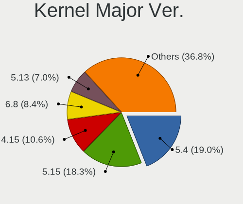

| Version | Desktops | Percent |
|---------|----------|---------|
| 5.4     | 108      | 22.93%  |
| 5.15    | 92       | 19.53%  |
| 4.15    | 62       | 13.16%  |
| 5.13    | 41       | 8.7%    |
| 5.8     | 37       | 7.86%   |
| 5.11    | 31       | 6.58%   |
| 5.19    | 26       | 5.52%   |
| 6.2     | 21       | 4.46%   |
| 5.3     | 21       | 4.46%   |
| 5.0     | 5        | 1.06%   |
| 6.1     | 4        | 0.85%   |
| 4.4     | 4        | 0.85%   |
| 4.18    | 4        | 0.85%   |
| 6.5     | 3        | 0.64%   |
| 6.0     | 3        | 0.64%   |
| 5.6     | 2        | 0.42%   |
| 4.8     | 2        | 0.42%   |
| 6.3     | 1        | 0.21%   |
| 5.16    | 1        | 0.21%   |
| 5.14    | 1        | 0.21%   |
| 5.12    | 1        | 0.21%   |
| 4.10    | 1        | 0.21%   |

Arch
----

OS architecture (x86_64, i586, etc.)

| Name   | Desktops | Percent |
|--------|----------|---------|
| x86_64 | 413      | 91.17%  |
| i686   | 39       | 8.61%   |
| ppc64  | 1        | 0.22%   |

DE
--

Desktop Environment

| Name            | Desktops | Percent |
|-----------------|----------|---------|
| LXQt            | 342      | 75%     |
| LXDE            | 88       | 19.3%   |
| GNOME           | 10       | 2.19%   |
| Unknown         | 7        | 1.54%   |
| XFCE            | 2        | 0.44%   |
| Openbox         | 2        | 0.44%   |
| X-Cinnamon      | 1        | 0.22%   |
| Lubuntu         | 1        | 0.22%   |
| KDE5            | 1        | 0.22%   |
| i3              | 1        | 0.22%   |
| GNOME Flashback | 1        | 0.22%   |

Display Server
--------------

X11 or Wayland

| Name        | Desktops | Percent |
|-------------|----------|---------|
| X11         | 437      | 95.41%  |
| Tty         | 15       | 3.28%   |
| Wayland     | 3        | 0.66%   |
| Unknown     | 2        | 0.44%   |
| Unspecified | 1        | 0.22%   |

Display Manager
---------------

SDDM, LightDM, etc.

| Name    | Desktops | Percent |
|---------|----------|---------|
| SDDM    | 232      | 50.43%  |
| Unknown | 133      | 28.91%  |
| LightDM | 51       | 11.09%  |
| TDM     | 24       | 5.22%   |
| GDM     | 12       | 2.61%   |
| GDM3    | 3        | 0.65%   |
| XDM     | 2        | 0.43%   |
| LXDM    | 2        | 0.43%   |
| SLiM    | 1        | 0.22%   |

OS Lang
-------

Language

| Lang    | Desktops | Percent |
|---------|----------|---------|
| en_US   | 120      | 26.32%  |
| fr_FR   | 53       | 11.62%  |
| de_DE   | 36       | 7.89%   |
| pt_BR   | 29       | 6.36%   |
| it_IT   | 27       | 5.92%   |
| en_GB   | 24       | 5.26%   |
| C       | 21       | 4.61%   |
| ru_RU   | 15       | 3.29%   |
| Unknown | 13       | 2.85%   |
| es_ES   | 11       | 2.41%   |
| en_CA   | 11       | 2.41%   |
| es_AR   | 10       | 2.19%   |
| en_AU   | 8        | 1.75%   |
| pl_PL   | 5        | 1.1%    |
| hu_HU   | 5        | 1.1%    |
| fi_FI   | 5        | 1.1%    |
| cs_CZ   | 5        | 1.1%    |
| nl_NL   | 4        | 0.88%   |
| ja_JP   | 4        | 0.88%   |
| es_MX   | 4        | 0.88%   |
| tr_TR   | 3        | 0.66%   |
| es_PE   | 3        | 0.66%   |
| en_IN   | 3        | 0.66%   |
| el_GR   | 3        | 0.66%   |
| zh_TW   | 2        | 0.44%   |
| sv_SE   | 2        | 0.44%   |
| pt_PT   | 2        | 0.44%   |
| fr_CA   | 2        | 0.44%   |
| es_UY   | 2        | 0.44%   |
| es_CR   | 2        | 0.44%   |
| es_CO   | 2        | 0.44%   |
| en_ZA   | 2        | 0.44%   |
| de_CH   | 2        | 0.44%   |
| bg_BG   | 2        | 0.44%   |
| ru_UA   | 1        | 0.22%   |
| nl_BE   | 1        | 0.22%   |
| lt_LT   | 1        | 0.22%   |
| hr_HR   | 1        | 0.22%   |
| es_GT   | 1        | 0.22%   |
| es_EC   | 1        | 0.22%   |

Boot Mode
---------

EFI or BIOS

| Mode | Desktops | Percent |
|------|----------|---------|
| BIOS | 330      | 72.69%  |
| EFI  | 124      | 27.31%  |

Filesystem
----------

Type of filesystem

| Type    | Desktops | Percent |
|---------|----------|---------|
| Ext4    | 407      | 89.45%  |
| Overlay | 21       | 4.62%   |
| Tmpfs   | 12       | 2.64%   |
| Btrfs   | 5        | 1.1%    |
| Xfs     | 4        | 0.88%   |
| Unknown | 2        | 0.44%   |
| Zfs     | 1        | 0.22%   |
| XXX4    | 1        | 0.22%   |
| F2fs    | 1        | 0.22%   |
| Ext3    | 1        | 0.22%   |

Part. scheme
------------

Scheme of partitioning

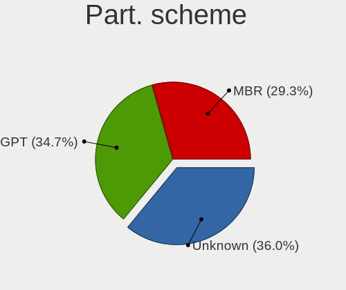

| Type    | Desktops | Percent |
|---------|----------|---------|
| Unknown | 187      | 40.92%  |
| GPT     | 137      | 29.98%  |
| MBR     | 133      | 29.1%   |

Dual Boot with Linux/BSD
------------------------

Hosting more than one Linux/BSD

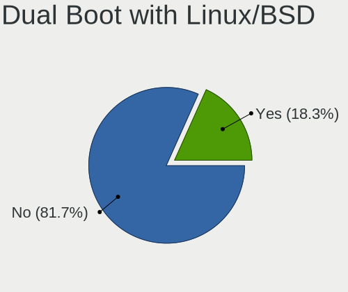

| Dual boot | Desktops | Percent |
|-----------|----------|---------|
| No        | 378      | 82.71%  |
| Yes       | 79       | 17.29%  |

Dual Boot (Win)
---------------

Hosting Linux and Windows

| Dual boot | Desktops | Percent |
|-----------|----------|---------|
| No        | 304      | 66.81%  |
| Yes       | 151      | 33.19%  |

Board
-----

Vendor
------

Motherboard manufacturer

| Name                | Desktops | Percent |
|---------------------|----------|---------|
| ASUSTek Computer    | 86       | 18.98%  |
| Gigabyte Technology | 50       | 11.04%  |
| MSI                 | 44       | 9.71%   |
| Hewlett-Packard     | 41       | 9.05%   |
| Dell                | 41       | 9.05%   |
| ASRock              | 41       | 9.05%   |
| Intel               | 25       | 5.52%   |
| Lenovo              | 17       | 3.75%   |
| Acer                | 15       | 3.31%   |
| Unknown             | 15       | 3.31%   |
| Pegatron            | 11       | 2.43%   |
| Foxconn             | 9        | 1.99%   |
| AAEON               | 6        | 1.32%   |
| Biostar             | 5        | 1.1%    |
| AMI                 | 5        | 1.1%    |
| Positivo            | 4        | 0.88%   |
| Fujitsu             | 3        | 0.66%   |
| eMachines           | 3        | 0.66%   |
| PCWare              | 2        | 0.44%   |
| PCChips             | 2        | 0.44%   |
| IBM                 | 2        | 0.44%   |
| Fujitsu Siemens     | 2        | 0.44%   |
| ECS                 | 2        | 0.44%   |
| Apple               | 2        | 0.44%   |
| ZOTAC               | 1        | 0.22%   |
| YANYU               | 1        | 0.22%   |
| XFX                 | 1        | 0.22%   |
| VIA Technologies    | 1        | 0.22%   |
| Shuttle             | 1        | 0.22%   |
| Seeed Studio        | 1        | 0.22%   |
| Qbex                | 1        | 0.22%   |
| Philco              | 1        | 0.22%   |
| PELADN              | 1        | 0.22%   |
| Packard Bell        | 1        | 0.22%   |
| NEC Computers       | 1        | 0.22%   |
| Medion              | 1        | 0.22%   |
| Inventec            | 1        | 0.22%   |
| IceWhale Technology | 1        | 0.22%   |
| Huanan              | 1        | 0.22%   |
| Hardkernel          | 1        | 0.22%   |

Model
-----

Motherboard model

| Name                                 | Desktops | Percent |
|--------------------------------------|----------|---------|
| Unknown                              | 15       | 3.31%   |
| AAEON MF-001                         | 6        | 1.32%   |
| MSI MS-7C37                          | 4        | 0.88%   |
| HP t620 Quad Core TC                 | 4        | 0.88%   |
| Dell OptiPlex 7010                   | 4        | 0.88%   |
| Dell OptiPlex 790                    | 3        | 0.66%   |
| Dell OptiPlex 755                    | 3        | 0.66%   |
| ASUS V-P8H67E                        | 3        | 0.66%   |
| ASUS All Series                      | 3        | 0.66%   |
| ASRock FM2A85X Extreme6              | 3        | 0.66%   |
| Pegatron NC689AA-ABA s3700y          | 2        | 0.44%   |
| Pegatron Compaq dx2400 Microtower PC | 2        | 0.44%   |
| MSI MS-7C56                          | 2        | 0.44%   |
| MSI MS-7B89                          | 2        | 0.44%   |
| MSI MS-7B86                          | 2        | 0.44%   |
| MSI MS-7721                          | 2        | 0.44%   |
| MSI MS-7309                          | 2        | 0.44%   |
| HP t620 Dual Core TC                 | 2        | 0.44%   |
| HP Compaq dc7800 Small Form Factor   | 2        | 0.44%   |
| HP Compaq 6000 Pro SFF PC            | 2        | 0.44%   |
| Gigabyte H81M-DS2                    | 2        | 0.44%   |
| Gigabyte G31M-ES2C                   | 2        | 0.44%   |
| Dell OptiPlex 3050                   | 2        | 0.44%   |
| Dell DM061                           | 2        | 0.44%   |
| Dell Dimension 9100                  | 2        | 0.44%   |
| ASUS TUF Gaming X570-PLUS            | 2        | 0.44%   |
| ASUS PRIME H410M-E                   | 2        | 0.44%   |
| ASUS P5QD TURBO                      | 2        | 0.44%   |
| ASUS M5A97 R2.0                      | 2        | 0.44%   |
| ASRock N68-VS3 UCC                   | 2        | 0.44%   |
| ASRock G41M-VS3                      | 2        | 0.44%   |
| ASRock G31M-S                        | 2        | 0.44%   |
| ASRock 775Dual-VSTA                  | 2        | 0.44%   |
| AMI Z83-V                            | 2        | 0.44%   |
| ZOTAC NM10                           | 1        | 0.22%   |
| YANYU ITX-S192                       | 1        | 0.22%   |
| XFX MI-9300-7AS9                     | 1        | 0.22%   |
| VIA P4X266-8233                      | 1        | 0.22%   |
| Shuttle XS35V3                       | 1        | 0.22%   |
| Seeed Studio ODYSSEY-X86J4125        | 1        | 0.22%   |

Model Family
------------

Motherboard model prefix

| Name                 | Desktops | Percent |
|----------------------|----------|---------|
| Dell OptiPlex        | 21       | 4.64%   |
| HP Compaq            | 20       | 4.42%   |
| Unknown              | 15       | 3.31%   |
| Lenovo ThinkCentre   | 13       | 2.87%   |
| Acer Aspire          | 11       | 2.43%   |
| ASUS PRIME           | 8        | 1.77%   |
| HP t620              | 6        | 1.32%   |
| AAEON MF-001         | 6        | 1.32%   |
| MSI MS-7C37          | 4        | 0.88%   |
| Dell Vostro          | 4        | 0.88%   |
| Dell Precision       | 4        | 0.88%   |
| Dell Dimension       | 4        | 0.88%   |
| ASUS ROG             | 4        | 0.88%   |
| ASUS M5A97           | 4        | 0.88%   |
| Dell Inspiron        | 3        | 0.66%   |
| ASUS V-P8H67E        | 3        | 0.66%   |
| ASUS TUF             | 3        | 0.66%   |
| ASUS All             | 3        | 0.66%   |
| ASRock FM2A85X       | 3        | 0.66%   |
| Pegatron NC689AA-ABA | 2        | 0.44%   |
| Pegatron Compaq      | 2        | 0.44%   |
| MSI MS-7C56          | 2        | 0.44%   |
| MSI MS-7B89          | 2        | 0.44%   |
| MSI MS-7B86          | 2        | 0.44%   |
| MSI MS-7721          | 2        | 0.44%   |
| MSI MS-7309          | 2        | 0.44%   |
| Intel X79            | 2        | 0.44%   |
| Intel DG31PR         | 2        | 0.44%   |
| HP EliteDesk         | 2        | 0.44%   |
| HP dc5000            | 2        | 0.44%   |
| Gigabyte H81M-DS2    | 2        | 0.44%   |
| Gigabyte G31M-ES2C   | 2        | 0.44%   |
| Gigabyte B450M       | 2        | 0.44%   |
| Dell Studio          | 2        | 0.44%   |
| Dell DM061           | 2        | 0.44%   |
| ASUS P8P67           | 2        | 0.44%   |
| ASUS P5QD            | 2        | 0.44%   |
| ASUS P5G41T-M        | 2        | 0.44%   |
| ASRock N68-VS3       | 2        | 0.44%   |
| ASRock G41M-VS3      | 2        | 0.44%   |

MFG Year
--------

Motherboard manufacture year

| Year    | Desktops | Percent |
|---------|----------|---------|
| 2011    | 38       | 8.39%   |
| 2008    | 38       | 8.39%   |
| 2012    | 37       | 8.17%   |
| 2009    | 37       | 8.17%   |
| 2007    | 35       | 7.73%   |
| 2010    | 34       | 7.51%   |
| 2013    | 30       | 6.62%   |
| 2017    | 26       | 5.74%   |
| 2014    | 25       | 5.52%   |
| 2006    | 25       | 5.52%   |
| 2020    | 24       | 5.3%    |
| 2019    | 18       | 3.97%   |
| 2015    | 17       | 3.75%   |
| 2018    | 15       | 3.31%   |
| 2021    | 14       | 3.09%   |
| 2005    | 13       | 2.87%   |
| 2016    | 9        | 1.99%   |
| 2022    | 5        | 1.1%    |
| 2004    | 5        | 1.1%    |
| 2001    | 2        | 0.44%   |
| Unknown | 2        | 0.44%   |
| 2023    | 1        | 0.22%   |
| 2003    | 1        | 0.22%   |
| 2002    | 1        | 0.22%   |
| 2000    | 1        | 0.22%   |

Form Factor
-----------

Physical design of the computer

| Name    | Desktops | Percent |
|---------|----------|---------|
| Desktop | 453      | 100%    |

Secure Boot
-----------

Enabled or disabled

| State    | Desktops | Percent |
|----------|----------|---------|
| Disabled | 443      | 97.79%  |
| Enabled  | 10       | 2.21%   |

Coreboot
--------

Have coreboot on board

| Used | Desktops | Percent |
|------|----------|---------|
| No   | 453      | 100%    |

RAM Size
--------

Total RAM memory

| Size in GB      | Desktops | Percent |
|-----------------|----------|---------|
| 3.01-4.0        | 112      | 24.19%  |
| 4.01-8.0        | 81       | 17.49%  |
| 8.01-16.0       | 67       | 14.47%  |
| 1.01-2.0        | 64       | 13.82%  |
| 16.01-24.0      | 57       | 12.31%  |
| 32.01-64.0      | 31       | 6.7%    |
| 2.01-3.0        | 17       | 3.67%   |
| 0.51-1.0        | 14       | 3.02%   |
| 64.01-256.0     | 8        | 1.73%   |
| 24.01-32.0      | 6        | 1.3%    |
| 0.01-0.5        | 5        | 1.08%   |
| More than 256.0 | 1        | 0.22%   |

RAM Used
--------

Used RAM memory

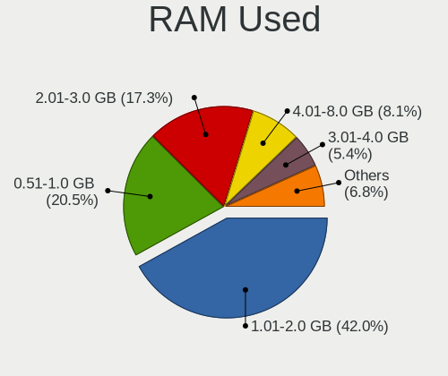

| Used GB    | Desktops | Percent |
|------------|----------|---------|
| 1.01-2.0   | 207      | 42.86%  |
| 0.51-1.0   | 107      | 22.15%  |
| 2.01-3.0   | 79       | 16.36%  |
| 4.01-8.0   | 41       | 8.49%   |
| 0.01-0.5   | 23       | 4.76%   |
| 3.01-4.0   | 16       | 3.31%   |
| 8.01-16.0  | 8        | 1.66%   |
| 32.01-64.0 | 1        | 0.21%   |
| 16.01-24.0 | 1        | 0.21%   |

Total Drives
------------

Number of drives on board

| Drives | Desktops | Percent |
|--------|----------|---------|
| 1      | 243      | 53.29%  |
| 2      | 123      | 26.97%  |
| 3      | 33       | 7.24%   |
| 4      | 25       | 5.48%   |
| 5      | 15       | 3.29%   |
| 0      | 5        | 1.1%    |
| 6      | 4        | 0.88%   |
| 8      | 2        | 0.44%   |
| 7      | 2        | 0.44%   |
| 17     | 1        | 0.22%   |
| 14     | 1        | 0.22%   |
| 12     | 1        | 0.22%   |
| 10     | 1        | 0.22%   |

Has CD-ROM
----------

Has CD-ROM on board

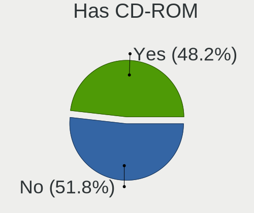

| Presented | Desktops | Percent |
|-----------|----------|---------|
| No        | 234      | 51.2%   |
| Yes       | 223      | 48.8%   |

Has Ethernet
------------

Has Ethernet on board

| Presented | Desktops | Percent |
|-----------|----------|---------|
| Yes       | 445      | 98.23%  |
| No        | 8        | 1.77%   |

Has WiFi
--------

Has WiFi module

| Presented | Desktops | Percent |
|-----------|----------|---------|
| No        | 276      | 60.53%  |
| Yes       | 180      | 39.47%  |

Has Bluetooth
-------------

Has Bluetooth module

| Presented | Desktops | Percent |
|-----------|----------|---------|
| No        | 375      | 82.06%  |
| Yes       | 82       | 17.94%  |

Location
--------

Country
-------

Geographic location (country)

| Country      | Desktops | Percent |
|--------------|----------|---------|
| USA          | 72       | 15.82%  |
| France       | 53       | 11.65%  |
| Germany      | 40       | 8.79%   |
| Brazil       | 36       | 7.91%   |
| Italy        | 30       | 6.59%   |
| Russia       | 19       | 4.18%   |
| Canada       | 15       | 3.3%    |
| UK           | 14       | 3.08%   |
| Spain        | 14       | 3.08%   |
| Argentina    | 11       | 2.42%   |
| Poland       | 9        | 1.98%   |
| Netherlands  | 9        | 1.98%   |
| Finland      | 9        | 1.98%   |
| Hungary      | 8        | 1.76%   |
| Australia    | 8        | 1.76%   |
| Switzerland  | 7        | 1.54%   |
| Czechia      | 6        | 1.32%   |
| India        | 5        | 1.1%    |
| Greece       | 5        | 1.1%    |
| Turkey       | 4        | 0.88%   |
| Mexico       | 4        | 0.88%   |
| Japan        | 4        | 0.88%   |
| Bulgaria     | 4        | 0.88%   |
| Belgium      | 4        | 0.88%   |
| Sweden       | 3        | 0.66%   |
| South Africa | 3        | 0.66%   |
| Peru         | 3        | 0.66%   |
| Malaysia     | 3        | 0.66%   |
| Iran         | 3        | 0.66%   |
| Indonesia    | 3        | 0.66%   |
| Colombia     | 3        | 0.66%   |
| Uruguay      | 2        | 0.44%   |
| Taiwan       | 2        | 0.44%   |
| Slovakia     | 2        | 0.44%   |
| Romania      | 2        | 0.44%   |
| Puerto Rico  | 2        | 0.44%   |
| New Zealand  | 2        | 0.44%   |
| Luxembourg   | 2        | 0.44%   |
| Ireland      | 2        | 0.44%   |
| Denmark      | 2        | 0.44%   |

City
----

Geographic location (city)

| City              | Desktops | Percent |
|-------------------|----------|---------|
| Sao Paulo         | 5        | 1.06%   |
| Rome              | 5        | 1.06%   |
| Milan             | 5        | 1.06%   |
| Melbourne         | 5        | 1.06%   |
| Lyon              | 5        | 1.06%   |
| Paris             | 4        | 0.85%   |
| Oshawa            | 4        | 0.85%   |
| Zurich            | 3        | 0.64%   |
| Wellington        | 3        | 0.64%   |
| Voronezh          | 3        | 0.64%   |
| Tampere           | 3        | 0.64%   |
| Rio de Janeiro    | 3        | 0.64%   |
| Prague            | 3        | 0.64%   |
| Nederland         | 3        | 0.64%   |
| Kuala Lumpur      | 3        | 0.64%   |
| Athens            | 3        | 0.64%   |
| Warsaw            | 2        | 0.42%   |
| Valencia          | 2        | 0.42%   |
| Toulouse          | 2        | 0.42%   |
| Toronto           | 2        | 0.42%   |
| Tehran            | 2        | 0.42%   |
| St Petersburg     | 2        | 0.42%   |
| Raahe             | 2        | 0.42%   |
| Pcs             | 2        | 0.42%   |
| Novo Gama         | 2        | 0.42%   |
| Nitra             | 2        | 0.42%   |
| New York          | 2        | 0.42%   |
| Moscow            | 2        | 0.42%   |
| Mobile            | 2        | 0.42%   |
| Mason             | 2        | 0.42%   |
| Marseille         | 2        | 0.42%   |
| Madrid            | 2        | 0.42%   |
| Luxembourg        | 2        | 0.42%   |
| Largo             | 2        | 0.42%   |
| Karlstad          | 2        | 0.42%   |
| Istanbul          | 2        | 0.42%   |
| Heredia           | 2        | 0.42%   |
| Helsinki          | 2        | 0.42%   |
| Hamburg           | 2        | 0.42%   |
| Frankfurt am Main | 2        | 0.42%   |

Drives
------

Drive Vendor
------------

Hard drive vendors

| Vendor                       | Desktops | Drives | Percent |
|------------------------------|----------|--------|---------|
| Seagate                      | 158      | 219    | 22.38%  |
| WDC                          | 145      | 213    | 20.54%  |
| Samsung Electronics          | 79       | 126    | 11.19%  |
| Hitachi                      | 41       | 52     | 5.81%   |
| Kingston                     | 38       | 46     | 5.38%   |
| Toshiba                      | 27       | 29     | 3.82%   |
| SanDisk                      | 23       | 24     | 3.26%   |
| Crucial                      | 22       | 36     | 3.12%   |
| Unknown                      | 19       | 22     | 2.69%   |
| Maxtor                       | 19       | 21     | 2.69%   |
| A-DATA Technology            | 10       | 12     | 1.42%   |
| HGST                         | 8        | 10     | 1.13%   |
| China                        | 7        | 7      | 0.99%   |
| Intel                        | 6        | 6      | 0.85%   |
| PNY                          | 5        | 5      | 0.71%   |
| Intenso                      | 5        | 5      | 0.71%   |
| Team                         | 4        | 4      | 0.57%   |
| Micron Technology            | 4        | 4      | 0.57%   |
| Corsair                      | 4        | 4      | 0.57%   |
| TO Exter                     | 3        | 3      | 0.42%   |
| SPCC                         | 3        | 5      | 0.42%   |
| Silicon Motion               | 3        | 4      | 0.42%   |
| Lexar                        | 3        | 3      | 0.42%   |
| Hewlett-Packard              | 3        | 8      | 0.42%   |
| GOODRAM                      | 3        | 3      | 0.42%   |
| WD MediaMax                  | 2        | 2      | 0.28%   |
| Transcend                    | 2        | 3      | 0.28%   |
| Shenzhen Longsys Electronics | 2        | 2      | 0.28%   |
| Plextor                      | 2        | 4      | 0.28%   |
| Patriot                      | 2        | 2      | 0.28%   |
| ORTIAL                       | 2        | 2      | 0.28%   |
| OCZ                          | 2        | 2      | 0.28%   |
| Londisk                      | 2        | 2      | 0.28%   |
| LITEONIT                     | 2        | 2      | 0.28%   |
| LDLC                         | 2        | 2      | 0.28%   |
| Kingston Technology Company  | 2        | 2      | 0.28%   |
| JMicron Technology           | 2        | 2      | 0.28%   |
| Fujitsu                      | 2        | 2      | 0.28%   |
| External                     | 2        | 2      | 0.28%   |
| BR                           | 2        | 2      | 0.28%   |

Drive Model
-----------

Hard drive models

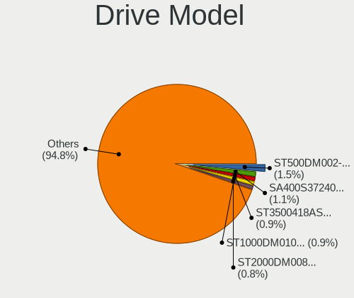

| Model                               | Desktops | Percent |
|-------------------------------------|----------|---------|
| Seagate ST500DM002-1BD142 500GB     | 13       | 1.63%   |
| Kingston SA400S37240G 240GB SSD     | 10       | 1.25%   |
| Seagate ST2000DM008-2FR102 2TB      | 7        | 0.88%   |
| Seagate ST1000DM010-2EP102 1TB      | 7        | 0.88%   |
| Seagate ST3500418AS 500GB           | 6        | 0.75%   |
| Kingston SA400S37120G 120GB SSD     | 6        | 0.75%   |
| WDC WDS120G2G0A-00JH30 120GB SSD    | 5        | 0.63%   |
| Unknown M52516  16GB                | 5        | 0.63%   |
| Seagate ST3250310AS 250GB           | 5        | 0.63%   |
| Samsung SSD 850 EVO 500GB           | 5        | 0.63%   |
| Samsung HD103SJ 1TB                 | 5        | 0.63%   |
| Crucial CT1000BX500SSD1 1TB         | 5        | 0.63%   |
| Seagate ST3500312CS 500GB           | 4        | 0.5%    |
| Seagate ST31000528AS 1TB            | 4        | 0.5%    |
| Seagate ST2000DM001-1CH164 2TB      | 4        | 0.5%    |
| Seagate ST1000LM024 HN-M101MBB 1TB  | 4        | 0.5%    |
| Seagate ST1000DM003-1CH162 1TB      | 4        | 0.5%    |
| Samsung SSD 850 EVO 250GB           | 4        | 0.5%    |
| Samsung HD502IJ 500GB               | 4        | 0.5%    |
| Samsung HD161HJ 160GB               | 4        | 0.5%    |
| Kingston SA400S37480G 480GB SSD     | 4        | 0.5%    |
| WDC WD5000AAKX-60U6AA0 500GB        | 3        | 0.38%   |
| WDC WD40EFRX-68WT0N0 4TB            | 3        | 0.38%   |
| WDC WD20EFRX-68EUZN0 2TB            | 3        | 0.38%   |
| WDC WD10EZEX-60WN4A0 1TB            | 3        | 0.38%   |
| WDC WD10EZEX-08WN4A0 1TB            | 3        | 0.38%   |
| Toshiba DT01ACA050 500GB            | 3        | 0.38%   |
| TO Exter nal USB 3.0 480GB          | 3        | 0.38%   |
| Seagate ST500LM012 HN-M500MBB 500GB | 3        | 0.38%   |
| Seagate ST4000DM004-2CV104 4TB      | 3        | 0.38%   |
| Seagate ST380013AS 80GB             | 3        | 0.38%   |
| Seagate ST3360320AS 360GB           | 3        | 0.38%   |
| Seagate ST3250410AS 250GB           | 3        | 0.38%   |
| Seagate ST3160318AS 160GB           | 3        | 0.38%   |
| Seagate ST2000DM001-1ER164 2TB      | 3        | 0.38%   |
| Seagate ST1000DM003-9YN162 1TB      | 3        | 0.38%   |
| Seagate ST1000DM003-1ER162 1TB      | 3        | 0.38%   |
| Seagate Expansion 2TB               | 3        | 0.38%   |
| SanDisk SDSSDP128G 128GB            | 3        | 0.38%   |
| Samsung SSD 980 PRO 2TB             | 3        | 0.38%   |

HDD Vendor
----------

Hard disk drive vendors

| Vendor              | Desktops | Drives | Percent |
|---------------------|----------|--------|---------|
| Seagate             | 157      | 217    | 36.34%  |
| WDC                 | 133      | 191    | 30.79%  |
| Hitachi             | 41       | 52     | 9.49%   |
| Samsung Electronics | 36       | 47     | 8.33%   |
| Toshiba             | 23       | 25     | 5.32%   |
| Maxtor              | 18       | 20     | 4.17%   |
| HGST                | 8        | 10     | 1.85%   |
| TO Exter            | 3        | 3      | 0.69%   |
| WD MediaMax         | 2        | 2      | 0.46%   |
| Unknown             | 2        | 2      | 0.46%   |
| Hewlett-Packard     | 2        | 2      | 0.46%   |
| Fujitsu             | 2        | 2      | 0.46%   |
| External            | 2        | 2      | 0.46%   |
| RSH-319             | 1        | 1      | 0.23%   |
| Apricorn            | 1        | 1      | 0.23%   |
| Apple               | 1        | 1      | 0.23%   |

SSD Vendor
----------

Solid state drive vendors

| Vendor              | Desktops | Drives | Percent |
|---------------------|----------|--------|---------|
| Samsung Electronics | 34       | 51     | 15.96%  |
| Kingston            | 34       | 42     | 15.96%  |
| SanDisk             | 19       | 20     | 8.92%   |
| Crucial             | 17       | 31     | 7.98%   |
| WDC                 | 15       | 18     | 7.04%   |
| A-DATA Technology   | 8        | 10     | 3.76%   |
| China               | 7        | 7      | 3.29%   |
| PNY                 | 5        | 5      | 2.35%   |
| Intenso             | 5        | 5      | 2.35%   |
| Intel               | 5        | 5      | 2.35%   |
| Toshiba             | 4        | 4      | 1.88%   |
| Team                | 4        | 4      | 1.88%   |
| Micron Technology   | 4        | 4      | 1.88%   |
| Corsair             | 4        | 4      | 1.88%   |
| Lexar               | 3        | 3      | 1.41%   |
| GOODRAM             | 3        | 3      | 1.41%   |
| Transcend           | 2        | 3      | 0.94%   |
| Plextor             | 2        | 4      | 0.94%   |
| Patriot             | 2        | 2      | 0.94%   |
| ORTIAL              | 2        | 2      | 0.94%   |
| OCZ                 | 2        | 2      | 0.94%   |
| Londisk             | 2        | 2      | 0.94%   |
| LITEONIT            | 2        | 2      | 0.94%   |
| Apacer              | 2        | 2      | 0.94%   |
| Verbatim            | 1        | 1      | 0.47%   |
| Unknown             | 1        | 1      | 0.47%   |
| TSA                 | 1        | 1      | 0.47%   |
| SPCC                | 1        | 1      | 0.47%   |
| Smartbuy            | 1        | 1      | 0.47%   |
| PNY USB             | 1        | 1      | 0.47%   |
| Mushkin             | 1        | 1      | 0.47%   |
| Maxtor              | 1        | 1      | 0.47%   |
| Leven               | 1        | 2      | 0.47%   |
| LDLC                | 1        | 1      | 0.47%   |
| Kston               | 1        | 4      | 0.47%   |
| KLEVV               | 1        | 1      | 0.47%   |
| KINGBANK            | 1        | 2      | 0.47%   |
| KimMiDi             | 1        | 1      | 0.47%   |
| JMicron Technology  | 1        | 1      | 0.47%   |
| HS-SSD-E100         | 1        | 1      | 0.47%   |

Drive Kind
----------

HDD or SSD

| Kind    | Desktops | Drives | Percent |
|---------|----------|--------|---------|
| HDD     | 325      | 578    | 55.75%  |
| SSD     | 193      | 271    | 33.1%   |
| NVMe    | 39       | 64     | 6.69%   |
| MMC     | 19       | 21     | 3.26%   |
| Unknown | 7        | 11     | 1.2%    |

Drive Connector
---------------

SATA, SAS, NVMe, etc.

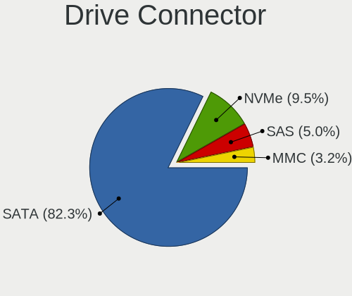

| Type | Desktops | Drives | Percent |
|------|----------|--------|---------|
| SATA | 420      | 828    | 84%     |
| NVMe | 39       | 64     | 7.8%    |
| SAS  | 22       | 32     | 4.4%    |
| MMC  | 19       | 21     | 3.8%    |

Drive Size
----------

Size of hard drive

| Size in TB | Desktops | Drives | Percent |
|------------|----------|--------|---------|
| 0.01-0.5   | 353      | 538    | 63.6%   |
| 0.51-1.0   | 112      | 168    | 20.18%  |
| 1.01-2.0   | 51       | 76     | 9.19%   |
| 3.01-4.0   | 18       | 39     | 3.24%   |
| 2.01-3.0   | 11       | 14     | 1.98%   |
| 4.01-10.0  | 10       | 14     | 1.8%    |

Space Total
-----------

Amount of disk space available on the file system

| Size in GB     | Desktops | Percent |
|----------------|----------|---------|
| 101-250        | 136      | 29.44%  |
| 251-500        | 90       | 19.48%  |
| 501-1000       | 47       | 10.17%  |
| 1001-2000      | 39       | 8.44%   |
| 51-100         | 39       | 8.44%   |
| More than 3000 | 34       | 7.36%   |
| 21-50          | 28       | 6.06%   |
| 1-20           | 26       | 5.63%   |
| 2001-3000      | 20       | 4.33%   |
| Unknown        | 3        | 0.65%   |

Space Used
----------

Amount of used disk space

| Used GB        | Desktops | Percent |
|----------------|----------|---------|
| 1-20           | 203      | 42.65%  |
| 21-50          | 82       | 17.23%  |
| 101-250        | 53       | 11.13%  |
| 51-100         | 35       | 7.35%   |
| 251-500        | 28       | 5.88%   |
| 501-1000       | 26       | 5.46%   |
| 1001-2000      | 22       | 4.62%   |
| More than 3000 | 17       | 3.57%   |
| 2001-3000      | 7        | 1.47%   |
| Unknown        | 3        | 0.63%   |

Malfunc. Drives
---------------

Drive models with a malfunction

| Model                              | Desktops | Drives | Percent |
|------------------------------------|----------|--------|---------|
| Seagate ST1000DM003-9YN162 1TB     | 3        | 3      | 3.7%    |
| WDC WD40EFRX-68WT0N0 4TB           | 2        | 3      | 2.47%   |
| Seagate ST500DM002-1BD142 500GB    | 2        | 2      | 2.47%   |
| Seagate ST1000LM024 HN-M101MBB 1TB | 2        | 3      | 2.47%   |
| Samsung Electronics HD502IJ 500GB  | 2        | 2      | 2.47%   |
| WDC WDS240G2G0A-00JH30 240GB SSD   | 1        | 1      | 1.23%   |
| WDC WD60EFRX-68L0BN1 6TB           | 1        | 2      | 1.23%   |
| WDC WD5000AAKX-003CA0 500GB        | 1        | 1      | 1.23%   |
| WDC WD5000AAKX-001CA0 500GB        | 1        | 1      | 1.23%   |
| WDC WD400EB-00CPF0 40GB            | 1        | 1      | 1.23%   |
| WDC WD400BB-75CAA0 40GB            | 1        | 1      | 1.23%   |
| WDC WD3200AACS-00M6B0 320GB        | 1        | 1      | 1.23%   |
| WDC WD2500HHTZ-04N21V0 250GB       | 1        | 1      | 1.23%   |
| WDC WD2500AAJS-75M0A0 250GB        | 1        | 1      | 1.23%   |
| WDC WD20EFRX-68EUZN0 2TB           | 1        | 1      | 1.23%   |
| WDC WD2003FYYS-02W0B0 2TB          | 1        | 1      | 1.23%   |
| WDC WD1600AAJS-60B4A0 160GB        | 1        | 2      | 1.23%   |
| WDC WD10SPZX-08Z10 1TB             | 1        | 1      | 1.23%   |
| WDC WD10EZEX-60WN4A1 1TB           | 1        | 1      | 1.23%   |
| WDC WD10EZEX-60WN4A0 1TB           | 1        | 1      | 1.23%   |
| WDC WD10EADS-65M2B0 1TB            | 1        | 1      | 1.23%   |
| WDC WD10EACS-00D6B1 1TB            | 1        | 1      | 1.23%   |
| WDC WD1003FBYX-01Y7B0 1TB          | 1        | 2      | 1.23%   |
| WDC WD1002FAEX-00Z3A0 1TB          | 1        | 1      | 1.23%   |
| Toshiba MK6465GSX 640GB            | 1        | 1      | 1.23%   |
| Toshiba HDWE140 4TB                | 1        | 1      | 1.23%   |
| Toshiba DT01ACA050 500GB           | 1        | 1      | 1.23%   |
| Seagate ST9500420AS 500GB          | 1        | 1      | 1.23%   |
| Seagate ST9500325AS 500GB          | 1        | 1      | 1.23%   |
| Seagate ST9250315AS 250GB          | 1        | 1      | 1.23%   |
| Seagate ST9160310AS 160GB          | 1        | 1      | 1.23%   |
| Seagate ST4000DM004-2CV104 4TB     | 1        | 1      | 1.23%   |
| Seagate ST380815AS 80GB            | 1        | 1      | 1.23%   |
| Seagate ST380011A 80GB             | 1        | 1      | 1.23%   |
| Seagate ST360012A 64GB             | 1        | 1      | 1.23%   |
| Seagate ST3500413AS 500GB          | 1        | 1      | 1.23%   |
| Seagate ST3360320AS 360GB          | 1        | 1      | 1.23%   |
| Seagate ST3250310AS 250GB          | 1        | 1      | 1.23%   |
| Seagate ST3200822AS 200GB          | 1        | 1      | 1.23%   |
| Seagate ST3160812AS 160GB          | 1        | 1      | 1.23%   |

Malfunc. Drive Vendor
---------------------

Vendors of faulty drives

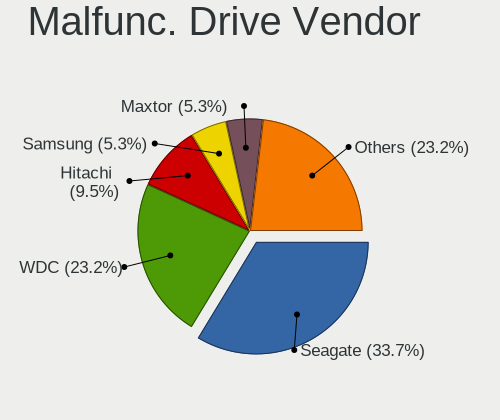

| Vendor              | Desktops | Drives | Percent |
|---------------------|----------|--------|---------|
| Seagate             | 24       | 27     | 31.58%  |
| WDC                 | 19       | 25     | 25%     |
| Hitachi             | 7        | 8      | 9.21%   |
| Samsung Electronics | 5        | 5      | 6.58%   |
| Maxtor              | 5        | 5      | 6.58%   |
| Kingston            | 4        | 4      | 5.26%   |
| Toshiba             | 3        | 3      | 3.95%   |
| SanDisk             | 1        | 1      | 1.32%   |
| ORTIAL              | 1        | 1      | 1.32%   |
| Mushkin             | 1        | 1      | 1.32%   |
| LDLC                | 1        | 1      | 1.32%   |
| Intel               | 1        | 1      | 1.32%   |
| Fujitsu             | 1        | 1      | 1.32%   |
| Apple               | 1        | 1      | 1.32%   |
| Apacer              | 1        | 1      | 1.32%   |
| A-DATA Technology   | 1        | 1      | 1.32%   |

Malfunc. HDD Vendor
-------------------

Vendors of faulty HDD drives

| Vendor              | Desktops | Drives | Percent |
|---------------------|----------|--------|---------|
| Seagate             | 24       | 27     | 38.1%   |
| WDC                 | 18       | 24     | 28.57%  |
| Hitachi             | 7        | 8      | 11.11%  |
| Maxtor              | 5        | 5      | 7.94%   |
| Samsung Electronics | 4        | 4      | 6.35%   |
| Toshiba             | 3        | 3      | 4.76%   |
| Fujitsu             | 1        | 1      | 1.59%   |
| Apple               | 1        | 1      | 1.59%   |

Malfunc. Drive Kind
-------------------

Kinds of faulty drives

| Kind | Desktops | Drives | Percent |
|------|----------|--------|---------|
| HDD  | 56       | 73     | 81.16%  |
| SSD  | 13       | 13     | 18.84%  |

Failed Drives
-------------

Failed drive models

| Model                             | Desktops | Drives | Percent |
|-----------------------------------|----------|--------|---------|
| Toshiba HDWD110 1TB               | 1        | 1      | 14.29%  |
| Seagate ST3500418AS 500GB         | 1        | 1      | 14.29%  |
| Samsung Electronics SSD 980 1TB   | 1        | 1      | 14.29%  |
| Samsung Electronics SSD 850 250GB | 1        | 1      | 14.29%  |
| Samsung Electronics HD080HJ 80GB  | 1        | 1      | 14.29%  |
| Intel SSDSA1M160G2HP 160GB        | 1        | 1      | 14.29%  |
| HGST HTS725025A7 250GB            | 1        | 1      | 14.29%  |

Failed Drive Vendor
-------------------

Failed drive vendors

| Vendor              | Desktops | Drives | Percent |
|---------------------|----------|--------|---------|
| Samsung Electronics | 3        | 3      | 42.86%  |
| Toshiba             | 1        | 1      | 14.29%  |
| Seagate             | 1        | 1      | 14.29%  |
| Intel               | 1        | 1      | 14.29%  |
| HGST                | 1        | 1      | 14.29%  |

Drive Status
------------

Number of failed and malfunc. drives

| Status   | Desktops | Drives | Percent |
|----------|----------|--------|---------|
| Detected | 239      | 473    | 47.05%  |
| Works    | 196      | 379    | 38.58%  |
| Malfunc  | 66       | 86     | 12.99%  |
| Failed   | 7        | 7      | 1.38%   |

Storage controller
------------------

Storage Vendor
--------------

Storage controller vendors

| Vendor                           | Desktops | Percent |
|----------------------------------|----------|---------|
| Intel                            | 267      | 49.35%  |
| AMD                              | 109      | 20.15%  |
| Nvidia                           | 48       | 8.87%   |
| JMicron Technology               | 19       | 3.51%   |
| ASMedia Technology               | 16       | 2.96%   |
| Samsung Electronics              | 15       | 2.77%   |
| Marvell Technology Group         | 13       | 2.4%    |
| VIA Technologies                 | 11       | 2.03%   |
| Silicon Motion                   | 6        | 1.11%   |
| SanDisk                          | 6        | 1.11%   |
| Kingston Technology Company      | 6        | 1.11%   |
| Micron/Crucial Technology        | 5        | 0.92%   |
| Silicon Image                    | 3        | 0.55%   |
| LSI Logic / Symbios Logic        | 3        | 0.55%   |
| ULi Electronics                  | 2        | 0.37%   |
| Shenzhen Longsys Electronics     | 2        | 0.37%   |
| ADATA Technology                 | 2        | 0.37%   |
| SK hynix                         | 1        | 0.18%   |
| Silicon Integrated Systems [SiS] | 1        | 0.18%   |
| Seagate Technology               | 1        | 0.18%   |
| Phison Electronics               | 1        | 0.18%   |
| Micron Technology                | 1        | 0.18%   |
| Broadcom                         | 1        | 0.18%   |
| Apple                            | 1        | 0.18%   |
| Adaptec                          | 1        | 0.18%   |

Storage Model
-------------

Storage controller models

| Model                                                                                   | Desktops | Percent |
|-----------------------------------------------------------------------------------------|----------|---------|
| AMD FCH SATA Controller [AHCI mode]                                                     | 59       | 7.81%   |
| Intel NM10/ICH7 Family SATA Controller [IDE mode]                                       | 46       | 6.09%   |
| Intel 82801G (ICH7 Family) IDE Controller                                               | 32       | 4.24%   |
| Nvidia MCP61 SATA Controller                                                            | 23       | 3.05%   |
| AMD SB7x0/SB8x0/SB9x0 SATA Controller [AHCI mode]                                       | 22       | 2.91%   |
| Intel 8 Series/C220 Series Chipset Family 6-port SATA Controller 1 [AHCI mode]          | 20       | 2.65%   |
| Nvidia MCP61 IDE                                                                        | 18       | 2.38%   |
| Intel 6 Series/C200 Series Chipset Family 6 port Desktop SATA AHCI Controller           | 17       | 2.25%   |
| AMD SB7x0/SB8x0/SB9x0 IDE Controller                                                    | 17       | 2.25%   |
| Intel 7 Series/C210 Series Chipset Family 6-port SATA Controller [AHCI mode]            | 16       | 2.12%   |
| ASMedia ASM1062 Serial ATA Controller                                                   | 14       | 1.85%   |
| Intel 82801I (ICH9 Family) 2 port SATA Controller [IDE mode]                            | 13       | 1.72%   |
| AMD 400 Series Chipset SATA Controller                                                  | 13       | 1.72%   |
| Intel 6 Series/C200 Series Chipset Family Desktop SATA Controller (IDE mode, ports 4-5) | 12       | 1.59%   |
| Intel 6 Series/C200 Series Chipset Family Desktop SATA Controller (IDE mode, ports 0-3) | 12       | 1.59%   |
| JMicron JMB363 SATA/IDE Controller                                                      | 11       | 1.46%   |
| Intel SATA Controller [RAID mode]                                                       | 11       | 1.46%   |
| AMD SB7x0/SB8x0/SB9x0 SATA Controller [IDE mode]                                        | 11       | 1.46%   |
| VIA VT82C586A/B/VT82C686/A/B/VT823x/A/C PIPC Bus Master IDE                             | 10       | 1.32%   |
| Intel 82801IR/IO/IH (ICH9R/DO/DH) 4 port SATA Controller [IDE mode]                     | 10       | 1.32%   |
| Samsung NVMe SSD Controller SM981/PM981/PM983                                           | 9        | 1.19%   |
| Intel 82801JD/DO (ICH10 Family) SATA AHCI Controller                                    | 9        | 1.19%   |
| Intel Q170/Q150/B150/H170/H110/Z170/CM236 Chipset SATA Controller [AHCI Mode]           | 8        | 1.06%   |
| Intel Atom Processor E3800 Series SATA AHCI Controller                                  | 8        | 1.06%   |
| Intel 4 Series Chipset PT IDER Controller                                               | 8        | 1.06%   |
| AMD 500 Series Chipset SATA Controller                                                  | 8        | 1.06%   |
| Nvidia CK804 Serial ATA Controller                                                      | 7        | 0.93%   |
| Nvidia CK804 IDE                                                                        | 7        | 0.93%   |
| Intel NM10/ICH7 Family SATA Controller [AHCI mode]                                      | 7        | 0.93%   |
| Intel 82801JI (ICH10 Family) SATA AHCI Controller                                       | 7        | 0.93%   |
| Intel 82801H (ICH8 Family) 4 port SATA Controller [IDE mode]                            | 7        | 0.93%   |
| AMD FCH SATA Controller D                                                               | 7        | 0.93%   |
| AMD FCH IDE Controller                                                                  | 7        | 0.93%   |
| Silicon Motion SM2263EN/SM2263XT (DRAM-less) NVMe SSD Controllers                       | 6        | 0.79%   |
| Intel 82Q35 Express PT IDER Controller                                                  | 6        | 0.79%   |
| Intel 500 Series Chipset Family SATA AHCI Controller                                    | 6        | 0.79%   |
| Samsung NVMe SSD Controller PM9A1/PM9A3/980PRO                                          | 5        | 0.66%   |
| Intel Celeron/Pentium Silver Processor SATA Controller                                  | 5        | 0.66%   |
| Intel Cannon Lake PCH SATA AHCI Controller                                              | 5        | 0.66%   |
| Intel 82801JI (ICH10 Family) 4 port SATA IDE Controller #1                              | 5        | 0.66%   |

Storage Kind
------------

Kind of storage controller (IDE, SATA, NVMe, SAS, ...)

| Kind | Desktops | Percent |
|------|----------|---------|
| SATA | 261      | 47.63%  |
| IDE  | 219      | 39.96%  |
| NVMe | 39       | 7.12%   |
| RAID | 24       | 4.38%   |
| SCSI | 3        | 0.55%   |
| SAS  | 2        | 0.36%   |

Processor
---------

CPU Vendor
----------

Processor vendors

| Vendor      | Desktops | Percent |
|-------------|----------|---------|
| Intel       | 297      | 65.56%  |
| AMD         | 155      | 34.22%  |
| PowerMac7,2 | 1        | 0.22%   |

CPU Model
---------

Processor models

| Model                                       | Desktops | Percent |
|---------------------------------------------|----------|---------|
| Intel Atom x5-Z8350 CPU @ 1.44GHz           | 10       | 2.21%   |
| Intel Core 2 Duo CPU E8400 @ 3.00GHz        | 9        | 1.99%   |
| Intel Core i5-3470 CPU @ 3.20GHz            | 7        | 1.55%   |
| Intel Core i7-2600 CPU @ 3.40GHz            | 6        | 1.32%   |
| AMD Athlon 64 X2 Dual Core Processor 5000+  | 6        | 1.32%   |
| Intel Pentium Dual-Core CPU E5400 @ 2.70GHz | 5        | 1.1%    |
| Intel Pentium Dual CPU E2180 @ 2.00GHz      | 5        | 1.1%    |
| Intel Pentium 4 CPU 3.00GHz                 | 5        | 1.1%    |
| Intel Core i7-3770 CPU @ 3.40GHz            | 5        | 1.1%    |
| Intel Core i5 CPU 650 @ 3.20GHz             | 5        | 1.1%    |
| Intel Celeron CPU J1900 @ 1.99GHz           | 5        | 1.1%    |
| AMD GX-415GA SOC with Radeon HD Graphics    | 5        | 1.1%    |
| Intel Pentium Dual CPU E2160 @ 1.80GHz      | 4        | 0.88%   |
| Intel Pentium D CPU 2.80GHz                 | 4        | 0.88%   |
| Intel Pentium 4 CPU 2.80GHz                 | 4        | 0.88%   |
| Intel Core i5-4570 CPU @ 3.20GHz            | 4        | 0.88%   |
| Intel Core i3-2120 CPU @ 3.30GHz            | 4        | 0.88%   |
| Intel Core 2 Quad CPU Q6600 @ 2.40GHz       | 4        | 0.88%   |
| Intel Core 2 Duo CPU E7300 @ 2.66GHz        | 4        | 0.88%   |
| Intel Atom CPU D525 @ 1.80GHz               | 4        | 0.88%   |
| AMD Ryzen 7 3700X 8-Core Processor          | 4        | 0.88%   |
| AMD Ryzen 5 5600G with Radeon Graphics      | 4        | 0.88%   |
| AMD Athlon II X2 250 Processor              | 4        | 0.88%   |
| AMD Athlon 64 Processor 3000+               | 4        | 0.88%   |
| Intel Pentium Dual-Core CPU E5800 @ 3.20GHz | 3        | 0.66%   |
| Intel Pentium Dual-Core CPU E5300 @ 2.60GHz | 3        | 0.66%   |
| Intel Core i7-3770K CPU @ 3.50GHz           | 3        | 0.66%   |
| Intel Core i5-8400 CPU @ 2.80GHz            | 3        | 0.66%   |
| Intel Core i5-6500 CPU @ 3.20GHz            | 3        | 0.66%   |
| Intel Core i5-3570 CPU @ 3.40GHz            | 3        | 0.66%   |
| Intel Core i5-2500K CPU @ 3.30GHz           | 3        | 0.66%   |
| Intel Core i5-2400 CPU @ 3.10GHz            | 3        | 0.66%   |
| Intel Core i3-3220 CPU @ 3.30GHz            | 3        | 0.66%   |
| Intel Core 2 Duo CPU E7500 @ 2.93GHz        | 3        | 0.66%   |
| Intel Core 2 Duo CPU E7200 @ 2.53GHz        | 3        | 0.66%   |
| Intel Core 2 Duo CPU E6550 @ 2.33GHz        | 3        | 0.66%   |
| Intel Core 2 Duo CPU E4500 @ 2.20GHz        | 3        | 0.66%   |
| Intel Core 2 CPU 6300 @ 1.86GHz             | 3        | 0.66%   |
| Intel Celeron J4125 CPU @ 2.00GHz           | 3        | 0.66%   |
| AMD Ryzen 7 5800X 8-Core Processor          | 3        | 0.66%   |

CPU Model Family
----------------

Processor model prefix

| Model                   | Desktops | Percent |
|-------------------------|----------|---------|
| Intel Core i5           | 54       | 11.92%  |
| Intel Core 2 Duo        | 32       | 7.06%   |
| Intel Celeron           | 32       | 7.06%   |
| Intel Core i7           | 28       | 6.18%   |
| Intel Core i3           | 28       | 6.18%   |
| Intel Atom              | 24       | 5.3%    |
| AMD Athlon 64 X2        | 21       | 4.64%   |
| AMD Ryzen 5             | 19       | 4.19%   |
| Intel Pentium Dual-Core | 16       | 3.53%   |
| Intel Xeon              | 15       | 3.31%   |
| AMD Ryzen 7             | 15       | 3.31%   |
| Intel Pentium 4         | 14       | 3.09%   |
| Intel Core 2 Quad       | 14       | 3.09%   |
| Intel Pentium Dual      | 12       | 2.65%   |
| AMD FX                  | 12       | 2.65%   |
| AMD Athlon II X2        | 12       | 2.65%   |
| AMD A10                 | 9        | 1.99%   |
| Intel Core 2            | 8        | 1.77%   |
| AMD Athlon 64           | 8        | 1.77%   |
| AMD GX                  | 7        | 1.55%   |
| Intel Pentium D         | 6        | 1.32%   |
| Intel Pentium           | 6        | 1.32%   |
| AMD Phenom II X4        | 6        | 1.32%   |
| AMD A8                  | 5        | 1.1%    |
| Other                   | 4        | 0.88%   |
| AMD Ryzen 3             | 4        | 0.88%   |
| AMD Sempron             | 3        | 0.66%   |
| AMD Ryzen 9             | 3        | 0.66%   |
| AMD E1                  | 3        | 0.66%   |
| AMD E                   | 3        | 0.66%   |
| Intel Core i9           | 2        | 0.44%   |
| AMD Ryzen Threadripper  | 2        | 0.44%   |
| AMD Phenom II X6        | 2        | 0.44%   |
| AMD Athlon X4           | 2        | 0.44%   |
| AMD Athlon II X4        | 2        | 0.44%   |
| AMD Athlon II X3        | 2        | 0.44%   |
| AMD A4                  | 2        | 0.44%   |
| Intel Pentium III       | 1        | 0.22%   |
| Intel Pentium Gold      | 1        | 0.22%   |
| Intel Genuine           | 1        | 0.22%   |

CPU Cores
---------

Number of processor cores

| Number | Desktops | Percent |
|--------|----------|---------|
| 2      | 198      | 43.71%  |
| 4      | 145      | 32.01%  |
| 1      | 44       | 9.71%   |
| 6      | 30       | 6.62%   |
| 8      | 21       | 4.64%   |
| 3      | 7        | 1.55%   |
| 12     | 3        | 0.66%   |
| 16     | 2        | 0.44%   |
| 10     | 2        | 0.44%   |
| 64     | 1        | 0.22%   |

CPU Sockets
-----------

Number of sockets

| Number | Desktops | Percent |
|--------|----------|---------|
| 1      | 448      | 98.9%   |
| 2      | 5        | 1.1%    |

CPU Threads
-----------

Threads per core (Hyper-Threading)

| Number | Desktops | Percent |
|--------|----------|---------|
| 1      | 288      | 63.58%  |
| 2      | 164      | 36.2%   |
| 8      | 1        | 0.22%   |

CPU Op-Modes
------------

CPU Operation Modes (32-bit, 64-bit)

| Op mode        | Desktops | Percent |
|----------------|----------|---------|
| 32-bit, 64-bit | 441      | 97.35%  |
| 32-bit         | 10       | 2.21%   |
| Unknown        | 2        | 0.44%   |

CPU Microcode
-------------

Microcode number

| Number     | Desktops | Percent |
|------------|----------|---------|
| Unknown    | 139      | 30.28%  |
| 0x1067a    | 30       | 6.54%   |
| 0x206a7    | 25       | 5.45%   |
| 0x306c3    | 17       | 3.7%    |
| 0x306a9    | 16       | 3.49%   |
| 0x6fd      | 11       | 2.4%    |
| 0x406c4    | 11       | 2.4%    |
| 0x6fb      | 10       | 2.18%   |
| 0x06001119 | 9        | 1.96%   |
| 0x06000852 | 8        | 1.74%   |
| 0x010000c8 | 8        | 1.74%   |
| 0x10676    | 7        | 1.53%   |
| 0x0700010f | 7        | 1.53%   |
| 0x106ca    | 6        | 1.31%   |
| 0x08701021 | 6        | 1.31%   |
| 0x906ea    | 5        | 1.09%   |
| 0x6f2      | 5        | 1.09%   |
| 0x30678    | 5        | 1.09%   |
| 0x20655    | 5        | 1.09%   |
| 0x010000db | 5        | 1.09%   |
| 0xf41      | 4        | 0.87%   |
| 0xa0653    | 4        | 0.87%   |
| 0x906e9    | 4        | 0.87%   |
| 0x506e3    | 4        | 0.87%   |
| 0x0a50000c | 4        | 0.87%   |
| 0x0800820d | 4        | 0.87%   |
| 0x06003106 | 4        | 0.87%   |
| 0x010000c7 | 4        | 0.87%   |
| 0xf65      | 3        | 0.65%   |
| 0xf49      | 3        | 0.65%   |
| 0x6f6      | 3        | 0.65%   |
| 0x30679    | 3        | 0.65%   |
| 0x206d7    | 3        | 0.65%   |
| 0x0a50000d | 3        | 0.65%   |
| 0x0a201009 | 3        | 0.65%   |
| 0x08701013 | 3        | 0.65%   |
| 0x05000119 | 3        | 0.65%   |
| 0xf64      | 2        | 0.44%   |
| 0xf43      | 2        | 0.44%   |
| 0xf29      | 2        | 0.44%   |

CPU Microarch
-------------

Microarchitecture

| Name          | Desktops | Percent |
|---------------|----------|---------|
| Penryn        | 50       | 11.04%  |
| Core          | 37       | 8.17%   |
| SandyBridge   | 34       | 7.51%   |
| K8 Hammer     | 33       | 7.28%   |
| K10           | 30       | 6.62%   |
| IvyBridge     | 30       | 6.62%   |
| Haswell       | 28       | 6.18%   |
| NetBurst      | 24       | 5.3%    |
| Silvermont    | 22       | 4.86%   |
| Piledriver    | 20       | 4.42%   |
| Zen 3         | 15       | 3.31%   |
| KabyLake      | 13       | 2.87%   |
| Zen+          | 12       | 2.65%   |
| Zen 2         | 12       | 2.65%   |
| Bonnell       | 11       | 2.43%   |
| CometLake     | 10       | 2.21%   |
| Westmere      | 9        | 1.99%   |
| Skylake       | 9        | 1.99%   |
| Jaguar        | 9        | 1.99%   |
| Nehalem       | 8        | 1.77%   |
| Bobcat        | 7        | 1.55%   |
| Steamroller   | 5        | 1.1%    |
| Goldmont plus | 5        | 1.1%    |
| Unknown       | 4        | 0.88%   |
| Zen           | 3        | 0.66%   |
| Goldmont      | 3        | 0.66%   |
| Excavator     | 3        | 0.66%   |
| K10 Llano     | 2        | 0.44%   |
| Tremont       | 1        | 0.22%   |
| P6            | 1        | 0.22%   |
| K6            | 1        | 0.22%   |
| Icelake       | 1        | 0.22%   |
| Bulldozer     | 1        | 0.22%   |

Graphics
--------

GPU Vendor
----------

Vendors of graphics cards

| Vendor                           | Desktops | Percent |
|----------------------------------|----------|---------|
| Intel                            | 164      | 34.67%  |
| Nvidia                           | 159      | 33.62%  |
| AMD                              | 145      | 30.66%  |
| VIA Technologies                 | 3        | 0.63%   |
| Silicon Integrated Systems [SiS] | 1        | 0.21%   |
| Matrox Electronics Systems       | 1        | 0.21%   |

GPU Model
---------

Graphics card models

| Model                                                                                    | Desktops | Percent |
|------------------------------------------------------------------------------------------|----------|---------|
| Intel 2nd Generation Core Processor Family Integrated Graphics Controller                | 19       | 3.84%   |
| Intel 4 Series Chipset Integrated Graphics Controller                                    | 18       | 3.64%   |
| Intel Atom/Celeron/Pentium Processor x5-E8000/J3xxx/N3xxx Integrated Graphics Controller | 14       | 2.83%   |
| Intel 82G33/G31 Express Integrated Graphics Controller                                   | 12       | 2.42%   |
| Nvidia GT218 [GeForce 210]                                                               | 11       | 2.22%   |
| AMD Cedar [Radeon HD 5000/6000/7350/8350 Series]                                         | 11       | 2.22%   |
| Nvidia C61 [GeForce 6150SE nForce 430]                                                   | 10       | 2.02%   |
| Intel Xeon E3-1200 v3/4th Gen Core Processor Integrated Graphics Controller              | 10       | 2.02%   |
| Intel Xeon E3-1200 v2/3rd Gen Core processor Graphics Controller                         | 10       | 2.02%   |
| Nvidia GP107 [GeForce GTX 1050 Ti]                                                       | 8        | 1.62%   |
| Nvidia GK208B [GeForce GT 710]                                                           | 8        | 1.62%   |
| Intel Atom Processor Z36xxx/Z37xxx Series Graphics & Display                             | 8        | 1.62%   |
| Nvidia C61 [GeForce 7025 / nForce 630a]                                                  | 7        | 1.41%   |
| AMD Cezanne [Radeon Vega Series / Radeon Vega Mobile Series]                             | 7        | 1.41%   |
| Intel HD Graphics 530                                                                    | 6        | 1.21%   |
| Intel 4th Generation Core Processor Family Integrated Graphics Controller                | 6        | 1.21%   |
| AMD Ellesmere [Radeon RX 470/480/570/570X/580/580X/590]                                  | 6        | 1.21%   |
| Intel IvyBridge GT2 [HD Graphics 4000]                                                   | 5        | 1.01%   |
| Intel GeminiLake [UHD Graphics 600]                                                      | 5        | 1.01%   |
| Intel 82865G Integrated Graphics Controller                                              | 5        | 1.01%   |
| AMD RV710 [Radeon HD 4350/4550]                                                          | 5        | 1.01%   |
| AMD Kabini [Radeon HD 8330E]                                                             | 5        | 1.01%   |
| AMD Juniper XT [Radeon HD 5770]                                                          | 5        | 1.01%   |
| AMD Caicos [Radeon HD 6450/7450/8450 / R5 230 OEM]                                       | 5        | 1.01%   |
| Nvidia TU117 [GeForce GTX 1650]                                                          | 4        | 0.81%   |
| Nvidia GM107 [GeForce GTX 750 Ti]                                                        | 4        | 0.81%   |
| Nvidia GK107 [GeForce GT 640]                                                            | 4        | 0.81%   |
| Intel Core Processor Integrated Graphics Controller                                      | 4        | 0.81%   |
| Intel CometLake-S GT2 [UHD Graphics 630]                                                 | 4        | 0.81%   |
| Intel CoffeeLake-S GT2 [UHD Graphics 630]                                                | 4        | 0.81%   |
| Intel Atom Processor D4xx/D5xx/N4xx/N5xx Integrated Graphics Controller                  | 4        | 0.81%   |
| Intel 82Q35 Express Integrated Graphics Controller                                       | 4        | 0.81%   |
| Intel 82945G/GZ Integrated Graphics Controller                                           | 4        | 0.81%   |
| AMD RS780L [Radeon 3000]                                                                 | 4        | 0.81%   |
| AMD Richland [Radeon HD 8670D]                                                           | 4        | 0.81%   |
| Nvidia GT218 [ION]                                                                       | 3        | 0.61%   |
| Nvidia GT215 [GeForce GT 240]                                                            | 3        | 0.61%   |
| Nvidia GF108 [GeForce GT 440]                                                            | 3        | 0.61%   |
| Nvidia C73 [GeForce 7100 / nForce 630i]                                                  | 3        | 0.61%   |
| Intel HD Graphics 500                                                                    | 3        | 0.61%   |

GPU Combo
---------

Combinations of graphics cards

| Name               | Desktops | Percent |
|--------------------|----------|---------|
| 1 x Intel          | 153      | 33.55%  |
| 1 x Nvidia         | 148      | 32.46%  |
| 1 x AMD            | 122      | 26.75%  |
| 2 x AMD            | 16       | 3.51%   |
| AMD + Nvidia       | 5        | 1.1%    |
| 1 x VIA            | 3        | 0.66%   |
| 2 x Nvidia         | 2        | 0.44%   |
| 2 x Intel          | 1        | 0.22%   |
| 1 x SiS            | 1        | 0.22%   |
| 1 x Matrox         | 1        | 0.22%   |
| Intel + 2 x Nvidia | 1        | 0.22%   |
| Intel + 2 x AMD    | 1        | 0.22%   |
| Intel + Nvidia     | 1        | 0.22%   |
| Intel + AMD        | 1        | 0.22%   |

GPU Driver
----------

Free vs proprietary

| Driver      | Desktops | Percent |
|-------------|----------|---------|
| Free        | 365      | 79.87%  |
| Proprietary | 65       | 14.22%  |
| Unknown     | 27       | 5.91%   |

GPU Memory
----------

Total video memory

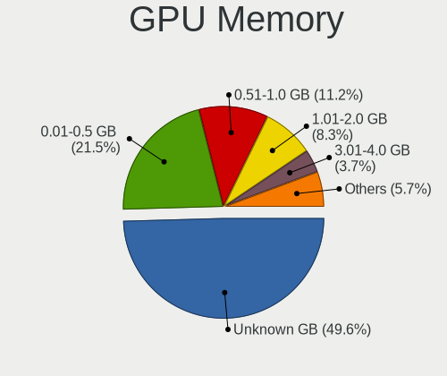

| Size in GB | Desktops | Percent |
|------------|----------|---------|
| Unknown    | 206      | 44.98%  |
| 0.01-0.5   | 113      | 24.67%  |
| 0.51-1.0   | 51       | 11.14%  |
| 1.01-2.0   | 42       | 9.17%   |
| 3.01-4.0   | 19       | 4.15%   |
| 7.01-8.0   | 13       | 2.84%   |
| 8.01-16.0  | 7        | 1.53%   |
| 5.01-6.0   | 4        | 0.87%   |
| 2.01-3.0   | 3        | 0.66%   |

Monitor
-------

Monitor Vendor
--------------

Monitor vendors

| Vendor               | Desktops | Percent |
|----------------------|----------|---------|
| Samsung Electronics  | 72       | 17.31%  |
| Dell                 | 50       | 12.02%  |
| Goldstar             | 29       | 6.97%   |
| Acer                 | 28       | 6.73%   |
| Hewlett-Packard      | 24       | 5.77%   |
| Philips              | 23       | 5.53%   |
| AOC                  | 18       | 4.33%   |
| BenQ                 | 17       | 4.09%   |
| Ancor Communications | 15       | 3.61%   |
| Iiyama               | 12       | 2.88%   |
| Lenovo               | 9        | 2.16%   |
| Vizio                | 7        | 1.68%   |
| Unknown              | 7        | 1.68%   |
| Sony                 | 5        | 1.2%    |
| NEC Computers        | 5        | 1.2%    |
| LG Electronics       | 5        | 1.2%    |
| HannStar             | 4        | 0.96%   |
| Fujitsu Siemens      | 4        | 0.96%   |
| Eizo                 | 4        | 0.96%   |
| Sceptre Tech         | 3        | 0.72%   |
| Positivo             | 3        | 0.72%   |
| MSI                  | 3        | 0.72%   |
| Belinea              | 3        | 0.72%   |
| ___                  | 2        | 0.48%   |
| ViewSonic            | 2        | 0.48%   |
| Unknown (ADA)        | 2        | 0.48%   |
| Toshiba              | 2        | 0.48%   |
| Plain Tree Systems   | 2        | 0.48%   |
| LG Display           | 2        | 0.48%   |
| IOD                  | 2        | 0.48%   |
| FL_                  | 2        | 0.48%   |
| Elo Touch            | 2        | 0.48%   |
| Daewoo               | 2        | 0.48%   |
| Compaq Computer      | 2        | 0.48%   |
| Apple                | 2        | 0.48%   |
| Xiaomi               | 1        | 0.24%   |
| Westinghouse         | 1        | 0.24%   |
| Videoseven           | 1        | 0.24%   |
| VHT                  | 1        | 0.24%   |
| Vestel               | 1        | 0.24%   |

Monitor Model
-------------

Monitor models

| Model                                                                 | Desktops | Percent |
|-----------------------------------------------------------------------|----------|---------|
| Goldstar IPS FULLHD GSM5AB6 1920x1080 480x270mm 21.7-inch             | 3        | 0.7%    |
| Dell E176FP DELA014 1280x1024 338x270mm 17.0-inch                     | 3        | 0.7%    |
| ___ LCD TV ___0101 1920x1080                                          | 2        | 0.47%   |
| Vizio VOJ320F1A VIZ0050 1920x1080 700x390mm 31.5-inch                 | 2        | 0.47%   |
| Vizio E280i-A1 VIZ1002 1360x768 607x345mm 27.5-inch                   | 2        | 0.47%   |
| Unknown (ADA) LCD Monitor ADA0004 1280x800 150x100mm 7.1-inch         | 2        | 0.47%   |
| Samsung Electronics SyncMaster SAM027C 1680x1050 433x271mm 20.1-inch  | 2        | 0.47%   |
| Samsung Electronics SyncMaster SAM022F 1280x1024 312x234mm 15.4-inch  | 2        | 0.47%   |
| Samsung Electronics SyncMaster SAM0119 1280x1024 352x264mm 17.3-inch  | 2        | 0.47%   |
| Samsung Electronics SMB2230N SAM0635 1920x1080 477x268mm 21.5-inch    | 2        | 0.47%   |
| Samsung Electronics S24D300 SAM0B40 1920x1080 521x293mm 23.5-inch     | 2        | 0.47%   |
| Samsung Electronics S20B300 SAM08A8 1600x900 443x249mm 20.0-inch      | 2        | 0.47%   |
| Samsung Electronics C27F390 SAM0D32 1920x1080 598x336mm 27.0-inch     | 2        | 0.47%   |
| Samsung Electronics C24F390 SAM0D2D 1920x1080 521x293mm 23.5-inch     | 2        | 0.47%   |
| Philips PHL 243V7 PHLC155 1920x1080 527x296mm 23.8-inch               | 2        | 0.47%   |
| Lenovo LEN L24q-30 LEN65FB 2560x1440 527x296mm 23.8-inch              | 2        | 0.47%   |
| Iiyama PLE2283H IVM562E 1920x1080 477x268mm 21.5-inch                 | 2        | 0.47%   |
| Iiyama PL2730H IVM663A 1920x1080 598x336mm 27.0-inch                  | 2        | 0.47%   |
| Hewlett-Packard LA2205 HWP2847 1680x1050 473x296mm 22.0-inch          | 2        | 0.47%   |
| Hewlett-Packard 2009 HWP2827 1600x900 442x249mm 20.0-inch             | 2        | 0.47%   |
| Goldstar M228WA GSM563C 1680x1050 434x270mm 20.1-inch                 | 2        | 0.47%   |
| FL_ HDMI4K FL_2801 2560x1440 480x270mm 21.7-inch                      | 2        | 0.47%   |
| Elo Touch elotouch.com ELO1925 1280x1024 376x301mm 19.0-inch          | 2        | 0.47%   |
| Dell U2711 DELA057 2560x1440 597x336mm 27.0-inch                      | 2        | 0.47%   |
| Dell ST2410 DELA05D 1920x1080 531x299mm 24.0-inch                     | 2        | 0.47%   |
| Dell P190S DEL405A 1280x1024 376x301mm 19.0-inch                      | 2        | 0.47%   |
| Dell AW2518HF DELA102 1920x1080 544x303mm 24.5-inch                   | 2        | 0.47%   |
| Dell 1707FP DEL4012 1280x1024 338x270mm 17.0-inch                     | 2        | 0.47%   |
| BenQ GW2450H BNQ78C1 1920x1080 531x298mm 24.0-inch                    | 2        | 0.47%   |
| AOC G2460 AOC2460 1920x1080 531x299mm 24.0-inch                       | 2        | 0.47%   |
| AOC 24B1W AOC2401 1920x1080 521x293mm 23.5-inch                       | 2        | 0.47%   |
| AOC 2236 AOC2236 1920x1080 477x268mm 21.5-inch                        | 2        | 0.47%   |
| AOC 1621w AOC1621 1366x768 344x194mm 15.5-inch                        | 2        | 0.47%   |
| Ancor Communications ASUS VW193D ACI19D5 1440x900 408x255mm 18.9-inch | 2        | 0.47%   |
| Acer AL1716 ACR06B4 1280x1024 338x271mm 17.1-inch                     | 2        | 0.47%   |
| ___ LCDTV16 ___9000 1360x768                                          | 1        | 0.23%   |
| Xiaomi Mi TV XMD00E1 3840x2160 708x398mm 32.0-inch                    | 1        | 0.23%   |
| Westinghouse LCM-22w2 WDE2202 1680x1050 473x296mm 22.0-inch           | 1        | 0.23%   |
| Vizio VO42LFHDTV10A VIZ0043 1920x1080 930x520mm 41.9-inch             | 1        | 0.23%   |
| Vizio E421VO VIZ0090 1920x1080 930x530mm 42.1-inch                    | 1        | 0.23%   |

Monitor Resolution
------------------

Monitor screen resolution

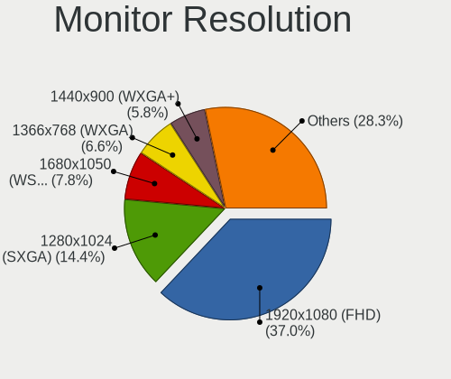

| Resolution         | Desktops | Percent |
|--------------------|----------|---------|
| 1920x1080 (FHD)    | 150      | 35.8%   |
| 1280x1024 (SXGA)   | 65       | 15.51%  |
| 1680x1050 (WSXGA+) | 36       | 8.59%   |
| 1366x768 (WXGA)    | 32       | 7.64%   |
| 1440x900 (WXGA+)   | 23       | 5.49%   |
| 1600x900 (HD+)     | 19       | 4.53%   |
| 2560x1440 (QHD)    | 18       | 4.3%    |
| 3840x2160 (4K)     | 14       | 3.34%   |
| 1024x768 (XGA)     | 14       | 3.34%   |
| 1360x768           | 8        | 1.91%   |
| 1920x1200 (WUXGA)  | 7        | 1.67%   |
| Unknown            | 4        | 0.95%   |
| 3440x1440          | 3        | 0.72%   |
| 2288x1287          | 3        | 0.72%   |
| 1280x800 (WXGA)    | 3        | 0.72%   |
| 3600x1200          | 2        | 0.48%   |
| 2560x1600          | 2        | 0.48%   |
| 2560x1080          | 2        | 0.48%   |
| 2048x1536          | 2        | 0.48%   |
| 1600x1200          | 2        | 0.48%   |
| 1280x768           | 2        | 0.48%   |
| 1280x720 (HD)      | 2        | 0.48%   |
| 800x600            | 1        | 0.24%   |
| 5760x2160          | 1        | 0.24%   |
| 3200x1080          | 1        | 0.24%   |
| 2160x1200          | 1        | 0.24%   |
| 1920x540           | 1        | 0.24%   |
| 1152x864           | 1        | 0.24%   |

Monitor Diagonal
----------------

Diagonal size in inches

| Inches  | Desktops | Percent |
|---------|----------|---------|
| 24      | 46       | 11.19%  |
| 19      | 45       | 10.95%  |
| 23      | 39       | 9.49%   |
| 17      | 36       | 8.76%   |
| Unknown | 34       | 8.27%   |
| 21      | 32       | 7.79%   |
| 18      | 28       | 6.81%   |
| 27      | 27       | 6.57%   |
| 20      | 26       | 6.33%   |
| 22      | 23       | 5.6%    |
| 15      | 21       | 5.11%   |
| 31      | 6        | 1.46%   |
| 72      | 5        | 1.22%   |
| 34      | 4        | 0.97%   |
| 14      | 4        | 0.97%   |
| 84      | 3        | 0.73%   |
| 47      | 3        | 0.73%   |
| 40      | 3        | 0.73%   |
| 65      | 2        | 0.49%   |
| 39      | 2        | 0.49%   |
| 38      | 2        | 0.49%   |
| 32      | 2        | 0.49%   |
| 29      | 2        | 0.49%   |
| 13      | 2        | 0.49%   |
| 7       | 2        | 0.49%   |
| 142     | 1        | 0.24%   |
| 60      | 1        | 0.24%   |
| 52      | 1        | 0.24%   |
| 49      | 1        | 0.24%   |
| 48      | 1        | 0.24%   |
| 43      | 1        | 0.24%   |
| 42      | 1        | 0.24%   |
| 41      | 1        | 0.24%   |
| 26      | 1        | 0.24%   |
| 11      | 1        | 0.24%   |
| 8       | 1        | 0.24%   |
| 5       | 1        | 0.24%   |

Monitor Width
-------------

Physical width

| Width in mm    | Desktops | Percent |
|----------------|----------|---------|
| 401-500        | 119      | 29.24%  |
| 501-600        | 111      | 27.27%  |
| 301-350        | 54       | 13.27%  |
| 351-400        | 37       | 9.09%   |
| Unknown        | 34       | 8.35%   |
| 601-700        | 10       | 2.46%   |
| 1001-1500      | 9        | 2.21%   |
| 1501-2000      | 8        | 1.97%   |
| 801-900        | 7        | 1.72%   |
| 701-800        | 6        | 1.47%   |
| 201-300        | 4        | 0.98%   |
| 101-200        | 4        | 0.98%   |
| 901-1000       | 3        | 0.74%   |
| More than 2000 | 1        | 0.25%   |

Aspect Ratio
------------

Proportional relationship between the width and the height

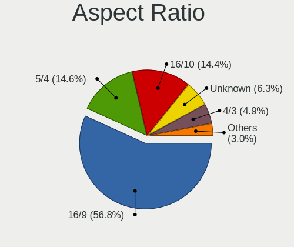

| Ratio   | Desktops | Percent |
|---------|----------|---------|
| 16/9    | 217      | 54.25%  |
| 5/4     | 62       | 15.5%   |
| 16/10   | 61       | 15.25%  |
| Unknown | 28       | 7%      |
| 4/3     | 23       | 5.75%   |
| 21/9    | 4        | 1%      |
| 6/5     | 2        | 0.5%    |
| 3/2     | 2        | 0.5%    |
| 1.00    | 1        | 0.25%   |

Monitor Area
------------

Area in inch

| Area in inch | Desktops | Percent |
|----------------|----------|---------|
| 201-250        | 116      | 28.57%  |
| 151-200        | 88       | 21.67%  |
| 141-150        | 52       | 12.81%  |
| Unknown        | 34       | 8.37%   |
| 301-350        | 29       | 7.14%   |
| 101-110        | 20       | 4.93%   |
| More than 1000 | 15       | 3.69%   |
| 501-1000       | 14       | 3.45%   |
| 351-500        | 12       | 2.96%   |
| 251-300        | 11       | 2.71%   |
| 81-90          | 4        | 0.99%   |
| 1-40           | 4        | 0.99%   |
| 131-140        | 2        | 0.49%   |
| 111-120        | 2        | 0.49%   |
| 51-60          | 1        | 0.25%   |
| 121-130        | 1        | 0.25%   |
| 91-100         | 1        | 0.25%   |

Pixel Density
-------------

Pixels per inch

| Density       | Desktops | Percent |
|---------------|----------|---------|
| 51-100        | 275      | 68.75%  |
| 101-120       | 56       | 14%     |
| Unknown       | 34       | 8.5%    |
| 1-50          | 19       | 4.75%   |
| 121-160       | 11       | 2.75%   |
| 161-240       | 4        | 1%      |
| More than 240 | 1        | 0.25%   |

Multiple Monitors
-----------------

Total monitors connected

| Total | Desktops | Percent |
|-------|----------|---------|
| 1     | 396      | 86.46%  |
| 2     | 33       | 7.21%   |
| 0     | 25       | 5.46%   |
| 3     | 3        | 0.66%   |
| 4     | 1        | 0.22%   |

Network
-------

Net Controller Vendor
---------------------

Controller vendors

| Vendor                          | Desktops | Percent |
|---------------------------------|----------|---------|
| Realtek Semiconductor           | 272      | 41.53%  |
| Intel                           | 128      | 19.54%  |
| Qualcomm Atheros                | 44       | 6.72%   |
| Nvidia                          | 41       | 6.26%   |
| Ralink Technology               | 35       | 5.34%   |
| Broadcom                        | 19       | 2.9%    |
| TP-Link                         | 11       | 1.68%   |
| Samsung Electronics             | 9        | 1.37%   |
| Broadcom Limited                | 9        | 1.37%   |
| VIA Technologies                | 8        | 1.22%   |
| Ralink                          | 8        | 1.22%   |
| Marvell Technology Group        | 8        | 1.22%   |
| NetGear                         | 6        | 0.92%   |
| Qualcomm Atheros Communications | 5        | 0.76%   |
| Huawei Technologies             | 4        | 0.61%   |
| D-Link System                   | 4        | 0.61%   |
| Belkin Components               | 4        | 0.61%   |
| MediaTek                        | 3        | 0.46%   |
| D-Link                          | 3        | 0.46%   |
| Xiaomi                          | 2        | 0.31%   |
| ULi Electronics                 | 2        | 0.31%   |
| JMicron Technology              | 2        | 0.31%   |
| ICS Advent                      | 2        | 0.31%   |
| ASUSTek Computer                | 2        | 0.31%   |
| ASIX Electronics                | 2        | 0.31%   |
| Accton Technology               | 2        | 0.31%   |
| 3Com                            | 2        | 0.31%   |
| ZyXEL Communications            | 1        | 0.15%   |
| ZTE WCDMA Technologies MSM      | 1        | 0.15%   |
| U-Blox                          | 1        | 0.15%   |
| Trident Microsystems            | 1        | 0.15%   |
| Texas Instruments               | 1        | 0.15%   |
| T & A Mobile Phones             | 1        | 0.15%   |
| Sitecom Europe                  | 1        | 0.15%   |
| Seeed Technology                | 1        | 0.15%   |
| Motorola PCS                    | 1        | 0.15%   |
| LSI                             | 1        | 0.15%   |
| Logitec                         | 1        | 0.15%   |
| Intersil                        | 1        | 0.15%   |
| IMC Networks                    | 1        | 0.15%   |

Net Controller Model
--------------------

Controller models

| Model                                                             | Desktops | Percent |
|-------------------------------------------------------------------|----------|---------|
| Realtek RTL8111/8168/8411 PCI Express Gigabit Ethernet Controller | 209      | 29.9%   |
| Intel 82579LM Gigabit Network Connection (Lewisville)             | 22       | 3.15%   |
| Nvidia MCP61 Ethernet                                             | 20       | 2.86%   |
| Realtek RTL-8100/8101L/8139 PCI Fast Ethernet Adapter             | 18       | 2.58%   |
| Realtek RTL810xE PCI Express Fast Ethernet controller             | 15       | 2.15%   |
| Ralink MT7601U Wireless Adapter                                   | 13       | 1.86%   |
| Intel 82567LM-3 Gigabit Network Connection                        | 9        | 1.29%   |
| Ralink RT5370 Wireless Adapter                                    | 8        | 1.14%   |
| Samsung Galaxy series, misc. (tethering mode)                     | 7        | 1%      |
| Intel 82566DM-2 Gigabit Network Connection                        | 7        | 1%      |
| VIA VT6102/VT6103 [Rhine-II]                                      | 6        | 0.86%   |
| Realtek RTL8188EUS 802.11n Wireless Network Adapter               | 6        | 0.86%   |
| Ralink RT5572 Wireless Adapter                                    | 6        | 0.86%   |
| Qualcomm Atheros AR8161 Gigabit Ethernet                          | 6        | 0.86%   |
| Nvidia CK804 Ethernet Controller                                  | 6        | 0.86%   |
| Intel I211 Gigabit Network Connection                             | 6        | 0.86%   |
| Intel Ethernet Controller I225-V                                  | 6        | 0.86%   |
| Intel Ethernet Connection I217-LM                                 | 6        | 0.86%   |
| Intel 82579V Gigabit Network Connection                           | 6        | 0.86%   |
| Realtek RTL8169 PCI Gigabit Ethernet Controller                   | 5        | 0.72%   |
| Realtek RTL8125 2.5GbE Controller                                 | 5        | 0.72%   |
| Qualcomm Atheros AR9271 802.11n                                   | 5        | 0.72%   |
| Nvidia MCP73 Ethernet                                             | 5        | 0.72%   |
| Marvell Group 88E8001 Gigabit Ethernet Controller                 | 5        | 0.72%   |
| Intel Ethernet Connection I217-V                                  | 5        | 0.72%   |
| Realtek RTL88x2bu [AC1200 Techkey]                                | 4        | 0.57%   |
| Realtek RTL8187 Wireless Adapter                                  | 4        | 0.57%   |
| Realtek RTL8153 Gigabit Ethernet Adapter                          | 4        | 0.57%   |
| Ralink RT2870/RT3070 Wireless Adapter                             | 4        | 0.57%   |
| Qualcomm Atheros AR9285 Wireless Network Adapter (PCI-Express)    | 4        | 0.57%   |
| Qualcomm Atheros AR8151 v2.0 Gigabit Ethernet                     | 4        | 0.57%   |
| Qualcomm Atheros AR5212/5213/2414 Wireless Network Adapter        | 4        | 0.57%   |
| Intel Wireless 7260                                               | 4        | 0.57%   |
| Intel Wireless 3165                                               | 4        | 0.57%   |
| Intel NM10/ICH7 Family LAN Controller                             | 4        | 0.57%   |
| Intel Ethernet Connection (2) I219-V                              | 4        | 0.57%   |
| Intel 82574L Gigabit Network Connection                           | 4        | 0.57%   |
| Realtek RTL8192CU 802.11n WLAN Adapter                            | 3        | 0.43%   |
| Realtek RTL8188FTV 802.11b/g/n 1T1R 2.4G WLAN Adapter             | 3        | 0.43%   |
| Realtek RTL8188CUS 802.11n WLAN Adapter                           | 3        | 0.43%   |

Wireless Vendor
---------------

Wireless vendors

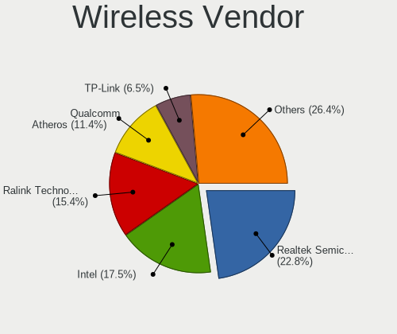

| Vendor                          | Desktops | Percent |
|---------------------------------|----------|---------|
| Realtek Semiconductor           | 42       | 22.11%  |
| Ralink Technology               | 35       | 18.42%  |
| Intel                           | 31       | 16.32%  |
| Qualcomm Atheros                | 23       | 12.11%  |
| TP-Link                         | 10       | 5.26%   |
| Ralink                          | 8        | 4.21%   |
| Broadcom                        | 8        | 4.21%   |
| Qualcomm Atheros Communications | 5        | 2.63%   |
| NetGear                         | 5        | 2.63%   |
| Belkin Components               | 4        | 2.11%   |
| MediaTek                        | 3        | 1.58%   |
| Broadcom Limited                | 3        | 1.58%   |
| D-Link System                   | 2        | 1.05%   |
| D-Link                          | 2        | 1.05%   |
| ASUSTek Computer                | 2        | 1.05%   |
| ZyXEL Communications            | 1        | 0.53%   |
| Sitecom Europe                  | 1        | 0.53%   |
| Samsung Electronics             | 1        | 0.53%   |
| Marvell Technology Group        | 1        | 0.53%   |
| Logitec                         | 1        | 0.53%   |
| IMC Networks                    | 1        | 0.53%   |
| Edimax Technology               | 1        | 0.53%   |

Wireless Model
--------------

Wireless models

| Model                                                                   | Desktops | Percent |
|-------------------------------------------------------------------------|----------|---------|
| Ralink MT7601U Wireless Adapter                                         | 13       | 6.84%   |
| Ralink RT5370 Wireless Adapter                                          | 8        | 4.21%   |
| Realtek RTL8188EUS 802.11n Wireless Network Adapter                     | 6        | 3.16%   |
| Ralink RT5572 Wireless Adapter                                          | 6        | 3.16%   |
| Qualcomm Atheros AR9271 802.11n                                         | 5        | 2.63%   |
| Realtek RTL88x2bu [AC1200 Techkey]                                      | 4        | 2.11%   |
| Realtek RTL8187 Wireless Adapter                                        | 4        | 2.11%   |
| Ralink RT2870/RT3070 Wireless Adapter                                   | 4        | 2.11%   |
| Qualcomm Atheros AR9285 Wireless Network Adapter (PCI-Express)          | 4        | 2.11%   |
| Qualcomm Atheros AR5212/5213/2414 Wireless Network Adapter              | 4        | 2.11%   |
| Intel Wireless 7260                                                     | 4        | 2.11%   |
| Intel Wireless 3165                                                     | 4        | 2.11%   |
| Realtek RTL8192CU 802.11n WLAN Adapter                                  | 3        | 1.58%   |
| Realtek RTL8188FTV 802.11b/g/n 1T1R 2.4G WLAN Adapter                   | 3        | 1.58%   |
| Realtek RTL8188CUS 802.11n WLAN Adapter                                 | 3        | 1.58%   |
| Realtek 802.11ac NIC                                                    | 3        | 1.58%   |
| Qualcomm Atheros AR9227 Wireless Network Adapter                        | 3        | 1.58%   |
| Intel Wireless-AC 9260                                                  | 3        | 1.58%   |
| Intel Wireless 7265                                                     | 3        | 1.58%   |
| Intel Wi-Fi 6 AX210/AX211/AX411 160MHz                                  | 3        | 1.58%   |
| Intel Wi-Fi 6 AX200                                                     | 3        | 1.58%   |
| Broadcom BCM43228 802.11a/b/g/n                                         | 3        | 1.58%   |
| TP-Link TL-WN823N v2/v3 [Realtek RTL8192EU]                             | 2        | 1.05%   |
| TP-Link TL-WN821N Version 5 RTL8192EU                                   | 2        | 1.05%   |
| TP-Link TL-WN722N v2/v3 [Realtek RTL8188EUS]                            | 2        | 1.05%   |
| Realtek RTL8821CE 802.11ac PCIe Wireless Network Adapter                | 2        | 1.05%   |
| Realtek RTL8192CE PCIe Wireless Network Adapter                         | 2        | 1.05%   |
| Realtek RTL8188ETV Wireless LAN 802.11n Network Adapter                 | 2        | 1.05%   |
| Ralink RT2501/RT2573 Wireless Adapter                                   | 2        | 1.05%   |
| Ralink RT2561/RT61 802.11g PCI                                          | 2        | 1.05%   |
| Qualcomm Atheros AR9485 Wireless Network Adapter                        | 2        | 1.05%   |
| Qualcomm Atheros AR9462 Wireless Network Adapter                        | 2        | 1.05%   |
| Qualcomm Atheros AR93xx Wireless Network Adapter                        | 2        | 1.05%   |
| Qualcomm Atheros AR9287 Wireless Network Adapter (PCI-Express)          | 2        | 1.05%   |
| NetGear A6210                                                           | 2        | 1.05%   |
| Intel Dual Band Wireless-AC 3168NGW [Stone Peak]                        | 2        | 1.05%   |
| Intel Cannon Lake PCH CNVi WiFi                                         | 2        | 1.05%   |
| Broadcom BCM4318 [AirForce One 54g] 802.11g Wireless LAN Controller     | 2        | 1.05%   |
| Belkin Components F7D1101 v1 Basic Wireless Adapter [Realtek RTL8188SU] | 2        | 1.05%   |
| ZyXEL ZyAIR G-202 802.11bg                                              | 1        | 0.53%   |

Ethernet Vendor
---------------

Ethernet vendors

| Vendor                     | Desktops | Percent |
|----------------------------|----------|---------|
| Realtek Semiconductor      | 253      | 51.42%  |
| Intel                      | 104      | 21.14%  |
| Nvidia                     | 41       | 8.33%   |
| Qualcomm Atheros           | 24       | 4.88%   |
| Broadcom                   | 12       | 2.44%   |
| VIA Technologies           | 8        | 1.63%   |
| Samsung Electronics        | 7        | 1.42%   |
| Marvell Technology Group   | 7        | 1.42%   |
| Broadcom Limited           | 6        | 1.22%   |
| Huawei Technologies        | 4        | 0.81%   |
| Xiaomi                     | 2        | 0.41%   |
| ULi Electronics            | 2        | 0.41%   |
| JMicron Technology         | 2        | 0.41%   |
| ICS Advent                 | 2        | 0.41%   |
| D-Link System              | 2        | 0.41%   |
| ASIX Electronics           | 2        | 0.41%   |
| Accton Technology          | 2        | 0.41%   |
| 3Com                       | 2        | 0.41%   |
| ZTE WCDMA Technologies MSM | 1        | 0.2%    |
| Trident Microsystems       | 1        | 0.2%    |
| TP-Link                    | 1        | 0.2%    |
| T & A Mobile Phones        | 1        | 0.2%    |
| NetGear                    | 1        | 0.2%    |
| Motorola PCS               | 1        | 0.2%    |
| D-Link                     | 1        | 0.2%    |
| Aquantia                   | 1        | 0.2%    |
| Apple                      | 1        | 0.2%    |
| ADMtek                     | 1        | 0.2%    |

Ethernet Model
--------------

Ethernet models

| Model                                                             | Desktops | Percent |
|-------------------------------------------------------------------|----------|---------|
| Realtek RTL8111/8168/8411 PCI Express Gigabit Ethernet Controller | 209      | 41.63%  |
| Intel 82579LM Gigabit Network Connection (Lewisville)             | 22       | 4.38%   |
| Nvidia MCP61 Ethernet                                             | 20       | 3.98%   |
| Realtek RTL-8100/8101L/8139 PCI Fast Ethernet Adapter             | 18       | 3.59%   |
| Realtek RTL810xE PCI Express Fast Ethernet controller             | 15       | 2.99%   |
| Intel 82567LM-3 Gigabit Network Connection                        | 9        | 1.79%   |
| Samsung Galaxy series, misc. (tethering mode)                     | 7        | 1.39%   |
| Intel 82566DM-2 Gigabit Network Connection                        | 7        | 1.39%   |
| VIA VT6102/VT6103 [Rhine-II]                                      | 6        | 1.2%    |
| Qualcomm Atheros AR8161 Gigabit Ethernet                          | 6        | 1.2%    |
| Nvidia CK804 Ethernet Controller                                  | 6        | 1.2%    |
| Intel I211 Gigabit Network Connection                             | 6        | 1.2%    |
| Intel Ethernet Controller I225-V                                  | 6        | 1.2%    |
| Intel Ethernet Connection I217-LM                                 | 6        | 1.2%    |
| Intel 82579V Gigabit Network Connection                           | 6        | 1.2%    |
| Realtek RTL8169 PCI Gigabit Ethernet Controller                   | 5        | 1%      |
| Realtek RTL8125 2.5GbE Controller                                 | 5        | 1%      |
| Nvidia MCP73 Ethernet                                             | 5        | 1%      |
| Marvell Group 88E8001 Gigabit Ethernet Controller                 | 5        | 1%      |
| Intel Ethernet Connection I217-V                                  | 5        | 1%      |
| Realtek RTL8153 Gigabit Ethernet Adapter                          | 4        | 0.8%    |
| Qualcomm Atheros AR8151 v2.0 Gigabit Ethernet                     | 4        | 0.8%    |
| Intel NM10/ICH7 Family LAN Controller                             | 4        | 0.8%    |
| Intel Ethernet Connection (2) I219-V                              | 4        | 0.8%    |
| Intel 82574L Gigabit Network Connection                           | 4        | 0.8%    |
| Realtek RTL-8110SC/8169SC Gigabit Ethernet                        | 3        | 0.6%    |
| Qualcomm Atheros Attansic L1 Gigabit Ethernet                     | 3        | 0.6%    |
| Qualcomm Atheros AR8152 v2.0 Fast Ethernet                        | 3        | 0.6%    |
| Qualcomm Atheros AR8131 Gigabit Ethernet                          | 3        | 0.6%    |
| Marvell Group 88E8056 PCI-E Gigabit Ethernet Controller           | 3        | 0.6%    |
| Huawei MAR-LX1M                                                   | 3        | 0.6%    |
| Broadcom Limited NetXtreme BCM5782 Gigabit Ethernet               | 3        | 0.6%    |
| VIA VT6105/VT6106S [Rhine-III]                                    | 2        | 0.4%    |
| ULi ULi 1689,1573 integrated ethernet.                            | 2        | 0.4%    |
| Qualcomm Atheros AR8121/AR8113/AR8114 Gigabit or Fast Ethernet    | 2        | 0.4%    |
| Nvidia MCP77 Ethernet                                             | 2        | 0.4%    |
| Nvidia MCP55 Ethernet                                             | 2        | 0.4%    |
| Nvidia MCP51 Ethernet Controller                                  | 2        | 0.4%    |
| Nvidia CK8S Ethernet Controller                                   | 2        | 0.4%    |
| JMicron JMC250 PCI Express Gigabit Ethernet Controller            | 2        | 0.4%    |

Net Controller Kind
-------------------

Ethernet, WiFi or modem

| Kind     | Desktops | Percent |
|----------|----------|---------|
| Ethernet | 445      | 70.41%  |
| WiFi     | 180      | 28.48%  |
| Modem    | 6        | 0.95%   |
| Unknown  | 1        | 0.16%   |

Used Controller
---------------

Currently used network controller

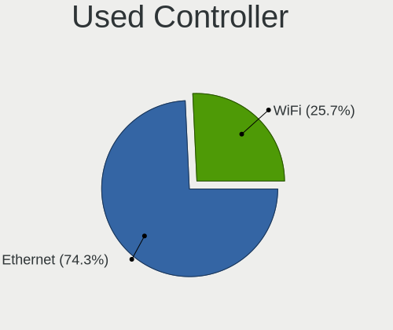

| Kind     | Desktops | Percent |
|----------|----------|---------|
| Ethernet | 353      | 75.43%  |
| WiFi     | 115      | 24.57%  |

NICs
----

Total network controllers on board

| Total | Desktops | Percent |
|-------|----------|---------|
| 1     | 330      | 72.85%  |
| 2     | 104      | 22.96%  |
| 3     | 12       | 2.65%   |
| 0     | 5        | 1.1%    |
| 6     | 1        | 0.22%   |
| 4     | 1        | 0.22%   |

IPv6
----

IPv6 vs IPv4

| Used | Desktops | Percent |
|------|----------|---------|
| No   | 361      | 79.52%  |
| Yes  | 93       | 20.48%  |

Bluetooth
---------

Bluetooth Vendor
----------------

Controller vendors

| Vendor                          | Desktops | Percent |
|---------------------------------|----------|---------|
| Intel                           | 27       | 32.14%  |
| Cambridge Silicon Radio         | 23       | 27.38%  |
| Broadcom                        | 6        | 7.14%   |
| Realtek Semiconductor           | 5        | 5.95%   |
| Qualcomm Atheros Communications | 4        | 4.76%   |
| ASUSTek Computer                | 3        | 3.57%   |
| TP-Link                         | 2        | 2.38%   |
| MediaTek                        | 2        | 2.38%   |
| Logitech                        | 2        | 2.38%   |
| Foxconn / Hon Hai               | 2        | 2.38%   |
| Ralink                          | 1        | 1.19%   |
| Lite-On Technology              | 1        | 1.19%   |
| Integrated System Solution      | 1        | 1.19%   |
| HTC (High Tech Computer)        | 1        | 1.19%   |
| Hewlett-Packard                 | 1        | 1.19%   |
| Fujitsu                         | 1        | 1.19%   |
| Dynex                           | 1        | 1.19%   |
| Apple                           | 1        | 1.19%   |

Bluetooth Model
---------------

Controller models

| Model                                                                | Desktops | Percent |
|----------------------------------------------------------------------|----------|---------|
| Cambridge Silicon Radio Bluetooth Dongle (HCI mode)                  | 23       | 27.38%  |
| Intel Bluetooth wireless interface                                   | 11       | 13.1%   |
| Realtek Bluetooth Radio                                              | 4        | 4.76%   |
| Qualcomm Atheros AR3011 Bluetooth                                    | 3        | 3.57%   |
| Intel Wireless-AC 9260 Bluetooth Adapter                             | 3        | 3.57%   |
| Intel Bluetooth 9460/9560 Jefferson Peak (JfP)                       | 3        | 3.57%   |
| Intel AX210 Bluetooth                                                | 3        | 3.57%   |
| Intel AX200 Bluetooth                                                | 3        | 3.57%   |
| TP-Link UB500 Adapter                                                | 2        | 2.38%   |
| MediaTek Wireless_Device                                             | 2        | 2.38%   |
| Logitech BT Mini-Receiver (HCI mode)                                 | 2        | 2.38%   |
| Intel Wireless-AC 3168 Bluetooth                                     | 2        | 2.38%   |
| Broadcom BCM20702A0 Bluetooth 4.0                                    | 2        | 2.38%   |
| Realtek  Bluetooth 4.2 Adapter                                       | 1        | 1.19%   |
| Ralink RT3290 Bluetooth                                              | 1        | 1.19%   |
| Qualcomm Atheros  Bluetooth Device                                   | 1        | 1.19%   |
| Lite-On Bluetooth Device                                             | 1        | 1.19%   |
| Intel Centrino Bluetooth Wireless Transceiver                        | 1        | 1.19%   |
| Intel Bluetooth Device                                               | 1        | 1.19%   |
| Integrated System Solution KY-BT100 Bluetooth Adapter                | 1        | 1.19%   |
| HTC (High Tech Computer) Vive Hub Bluetooth 4.1 (Broadcom BCM920703) | 1        | 1.19%   |
| HP Bluetooth 2.0 Interface [Broadcom BCM2045]                        | 1        | 1.19%   |
| Fujitsu Bluetooth Device                                             | 1        | 1.19%   |
| Foxconn / Hon Hai Wireless_Device                                    | 1        | 1.19%   |
| Foxconn / Hon Hai Bluetooth Device                                   | 1        | 1.19%   |
| Dynex Bluetooth 4.0 Adapter [Broadcom, 1.12, BCM20702A0]             | 1        | 1.19%   |
| Broadcom HP Portable Bumble Bee                                      | 1        | 1.19%   |
| Broadcom Bluetooth Device                                            | 1        | 1.19%   |
| Broadcom BCM20702A0                                                  | 1        | 1.19%   |
| Broadcom BCM2045 Bluetooth                                           | 1        | 1.19%   |
| ASUS Bluetooth Radio                                                 | 1        | 1.19%   |
| ASUS Bluetooth Device                                                | 1        | 1.19%   |
| ASUS BCM20702A0                                                      | 1        | 1.19%   |
| Apple Bluetooth HCI                                                  | 1        | 1.19%   |

Sound
-----

Sound Vendor
------------

Sound card vendors

| Vendor                                       | Desktops | Percent |
|----------------------------------------------|----------|---------|
| Intel                                        | 255      | 40.16%  |
| AMD                                          | 156      | 24.57%  |
| Nvidia                                       | 141      | 22.2%   |
| C-Media Electronics                          | 18       | 2.83%   |
| VIA Technologies                             | 11       | 1.73%   |
| Creative Labs                                | 10       | 1.57%   |
| XMOS                                         | 4        | 0.63%   |
| Texas Instruments                            | 4        | 0.63%   |
| ASUSTek Computer                             | 4        | 0.63%   |
| Logitech                                     | 3        | 0.47%   |
| Creative Technology                          | 3        | 0.47%   |
| ULi Electronics                              | 2        | 0.31%   |
| Razer USA                                    | 2        | 0.31%   |
| GN Netcom                                    | 2        | 0.31%   |
| Generalplus Technology                       | 2        | 0.31%   |
| Focusrite-Novation                           | 2        | 0.31%   |
| Zoran Co. Personal Media Division (Nogatech) | 1        | 0.16%   |
| Sony                                         | 1        | 0.16%   |
| Silicon Integrated Systems [SiS]             | 1        | 0.16%   |
| Setek Elektronik                             | 1        | 0.16%   |
| Plantronics                                  | 1        | 0.16%   |
| Nordic Semiconductor ASA                     | 1        | 0.16%   |
| Microsoft                                    | 1        | 0.16%   |
| Micro Star International                     | 1        | 0.16%   |
| KORG                                         | 1        | 0.16%   |
| JMTek                                        | 1        | 0.16%   |
| Guillemot                                    | 1        | 0.16%   |
| ESI                                          | 1        | 0.16%   |
| Ensoniq                                      | 1        | 0.16%   |
| Elgato Systems                               | 1        | 0.16%   |
| Cirrus Logic                                 | 1        | 0.16%   |
| Asahi Kasei Microsystems                     | 1        | 0.16%   |

Sound Model
-----------

Sound card models

| Model                                                                             | Desktops | Percent |
|-----------------------------------------------------------------------------------|----------|---------|
| Intel NM10/ICH7 Family High Definition Audio Controller                           | 49       | 6.7%    |
| AMD SBx00 Azalia (Intel HDA)                                                      | 35       | 4.79%   |
| Intel 6 Series/C200 Series Chipset Family High Definition Audio Controller        | 32       | 4.38%   |
| AMD FCH Azalia Controller                                                         | 25       | 3.42%   |
| Intel 7 Series/C216 Chipset Family High Definition Audio Controller               | 24       | 3.28%   |
| Nvidia MCP61 High Definition Audio                                                | 23       | 3.15%   |
| Nvidia High Definition Audio Controller                                           | 22       | 3.01%   |
| Intel 8 Series/C220 Series Chipset High Definition Audio Controller               | 20       | 2.74%   |
| AMD Starship/Matisse HD Audio Controller                                          | 16       | 2.19%   |
| AMD Family 17h/19h HD Audio Controller                                            | 16       | 2.19%   |
| Intel Xeon E3-1200 v3/4th Gen Core Processor HD Audio Controller                  | 15       | 2.05%   |
| Intel 82801I (ICH9 Family) HD Audio Controller                                    | 15       | 2.05%   |
| Intel 82801JI (ICH10 Family) HD Audio Controller                                  | 13       | 1.78%   |
| AMD Cedar HDMI Audio [Radeon HD 5400/6300/7300 Series]                            | 13       | 1.78%   |
| Intel 82801H (ICH8 Family) HD Audio Controller                                    | 12       | 1.64%   |
| AMD Kabini HDMI/DP Audio                                                          | 12       | 1.64%   |
| Nvidia GP107GL High Definition Audio Controller                                   | 11       | 1.5%    |
| AMD Renoir Radeon High Definition Audio Controller                                | 11       | 1.5%    |
| Nvidia GK208 HDMI/DP Audio Controller                                             | 10       | 1.37%   |
| AMD Caicos HDMI Audio [Radeon HD 6450 / 7450/8450/8490 OEM / R5 230/235/235X OEM] | 10       | 1.37%   |
| Intel 82801JD/DO (ICH10 Family) HD Audio Controller                               | 9        | 1.23%   |
| Intel 5 Series/3400 Series Chipset High Definition Audio                          | 9        | 1.23%   |
| AMD Family 17h (Models 00h-0fh) HD Audio Controller                               | 9        | 1.23%   |
| Nvidia GK107 HDMI Audio Controller                                                | 8        | 1.09%   |
| Nvidia GF108 High Definition Audio Controller                                     | 8        | 1.09%   |
| Intel Atom Processor Z36xxx/Z37xxx Series High Definition Audio Controller        | 8        | 1.09%   |
| Nvidia GM107 High Definition Audio Controller [GeForce 940MX]                     | 7        | 0.96%   |
| Intel 100 Series/C230 Series Chipset Family HD Audio Controller                   | 7        | 0.96%   |
| AMD Trinity HDMI Audio Controller                                                 | 7        | 0.96%   |
| Nvidia TU107 GeForce GTX 1650 High Definition Audio Controller                    | 6        | 0.82%   |
| Intel Cannon Lake PCH cAVS                                                        | 6        | 0.82%   |
| Intel 200 Series PCH HD Audio                                                     | 6        | 0.82%   |
| AMD Wrestler HDMI Audio                                                           | 6        | 0.82%   |
| AMD RV710/730 HDMI Audio [Radeon HD 4000 series]                                  | 6        | 0.82%   |
| AMD Oland/Hainan/Cape Verde/Pitcairn HDMI Audio [Radeon HD 7000 Series]           | 6        | 0.82%   |
| AMD Ellesmere HDMI Audio [Radeon RX 470/480 / 570/580/590]                        | 6        | 0.82%   |
| VIA Technologies VT8233/A/8235/8237 AC97 Audio Controller                         | 5        | 0.68%   |
| Nvidia MCP73 High Definition Audio                                                | 5        | 0.68%   |
| Nvidia CK804 AC'97 Audio Controller                                               | 5        | 0.68%   |
| Intel Celeron/Pentium Silver Processor High Definition Audio                      | 5        | 0.68%   |

Memory
------

Memory Vendor
-------------

Memory module vendors

| Vendor                       | Desktops | Percent |
|------------------------------|----------|---------|
| Unknown                      | 75       | 23.73%  |
| Samsung Electronics          | 43       | 13.61%  |
| Kingston                     | 40       | 12.66%  |
| SK hynix                     | 32       | 10.13%  |
| G.Skill                      | 20       | 6.33%   |
| Corsair                      | 19       | 6.01%   |
| Micron Technology            | 15       | 4.75%   |
| Crucial                      | 14       | 4.43%   |
| Nanya Technology             | 8        | 2.53%   |
| Unknown                      | 7        | 2.22%   |
| Unknown (ABCD)               | 5        | 1.58%   |
| Elpida                       | 5        | 1.58%   |
| A-DATA Technology            | 5        | 1.58%   |
| Patriot                      | 4        | 1.27%   |
| Unifosa                      | 2        | 0.63%   |
| Transcend                    | 2        | 0.63%   |
| Timetec                      | 2        | 0.63%   |
| Unknown (AB)                 | 1        | 0.32%   |
| Unknown (0x4000000000000000) | 1        | 0.32%   |
| Unknown (07FB)               | 1        | 0.32%   |
| Teikon                       | 1        | 0.32%   |
| Team                         | 1        | 0.32%   |
| Smart                        | 1        | 0.32%   |
| Silicon Power                | 1        | 0.32%   |
| Ramaxel Technology           | 1        | 0.32%   |
| Qimonda                      | 1        | 0.32%   |
| Princeton                    | 1        | 0.32%   |
| PNY                          | 1        | 0.32%   |
| Infineon                     | 1        | 0.32%   |
| GOODRAM                      | 1        | 0.32%   |
| Golden Empire                | 1        | 0.32%   |
| e2e4                         | 1        | 0.32%   |
| Avant                        | 1        | 0.32%   |
| ASint Technology             | 1        | 0.32%   |
| 48spaces                     | 1        | 0.32%   |

Memory Model
------------

Memory module models

| Model                                                          | Desktops | Percent |
|----------------------------------------------------------------|----------|---------|
| Unknown                                                        | 7        | 2.03%   |
| Unknown (ABCD) RAM 123456789012345678 2GB DIMM LPDDR4 2400MT/s | 5        | 1.45%   |
| SK hynix RAM Module 2048MB DIMM DDR3 1600MT/s                  | 5        | 1.45%   |
| Unknown RAM Module 2GB DIMM DDR2 667MT/s                       | 4        | 1.16%   |
| Unknown RAM Module 2GB DIMM SDRAM                              | 3        | 0.87%   |
| Unknown RAM Module 2GB DIMM DDR2 800MT/s                       | 3        | 0.87%   |
| Unknown RAM Module 2048MB DIMM 400MT/s                         | 3        | 0.87%   |
| Samsung RAM M378B5773DH0-CH9 2GB DIMM DDR3 1333MT/s            | 3        | 0.87%   |
| Nanya RAM NT2GT64U8HD0BY-AD 2048MB DIMM DDR2 2048MT/s          | 3        | 0.87%   |
| G.Skill RAM F4-3200C16-8GVKB 8GB DIMM DDR4 3866MT/s            | 3        | 0.87%   |
| Unknown RAM Module 2GB DIMM 800MT/s                            | 2        | 0.58%   |
| Unknown RAM Module 2GB DIMM 1333MT/s                           | 2        | 0.58%   |
| Unknown RAM Module 2048MB DIMM DDR2 800MT/s                    | 2        | 0.58%   |
| Unknown RAM Module 1GB DIMM SDRAM                              | 2        | 0.58%   |
| Unknown RAM Module 1024MB DIMM DDR 400MT/s                     | 2        | 0.58%   |
| SK hynix RAM Module 2GB DIMM DDR3 1066MT/s                     | 2        | 0.58%   |
| SK hynix RAM Module 2048MB DIMM DDR3 1066MT/s                  | 2        | 0.58%   |
| SK hynix RAM HYMP125U64CP8-S6 2GB DIMM DDR2 49926MT/s          | 2        | 0.58%   |
| SK hynix RAM HMT351U6CFR8C-H9 4GB DIMM DDR3 1600MT/s           | 2        | 0.58%   |
| Samsung RAM M471B5173QH0-YK0 4GB SODIMM DDR3 1600MT/s          | 2        | 0.58%   |
| Samsung RAM M471B5173EB0-YK0 4GB SODIMM DDR3 1600MT/s          | 2        | 0.58%   |
| Samsung RAM M471B5173DB0-YK0 4GB SODIMM DDR3 1600MT/s          | 2        | 0.58%   |
| Samsung RAM M378B5773CH0-CH9 2GB DIMM DDR3 1867MT/s            | 2        | 0.58%   |
| Samsung RAM M378B5273DH0-CH9 4096MB DIMM DDR2 2133MT/s         | 2        | 0.58%   |
| Samsung RAM M378B5173QH0-CK0 4GB DIMM DDR3 1600MT/s            | 2        | 0.58%   |
| Samsung RAM M3 78T6553EZS-CE6 512MB DIMM DDR2 667MT/s          | 2        | 0.58%   |
| Micron RAM 16JTF51264AZ-1G4M1 4GB DIMM DDR3 1333MT/s           | 2        | 0.58%   |
| Kingston RAM Module 2048MB DIMM DDR2 800MT/s                   | 2        | 0.58%   |
| Kingston RAM KHX2400C15/8G 8GB DIMM DDR4 3400MT/s              | 2        | 0.58%   |
| Kingston RAM KF3200C16D4/32GX 32GB DIMM DDR4 3933MT/s          | 2        | 0.58%   |
| G.Skill RAM F4-3000C16-8GISB 8192MB DIMM DDR4 3200MT/s         | 2        | 0.58%   |
| G.Skill RAM F4-2666C19-16GIS 16384MB DIMM DDR4 2667MT/s        | 2        | 0.58%   |
| Corsair RAM CMV4GX3M1A1333C9 4GB DIMM DDR3 1600MT/s            | 2        | 0.58%   |
| Corsair RAM CMK16GX4M2A2666C16 8GB DIMM DDR4 3400MT/s          | 2        | 0.58%   |
| Unknown RAM Module 8GB DIMM 1600MT/s                           | 1        | 0.29%   |
| Unknown RAM Module 8GB DIMM 1333MT/s                           | 1        | 0.29%   |
| Unknown RAM Module 8192MB DIMM DDR3 1866MT/s                   | 1        | 0.29%   |
| Unknown RAM Module 8192MB DIMM 667MT/s                         | 1        | 0.29%   |
| Unknown RAM Module 8192MB DIMM 1600MT/s                        | 1        | 0.29%   |
| Unknown RAM Module 512MB DIMM SDRAM 266MT/s                    | 1        | 0.29%   |

Memory Kind
-----------

Memory module kinds

| Kind    | Desktops | Percent |
|---------|----------|---------|
| DDR3    | 98       | 35%     |
| DDR4    | 65       | 23.21%  |
| DDR2    | 42       | 15%     |
| SDRAM   | 28       | 10%     |
| Unknown | 27       | 9.64%   |
| DDR     | 11       | 3.93%   |
| LPDDR4  | 5        | 1.79%   |
| DRAM    | 2        | 0.71%   |
| LPDDR3  | 1        | 0.36%   |
| DDR5    | 1        | 0.36%   |

Memory Form Factor
------------------

Physical design of the memory module

| Name   | Desktops | Percent |
|--------|----------|---------|
| DIMM   | 240      | 88.24%  |
| SODIMM | 32       | 11.76%  |

Memory Size
-----------

Memory module size

| Size  | Desktops | Percent |
|-------|----------|---------|
| 2048  | 90       | 29.61%  |
| 4096  | 69       | 22.7%   |
| 8192  | 65       | 21.38%  |
| 1024  | 32       | 10.53%  |
| 16384 | 28       | 9.21%   |
| 512   | 9        | 2.96%   |
| 32768 | 5        | 1.64%   |
| 256   | 4        | 1.32%   |
| 65536 | 1        | 0.33%   |
| 128   | 1        | 0.33%   |

Memory Speed
------------

Memory module speed

| Speed   | Desktops | Percent |
|---------|----------|---------|
| 1600    | 59       | 19.6%   |
| 1333    | 33       | 10.96%  |
| 800     | 26       | 8.64%   |
| Unknown | 18       | 5.98%   |
| 3200    | 16       | 5.32%   |
| 667     | 15       | 4.98%   |
| 2400    | 13       | 4.32%   |
| 2133    | 12       | 3.99%   |
| 2667    | 11       | 3.65%   |
| 1066    | 11       | 3.65%   |
| 400     | 9        | 2.99%   |
| 1866    | 8        | 2.66%   |
| 1867    | 7        | 2.33%   |
| 533     | 7        | 2.33%   |
| 3600    | 6        | 1.99%   |
| 2048    | 6        | 1.99%   |
| 3400    | 5        | 1.66%   |
| 333     | 5        | 1.66%   |
| 1067    | 4        | 1.33%   |
| 49926   | 3        | 1%      |
| 3866    | 3        | 1%      |
| 266     | 3        | 1%      |
| 3933    | 2        | 0.66%   |
| 3066    | 2        | 0.66%   |
| 3000    | 2        | 0.66%   |
| 2800    | 2        | 0.66%   |
| 2733    | 2        | 0.66%   |
| 2666    | 2        | 0.66%   |
| 41632   | 1        | 0.33%   |
| 4800    | 1        | 0.33%   |
| 3666    | 1        | 0.33%   |
| 3534    | 1        | 0.33%   |
| 3151    | 1        | 0.33%   |
| 2933    | 1        | 0.33%   |
| 1800    | 1        | 0.33%   |
| 1639    | 1        | 0.33%   |
| 1334    | 1        | 0.33%   |

Printers & scanners
-------------------

Printer Vendor
--------------

Printer device vendors

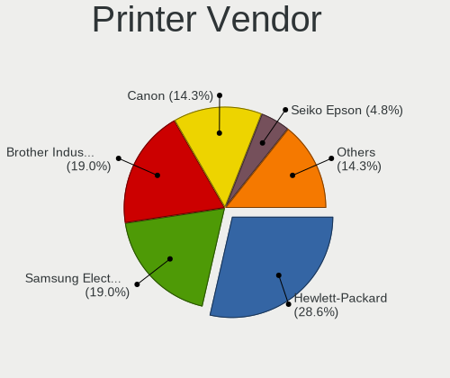

| Vendor                | Desktops | Percent |
|-----------------------|----------|---------|
| Hewlett-Packard       | 5        | 31.25%  |
| Samsung Electronics   | 4        | 25%     |
| Canon                 | 2        | 12.5%   |
| Brother Industries    | 2        | 12.5%   |
| Seiko Epson           | 1        | 6.25%   |
| Lexmark International | 1        | 6.25%   |
| Dymo-CoStar           | 1        | 6.25%   |

Printer Model
-------------

Printer device models

| Model                                   | Desktops | Percent |
|-----------------------------------------|----------|---------|
| Seiko Epson TM-T20X                     | 1        | 6.25%   |
| Samsung Xerox Phaser 3117 Laser Printer | 1        | 6.25%   |
| Samsung SCX-4200 series                 | 1        | 6.25%   |
| Samsung SCX-3400 Series                 | 1        | 6.25%   |
| Samsung M2020 Series                    | 1        | 6.25%   |
| Lexmark International Z33 Printer       | 1        | 6.25%   |
| HP PSC 1500 series                      | 1        | 6.25%   |
| HP OfficeJet 4650 series                | 1        | 6.25%   |
| HP LaserJet P2015 series                | 1        | 6.25%   |
| HP DeskJet D2460                        | 1        | 6.25%   |
| HP DeskJet 3630 series                  | 1        | 6.25%   |
| Dymo-CoStar DYMO LabelWriter 450 Turbo  | 1        | 6.25%   |
| Canon PIXMA MP250                       | 1        | 6.25%   |
| Canon CanoScan LiDE 300                 | 1        | 6.25%   |
| Brother Printer                         | 1        | 6.25%   |
| Brother DCP-7055W                       | 1        | 6.25%   |

Scanner Vendor
--------------

Scanner device vendors

| Vendor          | Desktops | Percent |
|-----------------|----------|---------|
| Hewlett-Packard | 3        | 60%     |
| Canon           | 2        | 40%     |

Scanner Model
-------------

Scanner device models

| Model                   | Desktops | Percent |
|-------------------------|----------|---------|
| HP scanjet 8270         | 1        | 20%     |
| HP ScanJet 2400c        | 1        | 20%     |
| HP HP4470C              | 1        | 20%     |
| Canon CanoScan LiDE 220 | 1        | 20%     |
| Canon CanoScan LiDE 200 | 1        | 20%     |

Camera
------

Camera Vendor
-------------

Camera device vendors

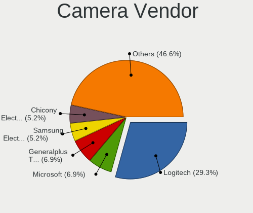

| Vendor                        | Desktops | Percent |
|-------------------------------|----------|---------|
| Logitech                      | 13       | 26.53%  |
| Microsoft                     | 4        | 8.16%   |
| Generalplus Technology        | 4        | 8.16%   |
| Sunplus Innovation Technology | 2        | 4.08%   |
| Samsung Electronics           | 2        | 4.08%   |
| KYE Systems (Mouse Systems)   | 2        | 4.08%   |
| Genesys Logic                 | 2        | 4.08%   |
| GEMBIRD                       | 2        | 4.08%   |
| Chicony Electronics           | 2        | 4.08%   |
| ARC International             | 2        | 4.08%   |
| Apple                         | 2        | 4.08%   |
| Z-Star Microelectronics       | 1        | 2.04%   |
| WaveRider Communications      | 1        | 2.04%   |
| SunplusIT                     | 1        | 2.04%   |
| Pixart Imaging                | 1        | 2.04%   |
| Microdia                      | 1        | 2.04%   |
| LG Electronics                | 1        | 2.04%   |
| IMC Networks                  | 1        | 2.04%   |
| Huawei Technologies           | 1        | 2.04%   |
| Guillemot                     | 1        | 2.04%   |
| GEO Semi                      | 1        | 2.04%   |
| Bison Electronics             | 1        | 2.04%   |
| AVerMedia Technologies        | 1        | 2.04%   |

Camera Model
------------

Camera device models

| Model                                                 | Desktops | Percent |
|-------------------------------------------------------|----------|---------|
| Logitech Webcam C270                                  | 4        | 8.16%   |
| Microsoft LifeCam HD-3000                             | 3        | 6.12%   |
| Generalplus GENERAL WEBCAM                            | 3        | 6.12%   |
| Samsung Galaxy series, misc. (MTP mode)               | 2        | 4.08%   |
| Logitech HD Webcam C615                               | 2        | 4.08%   |
| Logitech HD Webcam C525                               | 2        | 4.08%   |
| Genesys Logic Camera                                  | 2        | 4.08%   |
| ARC International Camera                              | 2        | 4.08%   |
| Apple iPhone 5/5C/5S/6/SE                             | 2        | 4.08%   |
| Z-Star Sirius USB2.0 Camera                           | 1        | 2.04%   |
| WaveRider USB Live camera                             | 1        | 2.04%   |
| SunplusIT USB 2.0 Camera                              | 1        | 2.04%   |
| Sunplus WEBCAM ESSENTIELB W1                          | 1        | 2.04%   |
| Sunplus FHD Camera                                    | 1        | 2.04%   |
| Pixart Imaging GE 1.3 MP MiniCam Pro                  | 1        | 2.04%   |
| Microsoft LifeCam VX-800                              | 1        | 2.04%   |
| Microdia Webcam Vitade AF                             | 1        | 2.04%   |
| Logitech Webcam C300                                  | 1        | 2.04%   |
| Logitech Webcam C170                                  | 1        | 2.04%   |
| Logitech Webcam B500                                  | 1        | 2.04%   |
| Logitech QuickCam Zoom                                | 1        | 2.04%   |
| Logitech HD Pro Webcam C920                           | 1        | 2.04%   |
| LG LM-X420xxx/G2/G3 Android Phone (MTP/download mode) | 1        | 2.04%   |
| KYE Systems (Mouse Systems) Genius eFace 1325R        | 1        | 2.04%   |
| KYE Systems (Mouse Systems) FaceCam 1000X             | 1        | 2.04%   |
| IMC Networks USB2.0 UVC VGA WebCam                    | 1        | 2.04%   |
| Huawei HiCamera                                       | 1        | 2.04%   |
| Guillemot Hercules HD Sunset                          | 1        | 2.04%   |
| GEO Semi Condor                                       | 1        | 2.04%   |
| Generalplus 808 Camera #9 (web-cam mode)              | 1        | 2.04%   |
| GEMBIRD USB2.0 PC CAMERA                              | 1        | 2.04%   |
| GEMBIRD Generic UVC 1.00 camera [AppoTech AX2311]     | 1        | 2.04%   |
| Chicony CNF7042                                       | 1        | 2.04%   |
| Chicony ASUS USB2.0 Webcam                            | 1        | 2.04%   |
| Bison Integrated Camera                               | 1        | 2.04%   |
| AVerMedia Live Streamer CAM 313                       | 1        | 2.04%   |

Security
--------

Fingerprint Vendor
------------------

Fingerprint sensor vendors

Zero info for selected period =(

Fingerprint Model
-----------------

Fingerprint sensor models

Zero info for selected period =(

Chipcard Vendor
---------------

Chipcard module vendors

| Vendor      | Desktops | Percent |
|-------------|----------|---------|
| Cherry      | 2        | 50%     |
| OmniKey     | 1        | 25%     |
| Alcor Micro | 1        | 25%     |

Chipcard Model
--------------

Chipcard module models

| Model                                       | Desktops | Percent |
|---------------------------------------------|----------|---------|
| Cherry SmartCard Reader Keyboard KC 1000 SC | 2        | 50%     |
| OmniKey CardMan 3021 / 3121                 | 1        | 25%     |
| Alcor Micro AU9540 Smartcard Reader         | 1        | 25%     |

Unsupported
-----------

Unsupported Devices
-------------------

Total unsupported devices on board

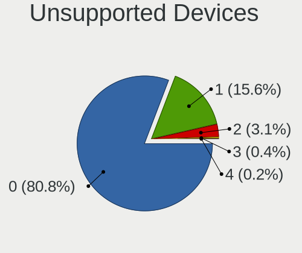

| Total | Desktops | Percent |
|-------|----------|---------|
| 0     | 379      | 82.75%  |
| 1     | 65       | 14.19%  |
| 2     | 12       | 2.62%   |
| 4     | 1        | 0.22%   |
| 3     | 1        | 0.22%   |

Unsupported Device Types
------------------------

Types of unsupported devices

| Type                     | Desktops | Percent |
|--------------------------|----------|---------|
| Graphics card            | 37       | 40.66%  |
| Net/wireless             | 15       | 16.48%  |
| Communication controller | 11       | 12.09%  |
| Sound                    | 6        | 6.59%   |
| Multimedia controller    | 5        | 5.49%   |
| Unassigned class         | 4        | 4.4%    |
| Net/ethernet             | 4        | 4.4%    |
| Dvb card                 | 2        | 2.2%    |
| Chipcard                 | 2        | 2.2%    |
| Bluetooth                | 2        | 2.2%    |
| Storage/raid             | 1        | 1.1%    |
| Modem                    | 1        | 1.1%    |
| Camera                   | 1        | 1.1%    |

