Lubuntu - Tested Hardware & Statistics (Notebooks)
--------------------------------------------------

A project to collect tested hardware configurations for Lubuntu.

Anyone can contribute to this report by the [hw-probe](https://github.com/linuxhw/hw-probe) tool:

    sudo -E hw-probe -all -upload

Please contribute! Especially if your hardware is rare.

Contents
--------

* [ Test Cases ](#test-cases)

* [ System ](#system)
  - [ OS                       ](#os)
  - [ OS Family                ](#os-family)
  - [ Kernel                   ](#kernel)
  - [ Kernel Family            ](#kernel-family)
  - [ Kernel Major Ver.        ](#kernel-major-ver)
  - [ Arch                     ](#arch)
  - [ DE                       ](#de)
  - [ Display Server           ](#display-server)
  - [ Display Manager          ](#display-manager)
  - [ OS Lang                  ](#os-lang)
  - [ Boot Mode                ](#boot-mode)
  - [ Filesystem               ](#filesystem)
  - [ Part. scheme             ](#part-scheme)
  - [ Dual Boot with Linux/BSD ](#dual-boot-with-linuxbsd)
  - [ Dual Boot (Win)          ](#dual-boot-win)

* [ Board ](#board)
  - [ Vendor                   ](#vendor)
  - [ Model                    ](#model)
  - [ Model Family             ](#model-family)
  - [ MFG Year                 ](#mfg-year)
  - [ Form Factor              ](#form-factor)
  - [ Secure Boot              ](#secure-boot)
  - [ Coreboot                 ](#coreboot)
  - [ RAM Size                 ](#ram-size)
  - [ RAM Used                 ](#ram-used)
  - [ Total Drives             ](#total-drives)
  - [ Has CD-ROM               ](#has-cd-rom)
  - [ Has Ethernet             ](#has-ethernet)
  - [ Has WiFi                 ](#has-wifi)
  - [ Has Bluetooth            ](#has-bluetooth)

* [ Location ](#location)
  - [ Country                  ](#country)
  - [ City                     ](#city)

* [ Drives ](#drives)
  - [ Drive Vendor             ](#drive-vendor)
  - [ Drive Model              ](#drive-model)
  - [ HDD Vendor               ](#hdd-vendor)
  - [ SSD Vendor               ](#ssd-vendor)
  - [ Drive Kind               ](#drive-kind)
  - [ Drive Connector          ](#drive-connector)
  - [ Drive Size               ](#drive-size)
  - [ Space Total              ](#space-total)
  - [ Space Used               ](#space-used)
  - [ Malfunc. Drives          ](#malfunc-drives)
  - [ Malfunc. Drive Vendor    ](#malfunc-drive-vendor)
  - [ Malfunc. HDD Vendor      ](#malfunc-hdd-vendor)
  - [ Malfunc. Drive Kind      ](#malfunc-drive-kind)
  - [ Failed Drives            ](#failed-drives)
  - [ Failed Drive Vendor      ](#failed-drive-vendor)
  - [ Drive Status             ](#drive-status)

* [ Storage controller ](#storage-controller)
  - [ Storage Vendor           ](#storage-vendor)
  - [ Storage Model            ](#storage-model)
  - [ Storage Kind             ](#storage-kind)

* [ Processor ](#processor)
  - [ CPU Vendor               ](#cpu-vendor)
  - [ CPU Model                ](#cpu-model)
  - [ CPU Model Family         ](#cpu-model-family)
  - [ CPU Cores                ](#cpu-cores)
  - [ CPU Sockets              ](#cpu-sockets)
  - [ CPU Threads              ](#cpu-threads)
  - [ CPU Op-Modes             ](#cpu-op-modes)
  - [ CPU Microcode            ](#cpu-microcode)
  - [ CPU Microarch            ](#cpu-microarch)

* [ Graphics ](#graphics)
  - [ GPU Vendor               ](#gpu-vendor)
  - [ GPU Model                ](#gpu-model)
  - [ GPU Combo                ](#gpu-combo)
  - [ GPU Driver               ](#gpu-driver)
  - [ GPU Memory               ](#gpu-memory)

* [ Monitor ](#monitor)
  - [ Monitor Vendor           ](#monitor-vendor)
  - [ Monitor Model            ](#monitor-model)
  - [ Monitor Resolution       ](#monitor-resolution)
  - [ Monitor Diagonal         ](#monitor-diagonal)
  - [ Monitor Width            ](#monitor-width)
  - [ Aspect Ratio             ](#aspect-ratio)
  - [ Monitor Area             ](#monitor-area)
  - [ Pixel Density            ](#pixel-density)
  - [ Multiple Monitors        ](#multiple-monitors)

* [ Network ](#network)
  - [ Net Controller Vendor    ](#net-controller-vendor)
  - [ Net Controller Model     ](#net-controller-model)
  - [ Wireless Vendor          ](#wireless-vendor)
  - [ Wireless Model           ](#wireless-model)
  - [ Ethernet Vendor          ](#ethernet-vendor)
  - [ Ethernet Model           ](#ethernet-model)
  - [ Net Controller Kind      ](#net-controller-kind)
  - [ Used Controller          ](#used-controller)
  - [ NICs                     ](#nics)
  - [ IPv6                     ](#ipv6)

* [ Bluetooth ](#bluetooth)
  - [ Bluetooth Vendor         ](#bluetooth-vendor)
  - [ Bluetooth Model          ](#bluetooth-model)

* [ Sound ](#sound)
  - [ Sound Vendor             ](#sound-vendor)
  - [ Sound Model              ](#sound-model)

* [ Memory ](#memory)
  - [ Memory Vendor            ](#memory-vendor)
  - [ Memory Model             ](#memory-model)
  - [ Memory Kind              ](#memory-kind)
  - [ Memory Form Factor       ](#memory-form-factor)
  - [ Memory Size              ](#memory-size)
  - [ Memory Speed             ](#memory-speed)

* [ Printers & scanners ](#printers--scanners)
  - [ Printer Vendor           ](#printer-vendor)
  - [ Printer Model            ](#printer-model)
  - [ Scanner Vendor           ](#scanner-vendor)
  - [ Scanner Model            ](#scanner-model)

* [ Camera ](#camera)
  - [ Camera Vendor            ](#camera-vendor)
  - [ Camera Model             ](#camera-model)

* [ Security ](#security)
  - [ Fingerprint Vendor       ](#fingerprint-vendor)
  - [ Fingerprint Model        ](#fingerprint-model)
  - [ Chipcard Vendor          ](#chipcard-vendor)
  - [ Chipcard Model           ](#chipcard-model)

* [ Unsupported ](#unsupported)
  - [ Unsupported Devices      ](#unsupported-devices)
  - [ Unsupported Device Types ](#unsupported-device-types)

Test Cases
----------

Total: 977

| Vendor        | Model                       | Probe                                                      | Date         |
|---------------|-----------------------------|------------------------------------------------------------|--------------|
| Google        | Candy                       | [86bb9a73fc](https://linux-hardware.org/?probe=86bb9a73fc) | Dec 31, 2022 |
| Acer          | TravelMate B117-M           | [23985812a9](https://linux-hardware.org/?probe=23985812a9) | Dec 30, 2022 |
| ASUSTek       | K72F                        | [f761bf9bd6](https://linux-hardware.org/?probe=f761bf9bd6) | Dec 30, 2022 |
| Google        | Edgar                       | [738a0d9324](https://linux-hardware.org/?probe=738a0d9324) | Dec 30, 2022 |
| Apple         | MacBook4,1                  | [41a9d09ec8](https://linux-hardware.org/?probe=41a9d09ec8) | Dec 29, 2022 |
| Acer          | Aspire SW3-013              | [04286c0e93](https://linux-hardware.org/?probe=04286c0e93) | Dec 27, 2022 |
| Digma         | CITI E401 ET4007EW          | [252a51f201](https://linux-hardware.org/?probe=252a51f201) | Dec 26, 2022 |
| Acer          | Swift SF314-54G             | [34532e7f7d](https://linux-hardware.org/?probe=34532e7f7d) | Dec 26, 2022 |
| HP            | Laptop 15-da0xxx            | [96a4f739b8](https://linux-hardware.org/?probe=96a4f739b8) | Dec 26, 2022 |
| HP            | Laptop 15-da0xxx            | [19af161114](https://linux-hardware.org/?probe=19af161114) | Dec 26, 2022 |
| Toshiba       | Satellite Pro S500          | [cd547b04a1](https://linux-hardware.org/?probe=cd547b04a1) | Dec 25, 2022 |
| HP            | Stream Notebook PC 11       | [f33ebabb99](https://linux-hardware.org/?probe=f33ebabb99) | Dec 24, 2022 |
| Positivo      | C14CR21                     | [be49c26bb4](https://linux-hardware.org/?probe=be49c26bb4) | Dec 21, 2022 |
| HP            | Compaq 6715b (RM174UT#AB... | [db3b8615f7](https://linux-hardware.org/?probe=db3b8615f7) | Dec 21, 2022 |
| Dell          | Latitude E7470              | [e171eea812](https://linux-hardware.org/?probe=e171eea812) | Dec 21, 2022 |
| Google        | Coral                       | [8e2407d4b2](https://linux-hardware.org/?probe=8e2407d4b2) | Dec 19, 2022 |
| Lenovo        | ThinkPad R61 77324TG        | [90c300a51c](https://linux-hardware.org/?probe=90c300a51c) | Dec 18, 2022 |
| HP            | 2000                        | [bcbeb17a60](https://linux-hardware.org/?probe=bcbeb17a60) | Dec 15, 2022 |
| HP            | Compaq 6830s                | [1883df2312](https://linux-hardware.org/?probe=1883df2312) | Dec 14, 2022 |
| Apple         | MacBookPro8,1               | [9ddb08e4ae](https://linux-hardware.org/?probe=9ddb08e4ae) | Dec 13, 2022 |
| Lenovo        | G500 20236                  | [becb2e6bbc](https://linux-hardware.org/?probe=becb2e6bbc) | Dec 12, 2022 |
| SGIN          | laptop                      | [8f650d00dd](https://linux-hardware.org/?probe=8f650d00dd) | Dec 11, 2022 |
| ASUSTek       | K50C                        | [6cf2037e0f](https://linux-hardware.org/?probe=6cf2037e0f) | Dec 11, 2022 |
| Lenovo        | Z70-80 80FG                 | [492071e526](https://linux-hardware.org/?probe=492071e526) | Dec 09, 2022 |
| Apple         | MacBookPro8,1               | [71137ab051](https://linux-hardware.org/?probe=71137ab051) | Dec 08, 2022 |
| Toshiba       | Satellite Pro S500          | [bcf1460e47](https://linux-hardware.org/?probe=bcf1460e47) | Dec 08, 2022 |
| Apple         | MacBookPro8,1               | [651f6f4d18](https://linux-hardware.org/?probe=651f6f4d18) | Dec 07, 2022 |
| GPU Compan... | GWTC116-2                   | [bdbc74a754](https://linux-hardware.org/?probe=bdbc74a754) | Dec 07, 2022 |
| Lenovo        | IdeaPad 5 14ABA7 82SE       | [659b20c9b8](https://linux-hardware.org/?probe=659b20c9b8) | Dec 06, 2022 |
| ASUSTek       | K70IO                       | [193053a6ef](https://linux-hardware.org/?probe=193053a6ef) | Dec 05, 2022 |
| HP            | Laptop 15-da0xxx            | [de8272cf2e](https://linux-hardware.org/?probe=de8272cf2e) | Dec 05, 2022 |
| ASUSTek       | K70IO                       | [179ce76921](https://linux-hardware.org/?probe=179ce76921) | Dec 02, 2022 |
| Positivo      | i500pro                     | [4a79aa2383](https://linux-hardware.org/?probe=4a79aa2383) | Nov 30, 2022 |
| ASUSTek       | K70IO                       | [f91b4cdb61](https://linux-hardware.org/?probe=f91b4cdb61) | Nov 29, 2022 |
| HP            | 620                         | [5baeeace34](https://linux-hardware.org/?probe=5baeeace34) | Nov 28, 2022 |
| Dell          | Inspiron 15-3552            | [03a1a706d1](https://linux-hardware.org/?probe=03a1a706d1) | Nov 28, 2022 |
| ASUSTek       | K70IO                       | [4eabf9a0d4](https://linux-hardware.org/?probe=4eabf9a0d4) | Nov 28, 2022 |
| Acer          | AO722                       | [fb75768c70](https://linux-hardware.org/?probe=fb75768c70) | Nov 26, 2022 |
| Lenovo        | V145-15AST 81MT             | [b37755877d](https://linux-hardware.org/?probe=b37755877d) | Nov 24, 2022 |
| Unknown       | Unknown                     | [f40545f0d5](https://linux-hardware.org/?probe=f40545f0d5) | Nov 23, 2022 |
| HP            | Pavilion g6                 | [9b9cd79752](https://linux-hardware.org/?probe=9b9cd79752) | Nov 23, 2022 |
| HP            | 620                         | [a09882989c](https://linux-hardware.org/?probe=a09882989c) | Nov 23, 2022 |
| Fujitsu       | LIFEBOOK A3510              | [e1c126c1f2](https://linux-hardware.org/?probe=e1c126c1f2) | Nov 22, 2022 |
| HP            | 250 G7 Notebook PC          | [242d685287](https://linux-hardware.org/?probe=242d685287) | Nov 22, 2022 |
| Toshiba       | Satellite Pro S500          | [a9d392c0c3](https://linux-hardware.org/?probe=a9d392c0c3) | Nov 22, 2022 |
| HP            | Laptop 14s-fq0xxx           | [cc9c76c85c](https://linux-hardware.org/?probe=cc9c76c85c) | Nov 21, 2022 |
| HP            | Pavilion g6                 | [63e70c5e46](https://linux-hardware.org/?probe=63e70c5e46) | Nov 20, 2022 |
| Fujitsu       | LIFEBOOK A3510              | [9eb6a535ac](https://linux-hardware.org/?probe=9eb6a535ac) | Nov 19, 2022 |
| ASUSTek       | K55A                        | [d09b309d4d](https://linux-hardware.org/?probe=d09b309d4d) | Nov 19, 2022 |
| GPU Compan... | GWTC116-2                   | [4825e06bd4](https://linux-hardware.org/?probe=4825e06bd4) | Nov 19, 2022 |
| GPU Compan... | GWTC116-2                   | [57bcd4363a](https://linux-hardware.org/?probe=57bcd4363a) | Nov 19, 2022 |
| Samsung       | 300V3A/300V4A/300V5A/200... | [4d8be4bb54](https://linux-hardware.org/?probe=4d8be4bb54) | Nov 18, 2022 |
| ASUSTek       | T100TA                      | [3d49b98878](https://linux-hardware.org/?probe=3d49b98878) | Nov 16, 2022 |
| Toshiba       | Satellite Pro S500          | [f528238460](https://linux-hardware.org/?probe=f528238460) | Nov 16, 2022 |
| Toshiba       | Satellite Pro S500          | [97ccc55f03](https://linux-hardware.org/?probe=97ccc55f03) | Nov 16, 2022 |
| Dell          | Latitude E6520              | [ed6f93342d](https://linux-hardware.org/?probe=ed6f93342d) | Nov 15, 2022 |
| HP            | ProBook 430 G7              | [a7f77757c7](https://linux-hardware.org/?probe=a7f77757c7) | Nov 13, 2022 |
| HP            | Pavilion g6                 | [759ee850cc](https://linux-hardware.org/?probe=759ee850cc) | Nov 13, 2022 |
| HP            | Pavilion g6                 | [f506c5c2fa](https://linux-hardware.org/?probe=f506c5c2fa) | Nov 13, 2022 |
| Acer          | AOD255E                     | [817724283b](https://linux-hardware.org/?probe=817724283b) | Nov 11, 2022 |
| Toshiba       | Satellite L15-B             | [b7a5fabbbd](https://linux-hardware.org/?probe=b7a5fabbbd) | Nov 08, 2022 |
| Lenovo        | G50-45 80E3                 | [70940de14e](https://linux-hardware.org/?probe=70940de14e) | Nov 08, 2022 |
| HP            | EliteBook 850 G5            | [3408fb4c36](https://linux-hardware.org/?probe=3408fb4c36) | Nov 07, 2022 |
| Pretech       | EVE 1801 3G ES1049EG        | [19205fc20b](https://linux-hardware.org/?probe=19205fc20b) | Nov 04, 2022 |
| HP            | ProBook 450 15.6 inch G9... | [29617200dd](https://linux-hardware.org/?probe=29617200dd) | Nov 03, 2022 |
| HP            | ProBook 450 15.6 inch G9... | [24f27140f8](https://linux-hardware.org/?probe=24f27140f8) | Nov 03, 2022 |
| ASUSTek       | VivoBook 15_ASUS Laptop ... | [027cfb43c4](https://linux-hardware.org/?probe=027cfb43c4) | Oct 31, 2022 |
| ASUSTek       | VivoBook 15_ASUS Laptop ... | [113930496e](https://linux-hardware.org/?probe=113930496e) | Oct 31, 2022 |
| ASUSTek       | VivoBook 15_ASUS Laptop ... | [2934bab108](https://linux-hardware.org/?probe=2934bab108) | Oct 31, 2022 |
| Dell          | Inspiron N5010              | [a5712d3982](https://linux-hardware.org/?probe=a5712d3982) | Oct 31, 2022 |
| Dell          | Inspiron N5010              | [9b53e5c27d](https://linux-hardware.org/?probe=9b53e5c27d) | Oct 31, 2022 |
| Acer          | Aspire E1-571               | [4ba79bc73e](https://linux-hardware.org/?probe=4ba79bc73e) | Oct 30, 2022 |
| Kiano         | SlimNote 1.0                | [db1ae618d8](https://linux-hardware.org/?probe=db1ae618d8) | Oct 29, 2022 |
| Teclast       | F7 Plus                     | [f416278476](https://linux-hardware.org/?probe=f416278476) | Oct 29, 2022 |
| Lenovo        | IdeaPad Slim 1-14AST-05 ... | [4b4c00b0a9](https://linux-hardware.org/?probe=4b4c00b0a9) | Oct 28, 2022 |
| Acer          | Extensa 2509                | [a27b3d38a9](https://linux-hardware.org/?probe=a27b3d38a9) | Oct 27, 2022 |
| Google        | Apel                        | [f3bf9850dd](https://linux-hardware.org/?probe=f3bf9850dd) | Oct 26, 2022 |
| Fujitsu Si... | AMILO Li 2727               | [084149046b](https://linux-hardware.org/?probe=084149046b) | Oct 25, 2022 |
| Fujitsu Si... | AMILO Li 2727               | [c9811709ec](https://linux-hardware.org/?probe=c9811709ec) | Oct 25, 2022 |
| Acer          | Aspire one                  | [fced25613a](https://linux-hardware.org/?probe=fced25613a) | Oct 18, 2022 |
| Lenovo        | IdeaPad 330-14AST 81D5      | [b7a14994b1](https://linux-hardware.org/?probe=b7a14994b1) | Oct 17, 2022 |
| HP            | 431 Notebook                | [fd2980af46](https://linux-hardware.org/?probe=fd2980af46) | Oct 16, 2022 |
| Lenovo        | G50-70 20351                | [9a17926acb](https://linux-hardware.org/?probe=9a17926acb) | Oct 15, 2022 |
| Lenovo        | B590 20208                  | [6a3309f753](https://linux-hardware.org/?probe=6a3309f753) | Oct 14, 2022 |
| Dell          | Latitude E5430 non-vPro     | [784360100d](https://linux-hardware.org/?probe=784360100d) | Oct 14, 2022 |
| Dell          | Latitude E5430 non-vPro     | [15ba599a80](https://linux-hardware.org/?probe=15ba599a80) | Oct 14, 2022 |
| Lenovo        | ThinkPad SL510 2847CXG      | [5680d8a827](https://linux-hardware.org/?probe=5680d8a827) | Oct 12, 2022 |
| Acer          | Aspire 4739Z                | [b85222f02c](https://linux-hardware.org/?probe=b85222f02c) | Oct 09, 2022 |
| Fujitsu       | LIFEBOOK U904               | [b4a8655f31](https://linux-hardware.org/?probe=b4a8655f31) | Oct 08, 2022 |
| Toshiba       | Satellite C655D             | [80ec8503c0](https://linux-hardware.org/?probe=80ec8503c0) | Oct 05, 2022 |
| Lenovo        | ThinkPad T410 2537CS0       | [c6a45619c4](https://linux-hardware.org/?probe=c6a45619c4) | Oct 03, 2022 |
| Lenovo        | ThinkPad E550 20DF00CUFR    | [7b5e707097](https://linux-hardware.org/?probe=7b5e707097) | Sep 27, 2022 |
| Packard Be... | EasyNote TS44HR             | [4005a32539](https://linux-hardware.org/?probe=4005a32539) | Sep 26, 2022 |
| Lenovo        | IdeaPad L340-15IRH Gamin... | [68d36ec742](https://linux-hardware.org/?probe=68d36ec742) | Sep 23, 2022 |
| Lenovo        | IdeaPad Slim 1-14AST-05 ... | [1dbeac403e](https://linux-hardware.org/?probe=1dbeac403e) | Sep 22, 2022 |
| ASUSTek       | X451CA                      | [bdfe92eb66](https://linux-hardware.org/?probe=bdfe92eb66) | Sep 21, 2022 |
| Gateway       | NE46R                       | [61ee26263b](https://linux-hardware.org/?probe=61ee26263b) | Sep 20, 2022 |
| Dell          | Inspiron 11-3168            | [29241bb609](https://linux-hardware.org/?probe=29241bb609) | Sep 15, 2022 |
| ASUSTek       | 1201N                       | [0a48f359f8](https://linux-hardware.org/?probe=0a48f359f8) | Sep 15, 2022 |
| Lenovo        | Z70-80 80FG                 | [93cb353340](https://linux-hardware.org/?probe=93cb353340) | Sep 14, 2022 |
| Dell          | Inspiron 11-3168            | [763b0fced4](https://linux-hardware.org/?probe=763b0fced4) | Sep 14, 2022 |
| Unknown       | Unknown                     | [8b85e41d17](https://linux-hardware.org/?probe=8b85e41d17) | Sep 14, 2022 |
| Sony          | SVE14A2V1EW                 | [5123cfd3cd](https://linux-hardware.org/?probe=5123cfd3cd) | Sep 09, 2022 |
| Star Labs     | Lite                        | [c08b209f09](https://linux-hardware.org/?probe=c08b209f09) | Sep 09, 2022 |
| HP            | ProBook 4730s               | [5d0a59d50b](https://linux-hardware.org/?probe=5d0a59d50b) | Sep 05, 2022 |
| Dell          | XPS L322X                   | [bd4b0713a8](https://linux-hardware.org/?probe=bd4b0713a8) | Sep 04, 2022 |
| Acer          | AOA150                      | [3146707963](https://linux-hardware.org/?probe=3146707963) | Sep 02, 2022 |
| Lenovo        | ThinkPad T430 2342A19       | [1fee695aec](https://linux-hardware.org/?probe=1fee695aec) | Sep 01, 2022 |
| Lenovo        | ThinkPad X1 Carbon 2nd 2... | [f7189849b4](https://linux-hardware.org/?probe=f7189849b4) | Sep 01, 2022 |
| HP            | ProBook 450 G6              | [7763040d56](https://linux-hardware.org/?probe=7763040d56) | Aug 30, 2022 |
| Lenovo        | B590 20208                  | [7eaabdb9ca](https://linux-hardware.org/?probe=7eaabdb9ca) | Aug 27, 2022 |
| Unknown       | Unknown                     | [3c18cd9208](https://linux-hardware.org/?probe=3c18cd9208) | Aug 25, 2022 |
| Standard      | AHV                         | [1a4d477350](https://linux-hardware.org/?probe=1a4d477350) | Aug 24, 2022 |
| Acer          | Aspire 7250G                | [7035af5c32](https://linux-hardware.org/?probe=7035af5c32) | Aug 23, 2022 |
| Dell          | Vostro 3360                 | [0964195fe5](https://linux-hardware.org/?probe=0964195fe5) | Aug 21, 2022 |
| Prestigio     | PSB141C01BFH                | [37e5052027](https://linux-hardware.org/?probe=37e5052027) | Aug 18, 2022 |
| Lenovo        | IdeaPad 330-15IKB Touch ... | [0d774697cc](https://linux-hardware.org/?probe=0d774697cc) | Aug 11, 2022 |
| Intel         | W7650                       | [1c8a9fd64b](https://linux-hardware.org/?probe=1c8a9fd64b) | Aug 10, 2022 |
| OEM           | Unknown                     | [d95f8f1502](https://linux-hardware.org/?probe=d95f8f1502) | Aug 09, 2022 |
| Dell          | Inspiron 11-3168            | [11beb61f79](https://linux-hardware.org/?probe=11beb61f79) | Aug 09, 2022 |
| Dell          | Inspiron 11-3168            | [7a3c91b14a](https://linux-hardware.org/?probe=7a3c91b14a) | Aug 07, 2022 |
| HP            | 15 Notebook PC              | [c857595b97](https://linux-hardware.org/?probe=c857595b97) | Aug 05, 2022 |
| Dell          | Precision 3510              | [2d74356174](https://linux-hardware.org/?probe=2d74356174) | Aug 03, 2022 |
| Apple         | MacBook7,1                  | [84efbc858e](https://linux-hardware.org/?probe=84efbc858e) | Aug 02, 2022 |
| Dell          | Precision 3510              | [d2e79b01bb](https://linux-hardware.org/?probe=d2e79b01bb) | Aug 02, 2022 |
| IFSA          | Positivo BGH                | [ec0aa9bc36](https://linux-hardware.org/?probe=ec0aa9bc36) | Aug 02, 2022 |
| HP            | 240 G8 Notebook PC          | [f4533284b4](https://linux-hardware.org/?probe=f4533284b4) | Aug 01, 2022 |
| Google        | Celes                       | [6a4bc65f84](https://linux-hardware.org/?probe=6a4bc65f84) | Jul 31, 2022 |
| Google        | Celes                       | [fae813e4dc](https://linux-hardware.org/?probe=fae813e4dc) | Jul 31, 2022 |
| Dell          | XPS M1330                   | [2abad8da86](https://linux-hardware.org/?probe=2abad8da86) | Jul 30, 2022 |
| Toshiba       | NB250                       | [e320782bcf](https://linux-hardware.org/?probe=e320782bcf) | Jul 30, 2022 |
| HP            | Presario CQ56               | [aead18fee1](https://linux-hardware.org/?probe=aead18fee1) | Jul 28, 2022 |
| Fujitsu       | LIFEBOOK AH531              | [894bf232f8](https://linux-hardware.org/?probe=894bf232f8) | Jul 28, 2022 |
| Fujitsu       | LIFEBOOK AH531              | [eb752c319e](https://linux-hardware.org/?probe=eb752c319e) | Jul 28, 2022 |
| Lenovo        | IdeaPad 330-15IKB 81DC      | [3451f0e8b5](https://linux-hardware.org/?probe=3451f0e8b5) | Jul 26, 2022 |
| ASUSTek       | 900                         | [ae42d40b7a](https://linux-hardware.org/?probe=ae42d40b7a) | Jul 25, 2022 |
| HP            | Laptop 17-cn0xxx            | [55d8e5a779](https://linux-hardware.org/?probe=55d8e5a779) | Jul 24, 2022 |
| Sony          | VPCEB15FM                   | [340ef685ef](https://linux-hardware.org/?probe=340ef685ef) | Jul 24, 2022 |
| Dell          | Inspiron N5010              | [826672a49e](https://linux-hardware.org/?probe=826672a49e) | Jul 22, 2022 |
| HP            | 245 G2                      | [03a8791b0c](https://linux-hardware.org/?probe=03a8791b0c) | Jul 18, 2022 |
| Samsung       | N130                        | [4874e0173d](https://linux-hardware.org/?probe=4874e0173d) | Jul 17, 2022 |
| HP            | 245 G2                      | [f37ddc5aed](https://linux-hardware.org/?probe=f37ddc5aed) | Jul 17, 2022 |
| Lenovo        | G50-30 80G0                 | [27a46d46dd](https://linux-hardware.org/?probe=27a46d46dd) | Jul 16, 2022 |
| Standard      | AHV                         | [2499cab6bd](https://linux-hardware.org/?probe=2499cab6bd) | Jul 12, 2022 |
| Nokia         | Booklet 3G                  | [08b1b304ae](https://linux-hardware.org/?probe=08b1b304ae) | Jul 11, 2022 |
| Chuwi         | GemiBook Pro                | [ff08461db4](https://linux-hardware.org/?probe=ff08461db4) | Jul 07, 2022 |
| Toshiba       | Satellite A300              | [dd80f74e85](https://linux-hardware.org/?probe=dd80f74e85) | Jul 05, 2022 |
| Toshiba       | Satellite A300              | [69e4341e99](https://linux-hardware.org/?probe=69e4341e99) | Jul 05, 2022 |
| Lenovo        | IdeaPad S145-15IGM 81MX     | [de35c60b5f](https://linux-hardware.org/?probe=de35c60b5f) | Jul 01, 2022 |
| MSI           | VR630                       | [097cd732b3](https://linux-hardware.org/?probe=097cd732b3) | Jun 27, 2022 |
| Apple         | MacBookPro10,1              | [a27f696a28](https://linux-hardware.org/?probe=a27f696a28) | Jun 27, 2022 |
| Google        | Bobba360                    | [6fcae5202a](https://linux-hardware.org/?probe=6fcae5202a) | Jun 26, 2022 |
| Lenovo        | Yoga 710-11IKB 80V6         | [f6f825d83a](https://linux-hardware.org/?probe=f6f825d83a) | Jun 22, 2022 |
| HP            | Notebook                    | [76d300309e](https://linux-hardware.org/?probe=76d300309e) | Jun 21, 2022 |
| Gateway       | Sonic-C                     | [6bec9c80ea](https://linux-hardware.org/?probe=6bec9c80ea) | Jun 21, 2022 |
| Dell          | Latitude XT                 | [c07eac8a84](https://linux-hardware.org/?probe=c07eac8a84) | Jun 17, 2022 |
| Dell          | Studio 1537                 | [12a651ebd2](https://linux-hardware.org/?probe=12a651ebd2) | Jun 16, 2022 |
| ASUSTek       | E403SA                      | [9ca6a865ff](https://linux-hardware.org/?probe=9ca6a865ff) | Jun 11, 2022 |
| HP            | Notebook                    | [5c18b71eb1](https://linux-hardware.org/?probe=5c18b71eb1) | Jun 10, 2022 |
| HP            | Pavilion Sleekbook 15 PC    | [1a41b08f4f](https://linux-hardware.org/?probe=1a41b08f4f) | Jun 10, 2022 |
| ASUSTek       | N56VZ                       | [3c1a5025f1](https://linux-hardware.org/?probe=3c1a5025f1) | Jun 09, 2022 |
| Sony          | VGN-SZ71WN_C                | [aece18b520](https://linux-hardware.org/?probe=aece18b520) | Jun 06, 2022 |
| Intel         | W7650                       | [fd4abd788b](https://linux-hardware.org/?probe=fd4abd788b) | Jun 06, 2022 |
| ASUSTek       | 1000H                       | [b2ae36f165](https://linux-hardware.org/?probe=b2ae36f165) | Jun 05, 2022 |
| Apple         | MacBookPro8,1               | [d191629954](https://linux-hardware.org/?probe=d191629954) | Jun 04, 2022 |
| Apple         | MacBookPro8,1               | [816c29b1df](https://linux-hardware.org/?probe=816c29b1df) | Jun 04, 2022 |
| HP            | G62                         | [2411be6ba6](https://linux-hardware.org/?probe=2411be6ba6) | Jun 04, 2022 |
| HP            | Pavilion g6                 | [7c389588bb](https://linux-hardware.org/?probe=7c389588bb) | Jun 02, 2022 |
| HP            | ProBook 640 G1              | [a1c25fad70](https://linux-hardware.org/?probe=a1c25fad70) | Jun 01, 2022 |
| Packard Be... | EasyNote TE11HC             | [8350bd6d87](https://linux-hardware.org/?probe=8350bd6d87) | May 30, 2022 |
| HP            | Berknip                     | [c81d3442c2](https://linux-hardware.org/?probe=c81d3442c2) | May 27, 2022 |
| ASUSTek       | X205TA                      | [9fa4c6beef](https://linux-hardware.org/?probe=9fa4c6beef) | May 26, 2022 |
| HP            | Pavilion g6                 | [3972cb6508](https://linux-hardware.org/?probe=3972cb6508) | May 25, 2022 |
| HP            | OMEN by Laptop              | [6e1f063199](https://linux-hardware.org/?probe=6e1f063199) | May 24, 2022 |
| Toshiba       | Satellite L40               | [37af5b0ba4](https://linux-hardware.org/?probe=37af5b0ba4) | May 24, 2022 |
| Mediacom      | WinPad 11,6 FullHD- WPU1... | [0d13155508](https://linux-hardware.org/?probe=0d13155508) | May 23, 2022 |
| Dell          | System Inspiron 17 7000 ... | [5f646f4e8c](https://linux-hardware.org/?probe=5f646f4e8c) | May 23, 2022 |
| ASUSTek       | X402CA                      | [eb6132725e](https://linux-hardware.org/?probe=eb6132725e) | May 21, 2022 |
| Mediacom      | WinPad 11,6 FullHD- WPU1... | [f52f5b7be2](https://linux-hardware.org/?probe=f52f5b7be2) | May 21, 2022 |
| Lenovo        | IdeaPad Slim 1-14AST-05 ... | [6528155c00](https://linux-hardware.org/?probe=6528155c00) | May 19, 2022 |
| Lenovo        | IdeaPad Slim 1-14AST-05 ... | [53219da3f5](https://linux-hardware.org/?probe=53219da3f5) | May 19, 2022 |
| Google        | Terra                       | [35088c1c05](https://linux-hardware.org/?probe=35088c1c05) | May 16, 2022 |
| Lenovo        | IdeaPad Slim 1-14AST-05 ... | [68ee4b094a](https://linux-hardware.org/?probe=68ee4b094a) | May 13, 2022 |
| Acer          | Swift SF114-34              | [5774e3f483](https://linux-hardware.org/?probe=5774e3f483) | May 12, 2022 |
| Acer          | Aspire A317-33              | [f3bd3e55aa](https://linux-hardware.org/?probe=f3bd3e55aa) | May 12, 2022 |
| Acer          | Aspire A317-33              | [3a09364bb2](https://linux-hardware.org/?probe=3a09364bb2) | May 12, 2022 |
| Toshiba       | Satellite P20               | [923779da79](https://linux-hardware.org/?probe=923779da79) | May 11, 2022 |
| Acer          | Aspire V5-573G              | [4477112f3a](https://linux-hardware.org/?probe=4477112f3a) | May 11, 2022 |
| Positivo      | AT300b                      | [7f5c5ceed4](https://linux-hardware.org/?probe=7f5c5ceed4) | May 11, 2022 |
| ASUSTek       | VivoBook 14_ASUS Laptop ... | [f151955e44](https://linux-hardware.org/?probe=f151955e44) | May 10, 2022 |
| Google        | Relm                        | [37a9101768](https://linux-hardware.org/?probe=37a9101768) | May 09, 2022 |
| ASUSTek       | 900                         | [6cbd0391b3](https://linux-hardware.org/?probe=6cbd0391b3) | May 07, 2022 |
| Intel         | W7650                       | [bd5d159229](https://linux-hardware.org/?probe=bd5d159229) | May 07, 2022 |
| ASUSTek       | K55VD                       | [8ff47b2a2c](https://linux-hardware.org/?probe=8ff47b2a2c) | May 05, 2022 |
| Toshiba       | Satellite C670D-12N         | [f6bd692d1f](https://linux-hardware.org/?probe=f6bd692d1f) | May 05, 2022 |
| Apple         | MacBookPro14,1              | [fd19fe90e5](https://linux-hardware.org/?probe=fd19fe90e5) | May 05, 2022 |
| Lenovo        | IdeaPad Slim 1-14AST-05 ... | [4682643304](https://linux-hardware.org/?probe=4682643304) | May 05, 2022 |
| Apple         | MacBookPro14,1              | [dc913baa2b](https://linux-hardware.org/?probe=dc913baa2b) | May 04, 2022 |
| Lenovo        | Legion Y540-15IRH 81SX      | [5a36e4d0fc](https://linux-hardware.org/?probe=5a36e4d0fc) | May 04, 2022 |
| Samsung       | RV415/RV515                 | [bc88bd7582](https://linux-hardware.org/?probe=bc88bd7582) | May 04, 2022 |
| HP            | Pavilion g4                 | [afad13fa01](https://linux-hardware.org/?probe=afad13fa01) | May 04, 2022 |
| ASUSTek       | 900                         | [70b70a4392](https://linux-hardware.org/?probe=70b70a4392) | May 03, 2022 |
| Fujitsu       | LIFEBOOK S751               | [6150343dc0](https://linux-hardware.org/?probe=6150343dc0) | May 01, 2022 |
| Lenovo        | IdeaPad 310-15IKB 80TV      | [39475a20ff](https://linux-hardware.org/?probe=39475a20ff) | May 01, 2022 |
| Lenovo        | IdeaPad 310-15IKB 80TV      | [1ec609b350](https://linux-hardware.org/?probe=1ec609b350) | May 01, 2022 |
| YASHI         | MYBOOK 360                  | [c206790d1e](https://linux-hardware.org/?probe=c206790d1e) | May 01, 2022 |
| HP            | EliteBook 8570p             | [2dffdad8a4](https://linux-hardware.org/?probe=2dffdad8a4) | May 01, 2022 |
| Google        | Bobba360                    | [e90fbcc91d](https://linux-hardware.org/?probe=e90fbcc91d) | Apr 29, 2022 |
| HP            | Laptop 15-da0xxx            | [6ad1b34a48](https://linux-hardware.org/?probe=6ad1b34a48) | Apr 29, 2022 |
| YASHI         | MYBOOK 360                  | [d44c4fd567](https://linux-hardware.org/?probe=d44c4fd567) | Apr 29, 2022 |
| HP            | Pavilion g4                 | [a10918283d](https://linux-hardware.org/?probe=a10918283d) | Apr 28, 2022 |
| HP            | ProBook 440 G8 Notebook ... | [753e3fda7d](https://linux-hardware.org/?probe=753e3fda7d) | Apr 26, 2022 |
| Dell          | Latitude 7480               | [817415642f](https://linux-hardware.org/?probe=817415642f) | Apr 26, 2022 |
| Gigabyte      | M912                        | [fd0834889a](https://linux-hardware.org/?probe=fd0834889a) | Apr 25, 2022 |
| ASUSTek       | 1215N                       | [b921f6fbae](https://linux-hardware.org/?probe=b921f6fbae) | Apr 24, 2022 |
| Mediacom      | GTZS                        | [41939828a4](https://linux-hardware.org/?probe=41939828a4) | Apr 23, 2022 |
| HP            | ProBook 440 G8 Notebook ... | [c8f16c0d16](https://linux-hardware.org/?probe=c8f16c0d16) | Apr 22, 2022 |
| Google        | Droid                       | [b7b4dc6117](https://linux-hardware.org/?probe=b7b4dc6117) | Apr 22, 2022 |
| HP            | ProBook 440 G8 Notebook ... | [ff77bbf8ae](https://linux-hardware.org/?probe=ff77bbf8ae) | Apr 22, 2022 |
| Mediacom      | GTZS                        | [edc22ef82a](https://linux-hardware.org/?probe=edc22ef82a) | Apr 21, 2022 |
| HP            | Laptop 14s-dk0xxx           | [ec7bef597a](https://linux-hardware.org/?probe=ec7bef597a) | Apr 20, 2022 |
| HP            | Laptop 14s-dk0xxx           | [1edc356b52](https://linux-hardware.org/?probe=1edc356b52) | Apr 20, 2022 |
| HP            | Pavilion dv4                | [7bd955f313](https://linux-hardware.org/?probe=7bd955f313) | Apr 18, 2022 |
| Apple         | MacBookPro8,1               | [f74cae630d](https://linux-hardware.org/?probe=f74cae630d) | Apr 16, 2022 |
| Intel         | W7650                       | [9144ca0d30](https://linux-hardware.org/?probe=9144ca0d30) | Apr 15, 2022 |
| HP            | Compaq Presario C700        | [4f723964d5](https://linux-hardware.org/?probe=4f723964d5) | Apr 15, 2022 |
| Dell          | Inspiron 3180               | [9d280b4678](https://linux-hardware.org/?probe=9d280b4678) | Apr 14, 2022 |
| Dell          | Latitude E6410              | [e5e350a4a8](https://linux-hardware.org/?probe=e5e350a4a8) | Apr 13, 2022 |
| Google        | Kip                         | [4641a94428](https://linux-hardware.org/?probe=4641a94428) | Apr 13, 2022 |
| Dell          | Latitude E7240              | [1a08843719](https://linux-hardware.org/?probe=1a08843719) | Apr 13, 2022 |
| ASUSTek       | 1000H                       | [725f548eab](https://linux-hardware.org/?probe=725f548eab) | Apr 09, 2022 |
| Dell          | Inspiron N4010              | [0aac536dbf](https://linux-hardware.org/?probe=0aac536dbf) | Apr 04, 2022 |
| Samsung       | N100SP                      | [6a70399256](https://linux-hardware.org/?probe=6a70399256) | Mar 31, 2022 |
| Acer          | AOA150                      | [a59a005250](https://linux-hardware.org/?probe=a59a005250) | Mar 30, 2022 |
| Intel         | W7650                       | [67d43b2ee4](https://linux-hardware.org/?probe=67d43b2ee4) | Mar 28, 2022 |
| Haier         | U1520EM                     | [5fde1c39e9](https://linux-hardware.org/?probe=5fde1c39e9) | Mar 25, 2022 |
| Fujitsu Si... | AMILO Li3710                | [ab84e23108](https://linux-hardware.org/?probe=ab84e23108) | Mar 24, 2022 |
| AMI           | Cherry Trail CR             | [af80d44a27](https://linux-hardware.org/?probe=af80d44a27) | Mar 23, 2022 |
| HP            | Pavilion g7                 | [2c480cdfac](https://linux-hardware.org/?probe=2c480cdfac) | Mar 22, 2022 |
| IBM           | Unknown                     | [2bcbb8a946](https://linux-hardware.org/?probe=2bcbb8a946) | Mar 21, 2022 |
| HP            | EliteBook 745 G6            | [a3f94c2957](https://linux-hardware.org/?probe=a3f94c2957) | Mar 20, 2022 |
| Apple         | MacBookPro6,2               | [d4c7ecbc5e](https://linux-hardware.org/?probe=d4c7ecbc5e) | Mar 20, 2022 |
| Acer          | AO751h                      | [edea28357c](https://linux-hardware.org/?probe=edea28357c) | Mar 18, 2022 |
| Google        | Celes                       | [cfcec68610](https://linux-hardware.org/?probe=cfcec68610) | Mar 15, 2022 |
| HP            | Laptop 15-bs0xx             | [37a24fa0b8](https://linux-hardware.org/?probe=37a24fa0b8) | Mar 13, 2022 |
| HP            | Laptop 15-da0xxx            | [a8531f3837](https://linux-hardware.org/?probe=a8531f3837) | Mar 13, 2022 |
| Dell          | Latitude D630               | [707be96775](https://linux-hardware.org/?probe=707be96775) | Mar 13, 2022 |
| ASUSTek       | X550LA                      | [eb7071ed13](https://linux-hardware.org/?probe=eb7071ed13) | Mar 12, 2022 |
| Lenovo        | ThinkPad X240 20AMS35500    | [af08ab87c5](https://linux-hardware.org/?probe=af08ab87c5) | Mar 07, 2022 |
| Fujitsu Si... | AMILO Li3710                | [7a4a682f45](https://linux-hardware.org/?probe=7a4a682f45) | Mar 07, 2022 |
| Lenovo        | G50-30 80G0                 | [efc41b55f4](https://linux-hardware.org/?probe=efc41b55f4) | Mar 06, 2022 |
| Dell          | Inspiron 1090               | [31efa1bb6f](https://linux-hardware.org/?probe=31efa1bb6f) | Mar 03, 2022 |
| Dell          | Inspiron 1090               | [6a97a96f56](https://linux-hardware.org/?probe=6a97a96f56) | Mar 01, 2022 |
| Dell          | Inspiron 1090               | [9d63b9e47f](https://linux-hardware.org/?probe=9d63b9e47f) | Mar 01, 2022 |
| ASUSTek       | VivoBook_ASUSLaptop E410... | [9a59eff157](https://linux-hardware.org/?probe=9a59eff157) | Feb 26, 2022 |
| Toshiba       | Satellite S55-B             | [f07aaa2fd3](https://linux-hardware.org/?probe=f07aaa2fd3) | Feb 25, 2022 |
| Insyde        | N116                        | [a6dd43dfb4](https://linux-hardware.org/?probe=a6dd43dfb4) | Feb 21, 2022 |
| Toshiba       | Satellite S55-B             | [8551d043a9](https://linux-hardware.org/?probe=8551d043a9) | Feb 20, 2022 |
| Intel         | W7650                       | [df2f2041d1](https://linux-hardware.org/?probe=df2f2041d1) | Feb 18, 2022 |
| Alienware     | M17                         | [9d29db918d](https://linux-hardware.org/?probe=9d29db918d) | Feb 18, 2022 |
| HP            | Pavilion g6                 | [5601a4d596](https://linux-hardware.org/?probe=5601a4d596) | Feb 14, 2022 |
| HP            | Laptop 15-da0xxx            | [ce15566bc3](https://linux-hardware.org/?probe=ce15566bc3) | Feb 12, 2022 |
| Lenovo        | ThinkPad Edge 0301FAG       | [1f9694d47d](https://linux-hardware.org/?probe=1f9694d47d) | Feb 12, 2022 |
| Sony          | VGN-SZ71WN_C                | [677d24e366](https://linux-hardware.org/?probe=677d24e366) | Feb 11, 2022 |
| Positivo      | N600                        | [0181f9186d](https://linux-hardware.org/?probe=0181f9186d) | Feb 08, 2022 |
| Dell          | Inspiron 11-3168            | [c4ed40f38f](https://linux-hardware.org/?probe=c4ed40f38f) | Feb 07, 2022 |
| Dell          | Latitude E5540              | [e895dcce0f](https://linux-hardware.org/?probe=e895dcce0f) | Feb 07, 2022 |
| Dell          | Inspiron 11-3168            | [2178360bbd](https://linux-hardware.org/?probe=2178360bbd) | Feb 07, 2022 |
| HP            | 255 G6 Notebook PC          | [9c5efed237](https://linux-hardware.org/?probe=9c5efed237) | Feb 06, 2022 |
| Lenovo        | 3000 N200 0769ALU           | [695855f143](https://linux-hardware.org/?probe=695855f143) | Feb 05, 2022 |
| Lenovo        | 3000 N200 0769ALU           | [661ffedd80](https://linux-hardware.org/?probe=661ffedd80) | Feb 05, 2022 |
| HP            | 255 G6 Notebook PC          | [4c355aa7c2](https://linux-hardware.org/?probe=4c355aa7c2) | Feb 05, 2022 |
| HP            | 255 G6 Notebook PC          | [61fc6b2cb0](https://linux-hardware.org/?probe=61fc6b2cb0) | Feb 05, 2022 |
| Toshiba       | Satellite C875              | [1dd31ebdd6](https://linux-hardware.org/?probe=1dd31ebdd6) | Feb 02, 2022 |
| Insyde        | i101c                       | [375f7e61b2](https://linux-hardware.org/?probe=375f7e61b2) | Feb 02, 2022 |
| Lenovo        | ThinkPad T460 20FMS2J000    | [f75f8240a4](https://linux-hardware.org/?probe=f75f8240a4) | Jan 31, 2022 |
| Prestigio     | PSB141C01BFH                | [5adcd620f6](https://linux-hardware.org/?probe=5adcd620f6) | Jan 30, 2022 |
| Google        | Peppy                       | [15cd563f21](https://linux-hardware.org/?probe=15cd563f21) | Jan 27, 2022 |
| ASUSTek       | GL553VW                     | [7713319e74](https://linux-hardware.org/?probe=7713319e74) | Jan 24, 2022 |
| HP            | ProBook 440 G8 Notebook ... | [433e46caa5](https://linux-hardware.org/?probe=433e46caa5) | Jan 19, 2022 |
| ASUSTek       | 1000H                       | [f88ac2dd3e](https://linux-hardware.org/?probe=f88ac2dd3e) | Jan 19, 2022 |
| ASUSTek       | 1000H                       | [6c56c2c8b3](https://linux-hardware.org/?probe=6c56c2c8b3) | Jan 19, 2022 |
| Apple         | MacBookPro10,1              | [1aa2cd2e8f](https://linux-hardware.org/?probe=1aa2cd2e8f) | Jan 19, 2022 |
| Dell          | Inspiron 15-3573            | [306c4cc1ae](https://linux-hardware.org/?probe=306c4cc1ae) | Jan 16, 2022 |
| Apple         | MacBookPro10,2              | [804b4adedc](https://linux-hardware.org/?probe=804b4adedc) | Jan 15, 2022 |
| HP            | ProBook 450 G2              | [bf909a21dd](https://linux-hardware.org/?probe=bf909a21dd) | Jan 15, 2022 |
| HP            | Notebook                    | [847afd8ac5](https://linux-hardware.org/?probe=847afd8ac5) | Jan 12, 2022 |
| System76      | Lemur Pro                   | [fa22d4610e](https://linux-hardware.org/?probe=fa22d4610e) | Jan 11, 2022 |
| Positivo      | N600                        | [2088081d6e](https://linux-hardware.org/?probe=2088081d6e) | Jan 10, 2022 |
| HP            | Compaq 6910p (GX316UC#AB... | [0ffa23c15e](https://linux-hardware.org/?probe=0ffa23c15e) | Jan 07, 2022 |
| Toshiba       | Satellite L50D-B            | [e253741d9f](https://linux-hardware.org/?probe=e253741d9f) | Jan 05, 2022 |
| UNOWHY        | Y13G010S4EI                 | [66d00e2cd5](https://linux-hardware.org/?probe=66d00e2cd5) | Jan 05, 2022 |
| UNOWHY        | Y13G010S4EI                 | [7cf1327087](https://linux-hardware.org/?probe=7cf1327087) | Jan 05, 2022 |
| HP            | Pavilion dv2700             | [c8aafbbc8d](https://linux-hardware.org/?probe=c8aafbbc8d) | Jan 04, 2022 |
| Alienware     | m15                         | [a0d4f93250](https://linux-hardware.org/?probe=a0d4f93250) | Jan 04, 2022 |
| Apple         | MacBookPro8,1               | [eaf2e708d9](https://linux-hardware.org/?probe=eaf2e708d9) | Jan 03, 2022 |
| Acer          | Aspire 7715Z                | [4f79a85c6b](https://linux-hardware.org/?probe=4f79a85c6b) | Jan 03, 2022 |
| Lanix         | NeuronALV5                  | [11aa45646b](https://linux-hardware.org/?probe=11aa45646b) | Jan 01, 2022 |
| Dell          | Latitude 7480               | [a338b67d45](https://linux-hardware.org/?probe=a338b67d45) | Dec 30, 2021 |
| Sony          | VPCEJ1E1E                   | [0211323709](https://linux-hardware.org/?probe=0211323709) | Dec 28, 2021 |
| Dell          | Inspiron 15 3515            | [8d130910ab](https://linux-hardware.org/?probe=8d130910ab) | Dec 26, 2021 |
| Lenovo        | IdeaPad 330-17AST 81D7      | [f5924cb8b4](https://linux-hardware.org/?probe=f5924cb8b4) | Dec 25, 2021 |
| Sony          | VPCEJ1E1E                   | [d8d2b553bf](https://linux-hardware.org/?probe=d8d2b553bf) | Dec 24, 2021 |
| I-Life Dig... | ZED AIR                     | [4ff26a058b](https://linux-hardware.org/?probe=4ff26a058b) | Dec 22, 2021 |
| Acer          | AOA150                      | [47cae573c1](https://linux-hardware.org/?probe=47cae573c1) | Dec 22, 2021 |
| Acer          | Aspire E1-572G              | [44551d08cd](https://linux-hardware.org/?probe=44551d08cd) | Dec 21, 2021 |
| Acer          | Aspire F5-573G              | [2e9fd50292](https://linux-hardware.org/?probe=2e9fd50292) | Dec 20, 2021 |
| Acer          | Aspire F5-573G              | [452b8c0ac4](https://linux-hardware.org/?probe=452b8c0ac4) | Dec 20, 2021 |
| Dell          | Latitude E6520              | [c7edb79be7](https://linux-hardware.org/?probe=c7edb79be7) | Dec 20, 2021 |
| Samsung       | 275E4E/275E5E               | [3d01509464](https://linux-hardware.org/?probe=3d01509464) | Dec 15, 2021 |
| HP            | Stream Laptop 14-CB1xxx     | [b956646608](https://linux-hardware.org/?probe=b956646608) | Dec 12, 2021 |
| HP            | EliteBook 850 G3            | [7cf21876b0](https://linux-hardware.org/?probe=7cf21876b0) | Dec 12, 2021 |
| Acer          | Aspire 5742G                | [950da990e7](https://linux-hardware.org/?probe=950da990e7) | Dec 12, 2021 |
| ASUSTek       | 1015BXO                     | [f9eb963d74](https://linux-hardware.org/?probe=f9eb963d74) | Dec 12, 2021 |
| MSI           | Katana GF76 11UC            | [73fd53a50c](https://linux-hardware.org/?probe=73fd53a50c) | Dec 08, 2021 |
| Hungaro Fl... | Navon Loop 360              | [96b150762b](https://linux-hardware.org/?probe=96b150762b) | Dec 08, 2021 |
| Positivo      | AT300b                      | [20b3635188](https://linux-hardware.org/?probe=20b3635188) | Dec 06, 2021 |
| HP            | Compaq 6510b (GR691EA#AB... | [4d657211eb](https://linux-hardware.org/?probe=4d657211eb) | Dec 04, 2021 |
| Acer          | AOD255E                     | [390afd35cb](https://linux-hardware.org/?probe=390afd35cb) | Dec 03, 2021 |
| HP            | ProBook 440 G7              | [155ec30920](https://linux-hardware.org/?probe=155ec30920) | Dec 03, 2021 |
| HP            | Stream Laptop 14-CB1xxx     | [edce40927f](https://linux-hardware.org/?probe=edce40927f) | Dec 01, 2021 |
| Toshiba       | Satellite C50-A-19U         | [89f2320bc9](https://linux-hardware.org/?probe=89f2320bc9) | Nov 30, 2021 |
| Samsung       | 300E4Z/300E5Z/300E7Z        | [8c0fabf18d](https://linux-hardware.org/?probe=8c0fabf18d) | Nov 30, 2021 |
| Samsung       | 300E4Z/300E5Z/300E7Z        | [693e2b3171](https://linux-hardware.org/?probe=693e2b3171) | Nov 30, 2021 |
| HP            | Compaq 6720s                | [2c62d9df9c](https://linux-hardware.org/?probe=2c62d9df9c) | Nov 28, 2021 |
| ASUSTek       | 1000HE                      | [5923c0d7e3](https://linux-hardware.org/?probe=5923c0d7e3) | Nov 25, 2021 |
| I-Life Dig... | ZED AIR                     | [a6e2e61f26](https://linux-hardware.org/?probe=a6e2e61f26) | Nov 24, 2021 |
| Toshiba       | Satellite L40               | [43d9bb451a](https://linux-hardware.org/?probe=43d9bb451a) | Nov 23, 2021 |
| Dell          | Latitude 3330               | [2c8f88588b](https://linux-hardware.org/?probe=2c8f88588b) | Nov 23, 2021 |
| Packard Be... | EasyNote_ST85-M-010FR       | [867419b410](https://linux-hardware.org/?probe=867419b410) | Nov 21, 2021 |
| Medion        | P6630                       | [edc09031bd](https://linux-hardware.org/?probe=edc09031bd) | Nov 16, 2021 |
| HP            | Pavilion dv6                | [591f986631](https://linux-hardware.org/?probe=591f986631) | Nov 14, 2021 |
| ASUSTek       | 1015BX                      | [51933ea3ac](https://linux-hardware.org/?probe=51933ea3ac) | Nov 14, 2021 |
| Lenovo        | IdeaPad S145-15AST 81N3     | [0e17c0b84d](https://linux-hardware.org/?probe=0e17c0b84d) | Nov 13, 2021 |
| HP            | ProBook 440 G7              | [35b6f85a28](https://linux-hardware.org/?probe=35b6f85a28) | Nov 10, 2021 |
| Acer          | AO751h                      | [e2beb798cc](https://linux-hardware.org/?probe=e2beb798cc) | Nov 10, 2021 |
| Dell          | Inspiron MM061              | [03bba840c5](https://linux-hardware.org/?probe=03bba840c5) | Nov 07, 2021 |
| Lenovo        | ThinkPad L440 20ASS0QS00    | [4e3e71f6ab](https://linux-hardware.org/?probe=4e3e71f6ab) | Nov 07, 2021 |
| HP            | Laptop 15s-fq1xxx           | [25f858c7b1](https://linux-hardware.org/?probe=25f858c7b1) | Nov 05, 2021 |
| Mediacom      | GTZS                        | [a2a881793d](https://linux-hardware.org/?probe=a2a881793d) | Nov 03, 2021 |
| HP            | ProBook 4540s               | [fca622f4c4](https://linux-hardware.org/?probe=fca622f4c4) | Nov 01, 2021 |
| Samsung       | R40/R41                     | [5c44d1e88b](https://linux-hardware.org/?probe=5c44d1e88b) | Nov 01, 2021 |
| HP            | Pavilion dv6                | [e84cd86eb0](https://linux-hardware.org/?probe=e84cd86eb0) | Oct 31, 2021 |
| HP            | Pavilion Notebook           | [2c6c86b1fb](https://linux-hardware.org/?probe=2c6c86b1fb) | Oct 31, 2021 |
| HP            | ProBook 4540s               | [e12d7e47e6](https://linux-hardware.org/?probe=e12d7e47e6) | Oct 31, 2021 |
| HP            | ProBook 4540s               | [e565d7befe](https://linux-hardware.org/?probe=e565d7befe) | Oct 31, 2021 |
| Lenovo        | IdeaPad 330-15IKB 81DE      | [f86520f5a7](https://linux-hardware.org/?probe=f86520f5a7) | Oct 28, 2021 |
| HP            | Presario CQ58               | [60d72bdce7](https://linux-hardware.org/?probe=60d72bdce7) | Oct 28, 2021 |
| HP            | Presario CQ58               | [8989debda6](https://linux-hardware.org/?probe=8989debda6) | Oct 27, 2021 |
| Lenovo        | ThinkPad L440 20ASS0QS00    | [e1e44b58f3](https://linux-hardware.org/?probe=e1e44b58f3) | Oct 27, 2021 |
| Lenovo        | ThinkPad L440 20ASS0QS00    | [42d3788463](https://linux-hardware.org/?probe=42d3788463) | Oct 27, 2021 |
| HP            | 2000                        | [65ec913842](https://linux-hardware.org/?probe=65ec913842) | Oct 27, 2021 |
| ASUSTek       | ASUS TUF Gaming A15 FA50... | [1663dc4946](https://linux-hardware.org/?probe=1663dc4946) | Oct 26, 2021 |
| Samsung       | N100SP                      | [7e4ef50289](https://linux-hardware.org/?probe=7e4ef50289) | Oct 26, 2021 |
| Acer          | TravelMate P253             | [d74c10f41f](https://linux-hardware.org/?probe=d74c10f41f) | Oct 24, 2021 |
| Dell          | Inspiron 3583               | [8f25043c64](https://linux-hardware.org/?probe=8f25043c64) | Oct 24, 2021 |
| Sony          | VGN-CR11Z_R                 | [538c03b235](https://linux-hardware.org/?probe=538c03b235) | Oct 23, 2021 |
| Samsung       | N100SP                      | [4d8eadf806](https://linux-hardware.org/?probe=4d8eadf806) | Oct 23, 2021 |
| Apple         | MacBookPro8,1               | [e7e870c6cc](https://linux-hardware.org/?probe=e7e870c6cc) | Oct 22, 2021 |
| Sony          | VGN-CR11Z_R                 | [57043d09fe](https://linux-hardware.org/?probe=57043d09fe) | Oct 22, 2021 |
| Acer          | Aspire ES1-131              | [de7bee5c36](https://linux-hardware.org/?probe=de7bee5c36) | Oct 20, 2021 |
| Intel         | W7650                       | [6fb87337c0](https://linux-hardware.org/?probe=6fb87337c0) | Oct 19, 2021 |
| Toshiba       | Satellite C50D-A-13G        | [32f90e6cf8](https://linux-hardware.org/?probe=32f90e6cf8) | Oct 18, 2021 |
| MSI           | Modern 15 A10M              | [184c512c35](https://linux-hardware.org/?probe=184c512c35) | Oct 18, 2021 |
| Lenovo        | ThinkPad X61 76744NG        | [ee90608b54](https://linux-hardware.org/?probe=ee90608b54) | Oct 15, 2021 |
| NOBLEX        | E11IS2                      | [463e1f38e8](https://linux-hardware.org/?probe=463e1f38e8) | Oct 14, 2021 |
| HP            | Pavilion x2 Detachable      | [e5702172f9](https://linux-hardware.org/?probe=e5702172f9) | Oct 11, 2021 |
| HP            | Notebook                    | [d332712e6f](https://linux-hardware.org/?probe=d332712e6f) | Oct 08, 2021 |
| HP            | 2000                        | [d84546de1b](https://linux-hardware.org/?probe=d84546de1b) | Oct 08, 2021 |
| HP            | Pavilion x2 Detachable      | [f81838645f](https://linux-hardware.org/?probe=f81838645f) | Oct 07, 2021 |
| HP            | Notebook                    | [04313f623e](https://linux-hardware.org/?probe=04313f623e) | Oct 07, 2021 |
| HP            | Notebook                    | [282f030bc4](https://linux-hardware.org/?probe=282f030bc4) | Oct 07, 2021 |
| Dell          | Inspiron 15-3567            | [414e52d7a4](https://linux-hardware.org/?probe=414e52d7a4) | Oct 06, 2021 |
| Lenovo        | ThinkPad X1 Carbon 6th 2... | [a927e8ff8e](https://linux-hardware.org/?probe=a927e8ff8e) | Oct 06, 2021 |
| HP            | Laptop 15-da0xxx            | [da71bb02c1](https://linux-hardware.org/?probe=da71bb02c1) | Oct 03, 2021 |
| HP            | EliteBook 8440p (SH923UC... | [61b646614a](https://linux-hardware.org/?probe=61b646614a) | Sep 30, 2021 |
| Sony          | VPCSA2FGX                   | [60cfbaebef](https://linux-hardware.org/?probe=60cfbaebef) | Sep 29, 2021 |
| HP            | EliteBook 2560p             | [28d13c49b3](https://linux-hardware.org/?probe=28d13c49b3) | Sep 28, 2021 |
| HP            | EliteBook 8440p (SH923UC... | [21ddcdea76](https://linux-hardware.org/?probe=21ddcdea76) | Sep 27, 2021 |
| Apple         | MacBookPro8,1               | [3a8451c3d2](https://linux-hardware.org/?probe=3a8451c3d2) | Sep 25, 2021 |
| Apple         | MacBookPro8,1               | [0a7625c3ec](https://linux-hardware.org/?probe=0a7625c3ec) | Sep 25, 2021 |
| ASUSTek       | 1215B                       | [c45de8d3b1](https://linux-hardware.org/?probe=c45de8d3b1) | Sep 21, 2021 |
| Toshiba       | Satellite L20               | [654c60e971](https://linux-hardware.org/?probe=654c60e971) | Sep 20, 2021 |
| Apple         | MacBookPro8,1               | [2c4c85f574](https://linux-hardware.org/?probe=2c4c85f574) | Sep 20, 2021 |
| Unknown       | Unknown                     | [64604612b2](https://linux-hardware.org/?probe=64604612b2) | Sep 19, 2021 |
| Lenovo        | G50-80 80L0                 | [b818d8d0f6](https://linux-hardware.org/?probe=b818d8d0f6) | Sep 17, 2021 |
| Dell          | Inspiron 3558               | [be96e8a7e1](https://linux-hardware.org/?probe=be96e8a7e1) | Sep 13, 2021 |
| Dell          | Inspiron 3558               | [f1414fdf7b](https://linux-hardware.org/?probe=f1414fdf7b) | Sep 13, 2021 |
| Apple         | MacBookPro8,1               | [dcf03222dc](https://linux-hardware.org/?probe=dcf03222dc) | Sep 12, 2021 |
| Lenovo        | G50-80 80L0                 | [46e1004405](https://linux-hardware.org/?probe=46e1004405) | Sep 10, 2021 |
| HP            | ProBook 450 G1              | [284c0763b3](https://linux-hardware.org/?probe=284c0763b3) | Sep 09, 2021 |
| Lenovo        | ThinkPad T14 Gen 1 20UDC... | [727f3718a1](https://linux-hardware.org/?probe=727f3718a1) | Sep 08, 2021 |
| Lenovo        | ThinkPad L15 Gen 1 20U8S... | [d819b1cc24](https://linux-hardware.org/?probe=d819b1cc24) | Sep 04, 2021 |
| Lenovo        | ThinkPad L15 Gen 1 20U8S... | [b5388437b9](https://linux-hardware.org/?probe=b5388437b9) | Sep 04, 2021 |
| Toshiba       | Satellite A215              | [2d0d778e8e](https://linux-hardware.org/?probe=2d0d778e8e) | Aug 31, 2021 |
| Notebook      | NL40_50GU                   | [977812d04b](https://linux-hardware.org/?probe=977812d04b) | Aug 29, 2021 |
| Google        | Careena                     | [ab1bafda25](https://linux-hardware.org/?probe=ab1bafda25) | Aug 27, 2021 |
| Toshiba       | Satellite A205              | [50f9ce0180](https://linux-hardware.org/?probe=50f9ce0180) | Aug 26, 2021 |
| Dell          | XPS 13 9300                 | [6e1f484406](https://linux-hardware.org/?probe=6e1f484406) | Aug 24, 2021 |
| Toshiba       | Satellite A205              | [63b870739f](https://linux-hardware.org/?probe=63b870739f) | Aug 19, 2021 |
| Lenovo        | IdeaPad 320-15AST 80XV      | [92d57d3ea8](https://linux-hardware.org/?probe=92d57d3ea8) | Aug 15, 2021 |
| Lenovo        | IdeaPad 320-15AST 80XV      | [3edbab6d15](https://linux-hardware.org/?probe=3edbab6d15) | Aug 15, 2021 |
| Toshiba       | Satellite A205              | [bc09a1e988](https://linux-hardware.org/?probe=bc09a1e988) | Aug 15, 2021 |
| Lenovo        | ThinkPad W500 406138U       | [a72c7ecd8a](https://linux-hardware.org/?probe=a72c7ecd8a) | Aug 14, 2021 |
| Dell          | Inspiron 3583               | [17b5565505](https://linux-hardware.org/?probe=17b5565505) | Aug 08, 2021 |
| MSI           | CR70 2M/CX70 2OC/CX70 2O... | [798feee097](https://linux-hardware.org/?probe=798feee097) | Aug 07, 2021 |
| ASUSTek       | VivoBook_ASUS Laptop E41... | [9b893159ef](https://linux-hardware.org/?probe=9b893159ef) | Aug 06, 2021 |
| HP            | Pavilion g4                 | [f1d3ddf197](https://linux-hardware.org/?probe=f1d3ddf197) | Aug 06, 2021 |
| Dell          | G3 3500                     | [239b740235](https://linux-hardware.org/?probe=239b740235) | Aug 03, 2021 |
| Mediacom      | SmartBook 14 FullHD - SB... | [0719538c6e](https://linux-hardware.org/?probe=0719538c6e) | Aug 02, 2021 |
| HP            | OMEN by Laptop              | [7ca0de35b4](https://linux-hardware.org/?probe=7ca0de35b4) | Aug 01, 2021 |
| Dell          | Latitude E5450              | [203e92fef9](https://linux-hardware.org/?probe=203e92fef9) | Jul 30, 2021 |
| HP            | ProBook 6450b               | [95ce6f4407](https://linux-hardware.org/?probe=95ce6f4407) | Jul 26, 2021 |
| HP            | ProBook 6450b               | [79d6b91845](https://linux-hardware.org/?probe=79d6b91845) | Jul 26, 2021 |
| Acer          | Aspire 5735                 | [db933e0ebd](https://linux-hardware.org/?probe=db933e0ebd) | Jul 24, 2021 |
| Lenovo        | IdeaPad 330-15ARR 81D2      | [d77a8cde0f](https://linux-hardware.org/?probe=d77a8cde0f) | Jul 23, 2021 |
| Dell          | Inspiron M5040              | [c38c747e1b](https://linux-hardware.org/?probe=c38c747e1b) | Jul 23, 2021 |
| Dell          | Inspiron 1018               | [2e26e3540a](https://linux-hardware.org/?probe=2e26e3540a) | Jul 20, 2021 |
| Dell          | Inspiron 1018               | [b74062f49d](https://linux-hardware.org/?probe=b74062f49d) | Jul 20, 2021 |
| Sony          | SVE1113M1EW                 | [b01beadd52](https://linux-hardware.org/?probe=b01beadd52) | Jul 16, 2021 |
| Toshiba       | K201                        | [85abf16ca0](https://linux-hardware.org/?probe=85abf16ca0) | Jul 15, 2021 |
| Lenovo        | IdeaPad 320-14IKB 80YF      | [d4852f4d01](https://linux-hardware.org/?probe=d4852f4d01) | Jul 14, 2021 |
| Google        | Winky                       | [696230b066](https://linux-hardware.org/?probe=696230b066) | Jul 14, 2021 |
| Google        | Winky                       | [6048ac2ff9](https://linux-hardware.org/?probe=6048ac2ff9) | Jul 14, 2021 |
| Apple         | MacBookPro10,2              | [0f8c7a6b66](https://linux-hardware.org/?probe=0f8c7a6b66) | Jul 12, 2021 |
| LEADER        | TW9/SW9                     | [6da16947e1](https://linux-hardware.org/?probe=6da16947e1) | Jul 07, 2021 |
| ASUSTek       | 1015PE                      | [051265df6e](https://linux-hardware.org/?probe=051265df6e) | Jul 05, 2021 |
| MSI           | CR70 2M/CX70 2OC/CX70 2O... | [b083bc08c4](https://linux-hardware.org/?probe=b083bc08c4) | Jul 04, 2021 |
| Lenovo        | ThinkPad T460s 20FAA0860... | [850c33e5c3](https://linux-hardware.org/?probe=850c33e5c3) | Jul 04, 2021 |
| Apple         | MacBook4,1                  | [17dcc66fd5](https://linux-hardware.org/?probe=17dcc66fd5) | Jul 02, 2021 |
| MSI           | GX780R/GT780R/GT780DXR/G... | [212a084b93](https://linux-hardware.org/?probe=212a084b93) | Jul 01, 2021 |
| Samsung       | RV415/RV515                 | [581180a4d8](https://linux-hardware.org/?probe=581180a4d8) | Jun 30, 2021 |
| Samsung       | RV415/RV515                 | [99a0739814](https://linux-hardware.org/?probe=99a0739814) | Jun 28, 2021 |
| HP            | EliteBook 840 G6            | [cfd34d8c5b](https://linux-hardware.org/?probe=cfd34d8c5b) | Jun 22, 2021 |
| ASUSTek       | T100TA                      | [8a1c5e9daf](https://linux-hardware.org/?probe=8a1c5e9daf) | Jun 21, 2021 |
| Fujitsu Si... | AMILO PRO V3515             | [d94415969c](https://linux-hardware.org/?probe=d94415969c) | Jun 19, 2021 |
| Notebook      | NHxxRZQ                     | [221e4d197b](https://linux-hardware.org/?probe=221e4d197b) | Jun 19, 2021 |
| Lenovo        | IdeaPad 320-15ISK 80XH      | [fdbc9729c1](https://linux-hardware.org/?probe=fdbc9729c1) | Jun 18, 2021 |
| HP            | EliteBook 2560p             | [b8cf45e412](https://linux-hardware.org/?probe=b8cf45e412) | Jun 15, 2021 |
| Positivo      | Mobile                      | [050aa55013](https://linux-hardware.org/?probe=050aa55013) | Jun 14, 2021 |
| Samsung       | RC512                       | [d8681e5e08](https://linux-hardware.org/?probe=d8681e5e08) | Jun 11, 2021 |
| Dell          | Vostro 3360                 | [3427b85349](https://linux-hardware.org/?probe=3427b85349) | Jun 11, 2021 |
| Google        | Kohaku                      | [6de3f99f1d](https://linux-hardware.org/?probe=6de3f99f1d) | Jun 08, 2021 |
| Toshiba       | Satellite Pro C850-1GR      | [0a5cb29f98](https://linux-hardware.org/?probe=0a5cb29f98) | Jun 07, 2021 |
| Toshiba       | Satellite Pro C850-1GR      | [29f66db2d1](https://linux-hardware.org/?probe=29f66db2d1) | Jun 07, 2021 |
| Acer          | Aspire 5715Z                | [5824a05a58](https://linux-hardware.org/?probe=5824a05a58) | Jun 05, 2021 |
| ASUSTek       | T100HAN                     | [d13f35a6f4](https://linux-hardware.org/?probe=d13f35a6f4) | Jun 04, 2021 |
| ASUSTek       | VivoBook 12_ASUS Laptop ... | [b24bfd08ee](https://linux-hardware.org/?probe=b24bfd08ee) | Jun 02, 2021 |
| Lenovo        | IdeaPad 320-15ABR 80XS      | [c72d3fa57d](https://linux-hardware.org/?probe=c72d3fa57d) | Jun 02, 2021 |
| Lenovo        | ThinkPad T410s 2924C39      | [5dc4a1e557](https://linux-hardware.org/?probe=5dc4a1e557) | May 31, 2021 |
| Acer          | Aspire 5715Z                | [2e325cddc1](https://linux-hardware.org/?probe=2e325cddc1) | May 30, 2021 |
| Acer          | Aspire 5715Z                | [417206cc6a](https://linux-hardware.org/?probe=417206cc6a) | May 30, 2021 |
| Dell          | Latitude D820               | [5b23528d58](https://linux-hardware.org/?probe=5b23528d58) | May 29, 2021 |
| MSI           | Modern 15 A10M              | [23182c745b](https://linux-hardware.org/?probe=23182c745b) | May 27, 2021 |
| HP            | ProBook 6550b               | [523c397ab6](https://linux-hardware.org/?probe=523c397ab6) | May 27, 2021 |
| Dell          | Latitude D630               | [e65fcdd35a](https://linux-hardware.org/?probe=e65fcdd35a) | May 24, 2021 |
| Acer          | Aspire 5715Z                | [24040eecb6](https://linux-hardware.org/?probe=24040eecb6) | May 23, 2021 |
| Dell          | Inspiron MM061              | [3eb7729825](https://linux-hardware.org/?probe=3eb7729825) | May 23, 2021 |
| Lenovo        | G70-80 80FF                 | [fba07779e2](https://linux-hardware.org/?probe=fba07779e2) | May 21, 2021 |
| MSI           | Modern 15 A10M              | [001eb9ea2f](https://linux-hardware.org/?probe=001eb9ea2f) | May 21, 2021 |
| Lenovo        | ThinkPad W510 4318CTO       | [bc53ad8072](https://linux-hardware.org/?probe=bc53ad8072) | May 20, 2021 |
| Samsung       | 300E4A/300E5A/300E7A        | [6e24cb56ad](https://linux-hardware.org/?probe=6e24cb56ad) | May 19, 2021 |
| HP            | Presario V5000 (ET820UA#... | [f91a752d4d](https://linux-hardware.org/?probe=f91a752d4d) | May 19, 2021 |
| ASUSTek       | 1005HA                      | [e819e51835](https://linux-hardware.org/?probe=e819e51835) | May 18, 2021 |
| Acer          | Extensa 5620                | [2da2f6a795](https://linux-hardware.org/?probe=2da2f6a795) | May 17, 2021 |
| Apple         | MacBookPro8,1               | [4a32129550](https://linux-hardware.org/?probe=4a32129550) | May 15, 2021 |
| Toshiba       | Satellite L70-B             | [aba62024a7](https://linux-hardware.org/?probe=aba62024a7) | May 15, 2021 |
| Sony          | VPCSB1V9E                   | [5682d68364](https://linux-hardware.org/?probe=5682d68364) | May 14, 2021 |
| Samsung       | R520/R522/R620              | [2216d5b0b1](https://linux-hardware.org/?probe=2216d5b0b1) | May 14, 2021 |
| Samsung       | R520/R522/R620              | [b724b0cc62](https://linux-hardware.org/?probe=b724b0cc62) | May 14, 2021 |
| Lenovo        | ThinkPad X240 20AMS2P400    | [9f6e7024d4](https://linux-hardware.org/?probe=9f6e7024d4) | May 13, 2021 |
| Sony          | VPCSB1V9E                   | [d044706f11](https://linux-hardware.org/?probe=d044706f11) | May 13, 2021 |
| Lenovo        | G40-30 80FY                 | [822f3e9a7d](https://linux-hardware.org/?probe=822f3e9a7d) | May 13, 2021 |
| Sony          | VPCSB1V9E                   | [25eb899222](https://linux-hardware.org/?probe=25eb899222) | May 12, 2021 |
| Unknown       | Unknown                     | [a54c655ae8](https://linux-hardware.org/?probe=a54c655ae8) | May 12, 2021 |
| Packard Be... | EasyNote MH35               | [b755c5449a](https://linux-hardware.org/?probe=b755c5449a) | May 11, 2021 |
| IBM           | ThinkPad Z60m 25303JM       | [c25352d131](https://linux-hardware.org/?probe=c25352d131) | May 05, 2021 |
| Fujitsu Si... | ESPRIMO Mobile V6535        | [0b34a1f92d](https://linux-hardware.org/?probe=0b34a1f92d) | May 04, 2021 |
| HP            | Laptop 15-da0xxx            | [b91d32b11a](https://linux-hardware.org/?probe=b91d32b11a) | May 03, 2021 |
| HP            | Notebook                    | [ca99bba8dc](https://linux-hardware.org/?probe=ca99bba8dc) | May 02, 2021 |
| Lenovo        | 100-14IBY 80R7              | [61af9638d2](https://linux-hardware.org/?probe=61af9638d2) | Apr 30, 2021 |
| LG Electro... | S425-L.BC22P1               | [791fd9ff12](https://linux-hardware.org/?probe=791fd9ff12) | Apr 28, 2021 |
| Lenovo        | G460 20041                  | [4015285676](https://linux-hardware.org/?probe=4015285676) | Apr 26, 2021 |
| ASUSTek       | X102BA                      | [de8b267423](https://linux-hardware.org/?probe=de8b267423) | Apr 25, 2021 |
| ASUSTek       | X102BA                      | [c660d95c3f](https://linux-hardware.org/?probe=c660d95c3f) | Apr 25, 2021 |
| Sony          | VGN-SZ670AN                 | [e958267bec](https://linux-hardware.org/?probe=e958267bec) | Apr 25, 2021 |
| Sony          | VGN-SZ670AN                 | [cf6e170fcc](https://linux-hardware.org/?probe=cf6e170fcc) | Apr 25, 2021 |
| Dell          | Vostro A90                  | [21b167db8c](https://linux-hardware.org/?probe=21b167db8c) | Apr 25, 2021 |
| HP            | Laptop 15-da0xxx            | [fd209ac377](https://linux-hardware.org/?probe=fd209ac377) | Apr 24, 2021 |
| Gateway       | Blade-K8F                   | [13e1a6028e](https://linux-hardware.org/?probe=13e1a6028e) | Apr 24, 2021 |
| Dell          | Inspiron N4020              | [9002772847](https://linux-hardware.org/?probe=9002772847) | Apr 21, 2021 |
| Intel Clie... | LAPQC71B                    | [272956b140](https://linux-hardware.org/?probe=272956b140) | Apr 20, 2021 |
| Acer          | Aspire V5-123               | [448b0afd35](https://linux-hardware.org/?probe=448b0afd35) | Apr 20, 2021 |
| Lenovo        | Z50-70 20354                | [b1a5f6b663](https://linux-hardware.org/?probe=b1a5f6b663) | Apr 18, 2021 |
| Apple         | MacBook2,1                  | [a0590a2529](https://linux-hardware.org/?probe=a0590a2529) | Apr 18, 2021 |
| Lenovo        | IdeaPad 320-15IKB 80XL      | [6a22991dbe](https://linux-hardware.org/?probe=6a22991dbe) | Apr 18, 2021 |
| Lenovo        | Z50-70 20354                | [fd354e9bec](https://linux-hardware.org/?probe=fd354e9bec) | Apr 18, 2021 |
| Dell          | Inspiron 15-3567            | [0a367170ed](https://linux-hardware.org/?probe=0a367170ed) | Apr 17, 2021 |
| HP            | Laptop 15-da0xxx            | [5afa66a433](https://linux-hardware.org/?probe=5afa66a433) | Apr 17, 2021 |
| Toshiba       | Satellite L35               | [1abffa2c4c](https://linux-hardware.org/?probe=1abffa2c4c) | Apr 16, 2021 |
| LG Electro... | S425-L.BC22P1               | [64a50f7bb8](https://linux-hardware.org/?probe=64a50f7bb8) | Apr 15, 2021 |
| Dell          | Inspiron N4020              | [e0086be941](https://linux-hardware.org/?probe=e0086be941) | Apr 15, 2021 |
| HP            | Compaq 6820s                | [551053e9d6](https://linux-hardware.org/?probe=551053e9d6) | Apr 15, 2021 |
| Lenovo        | G460 20041                  | [e2dea3ec01](https://linux-hardware.org/?probe=e2dea3ec01) | Apr 14, 2021 |
| Dell          | Studio 1555                 | [c161e182c2](https://linux-hardware.org/?probe=c161e182c2) | Apr 14, 2021 |
| Toshiba       | Satellite L450              | [2c5ef0687b](https://linux-hardware.org/?probe=2c5ef0687b) | Apr 13, 2021 |
| HP            | EliteBook 8440p (VV954AV... | [3e0b56daf3](https://linux-hardware.org/?probe=3e0b56daf3) | Apr 12, 2021 |
| ASHI          | Unknown                     | [68a2b34c2f](https://linux-hardware.org/?probe=68a2b34c2f) | Apr 12, 2021 |
| HP            | ProBook 6560b               | [8c2a2cfdef](https://linux-hardware.org/?probe=8c2a2cfdef) | Apr 12, 2021 |
| Toshiba       | Satellite L40               | [0f6ed90100](https://linux-hardware.org/?probe=0f6ed90100) | Apr 11, 2021 |
| HP            | Laptop 15s-eq1xxx           | [530be6ce7b](https://linux-hardware.org/?probe=530be6ce7b) | Apr 08, 2021 |
| Acer          | Aspire 5715Z                | [30729baf7a](https://linux-hardware.org/?probe=30729baf7a) | Apr 07, 2021 |
| GTZS          | Unknown                     | [5600074bc0](https://linux-hardware.org/?probe=5600074bc0) | Apr 07, 2021 |
| Samsung       | R520/R522/R620              | [a7f2749d3b](https://linux-hardware.org/?probe=a7f2749d3b) | Apr 06, 2021 |
| Toshiba       | Satellite C70D-B            | [f3e45414fa](https://linux-hardware.org/?probe=f3e45414fa) | Apr 04, 2021 |
| Toshiba       | Satellite C70D-B            | [eacca5eceb](https://linux-hardware.org/?probe=eacca5eceb) | Apr 04, 2021 |
| ASUSTek       | VivoBook_ASUSLaptop X512... | [db0eb79b4e](https://linux-hardware.org/?probe=db0eb79b4e) | Mar 31, 2021 |
| ASUSTek       | 1005PE                      | [d75411e5b3](https://linux-hardware.org/?probe=d75411e5b3) | Mar 30, 2021 |
| Lenovo        | IdeaPad Z580                | [6224897fde](https://linux-hardware.org/?probe=6224897fde) | Mar 29, 2021 |
| Toshiba       | Satellite L70-B             | [4f1445876a](https://linux-hardware.org/?probe=4f1445876a) | Mar 27, 2021 |
| Toshiba       | Satellite A200              | [b477c99ab7](https://linux-hardware.org/?probe=b477c99ab7) | Mar 27, 2021 |
| Dell          | Vostro 5470                 | [c9dfbce9bd](https://linux-hardware.org/?probe=c9dfbce9bd) | Mar 26, 2021 |
| ASUSTek       | K45VD                       | [74592068ee](https://linux-hardware.org/?probe=74592068ee) | Mar 25, 2021 |
| Dell          | Latitude D810               | [ca3886900f](https://linux-hardware.org/?probe=ca3886900f) | Mar 25, 2021 |
| Toshiba       | Satellite L70-B             | [961ef41a18](https://linux-hardware.org/?probe=961ef41a18) | Mar 21, 2021 |
| Acer          | Aspire 5742G                | [82480a0f24](https://linux-hardware.org/?probe=82480a0f24) | Mar 21, 2021 |
| Lenovo        | S10-3                       | [42884278c4](https://linux-hardware.org/?probe=42884278c4) | Mar 19, 2021 |
| Dell          | System XPS 15Z              | [cb1bcbb365](https://linux-hardware.org/?probe=cb1bcbb365) | Mar 18, 2021 |
| Acer          | Aspire A315-57G             | [4235b59b38](https://linux-hardware.org/?probe=4235b59b38) | Mar 17, 2021 |
| Acer          | Aspire A315-57G             | [4b3b196273](https://linux-hardware.org/?probe=4b3b196273) | Mar 17, 2021 |
| Lenovo        | ThinkPad T430 2349G7G       | [d2ff3aaec4](https://linux-hardware.org/?probe=d2ff3aaec4) | Mar 12, 2021 |
| HP            | EliteBook 8460p             | [821bcfc074](https://linux-hardware.org/?probe=821bcfc074) | Mar 09, 2021 |
| HP            | EliteBook 8460p             | [47a0bdcb00](https://linux-hardware.org/?probe=47a0bdcb00) | Mar 08, 2021 |
| ASUSTek       | P53E                        | [3aacf8a497](https://linux-hardware.org/?probe=3aacf8a497) | Mar 07, 2021 |
| IBM           | 2647KNG                     | [65d3c4c3c2](https://linux-hardware.org/?probe=65d3c4c3c2) | Mar 07, 2021 |
| IBM           | 2647KNG                     | [e4d4761cfe](https://linux-hardware.org/?probe=e4d4761cfe) | Mar 07, 2021 |
| Dell          | Vostro 3700                 | [0b9b8232f9](https://linux-hardware.org/?probe=0b9b8232f9) | Mar 05, 2021 |
| Dell          | Inspiron N5010              | [8273ed53f3](https://linux-hardware.org/?probe=8273ed53f3) | Mar 04, 2021 |
| HP            | Compaq Presario CQ60        | [06a3cd7d2f](https://linux-hardware.org/?probe=06a3cd7d2f) | Mar 04, 2021 |
| Dell          | Inspiron 1012               | [e66eef020e](https://linux-hardware.org/?probe=e66eef020e) | Mar 03, 2021 |
| Toshiba       | Satellite A135              | [05bbae8a9c](https://linux-hardware.org/?probe=05bbae8a9c) | Mar 02, 2021 |
| MSI           | MS-1453                     | [2be581dfbb](https://linux-hardware.org/?probe=2be581dfbb) | Mar 02, 2021 |
| MSI           | MS-1453                     | [bfaf417259](https://linux-hardware.org/?probe=bfaf417259) | Mar 02, 2021 |
| Toshiba       | Satellite A135              | [1986fa7acf](https://linux-hardware.org/?probe=1986fa7acf) | Mar 02, 2021 |
| Toshiba       | Satellite A660              | [70166b0f32](https://linux-hardware.org/?probe=70166b0f32) | Mar 01, 2021 |
| Lenovo        | S10-3                       | [6d4f0001a3](https://linux-hardware.org/?probe=6d4f0001a3) | Mar 01, 2021 |
| Notebook      | W54_W94_W955TU,-T,-C        | [1ecf28a1c8](https://linux-hardware.org/?probe=1ecf28a1c8) | Feb 27, 2021 |
| Acer          | Aspire 5610                 | [1cac0acc28](https://linux-hardware.org/?probe=1cac0acc28) | Feb 25, 2021 |
| Itautec       | Infoway w7430               | [72a0d46cbd](https://linux-hardware.org/?probe=72a0d46cbd) | Feb 25, 2021 |
| Timi          | TM1612                      | [517a0ea812](https://linux-hardware.org/?probe=517a0ea812) | Feb 23, 2021 |
| Samsung       | 300E4C/300E5C/300E7C        | [c8fa1fd6d2](https://linux-hardware.org/?probe=c8fa1fd6d2) | Feb 23, 2021 |
| Samsung       | 300E4C/300E5C/300E7C        | [bda750c182](https://linux-hardware.org/?probe=bda750c182) | Feb 23, 2021 |
| Dell          | Vostro 3700                 | [1063468eed](https://linux-hardware.org/?probe=1063468eed) | Feb 21, 2021 |
| Dell          | Vostro 3700                 | [234fac5997](https://linux-hardware.org/?probe=234fac5997) | Feb 21, 2021 |
| HP            | Pavilion dv6000 (RG264UA... | [e79cbcdc53](https://linux-hardware.org/?probe=e79cbcdc53) | Feb 20, 2021 |
| HP            | Pavilion dv6000 (RG264UA... | [eaeef8bb7b](https://linux-hardware.org/?probe=eaeef8bb7b) | Feb 19, 2021 |
| Lenovo        | IdeaPad L340-15IRH Gamin... | [486fd539f1](https://linux-hardware.org/?probe=486fd539f1) | Feb 19, 2021 |
| Dell          | Inspiron 1525               | [eeabc1752d](https://linux-hardware.org/?probe=eeabc1752d) | Feb 15, 2021 |
| HP            | ProBook 430 G8 Notebook ... | [95b0ea2335](https://linux-hardware.org/?probe=95b0ea2335) | Feb 15, 2021 |
| HP            | Spectre Laptop 13-af0xx     | [e40f1f67bd](https://linux-hardware.org/?probe=e40f1f67bd) | Feb 15, 2021 |
| Dell          | Inspiron 15-3565            | [7c39aa2965](https://linux-hardware.org/?probe=7c39aa2965) | Feb 14, 2021 |
| HP            | ProBook 430 G8 Notebook ... | [0f15feb522](https://linux-hardware.org/?probe=0f15feb522) | Feb 13, 2021 |
| HP            | ProBook 440 G6              | [715d525514](https://linux-hardware.org/?probe=715d525514) | Feb 07, 2021 |
| HP            | ProBook 440 G7              | [4fd36e0cb3](https://linux-hardware.org/?probe=4fd36e0cb3) | Feb 07, 2021 |
| Unknown       | Unknown                     | [bcad30556a](https://linux-hardware.org/?probe=bcad30556a) | Feb 07, 2021 |
| HP            | ProBook 440 G6              | [f943690f6e](https://linux-hardware.org/?probe=f943690f6e) | Feb 07, 2021 |
| HP            | Pavilion g7                 | [5151e90c72](https://linux-hardware.org/?probe=5151e90c72) | Feb 06, 2021 |
| HP            | G42                         | [b9fbeca924](https://linux-hardware.org/?probe=b9fbeca924) | Feb 05, 2021 |
| HP            | Compaq 6715b (GP690US#AB... | [e77dbfe4a6](https://linux-hardware.org/?probe=e77dbfe4a6) | Feb 05, 2021 |
| ASUSTek       | GL553VD                     | [51102bc7a6](https://linux-hardware.org/?probe=51102bc7a6) | Feb 04, 2021 |
| HP            | Pavilion dv6000 (RP154UA... | [44347b7399](https://linux-hardware.org/?probe=44347b7399) | Jan 31, 2021 |
| Lenovo        | ThinkPad L460 20FVS20700    | [e456ebd9cc](https://linux-hardware.org/?probe=e456ebd9cc) | Jan 29, 2021 |
| HP            | Notebook                    | [c83f3fcce6](https://linux-hardware.org/?probe=c83f3fcce6) | Jan 27, 2021 |
| Lenovo        | IdeaPad 330-17AST 81D7      | [c654b7b4ad](https://linux-hardware.org/?probe=c654b7b4ad) | Jan 26, 2021 |
| Lenovo        | IdeaPad 330-17AST 81D7      | [20f7e526b4](https://linux-hardware.org/?probe=20f7e526b4) | Jan 26, 2021 |
| ASUSTek       | X541NA                      | [13d63adbcf](https://linux-hardware.org/?probe=13d63adbcf) | Jan 26, 2021 |
| Samsung       | RV415/RV515                 | [8cf59ea427](https://linux-hardware.org/?probe=8cf59ea427) | Jan 23, 2021 |
| Apple         | MacBookPro10,2              | [19b2ebc706](https://linux-hardware.org/?probe=19b2ebc706) | Jan 22, 2021 |
| Dell          | Latitude 3440               | [ba52d4afcf](https://linux-hardware.org/?probe=ba52d4afcf) | Jan 22, 2021 |
| ASUSTek       | K53SD                       | [81d9e91c01](https://linux-hardware.org/?probe=81d9e91c01) | Jan 19, 2021 |
| HP            | ProBook 6360b               | [3e3cda2a19](https://linux-hardware.org/?probe=3e3cda2a19) | Jan 19, 2021 |
| Lenovo        | IdeaPad Y550 4186           | [d6ae69ca34](https://linux-hardware.org/?probe=d6ae69ca34) | Jan 17, 2021 |
| Toshiba       | Satellite A205              | [57f9413b16](https://linux-hardware.org/?probe=57f9413b16) | Jan 16, 2021 |
| Lenovo        | ThinkPad T430 2349G7G       | [a6e84d99aa](https://linux-hardware.org/?probe=a6e84d99aa) | Jan 14, 2021 |
| HP            | Pavilion g6                 | [23360e9a39](https://linux-hardware.org/?probe=23360e9a39) | Jan 12, 2021 |
| Lenovo        | ThinkPad R400 2786W1L       | [5335da910d](https://linux-hardware.org/?probe=5335da910d) | Jan 10, 2021 |
| Lenovo        | ThinkPad R400 2786W1L       | [c7fbffcc09](https://linux-hardware.org/?probe=c7fbffcc09) | Jan 10, 2021 |
| Packard Be... | EasyNote_ST85-M-010FR       | [1f7fadda6e](https://linux-hardware.org/?probe=1f7fadda6e) | Jan 10, 2021 |
| Lenovo        | IdeaPad 1 14ADA05 82GW      | [3aca8223d6](https://linux-hardware.org/?probe=3aca8223d6) | Jan 09, 2021 |
| Lenovo        | IdeaPad 110-15ACL 80TJ      | [9764fca96a](https://linux-hardware.org/?probe=9764fca96a) | Jan 08, 2021 |
| Lenovo        | IdeaPad 320-14IKB 80YF      | [01626f040a](https://linux-hardware.org/?probe=01626f040a) | Jan 05, 2021 |
| Lenovo        | IdeaPad 100-15IBD 80QQ      | [1bf71bd97d](https://linux-hardware.org/?probe=1bf71bd97d) | Jan 04, 2021 |
| Lenovo        | IdeaPad 110-15ACL 80TJ      | [266231dab8](https://linux-hardware.org/?probe=266231dab8) | Jan 04, 2021 |
| Sony          | VPCYB35AL                   | [f82ea2b0dc](https://linux-hardware.org/?probe=f82ea2b0dc) | Jan 03, 2021 |
| Lenovo        | G50-45 80E3                 | [65ed0bcd53](https://linux-hardware.org/?probe=65ed0bcd53) | Jan 02, 2021 |
| Positivo      | S14CT01                     | [2b0f53fc1a](https://linux-hardware.org/?probe=2b0f53fc1a) | Jan 02, 2021 |
| ASUSTek       | VivoBook_ASUSLaptop X430... | [c11d9786f7](https://linux-hardware.org/?probe=c11d9786f7) | Dec 29, 2020 |
| Lenovo        | IdeaPad 100-15IBD 80QQ      | [752fb8d0c7](https://linux-hardware.org/?probe=752fb8d0c7) | Dec 25, 2020 |
| Sony          | VPCYB35AL                   | [490e3a1b0a](https://linux-hardware.org/?probe=490e3a1b0a) | Dec 23, 2020 |
| Fujitsu       | FMVNFA50                    | [27b2b3f4de](https://linux-hardware.org/?probe=27b2b3f4de) | Dec 22, 2020 |
| HP            | Pavilion TS 15              | [aea4de88ed](https://linux-hardware.org/?probe=aea4de88ed) | Dec 22, 2020 |
| Lenovo        | ThinkPad T540p 20BFS0RK1... | [0377183ebd](https://linux-hardware.org/?probe=0377183ebd) | Dec 20, 2020 |
| Lenovo        | ThinkPad T540p 20BFS0RK1... | [17467ac4ff](https://linux-hardware.org/?probe=17467ac4ff) | Dec 20, 2020 |
| Toshiba       | Satellite C55D-A            | [f29fb73181](https://linux-hardware.org/?probe=f29fb73181) | Dec 20, 2020 |
| Lenovo        | IdeaPad 330-15ARR 81D2      | [8402e6dc04](https://linux-hardware.org/?probe=8402e6dc04) | Dec 18, 2020 |
| Acer          | Aspire 4720Z                | [88bd8075b2](https://linux-hardware.org/?probe=88bd8075b2) | Dec 16, 2020 |
| Acer          | Aspire 4720Z                | [93cfeab463](https://linux-hardware.org/?probe=93cfeab463) | Dec 16, 2020 |
| Sony          | VGN-S5XP_B                  | [50c6c9d78a](https://linux-hardware.org/?probe=50c6c9d78a) | Dec 15, 2020 |
| ASUSTek       | GL553VD                     | [8cf11c15f8](https://linux-hardware.org/?probe=8cf11c15f8) | Dec 13, 2020 |
| ASUSTek       | K53SD                       | [96067d7a81](https://linux-hardware.org/?probe=96067d7a81) | Dec 13, 2020 |
| Toshiba       | NB510                       | [41d6c29f97](https://linux-hardware.org/?probe=41d6c29f97) | Dec 13, 2020 |
| Gateway       | NE56R                       | [6988a76879](https://linux-hardware.org/?probe=6988a76879) | Dec 11, 2020 |
| Acer          | Aspire 5735                 | [8e251a6942](https://linux-hardware.org/?probe=8e251a6942) | Dec 10, 2020 |
| Lenovo        | ThinkPad T540p 20BFS0WP0... | [6ee5c7543b](https://linux-hardware.org/?probe=6ee5c7543b) | Dec 10, 2020 |
| ASUSTek       | X58L                        | [a7fd194aaa](https://linux-hardware.org/?probe=a7fd194aaa) | Dec 07, 2020 |
| Samsung       | RV410/RV510/S3510/E3510     | [80ecb8f763](https://linux-hardware.org/?probe=80ecb8f763) | Dec 06, 2020 |
| Lenovo        | IdeaPad Z580                | [f31b40572a](https://linux-hardware.org/?probe=f31b40572a) | Dec 02, 2020 |
| Gigabyte      | W466U                       | [527d2ea4da](https://linux-hardware.org/?probe=527d2ea4da) | Nov 30, 2020 |
| Panasonic     | CF-52PGNBE2M                | [e6e31de556](https://linux-hardware.org/?probe=e6e31de556) | Nov 28, 2020 |
| Samsung       | 300E4M/300E4S/300E4L        | [503449ba47](https://linux-hardware.org/?probe=503449ba47) | Nov 27, 2020 |
| Samsung       | 300E4M/300E4S/300E4L        | [f45a6362f7](https://linux-hardware.org/?probe=f45a6362f7) | Nov 27, 2020 |
| HP            | Presario F700 (KA698EA#A... | [19fd9647b4](https://linux-hardware.org/?probe=19fd9647b4) | Nov 23, 2020 |
| HP            | Presario F700 (KA698EA#A... | [b46ffd3c2e](https://linux-hardware.org/?probe=b46ffd3c2e) | Nov 23, 2020 |
| MSI           | GL65 9SDK                   | [a9b83b75fe](https://linux-hardware.org/?probe=a9b83b75fe) | Nov 22, 2020 |
| LG Electro... | C400-G.BG21P1               | [033a9d8cd0](https://linux-hardware.org/?probe=033a9d8cd0) | Nov 19, 2020 |
| Lenovo        | IdeaPad 330-15IKB 81FE      | [bb11d08947](https://linux-hardware.org/?probe=bb11d08947) | Nov 19, 2020 |
| Lenovo        | IdeaPad 330-15IKB 81FE      | [4f73e063d1](https://linux-hardware.org/?probe=4f73e063d1) | Nov 19, 2020 |
| HP            | Pavilion TS 11              | [a71dfc4983](https://linux-hardware.org/?probe=a71dfc4983) | Nov 19, 2020 |
| HP            | ProBook 455 G7              | [86e6b8d3b3](https://linux-hardware.org/?probe=86e6b8d3b3) | Nov 18, 2020 |
| Positivo      | S14BW01                     | [13fed8ca27](https://linux-hardware.org/?probe=13fed8ca27) | Nov 17, 2020 |
| HP            | EliteBook 2570p             | [3d005c24b6](https://linux-hardware.org/?probe=3d005c24b6) | Nov 17, 2020 |
| Gateway       | NE56R                       | [4e9bf51faa](https://linux-hardware.org/?probe=4e9bf51faa) | Nov 16, 2020 |
| HP            | ProBook 4720s               | [e58dca9ad5](https://linux-hardware.org/?probe=e58dca9ad5) | Nov 11, 2020 |
| Dell          | Inspiron 5423               | [3bd134ed30](https://linux-hardware.org/?probe=3bd134ed30) | Nov 11, 2020 |
| Unknown       | Unknown                     | [5ecd7c84ac](https://linux-hardware.org/?probe=5ecd7c84ac) | Nov 09, 2020 |
| Unknown       | Unknown                     | [abc04e2dfd](https://linux-hardware.org/?probe=abc04e2dfd) | Nov 09, 2020 |
| HP            | Unknown                     | [1cee50e485](https://linux-hardware.org/?probe=1cee50e485) | Nov 07, 2020 |
| Sony          | VGN-S5XP_B                  | [62453951ca](https://linux-hardware.org/?probe=62453951ca) | Nov 06, 2020 |
| Apple         | MacBookPro10,2              | [20951f6ce6](https://linux-hardware.org/?probe=20951f6ce6) | Nov 05, 2020 |
| Samsung       | SX11S                       | [7946db3be4](https://linux-hardware.org/?probe=7946db3be4) | Nov 05, 2020 |
| Samsung       | R530/R730/P530              | [f83b2806d0](https://linux-hardware.org/?probe=f83b2806d0) | Nov 05, 2020 |
| Toshiba       | Satellite Pro U400          | [e6a9e4a78e](https://linux-hardware.org/?probe=e6a9e4a78e) | Nov 05, 2020 |
| HP            | 650                         | [d1e41ec5c0](https://linux-hardware.org/?probe=d1e41ec5c0) | Nov 03, 2020 |
| Acer          | AOD257                      | [a45ddcc3ab](https://linux-hardware.org/?probe=a45ddcc3ab) | Nov 03, 2020 |
| Acer          | AOD257                      | [3daaf2fdad](https://linux-hardware.org/?probe=3daaf2fdad) | Nov 02, 2020 |
| Samsung       | RV408/RV508                 | [208f929309](https://linux-hardware.org/?probe=208f929309) | Nov 02, 2020 |
| Dell          | Inspiron 3542               | [292816d53a](https://linux-hardware.org/?probe=292816d53a) | Nov 02, 2020 |
| ASUSTek       | E200HA                      | [7fd48df4aa](https://linux-hardware.org/?probe=7fd48df4aa) | Oct 31, 2020 |
| Lenovo        | 100-14IBY 80R7              | [48cb3a624d](https://linux-hardware.org/?probe=48cb3a624d) | Oct 31, 2020 |
| Fujitsu Si... | AMILO Li 2727               | [3e90cc2ba4](https://linux-hardware.org/?probe=3e90cc2ba4) | Oct 31, 2020 |
| Samsung       | N150P/N210P/N220P           | [986ac8d550](https://linux-hardware.org/?probe=986ac8d550) | Oct 30, 2020 |
| Toshiba       | Satellite L305              | [c2a545a417](https://linux-hardware.org/?probe=c2a545a417) | Oct 30, 2020 |
| Dell          | Inspiron 5759               | [a9f65003ad](https://linux-hardware.org/?probe=a9f65003ad) | Oct 29, 2020 |
| Samsung       | R530/R730/P530              | [855274d6b0](https://linux-hardware.org/?probe=855274d6b0) | Oct 29, 2020 |
| Notebook      | W740SU                      | [cd23f8c64d](https://linux-hardware.org/?probe=cd23f8c64d) | Oct 28, 2020 |
| Alienware     | 13 R3                       | [c0fc10a320](https://linux-hardware.org/?probe=c0fc10a320) | Oct 28, 2020 |
| Lenovo        | ThinkPad T460s 20FAS8CH0... | [bd938bf5fd](https://linux-hardware.org/?probe=bd938bf5fd) | Oct 28, 2020 |
| Positivo      | H14BT58                     | [84c73b4beb](https://linux-hardware.org/?probe=84c73b4beb) | Oct 27, 2020 |
| Itautec       | Infoway                     | [b67c3f6870](https://linux-hardware.org/?probe=b67c3f6870) | Oct 27, 2020 |
| MSI           | U180                        | [7b3f357ff5](https://linux-hardware.org/?probe=7b3f357ff5) | Oct 26, 2020 |
| Toshiba       | Satellite L30               | [0504cfe362](https://linux-hardware.org/?probe=0504cfe362) | Oct 26, 2020 |
| Lenovo        | G575 4383                   | [43b5c51358](https://linux-hardware.org/?probe=43b5c51358) | Oct 25, 2020 |
| Acer          | Aspire F5-573               | [60b785b9cf](https://linux-hardware.org/?probe=60b785b9cf) | Oct 25, 2020 |
| Acer          | Extensa 4620                | [62e829d249](https://linux-hardware.org/?probe=62e829d249) | Oct 22, 2020 |
| Notebook      | W54_55SU1,SUW               | [9655c9ef29](https://linux-hardware.org/?probe=9655c9ef29) | Oct 21, 2020 |
| HP            | Presario V5000 (RE317EA#... | [87b9f12d09](https://linux-hardware.org/?probe=87b9f12d09) | Oct 19, 2020 |
| HP            | Presario V5000 (RE317EA#... | [e09f71e34f](https://linux-hardware.org/?probe=e09f71e34f) | Oct 19, 2020 |
| Acer          | Aspire E1-532P              | [95778c93aa](https://linux-hardware.org/?probe=95778c93aa) | Oct 18, 2020 |
| HP            | Pavilion zd8000 (EL017EA... | [944d295a6b](https://linux-hardware.org/?probe=944d295a6b) | Oct 16, 2020 |
| Toshiba       | Satellite L840              | [4ae1d604ac](https://linux-hardware.org/?probe=4ae1d604ac) | Oct 16, 2020 |
| Acer          | Extensa 4620                | [dd858548d7](https://linux-hardware.org/?probe=dd858548d7) | Oct 15, 2020 |
| Lenovo        | ThinkPad T410 2522DS2       | [a422be5fc0](https://linux-hardware.org/?probe=a422be5fc0) | Oct 15, 2020 |
| Lenovo        | IdeaPad L340-17API 81LY     | [1717667731](https://linux-hardware.org/?probe=1717667731) | Oct 13, 2020 |
| LG Electro... | C400-G.BG21P1               | [feb6bd4cac](https://linux-hardware.org/?probe=feb6bd4cac) | Oct 13, 2020 |
| LAMINA        | T-1012B NORD                | [633e33d892](https://linux-hardware.org/?probe=633e33d892) | Oct 12, 2020 |
| Google        | Wolf                        | [0ebdfebf96](https://linux-hardware.org/?probe=0ebdfebf96) | Oct 10, 2020 |
| Lenovo        | ThinkPad Mini10 3507A31     | [03d64c9c3d](https://linux-hardware.org/?probe=03d64c9c3d) | Oct 10, 2020 |
| HP            | Pavilion zx5000 (DS416E#... | [5171d8bc33](https://linux-hardware.org/?probe=5171d8bc33) | Oct 08, 2020 |
| HP            | Pavilion dv6                | [0d0a5ac639](https://linux-hardware.org/?probe=0d0a5ac639) | Oct 07, 2020 |
| HP            | Pavilion zx5000 (DS416E#... | [5e75a35a7d](https://linux-hardware.org/?probe=5e75a35a7d) | Oct 07, 2020 |
| HP            | Unknown                     | [6ff5164672](https://linux-hardware.org/?probe=6ff5164672) | Oct 07, 2020 |
| HP            | Unknown                     | [3815163813](https://linux-hardware.org/?probe=3815163813) | Oct 06, 2020 |
| Dell          | Latitude D630               | [df80a0678a](https://linux-hardware.org/?probe=df80a0678a) | Oct 04, 2020 |
| HP            | Laptop 15-da2xxx            | [a071c6ca32](https://linux-hardware.org/?probe=a071c6ca32) | Sep 30, 2020 |
| HP            | Pavilion zx5000 (DS416E#... | [adb08b74c2](https://linux-hardware.org/?probe=adb08b74c2) | Sep 28, 2020 |
| Panasonic     | CF-31JAGAX1M                | [50fe0189f0](https://linux-hardware.org/?probe=50fe0189f0) | Sep 27, 2020 |
| ASUSTek       | X202EP                      | [7003257b9c](https://linux-hardware.org/?probe=7003257b9c) | Sep 26, 2020 |
| Dell          | Inspiron 1440               | [863493a36c](https://linux-hardware.org/?probe=863493a36c) | Sep 25, 2020 |
| Fujitsu       | LIFEBOOK P702               | [4f2bb45d77](https://linux-hardware.org/?probe=4f2bb45d77) | Sep 23, 2020 |
| Lenovo        | IdeaPad 5 15ARE05 81YQ      | [57e9fe3f34](https://linux-hardware.org/?probe=57e9fe3f34) | Sep 23, 2020 |
| Lenovo        | IdeaPad 5 15ARE05 81YQ      | [2c253a5689](https://linux-hardware.org/?probe=2c253a5689) | Sep 23, 2020 |
| Samsung       | N230                        | [d4ba29fa0c](https://linux-hardware.org/?probe=d4ba29fa0c) | Sep 23, 2020 |
| Lenovo        | IdeaPad 320-15AST 80XV      | [d62d875657](https://linux-hardware.org/?probe=d62d875657) | Sep 22, 2020 |
| Samsung       | N230                        | [786e9275d0](https://linux-hardware.org/?probe=786e9275d0) | Sep 22, 2020 |
| Lenovo        | IdeaPad 320-15AST 80XV      | [cb4d6ae384](https://linux-hardware.org/?probe=cb4d6ae384) | Sep 22, 2020 |
| Apple         | MacBook3,1                  | [900daa65d7](https://linux-hardware.org/?probe=900daa65d7) | Sep 20, 2020 |
| Fujitsu       | FMVA05008                   | [36816f2b18](https://linux-hardware.org/?probe=36816f2b18) | Sep 18, 2020 |
| Lenovo        | 3000 N200 0769ALU           | [16fb38706f](https://linux-hardware.org/?probe=16fb38706f) | Sep 17, 2020 |
| ASUSTek       | 1015PE                      | [9328bb0c6a](https://linux-hardware.org/?probe=9328bb0c6a) | Sep 16, 2020 |
| ASUSTek       | X202EP                      | [7331377f2b](https://linux-hardware.org/?probe=7331377f2b) | Sep 16, 2020 |
| HP            | EliteBook 8470p             | [bb9ff1e41f](https://linux-hardware.org/?probe=bb9ff1e41f) | Sep 15, 2020 |
| Sony          | VPCEG25EN                   | [10bd76f50c](https://linux-hardware.org/?probe=10bd76f50c) | Sep 14, 2020 |
| Acer          | Prespa M                    | [4310240814](https://linux-hardware.org/?probe=4310240814) | Sep 13, 2020 |
| Acer          | Prespa M                    | [dc7c7827ea](https://linux-hardware.org/?probe=dc7c7827ea) | Sep 13, 2020 |
| ASUSTek       | F7L                         | [0190224dc8](https://linux-hardware.org/?probe=0190224dc8) | Sep 12, 2020 |
| Dell          | MXG071                      | [5fc63c5480](https://linux-hardware.org/?probe=5fc63c5480) | Sep 12, 2020 |
| Apple         | MacBookPro10,2              | [3bc9d8ad1e](https://linux-hardware.org/?probe=3bc9d8ad1e) | Sep 10, 2020 |
| ASUSTek       | P553UA                      | [fca37591fc](https://linux-hardware.org/?probe=fca37591fc) | Sep 10, 2020 |
| Samsung       | SX11S                       | [de5f3f5244](https://linux-hardware.org/?probe=de5f3f5244) | Sep 10, 2020 |
| Lenovo        | IdeaPad G485 QAWGE          | [2cca042481](https://linux-hardware.org/?probe=2cca042481) | Sep 10, 2020 |
| Lenovo        | Y50-70 20378                | [84a053df62](https://linux-hardware.org/?probe=84a053df62) | Sep 09, 2020 |
| Dell          | Latitude E5450              | [d5eebfddb5](https://linux-hardware.org/?probe=d5eebfddb5) | Sep 07, 2020 |
| Lenovo        | IdeaPad 100-15IBD 80QQ      | [c2a66820da](https://linux-hardware.org/?probe=c2a66820da) | Sep 06, 2020 |
| Google        | Gandof                      | [6b79edadc5](https://linux-hardware.org/?probe=6b79edadc5) | Sep 04, 2020 |
| HP            | Compaq Presario CQ50        | [18e30a3f69](https://linux-hardware.org/?probe=18e30a3f69) | Sep 02, 2020 |
| Acer          | Aspire ES1-522              | [c5e6143bbd](https://linux-hardware.org/?probe=c5e6143bbd) | Sep 02, 2020 |
| Acer          | Aspire ES1-523              | [e0afac617e](https://linux-hardware.org/?probe=e0afac617e) | Aug 31, 2020 |
| Dell          | XPS 13 9300                 | [121fd4e00e](https://linux-hardware.org/?probe=121fd4e00e) | Aug 30, 2020 |
| Dell          | XPS 13 9300                 | [3a0e9bb81b](https://linux-hardware.org/?probe=3a0e9bb81b) | Aug 30, 2020 |
| Dell          | Inspiron 1440               | [ea7a9a7e0f](https://linux-hardware.org/?probe=ea7a9a7e0f) | Aug 29, 2020 |
| Dell          | Inspiron 1440               | [b7beb93997](https://linux-hardware.org/?probe=b7beb93997) | Aug 28, 2020 |
| Apple         | MacBookPro10,2              | [b5a228d9bf](https://linux-hardware.org/?probe=b5a228d9bf) | Aug 26, 2020 |
| Acer          | Aspire ES1-523              | [b0a8136f20](https://linux-hardware.org/?probe=b0a8136f20) | Aug 25, 2020 |
| ASUSTek       | VivoBook_ASUSLaptop X512... | [e95b44a1c2](https://linux-hardware.org/?probe=e95b44a1c2) | Aug 23, 2020 |
| Acer          | Aspire 5735                 | [043232c833](https://linux-hardware.org/?probe=043232c833) | Aug 20, 2020 |
| ASUSTek       | K50C                        | [dd9986741e](https://linux-hardware.org/?probe=dd9986741e) | Aug 19, 2020 |
| HP            | EliteBook 6930p             | [955c527ef0](https://linux-hardware.org/?probe=955c527ef0) | Aug 19, 2020 |
| Acer          | Aspire A315-21              | [72e40559e9](https://linux-hardware.org/?probe=72e40559e9) | Aug 17, 2020 |
| Digibras      | NH4CU03                     | [3ba7006e38](https://linux-hardware.org/?probe=3ba7006e38) | Aug 15, 2020 |
| HP            | ProBook 440 G2              | [18e6bfd3b5](https://linux-hardware.org/?probe=18e6bfd3b5) | Aug 14, 2020 |
| Toshiba       | Satellite C855D             | [ca848be2f0](https://linux-hardware.org/?probe=ca848be2f0) | Aug 12, 2020 |
| Toshiba       | Satellite C855D             | [723c72f289](https://linux-hardware.org/?probe=723c72f289) | Aug 12, 2020 |
| Lenovo        | IdeaPad 320-14IKB 80YF      | [a8401cc827](https://linux-hardware.org/?probe=a8401cc827) | Aug 12, 2020 |
| Philco        | 14M-W549                    | [d69911bb55](https://linux-hardware.org/?probe=d69911bb55) | Aug 12, 2020 |
| Lenovo        | ThinkPad T490 20N2000NMX    | [8f21de6e06](https://linux-hardware.org/?probe=8f21de6e06) | Aug 05, 2020 |
| Samsung       | 355V4C/355V4X/355V5C/355... | [f8e01e00f5](https://linux-hardware.org/?probe=f8e01e00f5) | Aug 05, 2020 |
| Toshiba       | Satellite L310              | [eba63dd806](https://linux-hardware.org/?probe=eba63dd806) | Aug 03, 2020 |
| Samsung       | N150/N210/N220              | [e15da00326](https://linux-hardware.org/?probe=e15da00326) | Aug 02, 2020 |
| Positivo      | CHT14B                      | [bb848a6069](https://linux-hardware.org/?probe=bb848a6069) | Aug 01, 2020 |
| HP            | 245 G6                      | [eb51696edd](https://linux-hardware.org/?probe=eb51696edd) | Jul 29, 2020 |
| ASUSTek       | K52Je                       | [5e4fd0731b](https://linux-hardware.org/?probe=5e4fd0731b) | Jul 29, 2020 |
| Dell          | Latitude C840               | [5489df545b](https://linux-hardware.org/?probe=5489df545b) | Jul 28, 2020 |
| ASUSTek       | X101CH                      | [92c248f423](https://linux-hardware.org/?probe=92c248f423) | Jul 27, 2020 |
| ASUSTek       | X101CH                      | [a729294016](https://linux-hardware.org/?probe=a729294016) | Jul 27, 2020 |
| Acer          | AO722                       | [75b6a0b9d5](https://linux-hardware.org/?probe=75b6a0b9d5) | Jul 27, 2020 |
| HP            | ProBook 445 G7              | [6507b9ca49](https://linux-hardware.org/?probe=6507b9ca49) | Jul 25, 2020 |
| Acer          | V5-171                      | [1f30ec8b2e](https://linux-hardware.org/?probe=1f30ec8b2e) | Jul 25, 2020 |
| Dell          | Inspiron 3442               | [8b84442168](https://linux-hardware.org/?probe=8b84442168) | Jul 25, 2020 |
| Dell          | Inspiron 3442               | [468608973e](https://linux-hardware.org/?probe=468608973e) | Jul 25, 2020 |
| Acer          | Aspire F5-573               | [af6c0b4c67](https://linux-hardware.org/?probe=af6c0b4c67) | Jul 24, 2020 |
| Positivo      | H14BT58                     | [3cb433c2cc](https://linux-hardware.org/?probe=3cb433c2cc) | Jul 24, 2020 |
| ASUSTek       | 1015BX                      | [5f48c6c53b](https://linux-hardware.org/?probe=5f48c6c53b) | Jul 24, 2020 |
| Lenovo        | IdeaPad 100-14IBY 80MH      | [3d1f4e7cb8](https://linux-hardware.org/?probe=3d1f4e7cb8) | Jul 21, 2020 |
| Apple         | MacBookPro10,2              | [ee73a556b1](https://linux-hardware.org/?probe=ee73a556b1) | Jul 19, 2020 |
| Apple         | MacBookPro10,2              | [33e46bd029](https://linux-hardware.org/?probe=33e46bd029) | Jul 19, 2020 |
| Dell          | Studio 1555                 | [0d511c045e](https://linux-hardware.org/?probe=0d511c045e) | Jul 16, 2020 |
| Dell          | Latitude D520               | [c41f563801](https://linux-hardware.org/?probe=c41f563801) | Jul 16, 2020 |
| ASUSTek       | GL553VD                     | [448b62138b](https://linux-hardware.org/?probe=448b62138b) | Jul 14, 2020 |
| ASUSTek       | Q302LA                      | [c453eada8f](https://linux-hardware.org/?probe=c453eada8f) | Jul 09, 2020 |
| HP            | Notebook                    | [10cadcd9b6](https://linux-hardware.org/?probe=10cadcd9b6) | Jul 09, 2020 |
| Toshiba       | Satellite C55D-A            | [9e35eb4bff](https://linux-hardware.org/?probe=9e35eb4bff) | Jul 08, 2020 |
| HP            | Pavilion 15                 | [9f54b2c875](https://linux-hardware.org/?probe=9f54b2c875) | Jul 06, 2020 |
| Acer          | Swift SF314-52G             | [8cd6b05831](https://linux-hardware.org/?probe=8cd6b05831) | Jul 03, 2020 |
| HP            | Pavilion dv6000 (RD870AV... | [921ea4c212](https://linux-hardware.org/?probe=921ea4c212) | Jul 03, 2020 |
| Acer          | Aspire ES1-331              | [b154bdb93b](https://linux-hardware.org/?probe=b154bdb93b) | Jul 02, 2020 |
| HP            | ProBook 450 G6              | [193cbfc862](https://linux-hardware.org/?probe=193cbfc862) | Jun 30, 2020 |
| HP            | Compaq 615                  | [38dc3f0f55](https://linux-hardware.org/?probe=38dc3f0f55) | Jun 29, 2020 |
| Toshiba       | Satellite L20               | [06b394c839](https://linux-hardware.org/?probe=06b394c839) | Jun 27, 2020 |
| Dell          | XPS 13 7390                 | [598acef23f](https://linux-hardware.org/?probe=598acef23f) | Jun 26, 2020 |
| ASUSTek       | 1011PX                      | [868f757bd9](https://linux-hardware.org/?probe=868f757bd9) | Jun 25, 2020 |
| HP            | Compaq 6710b (RM338UT#AB... | [997dd3289c](https://linux-hardware.org/?probe=997dd3289c) | Jun 25, 2020 |
| OEM           | I41SI                       | [04a393c6ca](https://linux-hardware.org/?probe=04a393c6ca) | Jun 25, 2020 |
| HP            | Compaq 615                  | [d24b727a5b](https://linux-hardware.org/?probe=d24b727a5b) | Jun 24, 2020 |
| Acer          | Aspire one                  | [3eefd3d4df](https://linux-hardware.org/?probe=3eefd3d4df) | Jun 23, 2020 |
| Acer          | Aspire one                  | [68e2ee0c29](https://linux-hardware.org/?probe=68e2ee0c29) | Jun 23, 2020 |
| ASUSTek       | K52Je                       | [401a42e02d](https://linux-hardware.org/?probe=401a42e02d) | Jun 21, 2020 |
| HP            | Laptop 15-bw0xx             | [f7cfb3c14a](https://linux-hardware.org/?probe=f7cfb3c14a) | Jun 20, 2020 |
| OEM           | I41SI                       | [900d32d15b](https://linux-hardware.org/?probe=900d32d15b) | Jun 20, 2020 |
| Apple         | MacBookPro8,1               | [93ced4c964](https://linux-hardware.org/?probe=93ced4c964) | Jun 18, 2020 |
| HP            | ProBook 645 G4              | [0803c9f10d](https://linux-hardware.org/?probe=0803c9f10d) | Jun 18, 2020 |
| Acer          | Aspire A515-51G             | [a612626f7b](https://linux-hardware.org/?probe=a612626f7b) | Jun 16, 2020 |
| HP            | ProBook 645 G4              | [1c258b2abb](https://linux-hardware.org/?probe=1c258b2abb) | Jun 15, 2020 |
| Dixonsxp      | Unknown                     | [dbbb512dc1](https://linux-hardware.org/?probe=dbbb512dc1) | Jun 11, 2020 |
| Lenovo        | Yoga 2 Pro 20266            | [cf72cf6048](https://linux-hardware.org/?probe=cf72cf6048) | Jun 11, 2020 |
| Toshiba       | Satellite L735              | [71df99e435](https://linux-hardware.org/?probe=71df99e435) | Jun 11, 2020 |
| HP            | Compaq Presario C700        | [5473d1a8e3](https://linux-hardware.org/?probe=5473d1a8e3) | Jun 10, 2020 |
| HP            | Compaq Presario C700        | [ad60c0409d](https://linux-hardware.org/?probe=ad60c0409d) | Jun 09, 2020 |
| Acer          | Aspire 5734Z                | [6af54cea15](https://linux-hardware.org/?probe=6af54cea15) | Jun 07, 2020 |
| Samsung       | RV413/RV513                 | [7c9043ca0a](https://linux-hardware.org/?probe=7c9043ca0a) | Jun 04, 2020 |
| Sony          | VGN-P610                    | [950506fe40](https://linux-hardware.org/?probe=950506fe40) | Jun 04, 2020 |
| HP            | Pavilion 15                 | [131d6a40c2](https://linux-hardware.org/?probe=131d6a40c2) | Jun 03, 2020 |
| Lenovo        | IdeaPad C340-14API 81N6     | [ea9fb1590a](https://linux-hardware.org/?probe=ea9fb1590a) | Jun 03, 2020 |
| Sony          | VGN-P610                    | [6c66c60336](https://linux-hardware.org/?probe=6c66c60336) | Jun 02, 2020 |
| HUAWEI        | KPL-W0X                     | [89038c4214](https://linux-hardware.org/?probe=89038c4214) | Jun 01, 2020 |
| ASUSTek       | K45VM                       | [15c4339e00](https://linux-hardware.org/?probe=15c4339e00) | May 30, 2020 |
| HP            | Pavilion dv5                | [41390482f3](https://linux-hardware.org/?probe=41390482f3) | May 30, 2020 |
| Positivo      | S14CT01                     | [027689152b](https://linux-hardware.org/?probe=027689152b) | May 28, 2020 |
| HP            | Pavilion dv6                | [2431a0aa32](https://linux-hardware.org/?probe=2431a0aa32) | May 28, 2020 |
| ASUSTek       | 1015B                       | [4a7ecd1578](https://linux-hardware.org/?probe=4a7ecd1578) | May 28, 2020 |
| ASUSTek       | 1015B                       | [51f3309bfb](https://linux-hardware.org/?probe=51f3309bfb) | May 28, 2020 |
| Dell          | Latitude C840               | [f56665d93f](https://linux-hardware.org/?probe=f56665d93f) | May 27, 2020 |
| ASUSTek       | 1015B                       | [73d7cd6398](https://linux-hardware.org/?probe=73d7cd6398) | May 27, 2020 |
| ASUSTek       | 1015B                       | [a3759de413](https://linux-hardware.org/?probe=a3759de413) | May 27, 2020 |
| ASUSTek       | 1015B                       | [63b8cdead7](https://linux-hardware.org/?probe=63b8cdead7) | May 27, 2020 |
| Acer          | Aspire E1-531               | [663bfb0664](https://linux-hardware.org/?probe=663bfb0664) | May 27, 2020 |
| ASUSTek       | 1015B                       | [26bdbf2454](https://linux-hardware.org/?probe=26bdbf2454) | May 27, 2020 |
| ASUSTek       | 1015B                       | [cb7235636f](https://linux-hardware.org/?probe=cb7235636f) | May 27, 2020 |
| ASUSTek       | 1015B                       | [0493e9e9bc](https://linux-hardware.org/?probe=0493e9e9bc) | May 27, 2020 |
| Lenovo        | IdeaPad 320-14IKB 80YF      | [0686c2c434](https://linux-hardware.org/?probe=0686c2c434) | May 25, 2020 |
| HP            | Pavilion dv6                | [d2b5ccc307](https://linux-hardware.org/?probe=d2b5ccc307) | May 25, 2020 |
| Dell          | Latitude D420               | [40458ce50c](https://linux-hardware.org/?probe=40458ce50c) | May 25, 2020 |
| Dell          | Latitude C840               | [94307b80af](https://linux-hardware.org/?probe=94307b80af) | May 22, 2020 |
| Positivo      | Smash                       | [662402d21c](https://linux-hardware.org/?probe=662402d21c) | May 22, 2020 |
| Fujitsu Si... | AMILO Pi 1505               | [f231ceaf4a](https://linux-hardware.org/?probe=f231ceaf4a) | May 21, 2020 |
| Lenovo        | ThinkPad X220 Tablet 429... | [78df8e8526](https://linux-hardware.org/?probe=78df8e8526) | May 21, 2020 |
| Fujitsu Si... | AMILO Pi 1505               | [4010948e4f](https://linux-hardware.org/?probe=4010948e4f) | May 20, 2020 |
| Dell          | Inspiron MM061              | [bdd3ec7fdf](https://linux-hardware.org/?probe=bdd3ec7fdf) | May 19, 2020 |
| HP            | Pavilion Laptop 15-cs2xx... | [a68c9e0a74](https://linux-hardware.org/?probe=a68c9e0a74) | May 18, 2020 |
| ASUSTek       | X201E                       | [aa1e3973cf](https://linux-hardware.org/?probe=aa1e3973cf) | May 18, 2020 |
| ASUSTek       | 1001HA                      | [973de18bf0](https://linux-hardware.org/?probe=973de18bf0) | May 17, 2020 |
| ASUSTek       | 1001HA                      | [ec49101a42](https://linux-hardware.org/?probe=ec49101a42) | May 17, 2020 |
| Packard Be... | EN Butterfly s              | [587286fd1b](https://linux-hardware.org/?probe=587286fd1b) | May 17, 2020 |
| ASUSTek       | F5N                         | [19a648832e](https://linux-hardware.org/?probe=19a648832e) | May 15, 2020 |
| Sony          | VGN-NR430E                  | [6e3da2829e](https://linux-hardware.org/?probe=6e3da2829e) | May 15, 2020 |
| Lenovo        | ThinkBook 15-IML 20RW       | [c0cf69cb37](https://linux-hardware.org/?probe=c0cf69cb37) | May 13, 2020 |
| Positivo      | EC10IS1                     | [b66b7b1fe1](https://linux-hardware.org/?probe=b66b7b1fe1) | May 12, 2020 |
| ASUSTek       | F5N                         | [81878f74de](https://linux-hardware.org/?probe=81878f74de) | May 10, 2020 |
| Toshiba       | NB505                       | [26eaa80c8a](https://linux-hardware.org/?probe=26eaa80c8a) | May 10, 2020 |
| Acer          | Aspire 5742G                | [0e50f534db](https://linux-hardware.org/?probe=0e50f534db) | May 10, 2020 |
| Dixonsxp      | Unknown                     | [7ee061c41d](https://linux-hardware.org/?probe=7ee061c41d) | May 09, 2020 |
| HP            | Pavilion dv2500             | [794202d954](https://linux-hardware.org/?probe=794202d954) | May 08, 2020 |
| Dell          | Latitude D810               | [7391f06281](https://linux-hardware.org/?probe=7391f06281) | May 07, 2020 |
| HP            | Notebook                    | [0cab8a6d17](https://linux-hardware.org/?probe=0cab8a6d17) | May 07, 2020 |
| Fujitsu Si... | AMILO Pi 2530               | [702d00f33c](https://linux-hardware.org/?probe=702d00f33c) | May 07, 2020 |
| Dell          | Latitude D810               | [da4ecfc379](https://linux-hardware.org/?probe=da4ecfc379) | May 06, 2020 |
| Dixonsxp      | Unknown                     | [baf1cb6830](https://linux-hardware.org/?probe=baf1cb6830) | May 06, 2020 |
| Clevo         | M540SS Bottom               | [d5e1de02bb](https://linux-hardware.org/?probe=d5e1de02bb) | May 05, 2020 |
| Clevo         | M540SS Bottom               | [84338255ae](https://linux-hardware.org/?probe=84338255ae) | May 05, 2020 |
| Lenovo        | IdeaPad L340-15IRH Gamin... | [21ce99e154](https://linux-hardware.org/?probe=21ce99e154) | May 03, 2020 |
| Positivo      | Smash                       | [02a9fd0d4a](https://linux-hardware.org/?probe=02a9fd0d4a) | May 03, 2020 |
| Positivo      | Smash                       | [f9734c79af](https://linux-hardware.org/?probe=f9734c79af) | May 03, 2020 |
| Toshiba       | TECRA A3X                   | [52ea725f65](https://linux-hardware.org/?probe=52ea725f65) | May 02, 2020 |
| Lenovo        | ThinkPad T400 2768AA6       | [665d6e56af](https://linux-hardware.org/?probe=665d6e56af) | May 01, 2020 |
| Acer          | Extensa 5630                | [2040fe8553](https://linux-hardware.org/?probe=2040fe8553) | Apr 30, 2020 |
| Toshiba       | TECRA A8                    | [6110d010ad](https://linux-hardware.org/?probe=6110d010ad) | Apr 28, 2020 |
| Dell          | Inspiron 1545               | [0fc9a3fc11](https://linux-hardware.org/?probe=0fc9a3fc11) | Apr 28, 2020 |
| Packard Be... | EasyNote_GN45               | [a06ff5e1c7](https://linux-hardware.org/?probe=a06ff5e1c7) | Apr 27, 2020 |
| Lenovo        | IdeaPad 100S-11IBY 80R2     | [1a00b67e81](https://linux-hardware.org/?probe=1a00b67e81) | Apr 27, 2020 |
| Standard      | EF20EA                      | [11882357e0](https://linux-hardware.org/?probe=11882357e0) | Apr 26, 2020 |
| Apple         | MacBookPro9,2               | [74edb3ce25](https://linux-hardware.org/?probe=74edb3ce25) | Apr 26, 2020 |
| Lenovo        | ThinkPad SL400 2743A14      | [86e4dd0977](https://linux-hardware.org/?probe=86e4dd0977) | Apr 26, 2020 |
| Toshiba       | Satellite U500              | [cbb92d0bb3](https://linux-hardware.org/?probe=cbb92d0bb3) | Apr 25, 2020 |
| Lenovo        | ThinkPad SL400 2743A14      | [c194d8e6be](https://linux-hardware.org/?probe=c194d8e6be) | Apr 24, 2020 |
| MSI           | PR200                       | [4da6b718ee](https://linux-hardware.org/?probe=4da6b718ee) | Apr 22, 2020 |
| MSI           | PR200                       | [bd6e464307](https://linux-hardware.org/?probe=bd6e464307) | Apr 22, 2020 |
| Samsung       | 600B4B/600B5B               | [66fdcd74f6](https://linux-hardware.org/?probe=66fdcd74f6) | Apr 22, 2020 |
| HP            | Compaq CQ58                 | [82172cc7b5](https://linux-hardware.org/?probe=82172cc7b5) | Apr 21, 2020 |
| Toshiba       | Satellite Pro S500          | [2acae4110c](https://linux-hardware.org/?probe=2acae4110c) | Apr 20, 2020 |
| Toshiba       | Satellite Pro S500          | [01b278ea81](https://linux-hardware.org/?probe=01b278ea81) | Apr 20, 2020 |
| ASUSTek       | ZenBook UX433FA_UX433FA     | [6e83174540](https://linux-hardware.org/?probe=6e83174540) | Apr 18, 2020 |
| ASUSTek       | ZenBook UX433FA_UX433FA     | [878a9628b9](https://linux-hardware.org/?probe=878a9628b9) | Apr 18, 2020 |
| ASUSTek       | K52Je                       | [2954b09134](https://linux-hardware.org/?probe=2954b09134) | Apr 17, 2020 |
| ASUSTek       | K52Je                       | [bd4175ea08](https://linux-hardware.org/?probe=bd4175ea08) | Apr 17, 2020 |
| Toshiba       | NB505                       | [174dd8b4cd](https://linux-hardware.org/?probe=174dd8b4cd) | Apr 16, 2020 |
| HP            | EliteBook 840 G1            | [4998a5a5b5](https://linux-hardware.org/?probe=4998a5a5b5) | Apr 15, 2020 |
| Dell          | Inspiron 13-5378            | [6500bad3f7](https://linux-hardware.org/?probe=6500bad3f7) | Apr 14, 2020 |
| Toshiba       | NB505                       | [a28c9ef432](https://linux-hardware.org/?probe=a28c9ef432) | Apr 12, 2020 |
| HP            | Compaq Presario CQ50        | [6c0d513235](https://linux-hardware.org/?probe=6c0d513235) | Apr 12, 2020 |
| ASUSTek       | A6R                         | [e298b642f1](https://linux-hardware.org/?probe=e298b642f1) | Apr 11, 2020 |
| Ematic        | EW147                       | [ea27684494](https://linux-hardware.org/?probe=ea27684494) | Apr 11, 2020 |
| Lenovo        | ThinkPad Mini10 3507A31     | [734c5c160a](https://linux-hardware.org/?probe=734c5c160a) | Apr 11, 2020 |
| Ematic        | EW147                       | [a6d2f7cfcf](https://linux-hardware.org/?probe=a6d2f7cfcf) | Apr 11, 2020 |
| Phoenix/Si... | M7X0SU                      | [c86682fc32](https://linux-hardware.org/?probe=c86682fc32) | Apr 11, 2020 |
| ASUSTek       | X550LC                      | [05de338581](https://linux-hardware.org/?probe=05de338581) | Apr 09, 2020 |
| ASUSTek       | 1000H                       | [ee3f7c6ddc](https://linux-hardware.org/?probe=ee3f7c6ddc) | Apr 09, 2020 |
| Toshiba       | NB505                       | [c52e8296ad](https://linux-hardware.org/?probe=c52e8296ad) | Apr 06, 2020 |
| HP            | Pavilion 15                 | [b7c8f5e391](https://linux-hardware.org/?probe=b7c8f5e391) | Apr 05, 2020 |
| HP            | Pavilion 15                 | [812ce15917](https://linux-hardware.org/?probe=812ce15917) | Apr 05, 2020 |
| Apple         | MacBookPro5,5               | [9f7081cc76](https://linux-hardware.org/?probe=9f7081cc76) | Apr 04, 2020 |
| Toshiba       | Satellite Pro S500          | [053784b92f](https://linux-hardware.org/?probe=053784b92f) | Apr 03, 2020 |
| HP            | Pavilion dm1                | [f3ade8b8f4](https://linux-hardware.org/?probe=f3ade8b8f4) | Apr 02, 2020 |
| Samsung       | 300E5EV/300E4EV/270E5EV/... | [b112c2d6c6](https://linux-hardware.org/?probe=b112c2d6c6) | Mar 30, 2020 |
| Dell          | Inspiron MM061              | [d60d4df102](https://linux-hardware.org/?probe=d60d4df102) | Mar 29, 2020 |
| Itautec       | Infoway                     | [6df484929a](https://linux-hardware.org/?probe=6df484929a) | Mar 28, 2020 |
| Samsung       | RV411/RV511/E3511/S3511/... | [daf3f5783d](https://linux-hardware.org/?probe=daf3f5783d) | Mar 27, 2020 |
| Samsung       | 300E5EV/300E4EV/270E5EV/... | [7dee8ed61e](https://linux-hardware.org/?probe=7dee8ed61e) | Mar 26, 2020 |
| Dell          | Inspiron 910                | [5a445b86f5](https://linux-hardware.org/?probe=5a445b86f5) | Mar 26, 2020 |
| Sony          | VGN-CS325J                  | [a2f2fc1b18](https://linux-hardware.org/?probe=a2f2fc1b18) | Mar 25, 2020 |
| ASUSTek       | X550LC                      | [cdcf191c24](https://linux-hardware.org/?probe=cdcf191c24) | Mar 25, 2020 |
| Toshiba       | Satellite A100              | [f7fb11c89f](https://linux-hardware.org/?probe=f7fb11c89f) | Mar 25, 2020 |
| Acer          | Aspire V3-571G              | [be88d1499a](https://linux-hardware.org/?probe=be88d1499a) | Mar 25, 2020 |
| Sony          | VGN-CS325J                  | [628add2bae](https://linux-hardware.org/?probe=628add2bae) | Mar 23, 2020 |
| Sony          | VGN-FE21M                   | [b117ba3f2f](https://linux-hardware.org/?probe=b117ba3f2f) | Mar 22, 2020 |
| Sony          | VGN-CS325J                  | [3eeafc3bdb](https://linux-hardware.org/?probe=3eeafc3bdb) | Mar 22, 2020 |
| Samsung       | 355V4C/355V4X/355V5C/355... | [b65f9246d0](https://linux-hardware.org/?probe=b65f9246d0) | Mar 21, 2020 |
| Samsung       | 355V4C/355V4X/355V5C/355... | [a02304934f](https://linux-hardware.org/?probe=a02304934f) | Mar 21, 2020 |
| Acer          | Aspire E1-431               | [7a4eb7e049](https://linux-hardware.org/?probe=7a4eb7e049) | Mar 20, 2020 |
| HP            | Compaq Presario F700        | [912c22a4fd](https://linux-hardware.org/?probe=912c22a4fd) | Mar 20, 2020 |
| HP            | Compaq Presario F700        | [3a11fa91b5](https://linux-hardware.org/?probe=3a11fa91b5) | Mar 20, 2020 |
| HP            | Compaq Presario CQ50        | [210babb2ca](https://linux-hardware.org/?probe=210babb2ca) | Mar 19, 2020 |
| Thomson       | NEO14A-4BK64                | [a0cc23a5cf](https://linux-hardware.org/?probe=a0cc23a5cf) | Mar 19, 2020 |
| Thomson       | NEO14A-4BK64                | [38b21006a6](https://linux-hardware.org/?probe=38b21006a6) | Mar 19, 2020 |
| Dell          | Inspiron 910                | [40deae1721](https://linux-hardware.org/?probe=40deae1721) | Mar 18, 2020 |
| Toshiba       | Satellite Pro S500          | [2cdafa2543](https://linux-hardware.org/?probe=2cdafa2543) | Mar 17, 2020 |
| ASUSTek       | 1001PXD                     | [011393aea9](https://linux-hardware.org/?probe=011393aea9) | Mar 12, 2020 |
| ASUSTek       | K43E                        | [ef4c10e588](https://linux-hardware.org/?probe=ef4c10e588) | Mar 11, 2020 |
| ASUSTek       | X51R                        | [27bb6f3f14](https://linux-hardware.org/?probe=27bb6f3f14) | Mar 11, 2020 |
| Dell          | Inspiron 910                | [b8ec7ce084](https://linux-hardware.org/?probe=b8ec7ce084) | Mar 10, 2020 |
| Acer          | Aspire ES1-571              | [6fa4f9484a](https://linux-hardware.org/?probe=6fa4f9484a) | Mar 10, 2020 |
| ASUSTek       | K43E                        | [d03eae9c55](https://linux-hardware.org/?probe=d03eae9c55) | Mar 10, 2020 |
| Acer          | Aspire ES1-571              | [7980f53bfc](https://linux-hardware.org/?probe=7980f53bfc) | Mar 10, 2020 |
| Acer          | Aspire 6930G                | [0ec678525f](https://linux-hardware.org/?probe=0ec678525f) | Mar 09, 2020 |
| Dell          | Inspiron 1464               | [d6a38ddcea](https://linux-hardware.org/?probe=d6a38ddcea) | Mar 08, 2020 |
| Sony          | VPCYB15AB                   | [af5e9fd3c4](https://linux-hardware.org/?probe=af5e9fd3c4) | Mar 03, 2020 |
| ASUSTek       | GL553VD                     | [db39fea346](https://linux-hardware.org/?probe=db39fea346) | Mar 02, 2020 |
| Positivo      | Mobile                      | [3dc5b2844f](https://linux-hardware.org/?probe=3dc5b2844f) | Feb 29, 2020 |
| Positivo      | Mobile                      | [6908d01959](https://linux-hardware.org/?probe=6908d01959) | Feb 26, 2020 |
| HP            | Pavilion Laptop 15-cw0xx... | [108b4a03ac](https://linux-hardware.org/?probe=108b4a03ac) | Feb 26, 2020 |
| Toshiba       | Satellite C650D             | [fff96c147a](https://linux-hardware.org/?probe=fff96c147a) | Feb 20, 2020 |
| Dell          | Latitude D630               | [81239fd39f](https://linux-hardware.org/?probe=81239fd39f) | Feb 19, 2020 |
| ASUSTek       | 1005HA                      | [0f5187ce04](https://linux-hardware.org/?probe=0f5187ce04) | Feb 18, 2020 |
| HP            | Stream Notebook             | [413af6cde9](https://linux-hardware.org/?probe=413af6cde9) | Feb 18, 2020 |
| HP            | Stream Notebook             | [305ee95288](https://linux-hardware.org/?probe=305ee95288) | Feb 18, 2020 |
| HP            | Stream Notebook             | [3cc3c65c80](https://linux-hardware.org/?probe=3cc3c65c80) | Feb 18, 2020 |
| Acer          | AOD257                      | [42c2447bcf](https://linux-hardware.org/?probe=42c2447bcf) | Feb 18, 2020 |
| HP            | Pavilion g6                 | [147eea4e00](https://linux-hardware.org/?probe=147eea4e00) | Feb 17, 2020 |
| Acer          | Aspire 9420                 | [eb72545df3](https://linux-hardware.org/?probe=eb72545df3) | Feb 13, 2020 |
| Acer          | Aspire 9420                 | [7321cd7d41](https://linux-hardware.org/?probe=7321cd7d41) | Feb 13, 2020 |
| Samsung       | 275E4E/275E5E               | [15d64735e6](https://linux-hardware.org/?probe=15d64735e6) | Feb 07, 2020 |
| HP            | EliteBook 8540w             | [064e671b09](https://linux-hardware.org/?probe=064e671b09) | Feb 07, 2020 |
| HP            | EliteBook 840 G1            | [9f00848eda](https://linux-hardware.org/?probe=9f00848eda) | Feb 06, 2020 |
| Lenovo        | ThinkBook 15-IML 20RW       | [00e62f0a24](https://linux-hardware.org/?probe=00e62f0a24) | Feb 04, 2020 |
| ASUSTek       | GL553VD                     | [c8da6705be](https://linux-hardware.org/?probe=c8da6705be) | Feb 02, 2020 |
| Acer          | Lugano M                    | [312fa4b009](https://linux-hardware.org/?probe=312fa4b009) | Feb 02, 2020 |
| HP            | ProBook 450 G2              | [10e8be6a70](https://linux-hardware.org/?probe=10e8be6a70) | Feb 02, 2020 |
| Acer          | Aspire E1-530               | [0e64af354b](https://linux-hardware.org/?probe=0e64af354b) | Jan 30, 2020 |
| Dell          | Vostro A90                  | [ea2668497d](https://linux-hardware.org/?probe=ea2668497d) | Jan 25, 2020 |
| HP            | Laptop 15s-fq1xxx           | [179223c787](https://linux-hardware.org/?probe=179223c787) | Jan 21, 2020 |
| TrekStor      | Surfbook A13B               | [a5b513e810](https://linux-hardware.org/?probe=a5b513e810) | Jan 18, 2020 |
| ASUSTek       | 1015PN                      | [5619d74a6f](https://linux-hardware.org/?probe=5619d74a6f) | Jan 13, 2020 |
| Acer          | Aspire 5542                 | [aeeb077808](https://linux-hardware.org/?probe=aeeb077808) | Jan 05, 2020 |
| Acer          | Aspire 5542                 | [1458705a5f](https://linux-hardware.org/?probe=1458705a5f) | Jan 04, 2020 |
| Fujitsu       | LIFEBOOK S710               | [b3b0d2e40e](https://linux-hardware.org/?probe=b3b0d2e40e) | Dec 30, 2019 |
| HP            | Pavilion dv7                | [1147f13741](https://linux-hardware.org/?probe=1147f13741) | Dec 30, 2019 |
| Dell          | Studio 1555                 | [4507496780](https://linux-hardware.org/?probe=4507496780) | Dec 29, 2019 |
| HP            | Stream Laptop 11-y0XX       | [aca2eac05b](https://linux-hardware.org/?probe=aca2eac05b) | Dec 29, 2019 |
| Dell          | Studio 1555                 | [9aba9666d7](https://linux-hardware.org/?probe=9aba9666d7) | Dec 28, 2019 |
| HP            | Pavilion 15                 | [98e4efccb2](https://linux-hardware.org/?probe=98e4efccb2) | Dec 24, 2019 |
| Lenovo        | ThinkPad T400 2768CJ6       | [011ab343ef](https://linux-hardware.org/?probe=011ab343ef) | Dec 22, 2019 |
| Lenovo        | ThinkPad T400 2768CJ6       | [bb9da61133](https://linux-hardware.org/?probe=bb9da61133) | Dec 21, 2019 |
| Toshiba       | Satellite L20               | [563f05aae7](https://linux-hardware.org/?probe=563f05aae7) | Dec 18, 2019 |
| HP            | Compaq Presario CQ50        | [d672b4583e](https://linux-hardware.org/?probe=d672b4583e) | Dec 15, 2019 |
| HP            | Laptop 14-cm0xxx            | [3a1243a77f](https://linux-hardware.org/?probe=3a1243a77f) | Dec 12, 2019 |
| HP            | Laptop 14-cm0xxx            | [71a8ef2f9c](https://linux-hardware.org/?probe=71a8ef2f9c) | Dec 12, 2019 |
| Dell          | Inspiron MM061              | [74039c6d39](https://linux-hardware.org/?probe=74039c6d39) | Dec 01, 2019 |
| Toshiba       | Satellite Pro S500          | [03ab084bc4](https://linux-hardware.org/?probe=03ab084bc4) | Nov 30, 2019 |
| ASUSTek       | X51RL                       | [2d4367bb57](https://linux-hardware.org/?probe=2d4367bb57) | Nov 29, 2019 |
| Samsung       | 275E4E/275E5E               | [4e229f13aa](https://linux-hardware.org/?probe=4e229f13aa) | Nov 23, 2019 |
| AMI           | Cherry Trail CR             | [fd9a3df2b6](https://linux-hardware.org/?probe=fd9a3df2b6) | Nov 19, 2019 |
| HP            | Laptop 15-bw0xx             | [c4b7195697](https://linux-hardware.org/?probe=c4b7195697) | Nov 18, 2019 |
| Dell          | Inspiron MM061              | [c382fdc34a](https://linux-hardware.org/?probe=c382fdc34a) | Nov 14, 2019 |
| Sony          | SVE14A2V1EW                 | [e80c47963a](https://linux-hardware.org/?probe=e80c47963a) | Nov 12, 2019 |
| Acer          | Aspire V3-571G              | [2e7b8ff7ae](https://linux-hardware.org/?probe=2e7b8ff7ae) | Nov 11, 2019 |
| ASUSTek       | U32U                        | [656773dca2](https://linux-hardware.org/?probe=656773dca2) | Oct 22, 2019 |
| Acer          | Aspire one 1-431            | [33ff5f5399](https://linux-hardware.org/?probe=33ff5f5399) | Jul 14, 2019 |
| ASUSTek       | 1215B                       | [5e3f89149f](https://linux-hardware.org/?probe=5e3f89149f) | Jun 29, 2019 |
| HP            | ProBook 430 G1              | [9be61e9a2d](https://linux-hardware.org/?probe=9be61e9a2d) | Jun 24, 2019 |
| Dell          | Inspiron 5566               | [a8122ef82d](https://linux-hardware.org/?probe=a8122ef82d) | Apr 26, 2019 |
| ASUSTek       | K55VJ                       | [fac5cee3e3](https://linux-hardware.org/?probe=fac5cee3e3) | Apr 05, 2019 |
| Dell          | Inspiron 5566               | [e4dc78de4f](https://linux-hardware.org/?probe=e4dc78de4f) | Mar 28, 2019 |
| HP            | Pavilion Sleekbook 15       | [81ac047bce](https://linux-hardware.org/?probe=81ac047bce) | Mar 10, 2019 |
| HP            | Pavilion Sleekbook 15       | [26ccc6c647](https://linux-hardware.org/?probe=26ccc6c647) | Mar 10, 2019 |
| Acer          | Aspire F5-771G              | [8f2bbcbea8](https://linux-hardware.org/?probe=8f2bbcbea8) | Dec 23, 2018 |
| Toshiba       | Satellite L20               | [409df1d9a6](https://linux-hardware.org/?probe=409df1d9a6) | Oct 30, 2018 |
| Toshiba       | Satellite L300              | [c50c4eed87](https://linux-hardware.org/?probe=c50c4eed87) | Sep 02, 2018 |
| ASUSTek       | X200MA                      | [62851925f7](https://linux-hardware.org/?probe=62851925f7) | Jul 27, 2018 |
| Lenovo        | G580 20150                  | [69369b93d2](https://linux-hardware.org/?probe=69369b93d2) | Jul 09, 2018 |

...

See full list of test cases in the file [Test_Cases.md](</Dist/Lubuntu/Notebook/Test_Cases.md>).

System
------

OS
--

Installed operating systems

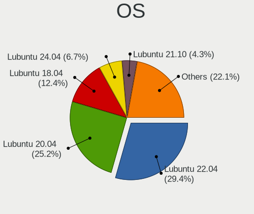

| Name            | Notebooks | Percent |
|-----------------|-----------|---------|
| Lubuntu 20.04   | 256       | 37.43%  |
| Lubuntu 18.04   | 124       | 18.13%  |
| Lubuntu 22.04   | 92        | 13.45%  |
| Lubuntu 21.10   | 47        | 6.87%   |
| Lubuntu 19.10   | 43        | 6.29%   |
| Lubuntu 21.04   | 37        | 5.41%   |
| Lubuntu 20.10   | 29        | 4.24%   |
| Lubuntu 22.10   | 15        | 2.19%   |
| Lubuntu 16.04   | 15        | 2.19%   |
| Lubuntu 19.04   | 12        | 1.75%   |
| Lubuntu 18.10   | 8         | 1.17%   |
| Lubuntu         | 3         | 0.44%   |
| Lubuntu 20.04.1 | 1         | 0.15%   |
| Lubuntu 17.10   | 1         | 0.15%   |
| Lubuntu 12.04   | 1         | 0.15%   |

OS Family
---------

OS without a version

| Name    | Notebooks | Percent |
|---------|-----------|---------|
| Lubuntu | 657       | 100%    |

Kernel
------

Version of the Linux kernel

| Version            | Notebooks | Percent |
|--------------------|-----------|---------|
| 5.4.0-42-generic   | 24        | 3.19%   |
| 5.15.0-43-generic  | 16        | 2.12%   |
| 5.4.0-52-generic   | 15        | 1.99%   |
| 5.3.0-46-generic   | 11        | 1.46%   |
| 5.13.0-28-generic  | 11        | 1.46%   |
| 5.13.0-19-generic  | 11        | 1.46%   |
| 5.11.0-16-generic  | 11        | 1.46%   |
| 5.15.0-46-generic  | 10        | 1.33%   |
| 5.13.0-40-generic  | 10        | 1.33%   |
| 5.4.0-48-generic   | 9         | 1.2%    |
| 5.4.0-47-generic   | 9         | 1.2%    |
| 5.4.0-26-generic   | 9         | 1.2%    |
| 5.15.0-56-generic  | 9         | 1.2%    |
| 5.15.0-41-generic  | 9         | 1.2%    |
| 5.13.0-35-generic  | 9         | 1.2%    |
| 5.13.0-30-generic  | 9         | 1.2%    |
| 5.4.0-65-generic   | 8         | 1.06%   |
| 5.3.0-18-generic   | 8         | 1.06%   |
| 5.15.0-30-generic  | 8         | 1.06%   |
| 5.11.0-25-generic  | 8         | 1.06%   |
| 4.15.0-112-generic | 8         | 1.06%   |
| 5.4.0-73-generic   | 7         | 0.93%   |
| 5.4.0-54-generic   | 7         | 0.93%   |
| 5.4.0-40-generic   | 7         | 0.93%   |
| 5.19.0-26-generic  | 7         | 0.93%   |
| 5.15.0-52-generic  | 7         | 0.93%   |
| 5.15.0-25-generic  | 7         | 0.93%   |
| 5.11.0-38-generic  | 7         | 0.93%   |
| 4.15.0-91-generic  | 7         | 0.93%   |
| 5.8.0-63-generic   | 6         | 0.8%    |
| 5.4.0-72-generic   | 6         | 0.8%    |
| 5.4.0-29-generic   | 6         | 0.8%    |
| 5.3.0-51-generic   | 6         | 0.8%    |
| 5.3.0-40-generic   | 6         | 0.8%    |
| 5.19.0-23-generic  | 6         | 0.8%    |
| 5.15.0-53-generic  | 6         | 0.8%    |
| 5.15.0-47-generic  | 6         | 0.8%    |
| 5.15.0-27-generic  | 6         | 0.8%    |
| 5.13.0-22-generic  | 6         | 0.8%    |
| 5.11.0-37-generic  | 6         | 0.8%    |

Kernel Family
-------------

Linux kernel without a distro release

| Version  | Notebooks | Percent |
|----------|-----------|---------|
| 5.4.0    | 195       | 28.1%   |
| 5.15.0   | 104       | 14.99%  |
| 4.15.0   | 77        | 11.1%   |
| 5.13.0   | 72        | 10.37%  |
| 5.11.0   | 66        | 9.51%   |
| 5.3.0    | 63        | 9.08%   |
| 5.8.0    | 56        | 8.07%   |
| 5.0.0    | 16        | 2.31%   |
| 5.19.0   | 15        | 2.16%   |
| 4.18.0   | 9         | 1.3%    |
| 4.4.0    | 4         | 0.58%   |
| 4.13.0   | 2         | 0.29%   |
| 6.0.12   | 1         | 0.14%   |
| 6.0.0    | 1         | 0.14%   |
| 5.9.0    | 1         | 0.14%   |
| 5.7.9    | 1         | 0.14%   |
| 5.6.0    | 1         | 0.14%   |
| 5.5.2    | 1         | 0.14%   |
| 5.19.8   | 1         | 0.14%   |
| 5.18.0   | 1         | 0.14%   |
| 5.16.0   | 1         | 0.14%   |
| 5.14.0   | 1         | 0.14%   |
| 5.10.0   | 1         | 0.14%   |
| 4.14.225 | 1         | 0.14%   |
| 4.13.9   | 1         | 0.14%   |
| 4.10.0   | 1         | 0.14%   |
| 3.13.0   | 1         | 0.14%   |

Kernel Major Ver.
-----------------

Linux kernel major version

| Version | Notebooks | Percent |
|---------|-----------|---------|
| 5.4     | 195       | 28.1%   |
| 5.15    | 104       | 14.99%  |
| 4.15    | 77        | 11.1%   |
| 5.13    | 72        | 10.37%  |
| 5.11    | 66        | 9.51%   |
| 5.3     | 63        | 9.08%   |
| 5.8     | 56        | 8.07%   |
| 5.19    | 16        | 2.31%   |
| 5.0     | 16        | 2.31%   |
| 4.18    | 9         | 1.3%    |
| 4.4     | 4         | 0.58%   |
| 4.13    | 3         | 0.43%   |
| 6.0     | 2         | 0.29%   |
| 5.9     | 1         | 0.14%   |
| 5.7     | 1         | 0.14%   |
| 5.6     | 1         | 0.14%   |
| 5.5     | 1         | 0.14%   |
| 5.18    | 1         | 0.14%   |
| 5.16    | 1         | 0.14%   |
| 5.14    | 1         | 0.14%   |
| 5.10    | 1         | 0.14%   |
| 4.14    | 1         | 0.14%   |
| 4.10    | 1         | 0.14%   |
| 3.13    | 1         | 0.14%   |

Arch
----

OS architecture (x86_64, i586, etc.)

| Name   | Notebooks | Percent |
|--------|-----------|---------|
| x86_64 | 576       | 87.67%  |
| i686   | 81        | 12.33%  |

DE
--

Desktop Environment

| Name            | Notebooks | Percent |
|-----------------|-----------|---------|
| LXQt            | 499       | 75.61%  |
| LXDE            | 122       | 18.48%  |
| Unknown         | 15        | 2.27%   |
| GNOME           | 6         | 0.91%   |
| Openbox         | 5         | 0.76%   |
| X-Cinnamon      | 2         | 0.3%    |
| Lubuntu         | 2         | 0.3%    |
| KDE5            | 2         | 0.3%    |
| Cinnamon        | 2         | 0.3%    |
| MATE            | 1         | 0.15%   |
| KDE             | 1         | 0.15%   |
| i3              | 1         | 0.15%   |
| GNOME Flashback | 1         | 0.15%   |
| Budgie          | 1         | 0.15%   |

Display Server
--------------

X11 or Wayland

| Name    | Notebooks | Percent |
|---------|-----------|---------|
| X11     | 641       | 97.27%  |
| Tty     | 14        | 2.12%   |
| Wayland | 4         | 0.61%   |

Display Manager
---------------

SDDM, LightDM, etc.

| Name    | Notebooks | Percent |
|---------|-----------|---------|
| SDDM    | 309       | 46.19%  |
| Unknown | 235       | 35.13%  |
| LightDM | 56        | 8.37%   |
| TDM     | 43        | 6.43%   |
| GDM     | 21        | 3.14%   |
| GDM3    | 4         | 0.6%    |
| XDM     | 1         | 0.15%   |

OS Lang
-------

Language

| Lang    | Notebooks | Percent |
|---------|-----------|---------|
| en_US   | 184       | 27.79%  |
| pt_BR   | 56        | 8.46%   |
| fr_FR   | 50        | 7.55%   |
| it_IT   | 45        | 6.8%    |
| en_GB   | 38        | 5.74%   |
| de_DE   | 33        | 4.98%   |
| pl_PL   | 24        | 3.63%   |
| C       | 23        | 3.47%   |
| ru_RU   | 22        | 3.32%   |
| Unknown | 18        | 2.72%   |
| es_ES   | 17        | 2.57%   |
| en_CA   | 12        | 1.81%   |
| en_AU   | 11        | 1.66%   |
| es_AR   | 9         | 1.36%   |
| tr_TR   | 8         | 1.21%   |
| en_IN   | 8         | 1.21%   |
| cs_CZ   | 7         | 1.06%   |
| es_MX   | 6         | 0.91%   |
| nl_NL   | 5         | 0.76%   |
| hu_HU   | 5         | 0.76%   |
| es_CR   | 5         | 0.76%   |
| es_CL   | 5         | 0.76%   |
| en_IE   | 5         | 0.76%   |
| ja_JP   | 4         | 0.6%    |
| fr_BE   | 4         | 0.6%    |
| nl_BE   | 3         | 0.45%   |
| fr_CH   | 3         | 0.45%   |
| es_CO   | 3         | 0.45%   |
| en_PH   | 3         | 0.45%   |
| en_AG   | 3         | 0.45%   |
| el_GR   | 3         | 0.45%   |
| zh_TW   | 2         | 0.3%    |
| id_ID   | 2         | 0.3%    |
| fr_CA   | 2         | 0.3%    |
| fi_FI   | 2         | 0.3%    |
| es_VE   | 2         | 0.3%    |
| es_UY   | 2         | 0.3%    |
| es_PE   | 2         | 0.3%    |
| en_ZA   | 2         | 0.3%    |
| en_SG   | 2         | 0.3%    |

Boot Mode
---------

EFI or BIOS

| Mode | Notebooks | Percent |
|------|-----------|---------|
| BIOS | 423       | 63.51%  |
| EFI  | 243       | 36.49%  |

Filesystem
----------

Type of filesystem

| Type    | Notebooks | Percent |
|---------|-----------|---------|
| Ext4    | 612       | 93.01%  |
| Overlay | 24        | 3.65%   |
| Btrfs   | 10        | 1.52%   |
| Aufs    | 5         | 0.76%   |
| Unknown | 3         | 0.46%   |
| Ext3    | 2         | 0.3%    |
| Xfs     | 1         | 0.15%   |
| Ext2    | 1         | 0.15%   |

Part. scheme
------------

Scheme of partitioning

| Type    | Notebooks | Percent |
|---------|-----------|---------|
| Unknown | 305       | 45.93%  |
| GPT     | 199       | 29.97%  |
| MBR     | 160       | 24.1%   |

Dual Boot with Linux/BSD
------------------------

Hosting more than one Linux/BSD

| Dual boot | Notebooks | Percent |
|-----------|-----------|---------|
| No        | 607       | 91.55%  |
| Yes       | 56        | 8.45%   |

Dual Boot (Win)
---------------

Hosting Linux and Windows

| Dual boot | Notebooks | Percent |
|-----------|-----------|---------|
| No        | 505       | 76.4%   |
| Yes       | 156       | 23.6%   |

Board
-----

Vendor
------

Motherboard manufacturer

| Name                | Notebooks | Percent |
|---------------------|-----------|---------|
| Hewlett-Packard     | 139       | 21.16%  |
| Lenovo              | 86        | 13.09%  |
| Dell                | 68        | 10.35%  |
| ASUSTek Computer    | 68        | 10.35%  |
| Acer                | 60        | 9.13%   |
| Toshiba             | 41        | 6.24%   |
| Samsung Electronics | 24        | 3.65%   |
| Sony                | 17        | 2.59%   |
| Apple               | 17        | 2.59%   |
| Google              | 16        | 2.44%   |
| Positivo            | 13        | 1.98%   |
| MSI                 | 9         | 1.37%   |
| Fujitsu             | 9         | 1.37%   |
| Unknown             | 7         | 1.07%   |
| Packard Bell        | 6         | 0.91%   |
| Fujitsu Siemens     | 6         | 0.91%   |
| Notebook            | 5         | 0.76%   |
| Mediacom            | 5         | 0.76%   |
| IBM                 | 3         | 0.46%   |
| Gateway             | 3         | 0.46%   |
| Alienware           | 3         | 0.46%   |
| YASHI               | 2         | 0.3%    |
| Standard            | 2         | 0.3%    |
| Prestigio           | 2         | 0.3%    |
| Panasonic           | 2         | 0.3%    |
| OEM                 | 2         | 0.3%    |
| Itautec             | 2         | 0.3%    |
| Insyde              | 2         | 0.3%    |
| GPU Company         | 2         | 0.3%    |
| Gigabyte Technology | 2         | 0.3%    |
| Dixonsxp            | 2         | 0.3%    |
| AMI                 | 2         | 0.3%    |
| UNOWHY              | 1         | 0.15%   |
| TrekStor            | 1         | 0.15%   |
| Timi                | 1         | 0.15%   |
| Thomson             | 1         | 0.15%   |
| Teclast             | 1         | 0.15%   |
| System76            | 1         | 0.15%   |
| Star Labs           | 1         | 0.15%   |
| SGIN                | 1         | 0.15%   |

Model
-----

Motherboard model

| Name                                  | Notebooks | Percent |
|---------------------------------------|-----------|---------|
| Unknown                               | 15        | 2.28%   |
| HP Notebook                           | 7         | 1.07%   |
| Apple MacBookPro8,1                   | 6         | 0.91%   |
| HP Pavilion g6                        | 5         | 0.76%   |
| HP Pavilion dv6                       | 4         | 0.61%   |
| Dell Latitude D630                    | 4         | 0.61%   |
| Lenovo IdeaPad Slim 1-14AST-05 81VS   | 3         | 0.46%   |
| HP ProBook 440 G7                     | 3         | 0.46%   |
| HP Pavilion 15                        | 3         | 0.46%   |
| Dell Inspiron N5010                   | 3         | 0.46%   |
| ASUS 1000H                            | 3         | 0.46%   |
| Acer Aspire 5742G                     | 3         | 0.46%   |
| YASHI MYBOOK 360                      | 2         | 0.3%    |
| Toshiba Satellite L40                 | 2         | 0.3%    |
| Toshiba Satellite A205                | 2         | 0.3%    |
| Samsung RV415/RV515                   | 2         | 0.3%    |
| Samsung 275E4E/275E5E                 | 2         | 0.3%    |
| Prestigio PSB141C01BFH                | 2         | 0.3%    |
| Positivo Mobile                       | 2         | 0.3%    |
| Positivo H14BT58                      | 2         | 0.3%    |
| Mediacom WinPad 11,6 FullHD- WPU11    | 2         | 0.3%    |
| Mediacom GTZS                         | 2         | 0.3%    |
| Lenovo IdeaPad L340-15IRH Gaming 81LK | 2         | 0.3%    |
| Lenovo IdeaPad 330-17AST 81D7         | 2         | 0.3%    |
| Lenovo IdeaPad 320-15AST 80XV         | 2         | 0.3%    |
| Lenovo IdeaPad 100-15IBD 80QQ         | 2         | 0.3%    |
| Lenovo G50-45 80E3                    | 2         | 0.3%    |
| Lenovo G50-30 80G0                    | 2         | 0.3%    |
| Itautec Infoway                       | 2         | 0.3%    |
| HP ProBook 450 G6                     | 2         | 0.3%    |
| HP ProBook 450 G2                     | 2         | 0.3%    |
| HP ProBook 440 G8 Notebook PC         | 2         | 0.3%    |
| HP Pavilion g7                        | 2         | 0.3%    |
| HP Pavilion g4                        | 2         | 0.3%    |
| HP Laptop 15-da0xxx                   | 2         | 0.3%    |
| HP Laptop 15-bw0xx                    | 2         | 0.3%    |
| HP EliteBook 840 G1                   | 2         | 0.3%    |
| HP EliteBook 2560p                    | 2         | 0.3%    |
| HP Compaq Presario CQ50               | 2         | 0.3%    |
| HP Compaq Presario C700               | 2         | 0.3%    |

Model Family
------------

Motherboard model prefix

| Name                   | Notebooks | Percent |
|------------------------|-----------|---------|
| Acer Aspire            | 42        | 6.39%   |
| Toshiba Satellite      | 36        | 5.48%   |
| HP Pavilion            | 35        | 5.33%   |
| Lenovo IdeaPad         | 33        | 5.02%   |
| Lenovo ThinkPad        | 31        | 4.72%   |
| Dell Inspiron          | 30        | 4.57%   |
| HP ProBook             | 26        | 3.96%   |
| Dell Latitude          | 22        | 3.35%   |
| HP EliteBook           | 16        | 2.44%   |
| HP Compaq              | 16        | 2.44%   |
| Unknown                | 15        | 2.28%   |
| HP Laptop              | 11        | 1.67%   |
| HP Notebook            | 7         | 1.07%   |
| Fujitsu LIFEBOOK       | 7         | 1.07%   |
| ASUS VivoBook          | 7         | 1.07%   |
| Fujitsu Siemens AMILO  | 6         | 0.91%   |
| Apple MacBookPro8      | 6         | 0.91%   |
| Packard Bell EasyNote  | 5         | 0.76%   |
| HP Presario            | 5         | 0.76%   |
| Dell XPS               | 5         | 0.76%   |
| HP Stream              | 4         | 0.61%   |
| Dell Vostro            | 4         | 0.61%   |
| Acer Extensa           | 4         | 0.61%   |
| Dell Studio            | 3         | 0.46%   |
| ASUS 1000H             | 3         | 0.46%   |
| Apple MacBookPro10     | 3         | 0.46%   |
| Acer Swift             | 3         | 0.46%   |
| YASHI MYBOOK           | 2         | 0.3%    |
| Toshiba TECRA          | 2         | 0.3%    |
| Samsung RV415          | 2         | 0.3%    |
| Samsung 275E4E         | 2         | 0.3%    |
| Prestigio PSB141C01BFH | 2         | 0.3%    |
| Positivo Mobile        | 2         | 0.3%    |
| Positivo H14BT58       | 2         | 0.3%    |
| Notebook W54           | 2         | 0.3%    |
| Mediacom WinPad        | 2         | 0.3%    |
| Mediacom GTZS          | 2         | 0.3%    |
| Lenovo Yoga            | 2         | 0.3%    |
| Lenovo G50-45          | 2         | 0.3%    |
| Lenovo G50-30          | 2         | 0.3%    |

MFG Year
--------

Motherboard manufacture year

| Year    | Notebooks | Percent |
|---------|-----------|---------|
| 2011    | 72        | 10.96%  |
| 2010    | 55        | 8.37%   |
| 2008    | 54        | 8.22%   |
| 2012    | 51        | 7.76%   |
| 2013    | 50        | 7.61%   |
| 2007    | 48        | 7.31%   |
| 2019    | 41        | 6.24%   |
| 2009    | 36        | 5.48%   |
| 2016    | 35        | 5.33%   |
| 2014    | 34        | 5.18%   |
| 2018    | 31        | 4.72%   |
| 2017    | 30        | 4.57%   |
| 2015    | 28        | 4.26%   |
| 2021    | 27        | 4.11%   |
| 2020    | 27        | 4.11%   |
| 2006    | 22        | 3.35%   |
| 2022    | 6         | 0.91%   |
| 2005    | 5         | 0.76%   |
| 2002    | 2         | 0.3%    |
| Unknown | 2         | 0.3%    |
| 2004    | 1         | 0.15%   |

Form Factor
-----------

Physical design of the computer

| Name     | Notebooks | Percent |
|----------|-----------|---------|
| Notebook | 657       | 100%    |

Secure Boot
-----------

Enabled or disabled

| State    | Notebooks | Percent |
|----------|-----------|---------|
| Disabled | 620       | 94.22%  |
| Enabled  | 38        | 5.78%   |

Coreboot
--------

Have coreboot on board

| Used | Notebooks | Percent |
|------|-----------|---------|
| No   | 638       | 96.96%  |
| Yes  | 20        | 3.04%   |

RAM Size
--------

Total RAM memory

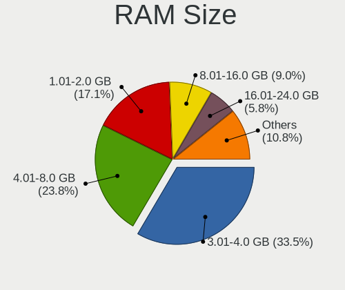

| Size in GB | Notebooks | Percent |
|------------|-----------|---------|
| 3.01-4.0   | 214       | 32.23%  |
| 4.01-8.0   | 149       | 22.44%  |
| 1.01-2.0   | 133       | 20.03%  |
| 8.01-16.0  | 62        | 9.34%   |
| 2.01-3.0   | 39        | 5.87%   |
| 16.01-24.0 | 33        | 4.97%   |
| 0.51-1.0   | 25        | 3.77%   |
| 32.01-64.0 | 7         | 1.05%   |
| 0.01-0.5   | 2         | 0.3%    |

RAM Used
--------

Used RAM memory

| Used GB   | Notebooks | Percent |
|-----------|-----------|---------|
| 1.01-2.0  | 312       | 44.13%  |
| 0.51-1.0  | 191       | 27.02%  |
| 2.01-3.0  | 86        | 12.16%  |
| 0.01-0.5  | 42        | 5.94%   |
| 4.01-8.0  | 36        | 5.09%   |
| 3.01-4.0  | 35        | 4.95%   |
| 8.01-16.0 | 4         | 0.57%   |
| Unknown   | 1         | 0.14%   |

Total Drives
------------

Number of drives on board

| Drives | Notebooks | Percent |
|--------|-----------|---------|
| 1      | 508       | 76.62%  |
| 2      | 134       | 20.21%  |
| 0      | 13        | 1.96%   |
| 3      | 7         | 1.06%   |
| 4      | 1         | 0.15%   |

Has CD-ROM
----------

Has CD-ROM on board

| Presented | Notebooks | Percent |
|-----------|-----------|---------|
| Yes       | 335       | 50.76%  |
| No        | 325       | 49.24%  |

Has Ethernet
------------

Has Ethernet on board

| Presented | Notebooks | Percent |
|-----------|-----------|---------|
| Yes       | 556       | 84.37%  |
| No        | 103       | 15.63%  |

Has WiFi
--------

Has WiFi module

| Presented | Notebooks | Percent |
|-----------|-----------|---------|
| Yes       | 620       | 94.37%  |
| No        | 37        | 5.63%   |

Has Bluetooth
-------------

Has Bluetooth module

| Presented | Notebooks | Percent |
|-----------|-----------|---------|
| Yes       | 398       | 59.67%  |
| No        | 269       | 40.33%  |

Location
--------

Country
-------

Geographic location (country)

| Country      | Notebooks | Percent |
|--------------|-----------|---------|
| USA          | 88        | 13.37%  |
| Brazil       | 68        | 10.33%  |
| Italy        | 55        | 8.36%   |
| France       | 52        | 7.9%    |
| Germany      | 44        | 6.69%   |
| UK           | 35        | 5.32%   |
| Russia       | 35        | 5.32%   |
| Poland       | 25        | 3.8%    |
| Canada       | 20        | 3.04%   |
| Spain        | 15        | 2.28%   |
| Turkey       | 12        | 1.82%   |
| Netherlands  | 12        | 1.82%   |
| Belgium      | 11        | 1.67%   |
| Mexico       | 10        | 1.52%   |
| Indonesia    | 10        | 1.52%   |
| Czechia      | 10        | 1.52%   |
| Australia    | 10        | 1.52%   |
| Argentina    | 10        | 1.52%   |
| Ukraine      | 8         | 1.22%   |
| India        | 8         | 1.22%   |
| Hungary      | 7         | 1.06%   |
| Switzerland  | 6         | 0.91%   |
| Ireland      | 6         | 0.91%   |
| Costa Rica   | 5         | 0.76%   |
| Chile        | 5         | 0.76%   |
| Vietnam      | 4         | 0.61%   |
| Portugal     | 4         | 0.61%   |
| Finland      | 4         | 0.61%   |
| Colombia     | 4         | 0.61%   |
| Sweden       | 3         | 0.46%   |
| South Africa | 3         | 0.46%   |
| Serbia       | 3         | 0.46%   |
| Philippines  | 3         | 0.46%   |
| Norway       | 3         | 0.46%   |
| Malaysia     | 3         | 0.46%   |
| Lithuania    | 3         | 0.46%   |
| Japan        | 3         | 0.46%   |
| Greece       | 3         | 0.46%   |
| Bulgaria     | 3         | 0.46%   |
| Belarus      | 3         | 0.46%   |

City
----

Geographic location (city)

| City              | Notebooks | Percent |
|-------------------|-----------|---------|
| Paris             | 11        | 1.58%   |
| Moscow            | 7         | 1%      |
| Milan             | 7         | 1%      |
| Rome              | 6         | 0.86%   |
| Porto Alegre      | 5         | 0.72%   |
| Melbourne         | 5         | 0.72%   |
| Heredia           | 5         | 0.72%   |
| Bengaluru         | 5         | 0.72%   |
| Stuttgart         | 4         | 0.57%   |
| New York          | 4         | 0.57%   |
| Munich            | 4         | 0.57%   |
| Mexico City       | 4         | 0.57%   |
| Istanbul          | 4         | 0.57%   |
| Yekaterinburg     | 3         | 0.43%   |
| Winnipeg          | 3         | 0.43%   |
| Warsaw            | 3         | 0.43%   |
| Teresina          | 3         | 0.43%   |
| Sao Paulo         | 3         | 0.43%   |
| Salvador          | 3         | 0.43%   |
| Rio Segundo       | 3         | 0.43%   |
| Rio de Janeiro    | 3         | 0.43%   |
| Oshawa            | 3         | 0.43%   |
| Kyiv              | 3         | 0.43%   |
| Kazan          | 3         | 0.43%   |
| Helsinki          | 3         | 0.43%   |
| Ghent             | 3         | 0.43%   |
| Frankfurt am Main | 3         | 0.43%   |
| Fortaleza         | 3         | 0.43%   |
| Dublin            | 3         | 0.43%   |
| Derry             | 3         | 0.43%   |
| Curitiba          | 3         | 0.43%   |
| Buenos Aires      | 3         | 0.43%   |
| Braslia         | 3         | 0.43%   |
| Bogot           | 3         | 0.43%   |
| Athens            | 3         | 0.43%   |
| Zurich            | 2         | 0.29%   |
| Vienna            | 2         | 0.29%   |
| Vicosa            | 2         | 0.29%   |
| Venice            | 2         | 0.29%   |
| Uberlndia       | 2         | 0.29%   |

Drives
------

Drive Vendor
------------

Hard drive vendors

| Vendor              | Notebooks | Drives | Percent |
|---------------------|-----------|--------|---------|
| WDC                 | 104       | 124    | 14.33%  |
| Seagate             | 102       | 117    | 14.05%  |
| Unknown             | 73        | 102    | 10.06%  |
| Toshiba             | 71        | 81     | 9.78%   |
| Hitachi             | 58        | 71     | 7.99%   |
| Samsung Electronics | 57        | 80     | 7.85%   |
| Kingston            | 36        | 39     | 4.96%   |
| Crucial             | 26        | 29     | 3.58%   |
| Fujitsu             | 20        | 21     | 2.75%   |
| SanDisk             | 19        | 23     | 2.62%   |
| Intel               | 19        | 25     | 2.62%   |
| HGST                | 19        | 22     | 2.62%   |
| SK hynix            | 11        | 11     | 1.52%   |
| Apacer              | 8         | 8      | 1.1%    |
| China               | 7         | 9      | 0.96%   |
| A-DATA Technology   | 7         | 7      | 0.96%   |
| Micron Technology   | 6         | 6      | 0.83%   |
| KIOXIA              | 5         | 5      | 0.69%   |
| Unknown             | 5         | 6      | 0.69%   |
| SPCC                | 4         | 5      | 0.55%   |
| Apple               | 4         | 11     | 0.55%   |
| Transcend           | 3         | 3      | 0.41%   |
| Patriot             | 3         | 3      | 0.41%   |
| OCZ                 | 3         | 3      | 0.41%   |
| LITEONIT            | 3         | 3      | 0.41%   |
| LITEON              | 3         | 4      | 0.41%   |
| IBM/Hitachi         | 3         | 4      | 0.41%   |
| Teclast             | 2         | 2      | 0.28%   |
| STEC                | 2         | 3      | 0.28%   |
| PNY                 | 2         | 2      | 0.28%   |
| NGFF                | 2         | 2      | 0.28%   |
| LDLC                | 2         | 2      | 0.28%   |
| KingSpec            | 2         | 4      | 0.28%   |
| KingDian            | 2         | 2      | 0.28%   |
| GOODRAM             | 2         | 2      | 0.28%   |
| Gigabyte Technology | 2         | 2      | 0.28%   |
| Dogfish             | 2         | 2      | 0.28%   |
| W800S               | 1         | 1      | 0.14%   |
| Vaseky              | 1         | 1      | 0.14%   |
| USB                 | 1         | 1      | 0.14%   |

Drive Model
-----------

Hard drive models

| Model                                | Notebooks | Percent |
|--------------------------------------|-----------|---------|
| Unknown MMC Card  32GB               | 18        | 2.37%   |
| Seagate ST9500325AS 500GB            | 10        | 1.32%   |
| Kingston SA400S37240G 240GB SSD      | 10        | 1.32%   |
| Seagate ST1000LM024 HN-M101MBB 1TB   | 9         | 1.18%   |
| Toshiba MQ01ABF050 500GB             | 8         | 1.05%   |
| Toshiba MQ01ABD100 1TB               | 8         | 1.05%   |
| Seagate ST500LT012-1DG142 500GB      | 8         | 1.05%   |
| Seagate ST1000LM035-1RK172 1TB       | 8         | 1.05%   |
| Unknown MMC Card  64GB               | 7         | 0.92%   |
| Seagate ST500LM012 HN-M500MBB 500GB  | 7         | 0.92%   |
| Crucial CT240BX500SSD1 240GB         | 7         | 0.92%   |
| Unknown MMC Card  16GB               | 5         | 0.66%   |
| Toshiba MQ01ABD050 500GB             | 5         | 0.66%   |
| Seagate ST9320325AS 320GB            | 5         | 0.66%   |
| Samsung SSD 850 EVO 250GB            | 5         | 0.66%   |
| Unknown                              | 5         | 0.66%   |
| WDC WD3200BPVT-22JJ5T0 320GB         | 4         | 0.53%   |
| WDC WD10SPZX-24Z10T0 1TB             | 4         | 0.53%   |
| Unknown NCard  32GB                  | 4         | 0.53%   |
| Unknown MMC64G  64GB                 | 4         | 0.53%   |
| Unknown DA4064  64GB                 | 4         | 0.53%   |
| Seagate ST9250315AS 250GB            | 4         | 0.53%   |
| Seagate ST320LM001 HN-M320MBB 320GB  | 4         | 0.53%   |
| Samsung SSD 860 EVO 500GB            | 4         | 0.53%   |
| Kingston SA400S37480G 480GB SSD      | 4         | 0.53%   |
| Kingston SA400S37120G 120GB SSD      | 4         | 0.53%   |
| Hitachi HTS547575A9E384 752GB        | 4         | 0.53%   |
| Hitachi HTS543216L9SA00 160GB        | 4         | 0.53%   |
| Hitachi HTS542512K9SA00 120GB        | 4         | 0.53%   |
| HGST HTS545050A7E680 500GB           | 4         | 0.53%   |
| HGST HTS545050A7E380 500GB           | 4         | 0.53%   |
| Crucial CT480BX500SSD1 480GB         | 4         | 0.53%   |
| WDC WD3200BEVT-22ZCT0 320GB          | 3         | 0.39%   |
| WDC WD2500BEVT-80A23T0 250GB         | 3         | 0.39%   |
| WDC WD2500BEVT-22ZCT0 250GB          | 3         | 0.39%   |
| WDC WD10JPVX-22JC3T0 1TB             | 3         | 0.39%   |
| WDC PC SN520 SDAPNUW-256G-1006 256GB | 3         | 0.39%   |
| Unknown SD/MMC/MS PRO 64GB           | 3         | 0.39%   |
| Unknown 128G32  128GB                | 3         | 0.39%   |
| Toshiba MK2546GSX 250GB              | 3         | 0.39%   |

HDD Vendor
----------

Hard disk drive vendors

| Vendor              | Notebooks | Drives | Percent |
|---------------------|-----------|--------|---------|
| Seagate             | 101       | 116    | 27.15%  |
| WDC                 | 89        | 105    | 23.92%  |
| Toshiba             | 60        | 67     | 16.13%  |
| Hitachi             | 58        | 71     | 15.59%  |
| Fujitsu             | 20        | 21     | 5.38%   |
| HGST                | 19        | 22     | 5.11%   |
| Samsung Electronics | 16        | 26     | 4.3%    |
| Unknown             | 3         | 5      | 0.81%   |
| IBM/Hitachi         | 3         | 4      | 0.81%   |
| USB                 | 1         | 1      | 0.27%   |
| LaCie               | 1         | 1      | 0.27%   |
| Apple               | 1         | 1      | 0.27%   |

SSD Vendor
----------

Solid state drive vendors

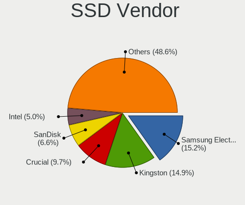

| Vendor              | Notebooks | Drives | Percent |
|---------------------|-----------|--------|---------|
| Kingston            | 30        | 32     | 14.29%  |
| Samsung Electronics | 28        | 39     | 13.33%  |
| Crucial             | 25        | 28     | 11.9%   |
| Intel               | 15        | 21     | 7.14%   |
| SanDisk             | 13        | 17     | 6.19%   |
| WDC                 | 8         | 10     | 3.81%   |
| Apacer              | 8         | 8      | 3.81%   |
| Toshiba             | 7         | 9      | 3.33%   |
| A-DATA Technology   | 7         | 7      | 3.33%   |
| China               | 6         | 8      | 2.86%   |
| SPCC                | 4         | 5      | 1.9%    |
| Transcend           | 3         | 3      | 1.43%   |
| SK hynix            | 3         | 3      | 1.43%   |
| Patriot             | 3         | 3      | 1.43%   |
| OCZ                 | 3         | 3      | 1.43%   |
| Micron Technology   | 3         | 3      | 1.43%   |
| LITEONIT            | 3         | 3      | 1.43%   |
| LITEON              | 3         | 4      | 1.43%   |
| Teclast             | 2         | 2      | 0.95%   |
| PNY                 | 2         | 2      | 0.95%   |
| NGFF                | 2         | 2      | 0.95%   |
| LDLC                | 2         | 2      | 0.95%   |
| KingSpec            | 2         | 4      | 0.95%   |
| KingDian            | 2         | 2      | 0.95%   |
| GOODRAM             | 2         | 2      | 0.95%   |
| Dogfish             | 2         | 2      | 0.95%   |
| Apple               | 2         | 8      | 0.95%   |
| W800S               | 1         | 1      | 0.48%   |
| Vaseky              | 1         | 1      | 0.48%   |
| Unknown             | 1         | 1      | 0.48%   |
| TEAM T25            | 1         | 1      | 0.48%   |
| TCSUNBOW            | 1         | 1      | 0.48%   |
| Star                | 1         | 1      | 0.48%   |
| Seagate             | 1         | 1      | 0.48%   |
| Rogueware           | 1         | 1      | 0.48%   |
| MyDigitalSSD        | 1         | 1      | 0.48%   |
| Mushkin             | 1         | 1      | 0.48%   |
| LS                  | 1         | 1      | 0.48%   |
| Lexar               | 1         | 1      | 0.48%   |
| Leqixiang           | 1         | 1      | 0.48%   |

Drive Kind
----------

HDD or SSD

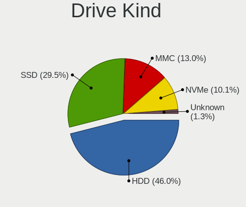

| Kind    | Notebooks | Drives | Percent |
|---------|-----------|--------|---------|
| HDD     | 368       | 440    | 51.18%  |
| SSD     | 205       | 253    | 28.51%  |
| MMC     | 79        | 106    | 10.99%  |
| NVMe    | 57        | 68     | 7.93%   |
| Unknown | 10        | 11     | 1.39%   |

Drive Connector
---------------

SATA, SAS, NVMe, etc.

| Type | Notebooks | Drives | Percent |
|------|-----------|--------|---------|
| SATA | 539       | 678    | 77.44%  |
| MMC  | 79        | 106    | 11.35%  |
| NVMe | 57        | 68     | 8.19%   |
| SAS  | 21        | 26     | 3.02%   |

Drive Size
----------

Size of hard drive

| Size in TB | Notebooks | Drives | Percent |
|------------|-----------|--------|---------|
| 0.01-0.5   | 446       | 552    | 79.36%  |
| 0.51-1.0   | 103       | 125    | 18.33%  |
| 1.01-2.0   | 8         | 10     | 1.42%   |
| 3.01-4.0   | 3         | 3      | 0.53%   |
| 4.01-10.0  | 2         | 3      | 0.36%   |

Space Total
-----------

Amount of disk space available on the file system

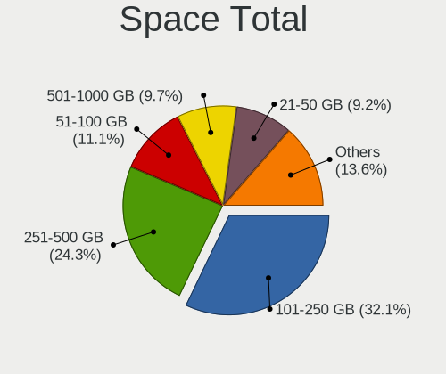

| Size in GB     | Notebooks | Percent |
|----------------|-----------|---------|
| 101-250        | 205       | 30.6%   |
| 251-500        | 173       | 25.82%  |
| 51-100         | 72        | 10.75%  |
| 501-1000       | 69        | 10.3%   |
| 21-50          | 61        | 9.1%    |
| 1-20           | 57        | 8.51%   |
| 1001-2000      | 18        | 2.69%   |
| More than 3000 | 7         | 1.04%   |
| 2001-3000      | 5         | 0.75%   |
| Unknown        | 3         | 0.45%   |

Space Used
----------

Amount of used disk space

| Used GB        | Notebooks | Percent |
|----------------|-----------|---------|
| 1-20           | 381       | 55.06%  |
| 21-50          | 133       | 19.22%  |
| 101-250        | 73        | 10.55%  |
| 51-100         | 49        | 7.08%   |
| 251-500        | 23        | 3.32%   |
| 501-1000       | 19        | 2.75%   |
| 1001-2000      | 7         | 1.01%   |
| More than 3000 | 3         | 0.43%   |
| Unknown        | 3         | 0.43%   |
| 2001-3000      | 1         | 0.14%   |

Malfunc. Drives
---------------

Drive models with a malfunction

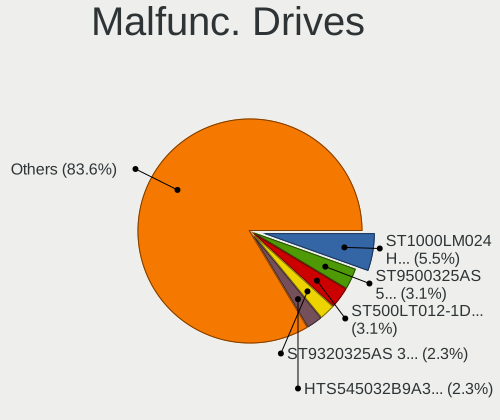

| Model                                 | Notebooks | Drives | Percent |
|---------------------------------------|-----------|--------|---------|
| Seagate ST9500325AS 500GB             | 3         | 3      | 3.9%    |
| Seagate ST9320325AS 320GB             | 3         | 3      | 3.9%    |
| Seagate ST1000LM024 HN-M101MBB 1TB    | 3         | 3      | 3.9%    |
| Seagate ST500LT012-1DG142 500GB       | 2         | 2      | 2.6%    |
| Hitachi HTS545032B9A300 320GB         | 2         | 2      | 2.6%    |
| Hitachi HTS542512K9SA00 120GB         | 2         | 2      | 2.6%    |
| WDC WDS240G2G0A-00JH30 240GB SSD      | 1         | 1      | 1.3%    |
| WDC WD800BEVS-60RST0 80GB             | 1         | 1      | 1.3%    |
| WDC WD5000LUCT-62C26Y0 500GB          | 1         | 1      | 1.3%    |
| WDC WD3200BPVT-80ZEST0 320GB          | 1         | 1      | 1.3%    |
| WDC WD3200BEVT-75A23T0 320GB          | 1         | 1      | 1.3%    |
| WDC WD3200BEKT-60PVMT0 320GB          | 1         | 1      | 1.3%    |
| WDC WD2500BEVT-80A23T0 250GB          | 1         | 2      | 1.3%    |
| WDC WD1200BEVS-60UST0 120GB           | 1         | 1      | 1.3%    |
| WDC WD1200BEVS-07LAT0 120GB           | 1         | 1      | 1.3%    |
| WDC WD10SPZX-24Z10T0 1TB              | 1         | 1      | 1.3%    |
| WDC WD10JPVX-75JC3T0 1TB              | 1         | 1      | 1.3%    |
| WDC WD10JPVX-60JC3T1 1TB              | 1         | 1      | 1.3%    |
| Toshiba MQ01ABF050 500GB              | 1         | 1      | 1.3%    |
| Toshiba MQ01ABD050 500GB              | 1         | 1      | 1.3%    |
| Toshiba MK5065GSXN 500GB              | 1         | 1      | 1.3%    |
| Toshiba MK5059GSXP 500GB              | 1         | 1      | 1.3%    |
| Toshiba MK3276GSX 320GB               | 1         | 1      | 1.3%    |
| Toshiba MK2046GSX 200GB               | 1         | 1      | 1.3%    |
| TCSUNBOW X1 32GB SSD                  | 1         | 1      | 1.3%    |
| SK hynix HFS128G3BTND-N210A 128GB SSD | 1         | 1      | 1.3%    |
| SK hynix HFS128G39TND-N210A 128GB SSD | 1         | 1      | 1.3%    |
| Seagate ST9250410AS 250GB             | 1         | 1      | 1.3%    |
| Seagate ST9250315AS 250GB             | 1         | 1      | 1.3%    |
| Seagate ST9160821AS 160GB             | 1         | 1      | 1.3%    |
| Seagate ST500LM021-1KJ152 500GB       | 1         | 1      | 1.3%    |
| Seagate ST320LT020-9YG142 320GB       | 1         | 1      | 1.3%    |
| Seagate ST320LT007-9ZV142 320GB       | 1         | 2      | 1.3%    |
| Seagate ST1000DM003-1SB102 1TB        | 1         | 1      | 1.3%    |
| Samsung Electronics HM160JI 160GB     | 1         | 1      | 1.3%    |
| Samsung Electronics HM121HI 120GB     | 1         | 6      | 1.3%    |
| OCZ VERTEX3 120GB SSD                 | 1         | 1      | 1.3%    |
| NGFF 2280 512GB SSD                   | 1         | 1      | 1.3%    |
| LITEON IT LST-16S9G-HP 16GB SSD       | 1         | 1      | 1.3%    |
| LITEON CV8-8E128-HP 128GB SSD         | 1         | 1      | 1.3%    |

Malfunc. Drive Vendor
---------------------

Vendors of faulty drives

| Vendor              | Notebooks | Drives | Percent |
|---------------------|-----------|--------|---------|
| Seagate             | 18        | 19     | 23.38%  |
| WDC                 | 12        | 13     | 15.58%  |
| Hitachi             | 12        | 13     | 15.58%  |
| Toshiba             | 6         | 6      | 7.79%   |
| HGST                | 5         | 5      | 6.49%   |
| Crucial             | 5         | 5      | 6.49%   |
| Fujitsu             | 3         | 3      | 3.9%    |
| SK hynix            | 2         | 2      | 2.6%    |
| Samsung Electronics | 2         | 7      | 2.6%    |
| LITEON              | 2         | 2      | 2.6%    |
| KingSpec            | 2         | 4      | 2.6%    |
| Intel               | 2         | 2      | 2.6%    |
| TCSUNBOW            | 1         | 1      | 1.3%    |
| OCZ                 | 1         | 1      | 1.3%    |
| NGFF                | 1         | 1      | 1.3%    |
| Kingston            | 1         | 1      | 1.3%    |
| Apacer              | 1         | 1      | 1.3%    |
| A-DATA Technology   | 1         | 1      | 1.3%    |

Malfunc. HDD Vendor
-------------------

Vendors of faulty HDD drives

| Vendor              | Notebooks | Drives | Percent |
|---------------------|-----------|--------|---------|
| Seagate             | 18        | 19     | 31.58%  |
| Hitachi             | 12        | 13     | 21.05%  |
| WDC                 | 11        | 12     | 19.3%   |
| Toshiba             | 6         | 6      | 10.53%  |
| HGST                | 5         | 5      | 8.77%   |
| Fujitsu             | 3         | 3      | 5.26%   |
| Samsung Electronics | 2         | 7      | 3.51%   |

Malfunc. Drive Kind
-------------------

Kinds of faulty drives

| Kind | Notebooks | Drives | Percent |
|------|-----------|--------|---------|
| HDD  | 57        | 65     | 74.03%  |
| SSD  | 19        | 21     | 24.68%  |
| NVMe | 1         | 1      | 1.3%    |

Failed Drives
-------------

Failed drive models

| Model                             | Notebooks | Drives | Percent |
|-----------------------------------|-----------|--------|---------|
| WDC WD2500BEVT-75A23T0 250GB      | 1         | 2      | 25%     |
| WDC WD1200BEVS-22UST0 120GB       | 1         | 1      | 25%     |
| WDC WD10SPZX-22Z10T0 1TB          | 1         | 1      | 25%     |
| Samsung Electronics HM320JI 320GB | 1         | 1      | 25%     |

Failed Drive Vendor
-------------------

Failed drive vendors

| Vendor              | Notebooks | Drives | Percent |
|---------------------|-----------|--------|---------|
| WDC                 | 3         | 4      | 75%     |
| Samsung Electronics | 1         | 1      | 25%     |

Drive Status
------------

Number of failed and malfunc. drives

| Status   | Notebooks | Drives | Percent |
|----------|-----------|--------|---------|
| Detected | 377       | 519    | 55.2%   |
| Works    | 225       | 267    | 32.94%  |
| Malfunc  | 77        | 87     | 11.27%  |
| Failed   | 4         | 5      | 0.59%   |

Storage controller
------------------

Storage Vendor
--------------

Storage controller vendors

| Vendor                           | Notebooks | Percent |
|----------------------------------|-----------|---------|
| Intel                            | 464       | 72.16%  |
| AMD                              | 100       | 15.55%  |
| Nvidia                           | 14        | 2.18%   |
| Samsung Electronics              | 13        | 2.02%   |
| SanDisk                          | 11        | 1.71%   |
| Silicon Integrated Systems [SiS] | 7         | 1.09%   |
| SK hynix                         | 6         | 0.93%   |
| Kingston Technology Company      | 6         | 0.93%   |
| KIOXIA                           | 5         | 0.78%   |
| Toshiba America Info Systems     | 4         | 0.62%   |
| VIA Technologies                 | 3         | 0.47%   |
| Micron Technology                | 3         | 0.47%   |
| Phison Electronics               | 2         | 0.31%   |
| Union Memory (Shenzhen)          | 1         | 0.16%   |
| Solid State Storage Technology   | 1         | 0.16%   |
| Micron/Crucial Technology        | 1         | 0.16%   |
| JMicron Technology               | 1         | 0.16%   |
| ASMedia Technology               | 1         | 0.16%   |

Storage Model
-------------

Storage controller models

| Model                                                                                  | Notebooks | Percent |
|----------------------------------------------------------------------------------------|-----------|---------|
| AMD FCH SATA Controller [AHCI mode]                                                    | 57        | 7.62%   |
| Intel 7 Series Chipset Family 6-port SATA Controller [AHCI mode]                       | 51        | 6.82%   |
| Intel 82801HM/HEM (ICH8M/ICH8M-E) IDE Controller                                       | 46        | 6.15%   |
| Intel 82801HM/HEM (ICH8M/ICH8M-E) SATA Controller [AHCI mode]                          | 38        | 5.08%   |
| Intel 6 Series/C200 Series Chipset Family 6 port Mobile SATA AHCI Controller           | 38        | 5.08%   |
| Intel 82801IBM/IEM (ICH9M/ICH9M-E) 4 port SATA Controller [AHCI mode]                  | 36        | 4.81%   |
| Intel Sunrise Point-LP SATA Controller [AHCI mode]                                     | 31        | 4.14%   |
| Intel 8 Series SATA Controller 1 [AHCI mode]                                           | 28        | 3.74%   |
| AMD SB7x0/SB8x0/SB9x0 SATA Controller [AHCI mode]                                      | 24        | 3.21%   |
| Intel NM10/ICH7 Family SATA Controller [AHCI mode]                                     | 23        | 3.07%   |
| Intel 82801 Mobile SATA Controller [RAID mode]                                         | 20        | 2.67%   |
| Intel 5 Series/3400 Series Chipset 4 port SATA AHCI Controller                         | 20        | 2.67%   |
| Intel 82801GBM/GHM (ICH7-M Family) SATA Controller [IDE mode]                          | 18        | 2.41%   |
| Intel Celeron/Pentium Silver Processor SATA Controller                                 | 16        | 2.14%   |
| Intel 5 Series/3400 Series Chipset 6 port SATA AHCI Controller                         | 15        | 2.01%   |
| Intel Atom Processor E3800 Series SATA AHCI Controller                                 | 13        | 1.74%   |
| Intel 82801G (ICH7 Family) IDE Controller                                              | 13        | 1.74%   |
| Intel Wildcat Point-LP SATA Controller [AHCI Mode]                                     | 11        | 1.47%   |
| Intel 8 Series/C220 Series Chipset Family 6-port SATA Controller 1 [AHCI mode]         | 11        | 1.47%   |
| Intel 82801HM/HEM (ICH8M/ICH8M-E) SATA Controller [IDE mode]                           | 10        | 1.34%   |
| Intel Atom/Celeron/Pentium Processor x5-E8000/J3xxx/N3xxx Series SATA Controller       | 9         | 1.2%    |
| Intel 82801GBM/GHM (ICH7-M Family) SATA Controller [AHCI mode]                         | 9         | 1.2%    |
| Silicon Integrated Systems [SiS] 5513 IDE Controller                                   | 7         | 0.94%   |
| Samsung NVMe SSD Controller SM981/PM981/PM983                                          | 7         | 0.94%   |
| Intel Comet Lake SATA AHCI Controller                                                  | 7         | 0.94%   |
| AMD IXP SB4x0 IDE Controller                                                           | 7         | 0.94%   |
| Silicon Integrated Systems [SiS] SATA Controller / IDE mode                            | 6         | 0.8%    |
| Intel Celeron N3350/Pentium N4200/Atom E3900 Series SATA AHCI Controller               | 6         | 0.8%    |
| Intel 82801FBM (ICH6M) SATA Controller                                                 | 6         | 0.8%    |
| AMD SB600 IDE                                                                          | 6         | 0.8%    |
| Samsung NVMe SSD Controller 980                                                        | 5         | 0.67%   |
| KIOXIA NVMe SSD Controller BG4                                                         | 5         | 0.67%   |
| Kingston Company Company Non-Volatile memory controller                                | 5         | 0.67%   |
| Intel Volume Management Device NVMe RAID Controller                                    | 5         | 0.67%   |
| Intel Cannon Lake Mobile PCH SATA AHCI Controller                                      | 5         | 0.67%   |
| Intel 6 Series/C200 Series Chipset Family Mobile SATA Controller (IDE mode, ports 0-3) | 5         | 0.67%   |
| AMD SB600 Non-Raid-5 SATA                                                              | 5         | 0.67%   |
| SanDisk WD Blue SN500 / PC SN520 NVMe SSD                                              | 4         | 0.53%   |
| Nvidia MCP67 AHCI Controller                                                           | 4         | 0.53%   |
| AMD SB7x0/SB8x0/SB9x0 IDE Controller                                                   | 4         | 0.53%   |

Storage Kind
------------

Kind of storage controller (IDE, SATA, NVMe, SAS, ...)

| Kind | Notebooks | Percent |
|------|-----------|---------|
| SATA | 477       | 67.66%  |
| IDE  | 147       | 20.85%  |
| NVMe | 55        | 7.8%    |
| RAID | 26        | 3.69%   |

Processor
---------

CPU Vendor
----------

Processor vendors

| Vendor | Notebooks | Percent |
|--------|-----------|---------|
| Intel  | 547       | 83.26%  |
| AMD    | 110       | 16.74%  |

CPU Model
---------

Processor models

| Model                                        | Notebooks | Percent |
|----------------------------------------------|-----------|---------|
| Intel Atom x5-Z8350 CPU @ 1.44GHz            | 12        | 1.83%   |
| Intel Atom CPU N270 @ 1.60GHz                | 12        | 1.83%   |
| Intel Celeron N4020 CPU @ 1.10GHz            | 9         | 1.37%   |
| Intel Atom x5-Z8300 CPU @ 1.44GHz            | 9         | 1.37%   |
| Intel Atom CPU N455 @ 1.66GHz                | 9         | 1.37%   |
| Intel Core i3 CPU M 370 @ 2.40GHz            | 8         | 1.22%   |
| AMD E-450 APU with Radeon HD Graphics        | 8         | 1.22%   |
| Intel Core i5-8265U CPU @ 1.60GHz            | 7         | 1.07%   |
| Intel Core i5-2520M CPU @ 2.50GHz            | 7         | 1.07%   |
| Intel Core i3-6006U CPU @ 2.00GHz            | 7         | 1.07%   |
| Intel Celeron CPU N2840 @ 2.16GHz            | 7         | 1.07%   |
| Intel Atom CPU Z3735F @ 1.33GHz              | 7         | 1.07%   |
| Intel Pentium CPU N3710 @ 1.60GHz            | 6         | 0.91%   |
| Intel Core i5-4200U CPU @ 1.60GHz            | 6         | 0.91%   |
| Intel Core i5-10210U CPU @ 1.60GHz           | 6         | 0.91%   |
| Intel Core 2 Duo CPU T7250 @ 2.00GHz         | 6         | 0.91%   |
| Intel Pentium Dual-Core CPU T4500 @ 2.30GHz  | 5         | 0.76%   |
| Intel Pentium Dual CPU T2370 @ 1.73GHz       | 5         | 0.76%   |
| Intel Core i7-4600U CPU @ 2.10GHz            | 5         | 0.76%   |
| Intel Core i5-8250U CPU @ 1.60GHz            | 5         | 0.76%   |
| Intel Core i5-6200U CPU @ 2.30GHz            | 5         | 0.76%   |
| Intel Core i5-5200U CPU @ 2.20GHz            | 5         | 0.76%   |
| Intel Core i5-4210U CPU @ 1.70GHz            | 5         | 0.76%   |
| Intel Core i5-3210M CPU @ 2.50GHz            | 5         | 0.76%   |
| Intel Core i5-2410M CPU @ 2.30GHz            | 5         | 0.76%   |
| Intel Core i5 CPU M 520 @ 2.40GHz            | 5         | 0.76%   |
| Intel Core 2 Duo CPU P8600 @ 2.40GHz         | 5         | 0.76%   |
| Intel Celeron N4000 CPU @ 1.10GHz            | 5         | 0.76%   |
| Intel Celeron CPU N3060 @ 1.60GHz            | 5         | 0.76%   |
| Intel Atom CPU N450 @ 1.66GHz                | 5         | 0.76%   |
| AMD A4-9125 RADEON R3, 4 COMPUTE CORES 2C+2G | 5         | 0.76%   |
| Intel Pentium Silver N5000 CPU @ 1.10GHz     | 4         | 0.61%   |
| Intel Pentium Dual-Core CPU T4300 @ 2.10GHz  | 4         | 0.61%   |
| Intel Pentium Dual-Core CPU T4200 @ 2.00GHz  | 4         | 0.61%   |
| Intel Pentium Dual CPU T2330 @ 1.60GHz       | 4         | 0.61%   |
| Intel Core i7-8550U CPU @ 1.80GHz            | 4         | 0.61%   |
| Intel Core i7-1065G7 CPU @ 1.30GHz           | 4         | 0.61%   |
| Intel Core i5-7200U CPU @ 2.50GHz            | 4         | 0.61%   |
| Intel Core i5-3320M CPU @ 2.60GHz            | 4         | 0.61%   |
| Intel Atom CPU N2600 @ 1.60GHz               | 4         | 0.61%   |

CPU Model Family
----------------

Processor model prefix

| Model                   | Notebooks | Percent |
|-------------------------|-----------|---------|
| Intel Core i5           | 108       | 16.44%  |
| Intel Celeron           | 76        | 11.57%  |
| Intel Atom              | 72        | 10.96%  |
| Intel Core i7           | 66        | 10.05%  |
| Intel Core i3           | 56        | 8.52%   |
| Intel Core 2 Duo        | 53        | 8.07%   |
| Intel Pentium           | 26        | 3.96%   |
| Intel Pentium Dual      | 18        | 2.74%   |
| AMD E                   | 16        | 2.44%   |
| Intel Pentium Dual-Core | 14        | 2.13%   |
| AMD A6                  | 12        | 1.83%   |
| Other                   | 11        | 1.67%   |
| Intel Core 2            | 11        | 1.67%   |
| AMD A4                  | 11        | 1.67%   |
| Intel Genuine           | 10        | 1.52%   |
| AMD E1                  | 10        | 1.52%   |
| Intel Celeron M         | 6         | 0.91%   |
| AMD Ryzen 5             | 6         | 0.91%   |
| Intel Pentium Silver    | 5         | 0.76%   |
| Intel Pentium M         | 5         | 0.76%   |
| AMD Ryzen 7             | 5         | 0.76%   |
| AMD E2                  | 5         | 0.76%   |
| Intel Celeron Dual-Core | 4         | 0.61%   |
| AMD Turion 64 X2 Mobile | 4         | 0.61%   |
| AMD Mobile Sempron      | 4         | 0.61%   |
| Intel Pentium 4         | 3         | 0.46%   |
| AMD Ryzen 3             | 3         | 0.46%   |
| AMD C-60                | 3         | 0.46%   |
| AMD C-50                | 3         | 0.46%   |
| AMD Athlon X2           | 3         | 0.46%   |
| AMD Athlon 64 X2        | 3         | 0.46%   |
| AMD Athlon              | 3         | 0.46%   |
| AMD A8                  | 3         | 0.46%   |
| Intel Core Duo          | 2         | 0.3%    |
| AMD Ryzen 7 PRO         | 2         | 0.3%    |
| AMD Phenom II           | 2         | 0.3%    |
| AMD A10                 | 2         | 0.3%    |
| Intel Mobile Pentium 4  | 1         | 0.15%   |
| Intel Core m3           | 1         | 0.15%   |
| Intel Core 2 Solo       | 1         | 0.15%   |

CPU Cores
---------

Number of processor cores

| Number | Notebooks | Percent |
|--------|-----------|---------|
| 2      | 446       | 67.88%  |
| 4      | 131       | 19.94%  |
| 1      | 65        | 9.89%   |
| 8      | 7         | 1.07%   |
| 6      | 6         | 0.91%   |
| 10     | 1         | 0.15%   |
| 3      | 1         | 0.15%   |

CPU Sockets
-----------

Number of sockets

| Number | Notebooks | Percent |
|--------|-----------|---------|
| 1      | 657       | 100%    |

CPU Threads
-----------

Threads per core (Hyper-Threading)

| Number | Notebooks | Percent |
|--------|-----------|---------|
| 1      | 356       | 54.19%  |
| 2      | 301       | 45.81%  |

CPU Op-Modes
------------

CPU Operation Modes (32-bit, 64-bit)

| Op mode        | Notebooks | Percent |
|----------------|-----------|---------|
| 32-bit, 64-bit | 612       | 93.15%  |
| 32-bit         | 45        | 6.85%   |

CPU Microcode
-------------

Microcode number

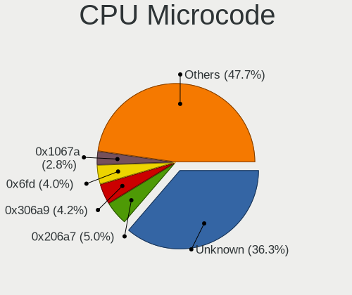

| Number     | Notebooks | Percent |
|------------|-----------|---------|
| Unknown    | 112       | 16.67%  |
| 0x206a7    | 49        | 7.29%   |
| 0x6fd      | 35        | 5.21%   |
| 0x306a9    | 31        | 4.61%   |
| 0x1067a    | 29        | 4.32%   |
| 0x40651    | 25        | 3.72%   |
| 0x20655    | 22        | 3.27%   |
| 0x05000119 | 21        | 3.13%   |
| 0x106ca    | 20        | 2.98%   |
| 0x406c4    | 18        | 2.68%   |
| 0x406e3    | 17        | 2.53%   |
| 0x30678    | 17        | 2.53%   |
| 0x106c2    | 16        | 2.38%   |
| 0x406c3    | 15        | 2.23%   |
| 0x806ec    | 14        | 2.08%   |
| 0x706a1    | 10        | 1.49%   |
| 0x6f6      | 10        | 1.49%   |
| 0x306c3    | 10        | 1.49%   |
| 0x20652    | 10        | 1.49%   |
| 0x10676    | 10        | 1.49%   |
| 0x06006705 | 10        | 1.49%   |
| 0x6e8      | 9         | 1.34%   |
| 0x6d8      | 9         | 1.34%   |
| 0x806ea    | 8         | 1.19%   |
| 0x806e9    | 8         | 1.19%   |
| 0x706a8    | 8         | 1.19%   |
| 0x306d4    | 8         | 1.19%   |
| 0x05000029 | 8         | 1.19%   |
| 0x10661    | 7         | 1.04%   |
| 0x6fb      | 6         | 0.89%   |
| 0x806eb    | 5         | 0.74%   |
| 0x706e5    | 5         | 0.74%   |
| 0x30661    | 5         | 0.74%   |
| 0x0700010f | 5         | 0.74%   |
| 0x906ea    | 4         | 0.6%    |
| 0x906c0    | 4         | 0.6%    |
| 0x806c1    | 4         | 0.6%    |
| 0x6ec      | 4         | 0.6%    |
| 0x506c9    | 4         | 0.6%    |
| 0x06006704 | 4         | 0.6%    |

CPU Microarch
-------------

Microarchitecture

| Name             | Notebooks | Percent |
|------------------|-----------|---------|
| Core             | 66        | 10.05%  |
| Silvermont       | 65        | 9.89%   |
| SandyBridge      | 61        | 9.28%   |
| KabyLake         | 49        | 7.46%   |
| Penryn           | 44        | 6.7%    |
| Bonnell          | 42        | 6.39%   |
| Haswell          | 41        | 6.24%   |
| Westmere         | 37        | 5.63%   |
| IvyBridge        | 37        | 5.63%   |
| Bobcat           | 30        | 4.57%   |
| P6               | 23        | 3.5%    |
| Skylake          | 21        | 3.2%    |
| Goldmont plus    | 21        | 3.2%    |
| Excavator        | 20        | 3.04%   |
| K8 Hammer        | 13        | 1.98%   |
| Broadwell        | 11        | 1.67%   |
| Puma             | 9         | 1.37%   |
| Zen 2            | 7         | 1.07%   |
| IceLake          | 7         | 1.07%   |
| Goldmont         | 7         | 1.07%   |
| Zen              | 6         | 0.91%   |
| K8 & K10 hybrid  | 6         | 0.91%   |
| Jaguar           | 6         | 0.91%   |
| TigerLake        | 5         | 0.76%   |
| Zen+             | 4         | 0.61%   |
| Tremont          | 4         | 0.61%   |
| NetBurst         | 4         | 0.61%   |
| Piledriver       | 3         | 0.46%   |
| K10              | 3         | 0.46%   |
| K10 Llano        | 2         | 0.3%    |
| Zen 3            | 1         | 0.15%   |
| Nehalem          | 1         | 0.15%   |
| Alderlake Hybrid | 1         | 0.15%   |

Graphics
--------

GPU Vendor
----------

Vendors of graphics cards

| Vendor                           | Notebooks | Percent |
|----------------------------------|-----------|---------|
| Intel                            | 477       | 64.72%  |
| AMD                              | 155       | 21.03%  |
| Nvidia                           | 95        | 12.89%  |
| Silicon Integrated Systems [SiS] | 6         | 0.81%   |
| VIA Technologies                 | 3         | 0.41%   |
| S3 Graphics                      | 1         | 0.14%   |

GPU Model
---------

Graphics card models

| Model                                                                                    | Notebooks | Percent |
|------------------------------------------------------------------------------------------|-----------|---------|
| Intel 2nd Generation Core Processor Family Integrated Graphics Controller                | 56        | 6.91%   |
| Intel Mobile GM965/GL960 Integrated Graphics Controller (secondary)                      | 42        | 5.18%   |
| Intel Mobile GM965/GL960 Integrated Graphics Controller (primary)                        | 42        | 5.18%   |
| Intel Atom/Celeron/Pentium Processor x5-E8000/J3xxx/N3xxx Integrated Graphics Controller | 40        | 4.93%   |
| Intel 3rd Gen Core processor Graphics Controller                                         | 36        | 4.44%   |
| Intel Haswell-ULT Integrated Graphics Controller                                         | 30        | 3.7%    |
| Intel Mobile 4 Series Chipset Integrated Graphics Controller                             | 29        | 3.58%   |
| Intel Core Processor Integrated Graphics Controller                                      | 27        | 3.33%   |
| Intel Mobile 945GM/GMS/GME, 943/940GML Express Integrated Graphics Controller            | 26        | 3.21%   |
| Intel Atom Processor Z36xxx/Z37xxx Series Graphics & Display                             | 25        | 3.08%   |
| Intel Atom Processor D4xx/D5xx/N4xx/N5xx Integrated Graphics Controller                  | 19        | 2.34%   |
| AMD Stoney [Radeon R2/R3/R4/R5 Graphics]                                                 | 18        | 2.22%   |
| Intel GeminiLake [UHD Graphics 600]                                                      | 17        | 2.1%    |
| Intel Skylake GT2 [HD Graphics 520]                                                      | 15        | 1.85%   |
| Intel Mobile 945GSE Express Integrated Graphics Controller                               | 13        | 1.6%    |
| Intel Mobile 945GM/GMS, 943/940GML Express Integrated Graphics Controller                | 13        | 1.6%    |
| Intel WhiskeyLake-U GT2 [UHD Graphics 620]                                               | 11        | 1.36%   |
| Intel CometLake-U GT2 [UHD Graphics]                                                     | 11        | 1.36%   |
| Intel 4th Gen Core Processor Integrated Graphics Controller                              | 10        | 1.23%   |
| AMD Seymour [Radeon HD 6400M/7400M Series]                                               | 10        | 1.23%   |
| Intel UHD Graphics 620                                                                   | 9         | 1.11%   |
| Intel HD Graphics 620                                                                    | 8         | 0.99%   |
| Intel HD Graphics 5500                                                                   | 8         | 0.99%   |
| AMD Wrestler [Radeon HD 6320]                                                            | 8         | 0.99%   |
| AMD Wrestler [Radeon HD 6310]                                                            | 8         | 0.99%   |
| Intel HD Graphics 500                                                                    | 7         | 0.86%   |
| AMD Renoir                                                                               | 7         | 0.86%   |
| AMD RC410M [Mobility Radeon Xpress 200M]                                                 | 7         | 0.86%   |
| AMD Sun XT [Radeon HD 8670A/8670M/8690M / R5 M330 / M430 / Radeon 520 Mobile]            | 6         | 0.74%   |
| AMD RV620/M82 [Mobility Radeon HD 3450/3470]                                             | 6         | 0.74%   |
| AMD Picasso/Raven 2 [Radeon Vega Series / Radeon Vega Mobile Series]                     | 6         | 0.74%   |
| Silicon Integrated Systems [SiS] 771/671 PCIE VGA Display Adapter                        | 5         | 0.62%   |
| Intel CoffeeLake-H GT2 [UHD Graphics 630]                                                | 5         | 0.62%   |
| Intel Atom Processor D2xxx/N2xxx Integrated Graphics Controller                          | 5         | 0.62%   |
| AMD Mullins [Radeon R4/R5 Graphics]                                                      | 5         | 0.62%   |
| Nvidia G72M [Quadro NVS 110M/GeForce Go 7300]                                            | 4         | 0.49%   |
| Intel JasperLake [UHD Graphics]                                                          | 4         | 0.49%   |
| Intel Iris Plus Graphics G7                                                              | 4         | 0.49%   |
| Intel GeminiLake [UHD Graphics 605]                                                      | 4         | 0.49%   |
| AMD Wrestler [Radeon HD 7310]                                                            | 4         | 0.49%   |

GPU Combo
---------

Combinations of graphics cards

| Name            | Notebooks | Percent |
|-----------------|-----------|---------|
| 1 x Intel       | 395       | 60.12%  |
| 1 x AMD         | 120       | 18.26%  |
| Intel + Nvidia  | 51        | 7.76%   |
| 1 x Nvidia      | 43        | 6.54%   |
| Intel + AMD     | 28        | 4.26%   |
| 2 x AMD         | 6         | 0.91%   |
| 1 x SiS         | 6         | 0.91%   |
| Other           | 3         | 0.46%   |
| 1 x VIA         | 3         | 0.46%   |
| 1 x S3 Graphics | 1         | 0.15%   |
| AMD + Nvidia    | 1         | 0.15%   |

GPU Driver
----------

Free vs proprietary

| Driver      | Notebooks | Percent |
|-------------|-----------|---------|
| Free        | 605       | 91.95%  |
| Proprietary | 36        | 5.47%   |
| Unknown     | 17        | 2.58%   |

GPU Memory
----------

Total video memory

| Size in GB | Notebooks | Percent |
|------------|-----------|---------|
| Unknown    | 417       | 62.8%   |
| 0.01-0.5   | 153       | 23.04%  |
| 1.01-2.0   | 48        | 7.23%   |
| 0.51-1.0   | 29        | 4.37%   |
| 3.01-4.0   | 11        | 1.66%   |
| 5.01-6.0   | 3         | 0.45%   |
| 2.01-3.0   | 3         | 0.45%   |

Monitor
-------

Monitor Vendor
--------------

Monitor vendors

| Vendor                  | Notebooks | Percent |
|-------------------------|-----------|---------|
| AU Optronics            | 120       | 18.38%  |
| Samsung Electronics     | 93        | 14.24%  |
| LG Display              | 91        | 13.94%  |
| Chimei Innolux          | 81        | 12.4%   |
| BOE                     | 69        | 10.57%  |
| Chi Mei Optoelectronics | 33        | 5.05%   |
| LG Philips              | 24        | 3.68%   |
| Apple                   | 19        | 2.91%   |
| HannStar                | 18        | 2.76%   |
| Lenovo                  | 12        | 1.84%   |
| CPT                     | 12        | 1.84%   |
| InfoVision              | 9         | 1.38%   |
| Goldstar                | 9         | 1.38%   |
| Acer                    | 8         | 1.23%   |
| Dell                    | 7         | 1.07%   |
| Sharp                   | 5         | 0.77%   |
| Hewlett-Packard         | 5         | 0.77%   |
| PANDA                   | 3         | 0.46%   |
| AOC                     | 3         | 0.46%   |
| ViewSonic               | 2         | 0.31%   |
| Sony                    | 2         | 0.31%   |
| Philips                 | 2         | 0.31%   |
| NEC Computers           | 2         | 0.31%   |
| BenQ                    | 2         | 0.31%   |
| Vizio                   | 1         | 0.15%   |
| Videoseven              | 1         | 0.15%   |
| Unknown                 | 1         | 0.15%   |
| Toshiba                 | 1         | 0.15%   |
| Sceptre Tech            | 1         | 0.15%   |
| Panasonic               | 1         | 0.15%   |
| Nvidia                  | 1         | 0.15%   |
| NCS                     | 1         | 0.15%   |
| Lenovo Group Limited    | 1         | 0.15%   |
| KDC                     | 1         | 0.15%   |
| JVC                     | 1         | 0.15%   |
| JDI                     | 1         | 0.15%   |
| InnoLux Display         | 1         | 0.15%   |
| Iiyama                  | 1         | 0.15%   |
| IBM                     | 1         | 0.15%   |
| HKC                     | 1         | 0.15%   |

Monitor Model
-------------

Monitor models

| Model                                                                    | Notebooks | Percent |
|--------------------------------------------------------------------------|-----------|---------|
| HannStar HSD101PFW2 HSD03E9 1024x600 222x125mm 10.0-inch                 | 10        | 1.53%   |
| Samsung Electronics LCD Monitor SEC5441 1366x768 344x194mm 15.5-inch     | 8         | 1.22%   |
| LG Display LCD Monitor LGD02DC 1366x768 344x194mm 15.5-inch              | 6         | 0.92%   |
| InfoVision LCD Monitor IVO03F4 1024x600 223x125mm 10.1-inch              | 6         | 0.92%   |
| Chimei Innolux LCD Monitor CMN15DB 1366x768 344x193mm 15.5-inch          | 6         | 0.92%   |
| Chimei Innolux LCD Monitor CMN1132 1366x768 256x144mm 11.6-inch          | 6         | 0.92%   |
| AU Optronics LCD Monitor AUO10EC 1366x768 344x193mm 15.5-inch            | 6         | 0.92%   |
| LG Display LCD Monitor LGD0384 1366x768 344x194mm 15.5-inch              | 5         | 0.76%   |
| BOE LCD Monitor BOE06A5 1366x768 344x194mm 15.5-inch                     | 4         | 0.61%   |
| AU Optronics LCD Monitor AUO26EC 1366x768 344x193mm 15.5-inch            | 4         | 0.61%   |
| AU Optronics LCD Monitor AUO105C 1366x768 256x144mm 11.6-inch            | 4         | 0.61%   |
| Samsung Electronics LCD Monitor SEC3741 1280x800 331x207mm 15.4-inch     | 3         | 0.46%   |
| Samsung Electronics LCD Monitor SEC324A 1366x768 344x194mm 15.5-inch     | 3         | 0.46%   |
| Samsung Electronics LCD Monitor SDC4852 1366x768 340x190mm 15.3-inch     | 3         | 0.46%   |
| LG Philips LP154WX4-TLCB LPL3101 1280x800 331x207mm 15.4-inch            | 3         | 0.46%   |
| LG Philips LCD Monitor LPL2A00 1280x800 330x210mm 15.4-inch              | 3         | 0.46%   |
| LG Display LCD Monitor LGD02E9 1366x768 310x170mm 13.9-inch              | 3         | 0.46%   |
| Lenovo LCD Monitor LEN4031 1280x800 303x190mm 14.1-inch                  | 3         | 0.46%   |
| HannStar HSD121PHW1 HSD04B6 1366x768 270x150mm 12.2-inch                 | 3         | 0.46%   |
| Dell U2412M DELA07A 1920x1200 518x324mm 24.1-inch                        | 3         | 0.46%   |
| CPT LCD Monitor CPT1415 1280x800 331x207mm 15.4-inch                     | 3         | 0.46%   |
| Chimei Innolux LCD Monitor CMN15E7 1920x1080 344x193mm 15.5-inch         | 3         | 0.46%   |
| Chimei Innolux LCD Monitor CMN15C6 1366x768 344x193mm 15.5-inch          | 3         | 0.46%   |
| Chimei Innolux LCD Monitor CMN15AB 1366x768 344x194mm 15.5-inch          | 3         | 0.46%   |
| Chimei Innolux LCD Monitor CMN14D6 1366x768 309x173mm 13.9-inch          | 3         | 0.46%   |
| Chimei Innolux LCD Monitor CMN14D4 1920x1080 309x173mm 13.9-inch         | 3         | 0.46%   |
| Chi Mei Optoelectronics LCD Monitor CMO15A7 1366x768 344x193mm 15.5-inch | 3         | 0.46%   |
| Chi Mei Optoelectronics LCD Monitor CMO15A2 1366x768 344x193mm 15.5-inch | 3         | 0.46%   |
| Chi Mei Optoelectronics LCD Monitor CMO1526 1280x800 331x207mm 15.4-inch | 3         | 0.46%   |
| BOE LCD Monitor BOE075A 1366x768 309x173mm 13.9-inch                     | 3         | 0.46%   |
| BOE LCD Monitor BOE0696 1366x768 309x173mm 13.9-inch                     | 3         | 0.46%   |
| BOE LCD Monitor BOE05BA 1366x768 309x173mm 13.9-inch                     | 3         | 0.46%   |
| AU Optronics LCD Monitor AUO8174 1280x800 331x207mm 15.4-inch            | 3         | 0.46%   |
| AU Optronics LCD Monitor AUO305C 1366x768 256x144mm 11.6-inch            | 3         | 0.46%   |
| AU Optronics LCD Monitor AUO2E3C 1366x768 309x173mm 13.9-inch            | 3         | 0.46%   |
| AU Optronics LCD Monitor AUO235C 1366x768 256x144mm 11.6-inch            | 3         | 0.46%   |
| AU Optronics LCD Monitor AUO22EC 1366x768 344x193mm 15.5-inch            | 3         | 0.46%   |
| AU Optronics LCD Monitor AUO183C 1366x768 309x173mm 13.9-inch            | 3         | 0.46%   |
| AU Optronics LCD Monitor AUO139E 1600x900 382x214mm 17.2-inch            | 3         | 0.46%   |
| Apple LCD Monitor APP9CC5 1280x800 286x179mm 13.3-inch                   | 3         | 0.46%   |

Monitor Resolution
------------------

Monitor screen resolution

| Resolution         | Notebooks | Percent |
|--------------------|-----------|---------|
| 1366x768 (WXGA)    | 298       | 46.64%  |
| 1920x1080 (FHD)    | 123       | 19.25%  |
| 1280x800 (WXGA)    | 86        | 13.46%  |
| 1600x900 (HD+)     | 33        | 5.16%   |
| 1024x600           | 28        | 4.38%   |
| 1920x1200 (WUXGA)  | 14        | 2.19%   |
| 3840x2160 (4K)     | 12        | 1.88%   |
| 1680x1050 (WSXGA+) | 8         | 1.25%   |
| 1440x900 (WXGA+)   | 7         | 1.1%    |
| 2560x1440 (QHD)    | 5         | 0.78%   |
| 1280x1024 (SXGA)   | 4         | 0.63%   |
| 3840x2400          | 2         | 0.31%   |
| 3200x1800 (QHD+)   | 2         | 0.31%   |
| 2880x1800          | 2         | 0.31%   |
| 2288x1287          | 2         | 0.31%   |
| 1360x768           | 2         | 0.31%   |
| 1280x720 (HD)      | 2         | 0.31%   |
| 3200x1080          | 1         | 0.16%   |
| 3000x2000          | 1         | 0.16%   |
| 2560x1600          | 1         | 0.16%   |
| 2560x1080          | 1         | 0.16%   |
| 2160x1440          | 1         | 0.16%   |
| 1528x1222          | 1         | 0.16%   |
| 1280x768           | 1         | 0.16%   |
| 1024x768 (XGA)     | 1         | 0.16%   |
| Unknown            | 1         | 0.16%   |

Monitor Diagonal
----------------

Diagonal size in inches

| Inches  | Notebooks | Percent |
|---------|-----------|---------|
| 15      | 268       | 41.1%   |
| 14      | 95        | 14.57%  |
| 13      | 90        | 13.8%   |
| 11      | 43        | 6.6%    |
| 17      | 36        | 5.52%   |
| 10      | 29        | 4.45%   |
| 12      | 16        | 2.45%   |
| Unknown | 10        | 1.53%   |
| 27      | 9         | 1.38%   |
| 23      | 9         | 1.38%   |
| 21      | 7         | 1.07%   |
| 24      | 6         | 0.92%   |
| 22      | 5         | 0.77%   |
| 19      | 5         | 0.77%   |
| 18      | 4         | 0.61%   |
| 9       | 3         | 0.46%   |
| 8       | 3         | 0.46%   |
| 84      | 2         | 0.31%   |
| 72      | 2         | 0.31%   |
| 142     | 1         | 0.15%   |
| 63      | 1         | 0.15%   |
| 48      | 1         | 0.15%   |
| 33      | 1         | 0.15%   |
| 31      | 1         | 0.15%   |
| 28      | 1         | 0.15%   |
| 26      | 1         | 0.15%   |
| 25      | 1         | 0.15%   |
| 20      | 1         | 0.15%   |
| 16      | 1         | 0.15%   |

Monitor Width
-------------

Physical width

| Width in mm    | Notebooks | Percent |
|----------------|-----------|---------|
| 301-350        | 405       | 62.31%  |
| 201-300        | 127       | 19.54%  |
| 351-400        | 48        | 7.38%   |
| 501-600        | 25        | 3.85%   |
| 401-500        | 20        | 3.08%   |
| Unknown        | 10        | 1.54%   |
| 1501-2000      | 4         | 0.62%   |
| 101-200        | 4         | 0.62%   |
| 601-700        | 3         | 0.46%   |
| 1001-1500      | 2         | 0.31%   |
| More than 2000 | 1         | 0.15%   |
| 701-800        | 1         | 0.15%   |

Aspect Ratio
------------

Proportional relationship between the width and the height

| Ratio   | Notebooks | Percent |
|---------|-----------|---------|
| 16/9    | 479       | 78.01%  |
| 16/10   | 119       | 19.38%  |
| Unknown | 5         | 0.81%   |
| 4/3     | 4         | 0.65%   |
| 5/4     | 3         | 0.49%   |
| 3/2     | 2         | 0.33%   |
| 21/9    | 1         | 0.16%   |
| 1.00    | 1         | 0.16%   |

Monitor Area
------------

Area in inch

| Area in inch | Notebooks | Percent |
|----------------|-----------|---------|
| 101-110        | 266       | 40.8%   |
| 81-90          | 161       | 24.69%  |
| 51-60          | 43        | 6.6%    |
| 41-50          | 32        | 4.91%   |
| 121-130        | 29        | 4.45%   |
| 71-80          | 26        | 3.99%   |
| 201-250        | 22        | 3.37%   |
| 61-70          | 14        | 2.15%   |
| Unknown        | 10        | 1.53%   |
| 301-350        | 9         | 1.38%   |
| 251-300        | 8         | 1.23%   |
| More than 1000 | 7         | 1.07%   |
| 131-140        | 7         | 1.07%   |
| 151-200        | 6         | 0.92%   |
| 141-150        | 5         | 0.77%   |
| 1-40           | 3         | 0.46%   |
| 351-500        | 2         | 0.31%   |
| 111-120        | 1         | 0.15%   |
| 91-100         | 1         | 0.15%   |

Pixel Density
-------------

Pixels per inch

| Density       | Notebooks | Percent |
|---------------|-----------|---------|
| 101-120       | 310       | 47.99%  |
| 121-160       | 170       | 26.32%  |
| 51-100        | 126       | 19.5%   |
| 161-240       | 17        | 2.63%   |
| Unknown       | 10        | 1.55%   |
| More than 240 | 8         | 1.24%   |
| 1-50          | 5         | 0.77%   |

Multiple Monitors
-----------------

Total monitors connected

| Total | Notebooks | Percent |
|-------|-----------|---------|
| 1     | 589       | 88.31%  |
| 2     | 61        | 9.15%   |
| 0     | 13        | 1.95%   |
| 3     | 4         | 0.6%    |

Network
-------

Net Controller Vendor
---------------------

Controller vendors

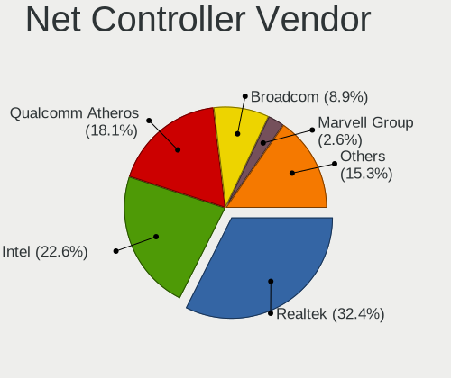

| Vendor                            | Notebooks | Percent |
|-----------------------------------|-----------|---------|
| Realtek Semiconductor             | 338       | 31.74%  |
| Intel                             | 240       | 22.54%  |
| Qualcomm Atheros                  | 196       | 18.4%   |
| Broadcom                          | 102       | 9.58%   |
| Marvell Technology Group          | 30        | 2.82%   |
| Broadcom Limited                  | 27        | 2.54%   |
| Ralink                            | 24        | 2.25%   |
| TP-Link                           | 11        | 1.03%   |
| Nvidia                            | 11        | 1.03%   |
| Ralink Technology                 | 10        | 0.94%   |
| Attansic Technology               | 9         | 0.85%   |
| ASIX Electronics                  | 9         | 0.85%   |
| Samsung Electronics               | 7         | 0.66%   |
| Silicon Integrated Systems [SiS]  | 5         | 0.47%   |
| Xiaomi                            | 4         | 0.38%   |
| AMD                               | 4         | 0.38%   |
| VIA Technologies                  | 3         | 0.28%   |
| JMicron Technology                | 3         | 0.28%   |
| Hewlett-Packard                   | 3         | 0.28%   |
| Qualcomm Atheros Communications   | 2         | 0.19%   |
| NetGear                           | 2         | 0.19%   |
| MediaTek                          | 2         | 0.19%   |
| ICS Advent                        | 2         | 0.19%   |
| Huawei Technologies               | 2         | 0.19%   |
| Fibocom                           | 2         | 0.19%   |
| Dell                              | 2         | 0.19%   |
| Tenda                             | 1         | 0.09%   |
| Sierra Wireless                   | 1         | 0.09%   |
| Seeed                             | 1         | 0.09%   |
| Research In Motion                | 1         | 0.09%   |
| Qualcomm                          | 1         | 0.09%   |
| OnePlus Technology (Shenzhen)     | 1         | 0.09%   |
| Microsoft                         | 1         | 0.09%   |
| Microchip Technology              | 1         | 0.09%   |
| Linksys                           | 1         | 0.09%   |
| LG Electronics                    | 1         | 0.09%   |
| Lab126                            | 1         | 0.09%   |
| Intersil                          | 1         | 0.09%   |
| Ericsson Business Mobile Networks | 1         | 0.09%   |
| Arduino SA                        | 1         | 0.09%   |

Net Controller Model
--------------------

Controller models

| Model                                                                   | Notebooks | Percent |
|-------------------------------------------------------------------------|-----------|---------|
| Realtek RTL8111/8168/8411 PCI Express Gigabit Ethernet Controller       | 150       | 11.91%  |
| Realtek RTL810xE PCI Express Fast Ethernet controller                   | 105       | 8.34%   |
| Qualcomm Atheros AR9285 Wireless Network Adapter (PCI-Express)          | 44        | 3.49%   |
| Qualcomm Atheros AR242x / AR542x Wireless Network Adapter (PCI-Express) | 29        | 2.3%    |
| Broadcom BCM4313 802.11bgn Wireless Network Adapter                     | 29        | 2.3%    |
| Intel PRO/Wireless 3945ABG [Golan] Network Connection                   | 27        | 2.14%   |
| Intel Wireless 7260                                                     | 25        | 1.99%   |
| Qualcomm Atheros AR9485 Wireless Network Adapter                        | 24        | 1.91%   |
| Qualcomm Atheros QCA9565 / AR9565 Wireless Network Adapter              | 22        | 1.75%   |
| Realtek RTL-8100/8101L/8139 PCI Fast Ethernet Adapter                   | 20        | 1.59%   |
| Qualcomm Atheros QCA9377 802.11ac Wireless Network Adapter              | 20        | 1.59%   |
| Realtek RTL8821CE 802.11ac PCIe Wireless Network Adapter                | 18        | 1.43%   |
| Intel 82579LM Gigabit Network Connection (Lewisville)                   | 16        | 1.27%   |
| Realtek RTL8723BE PCIe Wireless Network Adapter                         | 14        | 1.11%   |
| Intel Wireless 7265                                                     | 14        | 1.11%   |
| Realtek RTL8188CE 802.11b/g/n WiFi Adapter                              | 13        | 1.03%   |
| Qualcomm Atheros AR8132 Fast Ethernet                                   | 12        | 0.95%   |
| Intel Centrino Advanced-N 6205 [Taylor Peak]                            | 12        | 0.95%   |
| Realtek RTL8822CE 802.11ac PCIe Wireless Network Adapter                | 11        | 0.87%   |
| Realtek RTL8188EE Wireless Network Adapter                              | 11        | 0.87%   |
| Realtek RTL8153 Gigabit Ethernet Adapter                                | 11        | 0.87%   |
| Intel PRO/Wireless 4965 AG or AGN [Kedron] Network Connection           | 11        | 0.87%   |
| Intel Wireless 3160                                                     | 10        | 0.79%   |
| Intel 82577LM Gigabit Network Connection                                | 10        | 0.79%   |
| Attansic AR8152 v2.0 Fast Ethernet                                      | 9         | 0.71%   |
| Ralink RT3290 Wireless 802.11n 1T/1R PCIe                               | 8         | 0.64%   |
| Qualcomm Atheros AR928X Wireless Network Adapter (PCI-Express)          | 8         | 0.64%   |
| Intel WiFi Link 5100                                                    | 8         | 0.64%   |
| Intel Wi-Fi 6 AX200                                                     | 8         | 0.64%   |
| Intel Ethernet Connection I218-LM                                       | 8         | 0.64%   |
| Broadcom NetLink BCM57785 Gigabit Ethernet PCIe                         | 8         | 0.64%   |
| Marvell Group 88E8040 PCI-E Fast Ethernet Controller                    | 7         | 0.56%   |
| Intel Wireless 8265 / 8275                                              | 7         | 0.56%   |
| Intel Wireless 8260                                                     | 7         | 0.56%   |
| Intel PRO/Wireless 5100 AGN [Shiloh] Network Connection                 | 7         | 0.56%   |
| Intel Cannon Point-LP CNVi [Wireless-AC]                                | 7         | 0.56%   |
| Broadcom NetXtreme BCM57765 Gigabit Ethernet PCIe                       | 7         | 0.56%   |
| Broadcom BCM4331 802.11a/b/g/n                                          | 7         | 0.56%   |
| Realtek RTL8187B Wireless 802.11g 54Mbps Network Adapter                | 6         | 0.48%   |
| Realtek 802.11n WLAN Adapter                                            | 6         | 0.48%   |

Wireless Vendor
---------------

Wireless vendors

| Vendor                          | Notebooks | Percent |
|---------------------------------|-----------|---------|
| Intel                           | 225       | 34.46%  |
| Qualcomm Atheros                | 171       | 26.19%  |
| Realtek Semiconductor           | 118       | 18.07%  |
| Broadcom                        | 66        | 10.11%  |
| Ralink                          | 24        | 3.68%   |
| Broadcom Limited                | 17        | 2.6%    |
| TP-Link                         | 10        | 1.53%   |
| Ralink Technology               | 10        | 1.53%   |
| Qualcomm Atheros Communications | 2         | 0.31%   |
| NetGear                         | 2         | 0.31%   |
| Fibocom                         | 2         | 0.31%   |
| Tenda                           | 1         | 0.15%   |
| Sierra Wireless                 | 1         | 0.15%   |
| Microsoft                       | 1         | 0.15%   |
| MediaTek                        | 1         | 0.15%   |
| Linksys                         | 1         | 0.15%   |
| Dell                            | 1         | 0.15%   |

Wireless Model
--------------

Wireless models

| Model                                                                         | Notebooks | Percent |
|-------------------------------------------------------------------------------|-----------|---------|
| Qualcomm Atheros AR9285 Wireless Network Adapter (PCI-Express)                | 44        | 6.7%    |
| Qualcomm Atheros AR242x / AR542x Wireless Network Adapter (PCI-Express)       | 29        | 4.41%   |
| Broadcom BCM4313 802.11bgn Wireless Network Adapter                           | 29        | 4.41%   |
| Intel PRO/Wireless 3945ABG [Golan] Network Connection                         | 27        | 4.11%   |
| Intel Wireless 7260                                                           | 25        | 3.81%   |
| Qualcomm Atheros AR9485 Wireless Network Adapter                              | 24        | 3.65%   |
| Qualcomm Atheros QCA9565 / AR9565 Wireless Network Adapter                    | 22        | 3.35%   |
| Qualcomm Atheros QCA9377 802.11ac Wireless Network Adapter                    | 20        | 3.04%   |
| Realtek RTL8821CE 802.11ac PCIe Wireless Network Adapter                      | 18        | 2.74%   |
| Realtek RTL8723BE PCIe Wireless Network Adapter                               | 14        | 2.13%   |
| Intel Wireless 7265                                                           | 14        | 2.13%   |
| Realtek RTL8188CE 802.11b/g/n WiFi Adapter                                    | 13        | 1.98%   |
| Intel Centrino Advanced-N 6205 [Taylor Peak]                                  | 12        | 1.83%   |
| Realtek RTL8822CE 802.11ac PCIe Wireless Network Adapter                      | 11        | 1.67%   |
| Realtek RTL8188EE Wireless Network Adapter                                    | 11        | 1.67%   |
| Intel PRO/Wireless 4965 AG or AGN [Kedron] Network Connection                 | 11        | 1.67%   |
| Intel Wireless 3160                                                           | 10        | 1.52%   |
| Ralink RT3290 Wireless 802.11n 1T/1R PCIe                                     | 8         | 1.22%   |
| Qualcomm Atheros AR928X Wireless Network Adapter (PCI-Express)                | 8         | 1.22%   |
| Intel WiFi Link 5100                                                          | 8         | 1.22%   |
| Intel Wi-Fi 6 AX200                                                           | 8         | 1.22%   |
| Intel Wireless 8265 / 8275                                                    | 7         | 1.07%   |
| Intel Wireless 8260                                                           | 7         | 1.07%   |
| Intel PRO/Wireless 5100 AGN [Shiloh] Network Connection                       | 7         | 1.07%   |
| Intel Cannon Point-LP CNVi [Wireless-AC]                                      | 7         | 1.07%   |
| Broadcom BCM4331 802.11a/b/g/n                                                | 7         | 1.07%   |
| Realtek RTL8187B Wireless 802.11g 54Mbps Network Adapter                      | 6         | 0.91%   |
| Realtek 802.11n WLAN Adapter                                                  | 6         | 0.91%   |
| Realtek 802.11ac NIC                                                          | 6         | 0.91%   |
| Qualcomm Atheros AR9462 Wireless Network Adapter                              | 6         | 0.91%   |
| Qualcomm Atheros AR2413/AR2414 Wireless Network Adapter [AR5005G(S) 802.11bg] | 6         | 0.91%   |
| Intel Wireless 3165                                                           | 6         | 0.91%   |
| Intel Gemini Lake PCH CNVi WiFi                                               | 6         | 0.91%   |
| Intel Centrino Wireless-N 1000 [Condor Peak]                                  | 6         | 0.91%   |
| Broadcom BCM43142 802.11b/g/n                                                 | 6         | 0.91%   |
| Broadcom BCM4312 802.11b/g LP-PHY                                             | 6         | 0.91%   |
| Realtek RTL8188EUS 802.11n Wireless Network Adapter                           | 5         | 0.76%   |
| Ralink MT7601U Wireless Adapter                                               | 5         | 0.76%   |
| Ralink RT5390 Wireless 802.11n 1T/1R PCIe                                     | 5         | 0.76%   |
| Ralink RT3090 Wireless 802.11n 1T/1R PCIe                                     | 5         | 0.76%   |

Ethernet Vendor
---------------

Ethernet vendors

| Vendor                           | Notebooks | Percent |
|----------------------------------|-----------|---------|
| Realtek Semiconductor            | 290       | 49.91%  |
| Intel                            | 83        | 14.29%  |
| Qualcomm Atheros                 | 55        | 9.47%   |
| Broadcom                         | 48        | 8.26%   |
| Marvell Technology Group         | 30        | 5.16%   |
| Nvidia                           | 11        | 1.89%   |
| Broadcom Limited                 | 10        | 1.72%   |
| Attansic Technology              | 9         | 1.55%   |
| ASIX Electronics                 | 9         | 1.55%   |
| Samsung Electronics              | 7         | 1.2%    |
| Silicon Integrated Systems [SiS] | 5         | 0.86%   |
| Xiaomi                           | 4         | 0.69%   |
| VIA Technologies                 | 3         | 0.52%   |
| JMicron Technology               | 3         | 0.52%   |
| ICS Advent                       | 2         | 0.34%   |
| TP-Link                          | 1         | 0.17%   |
| Research In Motion               | 1         | 0.17%   |
| Qualcomm                         | 1         | 0.17%   |
| OnePlus Technology (Shenzhen)    | 1         | 0.17%   |
| Microchip Technology             | 1         | 0.17%   |
| MediaTek                         | 1         | 0.17%   |
| LG Electronics                   | 1         | 0.17%   |
| Lab126                           | 1         | 0.17%   |
| Intersil                         | 1         | 0.17%   |
| Huawei Technologies              | 1         | 0.17%   |
| Hewlett-Packard                  | 1         | 0.17%   |
| 3Com                             | 1         | 0.17%   |

Ethernet Model
--------------

Ethernet models

| Model                                                             | Notebooks | Percent |
|-------------------------------------------------------------------|-----------|---------|
| Realtek RTL8111/8168/8411 PCI Express Gigabit Ethernet Controller | 150       | 25.73%  |
| Realtek RTL810xE PCI Express Fast Ethernet controller             | 105       | 18.01%  |
| Realtek RTL-8100/8101L/8139 PCI Fast Ethernet Adapter             | 20        | 3.43%   |
| Intel 82579LM Gigabit Network Connection (Lewisville)             | 16        | 2.74%   |
| Qualcomm Atheros AR8132 Fast Ethernet                             | 12        | 2.06%   |
| Realtek RTL8153 Gigabit Ethernet Adapter                          | 11        | 1.89%   |
| Intel 82577LM Gigabit Network Connection                          | 10        | 1.72%   |
| Attansic AR8152 v2.0 Fast Ethernet                                | 9         | 1.54%   |
| Intel Ethernet Connection I218-LM                                 | 8         | 1.37%   |
| Broadcom NetLink BCM57785 Gigabit Ethernet PCIe                   | 8         | 1.37%   |
| Marvell Group 88E8040 PCI-E Fast Ethernet Controller              | 7         | 1.2%    |
| Broadcom NetXtreme BCM57765 Gigabit Ethernet PCIe                 | 7         | 1.2%    |
| Qualcomm Atheros AR8152 v2.0 Fast Ethernet                        | 6         | 1.03%   |
| Qualcomm Atheros AR8151 v2.0 Gigabit Ethernet                     | 6         | 1.03%   |
| Broadcom NetXtreme BCM57786 Gigabit Ethernet PCIe                 | 6         | 1.03%   |
| Qualcomm Atheros AR8162 Fast Ethernet                             | 5         | 0.86%   |
| Qualcomm Atheros AR8152 v1.1 Fast Ethernet                        | 5         | 0.86%   |
| Qualcomm Atheros AR8131 Gigabit Ethernet                          | 5         | 0.86%   |
| Qualcomm Atheros AR8121/AR8113/AR8114 Gigabit or Fast Ethernet    | 5         | 0.86%   |
| Intel 82567LM Gigabit Network Connection                          | 5         | 0.86%   |
| Broadcom Limited NetLink BCM5787M Gigabit Ethernet PCI Express    | 5         | 0.86%   |
| ASIX AX88179 Gigabit Ethernet                                     | 5         | 0.86%   |
| Silicon Integrated Systems [SiS] 191 Gigabit Ethernet Adapter     | 4         | 0.69%   |
| Realtek RTL8152 Fast Ethernet Adapter                             | 4         | 0.69%   |
| Qualcomm Atheros AR8161 Gigabit Ethernet                          | 4         | 0.69%   |
| Nvidia MCP67 Ethernet                                             | 4         | 0.69%   |
| Marvell Group 88E8055 PCI-E Gigabit Ethernet Controller           | 4         | 0.69%   |
| Marvell Group 88E8039 PCI-E Fast Ethernet Controller              | 4         | 0.69%   |
| Intel Ethernet Connection I219-V                                  | 4         | 0.69%   |
| Broadcom NetXtreme BCM5755M Gigabit Ethernet PCI Express          | 4         | 0.69%   |
| Broadcom BCM4401-B0 100Base-TX                                    | 4         | 0.69%   |
| VIA VT6102/VT6103 [Rhine-II]                                      | 3         | 0.51%   |
| Samsung GT-I9070 (network tethering, USB debugging enabled)       | 3         | 0.51%   |
| Samsung Galaxy series, misc. (tethering mode)                     | 3         | 0.51%   |
| Qualcomm Atheros QCA8172 Fast Ethernet                            | 3         | 0.51%   |
| Nvidia MCP51 Ethernet Controller                                  | 3         | 0.51%   |
| Marvell Group 88E8058 PCI-E Gigabit Ethernet Controller           | 3         | 0.51%   |
| JMicron JMC250 PCI Express Gigabit Ethernet Controller            | 3         | 0.51%   |
| Intel PRO/100 VE Network Connection                               | 3         | 0.51%   |
| Intel Ethernet Connection I219-LM                                 | 3         | 0.51%   |

Net Controller Kind
-------------------

Ethernet, WiFi or modem

| Kind     | Notebooks | Percent |
|----------|-----------|---------|
| WiFi     | 621       | 52.01%  |
| Ethernet | 554       | 46.4%   |
| Modem    | 19        | 1.59%   |

Used Controller
---------------

Currently used network controller

| Kind     | Notebooks | Percent |
|----------|-----------|---------|
| WiFi     | 504       | 76.13%  |
| Ethernet | 158       | 23.87%  |

NICs
----

Total network controllers on board

| Total | Notebooks | Percent |
|-------|-----------|---------|
| 2     | 501       | 76.14%  |
| 1     | 111       | 16.87%  |
| 0     | 40        | 6.08%   |
| 3     | 6         | 0.91%   |

IPv6
----

IPv6 vs IPv4

| Used | Notebooks | Percent |
|------|-----------|---------|
| No   | 572       | 85.63%  |
| Yes  | 96        | 14.37%  |

Bluetooth
---------

Bluetooth Vendor
----------------

Controller vendors

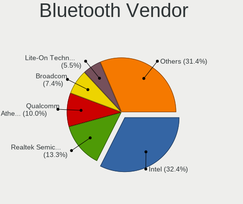

| Vendor                          | Notebooks | Percent |
|---------------------------------|-----------|---------|
| Intel                           | 128       | 31.68%  |
| Realtek Semiconductor           | 48        | 11.88%  |
| Qualcomm Atheros Communications | 41        | 10.15%  |
| Broadcom                        | 34        | 8.42%   |
| Cambridge Silicon Radio         | 20        | 4.95%   |
| IMC Networks                    | 16        | 3.96%   |
| Apple                           | 16        | 3.96%   |
| Lite-On Technology              | 15        | 3.71%   |
| Hewlett-Packard                 | 15        | 3.71%   |
| Dell                            | 15        | 3.71%   |
| Foxconn / Hon Hai               | 14        | 3.47%   |
| Toshiba                         | 11        | 2.72%   |
| Ralink                          | 8         | 1.98%   |
| Alps Electric                   | 8         | 1.98%   |
| ASUSTek Computer                | 6         | 1.49%   |
| Ralink Technology               | 2         | 0.5%    |
| Askey Computer                  | 2         | 0.5%    |
| Syntek                          | 1         | 0.25%   |
| Qcom                            | 1         | 0.25%   |
| Micro Star International        | 1         | 0.25%   |
| MediaTek                        | 1         | 0.25%   |
| Chicony Electronics             | 1         | 0.25%   |

Bluetooth Model
---------------

Controller models

| Model                                                                               | Notebooks | Percent |
|-------------------------------------------------------------------------------------|-----------|---------|
| Intel Bluetooth wireless interface                                                  | 73        | 18.02%  |
| Realtek Bluetooth Radio                                                             | 31        | 7.65%   |
| Intel Bluetooth 9460/9560 Jefferson Peak (JfP)                                      | 24        | 5.93%   |
| Cambridge Silicon Radio Bluetooth Dongle (HCI mode)                                 | 20        | 4.94%   |
| Qualcomm Atheros  Bluetooth Device                                                  | 17        | 4.2%    |
| Apple Bluetooth Host Controller                                                     | 11        | 2.72%   |
| Qualcomm Atheros AR3011 Bluetooth                                                   | 9         | 2.22%   |
| HP Broadcom 2070 Bluetooth Combo                                                    | 9         | 2.22%   |
| Ralink RT3290 Bluetooth                                                             | 8         | 1.98%   |
| Qualcomm Atheros AR3012 Bluetooth 4.0                                               | 8         | 1.98%   |
| Intel AX200 Bluetooth                                                               | 8         | 1.98%   |
| Realtek  Bluetooth 4.2 Adapter                                                      | 7         | 1.73%   |
| Intel AX201 Bluetooth                                                               | 7         | 1.73%   |
| Foxconn / Hon Hai Bluetooth Device                                                  | 7         | 1.73%   |
| Broadcom BCM2045B (BDC-2.1)                                                         | 7         | 1.73%   |
| Realtek RTL8723B Bluetooth                                                          | 6         | 1.48%   |
| Intel Centrino Bluetooth Wireless Transceiver                                       | 6         | 1.48%   |
| Intel Centrino Advanced-N 6230 Bluetooth adapter                                    | 6         | 1.48%   |
| Toshiba Integrated Bluetooth HCI                                                    | 5         | 1.23%   |
| Lite-On Qualcomm Atheros QCA9377 Bluetooth                                          | 5         | 1.23%   |
| Lite-On Atheros AR3012 Bluetooth                                                    | 5         | 1.23%   |
| IMC Networks Bluetooth module                                                       | 5         | 1.23%   |
| HP Bluetooth 2.0 Interface [Broadcom BCM2045]                                       | 5         | 1.23%   |
| Realtek RTL8821A Bluetooth                                                          | 4         | 0.99%   |
| Qualcomm Atheros QCA61x4 Bluetooth 4.0                                              | 4         | 0.99%   |
| IMC Networks Bluetooth Device                                                       | 4         | 0.99%   |
| Foxconn / Hon Hai Foxconn T77H114 BCM2070 [Single-Chip Bluetooth 2.1 + EDR Adapter] | 4         | 0.99%   |
| Dell Wireless 365 Bluetooth                                                         | 4         | 0.99%   |
| Broadcom BCM43142A0 Bluetooth 4.0                                                   | 4         | 0.99%   |
| Broadcom BCM2070 Bluetooth 2.1 + EDR                                                | 4         | 0.99%   |
| Apple Bluetooth HCI                                                                 | 4         | 0.99%   |
| IMC Networks Bluetooth Radio                                                        | 3         | 0.74%   |
| Dell Wireless 350 Bluetooth                                                         | 3         | 0.74%   |
| Broadcom BCM2045B (BDC-2) [Bluetooth Controller]                                    | 3         | 0.74%   |
| Broadcom BCM2045 Bluetooth                                                          | 3         | 0.74%   |
| Alps Electric Bluetooth Controller (ALPS/UGPZ6)                                     | 3         | 0.74%   |
| Toshiba Bluetooth Device                                                            | 2         | 0.49%   |
| Ralink Motorola BC4 Bluetooth 3.0+HS Adapter                                        | 2         | 0.49%   |
| Lite-On Qualcomm Atheros Bluetooth                                                  | 2         | 0.49%   |
| Intel Wireless-AC 9260 Bluetooth Adapter                                            | 2         | 0.49%   |

Sound
-----

Sound Vendor
------------

Sound card vendors

| Vendor                            | Notebooks | Percent |
|-----------------------------------|-----------|---------|
| Intel                             | 494       | 71.8%   |
| AMD                               | 120       | 17.44%  |
| Nvidia                            | 50        | 7.27%   |
| Silicon Integrated Systems [SiS]  | 7         | 1.02%   |
| VIA Technologies                  | 3         | 0.44%   |
| GN Netcom                         | 3         | 0.44%   |
| C-Media Electronics               | 3         | 0.44%   |
| Plantronics                       | 2         | 0.29%   |
| Logitech                          | 2         | 0.29%   |
| Texas Instruments                 | 1         | 0.15%   |
| MosArt Semiconductor              | 1         | 0.15%   |
| JMTek                             | 1         | 0.15%   |
| Elitegroup Computer Systems (ECS) | 1         | 0.15%   |

Sound Model
-----------

Sound card models

| Model                                                                                             | Notebooks | Percent |
|---------------------------------------------------------------------------------------------------|-----------|---------|
| Intel NM10/ICH7 Family High Definition Audio Controller                                           | 56        | 6.8%    |
| Intel 7 Series/C216 Chipset Family High Definition Audio Controller                               | 56        | 6.8%    |
| Intel 82801H (ICH8 Family) HD Audio Controller                                                    | 48        | 5.83%   |
| Intel 6 Series/C200 Series Chipset Family High Definition Audio Controller                        | 42        | 5.1%    |
| Intel 82801I (ICH9 Family) HD Audio Controller                                                    | 39        | 4.74%   |
| Intel 5 Series/3400 Series Chipset High Definition Audio                                          | 38        | 4.62%   |
| Intel Sunrise Point-LP HD Audio                                                                   | 36        | 4.37%   |
| AMD SBx00 Azalia (Intel HDA)                                                                      | 33        | 4.01%   |
| Intel 8 Series HD Audio Controller                                                                | 30        | 3.65%   |
| Intel Haswell-ULT HD Audio Controller                                                             | 29        | 3.52%   |
| AMD FCH Azalia Controller                                                                         | 28        | 3.4%    |
| AMD Wrestler HDMI Audio                                                                           | 24        | 2.92%   |
| Intel Celeron/Pentium Silver Processor High Definition Audio                                      | 21        | 2.55%   |
| AMD Family 15h (Models 60h-6fh) Audio Controller                                                  | 19        | 2.31%   |
| Intel Atom/Celeron/Pentium Processor x5-E8000/J3xxx/N3xxx Series High Definition Audio Controller | 18        | 2.19%   |
| AMD High Definition Audio Controller                                                              | 18        | 2.19%   |
| Intel Atom Processor Z36xxx/Z37xxx Series High Definition Audio Controller                        | 17        | 2.07%   |
| AMD Kabini HDMI/DP Audio                                                                          | 17        | 2.07%   |
| AMD Family 17h/19h HD Audio Controller                                                            | 17        | 2.07%   |
| Intel Wildcat Point-LP High Definition Audio Controller                                           | 11        | 1.34%   |
| Intel Comet Lake PCH-LP cAVS                                                                      | 11        | 1.34%   |
| Intel Cannon Point-LP High Definition Audio Controller                                            | 11        | 1.34%   |
| Intel Broadwell-U Audio Controller                                                                | 11        | 1.34%   |
| Intel 8 Series/C220 Series Chipset High Definition Audio Controller                               | 11        | 1.34%   |
| Intel Xeon E3-1200 v3/4th Gen Core Processor HD Audio Controller                                  | 10        | 1.22%   |
| AMD Raven/Raven2/Fenghuang HDMI/DP Audio Controller                                               | 10        | 1.22%   |
| Nvidia High Definition Audio Controller                                                           | 8         | 0.97%   |
| AMD Renoir Radeon High Definition Audio Controller                                                | 8         | 0.97%   |
| Intel Celeron N3350/Pentium N4200/Atom E3900 Series Audio Cluster                                 | 7         | 0.85%   |
| Intel Cannon Lake PCH cAVS                                                                        | 7         | 0.85%   |
| Silicon Integrated Systems [SiS] Azalia Audio Controller                                          | 6         | 0.73%   |
| Nvidia GF108 High Definition Audio Controller                                                     | 6         | 0.73%   |
| Intel Ice Lake-LP Smart Sound Technology Audio Controller                                         | 6         | 0.73%   |
| Nvidia GT216 HDMI Audio Controller                                                                | 5         | 0.61%   |
| Intel Tiger Lake-LP Smart Sound Technology Audio Controller                                       | 5         | 0.61%   |
| Nvidia MCP67 High Definition Audio                                                                | 4         | 0.49%   |
| Nvidia GP107GL High Definition Audio Controller                                                   | 4         | 0.49%   |
| Intel Jasper Lake HD Audio                                                                        | 4         | 0.49%   |
| Intel 82801FB/FBM/FR/FW/FRW (ICH6 Family) AC'97 Audio Controller                                  | 4         | 0.49%   |
| AMD RV710/730 HDMI Audio [Radeon HD 4000 series]                                                  | 4         | 0.49%   |

Memory
------

Memory Vendor
-------------

Memory module vendors

| Vendor              | Notebooks | Percent |
|---------------------|-----------|---------|
| Samsung Electronics | 112       | 23.63%  |
| Unknown             | 92        | 19.41%  |
| SK hynix            | 88        | 18.57%  |
| Micron Technology   | 46        | 9.7%    |
| Kingston            | 21        | 4.43%   |
| A-DATA Technology   | 15        | 3.16%   |
| Crucial             | 13        | 2.74%   |
| Nanya Technology    | 12        | 2.53%   |
| Corsair             | 12        | 2.53%   |
| Unknown (ABCD)      | 11        | 2.32%   |
| Elpida              | 11        | 2.32%   |
| Smart               | 7         | 1.48%   |
| Team                | 3         | 0.63%   |
| Ramaxel Technology  | 3         | 0.63%   |
| Teikon              | 2         | 0.42%   |
| Qimonda             | 2         | 0.42%   |
| Patriot             | 2         | 0.42%   |
| Apacer              | 2         | 0.42%   |
| Transcend           | 1         | 0.21%   |
| Toshiba             | 1         | 0.21%   |
| Smart Brazil        | 1         | 0.21%   |
| Sesame              | 1         | 0.21%   |
| PNY                 | 1         | 0.21%   |
| Novatech            | 1         | 0.21%   |
| Neo Forza           | 1         | 0.21%   |
| Multilaser          | 1         | 0.21%   |
| Kllisre             | 1         | 0.21%   |
| HMD                 | 1         | 0.21%   |
| High Bridge         | 1         | 0.21%   |
| GOODRAM             | 1         | 0.21%   |
| Goldkey             | 1         | 0.21%   |
| Goldenmars          | 1         | 0.21%   |
| G.Skill             | 1         | 0.21%   |
| Digiboard           | 1         | 0.21%   |
| Avant               | 1         | 0.21%   |
| ASint Technology    | 1         | 0.21%   |
| AMD                 | 1         | 0.21%   |
| Unknown             | 1         | 0.21%   |

Memory Model
------------

Memory module models

| Model                                                            | Notebooks | Percent |
|------------------------------------------------------------------|-----------|---------|
| Unknown RAM Module 2048MB SODIMM DDR2 667MT/s                    | 11        | 2.13%   |
| Samsung RAM M471B5273DH0-CH9 4096MB SODIMM DDR3 1334MT/s         | 9         | 1.74%   |
| Unknown RAM Module 1024MB SODIMM DDR2 667MT/s                    | 8         | 1.55%   |
| Unknown (ABCD) RAM 123456789012345678 2GB SODIMM LPDDR4 2400MT/s | 8         | 1.55%   |
| SK hynix RAM HMT351S6CFR8C-PB 4GB SODIMM DDR3 1600MT/s           | 8         | 1.55%   |
| Samsung RAM M471A5244CB0-CRC 4GB SODIMM DDR4 2667MT/s            | 8         | 1.55%   |
| Unknown RAM Module 1024MB SODIMM DDR2                            | 7         | 1.35%   |
| Samsung RAM M471B5773DH0-CH9 2GB SODIMM DDR3 1600MT/s            | 7         | 1.35%   |
| Samsung RAM M471B5173DB0-YK0 4GB SODIMM DDR3 1600MT/s            | 7         | 1.35%   |
| Samsung RAM M471A5244CB0-CTD 4GB SODIMM DDR4 3266MT/s            | 7         | 1.35%   |
| Nanya RAM NT2GC64B88B0NS-CG 2GB SODIMM DDR3 1334MT/s             | 7         | 1.35%   |
| Unknown RAM Module 1024MB SODIMM DRAM                            | 5         | 0.97%   |
| SK hynix RAM HMT41GS6BFR8A-PB 8GB SODIMM DDR3 1600MT/s           | 4         | 0.77%   |
| SK hynix RAM HMT351S6EFR8C-PB 4GB SODIMM DDR3 1600MT/s           | 4         | 0.77%   |
| SK hynix RAM HMT325S6CFR8C-PB 2GB SODIMM DDR3 1600MT/s           | 4         | 0.77%   |
| Samsung RAM M471B5673FH0-CF8 2GB SODIMM DDR3 1067MT/s            | 4         | 0.77%   |
| Samsung RAM M471B1G73QH0-YK0 8192MB SODIMM DDR3 1600MT/s         | 4         | 0.77%   |
| Micron RAM 8KTF51264HZ-1G6E1 4GB SODIMM DDR3 1600MT/s            | 4         | 0.77%   |
| Unknown RAM Module 4GB SODIMM DDR3                               | 3         | 0.58%   |
| Unknown RAM Module 2GB SODIMM DDR2 667MT/s                       | 3         | 0.58%   |
| Unknown RAM Module 2048MB SODIMM DDR2                            | 3         | 0.58%   |
| Unknown RAM Module 1024MB SODIMM DDR2 533MT/s                    | 3         | 0.58%   |
| Unknown RAM Module 1024MB SODIMM DDR                             | 3         | 0.58%   |
| Unknown (ABCD) RAM 123456789012345678 4GB DIMM DDR4 2400MT/s     | 3         | 0.58%   |
| SK hynix RAM HMT451S6AFR8A-PB 4GB SODIMM DDR3 1600MT/s           | 3         | 0.58%   |
| SK hynix RAM HMT351S6EFR8A-PB 4096MB SODIMM DDR3 1600MT/s        | 3         | 0.58%   |
| SK hynix RAM HMT351S6BFR8C-H9 4GB SODIMM DDR3 1333MT/s           | 3         | 0.58%   |
| Samsung RAM Module 8192MB SODIMM DDR4 2667MT/s                   | 3         | 0.58%   |
| Samsung RAM M471B5773CHS-CH9 2GB SODIMM DDR3 4199MT/s            | 3         | 0.58%   |
| Samsung RAM M471B5673FH0-CH9 2GB SODIMM DDR3 1334MT/s            | 3         | 0.58%   |
| Samsung RAM M471B5273CH0-CH9 4GB SODIMM DDR3 1334MT/s            | 3         | 0.58%   |
| Samsung RAM M471B5173QH0-YK0 4GB SODIMM DDR3 1600MT/s            | 3         | 0.58%   |
| Micron RAM 4ATF51264HZ-372J1 4GB Row Of Chips DDR4 1866MT/s      | 3         | 0.58%   |
| Micron RAM 4ATF51264HZ-2G3B1 4GB SODIMM DDR4 2400MT/s            | 3         | 0.58%   |
| Kingston RAM ACR16D3LS1KNG/4G 4GB SODIMM DDR3 1600MT/s           | 3         | 0.58%   |
| Crucial RAM CT102464BF160B.C16 8GB SODIMM DDR3 1600MT/s          | 3         | 0.58%   |
| Corsair RAM Module 8GB SODIMM DDR3 1333MT/s                      | 3         | 0.58%   |
| Corsair RAM Module 4GB SODIMM DDR3 1333MT/s                      | 3         | 0.58%   |
| A-DATA RAM AD73I1C1674EV 4GB SODIMM DDR3 1334MT/s                | 3         | 0.58%   |
| Unknown RAM Module 512MB SODIMM DDR2                             | 2         | 0.39%   |

Memory Kind
-----------

Memory module kinds

| Kind    | Notebooks | Percent |
|---------|-----------|---------|
| DDR3    | 200       | 48.78%  |
| DDR4    | 90        | 21.95%  |
| DDR2    | 57        | 13.9%   |
| LPDDR4  | 21        | 5.12%   |
| SDRAM   | 16        | 3.9%    |
| LPDDR3  | 10        | 2.44%   |
| DRAM    | 7         | 1.71%   |
| DDR     | 6         | 1.46%   |
| Unknown | 3         | 0.73%   |

Memory Form Factor
------------------

Physical design of the memory module

| Name         | Notebooks | Percent |
|--------------|-----------|---------|
| SODIMM       | 376       | 92.84%  |
| Row Of Chips | 19        | 4.69%   |
| DIMM         | 5         | 1.23%   |
| Unknown      | 4         | 0.99%   |
| Chip         | 1         | 0.25%   |

Memory Size
-----------

Memory module size

| Size  | Notebooks | Percent |
|-------|-----------|---------|
| 4096  | 166       | 35.32%  |
| 2048  | 122       | 25.96%  |
| 8192  | 94        | 20%     |
| 1024  | 58        | 12.34%  |
| 16384 | 17        | 3.62%   |
| 512   | 8         | 1.7%    |
| 32768 | 2         | 0.43%   |
| 6144  | 1         | 0.21%   |
| 256   | 1         | 0.21%   |
| 128   | 1         | 0.21%   |

Memory Speed
------------

Memory module speed

| Speed   | Notebooks | Percent |
|---------|-----------|---------|
| 1600    | 114       | 25.68%  |
| 1334    | 41        | 9.23%   |
| 2667    | 40        | 9.01%   |
| 2400    | 33        | 7.43%   |
| 667     | 32        | 7.21%   |
| 1333    | 31        | 6.98%   |
| Unknown | 31        | 6.98%   |
| 3200    | 26        | 5.86%   |
| 1066    | 14        | 3.15%   |
| 533     | 13        | 2.93%   |
| 1067    | 12        | 2.7%    |
| 2133    | 11        | 2.48%   |
| 3266    | 7         | 1.58%   |
| 2048    | 7         | 1.58%   |
| 1867    | 6         | 1.35%   |
| 800     | 6         | 1.35%   |
| 4199    | 4         | 0.9%    |
| 1866    | 4         | 0.9%    |
| 4267    | 3         | 0.68%   |
| 975     | 3         | 0.68%   |
| 8400    | 1         | 0.23%   |
| 3733    | 1         | 0.23%   |
| 1200    | 1         | 0.23%   |
| 400     | 1         | 0.23%   |
| 2       | 1         | 0.23%   |
| 1       | 1         | 0.23%   |

Printers & scanners
-------------------

Printer Vendor
--------------

Printer device vendors

| Vendor                | Notebooks | Percent |
|-----------------------|-----------|---------|
| Hewlett-Packard       | 3         | 27.27%  |
| Brother Industries    | 3         | 27.27%  |
| Samsung Electronics   | 2         | 18.18%  |
| STMicroelectronics    | 1         | 9.09%   |
| Lexmark International | 1         | 9.09%   |
| Canon                 | 1         | 9.09%   |

Printer Model
-------------

Printer device models

| Model                                | Notebooks | Percent |
|--------------------------------------|-----------|---------|
| STMicroelectronics USB Printer P     | 1         | 9.09%   |
| Samsung SCX-4200 series              | 1         | 9.09%   |
| Samsung ML-1640 Series Laser Printer | 1         | 9.09%   |
| Lexmark International MS610de        | 1         | 9.09%   |
| HP LaserJet 1200                     | 1         | 9.09%   |
| HP Deskjet 3520 series               | 1         | 9.09%   |
| HP Deskjet 1050 J410                 | 1         | 9.09%   |
| Canon MF3110                         | 1         | 9.09%   |
| Brother PTUSB Printing               | 1         | 9.09%   |
| Brother PT-2450DX                    | 1         | 9.09%   |
| Brother DCP-7055W                    | 1         | 9.09%   |

Scanner Vendor
--------------

Scanner device vendors

| Vendor      | Notebooks | Percent |
|-------------|-----------|---------|
| Seiko Epson | 1         | 50%     |
| Canon       | 1         | 50%     |

Scanner Model
-------------

Scanner device models

| Model                                                         | Notebooks | Percent |
|---------------------------------------------------------------|-----------|---------|
| Seiko Epson GT-8700/GT-8700F [Perfection 1640SU/1640SU PHOTO] | 1         | 50%     |
| Canon CanoScan LiDE 500F                                      | 1         | 50%     |

Camera
------

Camera Vendor
-------------

Camera device vendors

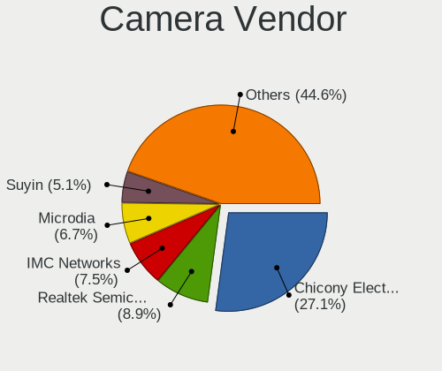

| Vendor                                 | Notebooks | Percent |
|----------------------------------------|-----------|---------|
| Chicony Electronics                    | 143       | 27.39%  |
| IMC Networks                           | 43        | 8.24%   |
| Realtek Semiconductor                  | 41        | 7.85%   |
| Microdia                               | 40        | 7.66%   |
| Suyin                                  | 28        | 5.36%   |
| Acer                                   | 27        | 5.17%   |
| Sunplus Innovation Technology          | 23        | 4.41%   |
| Alcor Micro                            | 23        | 4.41%   |
| Cheng Uei Precision Industry (Foxlink) | 21        | 4.02%   |
| Silicon Motion                         | 19        | 3.64%   |
| Quanta                                 | 17        | 3.26%   |
| Apple                                  | 17        | 3.26%   |
| Syntek                                 | 11        | 2.11%   |
| Lite-On Technology                     | 11        | 2.11%   |
| Ricoh                                  | 9         | 1.72%   |
| Lenovo                                 | 8         | 1.53%   |
| ALi                                    | 6         | 1.15%   |
| Importek                               | 5         | 0.96%   |
| Z-Star Microelectronics                | 3         | 0.57%   |
| Luxvisions Innotech Limited            | 3         | 0.57%   |
| GEMBIRD                                | 3         | 0.57%   |
| USB Camera                             | 2         | 0.38%   |
| SunplusIT                              | 2         | 0.38%   |
| Samsung Electronics                    | 2         | 0.38%   |
| Genesys Logic                          | 2         | 0.38%   |
| Y Media                                | 1         | 0.19%   |
| WCM_USB                                | 1         | 0.19%   |
| USB Camera CS                          | 1         | 0.19%   |
| Toshiba                                | 1         | 0.19%   |
| OmniVision Technologies                | 1         | 0.19%   |
| Novatek Microelectronics               | 1         | 0.19%   |
| Nintendo                               | 1         | 0.19%   |
| Logitech                               | 1         | 0.19%   |
| LG Electronics                         | 1         | 0.19%   |
| Generalplus Technology                 | 1         | 0.19%   |
| DigiTech                               | 1         | 0.19%   |
| Cubeternet                             | 1         | 0.19%   |
| Creative Technology                    | 1         | 0.19%   |

Camera Model
------------

Camera device models

| Model                                                | Notebooks | Percent |
|------------------------------------------------------|-----------|---------|
| Chicony Integrated Camera                            | 15        | 2.86%   |
| Alcor Micro USB 2.0 Camera                           | 15        | 2.86%   |
| Realtek Integrated_Webcam_HD                         | 14        | 2.67%   |
| Chicony HP Truevision HD                             | 9         | 1.71%   |
| Chicony USB 2.0 Camera                               | 8         | 1.52%   |
| Chicony HD WebCam                                    | 8         | 1.52%   |
| Chicony EasyCamera                                   | 8         | 1.52%   |
| Realtek USB Camera                                   | 7         | 1.33%   |
| Chicony TOSHIBA Web Camera - HD                      | 7         | 1.33%   |
| Sunplus HD WebCam                                    | 6         | 1.14%   |
| Microdia 1.3 MPixel Integrated Webcam                | 6         | 1.14%   |
| IMC Networks UVC VGA Webcam                          | 6         | 1.14%   |
| IMC Networks USB2.0 HD UVC WebCam                    | 6         | 1.14%   |
| Chicony HP Webcam                                    | 6         | 1.14%   |
| Chicony HP HD Webcam                                 | 6         | 1.14%   |
| Chicony 2.0M UVC Webcam / CNF7129                    | 6         | 1.14%   |
| Apple FaceTime HD Camera                             | 6         | 1.14%   |
| Silicon Motion WebCam SC-0311139N                    | 5         | 0.95%   |
| Lenovo Integrated Webcam [R5U877]                    | 5         | 0.95%   |
| IMC Networks USB 2.0 UVC VGA WebCam                  | 5         | 0.95%   |
| Chicony HP HD Camera                                 | 5         | 0.95%   |
| Cheng Uei Precision Industry (Foxlink) HP Webcam-101 | 5         | 0.95%   |
| Acer Lenovo EasyCamera                               | 5         | 0.95%   |
| Suyin Acer CrystalEye Webcam                         | 4         | 0.76%   |
| Quanta HP Webcam                                     | 4         | 0.76%   |
| Microdia Sonix USB 2.0 Camera                        | 4         | 0.76%   |
| Lite-On HP HD Camera                                 | 4         | 0.76%   |
| IMC Networks USB2.0 VGA UVC WebCam                   | 4         | 0.76%   |
| IMC Networks USB2.0 UVC HD Webcam                    | 4         | 0.76%   |
| IMC Networks Integrated Webcam                       | 4         | 0.76%   |
| Chicony Integrated HP HD Webcam                      | 4         | 0.76%   |
| Apple iPhone5/5C/5S/6                                | 4         | 0.76%   |
| ALi WebCam                                           | 4         | 0.76%   |
| Alcor Micro Asus Integrated Webcam                   | 4         | 0.76%   |
| Suyin WebCam                                         | 3         | 0.57%   |
| Suyin Acer/HP Integrated Webcam [CN0314]             | 3         | 0.57%   |
| Sunplus Laptop Integrated WebCam HD                  | 3         | 0.57%   |
| Sunplus HP HD Webcam [Fixed]                         | 3         | 0.57%   |
| Sunplus Asus Webcam                                  | 3         | 0.57%   |
| Realtek USB2.0 HD UVC WebCam                         | 3         | 0.57%   |

Security
--------

Fingerprint Vendor
------------------

Fingerprint sensor vendors

| Vendor                     | Notebooks | Percent |
|----------------------------|-----------|---------|
| Validity Sensors           | 31        | 44.29%  |
| AuthenTec                  | 13        | 18.57%  |
| Upek                       | 9         | 12.86%  |
| STMicroelectronics         | 7         | 10%     |
| Synaptics                  | 4         | 5.71%   |
| Shenzhen Goodix Technology | 4         | 5.71%   |
| LighTuning Technology      | 2         | 2.86%   |

Fingerprint Model
-----------------

Fingerprint sensor models

| Model                                                      | Notebooks | Percent |
|------------------------------------------------------------|-----------|---------|
| Upek Biometric Touchchip/Touchstrip Fingerprint Sensor     | 8         | 11.43%  |
| STMicroelectronics Fingerprint Reader                      | 7         | 10%     |
| Validity Sensors VFS495 Fingerprint Reader                 | 6         | 8.57%   |
| Validity Sensors VFS471 Fingerprint Reader                 | 5         | 7.14%   |
| AuthenTec AES2810                                          | 4         | 5.71%   |
| AuthenTec AES2501 Fingerprint Sensor                       | 4         | 5.71%   |
| Validity Sensors VFS5011 Fingerprint Reader                | 3         | 4.29%   |
| Validity Sensors VFS491                                    | 3         | 4.29%   |
| Validity Sensors VFS451 Fingerprint Reader                 | 3         | 4.29%   |
| Validity Sensors VFS7500 Touch Fingerprint Sensor          | 2         | 2.86%   |
| Validity Sensors VFS 5011 fingerprint sensor               | 2         | 2.86%   |
| Validity Sensors Fingerprint scanner                       | 2         | 2.86%   |
| Synaptics  VFS7552 Touch Fingerprint Sensor with PurePrint | 2         | 2.86%   |
| Shenzhen Goodix FingerPrint                                | 2         | 2.86%   |
| LighTuning EgisTec Touch Fingerprint Sensor                | 2         | 2.86%   |
| AuthenTec AES1660 Fingerprint Sensor                       | 2         | 2.86%   |
| AuthenTec AES1600                                          | 2         | 2.86%   |
| Validity Sensors VFS301 Fingerprint Reader                 | 1         | 1.43%   |
| Validity Sensors VFS300 Fingerprint Reader                 | 1         | 1.43%   |
| Validity Sensors VFS101 Fingerprint Reader                 | 1         | 1.43%   |
| Validity Sensors VFS Fingerprint sensor                    | 1         | 1.43%   |
| Validity Sensors Swipe Fingerprint Sensor                  | 1         | 1.43%   |
| Upek TCS5B Fingerprint sensor                              | 1         | 1.43%   |
| Synaptics Prometheus MIS Touch Fingerprint Reader          | 1         | 1.43%   |
| Synaptics Metallica MIS Touch Fingerprint Reader           | 1         | 1.43%   |
| Shenzhen Goodix  FingerPrint Device                        | 1         | 1.43%   |
| Shenzhen Goodix Fingerprint Reader                         | 1         | 1.43%   |
| AuthenTec Fingerprint Sensor                               | 1         | 1.43%   |

Chipcard Vendor
---------------

Chipcard module vendors

| Vendor                | Notebooks | Percent |
|-----------------------|-----------|---------|
| Broadcom              | 9         | 37.5%   |
| O2 Micro              | 7         | 29.17%  |
| Alcor Micro           | 6         | 25%     |
| Upek                  | 1         | 4.17%   |
| Realtek Semiconductor | 1         | 4.17%   |

Chipcard Model
--------------

Chipcard module models

| Model                                                                        | Notebooks | Percent |
|------------------------------------------------------------------------------|-----------|---------|
| Alcor Micro AU9540 Smartcard Reader                                          | 6         | 25%     |
| O2 Micro OZ776 CCID Smartcard Reader                                         | 5         | 20.83%  |
| Broadcom BCM5880 Secure Applications Processor                               | 4         | 16.67%  |
| Broadcom 5880                                                                | 4         | 16.67%  |
| O2 Micro Oz776 SmartCard Reader                                              | 2         | 8.33%   |
| Upek TouchChip Fingerprint Coprocessor (WBF advanced mode)                   | 1         | 4.17%   |
| Realtek Semiconductor Smart Card Reader Interface                            | 1         | 4.17%   |
| Broadcom BCM5880 Secure Applications Processor with fingerprint swipe sensor | 1         | 4.17%   |

Unsupported
-----------

Unsupported Devices
-------------------

Total unsupported devices on board

| Total | Notebooks | Percent |
|-------|-----------|---------|
| 0     | 492       | 74.32%  |
| 1     | 139       | 21%     |
| 2     | 26        | 3.93%   |
| 3     | 4         | 0.6%    |
| 4     | 1         | 0.15%   |

Unsupported Device Types
------------------------

Types of unsupported devices

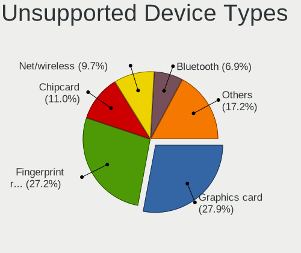

| Type                     | Notebooks | Percent |
|--------------------------|-----------|---------|
| Fingerprint reader       | 70        | 34.15%  |
| Graphics card            | 32        | 15.61%  |
| Net/wireless             | 25        | 12.2%   |
| Chipcard                 | 22        | 10.73%  |
| Bluetooth                | 14        | 6.83%   |
| Modem                    | 8         | 3.9%    |
| Camera                   | 8         | 3.9%    |
| Storage                  | 7         | 3.41%   |
| Net/ethernet             | 4         | 1.95%   |
| Multimedia controller    | 4         | 1.95%   |
| Flash memory             | 4         | 1.95%   |
| Communication controller | 3         | 1.46%   |
| Sound                    | 2         | 0.98%   |
| Network                  | 1         | 0.49%   |
| Card reader              | 1         | 0.49%   |

