Lubuntu - Tested Hardware & Statistics (Notebooks)
--------------------------------------------------

A project to collect tested hardware configurations for Lubuntu.

Anyone can contribute to this report by the [hw-probe](https://github.com/linuxhw/hw-probe) tool:

    sudo -E hw-probe -all -upload

Please contribute! Especially if your hardware is rare.

Contents
--------

* [ Test Cases ](#test-cases)

* [ System ](#system)
  - [ OS                       ](#os)
  - [ OS Family                ](#os-family)
  - [ Kernel                   ](#kernel)
  - [ Kernel Family            ](#kernel-family)
  - [ Kernel Major Ver.        ](#kernel-major-ver)
  - [ Arch                     ](#arch)
  - [ DE                       ](#de)
  - [ Display Server           ](#display-server)
  - [ Display Manager          ](#display-manager)
  - [ OS Lang                  ](#os-lang)
  - [ Boot Mode                ](#boot-mode)
  - [ Filesystem               ](#filesystem)
  - [ Part. scheme             ](#part-scheme)
  - [ Dual Boot with Linux/BSD ](#dual-boot-with-linuxbsd)
  - [ Dual Boot (Win)          ](#dual-boot-win)

* [ Board ](#board)
  - [ Vendor                   ](#vendor)
  - [ Model                    ](#model)
  - [ Model Family             ](#model-family)
  - [ MFG Year                 ](#mfg-year)
  - [ Form Factor              ](#form-factor)
  - [ Secure Boot              ](#secure-boot)
  - [ Coreboot                 ](#coreboot)
  - [ RAM Size                 ](#ram-size)
  - [ RAM Used                 ](#ram-used)
  - [ Total Drives             ](#total-drives)
  - [ Has CD-ROM               ](#has-cd-rom)
  - [ Has Ethernet             ](#has-ethernet)
  - [ Has WiFi                 ](#has-wifi)
  - [ Has Bluetooth            ](#has-bluetooth)

* [ Location ](#location)
  - [ Country                  ](#country)
  - [ City                     ](#city)

* [ Drives ](#drives)
  - [ Drive Vendor             ](#drive-vendor)
  - [ Drive Model              ](#drive-model)
  - [ HDD Vendor               ](#hdd-vendor)
  - [ SSD Vendor               ](#ssd-vendor)
  - [ Drive Kind               ](#drive-kind)
  - [ Drive Connector          ](#drive-connector)
  - [ Drive Size               ](#drive-size)
  - [ Space Total              ](#space-total)
  - [ Space Used               ](#space-used)
  - [ Malfunc. Drives          ](#malfunc-drives)
  - [ Malfunc. Drive Vendor    ](#malfunc-drive-vendor)
  - [ Malfunc. HDD Vendor      ](#malfunc-hdd-vendor)
  - [ Malfunc. Drive Kind      ](#malfunc-drive-kind)
  - [ Failed Drives            ](#failed-drives)
  - [ Failed Drive Vendor      ](#failed-drive-vendor)
  - [ Drive Status             ](#drive-status)

* [ Storage controller ](#storage-controller)
  - [ Storage Vendor           ](#storage-vendor)
  - [ Storage Model            ](#storage-model)
  - [ Storage Kind             ](#storage-kind)

* [ Processor ](#processor)
  - [ CPU Vendor               ](#cpu-vendor)
  - [ CPU Model                ](#cpu-model)
  - [ CPU Model Family         ](#cpu-model-family)
  - [ CPU Cores                ](#cpu-cores)
  - [ CPU Sockets              ](#cpu-sockets)
  - [ CPU Threads              ](#cpu-threads)
  - [ CPU Op-Modes             ](#cpu-op-modes)
  - [ CPU Microcode            ](#cpu-microcode)
  - [ CPU Microarch            ](#cpu-microarch)

* [ Graphics ](#graphics)
  - [ GPU Vendor               ](#gpu-vendor)
  - [ GPU Model                ](#gpu-model)
  - [ GPU Combo                ](#gpu-combo)
  - [ GPU Driver               ](#gpu-driver)
  - [ GPU Memory               ](#gpu-memory)

* [ Monitor ](#monitor)
  - [ Monitor Vendor           ](#monitor-vendor)
  - [ Monitor Model            ](#monitor-model)
  - [ Monitor Resolution       ](#monitor-resolution)
  - [ Monitor Diagonal         ](#monitor-diagonal)
  - [ Monitor Width            ](#monitor-width)
  - [ Aspect Ratio             ](#aspect-ratio)
  - [ Monitor Area             ](#monitor-area)
  - [ Pixel Density            ](#pixel-density)
  - [ Multiple Monitors        ](#multiple-monitors)

* [ Network ](#network)
  - [ Net Controller Vendor    ](#net-controller-vendor)
  - [ Net Controller Model     ](#net-controller-model)
  - [ Wireless Vendor          ](#wireless-vendor)
  - [ Wireless Model           ](#wireless-model)
  - [ Ethernet Vendor          ](#ethernet-vendor)
  - [ Ethernet Model           ](#ethernet-model)
  - [ Net Controller Kind      ](#net-controller-kind)
  - [ Used Controller          ](#used-controller)
  - [ NICs                     ](#nics)
  - [ IPv6                     ](#ipv6)

* [ Bluetooth ](#bluetooth)
  - [ Bluetooth Vendor         ](#bluetooth-vendor)
  - [ Bluetooth Model          ](#bluetooth-model)

* [ Sound ](#sound)
  - [ Sound Vendor             ](#sound-vendor)
  - [ Sound Model              ](#sound-model)

* [ Memory ](#memory)
  - [ Memory Vendor            ](#memory-vendor)
  - [ Memory Model             ](#memory-model)
  - [ Memory Kind              ](#memory-kind)
  - [ Memory Form Factor       ](#memory-form-factor)
  - [ Memory Size              ](#memory-size)
  - [ Memory Speed             ](#memory-speed)

* [ Printers & scanners ](#printers--scanners)
  - [ Printer Vendor           ](#printer-vendor)
  - [ Printer Model            ](#printer-model)
  - [ Scanner Vendor           ](#scanner-vendor)
  - [ Scanner Model            ](#scanner-model)

* [ Camera ](#camera)
  - [ Camera Vendor            ](#camera-vendor)
  - [ Camera Model             ](#camera-model)

* [ Security ](#security)
  - [ Fingerprint Vendor       ](#fingerprint-vendor)
  - [ Fingerprint Model        ](#fingerprint-model)
  - [ Chipcard Vendor          ](#chipcard-vendor)
  - [ Chipcard Model           ](#chipcard-model)

* [ Unsupported ](#unsupported)
  - [ Unsupported Devices      ](#unsupported-devices)
  - [ Unsupported Device Types ](#unsupported-device-types)

Test Cases
----------

Total: 1568

| Vendor        | Model                       | Probe                                                      | Date         |
|---------------|-----------------------------|------------------------------------------------------------|--------------|
| HP            | Pavilion g7                 | [5692787b6f](https://linux-hardware.org/?probe=5692787b6f) | Dec 31, 2024 |
| Acer          | Aspire A114-32              | [d4aff4e66c](https://linux-hardware.org/?probe=d4aff4e66c) | Dec 30, 2024 |
| Fujitsu       | LIFEBOOK AH531              | [37872e53dc](https://linux-hardware.org/?probe=37872e53dc) | Dec 30, 2024 |
| Fujitsu       | LIFEBOOK AH531              | [0dc9a2432a](https://linux-hardware.org/?probe=0dc9a2432a) | Dec 30, 2024 |
| HP            | Notebook                    | [fb6c3eebe1](https://linux-hardware.org/?probe=fb6c3eebe1) | Dec 29, 2024 |
| Unchartevi... | 6540                        | [1d27092258](https://linux-hardware.org/?probe=1d27092258) | Dec 29, 2024 |
| Fujitsu Si... | ESPRIMO Mobile V6535        | [5099a4c834](https://linux-hardware.org/?probe=5099a4c834) | Dec 28, 2024 |
| Unknown       | Unknown                     | [dae997fee3](https://linux-hardware.org/?probe=dae997fee3) | Dec 26, 2024 |
| Dell          | Inspiron 1545               | [9cc6330a09](https://linux-hardware.org/?probe=9cc6330a09) | Dec 21, 2024 |
| Dell          | System XPS 15Z              | [9e7fc2d36e](https://linux-hardware.org/?probe=9e7fc2d36e) | Dec 20, 2024 |
| ASUSTek       | X550CL                      | [ca719e1a32](https://linux-hardware.org/?probe=ca719e1a32) | Dec 20, 2024 |
| Medion        | S6421 MD60703               | [609c73a176](https://linux-hardware.org/?probe=609c73a176) | Dec 19, 2024 |
| Lenovo        | IdeaPad 330-15IKB 81FD      | [bc07631f18](https://linux-hardware.org/?probe=bc07631f18) | Dec 18, 2024 |
| Lenovo        | IdeaPad S405 9802           | [10b9693723](https://linux-hardware.org/?probe=10b9693723) | Dec 17, 2024 |
| Lenovo        | IdeaPad S405 9802           | [3a61babe21](https://linux-hardware.org/?probe=3a61babe21) | Dec 17, 2024 |
| Packard Be... | DOT S                       | [60865a1411](https://linux-hardware.org/?probe=60865a1411) | Dec 14, 2024 |
| HP            | EliteBook 835 13 inch G1... | [501650199f](https://linux-hardware.org/?probe=501650199f) | Dec 12, 2024 |
| HP            | 2000                        | [3c20e6e18c](https://linux-hardware.org/?probe=3c20e6e18c) | Dec 11, 2024 |
| Fujitsu Si... | ESPRIMO Mobile V6555        | [291861d530](https://linux-hardware.org/?probe=291861d530) | Dec 08, 2024 |
| Dell          | Inspiron 15-3567            | [cbf6bf1b48](https://linux-hardware.org/?probe=cbf6bf1b48) | Dec 06, 2024 |
| HP            | Laptop 15-db0xxx            | [469069638e](https://linux-hardware.org/?probe=469069638e) | Dec 01, 2024 |
| Google        | Candy                       | [035e637f3d](https://linux-hardware.org/?probe=035e637f3d) | Dec 01, 2024 |
| Acer          | AO722                       | [15b4d05c90](https://linux-hardware.org/?probe=15b4d05c90) | Nov 25, 2024 |
| Acer          | AO722                       | [f5300839f0](https://linux-hardware.org/?probe=f5300839f0) | Nov 25, 2024 |
| Apple         | MacBook5,1                  | [c9bc1374b3](https://linux-hardware.org/?probe=c9bc1374b3) | Nov 25, 2024 |
| Google        | Candy                       | [cac90e3ac0](https://linux-hardware.org/?probe=cac90e3ac0) | Nov 25, 2024 |
| Google        | Candy                       | [0cb5a31970](https://linux-hardware.org/?probe=0cb5a31970) | Nov 23, 2024 |
| Sony          | M730                        | [55d7e62f9d](https://linux-hardware.org/?probe=55d7e62f9d) | Nov 23, 2024 |
| HP            | Notebook                    | [bb9e0faf8f](https://linux-hardware.org/?probe=bb9e0faf8f) | Nov 22, 2024 |
| Medion        | E122X                       | [e7c29c8ff7](https://linux-hardware.org/?probe=e7c29c8ff7) | Nov 19, 2024 |
| Apple         | MacBookPro8,1               | [ba64567726](https://linux-hardware.org/?probe=ba64567726) | Nov 18, 2024 |
| Dell          | Inspiron 15-3567            | [815225e627](https://linux-hardware.org/?probe=815225e627) | Nov 18, 2024 |
| Apple         | MacBook5,1                  | [fc4768f63d](https://linux-hardware.org/?probe=fc4768f63d) | Nov 17, 2024 |
| Dell          | XPS MXC062                  | [bb0597c639](https://linux-hardware.org/?probe=bb0597c639) | Nov 15, 2024 |
| Dell          | XPS MXC062                  | [fbc63bd772](https://linux-hardware.org/?probe=fbc63bd772) | Nov 15, 2024 |
| Samsung       | 530U3BI/530U4BI/530U4BH     | [342d578a5c](https://linux-hardware.org/?probe=342d578a5c) | Nov 13, 2024 |
| Acer          | Aspire ES1-531              | [a7c11e81f1](https://linux-hardware.org/?probe=a7c11e81f1) | Nov 09, 2024 |
| HP            | ProBook 430 G2              | [ea645a6ae1](https://linux-hardware.org/?probe=ea645a6ae1) | Nov 08, 2024 |
| Fujitsu Si... | AMILO A7645                 | [82b3b117c2](https://linux-hardware.org/?probe=82b3b117c2) | Nov 08, 2024 |
| Lenovo        | IdeaPad S145-15IWL 81MV     | [67b92639b5](https://linux-hardware.org/?probe=67b92639b5) | Nov 05, 2024 |
| Sony          | VPCF132FX                   | [b584189661](https://linux-hardware.org/?probe=b584189661) | Nov 03, 2024 |
| Dell          | Latitude E7240              | [82e1ee846b](https://linux-hardware.org/?probe=82e1ee846b) | Nov 02, 2024 |
| Lenovo        | G770 20089                  | [3547cb6c29](https://linux-hardware.org/?probe=3547cb6c29) | Oct 30, 2024 |
| LG Electro... | X110-L.B7BLP1               | [a71f31873d](https://linux-hardware.org/?probe=a71f31873d) | Oct 29, 2024 |
| Lenovo        | Yoga 300-11IBR 80M1         | [d47c826466](https://linux-hardware.org/?probe=d47c826466) | Oct 28, 2024 |
| HP            | 245 G8 Notebook PC          | [8a3413b200](https://linux-hardware.org/?probe=8a3413b200) | Oct 26, 2024 |
| Lenovo        | IdeaPad 1 15IJL7 82LX       | [6028ccb88f](https://linux-hardware.org/?probe=6028ccb88f) | Oct 25, 2024 |
| Lenovo        | ThinkPad E15 20RD005VRT     | [0faadd1106](https://linux-hardware.org/?probe=0faadd1106) | Oct 24, 2024 |
| Toshiba       | Satellite C660              | [11806f6477](https://linux-hardware.org/?probe=11806f6477) | Oct 24, 2024 |
| Dell          | Latitude E5450              | [0465141d52](https://linux-hardware.org/?probe=0465141d52) | Oct 23, 2024 |
| Toshiba       | Satellite P55W-C            | [84c58de68f](https://linux-hardware.org/?probe=84c58de68f) | Oct 23, 2024 |
| Toshiba       | Satellite P55W-C            | [2fbe7927f9](https://linux-hardware.org/?probe=2fbe7927f9) | Oct 23, 2024 |
| HP            | EliteBook 2540p             | [53c668190f](https://linux-hardware.org/?probe=53c668190f) | Oct 23, 2024 |
| Fujitsu       | LIFEBOOK AH531              | [7205fb0b92](https://linux-hardware.org/?probe=7205fb0b92) | Oct 23, 2024 |
| Dell          | Inspiron 1501               | [5ac3420a2b](https://linux-hardware.org/?probe=5ac3420a2b) | Oct 22, 2024 |
| HP            | Pavilion Laptop 15-cs315... | [c61e1c6184](https://linux-hardware.org/?probe=c61e1c6184) | Oct 22, 2024 |
| Lenovo        | Z70-80 80FG                 | [df61da6a87](https://linux-hardware.org/?probe=df61da6a87) | Oct 22, 2024 |
| HP            | EliteBook 830 G6            | [f7d13716ee](https://linux-hardware.org/?probe=f7d13716ee) | Oct 22, 2024 |
| Medion        | S6421 MD60703               | [c92c3514b3](https://linux-hardware.org/?probe=c92c3514b3) | Oct 22, 2024 |
| Dell          | Latitude E5450              | [2ec7e21290](https://linux-hardware.org/?probe=2ec7e21290) | Oct 19, 2024 |
| Chuwi         | GemiBook Pro                | [be2a9177cc](https://linux-hardware.org/?probe=be2a9177cc) | Oct 19, 2024 |
| HP            | InsydeH2O EFI BIOS          | [3d33564930](https://linux-hardware.org/?probe=3d33564930) | Oct 16, 2024 |
| HP            | Compaq CQ58                 | [129913dcc6](https://linux-hardware.org/?probe=129913dcc6) | Oct 14, 2024 |
| Positivo      | C14CU51                     | [a50a121b61](https://linux-hardware.org/?probe=a50a121b61) | Oct 12, 2024 |
| HP            | 255 G5                      | [062ce32d62](https://linux-hardware.org/?probe=062ce32d62) | Oct 11, 2024 |
| HONOR         | NMH-WCX9                    | [03f4ff2833](https://linux-hardware.org/?probe=03f4ff2833) | Oct 09, 2024 |
| HONOR         | NMH-WCX9                    | [e167d1430c](https://linux-hardware.org/?probe=e167d1430c) | Oct 09, 2024 |
| Samsung       | 370E4K                      | [f87816505c](https://linux-hardware.org/?probe=f87816505c) | Oct 07, 2024 |
| Acer          | Aspire 5735                 | [4c1559410d](https://linux-hardware.org/?probe=4c1559410d) | Oct 06, 2024 |
| Acer          | Aspire 5735                 | [50e1561f7d](https://linux-hardware.org/?probe=50e1561f7d) | Oct 06, 2024 |
| Dell          | Vostro 1500                 | [6680201494](https://linux-hardware.org/?probe=6680201494) | Oct 06, 2024 |
| Google        | Rabbid                      | [022398a237](https://linux-hardware.org/?probe=022398a237) | Oct 05, 2024 |
| Lenovo        | IdeaPad 320-15IKB 80XL      | [e15bff83db](https://linux-hardware.org/?probe=e15bff83db) | Oct 05, 2024 |
| HP            | EliteBook 2540p             | [582f0a4f04](https://linux-hardware.org/?probe=582f0a4f04) | Oct 04, 2024 |
| Dell          | Inspiron 1100               | [1012ad2903](https://linux-hardware.org/?probe=1012ad2903) | Oct 02, 2024 |
| Toshiba       | Satellite C660              | [1ce63743fd](https://linux-hardware.org/?probe=1ce63743fd) | Oct 01, 2024 |
| Apple         | MacBook4,1                  | [1b71a4b0c9](https://linux-hardware.org/?probe=1b71a4b0c9) | Oct 01, 2024 |
| Lenovo        | ThinkPad T480s 20L8S3SW0... | [d3f2558562](https://linux-hardware.org/?probe=d3f2558562) | Sep 28, 2024 |
| ASUSTek       | X553MA                      | [a96b018191](https://linux-hardware.org/?probe=a96b018191) | Sep 25, 2024 |
| MicroByte     | ezbook                      | [5b878e7b72](https://linux-hardware.org/?probe=5b878e7b72) | Sep 24, 2024 |
| HP            | Pavilion 15                 | [617c9c6fd3](https://linux-hardware.org/?probe=617c9c6fd3) | Sep 22, 2024 |
| HP            | Pavilion 15                 | [47d81a32ab](https://linux-hardware.org/?probe=47d81a32ab) | Sep 22, 2024 |
| Lenovo        | IdeaPad Slim 1-14AST-05 ... | [273c5852ff](https://linux-hardware.org/?probe=273c5852ff) | Sep 18, 2024 |
| HP            | InsydeH2O EFI BIOS          | [7102de50a6](https://linux-hardware.org/?probe=7102de50a6) | Sep 17, 2024 |
| Dell          | Latitude E6410              | [92cd0e0eee](https://linux-hardware.org/?probe=92cd0e0eee) | Sep 17, 2024 |
| Dell          | Latitude E6410              | [d9385745e8](https://linux-hardware.org/?probe=d9385745e8) | Sep 17, 2024 |
| Dell          | Inspiron 1564               | [e2028cccf6](https://linux-hardware.org/?probe=e2028cccf6) | Sep 14, 2024 |
| Apple         | MacBookPro8,1               | [606582cd82](https://linux-hardware.org/?probe=606582cd82) | Sep 10, 2024 |
| Acer          | Aspire ES1-571              | [a5aeb5f264](https://linux-hardware.org/?probe=a5aeb5f264) | Sep 10, 2024 |
| Complet       | MY8305                      | [fdab3231de](https://linux-hardware.org/?probe=fdab3231de) | Sep 07, 2024 |
| Samsung       | RV415                       | [e3d0816997](https://linux-hardware.org/?probe=e3d0816997) | Sep 07, 2024 |
| Chuwi         | HeroBook Air                | [09a139dbbe](https://linux-hardware.org/?probe=09a139dbbe) | Sep 04, 2024 |
| Chuwi         | HeroBook Air                | [163bdd4e80](https://linux-hardware.org/?probe=163bdd4e80) | Sep 04, 2024 |
| HP            | EliteBook 8440p             | [70ad6eb824](https://linux-hardware.org/?probe=70ad6eb824) | Sep 03, 2024 |
| Acer          | AOD255                      | [3dace1f171](https://linux-hardware.org/?probe=3dace1f171) | Sep 03, 2024 |
| Acer          | AOD255                      | [7d7265c514](https://linux-hardware.org/?probe=7d7265c514) | Sep 03, 2024 |
| HP            | Compaq 6735s                | [ef4b082281](https://linux-hardware.org/?probe=ef4b082281) | Sep 02, 2024 |
| HP            | Compaq 6530b (GW688AV)      | [acf0e79f7a](https://linux-hardware.org/?probe=acf0e79f7a) | Aug 31, 2024 |
| Dell          | Latitude 5285               | [ece411e4e4](https://linux-hardware.org/?probe=ece411e4e4) | Aug 27, 2024 |
| Lenovo        | ThinkPad L480 20LTS15Q00    | [c7bd2c3d2e](https://linux-hardware.org/?probe=c7bd2c3d2e) | Aug 26, 2024 |
| Fujitsu Si... | AMILO Pi 1505               | [b62ccb34eb](https://linux-hardware.org/?probe=b62ccb34eb) | Aug 23, 2024 |
| HP            | Pavilion dv6                | [8745b6a8a6](https://linux-hardware.org/?probe=8745b6a8a6) | Aug 22, 2024 |
| Acer          | Aspire E5-571G              | [5d217cd410](https://linux-hardware.org/?probe=5d217cd410) | Aug 22, 2024 |
| eMachines     | E725                        | [22fba92ec4](https://linux-hardware.org/?probe=22fba92ec4) | Aug 20, 2024 |
| Lenovo        | ThinkPad T61 7658CTO        | [c395b3e28c](https://linux-hardware.org/?probe=c395b3e28c) | Aug 19, 2024 |
| Lenovo        | IdeaPad S130-14IGM 81J2     | [d4e9ec66bb](https://linux-hardware.org/?probe=d4e9ec66bb) | Aug 17, 2024 |
| Dell          | XPS MXC062                  | [46f9c80883](https://linux-hardware.org/?probe=46f9c80883) | Aug 16, 2024 |
| Lenovo        | IdeaPad S205 Brazos         | [e40f1ca18f](https://linux-hardware.org/?probe=e40f1ca18f) | Aug 15, 2024 |
| HP            | EliteBook 8440p             | [46e4c79baf](https://linux-hardware.org/?probe=46e4c79baf) | Aug 13, 2024 |
| HP            | EliteBook 8440p             | [4a401d3cf7](https://linux-hardware.org/?probe=4a401d3cf7) | Aug 13, 2024 |
| HP            | Compaq Presario CQ60        | [d0e97b8772](https://linux-hardware.org/?probe=d0e97b8772) | Aug 13, 2024 |
| HP            | Notebook                    | [0d521e10c8](https://linux-hardware.org/?probe=0d521e10c8) | Aug 11, 2024 |
| ASUSTek       | X540SA                      | [683c8f3f4b](https://linux-hardware.org/?probe=683c8f3f4b) | Aug 11, 2024 |
| SK hynix      | HT14CCIC42E                 | [eb41114fc3](https://linux-hardware.org/?probe=eb41114fc3) | Aug 10, 2024 |
| Acer          | Aspire 5715Z                | [32b3360c63](https://linux-hardware.org/?probe=32b3360c63) | Aug 07, 2024 |
| Acer          | Aspire 5715Z                | [387c8e5fe4](https://linux-hardware.org/?probe=387c8e5fe4) | Aug 07, 2024 |
| Lenovo        | IdeaPad 3 15ALC6 82MF       | [ef1df870ea](https://linux-hardware.org/?probe=ef1df870ea) | Aug 07, 2024 |
| HP            | Notebook                    | [1a796d1daf](https://linux-hardware.org/?probe=1a796d1daf) | Aug 04, 2024 |
| Dell          | Inspiron N5110              | [c390f98098](https://linux-hardware.org/?probe=c390f98098) | Aug 03, 2024 |
| Acer          | Aspire A515-51              | [edc0e332b2](https://linux-hardware.org/?probe=edc0e332b2) | Aug 01, 2024 |
| Acer          | Aspire A515-51              | [bd658968cf](https://linux-hardware.org/?probe=bd658968cf) | Aug 01, 2024 |
| HP            | Laptop 15-da0xxx            | [ed33f895c9](https://linux-hardware.org/?probe=ed33f895c9) | Jul 28, 2024 |
| Intel         | STCK1A32WFC H67490-303      | [b12d74f728](https://linux-hardware.org/?probe=b12d74f728) | Jul 27, 2024 |
| HP            | Pavilion x2 Detachable      | [f5fb19db6b](https://linux-hardware.org/?probe=f5fb19db6b) | Jul 27, 2024 |
| Acer          | Swift SF113-31              | [6c63a7574e](https://linux-hardware.org/?probe=6c63a7574e) | Jul 26, 2024 |
| HP            | Pavilion x2 Detachable      | [8f6ba78b79](https://linux-hardware.org/?probe=8f6ba78b79) | Jul 25, 2024 |
| Acer          | Aspire A515-57G             | [e7fba30a89](https://linux-hardware.org/?probe=e7fba30a89) | Jul 23, 2024 |
| Dell          | Inspiron 3135               | [36c80b438d](https://linux-hardware.org/?probe=36c80b438d) | Jul 22, 2024 |
| HP            | 240 G4                      | [74ad43cd86](https://linux-hardware.org/?probe=74ad43cd86) | Jul 19, 2024 |
| PROBOOK       | U SERIES                    | [e9b030a9df](https://linux-hardware.org/?probe=e9b030a9df) | Jul 17, 2024 |
| PROBOOK       | U SERIES                    | [bdc92be04b](https://linux-hardware.org/?probe=bdc92be04b) | Jul 15, 2024 |
| Apple         | MacBookPro9,2               | [e0376fa4fe](https://linux-hardware.org/?probe=e0376fa4fe) | Jul 13, 2024 |
| ASUSTek       | VivoBook 15_ASUS Laptop ... | [64b642a303](https://linux-hardware.org/?probe=64b642a303) | Jul 12, 2024 |
| ASUSTek       | K52JB                       | [d50ec4eed9](https://linux-hardware.org/?probe=d50ec4eed9) | Jul 09, 2024 |
| Lenovo        | ThinkPad L13 Gen 1 20R4S... | [4cc52bfb25](https://linux-hardware.org/?probe=4cc52bfb25) | Jul 07, 2024 |
| Notebook      | PB50_70EF,ED,EC             | [9d7e31a9f6](https://linux-hardware.org/?probe=9d7e31a9f6) | Jul 06, 2024 |
| Dell          | XPS M1330                   | [a01b178b3a](https://linux-hardware.org/?probe=a01b178b3a) | Jul 06, 2024 |
| Acer          | Aspire V5-471P              | [f8a09477f0](https://linux-hardware.org/?probe=f8a09477f0) | Jul 05, 2024 |
| Packard Be... | EasyNote TE69BM             | [e4f954f464](https://linux-hardware.org/?probe=e4f954f464) | Jul 05, 2024 |
| ASUSTek       | K50AD                       | [0fd561ca3c](https://linux-hardware.org/?probe=0fd561ca3c) | Jul 05, 2024 |
| Unknown       | N10(M1N1)                   | [fc2ca6d762](https://linux-hardware.org/?probe=fc2ca6d762) | Jul 04, 2024 |
| HP            | 14                          | [f28a807a2e](https://linux-hardware.org/?probe=f28a807a2e) | Jul 01, 2024 |
| HUAWEI        | BOHK-WAX9X                  | [3f56bdc232](https://linux-hardware.org/?probe=3f56bdc232) | Jul 01, 2024 |
| Dell          | Latitude E6410              | [6f8ffa83ce](https://linux-hardware.org/?probe=6f8ffa83ce) | Jul 01, 2024 |
| HP            | Pavilion 10 TS              | [c2bd71447d](https://linux-hardware.org/?probe=c2bd71447d) | Jun 30, 2024 |
| Dell          | Inspiron 15-3567            | [3eed7f4afe](https://linux-hardware.org/?probe=3eed7f4afe) | Jun 30, 2024 |
| ASUSTek       | K52JB                       | [cda7f38058](https://linux-hardware.org/?probe=cda7f38058) | Jun 29, 2024 |
| HP            | Laptop 15-bw0xx             | [3a1445300b](https://linux-hardware.org/?probe=3a1445300b) | Jun 28, 2024 |
| Dell          | Latitude 3190               | [41e83ac5c5](https://linux-hardware.org/?probe=41e83ac5c5) | Jun 27, 2024 |
| HP            | Pavilion dv6                | [e6342ad374](https://linux-hardware.org/?probe=e6342ad374) | Jun 27, 2024 |
| RWC           | DA-T118-SR                  | [05f141e671](https://linux-hardware.org/?probe=05f141e671) | Jun 26, 2024 |
| Teclast       | tPAD                        | [7fcbabfefd](https://linux-hardware.org/?probe=7fcbabfefd) | Jun 25, 2024 |
| Lenovo        | IdeaPad L340-15IRH Gamin... | [1da0ed40d4](https://linux-hardware.org/?probe=1da0ed40d4) | Jun 24, 2024 |
| Insyde        | Braswell                    | [fb1a3d94f3](https://linux-hardware.org/?probe=fb1a3d94f3) | Jun 19, 2024 |
| Apple         | MacBookPro8,1               | [2639f09193](https://linux-hardware.org/?probe=2639f09193) | Jun 19, 2024 |
| Samsung       | QX311/QX411/QX412/QX511     | [e37830ceb9](https://linux-hardware.org/?probe=e37830ceb9) | Jun 10, 2024 |
| Lenovo        | IdeaPad 330-15IKB 81DC      | [f495fbd229](https://linux-hardware.org/?probe=f495fbd229) | Jun 04, 2024 |
| HP            | ZBook 15 G2                 | [a788fb84c1](https://linux-hardware.org/?probe=a788fb84c1) | Jun 02, 2024 |
| HP            | ZBook 15 G2                 | [60515e0fa6](https://linux-hardware.org/?probe=60515e0fa6) | Jun 02, 2024 |
| HP            | Laptop 15-bs0xx             | [3e4d7f9fbc](https://linux-hardware.org/?probe=3e4d7f9fbc) | Jun 01, 2024 |
| ASUSTek       | X550WAK                     | [1a64c5c27f](https://linux-hardware.org/?probe=1a64c5c27f) | May 31, 2024 |
| HP            | Laptop 15-bw0xx             | [3bae231b99](https://linux-hardware.org/?probe=3bae231b99) | May 31, 2024 |
| HP            | Laptop 15-bw0xx             | [0c0fc0bbe4](https://linux-hardware.org/?probe=0c0fc0bbe4) | May 31, 2024 |
| Lenovo        | ThinkPad X200 2024B67       | [6d2d7fbbb5](https://linux-hardware.org/?probe=6d2d7fbbb5) | May 28, 2024 |
| ODM           | Unknown                     | [d6a98e94b6](https://linux-hardware.org/?probe=d6a98e94b6) | May 27, 2024 |
| ASUSTek       | GL552VX                     | [9f2697991a](https://linux-hardware.org/?probe=9f2697991a) | May 26, 2024 |
| HP            | Pavilion Notebook           | [133e970ae7](https://linux-hardware.org/?probe=133e970ae7) | May 23, 2024 |
| Lenovo        | ThinkPad T560 20FJS0XX00    | [11d6470b8b](https://linux-hardware.org/?probe=11d6470b8b) | May 23, 2024 |
| Apple         | MacBookAir1,1               | [8c29382ba8](https://linux-hardware.org/?probe=8c29382ba8) | May 21, 2024 |
| ODM           | Unknown                     | [9fcefdfbe9](https://linux-hardware.org/?probe=9fcefdfbe9) | May 19, 2024 |
| Lenovo        | ThinkPad L490 20Q5002GGE    | [c92390a81b](https://linux-hardware.org/?probe=c92390a81b) | May 15, 2024 |
| Dell          | Inspiron 13-5378            | [fcb1c00cb1](https://linux-hardware.org/?probe=fcb1c00cb1) | May 15, 2024 |
| Sony          | VPCW216AG                   | [0e3674f67f](https://linux-hardware.org/?probe=0e3674f67f) | May 14, 2024 |
| Lenovo        | IdeaPad 330S-14IKB 81F4     | [abf8f16050](https://linux-hardware.org/?probe=abf8f16050) | May 13, 2024 |
| Dell          | Vostro 3400                 | [345ddaf7ed](https://linux-hardware.org/?probe=345ddaf7ed) | May 13, 2024 |
| Lenovo        | G575 20081                  | [581885ea87](https://linux-hardware.org/?probe=581885ea87) | May 11, 2024 |
| Shenzhen B... | XN116B                      | [47dbcecbd7](https://linux-hardware.org/?probe=47dbcecbd7) | May 04, 2024 |
| Dell          | Vostro 3400                 | [93da978d38](https://linux-hardware.org/?probe=93da978d38) | May 04, 2024 |
| HP            | EliteBook 840 G4            | [f9fed717ee](https://linux-hardware.org/?probe=f9fed717ee) | May 03, 2024 |
| ASUSTek       | X540YA                      | [e163aa8e32](https://linux-hardware.org/?probe=e163aa8e32) | May 03, 2024 |
| HP            | Pavilion dm1                | [ba07809953](https://linux-hardware.org/?probe=ba07809953) | May 02, 2024 |
| Notebook      | W54_W94_W955TU,-T,-C        | [c327d5c1a6](https://linux-hardware.org/?probe=c327d5c1a6) | May 01, 2024 |
| Apple         | MacBookPro5,5               | [2ddfed1c8a](https://linux-hardware.org/?probe=2ddfed1c8a) | May 01, 2024 |
| Lenovo        | G50-45 80E3                 | [a12bc9b719](https://linux-hardware.org/?probe=a12bc9b719) | Apr 28, 2024 |
| ASUSTek       | K45A                        | [7bed7e12ab](https://linux-hardware.org/?probe=7bed7e12ab) | Apr 27, 2024 |
| ASUSTek       | K53BY                       | [6f6c4b9d68](https://linux-hardware.org/?probe=6f6c4b9d68) | Apr 26, 2024 |
| HP            | Compaq 8710w (GT649PA#AB... | [00f1c96012](https://linux-hardware.org/?probe=00f1c96012) | Apr 26, 2024 |
| Dell          | Inspiron 15-3567            | [e93fe83f01](https://linux-hardware.org/?probe=e93fe83f01) | Apr 24, 2024 |
| Acer          | Aspire E5-573G              | [216cd2fc72](https://linux-hardware.org/?probe=216cd2fc72) | Apr 24, 2024 |
| ASUSTek       | X555QG                      | [c905efd379](https://linux-hardware.org/?probe=c905efd379) | Apr 23, 2024 |
| ASUSTek       | X555QG                      | [26b8da2305](https://linux-hardware.org/?probe=26b8da2305) | Apr 23, 2024 |
| ASUSTek       | K42F                        | [f29299723c](https://linux-hardware.org/?probe=f29299723c) | Apr 23, 2024 |
| Lenovo        | B575e 36852BG               | [c2c9ec964e](https://linux-hardware.org/?probe=c2c9ec964e) | Apr 23, 2024 |
| ASUSTek       | K42F                        | [63b454fa02](https://linux-hardware.org/?probe=63b454fa02) | Apr 23, 2024 |
| Lenovo        | B575e 36852BG               | [d168fb33c4](https://linux-hardware.org/?probe=d168fb33c4) | Apr 23, 2024 |
| Toshiba       | Satellite C850D-11C         | [beccadec71](https://linux-hardware.org/?probe=beccadec71) | Apr 22, 2024 |
| Fujitsu       | FMVA40B1RJ                  | [b0d3f0b365](https://linux-hardware.org/?probe=b0d3f0b365) | Apr 20, 2024 |
| Dell          | Inspiron 15-3567            | [bf1e4f8d6a](https://linux-hardware.org/?probe=bf1e4f8d6a) | Apr 20, 2024 |
| HP            | EliteBook 6930p             | [263d72f3c6](https://linux-hardware.org/?probe=263d72f3c6) | Apr 17, 2024 |
| Unknown       | Unknown                     | [10d92e98c0](https://linux-hardware.org/?probe=10d92e98c0) | Apr 16, 2024 |
| HP            | 250 G4 Notebook PC          | [2fcb542c43](https://linux-hardware.org/?probe=2fcb542c43) | Apr 14, 2024 |
| Unknown       | M-140BI3                    | [491b1013ab](https://linux-hardware.org/?probe=491b1013ab) | Apr 11, 2024 |
| HP            | Pavilion g7                 | [6d84e70e34](https://linux-hardware.org/?probe=6d84e70e34) | Apr 10, 2024 |
| Lenovo        | ThinkPad X201 3680A44       | [db6aadf372](https://linux-hardware.org/?probe=db6aadf372) | Apr 10, 2024 |
| Acer          | Aspire ES1-512              | [47ad6cd23e](https://linux-hardware.org/?probe=47ad6cd23e) | Apr 05, 2024 |
| Acer          | Aspire ES1-512              | [9b5914816a](https://linux-hardware.org/?probe=9b5914816a) | Apr 05, 2024 |
| Dell          | Latitude E6410              | [7c4144e1df](https://linux-hardware.org/?probe=7c4144e1df) | Apr 05, 2024 |
| Acer          | Extensa 5630                | [224d74c060](https://linux-hardware.org/?probe=224d74c060) | Apr 04, 2024 |
| Acer          | Aspire E1-572G              | [7a19eed833](https://linux-hardware.org/?probe=7a19eed833) | Apr 03, 2024 |
| Acer          | Aspire 3000                 | [1d2fad06c8](https://linux-hardware.org/?probe=1d2fad06c8) | Apr 02, 2024 |
| ASUSTek       | VivoBook_ASUS Laptop E20... | [83edc14408](https://linux-hardware.org/?probe=83edc14408) | Mar 30, 2024 |
| HP            | 250 G4 Notebook PC          | [82ae07c449](https://linux-hardware.org/?probe=82ae07c449) | Mar 29, 2024 |
| Lenovo        | Yoga 300-11IBR 80M1         | [6c9bf73f0c](https://linux-hardware.org/?probe=6c9bf73f0c) | Mar 28, 2024 |
| Lenovo        | IdeaPad 330-14IGM 81D0      | [8d88a75722](https://linux-hardware.org/?probe=8d88a75722) | Mar 27, 2024 |
| HP            | Laptop 15-db0xxx            | [04ef2627e2](https://linux-hardware.org/?probe=04ef2627e2) | Mar 27, 2024 |
| HP            | Laptop 15s-eq2xxx           | [b4e434bb17](https://linux-hardware.org/?probe=b4e434bb17) | Mar 27, 2024 |
| Acer          | Extensa 2540                | [3e49d36612](https://linux-hardware.org/?probe=3e49d36612) | Mar 26, 2024 |
| HP            | 15 Notebook PC              | [46b79e7d26](https://linux-hardware.org/?probe=46b79e7d26) | Mar 26, 2024 |
| HP            | Laptop 14-em0xxx            | [3f937a527b](https://linux-hardware.org/?probe=3f937a527b) | Mar 23, 2024 |
| Lenovo        | ThinkPad T460 20FMS08H00    | [8dfcfff063](https://linux-hardware.org/?probe=8dfcfff063) | Mar 23, 2024 |
| Samsung       | N100                        | [d7a66b3835](https://linux-hardware.org/?probe=d7a66b3835) | Mar 22, 2024 |
| Sony          | VGN-TZ21MN_N                | [1e1a62727b](https://linux-hardware.org/?probe=1e1a62727b) | Mar 19, 2024 |
| Unknown       | Unknown                     | [27317f4bcf](https://linux-hardware.org/?probe=27317f4bcf) | Mar 18, 2024 |
| Lenovo        | IdeaPad 1 15IGL7 82V7       | [5603a5896d](https://linux-hardware.org/?probe=5603a5896d) | Mar 17, 2024 |
| ODM           | Unknown                     | [5a87f7eaeb](https://linux-hardware.org/?probe=5a87f7eaeb) | Mar 17, 2024 |
| Sony          | VPCW216AG                   | [c607fc8a6b](https://linux-hardware.org/?probe=c607fc8a6b) | Mar 16, 2024 |
| HP            | Split 13 x2 PC              | [447e4a6951](https://linux-hardware.org/?probe=447e4a6951) | Mar 14, 2024 |
| Lenovo        | ThinkPad L520 5015AH2       | [c63473fd10](https://linux-hardware.org/?probe=c63473fd10) | Mar 12, 2024 |
| HP            | Notebook                    | [51a929c53a](https://linux-hardware.org/?probe=51a929c53a) | Mar 08, 2024 |
| Sony          | SVF1521NSTB                 | [b9f4d235c9](https://linux-hardware.org/?probe=b9f4d235c9) | Mar 06, 2024 |
| HP            | Notebook                    | [025b54a984](https://linux-hardware.org/?probe=025b54a984) | Mar 06, 2024 |
| HP            | Notebook                    | [5f90d8f25b](https://linux-hardware.org/?probe=5f90d8f25b) | Mar 06, 2024 |
| Fujitsu       | FMVC05005                   | [af1cd1c78b](https://linux-hardware.org/?probe=af1cd1c78b) | Mar 04, 2024 |
| Sony          | VPCEB3C4R                   | [f63a65b29f](https://linux-hardware.org/?probe=f63a65b29f) | Mar 04, 2024 |
| MSI           | MS-168A                     | [1625072479](https://linux-hardware.org/?probe=1625072479) | Mar 02, 2024 |
| MSI           | MS-168A                     | [cae162bcad](https://linux-hardware.org/?probe=cae162bcad) | Mar 02, 2024 |
| HP            | 250 G1                      | [805489bf43](https://linux-hardware.org/?probe=805489bf43) | Feb 26, 2024 |
| Google        | Lindar                      | [0f6ee4fa1f](https://linux-hardware.org/?probe=0f6ee4fa1f) | Feb 25, 2024 |
| Dell          | Latitude D620               | [2ca5ca0cad](https://linux-hardware.org/?probe=2ca5ca0cad) | Feb 24, 2024 |
| Dell          | Latitude D620               | [78a800debc](https://linux-hardware.org/?probe=78a800debc) | Feb 22, 2024 |
| FOUNDER Co... | M672+968                    | [0dd60ea26f](https://linux-hardware.org/?probe=0dd60ea26f) | Feb 22, 2024 |
| ASUSTek       | VivoBook_ASUS Laptop E41... | [7c9a199867](https://linux-hardware.org/?probe=7c9a199867) | Feb 21, 2024 |
| Sony          | VPCEB3C4R                   | [93a9016bf3](https://linux-hardware.org/?probe=93a9016bf3) | Feb 20, 2024 |
| HP            | Presario M2000 (EE629LA#... | [302398d57c](https://linux-hardware.org/?probe=302398d57c) | Feb 18, 2024 |
| HP            | Presario M2000 (EE629LA#... | [c44f12d85d](https://linux-hardware.org/?probe=c44f12d85d) | Feb 18, 2024 |
| Lenovo        | IdeaPad 500-15ISK 80NT      | [d18785d54f](https://linux-hardware.org/?probe=d18785d54f) | Feb 16, 2024 |
| Samsung       | 530XBB                      | [f98c88531f](https://linux-hardware.org/?probe=f98c88531f) | Feb 15, 2024 |
| Digibras      | NH4CU53                     | [1e3d9f1795](https://linux-hardware.org/?probe=1e3d9f1795) | Feb 10, 2024 |
| Dell          | Latitude 3340               | [f1233f10b5](https://linux-hardware.org/?probe=f1233f10b5) | Feb 10, 2024 |
| Google        | Lindar                      | [e3a071ae43](https://linux-hardware.org/?probe=e3a071ae43) | Feb 10, 2024 |
| Dell          | Latitude E5430 vPro         | [9e120d90b8](https://linux-hardware.org/?probe=9e120d90b8) | Feb 09, 2024 |
| Fujitsu Si... | ESPRIMO Mobile V5515        | [52d94c62ce](https://linux-hardware.org/?probe=52d94c62ce) | Feb 08, 2024 |
| Fujitsu       | LIFEBOOK U7313              | [f1f1ab12ba](https://linux-hardware.org/?probe=f1f1ab12ba) | Feb 07, 2024 |
| ASUSTek       | VivoBook_ASUSLaptop X712... | [5fa467241b](https://linux-hardware.org/?probe=5fa467241b) | Feb 05, 2024 |
| Itautec       | Infoway w7430               | [4928095170](https://linux-hardware.org/?probe=4928095170) | Feb 05, 2024 |
| Acer          | Aspire 5951G                | [e583f21b3a](https://linux-hardware.org/?probe=e583f21b3a) | Feb 05, 2024 |
| Packard Be... | EasyNote ENTG71BM           | [eb979afe2e](https://linux-hardware.org/?probe=eb979afe2e) | Feb 04, 2024 |
| HP            | Pavilion dv6                | [52c0814c31](https://linux-hardware.org/?probe=52c0814c31) | Feb 03, 2024 |
| HP            | Pavilion dv6                | [d477732dfa](https://linux-hardware.org/?probe=d477732dfa) | Feb 03, 2024 |
| ODM           | Unknown                     | [0ad5efc9ef](https://linux-hardware.org/?probe=0ad5efc9ef) | Feb 03, 2024 |
| Lenovo        | G405 20239                  | [7afc820794](https://linux-hardware.org/?probe=7afc820794) | Feb 01, 2024 |
| Acer          | Swift SF314-43              | [793c3d3b4c](https://linux-hardware.org/?probe=793c3d3b4c) | Jan 31, 2024 |
| Lenovo        | G575 20081                  | [162e1f81cf](https://linux-hardware.org/?probe=162e1f81cf) | Jan 31, 2024 |
| Lenovo        | V310-15ISK 80SY             | [a72292c97b](https://linux-hardware.org/?probe=a72292c97b) | Jan 31, 2024 |
| Dell          | Inspiron N5010              | [dcd752673f](https://linux-hardware.org/?probe=dcd752673f) | Jan 29, 2024 |
| Acer          | Aspire ES1-520              | [633516e35a](https://linux-hardware.org/?probe=633516e35a) | Jan 25, 2024 |
| Lenovo        | ThinkPad T60p 20078JU       | [6c83cf1141](https://linux-hardware.org/?probe=6c83cf1141) | Jan 25, 2024 |
| Acer          | Aspire E1-572G              | [d94fb0b47b](https://linux-hardware.org/?probe=d94fb0b47b) | Jan 24, 2024 |
| ODM           | Unknown                     | [2d8310fe96](https://linux-hardware.org/?probe=2d8310fe96) | Jan 24, 2024 |
| Lenovo        | ThinkPad SL 2746F2G         | [47b2e38ff4](https://linux-hardware.org/?probe=47b2e38ff4) | Jan 16, 2024 |
| Lenovo        | ThinkPad Edge E530c 3366... | [45399ef111](https://linux-hardware.org/?probe=45399ef111) | Jan 15, 2024 |
| Dell          | Inspiron N5010              | [d6239c4393](https://linux-hardware.org/?probe=d6239c4393) | Jan 15, 2024 |
| ASUSTek       | ZenBook UX325SA_UM325SA     | [82175efff8](https://linux-hardware.org/?probe=82175efff8) | Jan 14, 2024 |
| Fujitsu Si... | ESPRIMO Mobile V5535        | [681ea2eb1a](https://linux-hardware.org/?probe=681ea2eb1a) | Jan 10, 2024 |
| Fujitsu Si... | ESPRIMO Mobile V5535        | [2894cc00dc](https://linux-hardware.org/?probe=2894cc00dc) | Jan 10, 2024 |
| iRU           | 15TLI                       | [4d83aee906](https://linux-hardware.org/?probe=4d83aee906) | Jan 10, 2024 |
| iRU           | 15TLI                       | [d318923a72](https://linux-hardware.org/?probe=d318923a72) | Jan 09, 2024 |
| ASUSTek       | K53U                        | [df631caaa2](https://linux-hardware.org/?probe=df631caaa2) | Jan 09, 2024 |
| Lenovo        | ThinkPad T430 23477C7       | [db1c43a6a6](https://linux-hardware.org/?probe=db1c43a6a6) | Jan 09, 2024 |
| HP            | 240 G6 Notebook PC          | [52fa49b647](https://linux-hardware.org/?probe=52fa49b647) | Jan 08, 2024 |
| HP            | Notebook                    | [79932769a2](https://linux-hardware.org/?probe=79932769a2) | Jan 08, 2024 |
| Lenovo        | IdeaPad S145-14API 81UV     | [3a14a938f8](https://linux-hardware.org/?probe=3a14a938f8) | Jan 08, 2024 |
| Digibras      | NH4CU03                     | [be0eab4038](https://linux-hardware.org/?probe=be0eab4038) | Jan 05, 2024 |
| Google        | Electro                     | [74ed1caffe](https://linux-hardware.org/?probe=74ed1caffe) | Jan 04, 2024 |
| Packard Be... | EasyNote LM85               | [e756bb57ba](https://linux-hardware.org/?probe=e756bb57ba) | Jan 03, 2024 |
| Acer          | Aspire ES1-520              | [922ef3d7e1](https://linux-hardware.org/?probe=922ef3d7e1) | Jan 03, 2024 |
| HP            | Notebook                    | [3db48f7d59](https://linux-hardware.org/?probe=3db48f7d59) | Jan 02, 2024 |
| Apple         | MacBookAir4,2               | [7ebd4a00e7](https://linux-hardware.org/?probe=7ebd4a00e7) | Dec 31, 2023 |
| Apple         | MacBook6,1                  | [ba4ad2bc18](https://linux-hardware.org/?probe=ba4ad2bc18) | Dec 31, 2023 |
| HP            | ProBook 470 G3              | [22bd0ee412](https://linux-hardware.org/?probe=22bd0ee412) | Dec 30, 2023 |
| Lenovo        | ThinkPad W540 20BG001KFR    | [af69ec2d33](https://linux-hardware.org/?probe=af69ec2d33) | Dec 29, 2023 |
| Lenovo        | ThinkPad W540 20BG001KFR    | [143c6b4161](https://linux-hardware.org/?probe=143c6b4161) | Dec 29, 2023 |
| Chuwi         | GemiBook Plus               | [acb06bb39a](https://linux-hardware.org/?probe=acb06bb39a) | Dec 29, 2023 |
| Qilive        | QW20141BSP                  | [3f2d1e03c3](https://linux-hardware.org/?probe=3f2d1e03c3) | Dec 28, 2023 |
| Google        | Swanky                      | [12fd273db1](https://linux-hardware.org/?probe=12fd273db1) | Dec 27, 2023 |
| Acer          | Extensa 215-55              | [54ca5c9e74](https://linux-hardware.org/?probe=54ca5c9e74) | Dec 25, 2023 |
| Google        | Madoo                       | [14e757fdb4](https://linux-hardware.org/?probe=14e757fdb4) | Dec 24, 2023 |
| Acer          | Aspire 1810TZ               | [0b4e0e5e2b](https://linux-hardware.org/?probe=0b4e0e5e2b) | Dec 24, 2023 |
| Acer          | Aspire 1810TZ               | [3ba98d8db9](https://linux-hardware.org/?probe=3ba98d8db9) | Dec 24, 2023 |
| ATARI         | VCS 800 Black Walnut        | [34456982d3](https://linux-hardware.org/?probe=34456982d3) | Dec 23, 2023 |
| Google        | Treeya                      | [b6541ef594](https://linux-hardware.org/?probe=b6541ef594) | Dec 19, 2023 |
| Toshiba       | Satellite L300              | [6528f813b7](https://linux-hardware.org/?probe=6528f813b7) | Dec 17, 2023 |
| Google        | Candy                       | [be56752bfd](https://linux-hardware.org/?probe=be56752bfd) | Dec 17, 2023 |
| HP            | ZBook 17                    | [d1269ca08c](https://linux-hardware.org/?probe=d1269ca08c) | Dec 13, 2023 |
| Acer          | Aspire A515-51G             | [295f9127b0](https://linux-hardware.org/?probe=295f9127b0) | Dec 12, 2023 |
| Dell          | Inspiron 3421               | [2ceba60d03](https://linux-hardware.org/?probe=2ceba60d03) | Dec 09, 2023 |
| Dell          | Inspiron 3421               | [912e908ba0](https://linux-hardware.org/?probe=912e908ba0) | Dec 09, 2023 |
| Dell          | Inspiron MM061              | [213b775f8b](https://linux-hardware.org/?probe=213b775f8b) | Dec 08, 2023 |
| Dell          | Inspiron MM061              | [d4c43fe4f4](https://linux-hardware.org/?probe=d4c43fe4f4) | Dec 08, 2023 |
| ASUSTek       | VivoBook_ASUSLaptop X512... | [d25f6b4dd3](https://linux-hardware.org/?probe=d25f6b4dd3) | Dec 02, 2023 |
| HP            | EliteBook 655 15.6 inch ... | [5a628a7b0f](https://linux-hardware.org/?probe=5a628a7b0f) | Nov 30, 2023 |
| Lenovo        | IdeaPad Slim 1-14AST-05 ... | [3b82362902](https://linux-hardware.org/?probe=3b82362902) | Nov 29, 2023 |
| SGIN          | M15                         | [c7fb994367](https://linux-hardware.org/?probe=c7fb994367) | Nov 28, 2023 |
| Dell          | Latitude E6520              | [a03b74a3d3](https://linux-hardware.org/?probe=a03b74a3d3) | Nov 28, 2023 |
| ASUSTek       | X550ZE                      | [dedc54db8f](https://linux-hardware.org/?probe=dedc54db8f) | Nov 27, 2023 |
| Toshiba       | Satellite L300              | [370ddc00c4](https://linux-hardware.org/?probe=370ddc00c4) | Nov 24, 2023 |
| Chuwi         | X312B                       | [7f13217449](https://linux-hardware.org/?probe=7f13217449) | Nov 23, 2023 |
| Mediacom      | SmartBook 14 FullHD - SB... | [1e58f5a4f9](https://linux-hardware.org/?probe=1e58f5a4f9) | Nov 21, 2023 |
| MSI           | Raider GE76 12UE            | [bad07cc00d](https://linux-hardware.org/?probe=bad07cc00d) | Nov 20, 2023 |
| Packard Be... | ENLE11BZ                    | [905ad855b3](https://linux-hardware.org/?probe=905ad855b3) | Nov 19, 2023 |
| ASUSTek       | X201E                       | [3532136698](https://linux-hardware.org/?probe=3532136698) | Nov 18, 2023 |
| Lenovo        | IdeaPad 300-15ISK 80Q7      | [d297e1365c](https://linux-hardware.org/?probe=d297e1365c) | Nov 16, 2023 |
| HP            | 250 G5 Notebook PC          | [dde4f98b29](https://linux-hardware.org/?probe=dde4f98b29) | Nov 16, 2023 |
| HUAWEI        | MRGFG-XX                    | [b7dda3ece0](https://linux-hardware.org/?probe=b7dda3ece0) | Nov 14, 2023 |
| Acer          | Extensa 5620                | [3c206e8578](https://linux-hardware.org/?probe=3c206e8578) | Nov 13, 2023 |
| ASUSTek       | T100TAS                     | [ff4068e60a](https://linux-hardware.org/?probe=ff4068e60a) | Nov 12, 2023 |
| HP            | 255 G1                      | [988c1c2454](https://linux-hardware.org/?probe=988c1c2454) | Nov 12, 2023 |
| HP            | 255 G1                      | [9aa30be183](https://linux-hardware.org/?probe=9aa30be183) | Nov 12, 2023 |
| ASUSTek       | VivoBook_ASUSLaptop X515... | [fa680be8d9](https://linux-hardware.org/?probe=fa680be8d9) | Nov 10, 2023 |
| ASUSTek       | X550ZE                      | [31d4fc8694](https://linux-hardware.org/?probe=31d4fc8694) | Nov 09, 2023 |
| ASUSTek       | G75VW                       | [94bc809d57](https://linux-hardware.org/?probe=94bc809d57) | Nov 05, 2023 |
| Hampoo        | I2W6_AP135 Reserved         | [cf0c02a17a](https://linux-hardware.org/?probe=cf0c02a17a) | Nov 03, 2023 |
| Hampoo        | I2W6_AP135 Reserved         | [fdb464fed7](https://linux-hardware.org/?probe=fdb464fed7) | Nov 02, 2023 |
| ASUSTek       | K50IJ                       | [115cf0d371](https://linux-hardware.org/?probe=115cf0d371) | Oct 30, 2023 |
| ASUSTek       | K50IJ                       | [6fbbd2a061](https://linux-hardware.org/?probe=6fbbd2a061) | Oct 30, 2023 |
| Acer          | Aspire A315-21              | [48785f697c](https://linux-hardware.org/?probe=48785f697c) | Oct 29, 2023 |
| HP            | EliteBook 820 G3            | [c86a40c419](https://linux-hardware.org/?probe=c86a40c419) | Oct 28, 2023 |
| Acer          | Aspire 9300                 | [3094b549c5](https://linux-hardware.org/?probe=3094b549c5) | Oct 25, 2023 |
| Dell          | Latitude E5430 non-vPro     | [358936d398](https://linux-hardware.org/?probe=358936d398) | Oct 25, 2023 |
| Dixonsxp      | Unknown                     | [da9f723fd0](https://linux-hardware.org/?probe=da9f723fd0) | Oct 23, 2023 |
| Dell          | XPS 9315                    | [8c9d16e737](https://linux-hardware.org/?probe=8c9d16e737) | Oct 22, 2023 |
| HP            | Compaq Presario CQ40        | [5ddf61741f](https://linux-hardware.org/?probe=5ddf61741f) | Oct 20, 2023 |
| Positivo      | AT300b                      | [a39989b55b](https://linux-hardware.org/?probe=a39989b55b) | Oct 18, 2023 |
| Lenovo        | ThinkPad Yoga 11e 20D900... | [9d142e587e](https://linux-hardware.org/?probe=9d142e587e) | Oct 17, 2023 |
| Acer          | Aspire A314-23P             | [99490448ae](https://linux-hardware.org/?probe=99490448ae) | Oct 16, 2023 |
| Acer          | Aspire A314-23P             | [431b672bf5](https://linux-hardware.org/?probe=431b672bf5) | Oct 16, 2023 |
| HP            | Laptop 14-dq0xxx            | [1f161ae269](https://linux-hardware.org/?probe=1f161ae269) | Oct 16, 2023 |
| Google        | Careena                     | [8359c8c3e8](https://linux-hardware.org/?probe=8359c8c3e8) | Oct 15, 2023 |
| Google        | Careena                     | [4292c49150](https://linux-hardware.org/?probe=4292c49150) | Oct 15, 2023 |
| HP            | Notebook                    | [fb39ee7d9d](https://linux-hardware.org/?probe=fb39ee7d9d) | Oct 13, 2023 |
| Thomson       | NEO14-4W64                  | [f68e52a8a1](https://linux-hardware.org/?probe=f68e52a8a1) | Oct 12, 2023 |
| BLANK         | Intel powered classmate ... | [78cc4b7937](https://linux-hardware.org/?probe=78cc4b7937) | Oct 11, 2023 |
| BLANK         | Intel powered classmate ... | [bc4093e3c7](https://linux-hardware.org/?probe=bc4093e3c7) | Oct 11, 2023 |
| Mediacom      | WinPad 11,6 FullHD- WPU1... | [ee4617fa73](https://linux-hardware.org/?probe=ee4617fa73) | Oct 10, 2023 |
| Lenovo        | IdeaPad 110-15IBR 80T7      | [2bb1495e06](https://linux-hardware.org/?probe=2bb1495e06) | Oct 08, 2023 |
| Google        | Sasuke                      | [ea2d350776](https://linux-hardware.org/?probe=ea2d350776) | Oct 08, 2023 |
| Insyde        | Braswell                    | [c4261097f5](https://linux-hardware.org/?probe=c4261097f5) | Oct 07, 2023 |
| Apple         | MacBookPro8,1               | [ae4ee327c0](https://linux-hardware.org/?probe=ae4ee327c0) | Oct 06, 2023 |
| HP            | Laptop 15-da0xxx            | [92e214fb3e](https://linux-hardware.org/?probe=92e214fb3e) | Oct 04, 2023 |
| Getac         | X500G3                      | [919772eed0](https://linux-hardware.org/?probe=919772eed0) | Oct 02, 2023 |
| Panasonic     | CF-F9KWPZFFE                | [33cf16d622](https://linux-hardware.org/?probe=33cf16d622) | Oct 01, 2023 |
| HP            | Laptop 14-ck0xxx            | [f4326ad956](https://linux-hardware.org/?probe=f4326ad956) | Sep 26, 2023 |
| HP            | Laptop 14-ck0xxx            | [3ff273b73c](https://linux-hardware.org/?probe=3ff273b73c) | Sep 26, 2023 |
| ASUSTek       | X451MA                      | [ed779c5de4](https://linux-hardware.org/?probe=ed779c5de4) | Sep 20, 2023 |
| Mini PC       | Cherry Trail CR             | [f16d8d4254](https://linux-hardware.org/?probe=f16d8d4254) | Sep 19, 2023 |
| Dell          | Precision 3570              | [fd3441ff1d](https://linux-hardware.org/?probe=fd3441ff1d) | Sep 18, 2023 |
| Google        | Blooglet                    | [79ce749655](https://linux-hardware.org/?probe=79ce749655) | Sep 17, 2023 |
| HP            | 15                          | [03e1207549](https://linux-hardware.org/?probe=03e1207549) | Sep 12, 2023 |
| HP            | 2000                        | [48790bd831](https://linux-hardware.org/?probe=48790bd831) | Sep 09, 2023 |
| HP            | 2000                        | [ce9ba2b7c4](https://linux-hardware.org/?probe=ce9ba2b7c4) | Sep 09, 2023 |
| eMachines     | eM350                       | [fae8f9e3f1](https://linux-hardware.org/?probe=fae8f9e3f1) | Sep 06, 2023 |
| Dell          | Latitude 3190               | [60f82737fa](https://linux-hardware.org/?probe=60f82737fa) | Sep 06, 2023 |
| Lenovo        | ThinkBook 15 G2 ITL 20VE    | [7d6ff14b38](https://linux-hardware.org/?probe=7d6ff14b38) | Sep 05, 2023 |
| HP            | 255 G2                      | [27b48aa011](https://linux-hardware.org/?probe=27b48aa011) | Sep 02, 2023 |
| Dell          | Inspiron 1545               | [8ba55e98ec](https://linux-hardware.org/?probe=8ba55e98ec) | Sep 02, 2023 |
| ASUSTek       | VivoBook_ASUSLaptop X512... | [d169572a6b](https://linux-hardware.org/?probe=d169572a6b) | Aug 31, 2023 |
| ASUSTek       | K52JB                       | [ddcb97361b](https://linux-hardware.org/?probe=ddcb97361b) | Aug 30, 2023 |
| ASUSTek       | X75VD                       | [cab1480dc6](https://linux-hardware.org/?probe=cab1480dc6) | Aug 30, 2023 |
| ASUSTek       | VivoBook_ASUSLaptop X512... | [2bd35d44f1](https://linux-hardware.org/?probe=2bd35d44f1) | Aug 29, 2023 |
| Packard Be... | EasyNote TJ65               | [f37ab96772](https://linux-hardware.org/?probe=f37ab96772) | Aug 28, 2023 |
| HP            | EliteBook 830 G8 Noteboo... | [7abf0d31d8](https://linux-hardware.org/?probe=7abf0d31d8) | Aug 28, 2023 |
| Toshiba       | Satellite P770              | [8618c83c93](https://linux-hardware.org/?probe=8618c83c93) | Aug 26, 2023 |
| Google        | Robo                        | [dfa74d0961](https://linux-hardware.org/?probe=dfa74d0961) | Aug 26, 2023 |
| Compal        | PBL20                       | [ae09076b4e](https://linux-hardware.org/?probe=ae09076b4e) | Aug 22, 2023 |
| HP            | Notebook                    | [11d2993965](https://linux-hardware.org/?probe=11d2993965) | Aug 20, 2023 |
| Google        | Madoo                       | [8eea1017dc](https://linux-hardware.org/?probe=8eea1017dc) | Aug 20, 2023 |
| HP            | Notebook                    | [f6e4865586](https://linux-hardware.org/?probe=f6e4865586) | Aug 19, 2023 |
| Lenovo        | ThinkPad T430 2349TFK       | [390899a281](https://linux-hardware.org/?probe=390899a281) | Aug 17, 2023 |
| Acer          | Aspire 5050                 | [63329f0ff6](https://linux-hardware.org/?probe=63329f0ff6) | Aug 16, 2023 |
| HP            | Pavilion g7                 | [43351d6476](https://linux-hardware.org/?probe=43351d6476) | Aug 12, 2023 |
| Lenovo        | IdeaPad Slim 1-11AST-05 ... | [abaa0512b0](https://linux-hardware.org/?probe=abaa0512b0) | Aug 11, 2023 |
| Samsung       | N150P/N210P/N220P           | [459b9f31b9](https://linux-hardware.org/?probe=459b9f31b9) | Aug 09, 2023 |
| ASUSTek       | ASUS TUF Gaming A15 FA50... | [81411c1db8](https://linux-hardware.org/?probe=81411c1db8) | Aug 08, 2023 |
| Toshiba       | Satellite L875D             | [de1a418102](https://linux-hardware.org/?probe=de1a418102) | Aug 08, 2023 |
| Dell          | Inspiron MM061              | [3e037493db](https://linux-hardware.org/?probe=3e037493db) | Aug 06, 2023 |
| Dell          | Inspiron 5720               | [20532065b5](https://linux-hardware.org/?probe=20532065b5) | Aug 04, 2023 |
| Dell          | Inspiron 5720               | [8f6ada13fa](https://linux-hardware.org/?probe=8f6ada13fa) | Aug 04, 2023 |
| HP            | Pavilion 15                 | [257fe62454](https://linux-hardware.org/?probe=257fe62454) | Aug 02, 2023 |
| Lenovo        | G580 20150                  | [00d2ac7698](https://linux-hardware.org/?probe=00d2ac7698) | Aug 01, 2023 |
| Dell          | Inspiron 1520               | [a119f99239](https://linux-hardware.org/?probe=a119f99239) | Jul 27, 2023 |
| Lenovo        | ThinkPad T61 7659WCN        | [f447bc27b2](https://linux-hardware.org/?probe=f447bc27b2) | Jul 25, 2023 |
| Unknown       | Toshiba AC100 / Dynabook... | [c7dd142af9](https://linux-hardware.org/?probe=c7dd142af9) | Jul 24, 2023 |
| Dell          | Inspiron 5576               | [54c338bb01](https://linux-hardware.org/?probe=54c338bb01) | Jul 22, 2023 |
| Dell          | Inspiron 5576               | [6654328e2c](https://linux-hardware.org/?probe=6654328e2c) | Jul 22, 2023 |
| Acer          | Aspire SW3-013              | [b503fa1044](https://linux-hardware.org/?probe=b503fa1044) | Jul 21, 2023 |
| Dell          | Latitude 5290               | [66860827b9](https://linux-hardware.org/?probe=66860827b9) | Jul 21, 2023 |
| ASUSTek       | ROG Strix G733QR_G733QR     | [cd8a01d7ab](https://linux-hardware.org/?probe=cd8a01d7ab) | Jul 19, 2023 |
| Fujitsu       | FMVNC4BC4                   | [14249b136a](https://linux-hardware.org/?probe=14249b136a) | Jul 19, 2023 |
| Acer          | Aspire E1-771               | [9d53aeea5a](https://linux-hardware.org/?probe=9d53aeea5a) | Jul 19, 2023 |
| HP            | 255 G2                      | [eaf9befa3a](https://linux-hardware.org/?probe=eaf9befa3a) | Jul 19, 2023 |
| LG Electro... | 15Z90N-U.ARS5U1             | [54b03a096b](https://linux-hardware.org/?probe=54b03a096b) | Jul 19, 2023 |
| Acer          | Aspire E5-523G              | [6535e7c6d1](https://linux-hardware.org/?probe=6535e7c6d1) | Jul 08, 2023 |
| Dell          | Inspiron 13-5378            | [8337bfbb61](https://linux-hardware.org/?probe=8337bfbb61) | Jul 08, 2023 |
| Acer          | Swift SFE16-42              | [c8b8a7d737](https://linux-hardware.org/?probe=c8b8a7d737) | Jul 07, 2023 |
| Dell          | Inspiron N5110              | [632958a27e](https://linux-hardware.org/?probe=632958a27e) | Jul 07, 2023 |
| HP            | ProBook 4525s               | [e70917548c](https://linux-hardware.org/?probe=e70917548c) | Jul 07, 2023 |
| Lenovo        | ThinkPad T430 2349G7G       | [b0eefed750](https://linux-hardware.org/?probe=b0eefed750) | Jul 03, 2023 |
| Google        | Pyro                        | [9632e7a77b](https://linux-hardware.org/?probe=9632e7a77b) | Jul 02, 2023 |
| eMachines     | eME443                      | [0d6808da66](https://linux-hardware.org/?probe=0d6808da66) | Jun 30, 2023 |
| UMAX          | VisionBook 14Wr Plus        | [5f838f5922](https://linux-hardware.org/?probe=5f838f5922) | Jun 28, 2023 |
| Lenovo        | Z70-80 80FG                 | [d4b8002633](https://linux-hardware.org/?probe=d4b8002633) | Jun 28, 2023 |
| Sony          | VPCEB37FD                   | [afe6ac4f32](https://linux-hardware.org/?probe=afe6ac4f32) | Jun 27, 2023 |
| Sony          | VPCEB37FD                   | [e8d24fe375](https://linux-hardware.org/?probe=e8d24fe375) | Jun 25, 2023 |
| HP            | InsydeH2O EFI BIOS          | [f8d0ce645a](https://linux-hardware.org/?probe=f8d0ce645a) | Jun 23, 2023 |
| HP            | EliteBook 840 G3            | [234a73d6b0](https://linux-hardware.org/?probe=234a73d6b0) | Jun 23, 2023 |
| Toshiba       | Satellite P200              | [19350653f7](https://linux-hardware.org/?probe=19350653f7) | Jun 23, 2023 |
| Dell          | Vostro 3700                 | [6e4fe4f0c8](https://linux-hardware.org/?probe=6e4fe4f0c8) | Jun 22, 2023 |
| TrekStor      | SurfTab wintron 7.0 ST70... | [b61b22c866](https://linux-hardware.org/?probe=b61b22c866) | Jun 20, 2023 |
| ASUSTek       | 1011CX                      | [0fa6b0b3dc](https://linux-hardware.org/?probe=0fa6b0b3dc) | Jun 19, 2023 |
| HP            | ProBook 650 G3              | [009fdf15c4](https://linux-hardware.org/?probe=009fdf15c4) | Jun 19, 2023 |
| Dell          | Inspiron 3501               | [e4c0eeb007](https://linux-hardware.org/?probe=e4c0eeb007) | Jun 17, 2023 |
| Dell          | Precision 3570              | [6f6debf1a4](https://linux-hardware.org/?probe=6f6debf1a4) | Jun 15, 2023 |
| Dell          | Vostro 3700                 | [dae8f5a0b4](https://linux-hardware.org/?probe=dae8f5a0b4) | Jun 15, 2023 |
| Lenovo        | IdeaPad Y580                | [699cb9ac1e](https://linux-hardware.org/?probe=699cb9ac1e) | Jun 13, 2023 |
| HP            | EliteBook 2530p             | [b843a66531](https://linux-hardware.org/?probe=b843a66531) | Jun 11, 2023 |
| Lenovo        | ThinkPad X201 3249CTO       | [849dbace60](https://linux-hardware.org/?probe=849dbace60) | Jun 09, 2023 |
| Acer          | Aspire 7741                 | [c85cff4000](https://linux-hardware.org/?probe=c85cff4000) | Jun 08, 2023 |
| Sony          | VPCEH2E1R                   | [97e5366810](https://linux-hardware.org/?probe=97e5366810) | Jun 08, 2023 |
| HP            | 240 G3                      | [475e3e63ef](https://linux-hardware.org/?probe=475e3e63ef) | Jun 05, 2023 |
| Lenovo        | G580 2189                   | [3138d92b76](https://linux-hardware.org/?probe=3138d92b76) | Jun 01, 2023 |
| Samsung       | N150/N210/N220              | [449400ebe9](https://linux-hardware.org/?probe=449400ebe9) | May 31, 2023 |
| Dell          | Latitude E6430              | [37dab72e8c](https://linux-hardware.org/?probe=37dab72e8c) | May 25, 2023 |
| Unknown       | Unknown                     | [cbab0f6dd8](https://linux-hardware.org/?probe=cbab0f6dd8) | May 25, 2023 |
| ASUSTek       | X450CC                      | [ca431e5e80](https://linux-hardware.org/?probe=ca431e5e80) | May 24, 2023 |
| Lenovo        | Legion 5 15ACH6 82JW        | [20c80a45a8](https://linux-hardware.org/?probe=20c80a45a8) | May 22, 2023 |
| Lenovo        | IdeaPad 500-15ISK 80NT      | [bd6409ee58](https://linux-hardware.org/?probe=bd6409ee58) | May 19, 2023 |
| Lenovo        | IdeaPad 500-15ISK 80NT      | [2d944abb09](https://linux-hardware.org/?probe=2d944abb09) | May 19, 2023 |
| HP            | ProBook 650 G3              | [ce80a21736](https://linux-hardware.org/?probe=ce80a21736) | May 19, 2023 |
| Lenovo        | ThinkPad T400 276522G       | [dc8b38dd37](https://linux-hardware.org/?probe=dc8b38dd37) | May 17, 2023 |
| Google        | Snappy                      | [0c095bb37a](https://linux-hardware.org/?probe=0c095bb37a) | May 17, 2023 |
| Hampoo        | Cherry Trail CR V200        | [1167f27914](https://linux-hardware.org/?probe=1167f27914) | May 15, 2023 |
| Medion        | Akoya P6660 MD99790         | [20ecc9b5dc](https://linux-hardware.org/?probe=20ecc9b5dc) | May 15, 2023 |
| Lenovo        | Legion 5 15ACH6 82JW        | [0145d107e8](https://linux-hardware.org/?probe=0145d107e8) | May 15, 2023 |
| Intel         | W7650                       | [a672f7199c](https://linux-hardware.org/?probe=a672f7199c) | May 14, 2023 |
| Mediacom      | SmartBook 14 FullHD - SB... | [5f3a14748e](https://linux-hardware.org/?probe=5f3a14748e) | May 13, 2023 |
| Toshiba       | Satellite Radius P55W-B     | [e2ed5e2135](https://linux-hardware.org/?probe=e2ed5e2135) | May 11, 2023 |
| Lenovo        | Legion 5 15ACH6 82JW        | [0b08b7a631](https://linux-hardware.org/?probe=0b08b7a631) | May 09, 2023 |
| HUAWEI        | KLVL-WXXW                   | [a08e2235cd](https://linux-hardware.org/?probe=a08e2235cd) | May 09, 2023 |
| HP            | Notebook                    | [70ee3adf89](https://linux-hardware.org/?probe=70ee3adf89) | May 08, 2023 |
| Samsung       | 530XBB                      | [4d039b72a7](https://linux-hardware.org/?probe=4d039b72a7) | May 08, 2023 |
| Dell          | XPS 13 9305                 | [8b7b41fde9](https://linux-hardware.org/?probe=8b7b41fde9) | May 07, 2023 |
| Dell          | XPS 13 9305                 | [f830561f82](https://linux-hardware.org/?probe=f830561f82) | May 07, 2023 |
| Unknown       | Unknown                     | [cacf6a8831](https://linux-hardware.org/?probe=cacf6a8831) | May 07, 2023 |
| HP            | x2 210                      | [f60c4cb29b](https://linux-hardware.org/?probe=f60c4cb29b) | May 07, 2023 |
| Apple         | MacBook4,1                  | [3daf4fbc68](https://linux-hardware.org/?probe=3daf4fbc68) | May 07, 2023 |
| Dell          | Latitude E6520              | [e6309dff56](https://linux-hardware.org/?probe=e6309dff56) | May 05, 2023 |
| Google        | Glimmer                     | [c9ccc1f6c9](https://linux-hardware.org/?probe=c9ccc1f6c9) | May 02, 2023 |
| Google        | Glimmer                     | [f4558038dd](https://linux-hardware.org/?probe=f4558038dd) | May 02, 2023 |
| Sony          | SVF1521C6EW                 | [57e1c14061](https://linux-hardware.org/?probe=57e1c14061) | Apr 30, 2023 |
| Lenovo        | IdeaPad 100-15IBD 80QQ      | [e1d1572c51](https://linux-hardware.org/?probe=e1d1572c51) | Apr 30, 2023 |
| HP            | Laptop 15-bs2xx             | [ad768363bc](https://linux-hardware.org/?probe=ad768363bc) | Apr 28, 2023 |
| Lenovo        | IdeaPad 320-15AST 80XV      | [e80ea5c4ae](https://linux-hardware.org/?probe=e80ea5c4ae) | Apr 28, 2023 |
| Google        | Chell                       | [1d1b263f21](https://linux-hardware.org/?probe=1d1b263f21) | Apr 27, 2023 |
| ASUSTek       | K52JB                       | [e9237f0d53](https://linux-hardware.org/?probe=e9237f0d53) | Apr 27, 2023 |
| Toshiba       | Satellite C660              | [ce4700304c](https://linux-hardware.org/?probe=ce4700304c) | Apr 26, 2023 |
| Dell          | XPS 13 9305                 | [4db8688749](https://linux-hardware.org/?probe=4db8688749) | Apr 25, 2023 |
| AXIOO         | MYBOOK-14 .B001             | [38d6a9b3d2](https://linux-hardware.org/?probe=38d6a9b3d2) | Apr 25, 2023 |
| Dell          | Latitude 5290               | [54f92464ba](https://linux-hardware.org/?probe=54f92464ba) | Apr 23, 2023 |
| HP            | G42                         | [dd87e935d0](https://linux-hardware.org/?probe=dd87e935d0) | Apr 20, 2023 |
| Acer          | Aspire 5735                 | [2d8d4a8124](https://linux-hardware.org/?probe=2d8d4a8124) | Apr 20, 2023 |
| HP            | ZBook 15 G2                 | [00ed2824f0](https://linux-hardware.org/?probe=00ed2824f0) | Apr 20, 2023 |
| HP            | ZBook 15 G2                 | [7a4242a973](https://linux-hardware.org/?probe=7a4242a973) | Apr 19, 2023 |
| HP            | Pavilion 15                 | [d0c3e2bb4e](https://linux-hardware.org/?probe=d0c3e2bb4e) | Apr 19, 2023 |
| ASUSTek       | K52JB                       | [70a0b986fa](https://linux-hardware.org/?probe=70a0b986fa) | Apr 18, 2023 |
| Lenovo        | ThinkPad L520 5015AH2       | [db4749ffef](https://linux-hardware.org/?probe=db4749ffef) | Apr 18, 2023 |
| HP            | InsydeH2O EFI BIOS          | [c64154e569](https://linux-hardware.org/?probe=c64154e569) | Apr 17, 2023 |
| GPU Compan... | GWTN116-3                   | [e233174fb3](https://linux-hardware.org/?probe=e233174fb3) | Apr 17, 2023 |
| Lenovo        | ThinkPad X240 20AMS0RR00    | [db0d2a4c4e](https://linux-hardware.org/?probe=db0d2a4c4e) | Apr 14, 2023 |
| HP            | Pavilion 15                 | [199f3bb771](https://linux-hardware.org/?probe=199f3bb771) | Apr 14, 2023 |
| HP            | Pavilion dv6                | [d938ba339d](https://linux-hardware.org/?probe=d938ba339d) | Apr 14, 2023 |
| Intel         | W7650                       | [3e4c54a5f0](https://linux-hardware.org/?probe=3e4c54a5f0) | Apr 11, 2023 |
| Lenovo        | ThinkPad T530 2394BF7       | [5161d2f521](https://linux-hardware.org/?probe=5161d2f521) | Apr 11, 2023 |
| Toshiba       | Satellite P70-A             | [6ffb7a79ef](https://linux-hardware.org/?probe=6ffb7a79ef) | Apr 06, 2023 |
| Acer          | Aspire E1-570               | [ad70ba8e9d](https://linux-hardware.org/?probe=ad70ba8e9d) | Apr 05, 2023 |
| Apple         | MacBookPro8,1               | [33d6b0fbc8](https://linux-hardware.org/?probe=33d6b0fbc8) | Apr 05, 2023 |
| HP            | Pavilion 15                 | [f982fd86f7](https://linux-hardware.org/?probe=f982fd86f7) | Apr 05, 2023 |
| AXIOO         | MYBOOK-14 .B001             | [edba1216c0](https://linux-hardware.org/?probe=edba1216c0) | Apr 04, 2023 |
| HP            | Laptop 15-da0xxx            | [5f29b020ab](https://linux-hardware.org/?probe=5f29b020ab) | Apr 04, 2023 |
| HP            | Stream Laptop 14-ax0XX      | [aead33a5e6](https://linux-hardware.org/?probe=aead33a5e6) | Apr 01, 2023 |
| ASUSTek       | K52JB                       | [0e18c3546c](https://linux-hardware.org/?probe=0e18c3546c) | Apr 01, 2023 |
| ASUSTek       | VivoBook_ASUSLaptop X515... | [fe79f70952](https://linux-hardware.org/?probe=fe79f70952) | Mar 27, 2023 |
| Apple         | MacBookPro9,2               | [35eaaaac45](https://linux-hardware.org/?probe=35eaaaac45) | Mar 26, 2023 |
| Packard Be... | EasyNote SB65               | [f49cf1aa7a](https://linux-hardware.org/?probe=f49cf1aa7a) | Mar 25, 2023 |
| HP            | Laptop 17-ak0xx             | [872e7f18c5](https://linux-hardware.org/?probe=872e7f18c5) | Mar 24, 2023 |
| Samsung       | 530XBB                      | [2bb5946ee7](https://linux-hardware.org/?probe=2bb5946ee7) | Mar 23, 2023 |
| Lenovo        | IdeaPad 1 15AMN7 82VG       | [104f6a754e](https://linux-hardware.org/?probe=104f6a754e) | Mar 22, 2023 |
| Acer          | Aspire one 1-131            | [ea5065ef8f](https://linux-hardware.org/?probe=ea5065ef8f) | Mar 21, 2023 |
| Dell          | Precision M3800             | [1d20598cc5](https://linux-hardware.org/?probe=1d20598cc5) | Mar 17, 2023 |
| Dell          | Latitude 5290               | [2b4d5d7866](https://linux-hardware.org/?probe=2b4d5d7866) | Mar 15, 2023 |
| HP            | ZBook Fury 15.6 inch G8 ... | [2d5d0e42c5](https://linux-hardware.org/?probe=2d5d0e42c5) | Mar 15, 2023 |
| Dell          | Latitude 7480               | [2c1cca300c](https://linux-hardware.org/?probe=2c1cca300c) | Mar 13, 2023 |
| MSI           | S12T 3M/S12 3M              | [b12ff30d25](https://linux-hardware.org/?probe=b12ff30d25) | Mar 09, 2023 |
| HP            | Compaq Presario CQ60        | [4167bec602](https://linux-hardware.org/?probe=4167bec602) | Mar 09, 2023 |
| HP            | Laptop 15-da0xxx            | [f4e7268671](https://linux-hardware.org/?probe=f4e7268671) | Mar 05, 2023 |
| Lenovo        | IdeaPad L340-15IRH Gamin... | [96738d19ab](https://linux-hardware.org/?probe=96738d19ab) | Mar 05, 2023 |
| ASUSTek       | T200TA                      | [4d2a27cffa](https://linux-hardware.org/?probe=4d2a27cffa) | Mar 05, 2023 |
| MSI           | GS65 Stealth 9SD            | [1eef9edf97](https://linux-hardware.org/?probe=1eef9edf97) | Mar 04, 2023 |
| Dell          | Latitude E6230              | [1909328685](https://linux-hardware.org/?probe=1909328685) | Mar 04, 2023 |
| HP            | Laptop 14-dk0xxx            | [b492e1c092](https://linux-hardware.org/?probe=b492e1c092) | Mar 04, 2023 |
| DEXP          | Aquilon C15                 | [9ae006e12a](https://linux-hardware.org/?probe=9ae006e12a) | Mar 03, 2023 |
| Intel         | W7650                       | [30bde4c2d8](https://linux-hardware.org/?probe=30bde4c2d8) | Mar 03, 2023 |
| Google        | Celes                       | [1952ca99b7](https://linux-hardware.org/?probe=1952ca99b7) | Mar 01, 2023 |
| Google        | Celes                       | [097300a7d3](https://linux-hardware.org/?probe=097300a7d3) | Mar 01, 2023 |
| Lenovo        | ThinkPad X201 3626AL3       | [6741a47327](https://linux-hardware.org/?probe=6741a47327) | Mar 01, 2023 |
| Dell          | Inspiron 1525               | [264f8cb6db](https://linux-hardware.org/?probe=264f8cb6db) | Feb 27, 2023 |
| Getac         | V200-X                      | [f3a5da3eae](https://linux-hardware.org/?probe=f3a5da3eae) | Feb 27, 2023 |
| HP            | Pavilion 17                 | [dfd1ca1091](https://linux-hardware.org/?probe=dfd1ca1091) | Feb 27, 2023 |
| Lenovo        | G505s 20255                 | [26548764cd](https://linux-hardware.org/?probe=26548764cd) | Feb 26, 2023 |
| Lenovo        | ThinkPad X230 Tablet 343... | [be9468c864](https://linux-hardware.org/?probe=be9468c864) | Feb 26, 2023 |
| Lenovo        | ThinkPad X201 3626AL3       | [9c3a1f5cd5](https://linux-hardware.org/?probe=9c3a1f5cd5) | Feb 26, 2023 |
| Unknown       | Unknown                     | [1dfaaf5a59](https://linux-hardware.org/?probe=1dfaaf5a59) | Feb 25, 2023 |
| Apple         | MacBookPro8,1               | [21335c1268](https://linux-hardware.org/?probe=21335c1268) | Feb 23, 2023 |
| Positivo      | Q232A                       | [71c020b7e4](https://linux-hardware.org/?probe=71c020b7e4) | Feb 22, 2023 |
| Lenovo        | IdeaPad 100S-14IBR 80R9     | [e61bce94ea](https://linux-hardware.org/?probe=e61bce94ea) | Feb 20, 2023 |
| Mediacom      | SmartBook 14 FullHD - SB... | [6f9ef751cd](https://linux-hardware.org/?probe=6f9ef751cd) | Feb 20, 2023 |
| HUAWEI        | KLVD-WXX9                   | [d65b4290e6](https://linux-hardware.org/?probe=d65b4290e6) | Feb 19, 2023 |
| Medion        | Akoya E6412T                | [41a31b6bd1](https://linux-hardware.org/?probe=41a31b6bd1) | Feb 18, 2023 |
| Lenovo        | IdeaPad 100S-14IBR 80R9     | [cbf0e3814c](https://linux-hardware.org/?probe=cbf0e3814c) | Feb 18, 2023 |
| HP            | Notebook                    | [9fbe66f89a](https://linux-hardware.org/?probe=9fbe66f89a) | Feb 18, 2023 |
| Lenovo        | ThinkPad X240 20AMS0RR00    | [d159971f77](https://linux-hardware.org/?probe=d159971f77) | Feb 18, 2023 |
| Getac         | V200-X                      | [754a4bd022](https://linux-hardware.org/?probe=754a4bd022) | Feb 17, 2023 |
| Getac         | V200-X                      | [6794c7246f](https://linux-hardware.org/?probe=6794c7246f) | Feb 17, 2023 |
| Lenovo        | IdeaPad 1 14IGL7 82V6       | [39dfda526c](https://linux-hardware.org/?probe=39dfda526c) | Feb 17, 2023 |
| Lenovo        | IdeaPad 1 14IGL7 82V6       | [fbe0863656](https://linux-hardware.org/?probe=fbe0863656) | Feb 15, 2023 |
| Toshiba       | Satellite L650              | [553bddf256](https://linux-hardware.org/?probe=553bddf256) | Feb 15, 2023 |
| Lenovo        | ThinkPad L520 5015AH2       | [8f2bad1d66](https://linux-hardware.org/?probe=8f2bad1d66) | Feb 13, 2023 |
| Acer          | Aspire E5-411G              | [360789275e](https://linux-hardware.org/?probe=360789275e) | Feb 13, 2023 |
| Acer          | Extensa 2540                | [6e7e38afb4](https://linux-hardware.org/?probe=6e7e38afb4) | Feb 12, 2023 |
| Acer          | Aspire A515-45              | [dcecd700f9](https://linux-hardware.org/?probe=dcecd700f9) | Feb 10, 2023 |
| Insyde        | CherryTrail                 | [db3d49fa06](https://linux-hardware.org/?probe=db3d49fa06) | Feb 08, 2023 |
| Toshiba       | Satellite C55D-A            | [38083cc2a4](https://linux-hardware.org/?probe=38083cc2a4) | Feb 05, 2023 |
| Acer          | TravelMate P253             | [b2cad8970a](https://linux-hardware.org/?probe=b2cad8970a) | Feb 04, 2023 |
| Acer          | AO756                       | [630b2b9b5b](https://linux-hardware.org/?probe=630b2b9b5b) | Feb 03, 2023 |
| Lenovo        | IdeaPad S340-15IWL 81N8     | [88be1adb45](https://linux-hardware.org/?probe=88be1adb45) | Feb 02, 2023 |
| Intel         | powered classmate PC        | [a3e602934b](https://linux-hardware.org/?probe=a3e602934b) | Jan 29, 2023 |
| Intel         | Unknown                     | [f387a4b732](https://linux-hardware.org/?probe=f387a4b732) | Jan 29, 2023 |
| Intel         | Unknown                     | [79aa357327](https://linux-hardware.org/?probe=79aa357327) | Jan 29, 2023 |
| Lenovo        | ThinkPad X220 4291H82       | [f9781882f8](https://linux-hardware.org/?probe=f9781882f8) | Jan 28, 2023 |
| Lenovo        | G50-30 80G0                 | [850fc5b742](https://linux-hardware.org/?probe=850fc5b742) | Jan 25, 2023 |
| Dell          | Latitude E6410              | [03463d0a58](https://linux-hardware.org/?probe=03463d0a58) | Jan 25, 2023 |
| ASUSTek       | VivoBook_ASUSLaptop X415... | [f0d73c960e](https://linux-hardware.org/?probe=f0d73c960e) | Jan 25, 2023 |
| AXDIA Inte... | WINPAD V10                  | [be66e9073f](https://linux-hardware.org/?probe=be66e9073f) | Jan 25, 2023 |
| AXDIA Inte... | WINPAD V10                  | [3a8aced1b7](https://linux-hardware.org/?probe=3a8aced1b7) | Jan 25, 2023 |
| Toshiba       | Satellite Pro S500          | [d529b5d578](https://linux-hardware.org/?probe=d529b5d578) | Jan 24, 2023 |
| Alienware     | 15 R3                       | [f70ed3a363](https://linux-hardware.org/?probe=f70ed3a363) | Jan 23, 2023 |
| Lenovo        | G505s 20255                 | [4eb3c2afb3](https://linux-hardware.org/?probe=4eb3c2afb3) | Jan 23, 2023 |
| Toshiba       | Satellite Pro S500          | [118cda5e06](https://linux-hardware.org/?probe=118cda5e06) | Jan 23, 2023 |
| Toshiba       | Satellite Pro S500          | [f1e995c40b](https://linux-hardware.org/?probe=f1e995c40b) | Jan 20, 2023 |
| Toshiba       | Satellite Pro S500          | [16708a6471](https://linux-hardware.org/?probe=16708a6471) | Jan 20, 2023 |
| HP            | Compaq 6510b (GM108UC#AB... | [45ae9ca3c9](https://linux-hardware.org/?probe=45ae9ca3c9) | Jan 20, 2023 |
| Toshiba       | Satellite Pro S500          | [194f5676bd](https://linux-hardware.org/?probe=194f5676bd) | Jan 20, 2023 |
| ASUSTek       | 1011PX                      | [4c7cc6f614](https://linux-hardware.org/?probe=4c7cc6f614) | Jan 19, 2023 |
| Lenovo        | ThinkPad P14s Gen 2a 21A... | [8c57e1afda](https://linux-hardware.org/?probe=8c57e1afda) | Jan 18, 2023 |
| Lenovo        | ThinkPad P14s Gen 2a 21A... | [c0055f8de2](https://linux-hardware.org/?probe=c0055f8de2) | Jan 18, 2023 |
| Acer          | Swift SF314-54G             | [c666c8f973](https://linux-hardware.org/?probe=c666c8f973) | Jan 18, 2023 |
| HP            | Laptop 15-da0xxx            | [f33868aba0](https://linux-hardware.org/?probe=f33868aba0) | Jan 15, 2023 |
| Acer          | Aspire ES1-711              | [87c00cc849](https://linux-hardware.org/?probe=87c00cc849) | Jan 12, 2023 |
| Fujitsu Si... | AMILO Si 2636               | [4a918c5503](https://linux-hardware.org/?probe=4a918c5503) | Jan 11, 2023 |
| Toshiba       | Satellite Pro S500          | [2549187c34](https://linux-hardware.org/?probe=2549187c34) | Jan 10, 2023 |
| Thomson       | N14C4WH64                   | [e9050d81df](https://linux-hardware.org/?probe=e9050d81df) | Jan 09, 2023 |
| Acer          | Aspire One 721              | [4b9311cfed](https://linux-hardware.org/?probe=4b9311cfed) | Jan 08, 2023 |
| Toshiba       | Satellite Pro S500          | [da62202546](https://linux-hardware.org/?probe=da62202546) | Jan 08, 2023 |
| ASUSTek       | W5Fe                        | [d56398aefd](https://linux-hardware.org/?probe=d56398aefd) | Jan 07, 2023 |
| Google        | Candy                       | [1b955d9847](https://linux-hardware.org/?probe=1b955d9847) | Jan 07, 2023 |
| ASUSTek       | F50SV                       | [ae6f64f5df](https://linux-hardware.org/?probe=ae6f64f5df) | Jan 05, 2023 |
| ASUSTek       | F8SG                        | [d70636ce7e](https://linux-hardware.org/?probe=d70636ce7e) | Jan 05, 2023 |
| Google        | Celes                       | [4036321fcf](https://linux-hardware.org/?probe=4036321fcf) | Jan 05, 2023 |
| Google        | Celes                       | [70525bfcb2](https://linux-hardware.org/?probe=70525bfcb2) | Jan 05, 2023 |
| Acer          | Aspire E5-573               | [bd9e90dca3](https://linux-hardware.org/?probe=bd9e90dca3) | Jan 04, 2023 |
| ASUSTek       | T100TA                      | [73a67d66af](https://linux-hardware.org/?probe=73a67d66af) | Jan 02, 2023 |
| Acer          | Aspire SW3-013              | [44016de6db](https://linux-hardware.org/?probe=44016de6db) | Jan 01, 2023 |
| Google        | Candy                       | [86bb9a73fc](https://linux-hardware.org/?probe=86bb9a73fc) | Dec 31, 2022 |
| Acer          | TravelMate B117-M           | [23985812a9](https://linux-hardware.org/?probe=23985812a9) | Dec 30, 2022 |
| ASUSTek       | K72F                        | [f761bf9bd6](https://linux-hardware.org/?probe=f761bf9bd6) | Dec 30, 2022 |
| Google        | Edgar                       | [738a0d9324](https://linux-hardware.org/?probe=738a0d9324) | Dec 30, 2022 |
| Apple         | MacBook4,1                  | [41a9d09ec8](https://linux-hardware.org/?probe=41a9d09ec8) | Dec 29, 2022 |
| Acer          | Aspire SW3-013              | [04286c0e93](https://linux-hardware.org/?probe=04286c0e93) | Dec 27, 2022 |
| Digma         | CITI E401 ET4007EW          | [252a51f201](https://linux-hardware.org/?probe=252a51f201) | Dec 26, 2022 |
| Acer          | Swift SF314-54G             | [34532e7f7d](https://linux-hardware.org/?probe=34532e7f7d) | Dec 26, 2022 |
| HP            | InsydeH2O EFI BIOS          | [96a4f739b8](https://linux-hardware.org/?probe=96a4f739b8) | Dec 26, 2022 |
| HP            | InsydeH2O EFI BIOS          | [19af161114](https://linux-hardware.org/?probe=19af161114) | Dec 26, 2022 |
| Toshiba       | Satellite Pro S500          | [cd547b04a1](https://linux-hardware.org/?probe=cd547b04a1) | Dec 25, 2022 |
| HP            | Stream Notebook PC 11       | [f33ebabb99](https://linux-hardware.org/?probe=f33ebabb99) | Dec 24, 2022 |
| Positivo      | C14CR21                     | [be49c26bb4](https://linux-hardware.org/?probe=be49c26bb4) | Dec 21, 2022 |
| HP            | Compaq 6715b (RM174UT#AB... | [db3b8615f7](https://linux-hardware.org/?probe=db3b8615f7) | Dec 21, 2022 |
| Dell          | Latitude E7470              | [e171eea812](https://linux-hardware.org/?probe=e171eea812) | Dec 21, 2022 |
| Google        | Coral                       | [8e2407d4b2](https://linux-hardware.org/?probe=8e2407d4b2) | Dec 19, 2022 |
| Lenovo        | ThinkPad R61 77324TG        | [90c300a51c](https://linux-hardware.org/?probe=90c300a51c) | Dec 18, 2022 |
| HP            | 2000                        | [bcbeb17a60](https://linux-hardware.org/?probe=bcbeb17a60) | Dec 15, 2022 |
| HP            | Compaq 6830s                | [1883df2312](https://linux-hardware.org/?probe=1883df2312) | Dec 14, 2022 |
| Apple         | MacBookPro8,1               | [9ddb08e4ae](https://linux-hardware.org/?probe=9ddb08e4ae) | Dec 13, 2022 |
| Lenovo        | G500 20236                  | [becb2e6bbc](https://linux-hardware.org/?probe=becb2e6bbc) | Dec 12, 2022 |
| SGIN          | laptop                      | [8f650d00dd](https://linux-hardware.org/?probe=8f650d00dd) | Dec 11, 2022 |
| ASUSTek       | K50C                        | [6cf2037e0f](https://linux-hardware.org/?probe=6cf2037e0f) | Dec 11, 2022 |
| Lenovo        | Z70-80 80FG                 | [492071e526](https://linux-hardware.org/?probe=492071e526) | Dec 09, 2022 |
| Apple         | MacBookPro8,1               | [71137ab051](https://linux-hardware.org/?probe=71137ab051) | Dec 08, 2022 |
| Toshiba       | Satellite Pro S500          | [bcf1460e47](https://linux-hardware.org/?probe=bcf1460e47) | Dec 08, 2022 |
| Apple         | MacBookPro8,1               | [651f6f4d18](https://linux-hardware.org/?probe=651f6f4d18) | Dec 07, 2022 |
| GPU Compan... | GWTC116-2                   | [bdbc74a754](https://linux-hardware.org/?probe=bdbc74a754) | Dec 07, 2022 |
| Lenovo        | IdeaPad 5 14ABA7 82SE       | [659b20c9b8](https://linux-hardware.org/?probe=659b20c9b8) | Dec 06, 2022 |
| ASUSTek       | K70IO                       | [193053a6ef](https://linux-hardware.org/?probe=193053a6ef) | Dec 05, 2022 |
| HP            | Laptop 15-da0xxx            | [de8272cf2e](https://linux-hardware.org/?probe=de8272cf2e) | Dec 05, 2022 |
| ASUSTek       | K70IO                       | [179ce76921](https://linux-hardware.org/?probe=179ce76921) | Dec 02, 2022 |
| Positivo      | i500pro                     | [4a79aa2383](https://linux-hardware.org/?probe=4a79aa2383) | Nov 30, 2022 |
| ASUSTek       | K70IO                       | [f91b4cdb61](https://linux-hardware.org/?probe=f91b4cdb61) | Nov 29, 2022 |
| HP            | 620                         | [5baeeace34](https://linux-hardware.org/?probe=5baeeace34) | Nov 28, 2022 |
| Dell          | Inspiron 15-3552            | [03a1a706d1](https://linux-hardware.org/?probe=03a1a706d1) | Nov 28, 2022 |
| ASUSTek       | K70IO                       | [4eabf9a0d4](https://linux-hardware.org/?probe=4eabf9a0d4) | Nov 28, 2022 |
| Acer          | AO722                       | [fb75768c70](https://linux-hardware.org/?probe=fb75768c70) | Nov 26, 2022 |
| Lenovo        | V145-15AST 81MT             | [b37755877d](https://linux-hardware.org/?probe=b37755877d) | Nov 24, 2022 |
| Unknown       | Unknown                     | [f40545f0d5](https://linux-hardware.org/?probe=f40545f0d5) | Nov 23, 2022 |
| HP            | Pavilion g6                 | [9b9cd79752](https://linux-hardware.org/?probe=9b9cd79752) | Nov 23, 2022 |
| HP            | 620                         | [a09882989c](https://linux-hardware.org/?probe=a09882989c) | Nov 23, 2022 |
| Fujitsu       | LIFEBOOK A3510              | [e1c126c1f2](https://linux-hardware.org/?probe=e1c126c1f2) | Nov 22, 2022 |
| HP            | 250 G7 Notebook PC          | [242d685287](https://linux-hardware.org/?probe=242d685287) | Nov 22, 2022 |
| Toshiba       | Satellite Pro S500          | [a9d392c0c3](https://linux-hardware.org/?probe=a9d392c0c3) | Nov 22, 2022 |
| HP            | Laptop 14s-fq0xxx           | [cc9c76c85c](https://linux-hardware.org/?probe=cc9c76c85c) | Nov 21, 2022 |
| HP            | Pavilion g6                 | [63e70c5e46](https://linux-hardware.org/?probe=63e70c5e46) | Nov 20, 2022 |
| Fujitsu       | LIFEBOOK A3510              | [9eb6a535ac](https://linux-hardware.org/?probe=9eb6a535ac) | Nov 19, 2022 |
| ASUSTek       | K55A                        | [d09b309d4d](https://linux-hardware.org/?probe=d09b309d4d) | Nov 19, 2022 |
| GPU Compan... | GWTC116-2                   | [4825e06bd4](https://linux-hardware.org/?probe=4825e06bd4) | Nov 19, 2022 |
| GPU Compan... | GWTC116-2                   | [57bcd4363a](https://linux-hardware.org/?probe=57bcd4363a) | Nov 19, 2022 |
| Samsung       | 300V3A/300V4A/300V5A/200... | [4d8be4bb54](https://linux-hardware.org/?probe=4d8be4bb54) | Nov 18, 2022 |
| ASUSTek       | T100TA                      | [3d49b98878](https://linux-hardware.org/?probe=3d49b98878) | Nov 16, 2022 |
| Toshiba       | Satellite Pro S500          | [f528238460](https://linux-hardware.org/?probe=f528238460) | Nov 16, 2022 |
| Toshiba       | Satellite Pro S500          | [97ccc55f03](https://linux-hardware.org/?probe=97ccc55f03) | Nov 16, 2022 |
| Dell          | Latitude E6520              | [ed6f93342d](https://linux-hardware.org/?probe=ed6f93342d) | Nov 15, 2022 |
| HP            | ProBook 430 G7              | [a7f77757c7](https://linux-hardware.org/?probe=a7f77757c7) | Nov 13, 2022 |
| HP            | Pavilion g6                 | [759ee850cc](https://linux-hardware.org/?probe=759ee850cc) | Nov 13, 2022 |
| HP            | Pavilion g6                 | [f506c5c2fa](https://linux-hardware.org/?probe=f506c5c2fa) | Nov 13, 2022 |
| Acer          | AOD255E                     | [817724283b](https://linux-hardware.org/?probe=817724283b) | Nov 11, 2022 |
| Toshiba       | Satellite L15-B             | [b7a5fabbbd](https://linux-hardware.org/?probe=b7a5fabbbd) | Nov 08, 2022 |
| Lenovo        | G50-45 80E3                 | [70940de14e](https://linux-hardware.org/?probe=70940de14e) | Nov 08, 2022 |
| HP            | EliteBook 850 G5            | [3408fb4c36](https://linux-hardware.org/?probe=3408fb4c36) | Nov 07, 2022 |
| Pretech       | EVE 1801 3G ES1049EG        | [19205fc20b](https://linux-hardware.org/?probe=19205fc20b) | Nov 04, 2022 |
| HP            | ProBook 450 15.6 inch G9... | [29617200dd](https://linux-hardware.org/?probe=29617200dd) | Nov 03, 2022 |
| HP            | ProBook 450 15.6 inch G9... | [24f27140f8](https://linux-hardware.org/?probe=24f27140f8) | Nov 03, 2022 |
| ASUSTek       | VivoBook 15_ASUS Laptop ... | [027cfb43c4](https://linux-hardware.org/?probe=027cfb43c4) | Oct 31, 2022 |
| ASUSTek       | VivoBook 15_ASUS Laptop ... | [113930496e](https://linux-hardware.org/?probe=113930496e) | Oct 31, 2022 |
| ASUSTek       | VivoBook 15_ASUS Laptop ... | [2934bab108](https://linux-hardware.org/?probe=2934bab108) | Oct 31, 2022 |
| Dell          | Inspiron N5010              | [a5712d3982](https://linux-hardware.org/?probe=a5712d3982) | Oct 31, 2022 |
| Dell          | Inspiron N5010              | [9b53e5c27d](https://linux-hardware.org/?probe=9b53e5c27d) | Oct 31, 2022 |
| Acer          | Aspire E1-571               | [4ba79bc73e](https://linux-hardware.org/?probe=4ba79bc73e) | Oct 30, 2022 |
| Kiano         | SlimNote 1.0                | [db1ae618d8](https://linux-hardware.org/?probe=db1ae618d8) | Oct 29, 2022 |
| Teclast       | F7 Plus                     | [f416278476](https://linux-hardware.org/?probe=f416278476) | Oct 29, 2022 |
| Lenovo        | IdeaPad Slim 1-14AST-05 ... | [4b4c00b0a9](https://linux-hardware.org/?probe=4b4c00b0a9) | Oct 28, 2022 |
| Acer          | Extensa 2509                | [a27b3d38a9](https://linux-hardware.org/?probe=a27b3d38a9) | Oct 27, 2022 |
| Google        | Apel                        | [f3bf9850dd](https://linux-hardware.org/?probe=f3bf9850dd) | Oct 26, 2022 |
| Fujitsu Si... | AMILO Li 2727               | [084149046b](https://linux-hardware.org/?probe=084149046b) | Oct 25, 2022 |
| Fujitsu Si... | AMILO Li 2727               | [c9811709ec](https://linux-hardware.org/?probe=c9811709ec) | Oct 25, 2022 |
| Acer          | Aspire one                  | [fced25613a](https://linux-hardware.org/?probe=fced25613a) | Oct 18, 2022 |
| Lenovo        | IdeaPad 330-14AST 81D5      | [b7a14994b1](https://linux-hardware.org/?probe=b7a14994b1) | Oct 17, 2022 |
| HP            | 431 Notebook                | [fd2980af46](https://linux-hardware.org/?probe=fd2980af46) | Oct 16, 2022 |
| Lenovo        | G50-70 20351                | [9a17926acb](https://linux-hardware.org/?probe=9a17926acb) | Oct 15, 2022 |
| Lenovo        | B590 20208                  | [6a3309f753](https://linux-hardware.org/?probe=6a3309f753) | Oct 14, 2022 |
| Dell          | Latitude E5430 non-vPro     | [784360100d](https://linux-hardware.org/?probe=784360100d) | Oct 14, 2022 |
| Dell          | Latitude E5430 non-vPro     | [15ba599a80](https://linux-hardware.org/?probe=15ba599a80) | Oct 14, 2022 |
| Lenovo        | ThinkPad SL510 2847CXG      | [5680d8a827](https://linux-hardware.org/?probe=5680d8a827) | Oct 12, 2022 |
| Acer          | Aspire 4739Z                | [b85222f02c](https://linux-hardware.org/?probe=b85222f02c) | Oct 09, 2022 |
| Fujitsu       | LIFEBOOK U904               | [b4a8655f31](https://linux-hardware.org/?probe=b4a8655f31) | Oct 08, 2022 |
| Toshiba       | Satellite C655D             | [80ec8503c0](https://linux-hardware.org/?probe=80ec8503c0) | Oct 05, 2022 |
| Lenovo        | ThinkPad T410 2537CS0       | [c6a45619c4](https://linux-hardware.org/?probe=c6a45619c4) | Oct 03, 2022 |
| Lenovo        | ThinkPad E550 20DF00CUFR    | [7b5e707097](https://linux-hardware.org/?probe=7b5e707097) | Sep 27, 2022 |
| Packard Be... | EasyNote TS44HR             | [4005a32539](https://linux-hardware.org/?probe=4005a32539) | Sep 26, 2022 |
| Lenovo        | IdeaPad L340-15IRH Gamin... | [68d36ec742](https://linux-hardware.org/?probe=68d36ec742) | Sep 23, 2022 |
| Lenovo        | IdeaPad Slim 1-14AST-05 ... | [1dbeac403e](https://linux-hardware.org/?probe=1dbeac403e) | Sep 22, 2022 |
| ASUSTek       | X451CA                      | [bdfe92eb66](https://linux-hardware.org/?probe=bdfe92eb66) | Sep 21, 2022 |
| Gateway       | NE46R                       | [61ee26263b](https://linux-hardware.org/?probe=61ee26263b) | Sep 20, 2022 |
| Dell          | Inspiron 11-3168            | [29241bb609](https://linux-hardware.org/?probe=29241bb609) | Sep 15, 2022 |
| ASUSTek       | 1201N                       | [0a48f359f8](https://linux-hardware.org/?probe=0a48f359f8) | Sep 15, 2022 |
| Lenovo        | Z70-80 80FG                 | [93cb353340](https://linux-hardware.org/?probe=93cb353340) | Sep 14, 2022 |
| Dell          | Inspiron 11-3168            | [763b0fced4](https://linux-hardware.org/?probe=763b0fced4) | Sep 14, 2022 |
| Unknown       | Unknown                     | [8b85e41d17](https://linux-hardware.org/?probe=8b85e41d17) | Sep 14, 2022 |
| Sony          | SVE14A2V1EW                 | [5123cfd3cd](https://linux-hardware.org/?probe=5123cfd3cd) | Sep 09, 2022 |
| Star Labs     | Lite                        | [c08b209f09](https://linux-hardware.org/?probe=c08b209f09) | Sep 09, 2022 |
| HP            | ProBook 4730s               | [5d0a59d50b](https://linux-hardware.org/?probe=5d0a59d50b) | Sep 05, 2022 |
| Dell          | XPS L322X                   | [bd4b0713a8](https://linux-hardware.org/?probe=bd4b0713a8) | Sep 04, 2022 |
| Acer          | AOA150                      | [3146707963](https://linux-hardware.org/?probe=3146707963) | Sep 02, 2022 |
| Lenovo        | ThinkPad T430 2342A19       | [1fee695aec](https://linux-hardware.org/?probe=1fee695aec) | Sep 01, 2022 |
| Lenovo        | ThinkPad X1 Carbon 2nd 2... | [f7189849b4](https://linux-hardware.org/?probe=f7189849b4) | Sep 01, 2022 |
| HP            | ProBook 450 G6              | [7763040d56](https://linux-hardware.org/?probe=7763040d56) | Aug 30, 2022 |
| Lenovo        | B590 20208                  | [7eaabdb9ca](https://linux-hardware.org/?probe=7eaabdb9ca) | Aug 27, 2022 |
| Unknown       | Unknown                     | [3c18cd9208](https://linux-hardware.org/?probe=3c18cd9208) | Aug 25, 2022 |
| Standard      | AHV                         | [1a4d477350](https://linux-hardware.org/?probe=1a4d477350) | Aug 24, 2022 |
| Acer          | Aspire 7250G                | [7035af5c32](https://linux-hardware.org/?probe=7035af5c32) | Aug 23, 2022 |
| Dell          | Vostro 3360                 | [0964195fe5](https://linux-hardware.org/?probe=0964195fe5) | Aug 21, 2022 |
| Prestigio     | PSB141C01BFH                | [37e5052027](https://linux-hardware.org/?probe=37e5052027) | Aug 18, 2022 |
| Lenovo        | IdeaPad 330-15IKB Touch ... | [0d774697cc](https://linux-hardware.org/?probe=0d774697cc) | Aug 11, 2022 |
| Intel         | W7650                       | [1c8a9fd64b](https://linux-hardware.org/?probe=1c8a9fd64b) | Aug 10, 2022 |
| OEM           | Unknown                     | [d95f8f1502](https://linux-hardware.org/?probe=d95f8f1502) | Aug 09, 2022 |
| Dell          | Inspiron 11-3168            | [11beb61f79](https://linux-hardware.org/?probe=11beb61f79) | Aug 09, 2022 |
| Dell          | Inspiron 11-3168            | [7a3c91b14a](https://linux-hardware.org/?probe=7a3c91b14a) | Aug 07, 2022 |
| HP            | 15 Notebook PC              | [c857595b97](https://linux-hardware.org/?probe=c857595b97) | Aug 05, 2022 |
| Dell          | Precision 3510              | [2d74356174](https://linux-hardware.org/?probe=2d74356174) | Aug 03, 2022 |
| Apple         | MacBook7,1                  | [84efbc858e](https://linux-hardware.org/?probe=84efbc858e) | Aug 02, 2022 |
| Dell          | Precision 3510              | [d2e79b01bb](https://linux-hardware.org/?probe=d2e79b01bb) | Aug 02, 2022 |
| IFSA          | Positivo BGH                | [ec0aa9bc36](https://linux-hardware.org/?probe=ec0aa9bc36) | Aug 02, 2022 |
| HP            | 240 G8 Notebook PC          | [f4533284b4](https://linux-hardware.org/?probe=f4533284b4) | Aug 01, 2022 |
| Google        | Celes                       | [6a4bc65f84](https://linux-hardware.org/?probe=6a4bc65f84) | Jul 31, 2022 |
| Google        | Celes                       | [fae813e4dc](https://linux-hardware.org/?probe=fae813e4dc) | Jul 31, 2022 |
| Dell          | XPS M1330                   | [2abad8da86](https://linux-hardware.org/?probe=2abad8da86) | Jul 30, 2022 |
| Toshiba       | NB250                       | [e320782bcf](https://linux-hardware.org/?probe=e320782bcf) | Jul 30, 2022 |
| HP            | Presario CQ56               | [aead18fee1](https://linux-hardware.org/?probe=aead18fee1) | Jul 28, 2022 |
| Fujitsu       | LIFEBOOK AH531              | [894bf232f8](https://linux-hardware.org/?probe=894bf232f8) | Jul 28, 2022 |
| Fujitsu       | LIFEBOOK AH531              | [eb752c319e](https://linux-hardware.org/?probe=eb752c319e) | Jul 28, 2022 |
| Lenovo        | IdeaPad 330-15IKB 81DC      | [3451f0e8b5](https://linux-hardware.org/?probe=3451f0e8b5) | Jul 26, 2022 |
| ASUSTek       | 900                         | [ae42d40b7a](https://linux-hardware.org/?probe=ae42d40b7a) | Jul 25, 2022 |
| HP            | Laptop 17-cn0xxx            | [55d8e5a779](https://linux-hardware.org/?probe=55d8e5a779) | Jul 24, 2022 |
| Sony          | VPCEB15FM                   | [340ef685ef](https://linux-hardware.org/?probe=340ef685ef) | Jul 24, 2022 |
| Dell          | Inspiron N5010              | [826672a49e](https://linux-hardware.org/?probe=826672a49e) | Jul 22, 2022 |
| HP            | 245 G2                      | [03a8791b0c](https://linux-hardware.org/?probe=03a8791b0c) | Jul 18, 2022 |
| Samsung       | N130                        | [4874e0173d](https://linux-hardware.org/?probe=4874e0173d) | Jul 17, 2022 |
| HP            | 245 G2                      | [f37ddc5aed](https://linux-hardware.org/?probe=f37ddc5aed) | Jul 17, 2022 |
| Lenovo        | G50-30 80G0                 | [27a46d46dd](https://linux-hardware.org/?probe=27a46d46dd) | Jul 16, 2022 |
| Standard      | AHV                         | [2499cab6bd](https://linux-hardware.org/?probe=2499cab6bd) | Jul 12, 2022 |
| Nokia         | Booklet 3G                  | [08b1b304ae](https://linux-hardware.org/?probe=08b1b304ae) | Jul 11, 2022 |
| Chuwi         | GemiBook Pro                | [ff08461db4](https://linux-hardware.org/?probe=ff08461db4) | Jul 07, 2022 |
| Toshiba       | Satellite A300              | [dd80f74e85](https://linux-hardware.org/?probe=dd80f74e85) | Jul 05, 2022 |
| Toshiba       | Satellite A300              | [69e4341e99](https://linux-hardware.org/?probe=69e4341e99) | Jul 05, 2022 |
| Lenovo        | IdeaPad S145-15IGM 81MX     | [de35c60b5f](https://linux-hardware.org/?probe=de35c60b5f) | Jul 01, 2022 |
| MSI           | VR630                       | [097cd732b3](https://linux-hardware.org/?probe=097cd732b3) | Jun 27, 2022 |
| Apple         | MacBookPro10,1              | [a27f696a28](https://linux-hardware.org/?probe=a27f696a28) | Jun 27, 2022 |
| Google        | Bobba360                    | [6fcae5202a](https://linux-hardware.org/?probe=6fcae5202a) | Jun 26, 2022 |
| Lenovo        | Yoga 710-11IKB 80V6         | [f6f825d83a](https://linux-hardware.org/?probe=f6f825d83a) | Jun 22, 2022 |
| HP            | Notebook                    | [76d300309e](https://linux-hardware.org/?probe=76d300309e) | Jun 21, 2022 |
| Gateway       | Sonic-C                     | [6bec9c80ea](https://linux-hardware.org/?probe=6bec9c80ea) | Jun 21, 2022 |
| Dell          | Latitude XT                 | [c07eac8a84](https://linux-hardware.org/?probe=c07eac8a84) | Jun 17, 2022 |
| Dell          | Studio 1537                 | [12a651ebd2](https://linux-hardware.org/?probe=12a651ebd2) | Jun 16, 2022 |
| ASUSTek       | E403SA                      | [9ca6a865ff](https://linux-hardware.org/?probe=9ca6a865ff) | Jun 11, 2022 |
| HP            | Notebook                    | [5c18b71eb1](https://linux-hardware.org/?probe=5c18b71eb1) | Jun 10, 2022 |
| HP            | Pavilion Sleekbook 15 PC    | [1a41b08f4f](https://linux-hardware.org/?probe=1a41b08f4f) | Jun 10, 2022 |
| ASUSTek       | N56VZ                       | [3c1a5025f1](https://linux-hardware.org/?probe=3c1a5025f1) | Jun 09, 2022 |
| Sony          | VGN-SZ71WN_C                | [aece18b520](https://linux-hardware.org/?probe=aece18b520) | Jun 06, 2022 |
| Intel         | W7650                       | [fd4abd788b](https://linux-hardware.org/?probe=fd4abd788b) | Jun 06, 2022 |
| ASUSTek       | 1000H                       | [b2ae36f165](https://linux-hardware.org/?probe=b2ae36f165) | Jun 05, 2022 |
| Apple         | MacBookPro8,1               | [d191629954](https://linux-hardware.org/?probe=d191629954) | Jun 04, 2022 |
| Apple         | MacBookPro8,1               | [816c29b1df](https://linux-hardware.org/?probe=816c29b1df) | Jun 04, 2022 |
| HP            | G62                         | [2411be6ba6](https://linux-hardware.org/?probe=2411be6ba6) | Jun 04, 2022 |
| HP            | Pavilion g6                 | [7c389588bb](https://linux-hardware.org/?probe=7c389588bb) | Jun 02, 2022 |
| HP            | ProBook 640 G1              | [a1c25fad70](https://linux-hardware.org/?probe=a1c25fad70) | Jun 01, 2022 |
| Packard Be... | EasyNote TE11HC             | [8350bd6d87](https://linux-hardware.org/?probe=8350bd6d87) | May 30, 2022 |
| HP            | Berknip                     | [c81d3442c2](https://linux-hardware.org/?probe=c81d3442c2) | May 27, 2022 |
| ASUSTek       | X205TA                      | [9fa4c6beef](https://linux-hardware.org/?probe=9fa4c6beef) | May 26, 2022 |
| HP            | Pavilion g6                 | [3972cb6508](https://linux-hardware.org/?probe=3972cb6508) | May 25, 2022 |
| HP            | OMEN by Laptop              | [6e1f063199](https://linux-hardware.org/?probe=6e1f063199) | May 24, 2022 |
| Toshiba       | Satellite L40               | [37af5b0ba4](https://linux-hardware.org/?probe=37af5b0ba4) | May 24, 2022 |
| Mediacom      | WinPad 11,6 FullHD- WPU1... | [0d13155508](https://linux-hardware.org/?probe=0d13155508) | May 23, 2022 |
| Dell          | System Inspiron 17 7000 ... | [5f646f4e8c](https://linux-hardware.org/?probe=5f646f4e8c) | May 23, 2022 |
| ASUSTek       | X402CA                      | [eb6132725e](https://linux-hardware.org/?probe=eb6132725e) | May 21, 2022 |
| Mediacom      | WinPad 11,6 FullHD- WPU1... | [f52f5b7be2](https://linux-hardware.org/?probe=f52f5b7be2) | May 21, 2022 |
| Lenovo        | IdeaPad Slim 1-14AST-05 ... | [6528155c00](https://linux-hardware.org/?probe=6528155c00) | May 19, 2022 |
| Lenovo        | IdeaPad Slim 1-14AST-05 ... | [53219da3f5](https://linux-hardware.org/?probe=53219da3f5) | May 19, 2022 |
| Google        | Terra                       | [35088c1c05](https://linux-hardware.org/?probe=35088c1c05) | May 16, 2022 |
| Lenovo        | IdeaPad Slim 1-14AST-05 ... | [68ee4b094a](https://linux-hardware.org/?probe=68ee4b094a) | May 13, 2022 |
| Acer          | Swift SF114-34              | [5774e3f483](https://linux-hardware.org/?probe=5774e3f483) | May 12, 2022 |
| Acer          | Aspire A317-33              | [f3bd3e55aa](https://linux-hardware.org/?probe=f3bd3e55aa) | May 12, 2022 |
| Acer          | Aspire A317-33              | [3a09364bb2](https://linux-hardware.org/?probe=3a09364bb2) | May 12, 2022 |
| Toshiba       | Satellite P20               | [923779da79](https://linux-hardware.org/?probe=923779da79) | May 11, 2022 |
| Acer          | Aspire V5-573G              | [4477112f3a](https://linux-hardware.org/?probe=4477112f3a) | May 11, 2022 |
| Positivo      | AT300b                      | [7f5c5ceed4](https://linux-hardware.org/?probe=7f5c5ceed4) | May 11, 2022 |
| ASUSTek       | VivoBook 14_ASUS Laptop ... | [f151955e44](https://linux-hardware.org/?probe=f151955e44) | May 10, 2022 |
| Google        | Relm                        | [37a9101768](https://linux-hardware.org/?probe=37a9101768) | May 09, 2022 |
| ASUSTek       | 900                         | [6cbd0391b3](https://linux-hardware.org/?probe=6cbd0391b3) | May 07, 2022 |
| Intel         | W7650                       | [bd5d159229](https://linux-hardware.org/?probe=bd5d159229) | May 07, 2022 |
| ASUSTek       | K55VD                       | [8ff47b2a2c](https://linux-hardware.org/?probe=8ff47b2a2c) | May 05, 2022 |
| Toshiba       | Satellite C670D-12N         | [f6bd692d1f](https://linux-hardware.org/?probe=f6bd692d1f) | May 05, 2022 |
| Apple         | MacBookPro14,1              | [fd19fe90e5](https://linux-hardware.org/?probe=fd19fe90e5) | May 05, 2022 |
| Lenovo        | IdeaPad Slim 1-14AST-05 ... | [4682643304](https://linux-hardware.org/?probe=4682643304) | May 05, 2022 |
| Apple         | MacBookPro14,1              | [dc913baa2b](https://linux-hardware.org/?probe=dc913baa2b) | May 04, 2022 |
| Lenovo        | Legion Y540-15IRH 81SX      | [5a36e4d0fc](https://linux-hardware.org/?probe=5a36e4d0fc) | May 04, 2022 |
| Samsung       | RV415/RV515                 | [bc88bd7582](https://linux-hardware.org/?probe=bc88bd7582) | May 04, 2022 |
| HP            | Pavilion g4                 | [afad13fa01](https://linux-hardware.org/?probe=afad13fa01) | May 04, 2022 |
| ASUSTek       | 900                         | [70b70a4392](https://linux-hardware.org/?probe=70b70a4392) | May 03, 2022 |
| Fujitsu       | LIFEBOOK S751               | [6150343dc0](https://linux-hardware.org/?probe=6150343dc0) | May 01, 2022 |
| Lenovo        | IdeaPad 310-15IKB 80TV      | [39475a20ff](https://linux-hardware.org/?probe=39475a20ff) | May 01, 2022 |
| Lenovo        | IdeaPad 310-15IKB 80TV      | [1ec609b350](https://linux-hardware.org/?probe=1ec609b350) | May 01, 2022 |
| YASHI         | MYBOOK 360                  | [c206790d1e](https://linux-hardware.org/?probe=c206790d1e) | May 01, 2022 |
| HP            | EliteBook 8570p             | [2dffdad8a4](https://linux-hardware.org/?probe=2dffdad8a4) | May 01, 2022 |
| Google        | Bobba360                    | [e90fbcc91d](https://linux-hardware.org/?probe=e90fbcc91d) | Apr 29, 2022 |
| HP            | Laptop 15-da0xxx            | [6ad1b34a48](https://linux-hardware.org/?probe=6ad1b34a48) | Apr 29, 2022 |
| YASHI         | MYBOOK 360                  | [d44c4fd567](https://linux-hardware.org/?probe=d44c4fd567) | Apr 29, 2022 |
| HP            | Pavilion g4                 | [a10918283d](https://linux-hardware.org/?probe=a10918283d) | Apr 28, 2022 |
| HP            | ProBook 440 G8 Notebook ... | [753e3fda7d](https://linux-hardware.org/?probe=753e3fda7d) | Apr 26, 2022 |
| Dell          | Latitude 7480               | [817415642f](https://linux-hardware.org/?probe=817415642f) | Apr 26, 2022 |
| Gigabyte      | M912                        | [fd0834889a](https://linux-hardware.org/?probe=fd0834889a) | Apr 25, 2022 |
| ASUSTek       | 1215N                       | [b921f6fbae](https://linux-hardware.org/?probe=b921f6fbae) | Apr 24, 2022 |
| Mediacom      | GTZS                        | [41939828a4](https://linux-hardware.org/?probe=41939828a4) | Apr 23, 2022 |
| HP            | ProBook 440 G8 Notebook ... | [c8f16c0d16](https://linux-hardware.org/?probe=c8f16c0d16) | Apr 22, 2022 |
| Google        | Droid                       | [b7b4dc6117](https://linux-hardware.org/?probe=b7b4dc6117) | Apr 22, 2022 |
| HP            | ProBook 440 G8 Notebook ... | [ff77bbf8ae](https://linux-hardware.org/?probe=ff77bbf8ae) | Apr 22, 2022 |
| Mediacom      | GTZS                        | [edc22ef82a](https://linux-hardware.org/?probe=edc22ef82a) | Apr 21, 2022 |
| HP            | Laptop 14s-dk0xxx           | [ec7bef597a](https://linux-hardware.org/?probe=ec7bef597a) | Apr 20, 2022 |
| HP            | Laptop 14s-dk0xxx           | [1edc356b52](https://linux-hardware.org/?probe=1edc356b52) | Apr 20, 2022 |
| HP            | Pavilion dv4                | [7bd955f313](https://linux-hardware.org/?probe=7bd955f313) | Apr 18, 2022 |
| Apple         | MacBookPro8,1               | [f74cae630d](https://linux-hardware.org/?probe=f74cae630d) | Apr 16, 2022 |
| Intel         | W7650                       | [9144ca0d30](https://linux-hardware.org/?probe=9144ca0d30) | Apr 15, 2022 |
| HP            | Compaq Presario C700        | [4f723964d5](https://linux-hardware.org/?probe=4f723964d5) | Apr 15, 2022 |
| Dell          | Inspiron 3180               | [9d280b4678](https://linux-hardware.org/?probe=9d280b4678) | Apr 14, 2022 |
| Dell          | Latitude E6410              | [e5e350a4a8](https://linux-hardware.org/?probe=e5e350a4a8) | Apr 13, 2022 |
| Google        | Kip                         | [4641a94428](https://linux-hardware.org/?probe=4641a94428) | Apr 13, 2022 |
| Dell          | Latitude E7240              | [1a08843719](https://linux-hardware.org/?probe=1a08843719) | Apr 13, 2022 |
| ASUSTek       | 1000H                       | [725f548eab](https://linux-hardware.org/?probe=725f548eab) | Apr 09, 2022 |
| Dell          | Inspiron N4010              | [0aac536dbf](https://linux-hardware.org/?probe=0aac536dbf) | Apr 04, 2022 |
| Samsung       | N100SP                      | [6a70399256](https://linux-hardware.org/?probe=6a70399256) | Mar 31, 2022 |
| Acer          | AOA150                      | [a59a005250](https://linux-hardware.org/?probe=a59a005250) | Mar 30, 2022 |
| Intel         | W7650                       | [67d43b2ee4](https://linux-hardware.org/?probe=67d43b2ee4) | Mar 28, 2022 |
| Haier         | U1520EM                     | [5fde1c39e9](https://linux-hardware.org/?probe=5fde1c39e9) | Mar 25, 2022 |
| Fujitsu Si... | AMILO Li3710                | [ab84e23108](https://linux-hardware.org/?probe=ab84e23108) | Mar 24, 2022 |
| AMI           | Cherry Trail CR             | [af80d44a27](https://linux-hardware.org/?probe=af80d44a27) | Mar 23, 2022 |
| HP            | Pavilion g7                 | [2c480cdfac](https://linux-hardware.org/?probe=2c480cdfac) | Mar 22, 2022 |
| IBM           | Unknown                     | [2bcbb8a946](https://linux-hardware.org/?probe=2bcbb8a946) | Mar 21, 2022 |
| HP            | EliteBook 745 G6            | [a3f94c2957](https://linux-hardware.org/?probe=a3f94c2957) | Mar 20, 2022 |
| Apple         | MacBookPro6,2               | [d4c7ecbc5e](https://linux-hardware.org/?probe=d4c7ecbc5e) | Mar 20, 2022 |
| Acer          | AO751h                      | [edea28357c](https://linux-hardware.org/?probe=edea28357c) | Mar 18, 2022 |
| Google        | Celes                       | [cfcec68610](https://linux-hardware.org/?probe=cfcec68610) | Mar 15, 2022 |
| HP            | Laptop 15-bs0xx             | [37a24fa0b8](https://linux-hardware.org/?probe=37a24fa0b8) | Mar 13, 2022 |
| HP            | Laptop 15-da0xxx            | [a8531f3837](https://linux-hardware.org/?probe=a8531f3837) | Mar 13, 2022 |
| Dell          | Latitude D630               | [707be96775](https://linux-hardware.org/?probe=707be96775) | Mar 13, 2022 |
| ASUSTek       | X550LA                      | [eb7071ed13](https://linux-hardware.org/?probe=eb7071ed13) | Mar 12, 2022 |
| Lenovo        | ThinkPad X240 20AMS35500    | [af08ab87c5](https://linux-hardware.org/?probe=af08ab87c5) | Mar 07, 2022 |
| Fujitsu Si... | AMILO Li3710                | [7a4a682f45](https://linux-hardware.org/?probe=7a4a682f45) | Mar 07, 2022 |
| Lenovo        | G50-30 80G0                 | [efc41b55f4](https://linux-hardware.org/?probe=efc41b55f4) | Mar 06, 2022 |
| Dell          | Inspiron 1090               | [31efa1bb6f](https://linux-hardware.org/?probe=31efa1bb6f) | Mar 03, 2022 |
| Dell          | Inspiron 1090               | [6a97a96f56](https://linux-hardware.org/?probe=6a97a96f56) | Mar 01, 2022 |
| Dell          | Inspiron 1090               | [9d63b9e47f](https://linux-hardware.org/?probe=9d63b9e47f) | Mar 01, 2022 |
| ASUSTek       | VivoBook_ASUSLaptop E410... | [9a59eff157](https://linux-hardware.org/?probe=9a59eff157) | Feb 26, 2022 |
| Toshiba       | Satellite S55-B             | [f07aaa2fd3](https://linux-hardware.org/?probe=f07aaa2fd3) | Feb 25, 2022 |
| Insyde        | N116                        | [a6dd43dfb4](https://linux-hardware.org/?probe=a6dd43dfb4) | Feb 21, 2022 |
| Toshiba       | Satellite S55-B             | [8551d043a9](https://linux-hardware.org/?probe=8551d043a9) | Feb 20, 2022 |
| Intel         | W7650                       | [df2f2041d1](https://linux-hardware.org/?probe=df2f2041d1) | Feb 18, 2022 |
| Alienware     | M17                         | [9d29db918d](https://linux-hardware.org/?probe=9d29db918d) | Feb 18, 2022 |
| HP            | Pavilion g6                 | [5601a4d596](https://linux-hardware.org/?probe=5601a4d596) | Feb 14, 2022 |
| HP            | Laptop 15-da0xxx            | [ce15566bc3](https://linux-hardware.org/?probe=ce15566bc3) | Feb 12, 2022 |
| Lenovo        | ThinkPad Edge 0301FAG       | [1f9694d47d](https://linux-hardware.org/?probe=1f9694d47d) | Feb 12, 2022 |
| Sony          | VGN-SZ71WN_C                | [677d24e366](https://linux-hardware.org/?probe=677d24e366) | Feb 11, 2022 |
| Positivo      | N600                        | [0181f9186d](https://linux-hardware.org/?probe=0181f9186d) | Feb 08, 2022 |
| Dell          | Inspiron 11-3168            | [c4ed40f38f](https://linux-hardware.org/?probe=c4ed40f38f) | Feb 07, 2022 |
| Dell          | Latitude E5540              | [e895dcce0f](https://linux-hardware.org/?probe=e895dcce0f) | Feb 07, 2022 |
| Dell          | Inspiron 11-3168            | [2178360bbd](https://linux-hardware.org/?probe=2178360bbd) | Feb 07, 2022 |
| HP            | 255 G6 Notebook PC          | [9c5efed237](https://linux-hardware.org/?probe=9c5efed237) | Feb 06, 2022 |
| Lenovo        | 3000 N200 0769ALU           | [695855f143](https://linux-hardware.org/?probe=695855f143) | Feb 05, 2022 |
| Lenovo        | 3000 N200 0769ALU           | [661ffedd80](https://linux-hardware.org/?probe=661ffedd80) | Feb 05, 2022 |
| HP            | 255 G6 Notebook PC          | [4c355aa7c2](https://linux-hardware.org/?probe=4c355aa7c2) | Feb 05, 2022 |
| HP            | 255 G6 Notebook PC          | [61fc6b2cb0](https://linux-hardware.org/?probe=61fc6b2cb0) | Feb 05, 2022 |
| Toshiba       | Satellite C875              | [1dd31ebdd6](https://linux-hardware.org/?probe=1dd31ebdd6) | Feb 02, 2022 |
| Insyde        | i101c                       | [375f7e61b2](https://linux-hardware.org/?probe=375f7e61b2) | Feb 02, 2022 |
| Lenovo        | ThinkPad T460 20FMS2J000    | [f75f8240a4](https://linux-hardware.org/?probe=f75f8240a4) | Jan 31, 2022 |
| Prestigio     | PSB141C01BFH                | [5adcd620f6](https://linux-hardware.org/?probe=5adcd620f6) | Jan 30, 2022 |
| Google        | Peppy                       | [15cd563f21](https://linux-hardware.org/?probe=15cd563f21) | Jan 27, 2022 |
| ASUSTek       | GL553VW                     | [7713319e74](https://linux-hardware.org/?probe=7713319e74) | Jan 24, 2022 |
| HP            | ProBook 440 G8 Notebook ... | [433e46caa5](https://linux-hardware.org/?probe=433e46caa5) | Jan 19, 2022 |
| ASUSTek       | 1000H                       | [f88ac2dd3e](https://linux-hardware.org/?probe=f88ac2dd3e) | Jan 19, 2022 |
| ASUSTek       | 1000H                       | [6c56c2c8b3](https://linux-hardware.org/?probe=6c56c2c8b3) | Jan 19, 2022 |
| Apple         | MacBookPro10,1              | [1aa2cd2e8f](https://linux-hardware.org/?probe=1aa2cd2e8f) | Jan 19, 2022 |
| Dell          | Inspiron 15-3573            | [306c4cc1ae](https://linux-hardware.org/?probe=306c4cc1ae) | Jan 16, 2022 |
| Apple         | MacBookPro10,2              | [804b4adedc](https://linux-hardware.org/?probe=804b4adedc) | Jan 15, 2022 |
| HP            | ProBook 450 G2              | [bf909a21dd](https://linux-hardware.org/?probe=bf909a21dd) | Jan 15, 2022 |
| HP            | Notebook                    | [847afd8ac5](https://linux-hardware.org/?probe=847afd8ac5) | Jan 12, 2022 |
| System76      | Lemur Pro                   | [fa22d4610e](https://linux-hardware.org/?probe=fa22d4610e) | Jan 11, 2022 |
| Positivo      | N600                        | [2088081d6e](https://linux-hardware.org/?probe=2088081d6e) | Jan 10, 2022 |
| HP            | Compaq 6910p (GX316UC#AB... | [0ffa23c15e](https://linux-hardware.org/?probe=0ffa23c15e) | Jan 07, 2022 |
| Toshiba       | Satellite L50D-B            | [e253741d9f](https://linux-hardware.org/?probe=e253741d9f) | Jan 05, 2022 |
| UNOWHY        | Y13G010S4EI                 | [66d00e2cd5](https://linux-hardware.org/?probe=66d00e2cd5) | Jan 05, 2022 |
| UNOWHY        | Y13G010S4EI                 | [7cf1327087](https://linux-hardware.org/?probe=7cf1327087) | Jan 05, 2022 |
| HP            | Pavilion dv2700             | [c8aafbbc8d](https://linux-hardware.org/?probe=c8aafbbc8d) | Jan 04, 2022 |
| Alienware     | m15                         | [a0d4f93250](https://linux-hardware.org/?probe=a0d4f93250) | Jan 04, 2022 |
| Apple         | MacBookPro8,1               | [eaf2e708d9](https://linux-hardware.org/?probe=eaf2e708d9) | Jan 03, 2022 |
| Acer          | Aspire 7715Z                | [4f79a85c6b](https://linux-hardware.org/?probe=4f79a85c6b) | Jan 03, 2022 |
| Lanix         | NeuronALV5                  | [11aa45646b](https://linux-hardware.org/?probe=11aa45646b) | Jan 01, 2022 |
| Dell          | Latitude 7480               | [a338b67d45](https://linux-hardware.org/?probe=a338b67d45) | Dec 30, 2021 |
| Sony          | VPCEJ1E1E                   | [0211323709](https://linux-hardware.org/?probe=0211323709) | Dec 28, 2021 |
| Dell          | Inspiron 15 3515            | [8d130910ab](https://linux-hardware.org/?probe=8d130910ab) | Dec 26, 2021 |
| Lenovo        | IdeaPad 330-17AST 81D7      | [f5924cb8b4](https://linux-hardware.org/?probe=f5924cb8b4) | Dec 25, 2021 |
| Sony          | VPCEJ1E1E                   | [d8d2b553bf](https://linux-hardware.org/?probe=d8d2b553bf) | Dec 24, 2021 |
| I-Life Dig... | ZED AIR                     | [4ff26a058b](https://linux-hardware.org/?probe=4ff26a058b) | Dec 22, 2021 |
| Acer          | AOA150                      | [47cae573c1](https://linux-hardware.org/?probe=47cae573c1) | Dec 22, 2021 |
| Acer          | Aspire E1-572G              | [44551d08cd](https://linux-hardware.org/?probe=44551d08cd) | Dec 21, 2021 |
| Acer          | Aspire F5-573G              | [2e9fd50292](https://linux-hardware.org/?probe=2e9fd50292) | Dec 20, 2021 |
| Acer          | Aspire F5-573G              | [452b8c0ac4](https://linux-hardware.org/?probe=452b8c0ac4) | Dec 20, 2021 |
| Dell          | Latitude E6520              | [c7edb79be7](https://linux-hardware.org/?probe=c7edb79be7) | Dec 20, 2021 |
| Samsung       | 275E4E/275E5E               | [3d01509464](https://linux-hardware.org/?probe=3d01509464) | Dec 15, 2021 |
| HP            | Stream Laptop 14-CB1xxx     | [b956646608](https://linux-hardware.org/?probe=b956646608) | Dec 12, 2021 |
| HP            | EliteBook 850 G3            | [7cf21876b0](https://linux-hardware.org/?probe=7cf21876b0) | Dec 12, 2021 |
| Acer          | Aspire 5742G                | [950da990e7](https://linux-hardware.org/?probe=950da990e7) | Dec 12, 2021 |
| ASUSTek       | 1015BXO                     | [f9eb963d74](https://linux-hardware.org/?probe=f9eb963d74) | Dec 12, 2021 |
| MSI           | Katana GF76 11UC            | [73fd53a50c](https://linux-hardware.org/?probe=73fd53a50c) | Dec 08, 2021 |
| Hungaro Fl... | Navon Loop 360              | [96b150762b](https://linux-hardware.org/?probe=96b150762b) | Dec 08, 2021 |
| Positivo      | AT300b                      | [20b3635188](https://linux-hardware.org/?probe=20b3635188) | Dec 06, 2021 |
| HP            | Compaq 6510b (GR691EA#AB... | [4d657211eb](https://linux-hardware.org/?probe=4d657211eb) | Dec 04, 2021 |
| Acer          | AOD255E                     | [390afd35cb](https://linux-hardware.org/?probe=390afd35cb) | Dec 03, 2021 |
| HP            | ProBook 440 G7              | [155ec30920](https://linux-hardware.org/?probe=155ec30920) | Dec 03, 2021 |
| HP            | Stream Laptop 14-CB1xxx     | [edce40927f](https://linux-hardware.org/?probe=edce40927f) | Dec 01, 2021 |
| Toshiba       | Satellite C50-A-19U         | [89f2320bc9](https://linux-hardware.org/?probe=89f2320bc9) | Nov 30, 2021 |
| Samsung       | 300E4Z/300E5Z/300E7Z        | [8c0fabf18d](https://linux-hardware.org/?probe=8c0fabf18d) | Nov 30, 2021 |
| Samsung       | 300E4Z/300E5Z/300E7Z        | [693e2b3171](https://linux-hardware.org/?probe=693e2b3171) | Nov 30, 2021 |
| HP            | Compaq 6720s                | [2c62d9df9c](https://linux-hardware.org/?probe=2c62d9df9c) | Nov 28, 2021 |
| ASUSTek       | 1000HE                      | [5923c0d7e3](https://linux-hardware.org/?probe=5923c0d7e3) | Nov 25, 2021 |
| I-Life Dig... | ZED AIR                     | [a6e2e61f26](https://linux-hardware.org/?probe=a6e2e61f26) | Nov 24, 2021 |
| Toshiba       | Satellite L40               | [43d9bb451a](https://linux-hardware.org/?probe=43d9bb451a) | Nov 23, 2021 |
| Dell          | Latitude 3330               | [2c8f88588b](https://linux-hardware.org/?probe=2c8f88588b) | Nov 23, 2021 |
| Packard Be... | EasyNote_ST85-M-010FR       | [867419b410](https://linux-hardware.org/?probe=867419b410) | Nov 21, 2021 |
| Medion        | P6630                       | [edc09031bd](https://linux-hardware.org/?probe=edc09031bd) | Nov 16, 2021 |
| HP            | Pavilion dv6                | [591f986631](https://linux-hardware.org/?probe=591f986631) | Nov 14, 2021 |
| ASUSTek       | 1015BX                      | [51933ea3ac](https://linux-hardware.org/?probe=51933ea3ac) | Nov 14, 2021 |
| Lenovo        | IdeaPad S145-15AST 81N3     | [0e17c0b84d](https://linux-hardware.org/?probe=0e17c0b84d) | Nov 13, 2021 |
| HP            | ProBook 440 G7              | [35b6f85a28](https://linux-hardware.org/?probe=35b6f85a28) | Nov 10, 2021 |
| Acer          | AO751h                      | [e2beb798cc](https://linux-hardware.org/?probe=e2beb798cc) | Nov 10, 2021 |
| Dell          | Inspiron MM061              | [03bba840c5](https://linux-hardware.org/?probe=03bba840c5) | Nov 07, 2021 |
| Lenovo        | ThinkPad L440 20ASS0QS00    | [4e3e71f6ab](https://linux-hardware.org/?probe=4e3e71f6ab) | Nov 07, 2021 |
| HP            | Laptop 15s-fq1xxx           | [25f858c7b1](https://linux-hardware.org/?probe=25f858c7b1) | Nov 05, 2021 |
| Mediacom      | GTZS                        | [a2a881793d](https://linux-hardware.org/?probe=a2a881793d) | Nov 03, 2021 |
| HP            | ProBook 4540s               | [fca622f4c4](https://linux-hardware.org/?probe=fca622f4c4) | Nov 01, 2021 |
| Samsung       | R40/R41                     | [5c44d1e88b](https://linux-hardware.org/?probe=5c44d1e88b) | Nov 01, 2021 |
| HP            | Pavilion dv6                | [e84cd86eb0](https://linux-hardware.org/?probe=e84cd86eb0) | Oct 31, 2021 |
| HP            | Pavilion Notebook           | [2c6c86b1fb](https://linux-hardware.org/?probe=2c6c86b1fb) | Oct 31, 2021 |
| HP            | ProBook 4540s               | [e12d7e47e6](https://linux-hardware.org/?probe=e12d7e47e6) | Oct 31, 2021 |
| HP            | ProBook 4540s               | [e565d7befe](https://linux-hardware.org/?probe=e565d7befe) | Oct 31, 2021 |
| Lenovo        | IdeaPad 330-15IKB 81DE      | [f86520f5a7](https://linux-hardware.org/?probe=f86520f5a7) | Oct 28, 2021 |
| HP            | Presario CQ58               | [60d72bdce7](https://linux-hardware.org/?probe=60d72bdce7) | Oct 28, 2021 |
| HP            | Presario CQ58               | [8989debda6](https://linux-hardware.org/?probe=8989debda6) | Oct 27, 2021 |
| Lenovo        | ThinkPad L440 20ASS0QS00    | [e1e44b58f3](https://linux-hardware.org/?probe=e1e44b58f3) | Oct 27, 2021 |
| Lenovo        | ThinkPad L440 20ASS0QS00    | [42d3788463](https://linux-hardware.org/?probe=42d3788463) | Oct 27, 2021 |
| HP            | 2000                        | [65ec913842](https://linux-hardware.org/?probe=65ec913842) | Oct 27, 2021 |
| ASUSTek       | ASUS TUF Gaming A15 FA50... | [1663dc4946](https://linux-hardware.org/?probe=1663dc4946) | Oct 26, 2021 |
| Samsung       | N100SP                      | [7e4ef50289](https://linux-hardware.org/?probe=7e4ef50289) | Oct 26, 2021 |
| Acer          | TravelMate P253             | [d74c10f41f](https://linux-hardware.org/?probe=d74c10f41f) | Oct 24, 2021 |
| Dell          | Inspiron 3583               | [8f25043c64](https://linux-hardware.org/?probe=8f25043c64) | Oct 24, 2021 |
| Sony          | VGN-CR11Z_R                 | [538c03b235](https://linux-hardware.org/?probe=538c03b235) | Oct 23, 2021 |
| Samsung       | N100SP                      | [4d8eadf806](https://linux-hardware.org/?probe=4d8eadf806) | Oct 23, 2021 |
| Apple         | MacBookPro8,1               | [e7e870c6cc](https://linux-hardware.org/?probe=e7e870c6cc) | Oct 22, 2021 |
| Sony          | VGN-CR11Z_R                 | [57043d09fe](https://linux-hardware.org/?probe=57043d09fe) | Oct 22, 2021 |
| Acer          | Aspire ES1-131              | [de7bee5c36](https://linux-hardware.org/?probe=de7bee5c36) | Oct 20, 2021 |
| Intel         | W7650                       | [6fb87337c0](https://linux-hardware.org/?probe=6fb87337c0) | Oct 19, 2021 |
| Toshiba       | Satellite C50D-A-13G        | [32f90e6cf8](https://linux-hardware.org/?probe=32f90e6cf8) | Oct 18, 2021 |
| MSI           | Modern 15 A10M              | [184c512c35](https://linux-hardware.org/?probe=184c512c35) | Oct 18, 2021 |
| Lenovo        | ThinkPad X61 76744NG        | [ee90608b54](https://linux-hardware.org/?probe=ee90608b54) | Oct 15, 2021 |
| NOBLEX        | E11IS2                      | [463e1f38e8](https://linux-hardware.org/?probe=463e1f38e8) | Oct 14, 2021 |
| HP            | Pavilion x2 Detachable      | [e5702172f9](https://linux-hardware.org/?probe=e5702172f9) | Oct 11, 2021 |
| HP            | Notebook                    | [d332712e6f](https://linux-hardware.org/?probe=d332712e6f) | Oct 08, 2021 |
| HP            | 2000                        | [d84546de1b](https://linux-hardware.org/?probe=d84546de1b) | Oct 08, 2021 |
| HP            | Pavilion x2 Detachable      | [f81838645f](https://linux-hardware.org/?probe=f81838645f) | Oct 07, 2021 |
| HP            | Notebook                    | [04313f623e](https://linux-hardware.org/?probe=04313f623e) | Oct 07, 2021 |
| HP            | Notebook                    | [282f030bc4](https://linux-hardware.org/?probe=282f030bc4) | Oct 07, 2021 |
| Dell          | Inspiron 15-3567            | [414e52d7a4](https://linux-hardware.org/?probe=414e52d7a4) | Oct 06, 2021 |
| Lenovo        | ThinkPad X1 Carbon 6th 2... | [a927e8ff8e](https://linux-hardware.org/?probe=a927e8ff8e) | Oct 06, 2021 |
| HP            | Laptop 15-da0xxx            | [da71bb02c1](https://linux-hardware.org/?probe=da71bb02c1) | Oct 03, 2021 |
| HP            | EliteBook 8440p (SH923UC... | [61b646614a](https://linux-hardware.org/?probe=61b646614a) | Sep 30, 2021 |
| Sony          | VPCSA2FGX                   | [60cfbaebef](https://linux-hardware.org/?probe=60cfbaebef) | Sep 29, 2021 |
| HP            | EliteBook 2560p             | [28d13c49b3](https://linux-hardware.org/?probe=28d13c49b3) | Sep 28, 2021 |
| HP            | EliteBook 8440p (SH923UC... | [21ddcdea76](https://linux-hardware.org/?probe=21ddcdea76) | Sep 27, 2021 |
| Apple         | MacBookPro8,1               | [3a8451c3d2](https://linux-hardware.org/?probe=3a8451c3d2) | Sep 25, 2021 |
| Apple         | MacBookPro8,1               | [0a7625c3ec](https://linux-hardware.org/?probe=0a7625c3ec) | Sep 25, 2021 |
| ASUSTek       | 1215B                       | [c45de8d3b1](https://linux-hardware.org/?probe=c45de8d3b1) | Sep 21, 2021 |
| Toshiba       | Satellite L20               | [654c60e971](https://linux-hardware.org/?probe=654c60e971) | Sep 20, 2021 |
| Apple         | MacBookPro8,1               | [2c4c85f574](https://linux-hardware.org/?probe=2c4c85f574) | Sep 20, 2021 |
| Unknown       | Unknown                     | [64604612b2](https://linux-hardware.org/?probe=64604612b2) | Sep 19, 2021 |
| Lenovo        | G50-80 80L0                 | [b818d8d0f6](https://linux-hardware.org/?probe=b818d8d0f6) | Sep 17, 2021 |
| Dell          | Inspiron 3558               | [be96e8a7e1](https://linux-hardware.org/?probe=be96e8a7e1) | Sep 13, 2021 |
| Dell          | Inspiron 3558               | [f1414fdf7b](https://linux-hardware.org/?probe=f1414fdf7b) | Sep 13, 2021 |
| Apple         | MacBookPro8,1               | [dcf03222dc](https://linux-hardware.org/?probe=dcf03222dc) | Sep 12, 2021 |
| Lenovo        | G50-80 80L0                 | [46e1004405](https://linux-hardware.org/?probe=46e1004405) | Sep 10, 2021 |
| HP            | ProBook 450 G1              | [284c0763b3](https://linux-hardware.org/?probe=284c0763b3) | Sep 09, 2021 |
| Lenovo        | ThinkPad T14 Gen 1 20UDC... | [727f3718a1](https://linux-hardware.org/?probe=727f3718a1) | Sep 08, 2021 |
| Lenovo        | ThinkPad L15 Gen 1 20U8S... | [d819b1cc24](https://linux-hardware.org/?probe=d819b1cc24) | Sep 04, 2021 |
| Lenovo        | ThinkPad L15 Gen 1 20U8S... | [b5388437b9](https://linux-hardware.org/?probe=b5388437b9) | Sep 04, 2021 |
| Toshiba       | Satellite A215              | [2d0d778e8e](https://linux-hardware.org/?probe=2d0d778e8e) | Aug 31, 2021 |
| Notebook      | NL40_50GU                   | [977812d04b](https://linux-hardware.org/?probe=977812d04b) | Aug 29, 2021 |
| Google        | Careena                     | [ab1bafda25](https://linux-hardware.org/?probe=ab1bafda25) | Aug 27, 2021 |
| Toshiba       | Satellite A205              | [50f9ce0180](https://linux-hardware.org/?probe=50f9ce0180) | Aug 26, 2021 |
| Dell          | XPS 13 9300                 | [6e1f484406](https://linux-hardware.org/?probe=6e1f484406) | Aug 24, 2021 |
| Toshiba       | Satellite A205              | [63b870739f](https://linux-hardware.org/?probe=63b870739f) | Aug 19, 2021 |
| Lenovo        | IdeaPad 320-15AST 80XV      | [92d57d3ea8](https://linux-hardware.org/?probe=92d57d3ea8) | Aug 15, 2021 |
| Lenovo        | IdeaPad 320-15AST 80XV      | [3edbab6d15](https://linux-hardware.org/?probe=3edbab6d15) | Aug 15, 2021 |
| Toshiba       | Satellite A205              | [bc09a1e988](https://linux-hardware.org/?probe=bc09a1e988) | Aug 15, 2021 |
| Lenovo        | ThinkPad W500 406138U       | [a72c7ecd8a](https://linux-hardware.org/?probe=a72c7ecd8a) | Aug 14, 2021 |
| Dell          | Inspiron 3583               | [17b5565505](https://linux-hardware.org/?probe=17b5565505) | Aug 08, 2021 |
| MSI           | CR70 2M/CX70 2OC/CX70 2O... | [798feee097](https://linux-hardware.org/?probe=798feee097) | Aug 07, 2021 |
| ASUSTek       | VivoBook_ASUS Laptop E41... | [9b893159ef](https://linux-hardware.org/?probe=9b893159ef) | Aug 06, 2021 |
| HP            | Pavilion g4                 | [f1d3ddf197](https://linux-hardware.org/?probe=f1d3ddf197) | Aug 06, 2021 |
| Dell          | G3 3500                     | [239b740235](https://linux-hardware.org/?probe=239b740235) | Aug 03, 2021 |
| Mediacom      | SmartBook 14 FullHD - SB... | [0719538c6e](https://linux-hardware.org/?probe=0719538c6e) | Aug 02, 2021 |

...

See full list of test cases in the file [Test_Cases.md](</Dist/Lubuntu/Notebook/Test_Cases.md>).

System
------

OS
--

Installed operating systems

| Name            | Notebooks | Percent |
|-----------------|-----------|---------|
| Lubuntu 22.04   | 331       | 29.42%  |
| Lubuntu 20.04   | 283       | 25.16%  |
| Lubuntu 18.04   | 139       | 12.36%  |
| Lubuntu 24.04   | 75        | 6.67%   |
| Lubuntu 21.10   | 48        | 4.27%   |
| Lubuntu 19.10   | 43        | 3.82%   |
| Lubuntu 21.04   | 38        | 3.38%   |
| Lubuntu 23.10   | 33        | 2.93%   |
| Lubuntu 22.10   | 30        | 2.67%   |
| Lubuntu 20.10   | 30        | 2.67%   |
| Lubuntu 23.04   | 20        | 1.78%   |
| Lubuntu 16.04   | 18        | 1.6%    |
| Lubuntu 19.04   | 12        | 1.07%   |
| Lubuntu 24.10   | 10        | 0.89%   |
| Lubuntu 18.10   | 8         | 0.71%   |
| Lubuntu         | 3         | 0.27%   |
| Lubuntu 20.04.1 | 1         | 0.09%   |
| Lubuntu 17.10   | 1         | 0.09%   |
| Lubuntu 13.04   | 1         | 0.09%   |
| Lubuntu 12.04   | 1         | 0.09%   |

OS Family
---------

OS without a version

| Name    | Notebooks | Percent |
|---------|-----------|---------|
| Lubuntu | 1083      | 100%    |

Kernel
------

Version of the Linux kernel

| Version            | Notebooks | Percent |
|--------------------|-----------|---------|
| 5.4.0-42-generic   | 25        | 2.02%   |
| 5.15.0-43-generic  | 23        | 1.86%   |
| 6.8.0-31-generic   | 16        | 1.29%   |
| 5.15.0-56-generic  | 16        | 1.29%   |
| 5.4.0-52-generic   | 15        | 1.21%   |
| 6.8.0-41-generic   | 13        | 1.05%   |
| 5.15.0-25-generic  | 12        | 0.97%   |
| 5.3.0-46-generic   | 11        | 0.89%   |
| 5.15.0-46-generic  | 11        | 0.89%   |
| 5.13.0-28-generic  | 11        | 0.89%   |
| 5.13.0-19-generic  | 11        | 0.89%   |
| 6.2.0-26-generic   | 10        | 0.81%   |
| 5.19.0-41-generic  | 10        | 0.81%   |
| 5.13.0-40-generic  | 10        | 0.81%   |
| 5.13.0-30-generic  | 10        | 0.81%   |
| 5.11.0-16-generic  | 10        | 0.81%   |
| 6.8.0-40-generic   | 9         | 0.73%   |
| 6.5.0-15-generic   | 9         | 0.73%   |
| 6.2.0-39-generic   | 9         | 0.73%   |
| 6.2.0-34-generic   | 9         | 0.73%   |
| 5.4.0-48-generic   | 9         | 0.73%   |
| 5.4.0-47-generic   | 9         | 0.73%   |
| 5.4.0-26-generic   | 9         | 0.73%   |
| 5.15.0-58-generic  | 9         | 0.73%   |
| 5.15.0-41-generic  | 9         | 0.73%   |
| 5.13.0-35-generic  | 9         | 0.73%   |
| 6.8.0-47-generic   | 8         | 0.65%   |
| 6.8.0-36-generic   | 8         | 0.65%   |
| 6.5.0-9-generic    | 8         | 0.65%   |
| 6.5.0-41-generic   | 8         | 0.65%   |
| 6.5.0-28-generic   | 8         | 0.65%   |
| 6.5.0-25-generic   | 8         | 0.65%   |
| 6.5.0-18-generic   | 8         | 0.65%   |
| 5.4.0-65-generic   | 8         | 0.65%   |
| 5.3.0-18-generic   | 8         | 0.65%   |
| 5.19.0-32-generic  | 8         | 0.65%   |
| 5.15.0-60-generic  | 8         | 0.65%   |
| 5.15.0-30-generic  | 8         | 0.65%   |
| 4.15.0-112-generic | 8         | 0.65%   |
| 6.8.0-45-generic   | 7         | 0.57%   |

Kernel Family
-------------

Linux kernel without a distro release

| Version  | Notebooks | Percent |
|----------|-----------|---------|
| 5.4.0    | 213       | 18.64%  |
| 5.15.0   | 193       | 16.89%  |
| 6.5.0    | 95        | 8.31%   |
| 4.15.0   | 85        | 7.44%   |
| 6.8.0    | 84        | 7.35%   |
| 5.19.0   | 75        | 6.56%   |
| 5.13.0   | 74        | 6.47%   |
| 5.11.0   | 69        | 6.04%   |
| 6.2.0    | 68        | 5.95%   |
| 5.3.0    | 63        | 5.51%   |
| 5.8.0    | 57        | 4.99%   |
| 5.0.0    | 16        | 1.4%    |
| 6.11.0   | 10        | 0.87%   |
| 4.18.0   | 9         | 0.79%   |
| 4.4.0    | 7         | 0.61%   |
| 4.13.0   | 2         | 0.17%   |
| 6.9.5    | 1         | 0.09%   |
| 6.7.8    | 1         | 0.09%   |
| 6.5.1    | 1         | 0.09%   |
| 6.4.12   | 1         | 0.09%   |
| 6.10.6   | 1         | 0.09%   |
| 6.1.6    | 1         | 0.09%   |
| 6.1.12   | 1         | 0.09%   |
| 6.0.12   | 1         | 0.09%   |
| 6.0.0    | 1         | 0.09%   |
| 5.9.0    | 1         | 0.09%   |
| 5.7.9    | 1         | 0.09%   |
| 5.6.0    | 1         | 0.09%   |
| 5.5.2    | 1         | 0.09%   |
| 5.19.8   | 1         | 0.09%   |
| 5.18.0   | 1         | 0.09%   |
| 5.16.0   | 1         | 0.09%   |
| 5.14.0   | 1         | 0.09%   |
| 5.10.0   | 1         | 0.09%   |
| 4.14.225 | 1         | 0.09%   |
| 4.13.9   | 1         | 0.09%   |
| 4.10.0   | 1         | 0.09%   |
| 3.13.0   | 1         | 0.09%   |
| 3.1.10   | 1         | 0.09%   |

Kernel Major Ver.
-----------------

Linux kernel major version

| Version | Notebooks | Percent |
|---------|-----------|---------|
| 5.4     | 213       | 18.64%  |
| 5.15    | 193       | 16.89%  |
| 6.5     | 96        | 8.4%    |
| 4.15    | 85        | 7.44%   |
| 6.8     | 84        | 7.35%   |
| 5.19    | 76        | 6.65%   |
| 5.13    | 74        | 6.47%   |
| 5.11    | 69        | 6.04%   |
| 6.2     | 68        | 5.95%   |
| 5.3     | 63        | 5.51%   |
| 5.8     | 57        | 4.99%   |
| 5.0     | 16        | 1.4%    |
| 6.11    | 10        | 0.87%   |
| 4.18    | 9         | 0.79%   |
| 4.4     | 7         | 0.61%   |
| 4.13    | 3         | 0.26%   |
| 6.1     | 2         | 0.17%   |
| 6.0     | 2         | 0.17%   |
| 6.9     | 1         | 0.09%   |
| 6.7     | 1         | 0.09%   |
| 6.4     | 1         | 0.09%   |
| 6.10    | 1         | 0.09%   |
| 5.9     | 1         | 0.09%   |
| 5.7     | 1         | 0.09%   |
| 5.6     | 1         | 0.09%   |
| 5.5     | 1         | 0.09%   |
| 5.18    | 1         | 0.09%   |
| 5.16    | 1         | 0.09%   |
| 5.14    | 1         | 0.09%   |
| 5.10    | 1         | 0.09%   |
| 4.14    | 1         | 0.09%   |
| 4.10    | 1         | 0.09%   |
| 3.13    | 1         | 0.09%   |
| 3.1     | 1         | 0.09%   |

Arch
----

OS architecture (x86_64, i586, etc.)

| Name   | Notebooks | Percent |
|--------|-----------|---------|
| x86_64 | 989       | 91.32%  |
| i686   | 93        | 8.59%   |
| armv7l | 1         | 0.09%   |

DE
--

Desktop Environment

| Name            | Notebooks | Percent |
|-----------------|-----------|---------|
| LXQt            | 890       | 81.95%  |
| LXDE            | 151       | 13.9%   |
| Unknown         | 15        | 1.38%   |
| GNOME           | 6         | 0.55%   |
| Openbox         | 5         | 0.46%   |
| X-Cinnamon      | 3         | 0.28%   |
| Lubuntu         | 3         | 0.28%   |
| KDE5            | 3         | 0.28%   |
| Cinnamon        | 3         | 0.28%   |
| i3              | 2         | 0.18%   |
| XFCE            | 1         | 0.09%   |
| MATE            | 1         | 0.09%   |
| KDE             | 1         | 0.09%   |
| GNOME Flashback | 1         | 0.09%   |
| Budgie          | 1         | 0.09%   |

Display Server
--------------

X11 or Wayland

| Name    | Notebooks | Percent |
|---------|-----------|---------|
| X11     | 1056      | 97.24%  |
| Tty     | 25        | 2.3%    |
| Wayland | 5         | 0.46%   |

Display Manager
---------------

SDDM, LightDM, etc.

| Name    | Notebooks | Percent |
|---------|-----------|---------|
| SDDM    | 655       | 59.55%  |
| Unknown | 277       | 25.18%  |
| LightDM | 93        | 8.45%   |
| TDM     | 43        | 3.91%   |
| GDM     | 22        | 2%      |
| GDM3    | 8         | 0.73%   |
| XDM     | 1         | 0.09%   |
| SLiM    | 1         | 0.09%   |

OS Lang
-------

Language

| Lang    | Notebooks | Percent |
|---------|-----------|---------|
| en_US   | 314       | 28.81%  |
| fr_FR   | 102       | 9.36%   |
| pt_BR   | 77        | 7.06%   |
| it_IT   | 69        | 6.33%   |
| en_GB   | 64        | 5.87%   |
| de_DE   | 56        | 5.14%   |
| C       | 53        | 4.86%   |
| ru_RU   | 39        | 3.58%   |
| pl_PL   | 33        | 3.03%   |
| es_ES   | 23        | 2.11%   |
| en_CA   | 21        | 1.93%   |
| es_MX   | 18        | 1.65%   |
| Unknown | 18        | 1.65%   |
| en_AU   | 16        | 1.47%   |
| es_AR   | 14        | 1.28%   |
| tr_TR   | 13        | 1.19%   |
| en_IN   | 10        | 0.92%   |
| hu_HU   | 9         | 0.83%   |
| en_AG   | 9         | 0.83%   |
| cs_CZ   | 9         | 0.83%   |
| es_CL   | 8         | 0.73%   |
| nl_NL   | 7         | 0.64%   |
| ja_JP   | 7         | 0.64%   |
| es_CR   | 6         | 0.55%   |
| nl_BE   | 5         | 0.46%   |
| es_CO   | 5         | 0.46%   |
| en_PH   | 5         | 0.46%   |
| en_IE   | 5         | 0.46%   |
| fr_CH   | 4         | 0.37%   |
| fr_BE   | 4         | 0.37%   |
| fi_FI   | 4         | 0.37%   |
| zh_TW   | 3         | 0.28%   |
| zh_CN   | 3         | 0.28%   |
| sk_SK   | 3         | 0.28%   |
| fr_CA   | 3         | 0.28%   |
| es_VE   | 3         | 0.28%   |
| en_SG   | 3         | 0.28%   |
| el_GR   | 3         | 0.28%   |
| ro_RO   | 2         | 0.18%   |
| pt_PT   | 2         | 0.18%   |

Boot Mode
---------

EFI or BIOS

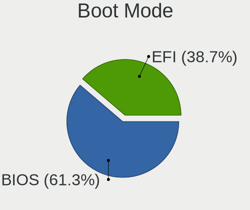

| Mode | Notebooks | Percent |
|------|-----------|---------|
| BIOS | 672       | 61.26%  |
| EFI  | 425       | 38.74%  |

Filesystem
----------

Type of filesystem

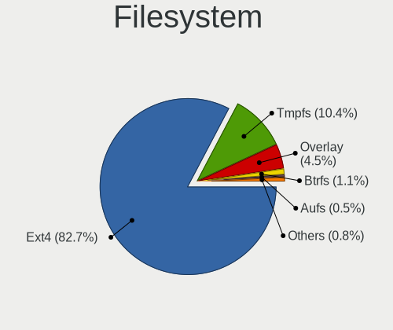

| Type    | Notebooks | Percent |
|---------|-----------|---------|
| Ext4    | 909       | 82.71%  |
| Tmpfs   | 114       | 10.37%  |
| Overlay | 50        | 4.55%   |
| Btrfs   | 12        | 1.09%   |
| Aufs    | 5         | 0.45%   |
| Xfs     | 3         | 0.27%   |
| Unknown | 3         | 0.27%   |
| Ext3    | 2         | 0.18%   |
| Ext2    | 1         | 0.09%   |

Part. scheme
------------

Scheme of partitioning

| Type    | Notebooks | Percent |
|---------|-----------|---------|
| GPT     | 454       | 41.39%  |
| Unknown | 353       | 32.18%  |
| MBR     | 290       | 26.44%  |

Dual Boot with Linux/BSD
------------------------

Hosting more than one Linux/BSD

| Dual boot | Notebooks | Percent |
|-----------|-----------|---------|
| No        | 995       | 90.95%  |
| Yes       | 99        | 9.05%   |

Dual Boot (Win)
---------------

Hosting Linux and Windows

| Dual boot | Notebooks | Percent |
|-----------|-----------|---------|
| No        | 813       | 74.38%  |
| Yes       | 280       | 25.62%  |

Board
-----

Vendor
------

Motherboard manufacturer

| Name                | Notebooks | Percent |
|---------------------|-----------|---------|
| Hewlett-Packard     | 222       | 20.5%   |
| Lenovo              | 153       | 14.13%  |
| Dell                | 114       | 10.53%  |
| ASUSTek Computer    | 105       | 9.7%    |
| Acer                | 103       | 9.51%   |
| Toshiba             | 53        | 4.89%   |
| Samsung Electronics | 33        | 3.05%   |
| Google              | 33        | 3.05%   |
| Sony                | 26        | 2.4%    |
| Apple               | 26        | 2.4%    |
| Unknown             | 16        | 1.48%   |
| Positivo            | 15        | 1.39%   |
| Fujitsu             | 14        | 1.29%   |
| Packard Bell        | 13        | 1.2%    |
| MSI                 | 13        | 1.2%    |
| Fujitsu Siemens     | 13        | 1.2%    |
| Mediacom            | 9         | 0.83%   |
| Notebook            | 7         | 0.65%   |
| HUAWEI              | 5         | 0.46%   |
| Chuwi               | 5         | 0.46%   |
| Intel               | 4         | 0.37%   |
| Alienware           | 4         | 0.37%   |
| Thomson             | 3         | 0.28%   |
| Panasonic           | 3         | 0.28%   |
| Medion              | 3         | 0.28%   |
| LG Electronics      | 3         | 0.28%   |
| Itautec             | 3         | 0.28%   |
| Insyde              | 3         | 0.28%   |
| IBM                 | 3         | 0.28%   |
| GPU Company         | 3         | 0.28%   |
| Gateway             | 3         | 0.28%   |
| eMachines           | 3         | 0.28%   |
| Dixonsxp            | 3         | 0.28%   |
| Digibras            | 3         | 0.28%   |
| YASHI               | 2         | 0.18%   |
| TrekStor            | 2         | 0.18%   |
| Teclast             | 2         | 0.18%   |
| Standard            | 2         | 0.18%   |
| SGIN                | 2         | 0.18%   |
| Prestigio           | 2         | 0.18%   |

Model
-----

Motherboard model

| Name                                  | Notebooks | Percent |
|---------------------------------------|-----------|---------|
| Unknown                               | 27        | 2.49%   |
| HP Notebook                           | 16        | 1.48%   |
| HP Pavilion 15                        | 7         | 0.65%   |
| Apple MacBookPro8,1                   | 7         | 0.65%   |
| HP Pavilion dv6                       | 6         | 0.55%   |
| Lenovo IdeaPad Slim 1-14AST-05 81VS   | 5         | 0.46%   |
| HP Pavilion g6                        | 5         | 0.46%   |
| Dell Latitude E6410                   | 5         | 0.46%   |
| Mediacom SmartBook 14 FullHD - SB14UC | 4         | 0.37%   |
| HP Pavilion g7                        | 4         | 0.37%   |
| HP Laptop 15-bw0xx                    | 4         | 0.37%   |
| HP 2000                               | 4         | 0.37%   |
| Google Candy                          | 4         | 0.37%   |
| Dell Latitude D630                    | 4         | 0.37%   |
| Dell Inspiron N5010                   | 4         | 0.37%   |
| Acer Aspire 5735                      | 4         | 0.37%   |
| Toshiba Satellite C660                | 3         | 0.28%   |
| Mediacom WinPad 11,6 FullHD- WPU11    | 3         | 0.28%   |
| Lenovo IdeaPad L340-15IRH Gaming 81LK | 3         | 0.28%   |
| Lenovo IdeaPad 320-15AST 80XV         | 3         | 0.28%   |
| Lenovo IdeaPad 100-15IBD 80QQ         | 3         | 0.28%   |
| Lenovo G50-30 80G0                    | 3         | 0.28%   |
| HP ProBook 440 G7                     | 3         | 0.28%   |
| HP Compaq Presario CQ60               | 3         | 0.28%   |
| Dell Latitude E5450                   | 3         | 0.28%   |
| Dell Inspiron 15-3567                 | 3         | 0.28%   |
| Dell Inspiron 13-5378                 | 3         | 0.28%   |
| ASUS 1000H                            | 3         | 0.28%   |
| Apple MacBookPro9,2                   | 3         | 0.28%   |
| Apple MacBook4,1                      | 3         | 0.28%   |
| Acer Aspire 5742G                     | 3         | 0.28%   |
| Acer AO722                            | 3         | 0.28%   |
| YASHI MYBOOK 360                      | 2         | 0.18%   |
| Toshiba Satellite L40                 | 2         | 0.18%   |
| Toshiba Satellite L300                | 2         | 0.18%   |
| Toshiba Satellite A205                | 2         | 0.18%   |
| Samsung RV415/RV515                   | 2         | 0.18%   |
| Samsung 530XBB                        | 2         | 0.18%   |
| Samsung 275E4E/275E5E                 | 2         | 0.18%   |
| Prestigio PSB141C01BFH                | 2         | 0.18%   |

Model Family
------------

Motherboard model prefix

| Name                    | Notebooks | Percent |
|-------------------------|-----------|---------|
| Acer Aspire             | 74        | 6.83%   |
| Lenovo IdeaPad          | 60        | 5.54%   |
| Lenovo ThinkPad         | 58        | 5.36%   |
| HP Pavilion             | 49        | 4.52%   |
| Toshiba Satellite       | 48        | 4.43%   |
| Dell Inspiron           | 47        | 4.34%   |
| Dell Latitude           | 40        | 3.69%   |
| HP ProBook              | 30        | 2.77%   |
| HP EliteBook            | 28        | 2.59%   |
| Unknown                 | 27        | 2.49%   |
| HP Laptop               | 23        | 2.12%   |
| HP Compaq               | 22        | 2.03%   |
| HP Notebook             | 16        | 1.48%   |
| ASUS VivoBook           | 14        | 1.29%   |
| Packard Bell EasyNote   | 10        | 0.92%   |
| Dell XPS                | 10        | 0.92%   |
| Fujitsu Siemens AMILO   | 9         | 0.83%   |
| Fujitsu LIFEBOOK        | 9         | 0.83%   |
| Acer Extensa            | 8         | 0.74%   |
| Dell Vostro             | 7         | 0.65%   |
| Apple MacBookPro8       | 7         | 0.65%   |
| HP Presario             | 6         | 0.55%   |
| Acer Swift              | 6         | 0.55%   |
| HP Stream               | 5         | 0.46%   |
| HP 255                  | 5         | 0.46%   |
| HP 250                  | 5         | 0.46%   |
| Mediacom SmartBook      | 4         | 0.37%   |
| Lenovo Yoga             | 4         | 0.37%   |
| HP ZBook                | 4         | 0.37%   |
| HP 240                  | 4         | 0.37%   |
| HP 2000                 | 4         | 0.37%   |
| Google Candy            | 4         | 0.37%   |
| Fujitsu Siemens ESPRIMO | 4         | 0.37%   |
| Samsung RV415           | 3         | 0.28%   |
| Notebook W54            | 3         | 0.28%   |
| Mediacom WinPad         | 3         | 0.28%   |
| Lenovo G575             | 3         | 0.28%   |
| Lenovo G50-30           | 3         | 0.28%   |
| Itautec Infoway         | 3         | 0.28%   |
| HP 245                  | 3         | 0.28%   |

MFG Year
--------

Motherboard manufacture year

| Year    | Notebooks | Percent |
|---------|-----------|---------|
| 2011    | 101       | 9.33%   |
| 2010    | 89        | 8.22%   |
| 2012    | 86        | 7.94%   |
| 2013    | 84        | 7.76%   |
| 2008    | 80        | 7.39%   |
| 2007    | 64        | 5.91%   |
| 2019    | 63        | 5.82%   |
| 2016    | 63        | 5.82%   |
| 2014    | 56        | 5.17%   |
| 2015    | 55        | 5.08%   |
| 2021    | 54        | 4.99%   |
| 2009    | 53        | 4.89%   |
| 2017    | 51        | 4.71%   |
| 2018    | 48        | 4.43%   |
| 2020    | 40        | 3.69%   |
| 2022    | 32        | 2.95%   |
| 2006    | 29        | 2.68%   |
| 2023    | 18        | 1.66%   |
| 2005    | 8         | 0.74%   |
| Unknown | 3         | 0.28%   |
| 2024    | 2         | 0.18%   |
| 2002    | 2         | 0.18%   |
| 2004    | 1         | 0.09%   |
| 2003    | 1         | 0.09%   |

Form Factor
-----------

Physical design of the computer

| Name     | Notebooks | Percent |
|----------|-----------|---------|
| Notebook | 1083      | 100%    |

Secure Boot
-----------

Enabled or disabled

| State    | Notebooks | Percent |
|----------|-----------|---------|
| Disabled | 1007      | 92.47%  |
| Enabled  | 82        | 7.53%   |

Coreboot
--------

Have coreboot on board

| Used | Notebooks | Percent |
|------|-----------|---------|
| No   | 1047      | 96.59%  |
| Yes  | 37        | 3.41%   |

RAM Size
--------

Total RAM memory

| Size in GB  | Notebooks | Percent |
|-------------|-----------|---------|
| 3.01-4.0    | 367       | 33.49%  |
| 4.01-8.0    | 261       | 23.81%  |
| 1.01-2.0    | 187       | 17.06%  |
| 8.01-16.0   | 99        | 9.03%   |
| 16.01-24.0  | 64        | 5.84%   |
| 2.01-3.0    | 59        | 5.38%   |
| 0.51-1.0    | 37        | 3.38%   |
| 32.01-64.0  | 15        | 1.37%   |
| 24.01-32.0  | 3         | 0.27%   |
| 0.01-0.5    | 3         | 0.27%   |
| 64.01-256.0 | 1         | 0.09%   |

RAM Used
--------

Used RAM memory

| Used GB    | Notebooks | Percent |
|------------|-----------|---------|
| 1.01-2.0   | 506       | 43.62%  |
| 0.51-1.0   | 285       | 24.57%  |
| 2.01-3.0   | 188       | 16.21%  |
| 3.01-4.0   | 60        | 5.17%   |
| 4.01-8.0   | 59        | 5.09%   |
| 0.01-0.5   | 51        | 4.4%    |
| 8.01-16.0  | 8         | 0.69%   |
| Unknown    | 2         | 0.17%   |
| 16.01-24.0 | 1         | 0.09%   |

Total Drives
------------

Number of drives on board

| Drives | Notebooks | Percent |
|--------|-----------|---------|
| 1      | 849       | 77.61%  |
| 2      | 211       | 19.29%  |
| 0      | 18        | 1.65%   |
| 3      | 15        | 1.37%   |
| 4      | 1         | 0.09%   |

Has CD-ROM
----------

Has CD-ROM on board

| Presented | Notebooks | Percent |
|-----------|-----------|---------|
| No        | 559       | 51.47%  |
| Yes       | 527       | 48.53%  |

Has Ethernet
------------

Has Ethernet on board

| Presented | Notebooks | Percent |
|-----------|-----------|---------|
| Yes       | 890       | 81.8%   |
| No        | 198       | 18.2%   |

Has WiFi
--------

Has WiFi module

| Presented | Notebooks | Percent |
|-----------|-----------|---------|
| Yes       | 1024      | 94.55%  |
| No        | 59        | 5.45%   |

Has Bluetooth
-------------

Has Bluetooth module

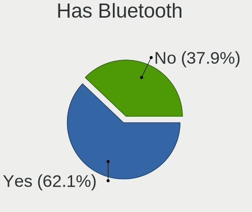

| Presented | Notebooks | Percent |
|-----------|-----------|---------|
| Yes       | 681       | 62.08%  |
| No        | 416       | 37.92%  |

Location
--------

Country
-------

Geographic location (country)

| Country      | Notebooks | Percent |
|--------------|-----------|---------|
| USA          | 147       | 13.55%  |
| France       | 109       | 10.05%  |
| Brazil       | 95        | 8.76%   |
| Italy        | 90        | 8.29%   |
| Germany      | 82        | 7.56%   |
| Russia       | 61        | 5.62%   |
| UK           | 46        | 4.24%   |
| Poland       | 35        | 3.23%   |
| Canada       | 31        | 2.86%   |
| Spain        | 22        | 2.03%   |
| Netherlands  | 20        | 1.84%   |
| Turkey       | 19        | 1.75%   |
| Argentina    | 17        | 1.57%   |
| Mexico       | 16        | 1.47%   |
| Indonesia    | 16        | 1.47%   |
| Czechia      | 15        | 1.38%   |
| Belgium      | 15        | 1.38%   |
| Australia    | 14        | 1.29%   |
| India        | 12        | 1.11%   |
| Hungary      | 12        | 1.11%   |
| Ukraine      | 11        | 1.01%   |
| Switzerland  | 11        | 1.01%   |
| Finland      | 10        | 0.92%   |
| Chile        | 9         | 0.83%   |
| Portugal     | 8         | 0.74%   |
| Colombia     | 8         | 0.74%   |
| Romania      | 7         | 0.65%   |
| Japan        | 7         | 0.65%   |
| Costa Rica   | 7         | 0.65%   |
| Ireland      | 6         | 0.55%   |
| Vietnam      | 5         | 0.46%   |
| Taiwan       | 5         | 0.46%   |
| Sweden       | 5         | 0.46%   |
| Slovakia     | 5         | 0.46%   |
| Philippines  | 5         | 0.46%   |
| Norway       | 5         | 0.46%   |
| Greece       | 5         | 0.46%   |
| Ecuador      | 5         | 0.46%   |
| South Africa | 4         | 0.37%   |
| Serbia       | 4         | 0.37%   |

City
----

Geographic location (city)

| City              | Notebooks | Percent |
|-------------------|-----------|---------|
| Paris             | 21        | 1.83%   |
| Moscow            | 12        | 1.05%   |
| Milan             | 12        | 1.05%   |
| Rome              | 11        | 0.96%   |
| Helsinki          | 8         | 0.7%    |
| Istanbul          | 7         | 0.61%   |
| St Petersburg     | 6         | 0.52%   |
| New York          | 6         | 0.52%   |
| Curitiba          | 6         | 0.52%   |
| Braslia         | 6         | 0.52%   |
| Bengaluru         | 6         | 0.52%   |
| Warsaw            | 5         | 0.44%   |
| Sao Paulo         | 5         | 0.44%   |
| Santiago          | 5         | 0.44%   |
| Porto Alegre      | 5         | 0.44%   |
| Munich            | 5         | 0.44%   |
| Mexico City       | 5         | 0.44%   |
| Melbourne         | 5         | 0.44%   |
| Kyiv              | 5         | 0.44%   |
| Houston           | 5         | 0.44%   |
| Heredia           | 5         | 0.44%   |
| Bogot           | 5         | 0.44%   |
| Yekaterinburg     | 4         | 0.35%   |
| Uberlndia       | 4         | 0.35%   |
| Stuttgart         | 4         | 0.35%   |
| Prague            | 4         | 0.35%   |
| Krakow            | 4         | 0.35%   |
| Grecia            | 4         | 0.35%   |
| Ghent             | 4         | 0.35%   |
| Frankfurt am Main | 4         | 0.35%   |
| Fortaleza         | 4         | 0.35%   |
| Buenos Aires      | 4         | 0.35%   |
| Bruhl             | 4         | 0.35%   |
| Amsterdam         | 4         | 0.35%   |
| Aachen            | 4         | 0.35%   |
| Zurich            | 3         | 0.26%   |
| Winnipeg          | 3         | 0.26%   |
| Venice            | 3         | 0.26%   |
| Teresina          | 3         | 0.26%   |
| Strasbourg        | 3         | 0.26%   |

Drives
------

Drive Vendor
------------

Hard drive vendors

| Vendor              | Notebooks | Drives | Percent |
|---------------------|-----------|--------|---------|
| WDC                 | 161       | 190    | 13.31%  |
| Seagate             | 149       | 169    | 12.31%  |
| Unknown             | 139       | 193    | 11.49%  |
| Samsung Electronics | 110       | 153    | 9.09%   |
| Toshiba             | 104       | 117    | 8.6%    |
| Hitachi             | 83        | 101    | 6.86%   |
| Kingston            | 64        | 73     | 5.29%   |
| SanDisk             | 38        | 43     | 3.14%   |
| Crucial             | 38        | 42     | 3.14%   |
| HGST                | 33        | 37     | 2.73%   |
| Fujitsu             | 26        | 28     | 2.15%   |
| Intel               | 24        | 36     | 1.98%   |
| SK hynix            | 22        | 23     | 1.82%   |
| Micron Technology   | 15        | 16     | 1.24%   |
| Unknown             | 15        | 17     | 1.24%   |
| China               | 13        | 16     | 1.07%   |
| A-DATA Technology   | 12        | 12     | 0.99%   |
| Apacer              | 11        | 11     | 0.91%   |
| Patriot             | 7         | 7      | 0.58%   |
| Transcend           | 6         | 7      | 0.5%    |
| LITEON              | 6         | 7      | 0.5%    |
| KIOXIA              | 6         | 6      | 0.5%    |
| Apple               | 6         | 13     | 0.5%    |
| SPCC                | 5         | 6      | 0.41%   |
| PNY                 | 5         | 7      | 0.41%   |
| LITEONIT            | 5         | 5      | 0.41%   |
| OCZ                 | 4         | 4      | 0.33%   |
| NGFF                | 4         | 4      | 0.33%   |
| KingSpec            | 4         | 6      | 0.33%   |
| IBM/Hitachi         | 4         | 5      | 0.33%   |
| UMIS                | 3         | 3      | 0.25%   |
| Silicon Motion      | 3         | 3      | 0.25%   |
| Phison              | 3         | 7      | 0.25%   |
| Netac               | 3         | 3      | 0.25%   |
| Lexar               | 3         | 6      | 0.25%   |
| LDLC                | 3         | 5      | 0.25%   |
| GOODRAM             | 3         | 3      | 0.25%   |
| Teclast             | 2         | 2      | 0.17%   |
| STEC                | 2         | 3      | 0.17%   |
| SSK                 | 2         | 2      | 0.17%   |

Drive Model
-----------

Hard drive models

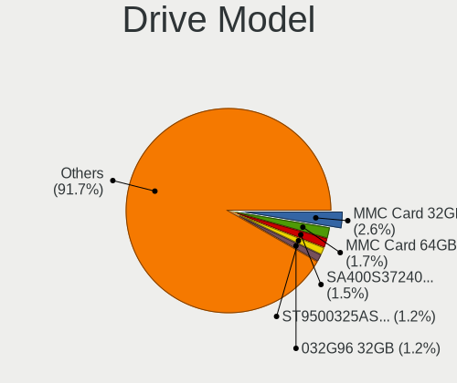

| Model                               | Notebooks | Percent |
|-------------------------------------|-----------|---------|
| Unknown MMC Card  32GB              | 33        | 2.62%   |
| Unknown MMC Card  64GB              | 22        | 1.75%   |
| Kingston SA400S37240G 240GB SSD     | 19        | 1.51%   |
| Seagate ST9500325AS 500GB           | 15        | 1.19%   |
| Unknown                             | 15        | 1.19%   |
| Toshiba MQ01ABD100 1TB              | 14        | 1.11%   |
| Seagate ST500LT012-1DG142 500GB     | 13        | 1.03%   |
| Seagate ST1000LM024 HN-M101MBB 1TB  | 13        | 1.03%   |
| Seagate ST1000LM035-1RK172 1TB      | 12        | 0.95%   |
| Unknown MMC Card  16GB              | 10        | 0.79%   |
| Toshiba MQ01ABF050 500GB            | 10        | 0.79%   |
| Unknown NCard  32GB                 | 9         | 0.71%   |
| Unknown DA4064  64GB                | 9         | 0.71%   |
| HGST HTS545050A7E680 500GB          | 9         | 0.71%   |
| Crucial CT240BX500SSD1 240GB        | 9         | 0.71%   |
| Toshiba MQ01ABD050 500GB            | 8         | 0.64%   |
| Seagate ST500LM012 HN-M500MBB 500GB | 8         | 0.64%   |
| Samsung SSD 850 EVO 250GB           | 8         | 0.64%   |
| Kingston SA400S37480G 480GB SSD     | 8         | 0.64%   |
| WDC WD3200BPVT-22JJ5T0 320GB        | 7         | 0.56%   |
| Seagate ST9320325AS 320GB           | 7         | 0.56%   |
| SanDisk DF4032  32GB                | 7         | 0.56%   |
| HGST HTS545050A7E380 500GB          | 7         | 0.56%   |
| WDC WD5000LPVX-22V0TT0 500GB        | 6         | 0.48%   |
| Kingston SV300S37A120G 120GB SSD    | 6         | 0.48%   |
| Kingston SA400S37120G 120GB SSD     | 6         | 0.48%   |
| WDC WD10JPVX-22JC3T0 1TB            | 5         | 0.4%    |
| Unknown SD/MMC/MS PRO 128GB         | 5         | 0.4%    |
| Unknown MMC Card  128GB             | 5         | 0.4%    |
| Samsung SSD 860 EVO 500GB           | 5         | 0.4%    |
| Micron 2450_MTFDKBA512TFK 512GB     | 5         | 0.4%    |
| Hitachi HTS545050A7E380 500GB       | 5         | 0.4%    |
| Crucial CT480BX500SSD1 480GB        | 5         | 0.4%    |
| WDC WD3200BEVT-22ZCT0 320GB         | 4         | 0.32%   |
| WDC WD2500BEVT-22ZCT0 250GB         | 4         | 0.32%   |
| WDC WD10SPZX-24Z10T0 1TB            | 4         | 0.32%   |
| WDC WD10SPZX-24Z10 1TB              | 4         | 0.32%   |
| WDC WD10JPVX-60JC3T0 1TB            | 4         | 0.32%   |
| Unknown MMC64G  64GB                | 4         | 0.32%   |
| Unknown DA4032  32GB                | 4         | 0.32%   |

HDD Vendor
----------

Hard disk drive vendors

| Vendor              | Notebooks | Drives | Percent |
|---------------------|-----------|--------|---------|
| Seagate             | 147       | 167    | 26.49%  |
| WDC                 | 137       | 159    | 24.68%  |
| Toshiba             | 91        | 100    | 16.4%   |
| Hitachi             | 83        | 101    | 14.95%  |
| HGST                | 33        | 37     | 5.95%   |
| Fujitsu             | 26        | 28     | 4.68%   |
| Samsung Electronics | 22        | 38     | 3.96%   |
| Unknown             | 5         | 7      | 0.9%    |
| IBM/Hitachi         | 4         | 5      | 0.72%   |
| STEC                | 2         | 3      | 0.36%   |
| XrayDisk            | 1         | 1      | 0.18%   |
| USB                 | 1         | 1      | 0.18%   |
| LaCie               | 1         | 1      | 0.18%   |
| JMicron Technology  | 1         | 1      | 0.18%   |
| Apple               | 1         | 1      | 0.18%   |

SSD Vendor
----------

Solid state drive vendors

| Vendor              | Notebooks | Drives | Percent |
|---------------------|-----------|--------|---------|
| Samsung Electronics | 55        | 72     | 15.19%  |
| Kingston            | 54        | 61     | 14.92%  |
| Crucial             | 35        | 39     | 9.67%   |
| SanDisk             | 24        | 29     | 6.63%   |
| Intel               | 18        | 30     | 4.97%   |
| WDC                 | 13        | 17     | 3.59%   |
| A-DATA Technology   | 12        | 12     | 3.31%   |
| China               | 11        | 13     | 3.04%   |
| Apacer              | 11        | 11     | 3.04%   |
| Toshiba             | 8         | 10     | 2.21%   |
| Patriot             | 7         | 7      | 1.93%   |
| Transcend           | 6         | 7      | 1.66%   |
| LITEON              | 6         | 7      | 1.66%   |
| SPCC                | 5         | 6      | 1.38%   |
| SK hynix            | 5         | 6      | 1.38%   |
| PNY                 | 5         | 7      | 1.38%   |
| LITEONIT            | 5         | 5      | 1.38%   |
| OCZ                 | 4         | 4      | 1.1%    |
| NGFF                | 4         | 4      | 1.1%    |
| Micron Technology   | 4         | 4      | 1.1%    |
| KingSpec            | 4         | 6      | 1.1%    |
| Apple               | 4         | 10     | 1.1%    |
| Netac               | 3         | 3      | 0.83%   |
| Lexar               | 3         | 6      | 0.83%   |
| GOODRAM             | 3         | 3      | 0.83%   |
| Teclast             | 2         | 2      | 0.55%   |
| Plextor             | 2         | 2      | 0.55%   |
| LDLC                | 2         | 2      | 0.55%   |
| KingDian            | 2         | 2      | 0.55%   |
| Dogfish             | 2         | 2      | 0.55%   |
| Zheino              | 1         | 1      | 0.28%   |
| XrayDisk            | 1         | 1      | 0.28%   |
| WALRAM              | 1         | 1      | 0.28%   |
| W800S               | 1         | 1      | 0.28%   |
| Verbatim            | 1         | 1      | 0.28%   |
| Vaseky              | 1         | 1      | 0.28%   |
| USB3.0              | 1         | 1      | 0.28%   |
| Unknown             | 1         | 1      | 0.28%   |
| Timetec             | 1         | 1      | 0.28%   |
| TEAM T25            | 1         | 1      | 0.28%   |

Drive Kind
----------

HDD or SSD

| Kind    | Notebooks | Drives | Percent |
|---------|-----------|--------|---------|
| HDD     | 547       | 650    | 46.04%  |
| SSD     | 351       | 433    | 29.55%  |
| MMC     | 155       | 211    | 13.05%  |
| NVMe    | 120       | 146    | 10.1%   |
| Unknown | 15        | 18     | 1.26%   |

Drive Connector
---------------

SATA, SAS, NVMe, etc.

| Type | Notebooks | Drives | Percent |
|------|-----------|--------|---------|
| SATA | 849       | 1061   | 73.44%  |
| MMC  | 155       | 211    | 13.41%  |
| NVMe | 118       | 143    | 10.21%  |
| SAS  | 34        | 43     | 2.94%   |

Drive Size
----------

Size of hard drive

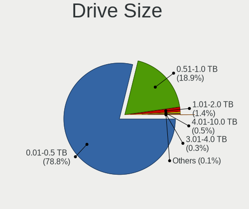

| Size in TB | Notebooks | Drives | Percent |
|------------|-----------|--------|---------|
| 0.01-0.5   | 697       | 849    | 78.85%  |
| 0.51-1.0   | 167       | 210    | 18.89%  |
| 1.01-2.0   | 12        | 14     | 1.36%   |
| 4.01-10.0  | 4         | 4      | 0.45%   |
| 3.01-4.0   | 3         | 5      | 0.34%   |
| 2.01-3.0   | 1         | 1      | 0.11%   |

Space Total
-----------

Amount of disk space available on the file system

| Size in GB     | Notebooks | Percent |
|----------------|-----------|---------|
| 101-250        | 355       | 32.13%  |
| 251-500        | 268       | 24.25%  |
| 51-100         | 123       | 11.13%  |
| 501-1000       | 107       | 9.68%   |
| 21-50          | 102       | 9.23%   |
| 1-20           | 100       | 9.05%   |
| 1001-2000      | 24        | 2.17%   |
| More than 3000 | 13        | 1.18%   |
| 2001-3000      | 8         | 0.72%   |
| Unknown        | 5         | 0.45%   |

Space Used
----------

Amount of used disk space

| Used GB        | Notebooks | Percent |
|----------------|-----------|---------|
| 1-20           | 616       | 54.18%  |
| 21-50          | 223       | 19.61%  |
| 101-250        | 112       | 9.85%   |
| 51-100         | 97        | 8.53%   |
| 251-500        | 41        | 3.61%   |
| 501-1000       | 24        | 2.11%   |
| 1001-2000      | 11        | 0.97%   |
| More than 3000 | 5         | 0.44%   |
| Unknown        | 5         | 0.44%   |
| 2001-3000      | 3         | 0.26%   |

Malfunc. Drives
---------------

Drive models with a malfunction

| Model                              | Notebooks | Drives | Percent |
|------------------------------------|-----------|--------|---------|
| Seagate ST1000LM024 HN-M101MBB 1TB | 7         | 7      | 5.47%   |
| Seagate ST9500325AS 500GB          | 4         | 4      | 3.13%   |
| Seagate ST500LT012-1DG142 500GB    | 4         | 4      | 3.13%   |
| Seagate ST9320325AS 320GB          | 3         | 3      | 2.34%   |
| Hitachi HTS545032B9A300 320GB      | 3         | 3      | 2.34%   |
| HGST HTS545050A7E680 500GB         | 3         | 3      | 2.34%   |
| WDC WD10SPZX-24Z10T0 1TB           | 2         | 2      | 1.56%   |
| Toshiba MQ01ABD050 500GB           | 2         | 2      | 1.56%   |
| Seagate ST500LM021-1KJ152 500GB    | 2         | 2      | 1.56%   |
| Seagate ST1000LM035-1RK172 1TB     | 2         | 2      | 1.56%   |
| Hitachi HTS545050A7E380 500GB      | 2         | 2      | 1.56%   |
| Hitachi HTS542512K9SA00 120GB      | 2         | 2      | 1.56%   |
| HGST HTS545050A7E380 500GB         | 2         | 2      | 1.56%   |
| Apacer 16GB SATA Flash Drive SSD   | 2         | 2      | 1.56%   |
| WDC WDS240G2G0A-00JH30 240GB SSD   | 1         | 1      | 0.78%   |
| WDC WD800BEVS-60RST0 80GB          | 1         | 1      | 0.78%   |
| WDC WD5000LUCT-62C26Y0 500GB       | 1         | 1      | 0.78%   |
| WDC WD5000LPCX-60VHAT1 500GB       | 1         | 1      | 0.78%   |
| WDC WD5000BPVT-75HXZT1 500GB       | 1         | 1      | 0.78%   |
| WDC WD3200BPVT-80ZEST0 320GB       | 1         | 1      | 0.78%   |
| WDC WD3200BPVT-75ZEST0 320GB       | 1         | 1      | 0.78%   |
| WDC WD3200BPVT-22JJ5T0 320GB       | 1         | 1      | 0.78%   |
| WDC WD3200BEVT-75A23T0 320GB       | 1         | 1      | 0.78%   |
| WDC WD3200BEKT-60PVMT0 320GB       | 1         | 1      | 0.78%   |
| WDC WD2500BEVT-80A23T0 250GB       | 1         | 2      | 0.78%   |
| WDC WD1600BEVT-22A23T0 160GB       | 1         | 1      | 0.78%   |
| WDC WD1200BEVS-60UST0 120GB        | 1         | 1      | 0.78%   |
| WDC WD1200BEVS-07LAT0 120GB        | 1         | 1      | 0.78%   |
| WDC WD10SPCX-21KHST0 1TB           | 1         | 1      | 0.78%   |
| WDC WD10JPVX-75JC3T0 1TB           | 1         | 1      | 0.78%   |
| WDC WD10JPVX-60JC3T1 1TB           | 1         | 1      | 0.78%   |
| WDC WD10JPVX-22JC3T0 1TB           | 1         | 1      | 0.78%   |
| Transcend TS256GSSD720 256GB       | 1         | 1      | 0.78%   |
| Toshiba MQ01ABF050 500GB           | 1         | 1      | 0.78%   |
| Toshiba MK6459GSXP 640GB           | 1         | 1      | 0.78%   |
| Toshiba MK5065GSXN 500GB           | 1         | 1      | 0.78%   |
| Toshiba MK5059GSXP 500GB           | 1         | 1      | 0.78%   |
| Toshiba MK3276GSX 320GB            | 1         | 1      | 0.78%   |
| Toshiba MK3265GSX 320GB            | 1         | 1      | 0.78%   |
| Toshiba MK2556GSY 250GB            | 1         | 1      | 0.78%   |

Malfunc. Drive Vendor
---------------------

Vendors of faulty drives

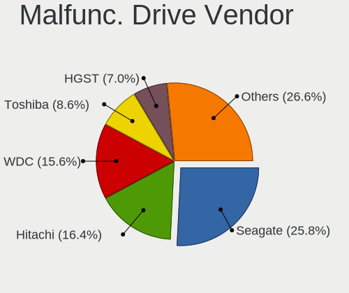

| Vendor              | Notebooks | Drives | Percent |
|---------------------|-----------|--------|---------|
| Seagate             | 33        | 34     | 25.78%  |
| Hitachi             | 21        | 22     | 16.41%  |
| WDC                 | 20        | 21     | 15.63%  |
| Toshiba             | 11        | 11     | 8.59%   |
| HGST                | 9         | 9      | 7.03%   |
| Crucial             | 5         | 5      | 3.91%   |
| SK hynix            | 4         | 4      | 3.13%   |
| Intel               | 4         | 5      | 3.13%   |
| Fujitsu             | 3         | 3      | 2.34%   |
| Samsung Electronics | 2         | 10     | 1.56%   |
| LITEON              | 2         | 2      | 1.56%   |
| KingSpec            | 2         | 4      | 1.56%   |
| Apacer              | 2         | 2      | 1.56%   |
| Transcend           | 1         | 1      | 0.78%   |
| TCSUNBOW            | 1         | 1      | 0.78%   |
| Plextor             | 1         | 1      | 0.78%   |
| OCZ                 | 1         | 1      | 0.78%   |
| NGFF                | 1         | 1      | 0.78%   |
| Kingston            | 1         | 1      | 0.78%   |
| Kingmax             | 1         | 1      | 0.78%   |
| China               | 1         | 1      | 0.78%   |
| Apple               | 1         | 1      | 0.78%   |
| A-DATA Technology   | 1         | 1      | 0.78%   |

Malfunc. HDD Vendor
-------------------

Vendors of faulty HDD drives

| Vendor              | Notebooks | Drives | Percent |
|---------------------|-----------|--------|---------|
| Seagate             | 33        | 34     | 33.67%  |
| Hitachi             | 21        | 22     | 21.43%  |
| WDC                 | 19        | 20     | 19.39%  |
| Toshiba             | 11        | 11     | 11.22%  |
| HGST                | 9         | 9      | 9.18%   |
| Fujitsu             | 3         | 3      | 3.06%   |
| Samsung Electronics | 2         | 10     | 2.04%   |

Malfunc. Drive Kind
-------------------

Kinds of faulty drives

| Kind | Notebooks | Drives | Percent |
|------|-----------|--------|---------|
| HDD  | 98        | 109    | 76.56%  |
| SSD  | 28        | 31     | 21.88%  |
| NVMe | 2         | 2      | 1.56%   |

Failed Drives
-------------

Failed drive models

| Model                             | Notebooks | Drives | Percent |
|-----------------------------------|-----------|--------|---------|
| WDC WD5000LPVX-75V0TT0 500GB      | 1         | 1      | 16.67%  |
| WDC WD2500BEVT-75A23T0 250GB      | 1         | 2      | 16.67%  |
| WDC WD1200BEVS-22UST0 120GB       | 1         | 1      | 16.67%  |
| WDC WD10SPZX-22Z10T0 1TB          | 1         | 1      | 16.67%  |
| Seagate ST9320325AS 320GB         | 1         | 1      | 16.67%  |
| Samsung Electronics HM320JI 320GB | 1         | 1      | 16.67%  |

Failed Drive Vendor
-------------------

Failed drive vendors

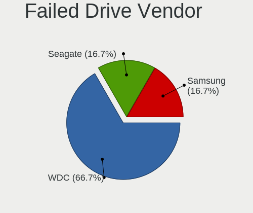

| Vendor              | Notebooks | Drives | Percent |
|---------------------|-----------|--------|---------|
| WDC                 | 4         | 5      | 66.67%  |
| Seagate             | 1         | 1      | 16.67%  |
| Samsung Electronics | 1         | 1      | 16.67%  |

Drive Status
------------

Number of failed and malfunc. drives

| Status   | Notebooks | Drives | Percent |
|----------|-----------|--------|---------|
| Detected | 594       | 831    | 52.61%  |
| Works    | 401       | 478    | 35.52%  |
| Malfunc  | 128       | 142    | 11.34%  |
| Failed   | 6         | 7      | 0.53%   |

Storage controller
------------------

Storage Vendor
--------------

Storage controller vendors

| Vendor                           | Notebooks | Percent |
|----------------------------------|-----------|---------|
| Intel                            | 741       | 69.45%  |
| AMD                              | 170       | 15.93%  |
| Samsung Electronics              | 33        | 3.09%   |
| Nvidia                           | 20        | 1.87%   |
| SanDisk                          | 18        | 1.69%   |
| Silicon Integrated Systems [SiS] | 13        | 1.22%   |
| SK hynix                         | 12        | 1.12%   |
| Micron Technology                | 12        | 1.12%   |
| Kingston Technology Company      | 10        | 0.94%   |
| KIOXIA                           | 6         | 0.56%   |
| Toshiba America Info Systems     | 5         | 0.47%   |
| Micron/Crucial Technology        | 5         | 0.47%   |
| Silicon Motion                   | 4         | 0.37%   |
| Phison Electronics               | 4         | 0.37%   |
| VIA Technologies                 | 3         | 0.28%   |
| Union Memory (Shenzhen)          | 3         | 0.28%   |
| Solid State Storage Technology   | 3         | 0.28%   |
| JMicron Technology               | 2         | 0.19%   |
| ASMedia Technology               | 2         | 0.19%   |
| Silicon Image                    | 1         | 0.09%   |

Storage Model
-------------

Storage controller models

| Model                                                                                  | Notebooks | Percent |
|----------------------------------------------------------------------------------------|-----------|---------|
| AMD FCH SATA Controller [AHCI mode]                                                    | 108       | 8.9%    |
| Intel 7 Series Chipset Family 6-port SATA Controller [AHCI mode]                       | 82        | 6.76%   |
| Intel 82801HM/HEM (ICH8M/ICH8M-E) IDE Controller                                       | 62        | 5.11%   |
| Intel Sunrise Point-LP SATA Controller [AHCI mode]                                     | 57        | 4.7%    |
| Intel 6 Series/C200 Series Chipset Family 6 port Mobile SATA AHCI Controller           | 55        | 4.53%   |
| Intel 82801IBM/IEM (ICH9M/ICH9M-E) 4 port SATA Controller [AHCI mode]                  | 54        | 4.45%   |
| Intel 82801HM/HEM (ICH8M/ICH8M-E) SATA Controller [AHCI mode]                          | 53        | 4.37%   |
| Intel Celeron/Pentium Silver Processor SATA Controller                                 | 40        | 3.3%    |
| Intel 8 Series SATA Controller 1 [AHCI mode]                                           | 37        | 3.05%   |
| Intel 5 Series/3400 Series Chipset 4 port SATA AHCI Controller                         | 35        | 2.89%   |
| AMD SB7x0/SB8x0/SB9x0 SATA Controller [AHCI mode]                                      | 35        | 2.89%   |
| Intel 82801 Mobile SATA Controller [RAID mode]                                         | 33        | 2.72%   |
| Intel NM10/ICH7 Family SATA Controller [AHCI mode]                                     | 32        | 2.64%   |
| Intel 5 Series/3400 Series Chipset 6 port SATA AHCI Controller                         | 27        | 2.23%   |
| Intel Atom Processor E3800 Series SATA AHCI Controller                                 | 24        | 1.98%   |
| Intel 82801GBM/GHM (ICH7-M Family) SATA Controller [IDE mode]                          | 23        | 1.9%    |
| Intel Atom/Celeron/Pentium Processor x5-E8000/J3xxx/N3xxx Series SATA Controller       | 20        | 1.65%   |
| Intel Wildcat Point-LP SATA Controller [AHCI Mode]                                     | 19        | 1.57%   |
| Intel 82801G (ICH7 Family) IDE Controller                                              | 19        | 1.57%   |
| Intel Celeron N3350/Pentium N4200/Atom E3900 Series SATA AHCI Controller               | 18        | 1.48%   |
| Samsung NVMe SSD Controller SM981/PM981/PM983                                          | 17        | 1.4%    |
| Intel 8 Series/C220 Series Chipset Family 6-port SATA Controller 1 [AHCI mode]         | 17        | 1.4%    |
| Silicon Integrated Systems [SiS] 5513 IDE Controller                                   | 13        | 1.07%   |
| Intel Volume Management Device NVMe RAID Controller                                    | 12        | 0.99%   |
| Intel 82801HM/HEM (ICH8M/ICH8M-E) SATA Controller [IDE mode]                           | 12        | 0.99%   |
| Intel 82801GBM/GHM (ICH7-M Family) SATA Controller [AHCI mode]                         | 12        | 0.99%   |
| Silicon Integrated Systems [SiS] SATA Controller / IDE mode                            | 10        | 0.82%   |
| Samsung NVMe SSD Controller 980 (DRAM-less)                                            | 10        | 0.82%   |
| Intel Comet Lake SATA AHCI Controller                                                  | 9         | 0.74%   |
| AMD IXP SB4x0 IDE Controller                                                           | 9         | 0.74%   |
| Intel Cannon Lake Mobile PCH SATA AHCI Controller                                      | 8         | 0.66%   |
| AMD SB600 IDE                                                                          | 8         | 0.66%   |
| AMD SB600 Non-Raid-5 SATA                                                              | 7         | 0.58%   |
| Micron 2450 NVMe SSD [HendrixV] (DRAM-less)                                            | 6         | 0.49%   |
| KIOXIA NVMe SSD Controller BG4 (DRAM-less)                                             | 6         | 0.49%   |
| Intel Tiger Lake-LP SATA Controller                                                    | 6         | 0.49%   |
| Intel 82801FBM (ICH6M) SATA Controller                                                 | 6         | 0.49%   |
| Intel 6 Series/C200 Series Chipset Family Mobile SATA Controller (IDE mode, ports 0-3) | 6         | 0.49%   |
| AMD SB7x0/SB8x0/SB9x0 IDE Controller                                                   | 6         | 0.49%   |
| SK hynix Gold P31/BC711/PC711 NVMe Solid State Drive                                   | 5         | 0.41%   |

Storage Kind
------------

Kind of storage controller (IDE, SATA, NVMe, SAS, ...)

| Kind | Notebooks | Percent |
|------|-----------|---------|
| SATA | 794       | 68.86%  |
| IDE  | 196       | 17%     |
| NVMe | 116       | 10.06%  |
| RAID | 47        | 4.08%   |

Processor
---------

CPU Vendor
----------

Processor vendors

| Vendor  | Notebooks | Percent |
|---------|-----------|---------|
| Intel   | 882       | 81.44%  |
| AMD     | 200       | 18.47%  |
| Unknown | 1         | 0.09%   |

CPU Model
---------

Processor models

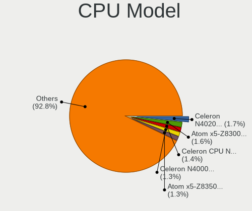

| Model                                       | Notebooks | Percent |
|---------------------------------------------|-----------|---------|
| Intel Celeron N4020 CPU @ 1.10GHz           | 18        | 1.66%   |
| Intel Atom x5-Z8300 CPU @ 1.44GHz           | 17        | 1.57%   |
| Intel Celeron CPU N2840 @ 2.16GHz           | 15        | 1.38%   |
| Intel Celeron N4000 CPU @ 1.10GHz           | 14        | 1.29%   |
| Intel Atom x5-Z8350 CPU @ 1.44GHz           | 14        | 1.29%   |
| Intel Atom CPU N270 @ 1.60GHz               | 14        | 1.29%   |
| Intel Celeron CPU N3350 @ 1.10GHz           | 13        | 1.2%    |
| Intel Celeron CPU N3060 @ 1.60GHz           | 11        | 1.01%   |
| Intel Atom CPU N450 @ 1.66GHz               | 11        | 1.01%   |
| Intel Core i5-3210M CPU @ 2.50GHz           | 10        | 0.92%   |
| Intel Core i5-2410M CPU @ 2.30GHz           | 10        | 0.92%   |
| Intel Core i3-6006U CPU @ 2.00GHz           | 10        | 0.92%   |
| Intel Core i3 CPU M 370 @ 2.40GHz           | 10        | 0.92%   |
| Intel Core 2 Duo CPU T7250 @ 2.00GHz        | 10        | 0.92%   |
| Intel Atom CPU Z3735F @ 1.33GHz             | 10        | 0.92%   |
| Intel Atom CPU N455 @ 1.66GHz               | 10        | 0.92%   |
| Intel 11th Gen Core i5-1135G7 @ 2.40GHz     | 10        | 0.92%   |
| Intel Core i5-8265U CPU @ 1.60GHz           | 9         | 0.83%   |
| Intel Celeron CPU N3050 @ 1.60GHz           | 9         | 0.83%   |
| AMD E-450 APU with Radeon HD Graphics       | 9         | 0.83%   |
| Intel Core i5-8250U CPU @ 1.60GHz           | 8         | 0.74%   |
| Intel Core i5-7200U CPU @ 2.50GHz           | 8         | 0.74%   |
| Intel Core i5-6200U CPU @ 2.30GHz           | 8         | 0.74%   |
| Intel Core i5-2520M CPU @ 2.50GHz           | 8         | 0.74%   |
| Intel Core i5 CPU M 520 @ 2.40GHz           | 8         | 0.74%   |
| AMD E-300 APU with Radeon HD Graphics       | 8         | 0.74%   |
| Intel Pentium Dual-Core CPU T4200 @ 2.00GHz | 7         | 0.65%   |
| Intel Pentium CPU N3710 @ 1.60GHz           | 7         | 0.65%   |
| Intel Core i5-5200U CPU @ 2.20GHz           | 7         | 0.65%   |
| Intel Core i5-4200U CPU @ 1.60GHz           | 7         | 0.65%   |
| Intel Core i5-3320M CPU @ 2.60GHz           | 7         | 0.65%   |
| Intel Core i5-3230M CPU @ 2.60GHz           | 7         | 0.65%   |
| Intel Core i5 CPU M 460 @ 2.53GHz           | 7         | 0.65%   |
| Intel Core 2 Duo CPU P8600 @ 2.40GHz        | 7         | 0.65%   |
| Intel Core 2 CPU T5500 @ 1.66GHz            | 7         | 0.65%   |
| Intel Pentium Dual-Core CPU T4500 @ 2.30GHz | 6         | 0.55%   |
| Intel Core i5-10210U CPU @ 1.60GHz          | 6         | 0.55%   |
| Intel Core i3-3217U CPU @ 1.80GHz           | 6         | 0.55%   |
| Intel Atom CPU N2600 @ 1.60GHz              | 6         | 0.55%   |
| AMD E1-2100 APU with Radeon HD Graphics     | 6         | 0.55%   |

CPU Model Family
----------------

Processor model prefix

| Model                   | Notebooks | Percent |
|-------------------------|-----------|---------|
| Intel Core i5           | 179       | 16.51%  |
| Intel Celeron           | 156       | 14.39%  |
| Intel Atom              | 103       | 9.5%    |
| Intel Core i7           | 101       | 9.32%   |
| Intel Core i3           | 87        | 8.03%   |
| Intel Core 2 Duo        | 80        | 7.38%   |
| Intel Pentium           | 39        | 3.6%    |
| Other                   | 33        | 3.04%   |
| Intel Pentium Dual      | 25        | 2.31%   |
| AMD E                   | 23        | 2.12%   |
| AMD A6                  | 22        | 2.03%   |
| Intel Pentium Dual-Core | 20        | 1.85%   |
| AMD A4                  | 19        | 1.75%   |
| AMD E1                  | 18        | 1.66%   |
| Intel Core 2            | 17        | 1.57%   |
| Intel Genuine           | 15        | 1.38%   |
| AMD Ryzen 5             | 15        | 1.38%   |
| AMD Ryzen 7             | 13        | 1.2%    |
| AMD E2                  | 10        | 0.92%   |
| Intel Pentium Silver    | 8         | 0.74%   |
| AMD A8                  | 7         | 0.65%   |
| AMD A10                 | 7         | 0.65%   |
| Intel Celeron M         | 6         | 0.55%   |
| Intel Celeron Dual-Core | 6         | 0.55%   |
| AMD Mobile Sempron      | 6         | 0.55%   |
| AMD Athlon              | 6         | 0.55%   |
| Intel Pentium M         | 5         | 0.46%   |
| AMD Turion 64 X2 Mobile | 5         | 0.46%   |
| AMD C-50                | 5         | 0.46%   |
| AMD Ryzen 7 PRO         | 4         | 0.37%   |
| AMD Ryzen 3             | 4         | 0.37%   |
| AMD C-60                | 4         | 0.37%   |
| AMD Athlon 64 X2        | 4         | 0.37%   |
| Intel Pentium 4         | 3         | 0.28%   |
| AMD Turion 64 Mobile    | 3         | 0.28%   |
| AMD Athlon X2           | 3         | 0.28%   |
| Intel Core Duo          | 2         | 0.18%   |
| AMD Sempron             | 2         | 0.18%   |
| AMD Phenom II           | 2         | 0.18%   |
| AMD Athlon II Dual-Core | 2         | 0.18%   |

CPU Cores
---------

Number of processor cores

| Number | Notebooks | Percent |
|--------|-----------|---------|
| 2      | 730       | 67.41%  |
| 4      | 227       | 20.96%  |
| 1      | 87        | 8.03%   |
| 8      | 18        | 1.66%   |
| 6      | 12        | 1.11%   |
| 10     | 5         | 0.46%   |
| 12     | 2         | 0.18%   |
| 14     | 1         | 0.09%   |
| 3      | 1         | 0.09%   |

CPU Sockets
-----------

Number of sockets

| Number | Notebooks | Percent |
|--------|-----------|---------|
| 1      | 1082      | 99.91%  |
| 2      | 1         | 0.09%   |

CPU Threads
-----------

Threads per core (Hyper-Threading)

| Number | Notebooks | Percent |
|--------|-----------|---------|
| 1      | 584       | 53.92%  |
| 2      | 499       | 46.08%  |

CPU Op-Modes
------------

CPU Operation Modes (32-bit, 64-bit)

| Op mode        | Notebooks | Percent |
|----------------|-----------|---------|
| 32-bit, 64-bit | 1028      | 94.92%  |
| 32-bit         | 54        | 4.99%   |
| Unknown        | 1         | 0.09%   |

CPU Microcode
-------------

Microcode number

| Number     | Notebooks | Percent |
|------------|-----------|---------|
| Unknown    | 402       | 36.28%  |
| 0x206a7    | 55        | 4.96%   |
| 0x306a9    | 47        | 4.24%   |
| 0x6fd      | 44        | 3.97%   |
| 0x1067a    | 31        | 2.8%    |
| 0x40651    | 27        | 2.44%   |
| 0x20655    | 26        | 2.35%   |
| 0x05000119 | 26        | 2.35%   |
| 0x30678    | 22        | 1.99%   |
| 0x106ca    | 22        | 1.99%   |
| 0x406c3    | 21        | 1.9%    |
| 0x406e3    | 20        | 1.81%   |
| 0x406c4    | 20        | 1.81%   |
| 0x106c2    | 17        | 1.53%   |
| 0x806ec    | 15        | 1.35%   |
| 0x706a8    | 15        | 1.35%   |
| 0x706a1    | 14        | 1.26%   |
| 0x20652    | 13        | 1.17%   |
| 0x0700010f | 12        | 1.08%   |
| 0x06006705 | 12        | 1.08%   |
| 0x6f6      | 11        | 0.99%   |
| 0x6e8      | 11        | 0.99%   |
| 0x306c3    | 11        | 0.99%   |
| 0x10676    | 11        | 0.99%   |
| 0x806ea    | 10        | 0.9%    |
| 0x806e9    | 10        | 0.9%    |
| 0x6d8      | 9         | 0.81%   |
| 0x306d4    | 9         | 0.81%   |
| 0x506c9    | 8         | 0.72%   |
| 0x06006704 | 8         | 0.72%   |
| 0x05000029 | 8         | 0.72%   |
| 0x6fb      | 7         | 0.63%   |
| 0x10661    | 7         | 0.63%   |
| 0x07030105 | 7         | 0.63%   |
| 0x806c1    | 6         | 0.54%   |
| 0x30661    | 6         | 0.54%   |
| 0x906ea    | 5         | 0.45%   |
| 0x806eb    | 5         | 0.45%   |
| 0x706e5    | 5         | 0.45%   |
| 0x6ec      | 5         | 0.45%   |

CPU Microarch
-------------

Microarchitecture

| Name             | Notebooks | Percent |
|------------------|-----------|---------|
| Silvermont       | 113       | 10.43%  |
| Core             | 93        | 8.59%   |
| SandyBridge      | 81        | 7.48%   |
| KabyLake         | 78        | 7.2%    |
| IvyBridge        | 70        | 6.46%   |
| Westmere         | 67        | 6.19%   |
| Penryn           | 67        | 6.19%   |
| Haswell          | 56        | 5.17%   |
| Bonnell          | 55        | 5.08%   |
| Goldmont plus    | 48        | 4.43%   |
| Bobcat           | 44        | 4.06%   |
| Skylake          | 36        | 3.32%   |
| Excavator        | 36        | 3.32%   |
| P6               | 26        | 2.4%    |
| Goldmont         | 23        | 2.12%   |
| K8 Hammer        | 20        | 1.85%   |
| Broadwell        | 20        | 1.85%   |
| Jaguar           | 18        | 1.66%   |
| Puma             | 15        | 1.39%   |
| TigerLake        | 14        | 1.29%   |
| Unknown          | 13        | 1.2%    |
| IceLake          | 11        | 1.02%   |
| Zen+             | 10        | 0.92%   |
| Zen 2            | 8         | 0.74%   |
| Zen              | 8         | 0.74%   |
| Tremont          | 8         | 0.74%   |
| K8 & K10 hybrid  | 8         | 0.74%   |
| Alderlake Hybrid | 8         | 0.74%   |
| Piledriver       | 7         | 0.65%   |
| Zen 3            | 6         | 0.55%   |
| K10              | 6         | 0.55%   |
| NetBurst         | 5         | 0.46%   |
| Nehalem          | 2         | 0.18%   |
| K10 Llano        | 2         | 0.18%   |
| Gracemont        | 1         | 0.09%   |

Graphics
--------

GPU Vendor
----------

Vendors of graphics cards

| Vendor                           | Notebooks | Percent |
|----------------------------------|-----------|---------|
| Intel                            | 782       | 64.52%  |
| AMD                              | 262       | 21.62%  |
| Nvidia                           | 153       | 12.62%  |
| Silicon Integrated Systems [SiS] | 11        | 0.91%   |
| VIA Technologies                 | 3         | 0.25%   |
| S3 Graphics                      | 1         | 0.08%   |

GPU Model
---------

Graphics card models

| Model                                                                                    | Notebooks | Percent |
|------------------------------------------------------------------------------------------|-----------|---------|
| Intel 2nd Generation Core Processor Family Integrated Graphics Controller                | 75        | 5.69%   |
| Intel 3rd Gen Core processor Graphics Controller                                         | 68        | 5.16%   |
| Intel Atom/Celeron/Pentium Processor x5-E8000/J3xxx/N3xxx Integrated Graphics Controller | 66        | 5%      |
| Intel Mobile GM965/GL960 Integrated Graphics Controller (secondary)                      | 54        | 4.09%   |
| Intel Mobile GM965/GL960 Integrated Graphics Controller (primary)                        | 54        | 4.09%   |
| Intel Core Processor Integrated Graphics Controller                                      | 50        | 3.79%   |
| Intel Mobile 4 Series Chipset Integrated Graphics Controller                             | 48        | 3.64%   |
| Intel Atom Processor Z36xxx/Z37xxx Series Graphics & Display                             | 47        | 3.56%   |
| Intel GeminiLake [UHD Graphics 600]                                                      | 42        | 3.18%   |
| Intel Haswell-ULT Integrated Graphics Controller                                         | 39        | 2.96%   |
| Intel Mobile 945GM/GMS/GME, 943/940GML Express Integrated Graphics Controller            | 34        | 2.58%   |
| AMD Stoney [Radeon R2/R3/R4/R5 Graphics]                                                 | 29        | 2.2%    |
| Intel Atom Processor D4xx/D5xx/N4xx/N5xx Integrated Graphics Controller                  | 28        | 2.12%   |
| Intel Skylake GT2 [HD Graphics 520]                                                      | 26        | 1.97%   |
| Intel HD Graphics 500                                                                    | 22        | 1.67%   |
| Intel Mobile 945GM/GMS, 943/940GML Express Integrated Graphics Controller                | 19        | 1.44%   |
| Intel HD Graphics 620                                                                    | 17        | 1.29%   |
| AMD Seymour [Radeon HD 6400M/7400M Series]                                               | 17        | 1.29%   |
| Intel WhiskeyLake-U GT2 [UHD Graphics 620]                                               | 15        | 1.14%   |
| Intel UHD Graphics 620                                                                   | 15        | 1.14%   |
| Intel Mobile 945GSE Express Integrated Graphics Controller                               | 15        | 1.14%   |
| Intel HD Graphics 5500                                                                   | 15        | 1.14%   |
| Intel 4th Gen Core Processor Integrated Graphics Controller                              | 15        | 1.14%   |
| Intel CometLake-U GT2 [UHD Graphics]                                                     | 14        | 1.06%   |
| AMD Wrestler [Radeon HD 6310]                                                            | 14        | 1.06%   |
| AMD Sun XT [Radeon HD 8670A/8670M/8690M / R5 M330 / M430 / Radeon 520 Mobile]            | 14        | 1.06%   |
| AMD Picasso/Raven 2 [Radeon Vega Series / Radeon Vega Mobile Series]                     | 13        | 0.99%   |
| Intel TigerLake-LP GT2 [Iris Xe Graphics]                                                | 10        | 0.76%   |
| AMD Topaz XT [Radeon R7 M260/M265 / M340/M360 / M440/M445 / 530/535 / 620/625 Mobile]    | 10        | 0.76%   |
| AMD Wrestler [Radeon HD 6320]                                                            | 9         | 0.68%   |
| AMD Mullins [Radeon R4/R5 Graphics]                                                      | 9         | 0.68%   |
| Silicon Integrated Systems [SiS] 771/671 PCIE VGA Display Adapter                        | 8         | 0.61%   |
| Intel JasperLake [UHD Graphics]                                                          | 8         | 0.61%   |
| AMD Renoir [Radeon Vega Series / Radeon Vega Mobile Series]                              | 8         | 0.61%   |
| Intel CoffeeLake-H GT2 [UHD Graphics 630]                                                | 7         | 0.53%   |
| Intel Atom Processor D2xxx/N2xxx Integrated Graphics Controller                          | 7         | 0.53%   |
| AMD Wrestler [Radeon HD 7310]                                                            | 7         | 0.53%   |
| AMD Wani [Radeon R5/R6/R7 Graphics]                                                      | 7         | 0.53%   |
| AMD RV620/M82 [Mobility Radeon HD 3450/3470]                                             | 7         | 0.53%   |
| AMD RC410M [Mobility Radeon Xpress 200M]                                                 | 7         | 0.53%   |

GPU Combo
---------

Combinations of graphics cards

| Name            | Notebooks | Percent |
|-----------------|-----------|---------|
| 1 x Intel       | 643       | 59.26%  |
| 1 x AMD         | 197       | 18.16%  |
| Intel + Nvidia  | 83        | 7.65%   |
| 1 x Nvidia      | 66        | 6.08%   |
| Intel + AMD     | 42        | 3.87%   |
| 2 x AMD         | 19        | 1.75%   |
| 1 x SiS         | 11        | 1.01%   |
| Other           | 9         | 0.83%   |
| 2 x Intel       | 7         | 0.65%   |
| AMD + Nvidia    | 4         | 0.37%   |
| 1 x VIA         | 3         | 0.28%   |
| 1 x S3 Graphics | 1         | 0.09%   |

GPU Driver
----------

Free vs proprietary

| Driver      | Notebooks | Percent |
|-------------|-----------|---------|
| Free        | 1003      | 92.44%  |
| Proprietary | 49        | 4.52%   |
| Unknown     | 33        | 3.04%   |

GPU Memory
----------

Total video memory

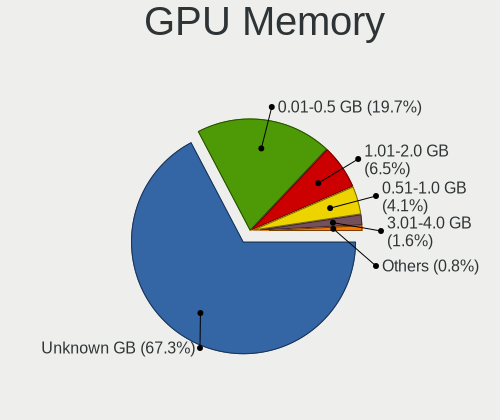

| Size in GB | Notebooks | Percent |
|------------|-----------|---------|
| Unknown    | 737       | 67.31%  |
| 0.01-0.5   | 216       | 19.73%  |
| 1.01-2.0   | 71        | 6.48%   |
| 0.51-1.0   | 45        | 4.11%   |
| 3.01-4.0   | 17        | 1.55%   |
| 5.01-6.0   | 5         | 0.46%   |
| 2.01-3.0   | 4         | 0.37%   |

Monitor
-------

Monitor Vendor
--------------

Monitor vendors

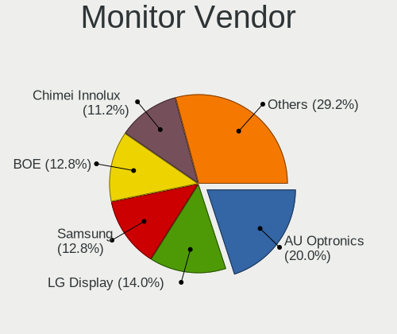

| Vendor                  | Notebooks | Percent |
|-------------------------|-----------|---------|
| AU Optronics            | 217       | 19.98%  |
| LG Display              | 152       | 14%     |
| Samsung Electronics     | 139       | 12.8%   |
| BOE                     | 139       | 12.8%   |
| Chimei Innolux          | 122       | 11.23%  |
| Chi Mei Optoelectronics | 43        | 3.96%   |
| LG Philips              | 31        | 2.85%   |
| Apple                   | 29        | 2.67%   |
| Lenovo                  | 23        | 2.12%   |
| HannStar                | 21        | 1.93%   |
| CPT                     | 16        | 1.47%   |
| InfoVision              | 14        | 1.29%   |
| Goldstar                | 14        | 1.29%   |
| Acer                    | 14        | 1.29%   |
| Dell                    | 12        | 1.1%    |
| Sharp                   | 11        | 1.01%   |
| Hewlett-Packard         | 11        | 1.01%   |
| PANDA                   | 10        | 0.92%   |
| Toshiba                 | 5         | 0.46%   |
| AOC                     | 5         | 0.46%   |
| Sony                    | 4         | 0.37%   |
| Philips                 | 4         | 0.37%   |
| BenQ                    | 4         | 0.37%   |
| KDC                     | 3         | 0.28%   |
| InnoLux Display         | 3         | 0.28%   |
| ASUSTek Computer        | 3         | 0.28%   |
| Vizio                   | 2         | 0.18%   |
| ViewSonic               | 2         | 0.18%   |
| Unknown                 | 2         | 0.18%   |
| Panasonic               | 2         | 0.18%   |
| NEC Computers           | 2         | 0.18%   |
| Iiyama                  | 2         | 0.18%   |
| HKC                     | 2         | 0.18%   |
| Westinghouse            | 1         | 0.09%   |
| Videoseven              | 1         | 0.09%   |
| STA                     | 1         | 0.09%   |
| Sceptre Tech            | 1         | 0.09%   |
| Quanta Display          | 1         | 0.09%   |
| Nvidia                  | 1         | 0.09%   |
| NCS                     | 1         | 0.09%   |

Monitor Model
-------------

Monitor models

| Model                                                                    | Notebooks | Percent |
|--------------------------------------------------------------------------|-----------|---------|
| Samsung Electronics LCD Monitor SEC5441 1280x800 286x179mm 13.3-inch     | 11        | 1.01%   |
| HannStar LCD Monitor HSD03E9 1024x600 220x129mm 10.0-inch                | 11        | 1.01%   |
| LG Display LCD Monitor LGD02DC 1366x768 344x194mm 15.5-inch              | 10        | 0.92%   |
| Chimei Innolux LCD Monitor CMN1132 1366x768 256x144mm 11.6-inch          | 9         | 0.83%   |
| LG Display LCD Monitor LGD0384 1366x768 344x194mm 15.5-inch              | 8         | 0.73%   |
| Chimei Innolux LCD Monitor CMN15DB 1366x768 344x193mm 15.5-inch          | 8         | 0.73%   |
| AU Optronics LCD Monitor AUO10EC 1366x768 344x193mm 15.5-inch            | 8         | 0.73%   |
| InfoVision LCD Monitor IVO03F4 1920x1080 309x173mm 13.9-inch             | 7         | 0.64%   |
| Chimei Innolux LCD Monitor CMN15CA 1366x768 344x193mm 15.5-inch          | 7         | 0.64%   |
| AU Optronics LCD Monitor AUO38ED 1920x1080 344x193mm 15.5-inch           | 7         | 0.64%   |
| AU Optronics LCD Monitor AUO2E3C 1366x768 309x173mm 13.9-inch            | 7         | 0.64%   |
| Lenovo LCD Monitor LEN4031 1280x800 304x190mm 14.1-inch                  | 6         | 0.55%   |
| AU Optronics LCD Monitor AUO26EC 1366x768 344x193mm 15.5-inch            | 6         | 0.55%   |
| AU Optronics LCD Monitor AUO22EC 1366x768 344x193mm 15.5-inch            | 6         | 0.55%   |
| AU Optronics LCD Monitor AUO139E 1600x900 382x214mm 17.2-inch            | 6         | 0.55%   |
| Chimei Innolux LCD Monitor CMN15E7 1920x1080 344x193mm 15.5-inch         | 5         | 0.46%   |
| Chimei Innolux LCD Monitor CMN14D6 1366x768 309x173mm 13.9-inch          | 5         | 0.46%   |
| Chi Mei Optoelectronics LCD Monitor CMO15A7 1366x768 344x193mm 15.5-inch | 5         | 0.46%   |
| BOE LCD Monitor BOE075A 1366x768 309x173mm 13.9-inch                     | 5         | 0.46%   |
| BOE LCD Monitor BOE06A5 1366x768 344x194mm 15.5-inch                     | 5         | 0.46%   |
| BOE LCD Monitor BOE06A4 1366x768 344x194mm 15.5-inch                     | 5         | 0.46%   |
| AU Optronics LCD Monitor AUO8174 1280x800 331x207mm 15.4-inch            | 5         | 0.46%   |
| AU Optronics LCD Monitor AUO235C 1366x768 256x144mm 11.6-inch            | 5         | 0.46%   |
| AU Optronics LCD Monitor AUO106C 1366x768 277x156mm 12.5-inch            | 5         | 0.46%   |
| AU Optronics LCD Monitor AUO105C 1366x768 256x144mm 11.6-inch            | 5         | 0.46%   |
| Samsung Electronics LCD Monitor SDC4852 1366x768 344x194mm 15.5-inch     | 4         | 0.37%   |
| LG Display LCD Monitor LGD0456 1366x768 344x194mm 15.5-inch              | 4         | 0.37%   |
| LG Display LCD Monitor LGD0430 1366x768 345x194mm 15.6-inch              | 4         | 0.37%   |
| LG Display LCD Monitor LGD033A 1366x768 340x190mm 15.3-inch              | 4         | 0.37%   |
| Chimei Innolux LCD Monitor CMN15C6 1366x768 344x193mm 15.5-inch          | 4         | 0.37%   |
| Chimei Innolux LCD Monitor CMN15AB 1366x768 344x193mm 15.5-inch          | 4         | 0.37%   |
| Chimei Innolux LCD Monitor CMN14D4 1920x1080 309x173mm 13.9-inch         | 4         | 0.37%   |
| Chi Mei Optoelectronics LCD Monitor CMO15A2 1366x768 344x193mm 15.5-inch | 4         | 0.37%   |
| BOE LCD Monitor BOE0812 1920x1080 344x194mm 15.5-inch                    | 4         | 0.37%   |
| BOE LCD Monitor BOE0771 1366x768 256x144mm 11.6-inch                     | 4         | 0.37%   |
| BOE LCD Monitor BOE0696 1366x768 309x173mm 13.9-inch                     | 4         | 0.37%   |
| BOE LCD Monitor BOE0635 1920x1080 309x173mm 13.9-inch                    | 4         | 0.37%   |
| AU Optronics LCD Monitor AUO723C 1366x768 309x173mm 13.9-inch            | 4         | 0.37%   |
| AU Optronics LCD Monitor AUO61D2 1024x600 222x125mm 10.0-inch            | 4         | 0.37%   |
| AU Optronics LCD Monitor AUO403D 1920x1080 309x174mm 14.0-inch           | 4         | 0.37%   |

Monitor Resolution
------------------

Monitor screen resolution

| Resolution         | Notebooks | Percent |
|--------------------|-----------|---------|
| 1366x768 (WXGA)    | 484       | 45.66%  |
| 1920x1080 (FHD)    | 235       | 22.17%  |
| 1280x800 (WXGA)    | 130       | 12.26%  |
| 1600x900 (HD+)     | 55        | 5.19%   |
| 1024x600           | 36        | 3.4%    |
| 3840x2160 (4K)     | 21        | 1.98%   |
| 1920x1200 (WUXGA)  | 21        | 1.98%   |
| 1440x900 (WXGA+)   | 17        | 1.6%    |
| 2560x1440 (QHD)    | 10        | 0.94%   |
| 1680x1050 (WSXGA+) | 10        | 0.94%   |
| 1280x1024 (SXGA)   | 6         | 0.57%   |
| 3840x2400          | 4         | 0.38%   |
| 3200x1800 (QHD+)   | 3         | 0.28%   |
| 2288x1287          | 3         | 0.28%   |
| 2160x1440          | 3         | 0.28%   |
| 1360x768           | 3         | 0.28%   |
| 2880x1800          | 2         | 0.19%   |
| 1280x720 (HD)      | 2         | 0.19%   |
| 1024x768 (XGA)     | 2         | 0.19%   |
| 3840x1600          | 1         | 0.09%   |
| 3840x1080          | 1         | 0.09%   |
| 3200x1080          | 1         | 0.09%   |
| 3120x2080          | 1         | 0.09%   |
| 3000x2000          | 1         | 0.09%   |
| 2560x1600          | 1         | 0.09%   |
| 2560x1080          | 1         | 0.09%   |
| 1920x540           | 1         | 0.09%   |
| 1920x1280          | 1         | 0.09%   |
| 1528x1222          | 1         | 0.09%   |
| 1400x1050          | 1         | 0.09%   |
| 1280x768           | 1         | 0.09%   |
| Unknown            | 1         | 0.09%   |

Monitor Diagonal
----------------

Diagonal size in inches

| Inches  | Notebooks | Percent |
|---------|-----------|---------|
| 15      | 440       | 40.55%  |
| 14      | 154       | 14.19%  |
| 13      | 152       | 14.01%  |
| 11      | 70        | 6.45%   |
| 17      | 61        | 5.62%   |
| 10      | 41        | 3.78%   |
| 12      | 36        | 3.32%   |
| 27      | 20        | 1.84%   |
| 24      | 15        | 1.38%   |
| 23      | 12        | 1.11%   |
| 21      | 12        | 1.11%   |
| Unknown | 11        | 1.01%   |
| 19      | 8         | 0.74%   |
| 22      | 7         | 0.65%   |
| 18      | 6         | 0.55%   |
| 84      | 5         | 0.46%   |
| 72      | 5         | 0.46%   |
| 31      | 5         | 0.46%   |
| 9       | 3         | 0.28%   |
| 8       | 3         | 0.28%   |
| 142     | 2         | 0.18%   |
| 48      | 2         | 0.18%   |
| 28      | 2         | 0.18%   |
| 26      | 2         | 0.18%   |
| 16      | 2         | 0.18%   |
| 63      | 1         | 0.09%   |
| 60      | 1         | 0.09%   |
| 54      | 1         | 0.09%   |
| 44      | 1         | 0.09%   |
| 43      | 1         | 0.09%   |
| 42      | 1         | 0.09%   |
| 33      | 1         | 0.09%   |
| 25      | 1         | 0.09%   |
| 20      | 1         | 0.09%   |

Monitor Width
-------------

Physical width

| Width in mm    | Notebooks | Percent |
|----------------|-----------|---------|
| 301-350        | 663       | 61.33%  |
| 201-300        | 217       | 20.07%  |
| 351-400        | 77        | 7.12%   |
| 501-600        | 49        | 4.53%   |
| 401-500        | 31        | 2.87%   |
| Unknown        | 11        | 1.02%   |
| 1501-2000      | 10        | 0.93%   |
| 601-700        | 8         | 0.74%   |
| 1001-1500      | 5         | 0.46%   |
| 101-200        | 4         | 0.37%   |
| 901-1000       | 3         | 0.28%   |
| More than 2000 | 2         | 0.19%   |
| 701-800        | 1         | 0.09%   |

Aspect Ratio
------------

Proportional relationship between the width and the height

| Ratio   | Notebooks | Percent |
|---------|-----------|---------|
| 16/9    | 805       | 79.55%  |
| 16/10   | 177       | 17.49%  |
| 3/2     | 9         | 0.89%   |
| 4/3     | 6         | 0.59%   |
| Unknown | 6         | 0.59%   |
| 5/4     | 5         | 0.49%   |
| 1.00    | 2         | 0.2%    |
| 32/9    | 1         | 0.1%    |
| 21/9    | 1         | 0.1%    |

Monitor Area
------------

Area in inch

| Area in inch | Notebooks | Percent |
|----------------|-----------|---------|
| 101-110        | 436       | 40.15%  |
| 81-90          | 260       | 23.94%  |
| 51-60          | 70        | 6.45%   |
| 121-130        | 48        | 4.42%   |
| 71-80          | 46        | 4.24%   |
| 41-50          | 44        | 4.05%   |
| 201-250        | 37        | 3.41%   |
| 61-70          | 34        | 3.13%   |
| 301-350        | 21        | 1.93%   |
| More than 1000 | 16        | 1.47%   |
| 251-300        | 12        | 1.1%    |
| 131-140        | 12        | 1.1%    |
| Unknown        | 11        | 1.01%   |
| 151-200        | 9         | 0.83%   |
| 141-150        | 8         | 0.74%   |
| 351-500        | 7         | 0.64%   |
| 91-100         | 6         | 0.55%   |
| 501-1000       | 4         | 0.37%   |
| 1-40           | 3         | 0.28%   |
| 111-120        | 2         | 0.18%   |

Pixel Density
-------------

Pixels per inch

| Density       | Notebooks | Percent |
|---------------|-----------|---------|
| 101-120       | 504       | 47.01%  |
| 121-160       | 302       | 28.17%  |
| 51-100        | 192       | 17.91%  |
| 161-240       | 40        | 3.73%   |
| 1-50          | 12        | 1.12%   |
| More than 240 | 11        | 1.03%   |
| Unknown       | 11        | 1.03%   |

Multiple Monitors
-----------------

Total monitors connected

| Total | Notebooks | Percent |
|-------|-----------|---------|
| 1     | 966       | 88.14%  |
| 2     | 103       | 9.4%    |
| 0     | 22        | 2.01%   |
| 3     | 5         | 0.46%   |

Network
-------

Net Controller Vendor
---------------------

Controller vendors

| Vendor                            | Notebooks | Percent |
|-----------------------------------|-----------|---------|
| Realtek Semiconductor             | 563       | 32.43%  |
| Intel                             | 392       | 22.58%  |
| Qualcomm Atheros                  | 314       | 18.09%  |
| Broadcom                          | 155       | 8.93%   |
| Marvell Technology Group          | 46        | 2.65%   |
| Broadcom Limited                  | 36        | 2.07%   |
| Ralink                            | 35        | 2.02%   |
| Nvidia                            | 17        | 0.98%   |
| ASIX Electronics                  | 16        | 0.92%   |
| TP-Link                           | 15        | 0.86%   |
| Ralink Technology                 | 15        | 0.86%   |
| MediaTek                          | 13        | 0.75%   |
| Attansic Technology               | 11        | 0.63%   |
| Xiaomi                            | 10        | 0.58%   |
| Silicon Integrated Systems [SiS]  | 10        | 0.58%   |
| Samsung Electronics               | 10        | 0.58%   |
| JMicron Technology                | 7         | 0.4%    |
| Dell                              | 5         | 0.29%   |
| AMD                               | 5         | 0.29%   |
| DisplayLink                       | 4         | 0.23%   |
| VIA Technologies                  | 3         | 0.17%   |
| Qualcomm                          | 3         | 0.17%   |
| OPPO Electronics                  | 3         | 0.17%   |
| Micro Star International          | 3         | 0.17%   |
| Huawei Technologies               | 3         | 0.17%   |
| Hewlett-Packard                   | 3         | 0.17%   |
| Fibocom                           | 3         | 0.17%   |
| D-Link                            | 3         | 0.17%   |
| ASUSTek Computer                  | 3         | 0.17%   |
| Sierra Wireless                   | 2         | 0.12%   |
| Qualcomm Atheros Communications   | 2         | 0.12%   |
| NetGear                           | 2         | 0.12%   |
| ICS Advent                        | 2         | 0.12%   |
| Ericsson Business Mobile Networks | 2         | 0.12%   |
| Edimax Technology                 | 2         | 0.12%   |
| ZTE WCDMA Technologies MSM        | 1         | 0.06%   |
| Texas Instruments                 | 1         | 0.06%   |
| Tenda                             | 1         | 0.06%   |
| Spreadtrum Communications         | 1         | 0.06%   |
| Seeed Technology                  | 1         | 0.06%   |

Net Controller Model
--------------------

Controller models

| Model                                                                   | Notebooks | Percent |
|-------------------------------------------------------------------------|-----------|---------|
| Realtek RTL8111/8168/8211/8411 PCI Express Gigabit Ethernet Controller  | 250       | 12.11%  |
| Realtek RTL810xE PCI Express Fast Ethernet controller                   | 173       | 8.38%   |
| Qualcomm Atheros AR9285 Wireless Network Adapter (PCI-Express)          | 68        | 3.29%   |
| Qualcomm Atheros QCA9565 / AR9565 Wireless Network Adapter              | 42        | 2.03%   |
| Qualcomm Atheros AR242x / AR542x Wireless Network Adapter (PCI-Express) | 41        | 1.99%   |
| Qualcomm Atheros QCA9377 802.11ac Wireless Network Adapter              | 39        | 1.89%   |
| Qualcomm Atheros AR9485 Wireless Network Adapter                        | 38        | 1.84%   |
| Broadcom BCM4313 802.11bgn Wireless Network Adapter                     | 38        | 1.84%   |
| Intel Wireless 7260                                                     | 37        | 1.79%   |
| Intel PRO/Wireless 3945ABG [Golan] Network Connection                   | 36        | 1.74%   |
| Realtek RTL8821CE 802.11ac PCIe Wireless Network Adapter                | 30        | 1.45%   |
| Realtek RTL8723BE PCIe Wireless Network Adapter                         | 27        | 1.31%   |
| Intel Wireless 7265                                                     | 27        | 1.31%   |
| Realtek RTL-8100/8101L/8139 PCI Fast Ethernet Adapter                   | 24        | 1.16%   |
| Intel 82579LM Gigabit Network Connection (Lewisville)                   | 24        | 1.16%   |
| Intel 82577LM Gigabit Network Connection                                | 22        | 1.07%   |
| Realtek RTL8822CE 802.11ac PCIe Wireless Network Adapter                | 21        | 1.02%   |
| Realtek RTL8188CE 802.11b/g/n WiFi Adapter                              | 21        | 1.02%   |
| Realtek RTL8153 Gigabit Ethernet Adapter                                | 21        | 1.02%   |
| Intel Wireless 3165                                                     | 17        | 0.82%   |
| Intel Centrino Advanced-N 6205 [Taylor Peak]                            | 17        | 0.82%   |
| Ralink RT3290 Wireless 802.11n 1T/1R PCIe                               | 16        | 0.78%   |
| Intel Wireless 8265 / 8275                                              | 16        | 0.78%   |
| Realtek RTL8188EE Wireless Network Adapter                              | 15        | 0.73%   |
| Qualcomm Atheros AR8132 Fast Ethernet                                   | 15        | 0.73%   |
| Intel Wireless 3160                                                     | 15        | 0.73%   |
| Intel PRO/Wireless 4965 AG or AGN [Kedron] Network Connection           | 15        | 0.73%   |
| Realtek 802.11n WLAN Adapter                                            | 14        | 0.68%   |
| Qualcomm Atheros AR928X Wireless Network Adapter (PCI-Express)          | 14        | 0.68%   |
| Intel Wireless 8260                                                     | 13        | 0.63%   |
| Broadcom BCM43142 802.11b/g/n                                           | 13        | 0.63%   |
| Intel Wi-Fi 6 AX200                                                     | 12        | 0.58%   |
| Realtek RTL8152 Fast Ethernet Adapter                                   | 11        | 0.53%   |
| Qualcomm Atheros AR8152 v2.0 Fast Ethernet                              | 11        | 0.53%   |
| Marvell Group 88E8040 PCI-E Fast Ethernet Controller                    | 11        | 0.53%   |
| Intel Ethernet Connection I218-LM                                       | 11        | 0.53%   |
| Intel Centrino Ultimate-N 6300                                          | 11        | 0.53%   |
| Attansic AR8152 v2.0 Fast Ethernet                                      | 11        | 0.53%   |
| Realtek RTL8723DE Wireless Network Adapter                              | 10        | 0.48%   |
| Qualcomm Atheros AR8151 v2.0 Gigabit Ethernet                           | 10        | 0.48%   |

Wireless Vendor
---------------

Wireless vendors

| Vendor                          | Notebooks | Percent |
|---------------------------------|-----------|---------|
| Intel                           | 367       | 33.86%  |
| Qualcomm Atheros                | 275       | 25.37%  |
| Realtek Semiconductor           | 209       | 19.28%  |
| Broadcom                        | 109       | 10.06%  |
| Ralink                          | 35        | 3.23%   |
| Broadcom Limited                | 20        | 1.85%   |
| Ralink Technology               | 15        | 1.38%   |
| TP-Link                         | 14        | 1.29%   |
| MediaTek                        | 12        | 1.11%   |
| Micro Star International        | 3         | 0.28%   |
| Fibocom                         | 3         | 0.28%   |
| Dell                            | 3         | 0.28%   |
| D-Link                          | 3         | 0.28%   |
| ASUSTek Computer                | 3         | 0.28%   |
| Sierra Wireless                 | 2         | 0.18%   |
| Qualcomm Atheros Communications | 2         | 0.18%   |
| NetGear                         | 2         | 0.18%   |
| Edimax Technology               | 2         | 0.18%   |
| Texas Instruments               | 1         | 0.09%   |
| Tenda                           | 1         | 0.09%   |
| Qualcomm                        | 1         | 0.09%   |
| Microsoft                       | 1         | 0.09%   |
| Linksys                         | 1         | 0.09%   |

Wireless Model
--------------

Wireless models

| Model                                                                   | Notebooks | Percent |
|-------------------------------------------------------------------------|-----------|---------|
| Qualcomm Atheros AR9285 Wireless Network Adapter (PCI-Express)          | 68        | 6.21%   |
| Qualcomm Atheros QCA9565 / AR9565 Wireless Network Adapter              | 42        | 3.84%   |
| Qualcomm Atheros AR242x / AR542x Wireless Network Adapter (PCI-Express) | 41        | 3.74%   |
| Qualcomm Atheros QCA9377 802.11ac Wireless Network Adapter              | 39        | 3.56%   |
| Qualcomm Atheros AR9485 Wireless Network Adapter                        | 38        | 3.47%   |
| Broadcom BCM4313 802.11bgn Wireless Network Adapter                     | 38        | 3.47%   |
| Intel Wireless 7260                                                     | 37        | 3.38%   |
| Intel PRO/Wireless 3945ABG [Golan] Network Connection                   | 36        | 3.29%   |
| Realtek RTL8821CE 802.11ac PCIe Wireless Network Adapter                | 30        | 2.74%   |
| Realtek RTL8723BE PCIe Wireless Network Adapter                         | 27        | 2.47%   |
| Intel Wireless 7265                                                     | 27        | 2.47%   |
| Realtek RTL8822CE 802.11ac PCIe Wireless Network Adapter                | 21        | 1.92%   |
| Realtek RTL8188CE 802.11b/g/n WiFi Adapter                              | 21        | 1.92%   |
| Intel Wireless 3165                                                     | 17        | 1.55%   |
| Intel Centrino Advanced-N 6205 [Taylor Peak]                            | 17        | 1.55%   |
| Ralink RT3290 Wireless 802.11n 1T/1R PCIe                               | 16        | 1.46%   |
| Intel Wireless 8265 / 8275                                              | 16        | 1.46%   |
| Realtek RTL8188EE Wireless Network Adapter                              | 15        | 1.37%   |
| Intel Wireless 3160                                                     | 15        | 1.37%   |
| Intel PRO/Wireless 4965 AG or AGN [Kedron] Network Connection           | 15        | 1.37%   |
| Realtek 802.11n WLAN Adapter                                            | 14        | 1.28%   |
| Qualcomm Atheros AR928X Wireless Network Adapter (PCI-Express)          | 14        | 1.28%   |
| Intel Wireless 8260                                                     | 13        | 1.19%   |
| Broadcom BCM43142 802.11b/g/n                                           | 13        | 1.19%   |
| Intel Wi-Fi 6 AX200                                                     | 12        | 1.1%    |
| Intel Centrino Ultimate-N 6300                                          | 11        | 1%      |
| Realtek RTL8723DE Wireless Network Adapter                              | 10        | 0.91%   |
| Intel Gemini Lake PCH CNVi WiFi                                         | 10        | 0.91%   |
| Intel Centrino Advanced-N 6200                                          | 10        | 0.91%   |
| Broadcom BCM4331 802.11a/b/g/n                                          | 10        | 0.91%   |
| Broadcom BCM4312 802.11b/g LP-PHY                                       | 10        | 0.91%   |
| Realtek RTL8187B Wireless 802.11g 54Mbps Network Adapter                | 9         | 0.82%   |
| Qualcomm Atheros QCA6174 802.11ac Wireless Network Adapter              | 9         | 0.82%   |
| Intel Wi-Fi 6 AX201                                                     | 9         | 0.82%   |
| Intel PRO/Wireless 5100 AGN [Shiloh] Network Connection                 | 9         | 0.82%   |
| Intel Centrino Wireless-N 1000 [Condor Peak]                            | 9         | 0.82%   |
| Broadcom BCM4311 802.11b/g WLAN                                         | 9         | 0.82%   |
| Realtek 802.11ac NIC                                                    | 8         | 0.73%   |
| Ralink MT7601U Wireless Adapter                                         | 8         | 0.73%   |
| Qualcomm Atheros AR9462 Wireless Network Adapter                        | 8         | 0.73%   |

Ethernet Vendor
---------------

Ethernet vendors

| Vendor                           | Notebooks | Percent |
|----------------------------------|-----------|---------|
| Realtek Semiconductor            | 479       | 51.23%  |
| Intel                            | 140       | 14.97%  |
| Qualcomm Atheros                 | 83        | 8.88%   |
| Broadcom                         | 65        | 6.95%   |
| Marvell Technology Group         | 46        | 4.92%   |
| Nvidia                           | 17        | 1.82%   |
| Broadcom Limited                 | 16        | 1.71%   |
| ASIX Electronics                 | 16        | 1.71%   |
| Attansic Technology              | 11        | 1.18%   |
| Xiaomi                           | 10        | 1.07%   |
| Silicon Integrated Systems [SiS] | 10        | 1.07%   |
| JMicron Technology               | 7         | 0.75%   |
| Samsung Electronics              | 6         | 0.64%   |
| DisplayLink                      | 4         | 0.43%   |
| VIA Technologies                 | 3         | 0.32%   |
| OPPO Electronics                 | 3         | 0.32%   |
| Qualcomm                         | 2         | 0.21%   |
| ICS Advent                       | 2         | 0.21%   |
| Huawei Technologies              | 2         | 0.21%   |
| ZTE WCDMA Technologies MSM       | 1         | 0.11%   |
| TP-Link                          | 1         | 0.11%   |
| Spreadtrum Communications        | 1         | 0.11%   |
| Research In Motion               | 1         | 0.11%   |
| OnePlus Technology (Shenzhen)    | 1         | 0.11%   |
| Motorola PCS                     | 1         | 0.11%   |
| Microchip Technology             | 1         | 0.11%   |
| MediaTek                         | 1         | 0.11%   |
| LG Electronics                   | 1         | 0.11%   |
| Lab126                           | 1         | 0.11%   |
| Intersil                         | 1         | 0.11%   |
| Hewlett-Packard                  | 1         | 0.11%   |
| 3Com                             | 1         | 0.11%   |

Ethernet Model
--------------

Ethernet models

| Model                                                                  | Notebooks | Percent |
|------------------------------------------------------------------------|-----------|---------|
| Realtek RTL8111/8168/8211/8411 PCI Express Gigabit Ethernet Controller | 250       | 26.65%  |
| Realtek RTL810xE PCI Express Fast Ethernet controller                  | 173       | 18.44%  |
| Realtek RTL-8100/8101L/8139 PCI Fast Ethernet Adapter                  | 24        | 2.56%   |
| Intel 82579LM Gigabit Network Connection (Lewisville)                  | 24        | 2.56%   |
| Intel 82577LM Gigabit Network Connection                               | 22        | 2.35%   |
| Realtek RTL8153 Gigabit Ethernet Adapter                               | 21        | 2.24%   |
| Qualcomm Atheros AR8132 Fast Ethernet                                  | 15        | 1.6%    |
| Realtek RTL8152 Fast Ethernet Adapter                                  | 11        | 1.17%   |
| Qualcomm Atheros AR8152 v2.0 Fast Ethernet                             | 11        | 1.17%   |
| Marvell Group 88E8040 PCI-E Fast Ethernet Controller                   | 11        | 1.17%   |
| Intel Ethernet Connection I218-LM                                      | 11        | 1.17%   |
| Attansic AR8152 v2.0 Fast Ethernet                                     | 11        | 1.17%   |
| Qualcomm Atheros AR8151 v2.0 Gigabit Ethernet                          | 10        | 1.07%   |
| Broadcom NetXtreme BCM57765 Gigabit Ethernet PCIe                      | 10        | 1.07%   |
| Broadcom NetLink BCM57785 Gigabit Ethernet PCIe                        | 10        | 1.07%   |
| Intel 82567LM Gigabit Network Connection                               | 9         | 0.96%   |
| ASIX AX88179 Gigabit Ethernet                                          | 9         | 0.96%   |
| Qualcomm Atheros AR8161 Gigabit Ethernet                               | 8         | 0.85%   |
| Broadcom NetXtreme BCM57786 Gigabit Ethernet PCIe                      | 8         | 0.85%   |
| Silicon Integrated Systems [SiS] 191 Gigabit Ethernet Adapter          | 7         | 0.75%   |
| Qualcomm Atheros AR8162 Fast Ethernet                                  | 7         | 0.75%   |
| Qualcomm Atheros AR8152 v1.1 Fast Ethernet                             | 7         | 0.75%   |
| Qualcomm Atheros AR8131 Gigabit Ethernet                               | 7         | 0.75%   |
| Marvell Group 88E8055 PCI-E Gigabit Ethernet Controller                | 7         | 0.75%   |
| Intel Ethernet Connection I219-LM                                      | 7         | 0.75%   |
| Intel Ethernet Connection I217-LM                                      | 7         | 0.75%   |
| Broadcom Limited NetLink BCM5787M Gigabit Ethernet PCI Express         | 7         | 0.75%   |
| Samsung Galaxy series, misc. (tethering mode)                          | 6         | 0.64%   |
| Qualcomm Atheros AR8121/AR8113/AR8114 Gigabit or Fast Ethernet         | 6         | 0.64%   |
| Marvell Group 88E8039 PCI-E Fast Ethernet Controller                   | 6         | 0.64%   |
| JMicron JMC250 PCI Express Gigabit Ethernet Controller                 | 6         | 0.64%   |
| Broadcom BCM4401-B0 100Base-TX                                         | 6         | 0.64%   |
| Xiaomi Mi/Redmi series (RNDIS)                                         | 5         | 0.53%   |
| Xiaomi Mi/Redmi series (RNDIS + ADB)                                   | 5         | 0.53%   |
| Qualcomm Atheros QCA8172 Fast Ethernet                                 | 5         | 0.53%   |
| Nvidia MCP79 Ethernet                                                  | 5         | 0.53%   |
| Intel Ethernet Connection (4) I219-V                                   | 5         | 0.53%   |
| Intel Ethernet Connection (4) I219-LM                                  | 5         | 0.53%   |
| Intel 82566MM Gigabit Network Connection                               | 5         | 0.53%   |
| Qualcomm Atheros Killer E2500 Gigabit Ethernet Controller              | 4         | 0.43%   |

Net Controller Kind
-------------------

Ethernet, WiFi or modem

| Kind     | Notebooks | Percent |
|----------|-----------|---------|
| WiFi     | 1026      | 52.78%  |
| Ethernet | 887       | 45.63%  |
| Modem    | 31        | 1.59%   |

Used Controller
---------------

Currently used network controller

| Kind     | Notebooks | Percent |
|----------|-----------|---------|
| WiFi     | 836       | 76.21%  |
| Ethernet | 261       | 23.79%  |

NICs
----

Total network controllers on board

| Total | Notebooks | Percent |
|-------|-----------|---------|
| 2     | 791       | 72.97%  |
| 1     | 214       | 19.74%  |
| 0     | 70        | 6.46%   |
| 3     | 8         | 0.74%   |
| 4     | 1         | 0.09%   |

IPv6
----

IPv6 vs IPv4

| Used | Notebooks | Percent |
|------|-----------|---------|
| No   | 862       | 78.36%  |
| Yes  | 238       | 21.64%  |

Bluetooth
---------

Bluetooth Vendor
----------------

Controller vendors

| Vendor                          | Notebooks | Percent |
|---------------------------------|-----------|---------|
| Intel                           | 224       | 32.42%  |
| Realtek Semiconductor           | 92        | 13.31%  |
| Qualcomm Atheros Communications | 69        | 9.99%   |
| Broadcom                        | 51        | 7.38%   |
| Lite-On Technology              | 38        | 5.5%    |
| IMC Networks                    | 30        | 4.34%   |
| Foxconn / Hon Hai               | 30        | 4.34%   |
| Apple                           | 26        | 3.76%   |
| Dell                            | 23        | 3.33%   |
| Cambridge Silicon Radio         | 23        | 3.33%   |
| Hewlett-Packard                 | 22        | 3.18%   |
| Ralink                          | 16        | 2.32%   |
| Toshiba                         | 12        | 1.74%   |
| Alps Electric                   | 10        | 1.45%   |
| ASUSTek Computer                | 7         | 1.01%   |
| Micro Star International        | 3         | 0.43%   |
| MediaTek                        | 3         | 0.43%   |
| Ralink Technology               | 2         | 0.29%   |
| Qcom                            | 2         | 0.29%   |
| Askey Computer                  | 2         | 0.29%   |
| USI                             | 1         | 0.14%   |
| TP-Link                         | 1         | 0.14%   |
| Syntek                          | 1         | 0.14%   |
| Realtek                         | 1         | 0.14%   |
| Integrated System Solution      | 1         | 0.14%   |
| Chicony Electronics             | 1         | 0.14%   |

Bluetooth Model
---------------

Controller models

| Model                                                                               | Notebooks | Percent |
|-------------------------------------------------------------------------------------|-----------|---------|
| Intel Bluetooth wireless interface                                                  | 129       | 18.59%  |
| Realtek Bluetooth Radio                                                             | 62        | 8.93%   |
| Intel Bluetooth 9460/9560 Jefferson Peak (JfP)                                      | 32        | 4.61%   |
| Qualcomm Atheros  Bluetooth Device                                                  | 31        | 4.47%   |
| Intel AX201 Bluetooth                                                               | 23        | 3.31%   |
| Cambridge Silicon Radio Bluetooth Dongle (HCI mode)                                 | 23        | 3.31%   |
| Ralink RT3290 Bluetooth                                                             | 16        | 2.31%   |
| Realtek  Bluetooth 4.2 Adapter                                                      | 15        | 2.16%   |
| Apple Bluetooth Host Controller                                                     | 15        | 2.16%   |
| Qualcomm Atheros AR3011 Bluetooth                                                   | 13        | 1.87%   |
| HP Broadcom 2070 Bluetooth Combo                                                    | 13        | 1.87%   |
| Qualcomm Atheros AR3012 Bluetooth 4.0                                               | 12        | 1.73%   |
| Intel AX200 Bluetooth                                                               | 12        | 1.73%   |
| Broadcom BCM2045B (BDC-2.1)                                                         | 12        | 1.73%   |
| Lite-On Qualcomm Atheros QCA9377 Bluetooth                                          | 11        | 1.59%   |
| Lite-On Atheros AR3012 Bluetooth                                                    | 11        | 1.59%   |
| Foxconn / Hon Hai Bluetooth Device                                                  | 11        | 1.59%   |
| Intel Centrino Bluetooth Wireless Transceiver                                       | 9         | 1.3%    |
| Intel Centrino Advanced-N 6230 Bluetooth adapter                                    | 9         | 1.3%    |
| IMC Networks Bluetooth Device                                                       | 9         | 1.3%    |
| Realtek RTL8723B Bluetooth                                                          | 8         | 1.15%   |
| HP Bluetooth 2.0 Interface [Broadcom BCM2045]                                       | 8         | 1.15%   |
| Foxconn / Hon Hai Foxconn T77H114 BCM2070 [Single-Chip Bluetooth 2.1 + EDR Adapter] | 8         | 1.15%   |
| IMC Networks Bluetooth Radio                                                        | 7         | 1.01%   |
| Broadcom BCM43142A0 Bluetooth 4.0                                                   | 7         | 1.01%   |
| Qualcomm Atheros QCA61x4 Bluetooth 4.0                                              | 6         | 0.86%   |
| Dell Wireless 365 Bluetooth                                                         | 6         | 0.86%   |
| Broadcom BCM2045B (BDC-2) [Bluetooth Controller]                                    | 6         | 0.86%   |
| Apple Bluetooth HCI                                                                 | 6         | 0.86%   |
| Toshiba Integrated Bluetooth HCI                                                    | 5         | 0.72%   |
| Realtek RTL8821A Bluetooth                                                          | 5         | 0.72%   |
| Lite-On Bluetooth Device                                                            | 5         | 0.72%   |
| IMC Networks Bluetooth module                                                       | 5         | 0.72%   |
| Intel Wireless-AC 9260 Bluetooth Adapter                                            | 4         | 0.58%   |
| Intel AX211 Bluetooth                                                               | 4         | 0.58%   |
| Dell Wireless 355 Bluetooth                                                         | 4         | 0.58%   |
| Broadcom BCM2070 Bluetooth 2.1 + EDR                                                | 4         | 0.58%   |
| Apple Bluetooth USB Host Controller                                                 | 4         | 0.58%   |
| Alps Electric Bluetooth Controller (ALPS/UGPZ6)                                     | 4         | 0.58%   |
| Toshiba Bluetooth Device                                                            | 3         | 0.43%   |

Sound
-----

Sound Vendor
------------

Sound card vendors

| Vendor                                       | Notebooks | Percent |
|----------------------------------------------|-----------|---------|
| Intel                                        | 805       | 70.31%  |
| AMD                                          | 211       | 18.43%  |
| Nvidia                                       | 85        | 7.42%   |
| Silicon Integrated Systems [SiS]             | 12        | 1.05%   |
| Logitech                                     | 5         | 0.44%   |
| C-Media Electronics                          | 5         | 0.44%   |
| GN Netcom                                    | 4         | 0.35%   |
| VIA Technologies                             | 3         | 0.26%   |
| Plantronics                                  | 3         | 0.26%   |
| Hewlett-Packard                              | 2         | 0.17%   |
| Zoran Co. Personal Media Division (Nogatech) | 1         | 0.09%   |
| Texas Instruments                            | 1         | 0.09%   |
| Realtek Semiconductor                        | 1         | 0.09%   |
| QinHeng Electronics                          | 1         | 0.09%   |
| MosArt Semiconductor                         | 1         | 0.09%   |
| KTMicro                                      | 1         | 0.09%   |
| JMTek                                        | 1         | 0.09%   |
| Elitegroup Computer Systems (ECS)            | 1         | 0.09%   |
| EGO SYStems                                  | 1         | 0.09%   |
| ASUSTek Computer                             | 1         | 0.09%   |

Sound Model
-----------

Sound card models

| Model                                                                                             | Notebooks | Percent |
|---------------------------------------------------------------------------------------------------|-----------|---------|
| Intel 7 Series/C216 Chipset Family High Definition Audio Controller                               | 91        | 6.62%   |
| Intel NM10/ICH7 Family High Definition Audio Controller                                           | 77        | 5.6%    |
| Intel 5 Series/3400 Series Chipset High Definition Audio                                          | 69        | 5.02%   |
| Intel Sunrise Point-LP HD Audio                                                                   | 66        | 4.8%    |
| Intel 82801H (ICH8 Family) HD Audio Controller                                                    | 65        | 4.73%   |
| Intel 6 Series/C200 Series Chipset Family High Definition Audio Controller                        | 60        | 4.37%   |
| Intel 82801I (ICH9 Family) HD Audio Controller                                                    | 59        | 4.29%   |
| AMD FCH Azalia Controller                                                                         | 55        | 4%      |
| Intel Celeron/Pentium Silver Processor High Definition Audio                                      | 48        | 3.49%   |
| AMD SBx00 Azalia (Intel HDA)                                                                      | 48        | 3.49%   |
| AMD Family 17h/19h/1ah HD Audio Controller                                                        | 42        | 3.06%   |
| AMD Kabini HDMI/DP Audio                                                                          | 40        | 2.91%   |
| Intel 8 Series HD Audio Controller                                                                | 39        | 2.84%   |
| Intel Haswell-ULT HD Audio Controller                                                             | 38        | 2.77%   |
| Intel Atom/Celeron/Pentium Processor x5-E8000/J3xxx/N3xxx Series High Definition Audio Controller | 34        | 2.47%   |
| AMD Wrestler HDMI Audio                                                                           | 34        | 2.47%   |
| Intel Atom Processor Z36xxx/Z37xxx Series High Definition Audio Controller                        | 33        | 2.4%    |
| AMD Family 15h (Models 60h-6fh) Audio Controller                                                  | 33        | 2.4%    |
| AMD High Definition Audio Controller                                                              | 29        | 2.11%   |
| Intel Celeron N3350/Pentium N4200/Atom E3900 Series Audio Cluster                                 | 23        | 1.67%   |
| Intel Wildcat Point-LP High Definition Audio Controller                                           | 20        | 1.46%   |
| Intel Broadwell-U Audio Controller                                                                | 20        | 1.46%   |
| AMD Renoir Radeon High Definition Audio Controller                                                | 19        | 1.38%   |
| AMD Raven/Raven2/Fenghuang HDMI/DP Audio Controller                                               | 18        | 1.31%   |
| Intel 8 Series/C220 Series Chipset High Definition Audio Controller                               | 17        | 1.24%   |
| Intel Cannon Point-LP High Definition Audio Controller                                            | 15        | 1.09%   |
| Nvidia High Definition Audio Controller                                                           | 14        | 1.02%   |
| Intel Tiger Lake-LP Smart Sound Technology Audio Controller                                       | 14        | 1.02%   |
| Intel Comet Lake PCH-LP cAVS                                                                      | 14        | 1.02%   |
| Intel Xeon E3-1200 v3/4th Gen Core Processor HD Audio Controller                                  | 13        | 0.95%   |
| Intel Cannon Lake PCH cAVS                                                                        | 11        | 0.8%    |
| Nvidia GF108 High Definition Audio Controller                                                     | 10        | 0.73%   |
| Silicon Integrated Systems [SiS] Azalia Audio Controller                                          | 9         | 0.66%   |
| Intel Ice Lake-LP Smart Sound Technology Audio Controller                                         | 9         | 0.66%   |
| Intel Jasper Lake HD Audio                                                                        | 8         | 0.58%   |
| Nvidia MCP79 High Definition Audio                                                                | 7         | 0.51%   |
| Nvidia GT216 HDMI Audio Controller                                                                | 7         | 0.51%   |
| AMD Trinity HDMI Audio Controller                                                                 | 7         | 0.51%   |
| Nvidia GP107GL High Definition Audio Controller                                                   | 6         | 0.44%   |
| AMD RV710/730 HDMI Audio [Radeon HD 4000 series]                                                  | 6         | 0.44%   |

Memory
------

Memory Vendor
-------------

Memory module vendors

| Vendor              | Notebooks | Percent |
|---------------------|-----------|---------|
| Samsung Electronics | 186       | 23.28%  |
| SK hynix            | 163       | 20.4%   |
| Unknown             | 132       | 16.52%  |
| Micron Technology   | 73        | 9.14%   |
| Kingston            | 42        | 5.26%   |
| Unknown (ABCD)      | 29        | 3.63%   |
| A-DATA Technology   | 22        | 2.75%   |
| Nanya Technology    | 19        | 2.38%   |
| Elpida              | 19        | 2.38%   |
| Crucial             | 18        | 2.25%   |
| Corsair             | 14        | 1.75%   |
| Smart               | 10        | 1.25%   |
| Ramaxel Technology  | 10        | 1.25%   |
| Unknown             | 7         | 0.88%   |
| Teikon              | 5         | 0.63%   |
| Team                | 4         | 0.5%    |
| Transcend           | 3         | 0.38%   |
| High Bridge         | 3         | 0.38%   |
| G.Skill             | 3         | 0.38%   |
| Apacer              | 3         | 0.38%   |
| Toshiba             | 2         | 0.25%   |
| Timetec             | 2         | 0.25%   |
| Smart Brazil        | 2         | 0.25%   |
| Qimonda             | 2         | 0.25%   |
| PNY                 | 2         | 0.25%   |
| Patriot             | 2         | 0.25%   |
| fef5                | 2         | 0.25%   |
| ASint Technology    | 2         | 0.25%   |
| Wilk                | 1         | 0.13%   |
| Unknown (0xD306)    | 1         | 0.13%   |
| TakeMS              | 1         | 0.13%   |
| Sesame              | 1         | 0.13%   |
| Quadratica          | 1         | 0.13%   |
| PUSKILL             | 1         | 0.13%   |
| Novatech            | 1         | 0.13%   |
| Neo Forza           | 1         | 0.13%   |
| Multilaser          | 1         | 0.13%   |
| Kllisre             | 1         | 0.13%   |
| Kingmax             | 1         | 0.13%   |
| HMD                 | 1         | 0.13%   |

Memory Model
------------

Memory module models

| Model                                                            | Notebooks | Percent |
|------------------------------------------------------------------|-----------|---------|
| Unknown (ABCD) RAM 123456789012345678 2GB SODIMM LPDDR3 2400MT/s | 24        | 2.79%   |
| Samsung RAM M471B5273DH0-CH9 4GB SODIMM DDR3 1334MT/s            | 14        | 1.63%   |
| Samsung RAM M471B5173DB0-YK0 4GB SODIMM DDR3 1600MT/s            | 13        | 1.51%   |
| Unknown RAM Module 2048MB SODIMM DDR2 667MT/s                    | 12        | 1.4%    |
| Samsung RAM M471B5773DH0-CH9 2GB SODIMM DDR3 1600MT/s            | 12        | 1.4%    |
| Samsung RAM M471A5244CB0-CTD 4GB SODIMM DDR4 3266MT/s            | 12        | 1.4%    |
| SK hynix RAM HMT351S6CFR8C-PB 4GB SODIMM DDR3 1600MT/s           | 10        | 1.16%   |
| Unknown RAM Module 1024MB SODIMM DDR2 667MT/s                    | 9         | 1.05%   |
| Nanya RAM NT2GC64B88B0NS-CG 2GB SODIMM DDR3 1334MT/s             | 9         | 1.05%   |
| Samsung RAM M471B5173EB0-YK0 4GB SODIMM DDR3 1600MT/s            | 8         | 0.93%   |
| Samsung RAM M471A5244CB0-CRC 4GB SODIMM DDR4 2667MT/s            | 8         | 0.93%   |
| Unknown RAM Module 1024MB SODIMM DDR2                            | 7         | 0.81%   |
| Unknown                                                          | 7         | 0.81%   |
| Unknown RAM Module 2GB SODIMM DDR3 1066MT/s                      | 6         | 0.7%    |
| Unknown RAM Module 1024MB SODIMM DRAM                            | 6         | 0.7%    |
| SK hynix RAM HMT451S6AFR8A-PB 4GB SODIMM DDR3 1600MT/s           | 6         | 0.7%    |
| Samsung RAM M471B5173QH0-YK0 4GB SODIMM DDR3 1600MT/s            | 6         | 0.7%    |
| Micron RAM 8KTF51264HZ-1G6E1 4GB SODIMM DDR3 1600MT/s            | 6         | 0.7%    |
| Unknown RAM Module 4GB SODIMM DDR3                               | 5         | 0.58%   |
| Unknown RAM Module 2GB SODIMM DDR2 667MT/s                       | 5         | 0.58%   |
| Unknown RAM Module 1GB SODIMM DDR2 667MT/s                       | 5         | 0.58%   |
| Unknown (ABCD) RAM 123456789012345678 2GB DIMM DDR3 2400MT/s     | 5         | 0.58%   |
| SK hynix RAM HMT451S6BFR8A-PB 4GB SODIMM DDR3 1600MT/s           | 5         | 0.58%   |
| SK hynix RAM HMT41GS6BFR8A-PB 8GB SODIMM DDR3 1600MT/s           | 5         | 0.58%   |
| SK hynix RAM HMT351S6EFR8C-PB 4GB SODIMM DDR3 1600MT/s           | 5         | 0.58%   |
| SK hynix RAM HMA851S6AFR6N-UH 4GB SODIMM DDR4 2667MT/s           | 5         | 0.58%   |
| Samsung RAM M471B5673FH0-CF8 2GB SODIMM DDR3 1067MT/s            | 5         | 0.58%   |
| Samsung RAM M471B5273CH0-CH9 4GB SODIMM DDR3 1334MT/s            | 5         | 0.58%   |
| Unknown RAM Module 512MB SODIMM DDR2                             | 4         | 0.47%   |
| Unknown RAM Module 2GB SODIMM DDR3 1333MT/s                      | 4         | 0.47%   |
| Unknown RAM Module 2048MB SODIMM DDR2                            | 4         | 0.47%   |
| Unknown RAM Module 1024MB SODIMM DDR2 533MT/s                    | 4         | 0.47%   |
| SK hynix RAM HMT425S6AFR6A-PB 2GB SODIMM DDR3 1600MT/s           | 4         | 0.47%   |
| SK hynix RAM HMT351S6EFR8A-PB 4GB SODIMM DDR3 1600MT/s           | 4         | 0.47%   |
| SK hynix RAM HMT351S6BFR8C-H9 4GB SODIMM DDR3 1333MT/s           | 4         | 0.47%   |
| SK hynix RAM HMT325S6CFR8C-PB 2GB SODIMM DDR3 1600MT/s           | 4         | 0.47%   |
| SK hynix RAM HMAA1GS6CJR6N-XN 8GB SODIMM DDR4 3200MT/s           | 4         | 0.47%   |
| Samsung RAM M471B5773CHS-CH9 2GB SODIMM DDR3 4199MT/s            | 4         | 0.47%   |
| Samsung RAM M471B5673FH0-CH9 2GB SODIMM DDR3 1334MT/s            | 4         | 0.47%   |
| Samsung RAM M471B1G73QH0-YK0 8GB SODIMM DDR3 1600MT/s            | 4         | 0.47%   |

Memory Kind
-----------

Memory module kinds

| Kind    | Notebooks | Percent |
|---------|-----------|---------|
| DDR3    | 323       | 46.47%  |
| DDR4    | 168       | 24.17%  |
| DDR2    | 81        | 11.65%  |
| LPDDR4  | 54        | 7.77%   |
| SDRAM   | 22        | 3.17%   |
| LPDDR3  | 12        | 1.73%   |
| DRAM    | 11        | 1.58%   |
| DDR     | 9         | 1.29%   |
| LPDDR5  | 8         | 1.15%   |
| Unknown | 5         | 0.72%   |
| DDR5    | 2         | 0.29%   |

Memory Form Factor
------------------

Physical design of the memory module

| Name         | Notebooks | Percent |
|--------------|-----------|---------|
| SODIMM       | 629       | 91.69%  |
| Row Of Chips | 36        | 5.25%   |
| DIMM         | 11        | 1.6%    |
| Unknown      | 9         | 1.31%   |
| Chip         | 1         | 0.15%   |

Memory Size
-----------

Memory module size

| Size    | Notebooks | Percent |
|---------|-----------|---------|
| 4096    | 265       | 33.63%  |
| 8192    | 199       | 25.25%  |
| 2048    | 183       | 23.22%  |
| 1024    | 77        | 9.77%   |
| 16384   | 37        | 4.7%    |
| 512     | 14        | 1.78%   |
| 32768   | 8         | 1.02%   |
| 256     | 2         | 0.25%   |
| 12288   | 1         | 0.13%   |
| 128     | 1         | 0.13%   |
| Unknown | 1         | 0.13%   |

Memory Speed
------------

Memory module speed

| Speed   | Notebooks | Percent |
|---------|-----------|---------|
| 1600    | 194       | 25.83%  |
| 2400    | 73        | 9.72%   |
| 2667    | 65        | 8.66%   |
| 3200    | 60        | 7.99%   |
| 1334    | 56        | 7.46%   |
| 667     | 47        | 6.26%   |
| 1333    | 46        | 6.13%   |
| Unknown | 46        | 6.13%   |
| 1067    | 21        | 2.8%    |
| 1066    | 20        | 2.66%   |
| 2133    | 19        | 2.53%   |
| 533     | 17        | 2.26%   |
| 800     | 13        | 1.73%   |
| 3266    | 12        | 1.6%    |
| 2048    | 11        | 1.46%   |
| 1867    | 8         | 1.07%   |
| 6400    | 7         | 0.93%   |
| 4267    | 5         | 0.67%   |
| 4199    | 5         | 0.67%   |
| 1866    | 5         | 0.67%   |
| 975     | 5         | 0.67%   |
| 4800    | 2         | 0.27%   |
| 4266    | 2         | 0.27%   |
| 3733    | 2         | 0.27%   |
| 2933    | 2         | 0.27%   |
| 8400    | 1         | 0.13%   |
| 5500    | 1         | 0.13%   |
| 1200    | 1         | 0.13%   |
| 933     | 1         | 0.13%   |
| 400     | 1         | 0.13%   |
| 266     | 1         | 0.13%   |
| 2       | 1         | 0.13%   |
| 1       | 1         | 0.13%   |

Printers & scanners
-------------------

Printer Vendor
--------------

Printer device vendors

| Vendor                | Notebooks | Percent |
|-----------------------|-----------|---------|
| Hewlett-Packard       | 4         | 28.57%  |
| Brother Industries    | 4         | 28.57%  |
| Samsung Electronics   | 2         | 14.29%  |
| STMicroelectronics    | 1         | 7.14%   |
| Seiko Epson           | 1         | 7.14%   |
| Lexmark International | 1         | 7.14%   |
| Canon                 | 1         | 7.14%   |

Printer Model
-------------

Printer device models

| Model                                | Notebooks | Percent |
|--------------------------------------|-----------|---------|
| STMicroelectronics USB Printer Port  | 1         | 7.14%   |
| Seiko Epson L382 Series              | 1         | 7.14%   |
| Samsung SCX-4200 series              | 1         | 7.14%   |
| Samsung ML-1640 Series Laser Printer | 1         | 7.14%   |
| Lexmark International MS617dn        | 1         | 7.14%   |
| HP LaserJet P1102                    | 1         | 7.14%   |
| HP LaserJet 1200                     | 1         | 7.14%   |
| HP Deskjet 3520 series               | 1         | 7.14%   |
| HP Deskjet 1050 J410                 | 1         | 7.14%   |
| Canon MF3110                         | 1         | 7.14%   |
| Brother PTUSB Printing               | 1         | 7.14%   |
| Brother PT-2450DX                    | 1         | 7.14%   |
| Brother MFC-7340                     | 1         | 7.14%   |
| Brother DCP-7055W                    | 1         | 7.14%   |

Scanner Vendor
--------------

Scanner device vendors

| Vendor      | Notebooks | Percent |
|-------------|-----------|---------|
| Seiko Epson | 1         | 50%     |
| Canon       | 1         | 50%     |

Scanner Model
-------------

Scanner device models

| Model                                                         | Notebooks | Percent |
|---------------------------------------------------------------|-----------|---------|
| Seiko Epson GT-8700/GT-8700F [Perfection 1640SU/1640SU PHOTO] | 1         | 50%     |
| Canon CanoScan LiDE 500F                                      | 1         | 50%     |

Camera
------

Camera Vendor
-------------

Camera device vendors

| Vendor                                 | Notebooks | Percent |
|----------------------------------------|-----------|---------|
| Chicony Electronics                    | 238       | 27.11%  |
| Realtek Semiconductor                  | 78        | 8.88%   |
| IMC Networks                           | 66        | 7.52%   |
| Microdia                               | 59        | 6.72%   |
| Suyin                                  | 45        | 5.13%   |
| Bison Electronics                      | 44        | 5.01%   |
| Cheng Uei Precision Industry (Foxlink) | 41        | 4.67%   |
| Sunplus Innovation Technology          | 38        | 4.33%   |
| Quanta                                 | 34        | 3.87%   |
| Alcor Micro                            | 31        | 3.53%   |
| Silicon Motion                         | 29        | 3.3%    |
| Apple                                  | 27        | 3.08%   |
| Syntek                                 | 19        | 2.16%   |
| Lite-On Technology                     | 17        | 1.94%   |
| Lenovo                                 | 12        | 1.37%   |
| Acer                                   | 12        | 1.37%   |
| Ricoh                                  | 11        | 1.25%   |
| ALi                                    | 10        | 1.14%   |
| Luxvisions Innotech Limited            | 9         | 1.03%   |
| icSpring                               | 7         | 0.8%    |
| Importek                               | 6         | 0.68%   |
| Z-Star Microelectronics                | 5         | 0.57%   |
| GEMBIRD                                | 5         | 0.57%   |
| OmniVision Technologies                | 4         | 0.46%   |
| Logitech                               | 4         | 0.46%   |
| Y Media                                | 2         | 0.23%   |
| USB Camera CS                          | 2         | 0.23%   |
| SunplusIT                              | 2         | 0.23%   |
| Sonix Technology                       | 2         | 0.23%   |
| Samsung Electronics                    | 2         | 0.23%   |
| Genesys Logic                          | 2         | 0.23%   |
| WCM_USB                                | 1         | 0.11%   |
| Toshiba                                | 1         | 0.11%   |
| Novatek Microelectronics               | 1         | 0.11%   |
| Nintendo                               | 1         | 0.11%   |
| Microsoft                              | 1         | 0.11%   |
| LG Electronics                         | 1         | 0.11%   |
| KYT-221229-A                           | 1         | 0.11%   |
| HD Camera Manufacturer                 | 1         | 0.11%   |
| Google                                 | 1         | 0.11%   |

Camera Model
------------

Camera device models

| Model                                                   | Notebooks | Percent |
|---------------------------------------------------------|-----------|---------|
| Chicony Integrated Camera                               | 24        | 2.72%   |
| Alcor Micro USB 2.0 Camera                              | 18        | 2.04%   |
| Realtek Integrated_Webcam_HD                            | 17        | 1.93%   |
| Chicony HD WebCam                                       | 15        | 1.7%    |
| Chicony HP TrueVision HD                                | 13        | 1.48%   |
| Sunplus HD WebCam                                       | 11        | 1.25%   |
| Chicony EasyCamera                                      | 11        | 1.25%   |
| IMC Networks USB2.0 HD UVC WebCam                       | 10        | 1.14%   |
| Chicony USB 2.0 Camera                                  | 10        | 1.14%   |
| Chicony TOSHIBA Web Camera - HD                         | 10        | 1.14%   |
| Chicony HP Webcam                                       | 10        | 1.14%   |
| Cheng Uei Precision Industry (Foxlink) HP Truevision HD | 10        | 1.14%   |
| Chicony HP TrueVision HD Camera                         | 9         | 1.02%   |
| Bison Lenovo EasyCamera                                 | 9         | 1.02%   |
| Apple FaceTime HD Camera                                | 9         | 1.02%   |
| Chicony HP HD Webcam                                    | 8         | 0.91%   |
| Chicony 2.0M UVC Webcam / CNF7129                       | 8         | 0.91%   |
| Microdia 1.3 MPixel Integrated Webcam                   | 7         | 0.79%   |
| IMC Networks USB2.0 VGA UVC WebCam                      | 7         | 0.79%   |
| IMC Networks USB 2.0 UVC VGA WebCam                     | 7         | 0.79%   |
| icSpring camera                                         | 7         | 0.79%   |
| Chicony VGA Webcam                                      | 7         | 0.79%   |
| Bison EasyCamera                                        | 7         | 0.79%   |
| Realtek USB Camera                                      | 6         | 0.68%   |
| Quanta HP HD Camera                                     | 6         | 0.68%   |
| Microdia Integrated_Webcam_HD                           | 6         | 0.68%   |
| IMC Networks UVC VGA Webcam                             | 6         | 0.68%   |
| IMC Networks Integrated Webcam                          | 6         | 0.68%   |
| IMC Networks Integrated Camera                          | 6         | 0.68%   |
| Bison Integrated Camera                                 | 6         | 0.68%   |
| Apple iPhone 5/5C/5S/6/SE/7/8/X/XR                      | 6         | 0.68%   |
| Apple Built-in iSight                                   | 6         | 0.68%   |
| ALi WebCam                                              | 6         | 0.68%   |
| Suyin Acer/HP Integrated Webcam [CN0314]                | 5         | 0.57%   |
| Suyin Acer CrystalEye Webcam                            | 5         | 0.57%   |
| Sunplus Laptop Integrated Webcam HD                     | 5         | 0.57%   |
| Sunplus Integrated_Webcam_HD                            | 5         | 0.57%   |
| Silicon Motion WebCam SC-0311139N                       | 5         | 0.57%   |
| Realtek Integrated Webcam HD                            | 5         | 0.57%   |
| Realtek Integrated Webcam                               | 5         | 0.57%   |

Security
--------

Fingerprint Vendor
------------------

Fingerprint sensor vendors

| Vendor                     | Notebooks | Percent |
|----------------------------|-----------|---------|
| Validity Sensors           | 43        | 40.19%  |
| AuthenTec                  | 18        | 16.82%  |
| Upek                       | 12        | 11.21%  |
| Synaptics                  | 9         | 8.41%   |
| STMicroelectronics         | 9         | 8.41%   |
| Shenzhen Goodix Technology | 9         | 8.41%   |
| LighTuning Technology      | 4         | 3.74%   |
| Samsung Electronics        | 2         | 1.87%   |
| Elan Microelectronics      | 1         | 0.93%   |

Fingerprint Model
-----------------

Fingerprint sensor models

| Model                                                    | Notebooks | Percent |
|----------------------------------------------------------|-----------|---------|
| Validity Sensors VFS495 Fingerprint Reader               | 12        | 11.21%  |
| Upek Biometric Touchchip/Touchstrip Fingerprint Sensor   | 11        | 10.28%  |
| STMicroelectronics Fingerprint Reader                    | 9         | 8.41%   |
| AuthenTec AES2810                                        | 7         | 6.54%   |
| Shenzhen Goodix  Fingerprint Device                      | 6         | 5.61%   |
| Validity Sensors VFS471 Fingerprint Reader               | 5         | 4.67%   |
| Validity Sensors VFS451 Fingerprint Reader               | 5         | 4.67%   |
| AuthenTec AES2501 Fingerprint Sensor                     | 5         | 4.67%   |
| Validity Sensors VFS5011 Fingerprint Reader              | 4         | 3.74%   |
| Validity Sensors VFS 5011 fingerprint sensor             | 4         | 3.74%   |
| Validity Sensors VFS491                                  | 3         | 2.8%    |
| Synaptics Fingerprint reader [HP G6]                     | 3         | 2.8%    |
| LighTuning EgisTec Touch Fingerprint Sensor              | 3         | 2.8%    |
| AuthenTec AES1600                                        | 3         | 2.8%    |
| Validity Sensors VFS7500 Touch Fingerprint Sensor        | 2         | 1.87%   |
| Validity Sensors VFS300 Fingerprint Reader               | 2         | 1.87%   |
| Validity Sensors Fingerprint scanner                     | 2         | 1.87%   |
| Synaptics Metallica MIS Touch Fingerprint Reader         | 2         | 1.87%   |
| Shenzhen Goodix FingerPrint                              | 2         | 1.87%   |
| Samsung Fingerprint Device                               | 2         | 1.87%   |
| AuthenTec AES1660 Fingerprint Sensor                     | 2         | 1.87%   |
| Validity Sensors VFS301 Fingerprint Reader               | 1         | 0.93%   |
| Validity Sensors VFS101 Fingerprint Reader               | 1         | 0.93%   |
| Validity Sensors VFS Fingerprint sensor                  | 1         | 0.93%   |
| Validity Sensors Swipe Fingerprint Sensor                | 1         | 0.93%   |
| Upek TCS5B Fingerprint sensor                            | 1         | 0.93%   |
| Synaptics WBDI                                           | 1         | 0.93%   |
| Synaptics TouchPad                                       | 1         | 0.93%   |
| Synaptics Prometheus MIS Touch Fingerprint Reader        | 1         | 0.93%   |
| Synaptics FS7604 Touch Fingerprint Sensor with PurePrint | 1         | 0.93%   |
| Shenzhen Goodix Fingerprint Reader                       | 1         | 0.93%   |
| LighTuning Fingerprint Reader                            | 1         | 0.93%   |
| Elan ELAN:Fingerprint                                    | 1         | 0.93%   |
| AuthenTec Fingerprint Sensor                             | 1         | 0.93%   |

Chipcard Vendor
---------------

Chipcard module vendors

| Vendor                | Notebooks | Percent |
|-----------------------|-----------|---------|
| Broadcom              | 18        | 39.13%  |
| Alcor Micro           | 14        | 30.43%  |
| O2 Micro              | 9         | 19.57%  |
| Lenovo                | 2         | 4.35%   |
| Upek                  | 1         | 2.17%   |
| Realtek Semiconductor | 1         | 2.17%   |
| Gemalto (was Gemplus) | 1         | 2.17%   |

Chipcard Model
--------------

Chipcard module models

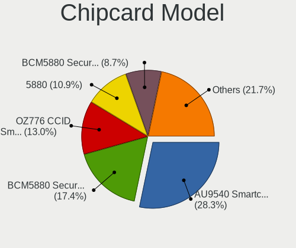

| Model                                                                        | Notebooks | Percent |
|------------------------------------------------------------------------------|-----------|---------|
| Alcor Micro AU9540 Smartcard Reader                                          | 13        | 28.26%  |
| Broadcom BCM5880 Secure Applications Processor                               | 8         | 17.39%  |
| O2 Micro OZ776 CCID Smartcard Reader                                         | 6         | 13.04%  |
| Broadcom 5880                                                                | 5         | 10.87%  |
| Broadcom BCM5880 Secure Applications Processor with fingerprint swipe sensor | 4         | 8.7%    |
| O2 Micro Oz776 SmartCard Reader                                              | 3         | 6.52%   |
| Lenovo Integrated Smart Card Reader                                          | 2         | 4.35%   |
| Upek TouchChip Fingerprint Coprocessor (WBF advanced mode)                   | 1         | 2.17%   |
| Realtek Semiconductor Smart Card Reader Interface                            | 1         | 2.17%   |
| Gemalto (was Gemplus) GemPC Key SmartCard Reader                             | 1         | 2.17%   |
| Broadcom 58200                                                               | 1         | 2.17%   |
| Alcor Micro Watchdata W 1981                                                 | 1         | 2.17%   |

Unsupported
-----------

Unsupported Devices
-------------------

Total unsupported devices on board

| Total | Notebooks | Percent |
|-------|-----------|---------|
| 0     | 766       | 70.34%  |
| 1     | 262       | 24.06%  |
| 2     | 51        | 4.68%   |
| 3     | 7         | 0.64%   |
| 4     | 3         | 0.28%   |

Unsupported Device Types
------------------------

Types of unsupported devices

| Type                     | Notebooks | Percent |
|--------------------------|-----------|---------|
| Graphics card            | 109       | 27.95%  |
| Fingerprint reader       | 106       | 27.18%  |
| Chipcard                 | 43        | 11.03%  |
| Net/wireless             | 38        | 9.74%   |
| Bluetooth                | 27        | 6.92%   |
| Camera                   | 16        | 4.1%    |
| Modem                    | 11        | 2.82%   |
| Storage                  | 10        | 2.56%   |
| Multimedia controller    | 8         | 2.05%   |
| Net/ethernet             | 5         | 1.28%   |
| Flash memory             | 5         | 1.28%   |
| Sound                    | 3         | 0.77%   |
| Dvb card                 | 3         | 0.77%   |
| Communication controller | 3         | 0.77%   |
| Network                  | 2         | 0.51%   |
| Card reader              | 1         | 0.26%   |

