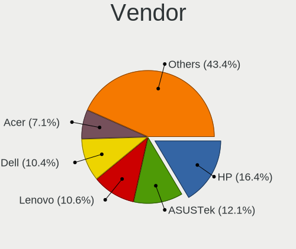
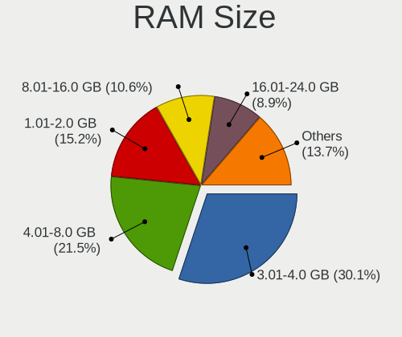
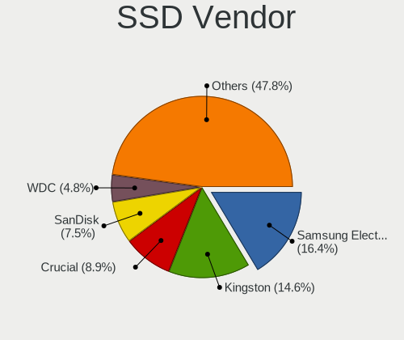
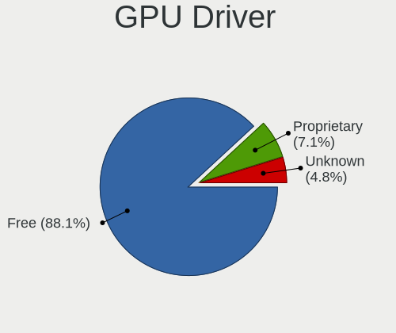
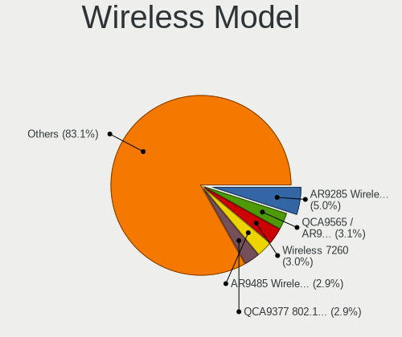
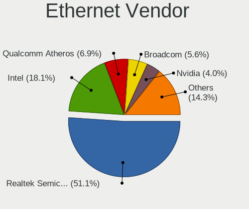
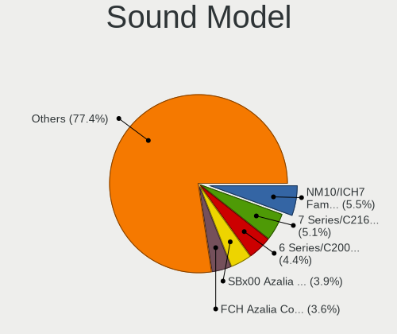

Lubuntu - Tested Hardware & Statistics
--------------------------------------

A project to collect tested hardware configurations for Lubuntu.

Anyone can contribute to this report by the [hw-probe](https://github.com/linuxhw/hw-probe) tool:

    sudo -E hw-probe -all -upload

Please contribute! Especially if your hardware is rare.

This is a report for all computer types. See also reports for [desktops](/Dist/Lubuntu/Desktop/README.md) and [notebooks](/Dist/Lubuntu/Notebook/README.md).

Contents
--------

* [ Test Cases ](#test-cases)

* [ System ](#system)
  - [ OS                       ](#os)
  - [ OS Family                ](#os-family)
  - [ Kernel                   ](#kernel)
  - [ Kernel Family            ](#kernel-family)
  - [ Kernel Major Ver.        ](#kernel-major-ver)
  - [ Arch                     ](#arch)
  - [ DE                       ](#de)
  - [ Display Server           ](#display-server)
  - [ Display Manager          ](#display-manager)
  - [ OS Lang                  ](#os-lang)
  - [ Boot Mode                ](#boot-mode)
  - [ Filesystem               ](#filesystem)
  - [ Part. scheme             ](#part-scheme)
  - [ Dual Boot with Linux/BSD ](#dual-boot-with-linuxbsd)
  - [ Dual Boot (Win)          ](#dual-boot-win)

* [ Board ](#board)
  - [ Vendor                   ](#vendor)
  - [ Model                    ](#model)
  - [ Model Family             ](#model-family)
  - [ MFG Year                 ](#mfg-year)
  - [ Form Factor              ](#form-factor)
  - [ Secure Boot              ](#secure-boot)
  - [ Coreboot                 ](#coreboot)
  - [ RAM Size                 ](#ram-size)
  - [ RAM Used                 ](#ram-used)
  - [ Total Drives             ](#total-drives)
  - [ Has CD-ROM               ](#has-cd-rom)
  - [ Has Ethernet             ](#has-ethernet)
  - [ Has WiFi                 ](#has-wifi)
  - [ Has Bluetooth            ](#has-bluetooth)

* [ Location ](#location)
  - [ Country                  ](#country)
  - [ City                     ](#city)

* [ Drives ](#drives)
  - [ Drive Vendor             ](#drive-vendor)
  - [ Drive Model              ](#drive-model)
  - [ HDD Vendor               ](#hdd-vendor)
  - [ SSD Vendor               ](#ssd-vendor)
  - [ Drive Kind               ](#drive-kind)
  - [ Drive Connector          ](#drive-connector)
  - [ Drive Size               ](#drive-size)
  - [ Space Total              ](#space-total)
  - [ Space Used               ](#space-used)
  - [ Malfunc. Drives          ](#malfunc-drives)
  - [ Malfunc. Drive Vendor    ](#malfunc-drive-vendor)
  - [ Malfunc. HDD Vendor      ](#malfunc-hdd-vendor)
  - [ Malfunc. Drive Kind      ](#malfunc-drive-kind)
  - [ Failed Drives            ](#failed-drives)
  - [ Failed Drive Vendor      ](#failed-drive-vendor)
  - [ Drive Status             ](#drive-status)

* [ Storage controller ](#storage-controller)
  - [ Storage Vendor           ](#storage-vendor)
  - [ Storage Model            ](#storage-model)
  - [ Storage Kind             ](#storage-kind)

* [ Processor ](#processor)
  - [ CPU Vendor               ](#cpu-vendor)
  - [ CPU Model                ](#cpu-model)
  - [ CPU Model Family         ](#cpu-model-family)
  - [ CPU Cores                ](#cpu-cores)
  - [ CPU Sockets              ](#cpu-sockets)
  - [ CPU Threads              ](#cpu-threads)
  - [ CPU Op-Modes             ](#cpu-op-modes)
  - [ CPU Microcode            ](#cpu-microcode)
  - [ CPU Microarch            ](#cpu-microarch)

* [ Graphics ](#graphics)
  - [ GPU Vendor               ](#gpu-vendor)
  - [ GPU Model                ](#gpu-model)
  - [ GPU Combo                ](#gpu-combo)
  - [ GPU Driver               ](#gpu-driver)
  - [ GPU Memory               ](#gpu-memory)

* [ Monitor ](#monitor)
  - [ Monitor Vendor           ](#monitor-vendor)
  - [ Monitor Model            ](#monitor-model)
  - [ Monitor Resolution       ](#monitor-resolution)
  - [ Monitor Diagonal         ](#monitor-diagonal)
  - [ Monitor Width            ](#monitor-width)
  - [ Aspect Ratio             ](#aspect-ratio)
  - [ Monitor Area             ](#monitor-area)
  - [ Pixel Density            ](#pixel-density)
  - [ Multiple Monitors        ](#multiple-monitors)

* [ Network ](#network)
  - [ Net Controller Vendor    ](#net-controller-vendor)
  - [ Net Controller Model     ](#net-controller-model)
  - [ Wireless Vendor          ](#wireless-vendor)
  - [ Wireless Model           ](#wireless-model)
  - [ Ethernet Vendor          ](#ethernet-vendor)
  - [ Ethernet Model           ](#ethernet-model)
  - [ Net Controller Kind      ](#net-controller-kind)
  - [ Used Controller          ](#used-controller)
  - [ NICs                     ](#nics)
  - [ IPv6                     ](#ipv6)

* [ Bluetooth ](#bluetooth)
  - [ Bluetooth Vendor         ](#bluetooth-vendor)
  - [ Bluetooth Model          ](#bluetooth-model)

* [ Sound ](#sound)
  - [ Sound Vendor             ](#sound-vendor)
  - [ Sound Model              ](#sound-model)

* [ Memory ](#memory)
  - [ Memory Vendor            ](#memory-vendor)
  - [ Memory Model             ](#memory-model)
  - [ Memory Kind              ](#memory-kind)
  - [ Memory Form Factor       ](#memory-form-factor)
  - [ Memory Size              ](#memory-size)
  - [ Memory Speed             ](#memory-speed)

* [ Printers & scanners ](#printers--scanners)
  - [ Printer Vendor           ](#printer-vendor)
  - [ Printer Model            ](#printer-model)
  - [ Scanner Vendor           ](#scanner-vendor)
  - [ Scanner Model            ](#scanner-model)

* [ Camera ](#camera)
  - [ Camera Vendor            ](#camera-vendor)
  - [ Camera Model             ](#camera-model)

* [ Security ](#security)
  - [ Fingerprint Vendor       ](#fingerprint-vendor)
  - [ Fingerprint Model        ](#fingerprint-model)
  - [ Chipcard Vendor          ](#chipcard-vendor)
  - [ Chipcard Model           ](#chipcard-model)

* [ Unsupported ](#unsupported)
  - [ Unsupported Devices      ](#unsupported-devices)
  - [ Unsupported Device Types ](#unsupported-device-types)

Test Cases
----------

Total: 1422

| Vendor        | Model                       | Form-Factor | Probe                                                      | Date         |
|---------------|-----------------------------|-------------|------------------------------------------------------------|--------------|
| HP            | 0B4Ch D                     | Desktop     | [1b409fc1f6](https://linux-hardware.org/?probe=1b409fc1f6) | Oct 01, 2022 |
| HP            | 0B4Ch D                     | Desktop     | [ccc7fe3103](https://linux-hardware.org/?probe=ccc7fe3103) | Oct 01, 2022 |
| ASUSTek       | P8P67                       | Desktop     | [1ad22cf7a8](https://linux-hardware.org/?probe=1ad22cf7a8) | Sep 28, 2022 |
| Dell          | 0PU052                      | Desktop     | [2890a8407e](https://linux-hardware.org/?probe=2890a8407e) | Sep 28, 2022 |
| Lenovo        | ThinkPad E550 20DF00CUFR    | Notebook    | [7b5e707097](https://linux-hardware.org/?probe=7b5e707097) | Sep 27, 2022 |
| Dell          | 0R849J A00                  | Desktop     | [cf2069932e](https://linux-hardware.org/?probe=cf2069932e) | Sep 26, 2022 |
| Packard Be... | EasyNote TS44HR             | Notebook    | [4005a32539](https://linux-hardware.org/?probe=4005a32539) | Sep 26, 2022 |
| ASUSTek       | UX360CAK                    | Convertible | [015df11bc4](https://linux-hardware.org/?probe=015df11bc4) | Sep 25, 2022 |
| ASUSTek       | Maximus V FORMULA           | Desktop     | [cf8128637b](https://linux-hardware.org/?probe=cf8128637b) | Sep 24, 2022 |
| ASUSTek       | Maximus V FORMULA           | Desktop     | [e63b24acc3](https://linux-hardware.org/?probe=e63b24acc3) | Sep 24, 2022 |
| Intel         | DH67CL AAG10212-210         | Desktop     | [3468d8c911](https://linux-hardware.org/?probe=3468d8c911) | Sep 24, 2022 |
| Dell          | 0PU052                      | Desktop     | [6ca93366df](https://linux-hardware.org/?probe=6ca93366df) | Sep 23, 2022 |
| Lenovo        | IdeaPad L340-15IRH Gamin... | Notebook    | [68d36ec742](https://linux-hardware.org/?probe=68d36ec742) | Sep 23, 2022 |
| Lenovo        | IdeaPad Slim 1-14AST-05 ... | Notebook    | [1dbeac403e](https://linux-hardware.org/?probe=1dbeac403e) | Sep 22, 2022 |
| Dell          | 09M8Y8 A01                  | Desktop     | [aa3088ed0e](https://linux-hardware.org/?probe=aa3088ed0e) | Sep 22, 2022 |
| ASUSTek       | X451CA                      | Notebook    | [bdfe92eb66](https://linux-hardware.org/?probe=bdfe92eb66) | Sep 21, 2022 |
| Lenovo        | MIIX 310-10ICR 80SG         | Tablet      | [c45724d6d3](https://linux-hardware.org/?probe=c45724d6d3) | Sep 20, 2022 |
| Lenovo        | MIIX 310-10ICR 80SG         | Tablet      | [2f9ab4273a](https://linux-hardware.org/?probe=2f9ab4273a) | Sep 20, 2022 |
| Gateway       | NE46R                       | Notebook    | [61ee26263b](https://linux-hardware.org/?probe=61ee26263b) | Sep 20, 2022 |
| MSI           | B450-A PRO MAX              | Desktop     | [89fad64303](https://linux-hardware.org/?probe=89fad64303) | Sep 20, 2022 |
| Gigabyte      | G31M-S2C                    | Desktop     | [f7f3a2e7c8](https://linux-hardware.org/?probe=f7f3a2e7c8) | Sep 17, 2022 |
| Dell          | Inspiron 11-3168            | Notebook    | [29241bb609](https://linux-hardware.org/?probe=29241bb609) | Sep 15, 2022 |
| AMI           | Cherry Trail CR             | Desktop     | [1c131a1acb](https://linux-hardware.org/?probe=1c131a1acb) | Sep 15, 2022 |
| ASUSTek       | 1201N                       | Notebook    | [0a48f359f8](https://linux-hardware.org/?probe=0a48f359f8) | Sep 15, 2022 |
| Lenovo        | Z70-80 80FG                 | Notebook    | [93cb353340](https://linux-hardware.org/?probe=93cb353340) | Sep 14, 2022 |
| Dell          | Inspiron 11-3168            | Notebook    | [763b0fced4](https://linux-hardware.org/?probe=763b0fced4) | Sep 14, 2022 |
| Unknown       | Unknown                     | Notebook    | [8b85e41d17](https://linux-hardware.org/?probe=8b85e41d17) | Sep 14, 2022 |
| Sony          | SVE14A2V1EW                 | Notebook    | [5123cfd3cd](https://linux-hardware.org/?probe=5123cfd3cd) | Sep 09, 2022 |
| Star Labs     | Lite                        | Notebook    | [c08b209f09](https://linux-hardware.org/?probe=c08b209f09) | Sep 09, 2022 |
| HP            | ProBook 4730s               | Notebook    | [5d0a59d50b](https://linux-hardware.org/?probe=5d0a59d50b) | Sep 05, 2022 |
| Dell          | XPS L322X                   | Notebook    | [bd4b0713a8](https://linux-hardware.org/?probe=bd4b0713a8) | Sep 04, 2022 |
| Acer          | AOA150                      | Notebook    | [3146707963](https://linux-hardware.org/?probe=3146707963) | Sep 02, 2022 |
| Dell          | 0J584C A00                  | Desktop     | [de442f1c61](https://linux-hardware.org/?probe=de442f1c61) | Sep 01, 2022 |
| Lenovo        | ThinkPad T430 2342A19       | Notebook    | [1fee695aec](https://linux-hardware.org/?probe=1fee695aec) | Sep 01, 2022 |
| Lenovo        | ThinkPad X1 Carbon 2nd 2... | Notebook    | [f7189849b4](https://linux-hardware.org/?probe=f7189849b4) | Sep 01, 2022 |
| HP            | ProBook 450 G6              | Notebook    | [7763040d56](https://linux-hardware.org/?probe=7763040d56) | Aug 30, 2022 |
| Gigabyte      | G31M-S2C                    | Desktop     | [61a4780992](https://linux-hardware.org/?probe=61a4780992) | Aug 30, 2022 |
| Gigabyte      | G31M-S2C                    | Desktop     | [8beed8e261](https://linux-hardware.org/?probe=8beed8e261) | Aug 30, 2022 |
| Lenovo        | B590 20208                  | Notebook    | [7eaabdb9ca](https://linux-hardware.org/?probe=7eaabdb9ca) | Aug 27, 2022 |
| Unknown       | Unknown                     | Notebook    | [3c18cd9208](https://linux-hardware.org/?probe=3c18cd9208) | Aug 25, 2022 |
| Standard      | AHV                         | Notebook    | [1a4d477350](https://linux-hardware.org/?probe=1a4d477350) | Aug 24, 2022 |
| Acer          | Aspire 7250G                | Notebook    | [7035af5c32](https://linux-hardware.org/?probe=7035af5c32) | Aug 23, 2022 |
| ASRock        | A520M-HVS                   | Desktop     | [842ad7d4d2](https://linux-hardware.org/?probe=842ad7d4d2) | Aug 22, 2022 |
| MSI           | Z590-A PRO                  | Desktop     | [c74bbc2f61](https://linux-hardware.org/?probe=c74bbc2f61) | Aug 21, 2022 |
| Dell          | Vostro 3360                 | Notebook    | [0964195fe5](https://linux-hardware.org/?probe=0964195fe5) | Aug 21, 2022 |
| ASUSTek       | H110M-CS                    | Desktop     | [df6dff3fa3](https://linux-hardware.org/?probe=df6dff3fa3) | Aug 19, 2022 |
| Prestigio     | PSB141C01BFH                | Notebook    | [37e5052027](https://linux-hardware.org/?probe=37e5052027) | Aug 18, 2022 |
| MSI           | Z170A GAMING M3             | Desktop     | [e0834224d7](https://linux-hardware.org/?probe=e0834224d7) | Aug 16, 2022 |
| ASUSTek       | H110M-CS                    | Desktop     | [80982f87bb](https://linux-hardware.org/?probe=80982f87bb) | Aug 12, 2022 |
| Lenovo        | IdeaPad 330-15IKB Touch ... | Notebook    | [0d774697cc](https://linux-hardware.org/?probe=0d774697cc) | Aug 11, 2022 |
| ASUSTek       | M5A97 R2.0                  | Desktop     | [c2acc2d803](https://linux-hardware.org/?probe=c2acc2d803) | Aug 10, 2022 |
| Intel         | W7650                       | Notebook    | [1c8a9fd64b](https://linux-hardware.org/?probe=1c8a9fd64b) | Aug 10, 2022 |
| ASRock        | G41M-VS3                    | Desktop     | [16a2e0ab5d](https://linux-hardware.org/?probe=16a2e0ab5d) | Aug 09, 2022 |
| OEM           | Unknown                     | Notebook    | [d95f8f1502](https://linux-hardware.org/?probe=d95f8f1502) | Aug 09, 2022 |
| Dell          | Inspiron 11-3168            | Notebook    | [11beb61f79](https://linux-hardware.org/?probe=11beb61f79) | Aug 09, 2022 |
| ASUSTek       | H110M-CS                    | Desktop     | [98c601bb55](https://linux-hardware.org/?probe=98c601bb55) | Aug 08, 2022 |
| ASUSTek       | H110M-CS                    | Desktop     | [01e4feaac6](https://linux-hardware.org/?probe=01e4feaac6) | Aug 07, 2022 |
| Dell          | Inspiron 11-3168            | Notebook    | [7a3c91b14a](https://linux-hardware.org/?probe=7a3c91b14a) | Aug 07, 2022 |
| HP            | 8768 A                      | Desktop     | [2ee49e3506](https://linux-hardware.org/?probe=2ee49e3506) | Aug 07, 2022 |
| HP            | 15 Notebook PC              | Notebook    | [c857595b97](https://linux-hardware.org/?probe=c857595b97) | Aug 05, 2022 |
| Lenovo        | BRASWELL SDK0J40697 WIN ... | Desktop     | [f601e2f557](https://linux-hardware.org/?probe=f601e2f557) | Aug 05, 2022 |
| ASRock        | G41M-VS3                    | Desktop     | [16c2b30680](https://linux-hardware.org/?probe=16c2b30680) | Aug 04, 2022 |
| Acer          | EG31M R01-A3                | Desktop     | [c5b4092eb4](https://linux-hardware.org/?probe=c5b4092eb4) | Aug 04, 2022 |
| Lenovo        | MIIX 2 11 20327             | Tablet      | [49ba856687](https://linux-hardware.org/?probe=49ba856687) | Aug 03, 2022 |
| Dell          | Precision 3510              | Notebook    | [2d74356174](https://linux-hardware.org/?probe=2d74356174) | Aug 03, 2022 |
| Apple         | MacBook7,1                  | Notebook    | [84efbc858e](https://linux-hardware.org/?probe=84efbc858e) | Aug 02, 2022 |
| Dell          | Precision 3510              | Notebook    | [d2e79b01bb](https://linux-hardware.org/?probe=d2e79b01bb) | Aug 02, 2022 |
| IFSA          | Positivo BGH                | Notebook    | [ec0aa9bc36](https://linux-hardware.org/?probe=ec0aa9bc36) | Aug 02, 2022 |
| HP            | 240 G8 Notebook PC          | Notebook    | [f4533284b4](https://linux-hardware.org/?probe=f4533284b4) | Aug 01, 2022 |
| MSI           | X399 SLI PLUS               | Desktop     | [515c5375c1](https://linux-hardware.org/?probe=515c5375c1) | Jul 31, 2022 |
| Google        | Celes                       | Notebook    | [6a4bc65f84](https://linux-hardware.org/?probe=6a4bc65f84) | Jul 31, 2022 |
| Google        | Celes                       | Notebook    | [fae813e4dc](https://linux-hardware.org/?probe=fae813e4dc) | Jul 31, 2022 |
| Dell          | XPS M1330                   | Notebook    | [2abad8da86](https://linux-hardware.org/?probe=2abad8da86) | Jul 30, 2022 |
| Toshiba       | NB250                       | Notebook    | [e320782bcf](https://linux-hardware.org/?probe=e320782bcf) | Jul 30, 2022 |
| HP            | Presario CQ56               | Notebook    | [aead18fee1](https://linux-hardware.org/?probe=aead18fee1) | Jul 28, 2022 |
| Fujitsu       | LIFEBOOK AH531              | Notebook    | [894bf232f8](https://linux-hardware.org/?probe=894bf232f8) | Jul 28, 2022 |
| Fujitsu       | LIFEBOOK AH531              | Notebook    | [eb752c319e](https://linux-hardware.org/?probe=eb752c319e) | Jul 28, 2022 |
| Dell          | 0WR7PY A03                  | Desktop     | [0cabe39a74](https://linux-hardware.org/?probe=0cabe39a74) | Jul 27, 2022 |
| MSI           | AMETHYST-M                  | Desktop     | [d5fb610246](https://linux-hardware.org/?probe=d5fb610246) | Jul 26, 2022 |
| Dell          | 0X8582                      | Desktop     | [b52bb428f4](https://linux-hardware.org/?probe=b52bb428f4) | Jul 26, 2022 |
| Lenovo        | IdeaPad 330-15IKB 81DC      | Notebook    | [3451f0e8b5](https://linux-hardware.org/?probe=3451f0e8b5) | Jul 26, 2022 |
| ASRock        | M3A785GMH/128M              | Desktop     | [87836918b2](https://linux-hardware.org/?probe=87836918b2) | Jul 25, 2022 |
| AMI           | Cherry Trail CR             | Desktop     | [6463c26211](https://linux-hardware.org/?probe=6463c26211) | Jul 25, 2022 |
| ASUSTek       | 900                         | Notebook    | [ae42d40b7a](https://linux-hardware.org/?probe=ae42d40b7a) | Jul 25, 2022 |
| HP            | Laptop 17-cn0xxx            | Notebook    | [55d8e5a779](https://linux-hardware.org/?probe=55d8e5a779) | Jul 24, 2022 |
| Sony          | VPCEB15FM                   | Notebook    | [340ef685ef](https://linux-hardware.org/?probe=340ef685ef) | Jul 24, 2022 |
| ASUSTek       | M5A78L LE                   | Desktop     | [4ade852983](https://linux-hardware.org/?probe=4ade852983) | Jul 23, 2022 |
| Dell          | Inspiron N5010              | Notebook    | [826672a49e](https://linux-hardware.org/?probe=826672a49e) | Jul 22, 2022 |
| Dell          | 0X8582                      | Desktop     | [ab2bf3496e](https://linux-hardware.org/?probe=ab2bf3496e) | Jul 20, 2022 |
| MSI           | H510I PRO WIFI              | Desktop     | [cb9ba02bb3](https://linux-hardware.org/?probe=cb9ba02bb3) | Jul 20, 2022 |
| ASRock        | A75M-HVS                    | Desktop     | [c88ac89032](https://linux-hardware.org/?probe=c88ac89032) | Jul 20, 2022 |
| Dell          | 0X8582                      | Desktop     | [5b8458f200](https://linux-hardware.org/?probe=5b8458f200) | Jul 19, 2022 |
| HP            | 245 G2                      | Notebook    | [03a8791b0c](https://linux-hardware.org/?probe=03a8791b0c) | Jul 18, 2022 |
| Samsung       | N130                        | Notebook    | [4874e0173d](https://linux-hardware.org/?probe=4874e0173d) | Jul 17, 2022 |
| HP            | 245 G2                      | Notebook    | [f37ddc5aed](https://linux-hardware.org/?probe=f37ddc5aed) | Jul 17, 2022 |
| MSI           | X570-A PRO                  | Desktop     | [84b1994696](https://linux-hardware.org/?probe=84b1994696) | Jul 16, 2022 |
| Lenovo        | G50-30 80G0                 | Notebook    | [27a46d46dd](https://linux-hardware.org/?probe=27a46d46dd) | Jul 16, 2022 |
| Gigabyte      | GA-MA785GT-UD3H             | Desktop     | [21b83125d8](https://linux-hardware.org/?probe=21b83125d8) | Jul 14, 2022 |
| Standard      | AHV                         | Notebook    | [2499cab6bd](https://linux-hardware.org/?probe=2499cab6bd) | Jul 12, 2022 |
| Nokia         | Booklet 3G                  | Notebook    | [08b1b304ae](https://linux-hardware.org/?probe=08b1b304ae) | Jul 11, 2022 |
| Foxconn       | 2ACA                        | Desktop     | [92681ef1e5](https://linux-hardware.org/?probe=92681ef1e5) | Jul 07, 2022 |
| Chuwi         | GemiBook Pro                | Notebook    | [ff08461db4](https://linux-hardware.org/?probe=ff08461db4) | Jul 07, 2022 |
| HP            | 1495                        | Desktop     | [32ea18bc68](https://linux-hardware.org/?probe=32ea18bc68) | Jul 06, 2022 |
| Toshiba       | Satellite A300              | Notebook    | [dd80f74e85](https://linux-hardware.org/?probe=dd80f74e85) | Jul 05, 2022 |
| Toshiba       | Satellite A300              | Notebook    | [69e4341e99](https://linux-hardware.org/?probe=69e4341e99) | Jul 05, 2022 |
| MSI           | A88XM-E35                   | Desktop     | [8767210da3](https://linux-hardware.org/?probe=8767210da3) | Jul 04, 2022 |
| HP            | 1495                        | Desktop     | [6300d25ff0](https://linux-hardware.org/?probe=6300d25ff0) | Jul 04, 2022 |
| Intel         | DQ57TM AAE70931-403         | Desktop     | [92c11e77c4](https://linux-hardware.org/?probe=92c11e77c4) | Jul 03, 2022 |
| Lenovo        | IdeaPad S145-15IGM 81MX     | Notebook    | [de35c60b5f](https://linux-hardware.org/?probe=de35c60b5f) | Jul 01, 2022 |
| MSI           | VR630                       | Notebook    | [097cd732b3](https://linux-hardware.org/?probe=097cd732b3) | Jun 27, 2022 |
| Apple         | MacBookPro10,1              | Notebook    | [a27f696a28](https://linux-hardware.org/?probe=a27f696a28) | Jun 27, 2022 |
| Google        | Bobba360                    | Notebook    | [6fcae5202a](https://linux-hardware.org/?probe=6fcae5202a) | Jun 26, 2022 |
| MSI           | 760GM-P23                   | Desktop     | [ff0f44e63c](https://linux-hardware.org/?probe=ff0f44e63c) | Jun 26, 2022 |
| Dell          | 0VRWRC A00                  | Desktop     | [fe159bf237](https://linux-hardware.org/?probe=fe159bf237) | Jun 26, 2022 |
| Intel         | DQ57TM AAE70931-403         | Desktop     | [357e062693](https://linux-hardware.org/?probe=357e062693) | Jun 25, 2022 |
| Lenovo        | Yoga 710-11IKB 80V6         | Notebook    | [f6f825d83a](https://linux-hardware.org/?probe=f6f825d83a) | Jun 22, 2022 |
| ASUSTek       | M4N78-AM                    | Desktop     | [f98db3efe8](https://linux-hardware.org/?probe=f98db3efe8) | Jun 22, 2022 |
| HP            | Notebook                    | Notebook    | [76d300309e](https://linux-hardware.org/?probe=76d300309e) | Jun 21, 2022 |
| Gateway       | Sonic-C                     | Notebook    | [6bec9c80ea](https://linux-hardware.org/?probe=6bec9c80ea) | Jun 21, 2022 |
| Gigabyte      | GA-MA69G-S3H                | Desktop     | [2dba47edb2](https://linux-hardware.org/?probe=2dba47edb2) | Jun 18, 2022 |
| Lenovo        | SHARKBAY SDK0E50510 PRO     | Desktop     | [474c946289](https://linux-hardware.org/?probe=474c946289) | Jun 17, 2022 |
| Dell          | Latitude XT                 | Notebook    | [c07eac8a84](https://linux-hardware.org/?probe=c07eac8a84) | Jun 17, 2022 |
| Dell          | Studio 1537                 | Notebook    | [12a651ebd2](https://linux-hardware.org/?probe=12a651ebd2) | Jun 16, 2022 |
| ASUSTek       | M4N78-AM                    | Desktop     | [8522c93ea3](https://linux-hardware.org/?probe=8522c93ea3) | Jun 16, 2022 |
| ASUSTek       | M4N78-AM                    | Desktop     | [d7dddc4270](https://linux-hardware.org/?probe=d7dddc4270) | Jun 16, 2022 |
| Gigabyte      | H370 AORUS GAMING 3 WIFI... | Desktop     | [14ed78a258](https://linux-hardware.org/?probe=14ed78a258) | Jun 11, 2022 |
| ASUSTek       | E403SA                      | Notebook    | [9ca6a865ff](https://linux-hardware.org/?probe=9ca6a865ff) | Jun 11, 2022 |
| HP            | Notebook                    | Notebook    | [5c18b71eb1](https://linux-hardware.org/?probe=5c18b71eb1) | Jun 10, 2022 |
| HP            | Pavilion Sleekbook 15 PC    | Notebook    | [1a41b08f4f](https://linux-hardware.org/?probe=1a41b08f4f) | Jun 10, 2022 |
| ASUSTek       | N56VZ                       | Notebook    | [3c1a5025f1](https://linux-hardware.org/?probe=3c1a5025f1) | Jun 09, 2022 |
| Sony          | VGN-SZ71WN_C                | Notebook    | [aece18b520](https://linux-hardware.org/?probe=aece18b520) | Jun 06, 2022 |
| MSI           | MS-AA1511                   | All in one  | [80c9ccb7c7](https://linux-hardware.org/?probe=80c9ccb7c7) | Jun 06, 2022 |
| ASUSTek       | PRIME X370-A                | Desktop     | [bd1889b281](https://linux-hardware.org/?probe=bd1889b281) | Jun 06, 2022 |
| Intel         | W7650                       | Notebook    | [fd4abd788b](https://linux-hardware.org/?probe=fd4abd788b) | Jun 06, 2022 |
| ASUSTek       | 1000H                       | Notebook    | [b2ae36f165](https://linux-hardware.org/?probe=b2ae36f165) | Jun 05, 2022 |
| Apple         | MacBookPro8,1               | Notebook    | [d191629954](https://linux-hardware.org/?probe=d191629954) | Jun 04, 2022 |
| Apple         | MacBookPro8,1               | Notebook    | [816c29b1df](https://linux-hardware.org/?probe=816c29b1df) | Jun 04, 2022 |
| HP            | G62                         | Notebook    | [2411be6ba6](https://linux-hardware.org/?probe=2411be6ba6) | Jun 04, 2022 |
| HP            | 3397                        | Desktop     | [2f3fb08195](https://linux-hardware.org/?probe=2f3fb08195) | Jun 03, 2022 |
| HP            | Pavilion g6                 | Notebook    | [7c389588bb](https://linux-hardware.org/?probe=7c389588bb) | Jun 02, 2022 |
| AMI           | Aptio CRB A                 | Mini pc     | [8fe291470d](https://linux-hardware.org/?probe=8fe291470d) | Jun 02, 2022 |
| HP            | ProBook 640 G1              | Notebook    | [a1c25fad70](https://linux-hardware.org/?probe=a1c25fad70) | Jun 01, 2022 |
| Packard Be... | EasyNote TE11HC             | Notebook    | [8350bd6d87](https://linux-hardware.org/?probe=8350bd6d87) | May 30, 2022 |
| Unknown       | Unknown                     | Desktop     | [b64c215325](https://linux-hardware.org/?probe=b64c215325) | May 30, 2022 |
| AMI           | Aptio CRB                   | Mini pc     | [63ccee44b1](https://linux-hardware.org/?probe=63ccee44b1) | May 28, 2022 |
| HP            | Berknip                     | Notebook    | [c81d3442c2](https://linux-hardware.org/?probe=c81d3442c2) | May 27, 2022 |
| ASRock        | FM2A85X Extreme6            | Desktop     | [365ff27343](https://linux-hardware.org/?probe=365ff27343) | May 27, 2022 |
| AMI           | Aptio CRB A                 | Mini pc     | [c77f0f6328](https://linux-hardware.org/?probe=c77f0f6328) | May 27, 2022 |
| ASUSTek       | X205TA                      | Notebook    | [9fa4c6beef](https://linux-hardware.org/?probe=9fa4c6beef) | May 26, 2022 |
| HP            | Pavilion g6                 | Notebook    | [3972cb6508](https://linux-hardware.org/?probe=3972cb6508) | May 25, 2022 |
| HP            | OMEN by Laptop              | Notebook    | [6e1f063199](https://linux-hardware.org/?probe=6e1f063199) | May 24, 2022 |
| ASRock        | FM2A85X Extreme6            | Desktop     | [00d4dc8661](https://linux-hardware.org/?probe=00d4dc8661) | May 24, 2022 |
| Toshiba       | Satellite L40               | Notebook    | [37af5b0ba4](https://linux-hardware.org/?probe=37af5b0ba4) | May 24, 2022 |
| Mediacom      | WinPad 11,6 FullHD- WPU1... | Notebook    | [0d13155508](https://linux-hardware.org/?probe=0d13155508) | May 23, 2022 |
| Dell          | System Inspiron 17 7000 ... | Notebook    | [5f646f4e8c](https://linux-hardware.org/?probe=5f646f4e8c) | May 23, 2022 |
| Unknown       | Unknown                     | Desktop     | [aa6db2ed41](https://linux-hardware.org/?probe=aa6db2ed41) | May 23, 2022 |
| Unknown       | HX90                        | Desktop     | [22dac34b7b](https://linux-hardware.org/?probe=22dac34b7b) | May 21, 2022 |
| ASUSTek       | X402CA                      | Notebook    | [eb6132725e](https://linux-hardware.org/?probe=eb6132725e) | May 21, 2022 |
| Mediacom      | WinPad 11,6 FullHD- WPU1... | Notebook    | [f52f5b7be2](https://linux-hardware.org/?probe=f52f5b7be2) | May 21, 2022 |
| Fujitsu       | D3164-C2 S26361-D3164-C2    | Desktop     | [942f142f46](https://linux-hardware.org/?probe=942f142f46) | May 20, 2022 |
| Lenovo        | IdeaPad Slim 1-14AST-05 ... | Notebook    | [6528155c00](https://linux-hardware.org/?probe=6528155c00) | May 19, 2022 |
| Lenovo        | IdeaPad Slim 1-14AST-05 ... | Notebook    | [53219da3f5](https://linux-hardware.org/?probe=53219da3f5) | May 19, 2022 |
| Intel         | X79 (INTEL Xeon E5/Corei... | Desktop     | [9254de4361](https://linux-hardware.org/?probe=9254de4361) | May 18, 2022 |
| Lenovo        | NOK                         | Desktop     | [e7a84a12e6](https://linux-hardware.org/?probe=e7a84a12e6) | May 16, 2022 |
| Microsoft     | Surface Pro                 | Tablet      | [7807aa5ed4](https://linux-hardware.org/?probe=7807aa5ed4) | May 16, 2022 |
| Google        | Terra                       | Notebook    | [35088c1c05](https://linux-hardware.org/?probe=35088c1c05) | May 16, 2022 |
| Unknown       | Unknown                     | Desktop     | [1aba67a1ac](https://linux-hardware.org/?probe=1aba67a1ac) | May 15, 2022 |
| Dell          | 0CRH6C A00                  | Desktop     | [fe2648c1f7](https://linux-hardware.org/?probe=fe2648c1f7) | May 14, 2022 |
| Lenovo        | IdeaPad Slim 1-14AST-05 ... | Notebook    | [68ee4b094a](https://linux-hardware.org/?probe=68ee4b094a) | May 13, 2022 |
| Pegatron      | VIOLET6                     | Desktop     | [dbbdea4231](https://linux-hardware.org/?probe=dbbdea4231) | May 12, 2022 |
| Acer          | Swift SF114-34              | Notebook    | [5774e3f483](https://linux-hardware.org/?probe=5774e3f483) | May 12, 2022 |
| Acer          | Aspire A317-33              | Notebook    | [f3bd3e55aa](https://linux-hardware.org/?probe=f3bd3e55aa) | May 12, 2022 |
| Acer          | Aspire A317-33              | Notebook    | [3a09364bb2](https://linux-hardware.org/?probe=3a09364bb2) | May 12, 2022 |
| Toshiba       | Satellite P20               | Notebook    | [923779da79](https://linux-hardware.org/?probe=923779da79) | May 11, 2022 |
| Acer          | Aspire V5-573G              | Notebook    | [4477112f3a](https://linux-hardware.org/?probe=4477112f3a) | May 11, 2022 |
| Positivo      | AT300b                      | Notebook    | [7f5c5ceed4](https://linux-hardware.org/?probe=7f5c5ceed4) | May 11, 2022 |
| ASUSTek       | Rampage III GENE            | Desktop     | [798c1f07f6](https://linux-hardware.org/?probe=798c1f07f6) | May 10, 2022 |
| ASUSTek       | VivoBook 14_ASUS Laptop ... | Notebook    | [f151955e44](https://linux-hardware.org/?probe=f151955e44) | May 10, 2022 |
| Google        | Relm                        | Notebook    | [37a9101768](https://linux-hardware.org/?probe=37a9101768) | May 09, 2022 |
| ASUSTek       | 900                         | Notebook    | [6cbd0391b3](https://linux-hardware.org/?probe=6cbd0391b3) | May 07, 2022 |
| Intel         | W7650                       | Notebook    | [bd5d159229](https://linux-hardware.org/?probe=bd5d159229) | May 07, 2022 |
| ASUSTek       | K55VD                       | Notebook    | [8ff47b2a2c](https://linux-hardware.org/?probe=8ff47b2a2c) | May 05, 2022 |
| Toshiba       | Satellite C670D-12N         | Notebook    | [f6bd692d1f](https://linux-hardware.org/?probe=f6bd692d1f) | May 05, 2022 |
| Apple         | MacBookPro14,1              | Notebook    | [fd19fe90e5](https://linux-hardware.org/?probe=fd19fe90e5) | May 05, 2022 |
| Lenovo        | IdeaPad Slim 1-14AST-05 ... | Notebook    | [4682643304](https://linux-hardware.org/?probe=4682643304) | May 05, 2022 |
| Apple         | MacBookPro14,1              | Notebook    | [dc913baa2b](https://linux-hardware.org/?probe=dc913baa2b) | May 04, 2022 |
| Lenovo        | Legion Y540-15IRH 81SX      | Notebook    | [5a36e4d0fc](https://linux-hardware.org/?probe=5a36e4d0fc) | May 04, 2022 |
| Gigabyte      | G31M-ES2L                   | Desktop     | [bf9f724f45](https://linux-hardware.org/?probe=bf9f724f45) | May 04, 2022 |
| Gigabyte      | G31M-ES2L                   | Desktop     | [05585fedf4](https://linux-hardware.org/?probe=05585fedf4) | May 04, 2022 |
| Samsung       | RV415/RV515                 | Notebook    | [bc88bd7582](https://linux-hardware.org/?probe=bc88bd7582) | May 04, 2022 |
| HP            | Pavilion g4                 | Notebook    | [afad13fa01](https://linux-hardware.org/?probe=afad13fa01) | May 04, 2022 |
| Acer          | Aspire XC100A               | Desktop     | [dbad5c417d](https://linux-hardware.org/?probe=dbad5c417d) | May 04, 2022 |
| ASUSTek       | 900                         | Notebook    | [70b70a4392](https://linux-hardware.org/?probe=70b70a4392) | May 03, 2022 |
| Intel         | DQ57TM AAE70931-403         | Desktop     | [dd1df3c77d](https://linux-hardware.org/?probe=dd1df3c77d) | May 02, 2022 |
| Fujitsu       | LIFEBOOK S751               | Notebook    | [6150343dc0](https://linux-hardware.org/?probe=6150343dc0) | May 01, 2022 |
| Dell          | 02YYK5 A01                  | Desktop     | [19dd091f8b](https://linux-hardware.org/?probe=19dd091f8b) | May 01, 2022 |
| Lenovo        | IdeaPad 310-15IKB 80TV      | Notebook    | [39475a20ff](https://linux-hardware.org/?probe=39475a20ff) | May 01, 2022 |
| Lenovo        | IdeaPad 310-15IKB 80TV      | Notebook    | [1ec609b350](https://linux-hardware.org/?probe=1ec609b350) | May 01, 2022 |
| YASHI         | MYBOOK 360                  | Notebook    | [c206790d1e](https://linux-hardware.org/?probe=c206790d1e) | May 01, 2022 |
| HP            | EliteBook 8570p             | Notebook    | [2dffdad8a4](https://linux-hardware.org/?probe=2dffdad8a4) | May 01, 2022 |
| Google        | Bobba360                    | Notebook    | [e90fbcc91d](https://linux-hardware.org/?probe=e90fbcc91d) | Apr 29, 2022 |
| HP            | Laptop 15-da0xxx            | Notebook    | [6ad1b34a48](https://linux-hardware.org/?probe=6ad1b34a48) | Apr 29, 2022 |
| YASHI         | MYBOOK 360                  | Notebook    | [d44c4fd567](https://linux-hardware.org/?probe=d44c4fd567) | Apr 29, 2022 |
| HP            | Pavilion g4                 | Notebook    | [a10918283d](https://linux-hardware.org/?probe=a10918283d) | Apr 28, 2022 |
| Dell          | 08NPPY A00                  | Desktop     | [6c4d2173a5](https://linux-hardware.org/?probe=6c4d2173a5) | Apr 27, 2022 |
| ASUSTek       | T102HA                      | Tablet      | [1406a26a6e](https://linux-hardware.org/?probe=1406a26a6e) | Apr 27, 2022 |
| ASUSTek       | T102HA                      | Tablet      | [6dd79c7d6a](https://linux-hardware.org/?probe=6dd79c7d6a) | Apr 27, 2022 |
| MSI           | MPG X570 GAMING EDGE WIF... | Desktop     | [a547974d27](https://linux-hardware.org/?probe=a547974d27) | Apr 27, 2022 |
| MSI           | MPG X570 GAMING EDGE WIF... | Desktop     | [7be2e51c84](https://linux-hardware.org/?probe=7be2e51c84) | Apr 27, 2022 |
| HP            | ProBook 440 G8 Notebook ... | Notebook    | [753e3fda7d](https://linux-hardware.org/?probe=753e3fda7d) | Apr 26, 2022 |
| Intel         | NUC7JYB J67967-404          | Mini pc     | [727b677ecb](https://linux-hardware.org/?probe=727b677ecb) | Apr 26, 2022 |
| Dell          | Latitude 7480               | Notebook    | [817415642f](https://linux-hardware.org/?probe=817415642f) | Apr 26, 2022 |
| Gigabyte      | M912                        | Notebook    | [fd0834889a](https://linux-hardware.org/?probe=fd0834889a) | Apr 25, 2022 |
| ASUSTek       | 1215N                       | Notebook    | [b921f6fbae](https://linux-hardware.org/?probe=b921f6fbae) | Apr 24, 2022 |
| Dell          | 018D1Y A00                  | Desktop     | [705fbe0501](https://linux-hardware.org/?probe=705fbe0501) | Apr 23, 2022 |
| Mediacom      | GTZS                        | Notebook    | [41939828a4](https://linux-hardware.org/?probe=41939828a4) | Apr 23, 2022 |
| HP            | ProBook 440 G8 Notebook ... | Notebook    | [c8f16c0d16](https://linux-hardware.org/?probe=c8f16c0d16) | Apr 22, 2022 |
| Microsoft     | Surface Pro                 | Tablet      | [12d817136f](https://linux-hardware.org/?probe=12d817136f) | Apr 22, 2022 |
| Google        | Droid                       | Notebook    | [b7b4dc6117](https://linux-hardware.org/?probe=b7b4dc6117) | Apr 22, 2022 |
| HP            | ProBook 440 G8 Notebook ... | Notebook    | [ff77bbf8ae](https://linux-hardware.org/?probe=ff77bbf8ae) | Apr 22, 2022 |
| Mediacom      | GTZS                        | Notebook    | [edc22ef82a](https://linux-hardware.org/?probe=edc22ef82a) | Apr 21, 2022 |
| HP            | Laptop 14s-dk0xxx           | Notebook    | [ec7bef597a](https://linux-hardware.org/?probe=ec7bef597a) | Apr 20, 2022 |
| HP            | Laptop 14s-dk0xxx           | Notebook    | [1edc356b52](https://linux-hardware.org/?probe=1edc356b52) | Apr 20, 2022 |
| HP            | Pavilion dv4                | Notebook    | [7bd955f313](https://linux-hardware.org/?probe=7bd955f313) | Apr 18, 2022 |
| Apple         | MacBookPro8,1               | Notebook    | [f74cae630d](https://linux-hardware.org/?probe=f74cae630d) | Apr 16, 2022 |
| ZOTAC         | NM10                        | Desktop     | [b2983fdd9d](https://linux-hardware.org/?probe=b2983fdd9d) | Apr 15, 2022 |
| Intel         | W7650                       | Notebook    | [9144ca0d30](https://linux-hardware.org/?probe=9144ca0d30) | Apr 15, 2022 |
| HP            | Compaq Presario C700        | Notebook    | [4f723964d5](https://linux-hardware.org/?probe=4f723964d5) | Apr 15, 2022 |
| Gigabyte      | H97-D3H-CF                  | Desktop     | [e9ad69846b](https://linux-hardware.org/?probe=e9ad69846b) | Apr 14, 2022 |
| Dell          | Inspiron 3180               | Notebook    | [9d280b4678](https://linux-hardware.org/?probe=9d280b4678) | Apr 14, 2022 |
| ASUSTek       | PRIME A320M-F               | Desktop     | [1e81b06f04](https://linux-hardware.org/?probe=1e81b06f04) | Apr 14, 2022 |
| Dell          | Latitude E6410              | Notebook    | [e5e350a4a8](https://linux-hardware.org/?probe=e5e350a4a8) | Apr 13, 2022 |
| Google        | Kip                         | Notebook    | [4641a94428](https://linux-hardware.org/?probe=4641a94428) | Apr 13, 2022 |
| Dell          | Latitude E7240              | Notebook    | [1a08843719](https://linux-hardware.org/?probe=1a08843719) | Apr 13, 2022 |
| Nvidia        | Tegra                       | Soc         | [1a369ad73a](https://linux-hardware.org/?probe=1a369ad73a) | Apr 12, 2022 |
| ASRock        | G31M-S                      | Desktop     | [e02bbd85b4](https://linux-hardware.org/?probe=e02bbd85b4) | Apr 10, 2022 |
| ASUSTek       | 1000H                       | Notebook    | [725f548eab](https://linux-hardware.org/?probe=725f548eab) | Apr 09, 2022 |
| Samsung       | 950QDB                      | Convertible | [41d1bb5ecf](https://linux-hardware.org/?probe=41d1bb5ecf) | Apr 08, 2022 |
| Lenovo        | SHARKBAY 0B98401 PRO        | Desktop     | [a09ecdae05](https://linux-hardware.org/?probe=a09ecdae05) | Apr 07, 2022 |
| Dell          | Inspiron N4010              | Notebook    | [0aac536dbf](https://linux-hardware.org/?probe=0aac536dbf) | Apr 04, 2022 |
| Unknown       | Unknown                     | Desktop     | [4de543bc53](https://linux-hardware.org/?probe=4de543bc53) | Apr 03, 2022 |
| Gigabyte      | Q77M-D2H                    | Desktop     | [ecbd26a0e1](https://linux-hardware.org/?probe=ecbd26a0e1) | Apr 02, 2022 |
| MSI           | 990FXA-GD65                 | Desktop     | [52598b41a6](https://linux-hardware.org/?probe=52598b41a6) | Mar 31, 2022 |
| Samsung       | N100SP                      | Notebook    | [6a70399256](https://linux-hardware.org/?probe=6a70399256) | Mar 31, 2022 |
| Acer          | AOA150                      | Notebook    | [a59a005250](https://linux-hardware.org/?probe=a59a005250) | Mar 30, 2022 |
| Unknown       | Unknown                     | Desktop     | [926a8980fc](https://linux-hardware.org/?probe=926a8980fc) | Mar 30, 2022 |
| Intel         | W7650                       | Notebook    | [67d43b2ee4](https://linux-hardware.org/?probe=67d43b2ee4) | Mar 28, 2022 |
| Lenovo        | ThinkCentre M55p 8811VQV    | Desktop     | [dc2a995551](https://linux-hardware.org/?probe=dc2a995551) | Mar 27, 2022 |
| Dell          | Latitude 3310 2-in-1        | Convertible | [abdf251dcf](https://linux-hardware.org/?probe=abdf251dcf) | Mar 25, 2022 |
| Haier         | U1520EM                     | Notebook    | [5fde1c39e9](https://linux-hardware.org/?probe=5fde1c39e9) | Mar 25, 2022 |
| Fujitsu Si... | AMILO Li3710                | Notebook    | [ab84e23108](https://linux-hardware.org/?probe=ab84e23108) | Mar 24, 2022 |
| AMI           | Cherry Trail CR             | Notebook    | [af80d44a27](https://linux-hardware.org/?probe=af80d44a27) | Mar 23, 2022 |
| HP            | Pavilion g7                 | Notebook    | [2c480cdfac](https://linux-hardware.org/?probe=2c480cdfac) | Mar 22, 2022 |
| IBM           | Unknown                     | Notebook    | [2bcbb8a946](https://linux-hardware.org/?probe=2bcbb8a946) | Mar 21, 2022 |
| HP            | EliteBook 745 G6            | Notebook    | [a3f94c2957](https://linux-hardware.org/?probe=a3f94c2957) | Mar 20, 2022 |
| Apple         | MacBookPro6,2               | Notebook    | [d4c7ecbc5e](https://linux-hardware.org/?probe=d4c7ecbc5e) | Mar 20, 2022 |
| Acer          | AO751h                      | Notebook    | [edea28357c](https://linux-hardware.org/?probe=edea28357c) | Mar 18, 2022 |
| Google        | Celes                       | Notebook    | [cfcec68610](https://linux-hardware.org/?probe=cfcec68610) | Mar 15, 2022 |
| ASUSTek       | M4N68T-M LE                 | Desktop     | [8d26cd120c](https://linux-hardware.org/?probe=8d26cd120c) | Mar 15, 2022 |
| ASUSTek       | M4N68T-M LE                 | Desktop     | [2ba5a37abd](https://linux-hardware.org/?probe=2ba5a37abd) | Mar 15, 2022 |
| HP            | Laptop 15-bs0xx             | Notebook    | [37a24fa0b8](https://linux-hardware.org/?probe=37a24fa0b8) | Mar 13, 2022 |
| HP            | Laptop 15-da0xxx            | Notebook    | [a8531f3837](https://linux-hardware.org/?probe=a8531f3837) | Mar 13, 2022 |
| Dell          | Latitude D630               | Notebook    | [707be96775](https://linux-hardware.org/?probe=707be96775) | Mar 13, 2022 |
| ASUSTek       | X550LA                      | Notebook    | [eb7071ed13](https://linux-hardware.org/?probe=eb7071ed13) | Mar 12, 2022 |
| Nvidia        | Tegra                       | Soc         | [3f369fa012](https://linux-hardware.org/?probe=3f369fa012) | Mar 11, 2022 |
| ASRock        | Q1900M                      | Desktop     | [ce28f1e721](https://linux-hardware.org/?probe=ce28f1e721) | Mar 09, 2022 |
| MSI           | MAG B460M MORTAR            | Desktop     | [0e1398474c](https://linux-hardware.org/?probe=0e1398474c) | Mar 09, 2022 |
| Lenovo        | ThinkPad X240 20AMS35500    | Notebook    | [af08ab87c5](https://linux-hardware.org/?probe=af08ab87c5) | Mar 07, 2022 |
| ASUSTek       | M2N-SLI                     | Desktop     | [675f15b6db](https://linux-hardware.org/?probe=675f15b6db) | Mar 07, 2022 |
| Fujitsu Si... | AMILO Li3710                | Notebook    | [7a4a682f45](https://linux-hardware.org/?probe=7a4a682f45) | Mar 07, 2022 |
| Intel         | DH87RL AAG74240-403         | Desktop     | [9c8ac31778](https://linux-hardware.org/?probe=9c8ac31778) | Mar 07, 2022 |
| HP            | 3647h                       | Desktop     | [11858412ec](https://linux-hardware.org/?probe=11858412ec) | Mar 06, 2022 |
| Lenovo        | G50-30 80G0                 | Notebook    | [efc41b55f4](https://linux-hardware.org/?probe=efc41b55f4) | Mar 06, 2022 |
| Dell          | 0HN7XN A00                  | Desktop     | [ac36138ae4](https://linux-hardware.org/?probe=ac36138ae4) | Mar 04, 2022 |
| ASRock        | H110M-HDV                   | Desktop     | [96416af97f](https://linux-hardware.org/?probe=96416af97f) | Mar 03, 2022 |
| Dell          | Inspiron 1090               | Notebook    | [31efa1bb6f](https://linux-hardware.org/?probe=31efa1bb6f) | Mar 03, 2022 |
| Dell          | 0HN7XN A00                  | Desktop     | [1da1f4ab04](https://linux-hardware.org/?probe=1da1f4ab04) | Mar 03, 2022 |
| Dell          | Inspiron 1090               | Notebook    | [6a97a96f56](https://linux-hardware.org/?probe=6a97a96f56) | Mar 01, 2022 |
| Dell          | Inspiron 1090               | Notebook    | [9d63b9e47f](https://linux-hardware.org/?probe=9d63b9e47f) | Mar 01, 2022 |
| HP            | 339A                        | Desktop     | [820ebf5859](https://linux-hardware.org/?probe=820ebf5859) | Feb 26, 2022 |
| ASUSTek       | VivoBook_ASUSLaptop E410... | Notebook    | [9a59eff157](https://linux-hardware.org/?probe=9a59eff157) | Feb 26, 2022 |
| Toshiba       | Satellite S55-B             | Notebook    | [f07aaa2fd3](https://linux-hardware.org/?probe=f07aaa2fd3) | Feb 25, 2022 |
| Insyde        | N116                        | Notebook    | [a6dd43dfb4](https://linux-hardware.org/?probe=a6dd43dfb4) | Feb 21, 2022 |
| HP            | 2AF7                        | Desktop     | [116084cb0a](https://linux-hardware.org/?probe=116084cb0a) | Feb 20, 2022 |
| Toshiba       | Satellite S55-B             | Notebook    | [8551d043a9](https://linux-hardware.org/?probe=8551d043a9) | Feb 20, 2022 |
| Dell          | 0DR845                      | Desktop     | [73ab1563bc](https://linux-hardware.org/?probe=73ab1563bc) | Feb 18, 2022 |
| ASUSTek       | PRIME B350M-E               | Desktop     | [70f555009e](https://linux-hardware.org/?probe=70f555009e) | Feb 18, 2022 |
| Intel         | W7650                       | Notebook    | [df2f2041d1](https://linux-hardware.org/?probe=df2f2041d1) | Feb 18, 2022 |
| Alienware     | M17                         | Notebook    | [9d29db918d](https://linux-hardware.org/?probe=9d29db918d) | Feb 18, 2022 |
| Pegatron      | Narra6                      | Desktop     | [712b5069b6](https://linux-hardware.org/?probe=712b5069b6) | Feb 17, 2022 |
| HP            | Pavilion g6                 | Notebook    | [5601a4d596](https://linux-hardware.org/?probe=5601a4d596) | Feb 14, 2022 |
| Biostar       | H81MHV3 5.0                 | Desktop     | [c70891d986](https://linux-hardware.org/?probe=c70891d986) | Feb 14, 2022 |
| ASRock        | A320M-HDV R4.0              | Desktop     | [27e20ff1d8](https://linux-hardware.org/?probe=27e20ff1d8) | Feb 14, 2022 |
| Gigabyte      | GA-MA69G-S3H                | Desktop     | [7e455c0441](https://linux-hardware.org/?probe=7e455c0441) | Feb 13, 2022 |
| HP            | Laptop 15-da0xxx            | Notebook    | [ce15566bc3](https://linux-hardware.org/?probe=ce15566bc3) | Feb 12, 2022 |
| Lenovo        | ThinkPad Edge 0301FAG       | Notebook    | [1f9694d47d](https://linux-hardware.org/?probe=1f9694d47d) | Feb 12, 2022 |
| Sony          | VGN-SZ71WN_C                | Notebook    | [677d24e366](https://linux-hardware.org/?probe=677d24e366) | Feb 11, 2022 |
| Gigabyte      | G41M-Combo                  | Desktop     | [a72979e0f8](https://linux-hardware.org/?probe=a72979e0f8) | Feb 11, 2022 |
| Raspberry ... | Raspberry Pi 400 Rev 1.0    | Soc         | [3731e90788](https://linux-hardware.org/?probe=3731e90788) | Feb 11, 2022 |
| Intel         | D945GCLF2 AAE46416-103      | Desktop     | [b3977cd496](https://linux-hardware.org/?probe=b3977cd496) | Feb 10, 2022 |
| Positivo      | N600                        | Notebook    | [0181f9186d](https://linux-hardware.org/?probe=0181f9186d) | Feb 08, 2022 |
| Dell          | Inspiron 11-3168            | Notebook    | [c4ed40f38f](https://linux-hardware.org/?probe=c4ed40f38f) | Feb 07, 2022 |
| Dell          | Latitude E5540              | Notebook    | [e895dcce0f](https://linux-hardware.org/?probe=e895dcce0f) | Feb 07, 2022 |
| Dell          | Inspiron 11-3168            | Notebook    | [2178360bbd](https://linux-hardware.org/?probe=2178360bbd) | Feb 07, 2022 |
| HP            | 255 G6 Notebook PC          | Notebook    | [9c5efed237](https://linux-hardware.org/?probe=9c5efed237) | Feb 06, 2022 |
| ASUSTek       | Puffer                      | Desktop     | [a14c8ed9ad](https://linux-hardware.org/?probe=a14c8ed9ad) | Feb 06, 2022 |
| Unknown       | 865G-M8                     | Desktop     | [ecc67cf3bc](https://linux-hardware.org/?probe=ecc67cf3bc) | Feb 06, 2022 |
| Lenovo        | 3000 N200 0769ALU           | Notebook    | [695855f143](https://linux-hardware.org/?probe=695855f143) | Feb 05, 2022 |
| Lenovo        | 3000 N200 0769ALU           | Notebook    | [661ffedd80](https://linux-hardware.org/?probe=661ffedd80) | Feb 05, 2022 |
| HP            | 255 G6 Notebook PC          | Notebook    | [4c355aa7c2](https://linux-hardware.org/?probe=4c355aa7c2) | Feb 05, 2022 |
| HP            | 255 G6 Notebook PC          | Notebook    | [61fc6b2cb0](https://linux-hardware.org/?probe=61fc6b2cb0) | Feb 05, 2022 |
| Gigabyte      | B450M S2H                   | Desktop     | [1a0186c0a7](https://linux-hardware.org/?probe=1a0186c0a7) | Feb 04, 2022 |
| HP            | 0A80h                       | Desktop     | [ad7e41ed45](https://linux-hardware.org/?probe=ad7e41ed45) | Feb 04, 2022 |
| AAEON         | MF-001 V1.0                 | Desktop     | [01244429c8](https://linux-hardware.org/?probe=01244429c8) | Feb 03, 2022 |
| Acer          | Aspire TC-105               | Desktop     | [638079e113](https://linux-hardware.org/?probe=638079e113) | Feb 03, 2022 |
| Toshiba       | Satellite C875              | Notebook    | [1dd31ebdd6](https://linux-hardware.org/?probe=1dd31ebdd6) | Feb 02, 2022 |
| Insyde        | i101c                       | Notebook    | [375f7e61b2](https://linux-hardware.org/?probe=375f7e61b2) | Feb 02, 2022 |
| Dell          | 0FJM8V A03                  | Server      | [398f8f6326](https://linux-hardware.org/?probe=398f8f6326) | Feb 01, 2022 |
| Lenovo        | ThinkPad T460 20FMS2J000    | Notebook    | [f75f8240a4](https://linux-hardware.org/?probe=f75f8240a4) | Jan 31, 2022 |
| Prestigio     | PSB141C01BFH                | Notebook    | [5adcd620f6](https://linux-hardware.org/?probe=5adcd620f6) | Jan 30, 2022 |
| Dell          | 0TW904 A01                  | Desktop     | [f80a01d518](https://linux-hardware.org/?probe=f80a01d518) | Jan 30, 2022 |
| Dell          | 0NKW6Y A02                  | Desktop     | [f01b040659](https://linux-hardware.org/?probe=f01b040659) | Jan 30, 2022 |
| Foxconn       | H61MXL/H61MXL-K             | Desktop     | [9b0853e1e9](https://linux-hardware.org/?probe=9b0853e1e9) | Jan 29, 2022 |
| Google        | Peppy                       | Notebook    | [15cd563f21](https://linux-hardware.org/?probe=15cd563f21) | Jan 27, 2022 |
| HP            | 3048h                       | Desktop     | [829e0c8a9c](https://linux-hardware.org/?probe=829e0c8a9c) | Jan 25, 2022 |
| ASUSTek       | GL553VW                     | Notebook    | [7713319e74](https://linux-hardware.org/?probe=7713319e74) | Jan 24, 2022 |
| HP            | 3048h                       | Desktop     | [5fa883113f](https://linux-hardware.org/?probe=5fa883113f) | Jan 24, 2022 |
| Pegatron      | EVE                         | Desktop     | [06d22ac6e2](https://linux-hardware.org/?probe=06d22ac6e2) | Jan 21, 2022 |
| Pegatron      | EVE                         | Desktop     | [5640f6122a](https://linux-hardware.org/?probe=5640f6122a) | Jan 21, 2022 |
| HP            | ProBook 440 G8 Notebook ... | Notebook    | [433e46caa5](https://linux-hardware.org/?probe=433e46caa5) | Jan 19, 2022 |
| ASUSTek       | 1000H                       | Notebook    | [f88ac2dd3e](https://linux-hardware.org/?probe=f88ac2dd3e) | Jan 19, 2022 |
| ASUSTek       | 1000H                       | Notebook    | [6c56c2c8b3](https://linux-hardware.org/?probe=6c56c2c8b3) | Jan 19, 2022 |
| Apple         | MacBookPro10,1              | Notebook    | [1aa2cd2e8f](https://linux-hardware.org/?probe=1aa2cd2e8f) | Jan 19, 2022 |
| Dell          | Inspiron 15-3573            | Notebook    | [306c4cc1ae](https://linux-hardware.org/?probe=306c4cc1ae) | Jan 16, 2022 |
| Apple         | MacBookPro10,2              | Notebook    | [804b4adedc](https://linux-hardware.org/?probe=804b4adedc) | Jan 15, 2022 |
| Unknown       | K8Upgrade-1689              | Desktop     | [d2e29b9e82](https://linux-hardware.org/?probe=d2e29b9e82) | Jan 15, 2022 |
| Dell          | 07N90W A01                  | Desktop     | [c8db7d01bd](https://linux-hardware.org/?probe=c8db7d01bd) | Jan 15, 2022 |
| HP            | ProBook 450 G2              | Notebook    | [bf909a21dd](https://linux-hardware.org/?probe=bf909a21dd) | Jan 15, 2022 |
| Nvidia        | Tegra                       | Soc         | [143a4e3c60](https://linux-hardware.org/?probe=143a4e3c60) | Jan 13, 2022 |
| ASRock        | B450M Pro4 R2.0             | Desktop     | [79e8f681f1](https://linux-hardware.org/?probe=79e8f681f1) | Jan 13, 2022 |
| HP            | Notebook                    | Notebook    | [847afd8ac5](https://linux-hardware.org/?probe=847afd8ac5) | Jan 12, 2022 |
| Acer          | WG43M                       | Desktop     | [af76e9bcfe](https://linux-hardware.org/?probe=af76e9bcfe) | Jan 12, 2022 |
| Acer          | WG43M                       | Desktop     | [5784b66aee](https://linux-hardware.org/?probe=5784b66aee) | Jan 12, 2022 |
| Unknown       | Unknown                     | Desktop     | [a80be6a29f](https://linux-hardware.org/?probe=a80be6a29f) | Jan 12, 2022 |
| Dell          | 02YYK5 A01                  | Desktop     | [e41c34594e](https://linux-hardware.org/?probe=e41c34594e) | Jan 11, 2022 |
| Gigabyte      | A320M-S2H-CF                | Desktop     | [4c24369bb7](https://linux-hardware.org/?probe=4c24369bb7) | Jan 11, 2022 |
| System76      | Lemur Pro                   | Notebook    | [fa22d4610e](https://linux-hardware.org/?probe=fa22d4610e) | Jan 11, 2022 |
| Positivo      | N600                        | Notebook    | [2088081d6e](https://linux-hardware.org/?probe=2088081d6e) | Jan 10, 2022 |
| ASUSTek       | P8P67 DELUXE                | Desktop     | [9bd6fe4b7c](https://linux-hardware.org/?probe=9bd6fe4b7c) | Jan 08, 2022 |
| HP            | Compaq 6910p (GX316UC#AB... | Notebook    | [0ffa23c15e](https://linux-hardware.org/?probe=0ffa23c15e) | Jan 07, 2022 |
| Toshiba       | Satellite L50D-B            | Notebook    | [e253741d9f](https://linux-hardware.org/?probe=e253741d9f) | Jan 05, 2022 |
| UNOWHY        | Y13G010S4EI                 | Notebook    | [66d00e2cd5](https://linux-hardware.org/?probe=66d00e2cd5) | Jan 05, 2022 |
| UNOWHY        | Y13G010S4EI                 | Notebook    | [7cf1327087](https://linux-hardware.org/?probe=7cf1327087) | Jan 05, 2022 |
| Dell          | 032W55 A03                  | Desktop     | [e68d1bd4aa](https://linux-hardware.org/?probe=e68d1bd4aa) | Jan 04, 2022 |
| HP            | Pavilion dv2700             | Notebook    | [c8aafbbc8d](https://linux-hardware.org/?probe=c8aafbbc8d) | Jan 04, 2022 |
| Alienware     | m15                         | Notebook    | [a0d4f93250](https://linux-hardware.org/?probe=a0d4f93250) | Jan 04, 2022 |
| Apple         | MacBookPro8,1               | Notebook    | [eaf2e708d9](https://linux-hardware.org/?probe=eaf2e708d9) | Jan 03, 2022 |
| Acer          | Aspire 7715Z                | Notebook    | [4f79a85c6b](https://linux-hardware.org/?probe=4f79a85c6b) | Jan 03, 2022 |
| Lanix         | NeuronALV5                  | Notebook    | [11aa45646b](https://linux-hardware.org/?probe=11aa45646b) | Jan 01, 2022 |
| Dell          | Latitude 7480               | Notebook    | [a338b67d45](https://linux-hardware.org/?probe=a338b67d45) | Dec 30, 2021 |
| Pegatron      | 2AD5                        | Desktop     | [efc0a3875a](https://linux-hardware.org/?probe=efc0a3875a) | Dec 29, 2021 |
| Sony          | VPCEJ1E1E                   | Notebook    | [0211323709](https://linux-hardware.org/?probe=0211323709) | Dec 28, 2021 |
| Dell          | Inspiron 15 3515            | Notebook    | [8d130910ab](https://linux-hardware.org/?probe=8d130910ab) | Dec 26, 2021 |
| Biostar       | A68N-2100                   | Desktop     | [81f4a18209](https://linux-hardware.org/?probe=81f4a18209) | Dec 26, 2021 |
| Lenovo        | IdeaPad 330-17AST 81D7      | Notebook    | [f5924cb8b4](https://linux-hardware.org/?probe=f5924cb8b4) | Dec 25, 2021 |
| Sony          | VPCEJ1E1E                   | Notebook    | [d8d2b553bf](https://linux-hardware.org/?probe=d8d2b553bf) | Dec 24, 2021 |
| ASUSTek       | A8N5X                       | Desktop     | [4786d6b56c](https://linux-hardware.org/?probe=4786d6b56c) | Dec 24, 2021 |
| Dell          | XPS 13 9365                 | Convertible | [ea7740294a](https://linux-hardware.org/?probe=ea7740294a) | Dec 24, 2021 |
| I-Life Dig... | ZED AIR                     | Notebook    | [4ff26a058b](https://linux-hardware.org/?probe=4ff26a058b) | Dec 22, 2021 |
| HP            | 090Ch                       | Desktop     | [bf92e3c728](https://linux-hardware.org/?probe=bf92e3c728) | Dec 22, 2021 |
| Acer          | AOA150                      | Notebook    | [47cae573c1](https://linux-hardware.org/?probe=47cae573c1) | Dec 22, 2021 |
| Acer          | Aspire E1-572G              | Notebook    | [44551d08cd](https://linux-hardware.org/?probe=44551d08cd) | Dec 21, 2021 |
| AMI           | Cherry Trail Tablet         | Desktop     | [c5c7ca1d56](https://linux-hardware.org/?probe=c5c7ca1d56) | Dec 20, 2021 |
| Acer          | Aspire F5-573G              | Notebook    | [2e9fd50292](https://linux-hardware.org/?probe=2e9fd50292) | Dec 20, 2021 |
| Acer          | Aspire F5-573G              | Notebook    | [452b8c0ac4](https://linux-hardware.org/?probe=452b8c0ac4) | Dec 20, 2021 |
| Dell          | Latitude E6520              | Notebook    | [c7edb79be7](https://linux-hardware.org/?probe=c7edb79be7) | Dec 20, 2021 |
| Lenovo        | MAHOBAY NO DPK              | Desktop     | [c52d7dc596](https://linux-hardware.org/?probe=c52d7dc596) | Dec 17, 2021 |
| Lenovo        | MAHOBAY NO DPK              | Desktop     | [a58123c368](https://linux-hardware.org/?probe=a58123c368) | Dec 17, 2021 |
| Samsung       | 275E4E/275E5E               | Notebook    | [3d01509464](https://linux-hardware.org/?probe=3d01509464) | Dec 15, 2021 |
| ZOTAC         | ZBOX-CI323NANO              | Mini pc     | [175dda01f6](https://linux-hardware.org/?probe=175dda01f6) | Dec 15, 2021 |
| HP            | Stream Laptop 14-CB1xxx     | Notebook    | [b956646608](https://linux-hardware.org/?probe=b956646608) | Dec 12, 2021 |
| HP            | EliteBook 850 G3            | Notebook    | [7cf21876b0](https://linux-hardware.org/?probe=7cf21876b0) | Dec 12, 2021 |
| Acer          | Aspire 5742G                | Notebook    | [950da990e7](https://linux-hardware.org/?probe=950da990e7) | Dec 12, 2021 |
| HP            | OMEN by Laptop              | Notebook    | [8419e68dd3](https://linux-hardware.org/?probe=8419e68dd3) | Dec 12, 2021 |
| ASUSTek       | 1015BXO                     | Notebook    | [f9eb963d74](https://linux-hardware.org/?probe=f9eb963d74) | Dec 12, 2021 |
| MSI           | Katana GF76 11UC            | Notebook    | [73fd53a50c](https://linux-hardware.org/?probe=73fd53a50c) | Dec 08, 2021 |
| Hungaro Fl... | Navon Loop 360              | Notebook    | [96b150762b](https://linux-hardware.org/?probe=96b150762b) | Dec 08, 2021 |
| Dell          | 0J3C2F A02                  | Desktop     | [a1cc2ad6fd](https://linux-hardware.org/?probe=a1cc2ad6fd) | Dec 08, 2021 |
| Positivo      | AT300b                      | Notebook    | [20b3635188](https://linux-hardware.org/?probe=20b3635188) | Dec 06, 2021 |
| HP            | Compaq 6510b (GR691EA#AB... | Notebook    | [4d657211eb](https://linux-hardware.org/?probe=4d657211eb) | Dec 04, 2021 |
| ASUSTek       | TUF Gaming X570-PLUS        | Desktop     | [ddafe324b7](https://linux-hardware.org/?probe=ddafe324b7) | Dec 04, 2021 |
| ASUSTek       | M2N68-AM Plus               | Desktop     | [e9b454a745](https://linux-hardware.org/?probe=e9b454a745) | Dec 04, 2021 |
| MSI           | Boston                      | Desktop     | [0b79772dfa](https://linux-hardware.org/?probe=0b79772dfa) | Dec 04, 2021 |
| HP            | 1497                        | Desktop     | [f848ad29cd](https://linux-hardware.org/?probe=f848ad29cd) | Dec 04, 2021 |
| Acer          | AOD255E                     | Notebook    | [390afd35cb](https://linux-hardware.org/?probe=390afd35cb) | Dec 03, 2021 |
| HP            | ProBook 440 G7              | Notebook    | [155ec30920](https://linux-hardware.org/?probe=155ec30920) | Dec 03, 2021 |
| ASUSTek       | M2N68-AM Plus               | Desktop     | [b096d0494e](https://linux-hardware.org/?probe=b096d0494e) | Dec 02, 2021 |
| Gigabyte      | P35-DS3L                    | Desktop     | [2e5a8410bc](https://linux-hardware.org/?probe=2e5a8410bc) | Dec 01, 2021 |
| HP            | Stream Laptop 14-CB1xxx     | Notebook    | [edce40927f](https://linux-hardware.org/?probe=edce40927f) | Dec 01, 2021 |
| Toshiba       | Satellite C50-A-19U         | Notebook    | [89f2320bc9](https://linux-hardware.org/?probe=89f2320bc9) | Nov 30, 2021 |
| Samsung       | 300E4Z/300E5Z/300E7Z        | Notebook    | [8c0fabf18d](https://linux-hardware.org/?probe=8c0fabf18d) | Nov 30, 2021 |
| Samsung       | 300E4Z/300E5Z/300E7Z        | Notebook    | [693e2b3171](https://linux-hardware.org/?probe=693e2b3171) | Nov 30, 2021 |
| ASUSTek       | CM1435                      | Desktop     | [febd571863](https://linux-hardware.org/?probe=febd571863) | Nov 28, 2021 |
| HP            | Compaq 6720s                | Notebook    | [2c62d9df9c](https://linux-hardware.org/?probe=2c62d9df9c) | Nov 28, 2021 |
| Lenovo        | SHARKBAY 0B98401 WIN        | Desktop     | [c4345f14ad](https://linux-hardware.org/?probe=c4345f14ad) | Nov 27, 2021 |
| Gigabyte      | G31M-S2C                    | Desktop     | [0598f63a64](https://linux-hardware.org/?probe=0598f63a64) | Nov 25, 2021 |
| Gigabyte      | G31M-S2C                    | Desktop     | [4528ddf31d](https://linux-hardware.org/?probe=4528ddf31d) | Nov 25, 2021 |
| ASUSTek       | 1000HE                      | Notebook    | [5923c0d7e3](https://linux-hardware.org/?probe=5923c0d7e3) | Nov 25, 2021 |
| I-Life Dig... | ZED AIR                     | Notebook    | [a6e2e61f26](https://linux-hardware.org/?probe=a6e2e61f26) | Nov 24, 2021 |
| Toshiba       | Satellite L40               | Notebook    | [43d9bb451a](https://linux-hardware.org/?probe=43d9bb451a) | Nov 23, 2021 |
| Gigabyte      | A520I AC                    | Desktop     | [ae985a32ad](https://linux-hardware.org/?probe=ae985a32ad) | Nov 23, 2021 |
| Dell          | Latitude 3330               | Notebook    | [2c8f88588b](https://linux-hardware.org/?probe=2c8f88588b) | Nov 23, 2021 |
| Packard Be... | EasyNote_ST85-M-010FR       | Notebook    | [867419b410](https://linux-hardware.org/?probe=867419b410) | Nov 21, 2021 |
| Acer          | Aspire XC600 v1.0           | Desktop     | [2f1bc07165](https://linux-hardware.org/?probe=2f1bc07165) | Nov 17, 2021 |
| Medion        | P6630                       | Notebook    | [edc09031bd](https://linux-hardware.org/?probe=edc09031bd) | Nov 16, 2021 |
| HP            | Pavilion dv6                | Notebook    | [591f986631](https://linux-hardware.org/?probe=591f986631) | Nov 14, 2021 |
| ASUSTek       | 1015BX                      | Notebook    | [51933ea3ac](https://linux-hardware.org/?probe=51933ea3ac) | Nov 14, 2021 |
| Dell          | 0T568R A00                  | Desktop     | [bee032ad7d](https://linux-hardware.org/?probe=bee032ad7d) | Nov 14, 2021 |
| Lenovo        | IdeaPad S145-15AST 81N3     | Notebook    | [0e17c0b84d](https://linux-hardware.org/?probe=0e17c0b84d) | Nov 13, 2021 |
| Intel         | S1200BTL E98681-307         | Server      | [13f02631fe](https://linux-hardware.org/?probe=13f02631fe) | Nov 12, 2021 |
| Acer          | Aspire X1700                | Desktop     | [c5f8009554](https://linux-hardware.org/?probe=c5f8009554) | Nov 11, 2021 |
| ASUSTek       | Z170-A                      | Desktop     | [614e3100c1](https://linux-hardware.org/?probe=614e3100c1) | Nov 11, 2021 |
| HP            | ProBook 440 G7              | Notebook    | [35b6f85a28](https://linux-hardware.org/?probe=35b6f85a28) | Nov 10, 2021 |
| Acer          | AO751h                      | Notebook    | [e2beb798cc](https://linux-hardware.org/?probe=e2beb798cc) | Nov 10, 2021 |
| Dell          | Inspiron MM061              | Notebook    | [03bba840c5](https://linux-hardware.org/?probe=03bba840c5) | Nov 07, 2021 |
| Lenovo        | ThinkPad L440 20ASS0QS00    | Notebook    | [4e3e71f6ab](https://linux-hardware.org/?probe=4e3e71f6ab) | Nov 07, 2021 |
| Acer          | Aspire X1700                | Desktop     | [57213f86cb](https://linux-hardware.org/?probe=57213f86cb) | Nov 05, 2021 |
| HP            | Laptop 15s-fq1xxx           | Notebook    | [25f858c7b1](https://linux-hardware.org/?probe=25f858c7b1) | Nov 05, 2021 |
| MSI           | MAG Z490 TOMAHAWK           | Desktop     | [5cea4f8e91](https://linux-hardware.org/?probe=5cea4f8e91) | Nov 04, 2021 |
| Mediacom      | GTZS                        | Notebook    | [a2a881793d](https://linux-hardware.org/?probe=a2a881793d) | Nov 03, 2021 |
| Foxconn       | 2AA9h                       | Desktop     | [92ec7d0070](https://linux-hardware.org/?probe=92ec7d0070) | Nov 03, 2021 |
| Medion        | MS-7728                     | Desktop     | [564ffdab3d](https://linux-hardware.org/?probe=564ffdab3d) | Nov 02, 2021 |
| HP            | ProBook 4540s               | Notebook    | [fca622f4c4](https://linux-hardware.org/?probe=fca622f4c4) | Nov 01, 2021 |
| Samsung       | R40/R41                     | Notebook    | [5c44d1e88b](https://linux-hardware.org/?probe=5c44d1e88b) | Nov 01, 2021 |
| HP            | Pavilion dv6                | Notebook    | [e84cd86eb0](https://linux-hardware.org/?probe=e84cd86eb0) | Oct 31, 2021 |
| HP            | Pavilion Notebook           | Notebook    | [2c6c86b1fb](https://linux-hardware.org/?probe=2c6c86b1fb) | Oct 31, 2021 |
| HP            | ProBook 4540s               | Notebook    | [e12d7e47e6](https://linux-hardware.org/?probe=e12d7e47e6) | Oct 31, 2021 |
| HP            | ProBook 4540s               | Notebook    | [e565d7befe](https://linux-hardware.org/?probe=e565d7befe) | Oct 31, 2021 |
| Lenovo        | IdeaPad 330-15IKB 81DE      | Notebook    | [f86520f5a7](https://linux-hardware.org/?probe=f86520f5a7) | Oct 28, 2021 |
| HP            | Presario CQ58               | Notebook    | [60d72bdce7](https://linux-hardware.org/?probe=60d72bdce7) | Oct 28, 2021 |
| HP            | Presario CQ58               | Notebook    | [8989debda6](https://linux-hardware.org/?probe=8989debda6) | Oct 27, 2021 |
| Lenovo        | ThinkPad L440 20ASS0QS00    | Notebook    | [e1e44b58f3](https://linux-hardware.org/?probe=e1e44b58f3) | Oct 27, 2021 |
| ASUSTek       | PRIME H410M-E               | Desktop     | [7b62ad7c35](https://linux-hardware.org/?probe=7b62ad7c35) | Oct 27, 2021 |
| Lenovo        | ThinkPad L440 20ASS0QS00    | Notebook    | [42d3788463](https://linux-hardware.org/?probe=42d3788463) | Oct 27, 2021 |
| HP            | 2000                        | Notebook    | [65ec913842](https://linux-hardware.org/?probe=65ec913842) | Oct 27, 2021 |
| HP            | Spectre x360 Convertible    | Convertible | [45ba0657f1](https://linux-hardware.org/?probe=45ba0657f1) | Oct 26, 2021 |
| ASUSTek       | ASUS TUF Gaming A15 FA50... | Notebook    | [1663dc4946](https://linux-hardware.org/?probe=1663dc4946) | Oct 26, 2021 |
| Samsung       | N100SP                      | Notebook    | [7e4ef50289](https://linux-hardware.org/?probe=7e4ef50289) | Oct 26, 2021 |
| MSI           | MS-7309                     | Desktop     | [72f1e0a452](https://linux-hardware.org/?probe=72f1e0a452) | Oct 25, 2021 |
| Acer          | TravelMate P253             | Notebook    | [d74c10f41f](https://linux-hardware.org/?probe=d74c10f41f) | Oct 24, 2021 |
| Dell          | Inspiron 3583               | Notebook    | [8f25043c64](https://linux-hardware.org/?probe=8f25043c64) | Oct 24, 2021 |
| Sony          | VGN-CR11Z_R                 | Notebook    | [538c03b235](https://linux-hardware.org/?probe=538c03b235) | Oct 23, 2021 |
| Samsung       | N100SP                      | Notebook    | [4d8eadf806](https://linux-hardware.org/?probe=4d8eadf806) | Oct 23, 2021 |
| Apple         | MacBookPro8,1               | Notebook    | [e7e870c6cc](https://linux-hardware.org/?probe=e7e870c6cc) | Oct 22, 2021 |
| Sony          | VGN-CR11Z_R                 | Notebook    | [57043d09fe](https://linux-hardware.org/?probe=57043d09fe) | Oct 22, 2021 |
| Acer          | Aspire ES1-131              | Notebook    | [de7bee5c36](https://linux-hardware.org/?probe=de7bee5c36) | Oct 20, 2021 |
| Intel         | W7650                       | Notebook    | [6fb87337c0](https://linux-hardware.org/?probe=6fb87337c0) | Oct 19, 2021 |
| Toshiba       | Satellite C50D-A-13G        | Notebook    | [32f90e6cf8](https://linux-hardware.org/?probe=32f90e6cf8) | Oct 18, 2021 |
| MSI           | Modern 15 A10M              | Notebook    | [184c512c35](https://linux-hardware.org/?probe=184c512c35) | Oct 18, 2021 |
| ASUSTek       | H170M-PLUS                  | Desktop     | [15969208ae](https://linux-hardware.org/?probe=15969208ae) | Oct 18, 2021 |
| Unknown       | X99-D8                      | Desktop     | [e335225bdb](https://linux-hardware.org/?probe=e335225bdb) | Oct 17, 2021 |
| Lenovo        | ThinkPad X61 76744NG        | Notebook    | [ee90608b54](https://linux-hardware.org/?probe=ee90608b54) | Oct 15, 2021 |
| NOBLEX        | E11IS2                      | Notebook    | [463e1f38e8](https://linux-hardware.org/?probe=463e1f38e8) | Oct 14, 2021 |
| AAEON         | MF-001 V1.0                 | Desktop     | [3f6dfebdf6](https://linux-hardware.org/?probe=3f6dfebdf6) | Oct 12, 2021 |
| HP            | Pavilion x2 Detachable      | Notebook    | [e5702172f9](https://linux-hardware.org/?probe=e5702172f9) | Oct 11, 2021 |
| HP            | Notebook                    | Notebook    | [d332712e6f](https://linux-hardware.org/?probe=d332712e6f) | Oct 08, 2021 |
| HP            | 2000                        | Notebook    | [d84546de1b](https://linux-hardware.org/?probe=d84546de1b) | Oct 08, 2021 |
| HP            | Pavilion x2 Detachable      | Notebook    | [f81838645f](https://linux-hardware.org/?probe=f81838645f) | Oct 07, 2021 |
| Acer          | Aspire X1700                | Desktop     | [0fe52aff1e](https://linux-hardware.org/?probe=0fe52aff1e) | Oct 07, 2021 |
| Acer          | Aspire X1700                | Desktop     | [0a715fa1e0](https://linux-hardware.org/?probe=0a715fa1e0) | Oct 07, 2021 |
| HP            | Notebook                    | Notebook    | [04313f623e](https://linux-hardware.org/?probe=04313f623e) | Oct 07, 2021 |
| HP            | Notebook                    | Notebook    | [282f030bc4](https://linux-hardware.org/?probe=282f030bc4) | Oct 07, 2021 |
| Dell          | Inspiron 15-3567            | Notebook    | [414e52d7a4](https://linux-hardware.org/?probe=414e52d7a4) | Oct 06, 2021 |
| Lenovo        | ThinkPad X1 Carbon 6th 2... | Notebook    | [a927e8ff8e](https://linux-hardware.org/?probe=a927e8ff8e) | Oct 06, 2021 |
| MSI           | B350 TOMAHAWK PLUS          | Desktop     | [acbc75f1b8](https://linux-hardware.org/?probe=acbc75f1b8) | Oct 06, 2021 |
| Unknown       | X79M2-Q                     | Desktop     | [c864ea2ab2](https://linux-hardware.org/?probe=c864ea2ab2) | Oct 05, 2021 |
| HP            | Laptop 15-da0xxx            | Notebook    | [da71bb02c1](https://linux-hardware.org/?probe=da71bb02c1) | Oct 03, 2021 |
| Gigabyte      | P35-DS3L                    | Desktop     | [2f7c2f51f8](https://linux-hardware.org/?probe=2f7c2f51f8) | Oct 01, 2021 |
| HP            | EliteBook 8440p (SH923UC... | Notebook    | [61b646614a](https://linux-hardware.org/?probe=61b646614a) | Sep 30, 2021 |
| Sony          | VPCSA2FGX                   | Notebook    | [60cfbaebef](https://linux-hardware.org/?probe=60cfbaebef) | Sep 29, 2021 |
| Pegatron      | Acacia                      | Desktop     | [645d85506e](https://linux-hardware.org/?probe=645d85506e) | Sep 28, 2021 |
| HP            | EliteBook 2560p             | Notebook    | [28d13c49b3](https://linux-hardware.org/?probe=28d13c49b3) | Sep 28, 2021 |
| ZOTAC         | NM10                        | Desktop     | [94313faa27](https://linux-hardware.org/?probe=94313faa27) | Sep 27, 2021 |
| HP            | EliteBook 8440p (SH923UC... | Notebook    | [21ddcdea76](https://linux-hardware.org/?probe=21ddcdea76) | Sep 27, 2021 |
| Acer          | Aspire Z1-601               | All in one  | [29a6b45091](https://linux-hardware.org/?probe=29a6b45091) | Sep 26, 2021 |
| Acer          | Aspire Z1-601               | All in one  | [5ed9f083e1](https://linux-hardware.org/?probe=5ed9f083e1) | Sep 26, 2021 |
| Apple         | MacBookPro8,1               | Notebook    | [3a8451c3d2](https://linux-hardware.org/?probe=3a8451c3d2) | Sep 25, 2021 |
| Apple         | MacBookPro8,1               | Notebook    | [0a7625c3ec](https://linux-hardware.org/?probe=0a7625c3ec) | Sep 25, 2021 |
| Foxconn       | Priv                        | Desktop     | [78997c0b10](https://linux-hardware.org/?probe=78997c0b10) | Sep 24, 2021 |
| Acer          | H57M01                      | Desktop     | [6e58f49020](https://linux-hardware.org/?probe=6e58f49020) | Sep 24, 2021 |
| Gigabyte      | H61M-DS2H                   | Desktop     | [16783c2955](https://linux-hardware.org/?probe=16783c2955) | Sep 21, 2021 |
| ASUSTek       | 1215B                       | Notebook    | [c45de8d3b1](https://linux-hardware.org/?probe=c45de8d3b1) | Sep 21, 2021 |
| Toshiba       | Satellite L20               | Notebook    | [654c60e971](https://linux-hardware.org/?probe=654c60e971) | Sep 20, 2021 |
| Apple         | MacBookPro8,1               | Notebook    | [2c4c85f574](https://linux-hardware.org/?probe=2c4c85f574) | Sep 20, 2021 |
| Unknown       | Unknown                     | Notebook    | [64604612b2](https://linux-hardware.org/?probe=64604612b2) | Sep 19, 2021 |
| ASUSTek       | P8C WS                      | Desktop     | [e1dce50aa6](https://linux-hardware.org/?probe=e1dce50aa6) | Sep 18, 2021 |
| Lenovo        | G50-80 80L0                 | Notebook    | [b818d8d0f6](https://linux-hardware.org/?probe=b818d8d0f6) | Sep 17, 2021 |
| ASRock        | Z590M-ITX/ax                | Desktop     | [2496caf8c3](https://linux-hardware.org/?probe=2496caf8c3) | Sep 17, 2021 |
| Foxconn       | 2AAF                        | Desktop     | [be2ce05253](https://linux-hardware.org/?probe=be2ce05253) | Sep 17, 2021 |
| ASRock        | Z590M-ITX/ax                | Desktop     | [8027337fff](https://linux-hardware.org/?probe=8027337fff) | Sep 16, 2021 |
| ASUSTek       | P6T SE                      | Desktop     | [b50449f73f](https://linux-hardware.org/?probe=b50449f73f) | Sep 14, 2021 |
| Dell          | Inspiron 3558               | Notebook    | [be96e8a7e1](https://linux-hardware.org/?probe=be96e8a7e1) | Sep 13, 2021 |
| Dell          | Inspiron 3558               | Notebook    | [f1414fdf7b](https://linux-hardware.org/?probe=f1414fdf7b) | Sep 13, 2021 |
| Apple         | MacBookPro8,1               | Notebook    | [dcf03222dc](https://linux-hardware.org/?probe=dcf03222dc) | Sep 12, 2021 |
| Lenovo        | G50-80 80L0                 | Notebook    | [46e1004405](https://linux-hardware.org/?probe=46e1004405) | Sep 10, 2021 |
| Dell          | 0M5DCD A00                  | Desktop     | [f4c9642d6f](https://linux-hardware.org/?probe=f4c9642d6f) | Sep 10, 2021 |
| HP            | ProBook 450 G1              | Notebook    | [284c0763b3](https://linux-hardware.org/?probe=284c0763b3) | Sep 09, 2021 |
| Lenovo        | ThinkPad T14 Gen 1 20UDC... | Notebook    | [727f3718a1](https://linux-hardware.org/?probe=727f3718a1) | Sep 08, 2021 |
| MSI           | AMETHYST-M                  | Desktop     | [eea8d03e34](https://linux-hardware.org/?probe=eea8d03e34) | Sep 05, 2021 |
| Lenovo        | ThinkPad L15 Gen 1 20U8S... | Notebook    | [d819b1cc24](https://linux-hardware.org/?probe=d819b1cc24) | Sep 04, 2021 |
| Lenovo        | ThinkPad L15 Gen 1 20U8S... | Notebook    | [b5388437b9](https://linux-hardware.org/?probe=b5388437b9) | Sep 04, 2021 |
| Dell          | 01V648 A03                  | Server      | [f46a021c88](https://linux-hardware.org/?probe=f46a021c88) | Sep 02, 2021 |
| Toshiba       | Satellite A215              | Notebook    | [2d0d778e8e](https://linux-hardware.org/?probe=2d0d778e8e) | Aug 31, 2021 |
| Notebook      | NL40_50GU                   | Notebook    | [977812d04b](https://linux-hardware.org/?probe=977812d04b) | Aug 29, 2021 |
| Google        | Careena                     | Notebook    | [ab1bafda25](https://linux-hardware.org/?probe=ab1bafda25) | Aug 27, 2021 |
| Toshiba       | Satellite A205              | Notebook    | [50f9ce0180](https://linux-hardware.org/?probe=50f9ce0180) | Aug 26, 2021 |
| Dell          | XPS 13 9300                 | Notebook    | [6e1f484406](https://linux-hardware.org/?probe=6e1f484406) | Aug 24, 2021 |
| Lenovo        | MAHOBAY NO DPK              | Desktop     | [0fa53c65bb](https://linux-hardware.org/?probe=0fa53c65bb) | Aug 24, 2021 |
| ASRock        | FM2A68M-DG3+                | Desktop     | [157d6655d0](https://linux-hardware.org/?probe=157d6655d0) | Aug 23, 2021 |
| ZOTAC         | NM10                        | Desktop     | [f735937235](https://linux-hardware.org/?probe=f735937235) | Aug 22, 2021 |
| Toshiba       | Satellite A205              | Notebook    | [63b870739f](https://linux-hardware.org/?probe=63b870739f) | Aug 19, 2021 |
| MSI           | 760GM-E51                   | Desktop     | [1edbc1f4d8](https://linux-hardware.org/?probe=1edbc1f4d8) | Aug 19, 2021 |
| Nvidia        | Tegra                       | Soc         | [369b72f0fd](https://linux-hardware.org/?probe=369b72f0fd) | Aug 18, 2021 |
| Lenovo        | IdeaPad 320-15AST 80XV      | Notebook    | [92d57d3ea8](https://linux-hardware.org/?probe=92d57d3ea8) | Aug 15, 2021 |
| Lenovo        | IdeaPad 320-15AST 80XV      | Notebook    | [3edbab6d15](https://linux-hardware.org/?probe=3edbab6d15) | Aug 15, 2021 |
| Toshiba       | Satellite A205              | Notebook    | [bc09a1e988](https://linux-hardware.org/?probe=bc09a1e988) | Aug 15, 2021 |
| Lenovo        | ThinkPad W500 406138U       | Notebook    | [a72c7ecd8a](https://linux-hardware.org/?probe=a72c7ecd8a) | Aug 14, 2021 |
| Dell          | Inspiron 3583               | Notebook    | [17b5565505](https://linux-hardware.org/?probe=17b5565505) | Aug 08, 2021 |
| MSI           | CR70 2M/CX70 2OC/CX70 2O... | Notebook    | [798feee097](https://linux-hardware.org/?probe=798feee097) | Aug 07, 2021 |
| ASUSTek       | VivoBook_ASUS Laptop E41... | Notebook    | [9b893159ef](https://linux-hardware.org/?probe=9b893159ef) | Aug 06, 2021 |
| HP            | Pavilion g4                 | Notebook    | [f1d3ddf197](https://linux-hardware.org/?probe=f1d3ddf197) | Aug 06, 2021 |
| Dell          | G3 3500                     | Notebook    | [239b740235](https://linux-hardware.org/?probe=239b740235) | Aug 03, 2021 |
| Mediacom      | SmartBook 14 FullHD - SB... | Notebook    | [0719538c6e](https://linux-hardware.org/?probe=0719538c6e) | Aug 02, 2021 |
| HP            | OMEN by Laptop              | Notebook    | [7ca0de35b4](https://linux-hardware.org/?probe=7ca0de35b4) | Aug 01, 2021 |
| Dell          | Latitude E5450              | Notebook    | [203e92fef9](https://linux-hardware.org/?probe=203e92fef9) | Jul 30, 2021 |
| HP            | 8299                        | Desktop     | [48455294be](https://linux-hardware.org/?probe=48455294be) | Jul 28, 2021 |
| HP            | ProBook 6450b               | Notebook    | [95ce6f4407](https://linux-hardware.org/?probe=95ce6f4407) | Jul 26, 2021 |
| HP            | ProBook 6450b               | Notebook    | [79d6b91845](https://linux-hardware.org/?probe=79d6b91845) | Jul 26, 2021 |
| Huanan        | X99-TF V2.0                 | Desktop     | [f6911a81e8](https://linux-hardware.org/?probe=f6911a81e8) | Jul 26, 2021 |
| Acer          | Aspire 5735                 | Notebook    | [db933e0ebd](https://linux-hardware.org/?probe=db933e0ebd) | Jul 24, 2021 |
| Raspberry ... | Raspberry Pi                | Soc         | [51a121d461](https://linux-hardware.org/?probe=51a121d461) | Jul 24, 2021 |
| Intel         | DG965SS AAD41678-307        | Desktop     | [d3f38dbf63](https://linux-hardware.org/?probe=d3f38dbf63) | Jul 24, 2021 |
| Lenovo        | IdeaPad 330-15ARR 81D2      | Notebook    | [d77a8cde0f](https://linux-hardware.org/?probe=d77a8cde0f) | Jul 23, 2021 |
| HP            | 1495                        | Desktop     | [3f39c0e882](https://linux-hardware.org/?probe=3f39c0e882) | Jul 23, 2021 |
| Dell          | Inspiron M5040              | Notebook    | [c38c747e1b](https://linux-hardware.org/?probe=c38c747e1b) | Jul 23, 2021 |
| Dell          | 0CN7X8 A05                  | Server      | [e5766c8331](https://linux-hardware.org/?probe=e5766c8331) | Jul 22, 2021 |
| HP            | 0A1Ch E                     | Desktop     | [6d6f2ce899](https://linux-hardware.org/?probe=6d6f2ce899) | Jul 21, 2021 |
| Gigabyte      | B450M H                     | Desktop     | [cb2babd945](https://linux-hardware.org/?probe=cb2babd945) | Jul 20, 2021 |
| Dell          | Inspiron 1018               | Notebook    | [2e26e3540a](https://linux-hardware.org/?probe=2e26e3540a) | Jul 20, 2021 |
| Dell          | Inspiron 1018               | Notebook    | [b74062f49d](https://linux-hardware.org/?probe=b74062f49d) | Jul 20, 2021 |
| Sony          | SVE1113M1EW                 | Notebook    | [b01beadd52](https://linux-hardware.org/?probe=b01beadd52) | Jul 16, 2021 |
| Toshiba       | K201                        | Notebook    | [85abf16ca0](https://linux-hardware.org/?probe=85abf16ca0) | Jul 15, 2021 |
| Lenovo        | IdeaPad 320-14IKB 80YF      | Notebook    | [d4852f4d01](https://linux-hardware.org/?probe=d4852f4d01) | Jul 14, 2021 |
| Google        | Winky                       | Notebook    | [696230b066](https://linux-hardware.org/?probe=696230b066) | Jul 14, 2021 |
| Google        | Winky                       | Notebook    | [6048ac2ff9](https://linux-hardware.org/?probe=6048ac2ff9) | Jul 14, 2021 |
| ASUSTek       | V-P8H67E                    | Desktop     | [e0ff38374e](https://linux-hardware.org/?probe=e0ff38374e) | Jul 13, 2021 |
| Apple         | MacBookPro10,2              | Notebook    | [0f8c7a6b66](https://linux-hardware.org/?probe=0f8c7a6b66) | Jul 12, 2021 |
| Gigabyte      | Z77X-UD3H                   | Desktop     | [572b814c9a](https://linux-hardware.org/?probe=572b814c9a) | Jul 11, 2021 |
| Medion        | E3216 MD60900               | Convertible | [bc2d5652f6](https://linux-hardware.org/?probe=bc2d5652f6) | Jul 10, 2021 |
| HP            | 3397                        | Desktop     | [b9b07bdc0a](https://linux-hardware.org/?probe=b9b07bdc0a) | Jul 09, 2021 |
| LEADER        | TW9/SW9                     | Notebook    | [6da16947e1](https://linux-hardware.org/?probe=6da16947e1) | Jul 07, 2021 |
| Positivo      | POS-MI945AA                 | Desktop     | [2a1eda1972](https://linux-hardware.org/?probe=2a1eda1972) | Jul 07, 2021 |
| ASUSTek       | P8H61-M LE                  | Desktop     | [456048c8ee](https://linux-hardware.org/?probe=456048c8ee) | Jul 06, 2021 |
| Hardkernel    | ODROID-H2                   | Desktop     | [37fdca8e63](https://linux-hardware.org/?probe=37fdca8e63) | Jul 06, 2021 |
| ASUSTek       | 1015PE                      | Notebook    | [051265df6e](https://linux-hardware.org/?probe=051265df6e) | Jul 05, 2021 |
| MSI           | CR70 2M/CX70 2OC/CX70 2O... | Notebook    | [b083bc08c4](https://linux-hardware.org/?probe=b083bc08c4) | Jul 04, 2021 |
| Lenovo        | ThinkPad T460s 20FAA0860... | Notebook    | [850c33e5c3](https://linux-hardware.org/?probe=850c33e5c3) | Jul 04, 2021 |
| ASUSTek       | P5K                         | Desktop     | [11fed8f8ae](https://linux-hardware.org/?probe=11fed8f8ae) | Jul 03, 2021 |
| Apple         | MacBook4,1                  | Notebook    | [17dcc66fd5](https://linux-hardware.org/?probe=17dcc66fd5) | Jul 02, 2021 |
| Biostar       | A68N-2100                   | Desktop     | [bffed391bc](https://linux-hardware.org/?probe=bffed391bc) | Jul 02, 2021 |
| MSI           | GX780R/GT780R/GT780DXR/G... | Notebook    | [212a084b93](https://linux-hardware.org/?probe=212a084b93) | Jul 01, 2021 |
| HP            | ProBook x360 435 G7         | Convertible | [2383fe9425](https://linux-hardware.org/?probe=2383fe9425) | Jun 30, 2021 |
| Samsung       | RV415/RV515                 | Notebook    | [581180a4d8](https://linux-hardware.org/?probe=581180a4d8) | Jun 30, 2021 |
| Dell          | 0TW904 A01                  | Desktop     | [b98c7e4685](https://linux-hardware.org/?probe=b98c7e4685) | Jun 29, 2021 |
| Samsung       | RV415/RV515                 | Notebook    | [99a0739814](https://linux-hardware.org/?probe=99a0739814) | Jun 28, 2021 |
| Intel         | DG41WV AAE90316-102         | Desktop     | [c04c0fcc65](https://linux-hardware.org/?probe=c04c0fcc65) | Jun 25, 2021 |
| Gigabyte      | B550M AORUS PRO             | Desktop     | [5d8e8c301f](https://linux-hardware.org/?probe=5d8e8c301f) | Jun 24, 2021 |
| HP            | EliteBook 840 G6            | Notebook    | [cfd34d8c5b](https://linux-hardware.org/?probe=cfd34d8c5b) | Jun 22, 2021 |
| ASUSTek       | T100TA                      | Notebook    | [8a1c5e9daf](https://linux-hardware.org/?probe=8a1c5e9daf) | Jun 21, 2021 |
| Fujitsu Si... | AMILO PRO V3515             | Notebook    | [d94415969c](https://linux-hardware.org/?probe=d94415969c) | Jun 19, 2021 |
| Notebook      | NHxxRZQ                     | Notebook    | [221e4d197b](https://linux-hardware.org/?probe=221e4d197b) | Jun 19, 2021 |
| HP            | ProLiant DL360p Gen8        | Server      | [5e9110ee62](https://linux-hardware.org/?probe=5e9110ee62) | Jun 18, 2021 |
| IBM           | 8183V6D                     | Desktop     | [d5c4e8c76b](https://linux-hardware.org/?probe=d5c4e8c76b) | Jun 18, 2021 |
| Lenovo        | IdeaPad 320-15ISK 80XH      | Notebook    | [fdbc9729c1](https://linux-hardware.org/?probe=fdbc9729c1) | Jun 18, 2021 |
| Dell          | 0TW904 A01                  | Desktop     | [51b0adff27](https://linux-hardware.org/?probe=51b0adff27) | Jun 17, 2021 |
| HP            | EliteBook 2560p             | Notebook    | [b8cf45e412](https://linux-hardware.org/?probe=b8cf45e412) | Jun 15, 2021 |
| Positivo      | Mobile                      | Notebook    | [050aa55013](https://linux-hardware.org/?probe=050aa55013) | Jun 14, 2021 |
| Samsung       | RC512                       | Notebook    | [d8681e5e08](https://linux-hardware.org/?probe=d8681e5e08) | Jun 11, 2021 |
| Dell          | Vostro 3360                 | Notebook    | [3427b85349](https://linux-hardware.org/?probe=3427b85349) | Jun 11, 2021 |
| Google        | Kohaku                      | Notebook    | [6de3f99f1d](https://linux-hardware.org/?probe=6de3f99f1d) | Jun 08, 2021 |
| ASUSTek       | PRIME H410M-E               | Desktop     | [0eb8caf654](https://linux-hardware.org/?probe=0eb8caf654) | Jun 08, 2021 |
| Toshiba       | Satellite Pro C850-1GR      | Notebook    | [0a5cb29f98](https://linux-hardware.org/?probe=0a5cb29f98) | Jun 07, 2021 |
| Toshiba       | Satellite Pro C850-1GR      | Notebook    | [29f66db2d1](https://linux-hardware.org/?probe=29f66db2d1) | Jun 07, 2021 |
| Fujitsu Si... | D2584-A1 S26361-D2584-A1    | Desktop     | [ec208f5ad8](https://linux-hardware.org/?probe=ec208f5ad8) | Jun 06, 2021 |
| Acer          | Aspire 5715Z                | Notebook    | [5824a05a58](https://linux-hardware.org/?probe=5824a05a58) | Jun 05, 2021 |
| ASUSTek       | T100HAN                     | Notebook    | [d13f35a6f4](https://linux-hardware.org/?probe=d13f35a6f4) | Jun 04, 2021 |
| Gigabyte      | B450 AORUS ELITE            | Desktop     | [f4ce6e2f6a](https://linux-hardware.org/?probe=f4ce6e2f6a) | Jun 02, 2021 |
| ASUSTek       | VivoBook 12_ASUS Laptop ... | Notebook    | [b24bfd08ee](https://linux-hardware.org/?probe=b24bfd08ee) | Jun 02, 2021 |
| Lenovo        | IdeaPad 320-15ABR 80XS      | Notebook    | [c72d3fa57d](https://linux-hardware.org/?probe=c72d3fa57d) | Jun 02, 2021 |
| MSI           | B350M GAMING PRO            | Desktop     | [52c67d407d](https://linux-hardware.org/?probe=52c67d407d) | May 31, 2021 |
| Lenovo        | ThinkPad T410s 2924C39      | Notebook    | [5dc4a1e557](https://linux-hardware.org/?probe=5dc4a1e557) | May 31, 2021 |
| Acer          | Aspire 5715Z                | Notebook    | [2e325cddc1](https://linux-hardware.org/?probe=2e325cddc1) | May 30, 2021 |
| Acer          | Aspire 5715Z                | Notebook    | [417206cc6a](https://linux-hardware.org/?probe=417206cc6a) | May 30, 2021 |
| Dell          | Latitude D820               | Notebook    | [5b23528d58](https://linux-hardware.org/?probe=5b23528d58) | May 29, 2021 |
| MSI           | Modern 15 A10M              | Notebook    | [23182c745b](https://linux-hardware.org/?probe=23182c745b) | May 27, 2021 |
| HP            | ProBook 6550b               | Notebook    | [523c397ab6](https://linux-hardware.org/?probe=523c397ab6) | May 27, 2021 |
| Dell          | Latitude D630               | Notebook    | [e65fcdd35a](https://linux-hardware.org/?probe=e65fcdd35a) | May 24, 2021 |
| ASUSTek       | K8N                         | Desktop     | [2bfbb90a8e](https://linux-hardware.org/?probe=2bfbb90a8e) | May 24, 2021 |
| HP            | 1905                        | Desktop     | [fd0f9e5ab1](https://linux-hardware.org/?probe=fd0f9e5ab1) | May 23, 2021 |
| Acer          | Aspire 5715Z                | Notebook    | [24040eecb6](https://linux-hardware.org/?probe=24040eecb6) | May 23, 2021 |
| Dell          | Inspiron MM061              | Notebook    | [3eb7729825](https://linux-hardware.org/?probe=3eb7729825) | May 23, 2021 |
| HP            | 09C4h                       | Desktop     | [a94946d561](https://linux-hardware.org/?probe=a94946d561) | May 23, 2021 |
| HP            | 21B4 A01                    | Desktop     | [b2a7cbbc72](https://linux-hardware.org/?probe=b2a7cbbc72) | May 23, 2021 |
| Lenovo        | G70-80 80FF                 | Notebook    | [fba07779e2](https://linux-hardware.org/?probe=fba07779e2) | May 21, 2021 |
| MSI           | Modern 15 A10M              | Notebook    | [001eb9ea2f](https://linux-hardware.org/?probe=001eb9ea2f) | May 21, 2021 |
| Dell          | 0HY175 A03                  | Desktop     | [d1b6626b26](https://linux-hardware.org/?probe=d1b6626b26) | May 20, 2021 |
| HP            | 1905                        | Desktop     | [28fb3ce7e8](https://linux-hardware.org/?probe=28fb3ce7e8) | May 20, 2021 |
| Lenovo        | ThinkPad W510 4318CTO       | Notebook    | [bc53ad8072](https://linux-hardware.org/?probe=bc53ad8072) | May 20, 2021 |
| Samsung       | 300E4A/300E5A/300E7A        | Notebook    | [6e24cb56ad](https://linux-hardware.org/?probe=6e24cb56ad) | May 19, 2021 |
| ASUSTek       | V-P8H67E                    | Desktop     | [e8f0220bba](https://linux-hardware.org/?probe=e8f0220bba) | May 19, 2021 |
| ASUSTek       | K8N                         | Desktop     | [1d266884ca](https://linux-hardware.org/?probe=1d266884ca) | May 19, 2021 |
| HP            | Presario V5000 (ET820UA#... | Notebook    | [f91a752d4d](https://linux-hardware.org/?probe=f91a752d4d) | May 19, 2021 |
| ASRock        | N68-VS3 UCC                 | Desktop     | [85eaf93d23](https://linux-hardware.org/?probe=85eaf93d23) | May 18, 2021 |
| ASUSTek       | 1005HA                      | Notebook    | [e819e51835](https://linux-hardware.org/?probe=e819e51835) | May 18, 2021 |
| Dell          | 0D441T A03                  | Desktop     | [c23a919651](https://linux-hardware.org/?probe=c23a919651) | May 18, 2021 |
| Acer          | Extensa 5620                | Notebook    | [2da2f6a795](https://linux-hardware.org/?probe=2da2f6a795) | May 17, 2021 |
| Apple         | MacBookPro8,1               | Notebook    | [4a32129550](https://linux-hardware.org/?probe=4a32129550) | May 15, 2021 |
| Toshiba       | Satellite L70-B             | Notebook    | [aba62024a7](https://linux-hardware.org/?probe=aba62024a7) | May 15, 2021 |
| Sony          | VPCSB1V9E                   | Notebook    | [5682d68364](https://linux-hardware.org/?probe=5682d68364) | May 14, 2021 |
| Samsung       | R520/R522/R620              | Notebook    | [2216d5b0b1](https://linux-hardware.org/?probe=2216d5b0b1) | May 14, 2021 |
| Samsung       | R520/R522/R620              | Notebook    | [b724b0cc62](https://linux-hardware.org/?probe=b724b0cc62) | May 14, 2021 |
| Lenovo        | ThinkPad X240 20AMS2P400    | Notebook    | [9f6e7024d4](https://linux-hardware.org/?probe=9f6e7024d4) | May 13, 2021 |
| MSI           | H61M-E33                    | Desktop     | [23d2285e8a](https://linux-hardware.org/?probe=23d2285e8a) | May 13, 2021 |
| Sony          | VPCSB1V9E                   | Notebook    | [d044706f11](https://linux-hardware.org/?probe=d044706f11) | May 13, 2021 |
| Lenovo        | G40-30 80FY                 | Notebook    | [822f3e9a7d](https://linux-hardware.org/?probe=822f3e9a7d) | May 13, 2021 |
| ASRock        | N68-VS3 UCC                 | Desktop     | [b4015edbbe](https://linux-hardware.org/?probe=b4015edbbe) | May 12, 2021 |
| Sony          | VPCSB1V9E                   | Notebook    | [25eb899222](https://linux-hardware.org/?probe=25eb899222) | May 12, 2021 |
| Unknown       | Unknown                     | Notebook    | [a54c655ae8](https://linux-hardware.org/?probe=a54c655ae8) | May 12, 2021 |
| Packard Be... | EasyNote MH35               | Notebook    | [b755c5449a](https://linux-hardware.org/?probe=b755c5449a) | May 11, 2021 |
| ASUSTek       | K8N                         | Desktop     | [e692a4b6aa](https://linux-hardware.org/?probe=e692a4b6aa) | May 11, 2021 |
| Unknown       | Unknown                     | Desktop     | [c42f475a67](https://linux-hardware.org/?probe=c42f475a67) | May 08, 2021 |
| ASUSTek       | H110I-PLUS                  | Desktop     | [0f9c2db369](https://linux-hardware.org/?probe=0f9c2db369) | May 07, 2021 |
| Dell          | 09M8Y8 A01                  | Desktop     | [8c9dd0e965](https://linux-hardware.org/?probe=8c9dd0e965) | May 06, 2021 |
| IBM           | ThinkPad Z60m 25303JM       | Notebook    | [c25352d131](https://linux-hardware.org/?probe=c25352d131) | May 05, 2021 |
| Fujitsu Si... | ESPRIMO Mobile V6535        | Notebook    | [0b34a1f92d](https://linux-hardware.org/?probe=0b34a1f92d) | May 04, 2021 |
| ASUSTek       | H110I-PLUS                  | Desktop     | [579414cef4](https://linux-hardware.org/?probe=579414cef4) | May 04, 2021 |
| HP            | Laptop 15-da0xxx            | Notebook    | [b91d32b11a](https://linux-hardware.org/?probe=b91d32b11a) | May 03, 2021 |
| IBM           | 8183V6D                     | Desktop     | [0df40278d1](https://linux-hardware.org/?probe=0df40278d1) | May 02, 2021 |
| HP            | Notebook                    | Notebook    | [ca99bba8dc](https://linux-hardware.org/?probe=ca99bba8dc) | May 02, 2021 |
| Lenovo        | 100-14IBY 80R7              | Notebook    | [61af9638d2](https://linux-hardware.org/?probe=61af9638d2) | Apr 30, 2021 |
| ASUSTek       | P5GC-MX/1333                | Desktop     | [9088160499](https://linux-hardware.org/?probe=9088160499) | Apr 30, 2021 |
| ASUSTek       | P5GC-MX/1333                | Desktop     | [7feaa72545](https://linux-hardware.org/?probe=7feaa72545) | Apr 30, 2021 |
| LG Electro... | S425-L.BC22P1               | Notebook    | [791fd9ff12](https://linux-hardware.org/?probe=791fd9ff12) | Apr 28, 2021 |
| AAEON         | MF-001 V1.0                 | Desktop     | [ef051b442a](https://linux-hardware.org/?probe=ef051b442a) | Apr 28, 2021 |
| Packard Be... | IMEDIA S1350                | Desktop     | [781d544a3e](https://linux-hardware.org/?probe=781d544a3e) | Apr 27, 2021 |
| Lenovo        | G460 20041                  | Notebook    | [4015285676](https://linux-hardware.org/?probe=4015285676) | Apr 26, 2021 |
| ASRock        | FM2A88M Extreme4+           | Desktop     | [25f6cfe2bb](https://linux-hardware.org/?probe=25f6cfe2bb) | Apr 26, 2021 |
| ASUSTek       | X102BA                      | Notebook    | [de8b267423](https://linux-hardware.org/?probe=de8b267423) | Apr 25, 2021 |
| ASUSTek       | X102BA                      | Notebook    | [c660d95c3f](https://linux-hardware.org/?probe=c660d95c3f) | Apr 25, 2021 |
| Intel         | SHARKBAY                    | Desktop     | [cf6ec831df](https://linux-hardware.org/?probe=cf6ec831df) | Apr 25, 2021 |
| ASUSTek       | P5Q DELUXE                  | Desktop     | [145106a409](https://linux-hardware.org/?probe=145106a409) | Apr 25, 2021 |
| Sony          | VGN-SZ670AN                 | Notebook    | [e958267bec](https://linux-hardware.org/?probe=e958267bec) | Apr 25, 2021 |
| Sony          | VGN-SZ670AN                 | Notebook    | [cf6e170fcc](https://linux-hardware.org/?probe=cf6e170fcc) | Apr 25, 2021 |
| Dell          | Vostro A90                  | Notebook    | [21b167db8c](https://linux-hardware.org/?probe=21b167db8c) | Apr 25, 2021 |
| HP            | Laptop 15-da0xxx            | Notebook    | [fd209ac377](https://linux-hardware.org/?probe=fd209ac377) | Apr 24, 2021 |
| Intel         | DX58SO AAE29331-404         | Desktop     | [e4f384c278](https://linux-hardware.org/?probe=e4f384c278) | Apr 24, 2021 |
| Gateway       | Blade-K8F                   | Notebook    | [13e1a6028e](https://linux-hardware.org/?probe=13e1a6028e) | Apr 24, 2021 |
| Dell          | Inspiron 7706 2n1           | Convertible | [82eb222c26](https://linux-hardware.org/?probe=82eb222c26) | Apr 23, 2021 |
| Dell          | Inspiron N4020              | Notebook    | [9002772847](https://linux-hardware.org/?probe=9002772847) | Apr 21, 2021 |
| Intel Clie... | LAPQC71B                    | Notebook    | [272956b140](https://linux-hardware.org/?probe=272956b140) | Apr 20, 2021 |
| Acer          | Aspire V5-123               | Notebook    | [448b0afd35](https://linux-hardware.org/?probe=448b0afd35) | Apr 20, 2021 |
| Lenovo        | Z50-70 20354                | Notebook    | [b1a5f6b663](https://linux-hardware.org/?probe=b1a5f6b663) | Apr 18, 2021 |
| Apple         | MacBook2,1                  | Notebook    | [a0590a2529](https://linux-hardware.org/?probe=a0590a2529) | Apr 18, 2021 |
| Lenovo        | IdeaPad 320-15IKB 80XL      | Notebook    | [6a22991dbe](https://linux-hardware.org/?probe=6a22991dbe) | Apr 18, 2021 |
| Lenovo        | Z50-70 20354                | Notebook    | [fd354e9bec](https://linux-hardware.org/?probe=fd354e9bec) | Apr 18, 2021 |
| Dell          | Inspiron 15-3567            | Notebook    | [0a367170ed](https://linux-hardware.org/?probe=0a367170ed) | Apr 17, 2021 |
| HP            | Laptop 15-da0xxx            | Notebook    | [5afa66a433](https://linux-hardware.org/?probe=5afa66a433) | Apr 17, 2021 |
| Toshiba       | Satellite L35               | Notebook    | [1abffa2c4c](https://linux-hardware.org/?probe=1abffa2c4c) | Apr 16, 2021 |
| LG Electro... | S425-L.BC22P1               | Notebook    | [64a50f7bb8](https://linux-hardware.org/?probe=64a50f7bb8) | Apr 15, 2021 |
| Dell          | Inspiron N4020              | Notebook    | [e0086be941](https://linux-hardware.org/?probe=e0086be941) | Apr 15, 2021 |
| HP            | Compaq 6820s                | Notebook    | [551053e9d6](https://linux-hardware.org/?probe=551053e9d6) | Apr 15, 2021 |
| Lenovo        | G460 20041                  | Notebook    | [e2dea3ec01](https://linux-hardware.org/?probe=e2dea3ec01) | Apr 14, 2021 |
| Dell          | Studio 1555                 | Notebook    | [c161e182c2](https://linux-hardware.org/?probe=c161e182c2) | Apr 14, 2021 |
| Toshiba       | Satellite L450              | Notebook    | [2c5ef0687b](https://linux-hardware.org/?probe=2c5ef0687b) | Apr 13, 2021 |
| Intel         | D525MW AAE93082-401         | Desktop     | [aea7beb5c3](https://linux-hardware.org/?probe=aea7beb5c3) | Apr 12, 2021 |
| HP            | EliteBook 8440p (VV954AV... | Notebook    | [3e0b56daf3](https://linux-hardware.org/?probe=3e0b56daf3) | Apr 12, 2021 |
| ASHI          | Unknown                     | Notebook    | [68a2b34c2f](https://linux-hardware.org/?probe=68a2b34c2f) | Apr 12, 2021 |
| HP            | ProBook 6560b               | Notebook    | [8c2a2cfdef](https://linux-hardware.org/?probe=8c2a2cfdef) | Apr 12, 2021 |
| ASUSTek       | P7P55 LX                    | Desktop     | [219757d806](https://linux-hardware.org/?probe=219757d806) | Apr 11, 2021 |
| Toshiba       | Satellite L40               | Notebook    | [0f6ed90100](https://linux-hardware.org/?probe=0f6ed90100) | Apr 11, 2021 |
| ASRock        | N68-VS3 UCC                 | Desktop     | [72861aa353](https://linux-hardware.org/?probe=72861aa353) | Apr 09, 2021 |
| HP            | Laptop 15s-eq1xxx           | Notebook    | [530be6ce7b](https://linux-hardware.org/?probe=530be6ce7b) | Apr 08, 2021 |
| Acer          | Aspire 5715Z                | Notebook    | [30729baf7a](https://linux-hardware.org/?probe=30729baf7a) | Apr 07, 2021 |
| GTZS          | Unknown                     | Notebook    | [5600074bc0](https://linux-hardware.org/?probe=5600074bc0) | Apr 07, 2021 |
| Samsung       | R520/R522/R620              | Notebook    | [a7f2749d3b](https://linux-hardware.org/?probe=a7f2749d3b) | Apr 06, 2021 |
| Toshiba       | Satellite C70D-B            | Notebook    | [f3e45414fa](https://linux-hardware.org/?probe=f3e45414fa) | Apr 04, 2021 |
| Toshiba       | Satellite C70D-B            | Notebook    | [eacca5eceb](https://linux-hardware.org/?probe=eacca5eceb) | Apr 04, 2021 |
| Lenovo        | 1046 SDK0T08861 WIN 3305... | Desktop     | [2c58a29c2a](https://linux-hardware.org/?probe=2c58a29c2a) | Apr 02, 2021 |
| Gigabyte      | X570 GAMING X               | Desktop     | [d36d3e1e58](https://linux-hardware.org/?probe=d36d3e1e58) | Apr 01, 2021 |
| ASUSTek       | VivoBook_ASUSLaptop X512... | Notebook    | [db0eb79b4e](https://linux-hardware.org/?probe=db0eb79b4e) | Mar 31, 2021 |
| ASUSTek       | 1005PE                      | Notebook    | [d75411e5b3](https://linux-hardware.org/?probe=d75411e5b3) | Mar 30, 2021 |
| MSI           | Boston                      | Desktop     | [e0cfb03088](https://linux-hardware.org/?probe=e0cfb03088) | Mar 30, 2021 |
| Lenovo        | IdeaPad Z580                | Notebook    | [6224897fde](https://linux-hardware.org/?probe=6224897fde) | Mar 29, 2021 |
| HP            | 1589                        | Desktop     | [8b3a28644e](https://linux-hardware.org/?probe=8b3a28644e) | Mar 28, 2021 |
| ASUSTek       | P8Z77-I DELUXE              | Desktop     | [25fd34ad8f](https://linux-hardware.org/?probe=25fd34ad8f) | Mar 27, 2021 |
| ASUSTek       | P8Z77-I DELUXE              | Desktop     | [354da6602b](https://linux-hardware.org/?probe=354da6602b) | Mar 27, 2021 |
| HP            | 8054                        | Desktop     | [b3bc9388b0](https://linux-hardware.org/?probe=b3bc9388b0) | Mar 27, 2021 |
| HP            | 1589                        | Desktop     | [7b3c9bf186](https://linux-hardware.org/?probe=7b3c9bf186) | Mar 27, 2021 |
| Toshiba       | Satellite L70-B             | Notebook    | [4f1445876a](https://linux-hardware.org/?probe=4f1445876a) | Mar 27, 2021 |
| Toshiba       | Satellite A200              | Notebook    | [b477c99ab7](https://linux-hardware.org/?probe=b477c99ab7) | Mar 27, 2021 |
| Dell          | Vostro 5470                 | Notebook    | [c9dfbce9bd](https://linux-hardware.org/?probe=c9dfbce9bd) | Mar 26, 2021 |
| ASUSTek       | K45VD                       | Notebook    | [74592068ee](https://linux-hardware.org/?probe=74592068ee) | Mar 25, 2021 |
| ASUSTek       | Z97-K                       | Desktop     | [383cee85b7](https://linux-hardware.org/?probe=383cee85b7) | Mar 25, 2021 |
| Dell          | Latitude D810               | Notebook    | [ca3886900f](https://linux-hardware.org/?probe=ca3886900f) | Mar 25, 2021 |
| ASUSTek       | M5A97 R2.0                  | Desktop     | [83716bfba8](https://linux-hardware.org/?probe=83716bfba8) | Mar 24, 2021 |
| HP            | 21D0                        | Desktop     | [ebf910609e](https://linux-hardware.org/?probe=ebf910609e) | Mar 23, 2021 |
| Toshiba       | Satellite L70-B             | Notebook    | [961ef41a18](https://linux-hardware.org/?probe=961ef41a18) | Mar 21, 2021 |
| Acer          | Aspire 5742G                | Notebook    | [82480a0f24](https://linux-hardware.org/?probe=82480a0f24) | Mar 21, 2021 |
| Samsung       | 950QCG                      | Convertible | [657a462187](https://linux-hardware.org/?probe=657a462187) | Mar 21, 2021 |
| Dell          | 09M8Y8 A01                  | Desktop     | [e1adceeeeb](https://linux-hardware.org/?probe=e1adceeeeb) | Mar 20, 2021 |
| Lenovo        | S10-3                       | Notebook    | [42884278c4](https://linux-hardware.org/?probe=42884278c4) | Mar 19, 2021 |
| Dell          | System XPS 15Z              | Notebook    | [cb1bcbb365](https://linux-hardware.org/?probe=cb1bcbb365) | Mar 18, 2021 |
| Acer          | Aspire A315-57G             | Notebook    | [4235b59b38](https://linux-hardware.org/?probe=4235b59b38) | Mar 17, 2021 |
| Acer          | Aspire A315-57G             | Notebook    | [4b3b196273](https://linux-hardware.org/?probe=4b3b196273) | Mar 17, 2021 |
| ASRock        | N68C-S UCC                  | Desktop     | [8ae162d330](https://linux-hardware.org/?probe=8ae162d330) | Mar 16, 2021 |
| Lenovo        | SDK0E50510 WIN              | Desktop     | [a6b06d9421](https://linux-hardware.org/?probe=a6b06d9421) | Mar 16, 2021 |
| ASRock        | N68C-S UCC                  | Desktop     | [e099627755](https://linux-hardware.org/?probe=e099627755) | Mar 15, 2021 |
| HP            | 8267 A01                    | Mini pc     | [3aa09cf72a](https://linux-hardware.org/?probe=3aa09cf72a) | Mar 15, 2021 |
| ASRock        | N68C-S UCC                  | Desktop     | [2abee1f31e](https://linux-hardware.org/?probe=2abee1f31e) | Mar 14, 2021 |
| ASRock        | 775Dual-VSTA                | Desktop     | [6f870bccf3](https://linux-hardware.org/?probe=6f870bccf3) | Mar 13, 2021 |
| Lenovo        | ThinkPad T430 2349G7G       | Notebook    | [d2ff3aaec4](https://linux-hardware.org/?probe=d2ff3aaec4) | Mar 12, 2021 |
| HP            | EliteBook 8460p             | Notebook    | [821bcfc074](https://linux-hardware.org/?probe=821bcfc074) | Mar 09, 2021 |
| HP            | EliteBook 8460p             | Notebook    | [47a0bdcb00](https://linux-hardware.org/?probe=47a0bdcb00) | Mar 08, 2021 |
| ASUSTek       | P53E                        | Notebook    | [3aacf8a497](https://linux-hardware.org/?probe=3aacf8a497) | Mar 07, 2021 |
| IBM           | 2647KNG                     | Notebook    | [65d3c4c3c2](https://linux-hardware.org/?probe=65d3c4c3c2) | Mar 07, 2021 |
| IBM           | 2647KNG                     | Notebook    | [e4d4761cfe](https://linux-hardware.org/?probe=e4d4761cfe) | Mar 07, 2021 |
| Dell          | Vostro 3700                 | Notebook    | [0b9b8232f9](https://linux-hardware.org/?probe=0b9b8232f9) | Mar 05, 2021 |
| Dell          | Inspiron N5010              | Notebook    | [8273ed53f3](https://linux-hardware.org/?probe=8273ed53f3) | Mar 04, 2021 |
| HP            | Compaq Presario CQ60        | Notebook    | [06a3cd7d2f](https://linux-hardware.org/?probe=06a3cd7d2f) | Mar 04, 2021 |
| MSI           | Boston                      | Desktop     | [e9513c3b7a](https://linux-hardware.org/?probe=e9513c3b7a) | Mar 03, 2021 |
| Dell          | Inspiron 1012               | Notebook    | [e66eef020e](https://linux-hardware.org/?probe=e66eef020e) | Mar 03, 2021 |
| Toshiba       | Satellite A135              | Notebook    | [05bbae8a9c](https://linux-hardware.org/?probe=05bbae8a9c) | Mar 02, 2021 |
| MSI           | MS-1453                     | Notebook    | [2be581dfbb](https://linux-hardware.org/?probe=2be581dfbb) | Mar 02, 2021 |
| MSI           | MS-1453                     | Notebook    | [bfaf417259](https://linux-hardware.org/?probe=bfaf417259) | Mar 02, 2021 |
| Toshiba       | Satellite A135              | Notebook    | [1986fa7acf](https://linux-hardware.org/?probe=1986fa7acf) | Mar 02, 2021 |
| Toshiba       | Satellite A660              | Notebook    | [70166b0f32](https://linux-hardware.org/?probe=70166b0f32) | Mar 01, 2021 |
| Gigabyte      | H81M-DS2                    | Desktop     | [439d425d4b](https://linux-hardware.org/?probe=439d425d4b) | Mar 01, 2021 |
| Lenovo        | S10-3                       | Notebook    | [6d4f0001a3](https://linux-hardware.org/?probe=6d4f0001a3) | Mar 01, 2021 |
| Dell          | 09M8Y8 A01                  | Desktop     | [3ed340b3ba](https://linux-hardware.org/?probe=3ed340b3ba) | Feb 28, 2021 |
| Dell          | 0RY007                      | Desktop     | [6172822ebb](https://linux-hardware.org/?probe=6172822ebb) | Feb 27, 2021 |
| Notebook      | W54_W94_W955TU,-T,-C        | Notebook    | [1ecf28a1c8](https://linux-hardware.org/?probe=1ecf28a1c8) | Feb 27, 2021 |
| Acer          | Aspire 5610                 | Notebook    | [1cac0acc28](https://linux-hardware.org/?probe=1cac0acc28) | Feb 25, 2021 |
| Intel         | D945GCLF2 AAE46416-103      | Desktop     | [47d5daa739](https://linux-hardware.org/?probe=47d5daa739) | Feb 25, 2021 |
| Itautec       | Infoway w7430               | Notebook    | [72a0d46cbd](https://linux-hardware.org/?probe=72a0d46cbd) | Feb 25, 2021 |
| Timi          | TM1612                      | Notebook    | [517a0ea812](https://linux-hardware.org/?probe=517a0ea812) | Feb 23, 2021 |
| Samsung       | 300E4C/300E5C/300E7C        | Notebook    | [c8fa1fd6d2](https://linux-hardware.org/?probe=c8fa1fd6d2) | Feb 23, 2021 |
| Samsung       | 300E4C/300E5C/300E7C        | Notebook    | [bda750c182](https://linux-hardware.org/?probe=bda750c182) | Feb 23, 2021 |
| Dell          | Vostro 3700                 | Notebook    | [1063468eed](https://linux-hardware.org/?probe=1063468eed) | Feb 21, 2021 |
| Dell          | Vostro 3700                 | Notebook    | [234fac5997](https://linux-hardware.org/?probe=234fac5997) | Feb 21, 2021 |
| HP            | Pavilion dv6000 (RG264UA... | Notebook    | [e79cbcdc53](https://linux-hardware.org/?probe=e79cbcdc53) | Feb 20, 2021 |
| HP            | Pavilion dv6000 (RG264UA... | Notebook    | [eaeef8bb7b](https://linux-hardware.org/?probe=eaeef8bb7b) | Feb 19, 2021 |
| Lenovo        | IdeaPad L340-15IRH Gamin... | Notebook    | [486fd539f1](https://linux-hardware.org/?probe=486fd539f1) | Feb 19, 2021 |
| ASRock        | 775VM800                    | Desktop     | [5b04151216](https://linux-hardware.org/?probe=5b04151216) | Feb 15, 2021 |
| Dell          | Inspiron 1525               | Notebook    | [eeabc1752d](https://linux-hardware.org/?probe=eeabc1752d) | Feb 15, 2021 |
| HP            | ProBook 430 G8 Notebook ... | Notebook    | [95b0ea2335](https://linux-hardware.org/?probe=95b0ea2335) | Feb 15, 2021 |
| HP            | Spectre Laptop 13-af0xx     | Notebook    | [e40f1f67bd](https://linux-hardware.org/?probe=e40f1f67bd) | Feb 15, 2021 |
| Dell          | Inspiron 15-3565            | Notebook    | [7c39aa2965](https://linux-hardware.org/?probe=7c39aa2965) | Feb 14, 2021 |
| HP            | ProBook 430 G8 Notebook ... | Notebook    | [0f15feb522](https://linux-hardware.org/?probe=0f15feb522) | Feb 13, 2021 |
| ASRock        | 775VM800                    | Desktop     | [d292f6ac7b](https://linux-hardware.org/?probe=d292f6ac7b) | Feb 12, 2021 |
| Intel         | ChiefRiver                  | Desktop     | [25476cfcb9](https://linux-hardware.org/?probe=25476cfcb9) | Feb 10, 2021 |
| Gigabyte      | H81M-DS2                    | Desktop     | [9c1652cf08](https://linux-hardware.org/?probe=9c1652cf08) | Feb 10, 2021 |
| Intel         | D945GTP AAC97834-305        | Desktop     | [fa876f7290](https://linux-hardware.org/?probe=fa876f7290) | Feb 10, 2021 |
| ASUSTek       | M2A-MX                      | Desktop     | [1541b0dbe1](https://linux-hardware.org/?probe=1541b0dbe1) | Feb 09, 2021 |
| ASUSTek       | M2A-MX                      | Desktop     | [391d63e436](https://linux-hardware.org/?probe=391d63e436) | Feb 09, 2021 |
| ASUSTek       | M3A78-EMH HDMI              | Desktop     | [7c78d0efc3](https://linux-hardware.org/?probe=7c78d0efc3) | Feb 09, 2021 |
| ASUSTek       | M3A78-EMH HDMI              | Desktop     | [beddd7c01d](https://linux-hardware.org/?probe=beddd7c01d) | Feb 09, 2021 |
| ASUSTek       | P5G41T-M LE                 | Desktop     | [f08dd9c298](https://linux-hardware.org/?probe=f08dd9c298) | Feb 08, 2021 |
| Intel         | D945GCLF2 AAE46416-103      | Desktop     | [a8af34d0ee](https://linux-hardware.org/?probe=a8af34d0ee) | Feb 08, 2021 |
| ASUSTek       | P5G41T-M LE                 | Desktop     | [32061cad93](https://linux-hardware.org/?probe=32061cad93) | Feb 08, 2021 |
| HP            | ProBook 440 G6              | Notebook    | [715d525514](https://linux-hardware.org/?probe=715d525514) | Feb 07, 2021 |
| HP            | ProBook 440 G7              | Notebook    | [4fd36e0cb3](https://linux-hardware.org/?probe=4fd36e0cb3) | Feb 07, 2021 |
| Unknown       | Unknown                     | Notebook    | [bcad30556a](https://linux-hardware.org/?probe=bcad30556a) | Feb 07, 2021 |
| HP            | ProBook 440 G6              | Notebook    | [f943690f6e](https://linux-hardware.org/?probe=f943690f6e) | Feb 07, 2021 |
| HP            | Pavilion g7                 | Notebook    | [5151e90c72](https://linux-hardware.org/?probe=5151e90c72) | Feb 06, 2021 |
| HP            | G42                         | Notebook    | [b9fbeca924](https://linux-hardware.org/?probe=b9fbeca924) | Feb 05, 2021 |
| HP            | Compaq 6715b (GP690US#AB... | Notebook    | [e77dbfe4a6](https://linux-hardware.org/?probe=e77dbfe4a6) | Feb 05, 2021 |
| Supermicro    | X8DA3                       | Server      | [039bf2c96a](https://linux-hardware.org/?probe=039bf2c96a) | Feb 04, 2021 |
| Supermicro    | X8DA3                       | Server      | [3731f93e51](https://linux-hardware.org/?probe=3731f93e51) | Feb 04, 2021 |
| ASUSTek       | GL553VD                     | Notebook    | [51102bc7a6](https://linux-hardware.org/?probe=51102bc7a6) | Feb 04, 2021 |
| HP            | Pavilion dv6000 (RP154UA... | Notebook    | [44347b7399](https://linux-hardware.org/?probe=44347b7399) | Jan 31, 2021 |
| HP            | 3048h                       | Desktop     | [59c1560e00](https://linux-hardware.org/?probe=59c1560e00) | Jan 30, 2021 |
| Lenovo        | ThinkPad L460 20FVS20700    | Notebook    | [e456ebd9cc](https://linux-hardware.org/?probe=e456ebd9cc) | Jan 29, 2021 |
| Dell          | 0TP406                      | Desktop     | [8d298a20d5](https://linux-hardware.org/?probe=8d298a20d5) | Jan 28, 2021 |
| HP            | Notebook                    | Notebook    | [c83f3fcce6](https://linux-hardware.org/?probe=c83f3fcce6) | Jan 27, 2021 |
| Lenovo        | IdeaPad 330-17AST 81D7      | Notebook    | [c654b7b4ad](https://linux-hardware.org/?probe=c654b7b4ad) | Jan 26, 2021 |
| Lenovo        | IdeaPad 330-17AST 81D7      | Notebook    | [20f7e526b4](https://linux-hardware.org/?probe=20f7e526b4) | Jan 26, 2021 |
| ASUSTek       | X541NA                      | Notebook    | [13d63adbcf](https://linux-hardware.org/?probe=13d63adbcf) | Jan 26, 2021 |
| Lenovo        | ThinkCentre XXXX 9632AU8    | Desktop     | [cdc139f77e](https://linux-hardware.org/?probe=cdc139f77e) | Jan 24, 2021 |
| MSI           | MS-7270                     | Desktop     | [9e5fa11934](https://linux-hardware.org/?probe=9e5fa11934) | Jan 24, 2021 |
| Samsung       | RV415/RV515                 | Notebook    | [8cf59ea427](https://linux-hardware.org/?probe=8cf59ea427) | Jan 23, 2021 |
| Apple         | MacBookPro10,2              | Notebook    | [19b2ebc706](https://linux-hardware.org/?probe=19b2ebc706) | Jan 22, 2021 |
| ASUSTek       | PN50                        | Mini pc     | [d5121e6efb](https://linux-hardware.org/?probe=d5121e6efb) | Jan 22, 2021 |
| Dell          | Latitude 3440               | Notebook    | [ba52d4afcf](https://linux-hardware.org/?probe=ba52d4afcf) | Jan 22, 2021 |
| Gigabyte      | GA-MA78GM-S2H               | Desktop     | [fdc50253da](https://linux-hardware.org/?probe=fdc50253da) | Jan 21, 2021 |
| Dell          | 0D28YY A00                  | Desktop     | [3761191ef4](https://linux-hardware.org/?probe=3761191ef4) | Jan 21, 2021 |
| Dell          | 0D28YY A00                  | Desktop     | [5446971c89](https://linux-hardware.org/?probe=5446971c89) | Jan 20, 2021 |
| ASUSTek       | K53SD                       | Notebook    | [81d9e91c01](https://linux-hardware.org/?probe=81d9e91c01) | Jan 19, 2021 |
| HP            | ProBook 6360b               | Notebook    | [3e3cda2a19](https://linux-hardware.org/?probe=3e3cda2a19) | Jan 19, 2021 |
| Lenovo        | IdeaPad Y550 4186           | Notebook    | [d6ae69ca34](https://linux-hardware.org/?probe=d6ae69ca34) | Jan 17, 2021 |
| Toshiba       | Satellite A205              | Notebook    | [57f9413b16](https://linux-hardware.org/?probe=57f9413b16) | Jan 16, 2021 |
| Gigabyte      | GA-MA78GM-S2H               | Desktop     | [71a9d08996](https://linux-hardware.org/?probe=71a9d08996) | Jan 14, 2021 |
| Lenovo        | ThinkPad T430 2349G7G       | Notebook    | [a6e84d99aa](https://linux-hardware.org/?probe=a6e84d99aa) | Jan 14, 2021 |
| HP            | Pavilion g6                 | Notebook    | [23360e9a39](https://linux-hardware.org/?probe=23360e9a39) | Jan 12, 2021 |
| Gigabyte      | GA-MA78GM-S2H               | Desktop     | [55f1890303](https://linux-hardware.org/?probe=55f1890303) | Jan 11, 2021 |
| Pegatron      | NARRA3                      | Desktop     | [ebb1428c72](https://linux-hardware.org/?probe=ebb1428c72) | Jan 11, 2021 |
| Lenovo        | ThinkPad R400 2786W1L       | Notebook    | [5335da910d](https://linux-hardware.org/?probe=5335da910d) | Jan 10, 2021 |
| Lenovo        | ThinkPad R400 2786W1L       | Notebook    | [c7fbffcc09](https://linux-hardware.org/?probe=c7fbffcc09) | Jan 10, 2021 |
| Packard Be... | EasyNote_ST85-M-010FR       | Notebook    | [1f7fadda6e](https://linux-hardware.org/?probe=1f7fadda6e) | Jan 10, 2021 |
| ASUSTek       | P8Z68-V LX                  | Desktop     | [3ff4a460a2](https://linux-hardware.org/?probe=3ff4a460a2) | Jan 10, 2021 |
| Lenovo        | IdeaPad 1 14ADA05 82GW      | Notebook    | [3aca8223d6](https://linux-hardware.org/?probe=3aca8223d6) | Jan 09, 2021 |
| Lenovo        | IdeaPad 110-15ACL 80TJ      | Notebook    | [9764fca96a](https://linux-hardware.org/?probe=9764fca96a) | Jan 08, 2021 |
| Gigabyte      | Z77N-WIFI                   | Desktop     | [653ea393e6](https://linux-hardware.org/?probe=653ea393e6) | Jan 06, 2021 |
| MSI           | AMETHYST-M                  | Desktop     | [ee8e20c6fb](https://linux-hardware.org/?probe=ee8e20c6fb) | Jan 06, 2021 |
| Lenovo        | IdeaPad 320-14IKB 80YF      | Notebook    | [01626f040a](https://linux-hardware.org/?probe=01626f040a) | Jan 05, 2021 |
| Lenovo        | IdeaPad 100-15IBD 80QQ      | Notebook    | [1bf71bd97d](https://linux-hardware.org/?probe=1bf71bd97d) | Jan 04, 2021 |
| Lenovo        | IdeaPad 110-15ACL 80TJ      | Notebook    | [266231dab8](https://linux-hardware.org/?probe=266231dab8) | Jan 04, 2021 |
| AMI           | Cherry Trail CR             | Desktop     | [4fe52138ff](https://linux-hardware.org/?probe=4fe52138ff) | Jan 04, 2021 |
| AMI           | Cherry Trail CR             | Desktop     | [d86f56eaf3](https://linux-hardware.org/?probe=d86f56eaf3) | Jan 04, 2021 |
| MSI           | MS-7250                     | Desktop     | [72950b548d](https://linux-hardware.org/?probe=72950b548d) | Jan 04, 2021 |
| ASUSTek       | ROG Maximus X HERO          | Desktop     | [48edae2fa9](https://linux-hardware.org/?probe=48edae2fa9) | Jan 04, 2021 |
| Raspberry ... | Raspberry Pi 4 Model B R... | Soc         | [412fb4b348](https://linux-hardware.org/?probe=412fb4b348) | Jan 04, 2021 |
| Sony          | VPCYB35AL                   | Notebook    | [f82ea2b0dc](https://linux-hardware.org/?probe=f82ea2b0dc) | Jan 03, 2021 |
| Lenovo        | G50-45 80E3                 | Notebook    | [65ed0bcd53](https://linux-hardware.org/?probe=65ed0bcd53) | Jan 02, 2021 |
| Positivo      | S14CT01                     | Notebook    | [2b0f53fc1a](https://linux-hardware.org/?probe=2b0f53fc1a) | Jan 02, 2021 |
| Gigabyte      | GA-MA78GM-S2H               | Desktop     | [73f8eb43d6](https://linux-hardware.org/?probe=73f8eb43d6) | Jan 01, 2021 |
| Gigabyte      | H81M-HD3                    | Desktop     | [5df1b1d371](https://linux-hardware.org/?probe=5df1b1d371) | Dec 30, 2020 |
| ASUSTek       | VivoBook_ASUSLaptop X430... | Notebook    | [c11d9786f7](https://linux-hardware.org/?probe=c11d9786f7) | Dec 29, 2020 |
| Lenovo        | IdeaPad 100-15IBD 80QQ      | Notebook    | [752fb8d0c7](https://linux-hardware.org/?probe=752fb8d0c7) | Dec 25, 2020 |
| eMachines     | EZ1600                      | All in one  | [a9de3eb91d](https://linux-hardware.org/?probe=a9de3eb91d) | Dec 24, 2020 |
| ASRock        | FM2A88X Pro3+               | Desktop     | [a57902b2df](https://linux-hardware.org/?probe=a57902b2df) | Dec 23, 2020 |
| eMachines     | EZ1600                      | All in one  | [7880997578](https://linux-hardware.org/?probe=7880997578) | Dec 23, 2020 |
| Lenovo        | ThinkCentre M58p 6136A66    | Desktop     | [166a0c26e2](https://linux-hardware.org/?probe=166a0c26e2) | Dec 23, 2020 |
| Sony          | VPCYB35AL                   | Notebook    | [490e3a1b0a](https://linux-hardware.org/?probe=490e3a1b0a) | Dec 23, 2020 |
| Dell          | 0WG864                      | Desktop     | [f5cb8c4f4a](https://linux-hardware.org/?probe=f5cb8c4f4a) | Dec 23, 2020 |
| Fujitsu       | FMVNFA50                    | Notebook    | [27b2b3f4de](https://linux-hardware.org/?probe=27b2b3f4de) | Dec 22, 2020 |
| HP            | Pavilion TS 15              | Notebook    | [aea4de88ed](https://linux-hardware.org/?probe=aea4de88ed) | Dec 22, 2020 |
| Lenovo        | ThinkPad T540p 20BFS0RK1... | Notebook    | [0377183ebd](https://linux-hardware.org/?probe=0377183ebd) | Dec 20, 2020 |
| Lenovo        | ThinkPad T540p 20BFS0RK1... | Notebook    | [17467ac4ff](https://linux-hardware.org/?probe=17467ac4ff) | Dec 20, 2020 |
| Toshiba       | Satellite C55D-A            | Notebook    | [f29fb73181](https://linux-hardware.org/?probe=f29fb73181) | Dec 20, 2020 |
| Gigabyte      | B550M AORUS PRO             | Desktop     | [cdc016f9d1](https://linux-hardware.org/?probe=cdc016f9d1) | Dec 18, 2020 |
| Lenovo        | IdeaPad 330-15ARR 81D2      | Notebook    | [8402e6dc04](https://linux-hardware.org/?probe=8402e6dc04) | Dec 18, 2020 |
| HP            | 3031h                       | Desktop     | [b1c4657359](https://linux-hardware.org/?probe=b1c4657359) | Dec 16, 2020 |
| Acer          | Aspire 4720Z                | Notebook    | [88bd8075b2](https://linux-hardware.org/?probe=88bd8075b2) | Dec 16, 2020 |
| Acer          | Aspire 4720Z                | Notebook    | [93cfeab463](https://linux-hardware.org/?probe=93cfeab463) | Dec 16, 2020 |
| Gigabyte      | GA-78LMT-S2P                | Desktop     | [43ba858067](https://linux-hardware.org/?probe=43ba858067) | Dec 16, 2020 |
| Sony          | VGN-S5XP_B                  | Notebook    | [50c6c9d78a](https://linux-hardware.org/?probe=50c6c9d78a) | Dec 15, 2020 |
| ASUSTek       | GL553VD                     | Notebook    | [8cf11c15f8](https://linux-hardware.org/?probe=8cf11c15f8) | Dec 13, 2020 |
| ASUSTek       | K53SD                       | Notebook    | [96067d7a81](https://linux-hardware.org/?probe=96067d7a81) | Dec 13, 2020 |
| Toshiba       | NB510                       | Notebook    | [41d6c29f97](https://linux-hardware.org/?probe=41d6c29f97) | Dec 13, 2020 |
| Dell          | 0WG864                      | Desktop     | [de92f1f8e4](https://linux-hardware.org/?probe=de92f1f8e4) | Dec 11, 2020 |
| Gateway       | NE56R                       | Notebook    | [6988a76879](https://linux-hardware.org/?probe=6988a76879) | Dec 11, 2020 |
| Acer          | Aspire 5735                 | Notebook    | [8e251a6942](https://linux-hardware.org/?probe=8e251a6942) | Dec 10, 2020 |
| Lenovo        | ThinkPad T540p 20BFS0WP0... | Notebook    | [6ee5c7543b](https://linux-hardware.org/?probe=6ee5c7543b) | Dec 10, 2020 |
| ASUSTek       | X58L                        | Notebook    | [a7fd194aaa](https://linux-hardware.org/?probe=a7fd194aaa) | Dec 07, 2020 |
| Samsung       | RV410/RV510/S3510/E3510     | Notebook    | [80ecb8f763](https://linux-hardware.org/?probe=80ecb8f763) | Dec 06, 2020 |
| Gigabyte      | H77M-D3H                    | Desktop     | [170d95c5c3](https://linux-hardware.org/?probe=170d95c5c3) | Dec 05, 2020 |
| Gigabyte      | H77M-D3H                    | Desktop     | [d00d18cbda](https://linux-hardware.org/?probe=d00d18cbda) | Dec 05, 2020 |
| Lenovo        | IdeaPad Z580                | Notebook    | [f31b40572a](https://linux-hardware.org/?probe=f31b40572a) | Dec 02, 2020 |
| ASRock        | FM2A85X Extreme6            | Desktop     | [225f795531](https://linux-hardware.org/?probe=225f795531) | Dec 01, 2020 |
| eMachines     | EMCP61M                     | Desktop     | [19e0a468d5](https://linux-hardware.org/?probe=19e0a468d5) | Dec 01, 2020 |
| eMachines     | EMCP61M                     | Desktop     | [c76fe73c42](https://linux-hardware.org/?probe=c76fe73c42) | Dec 01, 2020 |
| Gigabyte      | W466U                       | Notebook    | [527d2ea4da](https://linux-hardware.org/?probe=527d2ea4da) | Nov 30, 2020 |
| Gigabyte      | 965P-DS3                    | Desktop     | [ce0a64067a](https://linux-hardware.org/?probe=ce0a64067a) | Nov 29, 2020 |
| Gigabyte      | 965P-DS3                    | Desktop     | [d7ac62fba3](https://linux-hardware.org/?probe=d7ac62fba3) | Nov 29, 2020 |
| Lenovo        | 367D 31900058 STD           | Desktop     | [40b28c6d37](https://linux-hardware.org/?probe=40b28c6d37) | Nov 29, 2020 |
| Biostar       | G31-M7 TE                   | Desktop     | [174de8e1d6](https://linux-hardware.org/?probe=174de8e1d6) | Nov 29, 2020 |
| Biostar       | G31-M7 TE                   | Desktop     | [7b85d35e4d](https://linux-hardware.org/?probe=7b85d35e4d) | Nov 29, 2020 |
| Panasonic     | CF-52PGNBE2M                | Notebook    | [e6e31de556](https://linux-hardware.org/?probe=e6e31de556) | Nov 28, 2020 |
| Samsung       | 300E4M/300E4S/300E4L        | Notebook    | [503449ba47](https://linux-hardware.org/?probe=503449ba47) | Nov 27, 2020 |
| Samsung       | 300E4M/300E4S/300E4L        | Notebook    | [f45a6362f7](https://linux-hardware.org/?probe=f45a6362f7) | Nov 27, 2020 |
| MSI           | P55-GD80                    | Desktop     | [409cb71474](https://linux-hardware.org/?probe=409cb71474) | Nov 27, 2020 |
| MSI           | B450 GAMING PLUS MAX        | Desktop     | [761ecd0a1c](https://linux-hardware.org/?probe=761ecd0a1c) | Nov 25, 2020 |
| ASRock        | 4Core1600-GLAN              | Desktop     | [5eae42eb75](https://linux-hardware.org/?probe=5eae42eb75) | Nov 25, 2020 |
| HP            | Presario F700 (KA698EA#A... | Notebook    | [19fd9647b4](https://linux-hardware.org/?probe=19fd9647b4) | Nov 23, 2020 |
| HP            | Presario F700 (KA698EA#A... | Notebook    | [b46ffd3c2e](https://linux-hardware.org/?probe=b46ffd3c2e) | Nov 23, 2020 |
| HP            | 2820h                       | Desktop     | [fc14726596](https://linux-hardware.org/?probe=fc14726596) | Nov 23, 2020 |
| MSI           | GL65 9SDK                   | Notebook    | [a9b83b75fe](https://linux-hardware.org/?probe=a9b83b75fe) | Nov 22, 2020 |
| Gigabyte      | GA-MA78GM-S2H               | Desktop     | [63776843ec](https://linux-hardware.org/?probe=63776843ec) | Nov 21, 2020 |
| Pegatron      | Narra6                      | Desktop     | [7878c50c46](https://linux-hardware.org/?probe=7878c50c46) | Nov 20, 2020 |
| LG Electro... | C400-G.BG21P1               | Notebook    | [033a9d8cd0](https://linux-hardware.org/?probe=033a9d8cd0) | Nov 19, 2020 |
| Lenovo        | IdeaPad 330-15IKB 81FE      | Notebook    | [bb11d08947](https://linux-hardware.org/?probe=bb11d08947) | Nov 19, 2020 |
| Lenovo        | IdeaPad 330-15IKB 81FE      | Notebook    | [4f73e063d1](https://linux-hardware.org/?probe=4f73e063d1) | Nov 19, 2020 |
| HP            | Pavilion TS 11              | Notebook    | [a71dfc4983](https://linux-hardware.org/?probe=a71dfc4983) | Nov 19, 2020 |
| HP            | ProBook 455 G7              | Notebook    | [86e6b8d3b3](https://linux-hardware.org/?probe=86e6b8d3b3) | Nov 18, 2020 |
| Positivo      | S14BW01                     | Notebook    | [13fed8ca27](https://linux-hardware.org/?probe=13fed8ca27) | Nov 17, 2020 |
| MSI           | MS-7250                     | Desktop     | [8f408a7fec](https://linux-hardware.org/?probe=8f408a7fec) | Nov 17, 2020 |
| HP            | EliteBook 2570p             | Notebook    | [3d005c24b6](https://linux-hardware.org/?probe=3d005c24b6) | Nov 17, 2020 |
| Gateway       | NE56R                       | Notebook    | [4e9bf51faa](https://linux-hardware.org/?probe=4e9bf51faa) | Nov 16, 2020 |
| HP            | 09F8h                       | Desktop     | [60fbac3096](https://linux-hardware.org/?probe=60fbac3096) | Nov 16, 2020 |
| Foxconn       | 2AA9                        | Desktop     | [dbe623f2ad](https://linux-hardware.org/?probe=dbe623f2ad) | Nov 14, 2020 |
| ECS           | Iris8                       | Desktop     | [1614d7d736](https://linux-hardware.org/?probe=1614d7d736) | Nov 14, 2020 |
| IBM           | 8183V6D                     | Desktop     | [7784e64311](https://linux-hardware.org/?probe=7784e64311) | Nov 14, 2020 |
| ECS           | Iris8                       | Desktop     | [c2d76cebd4](https://linux-hardware.org/?probe=c2d76cebd4) | Nov 14, 2020 |
| HP            | ProBook 4720s               | Notebook    | [e58dca9ad5](https://linux-hardware.org/?probe=e58dca9ad5) | Nov 11, 2020 |
| MSI           | G41M-P28                    | Desktop     | [21e89d9e69](https://linux-hardware.org/?probe=21e89d9e69) | Nov 11, 2020 |
| Dell          | Inspiron 5423               | Notebook    | [3bd134ed30](https://linux-hardware.org/?probe=3bd134ed30) | Nov 11, 2020 |
| Gigabyte      | B450M S2H                   | Desktop     | [b2054d891d](https://linux-hardware.org/?probe=b2054d891d) | Nov 10, 2020 |
| Unknown       | Unknown                     | Notebook    | [5ecd7c84ac](https://linux-hardware.org/?probe=5ecd7c84ac) | Nov 09, 2020 |
| Unknown       | Unknown                     | Notebook    | [abc04e2dfd](https://linux-hardware.org/?probe=abc04e2dfd) | Nov 09, 2020 |
| HP            | Unknown                     | Notebook    | [1cee50e485](https://linux-hardware.org/?probe=1cee50e485) | Nov 07, 2020 |
| Sony          | VGN-S5XP_B                  | Notebook    | [62453951ca](https://linux-hardware.org/?probe=62453951ca) | Nov 06, 2020 |
| Apple         | MacBookPro10,2              | Notebook    | [20951f6ce6](https://linux-hardware.org/?probe=20951f6ce6) | Nov 05, 2020 |
| Samsung       | SX11S                       | Notebook    | [7946db3be4](https://linux-hardware.org/?probe=7946db3be4) | Nov 05, 2020 |
| Samsung       | R530/R730/P530              | Notebook    | [f83b2806d0](https://linux-hardware.org/?probe=f83b2806d0) | Nov 05, 2020 |
| Toshiba       | Satellite Pro U400          | Notebook    | [e6a9e4a78e](https://linux-hardware.org/?probe=e6a9e4a78e) | Nov 05, 2020 |
| HP            | 650                         | Notebook    | [d1e41ec5c0](https://linux-hardware.org/?probe=d1e41ec5c0) | Nov 03, 2020 |
| ASRock        | 4Core1600-GLAN              | Desktop     | [3bc862c3f6](https://linux-hardware.org/?probe=3bc862c3f6) | Nov 03, 2020 |
| Acer          | AOD257                      | Notebook    | [a45ddcc3ab](https://linux-hardware.org/?probe=a45ddcc3ab) | Nov 03, 2020 |
| Acer          | AOD257                      | Notebook    | [3daaf2fdad](https://linux-hardware.org/?probe=3daaf2fdad) | Nov 02, 2020 |
| Samsung       | RV408/RV508                 | Notebook    | [208f929309](https://linux-hardware.org/?probe=208f929309) | Nov 02, 2020 |
| IBM           | 8183V6D                     | Desktop     | [440a6a1057](https://linux-hardware.org/?probe=440a6a1057) | Nov 02, 2020 |
| Dell          | Inspiron 3542               | Notebook    | [292816d53a](https://linux-hardware.org/?probe=292816d53a) | Nov 02, 2020 |
| Gigabyte      | B250M-D3H-CF                | Desktop     | [547d1a4d87](https://linux-hardware.org/?probe=547d1a4d87) | Nov 01, 2020 |
| HP            | 0AA8h                       | Desktop     | [f619ee9af9](https://linux-hardware.org/?probe=f619ee9af9) | Oct 31, 2020 |
| ASUSTek       | E200HA                      | Notebook    | [7fd48df4aa](https://linux-hardware.org/?probe=7fd48df4aa) | Oct 31, 2020 |
| Intel         | STK1AW32SC H91596-300       | Desktop     | [64ad81c366](https://linux-hardware.org/?probe=64ad81c366) | Oct 31, 2020 |
| Lenovo        | 100-14IBY 80R7              | Notebook    | [48cb3a624d](https://linux-hardware.org/?probe=48cb3a624d) | Oct 31, 2020 |
| Fujitsu Si... | AMILO Li 2727               | Notebook    | [3e90cc2ba4](https://linux-hardware.org/?probe=3e90cc2ba4) | Oct 31, 2020 |
| Samsung       | N150P/N210P/N220P           | Notebook    | [986ac8d550](https://linux-hardware.org/?probe=986ac8d550) | Oct 30, 2020 |
| Toshiba       | Satellite L305              | Notebook    | [c2a545a417](https://linux-hardware.org/?probe=c2a545a417) | Oct 30, 2020 |
| Dell          | Inspiron 5759               | Notebook    | [a9f65003ad](https://linux-hardware.org/?probe=a9f65003ad) | Oct 29, 2020 |
| Samsung       | R530/R730/P530              | Notebook    | [855274d6b0](https://linux-hardware.org/?probe=855274d6b0) | Oct 29, 2020 |
| Notebook      | W740SU                      | Notebook    | [cd23f8c64d](https://linux-hardware.org/?probe=cd23f8c64d) | Oct 28, 2020 |
| Alienware     | 13 R3                       | Notebook    | [c0fc10a320](https://linux-hardware.org/?probe=c0fc10a320) | Oct 28, 2020 |
| Lenovo        | ThinkPad T460s 20FAS8CH0... | Notebook    | [bd938bf5fd](https://linux-hardware.org/?probe=bd938bf5fd) | Oct 28, 2020 |
| Positivo      | H14BT58                     | Notebook    | [84c73b4beb](https://linux-hardware.org/?probe=84c73b4beb) | Oct 27, 2020 |
| Itautec       | Infoway                     | Notebook    | [b67c3f6870](https://linux-hardware.org/?probe=b67c3f6870) | Oct 27, 2020 |
| MSI           | U180                        | Notebook    | [7b3f357ff5](https://linux-hardware.org/?probe=7b3f357ff5) | Oct 26, 2020 |
| Toshiba       | Satellite L30               | Notebook    | [0504cfe362](https://linux-hardware.org/?probe=0504cfe362) | Oct 26, 2020 |
| Lenovo        | G575 4383                   | Notebook    | [43b5c51358](https://linux-hardware.org/?probe=43b5c51358) | Oct 25, 2020 |
| Acer          | Aspire F5-573               | Notebook    | [60b785b9cf](https://linux-hardware.org/?probe=60b785b9cf) | Oct 25, 2020 |
| Dell          | 0J3C2F A02                  | Desktop     | [a0c7490384](https://linux-hardware.org/?probe=a0c7490384) | Oct 23, 2020 |
| Acer          | Extensa 4620                | Notebook    | [62e829d249](https://linux-hardware.org/?probe=62e829d249) | Oct 22, 2020 |
| Notebook      | W54_55SU1,SUW               | Notebook    | [9655c9ef29](https://linux-hardware.org/?probe=9655c9ef29) | Oct 21, 2020 |
| ASRock        | G41M-GS3                    | Desktop     | [55872633b0](https://linux-hardware.org/?probe=55872633b0) | Oct 21, 2020 |
| HP            | 2187 A01                    | Desktop     | [ed8c0e270a](https://linux-hardware.org/?probe=ed8c0e270a) | Oct 21, 2020 |
| HP            | 2187 A01                    | Desktop     | [873e321107](https://linux-hardware.org/?probe=873e321107) | Oct 20, 2020 |
| HP            | Spectre x360 Convertible... | Convertible | [c1a4649fc7](https://linux-hardware.org/?probe=c1a4649fc7) | Oct 20, 2020 |
| HP            | Presario V5000 (RE317EA#... | Notebook    | [87b9f12d09](https://linux-hardware.org/?probe=87b9f12d09) | Oct 19, 2020 |
| HP            | Presario V5000 (RE317EA#... | Notebook    | [e09f71e34f](https://linux-hardware.org/?probe=e09f71e34f) | Oct 19, 2020 |
| AMI           | Aptio CRB                   | Mini pc     | [003da597cd](https://linux-hardware.org/?probe=003da597cd) | Oct 19, 2020 |
| Acer          | Aspire E1-532P              | Notebook    | [95778c93aa](https://linux-hardware.org/?probe=95778c93aa) | Oct 18, 2020 |
| ASUSTek       | P5S800-VM                   | Desktop     | [abb4e0e0c2](https://linux-hardware.org/?probe=abb4e0e0c2) | Oct 17, 2020 |
| HP            | Pavilion zd8000 (EL017EA... | Notebook    | [944d295a6b](https://linux-hardware.org/?probe=944d295a6b) | Oct 16, 2020 |
| Toshiba       | Satellite L840              | Notebook    | [4ae1d604ac](https://linux-hardware.org/?probe=4ae1d604ac) | Oct 16, 2020 |
| Acer          | Extensa 4620                | Notebook    | [dd858548d7](https://linux-hardware.org/?probe=dd858548d7) | Oct 15, 2020 |
| Lenovo        | ThinkPad T410 2522DS2       | Notebook    | [a422be5fc0](https://linux-hardware.org/?probe=a422be5fc0) | Oct 15, 2020 |
| ASUSTek       | PRIME H310M-K               | Desktop     | [706aa7bb74](https://linux-hardware.org/?probe=706aa7bb74) | Oct 13, 2020 |
| ASUSTek       | PRIME H310M-K               | Desktop     | [132e2b687c](https://linux-hardware.org/?probe=132e2b687c) | Oct 13, 2020 |
| Lenovo        | IdeaPad L340-17API 81LY     | Notebook    | [1717667731](https://linux-hardware.org/?probe=1717667731) | Oct 13, 2020 |
| LG Electro... | C400-G.BG21P1               | Notebook    | [feb6bd4cac](https://linux-hardware.org/?probe=feb6bd4cac) | Oct 13, 2020 |
| LAMINA        | T-1012B NORD                | Notebook    | [633e33d892](https://linux-hardware.org/?probe=633e33d892) | Oct 12, 2020 |
| Google        | Wolf                        | Notebook    | [0ebdfebf96](https://linux-hardware.org/?probe=0ebdfebf96) | Oct 10, 2020 |
| Dell          | 0KRC95 A01                  | Desktop     | [a6576290b5](https://linux-hardware.org/?probe=a6576290b5) | Oct 10, 2020 |
| MSI           | H97M-E35                    | Desktop     | [583794cac0](https://linux-hardware.org/?probe=583794cac0) | Oct 10, 2020 |
| Lenovo        | ThinkPad Mini10 3507A31     | Notebook    | [03d64c9c3d](https://linux-hardware.org/?probe=03d64c9c3d) | Oct 10, 2020 |
| HP            | Pavilion zx5000 (DS416E#... | Notebook    | [5171d8bc33](https://linux-hardware.org/?probe=5171d8bc33) | Oct 08, 2020 |
| HP            | Pavilion dv6                | Notebook    | [0d0a5ac639](https://linux-hardware.org/?probe=0d0a5ac639) | Oct 07, 2020 |
| Intel         | NUC6CAYB J23203-410         | Mini pc     | [53ecc0af0c](https://linux-hardware.org/?probe=53ecc0af0c) | Oct 07, 2020 |
| HP            | Pavilion zx5000 (DS416E#... | Notebook    | [5e75a35a7d](https://linux-hardware.org/?probe=5e75a35a7d) | Oct 07, 2020 |
| HP            | Unknown                     | Notebook    | [6ff5164672](https://linux-hardware.org/?probe=6ff5164672) | Oct 07, 2020 |
| HP            | Unknown                     | Notebook    | [3815163813](https://linux-hardware.org/?probe=3815163813) | Oct 06, 2020 |
| MSI           | H110M ECO                   | Desktop     | [21fea178f7](https://linux-hardware.org/?probe=21fea178f7) | Oct 06, 2020 |
| Intel         | NUC6CAYB J23203-410         | Mini pc     | [9a5387bb3b](https://linux-hardware.org/?probe=9a5387bb3b) | Oct 04, 2020 |
| Dell          | Latitude D630               | Notebook    | [df80a0678a](https://linux-hardware.org/?probe=df80a0678a) | Oct 04, 2020 |
| Foxconn       | 45CMX/45GMX/45CMX-K         | Desktop     | [bcac6bcfaf](https://linux-hardware.org/?probe=bcac6bcfaf) | Oct 03, 2020 |
| HP            | Laptop 15-da2xxx            | Notebook    | [a071c6ca32](https://linux-hardware.org/?probe=a071c6ca32) | Sep 30, 2020 |
| Biostar       | N61PC-M2S                   | Desktop     | [f41fe9205d](https://linux-hardware.org/?probe=f41fe9205d) | Sep 30, 2020 |
| Gigabyte      | Z370P D3-CF                 | Desktop     | [a112988e2e](https://linux-hardware.org/?probe=a112988e2e) | Sep 28, 2020 |
| HP            | Pavilion zx5000 (DS416E#... | Notebook    | [adb08b74c2](https://linux-hardware.org/?probe=adb08b74c2) | Sep 28, 2020 |
| Panasonic     | CF-31JAGAX1M                | Notebook    | [50fe0189f0](https://linux-hardware.org/?probe=50fe0189f0) | Sep 27, 2020 |
| ASUSTek       | X202EP                      | Notebook    | [7003257b9c](https://linux-hardware.org/?probe=7003257b9c) | Sep 26, 2020 |
| Dell          | Inspiron 1440               | Notebook    | [863493a36c](https://linux-hardware.org/?probe=863493a36c) | Sep 25, 2020 |
| Intel         | D945GCLF2 AAE46416-103      | Desktop     | [426bdc3586](https://linux-hardware.org/?probe=426bdc3586) | Sep 24, 2020 |
| Fujitsu       | LIFEBOOK P702               | Notebook    | [4f2bb45d77](https://linux-hardware.org/?probe=4f2bb45d77) | Sep 23, 2020 |
| Lenovo        | IdeaPad 5 15ARE05 81YQ      | Notebook    | [57e9fe3f34](https://linux-hardware.org/?probe=57e9fe3f34) | Sep 23, 2020 |
| Lenovo        | IdeaPad 5 15ARE05 81YQ      | Notebook    | [2c253a5689](https://linux-hardware.org/?probe=2c253a5689) | Sep 23, 2020 |
| Samsung       | N230                        | Notebook    | [d4ba29fa0c](https://linux-hardware.org/?probe=d4ba29fa0c) | Sep 23, 2020 |
| Lenovo        | IdeaPad 320-15AST 80XV      | Notebook    | [d62d875657](https://linux-hardware.org/?probe=d62d875657) | Sep 22, 2020 |
| Samsung       | N230                        | Notebook    | [786e9275d0](https://linux-hardware.org/?probe=786e9275d0) | Sep 22, 2020 |
| Gateway       | SX2185                      | Desktop     | [7404f09683](https://linux-hardware.org/?probe=7404f09683) | Sep 22, 2020 |
| Lenovo        | IdeaPad 320-15AST 80XV      | Notebook    | [cb4d6ae384](https://linux-hardware.org/?probe=cb4d6ae384) | Sep 22, 2020 |
| MSI           | B450M MORTAR MAX            | Desktop     | [e7728895a3](https://linux-hardware.org/?probe=e7728895a3) | Sep 20, 2020 |
| Apple         | MacBook3,1                  | Notebook    | [900daa65d7](https://linux-hardware.org/?probe=900daa65d7) | Sep 20, 2020 |
| Dell          | 0J3C2F A02                  | Desktop     | [c1cbfad587](https://linux-hardware.org/?probe=c1cbfad587) | Sep 20, 2020 |
| Fujitsu       | FMVA05008                   | Notebook    | [36816f2b18](https://linux-hardware.org/?probe=36816f2b18) | Sep 18, 2020 |
| Lenovo        | 3000 N200 0769ALU           | Notebook    | [16fb38706f](https://linux-hardware.org/?probe=16fb38706f) | Sep 17, 2020 |
| ASUSTek       | 1015PE                      | Notebook    | [9328bb0c6a](https://linux-hardware.org/?probe=9328bb0c6a) | Sep 16, 2020 |
| ASUSTek       | X202EP                      | Notebook    | [7331377f2b](https://linux-hardware.org/?probe=7331377f2b) | Sep 16, 2020 |
| HP            | EliteBook 8470p             | Notebook    | [bb9ff1e41f](https://linux-hardware.org/?probe=bb9ff1e41f) | Sep 15, 2020 |
| Sony          | VPCEG25EN                   | Notebook    | [10bd76f50c](https://linux-hardware.org/?probe=10bd76f50c) | Sep 14, 2020 |

...

See full list of test cases in the file [Test_Cases.md](</Dist/Lubuntu/All/Test_Cases.md>).

System
------

OS
--

Installed operating systems

| Name            | Computers | Percent |
|-----------------|-----------|---------|
| Lubuntu 20.04   | 402       | 40.36%  |
| Lubuntu 18.04   | 195       | 19.58%  |
| Lubuntu 22.04   | 96        | 9.64%   |
| Lubuntu 21.10   | 79        | 7.93%   |
| Lubuntu 19.10   | 62        | 6.22%   |
| Lubuntu 21.04   | 52        | 5.22%   |
| Lubuntu 20.10   | 47        | 4.72%   |
| Lubuntu 16.04   | 28        | 2.81%   |
| Lubuntu 19.04   | 14        | 1.41%   |
| Lubuntu 18.10   | 11        | 1.1%    |
| Lubuntu         | 3         | 0.3%    |
| Lubuntu 16.10   | 2         | 0.2%    |
| Lubuntu 22.10   | 1         | 0.1%    |
| Lubuntu 20.04.1 | 1         | 0.1%    |
| Lubuntu 17.10   | 1         | 0.1%    |
| Lubuntu 17.04   | 1         | 0.1%    |
| Lubuntu 12.04   | 1         | 0.1%    |

OS Family
---------

OS without a version

| Name    | Computers | Percent |
|---------|-----------|---------|
| Lubuntu | 968       | 100%    |

Kernel
------

Version of the Linux kernel

| Version            | Computers | Percent |
|--------------------|-----------|---------|
| 5.4.0-42-generic   | 37        | 3.4%    |
| 5.4.0-52-generic   | 24        | 2.21%   |
| 5.13.0-19-generic  | 18        | 1.65%   |
| 5.13.0-28-generic  | 16        | 1.47%   |
| 5.13.0-40-generic  | 15        | 1.38%   |
| 5.4.0-48-generic   | 14        | 1.29%   |
| 5.4.0-47-generic   | 14        | 1.29%   |
| 5.3.0-46-generic   | 14        | 1.29%   |
| 5.11.0-16-generic  | 14        | 1.29%   |
| 5.15.0-46-generic  | 13        | 1.19%   |
| 5.15.0-41-generic  | 13        | 1.19%   |
| 5.4.0-54-generic   | 12        | 1.1%    |
| 5.4.0-26-generic   | 12        | 1.1%    |
| 5.13.0-30-generic  | 12        | 1.1%    |
| 5.8.0-50-generic   | 11        | 1.01%   |
| 5.4.0-40-generic   | 11        | 1.01%   |
| 5.15.0-43-generic  | 11        | 1.01%   |
| 5.15.0-30-generic  | 11        | 1.01%   |
| 5.13.0-35-generic  | 11        | 1.01%   |
| 5.11.0-27-generic  | 11        | 1.01%   |
| 5.4.0-73-generic   | 10        | 0.92%   |
| 5.4.0-29-generic   | 10        | 0.92%   |
| 5.3.0-18-generic   | 10        | 0.92%   |
| 5.15.0-47-generic  | 10        | 0.92%   |
| 5.15.0-25-generic  | 10        | 0.92%   |
| 5.8.0-63-generic   | 9         | 0.83%   |
| 5.4.0-72-generic   | 9         | 0.83%   |
| 5.4.0-65-generic   | 9         | 0.83%   |
| 5.4.0-33-generic   | 9         | 0.83%   |
| 5.3.0-51-generic   | 9         | 0.83%   |
| 5.3.0-42-generic   | 9         | 0.83%   |
| 5.3.0-40-generic   | 9         | 0.83%   |
| 5.15.0-27-generic  | 9         | 0.83%   |
| 4.15.0-96-generic  | 9         | 0.83%   |
| 4.15.0-91-generic  | 9         | 0.83%   |
| 4.15.0-112-generic | 9         | 0.83%   |
| 5.11.0-38-generic  | 8         | 0.74%   |
| 5.11.0-37-generic  | 8         | 0.74%   |
| 5.11.0-25-generic  | 8         | 0.74%   |
| 5.8.0-53-generic   | 7         | 0.64%   |

Kernel Family
-------------

Linux kernel without a distro release

| Version  | Computers | Percent |
|----------|-----------|---------|
| 5.4.0    | 296       | 29.42%  |
| 4.15.0   | 131       | 13.02%  |
| 5.13.0   | 117       | 11.63%  |
| 5.15.0   | 106       | 10.54%  |
| 5.11.0   | 98        | 9.74%   |
| 5.8.0    | 97        | 9.64%   |
| 5.3.0    | 86        | 8.55%   |
| 5.0.0    | 22        | 2.19%   |
| 4.18.0   | 11        | 1.09%   |
| 4.4.0    | 8         | 0.8%    |
| 5.6.0    | 2         | 0.2%    |
| 4.9.253  | 2         | 0.2%    |
| 4.8.0    | 2         | 0.2%    |
| 4.13.0   | 2         | 0.2%    |
| 4.10.0   | 2         | 0.2%    |
| 5.9.0    | 1         | 0.1%    |
| 5.7.9    | 1         | 0.1%    |
| 5.7.0    | 1         | 0.1%    |
| 5.6.15   | 1         | 0.1%    |
| 5.5.2    | 1         | 0.1%    |
| 5.4.30   | 1         | 0.1%    |
| 5.3.18   | 1         | 0.1%    |
| 5.19.8   | 1         | 0.1%    |
| 5.19.11  | 1         | 0.1%    |
| 5.19.0   | 1         | 0.1%    |
| 5.18.0   | 1         | 0.1%    |
| 5.16.5   | 1         | 0.1%    |
| 5.16.0   | 1         | 0.1%    |
| 5.15.5   | 1         | 0.1%    |
| 5.14.0   | 1         | 0.1%    |
| 5.12.1   | 1         | 0.1%    |
| 5.10.9   | 1         | 0.1%    |
| 5.10.0   | 1         | 0.1%    |
| 4.9.201  | 1         | 0.1%    |
| 4.20.0   | 1         | 0.1%    |
| 4.15.18  | 1         | 0.1%    |
| 4.14.225 | 1         | 0.1%    |
| 4.13.9   | 1         | 0.1%    |
| 3.13.0   | 1         | 0.1%    |

Kernel Major Ver.
-----------------

Linux kernel major version

| Version | Computers | Percent |
|---------|-----------|---------|
| 5.4     | 297       | 29.52%  |
| 4.15    | 132       | 13.12%  |
| 5.13    | 117       | 11.63%  |
| 5.15    | 107       | 10.64%  |
| 5.11    | 98        | 9.74%   |
| 5.8     | 97        | 9.64%   |
| 5.3     | 87        | 8.65%   |
| 5.0     | 22        | 2.19%   |
| 4.18    | 11        | 1.09%   |
| 4.4     | 8         | 0.8%    |
| 5.6     | 3         | 0.3%    |
| 5.19    | 3         | 0.3%    |
| 4.9     | 3         | 0.3%    |
| 4.13    | 3         | 0.3%    |
| 5.7     | 2         | 0.2%    |
| 5.16    | 2         | 0.2%    |
| 5.10    | 2         | 0.2%    |
| 4.8     | 2         | 0.2%    |
| 4.10    | 2         | 0.2%    |
| 5.9     | 1         | 0.1%    |
| 5.5     | 1         | 0.1%    |
| 5.18    | 1         | 0.1%    |
| 5.14    | 1         | 0.1%    |
| 5.12    | 1         | 0.1%    |
| 4.20    | 1         | 0.1%    |
| 4.14    | 1         | 0.1%    |
| 3.13    | 1         | 0.1%    |

Arch
----

OS architecture (x86_64, i586, etc.)

| Name    | Computers | Percent |
|---------|-----------|---------|
| x86_64  | 846       | 87.4%   |
| i686    | 114       | 11.78%  |
| aarch64 | 6         | 0.62%   |
| ppc64   | 1         | 0.1%    |
| armv7l  | 1         | 0.1%    |

DE
--

Desktop Environment

| Name            | Computers | Percent |
|-----------------|-----------|---------|
| LXQt            | 715       | 73.41%  |
| LXDE            | 200       | 20.53%  |
| Unknown         | 22        | 2.26%   |
| GNOME           | 14        | 1.44%   |
| Openbox         | 7         | 0.72%   |
| KDE5            | 3         | 0.31%   |
| X-Cinnamon      | 2         | 0.21%   |
| GNOME Flashback | 2         | 0.21%   |
| Cinnamon        | 2         | 0.21%   |
| Budgie          | 2         | 0.21%   |
| XFCE            | 1         | 0.1%    |
| MATE            | 1         | 0.1%    |
| Lubuntu         | 1         | 0.1%    |
| KDE             | 1         | 0.1%    |
| i3              | 1         | 0.1%    |

Display Server
--------------

X11 or Wayland

| Name        | Computers | Percent |
|-------------|-----------|---------|
| X11         | 938       | 96.4%   |
| Tty         | 26        | 2.67%   |
| Wayland     | 6         | 0.62%   |
| Unknown     | 2         | 0.21%   |
| Unspecified | 1         | 0.1%    |

Display Manager
---------------

SDDM, LightDM, etc.

| Name    | Computers | Percent |
|---------|-----------|---------|
| SDDM    | 426       | 43.25%  |
| Unknown | 362       | 36.75%  |
| LightDM | 85        | 8.63%   |
| TDM     | 68        | 6.9%    |
| GDM     | 35        | 3.55%   |
| GDM3    | 4         | 0.41%   |
| XDM     | 3         | 0.3%    |
| LXDM    | 2         | 0.2%    |

OS Lang
-------

Language

| Lang    | Computers | Percent |
|---------|-----------|---------|
| en_US   | 263       | 27%     |
| fr_FR   | 79        | 8.11%   |
| pt_BR   | 76        | 7.8%    |
| de_DE   | 59        | 6.06%   |
| it_IT   | 58        | 5.95%   |
| en_GB   | 54        | 5.54%   |
| C       | 43        | 4.41%   |
| ru_RU   | 35        | 3.59%   |
| Unknown | 31        | 3.18%   |
| pl_PL   | 25        | 2.57%   |
| es_ES   | 22        | 2.26%   |
| en_CA   | 22        | 2.26%   |
| en_AU   | 19        | 1.95%   |
| es_AR   | 13        | 1.33%   |
| en_IN   | 10        | 1.03%   |
| cs_CZ   | 10        | 1.03%   |
| tr_TR   | 9         | 0.92%   |
| nl_NL   | 9         | 0.92%   |
| hu_HU   | 9         | 0.92%   |
| es_MX   | 9         | 0.92%   |
| es_CR   | 8         | 0.82%   |
| ja_JP   | 7         | 0.72%   |
| es_CL   | 6         | 0.62%   |
| el_GR   | 6         | 0.62%   |
| fr_BE   | 5         | 0.51%   |
| fi_FI   | 5         | 0.51%   |
| en_IE   | 5         | 0.51%   |
| nl_BE   | 4         | 0.41%   |
| es_UY   | 4         | 0.41%   |
| es_PE   | 4         | 0.41%   |
| es_CO   | 4         | 0.41%   |
| en_NZ   | 4         | 0.41%   |
| pt_PT   | 3         | 0.31%   |
| fr_CH   | 3         | 0.31%   |
| fr_CA   | 3         | 0.31%   |
| en_ZA   | 3         | 0.31%   |
| en_SG   | 3         | 0.31%   |
| en_AG   | 3         | 0.31%   |
| de_AT   | 3         | 0.31%   |
| bg_BG   | 3         | 0.31%   |

Boot Mode
---------

EFI or BIOS

| Mode | Computers | Percent |
|------|-----------|---------|
| BIOS | 652       | 66.73%  |
| EFI  | 325       | 33.27%  |

Filesystem
----------

Type of filesystem

| Type    | Computers | Percent |
|---------|-----------|---------|
| Ext4    | 895       | 92.36%  |
| Overlay | 42        | 4.33%   |
| Btrfs   | 12        | 1.24%   |
| Aufs    | 5         | 0.52%   |
| Unknown | 5         | 0.52%   |
| Xfs     | 4         | 0.41%   |
| Ext3    | 2         | 0.21%   |
| Ext2    | 2         | 0.21%   |
| Zfs     | 1         | 0.1%    |
| F2fs    | 1         | 0.1%    |

Part. scheme
------------

Scheme of partitioning

| Type    | Computers | Percent |
|---------|-----------|---------|
| Unknown | 489       | 50.26%  |
| GPT     | 255       | 26.21%  |
| MBR     | 229       | 23.54%  |

Dual Boot with Linux/BSD
------------------------

Hosting more than one Linux/BSD

| Dual boot | Computers | Percent |
|-----------|-----------|---------|
| No        | 865       | 88.72%  |
| Yes       | 110       | 11.28%  |

Dual Boot (Win)
---------------

Hosting Linux and Windows

| Dual boot | Computers | Percent |
|-----------|-----------|---------|
| No        | 713       | 73.13%  |
| Yes       | 262       | 26.87%  |

Board
-----

Vendor
------

Motherboard manufacturer

| Name                    | Computers | Percent |
|-------------------------|-----------|---------|
| Hewlett-Packard         | 170       | 17.56%  |
| ASUSTek Computer        | 127       | 13.12%  |
| Dell                    | 103       | 10.64%  |
| Lenovo                  | 94        | 9.71%   |
| Acer                    | 63        | 6.51%   |
| Gigabyte Technology     | 41        | 4.24%   |
| MSI                     | 40        | 4.13%   |
| Toshiba                 | 39        | 4.03%   |
| ASRock                  | 30        | 3.1%    |
| Samsung Electronics     | 25        | 2.58%   |
| Intel                   | 21        | 2.17%   |
| Apple                   | 18        | 1.86%   |
| Sony                    | 17        | 1.76%   |
| Unknown                 | 17        | 1.76%   |
| Positivo                | 13        | 1.34%   |
| Google                  | 12        | 1.24%   |
| AMI                     | 9         | 0.93%   |
| Pegatron                | 7         | 0.72%   |
| Packard Bell            | 7         | 0.72%   |
| Fujitsu                 | 7         | 0.72%   |
| Foxconn                 | 7         | 0.72%   |
| Fujitsu Siemens         | 6         | 0.62%   |
| Notebook                | 5         | 0.52%   |
| Mediacom                | 5         | 0.52%   |
| IBM                     | 5         | 0.52%   |
| Biostar                 | 5         | 0.52%   |
| Raspberry Pi Foundation | 4         | 0.41%   |
| Gateway                 | 4         | 0.41%   |
| AAEON                   | 4         | 0.41%   |
| Nvidia                  | 3         | 0.31%   |
| Alienware               | 3         | 0.31%   |
| ZOTAC                   | 2         | 0.21%   |
| YASHI                   | 2         | 0.21%   |
| TrekStor                | 2         | 0.21%   |
| Standard                | 2         | 0.21%   |
| Prestigio               | 2         | 0.21%   |
| Philco                  | 2         | 0.21%   |
| Panasonic               | 2         | 0.21%   |
| OEM                     | 2         | 0.21%   |
| Medion                  | 2         | 0.21%   |

Model
-----

Motherboard model

| Name                                  | Computers | Percent |
|---------------------------------------|-----------|---------|
| Unknown                               | 25        | 2.58%   |
| HP Notebook                           | 7         | 0.72%   |
| Apple MacBookPro8,1                   | 6         | 0.62%   |
| HP Pavilion g6                        | 4         | 0.41%   |
| HP Pavilion dv6                       | 4         | 0.41%   |
| Dell Latitude D630                    | 4         | 0.41%   |
| AAEON MF-001                          | 4         | 0.41%   |
| Nvidia Tegra                          | 3         | 0.31%   |
| MSI MS-7C37                           | 3         | 0.31%   |
| Lenovo IdeaPad Slim 1-14AST-05 81VS   | 3         | 0.31%   |
| HP ProBook 440 G7                     | 3         | 0.31%   |
| HP Pavilion 15                        | 3         | 0.31%   |
| Dell OptiPlex 790                     | 3         | 0.31%   |
| Dell OptiPlex 7010                    | 3         | 0.31%   |
| ASUS V-P8H67E                         | 3         | 0.31%   |
| ASUS All Series                       | 3         | 0.31%   |
| ASUS 1000H                            | 3         | 0.31%   |
| ASRock FM2A85X Extreme6               | 3         | 0.31%   |
| Acer Aspire 5742G                     | 3         | 0.31%   |
| YASHI MYBOOK 360                      | 2         | 0.21%   |
| Toshiba Satellite L40                 | 2         | 0.21%   |
| Toshiba Satellite A205                | 2         | 0.21%   |
| Samsung RV415/RV515                   | 2         | 0.21%   |
| Samsung 275E4E/275E5E                 | 2         | 0.21%   |
| Prestigio PSB141C01BFH                | 2         | 0.21%   |
| Positivo Mobile                       | 2         | 0.21%   |
| Positivo H14BT58                      | 2         | 0.21%   |
| MSI MS-7B89                           | 2         | 0.21%   |
| MSI MS-7B86                           | 2         | 0.21%   |
| Mediacom WinPad 11,6 FullHD- WPU11    | 2         | 0.21%   |
| Mediacom GTZS                         | 2         | 0.21%   |
| Lenovo IdeaPad L340-15IRH Gaming 81LK | 2         | 0.21%   |
| Lenovo IdeaPad 330-17AST 81D7         | 2         | 0.21%   |
| Lenovo IdeaPad 320-15AST 80XV         | 2         | 0.21%   |
| Lenovo IdeaPad 100-15IBD 80QQ         | 2         | 0.21%   |
| Lenovo G50-30 80G0                    | 2         | 0.21%   |
| Itautec Infoway                       | 2         | 0.21%   |
| HP t620 Quad Core TC                  | 2         | 0.21%   |
| HP ProBook 450 G6                     | 2         | 0.21%   |
| HP ProBook 450 G2                     | 2         | 0.21%   |

Model Family
------------

Motherboard model prefix

| Name                  | Computers | Percent |
|-----------------------|-----------|---------|
| Acer Aspire           | 50        | 5.17%   |
| HP Pavilion           | 35        | 3.62%   |
| Toshiba Satellite     | 34        | 3.51%   |
| Dell Inspiron         | 33        | 3.41%   |
| HP Compaq             | 32        | 3.31%   |
| Lenovo IdeaPad        | 31        | 3.2%    |
| Lenovo ThinkPad       | 28        | 2.89%   |
| HP ProBook            | 25        | 2.58%   |
| Unknown               | 25        | 2.58%   |
| Dell Latitude         | 20        | 2.07%   |
| Dell OptiPlex         | 16        | 1.65%   |
| HP EliteBook          | 15        | 1.55%   |
| Lenovo ThinkCentre    | 11        | 1.14%   |
| HP Laptop             | 10        | 1.03%   |
| HP Notebook           | 7         | 0.72%   |
| Dell XPS              | 7         | 0.72%   |
| Dell Vostro           | 7         | 0.72%   |
| ASUS VivoBook         | 6         | 0.62%   |
| ASUS PRIME            | 6         | 0.62%   |
| Apple MacBookPro8     | 6         | 0.62%   |
| Packard Bell EasyNote | 5         | 0.52%   |
| HP Presario           | 5         | 0.52%   |
| Fujitsu Siemens AMILO | 5         | 0.52%   |
| Dell Studio           | 5         | 0.52%   |
| RPi Raspberry         | 4         | 0.41%   |
| HP Spectre            | 4         | 0.41%   |
| Fujitsu LIFEBOOK      | 4         | 0.41%   |
| Dell Precision        | 4         | 0.41%   |
| AAEON MF-001          | 4         | 0.41%   |
| Nvidia Tegra          | 3         | 0.31%   |
| MSI MS-7C37           | 3         | 0.31%   |
| Lenovo MIIX           | 3         | 0.31%   |
| HP t620               | 3         | 0.31%   |
| HP Stream             | 3         | 0.31%   |
| Dell PowerEdge        | 3         | 0.31%   |
| Dell Dimension        | 3         | 0.31%   |
| ASUS V-P8H67E         | 3         | 0.31%   |
| ASUS All              | 3         | 0.31%   |
| ASUS 1000H            | 3         | 0.31%   |
| ASRock FM2A85X        | 3         | 0.31%   |

MFG Year
--------

Motherboard manufacture year

| Year    | Computers | Percent |
|---------|-----------|---------|
| 2011    | 97        | 10.02%  |
| 2008    | 81        | 8.37%   |
| 2012    | 76        | 7.85%   |
| 2007    | 75        | 7.75%   |
| 2010    | 73        | 7.54%   |
| 2013    | 70        | 7.23%   |
| 2009    | 57        | 5.89%   |
| 2017    | 54        | 5.58%   |
| 2019    | 53        | 5.48%   |
| 2014    | 51        | 5.27%   |
| 2020    | 44        | 4.55%   |
| 2016    | 44        | 4.55%   |
| 2006    | 43        | 4.44%   |
| 2015    | 38        | 3.93%   |
| 2018    | 37        | 3.82%   |
| 2021    | 34        | 3.51%   |
| 2005    | 18        | 1.86%   |
| Unknown | 9         | 0.93%   |
| 2004    | 5         | 0.52%   |
| 2022    | 4         | 0.41%   |
| 2002    | 2         | 0.21%   |
| 2003    | 1         | 0.1%    |
| 2001    | 1         | 0.1%    |
| 2000    | 1         | 0.1%    |

Form Factor
-----------

Physical design of the computer

| Name           | Computers | Percent |
|----------------|-----------|---------|
| Notebook       | 594       | 61.36%  |
| Desktop        | 329       | 33.99%  |
| Convertible    | 12        | 1.24%   |
| Mini pc        | 8         | 0.83%   |
| System on chip | 7         | 0.72%   |
| Tablet         | 6         | 0.62%   |
| All in one     | 6         | 0.62%   |
| Server         | 6         | 0.62%   |

Secure Boot
-----------

Enabled or disabled

| State    | Computers | Percent |
|----------|-----------|---------|
| Disabled | 924       | 95.36%  |
| Enabled  | 45        | 4.64%   |

Coreboot
--------

Have coreboot on board

| Used | Computers | Percent |
|------|-----------|---------|
| No   | 953       | 98.45%  |
| Yes  | 15        | 1.55%   |

RAM Size
--------

Total RAM memory

| Size in GB      | Computers | Percent |
|-----------------|-----------|---------|
| 3.01-4.0        | 288       | 29.36%  |
| 4.01-8.0        | 195       | 19.88%  |
| 1.01-2.0        | 173       | 17.64%  |
| 8.01-16.0       | 109       | 11.11%  |
| 16.01-24.0      | 83        | 8.46%   |
| 2.01-3.0        | 50        | 5.1%    |
| 0.51-1.0        | 36        | 3.67%   |
| 32.01-64.0      | 26        | 2.65%   |
| 24.01-32.0      | 7         | 0.71%   |
| 0.01-0.5        | 7         | 0.71%   |
| 64.01-256.0     | 5         | 0.51%   |
| More than 256.0 | 2         | 0.2%    |

RAM Used
--------

Used RAM memory

| Used GB    | Computers | Percent |
|------------|-----------|---------|
| 1.01-2.0   | 448       | 43.2%   |
| 0.51-1.0   | 264       | 25.46%  |
| 2.01-3.0   | 142       | 13.69%  |
| 4.01-8.0   | 64        | 6.17%   |
| 0.01-0.5   | 61        | 5.88%   |
| 3.01-4.0   | 47        | 4.53%   |
| 8.01-16.0  | 8         | 0.77%   |
| 32.01-64.0 | 1         | 0.1%    |
| 16.01-24.0 | 1         | 0.1%    |
| Unknown    | 1         | 0.1%    |

Total Drives
------------

Number of drives on board

| Drives | Computers | Percent |
|--------|-----------|---------|
| 1      | 672       | 68.78%  |
| 2      | 220       | 22.52%  |
| 3      | 23        | 2.35%   |
| 4      | 22        | 2.25%   |
| 0      | 18        | 1.84%   |
| 5      | 11        | 1.13%   |
| 6      | 5         | 0.51%   |
| 7      | 3         | 0.31%   |
| 17     | 1         | 0.1%    |
| 14     | 1         | 0.1%    |
| 10     | 1         | 0.1%    |

Has CD-ROM
----------

Has CD-ROM on board

| Presented | Computers | Percent |
|-----------|-----------|---------|
| Yes       | 490       | 50.36%  |
| No        | 483       | 49.64%  |

Has Ethernet
------------

Has Ethernet on board

| Presented | Computers | Percent |
|-----------|-----------|---------|
| Yes       | 857       | 88.44%  |
| No        | 112       | 11.56%  |

Has WiFi
--------

Has WiFi module

| Presented | Computers | Percent |
|-----------|-----------|---------|
| Yes       | 720       | 74.15%  |
| No        | 251       | 25.85%  |

Has Bluetooth
-------------

Has Bluetooth module

| Presented | Computers | Percent |
|-----------|-----------|---------|
| No        | 545       | 55.67%  |
| Yes       | 434       | 44.33%  |

Location
--------

Country
-------

Geographic location (country)

| Country      | Computers | Percent |
|--------------|-----------|---------|
| USA          | 145       | 14.93%  |
| Brazil       | 94        | 9.68%   |
| France       | 81        | 8.34%   |
| Italy        | 71        | 7.31%   |
| Germany      | 71        | 7.31%   |
| Russia       | 51        | 5.25%   |
| UK           | 44        | 4.53%   |
| Canada       | 33        | 3.4%    |
| Poland       | 27        | 2.78%   |
| Spain        | 22        | 2.27%   |
| Netherlands  | 21        | 2.16%   |
| Australia    | 18        | 1.85%   |
| Belgium      | 15        | 1.54%   |
| Turkey       | 14        | 1.44%   |
| Czechia      | 14        | 1.44%   |
| Argentina    | 14        | 1.44%   |
| Mexico       | 13        | 1.34%   |
| Switzerland  | 12        | 1.24%   |
| Hungary      | 12        | 1.24%   |
| Finland      | 12        | 1.24%   |
| India        | 11        | 1.13%   |
| Ukraine      | 9         | 0.93%   |
| Indonesia    | 9         | 0.93%   |
| Costa Rica   | 8         | 0.82%   |
| Greece       | 7         | 0.72%   |
| Bulgaria     | 7         | 0.72%   |
| Malaysia     | 6         | 0.62%   |
| Japan        | 6         | 0.62%   |
| Ireland      | 6         | 0.62%   |
| Colombia     | 6         | 0.62%   |
| Chile        | 6         | 0.62%   |
| Sweden       | 5         | 0.51%   |
| South Africa | 5         | 0.51%   |
| Portugal     | 5         | 0.51%   |
| New Zealand  | 5         | 0.51%   |
| Austria      | 5         | 0.51%   |
| Uruguay      | 4         | 0.41%   |
| Romania      | 4         | 0.41%   |
| Peru         | 4         | 0.41%   |
| Vietnam      | 3         | 0.31%   |

City
----

Geographic location (city)

| City              | Computers | Percent |
|-------------------|-----------|---------|
| Rome              | 11        | 1.09%   |
| Paris             | 11        | 1.09%   |
| Milan             | 10        | 0.99%   |
| Melbourne         | 10        | 0.99%   |
| Moscow            | 9         | 0.89%   |
| Oshawa            | 7         | 0.69%   |
| Heredia           | 7         | 0.69%   |
| Rio de Janeiro    | 6         | 0.59%   |
| Istanbul          | 6         | 0.59%   |
| Zurich            | 5         | 0.49%   |
| Wellington        | 5         | 0.49%   |
| Sao Paulo         | 5         | 0.49%   |
| New York          | 5         | 0.49%   |
| Mexico City       | 5         | 0.49%   |
| Helsinki          | 5         | 0.49%   |
| Bengaluru         | 5         | 0.49%   |
| Warsaw            | 4         | 0.4%    |
| Stuttgart         | 4         | 0.4%    |
| St Petersburg     | 4         | 0.4%    |
| Prague            | 4         | 0.4%    |
| Porto Alegre      | 4         | 0.4%    |
| Munich            | 4         | 0.4%    |
| Kyiv              | 4         | 0.4%    |
| Kuala Lumpur      | 4         | 0.4%    |
| Hamburg           | 4         | 0.4%    |
| Frankfurt am Main | 4         | 0.4%    |
| Braslia         | 4         | 0.4%    |
| Berlin            | 4         | 0.4%    |
| Athens            | 4         | 0.4%    |
| Yekaterinburg     | 3         | 0.3%    |
| Winnipeg          | 3         | 0.3%    |
| Voronezh          | 3         | 0.3%    |
| Vienna            | 3         | 0.3%    |
| Teresina          | 3         | 0.3%    |
| Tampere           | 3         | 0.3%    |
| Sydney            | 3         | 0.3%    |
| Salvador          | 3         | 0.3%    |
| Poznan            | 3         | 0.3%    |
| Pcs             | 3         | 0.3%    |
| Novo Gama         | 3         | 0.3%    |

Drives
------

Drive Vendor
------------

Hard drive vendors

| Vendor              | Computers | Drives | Percent |
|---------------------|-----------|--------|---------|
| Seagate             | 214       | 275    | 17.79%  |
| WDC                 | 211       | 281    | 17.54%  |
| Samsung Electronics | 111       | 166    | 9.23%   |
| Toshiba             | 89        | 101    | 7.4%    |
| Hitachi             | 89        | 108    | 7.4%    |
| Unknown             | 86        | 116    | 7.15%   |
| Kingston            | 56        | 60     | 4.66%   |
| Crucial             | 36        | 51     | 2.99%   |
| SanDisk             | 34        | 39     | 2.83%   |
| Intel               | 24        | 28     | 2%      |
| HGST                | 24        | 30     | 2%      |
| Fujitsu             | 20        | 21     | 1.66%   |
| Maxtor              | 15        | 16     | 1.25%   |
| A-DATA Technology   | 13        | 15     | 1.08%   |
| SK hynix            | 12        | 12     | 1%      |
| China               | 11        | 13     | 0.91%   |
| Micron Technology   | 10        | 10     | 0.83%   |
| Apacer              | 10        | 10     | 0.83%   |
| SPCC                | 7         | 9      | 0.58%   |
| OCZ                 | 6         | 7      | 0.5%    |
| KIOXIA              | 6         | 6      | 0.5%    |
| Patriot             | 5         | 5      | 0.42%   |
| Transcend           | 4         | 4      | 0.33%   |
| PNY                 | 4         | 4      | 0.33%   |
| LITEONIT            | 4         | 4      | 0.33%   |
| LDLC                | 4         | 4      | 0.33%   |
| Intenso             | 4         | 4      | 0.33%   |
| Apple               | 4         | 11     | 0.33%   |
| Unknown             | 4         | 5      | 0.33%   |
| TO Exter            | 3         | 3      | 0.25%   |
| Team                | 3         | 3      | 0.25%   |
| LITEON              | 3         | 4      | 0.25%   |
| JMicron Technology  | 3         | 3      | 0.25%   |
| IBM/Hitachi         | 3         | 4      | 0.25%   |
| Corsair             | 3         | 3      | 0.25%   |
| USB                 | 2         | 2      | 0.17%   |
| STEC                | 2         | 3      | 0.17%   |
| Silicon Motion      | 2         | 3      | 0.17%   |
| Plextor             | 2         | 4      | 0.17%   |
| Mushkin             | 2         | 2      | 0.17%   |

Drive Model
-----------

Hard drive models

| Model                               | Computers | Percent |
|-------------------------------------|-----------|---------|
| Unknown MMC Card  32GB              | 16        | 1.23%   |
| Kingston SA400S37240G 240GB SSD     | 14        | 1.08%   |
| Unknown MMC Card  64GB              | 10        | 0.77%   |
| Toshiba MQ01ABF050 500GB            | 9         | 0.69%   |
| Seagate ST9500325AS 500GB           | 9         | 0.69%   |
| Seagate ST500LM012 HN-M500MBB 500GB | 9         | 0.69%   |
| Seagate ST1000LM024 HN-M101MBB 1TB  | 9         | 0.69%   |
| Unknown SD/MMC/MS PRO 2GB           | 8         | 0.62%   |
| Toshiba MQ01ABD100 1TB              | 8         | 0.62%   |
| Seagate ST500LT012-1DG142 500GB     | 8         | 0.62%   |
| Seagate ST500DM002-1BD142 500GB     | 8         | 0.62%   |
| Seagate ST1000LM035-1RK172 1TB      | 8         | 0.62%   |
| Crucial CT240BX500SSD1 240GB        | 8         | 0.62%   |
| Samsung SSD 850 EVO 250GB           | 7         | 0.54%   |
| Kingston SA400S37120G 120GB SSD     | 7         | 0.54%   |
| WDC WDS120G2G0A-00JH30 120GB SSD    | 6         | 0.46%   |
| WDC WD3200BPVT-22JJ5T0 320GB        | 5         | 0.39%   |
| WDC WD3200BEVT-22ZCT0 320GB         | 5         | 0.39%   |
| Toshiba MQ01ABD050 500GB            | 5         | 0.39%   |
| Seagate ST9250315AS 250GB           | 5         | 0.39%   |
| Seagate ST3500418AS 500GB           | 5         | 0.39%   |
| Samsung SSD 850 EVO 500GB           | 5         | 0.39%   |
| Kingston SA400S37480G 480GB SSD     | 5         | 0.39%   |
| Crucial CT480BX500SSD1 480GB        | 5         | 0.39%   |
| A-DATA SU650 240GB SSD              | 5         | 0.39%   |
| Unknown NCard  32GB                 | 4         | 0.31%   |
| Unknown MMC64G  64GB                | 4         | 0.31%   |
| Unknown MMC Card  16GB              | 4         | 0.31%   |
| Unknown DA4064  64GB                | 4         | 0.31%   |
| Seagate ST9320325AS 320GB           | 4         | 0.31%   |
| Seagate ST320LM001 HN-M320MBB 320GB | 4         | 0.31%   |
| Seagate ST2000DM008-2FR102 2TB      | 4         | 0.31%   |
| Seagate Expansion 1TB               | 4         | 0.31%   |
| Samsung HN-M500MBB 500GB            | 4         | 0.31%   |
| Samsung HM321HI 320GB               | 4         | 0.31%   |
| Samsung HD103SJ 1TB                 | 4         | 0.31%   |
| Kingston SV300S37A120G 120GB SSD    | 4         | 0.31%   |
| Hitachi HTS543232A7A384 320GB       | 4         | 0.31%   |
| Hitachi HTS543216L9SA00 160GB       | 4         | 0.31%   |
| Hitachi HTS542512K9SA00 120GB       | 4         | 0.31%   |

HDD Vendor
----------

Hard disk drive vendors

| Vendor              | Computers | Drives | Percent |
|---------------------|-----------|--------|---------|
| Seagate             | 213       | 273    | 30.91%  |
| WDC                 | 188       | 250    | 27.29%  |
| Hitachi             | 89        | 108    | 12.92%  |
| Toshiba             | 75        | 83     | 10.89%  |
| Samsung Electronics | 46        | 65     | 6.68%   |
| HGST                | 24        | 30     | 3.48%   |
| Fujitsu             | 20        | 21     | 2.9%    |
| Maxtor              | 14        | 15     | 2.03%   |
| Unknown             | 8         | 9      | 1.16%   |
| IBM/Hitachi         | 3         | 4      | 0.44%   |
| USB                 | 2         | 2      | 0.29%   |
| WD MediaMax         | 1         | 1      | 0.15%   |
| RSH-319             | 1         | 1      | 0.15%   |
| LaCie               | 1         | 1      | 0.15%   |
| External            | 1         | 1      | 0.15%   |
| ASMT                | 1         | 2      | 0.15%   |
| Apricorn            | 1         | 1      | 0.15%   |
| Apple               | 1         | 1      | 0.15%   |

SSD Vendor
----------

Solid state drive vendors

| Vendor              | Computers | Drives | Percent |
|---------------------|-----------|--------|---------|
| Kingston            | 49        | 52     | 14.41%  |
| Samsung Electronics | 48        | 66     | 14.12%  |
| Crucial             | 35        | 50     | 10.29%  |
| SanDisk             | 23        | 28     | 6.76%   |
| Intel               | 19        | 23     | 5.59%   |
| WDC                 | 18        | 22     | 5.29%   |
| China               | 11        | 13     | 3.24%   |
| A-DATA Technology   | 11        | 13     | 3.24%   |
| Apacer              | 10        | 10     | 2.94%   |
| Toshiba             | 8         | 10     | 2.35%   |
| Micron Technology   | 8         | 8      | 2.35%   |
| OCZ                 | 6         | 7      | 1.76%   |
| SPCC                | 5         | 5      | 1.47%   |
| Patriot             | 5         | 5      | 1.47%   |
| Transcend           | 4         | 4      | 1.18%   |
| PNY                 | 4         | 4      | 1.18%   |
| LITEONIT            | 4         | 4      | 1.18%   |
| Intenso             | 4         | 4      | 1.18%   |
| TO Exter            | 3         | 3      | 0.88%   |
| Team                | 3         | 3      | 0.88%   |
| SK hynix            | 3         | 3      | 0.88%   |
| LITEON              | 3         | 4      | 0.88%   |
| LDLC                | 3         | 3      | 0.88%   |
| Corsair             | 3         | 3      | 0.88%   |
| Unknown             | 2         | 2      | 0.59%   |
| Plextor             | 2         | 4      | 0.59%   |
| Mushkin             | 2         | 2      | 0.59%   |
| Lexar               | 2         | 2      | 0.59%   |
| KingDian            | 2         | 2      | 0.59%   |
| Dogfish             | 2         | 2      | 0.59%   |
| Apple               | 2         | 8      | 0.59%   |
| W800S               | 1         | 1      | 0.29%   |
| Verbatim            | 1         | 1      | 0.29%   |
| TSA                 | 1         | 1      | 0.29%   |
| Teclast             | 1         | 1      | 0.29%   |
| TEAM T25            | 1         | 1      | 0.29%   |
| TCSUNBOW            | 1         | 1      | 0.29%   |
| Star                | 1         | 1      | 0.29%   |
| Smartbuy            | 1         | 1      | 0.29%   |
| Seagate             | 1         | 1      | 0.29%   |

Drive Kind
----------

HDD or SSD

| Kind    | Computers | Drives | Percent |
|---------|-----------|--------|---------|
| HDD     | 604       | 868    | 54.51%  |
| SSD     | 323       | 417    | 29.15%  |
| MMC     | 89        | 116    | 8.03%   |
| NVMe    | 80        | 108    | 7.22%   |
| Unknown | 12        | 17     | 1.08%   |

Drive Connector
---------------

SATA, SAS, NVMe, etc.

| Type | Computers | Drives | Percent |
|------|-----------|--------|---------|
| SATA | 821       | 1245   | 79.71%  |
| MMC  | 89        | 116    | 8.64%   |
| NVMe | 78        | 106    | 7.57%   |
| SAS  | 42        | 59     | 4.08%   |

Drive Size
----------

Size of hard drive

| Size in TB | Computers | Drives | Percent |
|------------|-----------|--------|---------|
| 0.01-0.5   | 689       | 927    | 73.38%  |
| 0.51-1.0   | 181       | 260    | 19.28%  |
| 1.01-2.0   | 38        | 49     | 4.05%   |
| 3.01-4.0   | 15        | 29     | 1.6%    |
| 2.01-3.0   | 12        | 14     | 1.28%   |
| 4.01-10.0  | 4         | 6      | 0.43%   |

Space Total
-----------

Amount of disk space available on the file system

| Size in GB     | Computers | Percent |
|----------------|-----------|---------|
| 101-250        | 296       | 30.17%  |
| 251-500        | 226       | 23.04%  |
| 51-100         | 107       | 10.91%  |
| 501-1000       | 97        | 9.89%   |
| 21-50          | 76        | 7.75%   |
| 1-20           | 76        | 7.75%   |
| 1001-2000      | 45        | 4.59%   |
| More than 3000 | 30        | 3.06%   |
| 2001-3000      | 23        | 2.34%   |
| Unknown        | 5         | 0.51%   |

Space Used
----------

Amount of used disk space

| Used GB        | Computers | Percent |
|----------------|-----------|---------|
| 1-20           | 512       | 50.59%  |
| 21-50          | 189       | 18.68%  |
| 101-250        | 107       | 10.57%  |
| 51-100         | 73        | 7.21%   |
| 251-500        | 42        | 4.15%   |
| 501-1000       | 40        | 3.95%   |
| 1001-2000      | 23        | 2.27%   |
| More than 3000 | 13        | 1.28%   |
| 2001-3000      | 8         | 0.79%   |
| Unknown        | 5         | 0.49%   |

Malfunc. Drives
---------------

Drive models with a malfunction

| Model                                 | Computers | Drives | Percent |
|---------------------------------------|-----------|--------|---------|
| Seagate ST9500325AS 500GB             | 4         | 4      | 3.28%   |
| Seagate ST1000LM024 HN-M101MBB 1TB    | 3         | 3      | 2.46%   |
| Seagate ST1000DM003-9YN162 1TB        | 3         | 3      | 2.46%   |
| Apacer 16GB SATA Flash Drive SSD      | 3         | 3      | 2.46%   |
| Seagate ST9320325AS 320GB             | 2         | 2      | 1.64%   |
| Seagate ST9250315AS 250GB             | 2         | 2      | 1.64%   |
| Seagate ST500DM002-1BD142 500GB       | 2         | 2      | 1.64%   |
| Hitachi HTS545032B9A300 320GB         | 2         | 2      | 1.64%   |
| Hitachi HTS542512K9SA00 120GB         | 2         | 2      | 1.64%   |
| WDC WDS240G2G0A-00JH30 240GB SSD      | 1         | 1      | 0.82%   |
| WDC WD800BEVS-60RST0 80GB             | 1         | 1      | 0.82%   |
| WDC WD5000LUCT-62C26Y0 500GB          | 1         | 1      | 0.82%   |
| WDC WD5000AAKX-003CA0 500GB           | 1         | 1      | 0.82%   |
| WDC WD40EFRX-68WT0N0 4TB              | 1         | 1      | 0.82%   |
| WDC WD400EB-00CPF0 40GB               | 1         | 1      | 0.82%   |
| WDC WD3200BPVT-80ZEST0 320GB          | 1         | 1      | 0.82%   |
| WDC WD3200BEVT-75A23T0 320GB          | 1         | 1      | 0.82%   |
| WDC WD3200BEKT-60PVMT0 320GB          | 1         | 1      | 0.82%   |
| WDC WD3200AAJS-00L7A0 320GB           | 1         | 1      | 0.82%   |
| WDC WD2500HHTZ-04N21V0 250GB          | 1         | 1      | 0.82%   |
| WDC WD2500BEVT-80A23T0 250GB          | 1         | 2      | 0.82%   |
| WDC WD2500AAJS-75M0A0 250GB           | 1         | 1      | 0.82%   |
| WDC WD1600AAJS-60B4A0 160GB           | 1         | 2      | 0.82%   |
| WDC WD1200BEVS-60UST0 120GB           | 1         | 1      | 0.82%   |
| WDC WD1200BEVS-07LAT0 120GB           | 1         | 1      | 0.82%   |
| WDC WD10JPVX-75JC3T0 1TB              | 1         | 1      | 0.82%   |
| WDC WD10JPVX-60JC3T1 1TB              | 1         | 1      | 0.82%   |
| WDC WD10EZEX-60WN4A0 1TB              | 1         | 1      | 0.82%   |
| WDC WD10EADS-65M2B0 1TB               | 1         | 1      | 0.82%   |
| Toshiba MQ01ABF050 500GB              | 1         | 1      | 0.82%   |
| Toshiba MQ01ABD050 500GB              | 1         | 1      | 0.82%   |
| Toshiba MK6465GSX 640GB               | 1         | 1      | 0.82%   |
| Toshiba MK5059GSXP 500GB              | 1         | 1      | 0.82%   |
| Toshiba MK3276GSX 320GB               | 1         | 1      | 0.82%   |
| Toshiba MK2046GSX 200GB               | 1         | 1      | 0.82%   |
| TCSUNBOW X1 32GB SSD                  | 1         | 1      | 0.82%   |
| SK hynix HFS128G3BTND-N210A 128GB SSD | 1         | 1      | 0.82%   |
| SK hynix HFS128G39TND-N210A 128GB SSD | 1         | 1      | 0.82%   |
| Seagate ST9500420AS 500GB             | 1         | 1      | 0.82%   |
| Seagate ST9250410AS 250GB             | 1         | 1      | 0.82%   |

Malfunc. Drive Vendor
---------------------

Vendors of faulty drives

| Vendor              | Computers | Drives | Percent |
|---------------------|-----------|--------|---------|
| Seagate             | 34        | 41     | 28.33%  |
| WDC                 | 20        | 22     | 16.67%  |
| Hitachi             | 15        | 17     | 12.5%   |
| Toshiba             | 6         | 6      | 5%      |
| Kingston            | 5         | 5      | 4.17%   |
| HGST                | 5         | 5      | 4.17%   |
| Crucial             | 5         | 5      | 4.17%   |
| Samsung Electronics | 4         | 9      | 3.33%   |
| Fujitsu             | 4         | 4      | 3.33%   |
| Maxtor              | 3         | 3      | 2.5%    |
| Intel               | 3         | 3      | 2.5%    |
| Apacer              | 3         | 3      | 2.5%    |
| SK hynix            | 2         | 2      | 1.67%   |
| OCZ                 | 2         | 3      | 1.67%   |
| LITEON              | 2         | 2      | 1.67%   |
| TCSUNBOW            | 1         | 1      | 0.83%   |
| SanDisk             | 1         | 1      | 0.83%   |
| Mushkin             | 1         | 1      | 0.83%   |
| Micron Technology   | 1         | 1      | 0.83%   |
| LDLC                | 1         | 1      | 0.83%   |
| KingSpec            | 1         | 3      | 0.83%   |
| A-DATA Technology   | 1         | 1      | 0.83%   |

Malfunc. HDD Vendor
-------------------

Vendors of faulty HDD drives

| Vendor              | Computers | Drives | Percent |
|---------------------|-----------|--------|---------|
| Seagate             | 34        | 41     | 37.78%  |
| WDC                 | 19        | 21     | 21.11%  |
| Hitachi             | 15        | 17     | 16.67%  |
| Toshiba             | 6         | 6      | 6.67%   |
| HGST                | 5         | 5      | 5.56%   |
| Samsung Electronics | 4         | 9      | 4.44%   |
| Fujitsu             | 4         | 4      | 4.44%   |
| Maxtor              | 3         | 3      | 3.33%   |

Malfunc. Drive Kind
-------------------

Kinds of faulty drives

| Kind | Computers | Drives | Percent |
|------|-----------|--------|---------|
| HDD  | 87        | 106    | 74.36%  |
| SSD  | 29        | 32     | 24.79%  |
| NVMe | 1         | 1      | 0.85%   |

Failed Drives
-------------

Failed drive models

| Model                             | Computers | Drives | Percent |
|-----------------------------------|-----------|--------|---------|
| WDC WD3200AAJS-40RYA0 320GB       | 1         | 1      | 14.29%  |
| WDC WD2500BEVT-75A23T0 250GB      | 1         | 2      | 14.29%  |
| WDC WD10SPZX-22Z10T0 1TB          | 1         | 1      | 14.29%  |
| Samsung Electronics SSD 850 250GB | 1         | 1      | 14.29%  |
| Samsung Electronics HM320JI 320GB | 1         | 1      | 14.29%  |
| Samsung Electronics HD080HJ/ 80GB | 1         | 1      | 14.29%  |
| Intel SSDSA1M160G2HP 160GB        | 1         | 1      | 14.29%  |

Failed Drive Vendor
-------------------

Failed drive vendors

| Vendor              | Computers | Drives | Percent |
|---------------------|-----------|--------|---------|
| WDC                 | 3         | 4      | 42.86%  |
| Samsung Electronics | 3         | 3      | 42.86%  |
| Intel               | 1         | 1      | 14.29%  |

Drive Status
------------

Number of failed and malfunc. drives

| Status   | Computers | Drives | Percent |
|----------|-----------|--------|---------|
| Detected | 550       | 867    | 54.08%  |
| Works    | 346       | 512    | 34.02%  |
| Malfunc  | 114       | 139    | 11.21%  |
| Failed   | 7         | 8      | 0.69%   |

Storage controller
------------------

Storage Vendor
--------------

Storage controller vendors

| Vendor                           | Computers | Percent |
|----------------------------------|-----------|---------|
| Intel                            | 641       | 64.29%  |
| AMD                              | 166       | 16.65%  |
| Nvidia                           | 50        | 5.02%   |
| Samsung Electronics              | 21        | 2.11%   |
| JMicron Technology               | 15        | 1.5%    |
| SanDisk                          | 12        | 1.2%    |
| Marvell Technology Group         | 12        | 1.2%    |
| VIA Technologies                 | 11        | 1.1%    |
| ASMedia Technology               | 8         | 0.8%    |
| Silicon Integrated Systems [SiS] | 7         | 0.7%    |
| Kingston Technology Company      | 7         | 0.7%    |
| Toshiba America Info Systems     | 6         | 0.6%    |
| SK hynix                         | 6         | 0.6%    |
| KIOXIA                           | 6         | 0.6%    |
| Silicon Motion                   | 5         | 0.5%    |
| LSI Logic / Symbios Logic        | 4         | 0.4%    |
| Silicon Image                    | 3         | 0.3%    |
| Phison Electronics               | 3         | 0.3%    |
| ULi Electronics                  | 2         | 0.2%    |
| Micron Technology                | 2         | 0.2%    |
| ADATA Technology                 | 2         | 0.2%    |
| Union Memory (Shenzhen)          | 1         | 0.1%    |
| Solid State Storage Technology   | 1         | 0.1%    |
| Seagate Technology               | 1         | 0.1%    |
| Micron/Crucial Technology        | 1         | 0.1%    |
| Hewlett-Packard                  | 1         | 0.1%    |
| Broadcom / LSI                   | 1         | 0.1%    |
| Broadcom                         | 1         | 0.1%    |
| Adaptec                          | 1         | 0.1%    |

Storage Model
-------------

Storage controller models

| Model                                                                            | Computers | Percent |
|----------------------------------------------------------------------------------|-----------|---------|
| AMD FCH SATA Controller [AHCI mode]                                              | 93        | 7.42%   |
| Intel 7 Series Chipset Family 6-port SATA Controller [AHCI mode]                 | 48        | 3.83%   |
| Intel 82801HM/HEM (ICH8M/ICH8M-E) IDE Controller                                 | 46        | 3.67%   |
| Intel 82801HM/HEM (ICH8M/ICH8M-E) SATA Controller [AHCI mode]                    | 37        | 2.95%   |
| Intel 6 Series/C200 Series Chipset Family 6 port Mobile SATA AHCI Controller     | 36        | 2.87%   |
| AMD SB7x0/SB8x0/SB9x0 SATA Controller [AHCI mode]                                | 36        | 2.87%   |
| Intel NM10/ICH7 Family SATA Controller [IDE mode]                                | 34        | 2.71%   |
| Intel 82801IBM/IEM (ICH9M/ICH9M-E) 4 port SATA Controller [AHCI mode]            | 32        | 2.55%   |
| Intel Sunrise Point-LP SATA Controller [AHCI mode]                               | 31        | 2.47%   |
| Intel 82801G (ICH7 Family) IDE Controller                                        | 31        | 2.47%   |
| Intel 8 Series/C220 Series Chipset Family 6-port SATA Controller 1 [AHCI mode]   | 28        | 2.23%   |
| Intel 8 Series SATA Controller 1 [AHCI mode]                                     | 28        | 2.23%   |
| Intel NM10/ICH7 Family SATA Controller [AHCI mode]                               | 26        | 2.08%   |
| Intel Atom Processor E3800 Series SATA AHCI Controller                           | 19        | 1.52%   |
| Intel 82801GBM/GHM (ICH7-M Family) SATA Controller [IDE mode]                    | 19        | 1.52%   |
| Intel 5 Series/3400 Series Chipset 4 port SATA AHCI Controller                   | 19        | 1.52%   |
| Intel 82801 Mobile SATA Controller [RAID mode]                                   | 17        | 1.36%   |
| Intel 6 Series/C200 Series Chipset Family 6 port Desktop SATA AHCI Controller    | 17        | 1.36%   |
| Nvidia MCP61 SATA Controller                                                     | 15        | 1.2%    |
| Intel 7 Series/C210 Series Chipset Family 6-port SATA Controller [AHCI mode]     | 15        | 1.2%    |
| AMD SB7x0/SB8x0/SB9x0 IDE Controller                                             | 15        | 1.2%    |
| Intel Celeron/Pentium Silver Processor SATA Controller                           | 14        | 1.12%   |
| Intel 5 Series/3400 Series Chipset 6 port SATA AHCI Controller                   | 14        | 1.12%   |
| Samsung NVMe SSD Controller SM981/PM981/PM983                                    | 13        | 1.04%   |
| Nvidia MCP61 IDE                                                                 | 12        | 0.96%   |
| Intel Wildcat Point-LP SATA Controller [AHCI Mode]                               | 12        | 0.96%   |
| VIA VT82C586A/B/VT82C686/A/B/VT823x/A/C PIPC Bus Master IDE                      | 11        | 0.88%   |
| Intel 82801I (ICH9 Family) 2 port SATA Controller [IDE mode]                     | 11        | 0.88%   |
| Intel 82801HM/HEM (ICH8M/ICH8M-E) SATA Controller [IDE mode]                     | 11        | 0.88%   |
| AMD SB7x0/SB8x0/SB9x0 SATA Controller [IDE mode]                                 | 11        | 0.88%   |
| JMicron JMB363 SATA/IDE Controller                                               | 10        | 0.8%    |
| Intel SATA Controller [RAID mode]                                                | 10        | 0.8%    |
| AMD SB600 IDE                                                                    | 10        | 0.8%    |
| Intel Atom/Celeron/Pentium Processor x5-E8000/J3xxx/N3xxx Series SATA Controller | 9         | 0.72%   |
| AMD SB600 Non-Raid-5 SATA                                                        | 9         | 0.72%   |
| AMD IXP SB4x0 IDE Controller                                                     | 9         | 0.72%   |
| Intel Q170/Q150/B150/H170/H110/Z170/CM236 Chipset SATA Controller [AHCI Mode]    | 8         | 0.64%   |
| Intel Comet Lake SATA AHCI Controller                                            | 8         | 0.64%   |
| Intel Celeron N3350/Pentium N4200/Atom E3900 Series SATA AHCI Controller         | 8         | 0.64%   |
| Intel 82801IR/IO/IH (ICH9R/DO/DH) 4 port SATA Controller [IDE mode]              | 8         | 0.64%   |

Storage Kind
------------

Kind of storage controller (IDE, SATA, NVMe, SAS, ...)

| Kind | Computers | Percent |
|------|-----------|---------|
| SATA | 635       | 59.4%   |
| IDE  | 308       | 28.81%  |
| NVMe | 76        | 7.11%   |
| RAID | 46        | 4.3%    |
| SCSI | 3         | 0.28%   |
| SAS  | 1         | 0.09%   |

Processor
---------

CPU Vendor
----------

Processor vendors

| Vendor      | Computers | Percent |
|-------------|-----------|---------|
| Intel       | 748       | 77.27%  |
| AMD         | 212       | 21.9%   |
| ARM         | 7         | 0.72%   |
| PowerMac7,2 | 1         | 0.1%    |

CPU Model
---------

Processor models

| Model                                       | Computers | Percent |
|---------------------------------------------|-----------|---------|
| Intel Atom x5-Z8350 CPU @ 1.44GHz           | 20        | 2.07%   |
| Intel Atom CPU N270 @ 1.60GHz               | 12        | 1.24%   |
| Intel Atom x5-Z8300 CPU @ 1.44GHz           | 9         | 0.93%   |
| Intel Atom CPU N455 @ 1.66GHz               | 8         | 0.83%   |
| AMD E-450 APU with Radeon HD Graphics       | 8         | 0.83%   |
| Intel Core i5-8265U CPU @ 1.60GHz           | 7         | 0.72%   |
| Intel Core i5-2520M CPU @ 2.50GHz           | 7         | 0.72%   |
| Intel Core i3-6006U CPU @ 2.00GHz           | 7         | 0.72%   |
| Intel Atom CPU Z3735F @ 1.33GHz             | 7         | 0.72%   |
| Intel Pentium 4 CPU 2.80GHz                 | 6         | 0.62%   |
| Intel Core i5-4200U CPU @ 1.60GHz           | 6         | 0.62%   |
| Intel Core i5-3470 CPU @ 3.20GHz            | 6         | 0.62%   |
| Intel Core i5-10210U CPU @ 1.60GHz          | 6         | 0.62%   |
| Intel Core i3 CPU M 370 @ 2.40GHz           | 6         | 0.62%   |
| Intel Core 2 Duo CPU T7250 @ 2.00GHz        | 6         | 0.62%   |
| Intel Core 2 Duo CPU E8400 @ 3.00GHz        | 6         | 0.62%   |
| Intel Celeron N4020 CPU @ 1.10GHz           | 6         | 0.62%   |
| ARM Processor                               | 6         | 0.62%   |
| Intel Pentium Dual-Core CPU T4500 @ 2.30GHz | 5         | 0.52%   |
| Intel Pentium Dual-Core CPU E5400 @ 2.70GHz | 5         | 0.52%   |
| Intel Pentium Dual CPU T2370 @ 1.73GHz      | 5         | 0.52%   |
| Intel Pentium Dual CPU E2180 @ 2.00GHz      | 5         | 0.52%   |
| Intel Pentium 4 CPU 3.00GHz                 | 5         | 0.52%   |
| Intel Core i7-2600 CPU @ 3.40GHz            | 5         | 0.52%   |
| Intel Core i7-1065G7 CPU @ 1.30GHz          | 5         | 0.52%   |
| Intel Core i5-6200U CPU @ 2.30GHz           | 5         | 0.52%   |
| Intel Core i5-5200U CPU @ 2.20GHz           | 5         | 0.52%   |
| Intel Core i5-3210M CPU @ 2.50GHz           | 5         | 0.52%   |
| Intel Core i5-2410M CPU @ 2.30GHz           | 5         | 0.52%   |
| Intel Core i5 CPU M 520 @ 2.40GHz           | 5         | 0.52%   |
| Intel Core i5 CPU 650 @ 3.20GHz             | 5         | 0.52%   |
| Intel Celeron CPU N3060 @ 1.60GHz           | 5         | 0.52%   |
| Intel Celeron CPU N2840 @ 2.16GHz           | 5         | 0.52%   |
| Intel Atom CPU N450 @ 1.66GHz               | 5         | 0.52%   |
| AMD Ryzen 7 4700U with Radeon Graphics      | 5         | 0.52%   |
| AMD E-350 Processor                         | 5         | 0.52%   |
| AMD E-300 APU with Radeon HD Graphics       | 5         | 0.52%   |
| AMD Athlon 64 X2 Dual Core Processor 5000+  | 5         | 0.52%   |
| Intel Pentium Silver N5000 CPU @ 1.10GHz    | 4         | 0.41%   |
| Intel Pentium Dual-Core CPU T4300 @ 2.10GHz | 4         | 0.41%   |

CPU Model Family
----------------

Processor model prefix

| Model                   | Computers | Percent |
|-------------------------|-----------|---------|
| Intel Core i5           | 148       | 15.29%  |
| Intel Core i7           | 91        | 9.4%    |
| Intel Atom              | 88        | 9.09%   |
| Intel Celeron           | 81        | 8.37%   |
| Intel Core 2 Duo        | 75        | 7.75%   |
| Intel Core i3           | 69        | 7.13%   |
| Intel Pentium           | 28        | 2.89%   |
| Intel Pentium Dual      | 27        | 2.79%   |
| Intel Pentium Dual-Core | 24        | 2.48%   |
| AMD Athlon 64 X2        | 20        | 2.07%   |
| Other                   | 19        | 1.96%   |
| Intel Core 2            | 19        | 1.96%   |
| AMD E                   | 18        | 1.86%   |
| Intel Xeon              | 17        | 1.76%   |
| Intel Pentium 4         | 16        | 1.65%   |
| AMD Ryzen 7             | 16        | 1.65%   |
| AMD Ryzen 5             | 16        | 1.65%   |
| AMD E1                  | 12        | 1.24%   |
| AMD A6                  | 12        | 1.24%   |
| Intel Genuine           | 11        | 1.14%   |
| Intel Core 2 Quad       | 11        | 1.14%   |
| AMD Athlon II X2        | 10        | 1.03%   |
| AMD A4                  | 10        | 1.03%   |
| AMD Athlon 64           | 8         | 0.83%   |
| AMD A10                 | 8         | 0.83%   |
| AMD Ryzen 3             | 7         | 0.72%   |
| AMD FX                  | 7         | 0.72%   |
| Intel Celeron M         | 6         | 0.62%   |
| Intel Pentium Silver    | 5         | 0.52%   |
| Intel Pentium M         | 5         | 0.52%   |
| AMD E2                  | 5         | 0.52%   |
| AMD A8                  | 5         | 0.52%   |
| Intel Pentium D         | 4         | 0.41%   |
| AMD Phenom II X4        | 4         | 0.41%   |
| AMD Mobile Sempron      | 4         | 0.41%   |
| AMD Athlon X2           | 4         | 0.41%   |
| AMD Athlon              | 4         | 0.41%   |
| Intel Celeron Dual-Core | 3         | 0.31%   |
| AMD Turion 64 X2 Mobile | 3         | 0.31%   |
| AMD GX                  | 3         | 0.31%   |

CPU Cores
---------

Number of processor cores

| Number | Computers | Percent |
|--------|-----------|---------|
| 2      | 564       | 58.26%  |
| 4      | 250       | 25.83%  |
| 1      | 97        | 10.02%  |
| 8      | 22        | 2.27%   |
| 6      | 20        | 2.07%   |
| 3      | 6         | 0.62%   |
| 12     | 3         | 0.31%   |
| 10     | 2         | 0.21%   |
| 64     | 1         | 0.1%    |
| 40     | 1         | 0.1%    |
| 20     | 1         | 0.1%    |
| 16     | 1         | 0.1%    |

CPU Sockets
-----------

Number of sockets

| Number | Computers | Percent |
|--------|-----------|---------|
| 1      | 961       | 99.28%  |
| 2      | 6         | 0.62%   |
| 4      | 1         | 0.1%    |

CPU Threads
-----------

Threads per core (Hyper-Threading)

| Number | Computers | Percent |
|--------|-----------|---------|
| 1      | 559       | 57.75%  |
| 2      | 408       | 42.15%  |
| 8      | 1         | 0.1%    |

CPU Op-Modes
------------

CPU Operation Modes (32-bit, 64-bit)

| Op mode        | Computers | Percent |
|----------------|-----------|---------|
| 32-bit, 64-bit | 908       | 93.8%   |
| 32-bit         | 52        | 5.37%   |
| Unknown        | 8         | 0.83%   |

CPU Microcode
-------------

Microcode number

| Number     | Computers | Percent |
|------------|-----------|---------|
| Unknown    | 197       | 20.04%  |
| 0x206a7    | 68        | 6.92%   |
| 0x1067a    | 46        | 4.68%   |
| 0x6fd      | 44        | 4.48%   |
| 0x306a9    | 41        | 4.17%   |
| 0x406c4    | 26        | 2.64%   |
| 0x40651    | 26        | 2.64%   |
| 0x306c3    | 25        | 2.54%   |
| 0x20655    | 23        | 2.34%   |
| 0x05000119 | 23        | 2.34%   |
| 0x30678    | 22        | 2.24%   |
| 0x106ca    | 22        | 2.24%   |
| 0x6fb      | 16        | 1.63%   |
| 0x406e3    | 16        | 1.63%   |
| 0x406c3    | 16        | 1.63%   |
| 0x106c2    | 16        | 1.63%   |
| 0x806ec    | 14        | 1.42%   |
| 0x6f6      | 13        | 1.32%   |
| 0x10676    | 13        | 1.32%   |
| 0x806e9    | 11        | 1.12%   |
| 0x20652    | 10        | 1.02%   |
| 0x06006705 | 10        | 1.02%   |
| 0x706a1    | 9         | 0.92%   |
| 0x6e8      | 9         | 0.92%   |
| 0x6d8      | 9         | 0.92%   |
| 0x306d4    | 9         | 0.92%   |
| 0x0700010f | 9         | 0.92%   |
| 0x05000029 | 9         | 0.92%   |
| 0x06001119 | 8         | 0.81%   |
| 0x010000c8 | 8         | 0.81%   |
| 0x806ea    | 7         | 0.71%   |
| 0x706a8    | 7         | 0.71%   |
| 0x906ea    | 6         | 0.61%   |
| 0x806c1    | 6         | 0.61%   |
| 0x506e3    | 6         | 0.61%   |
| 0x506c9    | 6         | 0.61%   |
| 0x30661    | 6         | 0.61%   |
| 0x06000852 | 6         | 0.61%   |
| 0x906e9    | 5         | 0.51%   |
| 0x6f2      | 5         | 0.51%   |

CPU Microarch
-------------

Microarchitecture

| Name            | Computers | Percent |
|-----------------|-----------|---------|
| Core            | 97        | 10.02%  |
| SandyBridge     | 85        | 8.78%   |
| Silvermont      | 79        | 8.16%   |
| Penryn          | 71        | 7.33%   |
| Haswell         | 65        | 6.71%   |
| KabyLake        | 58        | 5.99%   |
| IvyBridge       | 56        | 5.79%   |
| Bonnell         | 46        | 4.75%   |
| Westmere        | 43        | 4.44%   |
| K8 Hammer       | 40        | 4.13%   |
| Bobcat          | 34        | 3.51%   |
| Skylake         | 28        | 2.89%   |
| NetBurst        | 25        | 2.58%   |
| P6              | 24        | 2.48%   |
| K10             | 24        | 2.48%   |
| Excavator       | 21        | 2.17%   |
| Zen 2           | 19        | 1.96%   |
| Goldmont plus   | 18        | 1.86%   |
| Piledriver      | 17        | 1.76%   |
| Zen+            | 14        | 1.45%   |
| Broadwell       | 13        | 1.34%   |
| Jaguar          | 11        | 1.14%   |
| CometLake       | 9         | 0.93%   |
| Zen             | 8         | 0.83%   |
| Puma            | 8         | 0.83%   |
| Goldmont        | 8         | 0.83%   |
| Unknown         | 8         | 0.83%   |
| TigerLake       | 7         | 0.72%   |
| Nehalem         | 7         | 0.72%   |
| K8 & K10 hybrid | 6         | 0.62%   |
| IceLake         | 6         | 0.62%   |
| Zen 3           | 5         | 0.52%   |
| Tremont         | 3         | 0.31%   |
| K10 Llano       | 3         | 0.31%   |
| Steamroller     | 2         | 0.21%   |

Graphics
--------

GPU Vendor
----------

Vendors of graphics cards

| Vendor                           | Computers | Percent |
|----------------------------------|-----------|---------|
| Intel                            | 565       | 53.61%  |
| AMD                              | 257       | 24.38%  |
| Nvidia                           | 213       | 20.21%  |
| VIA Technologies                 | 6         | 0.57%   |
| Silicon Integrated Systems [SiS] | 6         | 0.57%   |
| Matrox Electronics Systems       | 6         | 0.57%   |
| S3 Graphics                      | 1         | 0.09%   |

GPU Model
---------

Graphics card models

| Model                                                                                    | Computers | Percent |
|------------------------------------------------------------------------------------------|-----------|---------|
| Intel 2nd Generation Core Processor Family Integrated Graphics Controller                | 66        | 5.78%   |
| Intel Atom/Celeron/Pentium Processor x5-E8000/J3xxx/N3xxx Integrated Graphics Controller | 49        | 4.29%   |
| Intel Mobile GM965/GL960 Integrated Graphics Controller (secondary)                      | 39        | 3.42%   |
| Intel Mobile GM965/GL960 Integrated Graphics Controller (primary)                        | 39        | 3.42%   |
| Intel 3rd Gen Core processor Graphics Controller                                         | 33        | 2.89%   |
| Intel Atom Processor Z36xxx/Z37xxx Series Graphics & Display                             | 30        | 2.63%   |
| Intel Haswell-ULT Integrated Graphics Controller                                         | 28        | 2.45%   |
| Intel Mobile 4 Series Chipset Integrated Graphics Controller                             | 26        | 2.28%   |
| Intel Core Processor Integrated Graphics Controller                                      | 26        | 2.28%   |
| Intel Mobile 945GM/GMS/GME, 943/940GML Express Integrated Graphics Controller            | 25        | 2.19%   |
| Intel Atom Processor D4xx/D5xx/N4xx/N5xx Integrated Graphics Controller                  | 20        | 1.75%   |
| AMD Stoney [Radeon R2/R3/R4/R5 Graphics]                                                 | 17        | 1.49%   |
| Intel Skylake GT2 [HD Graphics 520]                                                      | 15        | 1.31%   |
| Intel GeminiLake [UHD Graphics 600]                                                      | 14        | 1.23%   |
| Intel Mobile 945GM/GMS, 943/940GML Express Integrated Graphics Controller                | 13        | 1.14%   |
| Intel Mobile 945GSE Express Integrated Graphics Controller                               | 12        | 1.05%   |
| Intel WhiskeyLake-U GT2 [UHD Graphics 620]                                               | 11        | 0.96%   |
| Intel HD Graphics 620                                                                    | 10        | 0.88%   |
| Intel CometLake-U GT2 [UHD Graphics]                                                     | 10        | 0.88%   |
| Intel 4th Gen Core Processor Integrated Graphics Controller                              | 10        | 0.88%   |
| AMD Wrestler [Radeon HD 6310]                                                            | 10        | 0.88%   |
| AMD Renoir                                                                               | 10        | 0.88%   |
| Nvidia GT218 [GeForce 210]                                                               | 9         | 0.79%   |
| Intel Xeon E3-1200 v3/4th Gen Core Processor Integrated Graphics Controller              | 9         | 0.79%   |
| Intel HD Graphics 5500                                                                   | 9         | 0.79%   |
| Intel 4 Series Chipset Integrated Graphics Controller                                    | 9         | 0.79%   |
| AMD Wrestler [Radeon HD 6320]                                                            | 9         | 0.79%   |
| AMD Seymour [Radeon HD 6400M/7400M Series]                                               | 9         | 0.79%   |
| Nvidia C61 [GeForce 6150SE nForce 430]                                                   | 8         | 0.7%    |
| Intel 82G33/G31 Express Integrated Graphics Controller                                   | 8         | 0.7%    |
| AMD Picasso/Raven 2 [Radeon Vega Series / Radeon Vega Mobile Series]                     | 8         | 0.7%    |
| Nvidia GP107 [GeForce GTX 1050 Ti]                                                       | 7         | 0.61%   |
| Nvidia GK208B [GeForce GT 710]                                                           | 7         | 0.61%   |
| Intel UHD Graphics 620                                                                   | 7         | 0.61%   |
| Intel HD Graphics 530                                                                    | 7         | 0.61%   |
| Intel HD Graphics 500                                                                    | 7         | 0.61%   |
| AMD RV620/M82 [Mobility Radeon HD 3450/3470]                                             | 7         | 0.61%   |
| AMD RC410M [Mobility Radeon Xpress 200M]                                                 | 7         | 0.61%   |
| AMD Cedar [Radeon HD 5000/6000/7350/8350 Series]                                         | 7         | 0.61%   |
| Intel Xeon E3-1200 v2/3rd Gen Core processor Graphics Controller                         | 6         | 0.53%   |

GPU Combo
---------

Combinations of graphics cards

| Name               | Computers | Percent |
|--------------------|-----------|---------|
| 1 x Intel          | 480       | 49.48%  |
| 1 x AMD            | 206       | 21.24%  |
| 1 x Nvidia         | 152       | 15.67%  |
| Intel + Nvidia     | 50        | 5.15%   |
| Intel + AMD        | 27        | 2.78%   |
| 2 x AMD            | 20        | 2.06%   |
| Other              | 9         | 0.93%   |
| 1 x VIA            | 6         | 0.62%   |
| 1 x SiS            | 6         | 0.62%   |
| 1 x Matrox         | 5         | 0.52%   |
| AMD + Nvidia       | 4         | 0.41%   |
| 2 x Nvidia         | 2         | 0.21%   |
| 1 x S3 Graphics    | 1         | 0.1%    |
| Nvidia + Matrox    | 1         | 0.1%    |
| Intel + 2 x Nvidia | 1         | 0.1%    |

GPU Driver
----------

Free vs proprietary

| Driver      | Computers | Percent |
|-------------|-----------|---------|
| Free        | 846       | 87.04%  |
| Proprietary | 86        | 8.85%   |
| Unknown     | 40        | 4.12%   |

GPU Memory
----------

Total video memory

| Size in GB | Computers | Percent |
|------------|-----------|---------|
| Unknown    | 530       | 54.3%   |
| 0.01-0.5   | 243       | 24.9%   |
| 1.01-2.0   | 84        | 8.61%   |
| 0.51-1.0   | 69        | 7.07%   |
| 3.01-4.0   | 27        | 2.77%   |
| 7.01-8.0   | 8         | 0.82%   |
| 2.01-3.0   | 6         | 0.61%   |
| 5.01-6.0   | 5         | 0.51%   |
| 8.01-16.0  | 4         | 0.41%   |

Monitor
-------

Monitor Vendor
--------------

Monitor vendors

| Vendor                  | Computers | Percent |
|-------------------------|-----------|---------|
| Samsung Electronics     | 144       | 15.27%  |
| AU Optronics            | 116       | 12.3%   |
| LG Display              | 83        | 8.8%    |
| Chimei Innolux          | 74        | 7.85%   |
| BOE                     | 61        | 6.47%   |
| Dell                    | 48        | 5.09%   |
| Goldstar                | 35        | 3.71%   |
| Hewlett-Packard         | 31        | 3.29%   |
| Acer                    | 31        | 3.29%   |
| Chi Mei Optoelectronics | 29        | 3.08%   |
| LG Philips              | 23        | 2.44%   |
| Apple                   | 20        | 2.12%   |
| HannStar                | 19        | 2.01%   |
| Philips                 | 18        | 1.91%   |
| Lenovo                  | 17        | 1.8%    |
| AOC                     | 17        | 1.8%    |
| BenQ                    | 16        | 1.7%    |
| Ancor Communications    | 12        | 1.27%   |
| CPT                     | 11        | 1.17%   |
| InfoVision              | 10        | 1.06%   |
| Vizio                   | 7         | 0.74%   |
| Unknown                 | 7         | 0.74%   |
| Sharp                   | 7         | 0.74%   |
| NEC Computers           | 7         | 0.74%   |
| Iiyama                  | 7         | 0.74%   |
| Sony                    | 6         | 0.64%   |
| Sceptre Tech            | 4         | 0.42%   |
| PANDA                   | 4         | 0.42%   |
| LG Electronics          | 4         | 0.42%   |
| ViewSonic               | 3         | 0.32%   |
| Toshiba                 | 3         | 0.32%   |
| MSI                     | 3         | 0.32%   |
| Eizo                    | 3         | 0.32%   |
| ___                     | 2         | 0.21%   |
| Videoseven              | 2         | 0.21%   |
| Positivo                | 2         | 0.21%   |
| Plain Tree Systems      | 2         | 0.21%   |
| Panasonic               | 2         | 0.21%   |
| Lenovo Group Limited    | 2         | 0.21%   |
| IOD                     | 2         | 0.21%   |

Monitor Model
-------------

Monitor models

| Model                                                                    | Computers | Percent |
|--------------------------------------------------------------------------|-----------|---------|
| HannStar LCD Monitor HSD03E9 1024x600 220x129mm 10.0-inch                | 10        | 1.05%   |
| Samsung Electronics LCD Monitor SEC5441 1366x768 353x198mm 15.9-inch     | 8         | 0.84%   |
| InfoVision LCD Monitor IVO03F4 1024x600 223x125mm 10.1-inch              | 6         | 0.63%   |
| Chimei Innolux LCD Monitor CMN15DB 1366x768 344x193mm 15.5-inch          | 6         | 0.63%   |
| AU Optronics LCD Monitor AUO10EC 1366x768 344x193mm 15.5-inch            | 6         | 0.63%   |
| LG Display LCD Monitor LGD0384 1366x768 344x194mm 15.5-inch              | 5         | 0.52%   |
| LG Display LCD Monitor LGD02DC 1366x768 344x194mm 15.5-inch              | 4         | 0.42%   |
| Chimei Innolux LCD Monitor CMN1132 1366x768 256x144mm 11.6-inch          | 4         | 0.42%   |
| AU Optronics LCD Monitor AUO26EC 1366x768 344x193mm 15.5-inch            | 4         | 0.42%   |
| AU Optronics LCD Monitor AUO105C 1366x768 256x144mm 11.6-inch            | 4         | 0.42%   |
| Samsung Electronics LCD Monitor SEC3741 1366x768 309x174mm 14.0-inch     | 3         | 0.31%   |
| Samsung Electronics LCD Monitor SDC4852 1366x768 344x194mm 15.5-inch     | 3         | 0.31%   |
| LG Philips LP154WX4-TLCB LPL3101 1280x800 331x207mm 15.4-inch            | 3         | 0.31%   |
| LG Philips LCD Monitor LPL2A00 1280x800 330x210mm 15.4-inch              | 3         | 0.31%   |
| LG Display LCD Monitor LGD033F 1366x768 310x174mm 14.0-inch              | 3         | 0.31%   |
| LG Display LCD Monitor LGD02E9 1366x768 309x174mm 14.0-inch              | 3         | 0.31%   |
| Hewlett-Packard 2009 HWP2827 1600x900 443x250mm 20.0-inch                | 3         | 0.31%   |
| HannStar HSD121PHW1 HSD04B6 1366x768 270x150mm 12.2-inch                 | 3         | 0.31%   |
| Goldstar IPS FULLHD GSM5AB6 1920x1080 480x270mm 21.7-inch                | 3         | 0.31%   |
| Dell U2412M DELA07A 1920x1200 518x324mm 24.1-inch                        | 3         | 0.31%   |
| Dell E176FP DELA014 1280x1024 338x270mm 17.0-inch                        | 3         | 0.31%   |
| CPT LCD Monitor CPT1415 1280x800 331x207mm 15.4-inch                     | 3         | 0.31%   |
| Chimei Innolux LCD Monitor CMN15C6 1366x768 344x193mm 15.5-inch          | 3         | 0.31%   |
| Chimei Innolux LCD Monitor CMN15AB 1366x768 344x193mm 15.5-inch          | 3         | 0.31%   |
| Chimei Innolux LCD Monitor CMN14D6 1366x768 309x173mm 13.9-inch          | 3         | 0.31%   |
| Chi Mei Optoelectronics LCD Monitor CMO15A7 1366x768 344x193mm 15.5-inch | 3         | 0.31%   |
| Chi Mei Optoelectronics LCD Monitor CMO1526 1280x800 331x207mm 15.4-inch | 3         | 0.31%   |
| BOE LCD Monitor BOE075A 1366x768 309x173mm 13.9-inch                     | 3         | 0.31%   |
| BOE LCD Monitor BOE06A5 1366x768 344x194mm 15.5-inch                     | 3         | 0.31%   |
| BOE LCD Monitor BOE0696 1366x768 309x173mm 13.9-inch                     | 3         | 0.31%   |
| BOE LCD Monitor BOE05BA 1366x768 309x173mm 13.9-inch                     | 3         | 0.31%   |
| AU Optronics LCD Monitor AUO8174 1280x800 331x207mm 15.4-inch            | 3         | 0.31%   |
| AU Optronics LCD Monitor AUO305C 1366x768 256x144mm 11.6-inch            | 3         | 0.31%   |
| AU Optronics LCD Monitor AUO2E3C 1366x768 309x173mm 13.9-inch            | 3         | 0.31%   |
| AU Optronics LCD Monitor AUO22EC 1366x768 344x193mm 15.5-inch            | 3         | 0.31%   |
| AU Optronics LCD Monitor AUO139E 1600x900 382x214mm 17.2-inch            | 3         | 0.31%   |
| Apple LCD Monitor APP9CC5 1280x800 286x179mm 13.3-inch                   | 3         | 0.31%   |
| ___ LCDTV16 ___0101 1920x1080                                            | 2         | 0.21%   |
| Vizio E28h-C1 VIZ1002 1360x768 610x350mm 27.7-inch                       | 2         | 0.21%   |
| Sharp LCD Monitor SHP14CC 3840x2400 288x180mm 13.4-inch                  | 2         | 0.21%   |

Monitor Resolution
------------------

Monitor screen resolution

| Resolution         | Computers | Percent |
|--------------------|-----------|---------|
| 1366x768 (WXGA)    | 288       | 31%     |
| 1920x1080 (FHD)    | 235       | 25.3%   |
| 1280x800 (WXGA)    | 84        | 9.04%   |
| 1280x1024 (SXGA)   | 60        | 6.46%   |
| 1600x900 (HD+)     | 45        | 4.84%   |
| 1680x1050 (WSXGA+) | 38        | 4.09%   |
| 1024x600           | 27        | 2.91%   |
| 1920x1200 (WUXGA)  | 23        | 2.48%   |
| 1440x900 (WXGA+)   | 23        | 2.48%   |
| 2560x1440 (QHD)    | 20        | 2.15%   |
| 3840x2160 (4K)     | 19        | 2.05%   |
| 1024x768 (XGA)     | 11        | 1.18%   |
| Unknown            | 8         | 0.86%   |
| 1360x768           | 7         | 0.75%   |
| 2288x1287          | 4         | 0.43%   |
| 1280x720 (HD)      | 4         | 0.43%   |
| 2560x1600          | 3         | 0.32%   |
| 2560x1080          | 3         | 0.32%   |
| 3840x2400          | 2         | 0.22%   |
| 3600x1200          | 2         | 0.22%   |
| 3440x1440          | 2         | 0.22%   |
| 2880x1800          | 2         | 0.22%   |
| 2048x1536          | 2         | 0.22%   |
| 1920x540           | 2         | 0.22%   |
| 1600x1200          | 2         | 0.22%   |
| 1280x768           | 2         | 0.22%   |
| 5760x2160          | 1         | 0.11%   |
| 3200x1800 (QHD+)   | 1         | 0.11%   |
| 3200x1080          | 1         | 0.11%   |
| 3000x2000          | 1         | 0.11%   |
| 2736x1824          | 1         | 0.11%   |
| 2160x1440          | 1         | 0.11%   |
| 2160x1200          | 1         | 0.11%   |
| 2048x1152          | 1         | 0.11%   |
| 1528x1222          | 1         | 0.11%   |
| 1360x765           | 1         | 0.11%   |
| 1152x864           | 1         | 0.11%   |

Monitor Diagonal
----------------

Diagonal size in inches

| Inches  | Computers | Percent |
|---------|-----------|---------|
| 15      | 264       | 28.03%  |
| 13      | 91        | 9.66%   |
| 14      | 86        | 9.13%   |
| 17      | 69        | 7.32%   |
| 24      | 44        | 4.67%   |
| Unknown | 40        | 4.25%   |
| 19      | 39        | 4.14%   |
| 11      | 37        | 3.93%   |
| 23      | 35        | 3.72%   |
| 21      | 34        | 3.61%   |
| 27      | 32        | 3.4%    |
| 10      | 28        | 2.97%   |
| 22      | 24        | 2.55%   |
| 20      | 24        | 2.55%   |
| 18      | 21        | 2.23%   |
| 12      | 17        | 1.8%    |
| 72      | 6         | 0.64%   |
| 31      | 6         | 0.64%   |
| 84      | 4         | 0.42%   |
| 34      | 3         | 0.32%   |
| 26      | 3         | 0.32%   |
| 9       | 3         | 0.32%   |
| 8       | 3         | 0.32%   |
| 48      | 2         | 0.21%   |
| 47      | 2         | 0.21%   |
| 41      | 2         | 0.21%   |
| 39      | 2         | 0.21%   |
| 38      | 2         | 0.21%   |
| 25      | 2         | 0.21%   |
| 142     | 1         | 0.11%   |
| 65      | 1         | 0.11%   |
| 63      | 1         | 0.11%   |
| 60      | 1         | 0.11%   |
| 52      | 1         | 0.11%   |
| 49      | 1         | 0.11%   |
| 43      | 1         | 0.11%   |
| 42      | 1         | 0.11%   |
| 40      | 1         | 0.11%   |
| 37      | 1         | 0.11%   |
| 33      | 1         | 0.11%   |

Monitor Width
-------------

Physical width

| Width in mm    | Computers | Percent |
|----------------|-----------|---------|
| 301-350        | 415       | 44.43%  |
| 201-300        | 127       | 13.6%   |
| 501-600        | 113       | 12.1%   |
| 401-500        | 110       | 11.78%  |
| 351-400        | 78        | 8.35%   |
| Unknown        | 40        | 4.28%   |
| 601-700        | 10        | 1.07%   |
| 1501-2000      | 10        | 1.07%   |
| 1001-1500      | 9         | 0.96%   |
| 801-900        | 6         | 0.64%   |
| 101-200        | 6         | 0.64%   |
| 701-800        | 5         | 0.54%   |
| 901-1000       | 4         | 0.43%   |
| More than 2000 | 1         | 0.11%   |

Aspect Ratio
------------

Proportional relationship between the width and the height

| Ratio   | Computers | Percent |
|---------|-----------|---------|
| 16/9    | 601       | 67.6%   |
| 16/10   | 166       | 18.67%  |
| 5/4     | 56        | 6.3%    |
| Unknown | 31        | 3.49%   |
| 4/3     | 22        | 2.47%   |
| 3/2     | 5         | 0.56%   |
| 21/9    | 5         | 0.56%   |
| 6/5     | 2         | 0.22%   |
| 1.00    | 1         | 0.11%   |

Monitor Area
------------

Area in inch

| Area in inch | Computers | Percent |
|----------------|-----------|---------|
| 101-110        | 260       | 27.75%  |
| 81-90          | 146       | 15.58%  |
| 201-250        | 114       | 12.17%  |
| 151-200        | 74        | 7.9%    |
| 141-150        | 46        | 4.91%   |
| Unknown        | 40        | 4.27%   |
| 51-60          | 37        | 3.95%   |
| 301-350        | 34        | 3.63%   |
| 71-80          | 32        | 3.42%   |
| 41-50          | 31        | 3.31%   |
| 121-130        | 29        | 3.09%   |
| 251-300        | 19        | 2.03%   |
| More than 1000 | 18        | 1.92%   |
| 61-70          | 14        | 1.49%   |
| 501-1000       | 12        | 1.28%   |
| 351-500        | 11        | 1.17%   |
| 131-140        | 9         | 0.96%   |
| 1-40           | 5         | 0.53%   |
| 111-120        | 4         | 0.43%   |
| 91-100         | 2         | 0.21%   |

Pixel Density
-------------

Pixels per inch

| Density       | Computers | Percent |
|---------------|-----------|---------|
| 51-100        | 334       | 36.23%  |
| 101-120       | 327       | 35.47%  |
| 121-160       | 164       | 17.79%  |
| Unknown       | 40        | 4.34%   |
| 161-240       | 27        | 2.93%   |
| 1-50          | 21        | 2.28%   |
| More than 240 | 9         | 0.98%   |

Multiple Monitors
-----------------

Total monitors connected

| Total | Computers | Percent |
|-------|-----------|---------|
| 1     | 857       | 87.27%  |
| 2     | 87        | 8.86%   |
| 0     | 30        | 3.05%   |
| 3     | 7         | 0.71%   |
| 4     | 1         | 0.1%    |

Network
-------

Net Controller Vendor
---------------------

Controller vendors

| Vendor                           | Computers | Percent |
|----------------------------------|-----------|---------|
| Realtek Semiconductor            | 508       | 33.93%  |
| Intel                            | 331       | 22.11%  |
| Qualcomm Atheros                 | 214       | 14.3%   |
| Broadcom                         | 118       | 7.88%   |
| Nvidia                           | 43        | 2.87%   |
| Ralink Technology                | 42        | 2.81%   |
| Marvell Technology Group         | 36        | 2.4%    |
| Broadcom Limited                 | 35        | 2.34%   |
| Ralink                           | 29        | 1.94%   |
| TP-Link                          | 17        | 1.14%   |
| Samsung Electronics              | 15        | 1%      |
| VIA Technologies                 | 9         | 0.6%    |
| Attansic Technology              | 9         | 0.6%    |
| ASIX Electronics                 | 9         | 0.6%    |
| Xiaomi                           | 5         | 0.33%   |
| Silicon Integrated Systems [SiS] | 5         | 0.33%   |
| Belkin Components                | 5         | 0.33%   |
| Qualcomm Atheros Communications  | 4         | 0.27%   |
| Huawei Technologies              | 4         | 0.27%   |
| D-Link System                    | 4         | 0.27%   |
| AMD                              | 4         | 0.27%   |
| MediaTek                         | 3         | 0.2%    |
| JMicron Technology               | 3         | 0.2%    |
| Hewlett-Packard                  | 3         | 0.2%    |
| D-Link                           | 3         | 0.2%    |
| 3Com                             | 3         | 0.2%    |
| ULi Electronics                  | 2         | 0.13%   |
| NetGear                          | 2         | 0.13%   |
| Intersil                         | 2         | 0.13%   |
| Fibocom                          | 2         | 0.13%   |
| Dell                             | 2         | 0.13%   |
| ZyXEL Communications             | 1         | 0.07%   |
| ZTE WCDMA Technologies MSM       | 1         | 0.07%   |
| U-Blox                           | 1         | 0.07%   |
| Trident Microsystems             | 1         | 0.07%   |
| Tenda                            | 1         | 0.07%   |
| T & A Mobile Phones              | 1         | 0.07%   |
| Sitecom Europe                   | 1         | 0.07%   |
| Seeed                            | 1         | 0.07%   |
| Research In Motion               | 1         | 0.07%   |

Net Controller Model
--------------------

Controller models

| Model                                                                   | Computers | Percent |
|-------------------------------------------------------------------------|-----------|---------|
| Realtek RTL8111/8168/8411 PCI Express Gigabit Ethernet Controller       | 283       | 16.56%  |
| Realtek RTL810xE PCI Express Fast Ethernet controller                   | 111       | 6.5%    |
| Qualcomm Atheros AR9285 Wireless Network Adapter (PCI-Express)          | 40        | 2.34%   |
| Realtek RTL-8100/8101L/8139 PCI Fast Ethernet Adapter                   | 35        | 2.05%   |
| Intel 82579LM Gigabit Network Connection (Lewisville)                   | 34        | 1.99%   |
| Broadcom BCM4313 802.11bgn Wireless Network Adapter                     | 29        | 1.7%    |
| Qualcomm Atheros AR242x / AR542x Wireless Network Adapter (PCI-Express) | 28        | 1.64%   |
| Intel Wireless 7260                                                     | 28        | 1.64%   |
| Intel PRO/Wireless 3945ABG [Golan] Network Connection                   | 26        | 1.52%   |
| Qualcomm Atheros AR9485 Wireless Network Adapter                        | 24        | 1.4%    |
| Qualcomm Atheros QCA9377 802.11ac Wireless Network Adapter              | 21        | 1.23%   |
| Qualcomm Atheros QCA9565 / AR9565 Wireless Network Adapter              | 18        | 1.05%   |
| Ralink MT7601U Wireless Adapter                                         | 17        | 0.99%   |
| Realtek RTL8153 Gigabit Ethernet Adapter                                | 15        | 0.88%   |
| Realtek RTL8821CE 802.11ac PCIe Wireless Network Adapter                | 14        | 0.82%   |
| Nvidia MCP61 Ethernet                                                   | 14        | 0.82%   |
| Realtek RTL8723BE PCIe Wireless Network Adapter                         | 13        | 0.76%   |
| Realtek RTL8188EE Wireless Network Adapter                              | 13        | 0.76%   |
| Intel Wireless 7265                                                     | 13        | 0.76%   |
| Intel Centrino Advanced-N 6205 [Taylor Peak]                            | 13        | 0.76%   |
| Realtek 802.11ac NIC                                                    | 12        | 0.7%    |
| Intel Wi-Fi 6 AX200                                                     | 12        | 0.7%    |
| Realtek RTL8822CE 802.11ac PCIe Wireless Network Adapter                | 11        | 0.64%   |
| Realtek RTL8188CE 802.11b/g/n WiFi Adapter                              | 11        | 0.64%   |
| Qualcomm Atheros AR8132 Fast Ethernet                                   | 11        | 0.64%   |
| Intel PRO/Wireless 4965 AG or AGN [Kedron] Network Connection           | 11        | 0.64%   |
| Samsung Galaxy series, misc. (tethering mode)                           | 10        | 0.59%   |
| Realtek RTL8188EUS 802.11n Wireless Network Adapter                     | 10        | 0.59%   |
| Intel Wireless 3160                                                     | 10        | 0.59%   |
| Ralink RT3290 Wireless 802.11n 1T/1R PCIe                               | 9         | 0.53%   |
| Qualcomm Atheros AR9462 Wireless Network Adapter                        | 9         | 0.53%   |
| Qualcomm Atheros AR928X Wireless Network Adapter (PCI-Express)          | 9         | 0.53%   |
| Qualcomm Atheros AR8151 v2.0 Gigabit Ethernet                           | 9         | 0.53%   |
| Intel Wireless 3165                                                     | 9         | 0.53%   |
| Intel Ethernet Connection I217-LM                                       | 9         | 0.53%   |
| Intel 82577LM Gigabit Network Connection                                | 9         | 0.53%   |
| Attansic AR8152 v2.0 Fast Ethernet                                      | 9         | 0.53%   |
| Ralink RT5370 Wireless Adapter                                          | 8         | 0.47%   |
| Intel Wireless 8260                                                     | 8         | 0.47%   |
| Intel WiFi Link 5100                                                    | 8         | 0.47%   |

Wireless Vendor
---------------

Wireless vendors

| Vendor                          | Computers | Percent |
|---------------------------------|-----------|---------|
| Intel                           | 237       | 31.31%  |
| Qualcomm Atheros                | 179       | 23.65%  |
| Realtek Semiconductor           | 135       | 17.83%  |
| Broadcom                        | 71        | 9.38%   |
| Ralink Technology               | 42        | 5.55%   |
| Ralink                          | 29        | 3.83%   |
| Broadcom Limited                | 19        | 2.51%   |
| TP-Link                         | 16        | 2.11%   |
| Belkin Components               | 5         | 0.66%   |
| Qualcomm Atheros Communications | 4         | 0.53%   |
| NetGear                         | 2         | 0.26%   |
| MediaTek                        | 2         | 0.26%   |
| Fibocom                         | 2         | 0.26%   |
| D-Link System                   | 2         | 0.26%   |
| D-Link                          | 2         | 0.26%   |
| ZyXEL Communications            | 1         | 0.13%   |
| Tenda                           | 1         | 0.13%   |
| Sitecom Europe                  | 1         | 0.13%   |
| Samsung Electronics             | 1         | 0.13%   |
| Microsoft                       | 1         | 0.13%   |
| Marvell Technology Group        | 1         | 0.13%   |
| Logitec                         | 1         | 0.13%   |
| Linksys                         | 1         | 0.13%   |
| Dell                            | 1         | 0.13%   |
| ASUSTek Computer                | 1         | 0.13%   |

Wireless Model
--------------

Wireless models

| Model                                                                         | Computers | Percent |
|-------------------------------------------------------------------------------|-----------|---------|
| Qualcomm Atheros AR9285 Wireless Network Adapter (PCI-Express)                | 40        | 5.26%   |
| Broadcom BCM4313 802.11bgn Wireless Network Adapter                           | 29        | 3.81%   |
| Qualcomm Atheros AR242x / AR542x Wireless Network Adapter (PCI-Express)       | 28        | 3.68%   |
| Intel Wireless 7260                                                           | 28        | 3.68%   |
| Intel PRO/Wireless 3945ABG [Golan] Network Connection                         | 26        | 3.42%   |
| Qualcomm Atheros AR9485 Wireless Network Adapter                              | 24        | 3.15%   |
| Qualcomm Atheros QCA9377 802.11ac Wireless Network Adapter                    | 21        | 2.76%   |
| Qualcomm Atheros QCA9565 / AR9565 Wireless Network Adapter                    | 18        | 2.37%   |
| Ralink MT7601U Wireless Adapter                                               | 17        | 2.23%   |
| Realtek RTL8821CE 802.11ac PCIe Wireless Network Adapter                      | 14        | 1.84%   |
| Realtek RTL8723BE PCIe Wireless Network Adapter                               | 13        | 1.71%   |
| Realtek RTL8188EE Wireless Network Adapter                                    | 13        | 1.71%   |
| Intel Wireless 7265                                                           | 13        | 1.71%   |
| Intel Centrino Advanced-N 6205 [Taylor Peak]                                  | 13        | 1.71%   |
| Realtek 802.11ac NIC                                                          | 12        | 1.58%   |
| Intel Wi-Fi 6 AX200                                                           | 12        | 1.58%   |
| Realtek RTL8822CE 802.11ac PCIe Wireless Network Adapter                      | 11        | 1.45%   |
| Realtek RTL8188CE 802.11b/g/n WiFi Adapter                                    | 11        | 1.45%   |
| Intel PRO/Wireless 4965 AG or AGN [Kedron] Network Connection                 | 11        | 1.45%   |
| Realtek RTL8188EUS 802.11n Wireless Network Adapter                           | 10        | 1.31%   |
| Intel Wireless 3160                                                           | 10        | 1.31%   |
| Ralink RT3290 Wireless 802.11n 1T/1R PCIe                                     | 9         | 1.18%   |
| Qualcomm Atheros AR9462 Wireless Network Adapter                              | 9         | 1.18%   |
| Qualcomm Atheros AR928X Wireless Network Adapter (PCI-Express)                | 9         | 1.18%   |
| Intel Wireless 3165                                                           | 9         | 1.18%   |
| Ralink RT5370 Wireless Adapter                                                | 8         | 1.05%   |
| Intel Wireless 8260                                                           | 8         | 1.05%   |
| Intel WiFi Link 5100                                                          | 8         | 1.05%   |
| Intel Cannon Point-LP CNVi [Wireless-AC]                                      | 8         | 1.05%   |
| Intel Wireless 8265 / 8275                                                    | 7         | 0.92%   |
| Broadcom BCM4331 802.11a/b/g/n                                                | 7         | 0.92%   |
| Realtek RTL8187B Wireless 802.11g 54Mbps Network Adapter                      | 6         | 0.79%   |
| Ralink RT2870/RT3070 Wireless Adapter                                         | 6         | 0.79%   |
| Qualcomm Atheros AR9287 Wireless Network Adapter (PCI-Express)                | 6         | 0.79%   |
| Qualcomm Atheros AR2413/AR2414 Wireless Network Adapter [AR5005G(S) 802.11bg] | 6         | 0.79%   |
| Intel PRO/Wireless 5100 AGN [Shiloh] Network Connection                       | 6         | 0.79%   |
| Broadcom BCM4312 802.11b/g LP-PHY                                             | 6         | 0.79%   |
| Realtek RTL8821AE 802.11ac PCIe Wireless Network Adapter                      | 5         | 0.66%   |
| Ralink RT3090 Wireless 802.11n 1T/1R PCIe                                     | 5         | 0.66%   |
| Ralink RT2790 Wireless 802.11n 1T/2R PCIe                                     | 5         | 0.66%   |

Ethernet Vendor
---------------

Ethernet vendors

| Vendor                           | Computers | Percent |
|----------------------------------|-----------|---------|
| Realtek Semiconductor            | 455       | 49.73%  |
| Intel                            | 160       | 17.49%  |
| Qualcomm Atheros                 | 63        | 6.89%   |
| Broadcom                         | 60        | 6.56%   |
| Nvidia                           | 43        | 4.7%    |
| Marvell Technology Group         | 35        | 3.83%   |
| Broadcom Limited                 | 16        | 1.75%   |
| Samsung Electronics              | 14        | 1.53%   |
| VIA Technologies                 | 9         | 0.98%   |
| Attansic Technology              | 9         | 0.98%   |
| ASIX Electronics                 | 9         | 0.98%   |
| Xiaomi                           | 5         | 0.55%   |
| Silicon Integrated Systems [SiS] | 5         | 0.55%   |
| JMicron Technology               | 3         | 0.33%   |
| Huawei Technologies              | 3         | 0.33%   |
| 3Com                             | 3         | 0.33%   |
| ULi Electronics                  | 2         | 0.22%   |
| D-Link System                    | 2         | 0.22%   |
| ZTE WCDMA Technologies MSM       | 1         | 0.11%   |
| Trident Microsystems             | 1         | 0.11%   |
| TP-Link                          | 1         | 0.11%   |
| T & A Mobile Phones              | 1         | 0.11%   |
| Research In Motion               | 1         | 0.11%   |
| Qualcomm                         | 1         | 0.11%   |
| OnePlus Technology (Shenzhen)    | 1         | 0.11%   |
| Motorola PCS                     | 1         | 0.11%   |
| Microchip Technology             | 1         | 0.11%   |
| MediaTek                         | 1         | 0.11%   |
| LG Electronics                   | 1         | 0.11%   |
| Lab126                           | 1         | 0.11%   |
| Intersil                         | 1         | 0.11%   |
| ICS Advent                       | 1         | 0.11%   |
| Hewlett-Packard                  | 1         | 0.11%   |
| D-Link                           | 1         | 0.11%   |
| Aquantia                         | 1         | 0.11%   |
| Apple                            | 1         | 0.11%   |
| ADMtek                           | 1         | 0.11%   |

Ethernet Model
--------------

Ethernet models

| Model                                                             | Computers | Percent |
|-------------------------------------------------------------------|-----------|---------|
| Realtek RTL8111/8168/8411 PCI Express Gigabit Ethernet Controller | 283       | 30.56%  |
| Realtek RTL810xE PCI Express Fast Ethernet controller             | 111       | 11.99%  |
| Realtek RTL-8100/8101L/8139 PCI Fast Ethernet Adapter             | 35        | 3.78%   |
| Intel 82579LM Gigabit Network Connection (Lewisville)             | 34        | 3.67%   |
| Realtek RTL8153 Gigabit Ethernet Adapter                          | 15        | 1.62%   |
| Nvidia MCP61 Ethernet                                             | 14        | 1.51%   |
| Qualcomm Atheros AR8132 Fast Ethernet                             | 11        | 1.19%   |
| Samsung Galaxy series, misc. (tethering mode)                     | 10        | 1.08%   |
| Qualcomm Atheros AR8151 v2.0 Gigabit Ethernet                     | 9         | 0.97%   |
| Intel Ethernet Connection I217-LM                                 | 9         | 0.97%   |
| Intel 82577LM Gigabit Network Connection                          | 9         | 0.97%   |
| Attansic AR8152 v2.0 Fast Ethernet                                | 9         | 0.97%   |
| Intel 82579V Gigabit Network Connection                           | 8         | 0.86%   |
| VIA VT6102/VT6103 [Rhine-II]                                      | 7         | 0.76%   |
| Qualcomm Atheros AR8161 Gigabit Ethernet                          | 7         | 0.76%   |
| Marvell Group 88E8040 PCI-E Fast Ethernet Controller              | 7         | 0.76%   |
| Intel Ethernet Connection I218-LM                                 | 7         | 0.76%   |
| Broadcom NetXtreme BCM57765 Gigabit Ethernet PCIe                 | 7         | 0.76%   |
| Broadcom NetLink BCM57785 Gigabit Ethernet PCIe                   | 7         | 0.76%   |
| Qualcomm Atheros AR8152 v2.0 Fast Ethernet                        | 6         | 0.65%   |
| Qualcomm Atheros AR8131 Gigabit Ethernet                          | 6         | 0.65%   |
| Qualcomm Atheros AR8121/AR8113/AR8114 Gigabit or Fast Ethernet    | 6         | 0.65%   |
| Nvidia CK804 Ethernet Controller                                  | 6         | 0.65%   |
| Intel 82567LM-3 Gigabit Network Connection                        | 6         | 0.65%   |
| Intel 82566DM-2 Gigabit Network Connection                        | 6         | 0.65%   |
| Broadcom NetXtreme BCM57786 Gigabit Ethernet PCIe                 | 6         | 0.65%   |
| Qualcomm Atheros AR8162 Fast Ethernet                             | 5         | 0.54%   |
| Nvidia MCP67 Ethernet                                             | 5         | 0.54%   |
| Intel Ethernet Connection I217-V                                  | 5         | 0.54%   |
| Intel 82567LM Gigabit Network Connection                          | 5         | 0.54%   |
| Broadcom BCM4401-B0 100Base-TX                                    | 5         | 0.54%   |
| ASIX AX88179 Gigabit Ethernet                                     | 5         | 0.54%   |
| Silicon Integrated Systems [SiS] 191 Gigabit Ethernet Adapter     | 4         | 0.43%   |
| Realtek RTL8169 PCI Gigabit Ethernet Controller                   | 4         | 0.43%   |
| Realtek RTL8152 Fast Ethernet Adapter                             | 4         | 0.43%   |
| Realtek RTL8125 2.5GbE Controller                                 | 4         | 0.43%   |
| Nvidia MCP77 Ethernet                                             | 4         | 0.43%   |
| Nvidia MCP73 Ethernet                                             | 4         | 0.43%   |
| Nvidia MCP51 Ethernet Controller                                  | 4         | 0.43%   |
| Marvell Group 88E8058 PCI-E Gigabit Ethernet Controller           | 4         | 0.43%   |

Net Controller Kind
-------------------

Ethernet, WiFi or modem

| Kind     | Computers | Percent |
|----------|-----------|---------|
| Ethernet | 854       | 53.48%  |
| WiFi     | 721       | 45.15%  |
| Modem    | 21        | 1.31%   |
| Unknown  | 1         | 0.06%   |

Used Controller
---------------

Currently used network controller

| Kind     | Computers | Percent |
|----------|-----------|---------|
| WiFi     | 564       | 57.97%  |
| Ethernet | 409       | 42.03%  |

NICs
----

Total network controllers on board

| Total | Computers | Percent |
|-------|-----------|---------|
| 2     | 542       | 55.99%  |
| 1     | 359       | 37.09%  |
| 0     | 47        | 4.86%   |
| 3     | 15        | 1.55%   |
| 4     | 4         | 0.41%   |
| 6     | 1         | 0.1%    |

IPv6
----

IPv6 vs IPv4

| Used | Computers | Percent |
|------|-----------|---------|
| No   | 841       | 85.82%  |
| Yes  | 139       | 14.18%  |

Bluetooth
---------

Bluetooth Vendor
----------------

Controller vendors

| Vendor                          | Computers | Percent |
|---------------------------------|-----------|---------|
| Intel                           | 144       | 32.65%  |
| Realtek Semiconductor           | 43        | 9.75%   |
| Qualcomm Atheros Communications | 41        | 9.3%    |
| Cambridge Silicon Radio         | 35        | 7.94%   |
| Broadcom                        | 35        | 7.94%   |
| IMC Networks                    | 17        | 3.85%   |
| Apple                           | 17        | 3.85%   |
| Lite-On Technology              | 15        | 3.4%    |
| Hewlett-Packard                 | 15        | 3.4%    |
| Foxconn / Hon Hai               | 14        | 3.17%   |
| Dell                            | 13        | 2.95%   |
| Toshiba                         | 10        | 2.27%   |
| Ralink                          | 9         | 2.04%   |
| ASUSTek Computer                | 8         | 1.81%   |
| Alps Electric                   | 8         | 1.81%   |
| Ralink Technology               | 2         | 0.45%   |
| MediaTek                        | 2         | 0.45%   |
| Logitech                        | 2         | 0.45%   |
| Askey Computer                  | 2         | 0.45%   |
| Syntek                          | 1         | 0.23%   |
| Qcom                            | 1         | 0.23%   |
| Micro Star International        | 1         | 0.23%   |
| Marvell Semiconductor           | 1         | 0.23%   |
| Integrated System Solution      | 1         | 0.23%   |
| HTC (High Tech Computer)        | 1         | 0.23%   |
| Fujitsu                         | 1         | 0.23%   |
| Dynex                           | 1         | 0.23%   |
| Chicony Electronics             | 1         | 0.23%   |

Bluetooth Model
---------------

Controller models

| Model                                                                               | Computers | Percent |
|-------------------------------------------------------------------------------------|-----------|---------|
| Intel Bluetooth wireless interface                                                  | 78        | 17.65%  |
| Cambridge Silicon Radio Bluetooth Dongle (HCI mode)                                 | 35        | 7.92%   |
| Realtek Bluetooth Radio                                                             | 29        | 6.56%   |
| Intel Bluetooth 9460/9560 Jefferson Peak (JfP)                                      | 23        | 5.2%    |
| Qualcomm Atheros  Bluetooth Device                                                  | 16        | 3.62%   |
| Qualcomm Atheros AR3011 Bluetooth                                                   | 11        | 2.49%   |
| Intel AX200 Bluetooth                                                               | 11        | 2.49%   |
| Apple Bluetooth Host Controller                                                     | 11        | 2.49%   |
| Ralink RT3290 Bluetooth                                                             | 9         | 2.04%   |
| Intel AX201 Bluetooth                                                               | 9         | 2.04%   |
| Realtek  Bluetooth 4.2 Adapter                                                      | 8         | 1.81%   |
| HP Broadcom 2070 Bluetooth Combo                                                    | 8         | 1.81%   |
| Qualcomm Atheros AR3012 Bluetooth 4.0                                               | 7         | 1.58%   |
| Foxconn / Hon Hai Bluetooth Device                                                  | 7         | 1.58%   |
| Realtek RTL8723B Bluetooth                                                          | 6         | 1.36%   |
| Intel Centrino Bluetooth Wireless Transceiver                                       | 6         | 1.36%   |
| Intel Centrino Advanced-N 6230 Bluetooth adapter                                    | 6         | 1.36%   |
| HP Bluetooth 2.0 Interface [Broadcom BCM2045]                                       | 6         | 1.36%   |
| Broadcom BCM2045B (BDC-2.1)                                                         | 6         | 1.36%   |
| Toshiba Integrated Bluetooth HCI                                                    | 5         | 1.13%   |
| Lite-On Qualcomm Atheros QCA9377 Bluetooth                                          | 5         | 1.13%   |
| Intel Wireless-AC 3168 Bluetooth                                                    | 5         | 1.13%   |
| IMC Networks Bluetooth module                                                       | 5         | 1.13%   |
| IMC Networks Bluetooth Device                                                       | 5         | 1.13%   |
| Apple Bluetooth HCI                                                                 | 5         | 1.13%   |
| Qualcomm Atheros QCA61x4 Bluetooth 4.0                                              | 4         | 0.9%    |
| Lite-On Atheros AR3012 Bluetooth                                                    | 4         | 0.9%    |
| Intel Wireless-AC 9260 Bluetooth Adapter                                            | 4         | 0.9%    |
| Foxconn / Hon Hai Foxconn T77H114 BCM2070 [Single-Chip Bluetooth 2.1 + EDR Adapter] | 4         | 0.9%    |
| Broadcom BCM43142A0 Bluetooth 4.0                                                   | 4         | 0.9%    |
| Broadcom BCM2070 Bluetooth 2.1 + EDR                                                | 4         | 0.9%    |
| Intel AX210 Bluetooth                                                               | 3         | 0.68%   |
| IMC Networks Bluetooth Radio                                                        | 3         | 0.68%   |
| Dell Wireless 365 Bluetooth                                                         | 3         | 0.68%   |
| Dell Wireless 350 Bluetooth                                                         | 3         | 0.68%   |
| Broadcom HP Portable Bumble Bee                                                     | 3         | 0.68%   |
| Broadcom BCM20702A0 Bluetooth 4.0                                                   | 3         | 0.68%   |
| Broadcom BCM2045 Bluetooth                                                          | 3         | 0.68%   |
| Alps Electric Bluetooth Controller (ALPS/UGPZ6)                                     | 3         | 0.68%   |
| Toshiba Bluetooth Device                                                            | 2         | 0.45%   |

Sound
-----

Sound Vendor
------------

Sound card vendors

| Vendor                                       | Computers | Percent |
|----------------------------------------------|-----------|---------|
| Intel                                        | 655       | 58.07%  |
| AMD                                          | 226       | 20.04%  |
| Nvidia                                       | 158       | 14.01%  |
| C-Media Electronics                          | 18        | 1.6%    |
| VIA Technologies                             | 11        | 0.98%   |
| Creative Labs                                | 10        | 0.89%   |
| Silicon Integrated Systems [SiS]             | 7         | 0.62%   |
| Logitech                                     | 6         | 0.53%   |
| GN Netcom                                    | 4         | 0.35%   |
| XMOS                                         | 3         | 0.27%   |
| Texas Instruments                            | 3         | 0.27%   |
| ULi Electronics                              | 2         | 0.18%   |
| Razer USA                                    | 2         | 0.18%   |
| Plantronics                                  | 2         | 0.18%   |
| Generalplus Technology                       | 2         | 0.18%   |
| Creative Technology                          | 2         | 0.18%   |
| ASUSTek Computer                             | 2         | 0.18%   |
| Zoran Co. Personal Media Division (Nogatech) | 1         | 0.09%   |
| Unknown                                      | 1         | 0.09%   |
| Realtek Semiconductor                        | 1         | 0.09%   |
| Nordic Semiconductor ASA                     | 1         | 0.09%   |
| KORG                                         | 1         | 0.09%   |
| JMTek                                        | 1         | 0.09%   |
| Guillemot                                    | 1         | 0.09%   |
| Focusrite-Novation                           | 1         | 0.09%   |
| ESI                                          | 1         | 0.09%   |
| Ensoniq                                      | 1         | 0.09%   |
| Elitegroup Computer Systems (ECS)            | 1         | 0.09%   |
| Elgato Systems                               | 1         | 0.09%   |
| Dell                                         | 1         | 0.09%   |
| Cirrus Logic                                 | 1         | 0.09%   |
| Asahi Kasei Microsystems                     | 1         | 0.09%   |

Sound Model
-----------

Sound card models

| Model                                                                                             | Computers | Percent |
|---------------------------------------------------------------------------------------------------|-----------|---------|
| Intel NM10/ICH7 Family High Definition Audio Controller                                           | 87        | 6.58%   |
| Intel 7 Series/C216 Chipset Family High Definition Audio Controller                               | 68        | 5.14%   |
| Intel 6 Series/C200 Series Chipset Family High Definition Audio Controller                        | 64        | 4.84%   |
| Intel 82801H (ICH8 Family) HD Audio Controller                                                    | 57        | 4.31%   |
| AMD SBx00 Azalia (Intel HDA)                                                                      | 55        | 4.16%   |
| Intel 82801I (ICH9 Family) HD Audio Controller                                                    | 47        | 3.55%   |
| AMD FCH Azalia Controller                                                                         | 42        | 3.17%   |
| Intel 5 Series/3400 Series Chipset High Definition Audio                                          | 41        | 3.1%    |
| Intel Sunrise Point-LP HD Audio                                                                   | 38        | 2.87%   |
| Intel 8 Series HD Audio Controller                                                                | 30        | 2.27%   |
| Intel Haswell-ULT HD Audio Controller                                                             | 29        | 2.19%   |
| Intel 8 Series/C220 Series Chipset High Definition Audio Controller                               | 29        | 2.19%   |
| AMD Wrestler HDMI Audio                                                                           | 29        | 2.19%   |
| Nvidia High Definition Audio Controller                                                           | 25        | 1.89%   |
| AMD Family 17h/19h HD Audio Controller                                                            | 25        | 1.89%   |
| Intel Xeon E3-1200 v3/4th Gen Core Processor HD Audio Controller                                  | 24        | 1.81%   |
| AMD Kabini HDMI/DP Audio                                                                          | 23        | 1.74%   |
| Intel Atom Processor Z36xxx/Z37xxx Series High Definition Audio Controller                        | 21        | 1.59%   |
| AMD Family 15h (Models 60h-6fh) Audio Controller                                                  | 20        | 1.51%   |
| Intel Celeron/Pentium Silver Processor High Definition Audio                                      | 18        | 1.36%   |
| Intel Atom/Celeron/Pentium Processor x5-E8000/J3xxx/N3xxx Series High Definition Audio Controller | 17        | 1.28%   |
| AMD High Definition Audio Controller                                                              | 17        | 1.28%   |
| Nvidia MCP61 High Definition Audio                                                                | 15        | 1.13%   |
| Nvidia GF108 High Definition Audio Controller                                                     | 14        | 1.06%   |
| Nvidia GP107GL High Definition Audio Controller                                                   | 13        | 0.98%   |
| AMD Renoir Radeon High Definition Audio Controller                                                | 13        | 0.98%   |
| Intel Cannon Point-LP High Definition Audio Controller                                            | 12        | 0.91%   |
| Intel Broadwell-U Audio Controller                                                                | 12        | 0.91%   |
| Nvidia GK208 HDMI/DP Audio Controller                                                             | 11        | 0.83%   |
| Intel Wildcat Point-LP High Definition Audio Controller                                           | 11        | 0.83%   |
| Intel 82801JI (ICH10 Family) HD Audio Controller                                                  | 11        | 0.83%   |
| AMD Raven/Raven2/Fenghuang HDMI/DP Audio Controller                                               | 11        | 0.83%   |
| AMD Cedar HDMI Audio [Radeon HD 5400/6300/7300 Series]                                            | 11        | 0.83%   |
| Intel Comet Lake PCH-LP cAVS                                                                      | 10        | 0.76%   |
| Intel 100 Series/C230 Series Chipset Family HD Audio Controller                                   | 10        | 0.76%   |
| AMD Starship/Matisse HD Audio Controller                                                          | 10        | 0.76%   |
| Nvidia GK107 HDMI Audio Controller                                                                | 9         | 0.68%   |
| Intel Cannon Lake PCH cAVS                                                                        | 9         | 0.68%   |
| AMD RV710/730 HDMI Audio [Radeon HD 4000 series]                                                  | 9         | 0.68%   |
| AMD Caicos HDMI Audio [Radeon HD 6450 / 7450/8450/8490 OEM / R5 230/235/235X OEM]                 | 9         | 0.68%   |

Memory
------

Memory Vendor
-------------

Memory module vendors

| Vendor              | Computers | Percent |
|---------------------|-----------|---------|
| Unknown             | 143       | 21.31%  |
| Samsung Electronics | 137       | 20.42%  |
| SK hynix            | 109       | 16.24%  |
| Kingston            | 55        | 8.2%    |
| Micron Technology   | 54        | 8.05%   |
| Corsair             | 24        | 3.58%   |
| Crucial             | 22        | 3.28%   |
| Nanya Technology    | 18        | 2.68%   |
| A-DATA Technology   | 17        | 2.53%   |
| G.Skill             | 14        | 2.09%   |
| Elpida              | 14        | 2.09%   |
| Unknown (ABCD)      | 10        | 1.49%   |
| Smart               | 7         | 1.04%   |
| Team                | 4         | 0.6%    |
| Patriot             | 4         | 0.6%    |
| Teikon              | 3         | 0.45%   |
| Ramaxel Technology  | 3         | 0.45%   |
| Qimonda             | 3         | 0.45%   |
| Unknown             | 3         | 0.45%   |
| Transcend           | 2         | 0.3%    |
| Timetec             | 2         | 0.3%    |
| ASint Technology    | 2         | 0.3%    |
| Apacer              | 2         | 0.3%    |
| Unknown (07FB)      | 1         | 0.15%   |
| Unifosa             | 1         | 0.15%   |
| Toshiba             | 1         | 0.15%   |
| Smart Brazil        | 1         | 0.15%   |
| Sesame              | 1         | 0.15%   |
| Princeton           | 1         | 0.15%   |
| PNY                 | 1         | 0.15%   |
| Novatech            | 1         | 0.15%   |
| Neo Forza           | 1         | 0.15%   |
| Multilaser          | 1         | 0.15%   |
| Infineon            | 1         | 0.15%   |
| HMD                 | 1         | 0.15%   |
| High Bridge         | 1         | 0.15%   |
| Goldkey             | 1         | 0.15%   |
| Golden Empire       | 1         | 0.15%   |
| e2e4                | 1         | 0.15%   |
| Digiboard           | 1         | 0.15%   |

Memory Model
------------

Memory module models

| Model                                                            | Computers | Percent |
|------------------------------------------------------------------|-----------|---------|
| Unknown RAM Module 2048MB SODIMM DDR2 667MT/s                    | 12        | 1.63%   |
| Unknown RAM Module 1024MB SODIMM DDR2 667MT/s                    | 8         | 1.09%   |
| SK hynix RAM HMT351S6CFR8C-PB 4GB SODIMM DDR3 1600MT/s           | 8         | 1.09%   |
| Samsung RAM M471B5273DH0-CH9 4GB SODIMM DDR3 1334MT/s            | 8         | 1.09%   |
| Samsung RAM M471B5173DB0-YK0 4GB SODIMM DDR3 1600MT/s            | 8         | 1.09%   |
| Samsung RAM M471A5244CB0-CRC 4GB SODIMM DDR4 2667MT/s            | 8         | 1.09%   |
| Unknown RAM Module 1024MB SODIMM DDR2                            | 7         | 0.95%   |
| Nanya RAM NT2GC64B88B0NS-CG 2GB SODIMM DDR3 1334MT/s             | 7         | 0.95%   |
| Unknown (ABCD) RAM 123456789012345678 1GB SODIMM LPDDR4 2400MT/s | 6         | 0.82%   |
| Samsung RAM M471A5244CB0-CTD 4GB SODIMM DDR4 3266MT/s            | 6         | 0.82%   |
| Unknown RAM Module 1024MB SODIMM DRAM                            | 5         | 0.68%   |
| Samsung RAM M471B5173QH0-YK0 4GB SODIMM DDR3 1600MT/s            | 5         | 0.68%   |
| Micron RAM 8KTF51264HZ-1G6E1 4096MB SODIMM DDR3 1600MT/s         | 5         | 0.68%   |
| Unknown RAM Module 2GB SODIMM DDR2 667MT/s                       | 4         | 0.54%   |
| Unknown (ABCD) RAM 123456789012345678 2048MB DIMM DDR3 2133MT/s  | 4         | 0.54%   |
| SK hynix RAM Module 2048MB DIMM DDR3 1600MT/s                    | 4         | 0.54%   |
| SK hynix RAM HMT451S6AFR8A-PB 4GB SODIMM DDR3 1600MT/s           | 4         | 0.54%   |
| SK hynix RAM HMT41GS6BFR8A-PB 8GB SODIMM DDR3 1600MT/s           | 4         | 0.54%   |
| SK hynix RAM HMT351S6EFR8C-PB 4GB SODIMM DDR3 1600MT/s           | 4         | 0.54%   |
| Samsung RAM M471B5773DH0-CH9 2GB SODIMM DDR3 1600MT/s            | 4         | 0.54%   |
| Samsung RAM M471B5673FH0-CF8 2048MB SODIMM DDR3 1067MT/s         | 4         | 0.54%   |
| Unknown RAM Module 4GB SODIMM DDR3                               | 3         | 0.41%   |
| Unknown RAM Module 2048MB SODIMM DDR2                            | 3         | 0.41%   |
| Unknown RAM Module 2048MB DIMM 400MT/s                           | 3         | 0.41%   |
| Unknown RAM Module 1024MB SODIMM DDR                             | 3         | 0.41%   |
| SK hynix RAM HMT351S6BFR8C-H9 4GB SODIMM DDR3 1333MT/s           | 3         | 0.41%   |
| SK hynix RAM HMT325S6CFR8C-PB 2048MB SODIMM DDR3 1600MT/s        | 3         | 0.41%   |
| Samsung RAM Module 8192MB SODIMM DDR4 2667MT/s                   | 3         | 0.41%   |
| Samsung RAM Module 16384MB SODIMM DDR4 3200MT/s                  | 3         | 0.41%   |
| Samsung RAM M471B5673FH0-CH9 2GB SODIMM DDR3 1334MT/s            | 3         | 0.41%   |
| Samsung RAM M471B5273CH0-CH9 4GB SODIMM DDR3 1334MT/s            | 3         | 0.41%   |
| Samsung RAM M471B1G73QH0-YK0 8192MB SODIMM DDR3 1600MT/s         | 3         | 0.41%   |
| Samsung RAM M4 70T5663QZ3-CF7 2GB SODIMM DDR2 2048MT/s           | 3         | 0.41%   |
| Nanya RAM NT2GT64U8HD0BY-AD 2GB DIMM DDR2 2048MT/s               | 3         | 0.41%   |
| Micron RAM 4ATF51264HZ-372J1 4GB Row Of Chips DDR4 1866MT/s      | 3         | 0.41%   |
| Micron RAM 4ATF51264HZ-2G3B1 4GB SODIMM DDR4 2400MT/s            | 3         | 0.41%   |
| Kingston RAM ACR16D3LS1KNG/4G 4GB SODIMM DDR3 1600MT/s           | 3         | 0.41%   |
| A-DATA RAM AD73I1C1674EV 4GB SODIMM DDR3 1334MT/s                | 3         | 0.41%   |
| Unknown                                                          | 3         | 0.41%   |
| Unknown RAM Module 512MB SODIMM DDR2                             | 2         | 0.27%   |

Memory Kind
-----------

Memory module kinds

| Kind    | Computers | Percent |
|---------|-----------|---------|
| DDR3    | 261       | 44.62%  |
| DDR4    | 128       | 21.88%  |
| DDR2    | 84        | 14.36%  |
| SDRAM   | 32        | 5.47%   |
| Unknown | 24        | 4.1%    |
| LPDDR4  | 19        | 3.25%   |
| DDR     | 16        | 2.74%   |
| LPDDR3  | 13        | 2.22%   |
| DRAM    | 8         | 1.37%   |

Memory Form Factor
------------------

Physical design of the memory module

| Name         | Computers | Percent |
|--------------|-----------|---------|
| SODIMM       | 369       | 64.17%  |
| DIMM         | 179       | 31.13%  |
| Row Of Chips | 23        | 4%      |
| Unknown      | 3         | 0.52%   |
| Chip         | 1         | 0.17%   |

Memory Size
-----------

Memory module size

| Size  | Computers | Percent |
|-------|-----------|---------|
| 4096  | 213       | 32.27%  |
| 2048  | 180       | 27.27%  |
| 8192  | 132       | 20%     |
| 1024  | 75        | 11.36%  |
| 16384 | 33        | 5%      |
| 512   | 15        | 2.27%   |
| 256   | 5         | 0.76%   |
| 32768 | 4         | 0.61%   |
| 128   | 2         | 0.3%    |
| 65536 | 1         | 0.15%   |

Memory Speed
------------

Memory module speed

| Speed   | Computers | Percent |
|---------|-----------|---------|
| 1600    | 147       | 23.33%  |
| 1333    | 56        | 8.89%   |
| Unknown | 43        | 6.83%   |
| 2667    | 41        | 6.51%   |
| 667     | 40        | 6.35%   |
| 1334    | 39        | 6.19%   |
| 2400    | 38        | 6.03%   |
| 3200    | 34        | 5.4%    |
| 800     | 26        | 4.13%   |
| 2133    | 24        | 3.81%   |
| 1066    | 18        | 2.86%   |
| 533     | 17        | 2.7%    |
| 1067    | 14        | 2.22%   |
| 2048    | 12        | 1.9%    |
| 1867    | 12        | 1.9%    |
| 1866    | 9         | 1.43%   |
| 400     | 9         | 1.43%   |
| 3266    | 6         | 0.95%   |
| 4267    | 5         | 0.79%   |
| 3600    | 5         | 0.79%   |
| 333     | 4         | 0.63%   |
| 49926   | 3         | 0.48%   |
| 4199    | 3         | 0.48%   |
| 975     | 3         | 0.48%   |
| 3466    | 2         | 0.32%   |
| 3400    | 2         | 0.32%   |
| 3000    | 2         | 0.32%   |
| 1639    | 2         | 0.32%   |
| 266     | 2         | 0.32%   |
| 41632   | 1         | 0.16%   |
| 8400    | 1         | 0.16%   |
| 3151    | 1         | 0.16%   |
| 3066    | 1         | 0.16%   |
| 2933    | 1         | 0.16%   |
| 2800    | 1         | 0.16%   |
| 2733    | 1         | 0.16%   |
| 2666    | 1         | 0.16%   |
| 1800    | 1         | 0.16%   |
| 1200    | 1         | 0.16%   |
| 2       | 1         | 0.16%   |

Printers & scanners
-------------------

Printer Vendor
--------------

Printer device vendors

| Vendor                | Computers | Percent |
|-----------------------|-----------|---------|
| Hewlett-Packard       | 7         | 33.33%  |
| Samsung Electronics   | 5         | 23.81%  |
| Brother Industries    | 4         | 19.05%  |
| Canon                 | 3         | 14.29%  |
| STMicroelectronics    | 1         | 4.76%   |
| Lexmark International | 1         | 4.76%   |

Printer Model
-------------

Printer device models

| Model                                   | Computers | Percent |
|-----------------------------------------|-----------|---------|
| STMicroelectronics USB Printer P        | 1         | 4.76%   |
| Samsung Xerox Phaser 3117 Laser Printer | 1         | 4.76%   |
| Samsung SCX-4200 series                 | 1         | 4.76%   |
| Samsung SCX-3400 Series                 | 1         | 4.76%   |
| Samsung ML-1640 Series Laser Printer    | 1         | 4.76%   |
| Samsung M2020 Series                    | 1         | 4.76%   |
| Lexmark International MS610de           | 1         | 4.76%   |
| HP PSC 1500 series                      | 1         | 4.76%   |
| HP OfficeJet 4650 series                | 1         | 4.76%   |
| HP LaserJet 1200                        | 1         | 4.76%   |
| HP DeskJet D2460                        | 1         | 4.76%   |
| HP DeskJet 3630 series                  | 1         | 4.76%   |
| HP Deskjet 3520 series                  | 1         | 4.76%   |
| HP Deskjet 1050 J410                    | 1         | 4.76%   |
| Canon TS5100 series                     | 1         | 4.76%   |
| Canon MF3110                            | 1         | 4.76%   |
| Canon LiDE 300                          | 1         | 4.76%   |
| Brother PTUSB Printing                  | 1         | 4.76%   |
| Brother PT-2450DX                       | 1         | 4.76%   |
| Brother Printer                         | 1         | 4.76%   |
| Brother DCP-7055W                       | 1         | 4.76%   |

Scanner Vendor
--------------

Scanner device vendors

| Vendor          | Computers | Percent |
|-----------------|-----------|---------|
| Hewlett-Packard | 3         | 50%     |
| Canon           | 2         | 33.33%  |
| Seiko Epson     | 1         | 16.67%  |

Scanner Model
-------------

Scanner device models

| Model                                                         | Computers | Percent |
|---------------------------------------------------------------|-----------|---------|
| Seiko Epson GT-8700/GT-8700F [Perfection 1640SU/1640SU PHOTO] | 1         | 16.67%  |
| HP scanjet 8270                                               | 1         | 16.67%  |
| HP ScanJet 2400c                                              | 1         | 16.67%  |
| HP HP4470C                                                    | 1         | 16.67%  |
| Canon CanoScan LiDE 500F                                      | 1         | 16.67%  |
| Canon CanoScan LiDE 220                                       | 1         | 16.67%  |

Camera
------

Camera Vendor
-------------

Camera device vendors

| Vendor                                 | Computers | Percent |
|----------------------------------------|-----------|---------|
| Chicony Electronics                    | 135       | 25.62%  |
| Realtek Semiconductor                  | 40        | 7.59%   |
| IMC Networks                           | 38        | 7.21%   |
| Microdia                               | 35        | 6.64%   |
| Suyin                                  | 29        | 5.5%    |
| Acer                                   | 28        | 5.31%   |
| Apple                                  | 21        | 3.98%   |
| Alcor Micro                            | 21        | 3.98%   |
| Sunplus Innovation Technology          | 20        | 3.8%    |
| Cheng Uei Precision Industry (Foxlink) | 19        | 3.61%   |
| Silicon Motion                         | 18        | 3.42%   |
| Quanta                                 | 17        | 3.23%   |
| Syntek                                 | 10        | 1.9%    |
| Logitech                               | 10        | 1.9%    |
| Lite-On Technology                     | 10        | 1.9%    |
| Ricoh                                  | 9         | 1.71%   |
| Lenovo                                 | 6         | 1.14%   |
| GEMBIRD                                | 5         | 0.95%   |
| Z-Star Microelectronics                | 4         | 0.76%   |
| Samsung Electronics                    | 4         | 0.76%   |
| Microsoft                              | 4         | 0.76%   |
| Luxvisions Innotech Limited            | 4         | 0.76%   |
| Importek                               | 4         | 0.76%   |
| Genesys Logic                          | 3         | 0.57%   |
| Generalplus Technology                 | 3         | 0.57%   |
| ALi                                    | 3         | 0.57%   |
| Unknown                                | 2         | 0.38%   |
| SJ-180517-N                            | 2         | 0.38%   |
| LG Electronics                         | 2         | 0.38%   |
| KYE Systems (Mouse Systems)            | 2         | 0.38%   |
| icSpring                               | 2         | 0.38%   |
| ARC International                      | 2         | 0.38%   |
| Y Media                                | 1         | 0.19%   |
| Toshiba                                | 1         | 0.19%   |
| SunplusIT                              | 1         | 0.19%   |
| Sunplus Technology                     | 1         | 0.19%   |
| Pixart Imaging                         | 1         | 0.19%   |
| OmniVision Technologies                | 1         | 0.19%   |
| Novatek Microelectronics               | 1         | 0.19%   |
| Nintendo                               | 1         | 0.19%   |

Camera Model
------------

Camera device models

| Model                                             | Computers | Percent |
|---------------------------------------------------|-----------|---------|
| Chicony Integrated Camera                         | 14        | 2.64%   |
| Realtek Integrated_Webcam_HD                      | 13        | 2.45%   |
| Alcor Micro SHUNCCM2MP                            | 10        | 1.88%   |
| Chicony HP Truevision HD                          | 8         | 1.51%   |
| Chicony EasyCamera                                | 8         | 1.51%   |
| Chicony HD WebCam                                 | 7         | 1.32%   |
| Apple iPhone5/5C/5S/6                             | 7         | 1.32%   |
| IMC Networks UVC VGA Webcam                       | 6         | 1.13%   |
| Chicony USB 2.0 Camera                            | 6         | 1.13%   |
| Chicony TOSHIBA Web Camera - HD                   | 6         | 1.13%   |
| Chicony HP Webcam                                 | 6         | 1.13%   |
| Chicony HP HD Webcam                              | 6         | 1.13%   |
| Apple FaceTime HD Camera                          | 6         | 1.13%   |
| Sunplus HD WebCam                                 | 5         | 0.94%   |
| Silicon Motion WebCam SC-0311139N                 | 5         | 0.94%   |
| Realtek USB Camera                                | 5         | 0.94%   |
| Microdia 1.3 MPixel Integrated Webcam             | 5         | 0.94%   |
| IMC Networks USB 2.0 UVC VGA WebCam               | 5         | 0.94%   |
| Chicony 2.0M UVC Webcam / CNF7129                 | 5         | 0.94%   |
| Acer Lenovo EasyCamera                            | 5         | 0.94%   |
| Suyin Acer CrystalEye Webcam                      | 4         | 0.75%   |
| Samsung Galaxy A5 (MTP)                           | 4         | 0.75%   |
| Quanta HP Webcam                                  | 4         | 0.75%   |
| Lite-On HP HD Camera                              | 4         | 0.75%   |
| Lenovo Integrated Webcam [R5U877]                 | 4         | 0.75%   |
| IMC Networks USB2.0 UVC HD Webcam                 | 4         | 0.75%   |
| IMC Networks USB2.0 HD UVC WebCam                 | 4         | 0.75%   |
| GEMBIRD Generic UVC 1.00 camera [AppoTech AX2311] | 4         | 0.75%   |
| Chicony Lenovo EasyCamera                         | 4         | 0.75%   |
| Chicony Integrated HP HD Webcam                   | 4         | 0.75%   |
| Chicony HP HD Camera                              | 4         | 0.75%   |
| Apple Built-in iSight                             | 4         | 0.75%   |
| Alcor Micro Asus Integrated Webcam                | 4         | 0.75%   |
| Acer HD WebCam                                    | 4         | 0.75%   |
| Suyin WebCam                                      | 3         | 0.56%   |
| Suyin Acer/HP Integrated Webcam [CN0314]          | 3         | 0.56%   |
| Sunplus HP HD Webcam [Fixed]                      | 3         | 0.56%   |
| Sunplus ASUS USB2.0 Webcam                        | 3         | 0.56%   |
| Realtek USB2.0 HD UVC WebCam                      | 3         | 0.56%   |
| Realtek Integrated Webcam HD                      | 3         | 0.56%   |

Security
--------

Fingerprint Vendor
------------------

Fingerprint sensor vendors

| Vendor                     | Computers | Percent |
|----------------------------|-----------|---------|
| Validity Sensors           | 31        | 45.59%  |
| AuthenTec                  | 11        | 16.18%  |
| Upek                       | 8         | 11.76%  |
| STMicroelectronics         | 6         | 8.82%   |
| Synaptics                  | 5         | 7.35%   |
| Shenzhen Goodix Technology | 4         | 5.88%   |
| Samsung Electronics        | 1         | 1.47%   |
| LighTuning Technology      | 1         | 1.47%   |
| Elan Microelectronics      | 1         | 1.47%   |

Fingerprint Model
-----------------

Fingerprint sensor models

| Model                                                      | Computers | Percent |
|------------------------------------------------------------|-----------|---------|
| Upek Biometric Touchchip/Touchstrip Fingerprint Sensor     | 7         | 10.29%  |
| Validity Sensors VFS495 Fingerprint Reader                 | 6         | 8.82%   |
| STMicroelectronics Fingerprint Reader                      | 6         | 8.82%   |
| Validity Sensors VFS471 Fingerprint Reader                 | 5         | 7.35%   |
| Validity Sensors VFS5011 Fingerprint Reader                | 3         | 4.41%   |
| Validity Sensors VFS491                                    | 3         | 4.41%   |
| Validity Sensors VFS451 Fingerprint Reader                 | 3         | 4.41%   |
| AuthenTec AES2810                                          | 3         | 4.41%   |
| AuthenTec AES2501 Fingerprint Sensor                       | 3         | 4.41%   |
| Validity Sensors VFS7500 Touch Fingerprint Sensor          | 2         | 2.94%   |
| Validity Sensors VFS 5011 fingerprint sensor               | 2         | 2.94%   |
| Validity Sensors Fingerprint scanner                       | 2         | 2.94%   |
| Synaptics  VFS7552 Touch Fingerprint Sensor with PurePrint | 2         | 2.94%   |
| Shenzhen Goodix FingerPrint                                | 2         | 2.94%   |
| AuthenTec AES1660 Fingerprint Sensor                       | 2         | 2.94%   |
| AuthenTec AES1600                                          | 2         | 2.94%   |
| Validity Sensors VFS7552 Touch Fingerprint Sensor          | 1         | 1.47%   |
| Validity Sensors VFS301 Fingerprint Reader                 | 1         | 1.47%   |
| Validity Sensors VFS300 Fingerprint Reader                 | 1         | 1.47%   |
| Validity Sensors VFS101 Fingerprint Reader                 | 1         | 1.47%   |
| Validity Sensors VFS Fingerprint sensor                    | 1         | 1.47%   |
| Upek TCS5B Fingerprint sensor                              | 1         | 1.47%   |
| Synaptics  FS7604 Touch Fingerprint Sensor with PurePrint  | 1         | 1.47%   |
| Synaptics Prometheus MIS Touch Fingerprint Reader          | 1         | 1.47%   |
| Synaptics Metallica MIS Touch Fingerprint Reader           | 1         | 1.47%   |
| Shenzhen Goodix  FingerPrint Device                        | 1         | 1.47%   |
| Shenzhen Goodix Fingerprint Reader                         | 1         | 1.47%   |
| Samsung Fingerprint Sensor Device - 730B                   | 1         | 1.47%   |
| LighTuning EgisTec Touch Fingerprint Sensor                | 1         | 1.47%   |
| Elan ELAN:Fingerprint                                      | 1         | 1.47%   |
| AuthenTec Fingerprint Sensor                               | 1         | 1.47%   |

Chipcard Vendor
---------------

Chipcard module vendors

| Vendor                | Computers | Percent |
|-----------------------|-----------|---------|
| O2 Micro              | 7         | 28%     |
| Broadcom              | 7         | 28%     |
| Alcor Micro           | 7         | 28%     |
| Upek                  | 1         | 4%      |
| Realtek Semiconductor | 1         | 4%      |
| OmniKey               | 1         | 4%      |
| Cherry                | 1         | 4%      |

Chipcard Model
--------------

Chipcard module models

| Model                                                                        | Computers | Percent |
|------------------------------------------------------------------------------|-----------|---------|
| Alcor Micro AU9540 Smartcard Reader                                          | 7         | 28%     |
| O2 Micro OZ776 CCID Smartcard Reader                                         | 5         | 20%     |
| Broadcom BCM5880 Secure Applications Processor                               | 3         | 12%     |
| Broadcom 5880                                                                | 3         | 12%     |
| O2 Micro Oz776 SmartCard Reader                                              | 2         | 8%      |
| Upek TouchChip Fingerprint Coprocessor (WBF advanced mode)                   | 1         | 4%      |
| Realtek Semiconductor Smart Card Reader Interface                            | 1         | 4%      |
| OmniKey CardMan 3021 / 3121                                                  | 1         | 4%      |
| Cherry SmartCard Reader Keyboard KC 1000 SC                                  | 1         | 4%      |
| Broadcom BCM5880 Secure Applications Processor with fingerprint swipe sensor | 1         | 4%      |

Unsupported
-----------

Unsupported Devices
-------------------

Total unsupported devices on board

| Total | Computers | Percent |
|-------|-----------|---------|
| 0     | 749       | 76.51%  |
| 1     | 191       | 19.51%  |
| 2     | 34        | 3.47%   |
| 3     | 4         | 0.41%   |
| 4     | 1         | 0.1%    |

Unsupported Device Types
------------------------

Types of unsupported devices

| Type                     | Computers | Percent |
|--------------------------|-----------|---------|
| Fingerprint reader       | 68        | 25.28%  |
| Graphics card            | 58        | 21.56%  |
| Net/wireless             | 38        | 14.13%  |
| Chipcard                 | 22        | 8.18%   |
| Bluetooth                | 16        | 5.95%   |
| Communication controller | 11        | 4.09%   |
| Multimedia controller    | 9         | 3.35%   |
| Modem                    | 9         | 3.35%   |
| Camera                   | 7         | 2.6%    |
| Storage                  | 6         | 2.23%   |
| Sound                    | 6         | 2.23%   |
| Net/ethernet             | 6         | 2.23%   |
| Unassigned class         | 4         | 1.49%   |
| Flash memory             | 4         | 1.49%   |
| Dvb card                 | 2         | 0.74%   |
| Card reader              | 2         | 0.74%   |
| Network                  | 1         | 0.37%   |

