Lubuntu 20.04 - Tested Hardware & Statistics
--------------------------------------------

A project to collect tested hardware configurations for Lubuntu 20.04.

Anyone can contribute to this report by the [hw-probe](https://github.com/linuxhw/hw-probe) tool:

    sudo -E hw-probe -all -upload

Please submit a probe of your configuration if it's not presented on the page or is rare.

This is a report for all computer types. See also reports for [desktops](/Dist/Lubuntu_20.04/Desktop/README.md) and [notebooks](/Dist/Lubuntu_20.04/Notebook/README.md).

Full-feature report is available here: https://linux-hardware.org/?view=trends&rel=lubuntu-20.04

Contents
--------

* [ Test Cases ](#test-cases)

* [ System ](#system)
  - [ Kernel                   ](#kernel)
  - [ Kernel Family            ](#kernel-family)
  - [ Kernel Major Ver.        ](#kernel-major-ver)
  - [ Arch                     ](#arch)
  - [ DE                       ](#de)
  - [ Display Server           ](#display-server)
  - [ Display Manager          ](#display-manager)
  - [ OS Lang                  ](#os-lang)
  - [ Boot Mode                ](#boot-mode)
  - [ Filesystem               ](#filesystem)
  - [ Part. scheme             ](#part-scheme)
  - [ Dual Boot with Linux/BSD ](#dual-boot-with-linuxbsd)
  - [ Dual Boot (Win)          ](#dual-boot-win)

* [ Board ](#board)
  - [ Vendor                   ](#vendor)
  - [ Model                    ](#model)
  - [ Model Family             ](#model-family)
  - [ MFG Year                 ](#mfg-year)
  - [ Form Factor              ](#form-factor)
  - [ Secure Boot              ](#secure-boot)
  - [ Coreboot                 ](#coreboot)
  - [ RAM Size                 ](#ram-size)
  - [ RAM Used                 ](#ram-used)
  - [ Total Drives             ](#total-drives)
  - [ Has CD-ROM               ](#has-cd-rom)
  - [ Has Ethernet             ](#has-ethernet)
  - [ Has WiFi                 ](#has-wifi)
  - [ Has Bluetooth            ](#has-bluetooth)

* [ Location ](#location)
  - [ Country                  ](#country)
  - [ City                     ](#city)

* [ Drives ](#drives)
  - [ Drive Vendor             ](#drive-vendor)
  - [ Drive Model              ](#drive-model)
  - [ HDD Vendor               ](#hdd-vendor)
  - [ SSD Vendor               ](#ssd-vendor)
  - [ Drive Kind               ](#drive-kind)
  - [ Drive Connector          ](#drive-connector)
  - [ Drive Size               ](#drive-size)
  - [ Space Total              ](#space-total)
  - [ Space Used               ](#space-used)
  - [ Malfunc. Drives          ](#malfunc-drives)
  - [ Malfunc. Drive Vendor    ](#malfunc-drive-vendor)
  - [ Malfunc. HDD Vendor      ](#malfunc-hdd-vendor)
  - [ Malfunc. Drive Kind      ](#malfunc-drive-kind)
  - [ Failed Drives            ](#failed-drives)
  - [ Failed Drive Vendor      ](#failed-drive-vendor)
  - [ Drive Status             ](#drive-status)

* [ Storage controller ](#storage-controller)
  - [ Storage Vendor           ](#storage-vendor)
  - [ Storage Model            ](#storage-model)
  - [ Storage Kind             ](#storage-kind)

* [ Processor ](#processor)
  - [ CPU Vendor               ](#cpu-vendor)
  - [ CPU Model                ](#cpu-model)
  - [ CPU Model Family         ](#cpu-model-family)
  - [ CPU Cores                ](#cpu-cores)
  - [ CPU Sockets              ](#cpu-sockets)
  - [ CPU Threads              ](#cpu-threads)
  - [ CPU Op-Modes             ](#cpu-op-modes)
  - [ CPU Microcode            ](#cpu-microcode)
  - [ CPU Microarch            ](#cpu-microarch)

* [ Graphics ](#graphics)
  - [ GPU Vendor               ](#gpu-vendor)
  - [ GPU Model                ](#gpu-model)
  - [ GPU Combo                ](#gpu-combo)
  - [ GPU Driver               ](#gpu-driver)
  - [ GPU Memory               ](#gpu-memory)

* [ Monitor ](#monitor)
  - [ Monitor Vendor           ](#monitor-vendor)
  - [ Monitor Model            ](#monitor-model)
  - [ Monitor Resolution       ](#monitor-resolution)
  - [ Monitor Diagonal         ](#monitor-diagonal)
  - [ Monitor Width            ](#monitor-width)
  - [ Aspect Ratio             ](#aspect-ratio)
  - [ Monitor Area             ](#monitor-area)
  - [ Pixel Density            ](#pixel-density)
  - [ Multiple Monitors        ](#multiple-monitors)

* [ Network ](#network)
  - [ Net Controller Vendor    ](#net-controller-vendor)
  - [ Net Controller Model     ](#net-controller-model)
  - [ Wireless Vendor          ](#wireless-vendor)
  - [ Wireless Model           ](#wireless-model)
  - [ Ethernet Vendor          ](#ethernet-vendor)
  - [ Ethernet Model           ](#ethernet-model)
  - [ Net Controller Kind      ](#net-controller-kind)
  - [ Used Controller          ](#used-controller)
  - [ NICs                     ](#nics)
  - [ IPv6                     ](#ipv6)

* [ Bluetooth ](#bluetooth)
  - [ Bluetooth Vendor         ](#bluetooth-vendor)
  - [ Bluetooth Model          ](#bluetooth-model)

* [ Sound ](#sound)
  - [ Sound Vendor             ](#sound-vendor)
  - [ Sound Model              ](#sound-model)

* [ Memory ](#memory)
  - [ Memory Vendor            ](#memory-vendor)
  - [ Memory Model             ](#memory-model)
  - [ Memory Kind              ](#memory-kind)
  - [ Memory Form Factor       ](#memory-form-factor)
  - [ Memory Size              ](#memory-size)
  - [ Memory Speed             ](#memory-speed)

* [ Printers & scanners ](#printers--scanners)
  - [ Printer Vendor           ](#printer-vendor)
  - [ Printer Model            ](#printer-model)
  - [ Scanner Vendor           ](#scanner-vendor)
  - [ Scanner Model            ](#scanner-model)

* [ Camera ](#camera)
  - [ Camera Vendor            ](#camera-vendor)
  - [ Camera Model             ](#camera-model)

* [ Security ](#security)
  - [ Fingerprint Vendor       ](#fingerprint-vendor)
  - [ Fingerprint Model        ](#fingerprint-model)
  - [ Chipcard Vendor          ](#chipcard-vendor)
  - [ Chipcard Model           ](#chipcard-model)

* [ Unsupported ](#unsupported)
  - [ Unsupported Devices      ](#unsupported-devices)
  - [ Unsupported Device Types ](#unsupported-device-types)

Test Cases
----------

| Vendor        | Model                       | Form-Factor | Probe                                                      | Date         |
|---------------|-----------------------------|-------------|------------------------------------------------------------|--------------|
| Samsung       | R40/R41                     | Notebook    | [5c44d1e88b](https://linux-hardware.org/?probe=5c44d1e88b) | Nov 01, 2021 |
| HP            | Pavilion dv6                | Notebook    | [e84cd86eb0](https://linux-hardware.org/?probe=e84cd86eb0) | Oct 31, 2021 |
| HP            | ProBook 4540s               | Notebook    | [e565d7befe](https://linux-hardware.org/?probe=e565d7befe) | Oct 31, 2021 |
| HP            | Presario CQ58               | Notebook    | [60d72bdce7](https://linux-hardware.org/?probe=60d72bdce7) | Oct 28, 2021 |
| HP            | Presario CQ58               | Notebook    | [8989debda6](https://linux-hardware.org/?probe=8989debda6) | Oct 27, 2021 |
| Lenovo        | ThinkPad L440 20ASS0QS00    | Notebook    | [e1e44b58f3](https://linux-hardware.org/?probe=e1e44b58f3) | Oct 27, 2021 |
| ASUSTek       | PRIME H410M-E               | Desktop     | [7b62ad7c35](https://linux-hardware.org/?probe=7b62ad7c35) | Oct 27, 2021 |
| Lenovo        | ThinkPad L440 20ASS0QS00    | Notebook    | [42d3788463](https://linux-hardware.org/?probe=42d3788463) | Oct 27, 2021 |
| HP            | Spectre x360 Convertible    | Convertible | [45ba0657f1](https://linux-hardware.org/?probe=45ba0657f1) | Oct 26, 2021 |
| ASUSTek       | ASUS TUF Gaming A15 FA50... | Notebook    | [1663dc4946](https://linux-hardware.org/?probe=1663dc4946) | Oct 26, 2021 |
| MSI           | MS-7309                     | Desktop     | [72f1e0a452](https://linux-hardware.org/?probe=72f1e0a452) | Oct 25, 2021 |
| Dell          | Inspiron 3583               | Notebook    | [8f25043c64](https://linux-hardware.org/?probe=8f25043c64) | Oct 24, 2021 |
| Sony          | VGN-CR11Z_R                 | Notebook    | [538c03b235](https://linux-hardware.org/?probe=538c03b235) | Oct 23, 2021 |
| Sony          | VGN-CR11Z_R                 | Notebook    | [57043d09fe](https://linux-hardware.org/?probe=57043d09fe) | Oct 22, 2021 |
| Intel         | W7650                       | Notebook    | [6fb87337c0](https://linux-hardware.org/?probe=6fb87337c0) | Oct 19, 2021 |
| MSI           | Modern 15 A10M              | Notebook    | [184c512c35](https://linux-hardware.org/?probe=184c512c35) | Oct 18, 2021 |
| Lenovo        | ThinkPad X61 76744NG        | Notebook    | [ee90608b54](https://linux-hardware.org/?probe=ee90608b54) | Oct 15, 2021 |
| AAEON         | MF-001 V1.0                 | Desktop     | [3f6dfebdf6](https://linux-hardware.org/?probe=3f6dfebdf6) | Oct 12, 2021 |
| HP            | Pavilion x2 Detachable      | Notebook    | [e5702172f9](https://linux-hardware.org/?probe=e5702172f9) | Oct 11, 2021 |
| HP            | Notebook                    | Notebook    | [d332712e6f](https://linux-hardware.org/?probe=d332712e6f) | Oct 08, 2021 |
| HP            | Pavilion x2 Detachable      | Notebook    | [f81838645f](https://linux-hardware.org/?probe=f81838645f) | Oct 07, 2021 |
| Acer          | Aspire X1700                | Desktop     | [0fe52aff1e](https://linux-hardware.org/?probe=0fe52aff1e) | Oct 07, 2021 |
| Acer          | Aspire X1700                | Desktop     | [0a715fa1e0](https://linux-hardware.org/?probe=0a715fa1e0) | Oct 07, 2021 |
| HP            | Notebook                    | Notebook    | [04313f623e](https://linux-hardware.org/?probe=04313f623e) | Oct 07, 2021 |
| HP            | Notebook                    | Notebook    | [282f030bc4](https://linux-hardware.org/?probe=282f030bc4) | Oct 07, 2021 |
| Dell          | Inspiron 15-3567            | Notebook    | [414e52d7a4](https://linux-hardware.org/?probe=414e52d7a4) | Oct 06, 2021 |
| Unknown       | X79M2-Q                     | Desktop     | [c864ea2ab2](https://linux-hardware.org/?probe=c864ea2ab2) | Oct 05, 2021 |
| HP            | EliteBook 8440p (SH923UC... | Notebook    | [61b646614a](https://linux-hardware.org/?probe=61b646614a) | Sep 30, 2021 |
| Toshiba       | Satellite L755D             | Notebook    | [aca989dcc4](https://linux-hardware.org/?probe=aca989dcc4) | Sep 29, 2021 |
| Pegatron      | Acacia                      | Desktop     | [645d85506e](https://linux-hardware.org/?probe=645d85506e) | Sep 28, 2021 |
| HP            | EliteBook 8440p (SH923UC... | Notebook    | [21ddcdea76](https://linux-hardware.org/?probe=21ddcdea76) | Sep 27, 2021 |
| Foxconn       | Priv                        | Desktop     | [78997c0b10](https://linux-hardware.org/?probe=78997c0b10) | Sep 24, 2021 |
| Acer          | H57M01                      | Desktop     | [6e58f49020](https://linux-hardware.org/?probe=6e58f49020) | Sep 24, 2021 |
| Gigabyte      | H61M-DS2H                   | Desktop     | [16783c2955](https://linux-hardware.org/?probe=16783c2955) | Sep 21, 2021 |
| ASUSTek       | P8C WS                      | Desktop     | [e1dce50aa6](https://linux-hardware.org/?probe=e1dce50aa6) | Sep 18, 2021 |
| Lenovo        | G50-80 80L0                 | Notebook    | [b818d8d0f6](https://linux-hardware.org/?probe=b818d8d0f6) | Sep 17, 2021 |
| ASRock        | Z590M-ITX/ax                | Desktop     | [2496caf8c3](https://linux-hardware.org/?probe=2496caf8c3) | Sep 17, 2021 |
| ASRock        | Z590M-ITX/ax                | Desktop     | [8027337fff](https://linux-hardware.org/?probe=8027337fff) | Sep 16, 2021 |
| Apple         | MacBookPro8,1               | Notebook    | [dcf03222dc](https://linux-hardware.org/?probe=dcf03222dc) | Sep 12, 2021 |
| Lenovo        | G50-80 80L0                 | Notebook    | [46e1004405](https://linux-hardware.org/?probe=46e1004405) | Sep 10, 2021 |
| Dell          | 0M5DCD A00                  | Desktop     | [f4c9642d6f](https://linux-hardware.org/?probe=f4c9642d6f) | Sep 10, 2021 |
| Lenovo        | ThinkPad T14 Gen 1 20UDC... | Notebook    | [727f3718a1](https://linux-hardware.org/?probe=727f3718a1) | Sep 08, 2021 |
| MSI           | AMETHYST-M                  | Desktop     | [eea8d03e34](https://linux-hardware.org/?probe=eea8d03e34) | Sep 05, 2021 |
| Lenovo        | ThinkPad L15 Gen 1 20U8S... | Notebook    | [d819b1cc24](https://linux-hardware.org/?probe=d819b1cc24) | Sep 04, 2021 |
| Lenovo        | ThinkPad L15 Gen 1 20U8S... | Notebook    | [b5388437b9](https://linux-hardware.org/?probe=b5388437b9) | Sep 04, 2021 |
| Dell          | 01V648 A03                  | Server      | [f46a021c88](https://linux-hardware.org/?probe=f46a021c88) | Sep 02, 2021 |
| MSI           | AMETHYST-M                  | Desktop     | [e6c4f7b650](https://linux-hardware.org/?probe=e6c4f7b650) | Aug 30, 2021 |
| Notebook      | NL40_50GU                   | Notebook    | [977812d04b](https://linux-hardware.org/?probe=977812d04b) | Aug 29, 2021 |
| ASRock        | FM2A68M-DG3+                | Desktop     | [157d6655d0](https://linux-hardware.org/?probe=157d6655d0) | Aug 23, 2021 |
| ZOTAC         | NM10                        | Desktop     | [f735937235](https://linux-hardware.org/?probe=f735937235) | Aug 22, 2021 |
| MSI           | 760GM-E51                   | Desktop     | [1edbc1f4d8](https://linux-hardware.org/?probe=1edbc1f4d8) | Aug 19, 2021 |
| Lenovo        | IdeaPad 320-15AST 80XV      | Notebook    | [92d57d3ea8](https://linux-hardware.org/?probe=92d57d3ea8) | Aug 15, 2021 |
| Lenovo        | IdeaPad 320-15AST 80XV      | Notebook    | [3edbab6d15](https://linux-hardware.org/?probe=3edbab6d15) | Aug 15, 2021 |
| Lenovo        | ThinkPad W500 406138U       | Notebook    | [a72c7ecd8a](https://linux-hardware.org/?probe=a72c7ecd8a) | Aug 14, 2021 |
| Dell          | Inspiron 3583               | Notebook    | [17b5565505](https://linux-hardware.org/?probe=17b5565505) | Aug 08, 2021 |
| ASUSTek       | VivoBook_ASUS Laptop E41... | Notebook    | [9b893159ef](https://linux-hardware.org/?probe=9b893159ef) | Aug 06, 2021 |
| Mediacom      | SmartBook 14 FullHD - SB... | Notebook    | [0719538c6e](https://linux-hardware.org/?probe=0719538c6e) | Aug 02, 2021 |
| Dell          | Latitude E5450              | Notebook    | [203e92fef9](https://linux-hardware.org/?probe=203e92fef9) | Jul 30, 2021 |
| HP            | 8299                        | Desktop     | [48455294be](https://linux-hardware.org/?probe=48455294be) | Jul 28, 2021 |
| HP            | ProBook 6450b               | Notebook    | [95ce6f4407](https://linux-hardware.org/?probe=95ce6f4407) | Jul 26, 2021 |
| HP            | ProBook 6450b               | Notebook    | [79d6b91845](https://linux-hardware.org/?probe=79d6b91845) | Jul 26, 2021 |
| Huanan        | X99-TF V2.0                 | Desktop     | [f6911a81e8](https://linux-hardware.org/?probe=f6911a81e8) | Jul 26, 2021 |
| ASUSTek       | H110M-A/M.2                 | Desktop     | [b62225a801](https://linux-hardware.org/?probe=b62225a801) | Jul 24, 2021 |
| HP            | 1495                        | Desktop     | [3f39c0e882](https://linux-hardware.org/?probe=3f39c0e882) | Jul 23, 2021 |
| Dell          | Inspiron M5040              | Notebook    | [c38c747e1b](https://linux-hardware.org/?probe=c38c747e1b) | Jul 23, 2021 |
| Dell          | 0CN7X8 A05                  | Server      | [e5766c8331](https://linux-hardware.org/?probe=e5766c8331) | Jul 22, 2021 |
| HP            | 0A1Ch E                     | Desktop     | [6d6f2ce899](https://linux-hardware.org/?probe=6d6f2ce899) | Jul 21, 2021 |
| Gigabyte      | B450M H                     | Desktop     | [cb2babd945](https://linux-hardware.org/?probe=cb2babd945) | Jul 20, 2021 |
| Lenovo        | IdeaPad 320-14IKB 80YF      | Notebook    | [d4852f4d01](https://linux-hardware.org/?probe=d4852f4d01) | Jul 14, 2021 |
| ASUSTek       | V-P8H67E                    | Desktop     | [e0ff38374e](https://linux-hardware.org/?probe=e0ff38374e) | Jul 13, 2021 |
| Positivo      | POS-MI945AA                 | Desktop     | [2a1eda1972](https://linux-hardware.org/?probe=2a1eda1972) | Jul 07, 2021 |
| ASUSTek       | P8H61-M LE                  | Desktop     | [456048c8ee](https://linux-hardware.org/?probe=456048c8ee) | Jul 06, 2021 |
| HARDKERNEL    | ODROID-H2                   | Desktop     | [37fdca8e63](https://linux-hardware.org/?probe=37fdca8e63) | Jul 06, 2021 |
| Lenovo        | ThinkPad T460s 20FAA0860... | Notebook    | [850c33e5c3](https://linux-hardware.org/?probe=850c33e5c3) | Jul 04, 2021 |
| Apple         | MacBook4,1                  | Notebook    | [17dcc66fd5](https://linux-hardware.org/?probe=17dcc66fd5) | Jul 02, 2021 |
| HP            | ProBook x360 435 G7         | Convertible | [2383fe9425](https://linux-hardware.org/?probe=2383fe9425) | Jun 30, 2021 |
| Samsung       | RV415/RV515                 | Notebook    | [581180a4d8](https://linux-hardware.org/?probe=581180a4d8) | Jun 30, 2021 |
| Samsung       | RV415/RV515                 | Notebook    | [e09b0ac6cf](https://linux-hardware.org/?probe=e09b0ac6cf) | Jun 30, 2021 |
| Dell          | 0TW904 A01                  | Desktop     | [b98c7e4685](https://linux-hardware.org/?probe=b98c7e4685) | Jun 29, 2021 |
| Samsung       | RV415/RV515                 | Notebook    | [caa1dadc98](https://linux-hardware.org/?probe=caa1dadc98) | Jun 29, 2021 |
| Samsung       | RV415/RV515                 | Notebook    | [99a0739814](https://linux-hardware.org/?probe=99a0739814) | Jun 28, 2021 |
| HP            | EliteBook 840 G6            | Notebook    | [cfd34d8c5b](https://linux-hardware.org/?probe=cfd34d8c5b) | Jun 22, 2021 |
| Notebook      | NHxxRZQ                     | Notebook    | [221e4d197b](https://linux-hardware.org/?probe=221e4d197b) | Jun 19, 2021 |
| HP            | ProLiant DL360p Gen8        | Server      | [5e9110ee62](https://linux-hardware.org/?probe=5e9110ee62) | Jun 18, 2021 |
| Lenovo        | IdeaPad 320-15ISK 80XH      | Notebook    | [fdbc9729c1](https://linux-hardware.org/?probe=fdbc9729c1) | Jun 18, 2021 |
| Dell          | 0TW904 A01                  | Desktop     | [51b0adff27](https://linux-hardware.org/?probe=51b0adff27) | Jun 17, 2021 |
| Samsung       | RC512                       | Notebook    | [d8681e5e08](https://linux-hardware.org/?probe=d8681e5e08) | Jun 11, 2021 |
| Dell          | Vostro 3360                 | Notebook    | [3427b85349](https://linux-hardware.org/?probe=3427b85349) | Jun 11, 2021 |
| Google        | Kohaku                      | Notebook    | [6de3f99f1d](https://linux-hardware.org/?probe=6de3f99f1d) | Jun 08, 2021 |
| Fujitsu Si... | D2584-A1 S26361-D2584-A1    | Desktop     | [ec208f5ad8](https://linux-hardware.org/?probe=ec208f5ad8) | Jun 06, 2021 |
| ASUSTek       | T100HAN                     | Notebook    | [d13f35a6f4](https://linux-hardware.org/?probe=d13f35a6f4) | Jun 04, 2021 |
| ASUSTek       | VivoBook 12_ASUS Laptop ... | Notebook    | [b24bfd08ee](https://linux-hardware.org/?probe=b24bfd08ee) | Jun 02, 2021 |
| Lenovo        | IdeaPad 320-15ABR 80XS      | Notebook    | [c72d3fa57d](https://linux-hardware.org/?probe=c72d3fa57d) | Jun 02, 2021 |
| MSI           | Modern 15 A10M              | Notebook    | [23182c745b](https://linux-hardware.org/?probe=23182c745b) | May 27, 2021 |
| Dell          | Latitude D630               | Notebook    | [e65fcdd35a](https://linux-hardware.org/?probe=e65fcdd35a) | May 24, 2021 |
| ASUSTek       | K8N                         | Desktop     | [2bfbb90a8e](https://linux-hardware.org/?probe=2bfbb90a8e) | May 24, 2021 |
| HP            | 1905                        | Desktop     | [fd0f9e5ab1](https://linux-hardware.org/?probe=fd0f9e5ab1) | May 23, 2021 |
| Acer          | Aspire 5715Z                | Notebook    | [24040eecb6](https://linux-hardware.org/?probe=24040eecb6) | May 23, 2021 |
| HP            | 09C4h                       | Desktop     | [a94946d561](https://linux-hardware.org/?probe=a94946d561) | May 23, 2021 |
| Lenovo        | G70-80 80FF                 | Notebook    | [fba07779e2](https://linux-hardware.org/?probe=fba07779e2) | May 21, 2021 |
| MSI           | Modern 15 A10M              | Notebook    | [001eb9ea2f](https://linux-hardware.org/?probe=001eb9ea2f) | May 21, 2021 |
| Dell          | 0HY175 A03                  | Desktop     | [d1b6626b26](https://linux-hardware.org/?probe=d1b6626b26) | May 20, 2021 |
| HP            | 1905                        | Desktop     | [28fb3ce7e8](https://linux-hardware.org/?probe=28fb3ce7e8) | May 20, 2021 |
| ASUSTek       | V-P8H67E                    | Desktop     | [e8f0220bba](https://linux-hardware.org/?probe=e8f0220bba) | May 19, 2021 |
| ASUSTek       | K8N                         | Desktop     | [1d266884ca](https://linux-hardware.org/?probe=1d266884ca) | May 19, 2021 |
| ASRock        | N68-VS3 UCC                 | Desktop     | [85eaf93d23](https://linux-hardware.org/?probe=85eaf93d23) | May 18, 2021 |
| Acer          | Aspire 5715Z                | Notebook    | [aa3fceee37](https://linux-hardware.org/?probe=aa3fceee37) | May 17, 2021 |
| Toshiba       | Satellite L70-B             | Notebook    | [aba62024a7](https://linux-hardware.org/?probe=aba62024a7) | May 15, 2021 |
| Sony          | VPCSB1V9E                   | Notebook    | [5682d68364](https://linux-hardware.org/?probe=5682d68364) | May 14, 2021 |
| Samsung       | R520/R522/R620              | Notebook    | [2216d5b0b1](https://linux-hardware.org/?probe=2216d5b0b1) | May 14, 2021 |
| Samsung       | R520/R522/R620              | Notebook    | [b724b0cc62](https://linux-hardware.org/?probe=b724b0cc62) | May 14, 2021 |
| MSI           | H61M-E33                    | Desktop     | [23d2285e8a](https://linux-hardware.org/?probe=23d2285e8a) | May 13, 2021 |
| Sony          | VPCSB1V9E                   | Notebook    | [d044706f11](https://linux-hardware.org/?probe=d044706f11) | May 13, 2021 |
| Lenovo        | G40-30 80FY                 | Notebook    | [822f3e9a7d](https://linux-hardware.org/?probe=822f3e9a7d) | May 13, 2021 |
| ASRock        | N68-VS3 UCC                 | Desktop     | [b4015edbbe](https://linux-hardware.org/?probe=b4015edbbe) | May 12, 2021 |
| Sony          | VPCSB1V9E                   | Notebook    | [25eb899222](https://linux-hardware.org/?probe=25eb899222) | May 12, 2021 |
| ASUSTek       | K8N                         | Desktop     | [e692a4b6aa](https://linux-hardware.org/?probe=e692a4b6aa) | May 11, 2021 |
| ASUSTek       | H110I-PLUS                  | Desktop     | [0f9c2db369](https://linux-hardware.org/?probe=0f9c2db369) | May 07, 2021 |
| Dell          | 09M8Y8 A01                  | Desktop     | [8c9dd0e965](https://linux-hardware.org/?probe=8c9dd0e965) | May 06, 2021 |
| ASUSTek       | H110I-PLUS                  | Desktop     | [579414cef4](https://linux-hardware.org/?probe=579414cef4) | May 04, 2021 |
| HP            | Notebook                    | Notebook    | [ca99bba8dc](https://linux-hardware.org/?probe=ca99bba8dc) | May 02, 2021 |
| ASUSTek       | P5GC-MX/1333                | Desktop     | [9088160499](https://linux-hardware.org/?probe=9088160499) | Apr 30, 2021 |
| ASUSTek       | P5GC-MX/1333                | Desktop     | [7feaa72545](https://linux-hardware.org/?probe=7feaa72545) | Apr 30, 2021 |
| LG Electro... | S425-L.BC22P1               | Notebook    | [791fd9ff12](https://linux-hardware.org/?probe=791fd9ff12) | Apr 28, 2021 |
| AAEON         | MF-001 V1.0                 | Desktop     | [ef051b442a](https://linux-hardware.org/?probe=ef051b442a) | Apr 28, 2021 |
| Packard Be... | imedia S1350                | Desktop     | [781d544a3e](https://linux-hardware.org/?probe=781d544a3e) | Apr 27, 2021 |
| Lenovo        | G460 20041                  | Notebook    | [4015285676](https://linux-hardware.org/?probe=4015285676) | Apr 26, 2021 |
| ASRock        | FM2A88M Extreme4+           | Desktop     | [25f6cfe2bb](https://linux-hardware.org/?probe=25f6cfe2bb) | Apr 26, 2021 |
| ASUSTek       | P5Q DELUXE                  | Desktop     | [145106a409](https://linux-hardware.org/?probe=145106a409) | Apr 25, 2021 |
| Sony          | VGN-SZ670AN                 | Notebook    | [e958267bec](https://linux-hardware.org/?probe=e958267bec) | Apr 25, 2021 |
| Sony          | VGN-SZ670AN                 | Notebook    | [cf6e170fcc](https://linux-hardware.org/?probe=cf6e170fcc) | Apr 25, 2021 |
| Dell          | Inspiron 7706 2n1           | Convertible | [82eb222c26](https://linux-hardware.org/?probe=82eb222c26) | Apr 23, 2021 |
| Dell          | Inspiron N4020              | Notebook    | [9002772847](https://linux-hardware.org/?probe=9002772847) | Apr 21, 2021 |
| ASUSTek       | H110M-A/M.2                 | Desktop     | [04a4129216](https://linux-hardware.org/?probe=04a4129216) | Apr 20, 2021 |
| Dell          | Inspiron N4020              | Notebook    | [f03d856fe1](https://linux-hardware.org/?probe=f03d856fe1) | Apr 20, 2021 |
| Lenovo        | Z50-70 20354                | Notebook    | [b1a5f6b663](https://linux-hardware.org/?probe=b1a5f6b663) | Apr 18, 2021 |
| Lenovo        | IdeaPad 320-15IKB 80XL      | Notebook    | [6a22991dbe](https://linux-hardware.org/?probe=6a22991dbe) | Apr 18, 2021 |
| Lenovo        | Z50-70 20354                | Notebook    | [fd354e9bec](https://linux-hardware.org/?probe=fd354e9bec) | Apr 18, 2021 |
| Dell          | Inspiron 15-3567            | Notebook    | [0a367170ed](https://linux-hardware.org/?probe=0a367170ed) | Apr 17, 2021 |
| LG Electro... | S425-L.BC22P1               | Notebook    | [64a50f7bb8](https://linux-hardware.org/?probe=64a50f7bb8) | Apr 15, 2021 |
| Dell          | Inspiron N4020              | Notebook    | [e0086be941](https://linux-hardware.org/?probe=e0086be941) | Apr 15, 2021 |
| Lenovo        | G460 20041                  | Notebook    | [e2dea3ec01](https://linux-hardware.org/?probe=e2dea3ec01) | Apr 14, 2021 |
| Dell          | Studio 1555                 | Notebook    | [c161e182c2](https://linux-hardware.org/?probe=c161e182c2) | Apr 14, 2021 |
| ASRock        | N68-VS3 UCC                 | Desktop     | [72861aa353](https://linux-hardware.org/?probe=72861aa353) | Apr 09, 2021 |
| Acer          | Aspire 5715Z                | Notebook    | [30729baf7a](https://linux-hardware.org/?probe=30729baf7a) | Apr 07, 2021 |
| GTZS          | Unknown                     | Notebook    | [5600074bc0](https://linux-hardware.org/?probe=5600074bc0) | Apr 07, 2021 |
| Toshiba       | Satellite C70D-B            | Notebook    | [f3e45414fa](https://linux-hardware.org/?probe=f3e45414fa) | Apr 04, 2021 |
| Toshiba       | Satellite C70D-B            | Notebook    | [eacca5eceb](https://linux-hardware.org/?probe=eacca5eceb) | Apr 04, 2021 |
| Lenovo        | 1046 SDK0T08861 WIN 3305... | Desktop     | [2c58a29c2a](https://linux-hardware.org/?probe=2c58a29c2a) | Apr 02, 2021 |
| Gigabyte      | X570 GAMING X               | Desktop     | [d36d3e1e58](https://linux-hardware.org/?probe=d36d3e1e58) | Apr 01, 2021 |
| ASUSTek       | VivoBook_ASUSLaptop X512... | Notebook    | [db0eb79b4e](https://linux-hardware.org/?probe=db0eb79b4e) | Mar 31, 2021 |
| ASUSTek       | 1005PE                      | Notebook    | [d75411e5b3](https://linux-hardware.org/?probe=d75411e5b3) | Mar 30, 2021 |
| Toshiba       | Satellite L70-B             | Notebook    | [4f1445876a](https://linux-hardware.org/?probe=4f1445876a) | Mar 27, 2021 |
| Dell          | Vostro 5470                 | Notebook    | [c9dfbce9bd](https://linux-hardware.org/?probe=c9dfbce9bd) | Mar 26, 2021 |
| ASUSTek       | Z97-K                       | Desktop     | [383cee85b7](https://linux-hardware.org/?probe=383cee85b7) | Mar 25, 2021 |
| Toshiba       | Satellite L70-B             | Notebook    | [e366c8c206](https://linux-hardware.org/?probe=e366c8c206) | Mar 24, 2021 |
| ASUSTek       | M5A97 R2.0                  | Desktop     | [83716bfba8](https://linux-hardware.org/?probe=83716bfba8) | Mar 24, 2021 |
| HP            | 21D0                        | Desktop     | [ebf910609e](https://linux-hardware.org/?probe=ebf910609e) | Mar 23, 2021 |
| Toshiba       | Satellite L70-B             | Notebook    | [0baf745232](https://linux-hardware.org/?probe=0baf745232) | Mar 21, 2021 |
| Toshiba       | Satellite L70-B             | Notebook    | [961ef41a18](https://linux-hardware.org/?probe=961ef41a18) | Mar 21, 2021 |
| Acer          | Aspire 5742G                | Notebook    | [82480a0f24](https://linux-hardware.org/?probe=82480a0f24) | Mar 21, 2021 |
| Dell          | 09M8Y8 A01                  | Desktop     | [e1adceeeeb](https://linux-hardware.org/?probe=e1adceeeeb) | Mar 20, 2021 |
| Lenovo        | S10-3                       | Notebook    | [42884278c4](https://linux-hardware.org/?probe=42884278c4) | Mar 19, 2021 |
| Dell          | XPS 15Z                     | Notebook    | [cb1bcbb365](https://linux-hardware.org/?probe=cb1bcbb365) | Mar 18, 2021 |
| Acer          | Aspire A315-57G             | Notebook    | [4235b59b38](https://linux-hardware.org/?probe=4235b59b38) | Mar 17, 2021 |
| Acer          | Aspire A315-57G             | Notebook    | [4b3b196273](https://linux-hardware.org/?probe=4b3b196273) | Mar 17, 2021 |
| Lenovo        | SDK0E50510 WIN              | Desktop     | [a6b06d9421](https://linux-hardware.org/?probe=a6b06d9421) | Mar 16, 2021 |
| HP            | 8267 A01                    | Mini pc     | [3aa09cf72a](https://linux-hardware.org/?probe=3aa09cf72a) | Mar 15, 2021 |
| ASRock        | 775Dual-VSTA                | Desktop     | [6f870bccf3](https://linux-hardware.org/?probe=6f870bccf3) | Mar 13, 2021 |
| Lenovo        | ThinkPad T430 2349G7G       | Notebook    | [d2ff3aaec4](https://linux-hardware.org/?probe=d2ff3aaec4) | Mar 12, 2021 |
| ASUSTek       | P53E                        | Notebook    | [3aacf8a497](https://linux-hardware.org/?probe=3aacf8a497) | Mar 07, 2021 |
| Dell          | Vostro 3700                 | Notebook    | [0b9b8232f9](https://linux-hardware.org/?probe=0b9b8232f9) | Mar 05, 2021 |
| HP            | Compaq Presario CQ60        | Notebook    | [06a3cd7d2f](https://linux-hardware.org/?probe=06a3cd7d2f) | Mar 04, 2021 |
| Toshiba       | Satellite A660              | Notebook    | [70166b0f32](https://linux-hardware.org/?probe=70166b0f32) | Mar 01, 2021 |
| Lenovo        | S10-3                       | Notebook    | [6d4f0001a3](https://linux-hardware.org/?probe=6d4f0001a3) | Mar 01, 2021 |
| Dell          | 09M8Y8 A01                  | Desktop     | [3ed340b3ba](https://linux-hardware.org/?probe=3ed340b3ba) | Feb 28, 2021 |
| Dell          | 0RY007                      | Desktop     | [6172822ebb](https://linux-hardware.org/?probe=6172822ebb) | Feb 27, 2021 |
| Notebook      | W54_W94_W955TU,-T,-C        | Notebook    | [1ecf28a1c8](https://linux-hardware.org/?probe=1ecf28a1c8) | Feb 27, 2021 |
| Itautec       | Infoway w7430               | Notebook    | [72a0d46cbd](https://linux-hardware.org/?probe=72a0d46cbd) | Feb 25, 2021 |
| Timi          | TM1612                      | Notebook    | [517a0ea812](https://linux-hardware.org/?probe=517a0ea812) | Feb 23, 2021 |
| Dell          | Vostro 3700                 | Notebook    | [1063468eed](https://linux-hardware.org/?probe=1063468eed) | Feb 21, 2021 |
| Dell          | Vostro 3700                 | Notebook    | [234fac5997](https://linux-hardware.org/?probe=234fac5997) | Feb 21, 2021 |
| HP            | Pavilion dv6000 (RG264UA... | Notebook    | [e79cbcdc53](https://linux-hardware.org/?probe=e79cbcdc53) | Feb 20, 2021 |
| HP            | Pavilion dv6000 (RG264UA... | Notebook    | [eaeef8bb7b](https://linux-hardware.org/?probe=eaeef8bb7b) | Feb 19, 2021 |
| Lenovo        | IdeaPad L340-15IRH Gamin... | Notebook    | [486fd539f1](https://linux-hardware.org/?probe=486fd539f1) | Feb 19, 2021 |
| Dell          | Inspiron 1525               | Notebook    | [eeabc1752d](https://linux-hardware.org/?probe=eeabc1752d) | Feb 15, 2021 |
| HP            | ProBook 430 G8 Notebook ... | Notebook    | [95b0ea2335](https://linux-hardware.org/?probe=95b0ea2335) | Feb 15, 2021 |
| Intel         | ChiefRiver                  | Desktop     | [25476cfcb9](https://linux-hardware.org/?probe=25476cfcb9) | Feb 10, 2021 |
| Gigabyte      | H81M-DS2                    | Desktop     | [9c1652cf08](https://linux-hardware.org/?probe=9c1652cf08) | Feb 10, 2021 |
| HP            | ProBook 440 G6              | Notebook    | [715d525514](https://linux-hardware.org/?probe=715d525514) | Feb 07, 2021 |
| HP            | ProBook 440 G7              | Notebook    | [4fd36e0cb3](https://linux-hardware.org/?probe=4fd36e0cb3) | Feb 07, 2021 |
| HP            | ProBook 440 G6              | Notebook    | [f943690f6e](https://linux-hardware.org/?probe=f943690f6e) | Feb 07, 2021 |
| HP            | Pavilion g7                 | Notebook    | [5151e90c72](https://linux-hardware.org/?probe=5151e90c72) | Feb 06, 2021 |
| HP            | G42                         | Notebook    | [b9fbeca924](https://linux-hardware.org/?probe=b9fbeca924) | Feb 05, 2021 |
| HP            | Compaq 6715b (GP690US#AB... | Notebook    | [e77dbfe4a6](https://linux-hardware.org/?probe=e77dbfe4a6) | Feb 05, 2021 |
| Supermicro    | X8DA3                       | Server      | [039bf2c96a](https://linux-hardware.org/?probe=039bf2c96a) | Feb 04, 2021 |
| Supermicro    | X8DA3                       | Server      | [3731f93e51](https://linux-hardware.org/?probe=3731f93e51) | Feb 04, 2021 |
| HP            | 3048h                       | Desktop     | [59c1560e00](https://linux-hardware.org/?probe=59c1560e00) | Jan 30, 2021 |
| Lenovo        | ThinkPad L460 20FVS20700    | Notebook    | [e456ebd9cc](https://linux-hardware.org/?probe=e456ebd9cc) | Jan 29, 2021 |
| HP            | Notebook                    | Notebook    | [c83f3fcce6](https://linux-hardware.org/?probe=c83f3fcce6) | Jan 27, 2021 |
| Lenovo        | IdeaPad 330-17AST 81D7      | Notebook    | [c654b7b4ad](https://linux-hardware.org/?probe=c654b7b4ad) | Jan 26, 2021 |
| Lenovo        | IdeaPad 330-17AST 81D7      | Notebook    | [20f7e526b4](https://linux-hardware.org/?probe=20f7e526b4) | Jan 26, 2021 |
| ASUSTek       | X541NA                      | Notebook    | [13d63adbcf](https://linux-hardware.org/?probe=13d63adbcf) | Jan 26, 2021 |
| Lenovo        | IdeaPad L340-15IRH Gamin... | Notebook    | [304fa83224](https://linux-hardware.org/?probe=304fa83224) | Jan 21, 2021 |
| Lenovo        | IdeaPad L340-15IRH Gamin... | Notebook    | [09c2da07b2](https://linux-hardware.org/?probe=09c2da07b2) | Jan 21, 2021 |
| ASUSTek       | K53SD                       | Notebook    | [81d9e91c01](https://linux-hardware.org/?probe=81d9e91c01) | Jan 19, 2021 |
| Lenovo        | IdeaPad Y550 4186           | Notebook    | [d6ae69ca34](https://linux-hardware.org/?probe=d6ae69ca34) | Jan 17, 2021 |
| Toshiba       | Satellite A205              | Notebook    | [57f9413b16](https://linux-hardware.org/?probe=57f9413b16) | Jan 16, 2021 |
| Lenovo        | ThinkPad T430 2349G7G       | Notebook    | [a6e84d99aa](https://linux-hardware.org/?probe=a6e84d99aa) | Jan 14, 2021 |
| MSI           | AMETHYST-M                  | Desktop     | [057c04b2ae](https://linux-hardware.org/?probe=057c04b2ae) | Jan 11, 2021 |
| Lenovo        | ThinkPad R400 2786W1L       | Notebook    | [5335da910d](https://linux-hardware.org/?probe=5335da910d) | Jan 10, 2021 |
| Lenovo        | ThinkPad R400 2786W1L       | Notebook    | [c7fbffcc09](https://linux-hardware.org/?probe=c7fbffcc09) | Jan 10, 2021 |
| Packard Be... | EasyNote_ST85-M-010FR       | Notebook    | [1f7fadda6e](https://linux-hardware.org/?probe=1f7fadda6e) | Jan 10, 2021 |
| ASUSTek       | P8Z68-V LX                  | Desktop     | [3ff4a460a2](https://linux-hardware.org/?probe=3ff4a460a2) | Jan 10, 2021 |
| MSI           | AMETHYST-M                  | Desktop     | [ee8e20c6fb](https://linux-hardware.org/?probe=ee8e20c6fb) | Jan 06, 2021 |
| Lenovo        | IdeaPad 320-14IKB 80YF      | Notebook    | [01626f040a](https://linux-hardware.org/?probe=01626f040a) | Jan 05, 2021 |
| Lenovo        | G50-45 80E3                 | Notebook    | [65ed0bcd53](https://linux-hardware.org/?probe=65ed0bcd53) | Jan 02, 2021 |
| Positivo      | S14CT01                     | Notebook    | [2b0f53fc1a](https://linux-hardware.org/?probe=2b0f53fc1a) | Jan 02, 2021 |
| ASUSTek       | VivoBook_ASUSLaptop X430... | Notebook    | [c11d9786f7](https://linux-hardware.org/?probe=c11d9786f7) | Dec 29, 2020 |
| Lenovo        | Board                       | Desktop     | [166a0c26e2](https://linux-hardware.org/?probe=166a0c26e2) | Dec 23, 2020 |
| Dell          | 0WG864                      | Desktop     | [f5cb8c4f4a](https://linux-hardware.org/?probe=f5cb8c4f4a) | Dec 23, 2020 |
| Fujitsu       | FMVNFA50                    | Notebook    | [27b2b3f4de](https://linux-hardware.org/?probe=27b2b3f4de) | Dec 22, 2020 |
| HP            | Pavilion TS 15              | Notebook    | [aea4de88ed](https://linux-hardware.org/?probe=aea4de88ed) | Dec 22, 2020 |
| Toshiba       | Satellite C55D-A            | Notebook    | [f29fb73181](https://linux-hardware.org/?probe=f29fb73181) | Dec 20, 2020 |
| ASUSTek       | K53SD                       | Notebook    | [96067d7a81](https://linux-hardware.org/?probe=96067d7a81) | Dec 13, 2020 |
| Toshiba       | NB510                       | Notebook    | [41d6c29f97](https://linux-hardware.org/?probe=41d6c29f97) | Dec 13, 2020 |
| Dell          | 0WG864                      | Desktop     | [f45926d7a7](https://linux-hardware.org/?probe=f45926d7a7) | Dec 11, 2020 |
| Dell          | 0WG864                      | Desktop     | [de92f1f8e4](https://linux-hardware.org/?probe=de92f1f8e4) | Dec 11, 2020 |
| Gateway       | NE56R                       | Notebook    | [6988a76879](https://linux-hardware.org/?probe=6988a76879) | Dec 11, 2020 |
| Lenovo        | ThinkPad T540p 20BFS0WP0... | Notebook    | [6ee5c7543b](https://linux-hardware.org/?probe=6ee5c7543b) | Dec 10, 2020 |
| Toshiba       | Satellite C55D-A            | Notebook    | [1c0400a8c0](https://linux-hardware.org/?probe=1c0400a8c0) | Dec 10, 2020 |
| Samsung       | RV410/RV510/S3510/E3510     | Notebook    | [80ecb8f763](https://linux-hardware.org/?probe=80ecb8f763) | Dec 06, 2020 |
| ASRock        | FM2A85X Extreme6            | Desktop     | [225f795531](https://linux-hardware.org/?probe=225f795531) | Dec 01, 2020 |
| Gigabyte      | 965P-DS3                    | Desktop     | [ce0a64067a](https://linux-hardware.org/?probe=ce0a64067a) | Nov 29, 2020 |
| Gigabyte      | 965P-DS3                    | Desktop     | [d7ac62fba3](https://linux-hardware.org/?probe=d7ac62fba3) | Nov 29, 2020 |
| Lenovo        | 367D 31900058 STD           | Desktop     | [40b28c6d37](https://linux-hardware.org/?probe=40b28c6d37) | Nov 29, 2020 |
| Panasonic     | CF-52PGNBE2M                | Notebook    | [e6e31de556](https://linux-hardware.org/?probe=e6e31de556) | Nov 28, 2020 |
| Samsung       | 300E4M/300E4S/300E4L        | Notebook    | [503449ba47](https://linux-hardware.org/?probe=503449ba47) | Nov 27, 2020 |
| Samsung       | 300E4M/300E4S/300E4L        | Notebook    | [f45a6362f7](https://linux-hardware.org/?probe=f45a6362f7) | Nov 27, 2020 |
| MSI           | B450 GAMING PLUS MAX        | Desktop     | [761ecd0a1c](https://linux-hardware.org/?probe=761ecd0a1c) | Nov 25, 2020 |
| ASRock        | 4Core1600-GLAN              | Desktop     | [5eae42eb75](https://linux-hardware.org/?probe=5eae42eb75) | Nov 25, 2020 |
| HP            | Presario F700 (KA698EA#A... | Notebook    | [19fd9647b4](https://linux-hardware.org/?probe=19fd9647b4) | Nov 23, 2020 |
| HP            | Presario F700 (KA698EA#A... | Notebook    | [b46ffd3c2e](https://linux-hardware.org/?probe=b46ffd3c2e) | Nov 23, 2020 |
| HP            | 2820h                       | Desktop     | [fc14726596](https://linux-hardware.org/?probe=fc14726596) | Nov 23, 2020 |
| MSI           | GL65 9SDK                   | Notebook    | [a9b83b75fe](https://linux-hardware.org/?probe=a9b83b75fe) | Nov 22, 2020 |
| Pegatron      | Narra6                      | Desktop     | [7878c50c46](https://linux-hardware.org/?probe=7878c50c46) | Nov 20, 2020 |
| Positivo      | S14BW01                     | Notebook    | [13fed8ca27](https://linux-hardware.org/?probe=13fed8ca27) | Nov 17, 2020 |
| Gateway       | NE56R                       | Notebook    | [4e9bf51faa](https://linux-hardware.org/?probe=4e9bf51faa) | Nov 16, 2020 |
| HP            | 09F8h                       | Desktop     | [60fbac3096](https://linux-hardware.org/?probe=60fbac3096) | Nov 16, 2020 |
| HP            | ProBook 4720s               | Notebook    | [e58dca9ad5](https://linux-hardware.org/?probe=e58dca9ad5) | Nov 11, 2020 |
| MSI           | G41M-P28                    | Desktop     | [21e89d9e69](https://linux-hardware.org/?probe=21e89d9e69) | Nov 11, 2020 |
| Unknown       | Unknown                     | Notebook    | [5ecd7c84ac](https://linux-hardware.org/?probe=5ecd7c84ac) | Nov 09, 2020 |
| Unknown       | Unknown                     | Notebook    | [abc04e2dfd](https://linux-hardware.org/?probe=abc04e2dfd) | Nov 09, 2020 |
| ASRock        | 4Core1600-GLAN              | Desktop     | [e6edfc8360](https://linux-hardware.org/?probe=e6edfc8360) | Nov 06, 2020 |
| Samsung       | R530/R730/P530              | Notebook    | [f83b2806d0](https://linux-hardware.org/?probe=f83b2806d0) | Nov 05, 2020 |
| Toshiba       | Satellite Pro U400          | Notebook    | [e6a9e4a78e](https://linux-hardware.org/?probe=e6a9e4a78e) | Nov 05, 2020 |
| ASRock        | 4Core1600-GLAN              | Desktop     | [2139a80238](https://linux-hardware.org/?probe=2139a80238) | Nov 03, 2020 |
| ASRock        | 4Core1600-GLAN              | Desktop     | [3bc862c3f6](https://linux-hardware.org/?probe=3bc862c3f6) | Nov 03, 2020 |
| Acer          | AOD257                      | Notebook    | [a45ddcc3ab](https://linux-hardware.org/?probe=a45ddcc3ab) | Nov 03, 2020 |
| Acer          | AOD257                      | Notebook    | [3daaf2fdad](https://linux-hardware.org/?probe=3daaf2fdad) | Nov 02, 2020 |
| Samsung       | RV408/RV508                 | Notebook    | [208f929309](https://linux-hardware.org/?probe=208f929309) | Nov 02, 2020 |
| Dell          | Inspiron 3542               | Notebook    | [292816d53a](https://linux-hardware.org/?probe=292816d53a) | Nov 02, 2020 |
| Gigabyte      | B250M-D3H-CF                | Desktop     | [547d1a4d87](https://linux-hardware.org/?probe=547d1a4d87) | Nov 01, 2020 |
| HP            | 0AA8h                       | Desktop     | [f619ee9af9](https://linux-hardware.org/?probe=f619ee9af9) | Oct 31, 2020 |
| ASUSTek       | E200HA                      | Notebook    | [7fd48df4aa](https://linux-hardware.org/?probe=7fd48df4aa) | Oct 31, 2020 |
| Intel         | STK1AW32SC H91596-300       | Desktop     | [64ad81c366](https://linux-hardware.org/?probe=64ad81c366) | Oct 31, 2020 |
| Toshiba       | Satellite L305              | Notebook    | [c2a545a417](https://linux-hardware.org/?probe=c2a545a417) | Oct 30, 2020 |
| Dell          | Inspiron 5759               | Notebook    | [a9f65003ad](https://linux-hardware.org/?probe=a9f65003ad) | Oct 29, 2020 |
| Samsung       | R530/R730/P530              | Notebook    | [855274d6b0](https://linux-hardware.org/?probe=855274d6b0) | Oct 29, 2020 |
| Notebook      | W740SU                      | Notebook    | [cd23f8c64d](https://linux-hardware.org/?probe=cd23f8c64d) | Oct 28, 2020 |
| Lenovo        | ThinkPad T460s 20FAS8CH0... | Notebook    | [bd938bf5fd](https://linux-hardware.org/?probe=bd938bf5fd) | Oct 28, 2020 |
| Positivo      | H14BT58                     | Notebook    | [84c73b4beb](https://linux-hardware.org/?probe=84c73b4beb) | Oct 27, 2020 |
| Itautec       | Infoway                     | Notebook    | [b67c3f6870](https://linux-hardware.org/?probe=b67c3f6870) | Oct 27, 2020 |
| MSI           | U180                        | Notebook    | [7b3f357ff5](https://linux-hardware.org/?probe=7b3f357ff5) | Oct 26, 2020 |
| Lenovo        | G575 4383                   | Notebook    | [43b5c51358](https://linux-hardware.org/?probe=43b5c51358) | Oct 25, 2020 |
| Dell          | 0J3C2F A02                  | Desktop     | [a0c7490384](https://linux-hardware.org/?probe=a0c7490384) | Oct 23, 2020 |
| Acer          | Extensa 4620                | Notebook    | [62e829d249](https://linux-hardware.org/?probe=62e829d249) | Oct 22, 2020 |
| Notebook      | W54_55SU1,SUW               | Notebook    | [9655c9ef29](https://linux-hardware.org/?probe=9655c9ef29) | Oct 21, 2020 |
| ASRock        | G41M-GS3                    | Desktop     | [55872633b0](https://linux-hardware.org/?probe=55872633b0) | Oct 21, 2020 |
| HP            | 2187 A01                    | Desktop     | [ed8c0e270a](https://linux-hardware.org/?probe=ed8c0e270a) | Oct 21, 2020 |
| HP            | 2187 A01                    | Desktop     | [873e321107](https://linux-hardware.org/?probe=873e321107) | Oct 20, 2020 |
| HP            | Spectre x360 Convertible... | Convertible | [c1a4649fc7](https://linux-hardware.org/?probe=c1a4649fc7) | Oct 20, 2020 |
| AMI           | Aptio CRB                   | Mini pc     | [003da597cd](https://linux-hardware.org/?probe=003da597cd) | Oct 19, 2020 |
| Acer          | Aspire E1-532P              | Notebook    | [95778c93aa](https://linux-hardware.org/?probe=95778c93aa) | Oct 18, 2020 |
| Toshiba       | Satellite L840              | Notebook    | [4ae1d604ac](https://linux-hardware.org/?probe=4ae1d604ac) | Oct 16, 2020 |
| Acer          | Extensa 4620                | Notebook    | [dd858548d7](https://linux-hardware.org/?probe=dd858548d7) | Oct 15, 2020 |
| Lenovo        | ThinkPad T410 2522DS2       | Notebook    | [a422be5fc0](https://linux-hardware.org/?probe=a422be5fc0) | Oct 15, 2020 |
| Lenovo        | IdeaPad L340-17API 81LY     | Notebook    | [1717667731](https://linux-hardware.org/?probe=1717667731) | Oct 13, 2020 |
| LAMINA        | T-1012B NORD                | Notebook    | [633e33d892](https://linux-hardware.org/?probe=633e33d892) | Oct 12, 2020 |
| Google        | Wolf                        | Notebook    | [0ebdfebf96](https://linux-hardware.org/?probe=0ebdfebf96) | Oct 10, 2020 |
| MSI           | H97M-E35                    | Desktop     | [583794cac0](https://linux-hardware.org/?probe=583794cac0) | Oct 10, 2020 |
| Lenovo        | ThinkPad Mini10 3507A31     | Notebook    | [03d64c9c3d](https://linux-hardware.org/?probe=03d64c9c3d) | Oct 10, 2020 |
| HP            | Pavilion dv6                | Notebook    | [0d0a5ac639](https://linux-hardware.org/?probe=0d0a5ac639) | Oct 07, 2020 |
| Intel         | NUC6CAYB J23203-410         | Mini pc     | [53ecc0af0c](https://linux-hardware.org/?probe=53ecc0af0c) | Oct 07, 2020 |
| HP            | Unknown                     | Notebook    | [6ff5164672](https://linux-hardware.org/?probe=6ff5164672) | Oct 07, 2020 |
| MSI           | H110M ECO                   | Desktop     | [21fea178f7](https://linux-hardware.org/?probe=21fea178f7) | Oct 06, 2020 |
| Intel         | NUC6CAYB J23203-410         | Mini pc     | [9a5387bb3b](https://linux-hardware.org/?probe=9a5387bb3b) | Oct 04, 2020 |
| Dell          | Latitude D630               | Notebook    | [df80a0678a](https://linux-hardware.org/?probe=df80a0678a) | Oct 04, 2020 |
| Gigabyte      | Z370P D3-CF                 | Desktop     | [a112988e2e](https://linux-hardware.org/?probe=a112988e2e) | Sep 28, 2020 |
| ASUSTek       | X202EP                      | Notebook    | [7003257b9c](https://linux-hardware.org/?probe=7003257b9c) | Sep 26, 2020 |
| Dell          | Inspiron 1440               | Notebook    | [863493a36c](https://linux-hardware.org/?probe=863493a36c) | Sep 25, 2020 |
| Fujitsu       | LIFEBOOK P702               | Notebook    | [4f2bb45d77](https://linux-hardware.org/?probe=4f2bb45d77) | Sep 23, 2020 |
| Lenovo        | IdeaPad 5 15ARE05 81YQ      | Notebook    | [57e9fe3f34](https://linux-hardware.org/?probe=57e9fe3f34) | Sep 23, 2020 |
| Lenovo        | IdeaPad 5 15ARE05 81YQ      | Notebook    | [2c253a5689](https://linux-hardware.org/?probe=2c253a5689) | Sep 23, 2020 |
| Lenovo        | IdeaPad 320-15AST 80XV      | Notebook    | [d62d875657](https://linux-hardware.org/?probe=d62d875657) | Sep 22, 2020 |
| Lenovo        | IdeaPad 320-15AST 80XV      | Notebook    | [cb4d6ae384](https://linux-hardware.org/?probe=cb4d6ae384) | Sep 22, 2020 |
| Dell          | Inspiron 1440               | Notebook    | [c30f194de1](https://linux-hardware.org/?probe=c30f194de1) | Sep 22, 2020 |
| MSI           | B450M MORTAR MAX            | Desktop     | [e7728895a3](https://linux-hardware.org/?probe=e7728895a3) | Sep 20, 2020 |
| Fujitsu       | FMVA05008                   | Notebook    | [36816f2b18](https://linux-hardware.org/?probe=36816f2b18) | Sep 18, 2020 |
| ASUSTek       | X202EP                      | Notebook    | [7331377f2b](https://linux-hardware.org/?probe=7331377f2b) | Sep 16, 2020 |
| HP            | Pavilion x2 Detachable      | Tablet      | [5c305017e8](https://linux-hardware.org/?probe=5c305017e8) | Sep 13, 2020 |
| Acer          | Aspire 3050                 | Notebook    | [4310240814](https://linux-hardware.org/?probe=4310240814) | Sep 13, 2020 |
| ASRock        | A320M-DGS                   | Desktop     | [0ee0a67ae6](https://linux-hardware.org/?probe=0ee0a67ae6) | Sep 13, 2020 |
| Acer          | Aspire 3050                 | Notebook    | [dc7c7827ea](https://linux-hardware.org/?probe=dc7c7827ea) | Sep 13, 2020 |
| ASUSTek       | F7L                         | Notebook    | [0190224dc8](https://linux-hardware.org/?probe=0190224dc8) | Sep 12, 2020 |
| Dell          | MXG071                      | Notebook    | [5fc63c5480](https://linux-hardware.org/?probe=5fc63c5480) | Sep 12, 2020 |
| Intel         | DG31PR AAD97573-302         | Desktop     | [0362c81208](https://linux-hardware.org/?probe=0362c81208) | Sep 11, 2020 |
| Apple         | MacBookPro10,2              | Notebook    | [3bc9d8ad1e](https://linux-hardware.org/?probe=3bc9d8ad1e) | Sep 10, 2020 |
| ASUSTek       | P553UA                      | Notebook    | [fca37591fc](https://linux-hardware.org/?probe=fca37591fc) | Sep 10, 2020 |
| Lenovo        | IdeaPad G485 QAWGE          | Notebook    | [2cca042481](https://linux-hardware.org/?probe=2cca042481) | Sep 10, 2020 |
| Lenovo        | Y50-70 20378                | Notebook    | [84a053df62](https://linux-hardware.org/?probe=84a053df62) | Sep 09, 2020 |
| Dell          | Latitude E5450              | Notebook    | [d5eebfddb5](https://linux-hardware.org/?probe=d5eebfddb5) | Sep 07, 2020 |
| Google        | Gandof                      | Notebook    | [6b79edadc5](https://linux-hardware.org/?probe=6b79edadc5) | Sep 04, 2020 |
| Acer          | Aspire ES1-522              | Notebook    | [c5e6143bbd](https://linux-hardware.org/?probe=c5e6143bbd) | Sep 02, 2020 |
| Dell          | XPS 13 9300                 | Notebook    | [121fd4e00e](https://linux-hardware.org/?probe=121fd4e00e) | Aug 30, 2020 |
| Dell          | XPS 13 9300                 | Notebook    | [3a0e9bb81b](https://linux-hardware.org/?probe=3a0e9bb81b) | Aug 30, 2020 |
| ASUSTek       | VivoBook_ASUSLaptop X512... | Notebook    | [5e37d8f34b](https://linux-hardware.org/?probe=5e37d8f34b) | Aug 29, 2020 |
| Dell          | Inspiron 1440               | Notebook    | [ea7a9a7e0f](https://linux-hardware.org/?probe=ea7a9a7e0f) | Aug 29, 2020 |
| Dell          | Inspiron 1440               | Notebook    | [b7beb93997](https://linux-hardware.org/?probe=b7beb93997) | Aug 28, 2020 |
| Apple         | MacBookPro10,2              | Notebook    | [b5a228d9bf](https://linux-hardware.org/?probe=b5a228d9bf) | Aug 26, 2020 |
| Dell          | 0CU409                      | Desktop     | [d226085fe5](https://linux-hardware.org/?probe=d226085fe5) | Aug 26, 2020 |
| ASUSTek       | VivoBook_ASUSLaptop X512... | Notebook    | [607ce70f10](https://linux-hardware.org/?probe=607ce70f10) | Aug 26, 2020 |
| ASUSTek       | VivoBook_ASUSLaptop X512... | Notebook    | [8dcd639b58](https://linux-hardware.org/?probe=8dcd639b58) | Aug 26, 2020 |
| ASUSTek       | VivoBook_ASUSLaptop X512... | Notebook    | [50f1173d1b](https://linux-hardware.org/?probe=50f1173d1b) | Aug 25, 2020 |
| ASUSTek       | VivoBook_ASUSLaptop X512... | Notebook    | [95dde54ab4](https://linux-hardware.org/?probe=95dde54ab4) | Aug 24, 2020 |
| ASRock        | A320M-HD                    | Desktop     | [8e8b3d8d21](https://linux-hardware.org/?probe=8e8b3d8d21) | Aug 23, 2020 |
| ASUSTek       | VivoBook_ASUSLaptop X512... | Notebook    | [1c32470733](https://linux-hardware.org/?probe=1c32470733) | Aug 23, 2020 |
| ASUSTek       | VivoBook_ASUSLaptop X512... | Notebook    | [e95b44a1c2](https://linux-hardware.org/?probe=e95b44a1c2) | Aug 23, 2020 |
| ASUSTek       | K50C                        | Notebook    | [dd9986741e](https://linux-hardware.org/?probe=dd9986741e) | Aug 19, 2020 |
| Acer          | Aspire A315-21              | Notebook    | [72e40559e9](https://linux-hardware.org/?probe=72e40559e9) | Aug 17, 2020 |
| Digibras      | NH4CU03                     | Notebook    | [3ba7006e38](https://linux-hardware.org/?probe=3ba7006e38) | Aug 15, 2020 |
| HP            | ProBook 440 G2              | Notebook    | [18e6bfd3b5](https://linux-hardware.org/?probe=18e6bfd3b5) | Aug 14, 2020 |
| Toshiba       | Satellite C855D             | Notebook    | [ca848be2f0](https://linux-hardware.org/?probe=ca848be2f0) | Aug 12, 2020 |
| Toshiba       | Satellite C855D             | Notebook    | [723c72f289](https://linux-hardware.org/?probe=723c72f289) | Aug 12, 2020 |
| Lenovo        | IdeaPad 320-14IKB 80YF      | Notebook    | [a8401cc827](https://linux-hardware.org/?probe=a8401cc827) | Aug 12, 2020 |
| ASUSTek       | Z170 PRO GAMING             | Desktop     | [a43507c564](https://linux-hardware.org/?probe=a43507c564) | Aug 12, 2020 |
| Lenovo        | Board                       | Desktop     | [aa37671480](https://linux-hardware.org/?probe=aa37671480) | Aug 05, 2020 |
| Apple         | MacBookPro10,2              | Notebook    | [29919d9aa9](https://linux-hardware.org/?probe=29919d9aa9) | Jul 30, 2020 |
| Lenovo        | SDK0E50515 STD              | Desktop     | [def93851d7](https://linux-hardware.org/?probe=def93851d7) | Jul 27, 2020 |
| ASUSTek       | E45M1-M PRO                 | Desktop     | [b4e6ad4325](https://linux-hardware.org/?probe=b4e6ad4325) | Jul 25, 2020 |
| HP            | ProBook 445 G7              | Notebook    | [6507b9ca49](https://linux-hardware.org/?probe=6507b9ca49) | Jul 25, 2020 |
| Positivo      | POS-EIH61CE POSITIVO        | Desktop     | [aea6ae732a](https://linux-hardware.org/?probe=aea6ae732a) | Jul 25, 2020 |
| Acer          | V5-171                      | Notebook    | [1f30ec8b2e](https://linux-hardware.org/?probe=1f30ec8b2e) | Jul 25, 2020 |
| Dell          | Inspiron 3442               | Notebook    | [8b84442168](https://linux-hardware.org/?probe=8b84442168) | Jul 25, 2020 |
| Dell          | Inspiron 3442               | Notebook    | [468608973e](https://linux-hardware.org/?probe=468608973e) | Jul 25, 2020 |
| ASUSTek       | P7P55 LX                    | Desktop     | [b907d5353a](https://linux-hardware.org/?probe=b907d5353a) | Jul 25, 2020 |
| ASUSTek       | M5A97 EVO R2.0              | Desktop     | [fd15d7f633](https://linux-hardware.org/?probe=fd15d7f633) | Jul 24, 2020 |
| ASUSTek       | M5A97 EVO R2.0              | Desktop     | [e79c3ae616](https://linux-hardware.org/?probe=e79c3ae616) | Jul 24, 2020 |
| Intel         | H55                         | Desktop     | [f9399791b8](https://linux-hardware.org/?probe=f9399791b8) | Jul 24, 2020 |
| Positivo      | H14BT58                     | Notebook    | [3cb433c2cc](https://linux-hardware.org/?probe=3cb433c2cc) | Jul 24, 2020 |
| ASUSTek       | 1015BX                      | Notebook    | [5f48c6c53b](https://linux-hardware.org/?probe=5f48c6c53b) | Jul 24, 2020 |
| Apple         | MacBookPro10,2              | Notebook    | [a10d8d5d4f](https://linux-hardware.org/?probe=a10d8d5d4f) | Jul 22, 2020 |
| Apple         | MacBookPro10,2              | Notebook    | [d9470e64f2](https://linux-hardware.org/?probe=d9470e64f2) | Jul 22, 2020 |
| ASUSTek       | E45M1-M PRO                 | Desktop     | [cf22d23381](https://linux-hardware.org/?probe=cf22d23381) | Jul 22, 2020 |
| Lenovo        | IdeaPad 100-14IBY 80MH      | Notebook    | [3d1f4e7cb8](https://linux-hardware.org/?probe=3d1f4e7cb8) | Jul 21, 2020 |
| IBM           | Board                       | Desktop     | [25f7acc0f7](https://linux-hardware.org/?probe=25f7acc0f7) | Jul 20, 2020 |
| Apple         | MacBookPro10,2              | Notebook    | [ee73a556b1](https://linux-hardware.org/?probe=ee73a556b1) | Jul 19, 2020 |
| Apple         | MacBookPro10,2              | Notebook    | [33e46bd029](https://linux-hardware.org/?probe=33e46bd029) | Jul 19, 2020 |
| MSI           | B450M MORTAR MAX            | Desktop     | [09f9209cda](https://linux-hardware.org/?probe=09f9209cda) | Jul 18, 2020 |
| Dell          | Studio 1555                 | Notebook    | [0d511c045e](https://linux-hardware.org/?probe=0d511c045e) | Jul 16, 2020 |
| Dell          | Latitude D520               | Notebook    | [c41f563801](https://linux-hardware.org/?probe=c41f563801) | Jul 16, 2020 |
| ASUSTek       | Q302LA                      | Notebook    | [c453eada8f](https://linux-hardware.org/?probe=c453eada8f) | Jul 09, 2020 |
| HP            | Notebook                    | Notebook    | [10cadcd9b6](https://linux-hardware.org/?probe=10cadcd9b6) | Jul 09, 2020 |
| Toshiba       | Satellite C55D-A            | Notebook    | [9e35eb4bff](https://linux-hardware.org/?probe=9e35eb4bff) | Jul 08, 2020 |
| HP            | Pavilion 15                 | Notebook    | [9f54b2c875](https://linux-hardware.org/?probe=9f54b2c875) | Jul 06, 2020 |
| HP            | 3396                        | Desktop     | [820e05ee01](https://linux-hardware.org/?probe=820e05ee01) | Jul 03, 2020 |
| Acer          | Swift SF314-52G             | Notebook    | [8cd6b05831](https://linux-hardware.org/?probe=8cd6b05831) | Jul 03, 2020 |
| HP            | Pavilion dv6000 (RD870AV... | Notebook    | [921ea4c212](https://linux-hardware.org/?probe=921ea4c212) | Jul 03, 2020 |
| Acer          | Aspire ES1-331              | Notebook    | [b154bdb93b](https://linux-hardware.org/?probe=b154bdb93b) | Jul 02, 2020 |
| HP            | ProBook 450 G6              | Notebook    | [193cbfc862](https://linux-hardware.org/?probe=193cbfc862) | Jun 30, 2020 |
| HP            | Compaq 615                  | Notebook    | [38dc3f0f55](https://linux-hardware.org/?probe=38dc3f0f55) | Jun 29, 2020 |
| Dell          | XPS 13 7390                 | Notebook    | [598acef23f](https://linux-hardware.org/?probe=598acef23f) | Jun 26, 2020 |
| HP            | Compaq 6710b (RM338UT#AB... | Notebook    | [997dd3289c](https://linux-hardware.org/?probe=997dd3289c) | Jun 25, 2020 |
| HP            | Compaq 615                  | Notebook    | [d24b727a5b](https://linux-hardware.org/?probe=d24b727a5b) | Jun 24, 2020 |
| MSI           | X570-A PRO                  | Desktop     | [8d3308bf38](https://linux-hardware.org/?probe=8d3308bf38) | Jun 23, 2020 |
| ASUSTek       | M2R-FVM                     | Desktop     | [e6ee210f6d](https://linux-hardware.org/?probe=e6ee210f6d) | Jun 23, 2020 |
| Dell          | 0Y2MRG A00                  | Desktop     | [c64fcf2a5d](https://linux-hardware.org/?probe=c64fcf2a5d) | Jun 21, 2020 |
| Dell          | 0Y2MRG A00                  | Desktop     | [21bd837ffa](https://linux-hardware.org/?probe=21bd837ffa) | Jun 20, 2020 |
| ASUSTek       | M2R-FVM                     | Desktop     | [33713a0404](https://linux-hardware.org/?probe=33713a0404) | Jun 18, 2020 |
| Apple         | MacBookPro8,1               | Notebook    | [93ced4c964](https://linux-hardware.org/?probe=93ced4c964) | Jun 18, 2020 |
| HP            | ProBook 645 G4              | Notebook    | [0803c9f10d](https://linux-hardware.org/?probe=0803c9f10d) | Jun 18, 2020 |
| MSI           | 0A48                        | Desktop     | [e9c8fd5217](https://linux-hardware.org/?probe=e9c8fd5217) | Jun 17, 2020 |
| Acer          | Aspire A515-51G             | Notebook    | [a612626f7b](https://linux-hardware.org/?probe=a612626f7b) | Jun 16, 2020 |
| HP            | ProBook 645 G4              | Notebook    | [1c258b2abb](https://linux-hardware.org/?probe=1c258b2abb) | Jun 15, 2020 |
| HP            | Compaq Presario C700        | Notebook    | [5473d1a8e3](https://linux-hardware.org/?probe=5473d1a8e3) | Jun 10, 2020 |
| HP            | Compaq Presario C700        | Notebook    | [ad60c0409d](https://linux-hardware.org/?probe=ad60c0409d) | Jun 09, 2020 |
| ASUSTek       | ET1612I                     | Desktop     | [7232340ccc](https://linux-hardware.org/?probe=7232340ccc) | Jun 08, 2020 |
| Gigabyte      | F2A88XM-HD3                 | Desktop     | [4400ee29ed](https://linux-hardware.org/?probe=4400ee29ed) | Jun 08, 2020 |
| Gigabyte      | F2A88XM-HD3                 | Desktop     | [d730ecdbd6](https://linux-hardware.org/?probe=d730ecdbd6) | Jun 08, 2020 |
| Acer          | Aspire 5734Z                | Notebook    | [6af54cea15](https://linux-hardware.org/?probe=6af54cea15) | Jun 07, 2020 |
| HP            | Pavilion 15                 | Notebook    | [131d6a40c2](https://linux-hardware.org/?probe=131d6a40c2) | Jun 03, 2020 |
| Lenovo        | IdeaPad C340-14API 81N6     | Notebook    | [ea9fb1590a](https://linux-hardware.org/?probe=ea9fb1590a) | Jun 03, 2020 |
| HUAWEI        | KPL-W0X                     | Notebook    | [89038c4214](https://linux-hardware.org/?probe=89038c4214) | Jun 01, 2020 |
| ASUSTek       | ET1612I                     | Desktop     | [ee417d15f0](https://linux-hardware.org/?probe=ee417d15f0) | May 31, 2020 |
| HP            | Pavilion dv5                | Notebook    | [41390482f3](https://linux-hardware.org/?probe=41390482f3) | May 30, 2020 |
| Dell          | 0PM561 A00                  | All in one  | [6e0b7c86d5](https://linux-hardware.org/?probe=6e0b7c86d5) | May 30, 2020 |
| Dell          | 0PM561 A00                  | All in one  | [9a4a664a94](https://linux-hardware.org/?probe=9a4a664a94) | May 30, 2020 |
| Positivo      | S14CT01                     | Notebook    | [027689152b](https://linux-hardware.org/?probe=027689152b) | May 28, 2020 |
| ASUSTek       | 1015B                       | Notebook    | [4a7ecd1578](https://linux-hardware.org/?probe=4a7ecd1578) | May 28, 2020 |
| ASUSTek       | 1015B                       | Notebook    | [51f3309bfb](https://linux-hardware.org/?probe=51f3309bfb) | May 28, 2020 |
| ASUSTek       | 1015B                       | Notebook    | [73d7cd6398](https://linux-hardware.org/?probe=73d7cd6398) | May 27, 2020 |
| Acer          | Aspire E1-531               | Notebook    | [663bfb0664](https://linux-hardware.org/?probe=663bfb0664) | May 27, 2020 |
| Biostar       | GF7025-M2                   | Desktop     | [66b5de774d](https://linux-hardware.org/?probe=66b5de774d) | May 26, 2020 |
| Lenovo        | IdeaPad 320-14IKB 80YF      | Notebook    | [acacfa8d27](https://linux-hardware.org/?probe=acacfa8d27) | May 25, 2020 |
| Lenovo        | IdeaPad 320-14IKB 80YF      | Notebook    | [0686c2c434](https://linux-hardware.org/?probe=0686c2c434) | May 25, 2020 |
| Lenovo        | ThinkPad X220 Tablet 429... | Notebook    | [78df8e8526](https://linux-hardware.org/?probe=78df8e8526) | May 21, 2020 |
| Gigabyte      | GA-870A-UD3                 | Desktop     | [4da7cc2128](https://linux-hardware.org/?probe=4da7cc2128) | May 21, 2020 |
| HP            | 21B4 A01                    | Desktop     | [a787f75e19](https://linux-hardware.org/?probe=a787f75e19) | May 19, 2020 |
| HP            | Pavilion Laptop 15-cs2xx... | Notebook    | [a68c9e0a74](https://linux-hardware.org/?probe=a68c9e0a74) | May 18, 2020 |
| ASUSTek       | X201E                       | Notebook    | [aa1e3973cf](https://linux-hardware.org/?probe=aa1e3973cf) | May 18, 2020 |
| Packard Be... | EN Butterfly s              | Notebook    | [587286fd1b](https://linux-hardware.org/?probe=587286fd1b) | May 17, 2020 |
| ASUSTek       | Berkeley                    | Desktop     | [ebb35e1770](https://linux-hardware.org/?probe=ebb35e1770) | May 14, 2020 |
| Gigabyte      | K8M800-8237                 | Desktop     | [8e2c1f0e62](https://linux-hardware.org/?probe=8e2c1f0e62) | May 13, 2020 |
| Lenovo        | ThinkBook 15-IML 20RW       | Notebook    | [c0cf69cb37](https://linux-hardware.org/?probe=c0cf69cb37) | May 13, 2020 |
| ASUSTek       | P5B-Deluxe                  | Desktop     | [a8c07c11cb](https://linux-hardware.org/?probe=a8c07c11cb) | May 09, 2020 |
| ASUSTek       | P5B-Deluxe                  | Desktop     | [dd51c6c85e](https://linux-hardware.org/?probe=dd51c6c85e) | May 09, 2020 |
| Dixonsxp      | Unknown                     | Notebook    | [7ee061c41d](https://linux-hardware.org/?probe=7ee061c41d) | May 09, 2020 |
| Acer          | Aspire XC-703G              | Desktop     | [87c5ee1001](https://linux-hardware.org/?probe=87c5ee1001) | May 07, 2020 |
| HP            | Notebook                    | Notebook    | [0cab8a6d17](https://linux-hardware.org/?probe=0cab8a6d17) | May 07, 2020 |
| Dixonsxp      | Unknown                     | Notebook    | [baf1cb6830](https://linux-hardware.org/?probe=baf1cb6830) | May 06, 2020 |
| Lenovo        | IdeaPad L340-15IRH Gamin... | Notebook    | [21ce99e154](https://linux-hardware.org/?probe=21ce99e154) | May 03, 2020 |
| Lenovo        | ThinkPad T400 2768AA6       | Notebook    | [665d6e56af](https://linux-hardware.org/?probe=665d6e56af) | May 01, 2020 |
| HP            | 17E2                        | Mini pc     | [fe57173b3f](https://linux-hardware.org/?probe=fe57173b3f) | May 01, 2020 |
| Intel         | DN2800MT AAG23738-801       | Desktop     | [eba41acd95](https://linux-hardware.org/?probe=eba41acd95) | Apr 29, 2020 |
| Lenovo        | IdeaPad 100S-11IBY 80R2     | Notebook    | [1a00b67e81](https://linux-hardware.org/?probe=1a00b67e81) | Apr 27, 2020 |
| Apple         | MacBookPro9,2               | Notebook    | [74edb3ce25](https://linux-hardware.org/?probe=74edb3ce25) | Apr 26, 2020 |
| Lenovo        | ThinkPad Mini10 3507A31     | Notebook    | [734c5c160a](https://linux-hardware.org/?probe=734c5c160a) | Apr 11, 2020 |
| ASUSTek       | K43E                        | Notebook    | [ef4c10e588](https://linux-hardware.org/?probe=ef4c10e588) | Mar 11, 2020 |
| ASUSTek       | K43E                        | Notebook    | [2e3821b18f](https://linux-hardware.org/?probe=2e3821b18f) | Mar 11, 2020 |
| ASUSTek       | K43E                        | Notebook    | [d03eae9c55](https://linux-hardware.org/?probe=d03eae9c55) | Mar 10, 2020 |

System
------

Kernel
------

Version of the Linux kernel

| Version                    | Computers | Percent |
|----------------------------|-----------|---------|
| 5.4.0-42-generic           | 31        | 9.63%   |
| 5.4.0-52-generic           | 22        | 6.83%   |
| 5.4.0-48-generic           | 12        | 3.73%   |
| 5.4.0-26-generic           | 12        | 3.73%   |
| 5.4.0-47-generic           | 11        | 3.42%   |
| 5.4.0-40-generic           | 11        | 3.42%   |
| 5.4.0-29-generic           | 10        | 3.11%   |
| 5.4.0-54-generic           | 9         | 2.8%    |
| 5.4.0-33-generic           | 9         | 2.8%    |
| 5.8.0-50-generic           | 8         | 2.48%   |
| 5.4.0-65-generic           | 7         | 2.17%   |
| 5.4.0-37-generic           | 7         | 2.17%   |
| 5.11.0-38-generic          | 7         | 2.17%   |
| 5.11.0-27-generic          | 7         | 2.17%   |
| 5.8.0-53-generic           | 6         | 1.86%   |
| 5.8.0-41-generic           | 6         | 1.86%   |
| 5.4.0-73-generic           | 6         | 1.86%   |
| 5.4.0-72-generic           | 6         | 1.86%   |
| 5.4.0-67-generic           | 6         | 1.86%   |
| 5.4.0-51-generic           | 6         | 1.86%   |
| 5.8.0-45-generic           | 5         | 1.55%   |
| 5.4.0-60-generic           | 5         | 1.55%   |
| 5.4.0-58-generic           | 5         | 1.55%   |
| 5.11.0-37-generic          | 5         | 1.55%   |
| 5.8.0-63-generic           | 4         | 1.24%   |
| 5.8.0-59-generic           | 4         | 1.24%   |
| 5.8.0-55-generic           | 4         | 1.24%   |
| 5.4.0-89-generic           | 4         | 1.24%   |
| 5.4.0-77-generic           | 4         | 1.24%   |
| 5.4.0-66-generic           | 4         | 1.24%   |
| 5.4.0-59-generic           | 4         | 1.24%   |
| 5.4.0-56-generic           | 4         | 1.24%   |
| 5.4.0-45-generic           | 4         | 1.24%   |
| 5.4.0-31-generic           | 4         | 1.24%   |
| 5.8.0-49-generic           | 3         | 0.93%   |
| 5.8.0-48-generic           | 3         | 0.93%   |
| 5.8.0-43-generic           | 3         | 0.93%   |
| 5.4.0-74-generic           | 3         | 0.93%   |
| 5.4.0-62-generic           | 3         | 0.93%   |
| 5.11.0-34-generic          | 3         | 0.93%   |
| 5.11.0-25-generic          | 3         | 0.93%   |
| 5.4.0-81-generic           | 2         | 0.62%   |
| 5.4.0-80-generic           | 2         | 0.62%   |
| 5.4.0-70-generic           | 2         | 0.62%   |
| 5.4.0-64-generic           | 2         | 0.62%   |
| 5.4.0-39-generic           | 2         | 0.62%   |
| 5.11.0-36-generic          | 2         | 0.62%   |
| 5.9.0-050900rc6-lowlatency | 1         | 0.31%   |
| 5.8.0-7630-generic         | 1         | 0.31%   |
| 5.8.0-44-generic           | 1         | 0.31%   |
| 5.8.0-29-generic           | 1         | 0.31%   |
| 5.8.0-050800-generic       | 1         | 0.31%   |
| 5.7.9-050709-generic       | 1         | 0.31%   |
| 5.6.15-050615-generic      | 1         | 0.31%   |
| 5.6.0-kali2-amd64          | 1         | 0.31%   |
| 5.6.0-1052-oem             | 1         | 0.31%   |
| 5.5.2-050502-generic       | 1         | 0.31%   |
| 5.4.30-dli                 | 1         | 0.31%   |
| 5.4.0-88-generic           | 1         | 0.31%   |
| 5.4.0-84-generic           | 1         | 0.31%   |

Kernel Family
-------------

Linux kernel without a distro release

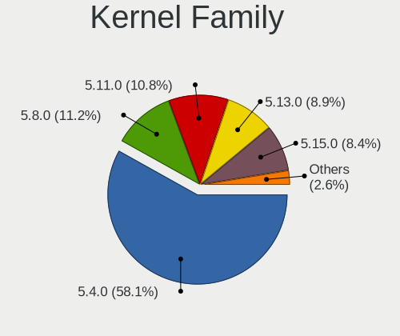

| Version | Computers | Percent |
|---------|-----------|---------|
| 5.4.0   | 212       | 71.14%  |
| 5.8.0   | 49        | 16.44%  |
| 5.11.0  | 27        | 9.06%   |
| 5.6.0   | 2         | 0.67%   |
| 5.9.0   | 1         | 0.34%   |
| 5.7.9   | 1         | 0.34%   |
| 5.6.15  | 1         | 0.34%   |
| 5.5.2   | 1         | 0.34%   |
| 5.4.30  | 1         | 0.34%   |
| 5.3.18  | 1         | 0.34%   |
| 5.14.0  | 1         | 0.34%   |
| 5.10.0  | 1         | 0.34%   |

Kernel Major Ver.
-----------------

Linux kernel major version

| Version | Computers | Percent |
|---------|-----------|---------|
| 5.4     | 213       | 71.48%  |
| 5.8     | 49        | 16.44%  |
| 5.11    | 27        | 9.06%   |
| 5.6     | 3         | 1.01%   |
| 5.9     | 1         | 0.34%   |
| 5.7     | 1         | 0.34%   |
| 5.5     | 1         | 0.34%   |
| 5.3     | 1         | 0.34%   |
| 5.14    | 1         | 0.34%   |
| 5.10    | 1         | 0.34%   |

Arch
----

OS architecture (x86_64, i586, etc.)

| Name   | Computers | Percent |
|--------|-----------|---------|
| x86_64 | 296       | 100%    |

DE
--

Desktop Environment

| Name       | Computers | Percent |
|------------|-----------|---------|
| LXQt       | 284       | 95.62%  |
| LXDE       | 4         | 1.35%   |
| GNOME      | 4         | 1.35%   |
| X-Cinnamon | 1         | 0.34%   |
| MATE       | 1         | 0.34%   |
| KDE5       | 1         | 0.34%   |
| KDE        | 1         | 0.34%   |
| Cinnamon   | 1         | 0.34%   |

Display Server
--------------

X11 or Wayland

| Name    | Computers | Percent |
|---------|-----------|---------|
| X11     | 278       | 93.6%   |
| Tty     | 16        | 5.39%   |
| Wayland | 2         | 0.67%   |
| Unknown | 1         | 0.34%   |

Display Manager
---------------

SDDM, LightDM, etc.

| Name    | Computers | Percent |
|---------|-----------|---------|
| SDDM    | 142       | 47.33%  |
| Unknown | 116       | 38.67%  |
| GDM     | 19        | 6.33%   |
| TDM     | 18        | 6%      |
| LightDM | 4         | 1.33%   |
| LXDM    | 1         | 0.33%   |

OS Lang
-------

Language

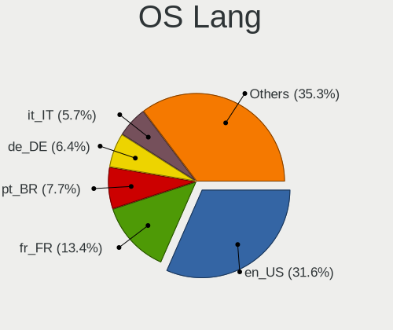

| Lang    | Computers | Percent |
|---------|-----------|---------|
| en_US   | 89        | 30.07%  |
| fr_FR   | 30        | 10.14%  |
| pt_BR   | 28        | 9.46%   |
| it_IT   | 18        | 6.08%   |
| en_GB   | 16        | 5.41%   |
| C       | 16        | 5.41%   |
| de_DE   | 15        | 5.07%   |
| ru_RU   | 12        | 4.05%   |
| es_ES   | 8         | 2.7%    |
| en_AU   | 8         | 2.7%    |
| pl_PL   | 5         | 1.69%   |
| en_IE   | 4         | 1.35%   |
| hu_HU   | 3         | 1.01%   |
| es_AR   | 3         | 1.01%   |
| en_ZA   | 3         | 1.01%   |
| cs_CZ   | 3         | 1.01%   |
| nl_NL   | 2         | 0.68%   |
| ja_JP   | 2         | 0.68%   |
| fr_CH   | 2         | 0.68%   |
| fr_BE   | 2         | 0.68%   |
| es_MX   | 2         | 0.68%   |
| es_CR   | 2         | 0.68%   |
| es_CL   | 2         | 0.68%   |
| en_SG   | 2         | 0.68%   |
| en_IN   | 2         | 0.68%   |
| en_CA   | 2         | 0.68%   |
| el_GR   | 2         | 0.68%   |
| sv_SE   | 1         | 0.34%   |
| ru_UA   | 1         | 0.34%   |
| nl_BE   | 1         | 0.34%   |
| lt_LT   | 1         | 0.34%   |
| fi_FI   | 1         | 0.34%   |
| es_UY   | 1         | 0.34%   |
| es_PE   | 1         | 0.34%   |
| es_CO   | 1         | 0.34%   |
| en_PH   | 1         | 0.34%   |
| en_NZ   | 1         | 0.34%   |
| en_DE   | 1         | 0.34%   |
| de_CH   | 1         | 0.34%   |
| Unknown | 1         | 0.34%   |

Boot Mode
---------

EFI or BIOS

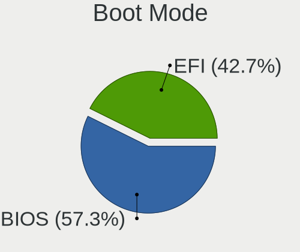

| Mode | Computers | Percent |
|------|-----------|---------|
| BIOS | 174       | 58.78%  |
| EFI  | 122       | 41.22%  |

Filesystem
----------

Type of filesystem

| Type    | Computers | Percent |
|---------|-----------|---------|
| Ext4    | 271       | 91.55%  |
| Overlay | 16        | 5.41%   |
| Btrfs   | 6         | 2.03%   |
| Xfs     | 2         | 0.68%   |
| Ext2    | 1         | 0.34%   |

Part. scheme
------------

Scheme of partitioning

| Type    | Computers | Percent |
|---------|-----------|---------|
| Unknown | 119       | 39.8%   |
| GPT     | 99        | 33.11%  |
| MBR     | 81        | 27.09%  |

Dual Boot with Linux/BSD
------------------------

Hosting more than one Linux/BSD

| Dual boot | Computers | Percent |
|-----------|-----------|---------|
| No        | 264       | 88.89%  |
| Yes       | 33        | 11.11%  |

Dual Boot (Win)
---------------

Hosting Linux and Windows

| Dual boot | Computers | Percent |
|-----------|-----------|---------|
| No        | 211       | 71.04%  |
| Yes       | 86        | 28.96%  |

Board
-----

Vendor
------

Motherboard manufacturer

| Name                | Computers | Percent |
|---------------------|-----------|---------|
| Hewlett-Packard     | 54        | 18.24%  |
| Lenovo              | 42        | 14.19%  |
| ASUSTek Computer    | 35        | 11.82%  |
| Dell                | 34        | 11.49%  |
| Acer                | 18        | 6.08%   |
| MSI                 | 14        | 4.73%   |
| Toshiba             | 11        | 3.72%   |
| Gigabyte Technology | 10        | 3.38%   |
| ASRock              | 10        | 3.38%   |
| Samsung Electronics | 8         | 2.7%    |
| Intel               | 7         | 2.36%   |
| Positivo            | 6         | 2.03%   |
| Notebook            | 5         | 1.69%   |
| Apple               | 5         | 1.69%   |
| Sony                | 3         | 1.01%   |
| Packard Bell        | 3         | 1.01%   |
| Google              | 3         | 1.01%   |
| Fujitsu             | 3         | 1.01%   |
| Pegatron            | 2         | 0.68%   |
| AAEON               | 2         | 0.68%   |
| Unknown             | 2         | 0.68%   |
| ZOTAC               | 1         | 0.34%   |
| Timi                | 1         | 0.34%   |
| Supermicro          | 1         | 0.34%   |
| Panasonic           | 1         | 0.34%   |
| Mediacom            | 1         | 0.34%   |
| LAMINA              | 1         | 0.34%   |
| Itautec             | 1         | 0.34%   |
| IBM                 | 1         | 0.34%   |
| HUAWEI              | 1         | 0.34%   |
| Huanan              | 1         | 0.34%   |
| HARDKERNEL          | 1         | 0.34%   |
| GTZS                | 1         | 0.34%   |
| Gateway             | 1         | 0.34%   |
| Fujitsu Siemens     | 1         | 0.34%   |
| Foxconn             | 1         | 0.34%   |
| Dixonsxp            | 1         | 0.34%   |
| Digibras            | 1         | 0.34%   |
| Biostar             | 1         | 0.34%   |
| AMI                 | 1         | 0.34%   |

Model
-----

Motherboard model

| Name                               | Computers | Percent |
|------------------------------------|-----------|---------|
| HP Notebook                        | 5         | 1.69%   |
| Unknown                            | 5         | 1.69%   |
| Positivo H14BT58                   | 2         | 0.68%   |
| MSI MS-7B89                        | 2         | 0.68%   |
| Lenovo IdeaPad 320-15AST 80XV      | 2         | 0.68%   |
| HP Pavilion x2 Detachable          | 2         | 0.68%   |
| HP Pavilion dv6                    | 2         | 0.68%   |
| Dell Latitude D630                 | 2         | 0.68%   |
| Dell Inspiron 15-3567              | 2         | 0.68%   |
| ASRock N68-VS3 UCC                 | 2         | 0.68%   |
| Apple MacBookPro8,1                | 2         | 0.68%   |
| AAEON MF-001                       | 2         | 0.68%   |
| ZOTAC NM10                         | 1         | 0.34%   |
| Toshiba Satellite Pro U400         | 1         | 0.34%   |
| Toshiba Satellite L840             | 1         | 0.34%   |
| Toshiba Satellite L755D            | 1         | 0.34%   |
| Toshiba Satellite L70-B            | 1         | 0.34%   |
| Toshiba Satellite L305             | 1         | 0.34%   |
| Toshiba Satellite C855D            | 1         | 0.34%   |
| Toshiba Satellite C70D-B           | 1         | 0.34%   |
| Toshiba Satellite C55D-A           | 1         | 0.34%   |
| Toshiba Satellite A660             | 1         | 0.34%   |
| Toshiba Satellite A205             | 1         | 0.34%   |
| Toshiba NB510                      | 1         | 0.34%   |
| Timi TM1612                        | 1         | 0.34%   |
| Supermicro X8DA3                   | 1         | 0.34%   |
| Sony VPCSB1V9E                     | 1         | 0.34%   |
| Sony VGN-SZ670AN                   | 1         | 0.34%   |
| Sony VGN-CR11Z_R                   | 1         | 0.34%   |
| Samsung RV415/RV515                | 1         | 0.34%   |
| Samsung RV410/RV510/S3510/E3510    | 1         | 0.34%   |
| Samsung RV408/RV508                | 1         | 0.34%   |
| Samsung RC512                      | 1         | 0.34%   |
| Samsung R530/R730/P530             | 1         | 0.34%   |
| Samsung R520/R522/R620             | 1         | 0.34%   |
| Samsung R40/R41                    | 1         | 0.34%   |
| Samsung 300E4M/300E4S/300E4L       | 1         | 0.34%   |
| Positivo S14CT01                   | 1         | 0.34%   |
| Positivo S14BW01                   | 1         | 0.34%   |
| Positivo POS-MI945AA               | 1         | 0.34%   |
| Positivo POS-EIH61CE               | 1         | 0.34%   |
| Pegatron NC689AA-ABA s3700y        | 1         | 0.34%   |
| Pegatron AY652AA-ABA s5310y        | 1         | 0.34%   |
| Panasonic CF-52PGNBE2M             | 1         | 0.34%   |
| Packard Bell imedia S1350          | 1         | 0.34%   |
| Packard Bell EN Butterfly s        | 1         | 0.34%   |
| Packard Bell EasyNote_ST85-M-010FR | 1         | 0.34%   |
| Notebook W740SU                    | 1         | 0.34%   |
| Notebook W54_W94_W955TU,-T,-C      | 1         | 0.34%   |
| Notebook W54_55SU1,SUW             | 1         | 0.34%   |
| Notebook NL40_50GU                 | 1         | 0.34%   |
| Notebook NHxxRZQ                   | 1         | 0.34%   |
| MSI U180                           | 1         | 0.34%   |
| MSI MS-7C37                        | 1         | 0.34%   |
| MSI MS-7B86                        | 1         | 0.34%   |
| MSI MS-7994                        | 1         | 0.34%   |
| MSI MS-7846                        | 1         | 0.34%   |
| MSI MS-7680                        | 1         | 0.34%   |
| MSI MS-7592                        | 1         | 0.34%   |
| MSI MS-7309                        | 1         | 0.34%   |

Model Family
------------

Motherboard model prefix

| Name                   | Computers | Percent |
|------------------------|-----------|---------|
| Lenovo ThinkPad        | 15        | 5.07%   |
| Acer Aspire            | 14        | 4.73%   |
| Lenovo IdeaPad         | 13        | 4.39%   |
| Dell Inspiron          | 12        | 4.05%   |
| HP Pavilion            | 11        | 3.72%   |
| HP Compaq              | 11        | 3.72%   |
| Toshiba Satellite      | 10        | 3.38%   |
| HP ProBook             | 9         | 3.04%   |
| HP Notebook            | 5         | 1.69%   |
| Unknown                | 5         | 1.69%   |
| Dell XPS               | 4         | 1.35%   |
| Dell Vostro            | 4         | 1.35%   |
| Dell Latitude          | 4         | 1.35%   |
| ASUS VivoBook          | 4         | 1.35%   |
| Lenovo ThinkCentre     | 3         | 1.01%   |
| Dell OptiPlex          | 3         | 1.01%   |
| Positivo H14BT58       | 2         | 0.68%   |
| Notebook W54           | 2         | 0.68%   |
| MSI MS-7B89            | 2         | 0.68%   |
| HP t620                | 2         | 0.68%   |
| HP Spectre             | 2         | 0.68%   |
| HP Presario            | 2         | 0.68%   |
| HP EliteBook           | 2         | 0.68%   |
| Dell PowerEdge         | 2         | 0.68%   |
| ASRock N68-VS3         | 2         | 0.68%   |
| Apple MacBookPro8      | 2         | 0.68%   |
| AAEON MF-001           | 2         | 0.68%   |
| ZOTAC NM10             | 1         | 0.34%   |
| Toshiba NB510          | 1         | 0.34%   |
| Timi TM1612            | 1         | 0.34%   |
| Supermicro X8DA3       | 1         | 0.34%   |
| Sony VPCSB1V9E         | 1         | 0.34%   |
| Sony VGN-SZ670AN       | 1         | 0.34%   |
| Sony VGN-CR11Z         | 1         | 0.34%   |
| Samsung RV415          | 1         | 0.34%   |
| Samsung RV410          | 1         | 0.34%   |
| Samsung RV408          | 1         | 0.34%   |
| Samsung RC512          | 1         | 0.34%   |
| Samsung R530           | 1         | 0.34%   |
| Samsung R520           | 1         | 0.34%   |
| Samsung R40            | 1         | 0.34%   |
| Samsung 300E4M         | 1         | 0.34%   |
| Positivo S14CT01       | 1         | 0.34%   |
| Positivo S14BW01       | 1         | 0.34%   |
| Positivo POS-MI945AA   | 1         | 0.34%   |
| Positivo POS-EIH61CE   | 1         | 0.34%   |
| Pegatron NC689AA-ABA   | 1         | 0.34%   |
| Pegatron AY652AA-ABA   | 1         | 0.34%   |
| Panasonic CF-52PGNBE2M | 1         | 0.34%   |
| Packard Bell imedia    | 1         | 0.34%   |
| Packard Bell EN        | 1         | 0.34%   |
| Packard Bell EasyNote  | 1         | 0.34%   |
| Notebook W740SU        | 1         | 0.34%   |
| Notebook NL40          | 1         | 0.34%   |
| Notebook NHxxRZQ       | 1         | 0.34%   |
| MSI U180               | 1         | 0.34%   |
| MSI MS-7C37            | 1         | 0.34%   |
| MSI MS-7B86            | 1         | 0.34%   |
| MSI MS-7994            | 1         | 0.34%   |
| MSI MS-7846            | 1         | 0.34%   |

MFG Year
--------

Motherboard manufacture year

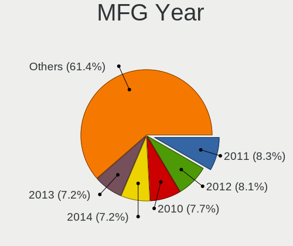

| Year | Computers | Percent |
|------|-----------|---------|
| 2019 | 40        | 13.51%  |
| 2012 | 26        | 8.78%   |
| 2020 | 22        | 7.43%   |
| 2010 | 22        | 7.43%   |
| 2008 | 22        | 7.43%   |
| 2014 | 21        | 7.09%   |
| 2015 | 18        | 6.08%   |
| 2011 | 18        | 6.08%   |
| 2007 | 17        | 5.74%   |
| 2016 | 16        | 5.41%   |
| 2009 | 16        | 5.41%   |
| 2013 | 15        | 5.07%   |
| 2017 | 13        | 4.39%   |
| 2018 | 12        | 4.05%   |
| 2021 | 9         | 3.04%   |
| 2006 | 6         | 2.03%   |
| 2005 | 3         | 1.01%   |

Form Factor
-----------

Physical design of the computer

| Name        | Computers | Percent |
|-------------|-----------|---------|
| Notebook    | 182       | 61.49%  |
| Desktop     | 100       | 33.78%  |
| Convertible | 4         | 1.35%   |
| Mini pc     | 4         | 1.35%   |
| Server      | 4         | 1.35%   |
| Tablet      | 1         | 0.34%   |
| All in one  | 1         | 0.34%   |

Secure Boot
-----------

Enabled or disabled

| State    | Computers | Percent |
|----------|-----------|---------|
| Disabled | 279       | 93.94%  |
| Enabled  | 18        | 6.06%   |

Coreboot
--------

Have coreboot on board

| Used | Computers | Percent |
|------|-----------|---------|
| No   | 293       | 98.99%  |
| Yes  | 3         | 1.01%   |

RAM Size
--------

Total RAM memory

| Size in GB      | Computers | Percent |
|-----------------|-----------|---------|
| 3.01-4.0        | 92        | 30.87%  |
| 4.01-8.0        | 60        | 20.13%  |
| 1.01-2.0        | 48        | 16.11%  |
| 8.01-16.0       | 44        | 14.77%  |
| 16.01-24.0      | 29        | 9.73%   |
| 32.01-64.0      | 11        | 3.69%   |
| 2.01-3.0        | 7         | 2.35%   |
| 0.51-1.0        | 3         | 1.01%   |
| More than 256.0 | 2         | 0.67%   |
| 24.01-32.0      | 2         | 0.67%   |

RAM Used
--------

Used RAM memory

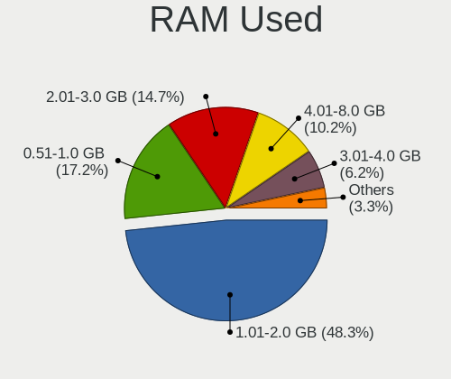

| Used GB   | Computers | Percent |
|-----------|-----------|---------|
| 1.01-2.0  | 150       | 48.08%  |
| 2.01-3.0  | 51        | 16.35%  |
| 0.51-1.0  | 49        | 15.71%  |
| 4.01-8.0  | 31        | 9.94%   |
| 3.01-4.0  | 20        | 6.41%   |
| 0.01-0.5  | 7         | 2.24%   |
| 8.01-16.0 | 4         | 1.28%   |

Total Drives
------------

Number of drives on board

| Drives | Computers | Percent |
|--------|-----------|---------|
| 1      | 194       | 65.32%  |
| 2      | 77        | 25.93%  |
| 4      | 8         | 2.69%   |
| 3      | 8         | 2.69%   |
| 5      | 5         | 1.68%   |
| 0      | 2         | 0.67%   |
| 14     | 1         | 0.34%   |
| 7      | 1         | 0.34%   |
| 6      | 1         | 0.34%   |

Has CD-ROM
----------

Has CD-ROM on board

| Presented | Computers | Percent |
|-----------|-----------|---------|
| Yes       | 160       | 53.87%  |
| No        | 137       | 46.13%  |

Has Ethernet
------------

Has Ethernet on board

| Presented | Computers | Percent |
|-----------|-----------|---------|
| Yes       | 268       | 90.54%  |
| No        | 28        | 9.46%   |

Has WiFi
--------

Has WiFi module

| Presented | Computers | Percent |
|-----------|-----------|---------|
| Yes       | 227       | 76.69%  |
| No        | 69        | 23.31%  |

Has Bluetooth
-------------

Has Bluetooth module

| Presented | Computers | Percent |
|-----------|-----------|---------|
| No        | 165       | 55%     |
| Yes       | 135       | 45%     |

Location
--------

Country
-------

Geographic location (country)

| Country      | Computers | Percent |
|--------------|-----------|---------|
| USA          | 42        | 14.09%  |
| Brazil       | 34        | 11.41%  |
| France       | 31        | 10.4%   |
| Italy        | 25        | 8.39%   |
| Germany      | 21        | 7.05%   |
| Russia       | 16        | 5.37%   |
| UK           | 10        | 3.36%   |
| Spain        | 9         | 3.02%   |
| Australia    | 8         | 2.68%   |
| Poland       | 7         | 2.35%   |
| Netherlands  | 7         | 2.35%   |
| Hungary      | 7         | 2.35%   |
| Switzerland  | 6         | 2.01%   |
| Finland      | 5         | 1.68%   |
| Czechia      | 5         | 1.68%   |
| Ukraine      | 4         | 1.34%   |
| Mexico       | 4         | 1.34%   |
| Belgium      | 4         | 1.34%   |
| South Africa | 3         | 1.01%   |
| Ireland      | 3         | 1.01%   |
| Greece       | 3         | 1.01%   |
| Argentina    | 3         | 1.01%   |
| Singapore    | 2         | 0.67%   |
| Romania      | 2         | 0.67%   |
| Puerto Rico  | 2         | 0.67%   |
| New Zealand  | 2         | 0.67%   |
| Japan        | 2         | 0.67%   |
| Indonesia    | 2         | 0.67%   |
| India        | 2         | 0.67%   |
| Costa Rica   | 2         | 0.67%   |
| Colombia     | 2         | 0.67%   |
| Chile        | 2         | 0.67%   |
| Canada       | 2         | 0.67%   |
| Vietnam      | 1         | 0.34%   |
| Uruguay      | 1         | 0.34%   |
| Tunisia      | 1         | 0.34%   |
| Sweden       | 1         | 0.34%   |
| Slovenia     | 1         | 0.34%   |
| Slovakia     | 1         | 0.34%   |
| Serbia       | 1         | 0.34%   |
| Philippines  | 1         | 0.34%   |
| Peru         | 1         | 0.34%   |
| Norway       | 1         | 0.34%   |
| Martinique   | 1         | 0.34%   |
| Malaysia     | 1         | 0.34%   |
| Luxembourg   | 1         | 0.34%   |
| Lithuania    | 1         | 0.34%   |
| Lebanon      | 1         | 0.34%   |
| Israel       | 1         | 0.34%   |
| Ecuador      | 1         | 0.34%   |
| Bulgaria     | 1         | 0.34%   |
| Belarus      | 1         | 0.34%   |

City
----

Geographic location (city)

| City                   | Computers | Percent |
|------------------------|-----------|---------|
| Rome                   | 7         | 2.27%   |
| Milan                  | 6         | 1.94%   |
| Helsinki               | 4         | 1.29%   |
| Paris                  | 3         | 0.97%   |
| Munich                 | 3         | 0.97%   |
| Moscow                 | 3         | 0.97%   |
| Budapest               | 3         | 0.97%   |
| Braslia              | 3         | 0.97%   |
| Windsor                | 2         | 0.65%   |
| Warsaw                 | 2         | 0.65%   |
| Vicosa                 | 2         | 0.65%   |
| Stuttgart              | 2         | 0.65%   |
| Singapore              | 2         | 0.65%   |
| Salvador               | 2         | 0.65%   |
| Prague                 | 2         | 0.65%   |
| Omsk                   | 2         | 0.65%   |
| Lille                  | 2         | 0.65%   |
| Krakow                 | 2         | 0.65%   |
| Houston                | 2         | 0.65%   |
| Heredia                | 2         | 0.65%   |
| Greene                 | 2         | 0.65%   |
| Frankfurt am Main      | 2         | 0.65%   |
| Fortaleza              | 2         | 0.65%   |
| Eger                   | 2         | 0.65%   |
| Curitiba               | 2         | 0.65%   |
| Cuernavaca             | 2         | 0.65%   |
| Cayey                  | 2         | 0.65%   |
| Cape Town              | 2         | 0.65%   |
| Austin                 | 2         | 0.65%   |
| Augsburg               | 2         | 0.65%   |
| Annecy                 | 2         | 0.65%   |
| Zwanenburg             | 1         | 0.32%   |
| Zurich                 | 1         | 0.32%   |
| Zhovta Rika            | 1         | 0.32%   |
| Zborowice              | 1         | 0.32%   |
| Zabrze                 | 1         | 0.32%   |
| Yelizovo               | 1         | 0.32%   |
| Wollongong             | 1         | 0.32%   |
| Wigan                  | 1         | 0.32%   |
| Wiesbaden              | 1         | 0.32%   |
| West Babylon           | 1         | 0.32%   |
| Wellington             | 1         | 0.32%   |
| Wadsworth              | 1         | 0.32%   |
| Wadi Maliz             | 1         | 0.32%   |
| Vladivostok            | 1         | 0.32%   |
| Vlaardingen            | 1         | 0.32%   |
| Vitry-sur-Seine        | 1         | 0.32%   |
| Verdun                 | 1         | 0.32%   |
| Velilla de San Antonio | 1         | 0.32%   |
| Vaxjo                  | 1         | 0.32%   |
| Varna                  | 1         | 0.32%   |
| Vanderbijlpark         | 1         | 0.32%   |
| Valls                  | 1         | 0.32%   |
| Valinhos               | 1         | 0.32%   |
| Valencia               | 1         | 0.32%   |
| Uccle                  | 1         | 0.32%   |
| Uberlndia            | 1         | 0.32%   |
| Tunis                  | 1         | 0.32%   |
| Treviso                | 1         | 0.32%   |
| Tourcoing              | 1         | 0.32%   |

Drives
------

Drive Vendor
------------

Hard drive vendors

| Vendor              | Computers | Drives | Percent |
|---------------------|-----------|--------|---------|
| Seagate             | 83        | 105    | 21.61%  |
| WDC                 | 72        | 105    | 18.75%  |
| Samsung Electronics | 40        | 54     | 10.42%  |
| Toshiba             | 26        | 28     | 6.77%   |
| Hitachi             | 21        | 25     | 5.47%   |
| Unknown             | 20        | 23     | 5.21%   |
| Kingston            | 18        | 19     | 4.69%   |
| Crucial             | 14        | 15     | 3.65%   |
| SanDisk             | 12        | 16     | 3.13%   |
| Intel               | 8         | 9      | 2.08%   |
| A-DATA Technology   | 7         | 7      | 1.82%   |
| HGST                | 6         | 8      | 1.56%   |
| Fujitsu             | 6         | 6      | 1.56%   |
| China               | 6         | 6      | 1.56%   |
| SK Hynix            | 5         | 5      | 1.3%    |
| PNY                 | 4         | 4      | 1.04%   |
| Apacer              | 4         | 4      | 1.04%   |
| Micron Technology   | 3         | 3      | 0.78%   |
| Transcend           | 2         | 2      | 0.52%   |
| MAXTOR              | 2         | 2      | 0.52%   |
| LITEONIT            | 2         | 2      | 0.52%   |
| LDLC                | 2         | 2      | 0.52%   |
| USB                 | 1         | 1      | 0.26%   |
| Team                | 1         | 1      | 0.26%   |
| TCSUNBOW            | 1         | 1      | 0.26%   |
| PNY USB             | 1         | 1      | 0.26%   |
| Phison Electronics  | 1         | 1      | 0.26%   |
| OCZ                 | 1         | 1      | 0.26%   |
| LONDISK             | 1         | 1      | 0.26%   |
| Lexar               | 1         | 1      | 0.26%   |
| Leven               | 1         | 1      | 0.26%   |
| LaCie               | 1         | 2      | 0.26%   |
| KIOXIA              | 1         | 1      | 0.26%   |
| KingDian            | 1         | 1      | 0.26%   |
| JMicron             | 1         | 1      | 0.26%   |
| Integral            | 1         | 1      | 0.26%   |
| Hewlett-Packard     | 1         | 6      | 0.26%   |
| GOODRAM             | 1         | 1      | 0.26%   |
| Gigabyte Technology | 1         | 1      | 0.26%   |
| EMTEC               | 1         | 1      | 0.26%   |
| Corsair             | 1         | 1      | 0.26%   |
| Apple               | 1         | 3      | 0.26%   |
| Unknown             | 1         | 1      | 0.26%   |

Drive Model
-----------

Hard drive models

| Model                                | Computers | Percent |
|--------------------------------------|-----------|---------|
| Kingston SA400S37240G 240GB SSD      | 6         | 1.47%   |
| Seagate ST500LM012 HN-M500MBB 500GB  | 5         | 1.22%   |
| Unknown MMC Card  32GB               | 4         | 0.98%   |
| Toshiba MQ01ABF050 500GB             | 4         | 0.98%   |
| Toshiba MQ01ABD100 1TB               | 4         | 0.98%   |
| Seagate ST1000LM024 HN-M101MBB 1TB   | 4         | 0.98%   |
| Samsung SSD 850 EVO 500GB            | 4         | 0.98%   |
| Crucial CT240BX500SSD1 240GB         | 4         | 0.98%   |
| A-DATA SU650 240GB SSD               | 4         | 0.98%   |
| WDC WDS120G2G0A-00JH30 120GB SSD     | 3         | 0.73%   |
| Seagate ST500LT012-1DG142 500GB      | 3         | 0.73%   |
| Seagate ST1000LM035-1RK172 1TB       | 3         | 0.73%   |
| Samsung SSD 850 EVO 250GB            | 3         | 0.73%   |
| WDC WDS500G2B0A-00SM50 500GB SSD     | 2         | 0.49%   |
| WDC WD7500BPVX-55JC3T3 752GB         | 2         | 0.49%   |
| WDC WD5000LPVX-22V0TT0 500GB         | 2         | 0.49%   |
| WDC WD40EFRX-68N32N0 4TB             | 2         | 0.49%   |
| WDC WD3200BPVT-22JJ5T0 320GB         | 2         | 0.49%   |
| WDC WD10SPZX-24Z10T0 1TB             | 2         | 0.49%   |
| WDC WD10EZEX-00WN4A0 1TB             | 2         | 0.49%   |
| WDC PC SN520 SDAPNUW-256G-1006 256GB | 2         | 0.49%   |
| Unknown SD/MMC/MS PRO 128GB          | 2         | 0.49%   |
| Unknown M52516  16GB                 | 2         | 0.49%   |
| Toshiba THNSFJ256GDNU A 256GB SSD    | 2         | 0.49%   |
| Seagate ST9500325AS 500GB            | 2         | 0.49%   |
| Seagate ST9250410AS 250GB            | 2         | 0.49%   |
| Seagate ST9160412AS 160GB            | 2         | 0.49%   |
| Seagate ST750LM022 HN-M750MBB 752GB  | 2         | 0.49%   |
| Seagate ST500LT012-9WS142 500GB      | 2         | 0.49%   |
| Seagate ST500LM021-1KJ152 500GB      | 2         | 0.49%   |
| Seagate ST380815AS 80GB              | 2         | 0.49%   |
| Seagate ST3500418AS 500GB            | 2         | 0.49%   |
| Seagate ST3360320AS 360GB            | 2         | 0.49%   |
| Seagate ST3250410AS 250GB            | 2         | 0.49%   |
| Seagate ST3250310AS 250GB            | 2         | 0.49%   |
| Seagate ST320LT007-9ZV142 320GB      | 2         | 0.49%   |
| Seagate ST320LM001 HN-M320MBB 320GB  | 2         | 0.49%   |
| Seagate ST31000524AS 1TB             | 2         | 0.49%   |
| Seagate ST2000LX001-1RG174 2TB       | 2         | 0.49%   |
| Seagate ST2000LM015-2E8174 2TB       | 2         | 0.49%   |
| Seagate ST1000LM049-2GH172 1TB       | 2         | 0.49%   |
| Seagate ST1000DM003-1ER162 1TB       | 2         | 0.49%   |
| Seagate Backup+ Hub BK 8TB           | 2         | 0.49%   |
| Sandisk NVMe SSD Drive 512GB         | 2         | 0.49%   |
| Samsung SSD 860 EVO 1TB              | 2         | 0.49%   |
| Samsung HD161HJ 160GB                | 2         | 0.49%   |
| Samsung HD080HJ 80GB                 | 2         | 0.49%   |
| PNY CS900 240GB SSD                  | 2         | 0.49%   |
| Kingston SA400S37480G 480GB SSD      | 2         | 0.49%   |
| Kingston SA400S37120G 120GB SSD      | 2         | 0.49%   |
| Hitachi HTS543232A7A384 320GB        | 2         | 0.49%   |
| Hitachi HTS541616J9SA00 160GB        | 2         | 0.49%   |
| HGST HTS545050A7E680 500GB           | 2         | 0.49%   |
| Crucial CT480BX500SSD1 480GB         | 2         | 0.49%   |
| Crucial CT1000MX500SSD1 1TB          | 2         | 0.49%   |
| China SATA SSD 512GB                 | 2         | 0.49%   |
| WDC WDS500G2B0B-00YS70 500GB SSD     | 1         | 0.24%   |
| WDC WDS250G2B0B-00YS70 250GB SSD     | 1         | 0.24%   |
| WDC WDS240G2G0B-00EPW0 240GB SSD     | 1         | 0.24%   |
| WDC WDS240G2G0A-00JH30 240GB SSD     | 1         | 0.24%   |

HDD Vendor
----------

Hard disk drive vendors

| Vendor              | Computers | Drives | Percent |
|---------------------|-----------|--------|---------|
| Seagate             | 82        | 103    | 37.61%  |
| WDC                 | 62        | 90     | 28.44%  |
| Hitachi             | 21        | 25     | 9.63%   |
| Toshiba             | 20        | 22     | 9.17%   |
| Samsung Electronics | 14        | 15     | 6.42%   |
| HGST                | 6         | 8      | 2.75%   |
| Fujitsu             | 6         | 6      | 2.75%   |
| Unknown             | 2         | 2      | 0.92%   |
| MAXTOR              | 2         | 2      | 0.92%   |
| USB                 | 1         | 1      | 0.46%   |
| LaCie               | 1         | 1      | 0.46%   |
| JMicron             | 1         | 1      | 0.46%   |

SSD Vendor
----------

Solid state drive vendors

| Vendor              | Computers | Drives | Percent |
|---------------------|-----------|--------|---------|
| Samsung Electronics | 20        | 24     | 16.81%  |
| Kingston            | 16        | 16     | 13.45%  |
| Crucial             | 14        | 15     | 11.76%  |
| WDC                 | 10        | 13     | 8.4%    |
| SanDisk             | 8         | 12     | 6.72%   |
| Intel               | 6         | 7      | 5.04%   |
| China               | 6         | 6      | 5.04%   |
| A-DATA Technology   | 5         | 5      | 4.2%    |
| Toshiba             | 4         | 4      | 3.36%   |
| PNY                 | 4         | 4      | 3.36%   |
| Apacer              | 4         | 4      | 3.36%   |
| Transcend           | 2         | 2      | 1.68%   |
| LITEONIT            | 2         | 2      | 1.68%   |
| LDLC                | 2         | 2      | 1.68%   |
| Unknown             | 1         | 1      | 0.84%   |
| Team                | 1         | 1      | 0.84%   |
| TCSUNBOW            | 1         | 1      | 0.84%   |
| SK Hynix            | 1         | 1      | 0.84%   |
| PNY USB             | 1         | 1      | 0.84%   |
| OCZ                 | 1         | 1      | 0.84%   |
| Micron Technology   | 1         | 1      | 0.84%   |
| LONDISK             | 1         | 1      | 0.84%   |
| Lexar               | 1         | 1      | 0.84%   |
| Leven               | 1         | 1      | 0.84%   |
| KingDian            | 1         | 1      | 0.84%   |
| Integral            | 1         | 1      | 0.84%   |
| Hewlett-Packard     | 1         | 6      | 0.84%   |
| GOODRAM             | 1         | 1      | 0.84%   |
| Corsair             | 1         | 1      | 0.84%   |
| Apple               | 1         | 3      | 0.84%   |

Drive Kind
----------

HDD or SSD

| Kind    | Computers | Drives | Percent |
|---------|-----------|--------|---------|
| HDD     | 191       | 276    | 53.95%  |
| SSD     | 115       | 139    | 32.49%  |
| NVMe    | 25        | 36     | 7.06%   |
| MMC     | 20        | 24     | 5.65%   |
| Unknown | 3         | 4      | 0.85%   |

Drive Connector
---------------

SATA, SAS, NVMe, etc.

| Type | Computers | Drives | Percent |
|------|-----------|--------|---------|
| SATA | 262       | 402    | 81.62%  |
| NVMe | 25        | 36     | 7.79%   |
| MMC  | 20        | 24     | 6.23%   |
| SAS  | 14        | 17     | 4.36%   |

Drive Size
----------

Size of hard drive

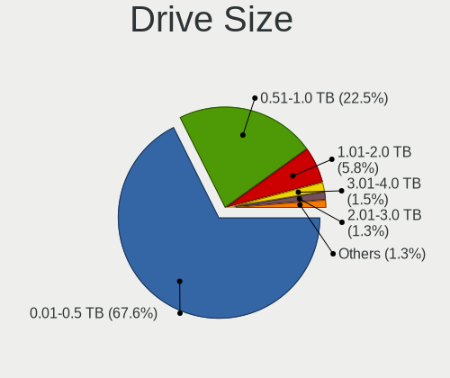

| Size in TB | Computers | Drives | Percent |
|------------|-----------|--------|---------|
| 0.01-0.5   | 210       | 279    | 69.54%  |
| 0.51-1.0   | 71        | 101    | 23.51%  |
| 1.01-2.0   | 11        | 16     | 3.64%   |
| 3.01-4.0   | 5         | 13     | 1.66%   |
| 2.01-3.0   | 4         | 5      | 1.32%   |
| 4.01-10.0  | 1         | 1      | 0.33%   |

Space Total
-----------

Amount of disk space available on the file system

| Size in GB     | Computers | Percent |
|----------------|-----------|---------|
| 101-250        | 82        | 27.33%  |
| 251-500        | 78        | 26%     |
| 501-1000       | 37        | 12.33%  |
| 51-100         | 26        | 8.67%   |
| 1001-2000      | 22        | 7.33%   |
| 1-20           | 18        | 6%      |
| 21-50          | 16        | 5.33%   |
| More than 3000 | 13        | 4.33%   |
| 2001-3000      | 7         | 2.33%   |
| Unknown        | 1         | 0.33%   |

Space Used
----------

Amount of used disk space

| Used GB        | Computers | Percent |
|----------------|-----------|---------|
| 1-20           | 129       | 42.16%  |
| 21-50          | 50        | 16.34%  |
| 101-250        | 42        | 13.73%  |
| 51-100         | 27        | 8.82%   |
| 251-500        | 21        | 6.86%   |
| 501-1000       | 19        | 6.21%   |
| 1001-2000      | 7         | 2.29%   |
| More than 3000 | 6         | 1.96%   |
| 2001-3000      | 4         | 1.31%   |
| Unknown        | 1         | 0.33%   |

Malfunc. Drives
---------------

Drive models with a malfunction

| Model                                      | Computers | Drives | Percent |
|--------------------------------------------|-----------|--------|---------|
| Seagate ST1000LM024 HN-M101MBB 1TB         | 2         | 2      | 5%      |
| WDC WDS240G2G0A-00JH30 240GB SSD           | 1         | 1      | 2.5%    |
| WDC WD800BEVS-60RST0 80GB                  | 1         | 1      | 2.5%    |
| WDC WD5000AAKX-003CA0 500GB                | 1         | 1      | 2.5%    |
| WDC WD400EB-00CPF0 40GB                    | 1         | 1      | 2.5%    |
| WDC WD2500BEVT-80A23T0 250GB               | 1         | 2      | 2.5%    |
| WDC WD1600AAJS-60B4A0 160GB                | 1         | 2      | 2.5%    |
| TCSUNBOW X1 32GB SSD                       | 1         | 1      | 2.5%    |
| SK Hynix HFS128G39TND-N210A 128GB SSD      | 1         | 1      | 2.5%    |
| Seagate ST9320325AS 320GB                  | 1         | 1      | 2.5%    |
| Seagate ST9250410AS 250GB                  | 1         | 1      | 2.5%    |
| Seagate ST500LM021-1KJ152 500GB            | 1         | 1      | 2.5%    |
| Seagate ST380815AS 80GB                    | 1         | 1      | 2.5%    |
| Seagate ST3360320AS 360GB                  | 1         | 1      | 2.5%    |
| Seagate ST320LT007-9ZV142 320GB            | 1         | 1      | 2.5%    |
| Seagate ST3160318AS 160GB                  | 1         | 1      | 2.5%    |
| Seagate ST1000NM0095-2DC10C 1TB            | 1         | 6      | 2.5%    |
| Seagate ST1000DX001-1CM162 1TB             | 1         | 1      | 2.5%    |
| Seagate ST1000DM003-9YN162 1TB             | 1         | 1      | 2.5%    |
| Seagate ST1000DM003-1ER162 1TB             | 1         | 1      | 2.5%    |
| Samsung Electronics HM160JI 160GB          | 1         | 1      | 2.5%    |
| Samsung Electronics HM121HI 120GB          | 1         | 1      | 2.5%    |
| MAXTOR STM3300622A 304GB                   | 1         | 1      | 2.5%    |
| MAXTOR 6Y080L0 82GB                        | 1         | 1      | 2.5%    |
| LDLC SSD 120GB                             | 1         | 1      | 2.5%    |
| Kingston SHFS37A120G 120GB SSD             | 1         | 1      | 2.5%    |
| Kingston SA400S37120G 120GB SSD            | 1         | 1      | 2.5%    |
| Hitachi HTS722012K9SA00 120GB              | 1         | 1      | 2.5%    |
| Hitachi HTS541616J9SA00 160GB              | 1         | 1      | 2.5%    |
| Hitachi HCP725050GLAT80 500GB              | 1         | 1      | 2.5%    |
| HGST HTS545050A7E680 500GB                 | 1         | 1      | 2.5%    |
| HGST HTS541075A9E680 752GB                 | 1         | 1      | 2.5%    |
| HGST HTS541010A9E680 1TB                   | 1         | 1      | 2.5%    |
| Fujitsu MHZ2160BH G2 160GB                 | 1         | 1      | 2.5%    |
| Crucial CT960M500SSD1 960GB                | 1         | 1      | 2.5%    |
| Crucial CT120M500SSD3 120GB                | 1         | 1      | 2.5%    |
| Crucial CT120M500SSD1 120GB                | 1         | 1      | 2.5%    |
| Apacer 16GB SATA Flash Drive SSD           | 1         | 1      | 2.5%    |
| A-DATA Technology IM2S3334-256GD 256GB SSD | 1         | 1      | 2.5%    |

Malfunc. Drive Vendor
---------------------

Vendors of faulty drives

| Vendor              | Computers | Drives | Percent |
|---------------------|-----------|--------|---------|
| Seagate             | 13        | 18     | 32.5%   |
| WDC                 | 6         | 8      | 15%     |
| Hitachi             | 3         | 3      | 7.5%    |
| HGST                | 3         | 3      | 7.5%    |
| Crucial             | 3         | 3      | 7.5%    |
| Samsung Electronics | 2         | 2      | 5%      |
| MAXTOR              | 2         | 2      | 5%      |
| Kingston            | 2         | 2      | 5%      |
| TCSUNBOW            | 1         | 1      | 2.5%    |
| SK Hynix            | 1         | 1      | 2.5%    |
| LDLC                | 1         | 1      | 2.5%    |
| Fujitsu             | 1         | 1      | 2.5%    |
| Apacer              | 1         | 1      | 2.5%    |
| A-DATA Technology   | 1         | 1      | 2.5%    |

Malfunc. HDD Vendor
-------------------

Vendors of faulty HDD drives

| Vendor              | Computers | Drives | Percent |
|---------------------|-----------|--------|---------|
| Seagate             | 13        | 18     | 44.83%  |
| WDC                 | 5         | 7      | 17.24%  |
| Hitachi             | 3         | 3      | 10.34%  |
| HGST                | 3         | 3      | 10.34%  |
| Samsung Electronics | 2         | 2      | 6.9%    |
| MAXTOR              | 2         | 2      | 6.9%    |
| Fujitsu             | 1         | 1      | 3.45%   |

Malfunc. Drive Kind
-------------------

Kinds of faulty drives

| Kind | Computers | Drives | Percent |
|------|-----------|--------|---------|
| HDD  | 28        | 36     | 71.79%  |
| SSD  | 11        | 11     | 28.21%  |

Failed Drives
-------------

Failed drive models

| Model                            | Computers | Drives | Percent |
|----------------------------------|-----------|--------|---------|
| WDC WD2500BEVT-75A23T0 250GB     | 1         | 1      | 50%     |
| Samsung Electronics HD080HJ 80GB | 1         | 1      | 50%     |

Failed Drive Vendor
-------------------

Failed drive vendors

| Vendor              | Computers | Drives | Percent |
|---------------------|-----------|--------|---------|
| WDC                 | 1         | 1      | 50%     |
| Samsung Electronics | 1         | 1      | 50%     |

Drive Status
------------

Number of failed and malfunc. drives

| Status   | Computers | Drives | Percent |
|----------|-----------|--------|---------|
| Works    | 142       | 217    | 44.38%  |
| Detected | 138       | 213    | 43.13%  |
| Malfunc  | 38        | 47     | 11.88%  |
| Failed   | 2         | 2      | 0.63%   |

Storage controller
------------------

Storage Vendor
--------------

Storage controller vendors

| Vendor                           | Computers | Percent |
|----------------------------------|-----------|---------|
| Intel                            | 207       | 65.51%  |
| AMD                              | 52        | 16.46%  |
| Nvidia                           | 15        | 4.75%   |
| Samsung Electronics              | 6         | 1.9%    |
| JMicron Technology               | 5         | 1.58%   |
| Sandisk                          | 4         | 1.27%   |
| Marvell Technology Group         | 4         | 1.27%   |
| LSI Logic / Symbios Logic        | 3         | 0.95%   |
| VIA Technologies                 | 2         | 0.63%   |
| SK Hynix                         | 2         | 0.63%   |
| Micron Technology                | 2         | 0.63%   |
| KIOXIA                           | 2         | 0.63%   |
| Kingston Technology Company      | 2         | 0.63%   |
| ASMedia Technology               | 2         | 0.63%   |
| ADATA Technology                 | 2         | 0.63%   |
| Toshiba America Info Systems     | 1         | 0.32%   |
| Solid State Storage Technology   | 1         | 0.32%   |
| Silicon Integrated Systems [SiS] | 1         | 0.32%   |
| Phison Electronics               | 1         | 0.32%   |
| Hewlett-Packard                  | 1         | 0.32%   |
| Broadcom / LSI                   | 1         | 0.32%   |

Storage Model
-------------

Storage controller models

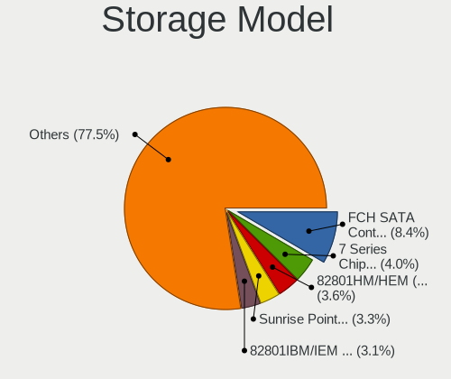

| Model                                                                                   | Computers | Percent |
|-----------------------------------------------------------------------------------------|-----------|---------|
| AMD FCH SATA Controller [AHCI mode]                                                     | 34        | 8.54%   |
| Intel 82801HM/HEM (ICH8M/ICH8M-E) IDE Controller                                        | 17        | 4.27%   |
| Intel 82801IBM/IEM (ICH9M/ICH9M-E) 4 port SATA Controller [AHCI mode]                   | 16        | 4.02%   |
| Intel Sunrise Point-LP SATA Controller [AHCI mode]                                      | 13        | 3.27%   |
| Intel 82801HM/HEM (ICH8M/ICH8M-E) SATA Controller [AHCI mode]                           | 13        | 3.27%   |
| Intel 8 Series/C220 Series Chipset Family 6-port SATA Controller 1 [AHCI mode]          | 12        | 3.02%   |
| Intel 7 Series Chipset Family 6-port SATA Controller [AHCI mode]                        | 12        | 3.02%   |
| Intel 6 Series/C200 Series Chipset Family 6 port Mobile SATA AHCI Controller            | 10        | 2.51%   |
| AMD SB7x0/SB8x0/SB9x0 SATA Controller [AHCI mode]                                       | 10        | 2.51%   |
| Intel NM10/ICH7 Family SATA Controller [IDE mode]                                       | 9         | 2.26%   |
| Intel Atom Processor E3800 Series SATA AHCI Controller                                  | 8         | 2.01%   |
| Intel 82801G (ICH7 Family) IDE Controller                                               | 8         | 2.01%   |
| Intel 8 Series SATA Controller 1 [AHCI mode]                                            | 8         | 2.01%   |
| Intel NM10/ICH7 Family SATA Controller [AHCI mode]                                      | 7         | 1.76%   |
| Intel 82801 Mobile SATA Controller [RAID mode]                                          | 7         | 1.76%   |
| Intel 5 Series/3400 Series Chipset 4 port SATA AHCI Controller                          | 7         | 1.76%   |
| Nvidia MCP61 SATA Controller                                                            | 6         | 1.51%   |
| Intel Wildcat Point-LP SATA Controller [AHCI Mode]                                      | 6         | 1.51%   |
| Intel 82801I (ICH9 Family) 2 port SATA Controller [IDE mode]                            | 6         | 1.51%   |
| Intel 6 Series/C200 Series Chipset Family 6 port Desktop SATA AHCI Controller           | 6         | 1.51%   |
| Nvidia MCP61 IDE                                                                        | 5         | 1.26%   |
| JMicron JMB363 SATA/IDE Controller                                                      | 5         | 1.26%   |
| Intel 82801IR/IO/IH (ICH9R/DO/DH) 4 port SATA Controller [IDE mode]                     | 5         | 1.26%   |
| Intel 82801HM/HEM (ICH8M/ICH8M-E) SATA Controller [IDE mode]                            | 5         | 1.26%   |
| Samsung NVMe SSD Controller SM981/PM981/PM983                                           | 4         | 1.01%   |
| Intel Q170/Q150/B150/H170/H110/Z170/CM236 Chipset SATA Controller [AHCI Mode]           | 4         | 1.01%   |
| Intel 6 Series/C200 Series Chipset Family Desktop SATA Controller (IDE mode, ports 4-5) | 4         | 1.01%   |
| Intel 6 Series/C200 Series Chipset Family Desktop SATA Controller (IDE mode, ports 0-3) | 4         | 1.01%   |
| Intel 5 Series/3400 Series Chipset 6 port SATA AHCI Controller                          | 4         | 1.01%   |
| AMD IXP SB4x0 IDE Controller                                                            | 4         | 1.01%   |
| AMD 400 Series Chipset SATA Controller                                                  | 4         | 1.01%   |
| Sandisk WD Blue SN500 / PC SN520 NVMe SSD                                               | 3         | 0.75%   |
| Nvidia MCP51 Serial ATA Controller                                                      | 3         | 0.75%   |
| Intel SATA Controller [RAID mode]                                                       | 3         | 0.75%   |
| Intel Comet Lake SATA AHCI Controller                                                   | 3         | 0.75%   |
| Intel Celeron/Pentium Silver Processor SATA Controller                                  | 3         | 0.75%   |
| Intel Cannon Lake Mobile PCH SATA AHCI Controller                                       | 3         | 0.75%   |
| Intel Atom/Celeron/Pentium Processor x5-E8000/J3xxx/N3xxx Series SATA Controller        | 3         | 0.75%   |
| Intel 82801JD/DO (ICH10 Family) SATA AHCI Controller                                    | 3         | 0.75%   |
| Intel 4 Series Chipset PT IDER Controller                                               | 3         | 0.75%   |
| Intel 200 Series PCH SATA controller [AHCI mode]                                        | 3         | 0.75%   |
| AMD IXP SB4x0 Serial ATA Controller                                                     | 3         | 0.75%   |
| VIA VT82C586A/B/VT82C686/A/B/VT823x/A/C PIPC Bus Master IDE                             | 2         | 0.5%    |
| Nvidia MCP51 IDE                                                                        | 2         | 0.5%    |
| Nvidia CK804 Serial ATA Controller                                                      | 2         | 0.5%    |
| Nvidia CK804 IDE                                                                        | 2         | 0.5%    |
| Micron Non-Volatile memory controller                                                   | 2         | 0.5%    |
| Marvell Group 88SE9215 PCIe 2.0 x1 4-port SATA 6 Gb/s Controller                        | 2         | 0.5%    |
| KIOXIA Non-Volatile memory controller                                                   | 2         | 0.5%    |
| Kingston Company Company Non-Volatile memory controller                                 | 2         | 0.5%    |
| Intel Volume Management Device NVMe RAID Controller                                     | 2         | 0.5%    |
| Intel SSD 660P Series                                                                   | 2         | 0.5%    |
| Intel Celeron N3350/Pentium N4200/Atom E3900 Series SATA AHCI Controller                | 2         | 0.5%    |
| Intel C610/X99 series chipset sSATA Controller [AHCI mode]                              | 2         | 0.5%    |
| Intel 9 Series Chipset Family SATA Controller [AHCI Mode]                               | 2         | 0.5%    |
| Intel 82Q35 Express PT IDER Controller                                                  | 2         | 0.5%    |
| Intel 82801JI (ICH10 Family) 4 port SATA IDE Controller #1                              | 2         | 0.5%    |
| Intel 82801JI (ICH10 Family) 2 port SATA IDE Controller #2                              | 2         | 0.5%    |
| Intel 82801HR/HO/HH (ICH8R/DO/DH) 2 port SATA Controller [IDE mode]                     | 2         | 0.5%    |
| Intel 82801H (ICH8 Family) 4 port SATA Controller [IDE mode]                            | 2         | 0.5%    |

Storage Kind
------------

Kind of storage controller (IDE, SATA, NVMe, SAS, ...)

| Kind | Computers | Percent |
|------|-----------|---------|
| SATA | 209       | 62.2%   |
| IDE  | 84        | 25%     |
| NVMe | 24        | 7.14%   |
| RAID | 17        | 5.06%   |
| SCSI | 2         | 0.6%    |

Processor
---------

CPU Vendor
----------

Processor vendors

| Vendor | Computers | Percent |
|--------|-----------|---------|
| Intel  | 228       | 77.03%  |
| AMD    | 68        | 22.97%  |

CPU Model
---------

Processor models

| Model                                        | Computers | Percent |
|----------------------------------------------|-----------|---------|
| Intel Core i3-6006U CPU @ 2.00GHz            | 6         | 2.03%   |
| Intel Core i5-8265U CPU @ 1.60GHz            | 5         | 1.69%   |
| Intel Atom x5-Z8300 CPU @ 1.44GHz            | 5         | 1.69%   |
| Intel Pentium Dual-Core CPU T4500 @ 2.30GHz  | 3         | 1.01%   |
| Intel Core i7-6500U CPU @ 2.50GHz            | 3         | 1.01%   |
| Intel Core i5-2400 CPU @ 3.10GHz             | 3         | 1.01%   |
| Intel Core 2 Duo CPU T7250 @ 2.00GHz         | 3         | 1.01%   |
| Intel Core 2 Duo CPU E8400 @ 3.00GHz         | 3         | 1.01%   |
| Intel Celeron CPU 847 @ 1.10GHz              | 3         | 1.01%   |
| Intel Atom x5-Z8350 CPU @ 1.44GHz            | 3         | 1.01%   |
| AMD Ryzen 7 4700U with Radeon Graphics       | 3         | 1.01%   |
| AMD Ryzen 5 3600 6-Core Processor            | 3         | 1.01%   |
| AMD E-300 APU with Radeon HD Graphics        | 3         | 1.01%   |
| Intel Xeon CPU E5620 @ 2.40GHz               | 2         | 0.68%   |
| Intel Pentium Dual-Core CPU T4300 @ 2.10GHz  | 2         | 0.68%   |
| Intel Pentium Dual CPU T2370 @ 1.73GHz       | 2         | 0.68%   |
| Intel Core i7-9750H CPU @ 2.60GHz            | 2         | 0.68%   |
| Intel Core i7-5500U CPU @ 2.40GHz            | 2         | 0.68%   |
| Intel Core i7-2640M CPU @ 2.80GHz            | 2         | 0.68%   |
| Intel Core i7-1065G7 CPU @ 1.30GHz           | 2         | 0.68%   |
| Intel Core i7-10510U CPU @ 1.80GHz           | 2         | 0.68%   |
| Intel Core i7 CPU M 620 @ 2.67GHz            | 2         | 0.68%   |
| Intel Core i5-6500 CPU @ 3.20GHz             | 2         | 0.68%   |
| Intel Core i5-6200U CPU @ 2.30GHz            | 2         | 0.68%   |
| Intel Core i5-4210U CPU @ 1.70GHz            | 2         | 0.68%   |
| Intel Core i5-3210M CPU @ 2.50GHz            | 2         | 0.68%   |
| Intel Core i5-10210U CPU @ 1.60GHz           | 2         | 0.68%   |
| Intel Core i5 CPU M 520 @ 2.40GHz            | 2         | 0.68%   |
| Intel Core i5 CPU 650 @ 3.20GHz              | 2         | 0.68%   |
| Intel Core i3-4005U CPU @ 1.70GHz            | 2         | 0.68%   |
| Intel Core i3-2350M CPU @ 2.30GHz            | 2         | 0.68%   |
| Intel Core i3-2120 CPU @ 3.30GHz             | 2         | 0.68%   |
| Intel Core 2 Duo CPU T7300 @ 2.00GHz         | 2         | 0.68%   |
| Intel Core 2 CPU T5600 @ 1.83GHz             | 2         | 0.68%   |
| Intel Celeron Dual-Core CPU T3500 @ 2.10GHz  | 2         | 0.68%   |
| Intel Celeron CPU N2807 @ 1.58GHz            | 2         | 0.68%   |
| Intel Celeron CPU J3455 @ 1.50GHz            | 2         | 0.68%   |
| Intel Celeron CPU J1900 @ 1.99GHz            | 2         | 0.68%   |
| Intel Atom CPU N450 @ 1.66GHz                | 2         | 0.68%   |
| Intel Atom CPU N2600 @ 1.60GHz               | 2         | 0.68%   |
| AMD Ryzen 7 PRO 4750U with Radeon Graphics   | 2         | 0.68%   |
| AMD Ryzen 7 3700X 8-Core Processor           | 2         | 0.68%   |
| AMD E-450 APU with Radeon HD Graphics        | 2         | 0.68%   |
| AMD Athlon II X2 250 Processor               | 2         | 0.68%   |
| AMD Athlon 64 X2 Dual Core Processor 3800+   | 2         | 0.68%   |
| AMD A9-9420 RADEON R5, 5 COMPUTE CORES 2C+3G | 2         | 0.68%   |
| AMD A6-6310 APU with AMD Radeon R4 Graphics  | 2         | 0.68%   |
| AMD A10-6800K APU with Radeon HD Graphics    | 2         | 0.68%   |
| Intel Xeon CPU E5-2678 v3 @ 2.50GHz          | 1         | 0.34%   |
| Intel Xeon CPU E5-2650L v2 @ 1.70GHz         | 1         | 0.34%   |
| Intel Xeon CPU E5-2640 0 @ 2.50GHz           | 1         | 0.34%   |
| Intel Xeon CPU E5-2603 v4 @ 1.70GHz          | 1         | 0.34%   |
| Intel Xeon CPU E5-1607 v2 @ 3.00GHz          | 1         | 0.34%   |
| Intel Xeon CPU E3-1245 v3 @ 3.40GHz          | 1         | 0.34%   |
| Intel Pentium Silver N5000 CPU @ 1.10GHz     | 1         | 0.34%   |
| Intel Pentium Gold G6405 CPU @ 4.10GHz       | 1         | 0.34%   |
| Intel Pentium Dual-Core CPU T4200 @ 2.00GHz  | 1         | 0.34%   |
| Intel Pentium Dual-Core CPU E5400 @ 2.70GHz  | 1         | 0.34%   |
| Intel Pentium Dual-Core CPU E5200 @ 2.50GHz  | 1         | 0.34%   |
| Intel Pentium Dual CPU T3200 @ 2.00GHz       | 1         | 0.34%   |

CPU Model Family
----------------

Processor model prefix

| Model                          | Computers | Percent |
|--------------------------------|-----------|---------|
| Intel Core i5                  | 49        | 16.55%  |
| Intel Core i3                  | 30        | 10.14%  |
| Intel Core 2 Duo               | 29        | 9.8%    |
| Intel Core i7                  | 27        | 9.12%   |
| Intel Celeron                  | 22        | 7.43%   |
| Intel Atom                     | 19        | 6.42%   |
| Intel Xeon                     | 8         | 2.7%    |
| Intel Pentium Dual-Core        | 8         | 2.7%    |
| Intel Core 2                   | 8         | 2.7%    |
| Intel Pentium                  | 7         | 2.36%   |
| AMD Ryzen 7                    | 7         | 2.36%   |
| AMD Ryzen 5                    | 7         | 2.36%   |
| Intel Pentium Dual             | 6         | 2.03%   |
| AMD E                          | 6         | 2.03%   |
| AMD Athlon 64 X2               | 6         | 2.03%   |
| Other                          | 5         | 1.69%   |
| Intel Core 2 Quad              | 4         | 1.35%   |
| AMD Athlon II X2               | 4         | 1.35%   |
| AMD E1                         | 3         | 1.01%   |
| Intel Pentium 4                | 2         | 0.68%   |
| Intel Celeron Dual-Core        | 2         | 0.68%   |
| AMD Turion 64 X2 Mobile        | 2         | 0.68%   |
| AMD Sempron                    | 2         | 0.68%   |
| AMD Ryzen 7 PRO                | 2         | 0.68%   |
| AMD GX                         | 2         | 0.68%   |
| AMD Athlon X2                  | 2         | 0.68%   |
| AMD Athlon 64                  | 2         | 0.68%   |
| AMD A6                         | 2         | 0.68%   |
| AMD A4                         | 2         | 0.68%   |
| AMD A10                        | 2         | 0.68%   |
| Intel Pentium Silver           | 1         | 0.34%   |
| Intel Pentium Gold             | 1         | 0.34%   |
| Intel Genuine                  | 1         | 0.34%   |
| Intel Core m3                  | 1         | 0.34%   |
| Intel Core 2 Solo              | 1         | 0.34%   |
| AMD Turion X2 Dual-Core Mobile | 1         | 0.34%   |
| AMD Ryzen Threadripper         | 1         | 0.34%   |
| AMD Ryzen 3                    | 1         | 0.34%   |
| AMD Quad-Core Opteron          | 1         | 0.34%   |
| AMD Phenom II X3               | 1         | 0.34%   |
| AMD Opteron                    | 1         | 0.34%   |
| AMD Mobile Sempron             | 1         | 0.34%   |
| AMD G                          | 1         | 0.34%   |
| AMD FX                         | 1         | 0.34%   |
| AMD Embedded                   | 1         | 0.34%   |
| AMD C-60                       | 1         | 0.34%   |
| AMD C-50                       | 1         | 0.34%   |
| AMD Athlon X4                  | 1         | 0.34%   |
| AMD A8                         | 1         | 0.34%   |

CPU Cores
---------

Number of processor cores

| Number | Computers | Percent |
|--------|-----------|---------|
| 2      | 185       | 62.5%   |
| 4      | 72        | 24.32%  |
| 1      | 14        | 4.73%   |
| 8      | 11        | 3.72%   |
| 6      | 9         | 3.04%   |
| 12     | 2         | 0.68%   |
| 64     | 1         | 0.34%   |
| 20     | 1         | 0.34%   |
| 3      | 1         | 0.34%   |

CPU Sockets
-----------

Number of sockets

| Number | Computers | Percent |
|--------|-----------|---------|
| 1      | 291       | 98.31%  |
| 2      | 5         | 1.69%   |

CPU Threads
-----------

Threads per core (Hyper-Threading)

| Number | Computers | Percent |
|--------|-----------|---------|
| 1      | 165       | 55.74%  |
| 2      | 131       | 44.26%  |

CPU Op-Modes
------------

CPU Operation Modes (32-bit, 64-bit)

| Op mode        | Computers | Percent |
|----------------|-----------|---------|
| 32-bit, 64-bit | 296       | 100%    |

CPU Microcode
-------------

Microcode number

| Number     | Computers | Percent |
|------------|-----------|---------|
| Unknown    | 29        | 9.7%    |
| 0x206a7    | 27        | 9.03%   |
| 0x1067a    | 17        | 5.69%   |
| 0x6fd      | 15        | 5.02%   |
| 0x306c3    | 13        | 4.35%   |
| 0x406e3    | 11        | 3.68%   |
| 0x806ec    | 9         | 3.01%   |
| 0x306a9    | 9         | 3.01%   |
| 0x10676    | 9         | 3.01%   |
| 0x40651    | 8         | 2.68%   |
| 0x30678    | 8         | 2.68%   |
| 0x20655    | 7         | 2.34%   |
| 0x05000119 | 7         | 2.34%   |
| 0x6f6      | 6         | 2.01%   |
| 0x406c4    | 6         | 2.01%   |
| 0x406c3    | 6         | 2.01%   |
| 0x306d4    | 6         | 2.01%   |
| 0x6fb      | 5         | 1.67%   |
| 0x20652    | 5         | 1.67%   |
| 0x106ca    | 5         | 1.67%   |
| 0x06006705 | 5         | 1.67%   |
| 0x906ea    | 3         | 1%      |
| 0x906e9    | 3         | 1%      |
| 0x806eb    | 3         | 1%      |
| 0x706a1    | 3         | 1%      |
| 0x30661    | 3         | 1%      |
| 0x08701021 | 3         | 1%      |
| 0x08600106 | 3         | 1%      |
| 0x07030105 | 3         | 1%      |
| 0x0700010f | 3         | 1%      |
| 0x806c1    | 2         | 0.67%   |
| 0x706e5    | 2         | 0.67%   |
| 0x6fa      | 2         | 0.67%   |
| 0x506e3    | 2         | 0.67%   |
| 0x306e4    | 2         | 0.67%   |
| 0x10661    | 2         | 0.67%   |
| 0x08701013 | 2         | 0.67%   |
| 0x08600103 | 2         | 0.67%   |
| 0x08108102 | 2         | 0.67%   |
| 0x0800820d | 2         | 0.67%   |
| 0x07030106 | 2         | 0.67%   |
| 0x06001119 | 2         | 0.67%   |
| 0x05000029 | 2         | 0.67%   |
| 0x02000057 | 2         | 0.67%   |
| 0x010000c8 | 2         | 0.67%   |
| 0xf65      | 1         | 0.33%   |
| 0xf4a      | 1         | 0.33%   |
| 0xa0653    | 1         | 0.33%   |
| 0x906ed    | 1         | 0.33%   |
| 0x806ea    | 1         | 0.33%   |
| 0x806e9    | 1         | 0.33%   |
| 0x706a8    | 1         | 0.33%   |
| 0x6f7      | 1         | 0.33%   |
| 0x6f2      | 1         | 0.33%   |
| 0x506ca    | 1         | 0.33%   |
| 0x506c9    | 1         | 0.33%   |
| 0x406f1    | 1         | 0.33%   |
| 0x40661    | 1         | 0.33%   |
| 0x306f2    | 1         | 0.33%   |
| 0x30679    | 1         | 0.33%   |

CPU Microarch
-------------

Microarchitecture

| Name            | Computers | Percent |
|-----------------|-----------|---------|
| Core            | 33        | 11.15%  |
| SandyBridge     | 29        | 9.8%    |
| Penryn          | 28        | 9.46%   |
| Haswell         | 24        | 8.11%   |
| Silvermont      | 22        | 7.43%   |
| KabyLake        | 21        | 7.09%   |
| Skylake         | 16        | 5.41%   |
| Westmere        | 15        | 5.07%   |
| K8 Hammer       | 13        | 4.39%   |
| Zen 2           | 12        | 4.05%   |
| IvyBridge       | 11        | 3.72%   |
| Bobcat          | 9         | 3.04%   |
| Bonnell         | 8         | 2.7%    |
| K10             | 7         | 2.36%   |
| Broadwell       | 7         | 2.36%   |
| Puma            | 6         | 2.03%   |
| Zen+            | 5         | 1.69%   |
| Excavator       | 5         | 1.69%   |
| Goldmont plus   | 4         | 1.35%   |
| Piledriver      | 3         | 1.01%   |
| K8 & K10 hybrid | 3         | 1.01%   |
| Jaguar          | 3         | 1.01%   |
| TigerLake       | 2         | 0.68%   |
| NetBurst        | 2         | 0.68%   |
| IceLake         | 2         | 0.68%   |
| Goldmont        | 2         | 0.68%   |
| CometLake       | 2         | 0.68%   |
| Zen             | 1         | 0.34%   |
| Steamroller     | 1         | 0.34%   |

Graphics
--------

GPU Vendor
----------

Vendors of graphics cards

| Vendor                           | Computers | Percent |
|----------------------------------|-----------|---------|
| Intel                            | 178       | 54.6%   |
| AMD                              | 79        | 24.23%  |
| Nvidia                           | 65        | 19.94%  |
| Matrox Electronics Systems       | 3         | 0.92%   |
| Silicon Integrated Systems [SiS] | 1         | 0.31%   |

GPU Model
---------

Graphics card models

| Model                                                                                    | Computers | Percent |
|------------------------------------------------------------------------------------------|-----------|---------|
| Intel 2nd Generation Core Processor Family Integrated Graphics Controller                | 25        | 7.18%   |
| Intel Mobile GM965/GL960 Integrated Graphics Controller (secondary)                      | 14        | 4.02%   |
| Intel Mobile GM965/GL960 Integrated Graphics Controller (primary)                        | 14        | 4.02%   |
| Intel Mobile 4 Series Chipset Integrated Graphics Controller                             | 13        | 3.74%   |
| Intel Atom/Celeron/Pentium Processor x5-E8000/J3xxx/N3xxx Integrated Graphics Controller | 12        | 3.45%   |
| Intel Skylake GT2 [HD Graphics 520]                                                      | 10        | 2.87%   |
| Intel Atom Processor Z36xxx/Z37xxx Series Graphics & Display                             | 10        | 2.87%   |
| Intel Haswell-ULT Integrated Graphics Controller                                         | 8         | 2.3%    |
| Intel Core Processor Integrated Graphics Controller                                      | 8         | 2.3%    |
| Intel WhiskeyLake-U GT2 [UHD Graphics 620]                                               | 7         | 2.01%   |
| Intel 4th Gen Core Processor Integrated Graphics Controller                              | 6         | 1.72%   |
| Intel 3rd Gen Core processor Graphics Controller                                         | 6         | 1.72%   |
| AMD Renoir                                                                               | 6         | 1.72%   |
| Nvidia GT218 [GeForce 210]                                                               | 5         | 1.44%   |
| Intel HD Graphics 5500                                                                   | 5         | 1.44%   |
| Intel CometLake-U GT2 [UHD Graphics]                                                     | 5         | 1.44%   |
| AMD Stoney [Radeon R2/R3/R4/R5 Graphics]                                                 | 5         | 1.44%   |
| Nvidia GP107 [GeForce GTX 1050 Ti]                                                       | 4         | 1.15%   |
| Nvidia C61 [GeForce 6150SE nForce 430]                                                   | 4         | 1.15%   |
| Intel Atom Processor D4xx/D5xx/N4xx/N5xx Integrated Graphics Controller                  | 4         | 1.15%   |
| AMD Wrestler [Radeon HD 6310]                                                            | 4         | 1.15%   |
| AMD Sun XT [Radeon HD 8670A/8670M/8690M / R5 M330 / M430 / Radeon 520 Mobile]            | 4         | 1.15%   |
| Nvidia GK208B [GeForce GT 710]                                                           | 3         | 0.86%   |
| Intel Mobile 945GM/GMS/GME, 943/940GML Express Integrated Graphics Controller            | 3         | 0.86%   |
| Intel Mobile 945GM/GMS, 943/940GML Express Integrated Graphics Controller                | 3         | 0.86%   |
| Intel GeminiLake [UHD Graphics 600]                                                      | 3         | 0.86%   |
| Intel CoffeeLake-H GT2 [UHD Graphics 630]                                                | 3         | 0.86%   |
| Intel Atom Processor D2xxx/N2xxx Integrated Graphics Controller                          | 3         | 0.86%   |
| Intel 82G33/G31 Express Integrated Graphics Controller                                   | 3         | 0.86%   |
| Intel 4 Series Chipset Integrated Graphics Controller                                    | 3         | 0.86%   |
| AMD Wrestler [Radeon HD 6320]                                                            | 3         | 0.86%   |
| AMD RV620/M82 [Mobility Radeon HD 3450/3470]                                             | 3         | 0.86%   |
| AMD Picasso                                                                              | 3         | 0.86%   |
| AMD Mullins [Radeon R4/R5 Graphics]                                                      | 3         | 0.86%   |
| AMD Cedar [Radeon HD 5000/6000/7350/8350 Series]                                         | 3         | 0.86%   |
| Nvidia GT216M [GeForce GT 330M]                                                          | 2         | 0.57%   |
| Nvidia GP107M [GeForce GTX 1050 3 GB Max-Q]                                              | 2         | 0.57%   |
| Nvidia GM108M [GeForce 840M]                                                             | 2         | 0.57%   |
| Nvidia GF108M [GeForce GT 525M]                                                          | 2         | 0.57%   |
| Nvidia GF108 [GeForce GT 630]                                                            | 2         | 0.57%   |
| Intel Xeon E3-1200 v3/4th Gen Core Processor Integrated Graphics Controller              | 2         | 0.57%   |
| Intel TigerLake-LP GT2 [Iris Xe Graphics]                                                | 2         | 0.57%   |
| Intel Iris Plus Graphics G7                                                              | 2         | 0.57%   |
| Intel HD Graphics 530                                                                    | 2         | 0.57%   |
| Intel HD Graphics 520                                                                    | 2         | 0.57%   |
| Intel HD Graphics 500                                                                    | 2         | 0.57%   |
| Intel 82945G/GZ Integrated Graphics Controller                                           | 2         | 0.57%   |
| Intel 4th Generation Core Processor Family Integrated Graphics Controller                | 2         | 0.57%   |
| AMD Vega 10 XL/XT [Radeon RX Vega 56/64]                                                 | 2         | 0.57%   |
| AMD Seymour [Radeon HD 6400M/7400M Series]                                               | 2         | 0.57%   |
| AMD RV710/M92 [Mobility Radeon HD 4530/4570/545v]                                        | 2         | 0.57%   |
| AMD RV280 [Radeon 9200 SE] (Secondary)                                                   | 2         | 0.57%   |
| AMD RV280 [Radeon 9200 SE]                                                               | 2         | 0.57%   |
| AMD Richland [Radeon HD 8670D]                                                           | 2         | 0.57%   |
| AMD Mullins [Radeon R2 Graphics]                                                         | 2         | 0.57%   |
| AMD Juniper XT [Radeon HD 5770]                                                          | 2         | 0.57%   |
| AMD Caicos [Radeon HD 6450/7450/8450 / R5 230 OEM]                                       | 2         | 0.57%   |
| Silicon Integrated Systems [SiS] 771/671 PCIE VGA Display Adapter                        | 1         | 0.29%   |
| Nvidia TU117M [GeForce GTX 1650 Ti Mobile]                                               | 1         | 0.29%   |
| Nvidia TU117 [GeForce GTX 1650]                                                          | 1         | 0.29%   |

GPU Combo
---------

Combinations of graphics cards

| Name           | Computers | Percent |
|----------------|-----------|---------|
| 1 x Intel      | 151       | 51.01%  |
| 1 x AMD        | 64        | 21.62%  |
| 1 x Nvidia     | 44        | 14.86%  |
| Intel + Nvidia | 18        | 6.08%   |
| Intel + AMD    | 8         | 2.7%    |
| 2 x AMD        | 5         | 1.69%   |
| 1 x Matrox     | 3         | 1.01%   |
| AMD + Nvidia   | 2         | 0.68%   |
| 1 x SiS        | 1         | 0.34%   |

GPU Driver
----------

Free vs proprietary

| Driver      | Computers | Percent |
|-------------|-----------|---------|
| Free        | 260       | 87.54%  |
| Proprietary | 34        | 11.45%  |
| Unknown     | 3         | 1.01%   |

GPU Memory
----------

Total video memory

| Size in GB | Computers | Percent |
|------------|-----------|---------|
| Unknown    | 169       | 56.71%  |
| 0.01-0.5   | 65        | 21.81%  |
| 0.51-1.0   | 27        | 9.06%   |
| 1.01-2.0   | 22        | 7.38%   |
| 3.01-4.0   | 8         | 2.68%   |
| 7.01-8.0   | 3         | 1.01%   |
| 2.01-3.0   | 3         | 1.01%   |
| 8.01-16.0  | 1         | 0.34%   |

Monitor
-------

Monitor Vendor
--------------

Monitor vendors

| Vendor                  | Computers | Percent |
|-------------------------|-----------|---------|
| Samsung Electronics     | 41        | 13.36%  |
| AU Optronics            | 38        | 12.38%  |
| LG Display              | 28        | 9.12%   |
| Chimei Innolux          | 24        | 7.82%   |
| BOE                     | 21        | 6.84%   |
| Dell                    | 19        | 6.19%   |
| Goldstar                | 17        | 5.54%   |
| Hewlett-Packard         | 12        | 3.91%   |
| Acer                    | 12        | 3.91%   |
| Lenovo                  | 11        | 3.58%   |
| Chi Mei Optoelectronics | 7         | 2.28%   |
| Philips                 | 6         | 1.95%   |
| Vizio                   | 5         | 1.63%   |
| LG Philips              | 5         | 1.63%   |
| Apple                   | 5         | 1.63%   |
| BenQ                    | 4         | 1.3%    |
| AOC                     | 4         | 1.3%    |
| Unknown                 | 3         | 0.98%   |
| Sony                    | 3         | 0.98%   |
| Sharp                   | 3         | 0.98%   |
| NEC Computers           | 3         | 0.98%   |
| InfoVision              | 3         | 0.98%   |
| Iiyama                  | 3         | 0.98%   |
| HannStar                | 3         | 0.98%   |
| Ancor Communications    | 3         | 0.98%   |
| PANDA                   | 2         | 0.65%   |
| LG Electronics          | 2         | 0.65%   |
| Lenovo Group Limited    | 2         | 0.65%   |
| InnoLux Display         | 2         | 0.65%   |
| ___                     | 1         | 0.33%   |
| Videoseven              | 1         | 0.33%   |
| Unknown (ADA)           | 1         | 0.33%   |
| Sceptre Tech            | 1         | 0.33%   |
| Plain Tree Systems      | 1         | 0.33%   |
| MOT                     | 1         | 0.33%   |
| KDC                     | 1         | 0.33%   |
| IBM                     | 1         | 0.33%   |
| Hitachi                 | 1         | 0.33%   |
| GDH                     | 1         | 0.33%   |
| Fujitsu Siemens         | 1         | 0.33%   |
| Eizo                    | 1         | 0.33%   |
| CVT                     | 1         | 0.33%   |
| CPT                     | 1         | 0.33%   |
| Compaq Computer         | 1         | 0.33%   |
| Arnos Instruments       | 1         | 0.33%   |

Monitor Model
-------------

Monitor models

| Model                                                                                 | Computers | Percent |
|---------------------------------------------------------------------------------------|-----------|---------|
| Chimei Innolux LCD Monitor CMN15DB 1366x768 344x193mm 15.5-inch                       | 4         | 1.29%   |
| Samsung Electronics LCD Monitor SEC5441 1366x768 344x194mm 15.5-inch                  | 3         | 0.96%   |
| LG Display LCD Monitor LGD02DC 1366x768 344x194mm 15.5-inch                           | 3         | 0.96%   |
| Dell U2412M DELA07A 1920x1200 518x324mm 24.1-inch                                     | 3         | 0.96%   |
| Samsung Electronics S24D300 SAM0B40 1920x1080 521x293mm 23.5-inch                     | 2         | 0.64%   |
| Samsung Electronics LCD Monitor SEC4442 1280x800 303x190mm 14.1-inch                  | 2         | 0.64%   |
| Samsung Electronics LCD Monitor SEC3245 1366x768 344x194mm 15.5-inch                  | 2         | 0.64%   |
| Samsung Electronics LCD Monitor SDC4852 3840x2160 340x190mm 15.3-inch                 | 2         | 0.64%   |
| LG Display LCD Monitor LGD033F 1366x768 309x174mm 14.0-inch                           | 2         | 0.64%   |
| Lenovo LEN L24q-30 LEN65FB 2560x1440 527x296mm 23.8-inch                              | 2         | 0.64%   |
| Lenovo LCD Monitor LEN4031 1280x800 303x190mm 14.1-inch                               | 2         | 0.64%   |
| InfoVision LCD Monitor IVO03F4 1920x1200 263x164mm 12.2-inch                          | 2         | 0.64%   |
| Hewlett-Packard w1907 HWP26A2 1440x900 408x255mm 18.9-inch                            | 2         | 0.64%   |
| Hewlett-Packard E241i HWP3122 1920x1080 518x324mm 24.1-inch                           | 2         | 0.64%   |
| Hewlett-Packard 2009 HWP2827 1600x900 442x249mm 20.0-inch                             | 2         | 0.64%   |
| Dell E176FP DELA014 1280x1024 340x270mm 17.1-inch                                     | 2         | 0.64%   |
| Chimei Innolux LCD Monitor CMN14E5 1920x1080 309x173mm 13.9-inch                      | 2         | 0.64%   |
| BOE LCD Monitor BOE0685 1600x900 382x215mm 17.3-inch                                  | 2         | 0.64%   |
| AU Optronics LCD Monitor AUO6287 1440x900 367x229mm 17.0-inch                         | 2         | 0.64%   |
| AU Optronics LCD Monitor AUO305C 1366x768 256x144mm 11.6-inch                         | 2         | 0.64%   |
| AU Optronics LCD Monitor AUO26EC 1366x768 344x193mm 15.5-inch                         | 2         | 0.64%   |
| AU Optronics LCD Monitor AUO22EC 1366x768 344x193mm 15.5-inch                         | 2         | 0.64%   |
| AU Optronics LCD Monitor AUO10EC 1366x768 340x190mm 15.3-inch                         | 2         | 0.64%   |
| Apple Color LCD APP9CC7 1280x800 290x180mm 13.4-inch                                  | 2         | 0.64%   |
| Ancor Communications ASUS VW193D ACI19D5 1440x900 408x255mm 18.9-inch                 | 2         | 0.64%   |
| ___ Monitor ranges (GTF): 48-62Hz V, 14-68kHz H, max dotclock 150MHz ___9000 1440x900 | 1         | 0.32%   |
| ___ LCDTV16 ___0101 1600x1200 1600x900mm 72.3-inch                                    | 1         | 0.32%   |
| Vizio VO37LFHDTV10A VIZ0043 1920x1080 820x460mm 37.0-inch                             | 1         | 0.32%   |
| Vizio VO370M VIZ0050 1920x1080 820x460mm 37.0-inch                                    | 1         | 0.32%   |
| Vizio E371VL VIZ0090 1920x1080 820x460mm 37.0-inch                                    | 1         | 0.32%   |
| Vizio E220MV VIZ0062 1920x1080 509x286mm 23.0-inch                                    | 1         | 0.32%   |
| Vizio D32h-D1 VIZ1002 1360x768 697x392mm 31.5-inch                                    | 1         | 0.32%   |
| Videoseven L27ADS IGM2700 1920x1080 598x336mm 27.0-inch                               | 1         | 0.32%   |
| Unknown MYTV LED TV 0101 1360x768 1600x900mm 72.3-inch                                | 1         | 0.32%   |
| Unknown LCD TV 9000 1360x768 1600x900mm 72.3-inch                                     | 1         | 0.32%   |
| Unknown LCD Monitor Maxdata/XXXXXXX B1925S1W 1440x900                                 | 1         | 0.32%   |
| Unknown LCD Monitor DELL3007WFPHC 2560x1600                                           | 1         | 0.32%   |
| Unknown LCD Monitor DELL3007WFPHC 1280x800                                            | 1         | 0.32%   |
| Unknown (ADA) LCD Monitor ADA0004 1280x800 150x100mm 7.1-inch                         | 1         | 0.32%   |
| Sony TV SNYAA01 1920x1080 880x490mm 39.7-inch                                         | 1         | 0.32%   |
| Sony TV SNYA401 1920x1080 1600x900mm 72.3-inch                                        | 1         | 0.32%   |
| Sony SDM-S53 SNY2450 1024x768 304x228mm 15.0-inch                                     | 1         | 0.32%   |
| Sharp LCD Monitor SHP14CC 3840x2400 288x180mm 13.4-inch                               | 1         | 0.32%   |
| Sharp LCD Monitor SHP14AD 3840x2160 294x165mm 13.3-inch                               | 1         | 0.32%   |
| Sharp HDMI SHP0FFD 1920x1080 820x460mm 37.0-inch                                      | 1         | 0.32%   |
| Sceptre Tech Sceptre P30 SPT0BCC 2560x1080 690x291mm 29.5-inch                        | 1         | 0.32%   |
| Samsung Electronics T24C300 SAM0A9B 1920x1080 531x299mm 24.0-inch                     | 1         | 0.32%   |
| Samsung Electronics SyncMaster SAM058C 1600x900 443x249mm 20.0-inch                   | 1         | 0.32%   |
| Samsung Electronics SyncMaster SAM052A 1920x1080 510x287mm 23.0-inch                  | 1         | 0.32%   |
| Samsung Electronics SyncMaster SAM03C2 1680x1050 459x296mm 21.5-inch                  | 1         | 0.32%   |
| Samsung Electronics SyncMaster SAM021E 1680x1050 433x271mm 20.1-inch                  | 1         | 0.32%   |
| Samsung Electronics SyncMaster SAM01D0 1600x1200 432x324mm 21.3-inch                  | 1         | 0.32%   |
| Samsung Electronics SyncMaster SAM0117 1280x1024 312x234mm 15.4-inch                  | 1         | 0.32%   |
| Samsung Electronics SyncMaster SAM010B 1280x1024 338x270mm 17.0-inch                  | 1         | 0.32%   |
| Samsung Electronics SMS23A550H SAM07C9 1920x1080 509x286mm 23.0-inch                  | 1         | 0.32%   |
| Samsung Electronics SME1920N SAM06A3 1366x768 410x230mm 18.5-inch                     | 1         | 0.32%   |
| Samsung Electronics S24F350 SAM0D20 1920x1080 521x293mm 23.5-inch                     | 1         | 0.32%   |
| Samsung Electronics S22D300 SAM0B3B 1920x1080 477x268mm 21.5-inch                     | 1         | 0.32%   |
| Samsung Electronics S22C300 SAM0A1E 1920x1080 477x268mm 21.5-inch                     | 1         | 0.32%   |
| Samsung Electronics LCD Monitor SyncMaster 1024x768                                   | 1         | 0.32%   |

Monitor Resolution
------------------

Monitor screen resolution

| Resolution         | Computers | Percent |
|--------------------|-----------|---------|
| 1366x768 (WXGA)    | 84        | 27.91%  |
| 1920x1080 (FHD)    | 81        | 26.91%  |
| 1280x800 (WXGA)    | 25        | 8.31%   |
| 1280x1024 (SXGA)   | 25        | 8.31%   |
| 1600x900 (HD+)     | 17        | 5.65%   |
| 1680x1050 (WSXGA+) | 14        | 4.65%   |
| 1440x900 (WXGA+)   | 12        | 3.99%   |
| 1920x1200 (WUXGA)  | 9         | 2.99%   |
| 3840x2160 (4K)     | 8         | 2.66%   |
| 2560x1440 (QHD)    | 6         | 1.99%   |
| 1024x768 (XGA)     | 5         | 1.66%   |
| 2560x1600          | 3         | 1%      |
| 1024x600           | 3         | 1%      |
| 2560x1080          | 2         | 0.66%   |
| 3840x2400          | 1         | 0.33%   |
| 3600x1200          | 1         | 0.33%   |
| 2288x1287          | 1         | 0.33%   |
| 1600x1200          | 1         | 0.33%   |
| 1360x768           | 1         | 0.33%   |
| 1280x720 (HD)      | 1         | 0.33%   |
| Unknown            | 1         | 0.33%   |

Monitor Diagonal
----------------

Diagonal size in inches

| Inches  | Computers | Percent |
|---------|-----------|---------|
| 15      | 86        | 28.01%  |
| 13      | 32        | 10.42%  |
| 14      | 30        | 9.77%   |
| 17      | 27        | 8.79%   |
| 19      | 16        | 5.21%   |
| 23      | 15        | 4.89%   |
| 24      | 14        | 4.56%   |
| 27      | 13        | 4.23%   |
| 21      | 11        | 3.58%   |
| Unknown | 11        | 3.58%   |
| 22      | 8         | 2.61%   |
| 20      | 8         | 2.61%   |
| 11      | 7         | 2.28%   |
| 10      | 5         | 1.63%   |
| 18      | 4         | 1.3%    |
| 12      | 4         | 1.3%    |
| 72      | 2         | 0.65%   |
| 41      | 2         | 0.65%   |
| 39      | 2         | 0.65%   |
| 37      | 2         | 0.65%   |
| 31      | 2         | 0.65%   |
| 84      | 1         | 0.33%   |
| 38      | 1         | 0.33%   |
| 34      | 1         | 0.33%   |
| 32      | 1         | 0.33%   |
| 29      | 1         | 0.33%   |
| 7       | 1         | 0.33%   |

Monitor Width
-------------

Physical width

| Width in mm | Computers | Percent |
|-------------|-----------|---------|
| 301-350     | 141       | 46.38%  |
| 501-600     | 42        | 13.82%  |
| 401-500     | 35        | 11.51%  |
| 201-300     | 30        | 9.87%   |
| 351-400     | 29        | 9.54%   |
| Unknown     | 11        | 3.62%   |
| 801-900     | 5         | 1.64%   |
| 601-700     | 3         | 0.99%   |
| 1501-2000   | 3         | 0.99%   |
| 701-800     | 2         | 0.66%   |
| 901-1000    | 2         | 0.66%   |
| 101-200     | 1         | 0.33%   |

Aspect Ratio
------------

Proportional relationship between the width and the height

| Ratio   | Computers | Percent |
|---------|-----------|---------|
| 16/9    | 188       | 66.2%   |
| 16/10   | 54        | 19.01%  |
| 5/4     | 22        | 7.75%   |
| Unknown | 9         | 3.17%   |
| 4/3     | 6         | 2.11%   |
| 6/5     | 2         | 0.7%    |
| 21/9    | 2         | 0.7%    |
| 3/2     | 1         | 0.35%   |

Monitor Area
------------

Area in inch

| Area in inch | Computers | Percent |
|----------------|-----------|---------|
| 101-110        | 85        | 27.87%  |
| 81-90          | 52        | 17.05%  |
| 201-250        | 39        | 12.79%  |
| 151-200        | 26        | 8.52%   |
| 141-150        | 15        | 4.92%   |
| 301-350        | 14        | 4.59%   |
| 71-80          | 11        | 3.61%   |
| Unknown        | 11        | 3.61%   |
| 121-130        | 10        | 3.28%   |
| 51-60          | 7         | 2.3%    |
| 251-300        | 7         | 2.3%    |
| 501-1000       | 7         | 2.3%    |
| 41-50          | 5         | 1.64%   |
| 351-500        | 4         | 1.31%   |
| 131-140        | 4         | 1.31%   |
| More than 1000 | 3         | 0.98%   |
| 61-70          | 3         | 0.98%   |
| 1-40           | 1         | 0.33%   |
| 111-120        | 1         | 0.33%   |

Pixel Density
-------------

Pixels per inch

| Density       | Computers | Percent |
|---------------|-----------|---------|
| 51-100        | 111       | 37.5%   |
| 101-120       | 104       | 35.14%  |
| 121-160       | 56        | 18.92%  |
| Unknown       | 11        | 3.72%   |
| 161-240       | 8         | 2.7%    |
| More than 240 | 3         | 1.01%   |
| 1-50          | 3         | 1.01%   |

Multiple Monitors
-----------------

Total monitors connected

| Total | Computers | Percent |
|-------|-----------|---------|
| 1     | 253       | 84.62%  |
| 2     | 37        | 12.37%  |
| 0     | 5         | 1.67%   |
| 3     | 3         | 1%      |
| 4     | 1         | 0.33%   |

Network
-------

Net Controller Vendor
---------------------

Controller vendors

| Vendor                            | Computers | Percent |
|-----------------------------------|-----------|---------|
| Realtek Semiconductor             | 161       | 35.38%  |
| Intel                             | 115       | 25.27%  |
| Qualcomm Atheros                  | 66        | 14.51%  |
| Broadcom                          | 34        | 7.47%   |
| Marvell Technology Group          | 15        | 3.3%    |
| Nvidia                            | 13        | 2.86%   |
| Ralink Technology                 | 12        | 2.64%   |
| Broadcom Limited                  | 11        | 2.42%   |
| Ralink                            | 5         | 1.1%    |
| TP-Link                           | 3         | 0.66%   |
| Samsung Electronics               | 3         | 0.66%   |
| Realtek                           | 2         | 0.44%   |
| NetGear                           | 2         | 0.44%   |
| ZyXEL Communications              | 1         | 0.22%   |
| Xiaomi                            | 1         | 0.22%   |
| VIA Technologies                  | 1         | 0.22%   |
| Tenda                             | 1         | 0.22%   |
| Sitecom Europe                    | 1         | 0.22%   |
| Seeed                             | 1         | 0.22%   |
| Huawei Technologies               | 1         | 0.22%   |
| Ericsson Business Mobile Networks | 1         | 0.22%   |
| Belkin Components                 | 1         | 0.22%   |
| Attansic Technology               | 1         | 0.22%   |
| ASIX Electronics                  | 1         | 0.22%   |
| Aquantia                          | 1         | 0.22%   |
| ADMtek                            | 1         | 0.22%   |

Net Controller Model
--------------------

Controller models

| Model                                                                   | Computers | Percent |
|-------------------------------------------------------------------------|-----------|---------|
| Realtek RTL8111/8168/8411 PCI Express Gigabit Ethernet Controller       | 91        | 17.3%   |
| Realtek RTL810xE PCI Express Fast Ethernet controller                   | 36        | 6.84%   |
| Qualcomm Atheros AR9285 Wireless Network Adapter (PCI-Express)          | 13        | 2.47%   |
| Qualcomm Atheros QCA9377 802.11ac Wireless Network Adapter              | 12        | 2.28%   |
| Intel Wireless 7260                                                     | 11        | 2.09%   |
| Qualcomm Atheros AR242x / AR542x Wireless Network Adapter (PCI-Express) | 10        | 1.9%    |
| Realtek RTL-8100/8101L/8139 PCI Fast Ethernet Adapter                   | 9         | 1.71%   |
| Realtek RTL8188EE Wireless Network Adapter                              | 8         | 1.52%   |
| Qualcomm Atheros AR9485 Wireless Network Adapter                        | 8         | 1.52%   |
| Realtek RTL8153 Gigabit Ethernet Adapter                                | 7         | 1.33%   |
| Qualcomm Atheros QCA9565 / AR9565 Wireless Network Adapter              | 7         | 1.33%   |
| Intel Wi-Fi 6 AX200                                                     | 7         | 1.33%   |
| Intel 82579LM Gigabit Network Connection (Lewisville)                   | 7         | 1.33%   |
| Broadcom BCM4313 802.11bgn Wireless Network Adapter                     | 7         | 1.33%   |
| Realtek RTL8188EUS 802.11n Wireless Network Adapter                     | 6         | 1.14%   |
| Nvidia MCP61 Ethernet                                                   | 6         | 1.14%   |
| Intel Wireless 3160                                                     | 6         | 1.14%   |
| Realtek RTL8188CE 802.11b/g/n WiFi Adapter                              | 5         | 0.95%   |
| Ralink MT7601U Wireless Adapter                                         | 5         | 0.95%   |
| Qualcomm Atheros AR8151 v2.0 Gigabit Ethernet                           | 5         | 0.95%   |
| Intel Wireless 7265                                                     | 5         | 0.95%   |
| Intel PRO/Wireless 5100 AGN [Shiloh] Network Connection                 | 5         | 0.95%   |
| Intel PRO/Wireless 3945ABG [Golan] Network Connection                   | 5         | 0.95%   |
| Intel Ethernet Connection I217-LM                                       | 5         | 0.95%   |
| Realtek RTL8723BE PCIe Wireless Network Adapter                         | 4         | 0.76%   |
| Marvell Group 88E8040 PCI-E Fast Ethernet Controller                    | 4         | 0.76%   |
| Intel Wireless 8260                                                     | 4         | 0.76%   |
| Intel PRO/Wireless 4965 AG or AGN [Kedron] Network Connection           | 4         | 0.76%   |
| Intel Ethernet Connection (2) I219-V                                    | 4         | 0.76%   |
| Intel Centrino Advanced-N 6205 [Taylor Peak]                            | 4         | 0.76%   |
| Intel Cannon Point-LP CNVi [Wireless-AC]                                | 4         | 0.76%   |
| Broadcom BCM4331 802.11a/b/g/n                                          | 4         | 0.76%   |
| Realtek RTL8822CE 802.11ac PCIe Wireless Network Adapter                | 3         | 0.57%   |
| Realtek RTL8821CE 802.11ac PCIe Wireless Network Adapter                | 3         | 0.57%   |
| Realtek 802.11ac NIC                                                    | 3         | 0.57%   |
| Qualcomm Atheros AR8162 Fast Ethernet                                   | 3         | 0.57%   |
| Qualcomm Atheros AR8152 v2.0 Fast Ethernet                              | 3         | 0.57%   |
| Qualcomm Atheros AR8132 Fast Ethernet                                   | 3         | 0.57%   |
| Intel Ethernet Connection I219-V                                        | 3         | 0.57%   |
| Intel Centrino Advanced-N 6200                                          | 3         | 0.57%   |
| Intel 82577LM Gigabit Network Connection                                | 3         | 0.57%   |
| Intel 82574L Gigabit Network Connection                                 | 3         | 0.57%   |
| Intel 82567LM-3 Gigabit Network Connection                              | 3         | 0.57%   |
| Intel 82567LM Gigabit Network Connection                                | 3         | 0.57%   |
| Intel 82566DM-2 Gigabit Network Connection                              | 3         | 0.57%   |
| Broadcom NetXtreme BCM57765 Gigabit Ethernet PCIe                       | 3         | 0.57%   |
| Broadcom NetLink BCM57785 Gigabit Ethernet PCIe                         | 3         | 0.57%   |
| Broadcom BCM4312 802.11b/g LP-PHY                                       | 3         | 0.57%   |
| TP-Link AC600 wireless Realtek RTL8811AU [Archer T2U Nano]              | 2         | 0.38%   |
| Samsung Galaxy series, misc. (tethering mode)                           | 2         | 0.38%   |
| Realtek RTL8821AE 802.11ac PCIe Wireless Network Adapter                | 2         | 0.38%   |
| Realtek RTL8187 Wireless Adapter                                        | 2         | 0.38%   |
| Realtek RTL8169 PCI Gigabit Ethernet Controller                         | 2         | 0.38%   |
| Realtek 802.11n NIC                                                     | 2         | 0.38%   |
| Ralink RT5572 Wireless Adapter                                          | 2         | 0.38%   |
| Ralink RT2870/RT3070 Wireless Adapter                                   | 2         | 0.38%   |
| Ralink RT3090 Wireless 802.11n 1T/1R PCIe                               | 2         | 0.38%   |
| Ralink RT2561/RT61 802.11g PCI                                          | 2         | 0.38%   |
| Qualcomm Atheros AR8131 Gigabit Ethernet                                | 2         | 0.38%   |
| Nvidia MCP51 Ethernet Controller                                        | 2         | 0.38%   |

Wireless Vendor
---------------

Wireless vendors

| Vendor                | Computers | Percent |
|-----------------------|-----------|---------|
| Intel                 | 88        | 36.97%  |
| Qualcomm Atheros      | 56        | 23.53%  |
| Realtek Semiconductor | 42        | 17.65%  |
| Broadcom              | 20        | 8.4%    |
| Ralink Technology     | 12        | 5.04%   |
| Ralink                | 5         | 2.1%    |
| Broadcom Limited      | 4         | 1.68%   |
| TP-Link               | 3         | 1.26%   |
| Realtek               | 2         | 0.84%   |
| NetGear               | 2         | 0.84%   |
| ZyXEL Communications  | 1         | 0.42%   |
| Tenda                 | 1         | 0.42%   |
| Sitecom Europe        | 1         | 0.42%   |
| Belkin Components     | 1         | 0.42%   |

Wireless Model
--------------

Wireless models

| Model                                                                                         | Computers | Percent |
|-----------------------------------------------------------------------------------------------|-----------|---------|
| Qualcomm Atheros AR9285 Wireless Network Adapter (PCI-Express)                                | 13        | 5.44%   |
| Qualcomm Atheros QCA9377 802.11ac Wireless Network Adapter                                    | 12        | 5.02%   |
| Intel Wireless 7260                                                                           | 11        | 4.6%    |
| Qualcomm Atheros AR242x / AR542x Wireless Network Adapter (PCI-Express)                       | 10        | 4.18%   |
| Realtek RTL8188EE Wireless Network Adapter                                                    | 8         | 3.35%   |
| Qualcomm Atheros AR9485 Wireless Network Adapter                                              | 8         | 3.35%   |
| Qualcomm Atheros QCA9565 / AR9565 Wireless Network Adapter                                    | 7         | 2.93%   |
| Intel Wi-Fi 6 AX200                                                                           | 7         | 2.93%   |
| Broadcom BCM4313 802.11bgn Wireless Network Adapter                                           | 7         | 2.93%   |
| Realtek RTL8188EUS 802.11n Wireless Network Adapter                                           | 6         | 2.51%   |
| Intel Wireless 3160                                                                           | 6         | 2.51%   |
| Realtek RTL8188CE 802.11b/g/n WiFi Adapter                                                    | 5         | 2.09%   |
| Ralink MT7601U Wireless Adapter                                                               | 5         | 2.09%   |
| Intel Wireless 7265                                                                           | 5         | 2.09%   |
| Intel PRO/Wireless 5100 AGN [Shiloh] Network Connection                                       | 5         | 2.09%   |
| Intel PRO/Wireless 3945ABG [Golan] Network Connection                                         | 5         | 2.09%   |
| Realtek RTL8723BE PCIe Wireless Network Adapter                                               | 4         | 1.67%   |
| Intel Wireless 8260                                                                           | 4         | 1.67%   |
| Intel PRO/Wireless 4965 AG or AGN [Kedron] Network Connection                                 | 4         | 1.67%   |
| Intel Centrino Advanced-N 6205 [Taylor Peak]                                                  | 4         | 1.67%   |
| Intel Cannon Point-LP CNVi [Wireless-AC]                                                      | 4         | 1.67%   |
| Broadcom BCM4331 802.11a/b/g/n                                                                | 4         | 1.67%   |
| Realtek RTL8822CE 802.11ac PCIe Wireless Network Adapter                                      | 3         | 1.26%   |
| Realtek RTL8821CE 802.11ac PCIe Wireless Network Adapter                                      | 3         | 1.26%   |
| Realtek 802.11ac NIC                                                                          | 3         | 1.26%   |
| Intel Centrino Advanced-N 6200                                                                | 3         | 1.26%   |
| Broadcom BCM4312 802.11b/g LP-PHY                                                             | 3         | 1.26%   |
| TP-Link AC600 wireless Realtek RTL8811AU [Archer T2U Nano]                                    | 2         | 0.84%   |
| Realtek RTL8821AE 802.11ac PCIe Wireless Network Adapter                                      | 2         | 0.84%   |
| Realtek RTL8187 Wireless Adapter                                                              | 2         | 0.84%   |
| Realtek 802.11n NIC                                                                           | 2         | 0.84%   |
| Ralink RT5572 Wireless Adapter                                                                | 2         | 0.84%   |
| Ralink RT2870/RT3070 Wireless Adapter                                                         | 2         | 0.84%   |
| Ralink RT3090 Wireless 802.11n 1T/1R PCIe                                                     | 2         | 0.84%   |
| Ralink RT2561/RT61 802.11g PCI                                                                | 2         | 0.84%   |
| Intel Wireless 3165                                                                           | 2         | 0.84%   |
| Intel WiFi Link 5100                                                                          | 2         | 0.84%   |
| Intel Wi-Fi 6 AX201                                                                           | 2         | 0.84%   |
| Intel Ultimate N WiFi Link 5300                                                               | 2         | 0.84%   |
| Intel Gemini Lake PCH CNVi WiFi                                                               | 2         | 0.84%   |
| Intel Dual Band Wireless-AC 3168NGW [Stone Peak]                                              | 2         | 0.84%   |
| Intel Dual Band Wireless-AC 3165 Plus Bluetooth                                               | 2         | 0.84%   |
| Intel Comet Lake PCH-LP CNVi WiFi                                                             | 2         | 0.84%   |
| Intel Centrino Wireless-N 100                                                                 | 2         | 0.84%   |
| Intel Centrino Advanced-N 6235                                                                | 2         | 0.84%   |
| Intel Centrino Advanced-N 6230 [Rainbow Peak]                                                 | 2         | 0.84%   |
| Broadcom Limited BCM4311 802.11a/b/g                                                          | 2         | 0.84%   |
| Broadcom BCM43142 802.11b/g/n                                                                 | 2         | 0.84%   |
| ZyXEL ZyAIR G-202 802.11bg                                                                    | 1         | 0.42%   |
| TP-Link Archer T9UH v1 [Realtek RTL8814AU]                                                    | 1         | 0.42%   |
| Tenda U12                                                                                     | 1         | 0.42%   |
| Sitecom Europe WLA-2000 v1.001 WLAN [RTL8191SU]                                               | 1         | 0.42%   |
| Realtek RTL8822BE 802.11a/b/g/n/ac WiFi adapter                                               | 1         | 0.42%   |
| Realtek RTL8811AU 802.11a/b/g/n/ac WLAN Adapter                                               | 1         | 0.42%   |
| Realtek RTL8192CU 802.11n WLAN Adapter                                                        | 1         | 0.42%   |
| Realtek RTL8192CE PCIe Wireless Network Adapter                                               | 1         | 0.42%   |
| Realtek RTL8188CUS 802.11n WLAN Adapter                                                       | 1         | 0.42%   |
| Realtek RTL8187B Wireless 802.11g 54Mbps Network Adapter                                      | 1         | 0.42%   |
| Realtek Realtek 8812AU/8821AU 802.11ac WLAN Adapter [USB Wireless Dual-Band Adapter 2.4/5Ghz] | 1         | 0.42%   |
| Ralink RT5370 Wireless Adapter                                                                | 1         | 0.42%   |

Ethernet Vendor
---------------

Ethernet vendors

| Vendor                   | Computers | Percent |
|--------------------------|-----------|---------|
| Realtek Semiconductor    | 145       | 52.35%  |
| Intel                    | 48        | 17.33%  |
| Broadcom                 | 21        | 7.58%   |
| Qualcomm Atheros         | 18        | 6.5%    |
| Marvell Technology Group | 15        | 5.42%   |
| Nvidia                   | 13        | 4.69%   |
| Broadcom Limited         | 7         | 2.53%   |
| Samsung Electronics      | 3         | 1.08%   |
| Xiaomi                   | 1         | 0.36%   |
| VIA Technologies         | 1         | 0.36%   |
| Huawei Technologies      | 1         | 0.36%   |
| Attansic Technology      | 1         | 0.36%   |
| ASIX Electronics         | 1         | 0.36%   |
| Aquantia                 | 1         | 0.36%   |
| ADMtek                   | 1         | 0.36%   |

Ethernet Model
--------------

Ethernet models

| Model                                                                          | Computers | Percent |
|--------------------------------------------------------------------------------|-----------|---------|
| Realtek RTL8111/8168/8411 PCI Express Gigabit Ethernet Controller              | 91        | 31.93%  |
| Realtek RTL810xE PCI Express Fast Ethernet controller                          | 36        | 12.63%  |
| Realtek RTL-8100/8101L/8139 PCI Fast Ethernet Adapter                          | 9         | 3.16%   |
| Realtek RTL8153 Gigabit Ethernet Adapter                                       | 7         | 2.46%   |
| Intel 82579LM Gigabit Network Connection (Lewisville)                          | 7         | 2.46%   |
| Nvidia MCP61 Ethernet                                                          | 6         | 2.11%   |
| Qualcomm Atheros AR8151 v2.0 Gigabit Ethernet                                  | 5         | 1.75%   |
| Intel Ethernet Connection I217-LM                                              | 5         | 1.75%   |
| Marvell Group 88E8040 PCI-E Fast Ethernet Controller                           | 4         | 1.4%    |
| Intel Ethernet Connection (2) I219-V                                           | 4         | 1.4%    |
| Qualcomm Atheros AR8162 Fast Ethernet                                          | 3         | 1.05%   |
| Qualcomm Atheros AR8152 v2.0 Fast Ethernet                                     | 3         | 1.05%   |
| Qualcomm Atheros AR8132 Fast Ethernet                                          | 3         | 1.05%   |
| Intel Ethernet Connection I219-V                                               | 3         | 1.05%   |
| Intel 82577LM Gigabit Network Connection                                       | 3         | 1.05%   |
| Intel 82574L Gigabit Network Connection                                        | 3         | 1.05%   |
| Intel 82567LM-3 Gigabit Network Connection                                     | 3         | 1.05%   |
| Intel 82567LM Gigabit Network Connection                                       | 3         | 1.05%   |
| Intel 82566DM-2 Gigabit Network Connection                                     | 3         | 1.05%   |
| Broadcom NetXtreme BCM57765 Gigabit Ethernet PCIe                              | 3         | 1.05%   |
| Broadcom NetLink BCM57785 Gigabit Ethernet PCIe                                | 3         | 1.05%   |
| Samsung Galaxy series, misc. (tethering mode)                                  | 2         | 0.7%    |
| Realtek RTL8169 PCI Gigabit Ethernet Controller                                | 2         | 0.7%    |
| Qualcomm Atheros AR8131 Gigabit Ethernet                                       | 2         | 0.7%    |
| Nvidia MCP51 Ethernet Controller                                               | 2         | 0.7%    |
| Marvell Group 88E8056 PCI-E Gigabit Ethernet Controller                        | 2         | 0.7%    |
| Marvell Group 88E8055 PCI-E Gigabit Ethernet Controller                        | 2         | 0.7%    |
| Marvell Group 88E8042 PCI-E Fast Ethernet Controller                           | 2         | 0.7%    |
| Marvell Group 88E8001 Gigabit Ethernet Controller                              | 2         | 0.7%    |
| Intel 82562V-2 10/100 Network Connection                                       | 2         | 0.7%    |
| Broadcom NetXtreme BCM57786 Gigabit Ethernet PCIe                              | 2         | 0.7%    |
| Broadcom NetXtreme BCM5755M Gigabit Ethernet PCI Express                       | 2         | 0.7%    |
| Broadcom Limited NetLink BCM5787M Gigabit Ethernet PCI Express                 | 2         | 0.7%    |
| Broadcom BCM4401-B0 100Base-TX                                                 | 2         | 0.7%    |
| Xiaomi Mi/Redmi series (RNDIS + ADB)                                           | 1         | 0.35%   |
| VIA VT6102/VT6103 [Rhine-II]                                                   | 1         | 0.35%   |
| Samsung GT-I9070 (network tethering, USB debugging enabled)                    | 1         | 0.35%   |
| Realtek RTL8152 Fast Ethernet Adapter                                          | 1         | 0.35%   |
| Realtek RTL8125 2.5GbE Controller                                              | 1         | 0.35%   |
| Realtek RTL-8110SC/8169SC Gigabit Ethernet                                     | 1         | 0.35%   |
| Qualcomm Atheros Attansic L2 Fast Ethernet                                     | 1         | 0.35%   |
| Qualcomm Atheros AR8161 Gigabit Ethernet                                       | 1         | 0.35%   |
| Nvidia MCP73 Ethernet                                                          | 1         | 0.35%   |
| Nvidia MCP67 Ethernet                                                          | 1         | 0.35%   |
| Nvidia MCP55 Ethernet                                                          | 1         | 0.35%   |
| Nvidia CK8S Ethernet Controller                                                | 1         | 0.35%   |
| Nvidia CK804 Ethernet Controller                                               | 1         | 0.35%   |
| Marvell Group Yukon Optima 88E8059 [PCIe Gigabit Ethernet Controller with AVB] | 1         | 0.35%   |
| Marvell Group 88E8072 PCI-E Gigabit Ethernet Controller                        | 1         | 0.35%   |
| Marvell Group 88E8058 PCI-E Gigabit Ethernet Controller                        | 1         | 0.35%   |
| Marvell Group 88E8057 PCI-E Gigabit Ethernet Controller                        | 1         | 0.35%   |
| Marvell Group 88E8053 PCI-E Gigabit Ethernet Controller                        | 1         | 0.35%   |
| Intel PRO/100 VE Network Connection                                            | 1         | 0.35%   |
| Intel Ethernet Connection I217-V                                               | 1         | 0.35%   |
| Intel Ethernet Connection (6) I219-LM                                          | 1         | 0.35%   |
| Intel Ethernet Connection (5) I219-LM                                          | 1         | 0.35%   |
| Intel Ethernet Connection (3) I218-LM                                          | 1         | 0.35%   |
| Intel Ethernet Connection (14) I219-V                                          | 1         | 0.35%   |
| Intel 82583V Gigabit Network Connection                                        | 1         | 0.35%   |
| Intel 82579V Gigabit Network Connection                                        | 1         | 0.35%   |

Net Controller Kind
-------------------

Ethernet, WiFi or modem

| Kind     | Computers | Percent |
|----------|-----------|---------|
| Ethernet | 268       | 53.82%  |
| WiFi     | 228       | 45.78%  |
| Modem    | 2         | 0.4%    |

Used Controller
---------------

Currently used network controller

| Kind     | Computers | Percent |
|----------|-----------|---------|
| WiFi     | 199       | 51.16%  |
| Ethernet | 190       | 48.84%  |

NICs
----

Total network controllers on board

| Total | Computers | Percent |
|-------|-----------|---------|
| 2     | 175       | 59.12%  |
| 1     | 105       | 35.47%  |
| 0     | 8         | 2.7%    |
| 3     | 6         | 2.03%   |
| 4     | 2         | 0.68%   |

IPv6
----

IPv6 vs IPv4

| Used | Computers | Percent |
|------|-----------|---------|
| No   | 266       | 88.96%  |
| Yes  | 33        | 11.04%  |

Bluetooth
---------

Bluetooth Vendor
----------------

Controller vendors

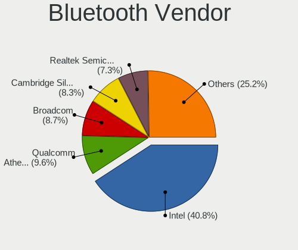

| Vendor                          | Computers | Percent |
|---------------------------------|-----------|---------|
| Intel                           | 58        | 42.03%  |
| Cambridge Silicon Radio         | 14        | 10.14%  |
| Broadcom                        | 13        | 9.42%   |
| Qualcomm Atheros Communications | 11        | 7.97%   |
| Realtek Semiconductor           | 9         | 6.52%   |
| Lite-On Technology              | 8         | 5.8%    |
| IMC Networks                    | 5         | 3.62%   |
| Apple                           | 5         | 3.62%   |
| Hewlett-Packard                 | 3         | 2.17%   |
| Dell                            | 3         | 2.17%   |
| Ralink Technology               | 2         | 1.45%   |
| ASUSTek Computer                | 2         | 1.45%   |
| Alps Electric                   | 2         | 1.45%   |
| Toshiba                         | 1         | 0.72%   |
| Foxconn / Hon Hai               | 1         | 0.72%   |
| Chicony Electronics             | 1         | 0.72%   |

Bluetooth Model
---------------

Controller models

| Model                                                                               | Computers | Percent |
|-------------------------------------------------------------------------------------|-----------|---------|
| Intel Bluetooth wireless interface                                                  | 26        | 18.84%  |
| Cambridge Silicon Radio Bluetooth Dongle (HCI mode)                                 | 14        | 10.14%  |
| Intel Bluetooth Device                                                              | 10        | 7.25%   |
| Intel Bluetooth 9460/9560 Jefferson Peak (JfP)                                      | 9         | 6.52%   |
| Qualcomm Atheros  Bluetooth Device                                                  | 7         | 5.07%   |
| Realtek Bluetooth Radio                                                             | 6         | 4.35%   |
| Intel AX200 Bluetooth                                                               | 6         | 4.35%   |
| Lite-On Bluetooth Device                                                            | 4         | 2.9%    |
| Intel AX201 Bluetooth                                                               | 3         | 2.17%   |
| Broadcom BCM2045B (BDC-2.1)                                                         | 3         | 2.17%   |
| Apple Bluetooth Host Controller                                                     | 3         | 2.17%   |
| Realtek RTL8821A Bluetooth                                                          | 2         | 1.45%   |
| Ralink Motorola BC4 Bluetooth 3.0+HS Adapter                                        | 2         | 1.45%   |
| Qualcomm Atheros AR3012 Bluetooth 4.0                                               | 2         | 1.45%   |
| Lite-On Atheros AR3012 Bluetooth                                                    | 2         | 1.45%   |
| Intel Wireless-AC 3168 Bluetooth                                                    | 2         | 1.45%   |
| IMC Networks Bluetooth Radio                                                        | 2         | 1.45%   |
| IMC Networks Bluetooth Device                                                       | 2         | 1.45%   |
| HP Broadcom 2070 Bluetooth Combo                                                    | 2         | 1.45%   |
| Broadcom BCM43142A0 Bluetooth 4.0                                                   | 2         | 1.45%   |
| Broadcom BCM20702A0 Bluetooth 4.0                                                   | 2         | 1.45%   |
| Toshiba Integrated Bluetooth HCI                                                    | 1         | 0.72%   |
| Realtek RTL8723B Bluetooth                                                          | 1         | 0.72%   |
| Qualcomm Atheros AR9462 Bluetooth                                                   | 1         | 0.72%   |
| Qualcomm Atheros AR3011 Bluetooth                                                   | 1         | 0.72%   |
| Lite-On Qualcomm Atheros Bluetooth                                                  | 1         | 0.72%   |
| Lite-On Bluetooth Radio                                                             | 1         | 0.72%   |
| Intel Wireless-AC 9260 Bluetooth Adapter                                            | 1         | 0.72%   |
| Intel AX210 Bluetooth                                                               | 1         | 0.72%   |
| IMC Networks Bluetooth module                                                       | 1         | 0.72%   |
| HP Bluetooth 2.0 Interface [Broadcom BCM2045]                                       | 1         | 0.72%   |
| Foxconn / Hon Hai Foxconn T77H114 BCM2070 [Single-Chip Bluetooth 2.1 + EDR Adapter] | 1         | 0.72%   |
| Dell Wireless 370 Bluetooth Mini-card                                               | 1         | 0.72%   |
| Dell Wireless 365 Bluetooth                                                         | 1         | 0.72%   |
| Dell Wireless 350 Bluetooth                                                         | 1         | 0.72%   |
| Chicony Bluetooth (RTL8723BE)                                                       | 1         | 0.72%   |
| Broadcom HP Portable Bumble Bee                                                     | 1         | 0.72%   |
| Broadcom Bluetooth Device                                                           | 1         | 0.72%   |
| Broadcom BCM20702 Bluetooth 4.0 [ThinkPad]                                          | 1         | 0.72%   |
| Broadcom BCM2070 Bluetooth 2.1 + EDR                                                | 1         | 0.72%   |
| Broadcom BCM2045B (BDC-2.1) [Bluetooth Controller]                                  | 1         | 0.72%   |
| Broadcom BCM2045B (BDC-2) [Bluetooth Controller]                                    | 1         | 0.72%   |
| ASUS BT-183 Bluetooth 2.0+EDR adapter                                               | 1         | 0.72%   |
| ASUS ASUS USB-BT500                                                                 | 1         | 0.72%   |
| Apple Bluetooth USB Host Controller                                                 | 1         | 0.72%   |
| Apple Bluetooth HCI                                                                 | 1         | 0.72%   |
| Alps Electric UGTZ4 Bluetooth                                                       | 1         | 0.72%   |
| Alps Electric Bluetooth Controller (ALPS/UGPZ6)                                     | 1         | 0.72%   |

Sound
-----

Sound Vendor
------------

Sound card vendors

| Vendor                            | Computers | Percent |
|-----------------------------------|-----------|---------|
| Intel                             | 208       | 58.59%  |
| AMD                               | 71        | 20%     |
| Nvidia                            | 52        | 14.65%  |
| Creative Labs                     | 4         | 1.13%   |
| C-Media Electronics               | 4         | 1.13%   |
| Logitech                          | 3         | 0.85%   |
| GN Netcom                         | 3         | 0.85%   |
| XMOS                              | 2         | 0.56%   |
| VIA Technologies                  | 1         | 0.28%   |
| Unknown                           | 1         | 0.28%   |
| Silicon Integrated Systems [SiS]  | 1         | 0.28%   |
| Focusrite-Novation                | 1         | 0.28%   |
| Elitegroup Computer Systems (ECS) | 1         | 0.28%   |
| Creative Technology               | 1         | 0.28%   |
| BEHRINGER International           | 1         | 0.28%   |
| Asahi Kasei Microsystems          | 1         | 0.28%   |

Sound Model
-----------

Sound card models

| Model                                                                                             | Computers | Percent |
|---------------------------------------------------------------------------------------------------|-----------|---------|
| Intel 82801I (ICH9 Family) HD Audio Controller                                                    | 22        | 5.21%   |
| Intel 82801H (ICH8 Family) HD Audio Controller                                                    | 21        | 4.98%   |
| Intel 6 Series/C200 Series Chipset Family High Definition Audio Controller                        | 21        | 4.98%   |
| Intel NM10/ICH7 Family High Definition Audio Controller                                           | 18        | 4.27%   |
| Intel 7 Series/C216 Chipset Family High Definition Audio Controller                               | 16        | 3.79%   |
| Intel Sunrise Point-LP HD Audio                                                                   | 15        | 3.55%   |
| AMD SBx00 Azalia (Intel HDA)                                                                      | 14        | 3.32%   |
| AMD FCH Azalia Controller                                                                         | 14        | 3.32%   |
| Intel 8 Series/C220 Series Chipset High Definition Audio Controller                               | 13        | 3.08%   |
| Intel 5 Series/3400 Series Chipset High Definition Audio                                          | 13        | 3.08%   |
| Nvidia High Definition Audio Controller                                                           | 10        | 2.37%   |
| Intel Xeon E3-1200 v3/4th Gen Core Processor HD Audio Controller                                  | 10        | 2.37%   |
| AMD Family 17h (Models 10h-1fh) HD Audio Controller                                               | 10        | 2.37%   |
| AMD Kabini HDMI/DP Audio                                                                          | 9         | 2.13%   |
| Intel Haswell-ULT HD Audio Controller                                                             | 8         | 1.9%    |
| Intel Atom Processor Z36xxx/Z37xxx Series High Definition Audio Controller                        | 8         | 1.9%    |
| Intel 8 Series HD Audio Controller                                                                | 8         | 1.9%    |
| Intel Cannon Point-LP High Definition Audio Controller                                            | 7         | 1.66%   |
| AMD Wrestler HDMI Audio                                                                           | 7         | 1.66%   |
| Nvidia MCP61 High Definition Audio                                                                | 6         | 1.42%   |
| Nvidia GP107GL High Definition Audio Controller                                                   | 6         | 1.42%   |
| Nvidia GF108 High Definition Audio Controller                                                     | 6         | 1.42%   |
| Intel Broadwell-U Audio Controller                                                                | 6         | 1.42%   |
| AMD Renoir Radeon High Definition Audio Controller                                                | 6         | 1.42%   |
| Intel Wildcat Point-LP High Definition Audio Controller                                           | 5         | 1.18%   |
| Intel Comet Lake PCH-LP cAVS                                                                      | 5         | 1.18%   |
| AMD Starship/Matisse HD Audio Controller                                                          | 5         | 1.18%   |
| AMD High Definition Audio Controller                                                              | 5         | 1.18%   |
| AMD Family 15h (Models 60h-6fh) Audio Controller                                                  | 5         | 1.18%   |
| AMD Cedar HDMI Audio [Radeon HD 5400/6300/7300 Series]                                            | 5         | 1.18%   |
| Intel Celeron/Pentium Silver Processor High Definition Audio                                      | 4         | 0.95%   |
| Intel 100 Series/C230 Series Chipset Family HD Audio Controller                                   | 4         | 0.95%   |
| AMD Raven/Raven2/Fenghuang HDMI/DP Audio Controller                                               | 4         | 0.95%   |
| Nvidia MCP51 High Definition Audio                                                                | 3         | 0.71%   |
| Nvidia GK208 HDMI/DP Audio Controller                                                             | 3         | 0.71%   |
| Intel Cannon Lake PCH cAVS                                                                        | 3         | 0.71%   |
| Intel Atom/Celeron/Pentium Processor x5-E8000/J3xxx/N3xxx Series High Definition Audio Controller | 3         | 0.71%   |
| Intel 82801JD/DO (ICH10 Family) HD Audio Controller                                               | 3         | 0.71%   |
| Intel 200 Series PCH HD Audio                                                                     | 3         | 0.71%   |
| AMD RV710/730 HDMI Audio [Radeon HD 4000 series]                                                  | 3         | 0.71%   |
| AMD IXP SB4x0 High Definition Audio Controller                                                    | 3         | 0.71%   |
| AMD Caicos HDMI Audio [Radeon HD 6450 / 7450/8450/8490 OEM / R5 230/235/235X OEM]                 | 3         | 0.71%   |
| XMOS Mayfield Audio                                                                               | 2         | 0.47%   |
| Nvidia TU107 GeForce GTX 1650 High Definition Audio Controller                                    | 2         | 0.47%   |
| Nvidia GT216 HDMI Audio Controller                                                                | 2         | 0.47%   |
| Nvidia GM107 High Definition Audio Controller [GeForce 940MX]                                     | 2         | 0.47%   |
| Nvidia GK107 HDMI Audio Controller                                                                | 2         | 0.47%   |
| Nvidia GK106 HDMI Audio Controller                                                                | 2         | 0.47%   |
| Intel Tiger Lake-LP Smart Sound Technology Audio Controller                                       | 2         | 0.47%   |
| Intel Ice Lake-LP Smart Sound Technology Audio Controller                                         | 2         | 0.47%   |
| Intel Celeron N3350/Pentium N4200/Atom E3900 Series Audio Cluster                                 | 2         | 0.47%   |
| Intel 9 Series Chipset Family HD Audio Controller                                                 | 2         | 0.47%   |
| Intel 82801JI (ICH10 Family) HD Audio Controller                                                  | 2         | 0.47%   |
| AMD Vega 10 HDMI Audio [Radeon Vega 56/64]                                                        | 2         | 0.47%   |
| AMD Trinity HDMI Audio Controller                                                                 | 2         | 0.47%   |
| AMD Oland/Hainan/Cape Verde/Pitcairn HDMI Audio [Radeon HD 7000 Series]                           | 2         | 0.47%   |
| AMD Juniper HDMI Audio [Radeon HD 5700 Series]                                                    | 2         | 0.47%   |
| AMD Family 17h (Models 00h-0fh) HD Audio Controller                                               | 2         | 0.47%   |
| VIA Technologies ICE1712 [Envy24] PCI Multi-Channel I/O Controller                                | 1         | 0.24%   |
| Unknown Realtek USB Audio Rear                                                                    | 1         | 0.24%   |

Memory
------

Memory Vendor
-------------

Memory module vendors

| Vendor              | Computers | Percent |
|---------------------|-----------|---------|
| Samsung Electronics | 48        | 20.96%  |
| Unknown             | 42        | 18.34%  |
| SK Hynix            | 40        | 17.47%  |
| Micron Technology   | 17        | 7.42%   |
| Kingston            | 15        | 6.55%   |
| Crucial             | 10        | 4.37%   |
| Corsair             | 9         | 3.93%   |
| Nanya Technology    | 7         | 3.06%   |
| A-DATA Technology   | 7         | 3.06%   |
| Patriot             | 4         | 1.75%   |
| G.Skill             | 4         | 1.75%   |
| Team                | 3         | 1.31%   |
| Smart               | 3         | 1.31%   |
| Unknown (ABCD)      | 2         | 0.87%   |
| Qimonda             | 2         | 0.87%   |
| ELPIDA              | 2         | 0.87%   |
| Unifosa             | 1         | 0.44%   |
| Transcend           | 1         | 0.44%   |
| Teikon              | 1         | 0.44%   |
| Sesame              | 1         | 0.44%   |
| Ramaxel Technology  | 1         | 0.44%   |
| PNY                 | 1         | 0.44%   |
| Multilaser          | 1         | 0.44%   |
| Goldkey             | 1         | 0.44%   |
| e2e4                | 1         | 0.44%   |
| DigiBoard           | 1         | 0.44%   |
| Avant               | 1         | 0.44%   |
| ASint Technology    | 1         | 0.44%   |
| Apacer              | 1         | 0.44%   |
| 48spaces            | 1         | 0.44%   |

Memory Model
------------

Memory module models

| Model                                                        | Computers | Percent |
|--------------------------------------------------------------|-----------|---------|
| Samsung RAM M471A5244CB0-CRC 4GB SODIMM DDR4 2667MT/s        | 4         | 1.62%   |
| Unknown RAM Module 2048MB SODIMM DDR2 667MT/s                | 3         | 1.21%   |
| SK Hynix RAM Module 2048MB DIMM DDR3 1600MT/s                | 3         | 1.21%   |
| Nanya RAM NT2GC64B88B0NS-CG 2GB SODIMM DDR3 1334MT/s         | 3         | 1.21%   |
| Unknown SODIMM 2048MB SODIMM DDR2 667MT/s                    | 2         | 0.81%   |
| Unknown SODIMM 1024MB SODIMM DDR2 667MT/s                    | 2         | 0.81%   |
| Unknown RAM Module 2048MB SODIMM DDR3 1600MT/s               | 2         | 0.81%   |
| Unknown RAM Module 2048MB DIMM DDR2 800MT/s                  | 2         | 0.81%   |
| Unknown RAM Module 1024MB SODIMM DDR2 667MT/s                | 2         | 0.81%   |
| Unknown RAM Module 1024MB SODIMM DDR2                        | 2         | 0.81%   |
| Unknown (ABCD) RAM 123456789012345678 1GB DIMM DDR3 2400MT/s | 2         | 0.81%   |
| SK Hynix RAM Module 2048MB SODIMM DDR3 1600MT/s              | 2         | 0.81%   |
| SK Hynix RAM HMT451S6AFR8A-PB 4GB SODIMM DDR3 1600MT/s       | 2         | 0.81%   |
| SK Hynix RAM HMT351S6EFR8A-PB 4096MB SODIMM DDR3 1600MT/s    | 2         | 0.81%   |
| SK Hynix RAM HMA81GS6JJR8N-VK 8192MB SODIMM DDR4 2667MT/s    | 2         | 0.81%   |
| Samsung RAM M471B5773DH0-CH9 2GB SODIMM DDR3 1600MT/s        | 2         | 0.81%   |
| Samsung RAM M471B5673FH0-CH9 2048MB SODIMM DDR3 1334MT/s     | 2         | 0.81%   |
| Samsung RAM M471B5273DH0-CH9 4GB SODIMM DDR3 1334MT/s        | 2         | 0.81%   |
| Samsung RAM M471B5273CH0-CH9 4096MB SODIMM DDR3 1334MT/s     | 2         | 0.81%   |
| Samsung RAM M471B5173QH0-YK0 4GB SODIMM DDR3 1600MT/s        | 2         | 0.81%   |
| Samsung RAM M471B5173EB0-YK0 4GB SODIMM DDR3 1600MT/s        | 2         | 0.81%   |
| Samsung RAM M471B5173DB0-YK0 4GB SODIMM DDR3 1600MT/s        | 2         | 0.81%   |
| Samsung RAM M471B1G73QH0-YK0 8GB SODIMM DDR3 2667MT/s        | 2         | 0.81%   |
| Samsung RAM M471A5244CB0-CTD 4GB SODIMM DDR4 3266MT/s        | 2         | 0.81%   |
| Samsung RAM M471A2K43DB1-CWE 16GB SODIMM DDR4 3200MT/s       | 2         | 0.81%   |
| Samsung RAM M378B5273DH0-CH9 4096MB DIMM DDR3 2133MT/s       | 2         | 0.81%   |
| Nanya RAM NT4GC64B8HB0NS-CG 4GB SODIMM DDR3 1334MT/s         | 2         | 0.81%   |
| Nanya RAM NT2GT64U8HD0BY-AD 2GB DIMM DDR2 2048MT/s           | 2         | 0.81%   |
| Micron RAM Module 8192MB SODIMM DDR4 2667MT/s                | 2         | 0.81%   |
| Crucial RAM CT102464BF160B.C16 8GB SODIMM DDR3 1600MT/s      | 2         | 0.81%   |
| Corsair RAM CMSO8GX3M1C1600C11 8192MB SODIMM DDR3 1600MT/s   | 2         | 0.81%   |
| Unknown SODIMM 2048MB SODIMM DDR2 800MT/s                    | 1         | 0.4%    |
| Unknown RAM Module 8192MB SODIMM DDR4 2133MT/s               | 1         | 0.4%    |
| Unknown RAM Module 8192MB SODIMM DDR3 1333MT/s               | 1         | 0.4%    |
| Unknown RAM Module 8192MB Row Of Chips LPDDR4 4267MT/s       | 1         | 0.4%    |
| Unknown RAM Module 8192MB DIMM DDR3 1866MT/s                 | 1         | 0.4%    |
| Unknown RAM Module 512MB DIMM 400MT/s                        | 1         | 0.4%    |
| Unknown RAM Module 4096MB SODIMM DDR4 2400MT/s               | 1         | 0.4%    |
| Unknown RAM Module 4096MB SODIMM DDR4 2133MT/s               | 1         | 0.4%    |
| Unknown RAM Module 4096MB SODIMM DDR3 1067MT/s               | 1         | 0.4%    |
| Unknown RAM Module 4096MB SODIMM DDR3                        | 1         | 0.4%    |
| Unknown RAM Module 4096MB DIMM SDRAM                         | 1         | 0.4%    |
| Unknown RAM Module 4096MB DIMM DDR3 1600MT/s                 | 1         | 0.4%    |
| Unknown RAM Module 4096MB DIMM DDR3 1066MT/s                 | 1         | 0.4%    |
| Unknown RAM Module 4096MB Chip DDR4 2133MT/s                 | 1         | 0.4%    |
| Unknown RAM Module 2GB SODIMM DDR2 667MT/s                   | 1         | 0.4%    |
| Unknown RAM Module 2GB SODIMM DDR2 533MT/s                   | 1         | 0.4%    |
| Unknown RAM Module 2048MB SODIMM LPDDR4 2400MT/s             | 1         | 0.4%    |
| Unknown RAM Module 2048MB SODIMM DDR3 1333MT/s               | 1         | 0.4%    |
| Unknown RAM Module 2048MB SODIMM DDR3 1066MT/s               | 1         | 0.4%    |
| Unknown RAM Module 2048MB DIMM LPDDR4 1600MT/s               | 1         | 0.4%    |
| Unknown RAM Module 2048MB DIMM DDR2                          | 1         | 0.4%    |
| Unknown RAM Module 2048MB DIMM 800MT/s                       | 1         | 0.4%    |
| Unknown RAM Module 2048MB DIMM 400MT/s                       | 1         | 0.4%    |
| Unknown RAM Module 1GB SODIMM DDR2 533MT/s                   | 1         | 0.4%    |
| Unknown RAM Module 1024MB SODIMM DDR2 533MT/s                | 1         | 0.4%    |
| Unknown RAM Module 1024MB SODIMM DDR2 2MT/s                  | 1         | 0.4%    |
| Unknown RAM Module 1024MB SODIMM DDR2 1MT/s                  | 1         | 0.4%    |
| Unknown RAM Module 1024MB DIMM SDRAM                         | 1         | 0.4%    |
| Unknown RAM Module 1024MB DIMM DDR2                          | 1         | 0.4%    |

Memory Kind
-----------

Memory module kinds

| Kind    | Computers | Percent |
|---------|-----------|---------|
| DDR3    | 92        | 46.46%  |
| DDR4    | 49        | 24.75%  |
| DDR2    | 34        | 17.17%  |
| SDRAM   | 7         | 3.54%   |
| LPDDR4  | 4         | 2.02%   |
| LPDDR3  | 4         | 2.02%   |
| DDR     | 4         | 2.02%   |
| Unknown | 4         | 2.02%   |

Memory Form Factor
------------------

Physical design of the memory module

| Name         | Computers | Percent |
|--------------|-----------|---------|
| SODIMM       | 129       | 66.15%  |
| DIMM         | 59        | 30.26%  |
| Row Of Chips | 6         | 3.08%   |
| Chip         | 1         | 0.51%   |

Memory Size
-----------

Memory module size

| Size  | Computers | Percent |
|-------|-----------|---------|
| 4096  | 69        | 31.08%  |
| 2048  | 62        | 27.93%  |
| 8192  | 54        | 24.32%  |
| 1024  | 21        | 9.46%   |
| 16384 | 12        | 5.41%   |
| 512   | 2         | 0.9%    |
| 65536 | 1         | 0.45%   |
| 32768 | 1         | 0.45%   |

Memory Speed
------------

Memory module speed

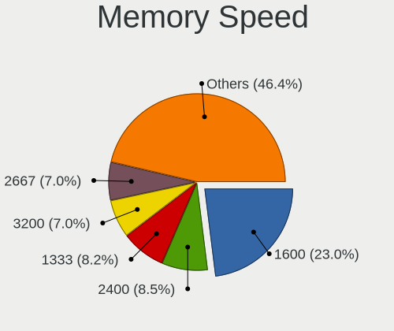

| Speed   | Computers | Percent |
|---------|-----------|---------|
| 1600    | 51        | 23.61%  |
| 1333    | 20        | 9.26%   |
| 2400    | 17        | 7.87%   |
| 667     | 17        | 7.87%   |
| 1334    | 16        | 7.41%   |
| 800     | 16        | 7.41%   |
| 2667    | 15        | 6.94%   |
| 3200    | 11        | 5.09%   |
| 2133    | 10        | 4.63%   |
| Unknown | 7         | 3.24%   |
| 2048    | 5         | 2.31%   |
| 1867    | 4         | 1.85%   |
| 1866    | 4         | 1.85%   |
| 400     | 4         | 1.85%   |
| 1066    | 3         | 1.39%   |
| 533     | 3         | 1.39%   |
| 3600    | 2         | 0.93%   |
| 3266    | 2         | 0.93%   |
| 3000    | 2         | 0.93%   |
| 1067    | 2         | 0.93%   |
| 49926   | 1         | 0.46%   |
| 4267    | 1         | 0.46%   |
| 1200    | 1         | 0.46%   |
| 2       | 1         | 0.46%   |
| 1       | 1         | 0.46%   |

Printers & scanners
-------------------

Printer Vendor
--------------

Printer device vendors

| Vendor              | Computers | Percent |
|---------------------|-----------|---------|
| Brother Industries  | 2         | 50%     |
| Samsung Electronics | 1         | 25%     |
| Hewlett-Packard     | 1         | 25%     |

Printer Model
-------------

Printer device models

| Model                   | Computers | Percent |
|-------------------------|-----------|---------|
| Samsung SCX-4200 series | 1         | 25%     |
| HP Deskjet 3520 series  | 1         | 25%     |
| Brother PTUSB Printing  | 1         | 25%     |
| Brother DCP-7055W       | 1         | 25%     |

Scanner Vendor
--------------

Scanner device vendors

| Vendor      | Computers | Percent |
|-------------|-----------|---------|
| Seiko Epson | 1         | 100%    |

Scanner Model
-------------

Scanner device models

| Model                                                         | Computers | Percent |
|---------------------------------------------------------------|-----------|---------|
| Seiko Epson GT-8700/GT-8700F [Perfection 1640SU/1640SU PHOTO] | 1         | 100%    |

Camera
------

Camera Vendor
-------------

Camera device vendors

| Vendor                                 | Computers | Percent |
|----------------------------------------|-----------|---------|
| Chicony Electronics                    | 47        | 27.81%  |
| Acer                                   | 15        | 8.88%   |
| Realtek Semiconductor                  | 13        | 7.69%   |
| IMC Networks                           | 11        | 6.51%   |
| Microdia                               | 10        | 5.92%   |
| Suyin                                  | 8         | 4.73%   |
| Quanta                                 | 8         | 4.73%   |
| Sunplus Innovation Technology          | 5         | 2.96%   |
| Silicon Motion                         | 4         | 2.37%   |
| Ricoh                                  | 4         | 2.37%   |
| Logitech                               | 4         | 2.37%   |
| Apple                                  | 4         | 2.37%   |
| Alcor Micro                            | 4         | 2.37%   |
| Z-Star Microelectronics                | 3         | 1.78%   |
| Samsung Electronics                    | 3         | 1.78%   |
| Lenovo                                 | 3         | 1.78%   |
| Importek                               | 3         | 1.78%   |
| Cheng Uei Precision Industry (Foxlink) | 3         | 1.78%   |
| Syntek                                 | 2         | 1.18%   |
| Lite-On Technology                     | 2         | 1.18%   |
| Sunplus IT                             | 1         | 0.59%   |
| OmniVision Technologies                | 1         | 0.59%   |
| Nintendo                               | 1         | 0.59%   |
| Microsoft                              | 1         | 0.59%   |
| Luxvisions Innotech Limited            | 1         | 0.59%   |
| KYE Systems (Mouse Systems)            | 1         | 0.59%   |
| Guillemot                              | 1         | 0.59%   |
| Genesys Logic                          | 1         | 0.59%   |
| GEMBIRD                                | 1         | 0.59%   |
| DJEDDA19IE563E                         | 1         | 0.59%   |
| DigiTech                               | 1         | 0.59%   |
| ARC International                      | 1         | 0.59%   |
| ALi                                    | 1         | 0.59%   |

Camera Model
------------

Camera device models

| Model                                               | Computers | Percent |
|-----------------------------------------------------|-----------|---------|
| Chicony Integrated Camera                           | 8         | 4.71%   |
| Realtek Integrated_Webcam_HD                        | 6         | 3.53%   |
| Chicony TOSHIBA Web Camera - HD                     | 4         | 2.35%   |
| Acer Lenovo EasyCamera                              | 4         | 2.35%   |
| Samsung Galaxy A5 (MTP)                             | 3         | 1.76%   |
| IMC Networks USB2.0 HD UVC WebCam                   | 3         | 1.76%   |
| Chicony EasyCamera                                  | 3         | 1.76%   |
| Apple FaceTime HD Camera                            | 3         | 1.76%   |
| Alcor Micro Asus Integrated Webcam                  | 3         | 1.76%   |
| Sunplus HD WebCam                                   | 2         | 1.18%   |
| Realtek Lenovo EasyCamera                           | 2         | 1.18%   |
| Realtek Integrated Webcam                           | 2         | 1.18%   |
| Quanta VGA WebCam                                   | 2         | 1.18%   |
| Quanta HP Webcam                                    | 2         | 1.18%   |
| Quanta HP HD Camera                                 | 2         | 1.18%   |
| Microdia Laptop_Integrated_Webcam_2M                | 2         | 1.18%   |
| Logitech Webcam C270                                | 2         | 1.18%   |
| Importek TOSHIBA Web Camera - HD                    | 2         | 1.18%   |
| IMC Networks USB2.0 VGA UVC WebCam                  | 2         | 1.18%   |
| IMC Networks USB2.0 UVC HD Webcam                   | 2         | 1.18%   |
| Chicony USB 2.0 Camera                              | 2         | 1.18%   |
| Chicony HP HD Camera                                | 2         | 1.18%   |
| Chicony HD WebCam                                   | 2         | 1.18%   |
| Acer USB 2.0 Camera                                 | 2         | 1.18%   |
| Acer Integrated Camera                              | 2         | 1.18%   |
| Acer BisonCam,NB Pro                                | 2         | 1.18%   |
| Z-Star Webcam                                       | 1         | 0.59%   |
| Z-Star Sirius USB2.0 Camera                         | 1         | 0.59%   |
| Z-Star Namuga 1.3M Webcam                           | 1         | 0.59%   |
| Syntek Integrated Camera                            | 1         | 0.59%   |
| Syntek EasyCamera                                   | 1         | 0.59%   |
| Suyin WebCam                                        | 1         | 0.59%   |
| Suyin Lenovo Integrated Webcam                      | 1         | 0.59%   |
| Suyin Integrated_Webcam_HD                          | 1         | 0.59%   |
| Suyin HP Wide Vision FHD Camera                     | 1         | 0.59%   |
| Suyin HP Webcam-101                                 | 1         | 0.59%   |
| Suyin HP Webcam                                     | 1         | 0.59%   |
| Suyin Asus Integrated Webcam                        | 1         | 0.59%   |
| Suyin Acer CrystalEye Webcam                        | 1         | 0.59%   |
| Sunplus IT HD 1080P WebCam                          | 1         | 0.59%   |
| Sunplus Laptop Integrated Webcam HD                 | 1         | 0.59%   |
| Sunplus HP Truevision Full HD                       | 1         | 0.59%   |
| Sunplus Full HD webcam                              | 1         | 0.59%   |
| Silicon Motion WebCam SCB-0355N                     | 1         | 0.59%   |
| Silicon Motion WebCam SC-0311139N                   | 1         | 0.59%   |
| Silicon Motion Web Camera                           | 1         | 0.59%   |
| Silicon Motion Lenovo EasyCamera                    | 1         | 0.59%   |
| Ricoh Webcam 1000                                   | 1         | 0.59%   |
| Ricoh Visual Communication Camera VGP-VCC7 [R5U870] | 1         | 0.59%   |
| Ricoh Visual Communication Camera VGP-VCC6 [R5U870] | 1         | 0.59%   |
| Ricoh Integrated_Webcam_1.3M                        | 1         | 0.59%   |
| Realtek USB2.0 VGA UVC WebCam                       | 1         | 0.59%   |
| Realtek Streaming Webcam                            | 1         | 0.59%   |
| Realtek 2SF022                                      | 1         | 0.59%   |
| Quanta hm1091_techfront                             | 1         | 0.59%   |
| Quanta HD Webcam                                    | 1         | 0.59%   |
| OmniVision OV2640 Webcam                            | 1         | 0.59%   |
| Nintendo USB Camera                                 | 1         | 0.59%   |
| Microsoft LifeCam HD-3000                           | 1         | 0.59%   |
| Microdia Sonix USB 2.0 Camera                       | 1         | 0.59%   |

Security
--------

Fingerprint Vendor
------------------

Fingerprint sensor vendors

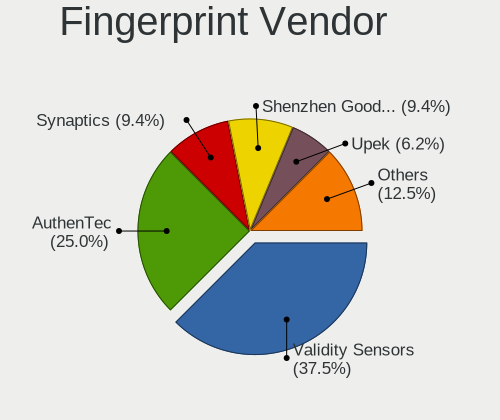

| Vendor                     | Computers | Percent |
|----------------------------|-----------|---------|
| Validity Sensors           | 10        | 41.67%  |
| AuthenTec                  | 6         | 25%     |
| Shenzhen Goodix Technology | 3         | 12.5%   |
| Upek                       | 2         | 8.33%   |
| Synaptics                  | 1         | 4.17%   |
| STMicroelectronics         | 1         | 4.17%   |
| LighTuning Technology      | 1         | 4.17%   |

Fingerprint Model
-----------------

Fingerprint sensor models

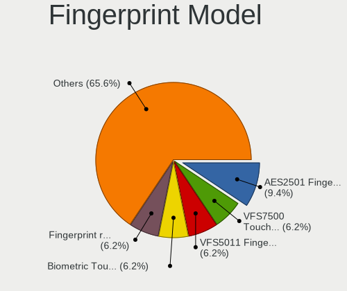

| Model                                                     | Computers | Percent |
|-----------------------------------------------------------|-----------|---------|
| Validity Sensors VFS7500 Touch Fingerprint Sensor         | 2         | 8.33%   |
| Validity Sensors VFS5011 Fingerprint Reader               | 2         | 8.33%   |
| Upek Biometric Touchchip/Touchstrip Fingerprint Sensor    | 2         | 8.33%   |
| AuthenTec AES2810                                         | 2         | 8.33%   |
| AuthenTec AES2501 Fingerprint Sensor                      | 2         | 8.33%   |
| Validity Sensors VFS495 Fingerprint Reader                | 1         | 4.17%   |
| Validity Sensors VFS451 Fingerprint Reader                | 1         | 4.17%   |
| Validity Sensors VFS301 Fingerprint Reader                | 1         | 4.17%   |
| Validity Sensors VFS300 Fingerprint Reader                | 1         | 4.17%   |
| Validity Sensors VFS101 Fingerprint Reader                | 1         | 4.17%   |
| Validity Sensors VFS Fingerprint sensor                   | 1         | 4.17%   |
| Synaptics  FS7604 Touch Fingerprint Sensor with PurePrint | 1         | 4.17%   |
| STMicroelectronics Fingerprint Reader                     | 1         | 4.17%   |
| Shenzhen Goodix  FingerPrint Device                       | 1         | 4.17%   |
| Shenzhen Goodix Fingerprint Reader                        | 1         | 4.17%   |
| Shenzhen Goodix FingerPrint                               | 1         | 4.17%   |
| LighTuning EgisTec Touch Fingerprint Sensor               | 1         | 4.17%   |
| AuthenTec AES1660 Fingerprint Sensor                      | 1         | 4.17%   |
| AuthenTec AES1600                                         | 1         | 4.17%   |

Chipcard Vendor
---------------

Chipcard module vendors

| Vendor      | Computers | Percent |
|-------------|-----------|---------|
| Alcor Micro | 3         | 42.86%  |
| O2 Micro    | 2         | 28.57%  |
| Upek        | 1         | 14.29%  |
| Broadcom    | 1         | 14.29%  |

Chipcard Model
--------------

Chipcard module models

| Model                                                                        | Computers | Percent |
|------------------------------------------------------------------------------|-----------|---------|
| Alcor Micro AU9540 Smartcard Reader                                          | 3         | 42.86%  |
| O2 Micro OZ776 CCID Smartcard Reader                                         | 2         | 28.57%  |
| Upek TouchChip Fingerprint Coprocessor (WBF advanced mode)                   | 1         | 14.29%  |
| Broadcom BCM5880 Secure Applications Processor with fingerprint swipe sensor | 1         | 14.29%  |

Unsupported
-----------

Unsupported Devices
-------------------

Total unsupported devices on board

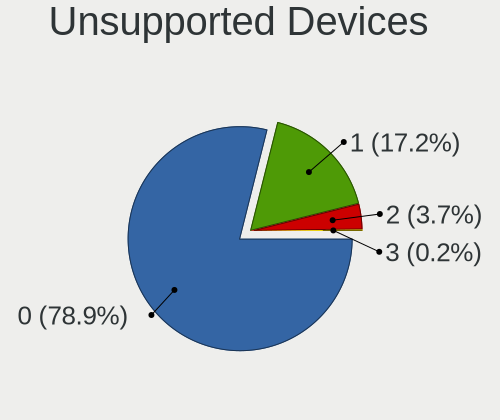

| Total | Computers | Percent |
|-------|-----------|---------|
| 0     | 235       | 78.86%  |
| 1     | 51        | 17.11%  |
| 2     | 12        | 4.03%   |

Unsupported Device Types
------------------------

Types of unsupported devices

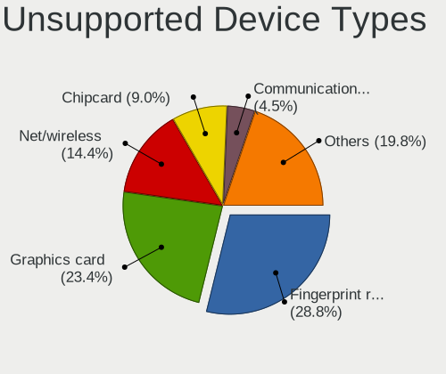

| Type                     | Computers | Percent |
|--------------------------|-----------|---------|
| Fingerprint reader       | 24        | 33.8%   |
| Graphics card            | 12        | 16.9%   |
| Net/wireless             | 10        | 14.08%  |
| Chipcard                 | 7         | 9.86%   |
| Communication controller | 4         | 5.63%   |
| Unassigned class         | 3         | 4.23%   |
| Camera                   | 3         | 4.23%   |
| Storage                  | 2         | 2.82%   |
| Sound                    | 2         | 2.82%   |
| Net/ethernet             | 1         | 1.41%   |
| Multimedia controller    | 1         | 1.41%   |
| Flash memory             | 1         | 1.41%   |
| Dvb card                 | 1         | 1.41%   |

