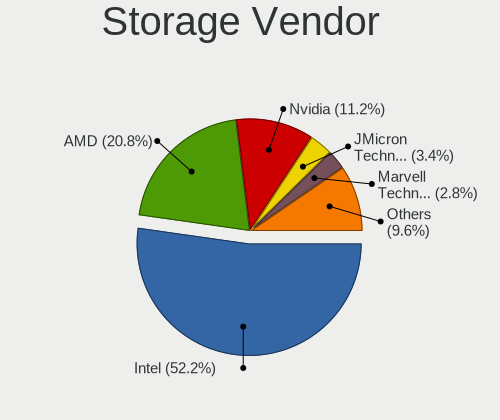
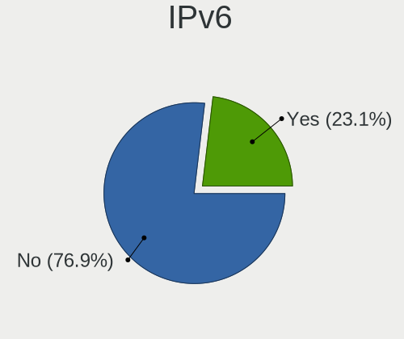

Lubuntu 20.04 - Tested Hardware & Statistics (Desktops)
-------------------------------------------------------

A project to collect tested hardware configurations for Lubuntu 20.04.

Anyone can contribute to this report by the [hw-probe](https://github.com/linuxhw/hw-probe) tool:

    sudo -E hw-probe -all -upload

Please contribute! Especially if your hardware is rare.

Contents
--------

* [ Test Cases ](#test-cases)

* [ System ](#system)
  - [ Kernel                   ](#kernel)
  - [ Kernel Family            ](#kernel-family)
  - [ Kernel Major Ver.        ](#kernel-major-ver)
  - [ Arch                     ](#arch)
  - [ DE                       ](#de)
  - [ Display Server           ](#display-server)
  - [ Display Manager          ](#display-manager)
  - [ OS Lang                  ](#os-lang)
  - [ Boot Mode                ](#boot-mode)
  - [ Filesystem               ](#filesystem)
  - [ Part. scheme             ](#part-scheme)
  - [ Dual Boot with Linux/BSD ](#dual-boot-with-linuxbsd)
  - [ Dual Boot (Win)          ](#dual-boot-win)

* [ Board ](#board)
  - [ Vendor                   ](#vendor)
  - [ Model                    ](#model)
  - [ Model Family             ](#model-family)
  - [ MFG Year                 ](#mfg-year)
  - [ Form Factor              ](#form-factor)
  - [ Secure Boot              ](#secure-boot)
  - [ Coreboot                 ](#coreboot)
  - [ RAM Size                 ](#ram-size)
  - [ RAM Used                 ](#ram-used)
  - [ Total Drives             ](#total-drives)
  - [ Has CD-ROM               ](#has-cd-rom)
  - [ Has Ethernet             ](#has-ethernet)
  - [ Has WiFi                 ](#has-wifi)
  - [ Has Bluetooth            ](#has-bluetooth)

* [ Location ](#location)
  - [ Country                  ](#country)
  - [ City                     ](#city)

* [ Drives ](#drives)
  - [ Drive Vendor             ](#drive-vendor)
  - [ Drive Model              ](#drive-model)
  - [ HDD Vendor               ](#hdd-vendor)
  - [ SSD Vendor               ](#ssd-vendor)
  - [ Drive Kind               ](#drive-kind)
  - [ Drive Connector          ](#drive-connector)
  - [ Drive Size               ](#drive-size)
  - [ Space Total              ](#space-total)
  - [ Space Used               ](#space-used)
  - [ Malfunc. Drives          ](#malfunc-drives)
  - [ Malfunc. Drive Vendor    ](#malfunc-drive-vendor)
  - [ Malfunc. HDD Vendor      ](#malfunc-hdd-vendor)
  - [ Malfunc. Drive Kind      ](#malfunc-drive-kind)
  - [ Failed Drives            ](#failed-drives)
  - [ Failed Drive Vendor      ](#failed-drive-vendor)
  - [ Drive Status             ](#drive-status)

* [ Storage controller ](#storage-controller)
  - [ Storage Vendor           ](#storage-vendor)
  - [ Storage Model            ](#storage-model)
  - [ Storage Kind             ](#storage-kind)

* [ Processor ](#processor)
  - [ CPU Vendor               ](#cpu-vendor)
  - [ CPU Model                ](#cpu-model)
  - [ CPU Model Family         ](#cpu-model-family)
  - [ CPU Cores                ](#cpu-cores)
  - [ CPU Sockets              ](#cpu-sockets)
  - [ CPU Threads              ](#cpu-threads)
  - [ CPU Op-Modes             ](#cpu-op-modes)
  - [ CPU Microcode            ](#cpu-microcode)
  - [ CPU Microarch            ](#cpu-microarch)

* [ Graphics ](#graphics)
  - [ GPU Vendor               ](#gpu-vendor)
  - [ GPU Model                ](#gpu-model)
  - [ GPU Combo                ](#gpu-combo)
  - [ GPU Driver               ](#gpu-driver)
  - [ GPU Memory               ](#gpu-memory)

* [ Monitor ](#monitor)
  - [ Monitor Vendor           ](#monitor-vendor)
  - [ Monitor Model            ](#monitor-model)
  - [ Monitor Resolution       ](#monitor-resolution)
  - [ Monitor Diagonal         ](#monitor-diagonal)
  - [ Monitor Width            ](#monitor-width)
  - [ Aspect Ratio             ](#aspect-ratio)
  - [ Monitor Area             ](#monitor-area)
  - [ Pixel Density            ](#pixel-density)
  - [ Multiple Monitors        ](#multiple-monitors)

* [ Network ](#network)
  - [ Net Controller Vendor    ](#net-controller-vendor)
  - [ Net Controller Model     ](#net-controller-model)
  - [ Wireless Vendor          ](#wireless-vendor)
  - [ Wireless Model           ](#wireless-model)
  - [ Ethernet Vendor          ](#ethernet-vendor)
  - [ Ethernet Model           ](#ethernet-model)
  - [ Net Controller Kind      ](#net-controller-kind)
  - [ Used Controller          ](#used-controller)
  - [ NICs                     ](#nics)
  - [ IPv6                     ](#ipv6)

* [ Bluetooth ](#bluetooth)
  - [ Bluetooth Vendor         ](#bluetooth-vendor)
  - [ Bluetooth Model          ](#bluetooth-model)

* [ Sound ](#sound)
  - [ Sound Vendor             ](#sound-vendor)
  - [ Sound Model              ](#sound-model)

* [ Memory ](#memory)
  - [ Memory Vendor            ](#memory-vendor)
  - [ Memory Model             ](#memory-model)
  - [ Memory Kind              ](#memory-kind)
  - [ Memory Form Factor       ](#memory-form-factor)
  - [ Memory Size              ](#memory-size)
  - [ Memory Speed             ](#memory-speed)

* [ Printers & scanners ](#printers--scanners)
  - [ Printer Vendor           ](#printer-vendor)
  - [ Printer Model            ](#printer-model)
  - [ Scanner Vendor           ](#scanner-vendor)
  - [ Scanner Model            ](#scanner-model)

* [ Camera ](#camera)
  - [ Camera Vendor            ](#camera-vendor)
  - [ Camera Model             ](#camera-model)

* [ Security ](#security)
  - [ Fingerprint Vendor       ](#fingerprint-vendor)
  - [ Fingerprint Model        ](#fingerprint-model)
  - [ Chipcard Vendor          ](#chipcard-vendor)
  - [ Chipcard Model           ](#chipcard-model)

* [ Unsupported ](#unsupported)
  - [ Unsupported Devices      ](#unsupported-devices)
  - [ Unsupported Device Types ](#unsupported-device-types)

Test Cases
----------

Total: 199

| Vendor        | Model                       | Probe                                                      | Date         |
|---------------|-----------------------------|------------------------------------------------------------|--------------|
| Unknown       | Phitronics N68C-M           | [77747ce79b](https://linux-hardware.org/?probe=77747ce79b) | May 02, 2023 |
| Intel         | DG41RQ AAE54511-203         | [4eb2bc6e88](https://linux-hardware.org/?probe=4eb2bc6e88) | May 01, 2023 |
| ASUSTek       | F1A55-M LK R2.0             | [234e0d0738](https://linux-hardware.org/?probe=234e0d0738) | Apr 23, 2023 |
| Gigabyte      | B450M S2H                   | [4b440b2084](https://linux-hardware.org/?probe=4b440b2084) | Feb 22, 2023 |
| Pegatron      | 2A73h                       | [835743de83](https://linux-hardware.org/?probe=835743de83) | Feb 21, 2023 |
| Gigabyte      | B450M S2H                   | [2420c1fb57](https://linux-hardware.org/?probe=2420c1fb57) | Feb 18, 2023 |
| Gigabyte      | B450M S2H                   | [72b29b5f80](https://linux-hardware.org/?probe=72b29b5f80) | Feb 16, 2023 |
| Lenovo        | 0B98401 PRO                 | [63487a2957](https://linux-hardware.org/?probe=63487a2957) | Nov 28, 2022 |
| Lenovo        | 0B98401 PRO                 | [0b632b7ae8](https://linux-hardware.org/?probe=0b632b7ae8) | Nov 27, 2022 |
| HP            | 3048h                       | [33ced86304](https://linux-hardware.org/?probe=33ced86304) | Nov 19, 2022 |
| HP            | 3048h                       | [e5fdb1f67a](https://linux-hardware.org/?probe=e5fdb1f67a) | Nov 19, 2022 |
| ASUSTek       | M2NPV-VM                    | [db28f53298](https://linux-hardware.org/?probe=db28f53298) | Nov 12, 2022 |
| AMI           | Cherry Trail CR             | [f731a55cc1](https://linux-hardware.org/?probe=f731a55cc1) | Nov 05, 2022 |
| Intel         | D33217GKE G76540-203        | [eb15ca5b98](https://linux-hardware.org/?probe=eb15ca5b98) | Nov 03, 2022 |
| Intel         | D33217GKE G76540-203        | [20824af437](https://linux-hardware.org/?probe=20824af437) | Nov 03, 2022 |
| Intel         | D33217GKE G76540-203        | [95238cc6e8](https://linux-hardware.org/?probe=95238cc6e8) | Oct 30, 2022 |
| Intel         | D33217GKE G76540-203        | [2501d67199](https://linux-hardware.org/?probe=2501d67199) | Oct 28, 2022 |
| AOpen         | D1007 0BBA                  | [b3597a7cbc](https://linux-hardware.org/?probe=b3597a7cbc) | Oct 10, 2022 |
| ASUSTek       | Maximus V FORMULA           | [cf8128637b](https://linux-hardware.org/?probe=cf8128637b) | Sep 24, 2022 |
| ASUSTek       | Maximus V FORMULA           | [e63b24acc3](https://linux-hardware.org/?probe=e63b24acc3) | Sep 24, 2022 |
| Intel         | DH67CL AAG10212-210         | [3468d8c911](https://linux-hardware.org/?probe=3468d8c911) | Sep 24, 2022 |
| ASRock        | A520M-HVS                   | [842ad7d4d2](https://linux-hardware.org/?probe=842ad7d4d2) | Aug 22, 2022 |
| ASUSTek       | M5A97 R2.0                  | [c2acc2d803](https://linux-hardware.org/?probe=c2acc2d803) | Aug 10, 2022 |
| MSI           | X399 SLI PLUS               | [515c5375c1](https://linux-hardware.org/?probe=515c5375c1) | Jul 31, 2022 |
| MSI           | AMETHYST-M                  | [d5fb610246](https://linux-hardware.org/?probe=d5fb610246) | Jul 26, 2022 |
| ASRock        | M3A785GMH/128M              | [87836918b2](https://linux-hardware.org/?probe=87836918b2) | Jul 25, 2022 |
| MSI           | H510I PRO WIFI              | [cb9ba02bb3](https://linux-hardware.org/?probe=cb9ba02bb3) | Jul 20, 2022 |
| MSI           | A88XM-E35                   | [8767210da3](https://linux-hardware.org/?probe=8767210da3) | Jul 04, 2022 |
| Gigabyte      | GA-MA69G-S3H                | [2dba47edb2](https://linux-hardware.org/?probe=2dba47edb2) | Jun 18, 2022 |
| HP            | 3397                        | [2f3fb08195](https://linux-hardware.org/?probe=2f3fb08195) | Jun 03, 2022 |
| ASRock        | FM2A85X Extreme6            | [365ff27343](https://linux-hardware.org/?probe=365ff27343) | May 27, 2022 |
| ASRock        | FM2A85X Extreme6            | [00d4dc8661](https://linux-hardware.org/?probe=00d4dc8661) | May 24, 2022 |
| Fujitsu       | D3164-C2 S26361-D3164-C2    | [942f142f46](https://linux-hardware.org/?probe=942f142f46) | May 20, 2022 |
| Intel         | X79 (INTEL Xeon E5/Corei... | [9254de4361](https://linux-hardware.org/?probe=9254de4361) | May 18, 2022 |
| Dell          | 08NPPY A00                  | [6c4d2173a5](https://linux-hardware.org/?probe=6c4d2173a5) | Apr 27, 2022 |
| MSI           | MPG X570 GAMING EDGE WIF... | [a547974d27](https://linux-hardware.org/?probe=a547974d27) | Apr 27, 2022 |
| MSI           | MPG X570 GAMING EDGE WIF... | [7be2e51c84](https://linux-hardware.org/?probe=7be2e51c84) | Apr 27, 2022 |
| Dell          | 018D1Y A00                  | [705fbe0501](https://linux-hardware.org/?probe=705fbe0501) | Apr 23, 2022 |
| Gigabyte      | H97-D3H-CF                  | [e9ad69846b](https://linux-hardware.org/?probe=e9ad69846b) | Apr 14, 2022 |
| MSI           | 990FXA-GD65                 | [52598b41a6](https://linux-hardware.org/?probe=52598b41a6) | Mar 31, 2022 |
| Lenovo        | ThinkCentre M55p 8811VQV    | [dc2a995551](https://linux-hardware.org/?probe=dc2a995551) | Mar 27, 2022 |
| ASUSTek       | M4N68T-M LE                 | [8d26cd120c](https://linux-hardware.org/?probe=8d26cd120c) | Mar 15, 2022 |
| ASUSTek       | M4N68T-M LE                 | [2ba5a37abd](https://linux-hardware.org/?probe=2ba5a37abd) | Mar 15, 2022 |
| ASRock        | Q1900M                      | [ce28f1e721](https://linux-hardware.org/?probe=ce28f1e721) | Mar 09, 2022 |
| HP            | 3647h                       | [11858412ec](https://linux-hardware.org/?probe=11858412ec) | Mar 06, 2022 |
| HP            | 2AF7                        | [116084cb0a](https://linux-hardware.org/?probe=116084cb0a) | Feb 20, 2022 |
| Pegatron      | Narra6                      | [712b5069b6](https://linux-hardware.org/?probe=712b5069b6) | Feb 17, 2022 |
| Biostar       | H81MHV3 5.0                 | [c70891d986](https://linux-hardware.org/?probe=c70891d986) | Feb 14, 2022 |
| ASRock        | A320M-HDV R4.0              | [27e20ff1d8](https://linux-hardware.org/?probe=27e20ff1d8) | Feb 14, 2022 |
| Gigabyte      | GA-MA69G-S3H                | [7e455c0441](https://linux-hardware.org/?probe=7e455c0441) | Feb 13, 2022 |
| Gigabyte      | G41M-Combo                  | [a72979e0f8](https://linux-hardware.org/?probe=a72979e0f8) | Feb 11, 2022 |
| Gigabyte      | B450M S2H                   | [1a0186c0a7](https://linux-hardware.org/?probe=1a0186c0a7) | Feb 04, 2022 |
| AAEON         | MF-001 V1.0                 | [01244429c8](https://linux-hardware.org/?probe=01244429c8) | Feb 03, 2022 |
| Acer          | Aspire TC-105               | [638079e113](https://linux-hardware.org/?probe=638079e113) | Feb 03, 2022 |
| Dell          | 0TW904 A01                  | [f80a01d518](https://linux-hardware.org/?probe=f80a01d518) | Jan 30, 2022 |
| Dell          | 0NKW6Y A02                  | [f01b040659](https://linux-hardware.org/?probe=f01b040659) | Jan 30, 2022 |
| HP            | 3048h                       | [829e0c8a9c](https://linux-hardware.org/?probe=829e0c8a9c) | Jan 25, 2022 |
| HP            | 3048h                       | [5fa883113f](https://linux-hardware.org/?probe=5fa883113f) | Jan 24, 2022 |
| Pegatron      | EVE                         | [06d22ac6e2](https://linux-hardware.org/?probe=06d22ac6e2) | Jan 21, 2022 |
| Pegatron      | EVE                         | [5640f6122a](https://linux-hardware.org/?probe=5640f6122a) | Jan 21, 2022 |
| Dell          | 032W55 A03                  | [e68d1bd4aa](https://linux-hardware.org/?probe=e68d1bd4aa) | Jan 04, 2022 |
| ASUSTek       | A8N5X                       | [4786d6b56c](https://linux-hardware.org/?probe=4786d6b56c) | Dec 24, 2021 |
| AMI           | Cherry Trail Tablet         | [c5c7ca1d56](https://linux-hardware.org/?probe=c5c7ca1d56) | Dec 20, 2021 |
| Dell          | 0J3C2F A02                  | [a1cc2ad6fd](https://linux-hardware.org/?probe=a1cc2ad6fd) | Dec 08, 2021 |
| ASUSTek       | CM1435                      | [febd571863](https://linux-hardware.org/?probe=febd571863) | Nov 28, 2021 |
| Lenovo        | SHARKBAY 0B98401 WIN        | [c4345f14ad](https://linux-hardware.org/?probe=c4345f14ad) | Nov 27, 2021 |
| Gigabyte      | A520I AC                    | [ae985a32ad](https://linux-hardware.org/?probe=ae985a32ad) | Nov 23, 2021 |
| Dell          | 0T568R A00                  | [bee032ad7d](https://linux-hardware.org/?probe=bee032ad7d) | Nov 14, 2021 |
| Acer          | Aspire X1700                | [c5f8009554](https://linux-hardware.org/?probe=c5f8009554) | Nov 11, 2021 |
| ASUSTek       | Z170-A                      | [614e3100c1](https://linux-hardware.org/?probe=614e3100c1) | Nov 11, 2021 |
| Acer          | Aspire X1700                | [57213f86cb](https://linux-hardware.org/?probe=57213f86cb) | Nov 05, 2021 |
| Foxconn       | 2AA9h                       | [92ec7d0070](https://linux-hardware.org/?probe=92ec7d0070) | Nov 03, 2021 |
| ASUSTek       | PRIME H410M-E               | [7b62ad7c35](https://linux-hardware.org/?probe=7b62ad7c35) | Oct 27, 2021 |
| MSI           | MS-7309                     | [72f1e0a452](https://linux-hardware.org/?probe=72f1e0a452) | Oct 25, 2021 |
| AAEON         | MF-001 V1.0                 | [3f6dfebdf6](https://linux-hardware.org/?probe=3f6dfebdf6) | Oct 12, 2021 |
| Acer          | Aspire X1700                | [0fe52aff1e](https://linux-hardware.org/?probe=0fe52aff1e) | Oct 07, 2021 |
| Acer          | Aspire X1700                | [0a715fa1e0](https://linux-hardware.org/?probe=0a715fa1e0) | Oct 07, 2021 |
| Unknown       | X79M2-Q                     | [c864ea2ab2](https://linux-hardware.org/?probe=c864ea2ab2) | Oct 05, 2021 |
| Pegatron      | Acacia                      | [645d85506e](https://linux-hardware.org/?probe=645d85506e) | Sep 28, 2021 |
| Foxconn       | Priv                        | [78997c0b10](https://linux-hardware.org/?probe=78997c0b10) | Sep 24, 2021 |
| Acer          | H57M01                      | [6e58f49020](https://linux-hardware.org/?probe=6e58f49020) | Sep 24, 2021 |
| Gigabyte      | H61M-DS2H                   | [16783c2955](https://linux-hardware.org/?probe=16783c2955) | Sep 21, 2021 |
| ASUSTek       | P8C WS                      | [e1dce50aa6](https://linux-hardware.org/?probe=e1dce50aa6) | Sep 18, 2021 |
| ASRock        | Z590M-ITX/ax                | [2496caf8c3](https://linux-hardware.org/?probe=2496caf8c3) | Sep 17, 2021 |
| ASRock        | Z590M-ITX/ax                | [8027337fff](https://linux-hardware.org/?probe=8027337fff) | Sep 16, 2021 |
| Dell          | 0M5DCD A00                  | [f4c9642d6f](https://linux-hardware.org/?probe=f4c9642d6f) | Sep 10, 2021 |
| MSI           | AMETHYST-M                  | [eea8d03e34](https://linux-hardware.org/?probe=eea8d03e34) | Sep 05, 2021 |
| ASRock        | FM2A68M-DG3+                | [157d6655d0](https://linux-hardware.org/?probe=157d6655d0) | Aug 23, 2021 |
| ZOTAC         | NM10                        | [f735937235](https://linux-hardware.org/?probe=f735937235) | Aug 22, 2021 |
| MSI           | 760GM-E51                   | [1edbc1f4d8](https://linux-hardware.org/?probe=1edbc1f4d8) | Aug 19, 2021 |
| HP            | 8299                        | [48455294be](https://linux-hardware.org/?probe=48455294be) | Jul 28, 2021 |
| Huanan        | X99-TF V2.0                 | [f6911a81e8](https://linux-hardware.org/?probe=f6911a81e8) | Jul 26, 2021 |
| HP            | 1495                        | [3f39c0e882](https://linux-hardware.org/?probe=3f39c0e882) | Jul 23, 2021 |
| HP            | 0A1Ch E                     | [6d6f2ce899](https://linux-hardware.org/?probe=6d6f2ce899) | Jul 21, 2021 |
| Gigabyte      | B450M H                     | [cb2babd945](https://linux-hardware.org/?probe=cb2babd945) | Jul 20, 2021 |
| ASUSTek       | V-P8H67E                    | [e0ff38374e](https://linux-hardware.org/?probe=e0ff38374e) | Jul 13, 2021 |
| Positivo      | POS-MI945AA                 | [2a1eda1972](https://linux-hardware.org/?probe=2a1eda1972) | Jul 07, 2021 |
| ASUSTek       | P8H61-M LE                  | [456048c8ee](https://linux-hardware.org/?probe=456048c8ee) | Jul 06, 2021 |
| Hardkernel    | ODROID-H2                   | [37fdca8e63](https://linux-hardware.org/?probe=37fdca8e63) | Jul 06, 2021 |
| Dell          | 0TW904 A01                  | [b98c7e4685](https://linux-hardware.org/?probe=b98c7e4685) | Jun 29, 2021 |
| Dell          | 0TW904 A01                  | [51b0adff27](https://linux-hardware.org/?probe=51b0adff27) | Jun 17, 2021 |
| Fujitsu Si... | D2584-A1 S26361-D2584-A1    | [ec208f5ad8](https://linux-hardware.org/?probe=ec208f5ad8) | Jun 06, 2021 |
| ASUSTek       | K8N                         | [2bfbb90a8e](https://linux-hardware.org/?probe=2bfbb90a8e) | May 24, 2021 |
| HP            | 1905                        | [fd0f9e5ab1](https://linux-hardware.org/?probe=fd0f9e5ab1) | May 23, 2021 |
| HP            | 09C4h                       | [a94946d561](https://linux-hardware.org/?probe=a94946d561) | May 23, 2021 |
| Dell          | 0HY175 A03                  | [d1b6626b26](https://linux-hardware.org/?probe=d1b6626b26) | May 20, 2021 |
| HP            | 1905                        | [28fb3ce7e8](https://linux-hardware.org/?probe=28fb3ce7e8) | May 20, 2021 |
| ASUSTek       | V-P8H67E                    | [e8f0220bba](https://linux-hardware.org/?probe=e8f0220bba) | May 19, 2021 |
| ASUSTek       | K8N                         | [1d266884ca](https://linux-hardware.org/?probe=1d266884ca) | May 19, 2021 |
| ASRock        | N68-VS3 UCC                 | [85eaf93d23](https://linux-hardware.org/?probe=85eaf93d23) | May 18, 2021 |
| MSI           | H61M-E33                    | [23d2285e8a](https://linux-hardware.org/?probe=23d2285e8a) | May 13, 2021 |
| ASRock        | N68-VS3 UCC                 | [b4015edbbe](https://linux-hardware.org/?probe=b4015edbbe) | May 12, 2021 |
| ASUSTek       | K8N                         | [e692a4b6aa](https://linux-hardware.org/?probe=e692a4b6aa) | May 11, 2021 |
| ASUSTek       | H110I-PLUS                  | [0f9c2db369](https://linux-hardware.org/?probe=0f9c2db369) | May 07, 2021 |
| Dell          | 09M8Y8 A01                  | [8c9dd0e965](https://linux-hardware.org/?probe=8c9dd0e965) | May 06, 2021 |
| ASUSTek       | H110I-PLUS                  | [579414cef4](https://linux-hardware.org/?probe=579414cef4) | May 04, 2021 |
| ASUSTek       | P5GC-MX/1333                | [9088160499](https://linux-hardware.org/?probe=9088160499) | Apr 30, 2021 |
| ASUSTek       | P5GC-MX/1333                | [7feaa72545](https://linux-hardware.org/?probe=7feaa72545) | Apr 30, 2021 |
| AAEON         | MF-001 V1.0                 | [ef051b442a](https://linux-hardware.org/?probe=ef051b442a) | Apr 28, 2021 |
| Packard Be... | IMEDIA S1350                | [781d544a3e](https://linux-hardware.org/?probe=781d544a3e) | Apr 27, 2021 |
| ASRock        | FM2A88M Extreme4+           | [25f6cfe2bb](https://linux-hardware.org/?probe=25f6cfe2bb) | Apr 26, 2021 |
| ASUSTek       | P5Q DELUXE                  | [145106a409](https://linux-hardware.org/?probe=145106a409) | Apr 25, 2021 |
| ASRock        | N68-VS3 UCC                 | [72861aa353](https://linux-hardware.org/?probe=72861aa353) | Apr 09, 2021 |
| Lenovo        | 1046 SDK0T08861 WIN 3305... | [2c58a29c2a](https://linux-hardware.org/?probe=2c58a29c2a) | Apr 02, 2021 |
| Gigabyte      | X570 GAMING X               | [d36d3e1e58](https://linux-hardware.org/?probe=d36d3e1e58) | Apr 01, 2021 |
| ASUSTek       | Z97-K                       | [383cee85b7](https://linux-hardware.org/?probe=383cee85b7) | Mar 25, 2021 |
| ASUSTek       | M5A97 R2.0                  | [83716bfba8](https://linux-hardware.org/?probe=83716bfba8) | Mar 24, 2021 |
| HP            | 21D0                        | [ebf910609e](https://linux-hardware.org/?probe=ebf910609e) | Mar 23, 2021 |
| Dell          | 09M8Y8 A01                  | [e1adceeeeb](https://linux-hardware.org/?probe=e1adceeeeb) | Mar 20, 2021 |
| Lenovo        | SDK0E50510 WIN              | [a6b06d9421](https://linux-hardware.org/?probe=a6b06d9421) | Mar 16, 2021 |
| ASRock        | 775Dual-VSTA                | [6f870bccf3](https://linux-hardware.org/?probe=6f870bccf3) | Mar 13, 2021 |
| Dell          | 09M8Y8 A01                  | [3ed340b3ba](https://linux-hardware.org/?probe=3ed340b3ba) | Feb 28, 2021 |
| Dell          | 0RY007                      | [6172822ebb](https://linux-hardware.org/?probe=6172822ebb) | Feb 27, 2021 |
| Intel         | ChiefRiver                  | [25476cfcb9](https://linux-hardware.org/?probe=25476cfcb9) | Feb 10, 2021 |
| Gigabyte      | H81M-DS2                    | [9c1652cf08](https://linux-hardware.org/?probe=9c1652cf08) | Feb 10, 2021 |
| HP            | 3048h                       | [59c1560e00](https://linux-hardware.org/?probe=59c1560e00) | Jan 30, 2021 |
| ASUSTek       | P8Z68-V LX                  | [3ff4a460a2](https://linux-hardware.org/?probe=3ff4a460a2) | Jan 10, 2021 |
| MSI           | AMETHYST-M                  | [ee8e20c6fb](https://linux-hardware.org/?probe=ee8e20c6fb) | Jan 06, 2021 |
| Lenovo        | ThinkCentre M58p 6136A66    | [166a0c26e2](https://linux-hardware.org/?probe=166a0c26e2) | Dec 23, 2020 |
| Dell          | 0WG864                      | [f5cb8c4f4a](https://linux-hardware.org/?probe=f5cb8c4f4a) | Dec 23, 2020 |
| Dell          | 0WG864                      | [de92f1f8e4](https://linux-hardware.org/?probe=de92f1f8e4) | Dec 11, 2020 |
| ASRock        | FM2A85X Extreme6            | [225f795531](https://linux-hardware.org/?probe=225f795531) | Dec 01, 2020 |
| Gigabyte      | 965P-DS3                    | [ce0a64067a](https://linux-hardware.org/?probe=ce0a64067a) | Nov 29, 2020 |
| Gigabyte      | 965P-DS3                    | [d7ac62fba3](https://linux-hardware.org/?probe=d7ac62fba3) | Nov 29, 2020 |
| Lenovo        | 367D 31900058 STD           | [40b28c6d37](https://linux-hardware.org/?probe=40b28c6d37) | Nov 29, 2020 |
| MSI           | B450 GAMING PLUS MAX        | [761ecd0a1c](https://linux-hardware.org/?probe=761ecd0a1c) | Nov 25, 2020 |
| ASRock        | 4Core1600-GLAN              | [5eae42eb75](https://linux-hardware.org/?probe=5eae42eb75) | Nov 25, 2020 |
| HP            | 2820h                       | [fc14726596](https://linux-hardware.org/?probe=fc14726596) | Nov 23, 2020 |
| Pegatron      | Narra6                      | [7878c50c46](https://linux-hardware.org/?probe=7878c50c46) | Nov 20, 2020 |
| HP            | 09F8h                       | [60fbac3096](https://linux-hardware.org/?probe=60fbac3096) | Nov 16, 2020 |
| MSI           | G41M-P28                    | [21e89d9e69](https://linux-hardware.org/?probe=21e89d9e69) | Nov 11, 2020 |
| ASRock        | 4Core1600-GLAN              | [3bc862c3f6](https://linux-hardware.org/?probe=3bc862c3f6) | Nov 03, 2020 |
| Gigabyte      | B250M-D3H-CF                | [547d1a4d87](https://linux-hardware.org/?probe=547d1a4d87) | Nov 01, 2020 |
| HP            | 0AA8h                       | [f619ee9af9](https://linux-hardware.org/?probe=f619ee9af9) | Oct 31, 2020 |
| Intel         | STK1AW32SC H91596-300       | [64ad81c366](https://linux-hardware.org/?probe=64ad81c366) | Oct 31, 2020 |
| Dell          | 0J3C2F A02                  | [a0c7490384](https://linux-hardware.org/?probe=a0c7490384) | Oct 23, 2020 |
| ASRock        | G41M-GS3                    | [55872633b0](https://linux-hardware.org/?probe=55872633b0) | Oct 21, 2020 |
| HP            | 2187 A01                    | [ed8c0e270a](https://linux-hardware.org/?probe=ed8c0e270a) | Oct 21, 2020 |
| HP            | 2187 A01                    | [873e321107](https://linux-hardware.org/?probe=873e321107) | Oct 20, 2020 |
| MSI           | H97M-E35                    | [583794cac0](https://linux-hardware.org/?probe=583794cac0) | Oct 10, 2020 |
| MSI           | H110M ECO                   | [21fea178f7](https://linux-hardware.org/?probe=21fea178f7) | Oct 06, 2020 |
| Gigabyte      | Z370P D3-CF                 | [a112988e2e](https://linux-hardware.org/?probe=a112988e2e) | Sep 28, 2020 |
| MSI           | B450M MORTAR MAX            | [e7728895a3](https://linux-hardware.org/?probe=e7728895a3) | Sep 20, 2020 |
| ASRock        | A320M-DGS                   | [0ee0a67ae6](https://linux-hardware.org/?probe=0ee0a67ae6) | Sep 13, 2020 |
| Intel         | DG31PR AAD97573-302         | [0362c81208](https://linux-hardware.org/?probe=0362c81208) | Sep 11, 2020 |
| Dell          | 0CU409                      | [d226085fe5](https://linux-hardware.org/?probe=d226085fe5) | Aug 26, 2020 |
| ASRock        | A320M-HD                    | [8e8b3d8d21](https://linux-hardware.org/?probe=8e8b3d8d21) | Aug 23, 2020 |
| ASUSTek       | Z170 PRO GAMING             | [a43507c564](https://linux-hardware.org/?probe=a43507c564) | Aug 12, 2020 |
| Lenovo        | ThinkCentre M58p 7220W21    | [aa37671480](https://linux-hardware.org/?probe=aa37671480) | Aug 05, 2020 |
| Lenovo        | SDK0E50515 STD              | [def93851d7](https://linux-hardware.org/?probe=def93851d7) | Jul 27, 2020 |
| ASUSTek       | E45M1-M PRO                 | [b4e6ad4325](https://linux-hardware.org/?probe=b4e6ad4325) | Jul 25, 2020 |
| Positivo      | POS-EIH61CE POSITIVO        | [aea6ae732a](https://linux-hardware.org/?probe=aea6ae732a) | Jul 25, 2020 |
| ASUSTek       | P7P55 LX                    | [b907d5353a](https://linux-hardware.org/?probe=b907d5353a) | Jul 25, 2020 |
| ASUSTek       | M5A97 EVO R2.0              | [fd15d7f633](https://linux-hardware.org/?probe=fd15d7f633) | Jul 24, 2020 |
| ASUSTek       | M5A97 EVO R2.0              | [e79c3ae616](https://linux-hardware.org/?probe=e79c3ae616) | Jul 24, 2020 |
| Intel         | H55                         | [f9399791b8](https://linux-hardware.org/?probe=f9399791b8) | Jul 24, 2020 |
| ASUSTek       | E45M1-M PRO                 | [cf22d23381](https://linux-hardware.org/?probe=cf22d23381) | Jul 22, 2020 |
| IBM           | eServer x3105 -[434722J]... | [25f7acc0f7](https://linux-hardware.org/?probe=25f7acc0f7) | Jul 20, 2020 |
| MSI           | B450M MORTAR MAX            | [09f9209cda](https://linux-hardware.org/?probe=09f9209cda) | Jul 18, 2020 |
| HP            | 3396                        | [820e05ee01](https://linux-hardware.org/?probe=820e05ee01) | Jul 03, 2020 |
| MSI           | X570-A PRO                  | [8d3308bf38](https://linux-hardware.org/?probe=8d3308bf38) | Jun 23, 2020 |
| ASUSTek       | M2R-FVM                     | [e6ee210f6d](https://linux-hardware.org/?probe=e6ee210f6d) | Jun 23, 2020 |
| Dell          | 0Y2MRG A00                  | [c64fcf2a5d](https://linux-hardware.org/?probe=c64fcf2a5d) | Jun 21, 2020 |
| Dell          | 0Y2MRG A00                  | [21bd837ffa](https://linux-hardware.org/?probe=21bd837ffa) | Jun 20, 2020 |
| ASUSTek       | M2R-FVM                     | [33713a0404](https://linux-hardware.org/?probe=33713a0404) | Jun 18, 2020 |
| MSI           | 0A48                        | [e9c8fd5217](https://linux-hardware.org/?probe=e9c8fd5217) | Jun 17, 2020 |
| ASUSTek       | ET1612I                     | [7232340ccc](https://linux-hardware.org/?probe=7232340ccc) | Jun 08, 2020 |
| Gigabyte      | F2A88XM-HD3                 | [4400ee29ed](https://linux-hardware.org/?probe=4400ee29ed) | Jun 08, 2020 |
| Gigabyte      | F2A88XM-HD3                 | [d730ecdbd6](https://linux-hardware.org/?probe=d730ecdbd6) | Jun 08, 2020 |
| ASUSTek       | ET1612I                     | [ee417d15f0](https://linux-hardware.org/?probe=ee417d15f0) | May 31, 2020 |
| Biostar       | GF7025-M2                   | [66b5de774d](https://linux-hardware.org/?probe=66b5de774d) | May 26, 2020 |
| Gigabyte      | GA-870A-UD3                 | [4da7cc2128](https://linux-hardware.org/?probe=4da7cc2128) | May 21, 2020 |
| HP            | 21B4 A01                    | [a787f75e19](https://linux-hardware.org/?probe=a787f75e19) | May 19, 2020 |
| ASUSTek       | Berkeley                    | [ebb35e1770](https://linux-hardware.org/?probe=ebb35e1770) | May 14, 2020 |
| Gigabyte      | K8M800-8237                 | [8e2c1f0e62](https://linux-hardware.org/?probe=8e2c1f0e62) | May 13, 2020 |
| ASUSTek       | P5B-Deluxe                  | [a8c07c11cb](https://linux-hardware.org/?probe=a8c07c11cb) | May 09, 2020 |
| ASUSTek       | P5B-Deluxe                  | [dd51c6c85e](https://linux-hardware.org/?probe=dd51c6c85e) | May 09, 2020 |
| Acer          | Aspire XC-703G              | [87c5ee1001](https://linux-hardware.org/?probe=87c5ee1001) | May 07, 2020 |
| Intel         | DN2800MT AAG23738-801       | [eba41acd95](https://linux-hardware.org/?probe=eba41acd95) | Apr 29, 2020 |

System
------

Kernel
------

Version of the Linux kernel

| Version            | Desktops | Percent |
|--------------------|----------|---------|
| 5.4.0-52-generic   | 8        | 5%      |
| 5.4.0-42-generic   | 8        | 5%      |
| 5.11.0-27-generic  | 7        | 4.38%   |
| 5.8.0-50-generic   | 6        | 3.75%   |
| 5.4.0-54-generic   | 5        | 3.13%   |
| 5.13.0-28-generic  | 5        | 3.13%   |
| 5.4.0-67-generic   | 4        | 2.5%    |
| 5.4.0-40-generic   | 4        | 2.5%    |
| 5.4.0-29-generic   | 4        | 2.5%    |
| 5.4.0-122-generic  | 4        | 2.5%    |
| 5.4.0-77-generic   | 3        | 1.88%   |
| 5.4.0-73-generic   | 3        | 1.88%   |
| 5.4.0-48-generic   | 3        | 1.88%   |
| 5.4.0-47-generic   | 3        | 1.88%   |
| 5.4.0-37-generic   | 3        | 1.88%   |
| 5.4.0-33-generic   | 3        | 1.88%   |
| 5.4.0-26-generic   | 3        | 1.88%   |
| 5.8.0-63-generic   | 2        | 1.25%   |
| 5.8.0-59-generic   | 2        | 1.25%   |
| 5.8.0-53-generic   | 2        | 1.25%   |
| 5.8.0-45-generic   | 2        | 1.25%   |
| 5.8.0-41-generic   | 2        | 1.25%   |
| 5.4.0-96-generic   | 2        | 1.25%   |
| 5.4.0-91-generic   | 2        | 1.25%   |
| 5.4.0-90-generic   | 2        | 1.25%   |
| 5.4.0-72-generic   | 2        | 1.25%   |
| 5.4.0-66-generic   | 2        | 1.25%   |
| 5.4.0-60-generic   | 2        | 1.25%   |
| 5.4.0-131-generic  | 2        | 1.25%   |
| 5.4.0-109-generic  | 2        | 1.25%   |
| 5.15.0-60-generic  | 2        | 1.25%   |
| 5.15.0-53-generic  | 2        | 1.25%   |
| 5.13.0-27-generic  | 2        | 1.25%   |
| 5.11.0-43-generic  | 2        | 1.25%   |
| 5.11.0-38-generic  | 2        | 1.25%   |
| 5.11.0-34-generic  | 2        | 1.25%   |
| 5.8.0-7630-generic | 1        | 0.63%   |
| 5.8.0-55-generic   | 1        | 0.63%   |
| 5.8.0-48-generic   | 1        | 0.63%   |
| 5.8.0-43-generic   | 1        | 0.63%   |

Kernel Family
-------------

Linux kernel without a distro release

| Version | Desktops | Percent |
|---------|----------|---------|
| 5.4.0   | 85       | 55.92%  |
| 5.8.0   | 21       | 13.82%  |
| 5.11.0  | 18       | 11.84%  |
| 5.13.0  | 13       | 8.55%   |
| 5.15.0  | 9        | 5.92%   |
| 5.6.15  | 1        | 0.66%   |
| 5.6.0   | 1        | 0.66%   |
| 5.4.30  | 1        | 0.66%   |
| 5.3.18  | 1        | 0.66%   |
| 5.16.5  | 1        | 0.66%   |
| 5.14.0  | 1        | 0.66%   |

Kernel Major Ver.
-----------------

Linux kernel major version

| Version | Desktops | Percent |
|---------|----------|---------|
| 5.4     | 86       | 56.58%  |
| 5.8     | 21       | 13.82%  |
| 5.11    | 18       | 11.84%  |
| 5.13    | 13       | 8.55%   |
| 5.15    | 9        | 5.92%   |
| 5.6     | 2        | 1.32%   |
| 5.3     | 1        | 0.66%   |
| 5.16    | 1        | 0.66%   |
| 5.14    | 1        | 0.66%   |

Arch
----

OS architecture (x86_64, i586, etc.)

| Name   | Desktops | Percent |
|--------|----------|---------|
| x86_64 | 150      | 100%    |

DE
--

Desktop Environment

| Name       | Desktops | Percent |
|------------|----------|---------|
| LXQt       | 139      | 92.67%  |
| LXDE       | 5        | 3.33%   |
| GNOME      | 3        | 2%      |
| XFCE       | 1        | 0.67%   |
| X-Cinnamon | 1        | 0.67%   |
| i3         | 1        | 0.67%   |

Display Server
--------------

X11 or Wayland

| Name    | Desktops | Percent |
|---------|----------|---------|
| X11     | 141      | 94%     |
| Tty     | 7        | 4.67%   |
| Wayland | 1        | 0.67%   |
| Unknown | 1        | 0.67%   |

Display Manager
---------------

SDDM, LightDM, etc.

| Name    | Desktops | Percent |
|---------|----------|---------|
| SDDM    | 82       | 53.25%  |
| Unknown | 43       | 27.92%  |
| LightDM | 11       | 7.14%   |
| GDM     | 10       | 6.49%   |
| TDM     | 6        | 3.9%    |
| LXDM    | 1        | 0.65%   |
| GDM3    | 1        | 0.65%   |

OS Lang
-------

Language

| Lang    | Desktops | Percent |
|---------|----------|---------|
| en_US   | 38       | 25.33%  |
| fr_FR   | 24       | 16%     |
| de_DE   | 14       | 9.33%   |
| pt_BR   | 12       | 8%      |
| it_IT   | 10       | 6.67%   |
| C       | 7        | 4.67%   |
| ru_RU   | 5        | 3.33%   |
| ja_JP   | 4        | 2.67%   |
| en_GB   | 4        | 2.67%   |
| en_AU   | 4        | 2.67%   |
| fi_FI   | 3        | 2%      |
| es_ES   | 3        | 2%      |
| hu_HU   | 2        | 1.33%   |
| en_ZA   | 2        | 1.33%   |
| en_CA   | 2        | 1.33%   |
| de_CH   | 2        | 1.33%   |
| cs_CZ   | 2        | 1.33%   |
| Unknown | 2        | 1.33%   |
| sv_SE   | 1        | 0.67%   |
| nl_NL   | 1        | 0.67%   |
| fr_CA   | 1        | 0.67%   |
| es_PE   | 1        | 0.67%   |
| es_MX   | 1        | 0.67%   |
| es_CR   | 1        | 0.67%   |
| es_CO   | 1        | 0.67%   |
| en_SG   | 1        | 0.67%   |
| en_NZ   | 1        | 0.67%   |
| el_GR   | 1        | 0.67%   |

Boot Mode
---------

EFI or BIOS

| Mode | Desktops | Percent |
|------|----------|---------|
| BIOS | 101      | 67.33%  |
| EFI  | 49       | 32.67%  |

Filesystem
----------

Type of filesystem

| Type    | Desktops | Percent |
|---------|----------|---------|
| Ext4    | 138      | 92%     |
| Overlay | 7        | 4.67%   |
| Xfs     | 2        | 1.33%   |
| Zfs     | 1        | 0.67%   |
| F2fs    | 1        | 0.67%   |
| Btrfs   | 1        | 0.67%   |

Part. scheme
------------

Scheme of partitioning

| Type    | Desktops | Percent |
|---------|----------|---------|
| Unknown | 57       | 37.5%   |
| MBR     | 51       | 33.55%  |
| GPT     | 44       | 28.95%  |

Dual Boot with Linux/BSD
------------------------

Hosting more than one Linux/BSD

| Dual boot | Desktops | Percent |
|-----------|----------|---------|
| No        | 121      | 80.67%  |
| Yes       | 29       | 19.33%  |

Dual Boot (Win)
---------------

Hosting Linux and Windows

| Dual boot | Desktops | Percent |
|-----------|----------|---------|
| No        | 106      | 70.2%   |
| Yes       | 45       | 29.8%   |

Board
-----

Vendor
------

Motherboard manufacturer

| Name                | Desktops | Percent |
|---------------------|----------|---------|
| ASUSTek Computer    | 25       | 16.67%  |
| Hewlett-Packard     | 17       | 11.33%  |
| MSI                 | 16       | 10.67%  |
| Gigabyte Technology | 15       | 10%     |
| ASRock              | 15       | 10%     |
| Dell                | 14       | 9.33%   |
| Lenovo              | 9        | 6%      |
| Intel               | 9        | 6%      |
| Pegatron            | 5        | 3.33%   |
| Acer                | 4        | 2.67%   |
| AAEON               | 3        | 2%      |
| Positivo            | 2        | 1.33%   |
| Foxconn             | 2        | 1.33%   |
| Biostar             | 2        | 1.33%   |
| AMI                 | 2        | 1.33%   |
| Unknown             | 2        | 1.33%   |
| ZOTAC               | 1        | 0.67%   |
| Packard Bell        | 1        | 0.67%   |
| IBM                 | 1        | 0.67%   |
| Huanan              | 1        | 0.67%   |
| Hardkernel          | 1        | 0.67%   |
| Fujitsu Siemens     | 1        | 0.67%   |
| Fujitsu             | 1        | 0.67%   |
| AOpen               | 1        | 0.67%   |

Model
-----

Motherboard model

| Name                                                         | Desktops | Percent |
|--------------------------------------------------------------|----------|---------|
| AAEON MF-001                                                 | 3        | 2%      |
| MSI MS-7C37                                                  | 2        | 1.33%   |
| MSI MS-7B89                                                  | 2        | 1.33%   |
| HP Compaq 6000 Pro SFF PC                                    | 2        | 1.33%   |
| Dell OptiPlex 790                                            | 2        | 1.33%   |
| ASUS M5A97 R2.0                                              | 2        | 1.33%   |
| ASRock N68-VS3 UCC                                           | 2        | 1.33%   |
| ASRock FM2A85X Extreme6                                      | 2        | 1.33%   |
| Unknown                                                      | 2        | 1.33%   |
| ZOTAC NM10                                                   | 1        | 0.67%   |
| Positivo POS-MI945AA                                         | 1        | 0.67%   |
| Positivo POS-EIH61CE                                         | 1        | 0.67%   |
| Pegatron WE216AA-ABF CQ5335FR                                | 1        | 0.67%   |
| Pegatron NC689AA-ABA s3700y                                  | 1        | 0.67%   |
| Pegatron FL308AA-ABD IQ512de                                 | 1        | 0.67%   |
| Pegatron Compaq dx2400 Microtower PC                         | 1        | 0.67%   |
| Pegatron AY652AA-ABA s5310y                                  | 1        | 0.67%   |
| Packard Bell IMEDIA S1350                                    | 1        | 0.67%   |
| MSI MS-7D16                                                  | 1        | 0.67%   |
| MSI MS-7B86                                                  | 1        | 0.67%   |
| MSI MS-7B09                                                  | 1        | 0.67%   |
| MSI MS-7994                                                  | 1        | 0.67%   |
| MSI MS-7846                                                  | 1        | 0.67%   |
| MSI MS-7721                                                  | 1        | 0.67%   |
| MSI MS-7680                                                  | 1        | 0.67%   |
| MSI MS-7640                                                  | 1        | 0.67%   |
| MSI MS-7592                                                  | 1        | 0.67%   |
| MSI MS-7309                                                  | 1        | 0.67%   |
| MSI ER883AA-ABA M7470N                                       | 1        | 0.67%   |
| MSI Compaq dx2200 MT                                         | 1        | 0.67%   |
| Lenovo ThinkStation P620 30E0CTO1WW                          | 1        | 0.67%   |
| Lenovo ThinkCentre M93z 10AD002DMZ                           | 1        | 0.67%   |
| Lenovo ThinkCentre M73 10AXS0HN00                            | 1        | 0.67%   |
| Lenovo ThinkCentre M58p 7220W21                              | 1        | 0.67%   |
| Lenovo ThinkCentre M58p 6136A66                              | 1        | 0.67%   |
| Lenovo ThinkCentre M55p 8811VQV                              | 1        | 0.67%   |
| Lenovo ThinkCentre E73 10AU003JFR                            | 1        | 0.67%   |
| Lenovo H50-50 90B60081IX                                     | 1        | 0.67%   |
| Lenovo H50-30g 90AS0002BR                                    | 1        | 0.67%   |
| Intel X79 (INTEL Xeon E5/Corei7 DMI2 - C600/C200 Cipset V304 | 1        | 0.67%   |

Model Family
------------

Motherboard model prefix

| Name                 | Desktops | Percent |
|----------------------|----------|---------|
| HP Compaq            | 9        | 6%      |
| Lenovo ThinkCentre   | 6        | 4%      |
| Dell OptiPlex        | 6        | 4%      |
| Acer Aspire          | 4        | 2.67%   |
| AAEON MF-001         | 3        | 2%      |
| MSI MS-7C37          | 2        | 1.33%   |
| MSI MS-7B89          | 2        | 1.33%   |
| HP t620              | 2        | 1.33%   |
| Gigabyte B450M       | 2        | 1.33%   |
| Dell Inspiron        | 2        | 1.33%   |
| ASUS M5A97           | 2        | 1.33%   |
| ASRock N68-VS3       | 2        | 1.33%   |
| ASRock FM2A85X       | 2        | 1.33%   |
| Unknown              | 2        | 1.33%   |
| ZOTAC NM10           | 1        | 0.67%   |
| Positivo POS-MI945AA | 1        | 0.67%   |
| Positivo POS-EIH61CE | 1        | 0.67%   |
| Pegatron WE216AA-ABF | 1        | 0.67%   |
| Pegatron NC689AA-ABA | 1        | 0.67%   |
| Pegatron FL308AA-ABD | 1        | 0.67%   |
| Pegatron Compaq      | 1        | 0.67%   |
| Pegatron AY652AA-ABA | 1        | 0.67%   |
| Packard Bell IMEDIA  | 1        | 0.67%   |
| MSI MS-7D16          | 1        | 0.67%   |
| MSI MS-7B86          | 1        | 0.67%   |
| MSI MS-7B09          | 1        | 0.67%   |
| MSI MS-7994          | 1        | 0.67%   |
| MSI MS-7846          | 1        | 0.67%   |
| MSI MS-7721          | 1        | 0.67%   |
| MSI MS-7680          | 1        | 0.67%   |
| MSI MS-7640          | 1        | 0.67%   |
| MSI MS-7592          | 1        | 0.67%   |
| MSI MS-7309          | 1        | 0.67%   |
| MSI ER883AA-ABA      | 1        | 0.67%   |
| MSI Compaq           | 1        | 0.67%   |
| Lenovo ThinkStation  | 1        | 0.67%   |
| Lenovo H50-50        | 1        | 0.67%   |
| Lenovo H50-30g       | 1        | 0.67%   |
| Intel X79            | 1        | 0.67%   |
| Intel STK1AW32SC     | 1        | 0.67%   |

MFG Year
--------

Motherboard manufacture year

| Year | Desktops | Percent |
|------|----------|---------|
| 2012 | 14       | 9.33%   |
| 2009 | 13       | 8.67%   |
| 2013 | 12       | 8%      |
| 2011 | 12       | 8%      |
| 2010 | 11       | 7.33%   |
| 2008 | 11       | 7.33%   |
| 2007 | 11       | 7.33%   |
| 2017 | 10       | 6.67%   |
| 2014 | 9        | 6%      |
| 2006 | 9        | 6%      |
| 2019 | 8        | 5.33%   |
| 2015 | 7        | 4.67%   |
| 2020 | 6        | 4%      |
| 2021 | 5        | 3.33%   |
| 2018 | 4        | 2.67%   |
| 2005 | 4        | 2.67%   |
| 2016 | 3        | 2%      |
| 2004 | 1        | 0.67%   |

Form Factor
-----------

Physical design of the computer

| Name    | Desktops | Percent |
|---------|----------|---------|
| Desktop | 150      | 100%    |

Secure Boot
-----------

Enabled or disabled

| State    | Desktops | Percent |
|----------|----------|---------|
| Disabled | 146      | 97.33%  |
| Enabled  | 4        | 2.67%   |

Coreboot
--------

Have coreboot on board

| Used | Desktops | Percent |
|------|----------|---------|
| No   | 150      | 100%    |

RAM Size
--------

Total RAM memory

| Size in GB      | Desktops | Percent |
|-----------------|----------|---------|
| 3.01-4.0        | 42       | 27.63%  |
| 1.01-2.0        | 23       | 15.13%  |
| 8.01-16.0       | 22       | 14.47%  |
| 4.01-8.0        | 21       | 13.82%  |
| 16.01-24.0      | 20       | 13.16%  |
| 32.01-64.0      | 11       | 7.24%   |
| 24.01-32.0      | 4        | 2.63%   |
| 2.01-3.0        | 3        | 1.97%   |
| 64.01-256.0     | 3        | 1.97%   |
| 0.51-1.0        | 2        | 1.32%   |
| More than 256.0 | 1        | 0.66%   |

RAM Used
--------

Used RAM memory

| Used GB    | Desktops | Percent |
|------------|----------|---------|
| 1.01-2.0   | 73       | 46.79%  |
| 2.01-3.0   | 27       | 17.31%  |
| 0.51-1.0   | 24       | 15.38%  |
| 4.01-8.0   | 16       | 10.26%  |
| 3.01-4.0   | 8        | 5.13%   |
| 8.01-16.0  | 3        | 1.92%   |
| 0.01-0.5   | 3        | 1.92%   |
| 32.01-64.0 | 1        | 0.64%   |
| 16.01-24.0 | 1        | 0.64%   |

Total Drives
------------

Number of drives on board

| Drives | Desktops | Percent |
|--------|----------|---------|
| 1      | 78       | 51.66%  |
| 2      | 43       | 28.48%  |
| 4      | 11       | 7.28%   |
| 3      | 8        | 5.3%    |
| 5      | 5        | 3.31%   |
| 6      | 2        | 1.32%   |
| 17     | 1        | 0.66%   |
| 14     | 1        | 0.66%   |
| 7      | 1        | 0.66%   |
| 0      | 1        | 0.66%   |

Has CD-ROM
----------

Has CD-ROM on board

| Presented | Desktops | Percent |
|-----------|----------|---------|
| Yes       | 95       | 62.09%  |
| No        | 58       | 37.91%  |

Has Ethernet
------------

Has Ethernet on board

| Presented | Desktops | Percent |
|-----------|----------|---------|
| Yes       | 149      | 99.33%  |
| No        | 1        | 0.67%   |

Has WiFi
--------

Has WiFi module

| Presented | Desktops | Percent |
|-----------|----------|---------|
| No        | 88       | 58.67%  |
| Yes       | 62       | 41.33%  |

Has Bluetooth
-------------

Has Bluetooth module

| Presented | Desktops | Percent |
|-----------|----------|---------|
| No        | 124      | 82.67%  |
| Yes       | 26       | 17.33%  |

Location
--------

Country
-------

Geographic location (country)

| Country      | Desktops | Percent |
|--------------|----------|---------|
| France       | 24       | 15.79%  |
| USA          | 23       | 15.13%  |
| Germany      | 16       | 10.53%  |
| Brazil       | 13       | 8.55%   |
| Italy        | 10       | 6.58%   |
| Switzerland  | 6        | 3.95%   |
| Russia       | 5        | 3.29%   |
| Hungary      | 5        | 3.29%   |
| Spain        | 4        | 2.63%   |
| Japan        | 4        | 2.63%   |
| Finland      | 4        | 2.63%   |
| Australia    | 4        | 2.63%   |
| Netherlands  | 3        | 1.97%   |
| Czechia      | 3        | 1.97%   |
| Canada       | 3        | 1.97%   |
| South Africa | 2        | 1.32%   |
| Puerto Rico  | 2        | 1.32%   |
| New Zealand  | 2        | 1.32%   |
| Mexico       | 2        | 1.32%   |
| Greece       | 2        | 1.32%   |
| Belgium      | 2        | 1.32%   |
| UK           | 1        | 0.66%   |
| Sweden       | 1        | 0.66%   |
| Slovenia     | 1        | 0.66%   |
| Slovakia     | 1        | 0.66%   |
| Singapore    | 1        | 0.66%   |
| Romania      | 1        | 0.66%   |
| Peru         | 1        | 0.66%   |
| Martinique   | 1        | 0.66%   |
| Malaysia     | 1        | 0.66%   |
| Ireland      | 1        | 0.66%   |
| Costa Rica   | 1        | 0.66%   |
| Colombia     | 1        | 0.66%   |
| Belarus      | 1        | 0.66%   |

City
----

Geographic location (city)

| City               | Desktops | Percent |
|--------------------|----------|---------|
| Wellington         | 3        | 1.92%   |
| Melbourne          | 3        | 1.92%   |
| Zurich             | 2        | 1.28%   |
| Sao Paulo          | 2        | 1.28%   |
| Rome               | 2        | 1.28%   |
| Raahe              | 2        | 1.28%   |
| Pcs              | 2        | 1.28%   |
| Figeac             | 2        | 1.28%   |
| Cuernavaca         | 2        | 1.28%   |
| Cayey              | 2        | 1.28%   |
| Bern               | 2        | 1.28%   |
| Zwevegem           | 1        | 0.64%   |
| Zeuthen            | 1        | 0.64%   |
| Wraysbury          | 1        | 0.64%   |
| Winsen             | 1        | 0.64%   |
| Wiesbaden          | 1        | 0.64%   |
| West Chester       | 1        | 0.64%   |
| Waren              | 1        | 0.64%   |
| Vinhedo            | 1        | 0.64%   |
| Vilyuchinsk        | 1        | 0.64%   |
| Villejuif          | 1        | 0.64%   |
| Vilabella          | 1        | 0.64%   |
| Vaxjo              | 1        | 0.64%   |
| Vannes             | 1        | 0.64%   |
| Vanderbijlpark     | 1        | 0.64%   |
| Valencia           | 1        | 0.64%   |
| Turku              | 1        | 0.64%   |
| Trebur             | 1        | 0.64%   |
| Toulouse           | 1        | 0.64%   |
| Toronto            | 1        | 0.64%   |
| Tokorozawa         | 1        | 0.64%   |
| Stockton           | 1        | 0.64%   |
| Stedesand          | 1        | 0.64%   |
| Spokane            | 1        | 0.64%   |
| Sora               | 1        | 0.64%   |
| Schiedam           | 1        | 0.64%   |
| Sautron            | 1        | 0.64%   |
| Sandorfalva        | 1        | 0.64%   |
| Salzgitter         | 1        | 0.64%   |
| Saint-Pair-sur-Mer | 1        | 0.64%   |

Drives
------

Drive Vendor
------------

Hard drive vendors

| Vendor              | Desktops | Drives | Percent |
|---------------------|----------|--------|---------|
| Seagate             | 59       | 71     | 25.21%  |
| WDC                 | 51       | 81     | 21.79%  |
| Samsung Electronics | 29       | 51     | 12.39%  |
| Hitachi             | 11       | 14     | 4.7%    |
| Kingston            | 10       | 10     | 4.27%   |
| Toshiba             | 9        | 10     | 3.85%   |
| Unknown             | 8        | 9      | 3.42%   |
| Crucial             | 8        | 21     | 3.42%   |
| SanDisk             | 4        | 4      | 1.71%   |
| Maxtor              | 4        | 4      | 1.71%   |
| China               | 4        | 4      | 1.71%   |
| A-DATA Technology   | 4        | 5      | 1.71%   |
| Team                | 3        | 3      | 1.28%   |
| Corsair             | 3        | 3      | 1.28%   |
| PNY                 | 2        | 2      | 0.85%   |
| LDLC                | 2        | 2      | 0.85%   |
| JMicron Technology  | 2        | 2      | 0.85%   |
| Intenso             | 2        | 2      | 0.85%   |
| Intel               | 2        | 2      | 0.85%   |
| Hewlett-Packard     | 2        | 7      | 0.85%   |
| Transcend           | 1        | 1      | 0.43%   |
| TO Exter            | 1        | 1      | 0.43%   |
| PNY USB             | 1        | 1      | 0.43%   |
| Patriot             | 1        | 1      | 0.43%   |
| ORTIAL              | 1        | 1      | 0.43%   |
| OCZ                 | 1        | 1      | 0.43%   |
| Londisk             | 1        | 1      | 0.43%   |
| Lexar               | 1        | 1      | 0.43%   |
| Leven               | 1        | 2      | 0.43%   |
| KingFast            | 1        | 1      | 0.43%   |
| HGST                | 1        | 1      | 0.43%   |
| GOODRAM             | 1        | 1      | 0.43%   |
| Fujitsu             | 1        | 1      | 0.43%   |
| External            | 1        | 1      | 0.43%   |
| Unknown             | 1        | 1      | 0.43%   |

Drive Model
-----------

Hard drive models

| Model                               | Desktops | Percent |
|-------------------------------------|----------|---------|
| Samsung SSD 850 EVO 500GB           | 4        | 1.52%   |
| Seagate ST3250310AS 250GB           | 3        | 1.14%   |
| Samsung HD502IJ 500GB               | 3        | 1.14%   |
| Samsung HD103SJ 1TB                 | 3        | 1.14%   |
| WDC WDS500G2B0A-00SM50 500GB SSD    | 2        | 0.76%   |
| WDC WDS120G2G0A-00JH30 120GB SSD    | 2        | 0.76%   |
| WDC WD800JD-60LSA5 80GB             | 2        | 0.76%   |
| WDC WD7500BPVX-55JC3T3 752GB        | 2        | 0.76%   |
| WDC WD40EFRX-68N32N0 4TB            | 2        | 0.76%   |
| WDC WD2500AAKX-07U6AA1 250GB        | 2        | 0.76%   |
| WDC WD2500AAJS-75M0A0 250GB         | 2        | 0.76%   |
| WDC WD10EZEX-00WN4A0 1TB            | 2        | 0.76%   |
| WDC WD10EACS-00D6B0 1TB             | 2        | 0.76%   |
| Unknown M52516  16GB                | 2        | 0.76%   |
| Seagate ST750LM022 HN-M750MBB 752GB | 2        | 0.76%   |
| Seagate ST500LM012 HN-M500MBB 500GB | 2        | 0.76%   |
| Seagate ST500DM002-1BD142 500GB     | 2        | 0.76%   |
| Seagate ST380815AS 80GB             | 2        | 0.76%   |
| Seagate ST3500418AS 500GB           | 2        | 0.76%   |
| Seagate ST3360320AS 360GB           | 2        | 0.76%   |
| Seagate ST3250410AS 250GB           | 2        | 0.76%   |
| Seagate ST31000528AS 1TB            | 2        | 0.76%   |
| Seagate ST3000DM008-2DM166 3TB      | 2        | 0.76%   |
| Seagate ST2000DM001-1ER164 2TB      | 2        | 0.76%   |
| Seagate ST2000DM001-1CH164 2TB      | 2        | 0.76%   |
| Seagate ST1000DX001-1CM162 1TB      | 2        | 0.76%   |
| Seagate ST1000DM010-2EP102 1TB      | 2        | 0.76%   |
| Seagate ST1000DM003-9YN162 1TB      | 2        | 0.76%   |
| Seagate ST1000DM003-1ER162 1TB      | 2        | 0.76%   |
| Samsung SSD 850 EVO 250GB           | 2        | 0.76%   |
| Samsung HD161HJ 160GB               | 2        | 0.76%   |
| Samsung HD103SI 1TB                 | 2        | 0.76%   |
| Samsung HD080HJ/ 80GB               | 2        | 0.76%   |
| Kingston SA400S37120G 120GB SSD     | 2        | 0.76%   |
| Crucial CT1000BX500SSD1 1TB         | 2        | 0.76%   |
| Corsair Force LS SSD 120GB          | 2        | 0.76%   |
| China SATA SSD 512GB                | 2        | 0.76%   |
| A-DATA SU650 240GB SSD              | 2        | 0.76%   |
| WDC WDS250G2B0B-00YS70 250GB SSD    | 1        | 0.38%   |
| WDC WDS240G2G0B-00EPW0 240GB SSD    | 1        | 0.38%   |

HDD Vendor
----------

Hard disk drive vendors

| Vendor              | Desktops | Drives | Percent |
|---------------------|----------|--------|---------|
| Seagate             | 59       | 71     | 40.41%  |
| WDC                 | 45       | 71     | 30.82%  |
| Samsung Electronics | 16       | 20     | 10.96%  |
| Hitachi             | 11       | 14     | 7.53%   |
| Toshiba             | 7        | 8      | 4.79%   |
| Maxtor              | 3        | 3      | 2.05%   |
| Unknown             | 1        | 1      | 0.68%   |
| HGST                | 1        | 1      | 0.68%   |
| Hewlett-Packard     | 1        | 1      | 0.68%   |
| Fujitsu             | 1        | 1      | 0.68%   |
| External            | 1        | 1      | 0.68%   |

SSD Vendor
----------

Solid state drive vendors

| Vendor              | Desktops | Drives | Percent |
|---------------------|----------|--------|---------|
| Samsung Electronics | 11       | 17     | 14.86%  |
| Kingston            | 9        | 9      | 12.16%  |
| WDC                 | 8        | 10     | 10.81%  |
| Crucial             | 8        | 21     | 10.81%  |
| SanDisk             | 4        | 4      | 5.41%   |
| China               | 4        | 4      | 5.41%   |
| Team                | 3        | 3      | 4.05%   |
| Corsair             | 3        | 3      | 4.05%   |
| A-DATA Technology   | 3        | 4      | 4.05%   |
| Toshiba             | 2        | 2      | 2.7%    |
| PNY                 | 2        | 2      | 2.7%    |
| Intenso             | 2        | 2      | 2.7%    |
| Transcend           | 1        | 1      | 1.35%   |
| TO Exter            | 1        | 1      | 1.35%   |
| PNY USB             | 1        | 1      | 1.35%   |
| Patriot             | 1        | 1      | 1.35%   |
| ORTIAL              | 1        | 1      | 1.35%   |
| OCZ                 | 1        | 1      | 1.35%   |
| Maxtor              | 1        | 1      | 1.35%   |
| Londisk             | 1        | 1      | 1.35%   |
| Lexar               | 1        | 1      | 1.35%   |
| Leven               | 1        | 2      | 1.35%   |
| LDLC                | 1        | 1      | 1.35%   |
| JMicron Technology  | 1        | 1      | 1.35%   |
| Intel               | 1        | 1      | 1.35%   |
| Hewlett-Packard     | 1        | 6      | 1.35%   |
| GOODRAM             | 1        | 1      | 1.35%   |

Drive Kind
----------

HDD or SSD

| Kind    | Desktops | Drives | Percent |
|---------|----------|--------|---------|
| HDD     | 110      | 192    | 57.29%  |
| SSD     | 66       | 102    | 34.38%  |
| MMC     | 7        | 9      | 3.65%   |
| NVMe    | 7        | 18     | 3.65%   |
| Unknown | 2        | 2      | 1.04%   |

Drive Connector
---------------

SATA, SAS, NVMe, etc.

| Type | Desktops | Drives | Percent |
|------|----------|--------|---------|
| SATA | 139      | 285    | 86.34%  |
| SAS  | 8        | 11     | 4.97%   |
| NVMe | 7        | 18     | 4.35%   |
| MMC  | 7        | 9      | 4.35%   |

Drive Size
----------

Size of hard drive

| Size in TB | Desktops | Drives | Percent |
|------------|----------|--------|---------|
| 0.01-0.5   | 113      | 172    | 62.09%  |
| 0.51-1.0   | 48       | 84     | 26.37%  |
| 1.01-2.0   | 12       | 21     | 6.59%   |
| 3.01-4.0   | 4        | 12     | 2.2%    |
| 2.01-3.0   | 4        | 4      | 2.2%    |
| 4.01-10.0  | 1        | 1      | 0.55%   |

Space Total
-----------

Amount of disk space available on the file system

| Size in GB     | Desktops | Percent |
|----------------|----------|---------|
| 101-250        | 41       | 26.62%  |
| 251-500        | 32       | 20.78%  |
| 501-1000       | 18       | 11.69%  |
| 1001-2000      | 17       | 11.04%  |
| More than 3000 | 14       | 9.09%   |
| 51-100         | 14       | 9.09%   |
| 1-20           | 7        | 4.55%   |
| 2001-3000      | 6        | 3.9%    |
| 21-50          | 3        | 1.95%   |
| Unknown        | 2        | 1.3%    |

Space Used
----------

Amount of used disk space

| Used GB        | Desktops | Percent |
|----------------|----------|---------|
| 1-20           | 59       | 38.06%  |
| 21-50          | 27       | 17.42%  |
| 101-250        | 15       | 9.68%   |
| 501-1000       | 12       | 7.74%   |
| 251-500        | 11       | 7.1%    |
| 51-100         | 11       | 7.1%    |
| 1001-2000      | 9        | 5.81%   |
| More than 3000 | 5        | 3.23%   |
| 2001-3000      | 4        | 2.58%   |
| Unknown        | 2        | 1.29%   |

Malfunc. Drives
---------------

Drive models with a malfunction

| Model                             | Desktops | Drives | Percent |
|-----------------------------------|----------|--------|---------|
| Seagate ST1000DM003-9YN162 1TB    | 2        | 2      | 6.45%   |
| WDC WD5000AAKX-003CA0 500GB       | 1        | 1      | 3.23%   |
| WDC WD400EB-00CPF0 40GB           | 1        | 1      | 3.23%   |
| WDC WD2500AAJS-75M0A0 250GB       | 1        | 1      | 3.23%   |
| WDC WD1600AAJS-60B4A0 160GB       | 1        | 2      | 3.23%   |
| WDC WD10EADS-65M2B0 1TB           | 1        | 1      | 3.23%   |
| Seagate ST500DM002-1BD142 500GB   | 1        | 1      | 3.23%   |
| Seagate ST380815AS 80GB           | 1        | 1      | 3.23%   |
| Seagate ST360012A 64GB            | 1        | 1      | 3.23%   |
| Seagate ST3360320AS 360GB         | 1        | 1      | 3.23%   |
| Seagate ST3250310AS 250GB         | 1        | 1      | 3.23%   |
| Seagate ST3200822AS 200GB         | 1        | 1      | 3.23%   |
| Seagate ST3160812AS 160GB         | 1        | 1      | 3.23%   |
| Seagate ST3160318AS 160GB         | 1        | 1      | 3.23%   |
| Seagate ST250DM000-1BD141 250GB   | 1        | 1      | 3.23%   |
| Seagate ST2000DX002-2DV164 2TB    | 1        | 1      | 3.23%   |
| Seagate ST1000DX001-1CM162 1TB    | 1        | 1      | 3.23%   |
| Seagate ST1000DM003-1ER162 1TB    | 1        | 1      | 3.23%   |
| SanDisk SSD PLUS 120GB            | 1        | 1      | 3.23%   |
| Samsung Electronics HD502IJ 500GB | 1        | 1      | 3.23%   |
| Maxtor STM3300622A 304GB          | 1        | 1      | 3.23%   |
| Maxtor 6Y080L0 82GB               | 1        | 1      | 3.23%   |
| Maxtor 6B200M0 200GB              | 1        | 1      | 3.23%   |
| LDLC SSD 120GB                    | 1        | 1      | 3.23%   |
| Kingston SHFS37A120G 120GB SSD    | 1        | 1      | 3.23%   |
| Kingston SA400S37120G 120GB SSD   | 1        | 1      | 3.23%   |
| Hitachi HDS721075CLA332 752GB     | 1        | 1      | 3.23%   |
| Hitachi HDP725050GLA360 500GB     | 1        | 1      | 3.23%   |
| Hitachi HCP725050GLAT80 500GB     | 1        | 1      | 3.23%   |
| Fujitsu MHZ2160BH G2 160GB        | 1        | 1      | 3.23%   |

Malfunc. Drive Vendor
---------------------

Vendors of faulty drives

| Vendor              | Desktops | Drives | Percent |
|---------------------|----------|--------|---------|
| Seagate             | 14       | 14     | 46.67%  |
| WDC                 | 5        | 6      | 16.67%  |
| Maxtor              | 3        | 3      | 10%     |
| Kingston            | 2        | 2      | 6.67%   |
| Hitachi             | 2        | 3      | 6.67%   |
| SanDisk             | 1        | 1      | 3.33%   |
| Samsung Electronics | 1        | 1      | 3.33%   |
| LDLC                | 1        | 1      | 3.33%   |
| Fujitsu             | 1        | 1      | 3.33%   |

Malfunc. HDD Vendor
-------------------

Vendors of faulty HDD drives

| Vendor              | Desktops | Drives | Percent |
|---------------------|----------|--------|---------|
| Seagate             | 14       | 14     | 53.85%  |
| WDC                 | 5        | 6      | 19.23%  |
| Maxtor              | 3        | 3      | 11.54%  |
| Hitachi             | 2        | 3      | 7.69%   |
| Samsung Electronics | 1        | 1      | 3.85%   |
| Fujitsu             | 1        | 1      | 3.85%   |

Malfunc. Drive Kind
-------------------

Kinds of faulty drives

| Kind | Desktops | Drives | Percent |
|------|----------|--------|---------|
| HDD  | 23       | 28     | 85.19%  |
| SSD  | 4        | 4      | 14.81%  |

Failed Drives
-------------

Failed drive models

| Model                             | Desktops | Drives | Percent |
|-----------------------------------|----------|--------|---------|
| Samsung Electronics SSD 850 250GB | 1        | 1      | 50%     |
| Samsung Electronics HD080HJ/ 80GB | 1        | 1      | 50%     |

Failed Drive Vendor
-------------------

Failed drive vendors

| Vendor              | Desktops | Drives | Percent |
|---------------------|----------|--------|---------|
| Samsung Electronics | 2        | 2      | 100%    |

Drive Status
------------

Number of failed and malfunc. drives

| Status   | Desktops | Drives | Percent |
|----------|----------|--------|---------|
| Works    | 71       | 138    | 42.26%  |
| Detected | 70       | 151    | 41.67%  |
| Malfunc  | 25       | 32     | 14.88%  |
| Failed   | 2        | 2      | 1.19%   |

Storage controller
------------------

Storage Vendor
--------------

Storage controller vendors

| Vendor                      | Desktops | Percent |
|-----------------------------|----------|---------|
| Intel                       | 88       | 53.01%  |
| AMD                         | 36       | 21.69%  |
| Nvidia                      | 18       | 10.84%  |
| Marvell Technology Group    | 5        | 3.01%   |
| JMicron Technology          | 5        | 3.01%   |
| ASMedia Technology          | 4        | 2.41%   |
| Samsung Electronics         | 3        | 1.81%   |
| VIA Technologies            | 2        | 1.2%    |
| LSI Logic / Symbios Logic   | 2        | 1.2%    |
| Silicon Motion              | 1        | 0.6%    |
| Kingston Technology Company | 1        | 0.6%    |
| ADATA Technology            | 1        | 0.6%    |

Storage Model
-------------

Storage controller models

| Model                                                                                   | Desktops | Percent |
|-----------------------------------------------------------------------------------------|----------|---------|
| AMD FCH SATA Controller [AHCI mode]                                                     | 22       | 9.44%   |
| Intel NM10/ICH7 Family SATA Controller [IDE mode]                                       | 11       | 4.72%   |
| Nvidia MCP61 SATA Controller                                                            | 9        | 3.86%   |
| Intel 8 Series/C220 Series Chipset Family 6-port SATA Controller 1 [AHCI mode]          | 9        | 3.86%   |
| Nvidia MCP61 IDE                                                                        | 7        | 3%      |
| Intel 82801I (ICH9 Family) 2 port SATA Controller [IDE mode]                            | 7        | 3%      |
| Intel 82801G (ICH7 Family) IDE Controller                                               | 7        | 3%      |
| Intel 6 Series/C200 Series Chipset Family 6 port Desktop SATA AHCI Controller           | 7        | 3%      |
| Intel SATA Controller [RAID mode]                                                       | 6        | 2.58%   |
| Intel 82801JD/DO (ICH10 Family) SATA AHCI Controller                                    | 6        | 2.58%   |
| Intel 82801IR/IO/IH (ICH9R/DO/DH) 4 port SATA Controller [IDE mode]                     | 6        | 2.58%   |
| JMicron JMB363 SATA/IDE Controller                                                      | 5        | 2.15%   |
| Intel 4 Series Chipset PT IDER Controller                                               | 5        | 2.15%   |
| AMD SB7x0/SB8x0/SB9x0 SATA Controller [AHCI mode]                                       | 5        | 2.15%   |
| AMD 400 Series Chipset SATA Controller                                                  | 5        | 2.15%   |
| Intel Q170/Q150/B150/H170/H110/Z170/CM236 Chipset SATA Controller [AHCI Mode]           | 4        | 1.72%   |
| Intel 7 Series/C210 Series Chipset Family 6-port SATA Controller [AHCI mode]            | 4        | 1.72%   |
| Intel 6 Series/C200 Series Chipset Family Desktop SATA Controller (IDE mode, ports 4-5) | 4        | 1.72%   |
| Intel 6 Series/C200 Series Chipset Family Desktop SATA Controller (IDE mode, ports 0-3) | 4        | 1.72%   |
| ASMedia ASM1062 Serial ATA Controller                                                   | 4        | 1.72%   |
| Nvidia CK804 Serial ATA Controller                                                      | 3        | 1.29%   |
| Nvidia CK804 IDE                                                                        | 3        | 1.29%   |
| Intel 9 Series Chipset Family SATA Controller [AHCI Mode]                               | 3        | 1.29%   |
| Intel 7 Series Chipset Family 6-port SATA Controller [AHCI mode]                        | 3        | 1.29%   |
| Intel 200 Series PCH SATA controller [AHCI mode]                                        | 3        | 1.29%   |
| AMD FCH SATA Controller D                                                               | 3        | 1.29%   |
| AMD FCH IDE Controller                                                                  | 3        | 1.29%   |
| VIA VT82C586A/B/VT82C686/A/B/VT823x/A/C PIPC Bus Master IDE                             | 2        | 0.86%   |
| Samsung NVMe SSD Controller SM981/PM981/PM983                                           | 2        | 0.86%   |
| Nvidia MCP51 Serial ATA Controller                                                      | 2        | 0.86%   |
| Marvell Group 88SE9215 PCIe 2.0 x1 4-port SATA 6 Gb/s Controller                        | 2        | 0.86%   |
| Intel NM10/ICH7 Family SATA Controller [AHCI mode]                                      | 2        | 0.86%   |
| Intel Atom Processor E3800 Series SATA AHCI Controller                                  | 2        | 0.86%   |
| Intel 82Q35 Express PT IDER Controller                                                  | 2        | 0.86%   |
| Intel 82801HR/HO/HH (ICH8R/DO/DH) 2 port SATA Controller [IDE mode]                     | 2        | 0.86%   |
| Intel 82801H (ICH8 Family) 4 port SATA Controller [IDE mode]                            | 2        | 0.86%   |
| Intel 500 Series Chipset Family SATA AHCI Controller                                    | 2        | 0.86%   |
| AMD SB7x0/SB8x0/SB9x0 SATA Controller [IDE mode]                                        | 2        | 0.86%   |
| AMD SB7x0/SB8x0/SB9x0 IDE Controller                                                    | 2        | 0.86%   |
| AMD SB600 Non-Raid-5 SATA                                                               | 2        | 0.86%   |

Storage Kind
------------

Kind of storage controller (IDE, SATA, NVMe, SAS, ...)

| Kind | Desktops | Percent |
|------|----------|---------|
| SATA | 91       | 52.3%   |
| IDE  | 65       | 37.36%  |
| RAID | 9        | 5.17%   |
| NVMe | 7        | 4.02%   |
| SCSI | 2        | 1.15%   |

Processor
---------

CPU Vendor
----------

Processor vendors

| Vendor | Desktops | Percent |
|--------|----------|---------|
| Intel  | 97       | 64.67%  |
| AMD    | 53       | 35.33%  |

CPU Model
---------

Processor models

| Model                                       | Desktops | Percent |
|---------------------------------------------|----------|---------|
| Intel Core 2 Duo CPU E8400 @ 3.00GHz        | 5        | 3.33%   |
| Intel Atom x5-Z8350 CPU @ 1.44GHz           | 4        | 2.67%   |
| Intel Core i5-3470 CPU @ 3.20GHz            | 3        | 2%      |
| Intel Core i5-2400 CPU @ 3.10GHz            | 3        | 2%      |
| AMD Ryzen 7 3700X 8-Core Processor          | 3        | 2%      |
| AMD Ryzen 5 3600 6-Core Processor           | 3        | 2%      |
| AMD A10-6800K APU with Radeon HD Graphics   | 3        | 2%      |
| Intel Pentium Dual-Core CPU E5400 @ 2.70GHz | 2        | 1.33%   |
| Intel Core i7-3770K CPU @ 3.50GHz           | 2        | 1.33%   |
| Intel Core i5 CPU 650 @ 3.20GHz             | 2        | 1.33%   |
| Intel Core i3-2120 CPU @ 3.30GHz            | 2        | 1.33%   |
| Intel Core 2 Quad CPU Q6600 @ 2.40GHz       | 2        | 1.33%   |
| Intel Celeron CPU J1900 @ 1.99GHz           | 2        | 1.33%   |
| AMD FX-8350 Eight-Core Processor            | 2        | 1.33%   |
| AMD Athlon II X2 250 Processor              | 2        | 1.33%   |
| AMD Athlon 64 X2 Dual Core Processor 4200+  | 2        | 1.33%   |
| AMD Athlon 64 X2 Dual Core Processor 3800+  | 2        | 1.33%   |
| AMD Athlon 64 Processor 3000+               | 2        | 1.33%   |
| Intel Xeon CPU E5-2678 v3 @ 2.50GHz         | 1        | 0.67%   |
| Intel Xeon CPU E5-2640 0 @ 2.50GHz          | 1        | 0.67%   |
| Intel Xeon CPU E5-2420 0 @ 1.90GHz          | 1        | 0.67%   |
| Intel Xeon CPU E5-1607 v2 @ 3.00GHz         | 1        | 0.67%   |
| Intel Xeon CPU E3-1245 v3 @ 3.40GHz         | 1        | 0.67%   |
| Intel Pentium Gold G6405 CPU @ 4.10GHz      | 1        | 0.67%   |
| Intel Pentium Dual-Core CPU E5800 @ 3.20GHz | 1        | 0.67%   |
| Intel Pentium Dual-Core CPU E5300 @ 2.60GHz | 1        | 0.67%   |
| Intel Pentium Dual-Core CPU E5200 @ 2.50GHz | 1        | 0.67%   |
| Intel Pentium Dual CPU E2180 @ 2.00GHz      | 1        | 0.67%   |
| Intel Pentium Dual CPU E2160 @ 1.80GHz      | 1        | 0.67%   |
| Intel Pentium CPU G620 @ 2.60GHz            | 1        | 0.67%   |
| Intel Pentium CPU G3220 @ 3.00GHz           | 1        | 0.67%   |
| Intel Pentium 4 CPU 3.40GHz                 | 1        | 0.67%   |
| Intel Pentium 4 CPU 3.00GHz                 | 1        | 0.67%   |
| Intel Core i7-7700 CPU @ 3.60GHz            | 1        | 0.67%   |
| Intel Core i7-6700K CPU @ 4.00GHz           | 1        | 0.67%   |
| Intel Core i7-4770 CPU @ 3.40GHz            | 1        | 0.67%   |
| Intel Core i7-2600 CPU @ 3.40GHz            | 1        | 0.67%   |
| Intel Core i7-10700 CPU @ 2.90GHz           | 1        | 0.67%   |
| Intel Core i5-8600 CPU @ 3.10GHz            | 1        | 0.67%   |
| Intel Core i5-7400 CPU @ 3.00GHz            | 1        | 0.67%   |

CPU Model Family
----------------

Processor model prefix

| Model                   | Desktops | Percent |
|-------------------------|----------|---------|
| Intel Core i5           | 23       | 15.33%  |
| Intel Core 2 Duo        | 14       | 9.33%   |
| Intel Core i3           | 11       | 7.33%   |
| Intel Atom              | 9        | 6%      |
| Intel Core i7           | 7        | 4.67%   |
| AMD Athlon 64 X2        | 7        | 4.67%   |
| Intel Celeron           | 6        | 4%      |
| AMD Ryzen 5             | 6        | 4%      |
| AMD Athlon II X2        | 6        | 4%      |
| Intel Xeon              | 5        | 3.33%   |
| Intel Pentium Dual-Core | 5        | 3.33%   |
| Intel Core 2 Quad       | 5        | 3.33%   |
| Intel Core 2            | 5        | 3.33%   |
| AMD Ryzen 7             | 5        | 3.33%   |
| AMD A10                 | 5        | 3.33%   |
| AMD FX                  | 3        | 2%      |
| AMD Athlon 64           | 3        | 2%      |
| Intel Pentium Dual      | 2        | 1.33%   |
| Intel Pentium 4         | 2        | 1.33%   |
| Intel Pentium           | 2        | 1.33%   |
| AMD Sempron             | 2        | 1.33%   |
| AMD Ryzen Threadripper  | 2        | 1.33%   |
| AMD Ryzen 3             | 2        | 1.33%   |
| AMD GX                  | 2        | 1.33%   |
| AMD A8                  | 2        | 1.33%   |
| Intel Pentium Gold      | 1        | 0.67%   |
| AMD Quad-Core Opteron   | 1        | 0.67%   |
| AMD Phenom II X6        | 1        | 0.67%   |
| AMD Phenom II X4        | 1        | 0.67%   |
| AMD Phenom II X3        | 1        | 0.67%   |
| AMD Opteron             | 1        | 0.67%   |
| AMD E                   | 1        | 0.67%   |
| AMD Athlon X4           | 1        | 0.67%   |
| AMD Athlon II X4        | 1        | 0.67%   |

CPU Cores
---------

Number of processor cores

| Number | Desktops | Percent |
|--------|----------|---------|
| 2      | 71       | 47.33%  |
| 4      | 50       | 33.33%  |
| 6      | 10       | 6.67%   |
| 1      | 8        | 5.33%   |
| 8      | 7        | 4.67%   |
| 64     | 1        | 0.67%   |
| 16     | 1        | 0.67%   |
| 12     | 1        | 0.67%   |
| 3      | 1        | 0.67%   |

CPU Sockets
-----------

Number of sockets

| Number | Desktops | Percent |
|--------|----------|---------|
| 1      | 148      | 98.67%  |
| 2      | 2        | 1.33%   |

CPU Threads
-----------

Threads per core (Hyper-Threading)

| Number | Desktops | Percent |
|--------|----------|---------|
| 1      | 96       | 64%     |
| 2      | 54       | 36%     |

CPU Op-Modes
------------

CPU Operation Modes (32-bit, 64-bit)

| Op mode        | Desktops | Percent |
|----------------|----------|---------|
| 32-bit, 64-bit | 150      | 100%    |

CPU Microcode
-------------

Microcode number

| Number     | Desktops | Percent |
|------------|----------|---------|
| Unknown    | 23       | 15.23%  |
| 0x206a7    | 12       | 7.95%   |
| 0x1067a    | 12       | 7.95%   |
| 0x306c3    | 11       | 7.28%   |
| 0x306a9    | 7        | 4.64%   |
| 0x06001119 | 6        | 3.97%   |
| 0x406c4    | 5        | 3.31%   |
| 0x906e9    | 4        | 2.65%   |
| 0x6fd      | 4        | 2.65%   |
| 0x6fb      | 4        | 2.65%   |
| 0x10676    | 4        | 2.65%   |
| 0x010000c8 | 4        | 2.65%   |
| 0x6f6      | 3        | 1.99%   |
| 0x20655    | 3        | 1.99%   |
| 0x08701021 | 3        | 1.99%   |
| 0x0800820d | 3        | 1.99%   |
| 0x06000852 | 3        | 1.99%   |
| 0xa0653    | 2        | 1.32%   |
| 0x6f2      | 2        | 1.32%   |
| 0x506e3    | 2        | 1.32%   |
| 0x30678    | 2        | 1.32%   |
| 0x206d7    | 2        | 1.32%   |
| 0x106ca    | 2        | 1.32%   |
| 0x0a50000c | 2        | 1.32%   |
| 0x08701013 | 2        | 1.32%   |
| 0x0700010f | 2        | 1.32%   |
| 0x010000c7 | 2        | 1.32%   |
| 0xf65      | 1        | 0.66%   |
| 0xf4a      | 1        | 0.66%   |
| 0xa0655    | 1        | 0.66%   |
| 0x906ea    | 1        | 0.66%   |
| 0x706a1    | 1        | 0.66%   |
| 0x6f7      | 1        | 0.66%   |
| 0x406c3    | 1        | 0.66%   |
| 0x306f2    | 1        | 0.66%   |
| 0x306e4    | 1        | 0.66%   |
| 0x30661    | 1        | 0.66%   |
| 0x106e5    | 1        | 0.66%   |
| 0x10677    | 1        | 0.66%   |
| 0x0830104d | 1        | 0.66%   |

CPU Microarch
-------------

Microarchitecture

| Name          | Desktops | Percent |
|---------------|----------|---------|
| Penryn        | 17       | 11.33%  |
| SandyBridge   | 14       | 9.33%   |
| Haswell       | 14       | 9.33%   |
| Core          | 14       | 9.33%   |
| K8 Hammer     | 12       | 8%      |
| K10           | 12       | 8%      |
| Piledriver    | 9        | 6%      |
| Silvermont    | 8        | 5.33%   |
| IvyBridge     | 8        | 5.33%   |
| Zen 2         | 7        | 4.67%   |
| Zen+          | 6        | 4%      |
| KabyLake      | 5        | 3.33%   |
| CometLake     | 4        | 2.67%   |
| Westmere      | 3        | 2%      |
| Skylake       | 3        | 2%      |
| Bonnell       | 3        | 2%      |
| Zen 3         | 2        | 1.33%   |
| NetBurst      | 2        | 1.33%   |
| Jaguar        | 2        | 1.33%   |
| Steamroller   | 1        | 0.67%   |
| Nehalem       | 1        | 0.67%   |
| K10 Llano     | 1        | 0.67%   |
| Goldmont plus | 1        | 0.67%   |
| Bobcat        | 1        | 0.67%   |

Graphics
--------

GPU Vendor
----------

Vendors of graphics cards

| Vendor | Desktops | Percent |
|--------|----------|---------|
| Nvidia | 56       | 35.9%   |
| Intel  | 55       | 35.26%  |
| AMD    | 45       | 28.85%  |

GPU Model
---------

Graphics card models

| Model                                                                                    | Desktops | Percent |
|------------------------------------------------------------------------------------------|----------|---------|
| Intel 2nd Generation Core Processor Family Integrated Graphics Controller                | 9        | 5.52%   |
| Nvidia GT218 [GeForce 210]                                                               | 6        | 3.68%   |
| Nvidia GP107 [GeForce GTX 1050 Ti]                                                       | 6        | 3.68%   |
| Intel Atom/Celeron/Pentium Processor x5-E8000/J3xxx/N3xxx Integrated Graphics Controller | 6        | 3.68%   |
| Intel 4 Series Chipset Integrated Graphics Controller                                    | 6        | 3.68%   |
| Nvidia C61 [GeForce 6150SE nForce 430]                                                   | 5        | 3.07%   |
| Intel Xeon E3-1200 v3/4th Gen Core Processor Integrated Graphics Controller              | 5        | 3.07%   |
| Nvidia GK208B [GeForce GT 710]                                                           | 4        | 2.45%   |
| Intel 82G33/G31 Express Integrated Graphics Controller                                   | 4        | 2.45%   |
| AMD Richland [Radeon HD 8670D]                                                           | 4        | 2.45%   |
| AMD Cedar [Radeon HD 5000/6000/7350/8350 Series]                                         | 4        | 2.45%   |
| Nvidia C61 [GeForce 7025 / nForce 630a]                                                  | 3        | 1.84%   |
| Intel HD Graphics 530                                                                    | 3        | 1.84%   |
| Intel 4th Generation Core Processor Family Integrated Graphics Controller                | 3        | 1.84%   |
| Nvidia GM107 [GeForce GTX 750 Ti]                                                        | 2        | 1.23%   |
| Nvidia GK107 [GeForce GTX 650]                                                           | 2        | 1.23%   |
| Nvidia GF108 [GeForce GT 630]                                                            | 2        | 1.23%   |
| Intel Xeon E3-1200 v2/3rd Gen Core processor Graphics Controller                         | 2        | 1.23%   |
| Intel Core Processor Integrated Graphics Controller                                      | 2        | 1.23%   |
| Intel Atom Processor Z36xxx/Z37xxx Series Graphics & Display                             | 2        | 1.23%   |
| Intel 82945G/GZ Integrated Graphics Controller                                           | 2        | 1.23%   |
| AMD Vega 10 XL/XT [Radeon RX Vega 56/64]                                                 | 2        | 1.23%   |
| AMD RV280 [Radeon 9200 SE] (Secondary)                                                   | 2        | 1.23%   |
| AMD RV280 [Radeon 9200 SE]                                                               | 2        | 1.23%   |
| AMD Oland [Radeon HD 8570 / R5 430 OEM / R7 240/340 / Radeon 520 OEM]                    | 2        | 1.23%   |
| AMD Juniper XT [Radeon HD 5770]                                                          | 2        | 1.23%   |
| AMD Cezanne [Radeon Vega Series / Radeon Vega Mobile Series]                             | 2        | 1.23%   |
| AMD Caicos [Radeon HD 6450/7450/8450 / R5 230 OEM]                                       | 2        | 1.23%   |
| Nvidia TU117 [GeForce GTX 1650]                                                          | 1        | 0.61%   |
| Nvidia TU117 [GeForce GTX 1630]                                                          | 1        | 0.61%   |
| Nvidia TU104GL [Quadro RTX 5000]                                                         | 1        | 0.61%   |
| Nvidia TU102 [GeForce RTX 2080 Ti Rev. A]                                                | 1        | 0.61%   |
| Nvidia NV43GL [Quadro FX 540]                                                            | 1        | 0.61%   |
| Nvidia NV18 [GeForce4 MX 440 AGP 8x]                                                     | 1        | 0.61%   |
| Nvidia GT218 [ION]                                                                       | 1        | 0.61%   |
| Nvidia GT218 [GeForce G210]                                                              | 1        | 0.61%   |
| Nvidia GT218 [GeForce 405]                                                               | 1        | 0.61%   |
| Nvidia GT218 [GeForce 310]                                                               | 1        | 0.61%   |
| Nvidia GT215 [GeForce GT 240]                                                            | 1        | 0.61%   |
| Nvidia GP107GL [Quadro P400]                                                             | 1        | 0.61%   |

GPU Combo
---------

Combinations of graphics cards

| Name         | Desktops | Percent |
|--------------|----------|---------|
| 1 x Nvidia   | 53       | 35.1%   |
| 1 x Intel    | 52       | 34.44%  |
| 1 x AMD      | 39       | 25.83%  |
| 2 x AMD      | 4        | 2.65%   |
| 2 x Nvidia   | 1        | 0.66%   |
| Intel + AMD  | 1        | 0.66%   |
| AMD + Nvidia | 1        | 0.66%   |

GPU Driver
----------

Free vs proprietary

| Driver      | Desktops | Percent |
|-------------|----------|---------|
| Free        | 120      | 80%     |
| Proprietary | 28       | 18.67%  |
| Unknown     | 2        | 1.33%   |

GPU Memory
----------

Total video memory

| Size in GB | Desktops | Percent |
|------------|----------|---------|
| Unknown    | 59       | 39.07%  |
| 0.01-0.5   | 38       | 25.17%  |
| 0.51-1.0   | 24       | 15.89%  |
| 1.01-2.0   | 15       | 9.93%   |
| 3.01-4.0   | 9        | 5.96%   |
| 7.01-8.0   | 3        | 1.99%   |
| 8.01-16.0  | 2        | 1.32%   |
| 2.01-3.0   | 1        | 0.66%   |

Monitor
-------

Monitor Vendor
--------------

Monitor vendors

| Vendor                  | Desktops | Percent |
|-------------------------|----------|---------|
| Samsung Electronics     | 21       | 14.48%  |
| Dell                    | 19       | 13.1%   |
| Goldstar                | 14       | 9.66%   |
| Acer                    | 11       | 7.59%   |
| Hewlett-Packard         | 9        | 6.21%   |
| Iiyama                  | 7        | 4.83%   |
| BenQ                    | 7        | 4.83%   |
| Philips                 | 6        | 4.14%   |
| Lenovo                  | 5        | 3.45%   |
| Vizio                   | 4        | 2.76%   |
| Ancor Communications    | 4        | 2.76%   |
| Unknown                 | 3        | 2.07%   |
| AOC                     | 3        | 2.07%   |
| Sony                    | 2        | 1.38%   |
| LG Electronics          | 2        | 1.38%   |
| IOD                     | 2        | 1.38%   |
| FL_                     | 2        | 1.38%   |
| Compaq Computer         | 2        | 1.38%   |
| ___                     | 1        | 0.69%   |
| ViewSonic               | 1        | 0.69%   |
| Unknown (ADA)           | 1        | 0.69%   |
| SHD                     | 1        | 0.69%   |
| Sceptre Tech            | 1        | 0.69%   |
| Proview                 | 1        | 0.69%   |
| Plain Tree Systems      | 1        | 0.69%   |
| NEC Computers           | 1        | 0.69%   |
| MOT                     | 1        | 0.69%   |
| Lite-On                 | 1        | 0.69%   |
| LG Display              | 1        | 0.69%   |
| Lenovo Group Limited    | 1        | 0.69%   |
| IBM                     | 1        | 0.69%   |
| Hitachi                 | 1        | 0.69%   |
| HannStar                | 1        | 0.69%   |
| GDH                     | 1        | 0.69%   |
| Fujitsu Siemens         | 1        | 0.69%   |
| Element                 | 1        | 0.69%   |
| CVT                     | 1        | 0.69%   |
| Chi Mei Optoelectronics | 1        | 0.69%   |
| Belinea                 | 1        | 0.69%   |
| Arnos Instruments       | 1        | 0.69%   |

Monitor Model
-------------

Monitor models

| Model                                                                 | Desktops | Percent |
|-----------------------------------------------------------------------|----------|---------|
| Samsung Electronics S24D300 SAM0B40 1920x1080 521x293mm 23.5-inch     | 2        | 1.33%   |
| Lenovo LEN L24q-30 LEN65FB 2560x1440 527x296mm 23.8-inch              | 2        | 1.33%   |
| Iiyama PLE2283H IVM562E 1920x1080 477x268mm 21.5-inch                 | 2        | 1.33%   |
| Goldstar M228WA GSM563C 1680x1050 434x270mm 20.1-inch                 | 2        | 1.33%   |
| FL_ HDMI4K FL_2801 2560x1600 480x270mm 21.7-inch                      | 2        | 1.33%   |
| Dell U2711 DELA057 2560x1440 597x336mm 27.0-inch                      | 2        | 1.33%   |
| Dell E176FP DELA014 1280x1024 338x270mm 17.0-inch                     | 2        | 1.33%   |
| Ancor Communications ASUS VW193D ACI19D5 1440x900 408x255mm 18.9-inch | 2        | 1.33%   |
| ___ LCDTV16 ___9000 1360x768                                          | 1        | 0.67%   |
| ___ LCDTV16 ___0101 1920x1080                                         | 1        | 0.67%   |
| Vizio VOJ320F1A VIZ0050 1920x1080 700x390mm 31.5-inch                 | 1        | 0.67%   |
| Vizio VO42LFHDTV10A VIZ0043 1920x1080 930x520mm 41.9-inch             | 1        | 0.67%   |
| Vizio E421VO VIZ0090 1920x1080 930x530mm 42.1-inch                    | 1        | 0.67%   |
| Vizio E320i-A0 VIZ1002 1366x768 698x392mm 31.5-inch                   | 1        | 0.67%   |
| ViewSonic VX2035wm VSCAF1E 1680x1050 433x271mm 20.1-inch              | 1        | 0.67%   |
| Unknown MYTV LED TV 0101 1360x768 1600x900mm 72.3-inch                | 1        | 0.67%   |
| Unknown LCD TV 9000 1360x768 1600x900mm 72.3-inch                     | 1        | 0.67%   |
| Unknown LCD Monitor Maxdata/XXXXXXX B1925S1W 1440x900                 | 1        | 0.67%   |
| Unknown LCD Monitor DELL3007WFPHC 2560x1600                           | 1        | 0.67%   |
| Unknown LCD Monitor DELL3007WFPHC 1280x800                            | 1        | 0.67%   |
| Unknown (ADA) LCD Monitor ADA0004 1280x800 150x100mm 7.1-inch         | 1        | 0.67%   |
| Sony TV SNYAA01 1360x768                                              | 1        | 0.67%   |
| Sony SDM-S53 SNY2450 1024x768 304x228mm 15.0-inch                     | 1        | 0.67%   |
| SHD 701Lite SHD02BD 1920x1080 110x62mm 5.0-inch                       | 1        | 0.67%   |
| Sceptre Tech Sceptre P30 SPT0BCC 2560x1080 690x291mm 29.5-inch        | 1        | 0.67%   |
| Samsung Electronics U28E590 SAM0C4D 1680x1050 610x350mm 27.7-inch     | 1        | 0.67%   |
| Samsung Electronics T24C300 SAM0A9B 1920x1080 531x299mm 24.0-inch     | 1        | 0.67%   |
| Samsung Electronics SyncMaster SAM058C 1600x900 443x249mm 20.0-inch   | 1        | 0.67%   |
| Samsung Electronics SyncMaster SAM052A 1920x1080 510x287mm 23.0-inch  | 1        | 0.67%   |
| Samsung Electronics SyncMaster SAM03E1 1440x900 410x257mm 19.1-inch   | 1        | 0.67%   |
| Samsung Electronics SyncMaster SAM03C2 1680x1050 459x296mm 21.5-inch  | 1        | 0.67%   |
| Samsung Electronics SyncMaster SAM027F 1680x1050 474x296mm 22.0-inch  | 1        | 0.67%   |
| Samsung Electronics SyncMaster SAM027C 1680x1050 433x271mm 20.1-inch  | 1        | 0.67%   |
| Samsung Electronics SyncMaster SAM021E 1680x1050 433x271mm 20.1-inch  | 1        | 0.67%   |
| Samsung Electronics SyncMaster SAM01D0 1600x1200 432x324mm 21.3-inch  | 1        | 0.67%   |
| Samsung Electronics SyncMaster SAM010B 1280x1024 338x270mm 17.0-inch  | 1        | 0.67%   |
| Samsung Electronics SME1920N SAM06A3 1360x768 410x230mm 18.5-inch     | 1        | 0.67%   |
| Samsung Electronics S24F350 SAM0D20 1920x1080 521x293mm 23.5-inch     | 1        | 0.67%   |
| Samsung Electronics S22D300 SAM0B3E 1920x1080 477x268mm 21.5-inch     | 1        | 0.67%   |
| Samsung Electronics S22D300 SAM0B3B 1920x1080 477x268mm 21.5-inch     | 1        | 0.67%   |

Monitor Resolution
------------------

Monitor screen resolution

| Resolution         | Desktops | Percent |
|--------------------|----------|---------|
| 1920x1080 (FHD)    | 48       | 32.65%  |
| 1280x1024 (SXGA)   | 25       | 17.01%  |
| 1680x1050 (WSXGA+) | 18       | 12.24%  |
| 1366x768 (WXGA)    | 11       | 7.48%   |
| 1440x900 (WXGA+)   | 9        | 6.12%   |
| 2560x1440 (QHD)    | 8        | 5.44%   |
| 1024x768 (XGA)     | 6        | 4.08%   |
| 3840x2160 (4K)     | 5        | 3.4%    |
| 1600x900 (HD+)     | 3        | 2.04%   |
| 3440x1440          | 2        | 1.36%   |
| 2560x1080          | 2        | 1.36%   |
| 1600x1200          | 2        | 1.36%   |
| 1280x800 (WXGA)    | 2        | 1.36%   |
| 3600x1200          | 1        | 0.68%   |
| 2560x1600          | 1        | 0.68%   |
| 2288x1287          | 1        | 0.68%   |
| 1920x1200 (WUXGA)  | 1        | 0.68%   |
| 1360x768           | 1        | 0.68%   |
| Unknown            | 1        | 0.68%   |

Monitor Diagonal
----------------

Diagonal size in inches

| Inches  | Desktops | Percent |
|---------|----------|---------|
| 17      | 17       | 11.72%  |
| 23      | 14       | 9.66%   |
| 19      | 13       | 8.97%   |
| 24      | 12       | 8.28%   |
| 21      | 12       | 8.28%   |
| Unknown | 12       | 8.28%   |
| 27      | 11       | 7.59%   |
| 20      | 10       | 6.9%    |
| 22      | 9        | 6.21%   |
| 18      | 7        | 4.83%   |
| 15      | 7        | 4.83%   |
| 34      | 3        | 2.07%   |
| 47      | 2        | 1.38%   |
| 39      | 2        | 1.38%   |
| 31      | 2        | 1.38%   |
| 84      | 1        | 0.69%   |
| 72      | 1        | 0.69%   |
| 52      | 1        | 0.69%   |
| 48      | 1        | 0.69%   |
| 41      | 1        | 0.69%   |
| 40      | 1        | 0.69%   |
| 38      | 1        | 0.69%   |
| 29      | 1        | 0.69%   |
| 14      | 1        | 0.69%   |
| 11      | 1        | 0.69%   |
| 7       | 1        | 0.69%   |
| 5       | 1        | 0.69%   |

Monitor Width
-------------

Physical width

| Width in mm | Desktops | Percent |
|-------------|----------|---------|
| 401-500     | 42       | 29.37%  |
| 501-600     | 36       | 25.17%  |
| 301-350     | 23       | 16.08%  |
| Unknown     | 12       | 8.39%   |
| 351-400     | 9        | 6.29%   |
| 801-900     | 4        | 2.8%    |
| 601-700     | 4        | 2.8%    |
| 1001-1500   | 4        | 2.8%    |
| 701-800     | 3        | 2.1%    |
| 1501-2000   | 2        | 1.4%    |
| 101-200     | 2        | 1.4%    |
| 201-300     | 1        | 0.7%    |
| 901-1000    | 1        | 0.7%    |

Aspect Ratio
------------

Proportional relationship between the width and the height

| Ratio   | Desktops | Percent |
|---------|----------|---------|
| 16/9    | 71       | 50.35%  |
| 5/4     | 23       | 16.31%  |
| 16/10   | 23       | 16.31%  |
| Unknown | 10       | 7.09%   |
| 4/3     | 7        | 4.96%   |
| 21/9    | 4        | 2.84%   |
| 6/5     | 2        | 1.42%   |
| 3/2     | 1        | 0.71%   |

Monitor Area
------------

Area in inch

| Area in inch | Desktops | Percent |
|----------------|----------|---------|
| 201-250        | 41       | 28.67%  |
| 151-200        | 27       | 18.88%  |
| 141-150        | 21       | 14.69%  |
| 301-350        | 12       | 8.39%   |
| Unknown        | 12       | 8.39%   |
| 101-110        | 7        | 4.9%    |
| 501-1000       | 7        | 4.9%    |
| 351-500        | 5        | 3.5%    |
| More than 1000 | 4        | 2.8%    |
| 1-40           | 2        | 1.4%    |
| 251-300        | 2        | 1.4%    |
| 81-90          | 1        | 0.7%    |
| 51-60          | 1        | 0.7%    |
| 131-140        | 1        | 0.7%    |

Pixel Density
-------------

Pixels per inch

| Density       | Desktops | Percent |
|---------------|----------|---------|
| 51-100        | 96       | 68.57%  |
| 101-120       | 18       | 12.86%  |
| Unknown       | 12       | 8.57%   |
| 121-160       | 7        | 5%      |
| 1-50          | 5        | 3.57%   |
| More than 240 | 1        | 0.71%   |
| 161-240       | 1        | 0.71%   |

Multiple Monitors
-----------------

Total monitors connected

| Total | Desktops | Percent |
|-------|----------|---------|
| 1     | 132      | 88%     |
| 2     | 11       | 7.33%   |
| 0     | 5        | 3.33%   |
| 4     | 1        | 0.67%   |
| 3     | 1        | 0.67%   |

Network
-------

Net Controller Vendor
---------------------

Controller vendors

| Vendor                   | Desktops | Percent |
|--------------------------|----------|---------|
| Realtek Semiconductor    | 90       | 42.65%  |
| Intel                    | 50       | 23.7%   |
| Nvidia                   | 16       | 7.58%   |
| Ralink Technology        | 12       | 5.69%   |
| Qualcomm Atheros         | 12       | 5.69%   |
| Ralink                   | 5        | 2.37%   |
| Broadcom                 | 5        | 2.37%   |
| Marvell Technology Group | 4        | 1.9%    |
| TP-Link                  | 2        | 0.95%   |
| Samsung Electronics      | 2        | 0.95%   |
| Broadcom Limited         | 2        | 0.95%   |
| ZyXEL Communications     | 1        | 0.47%   |
| VIA Technologies         | 1        | 0.47%   |
| U-Blox                   | 1        | 0.47%   |
| Sitecom Europe           | 1        | 0.47%   |
| NetGear                  | 1        | 0.47%   |
| Logitec                  | 1        | 0.47%   |
| Huawei Technologies      | 1        | 0.47%   |
| Belkin Components        | 1        | 0.47%   |
| ASIX Electronics         | 1        | 0.47%   |
| Aquantia                 | 1        | 0.47%   |
| ADMtek                   | 1        | 0.47%   |

Net Controller Model
--------------------

Controller models

| Model                                                             | Desktops | Percent |
|-------------------------------------------------------------------|----------|---------|
| Realtek RTL8111/8168/8411 PCI Express Gigabit Ethernet Controller | 64       | 28.07%  |
| Nvidia MCP61 Ethernet                                             | 9        | 3.95%   |
| Intel 82579LM Gigabit Network Connection (Lewisville)             | 7        | 3.07%   |
| Realtek RTL-8100/8101L/8139 PCI Fast Ethernet Adapter             | 6        | 2.63%   |
| Intel 82567LM-3 Gigabit Network Connection                        | 6        | 2.63%   |
| Realtek RTL8188EUS 802.11n Wireless Network Adapter               | 5        | 2.19%   |
| Realtek RTL810xE PCI Express Fast Ethernet controller             | 4        | 1.75%   |
| Ralink MT7601U Wireless Adapter                                   | 4        | 1.75%   |
| Intel Ethernet Connection (2) I219-V                              | 4        | 1.75%   |
| Realtek RTL8187 Wireless Adapter                                  | 3        | 1.32%   |
| Ralink RT5572 Wireless Adapter                                    | 3        | 1.32%   |
| Qualcomm Atheros AR5212/5213/2414 Wireless Network Adapter        | 3        | 1.32%   |
| Intel Ethernet Connection I217-LM                                 | 3        | 1.32%   |
| Intel 82579V Gigabit Network Connection                           | 3        | 1.32%   |
| Intel 82574L Gigabit Network Connection                           | 3        | 1.32%   |
| Intel 82566DM-2 Gigabit Network Connection                        | 3        | 1.32%   |
| Samsung Galaxy series, misc. (tethering mode)                     | 2        | 0.88%   |
| Realtek RTL8188CUS 802.11n WLAN Adapter                           | 2        | 0.88%   |
| Realtek RTL8169 PCI Gigabit Ethernet Controller                   | 2        | 0.88%   |
| Realtek RTL8153 Gigabit Ethernet Adapter                          | 2        | 0.88%   |
| Realtek RTL8125 2.5GbE Controller                                 | 2        | 0.88%   |
| Realtek RTL-8110SC/8169SC Gigabit Ethernet                        | 2        | 0.88%   |
| Ralink RT2870/RT3070 Wireless Adapter                             | 2        | 0.88%   |
| Ralink RT2561/RT61 802.11g PCI                                    | 2        | 0.88%   |
| Nvidia CK804 Ethernet Controller                                  | 2        | 0.88%   |
| Marvell Group 88E8056 PCI-E Gigabit Ethernet Controller           | 2        | 0.88%   |
| Marvell Group 88E8001 Gigabit Ethernet Controller                 | 2        | 0.88%   |
| Intel Wireless-AC 9260                                            | 2        | 0.88%   |
| Intel Wireless 7260                                               | 2        | 0.88%   |
| Intel Ethernet Connection I217-V                                  | 2        | 0.88%   |
| Intel 82562V-2 10/100 Network Connection                          | 2        | 0.88%   |
| ZyXEL ZyAIR G-202 802.11bg                                        | 1        | 0.44%   |
| VIA VT6102/VT6103 [Rhine-II]                                      | 1        | 0.44%   |
| U-Blox GNSS receiver                                              | 1        | 0.44%   |
| TP-Link TL-WN823N v2/v3 [Realtek RTL8192EU]                       | 1        | 0.44%   |
| TP-Link AC600 wireless Realtek RTL8811AU [Archer T2U Nano]        | 1        | 0.44%   |
| Sitecom Europe WLA-2000 v1.001 WLAN [RTL8191SU]                   | 1        | 0.44%   |
| Realtek RTL8812AU-VS 802.11a/b/g/n/ac 2T2R DB WLAN Adapter        | 1        | 0.44%   |
| Realtek RTL8192CU 802.11n WLAN Adapter                            | 1        | 0.44%   |
| Realtek RTL8192CE PCIe Wireless Network Adapter                   | 1        | 0.44%   |

Wireless Vendor
---------------

Wireless vendors

| Vendor                   | Desktops | Percent |
|--------------------------|----------|---------|
| Realtek Semiconductor    | 17       | 26.56%  |
| Ralink Technology        | 12       | 18.75%  |
| Intel                    | 12       | 18.75%  |
| Qualcomm Atheros         | 8        | 12.5%   |
| Ralink                   | 5        | 7.81%   |
| TP-Link                  | 2        | 3.13%   |
| Broadcom                 | 2        | 3.13%   |
| ZyXEL Communications     | 1        | 1.56%   |
| Sitecom Europe           | 1        | 1.56%   |
| NetGear                  | 1        | 1.56%   |
| Marvell Technology Group | 1        | 1.56%   |
| Logitec                  | 1        | 1.56%   |
| Belkin Components        | 1        | 1.56%   |

Wireless Model
--------------

Wireless models

| Model                                                          | Desktops | Percent |
|----------------------------------------------------------------|----------|---------|
| Realtek RTL8188EUS 802.11n Wireless Network Adapter            | 5        | 7.81%   |
| Ralink MT7601U Wireless Adapter                                | 4        | 6.25%   |
| Realtek RTL8187 Wireless Adapter                               | 3        | 4.69%   |
| Ralink RT5572 Wireless Adapter                                 | 3        | 4.69%   |
| Qualcomm Atheros AR5212/5213/2414 Wireless Network Adapter     | 3        | 4.69%   |
| Realtek RTL8188CUS 802.11n WLAN Adapter                        | 2        | 3.13%   |
| Ralink RT2870/RT3070 Wireless Adapter                          | 2        | 3.13%   |
| Ralink RT2561/RT61 802.11g PCI                                 | 2        | 3.13%   |
| Intel Wireless-AC 9260                                         | 2        | 3.13%   |
| Intel Wireless 7260                                            | 2        | 3.13%   |
| ZyXEL ZyAIR G-202 802.11bg                                     | 1        | 1.56%   |
| TP-Link TL-WN823N v2/v3 [Realtek RTL8192EU]                    | 1        | 1.56%   |
| TP-Link AC600 wireless Realtek RTL8811AU [Archer T2U Nano]     | 1        | 1.56%   |
| Sitecom Europe WLA-2000 v1.001 WLAN [RTL8191SU]                | 1        | 1.56%   |
| Realtek RTL8812AU-VS 802.11a/b/g/n/ac 2T2R DB WLAN Adapter     | 1        | 1.56%   |
| Realtek RTL8192CU 802.11n WLAN Adapter                         | 1        | 1.56%   |
| Realtek RTL8192CE PCIe Wireless Network Adapter                | 1        | 1.56%   |
| Realtek RTL8188FTV 802.11b/g/n 1T1R 2.4G WLAN Adapter          | 1        | 1.56%   |
| Realtek RTL8188EE Wireless Network Adapter                     | 1        | 1.56%   |
| Realtek RTL-8185 IEEE 802.11a/b/g Wireless LAN Controller      | 1        | 1.56%   |
| Realtek 802.11ac WLAN Adapter                                  | 1        | 1.56%   |
| Ralink RT5372 Wireless Adapter                                 | 1        | 1.56%   |
| Ralink RT5370 Wireless Adapter                                 | 1        | 1.56%   |
| Ralink RT2501/RT2573 Wireless Adapter                          | 1        | 1.56%   |
| Ralink RT5392 PCIe Wireless Network Adapter                    | 1        | 1.56%   |
| Ralink RT3290 Wireless 802.11n 1T/1R PCIe                      | 1        | 1.56%   |
| Ralink RT2790 Wireless 802.11n 1T/2R PCIe                      | 1        | 1.56%   |
| Qualcomm Atheros AR9485 Wireless Network Adapter               | 1        | 1.56%   |
| Qualcomm Atheros AR9462 Wireless Network Adapter               | 1        | 1.56%   |
| Qualcomm Atheros AR9287 Wireless Network Adapter (PCI-Express) | 1        | 1.56%   |
| Qualcomm Atheros AR9285 Wireless Network Adapter (PCI-Express) | 1        | 1.56%   |
| Qualcomm Atheros AR9227 Wireless Network Adapter               | 1        | 1.56%   |
| NetGear A6100 AC600 DB Wireless Adapter [Realtek RTL8811AU]    | 1        | 1.56%   |
| Marvell Group 88w8335 [Libertas] 802.11b/g Wireless            | 1        | 1.56%   |
| Logitec LAN-W150N/U2 Wireless LAN Adapter                      | 1        | 1.56%   |
| Intel Wireless 7265                                            | 1        | 1.56%   |
| Intel Wireless 3165                                            | 1        | 1.56%   |
| Intel Wi-Fi 6 AX210/AX211/AX411 160MHz                         | 1        | 1.56%   |
| Intel Tiger Lake PCH CNVi WiFi                                 | 1        | 1.56%   |
| Intel Dual Band Wireless-AC 3168NGW [Stone Peak]               | 1        | 1.56%   |

Ethernet Vendor
---------------

Ethernet vendors

| Vendor                   | Desktops | Percent |
|--------------------------|----------|---------|
| Realtek Semiconductor    | 78       | 50%     |
| Intel                    | 41       | 26.28%  |
| Nvidia                   | 16       | 10.26%  |
| Qualcomm Atheros         | 5        | 3.21%   |
| Broadcom                 | 4        | 2.56%   |
| Marvell Technology Group | 3        | 1.92%   |
| Samsung Electronics      | 2        | 1.28%   |
| Broadcom Limited         | 2        | 1.28%   |
| VIA Technologies         | 1        | 0.64%   |
| Huawei Technologies      | 1        | 0.64%   |
| ASIX Electronics         | 1        | 0.64%   |
| Aquantia                 | 1        | 0.64%   |
| ADMtek                   | 1        | 0.64%   |

Ethernet Model
--------------

Ethernet models

| Model                                                             | Desktops | Percent |
|-------------------------------------------------------------------|----------|---------|
| Realtek RTL8111/8168/8411 PCI Express Gigabit Ethernet Controller | 64       | 39.26%  |
| Nvidia MCP61 Ethernet                                             | 9        | 5.52%   |
| Intel 82579LM Gigabit Network Connection (Lewisville)             | 7        | 4.29%   |
| Realtek RTL-8100/8101L/8139 PCI Fast Ethernet Adapter             | 6        | 3.68%   |
| Intel 82567LM-3 Gigabit Network Connection                        | 6        | 3.68%   |
| Realtek RTL810xE PCI Express Fast Ethernet controller             | 4        | 2.45%   |
| Intel Ethernet Connection (2) I219-V                              | 4        | 2.45%   |
| Intel Ethernet Connection I217-LM                                 | 3        | 1.84%   |
| Intel 82579V Gigabit Network Connection                           | 3        | 1.84%   |
| Intel 82574L Gigabit Network Connection                           | 3        | 1.84%   |
| Intel 82566DM-2 Gigabit Network Connection                        | 3        | 1.84%   |
| Samsung Galaxy series, misc. (tethering mode)                     | 2        | 1.23%   |
| Realtek RTL8169 PCI Gigabit Ethernet Controller                   | 2        | 1.23%   |
| Realtek RTL8153 Gigabit Ethernet Adapter                          | 2        | 1.23%   |
| Realtek RTL8125 2.5GbE Controller                                 | 2        | 1.23%   |
| Realtek RTL-8110SC/8169SC Gigabit Ethernet                        | 2        | 1.23%   |
| Nvidia CK804 Ethernet Controller                                  | 2        | 1.23%   |
| Marvell Group 88E8056 PCI-E Gigabit Ethernet Controller           | 2        | 1.23%   |
| Marvell Group 88E8001 Gigabit Ethernet Controller                 | 2        | 1.23%   |
| Intel Ethernet Connection I217-V                                  | 2        | 1.23%   |
| Intel 82562V-2 10/100 Network Connection                          | 2        | 1.23%   |
| VIA VT6102/VT6103 [Rhine-II]                                      | 1        | 0.61%   |
| Qualcomm Atheros Attansic L2 Fast Ethernet                        | 1        | 0.61%   |
| Qualcomm Atheros AR8161 Gigabit Ethernet                          | 1        | 0.61%   |
| Qualcomm Atheros AR8152 v2.0 Fast Ethernet                        | 1        | 0.61%   |
| Qualcomm Atheros AR8151 v2.0 Gigabit Ethernet                     | 1        | 0.61%   |
| Qualcomm Atheros AR8131 Gigabit Ethernet                          | 1        | 0.61%   |
| Nvidia MCP73 Ethernet                                             | 1        | 0.61%   |
| Nvidia MCP67 Ethernet                                             | 1        | 0.61%   |
| Nvidia MCP55 Ethernet                                             | 1        | 0.61%   |
| Nvidia MCP51 Ethernet Controller                                  | 1        | 0.61%   |
| Nvidia CK8S Ethernet Controller                                   | 1        | 0.61%   |
| Marvell Group 88E8053 PCI-E Gigabit Ethernet Controller           | 1        | 0.61%   |
| Intel I211 Gigabit Network Connection                             | 1        | 0.61%   |
| Intel Ethernet Connection (5) I219-LM                             | 1        | 0.61%   |
| Intel Ethernet Connection (14) I219-V                             | 1        | 0.61%   |
| Intel Ethernet Connection (11) I219-LM                            | 1        | 0.61%   |
| Intel 82583V Gigabit Network Connection                           | 1        | 0.61%   |
| Intel 82577LM Gigabit Network Connection                          | 1        | 0.61%   |
| Intel 82566DM Gigabit Network Connection                          | 1        | 0.61%   |

Net Controller Kind
-------------------

Ethernet, WiFi or modem

| Kind     | Desktops | Percent |
|----------|----------|---------|
| Ethernet | 149      | 70.28%  |
| WiFi     | 62       | 29.25%  |
| Modem    | 1        | 0.47%   |

Used Controller
---------------

Currently used network controller

| Kind     | Desktops | Percent |
|----------|----------|---------|
| Ethernet | 122      | 78.21%  |
| WiFi     | 34       | 21.79%  |

NICs
----

Total network controllers on board

| Total | Desktops | Percent |
|-------|----------|---------|
| 1     | 111      | 74%     |
| 2     | 33       | 22%     |
| 3     | 5        | 3.33%   |
| 0     | 1        | 0.67%   |

IPv6
----

IPv6 vs IPv4

| Used | Desktops | Percent |
|------|----------|---------|
| No   | 117      | 77.48%  |
| Yes  | 34       | 22.52%  |

Bluetooth
---------

Bluetooth Vendor
----------------

Controller vendors

| Vendor                  | Desktops | Percent |
|-------------------------|----------|---------|
| Intel                   | 10       | 37.04%  |
| Cambridge Silicon Radio | 8        | 29.63%  |
| Broadcom                | 3        | 11.11%  |
| ASUSTek Computer        | 2        | 7.41%   |
| Ralink                  | 1        | 3.7%    |
| Logitech                | 1        | 3.7%    |
| Lite-On Technology      | 1        | 3.7%    |
| Hewlett-Packard         | 1        | 3.7%    |

Bluetooth Model
---------------

Controller models

| Model                                               | Desktops | Percent |
|-----------------------------------------------------|----------|---------|
| Cambridge Silicon Radio Bluetooth Dongle (HCI mode) | 8        | 29.63%  |
| Intel Bluetooth wireless interface                  | 4        | 14.81%  |
| Intel Wireless-AC 9260 Bluetooth Adapter            | 2        | 7.41%   |
| Broadcom BCM20702A0 Bluetooth 4.0                   | 2        | 7.41%   |
| Ralink RT3290 Bluetooth                             | 1        | 3.7%    |
| Logitech BT Mini-Receiver (HCI mode)                | 1        | 3.7%    |
| Lite-On Bluetooth Device                            | 1        | 3.7%    |
| Intel Wireless-AC 3168 Bluetooth                    | 1        | 3.7%    |
| Intel Centrino Bluetooth Wireless Transceiver       | 1        | 3.7%    |
| Intel AX210 Bluetooth                               | 1        | 3.7%    |
| Intel AX201 Bluetooth                               | 1        | 3.7%    |
| HP Bluetooth 2.0 Interface [Broadcom BCM2045]       | 1        | 3.7%    |
| Broadcom Bluetooth Device                           | 1        | 3.7%    |
| ASUS BCM20702A0                                     | 1        | 3.7%    |
| ASUS ASUS USB-BT500                                 | 1        | 3.7%    |

Sound
-----

Sound Vendor
------------

Sound card vendors

| Vendor                   | Desktops | Percent |
|--------------------------|----------|---------|
| Intel                    | 87       | 41.23%  |
| Nvidia                   | 53       | 25.12%  |
| AMD                      | 52       | 24.64%  |
| Creative Labs            | 4        | 1.9%    |
| C-Media Electronics      | 4        | 1.9%    |
| XMOS                     | 2        | 0.95%   |
| VIA Technologies         | 1        | 0.47%   |
| Texas Instruments        | 1        | 0.47%   |
| Setek Elektronik         | 1        | 0.47%   |
| Logitech                 | 1        | 0.47%   |
| GN Netcom                | 1        | 0.47%   |
| Focusrite-Novation       | 1        | 0.47%   |
| Creative Technology      | 1        | 0.47%   |
| ASUSTek Computer         | 1        | 0.47%   |
| Asahi Kasei Microsystems | 1        | 0.47%   |

Sound Model
-----------

Sound card models

| Model                                                                             | Desktops | Percent |
|-----------------------------------------------------------------------------------|----------|---------|
| Intel NM10/ICH7 Family High Definition Audio Controller                           | 12       | 4.96%   |
| Intel 6 Series/C200 Series Chipset Family High Definition Audio Controller        | 12       | 4.96%   |
| Nvidia High Definition Audio Controller                                           | 11       | 4.55%   |
| Intel 8 Series/C220 Series Chipset High Definition Audio Controller               | 10       | 4.13%   |
| AMD FCH Azalia Controller                                                         | 10       | 4.13%   |
| Nvidia MCP61 High Definition Audio                                                | 9        | 3.72%   |
| AMD SBx00 Azalia (Intel HDA)                                                      | 9        | 3.72%   |
| Intel Xeon E3-1200 v3/4th Gen Core Processor HD Audio Controller                  | 8        | 3.31%   |
| Intel 7 Series/C216 Chipset Family High Definition Audio Controller               | 8        | 3.31%   |
| Nvidia GP107GL High Definition Audio Controller                                   | 7        | 2.89%   |
| Intel 82801I (ICH9 Family) HD Audio Controller                                    | 7        | 2.89%   |
| Intel 82801JD/DO (ICH10 Family) HD Audio Controller                               | 6        | 2.48%   |
| AMD Starship/Matisse HD Audio Controller                                          | 6        | 2.48%   |
| Intel 82801H (ICH8 Family) HD Audio Controller                                    | 5        | 2.07%   |
| AMD Cedar HDMI Audio [Radeon HD 5400/6300/7300 Series]                            | 5        | 2.07%   |
| Nvidia GM107 High Definition Audio Controller [GeForce 940MX]                     | 4        | 1.65%   |
| Nvidia GK208 HDMI/DP Audio Controller                                             | 4        | 1.65%   |
| Nvidia GK107 HDMI Audio Controller                                                | 4        | 1.65%   |
| Intel 5 Series/3400 Series Chipset High Definition Audio                          | 4        | 1.65%   |
| Intel 200 Series PCH HD Audio                                                     | 4        | 1.65%   |
| Intel 100 Series/C230 Series Chipset Family HD Audio Controller                   | 4        | 1.65%   |
| AMD Trinity HDMI Audio Controller                                                 | 4        | 1.65%   |
| AMD Oland/Hainan/Cape Verde/Pitcairn HDMI Audio [Radeon HD 7000 Series]           | 4        | 1.65%   |
| AMD Family 17h (Models 00h-0fh) HD Audio Controller                               | 4        | 1.65%   |
| Intel 9 Series Chipset Family HD Audio Controller                                 | 3        | 1.24%   |
| AMD Family 17h/19h HD Audio Controller                                            | 3        | 1.24%   |
| AMD Caicos HDMI Audio [Radeon HD 6450 / 7450/8450/8490 OEM / R5 230/235/235X OEM] | 3        | 1.24%   |
| XMOS Mayfield Audio                                                               | 2        | 0.83%   |
| Nvidia TU107 GeForce GTX 1650 High Definition Audio Controller                    | 2        | 0.83%   |
| Nvidia MCP51 High Definition Audio                                                | 2        | 0.83%   |
| Nvidia GK106 HDMI Audio Controller                                                | 2        | 0.83%   |
| Nvidia GF108 High Definition Audio Controller                                     | 2        | 0.83%   |
| Nvidia CK804 AC'97 Audio Controller                                               | 2        | 0.83%   |
| Intel Smart Sound Technology (SST) Audio Controller                               | 2        | 0.83%   |
| Intel Atom Processor Z36xxx/Z37xxx Series High Definition Audio Controller        | 2        | 0.83%   |
| Intel 82801JI (ICH10 Family) HD Audio Controller                                  | 2        | 0.83%   |
| AMD Vega 10 HDMI Audio [Radeon Vega 56/64]                                        | 2        | 0.83%   |
| AMD RV710/730 HDMI Audio [Radeon HD 4000 series]                                  | 2        | 0.83%   |
| AMD Renoir Radeon High Definition Audio Controller                                | 2        | 0.83%   |
| AMD Kabini HDMI/DP Audio                                                          | 2        | 0.83%   |

Memory
------

Memory Vendor
-------------

Memory module vendors

| Vendor              | Desktops | Percent |
|---------------------|----------|---------|
| Unknown             | 22       | 20%     |
| Samsung Electronics | 20       | 18.18%  |
| SK hynix            | 17       | 15.45%  |
| Kingston            | 9        | 8.18%   |
| G.Skill             | 8        | 7.27%   |
| Corsair             | 6        | 5.45%   |
| Micron Technology   | 5        | 4.55%   |
| Crucial             | 5        | 4.55%   |
| Nanya Technology    | 4        | 3.64%   |
| Timetec             | 2        | 1.82%   |
| Patriot             | 2        | 1.82%   |
| Elpida              | 2        | 1.82%   |
| Unknown (ABCD)      | 1        | 0.91%   |
| Unifosa             | 1        | 0.91%   |
| Team                | 1        | 0.91%   |
| Ramaxel Technology  | 1        | 0.91%   |
| Qimonda             | 1        | 0.91%   |
| PNY                 | 1        | 0.91%   |
| e2e4                | 1        | 0.91%   |
| 48spaces            | 1        | 0.91%   |

Memory Model
------------

Memory module models

| Model                                                          | Desktops | Percent |
|----------------------------------------------------------------|----------|---------|
| SK hynix RAM Module 2048MB DIMM DDR3 1600MT/s                  | 4        | 3.36%   |
| Unknown RAM Module 2048MB DIMM DDR2 800MT/s                    | 2        | 1.68%   |
| Unknown RAM Module 2048MB DIMM 400MT/s                         | 2        | 1.68%   |
| SK hynix RAM Module 2048MB DIMM DDR3 1066MT/s                  | 2        | 1.68%   |
| Samsung RAM M378B5273DH0-CH9 4GB DIMM DDR3 2133MT/s            | 2        | 1.68%   |
| Nanya RAM NT2GT64U8HD0BY-AD 2GB DIMM DDR2 2048MT/s             | 2        | 1.68%   |
| Unknown RAM Module 8192MB DIMM DDR3 1866MT/s                   | 1        | 0.84%   |
| Unknown RAM Module 8192MB DIMM 667MT/s                         | 1        | 0.84%   |
| Unknown RAM Module 512MB DIMM 400MT/s                          | 1        | 0.84%   |
| Unknown RAM Module 512MB DIMM 333MT/s                          | 1        | 0.84%   |
| Unknown RAM Module 4GB DIMM 400MT/s                            | 1        | 0.84%   |
| Unknown RAM Module 4096MB DIMM SDRAM                           | 1        | 0.84%   |
| Unknown RAM Module 4096MB DIMM DDR3 1600MT/s                   | 1        | 0.84%   |
| Unknown RAM Module 4096MB DIMM DDR3 1066MT/s                   | 1        | 0.84%   |
| Unknown RAM Module 2GB DIMM 1333MT/s                           | 1        | 0.84%   |
| Unknown RAM Module 2048MB SODIMM DDR2 667MT/s                  | 1        | 0.84%   |
| Unknown RAM Module 2048MB DIMM DDR2                            | 1        | 0.84%   |
| Unknown RAM Module 2048MB DIMM 800MT/s                         | 1        | 0.84%   |
| Unknown RAM Module 1024MB SODIMM DDR2 667MT/s                  | 1        | 0.84%   |
| Unknown RAM Module 1024MB DIMM SDRAM                           | 1        | 0.84%   |
| Unknown RAM Module 1024MB DIMM DDR2 800MT/s                    | 1        | 0.84%   |
| Unknown RAM Module 1024MB DIMM DDR2 533MT/s                    | 1        | 0.84%   |
| Unknown RAM Module 1024MB DIMM DDR2                            | 1        | 0.84%   |
| Unknown RAM Module 1024MB DIMM DDR 400MT/s                     | 1        | 0.84%   |
| Unknown (ABCD) RAM 123456789012345678 2GB DIMM LPDDR4 2400MT/s | 1        | 0.84%   |
| Unifosa RAM GU512303EP0202 2GB DIMM DDR3 1333MT/s              | 1        | 0.84%   |
| Timetec RAM UD3-1600 8GB DIMM DDR3 1600MT/s                    | 1        | 0.84%   |
| Timetec RAM SD3-1600 8GB SODIMM DDR3 1600MT/s                  | 1        | 0.84%   |
| Team RAM TEAMGROUP-UD4-2666 16384MB DIMM DDR4 2933MT/s         | 1        | 0.84%   |
| SK hynix RAM Module 8192MB DIMM DDR4 2133MT/s                  | 1        | 0.84%   |
| SK hynix RAM HYMP525P72CP4-Y5 2048MB DIMM DDR2 667MT/s         | 1        | 0.84%   |
| SK hynix RAM HYMP125U64CP8-S6 2GB DIMM DDR2 49926MT/s          | 1        | 0.84%   |
| SK hynix RAM HMT451S6AFR8A-PB 4GB SODIMM DDR3 1600MT/s         | 1        | 0.84%   |
| SK hynix RAM HMT451R7AFR8C-RD 4GB DIMM DDR3 1866MT/s           | 1        | 0.84%   |
| SK hynix RAM HMT41GU6BFR8C-PB 8GB DIMM DDR3 1600MT/s           | 1        | 0.84%   |
| SK hynix RAM HMT41GU6AFR8A-PB 8GB DIMM DDR3 1600MT/s           | 1        | 0.84%   |
| SK hynix RAM HMT351U6CFR8C-H9 4096MB DIMM DDR3 1600MT/s        | 1        | 0.84%   |
| SK hynix RAM HMT125S6BFR8C-H9 2GB SODIMM DDR3 1333MT/s         | 1        | 0.84%   |
| SK hynix RAM HMA81GU6DJR8N-XN 8GB DIMM DDR4 3200MT/s           | 1        | 0.84%   |
| SK hynix RAM HMA81GU6AFR8N-UH 8GB DIMM DDR4 2400MT/s           | 1        | 0.84%   |

Memory Kind
-----------

Memory module kinds

| Kind    | Desktops | Percent |
|---------|----------|---------|
| DDR3    | 40       | 39.6%   |
| DDR4    | 20       | 19.8%   |
| DDR2    | 16       | 15.84%  |
| SDRAM   | 13       | 12.87%  |
| Unknown | 9        | 8.91%   |
| DDR     | 2        | 1.98%   |
| LPDDR4  | 1        | 0.99%   |

Memory Form Factor
------------------

Physical design of the memory module

| Name   | Desktops | Percent |
|--------|----------|---------|
| DIMM   | 83       | 87.37%  |
| SODIMM | 12       | 12.63%  |

Memory Size
-----------

Memory module size

| Size  | Desktops | Percent |
|-------|----------|---------|
| 2048  | 32       | 31.37%  |
| 8192  | 24       | 23.53%  |
| 4096  | 22       | 21.57%  |
| 1024  | 11       | 10.78%  |
| 16384 | 7        | 6.86%   |
| 512   | 3        | 2.94%   |
| 32768 | 2        | 1.96%   |
| 65536 | 1        | 0.98%   |

Memory Speed
------------

Memory module speed

| Speed   | Desktops | Percent |
|---------|----------|---------|
| 1600    | 22       | 20.37%  |
| 1333    | 11       | 10.19%  |
| 800     | 11       | 10.19%  |
| 2133    | 8        | 7.41%   |
| 667     | 6        | 5.56%   |
| 400     | 6        | 5.56%   |
| 2400    | 5        | 4.63%   |
| 1066    | 5        | 4.63%   |
| 1866    | 4        | 3.7%    |
| Unknown | 4        | 3.7%    |
| 3200    | 3        | 2.78%   |
| 2048    | 3        | 2.78%   |
| 1867    | 3        | 2.78%   |
| 3600    | 2        | 1.85%   |
| 3000    | 2        | 1.85%   |
| 2667    | 2        | 1.85%   |
| 533     | 2        | 1.85%   |
| 49926   | 1        | 0.93%   |
| 3933    | 1        | 0.93%   |
| 3866    | 1        | 0.93%   |
| 3066    | 1        | 0.93%   |
| 2933    | 1        | 0.93%   |
| 2733    | 1        | 0.93%   |
| 1639    | 1        | 0.93%   |
| 1334    | 1        | 0.93%   |
| 333     | 1        | 0.93%   |

Printers & scanners
-------------------

Printer Vendor
--------------

Printer device vendors

| Vendor          | Desktops | Percent |
|-----------------|----------|---------|
| Hewlett-Packard | 1        | 100%    |

Printer Model
-------------

Printer device models

| Model                  | Desktops | Percent |
|------------------------|----------|---------|
| HP DeskJet 3630 series | 1        | 100%    |

Scanner Vendor
--------------

Scanner device vendors

| Vendor          | Desktops | Percent |
|-----------------|----------|---------|
| Hewlett-Packard | 1        | 100%    |

Scanner Model
-------------

Scanner device models

| Model           | Desktops | Percent |
|-----------------|----------|---------|
| HP scanjet 8270 | 1        | 100%    |

Camera
------

Camera Vendor
-------------

Camera device vendors

| Vendor                        | Desktops | Percent |
|-------------------------------|----------|---------|
| Logitech                      | 4        | 22.22%  |
| Generalplus Technology        | 2        | 11.11%  |
| Chicony Electronics           | 2        | 11.11%  |
| Z-Star Microelectronics       | 1        | 5.56%   |
| Sunplus IT                    | 1        | 5.56%   |
| Sunplus Innovation Technology | 1        | 5.56%   |
| Samsung Electronics           | 1        | 5.56%   |
| Microsoft                     | 1        | 5.56%   |
| KYE Systems (Mouse Systems)   | 1        | 5.56%   |
| Guillemot                     | 1        | 5.56%   |
| Genesys Logic                 | 1        | 5.56%   |
| ARC International             | 1        | 5.56%   |
| Acer                          | 1        | 5.56%   |

Camera Model
------------

Camera device models

| Model                                     | Desktops | Percent |
|-------------------------------------------|----------|---------|
| Logitech Webcam C270                      | 2        | 11.11%  |
| Generalplus GENERAL WEBCAM                | 2        | 11.11%  |
| Z-Star Sirius USB2.0 Camera               | 1        | 5.56%   |
| Sunplus IT 1080P Webcam                   | 1        | 5.56%   |
| Sunplus Full HD webcam                    | 1        | 5.56%   |
| Samsung Galaxy series, misc. (MTP mode)   | 1        | 5.56%   |
| Microsoft LifeCam HD-3000                 | 1        | 5.56%   |
| Logitech QuickCam Zoom                    | 1        | 5.56%   |
| Logitech HD Webcam C525                   | 1        | 5.56%   |
| KYE Systems (Mouse Systems) FaceCam 1000X | 1        | 5.56%   |
| Guillemot Hercules HD Sunset              | 1        | 5.56%   |
| Genesys Logic Camera                      | 1        | 5.56%   |
| Chicony CNF7042                           | 1        | 5.56%   |
| Chicony ASUS USB2.0 Webcam                | 1        | 5.56%   |
| ARC International Camera                  | 1        | 5.56%   |
| Acer Integrated Camera                    | 1        | 5.56%   |

Security
--------

Fingerprint Vendor
------------------

Fingerprint sensor vendors

Zero info for selected period =(

Fingerprint Model
-----------------

Fingerprint sensor models

Zero info for selected period =(

Chipcard Vendor
---------------

Chipcard module vendors

Zero info for selected period =(

Chipcard Model
--------------

Chipcard module models

Zero info for selected period =(

Unsupported
-----------

Unsupported Devices
-------------------

Total unsupported devices on board

| Total | Desktops | Percent |
|-------|----------|---------|
| 0     | 125      | 83.33%  |
| 1     | 22       | 14.67%  |
| 2     | 3        | 2%      |

Unsupported Device Types
------------------------

Types of unsupported devices

| Type                     | Desktops | Percent |
|--------------------------|----------|---------|
| Graphics card            | 6        | 24%     |
| Net/wireless             | 5        | 20%     |
| Communication controller | 4        | 16%     |
| Sound                    | 3        | 12%     |
| Unassigned class         | 2        | 8%      |
| Dvb card                 | 2        | 8%      |
| Net/ethernet             | 1        | 4%      |
| Multimedia controller    | 1        | 4%      |
| Bluetooth                | 1        | 4%      |

