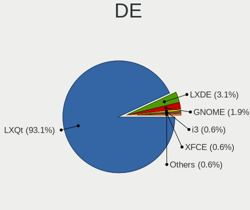
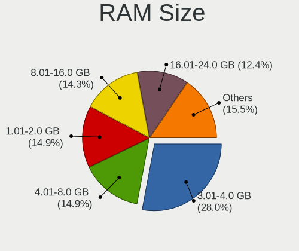
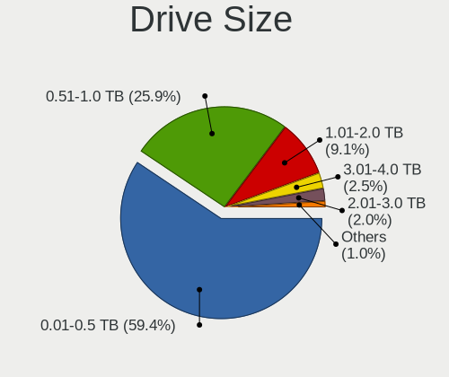
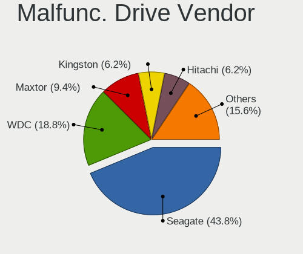
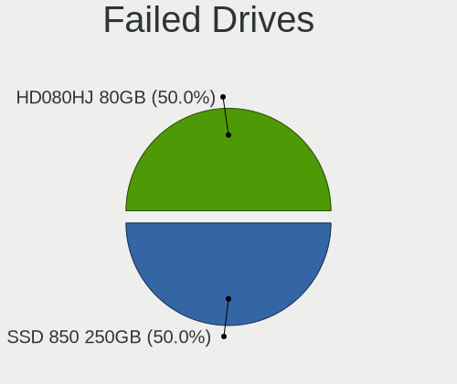
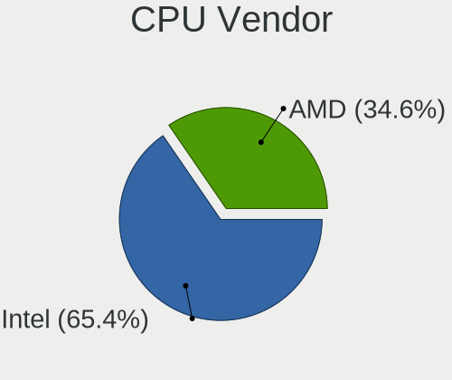
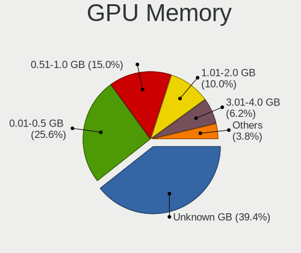
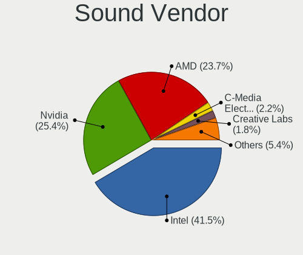
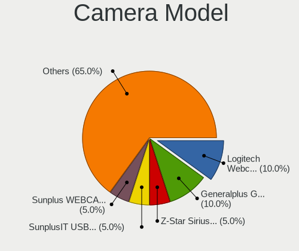

Lubuntu 20.04 - Tested Hardware & Statistics (Desktops)
-------------------------------------------------------

A project to collect tested hardware configurations for Lubuntu 20.04.

Anyone can contribute to this report by the [hw-probe](https://github.com/linuxhw/hw-probe) tool:

    sudo -E hw-probe -all -upload

Please submit a probe of your configuration if it's not presented on the page or is rare.

Full-feature report is available here: https://linux-hardware.org/?view=trends&rel=lubuntu-20.04

Contents
--------

* [ Test Cases ](#test-cases)

* [ System ](#system)
  - [ Kernel                   ](#kernel)
  - [ Kernel Family            ](#kernel-family)
  - [ Kernel Major Ver.        ](#kernel-major-ver)
  - [ Arch                     ](#arch)
  - [ DE                       ](#de)
  - [ Display Server           ](#display-server)
  - [ Display Manager          ](#display-manager)
  - [ OS Lang                  ](#os-lang)
  - [ Boot Mode                ](#boot-mode)
  - [ Filesystem               ](#filesystem)
  - [ Part. scheme             ](#part-scheme)
  - [ Dual Boot with Linux/BSD ](#dual-boot-with-linuxbsd)
  - [ Dual Boot (Win)          ](#dual-boot-win)

* [ Board ](#board)
  - [ Vendor                   ](#vendor)
  - [ Model                    ](#model)
  - [ Model Family             ](#model-family)
  - [ MFG Year                 ](#mfg-year)
  - [ Form Factor              ](#form-factor)
  - [ Secure Boot              ](#secure-boot)
  - [ Coreboot                 ](#coreboot)
  - [ RAM Size                 ](#ram-size)
  - [ RAM Used                 ](#ram-used)
  - [ Total Drives             ](#total-drives)
  - [ Has CD-ROM               ](#has-cd-rom)
  - [ Has Ethernet             ](#has-ethernet)
  - [ Has WiFi                 ](#has-wifi)
  - [ Has Bluetooth            ](#has-bluetooth)

* [ Location ](#location)
  - [ Country                  ](#country)
  - [ City                     ](#city)

* [ Drives ](#drives)
  - [ Drive Vendor             ](#drive-vendor)
  - [ Drive Model              ](#drive-model)
  - [ HDD Vendor               ](#hdd-vendor)
  - [ SSD Vendor               ](#ssd-vendor)
  - [ Drive Kind               ](#drive-kind)
  - [ Drive Connector          ](#drive-connector)
  - [ Drive Size               ](#drive-size)
  - [ Space Total              ](#space-total)
  - [ Space Used               ](#space-used)
  - [ Malfunc. Drives          ](#malfunc-drives)
  - [ Malfunc. Drive Vendor    ](#malfunc-drive-vendor)
  - [ Malfunc. HDD Vendor      ](#malfunc-hdd-vendor)
  - [ Malfunc. Drive Kind      ](#malfunc-drive-kind)
  - [ Failed Drives            ](#failed-drives)
  - [ Failed Drive Vendor      ](#failed-drive-vendor)
  - [ Drive Status             ](#drive-status)

* [ Storage controller ](#storage-controller)
  - [ Storage Vendor           ](#storage-vendor)
  - [ Storage Model            ](#storage-model)
  - [ Storage Kind             ](#storage-kind)

* [ Processor ](#processor)
  - [ CPU Vendor               ](#cpu-vendor)
  - [ CPU Model                ](#cpu-model)
  - [ CPU Model Family         ](#cpu-model-family)
  - [ CPU Cores                ](#cpu-cores)
  - [ CPU Sockets              ](#cpu-sockets)
  - [ CPU Threads              ](#cpu-threads)
  - [ CPU Op-Modes             ](#cpu-op-modes)
  - [ CPU Microcode            ](#cpu-microcode)
  - [ CPU Microarch            ](#cpu-microarch)

* [ Graphics ](#graphics)
  - [ GPU Vendor               ](#gpu-vendor)
  - [ GPU Model                ](#gpu-model)
  - [ GPU Combo                ](#gpu-combo)
  - [ GPU Driver               ](#gpu-driver)
  - [ GPU Memory               ](#gpu-memory)

* [ Monitor ](#monitor)
  - [ Monitor Vendor           ](#monitor-vendor)
  - [ Monitor Model            ](#monitor-model)
  - [ Monitor Resolution       ](#monitor-resolution)
  - [ Monitor Diagonal         ](#monitor-diagonal)
  - [ Monitor Width            ](#monitor-width)
  - [ Aspect Ratio             ](#aspect-ratio)
  - [ Monitor Area             ](#monitor-area)
  - [ Pixel Density            ](#pixel-density)
  - [ Multiple Monitors        ](#multiple-monitors)

* [ Network ](#network)
  - [ Net Controller Vendor    ](#net-controller-vendor)
  - [ Net Controller Model     ](#net-controller-model)
  - [ Wireless Vendor          ](#wireless-vendor)
  - [ Wireless Model           ](#wireless-model)
  - [ Ethernet Vendor          ](#ethernet-vendor)
  - [ Ethernet Model           ](#ethernet-model)
  - [ Net Controller Kind      ](#net-controller-kind)
  - [ Used Controller          ](#used-controller)
  - [ NICs                     ](#nics)
  - [ IPv6                     ](#ipv6)

* [ Bluetooth ](#bluetooth)
  - [ Bluetooth Vendor         ](#bluetooth-vendor)
  - [ Bluetooth Model          ](#bluetooth-model)

* [ Sound ](#sound)
  - [ Sound Vendor             ](#sound-vendor)
  - [ Sound Model              ](#sound-model)

* [ Memory ](#memory)
  - [ Memory Vendor            ](#memory-vendor)
  - [ Memory Model             ](#memory-model)
  - [ Memory Kind              ](#memory-kind)
  - [ Memory Form Factor       ](#memory-form-factor)
  - [ Memory Size              ](#memory-size)
  - [ Memory Speed             ](#memory-speed)

* [ Printers & scanners ](#printers--scanners)
  - [ Printer Vendor           ](#printer-vendor)
  - [ Printer Model            ](#printer-model)
  - [ Scanner Vendor           ](#scanner-vendor)
  - [ Scanner Model            ](#scanner-model)

* [ Camera ](#camera)
  - [ Camera Vendor            ](#camera-vendor)
  - [ Camera Model             ](#camera-model)

* [ Security ](#security)
  - [ Fingerprint Vendor       ](#fingerprint-vendor)
  - [ Fingerprint Model        ](#fingerprint-model)
  - [ Chipcard Vendor          ](#chipcard-vendor)
  - [ Chipcard Model           ](#chipcard-model)

* [ Unsupported ](#unsupported)
  - [ Unsupported Devices      ](#unsupported-devices)
  - [ Unsupported Device Types ](#unsupported-device-types)

Test Cases
----------

| Vendor        | Model                       | Probe                                                      | Date         |
|---------------|-----------------------------|------------------------------------------------------------|--------------|
| MSI           | AMETHYST-M                  | [eea8d03e34](https://linux-hardware.org/?probe=eea8d03e34) | Sep 05, 2021 |
| MSI           | AMETHYST-M                  | [e6c4f7b650](https://linux-hardware.org/?probe=e6c4f7b650) | Aug 30, 2021 |
| ASRock        | FM2A68M-DG3+                | [157d6655d0](https://linux-hardware.org/?probe=157d6655d0) | Aug 23, 2021 |
| ZOTAC         | NM10                        | [f735937235](https://linux-hardware.org/?probe=f735937235) | Aug 22, 2021 |
| MSI           | 760GM-E51                   | [1edbc1f4d8](https://linux-hardware.org/?probe=1edbc1f4d8) | Aug 19, 2021 |
| HP            | 8299                        | [48455294be](https://linux-hardware.org/?probe=48455294be) | Jul 28, 2021 |
| Huanan        | X99-TF V2.0                 | [f6911a81e8](https://linux-hardware.org/?probe=f6911a81e8) | Jul 26, 2021 |
| ASUSTek       | H110M-A/M.2                 | [b62225a801](https://linux-hardware.org/?probe=b62225a801) | Jul 24, 2021 |
| HP            | 1495                        | [3f39c0e882](https://linux-hardware.org/?probe=3f39c0e882) | Jul 23, 2021 |
| HP            | 0A1Ch E                     | [6d6f2ce899](https://linux-hardware.org/?probe=6d6f2ce899) | Jul 21, 2021 |
| Gigabyte      | B450M H                     | [cb2babd945](https://linux-hardware.org/?probe=cb2babd945) | Jul 20, 2021 |
| ASUSTek       | V-P8H67E                    | [e0ff38374e](https://linux-hardware.org/?probe=e0ff38374e) | Jul 13, 2021 |
| Positivo      | POS-MI945AA                 | [2a1eda1972](https://linux-hardware.org/?probe=2a1eda1972) | Jul 07, 2021 |
| ASUSTek       | P8H61-M LE                  | [456048c8ee](https://linux-hardware.org/?probe=456048c8ee) | Jul 06, 2021 |
| HARDKERNEL    | ODROID-H2                   | [37fdca8e63](https://linux-hardware.org/?probe=37fdca8e63) | Jul 06, 2021 |
| Dell          | 0TW904 A01                  | [b98c7e4685](https://linux-hardware.org/?probe=b98c7e4685) | Jun 29, 2021 |
| Dell          | 0TW904 A01                  | [51b0adff27](https://linux-hardware.org/?probe=51b0adff27) | Jun 17, 2021 |
| Fujitsu Si... | D2584-A1 S26361-D2584-A1    | [ec208f5ad8](https://linux-hardware.org/?probe=ec208f5ad8) | Jun 06, 2021 |
| ASUSTek       | K8N                         | [2bfbb90a8e](https://linux-hardware.org/?probe=2bfbb90a8e) | May 24, 2021 |
| HP            | 1905                        | [fd0f9e5ab1](https://linux-hardware.org/?probe=fd0f9e5ab1) | May 23, 2021 |
| HP            | 09C4h                       | [a94946d561](https://linux-hardware.org/?probe=a94946d561) | May 23, 2021 |
| Dell          | 0HY175 A03                  | [d1b6626b26](https://linux-hardware.org/?probe=d1b6626b26) | May 20, 2021 |
| HP            | 1905                        | [28fb3ce7e8](https://linux-hardware.org/?probe=28fb3ce7e8) | May 20, 2021 |
| ASUSTek       | V-P8H67E                    | [e8f0220bba](https://linux-hardware.org/?probe=e8f0220bba) | May 19, 2021 |
| ASUSTek       | K8N                         | [1d266884ca](https://linux-hardware.org/?probe=1d266884ca) | May 19, 2021 |
| ASRock        | N68-VS3 UCC                 | [85eaf93d23](https://linux-hardware.org/?probe=85eaf93d23) | May 18, 2021 |
| MSI           | H61M-E33                    | [23d2285e8a](https://linux-hardware.org/?probe=23d2285e8a) | May 13, 2021 |
| ASRock        | N68-VS3 UCC                 | [b4015edbbe](https://linux-hardware.org/?probe=b4015edbbe) | May 12, 2021 |
| ASUSTek       | K8N                         | [e692a4b6aa](https://linux-hardware.org/?probe=e692a4b6aa) | May 11, 2021 |
| ASUSTek       | H110I-PLUS                  | [0f9c2db369](https://linux-hardware.org/?probe=0f9c2db369) | May 07, 2021 |
| Dell          | 09M8Y8 A01                  | [8c9dd0e965](https://linux-hardware.org/?probe=8c9dd0e965) | May 06, 2021 |
| ASUSTek       | H110I-PLUS                  | [579414cef4](https://linux-hardware.org/?probe=579414cef4) | May 04, 2021 |
| ASUSTek       | P5GC-MX/1333                | [9088160499](https://linux-hardware.org/?probe=9088160499) | Apr 30, 2021 |
| ASUSTek       | P5GC-MX/1333                | [7feaa72545](https://linux-hardware.org/?probe=7feaa72545) | Apr 30, 2021 |
| AAEON         | MF-001 V1.0                 | [ef051b442a](https://linux-hardware.org/?probe=ef051b442a) | Apr 28, 2021 |
| Packard Be... | imedia S1350                | [781d544a3e](https://linux-hardware.org/?probe=781d544a3e) | Apr 27, 2021 |
| ASRock        | FM2A88M Extreme4+           | [25f6cfe2bb](https://linux-hardware.org/?probe=25f6cfe2bb) | Apr 26, 2021 |
| ASUSTek       | P5Q DELUXE                  | [145106a409](https://linux-hardware.org/?probe=145106a409) | Apr 25, 2021 |
| ASUSTek       | H110M-A/M.2                 | [04a4129216](https://linux-hardware.org/?probe=04a4129216) | Apr 20, 2021 |
| ASRock        | N68-VS3 UCC                 | [72861aa353](https://linux-hardware.org/?probe=72861aa353) | Apr 09, 2021 |
| Lenovo        | 1046 SDK0T08861 WIN 3305... | [2c58a29c2a](https://linux-hardware.org/?probe=2c58a29c2a) | Apr 02, 2021 |
| Gigabyte      | X570 GAMING X               | [d36d3e1e58](https://linux-hardware.org/?probe=d36d3e1e58) | Apr 01, 2021 |
| ASUSTek       | Z97-K                       | [383cee85b7](https://linux-hardware.org/?probe=383cee85b7) | Mar 25, 2021 |
| ASUSTek       | M5A97 R2.0                  | [83716bfba8](https://linux-hardware.org/?probe=83716bfba8) | Mar 24, 2021 |
| HP            | 21D0                        | [ebf910609e](https://linux-hardware.org/?probe=ebf910609e) | Mar 23, 2021 |
| Dell          | 09M8Y8 A01                  | [e1adceeeeb](https://linux-hardware.org/?probe=e1adceeeeb) | Mar 20, 2021 |
| Lenovo        | SDK0E50510 WIN              | [a6b06d9421](https://linux-hardware.org/?probe=a6b06d9421) | Mar 16, 2021 |
| ASRock        | 775Dual-VSTA                | [6f870bccf3](https://linux-hardware.org/?probe=6f870bccf3) | Mar 13, 2021 |
| Dell          | 09M8Y8 A01                  | [3ed340b3ba](https://linux-hardware.org/?probe=3ed340b3ba) | Feb 28, 2021 |
| Dell          | 0RY007                      | [6172822ebb](https://linux-hardware.org/?probe=6172822ebb) | Feb 27, 2021 |
| Intel         | ChiefRiver                  | [25476cfcb9](https://linux-hardware.org/?probe=25476cfcb9) | Feb 10, 2021 |
| Gigabyte      | H81M-DS2                    | [9c1652cf08](https://linux-hardware.org/?probe=9c1652cf08) | Feb 10, 2021 |
| HP            | 3048h                       | [59c1560e00](https://linux-hardware.org/?probe=59c1560e00) | Jan 30, 2021 |
| MSI           | AMETHYST-M                  | [057c04b2ae](https://linux-hardware.org/?probe=057c04b2ae) | Jan 11, 2021 |
| ASUSTek       | P8Z68-V LX                  | [3ff4a460a2](https://linux-hardware.org/?probe=3ff4a460a2) | Jan 10, 2021 |
| MSI           | AMETHYST-M                  | [ee8e20c6fb](https://linux-hardware.org/?probe=ee8e20c6fb) | Jan 06, 2021 |
| Lenovo        | Board                       | [166a0c26e2](https://linux-hardware.org/?probe=166a0c26e2) | Dec 23, 2020 |
| Dell          | 0WG864                      | [f5cb8c4f4a](https://linux-hardware.org/?probe=f5cb8c4f4a) | Dec 23, 2020 |
| Dell          | 0WG864                      | [f45926d7a7](https://linux-hardware.org/?probe=f45926d7a7) | Dec 11, 2020 |
| Dell          | 0WG864                      | [de92f1f8e4](https://linux-hardware.org/?probe=de92f1f8e4) | Dec 11, 2020 |
| ASRock        | FM2A85X Extreme6            | [225f795531](https://linux-hardware.org/?probe=225f795531) | Dec 01, 2020 |
| Gigabyte      | 965P-DS3                    | [ce0a64067a](https://linux-hardware.org/?probe=ce0a64067a) | Nov 29, 2020 |
| Gigabyte      | 965P-DS3                    | [d7ac62fba3](https://linux-hardware.org/?probe=d7ac62fba3) | Nov 29, 2020 |
| Lenovo        | 367D 31900058 STD           | [40b28c6d37](https://linux-hardware.org/?probe=40b28c6d37) | Nov 29, 2020 |
| MSI           | B450 GAMING PLUS MAX        | [761ecd0a1c](https://linux-hardware.org/?probe=761ecd0a1c) | Nov 25, 2020 |
| ASRock        | 4Core1600-GLAN              | [5eae42eb75](https://linux-hardware.org/?probe=5eae42eb75) | Nov 25, 2020 |
| HP            | 2820h                       | [fc14726596](https://linux-hardware.org/?probe=fc14726596) | Nov 23, 2020 |
| Pegatron      | Narra6                      | [7878c50c46](https://linux-hardware.org/?probe=7878c50c46) | Nov 20, 2020 |
| HP            | 09F8h                       | [60fbac3096](https://linux-hardware.org/?probe=60fbac3096) | Nov 16, 2020 |
| MSI           | G41M-P28                    | [21e89d9e69](https://linux-hardware.org/?probe=21e89d9e69) | Nov 11, 2020 |
| ASRock        | 4Core1600-GLAN              | [e6edfc8360](https://linux-hardware.org/?probe=e6edfc8360) | Nov 06, 2020 |
| ASRock        | 4Core1600-GLAN              | [2139a80238](https://linux-hardware.org/?probe=2139a80238) | Nov 03, 2020 |
| ASRock        | 4Core1600-GLAN              | [3bc862c3f6](https://linux-hardware.org/?probe=3bc862c3f6) | Nov 03, 2020 |
| Gigabyte      | B250M-D3H-CF                | [547d1a4d87](https://linux-hardware.org/?probe=547d1a4d87) | Nov 01, 2020 |
| HP            | 0AA8h                       | [f619ee9af9](https://linux-hardware.org/?probe=f619ee9af9) | Oct 31, 2020 |
| Intel         | STK1AW32SC H91596-300       | [64ad81c366](https://linux-hardware.org/?probe=64ad81c366) | Oct 31, 2020 |
| Dell          | 0J3C2F A02                  | [a0c7490384](https://linux-hardware.org/?probe=a0c7490384) | Oct 23, 2020 |
| ASRock        | G41M-GS3                    | [55872633b0](https://linux-hardware.org/?probe=55872633b0) | Oct 21, 2020 |
| HP            | 2187 A01                    | [ed8c0e270a](https://linux-hardware.org/?probe=ed8c0e270a) | Oct 21, 2020 |
| HP            | 2187 A01                    | [873e321107](https://linux-hardware.org/?probe=873e321107) | Oct 20, 2020 |
| MSI           | H97M-E35                    | [583794cac0](https://linux-hardware.org/?probe=583794cac0) | Oct 10, 2020 |
| MSI           | H110M ECO                   | [21fea178f7](https://linux-hardware.org/?probe=21fea178f7) | Oct 06, 2020 |
| Gigabyte      | Z370P D3-CF                 | [a112988e2e](https://linux-hardware.org/?probe=a112988e2e) | Sep 28, 2020 |
| MSI           | B450M MORTAR MAX            | [e7728895a3](https://linux-hardware.org/?probe=e7728895a3) | Sep 20, 2020 |
| ASRock        | A320M-DGS                   | [0ee0a67ae6](https://linux-hardware.org/?probe=0ee0a67ae6) | Sep 13, 2020 |
| Intel         | DG31PR AAD97573-302         | [0362c81208](https://linux-hardware.org/?probe=0362c81208) | Sep 11, 2020 |
| Dell          | 0CU409                      | [d226085fe5](https://linux-hardware.org/?probe=d226085fe5) | Aug 26, 2020 |
| ASRock        | A320M-HD                    | [8e8b3d8d21](https://linux-hardware.org/?probe=8e8b3d8d21) | Aug 23, 2020 |
| ASUSTek       | Z170 PRO GAMING             | [a43507c564](https://linux-hardware.org/?probe=a43507c564) | Aug 12, 2020 |
| Lenovo        | Board                       | [aa37671480](https://linux-hardware.org/?probe=aa37671480) | Aug 05, 2020 |
| Lenovo        | SDK0E50515 STD              | [def93851d7](https://linux-hardware.org/?probe=def93851d7) | Jul 27, 2020 |
| ASUSTek       | E45M1-M PRO                 | [b4e6ad4325](https://linux-hardware.org/?probe=b4e6ad4325) | Jul 25, 2020 |
| Positivo      | POS-EIH61CE POSITIVO        | [aea6ae732a](https://linux-hardware.org/?probe=aea6ae732a) | Jul 25, 2020 |
| ASUSTek       | P7P55 LX                    | [b907d5353a](https://linux-hardware.org/?probe=b907d5353a) | Jul 25, 2020 |
| ASUSTek       | M5A97 EVO R2.0              | [fd15d7f633](https://linux-hardware.org/?probe=fd15d7f633) | Jul 24, 2020 |
| ASUSTek       | M5A97 EVO R2.0              | [e79c3ae616](https://linux-hardware.org/?probe=e79c3ae616) | Jul 24, 2020 |
| Intel         | H55                         | [f9399791b8](https://linux-hardware.org/?probe=f9399791b8) | Jul 24, 2020 |
| ASUSTek       | E45M1-M PRO                 | [cf22d23381](https://linux-hardware.org/?probe=cf22d23381) | Jul 22, 2020 |
| IBM           | Board                       | [25f7acc0f7](https://linux-hardware.org/?probe=25f7acc0f7) | Jul 20, 2020 |
| MSI           | B450M MORTAR MAX            | [09f9209cda](https://linux-hardware.org/?probe=09f9209cda) | Jul 18, 2020 |
| HP            | 3396                        | [820e05ee01](https://linux-hardware.org/?probe=820e05ee01) | Jul 03, 2020 |
| MSI           | X570-A PRO                  | [8d3308bf38](https://linux-hardware.org/?probe=8d3308bf38) | Jun 23, 2020 |
| ASUSTek       | M2R-FVM                     | [e6ee210f6d](https://linux-hardware.org/?probe=e6ee210f6d) | Jun 23, 2020 |
| Dell          | 0Y2MRG A00                  | [c64fcf2a5d](https://linux-hardware.org/?probe=c64fcf2a5d) | Jun 21, 2020 |
| Dell          | 0Y2MRG A00                  | [21bd837ffa](https://linux-hardware.org/?probe=21bd837ffa) | Jun 20, 2020 |
| ASUSTek       | M2R-FVM                     | [33713a0404](https://linux-hardware.org/?probe=33713a0404) | Jun 18, 2020 |
| MSI           | 0A48                        | [e9c8fd5217](https://linux-hardware.org/?probe=e9c8fd5217) | Jun 17, 2020 |
| ASUSTek       | ET1612I                     | [7232340ccc](https://linux-hardware.org/?probe=7232340ccc) | Jun 08, 2020 |
| Gigabyte      | F2A88XM-HD3                 | [4400ee29ed](https://linux-hardware.org/?probe=4400ee29ed) | Jun 08, 2020 |
| Gigabyte      | F2A88XM-HD3                 | [d730ecdbd6](https://linux-hardware.org/?probe=d730ecdbd6) | Jun 08, 2020 |
| ASUSTek       | ET1612I                     | [ee417d15f0](https://linux-hardware.org/?probe=ee417d15f0) | May 31, 2020 |
| Biostar       | GF7025-M2                   | [66b5de774d](https://linux-hardware.org/?probe=66b5de774d) | May 26, 2020 |
| Gigabyte      | GA-870A-UD3                 | [4da7cc2128](https://linux-hardware.org/?probe=4da7cc2128) | May 21, 2020 |
| HP            | 21B4 A01                    | [a787f75e19](https://linux-hardware.org/?probe=a787f75e19) | May 19, 2020 |
| ASUSTek       | Berkeley                    | [ebb35e1770](https://linux-hardware.org/?probe=ebb35e1770) | May 14, 2020 |
| Gigabyte      | K8M800-8237                 | [8e2c1f0e62](https://linux-hardware.org/?probe=8e2c1f0e62) | May 13, 2020 |
| ASUSTek       | P5B-Deluxe                  | [a8c07c11cb](https://linux-hardware.org/?probe=a8c07c11cb) | May 09, 2020 |
| ASUSTek       | P5B-Deluxe                  | [dd51c6c85e](https://linux-hardware.org/?probe=dd51c6c85e) | May 09, 2020 |
| Acer          | Aspire XC-703G              | [87c5ee1001](https://linux-hardware.org/?probe=87c5ee1001) | May 07, 2020 |
| Intel         | DN2800MT AAG23738-801       | [eba41acd95](https://linux-hardware.org/?probe=eba41acd95) | Apr 29, 2020 |

System
------

Kernel
------

Version of the Linux kernel

| Version               | Desktops | Percent |
|-----------------------|----------|---------|
| 5.4.0-52-generic      | 8        | 8.7%    |
| 5.4.0-42-generic      | 7        | 7.61%   |
| 5.8.0-50-generic      | 6        | 6.52%   |
| 5.4.0-54-generic      | 5        | 5.43%   |
| 5.4.0-67-generic      | 4        | 4.35%   |
| 5.4.0-40-generic      | 4        | 4.35%   |
| 5.4.0-29-generic      | 4        | 4.35%   |
| 5.4.0-77-generic      | 3        | 3.26%   |
| 5.4.0-73-generic      | 3        | 3.26%   |
| 5.4.0-48-generic      | 3        | 3.26%   |
| 5.4.0-47-generic      | 3        | 3.26%   |
| 5.4.0-37-generic      | 3        | 3.26%   |
| 5.4.0-33-generic      | 3        | 3.26%   |
| 5.4.0-26-generic      | 3        | 3.26%   |
| 5.8.0-63-generic      | 2        | 2.17%   |
| 5.8.0-59-generic      | 2        | 2.17%   |
| 5.8.0-53-generic      | 2        | 2.17%   |
| 5.8.0-45-generic      | 2        | 2.17%   |
| 5.8.0-41-generic      | 2        | 2.17%   |
| 5.4.0-72-generic      | 2        | 2.17%   |
| 5.4.0-66-generic      | 2        | 2.17%   |
| 5.4.0-60-generic      | 2        | 2.17%   |
| 5.11.0-27-generic     | 2        | 2.17%   |
| 5.8.0-7630-generic    | 1        | 1.09%   |
| 5.8.0-55-generic      | 1        | 1.09%   |
| 5.8.0-48-generic      | 1        | 1.09%   |
| 5.8.0-43-generic      | 1        | 1.09%   |
| 5.6.15-050615-generic | 1        | 1.09%   |
| 5.6.0-1052-oem        | 1        | 1.09%   |
| 5.4.30-dli            | 1        | 1.09%   |
| 5.4.0-81-generic      | 1        | 1.09%   |
| 5.4.0-75-generic      | 1        | 1.09%   |
| 5.4.0-70-lowlatency   | 1        | 1.09%   |
| 5.4.0-65-generic      | 1        | 1.09%   |
| 5.4.0-59-generic      | 1        | 1.09%   |
| 5.4.0-58-generic      | 1        | 1.09%   |
| 5.4.0-53-generic      | 1        | 1.09%   |
| 5.4.0-31-generic      | 1        | 1.09%   |

Kernel Family
-------------

Linux kernel without a distro release

| Version | Desktops | Percent |
|---------|----------|---------|
| 5.4.0   | 63       | 71.59%  |
| 5.8.0   | 20       | 22.73%  |
| 5.11.0  | 2        | 2.27%   |
| 5.6.15  | 1        | 1.14%   |
| 5.6.0   | 1        | 1.14%   |
| 5.4.30  | 1        | 1.14%   |

Kernel Major Ver.
-----------------

Linux kernel major version

| Version | Desktops | Percent |
|---------|----------|---------|
| 5.4     | 64       | 72.73%  |
| 5.8     | 20       | 22.73%  |
| 5.6     | 2        | 2.27%   |
| 5.11    | 2        | 2.27%   |

Arch
----

OS architecture (x86_64, i586, etc.)

| Name   | Desktops | Percent |
|--------|----------|---------|
| x86_64 | 88       | 100%    |

DE
--

Desktop Environment

| Name       | Desktops | Percent |
|------------|----------|---------|
| LXQt       | 84       | 95.45%  |
| LXDE       | 2        | 2.27%   |
| X-Cinnamon | 1        | 1.14%   |
| GNOME      | 1        | 1.14%   |

Display Server
--------------

X11 or Wayland

| Name    | Desktops | Percent |
|---------|----------|---------|
| X11     | 83       | 94.32%  |
| Tty     | 4        | 4.55%   |
| Unknown | 1        | 1.14%   |

Display Manager
---------------

SDDM, LightDM, etc.

| Name    | Desktops | Percent |
|---------|----------|---------|
| Unknown | 38       | 42.7%   |
| SDDM    | 36       | 40.45%  |
| TDM     | 7        | 7.87%   |
| GDM     | 6        | 6.74%   |
| LightDM | 2        | 2.25%   |

OS Lang
-------

Language

| Lang    | Desktops | Percent |
|---------|----------|---------|
| en_US   | 26       | 29.55%  |
| fr_FR   | 9        | 10.23%  |
| pt_BR   | 8        | 9.09%   |
| it_IT   | 8        | 9.09%   |
| en_AU   | 4        | 4.55%   |
| de_DE   | 4        | 4.55%   |
| ru_RU   | 3        | 3.41%   |
| en_GB   | 3        | 3.41%   |
| C       | 3        | 3.41%   |
| hu_HU   | 2        | 2.27%   |
| es_ES   | 2        | 2.27%   |
| en_ZA   | 2        | 2.27%   |
| sv_SE   | 1        | 1.14%   |
| nl_NL   | 1        | 1.14%   |
| ja_JP   | 1        | 1.14%   |
| fi_FI   | 1        | 1.14%   |
| es_PE   | 1        | 1.14%   |
| es_MX   | 1        | 1.14%   |
| es_CR   | 1        | 1.14%   |
| es_CO   | 1        | 1.14%   |
| en_SG   | 1        | 1.14%   |
| en_CA   | 1        | 1.14%   |
| el_GR   | 1        | 1.14%   |
| de_CH   | 1        | 1.14%   |
| cs_CZ   | 1        | 1.14%   |
| Unknown | 1        | 1.14%   |

Boot Mode
---------

EFI or BIOS

| Mode | Desktops | Percent |
|------|----------|---------|
| BIOS | 61       | 69.32%  |
| EFI  | 27       | 30.68%  |

Filesystem
----------

Type of filesystem

| Type    | Desktops | Percent |
|---------|----------|---------|
| Ext4    | 82       | 93.18%  |
| Overlay | 3        | 3.41%   |
| Xfs     | 2        | 2.27%   |
| Btrfs   | 1        | 1.14%   |

Part. scheme
------------

Scheme of partitioning

| Type    | Desktops | Percent |
|---------|----------|---------|
| Unknown | 36       | 40.45%  |
| MBR     | 30       | 33.71%  |
| GPT     | 23       | 25.84%  |

Dual Boot with Linux/BSD
------------------------

Hosting more than one Linux/BSD

| Dual boot | Desktops | Percent |
|-----------|----------|---------|
| No        | 74       | 84.09%  |
| Yes       | 14       | 15.91%  |

Dual Boot (Win)
---------------

Hosting Linux and Windows

| Dual boot | Desktops | Percent |
|-----------|----------|---------|
| No        | 61       | 69.32%  |
| Yes       | 27       | 30.68%  |

Board
-----

Vendor
------

Motherboard manufacturer

| Name                | Desktops | Percent |
|---------------------|----------|---------|
| ASUSTek Computer    | 16       | 18.18%  |
| Hewlett-Packard     | 13       | 14.77%  |
| MSI                 | 10       | 11.36%  |
| Gigabyte Technology | 9        | 10.23%  |
| ASRock              | 9        | 10.23%  |
| Dell                | 8        | 9.09%   |
| Lenovo              | 6        | 6.82%   |
| Intel               | 5        | 5.68%   |
| Positivo            | 2        | 2.27%   |
| ZOTAC               | 1        | 1.14%   |
| Pegatron            | 1        | 1.14%   |
| Packard Bell        | 1        | 1.14%   |
| IBM                 | 1        | 1.14%   |
| Huanan              | 1        | 1.14%   |
| HARDKERNEL          | 1        | 1.14%   |
| Fujitsu Siemens     | 1        | 1.14%   |
| Biostar             | 1        | 1.14%   |
| Acer                | 1        | 1.14%   |
| AAEON               | 1        | 1.14%   |

Model
-----

Motherboard model

| Name                                | Desktops | Percent |
|-------------------------------------|----------|---------|
| MSI MS-7B89                         | 2        | 2.27%   |
| ASRock N68-VS3 UCC                  | 2        | 2.27%   |
| ZOTAC NM10                          | 1        | 1.14%   |
| Positivo POS-MI945AA                | 1        | 1.14%   |
| Positivo POS-EIH61CE                | 1        | 1.14%   |
| Pegatron AY652AA-ABA s5310y         | 1        | 1.14%   |
| Packard Bell imedia S1350           | 1        | 1.14%   |
| MSI MS-7C37                         | 1        | 1.14%   |
| MSI MS-7B86                         | 1        | 1.14%   |
| MSI MS-7994                         | 1        | 1.14%   |
| MSI MS-7846                         | 1        | 1.14%   |
| MSI MS-7680                         | 1        | 1.14%   |
| MSI MS-7592                         | 1        | 1.14%   |
| MSI ER883AA-ABA M7470N              | 1        | 1.14%   |
| MSI Compaq dx2200 MT                | 1        | 1.14%   |
| Lenovo ThinkStation P620 30E0CTO1WW | 1        | 1.14%   |
| Lenovo ThinkCentre M93z 10AD002DMZ  | 1        | 1.14%   |
| Lenovo ThinkCentre M58p 7220W21     | 1        | 1.14%   |
| Lenovo ThinkCentre M58p 6136A66     | 1        | 1.14%   |
| Lenovo H50-50 90B60081IX            | 1        | 1.14%   |
| Lenovo H50-30g 90AS0002BR           | 1        | 1.14%   |
| Intel STK1AW32SC                    | 1        | 1.14%   |
| Intel H55                           | 1        | 1.14%   |
| Intel DN2800MT AAG23738-801         | 1        | 1.14%   |
| Intel DG31PR AAD97573-302           | 1        | 1.14%   |
| Intel ChiefRiver                    | 1        | 1.14%   |
| IBM eServer x3105 -[434722J]-       | 1        | 1.14%   |
| Huanan X99-TF                       | 1        | 1.14%   |
| HP Z230 Tower Workstation           | 1        | 1.14%   |
| HP xw9400 Workstation               | 1        | 1.14%   |
| HP xw9300 Workstation               | 1        | 1.14%   |
| HP t620 Quad Core TC                | 1        | 1.14%   |
| HP t620 Dual Core TC                | 1        | 1.14%   |
| HP ProDesk 600 G1 DM                | 1        | 1.14%   |
| HP EliteDesk 800 G3 SFF             | 1        | 1.14%   |
| HP Compaq Elite 8300 CMT            | 1        | 1.14%   |
| HP Compaq dc7800 Small Form Factor  | 1        | 1.14%   |
| HP Compaq dc7600 Small Form Factor  | 1        | 1.14%   |
| HP Compaq dc5800 Microtower         | 1        | 1.14%   |
| HP Compaq 8200 Elite SFF PC         | 1        | 1.14%   |
| HP Compaq 6000 Pro SFF PC           | 1        | 1.14%   |
| HARDKERNEL ODROID-H2                | 1        | 1.14%   |
| Gigabyte Z370P D3                   | 1        | 1.14%   |
| Gigabyte X570 GAMING X              | 1        | 1.14%   |
| Gigabyte K8M800-8237                | 1        | 1.14%   |
| Gigabyte H81M-DS2                   | 1        | 1.14%   |
| Gigabyte GA-870A-UD3                | 1        | 1.14%   |
| Gigabyte F2A88XM-HD3                | 1        | 1.14%   |
| Gigabyte B450M H                    | 1        | 1.14%   |
| Gigabyte B250M-D3H                  | 1        | 1.14%   |
| Gigabyte 965P-DS3                   | 1        | 1.14%   |
| Fujitsu Siemens ESPRIMO P5925       | 1        | 1.14%   |
| Dell XPS 8300                       | 1        | 1.14%   |
| Dell Vostro 200                     | 1        | 1.14%   |
| Dell Precision T3610                | 1        | 1.14%   |
| Dell OptiPlex 790                   | 1        | 1.14%   |
| Dell OptiPlex 330                   | 1        | 1.14%   |
| Dell Inspiron 530                   | 1        | 1.14%   |
| Dell DM061                          | 1        | 1.14%   |
| Dell Dimension C521                 | 1        | 1.14%   |

Model Family
------------

Motherboard model prefix

| Name                    | Desktops | Percent |
|-------------------------|----------|---------|
| HP Compaq               | 6        | 6.82%   |
| Lenovo ThinkCentre      | 3        | 3.41%   |
| MSI MS-7B89             | 2        | 2.27%   |
| HP t620                 | 2        | 2.27%   |
| Dell OptiPlex           | 2        | 2.27%   |
| ASRock N68-VS3          | 2        | 2.27%   |
| ZOTAC NM10              | 1        | 1.14%   |
| Positivo POS-MI945AA    | 1        | 1.14%   |
| Positivo POS-EIH61CE    | 1        | 1.14%   |
| Pegatron AY652AA-ABA    | 1        | 1.14%   |
| Packard Bell imedia     | 1        | 1.14%   |
| MSI MS-7C37             | 1        | 1.14%   |
| MSI MS-7B86             | 1        | 1.14%   |
| MSI MS-7994             | 1        | 1.14%   |
| MSI MS-7846             | 1        | 1.14%   |
| MSI MS-7680             | 1        | 1.14%   |
| MSI MS-7592             | 1        | 1.14%   |
| MSI ER883AA-ABA         | 1        | 1.14%   |
| MSI Compaq              | 1        | 1.14%   |
| Lenovo ThinkStation     | 1        | 1.14%   |
| Lenovo H50-50           | 1        | 1.14%   |
| Lenovo H50-30g          | 1        | 1.14%   |
| Intel STK1AW32SC        | 1        | 1.14%   |
| Intel H55               | 1        | 1.14%   |
| Intel DN2800MT          | 1        | 1.14%   |
| Intel DG31PR            | 1        | 1.14%   |
| Intel ChiefRiver        | 1        | 1.14%   |
| IBM eServer             | 1        | 1.14%   |
| Huanan X99-TF           | 1        | 1.14%   |
| HP Z230                 | 1        | 1.14%   |
| HP xw9400               | 1        | 1.14%   |
| HP xw9300               | 1        | 1.14%   |
| HP ProDesk              | 1        | 1.14%   |
| HP EliteDesk            | 1        | 1.14%   |
| HARDKERNEL ODROID-H2    | 1        | 1.14%   |
| Gigabyte Z370P          | 1        | 1.14%   |
| Gigabyte X570           | 1        | 1.14%   |
| Gigabyte K8M800-8237    | 1        | 1.14%   |
| Gigabyte H81M-DS2       | 1        | 1.14%   |
| Gigabyte GA-870A-UD3    | 1        | 1.14%   |
| Gigabyte F2A88XM-HD3    | 1        | 1.14%   |
| Gigabyte B450M          | 1        | 1.14%   |
| Gigabyte B250M-D3H      | 1        | 1.14%   |
| Gigabyte 965P-DS3       | 1        | 1.14%   |
| Fujitsu Siemens ESPRIMO | 1        | 1.14%   |
| Dell XPS                | 1        | 1.14%   |
| Dell Vostro             | 1        | 1.14%   |
| Dell Precision          | 1        | 1.14%   |
| Dell Inspiron           | 1        | 1.14%   |
| Dell DM061              | 1        | 1.14%   |
| Dell Dimension          | 1        | 1.14%   |
| Biostar GF7025-M2       | 1        | 1.14%   |
| ASUS Z170               | 1        | 1.14%   |
| ASUS V-P8H67E           | 1        | 1.14%   |
| ASUS P8Z68-V            | 1        | 1.14%   |
| ASUS P8H61-M            | 1        | 1.14%   |
| ASUS P5Q                | 1        | 1.14%   |
| ASUS P5GC-MX            | 1        | 1.14%   |
| ASUS P5B-Deluxe         | 1        | 1.14%   |
| ASUS M5A97              | 1        | 1.14%   |

MFG Year
--------

Motherboard manufacture year

| Year | Desktops | Percent |
|------|----------|---------|
| 2007 | 9        | 10.23%  |
| 2019 | 8        | 9.09%   |
| 2014 | 7        | 7.95%   |
| 2009 | 7        | 7.95%   |
| 2020 | 6        | 6.82%   |
| 2011 | 6        | 6.82%   |
| 2008 | 6        | 6.82%   |
| 2017 | 5        | 5.68%   |
| 2015 | 5        | 5.68%   |
| 2012 | 5        | 5.68%   |
| 2018 | 4        | 4.55%   |
| 2013 | 4        | 4.55%   |
| 2010 | 4        | 4.55%   |
| 2021 | 3        | 3.41%   |
| 2016 | 3        | 3.41%   |
| 2006 | 3        | 3.41%   |
| 2005 | 3        | 3.41%   |

Form Factor
-----------

Physical design of the computer

| Name    | Desktops | Percent |
|---------|----------|---------|
| Desktop | 88       | 100%    |

Secure Boot
-----------

Enabled or disabled

| State    | Desktops | Percent |
|----------|----------|---------|
| Disabled | 86       | 97.73%  |
| Enabled  | 2        | 2.27%   |

Coreboot
--------

Have coreboot on board

| Used | Desktops | Percent |
|------|----------|---------|
| No   | 88       | 100%    |

RAM Size
--------

Total RAM memory

| Size in GB      | Desktops | Percent |
|-----------------|----------|---------|
| 3.01-4.0        | 28       | 31.46%  |
| 8.01-16.0       | 15       | 16.85%  |
| 1.01-2.0        | 13       | 14.61%  |
| 4.01-8.0        | 12       | 13.48%  |
| 16.01-24.0      | 11       | 12.36%  |
| 32.01-64.0      | 6        | 6.74%   |
| 0.51-1.0        | 2        | 2.25%   |
| More than 256.0 | 1        | 1.12%   |
| 24.01-32.0      | 1        | 1.12%   |

RAM Used
--------

Used RAM memory

| Used GB   | Desktops | Percent |
|-----------|----------|---------|
| 1.01-2.0  | 46       | 50.55%  |
| 2.01-3.0  | 19       | 20.88%  |
| 0.51-1.0  | 12       | 13.19%  |
| 4.01-8.0  | 7        | 7.69%   |
| 3.01-4.0  | 5        | 5.49%   |
| 8.01-16.0 | 2        | 2.2%    |

Total Drives
------------

Number of drives on board

| Drives | Desktops | Percent |
|--------|----------|---------|
| 1      | 42       | 47.73%  |
| 2      | 30       | 34.09%  |
| 3      | 7        | 7.95%   |
| 4      | 4        | 4.55%   |
| 5      | 3        | 3.41%   |
| 14     | 1        | 1.14%   |
| 7      | 1        | 1.14%   |

Has CD-ROM
----------

Has CD-ROM on board

| Presented | Desktops | Percent |
|-----------|----------|---------|
| Yes       | 55       | 62.5%   |
| No        | 33       | 37.5%   |

Has Ethernet
------------

Has Ethernet on board

| Presented | Desktops | Percent |
|-----------|----------|---------|
| Yes       | 87       | 98.86%  |
| No        | 1        | 1.14%   |

Has WiFi
--------

Has WiFi module

| Presented | Desktops | Percent |
|-----------|----------|---------|
| No        | 53       | 60.23%  |
| Yes       | 35       | 39.77%  |

Has Bluetooth
-------------

Has Bluetooth module

| Presented | Desktops | Percent |
|-----------|----------|---------|
| No        | 75       | 85.23%  |
| Yes       | 13       | 14.77%  |

Location
--------

Country
-------

Geographic location (country)

| Country      | Desktops | Percent |
|--------------|----------|---------|
| USA          | 12       | 13.48%  |
| France       | 9        | 10.11%  |
| Brazil       | 9        | 10.11%  |
| Italy        | 8        | 8.99%   |
| Germany      | 6        | 6.74%   |
| Switzerland  | 4        | 4.49%   |
| Australia    | 4        | 4.49%   |
| Spain        | 3        | 3.37%   |
| Russia       | 3        | 3.37%   |
| Netherlands  | 3        | 3.37%   |
| Hungary      | 3        | 3.37%   |
| South Africa | 2        | 2.25%   |
| Puerto Rico  | 2        | 2.25%   |
| Mexico       | 2        | 2.25%   |
| Greece       | 2        | 2.25%   |
| Finland      | 2        | 2.25%   |
| Czechia      | 2        | 2.25%   |
| UK           | 1        | 1.12%   |
| Sweden       | 1        | 1.12%   |
| Singapore    | 1        | 1.12%   |
| Romania      | 1        | 1.12%   |
| Peru         | 1        | 1.12%   |
| New Zealand  | 1        | 1.12%   |
| Malaysia     | 1        | 1.12%   |
| Japan        | 1        | 1.12%   |
| Costa Rica   | 1        | 1.12%   |
| Colombia     | 1        | 1.12%   |
| Canada       | 1        | 1.12%   |
| Belgium      | 1        | 1.12%   |
| Belarus      | 1        | 1.12%   |

City
----

Geographic location (city)

| City                | Desktops | Percent |
|---------------------|----------|---------|
| Rome                | 3        | 3.33%   |
| Windsor             | 2        | 2.22%   |
| Milan               | 2        | 2.22%   |
| Cuernavaca          | 2        | 2.22%   |
| Cayey               | 2        | 2.22%   |
| Augsburg            | 2        | 2.22%   |
| Zurich              | 1        | 1.11%   |
| Yelizovo            | 1        | 1.11%   |
| Wiesbaden           | 1        | 1.11%   |
| Wellington          | 1        | 1.11%   |
| Vlaardingen         | 1        | 1.11%   |
| Vitry-sur-Seine     | 1        | 1.11%   |
| Vaxjo               | 1        | 1.11%   |
| Vanderbijlpark      | 1        | 1.11%   |
| Valls               | 1        | 1.11%   |
| Valinhos            | 1        | 1.11%   |
| Valencia            | 1        | 1.11%   |
| Treviso             | 1        | 1.11%   |
| Tourcoing           | 1        | 1.11%   |
| Toronto             | 1        | 1.11%   |
| The Hague           | 1        | 1.11%   |
| Springfield         | 1        | 1.11%   |
| Spokane             | 1        | 1.11%   |
| Sora                | 1        | 1.11%   |
| Singapore           | 1        | 1.11%   |
| Sandorfalva         | 1        | 1.11%   |
| Raleigh             | 1        | 1.11%   |
| Prague              | 1        | 1.11%   |
| Porto Alegre        | 1        | 1.11%   |
| Portbail            | 1        | 1.11%   |
| Periers             | 1        | 1.11%   |
| Passos              | 1        | 1.11%   |
| Pacatuba            | 1        | 1.11%   |
| Oradea              | 1        | 1.11%   |
| Omsk                | 1        | 1.11%   |
| Oceanside           | 1        | 1.11%   |
| Novy Jicin          | 1        | 1.11%   |
| Neuchatel           | 1        | 1.11%   |
| Munich              | 1        | 1.11%   |
| Mount Waverley      | 1        | 1.11%   |
| Moordrecht          | 1        | 1.11%   |
| Montross            | 1        | 1.11%   |
| Montreuil           | 1        | 1.11%   |
| Montlhery           | 1        | 1.11%   |
| Mogilev             | 1        | 1.11%   |
| Mobile              | 1        | 1.11%   |
| Menen               | 1        | 1.11%   |
| Medellín           | 1        | 1.11%   |
| Marlow              | 1        | 1.11%   |
| Lovens              | 1        | 1.11%   |
| Le Mesnil-en-Thelle | 1        | 1.11%   |
| Langenhagen         | 1        | 1.11%   |
| Kuala Lumpur        | 1        | 1.11%   |
| Kozani              | 1        | 1.11%   |
| Kirov               | 1        | 1.11%   |
| Kabukicho           | 1        | 1.11%   |
| Kaarina             | 1        | 1.11%   |
| Juiz de Fora        | 1        | 1.11%   |
| Jackson             | 1        | 1.11%   |
| Ituiutaba           | 1        | 1.11%   |

Drives
------

Drive Vendor
------------

Hard drive vendors

| Vendor              | Desktops | Drives | Percent |
|---------------------|----------|--------|---------|
| WDC                 | 35       | 59     | 26.32%  |
| Seagate             | 34       | 43     | 25.56%  |
| Samsung Electronics | 16       | 29     | 12.03%  |
| Kingston            | 8        | 8      | 6.02%   |
| Toshiba             | 6        | 6      | 4.51%   |
| Hitachi             | 5        | 6      | 3.76%   |
| Unknown             | 4        | 5      | 3.01%   |
| SanDisk             | 3        | 3      | 2.26%   |
| China               | 3        | 3      | 2.26%   |
| A-DATA Technology   | 3        | 3      | 2.26%   |
| PNY                 | 2        | 2      | 1.5%    |
| MAXTOR              | 2        | 2      | 1.5%    |
| Transcend           | 1        | 1      | 0.75%   |
| Team                | 1        | 1      | 0.75%   |
| PNY USB             | 1        | 1      | 0.75%   |
| Lexar               | 1        | 1      | 0.75%   |
| LDLC                | 1        | 1      | 0.75%   |
| JMicron             | 1        | 1      | 0.75%   |
| Intel               | 1        | 1      | 0.75%   |
| HGST                | 1        | 1      | 0.75%   |
| Hewlett-Packard     | 1        | 6      | 0.75%   |
| Fujitsu             | 1        | 1      | 0.75%   |
| Crucial             | 1        | 1      | 0.75%   |
| Corsair             | 1        | 1      | 0.75%   |

Drive Model
-----------

Hard drive models

| Model                            | Desktops | Percent |
|----------------------------------|----------|---------|
| Samsung SSD 850 EVO 500GB        | 3        | 2.01%   |
| WDC WDS500G2B0A-00SM50 500GB SSD | 2        | 1.34%   |
| WDC WDS120G2G0A-00JH30 120GB SSD | 2        | 1.34%   |
| WDC WD40EFRX-68N32N0 4TB         | 2        | 1.34%   |
| WDC WD10EZEX-00WN4A0 1TB         | 2        | 1.34%   |
| Seagate ST380815AS 80GB          | 2        | 1.34%   |
| Seagate ST3500418AS 500GB        | 2        | 1.34%   |
| Seagate ST3360320AS 360GB        | 2        | 1.34%   |
| Seagate ST3250410AS 250GB        | 2        | 1.34%   |
| Seagate ST3250310AS 250GB        | 2        | 1.34%   |
| Seagate ST1000DM003-1ER162 1TB   | 2        | 1.34%   |
| Samsung SSD 850 EVO 250GB        | 2        | 1.34%   |
| Samsung HD161HJ 160GB            | 2        | 1.34%   |
| Samsung HD080HJ 80GB             | 2        | 1.34%   |
| Kingston SA400S37120G 120GB SSD  | 2        | 1.34%   |
| China SATA SSD 512GB             | 2        | 1.34%   |
| A-DATA SU650 240GB SSD           | 2        | 1.34%   |
| WDC WDS250G2B0B-00YS70 250GB SSD | 1        | 0.67%   |
| WDC WDS240G2G0B-00EPW0 240GB SSD | 1        | 0.67%   |
| WDC WDS100T2B0A-00SM50 1TB SSD   | 1        | 0.67%   |
| WDC WD800JD-75JNA0 80GB          | 1        | 0.67%   |
| WDC WD800JD-60LSA5 80GB          | 1        | 0.67%   |
| WDC WD7501AALS-00J7B1 752GB      | 1        | 0.67%   |
| WDC WD7500BPVX-55JC3T3 752GB     | 1        | 0.67%   |
| WDC WD6400AAKS-65A7B2 640GB      | 1        | 0.67%   |
| WDC WD5000LPVX-22V0TT0 500GB     | 1        | 0.67%   |
| WDC WD5000LPLX-00ZNTT0 500GB     | 1        | 0.67%   |
| WDC WD5000BPKX-66HPJT0 500GB     | 1        | 0.67%   |
| WDC WD5000AAKX-22ERMA0 500GB     | 1        | 0.67%   |
| WDC WD5000AAKX-003CA0 500GB      | 1        | 0.67%   |
| WDC WD40EZRZ-00WN9B0 4TB         | 1        | 0.67%   |
| WDC WD40EFRX-68WT0N0 4TB         | 1        | 0.67%   |
| WDC WD400EB-00CPF0 40GB          | 1        | 0.67%   |
| WDC WD3200JS-22PDB0 320GB        | 1        | 0.67%   |
| WDC WD3200AAJS-56M0A0 320GB      | 1        | 0.67%   |
| WDC WD3200AAJS-07M0A0 320GB      | 1        | 0.67%   |
| WDC WD2500JS-75NCB3 250GB        | 1        | 0.67%   |
| WDC WD2500JD-00HBB0 250GB        | 1        | 0.67%   |
| WDC WD2500AAKX-07U6AA0 250GB     | 1        | 0.67%   |
| WDC WD2500AAJS-75M0A0 250GB      | 1        | 0.67%   |
| WDC WD2003FZEX-00Z4SA0 2TB       | 1        | 0.67%   |
| WDC WD1600BB-00RDA0 160GB        | 1        | 0.67%   |
| WDC WD1600AAJS-60B4A0 160GB      | 1        | 0.67%   |
| WDC WD15EARS-22MVWB0 1TB         | 1        | 0.67%   |
| WDC WD10EZRZ-00HTKB0 1TB         | 1        | 0.67%   |
| WDC WD10EZEX-75WN4A0 1TB         | 1        | 0.67%   |
| WDC WD10EZEX-00BN5A0 1TB         | 1        | 0.67%   |
| WDC WD10EAVS-14M4B0 1TB          | 1        | 0.67%   |
| WDC WD10EARX-00N0YB0 1TB         | 1        | 0.67%   |
| WDC WD10EARS-00Y5B1 1TB          | 1        | 0.67%   |
| WDC WD10EALX-759BA1 1TB          | 1        | 0.67%   |
| Unknown SD/MMC/MS PRO 64GB       | 1        | 0.67%   |
| Unknown MMC Card  32GB           | 1        | 0.67%   |
| Unknown MMC Card  128GB          | 1        | 0.67%   |
| Unknown M52516  16GB             | 1        | 0.67%   |
| Unknown CJTD4R  64GB             | 1        | 0.67%   |
| Transcend TS32GSSD370S 32GB      | 1        | 0.67%   |
| Toshiba THNSNJ060WCSU 64GB SSD   | 1        | 0.67%   |
| Toshiba THNSNH128GCST 128GB SSD  | 1        | 0.67%   |
| Toshiba MQ04ABF100 1TB           | 1        | 0.67%   |

HDD Vendor
----------

Hard disk drive vendors

| Vendor              | Desktops | Drives | Percent |
|---------------------|----------|--------|---------|
| Seagate             | 34       | 43     | 40.48%  |
| WDC                 | 30       | 50     | 35.71%  |
| Samsung Electronics | 7        | 8      | 8.33%   |
| Hitachi             | 5        | 6      | 5.95%   |
| Toshiba             | 4        | 4      | 4.76%   |
| Maxtor              | 2        | 2      | 2.38%   |
| HGST                | 1        | 1      | 1.19%   |
| Fujitsu             | 1        | 1      | 1.19%   |

SSD Vendor
----------

Solid state drive vendors

| Vendor              | Desktops | Drives | Percent |
|---------------------|----------|--------|---------|
| Samsung Electronics | 8        | 11     | 18.18%  |
| Kingston            | 8        | 8      | 18.18%  |
| WDC                 | 7        | 9      | 15.91%  |
| SanDisk             | 3        | 3      | 6.82%   |
| China               | 3        | 3      | 6.82%   |
| Toshiba             | 2        | 2      | 4.55%   |
| PNY                 | 2        | 2      | 4.55%   |
| A-DATA Technology   | 2        | 2      | 4.55%   |
| Transcend           | 1        | 1      | 2.27%   |
| Team                | 1        | 1      | 2.27%   |
| PNY USB             | 1        | 1      | 2.27%   |
| Lexar               | 1        | 1      | 2.27%   |
| LDLC                | 1        | 1      | 2.27%   |
| JMicron             | 1        | 1      | 2.27%   |
| Hewlett-Packard     | 1        | 6      | 2.27%   |
| Crucial             | 1        | 1      | 2.27%   |
| Corsair             | 1        | 1      | 2.27%   |

Drive Kind
----------

HDD or SSD

| Kind    | Desktops | Drives | Percent |
|---------|----------|--------|---------|
| HDD     | 65       | 115    | 57.02%  |
| SSD     | 42       | 54     | 36.84%  |
| MMC     | 3        | 4      | 2.63%   |
| NVMe    | 3        | 12     | 2.63%   |
| Unknown | 1        | 1      | 0.88%   |

Drive Connector
---------------

SATA, SAS, NVMe, etc.

| Type | Desktops | Drives | Percent |
|------|----------|--------|---------|
| SATA | 85       | 166    | 89.47%  |
| SAS  | 4        | 4      | 4.21%   |
| NVMe | 3        | 12     | 3.16%   |
| MMC  | 3        | 4      | 3.16%   |

Drive Size
----------

Size of hard drive

| Size in TB | Desktops | Drives | Percent |
|------------|----------|--------|---------|
| 0.01-0.5   | 72       | 106    | 66.06%  |
| 0.51-1.0   | 27       | 43     | 24.77%  |
| 3.01-4.0   | 4        | 12     | 3.67%   |
| 2.01-3.0   | 3        | 3      | 2.75%   |
| 1.01-2.0   | 3        | 5      | 2.75%   |

Space Total
-----------

Amount of disk space available on the file system

| Size in GB     | Desktops | Percent |
|----------------|----------|---------|
| 101-250        | 24       | 26.97%  |
| 251-500        | 18       | 20.22%  |
| 1001-2000      | 11       | 12.36%  |
| 501-1000       | 10       | 11.24%  |
| 51-100         | 8        | 8.99%   |
| More than 3000 | 7        | 7.87%   |
| 2001-3000      | 5        | 5.62%   |
| 21-50          | 3        | 3.37%   |
| 1-20           | 2        | 2.25%   |
| Unknown        | 1        | 1.12%   |

Space Used
----------

Amount of used disk space

| Used GB        | Desktops | Percent |
|----------------|----------|---------|
| 1-20           | 32       | 35.96%  |
| 21-50          | 15       | 16.85%  |
| 101-250        | 12       | 13.48%  |
| 501-1000       | 8        | 8.99%   |
| 51-100         | 6        | 6.74%   |
| 251-500        | 5        | 5.62%   |
| 1001-2000      | 5        | 5.62%   |
| 2001-3000      | 3        | 3.37%   |
| More than 3000 | 2        | 2.25%   |
| Unknown        | 1        | 1.12%   |

Malfunc. Drives
---------------

Drive models with a malfunction

| Model                           | Desktops | Drives | Percent |
|---------------------------------|----------|--------|---------|
| WDC WD5000AAKX-003CA0 500GB     | 1        | 1      | 6.67%   |
| WDC WD400EB-00CPF0 40GB         | 1        | 1      | 6.67%   |
| WDC WD1600AAJS-60B4A0 160GB     | 1        | 2      | 6.67%   |
| Seagate ST380815AS 80GB         | 1        | 1      | 6.67%   |
| Seagate ST3360320AS 360GB       | 1        | 1      | 6.67%   |
| Seagate ST1000DX001-1CM162 1TB  | 1        | 1      | 6.67%   |
| Seagate ST1000DM003-9YN162 1TB  | 1        | 1      | 6.67%   |
| Seagate ST1000DM003-1ER162 1TB  | 1        | 1      | 6.67%   |
| MAXTOR STM3300622A 304GB        | 1        | 1      | 6.67%   |
| Maxtor 6Y080L0 82GB             | 1        | 1      | 6.67%   |
| LDLC SSD 120GB                  | 1        | 1      | 6.67%   |
| Kingston SHFS37A120G 120GB SSD  | 1        | 1      | 6.67%   |
| Kingston SA400S37120G 120GB SSD | 1        | 1      | 6.67%   |
| Hitachi HCP725050GLAT80 500GB   | 1        | 1      | 6.67%   |
| Fujitsu MHZ2160BH G2 160GB      | 1        | 1      | 6.67%   |

Malfunc. Drive Vendor
---------------------

Vendors of faulty drives

| Vendor   | Desktops | Drives | Percent |
|----------|----------|--------|---------|
| Seagate  | 5        | 5      | 33.33%  |
| WDC      | 3        | 4      | 20%     |
| MAXTOR   | 2        | 2      | 13.33%  |
| Kingston | 2        | 2      | 13.33%  |
| LDLC     | 1        | 1      | 6.67%   |
| Hitachi  | 1        | 1      | 6.67%   |
| Fujitsu  | 1        | 1      | 6.67%   |

Malfunc. HDD Vendor
-------------------

Vendors of faulty HDD drives

| Vendor  | Desktops | Drives | Percent |
|---------|----------|--------|---------|
| Seagate | 5        | 5      | 41.67%  |
| WDC     | 3        | 4      | 25%     |
| MAXTOR  | 2        | 2      | 16.67%  |
| Hitachi | 1        | 1      | 8.33%   |
| Fujitsu | 1        | 1      | 8.33%   |

Malfunc. Drive Kind
-------------------

Kinds of faulty drives

| Kind | Desktops | Drives | Percent |
|------|----------|--------|---------|
| HDD  | 11       | 13     | 78.57%  |
| SSD  | 3        | 3      | 21.43%  |

Failed Drives
-------------

Failed drive models

| Model                            | Desktops | Drives | Percent |
|----------------------------------|----------|--------|---------|
| Samsung Electronics HD080HJ 80GB | 1        | 1      | 100%    |

Failed Drive Vendor
-------------------

Failed drive vendors

| Vendor              | Desktops | Drives | Percent |
|---------------------|----------|--------|---------|
| Samsung Electronics | 1        | 1      | 100%    |

Drive Status
------------

Number of failed and malfunc. drives

| Status   | Desktops | Drives | Percent |
|----------|----------|--------|---------|
| Works    | 46       | 100    | 45.54%  |
| Detected | 41       | 69     | 40.59%  |
| Malfunc  | 13       | 16     | 12.87%  |
| Failed   | 1        | 1      | 0.99%   |

Storage controller
------------------

Storage Vendor
--------------

Storage controller vendors

| Vendor                    | Desktops | Percent |
|---------------------------|----------|---------|
| Intel                     | 54       | 54%     |
| AMD                       | 20       | 20%     |
| Nvidia                    | 10       | 10%     |
| Marvell Technology Group  | 4        | 4%      |
| JMicron Technology        | 4        | 4%      |
| VIA Technologies          | 2        | 2%      |
| LSI Logic / Symbios Logic | 2        | 2%      |
| ASMedia Technology        | 2        | 2%      |
| Samsung Electronics       | 1        | 1%      |
| ADATA Technology          | 1        | 1%      |

Storage Model
-------------

Storage controller models

| Model                                                                                   | Desktops | Percent |
|-----------------------------------------------------------------------------------------|----------|---------|
| AMD FCH SATA Controller [AHCI mode]                                                     | 14       | 9.66%   |
| Intel NM10/ICH7 Family SATA Controller [IDE mode]                                       | 8        | 5.52%   |
| Intel 82801I (ICH9 Family) 2 port SATA Controller [IDE mode]                            | 6        | 4.14%   |
| Intel 82801G (ICH7 Family) IDE Controller                                               | 6        | 4.14%   |
| Intel 82801IR/IO/IH (ICH9R/DO/DH) 4 port SATA Controller [IDE mode]                     | 5        | 3.45%   |
| Intel 8 Series/C220 Series Chipset Family 6-port SATA Controller 1 [AHCI mode]          | 5        | 3.45%   |
| Intel 6 Series/C200 Series Chipset Family 6 port Desktop SATA AHCI Controller           | 5        | 3.45%   |
| Nvidia MCP61 SATA Controller                                                            | 4        | 2.76%   |
| JMicron JMB363 SATA/IDE Controller                                                      | 4        | 2.76%   |
| Intel Q170/Q150/B150/H170/H110/Z170/CM236 Chipset SATA Controller [AHCI Mode]           | 4        | 2.76%   |
| AMD 400 Series Chipset SATA Controller                                                  | 4        | 2.76%   |
| Nvidia MCP61 IDE                                                                        | 3        | 2.07%   |
| Intel 82801JD/DO (ICH10 Family) SATA AHCI Controller                                    | 3        | 2.07%   |
| Intel 4 Series Chipset PT IDER Controller                                               | 3        | 2.07%   |
| Intel 200 Series PCH SATA controller [AHCI mode]                                        | 3        | 2.07%   |
| AMD SB7x0/SB8x0/SB9x0 SATA Controller [AHCI mode]                                       | 3        | 2.07%   |
| VIA VT82C586A/B/VT82C686/A/B/VT823x/A/C PIPC Bus Master IDE                             | 2        | 1.38%   |
| Nvidia CK804 Serial ATA Controller                                                      | 2        | 1.38%   |
| Nvidia CK804 IDE                                                                        | 2        | 1.38%   |
| Marvell Group 88SE9215 PCIe 2.0 x1 4-port SATA 6 Gb/s Controller                        | 2        | 1.38%   |
| Intel SATA Controller [RAID mode]                                                       | 2        | 1.38%   |
| Intel NM10/ICH7 Family SATA Controller [AHCI mode]                                      | 2        | 1.38%   |
| Intel 9 Series Chipset Family SATA Controller [AHCI Mode]                               | 2        | 1.38%   |
| Intel 82Q35 Express PT IDER Controller                                                  | 2        | 1.38%   |
| Intel 82801HR/HO/HH (ICH8R/DO/DH) 2 port SATA Controller [IDE mode]                     | 2        | 1.38%   |
| Intel 82801H (ICH8 Family) 4 port SATA Controller [IDE mode]                            | 2        | 1.38%   |
| Intel 6 Series/C200 Series Chipset Family Desktop SATA Controller (IDE mode, ports 4-5) | 2        | 1.38%   |
| Intel 6 Series/C200 Series Chipset Family Desktop SATA Controller (IDE mode, ports 0-3) | 2        | 1.38%   |
| ASMedia ASM1062 Serial ATA Controller                                                   | 2        | 1.38%   |
| AMD IXP SB4x0 Serial ATA Controller                                                     | 2        | 1.38%   |
| AMD IXP SB4x0 IDE Controller                                                            | 2        | 1.38%   |
| AMD FCH SATA Controller D                                                               | 2        | 1.38%   |
| VIA VT8237A SATA 2-Port Controller                                                      | 1        | 0.69%   |
| VIA VIA VT6420 SATA RAID Controller                                                     | 1        | 0.69%   |
| Samsung NVMe SSD Controller SM981/PM981/PM983                                           | 1        | 0.69%   |
| Samsung NVMe SSD Controller PM9A1/PM9A3/980PRO                                          | 1        | 0.69%   |
| Nvidia nForce3 Serial ATA Controller                                                    | 1        | 0.69%   |
| Nvidia MCP67 IDE Controller                                                             | 1        | 0.69%   |
| Nvidia MCP67 AHCI Controller                                                            | 1        | 0.69%   |
| Nvidia MCP55 SATA Controller                                                            | 1        | 0.69%   |
| Nvidia MCP55 IDE                                                                        | 1        | 0.69%   |
| Nvidia MCP51 Serial ATA Controller                                                      | 1        | 0.69%   |
| Nvidia CK8S Parallel ATA Controller (v2.5)                                              | 1        | 0.69%   |
| Marvell Group MV64460/64461/64462 System Controller, Revision B                         | 1        | 0.69%   |
| Marvell Group 88SE6111/6121 SATA II / PATA Controller                                   | 1        | 0.69%   |
| LSI Logic / Symbios Logic SAS1068E PCI-Express Fusion-MPT SAS                           | 1        | 0.69%   |
| LSI Logic / Symbios Logic 53c1030 PCI-X Fusion-MPT Dual Ultra320 SCSI                   | 1        | 0.69%   |
| Intel SSD 660P Series                                                                   | 1        | 0.69%   |
| Intel Celeron/Pentium Silver Processor SATA Controller                                  | 1        | 0.69%   |
| Intel C610/X99 series chipset sSATA Controller [AHCI mode]                              | 1        | 0.69%   |
| Intel C600/X79 series chipset 6-Port SATA AHCI Controller                               | 1        | 0.69%   |
| Intel Atom Processor E3800 Series SATA AHCI Controller                                  | 1        | 0.69%   |
| Intel 82801JI (ICH10 Family) 4 port SATA IDE Controller #1                              | 1        | 0.69%   |
| Intel 82801JI (ICH10 Family) 2 port SATA IDE Controller #2                              | 1        | 0.69%   |
| Intel 82801IB (ICH9) 2 port SATA Controller [IDE mode]                                  | 1        | 0.69%   |
| Intel 82801HB (ICH8) 4 port SATA Controller [AHCI mode]                                 | 1        | 0.69%   |
| Intel 7 Series/C210 Series Chipset Family 6-port SATA Controller [AHCI mode]            | 1        | 0.69%   |
| Intel 7 Series Chipset Family 6-port SATA Controller [AHCI mode]                        | 1        | 0.69%   |
| Intel 7 Series Chipset Family 4-port SATA Controller [IDE mode]                         | 1        | 0.69%   |
| Intel 7 Series Chipset Family 2-port SATA Controller [IDE mode]                         | 1        | 0.69%   |

Storage Kind
------------

Kind of storage controller (IDE, SATA, NVMe, SAS, ...)

| Kind | Desktops | Percent |
|------|----------|---------|
| SATA | 50       | 50%     |
| IDE  | 42       | 42%     |
| RAID | 3        | 3%      |
| NVMe | 3        | 3%      |
| SCSI | 2        | 2%      |

Processor
---------

CPU Vendor
----------

Processor vendors

| Vendor | Desktops | Percent |
|--------|----------|---------|
| Intel  | 58       | 65.91%  |
| AMD    | 30       | 34.09%  |

CPU Model
---------

Processor models

| Model                                       | Desktops | Percent |
|---------------------------------------------|----------|---------|
| Intel Core 2 Duo CPU E8400 @ 3.00GHz        | 3        | 3.41%   |
| AMD Ryzen 5 3600 6-Core Processor           | 3        | 3.41%   |
| Intel Core i5-6500 CPU @ 3.20GHz            | 2        | 2.27%   |
| Intel Core i5-2400 CPU @ 3.10GHz            | 2        | 2.27%   |
| AMD Ryzen 7 3700X 8-Core Processor          | 2        | 2.27%   |
| AMD Athlon II X2 250 Processor              | 2        | 2.27%   |
| AMD Athlon 64 X2 Dual Core Processor 3800+  | 2        | 2.27%   |
| AMD A10-6800K APU with Radeon HD Graphics   | 2        | 2.27%   |
| Intel Xeon CPU E5-2678 v3 @ 2.50GHz         | 1        | 1.14%   |
| Intel Xeon CPU E5-1607 v2 @ 3.00GHz         | 1        | 1.14%   |
| Intel Xeon CPU E3-1245 v3 @ 3.40GHz         | 1        | 1.14%   |
| Intel Pentium Dual-Core CPU E5400 @ 2.70GHz | 1        | 1.14%   |
| Intel Pentium Dual-Core CPU E5200 @ 2.50GHz | 1        | 1.14%   |
| Intel Pentium Dual CPU E2180 @ 2.00GHz      | 1        | 1.14%   |
| Intel Pentium Dual CPU E2160 @ 1.80GHz      | 1        | 1.14%   |
| Intel Pentium CPU G620 @ 2.60GHz            | 1        | 1.14%   |
| Intel Pentium 4 CPU 3.40GHz                 | 1        | 1.14%   |
| Intel Pentium 4 CPU 3.00GHz                 | 1        | 1.14%   |
| Intel Core i7-6700K CPU @ 4.00GHz           | 1        | 1.14%   |
| Intel Core i7-3770K CPU @ 3.50GHz           | 1        | 1.14%   |
| Intel Core i7-2600 CPU @ 3.40GHz            | 1        | 1.14%   |
| Intel Core i5-8600 CPU @ 3.10GHz            | 1        | 1.14%   |
| Intel Core i5-7400 CPU @ 3.00GHz            | 1        | 1.14%   |
| Intel Core i5-4670K CPU @ 3.40GHz           | 1        | 1.14%   |
| Intel Core i5-4590S CPU @ 3.00GHz           | 1        | 1.14%   |
| Intel Core i5-4460 CPU @ 3.20GHz            | 1        | 1.14%   |
| Intel Core i5-4440S CPU @ 2.80GHz           | 1        | 1.14%   |
| Intel Core i5-3470 CPU @ 3.20GHz            | 1        | 1.14%   |
| Intel Core i5-2500K CPU @ 3.30GHz           | 1        | 1.14%   |
| Intel Core i5-2430M CPU @ 2.40GHz           | 1        | 1.14%   |
| Intel Core i5 CPU 650 @ 3.20GHz             | 1        | 1.14%   |
| Intel Core i3-7100 CPU @ 3.90GHz            | 1        | 1.14%   |
| Intel Core i3-4160 CPU @ 3.60GHz            | 1        | 1.14%   |
| Intel Core i3-4150T CPU @ 3.00GHz           | 1        | 1.14%   |
| Intel Core i3-4130 CPU @ 3.40GHz            | 1        | 1.14%   |
| Intel Core i3-2120 CPU @ 3.30GHz            | 1        | 1.14%   |
| Intel Core 2 Quad CPU Q9550 @ 2.83GHz       | 1        | 1.14%   |
| Intel Core 2 Quad CPU Q6600 @ 2.40GHz       | 1        | 1.14%   |
| Intel Core 2 Quad CPU @ 2.40GHz             | 1        | 1.14%   |
| Intel Core 2 Duo CPU E8600 @ 3.33GHz        | 1        | 1.14%   |
| Intel Core 2 Duo CPU E8500 @ 3.16GHz        | 1        | 1.14%   |
| Intel Core 2 Duo CPU E7500 @ 2.93GHz        | 1        | 1.14%   |
| Intel Core 2 Duo CPU E7200 @ 2.53GHz        | 1        | 1.14%   |
| Intel Core 2 Duo CPU E6850 @ 3.00GHz        | 1        | 1.14%   |
| Intel Core 2 Duo CPU E6550 @ 2.33GHz        | 1        | 1.14%   |
| Intel Core 2 Duo CPU E4500 @ 2.20GHz        | 1        | 1.14%   |
| Intel Core 2 CPU 6600 @ 2.40GHz             | 1        | 1.14%   |
| Intel Core 2 CPU 6420 @ 2.13GHz             | 1        | 1.14%   |
| Intel Core 2 CPU 6300 @ 1.86GHz             | 1        | 1.14%   |
| Intel Core 2 CPU 4300 @ 1.80GHz             | 1        | 1.14%   |
| Intel Celeron J4105 CPU @ 1.50GHz           | 1        | 1.14%   |
| Intel Celeron CPU J1900 @ 1.99GHz           | 1        | 1.14%   |
| Intel Celeron CPU G530 @ 2.40GHz            | 1        | 1.14%   |
| Intel Celeron CPU G3930 @ 2.90GHz           | 1        | 1.14%   |
| Intel Celeron CPU 847 @ 1.10GHz             | 1        | 1.14%   |
| Intel Atom x5-Z8350 CPU @ 1.44GHz           | 1        | 1.14%   |
| Intel Atom x5-Z8330 CPU @ 1.44GHz           | 1        | 1.14%   |
| Intel Atom CPU N2800 @ 1.86GHz              | 1        | 1.14%   |
| Intel Atom CPU D525 @ 1.80GHz               | 1        | 1.14%   |
| AMD Sempron Processor 2800+                 | 1        | 1.14%   |

CPU Model Family
----------------

Processor model prefix

| Model                   | Desktops | Percent |
|-------------------------|----------|---------|
| Intel Core i5           | 14       | 15.91%  |
| Intel Core 2 Duo        | 10       | 11.36%  |
| Intel Core i3           | 5        | 5.68%   |
| Intel Celeron           | 5        | 5.68%   |
| AMD Ryzen 5             | 5        | 5.68%   |
| Intel Core 2            | 4        | 4.55%   |
| Intel Atom              | 4        | 4.55%   |
| AMD Athlon 64 X2        | 4        | 4.55%   |
| Intel Xeon              | 3        | 3.41%   |
| Intel Core i7           | 3        | 3.41%   |
| Intel Core 2 Quad       | 3        | 3.41%   |
| AMD Ryzen 7             | 3        | 3.41%   |
| AMD Athlon II X2        | 3        | 3.41%   |
| Intel Pentium Dual-Core | 2        | 2.27%   |
| Intel Pentium Dual      | 2        | 2.27%   |
| Intel Pentium 4         | 2        | 2.27%   |
| AMD Sempron             | 2        | 2.27%   |
| AMD GX                  | 2        | 2.27%   |
| AMD Athlon 64           | 2        | 2.27%   |
| AMD A10                 | 2        | 2.27%   |
| Intel Pentium           | 1        | 1.14%   |
| AMD Ryzen Threadripper  | 1        | 1.14%   |
| AMD Quad-Core Opteron   | 1        | 1.14%   |
| AMD Phenom II X3        | 1        | 1.14%   |
| AMD Opteron             | 1        | 1.14%   |
| AMD FX                  | 1        | 1.14%   |
| AMD E                   | 1        | 1.14%   |
| AMD Athlon X4           | 1        | 1.14%   |

CPU Cores
---------

Number of processor cores

| Number | Desktops | Percent |
|--------|----------|---------|
| 2      | 45       | 51.14%  |
| 4      | 25       | 28.41%  |
| 1      | 6        | 6.82%   |
| 6      | 5        | 5.68%   |
| 8      | 4        | 4.55%   |
| 64     | 1        | 1.14%   |
| 12     | 1        | 1.14%   |
| 3      | 1        | 1.14%   |

CPU Sockets
-----------

Number of sockets

| Number | Desktops | Percent |
|--------|----------|---------|
| 1      | 86       | 97.73%  |
| 2      | 2        | 2.27%   |

CPU Threads
-----------

Threads per core (Hyper-Threading)

| Number | Desktops | Percent |
|--------|----------|---------|
| 1      | 60       | 68.18%  |
| 2      | 28       | 31.82%  |

CPU Op-Modes
------------

CPU Operation Modes (32-bit, 64-bit)

| Op mode        | Desktops | Percent |
|----------------|----------|---------|
| 32-bit, 64-bit | 88       | 100%    |

CPU Microcode
-------------

Microcode number

| Number     | Desktops | Percent |
|------------|----------|---------|
| Unknown    | 12       | 13.64%  |
| 0x206a7    | 9        | 10.23%  |
| 0x306c3    | 7        | 7.95%   |
| 0x1067a    | 7        | 7.95%   |
| 0x906e9    | 3        | 3.41%   |
| 0x6fd      | 3        | 3.41%   |
| 0x6fb      | 3        | 3.41%   |
| 0x6f6      | 3        | 3.41%   |
| 0x10676    | 3        | 3.41%   |
| 0x08701021 | 3        | 3.41%   |
| 0x506e3    | 2        | 2.27%   |
| 0x406c4    | 2        | 2.27%   |
| 0x306a9    | 2        | 2.27%   |
| 0x08701013 | 2        | 2.27%   |
| 0x0800820d | 2        | 2.27%   |
| 0x0700010f | 2        | 2.27%   |
| 0x06001119 | 2        | 2.27%   |
| 0x010000c8 | 2        | 2.27%   |
| 0xf65      | 1        | 1.14%   |
| 0xf4a      | 1        | 1.14%   |
| 0x906ea    | 1        | 1.14%   |
| 0x706a1    | 1        | 1.14%   |
| 0x6f7      | 1        | 1.14%   |
| 0x6f2      | 1        | 1.14%   |
| 0x306f2    | 1        | 1.14%   |
| 0x306e4    | 1        | 1.14%   |
| 0x30678    | 1        | 1.14%   |
| 0x30661    | 1        | 1.14%   |
| 0x20655    | 1        | 1.14%   |
| 0x106ca    | 1        | 1.14%   |
| 0x0830104d | 1        | 1.14%   |
| 0x06003106 | 1        | 1.14%   |
| 0x06000852 | 1        | 1.14%   |
| 0x05000119 | 1        | 1.14%   |
| 0x010000db | 1        | 1.14%   |
| 0x010000c7 | 1        | 1.14%   |
| 0x01000095 | 1        | 1.14%   |

CPU Microarch
-------------

Microarchitecture

| Name          | Desktops | Percent |
|---------------|----------|---------|
| Core          | 11       | 12.5%   |
| Penryn        | 10       | 11.36%  |
| SandyBridge   | 9        | 10.23%  |
| Haswell       | 9        | 10.23%  |
| K8 Hammer     | 8        | 9.09%   |
| Zen 2         | 6        | 6.82%   |
| K10           | 6        | 6.82%   |
| KabyLake      | 4        | 4.55%   |
| Zen+          | 3        | 3.41%   |
| Skylake       | 3        | 3.41%   |
| Silvermont    | 3        | 3.41%   |
| Piledriver    | 3        | 3.41%   |
| IvyBridge     | 3        | 3.41%   |
| NetBurst      | 2        | 2.27%   |
| Jaguar        | 2        | 2.27%   |
| Bonnell       | 2        | 2.27%   |
| Westmere      | 1        | 1.14%   |
| Steamroller   | 1        | 1.14%   |
| Goldmont plus | 1        | 1.14%   |
| Bobcat        | 1        | 1.14%   |

Graphics
--------

GPU Vendor
----------

Vendors of graphics cards

| Vendor | Desktops | Percent |
|--------|----------|---------|
| Nvidia | 32       | 35.16%  |
| Intel  | 30       | 32.97%  |
| AMD    | 29       | 31.87%  |

GPU Model
---------

Graphics card models

| Model                                                                                    | Desktops | Percent |
|------------------------------------------------------------------------------------------|----------|---------|
| Intel 2nd Generation Core Processor Family Integrated Graphics Controller                | 7        | 7.37%   |
| Nvidia GT218 [GeForce 210]                                                               | 4        | 4.21%   |
| Nvidia GP107 [GeForce GTX 1050 Ti]                                                       | 4        | 4.21%   |
| Nvidia GK208B [GeForce GT 710]                                                           | 3        | 3.16%   |
| Intel 82G33/G31 Express Integrated Graphics Controller                                   | 3        | 3.16%   |
| Intel 4 Series Chipset Integrated Graphics Controller                                    | 3        | 3.16%   |
| AMD Cedar [Radeon HD 5000/6000/7350/8350 Series]                                         | 3        | 3.16%   |
| Nvidia GF108 [GeForce GT 630]                                                            | 2        | 2.11%   |
| Nvidia C61 [GeForce 6150SE nForce 430]                                                   | 2        | 2.11%   |
| Intel Xeon E3-1200 v3/4th Gen Core Processor Integrated Graphics Controller              | 2        | 2.11%   |
| Intel HD Graphics 530                                                                    | 2        | 2.11%   |
| Intel Atom/Celeron/Pentium Processor x5-E8000/J3xxx/N3xxx Integrated Graphics Controller | 2        | 2.11%   |
| Intel 82945G/GZ Integrated Graphics Controller                                           | 2        | 2.11%   |
| Intel 4th Generation Core Processor Family Integrated Graphics Controller                | 2        | 2.11%   |
| AMD Vega 10 XL/XT [Radeon RX Vega 56/64]                                                 | 2        | 2.11%   |
| AMD RV280 [Radeon 9200 SE] (Secondary)                                                   | 2        | 2.11%   |
| AMD RV280 [Radeon 9200 SE]                                                               | 2        | 2.11%   |
| AMD Richland [Radeon HD 8670D]                                                           | 2        | 2.11%   |
| AMD Caicos [Radeon HD 6450/7450/8450 / R5 230 OEM]                                       | 2        | 2.11%   |
| Nvidia TU117 [GeForce GTX 1650]                                                          | 1        | 1.05%   |
| Nvidia TU104GL [Quadro RTX 5000]                                                         | 1        | 1.05%   |
| Nvidia NV43GL [Quadro FX 540]                                                            | 1        | 1.05%   |
| Nvidia NV18 [GeForce4 MX 440 AGP 8x]                                                     | 1        | 1.05%   |
| Nvidia GT218 [ION]                                                                       | 1        | 1.05%   |
| Nvidia GT215 [GeForce GT 240]                                                            | 1        | 1.05%   |
| Nvidia GM204 [GeForce GTX 970]                                                           | 1        | 1.05%   |
| Nvidia GM107 [GeForce GTX 750 Ti]                                                        | 1        | 1.05%   |
| Nvidia GM107 [GeForce GTX 745]                                                           | 1        | 1.05%   |
| Nvidia GK107GL [Quadro K600]                                                             | 1        | 1.05%   |
| Nvidia GK106GL [Quadro K4000]                                                            | 1        | 1.05%   |
| Nvidia GK106 [GeForce GTX 660]                                                           | 1        | 1.05%   |
| Nvidia GK104 [GeForce GTX 760]                                                           | 1        | 1.05%   |
| Nvidia GF116 [GeForce GTX 550 Ti]                                                        | 1        | 1.05%   |
| Nvidia G94 [GeForce 9600 GT]                                                             | 1        | 1.05%   |
| Nvidia G84GL [Quadro FX 1700]                                                            | 1        | 1.05%   |
| Nvidia C61 [GeForce 7025 / nForce 630a]                                                  | 1        | 1.05%   |
| Intel HD Graphics 630                                                                    | 1        | 1.05%   |
| Intel HD Graphics 610                                                                    | 1        | 1.05%   |
| Intel GeminiLake [UHD Graphics 600]                                                      | 1        | 1.05%   |
| Intel Core Processor Integrated Graphics Controller                                      | 1        | 1.05%   |
| Intel Atom Processor Z36xxx/Z37xxx Series Graphics & Display                             | 1        | 1.05%   |
| Intel Atom Processor D2xxx/N2xxx Integrated Graphics Controller                          | 1        | 1.05%   |
| Intel 82Q35 Express Integrated Graphics Controller                                       | 1        | 1.05%   |
| AMD Wrestler [Radeon HD 6320]                                                            | 1        | 1.05%   |
| AMD RV770 [Radeon HD 4850]                                                               | 1        | 1.05%   |
| AMD RV630 PRO [Radeon HD 2600 PRO]                                                       | 1        | 1.05%   |
| AMD RV610 [Radeon HD 2400 PRO]                                                           | 1        | 1.05%   |
| AMD RV516 [Radeon X1300/X1550 Series] (Secondary)                                        | 1        | 1.05%   |
| AMD RV516 [Radeon X1300/X1550 Series]                                                    | 1        | 1.05%   |
| AMD RV370 [Radeon X300]                                                                  | 1        | 1.05%   |
| AMD RV370 [Radeon X300 SE]                                                               | 1        | 1.05%   |
| AMD RS480 [Radeon Xpress 200 Series]                                                     | 1        | 1.05%   |
| AMD Pitcairn PRO [Radeon HD 7850 / R7 265 / R9 270 1024SP]                               | 1        | 1.05%   |
| AMD Picasso                                                                              | 1        | 1.05%   |
| AMD Park [Mobility Radeon HD 5430]                                                       | 1        | 1.05%   |
| AMD Kabini [Radeon HD 8330E]                                                             | 1        | 1.05%   |
| AMD Kabini [Radeon HD 8280E]                                                             | 1        | 1.05%   |
| AMD Juniper XT [Radeon HD 5770]                                                          | 1        | 1.05%   |
| AMD ES1000                                                                               | 1        | 1.05%   |
| AMD Ellesmere [Radeon RX 470/480/570/570X/580/580X/590]                                  | 1        | 1.05%   |

GPU Combo
---------

Combinations of graphics cards

| Name         | Desktops | Percent |
|--------------|----------|---------|
| 1 x Nvidia   | 30       | 34.09%  |
| 1 x Intel    | 29       | 32.95%  |
| 1 x AMD      | 24       | 27.27%  |
| 2 x AMD      | 4        | 4.55%   |
| AMD + Nvidia | 1        | 1.14%   |

GPU Driver
----------

Free vs proprietary

| Driver      | Desktops | Percent |
|-------------|----------|---------|
| Free        | 66       | 75%     |
| Proprietary | 21       | 23.86%  |
| Unknown     | 1        | 1.14%   |

GPU Memory
----------

Total video memory

| Size in GB | Desktops | Percent |
|------------|----------|---------|
| Unknown    | 34       | 38.2%   |
| 0.01-0.5   | 20       | 22.47%  |
| 0.51-1.0   | 15       | 16.85%  |
| 1.01-2.0   | 9        | 10.11%  |
| 3.01-4.0   | 6        | 6.74%   |
| 7.01-8.0   | 3        | 3.37%   |
| 2.01-3.0   | 1        | 1.12%   |
| 8.01-16.0  | 1        | 1.12%   |

Monitor
-------

Monitor Vendor
--------------

Monitor vendors

| Vendor                  | Desktops | Percent |
|-------------------------|----------|---------|
| Samsung Electronics     | 12       | 13.19%  |
| Goldstar                | 11       | 12.09%  |
| Dell                    | 11       | 12.09%  |
| Acer                    | 7        | 7.69%   |
| Hewlett-Packard         | 6        | 6.59%   |
| Philips                 | 4        | 4.4%    |
| Vizio                   | 3        | 3.3%    |
| Unknown                 | 3        | 3.3%    |
| Lenovo                  | 3        | 3.3%    |
| Iiyama                  | 3        | 3.3%    |
| BenQ                    | 3        | 3.3%    |
| AOC                     | 3        | 3.3%    |
| Ancor Communications    | 3        | 3.3%    |
| LG Electronics          | 2        | 2.2%    |
| ___                     | 1        | 1.1%    |
| Unknown (ADA)           | 1        | 1.1%    |
| Sony                    | 1        | 1.1%    |
| Sceptre Tech            | 1        | 1.1%    |
| Plain Tree Systems      | 1        | 1.1%    |
| NEC Computers           | 1        | 1.1%    |
| LG Display              | 1        | 1.1%    |
| Lenovo Group Limited    | 1        | 1.1%    |
| IBM                     | 1        | 1.1%    |
| Hitachi                 | 1        | 1.1%    |
| HannStar                | 1        | 1.1%    |
| GDH                     | 1        | 1.1%    |
| Fujitsu Siemens         | 1        | 1.1%    |
| Eizo                    | 1        | 1.1%    |
| CVT                     | 1        | 1.1%    |
| Chi Mei Optoelectronics | 1        | 1.1%    |
| Arnos Instruments       | 1        | 1.1%    |

Monitor Model
-------------

Monitor models

| Model                                                                                 | Desktops | Percent |
|---------------------------------------------------------------------------------------|----------|---------|
| Samsung Electronics S24D300 SAM0B40 1920x1080 521x293mm 23.5-inch                     | 2        | 2.13%   |
| Lenovo LEN L24q-30 LEN65FB 2560x1440 527x296mm 23.8-inch                              | 2        | 2.13%   |
| Ancor Communications ASUS VW193D ACI19D5 1440x900 408x255mm 18.9-inch                 | 2        | 2.13%   |
| ___ Monitor ranges (GTF): 48-62Hz V, 14-68kHz H, max dotclock 150MHz ___9000 1440x900 | 1        | 1.06%   |
| ___ LCDTV16 ___0101 1600x1200 1600x900mm 72.3-inch                                    | 1        | 1.06%   |
| Vizio VO370M VIZ0050 1920x1080 820x460mm 37.0-inch                                    | 1        | 1.06%   |
| Vizio E371VL VIZ0090 1920x1080 820x460mm 37.0-inch                                    | 1        | 1.06%   |
| Vizio D32h-D1 VIZ1002 1360x768 697x392mm 31.5-inch                                    | 1        | 1.06%   |
| Unknown MYTV LED TV 0101 1360x768 1600x900mm 72.3-inch                                | 1        | 1.06%   |
| Unknown LCD TV 9000 1360x768 1600x900mm 72.3-inch                                     | 1        | 1.06%   |
| Unknown LCD Monitor Maxdata/XXXXXXX B1925S1W 1440x900                                 | 1        | 1.06%   |
| Unknown LCD Monitor DELL3007WFPHC 2560x1600                                           | 1        | 1.06%   |
| Unknown LCD Monitor DELL3007WFPHC 1280x800                                            | 1        | 1.06%   |
| Unknown (ADA) LCD Monitor ADA0004 1280x800 150x100mm 7.1-inch                         | 1        | 1.06%   |
| Sony TV SNYAA01 1920x1080 880x490mm 39.7-inch                                         | 1        | 1.06%   |
| Sceptre Tech Sceptre P30 SPT0BCC 2560x1080 690x291mm 29.5-inch                        | 1        | 1.06%   |
| Samsung Electronics T24C300 SAM0A9B 1920x1080 531x299mm 24.0-inch                     | 1        | 1.06%   |
| Samsung Electronics SyncMaster SAM058C 1600x900 443x249mm 20.0-inch                   | 1        | 1.06%   |
| Samsung Electronics SyncMaster SAM052A 1920x1080 510x287mm 23.0-inch                  | 1        | 1.06%   |
| Samsung Electronics SyncMaster SAM03C2 1680x1050 459x296mm 21.5-inch                  | 1        | 1.06%   |
| Samsung Electronics SyncMaster SAM01D0 1600x1200 432x324mm 21.3-inch                  | 1        | 1.06%   |
| Samsung Electronics SyncMaster SAM010B 1280x1024 338x270mm 17.0-inch                  | 1        | 1.06%   |
| Samsung Electronics SME1920N SAM06A3 1366x768 410x230mm 18.5-inch                     | 1        | 1.06%   |
| Samsung Electronics S24F350 SAM0D20 1920x1080 521x293mm 23.5-inch                     | 1        | 1.06%   |
| Samsung Electronics S22D300 SAM0B3B 1920x1080 477x268mm 21.5-inch                     | 1        | 1.06%   |
| Samsung Electronics LCD Monitor SyncMaster 1024x768                                   | 1        | 1.06%   |
| Plain Tree Systems FULL HDTV PTS00EC 1920x1080 520x290mm 23.4-inch                    | 1        | 1.06%   |
| Philips PHL 322M7C PHLC194 1920x1080 698x393mm 31.5-inch                              | 1        | 1.06%   |
| Philips 271P4 PHL08C3 1920x1080 597x336mm 27.0-inch                                   | 1        | 1.06%   |
| Philips 190B PHL081A 1280x1024 376x301mm 19.0-inch                                    | 1        | 1.06%   |
| Philips 170C5 PHLC00B 1280x1024 338x270mm 17.0-inch                                   | 1        | 1.06%   |
| NEC Computers LCD1770NX NEC6664 1280x1024 340x270mm 17.1-inch                         | 1        | 1.06%   |
| LG Electronics LCD Monitor W2220                                                      | 1        | 1.06%   |
| LG Electronics LCD Monitor LG FULL HD 1920x1080                                       | 1        | 1.06%   |
| LG Display LCD Monitor LGD033F 1366x768 309x174mm 14.0-inch                           | 1        | 1.06%   |
| Lenovo LEN-E92I-C LEN0093 1920x1080 509x286mm 23.0-inch                               | 1        | 1.06%   |
| Lenovo Group Limited LCD Monitor LEN L24q-30 1920x1200                                | 1        | 1.06%   |
| Iiyama PL2792H IVM6638 1920x1080 598x336mm 27.0-inch                                  | 1        | 1.06%   |
| Iiyama PL2730H IVM663A 1920x1080 598x336mm 27.0-inch                                  | 1        | 1.06%   |
| Iiyama PL2006W IVM539A 1680x1050 430x240mm 19.4-inch                                  | 1        | 1.06%   |
| IBM L150 IBM19EC 1024x768 304x228mm 15.0-inch                                         | 1        | 1.06%   |
| Hitachi X224W D-sub HIT700B 1680x1050 473x296mm 22.0-inch                             | 1        | 1.06%   |
| Hewlett-Packard LE2201w HWP2843 1680x1050 473x296mm 22.0-inch                         | 1        | 1.06%   |
| Hewlett-Packard LE1901w HWP2842 1440x900 410x256mm 19.0-inch                          | 1        | 1.06%   |
| Hewlett-Packard LCD Monitor LA1951 1280x1024                                          | 1        | 1.06%   |
| Hewlett-Packard LCD Monitor E241i 3600x1200                                           | 1        | 1.06%   |
| Hewlett-Packard L1740 HWP2648 1280x1024 337x270mm 17.0-inch                           | 1        | 1.06%   |
| Hewlett-Packard 2009 HWP2827 1600x900 442x249mm 20.0-inch                             | 1        | 1.06%   |
| HannStar HU196D HSD899A 1280x1024 376x301mm 19.0-inch                                 | 1        | 1.06%   |
| Goldstar W2443 GSM571C 1920x1080 510x290mm 23.1-inch                                  | 1        | 1.06%   |
| Goldstar M2380A GSM57ED 1920x1080 509x286mm 23.0-inch                                 | 1        | 1.06%   |
| Goldstar M228WA GSM563C 1680x1050 434x270mm 20.1-inch                                 | 1        | 1.06%   |
| Goldstar M2262D GSM5755 1920x1080 598x336mm 27.0-inch                                 | 1        | 1.06%   |
| Goldstar M208WA GSM4E62 1680x1050 434x270mm 20.1-inch                                 | 1        | 1.06%   |
| Goldstar LG ULTRAWIDE GSM59F1 1920x1080 580x240mm 24.7-inch                           | 1        | 1.06%   |
| Goldstar L1952T GSM4AE1 1280x1024 380x300mm 19.1-inch                                 | 1        | 1.06%   |
| Goldstar L1918S GSM4B31 1280x1024 376x301mm 19.0-inch                                 | 1        | 1.06%   |
| Goldstar HDR 4K GSM7707 3840x2160 600x340mm 27.2-inch                                 | 1        | 1.06%   |
| Goldstar E2251 GSM586F 1920x1080 480x270mm 21.7-inch                                  | 1        | 1.06%   |
| Goldstar E2241 GSM5818 1920x1080 477x268mm 21.5-inch                                  | 1        | 1.06%   |

Monitor Resolution
------------------

Monitor screen resolution

| Resolution         | Desktops | Percent |
|--------------------|----------|---------|
| 1920x1080 (FHD)    | 29       | 31.87%  |
| 1280x1024 (SXGA)   | 17       | 18.68%  |
| 1680x1050 (WSXGA+) | 7        | 7.69%   |
| 1440x900 (WXGA+)   | 7        | 7.69%   |
| 1366x768 (WXGA)    | 7        | 7.69%   |
| 2560x1440 (QHD)    | 4        | 4.4%    |
| 1600x900 (HD+)     | 3        | 3.3%    |
| 1024x768 (XGA)     | 3        | 3.3%    |
| 3840x2160 (4K)     | 2        | 2.2%    |
| 2560x1080          | 2        | 2.2%    |
| 1920x1200 (WUXGA)  | 2        | 2.2%    |
| 1280x800 (WXGA)    | 2        | 2.2%    |
| 3600x1200          | 1        | 1.1%    |
| 2560x1600          | 1        | 1.1%    |
| 2288x1287          | 1        | 1.1%    |
| 1600x1200          | 1        | 1.1%    |
| 1360x768           | 1        | 1.1%    |
| Unknown            | 1        | 1.1%    |

Monitor Diagonal
----------------

Diagonal size in inches

| Inches  | Desktops | Percent |
|---------|----------|---------|
| 19      | 12       | 13.19%  |
| 17      | 11       | 12.09%  |
| 23      | 9        | 9.89%   |
| Unknown | 9        | 9.89%   |
| 27      | 8        | 8.79%   |
| 24      | 8        | 8.79%   |
| 21      | 7        | 7.69%   |
| 20      | 5        | 5.49%   |
| 15      | 4        | 4.4%    |
| 22      | 3        | 3.3%    |
| 39      | 2        | 2.2%    |
| 31      | 2        | 2.2%    |
| 18      | 2        | 2.2%    |
| 72      | 1        | 1.1%    |
| 41      | 1        | 1.1%    |
| 38      | 1        | 1.1%    |
| 37      | 1        | 1.1%    |
| 34      | 1        | 1.1%    |
| 32      | 1        | 1.1%    |
| 29      | 1        | 1.1%    |
| 14      | 1        | 1.1%    |
| 7       | 1        | 1.1%    |

Monitor Width
-------------

Physical width

| Width in mm | Desktops | Percent |
|-------------|----------|---------|
| 501-600     | 25       | 28.09%  |
| 401-500     | 21       | 23.6%   |
| 301-350     | 14       | 15.73%  |
| Unknown     | 9        | 10.11%  |
| 351-400     | 8        | 8.99%   |
| 801-900     | 4        | 4.49%   |
| 601-700     | 3        | 3.37%   |
| 701-800     | 2        | 2.25%   |
| 1501-2000   | 1        | 1.12%   |
| 101-200     | 1        | 1.12%   |
| 901-1000    | 1        | 1.12%   |

Aspect Ratio
------------

Proportional relationship between the width and the height

| Ratio   | Desktops | Percent |
|---------|----------|---------|
| 16/9    | 43       | 50%     |
| 5/4     | 16       | 18.6%   |
| 16/10   | 12       | 13.95%  |
| Unknown | 8        | 9.3%    |
| 4/3     | 3        | 3.49%   |
| 21/9    | 2        | 2.33%   |
| 6/5     | 1        | 1.16%   |
| 3/2     | 1        | 1.16%   |

Monitor Area
------------

Area in inch²

| Area in inch² | Desktops | Percent |
|----------------|----------|---------|
| 201-250        | 23       | 25.84%  |
| 151-200        | 17       | 19.1%   |
| 141-150        | 12       | 13.48%  |
| 301-350        | 9        | 10.11%  |
| Unknown        | 9        | 10.11%  |
| 501-1000       | 5        | 5.62%   |
| 351-500        | 4        | 4.49%   |
| 101-110        | 4        | 4.49%   |
| 251-300        | 2        | 2.25%   |
| More than 1000 | 1        | 1.12%   |
| 81-90          | 1        | 1.12%   |
| 1-40           | 1        | 1.12%   |
| 131-140        | 1        | 1.12%   |

Pixel Density
-------------

Pixels per inch

| Density | Desktops | Percent |
|---------|----------|---------|
| 51-100  | 59       | 68.6%   |
| 101-120 | 10       | 11.63%  |
| Unknown | 9        | 10.47%  |
| 121-160 | 4        | 4.65%   |
| 1-50    | 2        | 2.33%   |
| 161-240 | 2        | 2.33%   |

Multiple Monitors
-----------------

Total monitors connected

| Total | Desktops | Percent |
|-------|----------|---------|
| 1     | 76       | 86.36%  |
| 2     | 7        | 7.95%   |
| 0     | 3        | 3.41%   |
| 4     | 1        | 1.14%   |
| 3     | 1        | 1.14%   |

Network
-------

Net Controller Vendor
---------------------

Controller vendors

| Vendor                   | Desktops | Percent |
|--------------------------|----------|---------|
| Realtek Semiconductor    | 48       | 39.67%  |
| Intel                    | 30       | 24.79%  |
| Qualcomm Atheros         | 8        | 6.61%   |
| Nvidia                   | 8        | 6.61%   |
| Ralink Technology        | 6        | 4.96%   |
| Ralink                   | 3        | 2.48%   |
| Marvell Technology Group | 3        | 2.48%   |
| Broadcom                 | 3        | 2.48%   |
| TP-Link                  | 2        | 1.65%   |
| Broadcom Limited         | 2        | 1.65%   |
| ZyXEL Communications     | 1        | 0.83%   |
| VIA Technologies         | 1        | 0.83%   |
| Sitecom Europe           | 1        | 0.83%   |
| Samsung Electronics      | 1        | 0.83%   |
| NetGear                  | 1        | 0.83%   |
| Huawei Technologies      | 1        | 0.83%   |
| Aquantia                 | 1        | 0.83%   |
| ADMtek                   | 1        | 0.83%   |

Net Controller Model
--------------------

Controller models

| Model                                                             | Desktops | Percent |
|-------------------------------------------------------------------|----------|---------|
| Realtek RTL8111/8168/8411 PCI Express Gigabit Ethernet Controller | 34       | 25.56%  |
| Realtek RTL-8100/8101L/8139 PCI Fast Ethernet Adapter             | 5        | 3.76%   |
| Intel 82579LM Gigabit Network Connection (Lewisville)             | 5        | 3.76%   |
| Realtek RTL8188EUS 802.11n Wireless Network Adapter               | 4        | 3.01%   |
| Nvidia MCP61 Ethernet                                             | 4        | 3.01%   |
| Intel Ethernet Connection (2) I219-V                              | 4        | 3.01%   |
| Intel Ethernet Connection I217-LM                                 | 3        | 2.26%   |
| Intel 82567LM-3 Gigabit Network Connection                        | 3        | 2.26%   |
| Intel 82566DM-2 Gigabit Network Connection                        | 3        | 2.26%   |
| Realtek RTL8187 Wireless Adapter                                  | 2        | 1.5%    |
| Realtek RTL8169 PCI Gigabit Ethernet Controller                   | 2        | 1.5%    |
| Realtek RTL810xE PCI Express Fast Ethernet controller             | 2        | 1.5%    |
| Ralink MT7601U Wireless Adapter                                   | 2        | 1.5%    |
| Ralink RT2561/RT61 802.11g PCI                                    | 2        | 1.5%    |
| Qualcomm Atheros AR9485 Wireless Network Adapter                  | 2        | 1.5%    |
| Marvell Group 88E8056 PCI-E Gigabit Ethernet Controller           | 2        | 1.5%    |
| Marvell Group 88E8001 Gigabit Ethernet Controller                 | 2        | 1.5%    |
| Intel Wireless 7260                                               | 2        | 1.5%    |
| Intel 82574L Gigabit Network Connection                           | 2        | 1.5%    |
| Intel 82562V-2 10/100 Network Connection                          | 2        | 1.5%    |
| ZyXEL ZyAIR G-202 802.11bg                                        | 1        | 0.75%   |
| VIA VT6102/VT6103 [Rhine-II]                                      | 1        | 0.75%   |
| TP-Link TL-WN823N v2/v3 [Realtek RTL8192EU]                       | 1        | 0.75%   |
| TP-Link AC600 wireless Realtek RTL8811AU [Archer T2U Nano]        | 1        | 0.75%   |
| Sitecom Europe WLA-2000 v1.001 WLAN [RTL8191SU]                   | 1        | 0.75%   |
| Samsung Galaxy series, misc. (tethering mode)                     | 1        | 0.75%   |
| Realtek RTL8811AU 802.11a/b/g/n/ac WLAN Adapter                   | 1        | 0.75%   |
| Realtek RTL8192CU 802.11n WLAN Adapter                            | 1        | 0.75%   |
| Realtek RTL8188EE Wireless Network Adapter                        | 1        | 0.75%   |
| Realtek RTL8188CUS 802.11n WLAN Adapter                           | 1        | 0.75%   |
| Realtek RTL8153 Gigabit Ethernet Adapter                          | 1        | 0.75%   |
| Realtek RTL-8110SC/8169SC Gigabit Ethernet                        | 1        | 0.75%   |
| Ralink RT5572 Wireless Adapter                                    | 1        | 0.75%   |
| Ralink RT5370 Wireless Adapter                                    | 1        | 0.75%   |
| Ralink RT2870/RT3070 Wireless Adapter                             | 1        | 0.75%   |
| Ralink RT2501/RT2573 Wireless Adapter                             | 1        | 0.75%   |
| Ralink RT5392 PCIe Wireless Network Adapter                       | 1        | 0.75%   |
| Qualcomm Atheros Attansic L2 Fast Ethernet                        | 1        | 0.75%   |
| Qualcomm Atheros AR9285 Wireless Network Adapter (PCI-Express)    | 1        | 0.75%   |
| Qualcomm Atheros AR9227 Wireless Network Adapter                  | 1        | 0.75%   |
| Qualcomm Atheros AR8152 v2.0 Fast Ethernet                        | 1        | 0.75%   |
| Qualcomm Atheros AR8131 Gigabit Ethernet                          | 1        | 0.75%   |
| Qualcomm Atheros AR5212/5213/2414 Wireless Network Adapter        | 1        | 0.75%   |
| Nvidia MCP67 Ethernet                                             | 1        | 0.75%   |
| Nvidia MCP55 Ethernet                                             | 1        | 0.75%   |
| Nvidia CK8S Ethernet Controller                                   | 1        | 0.75%   |
| Nvidia CK804 Ethernet Controller                                  | 1        | 0.75%   |
| NetGear A6100 AC600 DB Wireless Adapter [Realtek RTL8811AU]       | 1        | 0.75%   |
| Marvell Group 88E8053 PCI-E Gigabit Ethernet Controller           | 1        | 0.75%   |
| Intel Wireless-AC 9260                                            | 1        | 0.75%   |
| Intel Wireless 7265                                               | 1        | 0.75%   |
| Intel Ethernet Connection (5) I219-LM                             | 1        | 0.75%   |
| Intel Centrino Advanced-N 6235                                    | 1        | 0.75%   |
| Intel Centrino Advanced-N 6205 [Taylor Peak]                      | 1        | 0.75%   |
| Intel 82583V Gigabit Network Connection                           | 1        | 0.75%   |
| Intel 82566DC-2 Gigabit Network Connection                        | 1        | 0.75%   |
| Intel 82562V 10/100 Network Connection                            | 1        | 0.75%   |
| Huawei VOG-L09                                                    | 1        | 0.75%   |
| Broadcom NetXtreme BCM5721 Gigabit Ethernet PCI Express           | 1        | 0.75%   |
| Broadcom NetLink BCM57788 Gigabit Ethernet PCIe                   | 1        | 0.75%   |

Wireless Vendor
---------------

Wireless vendors

| Vendor                | Desktops | Percent |
|-----------------------|----------|---------|
| Realtek Semiconductor | 10       | 27.78%  |
| Ralink Technology     | 6        | 16.67%  |
| Intel                 | 6        | 16.67%  |
| Qualcomm Atheros      | 5        | 13.89%  |
| Ralink                | 3        | 8.33%   |
| TP-Link               | 2        | 5.56%   |
| ZyXEL Communications  | 1        | 2.78%   |
| Sitecom Europe        | 1        | 2.78%   |
| NetGear               | 1        | 2.78%   |
| Broadcom              | 1        | 2.78%   |

Wireless Model
--------------

Wireless models

| Model                                                          | Desktops | Percent |
|----------------------------------------------------------------|----------|---------|
| Realtek RTL8188EUS 802.11n Wireless Network Adapter            | 4        | 11.11%  |
| Realtek RTL8187 Wireless Adapter                               | 2        | 5.56%   |
| Ralink MT7601U Wireless Adapter                                | 2        | 5.56%   |
| Ralink RT2561/RT61 802.11g PCI                                 | 2        | 5.56%   |
| Qualcomm Atheros AR9485 Wireless Network Adapter               | 2        | 5.56%   |
| Intel Wireless 7260                                            | 2        | 5.56%   |
| ZyXEL ZyAIR G-202 802.11bg                                     | 1        | 2.78%   |
| TP-Link TL-WN823N v2/v3 [Realtek RTL8192EU]                    | 1        | 2.78%   |
| TP-Link AC600 wireless Realtek RTL8811AU [Archer T2U Nano]     | 1        | 2.78%   |
| Sitecom Europe WLA-2000 v1.001 WLAN [RTL8191SU]                | 1        | 2.78%   |
| Realtek RTL8811AU 802.11a/b/g/n/ac WLAN Adapter                | 1        | 2.78%   |
| Realtek RTL8192CU 802.11n WLAN Adapter                         | 1        | 2.78%   |
| Realtek RTL8188EE Wireless Network Adapter                     | 1        | 2.78%   |
| Realtek RTL8188CUS 802.11n WLAN Adapter                        | 1        | 2.78%   |
| Ralink RT5572 Wireless Adapter                                 | 1        | 2.78%   |
| Ralink RT5370 Wireless Adapter                                 | 1        | 2.78%   |
| Ralink RT2870/RT3070 Wireless Adapter                          | 1        | 2.78%   |
| Ralink RT2501/RT2573 Wireless Adapter                          | 1        | 2.78%   |
| Ralink RT5392 PCIe Wireless Network Adapter                    | 1        | 2.78%   |
| Qualcomm Atheros AR9285 Wireless Network Adapter (PCI-Express) | 1        | 2.78%   |
| Qualcomm Atheros AR9227 Wireless Network Adapter               | 1        | 2.78%   |
| Qualcomm Atheros AR5212/5213/2414 Wireless Network Adapter     | 1        | 2.78%   |
| NetGear A6100 AC600 DB Wireless Adapter [Realtek RTL8811AU]    | 1        | 2.78%   |
| Intel Wireless-AC 9260                                         | 1        | 2.78%   |
| Intel Wireless 7265                                            | 1        | 2.78%   |
| Intel Centrino Advanced-N 6235                                 | 1        | 2.78%   |
| Intel Centrino Advanced-N 6205 [Taylor Peak]                   | 1        | 2.78%   |
| Broadcom BCM4313 802.11bgn Wireless Network Adapter            | 1        | 2.78%   |

Ethernet Vendor
---------------

Ethernet vendors

| Vendor                   | Desktops | Percent |
|--------------------------|----------|---------|
| Realtek Semiconductor    | 42       | 46.15%  |
| Intel                    | 25       | 27.47%  |
| Nvidia                   | 8        | 8.79%   |
| Qualcomm Atheros         | 3        | 3.3%    |
| Marvell Technology Group | 3        | 3.3%    |
| Broadcom                 | 3        | 3.3%    |
| Broadcom Limited         | 2        | 2.2%    |
| VIA Technologies         | 1        | 1.1%    |
| Samsung Electronics      | 1        | 1.1%    |
| Huawei Technologies      | 1        | 1.1%    |
| Aquantia                 | 1        | 1.1%    |
| ADMtek                   | 1        | 1.1%    |

Ethernet Model
--------------

Ethernet models

| Model                                                             | Desktops | Percent |
|-------------------------------------------------------------------|----------|---------|
| Realtek RTL8111/8168/8411 PCI Express Gigabit Ethernet Controller | 34       | 35.05%  |
| Realtek RTL-8100/8101L/8139 PCI Fast Ethernet Adapter             | 5        | 5.15%   |
| Intel 82579LM Gigabit Network Connection (Lewisville)             | 5        | 5.15%   |
| Nvidia MCP61 Ethernet                                             | 4        | 4.12%   |
| Intel Ethernet Connection (2) I219-V                              | 4        | 4.12%   |
| Intel Ethernet Connection I217-LM                                 | 3        | 3.09%   |
| Intel 82567LM-3 Gigabit Network Connection                        | 3        | 3.09%   |
| Intel 82566DM-2 Gigabit Network Connection                        | 3        | 3.09%   |
| Realtek RTL8169 PCI Gigabit Ethernet Controller                   | 2        | 2.06%   |
| Realtek RTL810xE PCI Express Fast Ethernet controller             | 2        | 2.06%   |
| Marvell Group 88E8056 PCI-E Gigabit Ethernet Controller           | 2        | 2.06%   |
| Marvell Group 88E8001 Gigabit Ethernet Controller                 | 2        | 2.06%   |
| Intel 82574L Gigabit Network Connection                           | 2        | 2.06%   |
| Intel 82562V-2 10/100 Network Connection                          | 2        | 2.06%   |
| VIA VT6102/VT6103 [Rhine-II]                                      | 1        | 1.03%   |
| Samsung Galaxy series, misc. (tethering mode)                     | 1        | 1.03%   |
| Realtek RTL8153 Gigabit Ethernet Adapter                          | 1        | 1.03%   |
| Realtek RTL-8110SC/8169SC Gigabit Ethernet                        | 1        | 1.03%   |
| Qualcomm Atheros Attansic L2 Fast Ethernet                        | 1        | 1.03%   |
| Qualcomm Atheros AR8152 v2.0 Fast Ethernet                        | 1        | 1.03%   |
| Qualcomm Atheros AR8131 Gigabit Ethernet                          | 1        | 1.03%   |
| Nvidia MCP67 Ethernet                                             | 1        | 1.03%   |
| Nvidia MCP55 Ethernet                                             | 1        | 1.03%   |
| Nvidia CK8S Ethernet Controller                                   | 1        | 1.03%   |
| Nvidia CK804 Ethernet Controller                                  | 1        | 1.03%   |
| Marvell Group 88E8053 PCI-E Gigabit Ethernet Controller           | 1        | 1.03%   |
| Intel Ethernet Connection (5) I219-LM                             | 1        | 1.03%   |
| Intel 82583V Gigabit Network Connection                           | 1        | 1.03%   |
| Intel 82566DC-2 Gigabit Network Connection                        | 1        | 1.03%   |
| Intel 82562V 10/100 Network Connection                            | 1        | 1.03%   |
| Huawei VOG-L09                                                    | 1        | 1.03%   |
| Broadcom NetXtreme BCM5721 Gigabit Ethernet PCI Express           | 1        | 1.03%   |
| Broadcom NetLink BCM57788 Gigabit Ethernet PCIe                   | 1        | 1.03%   |
| Broadcom Limited NetXtreme BCM5752 Gigabit Ethernet PCI Express   | 1        | 1.03%   |
| Broadcom Limited NetLink BCM5787 Gigabit Ethernet PCI Express     | 1        | 1.03%   |
| Broadcom BCM4401-B0 100Base-TX                                    | 1        | 1.03%   |
| Aquantia AQC107 NBase-T/IEEE 802.3bz Ethernet Controller [AQtion] | 1        | 1.03%   |
| ADMtek NC100 Network Everywhere Fast Ethernet 10/100              | 1        | 1.03%   |

Net Controller Kind
-------------------

Ethernet, WiFi or modem

| Kind     | Desktops | Percent |
|----------|----------|---------|
| Ethernet | 87       | 71.31%  |
| WiFi     | 35       | 28.69%  |

Used Controller
---------------

Currently used network controller

| Kind     | Desktops | Percent |
|----------|----------|---------|
| Ethernet | 80       | 76.92%  |
| WiFi     | 24       | 23.08%  |

NICs
----

Total network controllers on board

| Total | Desktops | Percent |
|-------|----------|---------|
| 1     | 65       | 73.86%  |
| 2     | 21       | 23.86%  |
| 3     | 2        | 2.27%   |

IPv6
----

IPv6 vs IPv4

| Used | Desktops | Percent |
|------|----------|---------|
| No   | 80       | 90.91%  |
| Yes  | 8        | 9.09%   |

Bluetooth
---------

Bluetooth Vendor
----------------

Controller vendors

| Vendor                  | Desktops | Percent |
|-------------------------|----------|---------|
| Intel                   | 5        | 38.46%  |
| Cambridge Silicon Radio | 5        | 38.46%  |
| Broadcom                | 3        | 23.08%  |

Bluetooth Model
---------------

Controller models

| Model                                               | Desktops | Percent |
|-----------------------------------------------------|----------|---------|
| Cambridge Silicon Radio Bluetooth Dongle (HCI mode) | 5        | 38.46%  |
| Intel Bluetooth wireless interface                  | 2        | 15.38%  |
| Broadcom BCM20702A0 Bluetooth 4.0                   | 2        | 15.38%  |
| Intel Wireless-AC 9260 Bluetooth Adapter            | 1        | 7.69%   |
| Intel Centrino Bluetooth Wireless Transceiver       | 1        | 7.69%   |
| Intel Bluetooth Device                              | 1        | 7.69%   |
| Broadcom Bluetooth Device                           | 1        | 7.69%   |

Sound
-----

Sound Vendor
------------

Sound card vendors

| Vendor                   | Desktops | Percent |
|--------------------------|----------|---------|
| Intel                    | 53       | 41.09%  |
| Nvidia                   | 31       | 24.03%  |
| AMD                      | 29       | 22.48%  |
| Creative Labs            | 4        | 3.1%    |
| C-Media Electronics      | 3        | 2.33%   |
| XMOS                     | 1        | 0.78%   |
| VIA Technologies         | 1        | 0.78%   |
| Unknown                  | 1        | 0.78%   |
| Logitech                 | 1        | 0.78%   |
| GN Netcom                | 1        | 0.78%   |
| Focusrite-Novation       | 1        | 0.78%   |
| Creative Technology      | 1        | 0.78%   |
| BEHRINGER International  | 1        | 0.78%   |
| Asahi Kasei Microsystems | 1        | 0.78%   |

Sound Model
-----------

Sound card models

| Model                                                                                   | Desktops | Percent |
|-----------------------------------------------------------------------------------------|----------|---------|
| Intel NM10/ICH7 Family High Definition Audio Controller                                 | 9        | 6.12%   |
| Intel 6 Series/C200 Series Chipset Family High Definition Audio Controller              | 7        | 4.76%   |
| Nvidia High Definition Audio Controller                                                 | 6        | 4.08%   |
| Intel 82801I (ICH9 Family) HD Audio Controller                                          | 6        | 4.08%   |
| Intel 8 Series/C220 Series Chipset High Definition Audio Controller                     | 6        | 4.08%   |
| AMD Starship/Matisse HD Audio Controller                                                | 5        | 3.4%    |
| AMD FCH Azalia Controller                                                               | 5        | 3.4%    |
| Nvidia MCP61 High Definition Audio                                                      | 4        | 2.72%   |
| Nvidia GP107GL High Definition Audio Controller                                         | 4        | 2.72%   |
| Intel Xeon E3-1200 v3/4th Gen Core Processor HD Audio Controller                        | 4        | 2.72%   |
| Intel 100 Series/C230 Series Chipset Family HD Audio Controller                         | 4        | 2.72%   |
| AMD SBx00 Azalia (Intel HDA)                                                            | 4        | 2.72%   |
| AMD Cedar HDMI Audio [Radeon HD 5400/6300/7300 Series]                                  | 4        | 2.72%   |
| Nvidia GK208 HDMI/DP Audio Controller                                                   | 3        | 2.04%   |
| Intel 82801JD/DO (ICH10 Family) HD Audio Controller                                     | 3        | 2.04%   |
| Intel 82801H (ICH8 Family) HD Audio Controller                                          | 3        | 2.04%   |
| Intel 7 Series/C216 Chipset Family High Definition Audio Controller                     | 3        | 2.04%   |
| Intel 200 Series PCH HD Audio                                                           | 3        | 2.04%   |
| AMD Caicos HDMI Audio [Radeon HD 6450 / 7450/8450/8490 OEM / R5 230/235/235X OEM]       | 3        | 2.04%   |
| Nvidia GM107 High Definition Audio Controller [GeForce 940MX]                           | 2        | 1.36%   |
| Nvidia GK106 HDMI Audio Controller                                                      | 2        | 1.36%   |
| Nvidia GF108 High Definition Audio Controller                                           | 2        | 1.36%   |
| Intel 9 Series Chipset Family HD Audio Controller                                       | 2        | 1.36%   |
| AMD Vega 10 HDMI Audio [Radeon Vega 56/64]                                              | 2        | 1.36%   |
| AMD Trinity HDMI Audio Controller                                                       | 2        | 1.36%   |
| AMD Kabini HDMI/DP Audio                                                                | 2        | 1.36%   |
| AMD Family 17h (Models 00h-0fh) HD Audio Controller                                     | 2        | 1.36%   |
| XMOS HIFI DSD                                                                           | 1        | 0.68%   |
| VIA Technologies ICE1712 [Envy24] PCI Multi-Channel I/O Controller                      | 1        | 0.68%   |
| Unknown Realtek USB Audio Rear                                                          | 1        | 0.68%   |
| Unknown Realtek USB Audio Front                                                         | 1        | 0.68%   |
| Nvidia TU107 GeForce GTX 1650 High Definition Audio Controller                          | 1        | 0.68%   |
| Nvidia TU104 HD Audio Controller                                                        | 1        | 0.68%   |
| Nvidia MCP67 High Definition Audio                                                      | 1        | 0.68%   |
| Nvidia MCP51 High Definition Audio                                                      | 1        | 0.68%   |
| Nvidia GM204 High Definition Audio Controller                                           | 1        | 0.68%   |
| Nvidia GK107 HDMI Audio Controller                                                      | 1        | 0.68%   |
| Nvidia GK104 HDMI Audio Controller                                                      | 1        | 0.68%   |
| Nvidia GF116 High Definition Audio Controller                                           | 1        | 0.68%   |
| Nvidia CK804 AC'97 Audio Controller                                                     | 1        | 0.68%   |
| Logitech Headset H390                                                                   | 1        | 0.68%   |
| Intel Celeron/Pentium Silver Processor High Definition Audio                            | 1        | 0.68%   |
| Intel C610/X99 series chipset HD Audio Controller                                       | 1        | 0.68%   |
| Intel C600/X79 series chipset High Definition Audio Controller                          | 1        | 0.68%   |
| Intel Atom/Celeron/Pentium Processor x5-E8000/J3xxx/N3xxx Series Low Power Engine Audio | 1        | 0.68%   |
| Intel Atom Processor Z36xxx/Z37xxx Series High Definition Audio Controller              | 1        | 0.68%   |
| Intel 82801JI (ICH10 Family) HD Audio Controller                                        | 1        | 0.68%   |
| Intel 5 Series/3400 Series Chipset High Definition Audio                                | 1        | 0.68%   |
| GN Netcom Jabra EVOLVE LINK MS                                                          | 1        | 0.68%   |
| Focusrite-Novation Scarlett 2i2 Camera                                                  | 1        | 0.68%   |
| Creative Technology SB X-Fi Surround 5.1 Pro                                            | 1        | 0.68%   |
| Creative Labs Sound Core3D [Sound Blaster Recon3D / Z-Series]                           | 1        | 0.68%   |
| Creative Labs EMU10k1 [Sound Blaster Live! Series]                                      | 1        | 0.68%   |
| Creative Labs CA0110 [Sound Blaster X-Fi Xtreme Audio]                                  | 1        | 0.68%   |
| Creative Labs CA0106/CA0111 [SB Live!/Audigy/X-Fi Series]                               | 1        | 0.68%   |
| C-Media Electronics Q9-1                                                                | 1        | 0.68%   |
| C-Media Electronics CM106 Like Sound Device                                             | 1        | 0.68%   |
| C-Media Electronics CM102-A+/102S+ Audio Controller                                     | 1        | 0.68%   |
| BEHRINGER International UMC204HD 192k                                                   | 1        | 0.68%   |
| Asahi Kasei Microsystems AK5370 I/F A/D Converter                                       | 1        | 0.68%   |

Memory
------

Memory Vendor
-------------

Memory module vendors

| Vendor              | Desktops | Percent |
|---------------------|----------|---------|
| Unknown             | 14       | 22.22%  |
| Samsung Electronics | 11       | 17.46%  |
| SK Hynix            | 9        | 14.29%  |
| Kingston            | 7        | 11.11%  |
| Crucial             | 5        | 7.94%   |
| Corsair             | 4        | 6.35%   |
| Micron Technology   | 3        | 4.76%   |
| Patriot             | 2        | 3.17%   |
| G.Skill             | 2        | 3.17%   |
| Unknown (ABCD)      | 1        | 1.59%   |
| Team                | 1        | 1.59%   |
| Ramaxel Technology  | 1        | 1.59%   |
| Qimonda             | 1        | 1.59%   |
| Nanya Technology    | 1        | 1.59%   |
| 48spaces            | 1        | 1.59%   |

Memory Model
------------

Memory module models

| Model                                                        | Desktops | Percent |
|--------------------------------------------------------------|----------|---------|
| Unknown RAM Module 2048MB DIMM DDR2 800MT/s                  | 2        | 2.86%   |
| SK Hynix RAM Module 2048MB DIMM DDR3 1600MT/s                | 2        | 2.86%   |
| Samsung RAM M378B5273DH0-CH9 4096MB DIMM DDR2 2133MT/s       | 2        | 2.86%   |
| Unknown RAM Module 8192MB DIMM DDR3 1866MT/s                 | 1        | 1.43%   |
| Unknown RAM Module 512MB DIMM 400MT/s                        | 1        | 1.43%   |
| Unknown RAM Module 4096MB DIMM SDRAM                         | 1        | 1.43%   |
| Unknown RAM Module 4096MB DIMM DDR3 1066MT/s                 | 1        | 1.43%   |
| Unknown RAM Module 2048MB SODIMM DDR2 667MT/s                | 1        | 1.43%   |
| Unknown RAM Module 2048MB DIMM DDR2                          | 1        | 1.43%   |
| Unknown RAM Module 2048MB DIMM 800MT/s                       | 1        | 1.43%   |
| Unknown RAM Module 2048MB DIMM 400MT/s                       | 1        | 1.43%   |
| Unknown RAM Module 1024MB DIMM SDRAM                         | 1        | 1.43%   |
| Unknown RAM Module 1024MB DIMM DDR2                          | 1        | 1.43%   |
| Unknown RAM Module 1024MB DIMM DDR 400MT/s                   | 1        | 1.43%   |
| Unknown RAM e2e4 8192MB DIMM DDR4 2400MT/s                   | 1        | 1.43%   |
| Unknown (ABCD) RAM 123456789012345678 2GB DIMM DDR3 2400MT/s | 1        | 1.43%   |
| Team RAM TEAMGROUP-UD4-2666 16GB DIMM DDR4 2667MT/s          | 1        | 1.43%   |
| SK Hynix RAM Module 8192MB DIMM DDR4 2133MT/s                | 1        | 1.43%   |
| SK Hynix RAM HYMP525P72CP4-Y5 2048MB DIMM DDR2 667MT/s       | 1        | 1.43%   |
| SK Hynix RAM HYMP125U64CP8-S6 2GB DIMM DDR2 49926MT/s        | 1        | 1.43%   |
| SK Hynix RAM HMT451S6AFR8A-PB 4GB SODIMM DDR3 1600MT/s       | 1        | 1.43%   |
| SK Hynix RAM HMT451R7AFR8C-RD 4096MB DIMM DDR3 1866MT/s      | 1        | 1.43%   |
| SK Hynix RAM HMT41GU6BFR8C-PB 8192MB DIMM DDR3 1600MT/s      | 1        | 1.43%   |
| SK Hynix RAM HMT125S6BFR8C-H9 2048MB SODIMM DDR3 1333MT/s    | 1        | 1.43%   |
| Samsung RAM M471B5773DH0-CK0 2GB SODIMM DDR3 1600MT/s        | 1        | 1.43%   |
| Samsung RAM M471B5173QH0-YK0 4096MB SODIMM DDR3 1600MT/s     | 1        | 1.43%   |
| Samsung RAM M471B1G73EB0-YK0 8192MB SODIMM DDR3 1600MT/s     | 1        | 1.43%   |
| Samsung RAM M471B1G73AH0-CK0 4096MB SODIMM DDR3 1333MT/s     | 1        | 1.43%   |
| Samsung RAM M393B1K70DH0-CK0 8192MB DIMM DDR3 1600MT/s       | 1        | 1.43%   |
| Samsung RAM M393A8G40AB2-CWE 64GB DIMM DDR4 3200MT/s         | 1        | 1.43%   |
| Samsung RAM M378B5273CH0-CH9 4096MB DIMM DDR3 1867MT/s       | 1        | 1.43%   |
| Samsung RAM M378A5244CB0-CRC 4096MB DIMM DDR4 2400MT/s       | 1        | 1.43%   |
| Samsung RAM M3 78T2863RZS-CE6 1024MB DIMM DDR2 667MT/s       | 1        | 1.43%   |
| Samsung RAM M3 78T2863QZS-CE6 1024MB DIMM DDR2 667MT/s       | 1        | 1.43%   |
| Samsung RAM M3 78T2863EHS-CF7 1024MB DIMM DDR2 800MT/s       | 1        | 1.43%   |
| Samsung RAM M3 12L2920CZ3-CCC 1024MB DIMM DDR 400MT/s        | 1        | 1.43%   |
| Ramaxel RAM RML1040EG38D6F-533 512MB DIMM DDR2 533MT/s       | 1        | 1.43%   |
| Qimonda RAM 64T128020HU3SB 1GB DIMM DDR2 667MT/s             | 1        | 1.43%   |
| Patriot RAM PSD44G213341 4096MB DIMM DDR4 3000MT/s           | 1        | 1.43%   |
| Patriot RAM PSD34G1600L2S 4096MB SODIMM DDR3 1600MT/s        | 1        | 1.43%   |
| Nanya RAM NT2GT64U8HD0BY-AD 2048MB DIMM DDR2 2048MT/s        | 1        | 1.43%   |
| Micron RAM 9JSF51272PZ-1G9E2 4GB DIMM DDR3 1866MT/s          | 1        | 1.43%   |
| Micron RAM 8JTF25664AZ-1G4D1 2048MB SODIMM DDR3 1333MT/s     | 1        | 1.43%   |
| Micron RAM 16HTF25664AZ-800H1 2048MB DIMM DDR2 800MT/s       | 1        | 1.43%   |
| Kingston RAM SUPER KINGSTEK 2048MB DIMM DDR2 800MT/s         | 1        | 1.43%   |
| Kingston RAM Module 4096MB SODIMM DDR3 1333MT/s              | 1        | 1.43%   |
| Kingston RAM Module 2048MB DIMM DDR2 800MT/s                 | 1        | 1.43%   |
| Kingston RAM KP223C-ELD 2048MB DIMM DDR3 1333MT/s            | 1        | 1.43%   |
| Kingston RAM KHX2400C15D4/8G 8GB DIMM DDR4 2400MT/s          | 1        | 1.43%   |
| Kingston RAM KHX1866C10D3/4G 4096MB DIMM DDR3 1866MT/s       | 1        | 1.43%   |
| Kingston RAM 99U5471-052.A00LF 8GB DIMM DDR3 1333MT/s        | 1        | 1.43%   |
| Kingston RAM 99U5429-007.A00LF 2048MB DIMM DDR2 800MT/s      | 1        | 1.43%   |
| Kingston RAM 9905471-011.A00LF 4GB DIMM DDR3 1600MT/s        | 1        | 1.43%   |
| G.Skill RAM F4-3200C16-8GVKB 8GB DIMM DDR4 3200MT/s          | 1        | 1.43%   |
| G.Skill RAM F4-3200C16-16GVK 16GB DIMM DDR4 3600MT/s         | 1        | 1.43%   |
| Crucial RAM RM25664AA800.16FH. 2048MB DIMM DDR2 800MT/s      | 1        | 1.43%   |
| Crucial RAM CT8G4DFS8213.M8FB 8GB DIMM DDR4 2133MT/s         | 1        | 1.43%   |
| Crucial RAM CT51264BF1339.C16F 4GB SODIMM DDR3 1334MT/s      | 1        | 1.43%   |
| Crucial RAM CT4G4DFS824A.C8FDD2 4096MB DIMM DDR4 3000MT/s    | 1        | 1.43%   |
| Crucial RAM CT4G4DFS8213.C8FDD2 4096MB DIMM DDR4 2133MT/s    | 1        | 1.43%   |

Memory Kind
-----------

Memory module kinds

| Kind    | Desktops | Percent |
|---------|----------|---------|
| DDR3    | 20       | 35.71%  |
| DDR4    | 13       | 23.21%  |
| DDR2    | 13       | 23.21%  |
| SDRAM   | 4        | 7.14%   |
| Unknown | 3        | 5.36%   |
| DDR     | 2        | 3.57%   |
| LPDDR4  | 1        | 1.79%   |

Memory Form Factor
------------------

Physical design of the memory module

| Name   | Desktops | Percent |
|--------|----------|---------|
| DIMM   | 46       | 85.19%  |
| SODIMM | 8        | 14.81%  |

Memory Size
-----------

Memory module size

| Size  | Desktops | Percent |
|-------|----------|---------|
| 2048  | 19       | 32.76%  |
| 8192  | 13       | 22.41%  |
| 4096  | 13       | 22.41%  |
| 1024  | 6        | 10.34%  |
| 16384 | 4        | 6.9%    |
| 512   | 2        | 3.45%   |
| 65536 | 1        | 1.72%   |

Memory Speed
------------

Memory module speed

| Speed   | Desktops | Percent |
|---------|----------|---------|
| 1600    | 10       | 16.13%  |
| 800     | 9        | 14.52%  |
| 2133    | 6        | 9.68%   |
| 1333    | 6        | 9.68%   |
| 2400    | 4        | 6.45%   |
| 667     | 4        | 6.45%   |
| 400     | 4        | 6.45%   |
| Unknown | 4        | 6.45%   |
| 3600    | 2        | 3.23%   |
| 3200    | 2        | 3.23%   |
| 3000    | 2        | 3.23%   |
| 1866    | 2        | 3.23%   |
| 49926   | 1        | 1.61%   |
| 2667    | 1        | 1.61%   |
| 2048    | 1        | 1.61%   |
| 1867    | 1        | 1.61%   |
| 1334    | 1        | 1.61%   |
| 1066    | 1        | 1.61%   |
| 533     | 1        | 1.61%   |

Printers & scanners
-------------------

Printer Vendor
--------------

Printer device vendors

Zero info for selected period =(

Printer Model
-------------

Printer device models

Zero info for selected period =(

Scanner Vendor
--------------

Scanner device vendors

Zero info for selected period =(

Scanner Model
-------------

Scanner device models

Zero info for selected period =(

Camera
------

Camera Vendor
-------------

Camera device vendors

| Vendor                        | Desktops | Percent |
|-------------------------------|----------|---------|
| Logitech                      | 4        | 26.67%  |
| Z-Star Microelectronics       | 1        | 6.67%   |
| SunplusIT                     | 1        | 6.67%   |
| Sunplus Innovation Technology | 1        | 6.67%   |
| Samsung Electronics           | 1        | 6.67%   |
| Microsoft                     | 1        | 6.67%   |
| KYE Systems (Mouse Systems)   | 1        | 6.67%   |
| Guillemot                     | 1        | 6.67%   |
| Genesys Logic                 | 1        | 6.67%   |
| Chicony Electronics           | 1        | 6.67%   |
| ARC International             | 1        | 6.67%   |
| Acer                          | 1        | 6.67%   |

Camera Model
------------

Camera device models

| Model                                     | Desktops | Percent |
|-------------------------------------------|----------|---------|
| Logitech Webcam C270                      | 2        | 13.33%  |
| Z-Star Sirius USB2.0 Camera               | 1        | 6.67%   |
| SunplusIT USB 2.0 Camera                  | 1        | 6.67%   |
| Sunplus Full HD webcam                    | 1        | 6.67%   |
| Samsung Galaxy A5 (MTP)                   | 1        | 6.67%   |
| Microsoft LifeCam HD-3000                 | 1        | 6.67%   |
| Logitech QuickCam Zoom                    | 1        | 6.67%   |
| Logitech HD Webcam C525                   | 1        | 6.67%   |
| KYE Systems (Mouse Systems) FaceCam 1000X | 1        | 6.67%   |
| Guillemot Hercules HD Sunset              | 1        | 6.67%   |
| Genesys Logic Camera                      | 1        | 6.67%   |
| Chicony ASUS USB2.0 Webcam                | 1        | 6.67%   |
| ARC International Camera                  | 1        | 6.67%   |
| Acer Integrated Camera                    | 1        | 6.67%   |

Security
--------

Fingerprint Vendor
------------------

Fingerprint sensor vendors

Zero info for selected period =(

Fingerprint Model
-----------------

Fingerprint sensor models

Zero info for selected period =(

Chipcard Vendor
---------------

Chipcard module vendors

Zero info for selected period =(

Chipcard Model
--------------

Chipcard module models

Zero info for selected period =(

Unsupported
-----------

Unsupported Devices
-------------------

Total unsupported devices on board

| Total | Desktops | Percent |
|-------|----------|---------|
| 0     | 73       | 82.95%  |
| 1     | 14       | 15.91%  |
| 2     | 1        | 1.14%   |

Unsupported Device Types
------------------------

Types of unsupported devices

| Type                     | Desktops | Percent |
|--------------------------|----------|---------|
| Graphics card            | 5        | 35.71%  |
| Net/wireless             | 3        | 21.43%  |
| Unassigned class         | 2        | 14.29%  |
| Sound                    | 2        | 14.29%  |
| Dvb card                 | 1        | 7.14%   |
| Communication controller | 1        | 7.14%   |

