Lubuntu 20.04 - Tested Hardware & Statistics (Notebooks)
--------------------------------------------------------

A project to collect tested hardware configurations for Lubuntu 20.04.

Anyone can contribute to this report by the [hw-probe](https://github.com/linuxhw/hw-probe) tool:

    sudo -E hw-probe -all -upload

Please contribute! Especially if your hardware is rare.

Contents
--------

* [ Test Cases ](#test-cases)

* [ System ](#system)
  - [ Kernel                   ](#kernel)
  - [ Kernel Family            ](#kernel-family)
  - [ Kernel Major Ver.        ](#kernel-major-ver)
  - [ Arch                     ](#arch)
  - [ DE                       ](#de)
  - [ Display Server           ](#display-server)
  - [ Display Manager          ](#display-manager)
  - [ OS Lang                  ](#os-lang)
  - [ Boot Mode                ](#boot-mode)
  - [ Filesystem               ](#filesystem)
  - [ Part. scheme             ](#part-scheme)
  - [ Dual Boot with Linux/BSD ](#dual-boot-with-linuxbsd)
  - [ Dual Boot (Win)          ](#dual-boot-win)

* [ Board ](#board)
  - [ Vendor                   ](#vendor)
  - [ Model                    ](#model)
  - [ Model Family             ](#model-family)
  - [ MFG Year                 ](#mfg-year)
  - [ Form Factor              ](#form-factor)
  - [ Secure Boot              ](#secure-boot)
  - [ Coreboot                 ](#coreboot)
  - [ RAM Size                 ](#ram-size)
  - [ RAM Used                 ](#ram-used)
  - [ Total Drives             ](#total-drives)
  - [ Has CD-ROM               ](#has-cd-rom)
  - [ Has Ethernet             ](#has-ethernet)
  - [ Has WiFi                 ](#has-wifi)
  - [ Has Bluetooth            ](#has-bluetooth)

* [ Location ](#location)
  - [ Country                  ](#country)
  - [ City                     ](#city)

* [ Drives ](#drives)
  - [ Drive Vendor             ](#drive-vendor)
  - [ Drive Model              ](#drive-model)
  - [ HDD Vendor               ](#hdd-vendor)
  - [ SSD Vendor               ](#ssd-vendor)
  - [ Drive Kind               ](#drive-kind)
  - [ Drive Connector          ](#drive-connector)
  - [ Drive Size               ](#drive-size)
  - [ Space Total              ](#space-total)
  - [ Space Used               ](#space-used)
  - [ Malfunc. Drives          ](#malfunc-drives)
  - [ Malfunc. Drive Vendor    ](#malfunc-drive-vendor)
  - [ Malfunc. HDD Vendor      ](#malfunc-hdd-vendor)
  - [ Malfunc. Drive Kind      ](#malfunc-drive-kind)
  - [ Failed Drives            ](#failed-drives)
  - [ Failed Drive Vendor      ](#failed-drive-vendor)
  - [ Drive Status             ](#drive-status)

* [ Storage controller ](#storage-controller)
  - [ Storage Vendor           ](#storage-vendor)
  - [ Storage Model            ](#storage-model)
  - [ Storage Kind             ](#storage-kind)

* [ Processor ](#processor)
  - [ CPU Vendor               ](#cpu-vendor)
  - [ CPU Model                ](#cpu-model)
  - [ CPU Model Family         ](#cpu-model-family)
  - [ CPU Cores                ](#cpu-cores)
  - [ CPU Sockets              ](#cpu-sockets)
  - [ CPU Threads              ](#cpu-threads)
  - [ CPU Op-Modes             ](#cpu-op-modes)
  - [ CPU Microcode            ](#cpu-microcode)
  - [ CPU Microarch            ](#cpu-microarch)

* [ Graphics ](#graphics)
  - [ GPU Vendor               ](#gpu-vendor)
  - [ GPU Model                ](#gpu-model)
  - [ GPU Combo                ](#gpu-combo)
  - [ GPU Driver               ](#gpu-driver)
  - [ GPU Memory               ](#gpu-memory)

* [ Monitor ](#monitor)
  - [ Monitor Vendor           ](#monitor-vendor)
  - [ Monitor Model            ](#monitor-model)
  - [ Monitor Resolution       ](#monitor-resolution)
  - [ Monitor Diagonal         ](#monitor-diagonal)
  - [ Monitor Width            ](#monitor-width)
  - [ Aspect Ratio             ](#aspect-ratio)
  - [ Monitor Area             ](#monitor-area)
  - [ Pixel Density            ](#pixel-density)
  - [ Multiple Monitors        ](#multiple-monitors)

* [ Network ](#network)
  - [ Net Controller Vendor    ](#net-controller-vendor)
  - [ Net Controller Model     ](#net-controller-model)
  - [ Wireless Vendor          ](#wireless-vendor)
  - [ Wireless Model           ](#wireless-model)
  - [ Ethernet Vendor          ](#ethernet-vendor)
  - [ Ethernet Model           ](#ethernet-model)
  - [ Net Controller Kind      ](#net-controller-kind)
  - [ Used Controller          ](#used-controller)
  - [ NICs                     ](#nics)
  - [ IPv6                     ](#ipv6)

* [ Bluetooth ](#bluetooth)
  - [ Bluetooth Vendor         ](#bluetooth-vendor)
  - [ Bluetooth Model          ](#bluetooth-model)

* [ Sound ](#sound)
  - [ Sound Vendor             ](#sound-vendor)
  - [ Sound Model              ](#sound-model)

* [ Memory ](#memory)
  - [ Memory Vendor            ](#memory-vendor)
  - [ Memory Model             ](#memory-model)
  - [ Memory Kind              ](#memory-kind)
  - [ Memory Form Factor       ](#memory-form-factor)
  - [ Memory Size              ](#memory-size)
  - [ Memory Speed             ](#memory-speed)

* [ Printers & scanners ](#printers--scanners)
  - [ Printer Vendor           ](#printer-vendor)
  - [ Printer Model            ](#printer-model)
  - [ Scanner Vendor           ](#scanner-vendor)
  - [ Scanner Model            ](#scanner-model)

* [ Camera ](#camera)
  - [ Camera Vendor            ](#camera-vendor)
  - [ Camera Model             ](#camera-model)

* [ Security ](#security)
  - [ Fingerprint Vendor       ](#fingerprint-vendor)
  - [ Fingerprint Model        ](#fingerprint-model)
  - [ Chipcard Vendor          ](#chipcard-vendor)
  - [ Chipcard Model           ](#chipcard-model)

* [ Unsupported ](#unsupported)
  - [ Unsupported Devices      ](#unsupported-devices)
  - [ Unsupported Device Types ](#unsupported-device-types)

Test Cases
----------

Total: 335

| Vendor        | Model                       | Probe                                                      | Date         |
|---------------|-----------------------------|------------------------------------------------------------|--------------|
| HP            | G62                         | [2411be6ba6](https://linux-hardware.org/?probe=2411be6ba6) | Jun 04, 2022 |
| Packard Be... | EasyNote TE11HC             | [8350bd6d87](https://linux-hardware.org/?probe=8350bd6d87) | May 30, 2022 |
| HP            | Berknip                     | [c81d3442c2](https://linux-hardware.org/?probe=c81d3442c2) | May 27, 2022 |
| ASUSTek       | X205TA                      | [9fa4c6beef](https://linux-hardware.org/?probe=9fa4c6beef) | May 26, 2022 |
| ASUSTek       | X402CA                      | [eb6132725e](https://linux-hardware.org/?probe=eb6132725e) | May 21, 2022 |
| ASUSTek       | K55VD                       | [8ff47b2a2c](https://linux-hardware.org/?probe=8ff47b2a2c) | May 05, 2022 |
| Toshiba       | Satellite C670D-12N         | [f6bd692d1f](https://linux-hardware.org/?probe=f6bd692d1f) | May 05, 2022 |
| Lenovo        | Legion Y540-15IRH 81SX      | [5a36e4d0fc](https://linux-hardware.org/?probe=5a36e4d0fc) | May 04, 2022 |
| Samsung       | RV415/RV515                 | [bc88bd7582](https://linux-hardware.org/?probe=bc88bd7582) | May 04, 2022 |
| Lenovo        | IdeaPad 310-15IKB 80TV      | [39475a20ff](https://linux-hardware.org/?probe=39475a20ff) | May 01, 2022 |
| Lenovo        | IdeaPad 310-15IKB 80TV      | [1ec609b350](https://linux-hardware.org/?probe=1ec609b350) | May 01, 2022 |
| YASHI         | MYBOOK 360                  | [c206790d1e](https://linux-hardware.org/?probe=c206790d1e) | May 01, 2022 |
| HP            | EliteBook 8570p             | [2dffdad8a4](https://linux-hardware.org/?probe=2dffdad8a4) | May 01, 2022 |
| YASHI         | MYBOOK 360                  | [d44c4fd567](https://linux-hardware.org/?probe=d44c4fd567) | Apr 29, 2022 |
| HP            | ProBook 440 G8 Notebook ... | [753e3fda7d](https://linux-hardware.org/?probe=753e3fda7d) | Apr 26, 2022 |
| HP            | ProBook 440 G8 Notebook ... | [c8f16c0d16](https://linux-hardware.org/?probe=c8f16c0d16) | Apr 22, 2022 |
| HP            | ProBook 440 G8 Notebook ... | [ff77bbf8ae](https://linux-hardware.org/?probe=ff77bbf8ae) | Apr 22, 2022 |
| HP            | Laptop 14s-dk0xxx           | [ec7bef597a](https://linux-hardware.org/?probe=ec7bef597a) | Apr 20, 2022 |
| HP            | Laptop 14s-dk0xxx           | [1edc356b52](https://linux-hardware.org/?probe=1edc356b52) | Apr 20, 2022 |
| Dell          | Inspiron 3180               | [9d280b4678](https://linux-hardware.org/?probe=9d280b4678) | Apr 14, 2022 |
| Dell          | Latitude E7240              | [1a08843719](https://linux-hardware.org/?probe=1a08843719) | Apr 13, 2022 |
| Dell          | Inspiron N4010              | [0aac536dbf](https://linux-hardware.org/?probe=0aac536dbf) | Apr 04, 2022 |
| Samsung       | N100SP                      | [6a70399256](https://linux-hardware.org/?probe=6a70399256) | Mar 31, 2022 |
| Intel         | W7650                       | [67d43b2ee4](https://linux-hardware.org/?probe=67d43b2ee4) | Mar 28, 2022 |
| Haier         | U1520EM                     | [5fde1c39e9](https://linux-hardware.org/?probe=5fde1c39e9) | Mar 25, 2022 |
| HP            | Pavilion g7                 | [2c480cdfac](https://linux-hardware.org/?probe=2c480cdfac) | Mar 22, 2022 |
| HP            | EliteBook 745 G6            | [a3f94c2957](https://linux-hardware.org/?probe=a3f94c2957) | Mar 20, 2022 |
| Google        | Celes                       | [cfcec68610](https://linux-hardware.org/?probe=cfcec68610) | Mar 15, 2022 |
| Dell          | Latitude D630               | [707be96775](https://linux-hardware.org/?probe=707be96775) | Mar 13, 2022 |
| Lenovo        | G50-30 80G0                 | [efc41b55f4](https://linux-hardware.org/?probe=efc41b55f4) | Mar 06, 2022 |
| Dell          | Inspiron 1090               | [31efa1bb6f](https://linux-hardware.org/?probe=31efa1bb6f) | Mar 03, 2022 |
| Dell          | Inspiron 1090               | [6a97a96f56](https://linux-hardware.org/?probe=6a97a96f56) | Mar 01, 2022 |
| Dell          | Inspiron 1090               | [9d63b9e47f](https://linux-hardware.org/?probe=9d63b9e47f) | Mar 01, 2022 |
| ASUSTek       | VivoBook_ASUSLaptop E410... | [9a59eff157](https://linux-hardware.org/?probe=9a59eff157) | Feb 26, 2022 |
| Toshiba       | Satellite S55-B             | [f07aaa2fd3](https://linux-hardware.org/?probe=f07aaa2fd3) | Feb 25, 2022 |
| Toshiba       | Satellite S55-B             | [8551d043a9](https://linux-hardware.org/?probe=8551d043a9) | Feb 20, 2022 |
| Alienware     | M17                         | [9d29db918d](https://linux-hardware.org/?probe=9d29db918d) | Feb 18, 2022 |
| Positivo      | N600                        | [0181f9186d](https://linux-hardware.org/?probe=0181f9186d) | Feb 08, 2022 |
| Dell          | Inspiron 11-3168            | [c4ed40f38f](https://linux-hardware.org/?probe=c4ed40f38f) | Feb 07, 2022 |
| Dell          | Latitude E5540              | [e895dcce0f](https://linux-hardware.org/?probe=e895dcce0f) | Feb 07, 2022 |
| Dell          | Inspiron 11-3168            | [2178360bbd](https://linux-hardware.org/?probe=2178360bbd) | Feb 07, 2022 |
| HP            | 255 G6 Notebook PC          | [9c5efed237](https://linux-hardware.org/?probe=9c5efed237) | Feb 06, 2022 |
| Toshiba       | Satellite C875              | [1dd31ebdd6](https://linux-hardware.org/?probe=1dd31ebdd6) | Feb 02, 2022 |
| Lenovo        | ThinkPad T460 20FMS2J000    | [f75f8240a4](https://linux-hardware.org/?probe=f75f8240a4) | Jan 31, 2022 |
| Prestigio     | PSB141C01BFH                | [5adcd620f6](https://linux-hardware.org/?probe=5adcd620f6) | Jan 30, 2022 |
| HP            | ProBook 440 G8 Notebook ... | [433e46caa5](https://linux-hardware.org/?probe=433e46caa5) | Jan 19, 2022 |
| Dell          | Inspiron 15-3573            | [306c4cc1ae](https://linux-hardware.org/?probe=306c4cc1ae) | Jan 16, 2022 |
| Positivo      | N600                        | [2088081d6e](https://linux-hardware.org/?probe=2088081d6e) | Jan 10, 2022 |
| UNOWHY        | Y13G010S4EI                 | [66d00e2cd5](https://linux-hardware.org/?probe=66d00e2cd5) | Jan 05, 2022 |
| UNOWHY        | Y13G010S4EI                 | [7cf1327087](https://linux-hardware.org/?probe=7cf1327087) | Jan 05, 2022 |
| Acer          | Aspire 7715Z                | [4f79a85c6b](https://linux-hardware.org/?probe=4f79a85c6b) | Jan 03, 2022 |
| Lanix         | NeuronALV5                  | [11aa45646b](https://linux-hardware.org/?probe=11aa45646b) | Jan 01, 2022 |
| Sony          | VPCEJ1E1E                   | [0211323709](https://linux-hardware.org/?probe=0211323709) | Dec 28, 2021 |
| Sony          | VPCEJ1E1E                   | [d8d2b553bf](https://linux-hardware.org/?probe=d8d2b553bf) | Dec 24, 2021 |
| I-Life Dig... | ZED AIR                     | [4ff26a058b](https://linux-hardware.org/?probe=4ff26a058b) | Dec 22, 2021 |
| Acer          | Aspire E1-572G              | [44551d08cd](https://linux-hardware.org/?probe=44551d08cd) | Dec 21, 2021 |
| Samsung       | 275E4E/275E5E               | [3d01509464](https://linux-hardware.org/?probe=3d01509464) | Dec 15, 2021 |
| MSI           | Katana GF76 11UC            | [73fd53a50c](https://linux-hardware.org/?probe=73fd53a50c) | Dec 08, 2021 |
| Hungaro Fl... | Navon Loop 360              | [96b150762b](https://linux-hardware.org/?probe=96b150762b) | Dec 08, 2021 |
| HP            | ProBook 440 G7              | [155ec30920](https://linux-hardware.org/?probe=155ec30920) | Dec 03, 2021 |
| I-Life Dig... | ZED AIR                     | [a6e2e61f26](https://linux-hardware.org/?probe=a6e2e61f26) | Nov 24, 2021 |
| Toshiba       | Satellite L40               | [43d9bb451a](https://linux-hardware.org/?probe=43d9bb451a) | Nov 23, 2021 |
| Dell          | Latitude 3330               | [2c8f88588b](https://linux-hardware.org/?probe=2c8f88588b) | Nov 23, 2021 |
| Packard Be... | EasyNote_ST85-M-010FR       | [867419b410](https://linux-hardware.org/?probe=867419b410) | Nov 21, 2021 |
| HP            | Pavilion dv6                | [591f986631](https://linux-hardware.org/?probe=591f986631) | Nov 14, 2021 |
| ASUSTek       | 1015BX                      | [51933ea3ac](https://linux-hardware.org/?probe=51933ea3ac) | Nov 14, 2021 |
| Lenovo        | IdeaPad S145-15AST 81N3     | [0e17c0b84d](https://linux-hardware.org/?probe=0e17c0b84d) | Nov 13, 2021 |
| Lenovo        | ThinkPad L440 20ASS0QS00    | [4e3e71f6ab](https://linux-hardware.org/?probe=4e3e71f6ab) | Nov 07, 2021 |
| Samsung       | R40/R41                     | [5c44d1e88b](https://linux-hardware.org/?probe=5c44d1e88b) | Nov 01, 2021 |
| HP            | Pavilion dv6                | [e84cd86eb0](https://linux-hardware.org/?probe=e84cd86eb0) | Oct 31, 2021 |
| HP            | ProBook 4540s               | [e565d7befe](https://linux-hardware.org/?probe=e565d7befe) | Oct 31, 2021 |
| HP            | Presario CQ58               | [60d72bdce7](https://linux-hardware.org/?probe=60d72bdce7) | Oct 28, 2021 |
| HP            | Presario CQ58               | [8989debda6](https://linux-hardware.org/?probe=8989debda6) | Oct 27, 2021 |
| Lenovo        | ThinkPad L440 20ASS0QS00    | [e1e44b58f3](https://linux-hardware.org/?probe=e1e44b58f3) | Oct 27, 2021 |
| Lenovo        | ThinkPad L440 20ASS0QS00    | [42d3788463](https://linux-hardware.org/?probe=42d3788463) | Oct 27, 2021 |
| ASUSTek       | ASUS TUF Gaming A15 FA50... | [1663dc4946](https://linux-hardware.org/?probe=1663dc4946) | Oct 26, 2021 |
| Dell          | Inspiron 3583               | [8f25043c64](https://linux-hardware.org/?probe=8f25043c64) | Oct 24, 2021 |
| Sony          | VGN-CR11Z_R                 | [538c03b235](https://linux-hardware.org/?probe=538c03b235) | Oct 23, 2021 |
| Sony          | VGN-CR11Z_R                 | [57043d09fe](https://linux-hardware.org/?probe=57043d09fe) | Oct 22, 2021 |
| Intel         | W7650                       | [6fb87337c0](https://linux-hardware.org/?probe=6fb87337c0) | Oct 19, 2021 |
| MSI           | Modern 15 A10M              | [184c512c35](https://linux-hardware.org/?probe=184c512c35) | Oct 18, 2021 |
| Lenovo        | ThinkPad X61 76744NG        | [ee90608b54](https://linux-hardware.org/?probe=ee90608b54) | Oct 15, 2021 |
| HP            | Pavilion x2 Detachable      | [e5702172f9](https://linux-hardware.org/?probe=e5702172f9) | Oct 11, 2021 |
| HP            | Notebook                    | [d332712e6f](https://linux-hardware.org/?probe=d332712e6f) | Oct 08, 2021 |
| HP            | Pavilion x2 Detachable      | [f81838645f](https://linux-hardware.org/?probe=f81838645f) | Oct 07, 2021 |
| HP            | Notebook                    | [04313f623e](https://linux-hardware.org/?probe=04313f623e) | Oct 07, 2021 |
| HP            | Notebook                    | [282f030bc4](https://linux-hardware.org/?probe=282f030bc4) | Oct 07, 2021 |
| Dell          | Inspiron 15-3567            | [414e52d7a4](https://linux-hardware.org/?probe=414e52d7a4) | Oct 06, 2021 |
| HP            | EliteBook 8440p (SH923UC... | [61b646614a](https://linux-hardware.org/?probe=61b646614a) | Sep 30, 2021 |
| HP            | EliteBook 8440p (SH923UC... | [21ddcdea76](https://linux-hardware.org/?probe=21ddcdea76) | Sep 27, 2021 |
| Lenovo        | G50-80 80L0                 | [b818d8d0f6](https://linux-hardware.org/?probe=b818d8d0f6) | Sep 17, 2021 |
| Apple         | MacBookPro8,1               | [dcf03222dc](https://linux-hardware.org/?probe=dcf03222dc) | Sep 12, 2021 |
| Lenovo        | G50-80 80L0                 | [46e1004405](https://linux-hardware.org/?probe=46e1004405) | Sep 10, 2021 |
| Lenovo        | ThinkPad T14 Gen 1 20UDC... | [727f3718a1](https://linux-hardware.org/?probe=727f3718a1) | Sep 08, 2021 |
| Lenovo        | ThinkPad L15 Gen 1 20U8S... | [d819b1cc24](https://linux-hardware.org/?probe=d819b1cc24) | Sep 04, 2021 |
| Lenovo        | ThinkPad L15 Gen 1 20U8S... | [b5388437b9](https://linux-hardware.org/?probe=b5388437b9) | Sep 04, 2021 |
| Notebook      | NL40_50GU                   | [977812d04b](https://linux-hardware.org/?probe=977812d04b) | Aug 29, 2021 |
| Lenovo        | IdeaPad 320-15AST 80XV      | [92d57d3ea8](https://linux-hardware.org/?probe=92d57d3ea8) | Aug 15, 2021 |
| Lenovo        | IdeaPad 320-15AST 80XV      | [3edbab6d15](https://linux-hardware.org/?probe=3edbab6d15) | Aug 15, 2021 |
| Lenovo        | ThinkPad W500 406138U       | [a72c7ecd8a](https://linux-hardware.org/?probe=a72c7ecd8a) | Aug 14, 2021 |
| Dell          | Inspiron 3583               | [17b5565505](https://linux-hardware.org/?probe=17b5565505) | Aug 08, 2021 |
| ASUSTek       | VivoBook_ASUS Laptop E41... | [9b893159ef](https://linux-hardware.org/?probe=9b893159ef) | Aug 06, 2021 |
| Mediacom      | SmartBook 14 FullHD - SB... | [0719538c6e](https://linux-hardware.org/?probe=0719538c6e) | Aug 02, 2021 |
| Dell          | Latitude E5450              | [203e92fef9](https://linux-hardware.org/?probe=203e92fef9) | Jul 30, 2021 |
| HP            | ProBook 6450b               | [95ce6f4407](https://linux-hardware.org/?probe=95ce6f4407) | Jul 26, 2021 |
| HP            | ProBook 6450b               | [79d6b91845](https://linux-hardware.org/?probe=79d6b91845) | Jul 26, 2021 |
| Dell          | Inspiron M5040              | [c38c747e1b](https://linux-hardware.org/?probe=c38c747e1b) | Jul 23, 2021 |
| Lenovo        | IdeaPad 320-14IKB 80YF      | [d4852f4d01](https://linux-hardware.org/?probe=d4852f4d01) | Jul 14, 2021 |
| Lenovo        | ThinkPad T460s 20FAA0860... | [850c33e5c3](https://linux-hardware.org/?probe=850c33e5c3) | Jul 04, 2021 |
| Apple         | MacBook4,1                  | [17dcc66fd5](https://linux-hardware.org/?probe=17dcc66fd5) | Jul 02, 2021 |
| Samsung       | RV415/RV515                 | [581180a4d8](https://linux-hardware.org/?probe=581180a4d8) | Jun 30, 2021 |
| Samsung       | RV415/RV515                 | [99a0739814](https://linux-hardware.org/?probe=99a0739814) | Jun 28, 2021 |
| HP            | EliteBook 840 G6            | [cfd34d8c5b](https://linux-hardware.org/?probe=cfd34d8c5b) | Jun 22, 2021 |
| Notebook      | NHxxRZQ                     | [221e4d197b](https://linux-hardware.org/?probe=221e4d197b) | Jun 19, 2021 |
| Lenovo        | IdeaPad 320-15ISK 80XH      | [fdbc9729c1](https://linux-hardware.org/?probe=fdbc9729c1) | Jun 18, 2021 |
| Samsung       | RC512                       | [d8681e5e08](https://linux-hardware.org/?probe=d8681e5e08) | Jun 11, 2021 |
| Dell          | Vostro 3360                 | [3427b85349](https://linux-hardware.org/?probe=3427b85349) | Jun 11, 2021 |
| Google        | Kohaku                      | [6de3f99f1d](https://linux-hardware.org/?probe=6de3f99f1d) | Jun 08, 2021 |
| ASUSTek       | T100HAN                     | [d13f35a6f4](https://linux-hardware.org/?probe=d13f35a6f4) | Jun 04, 2021 |
| ASUSTek       | VivoBook 12_ASUS Laptop ... | [b24bfd08ee](https://linux-hardware.org/?probe=b24bfd08ee) | Jun 02, 2021 |
| Lenovo        | IdeaPad 320-15ABR 80XS      | [c72d3fa57d](https://linux-hardware.org/?probe=c72d3fa57d) | Jun 02, 2021 |
| MSI           | Modern 15 A10M              | [23182c745b](https://linux-hardware.org/?probe=23182c745b) | May 27, 2021 |
| Dell          | Latitude D630               | [e65fcdd35a](https://linux-hardware.org/?probe=e65fcdd35a) | May 24, 2021 |
| Acer          | Aspire 5715Z                | [24040eecb6](https://linux-hardware.org/?probe=24040eecb6) | May 23, 2021 |
| Lenovo        | G70-80 80FF                 | [fba07779e2](https://linux-hardware.org/?probe=fba07779e2) | May 21, 2021 |
| MSI           | Modern 15 A10M              | [001eb9ea2f](https://linux-hardware.org/?probe=001eb9ea2f) | May 21, 2021 |
| Toshiba       | Satellite L70-B             | [aba62024a7](https://linux-hardware.org/?probe=aba62024a7) | May 15, 2021 |
| Sony          | VPCSB1V9E                   | [5682d68364](https://linux-hardware.org/?probe=5682d68364) | May 14, 2021 |
| Samsung       | R520/R522/R620              | [2216d5b0b1](https://linux-hardware.org/?probe=2216d5b0b1) | May 14, 2021 |
| Samsung       | R520/R522/R620              | [b724b0cc62](https://linux-hardware.org/?probe=b724b0cc62) | May 14, 2021 |
| Sony          | VPCSB1V9E                   | [d044706f11](https://linux-hardware.org/?probe=d044706f11) | May 13, 2021 |
| Lenovo        | G40-30 80FY                 | [822f3e9a7d](https://linux-hardware.org/?probe=822f3e9a7d) | May 13, 2021 |
| Sony          | VPCSB1V9E                   | [25eb899222](https://linux-hardware.org/?probe=25eb899222) | May 12, 2021 |
| HP            | Notebook                    | [ca99bba8dc](https://linux-hardware.org/?probe=ca99bba8dc) | May 02, 2021 |
| LG Electro... | S425-L.BC22P1               | [791fd9ff12](https://linux-hardware.org/?probe=791fd9ff12) | Apr 28, 2021 |
| Lenovo        | G460 20041                  | [4015285676](https://linux-hardware.org/?probe=4015285676) | Apr 26, 2021 |
| Sony          | VGN-SZ670AN                 | [e958267bec](https://linux-hardware.org/?probe=e958267bec) | Apr 25, 2021 |
| Sony          | VGN-SZ670AN                 | [cf6e170fcc](https://linux-hardware.org/?probe=cf6e170fcc) | Apr 25, 2021 |
| Dell          | Inspiron N4020              | [9002772847](https://linux-hardware.org/?probe=9002772847) | Apr 21, 2021 |
| Lenovo        | Z50-70 20354                | [b1a5f6b663](https://linux-hardware.org/?probe=b1a5f6b663) | Apr 18, 2021 |
| Lenovo        | IdeaPad 320-15IKB 80XL      | [6a22991dbe](https://linux-hardware.org/?probe=6a22991dbe) | Apr 18, 2021 |
| Lenovo        | Z50-70 20354                | [fd354e9bec](https://linux-hardware.org/?probe=fd354e9bec) | Apr 18, 2021 |
| Dell          | Inspiron 15-3567            | [0a367170ed](https://linux-hardware.org/?probe=0a367170ed) | Apr 17, 2021 |
| LG Electro... | S425-L.BC22P1               | [64a50f7bb8](https://linux-hardware.org/?probe=64a50f7bb8) | Apr 15, 2021 |
| Dell          | Inspiron N4020              | [e0086be941](https://linux-hardware.org/?probe=e0086be941) | Apr 15, 2021 |
| Lenovo        | G460 20041                  | [e2dea3ec01](https://linux-hardware.org/?probe=e2dea3ec01) | Apr 14, 2021 |
| Dell          | Studio 1555                 | [c161e182c2](https://linux-hardware.org/?probe=c161e182c2) | Apr 14, 2021 |
| Acer          | Aspire 5715Z                | [30729baf7a](https://linux-hardware.org/?probe=30729baf7a) | Apr 07, 2021 |
| GTZS          | Unknown                     | [5600074bc0](https://linux-hardware.org/?probe=5600074bc0) | Apr 07, 2021 |
| Toshiba       | Satellite C70D-B            | [f3e45414fa](https://linux-hardware.org/?probe=f3e45414fa) | Apr 04, 2021 |
| Toshiba       | Satellite C70D-B            | [eacca5eceb](https://linux-hardware.org/?probe=eacca5eceb) | Apr 04, 2021 |
| ASUSTek       | VivoBook_ASUSLaptop X512... | [db0eb79b4e](https://linux-hardware.org/?probe=db0eb79b4e) | Mar 31, 2021 |
| ASUSTek       | 1005PE                      | [d75411e5b3](https://linux-hardware.org/?probe=d75411e5b3) | Mar 30, 2021 |
| Toshiba       | Satellite L70-B             | [4f1445876a](https://linux-hardware.org/?probe=4f1445876a) | Mar 27, 2021 |
| Dell          | Vostro 5470                 | [c9dfbce9bd](https://linux-hardware.org/?probe=c9dfbce9bd) | Mar 26, 2021 |
| Toshiba       | Satellite L70-B             | [961ef41a18](https://linux-hardware.org/?probe=961ef41a18) | Mar 21, 2021 |
| Acer          | Aspire 5742G                | [82480a0f24](https://linux-hardware.org/?probe=82480a0f24) | Mar 21, 2021 |
| Lenovo        | S10-3                       | [42884278c4](https://linux-hardware.org/?probe=42884278c4) | Mar 19, 2021 |
| Dell          | System XPS 15Z              | [cb1bcbb365](https://linux-hardware.org/?probe=cb1bcbb365) | Mar 18, 2021 |
| Acer          | Aspire A315-57G             | [4235b59b38](https://linux-hardware.org/?probe=4235b59b38) | Mar 17, 2021 |
| Acer          | Aspire A315-57G             | [4b3b196273](https://linux-hardware.org/?probe=4b3b196273) | Mar 17, 2021 |
| Lenovo        | ThinkPad T430 2349G7G       | [d2ff3aaec4](https://linux-hardware.org/?probe=d2ff3aaec4) | Mar 12, 2021 |
| ASUSTek       | P53E                        | [3aacf8a497](https://linux-hardware.org/?probe=3aacf8a497) | Mar 07, 2021 |
| Dell          | Vostro 3700                 | [0b9b8232f9](https://linux-hardware.org/?probe=0b9b8232f9) | Mar 05, 2021 |
| HP            | Compaq Presario CQ60        | [06a3cd7d2f](https://linux-hardware.org/?probe=06a3cd7d2f) | Mar 04, 2021 |
| Toshiba       | Satellite A660              | [70166b0f32](https://linux-hardware.org/?probe=70166b0f32) | Mar 01, 2021 |
| Lenovo        | S10-3                       | [6d4f0001a3](https://linux-hardware.org/?probe=6d4f0001a3) | Mar 01, 2021 |
| Notebook      | W54_W94_W955TU,-T,-C        | [1ecf28a1c8](https://linux-hardware.org/?probe=1ecf28a1c8) | Feb 27, 2021 |
| Itautec       | Infoway w7430               | [72a0d46cbd](https://linux-hardware.org/?probe=72a0d46cbd) | Feb 25, 2021 |
| Timi          | TM1612                      | [517a0ea812](https://linux-hardware.org/?probe=517a0ea812) | Feb 23, 2021 |
| Dell          | Vostro 3700                 | [1063468eed](https://linux-hardware.org/?probe=1063468eed) | Feb 21, 2021 |
| Dell          | Vostro 3700                 | [234fac5997](https://linux-hardware.org/?probe=234fac5997) | Feb 21, 2021 |
| HP            | Pavilion dv6000 (RG264UA... | [e79cbcdc53](https://linux-hardware.org/?probe=e79cbcdc53) | Feb 20, 2021 |
| HP            | Pavilion dv6000 (RG264UA... | [eaeef8bb7b](https://linux-hardware.org/?probe=eaeef8bb7b) | Feb 19, 2021 |
| Lenovo        | IdeaPad L340-15IRH Gamin... | [486fd539f1](https://linux-hardware.org/?probe=486fd539f1) | Feb 19, 2021 |
| Dell          | Inspiron 1525               | [eeabc1752d](https://linux-hardware.org/?probe=eeabc1752d) | Feb 15, 2021 |
| HP            | ProBook 430 G8 Notebook ... | [95b0ea2335](https://linux-hardware.org/?probe=95b0ea2335) | Feb 15, 2021 |
| HP            | ProBook 440 G6              | [715d525514](https://linux-hardware.org/?probe=715d525514) | Feb 07, 2021 |
| HP            | ProBook 440 G7              | [4fd36e0cb3](https://linux-hardware.org/?probe=4fd36e0cb3) | Feb 07, 2021 |
| HP            | ProBook 440 G6              | [f943690f6e](https://linux-hardware.org/?probe=f943690f6e) | Feb 07, 2021 |
| HP            | Pavilion g7                 | [5151e90c72](https://linux-hardware.org/?probe=5151e90c72) | Feb 06, 2021 |
| HP            | G42                         | [b9fbeca924](https://linux-hardware.org/?probe=b9fbeca924) | Feb 05, 2021 |
| HP            | Compaq 6715b (GP690US#AB... | [e77dbfe4a6](https://linux-hardware.org/?probe=e77dbfe4a6) | Feb 05, 2021 |
| Lenovo        | ThinkPad L460 20FVS20700    | [e456ebd9cc](https://linux-hardware.org/?probe=e456ebd9cc) | Jan 29, 2021 |
| HP            | Notebook                    | [c83f3fcce6](https://linux-hardware.org/?probe=c83f3fcce6) | Jan 27, 2021 |
| Lenovo        | IdeaPad 330-17AST 81D7      | [c654b7b4ad](https://linux-hardware.org/?probe=c654b7b4ad) | Jan 26, 2021 |
| Lenovo        | IdeaPad 330-17AST 81D7      | [20f7e526b4](https://linux-hardware.org/?probe=20f7e526b4) | Jan 26, 2021 |
| ASUSTek       | X541NA                      | [13d63adbcf](https://linux-hardware.org/?probe=13d63adbcf) | Jan 26, 2021 |
| ASUSTek       | K53SD                       | [81d9e91c01](https://linux-hardware.org/?probe=81d9e91c01) | Jan 19, 2021 |
| Lenovo        | IdeaPad Y550 4186           | [d6ae69ca34](https://linux-hardware.org/?probe=d6ae69ca34) | Jan 17, 2021 |
| Toshiba       | Satellite A205              | [57f9413b16](https://linux-hardware.org/?probe=57f9413b16) | Jan 16, 2021 |
| Lenovo        | ThinkPad T430 2349G7G       | [a6e84d99aa](https://linux-hardware.org/?probe=a6e84d99aa) | Jan 14, 2021 |
| Lenovo        | ThinkPad R400 2786W1L       | [5335da910d](https://linux-hardware.org/?probe=5335da910d) | Jan 10, 2021 |
| Lenovo        | ThinkPad R400 2786W1L       | [c7fbffcc09](https://linux-hardware.org/?probe=c7fbffcc09) | Jan 10, 2021 |
| Packard Be... | EasyNote_ST85-M-010FR       | [1f7fadda6e](https://linux-hardware.org/?probe=1f7fadda6e) | Jan 10, 2021 |
| Lenovo        | IdeaPad 320-14IKB 80YF      | [01626f040a](https://linux-hardware.org/?probe=01626f040a) | Jan 05, 2021 |
| Lenovo        | G50-45 80E3                 | [65ed0bcd53](https://linux-hardware.org/?probe=65ed0bcd53) | Jan 02, 2021 |
| Positivo      | S14CT01                     | [2b0f53fc1a](https://linux-hardware.org/?probe=2b0f53fc1a) | Jan 02, 2021 |
| ASUSTek       | VivoBook_ASUSLaptop X430... | [c11d9786f7](https://linux-hardware.org/?probe=c11d9786f7) | Dec 29, 2020 |
| Fujitsu       | FMVNFA50                    | [27b2b3f4de](https://linux-hardware.org/?probe=27b2b3f4de) | Dec 22, 2020 |
| HP            | Pavilion TS 15              | [aea4de88ed](https://linux-hardware.org/?probe=aea4de88ed) | Dec 22, 2020 |
| Toshiba       | Satellite C55D-A            | [f29fb73181](https://linux-hardware.org/?probe=f29fb73181) | Dec 20, 2020 |
| ASUSTek       | K53SD                       | [96067d7a81](https://linux-hardware.org/?probe=96067d7a81) | Dec 13, 2020 |
| Toshiba       | NB510                       | [41d6c29f97](https://linux-hardware.org/?probe=41d6c29f97) | Dec 13, 2020 |
| Gateway       | NE56R                       | [6988a76879](https://linux-hardware.org/?probe=6988a76879) | Dec 11, 2020 |
| Lenovo        | ThinkPad T540p 20BFS0WP0... | [6ee5c7543b](https://linux-hardware.org/?probe=6ee5c7543b) | Dec 10, 2020 |
| Samsung       | RV410/RV510/S3510/E3510     | [80ecb8f763](https://linux-hardware.org/?probe=80ecb8f763) | Dec 06, 2020 |
| Panasonic     | CF-52PGNBE2M                | [e6e31de556](https://linux-hardware.org/?probe=e6e31de556) | Nov 28, 2020 |
| Samsung       | 300E4M/300E4S/300E4L        | [503449ba47](https://linux-hardware.org/?probe=503449ba47) | Nov 27, 2020 |
| Samsung       | 300E4M/300E4S/300E4L        | [f45a6362f7](https://linux-hardware.org/?probe=f45a6362f7) | Nov 27, 2020 |
| HP            | Presario F700 (KA698EA#A... | [19fd9647b4](https://linux-hardware.org/?probe=19fd9647b4) | Nov 23, 2020 |
| HP            | Presario F700 (KA698EA#A... | [b46ffd3c2e](https://linux-hardware.org/?probe=b46ffd3c2e) | Nov 23, 2020 |
| MSI           | GL65 9SDK                   | [a9b83b75fe](https://linux-hardware.org/?probe=a9b83b75fe) | Nov 22, 2020 |
| Positivo      | S14BW01                     | [13fed8ca27](https://linux-hardware.org/?probe=13fed8ca27) | Nov 17, 2020 |
| Gateway       | NE56R                       | [4e9bf51faa](https://linux-hardware.org/?probe=4e9bf51faa) | Nov 16, 2020 |
| HP            | ProBook 4720s               | [e58dca9ad5](https://linux-hardware.org/?probe=e58dca9ad5) | Nov 11, 2020 |
| Unknown       | Unknown                     | [5ecd7c84ac](https://linux-hardware.org/?probe=5ecd7c84ac) | Nov 09, 2020 |
| Unknown       | Unknown                     | [abc04e2dfd](https://linux-hardware.org/?probe=abc04e2dfd) | Nov 09, 2020 |
| Samsung       | R530/R730/P530              | [f83b2806d0](https://linux-hardware.org/?probe=f83b2806d0) | Nov 05, 2020 |
| Toshiba       | Satellite Pro U400          | [e6a9e4a78e](https://linux-hardware.org/?probe=e6a9e4a78e) | Nov 05, 2020 |
| Acer          | AOD257                      | [a45ddcc3ab](https://linux-hardware.org/?probe=a45ddcc3ab) | Nov 03, 2020 |
| Acer          | AOD257                      | [3daaf2fdad](https://linux-hardware.org/?probe=3daaf2fdad) | Nov 02, 2020 |
| Samsung       | RV408/RV508                 | [208f929309](https://linux-hardware.org/?probe=208f929309) | Nov 02, 2020 |
| Dell          | Inspiron 3542               | [292816d53a](https://linux-hardware.org/?probe=292816d53a) | Nov 02, 2020 |
| ASUSTek       | E200HA                      | [7fd48df4aa](https://linux-hardware.org/?probe=7fd48df4aa) | Oct 31, 2020 |
| Toshiba       | Satellite L305              | [c2a545a417](https://linux-hardware.org/?probe=c2a545a417) | Oct 30, 2020 |
| Dell          | Inspiron 5759               | [a9f65003ad](https://linux-hardware.org/?probe=a9f65003ad) | Oct 29, 2020 |
| Samsung       | R530/R730/P530              | [855274d6b0](https://linux-hardware.org/?probe=855274d6b0) | Oct 29, 2020 |
| Notebook      | W740SU                      | [cd23f8c64d](https://linux-hardware.org/?probe=cd23f8c64d) | Oct 28, 2020 |
| Lenovo        | ThinkPad T460s 20FAS8CH0... | [bd938bf5fd](https://linux-hardware.org/?probe=bd938bf5fd) | Oct 28, 2020 |
| Positivo      | H14BT58                     | [84c73b4beb](https://linux-hardware.org/?probe=84c73b4beb) | Oct 27, 2020 |
| Itautec       | Infoway                     | [b67c3f6870](https://linux-hardware.org/?probe=b67c3f6870) | Oct 27, 2020 |
| MSI           | U180                        | [7b3f357ff5](https://linux-hardware.org/?probe=7b3f357ff5) | Oct 26, 2020 |
| Lenovo        | G575 4383                   | [43b5c51358](https://linux-hardware.org/?probe=43b5c51358) | Oct 25, 2020 |
| Acer          | Extensa 4620                | [62e829d249](https://linux-hardware.org/?probe=62e829d249) | Oct 22, 2020 |
| Notebook      | W54_55SU1,SUW               | [9655c9ef29](https://linux-hardware.org/?probe=9655c9ef29) | Oct 21, 2020 |
| Acer          | Aspire E1-532P              | [95778c93aa](https://linux-hardware.org/?probe=95778c93aa) | Oct 18, 2020 |
| Toshiba       | Satellite L840              | [4ae1d604ac](https://linux-hardware.org/?probe=4ae1d604ac) | Oct 16, 2020 |
| Acer          | Extensa 4620                | [dd858548d7](https://linux-hardware.org/?probe=dd858548d7) | Oct 15, 2020 |
| Lenovo        | ThinkPad T410 2522DS2       | [a422be5fc0](https://linux-hardware.org/?probe=a422be5fc0) | Oct 15, 2020 |
| Lenovo        | IdeaPad L340-17API 81LY     | [1717667731](https://linux-hardware.org/?probe=1717667731) | Oct 13, 2020 |
| LAMINA        | T-1012B NORD                | [633e33d892](https://linux-hardware.org/?probe=633e33d892) | Oct 12, 2020 |
| Google        | Wolf                        | [0ebdfebf96](https://linux-hardware.org/?probe=0ebdfebf96) | Oct 10, 2020 |
| Lenovo        | ThinkPad Mini10 3507A31     | [03d64c9c3d](https://linux-hardware.org/?probe=03d64c9c3d) | Oct 10, 2020 |
| HP            | Pavilion dv6                | [0d0a5ac639](https://linux-hardware.org/?probe=0d0a5ac639) | Oct 07, 2020 |
| HP            | Unknown                     | [6ff5164672](https://linux-hardware.org/?probe=6ff5164672) | Oct 07, 2020 |
| Dell          | Latitude D630               | [df80a0678a](https://linux-hardware.org/?probe=df80a0678a) | Oct 04, 2020 |
| ASUSTek       | X202EP                      | [7003257b9c](https://linux-hardware.org/?probe=7003257b9c) | Sep 26, 2020 |
| Dell          | Inspiron 1440               | [863493a36c](https://linux-hardware.org/?probe=863493a36c) | Sep 25, 2020 |
| Fujitsu       | LIFEBOOK P702               | [4f2bb45d77](https://linux-hardware.org/?probe=4f2bb45d77) | Sep 23, 2020 |
| Lenovo        | IdeaPad 5 15ARE05 81YQ      | [57e9fe3f34](https://linux-hardware.org/?probe=57e9fe3f34) | Sep 23, 2020 |
| Lenovo        | IdeaPad 5 15ARE05 81YQ      | [2c253a5689](https://linux-hardware.org/?probe=2c253a5689) | Sep 23, 2020 |
| Lenovo        | IdeaPad 320-15AST 80XV      | [d62d875657](https://linux-hardware.org/?probe=d62d875657) | Sep 22, 2020 |
| Lenovo        | IdeaPad 320-15AST 80XV      | [cb4d6ae384](https://linux-hardware.org/?probe=cb4d6ae384) | Sep 22, 2020 |
| Fujitsu       | FMVA05008                   | [36816f2b18](https://linux-hardware.org/?probe=36816f2b18) | Sep 18, 2020 |
| ASUSTek       | X202EP                      | [7331377f2b](https://linux-hardware.org/?probe=7331377f2b) | Sep 16, 2020 |
| Acer          | Prespa M                    | [4310240814](https://linux-hardware.org/?probe=4310240814) | Sep 13, 2020 |
| Acer          | Prespa M                    | [dc7c7827ea](https://linux-hardware.org/?probe=dc7c7827ea) | Sep 13, 2020 |
| ASUSTek       | F7L                         | [0190224dc8](https://linux-hardware.org/?probe=0190224dc8) | Sep 12, 2020 |
| Dell          | MXG071                      | [5fc63c5480](https://linux-hardware.org/?probe=5fc63c5480) | Sep 12, 2020 |
| Apple         | MacBookPro10,2              | [3bc9d8ad1e](https://linux-hardware.org/?probe=3bc9d8ad1e) | Sep 10, 2020 |
| ASUSTek       | P553UA                      | [fca37591fc](https://linux-hardware.org/?probe=fca37591fc) | Sep 10, 2020 |
| Lenovo        | IdeaPad G485 QAWGE          | [2cca042481](https://linux-hardware.org/?probe=2cca042481) | Sep 10, 2020 |
| Lenovo        | Y50-70 20378                | [84a053df62](https://linux-hardware.org/?probe=84a053df62) | Sep 09, 2020 |
| Dell          | Latitude E5450              | [d5eebfddb5](https://linux-hardware.org/?probe=d5eebfddb5) | Sep 07, 2020 |
| Google        | Gandof                      | [6b79edadc5](https://linux-hardware.org/?probe=6b79edadc5) | Sep 04, 2020 |
| Acer          | Aspire ES1-522              | [c5e6143bbd](https://linux-hardware.org/?probe=c5e6143bbd) | Sep 02, 2020 |
| Dell          | XPS 13 9300                 | [121fd4e00e](https://linux-hardware.org/?probe=121fd4e00e) | Aug 30, 2020 |
| Dell          | XPS 13 9300                 | [3a0e9bb81b](https://linux-hardware.org/?probe=3a0e9bb81b) | Aug 30, 2020 |
| Dell          | Inspiron 1440               | [ea7a9a7e0f](https://linux-hardware.org/?probe=ea7a9a7e0f) | Aug 29, 2020 |
| Dell          | Inspiron 1440               | [b7beb93997](https://linux-hardware.org/?probe=b7beb93997) | Aug 28, 2020 |
| Apple         | MacBookPro10,2              | [b5a228d9bf](https://linux-hardware.org/?probe=b5a228d9bf) | Aug 26, 2020 |
| ASUSTek       | VivoBook_ASUSLaptop X512... | [e95b44a1c2](https://linux-hardware.org/?probe=e95b44a1c2) | Aug 23, 2020 |
| ASUSTek       | K50C                        | [dd9986741e](https://linux-hardware.org/?probe=dd9986741e) | Aug 19, 2020 |
| Acer          | Aspire A315-21              | [72e40559e9](https://linux-hardware.org/?probe=72e40559e9) | Aug 17, 2020 |
| Digibras      | NH4CU03                     | [3ba7006e38](https://linux-hardware.org/?probe=3ba7006e38) | Aug 15, 2020 |
| HP            | ProBook 440 G2              | [18e6bfd3b5](https://linux-hardware.org/?probe=18e6bfd3b5) | Aug 14, 2020 |
| Toshiba       | Satellite C855D             | [ca848be2f0](https://linux-hardware.org/?probe=ca848be2f0) | Aug 12, 2020 |
| Toshiba       | Satellite C855D             | [723c72f289](https://linux-hardware.org/?probe=723c72f289) | Aug 12, 2020 |
| Lenovo        | IdeaPad 320-14IKB 80YF      | [a8401cc827](https://linux-hardware.org/?probe=a8401cc827) | Aug 12, 2020 |
| HP            | ProBook 445 G7              | [6507b9ca49](https://linux-hardware.org/?probe=6507b9ca49) | Jul 25, 2020 |
| Acer          | V5-171                      | [1f30ec8b2e](https://linux-hardware.org/?probe=1f30ec8b2e) | Jul 25, 2020 |
| Dell          | Inspiron 3442               | [8b84442168](https://linux-hardware.org/?probe=8b84442168) | Jul 25, 2020 |
| Dell          | Inspiron 3442               | [468608973e](https://linux-hardware.org/?probe=468608973e) | Jul 25, 2020 |
| Positivo      | H14BT58                     | [3cb433c2cc](https://linux-hardware.org/?probe=3cb433c2cc) | Jul 24, 2020 |
| ASUSTek       | 1015BX                      | [5f48c6c53b](https://linux-hardware.org/?probe=5f48c6c53b) | Jul 24, 2020 |
| Lenovo        | IdeaPad 100-14IBY 80MH      | [3d1f4e7cb8](https://linux-hardware.org/?probe=3d1f4e7cb8) | Jul 21, 2020 |
| Apple         | MacBookPro10,2              | [ee73a556b1](https://linux-hardware.org/?probe=ee73a556b1) | Jul 19, 2020 |
| Apple         | MacBookPro10,2              | [33e46bd029](https://linux-hardware.org/?probe=33e46bd029) | Jul 19, 2020 |
| Dell          | Studio 1555                 | [0d511c045e](https://linux-hardware.org/?probe=0d511c045e) | Jul 16, 2020 |
| Dell          | Latitude D520               | [c41f563801](https://linux-hardware.org/?probe=c41f563801) | Jul 16, 2020 |
| ASUSTek       | Q302LA                      | [c453eada8f](https://linux-hardware.org/?probe=c453eada8f) | Jul 09, 2020 |
| HP            | Notebook                    | [10cadcd9b6](https://linux-hardware.org/?probe=10cadcd9b6) | Jul 09, 2020 |
| Toshiba       | Satellite C55D-A            | [9e35eb4bff](https://linux-hardware.org/?probe=9e35eb4bff) | Jul 08, 2020 |
| HP            | Pavilion 15                 | [9f54b2c875](https://linux-hardware.org/?probe=9f54b2c875) | Jul 06, 2020 |
| Acer          | Swift SF314-52G             | [8cd6b05831](https://linux-hardware.org/?probe=8cd6b05831) | Jul 03, 2020 |
| HP            | Pavilion dv6000 (RD870AV... | [921ea4c212](https://linux-hardware.org/?probe=921ea4c212) | Jul 03, 2020 |
| Acer          | Aspire ES1-331              | [b154bdb93b](https://linux-hardware.org/?probe=b154bdb93b) | Jul 02, 2020 |
| HP            | ProBook 450 G6              | [193cbfc862](https://linux-hardware.org/?probe=193cbfc862) | Jun 30, 2020 |
| HP            | Compaq 615                  | [38dc3f0f55](https://linux-hardware.org/?probe=38dc3f0f55) | Jun 29, 2020 |
| Dell          | XPS 13 7390                 | [598acef23f](https://linux-hardware.org/?probe=598acef23f) | Jun 26, 2020 |
| HP            | Compaq 6710b (RM338UT#AB... | [997dd3289c](https://linux-hardware.org/?probe=997dd3289c) | Jun 25, 2020 |
| HP            | Compaq 615                  | [d24b727a5b](https://linux-hardware.org/?probe=d24b727a5b) | Jun 24, 2020 |
| Apple         | MacBookPro8,1               | [93ced4c964](https://linux-hardware.org/?probe=93ced4c964) | Jun 18, 2020 |
| HP            | ProBook 645 G4              | [0803c9f10d](https://linux-hardware.org/?probe=0803c9f10d) | Jun 18, 2020 |
| Acer          | Aspire A515-51G             | [a612626f7b](https://linux-hardware.org/?probe=a612626f7b) | Jun 16, 2020 |
| HP            | ProBook 645 G4              | [1c258b2abb](https://linux-hardware.org/?probe=1c258b2abb) | Jun 15, 2020 |
| HP            | Compaq Presario C700        | [5473d1a8e3](https://linux-hardware.org/?probe=5473d1a8e3) | Jun 10, 2020 |
| HP            | Compaq Presario C700        | [ad60c0409d](https://linux-hardware.org/?probe=ad60c0409d) | Jun 09, 2020 |
| Acer          | Aspire 5734Z                | [6af54cea15](https://linux-hardware.org/?probe=6af54cea15) | Jun 07, 2020 |
| HP            | Pavilion 15                 | [131d6a40c2](https://linux-hardware.org/?probe=131d6a40c2) | Jun 03, 2020 |
| Lenovo        | IdeaPad C340-14API 81N6     | [ea9fb1590a](https://linux-hardware.org/?probe=ea9fb1590a) | Jun 03, 2020 |
| HUAWEI        | KPL-W0X                     | [89038c4214](https://linux-hardware.org/?probe=89038c4214) | Jun 01, 2020 |
| HP            | Pavilion dv5                | [41390482f3](https://linux-hardware.org/?probe=41390482f3) | May 30, 2020 |
| Positivo      | S14CT01                     | [027689152b](https://linux-hardware.org/?probe=027689152b) | May 28, 2020 |
| ASUSTek       | 1015B                       | [4a7ecd1578](https://linux-hardware.org/?probe=4a7ecd1578) | May 28, 2020 |
| ASUSTek       | 1015B                       | [51f3309bfb](https://linux-hardware.org/?probe=51f3309bfb) | May 28, 2020 |
| ASUSTek       | 1015B                       | [73d7cd6398](https://linux-hardware.org/?probe=73d7cd6398) | May 27, 2020 |
| Acer          | Aspire E1-531               | [663bfb0664](https://linux-hardware.org/?probe=663bfb0664) | May 27, 2020 |
| Lenovo        | IdeaPad 320-14IKB 80YF      | [0686c2c434](https://linux-hardware.org/?probe=0686c2c434) | May 25, 2020 |
| Lenovo        | ThinkPad X220 Tablet 429... | [78df8e8526](https://linux-hardware.org/?probe=78df8e8526) | May 21, 2020 |
| HP            | Pavilion Laptop 15-cs2xx... | [a68c9e0a74](https://linux-hardware.org/?probe=a68c9e0a74) | May 18, 2020 |
| ASUSTek       | X201E                       | [aa1e3973cf](https://linux-hardware.org/?probe=aa1e3973cf) | May 18, 2020 |
| Packard Be... | EN Butterfly s              | [587286fd1b](https://linux-hardware.org/?probe=587286fd1b) | May 17, 2020 |
| Lenovo        | ThinkBook 15-IML 20RW       | [c0cf69cb37](https://linux-hardware.org/?probe=c0cf69cb37) | May 13, 2020 |
| Dixonsxp      | Unknown                     | [7ee061c41d](https://linux-hardware.org/?probe=7ee061c41d) | May 09, 2020 |
| HP            | Notebook                    | [0cab8a6d17](https://linux-hardware.org/?probe=0cab8a6d17) | May 07, 2020 |
| Dixonsxp      | Unknown                     | [baf1cb6830](https://linux-hardware.org/?probe=baf1cb6830) | May 06, 2020 |
| Lenovo        | IdeaPad L340-15IRH Gamin... | [21ce99e154](https://linux-hardware.org/?probe=21ce99e154) | May 03, 2020 |
| Lenovo        | ThinkPad T400 2768AA6       | [665d6e56af](https://linux-hardware.org/?probe=665d6e56af) | May 01, 2020 |
| Lenovo        | IdeaPad 100S-11IBY 80R2     | [1a00b67e81](https://linux-hardware.org/?probe=1a00b67e81) | Apr 27, 2020 |
| Apple         | MacBookPro9,2               | [74edb3ce25](https://linux-hardware.org/?probe=74edb3ce25) | Apr 26, 2020 |
| Lenovo        | ThinkPad Mini10 3507A31     | [734c5c160a](https://linux-hardware.org/?probe=734c5c160a) | Apr 11, 2020 |
| ASUSTek       | K43E                        | [ef4c10e588](https://linux-hardware.org/?probe=ef4c10e588) | Mar 11, 2020 |
| ASUSTek       | K43E                        | [d03eae9c55](https://linux-hardware.org/?probe=d03eae9c55) | Mar 10, 2020 |

System
------

Kernel
------

Version of the Linux kernel

| Version                    | Notebooks | Percent |
|----------------------------|-----------|---------|
| 5.4.0-42-generic           | 21        | 8.14%   |
| 5.4.0-52-generic           | 13        | 5.04%   |
| 5.4.0-48-generic           | 9         | 3.49%   |
| 5.4.0-26-generic           | 9         | 3.49%   |
| 5.4.0-47-generic           | 8         | 3.1%    |
| 5.4.0-65-generic           | 7         | 2.71%   |
| 5.4.0-40-generic           | 7         | 2.71%   |
| 5.4.0-29-generic           | 6         | 2.33%   |
| 5.13.0-40-generic          | 6         | 2.33%   |
| 5.13.0-30-generic          | 6         | 2.33%   |
| 5.13.0-28-generic          | 6         | 2.33%   |
| 5.11.0-38-generic          | 6         | 2.33%   |
| 5.4.0-54-generic           | 5         | 1.94%   |
| 5.4.0-33-generic           | 5         | 1.94%   |
| 5.8.0-53-generic           | 4         | 1.55%   |
| 5.4.0-72-generic           | 4         | 1.55%   |
| 5.4.0-59-generic           | 4         | 1.55%   |
| 5.4.0-58-generic           | 4         | 1.55%   |
| 5.4.0-56-generic           | 4         | 1.55%   |
| 5.4.0-51-generic           | 4         | 1.55%   |
| 5.4.0-45-generic           | 4         | 1.55%   |
| 5.4.0-37-generic           | 4         | 1.55%   |
| 5.11.0-37-generic          | 4         | 1.55%   |
| 5.11.0-27-generic          | 4         | 1.55%   |
| 5.8.0-55-generic           | 3         | 1.16%   |
| 5.8.0-49-generic           | 3         | 1.16%   |
| 5.8.0-45-generic           | 3         | 1.16%   |
| 5.8.0-41-generic           | 3         | 1.16%   |
| 5.4.0-89-generic           | 3         | 1.16%   |
| 5.4.0-74-generic           | 3         | 1.16%   |
| 5.4.0-73-generic           | 3         | 1.16%   |
| 5.4.0-62-generic           | 3         | 1.16%   |
| 5.4.0-60-generic           | 3         | 1.16%   |
| 5.4.0-31-generic           | 3         | 1.16%   |
| 5.11.0-43-generic          | 3         | 1.16%   |
| 5.11.0-41-generic          | 3         | 1.16%   |
| 5.11.0-25-generic          | 3         | 1.16%   |
| 5.8.0-63-generic           | 2         | 0.78%   |
| 5.8.0-59-generic           | 2         | 0.78%   |
| 5.8.0-48-generic           | 2         | 0.78%   |
| 5.8.0-43-generic           | 2         | 0.78%   |
| 5.4.0-91-generic           | 2         | 0.78%   |
| 5.4.0-81-generic           | 2         | 0.78%   |
| 5.4.0-80-generic           | 2         | 0.78%   |
| 5.4.0-70-generic           | 2         | 0.78%   |
| 5.4.0-67-generic           | 2         | 0.78%   |
| 5.4.0-66-generic           | 2         | 0.78%   |
| 5.4.0-39-generic           | 2         | 0.78%   |
| 5.4.0-113-generic          | 2         | 0.78%   |
| 5.4.0-107-generic          | 2         | 0.78%   |
| 5.4.0-104-generic          | 2         | 0.78%   |
| 5.13.0-35-generic          | 2         | 0.78%   |
| 5.13.0-27-generic          | 2         | 0.78%   |
| 5.11.0-40-generic          | 2         | 0.78%   |
| 5.9.0-050900rc6-lowlatency | 1         | 0.39%   |
| 5.8.0-50-generic           | 1         | 0.39%   |
| 5.8.0-44-generic           | 1         | 0.39%   |
| 5.8.0-29-generic           | 1         | 0.39%   |
| 5.8.0-050800-generic       | 1         | 0.39%   |
| 5.7.9-050709-generic       | 1         | 0.39%   |

Kernel Family
-------------

Linux kernel without a distro release

| Version | Notebooks | Percent |
|---------|-----------|---------|
| 5.4.0   | 152       | 63.87%  |
| 5.11.0  | 28        | 11.76%  |
| 5.8.0   | 27        | 11.34%  |
| 5.13.0  | 25        | 10.5%   |
| 5.9.0   | 1         | 0.42%   |
| 5.7.9   | 1         | 0.42%   |
| 5.6.0   | 1         | 0.42%   |
| 5.5.2   | 1         | 0.42%   |
| 5.15.0  | 1         | 0.42%   |
| 5.10.0  | 1         | 0.42%   |

Kernel Major Ver.
-----------------

Linux kernel major version

| Version | Notebooks | Percent |
|---------|-----------|---------|
| 5.4     | 152       | 63.87%  |
| 5.11    | 28        | 11.76%  |
| 5.8     | 27        | 11.34%  |
| 5.13    | 25        | 10.5%   |
| 5.9     | 1         | 0.42%   |
| 5.7     | 1         | 0.42%   |
| 5.6     | 1         | 0.42%   |
| 5.5     | 1         | 0.42%   |
| 5.15    | 1         | 0.42%   |
| 5.10    | 1         | 0.42%   |

Arch
----

OS architecture (x86_64, i586, etc.)

| Name   | Notebooks | Percent |
|--------|-----------|---------|
| x86_64 | 233       | 100%    |

DE
--

Desktop Environment

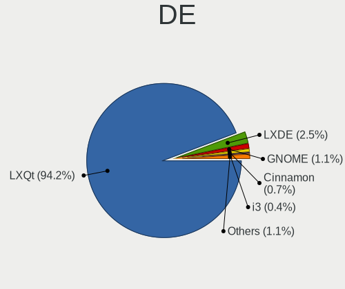

| Name     | Notebooks | Percent |
|----------|-----------|---------|
| LXQt     | 222       | 94.47%  |
| LXDE     | 5         | 2.13%   |
| GNOME    | 3         | 1.28%   |
| Cinnamon | 2         | 0.85%   |
| MATE     | 1         | 0.43%   |
| KDE5     | 1         | 0.43%   |
| KDE      | 1         | 0.43%   |

Display Server
--------------

X11 or Wayland

| Name    | Notebooks | Percent |
|---------|-----------|---------|
| X11     | 222       | 94.87%  |
| Tty     | 10        | 4.27%   |
| Wayland | 2         | 0.85%   |

Display Manager
---------------

SDDM, LightDM, etc.

| Name    | Notebooks | Percent |
|---------|-----------|---------|
| SDDM    | 122       | 51.48%  |
| Unknown | 80        | 33.76%  |
| GDM     | 14        | 5.91%   |
| TDM     | 11        | 4.64%   |
| LightDM | 8         | 3.38%   |
| GDM3    | 2         | 0.84%   |

OS Lang
-------

Language

| Lang  | Notebooks | Percent |
|-------|-----------|---------|
| en_US | 83        | 35.62%  |
| fr_FR | 28        | 12.02%  |
| pt_BR | 22        | 9.44%   |
| en_GB | 12        | 5.15%   |
| it_IT | 11        | 4.72%   |
| de_DE | 10        | 4.29%   |
| ru_RU | 8         | 3.43%   |
| C     | 7         | 3%      |
| pl_PL | 6         | 2.58%   |
| es_ES | 6         | 2.58%   |
| en_AU | 4         | 1.72%   |
| fr_CH | 3         | 1.29%   |
| es_MX | 3         | 1.29%   |
| es_AR | 3         | 1.29%   |
| en_IE | 3         | 1.29%   |
| nl_NL | 2         | 0.86%   |
| hu_HU | 2         | 0.86%   |
| es_CL | 2         | 0.86%   |
| en_IN | 2         | 0.86%   |
| en_CA | 2         | 0.86%   |
| tr_TR | 1         | 0.43%   |
| ru_UA | 1         | 0.43%   |
| pt_PT | 1         | 0.43%   |
| nl_BE | 1         | 0.43%   |
| lt_LT | 1         | 0.43%   |
| ja_JP | 1         | 0.43%   |
| fr_BE | 1         | 0.43%   |
| es_UY | 1         | 0.43%   |
| es_CR | 1         | 0.43%   |
| en_ZA | 1         | 0.43%   |
| en_SG | 1         | 0.43%   |
| en_PH | 1         | 0.43%   |
| en_DE | 1         | 0.43%   |
| el_GR | 1         | 0.43%   |

Boot Mode
---------

EFI or BIOS

| Mode | Notebooks | Percent |
|------|-----------|---------|
| BIOS | 126       | 54.08%  |
| EFI  | 107       | 45.92%  |

Filesystem
----------

Type of filesystem

| Type    | Notebooks | Percent |
|---------|-----------|---------|
| Ext4    | 218       | 93.56%  |
| Overlay | 9         | 3.86%   |
| Btrfs   | 5         | 2.15%   |
| Aufs    | 1         | 0.43%   |

Part. scheme
------------

Scheme of partitioning

| Type    | Notebooks | Percent |
|---------|-----------|---------|
| Unknown | 97        | 41.1%   |
| GPT     | 79        | 33.47%  |
| MBR     | 60        | 25.42%  |

Dual Boot with Linux/BSD
------------------------

Hosting more than one Linux/BSD

| Dual boot | Notebooks | Percent |
|-----------|-----------|---------|
| No        | 215       | 91.49%  |
| Yes       | 20        | 8.51%   |

Dual Boot (Win)
---------------

Hosting Linux and Windows

| Dual boot | Notebooks | Percent |
|-----------|-----------|---------|
| No        | 176       | 74.89%  |
| Yes       | 59        | 25.11%  |

Board
-----

Vendor
------

Motherboard manufacturer

| Name                        | Notebooks | Percent |
|-----------------------------|-----------|---------|
| Hewlett-Packard             | 45        | 19.31%  |
| Lenovo                      | 41        | 17.6%   |
| Dell                        | 30        | 12.88%  |
| ASUSTek Computer            | 23        | 9.87%   |
| Acer                        | 17        | 7.3%    |
| Toshiba                     | 13        | 5.58%   |
| Samsung Electronics         | 10        | 4.29%   |
| Positivo                    | 5         | 2.15%   |
| Notebook                    | 5         | 2.15%   |
| Apple                       | 5         | 2.15%   |
| Sony                        | 4         | 1.72%   |
| MSI                         | 4         | 1.72%   |
| Google                      | 4         | 1.72%   |
| Packard Bell                | 3         | 1.29%   |
| Fujitsu                     | 3         | 1.29%   |
| YASHI                       | 2         | 0.86%   |
| UNOWHY                      | 1         | 0.43%   |
| Timi                        | 1         | 0.43%   |
| Prestigio                   | 1         | 0.43%   |
| Panasonic                   | 1         | 0.43%   |
| Mediacom                    | 1         | 0.43%   |
| Lanix                       | 1         | 0.43%   |
| LAMINA                      | 1         | 0.43%   |
| Itautec                     | 1         | 0.43%   |
| Intel                       | 1         | 0.43%   |
| I-Life Digital Technologies | 1         | 0.43%   |
| Hungaro Flotta Kft          | 1         | 0.43%   |
| HUAWEI                      | 1         | 0.43%   |
| Haier                       | 1         | 0.43%   |
| GTZS                        | 1         | 0.43%   |
| Gateway                     | 1         | 0.43%   |
| Dixonsxp                    | 1         | 0.43%   |
| Digibras                    | 1         | 0.43%   |
| Alienware                   | 1         | 0.43%   |
| Unknown                     | 1         | 0.43%   |

Model
-----

Motherboard model

| Name                                  | Notebooks | Percent |
|---------------------------------------|-----------|---------|
| HP Notebook                           | 5         | 2.15%   |
| Unknown                               | 4         | 1.72%   |
| HP Pavilion dv6                       | 3         | 1.29%   |
| Dell Latitude D630                    | 3         | 1.29%   |
| YASHI MYBOOK 360                      | 2         | 0.86%   |
| Positivo H14BT58                      | 2         | 0.86%   |
| Lenovo IdeaPad 320-15AST 80XV         | 2         | 0.86%   |
| HP ProBook 440 G8 Notebook PC         | 2         | 0.86%   |
| HP ProBook 440 G7                     | 2         | 0.86%   |
| HP Pavilion g7                        | 2         | 0.86%   |
| Dell Inspiron 15-3567                 | 2         | 0.86%   |
| ASUS 1015BX                           | 2         | 0.86%   |
| Apple MacBookPro8,1                   | 2         | 0.86%   |
| UNOWHY Y13G010S4EI                    | 1         | 0.43%   |
| Toshiba Satellite S55-B               | 1         | 0.43%   |
| Toshiba Satellite Pro U400            | 1         | 0.43%   |
| Toshiba Satellite L840                | 1         | 0.43%   |
| Toshiba Satellite L70-B               | 1         | 0.43%   |
| Toshiba Satellite L305                | 1         | 0.43%   |
| Toshiba Satellite C875                | 1         | 0.43%   |
| Toshiba Satellite C855D               | 1         | 0.43%   |
| Toshiba Satellite C70D-B              | 1         | 0.43%   |
| Toshiba Satellite C670D-12N           | 1         | 0.43%   |
| Toshiba Satellite C55D-A              | 1         | 0.43%   |
| Toshiba Satellite A660                | 1         | 0.43%   |
| Toshiba Satellite A205                | 1         | 0.43%   |
| Toshiba NB510                         | 1         | 0.43%   |
| Timi TM1612                           | 1         | 0.43%   |
| Sony VPCSB1V9E                        | 1         | 0.43%   |
| Sony VPCEJ1E1E                        | 1         | 0.43%   |
| Sony VGN-SZ670AN                      | 1         | 0.43%   |
| Sony VGN-CR11Z_R                      | 1         | 0.43%   |
| Samsung RV415/RV515                   | 1         | 0.43%   |
| Samsung RV410/RV510/S3510/E3510       | 1         | 0.43%   |
| Samsung RV408/RV508                   | 1         | 0.43%   |
| Samsung RC512                         | 1         | 0.43%   |
| Samsung R530/R730/P530                | 1         | 0.43%   |
| Samsung R520/R522/R620                | 1         | 0.43%   |
| Samsung R40/R41                       | 1         | 0.43%   |
| Samsung N100SP                        | 1         | 0.43%   |
| Samsung 300E4M/300E4S/300E4L          | 1         | 0.43%   |
| Samsung 275E4E/275E5E                 | 1         | 0.43%   |
| Prestigio PSB141C01BFH                | 1         | 0.43%   |
| Positivo S14CT01                      | 1         | 0.43%   |
| Positivo S14BW01                      | 1         | 0.43%   |
| Positivo N600                         | 1         | 0.43%   |
| Panasonic CF-52PGNBE2M                | 1         | 0.43%   |
| Packard Bell EN Butterfly s           | 1         | 0.43%   |
| Packard Bell EasyNote_ST85-M-010FR    | 1         | 0.43%   |
| Packard Bell EasyNote TE11HC          | 1         | 0.43%   |
| Notebook W740SU                       | 1         | 0.43%   |
| Notebook W54_W94_W955TU,-T,-C         | 1         | 0.43%   |
| Notebook W54_55SU1,SUW                | 1         | 0.43%   |
| Notebook NL40_50GU                    | 1         | 0.43%   |
| Notebook NHxxRZQ                      | 1         | 0.43%   |
| MSI U180                              | 1         | 0.43%   |
| MSI Modern 15 A10M                    | 1         | 0.43%   |
| MSI Katana GF76 11UC                  | 1         | 0.43%   |
| MSI GL65 9SDK                         | 1         | 0.43%   |
| Mediacom SmartBook 14 FullHD - SB14UC | 1         | 0.43%   |

Model Family
------------

Motherboard model prefix

| Name                   | Notebooks | Percent |
|------------------------|-----------|---------|
| Lenovo ThinkPad        | 16        | 6.87%   |
| Lenovo IdeaPad         | 15        | 6.44%   |
| Dell Inspiron          | 14        | 6.01%   |
| Acer Aspire            | 13        | 5.58%   |
| Toshiba Satellite      | 12        | 5.15%   |
| HP Pavilion            | 12        | 5.15%   |
| HP ProBook             | 11        | 4.72%   |
| Dell Latitude          | 8         | 3.43%   |
| HP Notebook            | 5         | 2.15%   |
| HP Compaq              | 5         | 2.15%   |
| ASUS VivoBook          | 5         | 2.15%   |
| HP EliteBook           | 4         | 1.72%   |
| Unknown                | 4         | 1.72%   |
| Dell Vostro            | 3         | 1.29%   |
| YASHI MYBOOK           | 2         | 0.86%   |
| Positivo H14BT58       | 2         | 0.86%   |
| Packard Bell EasyNote  | 2         | 0.86%   |
| Notebook W54           | 2         | 0.86%   |
| HP Presario            | 2         | 0.86%   |
| Dell XPS               | 2         | 0.86%   |
| ASUS 1015BX            | 2         | 0.86%   |
| Apple MacBookPro8      | 2         | 0.86%   |
| UNOWHY Y13G010S4EI     | 1         | 0.43%   |
| Toshiba NB510          | 1         | 0.43%   |
| Timi TM1612            | 1         | 0.43%   |
| Sony VPCSB1V9E         | 1         | 0.43%   |
| Sony VPCEJ1E1E         | 1         | 0.43%   |
| Sony VGN-SZ670AN       | 1         | 0.43%   |
| Sony VGN-CR11Z         | 1         | 0.43%   |
| Samsung RV415          | 1         | 0.43%   |
| Samsung RV410          | 1         | 0.43%   |
| Samsung RV408          | 1         | 0.43%   |
| Samsung RC512          | 1         | 0.43%   |
| Samsung R530           | 1         | 0.43%   |
| Samsung R520           | 1         | 0.43%   |
| Samsung R40            | 1         | 0.43%   |
| Samsung N100SP         | 1         | 0.43%   |
| Samsung 300E4M         | 1         | 0.43%   |
| Samsung 275E4E         | 1         | 0.43%   |
| Prestigio PSB141C01BFH | 1         | 0.43%   |
| Positivo S14CT01       | 1         | 0.43%   |
| Positivo S14BW01       | 1         | 0.43%   |
| Positivo N600          | 1         | 0.43%   |
| Panasonic CF-52PGNBE2M | 1         | 0.43%   |
| Packard Bell EN        | 1         | 0.43%   |
| Notebook W740SU        | 1         | 0.43%   |
| Notebook NL40          | 1         | 0.43%   |
| Notebook NHxxRZQ       | 1         | 0.43%   |
| MSI U180               | 1         | 0.43%   |
| MSI Modern             | 1         | 0.43%   |
| MSI Katana             | 1         | 0.43%   |
| MSI GL65               | 1         | 0.43%   |
| Mediacom SmartBook     | 1         | 0.43%   |
| Lenovo Z50-70          | 1         | 0.43%   |
| Lenovo Y50-70          | 1         | 0.43%   |
| Lenovo ThinkBook       | 1         | 0.43%   |
| Lenovo Legion          | 1         | 0.43%   |
| Lenovo G70-80          | 1         | 0.43%   |
| Lenovo G575            | 1         | 0.43%   |
| Lenovo G50-80          | 1         | 0.43%   |

MFG Year
--------

Motherboard manufacture year

| Year | Notebooks | Percent |
|------|-----------|---------|
| 2019 | 23        | 9.87%   |
| 2014 | 19        | 8.15%   |
| 2012 | 19        | 8.15%   |
| 2011 | 18        | 7.73%   |
| 2008 | 18        | 7.73%   |
| 2016 | 17        | 7.3%    |
| 2013 | 17        | 7.3%    |
| 2010 | 17        | 7.3%    |
| 2020 | 14        | 6.01%   |
| 2017 | 13        | 5.58%   |
| 2009 | 13        | 5.58%   |
| 2015 | 12        | 5.15%   |
| 2007 | 12        | 5.15%   |
| 2018 | 11        | 4.72%   |
| 2021 | 6         | 2.58%   |
| 2006 | 4         | 1.72%   |

Form Factor
-----------

Physical design of the computer

| Name     | Notebooks | Percent |
|----------|-----------|---------|
| Notebook | 233       | 100%    |

Secure Boot
-----------

Enabled or disabled

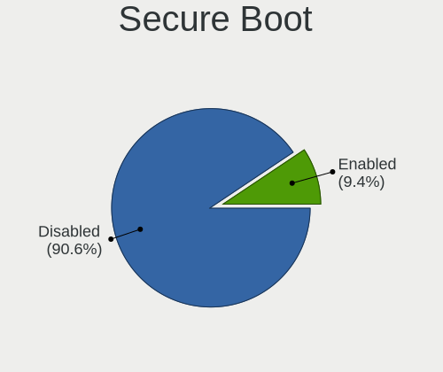

| State    | Notebooks | Percent |
|----------|-----------|---------|
| Disabled | 214       | 91.45%  |
| Enabled  | 20        | 8.55%   |

Coreboot
--------

Have coreboot on board

| Used | Notebooks | Percent |
|------|-----------|---------|
| No   | 228       | 97.85%  |
| Yes  | 5         | 2.15%   |

RAM Size
--------

Total RAM memory

| Size in GB | Notebooks | Percent |
|------------|-----------|---------|
| 3.01-4.0   | 77        | 32.77%  |
| 4.01-8.0   | 60        | 25.53%  |
| 1.01-2.0   | 43        | 18.3%   |
| 8.01-16.0  | 27        | 11.49%  |
| 16.01-24.0 | 17        | 7.23%   |
| 2.01-3.0   | 7         | 2.98%   |
| 32.01-64.0 | 3         | 1.28%   |
| 0.51-1.0   | 1         | 0.43%   |

RAM Used
--------

Used RAM memory

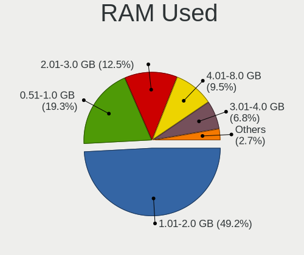

| Used GB   | Notebooks | Percent |
|-----------|-----------|---------|
| 1.01-2.0  | 128       | 51%     |
| 0.51-1.0  | 48        | 19.12%  |
| 2.01-3.0  | 31        | 12.35%  |
| 4.01-8.0  | 21        | 8.37%   |
| 3.01-4.0  | 15        | 5.98%   |
| 0.01-0.5  | 6         | 2.39%   |
| 8.01-16.0 | 2         | 0.8%    |

Total Drives
------------

Number of drives on board

| Drives | Notebooks | Percent |
|--------|-----------|---------|
| 1      | 175       | 74.15%  |
| 2      | 55        | 23.31%  |
| 3      | 4         | 1.69%   |
| 4      | 1         | 0.42%   |
| 0      | 1         | 0.42%   |

Has CD-ROM
----------

Has CD-ROM on board

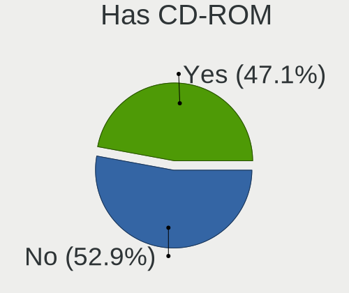

| Presented | Notebooks | Percent |
|-----------|-----------|---------|
| No        | 121       | 51.71%  |
| Yes       | 113       | 48.29%  |

Has Ethernet
------------

Has Ethernet on board

| Presented | Notebooks | Percent |
|-----------|-----------|---------|
| Yes       | 198       | 84.62%  |
| No        | 36        | 15.38%  |

Has WiFi
--------

Has WiFi module

| Presented | Notebooks | Percent |
|-----------|-----------|---------|
| Yes       | 218       | 93.56%  |
| No        | 15        | 6.44%   |

Has Bluetooth
-------------

Has Bluetooth module

| Presented | Notebooks | Percent |
|-----------|-----------|---------|
| Yes       | 142       | 59.66%  |
| No        | 96        | 40.34%  |

Location
--------

Country
-------

Geographic location (country)

| Country      | Notebooks | Percent |
|--------------|-----------|---------|
| USA          | 39        | 16.67%  |
| France       | 31        | 13.25%  |
| Brazil       | 27        | 11.54%  |
| Italy        | 18        | 7.69%   |
| Russia       | 13        | 5.56%   |
| Germany      | 13        | 5.56%   |
| UK           | 9         | 3.85%   |
| Poland       | 8         | 3.42%   |
| Spain        | 7         | 2.99%   |
| Australia    | 5         | 2.14%   |
| Ukraine      | 4         | 1.71%   |
| Netherlands  | 4         | 1.71%   |
| Mexico       | 4         | 1.71%   |
| Switzerland  | 3         | 1.28%   |
| Ireland      | 3         | 1.28%   |
| Argentina    | 3         | 1.28%   |
| South Africa | 2         | 0.85%   |
| Romania      | 2         | 0.85%   |
| Indonesia    | 2         | 0.85%   |
| India        | 2         | 0.85%   |
| Hungary      | 2         | 0.85%   |
| Finland      | 2         | 0.85%   |
| Chile        | 2         | 0.85%   |
| Canada       | 2         | 0.85%   |
| Belgium      | 2         | 0.85%   |
| Vietnam      | 1         | 0.43%   |
| Uruguay      | 1         | 0.43%   |
| Turkey       | 1         | 0.43%   |
| Tunisia      | 1         | 0.43%   |
| Slovenia     | 1         | 0.43%   |
| Slovakia     | 1         | 0.43%   |
| Singapore    | 1         | 0.43%   |
| Serbia       | 1         | 0.43%   |
| Portugal     | 1         | 0.43%   |
| Philippines  | 1         | 0.43%   |
| Norway       | 1         | 0.43%   |
| Luxembourg   | 1         | 0.43%   |
| Lithuania    | 1         | 0.43%   |
| Lebanon      | 1         | 0.43%   |
| Japan        | 1         | 0.43%   |
| Israel       | 1         | 0.43%   |
| Iran         | 1         | 0.43%   |
| Honduras     | 1         | 0.43%   |
| Greece       | 1         | 0.43%   |
| Ecuador      | 1         | 0.43%   |
| Czechia      | 1         | 0.43%   |
| Costa Rica   | 1         | 0.43%   |
| Colombia     | 1         | 0.43%   |
| Bulgaria     | 1         | 0.43%   |
| Azerbaijan   | 1         | 0.43%   |

City
----

Geographic location (city)

| City                   | Notebooks | Percent |
|------------------------|-----------|---------|
| Paris                  | 6         | 2.48%   |
| Milan                  | 4         | 1.65%   |
| Salvador               | 3         | 1.24%   |
| Rome                   | 3         | 1.24%   |
| Mexico City            | 3         | 1.24%   |
| Derry                  | 3         | 1.24%   |
| Yekaterinburg          | 2         | 0.83%   |
| Vicosa                 | 2         | 0.83%   |
| Stuttgart              | 2         | 0.83%   |
| Southampton            | 2         | 0.83%   |
| Poznan                 | 2         | 0.83%   |
| Porto Alegre           | 2         | 0.83%   |
| Munich                 | 2         | 0.83%   |
| Moscow                 | 2         | 0.83%   |
| Melbourne              | 2         | 0.83%   |
| Krakow                 | 2         | 0.83%   |
| Houston                | 2         | 0.83%   |
| Helsinki               | 2         | 0.83%   |
| Fortaleza              | 2         | 0.83%   |
| Florence               | 2         | 0.83%   |
| Curitiba               | 2         | 0.83%   |
| Zwanenburg             | 1         | 0.41%   |
| Winchester             | 1         | 0.41%   |
| Williamsburg           | 1         | 0.41%   |
| Warrington             | 1         | 0.41%   |
| Wadsworth              | 1         | 0.41%   |
| Wadi Maliz             | 1         | 0.41%   |
| Vladivostok            | 1         | 0.41%   |
| Villeneuve-d'Ascq      | 1         | 0.41%   |
| Villars                | 1         | 0.41%   |
| Villandry              | 1         | 0.41%   |
| Villamuriel de Cerrato | 1         | 0.41%   |
| Villabon               | 1         | 0.41%   |
| Vigasio                | 1         | 0.41%   |
| Vernier                | 1         | 0.41%   |
| Venice                 | 1         | 0.41%   |
| Varna                  | 1         | 0.41%   |
| Valley City            | 1         | 0.41%   |
| Utrecht                | 1         | 0.41%   |
| Uberlndia            | 1         | 0.41%   |
| Tunis                  | 1         | 0.41%   |
| Traralgon              | 1         | 0.41%   |
| Torre del Greco        | 1         | 0.41%   |
| Teresina               | 1         | 0.41%   |
| Tehran                 | 1         | 0.41%   |
| Taunton                | 1         | 0.41%   |
| Szada                  | 1         | 0.41%   |
| Surgut                 | 1         | 0.41%   |
| Strassen               | 1         | 0.41%   |
| Strasbourg             | 1         | 0.41%   |
| Stavropol              | 1         | 0.41%   |
| Stavanger              | 1         | 0.41%   |
| Springville            | 1         | 0.41%   |
| Springdale             | 1         | 0.41%   |
| Spay                   | 1         | 0.41%   |
| Slane                  | 1         | 0.41%   |
| Siegburg               | 1         | 0.41%   |
| Shildon                | 1         | 0.41%   |
| Sheboygan              | 1         | 0.41%   |
| Shakhtarske            | 1         | 0.41%   |

Drives
------

Drive Vendor
------------

Hard drive vendors

| Vendor              | Notebooks | Drives | Percent |
|---------------------|-----------|--------|---------|
| Seagate             | 44        | 51     | 16.06%  |
| WDC                 | 39        | 48     | 14.23%  |
| Unknown             | 24        | 29     | 8.76%   |
| Toshiba             | 24        | 25     | 8.76%   |
| Samsung Electronics | 21        | 23     | 7.66%   |
| Hitachi             | 21        | 25     | 7.66%   |
| Crucial             | 14        | 15     | 5.11%   |
| Kingston            | 13        | 14     | 4.74%   |
| SanDisk             | 10        | 14     | 3.65%   |
| Intel               | 7         | 8      | 2.55%   |
| SK hynix            | 6         | 6      | 2.19%   |
| HGST                | 6         | 8      | 2.19%   |
| Fujitsu             | 6         | 6      | 2.19%   |
| Micron Technology   | 3         | 3      | 1.09%   |
| LITEONIT            | 3         | 3      | 1.09%   |
| KIOXIA              | 3         | 3      | 1.09%   |
| China               | 3         | 3      | 1.09%   |
| Apacer              | 3         | 3      | 1.09%   |
| A-DATA Technology   | 3         | 3      | 1.09%   |
| PNY                 | 2         | 2      | 0.73%   |
| Unknown             | 2         | 3      | 0.73%   |
| USB                 | 1         | 1      | 0.36%   |
| Transcend           | 1         | 1      | 0.36%   |
| TCSUNBOW            | 1         | 1      | 0.36%   |
| SPCC                | 1         | 1      | 0.36%   |
| Phison Electronics  | 1         | 1      | 0.36%   |
| OCZ                 | 1         | 1      | 0.36%   |
| LITEON              | 1         | 2      | 0.36%   |
| LDLC                | 1         | 1      | 0.36%   |
| LaCie               | 1         | 2      | 0.36%   |
| KingDian            | 1         | 1      | 0.36%   |
| JMicron Technology  | 1         | 1      | 0.36%   |
| Integral            | 1         | 1      | 0.36%   |
| Gigabyte Technology | 1         | 1      | 0.36%   |
| General             | 1         | 1      | 0.36%   |
| EMTEC               | 1         | 1      | 0.36%   |
| Dell                | 1         | 1      | 0.36%   |
| Apple               | 1         | 3      | 0.36%   |

Drive Model
-----------

Hard drive models

| Model                                | Notebooks | Percent |
|--------------------------------------|-----------|---------|
| Unknown MMC Card  32GB               | 7         | 2.46%   |
| Toshiba MQ01ABF050 500GB             | 5         | 1.76%   |
| Seagate ST500LM012 HN-M500MBB 500GB  | 5         | 1.76%   |
| Kingston SA400S37240G 240GB SSD      | 5         | 1.76%   |
| Seagate ST500LT012-1DG142 500GB      | 4         | 1.41%   |
| Seagate ST1000LM035-1RK172 1TB       | 4         | 1.41%   |
| Seagate ST1000LM024 HN-M101MBB 1TB   | 4         | 1.41%   |
| Toshiba MQ01ABD100 1TB               | 3         | 1.06%   |
| Seagate ST9500325AS 500GB            | 3         | 1.06%   |
| Crucial CT480BX500SSD1 480GB         | 3         | 1.06%   |
| Crucial CT240BX500SSD1 240GB         | 3         | 1.06%   |
| WDC WD3200BPVT-22JJ5T0 320GB         | 2         | 0.7%    |
| WDC WD10SPZX-24Z10T0 1TB             | 2         | 0.7%    |
| WDC PC SN520 SDAPNUW-256G-1006 256GB | 2         | 0.7%    |
| Unknown MMC Card  64GB               | 2         | 0.7%    |
| Unknown DA4064  64GB                 | 2         | 0.7%    |
| Unknown 128G32  128GB                | 2         | 0.7%    |
| Toshiba THNSFJ256GDNU A 256GB SSD    | 2         | 0.7%    |
| Toshiba MQ01ABD050 500GB             | 2         | 0.7%    |
| Seagate ST9250410AS 250GB            | 2         | 0.7%    |
| Seagate ST9160412AS 160GB            | 2         | 0.7%    |
| Seagate ST500LT012-9WS142 500GB      | 2         | 0.7%    |
| Seagate ST320LT007-9ZV142 320GB      | 2         | 0.7%    |
| Seagate ST2000LX001-1RG174 2TB       | 2         | 0.7%    |
| SanDisk NVMe SSD Drive 512GB         | 2         | 0.7%    |
| Kingston SA400S37480G 480GB SSD      | 2         | 0.7%    |
| Hitachi HTS547575A9E384 752GB        | 2         | 0.7%    |
| Hitachi HTS543232A7A384 320GB        | 2         | 0.7%    |
| Hitachi HTS542512K9SA00 120GB        | 2         | 0.7%    |
| Hitachi HTS541616J9SA00 160GB        | 2         | 0.7%    |
| HGST HTS545050A7E680 500GB           | 2         | 0.7%    |
| Crucial CT1000MX500SSD1 1TB          | 2         | 0.7%    |
| A-DATA SU650 240GB SSD               | 2         | 0.7%    |
| Unknown                              | 2         | 0.7%    |
| WDC WDS500G2B0B-00YS70 500GB SSD     | 1         | 0.35%   |
| WDC WDS500G2B0A-00SM50 500GB SSD     | 1         | 0.35%   |
| WDC WDS240G2G0A-00JH30 240GB SSD     | 1         | 0.35%   |
| WDC WDS120G2G0A-00JH30 120GB SSD     | 1         | 0.35%   |
| WDC WD800BEVS-60RST0 80GB            | 1         | 0.35%   |
| WDC WD7500BPVX-22JC3T0 752GB         | 1         | 0.35%   |
| WDC WD6400BPVT-22HXZT1 640GB         | 1         | 0.35%   |
| WDC WD5000LUCT-62C26Y0 500GB         | 1         | 0.35%   |
| WDC WD5000LPVX-55V0TT3 500GB         | 1         | 0.35%   |
| WDC WD5000LPVX-22V0TT0 500GB         | 1         | 0.35%   |
| WDC WD5000LPVX-00V0TT0 500GB         | 1         | 0.35%   |
| WDC WD5000LPCX-60VHAT1 500GB         | 1         | 0.35%   |
| WDC WD5000LPCX-21VHAT0 500GB         | 1         | 0.35%   |
| WDC WD5000LPCX-00VHAT0 500GB         | 1         | 0.35%   |
| WDC WD3200LPVX-16V0TT3 320GB         | 1         | 0.35%   |
| WDC WD3200BPVT-80ZEST0 320GB         | 1         | 0.35%   |
| WDC WD3200BPVT-75ZEST0 320GB         | 1         | 0.35%   |
| WDC WD3200BPVT-24JJ5T0 320GB         | 1         | 0.35%   |
| WDC WD3200BEVT-22ZCT0 320GB          | 1         | 0.35%   |
| WDC WD2500BEVT-80A23T0 250GB         | 1         | 0.35%   |
| WDC WD2500BEVT-75A23T0 250GB         | 1         | 0.35%   |
| WDC WD2500BEVT-60ZCT1 250GB          | 1         | 0.35%   |
| WDC WD2500BEVT-22ZCT0 250GB          | 1         | 0.35%   |
| WDC WD2500BEVT-00A23T0 250GB         | 1         | 0.35%   |
| WDC WD20SPZX-08UA7 2TB               | 1         | 0.35%   |
| WDC WD1600BEVT-08A23T1 160GB         | 1         | 0.35%   |

HDD Vendor
----------

Hard disk drive vendors

| Vendor              | Notebooks | Drives | Percent |
|---------------------|-----------|--------|---------|
| Seagate             | 44        | 51     | 32.12%  |
| WDC                 | 32        | 40     | 23.36%  |
| Hitachi             | 21        | 25     | 15.33%  |
| Toshiba             | 20        | 21     | 14.6%   |
| Samsung Electronics | 6         | 7      | 4.38%   |
| HGST                | 6         | 8      | 4.38%   |
| Fujitsu             | 6         | 6      | 4.38%   |
| USB                 | 1         | 1      | 0.73%   |
| LaCie               | 1         | 1      | 0.73%   |

SSD Vendor
----------

Solid state drive vendors

| Vendor              | Notebooks | Drives | Percent |
|---------------------|-----------|--------|---------|
| Crucial             | 14        | 15     | 17.5%   |
| Samsung Electronics | 10        | 11     | 12.5%   |
| Kingston            | 10        | 10     | 12.5%   |
| SanDisk             | 6         | 10     | 7.5%    |
| Intel               | 6         | 7      | 7.5%    |
| WDC                 | 4         | 5      | 5%      |
| LITEONIT            | 3         | 3      | 3.75%   |
| China               | 3         | 3      | 3.75%   |
| Apacer              | 3         | 3      | 3.75%   |
| A-DATA Technology   | 3         | 3      | 3.75%   |
| Toshiba             | 2         | 2      | 2.5%    |
| SK hynix            | 2         | 2      | 2.5%    |
| PNY                 | 2         | 2      | 2.5%    |
| Unknown             | 1         | 1      | 1.25%   |
| Transcend           | 1         | 1      | 1.25%   |
| TCSUNBOW            | 1         | 1      | 1.25%   |
| SPCC                | 1         | 1      | 1.25%   |
| OCZ                 | 1         | 1      | 1.25%   |
| Micron Technology   | 1         | 1      | 1.25%   |
| LITEON              | 1         | 2      | 1.25%   |
| LDLC                | 1         | 1      | 1.25%   |
| KingDian            | 1         | 1      | 1.25%   |
| Integral            | 1         | 1      | 1.25%   |
| Dell                | 1         | 1      | 1.25%   |
| Apple               | 1         | 3      | 1.25%   |

Drive Kind
----------

HDD or SSD

| Kind    | Notebooks | Drives | Percent |
|---------|-----------|--------|---------|
| HDD     | 134       | 160    | 50%     |
| SSD     | 78        | 91     | 29.1%   |
| MMC     | 26        | 33     | 9.7%    |
| NVMe    | 26        | 28     | 9.7%    |
| Unknown | 4         | 4      | 1.49%   |

Drive Connector
---------------

SATA, SAS, NVMe, etc.

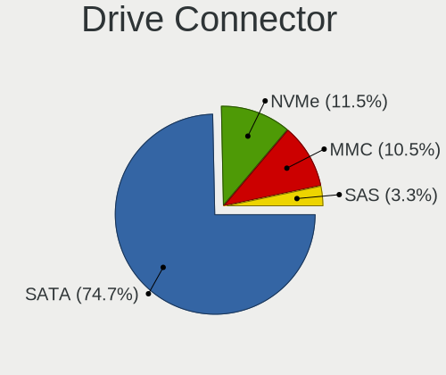

| Type | Notebooks | Drives | Percent |
|------|-----------|--------|---------|
| SATA | 192       | 243    | 75.89%  |
| NVMe | 26        | 28     | 10.28%  |
| MMC  | 26        | 33     | 10.28%  |
| SAS  | 9         | 12     | 3.56%   |

Drive Size
----------

Size of hard drive

| Size in TB | Notebooks | Drives | Percent |
|------------|-----------|--------|---------|
| 0.01-0.5   | 154       | 192    | 75.49%  |
| 0.51-1.0   | 41        | 47     | 20.1%   |
| 1.01-2.0   | 7         | 9      | 3.43%   |
| 3.01-4.0   | 1         | 1      | 0.49%   |
| 4.01-10.0  | 1         | 2      | 0.49%   |

Space Total
-----------

Amount of disk space available on the file system

| Size in GB     | Notebooks | Percent |
|----------------|-----------|---------|
| 101-250        | 66        | 27.73%  |
| 251-500        | 65        | 27.31%  |
| 501-1000       | 31        | 13.03%  |
| 51-100         | 23        | 9.66%   |
| 1-20           | 19        | 7.98%   |
| 21-50          | 17        | 7.14%   |
| 1001-2000      | 10        | 4.2%    |
| More than 3000 | 5         | 2.1%    |
| 2001-3000      | 1         | 0.42%   |
| Unknown        | 1         | 0.42%   |

Space Used
----------

Amount of used disk space

| Used GB        | Notebooks | Percent |
|----------------|-----------|---------|
| 1-20           | 118       | 48.36%  |
| 21-50          | 43        | 17.62%  |
| 101-250        | 33        | 13.52%  |
| 51-100         | 20        | 8.2%    |
| 251-500        | 14        | 5.74%   |
| 501-1000       | 11        | 4.51%   |
| More than 3000 | 2         | 0.82%   |
| 2001-3000      | 1         | 0.41%   |
| 1001-2000      | 1         | 0.41%   |
| Unknown        | 1         | 0.41%   |

Malfunc. Drives
---------------

Drive models with a malfunction

| Model                                      | Notebooks | Drives | Percent |
|--------------------------------------------|-----------|--------|---------|
| Seagate ST1000LM024 HN-M101MBB 1TB         | 2         | 2      | 6.9%    |
| WDC WDS240G2G0A-00JH30 240GB SSD           | 1         | 1      | 3.45%   |
| WDC WD800BEVS-60RST0 80GB                  | 1         | 1      | 3.45%   |
| WDC WD5000LUCT-62C26Y0 500GB               | 1         | 1      | 3.45%   |
| WDC WD3200BPVT-80ZEST0 320GB               | 1         | 1      | 3.45%   |
| WDC WD2500BEVT-80A23T0 250GB               | 1         | 2      | 3.45%   |
| Toshiba MK5059GSXP 500GB                   | 1         | 1      | 3.45%   |
| TCSUNBOW X1 32GB SSD                       | 1         | 1      | 3.45%   |
| SK hynix HFS128G3BTND-N210A 128GB SSD      | 1         | 1      | 3.45%   |
| SK hynix HFS128G39TND-N210A 128GB SSD      | 1         | 1      | 3.45%   |
| Seagate ST9320325AS 320GB                  | 1         | 1      | 3.45%   |
| Seagate ST9250410AS 250GB                  | 1         | 1      | 3.45%   |
| Seagate ST500LM021-1KJ152 500GB            | 1         | 1      | 3.45%   |
| Seagate ST320LT007-9ZV142 320GB            | 1         | 1      | 3.45%   |
| Samsung Electronics HM160JI 160GB          | 1         | 1      | 3.45%   |
| Samsung Electronics HM121HI 120GB          | 1         | 2      | 3.45%   |
| Kingston RBU-SNS8350DES3128GP 128GB SSD    | 1         | 1      | 3.45%   |
| Hitachi HTS723232A7A364 320GB              | 1         | 1      | 3.45%   |
| Hitachi HTS722012K9SA00 120GB              | 1         | 1      | 3.45%   |
| Hitachi HTS542512K9SA00 120GB              | 1         | 1      | 3.45%   |
| Hitachi HTS541616J9SA00 160GB              | 1         | 1      | 3.45%   |
| HGST HTS545050A7E680 500GB                 | 1         | 1      | 3.45%   |
| HGST HTS541075A9E680 752GB                 | 1         | 1      | 3.45%   |
| HGST HTS541010A9E680 1TB                   | 1         | 1      | 3.45%   |
| Crucial CT960M500SSD1 960GB                | 1         | 1      | 3.45%   |
| Crucial CT120M500SSD3 120GB                | 1         | 1      | 3.45%   |
| Crucial CT120M500SSD1 120GB                | 1         | 1      | 3.45%   |
| A-DATA Technology IM2S3334-256GD 256GB SSD | 1         | 1      | 3.45%   |

Malfunc. Drive Vendor
---------------------

Vendors of faulty drives

| Vendor              | Notebooks | Drives | Percent |
|---------------------|-----------|--------|---------|
| Seagate             | 6         | 6      | 20.69%  |
| WDC                 | 5         | 6      | 17.24%  |
| Hitachi             | 4         | 4      | 13.79%  |
| HGST                | 3         | 3      | 10.34%  |
| Crucial             | 3         | 3      | 10.34%  |
| SK hynix            | 2         | 2      | 6.9%    |
| Samsung Electronics | 2         | 3      | 6.9%    |
| Toshiba             | 1         | 1      | 3.45%   |
| TCSUNBOW            | 1         | 1      | 3.45%   |
| Kingston            | 1         | 1      | 3.45%   |
| A-DATA Technology   | 1         | 1      | 3.45%   |

Malfunc. HDD Vendor
-------------------

Vendors of faulty HDD drives

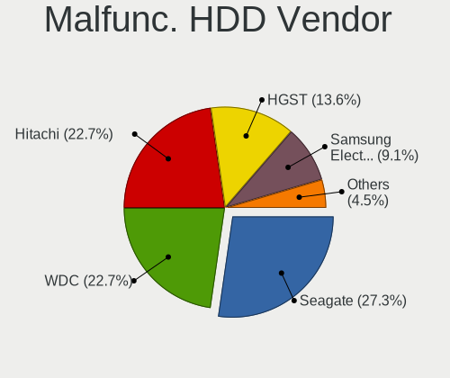

| Vendor              | Notebooks | Drives | Percent |
|---------------------|-----------|--------|---------|
| Seagate             | 6         | 6      | 30%     |
| WDC                 | 4         | 5      | 20%     |
| Hitachi             | 4         | 4      | 20%     |
| HGST                | 3         | 3      | 15%     |
| Samsung Electronics | 2         | 3      | 10%     |
| Toshiba             | 1         | 1      | 5%      |

Malfunc. Drive Kind
-------------------

Kinds of faulty drives

| Kind | Notebooks | Drives | Percent |
|------|-----------|--------|---------|
| HDD  | 20        | 22     | 68.97%  |
| SSD  | 9         | 9      | 31.03%  |

Failed Drives
-------------

Failed drive models

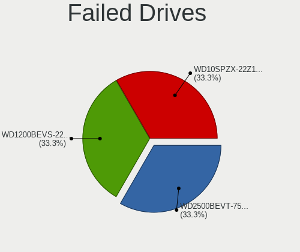

| Model                        | Notebooks | Drives | Percent |
|------------------------------|-----------|--------|---------|
| WDC WD2500BEVT-75A23T0 250GB | 1         | 2      | 50%     |
| WDC WD10SPZX-22Z10T0 1TB     | 1         | 1      | 50%     |

Failed Drive Vendor
-------------------

Failed drive vendors

| Vendor | Notebooks | Drives | Percent |
|--------|-----------|--------|---------|
| WDC    | 2         | 3      | 100%    |

Drive Status
------------

Number of failed and malfunc. drives

| Status   | Notebooks | Drives | Percent |
|----------|-----------|--------|---------|
| Detected | 115       | 163    | 46.18%  |
| Works    | 103       | 119    | 41.37%  |
| Malfunc  | 29        | 31     | 11.65%  |
| Failed   | 2         | 3      | 0.8%    |

Storage controller
------------------

Storage Vendor
--------------

Storage controller vendors

| Vendor                           | Notebooks | Percent |
|----------------------------------|-----------|---------|
| Intel                            | 169       | 71.61%  |
| AMD                              | 38        | 16.1%   |
| SanDisk                          | 5         | 2.12%   |
| Samsung Electronics              | 5         | 2.12%   |
| SK hynix                         | 3         | 1.27%   |
| KIOXIA                           | 3         | 1.27%   |
| Kingston Technology Company      | 3         | 1.27%   |
| Toshiba America Info Systems     | 2         | 0.85%   |
| Nvidia                           | 2         | 0.85%   |
| Micron Technology                | 2         | 0.85%   |
| Solid State Storage Technology   | 1         | 0.42%   |
| Silicon Integrated Systems [SiS] | 1         | 0.42%   |
| Phison Electronics               | 1         | 0.42%   |
| JMicron Technology               | 1         | 0.42%   |

Storage Model
-------------

Storage controller models

| Model                                                                                  | Notebooks | Percent |
|----------------------------------------------------------------------------------------|-----------|---------|
| AMD FCH SATA Controller [AHCI mode]                                                    | 24        | 8.92%   |
| Intel 82801HM/HEM (ICH8M/ICH8M-E) IDE Controller                                       | 18        | 6.69%   |
| Intel 82801IBM/IEM (ICH9M/ICH9M-E) 4 port SATA Controller [AHCI mode]                  | 17        | 6.32%   |
| Intel 7 Series Chipset Family 6-port SATA Controller [AHCI mode]                       | 17        | 6.32%   |
| Intel Sunrise Point-LP SATA Controller [AHCI mode]                                     | 15        | 5.58%   |
| Intel 82801HM/HEM (ICH8M/ICH8M-E) SATA Controller [AHCI mode]                          | 13        | 4.83%   |
| Intel 8 Series SATA Controller 1 [AHCI mode]                                           | 11        | 4.09%   |
| Intel 6 Series/C200 Series Chipset Family 6 port Mobile SATA AHCI Controller           | 11        | 4.09%   |
| AMD SB7x0/SB8x0/SB9x0 SATA Controller [AHCI mode]                                      | 9         | 3.35%   |
| Intel 82801 Mobile SATA Controller [RAID mode]                                         | 8         | 2.97%   |
| Intel NM10/ICH7 Family SATA Controller [AHCI mode]                                     | 7         | 2.6%    |
| Intel Atom Processor E3800 Series SATA AHCI Controller                                 | 7         | 2.6%    |
| Intel 8 Series/C220 Series Chipset Family 6-port SATA Controller 1 [AHCI mode]         | 7         | 2.6%    |
| Intel Celeron/Pentium Silver Processor SATA Controller                                 | 6         | 2.23%   |
| Intel 82801HM/HEM (ICH8M/ICH8M-E) SATA Controller [IDE mode]                           | 6         | 2.23%   |
| Intel 5 Series/3400 Series Chipset 4 port SATA AHCI Controller                         | 6         | 2.23%   |
| Intel Wildcat Point-LP SATA Controller [AHCI Mode]                                     | 5         | 1.86%   |
| Intel 5 Series/3400 Series Chipset 6 port SATA AHCI Controller                         | 5         | 1.86%   |
| Samsung NVMe SSD Controller SM981/PM981/PM983                                          | 4         | 1.49%   |
| Intel Comet Lake SATA AHCI Controller                                                  | 4         | 1.49%   |
| Intel Cannon Lake Mobile PCH SATA AHCI Controller                                      | 4         | 1.49%   |
| Intel Atom/Celeron/Pentium Processor x5-E8000/J3xxx/N3xxx Series SATA Controller       | 4         | 1.49%   |
| SanDisk WD Blue SN500 / PC SN520 NVMe SSD                                              | 3         | 1.12%   |
| KIOXIA Non-Volatile memory controller                                                  | 3         | 1.12%   |
| Kingston Company Company Non-Volatile memory controller                                | 3         | 1.12%   |
| Intel Volume Management Device NVMe RAID Controller                                    | 3         | 1.12%   |
| AMD SB7x0/SB8x0/SB9x0 IDE Controller                                                   | 3         | 1.12%   |
| Toshiba America Info Systems BG3 NVMe SSD Controller                                   | 2         | 0.74%   |
| SanDisk PC SN520 NVMe SSD                                                              | 2         | 0.74%   |
| Nvidia MCP51 Serial ATA Controller                                                     | 2         | 0.74%   |
| Nvidia MCP51 IDE                                                                       | 2         | 0.74%   |
| Micron Non-Volatile memory controller                                                  | 2         | 0.74%   |
| Intel Celeron N3350/Pentium N4200/Atom E3900 Series SATA AHCI Controller               | 2         | 0.74%   |
| Intel 82801GBM/GHM (ICH7-M Family) SATA Controller [AHCI mode]                         | 2         | 0.74%   |
| Intel 82801G (ICH7 Family) IDE Controller                                              | 2         | 0.74%   |
| Intel 7 Series Chipset Family 4-port SATA Controller [IDE mode]                        | 2         | 0.74%   |
| Intel 7 Series Chipset Family 2-port SATA Controller [IDE mode]                        | 2         | 0.74%   |
| AMD SB7x0/SB8x0/SB9x0 SATA Controller [IDE mode]                                       | 2         | 0.74%   |
| AMD IXP SB4x0 IDE Controller                                                           | 2         | 0.74%   |
| Solid State Storage Non-Volatile memory controller                                     | 1         | 0.37%   |
| SK hynix Non-Volatile memory controller                                                | 1         | 0.37%   |
| SK hynix Gold P31 SSD                                                                  | 1         | 0.37%   |
| SK hynix BC511                                                                         | 1         | 0.37%   |
| Silicon Integrated Systems [SiS] SATA Controller / IDE mode                            | 1         | 0.37%   |
| Silicon Integrated Systems [SiS] 5513 IDE Controller                                   | 1         | 0.37%   |
| Samsung NVMe SSD Controller 980                                                        | 1         | 0.37%   |
| Phison E12 NVMe Controller                                                             | 1         | 0.37%   |
| JMicron JMB360 AHCI Controller                                                         | 1         | 0.37%   |
| Intel SSD 660P Series                                                                  | 1         | 0.37%   |
| Intel Mobile 4 Series Chipset PT IDER Controller                                       | 1         | 0.37%   |
| Intel Ice Lake-LP SATA Controller [AHCI mode]                                          | 1         | 0.37%   |
| Intel Cannon Point-LP SATA Controller [AHCI Mode]                                      | 1         | 0.37%   |
| Intel 82801IBM/IEM (ICH9M/ICH9M-E) 2 port SATA Controller [IDE mode]                   | 1         | 0.37%   |
| Intel 82801GBM/GHM (ICH7-M Family) SATA Controller [IDE mode]                          | 1         | 0.37%   |
| Intel 6 Series/C200 Series Chipset Family Mobile SATA Controller (IDE mode, ports 0-3) | 1         | 0.37%   |
| Intel 500 Series Chipset Family SATA AHCI Controller                                   | 1         | 0.37%   |
| Intel 5 Series/3400 Series Chipset 4 port SATA IDE Controller                          | 1         | 0.37%   |
| Intel 5 Series/3400 Series Chipset 2 port SATA IDE Controller                          | 1         | 0.37%   |
| AMD SB600 Non-Raid-5 SATA                                                              | 1         | 0.37%   |
| AMD SB600 IDE                                                                          | 1         | 0.37%   |

Storage Kind
------------

Kind of storage controller (IDE, SATA, NVMe, SAS, ...)

| Kind | Notebooks | Percent |
|------|-----------|---------|
| SATA | 183       | 71.48%  |
| IDE  | 37        | 14.45%  |
| NVMe | 25        | 9.77%   |
| RAID | 11        | 4.3%    |

Processor
---------

CPU Vendor
----------

Processor vendors

| Vendor | Notebooks | Percent |
|--------|-----------|---------|
| Intel  | 190       | 81.55%  |
| AMD    | 43        | 18.45%  |

CPU Model
---------

Processor models

| Model                                        | Notebooks | Percent |
|----------------------------------------------|-----------|---------|
| Intel Core i3-6006U CPU @ 2.00GHz            | 6         | 2.58%   |
| Intel Core i5-8265U CPU @ 1.60GHz            | 5         | 2.15%   |
| Intel Atom x5-Z8300 CPU @ 1.44GHz            | 5         | 2.15%   |
| Intel Pentium Dual-Core CPU T4500 @ 2.30GHz  | 4         | 1.72%   |
| Intel Core 2 Duo CPU T7250 @ 2.00GHz         | 4         | 1.72%   |
| Intel Atom x5-Z8350 CPU @ 1.44GHz            | 4         | 1.72%   |
| AMD E-300 APU with Radeon HD Graphics        | 4         | 1.72%   |
| Intel Core i5-3210M CPU @ 2.50GHz            | 3         | 1.29%   |
| Intel Core i5-10210U CPU @ 1.60GHz           | 3         | 1.29%   |
| Intel Celeron N4020 CPU @ 1.10GHz            | 3         | 1.29%   |
| Intel Celeron CPU 847 @ 1.10GHz              | 3         | 1.29%   |
| Intel Atom CPU Z3735F @ 1.33GHz              | 3         | 1.29%   |
| Intel Pentium Silver N5000 CPU @ 1.10GHz     | 2         | 0.86%   |
| Intel Pentium Dual-Core CPU T4300 @ 2.10GHz  | 2         | 0.86%   |
| Intel Pentium Dual CPU T2370 @ 1.73GHz       | 2         | 0.86%   |
| Intel Pentium CPU N3710 @ 1.60GHz            | 2         | 0.86%   |
| Intel Core i7-9750H CPU @ 2.60GHz            | 2         | 0.86%   |
| Intel Core i7-6500U CPU @ 2.50GHz            | 2         | 0.86%   |
| Intel Core i7-4510U CPU @ 2.00GHz            | 2         | 0.86%   |
| Intel Core i7-2640M CPU @ 2.80GHz            | 2         | 0.86%   |
| Intel Core i7-1065G7 CPU @ 1.30GHz           | 2         | 0.86%   |
| Intel Core i7-10510U CPU @ 1.80GHz           | 2         | 0.86%   |
| Intel Core i7 CPU M 620 @ 2.67GHz            | 2         | 0.86%   |
| Intel Core i5-7200U CPU @ 2.50GHz            | 2         | 0.86%   |
| Intel Core i5-6200U CPU @ 2.30GHz            | 2         | 0.86%   |
| Intel Core i5-4210U CPU @ 1.70GHz            | 2         | 0.86%   |
| Intel Core i5-4200U CPU @ 1.60GHz            | 2         | 0.86%   |
| Intel Core i5-2410M CPU @ 2.30GHz            | 2         | 0.86%   |
| Intel Core i5 CPU M 520 @ 2.40GHz            | 2         | 0.86%   |
| Intel Core i3-4005U CPU @ 1.70GHz            | 2         | 0.86%   |
| Intel Core i3-2350M CPU @ 2.30GHz            | 2         | 0.86%   |
| Intel Core 2 Duo CPU T7300 @ 2.00GHz         | 2         | 0.86%   |
| Intel Core 2 CPU T5600 @ 1.83GHz             | 2         | 0.86%   |
| Intel Celeron Dual-Core CPU T3500 @ 2.10GHz  | 2         | 0.86%   |
| Intel Celeron CPU N2807 @ 1.58GHz            | 2         | 0.86%   |
| Intel Celeron CPU B820 @ 1.70GHz             | 2         | 0.86%   |
| Intel Atom CPU N450 @ 1.66GHz                | 2         | 0.86%   |
| Intel Atom CPU N2600 @ 1.60GHz               | 2         | 0.86%   |
| Intel 11th Gen Core i5-1135G7 @ 2.40GHz      | 2         | 0.86%   |
| AMD Ryzen 7 PRO 4750U with Radeon Graphics   | 2         | 0.86%   |
| AMD Ryzen 7 4700U with Radeon Graphics       | 2         | 0.86%   |
| AMD A9-9420 RADEON R5, 5 COMPUTE CORES 2C+3G | 2         | 0.86%   |
| AMD A6-6310 APU with AMD Radeon R4 Graphics  | 2         | 0.86%   |
| AMD A4-9125 RADEON R3, 4 COMPUTE CORES 2C+2G | 2         | 0.86%   |
| Intel Pentium Dual-Core CPU T4200 @ 2.00GHz  | 1         | 0.43%   |
| Intel Pentium Dual CPU T3200 @ 2.00GHz       | 1         | 0.43%   |
| Intel Pentium Dual CPU T2310 @ 1.46GHz       | 1         | 0.43%   |
| Intel Pentium CPU N3540 @ 2.16GHz            | 1         | 0.43%   |
| Intel Pentium CPU N3520 @ 2.16GHz            | 1         | 0.43%   |
| Intel Pentium CPU B960 @ 2.20GHz             | 1         | 0.43%   |
| Intel Pentium CPU B940 @ 2.00GHz             | 1         | 0.43%   |
| Intel Pentium CPU 3825U @ 1.90GHz            | 1         | 0.43%   |
| Intel Pentium 3556U @ 1.70GHz                | 1         | 0.43%   |
| Intel Genuine CPU 585 @ 2.16GHz              | 1         | 0.43%   |
| Intel Core m3-6Y30 CPU @ 0.90GHz             | 1         | 0.43%   |
| Intel Core i7-8550U CPU @ 1.80GHz            | 1         | 0.43%   |
| Intel Core i7-7500U CPU @ 2.70GHz            | 1         | 0.43%   |
| Intel Core i7-5600U CPU @ 2.60GHz            | 1         | 0.43%   |
| Intel Core i7-5500U CPU @ 2.40GHz            | 1         | 0.43%   |
| Intel Core i7-4750HQ CPU @ 2.00GHz           | 1         | 0.43%   |

CPU Model Family
----------------

Processor model prefix

| Model                          | Notebooks | Percent |
|--------------------------------|-----------|---------|
| Intel Core i5                  | 39        | 16.74%  |
| Intel Core i7                  | 26        | 11.16%  |
| Intel Core i3                  | 25        | 10.73%  |
| Intel Celeron                  | 25        | 10.73%  |
| Intel Core 2 Duo               | 20        | 8.58%   |
| Intel Atom                     | 20        | 8.58%   |
| Intel Pentium                  | 8         | 3.43%   |
| Other                          | 7         | 3%      |
| Intel Pentium Dual-Core        | 7         | 3%      |
| AMD E                          | 5         | 2.15%   |
| Intel Pentium Dual             | 4         | 1.72%   |
| Intel Core 2                   | 4         | 1.72%   |
| AMD E1                         | 4         | 1.72%   |
| AMD A6                         | 4         | 1.72%   |
| AMD Ryzen 7                    | 3         | 1.29%   |
| AMD A4                         | 3         | 1.29%   |
| Intel Pentium Silver           | 2         | 0.86%   |
| Intel Celeron Dual-Core        | 2         | 0.86%   |
| AMD Turion 64 X2 Mobile        | 2         | 0.86%   |
| AMD Ryzen 7 PRO                | 2         | 0.86%   |
| AMD Ryzen 5                    | 2         | 0.86%   |
| AMD Ryzen 3                    | 2         | 0.86%   |
| AMD Phenom II                  | 2         | 0.86%   |
| AMD Athlon X2                  | 2         | 0.86%   |
| Intel Genuine                  | 1         | 0.43%   |
| Intel Core m3                  | 1         | 0.43%   |
| Intel Core 2 Solo              | 1         | 0.43%   |
| Intel Core 2 Extreme           | 1         | 0.43%   |
| AMD Turion X2 Dual-Core Mobile | 1         | 0.43%   |
| AMD Ryzen 5 PRO                | 1         | 0.43%   |
| AMD Mobile Sempron             | 1         | 0.43%   |
| AMD E2                         | 1         | 0.43%   |
| AMD C-60                       | 1         | 0.43%   |
| AMD C-50                       | 1         | 0.43%   |
| AMD C-30                       | 1         | 0.43%   |
| AMD Athlon 64 X2               | 1         | 0.43%   |
| AMD A8                         | 1         | 0.43%   |

CPU Cores
---------

Number of processor cores

| Number | Notebooks | Percent |
|--------|-----------|---------|
| 2      | 163       | 69.96%  |
| 4      | 52        | 22.32%  |
| 1      | 9         | 3.86%   |
| 8      | 5         | 2.15%   |
| 6      | 3         | 1.29%   |
| 3      | 1         | 0.43%   |

CPU Sockets
-----------

Number of sockets

| Number | Notebooks | Percent |
|--------|-----------|---------|
| 1      | 233       | 100%    |

CPU Threads
-----------

Threads per core (Hyper-Threading)

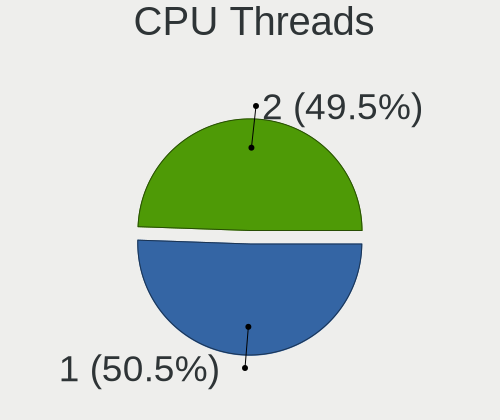

| Number | Notebooks | Percent |
|--------|-----------|---------|
| 1      | 122       | 52.36%  |
| 2      | 111       | 47.64%  |

CPU Op-Modes
------------

CPU Operation Modes (32-bit, 64-bit)

| Op mode        | Notebooks | Percent |
|----------------|-----------|---------|
| 32-bit, 64-bit | 233       | 100%    |

CPU Microcode
-------------

Microcode number

| Number     | Notebooks | Percent |
|------------|-----------|---------|
| 0x206a7    | 21        | 8.9%    |
| Unknown    | 15        | 6.36%   |
| 0x6fd      | 13        | 5.51%   |
| 0x406e3    | 12        | 5.08%   |
| 0x40651    | 11        | 4.66%   |
| 0x1067a    | 11        | 4.66%   |
| 0x306a9    | 10        | 4.24%   |
| 0x806ec    | 9         | 3.81%   |
| 0x406c4    | 8         | 3.39%   |
| 0x30678    | 8         | 3.39%   |
| 0x406c3    | 7         | 2.97%   |
| 0x10676    | 7         | 2.97%   |
| 0x06006705 | 7         | 2.97%   |
| 0x05000119 | 7         | 2.97%   |
| 0x306c3    | 6         | 2.54%   |
| 0x20655    | 6         | 2.54%   |
| 0x306d4    | 5         | 2.12%   |
| 0x20652    | 5         | 2.12%   |
| 0x706a1    | 4         | 1.69%   |
| 0x106ca    | 4         | 1.69%   |
| 0x806eb    | 3         | 1.27%   |
| 0x806e9    | 3         | 1.27%   |
| 0x706a8    | 3         | 1.27%   |
| 0x6f6      | 3         | 1.27%   |
| 0x30661    | 3         | 1.27%   |
| 0x07030105 | 3         | 1.27%   |
| 0x906ed    | 2         | 0.85%   |
| 0x906ea    | 2         | 0.85%   |
| 0x806c1    | 2         | 0.85%   |
| 0x706e5    | 2         | 0.85%   |
| 0x6fb      | 2         | 0.85%   |
| 0x6fa      | 2         | 0.85%   |
| 0x30673    | 2         | 0.85%   |
| 0x10661    | 2         | 0.85%   |
| 0x08600106 | 2         | 0.85%   |
| 0x08600103 | 2         | 0.85%   |
| 0x08108102 | 2         | 0.85%   |
| 0x07030106 | 2         | 0.85%   |
| 0x05000029 | 2         | 0.85%   |
| 0x02000057 | 2         | 0.85%   |
| 0x010000c8 | 2         | 0.85%   |
| 0x806ea    | 1         | 0.42%   |
| 0x806d1    | 1         | 0.42%   |
| 0x506ca    | 1         | 0.42%   |
| 0x506c9    | 1         | 0.42%   |
| 0x40661    | 1         | 0.42%   |
| 0x08600104 | 1         | 0.42%   |
| 0x08200103 | 1         | 0.42%   |
| 0x08101007 | 1         | 0.42%   |
| 0x07030104 | 1         | 0.42%   |
| 0x0700010f | 1         | 0.42%   |
| 0x06006704 | 1         | 0.42%   |
| 0x02000032 | 1         | 0.42%   |

CPU Microarch
-------------

Microarchitecture

| Name            | Notebooks | Percent |
|-----------------|-----------|---------|
| Silvermont      | 25        | 10.73%  |
| Core            | 23        | 9.87%   |
| SandyBridge     | 21        | 9.01%   |
| KabyLake        | 21        | 9.01%   |
| Penryn          | 19        | 8.15%   |
| Haswell         | 19        | 8.15%   |
| Skylake         | 13        | 5.58%   |
| Westmere        | 12        | 5.15%   |
| IvyBridge       | 10        | 4.29%   |
| Bobcat          | 9         | 3.86%   |
| Excavator       | 8         | 3.43%   |
| Goldmont plus   | 7         | 3%      |
| Bonnell         | 7         | 3%      |
| Puma            | 6         | 2.58%   |
| Zen 2           | 5         | 2.15%   |
| Broadwell       | 5         | 2.15%   |
| K8 Hammer       | 4         | 1.72%   |
| Zen+            | 3         | 1.29%   |
| TigerLake       | 3         | 1.29%   |
| K8 & K10 hybrid | 3         | 1.29%   |
| IceLake         | 3         | 1.29%   |
| Zen             | 2         | 0.86%   |
| K10             | 2         | 0.86%   |
| Goldmont        | 2         | 0.86%   |
| Jaguar          | 1         | 0.43%   |

Graphics
--------

GPU Vendor
----------

Vendors of graphics cards

| Vendor                           | Notebooks | Percent |
|----------------------------------|-----------|---------|
| Intel                            | 174       | 66.16%  |
| AMD                              | 59        | 22.43%  |
| Nvidia                           | 29        | 11.03%  |
| Silicon Integrated Systems [SiS] | 1         | 0.38%   |

GPU Model
---------

Graphics card models

| Model                                                                                    | Notebooks | Percent |
|------------------------------------------------------------------------------------------|-----------|---------|
| Intel 2nd Generation Core Processor Family Integrated Graphics Controller                | 20        | 7.09%   |
| Intel Mobile GM965/GL960 Integrated Graphics Controller (secondary)                      | 15        | 5.32%   |
| Intel Mobile GM965/GL960 Integrated Graphics Controller (primary)                        | 15        | 5.32%   |
| Intel Atom/Celeron/Pentium Processor x5-E8000/J3xxx/N3xxx Integrated Graphics Controller | 15        | 5.32%   |
| Intel Mobile 4 Series Chipset Integrated Graphics Controller                             | 14        | 4.96%   |
| Intel Haswell-ULT Integrated Graphics Controller                                         | 12        | 4.26%   |
| Intel Skylake GT2 [HD Graphics 520]                                                      | 10        | 3.55%   |
| Intel Atom Processor Z36xxx/Z37xxx Series Graphics & Display                             | 10        | 3.55%   |
| Intel 3rd Gen Core processor Graphics Controller                                         | 9         | 3.19%   |
| Intel Core Processor Integrated Graphics Controller                                      | 8         | 2.84%   |
| AMD Stoney [Radeon R2/R3/R4/R5 Graphics]                                                 | 8         | 2.84%   |
| Intel WhiskeyLake-U GT2 [UHD Graphics 620]                                               | 7         | 2.48%   |
| Intel CometLake-U GT2 [UHD Graphics]                                                     | 6         | 2.13%   |
| Intel 4th Gen Core Processor Integrated Graphics Controller                              | 6         | 2.13%   |
| Intel GeminiLake [UHD Graphics 600]                                                      | 5         | 1.77%   |
| AMD Renoir                                                                               | 5         | 1.77%   |
| Intel HD Graphics 5500                                                                   | 4         | 1.42%   |
| Intel Atom Processor D4xx/D5xx/N4xx/N5xx Integrated Graphics Controller                  | 4         | 1.42%   |
| AMD Wrestler [Radeon HD 6310]                                                            | 4         | 1.42%   |
| AMD Sun XT [Radeon HD 8670A/8670M/8690M / R5 M330 / M430 / Radeon 520 Mobile]            | 4         | 1.42%   |
| AMD Picasso/Raven 2 [Radeon Vega Series / Radeon Vega Mobile Series]                     | 4         | 1.42%   |
| Intel Mobile 945GM/GMS/GME, 943/940GML Express Integrated Graphics Controller            | 3         | 1.06%   |
| Intel Mobile 945GM/GMS, 943/940GML Express Integrated Graphics Controller                | 3         | 1.06%   |
| Intel HD Graphics 620                                                                    | 3         | 1.06%   |
| Intel CoffeeLake-H GT2 [UHD Graphics 630]                                                | 3         | 1.06%   |
| Intel Atom Processor D2xxx/N2xxx Integrated Graphics Controller                          | 3         | 1.06%   |
| AMD Seymour [Radeon HD 6400M/7400M Series]                                               | 3         | 1.06%   |
| AMD RV620/M82 [Mobility Radeon HD 3450/3470]                                             | 3         | 1.06%   |
| AMD Mullins [Radeon R4/R5 Graphics]                                                      | 3         | 1.06%   |
| Nvidia TU116M [GeForce GTX 1660 Ti Mobile]                                               | 2         | 0.71%   |
| Nvidia GT216M [GeForce GT 330M]                                                          | 2         | 0.71%   |
| Nvidia GP107M [GeForce GTX 1050 3 GB Max-Q]                                              | 2         | 0.71%   |
| Nvidia GM108M [GeForce 840M]                                                             | 2         | 0.71%   |
| Nvidia GF119M [GeForce 610M]                                                             | 2         | 0.71%   |
| Intel TigerLake-LP GT2 [Iris Xe Graphics]                                                | 2         | 0.71%   |
| Intel Iris Plus Graphics G7                                                              | 2         | 0.71%   |
| Intel HD Graphics 520                                                                    | 2         | 0.71%   |
| Intel HD Graphics 500                                                                    | 2         | 0.71%   |
| Intel GeminiLake [UHD Graphics 605]                                                      | 2         | 0.71%   |
| AMD Wrestler [Radeon HD 6250]                                                            | 2         | 0.71%   |
| AMD RV710/M92 [Mobility Radeon HD 4530/4570/545v]                                        | 2         | 0.71%   |
| AMD RS880M [Mobility Radeon HD 4225/4250]                                                | 2         | 0.71%   |
| AMD Mullins [Radeon R2 Graphics]                                                         | 2         | 0.71%   |
| Silicon Integrated Systems [SiS] 771/671 PCIE VGA Display Adapter                        | 1         | 0.35%   |
| Nvidia TU117M [GeForce GTX 1650 Ti Mobile]                                               | 1         | 0.35%   |
| Nvidia GT218M [NVS 3100M]                                                                | 1         | 0.35%   |
| Nvidia GT218M [GeForce 310M]                                                             | 1         | 0.35%   |
| Nvidia GP108M [GeForce MX330]                                                            | 1         | 0.35%   |
| Nvidia GP108M [GeForce MX150]                                                            | 1         | 0.35%   |
| Nvidia GM108M [GeForce 940MX]                                                            | 1         | 0.35%   |
| Nvidia GM108M [GeForce 920MX]                                                            | 1         | 0.35%   |
| Nvidia GM107M [GeForce GTX 860M]                                                         | 1         | 0.35%   |
| Nvidia GK208M [GeForce GT 740M]                                                          | 1         | 0.35%   |
| Nvidia GK208BM [GeForce 920M]                                                            | 1         | 0.35%   |
| Nvidia GF119M [GeForce 410M]                                                             | 1         | 0.35%   |
| Nvidia GF108M [NVS 5400M]                                                                | 1         | 0.35%   |
| Nvidia GF108M [GeForce GT 525M]                                                          | 1         | 0.35%   |
| Nvidia GF108M [GeForce 610M]                                                             | 1         | 0.35%   |
| Nvidia GA107M [GeForce RTX 3050 Mobile]                                                  | 1         | 0.35%   |
| Nvidia G92M [GeForce 8800M GTX]                                                          | 1         | 0.35%   |

GPU Combo
---------

Combinations of graphics cards

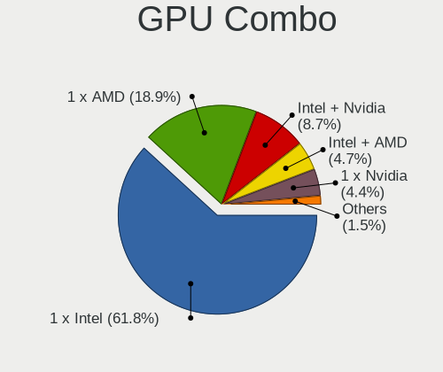

| Name           | Notebooks | Percent |
|----------------|-----------|---------|
| 1 x Intel      | 145       | 62.23%  |
| 1 x AMD        | 47        | 20.17%  |
| Intel + Nvidia | 19        | 8.15%   |
| Intel + AMD    | 10        | 4.29%   |
| 1 x Nvidia     | 9         | 3.86%   |
| 2 x AMD        | 1         | 0.43%   |
| 1 x SiS        | 1         | 0.43%   |
| AMD + Nvidia   | 1         | 0.43%   |

GPU Driver
----------

Free vs proprietary

| Driver      | Notebooks | Percent |
|-------------|-----------|---------|
| Free        | 217       | 92.74%  |
| Proprietary | 14        | 5.98%   |
| Unknown     | 3         | 1.28%   |

GPU Memory
----------

Total video memory

| Size in GB | Notebooks | Percent |
|------------|-----------|---------|
| Unknown    | 154       | 65.81%  |
| 0.01-0.5   | 48        | 20.51%  |
| 1.01-2.0   | 14        | 5.98%   |
| 0.51-1.0   | 12        | 5.13%   |
| 3.01-4.0   | 3         | 1.28%   |
| 2.01-3.0   | 2         | 0.85%   |
| 5.01-6.0   | 1         | 0.43%   |

Monitor
-------

Monitor Vendor
--------------

Monitor vendors

| Vendor                  | Notebooks | Percent |
|-------------------------|-----------|---------|
| AU Optronics            | 48        | 19.75%  |
| LG Display              | 36        | 14.81%  |
| BOE                     | 33        | 13.58%  |
| Samsung Electronics     | 31        | 12.76%  |
| Chimei Innolux          | 30        | 12.35%  |
| Chi Mei Optoelectronics | 7         | 2.88%   |
| Lenovo                  | 6         | 2.47%   |
| Apple                   | 6         | 2.47%   |
| LG Philips              | 5         | 2.06%   |
| Goldstar                | 5         | 2.06%   |
| Acer                    | 5         | 2.06%   |
| InfoVision              | 4         | 1.65%   |
| Hewlett-Packard         | 4         | 1.65%   |
| Dell                    | 4         | 1.65%   |
| Sharp                   | 2         | 0.82%   |
| HannStar                | 2         | 0.82%   |
| CPT                     | 2         | 0.82%   |
| Vizio                   | 1         | 0.41%   |
| Videoseven              | 1         | 0.41%   |
| Sony                    | 1         | 0.41%   |
| Philips                 | 1         | 0.41%   |
| PANDA                   | 1         | 0.41%   |
| NEC Computers           | 1         | 0.41%   |
| Lenovo Group Limited    | 1         | 0.41%   |
| KDC                     | 1         | 0.41%   |
| InnoLux Display         | 1         | 0.41%   |
| DENON                   | 1         | 0.41%   |
| CVT                     | 1         | 0.41%   |
| BenQ                    | 1         | 0.41%   |
| AOC                     | 1         | 0.41%   |

Monitor Model
-------------

Monitor models

| Model                                                                 | Notebooks | Percent |
|-----------------------------------------------------------------------|-----------|---------|
| Chimei Innolux LCD Monitor CMN15DB 1366x768 344x193mm 15.5-inch       | 5         | 2.05%   |
| Samsung Electronics LCD Monitor SEC5441 1366x768 344x194mm 15.5-inch  | 3         | 1.23%   |
| Samsung Electronics LCD Monitor SDC4852 1366x768 344x194mm 15.5-inch  | 3         | 1.23%   |
| InfoVision LCD Monitor IVO03F4 1024x600 223x125mm 10.1-inch           | 3         | 1.23%   |
| AU Optronics LCD Monitor AUO26EC 1366x768 344x193mm 15.5-inch         | 3         | 1.23%   |
| Samsung Electronics LCD Monitor SEC4442 1280x800 303x190mm 14.1-inch  | 2         | 0.82%   |
| Samsung Electronics LCD Monitor SEC3245 1280x800 261x163mm 12.1-inch  | 2         | 0.82%   |
| LG Display LCD Monitor LGD02DC 1366x768 344x194mm 15.5-inch           | 2         | 0.82%   |
| Lenovo LCD Monitor LEN4031 1280x800 304x190mm 14.1-inch               | 2         | 0.82%   |
| Dell U2412M DELA07A 1920x1200 518x324mm 24.1-inch                     | 2         | 0.82%   |
| Chimei Innolux LCD Monitor CMN14E5 1920x1080 309x173mm 13.9-inch      | 2         | 0.82%   |
| Chimei Innolux LCD Monitor CMN14B1 1920x1080 308x173mm 13.9-inch      | 2         | 0.82%   |
| BOE LCD Monitor BOE0697 1366x768 309x173mm 13.9-inch                  | 2         | 0.82%   |
| BOE LCD Monitor BOE0696 1366x768 309x173mm 13.9-inch                  | 2         | 0.82%   |
| BOE LCD Monitor BOE0685 1600x900 382x215mm 17.3-inch                  | 2         | 0.82%   |
| BOE LCD Monitor BOE0674 1366x768 344x194mm 15.5-inch                  | 2         | 0.82%   |
| AU Optronics LCD Monitor AUO6287 1440x900 367x229mm 17.0-inch         | 2         | 0.82%   |
| AU Optronics LCD Monitor AUO305C 1366x768 256x144mm 11.6-inch         | 2         | 0.82%   |
| AU Optronics LCD Monitor AUO235C 1366x768 256x144mm 11.6-inch         | 2         | 0.82%   |
| AU Optronics LCD Monitor AUO22EC 1366x768 344x193mm 15.5-inch         | 2         | 0.82%   |
| AU Optronics LCD Monitor AUO139E 1600x900 382x214mm 17.2-inch         | 2         | 0.82%   |
| AU Optronics LCD Monitor AUO10EC 1366x768 344x193mm 15.5-inch         | 2         | 0.82%   |
| Apple Color LCD APP9CC7 1280x800 286x179mm 13.3-inch                  | 2         | 0.82%   |
| Vizio M220MV VIZ0062 1920x1080 480x270mm 21.7-inch                    | 1         | 0.41%   |
| Videoseven L27ADS IGM2700 1920x1080 598x336mm 27.0-inch               | 1         | 0.41%   |
| Sony TV SNYA401 1920x1080 1600x900mm 72.3-inch                        | 1         | 0.41%   |
| Sharp LCD Monitor SHP14CC 3840x2400 288x180mm 13.4-inch               | 1         | 0.41%   |
| Sharp LCD Monitor SHP14AD 3840x2160 290x170mm 13.2-inch               | 1         | 0.41%   |
| Samsung Electronics SyncMaster SAM0117 1280x1024 312x234mm 15.4-inch  | 1         | 0.41%   |
| Samsung Electronics SMS23A550H SAM07C9 1920x1080 509x286mm 23.0-inch  | 1         | 0.41%   |
| Samsung Electronics S22C300 SAM0A1E 1920x1080 477x268mm 21.5-inch     | 1         | 0.41%   |
| Samsung Electronics LCD Monitor SEC5842 1366x768 309x174mm 14.0-inch  | 1         | 0.41%   |
| Samsung Electronics LCD Monitor SEC5641 1366x768 344x193mm 15.5-inch  | 1         | 0.41%   |
| Samsung Electronics LCD Monitor SEC544B 1600x900 310x174mm 14.0-inch  | 1         | 0.41%   |
| Samsung Electronics LCD Monitor SEC504B 1600x900 382x215mm 17.3-inch  | 1         | 0.41%   |
| Samsung Electronics LCD Monitor SEC4D45 1280x800 331x207mm 15.4-inch  | 1         | 0.41%   |
| Samsung Electronics LCD Monitor SEC4449 1366x768 309x174mm 14.0-inch  | 1         | 0.41%   |
| Samsung Electronics LCD Monitor SEC3842 1366x768 309x174mm 14.0-inch  | 1         | 0.41%   |
| Samsung Electronics LCD Monitor SEC374E 1366x768 344x193mm 15.5-inch  | 1         | 0.41%   |
| Samsung Electronics LCD Monitor SEC3741 1366x768 309x174mm 14.0-inch  | 1         | 0.41%   |
| Samsung Electronics LCD Monitor SEC3641 1366x768 353x198mm 15.9-inch  | 1         | 0.41%   |
| Samsung Electronics LCD Monitor SEC3257 1280x800 303x190mm 14.1-inch  | 1         | 0.41%   |
| Samsung Electronics LCD Monitor SEC324A 1366x768 344x194mm 15.5-inch  | 1         | 0.41%   |
| Samsung Electronics LCD Monitor SEC3150 1366x768 340x190mm 15.3-inch  | 1         | 0.41%   |
| Samsung Electronics LCD Monitor SDC4E51 1366x768 344x194mm 15.5-inch  | 1         | 0.41%   |
| Samsung Electronics LCD Monitor SDC4E42 1366x768 309x174mm 14.0-inch  | 1         | 0.41%   |
| Samsung Electronics LCD Monitor SDC4347 1366x768 344x193mm 15.5-inch  | 1         | 0.41%   |
| Samsung Electronics LCD Monitor SDC4146 1366x768 344x194mm 15.5-inch  | 1         | 0.41%   |
| Samsung Electronics LCD Monitor SDC4142 3840x2160 294x165mm 13.3-inch | 1         | 0.41%   |
| Samsung Electronics C24F390 SAM0D2C 1920x1080 521x293mm 23.5-inch     | 1         | 0.41%   |
| Philips 224EL PHLC054 1920x1080 476x268mm 21.5-inch                   | 1         | 0.41%   |
| PANDA LCD Monitor NCP0032 1920x1080 344x194mm 15.5-inch               | 1         | 0.41%   |
| NEC Computers EA221WMe NEC6778 1680x1050 470x300mm 22.0-inch          | 1         | 0.41%   |
| LG Philips LP154WX4-TLC8 LPL0120 1280x800 331x207mm 15.4-inch         | 1         | 0.41%   |
| LG Philips LCD Monitor LPLDC00 1280x800 331x207mm 15.4-inch           | 1         | 0.41%   |
| LG Philips LCD Monitor LPLBC00 1280x800 331x207mm 15.4-inch           | 1         | 0.41%   |
| LG Philips LCD Monitor LPL2A00 1280x800 330x210mm 15.4-inch           | 1         | 0.41%   |
| LG Philips LCD Monitor LPL0032 1920x1200 370x230mm 17.2-inch          | 1         | 0.41%   |
| LG Display LCD Monitor LGD8C01 1366x768 344x194mm 15.5-inch           | 1         | 0.41%   |
| LG Display LCD Monitor LGD3901 1920x1200 367x230mm 17.1-inch          | 1         | 0.41%   |

Monitor Resolution
------------------

Monitor screen resolution

| Resolution         | Notebooks | Percent |
|--------------------|-----------|---------|
| 1366x768 (WXGA)    | 100       | 42.55%  |
| 1920x1080 (FHD)    | 57        | 24.26%  |
| 1280x800 (WXGA)    | 23        | 9.79%   |
| 1600x900 (HD+)     | 20        | 8.51%   |
| 1920x1200 (WUXGA)  | 8         | 3.4%    |
| 3840x2160 (4K)     | 6         | 2.55%   |
| 1680x1050 (WSXGA+) | 3         | 1.28%   |
| 1440x900 (WXGA+)   | 3         | 1.28%   |
| 1280x1024 (SXGA)   | 3         | 1.28%   |
| 1024x600           | 3         | 1.28%   |
| 2560x1440 (QHD)    | 2         | 0.85%   |
| 3840x2400          | 1         | 0.43%   |
| 2560x1600          | 1         | 0.43%   |
| 1920x540           | 1         | 0.43%   |
| 1360x768           | 1         | 0.43%   |
| 1280x768           | 1         | 0.43%   |
| 1280x720 (HD)      | 1         | 0.43%   |
| 1024x768 (XGA)     | 1         | 0.43%   |

Monitor Diagonal
----------------

Diagonal size in inches

| Inches  | Notebooks | Percent |
|---------|-----------|---------|
| 15      | 95        | 39.09%  |
| 13      | 40        | 16.46%  |
| 14      | 36        | 14.81%  |
| 17      | 20        | 8.23%   |
| 11      | 11        | 4.53%   |
| 10      | 6         | 2.47%   |
| 27      | 5         | 2.06%   |
| 21      | 5         | 2.06%   |
| 12      | 5         | 2.06%   |
| 24      | 4         | 1.65%   |
| 23      | 4         | 1.65%   |
| 22      | 3         | 1.23%   |
| 72      | 2         | 0.82%   |
| Unknown | 2         | 0.82%   |
| 33      | 1         | 0.41%   |
| 26      | 1         | 0.41%   |
| 20      | 1         | 0.41%   |
| 19      | 1         | 0.41%   |
| 18      | 1         | 0.41%   |

Monitor Width
-------------

Physical width

| Width in mm | Notebooks | Percent |
|-------------|-----------|---------|
| 301-350     | 152       | 62.81%  |
| 201-300     | 37        | 15.29%  |
| 351-400     | 24        | 9.92%   |
| 501-600     | 14        | 5.79%   |
| 401-500     | 10        | 4.13%   |
| 1501-2000   | 2         | 0.83%   |
| Unknown     | 2         | 0.83%   |
| 701-800     | 1         | 0.41%   |

Aspect Ratio
------------

Proportional relationship between the width and the height

| Ratio   | Notebooks | Percent |
|---------|-----------|---------|
| 16/9    | 181       | 81.53%  |
| 16/10   | 36        | 16.22%  |
| 5/4     | 2         | 0.9%    |
| 4/3     | 2         | 0.9%    |
| Unknown | 1         | 0.45%   |

Monitor Area
------------

Area in inch

| Area in inch | Notebooks | Percent |
|----------------|-----------|---------|
| 101-110        | 93        | 38.27%  |
| 81-90          | 65        | 26.75%  |
| 121-130        | 15        | 6.17%   |
| 201-250        | 13        | 5.35%   |
| 71-80          | 12        | 4.94%   |
| 51-60          | 11        | 4.53%   |
| 41-50          | 6         | 2.47%   |
| 301-350        | 5         | 2.06%   |
| 61-70          | 4         | 1.65%   |
| 251-300        | 4         | 1.65%   |
| 131-140        | 4         | 1.65%   |
| More than 1000 | 2         | 0.82%   |
| 151-200        | 2         | 0.82%   |
| 141-150        | 2         | 0.82%   |
| Unknown        | 2         | 0.82%   |
| 351-500        | 1         | 0.41%   |
| 111-120        | 1         | 0.41%   |
| 91-100         | 1         | 0.41%   |

Pixel Density
-------------

Pixels per inch

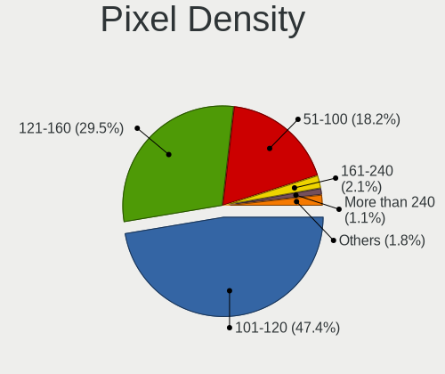

| Density       | Notebooks | Percent |
|---------------|-----------|---------|
| 101-120       | 119       | 49.79%  |
| 121-160       | 68        | 28.45%  |
| 51-100        | 40        | 16.74%  |
| 161-240       | 5         | 2.09%   |
| More than 240 | 3         | 1.26%   |
| 1-50          | 2         | 0.84%   |
| Unknown       | 2         | 0.84%   |

Multiple Monitors
-----------------

Total monitors connected

| Total | Notebooks | Percent |
|-------|-----------|---------|
| 1     | 201       | 84.81%  |
| 2     | 31        | 13.08%  |
| 0     | 3         | 1.27%   |
| 3     | 2         | 0.84%   |

Network
-------

Net Controller Vendor
---------------------

Controller vendors

| Vendor                            | Notebooks | Percent |
|-----------------------------------|-----------|---------|
| Realtek Semiconductor             | 127       | 34.14%  |
| Intel                             | 94        | 25.27%  |
| Qualcomm Atheros                  | 67        | 18.01%  |
| Broadcom                          | 34        | 9.14%   |
| Marvell Technology Group          | 13        | 3.49%   |
| Broadcom Limited                  | 8         | 2.15%   |
| Ralink Technology                 | 4         | 1.08%   |
| TP-Link                           | 3         | 0.81%   |
| Ralink                            | 3         | 0.81%   |
| ASIX Electronics                  | 3         | 0.81%   |
| Samsung Electronics               | 2         | 0.54%   |
| Nvidia                            | 2         | 0.54%   |
| Fibocom                           | 2         | 0.54%   |
| Dell                              | 2         | 0.54%   |
| Attansic Technology               | 2         | 0.54%   |
| Xiaomi                            | 1         | 0.27%   |
| Tenda                             | 1         | 0.27%   |
| Seeed                             | 1         | 0.27%   |
| NetGear                           | 1         | 0.27%   |
| Hewlett-Packard                   | 1         | 0.27%   |
| Ericsson Business Mobile Networks | 1         | 0.27%   |

Net Controller Model
--------------------

Controller models

| Model                                                                   | Notebooks | Percent |
|-------------------------------------------------------------------------|-----------|---------|
| Realtek RTL8111/8168/8411 PCI Express Gigabit Ethernet Controller       | 61        | 13.83%  |
| Realtek RTL810xE PCI Express Fast Ethernet controller                   | 38        | 8.62%   |
| Qualcomm Atheros AR9285 Wireless Network Adapter (PCI-Express)          | 15        | 3.4%    |
| Qualcomm Atheros QCA9377 802.11ac Wireless Network Adapter              | 13        | 2.95%   |
| Intel Wireless 7260                                                     | 11        | 2.49%   |
| Qualcomm Atheros QCA9565 / AR9565 Wireless Network Adapter              | 10        | 2.27%   |
| Qualcomm Atheros AR242x / AR542x Wireless Network Adapter (PCI-Express) | 10        | 2.27%   |
| Broadcom BCM4313 802.11bgn Wireless Network Adapter                     | 10        | 2.27%   |
| Realtek RTL8153 Gigabit Ethernet Adapter                                | 9         | 2.04%   |
| Realtek RTL8188EE Wireless Network Adapter                              | 8         | 1.81%   |
| Realtek RTL8188CE 802.11b/g/n WiFi Adapter                              | 7         | 1.59%   |
| Qualcomm Atheros AR9485 Wireless Network Adapter                        | 7         | 1.59%   |
| Intel Wi-Fi 6 AX200                                                     | 7         | 1.59%   |
| Intel Wireless 3160                                                     | 6         | 1.36%   |
| Intel PRO/Wireless 3945ABG [Golan] Network Connection                   | 6         | 1.36%   |
| Realtek RTL8821CE 802.11ac PCIe Wireless Network Adapter                | 5         | 1.13%   |
| Realtek RTL8723BE PCIe Wireless Network Adapter                         | 5         | 1.13%   |
| Qualcomm Atheros AR8151 v2.0 Gigabit Ethernet                           | 5         | 1.13%   |
| Intel Wireless 8260                                                     | 5         | 1.13%   |
| Intel PRO/Wireless 5100 AGN [Shiloh] Network Connection                 | 5         | 1.13%   |
| Realtek RTL-8100/8101L/8139 PCI Fast Ethernet Adapter                   | 4         | 0.91%   |
| Qualcomm Atheros AR8132 Fast Ethernet                                   | 4         | 0.91%   |
| Marvell Group 88E8040 PCI-E Fast Ethernet Controller                    | 4         | 0.91%   |
| Intel PRO/Wireless 4965 AG or AGN [Kedron] Network Connection           | 4         | 0.91%   |
| Intel Centrino Advanced-N 6205 [Taylor Peak]                            | 4         | 0.91%   |
| Intel Cannon Point-LP CNVi [Wireless-AC]                                | 4         | 0.91%   |
| Intel 82579LM Gigabit Network Connection (Lewisville)                   | 4         | 0.91%   |
| Broadcom NetLink BCM57785 Gigabit Ethernet PCIe                         | 4         | 0.91%   |
| Broadcom BCM4331 802.11a/b/g/n                                          | 4         | 0.91%   |
| Realtek RTL8822CE 802.11ac PCIe Wireless Network Adapter                | 3         | 0.68%   |
| Realtek 802.11ac NIC                                                    | 3         | 0.68%   |
| Ralink MT7601U Wireless Adapter                                         | 3         | 0.68%   |
| Qualcomm Atheros AR8162 Fast Ethernet                                   | 3         | 0.68%   |
| Marvell Group 88E8055 PCI-E Gigabit Ethernet Controller                 | 3         | 0.68%   |
| Intel Wireless 7265                                                     | 3         | 0.68%   |
| Intel Wi-Fi 6 AX201                                                     | 3         | 0.68%   |
| Intel Gemini Lake PCH CNVi WiFi                                         | 3         | 0.68%   |
| Intel Ethernet Connection I219-V                                        | 3         | 0.68%   |
| Intel Dual Band Wireless-AC 3165 Plus Bluetooth                         | 3         | 0.68%   |
| Intel Centrino Wireless-N 100                                           | 3         | 0.68%   |
| Intel Centrino Advanced-N 6200                                          | 3         | 0.68%   |
| Intel 82577LM Gigabit Network Connection                                | 3         | 0.68%   |
| Intel 82567LM Gigabit Network Connection                                | 3         | 0.68%   |
| Broadcom NetXtreme BCM57786 Gigabit Ethernet PCIe                       | 3         | 0.68%   |
| Broadcom NetXtreme BCM57765 Gigabit Ethernet PCIe                       | 3         | 0.68%   |
| Broadcom NetXtreme BCM5755M Gigabit Ethernet PCI Express                | 3         | 0.68%   |
| Broadcom BCM4312 802.11b/g LP-PHY                                       | 3         | 0.68%   |
| ASIX AX88179 Gigabit Ethernet                                           | 3         | 0.68%   |
| Realtek RTL8821AE 802.11ac PCIe Wireless Network Adapter                | 2         | 0.45%   |
| Realtek RTL8152 Fast Ethernet Adapter                                   | 2         | 0.45%   |
| Ralink RT3090 Wireless 802.11n 1T/1R PCIe                               | 2         | 0.45%   |
| Qualcomm Atheros AR928X Wireless Network Adapter (PCI-Express)          | 2         | 0.45%   |
| Qualcomm Atheros AR8161 Gigabit Ethernet                                | 2         | 0.45%   |
| Nvidia MCP51 Ethernet Controller                                        | 2         | 0.45%   |
| Marvell Group 88E8042 PCI-E Fast Ethernet Controller                    | 2         | 0.45%   |
| Intel Wireless 3165                                                     | 2         | 0.45%   |
| Intel WiFi Link 5100                                                    | 2         | 0.45%   |
| Intel Ultimate N WiFi Link 5300                                         | 2         | 0.45%   |
| Intel Ethernet Connection I219-LM                                       | 2         | 0.45%   |
| Intel Ethernet Connection I218-LM                                       | 2         | 0.45%   |

Wireless Vendor
---------------

Wireless vendors

| Vendor                | Notebooks | Percent |
|-----------------------|-----------|---------|
| Intel                 | 92        | 40.17%  |
| Qualcomm Atheros      | 59        | 25.76%  |
| Realtek Semiconductor | 39        | 17.03%  |
| Broadcom              | 22        | 9.61%   |
| Ralink Technology     | 4         | 1.75%   |
| Broadcom Limited      | 4         | 1.75%   |
| TP-Link               | 3         | 1.31%   |
| Ralink                | 3         | 1.31%   |
| Tenda                 | 1         | 0.44%   |
| NetGear               | 1         | 0.44%   |
| Dell                  | 1         | 0.44%   |

Wireless Model
--------------

Wireless models

| Model                                                                                         | Notebooks | Percent |
|-----------------------------------------------------------------------------------------------|-----------|---------|
| Qualcomm Atheros AR9285 Wireless Network Adapter (PCI-Express)                                | 15        | 6.52%   |
| Qualcomm Atheros QCA9377 802.11ac Wireless Network Adapter                                    | 13        | 5.65%   |
| Intel Wireless 7260                                                                           | 11        | 4.78%   |
| Qualcomm Atheros QCA9565 / AR9565 Wireless Network Adapter                                    | 10        | 4.35%   |
| Qualcomm Atheros AR242x / AR542x Wireless Network Adapter (PCI-Express)                       | 10        | 4.35%   |
| Broadcom BCM4313 802.11bgn Wireless Network Adapter                                           | 10        | 4.35%   |
| Realtek RTL8188EE Wireless Network Adapter                                                    | 8         | 3.48%   |
| Realtek RTL8188CE 802.11b/g/n WiFi Adapter                                                    | 7         | 3.04%   |
| Qualcomm Atheros AR9485 Wireless Network Adapter                                              | 7         | 3.04%   |
| Intel Wi-Fi 6 AX200                                                                           | 7         | 3.04%   |
| Intel Wireless 3160                                                                           | 6         | 2.61%   |
| Intel PRO/Wireless 3945ABG [Golan] Network Connection                                         | 6         | 2.61%   |
| Realtek RTL8821CE 802.11ac PCIe Wireless Network Adapter                                      | 5         | 2.17%   |
| Realtek RTL8723BE PCIe Wireless Network Adapter                                               | 5         | 2.17%   |
| Intel Wireless 8260                                                                           | 5         | 2.17%   |
| Intel PRO/Wireless 5100 AGN [Shiloh] Network Connection                                       | 5         | 2.17%   |
| Intel PRO/Wireless 4965 AG or AGN [Kedron] Network Connection                                 | 4         | 1.74%   |
| Intel Centrino Advanced-N 6205 [Taylor Peak]                                                  | 4         | 1.74%   |
| Intel Cannon Point-LP CNVi [Wireless-AC]                                                      | 4         | 1.74%   |
| Broadcom BCM4331 802.11a/b/g/n                                                                | 4         | 1.74%   |
| Realtek RTL8822CE 802.11ac PCIe Wireless Network Adapter                                      | 3         | 1.3%    |
| Realtek 802.11ac NIC                                                                          | 3         | 1.3%    |
| Ralink MT7601U Wireless Adapter                                                               | 3         | 1.3%    |
| Intel Wireless 7265                                                                           | 3         | 1.3%    |
| Intel Wi-Fi 6 AX201                                                                           | 3         | 1.3%    |
| Intel Gemini Lake PCH CNVi WiFi                                                               | 3         | 1.3%    |
| Intel Dual Band Wireless-AC 3165 Plus Bluetooth                                               | 3         | 1.3%    |
| Intel Centrino Wireless-N 100                                                                 | 3         | 1.3%    |
| Intel Centrino Advanced-N 6200                                                                | 3         | 1.3%    |
| Broadcom BCM4312 802.11b/g LP-PHY                                                             | 3         | 1.3%    |
| Realtek RTL8821AE 802.11ac PCIe Wireless Network Adapter                                      | 2         | 0.87%   |
| Ralink RT3090 Wireless 802.11n 1T/1R PCIe                                                     | 2         | 0.87%   |
| Qualcomm Atheros AR928X Wireless Network Adapter (PCI-Express)                                | 2         | 0.87%   |
| Intel Wireless 3165                                                                           | 2         | 0.87%   |
| Intel WiFi Link 5100                                                                          | 2         | 0.87%   |
| Intel Ultimate N WiFi Link 5300                                                               | 2         | 0.87%   |
| Intel Comet Lake PCH-LP CNVi WiFi                                                             | 2         | 0.87%   |
| Intel Cannon Lake PCH CNVi WiFi                                                               | 2         | 0.87%   |
| Broadcom Limited BCM4311 802.11a/b/g                                                          | 2         | 0.87%   |
| Broadcom BCM43142 802.11b/g/n                                                                 | 2         | 0.87%   |
| TP-Link TL-WN823N v2/v3 [Realtek RTL8192EU]                                                   | 1         | 0.43%   |
| TP-Link Archer T9UH v1 [Realtek RTL8814AU]                                                    | 1         | 0.43%   |
| TP-Link AC600 wireless Realtek RTL8811AU [Archer T2U Nano]                                    | 1         | 0.43%   |
| Tenda U12                                                                                     | 1         | 0.43%   |
| Realtek RTL8822BE 802.11a/b/g/n/ac WiFi adapter                                               | 1         | 0.43%   |
| Realtek RTL8723BU 802.11b/g/n WLAN Adapter                                                    | 1         | 0.43%   |
| Realtek RTL8188EUS 802.11n Wireless Network Adapter                                           | 1         | 0.43%   |
| Realtek RTL8187SE Wireless LAN Controller                                                     | 1         | 0.43%   |
| Realtek RTL8187B Wireless 802.11g 54Mbps Network Adapter                                      | 1         | 0.43%   |
| Realtek Realtek 8812AU/8821AU 802.11ac WLAN Adapter [USB Wireless Dual-Band Adapter 2.4/5Ghz] | 1         | 0.43%   |
| Realtek 802.11n WLAN Adapter                                                                  | 1         | 0.43%   |
| Ralink MT7610U ("Archer T2U" 2.4G+5G WLAN Adapter                                             | 1         | 0.43%   |
| Ralink RT5390 Wireless 802.11n 1T/1R PCIe                                                     | 1         | 0.43%   |
| Qualcomm Atheros AR9462 Wireless Network Adapter                                              | 1         | 0.43%   |
| Qualcomm Atheros AR2413/AR2414 Wireless Network Adapter [AR5005G(S) 802.11bg]                 | 1         | 0.43%   |
| NetGear WNA3100M(v1) Wireless-N 300 [Realtek RTL8192CU]                                       | 1         | 0.43%   |
| Intel Wireless-AC 9260                                                                        | 1         | 0.43%   |
| Intel Wireless 8265 / 8275                                                                    | 1         | 0.43%   |
| Intel Tiger Lake PCH CNVi WiFi                                                                | 1         | 0.43%   |
| Intel Ice Lake-LP PCH CNVi WiFi                                                               | 1         | 0.43%   |

Ethernet Vendor
---------------

Ethernet vendors

| Vendor                   | Notebooks | Percent |
|--------------------------|-----------|---------|
| Realtek Semiconductor    | 114       | 55.34%  |
| Intel                    | 28        | 13.59%  |
| Broadcom                 | 18        | 8.74%   |
| Qualcomm Atheros         | 17        | 8.25%   |
| Marvell Technology Group | 13        | 6.31%   |
| Broadcom Limited         | 4         | 1.94%   |
| ASIX Electronics         | 3         | 1.46%   |
| Samsung Electronics      | 2         | 0.97%   |
| Nvidia                   | 2         | 0.97%   |
| Fibocom                  | 2         | 0.97%   |
| Attansic Technology      | 2         | 0.97%   |
| Xiaomi                   | 1         | 0.49%   |

Ethernet Model
--------------

Ethernet models

| Model                                                                          | Notebooks | Percent |
|--------------------------------------------------------------------------------|-----------|---------|
| Realtek RTL8111/8168/8411 PCI Express Gigabit Ethernet Controller              | 61        | 29.47%  |
| Realtek RTL810xE PCI Express Fast Ethernet controller                          | 38        | 18.36%  |
| Realtek RTL8153 Gigabit Ethernet Adapter                                       | 9         | 4.35%   |
| Qualcomm Atheros AR8151 v2.0 Gigabit Ethernet                                  | 5         | 2.42%   |
| Realtek RTL-8100/8101L/8139 PCI Fast Ethernet Adapter                          | 4         | 1.93%   |
| Qualcomm Atheros AR8132 Fast Ethernet                                          | 4         | 1.93%   |
| Marvell Group 88E8040 PCI-E Fast Ethernet Controller                           | 4         | 1.93%   |
| Intel 82579LM Gigabit Network Connection (Lewisville)                          | 4         | 1.93%   |
| Broadcom NetLink BCM57785 Gigabit Ethernet PCIe                                | 4         | 1.93%   |
| Qualcomm Atheros AR8162 Fast Ethernet                                          | 3         | 1.45%   |
| Marvell Group 88E8055 PCI-E Gigabit Ethernet Controller                        | 3         | 1.45%   |
| Intel Ethernet Connection I219-V                                               | 3         | 1.45%   |
| Intel 82577LM Gigabit Network Connection                                       | 3         | 1.45%   |
| Intel 82567LM Gigabit Network Connection                                       | 3         | 1.45%   |
| Broadcom NetXtreme BCM57786 Gigabit Ethernet PCIe                              | 3         | 1.45%   |
| Broadcom NetXtreme BCM57765 Gigabit Ethernet PCIe                              | 3         | 1.45%   |
| Broadcom NetXtreme BCM5755M Gigabit Ethernet PCI Express                       | 3         | 1.45%   |
| ASIX AX88179 Gigabit Ethernet                                                  | 3         | 1.45%   |
| Realtek RTL8152 Fast Ethernet Adapter                                          | 2         | 0.97%   |
| Qualcomm Atheros AR8161 Gigabit Ethernet                                       | 2         | 0.97%   |
| Nvidia MCP51 Ethernet Controller                                               | 2         | 0.97%   |
| Marvell Group 88E8042 PCI-E Fast Ethernet Controller                           | 2         | 0.97%   |
| Intel Ethernet Connection I219-LM                                              | 2         | 0.97%   |
| Intel Ethernet Connection I218-LM                                              | 2         | 0.97%   |
| Intel Ethernet Connection I217-LM                                              | 2         | 0.97%   |
| Fibocom L831-EAU-00                                                            | 2         | 0.97%   |
| Broadcom Limited NetLink BCM5787M Gigabit Ethernet PCI Express                 | 2         | 0.97%   |
| Attansic AR8152 v2.0 Fast Ethernet                                             | 2         | 0.97%   |
| Xiaomi Mi/Redmi series (RNDIS + ADB)                                           | 1         | 0.48%   |
| Samsung GT-I9070 (network tethering, USB debugging enabled)                    | 1         | 0.48%   |
| Samsung Galaxy series, misc. (tethering mode)                                  | 1         | 0.48%   |
| Qualcomm Atheros AR8152 v2.0 Fast Ethernet                                     | 1         | 0.48%   |
| Qualcomm Atheros AR8152 v1.1 Fast Ethernet                                     | 1         | 0.48%   |
| Qualcomm Atheros AR8131 Gigabit Ethernet                                       | 1         | 0.48%   |
| Marvell Group Yukon Optima 88E8059 [PCIe Gigabit Ethernet Controller with AVB] | 1         | 0.48%   |
| Marvell Group 88E8072 PCI-E Gigabit Ethernet Controller                        | 1         | 0.48%   |
| Marvell Group 88E8058 PCI-E Gigabit Ethernet Controller                        | 1         | 0.48%   |
| Marvell Group 88E8057 PCI-E Gigabit Ethernet Controller                        | 1         | 0.48%   |
| Intel WiMAX Connection 2400m                                                   | 1         | 0.48%   |
| Intel PRO/100 VE Network Connection                                            | 1         | 0.48%   |
| Intel Ethernet Connection I217-V                                               | 1         | 0.48%   |
| Intel Ethernet Connection (6) I219-LM                                          | 1         | 0.48%   |
| Intel Ethernet Connection (3) I218-LM                                          | 1         | 0.48%   |
| Intel Ethernet Connection (13) I219-V                                          | 1         | 0.48%   |
| Intel 82579V Gigabit Network Connection                                        | 1         | 0.48%   |
| Intel 82577LC Gigabit Network Connection                                       | 1         | 0.48%   |
| Intel 82566MM Gigabit Network Connection                                       | 1         | 0.48%   |
| Broadcom NetXtreme BCM57762 Gigabit Ethernet PCIe                              | 1         | 0.48%   |
| Broadcom NetXtreme BCM5754M Gigabit Ethernet PCI Express                       | 1         | 0.48%   |
| Broadcom NetLink BCM5906M Fast Ethernet PCI Express                            | 1         | 0.48%   |
| Broadcom NetLink BCM5787M Gigabit Ethernet PCI Express                         | 1         | 0.48%   |
| Broadcom NetLink BCM5784M Gigabit Ethernet PCIe                                | 1         | 0.48%   |
| Broadcom Limited NetLink BCM5784M Gigabit Ethernet PCIe                        | 1         | 0.48%   |
| Broadcom Limited NetLink BCM57780 Gigabit Ethernet PCIe                        | 1         | 0.48%   |
| Broadcom BCM4401-B0 100Base-TX                                                 | 1         | 0.48%   |

Net Controller Kind
-------------------

Ethernet, WiFi or modem

| Kind     | Notebooks | Percent |
|----------|-----------|---------|
| WiFi     | 219       | 52.02%  |
| Ethernet | 198       | 47.03%  |
| Modem    | 4         | 0.95%   |

Used Controller
---------------

Currently used network controller

| Kind     | Notebooks | Percent |
|----------|-----------|---------|
| WiFi     | 186       | 76.54%  |
| Ethernet | 57        | 23.46%  |

NICs
----

Total network controllers on board

| Total | Notebooks | Percent |
|-------|-----------|---------|
| 2     | 176       | 75.54%  |
| 1     | 41        | 17.6%   |
| 0     | 14        | 6.01%   |
| 3     | 2         | 0.86%   |

IPv6
----

IPv6 vs IPv4

| Used | Notebooks | Percent |
|------|-----------|---------|
| No   | 206       | 86.55%  |
| Yes  | 32        | 13.45%  |

Bluetooth
---------

Bluetooth Vendor
----------------

Controller vendors

| Vendor                          | Notebooks | Percent |
|---------------------------------|-----------|---------|
| Intel                           | 60        | 41.38%  |
| Qualcomm Atheros Communications | 17        | 11.72%  |
| Broadcom                        | 12        | 8.28%   |
| Realtek Semiconductor           | 11        | 7.59%   |
| Lite-On Technology              | 9         | 6.21%   |
| Cambridge Silicon Radio         | 9         | 6.21%   |
| IMC Networks                    | 6         | 4.14%   |
| Apple                           | 5         | 3.45%   |
| Dell                            | 4         | 2.76%   |
| Hewlett-Packard                 | 3         | 2.07%   |
| Ralink Technology               | 2         | 1.38%   |
| ASUSTek Computer                | 2         | 1.38%   |
| Alps Electric                   | 2         | 1.38%   |
| Toshiba                         | 1         | 0.69%   |
| Foxconn / Hon Hai               | 1         | 0.69%   |
| Chicony Electronics             | 1         | 0.69%   |

Bluetooth Model
---------------

Controller models

| Model                                                                               | Notebooks | Percent |
|-------------------------------------------------------------------------------------|-----------|---------|
| Intel Bluetooth wireless interface                                                  | 31        | 21.38%  |
| Intel Bluetooth 9460/9560 Jefferson Peak (JfP)                                      | 13        | 8.97%   |
| Qualcomm Atheros  Bluetooth Device                                                  | 10        | 6.9%    |
| Cambridge Silicon Radio Bluetooth Dongle (HCI mode)                                 | 9         | 6.21%   |
| Realtek Bluetooth Radio                                                             | 7         | 4.83%   |
| Intel AX200 Bluetooth                                                               | 7         | 4.83%   |
| Qualcomm Atheros AR3012 Bluetooth 4.0                                               | 3         | 2.07%   |
| Qualcomm Atheros AR3011 Bluetooth                                                   | 3         | 2.07%   |
| Lite-On Qualcomm Atheros QCA9377 Bluetooth                                          | 3         | 2.07%   |
| Lite-On Atheros AR3012 Bluetooth                                                    | 3         | 2.07%   |
| Intel Bluetooth Device                                                              | 3         | 2.07%   |
| IMC Networks Bluetooth Radio                                                        | 3         | 2.07%   |
| Broadcom BCM2045B (BDC-2.1)                                                         | 3         | 2.07%   |
| Apple Bluetooth Host Controller                                                     | 3         | 2.07%   |
| Realtek RTL8821A Bluetooth                                                          | 2         | 1.38%   |
| Realtek RTL8723B Bluetooth                                                          | 2         | 1.38%   |
| Ralink Motorola BC4 Bluetooth 3.0+HS Adapter                                        | 2         | 1.38%   |
| Intel Centrino Bluetooth Wireless Transceiver                                       | 2         | 1.38%   |
| Intel Centrino Advanced-N 6230 Bluetooth adapter                                    | 2         | 1.38%   |
| IMC Networks Bluetooth Device                                                       | 2         | 1.38%   |
| HP Broadcom 2070 Bluetooth Combo                                                    | 2         | 1.38%   |
| Broadcom BCM43142A0 Bluetooth 4.0                                                   | 2         | 1.38%   |
| Broadcom BCM2070 Bluetooth 2.1 + EDR                                                | 2         | 1.38%   |
| Toshiba Integrated Bluetooth HCI                                                    | 1         | 0.69%   |
| Qualcomm Atheros AR9462 Bluetooth                                                   | 1         | 0.69%   |
| Lite-On Qualcomm Atheros Bluetooth                                                  | 1         | 0.69%   |
| Lite-On Bluetooth Radio                                                             | 1         | 0.69%   |
| Lite-On Bluetooth Device                                                            | 1         | 0.69%   |
| Intel Wireless-AC 9260 Bluetooth Adapter                                            | 1         | 0.69%   |
| Intel Wireless-AC 3168 Bluetooth                                                    | 1         | 0.69%   |
| IMC Networks Bluetooth module                                                       | 1         | 0.69%   |
| HP Bluetooth 2.0 Interface [Broadcom BCM2045]                                       | 1         | 0.69%   |
| Foxconn / Hon Hai Foxconn T77H114 BCM2070 [Single-Chip Bluetooth 2.1 + EDR Adapter] | 1         | 0.69%   |
| Dell Wireless 370 Bluetooth Mini-card                                               | 1         | 0.69%   |
| Dell Wireless 365 Bluetooth                                                         | 1         | 0.69%   |
| Dell Wireless 360 Bluetooth                                                         | 1         | 0.69%   |
| Dell Wireless 350 Bluetooth                                                         | 1         | 0.69%   |
| Chicony Bluetooth (RTL8723BE)                                                       | 1         | 0.69%   |
| Broadcom HP Portable SoftSailing                                                    | 1         | 0.69%   |
| Broadcom Bluetooth                                                                  | 1         | 0.69%   |
| Broadcom BCM20702 Bluetooth 4.0 [ThinkPad]                                          | 1         | 0.69%   |
| Broadcom BCM2045B (BDC-2.1) [Bluetooth Controller]                                  | 1         | 0.69%   |
| Broadcom BCM2045B (BDC-2) [Bluetooth Controller]                                    | 1         | 0.69%   |
| ASUS BT-183 Bluetooth 2.0+EDR adapter                                               | 1         | 0.69%   |
| ASUS ASUS USB-BT500                                                                 | 1         | 0.69%   |
| Apple Bluetooth USB Host Controller                                                 | 1         | 0.69%   |
| Apple Bluetooth HCI                                                                 | 1         | 0.69%   |
| Alps Electric UGTZ4 Bluetooth                                                       | 1         | 0.69%   |
| Alps Electric Bluetooth Controller (ALPS/UGPZ6)                                     | 1         | 0.69%   |

Sound
-----

Sound Vendor
------------

Sound card vendors

| Vendor                            | Notebooks | Percent |
|-----------------------------------|-----------|---------|
| Intel                             | 175       | 71.14%  |
| AMD                               | 49        | 19.92%  |
| Nvidia                            | 16        | 6.5%    |
| GN Netcom                         | 2         | 0.81%   |
| C-Media Electronics               | 2         | 0.81%   |
| Silicon Integrated Systems [SiS]  | 1         | 0.41%   |
| Elitegroup Computer Systems (ECS) | 1         | 0.41%   |

Sound Model
-----------

Sound card models

| Model                                                                                             | Notebooks | Percent |
|---------------------------------------------------------------------------------------------------|-----------|---------|
| Intel 82801H (ICH8 Family) HD Audio Controller                                                    | 19        | 6.25%   |
| Intel 7 Series/C216 Chipset Family High Definition Audio Controller                               | 19        | 6.25%   |
| Intel 82801I (ICH9 Family) HD Audio Controller                                                    | 18        | 5.92%   |
| Intel Sunrise Point-LP HD Audio                                                                   | 17        | 5.59%   |
| Intel Haswell-ULT HD Audio Controller                                                             | 12        | 3.95%   |
| Intel 8 Series HD Audio Controller                                                                | 12        | 3.95%   |
| Intel 6 Series/C200 Series Chipset Family High Definition Audio Controller                        | 12        | 3.95%   |
| Intel 5 Series/3400 Series Chipset High Definition Audio                                          | 12        | 3.95%   |
| AMD SBx00 Azalia (Intel HDA)                                                                      | 12        | 3.95%   |
| Intel NM10/ICH7 Family High Definition Audio Controller                                           | 10        | 3.29%   |
| AMD FCH Azalia Controller                                                                         | 10        | 3.29%   |
| AMD Family 17h/19h HD Audio Controller                                                            | 9         | 2.96%   |
| AMD High Definition Audio Controller                                                              | 8         | 2.63%   |
| AMD Family 15h (Models 60h-6fh) Audio Controller                                                  | 8         | 2.63%   |
| Intel Celeron/Pentium Silver Processor High Definition Audio                                      | 7         | 2.3%    |
| Intel Cannon Point-LP High Definition Audio Controller                                            | 7         | 2.3%    |
| Intel Atom Processor Z36xxx/Z37xxx Series High Definition Audio Controller                        | 7         | 2.3%    |
| Intel 8 Series/C220 Series Chipset High Definition Audio Controller                               | 7         | 2.3%    |
| AMD Kabini HDMI/DP Audio                                                                          | 7         | 2.3%    |
| Intel Xeon E3-1200 v3/4th Gen Core Processor HD Audio Controller                                  | 6         | 1.97%   |
| Intel Comet Lake PCH-LP cAVS                                                                      | 6         | 1.97%   |
| AMD Wrestler HDMI Audio                                                                           | 6         | 1.97%   |
| Intel Wildcat Point-LP High Definition Audio Controller                                           | 5         | 1.64%   |
| Intel Broadwell-U Audio Controller                                                                | 5         | 1.64%   |
| Intel Atom/Celeron/Pentium Processor x5-E8000/J3xxx/N3xxx Series High Definition Audio Controller | 5         | 1.64%   |
| AMD Renoir Radeon High Definition Audio Controller                                                | 5         | 1.64%   |
| AMD Raven/Raven2/Fenghuang HDMI/DP Audio Controller                                               | 5         | 1.64%   |
| Intel Cannon Lake PCH cAVS                                                                        | 4         | 1.32%   |
| Nvidia GF108 High Definition Audio Controller                                                     | 3         | 0.99%   |
| Intel Tiger Lake-LP Smart Sound Technology Audio Controller                                       | 3         | 0.99%   |
| AMD RV710/730 HDMI Audio [Radeon HD 4000 series]                                                  | 3         | 0.99%   |
| Nvidia TU116 High Definition Audio Controller                                                     | 2         | 0.66%   |
| Nvidia MCP51 High Definition Audio                                                                | 2         | 0.66%   |
| Nvidia High Definition Audio Controller                                                           | 2         | 0.66%   |
| Nvidia GT216 HDMI Audio Controller                                                                | 2         | 0.66%   |
| Nvidia GP107GL High Definition Audio Controller                                                   | 2         | 0.66%   |
| Intel Ice Lake-LP Smart Sound Technology Audio Controller                                         | 2         | 0.66%   |
| Intel Celeron N3350/Pentium N4200/Atom E3900 Series Audio Cluster                                 | 2         | 0.66%   |
| AMD RS880 HDMI Audio [Radeon HD 4200 Series]                                                      | 2         | 0.66%   |
| AMD IXP SB4x0 High Definition Audio Controller                                                    | 2         | 0.66%   |
| Silicon Integrated Systems [SiS] Azalia Audio Controller                                          | 1         | 0.33%   |
| Nvidia TU107 GeForce GTX 1650 High Definition Audio Controller                                    | 1         | 0.33%   |
| Nvidia GK208 HDMI/DP Audio Controller                                                             | 1         | 0.33%   |
| Nvidia GF119 HDMI Audio Controller                                                                | 1         | 0.33%   |
| Intel Tiger Lake-H HD Audio Controller                                                            | 1         | 0.33%   |
| Intel Crystal Well HD Audio Controller                                                            | 1         | 0.33%   |
| GN Netcom Jabra UC VOICE 250a MS                                                                  | 1         | 0.33%   |
| GN Netcom Jabra EVOLVE LINK                                                                       | 1         | 0.33%   |
| Elitegroup Computer Systems (ECS) 32bit DAC                                                       | 1         | 0.33%   |
| C-Media Electronics CM108 Audio Controller                                                        | 1         | 0.33%   |
| C-Media Electronics Audio Adapter                                                                 | 1         | 0.33%   |
| AMD Turks HDMI Audio [Radeon HD 6500/6600 / 6700M Series]                                         | 1         | 0.33%   |
| AMD RV670/680 HDMI Audio [Radeon HD 3690/3800 Series]                                             | 1         | 0.33%   |
| AMD RV635 HDMI Audio [Radeon HD 3650/3730/3750]                                                   | 1         | 0.33%   |
| AMD RV620 HDMI Audio [Radeon HD 3450/3470/3550/3570]                                              | 1         | 0.33%   |
| AMD Redwood HDMI Audio [Radeon HD 5000 Series]                                                    | 1         | 0.33%   |
| AMD Cedar HDMI Audio [Radeon HD 5400/6300/7300 Series]                                            | 1         | 0.33%   |

Memory
------

Memory Vendor
-------------

Memory module vendors

| Vendor              | Notebooks | Percent |
|---------------------|-----------|---------|
| Samsung Electronics | 44        | 24.72%  |
| SK hynix            | 32        | 17.98%  |
| Unknown             | 27        | 15.17%  |
| Micron Technology   | 17        | 9.55%   |
| Kingston            | 8         | 4.49%   |
| Nanya Technology    | 7         | 3.93%   |
| A-DATA Technology   | 7         | 3.93%   |
| Crucial             | 6         | 3.37%   |
| Smart               | 4         | 2.25%   |
| Corsair             | 4         | 2.25%   |
| Unknown (ABCD)      | 3         | 1.69%   |
| Elpida              | 3         | 1.69%   |
| Team                | 2         | 1.12%   |
| Patriot             | 2         | 1.12%   |
| Transcend           | 1         | 0.56%   |
| Teikon              | 1         | 0.56%   |
| Sesame              | 1         | 0.56%   |
| Qimonda             | 1         | 0.56%   |
| PNY                 | 1         | 0.56%   |
| Multilaser          | 1         | 0.56%   |
| Goldkey             | 1         | 0.56%   |
| G.Skill             | 1         | 0.56%   |
| Digiboard           | 1         | 0.56%   |
| Avant               | 1         | 0.56%   |
| ASint Technology    | 1         | 0.56%   |
| Apacer              | 1         | 0.56%   |

Memory Model
------------

Memory module models

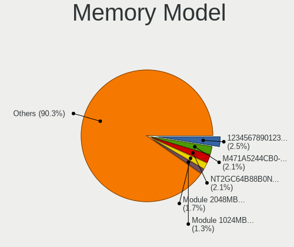

| Model                                                               | Notebooks | Percent |
|---------------------------------------------------------------------|-----------|---------|
| Samsung RAM M471A5244CB0-CRC 4GB SODIMM DDR4 2667MT/s               | 5         | 2.63%   |
| Unknown RAM Module 2048MB SODIMM DDR2 667MT/s                       | 4         | 2.11%   |
| Nanya RAM NT2GC64B88B0NS-CG 2GB SODIMM DDR3 1334MT/s                | 4         | 2.11%   |
| SK hynix RAM HMT351S6EFR8A-PB 4096MB SODIMM DDR3 1600MT/s           | 3         | 1.58%   |
| Samsung RAM M471B5273CH0-CH9 4GB SODIMM DDR3 1334MT/s               | 3         | 1.58%   |
| Samsung RAM M471B5173DB0-YK0 4GB SODIMM DDR3 1600MT/s               | 3         | 1.58%   |
| Samsung RAM M471A5244CB0-CTD 4GB SODIMM DDR4 3266MT/s               | 3         | 1.58%   |
| Unknown RAM Module 4096MB SODIMM DDR3 1066MT/s                      | 2         | 1.05%   |
| Unknown RAM Module 2048MB SODIMM DDR3 1600MT/s                      | 2         | 1.05%   |
| Unknown RAM Module 1024MB SODIMM DDR2 667MT/s                       | 2         | 1.05%   |
| Unknown RAM Module 1024MB SODIMM DDR2                               | 2         | 1.05%   |
| Unknown (ABCD) RAM 123456789012345678 2048MB SODIMM LPDDR4 2400MT/s | 2         | 1.05%   |
| SK hynix RAM Module 2048MB SODIMM DDR3 1600MT/s                     | 2         | 1.05%   |
| SK hynix RAM HMA81GS6JJR8N-VK 8GB SODIMM DDR4 2667MT/s              | 2         | 1.05%   |
| Samsung RAM Module 8192MB SODIMM DDR4 2667MT/s                      | 2         | 1.05%   |
| Samsung RAM M471B5773DH0-CH9 2GB SODIMM DDR3 1600MT/s               | 2         | 1.05%   |
| Samsung RAM M471B5673FH0-CH9 2GB SODIMM DDR3 1334MT/s               | 2         | 1.05%   |
| Samsung RAM M471B5273DH0-CH9 4GB SODIMM DDR3 1334MT/s               | 2         | 1.05%   |
| Samsung RAM M471B5173QH0-YK0 4GB SODIMM DDR3 1600MT/s               | 2         | 1.05%   |
| Samsung RAM M471B5173EB0-YK0 4GB SODIMM DDR3 1600MT/s               | 2         | 1.05%   |
| Samsung RAM M471B1G73QH0-YK0 8GB SODIMM DDR3 1600MT/s               | 2         | 1.05%   |
| Samsung RAM M471A2K43DB1-CWE 16GB SODIMM DDR4 3200MT/s              | 2         | 1.05%   |
| Nanya RAM NT4GC64B8HB0NS-CG 4096MB SODIMM DDR3 1334MT/s             | 2         | 1.05%   |
| Micron RAM Module 8192MB SODIMM DDR4 2667MT/s                       | 2         | 1.05%   |
| Micron RAM 8KTF51264HZ-1G6E1 4096MB SODIMM DDR3 1600MT/s            | 2         | 1.05%   |
| Crucial RAM CT102464BF160B.C16 8GB SODIMM DDR3 1600MT/s             | 2         | 1.05%   |
| Corsair RAM CMSO8GX3M1C1600C11 8192MB SODIMM DDR3 1600MT/s          | 2         | 1.05%   |
| Unknown RAM Module 8192MB SODIMM DDR4 2133MT/s                      | 1         | 0.53%   |
| Unknown RAM Module 8192MB SODIMM DDR3 1333MT/s                      | 1         | 0.53%   |
| Unknown RAM Module 8192MB Row Of Chips LPDDR4 4267MT/s              | 1         | 0.53%   |
| Unknown RAM Module 4096MB SODIMM DDR4 2400MT/s                      | 1         | 0.53%   |
| Unknown RAM Module 4096MB SODIMM DDR4 2133MT/s                      | 1         | 0.53%   |
| Unknown RAM Module 4096MB SODIMM DDR3 1067MT/s                      | 1         | 0.53%   |
| Unknown RAM Module 4096MB SODIMM DDR3                               | 1         | 0.53%   |
| Unknown RAM Module 4096MB Chip DDR4 2133MT/s                        | 1         | 0.53%   |
| Unknown RAM Module 2GB SODIMM DDR2 667MT/s                          | 1         | 0.53%   |
| Unknown RAM Module 2GB SODIMM DDR2 533MT/s                          | 1         | 0.53%   |
| Unknown RAM Module 2048MB SODIMM LPDDR4 2400MT/s                    | 1         | 0.53%   |
| Unknown RAM Module 2048MB SODIMM DDR3 1333MT/s                      | 1         | 0.53%   |
| Unknown RAM Module 2048MB SODIMM DDR3 1066MT/s                      | 1         | 0.53%   |
| Unknown RAM Module 2048MB DIMM LPDDR4 1600MT/s                      | 1         | 0.53%   |
| Unknown RAM Module 1GB SODIMM DDR2 533MT/s                          | 1         | 0.53%   |
| Unknown RAM Module 1024MB SODIMM DDR2 533MT/s                       | 1         | 0.53%   |
| Unknown RAM Module 1024MB SODIMM DDR2 2MT/s                         | 1         | 0.53%   |
| Unknown RAM Module 1024MB SODIMM DDR2 1MT/s                         | 1         | 0.53%   |
| Unknown (ABCD) RAM 123456789012345678 2GB DIMM LPDDR4 2400MT/s      | 1         | 0.53%   |
| Transcend RAM TS512MSK64W6H 4GB SODIMM DDR3 1600MT/s                | 1         | 0.53%   |
| Teikon RAM TMT425S6CFR6A-PBNJ 2048MB SODIMM DDR3 1333MT/s           | 1         | 0.53%   |
| Team RAM TEAMGROUP-SD4-2666 32GB SODIMM DDR4 2667MT/s               | 1         | 0.53%   |
| Team RAM TEAMGROUP-SD4-2400 16GB SODIMM DDR4 8400MT/s               | 1         | 0.53%   |
| Smart RAM SH564128FJ8NZRNSDR 4GB SODIMM DDR3 1600MT/s               | 1         | 0.53%   |
| Smart RAM SH564128FH8NZPHSCR 4GB SODIMM DDR3 1333MT/s               | 1         | 0.53%   |
| Smart RAM SH564128FH8NZPHSCG 4GB SODIMM DDR3 1334MT/s               | 1         | 0.53%   |
| Smart RAM SG564568FG8NWKF-Z1 2GB SODIMM DDR2 800MT/s                | 1         | 0.53%   |
| SK hynix RAM Module 16384MB SODIMM DDR4 2667MT/s                    | 1         | 0.53%   |
| SK hynix RAM Module 1024MB SODIMM DDR2 667MT/s                      | 1         | 0.53%   |
| SK hynix RAM HYMP512S64CP8-Y5 1GB SODIMM DDR 667MT/s                | 1         | 0.53%   |
| SK hynix RAM HYMP125S64CP8-Y5 2048MB SODIMM DDR 667MT/s             | 1         | 0.53%   |
| SK hynix RAM HMT451S6DFR8A-PB 4GB SODIMM DDR3 1600MT/s              | 1         | 0.53%   |
| SK hynix RAM HMT451S6BFR8A-PB 4GB SODIMM DDR3 1600MT/s              | 1         | 0.53%   |

Memory Kind
-----------

Memory module kinds

| Kind    | Notebooks | Percent |
|---------|-----------|---------|
| DDR3    | 73        | 48.34%  |
| DDR4    | 45        | 29.8%   |
| DDR2    | 18        | 11.92%  |
| LPDDR4  | 5         | 3.31%   |
| SDRAM   | 4         | 2.65%   |
| LPDDR3  | 4         | 2.65%   |
| DDR     | 1         | 0.66%   |
| Unknown | 1         | 0.66%   |

Memory Form Factor
------------------

Physical design of the memory module

| Name         | Notebooks | Percent |
|--------------|-----------|---------|
| SODIMM       | 142       | 94.67%  |
| Row Of Chips | 5         | 3.33%   |
| DIMM         | 1         | 0.67%   |
| Chip         | 1         | 0.67%   |
| Unknown      | 1         | 0.67%   |

Memory Size
-----------

Memory module size

| Size  | Notebooks | Percent |
|-------|-----------|---------|
| 4096  | 70        | 40%     |
| 2048  | 42        | 24%     |
| 8192  | 39        | 22.29%  |
| 1024  | 14        | 8%      |
| 16384 | 9         | 5.14%   |
| 32768 | 1         | 0.57%   |

Memory Speed
------------

Memory module speed

| Speed   | Notebooks | Percent |
|---------|-----------|---------|
| 1600    | 43        | 25.6%   |
| 1334    | 20        | 11.9%   |
| 2667    | 18        | 10.71%  |
| 2400    | 17        | 10.12%  |
| 1333    | 12        | 7.14%   |
| 667     | 11        | 6.55%   |
| 3200    | 10        | 5.95%   |
| 2133    | 5         | 2.98%   |
| 1066    | 5         | 2.98%   |
| 2048    | 4         | 2.38%   |
| 1867    | 4         | 2.38%   |
| 800     | 4         | 2.38%   |
| 3266    | 3         | 1.79%   |
| Unknown | 3         | 1.79%   |
| 1067    | 2         | 1.19%   |
| 533     | 2         | 1.19%   |
| 8400    | 1         | 0.6%    |
| 4267    | 1         | 0.6%    |
| 1200    | 1         | 0.6%    |
| 2       | 1         | 0.6%    |
| 1       | 1         | 0.6%    |

Printers & scanners
-------------------

Printer Vendor
--------------

Printer device vendors

| Vendor              | Notebooks | Percent |
|---------------------|-----------|---------|
| Hewlett-Packard     | 2         | 40%     |
| Brother Industries  | 2         | 40%     |
| Samsung Electronics | 1         | 20%     |

Printer Model
-------------

Printer device models

| Model                   | Notebooks | Percent |
|-------------------------|-----------|---------|
| Samsung SCX-4200 series | 1         | 20%     |
| HP Deskjet 3520 series  | 1         | 20%     |
| HP Deskjet 1050 J410    | 1         | 20%     |
| Brother PTUSB Printing  | 1         | 20%     |
| Brother DCP-7055W       | 1         | 20%     |

Scanner Vendor
--------------

Scanner device vendors

| Vendor      | Notebooks | Percent |
|-------------|-----------|---------|
| Seiko Epson | 1         | 100%    |

Scanner Model
-------------

Scanner device models

| Model                                                         | Notebooks | Percent |
|---------------------------------------------------------------|-----------|---------|
| Seiko Epson GT-8700/GT-8700F [Perfection 1640SU/1640SU PHOTO] | 1         | 100%    |

Camera
------

Camera Vendor
-------------

Camera device vendors

| Vendor                                 | Notebooks | Percent |
|----------------------------------------|-----------|---------|
| Chicony Electronics                    | 53        | 27.32%  |
| Acer                                   | 18        | 9.28%   |
| Realtek Semiconductor                  | 17        | 8.76%   |
| IMC Networks                           | 15        | 7.73%   |
| Microdia                               | 13        | 6.7%    |
| Suyin                                  | 8         | 4.12%   |
| Sunplus Innovation Technology          | 8         | 4.12%   |
| Quanta                                 | 8         | 4.12%   |
| Alcor Micro                            | 8         | 4.12%   |
| Silicon Motion                         | 6         | 3.09%   |
| Apple                                  | 5         | 2.58%   |
| Ricoh                                  | 4         | 2.06%   |
| Lite-On Technology                     | 4         | 2.06%   |
| Cheng Uei Precision Industry (Foxlink) | 4         | 2.06%   |
| Syntek                                 | 3         | 1.55%   |
| Lenovo                                 | 3         | 1.55%   |
| Importek                               | 3         | 1.55%   |
| Z-Star Microelectronics                | 2         | 1.03%   |
| Samsung Electronics                    | 2         | 1.03%   |
| Luxvisions Innotech Limited            | 2         | 1.03%   |
| Y Media                                | 1         | 0.52%   |
| OmniVision Technologies                | 1         | 0.52%   |
| Nintendo                               | 1         | 0.52%   |
| LG Electronics                         | 1         | 0.52%   |
| Generalplus Technology                 | 1         | 0.52%   |
| GEMBIRD                                | 1         | 0.52%   |
| DigiTech                               | 1         | 0.52%   |
| ALi                                    | 1         | 0.52%   |

Camera Model
------------

Camera device models

| Model                                    | Notebooks | Percent |
|------------------------------------------|-----------|---------|
| Chicony Integrated Camera                | 8         | 4.1%    |
| Realtek Integrated_Webcam_HD             | 6         | 3.08%   |
| Chicony TOSHIBA Web Camera - HD          | 5         | 2.56%   |
| Alcor Micro USB 2.0 Camera               | 5         | 2.56%   |
| Acer Lenovo EasyCamera                   | 5         | 2.56%   |
| Chicony HP HD Camera                     | 4         | 2.05%   |
| Realtek USB Camera                       | 3         | 1.54%   |
| Realtek Integrated Webcam                | 3         | 1.54%   |
| IMC Networks USB2.0 VGA UVC WebCam       | 3         | 1.54%   |
| IMC Networks USB2.0 UVC HD Webcam        | 3         | 1.54%   |
| IMC Networks USB2.0 HD UVC WebCam        | 3         | 1.54%   |
| Chicony HD WebCam                        | 3         | 1.54%   |
| Chicony EasyCamera                       | 3         | 1.54%   |
| Apple FaceTime HD Camera                 | 3         | 1.54%   |
| Alcor Micro Asus Integrated Webcam       | 3         | 1.54%   |
| Acer VGA WebCam                          | 3         | 1.54%   |
| Acer HD WebCam                           | 3         | 1.54%   |
| Sunplus Laptop Integrated Webcam HD      | 2         | 1.03%   |
| Sunplus Integrated_Webcam_HD             | 2         | 1.03%   |
| Sunplus HD WebCam                        | 2         | 1.03%   |
| Samsung Galaxy series, misc. (MTP mode)  | 2         | 1.03%   |
| Realtek Lenovo EasyCamera                | 2         | 1.03%   |
| Quanta VGA WebCam                        | 2         | 1.03%   |
| Quanta HP Webcam                         | 2         | 1.03%   |
| Quanta HP HD Camera                      | 2         | 1.03%   |
| Microdia Sonix USB 2.0 Camera            | 2         | 1.03%   |
| Microdia Laptop_Integrated_Webcam_2M     | 2         | 1.03%   |
| Microdia Integrated Webcam               | 2         | 1.03%   |
| Luxvisions Innotech Limited HP HD Camera | 2         | 1.03%   |
| Lite-On HP HD Camera                     | 2         | 1.03%   |
| Importek TOSHIBA Web Camera - HD         | 2         | 1.03%   |
| IMC Networks USB 2.0 UVC VGA WebCam      | 2         | 1.03%   |
| IMC Networks Integrated Camera           | 2         | 1.03%   |
| Chicony USB 2.0 Camera                   | 2         | 1.03%   |
| Chicony HP Webcam                        | 2         | 1.03%   |
| Chicony HD WebCam (Acer)                 | 2         | 1.03%   |
| Chicony 720p HD Camera                   | 2         | 1.03%   |
| Acer BisonCam,NB Pro                     | 2         | 1.03%   |
| Z-Star Webcam                            | 1         | 0.51%   |
| Z-Star Namuga 1.3M Webcam                | 1         | 0.51%   |
| Y Media USB Camera                       | 1         | 0.51%   |
| Syntek Integrated Webcam                 | 1         | 0.51%   |
| Syntek Integrated Camera                 | 1         | 0.51%   |
| Syntek EasyCamera                        | 1         | 0.51%   |
| Suyin WebCam                             | 1         | 0.51%   |
| Suyin Sony Visual Communication Camera   | 1         | 0.51%   |
| Suyin Lenovo Integrated Webcam           | 1         | 0.51%   |
| Suyin Integrated_Webcam_HD               | 1         | 0.51%   |
| Suyin HP Webcam-101                      | 1         | 0.51%   |
| Suyin HP Webcam                          | 1         | 0.51%   |
| Suyin Asus Integrated Webcam             | 1         | 0.51%   |
| Suyin Acer CrystalEye Webcam             | 1         | 0.51%   |
| Sunplus HP HD Webcam [Fixed]             | 1         | 0.51%   |
| Sunplus Asus Webcam                      | 1         | 0.51%   |
| Silicon Motion WebCam SCB-0355N          | 1         | 0.51%   |
| Silicon Motion WebCam SC-10HDD12636N     | 1         | 0.51%   |
| Silicon Motion WebCam SC-03FFL11939N     | 1         | 0.51%   |
| Silicon Motion WebCam SC-0311139N        | 1         | 0.51%   |
| Silicon Motion Web Camera                | 1         | 0.51%   |
| Silicon Motion Lenovo EasyCamera         | 1         | 0.51%   |

Security
--------

Fingerprint Vendor
------------------

Fingerprint sensor vendors

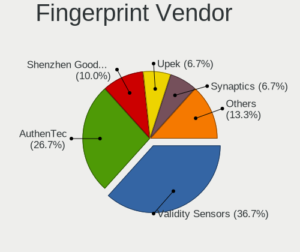

| Vendor                     | Notebooks | Percent |
|----------------------------|-----------|---------|
| Validity Sensors           | 11        | 42.31%  |
| AuthenTec                  | 7         | 26.92%  |
| Shenzhen Goodix Technology | 3         | 11.54%  |
| Upek                       | 2         | 7.69%   |
| Synaptics                  | 1         | 3.85%   |
| STMicroelectronics         | 1         | 3.85%   |
| LighTuning Technology      | 1         | 3.85%   |

Fingerprint Model
-----------------

Fingerprint sensor models

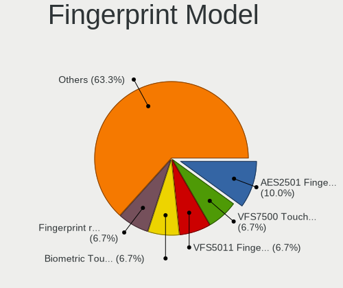

| Model                                                      | Notebooks | Percent |
|------------------------------------------------------------|-----------|---------|
| Validity Sensors VFS7500 Touch Fingerprint Sensor          | 2         | 7.69%   |
| Validity Sensors VFS5011 Fingerprint Reader                | 2         | 7.69%   |
| Upek Biometric Touchchip/Touchstrip Fingerprint Sensor     | 2         | 7.69%   |
| AuthenTec AES2810                                          | 2         | 7.69%   |
| AuthenTec AES2501 Fingerprint Sensor                       | 2         | 7.69%   |
| AuthenTec AES1600                                          | 2         | 7.69%   |
| Validity Sensors VFS495 Fingerprint Reader                 | 1         | 3.85%   |
| Validity Sensors VFS491                                    | 1         | 3.85%   |
| Validity Sensors VFS451 Fingerprint Reader                 | 1         | 3.85%   |
| Validity Sensors VFS301 Fingerprint Reader                 | 1         | 3.85%   |
| Validity Sensors VFS300 Fingerprint Reader                 | 1         | 3.85%   |
| Validity Sensors VFS101 Fingerprint Reader                 | 1         | 3.85%   |
| Validity Sensors VFS Fingerprint sensor                    | 1         | 3.85%   |
| Synaptics  VFS7552 Touch Fingerprint Sensor with PurePrint | 1         | 3.85%   |
| STMicroelectronics Fingerprint Reader                      | 1         | 3.85%   |
| Shenzhen Goodix  FingerPrint Device                        | 1         | 3.85%   |
| Shenzhen Goodix Fingerprint Reader                         | 1         | 3.85%   |
| Shenzhen Goodix FingerPrint                                | 1         | 3.85%   |
| LighTuning EgisTec Touch Fingerprint Sensor                | 1         | 3.85%   |
| AuthenTec AES1660 Fingerprint Sensor                       | 1         | 3.85%   |

Chipcard Vendor
---------------

Chipcard module vendors

| Vendor      | Notebooks | Percent |
|-------------|-----------|---------|
| O2 Micro    | 3         | 33.33%  |
| Alcor Micro | 3         | 33.33%  |
| Broadcom    | 2         | 22.22%  |
| Upek        | 1         | 11.11%  |

Chipcard Model
--------------

Chipcard module models

| Model                                                                        | Notebooks | Percent |
|------------------------------------------------------------------------------|-----------|---------|
| O2 Micro OZ776 CCID Smartcard Reader                                         | 3         | 33.33%  |
| Alcor Micro AU9540 Smartcard Reader                                          | 3         | 33.33%  |
| Upek TouchChip Fingerprint Coprocessor (WBF advanced mode)                   | 1         | 11.11%  |
| Broadcom BCM5880 Secure Applications Processor with fingerprint swipe sensor | 1         | 11.11%  |
| Broadcom BCM5880 Secure Applications Processor                               | 1         | 11.11%  |

Unsupported
-----------

Unsupported Devices
-------------------

Total unsupported devices on board

| Total | Notebooks | Percent |
|-------|-----------|---------|
| 0     | 186       | 78.81%  |
| 1     | 40        | 16.95%  |
| 2     | 10        | 4.24%   |

Unsupported Device Types
------------------------

Types of unsupported devices

| Type                  | Notebooks | Percent |
|-----------------------|-----------|---------|
| Fingerprint reader    | 26        | 44.83%  |
| Chipcard              | 9         | 15.52%  |
| Graphics card         | 8         | 13.79%  |
| Net/wireless          | 7         | 12.07%  |
| Camera                | 3         | 5.17%   |
| Storage               | 2         | 3.45%   |
| Net/ethernet          | 1         | 1.72%   |
| Multimedia controller | 1         | 1.72%   |
| Flash memory          | 1         | 1.72%   |

