Lubuntu 22.04 - Tested Hardware & Statistics (Desktops)
-------------------------------------------------------

A project to collect tested hardware configurations for Lubuntu 22.04.

Anyone can contribute to this report by the [hw-probe](https://github.com/linuxhw/hw-probe) tool:

    sudo -E hw-probe -all -upload

Please contribute! Especially if your hardware is rare.

Contents
--------

* [ Test Cases ](#test-cases)

* [ System ](#system)
  - [ Kernel                   ](#kernel)
  - [ Kernel Family            ](#kernel-family)
  - [ Kernel Major Ver.        ](#kernel-major-ver)
  - [ Arch                     ](#arch)
  - [ DE                       ](#de)
  - [ Display Server           ](#display-server)
  - [ Display Manager          ](#display-manager)
  - [ OS Lang                  ](#os-lang)
  - [ Boot Mode                ](#boot-mode)
  - [ Filesystem               ](#filesystem)
  - [ Part. scheme             ](#part-scheme)
  - [ Dual Boot with Linux/BSD ](#dual-boot-with-linuxbsd)
  - [ Dual Boot (Win)          ](#dual-boot-win)

* [ Board ](#board)
  - [ Vendor                   ](#vendor)
  - [ Model                    ](#model)
  - [ Model Family             ](#model-family)
  - [ MFG Year                 ](#mfg-year)
  - [ Form Factor              ](#form-factor)
  - [ Secure Boot              ](#secure-boot)
  - [ Coreboot                 ](#coreboot)
  - [ RAM Size                 ](#ram-size)
  - [ RAM Used                 ](#ram-used)
  - [ Total Drives             ](#total-drives)
  - [ Has CD-ROM               ](#has-cd-rom)
  - [ Has Ethernet             ](#has-ethernet)
  - [ Has WiFi                 ](#has-wifi)
  - [ Has Bluetooth            ](#has-bluetooth)

* [ Location ](#location)
  - [ Country                  ](#country)
  - [ City                     ](#city)

* [ Drives ](#drives)
  - [ Drive Vendor             ](#drive-vendor)
  - [ Drive Model              ](#drive-model)
  - [ HDD Vendor               ](#hdd-vendor)
  - [ SSD Vendor               ](#ssd-vendor)
  - [ Drive Kind               ](#drive-kind)
  - [ Drive Connector          ](#drive-connector)
  - [ Drive Size               ](#drive-size)
  - [ Space Total              ](#space-total)
  - [ Space Used               ](#space-used)
  - [ Malfunc. Drives          ](#malfunc-drives)
  - [ Malfunc. Drive Vendor    ](#malfunc-drive-vendor)
  - [ Malfunc. HDD Vendor      ](#malfunc-hdd-vendor)
  - [ Malfunc. Drive Kind      ](#malfunc-drive-kind)
  - [ Failed Drives            ](#failed-drives)
  - [ Failed Drive Vendor      ](#failed-drive-vendor)
  - [ Drive Status             ](#drive-status)

* [ Storage controller ](#storage-controller)
  - [ Storage Vendor           ](#storage-vendor)
  - [ Storage Model            ](#storage-model)
  - [ Storage Kind             ](#storage-kind)

* [ Processor ](#processor)
  - [ CPU Vendor               ](#cpu-vendor)
  - [ CPU Model                ](#cpu-model)
  - [ CPU Model Family         ](#cpu-model-family)
  - [ CPU Cores                ](#cpu-cores)
  - [ CPU Sockets              ](#cpu-sockets)
  - [ CPU Threads              ](#cpu-threads)
  - [ CPU Op-Modes             ](#cpu-op-modes)
  - [ CPU Microcode            ](#cpu-microcode)
  - [ CPU Microarch            ](#cpu-microarch)

* [ Graphics ](#graphics)
  - [ GPU Vendor               ](#gpu-vendor)
  - [ GPU Model                ](#gpu-model)
  - [ GPU Combo                ](#gpu-combo)
  - [ GPU Driver               ](#gpu-driver)
  - [ GPU Memory               ](#gpu-memory)

* [ Monitor ](#monitor)
  - [ Monitor Vendor           ](#monitor-vendor)
  - [ Monitor Model            ](#monitor-model)
  - [ Monitor Resolution       ](#monitor-resolution)
  - [ Monitor Diagonal         ](#monitor-diagonal)
  - [ Monitor Width            ](#monitor-width)
  - [ Aspect Ratio             ](#aspect-ratio)
  - [ Monitor Area             ](#monitor-area)
  - [ Pixel Density            ](#pixel-density)
  - [ Multiple Monitors        ](#multiple-monitors)

* [ Network ](#network)
  - [ Net Controller Vendor    ](#net-controller-vendor)
  - [ Net Controller Model     ](#net-controller-model)
  - [ Wireless Vendor          ](#wireless-vendor)
  - [ Wireless Model           ](#wireless-model)
  - [ Ethernet Vendor          ](#ethernet-vendor)
  - [ Ethernet Model           ](#ethernet-model)
  - [ Net Controller Kind      ](#net-controller-kind)
  - [ Used Controller          ](#used-controller)
  - [ NICs                     ](#nics)
  - [ IPv6                     ](#ipv6)

* [ Bluetooth ](#bluetooth)
  - [ Bluetooth Vendor         ](#bluetooth-vendor)
  - [ Bluetooth Model          ](#bluetooth-model)

* [ Sound ](#sound)
  - [ Sound Vendor             ](#sound-vendor)
  - [ Sound Model              ](#sound-model)

* [ Memory ](#memory)
  - [ Memory Vendor            ](#memory-vendor)
  - [ Memory Model             ](#memory-model)
  - [ Memory Kind              ](#memory-kind)
  - [ Memory Form Factor       ](#memory-form-factor)
  - [ Memory Size              ](#memory-size)
  - [ Memory Speed             ](#memory-speed)

* [ Printers & scanners ](#printers--scanners)
  - [ Printer Vendor           ](#printer-vendor)
  - [ Printer Model            ](#printer-model)
  - [ Scanner Vendor           ](#scanner-vendor)
  - [ Scanner Model            ](#scanner-model)

* [ Camera ](#camera)
  - [ Camera Vendor            ](#camera-vendor)
  - [ Camera Model             ](#camera-model)

* [ Security ](#security)
  - [ Fingerprint Vendor       ](#fingerprint-vendor)
  - [ Fingerprint Model        ](#fingerprint-model)
  - [ Chipcard Vendor          ](#chipcard-vendor)
  - [ Chipcard Model           ](#chipcard-model)

* [ Unsupported ](#unsupported)
  - [ Unsupported Devices      ](#unsupported-devices)
  - [ Unsupported Device Types ](#unsupported-device-types)

Test Cases
----------

Total: 59

| Vendor   | Model                       | Probe                                                      | Date         |
|----------|-----------------------------|------------------------------------------------------------|--------------|
| HP       | 21B4 A01                    | [cdc9730e81](https://linux-hardware.org/?probe=cdc9730e81) | Dec 31, 2022 |
| ZOTAC    | NM10                        | [98b6981431](https://linux-hardware.org/?probe=98b6981431) | Dec 21, 2022 |
| ASUSTek  | ROG STRIX B450-F GAMING ... | [5c437c961e](https://linux-hardware.org/?probe=5c437c961e) | Dec 13, 2022 |
| ASUSTek  | M4A785TD-V EVO              | [88e60fc0ba](https://linux-hardware.org/?probe=88e60fc0ba) | Dec 04, 2022 |
| ASUSTek  | M4A87TD/USB3                | [e38a783ce1](https://linux-hardware.org/?probe=e38a783ce1) | Nov 28, 2022 |
| Intel    | BTC-T37                     | [f52a08ae38](https://linux-hardware.org/?probe=f52a08ae38) | Nov 25, 2022 |
| MSI      | A520M-A PRO                 | [8db2bc8883](https://linux-hardware.org/?probe=8db2bc8883) | Nov 25, 2022 |
| Unknown  | Unknown                     | [029cddbcd6](https://linux-hardware.org/?probe=029cddbcd6) | Nov 23, 2022 |
| ASUSTek  | IP4BL-ME-Oli                | [242fd5b355](https://linux-hardware.org/?probe=242fd5b355) | Nov 21, 2022 |
| ASUSTek  | EB1501P                     | [0664261b3a](https://linux-hardware.org/?probe=0664261b3a) | Nov 11, 2022 |
| ASUSTek  | EB1501P                     | [ad47bcfb8b](https://linux-hardware.org/?probe=ad47bcfb8b) | Nov 11, 2022 |
| ASRock   | FM2A88X Extreme4+           | [7596586a99](https://linux-hardware.org/?probe=7596586a99) | Nov 05, 2022 |
| ASRock   | H110M-HDV                   | [3d1fde3114](https://linux-hardware.org/?probe=3d1fde3114) | Oct 17, 2022 |
| Gigabyte | F2A58M-HD2                  | [944509d58b](https://linux-hardware.org/?probe=944509d58b) | Oct 12, 2022 |
| Acer     | EM61SM/EM61PM               | [191540e7bc](https://linux-hardware.org/?probe=191540e7bc) | Oct 12, 2022 |
| Acer     | EM61SM/EM61PM               | [fb2dd76511](https://linux-hardware.org/?probe=fb2dd76511) | Oct 10, 2022 |
| Fujitsu  | D3003-D1 S26361-D3003-D1    | [afba95481a](https://linux-hardware.org/?probe=afba95481a) | Oct 09, 2022 |
| HP       | 0B4Ch D                     | [1b409fc1f6](https://linux-hardware.org/?probe=1b409fc1f6) | Oct 01, 2022 |
| HP       | 0B4Ch D                     | [ccc7fe3103](https://linux-hardware.org/?probe=ccc7fe3103) | Oct 01, 2022 |
| Dell     | 0R849J A00                  | [cf2069932e](https://linux-hardware.org/?probe=cf2069932e) | Sep 26, 2022 |
| Dell     | 09M8Y8 A01                  | [aa3088ed0e](https://linux-hardware.org/?probe=aa3088ed0e) | Sep 22, 2022 |
| MSI      | B450-A PRO MAX              | [89fad64303](https://linux-hardware.org/?probe=89fad64303) | Sep 20, 2022 |
| Gigabyte | G31M-S2C                    | [f7f3a2e7c8](https://linux-hardware.org/?probe=f7f3a2e7c8) | Sep 17, 2022 |
| AMI      | Cherry Trail CR             | [1c131a1acb](https://linux-hardware.org/?probe=1c131a1acb) | Sep 15, 2022 |
| Dell     | 0J584C A00                  | [de442f1c61](https://linux-hardware.org/?probe=de442f1c61) | Sep 01, 2022 |
| Gigabyte | G31M-S2C                    | [61a4780992](https://linux-hardware.org/?probe=61a4780992) | Aug 30, 2022 |
| Gigabyte | G31M-S2C                    | [8beed8e261](https://linux-hardware.org/?probe=8beed8e261) | Aug 30, 2022 |
| MSI      | Z590-A PRO                  | [c74bbc2f61](https://linux-hardware.org/?probe=c74bbc2f61) | Aug 21, 2022 |
| MSI      | Z170A GAMING M3             | [e0834224d7](https://linux-hardware.org/?probe=e0834224d7) | Aug 16, 2022 |
| ASRock   | G41M-VS3                    | [16a2e0ab5d](https://linux-hardware.org/?probe=16a2e0ab5d) | Aug 09, 2022 |
| HP       | 8768 A                      | [2ee49e3506](https://linux-hardware.org/?probe=2ee49e3506) | Aug 07, 2022 |
| Lenovo   | BRASWELL SDK0J40697 WIN ... | [f601e2f557](https://linux-hardware.org/?probe=f601e2f557) | Aug 05, 2022 |
| ASRock   | G41M-VS3                    | [16c2b30680](https://linux-hardware.org/?probe=16c2b30680) | Aug 04, 2022 |
| Acer     | EG31M R01-A3                | [c5b4092eb4](https://linux-hardware.org/?probe=c5b4092eb4) | Aug 04, 2022 |
| Dell     | 0WR7PY A03                  | [0cabe39a74](https://linux-hardware.org/?probe=0cabe39a74) | Jul 27, 2022 |
| Dell     | 0X8582                      | [b52bb428f4](https://linux-hardware.org/?probe=b52bb428f4) | Jul 26, 2022 |
| AMI      | Cherry Trail CR             | [6463c26211](https://linux-hardware.org/?probe=6463c26211) | Jul 25, 2022 |
| ASUSTek  | M5A78L LE                   | [4ade852983](https://linux-hardware.org/?probe=4ade852983) | Jul 23, 2022 |
| Dell     | 0X8582                      | [ab2bf3496e](https://linux-hardware.org/?probe=ab2bf3496e) | Jul 20, 2022 |
| ASRock   | A75M-HVS                    | [c88ac89032](https://linux-hardware.org/?probe=c88ac89032) | Jul 20, 2022 |
| Dell     | 0X8582                      | [5b8458f200](https://linux-hardware.org/?probe=5b8458f200) | Jul 19, 2022 |
| MSI      | X570-A PRO                  | [84b1994696](https://linux-hardware.org/?probe=84b1994696) | Jul 16, 2022 |
| HP       | 1495                        | [32ea18bc68](https://linux-hardware.org/?probe=32ea18bc68) | Jul 06, 2022 |
| HP       | 1495                        | [6300d25ff0](https://linux-hardware.org/?probe=6300d25ff0) | Jul 04, 2022 |
| MSI      | 760GM-P23                   | [ff0f44e63c](https://linux-hardware.org/?probe=ff0f44e63c) | Jun 26, 2022 |
| Dell     | 0VRWRC A00                  | [fe159bf237](https://linux-hardware.org/?probe=fe159bf237) | Jun 26, 2022 |
| ASUSTek  | M4N78-AM                    | [f98db3efe8](https://linux-hardware.org/?probe=f98db3efe8) | Jun 22, 2022 |
| Lenovo   | SHARKBAY SDK0E50510 PRO     | [474c946289](https://linux-hardware.org/?probe=474c946289) | Jun 17, 2022 |
| ASUSTek  | M4N78-AM                    | [d7dddc4270](https://linux-hardware.org/?probe=d7dddc4270) | Jun 16, 2022 |
| ASUSTek  | PRIME X370-A                | [bd1889b281](https://linux-hardware.org/?probe=bd1889b281) | Jun 06, 2022 |
| Unknown  | Unknown                     | [b64c215325](https://linux-hardware.org/?probe=b64c215325) | May 30, 2022 |
| Unknown  | Unknown                     | [aa6db2ed41](https://linux-hardware.org/?probe=aa6db2ed41) | May 23, 2022 |
| Unknown  | HX90                        | [22dac34b7b](https://linux-hardware.org/?probe=22dac34b7b) | May 21, 2022 |
| Unknown  | Unknown                     | [1aba67a1ac](https://linux-hardware.org/?probe=1aba67a1ac) | May 15, 2022 |
| Pegatron | VIOLET6                     | [dbbdea4231](https://linux-hardware.org/?probe=dbbdea4231) | May 12, 2022 |
| Dell     | 02YYK5 A01                  | [19dd091f8b](https://linux-hardware.org/?probe=19dd091f8b) | May 01, 2022 |
| ZOTAC    | NM10                        | [b2983fdd9d](https://linux-hardware.org/?probe=b2983fdd9d) | Apr 15, 2022 |
| Unknown  | Unknown                     | [4de543bc53](https://linux-hardware.org/?probe=4de543bc53) | Apr 03, 2022 |
| ASUSTek  | PRIME B350M-E               | [70f555009e](https://linux-hardware.org/?probe=70f555009e) | Feb 18, 2022 |

System
------

Kernel
------

Version of the Linux kernel

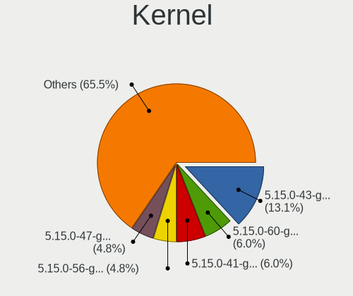

| Version                     | Desktops | Percent |
|-----------------------------|----------|---------|
| 5.15.0-43-generic           | 7        | 14%     |
| 5.15.0-41-generic           | 5        | 10%     |
| 5.15.0-47-generic           | 4        | 8%      |
| 5.15.0-25-generic           | 4        | 8%      |
| 5.15.0-48-generic           | 3        | 6%      |
| 5.15.0-40-generic           | 3        | 6%      |
| 5.15.0-39-generic           | 3        | 6%      |
| 5.15.0-52-generic           | 2        | 4%      |
| 5.15.0-50-generic           | 2        | 4%      |
| 5.15.0-46-generic           | 2        | 4%      |
| 5.15.0-30-generic           | 2        | 4%      |
| 5.15.0-27-generic           | 2        | 4%      |
| 6.1.0-custom                | 1        | 2%      |
| 6.0.8-060008-generic        | 1        | 2%      |
| 5.19.0-16.2-liquorix-amd64  | 1        | 2%      |
| 5.15.0-57-generic           | 1        | 2%      |
| 5.15.0-56-generic           | 1        | 2%      |
| 5.15.0-53-generic           | 1        | 2%      |
| 5.15.0-41-lowlatency        | 1        | 2%      |
| 5.15.0-362206031516-generic | 1        | 2%      |
| 5.15.0-35-generic           | 1        | 2%      |
| 5.15.0-23-generic           | 1        | 2%      |
| 5.15.0-18-generic           | 1        | 2%      |

Kernel Family
-------------

Linux kernel without a distro release

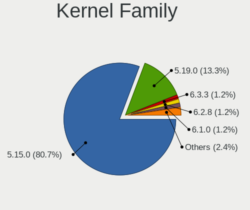

| Version | Desktops | Percent |
|---------|----------|---------|
| 5.15.0  | 45       | 93.75%  |
| 6.1.0   | 1        | 2.08%   |
| 6.0.8   | 1        | 2.08%   |
| 5.19.0  | 1        | 2.08%   |

Kernel Major Ver.
-----------------

Linux kernel major version

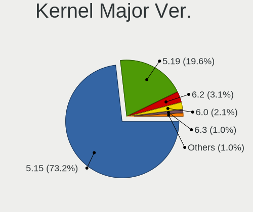

| Version | Desktops | Percent |
|---------|----------|---------|
| 5.15    | 45       | 93.75%  |
| 6.1     | 1        | 2.08%   |
| 6.0     | 1        | 2.08%   |
| 5.19    | 1        | 2.08%   |

Arch
----

OS architecture (x86_64, i586, etc.)

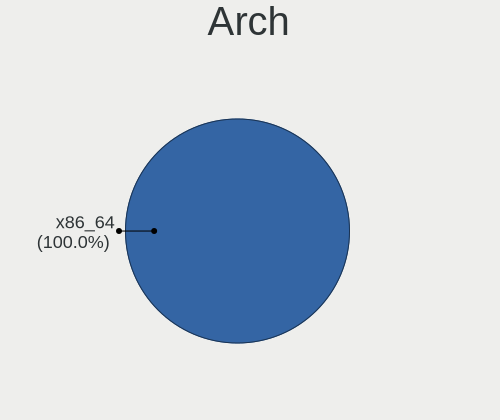

| Name   | Desktops | Percent |
|--------|----------|---------|
| x86_64 | 47       | 100%    |

DE
--

Desktop Environment

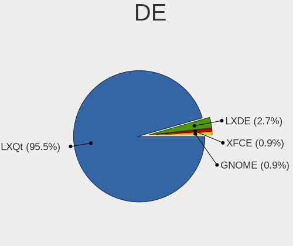

| Name | Desktops | Percent |
|------|----------|---------|
| LXQt | 45       | 95.74%  |
| LXDE | 2        | 4.26%   |

Display Server
--------------

X11 or Wayland

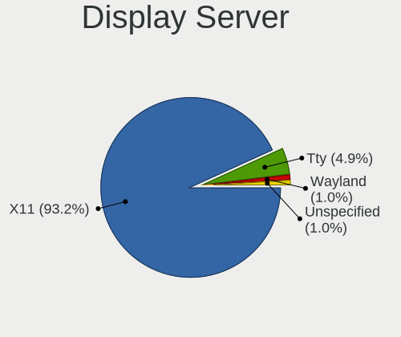

| Name        | Desktops | Percent |
|-------------|----------|---------|
| X11         | 44       | 89.8%   |
| Tty         | 3        | 6.12%   |
| Wayland     | 1        | 2.04%   |
| Unspecified | 1        | 2.04%   |

Display Manager
---------------

SDDM, LightDM, etc.

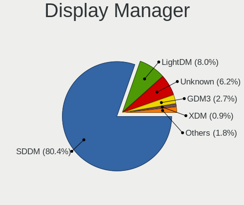

| Name    | Desktops | Percent |
|---------|----------|---------|
| SDDM    | 40       | 85.11%  |
| LightDM | 2        | 4.26%   |
| Unknown | 2        | 4.26%   |
| XDM     | 1        | 2.13%   |
| SLiM    | 1        | 2.13%   |
| LXDM    | 1        | 2.13%   |

OS Lang
-------

Language

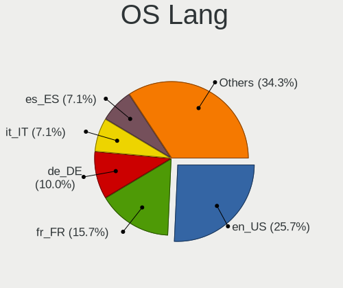

| Lang  | Desktops | Percent |
|-------|----------|---------|
| en_US | 12       | 25.53%  |
| fr_FR | 7        | 14.89%  |
| en_GB | 4        | 8.51%   |
| de_DE | 4        | 8.51%   |
| it_IT | 3        | 6.38%   |
| es_ES | 2        | 4.26%   |
| es_CR | 2        | 4.26%   |
| es_AR | 2        | 4.26%   |
| C     | 2        | 4.26%   |
| sv_SE | 1        | 2.13%   |
| ru_UA | 1        | 2.13%   |
| pl_PL | 1        | 2.13%   |
| nl_BE | 1        | 2.13%   |
| es_MX | 1        | 2.13%   |
| en_AU | 1        | 2.13%   |
| en_AG | 1        | 2.13%   |
| el_GR | 1        | 2.13%   |
| cv_RU | 1        | 2.13%   |

Boot Mode
---------

EFI or BIOS

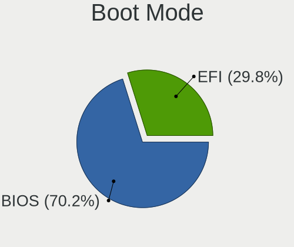

| Mode | Desktops | Percent |
|------|----------|---------|
| BIOS | 36       | 76.6%   |
| EFI  | 11       | 23.4%   |

Filesystem
----------

Type of filesystem

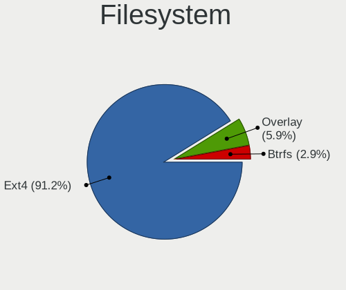

| Type    | Desktops | Percent |
|---------|----------|---------|
| Ext4    | 44       | 93.62%  |
| Overlay | 2        | 4.26%   |
| Btrfs   | 1        | 2.13%   |

Part. scheme
------------

Scheme of partitioning

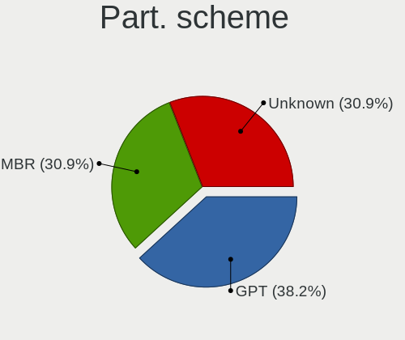

| Type    | Desktops | Percent |
|---------|----------|---------|
| GPT     | 19       | 40.43%  |
| Unknown | 17       | 36.17%  |
| MBR     | 11       | 23.4%   |

Dual Boot with Linux/BSD
------------------------

Hosting more than one Linux/BSD

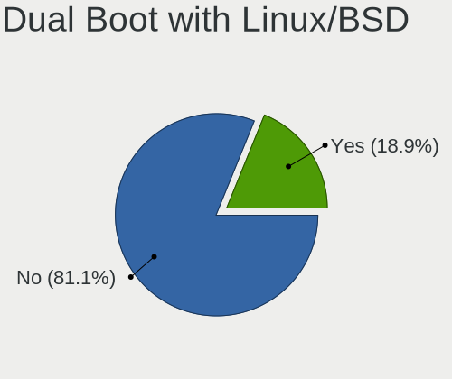

| Dual boot | Desktops | Percent |
|-----------|----------|---------|
| No        | 38       | 80.85%  |
| Yes       | 9        | 19.15%  |

Dual Boot (Win)
---------------

Hosting Linux and Windows

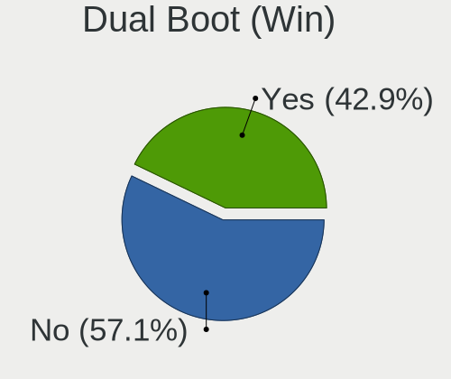

| Dual boot | Desktops | Percent |
|-----------|----------|---------|
| No        | 27       | 57.45%  |
| Yes       | 20       | 42.55%  |

Board
-----

Vendor
------

Motherboard manufacturer

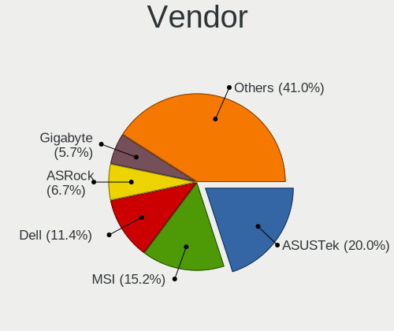

| Name                | Desktops | Percent |
|---------------------|----------|---------|
| ASUSTek Computer    | 9        | 19.15%  |
| Dell                | 8        | 17.02%  |
| MSI                 | 6        | 12.77%  |
| Hewlett-Packard     | 4        | 8.51%   |
| ASRock              | 4        | 8.51%   |
| Gigabyte Technology | 3        | 6.38%   |
| Unknown             | 3        | 6.38%   |
| Lenovo              | 2        | 4.26%   |
| AMI                 | 2        | 4.26%   |
| Acer                | 2        | 4.26%   |
| ZOTAC               | 1        | 2.13%   |
| Pegatron            | 1        | 2.13%   |
| Intel               | 1        | 2.13%   |
| Fujitsu             | 1        | 2.13%   |

Model
-----

Motherboard model

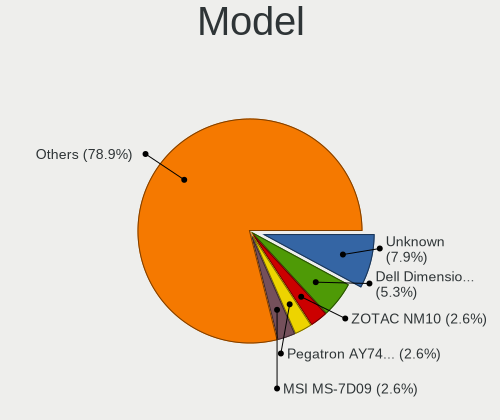

| Name                                   | Desktops | Percent |
|----------------------------------------|----------|---------|
| Unknown                                | 3        | 6.38%   |
| Dell Dimension 9100                    | 2        | 4.26%   |
| ZOTAC NM10                             | 1        | 2.13%   |
| Pegatron AY748AA-ABA p6320y            | 1        | 2.13%   |
| MSI MS-7D09                            | 1        | 2.13%   |
| MSI MS-7C96                            | 1        | 2.13%   |
| MSI MS-7C37                            | 1        | 2.13%   |
| MSI MS-7B86                            | 1        | 2.13%   |
| MSI MS-7978                            | 1        | 2.13%   |
| MSI MS-7641                            | 1        | 2.13%   |
| Lenovo ThinkCentre M83 10ANCTO1WW      | 1        | 2.13%   |
| Lenovo ThinkCentre M600 10KGS09S00     | 1        | 2.13%   |
| Intel BTC-T37                          | 1        | 2.13%   |
| HP Z400 Workstation                    | 1        | 2.13%   |
| HP t620 Quad Core TC                   | 1        | 2.13%   |
| HP Slim Desktop S01-pF1xxx             | 1        | 2.13%   |
| HP Compaq 8200 ELITE SMALL FORM FACTOR | 1        | 2.13%   |
| Gigabyte G31M-S2C                      | 1        | 2.13%   |
| Gigabyte G31M-ES2C                     | 1        | 2.13%   |
| Gigabyte F2A58M-HD2                    | 1        | 2.13%   |
| Fujitsu FUTRO S900                     | 1        | 2.13%   |
| Dell Vostro 410                        | 1        | 2.13%   |
| Dell Studio XPS 435MT                  | 1        | 2.13%   |
| Dell Precision T3610                   | 1        | 2.13%   |
| Dell OptiPlex 7020                     | 1        | 2.13%   |
| Dell OptiPlex 7010                     | 1        | 2.13%   |
| Dell OptiPlex 3020M                    | 1        | 2.13%   |
| ASUS ROG STRIX B450-F GAMING II        | 1        | 2.13%   |
| ASUS PRIME X370-A                      | 1        | 2.13%   |
| ASUS PRIME B350M-E                     | 1        | 2.13%   |
| ASUS M5A78L LE                         | 1        | 2.13%   |
| ASUS M4N78-AM                          | 1        | 2.13%   |
| ASUS M4A87TD/USB3                      | 1        | 2.13%   |
| ASUS M4A785TD-V EVO                    | 1        | 2.13%   |
| ASUS IP4BL-ME                          | 1        | 2.13%   |
| ASUS EB1501P                           | 1        | 2.13%   |
| ASRock H110M-HDV                       | 1        | 2.13%   |
| ASRock G41M-VS3                        | 1        | 2.13%   |
| ASRock FM2A88X Extreme4+               | 1        | 2.13%   |
| ASRock A75M-HVS                        | 1        | 2.13%   |

Model Family
------------

Motherboard model prefix

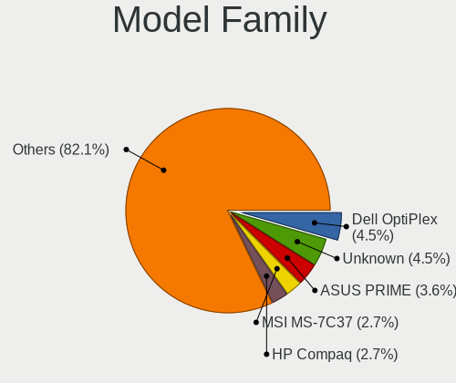

| Name                 | Desktops | Percent |
|----------------------|----------|---------|
| Dell OptiPlex        | 3        | 6.38%   |
| Unknown              | 3        | 6.38%   |
| Lenovo ThinkCentre   | 2        | 4.26%   |
| Dell Dimension       | 2        | 4.26%   |
| ASUS PRIME           | 2        | 4.26%   |
| ZOTAC NM10           | 1        | 2.13%   |
| Pegatron AY748AA-ABA | 1        | 2.13%   |
| MSI MS-7D09          | 1        | 2.13%   |
| MSI MS-7C96          | 1        | 2.13%   |
| MSI MS-7C37          | 1        | 2.13%   |
| MSI MS-7B86          | 1        | 2.13%   |
| MSI MS-7978          | 1        | 2.13%   |
| MSI MS-7641          | 1        | 2.13%   |
| Intel BTC-T37        | 1        | 2.13%   |
| HP Z400              | 1        | 2.13%   |
| HP t620              | 1        | 2.13%   |
| HP Slim              | 1        | 2.13%   |
| HP Compaq            | 1        | 2.13%   |
| Gigabyte G31M-S2C    | 1        | 2.13%   |
| Gigabyte G31M-ES2C   | 1        | 2.13%   |
| Gigabyte F2A58M-HD2  | 1        | 2.13%   |
| Fujitsu FUTRO        | 1        | 2.13%   |
| Dell Vostro          | 1        | 2.13%   |
| Dell Studio          | 1        | 2.13%   |
| Dell Precision       | 1        | 2.13%   |
| ASUS ROG             | 1        | 2.13%   |
| ASUS M5A78L          | 1        | 2.13%   |
| ASUS M4N78-AM        | 1        | 2.13%   |
| ASUS M4A87TD         | 1        | 2.13%   |
| ASUS M4A785TD-V      | 1        | 2.13%   |
| ASUS IP4BL-ME        | 1        | 2.13%   |
| ASUS EB1501P         | 1        | 2.13%   |
| ASRock H110M-HDV     | 1        | 2.13%   |
| ASRock G41M-VS3      | 1        | 2.13%   |
| ASRock FM2A88X       | 1        | 2.13%   |
| ASRock A75M-HVS      | 1        | 2.13%   |
| AMI Z83-V            | 1        | 2.13%   |
| AMI Narrow           | 1        | 2.13%   |
| Acer Aspire          | 1        | 2.13%   |
| Acer AcerPower       | 1        | 2.13%   |

MFG Year
--------

Motherboard manufacture year

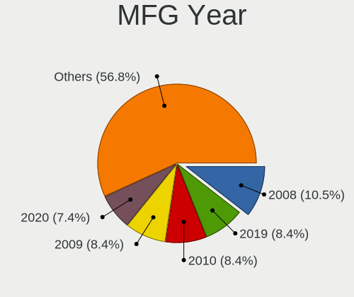

| Year | Desktops | Percent |
|------|----------|---------|
| 2017 | 5        | 10.64%  |
| 2010 | 5        | 10.64%  |
| 2008 | 5        | 10.64%  |
| 2020 | 4        | 8.51%   |
| 2015 | 4        | 8.51%   |
| 2014 | 4        | 8.51%   |
| 2021 | 3        | 6.38%   |
| 2011 | 3        | 6.38%   |
| 2009 | 3        | 6.38%   |
| 2019 | 2        | 4.26%   |
| 2016 | 2        | 4.26%   |
| 2013 | 2        | 4.26%   |
| 2007 | 2        | 4.26%   |
| 2006 | 2        | 4.26%   |
| 2022 | 1        | 2.13%   |

Form Factor
-----------

Physical design of the computer

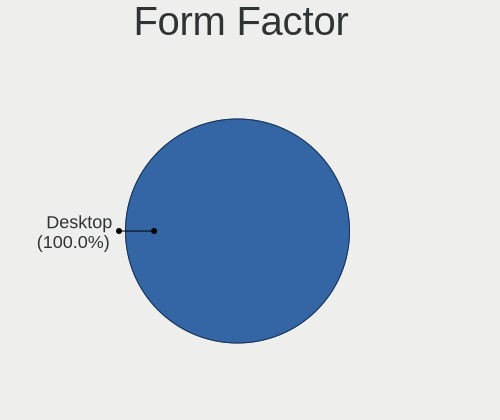

| Name    | Desktops | Percent |
|---------|----------|---------|
| Desktop | 47       | 100%    |

Secure Boot
-----------

Enabled or disabled

| State    | Desktops | Percent |
|----------|----------|---------|
| Disabled | 46       | 97.87%  |
| Enabled  | 1        | 2.13%   |

Coreboot
--------

Have coreboot on board

| Used | Desktops | Percent |
|------|----------|---------|
| No   | 47       | 100%    |

RAM Size
--------

Total RAM memory

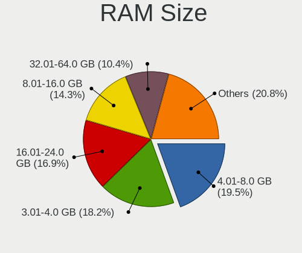

| Size in GB  | Desktops | Percent |
|-------------|----------|---------|
| 3.01-4.0    | 11       | 23.4%   |
| 4.01-8.0    | 10       | 21.28%  |
| 16.01-24.0  | 9        | 19.15%  |
| 8.01-16.0   | 6        | 12.77%  |
| 32.01-64.0  | 5        | 10.64%  |
| 1.01-2.0    | 2        | 4.26%   |
| 0.51-1.0    | 2        | 4.26%   |
| 2.01-3.0    | 1        | 2.13%   |
| 64.01-256.0 | 1        | 2.13%   |

RAM Used
--------

Used RAM memory

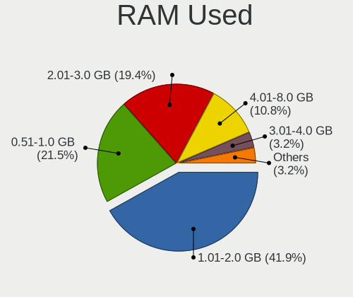

| Used GB  | Desktops | Percent |
|----------|----------|---------|
| 1.01-2.0 | 21       | 43.75%  |
| 2.01-3.0 | 10       | 20.83%  |
| 0.51-1.0 | 10       | 20.83%  |
| 4.01-8.0 | 4        | 8.33%   |
| 3.01-4.0 | 2        | 4.17%   |
| 0.01-0.5 | 1        | 2.08%   |

Total Drives
------------

Number of drives on board

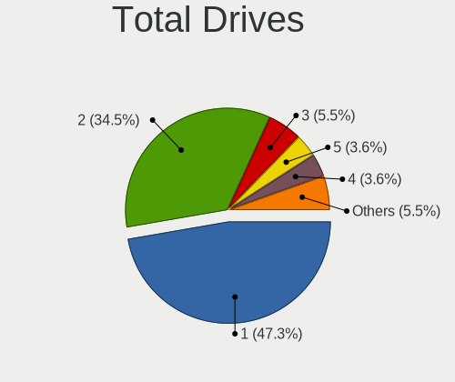

| Drives | Desktops | Percent |
|--------|----------|---------|
| 1      | 23       | 48.94%  |
| 2      | 18       | 38.3%   |
| 5      | 2        | 4.26%   |
| 7      | 1        | 2.13%   |
| 6      | 1        | 2.13%   |
| 3      | 1        | 2.13%   |
| 0      | 1        | 2.13%   |

Has CD-ROM
----------

Has CD-ROM on board

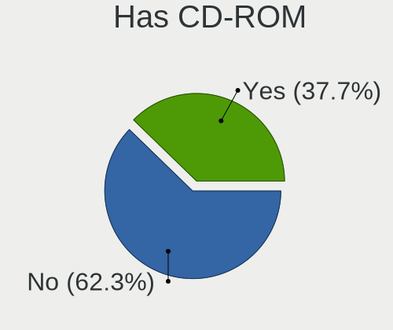

| Presented | Desktops | Percent |
|-----------|----------|---------|
| No        | 28       | 59.57%  |
| Yes       | 19       | 40.43%  |

Has Ethernet
------------

Has Ethernet on board

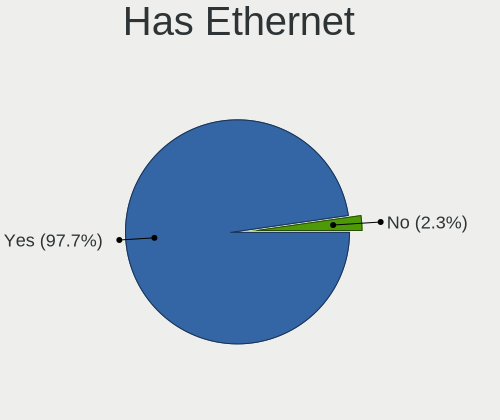

| Presented | Desktops | Percent |
|-----------|----------|---------|
| Yes       | 46       | 97.87%  |
| No        | 1        | 2.13%   |

Has WiFi
--------

Has WiFi module

| Presented | Desktops | Percent |
|-----------|----------|---------|
| No        | 27       | 57.45%  |
| Yes       | 20       | 42.55%  |

Has Bluetooth
-------------

Has Bluetooth module

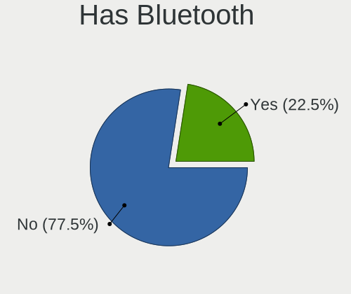

| Presented | Desktops | Percent |
|-----------|----------|---------|
| No        | 39       | 81.25%  |
| Yes       | 9        | 18.75%  |

Location
--------

Country
-------

Geographic location (country)

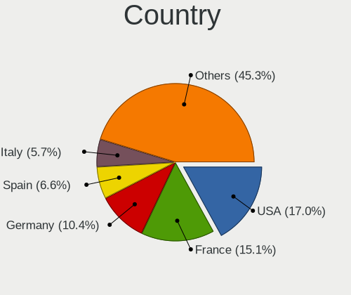

| Country    | Desktops | Percent |
|------------|----------|---------|
| USA        | 11       | 23.4%   |
| France     | 7        | 14.89%  |
| Germany    | 4        | 8.51%   |
| UK         | 3        | 6.38%   |
| Italy      | 3        | 6.38%   |
| Spain      | 2        | 4.26%   |
| Poland     | 2        | 4.26%   |
| Costa Rica | 2        | 4.26%   |
| Argentina  | 2        | 4.26%   |
| Ukraine    | 1        | 2.13%   |
| Sweden     | 1        | 2.13%   |
| Romania    | 1        | 2.13%   |
| Mexico     | 1        | 2.13%   |
| Latvia     | 1        | 2.13%   |
| Ireland    | 1        | 2.13%   |
| Greece     | 1        | 2.13%   |
| Bulgaria   | 1        | 2.13%   |
| Brazil     | 1        | 2.13%   |
| Belgium    | 1        | 2.13%   |
| Australia  | 1        | 2.13%   |

City
----

Geographic location (city)

| City                  | Desktops | Percent |
|-----------------------|----------|---------|
| Largo                 | 2        | 4.17%   |
| Heredia               | 2        | 4.17%   |
| Wetteren              | 1        | 2.08%   |
| Washington            | 1        | 2.08%   |
| Varna                 | 1        | 2.08%   |
| Valentigney           | 1        | 2.08%   |
| Tandil                | 1        | 2.08%   |
| Sonico                | 1        | 2.08%   |
| Riverenert            | 1        | 2.08%   |
| Rio Segundo           | 1        | 2.08%   |
| Richmond              | 1        | 2.08%   |
| Resistencia           | 1        | 2.08%   |
| Paris                 | 1        | 2.08%   |
| Palencia              | 1        | 2.08%   |
| Ostrów Wielkopolski  | 1        | 2.08%   |
| Oberkotzau            | 1        | 2.08%   |
| Novo Gama             | 1        | 2.08%   |
| Notting Hill Gate     | 1        | 2.08%   |
| Nederland             | 1        | 2.08%   |
| Mobile                | 1        | 2.08%   |
| Mexico City           | 1        | 2.08%   |
| Melbourne             | 1        | 2.08%   |
| Marseille             | 1        | 2.08%   |
| Lebanon               | 1        | 2.08%   |
| Larissa               | 1        | 2.08%   |
| Kyiv                  | 1        | 2.08%   |
| Koblenz               | 1        | 2.08%   |
| Kielce                | 1        | 2.08%   |
| Karlstad              | 1        | 2.08%   |
| Huelva                | 1        | 2.08%   |
| Hemel Hempstead       | 1        | 2.08%   |
| Hayes                 | 1        | 2.08%   |
| Frankfurt am Main     | 1        | 2.08%   |
| Enniscorthy           | 1        | 2.08%   |
| Denver                | 1        | 2.08%   |
| Dallas                | 1        | 2.08%   |
| Cormeilles-en-Parisis | 1        | 2.08%   |
| Cirey-sur-Vezouze     | 1        | 2.08%   |
| Chicago               | 1        | 2.08%   |
| Bucharest             | 1        | 2.08%   |

Drives
------

Drive Vendor
------------

Hard drive vendors

| Vendor              | Desktops | Drives | Percent |
|---------------------|----------|--------|---------|
| Seagate             | 14       | 16     | 18.92%  |
| Samsung Electronics | 11       | 14     | 14.86%  |
| WDC                 | 8        | 12     | 10.81%  |
| Kingston            | 6        | 7      | 8.11%   |
| Hitachi             | 6        | 7      | 8.11%   |
| SanDisk             | 4        | 4      | 5.41%   |
| Toshiba             | 3        | 3      | 4.05%   |
| Crucial             | 3        | 3      | 4.05%   |
| WD MediaMax         | 1        | 1      | 1.35%   |
| Unknown             | 1        | 1      | 1.35%   |
| TO Exter            | 1        | 1      | 1.35%   |
| Team                | 1        | 1      | 1.35%   |
| T-FORCE             | 1        | 1      | 1.35%   |
| RSH-319             | 1        | 1      | 1.35%   |
| PNY                 | 1        | 1      | 1.35%   |
| Patriot             | 1        | 1      | 1.35%   |
| Maxtor              | 1        | 1      | 1.35%   |
| LITEONIT            | 1        | 1      | 1.35%   |
| Kston               | 1        | 3      | 1.35%   |
| Intel               | 1        | 1      | 1.35%   |
| HGST HUS            | 1        | 2      | 1.35%   |
| HGST                | 1        | 1      | 1.35%   |
| GOODRAM             | 1        | 1      | 1.35%   |
| Gigabyte Technology | 1        | 1      | 1.35%   |
| External            | 1        | 1      | 1.35%   |
| Apricorn            | 1        | 1      | 1.35%   |
| Apacer              | 1        | 1      | 1.35%   |

Drive Model
-----------

Hard drive models

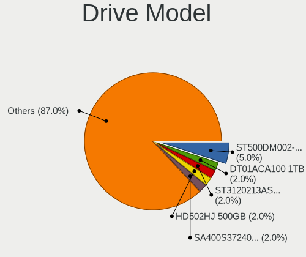

| Model                                       | Desktops | Percent |
|---------------------------------------------|----------|---------|
| Seagate ST500DM002-1BD142 500GB             | 4        | 4.88%   |
| Toshiba DT01ACA100 1TB                      | 2        | 2.44%   |
| Seagate ST3120213AS 120GB                   | 2        | 2.44%   |
| Samsung HD502HJ 500GB                       | 2        | 2.44%   |
| Kingston SA400S37240G 240GB SSD             | 2        | 2.44%   |
| WDC WDS500G2B0A-00SM50 500GB SSD            | 1        | 1.22%   |
| WDC WDS100T1X0E-00AFY0 1TB                  | 1        | 1.22%   |
| WDC WD800BB-00CAA1 80GB                     | 1        | 1.22%   |
| WDC WD5000AAKX-75U6AA0 500GB                | 1        | 1.22%   |
| WDC WD3200BPVT-00HXZT3 320GB                | 1        | 1.22%   |
| WDC WD30EZRZ-00GXCB0 3TB                    | 1        | 1.22%   |
| WDC WD2500AAJS-07M0A0 250GB                 | 1        | 1.22%   |
| WDC WD20EZRX-00D8PB0 2TB                    | 1        | 1.22%   |
| WDC WD20EZBX-00AYRA0 2TB                    | 1        | 1.22%   |
| WDC WD10EZRZ-00Z5HB0 1TB                    | 1        | 1.22%   |
| WDC WD10EURX-63C57Y0 1TB                    | 1        | 1.22%   |
| WDC PC SN530 SDBPNPZ-512G-1006 512GB        | 1        | 1.22%   |
| WD MediaMax WL250GSA872 250GB               | 1        | 1.22%   |
| Unknown 032G72  32GB                        | 1        | 1.22%   |
| Toshiba MK6465GSX 640GB                     | 1        | 1.22%   |
| TO Exter nal USB 3.0 512GB                  | 1        | 1.22%   |
| Team T253E2002T 2TB SSD                     | 1        | 1.22%   |
| T-FORCE 1TB                                 | 1        | 1.22%   |
| Seagate ST8000DM004-2CX188 8TB              | 1        | 1.22%   |
| Seagate ST500LM000-1EJ162 500GB             | 1        | 1.22%   |
| Seagate ST4000DM004-2CV104 4TB              | 1        | 1.22%   |
| Seagate ST3500418AS 500GB                   | 1        | 1.22%   |
| Seagate ST3200826AS 200GB                   | 1        | 1.22%   |
| Seagate ST2000NE001-2M5101 2TB              | 1        | 1.22%   |
| Seagate ST2000LM003 HN-M201RAD 2TB          | 1        | 1.22%   |
| Seagate ST2000DM008-2FR102 2TB              | 1        | 1.22%   |
| Seagate FireCuda 520 SSD ZP500GM30002 500GB | 1        | 1.22%   |
| Seagate Backup+ Hub BK 8TB                  | 1        | 1.22%   |
| SanDisk SSD PLUS 1000GB                     | 1        | 1.22%   |
| SanDisk SDSA6DM-016G-1006 16GB SSD          | 1        | 1.22%   |
| SanDisk SD8SN8U128G1001 128GB SSD           | 1        | 1.22%   |
| SanDisk DF4032  32GB                        | 1        | 1.22%   |
| Samsung SSD 980 PRO 2TB                     | 1        | 1.22%   |
| Samsung SSD 870 EVO 500GB                   | 1        | 1.22%   |
| Samsung SSD 860 EVO 1TB                     | 1        | 1.22%   |

HDD Vendor
----------

Hard disk drive vendors

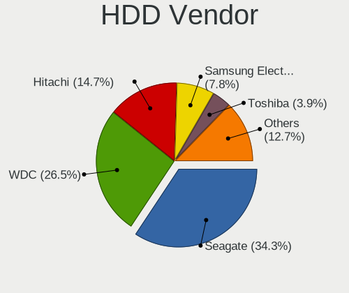

| Vendor              | Desktops | Drives | Percent |
|---------------------|----------|--------|---------|
| Seagate             | 14       | 15     | 34.15%  |
| WDC                 | 7        | 9      | 17.07%  |
| Hitachi             | 6        | 7      | 14.63%  |
| Samsung Electronics | 5        | 5      | 12.2%   |
| Toshiba             | 3        | 3      | 7.32%   |
| WD MediaMax         | 1        | 1      | 2.44%   |
| RSH-319             | 1        | 1      | 2.44%   |
| Maxtor              | 1        | 1      | 2.44%   |
| HGST                | 1        | 1      | 2.44%   |
| External            | 1        | 1      | 2.44%   |
| Apricorn            | 1        | 1      | 2.44%   |

SSD Vendor
----------

Solid state drive vendors

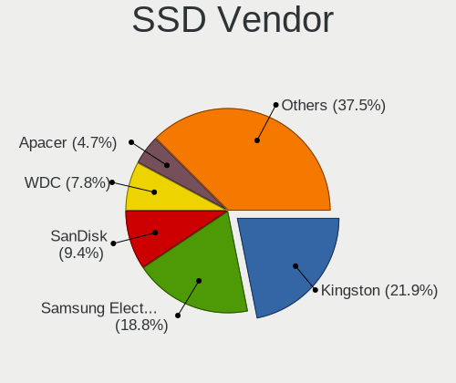

| Vendor              | Desktops | Drives | Percent |
|---------------------|----------|--------|---------|
| Samsung Electronics | 7        | 8      | 25%     |
| Kingston            | 5        | 6      | 17.86%  |
| SanDisk             | 3        | 3      | 10.71%  |
| Crucial             | 2        | 2      | 7.14%   |
| WDC                 | 1        | 1      | 3.57%   |
| TO Exter            | 1        | 1      | 3.57%   |
| Team                | 1        | 1      | 3.57%   |
| PNY                 | 1        | 1      | 3.57%   |
| Patriot             | 1        | 1      | 3.57%   |
| LITEONIT            | 1        | 1      | 3.57%   |
| Kston               | 1        | 3      | 3.57%   |
| Intel               | 1        | 1      | 3.57%   |
| GOODRAM             | 1        | 1      | 3.57%   |
| Gigabyte Technology | 1        | 1      | 3.57%   |
| Apacer              | 1        | 1      | 3.57%   |

Drive Kind
----------

HDD or SSD

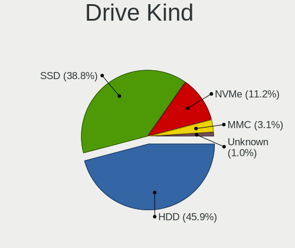

| Kind    | Desktops | Drives | Percent |
|---------|----------|--------|---------|
| HDD     | 28       | 45     | 45.16%  |
| SSD     | 26       | 32     | 41.94%  |
| NVMe    | 5        | 6      | 8.06%   |
| MMC     | 2        | 2      | 3.23%   |
| Unknown | 1        | 3      | 1.61%   |

Drive Connector
---------------

SATA, SAS, NVMe, etc.

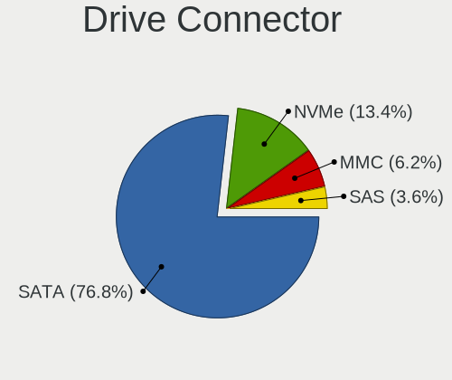

| Type | Desktops | Drives | Percent |
|------|----------|--------|---------|
| SATA | 42       | 73     | 79.25%  |
| NVMe | 5        | 6      | 9.43%   |
| SAS  | 4        | 7      | 7.55%   |
| MMC  | 2        | 2      | 3.77%   |

Drive Size
----------

Size of hard drive

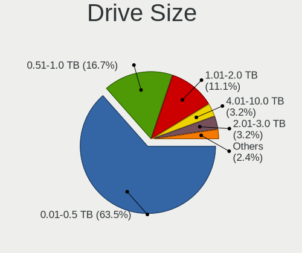

| Size in TB | Desktops | Drives | Percent |
|------------|----------|--------|---------|
| 0.01-0.5   | 36       | 51     | 63.16%  |
| 0.51-1.0   | 9        | 11     | 15.79%  |
| 1.01-2.0   | 6        | 7      | 10.53%  |
| 2.01-3.0   | 3        | 4      | 5.26%   |
| 3.01-4.0   | 2        | 2      | 3.51%   |
| 4.01-10.0  | 1        | 2      | 1.75%   |

Space Total
-----------

Amount of disk space available on the file system

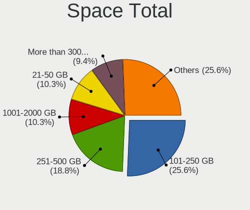

| Size in GB     | Desktops | Percent |
|----------------|----------|---------|
| 101-250        | 12       | 25.53%  |
| 21-50          | 7        | 14.89%  |
| 251-500        | 6        | 12.77%  |
| 2001-3000      | 4        | 8.51%   |
| 1-20           | 4        | 8.51%   |
| 501-1000       | 4        | 8.51%   |
| 51-100         | 4        | 8.51%   |
| More than 3000 | 3        | 6.38%   |
| 1001-2000      | 3        | 6.38%   |

Space Used
----------

Amount of used disk space

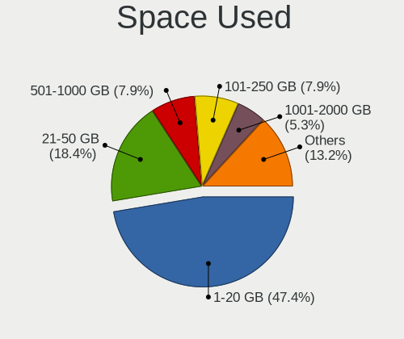

| Used GB        | Desktops | Percent |
|----------------|----------|---------|
| 1-20           | 22       | 45.83%  |
| 21-50          | 8        | 16.67%  |
| 101-250        | 5        | 10.42%  |
| 251-500        | 3        | 6.25%   |
| 501-1000       | 3        | 6.25%   |
| More than 3000 | 2        | 4.17%   |
| 1001-2000      | 2        | 4.17%   |
| 51-100         | 2        | 4.17%   |
| 2001-3000      | 1        | 2.08%   |

Malfunc. Drives
---------------

Drive models with a malfunction

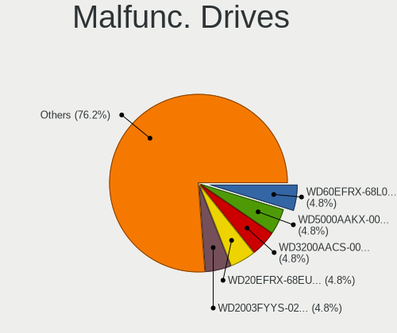

| Model                             | Desktops | Drives | Percent |
|-----------------------------------|----------|--------|---------|
| Toshiba MK6465GSX 640GB           | 1        | 1      | 20%     |
| Seagate ST500DM002-1BD142 500GB   | 1        | 1      | 20%     |
| Seagate ST4000DM004-2CV104 4TB    | 1        | 1      | 20%     |
| Samsung Electronics HD161HJ 160GB | 1        | 1      | 20%     |
| Apacer 16GB SATA Flash Drive SSD  | 1        | 1      | 20%     |

Malfunc. Drive Vendor
---------------------

Vendors of faulty drives

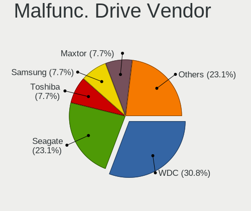

| Vendor              | Desktops | Drives | Percent |
|---------------------|----------|--------|---------|
| Seagate             | 2        | 2      | 40%     |
| Toshiba             | 1        | 1      | 20%     |
| Samsung Electronics | 1        | 1      | 20%     |
| Apacer              | 1        | 1      | 20%     |

Malfunc. HDD Vendor
-------------------

Vendors of faulty HDD drives

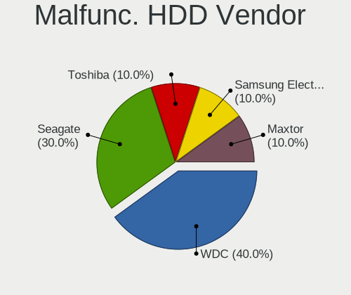

| Vendor              | Desktops | Drives | Percent |
|---------------------|----------|--------|---------|
| Seagate             | 2        | 2      | 50%     |
| Toshiba             | 1        | 1      | 25%     |
| Samsung Electronics | 1        | 1      | 25%     |

Malfunc. Drive Kind
-------------------

Kinds of faulty drives

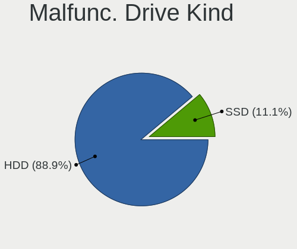

| Kind | Desktops | Drives | Percent |
|------|----------|--------|---------|
| HDD  | 4        | 4      | 80%     |
| SSD  | 1        | 1      | 20%     |

Failed Drives
-------------

Failed drive models

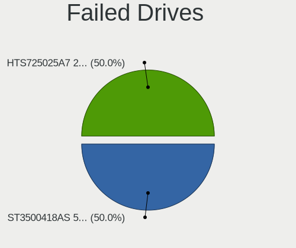

| Model                     | Desktops | Drives | Percent |
|---------------------------|----------|--------|---------|
| Seagate ST3500418AS 500GB | 1        | 1      | 100%    |

Failed Drive Vendor
-------------------

Failed drive vendors

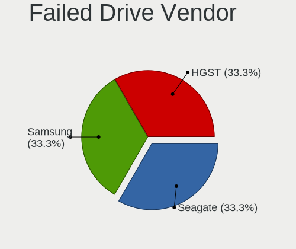

| Vendor  | Desktops | Drives | Percent |
|---------|----------|--------|---------|
| Seagate | 1        | 1      | 100%    |

Drive Status
------------

Number of failed and malfunc. drives

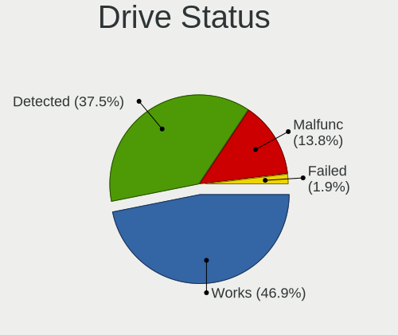

| Status   | Desktops | Drives | Percent |
|----------|----------|--------|---------|
| Detected | 23       | 45     | 46%     |
| Works    | 21       | 37     | 42%     |
| Malfunc  | 5        | 5      | 10%     |
| Failed   | 1        | 1      | 2%      |

Storage controller
------------------

Storage Vendor
--------------

Storage controller vendors

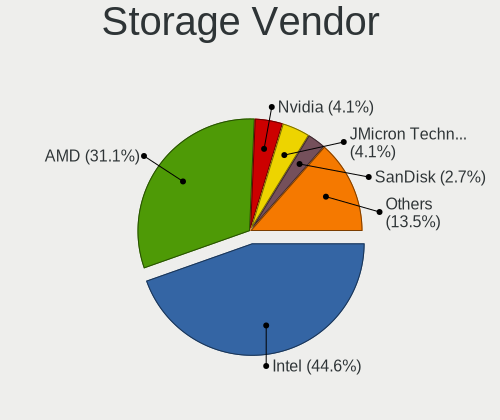

| Vendor                      | Desktops | Percent |
|-----------------------------|----------|---------|
| Intel                       | 26       | 47.27%  |
| AMD                         | 16       | 29.09%  |
| Nvidia                      | 3        | 5.45%   |
| SanDisk                     | 2        | 3.64%   |
| JMicron Technology          | 2        | 3.64%   |
| Seagate Technology          | 1        | 1.82%   |
| Samsung Electronics         | 1        | 1.82%   |
| Micron/Crucial Technology   | 1        | 1.82%   |
| Marvell Technology Group    | 1        | 1.82%   |
| Kingston Technology Company | 1        | 1.82%   |
| ASMedia Technology          | 1        | 1.82%   |

Storage Model
-------------

Storage controller models

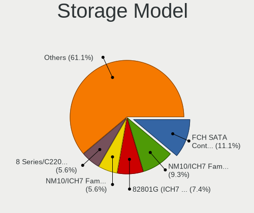

| Model                                                                                   | Desktops | Percent |
|-----------------------------------------------------------------------------------------|----------|---------|
| AMD FCH SATA Controller [AHCI mode]                                                     | 8        | 10.81%  |
| Intel NM10/ICH7 Family SATA Controller [IDE mode]                                       | 6        | 8.11%   |
| Intel 82801G (ICH7 Family) IDE Controller                                               | 5        | 6.76%   |
| Intel NM10/ICH7 Family SATA Controller [AHCI mode]                                      | 4        | 5.41%   |
| AMD SB7x0/SB8x0/SB9x0 SATA Controller [AHCI mode]                                       | 4        | 5.41%   |
| Intel 8 Series/C220 Series Chipset Family 6-port SATA Controller 1 [AHCI mode]          | 3        | 4.05%   |
| AMD SB7x0/SB8x0/SB9x0 IDE Controller                                                    | 3        | 4.05%   |
| Intel SATA Controller [RAID mode]                                                       | 2        | 2.7%    |
| Intel Q170/Q150/B150/H170/H110/Z170/CM236 Chipset SATA Controller [AHCI Mode]           | 2        | 2.7%    |
| Intel Celeron/Pentium Silver Processor SATA Controller                                  | 2        | 2.7%    |
| AMD FCH IDE Controller                                                                  | 2        | 2.7%    |
| AMD 400 Series Chipset SATA Controller                                                  | 2        | 2.7%    |
| Seagate FireCuda 520 SSD                                                                | 1        | 1.35%   |
| SanDisk WD PC SN810 / Black SN850 NVMe SSD                                              | 1        | 1.35%   |
| SanDisk WD Blue SN550 NVMe SSD                                                          | 1        | 1.35%   |
| Samsung NVMe SSD Controller PM9A1/PM9A3/980PRO                                          | 1        | 1.35%   |
| Nvidia MCP78S [GeForce 8200] SATA Controller (non-AHCI mode)                            | 1        | 1.35%   |
| Nvidia MCP78S [GeForce 8200] IDE                                                        | 1        | 1.35%   |
| Nvidia MCP78S [GeForce 8200] AHCI Controller                                            | 1        | 1.35%   |
| Nvidia MCP61 SATA Controller                                                            | 1        | 1.35%   |
| Nvidia MCP61 IDE                                                                        | 1        | 1.35%   |
| Micron/Crucial P2 NVMe PCIe SSD                                                         | 1        | 1.35%   |
| Marvell Group 88SE9215 PCIe 2.0 x1 4-port SATA 6 Gb/s Controller                        | 1        | 1.35%   |
| Kingston Company OM3PDP3 NVMe SSD                                                       | 1        | 1.35%   |
| JMicron JMB368 IDE controller                                                           | 1        | 1.35%   |
| JMicron JMB363 SATA/IDE Controller                                                      | 1        | 1.35%   |
| Intel C600/X79 series chipset 6-Port SATA AHCI Controller                               | 1        | 1.35%   |
| Intel Atom/Celeron/Pentium Processor x5-E8000/J3xxx/N3xxx Series SATA Controller        | 1        | 1.35%   |
| Intel 82801JI (ICH10 Family) 4 port SATA IDE Controller #1                              | 1        | 1.35%   |
| Intel 82801JI (ICH10 Family) 2 port SATA IDE Controller #2                              | 1        | 1.35%   |
| Intel 82801IR/IO/IH (ICH9R/DO/DH) 4 port SATA Controller [IDE mode]                     | 1        | 1.35%   |
| Intel 82801I (ICH9 Family) 2 port SATA Controller [IDE mode]                            | 1        | 1.35%   |
| Intel 7 Series/C210 Series Chipset Family 6-port SATA Controller [AHCI mode]            | 1        | 1.35%   |
| Intel 6 Series/C200 Series Chipset Family Desktop SATA Controller (IDE mode, ports 4-5) | 1        | 1.35%   |
| Intel 6 Series/C200 Series Chipset Family Desktop SATA Controller (IDE mode, ports 0-3) | 1        | 1.35%   |
| Intel 6 Series/C200 Series Chipset Family 6 port Mobile SATA AHCI Controller            | 1        | 1.35%   |
| Intel 500 Series Chipset Family SATA AHCI Controller                                    | 1        | 1.35%   |
| ASMedia ASM1062 Serial ATA Controller                                                   | 1        | 1.35%   |
| AMD X370 Series Chipset SATA Controller                                                 | 1        | 1.35%   |
| AMD SB7x0/SB8x0/SB9x0 SATA Controller [IDE mode]                                        | 1        | 1.35%   |

Storage Kind
------------

Kind of storage controller (IDE, SATA, NVMe, SAS, ...)

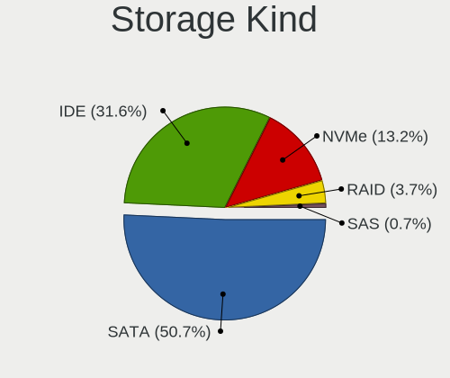

| Kind | Desktops | Percent |
|------|----------|---------|
| SATA | 33       | 55.93%  |
| IDE  | 19       | 32.2%   |
| NVMe | 5        | 8.47%   |
| RAID | 2        | 3.39%   |

Processor
---------

CPU Vendor
----------

Processor vendors

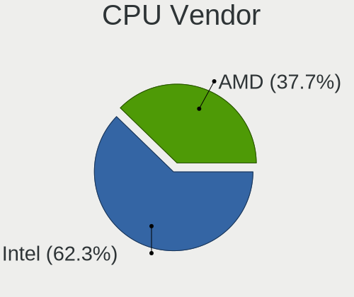

| Vendor | Desktops | Percent |
|--------|----------|---------|
| Intel  | 28       | 59.57%  |
| AMD    | 19       | 40.43%  |

CPU Model
---------

Processor models

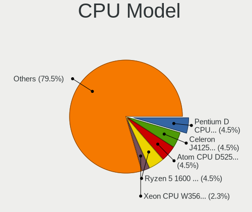

| Model                                      | Desktops | Percent |
|--------------------------------------------|----------|---------|
| Intel Pentium D CPU 2.80GHz                | 2        | 4.26%   |
| Intel Celeron J4125 CPU @ 2.00GHz          | 2        | 4.26%   |
| Intel Atom CPU D525 @ 1.80GHz              | 2        | 4.26%   |
| AMD Ryzen 5 1600 Six-Core Processor        | 2        | 4.26%   |
| Intel Xeon CPU W3565 @ 3.20GHz             | 1        | 2.13%   |
| Intel Xeon CPU E5-1607 v2 @ 3.00GHz        | 1        | 2.13%   |
| Intel Pentium Dual CPU E2160 @ 1.80GHz     | 1        | 2.13%   |
| Intel Core i9-10900K CPU @ 3.70GHz         | 1        | 2.13%   |
| Intel Core i7 CPU 920 @ 2.67GHz            | 1        | 2.13%   |
| Intel Core i5-6600K CPU @ 3.50GHz          | 1        | 2.13%   |
| Intel Core i5-6500 CPU @ 3.20GHz           | 1        | 2.13%   |
| Intel Core i5-4590T CPU @ 2.00GHz          | 1        | 2.13%   |
| Intel Core i5-4570 CPU @ 3.20GHz           | 1        | 2.13%   |
| Intel Core i5-3470 CPU @ 3.20GHz           | 1        | 2.13%   |
| Intel Core i3-4170 CPU @ 3.70GHz           | 1        | 2.13%   |
| Intel Core i3-2120 CPU @ 3.30GHz           | 1        | 2.13%   |
| Intel Core i3-10105 CPU @ 3.70GHz          | 1        | 2.13%   |
| Intel Core 2 Quad CPU Q8300 @ 2.50GHz      | 1        | 2.13%   |
| Intel Core 2 Quad CPU Q6600 @ 2.40GHz      | 1        | 2.13%   |
| Intel Core 2 Duo CPU E8400 @ 3.00GHz       | 1        | 2.13%   |
| Intel Core 2 Duo CPU E7200 @ 2.53GHz       | 1        | 2.13%   |
| Intel Core 2 Duo CPU E4500 @ 2.20GHz       | 1        | 2.13%   |
| Intel Celeron CPU N3010 @ 1.04GHz          | 1        | 2.13%   |
| Intel Celeron CPU 847 @ 1.10GHz            | 1        | 2.13%   |
| Intel Atom x5-Z8350 CPU @ 1.44GHz          | 1        | 2.13%   |
| Intel Atom x5-Z8300 CPU @ 1.44GHz          | 1        | 2.13%   |
| AMD Ryzen 9 5900HX with Radeon Graphics    | 1        | 2.13%   |
| AMD Ryzen 7 5800X 8-Core Processor         | 1        | 2.13%   |
| AMD Ryzen 7 2700 Eight-Core Processor      | 1        | 2.13%   |
| AMD Ryzen 5 5600G with Radeon Graphics     | 1        | 2.13%   |
| AMD Ryzen 5 3500X 6-Core Processor         | 1        | 2.13%   |
| AMD Phenom II X6 1090T Processor           | 1        | 2.13%   |
| AMD Phenom II X4 820 Processor             | 1        | 2.13%   |
| AMD GX-415GA SOC with Radeon HD Graphics   | 1        | 2.13%   |
| AMD G-T40N Processor                       | 1        | 2.13%   |
| AMD FX-6350 Six-Core Processor             | 1        | 2.13%   |
| AMD FX-6300 Six-Core Processor             | 1        | 2.13%   |
| AMD Athlon II X2 240 Processor             | 1        | 2.13%   |
| AMD Athlon 64 X2 Dual Core Processor 5000+ | 1        | 2.13%   |
| AMD Athlon 64 X2 Dual Core Processor 4800+ | 1        | 2.13%   |

CPU Model Family
----------------

Processor model prefix

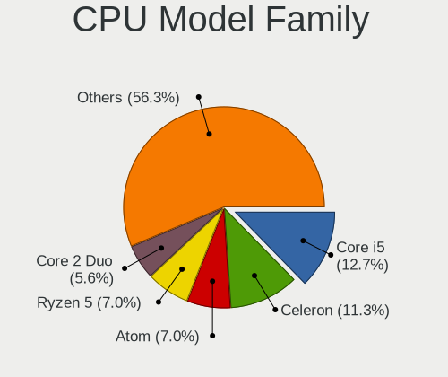

| Model              | Desktops | Percent |
|--------------------|----------|---------|
| Intel Core i5      | 5        | 10.64%  |
| Intel Celeron      | 4        | 8.51%   |
| Intel Atom         | 4        | 8.51%   |
| AMD Ryzen 5        | 4        | 8.51%   |
| Intel Core i3      | 3        | 6.38%   |
| Intel Core 2 Duo   | 3        | 6.38%   |
| Intel Xeon         | 2        | 4.26%   |
| Intel Pentium D    | 2        | 4.26%   |
| Intel Core 2 Quad  | 2        | 4.26%   |
| AMD Ryzen 7        | 2        | 4.26%   |
| AMD FX             | 2        | 4.26%   |
| AMD Athlon 64 X2   | 2        | 4.26%   |
| Intel Pentium Dual | 1        | 2.13%   |
| Intel Core i9      | 1        | 2.13%   |
| Intel Core i7      | 1        | 2.13%   |
| AMD Ryzen 9        | 1        | 2.13%   |
| AMD Phenom II X6   | 1        | 2.13%   |
| AMD Phenom II X4   | 1        | 2.13%   |
| AMD GX             | 1        | 2.13%   |
| AMD G              | 1        | 2.13%   |
| AMD Athlon II X2   | 1        | 2.13%   |
| AMD A8             | 1        | 2.13%   |
| AMD A4             | 1        | 2.13%   |
| AMD A10            | 1        | 2.13%   |

CPU Cores
---------

Number of processor cores

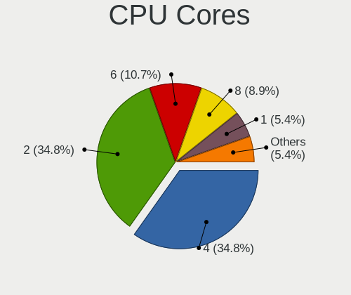

| Number | Desktops | Percent |
|--------|----------|---------|
| 4      | 18       | 38.3%   |
| 2      | 16       | 34.04%  |
| 6      | 5        | 10.64%  |
| 8      | 3        | 6.38%   |
| 3      | 2        | 4.26%   |
| 1      | 2        | 4.26%   |
| 10     | 1        | 2.13%   |

CPU Sockets
-----------

Number of sockets

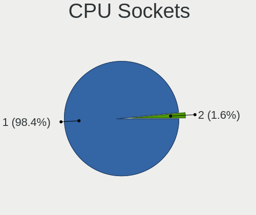

| Number | Desktops | Percent |
|--------|----------|---------|
| 1      | 47       | 100%    |

CPU Threads
-----------

Threads per core (Hyper-Threading)

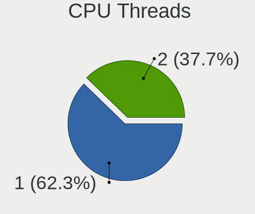

| Number | Desktops | Percent |
|--------|----------|---------|
| 1      | 31       | 65.96%  |
| 2      | 16       | 34.04%  |

CPU Op-Modes
------------

CPU Operation Modes (32-bit, 64-bit)

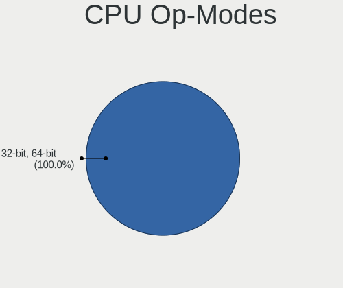

| Op mode        | Desktops | Percent |
|----------------|----------|---------|
| 32-bit, 64-bit | 47       | 100%    |

CPU Microcode
-------------

Microcode number

| Number     | Desktops | Percent |
|------------|----------|---------|
| Unknown    | 23       | 48.94%  |
| 0x6fb      | 2        | 4.26%   |
| 0x406c4    | 2        | 4.26%   |
| 0x306c3    | 2        | 4.26%   |
| 0x106ca    | 2        | 4.26%   |
| 0xa0653    | 1        | 2.13%   |
| 0x706a8    | 1        | 2.13%   |
| 0x506e3    | 1        | 2.13%   |
| 0x206a7    | 1        | 2.13%   |
| 0x106a5    | 1        | 2.13%   |
| 0x1067a    | 1        | 2.13%   |
| 0x0a50000c | 1        | 2.13%   |
| 0x0a50000b | 1        | 2.13%   |
| 0x0a201009 | 1        | 2.13%   |
| 0x08701021 | 1        | 2.13%   |
| 0x08001138 | 1        | 2.13%   |
| 0x0700010f | 1        | 2.13%   |
| 0x06003106 | 1        | 2.13%   |
| 0x06001119 | 1        | 2.13%   |
| 0x06000852 | 1        | 2.13%   |
| 0x010000c7 | 1        | 2.13%   |

CPU Microarch
-------------

Microarchitecture

| Name          | Desktops | Percent |
|---------------|----------|---------|
| Zen 3         | 3        | 6.38%   |
| Silvermont    | 3        | 6.38%   |
| Piledriver    | 3        | 6.38%   |
| Penryn        | 3        | 6.38%   |
| K10           | 3        | 6.38%   |
| Haswell       | 3        | 6.38%   |
| Core          | 3        | 6.38%   |
| Zen+          | 2        | 4.26%   |
| Skylake       | 2        | 4.26%   |
| SandyBridge   | 2        | 4.26%   |
| NetBurst      | 2        | 4.26%   |
| Nehalem       | 2        | 4.26%   |
| K8 Hammer     | 2        | 4.26%   |
| IvyBridge     | 2        | 4.26%   |
| Goldmont plus | 2        | 4.26%   |
| CometLake     | 2        | 4.26%   |
| Bonnell       | 2        | 4.26%   |
| Zen 2         | 1        | 2.13%   |
| Zen           | 1        | 2.13%   |
| Steamroller   | 1        | 2.13%   |
| K10 Llano     | 1        | 2.13%   |
| Jaguar        | 1        | 2.13%   |
| Bobcat        | 1        | 2.13%   |

Graphics
--------

GPU Vendor
----------

Vendors of graphics cards

| Vendor | Desktops | Percent |
|--------|----------|---------|
| AMD    | 20       | 40%     |
| Nvidia | 17       | 34%     |
| Intel  | 13       | 26%     |

GPU Model
---------

Graphics card models

| Model                                                                                    | Desktops | Percent |
|------------------------------------------------------------------------------------------|----------|---------|
| Intel Atom/Celeron/Pentium Processor x5-E8000/J3xxx/N3xxx Integrated Graphics Controller | 3        | 5.56%   |
| AMD RV620 LE [Radeon HD 3450]                                                            | 3        | 5.56%   |
| Nvidia GT218 [ION]                                                                       | 2        | 3.7%    |
| Intel Xeon E3-1200 v3/4th Gen Core Processor Integrated Graphics Controller              | 2        | 3.7%    |
| Intel GeminiLake [UHD Graphics 600]                                                      | 2        | 3.7%    |
| Intel CometLake-S GT2 [UHD Graphics 630]                                                 | 2        | 3.7%    |
| AMD RV710 [Radeon HD 4350/4550]                                                          | 2        | 3.7%    |
| AMD RV380 [Radeon X300/X550/X1050 Series] (Secondary)                                    | 2        | 3.7%    |
| AMD RV370 [Radeon X600/X600 SE]                                                          | 2        | 3.7%    |
| AMD Cezanne [Radeon Vega Series / Radeon Vega Mobile Series]                             | 2        | 3.7%    |
| Nvidia TU106 [GeForce RTX 2070 Rev. A]                                                   | 1        | 1.85%   |
| Nvidia TU104 [GeForce RTX 2080 SUPER]                                                    | 1        | 1.85%   |
| Nvidia GT218 [GeForce 8400 GS Rev. 3]                                                    | 1        | 1.85%   |
| Nvidia GT218 [GeForce 210]                                                               | 1        | 1.85%   |
| Nvidia GM200GL [Tesla M40]                                                               | 1        | 1.85%   |
| Nvidia GM200GL [Quadro M6000]                                                            | 1        | 1.85%   |
| Nvidia GM107GL [Quadro K2200]                                                            | 1        | 1.85%   |
| Nvidia GK208B [GeForce GT 720]                                                           | 1        | 1.85%   |
| Nvidia GK106GL [Quadro K4000]                                                            | 1        | 1.85%   |
| Nvidia GK106 [GeForce GTX 660]                                                           | 1        | 1.85%   |
| Nvidia GF108 [GeForce GT 730]                                                            | 1        | 1.85%   |
| Nvidia GA104 [GeForce RTX 3070]                                                          | 1        | 1.85%   |
| Nvidia G86 [Quadro NVS 290]                                                              | 1        | 1.85%   |
| Nvidia C78 [GeForce 9100]                                                                | 1        | 1.85%   |
| Nvidia C77 [GeForce 8200]                                                                | 1        | 1.85%   |
| Nvidia C61 [GeForce 6100 nForce 405]                                                     | 1        | 1.85%   |
| Intel Xeon E3-1200 v2/3rd Gen Core processor Graphics Controller                         | 1        | 1.85%   |
| Intel 82G33/G31 Express Integrated Graphics Controller                                   | 1        | 1.85%   |
| Intel 4th Generation Core Processor Family Integrated Graphics Controller                | 1        | 1.85%   |
| Intel 2nd Generation Core Processor Family Integrated Graphics Controller                | 1        | 1.85%   |
| AMD Wrestler [Radeon HD 6290]                                                            | 1        | 1.85%   |
| AMD Trinity 2 [Radeon HD 7480D]                                                          | 1        | 1.85%   |
| AMD RS880 [Radeon HD 4200]                                                               | 1        | 1.85%   |
| AMD Navi 23 [Radeon RX 6600/6600 XT/6600M]                                               | 1        | 1.85%   |
| AMD Navi 22 [Radeon RX 6700/6700 XT/6750 XT / 6800M]                                     | 1        | 1.85%   |
| AMD Kaveri [Radeon R7 Graphics]                                                          | 1        | 1.85%   |
| AMD Kabini [Radeon HD 8330E]                                                             | 1        | 1.85%   |
| AMD Juniper XT [Radeon HD 5770]                                                          | 1        | 1.85%   |
| AMD Ellesmere [Radeon RX 470/480/570/570X/580/580X/590]                                  | 1        | 1.85%   |
| AMD Cedar [Radeon HD 5000/6000/7350/8350 Series]                                         | 1        | 1.85%   |

GPU Combo
---------

Combinations of graphics cards

| Name               | Desktops | Percent |
|--------------------|----------|---------|
| 1 x AMD            | 16       | 34.04%  |
| 1 x Nvidia         | 15       | 31.91%  |
| 1 x Intel          | 11       | 23.4%   |
| 2 x AMD            | 2        | 4.26%   |
| Intel + 2 x Nvidia | 1        | 2.13%   |
| Intel + 2 x AMD    | 1        | 2.13%   |
| AMD + Nvidia       | 1        | 2.13%   |

GPU Driver
----------

Free vs proprietary

| Driver      | Desktops | Percent |
|-------------|----------|---------|
| Free        | 37       | 78.72%  |
| Proprietary | 7        | 14.89%  |
| Unknown     | 3        | 6.38%   |

GPU Memory
----------

Total video memory

| Size in GB | Desktops | Percent |
|------------|----------|---------|
| Unknown    | 27       | 57.45%  |
| 0.01-0.5   | 7        | 14.89%  |
| 7.01-8.0   | 4        | 8.51%   |
| 0.51-1.0   | 4        | 8.51%   |
| 8.01-16.0  | 2        | 4.26%   |
| 3.01-4.0   | 1        | 2.13%   |
| 2.01-3.0   | 1        | 2.13%   |
| 1.01-2.0   | 1        | 2.13%   |

Monitor
-------

Monitor Vendor
--------------

Monitor vendors

| Vendor               | Desktops | Percent |
|----------------------|----------|---------|
| Samsung Electronics  | 7        | 16.28%  |
| Dell                 | 7        | 16.28%  |
| Hewlett-Packard      | 5        | 11.63%  |
| Goldstar             | 4        | 9.3%    |
| Philips              | 3        | 6.98%   |
| Ancor Communications | 3        | 6.98%   |
| Eizo                 | 2        | 4.65%   |
| Acer                 | 2        | 4.65%   |
| Unknown              | 1        | 2.33%   |
| Sony                 | 1        | 2.33%   |
| SNC                  | 1        | 2.33%   |
| Sharp                | 1        | 2.33%   |
| Sampo                | 1        | 2.33%   |
| MSI                  | 1        | 2.33%   |
| LG Electronics       | 1        | 2.33%   |
| HannStar             | 1        | 2.33%   |
| Daewoo               | 1        | 2.33%   |
| BenQ                 | 1        | 2.33%   |

Monitor Model
-------------

Monitor models

| Model                                                                | Desktops | Percent |
|----------------------------------------------------------------------|----------|---------|
| Unknown LCD Monitor DELL3007WFPHC 2560x1600                          | 1        | 2.27%   |
| Sony TV SNY9C01 1920x1080                                            | 1        | 2.27%   |
| SNC PHOTO 190V SNC1850 1366x768 409x230mm 18.5-inch                  | 1        | 2.27%   |
| Sharp LC-50LB481U SHP5063 1920x1080 1100x620mm 49.7-inch             | 1        | 2.27%   |
| Samsung Electronics SyncMaster SAM03D2 1680x1050 474x296mm 22.0-inch | 1        | 2.27%   |
| Samsung Electronics SyncMaster SAM022F 1280x1024 312x234mm 15.4-inch | 1        | 2.27%   |
| Samsung Electronics SyncMaster SAM01E1 1280x1024 376x301mm 19.0-inch | 1        | 2.27%   |
| Samsung Electronics SMB2230N SAM0635 1920x1080 477x268mm 21.5-inch   | 1        | 2.27%   |
| Samsung Electronics S20B300 SAM08A8 1600x900 443x249mm 20.0-inch     | 1        | 2.27%   |
| Samsung Electronics LCD Monitor SAM0A76 1280x720 949x543mm 43.0-inch | 1        | 2.27%   |
| Samsung Electronics LC27G7xT SAM105C 2560x1440 597x336mm 27.0-inch   | 1        | 2.27%   |
| Sampo 800S STC0800 800x600 170x127mm 8.4-inch                        | 1        | 2.27%   |
| Philips PHL 273V5 PHLC0D2 1920x1080 598x336mm 27.0-inch              | 1        | 2.27%   |
| Philips PHL 15"XGATV PHL4650 1024x768 304x228mm 15.0-inch            | 1        | 2.27%   |
| Philips 191EL PHLC050 1366x768 410x230mm 18.5-inch                   | 1        | 2.27%   |
| MSI MAG272CQR MSI3CA6 2560x1440 598x336mm 27.0-inch                  | 1        | 2.27%   |
| LG Electronics LCD Monitor E2241 1920x1080                           | 1        | 2.27%   |
| Hewlett-Packard w2338h HWP281B 1920x1080 509x286mm 23.0-inch         | 1        | 2.27%   |
| Hewlett-Packard W2071d HWP299E 1600x900 443x249mm 20.0-inch          | 1        | 2.27%   |
| Hewlett-Packard E201 HWP305E 1600x900 443x249mm 20.0-inch            | 1        | 2.27%   |
| Hewlett-Packard 2311 HWP293A 1920x1080 509x286mm 23.0-inch           | 1        | 2.27%   |
| Hewlett-Packard 2011 HWP2935 1600x900 443x249mm 20.0-inch            | 1        | 2.27%   |
| HannStar HL190APB HSD62C3 1366x768 410x230mm 18.5-inch               | 1        | 2.27%   |
| Goldstar M2394D GSM56C4 1920x1080 509x286mm 23.0-inch                | 1        | 2.27%   |
| Goldstar M197WD GSM4BA2 1360x768 410x230mm 18.5-inch                 | 1        | 2.27%   |
| Goldstar HD PLUS GSM5AC5 1600x900 440x250mm 19.9-inch                | 1        | 2.27%   |
| Goldstar 19EN33 GSM4C18 1366x768 410x230mm 18.5-inch                 | 1        | 2.27%   |
| Eizo M1700 ENC1789 1280x1024 338x271mm 17.1-inch                     | 1        | 2.27%   |
| Eizo L565 ENC1651 1280x1024 337x270mm 17.0-inch                      | 1        | 2.27%   |
| Dell U2312HM DEL4072 1920x1080 510x287mm 23.0-inch                   | 1        | 2.27%   |
| Dell P2419H DELD0DA 1920x1080 527x296mm 23.8-inch                    | 1        | 2.27%   |
| Dell LCD Monitor U2412M 1920x1200                                    | 1        | 2.27%   |
| Dell LCD Monitor E196FP 1280x1024                                    | 1        | 2.27%   |
| Dell LCD Monitor DELA102 1920x1080 540x300mm 24.3-inch               | 1        | 2.27%   |
| Dell G2210 DELD01F 1680x1050 474x296mm 22.0-inch                     | 1        | 2.27%   |
| Dell E2209W DELD01E 1680x1050 473x296mm 22.0-inch                    | 1        | 2.27%   |
| Dell E1909W DELF00D 1440x900 408x255mm 18.9-inch                     | 1        | 2.27%   |
| Daewoo HDMI DWE2100 1280x1024 476x268mm 21.5-inch                    | 1        | 2.27%   |
| BenQ GW2265 BNQ78D1 1920x1080 477x268mm 21.5-inch                    | 1        | 2.27%   |
| Ancor Communications VW22A ACI22E3 1680x1050 473x296mm 22.0-inch     | 1        | 2.27%   |

Monitor Resolution
------------------

Monitor screen resolution

| Resolution         | Desktops | Percent |
|--------------------|----------|---------|
| 1920x1080 (FHD)    | 14       | 34.15%  |
| 1600x900 (HD+)     | 5        | 12.2%   |
| 1280x1024 (SXGA)   | 5        | 12.2%   |
| 1680x1050 (WSXGA+) | 4        | 9.76%   |
| 1366x768 (WXGA)    | 4        | 9.76%   |
| 2560x1440 (QHD)    | 2        | 4.88%   |
| 800x600            | 1        | 2.44%   |
| 2560x1600          | 1        | 2.44%   |
| 1920x1200 (WUXGA)  | 1        | 2.44%   |
| 1440x900 (WXGA+)   | 1        | 2.44%   |
| 1360x768           | 1        | 2.44%   |
| 1280x768           | 1        | 2.44%   |
| 1280x720 (HD)      | 1        | 2.44%   |

Monitor Diagonal
----------------

Diagonal size in inches

| Inches  | Desktops | Percent |
|---------|----------|---------|
| 18      | 5        | 11.9%   |
| 24      | 4        | 9.52%   |
| 23      | 4        | 9.52%   |
| 22      | 4        | 9.52%   |
| 20      | 4        | 9.52%   |
| Unknown | 4        | 9.52%   |
| 27      | 3        | 7.14%   |
| 21      | 3        | 7.14%   |
| 19      | 3        | 7.14%   |
| 17      | 2        | 4.76%   |
| 72      | 1        | 2.38%   |
| 49      | 1        | 2.38%   |
| 43      | 1        | 2.38%   |
| 34      | 1        | 2.38%   |
| 15      | 1        | 2.38%   |
| 8       | 1        | 2.38%   |

Monitor Width
-------------

Physical width

| Width in mm | Desktops | Percent |
|-------------|----------|---------|
| 401-500     | 18       | 42.86%  |
| 501-600     | 11       | 26.19%  |
| Unknown     | 4        | 9.52%   |
| 301-350     | 3        | 7.14%   |
| 701-800     | 1        | 2.38%   |
| 351-400     | 1        | 2.38%   |
| 1501-2000   | 1        | 2.38%   |
| 101-200     | 1        | 2.38%   |
| 1001-1500   | 1        | 2.38%   |
| 901-1000    | 1        | 2.38%   |

Aspect Ratio
------------

Proportional relationship between the width and the height

| Ratio   | Desktops | Percent |
|---------|----------|---------|
| 16/9    | 26       | 65%     |
| 16/10   | 5        | 12.5%   |
| Unknown | 4        | 10%     |
| 5/4     | 3        | 7.5%    |
| 4/3     | 2        | 5%      |

Monitor Area
------------

Area in inch²

| Area in inch² | Desktops | Percent |
|----------------|----------|---------|
| 201-250        | 12       | 29.27%  |
| 151-200        | 8        | 19.51%  |
| 141-150        | 7        | 17.07%  |
| Unknown        | 4        | 9.76%   |
| 301-350        | 3        | 7.32%   |
| More than 1000 | 2        | 4.88%   |
| 501-1000       | 2        | 4.88%   |
| 1-40           | 1        | 2.44%   |
| 251-300        | 1        | 2.44%   |
| 111-120        | 1        | 2.44%   |

Pixel Density
-------------

Pixels per inch

| Density | Desktops | Percent |
|---------|----------|---------|
| 51-100  | 26       | 65%     |
| 101-120 | 6        | 15%     |
| 1-50    | 4        | 10%     |
| Unknown | 4        | 10%     |

Multiple Monitors
-----------------

Total monitors connected

| Total | Desktops | Percent |
|-------|----------|---------|
| 1     | 41       | 87.23%  |
| 2     | 4        | 8.51%   |
| 0     | 2        | 4.26%   |

Network
-------

Net Controller Vendor
---------------------

Controller vendors

| Vendor                          | Desktops | Percent |
|---------------------------------|----------|---------|
| Realtek Semiconductor           | 28       | 42.42%  |
| Intel                           | 15       | 22.73%  |
| Qualcomm Atheros                | 5        | 7.58%   |
| TP-Link                         | 4        | 6.06%   |
| Broadcom                        | 3        | 4.55%   |
| Samsung Electronics             | 2        | 3.03%   |
| Nvidia                          | 2        | 3.03%   |
| MediaTek                        | 2        | 3.03%   |
| Trident Microsystems            | 1        | 1.52%   |
| Qualcomm Atheros Communications | 1        | 1.52%   |
| Marvell Technology Group        | 1        | 1.52%   |
| Broadcom Limited                | 1        | 1.52%   |
| ASUSTek Computer                | 1        | 1.52%   |

Net Controller Model
--------------------

Controller models

| Model                                                               | Desktops | Percent |
|---------------------------------------------------------------------|----------|---------|
| Realtek RTL8111/8168/8411 PCI Express Gigabit Ethernet Controller   | 24       | 33.33%  |
| Intel Ethernet Controller I225-V                                    | 3        | 4.17%   |
| Intel 82579LM Gigabit Network Connection (Lewisville)               | 3        | 4.17%   |
| Realtek RTL8192CU 802.11n WLAN Adapter                              | 2        | 2.78%   |
| Realtek RTL810xE PCI Express Fast Ethernet controller               | 2        | 2.78%   |
| Nvidia MCP77 Ethernet                                               | 2        | 2.78%   |
| Intel NM10/ICH7 Family LAN Controller                               | 2        | 2.78%   |
| Intel Ethernet Connection I217-LM                                   | 2        | 2.78%   |
| Broadcom BCM4318 [AirForce One 54g] 802.11g Wireless LAN Controller | 2        | 2.78%   |
| Trident Microsystems 4DWave DX                                      | 1        | 1.39%   |
| TP-Link TL-WN822N Version 4 RTL8192EU                               | 1        | 1.39%   |
| TP-Link TL-WN722N v2/v3 [Realtek RTL8188EUS]                        | 1        | 1.39%   |
| TP-Link Archer T3U [Realtek RTL8812BU]                              | 1        | 1.39%   |
| TP-Link 802.11ac NIC                                                | 1        | 1.39%   |
| Samsung GT-I9070 (network tethering, USB debugging enabled)         | 1        | 1.39%   |
| Samsung Galaxy series, misc. (tethering mode)                       | 1        | 1.39%   |
| Realtek RTL8821CE 802.11ac PCIe Wireless Network Adapter            | 1        | 1.39%   |
| Realtek RTL8812AE 802.11ac PCIe Wireless Network Adapter            | 1        | 1.39%   |
| Realtek RTL8188ETV Wireless LAN 802.11n Network Adapter             | 1        | 1.39%   |
| Realtek RTL8188CUS 802.11n WLAN Adapter                             | 1        | 1.39%   |
| Realtek RTL-8110SC/8169SC Gigabit Ethernet                          | 1        | 1.39%   |
| Qualcomm Atheros QCA8171 Gigabit Ethernet                           | 1        | 1.39%   |
| Qualcomm Atheros Killer E2400 Gigabit Ethernet Controller           | 1        | 1.39%   |
| Qualcomm Atheros AR9271 802.11n                                     | 1        | 1.39%   |
| Qualcomm Atheros AR928X Wireless Network Adapter (PCI-Express)      | 1        | 1.39%   |
| Qualcomm Atheros AR9285 Wireless Network Adapter (PCI-Express)      | 1        | 1.39%   |
| Qualcomm Atheros AR9227 Wireless Network Adapter                    | 1        | 1.39%   |
| Qualcomm Atheros AR8152 v2.0 Fast Ethernet                          | 1        | 1.39%   |
| MediaTek MT7921K (RZ608) Wi-Fi 6E 80MHz                             | 1        | 1.39%   |
| MediaTek MT7921 802.11ax PCI Express Wireless Network Adapter       | 1        | 1.39%   |
| Marvell Group 88E8056 PCI-E Gigabit Ethernet Controller             | 1        | 1.39%   |
| Intel Wi-Fi 6 AX200                                                 | 1        | 1.39%   |
| Intel PRO/Wireless 5100 AGN [Shiloh] Network Connection             | 1        | 1.39%   |
| Intel I211 Gigabit Network Connection                               | 1        | 1.39%   |
| Intel Centrino Advanced-N 6235                                      | 1        | 1.39%   |
| Intel 82567LF-2 Gigabit Network Connection                          | 1        | 1.39%   |
| Broadcom NetXtreme BCM5764M Gigabit Ethernet PCIe                   | 1        | 1.39%   |
| Broadcom Limited BCM43224 802.11a/b/g/n                             | 1        | 1.39%   |
| ASUS AC51 802.11a/b/g/n/ac Wireless Adapter [Mediatek MT7610U]      | 1        | 1.39%   |

Wireless Vendor
---------------

Wireless vendors

| Vendor                          | Desktops | Percent |
|---------------------------------|----------|---------|
| Realtek Semiconductor           | 6        | 26.09%  |
| TP-Link                         | 4        | 17.39%  |
| Qualcomm Atheros                | 3        | 13.04%  |
| Intel                           | 3        | 13.04%  |
| MediaTek                        | 2        | 8.7%    |
| Broadcom                        | 2        | 8.7%    |
| Qualcomm Atheros Communications | 1        | 4.35%   |
| Broadcom Limited                | 1        | 4.35%   |
| ASUSTek Computer                | 1        | 4.35%   |

Wireless Model
--------------

Wireless models

| Model                                                               | Desktops | Percent |
|---------------------------------------------------------------------|----------|---------|
| Realtek RTL8192CU 802.11n WLAN Adapter                              | 2        | 8.7%    |
| Broadcom BCM4318 [AirForce One 54g] 802.11g Wireless LAN Controller | 2        | 8.7%    |
| TP-Link TL-WN822N Version 4 RTL8192EU                               | 1        | 4.35%   |
| TP-Link TL-WN722N v2/v3 [Realtek RTL8188EUS]                        | 1        | 4.35%   |
| TP-Link Archer T3U [Realtek RTL8812BU]                              | 1        | 4.35%   |
| TP-Link 802.11ac NIC                                                | 1        | 4.35%   |
| Realtek RTL8821CE 802.11ac PCIe Wireless Network Adapter            | 1        | 4.35%   |
| Realtek RTL8812AE 802.11ac PCIe Wireless Network Adapter            | 1        | 4.35%   |
| Realtek RTL8188ETV Wireless LAN 802.11n Network Adapter             | 1        | 4.35%   |
| Realtek RTL8188CUS 802.11n WLAN Adapter                             | 1        | 4.35%   |
| Qualcomm Atheros AR9271 802.11n                                     | 1        | 4.35%   |
| Qualcomm Atheros AR928X Wireless Network Adapter (PCI-Express)      | 1        | 4.35%   |
| Qualcomm Atheros AR9285 Wireless Network Adapter (PCI-Express)      | 1        | 4.35%   |
| Qualcomm Atheros AR9227 Wireless Network Adapter                    | 1        | 4.35%   |
| MediaTek MT7921K (RZ608) Wi-Fi 6E 80MHz                             | 1        | 4.35%   |
| MediaTek MT7921 802.11ax PCI Express Wireless Network Adapter       | 1        | 4.35%   |
| Intel Wi-Fi 6 AX200                                                 | 1        | 4.35%   |
| Intel PRO/Wireless 5100 AGN [Shiloh] Network Connection             | 1        | 4.35%   |
| Intel Centrino Advanced-N 6235                                      | 1        | 4.35%   |
| Broadcom Limited BCM43224 802.11a/b/g/n                             | 1        | 4.35%   |
| ASUS AC51 802.11a/b/g/n/ac Wireless Adapter [Mediatek MT7610U]      | 1        | 4.35%   |

Ethernet Vendor
---------------

Ethernet vendors

| Vendor                   | Desktops | Percent |
|--------------------------|----------|---------|
| Realtek Semiconductor    | 27       | 55.1%   |
| Intel                    | 12       | 24.49%  |
| Qualcomm Atheros         | 3        | 6.12%   |
| Samsung Electronics      | 2        | 4.08%   |
| Nvidia                   | 2        | 4.08%   |
| Trident Microsystems     | 1        | 2.04%   |
| Marvell Technology Group | 1        | 2.04%   |
| Broadcom                 | 1        | 2.04%   |

Ethernet Model
--------------

Ethernet models

| Model                                                             | Desktops | Percent |
|-------------------------------------------------------------------|----------|---------|
| Realtek RTL8111/8168/8411 PCI Express Gigabit Ethernet Controller | 24       | 48.98%  |
| Intel Ethernet Controller I225-V                                  | 3        | 6.12%   |
| Intel 82579LM Gigabit Network Connection (Lewisville)             | 3        | 6.12%   |
| Realtek RTL810xE PCI Express Fast Ethernet controller             | 2        | 4.08%   |
| Nvidia MCP77 Ethernet                                             | 2        | 4.08%   |
| Intel NM10/ICH7 Family LAN Controller                             | 2        | 4.08%   |
| Intel Ethernet Connection I217-LM                                 | 2        | 4.08%   |
| Trident Microsystems 4DWave DX                                    | 1        | 2.04%   |
| Samsung GT-I9070 (network tethering, USB debugging enabled)       | 1        | 2.04%   |
| Samsung Galaxy series, misc. (tethering mode)                     | 1        | 2.04%   |
| Realtek RTL-8110SC/8169SC Gigabit Ethernet                        | 1        | 2.04%   |
| Qualcomm Atheros QCA8171 Gigabit Ethernet                         | 1        | 2.04%   |
| Qualcomm Atheros Killer E2400 Gigabit Ethernet Controller         | 1        | 2.04%   |
| Qualcomm Atheros AR8152 v2.0 Fast Ethernet                        | 1        | 2.04%   |
| Marvell Group 88E8056 PCI-E Gigabit Ethernet Controller           | 1        | 2.04%   |
| Intel I211 Gigabit Network Connection                             | 1        | 2.04%   |
| Intel 82567LF-2 Gigabit Network Connection                        | 1        | 2.04%   |
| Broadcom NetXtreme BCM5764M Gigabit Ethernet PCIe                 | 1        | 2.04%   |

Net Controller Kind
-------------------

Ethernet, WiFi or modem

| Kind     | Desktops | Percent |
|----------|----------|---------|
| Ethernet | 46       | 69.7%   |
| WiFi     | 20       | 30.3%   |

Used Controller
---------------

Currently used network controller

| Kind     | Desktops | Percent |
|----------|----------|---------|
| Ethernet | 33       | 68.75%  |
| WiFi     | 15       | 31.25%  |

NICs
----

Total network controllers on board

| Total | Desktops | Percent |
|-------|----------|---------|
| 1     | 32       | 68.09%  |
| 2     | 12       | 25.53%  |
| 4     | 1        | 2.13%   |
| 3     | 1        | 2.13%   |
| 0     | 1        | 2.13%   |

IPv6
----

IPv6 vs IPv4

| Used | Desktops | Percent |
|------|----------|---------|
| No   | 34       | 72.34%  |
| Yes  | 13       | 27.66%  |

Bluetooth
---------

Bluetooth Vendor
----------------

Controller vendors

| Vendor                  | Desktops | Percent |
|-------------------------|----------|---------|
| MediaTek                | 2        | 22.22%  |
| Intel                   | 2        | 22.22%  |
| Realtek Semiconductor   | 1        | 11.11%  |
| Logitech                | 1        | 11.11%  |
| Foxconn / Hon Hai       | 1        | 11.11%  |
| Cambridge Silicon Radio | 1        | 11.11%  |
| Broadcom                | 1        | 11.11%  |

Bluetooth Model
---------------

Controller models

| Model                                               | Desktops | Percent |
|-----------------------------------------------------|----------|---------|
| MediaTek Wireless_Device                            | 2        | 22.22%  |
| Realtek  Bluetooth 4.2 Adapter                      | 1        | 11.11%  |
| Logitech BT Mini-Receiver (HCI mode)                | 1        | 11.11%  |
| Intel Centrino Bluetooth Wireless Transceiver       | 1        | 11.11%  |
| Intel AX200 Bluetooth                               | 1        | 11.11%  |
| Foxconn / Hon Hai Bluetooth Device                  | 1        | 11.11%  |
| Cambridge Silicon Radio Bluetooth Dongle (HCI mode) | 1        | 11.11%  |
| Broadcom BCM20702A0 Bluetooth 4.0                   | 1        | 11.11%  |

Sound
-----

Sound Vendor
------------

Sound card vendors

| Vendor                                       | Desktops | Percent |
|----------------------------------------------|----------|---------|
| Intel                                        | 26       | 37.14%  |
| AMD                                          | 21       | 30%     |
| Nvidia                                       | 16       | 22.86%  |
| C-Media Electronics                          | 2        | 2.86%   |
| Zoran Co. Personal Media Division (Nogatech) | 1        | 1.43%   |
| Razer USA                                    | 1        | 1.43%   |
| Ensoniq                                      | 1        | 1.43%   |
| Creative Labs                                | 1        | 1.43%   |
| ASUSTek Computer                             | 1        | 1.43%   |

Sound Model
-----------

Sound card models

| Model                                                                                             | Desktops | Percent |
|---------------------------------------------------------------------------------------------------|----------|---------|
| Intel NM10/ICH7 Family High Definition Audio Controller                                           | 9        | 10.59%  |
| Nvidia High Definition Audio Controller                                                           | 4        | 4.71%   |
| AMD SBx00 Azalia (Intel HDA)                                                                      | 4        | 4.71%   |
| AMD FCH Azalia Controller                                                                         | 4        | 4.71%   |
| Intel Xeon E3-1200 v3/4th Gen Core Processor HD Audio Controller                                  | 3        | 3.53%   |
| Intel 8 Series/C220 Series Chipset High Definition Audio Controller                               | 3        | 3.53%   |
| AMD RV620 HDMI Audio [Radeon HD 3450/3470/3550/3570]                                              | 3        | 3.53%   |
| AMD Family 17h (Models 00h-0fh) HD Audio Controller                                               | 3        | 3.53%   |
| Nvidia MCP72XE/MCP72P/MCP78U/MCP78S High Definition Audio                                         | 2        | 2.35%   |
| Nvidia GK106 HDMI Audio Controller                                                                | 2        | 2.35%   |
| Intel Celeron/Pentium Silver Processor High Definition Audio                                      | 2        | 2.35%   |
| Intel 82801JI (ICH10 Family) HD Audio Controller                                                  | 2        | 2.35%   |
| Intel 6 Series/C200 Series Chipset Family High Definition Audio Controller                        | 2        | 2.35%   |
| Intel 100 Series/C230 Series Chipset Family HD Audio Controller                                   | 2        | 2.35%   |
| C-Media Electronics Audio Adapter (Unitek Y-247A)                                                 | 2        | 2.35%   |
| AMD Starship/Matisse HD Audio Controller                                                          | 2        | 2.35%   |
| AMD RV710/730 HDMI Audio [Radeon HD 4000 series]                                                  | 2        | 2.35%   |
| AMD Renoir Radeon High Definition Audio Controller                                                | 2        | 2.35%   |
| AMD Family 17h/19h HD Audio Controller                                                            | 2        | 2.35%   |
| Zoran Co. Personal Media Division (Nogatech) USB Audio and HID                                    | 1        | 1.18%   |
| Razer USA Razer Kraken X USB                                                                      | 1        | 1.18%   |
| Nvidia TU106 High Definition Audio Controller                                                     | 1        | 1.18%   |
| Nvidia TU104 HD Audio Controller                                                                  | 1        | 1.18%   |
| Nvidia MCP61 High Definition Audio                                                                | 1        | 1.18%   |
| Nvidia GM200 High Definition Audio                                                                | 1        | 1.18%   |
| Nvidia GM107 High Definition Audio Controller [GeForce 940MX]                                     | 1        | 1.18%   |
| Nvidia GK208 HDMI/DP Audio Controller                                                             | 1        | 1.18%   |
| Nvidia GF108 High Definition Audio Controller                                                     | 1        | 1.18%   |
| Nvidia GA104 High Definition Audio Controller                                                     | 1        | 1.18%   |
| Intel Comet Lake PCH-V cAVS                                                                       | 1        | 1.18%   |
| Intel C600/X79 series chipset High Definition Audio Controller                                    | 1        | 1.18%   |
| Intel Audio device                                                                                | 1        | 1.18%   |
| Intel Atom/Celeron/Pentium Processor x5-E8000/J3xxx/N3xxx Series High Definition Audio Controller | 1        | 1.18%   |
| Intel 82801I (ICH9 Family) HD Audio Controller                                                    | 1        | 1.18%   |
| Intel 7 Series/C216 Chipset Family High Definition Audio Controller                               | 1        | 1.18%   |
| Ensoniq ES1371/ES1373 / Creative Labs CT2518                                                      | 1        | 1.18%   |
| Creative Labs EMU10k1 [Sound Blaster Live! Series]                                                | 1        | 1.18%   |
| ASUSTek Computer XONAR SOUND CARD                                                                 | 1        | 1.18%   |
| AMD Wrestler HDMI Audio                                                                           | 1        | 1.18%   |
| AMD Trinity HDMI Audio Controller                                                                 | 1        | 1.18%   |

Memory
------

Memory Vendor
-------------

Memory module vendors

| Vendor              | Desktops | Percent |
|---------------------|----------|---------|
| Unknown             | 6        | 21.43%  |
| Kingston            | 5        | 17.86%  |
| Micron Technology   | 4        | 14.29%  |
| SK hynix            | 3        | 10.71%  |
| G.Skill             | 3        | 10.71%  |
| Samsung Electronics | 2        | 7.14%   |
| Corsair             | 2        | 7.14%   |
| Nanya Technology    | 1        | 3.57%   |
| Elpida              | 1        | 3.57%   |
| Unknown             | 1        | 3.57%   |

Memory Model
------------

Memory module models

| Model                                                    | Desktops | Percent |
|----------------------------------------------------------|----------|---------|
| Unknown RAM Module 4GB SODIMM DDR2 800MT/s               | 1        | 3.03%   |
| Unknown RAM Module 4GB DIMM SDRAM                        | 1        | 3.03%   |
| Unknown RAM Module 2GB SODIMM DDR2 667MT/s               | 1        | 3.03%   |
| Unknown RAM Module 2GB DIMM SDRAM                        | 1        | 3.03%   |
| Unknown RAM Module 2GB DIMM DDR2 667MT/s                 | 1        | 3.03%   |
| Unknown RAM Module 2GB DIMM 1333MT/s                     | 1        | 3.03%   |
| Unknown RAM Module 1GB DIMM DDR2 667MT/s                 | 1        | 3.03%   |
| Unknown RAM GSA8G4SCL156P-21 8192MB SODIMM DDR4 2133MT/s | 1        | 3.03%   |
| SK hynix RAM Module 2GB DIMM DDR3 1066MT/s               | 1        | 3.03%   |
| SK hynix RAM HMT351U6CFR8C-H9 4GB DIMM DDR3 1600MT/s     | 1        | 3.03%   |
| SK hynix RAM HMT125U7TFR8C-H9 2GB DIMM DDR3 1333MT/s     | 1        | 3.03%   |
| Samsung RAM M471B5173EB0-YK0 4GB SODIMM DDR3 1600MT/s    | 1        | 3.03%   |
| Samsung RAM M471B5173DB0-YK0 4GB SODIMM DDR3 1600MT/s    | 1        | 3.03%   |
| Samsung RAM M391B5673FH0-CH9 2GB DIMM DDR3 1333MT/s      | 1        | 3.03%   |
| Nanya RAM NT2GT64U8HD0BY-AD 2GB DIMM DDR2 2048MT/s       | 1        | 3.03%   |
| Micron RAM Module 8GB DIMM DDR4 3200MT/s                 | 1        | 3.03%   |
| Micron RAM CT51264BF160BJ.M8F 4GB SODIMM DDR3 1600MT/s   | 1        | 3.03%   |
| Micron RAM 8KTF51264HZ-1G6E1 4GB SODIMM DDR3 1600MT/s    | 1        | 3.03%   |
| Micron RAM 16ATF2G64HZ-2G6E1 16GB SODIMM DDR4 2400MT/s   | 1        | 3.03%   |
| Kingston RAM KN2M64-ETB 8GB DIMM DDR3 1600MT/s           | 1        | 3.03%   |
| Kingston RAM KHX2400C15/8G 8192MB DIMM DDR4 3400MT/s     | 1        | 3.03%   |
| Kingston RAM KF3200C16D4/32GX 32GB DIMM DDR4 3200MT/s    | 1        | 3.03%   |
| Kingston RAM CBD32D4S2S8MF-16 16GB SODIMM DDR4 3200MT/s  | 1        | 3.03%   |
| Kingston RAM 99U5474-028.A 4GB DIMM DDR3 1333MT/s        | 1        | 3.03%   |
| G.Skill RAM F4-3600C19-8GVRB 8GB DIMM DDR4 3666MT/s      | 1        | 3.03%   |
| G.Skill RAM F4-3000C15-8GVKB 8GB DIMM DDR4 3066MT/s      | 1        | 3.03%   |
| G.Skill RAM F3-2400C11-4GXM 4GB DIMM DDR3 1600MT/s       | 1        | 3.03%   |
| Elpida RAM EBJ41EF8BCFA-DJ-F 4GB DIMM DDR3 1333MT/s      | 1        | 3.03%   |
| Elpida RAM EBJ21EE8BDFA-DJ-F 2048MB DIMM DDR3 1333MT/s   | 1        | 3.03%   |
| Corsair RAM CMW32GX4M2C3200C16 16GB DIMM DDR4 3200MT/s   | 1        | 3.03%   |
| Corsair RAM CMK8GX4M1A2400C16 8GB DIMM DDR4 2800MT/s     | 1        | 3.03%   |
| Corsair RAM CMK16GX4M2D3000C16 8GB DIMM DDR4 3200MT/s    | 1        | 3.03%   |
| Unknown                                                  | 1        | 3.03%   |

Memory Kind
-----------

Memory module kinds

| Kind    | Desktops | Percent |
|---------|----------|---------|
| DDR4    | 10       | 38.46%  |
| DDR3    | 9        | 34.62%  |
| DDR2    | 4        | 15.38%  |
| Unknown | 2        | 7.69%   |
| SDRAM   | 1        | 3.85%   |

Memory Form Factor
------------------

Physical design of the memory module

| Name   | Desktops | Percent |
|--------|----------|---------|
| DIMM   | 18       | 69.23%  |
| SODIMM | 8        | 30.77%  |

Memory Size
-----------

Memory module size

| Size  | Desktops | Percent |
|-------|----------|---------|
| 8192  | 9        | 30%     |
| 4096  | 9        | 30%     |
| 2048  | 7        | 23.33%  |
| 16384 | 3        | 10%     |
| 32768 | 1        | 3.33%   |
| 1024  | 1        | 3.33%   |

Memory Speed
------------

Memory module speed

| Speed   | Desktops | Percent |
|---------|----------|---------|
| 1600    | 7        | 26.92%  |
| 3200    | 4        | 15.38%  |
| 1333    | 3        | 11.54%  |
| 667     | 2        | 7.69%   |
| 3666    | 1        | 3.85%   |
| 3400    | 1        | 3.85%   |
| 3066    | 1        | 3.85%   |
| 2800    | 1        | 3.85%   |
| 2400    | 1        | 3.85%   |
| 2133    | 1        | 3.85%   |
| 2048    | 1        | 3.85%   |
| 1066    | 1        | 3.85%   |
| 800     | 1        | 3.85%   |
| Unknown | 1        | 3.85%   |

Printers & scanners
-------------------

Printer Vendor
--------------

Printer device vendors

| Vendor             | Desktops | Percent |
|--------------------|----------|---------|
| Canon              | 1        | 50%     |
| Brother Industries | 1        | 50%     |

Printer Model
-------------

Printer device models

| Model                   | Desktops | Percent |
|-------------------------|----------|---------|
| Canon CanoScan LiDE 300 | 1        | 50%     |
| Brother DCP-7055W       | 1        | 50%     |

Scanner Vendor
--------------

Scanner device vendors

Zero info for selected period =(

Scanner Model
-------------

Scanner device models

Zero info for selected period =(

Camera
------

Camera Vendor
-------------

Camera device vendors

| Vendor                   | Desktops | Percent |
|--------------------------|----------|---------|
| Logitech                 | 2        | 33.33%  |
| WaveRider Communications | 1        | 16.67%  |
| Pixart Imaging           | 1        | 16.67%  |
| Microsoft                | 1        | 16.67%  |
| AVerMedia Technologies   | 1        | 16.67%  |

Camera Model
------------

Camera device models

| Model                                | Desktops | Percent |
|--------------------------------------|----------|---------|
| WaveRider USB 2.0 Camera             | 1        | 16.67%  |
| Pixart Imaging GE 1.3 MP MiniCam Pro | 1        | 16.67%  |
| Microsoft LifeCam VX-800             | 1        | 16.67%  |
| Logitech Webcam C270                 | 1        | 16.67%  |
| Logitech HD Webcam C615              | 1        | 16.67%  |
| AVerMedia Live Streamer CAM 313      | 1        | 16.67%  |

Security
--------

Fingerprint Vendor
------------------

Fingerprint sensor vendors

Zero info for selected period =(

Fingerprint Model
-----------------

Fingerprint sensor models

Zero info for selected period =(

Chipcard Vendor
---------------

Chipcard module vendors

| Vendor | Desktops | Percent |
|--------|----------|---------|
| Cherry | 1        | 100%    |

Chipcard Model
--------------

Chipcard module models

| Model                                       | Desktops | Percent |
|---------------------------------------------|----------|---------|
| Cherry SmartCard Reader Keyboard KC 1000 SC | 1        | 100%    |

Unsupported
-----------

Unsupported Devices
-------------------

Total unsupported devices on board

| Total | Desktops | Percent |
|-------|----------|---------|
| 0     | 42       | 87.5%   |
| 1     | 6        | 12.5%   |

Unsupported Device Types
------------------------

Types of unsupported devices

| Type          | Desktops | Percent |
|---------------|----------|---------|
| Net/wireless  | 3        | 50%     |
| Graphics card | 3        | 50%     |

