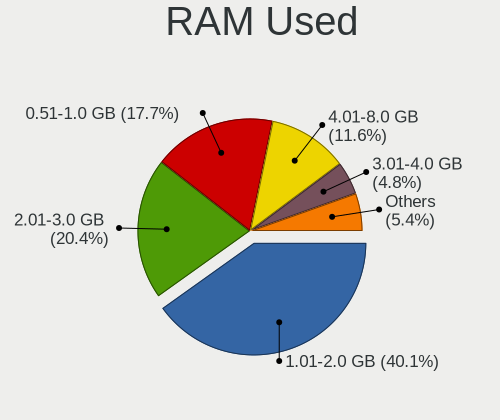
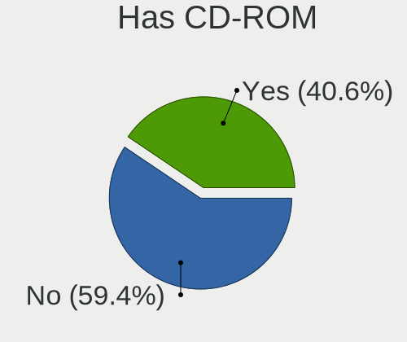
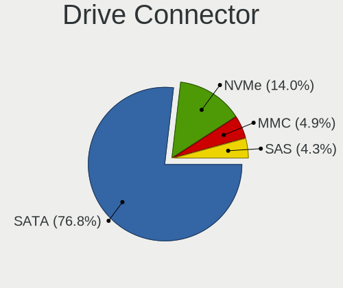
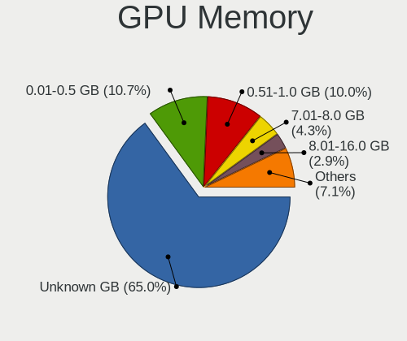
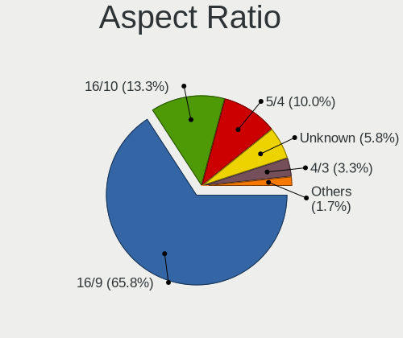
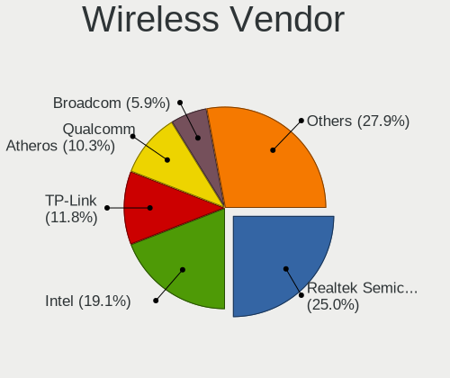
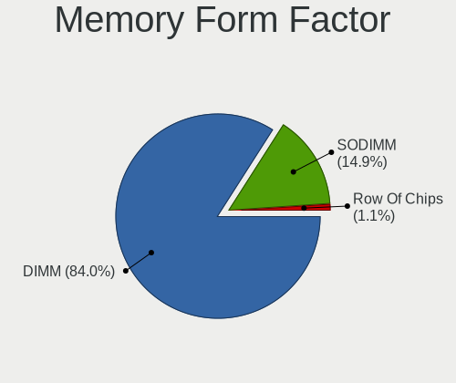
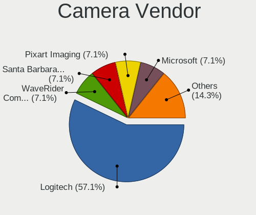

Lubuntu 22.04 - Tested Hardware & Statistics (Desktops)
-------------------------------------------------------

A project to collect tested hardware configurations for Lubuntu 22.04.

Anyone can contribute to this report by the [hw-probe](https://github.com/linuxhw/hw-probe) tool:

    sudo -E hw-probe -all -upload

Please contribute! Especially if your hardware is rare.

Contents
--------

* [ Test Cases ](#test-cases)

* [ System ](#system)
  - [ Kernel                   ](#kernel)
  - [ Kernel Family            ](#kernel-family)
  - [ Kernel Major Ver.        ](#kernel-major-ver)
  - [ Arch                     ](#arch)
  - [ DE                       ](#de)
  - [ Display Server           ](#display-server)
  - [ Display Manager          ](#display-manager)
  - [ OS Lang                  ](#os-lang)
  - [ Boot Mode                ](#boot-mode)
  - [ Filesystem               ](#filesystem)
  - [ Part. scheme             ](#part-scheme)
  - [ Dual Boot with Linux/BSD ](#dual-boot-with-linuxbsd)
  - [ Dual Boot (Win)          ](#dual-boot-win)

* [ Board ](#board)
  - [ Vendor                   ](#vendor)
  - [ Model                    ](#model)
  - [ Model Family             ](#model-family)
  - [ MFG Year                 ](#mfg-year)
  - [ Form Factor              ](#form-factor)
  - [ Secure Boot              ](#secure-boot)
  - [ Coreboot                 ](#coreboot)
  - [ RAM Size                 ](#ram-size)
  - [ RAM Used                 ](#ram-used)
  - [ Total Drives             ](#total-drives)
  - [ Has CD-ROM               ](#has-cd-rom)
  - [ Has Ethernet             ](#has-ethernet)
  - [ Has WiFi                 ](#has-wifi)
  - [ Has Bluetooth            ](#has-bluetooth)

* [ Location ](#location)
  - [ Country                  ](#country)
  - [ City                     ](#city)

* [ Drives ](#drives)
  - [ Drive Vendor             ](#drive-vendor)
  - [ Drive Model              ](#drive-model)
  - [ HDD Vendor               ](#hdd-vendor)
  - [ SSD Vendor               ](#ssd-vendor)
  - [ Drive Kind               ](#drive-kind)
  - [ Drive Connector          ](#drive-connector)
  - [ Drive Size               ](#drive-size)
  - [ Space Total              ](#space-total)
  - [ Space Used               ](#space-used)
  - [ Malfunc. Drives          ](#malfunc-drives)
  - [ Malfunc. Drive Vendor    ](#malfunc-drive-vendor)
  - [ Malfunc. HDD Vendor      ](#malfunc-hdd-vendor)
  - [ Malfunc. Drive Kind      ](#malfunc-drive-kind)
  - [ Failed Drives            ](#failed-drives)
  - [ Failed Drive Vendor      ](#failed-drive-vendor)
  - [ Drive Status             ](#drive-status)

* [ Storage controller ](#storage-controller)
  - [ Storage Vendor           ](#storage-vendor)
  - [ Storage Model            ](#storage-model)
  - [ Storage Kind             ](#storage-kind)

* [ Processor ](#processor)
  - [ CPU Vendor               ](#cpu-vendor)
  - [ CPU Model                ](#cpu-model)
  - [ CPU Model Family         ](#cpu-model-family)
  - [ CPU Cores                ](#cpu-cores)
  - [ CPU Sockets              ](#cpu-sockets)
  - [ CPU Threads              ](#cpu-threads)
  - [ CPU Op-Modes             ](#cpu-op-modes)
  - [ CPU Microcode            ](#cpu-microcode)
  - [ CPU Microarch            ](#cpu-microarch)

* [ Graphics ](#graphics)
  - [ GPU Vendor               ](#gpu-vendor)
  - [ GPU Model                ](#gpu-model)
  - [ GPU Combo                ](#gpu-combo)
  - [ GPU Driver               ](#gpu-driver)
  - [ GPU Memory               ](#gpu-memory)

* [ Monitor ](#monitor)
  - [ Monitor Vendor           ](#monitor-vendor)
  - [ Monitor Model            ](#monitor-model)
  - [ Monitor Resolution       ](#monitor-resolution)
  - [ Monitor Diagonal         ](#monitor-diagonal)
  - [ Monitor Width            ](#monitor-width)
  - [ Aspect Ratio             ](#aspect-ratio)
  - [ Monitor Area             ](#monitor-area)
  - [ Pixel Density            ](#pixel-density)
  - [ Multiple Monitors        ](#multiple-monitors)

* [ Network ](#network)
  - [ Net Controller Vendor    ](#net-controller-vendor)
  - [ Net Controller Model     ](#net-controller-model)
  - [ Wireless Vendor          ](#wireless-vendor)
  - [ Wireless Model           ](#wireless-model)
  - [ Ethernet Vendor          ](#ethernet-vendor)
  - [ Ethernet Model           ](#ethernet-model)
  - [ Net Controller Kind      ](#net-controller-kind)
  - [ Used Controller          ](#used-controller)
  - [ NICs                     ](#nics)
  - [ IPv6                     ](#ipv6)

* [ Bluetooth ](#bluetooth)
  - [ Bluetooth Vendor         ](#bluetooth-vendor)
  - [ Bluetooth Model          ](#bluetooth-model)

* [ Sound ](#sound)
  - [ Sound Vendor             ](#sound-vendor)
  - [ Sound Model              ](#sound-model)

* [ Memory ](#memory)
  - [ Memory Vendor            ](#memory-vendor)
  - [ Memory Model             ](#memory-model)
  - [ Memory Kind              ](#memory-kind)
  - [ Memory Form Factor       ](#memory-form-factor)
  - [ Memory Size              ](#memory-size)
  - [ Memory Speed             ](#memory-speed)

* [ Printers & scanners ](#printers--scanners)
  - [ Printer Vendor           ](#printer-vendor)
  - [ Printer Model            ](#printer-model)
  - [ Scanner Vendor           ](#scanner-vendor)
  - [ Scanner Model            ](#scanner-model)

* [ Camera ](#camera)
  - [ Camera Vendor            ](#camera-vendor)
  - [ Camera Model             ](#camera-model)

* [ Security ](#security)
  - [ Fingerprint Vendor       ](#fingerprint-vendor)
  - [ Fingerprint Model        ](#fingerprint-model)
  - [ Chipcard Vendor          ](#chipcard-vendor)
  - [ Chipcard Model           ](#chipcard-model)

* [ Unsupported ](#unsupported)
  - [ Unsupported Devices      ](#unsupported-devices)
  - [ Unsupported Device Types ](#unsupported-device-types)

Test Cases
----------

Total: 88

| Vendor        | Model                       | Probe                                                      | Date         |
|---------------|-----------------------------|------------------------------------------------------------|--------------|
| MSI           | B550-A PRO                  | [f243351def](https://linux-hardware.org/?probe=f243351def) | Mar 31, 2023 |
| YANYU         | ITX-S192                    | [0d2fb6a8d7](https://linux-hardware.org/?probe=0d2fb6a8d7) | Mar 27, 2023 |
| Pegatron      | Acacia                      | [4ce0966b14](https://linux-hardware.org/?probe=4ce0966b14) | Mar 26, 2023 |
| Pegatron      | Acacia                      | [4faa2a52d3](https://linux-hardware.org/?probe=4faa2a52d3) | Mar 26, 2023 |
| Gigabyte      | MJPLNBB-00                  | [e8c31757e0](https://linux-hardware.org/?probe=e8c31757e0) | Mar 12, 2023 |
| Positivo      | P5VD2-MX                    | [50b7084313](https://linux-hardware.org/?probe=50b7084313) | Mar 12, 2023 |
| BANGHO        | LITE E34                    | [39f7b525e2](https://linux-hardware.org/?probe=39f7b525e2) | Mar 10, 2023 |
| Gigabyte      | B360M DS3H                  | [3710f0f407](https://linux-hardware.org/?probe=3710f0f407) | Mar 07, 2023 |
| Pegatron      | 2AD5                        | [3356f97e00](https://linux-hardware.org/?probe=3356f97e00) | Mar 06, 2023 |
| Pegatron      | 2AD5                        | [86b939ac1a](https://linux-hardware.org/?probe=86b939ac1a) | Mar 03, 2023 |
| ASRock        | Z87 Extreme4                | [d085a259d5](https://linux-hardware.org/?probe=d085a259d5) | Mar 03, 2023 |
| Intel         | X79 V2.72A                  | [ae4efdfbc5](https://linux-hardware.org/?probe=ae4efdfbc5) | Mar 02, 2023 |
| Pegatron      | 2AD5                        | [0f487c3a2a](https://linux-hardware.org/?probe=0f487c3a2a) | Feb 26, 2023 |
| Pegatron      | 2AD5                        | [4c68f5ea84](https://linux-hardware.org/?probe=4c68f5ea84) | Feb 25, 2023 |
| MSI           | MS-7267                     | [0b89f039c1](https://linux-hardware.org/?probe=0b89f039c1) | Feb 17, 2023 |
| ECS           | G41T-M7                     | [3308b85e2f](https://linux-hardware.org/?probe=3308b85e2f) | Feb 15, 2023 |
| ASUSTek       | M5A78L-M LX3                | [c7374801ac](https://linux-hardware.org/?probe=c7374801ac) | Feb 13, 2023 |
| Dell          | 0FPP7F A00                  | [0a67b25026](https://linux-hardware.org/?probe=0a67b25026) | Feb 11, 2023 |
| MSI           | B550-A PRO                  | [55e2abbd96](https://linux-hardware.org/?probe=55e2abbd96) | Feb 04, 2023 |
| MSI           | MPG X570 GAMING EDGE WIF... | [4f6655087b](https://linux-hardware.org/?probe=4f6655087b) | Feb 03, 2023 |
| MSI           | MS-7032                     | [7b481f4c8c](https://linux-hardware.org/?probe=7b481f4c8c) | Jan 25, 2023 |
| ASUSTek       | TUF B450-PRO GAMING         | [27ea4205e5](https://linux-hardware.org/?probe=27ea4205e5) | Jan 22, 2023 |
| NEC Comput... | ECS-945G                    | [8226ffab22](https://linux-hardware.org/?probe=8226ffab22) | Jan 14, 2023 |
| MSI           | K9A2VM                      | [98ce1d06ad](https://linux-hardware.org/?probe=98ce1d06ad) | Jan 14, 2023 |
| ASRock        | ION3D-HT                    | [48707e3794](https://linux-hardware.org/?probe=48707e3794) | Jan 12, 2023 |
| MSI           | A320M-A PRO                 | [e8147a271c](https://linux-hardware.org/?probe=e8147a271c) | Jan 06, 2023 |
| ASUSTek       | M5A97 PRO                   | [7921dc0197](https://linux-hardware.org/?probe=7921dc0197) | Jan 05, 2023 |
| Positivo      | POS-AG31AP                  | [a0ef7524c6](https://linux-hardware.org/?probe=a0ef7524c6) | Jan 02, 2023 |
| Positivo      | POS-AG31AP                  | [4cc8fbf002](https://linux-hardware.org/?probe=4cc8fbf002) | Jan 02, 2023 |
| HP            | 21B4 A01                    | [cdc9730e81](https://linux-hardware.org/?probe=cdc9730e81) | Dec 31, 2022 |
| ZOTAC         | NM10                        | [98b6981431](https://linux-hardware.org/?probe=98b6981431) | Dec 21, 2022 |
| ASUSTek       | ROG STRIX B450-F GAMING ... | [5c437c961e](https://linux-hardware.org/?probe=5c437c961e) | Dec 13, 2022 |
| ASUSTek       | M4A785TD-V EVO              | [88e60fc0ba](https://linux-hardware.org/?probe=88e60fc0ba) | Dec 04, 2022 |
| ASUSTek       | M4A87TD/USB3                | [e38a783ce1](https://linux-hardware.org/?probe=e38a783ce1) | Nov 28, 2022 |
| Intel         | BTC-T37                     | [f52a08ae38](https://linux-hardware.org/?probe=f52a08ae38) | Nov 25, 2022 |
| MSI           | A520M-A PRO                 | [8db2bc8883](https://linux-hardware.org/?probe=8db2bc8883) | Nov 25, 2022 |
| Unknown       | Unknown                     | [029cddbcd6](https://linux-hardware.org/?probe=029cddbcd6) | Nov 23, 2022 |
| ASUSTek       | IP4BL-ME-Oli                | [242fd5b355](https://linux-hardware.org/?probe=242fd5b355) | Nov 21, 2022 |
| ASUSTek       | EB1501P                     | [0664261b3a](https://linux-hardware.org/?probe=0664261b3a) | Nov 11, 2022 |
| ASUSTek       | EB1501P                     | [ad47bcfb8b](https://linux-hardware.org/?probe=ad47bcfb8b) | Nov 11, 2022 |
| ASRock        | FM2A88X Extreme4+           | [7596586a99](https://linux-hardware.org/?probe=7596586a99) | Nov 05, 2022 |
| ASRock        | H110M-HDV                   | [3d1fde3114](https://linux-hardware.org/?probe=3d1fde3114) | Oct 17, 2022 |
| Gigabyte      | F2A58M-HD2                  | [944509d58b](https://linux-hardware.org/?probe=944509d58b) | Oct 12, 2022 |
| Acer          | EM61SM/EM61PM               | [191540e7bc](https://linux-hardware.org/?probe=191540e7bc) | Oct 12, 2022 |
| Acer          | EM61SM/EM61PM               | [fb2dd76511](https://linux-hardware.org/?probe=fb2dd76511) | Oct 10, 2022 |
| Fujitsu       | D3003-D1 S26361-D3003-D1    | [afba95481a](https://linux-hardware.org/?probe=afba95481a) | Oct 09, 2022 |
| HP            | 0B4Ch D                     | [1b409fc1f6](https://linux-hardware.org/?probe=1b409fc1f6) | Oct 01, 2022 |
| HP            | 0B4Ch D                     | [ccc7fe3103](https://linux-hardware.org/?probe=ccc7fe3103) | Oct 01, 2022 |
| Dell          | 0R849J A00                  | [cf2069932e](https://linux-hardware.org/?probe=cf2069932e) | Sep 26, 2022 |
| Dell          | 09M8Y8 A01                  | [aa3088ed0e](https://linux-hardware.org/?probe=aa3088ed0e) | Sep 22, 2022 |
| MSI           | B450-A PRO MAX              | [89fad64303](https://linux-hardware.org/?probe=89fad64303) | Sep 20, 2022 |
| Gigabyte      | G31M-S2C                    | [f7f3a2e7c8](https://linux-hardware.org/?probe=f7f3a2e7c8) | Sep 17, 2022 |
| AMI           | Cherry Trail CR             | [1c131a1acb](https://linux-hardware.org/?probe=1c131a1acb) | Sep 15, 2022 |
| Dell          | 0J584C A00                  | [de442f1c61](https://linux-hardware.org/?probe=de442f1c61) | Sep 01, 2022 |
| Gigabyte      | G31M-S2C                    | [61a4780992](https://linux-hardware.org/?probe=61a4780992) | Aug 30, 2022 |
| Gigabyte      | G31M-S2C                    | [8beed8e261](https://linux-hardware.org/?probe=8beed8e261) | Aug 30, 2022 |
| MSI           | Z590-A PRO                  | [c74bbc2f61](https://linux-hardware.org/?probe=c74bbc2f61) | Aug 21, 2022 |
| MSI           | Z170A GAMING M3             | [e0834224d7](https://linux-hardware.org/?probe=e0834224d7) | Aug 16, 2022 |
| ASRock        | G41M-VS3                    | [16a2e0ab5d](https://linux-hardware.org/?probe=16a2e0ab5d) | Aug 09, 2022 |
| HP            | 8768 A                      | [2ee49e3506](https://linux-hardware.org/?probe=2ee49e3506) | Aug 07, 2022 |
| Lenovo        | BRASWELL SDK0J40697 WIN ... | [f601e2f557](https://linux-hardware.org/?probe=f601e2f557) | Aug 05, 2022 |
| ASRock        | G41M-VS3                    | [16c2b30680](https://linux-hardware.org/?probe=16c2b30680) | Aug 04, 2022 |
| Acer          | EG31M R01-A3                | [c5b4092eb4](https://linux-hardware.org/?probe=c5b4092eb4) | Aug 04, 2022 |
| Dell          | 0WR7PY A03                  | [0cabe39a74](https://linux-hardware.org/?probe=0cabe39a74) | Jul 27, 2022 |
| Dell          | 0X8582                      | [b52bb428f4](https://linux-hardware.org/?probe=b52bb428f4) | Jul 26, 2022 |
| AMI           | Cherry Trail CR             | [6463c26211](https://linux-hardware.org/?probe=6463c26211) | Jul 25, 2022 |
| ASUSTek       | M5A78L LE                   | [4ade852983](https://linux-hardware.org/?probe=4ade852983) | Jul 23, 2022 |
| Dell          | 0X8582                      | [ab2bf3496e](https://linux-hardware.org/?probe=ab2bf3496e) | Jul 20, 2022 |
| ASRock        | A75M-HVS                    | [c88ac89032](https://linux-hardware.org/?probe=c88ac89032) | Jul 20, 2022 |
| Dell          | 0X8582                      | [5b8458f200](https://linux-hardware.org/?probe=5b8458f200) | Jul 19, 2022 |
| MSI           | X570-A PRO                  | [84b1994696](https://linux-hardware.org/?probe=84b1994696) | Jul 16, 2022 |
| HP            | 1495                        | [32ea18bc68](https://linux-hardware.org/?probe=32ea18bc68) | Jul 06, 2022 |
| HP            | 1495                        | [6300d25ff0](https://linux-hardware.org/?probe=6300d25ff0) | Jul 04, 2022 |
| MSI           | 760GM-P23                   | [ff0f44e63c](https://linux-hardware.org/?probe=ff0f44e63c) | Jun 26, 2022 |
| Dell          | 0VRWRC A00                  | [fe159bf237](https://linux-hardware.org/?probe=fe159bf237) | Jun 26, 2022 |
| ASUSTek       | M4N78-AM                    | [f98db3efe8](https://linux-hardware.org/?probe=f98db3efe8) | Jun 22, 2022 |
| Lenovo        | SHARKBAY SDK0E50510 PRO     | [474c946289](https://linux-hardware.org/?probe=474c946289) | Jun 17, 2022 |
| ASUSTek       | M4N78-AM                    | [d7dddc4270](https://linux-hardware.org/?probe=d7dddc4270) | Jun 16, 2022 |
| ASUSTek       | PRIME X370-A                | [bd1889b281](https://linux-hardware.org/?probe=bd1889b281) | Jun 06, 2022 |
| Unknown       | Unknown                     | [b64c215325](https://linux-hardware.org/?probe=b64c215325) | May 30, 2022 |
| Unknown       | Unknown                     | [aa6db2ed41](https://linux-hardware.org/?probe=aa6db2ed41) | May 23, 2022 |
| Unknown       | HX90                        | [22dac34b7b](https://linux-hardware.org/?probe=22dac34b7b) | May 21, 2022 |
| Unknown       | Unknown                     | [1aba67a1ac](https://linux-hardware.org/?probe=1aba67a1ac) | May 15, 2022 |
| Pegatron      | VIOLET6                     | [dbbdea4231](https://linux-hardware.org/?probe=dbbdea4231) | May 12, 2022 |
| Dell          | 02YYK5 A01                  | [19dd091f8b](https://linux-hardware.org/?probe=19dd091f8b) | May 01, 2022 |
| ZOTAC         | NM10                        | [b2983fdd9d](https://linux-hardware.org/?probe=b2983fdd9d) | Apr 15, 2022 |
| Unknown       | Unknown                     | [4de543bc53](https://linux-hardware.org/?probe=4de543bc53) | Apr 03, 2022 |
| ASUSTek       | PRIME B350M-E               | [70f555009e](https://linux-hardware.org/?probe=70f555009e) | Feb 18, 2022 |

System
------

Kernel
------

Version of the Linux kernel

| Version                     | Desktops | Percent |
|-----------------------------|----------|---------|
| 5.15.0-43-generic           | 11       | 14.67%  |
| 5.15.0-60-generic           | 5        | 6.67%   |
| 5.15.0-41-generic           | 5        | 6.67%   |
| 5.15.0-56-generic           | 4        | 5.33%   |
| 5.15.0-47-generic           | 4        | 5.33%   |
| 5.15.0-25-generic           | 4        | 5.33%   |
| 5.15.0-67-generic           | 3        | 4%      |
| 5.15.0-48-generic           | 3        | 4%      |
| 5.15.0-40-generic           | 3        | 4%      |
| 5.15.0-39-generic           | 3        | 4%      |
| 5.19.0-35-generic           | 2        | 2.67%   |
| 5.19.0-32-generic           | 2        | 2.67%   |
| 5.15.0-53-generic           | 2        | 2.67%   |
| 5.15.0-52-generic           | 2        | 2.67%   |
| 5.15.0-50-generic           | 2        | 2.67%   |
| 5.15.0-46-generic           | 2        | 2.67%   |
| 5.15.0-30-generic           | 2        | 2.67%   |
| 5.15.0-27-generic           | 2        | 2.67%   |
| 6.2.8-x64v3-xanmod1         | 1        | 1.33%   |
| 6.1.0-custom                | 1        | 1.33%   |
| 6.0.8-060008-generic        | 1        | 1.33%   |
| 6.0.14                      | 1        | 1.33%   |
| 5.19.0-16.2-liquorix-amd64  | 1        | 1.33%   |
| 5.15.0-59-lowlatency        | 1        | 1.33%   |
| 5.15.0-58-lowlatency        | 1        | 1.33%   |
| 5.15.0-58-generic           | 1        | 1.33%   |
| 5.15.0-57-generic           | 1        | 1.33%   |
| 5.15.0-41-lowlatency        | 1        | 1.33%   |
| 5.15.0-362206031516-generic | 1        | 1.33%   |
| 5.15.0-35-generic           | 1        | 1.33%   |
| 5.15.0-23-generic           | 1        | 1.33%   |
| 5.15.0-18-generic           | 1        | 1.33%   |

Kernel Family
-------------

Linux kernel without a distro release

| Version | Desktops | Percent |
|---------|----------|---------|
| 5.15.0  | 63       | 87.5%   |
| 5.19.0  | 5        | 6.94%   |
| 6.2.8   | 1        | 1.39%   |
| 6.1.0   | 1        | 1.39%   |
| 6.0.8   | 1        | 1.39%   |
| 6.0.14  | 1        | 1.39%   |

Kernel Major Ver.
-----------------

Linux kernel major version

| Version | Desktops | Percent |
|---------|----------|---------|
| 5.15    | 63       | 87.5%   |
| 5.19    | 5        | 6.94%   |
| 6.0     | 2        | 2.78%   |
| 6.2     | 1        | 1.39%   |
| 6.1     | 1        | 1.39%   |

Arch
----

OS architecture (x86_64, i586, etc.)

| Name   | Desktops | Percent |
|--------|----------|---------|
| x86_64 | 70       | 100%    |

DE
--

Desktop Environment

| Name | Desktops | Percent |
|------|----------|---------|
| LXQt | 67       | 95.71%  |
| LXDE | 2        | 2.86%   |
| XFCE | 1        | 1.43%   |

Display Server
--------------

X11 or Wayland

| Name        | Desktops | Percent |
|-------------|----------|---------|
| X11         | 66       | 91.67%  |
| Tty         | 4        | 5.56%   |
| Wayland     | 1        | 1.39%   |
| Unspecified | 1        | 1.39%   |

Display Manager
---------------

SDDM, LightDM, etc.

| Name    | Desktops | Percent |
|---------|----------|---------|
| SDDM    | 60       | 85.71%  |
| LightDM | 4        | 5.71%   |
| Unknown | 3        | 4.29%   |
| XDM     | 1        | 1.43%   |
| SLiM    | 1        | 1.43%   |
| LXDM    | 1        | 1.43%   |

OS Lang
-------

Language

| Lang  | Desktops | Percent |
|-------|----------|---------|
| en_US | 18       | 25.71%  |
| fr_FR | 11       | 15.71%  |
| de_DE | 7        | 10%     |
| it_IT | 5        | 7.14%   |
| es_ES | 5        | 7.14%   |
| en_GB | 4        | 5.71%   |
| es_AR | 3        | 4.29%   |
| pt_BR | 2        | 2.86%   |
| es_CR | 2        | 2.86%   |
| C     | 2        | 2.86%   |
| tr_TR | 1        | 1.43%   |
| sv_SE | 1        | 1.43%   |
| ru_UA | 1        | 1.43%   |
| pl_PL | 1        | 1.43%   |
| nl_BE | 1        | 1.43%   |
| es_PE | 1        | 1.43%   |
| es_MX | 1        | 1.43%   |
| en_AU | 1        | 1.43%   |
| en_AG | 1        | 1.43%   |
| el_GR | 1        | 1.43%   |
| cv_RU | 1        | 1.43%   |

Boot Mode
---------

EFI or BIOS

| Mode | Desktops | Percent |
|------|----------|---------|
| BIOS | 51       | 72.86%  |
| EFI  | 19       | 27.14%  |

Filesystem
----------

Type of filesystem

| Type    | Desktops | Percent |
|---------|----------|---------|
| Ext4    | 66       | 94.29%  |
| Overlay | 2        | 2.86%   |
| XXX4    | 1        | 1.43%   |
| Btrfs   | 1        | 1.43%   |

Part. scheme
------------

Scheme of partitioning

| Type    | Desktops | Percent |
|---------|----------|---------|
| GPT     | 29       | 41.43%  |
| MBR     | 23       | 32.86%  |
| Unknown | 18       | 25.71%  |

Dual Boot with Linux/BSD
------------------------

Hosting more than one Linux/BSD

| Dual boot | Desktops | Percent |
|-----------|----------|---------|
| No        | 58       | 82.86%  |
| Yes       | 12       | 17.14%  |

Dual Boot (Win)
---------------

Hosting Linux and Windows

| Dual boot | Desktops | Percent |
|-----------|----------|---------|
| No        | 40       | 57.14%  |
| Yes       | 30       | 42.86%  |

Board
-----

Vendor
------

Motherboard manufacturer

| Name                | Desktops | Percent |
|---------------------|----------|---------|
| MSI                 | 12       | 17.14%  |
| ASUSTek Computer    | 12       | 17.14%  |
| Dell                | 9        | 12.86%  |
| ASRock              | 6        | 8.57%   |
| Gigabyte Technology | 5        | 7.14%   |
| Hewlett-Packard     | 4        | 5.71%   |
| Pegatron            | 3        | 4.29%   |
| Unknown             | 3        | 4.29%   |
| Positivo            | 2        | 2.86%   |
| Lenovo              | 2        | 2.86%   |
| Intel               | 2        | 2.86%   |
| AMI                 | 2        | 2.86%   |
| Acer                | 2        | 2.86%   |
| ZOTAC               | 1        | 1.43%   |
| YANYU               | 1        | 1.43%   |
| NEC Computers       | 1        | 1.43%   |
| Fujitsu             | 1        | 1.43%   |
| ECS                 | 1        | 1.43%   |
| BANGHO              | 1        | 1.43%   |

Model
-----

Motherboard model

| Name                                   | Desktops | Percent |
|----------------------------------------|----------|---------|
| Unknown                                | 3        | 4.29%   |
| MSI MS-7C37                            | 2        | 2.86%   |
| Dell Dimension 9100                    | 2        | 2.86%   |
| ZOTAC NM10                             | 1        | 1.43%   |
| YANYU ITX-S192                         | 1        | 1.43%   |
| Positivo POS-AG31AP                    | 1        | 1.43%   |
| Positivo P5VD2-MX                      | 1        | 1.43%   |
| Pegatron NC689AA-ABA s3700y            | 1        | 1.43%   |
| Pegatron h8-1350ef                     | 1        | 1.43%   |
| Pegatron AY748AA-ABA p6320y            | 1        | 1.43%   |
| NEC Computers ECS-945G                 | 1        | 1.43%   |
| MSI MS-7D09                            | 1        | 1.43%   |
| MSI MS-7C96                            | 1        | 1.43%   |
| MSI MS-7C56                            | 1        | 1.43%   |
| MSI MS-7C51                            | 1        | 1.43%   |
| MSI MS-7B86                            | 1        | 1.43%   |
| MSI MS-7978                            | 1        | 1.43%   |
| MSI MS-7641                            | 1        | 1.43%   |
| MSI MS-7501                            | 1        | 1.43%   |
| MSI MS-7267                            | 1        | 1.43%   |
| MSI MS-7032                            | 1        | 1.43%   |
| Lenovo ThinkCentre M83 10ANCTO1WW      | 1        | 1.43%   |
| Lenovo ThinkCentre M600 10KGS09S00     | 1        | 1.43%   |
| Intel X79 V2.72A                       | 1        | 1.43%   |
| Intel BTC-T37                          | 1        | 1.43%   |
| HP Z400 Workstation                    | 1        | 1.43%   |
| HP t620 Quad Core TC                   | 1        | 1.43%   |
| HP Slim Desktop S01-pF1xxx             | 1        | 1.43%   |
| HP Compaq 8200 ELITE SMALL FORM FACTOR | 1        | 1.43%   |
| Gigabyte GB-BMCE-5105                  | 1        | 1.43%   |
| Gigabyte G31M-S2C                      | 1        | 1.43%   |
| Gigabyte G31M-ES2C                     | 1        | 1.43%   |
| Gigabyte F2A58M-HD2                    | 1        | 1.43%   |
| Gigabyte B360M-DS3H                    | 1        | 1.43%   |
| Fujitsu FUTRO S900                     | 1        | 1.43%   |
| ECS G41T-M7                            | 1        | 1.43%   |
| Dell Vostro 410                        | 1        | 1.43%   |
| Dell Vostro 3670                       | 1        | 1.43%   |
| Dell Studio XPS 435MT                  | 1        | 1.43%   |
| Dell Precision T3610                   | 1        | 1.43%   |

Model Family
------------

Motherboard model prefix

| Name                   | Desktops | Percent |
|------------------------|----------|---------|
| Dell OptiPlex          | 3        | 4.29%   |
| Unknown                | 3        | 4.29%   |
| MSI MS-7C37            | 2        | 2.86%   |
| Lenovo ThinkCentre     | 2        | 2.86%   |
| Dell Vostro            | 2        | 2.86%   |
| Dell Dimension         | 2        | 2.86%   |
| ASUS PRIME             | 2        | 2.86%   |
| ZOTAC NM10             | 1        | 1.43%   |
| YANYU ITX-S192         | 1        | 1.43%   |
| Positivo POS-AG31AP    | 1        | 1.43%   |
| Positivo P5VD2-MX      | 1        | 1.43%   |
| Pegatron NC689AA-ABA   | 1        | 1.43%   |
| Pegatron h8-1350ef     | 1        | 1.43%   |
| Pegatron AY748AA-ABA   | 1        | 1.43%   |
| NEC Computers ECS-945G | 1        | 1.43%   |
| MSI MS-7D09            | 1        | 1.43%   |
| MSI MS-7C96            | 1        | 1.43%   |
| MSI MS-7C56            | 1        | 1.43%   |
| MSI MS-7C51            | 1        | 1.43%   |
| MSI MS-7B86            | 1        | 1.43%   |
| MSI MS-7978            | 1        | 1.43%   |
| MSI MS-7641            | 1        | 1.43%   |
| MSI MS-7501            | 1        | 1.43%   |
| MSI MS-7267            | 1        | 1.43%   |
| MSI MS-7032            | 1        | 1.43%   |
| Intel X79              | 1        | 1.43%   |
| Intel BTC-T37          | 1        | 1.43%   |
| HP Z400                | 1        | 1.43%   |
| HP t620                | 1        | 1.43%   |
| HP Slim                | 1        | 1.43%   |
| HP Compaq              | 1        | 1.43%   |
| Gigabyte GB-BMCE-5105  | 1        | 1.43%   |
| Gigabyte G31M-S2C      | 1        | 1.43%   |
| Gigabyte G31M-ES2C     | 1        | 1.43%   |
| Gigabyte F2A58M-HD2    | 1        | 1.43%   |
| Gigabyte B360M-DS3H    | 1        | 1.43%   |
| Fujitsu FUTRO          | 1        | 1.43%   |
| ECS G41T-M7            | 1        | 1.43%   |
| Dell Studio            | 1        | 1.43%   |
| Dell Precision         | 1        | 1.43%   |

MFG Year
--------

Motherboard manufacture year

| Year | Desktops | Percent |
|------|----------|---------|
| 2008 | 7        | 10%     |
| 2019 | 6        | 8.57%   |
| 2010 | 6        | 8.57%   |
| 2020 | 5        | 7.14%   |
| 2017 | 5        | 7.14%   |
| 2011 | 5        | 7.14%   |
| 2007 | 5        | 7.14%   |
| 2021 | 4        | 5.71%   |
| 2018 | 4        | 5.71%   |
| 2015 | 4        | 5.71%   |
| 2014 | 4        | 5.71%   |
| 2009 | 4        | 5.71%   |
| 2013 | 3        | 4.29%   |
| 2016 | 2        | 2.86%   |
| 2012 | 2        | 2.86%   |
| 2006 | 2        | 2.86%   |
| 2022 | 1        | 1.43%   |
| 2001 | 1        | 1.43%   |

Form Factor
-----------

Physical design of the computer

| Name    | Desktops | Percent |
|---------|----------|---------|
| Desktop | 70       | 100%    |

Secure Boot
-----------

Enabled or disabled

| State    | Desktops | Percent |
|----------|----------|---------|
| Disabled | 69       | 98.57%  |
| Enabled  | 1        | 1.43%   |

Coreboot
--------

Have coreboot on board

| Used | Desktops | Percent |
|------|----------|---------|
| No   | 70       | 100%    |

RAM Size
--------

Total RAM memory

| Size in GB  | Desktops | Percent |
|-------------|----------|---------|
| 3.01-4.0    | 14       | 19.72%  |
| 4.01-8.0    | 13       | 18.31%  |
| 16.01-24.0  | 12       | 16.9%   |
| 8.01-16.0   | 10       | 14.08%  |
| 32.01-64.0  | 8        | 11.27%  |
| 1.01-2.0    | 6        | 8.45%   |
| 2.01-3.0    | 3        | 4.23%   |
| 0.51-1.0    | 3        | 4.23%   |
| 64.01-256.0 | 2        | 2.82%   |

RAM Used
--------

Used RAM memory

| Used GB   | Desktops | Percent |
|-----------|----------|---------|
| 1.01-2.0  | 30       | 41.67%  |
| 0.51-1.0  | 18       | 25%     |
| 2.01-3.0  | 13       | 18.06%  |
| 4.01-8.0  | 7        | 9.72%   |
| 3.01-4.0  | 2        | 2.78%   |
| 8.01-16.0 | 1        | 1.39%   |
| 0.01-0.5  | 1        | 1.39%   |

Total Drives
------------

Number of drives on board

| Drives | Desktops | Percent |
|--------|----------|---------|
| 1      | 35       | 50%     |
| 2      | 23       | 32.86%  |
| 3      | 4        | 5.71%   |
| 5      | 2        | 2.86%   |
| 4      | 2        | 2.86%   |
| 12     | 1        | 1.43%   |
| 7      | 1        | 1.43%   |
| 6      | 1        | 1.43%   |
| 0      | 1        | 1.43%   |

Has CD-ROM
----------

Has CD-ROM on board

| Presented | Desktops | Percent |
|-----------|----------|---------|
| No        | 42       | 60%     |
| Yes       | 28       | 40%     |

Has Ethernet
------------

Has Ethernet on board

| Presented | Desktops | Percent |
|-----------|----------|---------|
| Yes       | 69       | 98.57%  |
| No        | 1        | 1.43%   |

Has WiFi
--------

Has WiFi module

| Presented | Desktops | Percent |
|-----------|----------|---------|
| No        | 39       | 55.71%  |
| Yes       | 31       | 44.29%  |

Has Bluetooth
-------------

Has Bluetooth module

| Presented | Desktops | Percent |
|-----------|----------|---------|
| No        | 57       | 80.28%  |
| Yes       | 14       | 19.72%  |

Location
--------

Country
-------

Geographic location (country)

| Country    | Desktops | Percent |
|------------|----------|---------|
| USA        | 14       | 20%     |
| France     | 11       | 15.71%  |
| Germany    | 7        | 10%     |
| Spain      | 5        | 7.14%   |
| Italy      | 5        | 7.14%   |
| Poland     | 4        | 5.71%   |
| UK         | 3        | 4.29%   |
| Brazil     | 3        | 4.29%   |
| Argentina  | 3        | 4.29%   |
| Costa Rica | 2        | 2.86%   |
| Ukraine    | 1        | 1.43%   |
| Turkey     | 1        | 1.43%   |
| Sweden     | 1        | 1.43%   |
| Romania    | 1        | 1.43%   |
| Peru       | 1        | 1.43%   |
| Mexico     | 1        | 1.43%   |
| Latvia     | 1        | 1.43%   |
| Ireland    | 1        | 1.43%   |
| Iran       | 1        | 1.43%   |
| Greece     | 1        | 1.43%   |
| Bulgaria   | 1        | 1.43%   |
| Belgium    | 1        | 1.43%   |
| Australia  | 1        | 1.43%   |

City
----

Geographic location (city)

| City                 | Desktops | Percent |
|----------------------|----------|---------|
| Paris                | 3        | 4.17%   |
| Largo                | 2        | 2.78%   |
| Heredia              | 2        | 2.78%   |
| Wetteren             | 1        | 1.39%   |
| Washington           | 1        | 1.39%   |
| Warsaw               | 1        | 1.39%   |
| Versailles           | 1        | 1.39%   |
| Varna                | 1        | 1.39%   |
| Valentigney          | 1        | 1.39%   |
| Tyler                | 1        | 1.39%   |
| Turin                | 1        | 1.39%   |
| Torrejón de Ardoz   | 1        | 1.39%   |
| Tehran               | 1        | 1.39%   |
| Tandil               | 1        | 1.39%   |
| St Louis             | 1        | 1.39%   |
| Sonico               | 1        | 1.39%   |
| Sao Paulo            | 1        | 1.39%   |
| Riverenert           | 1        | 1.39%   |
| Rio Segundo          | 1        | 1.39%   |
| Richmond             | 1        | 1.39%   |
| Resistencia          | 1        | 1.39%   |
| Port Washington      | 1        | 1.39%   |
| Palencia             | 1        | 1.39%   |
| Ostrów Wielkopolski | 1        | 1.39%   |
| Oberkotzau           | 1        | 1.39%   |
| Novo Gama            | 1        | 1.39%   |
| Notting Hill Gate    | 1        | 1.39%   |
| Nederland            | 1        | 1.39%   |
| Mostoles             | 1        | 1.39%   |
| Mobile               | 1        | 1.39%   |
| Mexico City          | 1        | 1.39%   |
| Melbourne            | 1        | 1.39%   |
| Marseille            | 1        | 1.39%   |
| Madrid               | 1        | 1.39%   |
| Lima                 | 1        | 1.39%   |
| Lebanon              | 1        | 1.39%   |
| Larissa              | 1        | 1.39%   |
| Kyiv                 | 1        | 1.39%   |
| Krakow               | 1        | 1.39%   |
| Koblenz              | 1        | 1.39%   |

Drives
------

Drive Vendor
------------

Hard drive vendors

| Vendor                    | Desktops | Drives | Percent |
|---------------------------|----------|--------|---------|
| Seagate                   | 21       | 28     | 18.58%  |
| WDC                       | 17       | 27     | 15.04%  |
| Samsung Electronics       | 17       | 22     | 15.04%  |
| Kingston                  | 8        | 9      | 7.08%   |
| Hitachi                   | 8        | 10     | 7.08%   |
| SanDisk                   | 5        | 5      | 4.42%   |
| Crucial                   | 4        | 4      | 3.54%   |
| Toshiba                   | 3        | 3      | 2.65%   |
| Maxtor                    | 2        | 2      | 1.77%   |
| HGST                      | 2        | 2      | 1.77%   |
| GOODRAM                   | 2        | 2      | 1.77%   |
| A-DATA Technology         | 2        | 2      | 1.77%   |
| WD MediaMax               | 1        | 1      | 0.88%   |
| Unknown                   | 1        | 1      | 0.88%   |
| Transcend                 | 1        | 1      | 0.88%   |
| TO Exter                  | 1        | 1      | 0.88%   |
| Team                      | 1        | 1      | 0.88%   |
| T-FORCE                   | 1        | 1      | 0.88%   |
| RSH-319                   | 1        | 1      | 0.88%   |
| PNY                       | 1        | 1      | 0.88%   |
| Patriot                   | 1        | 1      | 0.88%   |
| Micron/Crucial Technology | 1        | 2      | 0.88%   |
| LITEONIT                  | 1        | 1      | 0.88%   |
| Kston                     | 1        | 3      | 0.88%   |
| Intel                     | 1        | 1      | 0.88%   |
| HGST HUS                  | 1        | 2      | 0.88%   |
| Gigabyte Technology       | 1        | 1      | 0.88%   |
| External                  | 1        | 1      | 0.88%   |
| Emtec                     | 1        | 1      | 0.88%   |
| China                     | 1        | 1      | 0.88%   |
| BR                        | 1        | 1      | 0.88%   |
| Apricorn                  | 1        | 1      | 0.88%   |
| Apacer                    | 1        | 1      | 0.88%   |
| AMD                       | 1        | 1      | 0.88%   |

Drive Model
-----------

Hard drive models

| Model                                | Desktops | Percent |
|--------------------------------------|----------|---------|
| Seagate ST500DM002-1BD142 500GB      | 6        | 4.62%   |
| Kingston SA400S37240G 240GB SSD      | 3        | 2.31%   |
| Toshiba DT01ACA100 1TB               | 2        | 1.54%   |
| Seagate ST3120213AS 120GB            | 2        | 1.54%   |
| Seagate ST1000DM010-2EP102 1TB       | 2        | 1.54%   |
| SanDisk DF4032  32GB                 | 2        | 1.54%   |
| Samsung SSD 870 EVO 500GB            | 2        | 1.54%   |
| Samsung HD502HJ 500GB                | 2        | 1.54%   |
| WDC WDS500G2B0A-00SM50 500GB SSD     | 1        | 0.77%   |
| WDC WDS240G2G0A-00JH30 240GB SSD     | 1        | 0.77%   |
| WDC WDS100T1X0E-00AFY0 1TB           | 1        | 0.77%   |
| WDC WD800BB-00CAA1 80GB              | 1        | 0.77%   |
| WDC WD60EFRX-68L0BN1 6TB             | 1        | 0.77%   |
| WDC WD5000LUCT-63RC2Y0 500GB         | 1        | 0.77%   |
| WDC WD5000AAVS-00ZTB0 500GB          | 1        | 0.77%   |
| WDC WD5000AAKX-75U6AA0 500GB         | 1        | 0.77%   |
| WDC WD3200BPVT-80JJ5T0 320GB         | 1        | 0.77%   |
| WDC WD3200BPVT-00HXZT3 320GB         | 1        | 0.77%   |
| WDC WD3200AAJS-65M0A0 320GB          | 1        | 0.77%   |
| WDC WD3200AACS-00M6B0 320GB          | 1        | 0.77%   |
| WDC WD30EZRZ-00GXCB0 3TB             | 1        | 0.77%   |
| WDC WD2500KS-00MJB0 250GB            | 1        | 0.77%   |
| WDC WD2500AAJS-07M0A0 250GB          | 1        | 0.77%   |
| WDC WD20EZRX-00D8PB0 2TB             | 1        | 0.77%   |
| WDC WD20EZBX-00AYRA0 2TB             | 1        | 0.77%   |
| WDC WD2003FYYS-02W0B0 2TB            | 1        | 0.77%   |
| WDC WD10SPZX-08Z10 1TB               | 1        | 0.77%   |
| WDC WD10S21X-24R1BT0-SSHD-8GB        | 1        | 0.77%   |
| WDC WD10EZRZ-00Z5HB0 1TB             | 1        | 0.77%   |
| WDC WD10EZEX-60WN4A1 1TB             | 1        | 0.77%   |
| WDC WD10EURX-63C57Y0 1TB             | 1        | 0.77%   |
| WDC WD10EACS-00D6B1 1TB              | 1        | 0.77%   |
| WDC PC SN530 SDBPNPZ-512G-1006 512GB | 1        | 0.77%   |
| WDC PC SN530 SDBPNPZ-256G-1114 256GB | 1        | 0.77%   |
| WD MediaMax WL250GSA872 250GB        | 1        | 0.77%   |
| Unknown 032G72  32GB                 | 1        | 0.77%   |
| Transcend TS128GSSD340 128GB         | 1        | 0.77%   |
| Toshiba MK6465GSX 640GB              | 1        | 0.77%   |
| TO Exter nal USB 3.0 1TB             | 1        | 0.77%   |
| Team T253E2002T 2TB SSD              | 1        | 0.77%   |

HDD Vendor
----------

Hard disk drive vendors

| Vendor              | Desktops | Drives | Percent |
|---------------------|----------|--------|---------|
| Seagate             | 21       | 27     | 34.43%  |
| WDC                 | 15       | 22     | 24.59%  |
| Hitachi             | 8        | 10     | 13.11%  |
| Samsung Electronics | 6        | 7      | 9.84%   |
| Toshiba             | 3        | 3      | 4.92%   |
| Maxtor              | 2        | 2      | 3.28%   |
| HGST                | 2        | 2      | 3.28%   |
| WD MediaMax         | 1        | 1      | 1.64%   |
| RSH-319             | 1        | 1      | 1.64%   |
| External            | 1        | 1      | 1.64%   |
| Apricorn            | 1        | 1      | 1.64%   |

SSD Vendor
----------

Solid state drive vendors

| Vendor              | Desktops | Drives | Percent |
|---------------------|----------|--------|---------|
| Samsung Electronics | 9        | 11     | 22.5%   |
| Kingston            | 7        | 8      | 17.5%   |
| SanDisk             | 3        | 3      | 7.5%    |
| WDC                 | 2        | 2      | 5%      |
| GOODRAM             | 2        | 2      | 5%      |
| Crucial             | 2        | 2      | 5%      |
| A-DATA Technology   | 2        | 2      | 5%      |
| Transcend           | 1        | 1      | 2.5%    |
| TO Exter            | 1        | 1      | 2.5%    |
| Team                | 1        | 1      | 2.5%    |
| PNY                 | 1        | 1      | 2.5%    |
| Patriot             | 1        | 1      | 2.5%    |
| LITEONIT            | 1        | 1      | 2.5%    |
| Kston               | 1        | 3      | 2.5%    |
| Intel               | 1        | 1      | 2.5%    |
| Gigabyte Technology | 1        | 1      | 2.5%    |
| Emtec               | 1        | 1      | 2.5%    |
| China               | 1        | 1      | 2.5%    |
| BR                  | 1        | 1      | 2.5%    |
| Apacer              | 1        | 1      | 2.5%    |

Drive Kind
----------

HDD or SSD

| Kind    | Desktops | Drives | Percent |
|---------|----------|--------|---------|
| HDD     | 44       | 77     | 45.83%  |
| SSD     | 37       | 45     | 38.54%  |
| NVMe    | 11       | 14     | 11.46%  |
| MMC     | 3        | 3      | 3.13%   |
| Unknown | 1        | 3      | 1.04%   |

Drive Connector
---------------

SATA, SAS, NVMe, etc.

| Type | Desktops | Drives | Percent |
|------|----------|--------|---------|
| SATA | 64       | 118    | 78.05%  |
| NVMe | 11       | 14     | 13.41%  |
| SAS  | 4        | 7      | 4.88%   |
| MMC  | 3        | 3      | 3.66%   |

Drive Size
----------

Size of hard drive

| Size in TB | Desktops | Drives | Percent |
|------------|----------|--------|---------|
| 0.01-0.5   | 54       | 74     | 61.36%  |
| 0.51-1.0   | 16       | 23     | 18.18%  |
| 1.01-2.0   | 11       | 14     | 12.5%   |
| 2.01-3.0   | 3        | 4      | 3.41%   |
| 3.01-4.0   | 2        | 2      | 2.27%   |
| 4.01-10.0  | 2        | 5      | 2.27%   |

Space Total
-----------

Amount of disk space available on the file system

| Size in GB     | Desktops | Percent |
|----------------|----------|---------|
| 101-250        | 19       | 27.14%  |
| 251-500        | 11       | 15.71%  |
| 21-50          | 9        | 12.86%  |
| 1001-2000      | 8        | 11.43%  |
| 51-100         | 6        | 8.57%   |
| 501-1000       | 5        | 7.14%   |
| More than 3000 | 4        | 5.71%   |
| 2001-3000      | 4        | 5.71%   |
| 1-20           | 4        | 5.71%   |

Space Used
----------

Amount of used disk space

| Used GB        | Desktops | Percent |
|----------------|----------|---------|
| 1-20           | 30       | 41.67%  |
| 21-50          | 12       | 16.67%  |
| 101-250        | 7        | 9.72%   |
| 51-100         | 7        | 9.72%   |
| 501-1000       | 6        | 8.33%   |
| More than 3000 | 3        | 4.17%   |
| 251-500        | 3        | 4.17%   |
| 1001-2000      | 3        | 4.17%   |
| 2001-3000      | 1        | 1.39%   |

Malfunc. Drives
---------------

Drive models with a malfunction

| Model                               | Desktops | Drives | Percent |
|-------------------------------------|----------|--------|---------|
| WDC WD60EFRX-68L0BN1 6TB            | 1        | 2      | 7.14%   |
| WDC WD3200AACS-00M6B0 320GB         | 1        | 1      | 7.14%   |
| WDC WD2003FYYS-02W0B0 2TB           | 1        | 1      | 7.14%   |
| WDC WD10SPZX-08Z10 1TB              | 1        | 1      | 7.14%   |
| WDC WD10EZEX-60WN4A1 1TB            | 1        | 1      | 7.14%   |
| WDC WD10EACS-00D6B1 1TB             | 1        | 1      | 7.14%   |
| Toshiba MK6465GSX 640GB             | 1        | 1      | 7.14%   |
| Seagate ST500DM002-1BD142 500GB     | 1        | 1      | 7.14%   |
| Seagate ST4000DM004-2CV104 4TB      | 1        | 1      | 7.14%   |
| Seagate ST1000LM024 HN-M101MBB 1TB  | 1        | 2      | 7.14%   |
| Samsung Electronics HD161HJ 160GB   | 1        | 1      | 7.14%   |
| Maxtor 6L200M0 208GB                | 1        | 1      | 7.14%   |
| Apacer 16GB SATA Flash Drive SSD    | 1        | 1      | 7.14%   |
| A-DATA Technology SP920SS 256GB SSD | 1        | 1      | 7.14%   |

Malfunc. Drive Vendor
---------------------

Vendors of faulty drives

| Vendor              | Desktops | Drives | Percent |
|---------------------|----------|--------|---------|
| WDC                 | 4        | 7      | 33.33%  |
| Seagate             | 3        | 4      | 25%     |
| Toshiba             | 1        | 1      | 8.33%   |
| Samsung Electronics | 1        | 1      | 8.33%   |
| Maxtor              | 1        | 1      | 8.33%   |
| Apacer              | 1        | 1      | 8.33%   |
| A-DATA Technology   | 1        | 1      | 8.33%   |

Malfunc. HDD Vendor
-------------------

Vendors of faulty HDD drives

| Vendor              | Desktops | Drives | Percent |
|---------------------|----------|--------|---------|
| WDC                 | 4        | 7      | 40%     |
| Seagate             | 3        | 4      | 30%     |
| Toshiba             | 1        | 1      | 10%     |
| Samsung Electronics | 1        | 1      | 10%     |
| Maxtor              | 1        | 1      | 10%     |

Malfunc. Drive Kind
-------------------

Kinds of faulty drives

| Kind | Desktops | Drives | Percent |
|------|----------|--------|---------|
| HDD  | 9        | 14     | 81.82%  |
| SSD  | 2        | 2      | 18.18%  |

Failed Drives
-------------

Failed drive models

| Model                           | Desktops | Drives | Percent |
|---------------------------------|----------|--------|---------|
| Seagate ST3500418AS 500GB       | 1        | 1      | 33.33%  |
| Samsung Electronics SSD 980 1TB | 1        | 1      | 33.33%  |
| HGST HTS725025A7 250GB          | 1        | 1      | 33.33%  |

Failed Drive Vendor
-------------------

Failed drive vendors

| Vendor              | Desktops | Drives | Percent |
|---------------------|----------|--------|---------|
| Seagate             | 1        | 1      | 33.33%  |
| Samsung Electronics | 1        | 1      | 33.33%  |
| HGST                | 1        | 1      | 33.33%  |

Drive Status
------------

Number of failed and malfunc. drives

| Status   | Desktops | Drives | Percent |
|----------|----------|--------|---------|
| Detected | 33       | 65     | 41.77%  |
| Works    | 32       | 58     | 40.51%  |
| Malfunc  | 11       | 16     | 13.92%  |
| Failed   | 3        | 3      | 3.8%    |

Storage controller
------------------

Storage Vendor
--------------

Storage controller vendors

| Vendor                      | Desktops | Percent |
|-----------------------------|----------|---------|
| Intel                       | 39       | 43.82%  |
| AMD                         | 23       | 25.84%  |
| Samsung Electronics         | 4        | 4.49%   |
| Nvidia                      | 4        | 4.49%   |
| SanDisk                     | 3        | 3.37%   |
| Micron/Crucial Technology   | 3        | 3.37%   |
| JMicron Technology          | 3        | 3.37%   |
| ASMedia Technology          | 3        | 3.37%   |
| VIA Technologies            | 2        | 2.25%   |
| Marvell Technology Group    | 2        | 2.25%   |
| Seagate Technology          | 1        | 1.12%   |
| LSI Logic / Symbios Logic   | 1        | 1.12%   |
| Kingston Technology Company | 1        | 1.12%   |

Storage Model
-------------

Storage controller models

| Model                                                                          | Desktops | Percent |
|--------------------------------------------------------------------------------|----------|---------|
| AMD FCH SATA Controller [AHCI mode]                                            | 11       | 9.09%   |
| Intel NM10/ICH7 Family SATA Controller [IDE mode]                              | 10       | 8.26%   |
| Intel 82801G (ICH7 Family) IDE Controller                                      | 9        | 7.44%   |
| AMD SB7x0/SB8x0/SB9x0 SATA Controller [AHCI mode]                              | 5        | 4.13%   |
| AMD SB7x0/SB8x0/SB9x0 IDE Controller                                           | 5        | 4.13%   |
| Intel NM10/ICH7 Family SATA Controller [AHCI mode]                             | 4        | 3.31%   |
| Intel 8 Series/C220 Series Chipset Family 6-port SATA Controller 1 [AHCI mode] | 4        | 3.31%   |
| Intel SATA Controller [RAID mode]                                              | 3        | 2.48%   |
| ASMedia ASM1062 Serial ATA Controller                                          | 3        | 2.48%   |
| AMD SB7x0/SB8x0/SB9x0 SATA Controller [IDE mode]                               | 3        | 2.48%   |
| AMD 400 Series Chipset SATA Controller                                         | 3        | 2.48%   |
| VIA VT82C586A/B/VT82C686/A/B/VT823x/A/C PIPC Bus Master IDE                    | 2        | 1.65%   |
| SanDisk WD Blue SN550 NVMe SSD                                                 | 2        | 1.65%   |
| Nvidia MCP61 SATA Controller                                                   | 2        | 1.65%   |
| Nvidia MCP61 IDE                                                               | 2        | 1.65%   |
| Micron/Crucial P2 NVMe PCIe SSD                                                | 2        | 1.65%   |
| Marvell Group 88SE9215 PCIe 2.0 x1 4-port SATA 6 Gb/s Controller               | 2        | 1.65%   |
| Intel Q170/Q150/B150/H170/H110/Z170/CM236 Chipset SATA Controller [AHCI Mode]  | 2        | 1.65%   |
| Intel Celeron/Pentium Silver Processor SATA Controller                         | 2        | 1.65%   |
| Intel C600/X79 series chipset 6-Port SATA AHCI Controller                      | 2        | 1.65%   |
| Intel 7 Series/C210 Series Chipset Family 6-port SATA Controller [AHCI mode]   | 2        | 1.65%   |
| AMD FCH IDE Controller                                                         | 2        | 1.65%   |
| AMD 500 Series Chipset SATA Controller                                         | 2        | 1.65%   |
| VIA VIA VT6420 SATA RAID Controller                                            | 1        | 0.83%   |
| VIA Serial ATA Controller                                                      | 1        | 0.83%   |
| Seagate FireCuda 520 SSD                                                       | 1        | 0.83%   |
| SanDisk WD PC SN810 / Black SN850 NVMe SSD                                     | 1        | 0.83%   |
| Samsung NVMe SSD Controller SM981/PM981/PM983                                  | 1        | 0.83%   |
| Samsung NVMe SSD Controller SM951/PM951                                        | 1        | 0.83%   |
| Samsung NVMe SSD Controller PM9A1/PM9A3/980PRO                                 | 1        | 0.83%   |
| Samsung NVMe SSD Controller 980                                                | 1        | 0.83%   |
| Nvidia MCP78S [GeForce 8200] SATA Controller (non-AHCI mode)                   | 1        | 0.83%   |
| Nvidia MCP78S [GeForce 8200] IDE                                               | 1        | 0.83%   |
| Nvidia MCP78S [GeForce 8200] AHCI Controller                                   | 1        | 0.83%   |
| Micron/Crucial P5 Plus NVMe PCIe SSD                                           | 1        | 0.83%   |
| LSI Logic / Symbios Logic SAS2008 PCI-Express Fusion-MPT SAS-2 [Falcon]        | 1        | 0.83%   |
| Kingston Company OM3PDP3 NVMe SSD                                              | 1        | 0.83%   |
| JMicron JMB368 IDE controller                                                  | 1        | 0.83%   |
| JMicron JMB363 SATA/IDE Controller                                             | 1        | 0.83%   |
| JMicron JMB362 SATA Controller                                                 | 1        | 0.83%   |

Storage Kind
------------

Kind of storage controller (IDE, SATA, NVMe, SAS, ...)

| Kind | Desktops | Percent |
|------|----------|---------|
| SATA | 47       | 51.09%  |
| IDE  | 29       | 31.52%  |
| NVMe | 11       | 11.96%  |
| RAID | 4        | 4.35%   |
| SAS  | 1        | 1.09%   |

Processor
---------

CPU Vendor
----------

Processor vendors

| Vendor | Desktops | Percent |
|--------|----------|---------|
| Intel  | 42       | 60%     |
| AMD    | 28       | 40%     |

CPU Model
---------

Processor models

| Model                                       | Desktops | Percent |
|---------------------------------------------|----------|---------|
| Intel Atom CPU D525 @ 1.80GHz               | 3        | 4.29%   |
| Intel Pentium Dual CPU E2140 @ 1.60GHz      | 2        | 2.86%   |
| Intel Pentium D CPU 2.80GHz                 | 2        | 2.86%   |
| Intel Core i5-8400 CPU @ 2.80GHz            | 2        | 2.86%   |
| Intel Celeron J4125 CPU @ 2.00GHz           | 2        | 2.86%   |
| AMD Ryzen 5 1600 Six-Core Processor         | 2        | 2.86%   |
| AMD Athlon 64 X2 Dual Core Processor 5000+  | 2        | 2.86%   |
| Intel Xeon CPU W3565 @ 3.20GHz              | 1        | 1.43%   |
| Intel Xeon CPU E5-2630 v2 @ 2.60GHz         | 1        | 1.43%   |
| Intel Xeon CPU E5-1607 v2 @ 3.00GHz         | 1        | 1.43%   |
| Intel Pentium Dual-Core CPU E6500 @ 2.93GHz | 1        | 1.43%   |
| Intel Pentium Dual CPU E2160 @ 1.80GHz      | 1        | 1.43%   |
| Intel Core i9-10900K CPU @ 3.70GHz          | 1        | 1.43%   |
| Intel Core i7-4770K CPU @ 3.50GHz           | 1        | 1.43%   |
| Intel Core i7 CPU 920 @ 2.67GHz             | 1        | 1.43%   |
| Intel Core i5-6600K CPU @ 3.50GHz           | 1        | 1.43%   |
| Intel Core i5-6500 CPU @ 3.20GHz            | 1        | 1.43%   |
| Intel Core i5-4590T CPU @ 2.00GHz           | 1        | 1.43%   |
| Intel Core i5-4570 CPU @ 3.20GHz            | 1        | 1.43%   |
| Intel Core i5-3470 CPU @ 3.20GHz            | 1        | 1.43%   |
| Intel Core i5-2320 CPU @ 3.00GHz            | 1        | 1.43%   |
| Intel Core i3-4170 CPU @ 3.70GHz            | 1        | 1.43%   |
| Intel Core i3-2120 CPU @ 3.30GHz            | 1        | 1.43%   |
| Intel Core i3-10105 CPU @ 3.70GHz           | 1        | 1.43%   |
| Intel Core 2 Quad CPU Q8300 @ 2.50GHz       | 1        | 1.43%   |
| Intel Core 2 Quad CPU Q6600 @ 2.40GHz       | 1        | 1.43%   |
| Intel Core 2 Duo CPU E8400 @ 3.00GHz        | 1        | 1.43%   |
| Intel Core 2 Duo CPU E7200 @ 2.53GHz        | 1        | 1.43%   |
| Intel Core 2 Duo CPU E4600 @ 2.40GHz        | 1        | 1.43%   |
| Intel Core 2 Duo CPU E4500 @ 2.20GHz        | 1        | 1.43%   |
| Intel Celeron N5105 @ 2.00GHz               | 1        | 1.43%   |
| Intel Celeron CPU N3350 @ 1.10GHz           | 1        | 1.43%   |
| Intel Celeron CPU N3010 @ 1.04GHz           | 1        | 1.43%   |
| Intel Celeron CPU J1900 @ 1.99GHz           | 1        | 1.43%   |
| Intel Celeron CPU E3300 @ 2.50GHz           | 1        | 1.43%   |
| Intel Celeron CPU 847 @ 1.10GHz             | 1        | 1.43%   |
| Intel Atom x5-Z8350 CPU @ 1.44GHz           | 1        | 1.43%   |
| Intel Atom x5-Z8300 CPU @ 1.44GHz           | 1        | 1.43%   |
| AMD Unknown Processor                       | 1        | 1.43%   |
| AMD Ryzen 9 5900HX with Radeon Graphics     | 1        | 1.43%   |

CPU Model Family
----------------

Processor model prefix

| Model                   | Desktops | Percent |
|-------------------------|----------|---------|
| Intel Core i5           | 8        | 11.43%  |
| Intel Celeron           | 8        | 11.43%  |
| Intel Atom              | 5        | 7.14%   |
| AMD Ryzen 5             | 5        | 7.14%   |
| Intel Core 2 Duo        | 4        | 5.71%   |
| AMD Ryzen 7             | 4        | 5.71%   |
| Intel Xeon              | 3        | 4.29%   |
| Intel Pentium Dual      | 3        | 4.29%   |
| Intel Core i3           | 3        | 4.29%   |
| AMD FX                  | 3        | 4.29%   |
| AMD Athlon 64 X2        | 3        | 4.29%   |
| Intel Pentium D         | 2        | 2.86%   |
| Intel Core i7           | 2        | 2.86%   |
| Intel Core 2 Quad       | 2        | 2.86%   |
| AMD Phenom II X4        | 2        | 2.86%   |
| Other                   | 1        | 1.43%   |
| Intel Pentium Dual-Core | 1        | 1.43%   |
| Intel Core i9           | 1        | 1.43%   |
| AMD Ryzen 9             | 1        | 1.43%   |
| AMD Ryzen 5 PRO         | 1        | 1.43%   |
| AMD Phenom II X6        | 1        | 1.43%   |
| AMD GX                  | 1        | 1.43%   |
| AMD G                   | 1        | 1.43%   |
| AMD Athlon II X3        | 1        | 1.43%   |
| AMD Athlon II X2        | 1        | 1.43%   |
| AMD A8                  | 1        | 1.43%   |
| AMD A4                  | 1        | 1.43%   |
| AMD A10                 | 1        | 1.43%   |

CPU Cores
---------

Number of processor cores

| Number | Desktops | Percent |
|--------|----------|---------|
| 4      | 25       | 35.71%  |
| 2      | 25       | 35.71%  |
| 6      | 8        | 11.43%  |
| 8      | 5        | 7.14%   |
| 3      | 3        | 4.29%   |
| 1      | 3        | 4.29%   |
| 10     | 1        | 1.43%   |

CPU Sockets
-----------

Number of sockets

| Number | Desktops | Percent |
|--------|----------|---------|
| 1      | 70       | 100%    |

CPU Threads
-----------

Threads per core (Hyper-Threading)

| Number | Desktops | Percent |
|--------|----------|---------|
| 1      | 46       | 65.71%  |
| 2      | 24       | 34.29%  |

CPU Op-Modes
------------

CPU Operation Modes (32-bit, 64-bit)

| Op mode        | Desktops | Percent |
|----------------|----------|---------|
| 32-bit, 64-bit | 70       | 100%    |

CPU Microcode
-------------

Microcode number

| Number     | Desktops | Percent |
|------------|----------|---------|
| Unknown    | 34       | 47.89%  |
| 0x1067a    | 3        | 4.23%   |
| 0x906ea    | 2        | 2.82%   |
| 0x6fb      | 2        | 2.82%   |
| 0x406c4    | 2        | 2.82%   |
| 0x306c3    | 2        | 2.82%   |
| 0x206a7    | 2        | 2.82%   |
| 0x106ca    | 2        | 2.82%   |
| 0x010000db | 2        | 2.82%   |
| 0xa0653    | 1        | 1.41%   |
| 0x906c0    | 1        | 1.41%   |
| 0x706a8    | 1        | 1.41%   |
| 0x6fd      | 1        | 1.41%   |
| 0x506e3    | 1        | 1.41%   |
| 0x506c9    | 1        | 1.41%   |
| 0x306e4    | 1        | 1.41%   |
| 0x30679    | 1        | 1.41%   |
| 0x106a5    | 1        | 1.41%   |
| 0x0a50000c | 1        | 1.41%   |
| 0x0a50000b | 1        | 1.41%   |
| 0x0a201009 | 1        | 1.41%   |
| 0x08701021 | 1        | 1.41%   |
| 0x08701013 | 1        | 1.41%   |
| 0x08001138 | 1        | 1.41%   |
| 0x0700010f | 1        | 1.41%   |
| 0x06003106 | 1        | 1.41%   |
| 0x06001119 | 1        | 1.41%   |
| 0x06000852 | 1        | 1.41%   |
| 0x010000c7 | 1        | 1.41%   |

CPU Microarch
-------------

Microarchitecture

| Name          | Desktops | Percent |
|---------------|----------|---------|
| Core          | 6        | 8.57%   |
| Penryn        | 5        | 7.14%   |
| K10           | 5        | 7.14%   |
| Zen 3         | 4        | 5.71%   |
| Silvermont    | 4        | 5.71%   |
| K8 Hammer     | 4        | 5.71%   |
| Haswell       | 4        | 5.71%   |
| Zen+          | 3        | 4.29%   |
| SandyBridge   | 3        | 4.29%   |
| Piledriver    | 3        | 4.29%   |
| IvyBridge     | 3        | 4.29%   |
| Bonnell       | 3        | 4.29%   |
| Zen 2         | 2        | 2.86%   |
| Zen           | 2        | 2.86%   |
| Skylake       | 2        | 2.86%   |
| NetBurst      | 2        | 2.86%   |
| Nehalem       | 2        | 2.86%   |
| KabyLake      | 2        | 2.86%   |
| Goldmont plus | 2        | 2.86%   |
| CometLake     | 2        | 2.86%   |
| Tremont       | 1        | 1.43%   |
| Steamroller   | 1        | 1.43%   |
| K10 Llano     | 1        | 1.43%   |
| Jaguar        | 1        | 1.43%   |
| Goldmont      | 1        | 1.43%   |
| Bulldozer     | 1        | 1.43%   |
| Bobcat        | 1        | 1.43%   |

Graphics
--------

GPU Vendor
----------

Vendors of graphics cards

| Vendor | Desktops | Percent |
|--------|----------|---------|
| Nvidia | 28       | 37.33%  |
| AMD    | 28       | 37.33%  |
| Intel  | 19       | 25.33%  |

GPU Model
---------

Graphics card models

| Model                                                                                    | Desktops | Percent |
|------------------------------------------------------------------------------------------|----------|---------|
| Nvidia GT218 [ION]                                                                       | 3        | 3.75%   |
| Nvidia GT218 [GeForce 210]                                                               | 3        | 3.75%   |
| Intel Atom/Celeron/Pentium Processor x5-E8000/J3xxx/N3xxx Integrated Graphics Controller | 3        | 3.75%   |
| AMD RV620 LE [Radeon HD 3450]                                                            | 3        | 3.75%   |
| AMD Cezanne [Radeon Vega Series / Radeon Vega Mobile Series]                             | 3        | 3.75%   |
| Intel Xeon E3-1200 v3/4th Gen Core Processor Integrated Graphics Controller              | 2        | 2.5%    |
| Intel GeminiLake [UHD Graphics 600]                                                      | 2        | 2.5%    |
| Intel CometLake-S GT2 [UHD Graphics 630]                                                 | 2        | 2.5%    |
| Intel CoffeeLake-S GT2 [UHD Graphics 630]                                                | 2        | 2.5%    |
| AMD RV710 [Radeon HD 4350/4550]                                                          | 2        | 2.5%    |
| AMD RV380 [Radeon X300/X550/X1050 Series] (Secondary)                                    | 2        | 2.5%    |
| AMD RV370 [Radeon X600/X600 SE]                                                          | 2        | 2.5%    |
| AMD Ellesmere [Radeon RX 470/480/570/570X/580/580X/590]                                  | 2        | 2.5%    |
| AMD Cedar [Radeon HD 5000/6000/7350/8350 Series]                                         | 2        | 2.5%    |
| Nvidia TU106 [GeForce RTX 2070 Rev. A]                                                   | 1        | 1.25%   |
| Nvidia TU104 [GeForce RTX 2080 SUPER]                                                    | 1        | 1.25%   |
| Nvidia GT218 [GeForce 8400 GS Rev. 3]                                                    | 1        | 1.25%   |
| Nvidia GP108 [GeForce GT 1030]                                                           | 1        | 1.25%   |
| Nvidia GP107GL [Quadro P600]                                                             | 1        | 1.25%   |
| Nvidia GP107 [GeForce GTX 1050 Ti]                                                       | 1        | 1.25%   |
| Nvidia GM200GL [Tesla M40]                                                               | 1        | 1.25%   |
| Nvidia GM200GL [Quadro M6000]                                                            | 1        | 1.25%   |
| Nvidia GM107GL [Quadro K2200]                                                            | 1        | 1.25%   |
| Nvidia GM107 [GeForce GTX 750 Ti]                                                        | 1        | 1.25%   |
| Nvidia GK208B [GeForce GT 720]                                                           | 1        | 1.25%   |
| Nvidia GK106GL [Quadro K4000]                                                            | 1        | 1.25%   |
| Nvidia GK106 [GeForce GTX 660]                                                           | 1        | 1.25%   |
| Nvidia GF108 [GeForce GT 730]                                                            | 1        | 1.25%   |
| Nvidia GF104 [GeForce GTX 460]                                                           | 1        | 1.25%   |
| Nvidia GA104 [GeForce RTX 3070]                                                          | 1        | 1.25%   |
| Nvidia G96C [GeForce 9500 GT]                                                            | 1        | 1.25%   |
| Nvidia G86 [Quadro NVS 290]                                                              | 1        | 1.25%   |
| Nvidia G86 [GeForce 8400 GS]                                                             | 1        | 1.25%   |
| Nvidia C78 [GeForce 9100]                                                                | 1        | 1.25%   |
| Nvidia C77 [GeForce 8200]                                                                | 1        | 1.25%   |
| Nvidia C61 [GeForce 6150SE nForce 430]                                                   | 1        | 1.25%   |
| Nvidia C61 [GeForce 6100 nForce 405]                                                     | 1        | 1.25%   |
| Intel Xeon E3-1200 v2/3rd Gen Core processor Graphics Controller                         | 1        | 1.25%   |
| Intel JasperLake [UHD Graphics]                                                          | 1        | 1.25%   |
| Intel HD Graphics 500                                                                    | 1        | 1.25%   |

GPU Combo
---------

Combinations of graphics cards

| Name               | Desktops | Percent |
|--------------------|----------|---------|
| 1 x Nvidia         | 25       | 35.71%  |
| 1 x AMD            | 22       | 31.43%  |
| 1 x Intel          | 16       | 22.86%  |
| 2 x AMD            | 3        | 4.29%   |
| AMD + Nvidia       | 2        | 2.86%   |
| Intel + 2 x Nvidia | 1        | 1.43%   |
| Intel + 2 x AMD    | 1        | 1.43%   |

GPU Driver
----------

Free vs proprietary

| Driver      | Desktops | Percent |
|-------------|----------|---------|
| Free        | 56       | 80%     |
| Proprietary | 11       | 15.71%  |
| Unknown     | 3        | 4.29%   |

GPU Memory
----------

Total video memory

| Size in GB | Desktops | Percent |
|------------|----------|---------|
| Unknown    | 42       | 59.15%  |
| 0.01-0.5   | 9        | 12.68%  |
| 0.51-1.0   | 7        | 9.86%   |
| 7.01-8.0   | 5        | 7.04%   |
| 1.01-2.0   | 3        | 4.23%   |
| 3.01-4.0   | 2        | 2.82%   |
| 8.01-16.0  | 2        | 2.82%   |
| 2.01-3.0   | 1        | 1.41%   |

Monitor
-------

Monitor Vendor
--------------

Monitor vendors

| Vendor               | Desktops | Percent |
|----------------------|----------|---------|
| Samsung Electronics  | 12       | 18.75%  |
| Dell                 | 8        | 12.5%   |
| Hewlett-Packard      | 6        | 9.38%   |
| Goldstar             | 6        | 9.38%   |
| Philips              | 4        | 6.25%   |
| Acer                 | 4        | 6.25%   |
| Eizo                 | 3        | 4.69%   |
| Ancor Communications | 3        | 4.69%   |
| Westinghouse         | 1        | 1.56%   |
| Vizio                | 1        | 1.56%   |
| VHT                  | 1        | 1.56%   |
| Unknown (ADA)        | 1        | 1.56%   |
| Unknown              | 1        | 1.56%   |
| Sony                 | 1        | 1.56%   |
| SNC                  | 1        | 1.56%   |
| Sharp                | 1        | 1.56%   |
| Sampo                | 1        | 1.56%   |
| Positivo             | 1        | 1.56%   |
| MSI                  | 1        | 1.56%   |
| LG Electronics       | 1        | 1.56%   |
| Jean                 | 1        | 1.56%   |
| Iiyama               | 1        | 1.56%   |
| HannStar             | 1        | 1.56%   |
| Daewoo               | 1        | 1.56%   |
| Compal               | 1        | 1.56%   |
| BenQ                 | 1        | 1.56%   |

Monitor Model
-------------

Monitor models

| Model                                                                | Desktops | Percent |
|----------------------------------------------------------------------|----------|---------|
| Samsung Electronics SMB2230N SAM0635 1920x1080 477x268mm 21.5-inch   | 2        | 3.03%   |
| Westinghouse LCM-22w2 WDE2202 1680x1050 473x296mm 22.0-inch          | 1        | 1.52%   |
| Vizio VO420E VIZ0050 1920x1080 930x520mm 41.9-inch                   | 1        | 1.52%   |
| VHT Monitor VHTDDDD 1024x768                                         | 1        | 1.52%   |
| Unknown LCD Monitor DELL3007WFPHC 2560x1600                          | 1        | 1.52%   |
| Unknown (ADA) LCD Monitor ADA0004 1280x800 150x100mm 7.1-inch        | 1        | 1.52%   |
| Sony TV SNY9C01 1360x768                                             | 1        | 1.52%   |
| SNC PHOTO 190V SNC1850 1366x768 409x230mm 18.5-inch                  | 1        | 1.52%   |
| Sharp LC-50LB481U SHP5063 1920x1080 1100x620mm 49.7-inch             | 1        | 1.52%   |
| Samsung Electronics SyncMaster SAM03D2 1680x1050 474x296mm 22.0-inch | 1        | 1.52%   |
| Samsung Electronics SyncMaster SAM022F 1280x1024 312x234mm 15.4-inch | 1        | 1.52%   |
| Samsung Electronics SyncMaster SAM01E1 1280x1024 376x301mm 19.0-inch | 1        | 1.52%   |
| Samsung Electronics SMS19A450 SAM0833 1440x900 408x255mm 18.9-inch   | 1        | 1.52%   |
| Samsung Electronics S27B350 SAM08DC 1920x1080 598x336mm 27.0-inch    | 1        | 1.52%   |
| Samsung Electronics S20B300 SAM08A8 1600x900 443x249mm 20.0-inch     | 1        | 1.52%   |
| Samsung Electronics LCD Monitor SMT22A350 1920x1080                  | 1        | 1.52%   |
| Samsung Electronics LCD Monitor SAM0A76 1280x720 949x543mm 43.0-inch | 1        | 1.52%   |
| Samsung Electronics LC27G7xT SAM105C 2560x1440 597x336mm 27.0-inch   | 1        | 1.52%   |
| Samsung Electronics C27R500 SAM0F9D 1920x1080 598x336mm 27.0-inch    | 1        | 1.52%   |
| Sampo 800S STC0800 800x600 170x127mm 8.4-inch                        | 1        | 1.52%   |
| Positivo SMILE4XX NON1400 1360x768 309x174mm 14.0-inch               | 1        | 1.52%   |
| Philips PHL 273V5 PHLC0D2 1920x1080 598x336mm 27.0-inch              | 1        | 1.52%   |
| Philips 32 LCD TV PHL4650 1280x1024 760x450mm 34.8-inch              | 1        | 1.52%   |
| Philips 220S4L PHL08BE 1680x1050 474x296mm 22.0-inch                 | 1        | 1.52%   |
| Philips 191EL PHLC050 1366x768 410x230mm 18.5-inch                   | 1        | 1.52%   |
| MSI MAG272CQR MSI3CA6 2560x1440 598x336mm 27.0-inch                  | 1        | 1.52%   |
| LG Electronics LCD Monitor E2241 1920x1080                           | 1        | 1.52%   |
| Jean JT178x4 JEN0DB2 1280x1024 338x270mm 17.0-inch                   | 1        | 1.52%   |
| Iiyama PL2730H IVM663A 1920x1080 598x336mm 27.0-inch                 | 1        | 1.52%   |
| Hewlett-Packard w2338h HWP281B 1920x1080 509x286mm 23.0-inch         | 1        | 1.52%   |
| Hewlett-Packard W2071d HWP299E 1600x900 443x249mm 20.0-inch          | 1        | 1.52%   |
| Hewlett-Packard E201 HWP305E 1600x900 443x249mm 20.0-inch            | 1        | 1.52%   |
| Hewlett-Packard 2311 HWP293A 1920x1080 509x286mm 23.0-inch           | 1        | 1.52%   |
| Hewlett-Packard 2310 HWP2890 1920x1080 510x287mm 23.0-inch           | 1        | 1.52%   |
| Hewlett-Packard 2011 HWP2935 1600x900 443x249mm 20.0-inch            | 1        | 1.52%   |
| HannStar HL190APB HSD62C3 1366x768 410x230mm 18.5-inch               | 1        | 1.52%   |
| Goldstar W1943 GSM4BAD 1360x768 406x229mm 18.4-inch                  | 1        | 1.52%   |
| Goldstar Ultra HD GSM5B08 3840x2160 600x340mm 27.2-inch              | 1        | 1.52%   |
| Goldstar M2394D GSM56C4 1920x1080 509x286mm 23.0-inch                | 1        | 1.52%   |
| Goldstar M197WD GSM4BA2 1360x768 410x230mm 18.5-inch                 | 1        | 1.52%   |

Monitor Resolution
------------------

Monitor screen resolution

| Resolution         | Desktops | Percent |
|--------------------|----------|---------|
| 1920x1080 (FHD)    | 22       | 34.92%  |
| 1680x1050 (WSXGA+) | 7        | 11.11%  |
| 1280x1024 (SXGA)   | 7        | 11.11%  |
| 1366x768 (WXGA)    | 6        | 9.52%   |
| 1600x900 (HD+)     | 5        | 7.94%   |
| 2560x1440 (QHD)    | 3        | 4.76%   |
| 1360x768           | 3        | 4.76%   |
| 1440x900 (WXGA+)   | 2        | 3.17%   |
| 800x600            | 1        | 1.59%   |
| 3840x2160 (4K)     | 1        | 1.59%   |
| 2560x1600          | 1        | 1.59%   |
| 1920x1200 (WUXGA)  | 1        | 1.59%   |
| 1280x800 (WXGA)    | 1        | 1.59%   |
| 1280x768           | 1        | 1.59%   |
| 1280x720 (HD)      | 1        | 1.59%   |
| 1024x768 (XGA)     | 1        | 1.59%   |

Monitor Diagonal
----------------

Diagonal size in inches

| Inches  | Desktops | Percent |
|---------|----------|---------|
| 18      | 8        | 12.7%   |
| 27      | 7        | 11.11%  |
| 22      | 7        | 11.11%  |
| 23      | 6        | 9.52%   |
| Unknown | 6        | 9.52%   |
| 24      | 5        | 7.94%   |
| 21      | 4        | 6.35%   |
| 20      | 4        | 6.35%   |
| 19      | 4        | 6.35%   |
| 17      | 3        | 4.76%   |
| 72      | 1        | 1.59%   |
| 49      | 1        | 1.59%   |
| 47      | 1        | 1.59%   |
| 43      | 1        | 1.59%   |
| 34      | 1        | 1.59%   |
| 15      | 1        | 1.59%   |
| 14      | 1        | 1.59%   |
| 8       | 1        | 1.59%   |
| 7       | 1        | 1.59%   |

Monitor Width
-------------

Physical width

| Width in mm | Desktops | Percent |
|-------------|----------|---------|
| 401-500     | 25       | 39.68%  |
| 501-600     | 18       | 28.57%  |
| Unknown     | 6        | 9.52%   |
| 301-350     | 5        | 7.94%   |
| 351-400     | 2        | 3.17%   |
| 101-200     | 2        | 3.17%   |
| 1001-1500   | 2        | 3.17%   |
| 701-800     | 1        | 1.59%   |
| 1501-2000   | 1        | 1.59%   |
| 901-1000    | 1        | 1.59%   |

Aspect Ratio
------------

Proportional relationship between the width and the height

| Ratio   | Desktops | Percent |
|---------|----------|---------|
| 16/9    | 37       | 60.66%  |
| 16/10   | 10       | 16.39%  |
| 5/4     | 5        | 8.2%    |
| Unknown | 5        | 8.2%    |
| 4/3     | 3        | 4.92%   |
| 3/2     | 1        | 1.64%   |

Monitor Area
------------

Area in inch²

| Area in inch² | Desktops | Percent |
|----------------|----------|---------|
| 201-250        | 18       | 29.03%  |
| 151-200        | 10       | 16.13%  |
| 141-150        | 10       | 16.13%  |
| 301-350        | 7        | 11.29%  |
| Unknown        | 6        | 9.68%   |
| 501-1000       | 3        | 4.84%   |
| More than 1000 | 2        | 3.23%   |
| 1-40           | 2        | 3.23%   |
| 251-300        | 2        | 3.23%   |
| 81-90          | 1        | 1.61%   |
| 111-120        | 1        | 1.61%   |

Pixel Density
-------------

Pixels per inch

| Density | Desktops | Percent |
|---------|----------|---------|
| 51-100  | 38       | 63.33%  |
| 101-120 | 9        | 15%     |
| Unknown | 6        | 10%     |
| 1-50    | 5        | 8.33%   |
| 161-240 | 2        | 3.33%   |

Multiple Monitors
-----------------

Total monitors connected

| Total | Desktops | Percent |
|-------|----------|---------|
| 1     | 61       | 87.14%  |
| 2     | 6        | 8.57%   |
| 0     | 3        | 4.29%   |

Network
-------

Net Controller Vendor
---------------------

Controller vendors

| Vendor                          | Desktops | Percent |
|---------------------------------|----------|---------|
| Realtek Semiconductor           | 45       | 44.12%  |
| Intel                           | 20       | 19.61%  |
| Qualcomm Atheros                | 9        | 8.82%   |
| TP-Link                         | 4        | 3.92%   |
| Broadcom                        | 4        | 3.92%   |
| Nvidia                          | 3        | 2.94%   |
| VIA Technologies                | 2        | 1.96%   |
| Samsung Electronics             | 2        | 1.96%   |
| Qualcomm Atheros Communications | 2        | 1.96%   |
| MediaTek                        | 2        | 1.96%   |
| Trident Microsystems            | 1        | 0.98%   |
| Texas Instruments               | 1        | 0.98%   |
| Ralink                          | 1        | 0.98%   |
| NetGear                         | 1        | 0.98%   |
| Marvell Technology Group        | 1        | 0.98%   |
| ICS Advent                      | 1        | 0.98%   |
| Broadcom Limited                | 1        | 0.98%   |
| ASUSTek Computer                | 1        | 0.98%   |
| Accton Technology               | 1        | 0.98%   |

Net Controller Model
--------------------

Controller models

| Model                                                               | Desktops | Percent |
|---------------------------------------------------------------------|----------|---------|
| Realtek RTL8111/8168/8411 PCI Express Gigabit Ethernet Controller   | 38       | 34.86%  |
| Intel Ethernet Controller I225-V                                    | 3        | 2.75%   |
| Intel 82579LM Gigabit Network Connection (Lewisville)               | 3        | 2.75%   |
| VIA VT6102/VT6103 [Rhine-II]                                        | 2        | 1.83%   |
| Realtek RTL8192CU 802.11n WLAN Adapter                              | 2        | 1.83%   |
| Realtek RTL810xE PCI Express Fast Ethernet controller               | 2        | 1.83%   |
| Qualcomm Atheros AR9271 802.11n                                     | 2        | 1.83%   |
| Qualcomm Atheros AR8161 Gigabit Ethernet                            | 2        | 1.83%   |
| Nvidia MCP77 Ethernet                                               | 2        | 1.83%   |
| Intel NM10/ICH7 Family LAN Controller                               | 2        | 1.83%   |
| Intel I211 Gigabit Network Connection                               | 2        | 1.83%   |
| Intel Ethernet Connection I217-LM                                   | 2        | 1.83%   |
| Broadcom BCM4318 [AirForce One 54g] 802.11g Wireless LAN Controller | 2        | 1.83%   |
| Trident Microsystems 4DWave DX                                      | 1        | 0.92%   |
| TP-Link TL-WN822N Version 4 RTL8192EU                               | 1        | 0.92%   |
| TP-Link TL-WN722N v2/v3 [Realtek RTL8188EUS]                        | 1        | 0.92%   |
| TP-Link Archer T3U [Realtek RTL8812BU]                              | 1        | 0.92%   |
| TP-Link 802.11ac NIC                                                | 1        | 0.92%   |
| Texas Instruments CC2531 ZigBee                                     | 1        | 0.92%   |
| Samsung GT-I9070 (network tethering, USB debugging enabled)         | 1        | 0.92%   |
| Samsung Galaxy series, misc. (tethering mode)                       | 1        | 0.92%   |
| Realtek RTL88x2bu [AC1200 Techkey]                                  | 1        | 0.92%   |
| Realtek RTL8821CE 802.11ac PCIe Wireless Network Adapter            | 1        | 0.92%   |
| Realtek RTL8812AE 802.11ac PCIe Wireless Network Adapter            | 1        | 0.92%   |
| Realtek RTL8191SU 802.11n WLAN Adapter                              | 1        | 0.92%   |
| Realtek RTL8188ETV Wireless LAN 802.11n Network Adapter             | 1        | 0.92%   |
| Realtek RTL8188CUS 802.11n WLAN Adapter                             | 1        | 0.92%   |
| Realtek RTL-8110SC/8169SC Gigabit Ethernet                          | 1        | 0.92%   |
| Realtek RTL-8100/8101L/8139 PCI Fast Ethernet Adapter               | 1        | 0.92%   |
| Realtek 802.11ac NIC                                                | 1        | 0.92%   |
| Ralink RT5390 Wireless 802.11n 1T/1R PCIe                           | 1        | 0.92%   |
| Qualcomm Atheros QCA9565 / AR9565 Wireless Network Adapter          | 1        | 0.92%   |
| Qualcomm Atheros QCA8171 Gigabit Ethernet                           | 1        | 0.92%   |
| Qualcomm Atheros Killer E2400 Gigabit Ethernet Controller           | 1        | 0.92%   |
| Qualcomm Atheros Attansic L1 Gigabit Ethernet                       | 1        | 0.92%   |
| Qualcomm Atheros AR928X Wireless Network Adapter (PCI-Express)      | 1        | 0.92%   |
| Qualcomm Atheros AR9285 Wireless Network Adapter (PCI-Express)      | 1        | 0.92%   |
| Qualcomm Atheros AR9227 Wireless Network Adapter                    | 1        | 0.92%   |
| Qualcomm Atheros AR8152 v2.0 Fast Ethernet                          | 1        | 0.92%   |
| Nvidia MCP61 Ethernet                                               | 1        | 0.92%   |

Wireless Vendor
---------------

Wireless vendors

| Vendor                          | Desktops | Percent |
|---------------------------------|----------|---------|
| Realtek Semiconductor           | 9        | 26.47%  |
| Intel                           | 6        | 17.65%  |
| TP-Link                         | 4        | 11.76%  |
| Qualcomm Atheros                | 4        | 11.76%  |
| Broadcom                        | 3        | 8.82%   |
| Qualcomm Atheros Communications | 2        | 5.88%   |
| MediaTek                        | 2        | 5.88%   |
| Ralink                          | 1        | 2.94%   |
| NetGear                         | 1        | 2.94%   |
| Broadcom Limited                | 1        | 2.94%   |
| ASUSTek Computer                | 1        | 2.94%   |

Wireless Model
--------------

Wireless models

| Model                                                               | Desktops | Percent |
|---------------------------------------------------------------------|----------|---------|
| Realtek RTL8192CU 802.11n WLAN Adapter                              | 2        | 5.88%   |
| Qualcomm Atheros AR9271 802.11n                                     | 2        | 5.88%   |
| Broadcom BCM4318 [AirForce One 54g] 802.11g Wireless LAN Controller | 2        | 5.88%   |
| TP-Link TL-WN822N Version 4 RTL8192EU                               | 1        | 2.94%   |
| TP-Link TL-WN722N v2/v3 [Realtek RTL8188EUS]                        | 1        | 2.94%   |
| TP-Link Archer T3U [Realtek RTL8812BU]                              | 1        | 2.94%   |
| TP-Link 802.11ac NIC                                                | 1        | 2.94%   |
| Realtek RTL88x2bu [AC1200 Techkey]                                  | 1        | 2.94%   |
| Realtek RTL8821CE 802.11ac PCIe Wireless Network Adapter            | 1        | 2.94%   |
| Realtek RTL8812AE 802.11ac PCIe Wireless Network Adapter            | 1        | 2.94%   |
| Realtek RTL8191SU 802.11n WLAN Adapter                              | 1        | 2.94%   |
| Realtek RTL8188ETV Wireless LAN 802.11n Network Adapter             | 1        | 2.94%   |
| Realtek RTL8188CUS 802.11n WLAN Adapter                             | 1        | 2.94%   |
| Realtek 802.11ac NIC                                                | 1        | 2.94%   |
| Ralink RT5390 Wireless 802.11n 1T/1R PCIe                           | 1        | 2.94%   |
| Qualcomm Atheros QCA9565 / AR9565 Wireless Network Adapter          | 1        | 2.94%   |
| Qualcomm Atheros AR928X Wireless Network Adapter (PCI-Express)      | 1        | 2.94%   |
| Qualcomm Atheros AR9285 Wireless Network Adapter (PCI-Express)      | 1        | 2.94%   |
| Qualcomm Atheros AR9227 Wireless Network Adapter                    | 1        | 2.94%   |
| NetGear A6210                                                       | 1        | 2.94%   |
| MediaTek MT7921K (RZ608) Wi-Fi 6E 80MHz                             | 1        | 2.94%   |
| MediaTek MT7921 802.11ax PCI Express Wireless Network Adapter       | 1        | 2.94%   |
| Intel Wireless 7265                                                 | 1        | 2.94%   |
| Intel Wireless 3165                                                 | 1        | 2.94%   |
| Intel Wi-Fi 6 AX200                                                 | 1        | 2.94%   |
| Intel PRO/Wireless 5100 AGN [Shiloh] Network Connection             | 1        | 2.94%   |
| Intel Dual Band Wireless-AC 3168NGW [Stone Peak]                    | 1        | 2.94%   |
| Intel Centrino Advanced-N 6235                                      | 1        | 2.94%   |
| Broadcom Limited BCM43224 802.11a/b/g/n                             | 1        | 2.94%   |
| Broadcom BCM4312 802.11b/g LP-PHY                                   | 1        | 2.94%   |
| ASUS AC51 802.11a/b/g/n/ac Wireless Adapter [Mediatek MT7610U]      | 1        | 2.94%   |

Ethernet Vendor
---------------

Ethernet vendors

| Vendor                   | Desktops | Percent |
|--------------------------|----------|---------|
| Realtek Semiconductor    | 42       | 56.76%  |
| Intel                    | 14       | 18.92%  |
| Qualcomm Atheros         | 6        | 8.11%   |
| Nvidia                   | 3        | 4.05%   |
| VIA Technologies         | 2        | 2.7%    |
| Samsung Electronics      | 2        | 2.7%    |
| Trident Microsystems     | 1        | 1.35%   |
| Marvell Technology Group | 1        | 1.35%   |
| ICS Advent               | 1        | 1.35%   |
| Broadcom                 | 1        | 1.35%   |
| Accton Technology        | 1        | 1.35%   |

Ethernet Model
--------------

Ethernet models

| Model                                                             | Desktops | Percent |
|-------------------------------------------------------------------|----------|---------|
| Realtek RTL8111/8168/8411 PCI Express Gigabit Ethernet Controller | 38       | 51.35%  |
| Intel Ethernet Controller I225-V                                  | 3        | 4.05%   |
| Intel 82579LM Gigabit Network Connection (Lewisville)             | 3        | 4.05%   |
| VIA VT6102/VT6103 [Rhine-II]                                      | 2        | 2.7%    |
| Realtek RTL810xE PCI Express Fast Ethernet controller             | 2        | 2.7%    |
| Qualcomm Atheros AR8161 Gigabit Ethernet                          | 2        | 2.7%    |
| Nvidia MCP77 Ethernet                                             | 2        | 2.7%    |
| Intel NM10/ICH7 Family LAN Controller                             | 2        | 2.7%    |
| Intel I211 Gigabit Network Connection                             | 2        | 2.7%    |
| Intel Ethernet Connection I217-LM                                 | 2        | 2.7%    |
| Trident Microsystems 4DWave DX                                    | 1        | 1.35%   |
| Samsung GT-I9070 (network tethering, USB debugging enabled)       | 1        | 1.35%   |
| Samsung Galaxy series, misc. (tethering mode)                     | 1        | 1.35%   |
| Realtek RTL-8110SC/8169SC Gigabit Ethernet                        | 1        | 1.35%   |
| Realtek RTL-8100/8101L/8139 PCI Fast Ethernet Adapter             | 1        | 1.35%   |
| Qualcomm Atheros QCA8171 Gigabit Ethernet                         | 1        | 1.35%   |
| Qualcomm Atheros Killer E2400 Gigabit Ethernet Controller         | 1        | 1.35%   |
| Qualcomm Atheros Attansic L1 Gigabit Ethernet                     | 1        | 1.35%   |
| Qualcomm Atheros AR8152 v2.0 Fast Ethernet                        | 1        | 1.35%   |
| Nvidia MCP61 Ethernet                                             | 1        | 1.35%   |
| Marvell Group 88E8056 PCI-E Gigabit Ethernet Controller           | 1        | 1.35%   |
| Intel Ethernet Connection I217-V                                  | 1        | 1.35%   |
| Intel 82567LF-2 Gigabit Network Connection                        | 1        | 1.35%   |
| ICS Advent USB 10/100 LAN                                         | 1        | 1.35%   |
| Broadcom NetXtreme BCM5764M Gigabit Ethernet PCIe                 | 1        | 1.35%   |
| Accton SMC2-1211TX                                                | 1        | 1.35%   |

Net Controller Kind
-------------------

Ethernet, WiFi or modem

| Kind     | Desktops | Percent |
|----------|----------|---------|
| Ethernet | 69       | 68.32%  |
| WiFi     | 31       | 30.69%  |
| Modem    | 1        | 0.99%   |

Used Controller
---------------

Currently used network controller

| Kind     | Desktops | Percent |
|----------|----------|---------|
| Ethernet | 49       | 69.01%  |
| WiFi     | 22       | 30.99%  |

NICs
----

Total network controllers on board

| Total | Desktops | Percent |
|-------|----------|---------|
| 1     | 48       | 68.57%  |
| 2     | 18       | 25.71%  |
| 3     | 2        | 2.86%   |
| 4     | 1        | 1.43%   |
| 0     | 1        | 1.43%   |

IPv6
----

IPv6 vs IPv4

| Used | Desktops | Percent |
|------|----------|---------|
| No   | 51       | 72.86%  |
| Yes  | 19       | 27.14%  |

Bluetooth
---------

Bluetooth Vendor
----------------

Controller vendors

| Vendor                          | Desktops | Percent |
|---------------------------------|----------|---------|
| Intel                           | 5        | 35.71%  |
| MediaTek                        | 2        | 14.29%  |
| Cambridge Silicon Radio         | 2        | 14.29%  |
| Realtek Semiconductor           | 1        | 7.14%   |
| Qualcomm Atheros Communications | 1        | 7.14%   |
| Logitech                        | 1        | 7.14%   |
| Foxconn / Hon Hai               | 1        | 7.14%   |
| Broadcom                        | 1        | 7.14%   |

Bluetooth Model
---------------

Controller models

| Model                                               | Desktops | Percent |
|-----------------------------------------------------|----------|---------|
| MediaTek Wireless_Device                            | 2        | 14.29%  |
| Intel Bluetooth wireless interface                  | 2        | 14.29%  |
| Cambridge Silicon Radio Bluetooth Dongle (HCI mode) | 2        | 14.29%  |
| Realtek  Bluetooth 4.2 Adapter                      | 1        | 7.14%   |
| Qualcomm Atheros  Bluetooth Device                  | 1        | 7.14%   |
| Logitech BT Mini-Receiver (HCI mode)                | 1        | 7.14%   |
| Intel Wireless-AC 3168 Bluetooth                    | 1        | 7.14%   |
| Intel Centrino Bluetooth Wireless Transceiver       | 1        | 7.14%   |
| Intel AX200 Bluetooth                               | 1        | 7.14%   |
| Foxconn / Hon Hai Bluetooth Device                  | 1        | 7.14%   |
| Broadcom BCM20702A0 Bluetooth 4.0                   | 1        | 7.14%   |

Sound
-----

Sound Vendor
------------

Sound card vendors

| Vendor                                       | Desktops | Percent |
|----------------------------------------------|----------|---------|
| Intel                                        | 38       | 36.19%  |
| AMD                                          | 30       | 28.57%  |
| Nvidia                                       | 25       | 23.81%  |
| VIA Technologies                             | 3        | 2.86%   |
| C-Media Electronics                          | 2        | 1.9%    |
| Zoran Co. Personal Media Division (Nogatech) | 1        | 0.95%   |
| Sony                                         | 1        | 0.95%   |
| Razer USA                                    | 1        | 0.95%   |
| Focusrite-Novation                           | 1        | 0.95%   |
| Ensoniq                                      | 1        | 0.95%   |
| Creative Labs                                | 1        | 0.95%   |
| ASUSTek Computer                             | 1        | 0.95%   |

Sound Model
-----------

Sound card models

| Model                                                                       | Desktops | Percent |
|-----------------------------------------------------------------------------|----------|---------|
| Intel NM10/ICH7 Family High Definition Audio Controller                     | 13       | 10.48%  |
| Nvidia High Definition Audio Controller                                     | 7        | 5.65%   |
| AMD SBx00 Azalia (Intel HDA)                                                | 7        | 5.65%   |
| AMD Family 17h/19h HD Audio Controller                                      | 5        | 4.03%   |
| AMD FCH Azalia Controller                                                   | 4        | 3.23%   |
| Intel Xeon E3-1200 v3/4th Gen Core Processor HD Audio Controller            | 3        | 2.42%   |
| Intel 8 Series/C220 Series Chipset High Definition Audio Controller         | 3        | 2.42%   |
| AMD Starship/Matisse HD Audio Controller                                    | 3        | 2.42%   |
| AMD RV620 HDMI Audio [Radeon HD 3450/3470/3550/3570]                        | 3        | 2.42%   |
| AMD Renoir Radeon High Definition Audio Controller                          | 3        | 2.42%   |
| AMD Family 17h (Models 00h-0fh) HD Audio Controller                         | 3        | 2.42%   |
| Nvidia MCP72XE/MCP72P/MCP78U/MCP78S High Definition Audio                   | 2        | 1.61%   |
| Nvidia MCP61 High Definition Audio                                          | 2        | 1.61%   |
| Nvidia GP107GL High Definition Audio Controller                             | 2        | 1.61%   |
| Nvidia GM107 High Definition Audio Controller [GeForce 940MX]               | 2        | 1.61%   |
| Nvidia GK106 HDMI Audio Controller                                          | 2        | 1.61%   |
| Intel Celeron/Pentium Silver Processor High Definition Audio                | 2        | 1.61%   |
| Intel Cannon Lake PCH cAVS                                                  | 2        | 1.61%   |
| Intel C600/X79 series chipset High Definition Audio Controller              | 2        | 1.61%   |
| Intel 82801JI (ICH10 Family) HD Audio Controller                            | 2        | 1.61%   |
| Intel 7 Series/C216 Chipset Family High Definition Audio Controller         | 2        | 1.61%   |
| Intel 6 Series/C200 Series Chipset Family High Definition Audio Controller  | 2        | 1.61%   |
| Intel 100 Series/C230 Series Chipset Family HD Audio Controller             | 2        | 1.61%   |
| C-Media Electronics Audio Adapter (Unitek Y-247A)                           | 2        | 1.61%   |
| AMD RV710/730 HDMI Audio [Radeon HD 4000 series]                            | 2        | 1.61%   |
| AMD Raven/Raven2/Fenghuang HDMI/DP Audio Controller                         | 2        | 1.61%   |
| AMD Ellesmere HDMI Audio [Radeon RX 470/480 / 570/580/590]                  | 2        | 1.61%   |
| AMD Cedar HDMI Audio [Radeon HD 5400/6300/7300 Series]                      | 2        | 1.61%   |
| Zoran Co. Personal Media Division (Nogatech) USB Audio and HID              | 1        | 0.81%   |
| VIA Technologies VX900/VT8xxx High Definition Audio Controller              | 1        | 0.81%   |
| VIA Technologies VT8233/A/8235/8237 AC97 Audio Controller                   | 1        | 0.81%   |
| VIA Technologies VT1720/24 [Envy24PT/HT] PCI Multi-Channel Audio Controller | 1        | 0.81%   |
| Sony DualShock 4 [CUH-ZCT2x]                                                | 1        | 0.81%   |
| Razer USA Razer Kraken X USB                                                | 1        | 0.81%   |
| Nvidia TU106 High Definition Audio Controller                               | 1        | 0.81%   |
| Nvidia TU104 HD Audio Controller                                            | 1        | 0.81%   |
| Nvidia GP108 High Definition Audio Controller                               | 1        | 0.81%   |
| Nvidia GM200 High Definition Audio                                          | 1        | 0.81%   |
| Nvidia GK208 HDMI/DP Audio Controller                                       | 1        | 0.81%   |
| Nvidia GF108 High Definition Audio Controller                               | 1        | 0.81%   |

Memory
------

Memory Vendor
-------------

Memory module vendors

| Vendor              | Desktops | Percent |
|---------------------|----------|---------|
| Unknown             | 11       | 25%     |
| Micron Technology   | 6        | 13.64%  |
| Kingston            | 6        | 13.64%  |
| G.Skill             | 4        | 9.09%   |
| SK hynix            | 3        | 6.82%   |
| Samsung Electronics | 3        | 6.82%   |
| Corsair             | 3        | 6.82%   |
| Unknown             | 3        | 6.82%   |
| Unknown (ABCD)      | 1        | 2.27%   |
| Nanya Technology    | 1        | 2.27%   |
| GOODRAM             | 1        | 2.27%   |
| Elpida              | 1        | 2.27%   |
| Crucial             | 1        | 2.27%   |

Memory Model
------------

Memory module models

| Model                                                        | Desktops | Percent |
|--------------------------------------------------------------|----------|---------|
| Unknown                                                      | 3        | 6.12%   |
| Kingston RAM KHX2400C15/8G 8GB DIMM DDR4 3400MT/s            | 2        | 4.08%   |
| Unknown RAM Module 8GB DIMM 1600MT/s                         | 1        | 2.04%   |
| Unknown RAM Module 4GB SODIMM DDR2 800MT/s                   | 1        | 2.04%   |
| Unknown RAM Module 4GB DIMM SDRAM                            | 1        | 2.04%   |
| Unknown RAM Module 2GB SODIMM DDR2 667MT/s                   | 1        | 2.04%   |
| Unknown RAM Module 2GB DIMM SDRAM                            | 1        | 2.04%   |
| Unknown RAM Module 2GB DIMM DDR2 800MT/s                     | 1        | 2.04%   |
| Unknown RAM Module 2GB DIMM DDR2 667MT/s                     | 1        | 2.04%   |
| Unknown RAM Module 2GB DIMM DDR2 533MT/s                     | 1        | 2.04%   |
| Unknown RAM Module 2GB DIMM DDR2 333MT/s                     | 1        | 2.04%   |
| Unknown RAM Module 2GB DIMM 1333MT/s                         | 1        | 2.04%   |
| Unknown RAM Module 2GB DIMM                                  | 1        | 2.04%   |
| Unknown RAM Module 1GB DIMM DDR2 667MT/s                     | 1        | 2.04%   |
| Unknown RAM GSA8G4SCL156P-21 8192MB SODIMM DDR4 2133MT/s     | 1        | 2.04%   |
| Unknown (ABCD) RAM 123456789012345678 1GB DIMM DDR3 2400MT/s | 1        | 2.04%   |
| SK hynix RAM Module 2GB DIMM DDR3 1066MT/s                   | 1        | 2.04%   |
| SK hynix RAM HMT351U6CFR8C-H9 4GB DIMM DDR3 1600MT/s         | 1        | 2.04%   |
| SK hynix RAM HMT125U7TFR8C-H9 2GB DIMM DDR3 1333MT/s         | 1        | 2.04%   |
| Samsung RAM M471B5173EB0-YK0 4GB SODIMM DDR3 1600MT/s        | 1        | 2.04%   |
| Samsung RAM M471B5173DB0-YK0 4GB SODIMM DDR3 1600MT/s        | 1        | 2.04%   |
| Samsung RAM M393B5170GB0 4GB DIMM DDR3 1866MT/s              | 1        | 2.04%   |
| Samsung RAM M391B5673FH0-CH9 2GB DIMM DDR3 1333MT/s          | 1        | 2.04%   |
| Nanya RAM NT2GT64U8HD0BY-AD 2GB DIMM DDR2 2048MT/s           | 1        | 2.04%   |
| Micron RAM Module 8GB DIMM DDR4 3200MT/s                     | 1        | 2.04%   |
| Micron RAM CT51264BF160BJ.M8F 4GB SODIMM DDR3 1600MT/s       | 1        | 2.04%   |
| Micron RAM 8KTF51264HZ-1G6E1 4GB SODIMM DDR3 1600MT/s        | 1        | 2.04%   |
| Micron RAM 8ATF1G64AZ-2G6E1 8GB DIMM DDR4 2667MT/s           | 1        | 2.04%   |
| Micron RAM 16JTF51264AZ-1G6M1 4GB DIMM DDR3 1600MT/s         | 1        | 2.04%   |
| Micron RAM 16ATF2G64HZ-2G6E1 16GB SODIMM DDR4 2400MT/s       | 1        | 2.04%   |
| Kingston RAM KN2M64-ETB 8GB DIMM DDR3 1600MT/s               | 1        | 2.04%   |
| Kingston RAM KF3200C16D4/32GX 32GB DIMM DDR4 3266MT/s        | 1        | 2.04%   |
| Kingston RAM CBD32D4S2S8MF-16 16GB SODIMM DDR4 3200MT/s      | 1        | 2.04%   |
| Kingston RAM 99U5474-028.A 4GB DIMM DDR3 1333MT/s            | 1        | 2.04%   |
| GOODRAM RAM IRX3200D464L16S/8G 8GB DIMM DDR4 3200MT/s        | 1        | 2.04%   |
| G.Skill RAM F4-3600C19-8GVRB 8GB DIMM DDR4 3666MT/s          | 1        | 2.04%   |
| G.Skill RAM F4-3000C16-16GISB 16GB DIMM DDR4 3000MT/s        | 1        | 2.04%   |
| G.Skill RAM F4-3000C15-8GVKB 8GB DIMM DDR4 3066MT/s          | 1        | 2.04%   |
| G.Skill RAM F3-2400C11-4GXM 4GB DIMM DDR3 1600MT/s           | 1        | 2.04%   |
| Elpida RAM EBJ41EF8BCFA-DJ-F 4GB DIMM DDR3 1333MT/s          | 1        | 2.04%   |

Memory Kind
-----------

Memory module kinds

| Kind    | Desktops | Percent |
|---------|----------|---------|
| DDR4    | 15       | 35.71%  |
| DDR3    | 14       | 33.33%  |
| DDR2    | 6        | 14.29%  |
| Unknown | 4        | 9.52%   |
| SDRAM   | 2        | 4.76%   |
| LPDDR4  | 1        | 2.38%   |

Memory Form Factor
------------------

Physical design of the memory module

| Name   | Desktops | Percent |
|--------|----------|---------|
| DIMM   | 32       | 78.05%  |
| SODIMM | 9        | 21.95%  |

Memory Size
-----------

Memory module size

| Size  | Desktops | Percent |
|-------|----------|---------|
| 8192  | 14       | 30.43%  |
| 4096  | 12       | 26.09%  |
| 2048  | 12       | 26.09%  |
| 16384 | 6        | 13.04%  |
| 32768 | 1        | 2.17%   |
| 1024  | 1        | 2.17%   |

Memory Speed
------------

Memory module speed

| Speed   | Desktops | Percent |
|---------|----------|---------|
| 1600    | 10       | 23.81%  |
| 3200    | 5        | 11.9%   |
| 1333    | 3        | 7.14%   |
| 3400    | 2        | 4.76%   |
| 2400    | 2        | 4.76%   |
| 2133    | 2        | 4.76%   |
| 1866    | 2        | 4.76%   |
| 800     | 2        | 4.76%   |
| 667     | 2        | 4.76%   |
| Unknown | 2        | 4.76%   |
| 3666    | 1        | 2.38%   |
| 3266    | 1        | 2.38%   |
| 3066    | 1        | 2.38%   |
| 3000    | 1        | 2.38%   |
| 2800    | 1        | 2.38%   |
| 2667    | 1        | 2.38%   |
| 2048    | 1        | 2.38%   |
| 1066    | 1        | 2.38%   |
| 533     | 1        | 2.38%   |
| 333     | 1        | 2.38%   |

Printers & scanners
-------------------

Printer Vendor
--------------

Printer device vendors

| Vendor              | Desktops | Percent |
|---------------------|----------|---------|
| Canon               | 2        | 50%     |
| Samsung Electronics | 1        | 25%     |
| Brother Industries  | 1        | 25%     |

Printer Model
-------------

Printer device models

| Model                   | Desktops | Percent |
|-------------------------|----------|---------|
| Samsung SCX-4200 series | 1        | 25%     |
| Canon PIXMA MP250       | 1        | 25%     |
| Canon CanoScan LiDE 300 | 1        | 25%     |
| Brother DCP-7055W       | 1        | 25%     |

Scanner Vendor
--------------

Scanner device vendors

Zero info for selected period =(

Scanner Model
-------------

Scanner device models

Zero info for selected period =(

Camera
------

Camera Vendor
-------------

Camera device vendors

| Vendor                   | Desktops | Percent |
|--------------------------|----------|---------|
| Logitech                 | 3        | 37.5%   |
| WaveRider Communications | 1        | 12.5%   |
| Pixart Imaging           | 1        | 12.5%   |
| Microsoft                | 1        | 12.5%   |
| Generalplus Technology   | 1        | 12.5%   |
| AVerMedia Technologies   | 1        | 12.5%   |

Camera Model
------------

Camera device models

| Model                                    | Desktops | Percent |
|------------------------------------------|----------|---------|
| Logitech Webcam C270                     | 2        | 25%     |
| WaveRider USB 2.0 Camera                 | 1        | 12.5%   |
| Pixart Imaging GE 1.3 MP MiniCam Pro     | 1        | 12.5%   |
| Microsoft LifeCam VX-800                 | 1        | 12.5%   |
| Logitech HD Webcam C615                  | 1        | 12.5%   |
| Generalplus 808 Camera #9 (web-cam mode) | 1        | 12.5%   |
| AVerMedia Live Streamer CAM 313          | 1        | 12.5%   |

Security
--------

Fingerprint Vendor
------------------

Fingerprint sensor vendors

Zero info for selected period =(

Fingerprint Model
-----------------

Fingerprint sensor models

Zero info for selected period =(

Chipcard Vendor
---------------

Chipcard module vendors

| Vendor | Desktops | Percent |
|--------|----------|---------|
| Cherry | 1        | 100%    |

Chipcard Model
--------------

Chipcard module models

| Model                                       | Desktops | Percent |
|---------------------------------------------|----------|---------|
| Cherry SmartCard Reader Keyboard KC 1000 SC | 1        | 100%    |

Unsupported
-----------

Unsupported Devices
-------------------

Total unsupported devices on board

| Total | Desktops | Percent |
|-------|----------|---------|
| 0     | 62       | 87.32%  |
| 1     | 7        | 9.86%   |
| 2     | 2        | 2.82%   |

Unsupported Device Types
------------------------

Types of unsupported devices

| Type                     | Desktops | Percent |
|--------------------------|----------|---------|
| Net/wireless             | 4        | 36.36%  |
| Graphics card            | 4        | 36.36%  |
| Sound                    | 1        | 9.09%   |
| Net/ethernet             | 1        | 9.09%   |
| Communication controller | 1        | 9.09%   |

