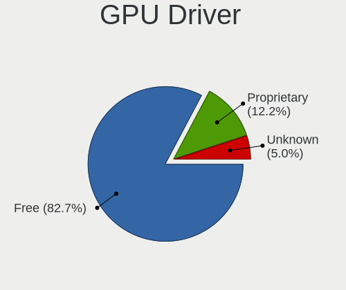
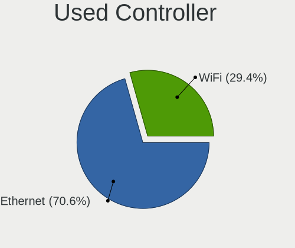
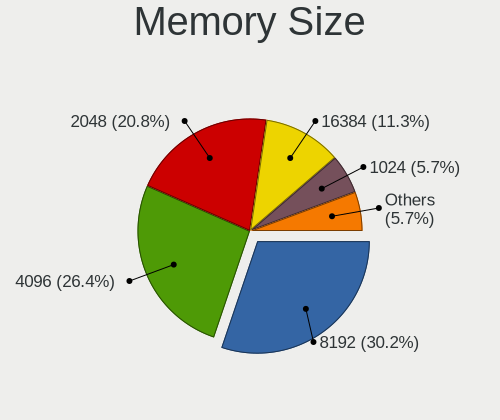

Lubuntu 22.04 - Tested Hardware & Statistics (Desktops)
-------------------------------------------------------

A project to collect tested hardware configurations for Lubuntu 22.04.

Anyone can contribute to this report by the [hw-probe](https://github.com/linuxhw/hw-probe) tool:

    sudo -E hw-probe -all -upload

Please contribute! Especially if your hardware is rare.

Contents
--------

* [ Test Cases ](#test-cases)

* [ System ](#system)
  - [ Kernel                   ](#kernel)
  - [ Kernel Family            ](#kernel-family)
  - [ Kernel Major Ver.        ](#kernel-major-ver)
  - [ Arch                     ](#arch)
  - [ DE                       ](#de)
  - [ Display Server           ](#display-server)
  - [ Display Manager          ](#display-manager)
  - [ OS Lang                  ](#os-lang)
  - [ Boot Mode                ](#boot-mode)
  - [ Filesystem               ](#filesystem)
  - [ Part. scheme             ](#part-scheme)
  - [ Dual Boot with Linux/BSD ](#dual-boot-with-linuxbsd)
  - [ Dual Boot (Win)          ](#dual-boot-win)

* [ Board ](#board)
  - [ Vendor                   ](#vendor)
  - [ Model                    ](#model)
  - [ Model Family             ](#model-family)
  - [ MFG Year                 ](#mfg-year)
  - [ Form Factor              ](#form-factor)
  - [ Secure Boot              ](#secure-boot)
  - [ Coreboot                 ](#coreboot)
  - [ RAM Size                 ](#ram-size)
  - [ RAM Used                 ](#ram-used)
  - [ Total Drives             ](#total-drives)
  - [ Has CD-ROM               ](#has-cd-rom)
  - [ Has Ethernet             ](#has-ethernet)
  - [ Has WiFi                 ](#has-wifi)
  - [ Has Bluetooth            ](#has-bluetooth)

* [ Location ](#location)
  - [ Country                  ](#country)
  - [ City                     ](#city)

* [ Drives ](#drives)
  - [ Drive Vendor             ](#drive-vendor)
  - [ Drive Model              ](#drive-model)
  - [ HDD Vendor               ](#hdd-vendor)
  - [ SSD Vendor               ](#ssd-vendor)
  - [ Drive Kind               ](#drive-kind)
  - [ Drive Connector          ](#drive-connector)
  - [ Drive Size               ](#drive-size)
  - [ Space Total              ](#space-total)
  - [ Space Used               ](#space-used)
  - [ Malfunc. Drives          ](#malfunc-drives)
  - [ Malfunc. Drive Vendor    ](#malfunc-drive-vendor)
  - [ Malfunc. HDD Vendor      ](#malfunc-hdd-vendor)
  - [ Malfunc. Drive Kind      ](#malfunc-drive-kind)
  - [ Failed Drives            ](#failed-drives)
  - [ Failed Drive Vendor      ](#failed-drive-vendor)
  - [ Drive Status             ](#drive-status)

* [ Storage controller ](#storage-controller)
  - [ Storage Vendor           ](#storage-vendor)
  - [ Storage Model            ](#storage-model)
  - [ Storage Kind             ](#storage-kind)

* [ Processor ](#processor)
  - [ CPU Vendor               ](#cpu-vendor)
  - [ CPU Model                ](#cpu-model)
  - [ CPU Model Family         ](#cpu-model-family)
  - [ CPU Cores                ](#cpu-cores)
  - [ CPU Sockets              ](#cpu-sockets)
  - [ CPU Threads              ](#cpu-threads)
  - [ CPU Op-Modes             ](#cpu-op-modes)
  - [ CPU Microcode            ](#cpu-microcode)
  - [ CPU Microarch            ](#cpu-microarch)

* [ Graphics ](#graphics)
  - [ GPU Vendor               ](#gpu-vendor)
  - [ GPU Model                ](#gpu-model)
  - [ GPU Combo                ](#gpu-combo)
  - [ GPU Driver               ](#gpu-driver)
  - [ GPU Memory               ](#gpu-memory)

* [ Monitor ](#monitor)
  - [ Monitor Vendor           ](#monitor-vendor)
  - [ Monitor Model            ](#monitor-model)
  - [ Monitor Resolution       ](#monitor-resolution)
  - [ Monitor Diagonal         ](#monitor-diagonal)
  - [ Monitor Width            ](#monitor-width)
  - [ Aspect Ratio             ](#aspect-ratio)
  - [ Monitor Area             ](#monitor-area)
  - [ Pixel Density            ](#pixel-density)
  - [ Multiple Monitors        ](#multiple-monitors)

* [ Network ](#network)
  - [ Net Controller Vendor    ](#net-controller-vendor)
  - [ Net Controller Model     ](#net-controller-model)
  - [ Wireless Vendor          ](#wireless-vendor)
  - [ Wireless Model           ](#wireless-model)
  - [ Ethernet Vendor          ](#ethernet-vendor)
  - [ Ethernet Model           ](#ethernet-model)
  - [ Net Controller Kind      ](#net-controller-kind)
  - [ Used Controller          ](#used-controller)
  - [ NICs                     ](#nics)
  - [ IPv6                     ](#ipv6)

* [ Bluetooth ](#bluetooth)
  - [ Bluetooth Vendor         ](#bluetooth-vendor)
  - [ Bluetooth Model          ](#bluetooth-model)

* [ Sound ](#sound)
  - [ Sound Vendor             ](#sound-vendor)
  - [ Sound Model              ](#sound-model)

* [ Memory ](#memory)
  - [ Memory Vendor            ](#memory-vendor)
  - [ Memory Model             ](#memory-model)
  - [ Memory Kind              ](#memory-kind)
  - [ Memory Form Factor       ](#memory-form-factor)
  - [ Memory Size              ](#memory-size)
  - [ Memory Speed             ](#memory-speed)

* [ Printers & scanners ](#printers--scanners)
  - [ Printer Vendor           ](#printer-vendor)
  - [ Printer Model            ](#printer-model)
  - [ Scanner Vendor           ](#scanner-vendor)
  - [ Scanner Model            ](#scanner-model)

* [ Camera ](#camera)
  - [ Camera Vendor            ](#camera-vendor)
  - [ Camera Model             ](#camera-model)

* [ Security ](#security)
  - [ Fingerprint Vendor       ](#fingerprint-vendor)
  - [ Fingerprint Model        ](#fingerprint-model)
  - [ Chipcard Vendor          ](#chipcard-vendor)
  - [ Chipcard Model           ](#chipcard-model)

* [ Unsupported ](#unsupported)
  - [ Unsupported Devices      ](#unsupported-devices)
  - [ Unsupported Device Types ](#unsupported-device-types)

Test Cases
----------

Total: 154

| Vendor        | Model                       | Probe                                                      | Date         |
|---------------|-----------------------------|------------------------------------------------------------|--------------|
| Gigabyte      | H61M-S1                     | [e7f247621c](https://linux-hardware.org/?probe=e7f247621c) | Feb 02, 2024 |
| Dell          | 0DF42J A00                  | [f181c086e3](https://linux-hardware.org/?probe=f181c086e3) | Jan 23, 2024 |
| Dell          | 0DF42J A00                  | [5a172ff7ec](https://linux-hardware.org/?probe=5a172ff7ec) | Jan 22, 2024 |
| ASUSTek       | M2N32-SLI DELUXE            | [9b6eb3d320](https://linux-hardware.org/?probe=9b6eb3d320) | Jan 19, 2024 |
| Dell          | 018D1Y A00                  | [5d46b8d1b3](https://linux-hardware.org/?probe=5d46b8d1b3) | Jan 19, 2024 |
| Dell          | 018D1Y A00                  | [cf089739df](https://linux-hardware.org/?probe=cf089739df) | Jan 19, 2024 |
| ZOTAC         | NM10                        | [e185a9b292](https://linux-hardware.org/?probe=e185a9b292) | Jan 18, 2024 |
| Intel         | H61                         | [1d639194e4](https://linux-hardware.org/?probe=1d639194e4) | Jan 17, 2024 |
| HP            | 3397                        | [a46224b9bc](https://linux-hardware.org/?probe=a46224b9bc) | Jan 17, 2024 |
| ASUSTek       | PRIME B250-PLUS             | [c0f0afd78c](https://linux-hardware.org/?probe=c0f0afd78c) | Jan 14, 2024 |
| ASUSTek       | PRIME B250-PLUS             | [5654e285db](https://linux-hardware.org/?probe=5654e285db) | Jan 10, 2024 |
| Dell          | 0CRH6C A00                  | [6c4bafe7b1](https://linux-hardware.org/?probe=6c4bafe7b1) | Jan 04, 2024 |
| ASUSTek       | PRIME B250-PLUS             | [8f6b669800](https://linux-hardware.org/?probe=8f6b669800) | Dec 27, 2023 |
| Dell          | 0XPDFK A01                  | [538aa9126b](https://linux-hardware.org/?probe=538aa9126b) | Dec 23, 2023 |
| PELADN        | HA-3                        | [cd40102512](https://linux-hardware.org/?probe=cd40102512) | Dec 17, 2023 |
| ASUSTek       | M4N68T-M-LE-V2              | [e126cdbf4b](https://linux-hardware.org/?probe=e126cdbf4b) | Dec 10, 2023 |
| Dell          | 0XPDFK A01                  | [5ebbbca196](https://linux-hardware.org/?probe=5ebbbca196) | Dec 04, 2023 |
| eMachines     | EL1358                      | [f22b0b98c3](https://linux-hardware.org/?probe=f22b0b98c3) | Nov 23, 2023 |
| MSI           | MS-7309                     | [c6ca259cae](https://linux-hardware.org/?probe=c6ca259cae) | Nov 13, 2023 |
| PCChips       | P49G                        | [6b1de00356](https://linux-hardware.org/?probe=6b1de00356) | Nov 02, 2023 |
| ZOTAC         | NM10                        | [5a951d80a6](https://linux-hardware.org/?probe=5a951d80a6) | Oct 31, 2023 |
| ASUSTek       | P7P55-M                     | [3fa8a23f12](https://linux-hardware.org/?probe=3fa8a23f12) | Oct 29, 2023 |
| Intel         | H61                         | [fccff5fcb2](https://linux-hardware.org/?probe=fccff5fcb2) | Oct 27, 2023 |
| Acer          | Veriton N4660G              | [712511f568](https://linux-hardware.org/?probe=712511f568) | Oct 27, 2023 |
| ZOTAC         | NM10                        | [2e0ab67bec](https://linux-hardware.org/?probe=2e0ab67bec) | Oct 21, 2023 |
| HP            | 8265                        | [f1bdedb075](https://linux-hardware.org/?probe=f1bdedb075) | Oct 20, 2023 |
| ASRock        | Q1900B-ITX                  | [f8ad7736e2](https://linux-hardware.org/?probe=f8ad7736e2) | Oct 07, 2023 |
| ASUSTek       | PRIME B450M-A               | [bf8761b854](https://linux-hardware.org/?probe=bf8761b854) | Oct 06, 2023 |
| Intel         | H61                         | [ee0266b53c](https://linux-hardware.org/?probe=ee0266b53c) | Sep 25, 2023 |
| IceWhale T... | ZimaBoard 216 ZMB           | [7b1aae3e2b](https://linux-hardware.org/?probe=7b1aae3e2b) | Sep 20, 2023 |
| Apple         | Mac-7BA5B2D9E42DDD94 iMa... | [47d423039b](https://linux-hardware.org/?probe=47d423039b) | Sep 19, 2023 |
| ASUSTek       | M4A87TD/USB3                | [6aea4eb6c4](https://linux-hardware.org/?probe=6aea4eb6c4) | Sep 09, 2023 |
| Dell          | 0T10XW A00                  | [89f4028960](https://linux-hardware.org/?probe=89f4028960) | Sep 05, 2023 |
| ASUSTek       | ROG STRIX B550-I GAMING     | [23f0f9321c](https://linux-hardware.org/?probe=23f0f9321c) | Sep 05, 2023 |
| Seeed Stud... | ODYSSEY-X86J41X5 SD-BS-C... | [69fec63660](https://linux-hardware.org/?probe=69fec63660) | Sep 04, 2023 |
| Seeed Stud... | ODYSSEY-X86J41X5 SD-BS-C... | [ea00f871b9](https://linux-hardware.org/?probe=ea00f871b9) | Sep 04, 2023 |
| Inventec      | DQ Class A02                | [92a3afc475](https://linux-hardware.org/?probe=92a3afc475) | Aug 17, 2023 |
| ASUSTek       | BM6875_BM6675_BP6375        | [0a2cdad4c1](https://linux-hardware.org/?probe=0a2cdad4c1) | Aug 15, 2023 |
| Apple         | Mac-F223BEC8                | [74a3be9a4a](https://linux-hardware.org/?probe=74a3be9a4a) | Aug 14, 2023 |
| Shuttle       | XS35V3                      | [ced8776e4d](https://linux-hardware.org/?probe=ced8776e4d) | Aug 09, 2023 |
| ASUSTek       | P5QD TURBO                  | [ffbbe60721](https://linux-hardware.org/?probe=ffbbe60721) | Aug 05, 2023 |
| Shuttle       | XS35V3                      | [52c5dda710](https://linux-hardware.org/?probe=52c5dda710) | Jul 31, 2023 |
| AAEON         | MF-001 V1.0                 | [1a2d3f1778](https://linux-hardware.org/?probe=1a2d3f1778) | Jul 30, 2023 |
| Unknown       | Unknown                     | [80a34d344b](https://linux-hardware.org/?probe=80a34d344b) | Jul 28, 2023 |
| Unknown       | T3 MRD                      | [5539799efa](https://linux-hardware.org/?probe=5539799efa) | Jul 26, 2023 |
| ASUSTek       | P5G41T-M LX2/BR             | [5ca26c7da9](https://linux-hardware.org/?probe=5ca26c7da9) | Jul 26, 2023 |
| HP            | 3646h                       | [01f2207fe0](https://linux-hardware.org/?probe=01f2207fe0) | Jul 22, 2023 |
| MSI           | MAG X570S TOMAHAWK MAX W... | [b6b1cf5b68](https://linux-hardware.org/?probe=b6b1cf5b68) | Jul 02, 2023 |
| Dell          | 0T656F A02                  | [e9b879f3ff](https://linux-hardware.org/?probe=e9b879f3ff) | Jul 02, 2023 |
| ASUSTek       | M4A87TD/USB3                | [fa54c60ae0](https://linux-hardware.org/?probe=fa54c60ae0) | Jun 26, 2023 |
| MSI           | MPG X570 GAMING EDGE WIF... | [f0268ac6a8](https://linux-hardware.org/?probe=f0268ac6a8) | Jun 26, 2023 |
| Gigabyte      | B450 AORUS ELITE V2         | [004f9be7a7](https://linux-hardware.org/?probe=004f9be7a7) | Jun 21, 2023 |
| ASUSTek       | ROG STRIX B650E-E GAMING... | [f52a0ddf99](https://linux-hardware.org/?probe=f52a0ddf99) | Jun 16, 2023 |
| ASUSTek       | ROG STRIX B650E-E GAMING... | [7b9388df1b](https://linux-hardware.org/?probe=7b9388df1b) | Jun 16, 2023 |
| Pegatron      | 2A73h                       | [a96d9ae076](https://linux-hardware.org/?probe=a96d9ae076) | Jun 15, 2023 |
| HP            | 3646h                       | [046f5d1a5b](https://linux-hardware.org/?probe=046f5d1a5b) | Jun 09, 2023 |
| HP            | 3646h                       | [02353b5e9f](https://linux-hardware.org/?probe=02353b5e9f) | Jun 06, 2023 |
| HP            | 3397                        | [046df77f81](https://linux-hardware.org/?probe=046df77f81) | Jun 02, 2023 |
| Unknown       | Unknown                     | [a1a76abc51](https://linux-hardware.org/?probe=a1a76abc51) | May 24, 2023 |
| Foxconn       | G41MXE-V                    | [ffc74ae329](https://linux-hardware.org/?probe=ffc74ae329) | May 21, 2023 |
| ASUSTek       | A88XM-A                     | [eea6382d39](https://linux-hardware.org/?probe=eea6382d39) | May 19, 2023 |
| ZOTAC         | NM10                        | [0be7755cf9](https://linux-hardware.org/?probe=0be7755cf9) | May 19, 2023 |
| Acer          | EQ45M                       | [57fa86c8dc](https://linux-hardware.org/?probe=57fa86c8dc) | May 11, 2023 |
| ASUSTek       | M4A87TD/USB3                | [5438ddaf64](https://linux-hardware.org/?probe=5438ddaf64) | May 08, 2023 |
| NEC Comput... | ECS-945G                    | [5f6daf506f](https://linux-hardware.org/?probe=5f6daf506f) | May 01, 2023 |
| MSI           | H310M PRO-VD                | [498c52e62e](https://linux-hardware.org/?probe=498c52e62e) | Apr 10, 2023 |
| MSI           | B550-A PRO                  | [f243351def](https://linux-hardware.org/?probe=f243351def) | Mar 31, 2023 |
| YANYU         | ITX-S192                    | [0d2fb6a8d7](https://linux-hardware.org/?probe=0d2fb6a8d7) | Mar 27, 2023 |
| Pegatron      | Acacia                      | [4ce0966b14](https://linux-hardware.org/?probe=4ce0966b14) | Mar 26, 2023 |
| Pegatron      | Acacia                      | [4faa2a52d3](https://linux-hardware.org/?probe=4faa2a52d3) | Mar 26, 2023 |
| Gigabyte      | MJPLNBB-00                  | [e8c31757e0](https://linux-hardware.org/?probe=e8c31757e0) | Mar 12, 2023 |
| Positivo      | P5VD2-MX                    | [50b7084313](https://linux-hardware.org/?probe=50b7084313) | Mar 12, 2023 |
| BANGHO        | LITE E34                    | [39f7b525e2](https://linux-hardware.org/?probe=39f7b525e2) | Mar 10, 2023 |
| Gigabyte      | B360M DS3H                  | [3710f0f407](https://linux-hardware.org/?probe=3710f0f407) | Mar 07, 2023 |
| Pegatron      | 2AD5                        | [3356f97e00](https://linux-hardware.org/?probe=3356f97e00) | Mar 06, 2023 |
| Pegatron      | 2AD5                        | [86b939ac1a](https://linux-hardware.org/?probe=86b939ac1a) | Mar 03, 2023 |
| ASRock        | Z87 Extreme4                | [d085a259d5](https://linux-hardware.org/?probe=d085a259d5) | Mar 03, 2023 |
| Intel         | X79 V2.72A                  | [ae4efdfbc5](https://linux-hardware.org/?probe=ae4efdfbc5) | Mar 02, 2023 |
| Pegatron      | 2AD5                        | [0f487c3a2a](https://linux-hardware.org/?probe=0f487c3a2a) | Feb 26, 2023 |
| Pegatron      | 2AD5                        | [4c68f5ea84](https://linux-hardware.org/?probe=4c68f5ea84) | Feb 25, 2023 |
| MSI           | MS-7267                     | [0b89f039c1](https://linux-hardware.org/?probe=0b89f039c1) | Feb 17, 2023 |
| ECS           | G41T-M7                     | [3308b85e2f](https://linux-hardware.org/?probe=3308b85e2f) | Feb 15, 2023 |
| ASUSTek       | M5A78L-M LX3                | [c7374801ac](https://linux-hardware.org/?probe=c7374801ac) | Feb 13, 2023 |
| Dell          | 0FPP7F A00                  | [0a67b25026](https://linux-hardware.org/?probe=0a67b25026) | Feb 11, 2023 |
| MSI           | B550-A PRO                  | [55e2abbd96](https://linux-hardware.org/?probe=55e2abbd96) | Feb 04, 2023 |
| MSI           | MPG X570 GAMING EDGE WIF... | [4f6655087b](https://linux-hardware.org/?probe=4f6655087b) | Feb 03, 2023 |
| MSI           | MS-7032                     | [7b481f4c8c](https://linux-hardware.org/?probe=7b481f4c8c) | Jan 25, 2023 |
| ASUSTek       | TUF B450-PRO GAMING         | [27ea4205e5](https://linux-hardware.org/?probe=27ea4205e5) | Jan 22, 2023 |
| NEC Comput... | ECS-945G                    | [8226ffab22](https://linux-hardware.org/?probe=8226ffab22) | Jan 14, 2023 |
| MSI           | K9A2VM                      | [98ce1d06ad](https://linux-hardware.org/?probe=98ce1d06ad) | Jan 14, 2023 |
| ASRock        | ION3D-HT                    | [48707e3794](https://linux-hardware.org/?probe=48707e3794) | Jan 12, 2023 |
| MSI           | A320M-A PRO                 | [e8147a271c](https://linux-hardware.org/?probe=e8147a271c) | Jan 06, 2023 |
| ASUSTek       | M5A97 PRO                   | [7921dc0197](https://linux-hardware.org/?probe=7921dc0197) | Jan 05, 2023 |
| Positivo      | POS-AG31AP                  | [a0ef7524c6](https://linux-hardware.org/?probe=a0ef7524c6) | Jan 02, 2023 |
| Positivo      | POS-AG31AP                  | [4cc8fbf002](https://linux-hardware.org/?probe=4cc8fbf002) | Jan 02, 2023 |
| HP            | 21B4 A01                    | [cdc9730e81](https://linux-hardware.org/?probe=cdc9730e81) | Dec 31, 2022 |
| ZOTAC         | NM10                        | [98b6981431](https://linux-hardware.org/?probe=98b6981431) | Dec 21, 2022 |
| ASUSTek       | ROG STRIX B450-F GAMING ... | [5c437c961e](https://linux-hardware.org/?probe=5c437c961e) | Dec 13, 2022 |
| ASUSTek       | M4A785TD-V EVO              | [88e60fc0ba](https://linux-hardware.org/?probe=88e60fc0ba) | Dec 04, 2022 |
| ASUSTek       | M4A87TD/USB3                | [e38a783ce1](https://linux-hardware.org/?probe=e38a783ce1) | Nov 28, 2022 |
| Intel         | BTC-T37                     | [f52a08ae38](https://linux-hardware.org/?probe=f52a08ae38) | Nov 25, 2022 |
| MSI           | A520M-A PRO                 | [8db2bc8883](https://linux-hardware.org/?probe=8db2bc8883) | Nov 25, 2022 |
| Unknown       | Unknown                     | [029cddbcd6](https://linux-hardware.org/?probe=029cddbcd6) | Nov 23, 2022 |
| ASUSTek       | IP4BL-ME-Oli                | [242fd5b355](https://linux-hardware.org/?probe=242fd5b355) | Nov 21, 2022 |
| ASUSTek       | EB1501P                     | [0664261b3a](https://linux-hardware.org/?probe=0664261b3a) | Nov 11, 2022 |
| ASUSTek       | EB1501P                     | [ad47bcfb8b](https://linux-hardware.org/?probe=ad47bcfb8b) | Nov 11, 2022 |
| ASRock        | FM2A88X Extreme4+           | [7596586a99](https://linux-hardware.org/?probe=7596586a99) | Nov 05, 2022 |
| ASRock        | H110M-HDV                   | [3d1fde3114](https://linux-hardware.org/?probe=3d1fde3114) | Oct 17, 2022 |
| Gigabyte      | F2A58M-HD2                  | [944509d58b](https://linux-hardware.org/?probe=944509d58b) | Oct 12, 2022 |
| Acer          | EM61SM/EM61PM               | [191540e7bc](https://linux-hardware.org/?probe=191540e7bc) | Oct 12, 2022 |
| Acer          | EM61SM/EM61PM               | [fb2dd76511](https://linux-hardware.org/?probe=fb2dd76511) | Oct 10, 2022 |
| Fujitsu       | D3003-D1 S26361-D3003-D1    | [afba95481a](https://linux-hardware.org/?probe=afba95481a) | Oct 09, 2022 |
| HP            | 0B4Ch D                     | [1b409fc1f6](https://linux-hardware.org/?probe=1b409fc1f6) | Oct 01, 2022 |
| HP            | 0B4Ch D                     | [ccc7fe3103](https://linux-hardware.org/?probe=ccc7fe3103) | Oct 01, 2022 |
| Dell          | 0R849J A00                  | [cf2069932e](https://linux-hardware.org/?probe=cf2069932e) | Sep 26, 2022 |
| Dell          | 09M8Y8 A01                  | [aa3088ed0e](https://linux-hardware.org/?probe=aa3088ed0e) | Sep 22, 2022 |
| MSI           | B450-A PRO MAX              | [89fad64303](https://linux-hardware.org/?probe=89fad64303) | Sep 20, 2022 |
| Gigabyte      | G31M-S2C                    | [f7f3a2e7c8](https://linux-hardware.org/?probe=f7f3a2e7c8) | Sep 17, 2022 |
| AMI           | Cherry Trail CR             | [1c131a1acb](https://linux-hardware.org/?probe=1c131a1acb) | Sep 15, 2022 |
| Dell          | 0J584C A00                  | [de442f1c61](https://linux-hardware.org/?probe=de442f1c61) | Sep 01, 2022 |
| Gigabyte      | G31M-S2C                    | [61a4780992](https://linux-hardware.org/?probe=61a4780992) | Aug 30, 2022 |
| Gigabyte      | G31M-S2C                    | [8beed8e261](https://linux-hardware.org/?probe=8beed8e261) | Aug 30, 2022 |
| MSI           | Z590-A PRO                  | [c74bbc2f61](https://linux-hardware.org/?probe=c74bbc2f61) | Aug 21, 2022 |
| MSI           | Z170A GAMING M3             | [e0834224d7](https://linux-hardware.org/?probe=e0834224d7) | Aug 16, 2022 |
| ASRock        | G41M-VS3                    | [16a2e0ab5d](https://linux-hardware.org/?probe=16a2e0ab5d) | Aug 09, 2022 |
| HP            | 8768 A                      | [2ee49e3506](https://linux-hardware.org/?probe=2ee49e3506) | Aug 07, 2022 |
| Lenovo        | BRASWELL SDK0J40697 WIN ... | [f601e2f557](https://linux-hardware.org/?probe=f601e2f557) | Aug 05, 2022 |
| ASRock        | G41M-VS3                    | [16c2b30680](https://linux-hardware.org/?probe=16c2b30680) | Aug 04, 2022 |
| Acer          | EG31M R01-A3                | [c5b4092eb4](https://linux-hardware.org/?probe=c5b4092eb4) | Aug 04, 2022 |
| Dell          | 0WR7PY A03                  | [0cabe39a74](https://linux-hardware.org/?probe=0cabe39a74) | Jul 27, 2022 |
| Dell          | 0X8582                      | [b52bb428f4](https://linux-hardware.org/?probe=b52bb428f4) | Jul 26, 2022 |
| AMI           | Cherry Trail CR             | [6463c26211](https://linux-hardware.org/?probe=6463c26211) | Jul 25, 2022 |
| ASUSTek       | M5A78L LE                   | [4ade852983](https://linux-hardware.org/?probe=4ade852983) | Jul 23, 2022 |
| Dell          | 0X8582                      | [ab2bf3496e](https://linux-hardware.org/?probe=ab2bf3496e) | Jul 20, 2022 |
| ASRock        | A75M-HVS                    | [c88ac89032](https://linux-hardware.org/?probe=c88ac89032) | Jul 20, 2022 |
| Dell          | 0X8582                      | [5b8458f200](https://linux-hardware.org/?probe=5b8458f200) | Jul 19, 2022 |
| MSI           | X570-A PRO                  | [84b1994696](https://linux-hardware.org/?probe=84b1994696) | Jul 16, 2022 |
| HP            | 1495                        | [32ea18bc68](https://linux-hardware.org/?probe=32ea18bc68) | Jul 06, 2022 |
| HP            | 1495                        | [6300d25ff0](https://linux-hardware.org/?probe=6300d25ff0) | Jul 04, 2022 |
| MSI           | 760GM-P23                   | [ff0f44e63c](https://linux-hardware.org/?probe=ff0f44e63c) | Jun 26, 2022 |
| Dell          | 0VRWRC A00                  | [fe159bf237](https://linux-hardware.org/?probe=fe159bf237) | Jun 26, 2022 |
| ASUSTek       | M4N78-AM                    | [f98db3efe8](https://linux-hardware.org/?probe=f98db3efe8) | Jun 22, 2022 |
| Lenovo        | SHARKBAY SDK0E50510 PRO     | [474c946289](https://linux-hardware.org/?probe=474c946289) | Jun 17, 2022 |
| ASUSTek       | M4N78-AM                    | [d7dddc4270](https://linux-hardware.org/?probe=d7dddc4270) | Jun 16, 2022 |
| ASUSTek       | PRIME X370-A                | [bd1889b281](https://linux-hardware.org/?probe=bd1889b281) | Jun 06, 2022 |
| Unknown       | Unknown                     | [b64c215325](https://linux-hardware.org/?probe=b64c215325) | May 30, 2022 |
| Unknown       | Unknown                     | [aa6db2ed41](https://linux-hardware.org/?probe=aa6db2ed41) | May 23, 2022 |
| Unknown       | HX90                        | [22dac34b7b](https://linux-hardware.org/?probe=22dac34b7b) | May 21, 2022 |
| Unknown       | Unknown                     | [1aba67a1ac](https://linux-hardware.org/?probe=1aba67a1ac) | May 15, 2022 |
| Pegatron      | VIOLET6                     | [dbbdea4231](https://linux-hardware.org/?probe=dbbdea4231) | May 12, 2022 |
| Dell          | 02YYK5 A01                  | [19dd091f8b](https://linux-hardware.org/?probe=19dd091f8b) | May 01, 2022 |
| ZOTAC         | NM10                        | [b2983fdd9d](https://linux-hardware.org/?probe=b2983fdd9d) | Apr 15, 2022 |
| Unknown       | Unknown                     | [4de543bc53](https://linux-hardware.org/?probe=4de543bc53) | Apr 03, 2022 |
| ASUSTek       | PRIME B350M-E               | [70f555009e](https://linux-hardware.org/?probe=70f555009e) | Feb 18, 2022 |

System
------

Kernel
------

Version of the Linux kernel

| Version             | Desktops | Percent |
|---------------------|----------|---------|
| 5.15.0-43-generic   | 11       | 8.59%   |
| 6.5.0-14-generic    | 5        | 3.91%   |
| 5.19.0-50-generic   | 5        | 3.91%   |
| 5.19.0-32-generic   | 5        | 3.91%   |
| 5.15.0-60-generic   | 5        | 3.91%   |
| 5.15.0-41-generic   | 5        | 3.91%   |
| 5.15.0-56-generic   | 4        | 3.13%   |
| 5.15.0-47-generic   | 4        | 3.13%   |
| 5.15.0-25-generic   | 4        | 3.13%   |
| 5.15.0-91-generic   | 3        | 2.34%   |
| 5.15.0-75-generic   | 3        | 2.34%   |
| 5.15.0-67-generic   | 3        | 2.34%   |
| 5.15.0-52-generic   | 3        | 2.34%   |
| 5.15.0-48-generic   | 3        | 2.34%   |
| 5.15.0-40-generic   | 3        | 2.34%   |
| 5.15.0-39-generic   | 3        | 2.34%   |
| 6.2.0-36-generic    | 2        | 1.56%   |
| 6.2.0-35-generic    | 2        | 1.56%   |
| 6.2.0-26-generic    | 2        | 1.56%   |
| 5.19.0-46-generic   | 2        | 1.56%   |
| 5.19.0-43-generic   | 2        | 1.56%   |
| 5.19.0-35-generic   | 2        | 1.56%   |
| 5.15.0-86-generic   | 2        | 1.56%   |
| 5.15.0-83-generic   | 2        | 1.56%   |
| 5.15.0-82-generic   | 2        | 1.56%   |
| 5.15.0-58-generic   | 2        | 1.56%   |
| 5.15.0-53-generic   | 2        | 1.56%   |
| 5.15.0-50-generic   | 2        | 1.56%   |
| 5.15.0-46-generic   | 2        | 1.56%   |
| 5.15.0-35-generic   | 2        | 1.56%   |
| 5.15.0-30-generic   | 2        | 1.56%   |
| 5.15.0-27-generic   | 2        | 1.56%   |
| 6.7.0-custom        | 1        | 0.78%   |
| 6.5.8-custom        | 1        | 0.78%   |
| 6.5.0-15-generic    | 1        | 0.78%   |
| 6.3.3-custom        | 1        | 0.78%   |
| 6.2.8-x64v3-xanmod1 | 1        | 0.78%   |
| 6.2.0-39-generic    | 1        | 0.78%   |
| 6.2.0-37-generic    | 1        | 0.78%   |
| 6.2.0-33-generic    | 1        | 0.78%   |

Kernel Family
-------------

Linux kernel without a distro release

| Version | Desktops | Percent |
|---------|----------|---------|
| 5.15.0  | 78       | 65.55%  |
| 5.19.0  | 19       | 15.97%  |
| 6.2.0   | 8        | 6.72%   |
| 6.5.0   | 6        | 5.04%   |
| 6.7.0   | 1        | 0.84%   |
| 6.5.8   | 1        | 0.84%   |
| 6.3.3   | 1        | 0.84%   |
| 6.2.8   | 1        | 0.84%   |
| 6.1.46  | 1        | 0.84%   |
| 6.1.0   | 1        | 0.84%   |
| 6.0.8   | 1        | 0.84%   |
| 6.0.14  | 1        | 0.84%   |

Kernel Major Ver.
-----------------

Linux kernel major version

| Version | Desktops | Percent |
|---------|----------|---------|
| 5.15    | 78       | 65.55%  |
| 5.19    | 19       | 15.97%  |
| 6.2     | 9        | 7.56%   |
| 6.5     | 7        | 5.88%   |
| 6.1     | 2        | 1.68%   |
| 6.0     | 2        | 1.68%   |
| 6.7     | 1        | 0.84%   |
| 6.3     | 1        | 0.84%   |

Arch
----

OS architecture (x86_64, i586, etc.)

| Name   | Desktops | Percent |
|--------|----------|---------|
| x86_64 | 112      | 100%    |

DE
--

Desktop Environment

| Name  | Desktops | Percent |
|-------|----------|---------|
| LXQt  | 107      | 95.54%  |
| LXDE  | 3        | 2.68%   |
| XFCE  | 1        | 0.89%   |
| GNOME | 1        | 0.89%   |

Display Server
--------------

X11 or Wayland

| Name        | Desktops | Percent |
|-------------|----------|---------|
| X11         | 106      | 92.17%  |
| Tty         | 7        | 6.09%   |
| Wayland     | 1        | 0.87%   |
| Unspecified | 1        | 0.87%   |

Display Manager
---------------

SDDM, LightDM, etc.

| Name    | Desktops | Percent |
|---------|----------|---------|
| SDDM    | 90       | 80.36%  |
| LightDM | 9        | 8.04%   |
| Unknown | 7        | 6.25%   |
| GDM3    | 3        | 2.68%   |
| XDM     | 1        | 0.89%   |
| SLiM    | 1        | 0.89%   |
| LXDM    | 1        | 0.89%   |

OS Lang
-------

Language

| Lang  | Desktops | Percent |
|-------|----------|---------|
| en_US | 32       | 28.32%  |
| fr_FR | 17       | 15.04%  |
| de_DE | 10       | 8.85%   |
| es_ES | 7        | 6.19%   |
| en_GB | 7        | 6.19%   |
| it_IT | 6        | 5.31%   |
| es_AR | 5        | 4.42%   |
| pt_BR | 3        | 2.65%   |
| en_AU | 3        | 2.65%   |
| C     | 3        | 2.65%   |
| pl_PL | 2        | 1.77%   |
| es_MX | 2        | 1.77%   |
| es_CR | 2        | 1.77%   |
| zh_TW | 1        | 0.88%   |
| tr_TR | 1        | 0.88%   |
| sv_SE | 1        | 0.88%   |
| ru_UA | 1        | 0.88%   |
| ru_RU | 1        | 0.88%   |
| nl_BE | 1        | 0.88%   |
| fi_FI | 1        | 0.88%   |
| es_PE | 1        | 0.88%   |
| es_CU | 1        | 0.88%   |
| en_CA | 1        | 0.88%   |
| en_AG | 1        | 0.88%   |
| el_GR | 1        | 0.88%   |
| cv_RU | 1        | 0.88%   |
| cs_CZ | 1        | 0.88%   |

Boot Mode
---------

EFI or BIOS

| Mode | Desktops | Percent |
|------|----------|---------|
| BIOS | 79       | 69.91%  |
| EFI  | 34       | 30.09%  |

Filesystem
----------

Type of filesystem

| Type    | Desktops | Percent |
|---------|----------|---------|
| Ext4    | 99       | 86.84%  |
| Tmpfs   | 9        | 7.89%   |
| Overlay | 3        | 2.63%   |
| Btrfs   | 2        | 1.75%   |
| XXX4    | 1        | 0.88%   |

Part. scheme
------------

Scheme of partitioning

| Type    | Desktops | Percent |
|---------|----------|---------|
| GPT     | 54       | 47.79%  |
| MBR     | 37       | 32.74%  |
| Unknown | 22       | 19.47%  |

Dual Boot with Linux/BSD
------------------------

Hosting more than one Linux/BSD

| Dual boot | Desktops | Percent |
|-----------|----------|---------|
| No        | 90       | 78.95%  |
| Yes       | 24       | 21.05%  |

Dual Boot (Win)
---------------

Hosting Linux and Windows

| Dual boot | Desktops | Percent |
|-----------|----------|---------|
| No        | 71       | 63.39%  |
| Yes       | 41       | 36.61%  |

Board
-----

Vendor
------

Motherboard manufacturer

| Name                | Desktops | Percent |
|---------------------|----------|---------|
| ASUSTek Computer    | 23       | 20.54%  |
| MSI                 | 16       | 14.29%  |
| Dell                | 15       | 13.39%  |
| Gigabyte Technology | 7        | 6.25%   |
| ASRock              | 7        | 6.25%   |
| Hewlett-Packard     | 6        | 5.36%   |
| Unknown             | 5        | 4.46%   |
| Pegatron            | 4        | 3.57%   |
| Acer                | 4        | 3.57%   |
| Intel               | 3        | 2.68%   |
| Positivo            | 2        | 1.79%   |
| Lenovo              | 2        | 1.79%   |
| AMI                 | 2        | 1.79%   |
| ZOTAC               | 1        | 0.89%   |
| YANYU               | 1        | 0.89%   |
| Shuttle             | 1        | 0.89%   |
| Seeed Studio        | 1        | 0.89%   |
| PELADN              | 1        | 0.89%   |
| PCChips             | 1        | 0.89%   |
| NEC Computers       | 1        | 0.89%   |
| Inventec            | 1        | 0.89%   |
| IceWhale Technology | 1        | 0.89%   |
| Fujitsu             | 1        | 0.89%   |
| Foxconn             | 1        | 0.89%   |
| eMachines           | 1        | 0.89%   |
| ECS                 | 1        | 0.89%   |
| BANGHO              | 1        | 0.89%   |
| Apple               | 1        | 0.89%   |
| AAEON               | 1        | 0.89%   |

Model
-----

Motherboard model

| Name                                 | Desktops | Percent |
|--------------------------------------|----------|---------|
| Unknown                              | 5        | 4.46%   |
| MSI MS-7C37                          | 3        | 2.68%   |
| Dell Dimension 9100                  | 2        | 1.79%   |
| ZOTAC NM10                           | 1        | 0.89%   |
| YANYU ITX-S192                       | 1        | 0.89%   |
| Shuttle XS35V3                       | 1        | 0.89%   |
| Seeed Studio ODYSSEY-X86J4125        | 1        | 0.89%   |
| Positivo POS-AG31AP                  | 1        | 0.89%   |
| Positivo P5VD2-MX                    | 1        | 0.89%   |
| PELADN HA-3                          | 1        | 0.89%   |
| Pegatron NC689AA-ABA s3700y          | 1        | 0.89%   |
| Pegatron h8-1350ef                   | 1        | 0.89%   |
| Pegatron Compaq dx2400 Microtower PC | 1        | 0.89%   |
| Pegatron AY748AA-ABA p6320y          | 1        | 0.89%   |
| PCChips P49G                         | 1        | 0.89%   |
| NEC Computers ECS-945G               | 1        | 0.89%   |
| MSI MS-7D54                          | 1        | 0.89%   |
| MSI MS-7D09                          | 1        | 0.89%   |
| MSI MS-7C96                          | 1        | 0.89%   |
| MSI MS-7C56                          | 1        | 0.89%   |
| MSI MS-7C51                          | 1        | 0.89%   |
| MSI MS-7B86                          | 1        | 0.89%   |
| MSI MS-7B33                          | 1        | 0.89%   |
| MSI MS-7978                          | 1        | 0.89%   |
| MSI MS-7641                          | 1        | 0.89%   |
| MSI MS-7501                          | 1        | 0.89%   |
| MSI MS-7309                          | 1        | 0.89%   |
| MSI MS-7267                          | 1        | 0.89%   |
| MSI MS-7032                          | 1        | 0.89%   |
| Lenovo ThinkCentre M83 10ANCTO1WW    | 1        | 0.89%   |
| Lenovo ThinkCentre M600 10KGS09S00   | 1        | 0.89%   |
| Inventec DQ Class                    | 1        | 0.89%   |
| Intel X79 V2.72A                     | 1        | 0.89%   |
| Intel H61                            | 1        | 0.89%   |
| Intel BTC-T37                        | 1        | 0.89%   |
| IceWhale ZimaBoard 216 ZMB           | 1        | 0.89%   |
| HP Z400 Workstation                  | 1        | 0.89%   |
| HP t620 Quad Core TC                 | 1        | 0.89%   |
| HP Slim Desktop S01-pF1xxx           | 1        | 0.89%   |
| HP Compaq Elite 8300 SFF             | 1        | 0.89%   |

Model Family
------------

Motherboard model prefix

| Name                          | Desktops | Percent |
|-------------------------------|----------|---------|
| Dell OptiPlex                 | 5        | 4.46%   |
| Unknown                       | 5        | 4.46%   |
| ASUS PRIME                    | 4        | 3.57%   |
| MSI MS-7C37                   | 3        | 2.68%   |
| HP Compaq                     | 3        | 2.68%   |
| Dell Precision                | 3        | 2.68%   |
| ASUS ROG                      | 3        | 2.68%   |
| Lenovo ThinkCentre            | 2        | 1.79%   |
| Dell Vostro                   | 2        | 1.79%   |
| Dell Dimension                | 2        | 1.79%   |
| Acer Veriton                  | 2        | 1.79%   |
| ZOTAC NM10                    | 1        | 0.89%   |
| YANYU ITX-S192                | 1        | 0.89%   |
| Shuttle XS35V3                | 1        | 0.89%   |
| Seeed Studio ODYSSEY-X86J4125 | 1        | 0.89%   |
| Positivo POS-AG31AP           | 1        | 0.89%   |
| Positivo P5VD2-MX             | 1        | 0.89%   |
| PELADN HA-3                   | 1        | 0.89%   |
| Pegatron NC689AA-ABA          | 1        | 0.89%   |
| Pegatron h8-1350ef            | 1        | 0.89%   |
| Pegatron Compaq               | 1        | 0.89%   |
| Pegatron AY748AA-ABA          | 1        | 0.89%   |
| PCChips P49G                  | 1        | 0.89%   |
| NEC Computers ECS-945G        | 1        | 0.89%   |
| MSI MS-7D54                   | 1        | 0.89%   |
| MSI MS-7D09                   | 1        | 0.89%   |
| MSI MS-7C96                   | 1        | 0.89%   |
| MSI MS-7C56                   | 1        | 0.89%   |
| MSI MS-7C51                   | 1        | 0.89%   |
| MSI MS-7B86                   | 1        | 0.89%   |
| MSI MS-7B33                   | 1        | 0.89%   |
| MSI MS-7978                   | 1        | 0.89%   |
| MSI MS-7641                   | 1        | 0.89%   |
| MSI MS-7501                   | 1        | 0.89%   |
| MSI MS-7309                   | 1        | 0.89%   |
| MSI MS-7267                   | 1        | 0.89%   |
| MSI MS-7032                   | 1        | 0.89%   |
| Inventec DQ                   | 1        | 0.89%   |
| Intel X79                     | 1        | 0.89%   |
| Intel H61                     | 1        | 0.89%   |

MFG Year
--------

Motherboard manufacture year

| Year | Desktops | Percent |
|------|----------|---------|
| 2010 | 12       | 10.71%  |
| 2009 | 10       | 8.93%   |
| 2008 | 10       | 8.93%   |
| 2019 | 8        | 7.14%   |
| 2017 | 8        | 7.14%   |
| 2020 | 7        | 6.25%   |
| 2018 | 7        | 6.25%   |
| 2012 | 7        | 6.25%   |
| 2011 | 6        | 5.36%   |
| 2021 | 5        | 4.46%   |
| 2014 | 5        | 4.46%   |
| 2013 | 5        | 4.46%   |
| 2007 | 5        | 4.46%   |
| 2022 | 4        | 3.57%   |
| 2015 | 4        | 3.57%   |
| 2006 | 4        | 3.57%   |
| 2016 | 3        | 2.68%   |
| 2023 | 1        | 0.89%   |
| 2001 | 1        | 0.89%   |

Form Factor
-----------

Physical design of the computer

| Name    | Desktops | Percent |
|---------|----------|---------|
| Desktop | 112      | 100%    |

Secure Boot
-----------

Enabled or disabled

| State    | Desktops | Percent |
|----------|----------|---------|
| Disabled | 110      | 98.21%  |
| Enabled  | 2        | 1.79%   |

Coreboot
--------

Have coreboot on board

| Used | Desktops | Percent |
|------|----------|---------|
| No   | 112      | 100%    |

RAM Size
--------

Total RAM memory

| Size in GB  | Desktops | Percent |
|-------------|----------|---------|
| 4.01-8.0    | 21       | 18.42%  |
| 3.01-4.0    | 21       | 18.42%  |
| 16.01-24.0  | 18       | 15.79%  |
| 8.01-16.0   | 17       | 14.91%  |
| 1.01-2.0    | 14       | 12.28%  |
| 32.01-64.0  | 12       | 10.53%  |
| 64.01-256.0 | 4        | 3.51%   |
| 2.01-3.0    | 3        | 2.63%   |
| 0.51-1.0    | 3        | 2.63%   |
| 24.01-32.0  | 1        | 0.88%   |

RAM Used
--------

Used RAM memory

| Used GB   | Desktops | Percent |
|-----------|----------|---------|
| 1.01-2.0  | 49       | 41.18%  |
| 2.01-3.0  | 23       | 19.33%  |
| 0.51-1.0  | 22       | 18.49%  |
| 4.01-8.0  | 15       | 12.61%  |
| 3.01-4.0  | 4        | 3.36%   |
| 8.01-16.0 | 4        | 3.36%   |
| 0.01-0.5  | 2        | 1.68%   |

Total Drives
------------

Number of drives on board

| Drives | Desktops | Percent |
|--------|----------|---------|
| 1      | 54       | 48.21%  |
| 2      | 33       | 29.46%  |
| 3      | 12       | 10.71%  |
| 4      | 5        | 4.46%   |
| 5      | 4        | 3.57%   |
| 12     | 1        | 0.89%   |
| 7      | 1        | 0.89%   |
| 6      | 1        | 0.89%   |
| 0      | 1        | 0.89%   |

Has CD-ROM
----------

Has CD-ROM on board

| Presented | Desktops | Percent |
|-----------|----------|---------|
| No        | 69       | 60%     |
| Yes       | 46       | 40%     |

Has Ethernet
------------

Has Ethernet on board

| Presented | Desktops | Percent |
|-----------|----------|---------|
| Yes       | 110      | 98.21%  |
| No        | 2        | 1.79%   |

Has WiFi
--------

Has WiFi module

| Presented | Desktops | Percent |
|-----------|----------|---------|
| No        | 63       | 56.25%  |
| Yes       | 49       | 43.75%  |

Has Bluetooth
-------------

Has Bluetooth module

| Presented | Desktops | Percent |
|-----------|----------|---------|
| No        | 89       | 78.07%  |
| Yes       | 25       | 21.93%  |

Location
--------

Country
-------

Geographic location (country)

| Country    | Desktops | Percent |
|------------|----------|---------|
| USA        | 20       | 17.86%  |
| France     | 17       | 15.18%  |
| Germany    | 11       | 9.82%   |
| Spain      | 8        | 7.14%   |
| Italy      | 6        | 5.36%   |
| UK         | 5        | 4.46%   |
| Poland     | 5        | 4.46%   |
| Brazil     | 5        | 4.46%   |
| Argentina  | 5        | 4.46%   |
| Australia  | 3        | 2.68%   |
| Sweden     | 2        | 1.79%   |
| Iran       | 2        | 1.79%   |
| Costa Rica | 2        | 1.79%   |
| Venezuela  | 1        | 0.89%   |
| Ukraine    | 1        | 0.89%   |
| Turkey     | 1        | 0.89%   |
| Taiwan     | 1        | 0.89%   |
| Serbia     | 1        | 0.89%   |
| Russia     | 1        | 0.89%   |
| Romania    | 1        | 0.89%   |
| Peru       | 1        | 0.89%   |
| Pakistan   | 1        | 0.89%   |
| Mexico     | 1        | 0.89%   |
| Luxembourg | 1        | 0.89%   |
| Latvia     | 1        | 0.89%   |
| Ireland    | 1        | 0.89%   |
| Indonesia  | 1        | 0.89%   |
| Greece     | 1        | 0.89%   |
| Finland    | 1        | 0.89%   |
| Czechia    | 1        | 0.89%   |
| Cuba       | 1        | 0.89%   |
| Canada     | 1        | 0.89%   |
| Bulgaria   | 1        | 0.89%   |
| Belgium    | 1        | 0.89%   |

City
----

Geographic location (city)

| City                   | Desktops | Percent |
|------------------------|----------|---------|
| Paris                  | 3        | 2.54%   |
| Tehran                 | 2        | 1.69%   |
| Melbourne              | 2        | 1.69%   |
| Largo                  | 2        | 1.69%   |
| Karlstad               | 2        | 1.69%   |
| Heredia                | 2        | 1.69%   |
| Yaroslavl              | 1        | 0.85%   |
| Woking                 | 1        | 0.85%   |
| Wetteren               | 1        | 0.85%   |
| Washington             | 1        | 0.85%   |
| Warsaw                 | 1        | 0.85%   |
| Vordorf                | 1        | 0.85%   |
| Villingen-Schwenningen | 1        | 0.85%   |
| Villa Ballester        | 1        | 0.85%   |
| Versailles             | 1        | 0.85%   |
| Varna                  | 1        | 0.85%   |
| Valentigney            | 1        | 0.85%   |
| Valencia               | 1        | 0.85%   |
| Tychy                  | 1        | 0.85%   |
| Turin                  | 1        | 0.85%   |
| Torrejón de Ardoz     | 1        | 0.85%   |
| Tandil                 | 1        | 0.85%   |
| Taipei                 | 1        | 0.85%   |
| St Louis               | 1        | 0.85%   |
| Sonico                 | 1        | 0.85%   |
| Sarcelles              | 1        | 0.85%   |
| Sao Paulo              | 1        | 0.85%   |
| Sao José dos Campos   | 1        | 0.85%   |
| Santomera              | 1        | 0.85%   |
| Saltsjoe-Boo           | 1        | 0.85%   |
| Riverenert             | 1        | 0.85%   |
| Rio Segundo            | 1        | 0.85%   |
| Richmond               | 1        | 0.85%   |
| Resistencia            | 1        | 0.85%   |
| Prague                 | 1        | 0.85%   |
| Port Washington        | 1        | 0.85%   |
| Poitiers               | 1        | 0.85%   |
| Perth                  | 1        | 0.85%   |
| Pantin                 | 1        | 0.85%   |
| Palencia               | 1        | 0.85%   |

Drives
------

Drive Vendor
------------

Hard drive vendors

| Vendor                       | Desktops | Drives | Percent |
|------------------------------|----------|--------|---------|
| Seagate                      | 33       | 46     | 17.93%  |
| WDC                          | 29       | 45     | 15.76%  |
| Samsung Electronics          | 25       | 38     | 13.59%  |
| Kingston                     | 15       | 22     | 8.15%   |
| Hitachi                      | 14       | 19     | 7.61%   |
| SanDisk                      | 8        | 9      | 4.35%   |
| Crucial                      | 5        | 5      | 2.72%   |
| Unknown                      | 4        | 4      | 2.17%   |
| Toshiba                      | 4        | 7      | 2.17%   |
| HGST                         | 4        | 4      | 2.17%   |
| Apacer                       | 3        | 3      | 1.63%   |
| A-DATA Technology            | 3        | 3      | 1.63%   |
| PNY                          | 2        | 2      | 1.09%   |
| Maxtor                       | 2        | 2      | 1.09%   |
| GOODRAM                      | 2        | 2      | 1.09%   |
| China                        | 2        | 2      | 1.09%   |
| BR                           | 2        | 3      | 1.09%   |
| Apple                        | 2        | 2      | 1.09%   |
| WD MediaMax                  | 1        | 1      | 0.54%   |
| Transcend                    | 1        | 2      | 0.54%   |
| TO Exter                     | 1        | 1      | 0.54%   |
| Team                         | 1        | 1      | 0.54%   |
| T-FORCE                      | 1        | 1      | 0.54%   |
| Silicon Motion               | 1        | 1      | 0.54%   |
| Shenzhen Longsys Electronics | 1        | 2      | 0.54%   |
| RSH-319                      | 1        | 1      | 0.54%   |
| Phison                       | 1        | 1      | 0.54%   |
| Patriot                      | 1        | 1      | 0.54%   |
| Micron/Crucial Technology    | 1        | 2      | 0.54%   |
| LITEONIT                     | 1        | 1      | 0.54%   |
| Kston                        | 1        | 3      | 0.54%   |
| Kingston Technology Company  | 1        | 1      | 0.54%   |
| KINGBANK                     | 1        | 3      | 0.54%   |
| Intenso                      | 1        | 1      | 0.54%   |
| Intel                        | 1        | 1      | 0.54%   |
| HGST HUS                     | 1        | 2      | 0.54%   |
| Gigabyte Technology          | 1        | 1      | 0.54%   |
| GeIL                         | 1        | 1      | 0.54%   |
| External                     | 1        | 1      | 0.54%   |
| Emtec                        | 1        | 1      | 0.54%   |

Drive Model
-----------

Hard drive models

| Model                              | Desktops | Percent |
|------------------------------------|----------|---------|
| Seagate ST500DM002-1BD142 500GB    | 6        | 2.84%   |
| Kingston SA400S37240G 240GB SSD    | 6        | 2.84%   |
| Toshiba DT01ACA100 1TB             | 3        | 1.42%   |
| Kingston SA400S37120G 120GB SSD    | 3        | 1.42%   |
| WDC WD5000AAKX-75U6AA0 500GB       | 2        | 0.95%   |
| Seagate ST3500418AS 500GB          | 2        | 0.95%   |
| Seagate ST3120213AS 120GB          | 2        | 0.95%   |
| Seagate ST2000DM001-1CH164 2TB     | 2        | 0.95%   |
| Seagate ST1000LM024 HN-M101MBB 1TB | 2        | 0.95%   |
| Seagate ST1000DM010-2EP102 1TB     | 2        | 0.95%   |
| SanDisk DF4032  32GB               | 2        | 0.95%   |
| Samsung SSD 970 EVO Plus 250GB     | 2        | 0.95%   |
| Samsung SSD 870 EVO 500GB          | 2        | 0.95%   |
| Samsung HD502HJ 500GB              | 2        | 0.95%   |
| Kingston SA400S37960G 960GB SSD    | 2        | 0.95%   |
| WDC WDS500G2B0B-00YS70 500GB SSD   | 1        | 0.47%   |
| WDC WDS500G2B0A-00SM50 500GB SSD   | 1        | 0.47%   |
| WDC WDS240G2G0A-00JH30 240GB SSD   | 1        | 0.47%   |
| WDC WDS100T2B0A-00SM50 1TB SSD     | 1        | 0.47%   |
| WDC WDS100T1X0E-00AFY0 1TB         | 1        | 0.47%   |
| WDC WD800BD-00MRA1 80GB            | 1        | 0.47%   |
| WDC WD800BB-00CAA1 80GB            | 1        | 0.47%   |
| WDC WD60EFRX-68L0BN1 6TB           | 1        | 0.47%   |
| WDC WD5000LUCT-63RC2Y0 500GB       | 1        | 0.47%   |
| WDC WD5000AAVS-00ZTB0 500GB        | 1        | 0.47%   |
| WDC WD5000AAKX-001CA0 500GB        | 1        | 0.47%   |
| WDC WD40EZRZ-00GXCB0 4TB           | 1        | 0.47%   |
| WDC WD40EZRX-00SPEB0 4TB           | 1        | 0.47%   |
| WDC WD40EZAZ-00SF3B0 4TB           | 1        | 0.47%   |
| WDC WD3200BPVT-80JJ5T0 320GB       | 1        | 0.47%   |
| WDC WD3200BPVT-00HXZT3 320GB       | 1        | 0.47%   |
| WDC WD3200AAKS-75L9A0 320GB        | 1        | 0.47%   |
| WDC WD3200AAJS-65M0A0 320GB        | 1        | 0.47%   |
| WDC WD3200AAJS-56M0A0 320GB        | 1        | 0.47%   |
| WDC WD3200AAJS-56B4A0 320GB        | 1        | 0.47%   |
| WDC WD3200AAJS-22L7A0 320GB        | 1        | 0.47%   |
| WDC WD3200AACS-00M6B0 320GB        | 1        | 0.47%   |
| WDC WD30EZRZ-00GXCB0 3TB           | 1        | 0.47%   |
| WDC WD2500KS-00MJB0 250GB          | 1        | 0.47%   |
| WDC WD2500AAJS-07M0A0 250GB        | 1        | 0.47%   |

HDD Vendor
----------

Hard disk drive vendors

| Vendor              | Desktops | Drives | Percent |
|---------------------|----------|--------|---------|
| Seagate             | 33       | 45     | 35.11%  |
| WDC                 | 25       | 37     | 26.6%   |
| Hitachi             | 14       | 19     | 14.89%  |
| Samsung Electronics | 6        | 7      | 6.38%   |
| Toshiba             | 4        | 7      | 4.26%   |
| HGST                | 4        | 4      | 4.26%   |
| Maxtor              | 2        | 2      | 2.13%   |
| WD MediaMax         | 1        | 1      | 1.06%   |
| TO Exter            | 1        | 1      | 1.06%   |
| RSH-319             | 1        | 1      | 1.06%   |
| External            | 1        | 1      | 1.06%   |
| Apricorn            | 1        | 1      | 1.06%   |
| Apple               | 1        | 1      | 1.06%   |

SSD Vendor
----------

Solid state drive vendors

| Vendor              | Desktops | Drives | Percent |
|---------------------|----------|--------|---------|
| Kingston            | 14       | 21     | 21.88%  |
| Samsung Electronics | 12       | 21     | 18.75%  |
| SanDisk             | 6        | 7      | 9.38%   |
| WDC                 | 5        | 5      | 7.81%   |
| Apacer              | 3        | 3      | 4.69%   |
| PNY                 | 2        | 2      | 3.13%   |
| GOODRAM             | 2        | 2      | 3.13%   |
| Crucial             | 2        | 2      | 3.13%   |
| China               | 2        | 2      | 3.13%   |
| A-DATA Technology   | 2        | 2      | 3.13%   |
| Transcend           | 1        | 2      | 1.56%   |
| Team                | 1        | 1      | 1.56%   |
| Patriot             | 1        | 1      | 1.56%   |
| LITEONIT            | 1        | 1      | 1.56%   |
| Kston               | 1        | 3      | 1.56%   |
| KINGBANK            | 1        | 3      | 1.56%   |
| Intenso             | 1        | 1      | 1.56%   |
| Intel               | 1        | 1      | 1.56%   |
| Gigabyte Technology | 1        | 1      | 1.56%   |
| GeIL                | 1        | 1      | 1.56%   |
| Emtec               | 1        | 1      | 1.56%   |
| Dogfish             | 1        | 1      | 1.56%   |
| BR                  | 1        | 1      | 1.56%   |
| Apple               | 1        | 1      | 1.56%   |

Drive Kind
----------

HDD or SSD

| Kind    | Desktops | Drives | Percent |
|---------|----------|--------|---------|
| HDD     | 70       | 127    | 45.45%  |
| SSD     | 55       | 86     | 35.71%  |
| NVMe    | 20       | 26     | 12.99%  |
| MMC     | 7        | 7      | 4.55%   |
| Unknown | 2        | 5      | 1.3%    |

Drive Connector
---------------

SATA, SAS, NVMe, etc.

| Type | Desktops | Drives | Percent |
|------|----------|--------|---------|
| SATA | 101      | 210    | 76.52%  |
| NVMe | 19       | 25     | 14.39%  |
| MMC  | 7        | 7      | 5.3%    |
| SAS  | 5        | 9      | 3.79%   |

Drive Size
----------

Size of hard drive

| Size in TB | Desktops | Drives | Percent |
|------------|----------|--------|---------|
| 0.01-0.5   | 85       | 132    | 61.59%  |
| 0.51-1.0   | 26       | 39     | 18.84%  |
| 1.01-2.0   | 16       | 25     | 11.59%  |
| 2.01-3.0   | 4        | 5      | 2.9%    |
| 4.01-10.0  | 4        | 7      | 2.9%    |
| 3.01-4.0   | 3        | 5      | 2.17%   |

Space Total
-----------

Amount of disk space available on the file system

| Size in GB     | Desktops | Percent |
|----------------|----------|---------|
| 101-250        | 30       | 25.64%  |
| 251-500        | 22       | 18.8%   |
| 21-50          | 12       | 10.26%  |
| 1001-2000      | 12       | 10.26%  |
| More than 3000 | 11       | 9.4%    |
| 501-1000       | 10       | 8.55%   |
| 51-100         | 9        | 7.69%   |
| 1-20           | 6        | 5.13%   |
| 2001-3000      | 5        | 4.27%   |

Space Used
----------

Amount of used disk space

| Used GB        | Desktops | Percent |
|----------------|----------|---------|
| 1-20           | 50       | 42.02%  |
| 21-50          | 20       | 16.81%  |
| 101-250        | 13       | 10.92%  |
| 501-1000       | 9        | 7.56%   |
| 51-100         | 9        | 7.56%   |
| 1001-2000      | 6        | 5.04%   |
| More than 3000 | 5        | 4.2%    |
| 251-500        | 5        | 4.2%    |
| 2001-3000      | 2        | 1.68%   |

Malfunc. Drives
---------------

Drive models with a malfunction

| Model                               | Desktops | Drives | Percent |
|-------------------------------------|----------|--------|---------|
| WDC WD60EFRX-68L0BN1 6TB            | 1        | 2      | 4.76%   |
| WDC WD5000AAKX-001CA0 500GB         | 1        | 1      | 4.76%   |
| WDC WD3200AACS-00M6B0 320GB         | 1        | 1      | 4.76%   |
| WDC WD20EFRX-68EUZN0 2TB            | 1        | 1      | 4.76%   |
| WDC WD2003FYYS-02W0B0 2TB           | 1        | 1      | 4.76%   |
| WDC WD10SPZX-08Z10 1TB              | 1        | 1      | 4.76%   |
| WDC WD10EZEX-60WN4A1 1TB            | 1        | 1      | 4.76%   |
| WDC WD10EACS-00D6B1 1TB             | 1        | 1      | 4.76%   |
| Toshiba MK6465GSX 640GB             | 1        | 1      | 4.76%   |
| Toshiba DT01ACA050 500GB            | 1        | 1      | 4.76%   |
| Seagate ST500DM002-1BD142 500GB     | 1        | 1      | 4.76%   |
| Seagate ST4000DM004-2CV104 4TB      | 1        | 1      | 4.76%   |
| Seagate ST1000LM024 HN-M101MBB 1TB  | 1        | 2      | 4.76%   |
| Samsung Electronics HD161HJ 160GB   | 1        | 1      | 4.76%   |
| Maxtor 6L200M0 200GB                | 1        | 1      | 4.76%   |
| Hitachi HTS545016B9A300 160GB       | 1        | 1      | 4.76%   |
| Hitachi HTS543216L9A300 160GB       | 1        | 1      | 4.76%   |
| Hitachi HTE545050B9A300 500GB       | 1        | 1      | 4.76%   |
| Apple HDD HTS547550A9E384 500GB     | 1        | 1      | 4.76%   |
| Apacer 16GB SATA Flash Drive SSD    | 1        | 1      | 4.76%   |
| A-DATA Technology SP920SS 256GB SSD | 1        | 1      | 4.76%   |

Malfunc. Drive Vendor
---------------------

Vendors of faulty drives

| Vendor              | Desktops | Drives | Percent |
|---------------------|----------|--------|---------|
| WDC                 | 6        | 9      | 31.58%  |
| Seagate             | 3        | 4      | 15.79%  |
| Hitachi             | 3        | 3      | 15.79%  |
| Toshiba             | 2        | 2      | 10.53%  |
| Samsung Electronics | 1        | 1      | 5.26%   |
| Maxtor              | 1        | 1      | 5.26%   |
| Apple               | 1        | 1      | 5.26%   |
| Apacer              | 1        | 1      | 5.26%   |
| A-DATA Technology   | 1        | 1      | 5.26%   |

Malfunc. HDD Vendor
-------------------

Vendors of faulty HDD drives

| Vendor              | Desktops | Drives | Percent |
|---------------------|----------|--------|---------|
| WDC                 | 6        | 9      | 35.29%  |
| Seagate             | 3        | 4      | 17.65%  |
| Hitachi             | 3        | 3      | 17.65%  |
| Toshiba             | 2        | 2      | 11.76%  |
| Samsung Electronics | 1        | 1      | 5.88%   |
| Maxtor              | 1        | 1      | 5.88%   |
| Apple               | 1        | 1      | 5.88%   |

Malfunc. Drive Kind
-------------------

Kinds of faulty drives

| Kind | Desktops | Drives | Percent |
|------|----------|--------|---------|
| HDD  | 16       | 21     | 88.89%  |
| SSD  | 2        | 2      | 11.11%  |

Failed Drives
-------------

Failed drive models

| Model                           | Desktops | Drives | Percent |
|---------------------------------|----------|--------|---------|
| Seagate ST3500418AS 500GB       | 1        | 1      | 33.33%  |
| Samsung Electronics SSD 980 1TB | 1        | 1      | 33.33%  |
| HGST HTS725025A7 250GB          | 1        | 1      | 33.33%  |

Failed Drive Vendor
-------------------

Failed drive vendors

| Vendor              | Desktops | Drives | Percent |
|---------------------|----------|--------|---------|
| Seagate             | 1        | 1      | 33.33%  |
| Samsung Electronics | 1        | 1      | 33.33%  |
| HGST                | 1        | 1      | 33.33%  |

Drive Status
------------

Number of failed and malfunc. drives

| Status   | Desktops | Drives | Percent |
|----------|----------|--------|---------|
| Works    | 59       | 110    | 45.74%  |
| Detected | 49       | 115    | 37.98%  |
| Malfunc  | 18       | 23     | 13.95%  |
| Failed   | 3        | 3      | 2.33%   |

Storage controller
------------------

Storage Vendor
--------------

Storage controller vendors

| Vendor                       | Desktops | Percent |
|------------------------------|----------|---------|
| Intel                        | 66       | 44.3%   |
| AMD                          | 32       | 21.48%  |
| Samsung Electronics          | 8        | 5.37%   |
| Nvidia                       | 8        | 5.37%   |
| ASMedia Technology           | 7        | 4.7%    |
| JMicron Technology           | 5        | 3.36%   |
| Micron/Crucial Technology    | 4        | 2.68%   |
| VIA Technologies             | 3        | 2.01%   |
| SanDisk                      | 3        | 2.01%   |
| Silicon Image                | 2        | 1.34%   |
| Marvell Technology Group     | 2        | 1.34%   |
| Kingston Technology Company  | 2        | 1.34%   |
| Silicon Motion               | 1        | 0.67%   |
| Shenzhen Longsys Electronics | 1        | 0.67%   |
| Seagate Technology           | 1        | 0.67%   |
| Phison Electronics           | 1        | 0.67%   |
| LSI Logic / Symbios Logic    | 1        | 0.67%   |
| Apple                        | 1        | 0.67%   |
| ADATA Technology             | 1        | 0.67%   |

Storage Model
-------------

Storage controller models

| Model                                                                                   | Desktops | Percent |
|-----------------------------------------------------------------------------------------|----------|---------|
| AMD FCH SATA Controller [AHCI mode]                                                     | 19       | 9.45%   |
| Intel NM10/ICH7 Family SATA Controller [IDE mode]                                       | 14       | 6.97%   |
| Intel 82801G (ICH7 Family) IDE Controller                                               | 13       | 6.47%   |
| ASMedia ASM1061/ASM1062 Serial ATA Controller                                           | 6        | 2.99%   |
| AMD SB7x0/SB8x0/SB9x0 IDE Controller                                                    | 6        | 2.99%   |
| Nvidia MCP61 SATA Controller                                                            | 5        | 2.49%   |
| Intel NM10/ICH7 Family SATA Controller [AHCI mode]                                      | 5        | 2.49%   |
| AMD SB7x0/SB8x0/SB9x0 SATA Controller [AHCI mode]                                       | 5        | 2.49%   |
| AMD 400 Series Chipset SATA Controller                                                  | 5        | 2.49%   |
| Samsung NVMe SSD Controller SM981/PM981/PM983                                           | 4        | 1.99%   |
| Intel SATA Controller [RAID mode]                                                       | 4        | 1.99%   |
| Intel 8 Series/C220 Series Chipset Family 6-port SATA Controller 1 [AHCI mode]          | 4        | 1.99%   |
| AMD SB7x0/SB8x0/SB9x0 SATA Controller [IDE mode]                                        | 4        | 1.99%   |
| Nvidia MCP61 IDE                                                                        | 3        | 1.49%   |
| Intel Celeron/Pentium Silver Processor SATA Controller                                  | 3        | 1.49%   |
| Intel Cannon Lake PCH SATA AHCI Controller                                              | 3        | 1.49%   |
| Intel 82801JI (ICH10 Family) SATA AHCI Controller                                       | 3        | 1.49%   |
| Intel 82801JI (ICH10 Family) 4 port SATA IDE Controller #1                              | 3        | 1.49%   |
| Intel 7 Series/C210 Series Chipset Family 6-port SATA Controller [AHCI mode]            | 3        | 1.49%   |
| AMD 500 Series Chipset SATA Controller                                                  | 3        | 1.49%   |
| VIA VT82C586A/B/VT82C686/A/B/VT823x/A/C PIPC Bus Master IDE                             | 2        | 1%      |
| SanDisk Ultra 3D / WD Blue SN550 NVMe SSD                                               | 2        | 1%      |
| Samsung NVMe SSD Controller PM9A1/PM9A3/980PRO                                          | 2        | 1%      |
| Micron/Crucial P5 Plus NVMe PCIe SSD                                                    | 2        | 1%      |
| Micron/Crucial P2 [Nick P2] / P3 / P3 Plus NVMe PCIe SSD (DRAM-less)                    | 2        | 1%      |
| Marvell Group 88SE9215 PCIe 2.0 x1 4-port SATA 6 Gb/s Controller                        | 2        | 1%      |
| Intel Q170/Q150/B150/H170/H110/Z170/CM236 Chipset SATA Controller [AHCI Mode]           | 2        | 1%      |
| Intel Celeron N3350/Pentium N4200/Atom E3900 Series SATA AHCI Controller                | 2        | 1%      |
| Intel C600/X79 series chipset 6-Port SATA AHCI Controller                               | 2        | 1%      |
| Intel Atom Processor E3800 Series SATA AHCI Controller                                  | 2        | 1%      |
| Intel 82801JI (ICH10 Family) 2 port SATA IDE Controller #2                              | 2        | 1%      |
| Intel 82801JD/DO (ICH10 Family) SATA AHCI Controller                                    | 2        | 1%      |
| Intel 82801IR/IO/IH (ICH9R/DO/DH) 4 port SATA Controller [IDE mode]                     | 2        | 1%      |
| Intel 82801I (ICH9 Family) 2 port SATA Controller [IDE mode]                            | 2        | 1%      |
| Intel 82801HM/HEM (ICH8M/ICH8M-E) SATA Controller [IDE mode]                            | 2        | 1%      |
| Intel 6 Series/C200 Series Chipset Family Desktop SATA Controller (IDE mode, ports 4-5) | 2        | 1%      |
| Intel 6 Series/C200 Series Chipset Family Desktop SATA Controller (IDE mode, ports 0-3) | 2        | 1%      |
| Intel 6 Series/C200 Series Chipset Family 6 port Desktop SATA AHCI Controller           | 2        | 1%      |
| Intel 4 Series Chipset PT IDER Controller                                               | 2        | 1%      |
| AMD FCH IDE Controller                                                                  | 2        | 1%      |

Storage Kind
------------

Kind of storage controller (IDE, SATA, NVMe, SAS, ...)

| Kind | Desktops | Percent |
|------|----------|---------|
| SATA | 72       | 49.66%  |
| IDE  | 45       | 31.03%  |
| NVMe | 19       | 13.1%   |
| RAID | 8        | 5.52%   |
| SAS  | 1        | 0.69%   |

Processor
---------

CPU Vendor
----------

Processor vendors

| Vendor | Desktops | Percent |
|--------|----------|---------|
| Intel  | 71       | 63.39%  |
| AMD    | 41       | 36.61%  |

CPU Model
---------

Processor models

| Model                                           | Desktops | Percent |
|-------------------------------------------------|----------|---------|
| Intel Core i5-8400 CPU @ 2.80GHz                | 3        | 2.68%   |
| Intel Atom x5-Z8350 CPU @ 1.44GHz               | 3        | 2.68%   |
| Intel Atom CPU D525 @ 1.80GHz                   | 3        | 2.68%   |
| Intel Pentium Dual CPU E2140 @ 1.60GHz          | 2        | 1.79%   |
| Intel Pentium D CPU 2.80GHz                     | 2        | 1.79%   |
| Intel Core i3-3220 CPU @ 3.30GHz                | 2        | 1.79%   |
| Intel Core 2 Duo CPU E8400 @ 3.00GHz            | 2        | 1.79%   |
| Intel Celeron J4125 CPU @ 2.00GHz               | 2        | 1.79%   |
| Intel Celeron CPU N3350 @ 1.10GHz               | 2        | 1.79%   |
| Intel Celeron CPU J1900 @ 1.99GHz               | 2        | 1.79%   |
| Intel Celeron CPU 450 @ 2.20GHz                 | 2        | 1.79%   |
| AMD Ryzen 7 5800X 8-Core Processor              | 2        | 1.79%   |
| AMD Ryzen 7 2700 Eight-Core Processor           | 2        | 1.79%   |
| AMD Ryzen 5 1600 Six-Core Processor             | 2        | 1.79%   |
| AMD GX-415GA SOC with Radeon HD Graphics        | 2        | 1.79%   |
| AMD Athlon 64 X2 Dual Core Processor 5000+      | 2        | 1.79%   |
| AMD A10-7850K Radeon R7, 12 Compute Cores 4C+8G | 2        | 1.79%   |
| Intel Xeon CPU W3565 @ 3.20GHz                  | 1        | 0.89%   |
| Intel Xeon CPU W3520 @ 2.67GHz                  | 1        | 0.89%   |
| Intel Xeon CPU E5620 @ 2.40GHz                  | 1        | 0.89%   |
| Intel Xeon CPU E5520 @ 2.27GHz                  | 1        | 0.89%   |
| Intel Xeon CPU E5-2630 v2 @ 2.60GHz             | 1        | 0.89%   |
| Intel Xeon CPU E5-1607 v2 @ 3.00GHz             | 1        | 0.89%   |
| Intel Pentium Dual-Core CPU E6500 @ 2.93GHz     | 1        | 0.89%   |
| Intel Pentium Dual-Core CPU E5700 @ 3.00GHz     | 1        | 0.89%   |
| Intel Pentium Dual-Core CPU E5200 @ 2.50GHz     | 1        | 0.89%   |
| Intel Pentium Dual CPU E2160 @ 1.80GHz          | 1        | 0.89%   |
| Intel Core i9-10900K CPU @ 3.70GHz              | 1        | 0.89%   |
| Intel Core i7-8700 CPU @ 3.20GHz                | 1        | 0.89%   |
| Intel Core i7-7700 CPU @ 3.60GHz                | 1        | 0.89%   |
| Intel Core i7-4770K CPU @ 3.50GHz               | 1        | 0.89%   |
| Intel Core i7-3770S CPU @ 3.10GHz               | 1        | 0.89%   |
| Intel Core i7-3770 CPU @ 3.40GHz                | 1        | 0.89%   |
| Intel Core i7 CPU 920 @ 2.67GHz                 | 1        | 0.89%   |
| Intel Core i5-6600K CPU @ 3.50GHz               | 1        | 0.89%   |
| Intel Core i5-6500 CPU @ 3.20GHz                | 1        | 0.89%   |
| Intel Core i5-4590T CPU @ 2.00GHz               | 1        | 0.89%   |
| Intel Core i5-4570 CPU @ 3.20GHz                | 1        | 0.89%   |
| Intel Core i5-3570 CPU @ 3.40GHz                | 1        | 0.89%   |
| Intel Core i5-3470 CPU @ 3.20GHz                | 1        | 0.89%   |

CPU Model Family
----------------

Processor model prefix

| Model                   | Desktops | Percent |
|-------------------------|----------|---------|
| Intel Celeron           | 14       | 12.5%   |
| Intel Core i5           | 10       | 8.93%   |
| Intel Atom              | 9        | 8.04%   |
| Intel Core i3           | 7        | 6.25%   |
| AMD Ryzen 7             | 7        | 6.25%   |
| AMD Ryzen 5             | 7        | 6.25%   |
| Intel Xeon              | 6        | 5.36%   |
| Intel Core i7           | 6        | 5.36%   |
| Intel Core 2 Duo        | 6        | 5.36%   |
| Intel Core 2 Quad       | 4        | 3.57%   |
| AMD Athlon 64 X2        | 4        | 3.57%   |
| Intel Pentium Dual-Core | 3        | 2.68%   |
| Intel Pentium Dual      | 3        | 2.68%   |
| AMD Ryzen 9             | 3        | 2.68%   |
| AMD Phenom II X4        | 3        | 2.68%   |
| AMD FX                  | 3        | 2.68%   |
| Intel Pentium D         | 2        | 1.79%   |
| AMD GX                  | 2        | 1.79%   |
| AMD Athlon II X2        | 2        | 1.79%   |
| AMD A10                 | 2        | 1.79%   |
| Other                   | 1        | 0.89%   |
| Intel Core i9           | 1        | 0.89%   |
| AMD Sempron             | 1        | 0.89%   |
| AMD Ryzen 5 PRO         | 1        | 0.89%   |
| AMD Phenom II X6        | 1        | 0.89%   |
| AMD G                   | 1        | 0.89%   |
| AMD Athlon II X3        | 1        | 0.89%   |
| AMD A8                  | 1        | 0.89%   |
| AMD A4                  | 1        | 0.89%   |

CPU Cores
---------

Number of processor cores

| Number | Desktops | Percent |
|--------|----------|---------|
| 4      | 39       | 34.82%  |
| 2      | 39       | 34.82%  |
| 6      | 12       | 10.71%  |
| 8      | 10       | 8.93%   |
| 1      | 6        | 5.36%   |
| 3      | 3        | 2.68%   |
| 16     | 1        | 0.89%   |
| 12     | 1        | 0.89%   |
| 10     | 1        | 0.89%   |

CPU Sockets
-----------

Number of sockets

| Number | Desktops | Percent |
|--------|----------|---------|
| 1      | 110      | 98.21%  |
| 2      | 2        | 1.79%   |

CPU Threads
-----------

Threads per core (Hyper-Threading)

| Number | Desktops | Percent |
|--------|----------|---------|
| 1      | 68       | 60.71%  |
| 2      | 44       | 39.29%  |

CPU Op-Modes
------------

CPU Operation Modes (32-bit, 64-bit)

| Op mode        | Desktops | Percent |
|----------------|----------|---------|
| 32-bit, 64-bit | 112      | 100%    |

CPU Microcode
-------------

Microcode number

| Number     | Desktops | Percent |
|------------|----------|---------|
| Unknown    | 56       | 48.7%   |
| 0x1067a    | 5        | 4.35%   |
| 0x406c4    | 4        | 3.48%   |
| 0x906ea    | 3        | 2.61%   |
| 0x106ca    | 3        | 2.61%   |
| 0x6fb      | 2        | 1.74%   |
| 0x306c3    | 2        | 1.74%   |
| 0x30679    | 2        | 1.74%   |
| 0x206a7    | 2        | 1.74%   |
| 0x0a201009 | 2        | 1.74%   |
| 0x0700010f | 2        | 1.74%   |
| 0x06003106 | 2        | 1.74%   |
| 0x010000db | 2        | 1.74%   |
| 0xa0653    | 1        | 0.87%   |
| 0x906eb    | 1        | 0.87%   |
| 0x906c0    | 1        | 0.87%   |
| 0x706a8    | 1        | 0.87%   |
| 0x706a1    | 1        | 0.87%   |
| 0x6fd      | 1        | 0.87%   |
| 0x506e3    | 1        | 0.87%   |
| 0x506ca    | 1        | 0.87%   |
| 0x506c9    | 1        | 0.87%   |
| 0x306e4    | 1        | 0.87%   |
| 0x306a9    | 1        | 0.87%   |
| 0x206c2    | 1        | 0.87%   |
| 0x106a5    | 1        | 0.87%   |
| 0x10676    | 1        | 0.87%   |
| 0x10661    | 1        | 0.87%   |
| 0x0a601203 | 1        | 0.87%   |
| 0x0a50000d | 1        | 0.87%   |
| 0x0a50000c | 1        | 0.87%   |
| 0x0a50000b | 1        | 0.87%   |
| 0x08701021 | 1        | 0.87%   |
| 0x08701013 | 1        | 0.87%   |
| 0x08608103 | 1        | 0.87%   |
| 0x0800820d | 1        | 0.87%   |
| 0x08001138 | 1        | 0.87%   |
| 0x06001119 | 1        | 0.87%   |
| 0x06000852 | 1        | 0.87%   |
| 0x010000c8 | 1        | 0.87%   |

CPU Microarch
-------------

Microarchitecture

| Name          | Desktops | Percent |
|---------------|----------|---------|
| Penryn        | 12       | 10.71%  |
| K10           | 8        | 7.14%   |
| IvyBridge     | 8        | 7.14%   |
| Core          | 8        | 7.14%   |
| Zen 3         | 7        | 6.25%   |
| Silvermont    | 7        | 6.25%   |
| KabyLake      | 6        | 5.36%   |
| K8 Hammer     | 5        | 4.46%   |
| Bonnell       | 5        | 4.46%   |
| Zen+          | 4        | 3.57%   |
| Nehalem       | 4        | 3.57%   |
| Haswell       | 4        | 3.57%   |
| Zen 2         | 3        | 2.68%   |
| SandyBridge   | 3        | 2.68%   |
| Piledriver    | 3        | 2.68%   |
| Goldmont plus | 3        | 2.68%   |
| Zen           | 2        | 1.79%   |
| Westmere      | 2        | 1.79%   |
| Steamroller   | 2        | 1.79%   |
| Skylake       | 2        | 1.79%   |
| NetBurst      | 2        | 1.79%   |
| Jaguar        | 2        | 1.79%   |
| Goldmont      | 2        | 1.79%   |
| CometLake     | 2        | 1.79%   |
| Unknown       | 2        | 1.79%   |
| Tremont       | 1        | 0.89%   |
| K10 Llano     | 1        | 0.89%   |
| Bulldozer     | 1        | 0.89%   |
| Bobcat        | 1        | 0.89%   |

Graphics
--------

GPU Vendor
----------

Vendors of graphics cards

| Vendor | Desktops | Percent |
|--------|----------|---------|
| Nvidia | 44       | 37.29%  |
| Intel  | 39       | 33.05%  |
| AMD    | 35       | 29.66%  |

GPU Model
---------

Graphics card models

| Model                                                                                    | Desktops | Percent |
|------------------------------------------------------------------------------------------|----------|---------|
| Intel 4 Series Chipset Integrated Graphics Controller                                    | 7        | 5.69%   |
| Intel CoffeeLake-S GT2 [UHD Graphics 630]                                                | 5        | 4.07%   |
| Intel Atom/Celeron/Pentium Processor x5-E8000/J3xxx/N3xxx Integrated Graphics Controller | 5        | 4.07%   |
| Nvidia GT218 [GeForce 210]                                                               | 4        | 3.25%   |
| Nvidia GT218 [ION]                                                                       | 3        | 2.44%   |
| Intel Xeon E3-1200 v2/3rd Gen Core processor Graphics Controller                         | 3        | 2.44%   |
| Intel GeminiLake [UHD Graphics 600]                                                      | 3        | 2.44%   |
| Intel 82G33/G31 Express Integrated Graphics Controller                                   | 3        | 2.44%   |
| AMD RV620 LE [Radeon HD 3450]                                                            | 3        | 2.44%   |
| AMD Cezanne [Radeon Vega Series / Radeon Vega Mobile Series]                             | 3        | 2.44%   |
| Nvidia C61 [GeForce 6150SE nForce 430]                                                   | 2        | 1.63%   |
| Intel Xeon E3-1200 v3/4th Gen Core Processor Integrated Graphics Controller              | 2        | 1.63%   |
| Intel HD Graphics 500                                                                    | 2        | 1.63%   |
| Intel CometLake-S GT2 [UHD Graphics 630]                                                 | 2        | 1.63%   |
| Intel Atom Processor Z36xxx/Z37xxx Series Graphics & Display                             | 2        | 1.63%   |
| AMD RV710 [Radeon HD 4350/4550]                                                          | 2        | 1.63%   |
| AMD RV380 [Radeon X300/X550/X1050 Series] (Secondary)                                    | 2        | 1.63%   |
| AMD RV370 [Radeon X600/X600 SE]                                                          | 2        | 1.63%   |
| AMD Navi 22 [Radeon RX 6700/6700 XT/6750 XT / 6800M/6850M XT]                            | 2        | 1.63%   |
| AMD Kaveri [Radeon R7 Graphics]                                                          | 2        | 1.63%   |
| AMD Kabini [Radeon HD 8330E]                                                             | 2        | 1.63%   |
| AMD Ellesmere [Radeon RX 470/480/570/570X/580/580X/590]                                  | 2        | 1.63%   |
| AMD Cedar [Radeon HD 5000/6000/7350/8350 Series]                                         | 2        | 1.63%   |
| Nvidia TU116 [GeForce GTX 1660]                                                          | 1        | 0.81%   |
| Nvidia TU116 [GeForce GTX 1660 SUPER]                                                    | 1        | 0.81%   |
| Nvidia TU106 [GeForce RTX 2070 Rev. A]                                                   | 1        | 0.81%   |
| Nvidia TU104 [GeForce RTX 2080 SUPER]                                                    | 1        | 0.81%   |
| Nvidia GT218 [GeForce 8400 GS Rev. 3]                                                    | 1        | 0.81%   |
| Nvidia GP108 [GeForce GT 1030]                                                           | 1        | 0.81%   |
| Nvidia GP107GL [Quadro P600]                                                             | 1        | 0.81%   |
| Nvidia GP107 [GeForce GTX 1050 Ti]                                                       | 1        | 0.81%   |
| Nvidia GP106 [GeForce GTX 1060 6GB]                                                      | 1        | 0.81%   |
| Nvidia GM200GL [Tesla M40]                                                               | 1        | 0.81%   |
| Nvidia GM200GL [Quadro M6000]                                                            | 1        | 0.81%   |
| Nvidia GM107GL [Quadro K2200]                                                            | 1        | 0.81%   |
| Nvidia GM107 [GeForce GTX 750 Ti]                                                        | 1        | 0.81%   |
| Nvidia GK208B [GeForce GT 720]                                                           | 1        | 0.81%   |
| Nvidia GK208B [GeForce GT 710]                                                           | 1        | 0.81%   |
| Nvidia GK107 [GeForce GT 640]                                                            | 1        | 0.81%   |
| Nvidia GK106GL [Quadro K4000]                                                            | 1        | 0.81%   |

GPU Combo
---------

Combinations of graphics cards

| Name               | Desktops | Percent |
|--------------------|----------|---------|
| 1 x Nvidia         | 41       | 36.61%  |
| 1 x Intel          | 35       | 31.25%  |
| 1 x AMD            | 29       | 25.89%  |
| 2 x AMD            | 3        | 2.68%   |
| AMD + Nvidia       | 2        | 1.79%   |
| Intel + 2 x Nvidia | 1        | 0.89%   |
| Intel + 2 x AMD    | 1        | 0.89%   |

GPU Driver
----------

Free vs proprietary

| Driver      | Desktops | Percent |
|-------------|----------|---------|
| Free        | 90       | 80.36%  |
| Proprietary | 16       | 14.29%  |
| Unknown     | 6        | 5.36%   |

GPU Memory
----------

Total video memory

| Size in GB | Desktops | Percent |
|------------|----------|---------|
| Unknown    | 69       | 61.06%  |
| 0.01-0.5   | 14       | 12.39%  |
| 0.51-1.0   | 11       | 9.73%   |
| 7.01-8.0   | 5        | 4.42%   |
| 1.01-2.0   | 4        | 3.54%   |
| 8.01-16.0  | 4        | 3.54%   |
| 5.01-6.0   | 3        | 2.65%   |
| 3.01-4.0   | 2        | 1.77%   |
| 2.01-3.0   | 1        | 0.88%   |

Monitor
-------

Monitor Vendor
--------------

Monitor vendors

| Vendor               | Desktops | Percent |
|----------------------|----------|---------|
| Samsung Electronics  | 16       | 16.16%  |
| Dell                 | 13       | 13.13%  |
| Hewlett-Packard      | 8        | 8.08%   |
| Goldstar             | 7        | 7.07%   |
| Philips              | 6        | 6.06%   |
| Ancor Communications | 5        | 5.05%   |
| Acer                 | 5        | 5.05%   |
| Iiyama               | 3        | 3.03%   |
| Eizo                 | 3        | 3.03%   |
| Sony                 | 2        | 2.02%   |
| MSI                  | 2        | 2.02%   |
| HannStar             | 2        | 2.02%   |
| BenQ                 | 2        | 2.02%   |
| Westinghouse         | 1        | 1.01%   |
| Vizio                | 1        | 1.01%   |
| ViewSonic            | 1        | 1.01%   |
| VHT                  | 1        | 1.01%   |
| Unknown (ADA)        | 1        | 1.01%   |
| Unknown              | 1        | 1.01%   |
| SNC                  | 1        | 1.01%   |
| Sharp                | 1        | 1.01%   |
| SFX                  | 1        | 1.01%   |
| Sceptre Tech         | 1        | 1.01%   |
| Sampo                | 1        | 1.01%   |
| RTK                  | 1        | 1.01%   |
| Positivo             | 1        | 1.01%   |
| Pixio                | 1        | 1.01%   |
| NEC Computers        | 1        | 1.01%   |
| LG Electronics       | 1        | 1.01%   |
| Lenovo               | 1        | 1.01%   |
| Jean                 | 1        | 1.01%   |
| HKC                  | 1        | 1.01%   |
| HJW                  | 1        | 1.01%   |
| Daewoo               | 1        | 1.01%   |
| Compal               | 1        | 1.01%   |
| Belinea              | 1        | 1.01%   |
| AOC                  | 1        | 1.01%   |
| Unknown              | 1        | 1.01%   |

Monitor Model
-------------

Monitor models

| Model                                                                | Desktops | Percent |
|----------------------------------------------------------------------|----------|---------|
| Samsung Electronics SMB2230N SAM0635 1920x1080 477x268mm 21.5-inch   | 2        | 1.96%   |
| Westinghouse LCM-22w2 WDE2202 1680x1050 473x296mm 22.0-inch          | 1        | 0.98%   |
| Vizio VOJ320F1A VIZ0050 1920x1080 700x390mm 31.5-inch                | 1        | 0.98%   |
| ViewSonic VX2450 SERIES VSCE226 1920x1080 525x297mm 23.7-inch        | 1        | 0.98%   |
| VHT Monitor VHTDDDD 1024x768                                         | 1        | 0.98%   |
| Unknown LCD Monitor DELL3007WFPHC 2560x1600                          | 1        | 0.98%   |
| Unknown (ADA) LCD Monitor ADA0004 1280x800 150x100mm 7.1-inch        | 1        | 0.98%   |
| Sony TV SNY9C01 1920x1080                                            | 1        | 0.98%   |
| Sony SDM-S73 SNY2770 1280x1024 359x287mm 18.1-inch                   | 1        | 0.98%   |
| SNC PHOTO 190V SNC1850 1366x768 409x230mm 18.5-inch                  | 1        | 0.98%   |
| Sharp LC-50LB481U SHP5063 1920x1080 1100x620mm 49.7-inch             | 1        | 0.98%   |
| SFX 4K EXTENDER SFX0100 3840x2160 1872x1053mm 84.6-inch              | 1        | 0.98%   |
| Sceptre Tech N43 SPT110C 3840x2160 575x323mm 26.0-inch               | 1        | 0.98%   |
| Samsung Electronics SyncMaster SAM05FF 1600x900 443x249mm 20.0-inch  | 1        | 0.98%   |
| Samsung Electronics SyncMaster SAM03D2 1680x1050 474x296mm 22.0-inch | 1        | 0.98%   |
| Samsung Electronics SyncMaster SAM022F 1280x1024 312x234mm 15.4-inch | 1        | 0.98%   |
| Samsung Electronics SyncMaster SAM01E1 1280x1024 380x300mm 19.1-inch | 1        | 0.98%   |
| Samsung Electronics SMS19A450 SAM0833 1440x900 408x255mm 18.9-inch   | 1        | 0.98%   |
| Samsung Electronics S27B350 SAM08DC 1920x1080 598x336mm 27.0-inch    | 1        | 0.98%   |
| Samsung Electronics S20B300 SAM08A8 1600x900 443x249mm 20.0-inch     | 1        | 0.98%   |
| Samsung Electronics S/M 550v SAM12B6 1024x768 267x200mm 13.1-inch    | 1        | 0.98%   |
| Samsung Electronics LCD Monitor SMT22A350 1920x1080                  | 1        | 0.98%   |
| Samsung Electronics LCD Monitor SAM0A76 1280x720 949x543mm 43.0-inch | 1        | 0.98%   |
| Samsung Electronics LCD Monitor SAM07BC 1360x768                     | 1        | 0.98%   |
| Samsung Electronics LC27G7xT SAM105C 2560x1440 597x336mm 27.0-inch   | 1        | 0.98%   |
| Samsung Electronics C32JG5x SAM0F54 2560x1440 697x392mm 31.5-inch    | 1        | 0.98%   |
| Samsung Electronics C27R50x SAM0F9D 1920x1080 598x336mm 27.0-inch    | 1        | 0.98%   |
| Sampo 800S STC0800 800x600 170x127mm 8.4-inch                        | 1        | 0.98%   |
| RTK ARZOPA RTKBC33 1920x1080 309x174mm 14.0-inch                     | 1        | 0.98%   |
| Positivo SMILE4XX NON1400 1360x768 309x174mm 14.0-inch               | 1        | 0.98%   |
| Pixio DP ICB3500 3440x1440 708x399mm 32.0-inch                       | 1        | 0.98%   |
| Philips PHL 273V7 PHLC156 1920x1080 598x336mm 27.0-inch              | 1        | 0.98%   |
| Philips PHL 273V5 PHLC0D2 1920x1080 598x336mm 27.0-inch              | 1        | 0.98%   |
| Philips PHL 272E1GJ PHLC245 1920x1080 598x336mm 27.0-inch            | 1        | 0.98%   |
| Philips LCD Monitor PHL4650 1280x768 530x398mm 26.1-inch             | 1        | 0.98%   |
| Philips 220S4L PHL08BE 1680x1050 474x296mm 22.0-inch                 | 1        | 0.98%   |
| Philips 191EL PHLC050 1366x768 410x230mm 18.5-inch                   | 1        | 0.98%   |
| NEC Computers EA224WMi NEC68C1 1920x1080 476x268mm 21.5-inch         | 1        | 0.98%   |
| MSI MP242A MSI40A1 1920x1080 527x296mm 23.8-inch                     | 1        | 0.98%   |
| MSI MAG272CQR MSI3CA6 2560x1440 598x336mm 27.0-inch                  | 1        | 0.98%   |

Monitor Resolution
------------------

Monitor screen resolution

| Resolution         | Desktops | Percent |
|--------------------|----------|---------|
| 1920x1080 (FHD)    | 38       | 38.38%  |
| 1280x1024 (SXGA)   | 11       | 11.11%  |
| 1680x1050 (WSXGA+) | 8        | 8.08%   |
| 1600x900 (HD+)     | 7        | 7.07%   |
| 1366x768 (WXGA)    | 7        | 7.07%   |
| 2560x1440 (QHD)    | 5        | 5.05%   |
| 1440x900 (WXGA+)   | 5        | 5.05%   |
| 1360x768           | 5        | 5.05%   |
| 3840x2160 (4K)     | 4        | 4.04%   |
| 1024x768 (XGA)     | 2        | 2.02%   |
| 800x600            | 1        | 1.01%   |
| 3440x1440          | 1        | 1.01%   |
| 2560x1600          | 1        | 1.01%   |
| 1920x1200 (WUXGA)  | 1        | 1.01%   |
| 1280x800 (WXGA)    | 1        | 1.01%   |
| 1280x768           | 1        | 1.01%   |
| 1280x720 (HD)      | 1        | 1.01%   |

Monitor Diagonal
----------------

Diagonal size in inches

| Inches  | Desktops | Percent |
|---------|----------|---------|
| 19      | 11       | 11.34%  |
| 27      | 10       | 10.31%  |
| 24      | 10       | 10.31%  |
| 23      | 9        | 9.28%   |
| 18      | 9        | 9.28%   |
| 22      | 8        | 8.25%   |
| 21      | 7        | 7.22%   |
| Unknown | 7        | 7.22%   |
| 20      | 5        | 5.15%   |
| 17      | 3        | 3.09%   |
| 32      | 2        | 2.06%   |
| 31      | 2        | 2.06%   |
| 15      | 2        | 2.06%   |
| 84      | 1        | 1.03%   |
| 72      | 1        | 1.03%   |
| 49      | 1        | 1.03%   |
| 47      | 1        | 1.03%   |
| 43      | 1        | 1.03%   |
| 42      | 1        | 1.03%   |
| 34      | 1        | 1.03%   |
| 26      | 1        | 1.03%   |
| 14      | 1        | 1.03%   |
| 13      | 1        | 1.03%   |
| 8       | 1        | 1.03%   |
| 7       | 1        | 1.03%   |

Monitor Width
-------------

Physical width

| Width in mm | Desktops | Percent |
|-------------|----------|---------|
| 401-500     | 34       | 35.05%  |
| 501-600     | 30       | 30.93%  |
| Unknown     | 7        | 7.22%   |
| 351-400     | 6        | 6.19%   |
| 301-350     | 6        | 6.19%   |
| 701-800     | 3        | 3.09%   |
| 601-700     | 2        | 2.06%   |
| 1501-2000   | 2        | 2.06%   |
| 101-200     | 2        | 2.06%   |
| 1001-1500   | 2        | 2.06%   |
| 901-1000    | 2        | 2.06%   |
| 201-300     | 1        | 1.03%   |

Aspect Ratio
------------

Proportional relationship between the width and the height

| Ratio   | Desktops | Percent |
|---------|----------|---------|
| 16/9    | 60       | 63.83%  |
| 16/10   | 14       | 14.89%  |
| 5/4     | 9        | 9.57%   |
| Unknown | 6        | 6.38%   |
| 4/3     | 4        | 4.26%   |
| 3/2     | 1        | 1.06%   |

Monitor Area
------------

Area in inch²

| Area in inch² | Desktops | Percent |
|----------------|----------|---------|
| 201-250        | 27       | 28.13%  |
| 151-200        | 21       | 21.88%  |
| 301-350        | 10       | 10.42%  |
| 141-150        | 10       | 10.42%  |
| Unknown        | 7        | 7.29%   |
| 351-500        | 4        | 4.17%   |
| 251-300        | 4        | 4.17%   |
| 501-1000       | 4        | 4.17%   |
| More than 1000 | 3        | 3.13%   |
| 81-90          | 2        | 2.08%   |
| 1-40           | 2        | 2.08%   |
| 111-120        | 1        | 1.04%   |
| 101-110        | 1        | 1.04%   |

Pixel Density
-------------

Pixels per inch

| Density | Desktops | Percent |
|---------|----------|---------|
| 51-100  | 63       | 66.32%  |
| 101-120 | 15       | 15.79%  |
| 1-50    | 7        | 7.37%   |
| Unknown | 7        | 7.37%   |
| 161-240 | 3        | 3.16%   |

Multiple Monitors
-----------------

Total monitors connected

| Total | Desktops | Percent |
|-------|----------|---------|
| 1     | 94       | 83.19%  |
| 2     | 11       | 9.73%   |
| 0     | 8        | 7.08%   |

Network
-------

Net Controller Vendor
---------------------

Controller vendors

| Vendor                                | Desktops | Percent |
|---------------------------------------|----------|---------|
| Realtek Semiconductor                 | 71       | 43.83%  |
| Intel                                 | 33       | 20.37%  |
| Qualcomm Atheros                      | 11       | 6.79%   |
| Nvidia                                | 7        | 4.32%   |
| Broadcom                              | 7        | 4.32%   |
| TP-Link                               | 6        | 3.7%    |
| NetGear                               | 3        | 1.85%   |
| MediaTek                              | 3        | 1.85%   |
| VIA Technologies                      | 2        | 1.23%   |
| Samsung Electronics                   | 2        | 1.23%   |
| Ralink Technology                     | 2        | 1.23%   |
| Qualcomm Atheros Communications       | 2        | 1.23%   |
| Xiaomi                                | 1        | 0.62%   |
| Trident Microsystems                  | 1        | 0.62%   |
| Texas Instruments                     | 1        | 0.62%   |
| Seeed Technology                      | 1        | 0.62%   |
| Ralink                                | 1        | 0.62%   |
| Marvell Technology Group              | 1        | 0.62%   |
| ICS Advent                            | 1        | 0.62%   |
| D-Link                                | 1        | 0.62%   |
| Broadcom Limited                      | 1        | 0.62%   |
| Belkin Components                     | 1        | 0.62%   |
| ASUSTek Computer                      | 1        | 0.62%   |
| Accton Technology                     | 1        | 0.62%   |
| 802.11g Adapter [Linksys WUSB54GC v3] | 1        | 0.62%   |

Net Controller Model
--------------------

Controller models

| Model                                                                  | Desktops | Percent |
|------------------------------------------------------------------------|----------|---------|
| Realtek RTL8111/8168/8211/8411 PCI Express Gigabit Ethernet Controller | 60       | 33.71%  |
| Intel Ethernet Controller I225-V                                       | 5        | 2.81%   |
| Intel 82579LM Gigabit Network Connection (Lewisville)                  | 5        | 2.81%   |
| Nvidia MCP61 Ethernet                                                  | 4        | 2.25%   |
| Realtek RTL88x2bu [AC1200 Techkey]                                     | 3        | 1.69%   |
| Realtek RTL810xE PCI Express Fast Ethernet controller                  | 3        | 1.69%   |
| Intel I211 Gigabit Network Connection                                  | 3        | 1.69%   |
| VIA VT6102/VT6103 [Rhine-II]                                           | 2        | 1.12%   |
| TP-Link TL-WN722N v2/v3 [Realtek RTL8188EUS]                           | 2        | 1.12%   |
| Realtek RTL8821CE 802.11ac PCIe Wireless Network Adapter               | 2        | 1.12%   |
| Realtek RTL8192CU 802.11n WLAN Adapter                                 | 2        | 1.12%   |
| Realtek RTL8125 2.5GbE Controller                                      | 2        | 1.12%   |
| Qualcomm Atheros Killer E2400 Gigabit Ethernet Controller              | 2        | 1.12%   |
| Qualcomm Atheros AR9271 802.11n                                        | 2        | 1.12%   |
| Qualcomm Atheros AR8161 Gigabit Ethernet                               | 2        | 1.12%   |
| Nvidia MCP77 Ethernet                                                  | 2        | 1.12%   |
| NetGear A6210                                                          | 2        | 1.12%   |
| Intel Wi-Fi 6 AX200                                                    | 2        | 1.12%   |
| Intel NM10/ICH7 Family LAN Controller                                  | 2        | 1.12%   |
| Intel Ethernet Connection I217-LM                                      | 2        | 1.12%   |
| Intel Dual Band Wireless-AC 3168NGW [Stone Peak]                       | 2        | 1.12%   |
| Intel 82567LM-3 Gigabit Network Connection                             | 2        | 1.12%   |
| Broadcom NetXtreme BCM5761 Gigabit Ethernet PCIe                       | 2        | 1.12%   |
| Broadcom BCM4318 [AirForce One 54g] 802.11g Wireless LAN Controller    | 2        | 1.12%   |
| Xiaomi Mi/Redmi series (RNDIS + ADB)                                   | 1        | 0.56%   |
| Trident Microsystems 4DWave DX                                         | 1        | 0.56%   |
| TP-Link UE300 10/100/1000 LAN (ethernet mode) [Realtek RTL8153]        | 1        | 0.56%   |
| TP-Link TL-WN822N Version 4 RTL8192EU                                  | 1        | 0.56%   |
| TP-Link Archer T3U [Realtek RTL8812BU]                                 | 1        | 0.56%   |
| TP-Link 802.11ac NIC                                                   | 1        | 0.56%   |
| Texas Instruments CC2531 ZigBee                                        | 1        | 0.56%   |
| Seeed Seeeduino_Cortex_M0+                                             | 1        | 0.56%   |
| Samsung GT-I9070 (network tethering, USB debugging enabled)            | 1        | 0.56%   |
| Samsung Galaxy series, misc. (tethering mode)                          | 1        | 0.56%   |
| Realtek RTL8812AE 802.11ac PCIe Wireless Network Adapter               | 1        | 0.56%   |
| Realtek RTL8192EE PCIe Wireless Network Adapter                        | 1        | 0.56%   |
| Realtek RTL8191SU 802.11n WLAN Adapter                                 | 1        | 0.56%   |
| Realtek RTL8188ETV Wireless LAN 802.11n Network Adapter                | 1        | 0.56%   |
| Realtek RTL8188CUS 802.11n WLAN Adapter                                | 1        | 0.56%   |
| Realtek RTL8187 Wireless Adapter                                       | 1        | 0.56%   |

Wireless Vendor
---------------

Wireless vendors

| Vendor                                | Desktops | Percent |
|---------------------------------------|----------|---------|
| Realtek Semiconductor                 | 14       | 26.42%  |
| Intel                                 | 11       | 20.75%  |
| TP-Link                               | 5        | 9.43%   |
| Qualcomm Atheros                      | 5        | 9.43%   |
| MediaTek                              | 3        | 5.66%   |
| Broadcom                              | 3        | 5.66%   |
| Ralink Technology                     | 2        | 3.77%   |
| Qualcomm Atheros Communications       | 2        | 3.77%   |
| NetGear                               | 2        | 3.77%   |
| Ralink                                | 1        | 1.89%   |
| D-Link                                | 1        | 1.89%   |
| Broadcom Limited                      | 1        | 1.89%   |
| Belkin Components                     | 1        | 1.89%   |
| ASUSTek Computer                      | 1        | 1.89%   |
| 802.11g Adapter [Linksys WUSB54GC v3] | 1        | 1.89%   |

Wireless Model
--------------

Wireless models

| Model                                                                | Desktops | Percent |
|----------------------------------------------------------------------|----------|---------|
| Realtek RTL88x2bu [AC1200 Techkey]                                   | 3        | 5.66%   |
| TP-Link TL-WN722N v2/v3 [Realtek RTL8188EUS]                         | 2        | 3.77%   |
| Realtek RTL8821CE 802.11ac PCIe Wireless Network Adapter             | 2        | 3.77%   |
| Realtek RTL8192CU 802.11n WLAN Adapter                               | 2        | 3.77%   |
| Qualcomm Atheros AR9271 802.11n                                      | 2        | 3.77%   |
| NetGear A6210                                                        | 2        | 3.77%   |
| Intel Wi-Fi 6 AX200                                                  | 2        | 3.77%   |
| Intel Dual Band Wireless-AC 3168NGW [Stone Peak]                     | 2        | 3.77%   |
| Broadcom BCM4318 [AirForce One 54g] 802.11g Wireless LAN Controller  | 2        | 3.77%   |
| TP-Link TL-WN822N Version 4 RTL8192EU                                | 1        | 1.89%   |
| TP-Link Archer T3U [Realtek RTL8812BU]                               | 1        | 1.89%   |
| TP-Link 802.11ac NIC                                                 | 1        | 1.89%   |
| Realtek RTL8812AE 802.11ac PCIe Wireless Network Adapter             | 1        | 1.89%   |
| Realtek RTL8192EE PCIe Wireless Network Adapter                      | 1        | 1.89%   |
| Realtek RTL8191SU 802.11n WLAN Adapter                               | 1        | 1.89%   |
| Realtek RTL8188ETV Wireless LAN 802.11n Network Adapter              | 1        | 1.89%   |
| Realtek RTL8188CUS 802.11n WLAN Adapter                              | 1        | 1.89%   |
| Realtek RTL8187 Wireless Adapter                                     | 1        | 1.89%   |
| Realtek 802.11ac NIC                                                 | 1        | 1.89%   |
| Ralink RT5572 Wireless Adapter                                       | 1        | 1.89%   |
| Ralink MT7601U Wireless Adapter                                      | 1        | 1.89%   |
| Ralink RT5390 Wireless 802.11n 1T/1R PCIe                            | 1        | 1.89%   |
| Qualcomm Atheros QCA9565 / AR9565 Wireless Network Adapter           | 1        | 1.89%   |
| Qualcomm Atheros QCA6174 802.11ac Wireless Network Adapter           | 1        | 1.89%   |
| Qualcomm Atheros AR928X Wireless Network Adapter (PCI-Express)       | 1        | 1.89%   |
| Qualcomm Atheros AR9285 Wireless Network Adapter (PCI-Express)       | 1        | 1.89%   |
| Qualcomm Atheros AR9227 Wireless Network Adapter                     | 1        | 1.89%   |
| MediaTek MT7922 802.11ax PCI Express Wireless Network Adapter        | 1        | 1.89%   |
| MediaTek MT7921K (RZ608) Wi-Fi 6E 80MHz                              | 1        | 1.89%   |
| MediaTek MT7921 802.11ax PCI Express Wireless Network Adapter        | 1        | 1.89%   |
| Intel Wireless 7265                                                  | 1        | 1.89%   |
| Intel Wireless 3165                                                  | 1        | 1.89%   |
| Intel Wi-Fi 6E(802.11ax) AX210/AX1675* 2x2 [Typhoon Peak]            | 1        | 1.89%   |
| Intel PRO/Wireless 5100 AGN [Shiloh] Network Connection              | 1        | 1.89%   |
| Intel Gemini Lake PCH CNVi WiFi                                      | 1        | 1.89%   |
| Intel Centrino Advanced-N 6235                                       | 1        | 1.89%   |
| Intel Cannon Lake PCH CNVi WiFi                                      | 1        | 1.89%   |
| D-Link DWA-171 AC600 DB Wireless Adapter(rev.A1) [Realtek RTL8811AU] | 1        | 1.89%   |
| Broadcom Limited BCM43224 802.11a/b/g/n                              | 1        | 1.89%   |
| Broadcom BCM4312 802.11b/g LP-PHY                                    | 1        | 1.89%   |

Ethernet Vendor
---------------

Ethernet vendors

| Vendor                   | Desktops | Percent |
|--------------------------|----------|---------|
| Realtek Semiconductor    | 67       | 55.37%  |
| Intel                    | 24       | 19.83%  |
| Qualcomm Atheros         | 8        | 6.61%   |
| Nvidia                   | 7        | 5.79%   |
| Broadcom                 | 4        | 3.31%   |
| VIA Technologies         | 2        | 1.65%   |
| Samsung Electronics      | 2        | 1.65%   |
| Xiaomi                   | 1        | 0.83%   |
| Trident Microsystems     | 1        | 0.83%   |
| TP-Link                  | 1        | 0.83%   |
| NetGear                  | 1        | 0.83%   |
| Marvell Technology Group | 1        | 0.83%   |
| ICS Advent               | 1        | 0.83%   |
| Accton Technology        | 1        | 0.83%   |

Ethernet Model
--------------

Ethernet models

| Model                                                                  | Desktops | Percent |
|------------------------------------------------------------------------|----------|---------|
| Realtek RTL8111/8168/8211/8411 PCI Express Gigabit Ethernet Controller | 60       | 48.78%  |
| Intel Ethernet Controller I225-V                                       | 5        | 4.07%   |
| Intel 82579LM Gigabit Network Connection (Lewisville)                  | 5        | 4.07%   |
| Nvidia MCP61 Ethernet                                                  | 4        | 3.25%   |
| Realtek RTL810xE PCI Express Fast Ethernet controller                  | 3        | 2.44%   |
| Intel I211 Gigabit Network Connection                                  | 3        | 2.44%   |
| VIA VT6102/VT6103 [Rhine-II]                                           | 2        | 1.63%   |
| Realtek RTL8125 2.5GbE Controller                                      | 2        | 1.63%   |
| Qualcomm Atheros Killer E2400 Gigabit Ethernet Controller              | 2        | 1.63%   |
| Qualcomm Atheros AR8161 Gigabit Ethernet                               | 2        | 1.63%   |
| Nvidia MCP77 Ethernet                                                  | 2        | 1.63%   |
| Intel NM10/ICH7 Family LAN Controller                                  | 2        | 1.63%   |
| Intel Ethernet Connection I217-LM                                      | 2        | 1.63%   |
| Intel 82567LM-3 Gigabit Network Connection                             | 2        | 1.63%   |
| Broadcom NetXtreme BCM5761 Gigabit Ethernet PCIe                       | 2        | 1.63%   |
| Xiaomi Mi/Redmi series (RNDIS + ADB)                                   | 1        | 0.81%   |
| Trident Microsystems 4DWave DX                                         | 1        | 0.81%   |
| TP-Link UE300 10/100/1000 LAN (ethernet mode) [Realtek RTL8153]        | 1        | 0.81%   |
| Samsung GT-I9070 (network tethering, USB debugging enabled)            | 1        | 0.81%   |
| Samsung Galaxy series, misc. (tethering mode)                          | 1        | 0.81%   |
| Realtek RTL8153 Gigabit Ethernet Adapter                               | 1        | 0.81%   |
| Realtek RTL-8110SC/8169SC Gigabit Ethernet                             | 1        | 0.81%   |
| Realtek RTL-8100/8101L/8139 PCI Fast Ethernet Adapter                  | 1        | 0.81%   |
| Qualcomm Atheros QCA8171 Gigabit Ethernet                              | 1        | 0.81%   |
| Qualcomm Atheros Attansic L1 Gigabit Ethernet                          | 1        | 0.81%   |
| Qualcomm Atheros AR8152 v2.0 Fast Ethernet                             | 1        | 0.81%   |
| Qualcomm Atheros AR8121/AR8113/AR8114 Gigabit or Fast Ethernet         | 1        | 0.81%   |
| Nvidia MCP55 Ethernet                                                  | 1        | 0.81%   |
| NetGear LB1120-100NAS                                                  | 1        | 0.81%   |
| Marvell Group 88E8056 PCI-E Gigabit Ethernet Controller                | 1        | 0.81%   |
| Intel Ethernet Controller I226-V                                       | 1        | 0.81%   |
| Intel Ethernet Connection I217-V                                       | 1        | 0.81%   |
| Intel 82583V Gigabit Network Connection                                | 1        | 0.81%   |
| Intel 82574L Gigabit Network Connection                                | 1        | 0.81%   |
| Intel 82567V-3 Gigabit Network Connection                              | 1        | 0.81%   |
| Intel 82567LF-2 Gigabit Network Connection                             | 1        | 0.81%   |
| ICS Advent USB 10/100 LAN                                              | 1        | 0.81%   |
| Broadcom NetXtreme BCM5764M Gigabit Ethernet PCIe                      | 1        | 0.81%   |
| Broadcom NetLink BCM5784M Gigabit Ethernet PCIe                        | 1        | 0.81%   |
| Accton SMC2-1211TX                                                     | 1        | 0.81%   |

Net Controller Kind
-------------------

Ethernet, WiFi or modem

| Kind     | Desktops | Percent |
|----------|----------|---------|
| Ethernet | 110      | 68.32%  |
| WiFi     | 49       | 30.43%  |
| Modem    | 2        | 1.24%   |

Used Controller
---------------

Currently used network controller

| Kind     | Desktops | Percent |
|----------|----------|---------|
| Ethernet | 84       | 72.41%  |
| WiFi     | 32       | 27.59%  |

NICs
----

Total network controllers on board

| Total | Desktops | Percent |
|-------|----------|---------|
| 1     | 74       | 66.07%  |
| 2     | 31       | 27.68%  |
| 3     | 4        | 3.57%   |
| 0     | 2        | 1.79%   |
| 4     | 1        | 0.89%   |

IPv6
----

IPv6 vs IPv4

| Used | Desktops | Percent |
|------|----------|---------|
| No   | 80       | 71.43%  |
| Yes  | 32       | 28.57%  |

Bluetooth
---------

Bluetooth Vendor
----------------

Controller vendors

| Vendor                          | Desktops | Percent |
|---------------------------------|----------|---------|
| Intel                           | 10       | 38.46%  |
| Cambridge Silicon Radio         | 4        | 15.38%  |
| Realtek Semiconductor           | 3        | 11.54%  |
| Qualcomm Atheros Communications | 2        | 7.69%   |
| MediaTek                        | 2        | 7.69%   |
| Foxconn / Hon Hai               | 2        | 7.69%   |
| TP-Link                         | 1        | 3.85%   |
| Logitech                        | 1        | 3.85%   |
| Broadcom                        | 1        | 3.85%   |

Bluetooth Model
---------------

Controller models

| Model                                               | Desktops | Percent |
|-----------------------------------------------------|----------|---------|
| Cambridge Silicon Radio Bluetooth Dongle (HCI mode) | 4        | 15.38%  |
| Realtek Bluetooth Radio                             | 2        | 7.69%   |
| Qualcomm Atheros  Bluetooth Device                  | 2        | 7.69%   |
| MediaTek Wireless_Device                            | 2        | 7.69%   |
| Intel Wireless-AC 3168 Bluetooth                    | 2        | 7.69%   |
| Intel Bluetooth wireless interface                  | 2        | 7.69%   |
| Intel Bluetooth 9460/9560 Jefferson Peak (JfP)      | 2        | 7.69%   |
| Intel AX200 Bluetooth                               | 2        | 7.69%   |
| TP-Link UB500 Adapter                               | 1        | 3.85%   |
| Realtek  Bluetooth 4.2 Adapter                      | 1        | 3.85%   |
| Logitech BT Mini-Receiver (HCI mode)                | 1        | 3.85%   |
| Intel Centrino Bluetooth Wireless Transceiver       | 1        | 3.85%   |
| Intel AX210 Bluetooth                               | 1        | 3.85%   |
| Foxconn / Hon Hai Wireless_Device                   | 1        | 3.85%   |
| Foxconn / Hon Hai Bluetooth Device                  | 1        | 3.85%   |
| Broadcom BCM20702A0 Bluetooth 4.0                   | 1        | 3.85%   |

Sound
-----

Sound Vendor
------------

Sound card vendors

| Vendor                                       | Desktops | Percent |
|----------------------------------------------|----------|---------|
| Intel                                        | 64       | 39.02%  |
| AMD                                          | 41       | 25%     |
| Nvidia                                       | 36       | 21.95%  |
| C-Media Electronics                          | 6        | 3.66%   |
| VIA Technologies                             | 3        | 1.83%   |
| ASUSTek Computer                             | 2        | 1.22%   |
| Zoran Co. Personal Media Division (Nogatech) | 1        | 0.61%   |
| Texas Instruments                            | 1        | 0.61%   |
| Sony                                         | 1        | 0.61%   |
| Razer USA                                    | 1        | 0.61%   |
| Plantronics                                  | 1        | 0.61%   |
| Microsoft                                    | 1        | 0.61%   |
| Micro Star International                     | 1        | 0.61%   |
| JMTek                                        | 1        | 0.61%   |
| GN Netcom                                    | 1        | 0.61%   |
| Focusrite-Novation                           | 1        | 0.61%   |
| Ensoniq                                      | 1        | 0.61%   |
| Creative Labs                                | 1        | 0.61%   |

Sound Model
-----------

Sound card models

| Model                                                                             | Desktops | Percent |
|-----------------------------------------------------------------------------------|----------|---------|
| Intel NM10/ICH7 Family High Definition Audio Controller                           | 17       | 8.95%   |
| Nvidia High Definition Audio Controller                                           | 8        | 4.21%   |
| Intel 82801JI (ICH10 Family) HD Audio Controller                                  | 7        | 3.68%   |
| AMD SBx00 Azalia (Intel HDA)                                                      | 7        | 3.68%   |
| AMD Family 17h/19h HD Audio Controller                                            | 7        | 3.68%   |
| C-Media Electronics Audio Adapter (Unitek Y-247A)                                 | 6        | 3.16%   |
| AMD Starship/Matisse HD Audio Controller                                          | 6        | 3.16%   |
| AMD FCH Azalia Controller                                                         | 6        | 3.16%   |
| Nvidia MCP61 High Definition Audio                                                | 5        | 2.63%   |
| Intel 6 Series/C200 Series Chipset Family High Definition Audio Controller        | 5        | 2.63%   |
| AMD Renoir Radeon High Definition Audio Controller                                | 5        | 2.63%   |
| Intel Cannon Lake PCH cAVS                                                        | 4        | 2.11%   |
| Intel 7 Series/C216 Chipset Family High Definition Audio Controller               | 4        | 2.11%   |
| AMD Family 17h (Models 00h-0fh) HD Audio Controller                               | 4        | 2.11%   |
| Nvidia GA104 High Definition Audio Controller                                     | 3        | 1.58%   |
| Intel Xeon E3-1200 v3/4th Gen Core Processor HD Audio Controller                  | 3        | 1.58%   |
| Intel Celeron/Pentium Silver Processor High Definition Audio                      | 3        | 1.58%   |
| Intel 8 Series/C220 Series Chipset High Definition Audio Controller               | 3        | 1.58%   |
| AMD RV620 HDMI Audio [Radeon HD 3450/3470/3550/3570]                              | 3        | 1.58%   |
| AMD Caicos HDMI Audio [Radeon HD 6450 / 7450/8450/8490 OEM / R5 230/235/235X OEM] | 3        | 1.58%   |
| Nvidia TU116 High Definition Audio Controller                                     | 2        | 1.05%   |
| Nvidia MCP72XE/MCP72P/MCP78U/MCP78S High Definition Audio                         | 2        | 1.05%   |
| Nvidia GP107GL High Definition Audio Controller                                   | 2        | 1.05%   |
| Nvidia GM107 High Definition Audio Controller [GeForce 940MX]                     | 2        | 1.05%   |
| Nvidia GK208 HDMI/DP Audio Controller                                             | 2        | 1.05%   |
| Nvidia GK106 HDMI Audio Controller                                                | 2        | 1.05%   |
| Intel Celeron N3350/Pentium N4200/Atom E3900 Series Audio Cluster                 | 2        | 1.05%   |
| Intel C600/X79 series chipset High Definition Audio Controller                    | 2        | 1.05%   |
| Intel Atom Processor Z36xxx/Z37xxx Series High Definition Audio Controller        | 2        | 1.05%   |
| Intel 82801JD/DO (ICH10 Family) HD Audio Controller                               | 2        | 1.05%   |
| Intel 82801I (ICH9 Family) HD Audio Controller                                    | 2        | 1.05%   |
| Intel 82801H (ICH8 Family) HD Audio Controller                                    | 2        | 1.05%   |
| Intel 200 Series PCH HD Audio                                                     | 2        | 1.05%   |
| Intel 100 Series/C230 Series Chipset Family HD Audio Controller                   | 2        | 1.05%   |
| AMD RV710/730 HDMI Audio [Radeon HD 4000 series]                                  | 2        | 1.05%   |
| AMD Raven/Raven2/Fenghuang HDMI/DP Audio Controller                               | 2        | 1.05%   |
| AMD Navi 21/23 HDMI/DP Audio Controller                                           | 2        | 1.05%   |
| AMD Kaveri HDMI/DP Audio Controller                                               | 2        | 1.05%   |
| AMD Kabini HDMI/DP Audio                                                          | 2        | 1.05%   |
| AMD Ellesmere HDMI Audio [Radeon RX 470/480 / 570/580/590]                        | 2        | 1.05%   |

Memory
------

Memory Vendor
-------------

Memory module vendors

| Vendor              | Desktops | Percent |
|---------------------|----------|---------|
| Unknown             | 17       | 20.73%  |
| Micron Technology   | 9        | 10.98%  |
| Kingston            | 9        | 10.98%  |
| SK hynix            | 8        | 9.76%   |
| Samsung Electronics | 7        | 8.54%   |
| G.Skill             | 6        | 7.32%   |
| Corsair             | 6        | 7.32%   |
| Unknown             | 5        | 6.1%    |
| Unknown (ABCD)      | 3        | 3.66%   |
| Crucial             | 3        | 3.66%   |
| Patriot             | 2        | 2.44%   |
| A-DATA Technology   | 2        | 2.44%   |
| Unknown (AB)        | 1        | 1.22%   |
| Unifosa             | 1        | 1.22%   |
| Nanya Technology    | 1        | 1.22%   |
| GOODRAM             | 1        | 1.22%   |
| Elpida              | 1        | 1.22%   |

Memory Model
------------

Memory module models

| Model                                                          | Desktops | Percent |
|----------------------------------------------------------------|----------|---------|
| Unknown                                                        | 5        | 5.43%   |
| Unknown (ABCD) RAM 123456789012345678 2GB DIMM LPDDR4 2400MT/s | 3        | 3.26%   |
| Unknown RAM Module 2GB DIMM SDRAM                              | 2        | 2.17%   |
| Unknown RAM Module 2GB DIMM DDR2 800MT/s                       | 2        | 2.17%   |
| Unknown RAM Module 2GB DIMM DDR2 667MT/s                       | 2        | 2.17%   |
| Kingston RAM KHX2400C15/8G 8GB DIMM DDR4 3400MT/s              | 2        | 2.17%   |
| Unknown RAM Module 8GB DIMM 1600MT/s                           | 1        | 1.09%   |
| Unknown RAM Module 4GB SODIMM DDR2 800MT/s                     | 1        | 1.09%   |
| Unknown RAM Module 4GB DIMM SDRAM                              | 1        | 1.09%   |
| Unknown RAM Module 4GB DIMM DDR 1333MT/s                       | 1        | 1.09%   |
| Unknown RAM Module 4GB DIMM 1333MT/s                           | 1        | 1.09%   |
| Unknown RAM Module 2GB SODIMM DDR2 667MT/s                     | 1        | 1.09%   |
| Unknown RAM Module 2GB DIMM DDR2 533MT/s                       | 1        | 1.09%   |
| Unknown RAM Module 2GB DIMM DDR2 333MT/s                       | 1        | 1.09%   |
| Unknown RAM Module 2GB DIMM 1333MT/s                           | 1        | 1.09%   |
| Unknown RAM Module 2GB DIMM                                    | 1        | 1.09%   |
| Unknown RAM Module 1GB DIMM DDR2 667MT/s                       | 1        | 1.09%   |
| Unknown RAM Module 1GB DIMM 800MT/s                            | 1        | 1.09%   |
| Unknown RAM GSA8G4SCL156P-21 8192MB SODIMM DDR4 2133MT/s       | 1        | 1.09%   |
| Unknown (AB) RAM Module 1GB DIMM LPDDR4 1600MT/s               | 1        | 1.09%   |
| Unifosa RAM Module 2GB DIMM DDR3 1066MT/s                      | 1        | 1.09%   |
| SK hynix RAM Module 4GB DIMM DDR3 1066MT/s                     | 1        | 1.09%   |
| SK hynix RAM Module 2GB DIMM DDR3 1600MT/s                     | 1        | 1.09%   |
| SK hynix RAM Module 2GB DIMM DDR3 1066MT/s                     | 1        | 1.09%   |
| SK hynix RAM Module 16GB SODIMM DDR4 2666MT/s                  | 1        | 1.09%   |
| SK hynix RAM HMT451S6BFR8C-PB 4GB SODIMM DDR3 1600MT/s         | 1        | 1.09%   |
| SK hynix RAM HMT351U6CFR8C-H9 4GB DIMM DDR3 1600MT/s           | 1        | 1.09%   |
| SK hynix RAM HMT325U6CFR8C-H9 2GB DIMM DDR3 1333MT/s           | 1        | 1.09%   |
| SK hynix RAM HMT325U6BFR8C-H9 2GB DIMM DDR3 1333MT/s           | 1        | 1.09%   |
| SK hynix RAM HMT125U7TFR8C-H9 2GB DIMM DDR3 1333MT/s           | 1        | 1.09%   |
| Samsung RAM M471B5173EB0-YK0 4GB SODIMM DDR3 1600MT/s          | 1        | 1.09%   |
| Samsung RAM M471B5173EB0-YK0 4GB DIMM DDR3 1600MT/s            | 1        | 1.09%   |
| Samsung RAM M471B5173DB0-YK0 4GB SODIMM DDR3 1600MT/s          | 1        | 1.09%   |
| Samsung RAM M393B5773CH0-CH9 2GB DIMM DDR3 1333MT/s            | 1        | 1.09%   |
| Samsung RAM M393B5170GB0 4GB DIMM DDR3 1866MT/s                | 1        | 1.09%   |
| Samsung RAM M393B1K70BH1-CH9 8GB DIMM DDR3 1333MT/s            | 1        | 1.09%   |
| Samsung RAM M391B5673FH0-CH9 2GB DIMM DDR3 1333MT/s            | 1        | 1.09%   |
| Samsung RAM M378B5773DH0-CH9 2GB DIMM DDR3 1333MT/s            | 1        | 1.09%   |
| Samsung RAM M378A1G43EB1-CPB 8GB DIMM DDR4 2667MT/s            | 1        | 1.09%   |
| Patriot RAM PSD48G240081 8GB DIMM DDR4 2800MT/s                | 1        | 1.09%   |

Memory Kind
-----------

Memory module kinds

| Kind    | Desktops | Percent |
|---------|----------|---------|
| DDR4    | 25       | 32.89%  |
| DDR3    | 25       | 32.89%  |
| DDR2    | 10       | 13.16%  |
| Unknown | 6        | 7.89%   |
| SDRAM   | 5        | 6.58%   |
| LPDDR4  | 3        | 3.95%   |
| DDR5    | 1        | 1.32%   |
| DDR     | 1        | 1.32%   |

Memory Form Factor
------------------

Physical design of the memory module

| Name   | Desktops | Percent |
|--------|----------|---------|
| DIMM   | 61       | 82.43%  |
| SODIMM | 13       | 17.57%  |

Memory Size
-----------

Memory module size

| Size  | Desktops | Percent |
|-------|----------|---------|
| 8192  | 23       | 27.38%  |
| 4096  | 21       | 25%     |
| 2048  | 21       | 25%     |
| 16384 | 12       | 14.29%  |
| 1024  | 4        | 4.76%   |
| 32768 | 3        | 3.57%   |

Memory Speed
------------

Memory module speed

| Speed   | Desktops | Percent |
|---------|----------|---------|
| 1600    | 18       | 22.5%   |
| 1333    | 9        | 11.25%  |
| 3200    | 8        | 10%     |
| 2400    | 6        | 7.5%    |
| 800     | 6        | 7.5%    |
| 3400    | 3        | 3.75%   |
| 2667    | 3        | 3.75%   |
| 1066    | 3        | 3.75%   |
| 667     | 3        | 3.75%   |
| Unknown | 3        | 3.75%   |
| 3066    | 2        | 2.5%    |
| 2666    | 2        | 2.5%    |
| 2133    | 2        | 2.5%    |
| 1866    | 2        | 2.5%    |
| 4800    | 1        | 1.25%   |
| 3933    | 1        | 1.25%   |
| 3866    | 1        | 1.25%   |
| 3666    | 1        | 1.25%   |
| 3600    | 1        | 1.25%   |
| 3534    | 1        | 1.25%   |
| 2800    | 1        | 1.25%   |
| 2048    | 1        | 1.25%   |
| 533     | 1        | 1.25%   |
| 333     | 1        | 1.25%   |

Printers & scanners
-------------------

Printer Vendor
--------------

Printer device vendors

| Vendor              | Desktops | Percent |
|---------------------|----------|---------|
| Canon               | 2        | 40%     |
| Brother Industries  | 2        | 40%     |
| Samsung Electronics | 1        | 20%     |

Printer Model
-------------

Printer device models

| Model                   | Desktops | Percent |
|-------------------------|----------|---------|
| Samsung SCX-4200 series | 1        | 20%     |
| Canon PIXMA MP250       | 1        | 20%     |
| Canon CanoScan LiDE 300 | 1        | 20%     |
| Brother HL-2230 series  | 1        | 20%     |
| Brother DCP-7055W       | 1        | 20%     |

Scanner Vendor
--------------

Scanner device vendors

Zero info for selected period =(

Scanner Model
-------------

Scanner device models

Zero info for selected period =(

Camera
------

Camera Vendor
-------------

Camera device vendors

| Vendor                   | Desktops | Percent |
|--------------------------|----------|---------|
| Logitech                 | 5        | 50%     |
| WaveRider Communications | 1        | 10%     |
| Pixart Imaging           | 1        | 10%     |
| Microsoft                | 1        | 10%     |
| Generalplus Technology   | 1        | 10%     |
| AVerMedia Technologies   | 1        | 10%     |

Camera Model
------------

Camera device models

| Model                                | Desktops | Percent |
|--------------------------------------|----------|---------|
| Logitech Webcam C270                 | 3        | 30%     |
| WaveRider USB Live camera            | 1        | 10%     |
| Pixart Imaging GE 1.3 MP MiniCam Pro | 1        | 10%     |
| Microsoft LifeCam VX-800             | 1        | 10%     |
| Logitech Webcam C170                 | 1        | 10%     |
| Logitech HD Webcam C615              | 1        | 10%     |
| Generalplus 808 Camera               | 1        | 10%     |
| AVerMedia Live Streamer CAM 313      | 1        | 10%     |

Security
--------

Fingerprint Vendor
------------------

Fingerprint sensor vendors

Zero info for selected period =(

Fingerprint Model
-----------------

Fingerprint sensor models

Zero info for selected period =(

Chipcard Vendor
---------------

Chipcard module vendors

| Vendor | Desktops | Percent |
|--------|----------|---------|
| Cherry | 2        | 100%    |

Chipcard Model
--------------

Chipcard module models

| Model                                       | Desktops | Percent |
|---------------------------------------------|----------|---------|
| Cherry SmartCard Reader Keyboard KC 1000 SC | 2        | 100%    |

Unsupported
-----------

Unsupported Devices
-------------------

Total unsupported devices on board

| Total | Desktops | Percent |
|-------|----------|---------|
| 0     | 94       | 83.19%  |
| 1     | 16       | 14.16%  |
| 2     | 3        | 2.65%   |

Unsupported Device Types
------------------------

Types of unsupported devices

| Type                     | Desktops | Percent |
|--------------------------|----------|---------|
| Graphics card            | 9        | 42.86%  |
| Net/wireless             | 5        | 23.81%  |
| Net/ethernet             | 2        | 9.52%   |
| Communication controller | 2        | 9.52%   |
| Unassigned class         | 1        | 4.76%   |
| Storage/raid             | 1        | 4.76%   |
| Sound                    | 1        | 4.76%   |

