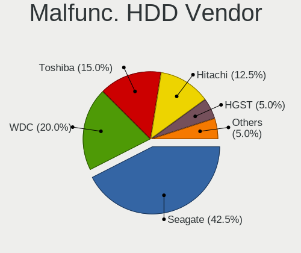
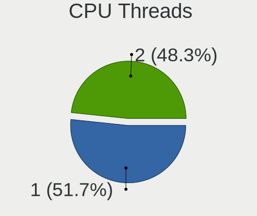
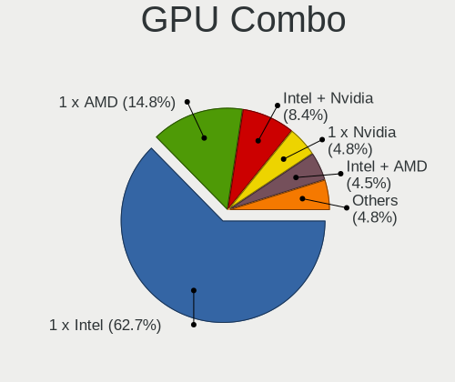
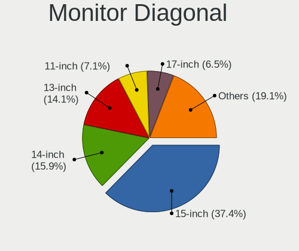
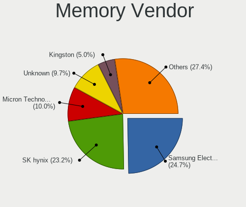
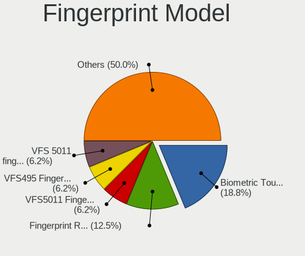

Lubuntu 22.04 - Tested Hardware & Statistics (Notebooks)
--------------------------------------------------------

A project to collect tested hardware configurations for Lubuntu 22.04.

Anyone can contribute to this report by the [hw-probe](https://github.com/linuxhw/hw-probe) tool:

    sudo -E hw-probe -all -upload

Please contribute! Especially if your hardware is rare.

Contents
--------

* [ Test Cases ](#test-cases)

* [ System ](#system)
  - [ Kernel                   ](#kernel)
  - [ Kernel Family            ](#kernel-family)
  - [ Kernel Major Ver.        ](#kernel-major-ver)
  - [ Arch                     ](#arch)
  - [ DE                       ](#de)
  - [ Display Server           ](#display-server)
  - [ Display Manager          ](#display-manager)
  - [ OS Lang                  ](#os-lang)
  - [ Boot Mode                ](#boot-mode)
  - [ Filesystem               ](#filesystem)
  - [ Part. scheme             ](#part-scheme)
  - [ Dual Boot with Linux/BSD ](#dual-boot-with-linuxbsd)
  - [ Dual Boot (Win)          ](#dual-boot-win)

* [ Board ](#board)
  - [ Vendor                   ](#vendor)
  - [ Model                    ](#model)
  - [ Model Family             ](#model-family)
  - [ MFG Year                 ](#mfg-year)
  - [ Form Factor              ](#form-factor)
  - [ Secure Boot              ](#secure-boot)
  - [ Coreboot                 ](#coreboot)
  - [ RAM Size                 ](#ram-size)
  - [ RAM Used                 ](#ram-used)
  - [ Total Drives             ](#total-drives)
  - [ Has CD-ROM               ](#has-cd-rom)
  - [ Has Ethernet             ](#has-ethernet)
  - [ Has WiFi                 ](#has-wifi)
  - [ Has Bluetooth            ](#has-bluetooth)

* [ Location ](#location)
  - [ Country                  ](#country)
  - [ City                     ](#city)

* [ Drives ](#drives)
  - [ Drive Vendor             ](#drive-vendor)
  - [ Drive Model              ](#drive-model)
  - [ HDD Vendor               ](#hdd-vendor)
  - [ SSD Vendor               ](#ssd-vendor)
  - [ Drive Kind               ](#drive-kind)
  - [ Drive Connector          ](#drive-connector)
  - [ Drive Size               ](#drive-size)
  - [ Space Total              ](#space-total)
  - [ Space Used               ](#space-used)
  - [ Malfunc. Drives          ](#malfunc-drives)
  - [ Malfunc. Drive Vendor    ](#malfunc-drive-vendor)
  - [ Malfunc. HDD Vendor      ](#malfunc-hdd-vendor)
  - [ Malfunc. Drive Kind      ](#malfunc-drive-kind)
  - [ Failed Drives            ](#failed-drives)
  - [ Failed Drive Vendor      ](#failed-drive-vendor)
  - [ Drive Status             ](#drive-status)

* [ Storage controller ](#storage-controller)
  - [ Storage Vendor           ](#storage-vendor)
  - [ Storage Model            ](#storage-model)
  - [ Storage Kind             ](#storage-kind)

* [ Processor ](#processor)
  - [ CPU Vendor               ](#cpu-vendor)
  - [ CPU Model                ](#cpu-model)
  - [ CPU Model Family         ](#cpu-model-family)
  - [ CPU Cores                ](#cpu-cores)
  - [ CPU Sockets              ](#cpu-sockets)
  - [ CPU Threads              ](#cpu-threads)
  - [ CPU Op-Modes             ](#cpu-op-modes)
  - [ CPU Microcode            ](#cpu-microcode)
  - [ CPU Microarch            ](#cpu-microarch)

* [ Graphics ](#graphics)
  - [ GPU Vendor               ](#gpu-vendor)
  - [ GPU Model                ](#gpu-model)
  - [ GPU Combo                ](#gpu-combo)
  - [ GPU Driver               ](#gpu-driver)
  - [ GPU Memory               ](#gpu-memory)

* [ Monitor ](#monitor)
  - [ Monitor Vendor           ](#monitor-vendor)
  - [ Monitor Model            ](#monitor-model)
  - [ Monitor Resolution       ](#monitor-resolution)
  - [ Monitor Diagonal         ](#monitor-diagonal)
  - [ Monitor Width            ](#monitor-width)
  - [ Aspect Ratio             ](#aspect-ratio)
  - [ Monitor Area             ](#monitor-area)
  - [ Pixel Density            ](#pixel-density)
  - [ Multiple Monitors        ](#multiple-monitors)

* [ Network ](#network)
  - [ Net Controller Vendor    ](#net-controller-vendor)
  - [ Net Controller Model     ](#net-controller-model)
  - [ Wireless Vendor          ](#wireless-vendor)
  - [ Wireless Model           ](#wireless-model)
  - [ Ethernet Vendor          ](#ethernet-vendor)
  - [ Ethernet Model           ](#ethernet-model)
  - [ Net Controller Kind      ](#net-controller-kind)
  - [ Used Controller          ](#used-controller)
  - [ NICs                     ](#nics)
  - [ IPv6                     ](#ipv6)

* [ Bluetooth ](#bluetooth)
  - [ Bluetooth Vendor         ](#bluetooth-vendor)
  - [ Bluetooth Model          ](#bluetooth-model)

* [ Sound ](#sound)
  - [ Sound Vendor             ](#sound-vendor)
  - [ Sound Model              ](#sound-model)

* [ Memory ](#memory)
  - [ Memory Vendor            ](#memory-vendor)
  - [ Memory Model             ](#memory-model)
  - [ Memory Kind              ](#memory-kind)
  - [ Memory Form Factor       ](#memory-form-factor)
  - [ Memory Size              ](#memory-size)
  - [ Memory Speed             ](#memory-speed)

* [ Printers & scanners ](#printers--scanners)
  - [ Printer Vendor           ](#printer-vendor)
  - [ Printer Model            ](#printer-model)
  - [ Scanner Vendor           ](#scanner-vendor)
  - [ Scanner Model            ](#scanner-model)

* [ Camera ](#camera)
  - [ Camera Vendor            ](#camera-vendor)
  - [ Camera Model             ](#camera-model)

* [ Security ](#security)
  - [ Fingerprint Vendor       ](#fingerprint-vendor)
  - [ Fingerprint Model        ](#fingerprint-model)
  - [ Chipcard Vendor          ](#chipcard-vendor)
  - [ Chipcard Model           ](#chipcard-model)

* [ Unsupported ](#unsupported)
  - [ Unsupported Devices      ](#unsupported-devices)
  - [ Unsupported Device Types ](#unsupported-device-types)

Test Cases
----------

Total: 390

| Vendor        | Model                       | Probe                                                      | Date         |
|---------------|-----------------------------|------------------------------------------------------------|--------------|
| Dell          | Vostro 3400                 | [93da978d38](https://linux-hardware.org/?probe=93da978d38) | May 04, 2024 |
| ASUSTek       | X540YA                      | [e163aa8e32](https://linux-hardware.org/?probe=e163aa8e32) | May 03, 2024 |
| HP            | Pavilion dm1                | [ba07809953](https://linux-hardware.org/?probe=ba07809953) | May 02, 2024 |
| ASUSTek       | K45A                        | [7bed7e12ab](https://linux-hardware.org/?probe=7bed7e12ab) | Apr 27, 2024 |
| Dell          | Inspiron 15-3567            | [e93fe83f01](https://linux-hardware.org/?probe=e93fe83f01) | Apr 24, 2024 |
| Acer          | Aspire E5-573G              | [216cd2fc72](https://linux-hardware.org/?probe=216cd2fc72) | Apr 24, 2024 |
| ASUSTek       | X555QG                      | [c905efd379](https://linux-hardware.org/?probe=c905efd379) | Apr 23, 2024 |
| ASUSTek       | X555QG                      | [26b8da2305](https://linux-hardware.org/?probe=26b8da2305) | Apr 23, 2024 |
| ASUSTek       | K42F                        | [f29299723c](https://linux-hardware.org/?probe=f29299723c) | Apr 23, 2024 |
| ASUSTek       | K42F                        | [63b454fa02](https://linux-hardware.org/?probe=63b454fa02) | Apr 23, 2024 |
| Dell          | Inspiron 15-3567            | [bf1e4f8d6a](https://linux-hardware.org/?probe=bf1e4f8d6a) | Apr 20, 2024 |
| HP            | EliteBook 6930p             | [263d72f3c6](https://linux-hardware.org/?probe=263d72f3c6) | Apr 17, 2024 |
| Unknown       | Unknown                     | [10d92e98c0](https://linux-hardware.org/?probe=10d92e98c0) | Apr 16, 2024 |
| HP            | 250 G4 Notebook PC          | [2fcb542c43](https://linux-hardware.org/?probe=2fcb542c43) | Apr 14, 2024 |
| Unknown       | M-140BI3                    | [491b1013ab](https://linux-hardware.org/?probe=491b1013ab) | Apr 11, 2024 |
| HP            | Pavilion g7                 | [6d84e70e34](https://linux-hardware.org/?probe=6d84e70e34) | Apr 10, 2024 |
| Lenovo        | ThinkPad X201 3680A44       | [db6aadf372](https://linux-hardware.org/?probe=db6aadf372) | Apr 10, 2024 |
| Dell          | Latitude E6410              | [7c4144e1df](https://linux-hardware.org/?probe=7c4144e1df) | Apr 05, 2024 |
| Acer          | Extensa 5630                | [224d74c060](https://linux-hardware.org/?probe=224d74c060) | Apr 04, 2024 |
| Acer          | Aspire E1-572G              | [7a19eed833](https://linux-hardware.org/?probe=7a19eed833) | Apr 03, 2024 |
| HP            | Laptop 15s-eq2xxx           | [b4e434bb17](https://linux-hardware.org/?probe=b4e434bb17) | Mar 27, 2024 |
| Acer          | Extensa 2540                | [3e49d36612](https://linux-hardware.org/?probe=3e49d36612) | Mar 26, 2024 |
| HP            | 15 Notebook PC              | [46b79e7d26](https://linux-hardware.org/?probe=46b79e7d26) | Mar 26, 2024 |
| HP            | Laptop 14-em0xxx            | [3f937a527b](https://linux-hardware.org/?probe=3f937a527b) | Mar 23, 2024 |
| Samsung       | N100                        | [d7a66b3835](https://linux-hardware.org/?probe=d7a66b3835) | Mar 22, 2024 |
| Sony          | VGN-TZ21MN_N                | [1e1a62727b](https://linux-hardware.org/?probe=1e1a62727b) | Mar 19, 2024 |
| Unknown       | Unknown                     | [27317f4bcf](https://linux-hardware.org/?probe=27317f4bcf) | Mar 18, 2024 |
| Sony          | VPCW216AG                   | [c607fc8a6b](https://linux-hardware.org/?probe=c607fc8a6b) | Mar 16, 2024 |
| HP            | Split 13 x2 PC              | [447e4a6951](https://linux-hardware.org/?probe=447e4a6951) | Mar 14, 2024 |
| Lenovo        | ThinkPad L520 5015AH2       | [c63473fd10](https://linux-hardware.org/?probe=c63473fd10) | Mar 12, 2024 |
| HP            | Notebook                    | [51a929c53a](https://linux-hardware.org/?probe=51a929c53a) | Mar 08, 2024 |
| Sony          | SVF1521NSTB                 | [b9f4d235c9](https://linux-hardware.org/?probe=b9f4d235c9) | Mar 06, 2024 |
| HP            | Notebook                    | [025b54a984](https://linux-hardware.org/?probe=025b54a984) | Mar 06, 2024 |
| HP            | Notebook                    | [5f90d8f25b](https://linux-hardware.org/?probe=5f90d8f25b) | Mar 06, 2024 |
| Fujitsu       | FMVC05005                   | [af1cd1c78b](https://linux-hardware.org/?probe=af1cd1c78b) | Mar 04, 2024 |
| Sony          | VPCEB3C4R                   | [f63a65b29f](https://linux-hardware.org/?probe=f63a65b29f) | Mar 04, 2024 |
| MSI           | MS-168A                     | [1625072479](https://linux-hardware.org/?probe=1625072479) | Mar 02, 2024 |
| MSI           | MS-168A                     | [cae162bcad](https://linux-hardware.org/?probe=cae162bcad) | Mar 02, 2024 |
| HP            | 250 G1                      | [805489bf43](https://linux-hardware.org/?probe=805489bf43) | Feb 26, 2024 |
| ASUSTek       | VivoBook_ASUS Laptop E41... | [7c9a199867](https://linux-hardware.org/?probe=7c9a199867) | Feb 21, 2024 |
| Sony          | VPCEB3C4R                   | [93a9016bf3](https://linux-hardware.org/?probe=93a9016bf3) | Feb 20, 2024 |
| Lenovo        | IdeaPad 500-15ISK 80NT      | [d18785d54f](https://linux-hardware.org/?probe=d18785d54f) | Feb 16, 2024 |
| Digibras      | NH4CU53                     | [1e3d9f1795](https://linux-hardware.org/?probe=1e3d9f1795) | Feb 10, 2024 |
| Dell          | Latitude E5430 vPro         | [9e120d90b8](https://linux-hardware.org/?probe=9e120d90b8) | Feb 09, 2024 |
| ASUSTek       | VivoBook_ASUSLaptop X712... | [5fa467241b](https://linux-hardware.org/?probe=5fa467241b) | Feb 05, 2024 |
| Itautec       | Infoway w7430               | [4928095170](https://linux-hardware.org/?probe=4928095170) | Feb 05, 2024 |
| Acer          | Aspire 5951G                | [e583f21b3a](https://linux-hardware.org/?probe=e583f21b3a) | Feb 05, 2024 |
| HP            | Pavilion dv6                | [52c0814c31](https://linux-hardware.org/?probe=52c0814c31) | Feb 03, 2024 |
| HP            | Pavilion dv6                | [d477732dfa](https://linux-hardware.org/?probe=d477732dfa) | Feb 03, 2024 |
| Lenovo        | G405 20239                  | [7afc820794](https://linux-hardware.org/?probe=7afc820794) | Feb 01, 2024 |
| Acer          | Swift SF314-43              | [793c3d3b4c](https://linux-hardware.org/?probe=793c3d3b4c) | Jan 31, 2024 |
| Lenovo        | G575 20081                  | [162e1f81cf](https://linux-hardware.org/?probe=162e1f81cf) | Jan 31, 2024 |
| Lenovo        | V310-15ISK 80SY             | [a72292c97b](https://linux-hardware.org/?probe=a72292c97b) | Jan 31, 2024 |
| Lenovo        | ThinkPad T60p 20078JU       | [6c83cf1141](https://linux-hardware.org/?probe=6c83cf1141) | Jan 25, 2024 |
| Acer          | Aspire E1-572G              | [d94fb0b47b](https://linux-hardware.org/?probe=d94fb0b47b) | Jan 24, 2024 |
| ASUSTek       | ZenBook UX325SA_UM325SA     | [82175efff8](https://linux-hardware.org/?probe=82175efff8) | Jan 14, 2024 |
| iRU           | 15TLI                       | [d318923a72](https://linux-hardware.org/?probe=d318923a72) | Jan 09, 2024 |
| ASUSTek       | K53U                        | [df631caaa2](https://linux-hardware.org/?probe=df631caaa2) | Jan 09, 2024 |
| Lenovo        | ThinkPad T430 23477C7       | [db1c43a6a6](https://linux-hardware.org/?probe=db1c43a6a6) | Jan 09, 2024 |
| HP            | 240 G6 Notebook PC          | [52fa49b647](https://linux-hardware.org/?probe=52fa49b647) | Jan 08, 2024 |
| HP            | Notebook                    | [79932769a2](https://linux-hardware.org/?probe=79932769a2) | Jan 08, 2024 |
| Digibras      | NH4CU03                     | [be0eab4038](https://linux-hardware.org/?probe=be0eab4038) | Jan 05, 2024 |
| Google        | Electro                     | [74ed1caffe](https://linux-hardware.org/?probe=74ed1caffe) | Jan 04, 2024 |
| Packard Be... | EasyNote LM85               | [e756bb57ba](https://linux-hardware.org/?probe=e756bb57ba) | Jan 03, 2024 |
| HP            | Notebook                    | [3db48f7d59](https://linux-hardware.org/?probe=3db48f7d59) | Jan 02, 2024 |
| Apple         | MacBook6,1                  | [ba4ad2bc18](https://linux-hardware.org/?probe=ba4ad2bc18) | Dec 31, 2023 |
| Lenovo        | ThinkPad W540 20BG001KFR    | [af69ec2d33](https://linux-hardware.org/?probe=af69ec2d33) | Dec 29, 2023 |
| Lenovo        | ThinkPad W540 20BG001KFR    | [143c6b4161](https://linux-hardware.org/?probe=143c6b4161) | Dec 29, 2023 |
| Chuwi         | GemiBook Plus               | [acb06bb39a](https://linux-hardware.org/?probe=acb06bb39a) | Dec 29, 2023 |
| Google        | Swanky                      | [12fd273db1](https://linux-hardware.org/?probe=12fd273db1) | Dec 27, 2023 |
| Acer          | Extensa 215-55              | [54ca5c9e74](https://linux-hardware.org/?probe=54ca5c9e74) | Dec 25, 2023 |
| Acer          | Aspire 1810TZ               | [0b4e0e5e2b](https://linux-hardware.org/?probe=0b4e0e5e2b) | Dec 24, 2023 |
| Acer          | Aspire 1810TZ               | [3ba98d8db9](https://linux-hardware.org/?probe=3ba98d8db9) | Dec 24, 2023 |
| HP            | ZBook 17                    | [d1269ca08c](https://linux-hardware.org/?probe=d1269ca08c) | Dec 13, 2023 |
| Dell          | Inspiron 3421               | [2ceba60d03](https://linux-hardware.org/?probe=2ceba60d03) | Dec 09, 2023 |
| Dell          | Inspiron 3421               | [912e908ba0](https://linux-hardware.org/?probe=912e908ba0) | Dec 09, 2023 |
| HP            | EliteBook 655 15.6 inch ... | [5a628a7b0f](https://linux-hardware.org/?probe=5a628a7b0f) | Nov 30, 2023 |
| Lenovo        | IdeaPad Slim 1-14AST-05 ... | [3b82362902](https://linux-hardware.org/?probe=3b82362902) | Nov 29, 2023 |
| SGIN          | M15                         | [c7fb994367](https://linux-hardware.org/?probe=c7fb994367) | Nov 28, 2023 |
| Dell          | Latitude E6520              | [a03b74a3d3](https://linux-hardware.org/?probe=a03b74a3d3) | Nov 28, 2023 |
| ASUSTek       | X550ZE                      | [dedc54db8f](https://linux-hardware.org/?probe=dedc54db8f) | Nov 27, 2023 |
| Chuwi         | X312B                       | [7f13217449](https://linux-hardware.org/?probe=7f13217449) | Nov 23, 2023 |
| MSI           | Raider GE76 12UE            | [bad07cc00d](https://linux-hardware.org/?probe=bad07cc00d) | Nov 20, 2023 |
| Packard Be... | ENLE11BZ                    | [905ad855b3](https://linux-hardware.org/?probe=905ad855b3) | Nov 19, 2023 |
| ASUSTek       | X201E                       | [3532136698](https://linux-hardware.org/?probe=3532136698) | Nov 18, 2023 |
| Lenovo        | IdeaPad 300-15ISK 80Q7      | [d297e1365c](https://linux-hardware.org/?probe=d297e1365c) | Nov 16, 2023 |
| HP            | 250 G5 Notebook PC          | [dde4f98b29](https://linux-hardware.org/?probe=dde4f98b29) | Nov 16, 2023 |
| Acer          | Extensa 5620                | [3c206e8578](https://linux-hardware.org/?probe=3c206e8578) | Nov 13, 2023 |
| ASUSTek       | T100TAS                     | [ff4068e60a](https://linux-hardware.org/?probe=ff4068e60a) | Nov 12, 2023 |
| ASUSTek       | VivoBook_ASUSLaptop X515... | [fa680be8d9](https://linux-hardware.org/?probe=fa680be8d9) | Nov 10, 2023 |
| ASUSTek       | X550ZE                      | [31d4fc8694](https://linux-hardware.org/?probe=31d4fc8694) | Nov 09, 2023 |
| Hampoo        | I2W6_AP135 Reserved         | [cf0c02a17a](https://linux-hardware.org/?probe=cf0c02a17a) | Nov 03, 2023 |
| Hampoo        | I2W6_AP135 Reserved         | [fdb464fed7](https://linux-hardware.org/?probe=fdb464fed7) | Nov 02, 2023 |
| ASUSTek       | K50IJ                       | [115cf0d371](https://linux-hardware.org/?probe=115cf0d371) | Oct 30, 2023 |
| ASUSTek       | K50IJ                       | [6fbbd2a061](https://linux-hardware.org/?probe=6fbbd2a061) | Oct 30, 2023 |
| Acer          | Aspire A315-21              | [48785f697c](https://linux-hardware.org/?probe=48785f697c) | Oct 29, 2023 |
| Dixonsxp      | Unknown                     | [da9f723fd0](https://linux-hardware.org/?probe=da9f723fd0) | Oct 23, 2023 |
| Dell          | XPS 9315                    | [8c9d16e737](https://linux-hardware.org/?probe=8c9d16e737) | Oct 22, 2023 |
| HP            | Compaq Presario CQ40        | [5ddf61741f](https://linux-hardware.org/?probe=5ddf61741f) | Oct 20, 2023 |
| Acer          | Aspire A314-23P             | [99490448ae](https://linux-hardware.org/?probe=99490448ae) | Oct 16, 2023 |
| Acer          | Aspire A314-23P             | [431b672bf5](https://linux-hardware.org/?probe=431b672bf5) | Oct 16, 2023 |
| HP            | Laptop 14-dq0xxx            | [1f161ae269](https://linux-hardware.org/?probe=1f161ae269) | Oct 16, 2023 |
| Google        | Careena                     | [8359c8c3e8](https://linux-hardware.org/?probe=8359c8c3e8) | Oct 15, 2023 |
| Google        | Careena                     | [4292c49150](https://linux-hardware.org/?probe=4292c49150) | Oct 15, 2023 |
| HP            | Notebook                    | [fb39ee7d9d](https://linux-hardware.org/?probe=fb39ee7d9d) | Oct 13, 2023 |
| Thomson       | NEO14-4W64                  | [f68e52a8a1](https://linux-hardware.org/?probe=f68e52a8a1) | Oct 12, 2023 |
| Mediacom      | WinPad 11,6 FullHD- WPU1... | [ee4617fa73](https://linux-hardware.org/?probe=ee4617fa73) | Oct 10, 2023 |
| Lenovo        | IdeaPad 110-15IBR 80T7      | [2bb1495e06](https://linux-hardware.org/?probe=2bb1495e06) | Oct 08, 2023 |
| Google        | Sasuke                      | [ea2d350776](https://linux-hardware.org/?probe=ea2d350776) | Oct 08, 2023 |
| Insyde        | Braswell                    | [c4261097f5](https://linux-hardware.org/?probe=c4261097f5) | Oct 07, 2023 |
| Getac         | X500G3                      | [919772eed0](https://linux-hardware.org/?probe=919772eed0) | Oct 02, 2023 |
| Panasonic     | CF-F9KWPZFFE                | [33cf16d622](https://linux-hardware.org/?probe=33cf16d622) | Oct 01, 2023 |
| HP            | Laptop 14-ck0xxx            | [f4326ad956](https://linux-hardware.org/?probe=f4326ad956) | Sep 26, 2023 |
| HP            | Laptop 14-ck0xxx            | [3ff273b73c](https://linux-hardware.org/?probe=3ff273b73c) | Sep 26, 2023 |
| ASUSTek       | X451MA                      | [ed779c5de4](https://linux-hardware.org/?probe=ed779c5de4) | Sep 20, 2023 |
| Mini PC       | Cherry Trail CR             | [f16d8d4254](https://linux-hardware.org/?probe=f16d8d4254) | Sep 19, 2023 |
| Dell          | Precision 3570              | [fd3441ff1d](https://linux-hardware.org/?probe=fd3441ff1d) | Sep 18, 2023 |
| HP            | 15                          | [03e1207549](https://linux-hardware.org/?probe=03e1207549) | Sep 12, 2023 |
| HP            | 2000                        | [48790bd831](https://linux-hardware.org/?probe=48790bd831) | Sep 09, 2023 |
| HP            | 2000                        | [ce9ba2b7c4](https://linux-hardware.org/?probe=ce9ba2b7c4) | Sep 09, 2023 |
| eMachines     | eM350                       | [fae8f9e3f1](https://linux-hardware.org/?probe=fae8f9e3f1) | Sep 06, 2023 |
| Dell          | Latitude 3190               | [60f82737fa](https://linux-hardware.org/?probe=60f82737fa) | Sep 06, 2023 |
| HP            | 255 G2                      | [27b48aa011](https://linux-hardware.org/?probe=27b48aa011) | Sep 02, 2023 |
| ASUSTek       | X75VD                       | [cab1480dc6](https://linux-hardware.org/?probe=cab1480dc6) | Aug 30, 2023 |
| Packard Be... | EasyNote TJ65               | [f37ab96772](https://linux-hardware.org/?probe=f37ab96772) | Aug 28, 2023 |
| Toshiba       | Satellite P770              | [8618c83c93](https://linux-hardware.org/?probe=8618c83c93) | Aug 26, 2023 |
| Google        | Robo                        | [dfa74d0961](https://linux-hardware.org/?probe=dfa74d0961) | Aug 26, 2023 |
| Compal        | PBL20                       | [ae09076b4e](https://linux-hardware.org/?probe=ae09076b4e) | Aug 22, 2023 |
| HP            | Notebook                    | [11d2993965](https://linux-hardware.org/?probe=11d2993965) | Aug 20, 2023 |
| Google        | Madoo                       | [8eea1017dc](https://linux-hardware.org/?probe=8eea1017dc) | Aug 20, 2023 |
| HP            | Notebook                    | [f6e4865586](https://linux-hardware.org/?probe=f6e4865586) | Aug 19, 2023 |
| Lenovo        | ThinkPad T430 2349TFK       | [390899a281](https://linux-hardware.org/?probe=390899a281) | Aug 17, 2023 |
| HP            | Pavilion g7                 | [43351d6476](https://linux-hardware.org/?probe=43351d6476) | Aug 12, 2023 |
| Samsung       | N150P/N210P/N220P           | [459b9f31b9](https://linux-hardware.org/?probe=459b9f31b9) | Aug 09, 2023 |
| Toshiba       | Satellite L875D             | [de1a418102](https://linux-hardware.org/?probe=de1a418102) | Aug 08, 2023 |
| Dell          | Inspiron 5720               | [20532065b5](https://linux-hardware.org/?probe=20532065b5) | Aug 04, 2023 |
| Dell          | Inspiron 5720               | [8f6ada13fa](https://linux-hardware.org/?probe=8f6ada13fa) | Aug 04, 2023 |
| HP            | Pavilion 15                 | [257fe62454](https://linux-hardware.org/?probe=257fe62454) | Aug 02, 2023 |
| Lenovo        | G580 20150                  | [00d2ac7698](https://linux-hardware.org/?probe=00d2ac7698) | Aug 01, 2023 |
| Dell          | Inspiron 1520               | [a119f99239](https://linux-hardware.org/?probe=a119f99239) | Jul 27, 2023 |
| Lenovo        | ThinkPad T61 7659WCN        | [f447bc27b2](https://linux-hardware.org/?probe=f447bc27b2) | Jul 25, 2023 |
| Dell          | Inspiron 5576               | [54c338bb01](https://linux-hardware.org/?probe=54c338bb01) | Jul 22, 2023 |
| Dell          | Inspiron 5576               | [6654328e2c](https://linux-hardware.org/?probe=6654328e2c) | Jul 22, 2023 |
| Acer          | Aspire SW3-013              | [b503fa1044](https://linux-hardware.org/?probe=b503fa1044) | Jul 21, 2023 |
| ASUSTek       | ROG Strix G733QR_G733QR     | [cd8a01d7ab](https://linux-hardware.org/?probe=cd8a01d7ab) | Jul 19, 2023 |
| Acer          | Aspire E1-771               | [9d53aeea5a](https://linux-hardware.org/?probe=9d53aeea5a) | Jul 19, 2023 |
| HP            | 255 G2                      | [eaf9befa3a](https://linux-hardware.org/?probe=eaf9befa3a) | Jul 19, 2023 |
| Dell          | Inspiron N5110              | [632958a27e](https://linux-hardware.org/?probe=632958a27e) | Jul 07, 2023 |
| HP            | ProBook 4525s               | [e70917548c](https://linux-hardware.org/?probe=e70917548c) | Jul 07, 2023 |
| Google        | Pyro                        | [9632e7a77b](https://linux-hardware.org/?probe=9632e7a77b) | Jul 02, 2023 |
| Lenovo        | Z70-80 80FG                 | [d4b8002633](https://linux-hardware.org/?probe=d4b8002633) | Jun 28, 2023 |
| Sony          | VPCEB37FD                   | [e8d24fe375](https://linux-hardware.org/?probe=e8d24fe375) | Jun 25, 2023 |
| HP            | EliteBook 840 G3            | [234a73d6b0](https://linux-hardware.org/?probe=234a73d6b0) | Jun 23, 2023 |
| Dell          | Vostro 3700                 | [6e4fe4f0c8](https://linux-hardware.org/?probe=6e4fe4f0c8) | Jun 22, 2023 |
| TrekStor      | SurfTab wintron 7.0 ST70... | [b61b22c866](https://linux-hardware.org/?probe=b61b22c866) | Jun 20, 2023 |
| Dell          | Precision 3570              | [6f6debf1a4](https://linux-hardware.org/?probe=6f6debf1a4) | Jun 15, 2023 |
| Dell          | Vostro 3700                 | [dae8f5a0b4](https://linux-hardware.org/?probe=dae8f5a0b4) | Jun 15, 2023 |
| Lenovo        | IdeaPad Y580                | [699cb9ac1e](https://linux-hardware.org/?probe=699cb9ac1e) | Jun 13, 2023 |
| HP            | EliteBook 2530p             | [b843a66531](https://linux-hardware.org/?probe=b843a66531) | Jun 11, 2023 |
| Lenovo        | ThinkPad X201 3249CTO       | [849dbace60](https://linux-hardware.org/?probe=849dbace60) | Jun 09, 2023 |
| Acer          | Aspire 7741                 | [c85cff4000](https://linux-hardware.org/?probe=c85cff4000) | Jun 08, 2023 |
| Sony          | VPCEH2E1R                   | [97e5366810](https://linux-hardware.org/?probe=97e5366810) | Jun 08, 2023 |
| HP            | 240 G3                      | [475e3e63ef](https://linux-hardware.org/?probe=475e3e63ef) | Jun 05, 2023 |
| Lenovo        | G580 2189                   | [3138d92b76](https://linux-hardware.org/?probe=3138d92b76) | Jun 01, 2023 |
| Samsung       | N150/N210/N220              | [449400ebe9](https://linux-hardware.org/?probe=449400ebe9) | May 31, 2023 |
| Dell          | Latitude E6430              | [37dab72e8c](https://linux-hardware.org/?probe=37dab72e8c) | May 25, 2023 |
| Unknown       | Unknown                     | [cbab0f6dd8](https://linux-hardware.org/?probe=cbab0f6dd8) | May 25, 2023 |
| ASUSTek       | X450CC                      | [ca431e5e80](https://linux-hardware.org/?probe=ca431e5e80) | May 24, 2023 |
| Lenovo        | Legion 5 15ACH6 82JW        | [20c80a45a8](https://linux-hardware.org/?probe=20c80a45a8) | May 22, 2023 |
| Lenovo        | IdeaPad 500-15ISK 80NT      | [bd6409ee58](https://linux-hardware.org/?probe=bd6409ee58) | May 19, 2023 |
| Lenovo        | IdeaPad 500-15ISK 80NT      | [2d944abb09](https://linux-hardware.org/?probe=2d944abb09) | May 19, 2023 |
| Google        | Snappy                      | [0c095bb37a](https://linux-hardware.org/?probe=0c095bb37a) | May 17, 2023 |
| Hampoo        | Cherry Trail CR V200        | [1167f27914](https://linux-hardware.org/?probe=1167f27914) | May 15, 2023 |
| Lenovo        | Legion 5 15ACH6 82JW        | [0145d107e8](https://linux-hardware.org/?probe=0145d107e8) | May 15, 2023 |
| Intel         | W7650                       | [a672f7199c](https://linux-hardware.org/?probe=a672f7199c) | May 14, 2023 |
| Mediacom      | SmartBook 14 FullHD - SB... | [5f3a14748e](https://linux-hardware.org/?probe=5f3a14748e) | May 13, 2023 |
| Toshiba       | Satellite Radius P55W-B     | [e2ed5e2135](https://linux-hardware.org/?probe=e2ed5e2135) | May 11, 2023 |
| Lenovo        | Legion 5 15ACH6 82JW        | [0b08b7a631](https://linux-hardware.org/?probe=0b08b7a631) | May 09, 2023 |
| HUAWEI        | KLVL-WXXW                   | [a08e2235cd](https://linux-hardware.org/?probe=a08e2235cd) | May 09, 2023 |
| Dell          | XPS 13 9305                 | [8b7b41fde9](https://linux-hardware.org/?probe=8b7b41fde9) | May 07, 2023 |
| Dell          | XPS 13 9305                 | [f830561f82](https://linux-hardware.org/?probe=f830561f82) | May 07, 2023 |
| Unknown       | Unknown                     | [cacf6a8831](https://linux-hardware.org/?probe=cacf6a8831) | May 07, 2023 |
| Apple         | MacBook4,1                  | [3daf4fbc68](https://linux-hardware.org/?probe=3daf4fbc68) | May 07, 2023 |
| Dell          | Latitude E6520              | [e6309dff56](https://linux-hardware.org/?probe=e6309dff56) | May 05, 2023 |
| Google        | Glimmer                     | [c9ccc1f6c9](https://linux-hardware.org/?probe=c9ccc1f6c9) | May 02, 2023 |
| Google        | Glimmer                     | [f4558038dd](https://linux-hardware.org/?probe=f4558038dd) | May 02, 2023 |
| Lenovo        | IdeaPad 100-15IBD 80QQ      | [e1d1572c51](https://linux-hardware.org/?probe=e1d1572c51) | Apr 30, 2023 |
| HP            | Laptop 15-bs2xx             | [ad768363bc](https://linux-hardware.org/?probe=ad768363bc) | Apr 28, 2023 |
| Lenovo        | IdeaPad 320-15AST 80XV      | [e80ea5c4ae](https://linux-hardware.org/?probe=e80ea5c4ae) | Apr 28, 2023 |
| Toshiba       | Satellite C660              | [ce4700304c](https://linux-hardware.org/?probe=ce4700304c) | Apr 26, 2023 |
| Dell          | XPS 13 9305                 | [4db8688749](https://linux-hardware.org/?probe=4db8688749) | Apr 25, 2023 |
| AXIOO         | MYBOOK-14 .B001             | [38d6a9b3d2](https://linux-hardware.org/?probe=38d6a9b3d2) | Apr 25, 2023 |
| Dell          | Latitude 5290               | [54f92464ba](https://linux-hardware.org/?probe=54f92464ba) | Apr 23, 2023 |
| HP            | G42                         | [dd87e935d0](https://linux-hardware.org/?probe=dd87e935d0) | Apr 20, 2023 |
| Acer          | Aspire 5735                 | [2d8d4a8124](https://linux-hardware.org/?probe=2d8d4a8124) | Apr 20, 2023 |
| HP            | ZBook 15 G2                 | [00ed2824f0](https://linux-hardware.org/?probe=00ed2824f0) | Apr 20, 2023 |
| HP            | ZBook 15 G2                 | [7a4242a973](https://linux-hardware.org/?probe=7a4242a973) | Apr 19, 2023 |
| HP            | Pavilion 15                 | [d0c3e2bb4e](https://linux-hardware.org/?probe=d0c3e2bb4e) | Apr 19, 2023 |
| Lenovo        | ThinkPad L520 5015AH2       | [db4749ffef](https://linux-hardware.org/?probe=db4749ffef) | Apr 18, 2023 |
| GPU Compan... | GWTN116-3                   | [e233174fb3](https://linux-hardware.org/?probe=e233174fb3) | Apr 17, 2023 |
| Lenovo        | ThinkPad X240 20AMS0RR00    | [db0d2a4c4e](https://linux-hardware.org/?probe=db0d2a4c4e) | Apr 14, 2023 |
| HP            | Pavilion 15                 | [199f3bb771](https://linux-hardware.org/?probe=199f3bb771) | Apr 14, 2023 |
| Lenovo        | ThinkPad T530 2394BF7       | [5161d2f521](https://linux-hardware.org/?probe=5161d2f521) | Apr 11, 2023 |
| Toshiba       | Satellite P70-A             | [6ffb7a79ef](https://linux-hardware.org/?probe=6ffb7a79ef) | Apr 06, 2023 |
| HP            | Pavilion 15                 | [f982fd86f7](https://linux-hardware.org/?probe=f982fd86f7) | Apr 05, 2023 |
| AXIOO         | MYBOOK-14 .B001             | [edba1216c0](https://linux-hardware.org/?probe=edba1216c0) | Apr 04, 2023 |
| HP            | Stream Laptop 14-ax0XX      | [aead33a5e6](https://linux-hardware.org/?probe=aead33a5e6) | Apr 01, 2023 |
| Apple         | MacBookPro9,2               | [35eaaaac45](https://linux-hardware.org/?probe=35eaaaac45) | Mar 26, 2023 |
| HP            | Laptop 17-ak0xx             | [872e7f18c5](https://linux-hardware.org/?probe=872e7f18c5) | Mar 24, 2023 |
| Lenovo        | IdeaPad 1 15AMN7 82VG       | [104f6a754e](https://linux-hardware.org/?probe=104f6a754e) | Mar 22, 2023 |
| Acer          | Aspire one 1-131            | [ea5065ef8f](https://linux-hardware.org/?probe=ea5065ef8f) | Mar 21, 2023 |
| Dell          | Precision M3800             | [1d20598cc5](https://linux-hardware.org/?probe=1d20598cc5) | Mar 17, 2023 |
| Dell          | Latitude 5290               | [2b4d5d7866](https://linux-hardware.org/?probe=2b4d5d7866) | Mar 15, 2023 |
| Dell          | Latitude 7480               | [2c1cca300c](https://linux-hardware.org/?probe=2c1cca300c) | Mar 13, 2023 |
| MSI           | S12T 3M/S12 3M              | [b12ff30d25](https://linux-hardware.org/?probe=b12ff30d25) | Mar 09, 2023 |
| Lenovo        | IdeaPad L340-15IRH Gamin... | [96738d19ab](https://linux-hardware.org/?probe=96738d19ab) | Mar 05, 2023 |
| ASUSTek       | T200TA                      | [4d2a27cffa](https://linux-hardware.org/?probe=4d2a27cffa) | Mar 05, 2023 |
| Dell          | Latitude E6230              | [1909328685](https://linux-hardware.org/?probe=1909328685) | Mar 04, 2023 |
| Intel         | W7650                       | [30bde4c2d8](https://linux-hardware.org/?probe=30bde4c2d8) | Mar 03, 2023 |
| Google        | Celes                       | [1952ca99b7](https://linux-hardware.org/?probe=1952ca99b7) | Mar 01, 2023 |
| Google        | Celes                       | [097300a7d3](https://linux-hardware.org/?probe=097300a7d3) | Mar 01, 2023 |
| Lenovo        | ThinkPad X201 3626AL3       | [6741a47327](https://linux-hardware.org/?probe=6741a47327) | Mar 01, 2023 |
| Getac         | V200-X                      | [f3a5da3eae](https://linux-hardware.org/?probe=f3a5da3eae) | Feb 27, 2023 |
| HP            | Pavilion 17                 | [dfd1ca1091](https://linux-hardware.org/?probe=dfd1ca1091) | Feb 27, 2023 |
| Lenovo        | G505s 20255                 | [26548764cd](https://linux-hardware.org/?probe=26548764cd) | Feb 26, 2023 |
| Lenovo        | ThinkPad X230 Tablet 343... | [be9468c864](https://linux-hardware.org/?probe=be9468c864) | Feb 26, 2023 |
| Positivo      | Q232A                       | [71c020b7e4](https://linux-hardware.org/?probe=71c020b7e4) | Feb 22, 2023 |
| Lenovo        | IdeaPad 100S-14IBR 80R9     | [e61bce94ea](https://linux-hardware.org/?probe=e61bce94ea) | Feb 20, 2023 |
| HUAWEI        | KLVD-WXX9                   | [d65b4290e6](https://linux-hardware.org/?probe=d65b4290e6) | Feb 19, 2023 |
| Lenovo        | IdeaPad 100S-14IBR 80R9     | [cbf0e3814c](https://linux-hardware.org/?probe=cbf0e3814c) | Feb 18, 2023 |
| HP            | Notebook                    | [9fbe66f89a](https://linux-hardware.org/?probe=9fbe66f89a) | Feb 18, 2023 |
| Getac         | V200-X                      | [754a4bd022](https://linux-hardware.org/?probe=754a4bd022) | Feb 17, 2023 |
| Getac         | V200-X                      | [6794c7246f](https://linux-hardware.org/?probe=6794c7246f) | Feb 17, 2023 |
| Lenovo        | IdeaPad 1 14IGL7 82V6       | [39dfda526c](https://linux-hardware.org/?probe=39dfda526c) | Feb 17, 2023 |
| Lenovo        | IdeaPad 1 14IGL7 82V6       | [fbe0863656](https://linux-hardware.org/?probe=fbe0863656) | Feb 15, 2023 |
| Lenovo        | ThinkPad L520 5015AH2       | [8f2bad1d66](https://linux-hardware.org/?probe=8f2bad1d66) | Feb 13, 2023 |
| Acer          | Aspire E5-411G              | [360789275e](https://linux-hardware.org/?probe=360789275e) | Feb 13, 2023 |
| Acer          | Extensa 2540                | [6e7e38afb4](https://linux-hardware.org/?probe=6e7e38afb4) | Feb 12, 2023 |
| Acer          | Aspire A515-45              | [dcecd700f9](https://linux-hardware.org/?probe=dcecd700f9) | Feb 10, 2023 |
| Acer          | AO756                       | [630b2b9b5b](https://linux-hardware.org/?probe=630b2b9b5b) | Feb 03, 2023 |
| Lenovo        | IdeaPad S340-15IWL 81N8     | [88be1adb45](https://linux-hardware.org/?probe=88be1adb45) | Feb 02, 2023 |
| Intel         | powered classmate PC        | [a3e602934b](https://linux-hardware.org/?probe=a3e602934b) | Jan 29, 2023 |
| Lenovo        | ThinkPad X220 4291H82       | [f9781882f8](https://linux-hardware.org/?probe=f9781882f8) | Jan 28, 2023 |
| Lenovo        | G50-30 80G0                 | [850fc5b742](https://linux-hardware.org/?probe=850fc5b742) | Jan 25, 2023 |
| Dell          | Latitude E6410              | [03463d0a58](https://linux-hardware.org/?probe=03463d0a58) | Jan 25, 2023 |
| ASUSTek       | VivoBook_ASUSLaptop X415... | [f0d73c960e](https://linux-hardware.org/?probe=f0d73c960e) | Jan 25, 2023 |
| Toshiba       | Satellite Pro S500          | [d529b5d578](https://linux-hardware.org/?probe=d529b5d578) | Jan 24, 2023 |
| Alienware     | 15 R3                       | [f70ed3a363](https://linux-hardware.org/?probe=f70ed3a363) | Jan 23, 2023 |
| Lenovo        | G505s 20255                 | [4eb3c2afb3](https://linux-hardware.org/?probe=4eb3c2afb3) | Jan 23, 2023 |
| Toshiba       | Satellite Pro S500          | [118cda5e06](https://linux-hardware.org/?probe=118cda5e06) | Jan 23, 2023 |
| Toshiba       | Satellite Pro S500          | [f1e995c40b](https://linux-hardware.org/?probe=f1e995c40b) | Jan 20, 2023 |
| Toshiba       | Satellite Pro S500          | [16708a6471](https://linux-hardware.org/?probe=16708a6471) | Jan 20, 2023 |
| HP            | Compaq 6510b (GM108UC#AB... | [45ae9ca3c9](https://linux-hardware.org/?probe=45ae9ca3c9) | Jan 20, 2023 |
| Toshiba       | Satellite Pro S500          | [194f5676bd](https://linux-hardware.org/?probe=194f5676bd) | Jan 20, 2023 |
| Lenovo        | ThinkPad P14s Gen 2a 21A... | [8c57e1afda](https://linux-hardware.org/?probe=8c57e1afda) | Jan 18, 2023 |
| Lenovo        | ThinkPad P14s Gen 2a 21A... | [c0055f8de2](https://linux-hardware.org/?probe=c0055f8de2) | Jan 18, 2023 |
| Acer          | Swift SF314-54G             | [c666c8f973](https://linux-hardware.org/?probe=c666c8f973) | Jan 18, 2023 |
| Acer          | Aspire ES1-711              | [87c00cc849](https://linux-hardware.org/?probe=87c00cc849) | Jan 12, 2023 |
| Fujitsu Si... | AMILO Si 2636               | [4a918c5503](https://linux-hardware.org/?probe=4a918c5503) | Jan 11, 2023 |
| Toshiba       | Satellite Pro S500          | [2549187c34](https://linux-hardware.org/?probe=2549187c34) | Jan 10, 2023 |
| Thomson       | N14C4WH64                   | [e9050d81df](https://linux-hardware.org/?probe=e9050d81df) | Jan 09, 2023 |
| Toshiba       | Satellite Pro S500          | [da62202546](https://linux-hardware.org/?probe=da62202546) | Jan 08, 2023 |
| ASUSTek       | W5Fe                        | [d56398aefd](https://linux-hardware.org/?probe=d56398aefd) | Jan 07, 2023 |
| ASUSTek       | F50SV                       | [ae6f64f5df](https://linux-hardware.org/?probe=ae6f64f5df) | Jan 05, 2023 |
| ASUSTek       | F8SG                        | [d70636ce7e](https://linux-hardware.org/?probe=d70636ce7e) | Jan 05, 2023 |
| Google        | Celes                       | [4036321fcf](https://linux-hardware.org/?probe=4036321fcf) | Jan 05, 2023 |
| Google        | Celes                       | [70525bfcb2](https://linux-hardware.org/?probe=70525bfcb2) | Jan 05, 2023 |
| Acer          | Aspire E5-573               | [bd9e90dca3](https://linux-hardware.org/?probe=bd9e90dca3) | Jan 04, 2023 |
| Acer          | Aspire SW3-013              | [44016de6db](https://linux-hardware.org/?probe=44016de6db) | Jan 01, 2023 |
| Google        | Candy                       | [86bb9a73fc](https://linux-hardware.org/?probe=86bb9a73fc) | Dec 31, 2022 |
| Acer          | TravelMate B117-M           | [23985812a9](https://linux-hardware.org/?probe=23985812a9) | Dec 30, 2022 |
| ASUSTek       | K72F                        | [f761bf9bd6](https://linux-hardware.org/?probe=f761bf9bd6) | Dec 30, 2022 |
| Apple         | MacBook4,1                  | [41a9d09ec8](https://linux-hardware.org/?probe=41a9d09ec8) | Dec 29, 2022 |
| Acer          | Aspire SW3-013              | [04286c0e93](https://linux-hardware.org/?probe=04286c0e93) | Dec 27, 2022 |
| Acer          | Swift SF314-54G             | [34532e7f7d](https://linux-hardware.org/?probe=34532e7f7d) | Dec 26, 2022 |
| Toshiba       | Satellite Pro S500          | [cd547b04a1](https://linux-hardware.org/?probe=cd547b04a1) | Dec 25, 2022 |
| Dell          | Latitude E7470              | [e171eea812](https://linux-hardware.org/?probe=e171eea812) | Dec 21, 2022 |
| HP            | 2000                        | [bcbeb17a60](https://linux-hardware.org/?probe=bcbeb17a60) | Dec 15, 2022 |
| Apple         | MacBookPro8,1               | [9ddb08e4ae](https://linux-hardware.org/?probe=9ddb08e4ae) | Dec 13, 2022 |
| Lenovo        | G500 20236                  | [becb2e6bbc](https://linux-hardware.org/?probe=becb2e6bbc) | Dec 12, 2022 |
| SGIN          | laptop                      | [8f650d00dd](https://linux-hardware.org/?probe=8f650d00dd) | Dec 11, 2022 |
| Lenovo        | Z70-80 80FG                 | [492071e526](https://linux-hardware.org/?probe=492071e526) | Dec 09, 2022 |
| Toshiba       | Satellite Pro S500          | [bcf1460e47](https://linux-hardware.org/?probe=bcf1460e47) | Dec 08, 2022 |
| GPU Compan... | GWTC116-2                   | [bdbc74a754](https://linux-hardware.org/?probe=bdbc74a754) | Dec 07, 2022 |
| Lenovo        | IdeaPad 5 14ABA7 82SE       | [659b20c9b8](https://linux-hardware.org/?probe=659b20c9b8) | Dec 06, 2022 |
| ASUSTek       | K70IO                       | [193053a6ef](https://linux-hardware.org/?probe=193053a6ef) | Dec 05, 2022 |
| ASUSTek       | K70IO                       | [179ce76921](https://linux-hardware.org/?probe=179ce76921) | Dec 02, 2022 |
| Positivo      | i500pro                     | [4a79aa2383](https://linux-hardware.org/?probe=4a79aa2383) | Nov 30, 2022 |
| ASUSTek       | K70IO                       | [f91b4cdb61](https://linux-hardware.org/?probe=f91b4cdb61) | Nov 29, 2022 |
| ASUSTek       | K70IO                       | [4eabf9a0d4](https://linux-hardware.org/?probe=4eabf9a0d4) | Nov 28, 2022 |
| Acer          | AO722                       | [fb75768c70](https://linux-hardware.org/?probe=fb75768c70) | Nov 26, 2022 |
| Unknown       | Unknown                     | [f40545f0d5](https://linux-hardware.org/?probe=f40545f0d5) | Nov 23, 2022 |
| HP            | Pavilion g6                 | [9b9cd79752](https://linux-hardware.org/?probe=9b9cd79752) | Nov 23, 2022 |
| Fujitsu       | LIFEBOOK A3510              | [e1c126c1f2](https://linux-hardware.org/?probe=e1c126c1f2) | Nov 22, 2022 |
| HP            | 250 G7 Notebook PC          | [242d685287](https://linux-hardware.org/?probe=242d685287) | Nov 22, 2022 |
| Toshiba       | Satellite Pro S500          | [a9d392c0c3](https://linux-hardware.org/?probe=a9d392c0c3) | Nov 22, 2022 |
| HP            | Laptop 14s-fq0xxx           | [cc9c76c85c](https://linux-hardware.org/?probe=cc9c76c85c) | Nov 21, 2022 |
| HP            | Pavilion g6                 | [63e70c5e46](https://linux-hardware.org/?probe=63e70c5e46) | Nov 20, 2022 |
| Fujitsu       | LIFEBOOK A3510              | [9eb6a535ac](https://linux-hardware.org/?probe=9eb6a535ac) | Nov 19, 2022 |
| Samsung       | 300V3A/300V4A/300V5A/200... | [4d8be4bb54](https://linux-hardware.org/?probe=4d8be4bb54) | Nov 18, 2022 |
| Toshiba       | Satellite Pro S500          | [f528238460](https://linux-hardware.org/?probe=f528238460) | Nov 16, 2022 |
| Toshiba       | Satellite Pro S500          | [97ccc55f03](https://linux-hardware.org/?probe=97ccc55f03) | Nov 16, 2022 |
| Dell          | Latitude E6520              | [ed6f93342d](https://linux-hardware.org/?probe=ed6f93342d) | Nov 15, 2022 |
| HP            | ProBook 430 G7              | [a7f77757c7](https://linux-hardware.org/?probe=a7f77757c7) | Nov 13, 2022 |
| HP            | Pavilion g6                 | [759ee850cc](https://linux-hardware.org/?probe=759ee850cc) | Nov 13, 2022 |
| HP            | Pavilion g6                 | [f506c5c2fa](https://linux-hardware.org/?probe=f506c5c2fa) | Nov 13, 2022 |
| Lenovo        | G50-45 80E3                 | [70940de14e](https://linux-hardware.org/?probe=70940de14e) | Nov 08, 2022 |
| Pretech       | EVE 1801 3G ES1049EG        | [19205fc20b](https://linux-hardware.org/?probe=19205fc20b) | Nov 04, 2022 |
| Acer          | Aspire E1-571               | [4ba79bc73e](https://linux-hardware.org/?probe=4ba79bc73e) | Oct 30, 2022 |
| Kiano         | SlimNote 1.0                | [db1ae618d8](https://linux-hardware.org/?probe=db1ae618d8) | Oct 29, 2022 |
| Google        | Apel                        | [f3bf9850dd](https://linux-hardware.org/?probe=f3bf9850dd) | Oct 26, 2022 |
| Lenovo        | G50-70 20351                | [9a17926acb](https://linux-hardware.org/?probe=9a17926acb) | Oct 15, 2022 |
| Lenovo        | B590 20208                  | [6a3309f753](https://linux-hardware.org/?probe=6a3309f753) | Oct 14, 2022 |
| Dell          | Latitude E5430 non-vPro     | [784360100d](https://linux-hardware.org/?probe=784360100d) | Oct 14, 2022 |
| Dell          | Latitude E5430 non-vPro     | [15ba599a80](https://linux-hardware.org/?probe=15ba599a80) | Oct 14, 2022 |
| Lenovo        | ThinkPad SL510 2847CXG      | [5680d8a827](https://linux-hardware.org/?probe=5680d8a827) | Oct 12, 2022 |
| Fujitsu       | LIFEBOOK U904               | [b4a8655f31](https://linux-hardware.org/?probe=b4a8655f31) | Oct 08, 2022 |
| Lenovo        | ThinkPad T410 2537CS0       | [c6a45619c4](https://linux-hardware.org/?probe=c6a45619c4) | Oct 03, 2022 |
| Lenovo        | ThinkPad E550 20DF00CUFR    | [7b5e707097](https://linux-hardware.org/?probe=7b5e707097) | Sep 27, 2022 |
| Packard Be... | EasyNote TS44HR             | [4005a32539](https://linux-hardware.org/?probe=4005a32539) | Sep 26, 2022 |
| Lenovo        | IdeaPad L340-15IRH Gamin... | [68d36ec742](https://linux-hardware.org/?probe=68d36ec742) | Sep 23, 2022 |
| Lenovo        | IdeaPad Slim 1-14AST-05 ... | [1dbeac403e](https://linux-hardware.org/?probe=1dbeac403e) | Sep 22, 2022 |
| Gateway       | NE46R                       | [61ee26263b](https://linux-hardware.org/?probe=61ee26263b) | Sep 20, 2022 |
| Dell          | Inspiron 11-3168            | [29241bb609](https://linux-hardware.org/?probe=29241bb609) | Sep 15, 2022 |
| Lenovo        | Z70-80 80FG                 | [93cb353340](https://linux-hardware.org/?probe=93cb353340) | Sep 14, 2022 |
| Dell          | Inspiron 11-3168            | [763b0fced4](https://linux-hardware.org/?probe=763b0fced4) | Sep 14, 2022 |
| Unknown       | Unknown                     | [8b85e41d17](https://linux-hardware.org/?probe=8b85e41d17) | Sep 14, 2022 |
| Sony          | SVE14A2V1EW                 | [5123cfd3cd](https://linux-hardware.org/?probe=5123cfd3cd) | Sep 09, 2022 |
| HP            | ProBook 4730s               | [5d0a59d50b](https://linux-hardware.org/?probe=5d0a59d50b) | Sep 05, 2022 |
| Dell          | XPS L322X                   | [bd4b0713a8](https://linux-hardware.org/?probe=bd4b0713a8) | Sep 04, 2022 |
| Lenovo        | ThinkPad T430 2342A19       | [1fee695aec](https://linux-hardware.org/?probe=1fee695aec) | Sep 01, 2022 |
| Lenovo        | ThinkPad X1 Carbon 2nd 2... | [f7189849b4](https://linux-hardware.org/?probe=f7189849b4) | Sep 01, 2022 |
| Lenovo        | B590 20208                  | [7eaabdb9ca](https://linux-hardware.org/?probe=7eaabdb9ca) | Aug 27, 2022 |
| Unknown       | Unknown                     | [3c18cd9208](https://linux-hardware.org/?probe=3c18cd9208) | Aug 25, 2022 |
| Acer          | Aspire 7250G                | [7035af5c32](https://linux-hardware.org/?probe=7035af5c32) | Aug 23, 2022 |
| Dell          | Vostro 3360                 | [0964195fe5](https://linux-hardware.org/?probe=0964195fe5) | Aug 21, 2022 |
| Prestigio     | PSB141C01BFH                | [37e5052027](https://linux-hardware.org/?probe=37e5052027) | Aug 18, 2022 |
| Lenovo        | IdeaPad 330-15IKB Touch ... | [0d774697cc](https://linux-hardware.org/?probe=0d774697cc) | Aug 11, 2022 |
| Intel         | W7650                       | [1c8a9fd64b](https://linux-hardware.org/?probe=1c8a9fd64b) | Aug 10, 2022 |
| OEM           | Unknown                     | [d95f8f1502](https://linux-hardware.org/?probe=d95f8f1502) | Aug 09, 2022 |
| Dell          | Inspiron 11-3168            | [11beb61f79](https://linux-hardware.org/?probe=11beb61f79) | Aug 09, 2022 |
| Dell          | Inspiron 11-3168            | [7a3c91b14a](https://linux-hardware.org/?probe=7a3c91b14a) | Aug 07, 2022 |
| HP            | 15 Notebook PC              | [c857595b97](https://linux-hardware.org/?probe=c857595b97) | Aug 05, 2022 |
| Dell          | Precision 3510              | [2d74356174](https://linux-hardware.org/?probe=2d74356174) | Aug 03, 2022 |
| Apple         | MacBook7,1                  | [84efbc858e](https://linux-hardware.org/?probe=84efbc858e) | Aug 02, 2022 |
| Dell          | Precision 3510              | [d2e79b01bb](https://linux-hardware.org/?probe=d2e79b01bb) | Aug 02, 2022 |
| IFSA          | Positivo BGH                | [ec0aa9bc36](https://linux-hardware.org/?probe=ec0aa9bc36) | Aug 02, 2022 |
| Google        | Celes                       | [6a4bc65f84](https://linux-hardware.org/?probe=6a4bc65f84) | Jul 31, 2022 |
| Dell          | XPS M1330                   | [2abad8da86](https://linux-hardware.org/?probe=2abad8da86) | Jul 30, 2022 |
| Sony          | VPCEB15FM                   | [340ef685ef](https://linux-hardware.org/?probe=340ef685ef) | Jul 24, 2022 |
| HP            | 245 G2                      | [03a8791b0c](https://linux-hardware.org/?probe=03a8791b0c) | Jul 18, 2022 |
| HP            | 245 G2                      | [f37ddc5aed](https://linux-hardware.org/?probe=f37ddc5aed) | Jul 17, 2022 |
| Lenovo        | G50-30 80G0                 | [27a46d46dd](https://linux-hardware.org/?probe=27a46d46dd) | Jul 16, 2022 |
| Chuwi         | GemiBook Pro                | [ff08461db4](https://linux-hardware.org/?probe=ff08461db4) | Jul 07, 2022 |
| Lenovo        | IdeaPad S145-15IGM 81MX     | [de35c60b5f](https://linux-hardware.org/?probe=de35c60b5f) | Jul 01, 2022 |
| Google        | Bobba360                    | [6fcae5202a](https://linux-hardware.org/?probe=6fcae5202a) | Jun 26, 2022 |
| Gateway       | Sonic-C                     | [6bec9c80ea](https://linux-hardware.org/?probe=6bec9c80ea) | Jun 21, 2022 |
| Dell          | Latitude XT                 | [c07eac8a84](https://linux-hardware.org/?probe=c07eac8a84) | Jun 17, 2022 |
| Dell          | Studio 1537                 | [12a651ebd2](https://linux-hardware.org/?probe=12a651ebd2) | Jun 16, 2022 |
| ASUSTek       | E403SA                      | [9ca6a865ff](https://linux-hardware.org/?probe=9ca6a865ff) | Jun 11, 2022 |
| HP            | Pavilion Sleekbook 15 PC    | [1a41b08f4f](https://linux-hardware.org/?probe=1a41b08f4f) | Jun 10, 2022 |
| ASUSTek       | N56VZ                       | [3c1a5025f1](https://linux-hardware.org/?probe=3c1a5025f1) | Jun 09, 2022 |
| Sony          | VGN-SZ71WN_C                | [aece18b520](https://linux-hardware.org/?probe=aece18b520) | Jun 06, 2022 |
| Intel         | W7650                       | [fd4abd788b](https://linux-hardware.org/?probe=fd4abd788b) | Jun 06, 2022 |
| Apple         | MacBookPro8,1               | [d191629954](https://linux-hardware.org/?probe=d191629954) | Jun 04, 2022 |
| Apple         | MacBookPro8,1               | [816c29b1df](https://linux-hardware.org/?probe=816c29b1df) | Jun 04, 2022 |
| HP            | Pavilion g6                 | [7c389588bb](https://linux-hardware.org/?probe=7c389588bb) | Jun 02, 2022 |
| HP            | ProBook 640 G1              | [a1c25fad70](https://linux-hardware.org/?probe=a1c25fad70) | Jun 01, 2022 |
| HP            | Pavilion g6                 | [3972cb6508](https://linux-hardware.org/?probe=3972cb6508) | May 25, 2022 |
| Toshiba       | Satellite L40               | [37af5b0ba4](https://linux-hardware.org/?probe=37af5b0ba4) | May 24, 2022 |
| Mediacom      | WinPad 11,6 FullHD- WPU1... | [0d13155508](https://linux-hardware.org/?probe=0d13155508) | May 23, 2022 |
| Dell          | System Inspiron 17 7000 ... | [5f646f4e8c](https://linux-hardware.org/?probe=5f646f4e8c) | May 23, 2022 |
| Mediacom      | WinPad 11,6 FullHD- WPU1... | [f52f5b7be2](https://linux-hardware.org/?probe=f52f5b7be2) | May 21, 2022 |
| Lenovo        | IdeaPad Slim 1-14AST-05 ... | [6528155c00](https://linux-hardware.org/?probe=6528155c00) | May 19, 2022 |
| Lenovo        | IdeaPad Slim 1-14AST-05 ... | [53219da3f5](https://linux-hardware.org/?probe=53219da3f5) | May 19, 2022 |
| Google        | Terra                       | [35088c1c05](https://linux-hardware.org/?probe=35088c1c05) | May 16, 2022 |
| Acer          | Aspire V5-573G              | [4477112f3a](https://linux-hardware.org/?probe=4477112f3a) | May 11, 2022 |
| ASUSTek       | VivoBook 14_ASUS Laptop ... | [f151955e44](https://linux-hardware.org/?probe=f151955e44) | May 10, 2022 |
| Google        | Relm                        | [37a9101768](https://linux-hardware.org/?probe=37a9101768) | May 09, 2022 |
| Intel         | W7650                       | [bd5d159229](https://linux-hardware.org/?probe=bd5d159229) | May 07, 2022 |
| Apple         | MacBookPro14,1              | [fd19fe90e5](https://linux-hardware.org/?probe=fd19fe90e5) | May 05, 2022 |
| Apple         | MacBookPro14,1              | [dc913baa2b](https://linux-hardware.org/?probe=dc913baa2b) | May 04, 2022 |
| Fujitsu       | LIFEBOOK S751               | [6150343dc0](https://linux-hardware.org/?probe=6150343dc0) | May 01, 2022 |
| Google        | Bobba360                    | [e90fbcc91d](https://linux-hardware.org/?probe=e90fbcc91d) | Apr 29, 2022 |
| HP            | Laptop 15-da0xxx            | [6ad1b34a48](https://linux-hardware.org/?probe=6ad1b34a48) | Apr 29, 2022 |
| Dell          | Latitude 7480               | [817415642f](https://linux-hardware.org/?probe=817415642f) | Apr 26, 2022 |
| HP            | Pavilion dv4                | [7bd955f313](https://linux-hardware.org/?probe=7bd955f313) | Apr 18, 2022 |
| Apple         | MacBookPro8,1               | [f74cae630d](https://linux-hardware.org/?probe=f74cae630d) | Apr 16, 2022 |
| Intel         | W7650                       | [9144ca0d30](https://linux-hardware.org/?probe=9144ca0d30) | Apr 15, 2022 |
| Intel         | W7650                       | [df2f2041d1](https://linux-hardware.org/?probe=df2f2041d1) | Feb 18, 2022 |

System
------

Kernel
------

Version of the Linux kernel

| Version           | Notebooks | Percent |
|-------------------|-----------|---------|
| 5.15.0-43-generic | 23        | 7.23%   |
| 5.15.0-56-generic | 14        | 4.4%    |
| 5.15.0-25-generic | 12        | 3.77%   |
| 6.2.0-34-generic  | 9         | 2.83%   |
| 6.2.0-26-generic  | 9         | 2.83%   |
| 5.15.0-58-generic | 9         | 2.83%   |
| 6.2.0-39-generic  | 8         | 2.52%   |
| 5.19.0-32-generic | 8         | 2.52%   |
| 5.15.0-60-generic | 8         | 2.52%   |
| 5.15.0-30-generic | 8         | 2.52%   |
| 5.19.0-41-generic | 7         | 2.2%    |
| 5.15.0-47-generic | 7         | 2.2%    |
| 5.15.0-46-generic | 7         | 2.2%    |
| 6.5.0-27-generic  | 6         | 1.89%   |
| 6.5.0-15-generic  | 6         | 1.89%   |
| 5.19.0-35-generic | 6         | 1.89%   |
| 5.15.0-52-generic | 6         | 1.89%   |
| 5.15.0-27-generic | 6         | 1.89%   |
| 6.5.0-28-generic  | 5         | 1.57%   |
| 6.5.0-25-generic  | 5         | 1.57%   |
| 6.5.0-18-generic  | 5         | 1.57%   |
| 6.2.0-37-generic  | 5         | 1.57%   |
| 5.19.0-43-generic | 5         | 1.57%   |
| 5.15.0-73-generic | 5         | 1.57%   |
| 5.15.0-53-generic | 5         | 1.57%   |
| 6.5.0-26-generic  | 4         | 1.26%   |
| 6.5.0-17-generic  | 4         | 1.26%   |
| 6.2.0-36-generic  | 4         | 1.26%   |
| 6.2.0-33-generic  | 4         | 1.26%   |
| 5.19.0-46-generic | 4         | 1.26%   |
| 5.19.0-40-generic | 4         | 1.26%   |
| 5.19.0-38-generic | 4         | 1.26%   |
| 5.15.0-71-generic | 4         | 1.26%   |
| 5.15.0-57-generic | 4         | 1.26%   |
| 5.15.0-50-generic | 4         | 1.26%   |
| 5.15.0-41-generic | 4         | 1.26%   |
| 6.5.0-21-generic  | 3         | 0.94%   |
| 6.2.0-35-generic  | 3         | 0.94%   |
| 6.2.0-31-generic  | 3         | 0.94%   |
| 5.19.0-42-generic | 3         | 0.94%   |

Kernel Family
-------------

Linux kernel without a distro release

| Version | Notebooks | Percent |
|---------|-----------|---------|
| 5.15.0  | 156       | 52.53%  |
| 6.2.0   | 47        | 15.82%  |
| 5.19.0  | 47        | 15.82%  |
| 6.5.0   | 39        | 13.13%  |
| 6.7.8   | 1         | 0.34%   |
| 6.4.12  | 1         | 0.34%   |
| 6.1.12  | 1         | 0.34%   |
| 6.0.12  | 1         | 0.34%   |
| 5.4.0   | 1         | 0.34%   |
| 5.19.8  | 1         | 0.34%   |
| 5.18.0  | 1         | 0.34%   |
| 5.14.0  | 1         | 0.34%   |

Kernel Major Ver.
-----------------

Linux kernel major version

| Version | Notebooks | Percent |
|---------|-----------|---------|
| 5.15    | 156       | 52.53%  |
| 5.19    | 48        | 16.16%  |
| 6.2     | 47        | 15.82%  |
| 6.5     | 39        | 13.13%  |
| 6.7     | 1         | 0.34%   |
| 6.4     | 1         | 0.34%   |
| 6.1     | 1         | 0.34%   |
| 6.0     | 1         | 0.34%   |
| 5.4     | 1         | 0.34%   |
| 5.18    | 1         | 0.34%   |
| 5.14    | 1         | 0.34%   |

Arch
----

OS architecture (x86_64, i586, etc.)

| Name   | Notebooks | Percent |
|--------|-----------|---------|
| x86_64 | 289       | 100%    |

DE
--

Desktop Environment

| Name       | Notebooks | Percent |
|------------|-----------|---------|
| LXQt       | 280       | 96.89%  |
| LXDE       | 6         | 2.08%   |
| X-Cinnamon | 2         | 0.69%   |
| KDE5       | 1         | 0.35%   |

Display Server
--------------

X11 or Wayland

| Name    | Notebooks | Percent |
|---------|-----------|---------|
| X11     | 282       | 97.58%  |
| Tty     | 6         | 2.08%   |
| Wayland | 1         | 0.35%   |

Display Manager
---------------

SDDM, LightDM, etc.

| Name    | Notebooks | Percent |
|---------|-----------|---------|
| SDDM    | 254       | 86.99%  |
| Unknown | 21        | 7.19%   |
| LightDM | 12        | 4.11%   |
| GDM3    | 5         | 1.71%   |

OS Lang
-------

Language

| Lang   | Notebooks | Percent |
|--------|-----------|---------|
| en_US  | 89        | 30.69%  |
| fr_FR  | 34        | 11.72%  |
| it_IT  | 20        | 6.9%    |
| C      | 18        | 6.21%   |
| en_GB  | 17        | 5.86%   |
| de_DE  | 14        | 4.83%   |
| pt_BR  | 13        | 4.48%   |
| ru_RU  | 11        | 3.79%   |
| pl_PL  | 9         | 3.1%    |
| es_MX  | 8         | 2.76%   |
| en_AG  | 8         | 2.76%   |
| en_CA  | 6         | 2.07%   |
| tr_TR  | 4         | 1.38%   |
| en_AU  | 4         | 1.38%   |
| nl_BE  | 3         | 1.03%   |
| es_CO  | 3         | 1.03%   |
| es_CL  | 3         | 1.03%   |
| es_AR  | 3         | 1.03%   |
| sk_SK  | 2         | 0.69%   |
| es_ES  | 2         | 0.69%   |
| es_CR  | 2         | 0.69%   |
| en_PH  | 2         | 0.69%   |
| vi_VN  | 1         | 0.34%   |
| ro_RO  | 1         | 0.34%   |
| nl_NL  | 1         | 0.34%   |
| lzh_TW | 1         | 0.34%   |
| ja_JP  | 1         | 0.34%   |
| hu_HU  | 1         | 0.34%   |
| fr_CA  | 1         | 0.34%   |
| fi_FI  | 1         | 0.34%   |
| es_EC  | 1         | 0.34%   |
| en_ZA  | 1         | 0.34%   |
| en_DE  | 1         | 0.34%   |
| el_GR  | 1         | 0.34%   |
| de_CH  | 1         | 0.34%   |
| da_DK  | 1         | 0.34%   |
| aa_DJ  | 1         | 0.34%   |

Boot Mode
---------

EFI or BIOS

| Mode | Notebooks | Percent |
|------|-----------|---------|
| BIOS | 177       | 60.62%  |
| EFI  | 115       | 39.38%  |

Filesystem
----------

Type of filesystem

| Type    | Notebooks | Percent |
|---------|-----------|---------|
| Ext4    | 232       | 78.11%  |
| Tmpfs   | 42        | 14.14%  |
| Overlay | 19        | 6.4%    |
| Btrfs   | 2         | 0.67%   |
| Xfs     | 1         | 0.34%   |
| Ext2    | 1         | 0.34%   |

Part. scheme
------------

Scheme of partitioning

| Type    | Notebooks | Percent |
|---------|-----------|---------|
| GPT     | 160       | 54.42%  |
| MBR     | 93        | 31.63%  |
| Unknown | 41        | 13.95%  |

Dual Boot with Linux/BSD
------------------------

Hosting more than one Linux/BSD

| Dual boot | Notebooks | Percent |
|-----------|-----------|---------|
| No        | 265       | 91.07%  |
| Yes       | 26        | 8.93%   |

Dual Boot (Win)
---------------

Hosting Linux and Windows

| Dual boot | Notebooks | Percent |
|-----------|-----------|---------|
| No        | 217       | 74.32%  |
| Yes       | 75        | 25.68%  |

Board
-----

Vendor
------

Motherboard manufacturer

| Name                | Notebooks | Percent |
|---------------------|-----------|---------|
| Hewlett-Packard     | 51        | 17.65%  |
| Lenovo              | 50        | 17.3%   |
| Dell                | 31        | 10.73%  |
| Acer                | 29        | 10.03%  |
| ASUSTek Computer    | 25        | 8.65%   |
| Google              | 13        | 4.5%    |
| Sony                | 8         | 2.77%   |
| Apple               | 8         | 2.77%   |
| Unknown             | 8         | 2.77%   |
| Toshiba             | 7         | 2.42%   |
| Fujitsu             | 5         | 1.73%   |
| Samsung Electronics | 4         | 1.38%   |
| Packard Bell        | 4         | 1.38%   |
| Mediacom            | 4         | 1.38%   |
| MSI                 | 3         | 1.04%   |
| Chuwi               | 3         | 1.04%   |
| Thomson             | 2         | 0.69%   |
| SGIN                | 2         | 0.69%   |
| Positivo            | 2         | 0.69%   |
| Intel               | 2         | 0.69%   |
| HUAWEI              | 2         | 0.69%   |
| Hampoo              | 2         | 0.69%   |
| GPU Company         | 2         | 0.69%   |
| Getac               | 2         | 0.69%   |
| Gateway             | 2         | 0.69%   |
| Digibras            | 2         | 0.69%   |
| TrekStor            | 1         | 0.35%   |
| Pretech             | 1         | 0.35%   |
| Prestigio           | 1         | 0.35%   |
| Panasonic           | 1         | 0.35%   |
| OEM                 | 1         | 0.35%   |
| Mini PC             | 1         | 0.35%   |
| Kiano               | 1         | 0.35%   |
| Itautec             | 1         | 0.35%   |
| Insyde              | 1         | 0.35%   |
| IFSA                | 1         | 0.35%   |
| Fujitsu Siemens     | 1         | 0.35%   |
| eMachines           | 1         | 0.35%   |
| Dixonsxp            | 1         | 0.35%   |
| Compal              | 1         | 0.35%   |

Model
-----

Motherboard model

| Name                                       | Notebooks | Percent |
|--------------------------------------------|-----------|---------|
| Unknown                                    | 10        | 3.46%   |
| HP Notebook                                | 5         | 1.73%   |
| Mediacom WinPad 11,6 FullHD- WPU11         | 3         | 1.04%   |
| Lenovo IdeaPad Slim 1-14AST-05 81VS        | 3         | 1.04%   |
| HP Pavilion 15                             | 3         | 1.04%   |
| Apple MacBookPro8,1                        | 3         | 1.04%   |
| Lenovo G50-30 80G0                         | 2         | 0.69%   |
| HP Pavilion g6                             | 2         | 0.69%   |
| HP 255 G2                                  | 2         | 0.69%   |
| HP 2000                                    | 2         | 0.69%   |
| Fujitsu LIFEBOOK A3510                     | 2         | 0.69%   |
| Dell Latitude E6410                        | 2         | 0.69%   |
| Apple MacBook4,1                           | 2         | 0.69%   |
| Acer Aspire SW3-013                        | 2         | 0.69%   |
| Acer Aspire A314-23P                       | 2         | 0.69%   |
| TrekStor SurfTab wintron 7.0 ST70416-6     | 1         | 0.35%   |
| Toshiba Satellite Radius P55W-B            | 1         | 0.35%   |
| Toshiba Satellite Pro S500                 | 1         | 0.35%   |
| Toshiba Satellite P770                     | 1         | 0.35%   |
| Toshiba Satellite P70-A                    | 1         | 0.35%   |
| Toshiba Satellite L875D                    | 1         | 0.35%   |
| Toshiba Satellite L40                      | 1         | 0.35%   |
| Toshiba Satellite C660                     | 1         | 0.35%   |
| Thomson NEO14-4W64                         | 1         | 0.35%   |
| Thomson N14C4WH64                          | 1         | 0.35%   |
| Sony VPCW216AG                             | 1         | 0.35%   |
| Sony VPCEH2E1R                             | 1         | 0.35%   |
| Sony VPCEB3C4R                             | 1         | 0.35%   |
| Sony VPCEB15FM                             | 1         | 0.35%   |
| Sony VGN-TZ21MN_N                          | 1         | 0.35%   |
| Sony VGN-SZ71WN_C                          | 1         | 0.35%   |
| Sony SVF1521NSTB                           | 1         | 0.35%   |
| Sony SVE14A2V1EW                           | 1         | 0.35%   |
| SGIN M15                                   | 1         | 0.35%   |
| SGIN laptop                                | 1         | 0.35%   |
| Samsung N150P/N210P/N220P                  | 1         | 0.35%   |
| Samsung N150/N210/N220                     | 1         | 0.35%   |
| Samsung N100                               | 1         | 0.35%   |
| Samsung 300V3A/300V4A/300V5A/200A4B/200A5B | 1         | 0.35%   |
| Pretech EVE 1801 3G ES1049EG               | 1         | 0.35%   |

Model Family
------------

Motherboard model prefix

| Name                  | Notebooks | Percent |
|-----------------------|-----------|---------|
| Acer Aspire           | 20        | 6.92%   |
| Lenovo ThinkPad       | 19        | 6.57%   |
| Lenovo IdeaPad        | 18        | 6.23%   |
| Dell Latitude         | 12        | 4.15%   |
| HP Pavilion           | 11        | 3.81%   |
| Unknown               | 10        | 3.46%   |
| Toshiba Satellite     | 7         | 2.42%   |
| HP Laptop             | 7         | 2.42%   |
| Dell Inspiron         | 7         | 2.42%   |
| HP Notebook           | 5         | 1.73%   |
| HP ProBook            | 4         | 1.38%   |
| HP EliteBook          | 4         | 1.38%   |
| HP 250                | 4         | 1.38%   |
| Fujitsu LIFEBOOK      | 4         | 1.38%   |
| Dell XPS              | 4         | 1.38%   |
| ASUS VivoBook         | 4         | 1.38%   |
| Acer Extensa          | 4         | 1.38%   |
| Packard Bell EasyNote | 3         | 1.04%   |
| Mediacom WinPad       | 3         | 1.04%   |
| Dell Vostro           | 3         | 1.04%   |
| Dell Precision        | 3         | 1.04%   |
| Apple MacBookPro8     | 3         | 1.04%   |
| Lenovo G50-30         | 2         | 0.69%   |
| HP ZBook              | 2         | 0.69%   |
| HP Compaq             | 2         | 0.69%   |
| HP 255                | 2         | 0.69%   |
| HP 240                | 2         | 0.69%   |
| HP 2000               | 2         | 0.69%   |
| HP 15                 | 2         | 0.69%   |
| Chuwi GemiBook        | 2         | 0.69%   |
| Apple MacBook4        | 2         | 0.69%   |
| Acer Swift            | 2         | 0.69%   |
| TrekStor SurfTab      | 1         | 0.35%   |
| Thomson NEO14-4W64    | 1         | 0.35%   |
| Thomson N14C4WH64     | 1         | 0.35%   |
| Sony VPCW216AG        | 1         | 0.35%   |
| Sony VPCEH2E1R        | 1         | 0.35%   |
| Sony VPCEB3C4R        | 1         | 0.35%   |
| Sony VPCEB15FM        | 1         | 0.35%   |
| Sony VGN-TZ21MN       | 1         | 0.35%   |

MFG Year
--------

Motherboard manufacture year

| Year    | Notebooks | Percent |
|---------|-----------|---------|
| 2013    | 31        | 10.73%  |
| 2011    | 28        | 9.69%   |
| 2012    | 26        | 9%      |
| 2010    | 24        | 8.3%    |
| 2016    | 23        | 7.96%   |
| 2021    | 22        | 7.61%   |
| 2022    | 18        | 6.23%   |
| 2015    | 18        | 6.23%   |
| 2014    | 15        | 5.19%   |
| 2008    | 14        | 4.84%   |
| 2019    | 12        | 4.15%   |
| 2009    | 12        | 4.15%   |
| 2017    | 11        | 3.81%   |
| 2020    | 9         | 3.11%   |
| 2007    | 9         | 3.11%   |
| 2023    | 8         | 2.77%   |
| 2018    | 7         | 2.42%   |
| 2006    | 1         | 0.35%   |
| Unknown | 1         | 0.35%   |

Form Factor
-----------

Physical design of the computer

| Name     | Notebooks | Percent |
|----------|-----------|---------|
| Notebook | 289       | 100%    |

Secure Boot
-----------

Enabled or disabled

| State    | Notebooks | Percent |
|----------|-----------|---------|
| Disabled | 272       | 93.15%  |
| Enabled  | 20        | 6.85%   |

Coreboot
--------

Have coreboot on board

| Used | Notebooks | Percent |
|------|-----------|---------|
| No   | 275       | 95.16%  |
| Yes  | 14        | 4.84%   |

RAM Size
--------

Total RAM memory

| Size in GB  | Notebooks | Percent |
|-------------|-----------|---------|
| 3.01-4.0    | 109       | 37.33%  |
| 4.01-8.0    | 78        | 26.71%  |
| 1.01-2.0    | 42        | 14.38%  |
| 8.01-16.0   | 26        | 8.9%    |
| 16.01-24.0  | 19        | 6.51%   |
| 2.01-3.0    | 10        | 3.42%   |
| 32.01-64.0  | 5         | 1.71%   |
| 24.01-32.0  | 1         | 0.34%   |
| 64.01-256.0 | 1         | 0.34%   |
| 0.51-1.0    | 1         | 0.34%   |

RAM Used
--------

Used RAM memory

| Used GB   | Notebooks | Percent |
|-----------|-----------|---------|
| 1.01-2.0  | 149       | 49.01%  |
| 0.51-1.0  | 66        | 21.71%  |
| 2.01-3.0  | 60        | 19.74%  |
| 4.01-8.0  | 13        | 4.28%   |
| 3.01-4.0  | 13        | 4.28%   |
| 0.01-0.5  | 2         | 0.66%   |
| 8.01-16.0 | 1         | 0.33%   |

Total Drives
------------

Number of drives on board

| Drives | Notebooks | Percent |
|--------|-----------|---------|
| 1      | 235       | 80.2%   |
| 2      | 47        | 16.04%  |
| 3      | 8         | 2.73%   |
| 0      | 3         | 1.02%   |

Has CD-ROM
----------

Has CD-ROM on board

| Presented | Notebooks | Percent |
|-----------|-----------|---------|
| No        | 153       | 52.94%  |
| Yes       | 136       | 47.06%  |

Has Ethernet
------------

Has Ethernet on board

| Presented | Notebooks | Percent |
|-----------|-----------|---------|
| Yes       | 224       | 77.24%  |
| No        | 66        | 22.76%  |

Has WiFi
--------

Has WiFi module

| Presented | Notebooks | Percent |
|-----------|-----------|---------|
| Yes       | 267       | 92.39%  |
| No        | 22        | 7.61%   |

Has Bluetooth
-------------

Has Bluetooth module

| Presented | Notebooks | Percent |
|-----------|-----------|---------|
| Yes       | 195       | 66.78%  |
| No        | 97        | 33.22%  |

Location
--------

Country
-------

Geographic location (country)

| Country      | Notebooks | Percent |
|--------------|-----------|---------|
| USA          | 45        | 15.57%  |
| France       | 35        | 12.11%  |
| Italy        | 26        | 9%      |
| Germany      | 23        | 7.96%   |
| Russia       | 18        | 6.23%   |
| Brazil       | 13        | 4.5%    |
| Poland       | 12        | 4.15%   |
| UK           | 10        | 3.46%   |
| Canada       | 8         | 2.77%   |
| Turkey       | 5         | 1.73%   |
| Colombia     | 5         | 1.73%   |
| Belgium      | 5         | 1.73%   |
| Argentina    | 5         | 1.73%   |
| Ukraine      | 4         | 1.38%   |
| Netherlands  | 4         | 1.38%   |
| Mexico       | 4         | 1.38%   |
| Indonesia    | 4         | 1.38%   |
| Chile        | 4         | 1.38%   |
| Vietnam      | 3         | 1.04%   |
| Slovakia     | 3         | 1.04%   |
| Hungary      | 3         | 1.04%   |
| Costa Rica   | 3         | 1.04%   |
| Australia    | 3         | 1.04%   |
| UAE          | 2         | 0.69%   |
| Thailand     | 2         | 0.69%   |
| Sweden       | 2         | 0.69%   |
| Spain        | 2         | 0.69%   |
| South Africa | 2         | 0.69%   |
| Portugal     | 2         | 0.69%   |
| Philippines  | 2         | 0.69%   |
| Pakistan     | 2         | 0.69%   |
| Japan        | 2         | 0.69%   |
| Finland      | 2         | 0.69%   |
| Czechia      | 2         | 0.69%   |
| Taiwan       | 1         | 0.35%   |
| Switzerland  | 1         | 0.35%   |
| Serbia       | 1         | 0.35%   |
| Romania      | 1         | 0.35%   |
| Peru         | 1         | 0.35%   |
| Morocco      | 1         | 0.35%   |

City
----

Geographic location (city)

| City                   | Notebooks | Percent |
|------------------------|-----------|---------|
| Paris                  | 9         | 3.01%   |
| Santiago               | 4         | 1.34%   |
| Moscow                 | 4         | 1.34%   |
| Milan                  | 4         | 1.34%   |
| Bruhl                  | 4         | 1.34%   |
| Rome                   | 3         | 1%      |
| Kyiv                   | 3         | 1%      |
| Ghent                  | 3         | 1%      |
| Bogot                | 3         | 1%      |
| Uberlndia            | 2         | 0.67%   |
| St Petersburg          | 2         | 0.67%   |
| Sarospatak             | 2         | 0.67%   |
| Porto Alegre           | 2         | 0.67%   |
| Novosibirsk            | 2         | 0.67%   |
| New York               | 2         | 0.67%   |
| Munich                 | 2         | 0.67%   |
| Milano                 | 2         | 0.67%   |
| Lyon                   | 2         | 0.67%   |
| Lansing                | 2         | 0.67%   |
| Krakow                 | 2         | 0.67%   |
| Ho Chi Minh City       | 2         | 0.67%   |
| Heredia                | 2         | 0.67%   |
| Fortaleza              | 2         | 0.67%   |
| Flushing               | 2         | 0.67%   |
| Eugene                 | 2         | 0.67%   |
| Dubai                  | 2         | 0.67%   |
| Columbus               | 2         | 0.67%   |
| Buffalo                | 2         | 0.67%   |
| Bratislava             | 2         | 0.67%   |
| Zizur Mayor            | 1         | 0.33%   |
| Zawiercie              | 1         | 0.33%   |
| Zagreb                 | 1         | 0.33%   |
| Yoshkar-Ola            | 1         | 0.33%   |
| Yorkville              | 1         | 0.33%   |
| Yerevan                | 1         | 0.33%   |
| Yekaterinburg          | 1         | 0.33%   |
| Wolfhagen              | 1         | 0.33%   |
| Wieliczka              | 1         | 0.33%   |
| West Stockbridge       | 1         | 0.33%   |
| Wattignies-la-Victoire | 1         | 0.33%   |

Drives
------

Drive Vendor
------------

Hard drive vendors

| Vendor                    | Notebooks | Drives | Percent |
|---------------------------|-----------|--------|---------|
| Unknown                   | 49        | 67     | 15.08%  |
| WDC                       | 42        | 50     | 12.92%  |
| Seagate                   | 34        | 38     | 10.46%  |
| Samsung Electronics       | 28        | 39     | 8.62%   |
| Toshiba                   | 26        | 29     | 8%      |
| Kingston                  | 15        | 15     | 4.62%   |
| Hitachi                   | 15        | 19     | 4.62%   |
| SanDisk                   | 12        | 12     | 3.69%   |
| SK hynix                  | 8         | 8      | 2.46%   |
| Micron Technology         | 8         | 9      | 2.46%   |
| HGST                      | 7         | 8      | 2.15%   |
| Crucial                   | 7         | 7      | 2.15%   |
| Unknown                   | 7         | 7      | 2.15%   |
| A-DATA Technology         | 5         | 5      | 1.54%   |
| Transcend                 | 4         | 5      | 1.23%   |
| China                     | 4         | 5      | 1.23%   |
| SPCC                      | 3         | 4      | 0.92%   |
| NGFF                      | 3         | 3      | 0.92%   |
| Intel                     | 3         | 3      | 0.92%   |
| Fujitsu                   | 3         | 3      | 0.92%   |
| UMIS                      | 2         | 2      | 0.62%   |
| Silicon Motion            | 2         | 2      | 0.62%   |
| PNY                       | 2         | 2      | 0.62%   |
| Patriot                   | 2         | 2      | 0.62%   |
| LITEON                    | 2         | 2      | 0.62%   |
| GOODRAM                   | 2         | 2      | 0.62%   |
| Apacer                    | 2         | 2      | 0.62%   |
| W800S                     | 1         | 1      | 0.31%   |
| USB3.0                    | 1         | 1      | 0.31%   |
| Teclast                   | 1         | 1      | 0.31%   |
| Team                      | 1         | 1      | 0.31%   |
| Rogueware                 | 1         | 1      | 0.31%   |
| Plextor                   | 1         | 1      | 0.31%   |
| Phison                    | 1         | 1      | 0.31%   |
| Netac                     | 1         | 1      | 0.31%   |
| Neo Forza                 | 1         | 1      | 0.31%   |
| MidasForce                | 1         | 1      | 0.31%   |
| Micron/Crucial Technology | 1         | 1      | 0.31%   |
| Lexar                     | 1         | 1      | 0.31%   |
| Leqixiang                 | 1         | 1      | 0.31%   |

Drive Model
-----------

Hard drive models

| Model                              | Notebooks | Percent |
|------------------------------------|-----------|---------|
| Unknown MMC Card  64GB             | 8         | 2.34%   |
| Unknown MMC Card  32GB             | 7         | 2.05%   |
| Unknown                            | 7         | 2.05%   |
| Kingston SA400S37240G 240GB SSD    | 6         | 1.75%   |
| Unknown NCard  32GB                | 5         | 1.46%   |
| Seagate ST9500325AS 500GB          | 5         | 1.46%   |
| SanDisk DF4032  32GB               | 5         | 1.46%   |
| Unknown SD/MMC/MS PRO 128GB        | 4         | 1.17%   |
| Unknown DA4032  32GB               | 4         | 1.17%   |
| Toshiba MQ01ABD050 500GB           | 4         | 1.17%   |
| Seagate ST1000LM024 HN-M101MBB 1TB | 4         | 1.17%   |
| Micron 2450_MTFDKBA512TFK 512GB    | 4         | 1.17%   |
| WDC WD5000LPVX-22V0TT0 500GB       | 3         | 0.88%   |
| WDC WD3200BPVT-22JJ5T0 320GB       | 3         | 0.88%   |
| Unknown MMC Card  16GB             | 3         | 0.88%   |
| Toshiba MQ01ABF050 500GB           | 3         | 0.88%   |
| Seagate ST500LT012-1DG142 500GB    | 3         | 0.88%   |
| Samsung SSD 850 EVO 250GB          | 3         | 0.88%   |
| WDC WD3200BEKT-75PVMT1 320GB       | 2         | 0.58%   |
| WDC WD10SPZX-24Z10 1TB             | 2         | 0.58%   |
| Unknown SC64G  64GB                | 2         | 0.58%   |
| Unknown SC256  256GB               | 2         | 0.58%   |
| Unknown MMC64G  64GB               | 2         | 0.58%   |
| Unknown DA4064  64GB               | 2         | 0.58%   |
| Toshiba MQ01ABD100 1TB             | 2         | 0.58%   |
| Toshiba MQ01ABD075 752GB           | 2         | 0.58%   |
| SPCC Solid State Disk 120GB        | 2         | 0.58%   |
| SK hynix HFM001TD3JX013N 1024GB    | 2         | 0.58%   |
| SK hynix HBG4e  32GB               | 2         | 0.58%   |
| Seagate ST500LM021-1KJ152 500GB    | 2         | 0.58%   |
| Seagate ST1000LM048-2E7172 1TB     | 2         | 0.58%   |
| Seagate ST1000LM035-1RK172 1TB     | 2         | 0.58%   |
| Seagate BUP Portable 500GB         | 2         | 0.58%   |
| Samsung HM160HI 160GB              | 2         | 0.58%   |
| Samsung HM121HI 120GB              | 2         | 0.58%   |
| Kingston SV300S37A120G 120GB SSD   | 2         | 0.58%   |
| Hitachi HTS542516K9SA00 160GB      | 2         | 0.58%   |
| HGST HTS545050A7E680 500GB         | 2         | 0.58%   |
| Crucial CT240BX500SSD1 240GB       | 2         | 0.58%   |
| WDC WDS500G2B0C-00PXH0 500GB       | 1         | 0.29%   |

HDD Vendor
----------

Hard disk drive vendors

| Vendor              | Notebooks | Drives | Percent |
|---------------------|-----------|--------|---------|
| WDC                 | 34        | 38     | 27.2%   |
| Seagate             | 33        | 37     | 26.4%   |
| Toshiba             | 23        | 26     | 18.4%   |
| Hitachi             | 15        | 19     | 12%     |
| HGST                | 7         | 8      | 5.6%    |
| Samsung Electronics | 6         | 12     | 4.8%    |
| Unknown             | 4         | 4      | 3.2%    |
| Fujitsu             | 3         | 3      | 2.4%    |

SSD Vendor
----------

Solid state drive vendors

| Vendor              | Notebooks | Drives | Percent |
|---------------------|-----------|--------|---------|
| Samsung Electronics | 16        | 17     | 15.69%  |
| Kingston            | 12        | 12     | 11.76%  |
| Crucial             | 6         | 6      | 5.88%   |
| WDC                 | 5         | 7      | 4.9%    |
| SanDisk             | 5         | 5      | 4.9%    |
| A-DATA Technology   | 5         | 5      | 4.9%    |
| Transcend           | 4         | 5      | 3.92%   |
| Toshiba             | 3         | 3      | 2.94%   |
| SPCC                | 3         | 4      | 2.94%   |
| NGFF                | 3         | 3      | 2.94%   |
| Intel               | 3         | 3      | 2.94%   |
| PNY                 | 2         | 2      | 1.96%   |
| Patriot             | 2         | 2      | 1.96%   |
| Micron Technology   | 2         | 2      | 1.96%   |
| LITEON              | 2         | 2      | 1.96%   |
| GOODRAM             | 2         | 2      | 1.96%   |
| China               | 2         | 2      | 1.96%   |
| Apacer              | 2         | 2      | 1.96%   |
| W800S               | 1         | 1      | 0.98%   |
| USB3.0              | 1         | 1      | 0.98%   |
| Teclast             | 1         | 1      | 0.98%   |
| Team                | 1         | 1      | 0.98%   |
| Rogueware           | 1         | 1      | 0.98%   |
| Plextor             | 1         | 1      | 0.98%   |
| Netac               | 1         | 1      | 0.98%   |
| Neo Forza           | 1         | 1      | 0.98%   |
| MidasForce          | 1         | 1      | 0.98%   |
| Lexar               | 1         | 1      | 0.98%   |
| Leqixiang           | 1         | 1      | 0.98%   |
| Lenovo              | 1         | 1      | 0.98%   |
| KingSpec            | 1         | 1      | 0.98%   |
| KINGPOWER           | 1         | 1      | 0.98%   |
| Kingmax             | 1         | 1      | 0.98%   |
| Kimtigo             | 1         | 1      | 0.98%   |
| JAMESDONKEY         | 1         | 1      | 0.98%   |
| HUSKY               | 1         | 1      | 0.98%   |
| Hewlett-Packard     | 1         | 1      | 0.98%   |
| Emtec               | 1         | 1      | 0.98%   |
| BHT                 | 1         | 1      | 0.98%   |
| AirDisk             | 1         | 1      | 0.98%   |

Drive Kind
----------

HDD or SSD

| Kind    | Notebooks | Drives | Percent |
|---------|-----------|--------|---------|
| HDD     | 123       | 147    | 38.32%  |
| SSD     | 99        | 107    | 30.84%  |
| MMC     | 58        | 77     | 18.07%  |
| NVMe    | 35        | 41     | 10.9%   |
| Unknown | 6         | 9      | 1.87%   |

Drive Connector
---------------

SATA, SAS, NVMe, etc.

| Type | Notebooks | Drives | Percent |
|------|-----------|--------|---------|
| SATA | 211       | 251    | 66.98%  |
| MMC  | 58        | 77     | 18.41%  |
| NVMe | 35        | 41     | 11.11%  |
| SAS  | 11        | 12     | 3.49%   |

Drive Size
----------

Size of hard drive

| Size in TB | Notebooks | Drives | Percent |
|------------|-----------|--------|---------|
| 0.01-0.5   | 168       | 192    | 76.71%  |
| 0.51-1.0   | 46        | 57     | 21%     |
| 1.01-2.0   | 5         | 5      | 2.28%   |

Space Total
-----------

Amount of disk space available on the file system

| Size in GB     | Notebooks | Percent |
|----------------|-----------|---------|
| 101-250        | 108       | 36.61%  |
| 251-500        | 70        | 23.73%  |
| 501-1000       | 30        | 10.17%  |
| 51-100         | 28        | 9.49%   |
| 1-20           | 27        | 9.15%   |
| 21-50          | 21        | 7.12%   |
| More than 3000 | 4         | 1.36%   |
| 1001-2000      | 3         | 1.02%   |
| Unknown        | 3         | 1.02%   |
| 2001-3000      | 1         | 0.34%   |

Space Used
----------

Amount of used disk space

| Used GB        | Notebooks | Percent |
|----------------|-----------|---------|
| 1-20           | 159       | 52.82%  |
| 21-50          | 65        | 21.59%  |
| 51-100         | 30        | 9.97%   |
| 101-250        | 22        | 7.31%   |
| 251-500        | 12        | 3.99%   |
| 501-1000       | 5         | 1.66%   |
| More than 3000 | 3         | 1%      |
| Unknown        | 3         | 1%      |
| 1001-2000      | 2         | 0.66%   |

Malfunc. Drives
---------------

Drive models with a malfunction

| Model                              | Notebooks | Drives | Percent |
|------------------------------------|-----------|--------|---------|
| Seagate ST1000LM024 HN-M101MBB 1TB | 4         | 4      | 8.89%   |
| Toshiba MQ01ABD050 500GB           | 2         | 2      | 4.44%   |
| Seagate ST9500325AS 500GB          | 2         | 2      | 4.44%   |
| Seagate ST500LT012-1DG142 500GB    | 2         | 2      | 4.44%   |
| WDC WD5000LPCX-60VHAT1 500GB       | 1         | 1      | 2.22%   |
| WDC WD5000BPVT-75HXZT1 500GB       | 1         | 1      | 2.22%   |
| WDC WD3200BPVT-75ZEST0 320GB       | 1         | 1      | 2.22%   |
| WDC WD3200BPVT-22JJ5T0 320GB       | 1         | 1      | 2.22%   |
| WDC WD10SPZX-24Z10T0 1TB           | 1         | 1      | 2.22%   |
| WDC WD10SPCX-21KHST0 1TB           | 1         | 1      | 2.22%   |
| WDC WD10JPVX-75JC3T0 1TB           | 1         | 1      | 2.22%   |
| Transcend TS256GSSD720 256GB       | 1         | 1      | 2.22%   |
| Toshiba MQ01ABF050 500GB           | 1         | 1      | 2.22%   |
| Toshiba MK6459GSXP 640GB           | 1         | 1      | 2.22%   |
| Toshiba MK2556GSY 250GB            | 1         | 1      | 2.22%   |
| Toshiba MK1652GSX 160GB            | 1         | 1      | 2.22%   |
| Seagate ST9500420AS 500GB          | 1         | 1      | 2.22%   |
| Seagate ST9320325AS 320GB          | 1         | 1      | 2.22%   |
| Seagate ST640LM000 HM641JI 640GB   | 1         | 1      | 2.22%   |
| Seagate ST500LM021-1KJ152 500GB    | 1         | 1      | 2.22%   |
| Seagate ST320LT020-9YG142 320GB    | 1         | 1      | 2.22%   |
| Seagate ST320LT012-9WS14C 320GB    | 1         | 1      | 2.22%   |
| Seagate ST320LT007-9ZV142 320GB    | 1         | 1      | 2.22%   |
| Seagate ST1000LM035-1RK172 1TB     | 1         | 1      | 2.22%   |
| Seagate ST1000DM003-1SB102 1TB     | 1         | 1      | 2.22%   |
| Samsung Electronics HM121HI 120GB  | 1         | 6      | 2.22%   |
| Plextor PX-128M6M 128GB SSD        | 1         | 1      | 2.22%   |
| NGFF 2280 512GB SSD                | 1         | 1      | 2.22%   |
| Kingmax SSD 120GB                  | 1         | 1      | 2.22%   |
| Intel SSDSC2KW512G8 512GB          | 1         | 1      | 2.22%   |
| Intel SSDSA2M080G2LE 80GB          | 1         | 1      | 2.22%   |
| Hitachi HTS723216L9SA60 160GB      | 1         | 1      | 2.22%   |
| Hitachi HTS722080K9SA00 80GB       | 1         | 1      | 2.22%   |
| Hitachi HTS545050B9A300 500GB      | 1         | 1      | 2.22%   |
| Hitachi HTS545050A7E380 500GB      | 1         | 1      | 2.22%   |
| Hitachi HTS542516K9SA00 160GB      | 1         | 1      | 2.22%   |
| HGST HTS725032A7E630 320GB         | 1         | 1      | 2.22%   |
| Fujitsu MHY2120BH 120GB            | 1         | 1      | 2.22%   |
| Apacer 16GB SATA Flash Drive SSD   | 1         | 1      | 2.22%   |

Malfunc. Drive Vendor
---------------------

Vendors of faulty drives

| Vendor              | Notebooks | Drives | Percent |
|---------------------|-----------|--------|---------|
| Seagate             | 17        | 17     | 37.78%  |
| WDC                 | 7         | 7      | 15.56%  |
| Toshiba             | 6         | 6      | 13.33%  |
| Hitachi             | 5         | 5      | 11.11%  |
| Intel               | 2         | 2      | 4.44%   |
| Transcend           | 1         | 1      | 2.22%   |
| Samsung Electronics | 1         | 6      | 2.22%   |
| Plextor             | 1         | 1      | 2.22%   |
| NGFF                | 1         | 1      | 2.22%   |
| Kingmax             | 1         | 1      | 2.22%   |
| HGST                | 1         | 1      | 2.22%   |
| Fujitsu             | 1         | 1      | 2.22%   |
| Apacer              | 1         | 1      | 2.22%   |

Malfunc. HDD Vendor
-------------------

Vendors of faulty HDD drives

| Vendor              | Notebooks | Drives | Percent |
|---------------------|-----------|--------|---------|
| Seagate             | 17        | 17     | 44.74%  |
| WDC                 | 7         | 7      | 18.42%  |
| Toshiba             | 6         | 6      | 15.79%  |
| Hitachi             | 5         | 5      | 13.16%  |
| Samsung Electronics | 1         | 6      | 2.63%   |
| HGST                | 1         | 1      | 2.63%   |
| Fujitsu             | 1         | 1      | 2.63%   |

Malfunc. Drive Kind
-------------------

Kinds of faulty drives

| Kind | Notebooks | Drives | Percent |
|------|-----------|--------|---------|
| HDD  | 38        | 43     | 84.44%  |
| SSD  | 7         | 7      | 15.56%  |

Failed Drives
-------------

Failed drive models

Zero info for selected period =(

Failed Drive Vendor
-------------------

Failed drive vendors

Zero info for selected period =(

Drive Status
------------

Number of failed and malfunc. drives

| Status   | Notebooks | Drives | Percent |
|----------|-----------|--------|---------|
| Detected | 156       | 211    | 51.15%  |
| Works    | 104       | 120    | 34.1%   |
| Malfunc  | 45        | 50     | 14.75%  |

Storage controller
------------------

Storage Vendor
--------------

Storage controller vendors

| Vendor                           | Notebooks | Percent |
|----------------------------------|-----------|---------|
| Intel                            | 199       | 72.63%  |
| AMD                              | 36        | 13.14%  |
| Micron Technology                | 7         | 2.55%   |
| Samsung Electronics              | 6         | 2.19%   |
| SK hynix                         | 5         | 1.82%   |
| SanDisk                          | 5         | 1.82%   |
| Nvidia                           | 3         | 1.09%   |
| Kingston Technology Company      | 3         | 1.09%   |
| Union Memory (Shenzhen)          | 2         | 0.73%   |
| Silicon Motion                   | 2         | 0.73%   |
| Micron/Crucial Technology        | 2         | 0.73%   |
| Silicon Integrated Systems [SiS] | 1         | 0.36%   |
| Silicon Image                    | 1         | 0.36%   |
| Phison Electronics               | 1         | 0.36%   |
| KIOXIA                           | 1         | 0.36%   |

Storage Model
-------------

Storage controller models

| Model                                                                            | Notebooks | Percent |
|----------------------------------------------------------------------------------|-----------|---------|
| Intel 7 Series Chipset Family 6-port SATA Controller [AHCI mode]                 | 34        | 11.45%  |
| AMD FCH SATA Controller [AHCI mode]                                              | 28        | 9.43%   |
| Intel Celeron/Pentium Silver Processor SATA Controller                           | 14        | 4.71%   |
| Intel 6 Series/C200 Series Chipset Family 6 port Mobile SATA AHCI Controller     | 14        | 4.71%   |
| Intel Sunrise Point-LP SATA Controller [AHCI mode]                               | 12        | 4.04%   |
| Intel 82801HM/HEM (ICH8M/ICH8M-E) IDE Controller                                 | 12        | 4.04%   |
| Intel 5 Series/3400 Series Chipset 4 port SATA AHCI Controller                   | 12        | 4.04%   |
| Intel 82801IBM/IEM (ICH9M/ICH9M-E) 4 port SATA Controller [AHCI mode]            | 11        | 3.7%    |
| Intel 82801HM/HEM (ICH8M/ICH8M-E) SATA Controller [AHCI mode]                    | 10        | 3.37%   |
| Intel 8 Series SATA Controller 1 [AHCI mode]                                     | 9         | 3.03%   |
| Intel Atom/Celeron/Pentium Processor x5-E8000/J3xxx/N3xxx Series SATA Controller | 8         | 2.69%   |
| Intel 5 Series/3400 Series Chipset 6 port SATA AHCI Controller                   | 8         | 2.69%   |
| Intel Atom Processor E3800 Series SATA AHCI Controller                           | 7         | 2.36%   |
| Intel 82801 Mobile SATA Controller [RAID mode]                                   | 7         | 2.36%   |
| Intel Wildcat Point-LP SATA Controller [AHCI Mode]                               | 6         | 2.02%   |
| Intel NM10/ICH7 Family SATA Controller [AHCI mode]                               | 6         | 2.02%   |
| Intel Celeron N3350/Pentium N4200/Atom E3900 Series SATA AHCI Controller         | 6         | 2.02%   |
| Intel 8 Series/C220 Series Chipset Family 6-port SATA Controller 1 [AHCI mode]   | 6         | 2.02%   |
| Micron 2450 NVMe SSD [HendrixV] (DRAM-less)                                      | 5         | 1.68%   |
| SK hynix Gold P31/BC711/PC711 NVMe Solid State Drive                             | 4         | 1.35%   |
| Intel 82801G (ICH7 Family) IDE Controller                                        | 4         | 1.35%   |
| AMD SB7x0/SB8x0/SB9x0 SATA Controller [AHCI mode]                                | 4         | 1.35%   |
| Samsung NVMe SSD Controller SM981/PM981/PM983                                    | 3         | 1.01%   |
| Samsung NVMe SSD Controller 980 (DRAM-less)                                      | 3         | 1.01%   |
| Intel Volume Management Device NVMe RAID Controller                              | 3         | 1.01%   |
| Intel Comet Lake SATA AHCI Controller                                            | 3         | 1.01%   |
| Intel 82801HM/HEM (ICH8M/ICH8M-E) SATA Controller [IDE mode]                     | 3         | 1.01%   |
| SanDisk Extreme Pro / WD Black SN750 / PC SN730 / Red SN700 NVMe SSD             | 2         | 0.67%   |
| Nvidia MCP79 AHCI Controller                                                     | 2         | 0.67%   |
| Kingston Company NV1 NVMe SSD SM2263XT (DRAM-less)                               | 2         | 0.67%   |
| Intel Jasper Lake SATA AHCI Controller                                           | 2         | 0.67%   |
| Intel Ice Lake-LP SATA Controller [AHCI mode]                                    | 2         | 0.67%   |
| Intel Cannon Lake Mobile PCH SATA AHCI Controller                                | 2         | 0.67%   |
| Intel 82801IBM/IEM (ICH9M/ICH9M-E) 2 port SATA Controller [IDE mode]             | 2         | 0.67%   |
| Intel 82801GBM/GHM (ICH7-M Family) SATA Controller [AHCI mode]                   | 2         | 0.67%   |
| AMD SB7x0/SB8x0/SB9x0 SATA Controller [IDE mode]                                 | 2         | 0.67%   |
| Union Memory (Shenzhen) AM620 PCIe 3.0 NVMe SSD 128GB                            | 1         | 0.34%   |
| Union Memory (Shenzhen) AM610 PCIe 3.0 x2 NVMe SSD 128GB, 256GB                  | 1         | 0.34%   |
| SK hynix BC501 NVMe Solid State Drive                                            | 1         | 0.34%   |
| Silicon Motion SM2263EN/SM2263XT (DRAM-less) NVMe SSD Controllers                | 1         | 0.34%   |

Storage Kind
------------

Kind of storage controller (IDE, SATA, NVMe, SAS, ...)

| Kind | Notebooks | Percent |
|------|-----------|---------|
| SATA | 218       | 75.43%  |
| NVMe | 34        | 11.76%  |
| IDE  | 25        | 8.65%   |
| RAID | 12        | 4.15%   |

Processor
---------

CPU Vendor
----------

Processor vendors

| Vendor | Notebooks | Percent |
|--------|-----------|---------|
| Intel  | 243       | 84.08%  |
| AMD    | 46        | 15.92%  |

CPU Model
---------

Processor models

| Model                                         | Notebooks | Percent |
|-----------------------------------------------|-----------|---------|
| Intel Celeron CPU N3060 @ 1.60GHz             | 8         | 2.77%   |
| Intel Atom x5-Z8300 CPU @ 1.44GHz             | 7         | 2.42%   |
| Intel Celeron N4020 CPU @ 1.10GHz             | 6         | 2.08%   |
| Intel Core i5-3320M CPU @ 2.60GHz             | 5         | 1.73%   |
| Intel Core i5-3210M CPU @ 2.50GHz             | 5         | 1.73%   |
| Intel Core i5 CPU M 560 @ 2.67GHz             | 5         | 1.73%   |
| Intel Celeron N4000 CPU @ 1.10GHz             | 5         | 1.73%   |
| Intel Celeron CPU N3350 @ 1.10GHz             | 5         | 1.73%   |
| Intel Atom CPU N450 @ 1.66GHz                 | 5         | 1.73%   |
| Intel Pentium CPU N3710 @ 1.60GHz             | 4         | 1.38%   |
| Intel Core i3 CPU M 370 @ 2.40GHz             | 4         | 1.38%   |
| Intel Celeron CPU N3450 @ 1.10GHz             | 4         | 1.38%   |
| Intel Celeron CPU N2830 @ 2.16GHz             | 4         | 1.38%   |
| Intel Pentium Dual-Core CPU T4200 @ 2.00GHz   | 3         | 1.04%   |
| Intel Core i7-4700MQ CPU @ 2.40GHz            | 3         | 1.04%   |
| Intel Core i7-3610QM CPU @ 2.30GHz            | 3         | 1.04%   |
| Intel Core i5-8250U CPU @ 1.60GHz             | 3         | 1.04%   |
| Intel Core i5-5200U CPU @ 2.20GHz             | 3         | 1.04%   |
| Intel Core i5-4200U CPU @ 1.60GHz             | 3         | 1.04%   |
| Intel Core i5-3230M CPU @ 2.60GHz             | 3         | 1.04%   |
| Intel Core i3-3110M CPU @ 2.40GHz             | 3         | 1.04%   |
| Intel Atom x5-Z8350 CPU @ 1.44GHz             | 3         | 1.04%   |
| Intel Atom CPU Z3735F @ 1.33GHz               | 3         | 1.04%   |
| Intel 11th Gen Core i5-1135G7 @ 2.40GHz       | 3         | 1.04%   |
| AMD Ryzen 7 5700U with Radeon Graphics        | 3         | 1.04%   |
| AMD E1-2100 APU with Radeon HD Graphics       | 3         | 1.04%   |
| AMD A6-9220e RADEON R4, 5 COMPUTE CORES 2C+3G | 3         | 1.04%   |
| Intel Pentium CPU P6200 @ 2.13GHz             | 2         | 0.69%   |
| Intel Core i7-4600U CPU @ 2.10GHz             | 2         | 0.69%   |
| Intel Core i7-3632QM CPU @ 2.20GHz            | 2         | 0.69%   |
| Intel Core i5-9300HF CPU @ 2.40GHz            | 2         | 0.69%   |
| Intel Core i5-6200U CPU @ 2.30GHz             | 2         | 0.69%   |
| Intel Core i5-2520M CPU @ 2.50GHz             | 2         | 0.69%   |
| Intel Core i5-2410M CPU @ 2.30GHz             | 2         | 0.69%   |
| Intel Core i5 CPU M 520 @ 2.40GHz             | 2         | 0.69%   |
| Intel Core i5 CPU M 460 @ 2.53GHz             | 2         | 0.69%   |
| Intel Core i3-6006U CPU @ 2.00GHz             | 2         | 0.69%   |
| Intel Core i3-2310M CPU @ 2.10GHz             | 2         | 0.69%   |
| Intel Core i3-10110U CPU @ 2.10GHz            | 2         | 0.69%   |
| Intel Core 2 Duo CPU T8300 @ 2.40GHz          | 2         | 0.69%   |

CPU Model Family
----------------

Processor model prefix

| Model                   | Notebooks | Percent |
|-------------------------|-----------|---------|
| Intel Celeron           | 58        | 20.07%  |
| Intel Core i5           | 55        | 19.03%  |
| Intel Core i3           | 26        | 9%      |
| Intel Core i7           | 25        | 8.65%   |
| Intel Atom              | 24        | 8.3%    |
| Intel Core 2 Duo        | 21        | 7.27%   |
| Intel Pentium           | 11        | 3.81%   |
| Other                   | 9         | 3.11%   |
| AMD A6                  | 8         | 2.77%   |
| AMD Ryzen 7             | 6         | 2.08%   |
| AMD E1                  | 5         | 1.73%   |
| Intel Pentium Dual-Core | 4         | 1.38%   |
| Intel Core 2            | 4         | 1.38%   |
| AMD Ryzen 5             | 4         | 1.38%   |
| AMD E2                  | 4         | 1.38%   |
| AMD E                   | 4         | 1.38%   |
| Intel Pentium Dual      | 3         | 1.04%   |
| AMD A8                  | 3         | 1.04%   |
| Intel Genuine           | 2         | 0.69%   |
| AMD C-60                | 2         | 0.69%   |
| AMD Athlon              | 2         | 0.69%   |
| AMD A4                  | 2         | 0.69%   |
| AMD A10                 | 2         | 0.69%   |
| Intel Pentium Silver    | 1         | 0.35%   |
| Intel Celeron Dual-Core | 1         | 0.35%   |
| AMD Ryzen 9             | 1         | 0.35%   |
| AMD Ryzen 7 PRO         | 1         | 0.35%   |
| AMD Athlon II           | 1         | 0.35%   |

CPU Cores
---------

Number of processor cores

| Number | Notebooks | Percent |
|--------|-----------|---------|
| 2      | 193       | 66.78%  |
| 4      | 73        | 25.26%  |
| 1      | 9         | 3.11%   |
| 8      | 8         | 2.77%   |
| 10     | 3         | 1.04%   |
| 6      | 2         | 0.69%   |
| 14     | 1         | 0.35%   |

CPU Sockets
-----------

Number of sockets

| Number | Notebooks | Percent |
|--------|-----------|---------|
| 1      | 289       | 100%    |

CPU Threads
-----------

Threads per core (Hyper-Threading)

| Number | Notebooks | Percent |
|--------|-----------|---------|
| 1      | 152       | 52.6%   |
| 2      | 137       | 47.4%   |

CPU Op-Modes
------------

CPU Operation Modes (32-bit, 64-bit)

| Op mode        | Notebooks | Percent |
|----------------|-----------|---------|
| 32-bit, 64-bit | 289       | 100%    |

CPU Microcode
-------------

Microcode number

| Number     | Notebooks | Percent |
|------------|-----------|---------|
| Unknown    | 148       | 50.68%  |
| 0x306a9    | 18        | 6.16%   |
| 0x206a7    | 11        | 3.77%   |
| 0x406c3    | 8         | 2.74%   |
| 0x706a8    | 6         | 2.05%   |
| 0x0700010f | 6         | 2.05%   |
| 0x05000119 | 6         | 2.05%   |
| 0x406c4    | 5         | 1.71%   |
| 0x30678    | 5         | 1.71%   |
| 0x20655    | 5         | 1.71%   |
| 0x1067a    | 5         | 1.71%   |
| 0x6fd      | 4         | 1.37%   |
| 0x40651    | 4         | 1.37%   |
| 0x0a50000c | 4         | 1.37%   |
| 0x806ec    | 3         | 1.03%   |
| 0x806ea    | 3         | 1.03%   |
| 0x706a1    | 3         | 1.03%   |
| 0x506c9    | 3         | 1.03%   |
| 0x406e3    | 3         | 1.03%   |
| 0x07030105 | 3         | 1.03%   |
| 0x06006705 | 3         | 1.03%   |
| 0x906c0    | 2         | 0.68%   |
| 0x906a4    | 2         | 0.68%   |
| 0x806c1    | 2         | 0.68%   |
| 0x706e5    | 2         | 0.68%   |
| 0x306c3    | 2         | 0.68%   |
| 0x106ca    | 2         | 0.68%   |
| 0x08a00008 | 2         | 0.68%   |
| 0x06006704 | 2         | 0.68%   |
| 0x06001119 | 2         | 0.68%   |
| 0x906ed    | 1         | 0.34%   |
| 0x806eb    | 1         | 0.34%   |
| 0x806e9    | 1         | 0.34%   |
| 0x6fb      | 1         | 0.34%   |
| 0x6fa      | 1         | 0.34%   |
| 0x6f6      | 1         | 0.34%   |
| 0x506e3    | 1         | 0.34%   |
| 0x306d4    | 1         | 0.34%   |
| 0x20652    | 1         | 0.34%   |
| 0x10676    | 1         | 0.34%   |

CPU Microarch
-------------

Microarchitecture

| Name             | Notebooks | Percent |
|------------------|-----------|---------|
| Silvermont       | 42        | 14.53%  |
| IvyBridge        | 31        | 10.73%  |
| Westmere         | 22        | 7.61%   |
| SandyBridge      | 22        | 7.61%   |
| Penryn           | 20        | 6.92%   |
| Goldmont plus    | 18        | 6.23%   |
| Haswell          | 15        | 5.19%   |
| Core             | 15        | 5.19%   |
| KabyLake         | 14        | 4.84%   |
| Goldmont         | 9         | 3.11%   |
| Excavator        | 9         | 3.11%   |
| Skylake          | 8         | 2.77%   |
| Unknown          | 8         | 2.77%   |
| Jaguar           | 7         | 2.42%   |
| Bonnell          | 7         | 2.42%   |
| Bobcat           | 7         | 2.42%   |
| Zen 3            | 6         | 2.08%   |
| Broadwell        | 6         | 2.08%   |
| Puma             | 4         | 1.38%   |
| Piledriver       | 4         | 1.38%   |
| Alderlake Hybrid | 4         | 1.38%   |
| Tremont          | 3         | 1.04%   |
| TigerLake        | 3         | 1.04%   |
| IceLake          | 3         | 1.04%   |
| K10              | 1         | 0.35%   |
| Gracemont        | 1         | 0.35%   |

Graphics
--------

GPU Vendor
----------

Vendors of graphics cards

| Vendor | Notebooks | Percent |
|--------|-----------|---------|
| Intel  | 224       | 68.29%  |
| AMD    | 65        | 19.82%  |
| Nvidia | 39        | 11.89%  |

GPU Model
---------

Graphics card models

| Model                                                                                    | Notebooks | Percent |
|------------------------------------------------------------------------------------------|-----------|---------|
| Intel 3rd Gen Core processor Graphics Controller                                         | 31        | 8.91%   |
| Intel Atom/Celeron/Pentium Processor x5-E8000/J3xxx/N3xxx Integrated Graphics Controller | 26        | 7.47%   |
| Intel 2nd Generation Core Processor Family Integrated Graphics Controller                | 22        | 6.32%   |
| Intel Core Processor Integrated Graphics Controller                                      | 18        | 5.17%   |
| Intel GeminiLake [UHD Graphics 600]                                                      | 17        | 4.89%   |
| Intel Atom Processor Z36xxx/Z37xxx Series Graphics & Display                             | 16        | 4.6%    |
| Intel Mobile 4 Series Chipset Integrated Graphics Controller                             | 11        | 3.16%   |
| Intel Mobile GM965/GL960 Integrated Graphics Controller (secondary)                      | 10        | 2.87%   |
| Intel Mobile GM965/GL960 Integrated Graphics Controller (primary)                        | 10        | 2.87%   |
| Intel HD Graphics 500                                                                    | 9         | 2.59%   |
| Intel Haswell-ULT Integrated Graphics Controller                                         | 9         | 2.59%   |
| Intel Atom Processor D4xx/D5xx/N4xx/N5xx Integrated Graphics Controller                  | 7         | 2.01%   |
| AMD Sun XT [Radeon HD 8670A/8670M/8690M / R5 M330 / M430 / Radeon 520 Mobile]            | 7         | 2.01%   |
| AMD Stoney [Radeon R2/R3/R4/R5 Graphics]                                                 | 7         | 2.01%   |
| Intel Skylake GT2 [HD Graphics 520]                                                      | 5         | 1.44%   |
| Intel HD Graphics 5500                                                                   | 5         | 1.44%   |
| Intel 4th Gen Core Processor Integrated Graphics Controller                              | 5         | 1.44%   |
| Nvidia GF117M [GeForce 610M/710M/810M/820M / GT 620M/625M/630M/720M]                     | 4         | 1.15%   |
| AMD Seymour [Radeon HD 6400M/7400M Series]                                               | 4         | 1.15%   |
| AMD Mendocino                                                                            | 4         | 1.15%   |
| AMD Lucienne                                                                             | 4         | 1.15%   |
| AMD Cezanne [Radeon Vega Series / Radeon Vega Mobile Series]                             | 4         | 1.15%   |
| Nvidia GK107GLM [Quadro K1100M]                                                          | 3         | 0.86%   |
| Intel UHD Graphics 620                                                                   | 3         | 0.86%   |
| Intel TigerLake-LP GT2 [Iris Xe Graphics]                                                | 3         | 0.86%   |
| Intel JasperLake [UHD Graphics]                                                          | 3         | 0.86%   |
| Intel CometLake-U GT2 [UHD Graphics]                                                     | 3         | 0.86%   |
| AMD Thames [Radeon HD 7500M/7600M Series]                                                | 3         | 0.86%   |
| AMD Kabini [Radeon HD 8210]                                                              | 3         | 0.86%   |
| Nvidia GT218M [GeForce 310M]                                                             | 2         | 0.57%   |
| Nvidia GP107M [GeForce GTX 1050 3 GB Max-Q]                                              | 2         | 0.57%   |
| Nvidia G96CM [GeForce GT 120M]                                                           | 2         | 0.57%   |
| Intel WhiskeyLake-U GT2 [UHD Graphics 620]                                               | 2         | 0.57%   |
| Intel Mobile 945GM/GMS/GME, 943/940GML Express Integrated Graphics Controller            | 2         | 0.57%   |
| Intel Mobile 945GM/GMS, 943/940GML Express Integrated Graphics Controller                | 2         | 0.57%   |
| Intel Iris Plus Graphics G1 (Ice Lake)                                                   | 2         | 0.57%   |
| Intel HD Graphics 630                                                                    | 2         | 0.57%   |
| Intel HD Graphics 620                                                                    | 2         | 0.57%   |
| Intel Alder Lake-UP3 GT2 [Iris Xe Graphics]                                              | 2         | 0.57%   |
| AMD Wrestler [Radeon HD 6320]                                                            | 2         | 0.57%   |

GPU Combo
---------

Combinations of graphics cards

| Name           | Notebooks | Percent |
|----------------|-----------|---------|
| 1 x Intel      | 183       | 63.1%   |
| 1 x AMD        | 43        | 14.83%  |
| Intel + Nvidia | 24        | 8.28%   |
| 1 x Nvidia     | 13        | 4.48%   |
| Intel + AMD    | 12        | 4.14%   |
| 2 x AMD        | 8         | 2.76%   |
| Other          | 5         | 1.72%   |
| AMD + Nvidia   | 2         | 0.69%   |

GPU Driver
----------

Free vs proprietary

| Driver      | Notebooks | Percent |
|-------------|-----------|---------|
| Free        | 275       | 95.16%  |
| Proprietary | 10        | 3.46%   |
| Unknown     | 4         | 1.38%   |

GPU Memory
----------

Total video memory

| Size in GB | Notebooks | Percent |
|------------|-----------|---------|
| Unknown    | 226       | 77.4%   |
| 0.01-0.5   | 35        | 11.99%  |
| 1.01-2.0   | 17        | 5.82%   |
| 0.51-1.0   | 10        | 3.42%   |
| 3.01-4.0   | 2         | 0.68%   |
| 5.01-6.0   | 1         | 0.34%   |
| 2.01-3.0   | 1         | 0.34%   |

Monitor
-------

Monitor Vendor
--------------

Monitor vendors

| Vendor                  | Notebooks | Percent |
|-------------------------|-----------|---------|
| AU Optronics            | 61        | 20.54%  |
| LG Display              | 53        | 17.85%  |
| BOE                     | 44        | 14.81%  |
| Chimei Innolux          | 33        | 11.11%  |
| Samsung Electronics     | 31        | 10.44%  |
| Apple                   | 9         | 3.03%   |
| Lenovo                  | 8         | 2.69%   |
| Chi Mei Optoelectronics | 6         | 2.02%   |
| Sharp                   | 5         | 1.68%   |
| CPT                     | 5         | 1.68%   |
| Toshiba                 | 4         | 1.35%   |
| Acer                    | 4         | 1.35%   |
| Hewlett-Packard         | 3         | 1.01%   |
| Goldstar                | 3         | 1.01%   |
| Dell                    | 3         | 1.01%   |
| LG Philips              | 2         | 0.67%   |
| InnoLux Display         | 2         | 0.67%   |
| InfoVision              | 2         | 0.67%   |
| BenQ                    | 2         | 0.67%   |
| Vizio                   | 1         | 0.34%   |
| ViewSonic               | 1         | 0.34%   |
| Sony                    | 1         | 0.34%   |
| PANDA                   | 1         | 0.34%   |
| Panasonic               | 1         | 0.34%   |
| LLL                     | 1         | 0.34%   |
| KDC                     | 1         | 0.34%   |
| JVC                     | 1         | 0.34%   |
| JDI                     | 1         | 0.34%   |
| Insignia                | 1         | 0.34%   |
| HKC                     | 1         | 0.34%   |
| HannStar                | 1         | 0.34%   |
| CS_                     | 1         | 0.34%   |
| CMN                     | 1         | 0.34%   |
| ASUSTek Computer        | 1         | 0.34%   |
| AOC                     | 1         | 0.34%   |
| Ancor Communications    | 1         | 0.34%   |

Monitor Model
-------------

Monitor models

| Model                                                                | Notebooks | Percent |
|----------------------------------------------------------------------|-----------|---------|
| Chimei Innolux LCD Monitor CMN1132 1366x768 256x144mm 11.6-inch      | 6         | 2.02%   |
| LG Display LCD Monitor LGD0384 1366x768 340x190mm 15.3-inch          | 4         | 1.35%   |
| LG Display LCD Monitor LGD02DC 1366x768 344x194mm 15.5-inch          | 4         | 1.35%   |
| Lenovo LCD Monitor LEN4011 1280x800 261x163mm 12.1-inch              | 3         | 1.01%   |
| Chimei Innolux LCD Monitor CMN15E7 1920x1080 344x193mm 15.5-inch     | 3         | 1.01%   |
| BOE LCD Monitor BOE075A 1366x768 309x173mm 13.9-inch                 | 3         | 1.01%   |
| AU Optronics LCD Monitor AUO2E3C 1366x768 309x173mm 13.9-inch        | 3         | 1.01%   |
| AU Optronics LCD Monitor AUO139E 1600x900 382x214mm 17.2-inch        | 3         | 1.01%   |
| AU Optronics LCD Monitor AUO10EC 1366x768 344x193mm 15.5-inch        | 3         | 1.01%   |
| Samsung Electronics LCD Monitor SEC544B 1600x900 310x174mm 14.0-inch | 2         | 0.67%   |
| Samsung Electronics LCD Monitor SEC324C 1600x900 310x174mm 14.0-inch | 2         | 0.67%   |
| Samsung Electronics LCD Monitor SEC3152 1366x768 344x194mm 15.5-inch | 2         | 0.67%   |
| LG Display LCD Monitor LGD02DF 1600x900 310x174mm 14.0-inch          | 2         | 0.67%   |
| LG Display LCD Monitor LGD02D8 1366x768 277x156mm 12.5-inch          | 2         | 0.67%   |
| Lenovo LCD Monitor LEN4031 1280x800 304x190mm 14.1-inch              | 2         | 0.67%   |
| CPT LCD Monitor CPT1415 1280x800 331x207mm 15.4-inch                 | 2         | 0.67%   |
| Chimei Innolux LCD Monitor CMN15CA 1366x768 344x193mm 15.5-inch      | 2         | 0.67%   |
| Chimei Innolux LCD Monitor CMN1493 1366x768 309x173mm 13.9-inch      | 2         | 0.67%   |
| BOE LCD Monitor BOE0A56 1920x1080 344x194mm 15.5-inch                | 2         | 0.67%   |
| BOE LCD Monitor BOE0812 1920x1080 344x194mm 15.5-inch                | 2         | 0.67%   |
| BOE LCD Monitor BOE0771 1366x768 256x144mm 11.6-inch                 | 2         | 0.67%   |
| BOE LCD Monitor BOE06A4 1366x768 344x194mm 15.5-inch                 | 2         | 0.67%   |
| BOE LCD Monitor BOE0675 1366x768 344x194mm 15.5-inch                 | 2         | 0.67%   |
| AU Optronics LCD Monitor AUO403D 1920x1080 309x174mm 14.0-inch       | 2         | 0.67%   |
| AU Optronics LCD Monitor AUO38ED 1920x1080 344x193mm 15.5-inch       | 2         | 0.67%   |
| AU Optronics LCD Monitor AUO26EC 1366x768 344x193mm 15.5-inch        | 2         | 0.67%   |
| AU Optronics LCD Monitor AUO183C 1366x768 309x173mm 13.9-inch        | 2         | 0.67%   |
| AU Optronics LCD Monitor AUO159E 1600x900 382x214mm 17.2-inch        | 2         | 0.67%   |
| AU Optronics LCD Monitor AUO106C 1366x768 277x156mm 12.5-inch        | 2         | 0.67%   |
| AU Optronics LCD Monitor AUO105C 1366x768 256x144mm 11.6-inch        | 2         | 0.67%   |
| Apple LCD Monitor APP9CC3 1280x800 286x179mm 13.3-inch               | 2         | 0.67%   |
| Apple LCD Monitor APP9CBE 1280x800 286x179mm 13.3-inch               | 2         | 0.67%   |
| Apple LCD Monitor APP9C5F 1280x800 286x179mm 13.3-inch               | 2         | 0.67%   |
| Vizio E320VL VIZ0067 1920x1080 698x393mm 31.5-inch                   | 1         | 0.34%   |
| ViewSonic VA2932 SERIES VSCFF3B 2560x1080 673x284mm 28.8-inch        | 1         | 0.34%   |
| Toshiba TV TSB0212 1920x1080                                         | 1         | 0.34%   |
| Toshiba TV TSB0108 1360x768 698x393mm 31.5-inch                      | 1         | 0.34%   |
| Toshiba LCD Monitor LCD5860 1280x800 261x163mm 12.1-inch             | 1         | 0.34%   |
| Toshiba LCD Monitor LCD2306 1280x800 287x180mm 13.3-inch             | 1         | 0.34%   |
| Sony LCD Monitor SNY05FA 1366x768 340x190mm 15.3-inch                | 1         | 0.34%   |

Monitor Resolution
------------------

Monitor screen resolution

| Resolution         | Notebooks | Percent |
|--------------------|-----------|---------|
| 1366x768 (WXGA)    | 143       | 49.14%  |
| 1920x1080 (FHD)    | 64        | 21.99%  |
| 1280x800 (WXGA)    | 29        | 9.97%   |
| 1600x900 (HD+)     | 23        | 7.9%    |
| 3840x2160 (4K)     | 7         | 2.41%   |
| 2560x1440 (QHD)    | 4         | 1.37%   |
| 1440x900 (WXGA+)   | 4         | 1.37%   |
| 3200x1800 (QHD+)   | 2         | 0.69%   |
| 2160x1440          | 2         | 0.69%   |
| 1920x1200 (WUXGA)  | 2         | 0.69%   |
| 1680x1050 (WSXGA+) | 2         | 0.69%   |
| 1024x600           | 2         | 0.69%   |
| 3000x2000          | 1         | 0.34%   |
| 2560x1080          | 1         | 0.34%   |
| 1920x540           | 1         | 0.34%   |
| 1528x1222          | 1         | 0.34%   |
| 1400x1050          | 1         | 0.34%   |
| 1360x768           | 1         | 0.34%   |
| 1280x1024 (SXGA)   | 1         | 0.34%   |

Monitor Diagonal
----------------

Diagonal size in inches

| Inches  | Notebooks | Percent |
|---------|-----------|---------|
| 15      | 108       | 36.36%  |
| 14      | 50        | 16.84%  |
| 13      | 41        | 13.8%   |
| 17      | 23        | 7.74%   |
| 11      | 23        | 7.74%   |
| 12      | 13        | 4.38%   |
| 27      | 5         | 1.68%   |
| 24      | 4         | 1.35%   |
| 23      | 4         | 1.35%   |
| 21      | 4         | 1.35%   |
| 10      | 4         | 1.35%   |
| 19      | 3         | 1.01%   |
| 84      | 2         | 0.67%   |
| 72      | 2         | 0.67%   |
| 28      | 2         | 0.67%   |
| Unknown | 2         | 0.67%   |
| 54      | 1         | 0.34%   |
| 44      | 1         | 0.34%   |
| 31      | 1         | 0.34%   |
| 22      | 1         | 0.34%   |
| 18      | 1         | 0.34%   |
| 16      | 1         | 0.34%   |
| 9       | 1         | 0.34%   |

Monitor Width
-------------

Physical width

| Width in mm | Notebooks | Percent |
|-------------|-----------|---------|
| 301-350     | 177       | 59.8%   |
| 201-300     | 60        | 20.27%  |
| 351-400     | 26        | 8.78%   |
| 501-600     | 12        | 4.05%   |
| 401-500     | 8         | 2.7%    |
| 601-700     | 4         | 1.35%   |
| 1501-2000   | 4         | 1.35%   |
| Unknown     | 2         | 0.68%   |
| 101-200     | 1         | 0.34%   |
| 1001-1500   | 1         | 0.34%   |
| 901-1000    | 1         | 0.34%   |

Aspect Ratio
------------

Proportional relationship between the width and the height

| Ratio   | Notebooks | Percent |
|---------|-----------|---------|
| 16/9    | 228       | 83.21%  |
| 16/10   | 35        | 12.77%  |
| 3/2     | 6         | 2.19%   |
| 4/3     | 2         | 0.73%   |
| 5/4     | 1         | 0.36%   |
| 21/9    | 1         | 0.36%   |
| Unknown | 1         | 0.36%   |

Monitor Area
------------

Area in inch

| Area in inch | Notebooks | Percent |
|----------------|-----------|---------|
| 101-110        | 107       | 36.03%  |
| 81-90          | 82        | 27.61%  |
| 51-60          | 23        | 7.74%   |
| 121-130        | 21        | 7.07%   |
| 61-70          | 13        | 4.38%   |
| 201-250        | 11        | 3.7%    |
| 71-80          | 8         | 2.69%   |
| More than 1000 | 5         | 1.68%   |
| 41-50          | 5         | 1.68%   |
| 301-350        | 5         | 1.68%   |
| 251-300        | 3         | 1.01%   |
| 151-200        | 3         | 1.01%   |
| 131-140        | 3         | 1.01%   |
| 351-500        | 2         | 0.67%   |
| 91-100         | 2         | 0.67%   |
| Unknown        | 2         | 0.67%   |
| 141-150        | 1         | 0.34%   |
| 501-1000       | 1         | 0.34%   |

Pixel Density
-------------

Pixels per inch

| Density       | Notebooks | Percent |
|---------------|-----------|---------|
| 101-120       | 149       | 51.03%  |
| 121-160       | 89        | 30.48%  |
| 51-100        | 35        | 11.99%  |
| 161-240       | 11        | 3.77%   |
| More than 240 | 3         | 1.03%   |
| 1-50          | 3         | 1.03%   |
| Unknown       | 2         | 0.68%   |

Multiple Monitors
-----------------

Total monitors connected

| Total | Notebooks | Percent |
|-------|-----------|---------|
| 1     | 259       | 89%     |
| 2     | 26        | 8.93%   |
| 0     | 5         | 1.72%   |
| 3     | 1         | 0.34%   |

Network
-------

Net Controller Vendor
---------------------

Controller vendors

| Vendor                            | Notebooks | Percent |
|-----------------------------------|-----------|---------|
| Realtek Semiconductor             | 147       | 33.33%  |
| Intel                             | 106       | 24.04%  |
| Qualcomm Atheros                  | 77        | 17.46%  |
| Broadcom                          | 38        | 8.62%   |
| Marvell Technology Group          | 11        | 2.49%   |
| Ralink                            | 7         | 1.59%   |
| MediaTek                          | 7         | 1.59%   |
| Samsung Electronics               | 6         | 1.36%   |
| Ralink Technology                 | 4         | 0.91%   |
| Broadcom Limited                  | 4         | 0.91%   |
| ASIX Electronics                  | 4         | 0.91%   |
| Xiaomi                            | 3         | 0.68%   |
| TP-Link                           | 3         | 0.68%   |
| OPPO Electronics                  | 3         | 0.68%   |
| Qualcomm Atheros Communications   | 2         | 0.45%   |
| Qualcomm                          | 2         | 0.45%   |
| Nvidia                            | 2         | 0.45%   |
| JMicron Technology                | 2         | 0.45%   |
| Dell                              | 2         | 0.45%   |
| Spreadtrum Communications         | 1         | 0.23%   |
| Sierra Wireless                   | 1         | 0.23%   |
| NetGear                           | 1         | 0.23%   |
| Motorola PCS                      | 1         | 0.23%   |
| Microsoft                         | 1         | 0.23%   |
| Micro Star International          | 1         | 0.23%   |
| ICS Advent                        | 1         | 0.23%   |
| Ericsson Business Mobile Networks | 1         | 0.23%   |
| Dresden Elektronik                | 1         | 0.23%   |
| D-Link                            | 1         | 0.23%   |
| ASUSTek Computer                  | 1         | 0.23%   |

Net Controller Model
--------------------

Controller models

| Model                                                                  | Notebooks | Percent |
|------------------------------------------------------------------------|-----------|---------|
| Realtek RTL8111/8168/8211/8411 PCI Express Gigabit Ethernet Controller | 63        | 11.89%  |
| Realtek RTL810xE PCI Express Fast Ethernet controller                  | 41        | 7.74%   |
| Qualcomm Atheros AR9285 Wireless Network Adapter (PCI-Express)         | 18        | 3.4%    |
| Qualcomm Atheros QCA9565 / AR9565 Wireless Network Adapter             | 15        | 2.83%   |
| Qualcomm Atheros AR9485 Wireless Network Adapter                       | 12        | 2.26%   |
| Intel 82579LM Gigabit Network Connection (Lewisville)                  | 12        | 2.26%   |
| Realtek RTL8821CE 802.11ac PCIe Wireless Network Adapter               | 11        | 2.08%   |
| Intel Wireless 7265                                                    | 11        | 2.08%   |
| Intel Wireless 7260                                                    | 11        | 2.08%   |
| Qualcomm Atheros QCA9377 802.11ac Wireless Network Adapter             | 10        | 1.89%   |
| Realtek RTL8723BE PCIe Wireless Network Adapter                        | 8         | 1.51%   |
| Realtek RTL8153 Gigabit Ethernet Adapter                               | 8         | 1.51%   |
| Intel 82577LM Gigabit Network Connection                               | 8         | 1.51%   |
| Realtek 802.11n WLAN Adapter                                           | 6         | 1.13%   |
| Qualcomm Atheros AR8161 Gigabit Ethernet                               | 6         | 1.13%   |
| Intel PRO/Wireless 3945ABG [Golan] Network Connection                  | 6         | 1.13%   |
| Intel Centrino Advanced-N 6205 [Taylor Peak]                           | 6         | 1.13%   |
| Broadcom BCM4313 802.11bgn Wireless Network Adapter                    | 6         | 1.13%   |
| Samsung Galaxy series, misc. (tethering mode)                          | 5         | 0.94%   |
| Ralink RT3290 Wireless 802.11n 1T/1R PCIe                              | 5         | 0.94%   |
| Qualcomm Atheros AR928X Wireless Network Adapter (PCI-Express)         | 5         | 0.94%   |
| Intel Wireless 8265 / 8275                                             | 5         | 0.94%   |
| Intel Centrino Advanced-N 6200                                         | 5         | 0.94%   |
| Realtek RTL8822CE 802.11ac PCIe Wireless Network Adapter               | 4         | 0.75%   |
| Realtek RTL8188EE Wireless Network Adapter                             | 4         | 0.75%   |
| Realtek RTL8188CE 802.11b/g/n WiFi Adapter                             | 4         | 0.75%   |
| Realtek RTL8152 Fast Ethernet Adapter                                  | 4         | 0.75%   |
| Qualcomm Atheros AR9462 Wireless Network Adapter                       | 4         | 0.75%   |
| Marvell Group 88E8055 PCI-E Gigabit Ethernet Controller                | 4         | 0.75%   |
| Intel Wireless 3165                                                    | 4         | 0.75%   |
| Intel PRO/Wireless 4965 AG or AGN [Kedron] Network Connection          | 4         | 0.75%   |
| Intel Centrino Wireless-N 2230                                         | 4         | 0.75%   |
| Intel Centrino Ultimate-N 6300                                         | 4         | 0.75%   |
| Broadcom NetXtreme BCM57765 Gigabit Ethernet PCIe                      | 4         | 0.75%   |
| Broadcom BCM43142 802.11b/g/n                                          | 4         | 0.75%   |
| Xiaomi Mi/Redmi series (RNDIS + ADB)                                   | 3         | 0.57%   |
| Realtek RTL8852BE PCIe 802.11ax Wireless Network Controller            | 3         | 0.57%   |
| Realtek RTL8723DE Wireless Network Adapter                             | 3         | 0.57%   |
| Qualcomm Atheros QCA8172 Fast Ethernet                                 | 3         | 0.57%   |
| Qualcomm Atheros AR8152 v2.0 Fast Ethernet                             | 3         | 0.57%   |

Wireless Vendor
---------------

Wireless vendors

| Vendor                          | Notebooks | Percent |
|---------------------------------|-----------|---------|
| Intel                           | 99        | 34.86%  |
| Qualcomm Atheros                | 68        | 23.94%  |
| Realtek Semiconductor           | 59        | 20.77%  |
| Broadcom                        | 27        | 9.51%   |
| Ralink                          | 7         | 2.46%   |
| MediaTek                        | 7         | 2.46%   |
| Ralink Technology               | 4         | 1.41%   |
| TP-Link                         | 2         | 0.7%    |
| Qualcomm Atheros Communications | 2         | 0.7%    |
| Broadcom Limited                | 2         | 0.7%    |
| Sierra Wireless                 | 1         | 0.35%   |
| NetGear                         | 1         | 0.35%   |
| Microsoft                       | 1         | 0.35%   |
| Micro Star International        | 1         | 0.35%   |
| Dell                            | 1         | 0.35%   |
| D-Link                          | 1         | 0.35%   |
| ASUSTek Computer                | 1         | 0.35%   |

Wireless Model
--------------

Wireless models

| Model                                                          | Notebooks | Percent |
|----------------------------------------------------------------|-----------|---------|
| Qualcomm Atheros AR9285 Wireless Network Adapter (PCI-Express) | 18        | 6.29%   |
| Qualcomm Atheros QCA9565 / AR9565 Wireless Network Adapter     | 15        | 5.24%   |
| Qualcomm Atheros AR9485 Wireless Network Adapter               | 12        | 4.2%    |
| Realtek RTL8821CE 802.11ac PCIe Wireless Network Adapter       | 11        | 3.85%   |
| Intel Wireless 7265                                            | 11        | 3.85%   |
| Intel Wireless 7260                                            | 11        | 3.85%   |
| Qualcomm Atheros QCA9377 802.11ac Wireless Network Adapter     | 10        | 3.5%    |
| Realtek RTL8723BE PCIe Wireless Network Adapter                | 8         | 2.8%    |
| Realtek 802.11n WLAN Adapter                                   | 6         | 2.1%    |
| Intel PRO/Wireless 3945ABG [Golan] Network Connection          | 6         | 2.1%    |
| Intel Centrino Advanced-N 6205 [Taylor Peak]                   | 6         | 2.1%    |
| Broadcom BCM4313 802.11bgn Wireless Network Adapter            | 6         | 2.1%    |
| Ralink RT3290 Wireless 802.11n 1T/1R PCIe                      | 5         | 1.75%   |
| Qualcomm Atheros AR928X Wireless Network Adapter (PCI-Express) | 5         | 1.75%   |
| Intel Wireless 8265 / 8275                                     | 5         | 1.75%   |
| Intel Centrino Advanced-N 6200                                 | 5         | 1.75%   |
| Realtek RTL8822CE 802.11ac PCIe Wireless Network Adapter       | 4         | 1.4%    |
| Realtek RTL8188EE Wireless Network Adapter                     | 4         | 1.4%    |
| Realtek RTL8188CE 802.11b/g/n WiFi Adapter                     | 4         | 1.4%    |
| Qualcomm Atheros AR9462 Wireless Network Adapter               | 4         | 1.4%    |
| Intel Wireless 3165                                            | 4         | 1.4%    |
| Intel PRO/Wireless 4965 AG or AGN [Kedron] Network Connection  | 4         | 1.4%    |
| Intel Centrino Wireless-N 2230                                 | 4         | 1.4%    |
| Intel Centrino Ultimate-N 6300                                 | 4         | 1.4%    |
| Broadcom BCM43142 802.11b/g/n                                  | 4         | 1.4%    |
| Realtek RTL8852BE PCIe 802.11ax Wireless Network Controller    | 3         | 1.05%   |
| Realtek RTL8723DE Wireless Network Adapter                     | 3         | 1.05%   |
| MediaTek Wi-Fi 6E MT7902 Wireless Network Adapter              | 3         | 1.05%   |
| MediaTek MT7921 802.11ax PCI Express Wireless Network Adapter  | 3         | 1.05%   |
| Intel Wireless 8260                                            | 3         | 1.05%   |
| Intel Wireless 3160                                            | 3         | 1.05%   |
| Intel Wi-Fi 6 AX200                                            | 3         | 1.05%   |
| Intel Centrino Wireless-N 1000 [Condor Peak]                   | 3         | 1.05%   |
| Intel Centrino Advanced-N 6235                                 | 3         | 1.05%   |
| Intel Alder Lake-P PCH CNVi WiFi                               | 3         | 1.05%   |
| Broadcom BCM4331 802.11a/b/g/n                                 | 3         | 1.05%   |
| Broadcom BCM43228 802.11a/b/g/n                                | 3         | 1.05%   |
| Broadcom BCM43224 802.11a/b/g/n                                | 3         | 1.05%   |
| Broadcom BCM4312 802.11b/g LP-PHY                              | 3         | 1.05%   |
| Realtek RTL88x2bu [AC1200 Techkey]                             | 2         | 0.7%    |

Ethernet Vendor
---------------

Ethernet vendors

| Vendor                    | Notebooks | Percent |
|---------------------------|-----------|---------|
| Realtek Semiconductor     | 119       | 49.58%  |
| Intel                     | 42        | 17.5%   |
| Qualcomm Atheros          | 23        | 9.58%   |
| Broadcom                  | 17        | 7.08%   |
| Marvell Technology Group  | 11        | 4.58%   |
| Samsung Electronics       | 6         | 2.5%    |
| ASIX Electronics          | 4         | 1.67%   |
| Xiaomi                    | 3         | 1.25%   |
| OPPO Electronics          | 3         | 1.25%   |
| Qualcomm                  | 2         | 0.83%   |
| Nvidia                    | 2         | 0.83%   |
| JMicron Technology        | 2         | 0.83%   |
| Broadcom Limited          | 2         | 0.83%   |
| TP-Link                   | 1         | 0.42%   |
| Spreadtrum Communications | 1         | 0.42%   |
| Motorola PCS              | 1         | 0.42%   |
| ICS Advent                | 1         | 0.42%   |

Ethernet Model
--------------

Ethernet models

| Model                                                                          | Notebooks | Percent |
|--------------------------------------------------------------------------------|-----------|---------|
| Realtek RTL8111/8168/8211/8411 PCI Express Gigabit Ethernet Controller         | 63        | 26.14%  |
| Realtek RTL810xE PCI Express Fast Ethernet controller                          | 41        | 17.01%  |
| Intel 82579LM Gigabit Network Connection (Lewisville)                          | 12        | 4.98%   |
| Realtek RTL8153 Gigabit Ethernet Adapter                                       | 8         | 3.32%   |
| Intel 82577LM Gigabit Network Connection                                       | 8         | 3.32%   |
| Qualcomm Atheros AR8161 Gigabit Ethernet                                       | 6         | 2.49%   |
| Samsung Galaxy series, misc. (tethering mode)                                  | 5         | 2.07%   |
| Realtek RTL8152 Fast Ethernet Adapter                                          | 4         | 1.66%   |
| Marvell Group 88E8055 PCI-E Gigabit Ethernet Controller                        | 4         | 1.66%   |
| Broadcom NetXtreme BCM57765 Gigabit Ethernet PCIe                              | 4         | 1.66%   |
| Xiaomi Mi/Redmi series (RNDIS + ADB)                                           | 3         | 1.24%   |
| Qualcomm Atheros QCA8172 Fast Ethernet                                         | 3         | 1.24%   |
| Qualcomm Atheros AR8152 v2.0 Fast Ethernet                                     | 3         | 1.24%   |
| Qualcomm Atheros AR8131 Gigabit Ethernet                                       | 3         | 1.24%   |
| OPPO SM8350-MTP _SN:9338D66C                                                   | 3         | 1.24%   |
| Intel Ethernet Connection I218-LM                                              | 3         | 1.24%   |
| Intel Ethernet Connection I217-LM                                              | 3         | 1.24%   |
| Broadcom NetLink BCM57785 Gigabit Ethernet PCIe                                | 3         | 1.24%   |
| ASIX AX88179 Gigabit Ethernet                                                  | 3         | 1.24%   |
| Realtek RTL-8100/8101L/8139 PCI Fast Ethernet Adapter                          | 2         | 0.83%   |
| Qualcomm Atheros AR8162 Fast Ethernet                                          | 2         | 0.83%   |
| Qualcomm Atheros AR8151 v2.0 Gigabit Ethernet                                  | 2         | 0.83%   |
| Qualcomm Atheros AR8132 Fast Ethernet                                          | 2         | 0.83%   |
| Marvell Group Yukon Optima 88E8059 [PCIe Gigabit Ethernet Controller with AVB] | 2         | 0.83%   |
| Marvell Group 88E8058 PCI-E Gigabit Ethernet Controller                        | 2         | 0.83%   |
| Marvell Group 88E8040 PCI-E Fast Ethernet Controller                           | 2         | 0.83%   |
| Intel Ethernet Connection I219-LM                                              | 2         | 0.83%   |
| Intel Ethernet Connection (4) I219-LM                                          | 2         | 0.83%   |
| Intel Ethernet Connection (2) I219-LM                                          | 2         | 0.83%   |
| Intel 82573L Gigabit Ethernet Controller                                       | 2         | 0.83%   |
| Intel 82567LM Gigabit Network Connection                                       | 2         | 0.83%   |
| Broadcom NetLink BCM5784M Gigabit Ethernet PCIe                                | 2         | 0.83%   |
| Broadcom NetLink BCM57780 Gigabit Ethernet PCIe                                | 2         | 0.83%   |
| TP-Link UE300 10/100/1000 LAN (ethernet mode) [Realtek RTL8153]                | 1         | 0.41%   |
| Spreadtrum Unisoc Phone                                                        | 1         | 0.41%   |
| Samsung GT-I9070 (network tethering, USB debugging enabled)                    | 1         | 0.41%   |
| Realtek RTL8150 Fast Ethernet Adapter                                          | 1         | 0.41%   |
| Realtek Killer E3000 2.5GbE Controller                                         | 1         | 0.41%   |
| Qualcomm SAMSUNG_Android                                                       | 1         | 0.41%   |
| Qualcomm Nokia G42 5G                                                          | 1         | 0.41%   |

Net Controller Kind
-------------------

Ethernet, WiFi or modem

| Kind     | Notebooks | Percent |
|----------|-----------|---------|
| WiFi     | 268       | 54.14%  |
| Ethernet | 224       | 45.25%  |
| Modem    | 3         | 0.61%   |

Used Controller
---------------

Currently used network controller

| Kind     | Notebooks | Percent |
|----------|-----------|---------|
| WiFi     | 211       | 73.52%  |
| Ethernet | 76        | 26.48%  |

NICs
----

Total network controllers on board

| Total | Notebooks | Percent |
|-------|-----------|---------|
| 2     | 193       | 66.78%  |
| 1     | 67        | 23.18%  |
| 0     | 27        | 9.34%   |
| 3     | 2         | 0.69%   |

IPv6
----

IPv6 vs IPv4

| Used | Notebooks | Percent |
|------|-----------|---------|
| No   | 214       | 73.29%  |
| Yes  | 78        | 26.71%  |

Bluetooth
---------

Bluetooth Vendor
----------------

Controller vendors

| Vendor                          | Notebooks | Percent |
|---------------------------------|-----------|---------|
| Intel                           | 61        | 30.96%  |
| Realtek Semiconductor           | 30        | 15.23%  |
| Qualcomm Atheros Communications | 23        | 11.68%  |
| Broadcom                        | 15        | 7.61%   |
| Lite-On Technology              | 11        | 5.58%   |
| IMC Networks                    | 11        | 5.58%   |
| Foxconn / Hon Hai               | 9         | 4.57%   |
| Dell                            | 7         | 3.55%   |
| Apple                           | 7         | 3.55%   |
| Hewlett-Packard                 | 6         | 3.05%   |
| Ralink                          | 5         | 2.54%   |
| Cambridge Silicon Radio         | 3         | 1.52%   |
| Alps Electric                   | 3         | 1.52%   |
| Toshiba                         | 2         | 1.02%   |
| Syntek                          | 1         | 0.51%   |
| Qcom                            | 1         | 0.51%   |
| MediaTek                        | 1         | 0.51%   |
| ASUSTek Computer                | 1         | 0.51%   |

Bluetooth Model
---------------

Controller models

| Model                                                                               | Notebooks | Percent |
|-------------------------------------------------------------------------------------|-----------|---------|
| Intel Bluetooth wireless interface                                                  | 31        | 15.66%  |
| Realtek Bluetooth Radio                                                             | 20        | 10.1%   |
| Qualcomm Atheros  Bluetooth Device                                                  | 12        | 6.06%   |
| Intel Centrino Bluetooth Wireless Transceiver                                       | 6         | 3.03%   |
| Intel Bluetooth Device                                                              | 6         | 3.03%   |
| Intel Bluetooth 9460/9560 Jefferson Peak (JfP)                                      | 6         | 3.03%   |
| Intel AX201 Bluetooth                                                               | 6         | 3.03%   |
| Broadcom BCM2045B (BDC-2.1)                                                         | 6         | 3.03%   |
| Ralink RT3290 Bluetooth                                                             | 5         | 2.53%   |
| Realtek RTL8723B Bluetooth                                                          | 4         | 2.02%   |
| Realtek  Bluetooth 4.2 Adapter                                                      | 4         | 2.02%   |
| Qualcomm Atheros AR3012 Bluetooth 4.0                                               | 4         | 2.02%   |
| Qualcomm Atheros AR3011 Bluetooth                                                   | 4         | 2.02%   |
| Foxconn / Hon Hai Foxconn T77H114 BCM2070 [Single-Chip Bluetooth 2.1 + EDR Adapter] | 4         | 2.02%   |
| Apple Bluetooth Host Controller                                                     | 4         | 2.02%   |
| Lite-On Qualcomm Atheros QCA9377 Bluetooth                                          | 3         | 1.52%   |
| Lite-On Atheros AR3012 Bluetooth                                                    | 3         | 1.52%   |
| Intel AX200 Bluetooth                                                               | 3         | 1.52%   |
| IMC Networks Wireless_Device                                                        | 3         | 1.52%   |
| IMC Networks Bluetooth Device                                                       | 3         | 1.52%   |
| HP Broadcom 2070 Bluetooth Combo                                                    | 3         | 1.52%   |
| HP Bluetooth 2.0 Interface [Broadcom BCM2045]                                       | 3         | 1.52%   |
| Cambridge Silicon Radio Bluetooth Dongle (HCI mode)                                 | 3         | 1.52%   |
| Lite-On Wireless_Device                                                             | 2         | 1.01%   |
| Intel AX211 Bluetooth                                                               | 2         | 1.01%   |
| IMC Networks Bluetooth Radio                                                        | 2         | 1.01%   |
| Foxconn / Hon Hai Bluetooth Device                                                  | 2         | 1.01%   |
| Dell Wireless 365 Bluetooth                                                         | 2         | 1.01%   |
| Dell BCM20702A0 Bluetooth Module                                                    | 2         | 1.01%   |
| Broadcom BCM43142A0 Bluetooth 4.0                                                   | 2         | 1.01%   |
| Broadcom BCM2045B (BDC-2) [Bluetooth Controller]                                    | 2         | 1.01%   |
| Apple Bluetooth HCI                                                                 | 2         | 1.01%   |
| Toshiba Integrated Bluetooth HCI                                                    | 1         | 0.51%   |
| Toshiba Bluetooth Device                                                            | 1         | 0.51%   |
| Syntek 802.11g + Bluetooth Wireless Adapter                                         | 1         | 0.51%   |
| Realtek RTL8821A Bluetooth                                                          | 1         | 0.51%   |
| Realtek 802.11ac WLAN Adapter                                                       | 1         | 0.51%   |
| Qualcomm Atheros QCA61x4 Bluetooth 4.0                                              | 1         | 0.51%   |
| Qualcomm Atheros Bluetooth USB Host Controller                                      | 1         | 0.51%   |
| Qualcomm Atheros Bluetooth                                                          | 1         | 0.51%   |

Sound
-----

Sound Vendor
------------

Sound card vendors

| Vendor               | Notebooks | Percent |
|----------------------|-----------|---------|
| Intel                | 222       | 73.51%  |
| AMD                  | 51        | 16.89%  |
| Nvidia               | 23        | 7.62%   |
| MosArt Semiconductor | 1         | 0.33%   |
| JMTek                | 1         | 0.33%   |
| GN Netcom            | 1         | 0.33%   |
| EGO SYStems          | 1         | 0.33%   |
| C-Media Electronics  | 1         | 0.33%   |
| ASUSTek Computer     | 1         | 0.33%   |

Sound Model
-----------

Sound card models

| Model                                                                                             | Notebooks | Percent |
|---------------------------------------------------------------------------------------------------|-----------|---------|
| Intel 7 Series/C216 Chipset Family High Definition Audio Controller                               | 38        | 10.5%   |
| Intel 5 Series/3400 Series Chipset High Definition Audio                                          | 22        | 6.08%   |
| Intel Celeron/Pentium Silver Processor High Definition Audio                                      | 18        | 4.97%   |
| AMD FCH Azalia Controller                                                                         | 17        | 4.7%    |
| Intel Atom/Celeron/Pentium Processor x5-E8000/J3xxx/N3xxx Series High Definition Audio Controller | 16        | 4.42%   |
| Intel 6 Series/C200 Series Chipset Family High Definition Audio Controller                        | 15        | 4.14%   |
| Intel 82801I (ICH9 Family) HD Audio Controller                                                    | 13        | 3.59%   |
| Intel 82801H (ICH8 Family) HD Audio Controller                                                    | 13        | 3.59%   |
| AMD Kabini HDMI/DP Audio                                                                          | 13        | 3.59%   |
| AMD Family 17h/19h HD Audio Controller                                                            | 13        | 3.59%   |
| Intel Sunrise Point-LP HD Audio                                                                   | 12        | 3.31%   |
| Intel NM10/ICH7 Family High Definition Audio Controller                                           | 11        | 3.04%   |
| Intel Atom Processor Z36xxx/Z37xxx Series High Definition Audio Controller                        | 10        | 2.76%   |
| Intel Haswell-ULT HD Audio Controller                                                             | 9         | 2.49%   |
| Intel Celeron N3350/Pentium N4200/Atom E3900 Series Audio Cluster                                 | 9         | 2.49%   |
| Intel 8 Series HD Audio Controller                                                                | 9         | 2.49%   |
| AMD Renoir Radeon High Definition Audio Controller                                                | 9         | 2.49%   |
| AMD Family 15h (Models 60h-6fh) Audio Controller                                                  | 8         | 2.21%   |
| AMD SBx00 Azalia (Intel HDA)                                                                      | 7         | 1.93%   |
| AMD High Definition Audio Controller                                                              | 7         | 1.93%   |
| Intel Wildcat Point-LP High Definition Audio Controller                                           | 6         | 1.66%   |
| Intel Broadwell-U Audio Controller                                                                | 6         | 1.66%   |
| Intel 8 Series/C220 Series Chipset High Definition Audio Controller                               | 6         | 1.66%   |
| AMD Wrestler HDMI Audio                                                                           | 5         | 1.38%   |
| Intel Xeon E3-1200 v3/4th Gen Core Processor HD Audio Controller                                  | 4         | 1.1%    |
| AMD Trinity HDMI Audio Controller                                                                 | 4         | 1.1%    |
| AMD Rembrandt Radeon High Definition Audio Controller                                             | 4         | 1.1%    |
| Nvidia High Definition Audio Controller                                                           | 3         | 0.83%   |
| Nvidia GK107 HDMI Audio Controller                                                                | 3         | 0.83%   |
| Nvidia GF108 High Definition Audio Controller                                                     | 3         | 0.83%   |
| Intel Tiger Lake-LP Smart Sound Technology Audio Controller                                       | 3         | 0.83%   |
| Intel Jasper Lake HD Audio                                                                        | 3         | 0.83%   |
| Intel Ice Lake-LP Smart Sound Technology Audio Controller                                         | 3         | 0.83%   |
| Intel Comet Lake PCH-LP cAVS                                                                      | 3         | 0.83%   |
| Intel Alder Lake PCH-P High Definition Audio Controller                                           | 3         | 0.83%   |
| Nvidia MCP79 High Definition Audio                                                                | 2         | 0.55%   |
| Nvidia GT216 HDMI Audio Controller                                                                | 2         | 0.55%   |
| Nvidia GP107GL High Definition Audio Controller                                                   | 2         | 0.55%   |
| Nvidia GK208 HDMI/DP Audio Controller                                                             | 2         | 0.55%   |
| Intel CM238 HD Audio Controller                                                                   | 2         | 0.55%   |

Memory
------

Memory Vendor
-------------

Memory module vendors

| Vendor              | Notebooks | Percent |
|---------------------|-----------|---------|
| SK hynix            | 54        | 23.89%  |
| Samsung Electronics | 53        | 23.45%  |
| Unknown             | 25        | 11.06%  |
| Micron Technology   | 23        | 10.18%  |
| Unknown (ABCD)      | 10        | 4.42%   |
| Kingston            | 10        | 4.42%   |
| Nanya Technology    | 8         | 3.54%   |
| Elpida              | 7         | 3.1%    |
| Smart               | 3         | 1.33%   |
| Ramaxel Technology  | 3         | 1.33%   |
| Crucial             | 3         | 1.33%   |
| A-DATA Technology   | 3         | 1.33%   |
| Unknown             | 3         | 1.33%   |
| G.Skill             | 2         | 0.88%   |
| fef5                | 2         | 0.88%   |
| Corsair             | 2         | 0.88%   |
| Wilk                | 1         | 0.44%   |
| Transcend           | 1         | 0.44%   |
| Toshiba             | 1         | 0.44%   |
| Teikon              | 1         | 0.44%   |
| TakeMS              | 1         | 0.44%   |
| PUSKILL             | 1         | 0.44%   |
| PNY                 | 1         | 0.44%   |
| Novatech            | 1         | 0.44%   |
| Kllisre             | 1         | 0.44%   |
| Kingmax             | 1         | 0.44%   |
| HMD                 | 1         | 0.44%   |
| High Bridge         | 1         | 0.44%   |
| ASint Technology    | 1         | 0.44%   |
| Apacer              | 1         | 0.44%   |
| AMD                 | 1         | 0.44%   |

Memory Model
------------

Memory module models

| Model                                                            | Notebooks | Percent |
|------------------------------------------------------------------|-----------|---------|
| Unknown (ABCD) RAM 123456789012345678 2GB SODIMM LPDDR4 2400MT/s | 9         | 3.75%   |
| Samsung RAM M471B5173DB0-YK0 4GB SODIMM DDR3 1600MT/s            | 6         | 2.5%    |
| Unknown RAM Module 2GB SODIMM DDR3 1066MT/s                      | 4         | 1.67%   |
| Unknown RAM Module 2GB SODIMM DDR2 667MT/s                       | 4         | 1.67%   |
| SK hynix RAM HMT451S6BFR8A-PB 4GB SODIMM DDR3 1600MT/s           | 4         | 1.67%   |
| SK hynix RAM HMT351S6CFR8C-PB 4GB SODIMM DDR3 1600MT/s           | 4         | 1.67%   |
| Samsung RAM M471B5773DH0-CH9 2GB SODIMM DDR3 1600MT/s            | 4         | 1.67%   |
| Samsung RAM M471B5273DH0-CH9 4GB SODIMM DDR3 1334MT/s            | 4         | 1.67%   |
| Samsung RAM M471B5173EB0-YK0 4GB SODIMM DDR3 1600MT/s            | 4         | 1.67%   |
| Samsung RAM M471A5244CB0-CTD 4GB SODIMM DDR4 3266MT/s            | 4         | 1.67%   |
| Unknown RAM Module 4GB SODIMM DDR3                               | 3         | 1.25%   |
| Unknown RAM Module 2GB SODIMM DDR3 1600MT/s                      | 3         | 1.25%   |
| Unknown RAM Module 1GB SODIMM DDR2 667MT/s                       | 3         | 1.25%   |
| Samsung RAM M471B5173QH0-YK0 4GB SODIMM DDR3 1600MT/s            | 3         | 1.25%   |
| Nanya RAM NT4GC64B8HG0NS-DI 4GB SODIMM DDR3 1600MT/s             | 3         | 1.25%   |
| Nanya RAM NT2GC64B88B0NS-CG 2GB SODIMM DDR3 1334MT/s             | 3         | 1.25%   |
| Unknown                                                          | 3         | 1.25%   |
| Unknown RAM Module 2GB SODIMM DDR3 1333MT/s                      | 2         | 0.83%   |
| SK hynix RAM Module 2GB SODIMM DDR3 1600MT/s                     | 2         | 0.83%   |
| SK hynix RAM Module 2GB DIMM DDR3 1600MT/s                       | 2         | 0.83%   |
| SK hynix RAM HYMP125S64CP8-S6 2GB SODIMM DDR2 975MT/s            | 2         | 0.83%   |
| SK hynix RAM HMT451S6AFR8A-PB 4GB SODIMM DDR3 1600MT/s           | 2         | 0.83%   |
| SK hynix RAM HMT425S6AFR6A-PB 2GB SODIMM DDR3 1600MT/s           | 2         | 0.83%   |
| SK hynix RAM HMT351S6BFR8C-H9 4GB SODIMM DDR3 1333MT/s           | 2         | 0.83%   |
| SK hynix RAM HMAG68EXNSA051N 8GB SODIMM DDR4 3200MT/s            | 2         | 0.83%   |
| SK hynix RAM HMAA1GS6CJR6N-XN 8GB SODIMM DDR4 3200MT/s           | 2         | 0.83%   |
| SK hynix RAM H9JCNNNFA5MLYR-N6E 8GB SODIMM LPDDR5 6400MT/s       | 2         | 0.83%   |
| Samsung RAM M471B5273DH0-CK0 4096MB SODIMM DDR3 1600MT/s         | 2         | 0.83%   |
| Samsung RAM M471B1G73DB0-YK0 8GB SODIMM DDR3 1600MT/s            | 2         | 0.83%   |
| Samsung RAM M471A1G44AB0-CWE 8192MB SODIMM DDR4 3200MT/s         | 2         | 0.83%   |
| Samsung RAM K4F8E304HB-MGCJ 1GB LPDDR4 2400MT/s                  | 2         | 0.83%   |
| Micron RAM 4ATF51264HZ-372J1 4GB Row Of Chips DDR4 1866MT/s      | 2         | 0.83%   |
| Micron RAM 16KTF51264HZ-1G6M1 4GB SODIMM DDR3 1600MT/s           | 2         | 0.83%   |
| Micron RAM 16JSF25664HZ-1G1F1 2GB SODIMM DDR3 1067MT/s           | 2         | 0.83%   |
| Elpida RAM EBJ20UF8BDU0-GN-F 2GB SODIMM DDR3 1600MT/s            | 2         | 0.83%   |
| Wilk RAM GR3200S464L22S/8G 8GB SODIMM DDR4 3200MT/s              | 1         | 0.42%   |
| Unknown RAM Module 512MB SODIMM DDR2                             | 1         | 0.42%   |
| Unknown RAM Module 4GB SODIMM DDR3 800MT/s                       | 1         | 0.42%   |
| Unknown RAM Module 2GB SODIMM DDR3 667MT/s                       | 1         | 0.42%   |
| Unknown RAM Module 2GB SODIMM DDR3                               | 1         | 0.42%   |

Memory Kind
-----------

Memory module kinds

| Kind    | Notebooks | Percent |
|---------|-----------|---------|
| DDR3    | 105       | 53.3%   |
| DDR4    | 41        | 20.81%  |
| LPDDR4  | 19        | 9.64%   |
| DDR2    | 15        | 7.61%   |
| SDRAM   | 5         | 2.54%   |
| LPDDR5  | 5         | 2.54%   |
| LPDDR3  | 2         | 1.02%   |
| DDR5    | 2         | 1.02%   |
| Unknown | 2         | 1.02%   |
| DDR     | 1         | 0.51%   |

Memory Form Factor
------------------

Physical design of the memory module

| Name         | Notebooks | Percent |
|--------------|-----------|---------|
| SODIMM       | 173       | 89.64%  |
| Row Of Chips | 12        | 6.22%   |
| Unknown      | 5         | 2.59%   |
| DIMM         | 3         | 1.55%   |

Memory Size
-----------

Memory module size

| Size  | Notebooks | Percent |
|-------|-----------|---------|
| 4096  | 73        | 33.8%   |
| 8192  | 61        | 28.24%  |
| 2048  | 57        | 26.39%  |
| 1024  | 15        | 6.94%   |
| 16384 | 7         | 3.24%   |
| 32768 | 2         | 0.93%   |
| 512   | 1         | 0.46%   |

Memory Speed
------------

Memory module speed

| Speed   | Notebooks | Percent |
|---------|-----------|---------|
| 1600    | 71        | 33.81%  |
| 2400    | 21        | 10%     |
| 3200    | 18        | 8.57%   |
| 1333    | 16        | 7.62%   |
| 1334    | 12        | 5.71%   |
| 667     | 11        | 5.24%   |
| 2667    | 9         | 4.29%   |
| 1066    | 7         | 3.33%   |
| 1067    | 6         | 2.86%   |
| Unknown | 6         | 2.86%   |
| 6400    | 4         | 1.9%    |
| 3266    | 4         | 1.9%    |
| 2048    | 3         | 1.43%   |
| 1866    | 3         | 1.43%   |
| 975     | 3         | 1.43%   |
| 800     | 3         | 1.43%   |
| 4800    | 2         | 0.95%   |
| 4267    | 2         | 0.95%   |
| 4266    | 2         | 0.95%   |
| 2133    | 2         | 0.95%   |
| 5500    | 1         | 0.48%   |
| 4199    | 1         | 0.48%   |
| 2933    | 1         | 0.48%   |
| 1867    | 1         | 0.48%   |
| 533     | 1         | 0.48%   |

Printers & scanners
-------------------

Printer Vendor
--------------

Printer device vendors

| Vendor          | Notebooks | Percent |
|-----------------|-----------|---------|
| Hewlett-Packard | 1         | 50%     |
| Canon           | 1         | 50%     |

Printer Model
-------------

Printer device models

| Model             | Notebooks | Percent |
|-------------------|-----------|---------|
| HP LaserJet P1102 | 1         | 50%     |
| Canon MF3110      | 1         | 50%     |

Scanner Vendor
--------------

Scanner device vendors

Zero info for selected period =(

Scanner Model
-------------

Scanner device models

Zero info for selected period =(

Camera
------

Camera Vendor
-------------

Camera device vendors

| Vendor                                 | Notebooks | Percent |
|----------------------------------------|-----------|---------|
| Chicony Electronics                    | 65        | 27.31%  |
| Realtek Semiconductor                  | 26        | 10.92%  |
| Microdia                               | 22        | 9.24%   |
| Sunplus Innovation Technology          | 13        | 5.46%   |
| Syntek                                 | 11        | 4.62%   |
| IMC Networks                           | 10        | 4.2%    |
| Cheng Uei Precision Industry (Foxlink) | 10        | 4.2%    |
| Suyin                                  | 9         | 3.78%   |
| Quanta                                 | 9         | 3.78%   |
| Alcor Micro                            | 8         | 3.36%   |
| Bison Electronics                      | 7         | 2.94%   |
| Apple                                  | 7         | 2.94%   |
| Silicon Motion                         | 5         | 2.1%    |
| Lite-On Technology                     | 5         | 2.1%    |
| Lenovo                                 | 4         | 1.68%   |
| ALi                                    | 4         | 1.68%   |
| Ricoh                                  | 3         | 1.26%   |
| icSpring                               | 3         | 1.26%   |
| Acer                                   | 3         | 1.26%   |
| Z-Star Microelectronics                | 2         | 0.84%   |
| USB Camera CS                          | 2         | 0.84%   |
| Luxvisions Innotech Limited            | 2         | 0.84%   |
| GEMBIRD                                | 2         | 0.84%   |
| Y Media                                | 1         | 0.42%   |
| SunplusIT                              | 1         | 0.42%   |
| Sonix Technology                       | 1         | 0.42%   |
| Logitech                               | 1         | 0.42%   |
| KYT-230807-A                           | 1         | 0.42%   |
| Cubeternet                             | 1         | 0.42%   |

Camera Model
------------

Camera device models

| Model                                                   | Notebooks | Percent |
|---------------------------------------------------------|-----------|---------|
| Chicony Integrated Camera                               | 10        | 4.18%   |
| Chicony HD WebCam                                       | 7         | 2.93%   |
| Sunplus HD WebCam                                       | 6         | 2.51%   |
| Chicony HP TrueVision HD Camera                         | 6         | 2.51%   |
| Cheng Uei Precision Industry (Foxlink) HP Truevision HD | 5         | 2.09%   |
| Realtek USB Camera                                      | 4         | 1.67%   |
| Microdia Integrated Webcam                              | 4         | 1.67%   |
| IMC Networks USB2.0 HD UVC WebCam                       | 4         | 1.67%   |
| Syntek USB Camera Device                                | 3         | 1.26%   |
| Syntek Lenovo EasyCamera                                | 3         | 1.26%   |
| Silicon Motion 300k Pixel Camera                        | 3         | 1.26%   |
| Realtek Integrated_Webcam_HD                            | 3         | 1.26%   |
| Microdia Lenovo EasyCamera                              | 3         | 1.26%   |
| Microdia Integrated_Webcam_HD                           | 3         | 1.26%   |
| Lenovo Integrated Webcam                                | 3         | 1.26%   |
| icSpring camera                                         | 3         | 1.26%   |
| Chicony VGA Webcam                                      | 3         | 1.26%   |
| Chicony HP Truevision HD                                | 3         | 1.26%   |
| Chicony FJ Camera                                       | 3         | 1.26%   |
| Chicony EasyCamera                                      | 3         | 1.26%   |
| Chicony ACER HD User Facing                             | 3         | 1.26%   |
| Chicony 2.0M UVC Webcam / CNF7129                       | 3         | 1.26%   |
| Apple FaceTime HD Camera                                | 3         | 1.26%   |
| ALi WebCam                                              | 3         | 1.26%   |
| Alcor Micro USB 2.0 PC cam                              | 3         | 1.26%   |
| Z-Star Webcam                                           | 2         | 0.84%   |
| USB Camera CS USB Camera CS                             | 2         | 0.84%   |
| Sunplus Integrated_Webcam_HD                            | 2         | 0.84%   |
| Ricoh Visual Communication Camera VGP-VCC7 [R5U870]     | 2         | 0.84%   |
| Realtek USB2.0 VGA UVC WebCam                           | 2         | 0.84%   |
| Realtek Lenovo EasyCamera                               | 2         | 0.84%   |
| Realtek Integrated Webcam HD                            | 2         | 0.84%   |
| Realtek HP Truevision HD                                | 2         | 0.84%   |
| Realtek EasyCamera                                      | 2         | 0.84%   |
| Realtek Asus laptop camera                              | 2         | 0.84%   |
| Quanta HD User Facing                                   | 2         | 0.84%   |
| Microdia HP Webcam-50                                   | 2         | 0.84%   |
| IMC Networks Integrated Webcam                          | 2         | 0.84%   |
| GEMBIRD Generic UVC 1.00 camera [AppoTech AX2311]       | 2         | 0.84%   |
| Chicony USB 2.0 Camera                                  | 2         | 0.84%   |

Security
--------

Fingerprint Vendor
------------------

Fingerprint sensor vendors

| Vendor                     | Notebooks | Percent |
|----------------------------|-----------|---------|
| Validity Sensors           | 9         | 33.33%  |
| Upek                       | 6         | 22.22%  |
| AuthenTec                  | 5         | 18.52%  |
| STMicroelectronics         | 3         | 11.11%  |
| Shenzhen Goodix Technology | 2         | 7.41%   |
| LighTuning Technology      | 2         | 7.41%   |

Fingerprint Model
-----------------

Fingerprint sensor models

| Model                                                  | Notebooks | Percent |
|--------------------------------------------------------|-----------|---------|
| Upek Biometric Touchchip/Touchstrip Fingerprint Sensor | 6         | 22.22%  |
| STMicroelectronics Fingerprint Reader                  | 3         | 11.11%  |
| Validity Sensors VFS5011 Fingerprint Reader            | 2         | 7.41%   |
| Validity Sensors VFS495 Fingerprint Reader             | 2         | 7.41%   |
| Validity Sensors VFS 5011 fingerprint sensor           | 2         | 7.41%   |
| Shenzhen Goodix  Fingerprint Device                    | 2         | 7.41%   |
| AuthenTec AES2810                                      | 2         | 7.41%   |
| Validity Sensors VFS471 Fingerprint Reader             | 1         | 3.7%    |
| Validity Sensors VFS300 Fingerprint Reader             | 1         | 3.7%    |
| Validity Sensors Swipe Fingerprint Sensor              | 1         | 3.7%    |
| LighTuning Fingerprint Reader                          | 1         | 3.7%    |
| LighTuning EgisTec Touch Fingerprint Sensor            | 1         | 3.7%    |
| AuthenTec Fingerprint Sensor                           | 1         | 3.7%    |
| AuthenTec AES2501 Fingerprint Sensor                   | 1         | 3.7%    |
| AuthenTec AES1600                                      | 1         | 3.7%    |

Chipcard Vendor
---------------

Chipcard module vendors

| Vendor                | Notebooks | Percent |
|-----------------------|-----------|---------|
| Broadcom              | 7         | 41.18%  |
| Alcor Micro           | 5         | 29.41%  |
| O2 Micro              | 2         | 11.76%  |
| Lenovo                | 2         | 11.76%  |
| Gemalto (was Gemplus) | 1         | 5.88%   |

Chipcard Model
--------------

Chipcard module models

| Model                                            | Notebooks | Percent |
|--------------------------------------------------|-----------|---------|
| Alcor Micro AU9540 Smartcard Reader              | 4         | 23.53%  |
| Broadcom BCM5880 Secure Applications Processor   | 3         | 17.65%  |
| Broadcom 5880                                    | 3         | 17.65%  |
| O2 Micro OZ776 CCID Smartcard Reader             | 2         | 11.76%  |
| Lenovo Integrated Smart Card Reader              | 2         | 11.76%  |
| Gemalto (was Gemplus) GemPC Key SmartCard Reader | 1         | 5.88%   |
| Broadcom 58200                                   | 1         | 5.88%   |
| Alcor Micro Watchdata W 1981                     | 1         | 5.88%   |

Unsupported
-----------

Unsupported Devices
-------------------

Total unsupported devices on board

| Total | Notebooks | Percent |
|-------|-----------|---------|
| 0     | 210       | 72.66%  |
| 1     | 68        | 23.53%  |
| 2     | 10        | 3.46%   |
| 4     | 1         | 0.35%   |

Unsupported Device Types
------------------------

Types of unsupported devices

| Type                  | Notebooks | Percent |
|-----------------------|-----------|---------|
| Fingerprint reader    | 26        | 28.89%  |
| Chipcard              | 16        | 17.78%  |
| Graphics card         | 15        | 16.67%  |
| Camera                | 8         | 8.89%   |
| Bluetooth             | 8         | 8.89%   |
| Net/wireless          | 6         | 6.67%   |
| Storage               | 3         | 3.33%   |
| Dvb card              | 3         | 3.33%   |
| Network               | 2         | 2.22%   |
| Multimedia controller | 2         | 2.22%   |
| Net/ethernet          | 1         | 1.11%   |

