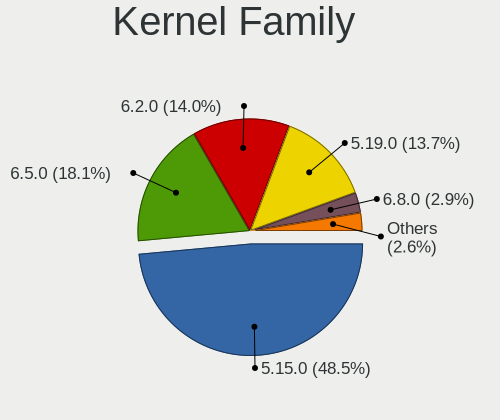
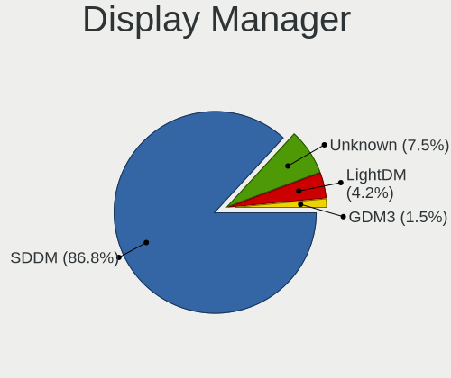
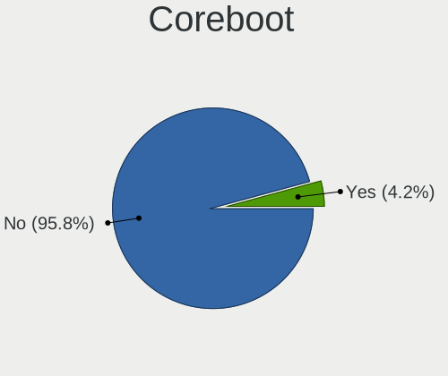
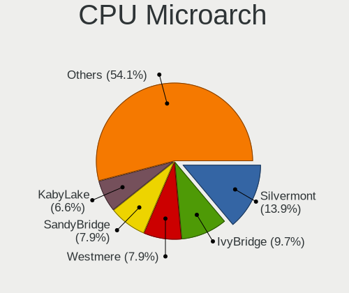
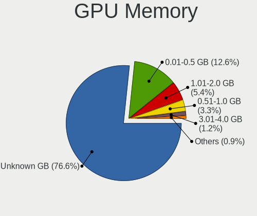
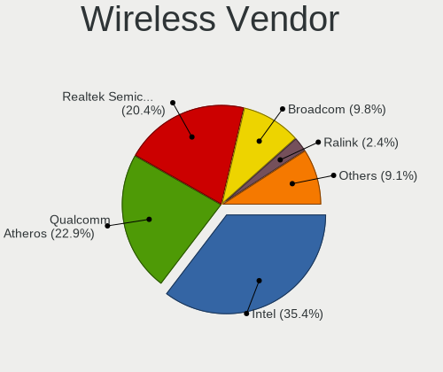
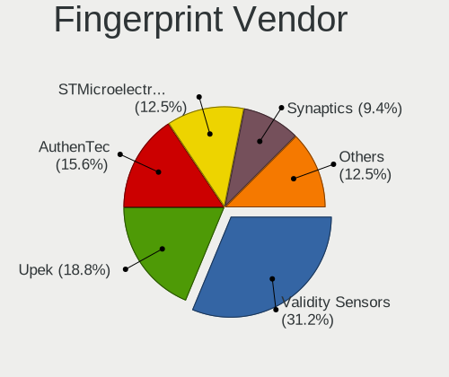

Lubuntu 22.04 - Tested Hardware & Statistics (Notebooks)
--------------------------------------------------------

A project to collect tested hardware configurations for Lubuntu 22.04.

Anyone can contribute to this report by the [hw-probe](https://github.com/linuxhw/hw-probe) tool:

    sudo -E hw-probe -all -upload

Please contribute! Especially if your hardware is rare.

Contents
--------

* [ Test Cases ](#test-cases)

* [ System ](#system)
  - [ Kernel                   ](#kernel)
  - [ Kernel Family            ](#kernel-family)
  - [ Kernel Major Ver.        ](#kernel-major-ver)
  - [ Arch                     ](#arch)
  - [ DE                       ](#de)
  - [ Display Server           ](#display-server)
  - [ Display Manager          ](#display-manager)
  - [ OS Lang                  ](#os-lang)
  - [ Boot Mode                ](#boot-mode)
  - [ Filesystem               ](#filesystem)
  - [ Part. scheme             ](#part-scheme)
  - [ Dual Boot with Linux/BSD ](#dual-boot-with-linuxbsd)
  - [ Dual Boot (Win)          ](#dual-boot-win)

* [ Board ](#board)
  - [ Vendor                   ](#vendor)
  - [ Model                    ](#model)
  - [ Model Family             ](#model-family)
  - [ MFG Year                 ](#mfg-year)
  - [ Form Factor              ](#form-factor)
  - [ Secure Boot              ](#secure-boot)
  - [ Coreboot                 ](#coreboot)
  - [ RAM Size                 ](#ram-size)
  - [ RAM Used                 ](#ram-used)
  - [ Total Drives             ](#total-drives)
  - [ Has CD-ROM               ](#has-cd-rom)
  - [ Has Ethernet             ](#has-ethernet)
  - [ Has WiFi                 ](#has-wifi)
  - [ Has Bluetooth            ](#has-bluetooth)

* [ Location ](#location)
  - [ Country                  ](#country)
  - [ City                     ](#city)

* [ Drives ](#drives)
  - [ Drive Vendor             ](#drive-vendor)
  - [ Drive Model              ](#drive-model)
  - [ HDD Vendor               ](#hdd-vendor)
  - [ SSD Vendor               ](#ssd-vendor)
  - [ Drive Kind               ](#drive-kind)
  - [ Drive Connector          ](#drive-connector)
  - [ Drive Size               ](#drive-size)
  - [ Space Total              ](#space-total)
  - [ Space Used               ](#space-used)
  - [ Malfunc. Drives          ](#malfunc-drives)
  - [ Malfunc. Drive Vendor    ](#malfunc-drive-vendor)
  - [ Malfunc. HDD Vendor      ](#malfunc-hdd-vendor)
  - [ Malfunc. Drive Kind      ](#malfunc-drive-kind)
  - [ Failed Drives            ](#failed-drives)
  - [ Failed Drive Vendor      ](#failed-drive-vendor)
  - [ Drive Status             ](#drive-status)

* [ Storage controller ](#storage-controller)
  - [ Storage Vendor           ](#storage-vendor)
  - [ Storage Model            ](#storage-model)
  - [ Storage Kind             ](#storage-kind)

* [ Processor ](#processor)
  - [ CPU Vendor               ](#cpu-vendor)
  - [ CPU Model                ](#cpu-model)
  - [ CPU Model Family         ](#cpu-model-family)
  - [ CPU Cores                ](#cpu-cores)
  - [ CPU Sockets              ](#cpu-sockets)
  - [ CPU Threads              ](#cpu-threads)
  - [ CPU Op-Modes             ](#cpu-op-modes)
  - [ CPU Microcode            ](#cpu-microcode)
  - [ CPU Microarch            ](#cpu-microarch)

* [ Graphics ](#graphics)
  - [ GPU Vendor               ](#gpu-vendor)
  - [ GPU Model                ](#gpu-model)
  - [ GPU Combo                ](#gpu-combo)
  - [ GPU Driver               ](#gpu-driver)
  - [ GPU Memory               ](#gpu-memory)

* [ Monitor ](#monitor)
  - [ Monitor Vendor           ](#monitor-vendor)
  - [ Monitor Model            ](#monitor-model)
  - [ Monitor Resolution       ](#monitor-resolution)
  - [ Monitor Diagonal         ](#monitor-diagonal)
  - [ Monitor Width            ](#monitor-width)
  - [ Aspect Ratio             ](#aspect-ratio)
  - [ Monitor Area             ](#monitor-area)
  - [ Pixel Density            ](#pixel-density)
  - [ Multiple Monitors        ](#multiple-monitors)

* [ Network ](#network)
  - [ Net Controller Vendor    ](#net-controller-vendor)
  - [ Net Controller Model     ](#net-controller-model)
  - [ Wireless Vendor          ](#wireless-vendor)
  - [ Wireless Model           ](#wireless-model)
  - [ Ethernet Vendor          ](#ethernet-vendor)
  - [ Ethernet Model           ](#ethernet-model)
  - [ Net Controller Kind      ](#net-controller-kind)
  - [ Used Controller          ](#used-controller)
  - [ NICs                     ](#nics)
  - [ IPv6                     ](#ipv6)

* [ Bluetooth ](#bluetooth)
  - [ Bluetooth Vendor         ](#bluetooth-vendor)
  - [ Bluetooth Model          ](#bluetooth-model)

* [ Sound ](#sound)
  - [ Sound Vendor             ](#sound-vendor)
  - [ Sound Model              ](#sound-model)

* [ Memory ](#memory)
  - [ Memory Vendor            ](#memory-vendor)
  - [ Memory Model             ](#memory-model)
  - [ Memory Kind              ](#memory-kind)
  - [ Memory Form Factor       ](#memory-form-factor)
  - [ Memory Size              ](#memory-size)
  - [ Memory Speed             ](#memory-speed)

* [ Printers & scanners ](#printers--scanners)
  - [ Printer Vendor           ](#printer-vendor)
  - [ Printer Model            ](#printer-model)
  - [ Scanner Vendor           ](#scanner-vendor)
  - [ Scanner Model            ](#scanner-model)

* [ Camera ](#camera)
  - [ Camera Vendor            ](#camera-vendor)
  - [ Camera Model             ](#camera-model)

* [ Security ](#security)
  - [ Fingerprint Vendor       ](#fingerprint-vendor)
  - [ Fingerprint Model        ](#fingerprint-model)
  - [ Chipcard Vendor          ](#chipcard-vendor)
  - [ Chipcard Model           ](#chipcard-model)

* [ Unsupported ](#unsupported)
  - [ Unsupported Devices      ](#unsupported-devices)
  - [ Unsupported Device Types ](#unsupported-device-types)

Test Cases
----------

Total: 103

| Vendor        | Model                       | Probe                                                      | Date         |
|---------------|-----------------------------|------------------------------------------------------------|--------------|
| Positivo      | i500pro                     | [4a79aa2383](https://linux-hardware.org/?probe=4a79aa2383) | Nov 30, 2022 |
| ASUSTek       | K70IO                       | [f91b4cdb61](https://linux-hardware.org/?probe=f91b4cdb61) | Nov 29, 2022 |
| ASUSTek       | K70IO                       | [4eabf9a0d4](https://linux-hardware.org/?probe=4eabf9a0d4) | Nov 28, 2022 |
| Acer          | AO722                       | [fb75768c70](https://linux-hardware.org/?probe=fb75768c70) | Nov 26, 2022 |
| Unknown       | Unknown                     | [f40545f0d5](https://linux-hardware.org/?probe=f40545f0d5) | Nov 23, 2022 |
| HP            | Pavilion g6                 | [9b9cd79752](https://linux-hardware.org/?probe=9b9cd79752) | Nov 23, 2022 |
| Fujitsu       | LIFEBOOK A3510              | [e1c126c1f2](https://linux-hardware.org/?probe=e1c126c1f2) | Nov 22, 2022 |
| HP            | 250 G7 Notebook PC          | [242d685287](https://linux-hardware.org/?probe=242d685287) | Nov 22, 2022 |
| Toshiba       | Satellite Pro S500          | [a9d392c0c3](https://linux-hardware.org/?probe=a9d392c0c3) | Nov 22, 2022 |
| HP            | Laptop 14s-fq0xxx           | [cc9c76c85c](https://linux-hardware.org/?probe=cc9c76c85c) | Nov 21, 2022 |
| HP            | Pavilion g6                 | [63e70c5e46](https://linux-hardware.org/?probe=63e70c5e46) | Nov 20, 2022 |
| Fujitsu       | LIFEBOOK A3510              | [9eb6a535ac](https://linux-hardware.org/?probe=9eb6a535ac) | Nov 19, 2022 |
| Samsung       | 300V3A/300V4A/300V5A/200... | [4d8be4bb54](https://linux-hardware.org/?probe=4d8be4bb54) | Nov 18, 2022 |
| Toshiba       | Satellite Pro S500          | [f528238460](https://linux-hardware.org/?probe=f528238460) | Nov 16, 2022 |
| Toshiba       | Satellite Pro S500          | [97ccc55f03](https://linux-hardware.org/?probe=97ccc55f03) | Nov 16, 2022 |
| Dell          | Latitude E6520              | [ed6f93342d](https://linux-hardware.org/?probe=ed6f93342d) | Nov 15, 2022 |
| HP            | ProBook 430 G7              | [a7f77757c7](https://linux-hardware.org/?probe=a7f77757c7) | Nov 13, 2022 |
| HP            | Pavilion g6                 | [759ee850cc](https://linux-hardware.org/?probe=759ee850cc) | Nov 13, 2022 |
| HP            | Pavilion g6                 | [f506c5c2fa](https://linux-hardware.org/?probe=f506c5c2fa) | Nov 13, 2022 |
| Lenovo        | G50-45 80E3                 | [70940de14e](https://linux-hardware.org/?probe=70940de14e) | Nov 08, 2022 |
| Pretech       | EVE 1801 3G ES1049EG        | [19205fc20b](https://linux-hardware.org/?probe=19205fc20b) | Nov 04, 2022 |
| Acer          | Aspire E1-571               | [4ba79bc73e](https://linux-hardware.org/?probe=4ba79bc73e) | Oct 30, 2022 |
| Kiano         | SlimNote 1.0                | [db1ae618d8](https://linux-hardware.org/?probe=db1ae618d8) | Oct 29, 2022 |
| Google        | Apel                        | [f3bf9850dd](https://linux-hardware.org/?probe=f3bf9850dd) | Oct 26, 2022 |
| Lenovo        | G50-70 20351                | [9a17926acb](https://linux-hardware.org/?probe=9a17926acb) | Oct 15, 2022 |
| Lenovo        | B590 20208                  | [6a3309f753](https://linux-hardware.org/?probe=6a3309f753) | Oct 14, 2022 |
| Dell          | Latitude E5430 non-vPro     | [784360100d](https://linux-hardware.org/?probe=784360100d) | Oct 14, 2022 |
| Dell          | Latitude E5430 non-vPro     | [15ba599a80](https://linux-hardware.org/?probe=15ba599a80) | Oct 14, 2022 |
| Lenovo        | ThinkPad SL510 2847CXG      | [5680d8a827](https://linux-hardware.org/?probe=5680d8a827) | Oct 12, 2022 |
| Fujitsu       | LIFEBOOK U904               | [b4a8655f31](https://linux-hardware.org/?probe=b4a8655f31) | Oct 08, 2022 |
| Lenovo        | ThinkPad T410 2537CS0       | [c6a45619c4](https://linux-hardware.org/?probe=c6a45619c4) | Oct 03, 2022 |
| Lenovo        | ThinkPad E550 20DF00CUFR    | [7b5e707097](https://linux-hardware.org/?probe=7b5e707097) | Sep 27, 2022 |
| Packard Be... | EasyNote TS44HR             | [4005a32539](https://linux-hardware.org/?probe=4005a32539) | Sep 26, 2022 |
| Lenovo        | IdeaPad L340-15IRH Gamin... | [68d36ec742](https://linux-hardware.org/?probe=68d36ec742) | Sep 23, 2022 |
| Lenovo        | IdeaPad Slim 1-14AST-05 ... | [1dbeac403e](https://linux-hardware.org/?probe=1dbeac403e) | Sep 22, 2022 |
| Gateway       | NE46R                       | [61ee26263b](https://linux-hardware.org/?probe=61ee26263b) | Sep 20, 2022 |
| Dell          | Inspiron 11-3168            | [29241bb609](https://linux-hardware.org/?probe=29241bb609) | Sep 15, 2022 |
| Lenovo        | Z70-80 80FG                 | [93cb353340](https://linux-hardware.org/?probe=93cb353340) | Sep 14, 2022 |
| Dell          | Inspiron 11-3168            | [763b0fced4](https://linux-hardware.org/?probe=763b0fced4) | Sep 14, 2022 |
| Unknown       | Unknown                     | [8b85e41d17](https://linux-hardware.org/?probe=8b85e41d17) | Sep 14, 2022 |
| Sony          | SVE14A2V1EW                 | [5123cfd3cd](https://linux-hardware.org/?probe=5123cfd3cd) | Sep 09, 2022 |
| HP            | ProBook 4730s               | [5d0a59d50b](https://linux-hardware.org/?probe=5d0a59d50b) | Sep 05, 2022 |
| Dell          | XPS L322X                   | [bd4b0713a8](https://linux-hardware.org/?probe=bd4b0713a8) | Sep 04, 2022 |
| Lenovo        | ThinkPad T430 2342A19       | [1fee695aec](https://linux-hardware.org/?probe=1fee695aec) | Sep 01, 2022 |
| Lenovo        | ThinkPad X1 Carbon 2nd 2... | [f7189849b4](https://linux-hardware.org/?probe=f7189849b4) | Sep 01, 2022 |
| Lenovo        | B590 20208                  | [7eaabdb9ca](https://linux-hardware.org/?probe=7eaabdb9ca) | Aug 27, 2022 |
| Unknown       | Unknown                     | [3c18cd9208](https://linux-hardware.org/?probe=3c18cd9208) | Aug 25, 2022 |
| Acer          | Aspire 7250G                | [7035af5c32](https://linux-hardware.org/?probe=7035af5c32) | Aug 23, 2022 |
| Dell          | Vostro 3360                 | [0964195fe5](https://linux-hardware.org/?probe=0964195fe5) | Aug 21, 2022 |
| Prestigio     | PSB141C01BFH                | [37e5052027](https://linux-hardware.org/?probe=37e5052027) | Aug 18, 2022 |
| Lenovo        | IdeaPad 330-15IKB Touch ... | [0d774697cc](https://linux-hardware.org/?probe=0d774697cc) | Aug 11, 2022 |
| Intel         | W7650                       | [1c8a9fd64b](https://linux-hardware.org/?probe=1c8a9fd64b) | Aug 10, 2022 |
| OEM           | Unknown                     | [d95f8f1502](https://linux-hardware.org/?probe=d95f8f1502) | Aug 09, 2022 |
| Dell          | Inspiron 11-3168            | [11beb61f79](https://linux-hardware.org/?probe=11beb61f79) | Aug 09, 2022 |
| Dell          | Inspiron 11-3168            | [7a3c91b14a](https://linux-hardware.org/?probe=7a3c91b14a) | Aug 07, 2022 |
| HP            | 15 Notebook PC              | [c857595b97](https://linux-hardware.org/?probe=c857595b97) | Aug 05, 2022 |
| Dell          | Precision 3510              | [2d74356174](https://linux-hardware.org/?probe=2d74356174) | Aug 03, 2022 |
| Apple         | MacBook7,1                  | [84efbc858e](https://linux-hardware.org/?probe=84efbc858e) | Aug 02, 2022 |
| Dell          | Precision 3510              | [d2e79b01bb](https://linux-hardware.org/?probe=d2e79b01bb) | Aug 02, 2022 |
| IFSA          | Positivo BGH                | [ec0aa9bc36](https://linux-hardware.org/?probe=ec0aa9bc36) | Aug 02, 2022 |
| Google        | Celes                       | [6a4bc65f84](https://linux-hardware.org/?probe=6a4bc65f84) | Jul 31, 2022 |
| Dell          | XPS M1330                   | [2abad8da86](https://linux-hardware.org/?probe=2abad8da86) | Jul 30, 2022 |
| Sony          | VPCEB15FM                   | [340ef685ef](https://linux-hardware.org/?probe=340ef685ef) | Jul 24, 2022 |
| HP            | 245 G2                      | [03a8791b0c](https://linux-hardware.org/?probe=03a8791b0c) | Jul 18, 2022 |
| HP            | 245 G2                      | [f37ddc5aed](https://linux-hardware.org/?probe=f37ddc5aed) | Jul 17, 2022 |
| Lenovo        | G50-30 80G0                 | [27a46d46dd](https://linux-hardware.org/?probe=27a46d46dd) | Jul 16, 2022 |
| Chuwi         | GemiBook Pro                | [ff08461db4](https://linux-hardware.org/?probe=ff08461db4) | Jul 07, 2022 |
| Lenovo        | IdeaPad S145-15IGM 81MX     | [de35c60b5f](https://linux-hardware.org/?probe=de35c60b5f) | Jul 01, 2022 |
| Google        | Bobba360                    | [6fcae5202a](https://linux-hardware.org/?probe=6fcae5202a) | Jun 26, 2022 |
| Gateway       | Sonic-C                     | [6bec9c80ea](https://linux-hardware.org/?probe=6bec9c80ea) | Jun 21, 2022 |
| Dell          | Latitude XT                 | [c07eac8a84](https://linux-hardware.org/?probe=c07eac8a84) | Jun 17, 2022 |
| Dell          | Studio 1537                 | [12a651ebd2](https://linux-hardware.org/?probe=12a651ebd2) | Jun 16, 2022 |
| ASUSTek       | E403SA                      | [9ca6a865ff](https://linux-hardware.org/?probe=9ca6a865ff) | Jun 11, 2022 |
| HP            | Pavilion Sleekbook 15 PC    | [1a41b08f4f](https://linux-hardware.org/?probe=1a41b08f4f) | Jun 10, 2022 |
| ASUSTek       | N56VZ                       | [3c1a5025f1](https://linux-hardware.org/?probe=3c1a5025f1) | Jun 09, 2022 |
| Sony          | VGN-SZ71WN_C                | [aece18b520](https://linux-hardware.org/?probe=aece18b520) | Jun 06, 2022 |
| Intel         | W7650                       | [fd4abd788b](https://linux-hardware.org/?probe=fd4abd788b) | Jun 06, 2022 |
| Apple         | MacBookPro8,1               | [d191629954](https://linux-hardware.org/?probe=d191629954) | Jun 04, 2022 |
| Apple         | MacBookPro8,1               | [816c29b1df](https://linux-hardware.org/?probe=816c29b1df) | Jun 04, 2022 |
| HP            | Pavilion g6                 | [7c389588bb](https://linux-hardware.org/?probe=7c389588bb) | Jun 02, 2022 |
| HP            | ProBook 640 G1              | [a1c25fad70](https://linux-hardware.org/?probe=a1c25fad70) | Jun 01, 2022 |
| HP            | Pavilion g6                 | [3972cb6508](https://linux-hardware.org/?probe=3972cb6508) | May 25, 2022 |
| Toshiba       | Satellite L40               | [37af5b0ba4](https://linux-hardware.org/?probe=37af5b0ba4) | May 24, 2022 |
| Mediacom      | WinPad 11,6 FullHD- WPU1... | [0d13155508](https://linux-hardware.org/?probe=0d13155508) | May 23, 2022 |
| Dell          | System Inspiron 17 7000 ... | [5f646f4e8c](https://linux-hardware.org/?probe=5f646f4e8c) | May 23, 2022 |
| Mediacom      | WinPad 11,6 FullHD- WPU1... | [f52f5b7be2](https://linux-hardware.org/?probe=f52f5b7be2) | May 21, 2022 |
| Lenovo        | IdeaPad Slim 1-14AST-05 ... | [6528155c00](https://linux-hardware.org/?probe=6528155c00) | May 19, 2022 |
| Lenovo        | IdeaPad Slim 1-14AST-05 ... | [53219da3f5](https://linux-hardware.org/?probe=53219da3f5) | May 19, 2022 |
| Google        | Terra                       | [35088c1c05](https://linux-hardware.org/?probe=35088c1c05) | May 16, 2022 |
| Acer          | Aspire V5-573G              | [4477112f3a](https://linux-hardware.org/?probe=4477112f3a) | May 11, 2022 |
| ASUSTek       | VivoBook 14_ASUS Laptop ... | [f151955e44](https://linux-hardware.org/?probe=f151955e44) | May 10, 2022 |
| Google        | Relm                        | [37a9101768](https://linux-hardware.org/?probe=37a9101768) | May 09, 2022 |
| Intel         | W7650                       | [bd5d159229](https://linux-hardware.org/?probe=bd5d159229) | May 07, 2022 |
| Apple         | MacBookPro14,1              | [fd19fe90e5](https://linux-hardware.org/?probe=fd19fe90e5) | May 05, 2022 |
| Apple         | MacBookPro14,1              | [dc913baa2b](https://linux-hardware.org/?probe=dc913baa2b) | May 04, 2022 |
| Fujitsu       | LIFEBOOK S751               | [6150343dc0](https://linux-hardware.org/?probe=6150343dc0) | May 01, 2022 |
| Google        | Bobba360                    | [e90fbcc91d](https://linux-hardware.org/?probe=e90fbcc91d) | Apr 29, 2022 |
| HP            | Laptop 15-da0xxx            | [6ad1b34a48](https://linux-hardware.org/?probe=6ad1b34a48) | Apr 29, 2022 |
| Dell          | Latitude 7480               | [817415642f](https://linux-hardware.org/?probe=817415642f) | Apr 26, 2022 |
| HP            | Pavilion dv4                | [7bd955f313](https://linux-hardware.org/?probe=7bd955f313) | Apr 18, 2022 |
| Apple         | MacBookPro8,1               | [f74cae630d](https://linux-hardware.org/?probe=f74cae630d) | Apr 16, 2022 |
| Intel         | W7650                       | [9144ca0d30](https://linux-hardware.org/?probe=9144ca0d30) | Apr 15, 2022 |
| Intel         | W7650                       | [df2f2041d1](https://linux-hardware.org/?probe=df2f2041d1) | Feb 18, 2022 |

System
------

Kernel
------

Version of the Linux kernel

| Version               | Notebooks | Percent |
|-----------------------|-----------|---------|
| 5.15.0-43-generic     | 12        | 14.12%  |
| 5.15.0-30-generic     | 8         | 9.41%   |
| 5.15.0-46-generic     | 7         | 8.24%   |
| 5.15.0-52-generic     | 6         | 7.06%   |
| 5.15.0-27-generic     | 6         | 7.06%   |
| 5.15.0-25-generic     | 6         | 7.06%   |
| 5.15.0-53-generic     | 5         | 5.88%   |
| 5.15.0-47-generic     | 5         | 5.88%   |
| 5.15.0-50-generic     | 4         | 4.71%   |
| 5.15.0-41-generic     | 4         | 4.71%   |
| 5.15.0-48-generic     | 3         | 3.53%   |
| 5.15.0-40-generic     | 3         | 3.53%   |
| 5.15.0-35-generic     | 3         | 3.53%   |
| 5.15.0-37-generic     | 2         | 2.35%   |
| 5.15.0-33-generic     | 2         | 2.35%   |
| 5.19.8-xanmod1        | 1         | 1.18%   |
| 5.19.0-051900-generic | 1         | 1.18%   |
| 5.18.0-051800-generic | 1         | 1.18%   |
| 5.15.0-54-generic     | 1         | 1.18%   |
| 5.15.0-39-generic     | 1         | 1.18%   |
| 5.15.0-28-generic     | 1         | 1.18%   |
| 5.15.0-23-generic     | 1         | 1.18%   |
| 5.15.0-18-generic     | 1         | 1.18%   |
| 5.14.0-1040-oem       | 1         | 1.18%   |

Kernel Family
-------------

Linux kernel without a distro release

| Version | Notebooks | Percent |
|---------|-----------|---------|
| 5.15.0  | 78        | 95.12%  |
| 5.19.8  | 1         | 1.22%   |
| 5.19.0  | 1         | 1.22%   |
| 5.18.0  | 1         | 1.22%   |
| 5.14.0  | 1         | 1.22%   |

Kernel Major Ver.
-----------------

Linux kernel major version

| Version | Notebooks | Percent |
|---------|-----------|---------|
| 5.15    | 78        | 95.12%  |
| 5.19    | 2         | 2.44%   |
| 5.18    | 1         | 1.22%   |
| 5.14    | 1         | 1.22%   |

Arch
----

OS architecture (x86_64, i586, etc.)

| Name   | Notebooks | Percent |
|--------|-----------|---------|
| x86_64 | 79        | 100%    |

DE
--

Desktop Environment

| Name       | Notebooks | Percent |
|------------|-----------|---------|
| LXQt       | 77        | 97.47%  |
| X-Cinnamon | 2         | 2.53%   |

Display Server
--------------

X11 or Wayland

| Name | Notebooks | Percent |
|------|-----------|---------|
| X11  | 77        | 97.47%  |
| Tty  | 2         | 2.53%   |

Display Manager
---------------

SDDM, LightDM, etc.

| Name    | Notebooks | Percent |
|---------|-----------|---------|
| SDDM    | 71        | 89.87%  |
| Unknown | 4         | 5.06%   |
| LightDM | 3         | 3.8%    |
| GDM3    | 1         | 1.27%   |

OS Lang
-------

Language

| Lang  | Notebooks | Percent |
|-------|-----------|---------|
| en_US | 20        | 25%     |
| it_IT | 7         | 8.75%   |
| pt_BR | 6         | 7.5%    |
| pl_PL | 5         | 6.25%   |
| fr_FR | 5         | 6.25%   |
| en_GB | 5         | 6.25%   |
| C     | 5         | 6.25%   |
| de_DE | 4         | 5%      |
| en_AG | 3         | 3.75%   |
| nl_BE | 2         | 2.5%    |
| es_CR | 2         | 2.5%    |
| es_AR | 2         | 2.5%    |
| en_CA | 2         | 2.5%    |
| tr_TR | 1         | 1.25%   |
| ru_RU | 1         | 1.25%   |
| ja_JP | 1         | 1.25%   |
| fr_CA | 1         | 1.25%   |
| fi_FI | 1         | 1.25%   |
| es_MX | 1         | 1.25%   |
| es_CL | 1         | 1.25%   |
| en_ZA | 1         | 1.25%   |
| en_PH | 1         | 1.25%   |
| en_AU | 1         | 1.25%   |
| el_GR | 1         | 1.25%   |
| aa_DJ | 1         | 1.25%   |

Boot Mode
---------

EFI or BIOS

| Mode | Notebooks | Percent |
|------|-----------|---------|
| BIOS | 51        | 63.75%  |
| EFI  | 29        | 36.25%  |

Filesystem
----------

Type of filesystem

| Type    | Notebooks | Percent |
|---------|-----------|---------|
| Ext4    | 72        | 90%     |
| Overlay | 6         | 7.5%    |
| Ext2    | 1         | 1.25%   |
| Btrfs   | 1         | 1.25%   |

Part. scheme
------------

Scheme of partitioning

| Type    | Notebooks | Percent |
|---------|-----------|---------|
| GPT     | 35        | 43.75%  |
| Unknown | 25        | 31.25%  |
| MBR     | 20        | 25%     |

Dual Boot with Linux/BSD
------------------------

Hosting more than one Linux/BSD

| Dual boot | Notebooks | Percent |
|-----------|-----------|---------|
| No        | 70        | 87.5%   |
| Yes       | 10        | 12.5%   |

Dual Boot (Win)
---------------

Hosting Linux and Windows

| Dual boot | Notebooks | Percent |
|-----------|-----------|---------|
| No        | 63        | 78.75%  |
| Yes       | 17        | 21.25%  |

Board
-----

Vendor
------

Motherboard manufacturer

| Name                | Notebooks | Percent |
|---------------------|-----------|---------|
| Lenovo              | 15        | 18.99%  |
| Hewlett-Packard     | 11        | 13.92%  |
| Dell                | 11        | 13.92%  |
| Google              | 5         | 6.33%   |
| Fujitsu             | 4         | 5.06%   |
| ASUSTek Computer    | 4         | 5.06%   |
| Acer                | 4         | 5.06%   |
| Sony                | 3         | 3.8%    |
| Apple               | 3         | 3.8%    |
| Unknown             | 3         | 3.8%    |
| Toshiba             | 2         | 2.53%   |
| Mediacom            | 2         | 2.53%   |
| Gateway             | 2         | 2.53%   |
| Samsung Electronics | 1         | 1.27%   |
| Pretech             | 1         | 1.27%   |
| Prestigio           | 1         | 1.27%   |
| Positivo            | 1         | 1.27%   |
| Packard Bell        | 1         | 1.27%   |
| OEM                 | 1         | 1.27%   |
| Kiano               | 1         | 1.27%   |
| Intel               | 1         | 1.27%   |
| IFSA                | 1         | 1.27%   |
| Chuwi               | 1         | 1.27%   |

Model
-----

Motherboard model

| Name                                       | Notebooks | Percent |
|--------------------------------------------|-----------|---------|
| Unknown                                    | 4         | 5.06%   |
| Mediacom WinPad 11,6 FullHD- WPU11         | 2         | 2.53%   |
| Lenovo IdeaPad Slim 1-14AST-05 81VS        | 2         | 2.53%   |
| HP Pavilion g6                             | 2         | 2.53%   |
| Fujitsu LIFEBOOK A3510                     | 2         | 2.53%   |
| Apple MacBookPro8,1                        | 2         | 2.53%   |
| Toshiba Satellite Pro S500                 | 1         | 1.27%   |
| Toshiba Satellite L40                      | 1         | 1.27%   |
| Sony VPCEB15FM                             | 1         | 1.27%   |
| Sony VGN-SZ71WN_C                          | 1         | 1.27%   |
| Sony SVE14A2V1EW                           | 1         | 1.27%   |
| Samsung 300V3A/300V4A/300V5A/200A4B/200A5B | 1         | 1.27%   |
| Pretech EVE 1801 3G ES1049EG               | 1         | 1.27%   |
| Prestigio PSB141C01BFH                     | 1         | 1.27%   |
| Positivo i500pro                           | 1         | 1.27%   |
| Packard Bell EasyNote TS44HR               | 1         | 1.27%   |
| Lenovo Z70-80 80FG                         | 1         | 1.27%   |
| Lenovo ThinkPad X1 Carbon 2nd 20A8S0WE02   | 1         | 1.27%   |
| Lenovo ThinkPad T430 2342A19               | 1         | 1.27%   |
| Lenovo ThinkPad T410 2537CS0               | 1         | 1.27%   |
| Lenovo ThinkPad SL510 2847CXG              | 1         | 1.27%   |
| Lenovo ThinkPad E550 20DF00CUFR            | 1         | 1.27%   |
| Lenovo IdeaPad S145-15IGM 81MX             | 1         | 1.27%   |
| Lenovo IdeaPad L340-15IRH Gaming 81LK      | 1         | 1.27%   |
| Lenovo IdeaPad 330-15IKB Touch 81DJ        | 1         | 1.27%   |
| Lenovo G50-70 20351                        | 1         | 1.27%   |
| Lenovo G50-45 80E3                         | 1         | 1.27%   |
| Lenovo G50-30 80G0                         | 1         | 1.27%   |
| Lenovo B590 20208                          | 1         | 1.27%   |
| Kiano SlimNote 14.1                        | 1         | 1.27%   |
| Intel Infoway                              | 1         | 1.27%   |
| IFSA Positivo BGH                          | 1         | 1.27%   |
| HP ProBook 640 G1                          | 1         | 1.27%   |
| HP ProBook 4730s                           | 1         | 1.27%   |
| HP ProBook 430 G7                          | 1         | 1.27%   |
| HP Pavilion Sleekbook 15 PC                | 1         | 1.27%   |
| HP Pavilion dv4                            | 1         | 1.27%   |
| HP Laptop 15-da0xxx                        | 1         | 1.27%   |
| HP 250 G7 Notebook PC                      | 1         | 1.27%   |
| HP 245 G2                                  | 1         | 1.27%   |

Model Family
------------

Motherboard model prefix

| Name                   | Notebooks | Percent |
|------------------------|-----------|---------|
| Lenovo ThinkPad        | 5         | 6.33%   |
| Lenovo IdeaPad         | 5         | 6.33%   |
| HP Pavilion            | 4         | 5.06%   |
| Fujitsu LIFEBOOK       | 4         | 5.06%   |
| Dell Latitude          | 4         | 5.06%   |
| Unknown                | 4         | 5.06%   |
| HP ProBook             | 3         | 3.8%    |
| Acer Aspire            | 3         | 3.8%    |
| Toshiba Satellite      | 2         | 2.53%   |
| Mediacom WinPad        | 2         | 2.53%   |
| Dell XPS               | 2         | 2.53%   |
| Apple MacBookPro8      | 2         | 2.53%   |
| Sony VPCEB15FM         | 1         | 1.27%   |
| Sony VGN-SZ71WN        | 1         | 1.27%   |
| Sony SVE14A2V1EW       | 1         | 1.27%   |
| Samsung 300V3A         | 1         | 1.27%   |
| Pretech EVE            | 1         | 1.27%   |
| Prestigio PSB141C01BFH | 1         | 1.27%   |
| Positivo i500pro       | 1         | 1.27%   |
| Packard Bell EasyNote  | 1         | 1.27%   |
| Lenovo Z70-80          | 1         | 1.27%   |
| Lenovo G50-70          | 1         | 1.27%   |
| Lenovo G50-45          | 1         | 1.27%   |
| Lenovo G50-30          | 1         | 1.27%   |
| Lenovo B590            | 1         | 1.27%   |
| Kiano SlimNote         | 1         | 1.27%   |
| Intel Infoway          | 1         | 1.27%   |
| IFSA Positivo          | 1         | 1.27%   |
| HP Laptop              | 1         | 1.27%   |
| HP 250                 | 1         | 1.27%   |
| HP 245                 | 1         | 1.27%   |
| HP 15                  | 1         | 1.27%   |
| Google Terra           | 1         | 1.27%   |
| Google Relm            | 1         | 1.27%   |
| Google Celes           | 1         | 1.27%   |
| Google Bobba360        | 1         | 1.27%   |
| Google Apel            | 1         | 1.27%   |
| Gateway Sonic-C        | 1         | 1.27%   |
| Gateway NE46R          | 1         | 1.27%   |
| Dell Vostro            | 1         | 1.27%   |

MFG Year
--------

Motherboard manufacture year

| Year | Notebooks | Percent |
|------|-----------|---------|
| 2011 | 12        | 15.19%  |
| 2012 | 9         | 11.39%  |
| 2013 | 8         | 10.13%  |
| 2020 | 6         | 7.59%   |
| 2014 | 6         | 7.59%   |
| 2019 | 5         | 6.33%   |
| 2016 | 5         | 6.33%   |
| 2021 | 4         | 5.06%   |
| 2010 | 4         | 5.06%   |
| 2008 | 4         | 5.06%   |
| 2022 | 3         | 3.8%    |
| 2015 | 3         | 3.8%    |
| 2009 | 3         | 3.8%    |
| 2007 | 3         | 3.8%    |
| 2018 | 2         | 2.53%   |
| 2017 | 2         | 2.53%   |

Form Factor
-----------

Physical design of the computer

| Name     | Notebooks | Percent |
|----------|-----------|---------|
| Notebook | 79        | 100%    |

Secure Boot
-----------

Enabled or disabled

| State    | Notebooks | Percent |
|----------|-----------|---------|
| Disabled | 77        | 97.47%  |
| Enabled  | 2         | 2.53%   |

Coreboot
--------

Have coreboot on board

| Used | Notebooks | Percent |
|------|-----------|---------|
| No   | 74        | 93.67%  |
| Yes  | 5         | 6.33%   |

RAM Size
--------

Total RAM memory

| Size in GB | Notebooks | Percent |
|------------|-----------|---------|
| 3.01-4.0   | 32        | 40%     |
| 4.01-8.0   | 21        | 26.25%  |
| 1.01-2.0   | 11        | 13.75%  |
| 8.01-16.0  | 8         | 10%     |
| 2.01-3.0   | 4         | 5%      |
| 16.01-24.0 | 3         | 3.75%   |
| 32.01-64.0 | 1         | 1.25%   |

RAM Used
--------

Used RAM memory

| Used GB  | Notebooks | Percent |
|----------|-----------|---------|
| 1.01-2.0 | 40        | 50%     |
| 0.51-1.0 | 21        | 26.25%  |
| 2.01-3.0 | 16        | 20%     |
| 3.01-4.0 | 2         | 2.5%    |
| 4.01-8.0 | 1         | 1.25%   |

Total Drives
------------

Number of drives on board

| Drives | Notebooks | Percent |
|--------|-----------|---------|
| 1      | 66        | 83.54%  |
| 2      | 12        | 15.19%  |
| 0      | 1         | 1.27%   |

Has CD-ROM
----------

Has CD-ROM on board

| Presented | Notebooks | Percent |
|-----------|-----------|---------|
| No        | 42        | 53.16%  |
| Yes       | 37        | 46.84%  |

Has Ethernet
------------

Has Ethernet on board

| Presented | Notebooks | Percent |
|-----------|-----------|---------|
| Yes       | 62        | 78.48%  |
| No        | 17        | 21.52%  |

Has WiFi
--------

Has WiFi module

| Presented | Notebooks | Percent |
|-----------|-----------|---------|
| Yes       | 73        | 92.41%  |
| No        | 6         | 7.59%   |

Has Bluetooth
-------------

Has Bluetooth module

| Presented | Notebooks | Percent |
|-----------|-----------|---------|
| Yes       | 54        | 68.35%  |
| No        | 25        | 31.65%  |

Location
--------

Country
-------

Geographic location (country)

| Country      | Notebooks | Percent |
|--------------|-----------|---------|
| USA          | 11        | 13.92%  |
| Italy        | 8         | 10.13%  |
| Poland       | 6         | 7.59%   |
| Germany      | 6         | 7.59%   |
| Brazil       | 6         | 7.59%   |
| France       | 5         | 6.33%   |
| UK           | 4         | 5.06%   |
| Russia       | 3         | 3.8%    |
| Canada       | 3         | 3.8%    |
| Belgium      | 3         | 3.8%    |
| Vietnam      | 2         | 2.53%   |
| Turkey       | 2         | 2.53%   |
| Hungary      | 2         | 2.53%   |
| Costa Rica   | 2         | 2.53%   |
| Argentina    | 2         | 2.53%   |
| Ukraine      | 1         | 1.27%   |
| Sweden       | 1         | 1.27%   |
| South Africa | 1         | 1.27%   |
| Portugal     | 1         | 1.27%   |
| Philippines  | 1         | 1.27%   |
| Netherlands  | 1         | 1.27%   |
| Mexico       | 1         | 1.27%   |
| Kenya        | 1         | 1.27%   |
| Japan        | 1         | 1.27%   |
| Indonesia    | 1         | 1.27%   |
| Greece       | 1         | 1.27%   |
| Finland      | 1         | 1.27%   |
| Chile        | 1         | 1.27%   |
| Australia    | 1         | 1.27%   |

City
----

Geographic location (city)

| City                      | Notebooks | Percent |
|---------------------------|-----------|---------|
| Paris                     | 3         | 3.8%    |
| Sarospatak                | 2         | 2.53%   |
| Porto Alegre              | 2         | 2.53%   |
| Heredia                   | 2         | 2.53%   |
| Zawiercie                 | 1         | 1.27%   |
| Yoshkar-Ola               | 1         | 1.27%   |
| Yorkville                 | 1         | 1.27%   |
| Wolfhagen                 | 1         | 1.27%   |
| Warsaw                    | 1         | 1.27%   |
| Volzhskiy                 | 1         | 1.27%   |
| Verona                    | 1         | 1.27%   |
| Tychy                     | 1         | 1.27%   |
| Thessaloniki              | 1         | 1.27%   |
| Surabaya                  | 1         | 1.27%   |
| Stuttgart                 | 1         | 1.27%   |
| Strzyzow                  | 1         | 1.27%   |
| Stockholm                 | 1         | 1.27%   |
| Southampton               | 1         | 1.27%   |
| South Burlington          | 1         | 1.27%   |
| Sao Paulo                 | 1         | 1.27%   |
| Santiago                  | 1         | 1.27%   |
| Saint-Raymond-de-Portneuf | 1         | 1.27%   |
| Roswell                   | 1         | 1.27%   |
| Rossano Veneto            | 1         | 1.27%   |
| Rio de Janeiro            | 1         | 1.27%   |
| Quezon City               | 1         | 1.27%   |
| Pretoria                  | 1         | 1.27%   |
| Pontypool                 | 1         | 1.27%   |
| Plan-dAups-Sainte-Baume   | 1         | 1.27%   |
| Pisa                      | 1         | 1.27%   |
| Perth Amboy               | 1         | 1.27%   |
| Palermo                   | 1         | 1.27%   |
| Novo Gama                 | 1         | 1.27%   |
| Novi                      | 1         | 1.27%   |
| Newtown                   | 1         | 1.27%   |
| New York                  | 1         | 1.27%   |
| Naples                    | 1         | 1.27%   |
| Nairobi                   | 1         | 1.27%   |
| Munich                    | 1         | 1.27%   |
| Minato-ku                 | 1         | 1.27%   |

Drives
------

Drive Vendor
------------

Hard drive vendors

| Vendor              | Notebooks | Drives | Percent |
|---------------------|-----------|--------|---------|
| Unknown             | 15        | 22     | 18.07%  |
| Seagate             | 11        | 11     | 13.25%  |
| WDC                 | 8         | 8      | 9.64%   |
| Toshiba             | 8         | 9      | 9.64%   |
| Samsung Electronics | 7         | 10     | 8.43%   |
| Hitachi             | 5         | 5      | 6.02%   |
| SanDisk             | 3         | 3      | 3.61%   |
| SPCC                | 2         | 3      | 2.41%   |
| Kingston            | 2         | 2      | 2.41%   |
| Crucial             | 2         | 2      | 2.41%   |
| Apacer              | 2         | 2      | 2.41%   |
| W800S               | 1         | 1      | 1.2%    |
| UMIS                | 1         | 1      | 1.2%    |
| Transcend           | 1         | 1      | 1.2%    |
| Teclast             | 1         | 1      | 1.2%    |
| SK hynix            | 1         | 1      | 1.2%    |
| Rogueware           | 1         | 1      | 1.2%    |
| Micron Technology   | 1         | 1      | 1.2%    |
| Leqixiang           | 1         | 1      | 1.2%    |
| Lenovo              | 1         | 1      | 1.2%    |
| KINGPOWER           | 1         | 1      | 1.2%    |
| Intel               | 1         | 1      | 1.2%    |
| HUSKY               | 1         | 1      | 1.2%    |
| HGST                | 1         | 1      | 1.2%    |
| GOODRAM             | 1         | 1      | 1.2%    |
| Fujitsu             | 1         | 1      | 1.2%    |
| China               | 1         | 1      | 1.2%    |
| Apple               | 1         | 2      | 1.2%    |
| A-DATA Technology   | 1         | 1      | 1.2%    |

Drive Model
-----------

Hard drive models

| Model                            | Notebooks | Percent |
|----------------------------------|-----------|---------|
| Seagate ST9500325AS 500GB        | 4         | 4.44%   |
| Unknown SD/MMC/MS PRO 8GB        | 2         | 2.22%   |
| Unknown SC64G  64GB              | 2         | 2.22%   |
| Unknown NCard  32GB              | 2         | 2.22%   |
| Unknown MMC64G  64GB             | 2         | 2.22%   |
| Unknown DA4032  32GB             | 2         | 2.22%   |
| Toshiba MQ01ABF050 500GB         | 2         | 2.22%   |
| SPCC Solid State Disk 120GB      | 2         | 2.22%   |
| SanDisk DF4032  32GB             | 2         | 2.22%   |
| WDC WDS500G2B0A 500GB SSD        | 1         | 1.11%   |
| WDC WDS480G2G0A-00JH30 480GB SSD | 1         | 1.11%   |
| WDC WD5000LPCX-60VHAT0 500GB     | 1         | 1.11%   |
| WDC WD5000LPCX-24C6HT0 500GB     | 1         | 1.11%   |
| WDC WD3200BPVT-22JJ5T0 320GB     | 1         | 1.11%   |
| WDC WD3200BEKT-75PVMT1 320GB     | 1         | 1.11%   |
| WDC WD10SPZX-24Z10 1TB           | 1         | 1.11%   |
| WDC WD10JPVX-75JC3T0 1TB         | 1         | 1.11%   |
| W800S 256GB SSD                  | 1         | 1.11%   |
| Unknown SF64G  64GB              | 1         | 1.11%   |
| Unknown MMC Card  64GB           | 1         | 1.11%   |
| Unknown MMC Card  32GB           | 1         | 1.11%   |
| Unknown ISOCOM  64GB             | 1         | 1.11%   |
| Unknown HAG4a2  16GB             | 1         | 1.11%   |
| Unknown ED2S5  128GB             | 1         | 1.11%   |
| Unknown DA4064  64GB             | 1         | 1.11%   |
| Unknown CGND3R  64GB             | 1         | 1.11%   |
| Unknown BJNB4R  32GB             | 1         | 1.11%   |
| Unknown ASTC  8GB                | 1         | 1.11%   |
| Unknown ASTC  32GB               | 1         | 1.11%   |
| UMIS RPFTJ256PDD2MWX 256GB       | 1         | 1.11%   |
| Transcend TS512GMTS800 512GB SSD | 1         | 1.11%   |
| Toshiba THNSNJ128GCSY 128GB SSD  | 1         | 1.11%   |
| Toshiba MQ01ABD075 752GB         | 1         | 1.11%   |
| Toshiba MQ01ABD050 500GB         | 1         | 1.11%   |
| Toshiba MK8009GAH 80GB           | 1         | 1.11%   |
| Toshiba MK3261GSYN 320GB         | 1         | 1.11%   |
| Toshiba MK1646GSX 160GB          | 1         | 1.11%   |
| Teclast BD256GB SHCB-2280 SSD    | 1         | 1.11%   |
| SK hynix NVMe SSD Drive 256GB    | 1         | 1.11%   |
| Seagate ST9320325ASG 320GB       | 1         | 1.11%   |

HDD Vendor
----------

Hard disk drive vendors

| Vendor              | Notebooks | Drives | Percent |
|---------------------|-----------|--------|---------|
| Seagate             | 11        | 11     | 32.35%  |
| Toshiba             | 7         | 8      | 20.59%  |
| WDC                 | 6         | 6      | 17.65%  |
| Hitachi             | 5         | 5      | 14.71%  |
| Unknown             | 2         | 2      | 5.88%   |
| Samsung Electronics | 1         | 4      | 2.94%   |
| HGST                | 1         | 1      | 2.94%   |
| Fujitsu             | 1         | 1      | 2.94%   |

SSD Vendor
----------

Solid state drive vendors

| Vendor              | Notebooks | Drives | Percent |
|---------------------|-----------|--------|---------|
| Samsung Electronics | 4         | 4      | 14.81%  |
| WDC                 | 2         | 2      | 7.41%   |
| SPCC                | 2         | 3      | 7.41%   |
| Crucial             | 2         | 2      | 7.41%   |
| Apacer              | 2         | 2      | 7.41%   |
| W800S               | 1         | 1      | 3.7%    |
| Transcend           | 1         | 1      | 3.7%    |
| Toshiba             | 1         | 1      | 3.7%    |
| Teclast             | 1         | 1      | 3.7%    |
| SanDisk             | 1         | 1      | 3.7%    |
| Rogueware           | 1         | 1      | 3.7%    |
| Micron Technology   | 1         | 1      | 3.7%    |
| Leqixiang           | 1         | 1      | 3.7%    |
| Lenovo              | 1         | 1      | 3.7%    |
| Kingston            | 1         | 1      | 3.7%    |
| KINGPOWER           | 1         | 1      | 3.7%    |
| Intel               | 1         | 1      | 3.7%    |
| HUSKY               | 1         | 1      | 3.7%    |
| GOODRAM             | 1         | 1      | 3.7%    |
| A-DATA Technology   | 1         | 1      | 3.7%    |

Drive Kind
----------

HDD or SSD

| Kind    | Notebooks | Drives | Percent |
|---------|-----------|--------|---------|
| HDD     | 34        | 38     | 40.48%  |
| SSD     | 27        | 28     | 32.14%  |
| MMC     | 16        | 22     | 19.05%  |
| NVMe    | 6         | 7      | 7.14%   |
| Unknown | 1         | 1      | 1.19%   |

Drive Connector
---------------

SATA, SAS, NVMe, etc.

| Type | Notebooks | Drives | Percent |
|------|-----------|--------|---------|
| SATA | 58        | 65     | 70.73%  |
| MMC  | 16        | 22     | 19.51%  |
| NVMe | 6         | 7      | 7.32%   |
| SAS  | 2         | 2      | 2.44%   |

Drive Size
----------

Size of hard drive

| Size in TB | Notebooks | Drives | Percent |
|------------|-----------|--------|---------|
| 0.01-0.5   | 49        | 55     | 81.67%  |
| 0.51-1.0   | 11        | 11     | 18.33%  |

Space Total
-----------

Amount of disk space available on the file system

| Size in GB | Notebooks | Percent |
|------------|-----------|---------|
| 251-500    | 26        | 32.5%   |
| 101-250    | 25        | 31.25%  |
| 1-20       | 9         | 11.25%  |
| 51-100     | 8         | 10%     |
| 21-50      | 6         | 7.5%    |
| 501-1000   | 5         | 6.25%   |
| Unknown    | 1         | 1.25%   |

Space Used
----------

Amount of used disk space

| Used GB | Notebooks | Percent |
|---------|-----------|---------|
| 1-20    | 48        | 60%     |
| 21-50   | 19        | 23.75%  |
| 101-250 | 5         | 6.25%   |
| 51-100  | 4         | 5%      |
| 251-500 | 3         | 3.75%   |
| Unknown | 1         | 1.25%   |

Malfunc. Drives
---------------

Drive models with a malfunction

| Model                              | Notebooks | Drives | Percent |
|------------------------------------|-----------|--------|---------|
| Seagate ST9500325AS 500GB          | 2         | 2      | 15.38%  |
| WDC WD10JPVX-75JC3T0 1TB           | 1         | 1      | 7.69%   |
| Toshiba MQ01ABF050 500GB           | 1         | 1      | 7.69%   |
| Toshiba MQ01ABD050 500GB           | 1         | 1      | 7.69%   |
| Seagate ST9320325AS 320GB          | 1         | 1      | 7.69%   |
| Seagate ST320LT020-9YG142 320GB    | 1         | 1      | 7.69%   |
| Seagate ST320LT007-9ZV142 320GB    | 1         | 1      | 7.69%   |
| Seagate ST1000LM024 HN-M101MBB 1TB | 1         | 1      | 7.69%   |
| Samsung Electronics HM121HI 120GB  | 1         | 4      | 7.69%   |
| Hitachi HTS545050A7E380 500GB      | 1         | 1      | 7.69%   |
| Fujitsu MHY2120BH 120GB            | 1         | 1      | 7.69%   |
| Apacer 16GB SATA Flash Drive SSD   | 1         | 1      | 7.69%   |

Malfunc. Drive Vendor
---------------------

Vendors of faulty drives

| Vendor              | Notebooks | Drives | Percent |
|---------------------|-----------|--------|---------|
| Seagate             | 6         | 6      | 46.15%  |
| Toshiba             | 2         | 2      | 15.38%  |
| WDC                 | 1         | 1      | 7.69%   |
| Samsung Electronics | 1         | 4      | 7.69%   |
| Hitachi             | 1         | 1      | 7.69%   |
| Fujitsu             | 1         | 1      | 7.69%   |
| Apacer              | 1         | 1      | 7.69%   |

Malfunc. HDD Vendor
-------------------

Vendors of faulty HDD drives

| Vendor              | Notebooks | Drives | Percent |
|---------------------|-----------|--------|---------|
| Seagate             | 6         | 6      | 50%     |
| Toshiba             | 2         | 2      | 16.67%  |
| WDC                 | 1         | 1      | 8.33%   |
| Samsung Electronics | 1         | 4      | 8.33%   |
| Hitachi             | 1         | 1      | 8.33%   |
| Fujitsu             | 1         | 1      | 8.33%   |

Malfunc. Drive Kind
-------------------

Kinds of faulty drives

| Kind | Notebooks | Drives | Percent |
|------|-----------|--------|---------|
| HDD  | 12        | 15     | 92.31%  |
| SSD  | 1         | 1      | 7.69%   |

Failed Drives
-------------

Failed drive models

Zero info for selected period =(

Failed Drive Vendor
-------------------

Failed drive vendors

Zero info for selected period =(

Drive Status
------------

Number of failed and malfunc. drives

| Status   | Notebooks | Drives | Percent |
|----------|-----------|--------|---------|
| Detected | 47        | 59     | 58.02%  |
| Works    | 21        | 21     | 25.93%  |
| Malfunc  | 13        | 16     | 16.05%  |

Storage controller
------------------

Storage Vendor
--------------

Storage controller vendors

| Vendor                      | Notebooks | Percent |
|-----------------------------|-----------|---------|
| Intel                       | 57        | 79.17%  |
| AMD                         | 8         | 11.11%  |
| Samsung Electronics         | 2         | 2.78%   |
| Nvidia                      | 2         | 2.78%   |
| Union Memory (Shenzhen)     | 1         | 1.39%   |
| SK hynix                    | 1         | 1.39%   |
| Kingston Technology Company | 1         | 1.39%   |

Storage Model
-------------

Storage controller models

| Model                                                                                  | Notebooks | Percent |
|----------------------------------------------------------------------------------------|-----------|---------|
| Intel 7 Series Chipset Family 6-port SATA Controller [AHCI mode]                       | 10        | 12.66%  |
| Intel 6 Series/C200 Series Chipset Family 6 port Mobile SATA AHCI Controller           | 6         | 7.59%   |
| Intel 8 Series SATA Controller 1 [AHCI mode]                                           | 5         | 6.33%   |
| AMD FCH SATA Controller [AHCI mode]                                                    | 5         | 6.33%   |
| Intel 82801HM/HEM (ICH8M/ICH8M-E) IDE Controller                                       | 4         | 5.06%   |
| Intel Celeron/Pentium Silver Processor SATA Controller                                 | 3         | 3.8%    |
| Intel 82801IBM/IEM (ICH9M/ICH9M-E) 4 port SATA Controller [AHCI mode]                  | 3         | 3.8%    |
| Intel 82801HM/HEM (ICH8M/ICH8M-E) SATA Controller [AHCI mode]                          | 3         | 3.8%    |
| Samsung NVMe SSD Controller 980                                                        | 2         | 2.53%   |
| Intel Wildcat Point-LP SATA Controller [AHCI Mode]                                     | 2         | 2.53%   |
| Intel Sunrise Point-LP SATA Controller [AHCI mode]                                     | 2         | 2.53%   |
| Intel Ice Lake-LP SATA Controller [AHCI mode]                                          | 2         | 2.53%   |
| Intel Comet Lake SATA AHCI Controller                                                  | 2         | 2.53%   |
| Intel Atom/Celeron/Pentium Processor x5-E8000/J3xxx/N3xxx Series SATA Controller       | 2         | 2.53%   |
| Intel Atom Processor E3800 Series SATA AHCI Controller                                 | 2         | 2.53%   |
| Intel 82801 Mobile SATA Controller [RAID mode]                                         | 2         | 2.53%   |
| Intel 5 Series/3400 Series Chipset 4 port SATA AHCI Controller                         | 2         | 2.53%   |
| AMD SB7x0/SB8x0/SB9x0 SATA Controller [AHCI mode]                                      | 2         | 2.53%   |
| Union Memory (Shenzhen) Non-Volatile memory controller                                 | 1         | 1.27%   |
| SK hynix BC501 NVMe Solid State Drive                                                  | 1         | 1.27%   |
| Nvidia MCP89 SATA Controller (AHCI mode)                                               | 1         | 1.27%   |
| Nvidia MCP79 AHCI Controller                                                           | 1         | 1.27%   |
| Kingston Company Company Non-Volatile memory controller                                | 1         | 1.27%   |
| Intel SATA Controller [RAID mode]                                                      | 1         | 1.27%   |
| Intel NM10/ICH7 Family SATA Controller [AHCI mode]                                     | 1         | 1.27%   |
| Intel Jasper Lake SATA AHCI Controller                                                 | 1         | 1.27%   |
| Intel Celeron N3350/Pentium N4200/Atom E3900 Series SATA AHCI Controller               | 1         | 1.27%   |
| Intel Cannon Lake Mobile PCH SATA AHCI Controller                                      | 1         | 1.27%   |
| Intel 82801HM/HEM (ICH8M/ICH8M-E) SATA Controller [IDE mode]                           | 1         | 1.27%   |
| Intel 82801GBM/GHM (ICH7-M Family) SATA Controller [AHCI mode]                         | 1         | 1.27%   |
| Intel 82801G (ICH7 Family) IDE Controller                                              | 1         | 1.27%   |
| Intel 8 Series/C220 Series Chipset Family 6-port SATA Controller 1 [AHCI mode]         | 1         | 1.27%   |
| Intel 7 Series Chipset Family 4-port SATA Controller [IDE mode]                        | 1         | 1.27%   |
| Intel 7 Series Chipset Family 2-port SATA Controller [IDE mode]                        | 1         | 1.27%   |
| Intel 6 Series/C200 Series Chipset Family Mobile SATA Controller (IDE mode, ports 4-5) | 1         | 1.27%   |
| Intel 6 Series/C200 Series Chipset Family Mobile SATA Controller (IDE mode, ports 0-3) | 1         | 1.27%   |
| Intel 5 Series/3400 Series Chipset 6 port SATA AHCI Controller                         | 1         | 1.27%   |
| AMD SB600 IDE                                                                          | 1         | 1.27%   |

Storage Kind
------------

Kind of storage controller (IDE, SATA, NVMe, SAS, ...)

| Kind | Notebooks | Percent |
|------|-----------|---------|
| SATA | 60        | 78.95%  |
| IDE  | 8         | 10.53%  |
| NVMe | 5         | 6.58%   |
| RAID | 3         | 3.95%   |

Processor
---------

CPU Vendor
----------

Processor vendors

| Vendor | Notebooks | Percent |
|--------|-----------|---------|
| Intel  | 72        | 91.14%  |
| AMD    | 7         | 8.86%   |

CPU Model
---------

Processor models

| Model                                         | Notebooks | Percent |
|-----------------------------------------------|-----------|---------|
| Intel Celeron CPU N3060 @ 1.60GHz             | 4         | 5.06%   |
| Intel Atom x5-Z8300 CPU @ 1.44GHz             | 3         | 3.8%    |
| Intel Pentium CPU N3710 @ 1.60GHz             | 2         | 2.53%   |
| Intel Core i7-4600U CPU @ 2.10GHz             | 2         | 2.53%   |
| Intel Core i5-5200U CPU @ 2.20GHz             | 2         | 2.53%   |
| Intel Core i5-4200U CPU @ 1.60GHz             | 2         | 2.53%   |
| Intel Core i5-3320M CPU @ 2.60GHz             | 2         | 2.53%   |
| Intel Core i3-2310M CPU @ 2.10GHz             | 2         | 2.53%   |
| Intel Core i3 CPU M 370 @ 2.40GHz             | 2         | 2.53%   |
| Intel Celeron N4020 CPU @ 1.10GHz             | 2         | 2.53%   |
| Intel Celeron N4000 CPU @ 1.10GHz             | 2         | 2.53%   |
| AMD A6-9220e RADEON R4, 5 COMPUTE CORES 2C+3G | 2         | 2.53%   |
| Intel Pentium Dual CPU T2330 @ 1.60GHz        | 1         | 1.27%   |
| Intel Pentium CPU 987 @ 1.50GHz               | 1         | 1.27%   |
| Intel Core i7-7600U CPU @ 2.80GHz             | 1         | 1.27%   |
| Intel Core i7-6820HQ CPU @ 2.70GHz            | 1         | 1.27%   |
| Intel Core i7-4600M CPU @ 2.90GHz             | 1         | 1.27%   |
| Intel Core i7-3610QM CPU @ 2.30GHz            | 1         | 1.27%   |
| Intel Core i7-3537U CPU @ 2.00GHz             | 1         | 1.27%   |
| Intel Core i5-9300HF CPU @ 2.40GHz            | 1         | 1.27%   |
| Intel Core i5-8265U CPU @ 1.60GHz             | 1         | 1.27%   |
| Intel Core i5-8250U CPU @ 1.60GHz             | 1         | 1.27%   |
| Intel Core i5-4210U CPU @ 1.70GHz             | 1         | 1.27%   |
| Intel Core i5-3210M CPU @ 2.50GHz             | 1         | 1.27%   |
| Intel Core i5-2520M CPU @ 2.50GHz             | 1         | 1.27%   |
| Intel Core i5-2450M CPU @ 2.50GHz             | 1         | 1.27%   |
| Intel Core i5-2435M CPU @ 2.40GHz             | 1         | 1.27%   |
| Intel Core i5-2415M CPU @ 2.30GHz             | 1         | 1.27%   |
| Intel Core i5-1035G1 CPU @ 1.00GHz            | 1         | 1.27%   |
| Intel Core i5-10210U CPU @ 1.60GHz            | 1         | 1.27%   |
| Intel Core i5 CPU M 520 @ 2.40GHz             | 1         | 1.27%   |
| Intel Core i3-3110M CPU @ 2.40GHz             | 1         | 1.27%   |
| Intel Core i3-2367M CPU @ 1.40GHz             | 1         | 1.27%   |
| Intel Core i3-2350M CPU @ 2.30GHz             | 1         | 1.27%   |
| Intel Core i3-2348M CPU @ 2.30GHz             | 1         | 1.27%   |
| Intel Core i3-2330M CPU @ 2.20GHz             | 1         | 1.27%   |
| Intel Core i3-10110U CPU @ 2.10GHz            | 1         | 1.27%   |
| Intel Core i3-1005G1 CPU @ 1.20GHz            | 1         | 1.27%   |
| Intel Core 2 Duo CPU U7700 @ 1.33GHz          | 1         | 1.27%   |
| Intel Core 2 Duo CPU T9300 @ 2.50GHz          | 1         | 1.27%   |

CPU Model Family
----------------

Processor model prefix

| Model              | Notebooks | Percent |
|--------------------|-----------|---------|
| Intel Core i5      | 18        | 22.78%  |
| Intel Celeron      | 16        | 20.25%  |
| Intel Core i3      | 11        | 13.92%  |
| Intel Core 2 Duo   | 9         | 11.39%  |
| Intel Core i7      | 7         | 8.86%   |
| Intel Atom         | 6         | 7.59%   |
| Intel Pentium      | 3         | 3.8%    |
| AMD A6             | 3         | 3.8%    |
| AMD E1             | 2         | 2.53%   |
| Intel Pentium Dual | 1         | 1.27%   |
| Intel Core 2       | 1         | 1.27%   |
| AMD E              | 1         | 1.27%   |
| AMD C-60           | 1         | 1.27%   |

CPU Cores
---------

Number of processor cores

| Number | Notebooks | Percent |
|--------|-----------|---------|
| 2      | 59        | 74.68%  |
| 4      | 18        | 22.78%  |
| 1      | 2         | 2.53%   |

CPU Sockets
-----------

Number of sockets

| Number | Notebooks | Percent |
|--------|-----------|---------|
| 1      | 79        | 100%    |

CPU Threads
-----------

Threads per core (Hyper-Threading)

| Number | Notebooks | Percent |
|--------|-----------|---------|
| 1      | 41        | 51.9%   |
| 2      | 38        | 48.1%   |

CPU Op-Modes
------------

CPU Operation Modes (32-bit, 64-bit)

| Op mode        | Notebooks | Percent |
|----------------|-----------|---------|
| 32-bit, 64-bit | 79        | 100%    |

CPU Microcode
-------------

Microcode number

| Number     | Notebooks | Percent |
|------------|-----------|---------|
| Unknown    | 26        | 32.91%  |
| 0x206a7    | 7         | 8.86%   |
| 0x306a9    | 5         | 6.33%   |
| 0x406c3    | 4         | 5.06%   |
| 0x406c4    | 3         | 3.8%    |
| 0x40651    | 3         | 3.8%    |
| 0x1067a    | 3         | 3.8%    |
| 0x806ec    | 2         | 2.53%   |
| 0x706e5    | 2         | 2.53%   |
| 0x6fd      | 2         | 2.53%   |
| 0x20655    | 2         | 2.53%   |
| 0x06006705 | 2         | 2.53%   |
| 0x05000119 | 2         | 2.53%   |
| 0x906ed    | 1         | 1.27%   |
| 0x906c0    | 1         | 1.27%   |
| 0x806eb    | 1         | 1.27%   |
| 0x806ea    | 1         | 1.27%   |
| 0x806e9    | 1         | 1.27%   |
| 0x706a8    | 1         | 1.27%   |
| 0x706a1    | 1         | 1.27%   |
| 0x6fa      | 1         | 1.27%   |
| 0x6f6      | 1         | 1.27%   |
| 0x506e3    | 1         | 1.27%   |
| 0x506c9    | 1         | 1.27%   |
| 0x306c3    | 1         | 1.27%   |
| 0x30678    | 1         | 1.27%   |
| 0x106ca    | 1         | 1.27%   |
| 0x0700010f | 1         | 1.27%   |
| 0x06001116 | 1         | 1.27%   |

CPU Microarch
-------------

Microarchitecture

| Name          | Notebooks | Percent |
|---------------|-----------|---------|
| Silvermont    | 14        | 17.72%  |
| SandyBridge   | 12        | 15.19%  |
| IvyBridge     | 7         | 8.86%   |
| Penryn        | 6         | 7.59%   |
| KabyLake      | 6         | 7.59%   |
| Haswell       | 6         | 7.59%   |
| Goldmont plus | 5         | 6.33%   |
| Core          | 5         | 6.33%   |
| Westmere      | 3         | 3.8%    |
| IceLake       | 2         | 2.53%   |
| Excavator     | 2         | 2.53%   |
| Broadwell     | 2         | 2.53%   |
| Bobcat        | 2         | 2.53%   |
| Tremont       | 1         | 1.27%   |
| Skylake       | 1         | 1.27%   |
| Puma          | 1         | 1.27%   |
| Piledriver    | 1         | 1.27%   |
| Jaguar        | 1         | 1.27%   |
| Goldmont      | 1         | 1.27%   |
| Bonnell       | 1         | 1.27%   |

Graphics
--------

GPU Vendor
----------

Vendors of graphics cards

| Vendor | Notebooks | Percent |
|--------|-----------|---------|
| Intel  | 66        | 75.86%  |
| AMD    | 14        | 16.09%  |
| Nvidia | 7         | 8.05%   |

GPU Model
---------

Graphics card models

| Model                                                                                    | Notebooks | Percent |
|------------------------------------------------------------------------------------------|-----------|---------|
| Intel 2nd Generation Core Processor Family Integrated Graphics Controller                | 12        | 12.9%   |
| Intel Atom/Celeron/Pentium Processor x5-E8000/J3xxx/N3xxx Integrated Graphics Controller | 11        | 11.83%  |
| Intel 3rd Gen Core processor Graphics Controller                                         | 7         | 7.53%   |
| Intel Haswell-ULT Integrated Graphics Controller                                         | 5         | 5.38%   |
| Intel GeminiLake [UHD Graphics 600]                                                      | 5         | 5.38%   |
| Intel Mobile GM965/GL960 Integrated Graphics Controller (secondary)                      | 4         | 4.3%    |
| Intel Mobile GM965/GL960 Integrated Graphics Controller (primary)                        | 4         | 4.3%    |
| Intel Core Processor Integrated Graphics Controller                                      | 3         | 3.23%   |
| Intel Atom Processor Z36xxx/Z37xxx Series Graphics & Display                             | 3         | 3.23%   |
| AMD Thames [Radeon HD 7500M/7600M Series]                                                | 3         | 3.23%   |
| Intel Mobile 4 Series Chipset Integrated Graphics Controller                             | 2         | 2.15%   |
| Intel Iris Plus Graphics G1 (Ice Lake)                                                   | 2         | 2.15%   |
| Intel HD Graphics 5500                                                                   | 2         | 2.15%   |
| Intel CometLake-U GT2 [UHD Graphics]                                                     | 2         | 2.15%   |
| AMD Stoney [Radeon R2/R3/R4/R5 Graphics]                                                 | 2         | 2.15%   |
| AMD Seymour [Radeon HD 6400M/7400M Series]                                               | 2         | 2.15%   |
| Nvidia MCP89 [GeForce 320M]                                                              | 1         | 1.08%   |
| Nvidia GP107M [GeForce GTX 1050 3 GB Max-Q]                                              | 1         | 1.08%   |
| Nvidia GK107M [GeForce GT 650M]                                                          | 1         | 1.08%   |
| Nvidia GF119M [GeForce GT 520MX]                                                         | 1         | 1.08%   |
| Nvidia GF117M [GeForce 610M/710M/810M/820M / GT 620M/625M/630M/720M]                     | 1         | 1.08%   |
| Nvidia G96CM [GeForce GT 120M]                                                           | 1         | 1.08%   |
| Nvidia G73M [GeForce Go 7600]                                                            | 1         | 1.08%   |
| Intel WhiskeyLake-U GT2 [UHD Graphics 620]                                               | 1         | 1.08%   |
| Intel UHD Graphics 620                                                                   | 1         | 1.08%   |
| Intel JasperLake [UHD Graphics]                                                          | 1         | 1.08%   |
| Intel HD Graphics 620                                                                    | 1         | 1.08%   |
| Intel HD Graphics 530                                                                    | 1         | 1.08%   |
| Intel HD Graphics 500                                                                    | 1         | 1.08%   |
| Intel Atom Processor D4xx/D5xx/N4xx/N5xx Integrated Graphics Controller                  | 1         | 1.08%   |
| Intel 4th Gen Core Processor Integrated Graphics Controller                              | 1         | 1.08%   |
| AMD Wrestler [Radeon HD 6320]                                                            | 1         | 1.08%   |
| AMD Wrestler [Radeon HD 6290]                                                            | 1         | 1.08%   |
| AMD Trinity 2 [Radeon HD 7520G]                                                          | 1         | 1.08%   |
| AMD RV620/M82 [Mobility Radeon HD 3450/3470]                                             | 1         | 1.08%   |
| AMD RS600M [Radeon Xpress 1250]                                                          | 1         | 1.08%   |
| AMD Opal XT [Radeon R7 M265/M365X/M465]                                                  | 1         | 1.08%   |
| AMD Mullins [Radeon R2 Graphics]                                                         | 1         | 1.08%   |
| AMD Kabini [Radeon HD 8210]                                                              | 1         | 1.08%   |
| AMD Cape Verde PRO / Venus LE / Tropo PRO-L [Radeon HD 8830M / R7 250 / R7 M465X]        | 1         | 1.08%   |

GPU Combo
---------

Combinations of graphics cards

| Name           | Notebooks | Percent |
|----------------|-----------|---------|
| 1 x Intel      | 56        | 70.89%  |
| 1 x AMD        | 7         | 8.86%   |
| Intel + AMD    | 5         | 6.33%   |
| 1 x Nvidia     | 4         | 5.06%   |
| Intel + Nvidia | 3         | 3.8%    |
| Other          | 2         | 2.53%   |
| 2 x AMD        | 2         | 2.53%   |

GPU Driver
----------

Free vs proprietary

| Driver      | Notebooks | Percent |
|-------------|-----------|---------|
| Free        | 78        | 98.73%  |
| Proprietary | 1         | 1.27%   |

GPU Memory
----------

Total video memory

| Size in GB | Notebooks | Percent |
|------------|-----------|---------|
| Unknown    | 68        | 86.08%  |
| 0.01-0.5   | 6         | 7.59%   |
| 1.01-2.0   | 3         | 3.8%    |
| 2.01-3.0   | 1         | 1.27%   |
| 0.51-1.0   | 1         | 1.27%   |

Monitor
-------

Monitor Vendor
--------------

Monitor vendors

| Vendor                  | Notebooks | Percent |
|-------------------------|-----------|---------|
| LG Display              | 16        | 20.25%  |
| AU Optronics            | 16        | 20.25%  |
| Chimei Innolux          | 14        | 17.72%  |
| Samsung Electronics     | 7         | 8.86%   |
| BOE                     | 7         | 8.86%   |
| Apple                   | 4         | 5.06%   |
| CPT                     | 3         | 3.8%    |
| Lenovo                  | 2         | 2.53%   |
| ViewSonic               | 1         | 1.27%   |
| Toshiba                 | 1         | 1.27%   |
| Sharp                   | 1         | 1.27%   |
| LG Philips              | 1         | 1.27%   |
| JVC                     | 1         | 1.27%   |
| JDI                     | 1         | 1.27%   |
| Goldstar                | 1         | 1.27%   |
| Chi Mei Optoelectronics | 1         | 1.27%   |
| BenQ                    | 1         | 1.27%   |
| Acer                    | 1         | 1.27%   |

Monitor Model
-------------

Monitor models

| Model                                                                 | Notebooks | Percent |
|-----------------------------------------------------------------------|-----------|---------|
| Chimei Innolux LCD Monitor CMN1132 1366x768 256x144mm 11.6-inch       | 3         | 3.8%    |
| LG Display LCD Monitor LGD02DC 1366x768 344x194mm 15.5-inch           | 2         | 2.53%   |
| CPT LCD Monitor CPT1415 1280x800 331x207mm 15.4-inch                  | 2         | 2.53%   |
| Chimei Innolux LCD Monitor CMN15E7 1920x1080 344x193mm 15.5-inch      | 2         | 2.53%   |
| BOE LCD Monitor BOE075A 1366x768 309x173mm 13.9-inch                  | 2         | 2.53%   |
| AU Optronics LCD Monitor AUO183C 1366x768 309x173mm 13.9-inch         | 2         | 2.53%   |
| AU Optronics LCD Monitor AUO10EC 1366x768 344x193mm 15.5-inch         | 2         | 2.53%   |
| ViewSonic VA2932 SERIES VSCFF3B 2560x1080 673x284mm 28.8-inch         | 1         | 1.27%   |
| Toshiba LCD Monitor LCD2306 1280x800 287x180mm 13.3-inch              | 1         | 1.27%   |
| Sharp LQ140Z1JW01 SHP1401 3200x1800 310x174mm 14.0-inch               | 1         | 1.27%   |
| Samsung Electronics SyncMaster SAM052A 1920x1080 510x287mm 23.0-inch  | 1         | 1.27%   |
| Samsung Electronics LCD Monitor SEC5142 1280x800 303x190mm 14.1-inch  | 1         | 1.27%   |
| Samsung Electronics LCD Monitor SEC4750 1680x1050 365x228mm 16.9-inch | 1         | 1.27%   |
| Samsung Electronics LCD Monitor SEC3541 1366x768 309x174mm 14.0-inch  | 1         | 1.27%   |
| Samsung Electronics LCD Monitor SEC3254 1600x900 367x230mm 17.1-inch  | 1         | 1.27%   |
| Samsung Electronics LCD Monitor SEC324A 1366x768 344x194mm 15.5-inch  | 1         | 1.27%   |
| Samsung Electronics LCD Monitor SEC3152 1366x768 344x194mm 15.5-inch  | 1         | 1.27%   |
| LG Philips LCD Monitor LPLEC00 1280x800 331x207mm 15.4-inch           | 1         | 1.27%   |
| LG Display LCD Monitor LGD0680 1920x1080 344x194mm 15.5-inch          | 1         | 1.27%   |
| LG Display LCD Monitor LGD0469 1920x1080 382x215mm 17.3-inch          | 1         | 1.27%   |
| LG Display LCD Monitor LGD0468 1366x768 344x194mm 15.5-inch           | 1         | 1.27%   |
| LG Display LCD Monitor LGD044B 1366x768 344x194mm 15.5-inch           | 1         | 1.27%   |
| LG Display LCD Monitor LGD0419 2560x1440 310x174mm 14.0-inch          | 1         | 1.27%   |
| LG Display LCD Monitor LGD03E9 1366x768 345x194mm 15.6-inch           | 1         | 1.27%   |
| LG Display LCD Monitor LGD0386 1366x768 309x174mm 14.0-inch           | 1         | 1.27%   |
| LG Display LCD Monitor LGD0384 1366x768 344x194mm 15.5-inch           | 1         | 1.27%   |
| LG Display LCD Monitor LGD0365 1600x900 382x215mm 17.3-inch           | 1         | 1.27%   |
| LG Display LCD Monitor LGD034C 1366x768 293x165mm 13.2-inch           | 1         | 1.27%   |
| LG Display LCD Monitor LGD033F 1366x768 309x174mm 14.0-inch           | 1         | 1.27%   |
| LG Display LCD Monitor LGD033E 1366x768 309x174mm 14.0-inch           | 1         | 1.27%   |
| LG Display LCD Monitor LGD0335 1366x768 310x174mm 14.0-inch           | 1         | 1.27%   |
| LG Display LCD Monitor LGD02D9 1920x1080 344x194mm 15.5-inch          | 1         | 1.27%   |
| Lenovo LCD Monitor LEN40B0 1366x768 345x194mm 15.6-inch               | 1         | 1.27%   |
| Lenovo LCD Monitor LEN4035 1280x800 304x190mm 14.1-inch               | 1         | 1.27%   |
| JVC FPDEUFY2 JVC221F 1920x1080                                        | 1         | 1.27%   |
| JDI LCD Monitor JDI422A 3000x2000 293x196mm 13.9-inch                 | 1         | 1.27%   |
| Goldstar E1940 GSM4BD6 1360x768 406x229mm 18.4-inch                   | 1         | 1.27%   |
| CPT LCD Monitor CPTD003 1920x1080 309x174mm 14.0-inch                 | 1         | 1.27%   |
| Chimei Innolux P140ZKA-BZ1 CMN8C02 2160x1440 296x197mm 14.0-inch      | 1         | 1.27%   |
| Chimei Innolux LCD Monitor CMN15E6 1366x768 344x193mm 15.5-inch       | 1         | 1.27%   |

Monitor Resolution
------------------

Monitor screen resolution

| Resolution         | Notebooks | Percent |
|--------------------|-----------|---------|
| 1366x768 (WXGA)    | 42        | 54.55%  |
| 1920x1080 (FHD)    | 13        | 16.88%  |
| 1280x800 (WXGA)    | 10        | 12.99%  |
| 1600x900 (HD+)     | 4         | 5.19%   |
| 3200x1800 (QHD+)   | 1         | 1.3%    |
| 3000x2000          | 1         | 1.3%    |
| 2560x1440 (QHD)    | 1         | 1.3%    |
| 2560x1080          | 1         | 1.3%    |
| 2160x1440          | 1         | 1.3%    |
| 1680x1050 (WSXGA+) | 1         | 1.3%    |
| 1528x1222          | 1         | 1.3%    |
| 1360x768           | 1         | 1.3%    |

Monitor Diagonal
----------------

Diagonal size in inches

| Inches  | Notebooks | Percent |
|---------|-----------|---------|
| 15      | 28        | 35.44%  |
| 13      | 15        | 18.99%  |
| 14      | 12        | 15.19%  |
| 11      | 8         | 10.13%  |
| 17      | 5         | 6.33%   |
| 23      | 2         | 2.53%   |
| 28      | 1         | 1.27%   |
| 21      | 1         | 1.27%   |
| 19      | 1         | 1.27%   |
| 18      | 1         | 1.27%   |
| 16      | 1         | 1.27%   |
| 12      | 1         | 1.27%   |
| 10      | 1         | 1.27%   |
| 9       | 1         | 1.27%   |
| Unknown | 1         | 1.27%   |

Monitor Width
-------------

Physical width

| Width in mm | Notebooks | Percent |
|-------------|-----------|---------|
| 301-350     | 46        | 58.23%  |
| 201-300     | 19        | 24.05%  |
| 351-400     | 6         | 7.59%   |
| 401-500     | 3         | 3.8%    |
| 501-600     | 2         | 2.53%   |
| 601-700     | 1         | 1.27%   |
| 101-200     | 1         | 1.27%   |
| Unknown     | 1         | 1.27%   |

Aspect Ratio
------------

Proportional relationship between the width and the height

| Ratio | Notebooks | Percent |
|-------|-----------|---------|
| 16/9  | 59        | 78.67%  |
| 16/10 | 12        | 16%     |
| 3/2   | 2         | 2.67%   |
| 4/3   | 1         | 1.33%   |
| 21/9  | 1         | 1.33%   |

Monitor Area
------------

Area in inch

| Area in inch | Notebooks | Percent |
|----------------|-----------|---------|
| 101-110        | 28        | 35.44%  |
| 81-90          | 24        | 30.38%  |
| 51-60          | 8         | 10.13%  |
| 121-130        | 5         | 6.33%   |
| 71-80          | 3         | 3.8%    |
| 201-250        | 3         | 3.8%    |
| 41-50          | 2         | 2.53%   |
| 61-70          | 1         | 1.27%   |
| 251-300        | 1         | 1.27%   |
| 151-200        | 1         | 1.27%   |
| 141-150        | 1         | 1.27%   |
| 131-140        | 1         | 1.27%   |
| Unknown        | 1         | 1.27%   |

Pixel Density
-------------

Pixels per inch

| Density       | Notebooks | Percent |
|---------------|-----------|---------|
| 101-120       | 40        | 50.63%  |
| 121-160       | 20        | 25.32%  |
| 51-100        | 12        | 15.19%  |
| 161-240       | 4         | 5.06%   |
| More than 240 | 2         | 2.53%   |
| Unknown       | 1         | 1.27%   |

Multiple Monitors
-----------------

Total monitors connected

| Total | Notebooks | Percent |
|-------|-----------|---------|
| 1     | 74        | 93.67%  |
| 2     | 4         | 5.06%   |
| 3     | 1         | 1.27%   |

Network
-------

Net Controller Vendor
---------------------

Controller vendors

| Vendor                          | Notebooks | Percent |
|---------------------------------|-----------|---------|
| Realtek Semiconductor           | 39        | 31.97%  |
| Intel                           | 35        | 28.69%  |
| Qualcomm Atheros                | 21        | 17.21%  |
| Broadcom                        | 10        | 8.2%    |
| Samsung Electronics             | 3         | 2.46%   |
| Marvell Technology Group        | 3         | 2.46%   |
| Qualcomm Atheros Communications | 2         | 1.64%   |
| Broadcom Limited                | 2         | 1.64%   |
| TP-Link                         | 1         | 0.82%   |
| Sierra Wireless                 | 1         | 0.82%   |
| Ralink Technology               | 1         | 0.82%   |
| Qualcomm                        | 1         | 0.82%   |
| Nvidia                          | 1         | 0.82%   |
| Microsoft                       | 1         | 0.82%   |
| ICS Advent                      | 1         | 0.82%   |

Net Controller Model
--------------------

Controller models

| Model                                                             | Notebooks | Percent |
|-------------------------------------------------------------------|-----------|---------|
| Realtek RTL8111/8168/8411 PCI Express Gigabit Ethernet Controller | 20        | 13.61%  |
| Realtek RTL810xE PCI Express Fast Ethernet controller             | 7         | 4.76%   |
| Qualcomm Atheros AR9485 Wireless Network Adapter                  | 5         | 3.4%    |
| Realtek RTL8821CE 802.11ac PCIe Wireless Network Adapter          | 4         | 2.72%   |
| Qualcomm Atheros QCA9565 / AR9565 Wireless Network Adapter        | 4         | 2.72%   |
| Qualcomm Atheros AR9285 Wireless Network Adapter (PCI-Express)    | 4         | 2.72%   |
| Intel Wireless 7260                                               | 4         | 2.72%   |
| Intel 82579LM Gigabit Network Connection (Lewisville)             | 4         | 2.72%   |
| Realtek RTL8153 Gigabit Ethernet Adapter                          | 3         | 2.04%   |
| Qualcomm Atheros AR9462 Wireless Network Adapter                  | 3         | 2.04%   |
| Intel Wireless 7265                                               | 3         | 2.04%   |
| Intel Centrino Wireless-N 2230                                    | 3         | 2.04%   |
| Samsung Galaxy series, misc. (tethering mode)                     | 2         | 1.36%   |
| Realtek RTL8822CE 802.11ac PCIe Wireless Network Adapter          | 2         | 1.36%   |
| Realtek RTL8723BE PCIe Wireless Network Adapter                   | 2         | 1.36%   |
| Qualcomm Atheros QCA9377 802.11ac Wireless Network Adapter        | 2         | 1.36%   |
| Qualcomm Atheros AR8161 Gigabit Ethernet                          | 2         | 1.36%   |
| Qualcomm Atheros AR8152 v2.0 Fast Ethernet                        | 2         | 1.36%   |
| Marvell Group 88E8055 PCI-E Gigabit Ethernet Controller           | 2         | 1.36%   |
| Intel Wireless 3160                                               | 2         | 1.36%   |
| Intel PRO/Wireless 3945ABG [Golan] Network Connection             | 2         | 1.36%   |
| Intel Ice Lake-LP PCH CNVi WiFi                                   | 2         | 1.36%   |
| Intel Ethernet Connection I218-LM                                 | 2         | 1.36%   |
| Intel Centrino Advanced-N 6235                                    | 2         | 1.36%   |
| Intel Centrino Advanced-N 6205 [Taylor Peak]                      | 2         | 1.36%   |
| Broadcom NetXtreme BCM57765 Gigabit Ethernet PCIe                 | 2         | 1.36%   |
| Broadcom NetLink BCM57785 Gigabit Ethernet PCIe                   | 2         | 1.36%   |
| Broadcom BCM4331 802.11a/b/g/n                                    | 2         | 1.36%   |
| Broadcom BCM43228 802.11a/b/g/n                                   | 2         | 1.36%   |
| TP-Link UE300 10/100/1000 LAN (ethernet mode) [Realtek RTL8153]   | 1         | 0.68%   |
| Sierra Wireless EM7305 Modem                                      | 1         | 0.68%   |
| Samsung GT-I9070 (network tethering, USB debugging enabled)       | 1         | 0.68%   |
| Realtek RTL8723DE Wireless Network Adapter                        | 1         | 0.68%   |
| Realtek RTL8188EUS 802.11n Wireless Network Adapter               | 1         | 0.68%   |
| Realtek RTL8188EE Wireless Network Adapter                        | 1         | 0.68%   |
| Realtek RTL8187B Wireless 802.11g 54Mbps Network Adapter          | 1         | 0.68%   |
| Realtek RTL8152 Fast Ethernet Adapter                             | 1         | 0.68%   |
| Realtek RTL8150 Fast Ethernet Adapter                             | 1         | 0.68%   |
| Realtek RTL-8100/8101L/8139 PCI Fast Ethernet Adapter             | 1         | 0.68%   |
| Realtek 802.11n WLAN Adapter                                      | 1         | 0.68%   |

Wireless Vendor
---------------

Wireless vendors

| Vendor                          | Notebooks | Percent |
|---------------------------------|-----------|---------|
| Intel                           | 33        | 41.77%  |
| Qualcomm Atheros                | 20        | 25.32%  |
| Realtek Semiconductor           | 14        | 17.72%  |
| Broadcom                        | 6         | 7.59%   |
| Qualcomm Atheros Communications | 2         | 2.53%   |
| Sierra Wireless                 | 1         | 1.27%   |
| Ralink Technology               | 1         | 1.27%   |
| Microsoft                       | 1         | 1.27%   |
| Broadcom Limited                | 1         | 1.27%   |

Wireless Model
--------------

Wireless models

| Model                                                                   | Notebooks | Percent |
|-------------------------------------------------------------------------|-----------|---------|
| Qualcomm Atheros AR9485 Wireless Network Adapter                        | 5         | 6.33%   |
| Realtek RTL8821CE 802.11ac PCIe Wireless Network Adapter                | 4         | 5.06%   |
| Qualcomm Atheros QCA9565 / AR9565 Wireless Network Adapter              | 4         | 5.06%   |
| Qualcomm Atheros AR9285 Wireless Network Adapter (PCI-Express)          | 4         | 5.06%   |
| Intel Wireless 7260                                                     | 4         | 5.06%   |
| Qualcomm Atheros AR9462 Wireless Network Adapter                        | 3         | 3.8%    |
| Intel Wireless 7265                                                     | 3         | 3.8%    |
| Intel Centrino Wireless-N 2230                                          | 3         | 3.8%    |
| Realtek RTL8822CE 802.11ac PCIe Wireless Network Adapter                | 2         | 2.53%   |
| Realtek RTL8723BE PCIe Wireless Network Adapter                         | 2         | 2.53%   |
| Qualcomm Atheros QCA9377 802.11ac Wireless Network Adapter              | 2         | 2.53%   |
| Intel Wireless 3160                                                     | 2         | 2.53%   |
| Intel PRO/Wireless 3945ABG [Golan] Network Connection                   | 2         | 2.53%   |
| Intel Ice Lake-LP PCH CNVi WiFi                                         | 2         | 2.53%   |
| Intel Centrino Advanced-N 6235                                          | 2         | 2.53%   |
| Intel Centrino Advanced-N 6205 [Taylor Peak]                            | 2         | 2.53%   |
| Broadcom BCM4331 802.11a/b/g/n                                          | 2         | 2.53%   |
| Broadcom BCM43228 802.11a/b/g/n                                         | 2         | 2.53%   |
| Sierra Wireless EM7305 Modem                                            | 1         | 1.27%   |
| Realtek RTL8723DE Wireless Network Adapter                              | 1         | 1.27%   |
| Realtek RTL8188EUS 802.11n Wireless Network Adapter                     | 1         | 1.27%   |
| Realtek RTL8188EE Wireless Network Adapter                              | 1         | 1.27%   |
| Realtek RTL8187B Wireless 802.11g 54Mbps Network Adapter                | 1         | 1.27%   |
| Realtek 802.11n WLAN Adapter                                            | 1         | 1.27%   |
| Realtek 802.11n                                                         | 1         | 1.27%   |
| Ralink MT7610U ("Archer T2U" 2.4G+5G WLAN Adapter                       | 1         | 1.27%   |
| Qualcomm Atheros UB94                                                   | 1         | 1.27%   |
| Qualcomm Atheros AR9271 802.11n                                         | 1         | 1.27%   |
| Qualcomm Atheros AR9287 Wireless Network Adapter (PCI-Express)          | 1         | 1.27%   |
| Qualcomm Atheros AR242x / AR542x Wireless Network Adapter (PCI-Express) | 1         | 1.27%   |
| Microsoft Xbox 360 Wireless Adapter                                     | 1         | 1.27%   |
| Intel Wireless 8265 / 8275                                              | 1         | 1.27%   |
| Intel Wireless 8260                                                     | 1         | 1.27%   |
| Intel Wireless 3165                                                     | 1         | 1.27%   |
| Intel WiFi Link 5100                                                    | 1         | 1.27%   |
| Intel PRODUCT_MODEM                                                     | 1         | 1.27%   |
| Intel PRO/Wireless 4965 AG or AGN [Kedron] Network Connection           | 1         | 1.27%   |
| Intel Gemini Lake PCH CNVi WiFi                                         | 1         | 1.27%   |
| Intel Comet Lake PCH-LP CNVi WiFi                                       | 1         | 1.27%   |
| Intel Centrino Wireless-N 130                                           | 1         | 1.27%   |

Ethernet Vendor
---------------

Ethernet vendors

| Vendor                   | Notebooks | Percent |
|--------------------------|-----------|---------|
| Realtek Semiconductor    | 32        | 47.76%  |
| Intel                    | 13        | 19.4%   |
| Broadcom                 | 7         | 10.45%  |
| Qualcomm Atheros         | 4         | 5.97%   |
| Samsung Electronics      | 3         | 4.48%   |
| Marvell Technology Group | 3         | 4.48%   |
| TP-Link                  | 1         | 1.49%   |
| Qualcomm                 | 1         | 1.49%   |
| Nvidia                   | 1         | 1.49%   |
| ICS Advent               | 1         | 1.49%   |
| Broadcom Limited         | 1         | 1.49%   |

Ethernet Model
--------------

Ethernet models

| Model                                                                          | Notebooks | Percent |
|--------------------------------------------------------------------------------|-----------|---------|
| Realtek RTL8111/8168/8411 PCI Express Gigabit Ethernet Controller              | 20        | 29.41%  |
| Realtek RTL810xE PCI Express Fast Ethernet controller                          | 7         | 10.29%  |
| Intel 82579LM Gigabit Network Connection (Lewisville)                          | 4         | 5.88%   |
| Realtek RTL8153 Gigabit Ethernet Adapter                                       | 3         | 4.41%   |
| Samsung Galaxy series, misc. (tethering mode)                                  | 2         | 2.94%   |
| Qualcomm Atheros AR8161 Gigabit Ethernet                                       | 2         | 2.94%   |
| Qualcomm Atheros AR8152 v2.0 Fast Ethernet                                     | 2         | 2.94%   |
| Marvell Group 88E8055 PCI-E Gigabit Ethernet Controller                        | 2         | 2.94%   |
| Intel Ethernet Connection I218-LM                                              | 2         | 2.94%   |
| Broadcom NetXtreme BCM57765 Gigabit Ethernet PCIe                              | 2         | 2.94%   |
| Broadcom NetLink BCM57785 Gigabit Ethernet PCIe                                | 2         | 2.94%   |
| TP-Link UE300 10/100/1000 LAN (ethernet mode) [Realtek RTL8153]                | 1         | 1.47%   |
| Samsung GT-I9070 (network tethering, USB debugging enabled)                    | 1         | 1.47%   |
| Realtek RTL8152 Fast Ethernet Adapter                                          | 1         | 1.47%   |
| Realtek RTL8150 Fast Ethernet Adapter                                          | 1         | 1.47%   |
| Realtek RTL-8100/8101L/8139 PCI Fast Ethernet Adapter                          | 1         | 1.47%   |
| Qualcomm Redmi Note 8                                                          | 1         | 1.47%   |
| Nvidia MCP89 Ethernet                                                          | 1         | 1.47%   |
| Marvell Group Yukon Optima 88E8059 [PCIe Gigabit Ethernet Controller with AVB] | 1         | 1.47%   |
| Intel Ethernet Connection I217-V                                               | 1         | 1.47%   |
| Intel Ethernet Connection (4) I219-LM                                          | 1         | 1.47%   |
| Intel Ethernet Connection (3) I218-V                                           | 1         | 1.47%   |
| Intel Ethernet Connection (2) I219-LM                                          | 1         | 1.47%   |
| Intel 82577LM Gigabit Network Connection                                       | 1         | 1.47%   |
| Intel 82577LC Gigabit Network Connection                                       | 1         | 1.47%   |
| Intel 82573L Gigabit Ethernet Controller                                       | 1         | 1.47%   |
| ICS Advent DM9601 Fast Ethernet Adapter                                        | 1         | 1.47%   |
| Broadcom NetXtreme BCM5761 Gigabit Ethernet PCIe                               | 1         | 1.47%   |
| Broadcom NetXtreme BCM5756ME Gigabit Ethernet PCI Express                      | 1         | 1.47%   |
| Broadcom NetLink BCM5784M Gigabit Ethernet PCIe                                | 1         | 1.47%   |
| Broadcom Limited NetLink BCM5906M Fast Ethernet PCI Express                    | 1         | 1.47%   |

Net Controller Kind
-------------------

Ethernet, WiFi or modem

| Kind     | Notebooks | Percent |
|----------|-----------|---------|
| WiFi     | 73        | 54.48%  |
| Ethernet | 61        | 45.52%  |

Used Controller
---------------

Currently used network controller

| Kind     | Notebooks | Percent |
|----------|-----------|---------|
| WiFi     | 55        | 71.43%  |
| Ethernet | 22        | 28.57%  |

NICs
----

Total network controllers on board

| Total | Notebooks | Percent |
|-------|-----------|---------|
| 2     | 55        | 69.62%  |
| 1     | 16        | 20.25%  |
| 0     | 8         | 10.13%  |

IPv6
----

IPv6 vs IPv4

| Used | Notebooks | Percent |
|------|-----------|---------|
| No   | 61        | 76.25%  |
| Yes  | 19        | 23.75%  |

Bluetooth
---------

Bluetooth Vendor
----------------

Controller vendors

| Vendor                          | Notebooks | Percent |
|---------------------------------|-----------|---------|
| Intel                           | 22        | 40.74%  |
| Realtek Semiconductor           | 8         | 14.81%  |
| Qualcomm Atheros Communications | 7         | 12.96%  |
| Dell                            | 3         | 5.56%   |
| Broadcom                        | 3         | 5.56%   |
| Apple                           | 3         | 5.56%   |
| IMC Networks                    | 2         | 3.7%    |
| Foxconn / Hon Hai               | 2         | 3.7%    |
| Toshiba                         | 1         | 1.85%   |
| Syntek                          | 1         | 1.85%   |
| Cambridge Silicon Radio         | 1         | 1.85%   |
| Alps Electric                   | 1         | 1.85%   |

Bluetooth Model
---------------

Controller models

| Model                                                                               | Notebooks | Percent |
|-------------------------------------------------------------------------------------|-----------|---------|
| Intel Bluetooth wireless interface                                                  | 12        | 22.22%  |
| Realtek Bluetooth Radio                                                             | 5         | 9.26%   |
| Intel Centrino Bluetooth Wireless Transceiver                                       | 4         | 7.41%   |
| Intel Bluetooth 9460/9560 Jefferson Peak (JfP)                                      | 4         | 7.41%   |
| Qualcomm Atheros  Bluetooth Device                                                  | 3         | 5.56%   |
| Apple Bluetooth Host Controller                                                     | 3         | 5.56%   |
| Realtek RTL8723B Bluetooth                                                          | 2         | 3.7%    |
| Qualcomm Atheros AR3012 Bluetooth 4.0                                               | 2         | 3.7%    |
| Toshiba Integrated Bluetooth HCI                                                    | 1         | 1.85%   |
| Syntek 802.11g + Bluetooth Wireless Adapter                                         | 1         | 1.85%   |
| Realtek  Bluetooth 4.2 Adapter                                                      | 1         | 1.85%   |
| Qualcomm Atheros Bluetooth                                                          | 1         | 1.85%   |
| Qualcomm Atheros AR3011 Bluetooth                                                   | 1         | 1.85%   |
| Intel Centrino Advanced-N 6230 Bluetooth adapter                                    | 1         | 1.85%   |
| Intel AX201 Bluetooth                                                               | 1         | 1.85%   |
| IMC Networks Bluetooth Device                                                       | 1         | 1.85%   |
| IMC Networks Atheros AR3012 Bluetooth                                               | 1         | 1.85%   |
| Foxconn / Hon Hai Foxconn T77H114 BCM2070 [Single-Chip Bluetooth 2.1 + EDR Adapter] | 1         | 1.85%   |
| Foxconn / Hon Hai Bluetooth Device                                                  | 1         | 1.85%   |
| Dell Wireless 360 Bluetooth                                                         | 1         | 1.85%   |
| Dell Wireless 355 Bluetooth                                                         | 1         | 1.85%   |
| Dell BCM20702A0 Bluetooth Module                                                    | 1         | 1.85%   |
| Cambridge Silicon Radio Bluetooth Dongle (HCI mode)                                 | 1         | 1.85%   |
| Broadcom HP Portable Valentine                                                      | 1         | 1.85%   |
| Broadcom BCM20702 Bluetooth 4.0 [ThinkPad]                                          | 1         | 1.85%   |
| Broadcom BCM2045B (BDC-2.1)                                                         | 1         | 1.85%   |
| Alps Electric Bluetooth Adapter                                                     | 1         | 1.85%   |

Sound
-----

Sound Vendor
------------

Sound card vendors

| Vendor | Notebooks | Percent |
|--------|-----------|---------|
| Intel  | 64        | 82.05%  |
| AMD    | 9         | 11.54%  |
| Nvidia | 4         | 5.13%   |
| JMTek  | 1         | 1.28%   |

Sound Model
-----------

Sound card models

| Model                                                                                             | Notebooks | Percent |
|---------------------------------------------------------------------------------------------------|-----------|---------|
| Intel 7 Series/C216 Chipset Family High Definition Audio Controller                               | 12        | 12.9%   |
| Intel Atom/Celeron/Pentium Processor x5-E8000/J3xxx/N3xxx Series High Definition Audio Controller | 7         | 7.53%   |
| Intel 6 Series/C200 Series Chipset Family High Definition Audio Controller                        | 7         | 7.53%   |
| Intel Haswell-ULT HD Audio Controller                                                             | 5         | 5.38%   |
| Intel Celeron/Pentium Silver Processor High Definition Audio                                      | 5         | 5.38%   |
| Intel 8 Series HD Audio Controller                                                                | 5         | 5.38%   |
| Intel 82801H (ICH8 Family) HD Audio Controller                                                    | 4         | 4.3%    |
| Intel 82801I (ICH9 Family) HD Audio Controller                                                    | 3         | 3.23%   |
| Intel 5 Series/3400 Series Chipset High Definition Audio                                          | 3         | 3.23%   |
| AMD SBx00 Azalia (Intel HDA)                                                                      | 3         | 3.23%   |
| AMD FCH Azalia Controller                                                                         | 3         | 3.23%   |
| Intel Wildcat Point-LP High Definition Audio Controller                                           | 2         | 2.15%   |
| Intel Sunrise Point-LP HD Audio                                                                   | 2         | 2.15%   |
| Intel NM10/ICH7 Family High Definition Audio Controller                                           | 2         | 2.15%   |
| Intel Ice Lake-LP Smart Sound Technology Audio Controller                                         | 2         | 2.15%   |
| Intel Comet Lake PCH-LP cAVS                                                                      | 2         | 2.15%   |
| Intel Broadwell-U Audio Controller                                                                | 2         | 2.15%   |
| Intel Atom Processor Z36xxx/Z37xxx Series High Definition Audio Controller                        | 2         | 2.15%   |
| AMD Wrestler HDMI Audio                                                                           | 2         | 2.15%   |
| AMD Kabini HDMI/DP Audio                                                                          | 2         | 2.15%   |
| AMD High Definition Audio Controller                                                              | 2         | 2.15%   |
| AMD Family 15h (Models 60h-6fh) Audio Controller                                                  | 2         | 2.15%   |
| Nvidia MCP89 High Definition Audio                                                                | 1         | 1.08%   |
| Nvidia MCP79 High Definition Audio                                                                | 1         | 1.08%   |
| Nvidia GP107GL High Definition Audio Controller                                                   | 1         | 1.08%   |
| Nvidia GK107 HDMI Audio Controller                                                                | 1         | 1.08%   |
| JMTek USB PnP Audio Device                                                                        | 1         | 1.08%   |
| Intel Xeon E3-1200 v3/4th Gen Core Processor HD Audio Controller                                  | 1         | 1.08%   |
| Intel Jasper Lake HD Audio                                                                        | 1         | 1.08%   |
| Intel Celeron N3350/Pentium N4200/Atom E3900 Series Audio Cluster                                 | 1         | 1.08%   |
| Intel Cannon Point-LP High Definition Audio Controller                                            | 1         | 1.08%   |
| Intel Cannon Lake PCH cAVS                                                                        | 1         | 1.08%   |
| Intel 8 Series/C220 Series Chipset High Definition Audio Controller                               | 1         | 1.08%   |
| Intel 100 Series/C230 Series Chipset Family HD Audio Controller                                   | 1         | 1.08%   |
| AMD Trinity HDMI Audio Controller                                                                 | 1         | 1.08%   |
| AMD RV620 HDMI Audio [Radeon HD 3450/3470/3550/3570]                                              | 1         | 1.08%   |

Memory
------

Memory Vendor
-------------

Memory module vendors

| Vendor              | Notebooks | Percent |
|---------------------|-----------|---------|
| Samsung Electronics | 16        | 25%     |
| SK hynix            | 12        | 18.75%  |
| Unknown             | 9         | 14.06%  |
| Micron Technology   | 9         | 14.06%  |
| Elpida              | 3         | 4.69%   |
| Smart               | 2         | 3.13%   |
| Nanya Technology    | 2         | 3.13%   |
| Kingston            | 2         | 3.13%   |
| Corsair             | 2         | 3.13%   |
| Unknown (ABCD)      | 1         | 1.56%   |
| Ramaxel Technology  | 1         | 1.56%   |
| Novatech            | 1         | 1.56%   |
| HMD                 | 1         | 1.56%   |
| AMD                 | 1         | 1.56%   |
| A-DATA Technology   | 1         | 1.56%   |
| Unknown             | 1         | 1.56%   |

Memory Model
------------

Memory module models

| Model                                                            | Notebooks | Percent |
|------------------------------------------------------------------|-----------|---------|
| Unknown RAM Module 2GB SODIMM DDR3 1600MT/s                      | 2         | 2.9%    |
| Unknown RAM Module 2GB SODIMM DDR3 1066MT/s                      | 2         | 2.9%    |
| Unknown RAM Module 2GB SODIMM DDR2 667MT/s                       | 2         | 2.9%    |
| SK hynix RAM HMT351S6CFR8C-PB 4GB SODIMM DDR3 1600MT/s           | 2         | 2.9%    |
| Samsung RAM M471B5173DB0-YK0 4096MB SODIMM DDR3 1600MT/s         | 2         | 2.9%    |
| Samsung RAM M471A5244CB0-CTD 4GB SODIMM DDR4 3266MT/s            | 2         | 2.9%    |
| Micron RAM 4ATF51264HZ-372J1 4GB Row Of Chips DDR4 1866MT/s      | 2         | 2.9%    |
| Unknown RAM Module 512MB SODIMM DDR2                             | 1         | 1.45%   |
| Unknown RAM Module 4GB SODIMM DDR3                               | 1         | 1.45%   |
| Unknown RAM Module 2GB SODIMM DDR3 667MT/s                       | 1         | 1.45%   |
| Unknown RAM Module 1GB SODIMM DDR2 667MT/s                       | 1         | 1.45%   |
| Unknown RAM Module 1GB SODIMM DDR2                               | 1         | 1.45%   |
| Unknown (ABCD) RAM 123456789012345678 2GB SODIMM LPDDR4 2400MT/s | 1         | 1.45%   |
| Smart RAM SH564128FJ8NWRNSQG 4GB SODIMM DDR3 1600MT/s            | 1         | 1.45%   |
| Smart RAM SH564128FH8NZQNSCG 4GB SODIMM DDR3 1600MT/s            | 1         | 1.45%   |
| SK hynix RAM Module 2GB SODIMM DDR3 1600MT/s                     | 1         | 1.45%   |
| SK hynix RAM HYMP125S64CP8-S6 2048MB SODIMM DDR 800MT/s          | 1         | 1.45%   |
| SK hynix RAM HT5SMRAP 4GB SODIMM DDR3 1600MT/s                   | 1         | 1.45%   |
| SK hynix RAM HMT451S6MFR6A-PB 4GB SODIMM DDR3 1600MT/s           | 1         | 1.45%   |
| SK hynix RAM HMT425S6AFR6A-PB 2GB SODIMM DDR3 1600MT/s           | 1         | 1.45%   |
| SK hynix RAM HMT41GS6BFR8A-PB 8GB SODIMM DDR3 1600MT/s           | 1         | 1.45%   |
| SK hynix RAM HMT351S6EFR8C-PB 4GB SODIMM DDR3 1600MT/s           | 1         | 1.45%   |
| SK hynix RAM HMT351S6BFR8C-H9 4GB SODIMM DDR3 1333MT/s           | 1         | 1.45%   |
| SK hynix RAM HMT325S6CFR8C-PB 2GB SODIMM DDR3 1600MT/s           | 1         | 1.45%   |
| SK hynix RAM HMT325S6CFR8C-H9 2GB SODIMM DDR3 1334MT/s           | 1         | 1.45%   |
| SK hynix RAM HMA82GS6DJR8N-VK 16GB SODIMM DDR4 2667MT/s          | 1         | 1.45%   |
| SK hynix RAM H9CCNNN8GTMLAR-NUD 2GB LPDDR3 1600MT/s              | 1         | 1.45%   |
| Samsung RAM Module 32GB SODIMM DDR4 3200MT/s                     | 1         | 1.45%   |
| Samsung RAM Module 2GB SODIMM DDR3 1333MT/s                      | 1         | 1.45%   |
| Samsung RAM M471B5773DH0-CH9 2GB SODIMM DDR3 1600MT/s            | 1         | 1.45%   |
| Samsung RAM M471B5773CHS-CH9 2048MB SODIMM DDR3 4199MT/s         | 1         | 1.45%   |
| Samsung RAM M471B5674EB0-YK0 2GB SODIMM DDR3 1600MT/s            | 1         | 1.45%   |
| Samsung RAM M471B1G73QH0-YK0 8GB SODIMM DDR3 1600MT/s            | 1         | 1.45%   |
| Samsung RAM M471B1G73DB0-YK0 8GB SODIMM DDR3 1600MT/s            | 1         | 1.45%   |
| Samsung RAM M471A5244CB0-CRC 4GB SODIMM DDR4 2667MT/s            | 1         | 1.45%   |
| Samsung RAM M471A1K43DB1-CWE 8192MB SODIMM DDR4 3200MT/s         | 1         | 1.45%   |
| Samsung RAM M471A1K43BB0-CPB 8GB SODIMM DDR4 2133MT/s            | 1         | 1.45%   |
| Samsung RAM K4F8E304HB-MGCJ 1GB LPDDR4 2400MT/s                  | 1         | 1.45%   |
| Samsung RAM K4E8E324EB-EGCF 2GB LPDDR3 1867MT/s                  | 1         | 1.45%   |
| Ramaxel RAM RMSA3260ME78HAF-2666 8GB SODIMM DDR4 2667MT/s        | 1         | 1.45%   |

Memory Kind
-----------

Memory module kinds

| Kind   | Notebooks | Percent |
|--------|-----------|---------|
| DDR3   | 31        | 57.41%  |
| DDR4   | 12        | 22.22%  |
| DDR2   | 4         | 7.41%   |
| LPDDR4 | 3         | 5.56%   |
| SDRAM  | 2         | 3.7%    |
| LPDDR3 | 2         | 3.7%    |

Memory Form Factor
------------------

Physical design of the memory module

| Name         | Notebooks | Percent |
|--------------|-----------|---------|
| SODIMM       | 48        | 88.89%  |
| Row Of Chips | 3         | 5.56%   |
| Unknown      | 3         | 5.56%   |

Memory Size
-----------

Memory module size

| Size  | Notebooks | Percent |
|-------|-----------|---------|
| 4096  | 22        | 34.38%  |
| 2048  | 22        | 34.38%  |
| 8192  | 12        | 18.75%  |
| 1024  | 4         | 6.25%   |
| 16384 | 2         | 3.13%   |
| 32768 | 1         | 1.56%   |
| 512   | 1         | 1.56%   |

Memory Speed
------------

Memory module speed

| Speed   | Notebooks | Percent |
|---------|-----------|---------|
| 1600    | 19        | 32.76%  |
| 1333    | 6         | 10.34%  |
| 3200    | 5         | 8.62%   |
| 2667    | 4         | 6.9%    |
| 1334    | 3         | 5.17%   |
| 1066    | 3         | 5.17%   |
| 667     | 3         | 5.17%   |
| 3266    | 2         | 3.45%   |
| 2400    | 2         | 3.45%   |
| 1866    | 2         | 3.45%   |
| 1067    | 2         | 3.45%   |
| Unknown | 2         | 3.45%   |
| 4199    | 1         | 1.72%   |
| 2133    | 1         | 1.72%   |
| 2048    | 1         | 1.72%   |
| 1867    | 1         | 1.72%   |
| 975     | 1         | 1.72%   |

Printers & scanners
-------------------

Printer Vendor
--------------

Printer device vendors

Zero info for selected period =(

Printer Model
-------------

Printer device models

Zero info for selected period =(

Scanner Vendor
--------------

Scanner device vendors

Zero info for selected period =(

Scanner Model
-------------

Scanner device models

Zero info for selected period =(

Camera
------

Camera Vendor
-------------

Camera device vendors

| Vendor                                 | Notebooks | Percent |
|----------------------------------------|-----------|---------|
| Chicony Electronics                    | 19        | 28.36%  |
| Microdia                               | 10        | 14.93%  |
| Sunplus Innovation Technology          | 5         | 7.46%   |
| Realtek Semiconductor                  | 5         | 7.46%   |
| Syntek                                 | 4         | 5.97%   |
| IMC Networks                           | 3         | 4.48%   |
| Apple                                  | 3         | 4.48%   |
| Alcor Micro                            | 3         | 4.48%   |
| Silicon Motion                         | 2         | 2.99%   |
| Quanta                                 | 2         | 2.99%   |
| Lenovo                                 | 2         | 2.99%   |
| Cheng Uei Precision Industry (Foxlink) | 2         | 2.99%   |
| ALi                                    | 2         | 2.99%   |
| Suyin                                  | 1         | 1.49%   |
| Ricoh                                  | 1         | 1.49%   |
| Lite-On Technology                     | 1         | 1.49%   |
| Cubeternet                             | 1         | 1.49%   |
| Acer                                   | 1         | 1.49%   |

Camera Model
------------

Camera device models

| Model                                               | Notebooks | Percent |
|-----------------------------------------------------|-----------|---------|
| Chicony Integrated Camera                           | 5         | 7.35%   |
| Alcor Micro USB 2.0 Camera                          | 3         | 4.41%   |
| Sunplus HD WebCam                                   | 2         | 2.94%   |
| Microdia Lenovo EasyCamera                          | 2         | 2.94%   |
| Microdia Integrated Webcam                          | 2         | 2.94%   |
| Microdia HP Webcam-50                               | 2         | 2.94%   |
| IMC Networks USB2.0 HD UVC WebCam                   | 2         | 2.94%   |
| Chicony HD WebCam                                   | 2         | 2.94%   |
| Chicony FJ Camera                                   | 2         | 2.94%   |
| Chicony EasyCamera                                  | 2         | 2.94%   |
| Apple FaceTime HD Camera                            | 2         | 2.94%   |
| ALi WebCam                                          | 2         | 2.94%   |
| Syntek USB2.0 Camera                                | 1         | 1.47%   |
| Syntek USB Camera Device                            | 1         | 1.47%   |
| Syntek Lenovo EasyCamera                            | 1         | 1.47%   |
| Syntek HD WebCam                                    | 1         | 1.47%   |
| Suyin 1.3M HD WebCam                                | 1         | 1.47%   |
| Sunplus Laptop Integrated Webcam FHD                | 1         | 1.47%   |
| Sunplus Integrated_Webcam_HD                        | 1         | 1.47%   |
| Sunplus Asus Webcam                                 | 1         | 1.47%   |
| Silicon Motion WebCam SCB-1100N                     | 1         | 1.47%   |
| Silicon Motion 300k Pixel Camera                    | 1         | 1.47%   |
| Ricoh Visual Communication Camera VGP-VCC7 [R5U870] | 1         | 1.47%   |
| Realtek USB Camera                                  | 1         | 1.47%   |
| Realtek Lenovo EasyCamera                           | 1         | 1.47%   |
| Realtek Lenovo easy camera                          | 1         | 1.47%   |
| Realtek Integrated_Webcam_HD                        | 1         | 1.47%   |
| Realtek Integrated Webcam HD                        | 1         | 1.47%   |
| Quanta HP Webcam                                    | 1         | 1.47%   |
| Quanta Chromebook HD Camera                         | 1         | 1.47%   |
| Microdia Webcam Vitade AF                           | 1         | 1.47%   |
| Microdia Webcam                                     | 1         | 1.47%   |
| Microdia Integrated_Webcam_HD                       | 1         | 1.47%   |
| Microdia 1.3 MPixel Integrated Webcam               | 1         | 1.47%   |
| Lite-On HP Webcam                                   | 1         | 1.47%   |
| Lenovo Integrated Webcam [R5U877]                   | 1         | 1.47%   |
| Lenovo Integrated Webcam                            | 1         | 1.47%   |
| IMC Networks VGA UVC WebCam                         | 1         | 1.47%   |
| Cubeternet GL-UPC822 UVC WebCam                     | 1         | 1.47%   |
| Chicony USB2.0 UVC WebCam                           | 1         | 1.47%   |

Security
--------

Fingerprint Vendor
------------------

Fingerprint sensor vendors

| Vendor             | Notebooks | Percent |
|--------------------|-----------|---------|
| Validity Sensors   | 5         | 41.67%  |
| Upek               | 3         | 25%     |
| STMicroelectronics | 2         | 16.67%  |
| AuthenTec          | 2         | 16.67%  |

Fingerprint Model
-----------------

Fingerprint sensor models

| Model                                                  | Notebooks | Percent |
|--------------------------------------------------------|-----------|---------|
| Upek Biometric Touchchip/Touchstrip Fingerprint Sensor | 3         | 25%     |
| STMicroelectronics Fingerprint Reader                  | 2         | 16.67%  |
| Validity Sensors VFS5011 Fingerprint Reader            | 1         | 8.33%   |
| Validity Sensors VFS495 Fingerprint Reader             | 1         | 8.33%   |
| Validity Sensors VFS471 Fingerprint Reader             | 1         | 8.33%   |
| Validity Sensors VFS 5011 fingerprint sensor           | 1         | 8.33%   |
| Validity Sensors Swipe Fingerprint Sensor              | 1         | 8.33%   |
| AuthenTec Fingerprint Sensor                           | 1         | 8.33%   |
| AuthenTec AES2810                                      | 1         | 8.33%   |

Chipcard Vendor
---------------

Chipcard module vendors

| Vendor   | Notebooks | Percent |
|----------|-----------|---------|
| Broadcom | 3         | 75%     |
| O2 Micro | 1         | 25%     |

Chipcard Model
--------------

Chipcard module models

| Model                                          | Notebooks | Percent |
|------------------------------------------------|-----------|---------|
| Broadcom 5880                                  | 2         | 50%     |
| O2 Micro OZ776 CCID Smartcard Reader           | 1         | 25%     |
| Broadcom BCM5880 Secure Applications Processor | 1         | 25%     |

Unsupported
-----------

Unsupported Devices
-------------------

Total unsupported devices on board

| Total | Notebooks | Percent |
|-------|-----------|---------|
| 0     | 60        | 75.95%  |
| 1     | 18        | 22.78%  |
| 2     | 1         | 1.27%   |

Unsupported Device Types
------------------------

Types of unsupported devices

| Type               | Notebooks | Percent |
|--------------------|-----------|---------|
| Fingerprint reader | 12        | 60%     |
| Chipcard           | 4         | 20%     |
| Storage            | 1         | 5%      |
| Graphics card      | 1         | 5%      |
| Camera             | 1         | 5%      |
| Bluetooth          | 1         | 5%      |

