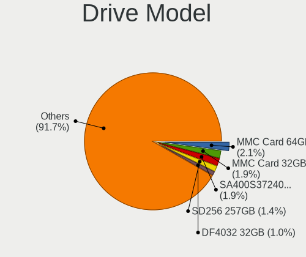
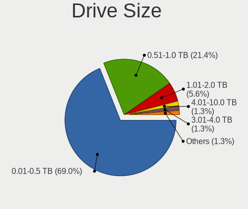
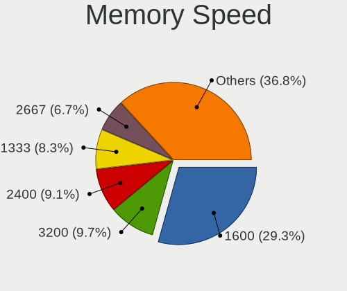

Lubuntu 22.04 - Tested Hardware & Statistics
--------------------------------------------

A project to collect tested hardware configurations for Lubuntu 22.04.

Anyone can contribute to this report by the [hw-probe](https://github.com/linuxhw/hw-probe) tool:

    sudo -E hw-probe -all -upload

Please contribute! Especially if your hardware is rare.

This is a report for all computer types. See also reports for [desktops](/Dist/Lubuntu_22.04/Desktop/README.md) and [notebooks](/Dist/Lubuntu_22.04/Notebook/README.md).

Contents
--------

* [ Test Cases ](#test-cases)

* [ System ](#system)
  - [ Kernel                   ](#kernel)
  - [ Kernel Family            ](#kernel-family)
  - [ Kernel Major Ver.        ](#kernel-major-ver)
  - [ Arch                     ](#arch)
  - [ DE                       ](#de)
  - [ Display Server           ](#display-server)
  - [ Display Manager          ](#display-manager)
  - [ OS Lang                  ](#os-lang)
  - [ Boot Mode                ](#boot-mode)
  - [ Filesystem               ](#filesystem)
  - [ Part. scheme             ](#part-scheme)
  - [ Dual Boot with Linux/BSD ](#dual-boot-with-linuxbsd)
  - [ Dual Boot (Win)          ](#dual-boot-win)

* [ Board ](#board)
  - [ Vendor                   ](#vendor)
  - [ Model                    ](#model)
  - [ Model Family             ](#model-family)
  - [ MFG Year                 ](#mfg-year)
  - [ Form Factor              ](#form-factor)
  - [ Secure Boot              ](#secure-boot)
  - [ Coreboot                 ](#coreboot)
  - [ RAM Size                 ](#ram-size)
  - [ RAM Used                 ](#ram-used)
  - [ Total Drives             ](#total-drives)
  - [ Has CD-ROM               ](#has-cd-rom)
  - [ Has Ethernet             ](#has-ethernet)
  - [ Has WiFi                 ](#has-wifi)
  - [ Has Bluetooth            ](#has-bluetooth)

* [ Location ](#location)
  - [ Country                  ](#country)
  - [ City                     ](#city)

* [ Drives ](#drives)
  - [ Drive Vendor             ](#drive-vendor)
  - [ Drive Model              ](#drive-model)
  - [ HDD Vendor               ](#hdd-vendor)
  - [ SSD Vendor               ](#ssd-vendor)
  - [ Drive Kind               ](#drive-kind)
  - [ Drive Connector          ](#drive-connector)
  - [ Drive Size               ](#drive-size)
  - [ Space Total              ](#space-total)
  - [ Space Used               ](#space-used)
  - [ Malfunc. Drives          ](#malfunc-drives)
  - [ Malfunc. Drive Vendor    ](#malfunc-drive-vendor)
  - [ Malfunc. HDD Vendor      ](#malfunc-hdd-vendor)
  - [ Malfunc. Drive Kind      ](#malfunc-drive-kind)
  - [ Failed Drives            ](#failed-drives)
  - [ Failed Drive Vendor      ](#failed-drive-vendor)
  - [ Drive Status             ](#drive-status)

* [ Storage controller ](#storage-controller)
  - [ Storage Vendor           ](#storage-vendor)
  - [ Storage Model            ](#storage-model)
  - [ Storage Kind             ](#storage-kind)

* [ Processor ](#processor)
  - [ CPU Vendor               ](#cpu-vendor)
  - [ CPU Model                ](#cpu-model)
  - [ CPU Model Family         ](#cpu-model-family)
  - [ CPU Cores                ](#cpu-cores)
  - [ CPU Sockets              ](#cpu-sockets)
  - [ CPU Threads              ](#cpu-threads)
  - [ CPU Op-Modes             ](#cpu-op-modes)
  - [ CPU Microcode            ](#cpu-microcode)
  - [ CPU Microarch            ](#cpu-microarch)

* [ Graphics ](#graphics)
  - [ GPU Vendor               ](#gpu-vendor)
  - [ GPU Model                ](#gpu-model)
  - [ GPU Combo                ](#gpu-combo)
  - [ GPU Driver               ](#gpu-driver)
  - [ GPU Memory               ](#gpu-memory)

* [ Monitor ](#monitor)
  - [ Monitor Vendor           ](#monitor-vendor)
  - [ Monitor Model            ](#monitor-model)
  - [ Monitor Resolution       ](#monitor-resolution)
  - [ Monitor Diagonal         ](#monitor-diagonal)
  - [ Monitor Width            ](#monitor-width)
  - [ Aspect Ratio             ](#aspect-ratio)
  - [ Monitor Area             ](#monitor-area)
  - [ Pixel Density            ](#pixel-density)
  - [ Multiple Monitors        ](#multiple-monitors)

* [ Network ](#network)
  - [ Net Controller Vendor    ](#net-controller-vendor)
  - [ Net Controller Model     ](#net-controller-model)
  - [ Wireless Vendor          ](#wireless-vendor)
  - [ Wireless Model           ](#wireless-model)
  - [ Ethernet Vendor          ](#ethernet-vendor)
  - [ Ethernet Model           ](#ethernet-model)
  - [ Net Controller Kind      ](#net-controller-kind)
  - [ Used Controller          ](#used-controller)
  - [ NICs                     ](#nics)
  - [ IPv6                     ](#ipv6)

* [ Bluetooth ](#bluetooth)
  - [ Bluetooth Vendor         ](#bluetooth-vendor)
  - [ Bluetooth Model          ](#bluetooth-model)

* [ Sound ](#sound)
  - [ Sound Vendor             ](#sound-vendor)
  - [ Sound Model              ](#sound-model)

* [ Memory ](#memory)
  - [ Memory Vendor            ](#memory-vendor)
  - [ Memory Model             ](#memory-model)
  - [ Memory Kind              ](#memory-kind)
  - [ Memory Form Factor       ](#memory-form-factor)
  - [ Memory Size              ](#memory-size)
  - [ Memory Speed             ](#memory-speed)

* [ Printers & scanners ](#printers--scanners)
  - [ Printer Vendor           ](#printer-vendor)
  - [ Printer Model            ](#printer-model)
  - [ Scanner Vendor           ](#scanner-vendor)
  - [ Scanner Model            ](#scanner-model)

* [ Camera ](#camera)
  - [ Camera Vendor            ](#camera-vendor)
  - [ Camera Model             ](#camera-model)

* [ Security ](#security)
  - [ Fingerprint Vendor       ](#fingerprint-vendor)
  - [ Fingerprint Model        ](#fingerprint-model)
  - [ Chipcard Vendor          ](#chipcard-vendor)
  - [ Chipcard Model           ](#chipcard-model)

* [ Unsupported ](#unsupported)
  - [ Unsupported Devices      ](#unsupported-devices)
  - [ Unsupported Device Types ](#unsupported-device-types)

Test Cases
----------

Total: 471

| Vendor        | Model                       | Form-Factor | Probe                                                      | Date         |
|---------------|-----------------------------|-------------|------------------------------------------------------------|--------------|
| Hampoo        | I2W6_AP135 Reserved         | Notebook    | [cf0c02a17a](https://linux-hardware.org/?probe=cf0c02a17a) | Nov 03, 2023 |
| Hampoo        | I2W6_AP135 Reserved         | Notebook    | [fdb464fed7](https://linux-hardware.org/?probe=fdb464fed7) | Nov 02, 2023 |
| PCChips       | P49G                        | Desktop     | [6b1de00356](https://linux-hardware.org/?probe=6b1de00356) | Nov 02, 2023 |
| ZOTAC         | NM10                        | Desktop     | [5a951d80a6](https://linux-hardware.org/?probe=5a951d80a6) | Oct 31, 2023 |
| AMI           | Aptio CRB                   | Mini pc     | [4f0b8be2f6](https://linux-hardware.org/?probe=4f0b8be2f6) | Oct 30, 2023 |
| ASUSTek       | K50IJ                       | Notebook    | [115cf0d371](https://linux-hardware.org/?probe=115cf0d371) | Oct 30, 2023 |
| ASUSTek       | K50IJ                       | Notebook    | [6fbbd2a061](https://linux-hardware.org/?probe=6fbbd2a061) | Oct 30, 2023 |
| Acer          | Aspire A315-21              | Notebook    | [48785f697c](https://linux-hardware.org/?probe=48785f697c) | Oct 29, 2023 |
| ASUSTek       | P7P55-M                     | Desktop     | [3fa8a23f12](https://linux-hardware.org/?probe=3fa8a23f12) | Oct 29, 2023 |
| Intel         | H61                         | Desktop     | [fccff5fcb2](https://linux-hardware.org/?probe=fccff5fcb2) | Oct 27, 2023 |
| Acer          | Veriton N4660G              | Desktop     | [712511f568](https://linux-hardware.org/?probe=712511f568) | Oct 27, 2023 |
| Dixonsxp      | Unknown                     | Notebook    | [da9f723fd0](https://linux-hardware.org/?probe=da9f723fd0) | Oct 23, 2023 |
| Dell          | XPS 9315                    | Notebook    | [8c9d16e737](https://linux-hardware.org/?probe=8c9d16e737) | Oct 22, 2023 |
| ZOTAC         | NM10                        | Desktop     | [2e0ab67bec](https://linux-hardware.org/?probe=2e0ab67bec) | Oct 21, 2023 |
| HP            | Compaq Presario CQ40        | Notebook    | [5ddf61741f](https://linux-hardware.org/?probe=5ddf61741f) | Oct 20, 2023 |
| HP            | 8265                        | Desktop     | [f1bdedb075](https://linux-hardware.org/?probe=f1bdedb075) | Oct 20, 2023 |
| Acer          | Aspire A314-23P             | Notebook    | [99490448ae](https://linux-hardware.org/?probe=99490448ae) | Oct 16, 2023 |
| Acer          | Aspire A314-23P             | Notebook    | [431b672bf5](https://linux-hardware.org/?probe=431b672bf5) | Oct 16, 2023 |
| HP            | Laptop 14-dq0xxx            | Notebook    | [1f161ae269](https://linux-hardware.org/?probe=1f161ae269) | Oct 16, 2023 |
| Google        | Careena                     | Notebook    | [8359c8c3e8](https://linux-hardware.org/?probe=8359c8c3e8) | Oct 15, 2023 |
| Google        | Careena                     | Notebook    | [4292c49150](https://linux-hardware.org/?probe=4292c49150) | Oct 15, 2023 |
| HP            | Notebook                    | Notebook    | [fb39ee7d9d](https://linux-hardware.org/?probe=fb39ee7d9d) | Oct 13, 2023 |
| Thomson       | NEO14-4W64                  | Notebook    | [f68e52a8a1](https://linux-hardware.org/?probe=f68e52a8a1) | Oct 12, 2023 |
| Mediacom      | WinPad 11,6 FullHD- WPU1... | Notebook    | [ee4617fa73](https://linux-hardware.org/?probe=ee4617fa73) | Oct 10, 2023 |
| Lenovo        | IdeaPad 110-15IBR 80T7      | Notebook    | [2bb1495e06](https://linux-hardware.org/?probe=2bb1495e06) | Oct 08, 2023 |
| Google        | Sasuke                      | Notebook    | [ea2d350776](https://linux-hardware.org/?probe=ea2d350776) | Oct 08, 2023 |
| ASRock        | Q1900B-ITX                  | Desktop     | [f8ad7736e2](https://linux-hardware.org/?probe=f8ad7736e2) | Oct 07, 2023 |
| Insyde        | Braswell                    | Notebook    | [c4261097f5](https://linux-hardware.org/?probe=c4261097f5) | Oct 07, 2023 |
| ASUSTek       | PRIME B450M-A               | Desktop     | [bf8761b854](https://linux-hardware.org/?probe=bf8761b854) | Oct 06, 2023 |
| Apple         | Mac-F42386C8 PVT            | All in one  | [f88a18cfef](https://linux-hardware.org/?probe=f88a18cfef) | Oct 06, 2023 |
| Getac         | X500G3                      | Notebook    | [919772eed0](https://linux-hardware.org/?probe=919772eed0) | Oct 02, 2023 |
| Panasonic     | CF-F9KWPZFFE                | Notebook    | [33cf16d622](https://linux-hardware.org/?probe=33cf16d622) | Oct 01, 2023 |
| HP            | Laptop 14-ck0xxx            | Notebook    | [f4326ad956](https://linux-hardware.org/?probe=f4326ad956) | Sep 26, 2023 |
| ASUSTek       | E1600WKA                    | All in one  | [43c8a9b758](https://linux-hardware.org/?probe=43c8a9b758) | Sep 26, 2023 |
| HP            | Laptop 14-ck0xxx            | Notebook    | [3ff273b73c](https://linux-hardware.org/?probe=3ff273b73c) | Sep 26, 2023 |
| Intel         | H61                         | Desktop     | [ee0266b53c](https://linux-hardware.org/?probe=ee0266b53c) | Sep 25, 2023 |
| ASUSTek       | X451MA                      | Notebook    | [ed779c5de4](https://linux-hardware.org/?probe=ed779c5de4) | Sep 20, 2023 |
| IceWhale T... | ZimaBoard 216 ZMB           | Desktop     | [7b1aae3e2b](https://linux-hardware.org/?probe=7b1aae3e2b) | Sep 20, 2023 |
| Mini PC       | Cherry Trail CR             | Notebook    | [f16d8d4254](https://linux-hardware.org/?probe=f16d8d4254) | Sep 19, 2023 |
| Apple         | Mac-7BA5B2D9E42DDD94 iMa... | Desktop     | [47d423039b](https://linux-hardware.org/?probe=47d423039b) | Sep 19, 2023 |
| Dell          | Precision 3570              | Notebook    | [fd3441ff1d](https://linux-hardware.org/?probe=fd3441ff1d) | Sep 18, 2023 |
| HP            | 15                          | Notebook    | [03e1207549](https://linux-hardware.org/?probe=03e1207549) | Sep 12, 2023 |
| HP            | 2000                        | Notebook    | [48790bd831](https://linux-hardware.org/?probe=48790bd831) | Sep 09, 2023 |
| HP            | 2000                        | Notebook    | [ce9ba2b7c4](https://linux-hardware.org/?probe=ce9ba2b7c4) | Sep 09, 2023 |
| ASUSTek       | M4A87TD/USB3                | Desktop     | [6aea4eb6c4](https://linux-hardware.org/?probe=6aea4eb6c4) | Sep 09, 2023 |
| eMachines     | eM350                       | Notebook    | [fae8f9e3f1](https://linux-hardware.org/?probe=fae8f9e3f1) | Sep 06, 2023 |
| Dell          | Latitude 3190               | Notebook    | [60f82737fa](https://linux-hardware.org/?probe=60f82737fa) | Sep 06, 2023 |
| Dell          | 0T10XW A00                  | Desktop     | [89f4028960](https://linux-hardware.org/?probe=89f4028960) | Sep 05, 2023 |
| ASUSTek       | ROG STRIX B550-I GAMING     | Desktop     | [23f0f9321c](https://linux-hardware.org/?probe=23f0f9321c) | Sep 05, 2023 |
| Seeed Stud... | ODYSSEY-X86J41X5 SD-BS-C... | Desktop     | [69fec63660](https://linux-hardware.org/?probe=69fec63660) | Sep 04, 2023 |
| Seeed Stud... | ODYSSEY-X86J41X5 SD-BS-C... | Desktop     | [ea00f871b9](https://linux-hardware.org/?probe=ea00f871b9) | Sep 04, 2023 |
| HP            | 255 G2                      | Notebook    | [27b48aa011](https://linux-hardware.org/?probe=27b48aa011) | Sep 02, 2023 |
| ASUSTek       | X75VD                       | Notebook    | [cab1480dc6](https://linux-hardware.org/?probe=cab1480dc6) | Aug 30, 2023 |
| Packard Be... | EasyNote TJ65               | Notebook    | [f37ab96772](https://linux-hardware.org/?probe=f37ab96772) | Aug 28, 2023 |
| Toshiba       | Satellite P770              | Notebook    | [8618c83c93](https://linux-hardware.org/?probe=8618c83c93) | Aug 26, 2023 |
| Google        | Robo                        | Notebook    | [dfa74d0961](https://linux-hardware.org/?probe=dfa74d0961) | Aug 26, 2023 |
| Compal        | PBL20                       | Notebook    | [ae09076b4e](https://linux-hardware.org/?probe=ae09076b4e) | Aug 22, 2023 |
| HP            | Notebook                    | Notebook    | [11d2993965](https://linux-hardware.org/?probe=11d2993965) | Aug 20, 2023 |
| Google        | Madoo                       | Notebook    | [8eea1017dc](https://linux-hardware.org/?probe=8eea1017dc) | Aug 20, 2023 |
| HP            | Notebook                    | Notebook    | [f6e4865586](https://linux-hardware.org/?probe=f6e4865586) | Aug 19, 2023 |
| Inventec      | DQ Class A02                | Desktop     | [92a3afc475](https://linux-hardware.org/?probe=92a3afc475) | Aug 17, 2023 |
| Lenovo        | ThinkPad T430 2349TFK       | Notebook    | [390899a281](https://linux-hardware.org/?probe=390899a281) | Aug 17, 2023 |
| Apple         | Mac-8ED6AF5B48C039E1 Mac... | Mini pc     | [dd8d164747](https://linux-hardware.org/?probe=dd8d164747) | Aug 17, 2023 |
| ASUSTek       | BM6875_BM6675_BP6375        | Desktop     | [0a2cdad4c1](https://linux-hardware.org/?probe=0a2cdad4c1) | Aug 15, 2023 |
| Apple         | Mac-F223BEC8                | Desktop     | [74a3be9a4a](https://linux-hardware.org/?probe=74a3be9a4a) | Aug 14, 2023 |
| HP            | Pavilion g7                 | Notebook    | [43351d6476](https://linux-hardware.org/?probe=43351d6476) | Aug 12, 2023 |
| Samsung       | N150P/N210P/N220P           | Notebook    | [459b9f31b9](https://linux-hardware.org/?probe=459b9f31b9) | Aug 09, 2023 |
| Shuttle       | XS35V3                      | Desktop     | [ced8776e4d](https://linux-hardware.org/?probe=ced8776e4d) | Aug 09, 2023 |
| Toshiba       | Satellite L875D             | Notebook    | [de1a418102](https://linux-hardware.org/?probe=de1a418102) | Aug 08, 2023 |
| ASUSTek       | P5QD TURBO                  | Desktop     | [ffbbe60721](https://linux-hardware.org/?probe=ffbbe60721) | Aug 05, 2023 |
| Dell          | Inspiron 5720               | Notebook    | [20532065b5](https://linux-hardware.org/?probe=20532065b5) | Aug 04, 2023 |
| Dell          | Inspiron 5720               | Notebook    | [8f6ada13fa](https://linux-hardware.org/?probe=8f6ada13fa) | Aug 04, 2023 |
| Raspberry ... | Raspberry Pi 4 Model B R... | Soc         | [ca00849760](https://linux-hardware.org/?probe=ca00849760) | Aug 02, 2023 |
| HP            | Pavilion 15                 | Notebook    | [257fe62454](https://linux-hardware.org/?probe=257fe62454) | Aug 02, 2023 |
| Lenovo        | G580 20150                  | Notebook    | [00d2ac7698](https://linux-hardware.org/?probe=00d2ac7698) | Aug 01, 2023 |
| Shuttle       | XS35V3                      | Desktop     | [52c5dda710](https://linux-hardware.org/?probe=52c5dda710) | Jul 31, 2023 |
| AAEON         | MF-001 V1.0                 | Desktop     | [1a2d3f1778](https://linux-hardware.org/?probe=1a2d3f1778) | Jul 30, 2023 |
| Unknown       | Unknown                     | Desktop     | [80a34d344b](https://linux-hardware.org/?probe=80a34d344b) | Jul 28, 2023 |
| Dell          | Inspiron 1520               | Notebook    | [a119f99239](https://linux-hardware.org/?probe=a119f99239) | Jul 27, 2023 |
| Unknown       | T3 MRD                      | Desktop     | [5539799efa](https://linux-hardware.org/?probe=5539799efa) | Jul 26, 2023 |
| ASUSTek       | P5G41T-M LX2/BR             | Desktop     | [5ca26c7da9](https://linux-hardware.org/?probe=5ca26c7da9) | Jul 26, 2023 |
| Lenovo        | ThinkPad T61 7659WCN        | Notebook    | [f447bc27b2](https://linux-hardware.org/?probe=f447bc27b2) | Jul 25, 2023 |
| Dell          | Inspiron 5576               | Notebook    | [54c338bb01](https://linux-hardware.org/?probe=54c338bb01) | Jul 22, 2023 |
| Dell          | Inspiron 5576               | Notebook    | [6654328e2c](https://linux-hardware.org/?probe=6654328e2c) | Jul 22, 2023 |
| HP            | 3646h                       | Desktop     | [01f2207fe0](https://linux-hardware.org/?probe=01f2207fe0) | Jul 22, 2023 |
| Acer          | Aspire SW3-013              | Notebook    | [b503fa1044](https://linux-hardware.org/?probe=b503fa1044) | Jul 21, 2023 |
| ASUSTek       | ROG Strix G733QR_G733QR     | Notebook    | [cd8a01d7ab](https://linux-hardware.org/?probe=cd8a01d7ab) | Jul 19, 2023 |
| Acer          | Aspire E1-771               | Notebook    | [9d53aeea5a](https://linux-hardware.org/?probe=9d53aeea5a) | Jul 19, 2023 |
| HP            | 255 G2                      | Notebook    | [eaf9befa3a](https://linux-hardware.org/?probe=eaf9befa3a) | Jul 19, 2023 |
| Gateway       | ZX4250                      | All in one  | [8fb942eccd](https://linux-hardware.org/?probe=8fb942eccd) | Jul 10, 2023 |
| Gateway       | ZX4250                      | All in one  | [ff650dc0df](https://linux-hardware.org/?probe=ff650dc0df) | Jul 10, 2023 |
| Apple         | Mac-F4238CC8 PVT            | All in one  | [2f1b70e168](https://linux-hardware.org/?probe=2f1b70e168) | Jul 08, 2023 |
| Apple         | Mac-F4238CC8 PVT            | All in one  | [282c9db256](https://linux-hardware.org/?probe=282c9db256) | Jul 08, 2023 |
| Dell          | Inspiron N5110              | Notebook    | [632958a27e](https://linux-hardware.org/?probe=632958a27e) | Jul 07, 2023 |
| HP            | ProBook 4525s               | Notebook    | [e70917548c](https://linux-hardware.org/?probe=e70917548c) | Jul 07, 2023 |
| Unknown       | Unknown                     | Other       | [f49e789b52](https://linux-hardware.org/?probe=f49e789b52) | Jul 04, 2023 |
| Google        | Pyro                        | Notebook    | [9632e7a77b](https://linux-hardware.org/?probe=9632e7a77b) | Jul 02, 2023 |
| MSI           | MAG X570S TOMAHAWK MAX W... | Desktop     | [b6b1cf5b68](https://linux-hardware.org/?probe=b6b1cf5b68) | Jul 02, 2023 |
| Dell          | 0T656F A02                  | Desktop     | [e9b879f3ff](https://linux-hardware.org/?probe=e9b879f3ff) | Jul 02, 2023 |
| Lenovo        | Z70-80 80FG                 | Notebook    | [d4b8002633](https://linux-hardware.org/?probe=d4b8002633) | Jun 28, 2023 |
| Intel         | NUC11ATBC4 M53051-400       | Mini pc     | [7c6c7cff66](https://linux-hardware.org/?probe=7c6c7cff66) | Jun 26, 2023 |
| ASUSTek       | M4A87TD/USB3                | Desktop     | [fa54c60ae0](https://linux-hardware.org/?probe=fa54c60ae0) | Jun 26, 2023 |
| MSI           | MPG X570 GAMING EDGE WIF... | Desktop     | [f0268ac6a8](https://linux-hardware.org/?probe=f0268ac6a8) | Jun 26, 2023 |
| Microsoft     | Surface 3                   | Tablet      | [e094f469bc](https://linux-hardware.org/?probe=e094f469bc) | Jun 25, 2023 |
| Sony          | VPCEB37FD                   | Notebook    | [e8d24fe375](https://linux-hardware.org/?probe=e8d24fe375) | Jun 25, 2023 |
| HP            | EliteBook 840 G3            | Notebook    | [234a73d6b0](https://linux-hardware.org/?probe=234a73d6b0) | Jun 23, 2023 |
| Dell          | Vostro 3700                 | Notebook    | [6e4fe4f0c8](https://linux-hardware.org/?probe=6e4fe4f0c8) | Jun 22, 2023 |
| Gigabyte      | B450 AORUS ELITE V2         | Desktop     | [004f9be7a7](https://linux-hardware.org/?probe=004f9be7a7) | Jun 21, 2023 |
| TrekStor      | SurfTab wintron 7.0 ST70... | Notebook    | [b61b22c866](https://linux-hardware.org/?probe=b61b22c866) | Jun 20, 2023 |
| ASUSTek       | ROG STRIX B650E-E GAMING... | Desktop     | [f52a0ddf99](https://linux-hardware.org/?probe=f52a0ddf99) | Jun 16, 2023 |
| ASUSTek       | ROG STRIX B650E-E GAMING... | Desktop     | [7b9388df1b](https://linux-hardware.org/?probe=7b9388df1b) | Jun 16, 2023 |
| Fujitsu       | D3049-B1 S26361-D3049-B1... | Server      | [af1a5cda08](https://linux-hardware.org/?probe=af1a5cda08) | Jun 16, 2023 |
| Dell          | Precision 3570              | Notebook    | [6f6debf1a4](https://linux-hardware.org/?probe=6f6debf1a4) | Jun 15, 2023 |
| Pegatron      | 2A73h                       | Desktop     | [a96d9ae076](https://linux-hardware.org/?probe=a96d9ae076) | Jun 15, 2023 |
| Dell          | Vostro 3700                 | Notebook    | [dae8f5a0b4](https://linux-hardware.org/?probe=dae8f5a0b4) | Jun 15, 2023 |
| Lenovo        | IdeaPad Y580                | Notebook    | [699cb9ac1e](https://linux-hardware.org/?probe=699cb9ac1e) | Jun 13, 2023 |
| HP            | EliteBook 2530p             | Notebook    | [b843a66531](https://linux-hardware.org/?probe=b843a66531) | Jun 11, 2023 |
| Lenovo        | ThinkPad X201 3249CTO       | Notebook    | [849dbace60](https://linux-hardware.org/?probe=849dbace60) | Jun 09, 2023 |
| HP            | 3646h                       | Desktop     | [046f5d1a5b](https://linux-hardware.org/?probe=046f5d1a5b) | Jun 09, 2023 |
| Acer          | Aspire 7741                 | Notebook    | [c85cff4000](https://linux-hardware.org/?probe=c85cff4000) | Jun 08, 2023 |
| Sony          | VPCEH2E1R                   | Notebook    | [97e5366810](https://linux-hardware.org/?probe=97e5366810) | Jun 08, 2023 |
| HP            | 3646h                       | Desktop     | [02353b5e9f](https://linux-hardware.org/?probe=02353b5e9f) | Jun 06, 2023 |
| HP            | 240 G3                      | Notebook    | [475e3e63ef](https://linux-hardware.org/?probe=475e3e63ef) | Jun 05, 2023 |
| HP            | 3397                        | Desktop     | [046df77f81](https://linux-hardware.org/?probe=046df77f81) | Jun 02, 2023 |
| Lenovo        | G580 2189                   | Notebook    | [3138d92b76](https://linux-hardware.org/?probe=3138d92b76) | Jun 01, 2023 |
| Samsung       | N150/N210/N220              | Notebook    | [449400ebe9](https://linux-hardware.org/?probe=449400ebe9) | May 31, 2023 |
| AZW           | SER V1.0                    | Mini pc     | [88c6b12404](https://linux-hardware.org/?probe=88c6b12404) | May 27, 2023 |
| Dell          | Latitude E6430              | Notebook    | [37dab72e8c](https://linux-hardware.org/?probe=37dab72e8c) | May 25, 2023 |
| Unknown       | Unknown                     | Notebook    | [cbab0f6dd8](https://linux-hardware.org/?probe=cbab0f6dd8) | May 25, 2023 |
| Unknown       | Unknown                     | Desktop     | [a1a76abc51](https://linux-hardware.org/?probe=a1a76abc51) | May 24, 2023 |
| ASUSTek       | X450CC                      | Notebook    | [ca431e5e80](https://linux-hardware.org/?probe=ca431e5e80) | May 24, 2023 |
| Lenovo        | Legion 5 15ACH6 82JW        | Notebook    | [20c80a45a8](https://linux-hardware.org/?probe=20c80a45a8) | May 22, 2023 |
| Foxconn       | G41MXE-V                    | Desktop     | [ffc74ae329](https://linux-hardware.org/?probe=ffc74ae329) | May 21, 2023 |
| Lenovo        | IdeaPad 500-15ISK 80NT      | Notebook    | [bd6409ee58](https://linux-hardware.org/?probe=bd6409ee58) | May 19, 2023 |
| Lenovo        | IdeaPad 500-15ISK 80NT      | Notebook    | [2d944abb09](https://linux-hardware.org/?probe=2d944abb09) | May 19, 2023 |
| ASUSTek       | A88XM-A                     | Desktop     | [eea6382d39](https://linux-hardware.org/?probe=eea6382d39) | May 19, 2023 |
| ZOTAC         | NM10                        | Desktop     | [0be7755cf9](https://linux-hardware.org/?probe=0be7755cf9) | May 19, 2023 |
| Google        | Snappy                      | Notebook    | [0c095bb37a](https://linux-hardware.org/?probe=0c095bb37a) | May 17, 2023 |
| Hampoo        | Cherry Trail CR V200        | Notebook    | [1167f27914](https://linux-hardware.org/?probe=1167f27914) | May 15, 2023 |
| Lenovo        | Legion 5 15ACH6 82JW        | Notebook    | [0145d107e8](https://linux-hardware.org/?probe=0145d107e8) | May 15, 2023 |
| Intel         | W7650                       | Notebook    | [a672f7199c](https://linux-hardware.org/?probe=a672f7199c) | May 14, 2023 |
| Mediacom      | SmartBook 14 FullHD - SB... | Notebook    | [5f3a14748e](https://linux-hardware.org/?probe=5f3a14748e) | May 13, 2023 |
| Toshiba       | Satellite Radius P55W-B     | Notebook    | [e2ed5e2135](https://linux-hardware.org/?probe=e2ed5e2135) | May 11, 2023 |
| Acer          | EQ45M                       | Desktop     | [57fa86c8dc](https://linux-hardware.org/?probe=57fa86c8dc) | May 11, 2023 |
| libre-comp... | roc-rk3328-cc               | Soc         | [9709c9cf35](https://linux-hardware.org/?probe=9709c9cf35) | May 09, 2023 |
| Lenovo        | Legion 5 15ACH6 82JW        | Notebook    | [0b08b7a631](https://linux-hardware.org/?probe=0b08b7a631) | May 09, 2023 |
| HUAWEI        | KLVL-WXXW                   | Notebook    | [a08e2235cd](https://linux-hardware.org/?probe=a08e2235cd) | May 09, 2023 |
| ASUSTek       | M4A87TD/USB3                | Desktop     | [5438ddaf64](https://linux-hardware.org/?probe=5438ddaf64) | May 08, 2023 |
| Dell          | XPS 13 9305                 | Notebook    | [8b7b41fde9](https://linux-hardware.org/?probe=8b7b41fde9) | May 07, 2023 |
| Dell          | XPS 13 9305                 | Notebook    | [f830561f82](https://linux-hardware.org/?probe=f830561f82) | May 07, 2023 |
| Unknown       | Unknown                     | Notebook    | [cacf6a8831](https://linux-hardware.org/?probe=cacf6a8831) | May 07, 2023 |
| Apple         | MacBook4,1                  | Notebook    | [3daf4fbc68](https://linux-hardware.org/?probe=3daf4fbc68) | May 07, 2023 |
| Dell          | Latitude E6520              | Notebook    | [e6309dff56](https://linux-hardware.org/?probe=e6309dff56) | May 05, 2023 |
| Google        | Glimmer                     | Notebook    | [c9ccc1f6c9](https://linux-hardware.org/?probe=c9ccc1f6c9) | May 02, 2023 |
| Google        | Glimmer                     | Notebook    | [f4558038dd](https://linux-hardware.org/?probe=f4558038dd) | May 02, 2023 |
| NEC Comput... | ECS-945G                    | Desktop     | [5f6daf506f](https://linux-hardware.org/?probe=5f6daf506f) | May 01, 2023 |
| Lenovo        | IdeaPad 100-15IBD 80QQ      | Notebook    | [e1d1572c51](https://linux-hardware.org/?probe=e1d1572c51) | Apr 30, 2023 |
| Apple         | Mac-81E3E92DD6088272 iMa... | All in one  | [6976f884e6](https://linux-hardware.org/?probe=6976f884e6) | Apr 29, 2023 |
| HP            | Laptop 15-bs2xx             | Notebook    | [ad768363bc](https://linux-hardware.org/?probe=ad768363bc) | Apr 28, 2023 |
| Lenovo        | IdeaPad 320-15AST 80XV      | Notebook    | [e80ea5c4ae](https://linux-hardware.org/?probe=e80ea5c4ae) | Apr 28, 2023 |
| Toshiba       | Satellite C660              | Notebook    | [ce4700304c](https://linux-hardware.org/?probe=ce4700304c) | Apr 26, 2023 |
| Dell          | XPS 13 9305                 | Notebook    | [4db8688749](https://linux-hardware.org/?probe=4db8688749) | Apr 25, 2023 |
| AXIOO         | MYBOOK-14 .B001             | Notebook    | [38d6a9b3d2](https://linux-hardware.org/?probe=38d6a9b3d2) | Apr 25, 2023 |
| Dell          | Latitude 5290               | Notebook    | [54f92464ba](https://linux-hardware.org/?probe=54f92464ba) | Apr 23, 2023 |
| HP            | G42                         | Notebook    | [dd87e935d0](https://linux-hardware.org/?probe=dd87e935d0) | Apr 20, 2023 |
| Acer          | Aspire 5735                 | Notebook    | [2d8d4a8124](https://linux-hardware.org/?probe=2d8d4a8124) | Apr 20, 2023 |
| HP            | ZBook 15 G2                 | Notebook    | [00ed2824f0](https://linux-hardware.org/?probe=00ed2824f0) | Apr 20, 2023 |
| HP            | ZBook 15 G2                 | Notebook    | [7a4242a973](https://linux-hardware.org/?probe=7a4242a973) | Apr 19, 2023 |
| HP            | Pavilion 15                 | Notebook    | [d0c3e2bb4e](https://linux-hardware.org/?probe=d0c3e2bb4e) | Apr 19, 2023 |
| Lenovo        | ThinkPad L520 5015AH2       | Notebook    | [db4749ffef](https://linux-hardware.org/?probe=db4749ffef) | Apr 18, 2023 |
| GPU Compan... | GWTN116-3                   | Notebook    | [e233174fb3](https://linux-hardware.org/?probe=e233174fb3) | Apr 17, 2023 |
| Lenovo        | ThinkPad X240 20AMS0RR00    | Notebook    | [db0d2a4c4e](https://linux-hardware.org/?probe=db0d2a4c4e) | Apr 14, 2023 |
| HP            | Pavilion 15                 | Notebook    | [199f3bb771](https://linux-hardware.org/?probe=199f3bb771) | Apr 14, 2023 |
| Lenovo        | ThinkPad T530 2394BF7       | Notebook    | [5161d2f521](https://linux-hardware.org/?probe=5161d2f521) | Apr 11, 2023 |
| MSI           | H310M PRO-VD                | Desktop     | [498c52e62e](https://linux-hardware.org/?probe=498c52e62e) | Apr 10, 2023 |
| Toshiba       | Satellite P70-A             | Notebook    | [6ffb7a79ef](https://linux-hardware.org/?probe=6ffb7a79ef) | Apr 06, 2023 |
| HP            | Pavilion 15                 | Notebook    | [f982fd86f7](https://linux-hardware.org/?probe=f982fd86f7) | Apr 05, 2023 |
| AXIOO         | MYBOOK-14 .B001             | Notebook    | [edba1216c0](https://linux-hardware.org/?probe=edba1216c0) | Apr 04, 2023 |
| HP            | ENVY x360 Convertible 15... | Convertible | [b16afcac8b](https://linux-hardware.org/?probe=b16afcac8b) | Apr 03, 2023 |
| HP            | Stream Laptop 14-ax0XX      | Notebook    | [aead33a5e6](https://linux-hardware.org/?probe=aead33a5e6) | Apr 01, 2023 |
| MSI           | B550-A PRO                  | Desktop     | [f243351def](https://linux-hardware.org/?probe=f243351def) | Mar 31, 2023 |
| YANYU         | ITX-S192                    | Desktop     | [0d2fb6a8d7](https://linux-hardware.org/?probe=0d2fb6a8d7) | Mar 27, 2023 |
| Pegatron      | Acacia                      | Desktop     | [4ce0966b14](https://linux-hardware.org/?probe=4ce0966b14) | Mar 26, 2023 |
| Pegatron      | Acacia                      | Desktop     | [4faa2a52d3](https://linux-hardware.org/?probe=4faa2a52d3) | Mar 26, 2023 |
| Apple         | MacBookPro9,2               | Notebook    | [35eaaaac45](https://linux-hardware.org/?probe=35eaaaac45) | Mar 26, 2023 |
| HP            | Laptop 17-ak0xx             | Notebook    | [872e7f18c5](https://linux-hardware.org/?probe=872e7f18c5) | Mar 24, 2023 |
| Lenovo        | IdeaPad 1 15AMN7 82VG       | Notebook    | [104f6a754e](https://linux-hardware.org/?probe=104f6a754e) | Mar 22, 2023 |
| Acer          | Aspire one 1-131            | Notebook    | [ea5065ef8f](https://linux-hardware.org/?probe=ea5065ef8f) | Mar 21, 2023 |
| Dell          | Precision M3800             | Notebook    | [1d20598cc5](https://linux-hardware.org/?probe=1d20598cc5) | Mar 17, 2023 |
| Dell          | Latitude 5290               | Notebook    | [2b4d5d7866](https://linux-hardware.org/?probe=2b4d5d7866) | Mar 15, 2023 |
| Dell          | Latitude 7480               | Notebook    | [2c1cca300c](https://linux-hardware.org/?probe=2c1cca300c) | Mar 13, 2023 |
| Gigabyte      | MJPLNBB-00                  | Desktop     | [e8c31757e0](https://linux-hardware.org/?probe=e8c31757e0) | Mar 12, 2023 |
| Positivo      | P5VD2-MX                    | Desktop     | [50b7084313](https://linux-hardware.org/?probe=50b7084313) | Mar 12, 2023 |
| BANGHO        | LITE E34                    | Desktop     | [39f7b525e2](https://linux-hardware.org/?probe=39f7b525e2) | Mar 10, 2023 |
| MSI           | S12T 3M/S12 3M              | Notebook    | [b12ff30d25](https://linux-hardware.org/?probe=b12ff30d25) | Mar 09, 2023 |
| Gigabyte      | B360M DS3H                  | Desktop     | [3710f0f407](https://linux-hardware.org/?probe=3710f0f407) | Mar 07, 2023 |
| Pegatron      | 2AD5                        | Desktop     | [3356f97e00](https://linux-hardware.org/?probe=3356f97e00) | Mar 06, 2023 |
| Lenovo        | IdeaPad L340-15IRH Gamin... | Notebook    | [96738d19ab](https://linux-hardware.org/?probe=96738d19ab) | Mar 05, 2023 |
| ASUSTek       | T200TA                      | Notebook    | [4d2a27cffa](https://linux-hardware.org/?probe=4d2a27cffa) | Mar 05, 2023 |
| Dell          | Latitude E6230              | Notebook    | [1909328685](https://linux-hardware.org/?probe=1909328685) | Mar 04, 2023 |
| Pegatron      | 2AD5                        | Desktop     | [86b939ac1a](https://linux-hardware.org/?probe=86b939ac1a) | Mar 03, 2023 |
| ASRock        | Z87 Extreme4                | Desktop     | [d085a259d5](https://linux-hardware.org/?probe=d085a259d5) | Mar 03, 2023 |
| Intel         | W7650                       | Notebook    | [30bde4c2d8](https://linux-hardware.org/?probe=30bde4c2d8) | Mar 03, 2023 |
| Intel         | X79 V2.72A                  | Desktop     | [ae4efdfbc5](https://linux-hardware.org/?probe=ae4efdfbc5) | Mar 02, 2023 |
| Google        | Celes                       | Notebook    | [1952ca99b7](https://linux-hardware.org/?probe=1952ca99b7) | Mar 01, 2023 |
| Google        | Celes                       | Notebook    | [097300a7d3](https://linux-hardware.org/?probe=097300a7d3) | Mar 01, 2023 |
| Lenovo        | ThinkPad X201 3626AL3       | Notebook    | [6741a47327](https://linux-hardware.org/?probe=6741a47327) | Mar 01, 2023 |
| Getac         | V200-X                      | Notebook    | [f3a5da3eae](https://linux-hardware.org/?probe=f3a5da3eae) | Feb 27, 2023 |
| HP            | Pavilion 17                 | Notebook    | [dfd1ca1091](https://linux-hardware.org/?probe=dfd1ca1091) | Feb 27, 2023 |
| Lenovo        | G505s 20255                 | Notebook    | [26548764cd](https://linux-hardware.org/?probe=26548764cd) | Feb 26, 2023 |
| Lenovo        | ThinkPad X230 Tablet 343... | Notebook    | [be9468c864](https://linux-hardware.org/?probe=be9468c864) | Feb 26, 2023 |
| Pegatron      | 2AD5                        | Desktop     | [0f487c3a2a](https://linux-hardware.org/?probe=0f487c3a2a) | Feb 26, 2023 |
| Pegatron      | 2AD5                        | Desktop     | [4c68f5ea84](https://linux-hardware.org/?probe=4c68f5ea84) | Feb 25, 2023 |
| Positivo      | Q232A                       | Notebook    | [71c020b7e4](https://linux-hardware.org/?probe=71c020b7e4) | Feb 22, 2023 |
| Lenovo        | IdeaPad 100S-14IBR 80R9     | Notebook    | [e61bce94ea](https://linux-hardware.org/?probe=e61bce94ea) | Feb 20, 2023 |
| HUAWEI        | KLVD-WXX9                   | Notebook    | [d65b4290e6](https://linux-hardware.org/?probe=d65b4290e6) | Feb 19, 2023 |
| Lenovo        | IdeaPad 100S-14IBR 80R9     | Notebook    | [cbf0e3814c](https://linux-hardware.org/?probe=cbf0e3814c) | Feb 18, 2023 |
| HP            | Notebook                    | Notebook    | [9fbe66f89a](https://linux-hardware.org/?probe=9fbe66f89a) | Feb 18, 2023 |
| Getac         | V200-X                      | Notebook    | [754a4bd022](https://linux-hardware.org/?probe=754a4bd022) | Feb 17, 2023 |
| Getac         | V200-X                      | Notebook    | [6794c7246f](https://linux-hardware.org/?probe=6794c7246f) | Feb 17, 2023 |
| Lenovo        | IdeaPad 1 14IGL7 82V6       | Notebook    | [39dfda526c](https://linux-hardware.org/?probe=39dfda526c) | Feb 17, 2023 |
| MSI           | MS-7267                     | Desktop     | [0b89f039c1](https://linux-hardware.org/?probe=0b89f039c1) | Feb 17, 2023 |
| Lenovo        | IdeaPadFlex 3 11ADA05 82... | Convertible | [1fbc4cea88](https://linux-hardware.org/?probe=1fbc4cea88) | Feb 16, 2023 |
| Lenovo        | IdeaPad 1 14IGL7 82V6       | Notebook    | [fbe0863656](https://linux-hardware.org/?probe=fbe0863656) | Feb 15, 2023 |
| ECS           | G41T-M7                     | Desktop     | [3308b85e2f](https://linux-hardware.org/?probe=3308b85e2f) | Feb 15, 2023 |
| Lenovo        | ThinkPad L520 5015AH2       | Notebook    | [8f2bad1d66](https://linux-hardware.org/?probe=8f2bad1d66) | Feb 13, 2023 |
| Acer          | Aspire E5-411G              | Notebook    | [360789275e](https://linux-hardware.org/?probe=360789275e) | Feb 13, 2023 |
| ASUSTek       | M5A78L-M LX3                | Desktop     | [c7374801ac](https://linux-hardware.org/?probe=c7374801ac) | Feb 13, 2023 |
| Acer          | Extensa 2540                | Notebook    | [6e7e38afb4](https://linux-hardware.org/?probe=6e7e38afb4) | Feb 12, 2023 |
| Dell          | 0FPP7F A00                  | Desktop     | [0a67b25026](https://linux-hardware.org/?probe=0a67b25026) | Feb 11, 2023 |
| Acer          | Aspire A515-45              | Notebook    | [dcecd700f9](https://linux-hardware.org/?probe=dcecd700f9) | Feb 10, 2023 |
| Intel         | NUC5PPYB H76558-109         | Mini pc     | [a3384bd952](https://linux-hardware.org/?probe=a3384bd952) | Feb 06, 2023 |
| MSI           | B550-A PRO                  | Desktop     | [55e2abbd96](https://linux-hardware.org/?probe=55e2abbd96) | Feb 04, 2023 |
| Acer          | AO756                       | Notebook    | [630b2b9b5b](https://linux-hardware.org/?probe=630b2b9b5b) | Feb 03, 2023 |
| MSI           | MPG X570 GAMING EDGE WIF... | Desktop     | [4f6655087b](https://linux-hardware.org/?probe=4f6655087b) | Feb 03, 2023 |
| Lenovo        | IdeaPad S340-15IWL 81N8     | Notebook    | [88be1adb45](https://linux-hardware.org/?probe=88be1adb45) | Feb 02, 2023 |
| Intel         | powered classmate PC        | Notebook    | [a3e602934b](https://linux-hardware.org/?probe=a3e602934b) | Jan 29, 2023 |
| Lenovo        | ThinkPad X220 4291H82       | Notebook    | [f9781882f8](https://linux-hardware.org/?probe=f9781882f8) | Jan 28, 2023 |
| OEM           | M882CWP                     | Tablet      | [d98f389956](https://linux-hardware.org/?probe=d98f389956) | Jan 28, 2023 |
| OEM           | M882CWP                     | Tablet      | [152e24910a](https://linux-hardware.org/?probe=152e24910a) | Jan 28, 2023 |
| Lenovo        | G50-30 80G0                 | Notebook    | [850fc5b742](https://linux-hardware.org/?probe=850fc5b742) | Jan 25, 2023 |
| MSI           | MS-7032                     | Desktop     | [7b481f4c8c](https://linux-hardware.org/?probe=7b481f4c8c) | Jan 25, 2023 |
| Dell          | Latitude E6410              | Notebook    | [03463d0a58](https://linux-hardware.org/?probe=03463d0a58) | Jan 25, 2023 |
| ASUSTek       | VivoBook_ASUSLaptop X415... | Notebook    | [f0d73c960e](https://linux-hardware.org/?probe=f0d73c960e) | Jan 25, 2023 |
| Toshiba       | Satellite Pro S500          | Notebook    | [d529b5d578](https://linux-hardware.org/?probe=d529b5d578) | Jan 24, 2023 |
| Alienware     | 15 R3                       | Notebook    | [f70ed3a363](https://linux-hardware.org/?probe=f70ed3a363) | Jan 23, 2023 |
| Lenovo        | G505s 20255                 | Notebook    | [4eb3c2afb3](https://linux-hardware.org/?probe=4eb3c2afb3) | Jan 23, 2023 |
| Toshiba       | Satellite Pro S500          | Notebook    | [118cda5e06](https://linux-hardware.org/?probe=118cda5e06) | Jan 23, 2023 |
| ASUSTek       | TUF B450-PRO GAMING         | Desktop     | [27ea4205e5](https://linux-hardware.org/?probe=27ea4205e5) | Jan 22, 2023 |
| Toshiba       | Satellite Pro S500          | Notebook    | [f1e995c40b](https://linux-hardware.org/?probe=f1e995c40b) | Jan 20, 2023 |
| Toshiba       | Satellite Pro S500          | Notebook    | [16708a6471](https://linux-hardware.org/?probe=16708a6471) | Jan 20, 2023 |
| HP            | Compaq 6510b (GM108UC#AB... | Notebook    | [45ae9ca3c9](https://linux-hardware.org/?probe=45ae9ca3c9) | Jan 20, 2023 |
| Toshiba       | Satellite Pro S500          | Notebook    | [194f5676bd](https://linux-hardware.org/?probe=194f5676bd) | Jan 20, 2023 |
| Lenovo        | ThinkPad P14s Gen 2a 21A... | Notebook    | [8c57e1afda](https://linux-hardware.org/?probe=8c57e1afda) | Jan 18, 2023 |
| Lenovo        | ThinkPad P14s Gen 2a 21A... | Notebook    | [c0055f8de2](https://linux-hardware.org/?probe=c0055f8de2) | Jan 18, 2023 |
| Acer          | Swift SF314-54G             | Notebook    | [c666c8f973](https://linux-hardware.org/?probe=c666c8f973) | Jan 18, 2023 |
| NEC Comput... | ECS-945G                    | Desktop     | [8226ffab22](https://linux-hardware.org/?probe=8226ffab22) | Jan 14, 2023 |
| MSI           | K9A2VM                      | Desktop     | [98ce1d06ad](https://linux-hardware.org/?probe=98ce1d06ad) | Jan 14, 2023 |
| Acer          | Aspire ES1-711              | Notebook    | [87c00cc849](https://linux-hardware.org/?probe=87c00cc849) | Jan 12, 2023 |
| ASRock        | ION3D-HT                    | Desktop     | [48707e3794](https://linux-hardware.org/?probe=48707e3794) | Jan 12, 2023 |
| Fujitsu Si... | AMILO Si 2636               | Notebook    | [4a918c5503](https://linux-hardware.org/?probe=4a918c5503) | Jan 11, 2023 |
| Toshiba       | Satellite Pro S500          | Notebook    | [2549187c34](https://linux-hardware.org/?probe=2549187c34) | Jan 10, 2023 |
| Thomson       | N14C4WH64                   | Notebook    | [e9050d81df](https://linux-hardware.org/?probe=e9050d81df) | Jan 09, 2023 |
| Toshiba       | Satellite Pro S500          | Notebook    | [da62202546](https://linux-hardware.org/?probe=da62202546) | Jan 08, 2023 |
| ASUSTek       | W5Fe                        | Notebook    | [d56398aefd](https://linux-hardware.org/?probe=d56398aefd) | Jan 07, 2023 |
| MSI           | A320M-A PRO                 | Desktop     | [e8147a271c](https://linux-hardware.org/?probe=e8147a271c) | Jan 06, 2023 |
| Apple         | Mac-F2268CC8                | All in one  | [6ef8fba020](https://linux-hardware.org/?probe=6ef8fba020) | Jan 06, 2023 |
| ASUSTek       | F50SV                       | Notebook    | [ae6f64f5df](https://linux-hardware.org/?probe=ae6f64f5df) | Jan 05, 2023 |
| ASUSTek       | M5A97 PRO                   | Desktop     | [7921dc0197](https://linux-hardware.org/?probe=7921dc0197) | Jan 05, 2023 |
| ASUSTek       | F8SG                        | Notebook    | [d70636ce7e](https://linux-hardware.org/?probe=d70636ce7e) | Jan 05, 2023 |
| Google        | Celes                       | Notebook    | [4036321fcf](https://linux-hardware.org/?probe=4036321fcf) | Jan 05, 2023 |
| Google        | Celes                       | Notebook    | [70525bfcb2](https://linux-hardware.org/?probe=70525bfcb2) | Jan 05, 2023 |
| Acer          | Aspire E5-573               | Notebook    | [bd9e90dca3](https://linux-hardware.org/?probe=bd9e90dca3) | Jan 04, 2023 |
| Positivo      | POS-AG31AP                  | Desktop     | [a0ef7524c6](https://linux-hardware.org/?probe=a0ef7524c6) | Jan 02, 2023 |
| Positivo      | POS-AG31AP                  | Desktop     | [4cc8fbf002](https://linux-hardware.org/?probe=4cc8fbf002) | Jan 02, 2023 |
| Acer          | Aspire SW3-013              | Notebook    | [44016de6db](https://linux-hardware.org/?probe=44016de6db) | Jan 01, 2023 |
| HP            | 21B4 A01                    | Desktop     | [cdc9730e81](https://linux-hardware.org/?probe=cdc9730e81) | Dec 31, 2022 |
| Google        | Candy                       | Notebook    | [86bb9a73fc](https://linux-hardware.org/?probe=86bb9a73fc) | Dec 31, 2022 |
| Acer          | TravelMate B117-M           | Notebook    | [23985812a9](https://linux-hardware.org/?probe=23985812a9) | Dec 30, 2022 |
| ASUSTek       | K72F                        | Notebook    | [f761bf9bd6](https://linux-hardware.org/?probe=f761bf9bd6) | Dec 30, 2022 |
| Apple         | MacBook4,1                  | Notebook    | [41a9d09ec8](https://linux-hardware.org/?probe=41a9d09ec8) | Dec 29, 2022 |
| Rockchip      | RK3318 BOX                  | Soc         | [a9c1fc9fbd](https://linux-hardware.org/?probe=a9c1fc9fbd) | Dec 28, 2022 |
| Apple         | Mac-F2268CC8                | All in one  | [fd1cdfc132](https://linux-hardware.org/?probe=fd1cdfc132) | Dec 28, 2022 |
| Acer          | Aspire SW3-013              | Notebook    | [04286c0e93](https://linux-hardware.org/?probe=04286c0e93) | Dec 27, 2022 |
| Acer          | Swift SF314-54G             | Notebook    | [34532e7f7d](https://linux-hardware.org/?probe=34532e7f7d) | Dec 26, 2022 |
| Toshiba       | Satellite Pro S500          | Notebook    | [cd547b04a1](https://linux-hardware.org/?probe=cd547b04a1) | Dec 25, 2022 |
| ZOTAC         | NM10                        | Desktop     | [98b6981431](https://linux-hardware.org/?probe=98b6981431) | Dec 21, 2022 |
| Dell          | Latitude E7470              | Notebook    | [e171eea812](https://linux-hardware.org/?probe=e171eea812) | Dec 21, 2022 |
| HP            | 2000                        | Notebook    | [bcbeb17a60](https://linux-hardware.org/?probe=bcbeb17a60) | Dec 15, 2022 |
| ASUSTek       | ROG STRIX B450-F GAMING ... | Desktop     | [5c437c961e](https://linux-hardware.org/?probe=5c437c961e) | Dec 13, 2022 |
| Apple         | MacBookPro8,1               | Notebook    | [9ddb08e4ae](https://linux-hardware.org/?probe=9ddb08e4ae) | Dec 13, 2022 |
| Lenovo        | G500 20236                  | Notebook    | [becb2e6bbc](https://linux-hardware.org/?probe=becb2e6bbc) | Dec 12, 2022 |
| SGIN          | laptop                      | Notebook    | [8f650d00dd](https://linux-hardware.org/?probe=8f650d00dd) | Dec 11, 2022 |
| Lenovo        | Z70-80 80FG                 | Notebook    | [492071e526](https://linux-hardware.org/?probe=492071e526) | Dec 09, 2022 |
| Toshiba       | Satellite Pro S500          | Notebook    | [bcf1460e47](https://linux-hardware.org/?probe=bcf1460e47) | Dec 08, 2022 |
| GPU Compan... | GWTC116-2                   | Notebook    | [bdbc74a754](https://linux-hardware.org/?probe=bdbc74a754) | Dec 07, 2022 |
| Lenovo        | IdeaPad 5 14ABA7 82SE       | Notebook    | [659b20c9b8](https://linux-hardware.org/?probe=659b20c9b8) | Dec 06, 2022 |
| ASUSTek       | K70IO                       | Notebook    | [193053a6ef](https://linux-hardware.org/?probe=193053a6ef) | Dec 05, 2022 |
| ASUSTek       | M4A785TD-V EVO              | Desktop     | [88e60fc0ba](https://linux-hardware.org/?probe=88e60fc0ba) | Dec 04, 2022 |
| ASUSTek       | K70IO                       | Notebook    | [179ce76921](https://linux-hardware.org/?probe=179ce76921) | Dec 02, 2022 |
| Positivo      | i500pro                     | Notebook    | [4a79aa2383](https://linux-hardware.org/?probe=4a79aa2383) | Nov 30, 2022 |
| ASUSTek       | K70IO                       | Notebook    | [f91b4cdb61](https://linux-hardware.org/?probe=f91b4cdb61) | Nov 29, 2022 |
| ASUSTek       | M4A87TD/USB3                | Desktop     | [e38a783ce1](https://linux-hardware.org/?probe=e38a783ce1) | Nov 28, 2022 |
| ASUSTek       | K70IO                       | Notebook    | [4eabf9a0d4](https://linux-hardware.org/?probe=4eabf9a0d4) | Nov 28, 2022 |
| Acer          | AO722                       | Notebook    | [fb75768c70](https://linux-hardware.org/?probe=fb75768c70) | Nov 26, 2022 |
| Lenovo        | Yoga C940-14IIL 81Q9        | Convertible | [2d8e324570](https://linux-hardware.org/?probe=2d8e324570) | Nov 26, 2022 |
| Intel         | BTC-T37                     | Desktop     | [f52a08ae38](https://linux-hardware.org/?probe=f52a08ae38) | Nov 25, 2022 |
| MSI           | A520M-A PRO                 | Desktop     | [8db2bc8883](https://linux-hardware.org/?probe=8db2bc8883) | Nov 25, 2022 |
| Unknown       | Unknown                     | Notebook    | [f40545f0d5](https://linux-hardware.org/?probe=f40545f0d5) | Nov 23, 2022 |
| Unknown       | Unknown                     | Desktop     | [029cddbcd6](https://linux-hardware.org/?probe=029cddbcd6) | Nov 23, 2022 |
| HP            | Pavilion g6                 | Notebook    | [9b9cd79752](https://linux-hardware.org/?probe=9b9cd79752) | Nov 23, 2022 |
| Fujitsu       | LIFEBOOK A3510              | Notebook    | [e1c126c1f2](https://linux-hardware.org/?probe=e1c126c1f2) | Nov 22, 2022 |
| HP            | 250 G7 Notebook PC          | Notebook    | [242d685287](https://linux-hardware.org/?probe=242d685287) | Nov 22, 2022 |
| Toshiba       | Satellite Pro S500          | Notebook    | [a9d392c0c3](https://linux-hardware.org/?probe=a9d392c0c3) | Nov 22, 2022 |
| HP            | Laptop 14s-fq0xxx           | Notebook    | [cc9c76c85c](https://linux-hardware.org/?probe=cc9c76c85c) | Nov 21, 2022 |
| Dell          | Latitude 3310 2-in-1        | Convertible | [2574454ebe](https://linux-hardware.org/?probe=2574454ebe) | Nov 21, 2022 |
| ASUSTek       | IP4BL-ME-Oli                | Desktop     | [242fd5b355](https://linux-hardware.org/?probe=242fd5b355) | Nov 21, 2022 |
| HP            | Pavilion g6                 | Notebook    | [63e70c5e46](https://linux-hardware.org/?probe=63e70c5e46) | Nov 20, 2022 |
| HP            | Spectre x360 Convertible... | Convertible | [3b7077c5ab](https://linux-hardware.org/?probe=3b7077c5ab) | Nov 19, 2022 |
| Fujitsu       | LIFEBOOK A3510              | Notebook    | [9eb6a535ac](https://linux-hardware.org/?probe=9eb6a535ac) | Nov 19, 2022 |
| Samsung       | 300V3A/300V4A/300V5A/200... | Notebook    | [4d8be4bb54](https://linux-hardware.org/?probe=4d8be4bb54) | Nov 18, 2022 |
| Toshiba       | Satellite Pro S500          | Notebook    | [f528238460](https://linux-hardware.org/?probe=f528238460) | Nov 16, 2022 |
| Toshiba       | Satellite Pro S500          | Notebook    | [97ccc55f03](https://linux-hardware.org/?probe=97ccc55f03) | Nov 16, 2022 |
| Dell          | Latitude E6520              | Notebook    | [ed6f93342d](https://linux-hardware.org/?probe=ed6f93342d) | Nov 15, 2022 |
| HP            | ProBook 430 G7              | Notebook    | [a7f77757c7](https://linux-hardware.org/?probe=a7f77757c7) | Nov 13, 2022 |
| HP            | Pavilion g6                 | Notebook    | [759ee850cc](https://linux-hardware.org/?probe=759ee850cc) | Nov 13, 2022 |
| HP            | Pavilion g6                 | Notebook    | [f506c5c2fa](https://linux-hardware.org/?probe=f506c5c2fa) | Nov 13, 2022 |
| ASUSTek       | EB1501P                     | Desktop     | [0664261b3a](https://linux-hardware.org/?probe=0664261b3a) | Nov 11, 2022 |
| ASUSTek       | EB1501P                     | Desktop     | [ad47bcfb8b](https://linux-hardware.org/?probe=ad47bcfb8b) | Nov 11, 2022 |
| Lenovo        | G50-45 80E3                 | Notebook    | [70940de14e](https://linux-hardware.org/?probe=70940de14e) | Nov 08, 2022 |
| ASRock        | FM2A88X Extreme4+           | Desktop     | [7596586a99](https://linux-hardware.org/?probe=7596586a99) | Nov 05, 2022 |
| Pretech       | EVE 1801 3G ES1049EG        | Notebook    | [19205fc20b](https://linux-hardware.org/?probe=19205fc20b) | Nov 04, 2022 |
| Raspberry ... | Raspberry Pi                | Soc         | [a922f68180](https://linux-hardware.org/?probe=a922f68180) | Nov 03, 2022 |
| Acer          | Aspire E1-571               | Notebook    | [4ba79bc73e](https://linux-hardware.org/?probe=4ba79bc73e) | Oct 30, 2022 |
| Kiano         | SlimNote 1.0                | Notebook    | [db1ae618d8](https://linux-hardware.org/?probe=db1ae618d8) | Oct 29, 2022 |
| Google        | Apel                        | Notebook    | [f3bf9850dd](https://linux-hardware.org/?probe=f3bf9850dd) | Oct 26, 2022 |
| ASRock        | H110M-HDV                   | Desktop     | [3d1fde3114](https://linux-hardware.org/?probe=3d1fde3114) | Oct 17, 2022 |
| Lenovo        | G50-70 20351                | Notebook    | [9a17926acb](https://linux-hardware.org/?probe=9a17926acb) | Oct 15, 2022 |
| Lenovo        | B590 20208                  | Notebook    | [6a3309f753](https://linux-hardware.org/?probe=6a3309f753) | Oct 14, 2022 |
| Dell          | Latitude E5430 non-vPro     | Notebook    | [784360100d](https://linux-hardware.org/?probe=784360100d) | Oct 14, 2022 |
| Dell          | Latitude E5430 non-vPro     | Notebook    | [15ba599a80](https://linux-hardware.org/?probe=15ba599a80) | Oct 14, 2022 |
| Gigabyte      | F2A58M-HD2                  | Desktop     | [944509d58b](https://linux-hardware.org/?probe=944509d58b) | Oct 12, 2022 |
| Lenovo        | ThinkPad SL510 2847CXG      | Notebook    | [5680d8a827](https://linux-hardware.org/?probe=5680d8a827) | Oct 12, 2022 |
| Acer          | EM61SM/EM61PM               | Desktop     | [191540e7bc](https://linux-hardware.org/?probe=191540e7bc) | Oct 12, 2022 |
| Acer          | EM61SM/EM61PM               | Desktop     | [fb2dd76511](https://linux-hardware.org/?probe=fb2dd76511) | Oct 10, 2022 |
| Fujitsu       | D3003-D1 S26361-D3003-D1    | Desktop     | [afba95481a](https://linux-hardware.org/?probe=afba95481a) | Oct 09, 2022 |
| Fujitsu       | LIFEBOOK U904               | Notebook    | [b4a8655f31](https://linux-hardware.org/?probe=b4a8655f31) | Oct 08, 2022 |
| Lenovo        | ThinkPad T410 2537CS0       | Notebook    | [c6a45619c4](https://linux-hardware.org/?probe=c6a45619c4) | Oct 03, 2022 |
| HP            | 0B4Ch D                     | Desktop     | [1b409fc1f6](https://linux-hardware.org/?probe=1b409fc1f6) | Oct 01, 2022 |
| HP            | 0B4Ch D                     | Desktop     | [ccc7fe3103](https://linux-hardware.org/?probe=ccc7fe3103) | Oct 01, 2022 |
| Lenovo        | ThinkPad E550 20DF00CUFR    | Notebook    | [7b5e707097](https://linux-hardware.org/?probe=7b5e707097) | Sep 27, 2022 |
| Dell          | 0R849J A00                  | Desktop     | [cf2069932e](https://linux-hardware.org/?probe=cf2069932e) | Sep 26, 2022 |
| Packard Be... | EasyNote TS44HR             | Notebook    | [4005a32539](https://linux-hardware.org/?probe=4005a32539) | Sep 26, 2022 |
| ASUSTek       | UX360CAK                    | Convertible | [015df11bc4](https://linux-hardware.org/?probe=015df11bc4) | Sep 25, 2022 |
| Lenovo        | IdeaPad L340-15IRH Gamin... | Notebook    | [68d36ec742](https://linux-hardware.org/?probe=68d36ec742) | Sep 23, 2022 |
| Lenovo        | IdeaPad Slim 1-14AST-05 ... | Notebook    | [1dbeac403e](https://linux-hardware.org/?probe=1dbeac403e) | Sep 22, 2022 |
| Dell          | 09M8Y8 A01                  | Desktop     | [aa3088ed0e](https://linux-hardware.org/?probe=aa3088ed0e) | Sep 22, 2022 |
| Lenovo        | MIIX 310-10ICR 80SG         | Tablet      | [c45724d6d3](https://linux-hardware.org/?probe=c45724d6d3) | Sep 20, 2022 |
| Lenovo        | MIIX 310-10ICR 80SG         | Tablet      | [2f9ab4273a](https://linux-hardware.org/?probe=2f9ab4273a) | Sep 20, 2022 |
| Gateway       | NE46R                       | Notebook    | [61ee26263b](https://linux-hardware.org/?probe=61ee26263b) | Sep 20, 2022 |
| MSI           | B450-A PRO MAX              | Desktop     | [89fad64303](https://linux-hardware.org/?probe=89fad64303) | Sep 20, 2022 |
| Gigabyte      | G31M-S2C                    | Desktop     | [f7f3a2e7c8](https://linux-hardware.org/?probe=f7f3a2e7c8) | Sep 17, 2022 |
| Dell          | Inspiron 11-3168            | Notebook    | [29241bb609](https://linux-hardware.org/?probe=29241bb609) | Sep 15, 2022 |
| AMI           | Cherry Trail CR             | Desktop     | [1c131a1acb](https://linux-hardware.org/?probe=1c131a1acb) | Sep 15, 2022 |
| Lenovo        | Z70-80 80FG                 | Notebook    | [93cb353340](https://linux-hardware.org/?probe=93cb353340) | Sep 14, 2022 |
| Dell          | Inspiron 11-3168            | Notebook    | [763b0fced4](https://linux-hardware.org/?probe=763b0fced4) | Sep 14, 2022 |
| Unknown       | Unknown                     | Notebook    | [8b85e41d17](https://linux-hardware.org/?probe=8b85e41d17) | Sep 14, 2022 |
| Sony          | SVE14A2V1EW                 | Notebook    | [5123cfd3cd](https://linux-hardware.org/?probe=5123cfd3cd) | Sep 09, 2022 |
| HP            | ProBook 4730s               | Notebook    | [5d0a59d50b](https://linux-hardware.org/?probe=5d0a59d50b) | Sep 05, 2022 |
| Dell          | XPS L322X                   | Notebook    | [bd4b0713a8](https://linux-hardware.org/?probe=bd4b0713a8) | Sep 04, 2022 |
| Dell          | 0J584C A00                  | Desktop     | [de442f1c61](https://linux-hardware.org/?probe=de442f1c61) | Sep 01, 2022 |
| Lenovo        | ThinkPad T430 2342A19       | Notebook    | [1fee695aec](https://linux-hardware.org/?probe=1fee695aec) | Sep 01, 2022 |
| Lenovo        | ThinkPad X1 Carbon 2nd 2... | Notebook    | [f7189849b4](https://linux-hardware.org/?probe=f7189849b4) | Sep 01, 2022 |
| Gigabyte      | G31M-S2C                    | Desktop     | [61a4780992](https://linux-hardware.org/?probe=61a4780992) | Aug 30, 2022 |
| Gigabyte      | G31M-S2C                    | Desktop     | [8beed8e261](https://linux-hardware.org/?probe=8beed8e261) | Aug 30, 2022 |
| Lenovo        | B590 20208                  | Notebook    | [7eaabdb9ca](https://linux-hardware.org/?probe=7eaabdb9ca) | Aug 27, 2022 |
| Unknown       | Unknown                     | Notebook    | [3c18cd9208](https://linux-hardware.org/?probe=3c18cd9208) | Aug 25, 2022 |
| Acer          | Aspire 7250G                | Notebook    | [7035af5c32](https://linux-hardware.org/?probe=7035af5c32) | Aug 23, 2022 |
| MSI           | Z590-A PRO                  | Desktop     | [c74bbc2f61](https://linux-hardware.org/?probe=c74bbc2f61) | Aug 21, 2022 |
| Dell          | Vostro 3360                 | Notebook    | [0964195fe5](https://linux-hardware.org/?probe=0964195fe5) | Aug 21, 2022 |
| Prestigio     | PSB141C01BFH                | Notebook    | [37e5052027](https://linux-hardware.org/?probe=37e5052027) | Aug 18, 2022 |
| MSI           | Z170A GAMING M3             | Desktop     | [e0834224d7](https://linux-hardware.org/?probe=e0834224d7) | Aug 16, 2022 |
| Lenovo        | IdeaPad 330-15IKB Touch ... | Notebook    | [0d774697cc](https://linux-hardware.org/?probe=0d774697cc) | Aug 11, 2022 |
| Intel         | W7650                       | Notebook    | [1c8a9fd64b](https://linux-hardware.org/?probe=1c8a9fd64b) | Aug 10, 2022 |
| ASRock        | G41M-VS3                    | Desktop     | [16a2e0ab5d](https://linux-hardware.org/?probe=16a2e0ab5d) | Aug 09, 2022 |
| OEM           | Unknown                     | Notebook    | [d95f8f1502](https://linux-hardware.org/?probe=d95f8f1502) | Aug 09, 2022 |
| Dell          | Inspiron 11-3168            | Notebook    | [11beb61f79](https://linux-hardware.org/?probe=11beb61f79) | Aug 09, 2022 |
| Dell          | Inspiron 11-3168            | Notebook    | [7a3c91b14a](https://linux-hardware.org/?probe=7a3c91b14a) | Aug 07, 2022 |
| HP            | 8768 A                      | Desktop     | [2ee49e3506](https://linux-hardware.org/?probe=2ee49e3506) | Aug 07, 2022 |
| HP            | 15 Notebook PC              | Notebook    | [c857595b97](https://linux-hardware.org/?probe=c857595b97) | Aug 05, 2022 |
| Lenovo        | BRASWELL SDK0J40697 WIN ... | Desktop     | [f601e2f557](https://linux-hardware.org/?probe=f601e2f557) | Aug 05, 2022 |
| ASRock        | G41M-VS3                    | Desktop     | [16c2b30680](https://linux-hardware.org/?probe=16c2b30680) | Aug 04, 2022 |
| Acer          | EG31M R01-A3                | Desktop     | [c5b4092eb4](https://linux-hardware.org/?probe=c5b4092eb4) | Aug 04, 2022 |
| Dell          | Precision 3510              | Notebook    | [2d74356174](https://linux-hardware.org/?probe=2d74356174) | Aug 03, 2022 |
| Apple         | MacBook7,1                  | Notebook    | [84efbc858e](https://linux-hardware.org/?probe=84efbc858e) | Aug 02, 2022 |
| Dell          | Precision 3510              | Notebook    | [d2e79b01bb](https://linux-hardware.org/?probe=d2e79b01bb) | Aug 02, 2022 |
| IFSA          | Positivo BGH                | Notebook    | [ec0aa9bc36](https://linux-hardware.org/?probe=ec0aa9bc36) | Aug 02, 2022 |
| Google        | Celes                       | Notebook    | [6a4bc65f84](https://linux-hardware.org/?probe=6a4bc65f84) | Jul 31, 2022 |
| Dell          | XPS M1330                   | Notebook    | [2abad8da86](https://linux-hardware.org/?probe=2abad8da86) | Jul 30, 2022 |
| Dell          | 0WR7PY A03                  | Desktop     | [0cabe39a74](https://linux-hardware.org/?probe=0cabe39a74) | Jul 27, 2022 |
| Dell          | 0X8582                      | Desktop     | [b52bb428f4](https://linux-hardware.org/?probe=b52bb428f4) | Jul 26, 2022 |
| AMI           | Cherry Trail CR             | Desktop     | [6463c26211](https://linux-hardware.org/?probe=6463c26211) | Jul 25, 2022 |
| Sony          | VPCEB15FM                   | Notebook    | [340ef685ef](https://linux-hardware.org/?probe=340ef685ef) | Jul 24, 2022 |
| ASUSTek       | M5A78L LE                   | Desktop     | [4ade852983](https://linux-hardware.org/?probe=4ade852983) | Jul 23, 2022 |
| Dell          | 0X8582                      | Desktop     | [ab2bf3496e](https://linux-hardware.org/?probe=ab2bf3496e) | Jul 20, 2022 |
| ASRock        | A75M-HVS                    | Desktop     | [c88ac89032](https://linux-hardware.org/?probe=c88ac89032) | Jul 20, 2022 |
| Dell          | 0X8582                      | Desktop     | [5b8458f200](https://linux-hardware.org/?probe=5b8458f200) | Jul 19, 2022 |
| HP            | 245 G2                      | Notebook    | [03a8791b0c](https://linux-hardware.org/?probe=03a8791b0c) | Jul 18, 2022 |
| HP            | 245 G2                      | Notebook    | [f37ddc5aed](https://linux-hardware.org/?probe=f37ddc5aed) | Jul 17, 2022 |
| MSI           | X570-A PRO                  | Desktop     | [84b1994696](https://linux-hardware.org/?probe=84b1994696) | Jul 16, 2022 |
| Lenovo        | G50-30 80G0                 | Notebook    | [27a46d46dd](https://linux-hardware.org/?probe=27a46d46dd) | Jul 16, 2022 |
| Chuwi         | GemiBook Pro                | Notebook    | [ff08461db4](https://linux-hardware.org/?probe=ff08461db4) | Jul 07, 2022 |
| HP            | 1495                        | Desktop     | [32ea18bc68](https://linux-hardware.org/?probe=32ea18bc68) | Jul 06, 2022 |
| HP            | 1495                        | Desktop     | [6300d25ff0](https://linux-hardware.org/?probe=6300d25ff0) | Jul 04, 2022 |
| Lenovo        | IdeaPad S145-15IGM 81MX     | Notebook    | [de35c60b5f](https://linux-hardware.org/?probe=de35c60b5f) | Jul 01, 2022 |
| Google        | Bobba360                    | Notebook    | [6fcae5202a](https://linux-hardware.org/?probe=6fcae5202a) | Jun 26, 2022 |
| MSI           | 760GM-P23                   | Desktop     | [ff0f44e63c](https://linux-hardware.org/?probe=ff0f44e63c) | Jun 26, 2022 |
| Dell          | 0VRWRC A00                  | Desktop     | [fe159bf237](https://linux-hardware.org/?probe=fe159bf237) | Jun 26, 2022 |
| ASUSTek       | M4N78-AM                    | Desktop     | [f98db3efe8](https://linux-hardware.org/?probe=f98db3efe8) | Jun 22, 2022 |
| Gateway       | Sonic-C                     | Notebook    | [6bec9c80ea](https://linux-hardware.org/?probe=6bec9c80ea) | Jun 21, 2022 |
| Lenovo        | SHARKBAY SDK0E50510 PRO     | Desktop     | [474c946289](https://linux-hardware.org/?probe=474c946289) | Jun 17, 2022 |
| Dell          | Latitude XT                 | Notebook    | [c07eac8a84](https://linux-hardware.org/?probe=c07eac8a84) | Jun 17, 2022 |
| Dell          | Studio 1537                 | Notebook    | [12a651ebd2](https://linux-hardware.org/?probe=12a651ebd2) | Jun 16, 2022 |
| ASUSTek       | M4N78-AM                    | Desktop     | [d7dddc4270](https://linux-hardware.org/?probe=d7dddc4270) | Jun 16, 2022 |
| ASUSTek       | E403SA                      | Notebook    | [9ca6a865ff](https://linux-hardware.org/?probe=9ca6a865ff) | Jun 11, 2022 |
| HP            | Pavilion Sleekbook 15 PC    | Notebook    | [1a41b08f4f](https://linux-hardware.org/?probe=1a41b08f4f) | Jun 10, 2022 |
| ASUSTek       | N56VZ                       | Notebook    | [3c1a5025f1](https://linux-hardware.org/?probe=3c1a5025f1) | Jun 09, 2022 |
| Sony          | VGN-SZ71WN_C                | Notebook    | [aece18b520](https://linux-hardware.org/?probe=aece18b520) | Jun 06, 2022 |
| ASUSTek       | PRIME X370-A                | Desktop     | [bd1889b281](https://linux-hardware.org/?probe=bd1889b281) | Jun 06, 2022 |
| Intel         | W7650                       | Notebook    | [fd4abd788b](https://linux-hardware.org/?probe=fd4abd788b) | Jun 06, 2022 |
| Apple         | MacBookPro8,1               | Notebook    | [d191629954](https://linux-hardware.org/?probe=d191629954) | Jun 04, 2022 |
| Apple         | MacBookPro8,1               | Notebook    | [816c29b1df](https://linux-hardware.org/?probe=816c29b1df) | Jun 04, 2022 |
| HP            | Pavilion g6                 | Notebook    | [7c389588bb](https://linux-hardware.org/?probe=7c389588bb) | Jun 02, 2022 |
| AMI           | Aptio CRB A                 | Mini pc     | [8fe291470d](https://linux-hardware.org/?probe=8fe291470d) | Jun 02, 2022 |
| HP            | ProBook 640 G1              | Notebook    | [a1c25fad70](https://linux-hardware.org/?probe=a1c25fad70) | Jun 01, 2022 |
| Unknown       | Unknown                     | Desktop     | [b64c215325](https://linux-hardware.org/?probe=b64c215325) | May 30, 2022 |
| AMI           | Aptio CRB                   | Mini pc     | [63ccee44b1](https://linux-hardware.org/?probe=63ccee44b1) | May 28, 2022 |
| AMI           | Aptio CRB A                 | Mini pc     | [c77f0f6328](https://linux-hardware.org/?probe=c77f0f6328) | May 27, 2022 |
| HP            | Pavilion g6                 | Notebook    | [3972cb6508](https://linux-hardware.org/?probe=3972cb6508) | May 25, 2022 |
| Toshiba       | Satellite L40               | Notebook    | [37af5b0ba4](https://linux-hardware.org/?probe=37af5b0ba4) | May 24, 2022 |
| Mediacom      | WinPad 11,6 FullHD- WPU1... | Notebook    | [0d13155508](https://linux-hardware.org/?probe=0d13155508) | May 23, 2022 |
| Dell          | System Inspiron 17 7000 ... | Notebook    | [5f646f4e8c](https://linux-hardware.org/?probe=5f646f4e8c) | May 23, 2022 |
| Unknown       | Unknown                     | Desktop     | [aa6db2ed41](https://linux-hardware.org/?probe=aa6db2ed41) | May 23, 2022 |
| Unknown       | HX90                        | Desktop     | [22dac34b7b](https://linux-hardware.org/?probe=22dac34b7b) | May 21, 2022 |
| Mediacom      | WinPad 11,6 FullHD- WPU1... | Notebook    | [f52f5b7be2](https://linux-hardware.org/?probe=f52f5b7be2) | May 21, 2022 |
| Lenovo        | IdeaPad Slim 1-14AST-05 ... | Notebook    | [6528155c00](https://linux-hardware.org/?probe=6528155c00) | May 19, 2022 |
| Lenovo        | IdeaPad Slim 1-14AST-05 ... | Notebook    | [53219da3f5](https://linux-hardware.org/?probe=53219da3f5) | May 19, 2022 |
| Google        | Terra                       | Notebook    | [35088c1c05](https://linux-hardware.org/?probe=35088c1c05) | May 16, 2022 |
| Unknown       | Unknown                     | Desktop     | [1aba67a1ac](https://linux-hardware.org/?probe=1aba67a1ac) | May 15, 2022 |
| Pegatron      | VIOLET6                     | Desktop     | [dbbdea4231](https://linux-hardware.org/?probe=dbbdea4231) | May 12, 2022 |
| Acer          | Aspire V5-573G              | Notebook    | [4477112f3a](https://linux-hardware.org/?probe=4477112f3a) | May 11, 2022 |
| ASUSTek       | VivoBook 14_ASUS Laptop ... | Notebook    | [f151955e44](https://linux-hardware.org/?probe=f151955e44) | May 10, 2022 |
| Google        | Relm                        | Notebook    | [37a9101768](https://linux-hardware.org/?probe=37a9101768) | May 09, 2022 |
| Intel         | W7650                       | Notebook    | [bd5d159229](https://linux-hardware.org/?probe=bd5d159229) | May 07, 2022 |
| Apple         | MacBookPro14,1              | Notebook    | [fd19fe90e5](https://linux-hardware.org/?probe=fd19fe90e5) | May 05, 2022 |
| Apple         | MacBookPro14,1              | Notebook    | [dc913baa2b](https://linux-hardware.org/?probe=dc913baa2b) | May 04, 2022 |
| Fujitsu       | LIFEBOOK S751               | Notebook    | [6150343dc0](https://linux-hardware.org/?probe=6150343dc0) | May 01, 2022 |
| Dell          | 02YYK5 A01                  | Desktop     | [19dd091f8b](https://linux-hardware.org/?probe=19dd091f8b) | May 01, 2022 |
| Google        | Bobba360                    | Notebook    | [e90fbcc91d](https://linux-hardware.org/?probe=e90fbcc91d) | Apr 29, 2022 |
| HP            | Laptop 15-da0xxx            | Notebook    | [6ad1b34a48](https://linux-hardware.org/?probe=6ad1b34a48) | Apr 29, 2022 |
| ASUSTek       | T102HA                      | Tablet      | [1406a26a6e](https://linux-hardware.org/?probe=1406a26a6e) | Apr 27, 2022 |
| ASUSTek       | T102HA                      | Tablet      | [6dd79c7d6a](https://linux-hardware.org/?probe=6dd79c7d6a) | Apr 27, 2022 |
| Intel         | NUC7JYB J67967-404          | Mini pc     | [727b677ecb](https://linux-hardware.org/?probe=727b677ecb) | Apr 26, 2022 |
| Dell          | Latitude 7480               | Notebook    | [817415642f](https://linux-hardware.org/?probe=817415642f) | Apr 26, 2022 |
| HP            | Pavilion dv4                | Notebook    | [7bd955f313](https://linux-hardware.org/?probe=7bd955f313) | Apr 18, 2022 |
| Apple         | MacBookPro8,1               | Notebook    | [f74cae630d](https://linux-hardware.org/?probe=f74cae630d) | Apr 16, 2022 |
| ZOTAC         | NM10                        | Desktop     | [b2983fdd9d](https://linux-hardware.org/?probe=b2983fdd9d) | Apr 15, 2022 |
| Intel         | W7650                       | Notebook    | [9144ca0d30](https://linux-hardware.org/?probe=9144ca0d30) | Apr 15, 2022 |
| Unknown       | Unknown                     | Desktop     | [4de543bc53](https://linux-hardware.org/?probe=4de543bc53) | Apr 03, 2022 |
| ASUSTek       | PRIME B350M-E               | Desktop     | [70f555009e](https://linux-hardware.org/?probe=70f555009e) | Feb 18, 2022 |
| Intel         | W7650                       | Notebook    | [df2f2041d1](https://linux-hardware.org/?probe=df2f2041d1) | Feb 18, 2022 |

System
------

Kernel
------

Version of the Linux kernel

| Version           | Computers | Percent |
|-------------------|-----------|---------|
| 5.15.0-43-generic | 37        | 9.61%   |
| 5.15.0-56-generic | 19        | 4.94%   |
| 5.15.0-25-generic | 17        | 4.42%   |
| 5.19.0-32-generic | 15        | 3.9%    |
| 5.15.0-60-generic | 14        | 3.64%   |
| 5.15.0-58-generic | 12        | 3.12%   |
| 5.15.0-47-generic | 12        | 3.12%   |
| 6.2.0-34-generic  | 10        | 2.6%    |
| 5.15.0-30-generic | 10        | 2.6%    |
| 6.2.0-26-generic  | 9         | 2.34%   |
| 5.19.0-46-generic | 9         | 2.34%   |
| 5.19.0-41-generic | 9         | 2.34%   |
| 5.15.0-52-generic | 9         | 2.34%   |
| 5.15.0-46-generic | 9         | 2.34%   |
| 5.15.0-41-generic | 9         | 2.34%   |
| 5.15.0-27-generic | 9         | 2.34%   |
| 5.19.0-35-generic | 8         | 2.08%   |
| 5.15.0-53-generic | 8         | 2.08%   |
| 5.19.0-50-generic | 7         | 1.82%   |
| 5.19.0-43-generic | 7         | 1.82%   |
| 6.2.0-35-generic  | 6         | 1.56%   |
| 5.15.0-67-generic | 6         | 1.56%   |
| 5.15.0-50-generic | 6         | 1.56%   |
| 5.15.0-48-generic | 6         | 1.56%   |
| 5.15.0-40-generic | 6         | 1.56%   |
| 6.2.0-33-generic  | 5         | 1.3%    |
| 5.15.0-75-generic | 5         | 1.3%    |
| 5.15.0-73-generic | 5         | 1.3%    |
| 5.15.0-71-generic | 5         | 1.3%    |
| 5.15.0-57-generic | 5         | 1.3%    |
| 5.15.0-35-generic | 5         | 1.3%    |
| 5.19.0-40-generic | 4         | 1.04%   |
| 5.19.0-38-generic | 4         | 1.04%   |
| 5.15.0-83-generic | 4         | 1.04%   |
| 5.15.0-39-generic | 4         | 1.04%   |
| 5.15.0-33-generic | 4         | 1.04%   |
| 6.2.0-31-generic  | 3         | 0.78%   |
| 5.19.0-45-generic | 3         | 0.78%   |
| 5.19.0-42-generic | 3         | 0.78%   |
| 5.15.0-79-generic | 3         | 0.78%   |

Kernel Family
-------------

Linux kernel without a distro release

| Version | Computers | Percent |
|---------|-----------|---------|
| 5.15.0  | 237       | 66.02%  |
| 5.19.0  | 71        | 19.78%  |
| 6.2.0   | 34        | 9.47%   |
| 6.5.8   | 1         | 0.28%   |
| 6.4.12  | 1         | 0.28%   |
| 6.3.3   | 1         | 0.28%   |
| 6.2.8   | 1         | 0.28%   |
| 6.1.46  | 1         | 0.28%   |
| 6.1.26  | 1         | 0.28%   |
| 6.1.12  | 1         | 0.28%   |
| 6.1.0   | 1         | 0.28%   |
| 6.0.8   | 1         | 0.28%   |
| 6.0.14  | 1         | 0.28%   |
| 6.0.12  | 1         | 0.28%   |
| 6.0.10  | 1         | 0.28%   |
| 5.4.0   | 1         | 0.28%   |
| 5.19.8  | 1         | 0.28%   |
| 5.19.11 | 1         | 0.28%   |
| 5.18.0  | 1         | 0.28%   |
| 5.14.0  | 1         | 0.28%   |

Kernel Major Ver.
-----------------

Linux kernel major version

| Version | Computers | Percent |
|---------|-----------|---------|
| 5.15    | 237       | 66.02%  |
| 5.19    | 73        | 20.33%  |
| 6.2     | 35        | 9.75%   |
| 6.1     | 4         | 1.11%   |
| 6.0     | 4         | 1.11%   |
| 6.5     | 1         | 0.28%   |
| 6.4     | 1         | 0.28%   |
| 6.3     | 1         | 0.28%   |
| 5.4     | 1         | 0.28%   |
| 5.18    | 1         | 0.28%   |
| 5.14    | 1         | 0.28%   |

Arch
----

OS architecture (x86_64, i586, etc.)

| Name    | Computers | Percent |
|---------|-----------|---------|
| x86_64  | 345       | 98.85%  |
| aarch64 | 4         | 1.15%   |

DE
--

Desktop Environment

| Name       | Computers | Percent |
|------------|-----------|---------|
| LXQt       | 332       | 94.86%  |
| LXDE       | 11        | 3.14%   |
| GNOME      | 3         | 0.86%   |
| X-Cinnamon | 2         | 0.57%   |
| XFCE       | 1         | 0.29%   |
| KDE5       | 1         | 0.29%   |

Display Server
--------------

X11 or Wayland

| Name        | Computers | Percent |
|-------------|-----------|---------|
| X11         | 338       | 96.02%  |
| Tty         | 11        | 3.13%   |
| Wayland     | 2         | 0.57%   |
| Unspecified | 1         | 0.28%   |

Display Manager
---------------

SDDM, LightDM, etc.

| Name    | Computers | Percent |
|---------|-----------|---------|
| SDDM    | 299       | 84.94%  |
| Unknown | 20        | 5.68%   |
| LightDM | 19        | 5.4%    |
| GDM3    | 11        | 3.13%   |
| XDM     | 1         | 0.28%   |
| SLiM    | 1         | 0.28%   |
| LXDM    | 1         | 0.28%   |

OS Lang
-------

Language

| Lang   | Computers | Percent |
|--------|-----------|---------|
| en_US  | 109       | 31.05%  |
| fr_FR  | 37        | 10.54%  |
| en_GB  | 24        | 6.84%   |
| de_DE  | 24        | 6.84%   |
| it_IT  | 23        | 6.55%   |
| C      | 19        | 5.41%   |
| pt_BR  | 12        | 3.42%   |
| ru_RU  | 9         | 2.56%   |
| pl_PL  | 9         | 2.56%   |
| en_AG  | 9         | 2.56%   |
| es_ES  | 8         | 2.28%   |
| en_AU  | 8         | 2.28%   |
| es_MX  | 7         | 1.99%   |
| es_AR  | 7         | 1.99%   |
| tr_TR  | 4         | 1.14%   |
| nl_BE  | 4         | 1.14%   |
| es_CR  | 4         | 1.14%   |
| es_CO  | 3         | 0.85%   |
| en_CA  | 3         | 0.85%   |
| sk_SK  | 2         | 0.57%   |
| fi_FI  | 2         | 0.57%   |
| en_PH  | 2         | 0.57%   |
| el_GR  | 2         | 0.57%   |
| cs_CZ  | 2         | 0.57%   |
| zh_TW  | 1         | 0.28%   |
| vi_VN  | 1         | 0.28%   |
| sv_SE  | 1         | 0.28%   |
| ru_UA  | 1         | 0.28%   |
| nl_NL  | 1         | 0.28%   |
| lzh_TW | 1         | 0.28%   |
| ja_JP  | 1         | 0.28%   |
| hu_HU  | 1         | 0.28%   |
| fr_CA  | 1         | 0.28%   |
| es_PE  | 1         | 0.28%   |
| es_EC  | 1         | 0.28%   |
| es_CL  | 1         | 0.28%   |
| en_ZA  | 1         | 0.28%   |
| en_DE  | 1         | 0.28%   |
| de_CH  | 1         | 0.28%   |
| da_DK  | 1         | 0.28%   |

Boot Mode
---------

EFI or BIOS

| Mode | Computers | Percent |
|------|-----------|---------|
| BIOS | 213       | 60.86%  |
| EFI  | 137       | 39.14%  |

Filesystem
----------

Type of filesystem

| Type    | Computers | Percent |
|---------|-----------|---------|
| Ext4    | 302       | 85.07%  |
| Tmpfs   | 25        | 7.04%   |
| Overlay | 20        | 5.63%   |
| Btrfs   | 5         | 1.41%   |
| XXX4    | 1         | 0.28%   |
| Xfs     | 1         | 0.28%   |
| Ext2    | 1         | 0.28%   |

Part. scheme
------------

Scheme of partitioning

| Type    | Computers | Percent |
|---------|-----------|---------|
| GPT     | 192       | 54.39%  |
| MBR     | 104       | 29.46%  |
| Unknown | 57        | 16.15%  |

Dual Boot with Linux/BSD
------------------------

Hosting more than one Linux/BSD

| Dual boot | Computers | Percent |
|-----------|-----------|---------|
| No        | 309       | 87.78%  |
| Yes       | 43        | 12.22%  |

Dual Boot (Win)
---------------

Hosting Linux and Windows

| Dual boot | Computers | Percent |
|-----------|-----------|---------|
| No        | 254       | 72.36%  |
| Yes       | 97        | 27.64%  |

Board
-----

Vendor
------

Motherboard manufacturer

| Name                    | Computers | Percent |
|-------------------------|-----------|---------|
| Lenovo                  | 46        | 13.18%  |
| Hewlett-Packard         | 44        | 12.61%  |
| Dell                    | 38        | 10.89%  |
| ASUSTek Computer        | 37        | 10.6%   |
| Acer                    | 25        | 7.16%   |
| MSI                     | 16        | 4.58%   |
| Apple                   | 13        | 3.72%   |
| Google                  | 11        | 3.15%   |
| Unknown                 | 11        | 3.15%   |
| Toshiba                 | 7         | 2.01%   |
| Intel                   | 7         | 2.01%   |
| ASRock                  | 7         | 2.01%   |
| Gigabyte Technology     | 6         | 1.72%   |
| Fujitsu                 | 6         | 1.72%   |
| AMI                     | 5         | 1.43%   |
| Sony                    | 4         | 1.15%   |
| Positivo                | 4         | 1.15%   |
| Pegatron                | 4         | 1.15%   |
| Mediacom                | 4         | 1.15%   |
| Samsung Electronics     | 3         | 0.86%   |
| Gateway                 | 3         | 0.86%   |
| Thomson                 | 2         | 0.57%   |
| Raspberry Pi Foundation | 2         | 0.57%   |
| Packard Bell            | 2         | 0.57%   |
| OEM                     | 2         | 0.57%   |
| HUAWEI                  | 2         | 0.57%   |
| Hampoo                  | 2         | 0.57%   |
| GPU Company             | 2         | 0.57%   |
| Getac                   | 2         | 0.57%   |
| ZOTAC                   | 1         | 0.29%   |
| YANYU                   | 1         | 0.29%   |
| TrekStor                | 1         | 0.29%   |
| Shuttle                 | 1         | 0.29%   |
| SGIN                    | 1         | 0.29%   |
| Seeed Studio            | 1         | 0.29%   |
| Rockchip                | 1         | 0.29%   |
| Pretech                 | 1         | 0.29%   |
| Prestigio               | 1         | 0.29%   |
| PCChips                 | 1         | 0.29%   |
| Panasonic               | 1         | 0.29%   |

Model
-----

Motherboard model

| Name                                       | Computers | Percent |
|--------------------------------------------|-----------|---------|
| Unknown                                    | 13        | 3.72%   |
| MSI MS-7C37                                | 3         | 0.86%   |
| Mediacom WinPad 11,6 FullHD- WPU11         | 3         | 0.86%   |
| HP Pavilion 15                             | 3         | 0.86%   |
| HP Notebook                                | 3         | 0.86%   |
| Apple MacBookPro8,1                        | 3         | 0.86%   |
| Lenovo IdeaPad Slim 1-14AST-05 81VS        | 2         | 0.57%   |
| Lenovo G50-30 80G0                         | 2         | 0.57%   |
| HP Pavilion g6                             | 2         | 0.57%   |
| HP 255 G2                                  | 2         | 0.57%   |
| HP 2000                                    | 2         | 0.57%   |
| Fujitsu LIFEBOOK A3510                     | 2         | 0.57%   |
| Dell Dimension 9100                        | 2         | 0.57%   |
| Apple MacBook4,1                           | 2         | 0.57%   |
| Apple iMac7,1                              | 2         | 0.57%   |
| Acer Aspire SW3-013                        | 2         | 0.57%   |
| Acer Aspire A314-23P                       | 2         | 0.57%   |
| ZOTAC NM10                                 | 1         | 0.29%   |
| YANYU ITX-S192                             | 1         | 0.29%   |
| TrekStor SurfTab wintron 7.0 ST70416-6     | 1         | 0.29%   |
| Toshiba Satellite Radius P55W-B            | 1         | 0.29%   |
| Toshiba Satellite Pro S500                 | 1         | 0.29%   |
| Toshiba Satellite P770                     | 1         | 0.29%   |
| Toshiba Satellite P70-A                    | 1         | 0.29%   |
| Toshiba Satellite L875D                    | 1         | 0.29%   |
| Toshiba Satellite L40                      | 1         | 0.29%   |
| Toshiba Satellite C660                     | 1         | 0.29%   |
| Thomson NEO14-4W64                         | 1         | 0.29%   |
| Thomson N14C4WH64                          | 1         | 0.29%   |
| Sony VPCEH2E1R                             | 1         | 0.29%   |
| Sony VPCEB15FM                             | 1         | 0.29%   |
| Sony VGN-SZ71WN_C                          | 1         | 0.29%   |
| Sony SVE14A2V1EW                           | 1         | 0.29%   |
| Shuttle XS35V3                             | 1         | 0.29%   |
| SGIN laptop                                | 1         | 0.29%   |
| Seeed Studio ODYSSEY-X86J4125              | 1         | 0.29%   |
| Samsung N150P/N210P/N220P                  | 1         | 0.29%   |
| Samsung N150/N210/N220                     | 1         | 0.29%   |
| Samsung 300V3A/300V4A/300V5A/200A4B/200A5B | 1         | 0.29%   |
| Rockchip RK3318 BOX                        | 1         | 0.29%   |

Model Family
------------

Motherboard model prefix

| Name                  | Computers | Percent |
|-----------------------|-----------|---------|
| Acer Aspire           | 17        | 4.87%   |
| Lenovo IdeaPad        | 16        | 4.58%   |
| Lenovo ThinkPad       | 15        | 4.3%    |
| Unknown               | 13        | 3.72%   |
| Dell Latitude         | 11        | 3.15%   |
| HP Pavilion           | 9         | 2.58%   |
| Toshiba Satellite     | 7         | 2.01%   |
| HP Laptop             | 5         | 1.43%   |
| Dell OptiPlex         | 5         | 1.43%   |
| Dell Inspiron         | 5         | 1.43%   |
| HP ProBook            | 4         | 1.15%   |
| HP Compaq             | 4         | 1.15%   |
| Fujitsu LIFEBOOK      | 4         | 1.15%   |
| Dell XPS              | 4         | 1.15%   |
| Dell Vostro           | 4         | 1.15%   |
| Dell Precision        | 4         | 1.15%   |
| ASUS ROG              | 4         | 1.15%   |
| MSI MS-7C37           | 3         | 0.86%   |
| Mediacom WinPad       | 3         | 0.86%   |
| HP Notebook           | 3         | 0.86%   |
| ASUS PRIME            | 3         | 0.86%   |
| Apple MacBookPro8     | 3         | 0.86%   |
| RPi Raspberry         | 2         | 0.57%   |
| Packard Bell EasyNote | 2         | 0.57%   |
| Lenovo ThinkCentre    | 2         | 0.57%   |
| Lenovo G50-30         | 2         | 0.57%   |
| HP EliteBook          | 2         | 0.57%   |
| HP 255                | 2         | 0.57%   |
| HP 2000               | 2         | 0.57%   |
| HP 15                 | 2         | 0.57%   |
| Dell Studio           | 2         | 0.57%   |
| Dell Dimension        | 2         | 0.57%   |
| Apple MacBook4        | 2         | 0.57%   |
| Apple iMac7           | 2         | 0.57%   |
| Acer Veriton          | 2         | 0.57%   |
| ZOTAC NM10            | 1         | 0.29%   |
| YANYU ITX-S192        | 1         | 0.29%   |
| TrekStor SurfTab      | 1         | 0.29%   |
| Thomson NEO14-4W64    | 1         | 0.29%   |
| Thomson N14C4WH64     | 1         | 0.29%   |

MFG Year
--------

Motherboard manufacture year

| Year    | Computers | Percent |
|---------|-----------|---------|
| 2012    | 29        | 8.31%   |
| 2011    | 29        | 8.31%   |
| 2013    | 28        | 8.02%   |
| 2010    | 25        | 7.16%   |
| 2022    | 22        | 6.3%    |
| 2019    | 22        | 6.3%    |
| 2015    | 22        | 6.3%    |
| 2008    | 22        | 6.3%    |
| 2021    | 21        | 6.02%   |
| 2016    | 21        | 6.02%   |
| 2009    | 19        | 5.44%   |
| 2017    | 18        | 5.16%   |
| 2014    | 18        | 5.16%   |
| 2020    | 16        | 4.58%   |
| 2018    | 13        | 3.72%   |
| 2007    | 13        | 3.72%   |
| 2023    | 5         | 1.43%   |
| Unknown | 3         | 0.86%   |
| 2006    | 2         | 0.57%   |
| 2001    | 1         | 0.29%   |

Form Factor
-----------

Physical design of the computer

| Name           | Computers | Percent |
|----------------|-----------|---------|
| Notebook       | 220       | 63.04%  |
| Desktop        | 100       | 28.65%  |
| Mini pc        | 7         | 2.01%   |
| Convertible    | 6         | 1.72%   |
| All in one     | 6         | 1.72%   |
| System on chip | 4         | 1.15%   |
| Tablet         | 4         | 1.15%   |
| Other          | 1         | 0.29%   |
| Server         | 1         | 0.29%   |

Secure Boot
-----------

Enabled or disabled

| State    | Computers | Percent |
|----------|-----------|---------|
| Disabled | 331       | 94.03%  |
| Enabled  | 21        | 5.97%   |

Coreboot
--------

Have coreboot on board

| Used | Computers | Percent |
|------|-----------|---------|
| No   | 337       | 96.56%  |
| Yes  | 12        | 3.44%   |

RAM Size
--------

Total RAM memory

| Size in GB  | Computers | Percent |
|-------------|-----------|---------|
| 3.01-4.0    | 114       | 32.29%  |
| 4.01-8.0    | 84        | 23.8%   |
| 1.01-2.0    | 48        | 13.6%   |
| 8.01-16.0   | 38        | 10.76%  |
| 16.01-24.0  | 30        | 8.5%    |
| 32.01-64.0  | 15        | 4.25%   |
| 2.01-3.0    | 13        | 3.68%   |
| 64.01-256.0 | 5         | 1.42%   |
| 0.51-1.0    | 4         | 1.13%   |
| 24.01-32.0  | 2         | 0.57%   |

RAM Used
--------

Used RAM memory

| Used GB   | Computers | Percent |
|-----------|-----------|---------|
| 1.01-2.0  | 172       | 46.74%  |
| 0.51-1.0  | 78        | 21.2%   |
| 2.01-3.0  | 75        | 20.38%  |
| 4.01-8.0  | 22        | 5.98%   |
| 3.01-4.0  | 12        | 3.26%   |
| 8.01-16.0 | 5         | 1.36%   |
| 0.01-0.5  | 4         | 1.09%   |

Total Drives
------------

Number of drives on board

| Drives | Computers | Percent |
|--------|-----------|---------|
| 1      | 244       | 69.32%  |
| 2      | 77        | 21.88%  |
| 3      | 17        | 4.83%   |
| 5      | 4         | 1.14%   |
| 0      | 4         | 1.14%   |
| 4      | 3         | 0.85%   |
| 12     | 1         | 0.28%   |
| 7      | 1         | 0.28%   |
| 6      | 1         | 0.28%   |

Has CD-ROM
----------

Has CD-ROM on board

| Presented | Computers | Percent |
|-----------|-----------|---------|
| No        | 208       | 59.43%  |
| Yes       | 142       | 40.57%  |

Has Ethernet
------------

Has Ethernet on board

| Presented | Computers | Percent |
|-----------|-----------|---------|
| Yes       | 280       | 80%     |
| No        | 70        | 20%     |

Has WiFi
--------

Has WiFi module

| Presented | Computers | Percent |
|-----------|-----------|---------|
| Yes       | 266       | 76.22%  |
| No        | 83        | 23.78%  |

Has Bluetooth
-------------

Has Bluetooth module

| Presented | Computers | Percent |
|-----------|-----------|---------|
| Yes       | 183       | 51.69%  |
| No        | 171       | 48.31%  |

Location
--------

Country
-------

Geographic location (country)

| Country      | Computers | Percent |
|--------------|-----------|---------|
| USA          | 61        | 17.48%  |
| France       | 39        | 11.17%  |
| Germany      | 35        | 10.03%  |
| Italy        | 28        | 8.02%   |
| UK           | 15        | 4.3%    |
| Poland       | 15        | 4.3%    |
| Brazil       | 14        | 4.01%   |
| Russia       | 13        | 3.72%   |
| Spain        | 10        | 2.87%   |
| Australia    | 7         | 2.01%   |
| Argentina    | 7         | 2.01%   |
| Belgium      | 6         | 1.72%   |
| Ukraine      | 5         | 1.43%   |
| Turkey       | 5         | 1.43%   |
| Mexico       | 5         | 1.43%   |
| Indonesia    | 5         | 1.43%   |
| Costa Rica   | 5         | 1.43%   |
| Canada       | 5         | 1.43%   |
| Sweden       | 4         | 1.15%   |
| Netherlands  | 4         | 1.15%   |
| Hungary      | 4         | 1.15%   |
| Finland      | 4         | 1.15%   |
| Czechia      | 4         | 1.15%   |
| Vietnam      | 3         | 0.86%   |
| Slovakia     | 3         | 0.86%   |
| Colombia     | 3         | 0.86%   |
| UAE          | 2         | 0.57%   |
| Taiwan       | 2         | 0.57%   |
| South Africa | 2         | 0.57%   |
| Portugal     | 2         | 0.57%   |
| Philippines  | 2         | 0.57%   |
| Peru         | 2         | 0.57%   |
| Pakistan     | 2         | 0.57%   |
| Latvia       | 2         | 0.57%   |
| Greece       | 2         | 0.57%   |
| Venezuela    | 1         | 0.29%   |
| Thailand     | 1         | 0.29%   |
| Switzerland  | 1         | 0.29%   |
| Saudi Arabia | 1         | 0.29%   |
| Romania      | 1         | 0.29%   |

City
----

Geographic location (city)

| City             | Computers | Percent |
|------------------|-----------|---------|
| Paris            | 10        | 2.75%   |
| Bruhl            | 5         | 1.38%   |
| Moscow           | 4         | 1.1%    |
| Melbourne        | 4         | 1.1%    |
| Kyiv             | 4         | 1.1%    |
| Heredia          | 4         | 1.1%    |
| Warsaw           | 3         | 0.83%   |
| Prague           | 3         | 0.83%   |
| Milan            | 3         | 0.83%   |
| Lyon             | 3         | 0.83%   |
| Ghent            | 3         | 0.83%   |
| Valencia         | 2         | 0.55%   |
| Tychy            | 2         | 0.55%   |
| Taipei           | 2         | 0.55%   |
| Sarospatak       | 2         | 0.55%   |
| Sao Paulo        | 2         | 0.55%   |
| Rome             | 2         | 0.55%   |
| Porto Alegre     | 2         | 0.55%   |
| Novo Gama        | 2         | 0.55%   |
| Monheim am Rhein | 2         | 0.55%   |
| Milano           | 2         | 0.55%   |
| Madrid           | 2         | 0.55%   |
| Largo            | 2         | 0.55%   |
| Lansing          | 2         | 0.55%   |
| Karlstad         | 2         | 0.55%   |
| Karachi          | 2         | 0.55%   |
| Jakarta          | 2         | 0.55%   |
| Ho Chi Minh City | 2         | 0.55%   |
| Frederick        | 2         | 0.55%   |
| Eugene           | 2         | 0.55%   |
| Dubai            | 2         | 0.55%   |
| Columbus         | 2         | 0.55%   |
| Chicago          | 2         | 0.55%   |
| Budapest         | 2         | 0.55%   |
| Bratislava       | 2         | 0.55%   |
| Bogot          | 2         | 0.55%   |
| Belo Horizonte   | 2         | 0.55%   |
| Ankara           | 2         | 0.55%   |
| Zizur Mayor      | 1         | 0.28%   |
| Zawiercie        | 1         | 0.28%   |

Drives
------

Drive Vendor
------------

Hard drive vendors

| Vendor                    | Computers | Drives | Percent |
|---------------------------|-----------|--------|---------|
| WDC                       | 61        | 82     | 13.83%  |
| Seagate                   | 58        | 76     | 13.15%  |
| Unknown                   | 54        | 74     | 12.24%  |
| Samsung Electronics       | 47        | 68     | 10.66%  |
| Hitachi                   | 26        | 33     | 5.9%    |
| Kingston                  | 23        | 29     | 5.22%   |
| Toshiba                   | 22        | 23     | 4.99%   |
| SanDisk                   | 21        | 21     | 4.76%   |
| Crucial                   | 11        | 11     | 2.49%   |
| HGST                      | 9         | 10     | 2.04%   |
| Micron Technology         | 8         | 9      | 1.81%   |
| A-DATA Technology         | 7         | 7      | 1.59%   |
| SK hynix                  | 6         | 6      | 1.36%   |
| Unknown                   | 6         | 6      | 1.36%   |
| Transcend                 | 5         | 7      | 1.13%   |
| Intel                     | 5         | 6      | 1.13%   |
| GOODRAM                   | 4         | 4      | 0.91%   |
| China                     | 4         | 4      | 0.91%   |
| Apacer                    | 4         | 4      | 0.91%   |
| SPCC                      | 3         | 4      | 0.68%   |
| PNY                       | 3         | 3      | 0.68%   |
| Apple                     | 3         | 4      | 0.68%   |
| UMIS                      | 2         | 2      | 0.45%   |
| Silicon Motion            | 2         | 2      | 0.45%   |
| Patriot                   | 2         | 2      | 0.45%   |
| Micron/Crucial Technology | 2         | 3      | 0.45%   |
| Maxtor                    | 2         | 2      | 0.45%   |
| LITEON                    | 2         | 2      | 0.45%   |
| Fujitsu                   | 2         | 2      | 0.45%   |
| WDC WDS2                  | 1         | 1      | 0.23%   |
| WD MediaMax               | 1         | 1      | 0.23%   |
| W800S                     | 1         | 1      | 0.23%   |
| TO Exter                  | 1         | 1      | 0.23%   |
| Teclast                   | 1         | 1      | 0.23%   |
| Team                      | 1         | 1      | 0.23%   |
| T-FORCE                   | 1         | 1      | 0.23%   |
| RSH-319                   | 1         | 1      | 0.23%   |
| Rogueware                 | 1         | 1      | 0.23%   |
| Plextor                   | 1         | 1      | 0.23%   |
| Phison                    | 1         | 1      | 0.23%   |

Drive Model
-----------

Hard drive models

| Model                              | Computers | Percent |
|------------------------------------|-----------|---------|
| Unknown MMC Card  64GB             | 11        | 2.27%   |
| Kingston SA400S37240G 240GB SSD    | 9         | 1.86%   |
| Unknown MMC Card  32GB             | 7         | 1.44%   |
| SanDisk DF4032  32GB               | 7         | 1.44%   |
| Seagate ST500DM002-1BD142 500GB    | 6         | 1.24%   |
| Seagate ST1000LM024 HN-M101MBB 1TB | 6         | 1.24%   |
| Unknown                            | 6         | 1.24%   |
| Unknown NCard  32GB                | 5         | 1.03%   |
| Seagate ST9500325AS 500GB          | 5         | 1.03%   |
| Unknown MMC Card  16GB             | 4         | 0.82%   |
| Unknown DA4032  32GB               | 4         | 0.82%   |
| WDC WD3200BPVT-22JJ5T0 320GB       | 3         | 0.62%   |
| Unknown SD/MMC/MS PRO 16GB         | 3         | 0.62%   |
| Toshiba MQ01ABF050 500GB           | 3         | 0.62%   |
| Seagate ST500LT012-1DG142 500GB    | 3         | 0.62%   |
| Seagate ST1000LM035-1RK172 1TB     | 3         | 0.62%   |
| Samsung SSD 850 EVO 250GB          | 3         | 0.62%   |
| WDC WDS480G2G0A-00JH30 480GB SSD   | 2         | 0.41%   |
| WDC WD5000LPVX-22V0TT0 500GB       | 2         | 0.41%   |
| WDC WD3200BEKT-75PVMT1 320GB       | 2         | 0.41%   |
| WDC WD10SPZX-24Z10 1TB             | 2         | 0.41%   |
| Unknown SC64G  64GB                | 2         | 0.41%   |
| Unknown SC256  256GB               | 2         | 0.41%   |
| Unknown MMC64G  64GB               | 2         | 0.41%   |
| Unknown DA4064  64GB               | 2         | 0.41%   |
| Unknown 032G72  32GB               | 2         | 0.41%   |
| Toshiba MQ01ABD075 752GB           | 2         | 0.41%   |
| Toshiba MQ01ABD050 500GB           | 2         | 0.41%   |
| Toshiba DT01ACA100 1TB             | 2         | 0.41%   |
| SPCC Solid State Disk 120GB        | 2         | 0.41%   |
| SK hynix HBG4e  32GB               | 2         | 0.41%   |
| Seagate ST3120213AS 120GB          | 2         | 0.41%   |
| Seagate ST2000DM001-1CH164 2TB     | 2         | 0.41%   |
| Seagate ST1000LM048-2E7172 1TB     | 2         | 0.41%   |
| Seagate ST1000DM010-2EP102 1TB     | 2         | 0.41%   |
| Seagate Expansion 1TB              | 2         | 0.41%   |
| SanDisk SDSSDA480G 480GB           | 2         | 0.41%   |
| SanDisk DF4064  64GB               | 2         | 0.41%   |
| Samsung SSD 970 EVO Plus 500GB     | 2         | 0.41%   |
| Samsung SSD 970 EVO Plus 2TB       | 2         | 0.41%   |

HDD Vendor
----------

Hard disk drive vendors

| Vendor              | Computers | Drives | Percent |
|---------------------|-----------|--------|---------|
| Seagate             | 58        | 75     | 31.69%  |
| WDC                 | 49        | 62     | 26.78%  |
| Hitachi             | 26        | 33     | 14.21%  |
| Toshiba             | 19        | 20     | 10.38%  |
| Samsung Electronics | 10        | 16     | 5.46%   |
| HGST                | 9         | 10     | 4.92%   |
| Unknown             | 3         | 3      | 1.64%   |
| Maxtor              | 2         | 2      | 1.09%   |
| Fujitsu             | 2         | 2      | 1.09%   |
| WD MediaMax         | 1         | 1      | 0.55%   |
| RSH-319             | 1         | 1      | 0.55%   |
| External            | 1         | 1      | 0.55%   |
| Apricorn            | 1         | 1      | 0.55%   |
| Apple               | 1         | 1      | 0.55%   |

SSD Vendor
----------

Solid state drive vendors

| Vendor              | Computers | Drives | Percent |
|---------------------|-----------|--------|---------|
| Samsung Electronics | 23        | 32     | 16.67%  |
| Kingston            | 21        | 27     | 15.22%  |
| SanDisk             | 11        | 11     | 7.97%   |
| WDC                 | 10        | 12     | 7.25%   |
| Crucial             | 6         | 6      | 4.35%   |
| A-DATA Technology   | 6         | 6      | 4.35%   |
| Transcend           | 5         | 7      | 3.62%   |
| Intel               | 4         | 4      | 2.9%    |
| GOODRAM             | 4         | 4      | 2.9%    |
| Apacer              | 4         | 4      | 2.9%    |
| Toshiba             | 3         | 3      | 2.17%   |
| SPCC                | 3         | 4      | 2.17%   |
| PNY                 | 3         | 3      | 2.17%   |
| Micron Technology   | 3         | 3      | 2.17%   |
| Patriot             | 2         | 2      | 1.45%   |
| LITEON              | 2         | 2      | 1.45%   |
| China               | 2         | 2      | 1.45%   |
| WDC WDS2            | 1         | 1      | 0.72%   |
| W800S               | 1         | 1      | 0.72%   |
| TO Exter            | 1         | 1      | 0.72%   |
| Teclast             | 1         | 1      | 0.72%   |
| Team                | 1         | 1      | 0.72%   |
| Rogueware           | 1         | 1      | 0.72%   |
| Plextor             | 1         | 1      | 0.72%   |
| NGFF                | 1         | 1      | 0.72%   |
| Netac               | 1         | 1      | 0.72%   |
| LITEONIT            | 1         | 1      | 0.72%   |
| Lexar               | 1         | 1      | 0.72%   |
| Leqixiang           | 1         | 1      | 0.72%   |
| Lenovo              | 1         | 1      | 0.72%   |
| Kston               | 1         | 3      | 0.72%   |
| KINGPOWER           | 1         | 1      | 0.72%   |
| Kingmax             | 1         | 1      | 0.72%   |
| KINGBANK            | 1         | 2      | 0.72%   |
| HUSKY               | 1         | 1      | 0.72%   |
| Hewlett-Packard     | 1         | 1      | 0.72%   |
| Gigabyte Technology | 1         | 1      | 0.72%   |
| Emtec               | 1         | 1      | 0.72%   |
| Dogfish             | 1         | 1      | 0.72%   |
| BR                  | 1         | 1      | 0.72%   |

Drive Kind
----------

HDD or SSD

| Kind    | Computers | Drives | Percent |
|---------|-----------|--------|---------|
| HDD     | 160       | 228    | 39.12%  |
| SSD     | 128       | 162    | 31.3%   |
| MMC     | 68        | 91     | 16.63%  |
| NVMe    | 48        | 60     | 11.74%  |
| Unknown | 5         | 8      | 1.22%   |

Drive Connector
---------------

SATA, SAS, NVMe, etc.

| Type | Computers | Drives | Percent |
|------|-----------|--------|---------|
| SATA | 259       | 382    | 66.75%  |
| MMC  | 68        | 91     | 17.53%  |
| NVMe | 48        | 60     | 12.37%  |
| SAS  | 13        | 16     | 3.35%   |

Drive Size
----------

Size of hard drive

| Size in TB | Computers | Drives | Percent |
|------------|-----------|--------|---------|
| 0.01-0.5   | 210       | 271    | 70.71%  |
| 0.51-1.0   | 59        | 76     | 19.87%  |
| 1.01-2.0   | 16        | 25     | 5.39%   |
| 3.01-4.0   | 4         | 6      | 1.35%   |
| 2.01-3.0   | 4         | 5      | 1.35%   |
| 4.01-10.0  | 4         | 7      | 1.35%   |

Space Total
-----------

Amount of disk space available on the file system

| Size in GB     | Computers | Percent |
|----------------|-----------|---------|
| 101-250        | 112       | 31.46%  |
| 251-500        | 79        | 22.19%  |
| 51-100         | 36        | 10.11%  |
| 21-50          | 33        | 9.27%   |
| 501-1000       | 31        | 8.71%   |
| 1-20           | 30        | 8.43%   |
| More than 3000 | 14        | 3.93%   |
| 1001-2000      | 14        | 3.93%   |
| 2001-3000      | 6         | 1.69%   |
| Unknown        | 1         | 0.28%   |

Space Used
----------

Amount of used disk space

| Used GB        | Computers | Percent |
|----------------|-----------|---------|
| 1-20           | 187       | 51.66%  |
| 21-50          | 67        | 18.51%  |
| 51-100         | 37        | 10.22%  |
| 101-250        | 33        | 9.12%   |
| 251-500        | 10        | 2.76%   |
| 501-1000       | 10        | 2.76%   |
| More than 3000 | 7         | 1.93%   |
| 1001-2000      | 7         | 1.93%   |
| 2001-3000      | 3         | 0.83%   |
| Unknown        | 1         | 0.28%   |

Malfunc. Drives
---------------

Drive models with a malfunction

| Model                                     | Computers | Drives | Percent |
|-------------------------------------------|-----------|--------|---------|
| Seagate ST1000LM024 HN-M101MBB 1TB        | 5         | 6      | 8.77%   |
| Seagate ST9500325AS 500GB                 | 2         | 2      | 3.51%   |
| Seagate ST500LT012-1DG142 500GB           | 2         | 2      | 3.51%   |
| Apacer 16GB SATA Flash Drive SSD          | 2         | 2      | 3.51%   |
| WDC WDS480G2G0A-00JH30 480GB SSD          | 1         | 1      | 1.75%   |
| WDC WD60EFRX-68L0BN1 6TB                  | 1         | 2      | 1.75%   |
| WDC WD5000LPCX-60VHAT1 500GB              | 1         | 1      | 1.75%   |
| WDC WD5000BPVT-75HXZT1 500GB              | 1         | 1      | 1.75%   |
| WDC WD5000AAKX-00ERMA0 500GB              | 1         | 1      | 1.75%   |
| WDC WD3200BPVT-22JJ5T0 320GB              | 1         | 1      | 1.75%   |
| WDC WD3200AACS-00M6B0 320GB               | 1         | 1      | 1.75%   |
| WDC WD20EFRX-68EUZN0 2TB                  | 1         | 1      | 1.75%   |
| WDC WD2003FYYS-02W0B0 2TB                 | 1         | 1      | 1.75%   |
| WDC WD10SPZX-24Z10T0 1TB                  | 1         | 1      | 1.75%   |
| WDC WD10SPZX-08Z10 1TB                    | 1         | 1      | 1.75%   |
| WDC WD10JPVX-75JC3T0 1TB                  | 1         | 1      | 1.75%   |
| WDC WD10EZEX-60WN4A1 1TB                  | 1         | 1      | 1.75%   |
| WDC WD10EACS-00D6B1 1TB                   | 1         | 1      | 1.75%   |
| Transcend TS256GSSD720 256GB              | 1         | 1      | 1.75%   |
| Toshiba MQ01ABF050 500GB                  | 1         | 1      | 1.75%   |
| Toshiba MQ01ABD050 500GB                  | 1         | 1      | 1.75%   |
| Toshiba MK6465GSX 640GB                   | 1         | 1      | 1.75%   |
| Toshiba MK2556GSY 250GB                   | 1         | 1      | 1.75%   |
| Seagate ST9320325AS 320GB                 | 1         | 1      | 1.75%   |
| Seagate ST500DM002-1BD142 500GB           | 1         | 1      | 1.75%   |
| Seagate ST4000DM004-2CV104 4TB            | 1         | 1      | 1.75%   |
| Seagate ST320LT020-9YG142 320GB           | 1         | 1      | 1.75%   |
| Seagate ST320LT012-9WS14C 320GB           | 1         | 1      | 1.75%   |
| Seagate ST320LT007-9ZV142 320GB           | 1         | 1      | 1.75%   |
| Seagate ST1000LM035-1RK172 1TB            | 1         | 1      | 1.75%   |
| Seagate ST1000DM003-1SB102 1TB            | 1         | 1      | 1.75%   |
| Samsung Electronics HM121HI 120GB         | 1         | 6      | 1.75%   |
| Samsung Electronics HD161HJ 160GB         | 1         | 1      | 1.75%   |
| Plextor PX-128M6M 128GB SSD               | 1         | 1      | 1.75%   |
| NGFF 2280 512GB SSD                       | 1         | 1      | 1.75%   |
| Micron Technology MTFDDAV256TBN 256GB SSD | 1         | 1      | 1.75%   |
| Maxtor 6L200M0 208GB                      | 1         | 1      | 1.75%   |
| Kingmax SSD 120GB                         | 1         | 1      | 1.75%   |
| Intel SSDSC2KW512G8 512GB                 | 1         | 1      | 1.75%   |
| Intel SSDSA2M080G2LE 80GB                 | 1         | 1      | 1.75%   |

Malfunc. Drive Vendor
---------------------

Vendors of faulty drives

| Vendor              | Computers | Drives | Percent |
|---------------------|-----------|--------|---------|
| Seagate             | 17        | 18     | 30.91%  |
| WDC                 | 12        | 15     | 21.82%  |
| Hitachi             | 6         | 6      | 10.91%  |
| Toshiba             | 4         | 4      | 7.27%   |
| Samsung Electronics | 2         | 7      | 3.64%   |
| Intel               | 2         | 2      | 3.64%   |
| Apacer              | 2         | 2      | 3.64%   |
| Transcend           | 1         | 1      | 1.82%   |
| Plextor             | 1         | 1      | 1.82%   |
| NGFF                | 1         | 1      | 1.82%   |
| Micron Technology   | 1         | 1      | 1.82%   |
| Maxtor              | 1         | 1      | 1.82%   |
| Kingmax             | 1         | 1      | 1.82%   |
| HGST                | 1         | 1      | 1.82%   |
| Fujitsu             | 1         | 1      | 1.82%   |
| Apple               | 1         | 1      | 1.82%   |
| A-DATA Technology   | 1         | 1      | 1.82%   |

Malfunc. HDD Vendor
-------------------

Vendors of faulty HDD drives

| Vendor              | Computers | Drives | Percent |
|---------------------|-----------|--------|---------|
| Seagate             | 17        | 18     | 38.64%  |
| WDC                 | 11        | 14     | 25%     |
| Hitachi             | 6         | 6      | 13.64%  |
| Toshiba             | 4         | 4      | 9.09%   |
| Samsung Electronics | 2         | 7      | 4.55%   |
| Maxtor              | 1         | 1      | 2.27%   |
| HGST                | 1         | 1      | 2.27%   |
| Fujitsu             | 1         | 1      | 2.27%   |
| Apple               | 1         | 1      | 2.27%   |

Malfunc. Drive Kind
-------------------

Kinds of faulty drives

| Kind | Computers | Drives | Percent |
|------|-----------|--------|---------|
| HDD  | 43        | 53     | 79.63%  |
| SSD  | 11        | 11     | 20.37%  |

Failed Drives
-------------

Failed drive models

| Model                           | Computers | Drives | Percent |
|---------------------------------|-----------|--------|---------|
| Seagate ST3500418AS 500GB       | 1         | 1      | 33.33%  |
| Samsung Electronics SSD 980 1TB | 1         | 1      | 33.33%  |
| HGST HTS725025A7 250GB          | 1         | 1      | 33.33%  |

Failed Drive Vendor
-------------------

Failed drive vendors

| Vendor              | Computers | Drives | Percent |
|---------------------|-----------|--------|---------|
| Seagate             | 1         | 1      | 33.33%  |
| Samsung Electronics | 1         | 1      | 33.33%  |
| HGST                | 1         | 1      | 33.33%  |

Drive Status
------------

Number of failed and malfunc. drives

| Status   | Computers | Drives | Percent |
|----------|-----------|--------|---------|
| Detected | 182       | 280    | 48.53%  |
| Works    | 136       | 202    | 36.27%  |
| Malfunc  | 54        | 64     | 14.4%   |
| Failed   | 3         | 3      | 0.8%    |

Storage controller
------------------

Storage Vendor
--------------

Storage controller vendors

| Vendor                           | Computers | Percent |
|----------------------------------|-----------|---------|
| Intel                            | 221       | 61.56%  |
| AMD                              | 60        | 16.71%  |
| Samsung Electronics              | 15        | 4.18%   |
| SanDisk                          | 7         | 1.95%   |
| Nvidia                           | 7         | 1.95%   |
| Micron/Crucial Technology        | 7         | 1.95%   |
| ASMedia Technology               | 7         | 1.95%   |
| Micron Technology                | 6         | 1.67%   |
| JMicron Technology               | 5         | 1.39%   |
| VIA Technologies                 | 3         | 0.84%   |
| SK hynix                         | 3         | 0.84%   |
| Kingston Technology Company      | 3         | 0.84%   |
| Union Memory (Shenzhen)          | 2         | 0.56%   |
| Silicon Motion                   | 2         | 0.56%   |
| Marvell Technology Group         | 2         | 0.56%   |
| Silicon Integrated Systems [SiS] | 1         | 0.28%   |
| Silicon Image                    | 1         | 0.28%   |
| Seagate Technology               | 1         | 0.28%   |
| Phison Electronics               | 1         | 0.28%   |
| LSI Logic / Symbios Logic        | 1         | 0.28%   |
| KIOXIA                           | 1         | 0.28%   |
| Broadcom / LSI                   | 1         | 0.28%   |
| Apple                            | 1         | 0.28%   |
| ADATA Technology                 | 1         | 0.28%   |

Storage Model
-------------

Storage controller models

| Model                                                                            | Computers | Percent |
|----------------------------------------------------------------------------------|-----------|---------|
| AMD FCH SATA Controller [AHCI mode]                                              | 41        | 9.58%   |
| Intel 7 Series Chipset Family 6-port SATA Controller [AHCI mode]                 | 25        | 5.84%   |
| Intel 82801G (ICH7 Family) IDE Controller                                        | 15        | 3.5%    |
| Intel 6 Series/C200 Series Chipset Family 6 port Mobile SATA AHCI Controller     | 15        | 3.5%    |
| Intel NM10/ICH7 Family SATA Controller [IDE mode]                                | 14        | 3.27%   |
| Intel 82801HM/HEM (ICH8M/ICH8M-E) IDE Controller                                 | 14        | 3.27%   |
| Intel Celeron/Pentium Silver Processor SATA Controller                           | 13        | 3.04%   |
| Intel 82801HM/HEM (ICH8M/ICH8M-E) SATA Controller [AHCI mode]                    | 11        | 2.57%   |
| Intel NM10/ICH7 Family SATA Controller [AHCI mode]                               | 10        | 2.34%   |
| Intel Atom Processor E3800 Series SATA AHCI Controller                           | 10        | 2.34%   |
| Intel Sunrise Point-LP SATA Controller [AHCI mode]                               | 9         | 2.1%    |
| Intel 82801IBM/IEM (ICH9M/ICH9M-E) 4 port SATA Controller [AHCI mode]            | 9         | 2.1%    |
| Intel 8 Series SATA Controller 1 [AHCI mode]                                     | 9         | 2.1%    |
| AMD SB7x0/SB8x0/SB9x0 SATA Controller [AHCI mode]                                | 9         | 2.1%    |
| Samsung NVMe SSD Controller SM981/PM981/PM983                                    | 8         | 1.87%   |
| Intel Atom/Celeron/Pentium Processor x5-E8000/J3xxx/N3xxx Series SATA Controller | 8         | 1.87%   |
| Intel 8 Series/C220 Series Chipset Family 6-port SATA Controller 1 [AHCI mode]   | 8         | 1.87%   |
| Intel Celeron N3350/Pentium N4200/Atom E3900 Series SATA AHCI Controller         | 7         | 1.64%   |
| Intel 5 Series/3400 Series Chipset 6 port SATA AHCI Controller                   | 6         | 1.4%    |
| Intel 5 Series/3400 Series Chipset 4 port SATA AHCI Controller                   | 6         | 1.4%    |
| ASMedia ASM1062 Serial ATA Controller                                            | 6         | 1.4%    |
| AMD SB7x0/SB8x0/SB9x0 IDE Controller                                             | 6         | 1.4%    |
| Samsung NVMe SSD Controller 980 (DRAM-less)                                      | 5         | 1.17%   |
| Intel Jasper Lake SATA AHCI Controller                                           | 5         | 1.17%   |
| Intel 82801HM/HEM (ICH8M/ICH8M-E) SATA Controller [IDE mode]                     | 5         | 1.17%   |
| Intel 82801 Mobile SATA Controller [RAID mode]                                   | 5         | 1.17%   |
| AMD SB7x0/SB8x0/SB9x0 SATA Controller [IDE mode]                                 | 5         | 1.17%   |
| AMD 400 Series Chipset SATA Controller                                           | 5         | 1.17%   |
| SanDisk Ultra 3D / WD Blue SN550 NVMe SSD                                        | 4         | 0.93%   |
| Micron/Crucial P2 [Nick P2] / P3 / P3 Plus NVMe PCIe SSD (DRAM-less)             | 4         | 0.93%   |
| Intel Wildcat Point-LP SATA Controller [AHCI Mode]                               | 4         | 0.93%   |
| Intel SATA Controller [RAID mode]                                                | 4         | 0.93%   |
| Micron/Crucial P5 Plus NVMe PCIe SSD                                             | 3         | 0.7%    |
| Micron 2450 NVMe SSD [HendrixV] (DRAM-less)                                      | 3         | 0.7%    |
| Intel Q170/Q150/B150/H170/H110/Z170/CM236 Chipset SATA Controller [AHCI Mode]    | 3         | 0.7%    |
| Intel Cannon Lake PCH SATA AHCI Controller                                       | 3         | 0.7%    |
| Intel 6 Series/C200 Series Chipset Family 6 port Desktop SATA AHCI Controller    | 3         | 0.7%    |
| AMD 500 Series Chipset SATA Controller                                           | 3         | 0.7%    |
| VIA VT82C586A/B/VT82C686/A/B/VT823x/A/C PIPC Bus Master IDE                      | 2         | 0.47%   |
| SK hynix Gold P31/BC711/PC711 NVMe Solid State Drive                             | 2         | 0.47%   |

Storage Kind
------------

Kind of storage controller (IDE, SATA, NVMe, SAS, ...)

| Kind | Computers | Percent |
|------|-----------|---------|
| SATA | 244       | 66.3%   |
| IDE  | 61        | 16.58%  |
| NVMe | 47        | 12.77%  |
| RAID | 15        | 4.08%   |
| SAS  | 1         | 0.27%   |

Processor
---------

CPU Vendor
----------

Processor vendors

| Vendor | Computers | Percent |
|--------|-----------|---------|
| Intel  | 273       | 78.22%  |
| AMD    | 72        | 20.63%  |
| ARM    | 4         | 1.15%   |

CPU Model
---------

Processor models

| Model                                       | Computers | Percent |
|---------------------------------------------|-----------|---------|
| Intel Atom x5-Z8350 CPU @ 1.44GHz           | 9         | 2.58%   |
| Intel Celeron CPU N3060 @ 1.60GHz           | 8         | 2.29%   |
| Intel Atom x5-Z8300 CPU @ 1.44GHz           | 8         | 2.29%   |
| Intel Celeron CPU N3350 @ 1.10GHz           | 6         | 1.72%   |
| Intel Core i5-3320M CPU @ 2.60GHz           | 5         | 1.43%   |
| Intel Celeron N4020 CPU @ 1.10GHz           | 5         | 1.43%   |
| Intel Core i5-3210M CPU @ 2.50GHz           | 4         | 1.15%   |
| Intel Celeron N4000 CPU @ 1.10GHz           | 4         | 1.15%   |
| Intel Celeron CPU N2830 @ 2.16GHz           | 4         | 1.15%   |
| Intel Atom CPU Z3735F @ 1.33GHz             | 4         | 1.15%   |
| Intel Atom CPU N450 @ 1.66GHz               | 4         | 1.15%   |
| ARM Processor                               | 4         | 1.15%   |
| Intel Pentium Dual-Core CPU T4200 @ 2.00GHz | 3         | 0.86%   |
| Intel Pentium CPU N3710 @ 1.60GHz           | 3         | 0.86%   |
| Intel Core i5-8400 CPU @ 2.80GHz            | 3         | 0.86%   |
| Intel Core i5-8250U CPU @ 1.60GHz           | 3         | 0.86%   |
| Intel Core i5-3230M CPU @ 2.60GHz           | 3         | 0.86%   |
| Intel Celeron N4500 @ 1.10GHz               | 3         | 0.86%   |
| Intel Celeron CPU N3450 @ 1.10GHz           | 3         | 0.86%   |
| Intel Atom CPU D525 @ 1.80GHz               | 3         | 0.86%   |
| Intel 11th Gen Core i5-1135G7 @ 2.40GHz     | 3         | 0.86%   |
| Intel Pentium Dual CPU E2140 @ 1.60GHz      | 2         | 0.57%   |
| Intel Pentium D CPU 2.80GHz                 | 2         | 0.57%   |
| Intel Core i7-4600U CPU @ 2.10GHz           | 2         | 0.57%   |
| Intel Core i7-3632QM CPU @ 2.20GHz          | 2         | 0.57%   |
| Intel Core i7-3610QM CPU @ 2.30GHz          | 2         | 0.57%   |
| Intel Core i7-1065G7 CPU @ 1.30GHz          | 2         | 0.57%   |
| Intel Core i5-9300HF CPU @ 2.40GHz          | 2         | 0.57%   |
| Intel Core i5-8265U CPU @ 1.60GHz           | 2         | 0.57%   |
| Intel Core i5-5200U CPU @ 2.20GHz           | 2         | 0.57%   |
| Intel Core i5-4200U CPU @ 1.60GHz           | 2         | 0.57%   |
| Intel Core i5-2520M CPU @ 2.50GHz           | 2         | 0.57%   |
| Intel Core i5-2415M CPU @ 2.30GHz           | 2         | 0.57%   |
| Intel Core i5 CPU M 560 @ 2.67GHz           | 2         | 0.57%   |
| Intel Core i5 CPU M 520 @ 2.40GHz           | 2         | 0.57%   |
| Intel Core i5 CPU M 460 @ 2.53GHz           | 2         | 0.57%   |
| Intel Core i3-3110M CPU @ 2.40GHz           | 2         | 0.57%   |
| Intel Core i3-2310M CPU @ 2.10GHz           | 2         | 0.57%   |
| Intel Core i3 CPU M 370 @ 2.40GHz           | 2         | 0.57%   |
| Intel Core 2 Duo CPU T8300 @ 2.40GHz        | 2         | 0.57%   |

CPU Model Family
----------------

Processor model prefix

| Model                   | Computers | Percent |
|-------------------------|-----------|---------|
| Intel Celeron           | 60        | 17.19%  |
| Intel Core i5           | 57        | 16.33%  |
| Intel Atom              | 36        | 10.32%  |
| Intel Core 2 Duo        | 27        | 7.74%   |
| Intel Core i7           | 26        | 7.45%   |
| Intel Core i3           | 23        | 6.59%   |
| Other                   | 11        | 3.15%   |
| AMD Ryzen 7             | 11        | 3.15%   |
| Intel Pentium           | 9         | 2.58%   |
| AMD Ryzen 5             | 9         | 2.58%   |
| Intel Pentium Dual-Core | 7         | 2.01%   |
| Intel Pentium Dual      | 6         | 1.72%   |
| AMD A6                  | 6         | 1.72%   |
| Intel Xeon              | 5         | 1.43%   |
| Intel Core 2 Quad       | 4         | 1.15%   |
| AMD Ryzen 9             | 4         | 1.15%   |
| AMD E2                  | 4         | 1.15%   |
| AMD E                   | 4         | 1.15%   |
| AMD FX                  | 3         | 0.86%   |
| AMD E1                  | 3         | 0.86%   |
| AMD Athlon 64 X2        | 3         | 0.86%   |
| AMD A8                  | 3         | 0.86%   |
| AMD A4                  | 3         | 0.86%   |
| AMD A10                 | 3         | 0.86%   |
| Intel Pentium D         | 2         | 0.57%   |
| Intel Core 2            | 2         | 0.57%   |
| AMD Phenom II X4        | 2         | 0.57%   |
| AMD GX                  | 2         | 0.57%   |
| AMD Athlon              | 2         | 0.57%   |
| Intel Pentium Silver    | 1         | 0.29%   |
| Intel Core m3           | 1         | 0.29%   |
| Intel Core i9           | 1         | 0.29%   |
| Intel Celeron Dual-Core | 1         | 0.29%   |
| AMD Ryzen 7 PRO         | 1         | 0.29%   |
| AMD Ryzen 5 PRO         | 1         | 0.29%   |
| AMD Phenom II X6        | 1         | 0.29%   |
| AMD G                   | 1         | 0.29%   |
| AMD C-60                | 1         | 0.29%   |
| AMD Athlon II X3        | 1         | 0.29%   |
| AMD Athlon II X2        | 1         | 0.29%   |

CPU Cores
---------

Number of processor cores

| Number  | Computers | Percent |
|---------|-----------|---------|
| 2       | 192       | 55.01%  |
| 4       | 109       | 31.23%  |
| 8       | 15        | 4.3%    |
| 6       | 11        | 3.15%   |
| 1       | 11        | 3.15%   |
| 10      | 3         | 0.86%   |
| 3       | 3         | 0.86%   |
| Unknown | 3         | 0.86%   |
| 16      | 1         | 0.29%   |
| 12      | 1         | 0.29%   |

CPU Sockets
-----------

Number of sockets

| Number  | Computers | Percent |
|---------|-----------|---------|
| 1       | 345       | 98.85%  |
| Unknown | 3         | 0.86%   |
| 2       | 1         | 0.29%   |

CPU Threads
-----------

Threads per core (Hyper-Threading)

| Number  | Computers | Percent |
|---------|-----------|---------|
| 1       | 197       | 56.45%  |
| 2       | 149       | 42.69%  |
| Unknown | 3         | 0.86%   |

CPU Op-Modes
------------

CPU Operation Modes (32-bit, 64-bit)

| Op mode        | Computers | Percent |
|----------------|-----------|---------|
| 32-bit, 64-bit | 348       | 99.71%  |
| 64-bit         | 1         | 0.29%   |

CPU Microcode
-------------

Microcode number

| Number     | Computers | Percent |
|------------|-----------|---------|
| Unknown    | 149       | 42.09%  |
| 0x306a9    | 18        | 5.08%   |
| 0x206a7    | 13        | 3.67%   |
| 0x406c4    | 12        | 3.39%   |
| 0x1067a    | 11        | 3.11%   |
| 0x406c3    | 9         | 2.54%   |
| 0x706a8    | 7         | 1.98%   |
| 0x0700010f | 7         | 1.98%   |
| 0x6fd      | 5         | 1.41%   |
| 0x30678    | 5         | 1.41%   |
| 0x20655    | 5         | 1.41%   |
| 0x106ca    | 5         | 1.41%   |
| 0x05000119 | 5         | 1.41%   |
| 0x906c0    | 4         | 1.13%   |
| 0x806ec    | 4         | 1.13%   |
| 0x706e5    | 4         | 1.13%   |
| 0x706a1    | 4         | 1.13%   |
| 0x506c9    | 4         | 1.13%   |
| 0x40651    | 4         | 1.13%   |
| 0x306c3    | 4         | 1.13%   |
| 0x0a50000c | 4         | 1.13%   |
| 0x906ea    | 3         | 0.85%   |
| 0x806ea    | 3         | 0.85%   |
| 0x806c1    | 3         | 0.85%   |
| 0x6fb      | 3         | 0.85%   |
| 0x406e3    | 3         | 0.85%   |
| 0x30679    | 3         | 0.85%   |
| 0x06006705 | 3         | 0.85%   |
| 0x06001119 | 3         | 0.85%   |
| 0x906a4    | 2         | 0.56%   |
| 0x806e9    | 2         | 0.56%   |
| 0x506e3    | 2         | 0.56%   |
| 0x10676    | 2         | 0.56%   |
| 0x0a50000d | 2         | 0.56%   |
| 0x0a50000b | 2         | 0.56%   |
| 0x0a201009 | 2         | 0.56%   |
| 0x08a00008 | 2         | 0.56%   |
| 0x06006704 | 2         | 0.56%   |
| 0x06003106 | 2         | 0.56%   |
| 0x010000db | 2         | 0.56%   |

CPU Microarch
-------------

Microarchitecture

| Name             | Computers | Percent |
|------------------|-----------|---------|
| Silvermont       | 52        | 14.9%   |
| Penryn           | 29        | 8.31%   |
| IvyBridge        | 29        | 8.31%   |
| SandyBridge      | 24        | 6.88%   |
| Core             | 21        | 6.02%   |
| KabyLake         | 18        | 5.16%   |
| Haswell          | 17        | 4.87%   |
| Goldmont plus    | 17        | 4.87%   |
| Westmere         | 14        | 4.01%   |
| Zen 3            | 12        | 3.44%   |
| Unknown          | 11        | 3.15%   |
| Bonnell          | 10        | 2.87%   |
| Goldmont         | 9         | 2.58%   |
| Jaguar           | 8         | 2.29%   |
| Skylake          | 7         | 2.01%   |
| Piledriver       | 7         | 2.01%   |
| Excavator        | 7         | 2.01%   |
| K10              | 6         | 1.72%   |
| Bobcat           | 6         | 1.72%   |
| Tremont          | 5         | 1.43%   |
| Zen+             | 4         | 1.15%   |
| K8 Hammer        | 4         | 1.15%   |
| IceLake          | 4         | 1.15%   |
| Broadwell        | 4         | 1.15%   |
| Zen 2            | 3         | 0.86%   |
| Zen              | 3         | 0.86%   |
| TigerLake        | 3         | 0.86%   |
| Nehalem          | 3         | 0.86%   |
| Steamroller      | 2         | 0.57%   |
| Puma             | 2         | 0.57%   |
| NetBurst         | 2         | 0.57%   |
| CometLake        | 2         | 0.57%   |
| Alderlake Hybrid | 2         | 0.57%   |
| K10 Llano        | 1         | 0.29%   |
| Bulldozer        | 1         | 0.29%   |

Graphics
--------

GPU Vendor
----------

Vendors of graphics cards

| Vendor                     | Computers | Percent |
|----------------------------|-----------|---------|
| Intel                      | 227       | 59.89%  |
| AMD                        | 85        | 22.43%  |
| Nvidia                     | 66        | 17.41%  |
| Matrox Electronics Systems | 1         | 0.26%   |

GPU Model
---------

Graphics card models

| Model                                                                                    | Computers | Percent |
|------------------------------------------------------------------------------------------|-----------|---------|
| Intel Atom/Celeron/Pentium Processor x5-E8000/J3xxx/N3xxx Integrated Graphics Controller | 34        | 8.48%   |
| Intel 3rd Gen Core processor Graphics Controller                                         | 22        | 5.49%   |
| Intel 2nd Generation Core Processor Family Integrated Graphics Controller                | 22        | 5.49%   |
| Intel Atom Processor Z36xxx/Z37xxx Series Graphics & Display                             | 18        | 4.49%   |
| Intel GeminiLake [UHD Graphics 600]                                                      | 16        | 3.99%   |
| Intel Core Processor Integrated Graphics Controller                                      | 11        | 2.74%   |
| Intel Mobile GM965/GL960 Integrated Graphics Controller (secondary)                      | 10        | 2.49%   |
| Intel Mobile GM965/GL960 Integrated Graphics Controller (primary)                        | 10        | 2.49%   |
| Intel HD Graphics 500                                                                    | 9         | 2.24%   |
| Intel Haswell-ULT Integrated Graphics Controller                                         | 9         | 2.24%   |
| Intel Mobile 4 Series Chipset Integrated Graphics Controller                             | 8         | 2%      |
| AMD Cezanne [Radeon Vega Series / Radeon Vega Mobile Series]                             | 7         | 1.75%   |
| Intel JasperLake [UHD Graphics]                                                          | 6         | 1.5%    |
| Intel Atom Processor D4xx/D5xx/N4xx/N5xx Integrated Graphics Controller                  | 6         | 1.5%    |
| Intel 4 Series Chipset Integrated Graphics Controller                                    | 6         | 1.5%    |
| AMD Stoney [Radeon R2/R3/R4/R5 Graphics]                                                 | 6         | 1.5%    |
| Nvidia GF117M [GeForce 610M/710M/810M/820M / GT 620M/625M/630M/720M]                     | 4         | 1%      |
| Intel Skylake GT2 [HD Graphics 520]                                                      | 4         | 1%      |
| Intel CoffeeLake-S GT2 [UHD Graphics 630]                                                | 4         | 1%      |
| AMD Seymour [Radeon HD 6400M/7400M Series]                                               | 4         | 1%      |
| Nvidia GT218 [ION]                                                                       | 3         | 0.75%   |
| Nvidia GT218 [GeForce 210]                                                               | 3         | 0.75%   |
| Intel Xeon E3-1200 v2/3rd Gen Core processor Graphics Controller                         | 3         | 0.75%   |
| Intel WhiskeyLake-U GT2 [UHD Graphics 620]                                               | 3         | 0.75%   |
| Intel UHD Graphics 620                                                                   | 3         | 0.75%   |
| Intel TigerLake-LP GT2 [Iris Xe Graphics]                                                | 3         | 0.75%   |
| Intel HD Graphics 5500                                                                   | 3         | 0.75%   |
| Intel 82G33/G31 Express Integrated Graphics Controller                                   | 3         | 0.75%   |
| Intel 4th Gen Core Processor Integrated Graphics Controller                              | 3         | 0.75%   |
| AMD Thames [Radeon HD 7500M/7600M Series]                                                | 3         | 0.75%   |
| AMD Sun XT [Radeon HD 8670A/8670M/8690M / R5 M330 / M430 / Radeon 520 Mobile]            | 3         | 0.75%   |
| AMD RV620 LE [Radeon HD 3450]                                                            | 3         | 0.75%   |
| AMD Mendocino                                                                            | 3         | 0.75%   |
| Nvidia GP107M [GeForce GTX 1050 3 GB Max-Q]                                              | 2         | 0.5%    |
| Nvidia GK107GLM [Quadro K1100M]                                                          | 2         | 0.5%    |
| Nvidia G96CM [GeForce GT 120M]                                                           | 2         | 0.5%    |
| Intel Xeon E3-1200 v3/4th Gen Core Processor Integrated Graphics Controller              | 2         | 0.5%    |
| Intel Iris Plus Graphics G7                                                              | 2         | 0.5%    |
| Intel Iris Plus Graphics G1 (Ice Lake)                                                   | 2         | 0.5%    |
| Intel HD Graphics 630                                                                    | 2         | 0.5%    |

GPU Combo
---------

Combinations of graphics cards

| Name               | Computers | Percent |
|--------------------|-----------|---------|
| 1 x Intel          | 193       | 55.3%   |
| 1 x AMD            | 62        | 17.77%  |
| 1 x Nvidia         | 44        | 12.61%  |
| Intel + Nvidia     | 17        | 4.87%   |
| 2 x AMD            | 9         | 2.58%   |
| Intel + AMD        | 9         | 2.58%   |
| Other              | 8         | 2.29%   |
| AMD + Nvidia       | 4         | 1.15%   |
| 1 x Matrox         | 1         | 0.29%   |
| Intel + 2 x Nvidia | 1         | 0.29%   |
| Intel + 2 x AMD    | 1         | 0.29%   |

GPU Driver
----------

Free vs proprietary

| Driver      | Computers | Percent |
|-------------|-----------|---------|
| Free        | 314       | 89.97%  |
| Proprietary | 22        | 6.3%    |
| Unknown     | 13        | 3.72%   |

GPU Memory
----------

Total video memory

| Size in GB | Computers | Percent |
|------------|-----------|---------|
| Unknown    | 265       | 75.5%   |
| 0.01-0.5   | 37        | 10.54%  |
| 1.01-2.0   | 16        | 4.56%   |
| 0.51-1.0   | 15        | 4.27%   |
| 7.01-8.0   | 5         | 1.42%   |
| 3.01-4.0   | 4         | 1.14%   |
| 8.01-16.0  | 4         | 1.14%   |
| 2.01-3.0   | 3         | 0.85%   |
| 5.01-6.0   | 2         | 0.57%   |

Monitor
-------

Monitor Vendor
--------------

Monitor vendors

| Vendor                  | Computers | Percent |
|-------------------------|-----------|---------|
| AU Optronics            | 48        | 14.33%  |
| Samsung Electronics     | 43        | 12.84%  |
| LG Display              | 43        | 12.84%  |
| BOE                     | 32        | 9.55%   |
| Chimei Innolux          | 26        | 7.76%   |
| Dell                    | 13        | 3.88%   |
| Hewlett-Packard         | 11        | 3.28%   |
| Apple                   | 11        | 3.28%   |
| Goldstar                | 10        | 2.99%   |
| Acer                    | 10        | 2.99%   |
| Sharp                   | 6         | 1.79%   |
| Philips                 | 6         | 1.79%   |
| Lenovo                  | 6         | 1.79%   |
| Ancor Communications    | 6         | 1.79%   |
| CPT                     | 5         | 1.49%   |
| Chi Mei Optoelectronics | 4         | 1.19%   |
| Toshiba                 | 3         | 0.9%    |
| InfoVision              | 3         | 0.9%    |
| Iiyama                  | 3         | 0.9%    |
| Eizo                    | 3         | 0.9%    |
| BenQ                    | 3         | 0.9%    |
| ViewSonic               | 2         | 0.6%    |
| Sony                    | 2         | 0.6%    |
| MSI                     | 2         | 0.6%    |
| LG Philips              | 2         | 0.6%    |
| Insignia                | 2         | 0.6%    |
| HannStar                | 2         | 0.6%    |
| AOC                     | 2         | 0.6%    |
| Westinghouse            | 1         | 0.3%    |
| Vizio                   | 1         | 0.3%    |
| VHT                     | 1         | 0.3%    |
| Unknown (ADA)           | 1         | 0.3%    |
| Unknown                 | 1         | 0.3%    |
| SNC                     | 1         | 0.3%    |
| SFX                     | 1         | 0.3%    |
| Sampo                   | 1         | 0.3%    |
| RTK                     | 1         | 0.3%    |
| Positivo                | 1         | 0.3%    |
| Pixio                   | 1         | 0.3%    |
| Panasonic               | 1         | 0.3%    |

Monitor Model
-------------

Monitor models

| Model                                                                | Computers | Percent |
|----------------------------------------------------------------------|-----------|---------|
| Chimei Innolux LCD Monitor CMN1132 1366x768 256x144mm 11.6-inch      | 6         | 1.78%   |
| LG Display LCD Monitor LGD0384 1366x768 344x194mm 15.5-inch          | 4         | 1.18%   |
| LG Display LCD Monitor LGD02DC 1366x768 344x194mm 15.5-inch          | 3         | 0.89%   |
| AU Optronics LCD Monitor AUO10EC 1366x768 344x193mm 15.5-inch        | 3         | 0.89%   |
| Samsung Electronics SMB2230N SAM0635 1920x1080 477x268mm 21.5-inch   | 2         | 0.59%   |
| Samsung Electronics LCD Monitor SEC544B 1600x900 382x214mm 17.2-inch | 2         | 0.59%   |
| Samsung Electronics LCD Monitor SEC3152 1366x768 344x194mm 15.5-inch | 2         | 0.59%   |
| LG Display LCD Monitor LGD02D8 1366x768 277x156mm 12.5-inch          | 2         | 0.59%   |
| Lenovo LCD Monitor LEN4031 1280x800 304x190mm 14.1-inch              | 2         | 0.59%   |
| Lenovo LCD Monitor LEN4011 1280x800 261x163mm 12.1-inch              | 2         | 0.59%   |
| Dell S2721HSX DEL4202 1920x1080 598x336mm 27.0-inch                  | 2         | 0.59%   |
| CPT LCD Monitor CPT1415 1280x800 331x207mm 15.4-inch                 | 2         | 0.59%   |
| Chimei Innolux LCD Monitor CMN15E7 1920x1080 344x193mm 15.5-inch     | 2         | 0.59%   |
| Chimei Innolux LCD Monitor CMN15E6 1366x768 344x193mm 15.5-inch      | 2         | 0.59%   |
| Chimei Innolux LCD Monitor CMN1493 1366x768 309x173mm 13.9-inch      | 2         | 0.59%   |
| BOE LCD Monitor BOE0771 1366x768 256x144mm 11.6-inch                 | 2         | 0.59%   |
| BOE LCD Monitor BOE075A 1366x768 309x173mm 13.9-inch                 | 2         | 0.59%   |
| BOE LCD Monitor BOE0675 1366x768 344x194mm 15.5-inch                 | 2         | 0.59%   |
| AU Optronics LCD Monitor AUO403D 1920x1080 309x173mm 13.9-inch       | 2         | 0.59%   |
| AU Optronics LCD Monitor AUO38ED 1920x1080 344x193mm 15.5-inch       | 2         | 0.59%   |
| AU Optronics LCD Monitor AUO2E3C 1366x768 309x173mm 13.9-inch        | 2         | 0.59%   |
| AU Optronics LCD Monitor AUO183C 1366x768 309x173mm 13.9-inch        | 2         | 0.59%   |
| AU Optronics LCD Monitor AUO159E 1600x900 382x214mm 17.2-inch        | 2         | 0.59%   |
| AU Optronics LCD Monitor AUO139E 1600x900 382x214mm 17.2-inch        | 2         | 0.59%   |
| AU Optronics LCD Monitor AUO106C 1366x768 276x155mm 12.5-inch        | 2         | 0.59%   |
| AU Optronics LCD Monitor AUO105C 1366x768 256x144mm 11.6-inch        | 2         | 0.59%   |
| Apple LCD Monitor APP9CC3 1280x800 286x179mm 13.3-inch               | 2         | 0.59%   |
| Apple LCD Monitor APP9C5F 1280x800 286x179mm 13.3-inch               | 2         | 0.59%   |
| Westinghouse LCM-22w2 WDE2202 1680x1050 473x296mm 22.0-inch          | 1         | 0.3%    |
| Vizio VOJ320F1A VIZ0050 1920x1080 700x390mm 31.5-inch                | 1         | 0.3%    |
| ViewSonic VX2450 SERIES VSCE226 1920x1080 525x297mm 23.7-inch        | 1         | 0.3%    |
| ViewSonic VA2932 SERIES VSCFF3B 2560x1080 673x284mm 28.8-inch        | 1         | 0.3%    |
| VHT Monitor VHTDDDD 1024x768                                         | 1         | 0.3%    |
| Unknown LCD Monitor DELL3007WFPHC 2560x1600                          | 1         | 0.3%    |
| Unknown (ADA) LCD Monitor ADA0004 1280x800 150x100mm 7.1-inch        | 1         | 0.3%    |
| Toshiba TV TSB0108 1360x768 698x393mm 31.5-inch                      | 1         | 0.3%    |
| Toshiba LCD Monitor LCD5860 1280x800 261x163mm 12.1-inch             | 1         | 0.3%    |
| Toshiba LCD Monitor LCD2306 1280x800 287x180mm 13.3-inch             | 1         | 0.3%    |
| Sony TV SNY9C01 1360x768                                             | 1         | 0.3%    |
| Sony SDM-S73 SNY2770 1280x1024 359x287mm 18.1-inch                   | 1         | 0.3%    |

Monitor Resolution
------------------

Monitor screen resolution

| Resolution         | Computers | Percent |
|--------------------|-----------|---------|
| 1366x768 (WXGA)    | 114       | 34.44%  |
| 1920x1080 (FHD)    | 93        | 28.1%   |
| 1280x800 (WXGA)    | 26        | 7.85%   |
| 1600x900 (HD+)     | 24        | 7.25%   |
| 1680x1050 (WSXGA+) | 11        | 3.32%   |
| 3840x2160 (4K)     | 10        | 3.02%   |
| 1280x1024 (SXGA)   | 10        | 3.02%   |
| 1440x900 (WXGA+)   | 9         | 2.72%   |
| 2560x1440 (QHD)    | 8         | 2.42%   |
| 1920x1200 (WUXGA)  | 4         | 1.21%   |
| 1360x768           | 4         | 1.21%   |
| 1024x768 (XGA)     | 3         | 0.91%   |
| 3200x1800 (QHD+)   | 2         | 0.6%    |
| 2160x1440          | 2         | 0.6%    |
| 1024x600           | 2         | 0.6%    |
| 800x600            | 1         | 0.3%    |
| 3440x1440          | 1         | 0.3%    |
| 3000x2000          | 1         | 0.3%    |
| 2560x1600          | 1         | 0.3%    |
| 2560x1080          | 1         | 0.3%    |
| 1920x540           | 1         | 0.3%    |
| 1528x1222          | 1         | 0.3%    |
| 1280x768           | 1         | 0.3%    |
| 1280x720 (HD)      | 1         | 0.3%    |

Monitor Diagonal
----------------

Diagonal size in inches

| Inches  | Computers | Percent |
|---------|-----------|---------|
| 15      | 80        | 24.02%  |
| 14      | 40        | 12.01%  |
| 13      | 36        | 10.81%  |
| 17      | 21        | 6.31%   |
| 11      | 20        | 6.01%   |
| 27      | 16        | 4.8%    |
| 24      | 15        | 4.5%    |
| 23      | 13        | 3.9%    |
| 19      | 12        | 3.6%    |
| 12      | 12        | 3.6%    |
| 21      | 10        | 3%      |
| 18      | 10        | 3%      |
| 22      | 9         | 2.7%    |
| Unknown | 8         | 2.4%    |
| 20      | 6         | 1.8%    |
| 10      | 4         | 1.2%    |
| 84      | 3         | 0.9%    |
| 72      | 2         | 0.6%    |
| 32      | 2         | 0.6%    |
| 28      | 2         | 0.6%    |
| 54      | 1         | 0.3%    |
| 52      | 1         | 0.3%    |
| 49      | 1         | 0.3%    |
| 47      | 1         | 0.3%    |
| 44      | 1         | 0.3%    |
| 43      | 1         | 0.3%    |
| 34      | 1         | 0.3%    |
| 31      | 1         | 0.3%    |
| 16      | 1         | 0.3%    |
| 9       | 1         | 0.3%    |
| 8       | 1         | 0.3%    |
| 7       | 1         | 0.3%    |

Monitor Width
-------------

Physical width

| Width in mm | Computers | Percent |
|-------------|-----------|---------|
| 301-350     | 138       | 41.44%  |
| 201-300     | 56        | 16.82%  |
| 501-600     | 43        | 12.91%  |
| 401-500     | 42        | 12.61%  |
| 351-400     | 25        | 7.51%   |
| Unknown     | 8         | 2.4%    |
| 1501-2000   | 5         | 1.5%    |
| 601-700     | 4         | 1.2%    |
| 1001-1500   | 4         | 1.2%    |
| 701-800     | 3         | 0.9%    |
| 101-200     | 3         | 0.9%    |
| 901-1000    | 2         | 0.6%    |

Aspect Ratio
------------

Proportional relationship between the width and the height

| Ratio   | Computers | Percent |
|---------|-----------|---------|
| 16/9    | 238       | 76.04%  |
| 16/10   | 48        | 15.34%  |
| 5/4     | 8         | 2.56%   |
| 4/3     | 6         | 1.92%   |
| 3/2     | 6         | 1.92%   |
| Unknown | 6         | 1.92%   |
| 21/9    | 1         | 0.32%   |

Monitor Area
------------

Area in inch

| Area in inch | Computers | Percent |
|----------------|-----------|---------|
| 101-110        | 79        | 23.8%   |
| 81-90          | 67        | 20.18%  |
| 201-250        | 37        | 11.14%  |
| 151-200        | 23        | 6.93%   |
| 51-60          | 20        | 6.02%   |
| 121-130        | 17        | 5.12%   |
| 301-350        | 16        | 4.82%   |
| 61-70          | 12        | 3.61%   |
| 141-150        | 11        | 3.31%   |
| 71-80          | 9         | 2.71%   |
| More than 1000 | 8         | 2.41%   |
| Unknown        | 8         | 2.41%   |
| 251-300        | 7         | 2.11%   |
| 41-50          | 5         | 1.51%   |
| 351-500        | 4         | 1.2%    |
| 501-1000       | 4         | 1.2%    |
| 1-40           | 2         | 0.6%    |
| 131-140        | 2         | 0.6%    |
| 111-120        | 1         | 0.3%    |

Pixel Density
-------------

Pixels per inch

| Density       | Computers | Percent |
|---------------|-----------|---------|
| 101-120       | 127       | 38.72%  |
| 51-100        | 95        | 28.96%  |
| 121-160       | 69        | 21.04%  |
| 161-240       | 17        | 5.18%   |
| 1-50          | 9         | 2.74%   |
| Unknown       | 8         | 2.44%   |
| More than 240 | 3         | 0.91%   |

Multiple Monitors
-----------------

Total monitors connected

| Total | Computers | Percent |
|-------|-----------|---------|
| 1     | 308       | 87.75%  |
| 2     | 29        | 8.26%   |
| 0     | 13        | 3.7%    |
| 3     | 1         | 0.28%   |

Network
-------

Net Controller Vendor
---------------------

Controller vendors

| Vendor                            | Computers | Percent |
|-----------------------------------|-----------|---------|
| Realtek Semiconductor             | 180       | 35.16%  |
| Intel                             | 121       | 23.63%  |
| Qualcomm Atheros                  | 70        | 13.67%  |
| Broadcom                          | 36        | 7.03%   |
| Marvell Technology Group          | 13        | 2.54%   |
| TP-Link                           | 9         | 1.76%   |
| Samsung Electronics               | 7         | 1.37%   |
| Ralink                            | 7         | 1.37%   |
| MediaTek                          | 7         | 1.37%   |
| Ralink Technology                 | 6         | 1.17%   |
| Broadcom Limited                  | 6         | 1.17%   |
| Qualcomm Atheros Communications   | 5         | 0.98%   |
| Nvidia                            | 5         | 0.98%   |
| Xiaomi                            | 4         | 0.78%   |
| NetGear                           | 4         | 0.78%   |
| ASIX Electronics                  | 4         | 0.78%   |
| OPPO Electronics                  | 3         | 0.59%   |
| Belkin Components                 | 3         | 0.59%   |
| VIA Technologies                  | 2         | 0.39%   |
| Qualcomm                          | 2         | 0.39%   |
| ICS Advent                        | 2         | 0.39%   |
| ASUSTek Computer                  | 2         | 0.39%   |
| Trident Microsystems              | 1         | 0.2%    |
| Texas Instruments                 | 1         | 0.2%    |
| Spreadtrum Communications         | 1         | 0.2%    |
| Sierra Wireless                   | 1         | 0.2%    |
| Seeed Technology                  | 1         | 0.2%    |
| Motorola PCS                      | 1         | 0.2%    |
| Microsoft                         | 1         | 0.2%    |
| Micro Star International          | 1         | 0.2%    |
| MCS                               | 1         | 0.2%    |
| JMicron Technology                | 1         | 0.2%    |
| Ericsson Business Mobile Networks | 1         | 0.2%    |
| Dresden Elektronik                | 1         | 0.2%    |
| Dell                              | 1         | 0.2%    |
| Accton Technology                 | 1         | 0.2%    |

Net Controller Model
--------------------

Controller models

| Model                                                             | Computers | Percent |
|-------------------------------------------------------------------|-----------|---------|
| Realtek RTL8111/8168/8411 PCI Express Gigabit Ethernet Controller | 107       | 17.89%  |
| Realtek RTL810xE PCI Express Fast Ethernet controller             | 35        | 5.85%   |
| Intel 82579LM Gigabit Network Connection (Lewisville)             | 14        | 2.34%   |
| Qualcomm Atheros AR9285 Wireless Network Adapter (PCI-Express)    | 12        | 2.01%   |
| Qualcomm Atheros QCA9565 / AR9565 Wireless Network Adapter        | 11        | 1.84%   |
| Intel Wireless 7265                                               | 11        | 1.84%   |
| Intel Wireless 7260                                               | 10        | 1.67%   |
| Qualcomm Atheros QCA9377 802.11ac Wireless Network Adapter        | 9         | 1.51%   |
| Qualcomm Atheros AR9485 Wireless Network Adapter                  | 9         | 1.51%   |
| Realtek RTL8153 Gigabit Ethernet Adapter                          | 8         | 1.34%   |
| Qualcomm Atheros AR8161 Gigabit Ethernet                          | 8         | 1.34%   |
| Realtek RTL8821CE 802.11ac PCIe Wireless Network Adapter          | 7         | 1.17%   |
| Realtek RTL8723BE PCIe Wireless Network Adapter                   | 6         | 1%      |
| Qualcomm Atheros AR928X Wireless Network Adapter (PCI-Express)    | 6         | 1%      |
| Intel 82577LM Gigabit Network Connection                          | 6         | 1%      |
| Samsung Galaxy series, misc. (tethering mode)                     | 5         | 0.84%   |
| Intel Wi-Fi 6 AX200                                               | 5         | 0.84%   |
| Intel Ethernet Controller I225-V                                  | 5         | 0.84%   |
| Intel Centrino Advanced-N 6205 [Taylor Peak]                      | 5         | 0.84%   |
| Broadcom NetXtreme BCM57765 Gigabit Ethernet PCIe                 | 5         | 0.84%   |
| Broadcom BCM4313 802.11bgn Wireless Network Adapter               | 5         | 0.84%   |
| Realtek RTL8822CE 802.11ac PCIe Wireless Network Adapter          | 4         | 0.67%   |
| Realtek 802.11n WLAN Adapter                                      | 4         | 0.67%   |
| Ralink RT3290 Wireless 802.11n 1T/1R PCIe                         | 4         | 0.67%   |
| Qualcomm Atheros AR9271 802.11n                                   | 4         | 0.67%   |
| Qualcomm Atheros AR9462 Wireless Network Adapter                  | 4         | 0.67%   |
| Marvell Group 88E8058 PCI-E Gigabit Ethernet Controller           | 4         | 0.67%   |
| Intel Wireless 8265 / 8275                                        | 4         | 0.67%   |
| Intel Wireless 3165                                               | 4         | 0.67%   |
| Intel PRO/Wireless 4965 AG or AGN [Kedron] Network Connection     | 4         | 0.67%   |
| Intel Ice Lake-LP PCH CNVi WiFi                                   | 4         | 0.67%   |
| Intel Centrino Wireless-N 2230                                    | 4         | 0.67%   |
| Intel Centrino Advanced-N 6200                                    | 4         | 0.67%   |
| Broadcom BCM4321 802.11a/b/g/n                                    | 4         | 0.67%   |
| Broadcom BCM4312 802.11b/g LP-PHY                                 | 4         | 0.67%   |
| Xiaomi Mi/Redmi series (RNDIS + ADB)                              | 3         | 0.5%    |
| TP-Link TL-WN722N v2/v3 [Realtek RTL8188EUS]                      | 3         | 0.5%    |
| Realtek RTL88x2bu [AC1200 Techkey]                                | 3         | 0.5%    |
| Realtek RTL8723BU 802.11b/g/n WLAN Adapter                        | 3         | 0.5%    |
| Realtek RTL8188EUS 802.11n Wireless Network Adapter               | 3         | 0.5%    |

Wireless Vendor
---------------

Wireless vendors

| Vendor                            | Computers | Percent |
|-----------------------------------|-----------|---------|
| Intel                             | 95        | 33.33%  |
| Qualcomm Atheros                  | 58        | 20.35%  |
| Realtek Semiconductor             | 57        | 20%     |
| Broadcom                          | 25        | 8.77%   |
| TP-Link                           | 7         | 2.46%   |
| Ralink                            | 7         | 2.46%   |
| MediaTek                          | 7         | 2.46%   |
| Ralink Technology                 | 6         | 2.11%   |
| Qualcomm Atheros Communications   | 5         | 1.75%   |
| Broadcom Limited                  | 4         | 1.4%    |
| NetGear                           | 3         | 1.05%   |
| Belkin Components                 | 3         | 1.05%   |
| ASUSTek Computer                  | 2         | 0.7%    |
| Sierra Wireless                   | 1         | 0.35%   |
| Microsoft                         | 1         | 0.35%   |
| Micro Star International          | 1         | 0.35%   |
| Marvell Technology Group          | 1         | 0.35%   |
| Ericsson Business Mobile Networks | 1         | 0.35%   |
| Dell                              | 1         | 0.35%   |

Wireless Model
--------------

Wireless models

| Model                                                          | Computers | Percent |
|----------------------------------------------------------------|-----------|---------|
| Qualcomm Atheros AR9285 Wireless Network Adapter (PCI-Express) | 12        | 4.18%   |
| Qualcomm Atheros QCA9565 / AR9565 Wireless Network Adapter     | 11        | 3.83%   |
| Intel Wireless 7265                                            | 11        | 3.83%   |
| Intel Wireless 7260                                            | 10        | 3.48%   |
| Qualcomm Atheros QCA9377 802.11ac Wireless Network Adapter     | 9         | 3.14%   |
| Qualcomm Atheros AR9485 Wireless Network Adapter               | 9         | 3.14%   |
| Realtek RTL8821CE 802.11ac PCIe Wireless Network Adapter       | 7         | 2.44%   |
| Realtek RTL8723BE PCIe Wireless Network Adapter                | 6         | 2.09%   |
| Qualcomm Atheros AR928X Wireless Network Adapter (PCI-Express) | 6         | 2.09%   |
| Intel Wi-Fi 6 AX200                                            | 5         | 1.74%   |
| Intel Centrino Advanced-N 6205 [Taylor Peak]                   | 5         | 1.74%   |
| Broadcom BCM4313 802.11bgn Wireless Network Adapter            | 5         | 1.74%   |
| Realtek RTL8822CE 802.11ac PCIe Wireless Network Adapter       | 4         | 1.39%   |
| Realtek 802.11n WLAN Adapter                                   | 4         | 1.39%   |
| Ralink RT3290 Wireless 802.11n 1T/1R PCIe                      | 4         | 1.39%   |
| Qualcomm Atheros AR9271 802.11n                                | 4         | 1.39%   |
| Qualcomm Atheros AR9462 Wireless Network Adapter               | 4         | 1.39%   |
| Intel Wireless 8265 / 8275                                     | 4         | 1.39%   |
| Intel Wireless 3165                                            | 4         | 1.39%   |
| Intel PRO/Wireless 4965 AG or AGN [Kedron] Network Connection  | 4         | 1.39%   |
| Intel Ice Lake-LP PCH CNVi WiFi                                | 4         | 1.39%   |
| Intel Centrino Wireless-N 2230                                 | 4         | 1.39%   |
| Intel Centrino Advanced-N 6200                                 | 4         | 1.39%   |
| Broadcom BCM4321 802.11a/b/g/n                                 | 4         | 1.39%   |
| Broadcom BCM4312 802.11b/g LP-PHY                              | 4         | 1.39%   |
| TP-Link TL-WN722N v2/v3 [Realtek RTL8188EUS]                   | 3         | 1.05%   |
| Realtek RTL88x2bu [AC1200 Techkey]                             | 3         | 1.05%   |
| Realtek RTL8723BU 802.11b/g/n WLAN Adapter                     | 3         | 1.05%   |
| Realtek RTL8188EUS 802.11n Wireless Network Adapter            | 3         | 1.05%   |
| Realtek RTL8188EE Wireless Network Adapter                     | 3         | 1.05%   |
| Realtek RTL8188CE 802.11b/g/n WiFi Adapter                     | 3         | 1.05%   |
| Ralink RT5390 Wireless 802.11n 1T/1R PCIe                      | 3         | 1.05%   |
| Qualcomm Atheros QCA6174 802.11ac Wireless Network Adapter     | 3         | 1.05%   |
| NetGear A6210                                                  | 3         | 1.05%   |
| MediaTek MT7921 802.11ax PCI Express Wireless Network Adapter  | 3         | 1.05%   |
| Intel Wireless 8260                                            | 3         | 1.05%   |
| Intel Wireless 3160                                            | 3         | 1.05%   |
| Intel PRO/Wireless 3945ABG [Golan] Network Connection          | 3         | 1.05%   |
| Intel Gemini Lake PCH CNVi WiFi                                | 3         | 1.05%   |
| Intel Dual Band Wireless-AC 3168NGW [Stone Peak]               | 3         | 1.05%   |

Ethernet Vendor
---------------

Ethernet vendors

| Vendor                    | Computers | Percent |
|---------------------------|-----------|---------|
| Realtek Semiconductor     | 158       | 51.8%   |
| Intel                     | 56        | 18.36%  |
| Qualcomm Atheros          | 23        | 7.54%   |
| Broadcom                  | 17        | 5.57%   |
| Marvell Technology Group  | 12        | 3.93%   |
| Samsung Electronics       | 7         | 2.3%    |
| Nvidia                    | 5         | 1.64%   |
| Xiaomi                    | 4         | 1.31%   |
| ASIX Electronics          | 4         | 1.31%   |
| OPPO Electronics          | 3         | 0.98%   |
| VIA Technologies          | 2         | 0.66%   |
| TP-Link                   | 2         | 0.66%   |
| Qualcomm                  | 2         | 0.66%   |
| ICS Advent                | 2         | 0.66%   |
| Broadcom Limited          | 2         | 0.66%   |
| Trident Microsystems      | 1         | 0.33%   |
| Spreadtrum Communications | 1         | 0.33%   |
| NetGear                   | 1         | 0.33%   |
| Motorola PCS              | 1         | 0.33%   |
| JMicron Technology        | 1         | 0.33%   |
| Accton Technology         | 1         | 0.33%   |

Ethernet Model
--------------

Ethernet models

| Model                                                             | Computers | Percent |
|-------------------------------------------------------------------|-----------|---------|
| Realtek RTL8111/8168/8411 PCI Express Gigabit Ethernet Controller | 107       | 34.85%  |
| Realtek RTL810xE PCI Express Fast Ethernet controller             | 35        | 11.4%   |
| Intel 82579LM Gigabit Network Connection (Lewisville)             | 14        | 4.56%   |
| Realtek RTL8153 Gigabit Ethernet Adapter                          | 8         | 2.61%   |
| Qualcomm Atheros AR8161 Gigabit Ethernet                          | 8         | 2.61%   |
| Intel 82577LM Gigabit Network Connection                          | 6         | 1.95%   |
| Samsung Galaxy series, misc. (tethering mode)                     | 5         | 1.63%   |
| Intel Ethernet Controller I225-V                                  | 5         | 1.63%   |
| Broadcom NetXtreme BCM57765 Gigabit Ethernet PCIe                 | 5         | 1.63%   |
| Marvell Group 88E8058 PCI-E Gigabit Ethernet Controller           | 4         | 1.3%    |
| Xiaomi Mi/Redmi series (RNDIS + ADB)                              | 3         | 0.98%   |
| Realtek RTL8152 Fast Ethernet Adapter                             | 3         | 0.98%   |
| Realtek RTL-8100/8101L/8139 PCI Fast Ethernet Adapter             | 3         | 0.98%   |
| Qualcomm Atheros AR8152 v2.0 Fast Ethernet                        | 3         | 0.98%   |
| OPPO RMX2027                                                      | 3         | 0.98%   |
| Marvell Group 88E8055 PCI-E Gigabit Ethernet Controller           | 3         | 0.98%   |
| Intel I211 Gigabit Network Connection                             | 3         | 0.98%   |
| Intel Ethernet Connection I218-LM                                 | 3         | 0.98%   |
| Intel Ethernet Connection I217-LM                                 | 3         | 0.98%   |
| Broadcom NetLink BCM5784M Gigabit Ethernet PCIe                   | 3         | 0.98%   |
| Broadcom NetLink BCM57785 Gigabit Ethernet PCIe                   | 3         | 0.98%   |
| ASIX AX88179 Gigabit Ethernet                                     | 3         | 0.98%   |
| VIA VT6102/VT6103 [Rhine-II]                                      | 2         | 0.65%   |
| TP-Link UE300 10/100/1000 LAN (ethernet mode) [Realtek RTL8153]   | 2         | 0.65%   |
| Samsung GT-I9070 (network tethering, USB debugging enabled)       | 2         | 0.65%   |
| Qualcomm Atheros QCA8172 Fast Ethernet                            | 2         | 0.65%   |
| Qualcomm Atheros AR8121/AR8113/AR8114 Gigabit or Fast Ethernet    | 2         | 0.65%   |
| Nvidia MCP77 Ethernet                                             | 2         | 0.65%   |
| Marvell Group 88E8040 PCI-E Fast Ethernet Controller              | 2         | 0.65%   |
| Intel NM10/ICH7 Family LAN Controller                             | 2         | 0.65%   |
| Intel Ethernet Connection I219-LM                                 | 2         | 0.65%   |
| Intel Ethernet Connection I217-V                                  | 2         | 0.65%   |
| Intel Ethernet Connection (4) I219-LM                             | 2         | 0.65%   |
| Intel Ethernet Connection (2) I219-LM                             | 2         | 0.65%   |
| Intel 82567LM-3 Gigabit Network Connection                        | 2         | 0.65%   |
| Xiaomi Mi/Redmi series (RNDIS)                                    | 1         | 0.33%   |
| Trident Microsystems 4DWave DX                                    | 1         | 0.33%   |
| Spreadtrum meizu C9                                               | 1         | 0.33%   |
| Realtek RTL8150 Fast Ethernet Adapter                             | 1         | 0.33%   |
| Realtek RTL8125 2.5GbE Controller                                 | 1         | 0.33%   |

Net Controller Kind
-------------------

Ethernet, WiFi or modem

| Kind     | Computers | Percent |
|----------|-----------|---------|
| Ethernet | 280       | 50.82%  |
| WiFi     | 267       | 48.46%  |
| Modem    | 4         | 0.73%   |

Used Controller
---------------

Currently used network controller

| Kind     | Computers | Percent |
|----------|-----------|---------|
| WiFi     | 194       | 56.4%   |
| Ethernet | 150       | 43.6%   |

NICs
----

Total network controllers on board

| Total | Computers | Percent |
|-------|-----------|---------|
| 2     | 177       | 50.72%  |
| 1     | 130       | 37.25%  |
| 0     | 35        | 10.03%  |
| 3     | 6         | 1.72%   |
| 4     | 1         | 0.29%   |

IPv6
----

IPv6 vs IPv4

| Used | Computers | Percent |
|------|-----------|---------|
| No   | 258       | 73.5%   |
| Yes  | 93        | 26.5%   |

Bluetooth
---------

Bluetooth Vendor
----------------

Controller vendors

| Vendor                          | Computers | Percent |
|---------------------------------|-----------|---------|
| Intel                           | 66        | 35.68%  |
| Realtek Semiconductor           | 24        | 12.97%  |
| Qualcomm Atheros Communications | 20        | 10.81%  |
| Broadcom                        | 11        | 5.95%   |
| Apple                           | 11        | 5.95%   |
| Lite-On Technology              | 9         | 4.86%   |
| IMC Networks                    | 7         | 3.78%   |
| Foxconn / Hon Hai               | 7         | 3.78%   |
| Cambridge Silicon Radio         | 7         | 3.78%   |
| Ralink                          | 4         | 2.16%   |
| Hewlett-Packard                 | 4         | 2.16%   |
| Dell                            | 4         | 2.16%   |
| Toshiba                         | 2         | 1.08%   |
| MediaTek                        | 2         | 1.08%   |
| Alps Electric                   | 2         | 1.08%   |
| TP-Link                         | 1         | 0.54%   |
| Syntek                          | 1         | 0.54%   |
| Marvell Semiconductor           | 1         | 0.54%   |
| Logitech                        | 1         | 0.54%   |
| ASUSTek Computer                | 1         | 0.54%   |

Bluetooth Model
---------------

Controller models

| Model                                                                               | Computers | Percent |
|-------------------------------------------------------------------------------------|-----------|---------|
| Intel Bluetooth wireless interface                                                  | 34        | 18.28%  |
| Realtek Bluetooth Radio                                                             | 15        | 8.06%   |
| Qualcomm Atheros  Bluetooth Device                                                  | 10        | 5.38%   |
| Intel Bluetooth 9460/9560 Jefferson Peak (JfP)                                      | 9         | 4.84%   |
| Cambridge Silicon Radio Bluetooth Dongle (HCI mode)                                 | 7         | 3.76%   |
| Intel Centrino Bluetooth Wireless Transceiver                                       | 6         | 3.23%   |
| Intel AX201 Bluetooth                                                               | 6         | 3.23%   |
| Intel AX200 Bluetooth                                                               | 5         | 2.69%   |
| Broadcom BCM2045B (BDC-2.1)                                                         | 5         | 2.69%   |
| Apple Bluetooth Host Controller                                                     | 5         | 2.69%   |
| Realtek RTL8723B Bluetooth                                                          | 4         | 2.15%   |
| Realtek  Bluetooth 4.2 Adapter                                                      | 4         | 2.15%   |
| Ralink RT3290 Bluetooth                                                             | 4         | 2.15%   |
| Qualcomm Atheros AR3011 Bluetooth                                                   | 4         | 2.15%   |
| Apple Bluetooth HCI                                                                 | 4         | 2.15%   |
| Qualcomm Atheros AR3012 Bluetooth 4.0                                               | 3         | 1.61%   |
| Intel Wireless-AC 3168 Bluetooth                                                    | 3         | 1.61%   |
| Intel Bluetooth Device                                                              | 3         | 1.61%   |
| Foxconn / Hon Hai Bluetooth Device                                                  | 3         | 1.61%   |
| Qualcomm Atheros QCA61x4 Bluetooth 4.0                                              | 2         | 1.08%   |
| MediaTek Wireless_Device                                                            | 2         | 1.08%   |
| Lite-On Qualcomm Atheros QCA9377 Bluetooth                                          | 2         | 1.08%   |
| Lite-On Atheros AR3012 Bluetooth                                                    | 2         | 1.08%   |
| IMC Networks Wireless_Device                                                        | 2         | 1.08%   |
| IMC Networks Bluetooth Device                                                       | 2         | 1.08%   |
| HP Broadcom 2070 Bluetooth Combo                                                    | 2         | 1.08%   |
| HP Bluetooth 2.0 Interface [Broadcom BCM2045]                                       | 2         | 1.08%   |
| Foxconn / Hon Hai Wireless_Device                                                   | 2         | 1.08%   |
| Foxconn / Hon Hai Foxconn T77H114 BCM2070 [Single-Chip Bluetooth 2.1 + EDR Adapter] | 2         | 1.08%   |
| TP-Link UB500 Adapter                                                               | 1         | 0.54%   |
| Toshiba Integrated Bluetooth HCI                                                    | 1         | 0.54%   |
| Toshiba Bluetooth Device                                                            | 1         | 0.54%   |
| Syntek 802.11g + Bluetooth Wireless Adapter                                         | 1         | 0.54%   |
| Realtek RTL8821A Bluetooth                                                          | 1         | 0.54%   |
| Qualcomm Atheros Bluetooth                                                          | 1         | 0.54%   |
| Marvell Bluetooth and Wireless LAN Composite                                        | 1         | 0.54%   |
| Logitech BT Mini-Receiver (HCI mode)                                                | 1         | 0.54%   |
| Lite-On Wireless_Device                                                             | 1         | 0.54%   |
| Lite-On Qualcomm Atheros Bluetooth                                                  | 1         | 0.54%   |
| Lite-On Broadcom BCM43142A0 Bluetooth Device                                        | 1         | 0.54%   |

Sound
-----

Sound Vendor
------------

Sound card vendors

| Vendor                                       | Computers | Percent |
|----------------------------------------------|-----------|---------|
| Intel                                        | 240       | 61.22%  |
| AMD                                          | 80        | 20.41%  |
| Nvidia                                       | 45        | 11.48%  |
| C-Media Electronics                          | 6         | 1.53%   |
| VIA Technologies                             | 3         | 0.77%   |
| JMTek                                        | 2         | 0.51%   |
| GN Netcom                                    | 2         | 0.51%   |
| ASUSTek Computer                             | 2         | 0.51%   |
| Zoran Co. Personal Media Division (Nogatech) | 1         | 0.26%   |
| Texas Instruments                            | 1         | 0.26%   |
| Sony                                         | 1         | 0.26%   |
| Razer USA                                    | 1         | 0.26%   |
| Plantronics                                  | 1         | 0.26%   |
| MosArt Semiconductor                         | 1         | 0.26%   |
| Micro Star International                     | 1         | 0.26%   |
| Logitech                                     | 1         | 0.26%   |
| Focusrite-Novation                           | 1         | 0.26%   |
| Ensoniq                                      | 1         | 0.26%   |
| EGO SYStems                                  | 1         | 0.26%   |
| Creative Labs                                | 1         | 0.26%   |

Sound Model
-----------

Sound card models

| Model                                                                                             | Computers | Percent |
|---------------------------------------------------------------------------------------------------|-----------|---------|
| Intel 7 Series/C216 Chipset Family High Definition Audio Controller                               | 31        | 6.71%   |
| Intel NM10/ICH7 Family High Definition Audio Controller                                           | 24        | 5.19%   |
| Intel 6 Series/C200 Series Chipset Family High Definition Audio Controller                        | 19        | 4.11%   |
| AMD FCH Azalia Controller                                                                         | 19        | 4.11%   |
| Intel Celeron/Pentium Silver Processor High Definition Audio                                      | 17        | 3.68%   |
| Intel Atom/Celeron/Pentium Processor x5-E8000/J3xxx/N3xxx Series High Definition Audio Controller | 16        | 3.46%   |
| Intel 82801H (ICH8 Family) HD Audio Controller                                                    | 16        | 3.46%   |
| AMD Family 17h/19h HD Audio Controller                                                            | 16        | 3.46%   |
| Intel 5 Series/3400 Series Chipset High Definition Audio                                          | 14        | 3.03%   |
| AMD SBx00 Azalia (Intel HDA)                                                                      | 13        | 2.81%   |
| Intel Atom Processor Z36xxx/Z37xxx Series High Definition Audio Controller                        | 12        | 2.6%    |
| Intel 82801I (ICH9 Family) HD Audio Controller                                                    | 12        | 2.6%    |
| AMD Kabini HDMI/DP Audio                                                                          | 11        | 2.38%   |
| AMD Renoir Radeon High Definition Audio Controller                                                | 10        | 2.16%   |
| Intel Sunrise Point-LP HD Audio                                                                   | 9         | 1.95%   |
| Intel Haswell-ULT HD Audio Controller                                                             | 9         | 1.95%   |
| Intel Celeron N3350/Pentium N4200/Atom E3900 Series Audio Cluster                                 | 9         | 1.95%   |
| Intel 8 Series HD Audio Controller                                                                | 9         | 1.95%   |
| Nvidia High Definition Audio Controller                                                           | 8         | 1.73%   |
| Intel 8 Series/C220 Series Chipset High Definition Audio Controller                               | 7         | 1.52%   |
| Intel Xeon E3-1200 v3/4th Gen Core Processor HD Audio Controller                                  | 6         | 1.3%    |
| Intel Jasper Lake HD Audio                                                                        | 6         | 1.3%    |
| Intel Cannon Lake PCH cAVS                                                                        | 6         | 1.3%    |
| AMD Starship/Matisse HD Audio Controller                                                          | 6         | 1.3%    |
| AMD High Definition Audio Controller                                                              | 6         | 1.3%    |
| AMD Family 15h (Models 60h-6fh) Audio Controller                                                  | 6         | 1.3%    |
| AMD Trinity HDMI Audio Controller                                                                 | 5         | 1.08%   |
| Nvidia GP107GL High Definition Audio Controller                                                   | 4         | 0.87%   |
| Nvidia GF108 High Definition Audio Controller                                                     | 4         | 0.87%   |
| Nvidia GA104 High Definition Audio Controller                                                     | 4         | 0.87%   |
| Intel Wildcat Point-LP High Definition Audio Controller                                           | 4         | 0.87%   |
| Intel Ice Lake-LP Smart Sound Technology Audio Controller                                         | 4         | 0.87%   |
| Intel Broadwell-U Audio Controller                                                                | 4         | 0.87%   |
| Intel 82801JI (ICH10 Family) HD Audio Controller                                                  | 4         | 0.87%   |
| C-Media Electronics Audio Adapter (Unitek Y-247A)                                                 | 4         | 0.87%   |
| AMD Wrestler HDMI Audio                                                                           | 4         | 0.87%   |
| AMD RV620 HDMI Audio [Radeon HD 3450/3470/3550/3570]                                              | 4         | 0.87%   |
| AMD Rembrandt Radeon High Definition Audio Controller                                             | 4         | 0.87%   |
| AMD Family 17h (Models 00h-0fh) HD Audio Controller                                               | 4         | 0.87%   |
| Intel Tiger Lake-LP Smart Sound Technology Audio Controller                                       | 3         | 0.65%   |

Memory
------

Memory Vendor
-------------

Memory module vendors

| Vendor              | Computers | Percent |
|---------------------|-----------|---------|
| SK hynix            | 50        | 19.08%  |
| Samsung Electronics | 50        | 19.08%  |
| Unknown             | 39        | 14.89%  |
| Micron Technology   | 29        | 11.07%  |
| Kingston            | 15        | 5.73%   |
| Unknown (ABCD)      | 9         | 3.44%   |
| Nanya Technology    | 8         | 3.05%   |
| Corsair             | 8         | 3.05%   |
| Unknown             | 8         | 3.05%   |
| G.Skill             | 7         | 2.67%   |
| Elpida              | 7         | 2.67%   |
| Crucial             | 7         | 2.67%   |
| A-DATA Technology   | 4         | 1.53%   |
| Smart               | 3         | 1.15%   |
| Ramaxel Technology  | 3         | 1.15%   |
| Patriot             | 2         | 0.76%   |
| fef5                | 2         | 0.76%   |
| Unknown (AB)        | 1         | 0.38%   |
| Transcend           | 1         | 0.38%   |
| Toshiba             | 1         | 0.38%   |
| PUSKILL             | 1         | 0.38%   |
| Novatech            | 1         | 0.38%   |
| Kllisre             | 1         | 0.38%   |
| Kingmax             | 1         | 0.38%   |
| HMD                 | 1         | 0.38%   |
| GOODRAM             | 1         | 0.38%   |
| Apacer              | 1         | 0.38%   |
| AMD                 | 1         | 0.38%   |

Memory Model
------------

Memory module models

| Model                                                            | Computers | Percent |
|------------------------------------------------------------------|-----------|---------|
| Unknown                                                          | 8         | 2.85%   |
| Unknown (ABCD) RAM 123456789012345678 2GB SODIMM LPDDR4 2400MT/s | 5         | 1.78%   |
| Unknown RAM Module 2GB SODIMM DDR3 1600MT/s                      | 4         | 1.42%   |
| Unknown RAM Module 2GB SODIMM DDR3 1066MT/s                      | 4         | 1.42%   |
| Unknown RAM Module 2GB SODIMM DDR2 667MT/s                       | 4         | 1.42%   |
| Unknown (ABCD) RAM 123456789012345678 2GB DIMM LPDDR4 2400MT/s   | 4         | 1.42%   |
| SK hynix RAM HMT351S6CFR8C-PB 4GB SODIMM DDR3 1600MT/s           | 4         | 1.42%   |
| Samsung RAM M471B5273DH0-CH9 4GB SODIMM DDR3 1334MT/s            | 4         | 1.42%   |
| Samsung RAM M471B5173DB0-YK0 4GB SODIMM DDR3 1600MT/s            | 4         | 1.42%   |
| Samsung RAM M471A5244CB0-CTD 4GB SODIMM DDR4 3266MT/s            | 4         | 1.42%   |
| Unknown RAM Module 4GB SODIMM DDR3 1600MT/s                      | 3         | 1.07%   |
| Unknown RAM Module 1GB SODIMM DDR2 667MT/s                       | 3         | 1.07%   |
| SK hynix RAM Module 2GB DIMM DDR3 1600MT/s                       | 3         | 1.07%   |
| Samsung RAM M471B5173EB0-YK0 4GB SODIMM DDR3 1600MT/s            | 3         | 1.07%   |
| Nanya RAM NT4GC64B8HG0NS-DI 4GB SODIMM DDR3 1600MT/s             | 3         | 1.07%   |
| Unknown RAM Module 4GB SODIMM DDR3                               | 2         | 0.71%   |
| Unknown RAM Module 2GB SODIMM DDR3 1333MT/s                      | 2         | 0.71%   |
| Unknown RAM Module 2GB DIMM SDRAM                                | 2         | 0.71%   |
| Unknown RAM Module 2GB DIMM DDR2 800MT/s                         | 2         | 0.71%   |
| Unknown RAM Module 2GB DIMM DDR2 667MT/s                         | 2         | 0.71%   |
| SK hynix RAM Module 2GB SODIMM DDR3 1600MT/s                     | 2         | 0.71%   |
| SK hynix RAM HMT451S6AFR8A-PB 4GB SODIMM DDR3 1600MT/s           | 2         | 0.71%   |
| SK hynix RAM HMT425S6AFR6A-PB 2GB SODIMM DDR3 1600MT/s           | 2         | 0.71%   |
| SK hynix RAM HMT351S6BFR8C-H9 4GB SODIMM DDR3 1333MT/s           | 2         | 0.71%   |
| SK hynix RAM HMAA1GS6CJR6N-XN 8GB SODIMM DDR4 3200MT/s           | 2         | 0.71%   |
| SK hynix RAM H9JCNNNFA5MLYR-N6E 8GB SODIMM LPDDR5 6400MT/s       | 2         | 0.71%   |
| Samsung RAM M471B5273DH0-CK0 4GB SODIMM DDR3 1600MT/s            | 2         | 0.71%   |
| Samsung RAM M471B1G73DB0-YK0 8GB SODIMM DDR3 1600MT/s            | 2         | 0.71%   |
| Samsung RAM M471A2G43AB2-CWE 16GB SODIMM DDR4 3200MT/s           | 2         | 0.71%   |
| Samsung RAM K4F8E304HB-MGCJ 1GB 2400MT/s                         | 2         | 0.71%   |
| Nanya RAM NT2GC64B88B0NS-CG 2GB SODIMM DDR3 1334MT/s             | 2         | 0.71%   |
| Micron RAM 4ATF51264HZ-372J1 4GB Row Of Chips DDR4 1866MT/s      | 2         | 0.71%   |
| Micron RAM 16KTF51264HZ-1G6M1 4GB SODIMM DDR3 1600MT/s           | 2         | 0.71%   |
| Micron RAM 16JSF25664HZ-1G1F1 2GB SODIMM DDR3 1067MT/s           | 2         | 0.71%   |
| Kingston RAM KHX2400C15/8G 8GB DIMM DDR4 3400MT/s                | 2         | 0.71%   |
| Elpida RAM EBJ20UF8BDU0-GN-F 2GB SODIMM DDR3 1600MT/s            | 2         | 0.71%   |
| Crucial RAM CT16G4SFRA32A.C8FE 16GB SODIMM DDR4 3200MT/s         | 2         | 0.71%   |
| Unknown RAM Module 8GB DIMM 1600MT/s                             | 1         | 0.36%   |
| Unknown RAM Module 512MB SODIMM DDR2                             | 1         | 0.36%   |
| Unknown RAM Module 4GB SODIMM DDR2 800MT/s                       | 1         | 0.36%   |

Memory Kind
-----------

Memory module kinds

| Kind    | Computers | Percent |
|---------|-----------|---------|
| DDR3    | 109       | 45.99%  |
| DDR4    | 63        | 26.58%  |
| DDR2    | 23        | 9.7%    |
| LPDDR4  | 18        | 7.59%   |
| SDRAM   | 8         | 3.38%   |
| Unknown | 6         | 2.53%   |
| LPDDR5  | 4         | 1.69%   |
| LPDDR3  | 3         | 1.27%   |
| DDR5    | 2         | 0.84%   |
| DDR     | 1         | 0.42%   |

Memory Form Factor
------------------

Physical design of the memory module

| Name         | Computers | Percent |
|--------------|-----------|---------|
| SODIMM       | 154       | 66.09%  |
| DIMM         | 59        | 25.32%  |
| Row Of Chips | 15        | 6.44%   |
| Unknown      | 5         | 2.15%   |

Memory Size
-----------

Memory module size

| Size  | Computers | Percent |
|-------|-----------|---------|
| 4096  | 79        | 30.5%   |
| 2048  | 70        | 27.03%  |
| 8192  | 68        | 26.25%  |
| 16384 | 20        | 7.72%   |
| 1024  | 16        | 6.18%   |
| 32768 | 5         | 1.93%   |
| 512   | 1         | 0.39%   |

Memory Speed
------------

Memory module speed

| Speed   | Computers | Percent |
|---------|-----------|---------|
| 1600    | 74        | 29.72%  |
| 3200    | 26        | 10.44%  |
| 1333    | 22        | 8.84%   |
| 2400    | 21        | 8.43%   |
| 667     | 12        | 4.82%   |
| 2667    | 11        | 4.42%   |
| 1334    | 9         | 3.61%   |
| 1066    | 9         | 3.61%   |
| 800     | 7         | 2.81%   |
| Unknown | 6         | 2.41%   |
| 1866    | 5         | 2.01%   |
| 1067    | 5         | 2.01%   |
| 4267    | 4         | 1.61%   |
| 3266    | 4         | 1.61%   |
| 2133    | 4         | 1.61%   |
| 6400    | 3         | 1.2%    |
| 2048    | 3         | 1.2%    |
| 4800    | 2         | 0.8%    |
| 3400    | 2         | 0.8%    |
| 2800    | 2         | 0.8%    |
| 2666    | 2         | 0.8%    |
| 1867    | 2         | 0.8%    |
| 975     | 2         | 0.8%    |
| 533     | 2         | 0.8%    |
| 5500    | 1         | 0.4%    |
| 4199    | 1         | 0.4%    |
| 3933    | 1         | 0.4%    |
| 3866    | 1         | 0.4%    |
| 3666    | 1         | 0.4%    |
| 3600    | 1         | 0.4%    |
| 3534    | 1         | 0.4%    |
| 3066    | 1         | 0.4%    |
| 2933    | 1         | 0.4%    |
| 333     | 1         | 0.4%    |

Printers & scanners
-------------------

Printer Vendor
--------------

Printer device vendors

| Vendor              | Computers | Percent |
|---------------------|-----------|---------|
| Canon               | 3         | 50%     |
| Samsung Electronics | 1         | 16.67%  |
| Hewlett-Packard     | 1         | 16.67%  |
| Brother Industries  | 1         | 16.67%  |

Printer Model
-------------

Printer device models

| Model                   | Computers | Percent |
|-------------------------|-----------|---------|
| Samsung SCX-4200 series | 1         | 16.67%  |
| HP LaserJet P1102       | 1         | 16.67%  |
| Canon PIXMA MP250       | 1         | 16.67%  |
| Canon MF3110            | 1         | 16.67%  |
| Canon LiDE 300          | 1         | 16.67%  |
| Brother DCP-7055W       | 1         | 16.67%  |

Scanner Vendor
--------------

Scanner device vendors

Zero info for selected period =(

Scanner Model
-------------

Scanner device models

Zero info for selected period =(

Camera
------

Camera Vendor
-------------

Camera device vendors

| Vendor                                 | Computers | Percent |
|----------------------------------------|-----------|---------|
| Chicony Electronics                    | 52        | 26.4%   |
| Realtek Semiconductor                  | 18        | 9.14%   |
| Microdia                               | 18        | 9.14%   |
| Syntek                                 | 11        | 5.58%   |
| Sunplus Innovation Technology          | 11        | 5.58%   |
| Apple                                  | 10        | 5.08%   |
| Quanta                                 | 7         | 3.55%   |
| Cheng Uei Precision Industry (Foxlink) | 7         | 3.55%   |
| Logitech                               | 6         | 3.05%   |
| IMC Networks                           | 6         | 3.05%   |
| Bison Electronics                      | 6         | 3.05%   |
| Alcor Micro                            | 6         | 3.05%   |
| Suyin                                  | 5         | 2.54%   |
| Lite-On Technology                     | 5         | 2.54%   |
| ALi                                    | 4         | 2.03%   |
| Lenovo                                 | 3         | 1.52%   |
| Z-Star Microelectronics                | 2         | 1.02%   |
| Silicon Motion                         | 2         | 1.02%   |
| icSpring                               | 2         | 1.02%   |
| GEMBIRD                                | 2         | 1.02%   |
| Acer                                   | 2         | 1.02%   |
| Y Media                                | 1         | 0.51%   |
| WaveRider Communications               | 1         | 0.51%   |
| USB Camera CS                          | 1         | 0.51%   |
| SunplusIT                              | 1         | 0.51%   |
| Ricoh                                  | 1         | 0.51%   |
| Pixart Imaging                         | 1         | 0.51%   |
| Microsoft                              | 1         | 0.51%   |
| Generalplus Technology                 | 1         | 0.51%   |
| Denron                                 | 1         | 0.51%   |
| Cubeternet                             | 1         | 0.51%   |
| BKX-Usb2.0 2MP Camera                  | 1         | 0.51%   |
| AVerMedia Technologies                 | 1         | 0.51%   |

Camera Model
------------

Camera device models

| Model                                                   | Computers | Percent |
|---------------------------------------------------------|-----------|---------|
| Chicony Integrated Camera                               | 10        | 5.05%   |
| Chicony HP TrueVision HD Camera                         | 6         | 3.03%   |
| Alcor Micro USB 2.0 Camera                              | 5         | 2.53%   |
| Sunplus HD WebCam                                       | 4         | 2.02%   |
| Microdia Integrated_Webcam_HD                           | 4         | 2.02%   |
| Microdia Integrated Webcam                              | 4         | 2.02%   |
| Chicony HD WebCam                                       | 4         | 2.02%   |
| Syntek USB Camera Device                                | 3         | 1.52%   |
| Realtek USB Camera                                      | 3         | 1.52%   |
| Realtek Integrated_Webcam_HD                            | 3         | 1.52%   |
| Logitech Webcam C270                                    | 3         | 1.52%   |
| Chicony VGA WebCam                                      | 3         | 1.52%   |
| Chicony HP Truevision HD                                | 3         | 1.52%   |
| Chicony 2.0M UVC Webcam / CNF7129                       | 3         | 1.52%   |
| Bison Lenovo EasyCamera                                 | 3         | 1.52%   |
| Apple FaceTime HD Camera                                | 3         | 1.52%   |
| Apple Built-in iSight                                   | 3         | 1.52%   |
| ALi WebCam                                              | 3         | 1.52%   |
| Z-Star Webcam                                           | 2         | 1.01%   |
| Syntek Lenovo EasyCamera                                | 2         | 1.01%   |
| Syntek Integrated Camera                                | 2         | 1.01%   |
| Sunplus Integrated_Webcam_HD                            | 2         | 1.01%   |
| Realtek Lenovo EasyCamera                               | 2         | 1.01%   |
| Realtek Integrated Webcam HD                            | 2         | 1.01%   |
| Realtek HP Truevision HD                                | 2         | 1.01%   |
| Quanta HP Wide Vision HD Camera                         | 2         | 1.01%   |
| Microdia Lenovo EasyCamera                              | 2         | 1.01%   |
| Microdia HP Webcam-50                                   | 2         | 1.01%   |
| Lenovo Integrated Webcam                                | 2         | 1.01%   |
| IMC Networks USB2.0 HD UVC WebCam                       | 2         | 1.01%   |
| icSpring camera                                         | 2         | 1.01%   |
| GEMBIRD Generic UVC 1.00 camera [AppoTech AX2311]       | 2         | 1.01%   |
| Chicony USB2.0 HD UVC WebCam                            | 2         | 1.01%   |
| Chicony USB 2.0 camera                                  | 2         | 1.01%   |
| Chicony FJ Camera                                       | 2         | 1.01%   |
| Chicony EasyCamera                                      | 2         | 1.01%   |
| Chicony ACER HD User Facing                             | 2         | 1.01%   |
| Chicony 720p HD Camera                                  | 2         | 1.01%   |
| Cheng Uei Precision Industry (Foxlink) HP TrueVision HD | 2         | 1.01%   |
| Apple iPhone 5/5C/5S/6/SE/7/8/X                         | 2         | 1.01%   |

Security
--------

Fingerprint Vendor
------------------

Fingerprint sensor vendors

| Vendor                     | Computers | Percent |
|----------------------------|-----------|---------|
| Validity Sensors           | 5         | 22.73%  |
| Upek                       | 5         | 22.73%  |
| AuthenTec                  | 4         | 18.18%  |
| Synaptics                  | 2         | 9.09%   |
| STMicroelectronics         | 2         | 9.09%   |
| Shenzhen Goodix Technology | 2         | 9.09%   |
| LighTuning Technology      | 1         | 4.55%   |
| Elan Microelectronics      | 1         | 4.55%   |

Fingerprint Model
-----------------

Fingerprint sensor models

| Model                                                  | Computers | Percent |
|--------------------------------------------------------|-----------|---------|
| Upek Biometric Touchchip/Touchstrip Fingerprint Sensor | 5         | 22.73%  |
| STMicroelectronics Fingerprint Reader                  | 2         | 9.09%   |
| Shenzhen Goodix  Fingerprint Device                    | 2         | 9.09%   |
| Validity Sensors VFS5011 Fingerprint Reader            | 1         | 4.55%   |
| Validity Sensors VFS495 Fingerprint Reader             | 1         | 4.55%   |
| Validity Sensors VFS471 Fingerprint Reader             | 1         | 4.55%   |
| Validity Sensors VFS 5011 fingerprint sensor           | 1         | 4.55%   |
| Validity Sensors Swipe Fingerprint Sensor              | 1         | 4.55%   |
| Synaptics WBDI                                         | 1         | 4.55%   |
| Synaptics UWP WBDI                                     | 1         | 4.55%   |
| LighTuning EgisTec Touch Fingerprint Sensor            | 1         | 4.55%   |
| Elan ELAN:Fingerprint                                  | 1         | 4.55%   |
| AuthenTec Fingerprint Sensor                           | 1         | 4.55%   |
| AuthenTec AES2810                                      | 1         | 4.55%   |
| AuthenTec AES2501 Fingerprint Sensor                   | 1         | 4.55%   |
| AuthenTec AES1600                                      | 1         | 4.55%   |

Chipcard Vendor
---------------

Chipcard module vendors

| Vendor                | Computers | Percent |
|-----------------------|-----------|---------|
| Broadcom              | 6         | 40%     |
| Alcor Micro           | 4         | 26.67%  |
| Cherry                | 2         | 13.33%  |
| O2 Micro              | 1         | 6.67%   |
| Lenovo                | 1         | 6.67%   |
| Gemalto (was Gemplus) | 1         | 6.67%   |

Chipcard Model
--------------

Chipcard module models

| Model                                            | Computers | Percent |
|--------------------------------------------------|-----------|---------|
| Broadcom 5880                                    | 3         | 20%     |
| Alcor Micro AU9540 Smartcard Reader              | 3         | 20%     |
| Cherry SmartCard Reader Keyboard KC 1000 SC      | 2         | 13.33%  |
| Broadcom BCM5880 Secure Applications Processor   | 2         | 13.33%  |
| O2 Micro OZ776 CCID Smartcard Reader             | 1         | 6.67%   |
| Lenovo Integrated Smart Card Reader              | 1         | 6.67%   |
| Gemalto (was Gemplus) GemPC Key SmartCard Reader | 1         | 6.67%   |
| Broadcom 58200                                   | 1         | 6.67%   |
| Alcor Micro Watchdata W 1981                     | 1         | 6.67%   |

Unsupported
-----------

Unsupported Devices
-------------------

Total unsupported devices on board

| Total | Computers | Percent |
|-------|-----------|---------|
| 0     | 271       | 77.43%  |
| 1     | 67        | 19.14%  |
| 2     | 10        | 2.86%   |
| 4     | 1         | 0.29%   |
| 3     | 1         | 0.29%   |

Unsupported Device Types
------------------------

Types of unsupported devices

| Type                     | Computers | Percent |
|--------------------------|-----------|---------|
| Fingerprint reader       | 21        | 23.08%  |
| Graphics card            | 20        | 21.98%  |
| Chipcard                 | 12        | 13.19%  |
| Net/wireless             | 10        | 10.99%  |
| Bluetooth                | 7         | 7.69%   |
| Camera                   | 6         | 6.59%   |
| Storage                  | 2         | 2.2%    |
| Network                  | 2         | 2.2%    |
| Net/ethernet             | 2         | 2.2%    |
| Multimedia controller    | 2         | 2.2%    |
| Dvb card                 | 2         | 2.2%    |
| Communication controller | 2         | 2.2%    |
| Unassigned class         | 1         | 1.1%    |
| Storage/raid             | 1         | 1.1%    |
| Sound                    | 1         | 1.1%    |

