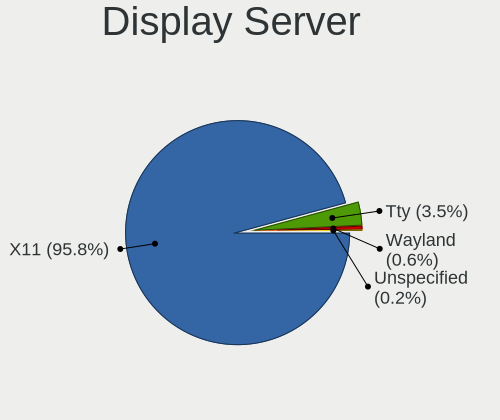
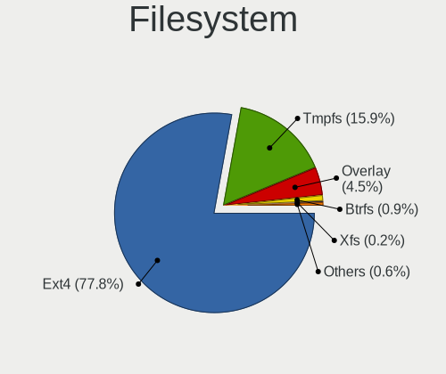
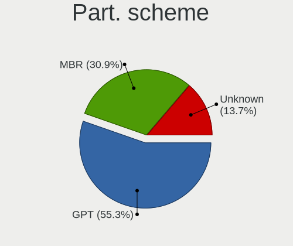

Lubuntu 22.04 - Tested Hardware & Statistics
--------------------------------------------

A project to collect tested hardware configurations for Lubuntu 22.04.

Anyone can contribute to this report by the [hw-probe](https://github.com/linuxhw/hw-probe) tool:

    sudo -E hw-probe -all -upload

Please contribute! Especially if your hardware is rare.

This is a report for all computer types. See also reports for [desktops](/Dist/Lubuntu_22.04/Desktop/README.md) and [notebooks](/Dist/Lubuntu_22.04/Notebook/README.md).

Contents
--------

* [ Test Cases ](#test-cases)

* [ System ](#system)
  - [ Kernel                   ](#kernel)
  - [ Kernel Family            ](#kernel-family)
  - [ Kernel Major Ver.        ](#kernel-major-ver)
  - [ Arch                     ](#arch)
  - [ DE                       ](#de)
  - [ Display Server           ](#display-server)
  - [ Display Manager          ](#display-manager)
  - [ OS Lang                  ](#os-lang)
  - [ Boot Mode                ](#boot-mode)
  - [ Filesystem               ](#filesystem)
  - [ Part. scheme             ](#part-scheme)
  - [ Dual Boot with Linux/BSD ](#dual-boot-with-linuxbsd)
  - [ Dual Boot (Win)          ](#dual-boot-win)

* [ Board ](#board)
  - [ Vendor                   ](#vendor)
  - [ Model                    ](#model)
  - [ Model Family             ](#model-family)
  - [ MFG Year                 ](#mfg-year)
  - [ Form Factor              ](#form-factor)
  - [ Secure Boot              ](#secure-boot)
  - [ Coreboot                 ](#coreboot)
  - [ RAM Size                 ](#ram-size)
  - [ RAM Used                 ](#ram-used)
  - [ Total Drives             ](#total-drives)
  - [ Has CD-ROM               ](#has-cd-rom)
  - [ Has Ethernet             ](#has-ethernet)
  - [ Has WiFi                 ](#has-wifi)
  - [ Has Bluetooth            ](#has-bluetooth)

* [ Location ](#location)
  - [ Country                  ](#country)
  - [ City                     ](#city)

* [ Drives ](#drives)
  - [ Drive Vendor             ](#drive-vendor)
  - [ Drive Model              ](#drive-model)
  - [ HDD Vendor               ](#hdd-vendor)
  - [ SSD Vendor               ](#ssd-vendor)
  - [ Drive Kind               ](#drive-kind)
  - [ Drive Connector          ](#drive-connector)
  - [ Drive Size               ](#drive-size)
  - [ Space Total              ](#space-total)
  - [ Space Used               ](#space-used)
  - [ Malfunc. Drives          ](#malfunc-drives)
  - [ Malfunc. Drive Vendor    ](#malfunc-drive-vendor)
  - [ Malfunc. HDD Vendor      ](#malfunc-hdd-vendor)
  - [ Malfunc. Drive Kind      ](#malfunc-drive-kind)
  - [ Failed Drives            ](#failed-drives)
  - [ Failed Drive Vendor      ](#failed-drive-vendor)
  - [ Drive Status             ](#drive-status)

* [ Storage controller ](#storage-controller)
  - [ Storage Vendor           ](#storage-vendor)
  - [ Storage Model            ](#storage-model)
  - [ Storage Kind             ](#storage-kind)

* [ Processor ](#processor)
  - [ CPU Vendor               ](#cpu-vendor)
  - [ CPU Model                ](#cpu-model)
  - [ CPU Model Family         ](#cpu-model-family)
  - [ CPU Cores                ](#cpu-cores)
  - [ CPU Sockets              ](#cpu-sockets)
  - [ CPU Threads              ](#cpu-threads)
  - [ CPU Op-Modes             ](#cpu-op-modes)
  - [ CPU Microcode            ](#cpu-microcode)
  - [ CPU Microarch            ](#cpu-microarch)

* [ Graphics ](#graphics)
  - [ GPU Vendor               ](#gpu-vendor)
  - [ GPU Model                ](#gpu-model)
  - [ GPU Combo                ](#gpu-combo)
  - [ GPU Driver               ](#gpu-driver)
  - [ GPU Memory               ](#gpu-memory)

* [ Monitor ](#monitor)
  - [ Monitor Vendor           ](#monitor-vendor)
  - [ Monitor Model            ](#monitor-model)
  - [ Monitor Resolution       ](#monitor-resolution)
  - [ Monitor Diagonal         ](#monitor-diagonal)
  - [ Monitor Width            ](#monitor-width)
  - [ Aspect Ratio             ](#aspect-ratio)
  - [ Monitor Area             ](#monitor-area)
  - [ Pixel Density            ](#pixel-density)
  - [ Multiple Monitors        ](#multiple-monitors)

* [ Network ](#network)
  - [ Net Controller Vendor    ](#net-controller-vendor)
  - [ Net Controller Model     ](#net-controller-model)
  - [ Wireless Vendor          ](#wireless-vendor)
  - [ Wireless Model           ](#wireless-model)
  - [ Ethernet Vendor          ](#ethernet-vendor)
  - [ Ethernet Model           ](#ethernet-model)
  - [ Net Controller Kind      ](#net-controller-kind)
  - [ Used Controller          ](#used-controller)
  - [ NICs                     ](#nics)
  - [ IPv6                     ](#ipv6)

* [ Bluetooth ](#bluetooth)
  - [ Bluetooth Vendor         ](#bluetooth-vendor)
  - [ Bluetooth Model          ](#bluetooth-model)

* [ Sound ](#sound)
  - [ Sound Vendor             ](#sound-vendor)
  - [ Sound Model              ](#sound-model)

* [ Memory ](#memory)
  - [ Memory Vendor            ](#memory-vendor)
  - [ Memory Model             ](#memory-model)
  - [ Memory Kind              ](#memory-kind)
  - [ Memory Form Factor       ](#memory-form-factor)
  - [ Memory Size              ](#memory-size)
  - [ Memory Speed             ](#memory-speed)

* [ Printers & scanners ](#printers--scanners)
  - [ Printer Vendor           ](#printer-vendor)
  - [ Printer Model            ](#printer-model)
  - [ Scanner Vendor           ](#scanner-vendor)
  - [ Scanner Model            ](#scanner-model)

* [ Camera ](#camera)
  - [ Camera Vendor            ](#camera-vendor)
  - [ Camera Model             ](#camera-model)

* [ Security ](#security)
  - [ Fingerprint Vendor       ](#fingerprint-vendor)
  - [ Fingerprint Model        ](#fingerprint-model)
  - [ Chipcard Vendor          ](#chipcard-vendor)
  - [ Chipcard Model           ](#chipcard-model)

* [ Unsupported ](#unsupported)
  - [ Unsupported Devices      ](#unsupported-devices)
  - [ Unsupported Device Types ](#unsupported-device-types)

Test Cases
----------

Total: 124

| Vendor        | Model                       | Form-Factor | Probe                                                      | Date         |
|---------------|-----------------------------|-------------|------------------------------------------------------------|--------------|
| HP            | 0B4Ch D                     | Desktop     | [1b409fc1f6](https://linux-hardware.org/?probe=1b409fc1f6) | Oct 01, 2022 |
| HP            | 0B4Ch D                     | Desktop     | [ccc7fe3103](https://linux-hardware.org/?probe=ccc7fe3103) | Oct 01, 2022 |
| Lenovo        | ThinkPad E550 20DF00CUFR    | Notebook    | [7b5e707097](https://linux-hardware.org/?probe=7b5e707097) | Sep 27, 2022 |
| Dell          | 0R849J A00                  | Desktop     | [cf2069932e](https://linux-hardware.org/?probe=cf2069932e) | Sep 26, 2022 |
| Packard Be... | EasyNote TS44HR             | Notebook    | [4005a32539](https://linux-hardware.org/?probe=4005a32539) | Sep 26, 2022 |
| ASUSTek       | UX360CAK                    | Convertible | [015df11bc4](https://linux-hardware.org/?probe=015df11bc4) | Sep 25, 2022 |
| Lenovo        | IdeaPad L340-15IRH Gamin... | Notebook    | [68d36ec742](https://linux-hardware.org/?probe=68d36ec742) | Sep 23, 2022 |
| Lenovo        | IdeaPad Slim 1-14AST-05 ... | Notebook    | [1dbeac403e](https://linux-hardware.org/?probe=1dbeac403e) | Sep 22, 2022 |
| Dell          | 09M8Y8 A01                  | Desktop     | [aa3088ed0e](https://linux-hardware.org/?probe=aa3088ed0e) | Sep 22, 2022 |
| Lenovo        | MIIX 310-10ICR 80SG         | Tablet      | [c45724d6d3](https://linux-hardware.org/?probe=c45724d6d3) | Sep 20, 2022 |
| Lenovo        | MIIX 310-10ICR 80SG         | Tablet      | [2f9ab4273a](https://linux-hardware.org/?probe=2f9ab4273a) | Sep 20, 2022 |
| Gateway       | NE46R                       | Notebook    | [61ee26263b](https://linux-hardware.org/?probe=61ee26263b) | Sep 20, 2022 |
| MSI           | B450-A PRO MAX              | Desktop     | [89fad64303](https://linux-hardware.org/?probe=89fad64303) | Sep 20, 2022 |
| Gigabyte      | G31M-S2C                    | Desktop     | [f7f3a2e7c8](https://linux-hardware.org/?probe=f7f3a2e7c8) | Sep 17, 2022 |
| Dell          | Inspiron 11-3168            | Notebook    | [29241bb609](https://linux-hardware.org/?probe=29241bb609) | Sep 15, 2022 |
| AMI           | Cherry Trail CR             | Desktop     | [1c131a1acb](https://linux-hardware.org/?probe=1c131a1acb) | Sep 15, 2022 |
| Lenovo        | Z70-80 80FG                 | Notebook    | [93cb353340](https://linux-hardware.org/?probe=93cb353340) | Sep 14, 2022 |
| Dell          | Inspiron 11-3168            | Notebook    | [763b0fced4](https://linux-hardware.org/?probe=763b0fced4) | Sep 14, 2022 |
| Unknown       | Unknown                     | Notebook    | [8b85e41d17](https://linux-hardware.org/?probe=8b85e41d17) | Sep 14, 2022 |
| Sony          | SVE14A2V1EW                 | Notebook    | [5123cfd3cd](https://linux-hardware.org/?probe=5123cfd3cd) | Sep 09, 2022 |
| HP            | ProBook 4730s               | Notebook    | [5d0a59d50b](https://linux-hardware.org/?probe=5d0a59d50b) | Sep 05, 2022 |
| Dell          | XPS L322X                   | Notebook    | [bd4b0713a8](https://linux-hardware.org/?probe=bd4b0713a8) | Sep 04, 2022 |
| Dell          | 0J584C A00                  | Desktop     | [de442f1c61](https://linux-hardware.org/?probe=de442f1c61) | Sep 01, 2022 |
| Lenovo        | ThinkPad T430 2342A19       | Notebook    | [1fee695aec](https://linux-hardware.org/?probe=1fee695aec) | Sep 01, 2022 |
| Lenovo        | ThinkPad X1 Carbon 2nd 2... | Notebook    | [f7189849b4](https://linux-hardware.org/?probe=f7189849b4) | Sep 01, 2022 |
| Gigabyte      | G31M-S2C                    | Desktop     | [61a4780992](https://linux-hardware.org/?probe=61a4780992) | Aug 30, 2022 |
| Gigabyte      | G31M-S2C                    | Desktop     | [8beed8e261](https://linux-hardware.org/?probe=8beed8e261) | Aug 30, 2022 |
| Lenovo        | B590 20208                  | Notebook    | [7eaabdb9ca](https://linux-hardware.org/?probe=7eaabdb9ca) | Aug 27, 2022 |
| Unknown       | Unknown                     | Notebook    | [3c18cd9208](https://linux-hardware.org/?probe=3c18cd9208) | Aug 25, 2022 |
| Acer          | Aspire 7250G                | Notebook    | [7035af5c32](https://linux-hardware.org/?probe=7035af5c32) | Aug 23, 2022 |
| MSI           | Z590-A PRO                  | Desktop     | [c74bbc2f61](https://linux-hardware.org/?probe=c74bbc2f61) | Aug 21, 2022 |
| Dell          | Vostro 3360                 | Notebook    | [0964195fe5](https://linux-hardware.org/?probe=0964195fe5) | Aug 21, 2022 |
| Prestigio     | PSB141C01BFH                | Notebook    | [37e5052027](https://linux-hardware.org/?probe=37e5052027) | Aug 18, 2022 |
| MSI           | Z170A GAMING M3             | Desktop     | [e0834224d7](https://linux-hardware.org/?probe=e0834224d7) | Aug 16, 2022 |
| Lenovo        | IdeaPad 330-15IKB Touch ... | Notebook    | [0d774697cc](https://linux-hardware.org/?probe=0d774697cc) | Aug 11, 2022 |
| Intel         | W7650                       | Notebook    | [1c8a9fd64b](https://linux-hardware.org/?probe=1c8a9fd64b) | Aug 10, 2022 |
| ASRock        | G41M-VS3                    | Desktop     | [16a2e0ab5d](https://linux-hardware.org/?probe=16a2e0ab5d) | Aug 09, 2022 |
| OEM           | Unknown                     | Notebook    | [d95f8f1502](https://linux-hardware.org/?probe=d95f8f1502) | Aug 09, 2022 |
| Dell          | Inspiron 11-3168            | Notebook    | [11beb61f79](https://linux-hardware.org/?probe=11beb61f79) | Aug 09, 2022 |
| Dell          | Inspiron 11-3168            | Notebook    | [7a3c91b14a](https://linux-hardware.org/?probe=7a3c91b14a) | Aug 07, 2022 |
| HP            | 8768 A                      | Desktop     | [2ee49e3506](https://linux-hardware.org/?probe=2ee49e3506) | Aug 07, 2022 |
| HP            | 15 Notebook PC              | Notebook    | [c857595b97](https://linux-hardware.org/?probe=c857595b97) | Aug 05, 2022 |
| Lenovo        | BRASWELL SDK0J40697 WIN ... | Desktop     | [f601e2f557](https://linux-hardware.org/?probe=f601e2f557) | Aug 05, 2022 |
| ASRock        | G41M-VS3                    | Desktop     | [16c2b30680](https://linux-hardware.org/?probe=16c2b30680) | Aug 04, 2022 |
| Acer          | EG31M R01-A3                | Desktop     | [c5b4092eb4](https://linux-hardware.org/?probe=c5b4092eb4) | Aug 04, 2022 |
| Dell          | Precision 3510              | Notebook    | [2d74356174](https://linux-hardware.org/?probe=2d74356174) | Aug 03, 2022 |
| Apple         | MacBook7,1                  | Notebook    | [84efbc858e](https://linux-hardware.org/?probe=84efbc858e) | Aug 02, 2022 |
| Dell          | Precision 3510              | Notebook    | [d2e79b01bb](https://linux-hardware.org/?probe=d2e79b01bb) | Aug 02, 2022 |
| IFSA          | Positivo BGH                | Notebook    | [ec0aa9bc36](https://linux-hardware.org/?probe=ec0aa9bc36) | Aug 02, 2022 |
| Google        | Celes                       | Notebook    | [6a4bc65f84](https://linux-hardware.org/?probe=6a4bc65f84) | Jul 31, 2022 |
| Dell          | XPS M1330                   | Notebook    | [2abad8da86](https://linux-hardware.org/?probe=2abad8da86) | Jul 30, 2022 |
| Dell          | 0WR7PY A03                  | Desktop     | [0cabe39a74](https://linux-hardware.org/?probe=0cabe39a74) | Jul 27, 2022 |
| Dell          | 0X8582                      | Desktop     | [b52bb428f4](https://linux-hardware.org/?probe=b52bb428f4) | Jul 26, 2022 |
| AMI           | Cherry Trail CR             | Desktop     | [6463c26211](https://linux-hardware.org/?probe=6463c26211) | Jul 25, 2022 |
| Sony          | VPCEB15FM                   | Notebook    | [340ef685ef](https://linux-hardware.org/?probe=340ef685ef) | Jul 24, 2022 |
| ASUSTek       | M5A78L LE                   | Desktop     | [4ade852983](https://linux-hardware.org/?probe=4ade852983) | Jul 23, 2022 |
| Dell          | 0X8582                      | Desktop     | [ab2bf3496e](https://linux-hardware.org/?probe=ab2bf3496e) | Jul 20, 2022 |
| ASRock        | A75M-HVS                    | Desktop     | [c88ac89032](https://linux-hardware.org/?probe=c88ac89032) | Jul 20, 2022 |
| Dell          | 0X8582                      | Desktop     | [5b8458f200](https://linux-hardware.org/?probe=5b8458f200) | Jul 19, 2022 |
| HP            | 245 G2                      | Notebook    | [03a8791b0c](https://linux-hardware.org/?probe=03a8791b0c) | Jul 18, 2022 |
| HP            | 245 G2                      | Notebook    | [f37ddc5aed](https://linux-hardware.org/?probe=f37ddc5aed) | Jul 17, 2022 |
| MSI           | X570-A PRO                  | Desktop     | [84b1994696](https://linux-hardware.org/?probe=84b1994696) | Jul 16, 2022 |
| Lenovo        | G50-30 80G0                 | Notebook    | [27a46d46dd](https://linux-hardware.org/?probe=27a46d46dd) | Jul 16, 2022 |
| Chuwi         | GemiBook Pro                | Notebook    | [ff08461db4](https://linux-hardware.org/?probe=ff08461db4) | Jul 07, 2022 |
| HP            | 1495                        | Desktop     | [32ea18bc68](https://linux-hardware.org/?probe=32ea18bc68) | Jul 06, 2022 |
| HP            | 1495                        | Desktop     | [6300d25ff0](https://linux-hardware.org/?probe=6300d25ff0) | Jul 04, 2022 |
| Lenovo        | IdeaPad S145-15IGM 81MX     | Notebook    | [de35c60b5f](https://linux-hardware.org/?probe=de35c60b5f) | Jul 01, 2022 |
| Google        | Bobba360                    | Notebook    | [6fcae5202a](https://linux-hardware.org/?probe=6fcae5202a) | Jun 26, 2022 |
| MSI           | 760GM-P23                   | Desktop     | [ff0f44e63c](https://linux-hardware.org/?probe=ff0f44e63c) | Jun 26, 2022 |
| Dell          | 0VRWRC A00                  | Desktop     | [fe159bf237](https://linux-hardware.org/?probe=fe159bf237) | Jun 26, 2022 |
| ASUSTek       | M4N78-AM                    | Desktop     | [f98db3efe8](https://linux-hardware.org/?probe=f98db3efe8) | Jun 22, 2022 |
| Gateway       | Sonic-C                     | Notebook    | [6bec9c80ea](https://linux-hardware.org/?probe=6bec9c80ea) | Jun 21, 2022 |
| Lenovo        | SHARKBAY SDK0E50510 PRO     | Desktop     | [474c946289](https://linux-hardware.org/?probe=474c946289) | Jun 17, 2022 |
| Dell          | Latitude XT                 | Notebook    | [c07eac8a84](https://linux-hardware.org/?probe=c07eac8a84) | Jun 17, 2022 |
| Dell          | Studio 1537                 | Notebook    | [12a651ebd2](https://linux-hardware.org/?probe=12a651ebd2) | Jun 16, 2022 |
| ASUSTek       | M4N78-AM                    | Desktop     | [8522c93ea3](https://linux-hardware.org/?probe=8522c93ea3) | Jun 16, 2022 |
| ASUSTek       | M4N78-AM                    | Desktop     | [d7dddc4270](https://linux-hardware.org/?probe=d7dddc4270) | Jun 16, 2022 |
| ASUSTek       | E403SA                      | Notebook    | [9ca6a865ff](https://linux-hardware.org/?probe=9ca6a865ff) | Jun 11, 2022 |
| HP            | Pavilion Sleekbook 15 PC    | Notebook    | [1a41b08f4f](https://linux-hardware.org/?probe=1a41b08f4f) | Jun 10, 2022 |
| ASUSTek       | N56VZ                       | Notebook    | [3c1a5025f1](https://linux-hardware.org/?probe=3c1a5025f1) | Jun 09, 2022 |
| Sony          | VGN-SZ71WN_C                | Notebook    | [aece18b520](https://linux-hardware.org/?probe=aece18b520) | Jun 06, 2022 |
| ASUSTek       | PRIME X370-A                | Desktop     | [bd1889b281](https://linux-hardware.org/?probe=bd1889b281) | Jun 06, 2022 |
| Intel         | W7650                       | Notebook    | [fd4abd788b](https://linux-hardware.org/?probe=fd4abd788b) | Jun 06, 2022 |
| Apple         | MacBookPro8,1               | Notebook    | [d191629954](https://linux-hardware.org/?probe=d191629954) | Jun 04, 2022 |
| Apple         | MacBookPro8,1               | Notebook    | [816c29b1df](https://linux-hardware.org/?probe=816c29b1df) | Jun 04, 2022 |
| HP            | Pavilion g6                 | Notebook    | [7c389588bb](https://linux-hardware.org/?probe=7c389588bb) | Jun 02, 2022 |
| AMI           | Aptio CRB A                 | Mini pc     | [8fe291470d](https://linux-hardware.org/?probe=8fe291470d) | Jun 02, 2022 |
| HP            | ProBook 640 G1              | Notebook    | [a1c25fad70](https://linux-hardware.org/?probe=a1c25fad70) | Jun 01, 2022 |
| Unknown       | Unknown                     | Desktop     | [b64c215325](https://linux-hardware.org/?probe=b64c215325) | May 30, 2022 |
| AMI           | Aptio CRB                   | Mini pc     | [63ccee44b1](https://linux-hardware.org/?probe=63ccee44b1) | May 28, 2022 |
| AMI           | Aptio CRB A                 | Mini pc     | [c77f0f6328](https://linux-hardware.org/?probe=c77f0f6328) | May 27, 2022 |
| HP            | Pavilion g6                 | Notebook    | [3972cb6508](https://linux-hardware.org/?probe=3972cb6508) | May 25, 2022 |
| Toshiba       | Satellite L40               | Notebook    | [37af5b0ba4](https://linux-hardware.org/?probe=37af5b0ba4) | May 24, 2022 |
| Mediacom      | WinPad 11,6 FullHD- WPU1... | Notebook    | [0d13155508](https://linux-hardware.org/?probe=0d13155508) | May 23, 2022 |
| Dell          | System Inspiron 17 7000 ... | Notebook    | [5f646f4e8c](https://linux-hardware.org/?probe=5f646f4e8c) | May 23, 2022 |
| Unknown       | Unknown                     | Desktop     | [aa6db2ed41](https://linux-hardware.org/?probe=aa6db2ed41) | May 23, 2022 |
| Unknown       | HX90                        | Desktop     | [22dac34b7b](https://linux-hardware.org/?probe=22dac34b7b) | May 21, 2022 |
| Mediacom      | WinPad 11,6 FullHD- WPU1... | Notebook    | [f52f5b7be2](https://linux-hardware.org/?probe=f52f5b7be2) | May 21, 2022 |
| Lenovo        | IdeaPad Slim 1-14AST-05 ... | Notebook    | [6528155c00](https://linux-hardware.org/?probe=6528155c00) | May 19, 2022 |
| Lenovo        | IdeaPad Slim 1-14AST-05 ... | Notebook    | [53219da3f5](https://linux-hardware.org/?probe=53219da3f5) | May 19, 2022 |
| Google        | Terra                       | Notebook    | [35088c1c05](https://linux-hardware.org/?probe=35088c1c05) | May 16, 2022 |
| Unknown       | Unknown                     | Desktop     | [1aba67a1ac](https://linux-hardware.org/?probe=1aba67a1ac) | May 15, 2022 |
| Pegatron      | VIOLET6                     | Desktop     | [dbbdea4231](https://linux-hardware.org/?probe=dbbdea4231) | May 12, 2022 |
| Acer          | Aspire V5-573G              | Notebook    | [4477112f3a](https://linux-hardware.org/?probe=4477112f3a) | May 11, 2022 |
| ASUSTek       | VivoBook 14_ASUS Laptop ... | Notebook    | [f151955e44](https://linux-hardware.org/?probe=f151955e44) | May 10, 2022 |
| Google        | Relm                        | Notebook    | [37a9101768](https://linux-hardware.org/?probe=37a9101768) | May 09, 2022 |
| Intel         | W7650                       | Notebook    | [bd5d159229](https://linux-hardware.org/?probe=bd5d159229) | May 07, 2022 |
| Apple         | MacBookPro14,1              | Notebook    | [fd19fe90e5](https://linux-hardware.org/?probe=fd19fe90e5) | May 05, 2022 |
| Apple         | MacBookPro14,1              | Notebook    | [dc913baa2b](https://linux-hardware.org/?probe=dc913baa2b) | May 04, 2022 |
| Fujitsu       | LIFEBOOK S751               | Notebook    | [6150343dc0](https://linux-hardware.org/?probe=6150343dc0) | May 01, 2022 |
| Dell          | 02YYK5 A01                  | Desktop     | [19dd091f8b](https://linux-hardware.org/?probe=19dd091f8b) | May 01, 2022 |
| Google        | Bobba360                    | Notebook    | [e90fbcc91d](https://linux-hardware.org/?probe=e90fbcc91d) | Apr 29, 2022 |
| HP            | Laptop 15-da0xxx            | Notebook    | [6ad1b34a48](https://linux-hardware.org/?probe=6ad1b34a48) | Apr 29, 2022 |
| ASUSTek       | T102HA                      | Tablet      | [1406a26a6e](https://linux-hardware.org/?probe=1406a26a6e) | Apr 27, 2022 |
| ASUSTek       | T102HA                      | Tablet      | [6dd79c7d6a](https://linux-hardware.org/?probe=6dd79c7d6a) | Apr 27, 2022 |
| Intel         | NUC7JYB J67967-404          | Mini pc     | [727b677ecb](https://linux-hardware.org/?probe=727b677ecb) | Apr 26, 2022 |
| Dell          | Latitude 7480               | Notebook    | [817415642f](https://linux-hardware.org/?probe=817415642f) | Apr 26, 2022 |
| HP            | Pavilion dv4                | Notebook    | [7bd955f313](https://linux-hardware.org/?probe=7bd955f313) | Apr 18, 2022 |
| Apple         | MacBookPro8,1               | Notebook    | [f74cae630d](https://linux-hardware.org/?probe=f74cae630d) | Apr 16, 2022 |
| ZOTAC         | NM10                        | Desktop     | [b2983fdd9d](https://linux-hardware.org/?probe=b2983fdd9d) | Apr 15, 2022 |
| Intel         | W7650                       | Notebook    | [9144ca0d30](https://linux-hardware.org/?probe=9144ca0d30) | Apr 15, 2022 |
| Unknown       | Unknown                     | Desktop     | [4de543bc53](https://linux-hardware.org/?probe=4de543bc53) | Apr 03, 2022 |
| ASUSTek       | PRIME B350M-E               | Desktop     | [70f555009e](https://linux-hardware.org/?probe=70f555009e) | Feb 18, 2022 |
| Intel         | W7650                       | Notebook    | [df2f2041d1](https://linux-hardware.org/?probe=df2f2041d1) | Feb 18, 2022 |

System
------

Kernel
------

Version of the Linux kernel

| Version                     | Computers | Percent |
|-----------------------------|-----------|---------|
| 5.15.0-43-generic           | 11        | 10.78%  |
| 5.15.0-47-generic           | 10        | 9.8%    |
| 5.15.0-30-generic           | 10        | 9.8%    |
| 5.15.0-25-generic           | 10        | 9.8%    |
| 5.15.0-46-generic           | 9         | 8.82%   |
| 5.15.0-27-generic           | 9         | 8.82%   |
| 5.15.0-41-generic           | 8         | 7.84%   |
| 5.15.0-40-generic           | 6         | 5.88%   |
| 5.15.0-48-generic           | 4         | 3.92%   |
| 5.15.0-39-generic           | 4         | 3.92%   |
| 5.15.0-35-generic           | 4         | 3.92%   |
| 5.15.0-33-generic           | 4         | 3.92%   |
| 5.15.0-37-generic           | 2         | 1.96%   |
| 5.15.0-23-generic           | 2         | 1.96%   |
| 5.15.0-18-generic           | 2         | 1.96%   |
| 5.19.8-xanmod1              | 1         | 0.98%   |
| 5.19.11-ux360cak            | 1         | 0.98%   |
| 5.19.0-051900-generic       | 1         | 0.98%   |
| 5.18.0-051800-generic       | 1         | 0.98%   |
| 5.15.0-41-lowlatency        | 1         | 0.98%   |
| 5.15.0-362206031516-generic | 1         | 0.98%   |
| 5.15.0-28-generic           | 1         | 0.98%   |

Kernel Family
-------------

Linux kernel without a distro release

| Version | Computers | Percent |
|---------|-----------|---------|
| 5.15.0  | 95        | 95.96%  |
| 5.19.8  | 1         | 1.01%   |
| 5.19.11 | 1         | 1.01%   |
| 5.19.0  | 1         | 1.01%   |
| 5.18.0  | 1         | 1.01%   |

Kernel Major Ver.
-----------------

Linux kernel major version

| Version | Computers | Percent |
|---------|-----------|---------|
| 5.15    | 95        | 95.96%  |
| 5.19    | 3         | 3.03%   |
| 5.18    | 1         | 1.01%   |

Arch
----

OS architecture (x86_64, i586, etc.)

| Name   | Computers | Percent |
|--------|-----------|---------|
| x86_64 | 96        | 100%    |

DE
--

Desktop Environment

| Name       | Computers | Percent |
|------------|-----------|---------|
| LXQt       | 94        | 97.92%  |
| X-Cinnamon | 1         | 1.04%   |
| LXDE       | 1         | 1.04%   |

Display Server
--------------

X11 or Wayland

| Name        | Computers | Percent |
|-------------|-----------|---------|
| X11         | 92        | 94.85%  |
| Tty         | 3         | 3.09%   |
| Wayland     | 1         | 1.03%   |
| Unspecified | 1         | 1.03%   |

Display Manager
---------------

SDDM, LightDM, etc.

| Name    | Computers | Percent |
|---------|-----------|---------|
| SDDM    | 87        | 90.63%  |
| Unknown | 4         | 4.17%   |
| LightDM | 3         | 3.13%   |
| XDM     | 1         | 1.04%   |
| LXDM    | 1         | 1.04%   |

OS Lang
-------

Language

| Lang  | Computers | Percent |
|-------|-----------|---------|
| en_US | 31        | 31.96%  |
| fr_FR | 8         | 8.25%   |
| de_DE | 7         | 7.22%   |
| it_IT | 6         | 6.19%   |
| en_GB | 6         | 6.19%   |
| pt_BR | 5         | 5.15%   |
| C     | 5         | 5.15%   |
| es_CR | 4         | 4.12%   |
| pl_PL | 3         | 3.09%   |
| nl_BE | 3         | 3.09%   |
| en_AG | 3         | 3.09%   |
| es_MX | 2         | 2.06%   |
| es_AR | 2         | 2.06%   |
| en_CA | 2         | 2.06%   |
| en_AU | 2         | 2.06%   |
| el_GR | 2         | 2.06%   |
| sv_SE | 1         | 1.03%   |
| ru_UA | 1         | 1.03%   |
| fi_FI | 1         | 1.03%   |
| es_CL | 1         | 1.03%   |
| en_PH | 1         | 1.03%   |
| cv_RU | 1         | 1.03%   |

Boot Mode
---------

EFI or BIOS

| Mode | Computers | Percent |
|------|-----------|---------|
| BIOS | 65        | 67.01%  |
| EFI  | 32        | 32.99%  |

Filesystem
----------

Type of filesystem

| Type    | Computers | Percent |
|---------|-----------|---------|
| Ext4    | 89        | 91.75%  |
| Overlay | 5         | 5.15%   |
| Btrfs   | 2         | 2.06%   |
| Ext2    | 1         | 1.03%   |

Part. scheme
------------

Scheme of partitioning

| Type    | Computers | Percent |
|---------|-----------|---------|
| Unknown | 43        | 44.79%  |
| GPT     | 36        | 37.5%   |
| MBR     | 17        | 17.71%  |

Dual Boot with Linux/BSD
------------------------

Hosting more than one Linux/BSD

| Dual boot | Computers | Percent |
|-----------|-----------|---------|
| No        | 84        | 86.6%   |
| Yes       | 13        | 13.4%   |

Dual Boot (Win)
---------------

Hosting Linux and Windows

| Dual boot | Computers | Percent |
|-----------|-----------|---------|
| No        | 72        | 74.23%  |
| Yes       | 25        | 25.77%  |

Board
-----

Vendor
------

Motherboard manufacturer

| Name                | Computers | Percent |
|---------------------|-----------|---------|
| Dell                | 17        | 17.71%  |
| Lenovo              | 14        | 14.58%  |
| Hewlett-Packard     | 11        | 11.46%  |
| ASUSTek Computer    | 9         | 9.38%   |
| MSI                 | 5         | 5.21%   |
| Unknown             | 5         | 5.21%   |
| Google              | 4         | 4.17%   |
| AMI                 | 4         | 4.17%   |
| Sony                | 3         | 3.13%   |
| Apple               | 3         | 3.13%   |
| Acer                | 3         | 3.13%   |
| Mediacom            | 2         | 2.08%   |
| Gigabyte Technology | 2         | 2.08%   |
| Gateway             | 2         | 2.08%   |
| ASRock              | 2         | 2.08%   |
| ZOTAC               | 1         | 1.04%   |
| Toshiba             | 1         | 1.04%   |
| Prestigio           | 1         | 1.04%   |
| Pegatron            | 1         | 1.04%   |
| Packard Bell        | 1         | 1.04%   |
| OEM                 | 1         | 1.04%   |
| Intel               | 1         | 1.04%   |
| IFSA                | 1         | 1.04%   |
| Fujitsu             | 1         | 1.04%   |
| Chuwi               | 1         | 1.04%   |

Model
-----

Motherboard model

| Name                                     | Computers | Percent |
|------------------------------------------|-----------|---------|
| Unknown                                  | 6         | 6.25%   |
| Mediacom WinPad 11,6 FullHD- WPU11       | 2         | 2.08%   |
| Lenovo IdeaPad Slim 1-14AST-05 81VS      | 2         | 2.08%   |
| Dell Dimension 9100                      | 2         | 2.08%   |
| Apple MacBookPro8,1                      | 2         | 2.08%   |
| ZOTAC NM10                               | 1         | 1.04%   |
| Toshiba Satellite L40                    | 1         | 1.04%   |
| Sony VPCEB15FM                           | 1         | 1.04%   |
| Sony VGN-SZ71WN_C                        | 1         | 1.04%   |
| Sony SVE14A2V1EW                         | 1         | 1.04%   |
| Prestigio PSB141C01BFH                   | 1         | 1.04%   |
| Pegatron AY748AA-ABA p6320y              | 1         | 1.04%   |
| Packard Bell EasyNote TS44HR             | 1         | 1.04%   |
| MSI MS-7D09                              | 1         | 1.04%   |
| MSI MS-7C37                              | 1         | 1.04%   |
| MSI MS-7B86                              | 1         | 1.04%   |
| MSI MS-7978                              | 1         | 1.04%   |
| MSI MS-7641                              | 1         | 1.04%   |
| Lenovo Z70-80 80FG                       | 1         | 1.04%   |
| Lenovo ThinkPad X1 Carbon 2nd 20A8S0WE02 | 1         | 1.04%   |
| Lenovo ThinkPad T430 2342A19             | 1         | 1.04%   |
| Lenovo ThinkPad E550 20DF00CUFR          | 1         | 1.04%   |
| Lenovo ThinkCentre M83 10ANCTO1WW        | 1         | 1.04%   |
| Lenovo ThinkCentre M600 10KGS09S00       | 1         | 1.04%   |
| Lenovo MIIX 310-10ICR 80SG               | 1         | 1.04%   |
| Lenovo IdeaPad S145-15IGM 81MX           | 1         | 1.04%   |
| Lenovo IdeaPad L340-15IRH Gaming 81LK    | 1         | 1.04%   |
| Lenovo IdeaPad 330-15IKB Touch 81DJ      | 1         | 1.04%   |
| Lenovo G50-30 80G0                       | 1         | 1.04%   |
| Lenovo B590 20208                        | 1         | 1.04%   |
| Intel Infoway                            | 1         | 1.04%   |
| IFSA Positivo BGH                        | 1         | 1.04%   |
| HP Z400 Workstation                      | 1         | 1.04%   |
| HP Slim Desktop S01-pF1xxx               | 1         | 1.04%   |
| HP ProBook 640 G1                        | 1         | 1.04%   |
| HP ProBook 4730s                         | 1         | 1.04%   |
| HP Pavilion Sleekbook 15 PC              | 1         | 1.04%   |
| HP Pavilion g6                           | 1         | 1.04%   |
| HP Pavilion dv4                          | 1         | 1.04%   |
| HP Laptop 15-da0xxx                      | 1         | 1.04%   |

Model Family
------------

Motherboard model prefix

| Name                   | Computers | Percent |
|------------------------|-----------|---------|
| Unknown                | 6         | 6.25%   |
| Lenovo IdeaPad         | 5         | 5.21%   |
| Lenovo ThinkPad        | 3         | 3.13%   |
| HP Pavilion            | 3         | 3.13%   |
| Dell OptiPlex          | 3         | 3.13%   |
| Acer Aspire            | 3         | 3.13%   |
| Mediacom WinPad        | 2         | 2.08%   |
| Lenovo ThinkCentre     | 2         | 2.08%   |
| HP ProBook             | 2         | 2.08%   |
| Dell XPS               | 2         | 2.08%   |
| Dell Vostro            | 2         | 2.08%   |
| Dell Studio            | 2         | 2.08%   |
| Dell Precision         | 2         | 2.08%   |
| Dell Latitude          | 2         | 2.08%   |
| Dell Dimension         | 2         | 2.08%   |
| ASUS PRIME             | 2         | 2.08%   |
| Apple MacBookPro8      | 2         | 2.08%   |
| ZOTAC NM10             | 1         | 1.04%   |
| Toshiba Satellite      | 1         | 1.04%   |
| Sony VPCEB15FM         | 1         | 1.04%   |
| Sony VGN-SZ71WN        | 1         | 1.04%   |
| Sony SVE14A2V1EW       | 1         | 1.04%   |
| Prestigio PSB141C01BFH | 1         | 1.04%   |
| Pegatron AY748AA-ABA   | 1         | 1.04%   |
| Packard Bell EasyNote  | 1         | 1.04%   |
| MSI MS-7D09            | 1         | 1.04%   |
| MSI MS-7C37            | 1         | 1.04%   |
| MSI MS-7B86            | 1         | 1.04%   |
| MSI MS-7978            | 1         | 1.04%   |
| MSI MS-7641            | 1         | 1.04%   |
| Lenovo Z70-80          | 1         | 1.04%   |
| Lenovo MIIX            | 1         | 1.04%   |
| Lenovo G50-30          | 1         | 1.04%   |
| Lenovo B590            | 1         | 1.04%   |
| Intel Infoway          | 1         | 1.04%   |
| IFSA Positivo          | 1         | 1.04%   |
| HP Z400                | 1         | 1.04%   |
| HP Slim                | 1         | 1.04%   |
| HP Laptop              | 1         | 1.04%   |
| HP Compaq              | 1         | 1.04%   |

MFG Year
--------

Motherboard manufacture year

| Year | Computers | Percent |
|------|-----------|---------|
| 2011 | 11        | 11.46%  |
| 2019 | 8         | 8.33%   |
| 2017 | 8         | 8.33%   |
| 2008 | 8         | 8.33%   |
| 2014 | 7         | 7.29%   |
| 2013 | 7         | 7.29%   |
| 2012 | 7         | 7.29%   |
| 2021 | 6         | 6.25%   |
| 2016 | 6         | 6.25%   |
| 2015 | 6         | 6.25%   |
| 2010 | 6         | 6.25%   |
| 2020 | 4         | 4.17%   |
| 2007 | 4         | 4.17%   |
| 2022 | 3         | 3.13%   |
| 2009 | 2         | 2.08%   |
| 2006 | 2         | 2.08%   |
| 2018 | 1         | 1.04%   |

Form Factor
-----------

Physical design of the computer

| Name        | Computers | Percent |
|-------------|-----------|---------|
| Notebook    | 57        | 59.38%  |
| Desktop     | 34        | 35.42%  |
| Tablet      | 2         | 2.08%   |
| Mini pc     | 2         | 2.08%   |
| Convertible | 1         | 1.04%   |

Secure Boot
-----------

Enabled or disabled

| State    | Computers | Percent |
|----------|-----------|---------|
| Disabled | 93        | 96.88%  |
| Enabled  | 3         | 3.13%   |

Coreboot
--------

Have coreboot on board

| Used | Computers | Percent |
|------|-----------|---------|
| No   | 92        | 95.83%  |
| Yes  | 4         | 4.17%   |

RAM Size
--------

Total RAM memory

| Size in GB  | Computers | Percent |
|-------------|-----------|---------|
| 3.01-4.0    | 32        | 32.99%  |
| 4.01-8.0    | 23        | 23.71%  |
| 16.01-24.0  | 10        | 10.31%  |
| 1.01-2.0    | 10        | 10.31%  |
| 8.01-16.0   | 9         | 9.28%   |
| 32.01-64.0  | 5         | 5.15%   |
| 2.01-3.0    | 5         | 5.15%   |
| 0.51-1.0    | 2         | 2.06%   |
| 64.01-256.0 | 1         | 1.03%   |

RAM Used
--------

Used RAM memory

| Used GB  | Computers | Percent |
|----------|-----------|---------|
| 1.01-2.0 | 44        | 44.9%   |
| 0.51-1.0 | 27        | 27.55%  |
| 2.01-3.0 | 18        | 18.37%  |
| 4.01-8.0 | 5         | 5.1%    |
| 3.01-4.0 | 4         | 4.08%   |

Total Drives
------------

Number of drives on board

| Drives | Computers | Percent |
|--------|-----------|---------|
| 1      | 68        | 70.83%  |
| 2      | 22        | 22.92%  |
| 0      | 2         | 2.08%   |
| 7      | 1         | 1.04%   |
| 6      | 1         | 1.04%   |
| 5      | 1         | 1.04%   |
| 3      | 1         | 1.04%   |

Has CD-ROM
----------

Has CD-ROM on board

| Presented | Computers | Percent |
|-----------|-----------|---------|
| No        | 56        | 58.33%  |
| Yes       | 40        | 41.67%  |

Has Ethernet
------------

Has Ethernet on board

| Presented | Computers | Percent |
|-----------|-----------|---------|
| Yes       | 78        | 81.25%  |
| No        | 18        | 18.75%  |

Has WiFi
--------

Has WiFi module

| Presented | Computers | Percent |
|-----------|-----------|---------|
| Yes       | 70        | 72.92%  |
| No        | 26        | 27.08%  |

Has Bluetooth
-------------

Has Bluetooth module

| Presented | Computers | Percent |
|-----------|-----------|---------|
| Yes       | 49        | 51.04%  |
| No        | 47        | 48.96%  |

Location
--------

Country
-------

Geographic location (country)

| Country      | Computers | Percent |
|--------------|-----------|---------|
| USA          | 21        | 21.88%  |
| Germany      | 8         | 8.33%   |
| France       | 8         | 8.33%   |
| Italy        | 6         | 6.25%   |
| Brazil       | 6         | 6.25%   |
| UK           | 4         | 4.17%   |
| Poland       | 4         | 4.17%   |
| Costa Rica   | 4         | 4.17%   |
| Belgium      | 4         | 4.17%   |
| Vietnam      | 2         | 2.08%   |
| Ukraine      | 2         | 2.08%   |
| Sweden       | 2         | 2.08%   |
| Russia       | 2         | 2.08%   |
| Mexico       | 2         | 2.08%   |
| Greece       | 2         | 2.08%   |
| Canada       | 2         | 2.08%   |
| Australia    | 2         | 2.08%   |
| Argentina    | 2         | 2.08%   |
| Turkey       | 1         | 1.04%   |
| Spain        | 1         | 1.04%   |
| Saudi Arabia | 1         | 1.04%   |
| Romania      | 1         | 1.04%   |
| Portugal     | 1         | 1.04%   |
| Philippines  | 1         | 1.04%   |
| Netherlands  | 1         | 1.04%   |
| Latvia       | 1         | 1.04%   |
| Kenya        | 1         | 1.04%   |
| Indonesia    | 1         | 1.04%   |
| Finland      | 1         | 1.04%   |
| Chile        | 1         | 1.04%   |
| Bulgaria     | 1         | 1.04%   |

City
----

Geographic location (city)

| City                 | Computers | Percent |
|----------------------|-----------|---------|
| Paris                | 4         | 4.17%   |
| Heredia              | 4         | 4.17%   |
| Novo Gama            | 2         | 2.08%   |
| Melbourne            | 2         | 2.08%   |
| Largo                | 2         | 2.08%   |
| Kyiv                 | 2         | 2.08%   |
| Yoshkar-Ola          | 1         | 1.04%   |
| Yorkville            | 1         | 1.04%   |
| Wolfhagen            | 1         | 1.04%   |
| Wetteren             | 1         | 1.04%   |
| Washington           | 1         | 1.04%   |
| Warsaw               | 1         | 1.04%   |
| Volzhskiy            | 1         | 1.04%   |
| Varna                | 1         | 1.04%   |
| Valentigney          | 1         | 1.04%   |
| Valencia             | 1         | 1.04%   |
| Thessaloniki         | 1         | 1.04%   |
| Taylorsville         | 1         | 1.04%   |
| Surabaya             | 1         | 1.04%   |
| Stuttgart            | 1         | 1.04%   |
| Strzyzow             | 1         | 1.04%   |
| Stockholm            | 1         | 1.04%   |
| Southampton          | 1         | 1.04%   |
| South Burlington     | 1         | 1.04%   |
| Sonico               | 1         | 1.04%   |
| Sao Paulo            | 1         | 1.04%   |
| Santiago             | 1         | 1.04%   |
| Roswell              | 1         | 1.04%   |
| Rossano Veneto       | 1         | 1.04%   |
| Riyadh               | 1         | 1.04%   |
| Rio de Janeiro       | 1         | 1.04%   |
| Richmond             | 1         | 1.04%   |
| Resistencia          | 1         | 1.04%   |
| Quezon City          | 1         | 1.04%   |
| Porto Alegre         | 1         | 1.04%   |
| Pontypool            | 1         | 1.04%   |
| Pisa                 | 1         | 1.04%   |
| Perth Amboy          | 1         | 1.04%   |
| Palermo              | 1         | 1.04%   |
| Ostrów Wielkopolski | 1         | 1.04%   |

Drives
------

Drive Vendor
------------

Hard drive vendors

| Vendor              | Computers | Drives | Percent |
|---------------------|-----------|--------|---------|
| Seagate             | 16        | 17     | 13.56%  |
| Unknown             | 15        | 23     | 12.71%  |
| WDC                 | 13        | 17     | 11.02%  |
| Toshiba             | 11        | 12     | 9.32%   |
| Samsung Electronics | 9         | 13     | 7.63%   |
| Hitachi             | 8         | 9      | 6.78%   |
| SanDisk             | 7         | 7      | 5.93%   |
| Kingston            | 4         | 5      | 3.39%   |
| Apacer              | 3         | 3      | 2.54%   |
| SPCC                | 2         | 2      | 1.69%   |
| Micron Technology   | 2         | 2      | 1.69%   |
| Intel               | 2         | 2      | 1.69%   |
| HGST                | 2         | 2      | 1.69%   |
| Crucial             | 2         | 2      | 1.69%   |
| WD MediaMax         | 1         | 1      | 0.85%   |
| W800S               | 1         | 1      | 0.85%   |
| UMIS                | 1         | 1      | 0.85%   |
| Transcend           | 1         | 1      | 0.85%   |
| TO Exter            | 1         | 1      | 0.85%   |
| T-FORCE             | 1         | 1      | 0.85%   |
| SK hynix            | 1         | 1      | 0.85%   |
| RSH-319             | 1         | 1      | 0.85%   |
| Patriot             | 1         | 1      | 0.85%   |
| Maxtor              | 1         | 1      | 0.85%   |
| Leqixiang           | 1         | 1      | 0.85%   |
| Lenovo              | 1         | 1      | 0.85%   |
| Kston               | 1         | 2      | 0.85%   |
| KINGPOWER           | 1         | 1      | 0.85%   |
| HUSKY               | 1         | 1      | 0.85%   |
| HGST HUS            | 1         | 2      | 0.85%   |
| Fujitsu             | 1         | 1      | 0.85%   |
| External            | 1         | 1      | 0.85%   |
| Apricorn            | 1         | 1      | 0.85%   |
| Apple               | 1         | 2      | 0.85%   |
| A-DATA Technology   | 1         | 1      | 0.85%   |
| 2.5"                | 1         | 2      | 0.85%   |

Drive Model
-----------

Hard drive models

| Model                                | Computers | Percent |
|--------------------------------------|-----------|---------|
| Seagate ST500DM002-1BD142 500GB      | 3         | 2.27%   |
| Unknown SD/MMC/MS PRO 2GB            | 2         | 1.52%   |
| Unknown NCard  32GB                  | 2         | 1.52%   |
| Unknown MMC64G  64GB                 | 2         | 1.52%   |
| Unknown DA4032  32GB                 | 2         | 1.52%   |
| Toshiba MQ01ABF050 500GB             | 2         | 1.52%   |
| Toshiba DT01ACA100 1TB               | 2         | 1.52%   |
| SPCC Solid State Disk 120GB          | 2         | 1.52%   |
| Seagate ST9500325AS 500GB            | 2         | 1.52%   |
| Seagate ST3120213AS 120GB            | 2         | 1.52%   |
| SanDisk DF4032  32GB                 | 2         | 1.52%   |
| Apacer 16GB SATA Flash Drive SSD     | 2         | 1.52%   |
| WDC WDS500G2B0A-00SM50 500GB SSD     | 1         | 0.76%   |
| WDC WDS500G2B0A 500GB SSD            | 1         | 0.76%   |
| WDC WDS100T1X0E-00AFY0 1TB           | 1         | 0.76%   |
| WDC WD800BB-00CAA1 80GB              | 1         | 0.76%   |
| WDC WD5000LPCX-60VHAT0 500GB         | 1         | 0.76%   |
| WDC WD5000AAKX-75U6AA0 500GB         | 1         | 0.76%   |
| WDC WD3200BPVT-22JJ5T0 320GB         | 1         | 0.76%   |
| WDC WD3200BPVT-00HXZT3 320GB         | 1         | 0.76%   |
| WDC WD30EZRZ-00GXCB0 3TB             | 1         | 0.76%   |
| WDC WD2500AAJS-07M0A0 250GB          | 1         | 0.76%   |
| WDC WD20EZRX-00D8PB0 2TB             | 1         | 0.76%   |
| WDC WD20EZBX-00AYRA0 2TB             | 1         | 0.76%   |
| WDC WD10SPZX-24Z10 1TB               | 1         | 0.76%   |
| WDC WD10JPVX-75JC3T0 1TB             | 1         | 0.76%   |
| WDC WD10EZRZ-00Z5HB0 1TB             | 1         | 0.76%   |
| WDC WD10EURX-63C57Y0 1TB             | 1         | 0.76%   |
| WDC PC SN530 SDBPNPZ-512G-1006 512GB | 1         | 0.76%   |
| WD MediaMax WL250GSA872 250GB        | 1         | 0.76%   |
| W800S 256GB SSD                      | 1         | 0.76%   |
| Unknown SF64G  64GB                  | 1         | 0.76%   |
| Unknown SD  32GB                     | 1         | 0.76%   |
| Unknown SC64G  64GB                  | 1         | 0.76%   |
| Unknown MMC Card  64GB               | 1         | 0.76%   |
| Unknown MBG4GC  32GB                 | 1         | 0.76%   |
| Unknown ISOCOM  64GB                 | 1         | 0.76%   |
| Unknown HAG4a2  16GB                 | 1         | 0.76%   |
| Unknown ED2S5  128GB                 | 1         | 0.76%   |
| Unknown DA4064  64GB                 | 1         | 0.76%   |

HDD Vendor
----------

Hard disk drive vendors

| Vendor              | Computers | Drives | Percent |
|---------------------|-----------|--------|---------|
| Seagate             | 16        | 16     | 27.59%  |
| WDC                 | 11        | 13     | 18.97%  |
| Toshiba             | 10        | 11     | 17.24%  |
| Hitachi             | 8         | 9      | 13.79%  |
| Samsung Electronics | 3         | 6      | 5.17%   |
| Unknown             | 2         | 2      | 3.45%   |
| HGST                | 2         | 2      | 3.45%   |
| WD MediaMax         | 1         | 1      | 1.72%   |
| RSH-319             | 1         | 1      | 1.72%   |
| Maxtor              | 1         | 1      | 1.72%   |
| Fujitsu             | 1         | 1      | 1.72%   |
| External            | 1         | 1      | 1.72%   |
| Apricorn            | 1         | 1      | 1.72%   |

SSD Vendor
----------

Solid state drive vendors

| Vendor              | Computers | Drives | Percent |
|---------------------|-----------|--------|---------|
| Samsung Electronics | 6         | 6      | 16.22%  |
| SanDisk             | 3         | 3      | 8.11%   |
| Kingston            | 3         | 4      | 8.11%   |
| Apacer              | 3         | 3      | 8.11%   |
| WDC                 | 2         | 2      | 5.41%   |
| SPCC                | 2         | 2      | 5.41%   |
| Micron Technology   | 2         | 2      | 5.41%   |
| Intel               | 2         | 2      | 5.41%   |
| Crucial             | 2         | 2      | 5.41%   |
| W800S               | 1         | 1      | 2.7%    |
| Transcend           | 1         | 1      | 2.7%    |
| Toshiba             | 1         | 1      | 2.7%    |
| TO Exter            | 1         | 1      | 2.7%    |
| Patriot             | 1         | 1      | 2.7%    |
| Leqixiang           | 1         | 1      | 2.7%    |
| Lenovo              | 1         | 1      | 2.7%    |
| Kston               | 1         | 2      | 2.7%    |
| KINGPOWER           | 1         | 1      | 2.7%    |
| HUSKY               | 1         | 1      | 2.7%    |
| A-DATA Technology   | 1         | 1      | 2.7%    |
| 2.5"                | 1         | 2      | 2.7%    |

Drive Kind
----------

HDD or SSD

| Kind    | Computers | Drives | Percent |
|---------|-----------|--------|---------|
| HDD     | 47        | 65     | 43.12%  |
| SSD     | 36        | 40     | 33.03%  |
| MMC     | 18        | 25     | 16.51%  |
| NVMe    | 7         | 9      | 6.42%   |
| Unknown | 1         | 3      | 0.92%   |

Drive Connector
---------------

SATA, SAS, NVMe, etc.

| Type | Computers | Drives | Percent |
|------|-----------|--------|---------|
| SATA | 73        | 100    | 70.87%  |
| MMC  | 18        | 25     | 17.48%  |
| NVMe | 7         | 9      | 6.8%    |
| SAS  | 5         | 8      | 4.85%   |

Drive Size
----------

Size of hard drive

| Size in TB | Computers | Drives | Percent |
|------------|-----------|--------|---------|
| 0.01-0.5   | 63        | 76     | 70.79%  |
| 0.51-1.0   | 16        | 17     | 17.98%  |
| 2.01-3.0   | 4         | 5      | 4.49%   |
| 1.01-2.0   | 4         | 5      | 4.49%   |
| 3.01-4.0   | 2         | 2      | 2.25%   |

Space Total
-----------

Amount of disk space available on the file system

| Size in GB     | Computers | Percent |
|----------------|-----------|---------|
| 101-250        | 31        | 31.96%  |
| 251-500        | 20        | 20.62%  |
| 1-20           | 11        | 11.34%  |
| 21-50          | 10        | 10.31%  |
| 51-100         | 10        | 10.31%  |
| 501-1000       | 6         | 6.19%   |
| 2001-3000      | 4         | 4.12%   |
| More than 3000 | 2         | 2.06%   |
| 1001-2000      | 2         | 2.06%   |
| Unknown        | 1         | 1.03%   |

Space Used
----------

Amount of used disk space

| Used GB        | Computers | Percent |
|----------------|-----------|---------|
| 1-20           | 53        | 54.64%  |
| 21-50          | 21        | 21.65%  |
| 101-250        | 6         | 6.19%   |
| 51-100         | 6         | 6.19%   |
| 251-500        | 3         | 3.09%   |
| 501-1000       | 3         | 3.09%   |
| 1001-2000      | 2         | 2.06%   |
| More than 3000 | 1         | 1.03%   |
| 2001-3000      | 1         | 1.03%   |
| Unknown        | 1         | 1.03%   |

Malfunc. Drives
---------------

Drive models with a malfunction

| Model                                     | Computers | Drives | Percent |
|-------------------------------------------|-----------|--------|---------|
| Seagate ST9500325AS 500GB                 | 2         | 2      | 11.76%  |
| Apacer 16GB SATA Flash Drive SSD          | 2         | 2      | 11.76%  |
| WDC WD10JPVX-75JC3T0 1TB                  | 1         | 1      | 5.88%   |
| Toshiba MQ01ABF050 500GB                  | 1         | 1      | 5.88%   |
| Toshiba MQ01ABD050 500GB                  | 1         | 1      | 5.88%   |
| Toshiba MK6465GSX 640GB                   | 1         | 1      | 5.88%   |
| Seagate ST500DM002-1BD142 500GB           | 1         | 1      | 5.88%   |
| Seagate ST4000DM004-2CV104 4TB            | 1         | 1      | 5.88%   |
| Seagate ST320LT020-9YG142 320GB           | 1         | 1      | 5.88%   |
| Seagate ST320LT007-9ZV142 320GB           | 1         | 1      | 5.88%   |
| Seagate ST1000LM024 HN-M101MBB 1TB        | 1         | 1      | 5.88%   |
| Samsung Electronics HM121HI 120GB         | 1         | 4      | 5.88%   |
| Micron Technology MTFDDAV256TBN 256GB SSD | 1         | 1      | 5.88%   |
| Hitachi HTS545050A7E380 500GB             | 1         | 1      | 5.88%   |
| Fujitsu MHY2120BH 120GB                   | 1         | 1      | 5.88%   |

Malfunc. Drive Vendor
---------------------

Vendors of faulty drives

| Vendor              | Computers | Drives | Percent |
|---------------------|-----------|--------|---------|
| Seagate             | 7         | 7      | 41.18%  |
| Toshiba             | 3         | 3      | 17.65%  |
| Apacer              | 2         | 2      | 11.76%  |
| WDC                 | 1         | 1      | 5.88%   |
| Samsung Electronics | 1         | 4      | 5.88%   |
| Micron Technology   | 1         | 1      | 5.88%   |
| Hitachi             | 1         | 1      | 5.88%   |
| Fujitsu             | 1         | 1      | 5.88%   |

Malfunc. HDD Vendor
-------------------

Vendors of faulty HDD drives

| Vendor              | Computers | Drives | Percent |
|---------------------|-----------|--------|---------|
| Seagate             | 7         | 7      | 50%     |
| Toshiba             | 3         | 3      | 21.43%  |
| WDC                 | 1         | 1      | 7.14%   |
| Samsung Electronics | 1         | 4      | 7.14%   |
| Hitachi             | 1         | 1      | 7.14%   |
| Fujitsu             | 1         | 1      | 7.14%   |

Malfunc. Drive Kind
-------------------

Kinds of faulty drives

| Kind | Computers | Drives | Percent |
|------|-----------|--------|---------|
| HDD  | 14        | 17     | 82.35%  |
| SSD  | 3         | 3      | 17.65%  |

Failed Drives
-------------

Failed drive models

Zero info for selected period =(

Failed Drive Vendor
-------------------

Failed drive vendors

Zero info for selected period =(

Drive Status
------------

Number of failed and malfunc. drives

| Status   | Computers | Drives | Percent |
|----------|-----------|--------|---------|
| Detected | 56        | 87     | 57.14%  |
| Works    | 25        | 35     | 25.51%  |
| Malfunc  | 17        | 20     | 17.35%  |

Storage controller
------------------

Storage Vendor
--------------

Storage controller vendors

| Vendor                      | Computers | Percent |
|-----------------------------|-----------|---------|
| Intel                       | 65        | 70.65%  |
| AMD                         | 14        | 15.22%  |
| Nvidia                      | 3         | 3.26%   |
| SanDisk                     | 2         | 2.17%   |
| Union Memory (Shenzhen)     | 1         | 1.09%   |
| SK hynix                    | 1         | 1.09%   |
| Seagate Technology          | 1         | 1.09%   |
| Samsung Electronics         | 1         | 1.09%   |
| Marvell Technology Group    | 1         | 1.09%   |
| Kingston Technology Company | 1         | 1.09%   |
| JMicron Technology          | 1         | 1.09%   |
| ASMedia Technology          | 1         | 1.09%   |

Storage Model
-------------

Storage controller models

| Model                                                                            | Computers | Percent |
|----------------------------------------------------------------------------------|-----------|---------|
| AMD FCH SATA Controller [AHCI mode]                                              | 10        | 8.93%   |
| Intel 7 Series Chipset Family 6-port SATA Controller [AHCI mode]                 | 7         | 6.25%   |
| Intel NM10/ICH7 Family SATA Controller [IDE mode]                                | 5         | 4.46%   |
| Intel 82801G (ICH7 Family) IDE Controller                                        | 5         | 4.46%   |
| Intel 6 Series/C200 Series Chipset Family 6 port Mobile SATA AHCI Controller     | 5         | 4.46%   |
| Intel NM10/ICH7 Family SATA Controller [AHCI mode]                               | 4         | 3.57%   |
| Intel Celeron/Pentium Silver Processor SATA Controller                           | 4         | 3.57%   |
| Intel 82801HM/HEM (ICH8M/ICH8M-E) IDE Controller                                 | 4         | 3.57%   |
| Intel 8 Series/C220 Series Chipset Family 6-port SATA Controller 1 [AHCI mode]   | 4         | 3.57%   |
| Intel Sunrise Point-LP SATA Controller [AHCI mode]                               | 3         | 2.68%   |
| Intel SATA Controller [RAID mode]                                                | 3         | 2.68%   |
| Intel Atom/Celeron/Pentium Processor x5-E8000/J3xxx/N3xxx Series SATA Controller | 3         | 2.68%   |
| Intel Atom Processor E3800 Series SATA AHCI Controller                           | 3         | 2.68%   |
| Intel 82801HM/HEM (ICH8M/ICH8M-E) SATA Controller [AHCI mode]                    | 3         | 2.68%   |
| Intel 8 Series SATA Controller 1 [AHCI mode]                                     | 3         | 2.68%   |
| AMD SB7x0/SB8x0/SB9x0 SATA Controller [AHCI mode]                                | 3         | 2.68%   |
| Intel Wildcat Point-LP SATA Controller [AHCI Mode]                               | 2         | 1.79%   |
| Intel 82801IBM/IEM (ICH9M/ICH9M-E) 4 port SATA Controller [AHCI mode]            | 2         | 1.79%   |
| AMD SB7x0/SB8x0/SB9x0 IDE Controller                                             | 2         | 1.79%   |
| Union Memory (Shenzhen) Non-Volatile memory controller                           | 1         | 0.89%   |
| SK hynix BC501 NVMe Solid State Drive                                            | 1         | 0.89%   |
| Seagate FireCuda 520 SSD                                                         | 1         | 0.89%   |
| SanDisk WD PC SN810 / Black SN850 NVMe SSD                                       | 1         | 0.89%   |
| SanDisk WD Blue SN550 NVMe SSD                                                   | 1         | 0.89%   |
| Samsung NVMe SSD Controller PM9A1/PM9A3/980PRO                                   | 1         | 0.89%   |
| Nvidia MCP89 SATA Controller (AHCI mode)                                         | 1         | 0.89%   |
| Nvidia MCP78S [GeForce 8200] SATA Controller (non-AHCI mode)                     | 1         | 0.89%   |
| Nvidia MCP78S [GeForce 8200] IDE                                                 | 1         | 0.89%   |
| Nvidia MCP78S [GeForce 8200] AHCI Controller                                     | 1         | 0.89%   |
| Marvell Group 88SE9215 PCIe 2.0 x1 4-port SATA 6 Gb/s Controller                 | 1         | 0.89%   |
| Kingston Company OM3PDP3 NVMe SSD                                                | 1         | 0.89%   |
| JMicron JMB363 SATA/IDE Controller                                               | 1         | 0.89%   |
| Intel Q170/Q150/B150/H170/H110/Z170/CM236 Chipset SATA Controller [AHCI Mode]    | 1         | 0.89%   |
| Intel Jasper Lake SATA AHCI Controller                                           | 1         | 0.89%   |
| Intel Comet Lake SATA AHCI Controller                                            | 1         | 0.89%   |
| Intel Celeron N3350/Pentium N4200/Atom E3900 Series SATA AHCI Controller         | 1         | 0.89%   |
| Intel Cannon Lake Mobile PCH SATA AHCI Controller                                | 1         | 0.89%   |
| Intel C600/X79 series chipset 6-Port SATA AHCI Controller                        | 1         | 0.89%   |
| Intel 82801JI (ICH10 Family) 4 port SATA IDE Controller #1                       | 1         | 0.89%   |
| Intel 82801JI (ICH10 Family) 2 port SATA IDE Controller #2                       | 1         | 0.89%   |

Storage Kind
------------

Kind of storage controller (IDE, SATA, NVMe, SAS, ...)

| Kind | Computers | Percent |
|------|-----------|---------|
| SATA | 68        | 70.83%  |
| IDE  | 19        | 19.79%  |
| NVMe | 6         | 6.25%   |
| RAID | 3         | 3.13%   |

Processor
---------

CPU Vendor
----------

Processor vendors

| Vendor | Computers | Percent |
|--------|-----------|---------|
| Intel  | 81        | 84.38%  |
| AMD    | 15        | 15.63%  |

CPU Model
---------

Processor models

| Model                                         | Computers | Percent |
|-----------------------------------------------|-----------|---------|
| Intel Celeron CPU N3060 @ 1.60GHz             | 4         | 4.17%   |
| Intel Atom x5-Z8350 CPU @ 1.44GHz             | 4         | 4.17%   |
| Intel Atom x5-Z8300 CPU @ 1.44GHz             | 3         | 3.13%   |
| Intel Pentium D CPU 2.80GHz                   | 2         | 2.08%   |
| Intel Pentium CPU N3710 @ 1.60GHz             | 2         | 2.08%   |
| Intel Core i5-5200U CPU @ 2.20GHz             | 2         | 2.08%   |
| Intel Core i5-4200U CPU @ 1.60GHz             | 2         | 2.08%   |
| Intel Celeron N4000 CPU @ 1.10GHz             | 2         | 2.08%   |
| Intel Celeron J4125 CPU @ 2.00GHz             | 2         | 2.08%   |
| AMD Ryzen 5 1600 Six-Core Processor           | 2         | 2.08%   |
| AMD A6-9220e RADEON R4, 5 COMPUTE CORES 2C+3G | 2         | 2.08%   |
| Intel Xeon CPU W3565 @ 3.20GHz                | 1         | 1.04%   |
| Intel Xeon CPU E5-1607 v2 @ 3.00GHz           | 1         | 1.04%   |
| Intel Pentium Dual CPU T2330 @ 1.60GHz        | 1         | 1.04%   |
| Intel Pentium CPU 987 @ 1.50GHz               | 1         | 1.04%   |
| Intel Core m3-7Y30 CPU @ 1.00GHz              | 1         | 1.04%   |
| Intel Core i9-10900K CPU @ 3.70GHz            | 1         | 1.04%   |
| Intel Core i7-7600U CPU @ 2.80GHz             | 1         | 1.04%   |
| Intel Core i7-6820HQ CPU @ 2.70GHz            | 1         | 1.04%   |
| Intel Core i7-4600U CPU @ 2.10GHz             | 1         | 1.04%   |
| Intel Core i7-4600M CPU @ 2.90GHz             | 1         | 1.04%   |
| Intel Core i7-3610QM CPU @ 2.30GHz            | 1         | 1.04%   |
| Intel Core i7-3537U CPU @ 2.00GHz             | 1         | 1.04%   |
| Intel Core i7 CPU 920 @ 2.67GHz               | 1         | 1.04%   |
| Intel Core i5-9300HF CPU @ 2.40GHz            | 1         | 1.04%   |
| Intel Core i5-8250U CPU @ 1.60GHz             | 1         | 1.04%   |
| Intel Core i5-6600K CPU @ 3.50GHz             | 1         | 1.04%   |
| Intel Core i5-4590T CPU @ 2.00GHz             | 1         | 1.04%   |
| Intel Core i5-4570 CPU @ 3.20GHz              | 1         | 1.04%   |
| Intel Core i5-3470 CPU @ 3.20GHz              | 1         | 1.04%   |
| Intel Core i5-3320M CPU @ 2.60GHz             | 1         | 1.04%   |
| Intel Core i5-3210M CPU @ 2.50GHz             | 1         | 1.04%   |
| Intel Core i5-2520M CPU @ 2.50GHz             | 1         | 1.04%   |
| Intel Core i5-2435M CPU @ 2.40GHz             | 1         | 1.04%   |
| Intel Core i5-2415M CPU @ 2.30GHz             | 1         | 1.04%   |
| Intel Core i5-10210U CPU @ 1.60GHz            | 1         | 1.04%   |
| Intel Core i5 CPU M 520 @ 2.40GHz             | 1         | 1.04%   |
| Intel Core i3-4170 CPU @ 3.70GHz              | 1         | 1.04%   |
| Intel Core i3-2367M CPU @ 1.40GHz             | 1         | 1.04%   |
| Intel Core i3-2348M CPU @ 2.30GHz             | 1         | 1.04%   |

CPU Model Family
----------------

Processor model prefix

| Model              | Computers | Percent |
|--------------------|-----------|---------|
| Intel Core i5      | 17        | 17.71%  |
| Intel Celeron      | 17        | 17.71%  |
| Intel Atom         | 11        | 11.46%  |
| Intel Core 2 Duo   | 10        | 10.42%  |
| Intel Core i7      | 7         | 7.29%   |
| Intel Core i3      | 6         | 6.25%   |
| Intel Pentium      | 3         | 3.13%   |
| AMD A6             | 3         | 3.13%   |
| Intel Xeon         | 2         | 2.08%   |
| Intel Pentium D    | 2         | 2.08%   |
| Intel Core 2 Quad  | 2         | 2.08%   |
| AMD Ryzen 7        | 2         | 2.08%   |
| AMD Ryzen 5        | 2         | 2.08%   |
| AMD FX             | 2         | 2.08%   |
| Intel Pentium Dual | 1         | 1.04%   |
| Intel Core m3      | 1         | 1.04%   |
| Intel Core i9      | 1         | 1.04%   |
| Intel Core 2       | 1         | 1.04%   |
| AMD Ryzen 9        | 1         | 1.04%   |
| AMD Phenom II X4   | 1         | 1.04%   |
| AMD E1             | 1         | 1.04%   |
| AMD E              | 1         | 1.04%   |
| AMD Athlon 64 X2   | 1         | 1.04%   |
| AMD A8             | 1         | 1.04%   |

CPU Cores
---------

Number of processor cores

| Number | Computers | Percent |
|--------|-----------|---------|
| 2      | 53        | 55.21%  |
| 4      | 32        | 33.33%  |
| 8      | 3         | 3.13%   |
| 1      | 3         | 3.13%   |
| 6      | 2         | 2.08%   |
| 3      | 2         | 2.08%   |
| 10     | 1         | 1.04%   |

CPU Sockets
-----------

Number of sockets

| Number | Computers | Percent |
|--------|-----------|---------|
| 1      | 96        | 100%    |

CPU Threads
-----------

Threads per core (Hyper-Threading)

| Number | Computers | Percent |
|--------|-----------|---------|
| 1      | 59        | 61.46%  |
| 2      | 37        | 38.54%  |

CPU Op-Modes
------------

CPU Operation Modes (32-bit, 64-bit)

| Op mode        | Computers | Percent |
|----------------|-----------|---------|
| 32-bit, 64-bit | 96        | 100%    |

CPU Microcode
-------------

Microcode number

| Number     | Computers | Percent |
|------------|-----------|---------|
| Unknown    | 38        | 39.58%  |
| 0x406c4    | 7         | 7.29%   |
| 0x206a7    | 6         | 6.25%   |
| 0x406c3    | 3         | 3.13%   |
| 0x306c3    | 3         | 3.13%   |
| 0x306a9    | 3         | 3.13%   |
| 0x806e9    | 2         | 2.08%   |
| 0x6fd      | 2         | 2.08%   |
| 0x506e3    | 2         | 2.08%   |
| 0x40651    | 2         | 2.08%   |
| 0x106ca    | 2         | 2.08%   |
| 0x1067a    | 2         | 2.08%   |
| 0x06006705 | 2         | 2.08%   |
| 0xa0653    | 1         | 1.04%   |
| 0x906ed    | 1         | 1.04%   |
| 0x906c0    | 1         | 1.04%   |
| 0x806ec    | 1         | 1.04%   |
| 0x806ea    | 1         | 1.04%   |
| 0x706a8    | 1         | 1.04%   |
| 0x706a1    | 1         | 1.04%   |
| 0x6fb      | 1         | 1.04%   |
| 0x6fa      | 1         | 1.04%   |
| 0x6f6      | 1         | 1.04%   |
| 0x506c9    | 1         | 1.04%   |
| 0x30679    | 1         | 1.04%   |
| 0x30678    | 1         | 1.04%   |
| 0x20655    | 1         | 1.04%   |
| 0x106a5    | 1         | 1.04%   |
| 0x0a50000c | 1         | 1.04%   |
| 0x0a201009 | 1         | 1.04%   |
| 0x08001138 | 1         | 1.04%   |
| 0x0700010f | 1         | 1.04%   |
| 0x06001116 | 1         | 1.04%   |
| 0x06000852 | 1         | 1.04%   |
| 0x05000119 | 1         | 1.04%   |

CPU Microarch
-------------

Microarchitecture

| Name          | Computers | Percent |
|---------------|-----------|---------|
| Silvermont    | 19        | 19.79%  |
| SandyBridge   | 9         | 9.38%   |
| Penryn        | 7         | 7.29%   |
| IvyBridge     | 7         | 7.29%   |
| Haswell       | 7         | 7.29%   |
| Core          | 7         | 7.29%   |
| KabyLake      | 5         | 5.21%   |
| Goldmont plus | 5         | 5.21%   |
| Piledriver    | 3         | 3.13%   |
| Zen+          | 2         | 2.08%   |
| Zen 3         | 2         | 2.08%   |
| Skylake       | 2         | 2.08%   |
| NetBurst      | 2         | 2.08%   |
| Nehalem       | 2         | 2.08%   |
| Excavator     | 2         | 2.08%   |
| CometLake     | 2         | 2.08%   |
| Broadwell     | 2         | 2.08%   |
| Bonnell       | 2         | 2.08%   |
| Zen           | 1         | 1.04%   |
| Westmere      | 1         | 1.04%   |
| Tremont       | 1         | 1.04%   |
| K8 Hammer     | 1         | 1.04%   |
| K10 Llano     | 1         | 1.04%   |
| K10           | 1         | 1.04%   |
| Jaguar        | 1         | 1.04%   |
| Goldmont      | 1         | 1.04%   |
| Bobcat        | 1         | 1.04%   |

Graphics
--------

GPU Vendor
----------

Vendors of graphics cards

| Vendor | Computers | Percent |
|--------|-----------|---------|
| Intel  | 64        | 61.54%  |
| AMD    | 22        | 21.15%  |
| Nvidia | 18        | 17.31%  |

GPU Model
---------

Graphics card models

| Model                                                                                    | Computers | Percent |
|------------------------------------------------------------------------------------------|-----------|---------|
| Intel Atom/Celeron/Pentium Processor x5-E8000/J3xxx/N3xxx Integrated Graphics Controller | 15        | 13.27%  |
| Intel 2nd Generation Core Processor Family Integrated Graphics Controller                | 8         | 7.08%   |
| Intel GeminiLake [UHD Graphics 600]                                                      | 5         | 4.42%   |
| Intel 3rd Gen Core processor Graphics Controller                                         | 5         | 4.42%   |
| Intel Mobile GM965/GL960 Integrated Graphics Controller (secondary)                      | 4         | 3.54%   |
| Intel Mobile GM965/GL960 Integrated Graphics Controller (primary)                        | 4         | 3.54%   |
| Intel Atom Processor Z36xxx/Z37xxx Series Graphics & Display                             | 4         | 3.54%   |
| Intel Haswell-ULT Integrated Graphics Controller                                         | 3         | 2.65%   |
| AMD RV620 LE [Radeon HD 3450]                                                            | 3         | 2.65%   |
| Intel Xeon E3-1200 v3/4th Gen Core Processor Integrated Graphics Controller              | 2         | 1.77%   |
| Intel HD Graphics 5500                                                                   | 2         | 1.77%   |
| Intel CometLake-S GT2 [UHD Graphics 630]                                                 | 2         | 1.77%   |
| AMD Thames [Radeon HD 7500M/7600M Series]                                                | 2         | 1.77%   |
| AMD Stoney [Radeon R2/R3/R4/R5 Graphics]                                                 | 2         | 1.77%   |
| AMD Seymour [Radeon HD 6400M/7400M Series]                                               | 2         | 1.77%   |
| AMD RV710 [Radeon HD 4350/4550]                                                          | 2         | 1.77%   |
| AMD RV380 [Radeon X300/X550/X1050 Series] (Secondary)                                    | 2         | 1.77%   |
| AMD RV370 [Radeon X600/X600 SE]                                                          | 2         | 1.77%   |
| Nvidia TU106 [GeForce RTX 2070 Rev. A]                                                   | 1         | 0.88%   |
| Nvidia TU104 [GeForce RTX 2080 SUPER]                                                    | 1         | 0.88%   |
| Nvidia MCP89 [GeForce 320M]                                                              | 1         | 0.88%   |
| Nvidia GT218 [ION]                                                                       | 1         | 0.88%   |
| Nvidia GT218 [GeForce 8400 GS Rev. 3]                                                    | 1         | 0.88%   |
| Nvidia GT218 [GeForce 210]                                                               | 1         | 0.88%   |
| Nvidia GP107M [GeForce GTX 1050 3 GB Max-Q]                                              | 1         | 0.88%   |
| Nvidia GM200GL [Tesla M40]                                                               | 1         | 0.88%   |
| Nvidia GM200GL [Quadro M6000]                                                            | 1         | 0.88%   |
| Nvidia GM107GL [Quadro K2200]                                                            | 1         | 0.88%   |
| Nvidia GK107M [GeForce GT 650M]                                                          | 1         | 0.88%   |
| Nvidia GK106GL [Quadro K4000]                                                            | 1         | 0.88%   |
| Nvidia GF117M [GeForce 610M/710M/810M/820M / GT 620M/625M/630M/720M]                     | 1         | 0.88%   |
| Nvidia GF108 [GeForce GT 730]                                                            | 1         | 0.88%   |
| Nvidia GA104 [GeForce RTX 3070]                                                          | 1         | 0.88%   |
| Nvidia G86 [Quadro NVS 290]                                                              | 1         | 0.88%   |
| Nvidia G73M [GeForce Go 7600]                                                            | 1         | 0.88%   |
| Nvidia C78 [GeForce 9100]                                                                | 1         | 0.88%   |
| Nvidia C77 [GeForce 8200]                                                                | 1         | 0.88%   |
| Intel Xeon E3-1200 v2/3rd Gen Core processor Graphics Controller                         | 1         | 0.88%   |
| Intel UHD Graphics 620                                                                   | 1         | 0.88%   |
| Intel Mobile 4 Series Chipset Integrated Graphics Controller                             | 1         | 0.88%   |

GPU Combo
---------

Combinations of graphics cards

| Name               | Computers | Percent |
|--------------------|-----------|---------|
| 1 x Intel          | 56        | 58.33%  |
| 1 x Nvidia         | 14        | 14.58%  |
| 1 x AMD            | 13        | 13.54%  |
| 2 x AMD            | 4         | 4.17%   |
| Intel + AMD        | 4         | 4.17%   |
| Intel + Nvidia     | 2         | 2.08%   |
| Other              | 1         | 1.04%   |
| Intel + 2 x Nvidia | 1         | 1.04%   |
| AMD + Nvidia       | 1         | 1.04%   |

GPU Driver
----------

Free vs proprietary

| Driver      | Computers | Percent |
|-------------|-----------|---------|
| Free        | 88        | 91.67%  |
| Proprietary | 7         | 7.29%   |
| Unknown     | 1         | 1.04%   |

GPU Memory
----------

Total video memory

| Size in GB | Computers | Percent |
|------------|-----------|---------|
| Unknown    | 76        | 79.17%  |
| 0.01-0.5   | 9         | 9.38%   |
| 7.01-8.0   | 3         | 3.13%   |
| 1.01-2.0   | 3         | 3.13%   |
| 2.01-3.0   | 2         | 2.08%   |
| 3.01-4.0   | 1         | 1.04%   |
| 8.01-16.0  | 1         | 1.04%   |
| 0.51-1.0   | 1         | 1.04%   |

Monitor
-------

Monitor Vendor
--------------

Monitor vendors

| Vendor               | Computers | Percent |
|----------------------|-----------|---------|
| AU Optronics         | 14        | 15.22%  |
| Samsung Electronics  | 11        | 11.96%  |
| LG Display           | 11        | 11.96%  |
| Chimei Innolux       | 10        | 10.87%  |
| Hewlett-Packard      | 6         | 6.52%   |
| BOE                  | 5         | 5.43%   |
| Goldstar             | 4         | 4.35%   |
| Dell                 | 4         | 4.35%   |
| Apple                | 4         | 4.35%   |
| Ancor Communications | 3         | 3.26%   |
| Philips              | 2         | 2.17%   |
| CPT                  | 2         | 2.17%   |
| BenQ                 | 2         | 2.17%   |
| Acer                 | 2         | 2.17%   |
| ViewSonic            | 1         | 1.09%   |
| Unknown              | 1         | 1.09%   |
| Toshiba              | 1         | 1.09%   |
| Sony                 | 1         | 1.09%   |
| SNC                  | 1         | 1.09%   |
| Sharp                | 1         | 1.09%   |
| MSI                  | 1         | 1.09%   |
| LG Philips           | 1         | 1.09%   |
| LG Electronics       | 1         | 1.09%   |
| JVC                  | 1         | 1.09%   |
| JDI                  | 1         | 1.09%   |
| Eizo                 | 1         | 1.09%   |

Monitor Model
-------------

Monitor models

| Model                                                                 | Computers | Percent |
|-----------------------------------------------------------------------|-----------|---------|
| CPT LCD Monitor CPT1415 1280x800 331x207mm 15.4-inch                  | 2         | 2.15%   |
| Chimei Innolux LCD Monitor CMN1132 1366x768 256x144mm 11.6-inch       | 2         | 2.15%   |
| BOE LCD Monitor BOE075A 1366x768 309x173mm 13.9-inch                  | 2         | 2.15%   |
| AU Optronics LCD Monitor AUO10EC 1366x768 344x193mm 15.5-inch         | 2         | 2.15%   |
| ViewSonic VA2932 SERIES VSCFF3B 2560x1080 673x284mm 28.8-inch         | 1         | 1.08%   |
| Unknown LCD Monitor DELL3007WFPHC 2560x1600                           | 1         | 1.08%   |
| Toshiba LCD Monitor LCD2306 1280x800 287x180mm 13.3-inch              | 1         | 1.08%   |
| Sony TV SNY9C01 1920x1080                                             | 1         | 1.08%   |
| SNC PHOTO 190V SNC1850 1366x768 409x230mm 18.5-inch                   | 1         | 1.08%   |
| Sharp LC-50LB481U SHP5063 1920x1080 1100x620mm 49.7-inch              | 1         | 1.08%   |
| Samsung Electronics SyncMaster SAM052A 1920x1080 510x287mm 23.0-inch  | 1         | 1.08%   |
| Samsung Electronics SyncMaster SAM022F 1280x1024 312x234mm 15.4-inch  | 1         | 1.08%   |
| Samsung Electronics SyncMaster SAM01E1 1280x1024 376x301mm 19.0-inch  | 1         | 1.08%   |
| Samsung Electronics SMB2230N SAM0635 1920x1080 477x268mm 21.5-inch    | 1         | 1.08%   |
| Samsung Electronics LCD Monitor SEC5142 1280x800 303x190mm 14.1-inch  | 1         | 1.08%   |
| Samsung Electronics LCD Monitor SEC4750 1680x1050 365x228mm 16.9-inch | 1         | 1.08%   |
| Samsung Electronics LCD Monitor SEC3541 1366x768 309x174mm 14.0-inch  | 1         | 1.08%   |
| Samsung Electronics LCD Monitor SEC3254 1600x900 367x230mm 17.1-inch  | 1         | 1.08%   |
| Samsung Electronics LCD Monitor SEC3152 1366x768 344x194mm 15.5-inch  | 1         | 1.08%   |
| Samsung Electronics LCD Monitor SAM0A76 1280x720 949x543mm 43.0-inch  | 1         | 1.08%   |
| Samsung Electronics LC27G7xT SAM105C 2560x1440 597x336mm 27.0-inch    | 1         | 1.08%   |
| Philips PHL 273V5 PHLC0D2 1920x1080 598x336mm 27.0-inch               | 1         | 1.08%   |
| Philips 191EL PHLC050 1366x768 410x230mm 18.5-inch                    | 1         | 1.08%   |
| MSI MAG272CQR MSI3CA6 2560x1440 598x336mm 27.0-inch                   | 1         | 1.08%   |
| LG Philips LCD Monitor LPLEC00 1280x800 331x207mm 15.4-inch           | 1         | 1.08%   |
| LG Electronics LCD Monitor E2241 1920x1080                            | 1         | 1.08%   |
| LG Display LCD Monitor LGD0469 1920x1080 382x215mm 17.3-inch          | 1         | 1.08%   |
| LG Display LCD Monitor LGD044B 1366x768 344x194mm 15.5-inch           | 1         | 1.08%   |
| LG Display LCD Monitor LGD0419 2560x1440 310x174mm 14.0-inch          | 1         | 1.08%   |
| LG Display LCD Monitor LGD03E9 1366x768 345x194mm 15.6-inch           | 1         | 1.08%   |
| LG Display LCD Monitor LGD0386 1366x768 309x174mm 14.0-inch           | 1         | 1.08%   |
| LG Display LCD Monitor LGD0384 1366x768 344x194mm 15.5-inch           | 1         | 1.08%   |
| LG Display LCD Monitor LGD0365 1600x900 382x215mm 17.3-inch           | 1         | 1.08%   |
| LG Display LCD Monitor LGD034C 1366x768 293x165mm 13.2-inch           | 1         | 1.08%   |
| LG Display LCD Monitor LGD033F 1366x768 310x174mm 14.0-inch           | 1         | 1.08%   |
| LG Display LCD Monitor LGD0335 1366x768 310x174mm 14.0-inch           | 1         | 1.08%   |
| LG Display LCD Monitor LGD02D9 1920x1080 344x194mm 15.5-inch          | 1         | 1.08%   |
| JVC FPDEUFY2 JVC221F 1920x1080                                        | 1         | 1.08%   |
| JDI LCD Monitor JDI422A 3000x2000 293x196mm 13.9-inch                 | 1         | 1.08%   |
| Hewlett-Packard w2338h HWP281B 1920x1080 509x286mm 23.0-inch          | 1         | 1.08%   |

Monitor Resolution
------------------

Monitor screen resolution

| Resolution         | Computers | Percent |
|--------------------|-----------|---------|
| 1366x768 (WXGA)    | 32        | 36.36%  |
| 1920x1080 (FHD)    | 22        | 25%     |
| 1280x800 (WXGA)    | 9         | 10.23%  |
| 1600x900 (HD+)     | 7         | 7.95%   |
| 1680x1050 (WSXGA+) | 4         | 4.55%   |
| 2560x1440 (QHD)    | 3         | 3.41%   |
| 1280x1024 (SXGA)   | 3         | 3.41%   |
| 3000x2000          | 1         | 1.14%   |
| 2560x1600          | 1         | 1.14%   |
| 2560x1080          | 1         | 1.14%   |
| 2160x1440          | 1         | 1.14%   |
| 1528x1222          | 1         | 1.14%   |
| 1440x900 (WXGA+)   | 1         | 1.14%   |
| 1360x768           | 1         | 1.14%   |
| 1280x720 (HD)      | 1         | 1.14%   |

Monitor Diagonal
----------------

Diagonal size in inches

| Inches  | Computers | Percent |
|---------|-----------|---------|
| 15      | 19        | 20.88%  |
| 13      | 14        | 15.38%  |
| 14      | 8         | 8.79%   |
| 11      | 6         | 6.59%   |
| 23      | 5         | 5.49%   |
| 17      | 5         | 5.49%   |
| 19      | 4         | 4.4%    |
| 18      | 4         | 4.4%    |
| 27      | 3         | 3.3%    |
| 24      | 3         | 3.3%    |
| 22      | 3         | 3.3%    |
| 21      | 3         | 3.3%    |
| 20      | 3         | 3.3%    |
| Unknown | 3         | 3.3%    |
| 72      | 1         | 1.1%    |
| 49      | 1         | 1.1%    |
| 43      | 1         | 1.1%    |
| 28      | 1         | 1.1%    |
| 16      | 1         | 1.1%    |
| 12      | 1         | 1.1%    |
| 10      | 1         | 1.1%    |
| 9       | 1         | 1.1%    |

Monitor Width
-------------

Physical width

| Width in mm | Computers | Percent |
|-------------|-----------|---------|
| 301-350     | 33        | 36.26%  |
| 201-300     | 17        | 18.68%  |
| 401-500     | 16        | 17.58%  |
| 501-600     | 11        | 12.09%  |
| 351-400     | 6         | 6.59%   |
| Unknown     | 3         | 3.3%    |
| 601-700     | 1         | 1.1%    |
| 1501-2000   | 1         | 1.1%    |
| 101-200     | 1         | 1.1%    |
| 1001-1500   | 1         | 1.1%    |
| 901-1000    | 1         | 1.1%    |

Aspect Ratio
------------

Proportional relationship between the width and the height

| Ratio   | Computers | Percent |
|---------|-----------|---------|
| 16/9    | 61        | 71.76%  |
| 16/10   | 15        | 17.65%  |
| 5/4     | 2         | 2.35%   |
| 4/3     | 2         | 2.35%   |
| 3/2     | 2         | 2.35%   |
| Unknown | 2         | 2.35%   |
| 21/9    | 1         | 1.18%   |

Monitor Area
------------

Area in inch²

| Area in inch² | Computers | Percent |
|----------------|-----------|---------|
| 81-90          | 19        | 21.11%  |
| 101-110        | 18        | 20%     |
| 201-250        | 12        | 13.33%  |
| 151-200        | 7         | 7.78%   |
| 51-60          | 6         | 6.67%   |
| 141-150        | 5         | 5.56%   |
| 121-130        | 4         | 4.44%   |
| 71-80          | 3         | 3.33%   |
| 301-350        | 3         | 3.33%   |
| Unknown        | 3         | 3.33%   |
| More than 1000 | 2         | 2.22%   |
| 41-50          | 2         | 2.22%   |
| 251-300        | 2         | 2.22%   |
| 61-70          | 1         | 1.11%   |
| 131-140        | 1         | 1.11%   |
| 111-120        | 1         | 1.11%   |
| 501-1000       | 1         | 1.11%   |

Pixel Density
-------------

Pixels per inch

| Density       | Computers | Percent |
|---------------|-----------|---------|
| 101-120       | 34        | 38.2%   |
| 51-100        | 28        | 31.46%  |
| 121-160       | 15        | 16.85%  |
| 161-240       | 5         | 5.62%   |
| 1-50          | 3         | 3.37%   |
| Unknown       | 3         | 3.37%   |
| More than 240 | 1         | 1.12%   |

Multiple Monitors
-----------------

Total monitors connected

| Total | Computers | Percent |
|-------|-----------|---------|
| 1     | 85        | 88.54%  |
| 2     | 8         | 8.33%   |
| 0     | 2         | 2.08%   |
| 3     | 1         | 1.04%   |

Network
-------

Net Controller Vendor
---------------------

Controller vendors

| Vendor                          | Computers | Percent |
|---------------------------------|-----------|---------|
| Realtek Semiconductor           | 44        | 32.59%  |
| Intel                           | 37        | 27.41%  |
| Qualcomm Atheros                | 21        | 15.56%  |
| Broadcom                        | 9         | 6.67%   |
| Samsung Electronics             | 4         | 2.96%   |
| TP-Link                         | 3         | 2.22%   |
| Nvidia                          | 3         | 2.22%   |
| Marvell Technology Group        | 3         | 2.22%   |
| Broadcom Limited                | 3         | 2.22%   |
| Trident Microsystems            | 1         | 0.74%   |
| Ralink Technology               | 1         | 0.74%   |
| Qualcomm Atheros Communications | 1         | 0.74%   |
| Qualcomm                        | 1         | 0.74%   |
| Microsoft                       | 1         | 0.74%   |
| MediaTek                        | 1         | 0.74%   |
| ICS Advent                      | 1         | 0.74%   |
| Belkin Components               | 1         | 0.74%   |

Net Controller Model
--------------------

Controller models

| Model                                                               | Computers | Percent |
|---------------------------------------------------------------------|-----------|---------|
| Realtek RTL8111/8168/8411 PCI Express Gigabit Ethernet Controller   | 25        | 15.63%  |
| Realtek RTL810xE PCI Express Fast Ethernet controller               | 8         | 5%      |
| Intel 82579LM Gigabit Network Connection (Lewisville)               | 5         | 3.13%   |
| Qualcomm Atheros AR9485 Wireless Network Adapter                    | 4         | 2.5%    |
| Intel Wireless 7260                                                 | 4         | 2.5%    |
| Samsung Galaxy series, misc. (tethering mode)                       | 3         | 1.88%   |
| Realtek RTL8821CE 802.11ac PCIe Wireless Network Adapter            | 3         | 1.88%   |
| Realtek RTL8153 Gigabit Ethernet Adapter                            | 3         | 1.88%   |
| Qualcomm Atheros QCA9377 802.11ac Wireless Network Adapter          | 3         | 1.88%   |
| Qualcomm Atheros AR9462 Wireless Network Adapter                    | 3         | 1.88%   |
| Intel Wireless 7265                                                 | 3         | 1.88%   |
| Intel Ethernet Controller I225-V                                    | 3         | 1.88%   |
| Intel Centrino Wireless-N 2230                                      | 3         | 1.88%   |
| Realtek RTL8822CE 802.11ac PCIe Wireless Network Adapter            | 2         | 1.25%   |
| Realtek RTL8723BE PCIe Wireless Network Adapter                     | 2         | 1.25%   |
| Qualcomm Atheros QCA9565 / AR9565 Wireless Network Adapter          | 2         | 1.25%   |
| Qualcomm Atheros AR9285 Wireless Network Adapter (PCI-Express)      | 2         | 1.25%   |
| Qualcomm Atheros AR8161 Gigabit Ethernet                            | 2         | 1.25%   |
| Qualcomm Atheros AR8152 v2.0 Fast Ethernet                          | 2         | 1.25%   |
| Nvidia MCP77 Ethernet                                               | 2         | 1.25%   |
| Marvell Group 88E8055 PCI-E Gigabit Ethernet Controller             | 2         | 1.25%   |
| Intel Wireless 8260                                                 | 2         | 1.25%   |
| Intel Wireless 3160                                                 | 2         | 1.25%   |
| Intel PRO/Wireless 3945ABG [Golan] Network Connection               | 2         | 1.25%   |
| Intel NM10/ICH7 Family LAN Controller                               | 2         | 1.25%   |
| Intel Ethernet Connection I217-LM                                   | 2         | 1.25%   |
| Intel Centrino Advanced-N 6235                                      | 2         | 1.25%   |
| Intel Centrino Advanced-N 6205 [Taylor Peak]                        | 2         | 1.25%   |
| Broadcom NetXtreme BCM57765 Gigabit Ethernet PCIe                   | 2         | 1.25%   |
| Broadcom BCM4331 802.11a/b/g/n                                      | 2         | 1.25%   |
| Broadcom BCM4318 [AirForce One 54g] 802.11g Wireless LAN Controller | 2         | 1.25%   |
| Trident Microsystems 4DWave DX                                      | 1         | 0.63%   |
| TP-Link UE300 10/100/1000 LAN (ethernet mode) [Realtek RTL8153]     | 1         | 0.63%   |
| TP-Link TL-WN822N Version 4 RTL8192EU                               | 1         | 0.63%   |
| TP-Link Archer T3U [Realtek RTL8812BU]                              | 1         | 0.63%   |
| Samsung GT-I9070 (network tethering, USB debugging enabled)         | 1         | 0.63%   |
| Realtek RTL8723DE Wireless Network Adapter                          | 1         | 0.63%   |
| Realtek RTL8192CU 802.11n WLAN Adapter                              | 1         | 0.63%   |
| Realtek RTL8188EUS 802.11n Wireless Network Adapter                 | 1         | 0.63%   |
| Realtek RTL8188ETV Wireless LAN 802.11n Network Adapter             | 1         | 0.63%   |

Wireless Vendor
---------------

Wireless vendors

| Vendor                          | Computers | Percent |
|---------------------------------|-----------|---------|
| Intel                           | 26        | 35.14%  |
| Qualcomm Atheros                | 19        | 25.68%  |
| Realtek Semiconductor           | 15        | 20.27%  |
| Broadcom                        | 5         | 6.76%   |
| TP-Link                         | 2         | 2.7%    |
| Broadcom Limited                | 2         | 2.7%    |
| Ralink Technology               | 1         | 1.35%   |
| Qualcomm Atheros Communications | 1         | 1.35%   |
| Microsoft                       | 1         | 1.35%   |
| MediaTek                        | 1         | 1.35%   |
| Belkin Components               | 1         | 1.35%   |

Wireless Model
--------------

Wireless models

| Model                                                                   | Computers | Percent |
|-------------------------------------------------------------------------|-----------|---------|
| Qualcomm Atheros AR9485 Wireless Network Adapter                        | 4         | 5.41%   |
| Intel Wireless 7260                                                     | 4         | 5.41%   |
| Realtek RTL8821CE 802.11ac PCIe Wireless Network Adapter                | 3         | 4.05%   |
| Qualcomm Atheros QCA9377 802.11ac Wireless Network Adapter              | 3         | 4.05%   |
| Qualcomm Atheros AR9462 Wireless Network Adapter                        | 3         | 4.05%   |
| Intel Wireless 7265                                                     | 3         | 4.05%   |
| Intel Centrino Wireless-N 2230                                          | 3         | 4.05%   |
| Realtek RTL8822CE 802.11ac PCIe Wireless Network Adapter                | 2         | 2.7%    |
| Realtek RTL8723BE PCIe Wireless Network Adapter                         | 2         | 2.7%    |
| Qualcomm Atheros QCA9565 / AR9565 Wireless Network Adapter              | 2         | 2.7%    |
| Qualcomm Atheros AR9285 Wireless Network Adapter (PCI-Express)          | 2         | 2.7%    |
| Intel Wireless 8260                                                     | 2         | 2.7%    |
| Intel Wireless 3160                                                     | 2         | 2.7%    |
| Intel PRO/Wireless 3945ABG [Golan] Network Connection                   | 2         | 2.7%    |
| Intel Centrino Advanced-N 6235                                          | 2         | 2.7%    |
| Intel Centrino Advanced-N 6205 [Taylor Peak]                            | 2         | 2.7%    |
| Broadcom BCM4331 802.11a/b/g/n                                          | 2         | 2.7%    |
| Broadcom BCM4318 [AirForce One 54g] 802.11g Wireless LAN Controller     | 2         | 2.7%    |
| TP-Link TL-WN822N Version 4 RTL8192EU                                   | 1         | 1.35%   |
| TP-Link Archer T3U [Realtek RTL8812BU]                                  | 1         | 1.35%   |
| Realtek RTL8723DE Wireless Network Adapter                              | 1         | 1.35%   |
| Realtek RTL8192CU 802.11n WLAN Adapter                                  | 1         | 1.35%   |
| Realtek RTL8188EUS 802.11n Wireless Network Adapter                     | 1         | 1.35%   |
| Realtek RTL8188ETV Wireless LAN 802.11n Network Adapter                 | 1         | 1.35%   |
| Realtek RTL8188EE Wireless Network Adapter                              | 1         | 1.35%   |
| Realtek RTL8188CUS 802.11n WLAN Adapter                                 | 1         | 1.35%   |
| Realtek RTL8187B Wireless 802.11g 54Mbps Network Adapter                | 1         | 1.35%   |
| Realtek 802.11n WLAN Adapter                                            | 1         | 1.35%   |
| Ralink MT7610U ("Archer T2U" 2.4G+5G WLAN Adapter                       | 1         | 1.35%   |
| Qualcomm Atheros QCA986x/988x 802.11ac Wireless Network Adapter         | 1         | 1.35%   |
| Qualcomm Atheros UB94                                                   | 1         | 1.35%   |
| Qualcomm Atheros AR928X Wireless Network Adapter (PCI-Express)          | 1         | 1.35%   |
| Qualcomm Atheros AR9287 Wireless Network Adapter (PCI-Express)          | 1         | 1.35%   |
| Qualcomm Atheros AR9227 Wireless Network Adapter                        | 1         | 1.35%   |
| Qualcomm Atheros AR242x / AR542x Wireless Network Adapter (PCI-Express) | 1         | 1.35%   |
| Microsoft Xbox 360 Wireless Adapter                                     | 1         | 1.35%   |
| MediaTek MT7921K (RZ608) Wi-Fi 6E 80MHz                                 | 1         | 1.35%   |
| Intel Wireless 8265 / 8275                                              | 1         | 1.35%   |
| Intel Wireless 3165                                                     | 1         | 1.35%   |
| Intel WiFi Link 5100                                                    | 1         | 1.35%   |

Ethernet Vendor
---------------

Ethernet vendors

| Vendor                   | Computers | Percent |
|--------------------------|-----------|---------|
| Realtek Semiconductor    | 39        | 45.88%  |
| Intel                    | 20        | 23.53%  |
| Broadcom                 | 6         | 7.06%   |
| Qualcomm Atheros         | 5         | 5.88%   |
| Samsung Electronics      | 4         | 4.71%   |
| Nvidia                   | 3         | 3.53%   |
| Marvell Technology Group | 3         | 3.53%   |
| Trident Microsystems     | 1         | 1.18%   |
| TP-Link                  | 1         | 1.18%   |
| Qualcomm                 | 1         | 1.18%   |
| ICS Advent               | 1         | 1.18%   |
| Broadcom Limited         | 1         | 1.18%   |

Ethernet Model
--------------

Ethernet models

| Model                                                                          | Computers | Percent |
|--------------------------------------------------------------------------------|-----------|---------|
| Realtek RTL8111/8168/8411 PCI Express Gigabit Ethernet Controller              | 25        | 29.07%  |
| Realtek RTL810xE PCI Express Fast Ethernet controller                          | 8         | 9.3%    |
| Intel 82579LM Gigabit Network Connection (Lewisville)                          | 5         | 5.81%   |
| Samsung Galaxy series, misc. (tethering mode)                                  | 3         | 3.49%   |
| Realtek RTL8153 Gigabit Ethernet Adapter                                       | 3         | 3.49%   |
| Intel Ethernet Controller I225-V                                               | 3         | 3.49%   |
| Qualcomm Atheros AR8161 Gigabit Ethernet                                       | 2         | 2.33%   |
| Qualcomm Atheros AR8152 v2.0 Fast Ethernet                                     | 2         | 2.33%   |
| Nvidia MCP77 Ethernet                                                          | 2         | 2.33%   |
| Marvell Group 88E8055 PCI-E Gigabit Ethernet Controller                        | 2         | 2.33%   |
| Intel NM10/ICH7 Family LAN Controller                                          | 2         | 2.33%   |
| Intel Ethernet Connection I217-LM                                              | 2         | 2.33%   |
| Broadcom NetXtreme BCM57765 Gigabit Ethernet PCIe                              | 2         | 2.33%   |
| Trident Microsystems 4DWave DX                                                 | 1         | 1.16%   |
| TP-Link UE300 10/100/1000 LAN (ethernet mode) [Realtek RTL8153]                | 1         | 1.16%   |
| Samsung GT-I9070 (network tethering, USB debugging enabled)                    | 1         | 1.16%   |
| Realtek RTL8152 Fast Ethernet Adapter                                          | 1         | 1.16%   |
| Realtek RTL8150 Fast Ethernet Adapter                                          | 1         | 1.16%   |
| Realtek RTL-8110SC/8169SC Gigabit Ethernet                                     | 1         | 1.16%   |
| Realtek RTL-8100/8101L/8139 PCI Fast Ethernet Adapter                          | 1         | 1.16%   |
| Qualcomm Mobile Router                                                         | 1         | 1.16%   |
| Qualcomm Atheros Killer E2400 Gigabit Ethernet Controller                      | 1         | 1.16%   |
| Nvidia MCP89 Ethernet                                                          | 1         | 1.16%   |
| Marvell Group Yukon Optima 88E8059 [PCIe Gigabit Ethernet Controller with AVB] | 1         | 1.16%   |
| Intel I210 Gigabit Network Connection                                          | 1         | 1.16%   |
| Intel Ethernet Connection I218-LM                                              | 1         | 1.16%   |
| Intel Ethernet Connection I217-V                                               | 1         | 1.16%   |
| Intel Ethernet Connection (4) I219-LM                                          | 1         | 1.16%   |
| Intel Ethernet Connection (3) I218-V                                           | 1         | 1.16%   |
| Intel Ethernet Connection (2) I219-LM                                          | 1         | 1.16%   |
| Intel 82573L Gigabit Ethernet Controller                                       | 1         | 1.16%   |
| Intel 82567LF-2 Gigabit Network Connection                                     | 1         | 1.16%   |
| ICS Advent DM9601 Fast Ethernet Adapter                                        | 1         | 1.16%   |
| Broadcom NetXtreme BCM5764M Gigabit Ethernet PCIe                              | 1         | 1.16%   |
| Broadcom NetXtreme BCM5756ME Gigabit Ethernet PCI Express                      | 1         | 1.16%   |
| Broadcom NetLink BCM5784M Gigabit Ethernet PCIe                                | 1         | 1.16%   |
| Broadcom NetLink BCM57785 Gigabit Ethernet PCIe                                | 1         | 1.16%   |
| Broadcom Limited NetLink BCM5906M Fast Ethernet PCI Express                    | 1         | 1.16%   |

Net Controller Kind
-------------------

Ethernet, WiFi or modem

| Kind     | Computers | Percent |
|----------|-----------|---------|
| Ethernet | 77        | 52.38%  |
| WiFi     | 70        | 47.62%  |

Used Controller
---------------

Currently used network controller

| Kind     | Computers | Percent |
|----------|-----------|---------|
| WiFi     | 51        | 53.68%  |
| Ethernet | 44        | 46.32%  |

NICs
----

Total network controllers on board

| Total | Computers | Percent |
|-------|-----------|---------|
| 2     | 46        | 47.92%  |
| 1     | 38        | 39.58%  |
| 0     | 9         | 9.38%   |
| 3     | 2         | 2.08%   |
| 4     | 1         | 1.04%   |

IPv6
----

IPv6 vs IPv4

| Used | Computers | Percent |
|------|-----------|---------|
| No   | 71        | 73.2%   |
| Yes  | 26        | 26.8%   |

Bluetooth
---------

Bluetooth Vendor
----------------

Controller vendors

| Vendor                          | Computers | Percent |
|---------------------------------|-----------|---------|
| Intel                           | 19        | 38.78%  |
| Realtek Semiconductor           | 8         | 16.33%  |
| Qualcomm Atheros Communications | 5         | 10.2%   |
| IMC Networks                    | 3         | 6.12%   |
| Foxconn / Hon Hai               | 3         | 6.12%   |
| Apple                           | 3         | 6.12%   |
| Dell                            | 2         | 4.08%   |
| Broadcom                        | 2         | 4.08%   |
| Syntek                          | 1         | 2.04%   |
| MediaTek                        | 1         | 2.04%   |
| Logitech                        | 1         | 2.04%   |
| Alps Electric                   | 1         | 2.04%   |

Bluetooth Model
---------------

Controller models

| Model                                                                               | Computers | Percent |
|-------------------------------------------------------------------------------------|-----------|---------|
| Intel Bluetooth wireless interface                                                  | 13        | 26.53%  |
| Realtek Bluetooth Radio                                                             | 4         | 8.16%   |
| Intel Centrino Bluetooth Wireless Transceiver                                       | 4         | 8.16%   |
| Qualcomm Atheros  Bluetooth Device                                                  | 3         | 6.12%   |
| Apple Bluetooth Host Controller                                                     | 3         | 6.12%   |
| Realtek RTL8723B Bluetooth                                                          | 2         | 4.08%   |
| Realtek  Bluetooth 4.2 Adapter                                                      | 2         | 4.08%   |
| IMC Networks Bluetooth Device                                                       | 2         | 4.08%   |
| Foxconn / Hon Hai Bluetooth Device                                                  | 2         | 4.08%   |
| Syntek 802.11g + Bluetooth Wireless Adapter                                         | 1         | 2.04%   |
| Qualcomm Atheros Bluetooth                                                          | 1         | 2.04%   |
| Qualcomm Atheros AR3011 Bluetooth                                                   | 1         | 2.04%   |
| MediaTek Wireless_Device                                                            | 1         | 2.04%   |
| Logitech BT Mini-Receiver (HCI mode)                                                | 1         | 2.04%   |
| Intel Bluetooth 9460/9560 Jefferson Peak (JfP)                                      | 1         | 2.04%   |
| Intel AX200 Bluetooth                                                               | 1         | 2.04%   |
| IMC Networks Atheros AR3012 Bluetooth                                               | 1         | 2.04%   |
| Foxconn / Hon Hai Foxconn T77H114 BCM2070 [Single-Chip Bluetooth 2.1 + EDR Adapter] | 1         | 2.04%   |
| Dell Wireless 360 Bluetooth                                                         | 1         | 2.04%   |
| Dell Wireless 355 Bluetooth                                                         | 1         | 2.04%   |
| Broadcom BCM20702A0 Bluetooth 4.0                                                   | 1         | 2.04%   |
| Broadcom BCM20702 Bluetooth 4.0 [ThinkPad]                                          | 1         | 2.04%   |
| Alps Electric Bluetooth Adapter                                                     | 1         | 2.04%   |

Sound
-----

Sound Vendor
------------

Sound card vendors

| Vendor                                       | Computers | Percent |
|----------------------------------------------|-----------|---------|
| Intel                                        | 71        | 62.83%  |
| AMD                                          | 18        | 15.93%  |
| Nvidia                                       | 15        | 13.27%  |
| C-Media Electronics                          | 2         | 1.77%   |
| Zoran Co. Personal Media Division (Nogatech) | 1         | 0.88%   |
| Razer USA                                    | 1         | 0.88%   |
| Logitech                                     | 1         | 0.88%   |
| JMTek                                        | 1         | 0.88%   |
| Ensoniq                                      | 1         | 0.88%   |
| Creative Labs                                | 1         | 0.88%   |
| ASUSTek Computer                             | 1         | 0.88%   |

Sound Model
-----------

Sound card models

| Model                                                                                             | Computers | Percent |
|---------------------------------------------------------------------------------------------------|-----------|---------|
| Intel NM10/ICH7 Family High Definition Audio Controller                                           | 9         | 6.82%   |
| Intel 7 Series/C216 Chipset Family High Definition Audio Controller                               | 9         | 6.82%   |
| Intel Atom/Celeron/Pentium Processor x5-E8000/J3xxx/N3xxx Series High Definition Audio Controller | 8         | 6.06%   |
| Intel 6 Series/C200 Series Chipset Family High Definition Audio Controller                        | 6         | 4.55%   |
| Intel Celeron/Pentium Silver Processor High Definition Audio                                      | 5         | 3.79%   |
| Intel Xeon E3-1200 v3/4th Gen Core Processor HD Audio Controller                                  | 4         | 3.03%   |
| Intel 82801H (ICH8 Family) HD Audio Controller                                                    | 4         | 3.03%   |
| Intel 8 Series/C220 Series Chipset High Definition Audio Controller                               | 4         | 3.03%   |
| AMD RV620 HDMI Audio [Radeon HD 3450/3470/3550/3570]                                              | 4         | 3.03%   |
| Nvidia High Definition Audio Controller                                                           | 3         | 2.27%   |
| Intel Sunrise Point-LP HD Audio                                                                   | 3         | 2.27%   |
| Intel Haswell-ULT HD Audio Controller                                                             | 3         | 2.27%   |
| Intel Atom Processor Z36xxx/Z37xxx Series High Definition Audio Controller                        | 3         | 2.27%   |
| Intel 82801I (ICH9 Family) HD Audio Controller                                                    | 3         | 2.27%   |
| Intel 8 Series HD Audio Controller                                                                | 3         | 2.27%   |
| AMD SBx00 Azalia (Intel HDA)                                                                      | 3         | 2.27%   |
| AMD FCH Azalia Controller                                                                         | 3         | 2.27%   |
| AMD Family 17h (Models 00h-0fh) HD Audio Controller                                               | 3         | 2.27%   |
| Nvidia MCP72XE/MCP72P/MCP78U/MCP78S High Definition Audio                                         | 2         | 1.52%   |
| Intel Wildcat Point-LP High Definition Audio Controller                                           | 2         | 1.52%   |
| Intel Broadwell-U Audio Controller                                                                | 2         | 1.52%   |
| Intel 82801JI (ICH10 Family) HD Audio Controller                                                  | 2         | 1.52%   |
| Intel 100 Series/C230 Series Chipset Family HD Audio Controller                                   | 2         | 1.52%   |
| AMD RV710/730 HDMI Audio [Radeon HD 4000 series]                                                  | 2         | 1.52%   |
| AMD High Definition Audio Controller                                                              | 2         | 1.52%   |
| AMD Family 15h (Models 60h-6fh) Audio Controller                                                  | 2         | 1.52%   |
| Zoran Co. Personal Media Division (Nogatech) USB Audio and HID                                    | 1         | 0.76%   |
| Razer USA Razer Kraken X USB                                                                      | 1         | 0.76%   |
| Nvidia TU106 High Definition Audio Controller                                                     | 1         | 0.76%   |
| Nvidia TU104 HD Audio Controller                                                                  | 1         | 0.76%   |
| Nvidia MCP89 High Definition Audio                                                                | 1         | 0.76%   |
| Nvidia GP107GL High Definition Audio Controller                                                   | 1         | 0.76%   |
| Nvidia GM200 High Definition Audio                                                                | 1         | 0.76%   |
| Nvidia GM107 High Definition Audio Controller [GeForce 940MX]                                     | 1         | 0.76%   |
| Nvidia GK107 HDMI Audio Controller                                                                | 1         | 0.76%   |
| Nvidia GK106 HDMI Audio Controller                                                                | 1         | 0.76%   |
| Nvidia GF108 High Definition Audio Controller                                                     | 1         | 0.76%   |
| Nvidia GA104 High Definition Audio Controller                                                     | 1         | 0.76%   |
| Logitech H600 [Wireless Headset]                                                                  | 1         | 0.76%   |
| JMTek USB PnP Audio Device                                                                        | 1         | 0.76%   |

Memory
------

Memory Vendor
-------------

Memory module vendors

| Vendor              | Computers | Percent |
|---------------------|-----------|---------|
| Unknown             | 14        | 19.72%  |
| SK hynix            | 13        | 18.31%  |
| Samsung Electronics | 11        | 15.49%  |
| Micron Technology   | 10        | 14.08%  |
| Kingston            | 4         | 5.63%   |
| Corsair             | 4         | 5.63%   |
| Nanya Technology    | 3         | 4.23%   |
| Elpida              | 3         | 4.23%   |
| Unknown             | 2         | 2.82%   |
| Unknown (ABCD)      | 1         | 1.41%   |
| Smart               | 1         | 1.41%   |
| Ramaxel Technology  | 1         | 1.41%   |
| Novatech            | 1         | 1.41%   |
| HMD                 | 1         | 1.41%   |
| G.Skill             | 1         | 1.41%   |
| A-DATA Technology   | 1         | 1.41%   |

Memory Model
------------

Memory module models

| Model                                                            | Computers | Percent |
|------------------------------------------------------------------|-----------|---------|
| Unknown RAM Module 2GB SODIMM DDR2 667MT/s                       | 3         | 3.8%    |
| Unknown RAM Module 4GB SODIMM DDR3 1600MT/s                      | 2         | 2.53%   |
| Unknown RAM Module 2GB SODIMM DDR3 1600MT/s                      | 2         | 2.53%   |
| Unknown RAM Module 2GB SODIMM DDR3 1066MT/s                      | 2         | 2.53%   |
| SK hynix RAM HMT351S6CFR8C-PB 4GB SODIMM DDR3 1600MT/s           | 2         | 2.53%   |
| Samsung RAM M471B5173DB0-YK0 4GB SODIMM DDR3 1600MT/s            | 2         | 2.53%   |
| Micron RAM 4ATF51264HZ-372J1 4GB Row Of Chips DDR4 1866MT/s      | 2         | 2.53%   |
| Unknown                                                          | 2         | 2.53%   |
| Unknown RAM Module 512MB SODIMM DDR2                             | 1         | 1.27%   |
| Unknown RAM Module 4GB SODIMM DDR3                               | 1         | 1.27%   |
| Unknown RAM Module 4GB DIMM SDRAM                                | 1         | 1.27%   |
| Unknown RAM Module 2GB SODIMM DDR3 667MT/s                       | 1         | 1.27%   |
| Unknown RAM Module 2GB DIMM SDRAM                                | 1         | 1.27%   |
| Unknown RAM Module 1GB SODIMM DDR2 667MT/s                       | 1         | 1.27%   |
| Unknown RAM Module 1GB SODIMM DDR2                               | 1         | 1.27%   |
| Unknown RAM GSA8G4SCL156P-21 8192MB SODIMM DDR4 2133MT/s         | 1         | 1.27%   |
| Unknown (ABCD) RAM 123456789012345678 1GB SODIMM LPDDR4 2400MT/s | 1         | 1.27%   |
| Smart RAM SH564128FJ8NWRNSQG 4GB SODIMM DDR3 1600MT/s            | 1         | 1.27%   |
| SK hynix RAM Module 2GB DIMM DDR3 1066MT/s                       | 1         | 1.27%   |
| SK hynix RAM HYMP125S64CP8-S6 2GB SODIMM DDR2 800MT/s            | 1         | 1.27%   |
| SK hynix RAM HT5SMRAP 4GB SODIMM DDR3 1600MT/s                   | 1         | 1.27%   |
| SK hynix RAM HMT451S6MFR6A-PB 4GB SODIMM DDR3 1600MT/s           | 1         | 1.27%   |
| SK hynix RAM HMT425S6AFR6A-PB 2GB SODIMM DDR3 1600MT/s           | 1         | 1.27%   |
| SK hynix RAM HMT41GS6BFR8A-PB 8GB SODIMM DDR3 1600MT/s           | 1         | 1.27%   |
| SK hynix RAM HMT351U6CFR8C-H9 4GB DIMM DDR3 1600MT/s             | 1         | 1.27%   |
| SK hynix RAM HMT351S6EFR8C-PB 4GB SODIMM DDR3 1600MT/s           | 1         | 1.27%   |
| SK hynix RAM HMT351S6BFR8C-H9 4GB SODIMM DDR3 1333MT/s           | 1         | 1.27%   |
| SK hynix RAM HMT325S6CFR8C-PB 2048MB SODIMM DDR3 1600MT/s        | 1         | 1.27%   |
| SK hynix RAM HMT125U7TFR8C-H9 2GB DIMM DDR3 1333MT/s             | 1         | 1.27%   |
| SK hynix RAM HMA82GS6DJR8N-VK 16GB SODIMM DDR4 2667MT/s          | 1         | 1.27%   |
| SK hynix RAM H9CCNNN8GTMLAR-NUD 2GB LPDDR3 1600MT/s              | 1         | 1.27%   |
| Samsung RAM Module 32GB SODIMM DDR4 3200MT/s                     | 1         | 1.27%   |
| Samsung RAM Module 2GB SODIMM DDR3 1333MT/s                      | 1         | 1.27%   |
| Samsung RAM M471B5674EB0-YK0 2048MB SODIMM DDR3 1600MT/s         | 1         | 1.27%   |
| Samsung RAM M471B1G73DB0-YK0 8GB SODIMM DDR3 1600MT/s            | 1         | 1.27%   |
| Samsung RAM M471A5244CB0-CTD 4GB SODIMM DDR4 3266MT/s            | 1         | 1.27%   |
| Samsung RAM M471A5244CB0-CRC 4GB SODIMM DDR4 2667MT/s            | 1         | 1.27%   |
| Samsung RAM M471A1K43BB0-CPB 8GB SODIMM DDR4 2133MT/s            | 1         | 1.27%   |
| Samsung RAM M391B5673FH0-CH9 2GB DIMM DDR3 1333MT/s              | 1         | 1.27%   |
| Samsung RAM K4E8E324EB-EGCF 2GB LPDDR3 1867MT/s                  | 1         | 1.27%   |

Memory Kind
-----------

Memory module kinds

| Kind    | Computers | Percent |
|---------|-----------|---------|
| DDR3    | 32        | 52.46%  |
| DDR4    | 16        | 26.23%  |
| DDR2    | 6         | 9.84%   |
| LPDDR3  | 3         | 4.92%   |
| LPDDR4  | 2         | 3.28%   |
| SDRAM   | 1         | 1.64%   |
| Unknown | 1         | 1.64%   |

Memory Form Factor
------------------

Physical design of the memory module

| Name         | Computers | Percent |
|--------------|-----------|---------|
| SODIMM       | 42        | 68.85%  |
| DIMM         | 13        | 21.31%  |
| Row Of Chips | 4         | 6.56%   |
| Unknown      | 2         | 3.28%   |

Memory Size
-----------

Memory module size

| Size  | Computers | Percent |
|-------|-----------|---------|
| 4096  | 27        | 37.5%   |
| 2048  | 22        | 30.56%  |
| 8192  | 13        | 18.06%  |
| 16384 | 5         | 6.94%   |
| 1024  | 3         | 4.17%   |
| 32768 | 1         | 1.39%   |
| 512   | 1         | 1.39%   |

Memory Speed
------------

Memory module speed

| Speed   | Computers | Percent |
|---------|-----------|---------|
| 1600    | 21        | 32.81%  |
| 1333    | 8         | 12.5%   |
| 3200    | 5         | 7.81%   |
| 667     | 4         | 6.25%   |
| 2667    | 3         | 4.69%   |
| 1066    | 3         | 4.69%   |
| Unknown | 3         | 4.69%   |
| 2400    | 2         | 3.13%   |
| 2133    | 2         | 3.13%   |
| 1867    | 2         | 3.13%   |
| 1866    | 2         | 3.13%   |
| 1334    | 2         | 3.13%   |
| 3600    | 1         | 1.56%   |
| 3266    | 1         | 1.56%   |
| 2933    | 1         | 1.56%   |
| 2800    | 1         | 1.56%   |
| 2048    | 1         | 1.56%   |
| 1067    | 1         | 1.56%   |
| 975     | 1         | 1.56%   |

Printers & scanners
-------------------

Printer Vendor
--------------

Printer device vendors

| Vendor | Computers | Percent |
|--------|-----------|---------|
| Canon  | 1         | 100%    |

Printer Model
-------------

Printer device models

| Model          | Computers | Percent |
|----------------|-----------|---------|
| Canon LiDE 300 | 1         | 100%    |

Scanner Vendor
--------------

Scanner device vendors

Zero info for selected period =(

Scanner Model
-------------

Scanner device models

Zero info for selected period =(

Camera
------

Camera Vendor
-------------

Camera device vendors

| Vendor                                 | Computers | Percent |
|----------------------------------------|-----------|---------|
| Chicony Electronics                    | 15        | 28.3%   |
| Microdia                               | 7         | 13.21%  |
| Realtek Semiconductor                  | 4         | 7.55%   |
| Syntek                                 | 3         | 5.66%   |
| Sunplus Innovation Technology          | 3         | 5.66%   |
| Apple                                  | 3         | 5.66%   |
| Alcor Micro                            | 3         | 5.66%   |
| Quanta                                 | 2         | 3.77%   |
| Logitech                               | 2         | 3.77%   |
| IMC Networks                           | 2         | 3.77%   |
| Suyin                                  | 1         | 1.89%   |
| Ricoh                                  | 1         | 1.89%   |
| Pixart Imaging                         | 1         | 1.89%   |
| Microsoft                              | 1         | 1.89%   |
| Cubeternet                             | 1         | 1.89%   |
| Cheng Uei Precision Industry (Foxlink) | 1         | 1.89%   |
| AVerMedia Technologies                 | 1         | 1.89%   |
| ALi                                    | 1         | 1.89%   |
| Acer                                   | 1         | 1.89%   |

Camera Model
------------

Camera device models

| Model                                               | Computers | Percent |
|-----------------------------------------------------|-----------|---------|
| Chicony Integrated Camera                           | 5         | 9.26%   |
| Chicony HD WebCam                                   | 2         | 3.7%    |
| Chicony EasyCamera                                  | 2         | 3.7%    |
| Apple FaceTime HD Camera                            | 2         | 3.7%    |
| Alcor Micro USB 2.0 Camera                          | 2         | 3.7%    |
| Syntek USB2.0 Camera                                | 1         | 1.85%   |
| Syntek USB Camera Device                            | 1         | 1.85%   |
| Syntek Lenovo EasyCamera                            | 1         | 1.85%   |
| Suyin 1.3M HD WebCam                                | 1         | 1.85%   |
| Sunplus Integrated_Webcam_HD                        | 1         | 1.85%   |
| Sunplus HD WebCam                                   | 1         | 1.85%   |
| Sunplus ASUS USB2.0 Webcam                          | 1         | 1.85%   |
| Ricoh Visual Communication Camera VGP-VCC7 [R5U870] | 1         | 1.85%   |
| Realtek USB Camera                                  | 1         | 1.85%   |
| Realtek Integrated_Webcam_HD                        | 1         | 1.85%   |
| Realtek Integrated Webcam HD                        | 1         | 1.85%   |
| Realtek EasyCamera                                  | 1         | 1.85%   |
| Quanta HP Webcam                                    | 1         | 1.85%   |
| Quanta Chromebook HD Camera                         | 1         | 1.85%   |
| Pixart Imaging GE 1.3 MP MiniCam Pro                | 1         | 1.85%   |
| Microsoft LifeCam VX-800                            | 1         | 1.85%   |
| Microdia Webcam Vitade AF                           | 1         | 1.85%   |
| Microdia Webcam                                     | 1         | 1.85%   |
| Microdia Lenovo EasyCamera                          | 1         | 1.85%   |
| Microdia Integrated_Webcam_HD                       | 1         | 1.85%   |
| Microdia Integrated Webcam                          | 1         | 1.85%   |
| Microdia HP Webcam-50                               | 1         | 1.85%   |
| Microdia 1.3 MPixel Integrated Webcam               | 1         | 1.85%   |
| Logitech Webcam C270                                | 1         | 1.85%   |
| Logitech HD Webcam C615                             | 1         | 1.85%   |
| IMC Networks VGA UVC WebCam                         | 1         | 1.85%   |
| IMC Networks USB2.0 HD UVC WebCam                   | 1         | 1.85%   |
| Cubeternet GL-UPC822 UVC WebCam                     | 1         | 1.85%   |
| Chicony USB2.0 HD UVC WebCam                        | 1         | 1.85%   |
| Chicony Integrated HP HD Webcam                     | 1         | 1.85%   |
| Chicony HP Webcam                                   | 1         | 1.85%   |
| Chicony HP Truevision HD camera                     | 1         | 1.85%   |
| Chicony HP Truevision HD                            | 1         | 1.85%   |
| Chicony 720p HD Camera                              | 1         | 1.85%   |
| Chicony 5MP World Facing                            | 1         | 1.85%   |

Security
--------

Fingerprint Vendor
------------------

Fingerprint sensor vendors

| Vendor                | Computers | Percent |
|-----------------------|-----------|---------|
| Validity Sensors      | 4         | 44.44%  |
| Upek                  | 2         | 22.22%  |
| STMicroelectronics    | 2         | 22.22%  |
| Elan Microelectronics | 1         | 11.11%  |

Fingerprint Model
-----------------

Fingerprint sensor models

| Model                                                  | Computers | Percent |
|--------------------------------------------------------|-----------|---------|
| Upek Biometric Touchchip/Touchstrip Fingerprint Sensor | 2         | 22.22%  |
| STMicroelectronics Fingerprint Reader                  | 2         | 22.22%  |
| Validity Sensors VFS5011 Fingerprint Reader            | 1         | 11.11%  |
| Validity Sensors VFS495 Fingerprint Reader             | 1         | 11.11%  |
| Validity Sensors VFS471 Fingerprint Reader             | 1         | 11.11%  |
| Validity Sensors VFS 5011 fingerprint sensor           | 1         | 11.11%  |
| Elan ELAN:Fingerprint                                  | 1         | 11.11%  |

Chipcard Vendor
---------------

Chipcard module vendors

| Vendor   | Computers | Percent |
|----------|-----------|---------|
| Broadcom | 2         | 50%     |
| O2 Micro | 1         | 25%     |
| Cherry   | 1         | 25%     |

Chipcard Model
--------------

Chipcard module models

| Model                                       | Computers | Percent |
|---------------------------------------------|-----------|---------|
| Broadcom 5880                               | 2         | 50%     |
| O2 Micro OZ776 CCID Smartcard Reader        | 1         | 25%     |
| Cherry SmartCard Reader Keyboard KC 1000 SC | 1         | 25%     |

Unsupported
-----------

Unsupported Devices
-------------------

Total unsupported devices on board

| Total | Computers | Percent |
|-------|-----------|---------|
| 0     | 81        | 83.51%  |
| 1     | 16        | 16.49%  |

Unsupported Device Types
------------------------

Types of unsupported devices

| Type               | Computers | Percent |
|--------------------|-----------|---------|
| Fingerprint reader | 9         | 56.25%  |
| Chipcard           | 3         | 18.75%  |
| Net/wireless       | 2         | 12.5%   |
| Graphics card      | 1         | 6.25%   |
| Bluetooth          | 1         | 6.25%   |

