Lubuntu 24.04 - Tested Hardware & Statistics
--------------------------------------------

A project to collect tested hardware configurations for Lubuntu 24.04.

Anyone can contribute to this report by the [hw-probe](https://github.com/linuxhw/hw-probe) tool:

    sudo -E hw-probe -all -upload

Please contribute! Especially if your hardware is rare.

This is a report for all computer types. See also reports for [desktops](/Dist/Lubuntu_24.04/Desktop/README.md) and [notebooks](/Dist/Lubuntu_24.04/Notebook/README.md).

Contents
--------

* [ Test Cases ](#test-cases)

* [ System ](#system)
  - [ Kernel                   ](#kernel)
  - [ Kernel Family            ](#kernel-family)
  - [ Kernel Major Ver.        ](#kernel-major-ver)
  - [ Arch                     ](#arch)
  - [ DE                       ](#de)
  - [ Display Server           ](#display-server)
  - [ Display Manager          ](#display-manager)
  - [ OS Lang                  ](#os-lang)
  - [ Boot Mode                ](#boot-mode)
  - [ Filesystem               ](#filesystem)
  - [ Part. scheme             ](#part-scheme)
  - [ Dual Boot with Linux/BSD ](#dual-boot-with-linuxbsd)
  - [ Dual Boot (Win)          ](#dual-boot-win)

* [ Board ](#board)
  - [ Vendor                   ](#vendor)
  - [ Model                    ](#model)
  - [ Model Family             ](#model-family)
  - [ MFG Year                 ](#mfg-year)
  - [ Form Factor              ](#form-factor)
  - [ Secure Boot              ](#secure-boot)
  - [ Coreboot                 ](#coreboot)
  - [ RAM Size                 ](#ram-size)
  - [ RAM Used                 ](#ram-used)
  - [ Total Drives             ](#total-drives)
  - [ Has CD-ROM               ](#has-cd-rom)
  - [ Has Ethernet             ](#has-ethernet)
  - [ Has WiFi                 ](#has-wifi)
  - [ Has Bluetooth            ](#has-bluetooth)

* [ Location ](#location)
  - [ Country                  ](#country)
  - [ City                     ](#city)

* [ Drives ](#drives)
  - [ Drive Vendor             ](#drive-vendor)
  - [ Drive Model              ](#drive-model)
  - [ HDD Vendor               ](#hdd-vendor)
  - [ SSD Vendor               ](#ssd-vendor)
  - [ Drive Kind               ](#drive-kind)
  - [ Drive Connector          ](#drive-connector)
  - [ Drive Size               ](#drive-size)
  - [ Space Total              ](#space-total)
  - [ Space Used               ](#space-used)
  - [ Malfunc. Drives          ](#malfunc-drives)
  - [ Malfunc. Drive Vendor    ](#malfunc-drive-vendor)
  - [ Malfunc. HDD Vendor      ](#malfunc-hdd-vendor)
  - [ Malfunc. Drive Kind      ](#malfunc-drive-kind)
  - [ Failed Drives            ](#failed-drives)
  - [ Failed Drive Vendor      ](#failed-drive-vendor)
  - [ Drive Status             ](#drive-status)

* [ Storage controller ](#storage-controller)
  - [ Storage Vendor           ](#storage-vendor)
  - [ Storage Model            ](#storage-model)
  - [ Storage Kind             ](#storage-kind)

* [ Processor ](#processor)
  - [ CPU Vendor               ](#cpu-vendor)
  - [ CPU Model                ](#cpu-model)
  - [ CPU Model Family         ](#cpu-model-family)
  - [ CPU Cores                ](#cpu-cores)
  - [ CPU Sockets              ](#cpu-sockets)
  - [ CPU Threads              ](#cpu-threads)
  - [ CPU Op-Modes             ](#cpu-op-modes)
  - [ CPU Microcode            ](#cpu-microcode)
  - [ CPU Microarch            ](#cpu-microarch)

* [ Graphics ](#graphics)
  - [ GPU Vendor               ](#gpu-vendor)
  - [ GPU Model                ](#gpu-model)
  - [ GPU Combo                ](#gpu-combo)
  - [ GPU Driver               ](#gpu-driver)
  - [ GPU Memory               ](#gpu-memory)

* [ Monitor ](#monitor)
  - [ Monitor Vendor           ](#monitor-vendor)
  - [ Monitor Model            ](#monitor-model)
  - [ Monitor Resolution       ](#monitor-resolution)
  - [ Monitor Diagonal         ](#monitor-diagonal)
  - [ Monitor Width            ](#monitor-width)
  - [ Aspect Ratio             ](#aspect-ratio)
  - [ Monitor Area             ](#monitor-area)
  - [ Pixel Density            ](#pixel-density)
  - [ Multiple Monitors        ](#multiple-monitors)

* [ Network ](#network)
  - [ Net Controller Vendor    ](#net-controller-vendor)
  - [ Net Controller Model     ](#net-controller-model)
  - [ Wireless Vendor          ](#wireless-vendor)
  - [ Wireless Model           ](#wireless-model)
  - [ Ethernet Vendor          ](#ethernet-vendor)
  - [ Ethernet Model           ](#ethernet-model)
  - [ Net Controller Kind      ](#net-controller-kind)
  - [ Used Controller          ](#used-controller)
  - [ NICs                     ](#nics)
  - [ IPv6                     ](#ipv6)

* [ Bluetooth ](#bluetooth)
  - [ Bluetooth Vendor         ](#bluetooth-vendor)
  - [ Bluetooth Model          ](#bluetooth-model)

* [ Sound ](#sound)
  - [ Sound Vendor             ](#sound-vendor)
  - [ Sound Model              ](#sound-model)

* [ Memory ](#memory)
  - [ Memory Vendor            ](#memory-vendor)
  - [ Memory Model             ](#memory-model)
  - [ Memory Kind              ](#memory-kind)
  - [ Memory Form Factor       ](#memory-form-factor)
  - [ Memory Size              ](#memory-size)
  - [ Memory Speed             ](#memory-speed)

* [ Printers & scanners ](#printers--scanners)
  - [ Printer Vendor           ](#printer-vendor)
  - [ Printer Model            ](#printer-model)
  - [ Scanner Vendor           ](#scanner-vendor)
  - [ Scanner Model            ](#scanner-model)

* [ Camera ](#camera)
  - [ Camera Vendor            ](#camera-vendor)
  - [ Camera Model             ](#camera-model)

* [ Security ](#security)
  - [ Fingerprint Vendor       ](#fingerprint-vendor)
  - [ Fingerprint Model        ](#fingerprint-model)
  - [ Chipcard Vendor          ](#chipcard-vendor)
  - [ Chipcard Model           ](#chipcard-model)

* [ Unsupported ](#unsupported)
  - [ Unsupported Devices      ](#unsupported-devices)
  - [ Unsupported Device Types ](#unsupported-device-types)

Test Cases
----------

Total: 368

| Vendor        | Model                       | Form-Factor | Probe                                                      | Date         |
|---------------|-----------------------------|-------------|------------------------------------------------------------|--------------|
| ASUSTek       | PRIME H610I-PLUS D4         | Desktop     | [5cd8b26a87](https://linux-hardware.org/?probe=5cd8b26a87) | Dec 30, 2025 |
| ASUSTek       | PRIME H610I-PLUS D4         | Desktop     | [0a5103bce4](https://linux-hardware.org/?probe=0a5103bce4) | Dec 30, 2025 |
| ASUSTek       | PRIME H610I-PLUS D4         | Desktop     | [ba3ec7b85f](https://linux-hardware.org/?probe=ba3ec7b85f) | Dec 27, 2025 |
| ASUSTek       | PRIME H610I-PLUS D4         | Desktop     | [766e9e171f](https://linux-hardware.org/?probe=766e9e171f) | Dec 27, 2025 |
| HP            | ZBook 15 G5                 | Notebook    | [187734784b](https://linux-hardware.org/?probe=187734784b) | Dec 27, 2025 |
| Lenovo        | ThinkPad E595 20NFCTO1WW    | Notebook    | [5446798fde](https://linux-hardware.org/?probe=5446798fde) | Dec 26, 2025 |
| Lenovo        | Larne CRB SDK0J40709 WIN... | All in one  | [5450aae985](https://linux-hardware.org/?probe=5450aae985) | Dec 25, 2025 |
| ASRock        | H81M-DGS R2.0               | Desktop     | [2cdf1272ed](https://linux-hardware.org/?probe=2cdf1272ed) | Dec 23, 2025 |
| Lenovo        | IdeaPad 1 14IAU7 82QC       | Notebook    | [2986f7a77d](https://linux-hardware.org/?probe=2986f7a77d) | Dec 13, 2025 |
| ASUSTek       | UX21E                       | Notebook    | [fd4b7a4f7f](https://linux-hardware.org/?probe=fd4b7a4f7f) | Dec 11, 2025 |
| HP            | Laptop 17-cp2xxx            | Notebook    | [1313a11f35](https://linux-hardware.org/?probe=1313a11f35) | Dec 05, 2025 |
| ASUSTek       | TUF B450M-PLUS GAMING       | Desktop     | [00779ee7ec](https://linux-hardware.org/?probe=00779ee7ec) | Dec 04, 2025 |
| Acer          | Aspire XC-215               | Desktop     | [56982a074d](https://linux-hardware.org/?probe=56982a074d) | Dec 04, 2025 |
| Lenovo        | ThinkPad W520 42763JU       | Notebook    | [c286ee9983](https://linux-hardware.org/?probe=c286ee9983) | Dec 02, 2025 |
| Lenovo        | B50-10 80QR                 | Notebook    | [4408a00ac3](https://linux-hardware.org/?probe=4408a00ac3) | Dec 01, 2025 |
| HP            | Compaq 6710b                | Notebook    | [12b8f96bf2](https://linux-hardware.org/?probe=12b8f96bf2) | Nov 26, 2025 |
| Apple         | Mac-F2238BAE iMac11,3       | All in one  | [0e2e2f8126](https://linux-hardware.org/?probe=0e2e2f8126) | Nov 26, 2025 |
| Acer          | Aspire ES1-571              | Notebook    | [a07407b6f4](https://linux-hardware.org/?probe=a07407b6f4) | Nov 24, 2025 |
| Lenovo        | 310B SBB0J27841 WIN 3305... | Mini pc     | [430e45c59a](https://linux-hardware.org/?probe=430e45c59a) | Nov 23, 2025 |
| HP            | Compaq 6710b                | Notebook    | [61884c946b](https://linux-hardware.org/?probe=61884c946b) | Nov 23, 2025 |
| Lenovo        | ThinkPad E16 Gen 2 21MA0... | Notebook    | [9b12af1d5b](https://linux-hardware.org/?probe=9b12af1d5b) | Nov 21, 2025 |
| Lenovo        | ThinkPad 11e 20EDS00100     | Notebook    | [94498724d0](https://linux-hardware.org/?probe=94498724d0) | Nov 18, 2025 |
| Dell          | 0GY6Y8 A03                  | Desktop     | [614d3bd893](https://linux-hardware.org/?probe=614d3bd893) | Nov 17, 2025 |
| ASUSTek       | TUF B450M-PLUS GAMING       | Desktop     | [a296a8649b](https://linux-hardware.org/?probe=a296a8649b) | Nov 17, 2025 |
| ASUSTek       | X541NA                      | Notebook    | [ba3d843404](https://linux-hardware.org/?probe=ba3d843404) | Nov 17, 2025 |
| ASUSTek       | X541NA                      | Notebook    | [523a4f088b](https://linux-hardware.org/?probe=523a4f088b) | Nov 17, 2025 |
| Mediacom      | WinPad 11,6 FullHD- WPU1... | Notebook    | [9a9fd2a326](https://linux-hardware.org/?probe=9a9fd2a326) | Nov 14, 2025 |
| Lenovo        | 3135 SDK0J40697 WIN 3305... | Mini pc     | [bf14c36c9a](https://linux-hardware.org/?probe=bf14c36c9a) | Nov 11, 2025 |
| Sony          | VPCEL22FX                   | Notebook    | [9a0352c14d](https://linux-hardware.org/?probe=9a0352c14d) | Nov 10, 2025 |
| ASUSTek       | PRIME X470-PRO              | Desktop     | [e9d15a5418](https://linux-hardware.org/?probe=e9d15a5418) | Nov 10, 2025 |
| Fujitsu       | D3224-A1 S26361-D3224-A1    | Desktop     | [b38fae90fd](https://linux-hardware.org/?probe=b38fae90fd) | Nov 09, 2025 |
| ASUSTek       | PRIME X470-PRO              | Desktop     | [1838e31517](https://linux-hardware.org/?probe=1838e31517) | Nov 09, 2025 |
| Dell          | Inspiron N4030              | Notebook    | [1d78d381a1](https://linux-hardware.org/?probe=1d78d381a1) | Nov 06, 2025 |
| Dell          | 0Y0MYH A00                  | Desktop     | [46ef0dfc25](https://linux-hardware.org/?probe=46ef0dfc25) | Nov 06, 2025 |
| eMachines     | D725                        | Notebook    | [ba8479b330](https://linux-hardware.org/?probe=ba8479b330) | Oct 30, 2025 |
| Acer          | Aspire TC-605               | Desktop     | [f31b0dd762](https://linux-hardware.org/?probe=f31b0dd762) | Oct 28, 2025 |
| Acer          | Aspire A114-31              | Notebook    | [844e569f33](https://linux-hardware.org/?probe=844e569f33) | Oct 27, 2025 |
| HP            | 83F3                        | Desktop     | [f11d142308](https://linux-hardware.org/?probe=f11d142308) | Oct 27, 2025 |
| HP            | EliteBook 650 15.6 inch ... | Notebook    | [5416470867](https://linux-hardware.org/?probe=5416470867) | Oct 22, 2025 |
| Acer          | Aspire ES1-520              | Notebook    | [ec550c4995](https://linux-hardware.org/?probe=ec550c4995) | Oct 20, 2025 |
| Acer          | Aspire ES1-520              | Notebook    | [cf4de4bd8d](https://linux-hardware.org/?probe=cf4de4bd8d) | Oct 20, 2025 |
| Dell          | Latitude E7270              | Notebook    | [d297fcac05](https://linux-hardware.org/?probe=d297fcac05) | Oct 16, 2025 |
| Dell          | Latitude E7270              | Notebook    | [84182994aa](https://linux-hardware.org/?probe=84182994aa) | Oct 16, 2025 |
| Acer          | Aspire V5-573               | Notebook    | [0200752dbc](https://linux-hardware.org/?probe=0200752dbc) | Oct 10, 2025 |
| Intel         | NUC8BEB J72693-307          | Mini pc     | [f628e203a1](https://linux-hardware.org/?probe=f628e203a1) | Oct 01, 2025 |
| Acer          | Aspire E1-572               | Notebook    | [e2ab445e9f](https://linux-hardware.org/?probe=e2ab445e9f) | Sep 29, 2025 |
| Apple         | MacBookPro7,1               | Notebook    | [f780867d90](https://linux-hardware.org/?probe=f780867d90) | Sep 27, 2025 |
| Apple         | MacBookPro7,1               | Notebook    | [cb55cdef5a](https://linux-hardware.org/?probe=cb55cdef5a) | Sep 26, 2025 |
| Lenovo        | 310B SBB0J27841 WIN 3305... | Mini pc     | [5222899518](https://linux-hardware.org/?probe=5222899518) | Sep 25, 2025 |
| Lenovo        | V110-15ISK 80TL             | Notebook    | [2046c31731](https://linux-hardware.org/?probe=2046c31731) | Sep 21, 2025 |
| MSI           | MS-7204                     | Desktop     | [e3eff198f8](https://linux-hardware.org/?probe=e3eff198f8) | Sep 21, 2025 |
| ECS           | SF20PA2                     | Notebook    | [acf2b0e1ee](https://linux-hardware.org/?probe=acf2b0e1ee) | Sep 21, 2025 |
| MSI           | MS-7204                     | Desktop     | [360769240c](https://linux-hardware.org/?probe=360769240c) | Sep 20, 2025 |
| HP            | EliteBook 840 G2            | Notebook    | [21ef567111](https://linux-hardware.org/?probe=21ef567111) | Sep 19, 2025 |
| Dell          | Latitude E5440              | Notebook    | [bd12814a9e](https://linux-hardware.org/?probe=bd12814a9e) | Sep 16, 2025 |
| Dell          | Precision M2800             | Notebook    | [3535af16c8](https://linux-hardware.org/?probe=3535af16c8) | Sep 16, 2025 |
| ASUSTek       | ET2010AG                    | All in one  | [b408d4f831](https://linux-hardware.org/?probe=b408d4f831) | Sep 15, 2025 |
| ASUSTek       | ET2010AG                    | All in one  | [1db38fd167](https://linux-hardware.org/?probe=1db38fd167) | Sep 15, 2025 |
| HP            | Stream Laptop 14-cb0XX      | Notebook    | [441808f496](https://linux-hardware.org/?probe=441808f496) | Sep 15, 2025 |
| HP            | ProBook 6570b               | Notebook    | [0466cf5fff](https://linux-hardware.org/?probe=0466cf5fff) | Sep 12, 2025 |
| ASUSTek       | X541UAK                     | Notebook    | [b2215a01fb](https://linux-hardware.org/?probe=b2215a01fb) | Sep 12, 2025 |
| Google        | Eve                         | Convertible | [d42f5daaf7](https://linux-hardware.org/?probe=d42f5daaf7) | Sep 11, 2025 |
| HP            | EliteBook 2560p             | Notebook    | [23ad372c3e](https://linux-hardware.org/?probe=23ad372c3e) | Sep 03, 2025 |
| Apple         | MacBook5,1                  | Notebook    | [5c8d94137f](https://linux-hardware.org/?probe=5c8d94137f) | Aug 31, 2025 |
| HP            | Stream Laptop 14-ax0XX      | Notebook    | [ca404e9c3b](https://linux-hardware.org/?probe=ca404e9c3b) | Aug 31, 2025 |
| Fujitsu       | LIFEBOOK A544               | Notebook    | [cf9feb946f](https://linux-hardware.org/?probe=cf9feb946f) | Aug 30, 2025 |
| Fujitsu       | LIFEBOOK A544               | Notebook    | [0d2cbac126](https://linux-hardware.org/?probe=0d2cbac126) | Aug 30, 2025 |
| Acer          | Aspire V5-471P              | Notebook    | [24f90c7de8](https://linux-hardware.org/?probe=24f90c7de8) | Aug 30, 2025 |
| Lenovo        | Flex 2-14 20404             | Notebook    | [db7fc41efc](https://linux-hardware.org/?probe=db7fc41efc) | Aug 25, 2025 |
| Acer          | Aspire ES1-520              | Notebook    | [1f6b6666b7](https://linux-hardware.org/?probe=1f6b6666b7) | Aug 21, 2025 |
| HP            | Pavilion g6                 | Notebook    | [0bfc6ebf3c](https://linux-hardware.org/?probe=0bfc6ebf3c) | Aug 21, 2025 |
| Lenovo        | ThinkPad X230 23244P9       | Notebook    | [be2fdaf6cf](https://linux-hardware.org/?probe=be2fdaf6cf) | Aug 16, 2025 |
| Lenovo        | V17 G4 IRU 83A2             | Notebook    | [686231c062](https://linux-hardware.org/?probe=686231c062) | Aug 13, 2025 |
| ASUSTek       | PRIME B350-PLUS             | Desktop     | [c23c11935b](https://linux-hardware.org/?probe=c23c11935b) | Aug 11, 2025 |
| Lenovo        | IdeaPad 1 14IGL05 81VU      | Notebook    | [42160d6019](https://linux-hardware.org/?probe=42160d6019) | Aug 09, 2025 |
| ASUSTek       | M5A99X EVO                  | Desktop     | [358264f571](https://linux-hardware.org/?probe=358264f571) | Aug 04, 2025 |
| Lenovo        | ThinkPad X201 Tablet 309... | Notebook    | [4c53479b0d](https://linux-hardware.org/?probe=4c53479b0d) | Jul 20, 2025 |
| ASUSTek       | ASUS TUF Gaming A16 FA61... | Notebook    | [b3a4ba8426](https://linux-hardware.org/?probe=b3a4ba8426) | Jul 19, 2025 |
| HP            | ProBook 445 G7              | Notebook    | [0a9cd22479](https://linux-hardware.org/?probe=0a9cd22479) | Jul 17, 2025 |
| Lenovo        | ThinkPad L480 20LTS15Q00    | Notebook    | [9a5c80fd2d](https://linux-hardware.org/?probe=9a5c80fd2d) | Jul 15, 2025 |
| Lenovo        | ThinkPad L480 20LTS15Q00    | Notebook    | [ffb9f9b610](https://linux-hardware.org/?probe=ffb9f9b610) | Jul 15, 2025 |
| HP            | Compaq 6730s                | Notebook    | [37aa85d0a0](https://linux-hardware.org/?probe=37aa85d0a0) | Jul 12, 2025 |
| HP            | Compaq 6730s                | Notebook    | [a01ccbfb32](https://linux-hardware.org/?probe=a01ccbfb32) | Jul 12, 2025 |
| AVERATEC      | TS-508 Series               | Notebook    | [3d6760b2a7](https://linux-hardware.org/?probe=3d6760b2a7) | Jul 09, 2025 |
| HP            | ZBook 17                    | Notebook    | [ab76a79f42](https://linux-hardware.org/?probe=ab76a79f42) | Jul 04, 2025 |
| Apple         | MacBookAir1,1               | Notebook    | [3c69c5fc21](https://linux-hardware.org/?probe=3c69c5fc21) | Jul 04, 2025 |
| Apple         | MacBookAir1,1               | Notebook    | [b7769fdc36](https://linux-hardware.org/?probe=b7769fdc36) | Jun 29, 2025 |
| Acer          | TravelMate P214-53          | Notebook    | [3a8b3fb7e0](https://linux-hardware.org/?probe=3a8b3fb7e0) | Jun 29, 2025 |
| HP            | Pavilion x360 Convertibl... | Convertible | [7d3e137061](https://linux-hardware.org/?probe=7d3e137061) | Jun 27, 2025 |
| Acer          | TravelMate Spin B311RN-3... | Convertible | [0b1cba8c77](https://linux-hardware.org/?probe=0b1cba8c77) | Jun 26, 2025 |
| Google        | Kench                       | Desktop     | [979ebaa618](https://linux-hardware.org/?probe=979ebaa618) | Jun 17, 2025 |
| Google        | Kench                       | Desktop     | [75281a9a53](https://linux-hardware.org/?probe=75281a9a53) | Jun 17, 2025 |
| Samsung       | N150P/N210P/N220P           | Notebook    | [d41ed8aced](https://linux-hardware.org/?probe=d41ed8aced) | Jun 14, 2025 |
| HP            | EliteBook 840 G5            | Notebook    | [a8f1d36fc4](https://linux-hardware.org/?probe=a8f1d36fc4) | Jun 10, 2025 |
| Sony          | VGN-CR260F                  | Notebook    | [ee56468a4c](https://linux-hardware.org/?probe=ee56468a4c) | Jun 07, 2025 |
| Dell          | 0DK9CR A02                  | Server      | [670dc7d6b0](https://linux-hardware.org/?probe=670dc7d6b0) | May 28, 2025 |
| Acer          | Aspire ES1-520              | Notebook    | [a033f52b7f](https://linux-hardware.org/?probe=a033f52b7f) | May 24, 2025 |
| Lenovo        | Yoga 300-11IBY 80M0         | Notebook    | [34cd0e4946](https://linux-hardware.org/?probe=34cd0e4946) | May 20, 2025 |
| Lenovo        | Flex 2-14 20404             | Notebook    | [385da9446f](https://linux-hardware.org/?probe=385da9446f) | May 15, 2025 |
| ASUSTek       | T200TA                      | Notebook    | [5634b07075](https://linux-hardware.org/?probe=5634b07075) | May 14, 2025 |
| Lenovo        | IdeaPad 320-15IKB 80XL      | Notebook    | [49a443f528](https://linux-hardware.org/?probe=49a443f528) | May 13, 2025 |
| Apple         | Mac-B809C3757DA9BB8D iMa... | All in one  | [a685b6ca68](https://linux-hardware.org/?probe=a685b6ca68) | May 12, 2025 |
| Samsung       | R530/R730/P590              | Notebook    | [1caece1e67](https://linux-hardware.org/?probe=1caece1e67) | May 11, 2025 |
| Apple         | Mac-B809C3757DA9BB8D iMa... | All in one  | [ac6dd33e67](https://linux-hardware.org/?probe=ac6dd33e67) | May 11, 2025 |
| ASUSTek       | M4N78 PRO                   | Desktop     | [c0c1a4a77a](https://linux-hardware.org/?probe=c0c1a4a77a) | May 10, 2025 |
| Lenovo        | Yoga 300-11IBY 80M0         | Notebook    | [489f5af827](https://linux-hardware.org/?probe=489f5af827) | May 09, 2025 |
| Lenovo        | IdeaPad 320-15IKB 80XL      | Notebook    | [092fe815c8](https://linux-hardware.org/?probe=092fe815c8) | May 08, 2025 |
| Dell          | Inspiron N7010              | Notebook    | [dcd3dde686](https://linux-hardware.org/?probe=dcd3dde686) | May 08, 2025 |
| Dell          | Inspiron N7010              | Notebook    | [158472e8ff](https://linux-hardware.org/?probe=158472e8ff) | May 08, 2025 |
| Gigabyte      | H61M-DS2                    | Desktop     | [6d76e9b384](https://linux-hardware.org/?probe=6d76e9b384) | May 08, 2025 |
| ASUSTek       | T200TA                      | Notebook    | [c6f4914489](https://linux-hardware.org/?probe=c6f4914489) | May 07, 2025 |
| Toshiba       | K201                        | Notebook    | [1a2734d9d7](https://linux-hardware.org/?probe=1a2734d9d7) | May 07, 2025 |
| Apple         | MacBookPro7,1               | Notebook    | [989dd25d8f](https://linux-hardware.org/?probe=989dd25d8f) | May 06, 2025 |
| Phitronics    | P33G                        | Desktop     | [fa6211ec23](https://linux-hardware.org/?probe=fa6211ec23) | May 03, 2025 |
| Dell          | 00V62H A01                  | Desktop     | [3adf92f1f5](https://linux-hardware.org/?probe=3adf92f1f5) | May 03, 2025 |
| ASUSTek       | K54C                        | Notebook    | [9ac9aadb24](https://linux-hardware.org/?probe=9ac9aadb24) | May 02, 2025 |
| Acer          | Aspire ES1-531              | Notebook    | [ddddeb6319](https://linux-hardware.org/?probe=ddddeb6319) | Apr 30, 2025 |
| SK hynix      | HT14CCIC42E                 | Notebook    | [9eae655a49](https://linux-hardware.org/?probe=9eae655a49) | Apr 29, 2025 |
| Lenovo        | G450 2949                   | Notebook    | [3ad9e4247c](https://linux-hardware.org/?probe=3ad9e4247c) | Apr 28, 2025 |
| Acer          | Aspire A715-72G             | Notebook    | [80425a0c3d](https://linux-hardware.org/?probe=80425a0c3d) | Apr 28, 2025 |
| Raspberry ... | Raspberry Pi 5 Model B R... | Soc         | [a4fa628bdd](https://linux-hardware.org/?probe=a4fa628bdd) | Apr 26, 2025 |
| HP            | 212B                        | Desktop     | [a9cd65d5a5](https://linux-hardware.org/?probe=a9cd65d5a5) | Apr 23, 2025 |
| HP            | Stream Laptop 14-cb0XX      | Notebook    | [8b01d0c8bb](https://linux-hardware.org/?probe=8b01d0c8bb) | Apr 21, 2025 |
| HP            | 1495                        | Desktop     | [2735d0e89e](https://linux-hardware.org/?probe=2735d0e89e) | Apr 21, 2025 |
| Lenovo        | G50-45 80E3                 | Notebook    | [9ccfe014a1](https://linux-hardware.org/?probe=9ccfe014a1) | Apr 20, 2025 |
| Digma         | CITI 10 C402T CS1044EW      | Tablet      | [9ae3794e25](https://linux-hardware.org/?probe=9ae3794e25) | Apr 19, 2025 |
| Lenovo        | V15 G4 IRU 83A1             | Notebook    | [0c6e121418](https://linux-hardware.org/?probe=0c6e121418) | Apr 17, 2025 |
| ASRock        | H310CM-HDV/M.2              | Desktop     | [e11610b63e](https://linux-hardware.org/?probe=e11610b63e) | Apr 15, 2025 |
| Fujitsu       | LIFEBOOK U745               | Notebook    | [bfdf53f32b](https://linux-hardware.org/?probe=bfdf53f32b) | Apr 14, 2025 |
| Medion        | S6421 MD60703               | Notebook    | [ed6f7170e1](https://linux-hardware.org/?probe=ed6f7170e1) | Apr 11, 2025 |
| DELTA         | B75M2K V1.0                 | Desktop     | [c34d20fa15](https://linux-hardware.org/?probe=c34d20fa15) | Apr 11, 2025 |
| Samsung       | R519/R719                   | Notebook    | [5ffb25cebb](https://linux-hardware.org/?probe=5ffb25cebb) | Apr 10, 2025 |
| ASRock        | B85M-HDS                    | Desktop     | [05473d39b2](https://linux-hardware.org/?probe=05473d39b2) | Apr 10, 2025 |
| Lenovo        | V15 G4 IRU 83A1             | Notebook    | [30be4dfa4c](https://linux-hardware.org/?probe=30be4dfa4c) | Apr 07, 2025 |
| Apple         | Mac-F4208EAA PVT            | Mini pc     | [0eabe66dff](https://linux-hardware.org/?probe=0eabe66dff) | Apr 04, 2025 |
| Lenovo        | IdeaPad 130-15AST 81H5      | Notebook    | [11874f224f](https://linux-hardware.org/?probe=11874f224f) | Apr 01, 2025 |
| HP            | 250 G5 Notebook PC          | Notebook    | [4d3f359ef4](https://linux-hardware.org/?probe=4d3f359ef4) | Mar 28, 2025 |
| Gigabyte      | F2A88X-D3H                  | Desktop     | [3cc897e71c](https://linux-hardware.org/?probe=3cc897e71c) | Mar 28, 2025 |
| Lenovo        | IdeaPad 1 15AMN7 82VG       | Notebook    | [8c45cf9d65](https://linux-hardware.org/?probe=8c45cf9d65) | Mar 28, 2025 |
| Gigabyte      | G1.Sniper A88X-CF           | Desktop     | [99d7e666bd](https://linux-hardware.org/?probe=99d7e666bd) | Mar 27, 2025 |
| HP            | ProBook 6460b               | Notebook    | [a3a6d64fe2](https://linux-hardware.org/?probe=a3a6d64fe2) | Mar 24, 2025 |
| HP            | ProBook 6460b               | Notebook    | [a060640b1e](https://linux-hardware.org/?probe=a060640b1e) | Mar 24, 2025 |
| HP            | ProBook 6460b               | Notebook    | [852b5001e7](https://linux-hardware.org/?probe=852b5001e7) | Mar 24, 2025 |
| HP            | ProBook 6460b               | Notebook    | [64d1d555fe](https://linux-hardware.org/?probe=64d1d555fe) | Mar 23, 2025 |
| LG Electro... | R510-L.BP42P1               | Notebook    | [74d30a32bf](https://linux-hardware.org/?probe=74d30a32bf) | Mar 21, 2025 |
| LG Electro... | R510-L.BP42P1               | Notebook    | [8009c46e83](https://linux-hardware.org/?probe=8009c46e83) | Mar 21, 2025 |
| Lenovo        | IdeaPad 330-15ARR 81D2      | Notebook    | [1bf7e3d0e2](https://linux-hardware.org/?probe=1bf7e3d0e2) | Mar 20, 2025 |
| HP            | Pavilion 15                 | Notebook    | [d310efa1b2](https://linux-hardware.org/?probe=d310efa1b2) | Mar 18, 2025 |
| ASUSTek       | K73TA                       | Notebook    | [60e799694d](https://linux-hardware.org/?probe=60e799694d) | Mar 17, 2025 |
| Dell          | Latitude E6440              | Notebook    | [bb9b7661d4](https://linux-hardware.org/?probe=bb9b7661d4) | Mar 13, 2025 |
| Dell          | Latitude E6440              | Notebook    | [0051bb6671](https://linux-hardware.org/?probe=0051bb6671) | Mar 13, 2025 |
| HP            | Notebook                    | Notebook    | [968d4ecd8a](https://linux-hardware.org/?probe=968d4ecd8a) | Mar 12, 2025 |
| HP            | Notebook                    | Notebook    | [cb7c5e62f5](https://linux-hardware.org/?probe=cb7c5e62f5) | Mar 12, 2025 |
| Dell          | Latitude E6540              | Notebook    | [c412ebe459](https://linux-hardware.org/?probe=c412ebe459) | Mar 12, 2025 |
| Apple         | MacBookPro9,2               | Notebook    | [8e77314cdf](https://linux-hardware.org/?probe=8e77314cdf) | Mar 09, 2025 |
| ASUSTek       | UX21E                       | Notebook    | [35cbd54797](https://linux-hardware.org/?probe=35cbd54797) | Mar 08, 2025 |
| Lenovo        | ThinkPad T400 6474B84       | Notebook    | [a1639640b3](https://linux-hardware.org/?probe=a1639640b3) | Mar 08, 2025 |
| Lenovo        | ThinkPad T400 6474B84       | Notebook    | [efcf8daf47](https://linux-hardware.org/?probe=efcf8daf47) | Mar 08, 2025 |
| ASUSTek       | VivoBook_ASUSLaptop K360... | Notebook    | [c34e227278](https://linux-hardware.org/?probe=c34e227278) | Mar 06, 2025 |
| Acer          | TravelMate B117-M           | Notebook    | [e9e8f04857](https://linux-hardware.org/?probe=e9e8f04857) | Mar 05, 2025 |
| Dell          | Inspiron 1525               | Notebook    | [1c4bf1fcef](https://linux-hardware.org/?probe=1c4bf1fcef) | Mar 01, 2025 |
| Dell          | Inspiron 1525               | Notebook    | [5d1bacca4c](https://linux-hardware.org/?probe=5d1bacca4c) | Mar 01, 2025 |
| Lenovo        | IdeaPad 330-15IKB 81DC      | Notebook    | [9205563abd](https://linux-hardware.org/?probe=9205563abd) | Mar 01, 2025 |
| HP            | Laptop 15-bs0xx             | Notebook    | [f493249515](https://linux-hardware.org/?probe=f493249515) | Mar 01, 2025 |
| Lenovo        | 36FF SDK0J40709 WIN 3259... | All in one  | [bfea0de8f1](https://linux-hardware.org/?probe=bfea0de8f1) | Feb 28, 2025 |
| ASUSTek       | X556UJ                      | Notebook    | [6aa5a962d3](https://linux-hardware.org/?probe=6aa5a962d3) | Feb 27, 2025 |
| Toshiba       | Satellite Pro S500          | Notebook    | [d87b4c540a](https://linux-hardware.org/?probe=d87b4c540a) | Feb 26, 2025 |
| HP            | 198E                        | Desktop     | [8883aae796](https://linux-hardware.org/?probe=8883aae796) | Feb 24, 2025 |
| HP            | Laptop 15-da0xxx            | Notebook    | [99a9f8d81e](https://linux-hardware.org/?probe=99a9f8d81e) | Feb 21, 2025 |
| HP            | Laptop 15-bs0xx             | Notebook    | [692770517b](https://linux-hardware.org/?probe=692770517b) | Feb 20, 2025 |
| ASRock        | A88M-G                      | Desktop     | [014651629e](https://linux-hardware.org/?probe=014651629e) | Feb 19, 2025 |
| AZW           | SER                         | Mini pc     | [16ea216628](https://linux-hardware.org/?probe=16ea216628) | Feb 18, 2025 |
| AZW           | SER                         | Mini pc     | [b9f9acccff](https://linux-hardware.org/?probe=b9f9acccff) | Feb 18, 2025 |
| ASUSTek       | K84L                        | Notebook    | [6cac2213fa](https://linux-hardware.org/?probe=6cac2213fa) | Feb 17, 2025 |
| HP            | 2179                        | Desktop     | [9ab0f5e335](https://linux-hardware.org/?probe=9ab0f5e335) | Feb 17, 2025 |
| eMachines     | G725                        | Notebook    | [b7ee836429](https://linux-hardware.org/?probe=b7ee836429) | Feb 11, 2025 |
| eMachines     | G725                        | Notebook    | [e54b69b49c](https://linux-hardware.org/?probe=e54b69b49c) | Feb 10, 2025 |
| ASUSTek       | X451CA                      | Notebook    | [fd5776db86](https://linux-hardware.org/?probe=fd5776db86) | Feb 08, 2025 |
| ASUSTek       | X451CA                      | Notebook    | [308b4050db](https://linux-hardware.org/?probe=308b4050db) | Feb 08, 2025 |
| HP            | 2B47                        | Desktop     | [a677c2aef6](https://linux-hardware.org/?probe=a677c2aef6) | Feb 08, 2025 |
| HP            | Unknown                     | Notebook    | [ef51904b41](https://linux-hardware.org/?probe=ef51904b41) | Feb 06, 2025 |
| Dell          | 00V62H A01                  | Desktop     | [589f598b58](https://linux-hardware.org/?probe=589f598b58) | Feb 06, 2025 |
| HP            | Pavilion g6                 | Notebook    | [748cd34f19](https://linux-hardware.org/?probe=748cd34f19) | Feb 05, 2025 |
| HP            | Pavilion g6                 | Notebook    | [94f3d27d98](https://linux-hardware.org/?probe=94f3d27d98) | Feb 05, 2025 |
| Samsung       | NC210/NC110                 | Notebook    | [8d211624d4](https://linux-hardware.org/?probe=8d211624d4) | Feb 05, 2025 |
| Apple         | Mac-942B5BF58194151B        | All in one  | [2b2a2c2be5](https://linux-hardware.org/?probe=2b2a2c2be5) | Feb 03, 2025 |
| Philco        | 14M2                        | Notebook    | [b3ad4b8037](https://linux-hardware.org/?probe=b3ad4b8037) | Feb 02, 2025 |
| Acer          | Aspire V5-531               | Notebook    | [fdf72272f8](https://linux-hardware.org/?probe=fdf72272f8) | Feb 02, 2025 |
| Lenovo        | IdeaPad 1 11IGL05 81VT      | Notebook    | [429beba248](https://linux-hardware.org/?probe=429beba248) | Feb 01, 2025 |
| Medion        | E5211                       | Notebook    | [8ececdcdc5](https://linux-hardware.org/?probe=8ececdcdc5) | Jan 31, 2025 |
| Fujitsu       | LIFEBOOK AH531              | Notebook    | [6986e60f2e](https://linux-hardware.org/?probe=6986e60f2e) | Jan 30, 2025 |
| AZW           | SER V01                     | Mini pc     | [47df262e79](https://linux-hardware.org/?probe=47df262e79) | Jan 27, 2025 |
| Pegatron      | 2A94                        | Desktop     | [ff4ef3f0e1](https://linux-hardware.org/?probe=ff4ef3f0e1) | Jan 27, 2025 |
| HP            | EliteBook 8460p             | Notebook    | [4925a7f8a8](https://linux-hardware.org/?probe=4925a7f8a8) | Jan 26, 2025 |
| Medion        | WIM2180                     | Notebook    | [d2fdd0c96c](https://linux-hardware.org/?probe=d2fdd0c96c) | Jan 24, 2025 |
| ASUSTek       | A78M-A                      | Desktop     | [b4363cc355](https://linux-hardware.org/?probe=b4363cc355) | Jan 24, 2025 |
| HP            | Unknown                     | Notebook    | [d160dd68df](https://linux-hardware.org/?probe=d160dd68df) | Jan 19, 2025 |
| Medion        | WIM2180                     | Notebook    | [85c3f47766](https://linux-hardware.org/?probe=85c3f47766) | Jan 19, 2025 |
| ASUSTek       | X99-E                       | Desktop     | [92c05ac5fb](https://linux-hardware.org/?probe=92c05ac5fb) | Jan 18, 2025 |
| Gigabyte      | G1.Sniper A88X-CF           | Desktop     | [3a87d368b5](https://linux-hardware.org/?probe=3a87d368b5) | Jan 16, 2025 |
| Dell          | Latitude 5590               | Notebook    | [8cd5217873](https://linux-hardware.org/?probe=8cd5217873) | Jan 12, 2025 |
| Positivo      | S14BW01                     | Notebook    | [39679334e6](https://linux-hardware.org/?probe=39679334e6) | Jan 12, 2025 |
| Positivo      | S14BW01                     | Notebook    | [1f63e89a10](https://linux-hardware.org/?probe=1f63e89a10) | Jan 12, 2025 |
| ASUSTek       | X550MJ                      | Notebook    | [4a038e9d8b](https://linux-hardware.org/?probe=4a038e9d8b) | Jan 10, 2025 |
| Gigabyte      | P67-DS3-B3                  | Desktop     | [5cac4bc9d4](https://linux-hardware.org/?probe=5cac4bc9d4) | Jan 10, 2025 |
| HP            | Notebook                    | Notebook    | [2173dcc27a](https://linux-hardware.org/?probe=2173dcc27a) | Jan 09, 2025 |
| ABIT          | AT8 32X                     | Desktop     | [2622174419](https://linux-hardware.org/?probe=2622174419) | Jan 08, 2025 |
| Lenovo        | 312A SDK0J40697 WIN 3305... | Desktop     | [8a0c11684a](https://linux-hardware.org/?probe=8a0c11684a) | Jan 07, 2025 |
| NVN-ED01      | Unknown                     | Notebook    | [f3e890317d](https://linux-hardware.org/?probe=f3e890317d) | Jan 07, 2025 |
| MSI           | MS-77311                    | Desktop     | [f7f9b1ae97](https://linux-hardware.org/?probe=f7f9b1ae97) | Jan 04, 2025 |
| ABIT          | AT8 32X                     | Desktop     | [e613a45614](https://linux-hardware.org/?probe=e613a45614) | Jan 03, 2025 |
| HP            | Pavilion g7                 | Notebook    | [5692787b6f](https://linux-hardware.org/?probe=5692787b6f) | Dec 31, 2024 |
| Fujitsu       | LIFEBOOK AH531              | Notebook    | [37872e53dc](https://linux-hardware.org/?probe=37872e53dc) | Dec 30, 2024 |
| Fujitsu       | LIFEBOOK AH531              | Notebook    | [0dc9a2432a](https://linux-hardware.org/?probe=0dc9a2432a) | Dec 30, 2024 |
| ASUSTek       | A78M-A                      | Desktop     | [1c59a39f39](https://linux-hardware.org/?probe=1c59a39f39) | Dec 30, 2024 |
| HP            | Notebook                    | Notebook    | [fb6c3eebe1](https://linux-hardware.org/?probe=fb6c3eebe1) | Dec 29, 2024 |
| Unchartevi... | 6540                        | Notebook    | [1d27092258](https://linux-hardware.org/?probe=1d27092258) | Dec 29, 2024 |
| Lenovo        | SHARKBAY 0B98417 WIN        | Desktop     | [8c5e303e5b](https://linux-hardware.org/?probe=8c5e303e5b) | Dec 27, 2024 |
| Unknown       | Unknown                     | Notebook    | [dae997fee3](https://linux-hardware.org/?probe=dae997fee3) | Dec 26, 2024 |
| Dell          | 0200DY A01                  | Desktop     | [fa349ac11f](https://linux-hardware.org/?probe=fa349ac11f) | Dec 23, 2024 |
| Dell          | Inspiron 1545               | Notebook    | [9cc6330a09](https://linux-hardware.org/?probe=9cc6330a09) | Dec 21, 2024 |
| ASUSTek       | TUF Gaming X570-PLUS        | Desktop     | [19e00fa4e5](https://linux-hardware.org/?probe=19e00fa4e5) | Dec 21, 2024 |
| ASUSTek       | A78M-A                      | Desktop     | [efa5a4e952](https://linux-hardware.org/?probe=efa5a4e952) | Dec 21, 2024 |
| ASUSTek       | X550CL                      | Notebook    | [ca719e1a32](https://linux-hardware.org/?probe=ca719e1a32) | Dec 20, 2024 |
| Lenovo        | SHARKBAY 0B98417 WIN        | Desktop     | [78c7a48933](https://linux-hardware.org/?probe=78c7a48933) | Dec 20, 2024 |
| Lenovo        | IdeaPad 330-15IKB 81FD      | Notebook    | [bc07631f18](https://linux-hardware.org/?probe=bc07631f18) | Dec 18, 2024 |
| ASUSTek       | M5A99X EVO                  | Desktop     | [0f9a0492e2](https://linux-hardware.org/?probe=0f9a0492e2) | Dec 18, 2024 |
| Gigabyte      | B550M S2H                   | Desktop     | [e32011dedf](https://linux-hardware.org/?probe=e32011dedf) | Dec 18, 2024 |
| Lenovo        | IdeaPad S405 9802           | Notebook    | [10b9693723](https://linux-hardware.org/?probe=10b9693723) | Dec 17, 2024 |
| Lenovo        | IdeaPad S405 9802           | Notebook    | [3a61babe21](https://linux-hardware.org/?probe=3a61babe21) | Dec 17, 2024 |
| HP            | EliteBook 835 13 inch G1... | Notebook    | [501650199f](https://linux-hardware.org/?probe=501650199f) | Dec 12, 2024 |
| Unknown       | ROUTER                      | Desktop     | [c6bf9058fa](https://linux-hardware.org/?probe=c6bf9058fa) | Dec 10, 2024 |
| ASUSTek       | M5A88-M                     | Desktop     | [520539e9f6](https://linux-hardware.org/?probe=520539e9f6) | Dec 01, 2024 |
| HP            | Laptop 15-db0xxx            | Notebook    | [469069638e](https://linux-hardware.org/?probe=469069638e) | Dec 01, 2024 |
| Lenovo        | 3722 No DPK                 | All in one  | [ed6a0b64aa](https://linux-hardware.org/?probe=ed6a0b64aa) | Nov 26, 2024 |
| Foxconn       | G31MV/G31MV-K FAB           | Desktop     | [95b6ff9464](https://linux-hardware.org/?probe=95b6ff9464) | Nov 25, 2024 |
| Acer          | AO722                       | Notebook    | [15b4d05c90](https://linux-hardware.org/?probe=15b4d05c90) | Nov 25, 2024 |
| Acer          | AO722                       | Notebook    | [f5300839f0](https://linux-hardware.org/?probe=f5300839f0) | Nov 25, 2024 |
| Apple         | MacBook5,1                  | Notebook    | [c9bc1374b3](https://linux-hardware.org/?probe=c9bc1374b3) | Nov 25, 2024 |
| ASUSTek       | TUF Gaming X570-PLUS        | Desktop     | [1299c66f0d](https://linux-hardware.org/?probe=1299c66f0d) | Nov 24, 2024 |
| Sony          | M730                        | Notebook    | [55d7e62f9d](https://linux-hardware.org/?probe=55d7e62f9d) | Nov 23, 2024 |
| HP            | 097Ch                       | Desktop     | [a95a57c236](https://linux-hardware.org/?probe=a95a57c236) | Nov 22, 2024 |
| HP            | Notebook                    | Notebook    | [bb9e0faf8f](https://linux-hardware.org/?probe=bb9e0faf8f) | Nov 22, 2024 |
| ECS           | RS480-M                     | Desktop     | [5c9a33d3ef](https://linux-hardware.org/?probe=5c9a33d3ef) | Nov 18, 2024 |
| HP            | 1905                        | Desktop     | [603e331581](https://linux-hardware.org/?probe=603e331581) | Nov 17, 2024 |
| Apple         | MacBook5,1                  | Notebook    | [fc4768f63d](https://linux-hardware.org/?probe=fc4768f63d) | Nov 17, 2024 |
| AMI           | Aptio CRB                   | Mini pc     | [61b4034745](https://linux-hardware.org/?probe=61b4034745) | Nov 17, 2024 |
| HP            | 1589                        | Desktop     | [b620b573ed](https://linux-hardware.org/?probe=b620b573ed) | Nov 16, 2024 |
| HP            | ProBook 430 G2              | Notebook    | [ea645a6ae1](https://linux-hardware.org/?probe=ea645a6ae1) | Nov 08, 2024 |
| ADI           | MinnowBoard Turbot          | Desktop     | [bc4cd39271](https://linux-hardware.org/?probe=bc4cd39271) | Nov 05, 2024 |
| Sony          | VPCF132FX                   | Notebook    | [b584189661](https://linux-hardware.org/?probe=b584189661) | Nov 03, 2024 |
| Dell          | 0WJ772                      | Desktop     | [d6dc667160](https://linux-hardware.org/?probe=d6dc667160) | Nov 01, 2024 |
| ASUSTek       | M4N68T-M LE                 | Desktop     | [6403f7199d](https://linux-hardware.org/?probe=6403f7199d) | Oct 29, 2024 |
| Lenovo        | Yoga 300-11IBR 80M1         | Notebook    | [d47c826466](https://linux-hardware.org/?probe=d47c826466) | Oct 28, 2024 |
| Lenovo        | ThinkPad X1 Yoga 3rd 20L... | Convertible | [125ef7ec35](https://linux-hardware.org/?probe=125ef7ec35) | Oct 27, 2024 |
| Toshiba       | Satellite C660              | Notebook    | [11806f6477](https://linux-hardware.org/?probe=11806f6477) | Oct 24, 2024 |
| Dell          | Latitude E5450              | Notebook    | [0465141d52](https://linux-hardware.org/?probe=0465141d52) | Oct 23, 2024 |
| Toshiba       | Satellite P55W-C            | Notebook    | [84c58de68f](https://linux-hardware.org/?probe=84c58de68f) | Oct 23, 2024 |
| Toshiba       | Satellite P55W-C            | Notebook    | [2fbe7927f9](https://linux-hardware.org/?probe=2fbe7927f9) | Oct 23, 2024 |
| Fujitsu       | LIFEBOOK AH531              | Notebook    | [7205fb0b92](https://linux-hardware.org/?probe=7205fb0b92) | Oct 23, 2024 |
| Dell          | Inspiron 1501               | Notebook    | [5ac3420a2b](https://linux-hardware.org/?probe=5ac3420a2b) | Oct 22, 2024 |
| HP            | Pavilion Laptop 15-cs315... | Notebook    | [c61e1c6184](https://linux-hardware.org/?probe=c61e1c6184) | Oct 22, 2024 |
| Pegatron      | EVANS                       | Desktop     | [17c53eb7a7](https://linux-hardware.org/?probe=17c53eb7a7) | Oct 21, 2024 |
| Dell          | Latitude E5450              | Notebook    | [2ec7e21290](https://linux-hardware.org/?probe=2ec7e21290) | Oct 19, 2024 |
| Chuwi         | GemiBook Pro                | Notebook    | [be2a9177cc](https://linux-hardware.org/?probe=be2a9177cc) | Oct 19, 2024 |
| ASUSTek       | Pro WS X570-ACE             | Desktop     | [dd98dbec76](https://linux-hardware.org/?probe=dd98dbec76) | Oct 17, 2024 |
| HP            | Compaq CQ58                 | Notebook    | [129913dcc6](https://linux-hardware.org/?probe=129913dcc6) | Oct 14, 2024 |
| Positivo      | C14CU51                     | Notebook    | [a50a121b61](https://linux-hardware.org/?probe=a50a121b61) | Oct 12, 2024 |
| HP            | 255 G5                      | Notebook    | [062ce32d62](https://linux-hardware.org/?probe=062ce32d62) | Oct 11, 2024 |
| HONOR         | NMH-WCX9                    | Notebook    | [03f4ff2833](https://linux-hardware.org/?probe=03f4ff2833) | Oct 09, 2024 |
| HONOR         | NMH-WCX9                    | Notebook    | [e167d1430c](https://linux-hardware.org/?probe=e167d1430c) | Oct 09, 2024 |
| Samsung       | 370E4K                      | Notebook    | [f87816505c](https://linux-hardware.org/?probe=f87816505c) | Oct 07, 2024 |
| Acer          | Aspire 5735                 | Notebook    | [4c1559410d](https://linux-hardware.org/?probe=4c1559410d) | Oct 06, 2024 |
| Acer          | Aspire 5735                 | Notebook    | [50e1561f7d](https://linux-hardware.org/?probe=50e1561f7d) | Oct 06, 2024 |
| Google        | Rabbid                      | Notebook    | [022398a237](https://linux-hardware.org/?probe=022398a237) | Oct 05, 2024 |
| AMI           | Intel                       | Convertible | [375367c891](https://linux-hardware.org/?probe=375367c891) | Oct 03, 2024 |
| AZW           | MINI S                      | Desktop     | [b08901d4d7](https://linux-hardware.org/?probe=b08901d4d7) | Oct 03, 2024 |
| Apple         | MacBook4,1                  | Notebook    | [1b71a4b0c9](https://linux-hardware.org/?probe=1b71a4b0c9) | Oct 01, 2024 |
| Acer          | Spin SP513-53N              | Convertible | [e0a0689e0e](https://linux-hardware.org/?probe=e0a0689e0e) | Sep 28, 2024 |
| ASUSTek       | X553MA                      | Notebook    | [a96b018191](https://linux-hardware.org/?probe=a96b018191) | Sep 25, 2024 |
| Lenovo        | MAHOBAY                     | Desktop     | [133a8522bd](https://linux-hardware.org/?probe=133a8522bd) | Sep 25, 2024 |
| MicroByte     | ezbook                      | Notebook    | [5b878e7b72](https://linux-hardware.org/?probe=5b878e7b72) | Sep 24, 2024 |
| AZW           | LZX TBD                     | Desktop     | [242bb69a07](https://linux-hardware.org/?probe=242bb69a07) | Sep 22, 2024 |
| HP            | Pavilion 15                 | Notebook    | [617c9c6fd3](https://linux-hardware.org/?probe=617c9c6fd3) | Sep 22, 2024 |
| HP            | Pavilion 15                 | Notebook    | [47d81a32ab](https://linux-hardware.org/?probe=47d81a32ab) | Sep 22, 2024 |
| Lenovo        | IdeaPad Slim 1-14AST-05 ... | Notebook    | [273c5852ff](https://linux-hardware.org/?probe=273c5852ff) | Sep 18, 2024 |
| Dell          | Inspiron 1564               | Notebook    | [e2028cccf6](https://linux-hardware.org/?probe=e2028cccf6) | Sep 14, 2024 |
| AZW           | LZX TBD                     | Desktop     | [555138dd5b](https://linux-hardware.org/?probe=555138dd5b) | Sep 13, 2024 |
| Haier         | ZEB19 V1.1                  | Desktop     | [fc948e0f5d](https://linux-hardware.org/?probe=fc948e0f5d) | Sep 13, 2024 |
| Apple         | MacBookPro8,1               | Notebook    | [606582cd82](https://linux-hardware.org/?probe=606582cd82) | Sep 10, 2024 |
| Complet       | MY8305                      | Notebook    | [fdab3231de](https://linux-hardware.org/?probe=fdab3231de) | Sep 07, 2024 |
| Chuwi         | HeroBook Air                | Notebook    | [09a139dbbe](https://linux-hardware.org/?probe=09a139dbbe) | Sep 04, 2024 |
| Chuwi         | HeroBook Air                | Notebook    | [163bdd4e80](https://linux-hardware.org/?probe=163bdd4e80) | Sep 04, 2024 |
| HP            | 895D                        | Desktop     | [2ffb71ca8d](https://linux-hardware.org/?probe=2ffb71ca8d) | Sep 03, 2024 |
| HP            | 18E9                        | Desktop     | [3cfa598b85](https://linux-hardware.org/?probe=3cfa598b85) | Sep 03, 2024 |
| Acer          | AOD255                      | Notebook    | [3dace1f171](https://linux-hardware.org/?probe=3dace1f171) | Sep 03, 2024 |
| Acer          | AOD255                      | Notebook    | [7d7265c514](https://linux-hardware.org/?probe=7d7265c514) | Sep 03, 2024 |
| HP            | Compaq 6735s                | Notebook    | [ef4b082281](https://linux-hardware.org/?probe=ef4b082281) | Sep 02, 2024 |
| Haier         | ZEB19 V1.1                  | Desktop     | [dd01bca542](https://linux-hardware.org/?probe=dd01bca542) | Sep 01, 2024 |
| ASUSTek       | M5A78L-M/USB3               | Desktop     | [b1b7d3ccd5](https://linux-hardware.org/?probe=b1b7d3ccd5) | Aug 30, 2024 |
| ASUSTek       | TUF Gaming X570-PLUS        | Desktop     | [c37c1fe47f](https://linux-hardware.org/?probe=c37c1fe47f) | Aug 29, 2024 |
| ASUSTek       | TUF Gaming X570-PLUS        | Desktop     | [609fb0b8b9](https://linux-hardware.org/?probe=609fb0b8b9) | Aug 28, 2024 |
| Acer          | Aspire Z5610                | All in one  | [9d826bce47](https://linux-hardware.org/?probe=9d826bce47) | Aug 28, 2024 |
| Haier         | ZEB19 V1.1                  | Desktop     | [f600ce1cc4](https://linux-hardware.org/?probe=f600ce1cc4) | Aug 27, 2024 |
| Lenovo        | ThinkPad L480 20LTS15Q00    | Notebook    | [c7bd2c3d2e](https://linux-hardware.org/?probe=c7bd2c3d2e) | Aug 26, 2024 |
| Apple         | Mac-7BA5B2D9E42DDD94        | Desktop     | [773d5ea3fe](https://linux-hardware.org/?probe=773d5ea3fe) | Aug 26, 2024 |
| AZW           | MINI S                      | Desktop     | [eaafeaecad](https://linux-hardware.org/?probe=eaafeaecad) | Aug 24, 2024 |
| eMachines     | E725                        | Notebook    | [22fba92ec4](https://linux-hardware.org/?probe=22fba92ec4) | Aug 20, 2024 |
| Lenovo        | ThinkPad T61 7658CTO        | Notebook    | [c395b3e28c](https://linux-hardware.org/?probe=c395b3e28c) | Aug 19, 2024 |
| Dell          | 0FDY5C A00                  | Desktop     | [85ce806b0f](https://linux-hardware.org/?probe=85ce806b0f) | Aug 17, 2024 |
| Dell          | XPS MXC062                  | Notebook    | [46f9c80883](https://linux-hardware.org/?probe=46f9c80883) | Aug 16, 2024 |
| Lenovo        | IdeaPad S205 Brazos         | Notebook    | [e40f1ca18f](https://linux-hardware.org/?probe=e40f1ca18f) | Aug 15, 2024 |
| Google        | Zako                        | Desktop     | [cbd6dd35bc](https://linux-hardware.org/?probe=cbd6dd35bc) | Aug 14, 2024 |
| Google        | Zako                        | Desktop     | [c5d4e9a38b](https://linux-hardware.org/?probe=c5d4e9a38b) | Aug 14, 2024 |
| HP            | EliteBook 8440p             | Notebook    | [46e4c79baf](https://linux-hardware.org/?probe=46e4c79baf) | Aug 13, 2024 |
| HP            | EliteBook 8440p             | Notebook    | [4a401d3cf7](https://linux-hardware.org/?probe=4a401d3cf7) | Aug 13, 2024 |
| Gigabyte      | GA-MA69GM-S2H               | Desktop     | [27116cd0ce](https://linux-hardware.org/?probe=27116cd0ce) | Aug 12, 2024 |
| HP            | Notebook                    | Notebook    | [0d521e10c8](https://linux-hardware.org/?probe=0d521e10c8) | Aug 11, 2024 |
| ASUSTek       | X540SA                      | Notebook    | [683c8f3f4b](https://linux-hardware.org/?probe=683c8f3f4b) | Aug 11, 2024 |
| Gigabyte      | P55-USB3                    | Desktop     | [d13ef904ba](https://linux-hardware.org/?probe=d13ef904ba) | Aug 08, 2024 |
| Fujitsu       | D2778-C1 S26361-D2778-C1    | Desktop     | [13bf9126f5](https://linux-hardware.org/?probe=13bf9126f5) | Aug 04, 2024 |
| HP            | Notebook                    | Notebook    | [1a796d1daf](https://linux-hardware.org/?probe=1a796d1daf) | Aug 04, 2024 |
| Acer          | Aspire A515-51              | Notebook    | [edc0e332b2](https://linux-hardware.org/?probe=edc0e332b2) | Aug 01, 2024 |
| Acer          | Aspire A515-51              | Notebook    | [bd658968cf](https://linux-hardware.org/?probe=bd658968cf) | Aug 01, 2024 |
| HP            | Laptop 15-da0xxx            | Notebook    | [ed33f895c9](https://linux-hardware.org/?probe=ed33f895c9) | Jul 28, 2024 |
| Intel         | STCK1A32WFC H67490-303      | Notebook    | [b12d74f728](https://linux-hardware.org/?probe=b12d74f728) | Jul 27, 2024 |
| Acer          | Swift SF113-31              | Notebook    | [6c63a7574e](https://linux-hardware.org/?probe=6c63a7574e) | Jul 26, 2024 |
| PROBOOK       | U SERIES                    | Notebook    | [e9b030a9df](https://linux-hardware.org/?probe=e9b030a9df) | Jul 17, 2024 |
| PROBOOK       | U SERIES                    | Notebook    | [bdc92be04b](https://linux-hardware.org/?probe=bdc92be04b) | Jul 15, 2024 |
| Apple         | MacBookPro9,2               | Notebook    | [e0376fa4fe](https://linux-hardware.org/?probe=e0376fa4fe) | Jul 13, 2024 |
| ASUSTek       | VivoBook 15_ASUS Laptop ... | Notebook    | [64b642a303](https://linux-hardware.org/?probe=64b642a303) | Jul 12, 2024 |
| ASUSTek       | K52JB                       | Notebook    | [d50ec4eed9](https://linux-hardware.org/?probe=d50ec4eed9) | Jul 09, 2024 |
| Packard Be... | EasyNote TE69BM             | Notebook    | [e4f954f464](https://linux-hardware.org/?probe=e4f954f464) | Jul 05, 2024 |
| Unknown       | N10(M1N1)                   | Notebook    | [fc2ca6d762](https://linux-hardware.org/?probe=fc2ca6d762) | Jul 04, 2024 |
| Morshow       | v1.0                        | Mini pc     | [1134367fdd](https://linux-hardware.org/?probe=1134367fdd) | Jul 03, 2024 |
| HP            | 14                          | Notebook    | [f28a807a2e](https://linux-hardware.org/?probe=f28a807a2e) | Jul 01, 2024 |
| HUAWEI        | BOHK-WAX9X                  | Notebook    | [3f56bdc232](https://linux-hardware.org/?probe=3f56bdc232) | Jul 01, 2024 |
| Fujitsu       | D3402-A1 S26361-D3402-A1    | Desktop     | [b76253dea1](https://linux-hardware.org/?probe=b76253dea1) | Jul 01, 2024 |
| ASUSTek       | K52JB                       | Notebook    | [cda7f38058](https://linux-hardware.org/?probe=cda7f38058) | Jun 29, 2024 |
| Lenovo        | IdeaPad L340-15IRH Gamin... | Notebook    | [1da0ed40d4](https://linux-hardware.org/?probe=1da0ed40d4) | Jun 24, 2024 |
| Apple         | MacBookPro8,1               | Notebook    | [2639f09193](https://linux-hardware.org/?probe=2639f09193) | Jun 19, 2024 |
| NU591         | 1.0                         | Desktop     | [c1efde8d4f](https://linux-hardware.org/?probe=c1efde8d4f) | Jun 15, 2024 |
| Samsung       | QX311/QX411/QX412/QX511     | Notebook    | [e37830ceb9](https://linux-hardware.org/?probe=e37830ceb9) | Jun 10, 2024 |
| HP            | ZBook 15 G2                 | Notebook    | [a788fb84c1](https://linux-hardware.org/?probe=a788fb84c1) | Jun 02, 2024 |
| HP            | ZBook 15 G2                 | Notebook    | [60515e0fa6](https://linux-hardware.org/?probe=60515e0fa6) | Jun 02, 2024 |
| MSI           | MPG X570S EDGE MAX WIFI     | Desktop     | [5201ae534c](https://linux-hardware.org/?probe=5201ae534c) | May 28, 2024 |
| Dell          | 042P49 A01                  | Desktop     | [153d7e94c8](https://linux-hardware.org/?probe=153d7e94c8) | May 27, 2024 |
| Dell          | 042P49 A01                  | Desktop     | [3351870e5d](https://linux-hardware.org/?probe=3351870e5d) | May 27, 2024 |
| ODM           | Unknown                     | Notebook    | [d6a98e94b6](https://linux-hardware.org/?probe=d6a98e94b6) | May 27, 2024 |
| Pegatron      | 2AEE                        | Desktop     | [c1b8b9150f](https://linux-hardware.org/?probe=c1b8b9150f) | May 25, 2024 |
| Unknown       | Unknown                     | Tablet      | [5ac8baaef6](https://linux-hardware.org/?probe=5ac8baaef6) | May 24, 2024 |
| HP            | Pavilion Notebook           | Notebook    | [133e970ae7](https://linux-hardware.org/?probe=133e970ae7) | May 23, 2024 |
| Lenovo        | ThinkPad T560 20FJS0XX00    | Notebook    | [11d6470b8b](https://linux-hardware.org/?probe=11d6470b8b) | May 23, 2024 |
| Packard Be... | PT890-8237A                 | Desktop     | [150aa2b8e8](https://linux-hardware.org/?probe=150aa2b8e8) | May 22, 2024 |
| Apple         | MacBookAir1,1               | Notebook    | [8c29382ba8](https://linux-hardware.org/?probe=8c29382ba8) | May 21, 2024 |
| Lenovo        | Bantry CRB NOK              | Desktop     | [a501c1214c](https://linux-hardware.org/?probe=a501c1214c) | May 19, 2024 |
| Lenovo        | Bantry CRB NOK              | Desktop     | [5c2dca5ac4](https://linux-hardware.org/?probe=5c2dca5ac4) | May 19, 2024 |
| Lenovo        | G575 20081                  | Notebook    | [581885ea87](https://linux-hardware.org/?probe=581885ea87) | May 11, 2024 |
| Shenzhen B... | XN116B                      | Notebook    | [47dbcecbd7](https://linux-hardware.org/?probe=47dbcecbd7) | May 04, 2024 |
| HP            | EliteBook 840 G4            | Notebook    | [f9fed717ee](https://linux-hardware.org/?probe=f9fed717ee) | May 03, 2024 |
| Notebook      | W54_W94_W955TU,-T,-C        | Notebook    | [c327d5c1a6](https://linux-hardware.org/?probe=c327d5c1a6) | May 01, 2024 |
| Apple         | MacBookPro5,5               | Notebook    | [2ddfed1c8a](https://linux-hardware.org/?probe=2ddfed1c8a) | May 01, 2024 |
| Lenovo        | G50-45 80E3                 | Notebook    | [a12bc9b719](https://linux-hardware.org/?probe=a12bc9b719) | Apr 28, 2024 |
| ASUSTek       | K53BY                       | Notebook    | [6f6c4b9d68](https://linux-hardware.org/?probe=6f6c4b9d68) | Apr 26, 2024 |
| HP            | Compaq 8710w (GT649PA#AB... | Notebook    | [00f1c96012](https://linux-hardware.org/?probe=00f1c96012) | Apr 26, 2024 |
| HP            | 3031h                       | Desktop     | [1d9c5e06d3](https://linux-hardware.org/?probe=1d9c5e06d3) | Apr 18, 2024 |
| Chuwi         | LarkBox X                   | Mini pc     | [b3bbd8f0a3](https://linux-hardware.org/?probe=b3bbd8f0a3) | Mar 23, 2024 |
| EPoX Compu... | MCP61 Series                | Desktop     | [8028d0a8d1](https://linux-hardware.org/?probe=8028d0a8d1) | Feb 24, 2024 |

System
------

Kernel
------

Version of the Linux kernel

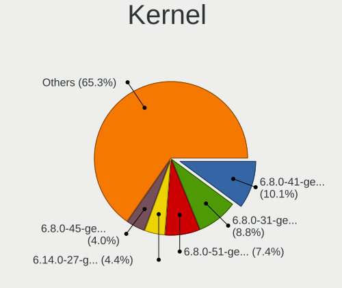

| Version             | Computers | Percent |
|---------------------|-----------|---------|
| 6.8.0-41-generic    | 30        | 10.1%   |
| 6.8.0-31-generic    | 26        | 8.75%   |
| 6.8.0-51-generic    | 22        | 7.41%   |
| 6.14.0-27-generic   | 13        | 4.38%   |
| 6.8.0-45-generic    | 12        | 4.04%   |
| 6.11.0-17-generic   | 12        | 4.04%   |
| 6.8.0-47-generic    | 10        | 3.37%   |
| 6.8.0-36-generic    | 10        | 3.37%   |
| 6.8.0-40-generic    | 9         | 3.03%   |
| 6.14.0-29-generic   | 8         | 2.69%   |
| 6.8.0-53-generic    | 7         | 2.36%   |
| 6.8.0-52-generic    | 7         | 2.36%   |
| 6.8.0-49-generic    | 7         | 2.36%   |
| 6.14.0-33-generic   | 7         | 2.36%   |
| 6.11.0-26-generic   | 7         | 2.36%   |
| 6.11.0-25-generic   | 7         | 2.36%   |
| 6.8.0-48-generic    | 6         | 2.02%   |
| 6.8.0-54-generic    | 5         | 1.68%   |
| 6.14.0-37-generic   | 5         | 1.68%   |
| 6.8.0-79-generic    | 4         | 1.35%   |
| 6.8.0-58-generic    | 4         | 1.35%   |
| 6.8.0-56-generic    | 4         | 1.35%   |
| 6.8.0-55-generic    | 4         | 1.35%   |
| 6.8.0-44-generic    | 4         | 1.35%   |
| 6.14.0-35-generic   | 4         | 1.35%   |
| 6.11.0-24-generic   | 4         | 1.35%   |
| 6.11.0-19-generic   | 4         | 1.35%   |
| 6.8.0-39-generic    | 3         | 1.01%   |
| 6.14.0-36-generic   | 3         | 1.01%   |
| 6.14.0-24-generic   | 3         | 1.01%   |
| 6.11.0-29-generic   | 3         | 1.01%   |
| 6.8.0-60-generic    | 2         | 0.67%   |
| 6.8.0-59-generic    | 2         | 0.67%   |
| 6.8.0-57-generic    | 2         | 0.67%   |
| 6.8.0-50-lowlatency | 2         | 0.67%   |
| 6.8.0-41-lowlatency | 2         | 0.67%   |
| 6.8.0-35-generic    | 2         | 0.67%   |
| 6.14.0-32-generic   | 2         | 0.67%   |
| 6.11.0-21-generic   | 2         | 0.67%   |
| 6.9.5-sandy-custom  | 1         | 0.34%   |

Kernel Family
-------------

Linux kernel without a distro release

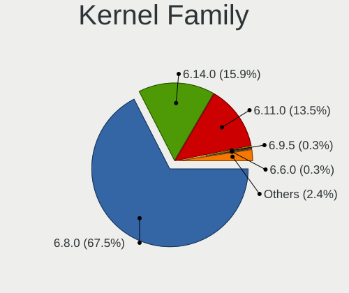

| Version | Computers | Percent |
|---------|-----------|---------|
| 6.8.0   | 195       | 67.47%  |
| 6.14.0  | 46        | 15.92%  |
| 6.11.0  | 39        | 13.49%  |
| 6.9.5   | 1         | 0.35%   |
| 6.6.0   | 1         | 0.35%   |
| 6.5.0   | 1         | 0.35%   |
| 6.17.8  | 1         | 0.35%   |
| 6.17.5  | 1         | 0.35%   |
| 6.16.3  | 1         | 0.35%   |
| 6.12.3  | 1         | 0.35%   |
| 6.12.15 | 1         | 0.35%   |
| 5.15.0  | 1         | 0.35%   |

Kernel Major Ver.
-----------------

Linux kernel major version

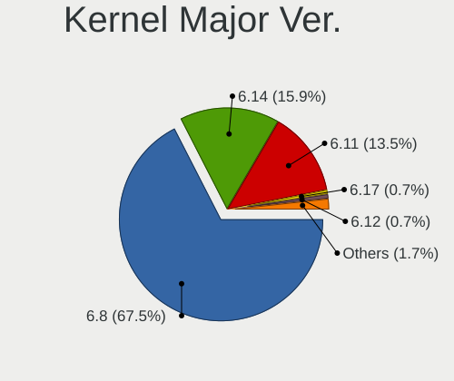

| Version | Computers | Percent |
|---------|-----------|---------|
| 6.8     | 195       | 67.47%  |
| 6.14    | 46        | 15.92%  |
| 6.11    | 39        | 13.49%  |
| 6.17    | 2         | 0.69%   |
| 6.12    | 2         | 0.69%   |
| 6.9     | 1         | 0.35%   |
| 6.6     | 1         | 0.35%   |
| 6.5     | 1         | 0.35%   |
| 6.16    | 1         | 0.35%   |
| 5.15    | 1         | 0.35%   |

Arch
----

OS architecture (x86_64, i586, etc.)

| Name    | Computers | Percent |
|---------|-----------|---------|
| x86_64  | 282       | 99.65%  |
| aarch64 | 1         | 0.35%   |

DE
--

Desktop Environment

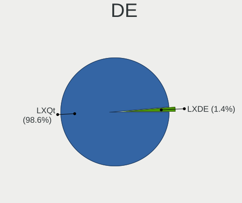

| Name | Computers | Percent |
|------|-----------|---------|
| LXQt | 279       | 98.59%  |
| LXDE | 4         | 1.41%   |

Display Server
--------------

X11 or Wayland

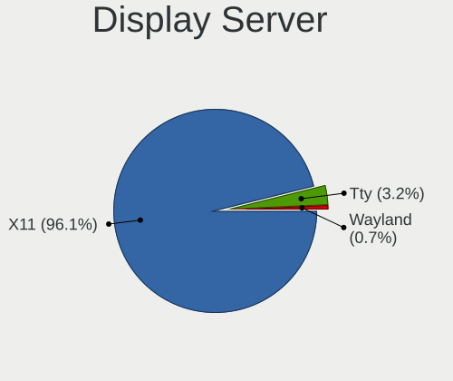

| Name    | Computers | Percent |
|---------|-----------|---------|
| X11     | 273       | 96.13%  |
| Tty     | 9         | 3.17%   |
| Wayland | 2         | 0.7%    |

Display Manager
---------------

SDDM, LightDM, etc.

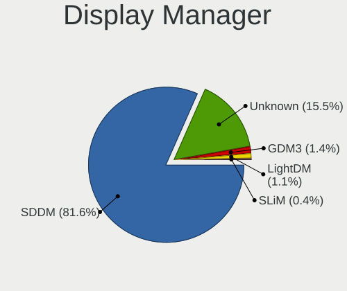

| Name    | Computers | Percent |
|---------|-----------|---------|
| SDDM    | 231       | 81.63%  |
| Unknown | 44        | 15.55%  |
| GDM3    | 4         | 1.41%   |
| LightDM | 3         | 1.06%   |
| SLiM    | 1         | 0.35%   |

OS Lang
-------

Language

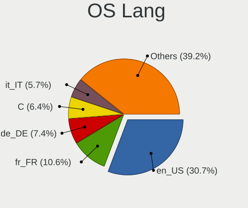

| Lang  | Computers | Percent |
|-------|-----------|---------|
| en_US | 87        | 30.74%  |
| fr_FR | 30        | 10.6%   |
| de_DE | 21        | 7.42%   |
| C     | 18        | 6.36%   |
| it_IT | 16        | 5.65%   |
| en_GB | 15        | 5.3%    |
| pt_BR | 13        | 4.59%   |
| fi_FI | 8         | 2.83%   |
| es_MX | 8         | 2.83%   |
| es_ES | 8         | 2.83%   |
| pl_PL | 7         | 2.47%   |
| ru_RU | 5         | 1.77%   |
| es_AR | 4         | 1.41%   |
| en_CA | 4         | 1.41%   |
| zh_CN | 2         | 0.71%   |
| tr_TR | 2         | 0.71%   |
| pt_PT | 2         | 0.71%   |
| nl_NL | 2         | 0.71%   |
| es_CR | 2         | 0.71%   |
| en_ZA | 2         | 0.71%   |
| en_IN | 2         | 0.71%   |
| el_GR | 2         | 0.71%   |
| zh_TW | 1         | 0.35%   |
| lt_LT | 1         | 0.35%   |
| hu_HU | 1         | 0.35%   |
| gl_ES | 1         | 0.35%   |
| fr_CH | 1         | 0.35%   |
| fr_CA | 1         | 0.35%   |
| et_EE | 1         | 0.35%   |
| es_UY | 1         | 0.35%   |
| es_PE | 1         | 0.35%   |
| es_CO | 1         | 0.35%   |
| es_CL | 1         | 0.35%   |
| en_SG | 1         | 0.35%   |
| en_SE | 1         | 0.35%   |
| en_PH | 1         | 0.35%   |
| en_NG | 1         | 0.35%   |
| en_HK | 1         | 0.35%   |
| en_DE | 1         | 0.35%   |
| en_AU | 1         | 0.35%   |

Boot Mode
---------

EFI or BIOS

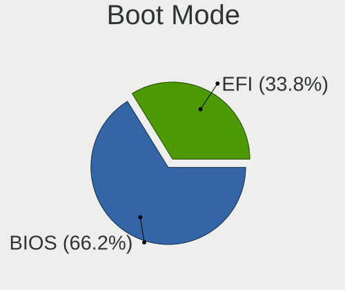

| Mode | Computers | Percent |
|------|-----------|---------|
| BIOS | 188       | 66.2%   |
| EFI  | 96        | 33.8%   |

Filesystem
----------

Type of filesystem

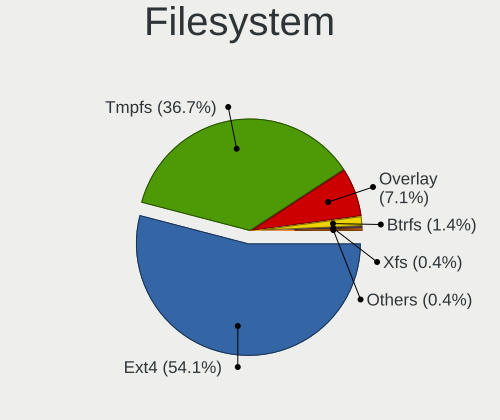

| Type    | Computers | Percent |
|---------|-----------|---------|
| Ext4    | 153       | 54.06%  |
| Tmpfs   | 104       | 36.75%  |
| Overlay | 20        | 7.07%   |
| Btrfs   | 4         | 1.41%   |
| Xfs     | 1         | 0.35%   |
| Ext2    | 1         | 0.35%   |

Part. scheme
------------

Scheme of partitioning

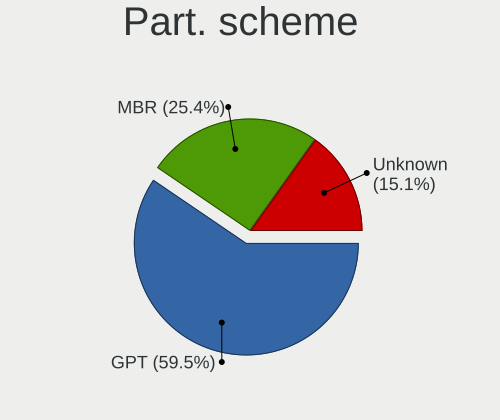

| Type    | Computers | Percent |
|---------|-----------|---------|
| GPT     | 169       | 59.51%  |
| MBR     | 72        | 25.35%  |
| Unknown | 43        | 15.14%  |

Dual Boot with Linux/BSD
------------------------

Hosting more than one Linux/BSD

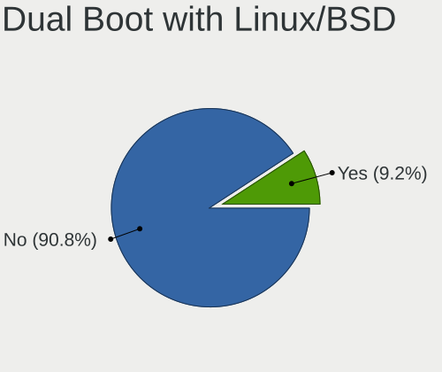

| Dual boot | Computers | Percent |
|-----------|-----------|---------|
| No        | 257       | 90.81%  |
| Yes       | 26        | 9.19%   |

Dual Boot (Win)
---------------

Hosting Linux and Windows

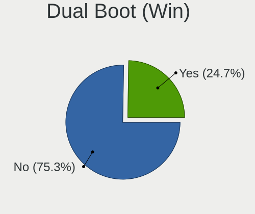

| Dual boot | Computers | Percent |
|-----------|-----------|---------|
| No        | 213       | 75.27%  |
| Yes       | 70        | 24.73%  |

Board
-----

Vendor
------

Motherboard manufacturer

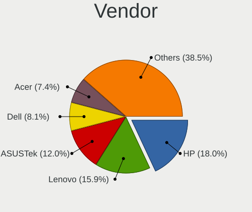

| Name                    | Computers | Percent |
|-------------------------|-----------|---------|
| Hewlett-Packard         | 51        | 18.02%  |
| Lenovo                  | 45        | 15.9%   |
| ASUSTek Computer        | 34        | 12.01%  |
| Dell                    | 23        | 8.13%   |
| Acer                    | 21        | 7.42%   |
| Apple                   | 15        | 5.3%    |
| Fujitsu                 | 8         | 2.83%   |
| Gigabyte Technology     | 7         | 2.47%   |
| Samsung Electronics     | 6         | 2.12%   |
| Sony                    | 4         | 1.41%   |
| Google                  | 4         | 1.41%   |
| AZW                     | 4         | 1.41%   |
| ASRock                  | 4         | 1.41%   |
| Unknown                 | 4         | 1.41%   |
| Toshiba                 | 3         | 1.06%   |
| Pegatron                | 3         | 1.06%   |
| MSI                     | 3         | 1.06%   |
| Medion                  | 3         | 1.06%   |
| eMachines               | 3         | 1.06%   |
| Chuwi                   | 3         | 1.06%   |
| Positivo                | 2         | 0.71%   |
| Packard Bell            | 2         | 0.71%   |
| Intel                   | 2         | 0.71%   |
| ECS                     | 2         | 0.71%   |
| AMI                     | 2         | 0.71%   |
| Unchartevice            | 1         | 0.35%   |
| SK hynix                | 1         | 0.35%   |
| Semp Toshiba            | 1         | 0.35%   |
| Raspberry Pi Foundation | 1         | 0.35%   |
| PROBOOK                 | 1         | 0.35%   |
| Phitronics              | 1         | 0.35%   |
| Philco                  | 1         | 0.35%   |
| ODM                     | 1         | 0.35%   |
| NVN-ED01                | 1         | 0.35%   |
| NU591                   | 1         | 0.35%   |
| Notebook                | 1         | 0.35%   |
| Morshow                 | 1         | 0.35%   |
| MicroByte               | 1         | 0.35%   |
| Mediacom                | 1         | 0.35%   |
| LG Electronics          | 1         | 0.35%   |

Model
-----

Motherboard model

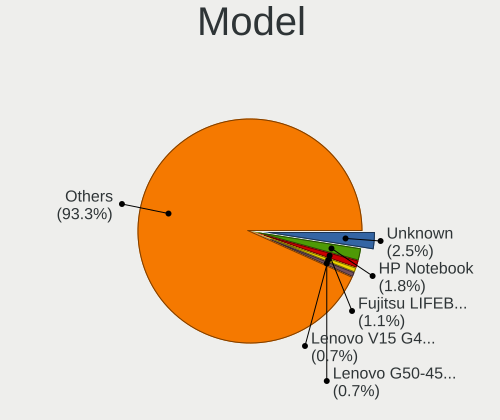

| Name                               | Computers | Percent |
|------------------------------------|-----------|---------|
| Unknown                            | 7         | 2.47%   |
| HP Notebook                        | 5         | 1.77%   |
| Fujitsu LIFEBOOK AH531             | 3         | 1.06%   |
| Lenovo V15 G4 IRU 83A1             | 2         | 0.71%   |
| Lenovo G50-45 80E3                 | 2         | 0.71%   |
| HP Pavilion g6                     | 2         | 0.71%   |
| HP Pavilion 15                     | 2         | 0.71%   |
| Dell OptiPlex 9020                 | 2         | 0.71%   |
| Dell Latitude E5450                | 2         | 0.71%   |
| AZW SER                            | 2         | 0.71%   |
| ASUS UX21E                         | 2         | 0.71%   |
| ASUS TUF Gaming X570-PLUS          | 2         | 0.71%   |
| ASUS PRIME H610I-PLUS D4           | 2         | 0.71%   |
| Apple MacBookPro9,2                | 2         | 0.71%   |
| Apple MacBookPro8,1                | 2         | 0.71%   |
| Apple MacBookPro7,1                | 2         | 0.71%   |
| Apple MacBookAir1,1                | 2         | 0.71%   |
| Unchartevice 6540                  | 1         | 0.35%   |
| Toshiba Satellite Pro S500         | 1         | 0.35%   |
| Toshiba Satellite P55W-C           | 1         | 0.35%   |
| Toshiba Satellite C660             | 1         | 0.35%   |
| Sony VPCF132FX                     | 1         | 0.35%   |
| Sony VPCEL22FX                     | 1         | 0.35%   |
| Sony VGN-CR260F                    | 1         | 0.35%   |
| Sony M730                          | 1         | 0.35%   |
| SK hynix HT14CCIC42E               | 1         | 0.35%   |
| Semp Toshiba K201                  | 1         | 0.35%   |
| Samsung R530/R730/P590             | 1         | 0.35%   |
| Samsung R519/R719                  | 1         | 0.35%   |
| Samsung QX311/QX411/QX412/QX511    | 1         | 0.35%   |
| Samsung NC210/NC110                | 1         | 0.35%   |
| Samsung N150P/N210P/N220P          | 1         | 0.35%   |
| Samsung 370E4K                     | 1         | 0.35%   |
| RPi Raspberry Pi 5 Model B Rev 1.0 | 1         | 0.35%   |
| PROBOOK U SERIES                   | 1         | 0.35%   |
| Positivo S14BW01                   | 1         | 0.35%   |
| Positivo C14CU51                   | 1         | 0.35%   |
| Phitronics P33G                    | 1         | 0.35%   |
| Philco 14M2                        | 1         | 0.35%   |
| Pegatron WE277AA-ABF p6352fr       | 1         | 0.35%   |

Model Family
------------

Motherboard model prefix

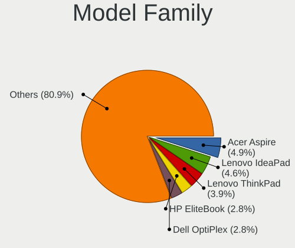

| Name                 | Computers | Percent |
|----------------------|-----------|---------|
| Acer Aspire          | 14        | 4.95%   |
| Lenovo IdeaPad       | 13        | 4.59%   |
| Lenovo ThinkPad      | 11        | 3.89%   |
| HP EliteBook         | 8         | 2.83%   |
| Dell OptiPlex        | 8         | 2.83%   |
| HP Pavilion          | 7         | 2.47%   |
| Dell Latitude        | 7         | 2.47%   |
| Unknown              | 7         | 2.47%   |
| HP Compaq            | 6         | 2.12%   |
| Lenovo ThinkCentre   | 5         | 1.77%   |
| HP Notebook          | 5         | 1.77%   |
| Fujitsu LIFEBOOK     | 5         | 1.77%   |
| Dell Inspiron        | 5         | 1.77%   |
| HP ProBook           | 4         | 1.41%   |
| HP Laptop            | 4         | 1.41%   |
| ASUS PRIME           | 4         | 1.41%   |
| Toshiba Satellite    | 3         | 1.06%   |
| HP ZBook             | 3         | 1.06%   |
| ASUS TUF             | 3         | 1.06%   |
| Acer TravelMate      | 3         | 1.06%   |
| Lenovo Yoga          | 2         | 0.71%   |
| Lenovo V15           | 2         | 0.71%   |
| Lenovo IdeaCentre    | 2         | 0.71%   |
| Lenovo G50-45        | 2         | 0.71%   |
| HP Stream            | 2         | 0.71%   |
| HP ProDesk           | 2         | 0.71%   |
| Fujitsu ESPRIMO      | 2         | 0.71%   |
| AZW SER              | 2         | 0.71%   |
| ASUS VivoBook        | 2         | 0.71%   |
| ASUS UX21E           | 2         | 0.71%   |
| Apple MacBookPro9    | 2         | 0.71%   |
| Apple MacBookPro8    | 2         | 0.71%   |
| Apple MacBookPro7    | 2         | 0.71%   |
| Apple MacBookAir1    | 2         | 0.71%   |
| Unchartevice 6540    | 1         | 0.35%   |
| Sony VPCF132FX       | 1         | 0.35%   |
| Sony VPCEL22FX       | 1         | 0.35%   |
| Sony VGN-CR260F      | 1         | 0.35%   |
| Sony M730            | 1         | 0.35%   |
| SK hynix HT14CCIC42E | 1         | 0.35%   |

MFG Year
--------

Motherboard manufacture year

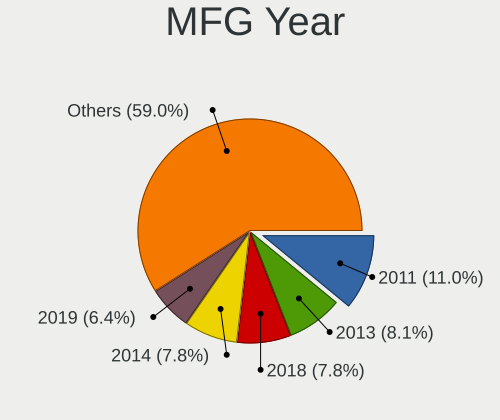

| Year    | Computers | Percent |
|---------|-----------|---------|
| 2011    | 31        | 10.95%  |
| 2013    | 23        | 8.13%   |
| 2018    | 22        | 7.77%   |
| 2014    | 22        | 7.77%   |
| 2019    | 18        | 6.36%   |
| 2010    | 18        | 6.36%   |
| 2009    | 18        | 6.36%   |
| 2008    | 15        | 5.3%    |
| 2023    | 14        | 4.95%   |
| 2017    | 14        | 4.95%   |
| 2016    | 14        | 4.95%   |
| 2015    | 12        | 4.24%   |
| 2021    | 11        | 3.89%   |
| 2012    | 11        | 3.89%   |
| 2024    | 9         | 3.18%   |
| 2022    | 9         | 3.18%   |
| 2007    | 8         | 2.83%   |
| 2020    | 7         | 2.47%   |
| 2006    | 4         | 1.41%   |
| 2025    | 1         | 0.35%   |
| 2005    | 1         | 0.35%   |
| Unknown | 1         | 0.35%   |

Form Factor
-----------

Physical design of the computer

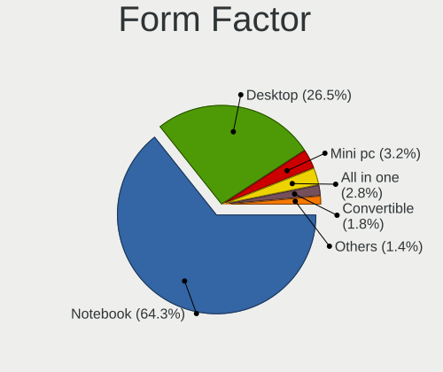

| Name           | Computers | Percent |
|----------------|-----------|---------|
| Notebook       | 182       | 64.31%  |
| Desktop        | 75        | 26.5%   |
| Mini pc        | 9         | 3.18%   |
| All in one     | 8         | 2.83%   |
| Convertible    | 5         | 1.77%   |
| Tablet         | 2         | 0.71%   |
| System on chip | 1         | 0.35%   |
| Server         | 1         | 0.35%   |

Secure Boot
-----------

Enabled or disabled

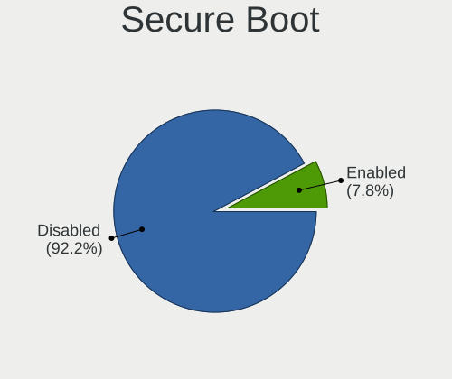

| State    | Computers | Percent |
|----------|-----------|---------|
| Disabled | 261       | 92.23%  |
| Enabled  | 22        | 7.77%   |

Coreboot
--------

Have coreboot on board

| Used | Computers | Percent |
|------|-----------|---------|
| No   | 279       | 98.59%  |
| Yes  | 4         | 1.41%   |

RAM Size
--------

Total RAM memory

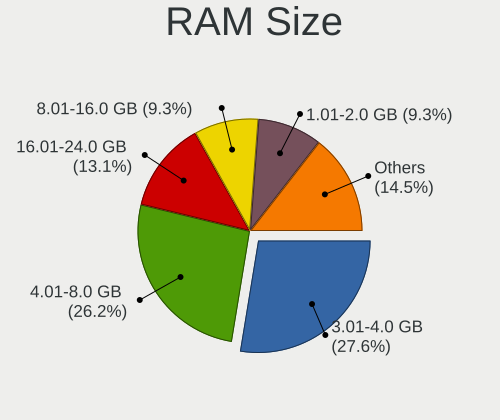

| Size in GB  | Computers | Percent |
|-------------|-----------|---------|
| 3.01-4.0    | 80        | 27.59%  |
| 4.01-8.0    | 76        | 26.21%  |
| 16.01-24.0  | 38        | 13.1%   |
| 1.01-2.0    | 27        | 9.31%   |
| 8.01-16.0   | 27        | 9.31%   |
| 32.01-64.0  | 14        | 4.83%   |
| 2.01-3.0    | 12        | 4.14%   |
| 24.01-32.0  | 8         | 2.76%   |
| 64.01-256.0 | 6         | 2.07%   |
| 0.51-1.0    | 2         | 0.69%   |

RAM Used
--------

Used RAM memory

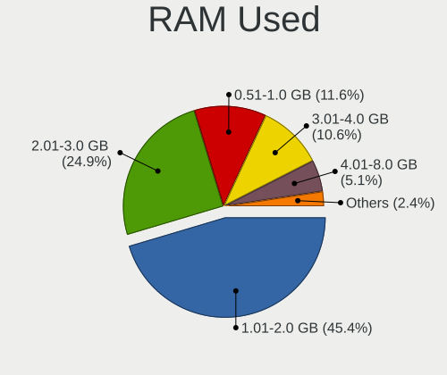

| Used GB    | Computers | Percent |
|------------|-----------|---------|
| 1.01-2.0   | 133       | 45.39%  |
| 2.01-3.0   | 73        | 24.91%  |
| 0.51-1.0   | 34        | 11.6%   |
| 3.01-4.0   | 31        | 10.58%  |
| 4.01-8.0   | 15        | 5.12%   |
| 8.01-16.0  | 4         | 1.37%   |
| 16.01-24.0 | 2         | 0.68%   |
| 0.01-0.5   | 1         | 0.34%   |

Total Drives
------------

Number of drives on board

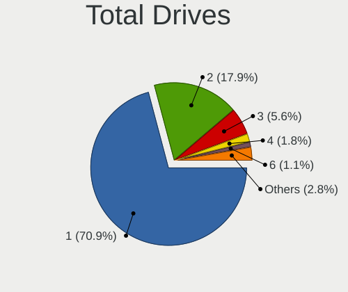

| Drives | Computers | Percent |
|--------|-----------|---------|
| 1      | 202       | 70.88%  |
| 2      | 51        | 17.89%  |
| 3      | 16        | 5.61%   |
| 4      | 5         | 1.75%   |
| 6      | 3         | 1.05%   |
| 0      | 3         | 1.05%   |
| 5      | 2         | 0.7%    |
| 11     | 1         | 0.35%   |
| 10     | 1         | 0.35%   |
| 9      | 1         | 0.35%   |

Has CD-ROM
----------

Has CD-ROM on board

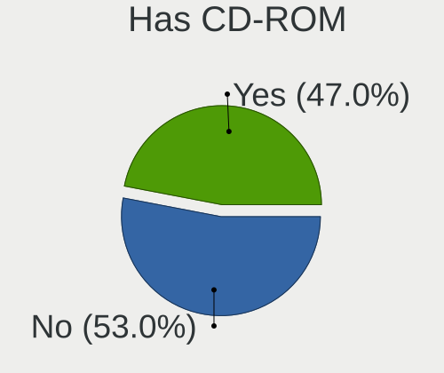

| Presented | Computers | Percent |
|-----------|-----------|---------|
| No        | 150       | 53%     |
| Yes       | 133       | 47%     |

Has Ethernet
------------

Has Ethernet on board

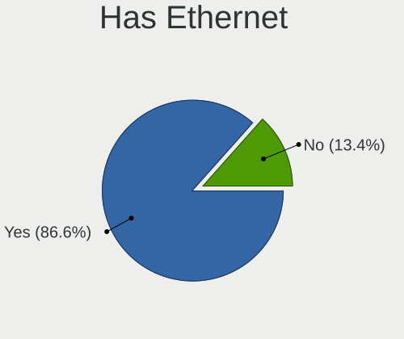

| Presented | Computers | Percent |
|-----------|-----------|---------|
| Yes       | 245       | 86.57%  |
| No        | 38        | 13.43%  |

Has WiFi
--------

Has WiFi module

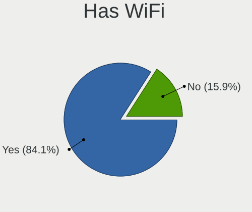

| Presented | Computers | Percent |
|-----------|-----------|---------|
| Yes       | 238       | 84.1%   |
| No        | 45        | 15.9%   |

Has Bluetooth
-------------

Has Bluetooth module

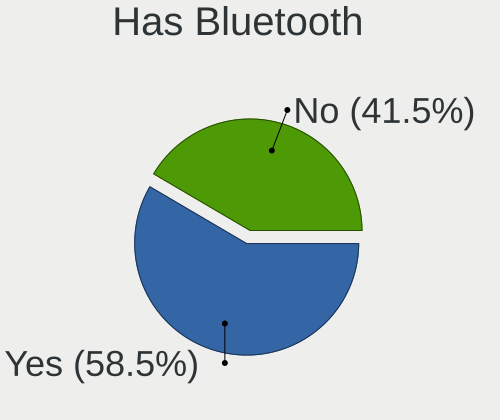

| Presented | Computers | Percent |
|-----------|-----------|---------|
| Yes       | 166       | 58.45%  |
| No        | 118       | 41.55%  |

Location
--------

Country
-------

Geographic location (country)

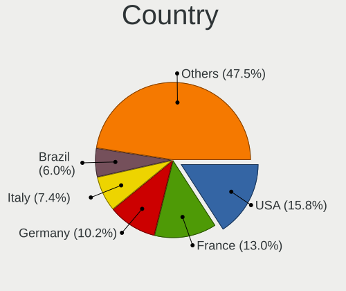

| Country      | Computers | Percent |
|--------------|-----------|---------|
| USA          | 45        | 15.85%  |
| France       | 37        | 13.03%  |
| Germany      | 29        | 10.21%  |
| Italy        | 21        | 7.39%   |
| Brazil       | 17        | 5.99%   |
| Finland      | 12        | 4.23%   |
| Spain        | 8         | 2.82%   |
| UK           | 7         | 2.46%   |
| Russia       | 7         | 2.46%   |
| Canada       | 7         | 2.46%   |
| Romania      | 5         | 1.76%   |
| India        | 5         | 1.76%   |
| Costa Rica   | 5         | 1.76%   |
| Argentina    | 5         | 1.76%   |
| Turkey       | 4         | 1.41%   |
| Poland       | 4         | 1.41%   |
| Norway       | 4         | 1.41%   |
| Greece       | 4         | 1.41%   |
| China        | 4         | 1.41%   |
| Switzerland  | 3         | 1.06%   |
| South Africa | 3         | 1.06%   |
| Mexico       | 3         | 1.06%   |
| Czechia      | 3         | 1.06%   |
| Australia    | 3         | 1.06%   |
| Uruguay      | 2         | 0.7%    |
| Taiwan       | 2         | 0.7%    |
| Sri Lanka    | 2         | 0.7%    |
| Portugal     | 2         | 0.7%    |
| Peru         | 2         | 0.7%    |
| Indonesia    | 2         | 0.7%    |
| Hungary      | 2         | 0.7%    |
| Hong Kong    | 2         | 0.7%    |
| Estonia      | 2         | 0.7%    |
| Chile        | 2         | 0.7%    |
| Thailand     | 1         | 0.35%   |
| Sweden       | 1         | 0.35%   |
| Singapore    | 1         | 0.35%   |
| Saudi Arabia | 1         | 0.35%   |
| Philippines  | 1         | 0.35%   |
| Pakistan     | 1         | 0.35%   |

City
----

Geographic location (city)

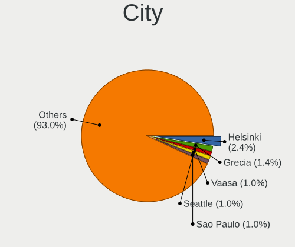

| City         | Computers | Percent |
|--------------|-----------|---------|
| Helsinki     | 7         | 2.44%   |
| Grecia       | 4         | 1.39%   |
| Vaasa        | 3         | 1.05%   |
| Seattle      | 3         | 1.05%   |
| Sao Paulo    | 3         | 1.05%   |
| Paris        | 3         | 1.05%   |
| New York     | 3         | 1.05%   |
| Milan        | 3         | 1.05%   |
| Warsaw       | 2         | 0.7%    |
| Vancouver    | 2         | 0.7%    |
| Thessaloniki | 2         | 0.7%    |
| Strasbourg   | 2         | 0.7%    |
| San Diego    | 2         | 0.7%    |
| Roorkee      | 2         | 0.7%    |
| Rome         | 2         | 0.7%    |
| Prague       | 2         | 0.7%    |
| Nice         | 2         | 0.7%    |
| Moscow       | 2         | 0.7%    |
| Montevideo   | 2         | 0.7%    |
| Monroe       | 2         | 0.7%    |
| Lucknow      | 2         | 0.7%    |
| Los Angeles  | 2         | 0.7%    |
| Kunming      | 2         | 0.7%    |
| Curitiba     | 2         | 0.7%    |
| Bursa        | 2         | 0.7%    |
| Berlin       | 2         | 0.7%    |
| Bellingham   | 2         | 0.7%    |
| Beijing      | 2         | 0.7%    |
| Barcelona    | 2         | 0.7%    |
| Aurora       | 2         | 0.7%    |
| Aachen       | 2         | 0.7%    |
| Zurich       | 1         | 0.35%   |
| Würzburg    | 1         | 0.35%   |
| Wuppertal    | 1         | 0.35%   |
| Winnipeg     | 1         | 0.35%   |
| West Malling | 1         | 0.35%   |
| Wauwatosa    | 1         | 0.35%   |
| Waren        | 1         | 0.35%   |
| Volos        | 1         | 0.35%   |
| Voiron       | 1         | 0.35%   |

Drives
------

Drive Vendor
------------

Hard drive vendors

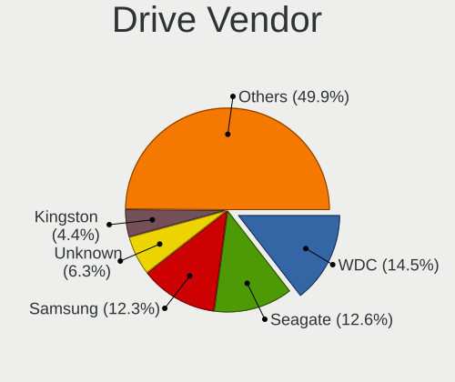

| Vendor                    | Computers | Drives | Percent |
|---------------------------|-----------|--------|---------|
| WDC                       | 53        | 76     | 14.52%  |
| Seagate                   | 46        | 59     | 12.6%   |
| Samsung Electronics       | 45        | 55     | 12.33%  |
| Unknown                   | 23        | 24     | 6.3%    |
| Kingston                  | 16        | 16     | 4.38%   |
| Toshiba                   | 14        | 16     | 3.84%   |
| SanDisk                   | 14        | 22     | 3.84%   |
| Crucial                   | 13        | 17     | 3.56%   |
| Intel                     | 11        | 11     | 3.01%   |
| Hitachi                   | 9         | 9      | 2.47%   |
| China                     | 9         | 10     | 2.47%   |
| SK hynix                  | 7         | 7      | 1.92%   |
| Micron Technology         | 7         | 10     | 1.92%   |
| HGST                      | 7         | 7      | 1.92%   |
| Lexar                     | 4         | 4      | 1.1%    |
| Fujitsu                   | 4         | 4      | 1.1%    |
| A-DATA Technology         | 4         | 4      | 1.1%    |
| UMIS                      | 3         | 3      | 0.82%   |
| PNY                       | 3         | 3      | 0.82%   |
| Phison Electronics        | 3         | 6      | 0.82%   |
| KingSpec                  | 3         | 3      | 0.82%   |
| Intenso                   | 3         | 5      | 0.82%   |
| Unknown                   | 3         | 3      | 0.82%   |
| Verbatim                  | 2         | 2      | 0.55%   |
| USB                       | 2         | 2      | 0.55%   |
| SSK                       | 2         | 2      | 0.55%   |
| Silicon Motion            | 2         | 2      | 0.55%   |
| Realtek Semiconductor     | 2         | 3      | 0.55%   |
| Patriot                   | 2         | 2      | 0.55%   |
| Netac                     | 2         | 2      | 0.55%   |
| Micron/Crucial Technology | 2         | 3      | 0.55%   |
| MicroFrom                 | 2         | 2      | 0.55%   |
| KIOXIA                    | 2         | 2      | 0.55%   |
| JMicron Technology        | 2         | 2      | 0.55%   |
| Gigabyte Technology       | 2         | 2      | 0.55%   |
| ASMedia                   | 2         | 2      | 0.55%   |
| Apple                     | 2         | 3      | 0.55%   |
| Zheino                    | 1         | 1      | 0.27%   |
| YMTC                      | 1         | 1      | 0.27%   |
| XrayDisk                  | 1         | 1      | 0.27%   |

Drive Model
-----------

Hard drive models

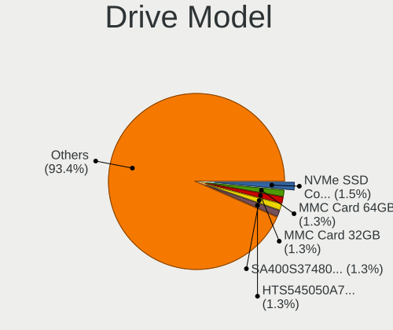

| Model                                              | Computers | Percent |
|----------------------------------------------------|-----------|---------|
| Samsung NVMe SSD Controller SM981/PM981/PM983 1TB  | 6         | 1.52%   |
| Unknown MMC Card  64GB                             | 5         | 1.26%   |
| Unknown MMC Card  32GB                             | 5         | 1.26%   |
| Kingston SA400S37480G 480GB SSD                    | 5         | 1.26%   |
| HGST HTS545050A7E680 500GB                         | 5         | 1.26%   |
| Seagate ST500LT012-1DG142 500GB                    | 4         | 1.01%   |
| Seagate ST1000LM035-1RK172 1TB                     | 4         | 1.01%   |
| Kingston SA400S37120G 120GB SSD                    | 4         | 1.01%   |
| WDC WDS500G2B0A-00SM50 500GB                       | 3         | 0.76%   |
| Seagate ST9500325AS 500GB                          | 3         | 0.76%   |
| Samsung SSD 850 EVO 250GB                          | 3         | 0.76%   |
| Samsung HD103SJ 1TB                                | 3         | 0.76%   |
| Kingston SV300S37A120G 120GB SSD                   | 3         | 0.76%   |
| Crucial CT500MX500SSD1 500GB                       | 3         | 0.76%   |
| China SSD 128GB                                    | 3         | 0.76%   |
| Unknown                                            | 3         | 0.76%   |
| WDC WD5000LPCX-24VHAT0 500GB                       | 2         | 0.51%   |
| WDC WD3200BEVT-22ZCT0 320GB                        | 2         | 0.51%   |
| WDC WD2500BEVT-22ZCT0 250GB                        | 2         | 0.51%   |
| WDC WD10JPVX-60JC3T0 1TB                           | 2         | 0.51%   |
| USB SanDisk 3.2Gen1 496GB                          | 2         | 0.51%   |
| Unknown SD/MMC/MS PRO 2GB                          | 2         | 0.51%   |
| Unknown MMC Card  128GB                            | 2         | 0.51%   |
| UMIS RPJTJ512MKP1QDY 512GB                         | 2         | 0.51%   |
| SSK Disk 2TB                                       | 2         | 0.51%   |
| Seagate ST9320325AS 320GB                          | 2         | 0.51%   |
| Seagate ST500LM021-1KJ152 500GB                    | 2         | 0.51%   |
| Seagate ST500DM002-1BD142 500GB                    | 2         | 0.51%   |
| Seagate ST4000VN008-2DR166 4TB                     | 2         | 0.51%   |
| Seagate ST3500418AS 500GB                          | 2         | 0.51%   |
| Seagate ST3320418AS 320GB                          | 2         | 0.51%   |
| Seagate ST14000NM0121 14TB                         | 2         | 0.51%   |
| Seagate Expansion HDD 4TB                          | 2         | 0.51%   |
| SanDisk SSD PLUS 240GB                             | 2         | 0.51%   |
| Samsung SSD 870 EVO 500GB                          | 2         | 0.51%   |
| Samsung SSD 870 EVO 1TB                            | 2         | 0.51%   |
| Samsung NVMe SSD Controller PM9A1/PM9A3/980PRO 1TB | 2         | 0.51%   |
| Micron/Crucial CT500P5SSD8 500GB                   | 2         | 0.51%   |
| Micron MTFDDAK256MAM-1K12 256GB SSD                | 2         | 0.51%   |
| Micron 2400_MTFDKBA512QFM 512GB                    | 2         | 0.51%   |

HDD Vendor
----------

Hard disk drive vendors

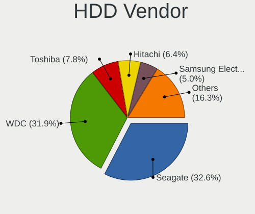

| Vendor              | Computers | Drives | Percent |
|---------------------|-----------|--------|---------|
| Seagate             | 46        | 59     | 32.62%  |
| WDC                 | 45        | 66     | 31.91%  |
| Toshiba             | 11        | 13     | 7.8%    |
| Hitachi             | 9         | 9      | 6.38%   |
| Samsung Electronics | 7         | 9      | 4.96%   |
| HGST                | 7         | 7      | 4.96%   |
| Fujitsu             | 4         | 4      | 2.84%   |
| Unknown             | 2         | 2      | 1.42%   |
| SSK                 | 2         | 2      | 1.42%   |
| WD MediaMax         | 1         | 1      | 0.71%   |
| Synology            | 1         | 1      | 0.71%   |
| Maxtor              | 1         | 1      | 0.71%   |
| JMicron Technology  | 1         | 1      | 0.71%   |
| Hewlett-Packard     | 1         | 4      | 0.71%   |
| ExcelStor           | 1         | 1      | 0.71%   |
| ASM                 | 1         | 1      | 0.71%   |
| Apple               | 1         | 1      | 0.71%   |

SSD Vendor
----------

Solid state drive vendors

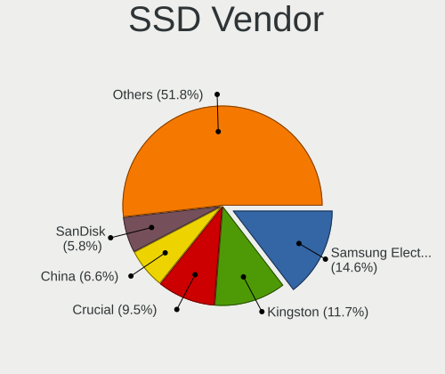

| Vendor              | Computers | Drives | Percent |
|---------------------|-----------|--------|---------|
| Samsung Electronics | 20        | 22     | 14.6%   |
| Kingston            | 16        | 16     | 11.68%  |
| Crucial             | 13        | 17     | 9.49%   |
| China               | 9         | 10     | 6.57%   |
| SanDisk             | 8         | 13     | 5.84%   |
| WDC                 | 7         | 8      | 5.11%   |
| Intel               | 7         | 7      | 5.11%   |
| Lexar               | 4         | 4      | 2.92%   |
| A-DATA Technology   | 4         | 4      | 2.92%   |
| Micron Technology   | 3         | 6      | 2.19%   |
| Intenso             | 3         | 5      | 2.19%   |
| Toshiba             | 2         | 2      | 1.46%   |
| SK hynix            | 2         | 2      | 1.46%   |
| PNY                 | 2         | 2      | 1.46%   |
| Patriot             | 2         | 2      | 1.46%   |
| Netac               | 2         | 2      | 1.46%   |
| MicroFrom           | 2         | 2      | 1.46%   |
| KingSpec            | 2         | 2      | 1.46%   |
| ASMedia             | 2         | 2      | 1.46%   |
| Apple               | 2         | 2      | 1.46%   |
| Zheino              | 1         | 1      | 0.73%   |
| XrayDisk            | 1         | 1      | 0.73%   |
| Verbatim            | 1         | 1      | 0.73%   |
| Unknown             | 1         | 1      | 0.73%   |
| Timetec             | 1         | 1      | 0.73%   |
| Thinkplus           | 1         | 1      | 0.73%   |
| STEC                | 1         | 1      | 0.73%   |
| SPCC                | 1         | 1      | 0.73%   |
| ShiJi               | 1         | 1      | 0.73%   |
| Phison              | 1         | 1      | 0.73%   |
| NT-512              | 1         | 1      | 0.73%   |
| M4-CT512            | 1         | 1      | 0.73%   |
| LITEON              | 1         | 1      | 0.73%   |
| Leven               | 1         | 1      | 0.73%   |
| Inland              | 1         | 1      | 0.73%   |
| HAJAAN              | 1         | 1      | 0.73%   |
| Great               | 1         | 2      | 0.73%   |
| Gigabyte Technology | 1         | 1      | 0.73%   |
| FIKWOT              | 1         | 1      | 0.73%   |
| EVM                 | 1         | 1      | 0.73%   |

Drive Kind
----------

HDD or SSD

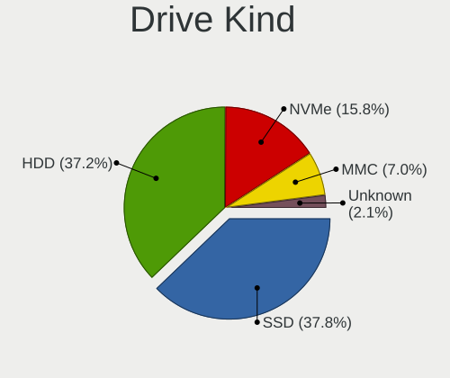

| Kind    | Computers | Drives | Percent |
|---------|-----------|--------|---------|
| SSD     | 129       | 156    | 37.83%  |
| HDD     | 127       | 182    | 37.24%  |
| NVMe    | 54        | 72     | 15.84%  |
| MMC     | 24        | 25     | 7.04%   |
| Unknown | 7         | 7      | 2.05%   |

Drive Connector
---------------

SATA, SAS, NVMe, etc.

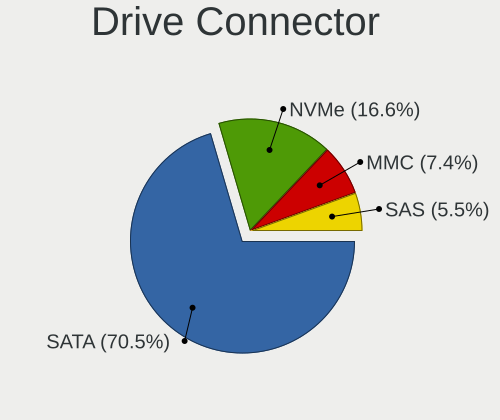

| Type | Computers | Drives | Percent |
|------|-----------|--------|---------|
| SATA | 229       | 326    | 70.46%  |
| NVMe | 54        | 71     | 16.62%  |
| MMC  | 24        | 25     | 7.38%   |
| SAS  | 18        | 20     | 5.54%   |

Drive Size
----------

Size of hard drive

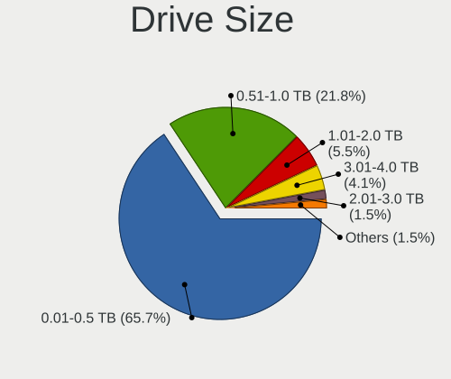

| Size in TB | Computers | Drives | Percent |
|------------|-----------|--------|---------|
| 0.01-0.5   | 178       | 212    | 65.68%  |
| 0.51-1.0   | 59        | 71     | 21.77%  |
| 1.01-2.0   | 15        | 18     | 5.54%   |
| 3.01-4.0   | 11        | 24     | 4.06%   |
| 2.01-3.0   | 4         | 8      | 1.48%   |
| 10.01-20.0 | 3         | 4      | 1.11%   |
| 4.01-10.0  | 1         | 1      | 0.37%   |

Space Total
-----------

Amount of disk space available on the file system

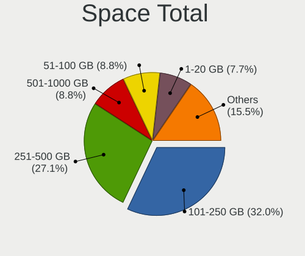

| Size in GB     | Computers | Percent |
|----------------|-----------|---------|
| 101-250        | 91        | 32.04%  |
| 251-500        | 77        | 27.11%  |
| 501-1000       | 25        | 8.8%    |
| 51-100         | 25        | 8.8%    |
| 1-20           | 22        | 7.75%   |
| 21-50          | 19        | 6.69%   |
| More than 3000 | 11        | 3.87%   |
| 1001-2000      | 11        | 3.87%   |
| Unknown        | 2         | 0.7%    |
| 2001-3000      | 1         | 0.35%   |

Space Used
----------

Amount of used disk space

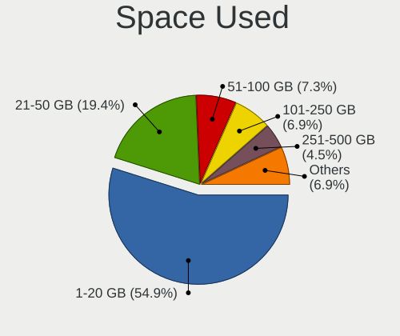

| Used GB        | Computers | Percent |
|----------------|-----------|---------|
| 1-20           | 158       | 54.86%  |
| 21-50          | 56        | 19.44%  |
| 51-100         | 21        | 7.29%   |
| 101-250        | 20        | 6.94%   |
| 251-500        | 13        | 4.51%   |
| More than 3000 | 8         | 2.78%   |
| 501-1000       | 7         | 2.43%   |
| 1001-2000      | 3         | 1.04%   |
| Unknown        | 2         | 0.69%   |

Malfunc. Drives
---------------

Drive models with a malfunction

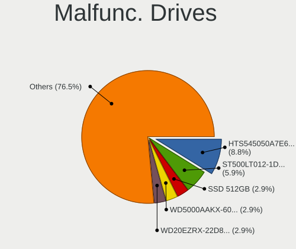

| Model                              | Computers | Drives | Percent |
|------------------------------------|-----------|--------|---------|
| HGST HTS545050A7E680 500GB         | 3         | 3      | 8.82%   |
| Seagate ST500LT012-1DG142 500GB    | 2         | 2      | 5.88%   |
| XrayDisk SSD 512GB                 | 1         | 1      | 2.94%   |
| WDC WD5000AAKX-60U6AA0 500GB       | 1         | 1      | 2.94%   |
| WDC WD20EZRX-22D8PB0 2TB           | 1         | 1      | 2.94%   |
| WDC WD1600BEVT-22A23T0 160GB       | 1         | 1      | 2.94%   |
| Toshiba MK3265GSX 320GB            | 1         | 1      | 2.94%   |
| Toshiba DT01ACA300 3TB             | 1         | 2      | 2.94%   |
| Toshiba DT01ACA100 1TB             | 1         | 1      | 2.94%   |
| SK hynix SC210 2.5 7MM 512GB SSD   | 1         | 1      | 2.94%   |
| Seagate ST9500325AS 500GB          | 1         | 1      | 2.94%   |
| Seagate ST910021AS 100GB           | 1         | 1      | 2.94%   |
| Seagate ST500LM030-2E717D 500GB    | 1         | 1      | 2.94%   |
| Seagate ST500DM002-1SB10A 500GB    | 1         | 1      | 2.94%   |
| Seagate ST500DM002-1BD142 500GB    | 1         | 1      | 2.94%   |
| Seagate ST3500412AS 500GB          | 1         | 1      | 2.94%   |
| Seagate ST31000528AS 1TB           | 1         | 1      | 2.94%   |
| Seagate ST31000524AS 1TB           | 1         | 1      | 2.94%   |
| Seagate ST1000VM002-1CT162 1TB     | 1         | 1      | 2.94%   |
| Seagate ST1000LM024 HN-M101MBB 1TB | 1         | 1      | 2.94%   |
| SanDisk SSD PLUS 240GB             | 1         | 1      | 2.94%   |
| SanDisk SDSSDHP128G 128GB          | 1         | 1      | 2.94%   |
| Samsung Electronics HM160HI 160GB  | 1         | 1      | 2.94%   |
| Maxtor STM3320613AS 320GB          | 1         | 1      | 2.94%   |
| Intel SSDSC2KF128G8L 128GB         | 1         | 1      | 2.94%   |
| Hitachi HTS541680J9SA00 80GB       | 1         | 1      | 2.94%   |
| HGST HTS545050A7E380 500GB         | 1         | 1      | 2.94%   |
| ExcelStor Technology J8160S 160GB  | 1         | 1      | 2.94%   |
| Crucial CT500MX500SSD1 500GB       | 1         | 2      | 2.94%   |
| China SSD 480GB                    | 1         | 1      | 2.94%   |
| China G521N256GB                   | 1         | 1      | 2.94%   |

Malfunc. Drive Vendor
---------------------

Vendors of faulty drives

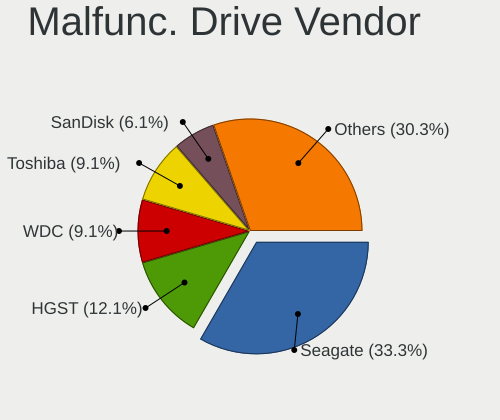

| Vendor              | Computers | Drives | Percent |
|---------------------|-----------|--------|---------|
| Seagate             | 11        | 12     | 33.33%  |
| HGST                | 4         | 4      | 12.12%  |
| WDC                 | 3         | 3      | 9.09%   |
| Toshiba             | 3         | 4      | 9.09%   |
| SanDisk             | 2         | 2      | 6.06%   |
| China               | 2         | 2      | 6.06%   |
| XrayDisk            | 1         | 1      | 3.03%   |
| SK hynix            | 1         | 1      | 3.03%   |
| Samsung Electronics | 1         | 1      | 3.03%   |
| Maxtor              | 1         | 1      | 3.03%   |
| Intel               | 1         | 1      | 3.03%   |
| Hitachi             | 1         | 1      | 3.03%   |
| ExcelStor           | 1         | 1      | 3.03%   |
| Crucial             | 1         | 2      | 3.03%   |

Malfunc. HDD Vendor
-------------------

Vendors of faulty HDD drives

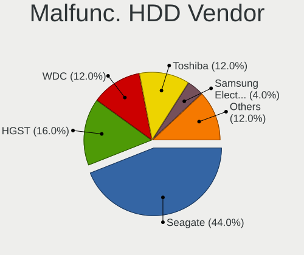

| Vendor              | Computers | Drives | Percent |
|---------------------|-----------|--------|---------|
| Seagate             | 11        | 12     | 44%     |
| HGST                | 4         | 4      | 16%     |
| WDC                 | 3         | 3      | 12%     |
| Toshiba             | 3         | 4      | 12%     |
| Samsung Electronics | 1         | 1      | 4%      |
| Maxtor              | 1         | 1      | 4%      |
| Hitachi             | 1         | 1      | 4%      |
| ExcelStor           | 1         | 1      | 4%      |

Malfunc. Drive Kind
-------------------

Kinds of faulty drives

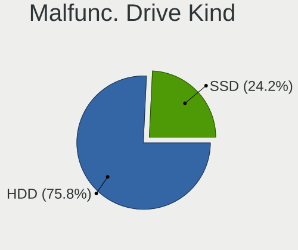

| Kind | Computers | Drives | Percent |
|------|-----------|--------|---------|
| HDD  | 25        | 27     | 75.76%  |
| SSD  | 8         | 9      | 24.24%  |

Failed Drives
-------------

Failed drive models

| Model                     | Computers | Drives | Percent |
|---------------------------|-----------|--------|---------|
| Seagate ST9500325AS 500GB | 1         | 1      | 100%    |

Failed Drive Vendor
-------------------

Failed drive vendors

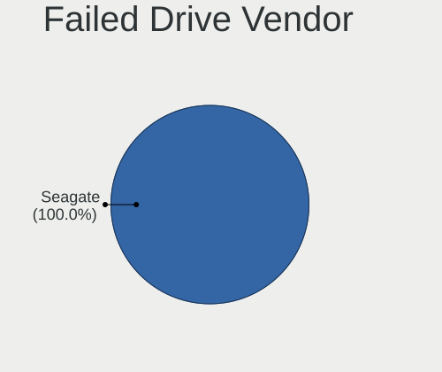

| Vendor  | Computers | Drives | Percent |
|---------|-----------|--------|---------|
| Seagate | 1         | 1      | 100%    |

Drive Status
------------

Number of failed and malfunc. drives

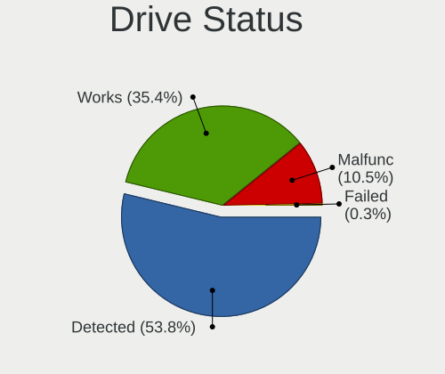

| Status   | Computers | Drives | Percent |
|----------|-----------|--------|---------|
| Detected | 164       | 255    | 53.77%  |
| Works    | 108       | 150    | 35.41%  |
| Malfunc  | 32        | 36     | 10.49%  |
| Failed   | 1         | 1      | 0.33%   |

Storage controller
------------------

Storage Vendor
--------------

Storage controller vendors

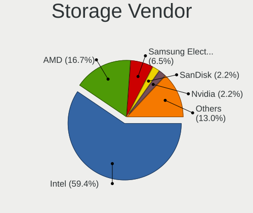

| Vendor                                  | Computers | Percent |
|-----------------------------------------|-----------|---------|
| Intel                                   | 192       | 59.44%  |
| AMD                                     | 54        | 16.72%  |
| Samsung Electronics                     | 21        | 6.5%    |
| SanDisk                                 | 7         | 2.17%   |
| Nvidia                                  | 7         | 2.17%   |
| Phison Electronics                      | 5         | 1.55%   |
| Micron Technology                       | 4         | 1.24%   |
| ASMedia Technology                      | 4         | 1.24%   |
| SK hynix                                | 3         | 0.93%   |
| Zhaoxin                                 | 2         | 0.62%   |
| VIA Technologies                        | 2         | 0.62%   |
| Silicon Motion                          | 2         | 0.62%   |
| Silicon Integrated Systems [SiS]        | 2         | 0.62%   |
| Shenzhen Unionmemory Information System | 2         | 0.62%   |
| Realtek Semiconductor                   | 2         | 0.62%   |
| Micron/Crucial Technology               | 2         | 0.62%   |
| KIOXIA                                  | 2         | 0.62%   |
| JMicron Technology                      | 2         | 0.62%   |
| Yangtze Memory Technologies             | 1         | 0.31%   |
| Union Memory (Shenzhen)                 | 1         | 0.31%   |
| Toshiba America Info Systems            | 1         | 0.31%   |
| Silicon Image                           | 1         | 0.31%   |
| Shenzhen Longsys Electronics            | 1         | 0.31%   |
| MAXIO Technology (Hangzhou)             | 1         | 0.31%   |
| LSI Logic / Symbios Logic               | 1         | 0.31%   |
| Broadcom / LSI                          | 1         | 0.31%   |

Storage Model
-------------

Storage controller models

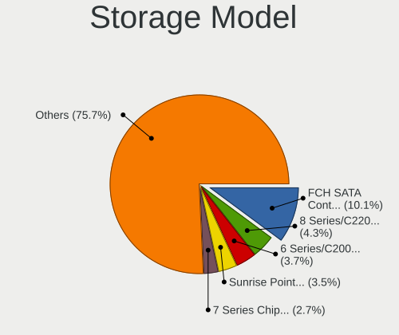

| Model                                                                            | Computers | Percent |
|----------------------------------------------------------------------------------|-----------|---------|
| AMD FCH SATA Controller [AHCI mode]                                              | 38        | 10.13%  |
| Intel 8 Series/C220 Series Chipset Family 6-port SATA Controller 1 [AHCI mode]   | 16        | 4.27%   |
| Intel 6 Series/C200 Series Chipset Family 6 port Mobile SATA AHCI Controller     | 14        | 3.73%   |
| Intel Sunrise Point-LP SATA Controller [AHCI mode]                               | 13        | 3.47%   |
| Intel 7 Series Chipset Family 6-port SATA Controller [AHCI mode]                 | 10        | 2.67%   |
| Intel 82801HM/HEM (ICH8M/ICH8M-E) SATA Controller [AHCI mode]                    | 9         | 2.4%    |
| Intel 82801HM/HEM (ICH8M/ICH8M-E) IDE Controller                                 | 9         | 2.4%    |
| AMD SB7x0/SB8x0/SB9x0 SATA Controller [AHCI mode]                                | 9         | 2.4%    |
| Samsung NVMe SSD Controller SM981/PM981/PM983                                    | 8         | 2.13%   |
| Intel Celeron/Pentium Silver Processor SATA Controller                           | 8         | 2.13%   |
| Intel Celeron N3350/Pentium N4200/Atom E3900 Series SATA AHCI Controller         | 8         | 2.13%   |
| Intel Atom Processor E3800 Series SATA AHCI Controller                           | 8         | 2.13%   |
| Intel Wildcat Point-LP SATA Controller [AHCI Mode]                               | 7         | 1.87%   |
| Intel 82801IBM/IEM (ICH9M/ICH9M-E) 4 port SATA Controller [AHCI mode]            | 7         | 1.87%   |
| Intel 5 Series/3400 Series Chipset 6 port SATA AHCI Controller                   | 7         | 1.87%   |
| Intel 8 Series SATA Controller 1 [AHCI mode]                                     | 6         | 1.6%    |
| Intel Atom/Celeron/Pentium Processor x5-E8000/J3xxx/N3xxx Series SATA Controller | 5         | 1.33%   |
| Intel 5 Series/3400 Series Chipset 4 port SATA AHCI Controller                   | 5         | 1.33%   |
| AMD SB7x0/SB8x0/SB9x0 IDE Controller                                             | 5         | 1.33%   |
| Samsung NVMe SSD Controller PM9A1/PM9A3/980PRO                                   | 4         | 1.07%   |
| Intel Volume Management Device NVMe RAID Controller                              | 4         | 1.07%   |
| Intel Alder Lake-S PCH SATA Controller [AHCI Mode]                               | 4         | 1.07%   |
| Intel Alder Lake-P SATA AHCI Controller                                          | 4         | 1.07%   |
| Intel 82801 Mobile SATA Controller [RAID mode]                                   | 4         | 1.07%   |
| ASMedia ASM1061/ASM1062 Serial ATA Controller                                    | 4         | 1.07%   |
| Samsung NVMe SSD Controller 980 (DRAM-less)                                      | 3         | 0.8%    |
| Intel SSD 660P Series                                                            | 3         | 0.8%    |
| Intel SATA Controller [RAID mode]                                                | 3         | 0.8%    |
| Intel Q170/Q150/B150/H170/H110/Z170/CM236 Chipset SATA Controller [AHCI Mode]    | 3         | 0.8%    |
| Intel NM10/ICH7 Family SATA Controller [IDE mode]                                | 3         | 0.8%    |
| Intel NM10/ICH7 Family SATA Controller [AHCI mode]                               | 3         | 0.8%    |
| Intel Cannon Point-LP SATA Controller [AHCI Mode]                                | 3         | 0.8%    |
| Intel Cannon Lake PCH SATA AHCI Controller                                       | 3         | 0.8%    |
| Intel Cannon Lake Mobile PCH SATA AHCI Controller                                | 3         | 0.8%    |
| Intel 82801JI (ICH10 Family) SATA AHCI Controller                                | 3         | 0.8%    |
| Intel 82801IBM/IEM (ICH9M/ICH9M-E) 2 port SATA Controller [IDE mode]             | 3         | 0.8%    |
| Intel 82801G (ICH7 Family) IDE Controller                                        | 3         | 0.8%    |
| Intel 7 Series/C210 Series Chipset Family 6-port SATA Controller [AHCI mode]     | 3         | 0.8%    |
| Intel 6 Series/C200 Series Chipset Family 6 port Desktop SATA AHCI Controller    | 3         | 0.8%    |
| Intel 200 Series PCH SATA controller [AHCI mode]                                 | 3         | 0.8%    |

Storage Kind
------------

Kind of storage controller (IDE, SATA, NVMe, SAS, ...)

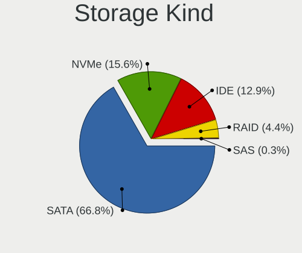

| Kind | Computers | Percent |
|------|-----------|---------|
| SATA | 227       | 66.76%  |
| NVMe | 53        | 15.59%  |
| IDE  | 44        | 12.94%  |
| RAID | 15        | 4.41%   |
| SAS  | 1         | 0.29%   |

Processor
---------

CPU Vendor
----------

Processor vendors

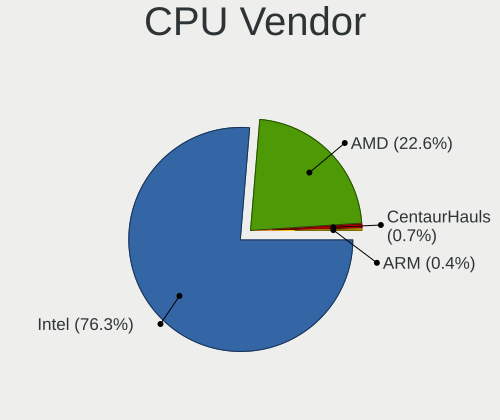

| Vendor       | Computers | Percent |
|--------------|-----------|---------|
| Intel        | 216       | 76.33%  |
| AMD          | 64        | 22.61%  |
| CentaurHauls | 2         | 0.71%   |
| ARM          | 1         | 0.35%   |

CPU Model
---------

Processor models

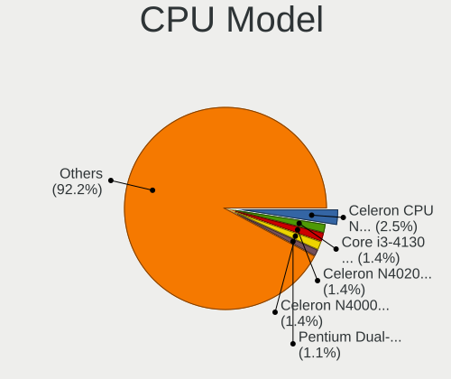

| Model                                       | Computers | Percent |
|---------------------------------------------|-----------|---------|
| Intel Celeron CPU N3350 @ 1.10GHz           | 7         | 2.47%   |
| Intel Core i3-4130 CPU @ 3.40GHz            | 4         | 1.41%   |
| Intel Celeron N4020 CPU @ 1.10GHz           | 4         | 1.41%   |
| Intel Celeron N4000 CPU @ 1.10GHz           | 4         | 1.41%   |
| Intel Pentium Dual-Core CPU T4300 @ 2.10GHz | 3         | 1.06%   |
| Intel N100                                  | 3         | 1.06%   |
| Intel Core i5-4590 CPU @ 3.30GHz            | 3         | 1.06%   |
| Intel Core i5-2410M CPU @ 2.30GHz           | 3         | 1.06%   |
| Intel Core i3-6006U CPU @ 2.00GHz           | 3         | 1.06%   |
| Intel Core 2 Duo CPU P8600 @ 2.40GHz        | 3         | 1.06%   |
| Intel Celeron CPU N2840 @ 2.16GHz           | 3         | 1.06%   |
| AMD Ryzen 5 3600 6-Core Processor           | 3         | 1.06%   |
| AMD E-450 APU with Radeon HD Graphics       | 3         | 1.06%   |
| AMD A6-7310 APU with AMD Radeon R4 Graphics | 3         | 1.06%   |
| Intel Pentium Dual CPU T3400 @ 2.16GHz      | 2         | 0.71%   |
| Intel Pentium CPU N3710 @ 1.60GHz           | 2         | 0.71%   |
| Intel Pentium CPU N3700 @ 1.60GHz           | 2         | 0.71%   |
| Intel Pentium CPU N3540 @ 2.16GHz           | 2         | 0.71%   |
| Intel Core i7-8850H CPU @ 2.60GHz           | 2         | 0.71%   |
| Intel Core i7-5600U CPU @ 2.60GHz           | 2         | 0.71%   |
| Intel Core i7 CPU M 620 @ 2.67GHz           | 2         | 0.71%   |
| Intel Core i5-7200U CPU @ 2.50GHz           | 2         | 0.71%   |
| Intel Core i5-5300U CPU @ 2.30GHz           | 2         | 0.71%   |
| Intel Core i5-4200U CPU @ 1.60GHz           | 2         | 0.71%   |
| Intel Core i5-2467M CPU @ 1.60GHz           | 2         | 0.71%   |
| Intel Core i5-2430M CPU @ 2.40GHz           | 2         | 0.71%   |
| Intel Core i3-7020U CPU @ 2.30GHz           | 2         | 0.71%   |
| Intel Core i3-5005U CPU @ 2.00GHz           | 2         | 0.71%   |
| Intel Core i3-3217U CPU @ 1.80GHz           | 2         | 0.71%   |
| Intel Core i3 CPU M 380 @ 2.53GHz           | 2         | 0.71%   |
| Intel Core i3 CPU M 330 @ 2.13GHz           | 2         | 0.71%   |
| Intel Core 2 Duo CPU T7500 @ 2.20GHz        | 2         | 0.71%   |
| Intel Core 2 Duo CPU P8700 @ 2.53GHz        | 2         | 0.71%   |
| Intel Core 2 Duo CPU E7500 @ 2.93GHz        | 2         | 0.71%   |
| Intel Celeron N5100 @ 1.10GHz               | 2         | 0.71%   |
| Intel Celeron CPU N3060 @ 1.60GHz           | 2         | 0.71%   |
| Intel Celeron CPU N3050 @ 1.60GHz           | 2         | 0.71%   |
| Intel Celeron CPU 1007U @ 1.50GHz           | 2         | 0.71%   |
| Intel Atom CPU N450 @ 1.66GHz               | 2         | 0.71%   |
| Intel 13th Gen Core i5-13420H               | 2         | 0.71%   |

CPU Model Family
----------------

Processor model prefix

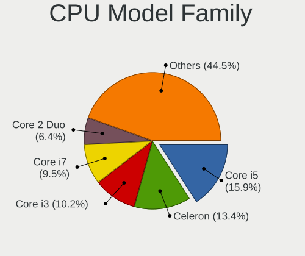

| Model                   | Computers | Percent |
|-------------------------|-----------|---------|
| Intel Core i5           | 45        | 15.9%   |
| Intel Celeron           | 38        | 13.43%  |
| Intel Core i3           | 29        | 10.25%  |
| Intel Core i7           | 27        | 9.54%   |
| Intel Core 2 Duo        | 18        | 6.36%   |
| Other                   | 16        | 5.65%   |
| Intel Pentium           | 10        | 3.53%   |
| AMD Ryzen 5             | 10        | 3.53%   |
| Intel Xeon              | 7         | 2.47%   |
| Intel Pentium Dual-Core | 7         | 2.47%   |
| Intel Atom              | 7         | 2.47%   |
| AMD A6                  | 7         | 2.47%   |
| Intel Pentium Dual      | 6         | 2.12%   |
| AMD Ryzen 7             | 5         | 1.77%   |
| AMD E1                  | 5         | 1.77%   |
| AMD E                   | 5         | 1.77%   |
| AMD A4                  | 5         | 1.77%   |
| AMD A10                 | 4         | 1.41%   |
| AMD Athlon II X2        | 3         | 1.06%   |
| AMD A8                  | 3         | 1.06%   |
| Intel Core 2            | 2         | 0.71%   |
| AMD Ryzen 9             | 2         | 0.71%   |
| AMD FX                  | 2         | 0.71%   |
| AMD E2                  | 2         | 0.71%   |
| AMD Athlon 64 X2        | 2         | 0.71%   |
| Intel Pentium Silver    | 1         | 0.35%   |
| Intel Pentium Gold      | 1         | 0.35%   |
| Intel Pentium D         | 1         | 0.35%   |
| Intel Pentium 4         | 1         | 0.35%   |
| Intel Genuine           | 1         | 0.35%   |
| Intel Core              | 1         | 0.35%   |
| Intel Celeron Dual-Core | 1         | 0.35%   |
| AMD Sempron             | 1         | 0.35%   |
| AMD Ryzen 7 PRO         | 1         | 0.35%   |
| AMD Ryzen 3             | 1         | 0.35%   |
| AMD Phenom II X6        | 1         | 0.35%   |
| AMD C-50                | 1         | 0.35%   |
| AMD Athlon Neo          | 1         | 0.35%   |
| AMD Athlon II X4        | 1         | 0.35%   |
| AMD Athlon 64           | 1         | 0.35%   |

CPU Cores
---------

Number of processor cores

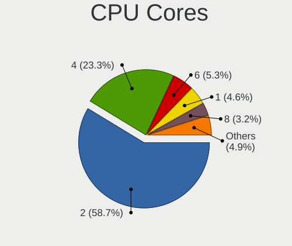

| Number  | Computers | Percent |
|---------|-----------|---------|
| 2       | 166       | 58.66%  |
| 4       | 66        | 23.32%  |
| 6       | 15        | 5.3%    |
| 1       | 13        | 4.59%   |
| 8       | 9         | 3.18%   |
| 16      | 3         | 1.06%   |
| 14      | 3         | 1.06%   |
| 10      | 3         | 1.06%   |
| 12      | 2         | 0.71%   |
| 5       | 1         | 0.35%   |
| 3       | 1         | 0.35%   |
| Unknown | 1         | 0.35%   |

CPU Sockets
-----------

Number of sockets

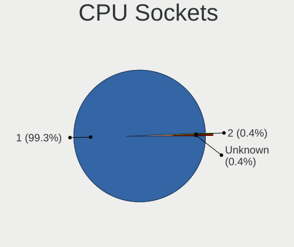

| Number  | Computers | Percent |
|---------|-----------|---------|
| 1       | 281       | 99.29%  |
| 2       | 1         | 0.35%   |
| Unknown | 1         | 0.35%   |

CPU Threads
-----------

Threads per core (Hyper-Threading)

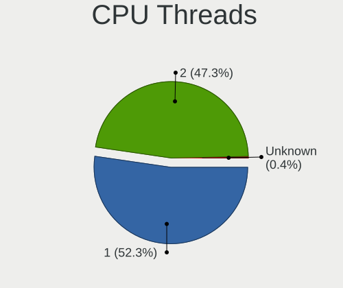

| Number  | Computers | Percent |
|---------|-----------|---------|
| 1       | 148       | 52.3%   |
| 2       | 134       | 47.35%  |
| Unknown | 1         | 0.35%   |

CPU Op-Modes
------------

CPU Operation Modes (32-bit, 64-bit)

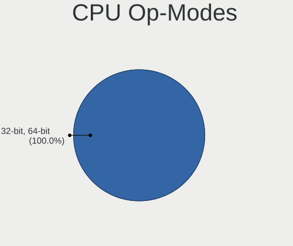

| Op mode        | Computers | Percent |
|----------------|-----------|---------|
| 32-bit, 64-bit | 283       | 100%    |

CPU Microcode
-------------

Microcode number

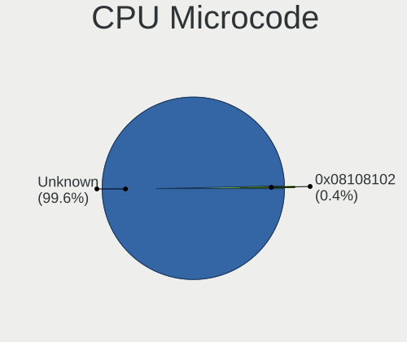

| Number     | Computers | Percent |
|------------|-----------|---------|
| Unknown    | 282       | 99.65%  |
| 0x08108102 | 1         | 0.35%   |

CPU Microarch
-------------

Microarchitecture

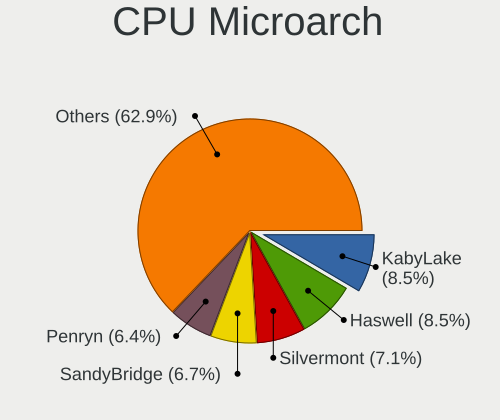

| Name             | Computers | Percent |
|------------------|-----------|---------|
| KabyLake         | 24        | 8.48%   |
| Haswell          | 24        | 8.48%   |
| Silvermont       | 20        | 7.07%   |
| SandyBridge      | 19        | 6.71%   |
| Penryn           | 18        | 6.36%   |
| Core             | 18        | 6.36%   |
| IvyBridge        | 15        | 5.3%    |
| Unknown          | 13        | 4.59%   |
| Westmere         | 11        | 3.89%   |
| Goldmont plus    | 11        | 3.89%   |
| Skylake          | 10        | 3.53%   |
| Puma             | 9         | 3.18%   |
| Goldmont         | 9         | 3.18%   |
| Broadwell        | 9         | 3.18%   |
| Alderlake Hybrid | 7         | 2.47%   |
| Bobcat           | 6         | 2.12%   |
| Zen 2            | 5         | 1.77%   |
| Piledriver       | 5         | 1.77%   |
| K10              | 5         | 1.77%   |
| Zen+             | 4         | 1.41%   |
| K8 Hammer        | 4         | 1.41%   |
| Excavator        | 4         | 1.41%   |
| Zen 3            | 3         | 1.06%   |
| Steamroller      | 3         | 1.06%   |
| NetBurst         | 3         | 1.06%   |
| Nehalem          | 3         | 1.06%   |
| Jaguar           | 3         | 1.06%   |
| Gracemont        | 3         | 1.06%   |
| Bonnell          | 3         | 1.06%   |
| Zen              | 2         | 0.71%   |
| Tremont          | 2         | 0.71%   |
| K10 Llano        | 2         | 0.71%   |
| Bulldozer        | 2         | 0.71%   |
| TigerLake        | 1         | 0.35%   |
| K8 & K10 hybrid  | 1         | 0.35%   |
| IceLake          | 1         | 0.35%   |
| CometLake        | 1         | 0.35%   |

Graphics
--------

GPU Vendor
----------

Vendors of graphics cards

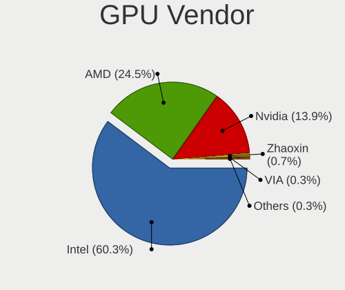

| Vendor                     | Computers | Percent |
|----------------------------|-----------|---------|
| Intel                      | 182       | 60.26%  |
| AMD                        | 74        | 24.5%   |
| Nvidia                     | 42        | 13.91%  |
| Zhaoxin                    | 2         | 0.66%   |
| VIA Technologies           | 1         | 0.33%   |
| Matrox Electronics Systems | 1         | 0.33%   |

GPU Model
---------

Graphics card models

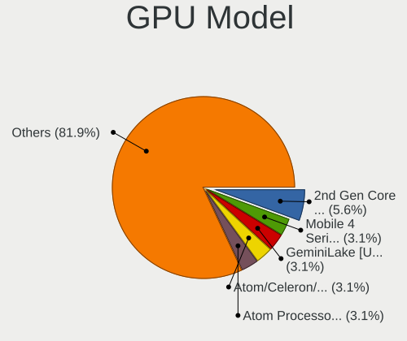

| Model                                                                                    | Computers | Percent |
|------------------------------------------------------------------------------------------|-----------|---------|
| Intel 2nd Generation Core Processor Family Integrated Graphics Controller                | 18        | 5.61%   |
| Intel Mobile 4 Series Chipset Integrated Graphics Controller                             | 10        | 3.12%   |
| Intel GeminiLake [UHD Graphics 600]                                                      | 10        | 3.12%   |
| Intel Atom/Celeron/Pentium Processor x5-E8000/J3xxx/N3xxx Integrated Graphics Controller | 10        | 3.12%   |
| Intel Atom Processor Z36xxx/Z37xxx Series Graphics & Display                             | 10        | 3.12%   |
| Intel Mobile GM965/GL960 Integrated Graphics Controller (secondary)                      | 9         | 2.8%    |
| Intel Mobile GM965/GL960 Integrated Graphics Controller (primary)                        | 9         | 2.8%    |
| Intel 3rd Gen Core processor Graphics Controller                                         | 9         | 2.8%    |
| Intel Apollo Lake GT1 [HD Graphics 500]                                                  | 8         | 2.49%   |
| Intel Kaby Lake-U GT2 [HD Graphics 620]                                                  | 7         | 2.18%   |
| Intel Broadwell-U GT2 [HD Graphics 5500]                                                 | 7         | 2.18%   |
| Intel Xeon E3-1200 v3/4th Gen Core Processor Integrated Graphics Controller              | 6         | 1.87%   |
| Intel Haswell-ULT Integrated Graphics Controller                                         | 6         | 1.87%   |
| Intel Skylake-U GT2 [HD Graphics 520]                                                    | 5         | 1.56%   |
| Intel Core Processor Integrated Graphics Controller                                      | 5         | 1.56%   |
| Intel 4th Gen Core Processor Integrated Graphics Controller                              | 5         | 1.56%   |
| AMD Mullins [Radeon R4/R5 Graphics]                                                      | 5         | 1.56%   |
| Intel Xeon E3-1200 v2/3rd Gen Core processor Graphics Controller                         | 4         | 1.25%   |
| Intel Raptor Lake-P [UHD Graphics]                                                       | 4         | 1.25%   |
| Intel Kaby Lake-R GT2 [UHD Graphics 620]                                                 | 4         | 1.25%   |
| Nvidia GT218 [GeForce 210]                                                               | 3         | 0.93%   |
| Nvidia GK208B [GeForce GT 710]                                                           | 3         | 0.93%   |
| Intel CoffeeLake-H GT2 [UHD Graphics 630]                                                | 3         | 0.93%   |
| Intel Atom Processor D4xx/D5xx/N4xx/N5xx Integrated Graphics Controller                  | 3         | 0.93%   |
| Intel Alder Lake-S GT1 [UHD Graphics 770]                                                | 3         | 0.93%   |
| Intel Alder Lake-N [UHD Graphics]                                                        | 3         | 0.93%   |
| Intel 4 Series Chipset Integrated Graphics Controller                                    | 3         | 0.93%   |
| AMD Wrestler [Radeon HD 6320]                                                            | 3         | 0.93%   |
| AMD Topaz XT [Radeon R7 M260/M265 / M340/M360 / M440/M445 / 530/535 / 620/625 Mobile]    | 3         | 0.93%   |
| AMD Stoney [Radeon R2/R3/R4/R5 Graphics]                                                 | 3         | 0.93%   |
| AMD Seymour [Radeon HD 6400M/7400M Series]                                               | 3         | 0.93%   |
| AMD RV710/M92 [Mobility Radeon HD 4530/4570/5145/530v/540v/545v]                         | 3         | 0.93%   |
| AMD Picasso/Raven 2 [Radeon Vega Series / Radeon Vega Mobile Series]                     | 3         | 0.93%   |
| AMD Mullins [Radeon R2 Graphics]                                                         | 3         | 0.93%   |
| Zhaoxin KX-6000 C-960 GPU                                                                | 2         | 0.62%   |
| Nvidia MCP89 [GeForce 320M]                                                              | 2         | 0.62%   |
| Nvidia GT218M [GeForce 310M]                                                             | 2         | 0.62%   |
| Nvidia GP107GL [Quadro P620]                                                             | 2         | 0.62%   |
| Nvidia C79 [GeForce 9400M]                                                               | 2         | 0.62%   |
| Intel WhiskeyLake-U GT2 [UHD Graphics 620]                                               | 2         | 0.62%   |

GPU Combo
---------

Combinations of graphics cards

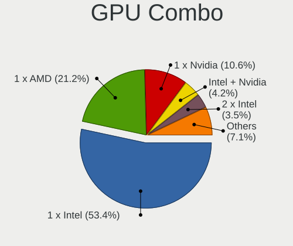

| Name           | Computers | Percent |
|----------------|-----------|---------|
| 1 x Intel      | 151       | 53.36%  |
| 1 x AMD        | 60        | 21.2%   |
| 1 x Nvidia     | 30        | 10.6%   |
| Intel + Nvidia | 12        | 4.24%   |
| 2 x Intel      | 10        | 3.53%   |
| 2 x AMD        | 9         | 3.18%   |
| Intel + AMD    | 5         | 1.77%   |
| Other          | 2         | 0.71%   |
| 1 x Zhaoxin    | 2         | 0.71%   |
| 1 x VIA        | 1         | 0.35%   |
| 1 x Matrox     | 1         | 0.35%   |

GPU Driver
----------

Free vs proprietary

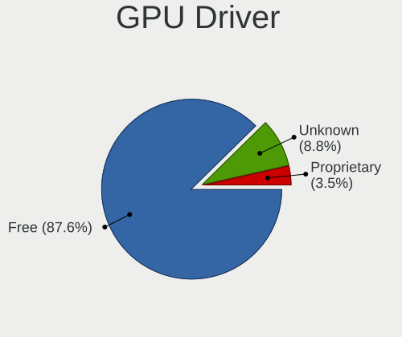

| Driver      | Computers | Percent |
|-------------|-----------|---------|
| Free        | 248       | 87.63%  |
| Unknown     | 25        | 8.83%   |
| Proprietary | 10        | 3.53%   |

GPU Memory
----------

Total video memory

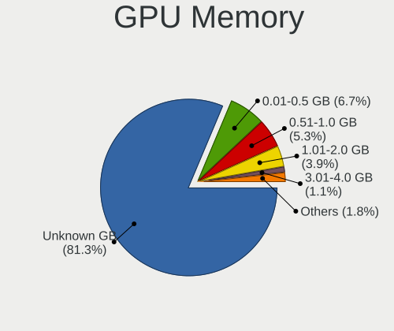

| Size in GB | Computers | Percent |
|------------|-----------|---------|
| Unknown    | 231       | 81.34%  |
| 0.01-0.5   | 19        | 6.69%   |
| 0.51-1.0   | 15        | 5.28%   |
| 1.01-2.0   | 11        | 3.87%   |
| 3.01-4.0   | 3         | 1.06%   |
| 2.01-3.0   | 2         | 0.7%    |
| 5.01-6.0   | 1         | 0.35%   |
| 16.01-24.0 | 1         | 0.35%   |
| 8.01-16.0  | 1         | 0.35%   |

Monitor
-------

Monitor Vendor
--------------

Monitor vendors

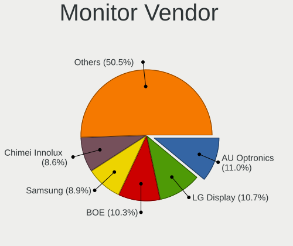

| Vendor                  | Computers | Percent |
|-------------------------|-----------|---------|
| AU Optronics            | 32        | 11%     |
| LG Display              | 31        | 10.65%  |
| BOE                     | 30        | 10.31%  |
| Samsung Electronics     | 26        | 8.93%   |
| Chimei Innolux          | 25        | 8.59%   |
| Lenovo                  | 14        | 4.81%   |
| Dell                    | 13        | 4.47%   |
| Apple                   | 13        | 4.47%   |
| Ancor Communications    | 9         | 3.09%   |
| Hewlett-Packard         | 8         | 2.75%   |
| Goldstar                | 7         | 2.41%   |
| Philips                 | 6         | 2.06%   |
| BenQ                    | 6         | 2.06%   |
| Acer                    | 6         | 2.06%   |
| Chi Mei Optoelectronics | 5         | 1.72%   |
| CPT                     | 4         | 1.37%   |
| AOC                     | 4         | 1.37%   |
| Unknown                 | 3         | 1.03%   |
| Sharp                   | 3         | 1.03%   |
| PANDA                   | 3         | 1.03%   |
| LG Philips              | 3         | 1.03%   |
| Iiyama                  | 3         | 1.03%   |
| XYK                     | 2         | 0.69%   |
| ViewSonic               | 2         | 0.69%   |
| Sceptre Tech            | 2         | 0.69%   |
| RTK                     | 2         | 0.69%   |
| MStar                   | 2         | 0.69%   |
| Medion                  | 2         | 0.69%   |
| HUAWEI                  | 2         | 0.69%   |
| CSW                     | 2         | 0.69%   |
| ASUSTek Computer        | 2         | 0.69%   |
| Sony                    | 1         | 0.34%   |
| Quanta Display          | 1         | 0.34%   |
| NEC Computers           | 1         | 0.34%   |
| MTD                     | 1         | 0.34%   |
| KNH                     | 1         | 0.34%   |
| ITE                     | 1         | 0.34%   |
| InnoLux Display         | 1         | 0.34%   |
| INNOCN                  | 1         | 0.34%   |
| InfoVision              | 1         | 0.34%   |

Monitor Model
-------------

Monitor models

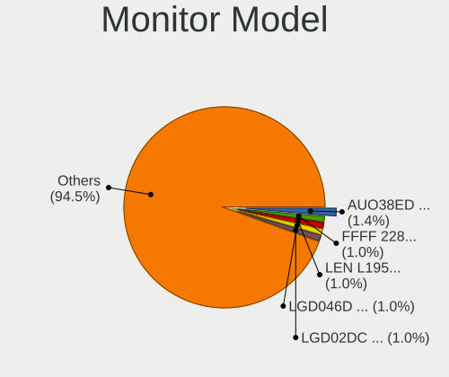

| Model                                                                    | Computers | Percent |
|--------------------------------------------------------------------------|-----------|---------|
| AU Optronics LCD Monitor AUO38ED 1920x1080 344x193mm 15.5-inch           | 4         | 1.37%   |
| Unknown LCD Monitor FFFF 2288x1287 2550x2550mm 142.0-inch                | 3         | 1.03%   |
| LG Display LCD Monitor LGD046D 1920x1080 309x174mm 14.0-inch             | 3         | 1.03%   |
| LG Display LCD Monitor LGD02DC 1366x768 344x194mm 15.5-inch              | 3         | 1.03%   |
| Lenovo LEN L1950wD LEN1086 1920x1080 150x100mm 7.1-inch                  | 3         | 1.03%   |
| Chimei Innolux LCD Monitor CMN15DB 1366x768 344x193mm 15.5-inch          | 3         | 1.03%   |
| Chimei Innolux LCD Monitor CMN15CA 1366x768 344x193mm 15.5-inch          | 3         | 1.03%   |
| Chi Mei Optoelectronics LCD Monitor CMO15A7 1366x768 344x193mm 15.5-inch | 3         | 1.03%   |
| BOE LCD Monitor BOE075A 1366x768 309x173mm 13.9-inch                     | 3         | 1.03%   |
| Apple LCD Monitor APP9CC5 1280x800 286x179mm 13.3-inch                   | 3         | 1.03%   |
| XYK Display XYK1200 1920x1200 301x188mm 14.0-inch                        | 2         | 0.68%   |
| MStar Demo MST0030 1920x1080 708x398mm 32.0-inch                         | 2         | 0.68%   |
| LG Display LCD Monitor LGD0384 1366x768 344x194mm 15.5-inch              | 2         | 0.68%   |
| HUAWEI ZQE-CBA HWV6A25 3440x1440 797x334mm 34.0-inch                     | 2         | 0.68%   |
| Dell S2721QS DELA198 3840x2160 597x336mm 27.0-inch                       | 2         | 0.68%   |
| CPT P116NWR1 R2 COR0489 1366x768 256x144mm 11.6-inch                     | 2         | 0.68%   |
| Chimei Innolux LCD Monitor CMN14C4 1366x768 309x173mm 13.9-inch          | 2         | 0.68%   |
| Chimei Innolux LCD Monitor CMN1132 1366x768 256x144mm 11.6-inch          | 2         | 0.68%   |
| BOE LCD Monitor BOE06A5 1366x768 344x194mm 15.5-inch                     | 2         | 0.68%   |
| BOE LCD Monitor BOE06A4 1366x768 344x194mm 15.5-inch                     | 2         | 0.68%   |
| BOE LCD Monitor BOE0696 1366x768 309x173mm 13.9-inch                     | 2         | 0.68%   |
| AU Optronics LCD Monitor AUO235C 1366x768 256x144mm 11.6-inch            | 2         | 0.68%   |
| AU Optronics LCD Monitor AUO229E 1600x900 382x214mm 17.2-inch            | 2         | 0.68%   |
| Apple LCD Monitor APP9CCB 1280x800 286x179mm 13.3-inch                   | 2         | 0.68%   |
| ViewSonic VX3211-2K VSCF634 2560x1440 698x392mm 31.5-inch                | 1         | 0.34%   |
| ViewSonic VX2240w VSC6B20 1680x1050 495x291mm 22.6-inch                  | 1         | 0.34%   |
| Sony TV *00 SNYA003 1920x1080 1218x685mm 55.0-inch                       | 1         | 0.34%   |
| Sharp LQ133M1JW08 SHP1425 1920x1080 294x165mm 13.3-inch                  | 1         | 0.34%   |
| Sharp LQ123P1JX32 SHP148A 2400x1600 259x173mm 12.3-inch                  | 1         | 0.34%   |
| Sharp LCD Monitor SHP1447 1920x1080 294x165mm 13.3-inch                  | 1         | 0.34%   |
| Sceptre Tech Sceptre X9WG-NagaV SPT1999 1440x900 370x220mm 16.9-inch     | 1         | 0.34%   |
| Sceptre Tech Sceptre M27 SPT0ACD 1920x1080 598x336mm 27.0-inch           | 1         | 0.34%   |
| Samsung Electronics SyncMaster SAM0565 1440x900 428x255mm 19.6-inch      | 1         | 0.34%   |
| Samsung Electronics SyncMaster SAM044E 1440x900 408x255mm 18.9-inch      | 1         | 0.34%   |
| Samsung Electronics SyncMaster SAM03D0 1440x900 410x257mm 19.1-inch      | 1         | 0.34%   |
| Samsung Electronics SyncMaster SAM036D 1920x1080                         | 1         | 0.34%   |
| Samsung Electronics SyncMaster SAM010B 1280x1024 338x270mm 17.0-inch     | 1         | 0.34%   |
| Samsung Electronics S27C31x SAM7312 1920x1080 597x336mm 27.0-inch        | 1         | 0.34%   |
| Samsung Electronics S19C150 SAM0AE6 1366x768 410x230mm 18.5-inch         | 1         | 0.34%   |
| Samsung Electronics LS32AG32x SAM71DE 1920x1080 698x393mm 31.5-inch      | 1         | 0.34%   |

Monitor Resolution
------------------

Monitor screen resolution

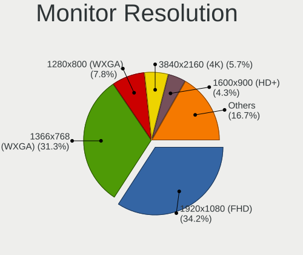

| Resolution         | Computers | Percent |
|--------------------|-----------|---------|
| 1920x1080 (FHD)    | 96        | 34.16%  |
| 1366x768 (WXGA)    | 88        | 31.32%  |
| 1280x800 (WXGA)    | 22        | 7.83%   |
| 3840x2160 (4K)     | 16        | 5.69%   |
| 1600x900 (HD+)     | 12        | 4.27%   |
| 1920x1200 (WUXGA)  | 10        | 3.56%   |
| 1440x900 (WXGA+)   | 8         | 2.85%   |
| 2560x1440 (QHD)    | 7         | 2.49%   |
| 1680x1050 (WSXGA+) | 6         | 2.14%   |
| 1280x1024 (SXGA)   | 4         | 1.42%   |
| 3440x1440          | 3         | 1.07%   |
| 2288x1287          | 3         | 1.07%   |
| 2160x1440          | 2         | 0.71%   |
| 1024x768 (XGA)     | 2         | 0.71%   |
| 2400x1600          | 1         | 0.36%   |
| 1024x600           | 1         | 0.36%   |

Monitor Diagonal
----------------

Diagonal size in inches

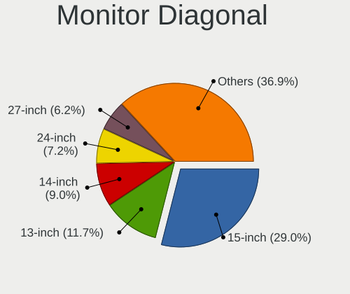

| Inches  | Computers | Percent |
|---------|-----------|---------|
| 15      | 84        | 28.97%  |
| 13      | 34        | 11.72%  |
| 14      | 26        | 8.97%   |
| 24      | 21        | 7.24%   |
| 27      | 18        | 6.21%   |
| 23      | 13        | 4.48%   |
| 21      | 12        | 4.14%   |
| 17      | 12        | 4.14%   |
| 11      | 12        | 4.14%   |
| 19      | 11        | 3.79%   |
| 18      | 7         | 2.41%   |
| 12      | 7         | 2.41%   |
| 34      | 4         | 1.38%   |
| 22      | 4         | 1.38%   |
| 142     | 3         | 1.03%   |
| 84      | 3         | 1.03%   |
| 20      | 3         | 1.03%   |
| 16      | 3         | 1.03%   |
| 52      | 2         | 0.69%   |
| 31      | 2         | 0.69%   |
| Unknown | 2         | 0.69%   |
| 65      | 1         | 0.34%   |
| 55      | 1         | 0.34%   |
| 54      | 1         | 0.34%   |
| 49      | 1         | 0.34%   |
| 32      | 1         | 0.34%   |
| 26      | 1         | 0.34%   |
| 10      | 1         | 0.34%   |

Monitor Width
-------------

Physical width

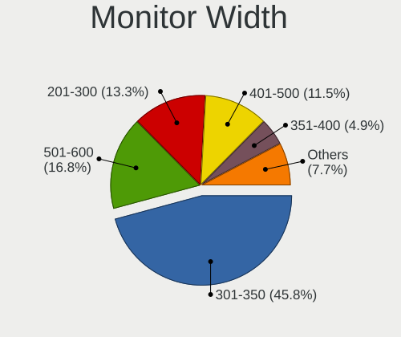

| Width in mm    | Computers | Percent |
|----------------|-----------|---------|
| 301-350        | 131       | 45.8%   |
| 501-600        | 48        | 16.78%  |
| 201-300        | 38        | 13.29%  |
| 401-500        | 33        | 11.54%  |
| 351-400        | 14        | 4.9%    |
| 1001-1500      | 6         | 2.1%    |
| 701-800        | 5         | 1.75%   |
| More than 2000 | 3         | 1.05%   |
| 601-700        | 3         | 1.05%   |
| 1501-2000      | 3         | 1.05%   |
| Unknown        | 2         | 0.7%    |

Aspect Ratio
------------

Proportional relationship between the width and the height

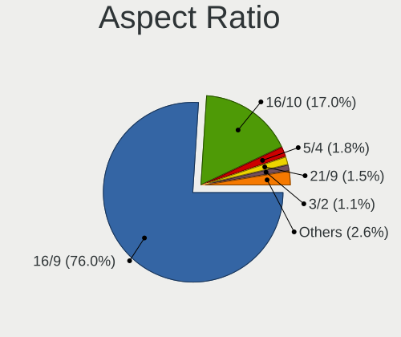

| Ratio   | Computers | Percent |
|---------|-----------|---------|
| 16/9    | 206       | 76.01%  |
| 16/10   | 46        | 16.97%  |
| 5/4     | 5         | 1.85%   |
| 21/9    | 4         | 1.48%   |
| 3/2     | 3         | 1.11%   |
| 1.00    | 3         | 1.11%   |
| 4/3     | 2         | 0.74%   |
| 32/9    | 1         | 0.37%   |
| Unknown | 1         | 0.37%   |

Monitor Area
------------

Area in inch²

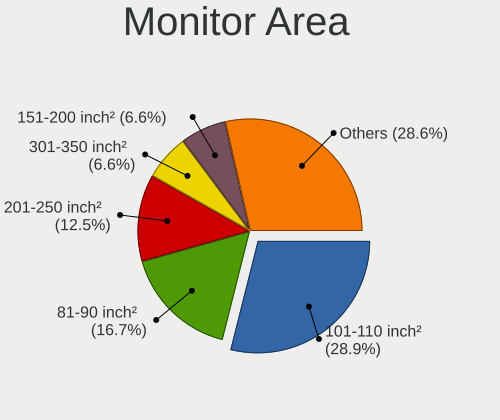

| Area in inch² | Computers | Percent |
|----------------|-----------|---------|
| 101-110        | 83        | 28.92%  |
| 81-90          | 48        | 16.72%  |
| 201-250        | 36        | 12.54%  |
| 301-350        | 19        | 6.62%   |
| 151-200        | 19        | 6.62%   |
| 51-60          | 12        | 4.18%   |
| More than 1000 | 11        | 3.83%   |
| 71-80          | 11        | 3.83%   |
| 251-300        | 10        | 3.48%   |
| 121-130        | 9         | 3.14%   |
| 61-70          | 7         | 2.44%   |
| 351-500        | 6         | 2.09%   |
| 141-150        | 6         | 2.09%   |
| 111-120        | 3         | 1.05%   |
| 91-100         | 2         | 0.7%    |
| Unknown        | 2         | 0.7%    |
| 41-50          | 1         | 0.35%   |
| 131-140        | 1         | 0.35%   |
| 501-1000       | 1         | 0.35%   |

Pixel Density
-------------

Pixels per inch

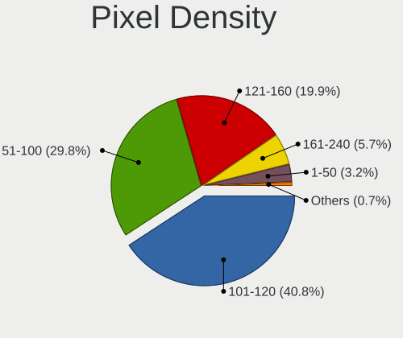

| Density | Computers | Percent |
|---------|-----------|---------|
| 101-120 | 115       | 40.78%  |
| 51-100  | 84        | 29.79%  |
| 121-160 | 56        | 19.86%  |
| 161-240 | 16        | 5.67%   |
| 1-50    | 9         | 3.19%   |
| Unknown | 2         | 0.71%   |

Multiple Monitors
-----------------

Total monitors connected

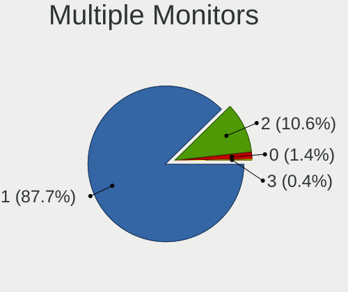

| Total | Computers | Percent |
|-------|-----------|---------|
| 1     | 249       | 87.68%  |
| 2     | 30        | 10.56%  |
| 0     | 4         | 1.41%   |
| 3     | 1         | 0.35%   |

Network
-------

Net Controller Vendor
---------------------

Controller vendors

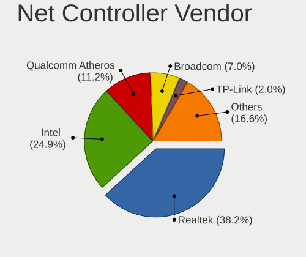

| Vendor                            | Computers | Percent |
|-----------------------------------|-----------|---------|
| Realtek Semiconductor             | 170       | 38.2%   |
| Intel                             | 111       | 24.94%  |
| Qualcomm Atheros                  | 50        | 11.24%  |
| Broadcom                          | 31        | 6.97%   |
| TP-Link                           | 9         | 2.02%   |
| Marvell Technology Group          | 9         | 2.02%   |
| Ralink                            | 8         | 1.8%    |
| Ralink Technology                 | 5         | 1.12%   |
| MediaTek                          | 5         | 1.12%   |
| Nvidia                            | 4         | 0.9%    |
| Qualcomm Atheros Communications   | 3         | 0.67%   |
| Huawei Technologies               | 3         | 0.67%   |
| Broadcom Limited                  | 3         | 0.67%   |
| ASIX Electronics                  | 3         | 0.67%   |
| U-Blox                            | 2         | 0.45%   |
| Silicon Integrated Systems [SiS]  | 2         | 0.45%   |
| Sierra Wireless                   | 2         | 0.45%   |
| Samsung Electronics               | 2         | 0.45%   |
| NetGear                           | 2         | 0.45%   |
| JMicron Technology                | 2         | 0.45%   |
| Edimax Technology                 | 2         | 0.45%   |
| DisplayLink                       | 2         | 0.45%   |
| D-Link                            | 2         | 0.45%   |
| ZTE WCDMA Technologies MSM        | 1         | 0.22%   |
| Xiaomi                            | 1         | 0.22%   |
| VIA Technologies                  | 1         | 0.22%   |
| Raspberry Pi                      | 1         | 0.22%   |
| Qualcomm                          | 1         | 0.22%   |
| Motorola PCS                      | 1         | 0.22%   |
| LSI                               | 1         | 0.22%   |
| Espressif                         | 1         | 0.22%   |
| Ericsson Business Mobile Networks | 1         | 0.22%   |
| Dresden Elektronik                | 1         | 0.22%   |
| Davicom Semiconductor             | 1         | 0.22%   |
| BUFFALO                           | 1         | 0.22%   |
| Belkin Components                 | 1         | 0.22%   |

Net Controller Model
--------------------

Controller models

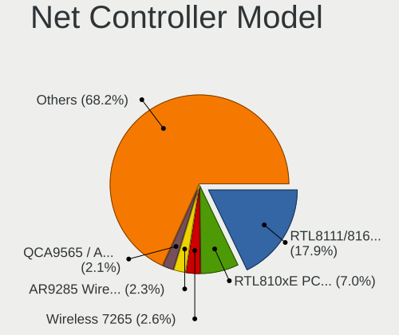

| Model                                                                  | Computers | Percent |
|------------------------------------------------------------------------|-----------|---------|
| Realtek RTL8111/8168/8211/8411 PCI Express Gigabit Ethernet Controller | 95        | 17.86%  |
| Realtek RTL810xE PCI Express Fast Ethernet controller                  | 37        | 6.95%   |
| Intel Wireless 7265                                                    | 14        | 2.63%   |
| Qualcomm Atheros AR9285 Wireless Network Adapter (PCI-Express)         | 12        | 2.26%   |
| Qualcomm Atheros QCA9565 / AR9565 Wireless Network Adapter             | 11        | 2.07%   |
| Realtek RTL8723BE PCIe Wireless Network Adapter                        | 10        | 1.88%   |
| Intel Ethernet Connection I217-LM                                      | 9         | 1.69%   |
| Intel 82579LM Gigabit Network Connection (Lewisville)                  | 8         | 1.5%    |
| Realtek RTL8821CE 802.11ac PCIe Wireless Network Adapter               | 6         | 1.13%   |
| Realtek RTL8153 Gigabit Ethernet Adapter                               | 5         | 0.94%   |
| Qualcomm Atheros QCA9377 802.11ac Wireless Network Adapter             | 5         | 0.94%   |
| Qualcomm Atheros AR9485 Wireless Network Adapter                       | 5         | 0.94%   |
| Intel Wireless 8265 / 8275                                             | 5         | 0.94%   |
| Intel Wireless 3165                                                    | 5         | 0.94%   |
| Broadcom NetXtreme BCM57765 Gigabit Ethernet PCIe                      | 5         | 0.94%   |
| Broadcom BCM4322 802.11a/b/g/n Wireless LAN Controller                 | 5         | 0.94%   |
| Broadcom BCM4313 802.11bgn Wireless Network Adapter                    | 5         | 0.94%   |
| Realtek RTL8852BE PCIe 802.11ax Wireless Network Controller            | 4         | 0.75%   |
| Realtek RTL8125 2.5GbE Controller                                      | 4         | 0.75%   |
| Realtek 802.11ac NIC                                                   | 4         | 0.75%   |
| Qualcomm Atheros AR9462 Wireless Network Adapter                       | 4         | 0.75%   |
| Intel Wireless 7260                                                    | 4         | 0.75%   |
| Intel Wireless 3160                                                    | 4         | 0.75%   |
| Intel Wi-Fi 5(802.11ac) Wireless-AC 9x6x [Thunder Peak]                | 4         | 0.75%   |
| Intel PRO/Wireless 3945ABG [Golan] Network Connection                  | 4         | 0.75%   |
| Intel I211 Gigabit Network Connection                                  | 4         | 0.75%   |
| Intel Gemini Lake PCH CNVi WiFi                                        | 4         | 0.75%   |
| Intel Centrino Advanced-N 6235                                         | 4         | 0.75%   |
| Broadcom BCM4331 802.11a/b/g/n                                         | 4         | 0.75%   |
| Broadcom BCM4312 802.11b/g LP-PHY                                      | 4         | 0.75%   |
| TP-Link Archer T3U [Realtek RTL8812BU]                                 | 3         | 0.56%   |
| Realtek RTL88x2bu [AC1200 Techkey]                                     | 3         | 0.56%   |
| Realtek RTL8188EUS 802.11n Wireless Network Adapter                    | 3         | 0.56%   |
| Realtek RTL8188EE Wireless Network Adapter                             | 3         | 0.56%   |
| Realtek RTL8188CE 802.11b/g/n WiFi Adapter                             | 3         | 0.56%   |
| Realtek RTL8187B Wireless 802.11g 54Mbps Network Adapter               | 3         | 0.56%   |
| Realtek RTL8152 Fast Ethernet Adapter                                  | 3         | 0.56%   |
| Realtek RTL-8100/8101L/8139 PCI Fast Ethernet Adapter                  | 3         | 0.56%   |
| Realtek 802.11n WLAN Adapter                                           | 3         | 0.56%   |
| Ralink RT2790 Wireless 802.11n 1T/2R PCIe                              | 3         | 0.56%   |

Wireless Vendor
---------------

Wireless vendors

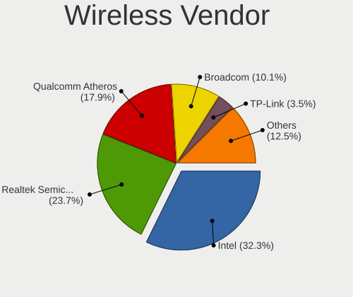

| Vendor                          | Computers | Percent |
|---------------------------------|-----------|---------|
| Intel                           | 83        | 32.3%   |
| Realtek Semiconductor           | 61        | 23.74%  |
| Qualcomm Atheros                | 46        | 17.9%   |
| Broadcom                        | 26        | 10.12%  |
| TP-Link                         | 9         | 3.5%    |
| Ralink                          | 8         | 3.11%   |
| Ralink Technology               | 5         | 1.95%   |
| MediaTek                        | 4         | 1.56%   |
| Qualcomm Atheros Communications | 3         | 1.17%   |
| Sierra Wireless                 | 2         | 0.78%   |
| NetGear                         | 2         | 0.78%   |
| Edimax Technology               | 2         | 0.78%   |
| D-Link                          | 2         | 0.78%   |
| Qualcomm                        | 1         | 0.39%   |
| BUFFALO                         | 1         | 0.39%   |
| Broadcom Limited                | 1         | 0.39%   |
| Belkin Components               | 1         | 0.39%   |

Wireless Model
--------------

Wireless models

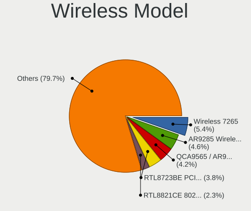

| Model                                                          | Computers | Percent |
|----------------------------------------------------------------|-----------|---------|
| Intel Wireless 7265                                            | 14        | 5.36%   |
| Qualcomm Atheros AR9285 Wireless Network Adapter (PCI-Express) | 12        | 4.6%    |
| Qualcomm Atheros QCA9565 / AR9565 Wireless Network Adapter     | 11        | 4.21%   |
| Realtek RTL8723BE PCIe Wireless Network Adapter                | 10        | 3.83%   |
| Realtek RTL8821CE 802.11ac PCIe Wireless Network Adapter       | 6         | 2.3%    |
| Qualcomm Atheros QCA9377 802.11ac Wireless Network Adapter     | 5         | 1.92%   |
| Qualcomm Atheros AR9485 Wireless Network Adapter               | 5         | 1.92%   |
| Intel Wireless 8265 / 8275                                     | 5         | 1.92%   |
| Intel Wireless 3165                                            | 5         | 1.92%   |
| Broadcom BCM4322 802.11a/b/g/n Wireless LAN Controller         | 5         | 1.92%   |
| Broadcom BCM4313 802.11bgn Wireless Network Adapter            | 5         | 1.92%   |
| Realtek RTL8852BE PCIe 802.11ax Wireless Network Controller    | 4         | 1.53%   |
| Realtek 802.11ac NIC                                           | 4         | 1.53%   |
| Qualcomm Atheros AR9462 Wireless Network Adapter               | 4         | 1.53%   |
| Intel Wireless 7260                                            | 4         | 1.53%   |
| Intel Wireless 3160                                            | 4         | 1.53%   |
| Intel Wi-Fi 5(802.11ac) Wireless-AC 9x6x [Thunder Peak]        | 4         | 1.53%   |
| Intel PRO/Wireless 3945ABG [Golan] Network Connection          | 4         | 1.53%   |
| Intel Gemini Lake PCH CNVi WiFi                                | 4         | 1.53%   |
| Intel Centrino Advanced-N 6235                                 | 4         | 1.53%   |
| Broadcom BCM4331 802.11a/b/g/n                                 | 4         | 1.53%   |
| Broadcom BCM4312 802.11b/g LP-PHY                              | 4         | 1.53%   |
| TP-Link Archer T3U [Realtek RTL8812BU]                         | 3         | 1.15%   |
| Realtek RTL88x2bu [AC1200 Techkey]                             | 3         | 1.15%   |
| Realtek RTL8188EUS 802.11n Wireless Network Adapter            | 3         | 1.15%   |
| Realtek RTL8188EE Wireless Network Adapter                     | 3         | 1.15%   |
| Realtek RTL8188CE 802.11b/g/n WiFi Adapter                     | 3         | 1.15%   |
| Realtek RTL8187B Wireless 802.11g 54Mbps Network Adapter       | 3         | 1.15%   |
| Realtek 802.11n WLAN Adapter                                   | 3         | 1.15%   |
| Ralink RT2790 Wireless 802.11n 1T/2R PCIe                      | 3         | 1.15%   |
| Qualcomm Atheros AR9271 802.11n                                | 3         | 1.15%   |
| Qualcomm Atheros AR928X Wireless Network Adapter (PCI-Express) | 3         | 1.15%   |
| Intel Wi-Fi 6 AX200                                            | 3         | 1.15%   |
| Intel Raptor Lake PCH CNVi WiFi                                | 3         | 1.15%   |
| Intel Centrino Advanced-N 6205 [Taylor Peak]                   | 3         | 1.15%   |
| TP-Link Archer T2U PLUS [RTL8821AU]                            | 2         | 0.77%   |
| Realtek RTL8822CE 802.11ac PCIe Wireless Network Adapter       | 2         | 0.77%   |
| Realtek RTL8821AE 802.11ac PCIe Wireless Network Adapter       | 2         | 0.77%   |
| Realtek RTL8723DE Wireless Network Adapter                     | 2         | 0.77%   |
| Realtek RTL8723BU 802.11b/g/n WLAN Adapter                     | 2         | 0.77%   |

Ethernet Vendor
---------------

Ethernet vendors

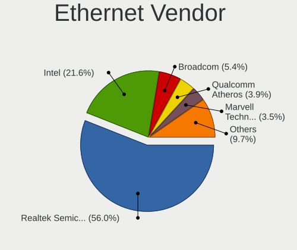

| Vendor                           | Computers | Percent |
|----------------------------------|-----------|---------|
| Realtek Semiconductor            | 145       | 55.98%  |
| Intel                            | 56        | 21.62%  |
| Broadcom                         | 14        | 5.41%   |
| Qualcomm Atheros                 | 10        | 3.86%   |
| Marvell Technology Group         | 9         | 3.47%   |
| Nvidia                           | 4         | 1.54%   |
| ASIX Electronics                 | 3         | 1.16%   |
| Silicon Integrated Systems [SiS] | 2         | 0.77%   |
| Samsung Electronics              | 2         | 0.77%   |
| JMicron Technology               | 2         | 0.77%   |
| DisplayLink                      | 2         | 0.77%   |
| Broadcom Limited                 | 2         | 0.77%   |
| ZTE WCDMA Technologies MSM       | 1         | 0.39%   |
| Xiaomi                           | 1         | 0.39%   |
| VIA Technologies                 | 1         | 0.39%   |
| Raspberry Pi                     | 1         | 0.39%   |
| Motorola PCS                     | 1         | 0.39%   |
| MediaTek                         | 1         | 0.39%   |
| Huawei Technologies              | 1         | 0.39%   |
| Davicom Semiconductor            | 1         | 0.39%   |

Ethernet Model
--------------

Ethernet models

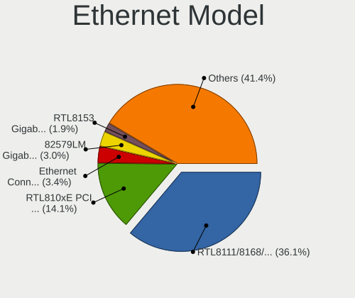

| Model                                                                  | Computers | Percent |
|------------------------------------------------------------------------|-----------|---------|
| Realtek RTL8111/8168/8211/8411 PCI Express Gigabit Ethernet Controller | 95        | 36.12%  |
| Realtek RTL810xE PCI Express Fast Ethernet controller                  | 37        | 14.07%  |
| Intel Ethernet Connection I217-LM                                      | 9         | 3.42%   |
| Intel 82579LM Gigabit Network Connection (Lewisville)                  | 8         | 3.04%   |
| Realtek RTL8153 Gigabit Ethernet Adapter                               | 5         | 1.9%    |
| Broadcom NetXtreme BCM57765 Gigabit Ethernet PCIe                      | 5         | 1.9%    |
| Realtek RTL8125 2.5GbE Controller                                      | 4         | 1.52%   |
| Intel I211 Gigabit Network Connection                                  | 4         | 1.52%   |
| Realtek RTL8152 Fast Ethernet Adapter                                  | 3         | 1.14%   |
| Realtek RTL-8100/8101L/8139 PCI Fast Ethernet Adapter                  | 3         | 1.14%   |
| Qualcomm Atheros AR8152 v2.0 Fast Ethernet                             | 3         | 1.14%   |
| Qualcomm Atheros AR8132 Fast Ethernet                                  | 3         | 1.14%   |
| Intel Ethernet Connection (4) I219-V                                   | 3         | 1.14%   |
| Intel Ethernet Connection (3) I218-LM                                  | 3         | 1.14%   |
| Broadcom NetXtreme BCM5764M Gigabit Ethernet PCIe                      | 3         | 1.14%   |
| Silicon Integrated Systems [SiS] 191 Gigabit Ethernet Adapter          | 2         | 0.76%   |
| Qualcomm Atheros AR8152 v1.1 Fast Ethernet                             | 2         | 0.76%   |
| Qualcomm Atheros AR8151 v2.0 Gigabit Ethernet                          | 2         | 0.76%   |
| Nvidia MCP79 Ethernet                                                  | 2         | 0.76%   |
| Marvell Group 88E8042 PCI-E Fast Ethernet Controller                   | 2         | 0.76%   |
| Marvell Group 88E8040 PCI-E Fast Ethernet Controller                   | 2         | 0.76%   |
| JMicron JMC250 PCI Express Gigabit Ethernet Controller                 | 2         | 0.76%   |
| Intel Ethernet Connection (7) I219-LM                                  | 2         | 0.76%   |
| Intel Ethernet Connection (4) I219-LM                                  | 2         | 0.76%   |
| Intel Ethernet Connection (17) I219-LM                                 | 2         | 0.76%   |
| Intel 82579V Gigabit Network Connection                                | 2         | 0.76%   |
| Intel 82577LM Gigabit Network Connection                               | 2         | 0.76%   |
| Intel 82567LM-3 Gigabit Network Connection                             | 2         | 0.76%   |
| ASIX AX88179 Gigabit Ethernet                                          | 2         | 0.76%   |
| ZTE WCDMA MSM ZTE Blade A54                                            | 1         | 0.38%   |
| Xiaomi Mi/Redmi series (RNDIS)                                         | 1         | 0.38%   |
| VIA VT6102/VT6103 [Rhine-II]                                           | 1         | 0.38%   |
| Samsung GT-I9070 (network tethering, USB debugging enabled)            | 1         | 0.38%   |
| Samsung Galaxy series, misc. (tethering mode)                          | 1         | 0.38%   |
| Realtek RTL8111/8168/8411 PCI Express Gigabit Ethernet Controller      | 1         | 0.38%   |
| Realtek RTL-8110SC/8169SC Gigabit Ethernet                             | 1         | 0.38%   |
| Raspberry Pi RP1 PCIe 2.0 South Bridge                                 | 1         | 0.38%   |
| Nvidia MCP77 Ethernet                                                  | 1         | 0.38%   |
| Nvidia MCP61 Ethernet                                                  | 1         | 0.38%   |
| Motorola PCS motorola one 5G ace                                       | 1         | 0.38%   |

Net Controller Kind
-------------------

Ethernet, WiFi or modem

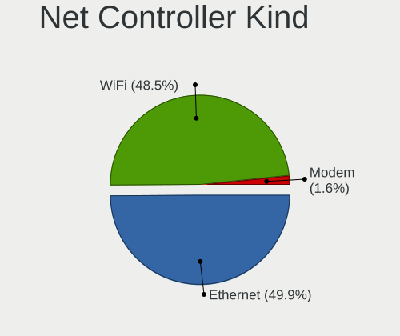

| Kind     | Computers | Percent |
|----------|-----------|---------|
| Ethernet | 245       | 49.9%   |
| WiFi     | 238       | 48.47%  |
| Modem    | 8         | 1.63%   |

Used Controller
---------------

Currently used network controller

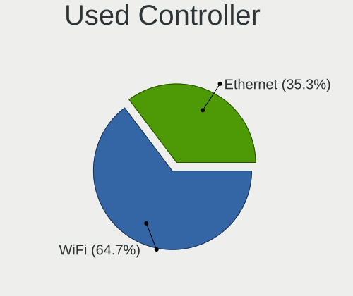

| Kind     | Computers | Percent |
|----------|-----------|---------|
| WiFi     | 187       | 64.71%  |
| Ethernet | 102       | 35.29%  |

NICs
----

Total network controllers on board

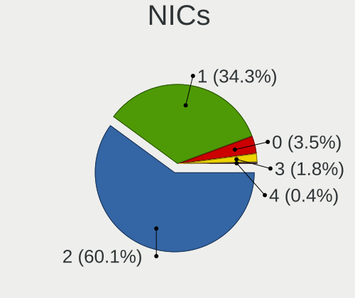

| Total | Computers | Percent |
|-------|-----------|---------|
| 2     | 170       | 60.07%  |
| 1     | 97        | 34.28%  |
| 0     | 10        | 3.53%   |
| 3     | 5         | 1.77%   |
| 4     | 1         | 0.35%   |

IPv6
----

IPv6 vs IPv4

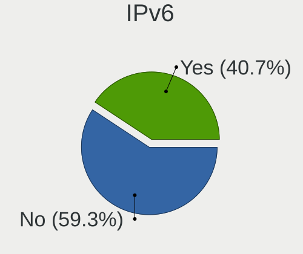

| Used | Computers | Percent |
|------|-----------|---------|
| No   | 169       | 59.3%   |
| Yes  | 116       | 40.7%   |

Bluetooth
---------

Bluetooth Vendor
----------------

Controller vendors

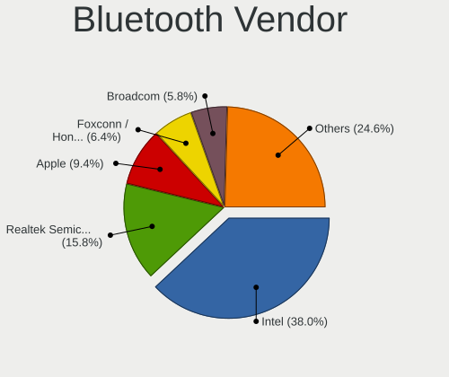

| Vendor                          | Computers | Percent |
|---------------------------------|-----------|---------|
| Intel                           | 65        | 38.01%  |
| Realtek Semiconductor           | 27        | 15.79%  |
| Apple                           | 16        | 9.36%   |
| Foxconn / Hon Hai               | 11        | 6.43%   |
| Broadcom                        | 10        | 5.85%   |
| Lite-On Technology              | 9         | 5.26%   |
| Qualcomm Atheros Communications | 8         | 4.68%   |
| Hewlett-Packard                 | 5         | 2.92%   |
| IMC Networks                    | 3         | 1.75%   |
| Dell                            | 3         | 1.75%   |
| Ralink                          | 2         | 1.17%   |
| Qcom                            | 2         | 1.17%   |
| MediaTek                        | 2         | 1.17%   |
| Cambridge Silicon Radio         | 2         | 1.17%   |
| USI                             | 1         | 0.58%   |
| TP-Link                         | 1         | 0.58%   |
| Realtek                         | 1         | 0.58%   |
| Chicony Electronics             | 1         | 0.58%   |
| Alps Electric                   | 1         | 0.58%   |
| Unknown                         | 1         | 0.58%   |

Bluetooth Model
---------------

Controller models

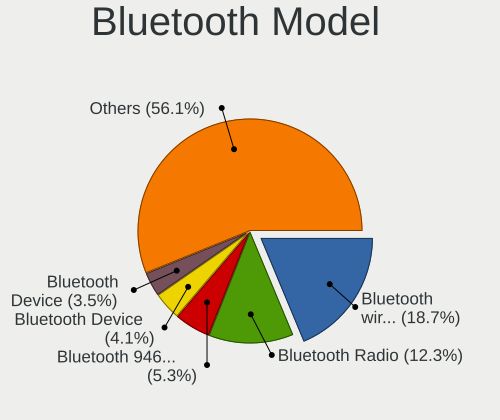

| Model                                               | Computers | Percent |
|-----------------------------------------------------|-----------|---------|
| Intel Bluetooth wireless interface                  | 32        | 18.71%  |
| Realtek Bluetooth Radio                             | 21        | 12.28%  |
| Intel Bluetooth 9460/9560 Jefferson Peak (JfP)      | 9         | 5.26%   |
| Foxconn / Hon Hai Bluetooth Device                  | 7         | 4.09%   |
| Lite-On Bluetooth Device                            | 6         | 3.51%   |
| Apple Bluetooth Host Controller                     | 6         | 3.51%   |
| Intel Centrino Bluetooth Wireless Transceiver       | 5         | 2.92%   |
| Intel AX201 Bluetooth                               | 5         | 2.92%   |
| Apple Bluetooth USB Host Controller                 | 5         | 2.92%   |
| Qualcomm Atheros AR3012 Bluetooth 4.0               | 4         | 2.34%   |
| HP Broadcom 2070 Bluetooth Combo                    | 4         | 2.34%   |
| Realtek  Bluetooth 4.2 Adapter                      | 3         | 1.75%   |
| Intel Wireless-AC 9260 Bluetooth Adapter            | 3         | 1.75%   |
| Intel AX200 Bluetooth                               | 3         | 1.75%   |
| Apple Built-in Bluetooth 2.0+EDR HCI                | 3         | 1.75%   |
| Realtek RTL8821A Bluetooth                          | 2         | 1.17%   |
| Ralink RT3290 Bluetooth                             | 2         | 1.17%   |
| Qualcomm Atheros  Bluetooth Device                  | 2         | 1.17%   |
| Qcom Broadcom Bluetooth USB                         | 2         | 1.17%   |
| MediaTek Wireless_Device                            | 2         | 1.17%   |
| Lite-On Qualcomm Atheros QCA9377 Bluetooth          | 2         | 1.17%   |
| Intel Wireless-AC 3168 Bluetooth                    | 2         | 1.17%   |
| Intel Centrino Advanced-N 6230 Bluetooth adapter    | 2         | 1.17%   |
| Intel Bluetooth Device                              | 2         | 1.17%   |
| Intel AX210 Bluetooth                               | 2         | 1.17%   |
| Dell Wireless 355 Bluetooth                         | 2         | 1.17%   |
| Cambridge Silicon Radio Bluetooth Dongle (HCI mode) | 2         | 1.17%   |
| Broadcom BCM2070 Bluetooth Device                   | 2         | 1.17%   |
| Broadcom BCM2045B (BDC-2.1)                         | 2         | 1.17%   |
| Apple Bluetooth HCI                                 | 2         | 1.17%   |
| USI Bluetooth Module BCM92070                       | 1         | 0.58%   |
| TP-Link TP-T@- UB500 Adapter                        | 1         | 0.58%   |
| Realtek RTL8723B Bluetooth                          | 1         | 0.58%   |
| Realtek Bluetooth Radio                             | 1         | 0.58%   |
| Qualcomm Atheros Bluetooth                          | 1         | 0.58%   |
| Qualcomm Atheros AR3011 Bluetooth                   | 1         | 0.58%   |
| Lite-On Atheros AR3012 Bluetooth                    | 1         | 0.58%   |
| IMC Networks Wireless_Device                        | 1         | 0.58%   |
| IMC Networks Bluetooth Device                       | 1         | 0.58%   |
| IMC Networks Atheros AR3012 Bluetooth 4.0 Adapter   | 1         | 0.58%   |

Sound
-----

Sound Vendor
------------

Sound card vendors

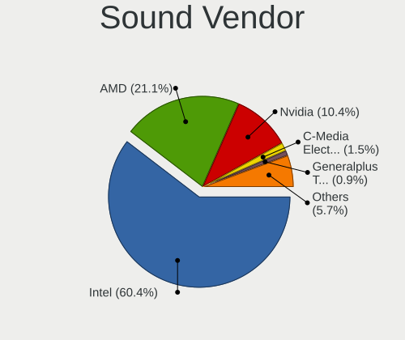

| Vendor                                       | Computers | Percent |
|----------------------------------------------|-----------|---------|
| Intel                                        | 203       | 60.42%  |
| AMD                                          | 71        | 21.13%  |
| Nvidia                                       | 35        | 10.42%  |
| C-Media Electronics                          | 5         | 1.49%   |
| Generalplus Technology                       | 3         | 0.89%   |
| Zoran Co. Personal Media Division (Nogatech) | 2         | 0.6%    |
| Zhaoxin                                      | 2         | 0.6%    |
| VIA Technologies                             | 2         | 0.6%    |
| Silicon Integrated Systems [SiS]             | 2         | 0.6%    |
| Razer USA                                    | 2         | 0.6%    |
| BEHRINGER International                      | 2         | 0.6%    |
| Micro Star International                     | 1         | 0.3%    |
| Logitech                                     | 1         | 0.3%    |
| Jieli Technology                             | 1         | 0.3%    |
| Hewlett-Packard                              | 1         | 0.3%    |
| Creative Labs                                | 1         | 0.3%    |
| AKAI                                         | 1         | 0.3%    |
| Unknown                                      | 1         | 0.3%    |

Sound Model
-----------

Sound card models

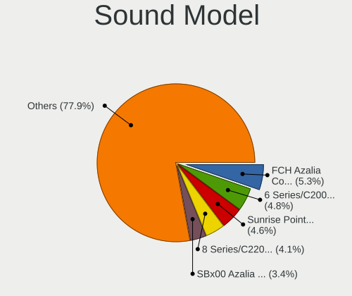

| Model                                                                                             | Computers | Percent |
|---------------------------------------------------------------------------------------------------|-----------|---------|
| AMD FCH Azalia Controller                                                                         | 22        | 5.29%   |
| Intel 6 Series/C200 Series Chipset Family High Definition Audio Controller                        | 20        | 4.81%   |
| Intel Sunrise Point-LP HD Audio                                                                   | 19        | 4.57%   |
| Intel 8 Series/C220 Series Chipset High Definition Audio Controller                               | 17        | 4.09%   |
| AMD SBx00 Azalia (Intel HDA)                                                                      | 14        | 3.37%   |
| Intel 7 Series/C216 Chipset Family High Definition Audio Controller                               | 13        | 3.13%   |
| AMD Kabini HDMI/DP Audio                                                                          | 13        | 3.13%   |
| Intel 5 Series/3400 Series Chipset High Definition Audio                                          | 12        | 2.88%   |
| AMD Ryzen HD Audio Controller                                                                     | 12        | 2.88%   |
| Intel Celeron/Pentium Silver Processor High Definition Audio                                      | 11        | 2.64%   |
| Intel Xeon E3-1200 v3/4th Gen Core Processor HD Audio Controller                                  | 10        | 2.4%    |
| Intel 82801I (ICH9 Family) HD Audio Controller                                                    | 10        | 2.4%    |
| Intel 82801H (ICH8 Family) HD Audio Controller                                                    | 10        | 2.4%    |
| Intel Celeron N3350/Pentium N4200/Atom E3900 Series Audio Cluster                                 | 9         | 2.16%   |
| Intel Atom/Celeron/Pentium Processor x5-E8000/J3xxx/N3xxx Series High Definition Audio Controller | 9         | 2.16%   |
| Nvidia High Definition Audio Controller                                                           | 8         | 1.92%   |
| Intel Wildcat Point-LP High Definition Audio Controller                                           | 8         | 1.92%   |
| Intel NM10/ICH7 Family High Definition Audio Controller                                           | 8         | 1.92%   |
| Intel Broadwell-U Audio Controller                                                                | 8         | 1.92%   |
| Intel Atom Processor Z36xxx/Z37xxx Series High Definition Audio Controller                        | 8         | 1.92%   |
| Intel Haswell-ULT HD Audio Controller                                                             | 6         | 1.44%   |
| Intel 8 Series HD Audio Controller                                                                | 6         | 1.44%   |
| AMD Starship/Matisse HD Audio Controller                                                          | 6         | 1.44%   |
| Nvidia GP107GL High Definition Audio Controller                                                   | 5         | 1.2%    |
| Nvidia GK208 HDMI/DP Audio Controller                                                             | 5         | 1.2%    |
| Intel Cannon Lake PCH cAVS                                                                        | 5         | 1.2%    |
| AMD Wrestler HDMI Audio                                                                           | 5         | 1.2%    |
| Intel Raptor Lake-P/U/H cAVS                                                                      | 4         | 0.96%   |
| Intel Alder Lake-S HD Audio Controller                                                            | 4         | 0.96%   |
| Intel 82801JI (ICH10 Family) HD Audio Controller                                                  | 4         | 0.96%   |
| AMD Trinity HDMI Audio Controller                                                                 | 4         | 0.96%   |
| AMD Raven/Raven2/Fenghuang HDMI/DP Audio Controller                                               | 4         | 0.96%   |
| AMD Radeon High Definition Audio Controller                                                       | 4         | 0.96%   |
| AMD Family 15h (Models 60h-6fh) Audio Controller                                                  | 4         | 0.96%   |
| Intel Cannon Point-LP High Definition Audio Controller                                            | 3         | 0.72%   |
| Intel Alder Lake-N PCH High Definition Audio Controller                                           | 3         | 0.72%   |
| Intel 100 Series/C230 Series Chipset Family HD Audio Controller                                   | 3         | 0.72%   |
| Generalplus Technology USB Audio Device                                                           | 3         | 0.72%   |
| AMD Renoir/Cezanne HDMI/DP Audio Controller                                                       | 3         | 0.72%   |
| AMD Oland/Hainan/Cape Verde/Pitcairn HDMI Audio [Radeon HD 7000 Series]                           | 3         | 0.72%   |

Memory
------

Memory Vendor
-------------

Memory module vendors

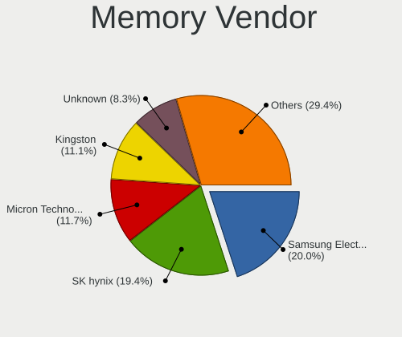

| Vendor                     | Computers | Percent |
|----------------------------|-----------|---------|
| Samsung Electronics        | 36        | 20%     |
| SK hynix                   | 35        | 19.44%  |
| Micron Technology          | 21        | 11.67%  |
| Kingston                   | 20        | 11.11%  |
| Unknown                    | 15        | 8.33%   |
| Unknown (ABCD)             | 6         | 3.33%   |
| Elpida                     | 6         | 3.33%   |
| Unknown                    | 6         | 3.33%   |
| Corsair                    | 5         | 2.78%   |
| A-DATA Technology          | 4         | 2.22%   |
| Crucial                    | 3         | 1.67%   |
| Team                       | 2         | 1.11%   |
| Smart                      | 2         | 1.11%   |
| Ramaxel Technology         | 2         | 1.11%   |
| KINGBANK                   | 2         | 1.11%   |
| 48spaces                   | 2         | 1.11%   |
| Xi'an UniIC Semiconductors | 1         | 0.56%   |
| Unknown (0x198)            | 1         | 0.56%   |
| Unifosa                    | 1         | 0.56%   |
| Timetec                    | 1         | 0.56%   |
| Smart Brazil               | 1         | 0.56%   |
| Quadratica                 | 1         | 0.56%   |
| Qimonda                    | 1         | 0.56%   |
| PNY                        | 1         | 0.56%   |
| Nanya Technology           | 1         | 0.56%   |
| Kllisre                    | 1         | 0.56%   |
| Innodisk                   | 1         | 0.56%   |
| GOODRAM                    | 1         | 0.56%   |
| G.Skill                    | 1         | 0.56%   |

Memory Model
------------

Memory module models

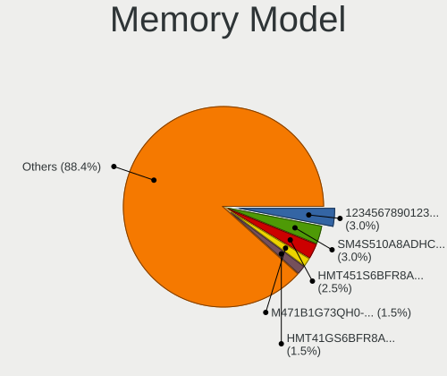

| Model                                                                     | Computers | Percent |
|---------------------------------------------------------------------------|-----------|---------|
| Unknown (ABCD) RAM 123456789012345678 2GB SODIMM LPDDR4 2400MT/s          | 6         | 3.03%   |
| Unknown                                                                   | 6         | 3.03%   |
| SK hynix RAM HMT451S6BFR8A-PB 4GB SODIMM DDR3 1600MT/s                    | 5         | 2.53%   |
| SK hynix RAM HMT41GS6BFR8A-PB 8GB SODIMM DDR3 2667MT/s                    | 3         | 1.52%   |
| Samsung RAM M471B1G73QH0-YK0 8GB SODIMM DDR3 1600MT/s                     | 3         | 1.52%   |
| Unknown RAM Module 2GB SODIMM DRAM                                        | 2         | 1.01%   |
| Unknown RAM Module 1GB SODIMM DDR2 667MT/s                                | 2         | 1.01%   |
| SK hynix RAM Module 4GB Row Of Chips DDR4 2400MT/s                        | 2         | 1.01%   |
| SK hynix RAM HMCG78AGBSA095N 16GB SODIMM DDR5 5600MT/s                    | 2         | 1.01%   |
| SK hynix RAM HMA851S6AFR6N-UH 4GB SODIMM DDR4 2667MT/s                    | 2         | 1.01%   |
| Samsung RAM M471B5273DH0-CH9 4GB SODIMM DDR3 1600MT/s                     | 2         | 1.01%   |
| Samsung RAM M471B5173EB0-YK0 4GB SODIMM DDR3 1600MT/s                     | 2         | 1.01%   |
| Samsung RAM M471A1K43EB1-CWE 8GB SODIMM DDR4 3200MT/s                     | 2         | 1.01%   |
| Micron RAM MT40A1G16TB-062E:F 8GB Row Of Chips DDR4 3200MT/s              | 2         | 1.01%   |
| Kingston RAM ACR16D3LS1NGG/4G 4GB SODIMM DDR3 1600MT/s                    | 2         | 1.01%   |
| Corsair RAM Module 8GB SODIMM DDR3 1333MT/s                               | 2         | 1.01%   |
| 48spaces RAM 012345678901234567890123456789012345 2GB SODIMM DDR2 667MT/s | 2         | 1.01%   |
| Xi'an UniIC Semiconductors RAM Module 8GB SODIMM DDR4 3200MT/s            | 1         | 0.51%   |
| Unknown RAM Module 8GB DIMM 667MT/s                                       | 1         | 0.51%   |
| Unknown RAM Module 4GB DIMM DDR3 1333MT/s                                 | 1         | 0.51%   |
| Unknown RAM Module 4GB DIMM 1600MT/s                                      | 1         | 0.51%   |
| Unknown RAM Module 2GB SODIMM DDR3 1066MT/s                               | 1         | 0.51%   |
| Unknown RAM Module 2GB SODIMM DDR3                                        | 1         | 0.51%   |
| Unknown RAM Module 2GB SODIMM DDR2 667MT/s                                | 1         | 0.51%   |
| Unknown RAM Module 2GB SODIMM DDR2                                        | 1         | 0.51%   |
| Unknown RAM Module 2GB DIMM DDR3 1333MT/s                                 | 1         | 0.51%   |
| Unknown RAM Module 2GB DIMM DDR2 800MT/s                                  | 1         | 0.51%   |
| Unknown RAM Module 2GB DIMM 1333MT/s                                      | 1         | 0.51%   |
| Unknown RAM Module 1GB SODIMM DDR3 1066MT/s                               | 1         | 0.51%   |
| Unknown RAM Module 1GB DIMM DDR2 800MT/s                                  | 1         | 0.51%   |
| Unknown RAM Module 1GB DIMM                                               | 1         | 0.51%   |
| Unknown (0x198) RAM Module 8GB SODIMM DDR3 1867MT/s                       | 1         | 0.51%   |
| Unifosa RAM GU512303EP0202 2GB DIMM DDR3 1333MT/s                         | 1         | 0.51%   |
| Timetec RAM S8G-1600 8GB SODIMM DDR3 1600MT/s                             | 1         | 0.51%   |
| Team RAM TEAMGROUP-UD4-2666 8GB DIMM DDR4 3000MT/s                        | 1         | 0.51%   |
| Team RAM Elite-1333 4GB SODIMM DDR3 1334MT/s                              | 1         | 0.51%   |
| Smart RAM SH564568FH8NWPHSFG 2GB SODIMM DDR3 1333MT/s                     | 1         | 0.51%   |
| Smart RAM SH564128FJ8NWRNSQR 4GB SODIMM DDR3 1600MT/s                     | 1         | 0.51%   |
| Smart Brazil RAM SMS4TDC3C0K0446SCG 4GB SODIMM DDR4 2667MT/s              | 1         | 0.51%   |
| SK hynix RAM Module 4GB SODIMM DDR3 1600MT/s                              | 1         | 0.51%   |

Memory Kind
-----------

Memory module kinds

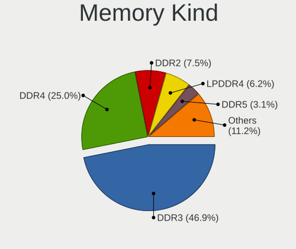

| Kind    | Computers | Percent |
|---------|-----------|---------|
| DDR3    | 75        | 46.88%  |
| DDR4    | 40        | 25%     |
| DDR2    | 12        | 7.5%    |
| LPDDR4  | 10        | 6.25%   |
| DDR5    | 5         | 3.13%   |
| Unknown | 5         | 3.13%   |
| SDRAM   | 4         | 2.5%    |
| LPDDR5  | 4         | 2.5%    |
| LPDDR3  | 2         | 1.25%   |
| DRAM    | 2         | 1.25%   |
| DDR     | 1         | 0.63%   |

Memory Form Factor
------------------

Physical design of the memory module

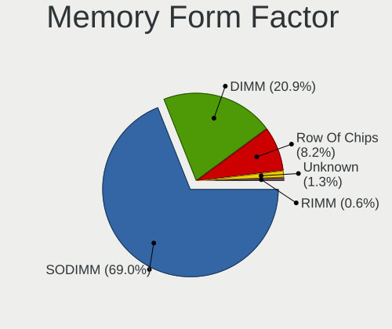

| Name         | Computers | Percent |
|--------------|-----------|---------|
| SODIMM       | 109       | 68.99%  |
| DIMM         | 33        | 20.89%  |
| Row Of Chips | 13        | 8.23%   |
| Unknown      | 2         | 1.27%   |
| RIMM         | 1         | 0.63%   |

Memory Size
-----------

Memory module size

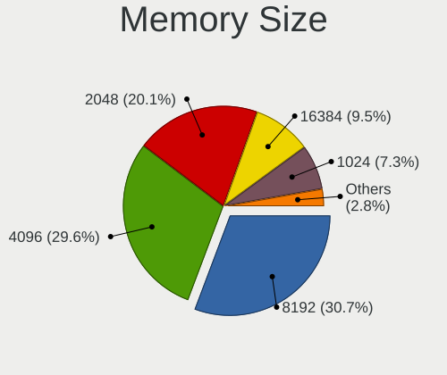

| Size  | Computers | Percent |
|-------|-----------|---------|
| 8192  | 55        | 30.73%  |
| 4096  | 53        | 29.61%  |
| 2048  | 36        | 20.11%  |
| 16384 | 17        | 9.5%    |
| 1024  | 13        | 7.26%   |
| 32768 | 4         | 2.23%   |
| 3072  | 1         | 0.56%   |

Memory Speed
------------

Memory module speed

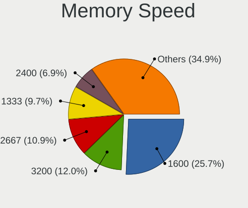

| Speed   | Computers | Percent |
|---------|-----------|---------|
| 1600    | 45        | 25.71%  |
| 3200    | 21        | 12%     |
| 2667    | 19        | 10.86%  |
| 1333    | 17        | 9.71%   |
| 2400    | 12        | 6.86%   |
| 667     | 10        | 5.71%   |
| 2133    | 7         | 4%      |
| 800     | 6         | 3.43%   |
| Unknown | 5         | 2.86%   |
| 6400    | 4         | 2.29%   |
| 5600    | 4         | 2.29%   |
| 1334    | 4         | 2.29%   |
| 1067    | 4         | 2.29%   |
| 1066    | 3         | 1.71%   |
| 3266    | 2         | 1.14%   |
| 1867    | 2         | 1.14%   |
| 50410   | 1         | 0.57%   |
| 8400    | 1         | 0.57%   |
| 4800    | 1         | 0.57%   |
| 4199    | 1         | 0.57%   |
| 3600    | 1         | 0.57%   |
| 3000    | 1         | 0.57%   |
| 2666    | 1         | 0.57%   |
| 2048    | 1         | 0.57%   |
| 975     | 1         | 0.57%   |
| 533     | 1         | 0.57%   |

Printers & scanners
-------------------

Printer Vendor
--------------

Printer device vendors

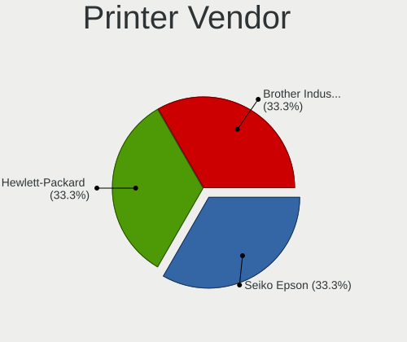

| Vendor             | Computers | Percent |
|--------------------|-----------|---------|
| Seiko Epson        | 1         | 33.33%  |
| Hewlett-Packard    | 1         | 33.33%  |
| Brother Industries | 1         | 33.33%  |

Printer Model
-------------

Printer device models

| Model                   | Computers | Percent |
|-------------------------|-----------|---------|
| Seiko Epson L380 Series | 1         | 33.33%  |
| HP LaserJet P1005       | 1         | 33.33%  |
| Brother HL-2130 series  | 1         | 33.33%  |

Scanner Vendor
--------------

Scanner device vendors

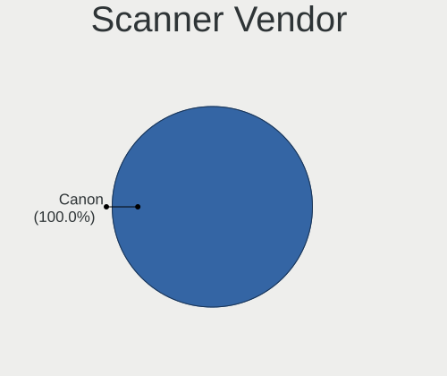

| Vendor | Computers | Percent |
|--------|-----------|---------|
| Canon  | 1         | 100%    |

Scanner Model
-------------

Scanner device models

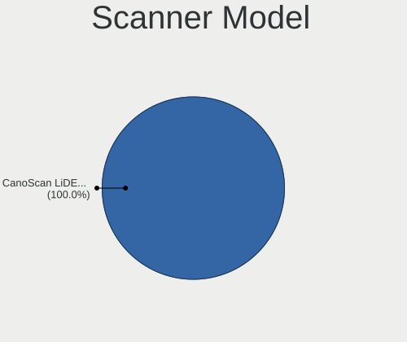

| Model                   | Computers | Percent |
|-------------------------|-----------|---------|
| Canon CanoScan LiDE 210 | 1         | 100%    |

Camera
------

Camera Vendor
-------------

Camera device vendors

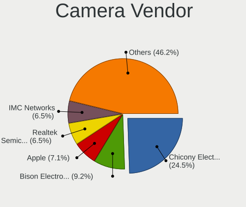

| Vendor                                 | Computers | Percent |
|----------------------------------------|-----------|---------|
| Chicony Electronics                    | 45        | 24.46%  |
| Bison Electronics                      | 17        | 9.24%   |
| Apple                                  | 13        | 7.07%   |
| Realtek Semiconductor                  | 12        | 6.52%   |
| IMC Networks                           | 12        | 6.52%   |
| Cheng Uei Precision Industry (Foxlink) | 12        | 6.52%   |
| Microdia                               | 11        | 5.98%   |
| Quanta                                 | 9         | 4.89%   |
| Suyin                                  | 8         | 4.35%   |
| Sunplus Innovation Technology          | 7         | 3.8%    |
| Syntek                                 | 4         | 2.17%   |
| Silicon Motion                         | 4         | 2.17%   |
| Logitech                               | 4         | 2.17%   |
| Luxvisions Innotech Limited            | 3         | 1.63%   |
| Alcor Micro                            | 3         | 1.63%   |
| Z-Star Microelectronics                | 2         | 1.09%   |
| Samsung Electronics                    | 2         | 1.09%   |
| Lenovo                                 | 2         | 1.09%   |
| icSpring                               | 2         | 1.09%   |
| Sonix Technology                       | 1         | 0.54%   |
| Shine-optics                           | 1         | 0.54%   |
| Ricoh                                  | 1         | 0.54%   |
| Razer USA                              | 1         | 0.54%   |
| OmniVision Technologies                | 1         | 0.54%   |
| Nokia Mobile Phones                    | 1         | 0.54%   |
| Lite-On Technology                     | 1         | 0.54%   |
| Jieli Technology                       | 1         | 0.54%   |
| DigiTech                               | 1         | 0.54%   |
| BillionPixels                          | 1         | 0.54%   |
| ALi                                    | 1         | 0.54%   |
| Acer                                   | 1         | 0.54%   |

Camera Model
------------

Camera device models

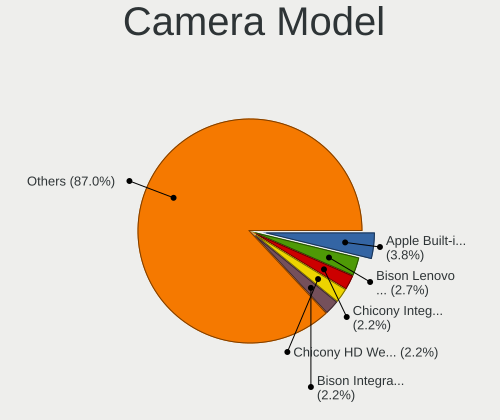

| Model                                                                      | Computers | Percent |
|----------------------------------------------------------------------------|-----------|---------|
| Apple Built-in iSight                                                      | 7         | 3.8%    |
| Bison Lenovo EasyCamera                                                    | 5         | 2.72%   |
| Chicony Integrated Camera                                                  | 4         | 2.17%   |
| Chicony HD WebCam                                                          | 4         | 2.17%   |
| Bison Integrated Camera                                                    | 4         | 2.17%   |
| Apple FaceTime HD Camera                                                   | 4         | 2.17%   |
| Realtek EasyCamera                                                         | 3         | 1.63%   |
| Quanta HD User Facing                                                      | 3         | 1.63%   |
| IMC Networks USB2.0 VGA UVC WebCam                                         | 3         | 1.63%   |
| IMC Networks Integrated Camera                                             | 3         | 1.63%   |
| Chicony VGA WebCam                                                         | 3         | 1.63%   |
| Chicony HP Webcam                                                          | 3         | 1.63%   |
| Chicony Fujitsu Integrated Camera                                          | 3         | 1.63%   |
| Cheng Uei Precision Industry (Foxlink) HP Webcam                           | 3         | 1.63%   |
| Bison EasyCamera                                                           | 3         | 1.63%   |
| Syntek EasyCamera                                                          | 2         | 1.09%   |
| Suyin UVC 0.3M Webcam                                                      | 2         | 1.09%   |
| Suyin Sony Visual Communication Camera                                     | 2         | 1.09%   |
| Suyin Acer/HP Integrated Webcam [CN0314]                                   | 2         | 1.09%   |
| Sunplus Integrated_Webcam_HD                                               | 2         | 1.09%   |
| Sunplus HP HD Webcam [Fixed]                                               | 2         | 1.09%   |
| Samsung Galaxy series, misc. (MTP mode)                                    | 2         | 1.09%   |
| Realtek Acer 640 x 480 laptop camera                                       | 2         | 1.09%   |
| Quanta HD Webcam                                                           | 2         | 1.09%   |
| Microdia Integrated Webcam                                                 | 2         | 1.09%   |
| Logitech Webcam C270                                                       | 2         | 1.09%   |
| Lenovo Integrated Webcam                                                   | 2         | 1.09%   |
| icSpring camera                                                            | 2         | 1.09%   |
| Chicony USB2.0 VGA UVC WebCam                                              | 2         | 1.09%   |
| Chicony HP High Definition 1MP Webcam                                      | 2         | 1.09%   |
| Chicony CKF7063 Webcam (HP)                                                | 2         | 1.09%   |
| Cheng Uei Precision Industry (Foxlink) HP Wide Vision HD Integrated Webcam | 2         | 1.09%   |
| Cheng Uei Precision Industry (Foxlink) HP Truevision HD                    | 2         | 1.09%   |
| Apple FaceTime HD Camera (Built-in)                                        | 2         | 1.09%   |
| Alcor Micro ASUS USB2.0 WebCam                                             | 2         | 1.09%   |
| Z-Star WebCam SCB-0320N                                                    | 1         | 0.54%   |
| Z-Star Webcam                                                              | 1         | 0.54%   |
| Syntek Lenovo EasyCamera                                                   | 1         | 0.54%   |
| Syntek Integrated Camera                                                   | 1         | 0.54%   |
| Suyin HP Truevision HD                                                     | 1         | 0.54%   |

Security
--------

Fingerprint Vendor
------------------

Fingerprint sensor vendors

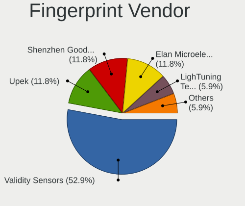

| Vendor                     | Computers | Percent |
|----------------------------|-----------|---------|
| Validity Sensors           | 9         | 52.94%  |
| Upek                       | 2         | 11.76%  |
| Shenzhen Goodix Technology | 2         | 11.76%  |
| Elan Microelectronics      | 2         | 11.76%  |
| LighTuning Technology      | 1         | 5.88%   |
| AuthenTec                  | 1         | 5.88%   |

Fingerprint Model
-----------------

Fingerprint sensor models

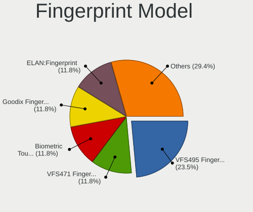

| Model                                                                      | Computers | Percent |
|----------------------------------------------------------------------------|-----------|---------|
| Validity Sensors VFS495 Fingerprint Reader                                 | 4         | 23.53%  |
| Validity Sensors VFS471 Fingerprint Reader                                 | 2         | 11.76%  |
| Upek Biometric Touchchip/Touchstrip Fingerprint Sensor                     | 2         | 11.76%  |
| Shenzhen Goodix  Fingerprint Device                                        | 2         | 11.76%  |
| Elan ELAN:Fingerprint                                                      | 2         | 11.76%  |
| Validity Sensors VFS451 Fingerprint Reader                                 | 1         | 5.88%   |
| Validity Sensors Synaptics VFS7552 Touch Fingerprint Sensor with PurePrint | 1         | 5.88%   |
| Validity Sensors Swipe Fingerprint Sensor                                  | 1         | 5.88%   |
| LighTuning EgisTec Touch Fingerprint Sensor                                | 1         | 5.88%   |
| AuthenTec AES1600                                                          | 1         | 5.88%   |

Chipcard Vendor
---------------

Chipcard module vendors

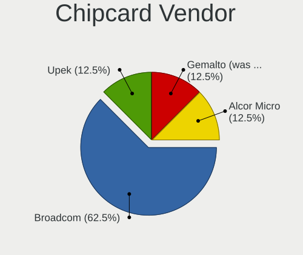

| Vendor                | Computers | Percent |
|-----------------------|-----------|---------|
| Broadcom              | 5         | 62.5%   |
| Upek                  | 1         | 12.5%   |
| Gemalto (was Gemplus) | 1         | 12.5%   |
| Alcor Micro           | 1         | 12.5%   |

Chipcard Model
--------------

Chipcard module models

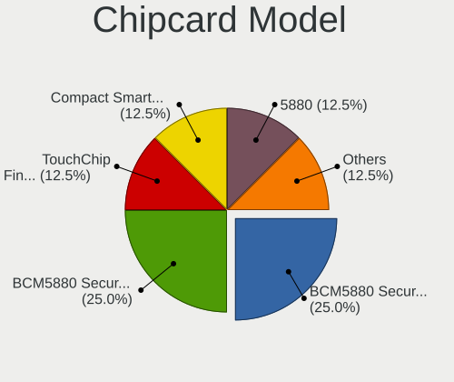

| Model                                                                        | Computers | Percent |
|------------------------------------------------------------------------------|-----------|---------|
| Broadcom BCM5880 Secure Applications Processor with fingerprint swipe sensor | 2         | 25%     |
| Broadcom BCM5880 Secure Applications Processor                               | 2         | 25%     |
| Upek TouchChip Fingerprint Coprocessor (WBF advanced mode)                   | 1         | 12.5%   |
| Gemalto (was Gemplus) Compact Smart Card Reader Writer                       | 1         | 12.5%   |
| Broadcom 5880                                                                | 1         | 12.5%   |
| Alcor Micro AU9540 Smartcard Reader                                          | 1         | 12.5%   |

Unsupported
-----------

Unsupported Devices
-------------------

Total unsupported devices on board

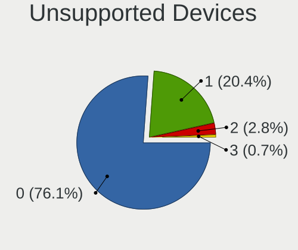

| Total | Computers | Percent |
|-------|-----------|---------|
| 0     | 217       | 76.14%  |
| 1     | 58        | 20.35%  |
| 2     | 8         | 2.81%   |
| 3     | 2         | 0.7%    |

Unsupported Device Types
------------------------

Types of unsupported devices

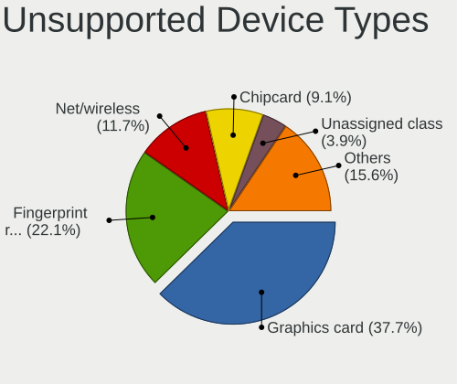

| Type                     | Computers | Percent |
|--------------------------|-----------|---------|
| Graphics card            | 29        | 37.66%  |
| Fingerprint reader       | 17        | 22.08%  |
| Net/wireless             | 9         | 11.69%  |
| Chipcard                 | 7         | 9.09%   |
| Unassigned class         | 3         | 3.9%    |
| Bluetooth                | 3         | 3.9%    |
| Sound                    | 2         | 2.6%    |
| Camera                   | 2         | 2.6%    |
| Net/ethernet             | 1         | 1.3%    |
| Multimedia controller    | 1         | 1.3%    |
| Modem                    | 1         | 1.3%    |
| Communication controller | 1         | 1.3%    |
| Card reader              | 1         | 1.3%    |

