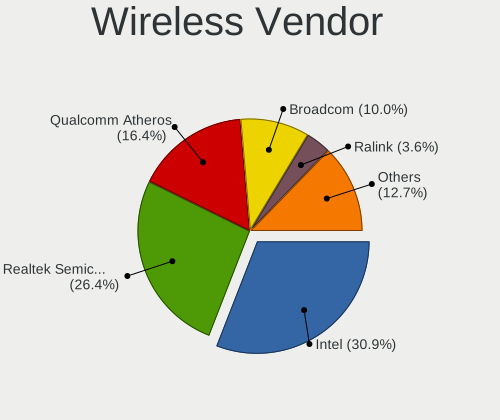
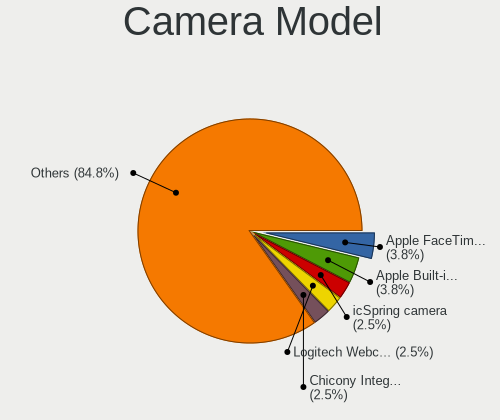

Lubuntu 24.04 - Tested Hardware & Statistics
--------------------------------------------

A project to collect tested hardware configurations for Lubuntu 24.04.

Anyone can contribute to this report by the [hw-probe](https://github.com/linuxhw/hw-probe) tool:

    sudo -E hw-probe -all -upload

Please contribute! Especially if your hardware is rare.

This is a report for all computer types. See also reports for [desktops](/Dist/Lubuntu_24.04/Desktop/README.md) and [notebooks](/Dist/Lubuntu_24.04/Notebook/README.md).

Contents
--------

* [ Test Cases ](#test-cases)

* [ System ](#system)
  - [ Kernel                   ](#kernel)
  - [ Kernel Family            ](#kernel-family)
  - [ Kernel Major Ver.        ](#kernel-major-ver)
  - [ Arch                     ](#arch)
  - [ DE                       ](#de)
  - [ Display Server           ](#display-server)
  - [ Display Manager          ](#display-manager)
  - [ OS Lang                  ](#os-lang)
  - [ Boot Mode                ](#boot-mode)
  - [ Filesystem               ](#filesystem)
  - [ Part. scheme             ](#part-scheme)
  - [ Dual Boot with Linux/BSD ](#dual-boot-with-linuxbsd)
  - [ Dual Boot (Win)          ](#dual-boot-win)

* [ Board ](#board)
  - [ Vendor                   ](#vendor)
  - [ Model                    ](#model)
  - [ Model Family             ](#model-family)
  - [ MFG Year                 ](#mfg-year)
  - [ Form Factor              ](#form-factor)
  - [ Secure Boot              ](#secure-boot)
  - [ Coreboot                 ](#coreboot)
  - [ RAM Size                 ](#ram-size)
  - [ RAM Used                 ](#ram-used)
  - [ Total Drives             ](#total-drives)
  - [ Has CD-ROM               ](#has-cd-rom)
  - [ Has Ethernet             ](#has-ethernet)
  - [ Has WiFi                 ](#has-wifi)
  - [ Has Bluetooth            ](#has-bluetooth)

* [ Location ](#location)
  - [ Country                  ](#country)
  - [ City                     ](#city)

* [ Drives ](#drives)
  - [ Drive Vendor             ](#drive-vendor)
  - [ Drive Model              ](#drive-model)
  - [ HDD Vendor               ](#hdd-vendor)
  - [ SSD Vendor               ](#ssd-vendor)
  - [ Drive Kind               ](#drive-kind)
  - [ Drive Connector          ](#drive-connector)
  - [ Drive Size               ](#drive-size)
  - [ Space Total              ](#space-total)
  - [ Space Used               ](#space-used)
  - [ Malfunc. Drives          ](#malfunc-drives)
  - [ Malfunc. Drive Vendor    ](#malfunc-drive-vendor)
  - [ Malfunc. HDD Vendor      ](#malfunc-hdd-vendor)
  - [ Malfunc. Drive Kind      ](#malfunc-drive-kind)
  - [ Failed Drives            ](#failed-drives)
  - [ Failed Drive Vendor      ](#failed-drive-vendor)
  - [ Drive Status             ](#drive-status)

* [ Storage controller ](#storage-controller)
  - [ Storage Vendor           ](#storage-vendor)
  - [ Storage Model            ](#storage-model)
  - [ Storage Kind             ](#storage-kind)

* [ Processor ](#processor)
  - [ CPU Vendor               ](#cpu-vendor)
  - [ CPU Model                ](#cpu-model)
  - [ CPU Model Family         ](#cpu-model-family)
  - [ CPU Cores                ](#cpu-cores)
  - [ CPU Sockets              ](#cpu-sockets)
  - [ CPU Threads              ](#cpu-threads)
  - [ CPU Op-Modes             ](#cpu-op-modes)
  - [ CPU Microcode            ](#cpu-microcode)
  - [ CPU Microarch            ](#cpu-microarch)

* [ Graphics ](#graphics)
  - [ GPU Vendor               ](#gpu-vendor)
  - [ GPU Model                ](#gpu-model)
  - [ GPU Combo                ](#gpu-combo)
  - [ GPU Driver               ](#gpu-driver)
  - [ GPU Memory               ](#gpu-memory)

* [ Monitor ](#monitor)
  - [ Monitor Vendor           ](#monitor-vendor)
  - [ Monitor Model            ](#monitor-model)
  - [ Monitor Resolution       ](#monitor-resolution)
  - [ Monitor Diagonal         ](#monitor-diagonal)
  - [ Monitor Width            ](#monitor-width)
  - [ Aspect Ratio             ](#aspect-ratio)
  - [ Monitor Area             ](#monitor-area)
  - [ Pixel Density            ](#pixel-density)
  - [ Multiple Monitors        ](#multiple-monitors)

* [ Network ](#network)
  - [ Net Controller Vendor    ](#net-controller-vendor)
  - [ Net Controller Model     ](#net-controller-model)
  - [ Wireless Vendor          ](#wireless-vendor)
  - [ Wireless Model           ](#wireless-model)
  - [ Ethernet Vendor          ](#ethernet-vendor)
  - [ Ethernet Model           ](#ethernet-model)
  - [ Net Controller Kind      ](#net-controller-kind)
  - [ Used Controller          ](#used-controller)
  - [ NICs                     ](#nics)
  - [ IPv6                     ](#ipv6)

* [ Bluetooth ](#bluetooth)
  - [ Bluetooth Vendor         ](#bluetooth-vendor)
  - [ Bluetooth Model          ](#bluetooth-model)

* [ Sound ](#sound)
  - [ Sound Vendor             ](#sound-vendor)
  - [ Sound Model              ](#sound-model)

* [ Memory ](#memory)
  - [ Memory Vendor            ](#memory-vendor)
  - [ Memory Model             ](#memory-model)
  - [ Memory Kind              ](#memory-kind)
  - [ Memory Form Factor       ](#memory-form-factor)
  - [ Memory Size              ](#memory-size)
  - [ Memory Speed             ](#memory-speed)

* [ Printers & scanners ](#printers--scanners)
  - [ Printer Vendor           ](#printer-vendor)
  - [ Printer Model            ](#printer-model)
  - [ Scanner Vendor           ](#scanner-vendor)
  - [ Scanner Model            ](#scanner-model)

* [ Camera ](#camera)
  - [ Camera Vendor            ](#camera-vendor)
  - [ Camera Model             ](#camera-model)

* [ Security ](#security)
  - [ Fingerprint Vendor       ](#fingerprint-vendor)
  - [ Fingerprint Model        ](#fingerprint-model)
  - [ Chipcard Vendor          ](#chipcard-vendor)
  - [ Chipcard Model           ](#chipcard-model)

* [ Unsupported ](#unsupported)
  - [ Unsupported Devices      ](#unsupported-devices)
  - [ Unsupported Device Types ](#unsupported-device-types)

Test Cases
----------

Total: 159

| Vendor        | Model                       | Form-Factor | Probe                                                      | Date         |
|---------------|-----------------------------|-------------|------------------------------------------------------------|--------------|
| MSI           | MS-77311                    | Desktop     | [f7f9b1ae97](https://linux-hardware.org/?probe=f7f9b1ae97) | Jan 04, 2025 |
| ABIT          | AT8 32X                     | Desktop     | [e613a45614](https://linux-hardware.org/?probe=e613a45614) | Jan 03, 2025 |
| HP            | Pavilion g7                 | Notebook    | [5692787b6f](https://linux-hardware.org/?probe=5692787b6f) | Dec 31, 2024 |
| Fujitsu       | LIFEBOOK AH531              | Notebook    | [37872e53dc](https://linux-hardware.org/?probe=37872e53dc) | Dec 30, 2024 |
| Fujitsu       | LIFEBOOK AH531              | Notebook    | [0dc9a2432a](https://linux-hardware.org/?probe=0dc9a2432a) | Dec 30, 2024 |
| ASUSTek       | A78M-A                      | Desktop     | [1c59a39f39](https://linux-hardware.org/?probe=1c59a39f39) | Dec 30, 2024 |
| HP            | Notebook                    | Notebook    | [fb6c3eebe1](https://linux-hardware.org/?probe=fb6c3eebe1) | Dec 29, 2024 |
| Unchartevi... | 6540                        | Notebook    | [1d27092258](https://linux-hardware.org/?probe=1d27092258) | Dec 29, 2024 |
| Lenovo        | SHARKBAY 0B98417 WIN        | Desktop     | [8c5e303e5b](https://linux-hardware.org/?probe=8c5e303e5b) | Dec 27, 2024 |
| Unknown       | Unknown                     | Notebook    | [dae997fee3](https://linux-hardware.org/?probe=dae997fee3) | Dec 26, 2024 |
| Dell          | 0200DY A01                  | Desktop     | [fa349ac11f](https://linux-hardware.org/?probe=fa349ac11f) | Dec 23, 2024 |
| Dell          | Inspiron 1545               | Notebook    | [9cc6330a09](https://linux-hardware.org/?probe=9cc6330a09) | Dec 21, 2024 |
| ASUSTek       | TUF Gaming X570-PLUS        | Desktop     | [19e00fa4e5](https://linux-hardware.org/?probe=19e00fa4e5) | Dec 21, 2024 |
| ASUSTek       | A78M-A                      | Desktop     | [efa5a4e952](https://linux-hardware.org/?probe=efa5a4e952) | Dec 21, 2024 |
| ASUSTek       | X550CL                      | Notebook    | [ca719e1a32](https://linux-hardware.org/?probe=ca719e1a32) | Dec 20, 2024 |
| Lenovo        | SHARKBAY 0B98417 WIN        | Desktop     | [78c7a48933](https://linux-hardware.org/?probe=78c7a48933) | Dec 20, 2024 |
| Lenovo        | IdeaPad 330-15IKB 81FD      | Notebook    | [bc07631f18](https://linux-hardware.org/?probe=bc07631f18) | Dec 18, 2024 |
| ASUSTek       | M5A99X EVO                  | Desktop     | [0f9a0492e2](https://linux-hardware.org/?probe=0f9a0492e2) | Dec 18, 2024 |
| Gigabyte      | B550M S2H                   | Desktop     | [e32011dedf](https://linux-hardware.org/?probe=e32011dedf) | Dec 18, 2024 |
| Lenovo        | IdeaPad S405 9802           | Notebook    | [10b9693723](https://linux-hardware.org/?probe=10b9693723) | Dec 17, 2024 |
| Lenovo        | IdeaPad S405 9802           | Notebook    | [3a61babe21](https://linux-hardware.org/?probe=3a61babe21) | Dec 17, 2024 |
| HP            | EliteBook 835 13 inch G1... | Notebook    | [501650199f](https://linux-hardware.org/?probe=501650199f) | Dec 12, 2024 |
| Unknown       | ROUTER                      | Desktop     | [c6bf9058fa](https://linux-hardware.org/?probe=c6bf9058fa) | Dec 10, 2024 |
| ASUSTek       | M5A88-M                     | Desktop     | [520539e9f6](https://linux-hardware.org/?probe=520539e9f6) | Dec 01, 2024 |
| HP            | Laptop 15-db0xxx            | Notebook    | [469069638e](https://linux-hardware.org/?probe=469069638e) | Dec 01, 2024 |
| Lenovo        | 3722 No DPK                 | All in one  | [ed6a0b64aa](https://linux-hardware.org/?probe=ed6a0b64aa) | Nov 26, 2024 |
| Foxconn       | G31MV/G31MV-K FAB           | Desktop     | [95b6ff9464](https://linux-hardware.org/?probe=95b6ff9464) | Nov 25, 2024 |
| Acer          | AO722                       | Notebook    | [15b4d05c90](https://linux-hardware.org/?probe=15b4d05c90) | Nov 25, 2024 |
| Acer          | AO722                       | Notebook    | [f5300839f0](https://linux-hardware.org/?probe=f5300839f0) | Nov 25, 2024 |
| Apple         | MacBook5,1                  | Notebook    | [c9bc1374b3](https://linux-hardware.org/?probe=c9bc1374b3) | Nov 25, 2024 |
| ASUSTek       | TUF Gaming X570-PLUS        | Desktop     | [1299c66f0d](https://linux-hardware.org/?probe=1299c66f0d) | Nov 24, 2024 |
| Sony          | M730                        | Notebook    | [55d7e62f9d](https://linux-hardware.org/?probe=55d7e62f9d) | Nov 23, 2024 |
| HP            | 097Ch                       | Desktop     | [a95a57c236](https://linux-hardware.org/?probe=a95a57c236) | Nov 22, 2024 |
| HP            | Notebook                    | Notebook    | [bb9e0faf8f](https://linux-hardware.org/?probe=bb9e0faf8f) | Nov 22, 2024 |
| ECS           | RS480-M                     | Desktop     | [5c9a33d3ef](https://linux-hardware.org/?probe=5c9a33d3ef) | Nov 18, 2024 |
| HP            | 1905                        | Desktop     | [603e331581](https://linux-hardware.org/?probe=603e331581) | Nov 17, 2024 |
| Apple         | MacBook5,1                  | Notebook    | [fc4768f63d](https://linux-hardware.org/?probe=fc4768f63d) | Nov 17, 2024 |
| AMI           | Aptio CRB                   | Mini pc     | [61b4034745](https://linux-hardware.org/?probe=61b4034745) | Nov 17, 2024 |
| HP            | 1589                        | Desktop     | [b620b573ed](https://linux-hardware.org/?probe=b620b573ed) | Nov 16, 2024 |
| HP            | ProBook 430 G2              | Notebook    | [ea645a6ae1](https://linux-hardware.org/?probe=ea645a6ae1) | Nov 08, 2024 |
| ADI           | MinnowBoard Turbot          | Desktop     | [bc4cd39271](https://linux-hardware.org/?probe=bc4cd39271) | Nov 05, 2024 |
| Sony          | VPCF132FX                   | Notebook    | [b584189661](https://linux-hardware.org/?probe=b584189661) | Nov 03, 2024 |
| Dell          | 0WJ772                      | Desktop     | [d6dc667160](https://linux-hardware.org/?probe=d6dc667160) | Nov 01, 2024 |
| ASUSTek       | M4N68T-M LE                 | Desktop     | [6403f7199d](https://linux-hardware.org/?probe=6403f7199d) | Oct 29, 2024 |
| Lenovo        | Yoga 300-11IBR 80M1         | Notebook    | [d47c826466](https://linux-hardware.org/?probe=d47c826466) | Oct 28, 2024 |
| Lenovo        | ThinkPad X1 Yoga 3rd 20L... | Convertible | [125ef7ec35](https://linux-hardware.org/?probe=125ef7ec35) | Oct 27, 2024 |
| Toshiba       | Satellite C660              | Notebook    | [11806f6477](https://linux-hardware.org/?probe=11806f6477) | Oct 24, 2024 |
| Dell          | Latitude E5450              | Notebook    | [0465141d52](https://linux-hardware.org/?probe=0465141d52) | Oct 23, 2024 |
| Toshiba       | Satellite P55W-C            | Notebook    | [84c58de68f](https://linux-hardware.org/?probe=84c58de68f) | Oct 23, 2024 |
| Toshiba       | Satellite P55W-C            | Notebook    | [2fbe7927f9](https://linux-hardware.org/?probe=2fbe7927f9) | Oct 23, 2024 |
| Fujitsu       | LIFEBOOK AH531              | Notebook    | [7205fb0b92](https://linux-hardware.org/?probe=7205fb0b92) | Oct 23, 2024 |
| Dell          | Inspiron 1501               | Notebook    | [5ac3420a2b](https://linux-hardware.org/?probe=5ac3420a2b) | Oct 22, 2024 |
| HP            | Pavilion Laptop 15-cs315... | Notebook    | [c61e1c6184](https://linux-hardware.org/?probe=c61e1c6184) | Oct 22, 2024 |
| Pegatron      | EVANS                       | Desktop     | [17c53eb7a7](https://linux-hardware.org/?probe=17c53eb7a7) | Oct 21, 2024 |
| Dell          | Latitude E5450              | Notebook    | [2ec7e21290](https://linux-hardware.org/?probe=2ec7e21290) | Oct 19, 2024 |
| Chuwi         | GemiBook Pro                | Notebook    | [be2a9177cc](https://linux-hardware.org/?probe=be2a9177cc) | Oct 19, 2024 |
| ASUSTek       | Pro WS X570-ACE             | Desktop     | [dd98dbec76](https://linux-hardware.org/?probe=dd98dbec76) | Oct 17, 2024 |
| HP            | Compaq CQ58                 | Notebook    | [129913dcc6](https://linux-hardware.org/?probe=129913dcc6) | Oct 14, 2024 |
| Positivo      | C14CU51                     | Notebook    | [a50a121b61](https://linux-hardware.org/?probe=a50a121b61) | Oct 12, 2024 |
| HP            | 255 G5                      | Notebook    | [062ce32d62](https://linux-hardware.org/?probe=062ce32d62) | Oct 11, 2024 |
| HONOR         | NMH-WCX9                    | Notebook    | [03f4ff2833](https://linux-hardware.org/?probe=03f4ff2833) | Oct 09, 2024 |
| HONOR         | NMH-WCX9                    | Notebook    | [e167d1430c](https://linux-hardware.org/?probe=e167d1430c) | Oct 09, 2024 |
| Samsung       | 370E4K                      | Notebook    | [f87816505c](https://linux-hardware.org/?probe=f87816505c) | Oct 07, 2024 |
| Acer          | Aspire 5735                 | Notebook    | [4c1559410d](https://linux-hardware.org/?probe=4c1559410d) | Oct 06, 2024 |
| Acer          | Aspire 5735                 | Notebook    | [50e1561f7d](https://linux-hardware.org/?probe=50e1561f7d) | Oct 06, 2024 |
| Google        | Rabbid                      | Notebook    | [022398a237](https://linux-hardware.org/?probe=022398a237) | Oct 05, 2024 |
| AMI           | Intel                       | Convertible | [375367c891](https://linux-hardware.org/?probe=375367c891) | Oct 03, 2024 |
| AZW           | MINI S                      | Desktop     | [b08901d4d7](https://linux-hardware.org/?probe=b08901d4d7) | Oct 03, 2024 |
| Apple         | MacBook4,1                  | Notebook    | [1b71a4b0c9](https://linux-hardware.org/?probe=1b71a4b0c9) | Oct 01, 2024 |
| Acer          | Spin SP513-53N              | Convertible | [e0a0689e0e](https://linux-hardware.org/?probe=e0a0689e0e) | Sep 28, 2024 |
| ASUSTek       | X553MA                      | Notebook    | [a96b018191](https://linux-hardware.org/?probe=a96b018191) | Sep 25, 2024 |
| Lenovo        | MAHOBAY                     | Desktop     | [133a8522bd](https://linux-hardware.org/?probe=133a8522bd) | Sep 25, 2024 |
| MicroByte     | ezbook                      | Notebook    | [5b878e7b72](https://linux-hardware.org/?probe=5b878e7b72) | Sep 24, 2024 |
| AZW           | LZX TBD                     | Desktop     | [242bb69a07](https://linux-hardware.org/?probe=242bb69a07) | Sep 22, 2024 |
| HP            | Pavilion 15                 | Notebook    | [617c9c6fd3](https://linux-hardware.org/?probe=617c9c6fd3) | Sep 22, 2024 |
| HP            | Pavilion 15                 | Notebook    | [47d81a32ab](https://linux-hardware.org/?probe=47d81a32ab) | Sep 22, 2024 |
| Lenovo        | IdeaPad Slim 1-14AST-05 ... | Notebook    | [273c5852ff](https://linux-hardware.org/?probe=273c5852ff) | Sep 18, 2024 |
| Dell          | Inspiron 1564               | Notebook    | [e2028cccf6](https://linux-hardware.org/?probe=e2028cccf6) | Sep 14, 2024 |
| AZW           | LZX TBD                     | Desktop     | [555138dd5b](https://linux-hardware.org/?probe=555138dd5b) | Sep 13, 2024 |
| Haier         | ZEB19 V1.1                  | Desktop     | [fc948e0f5d](https://linux-hardware.org/?probe=fc948e0f5d) | Sep 13, 2024 |
| Apple         | MacBookPro8,1               | Notebook    | [606582cd82](https://linux-hardware.org/?probe=606582cd82) | Sep 10, 2024 |
| Complet       | MY8305                      | Notebook    | [fdab3231de](https://linux-hardware.org/?probe=fdab3231de) | Sep 07, 2024 |
| Chuwi         | HeroBook Air                | Notebook    | [09a139dbbe](https://linux-hardware.org/?probe=09a139dbbe) | Sep 04, 2024 |
| Chuwi         | HeroBook Air                | Notebook    | [163bdd4e80](https://linux-hardware.org/?probe=163bdd4e80) | Sep 04, 2024 |
| HP            | 895D                        | Desktop     | [2ffb71ca8d](https://linux-hardware.org/?probe=2ffb71ca8d) | Sep 03, 2024 |
| HP            | 18E9                        | Desktop     | [3cfa598b85](https://linux-hardware.org/?probe=3cfa598b85) | Sep 03, 2024 |
| Acer          | AOD255                      | Notebook    | [3dace1f171](https://linux-hardware.org/?probe=3dace1f171) | Sep 03, 2024 |
| Acer          | AOD255                      | Notebook    | [7d7265c514](https://linux-hardware.org/?probe=7d7265c514) | Sep 03, 2024 |
| HP            | Compaq 6735s                | Notebook    | [ef4b082281](https://linux-hardware.org/?probe=ef4b082281) | Sep 02, 2024 |
| Haier         | ZEB19 V1.1                  | Desktop     | [dd01bca542](https://linux-hardware.org/?probe=dd01bca542) | Sep 01, 2024 |
| ASUSTek       | M5A78L-M/USB3               | Desktop     | [b1b7d3ccd5](https://linux-hardware.org/?probe=b1b7d3ccd5) | Aug 30, 2024 |
| ASUSTek       | TUF Gaming X570-PLUS        | Desktop     | [c37c1fe47f](https://linux-hardware.org/?probe=c37c1fe47f) | Aug 29, 2024 |
| ASUSTek       | TUF Gaming X570-PLUS        | Desktop     | [609fb0b8b9](https://linux-hardware.org/?probe=609fb0b8b9) | Aug 28, 2024 |
| Acer          | Aspire Z5610                | All in one  | [9d826bce47](https://linux-hardware.org/?probe=9d826bce47) | Aug 28, 2024 |
| Haier         | ZEB19 V1.1                  | Desktop     | [f600ce1cc4](https://linux-hardware.org/?probe=f600ce1cc4) | Aug 27, 2024 |
| Lenovo        | ThinkPad L480 20LTS15Q00    | Notebook    | [c7bd2c3d2e](https://linux-hardware.org/?probe=c7bd2c3d2e) | Aug 26, 2024 |
| Apple         | Mac-7BA5B2D9E42DDD94        | Desktop     | [773d5ea3fe](https://linux-hardware.org/?probe=773d5ea3fe) | Aug 26, 2024 |
| AZW           | MINI S                      | Desktop     | [eaafeaecad](https://linux-hardware.org/?probe=eaafeaecad) | Aug 24, 2024 |
| eMachines     | E725                        | Notebook    | [22fba92ec4](https://linux-hardware.org/?probe=22fba92ec4) | Aug 20, 2024 |
| Lenovo        | ThinkPad T61 7658CTO        | Notebook    | [c395b3e28c](https://linux-hardware.org/?probe=c395b3e28c) | Aug 19, 2024 |
| Dell          | 0FDY5C A00                  | Desktop     | [85ce806b0f](https://linux-hardware.org/?probe=85ce806b0f) | Aug 17, 2024 |
| Dell          | XPS MXC062                  | Notebook    | [46f9c80883](https://linux-hardware.org/?probe=46f9c80883) | Aug 16, 2024 |
| Lenovo        | IdeaPad S205 Brazos         | Notebook    | [e40f1ca18f](https://linux-hardware.org/?probe=e40f1ca18f) | Aug 15, 2024 |
| Google        | Zako                        | Desktop     | [cbd6dd35bc](https://linux-hardware.org/?probe=cbd6dd35bc) | Aug 14, 2024 |
| Google        | Zako                        | Desktop     | [c5d4e9a38b](https://linux-hardware.org/?probe=c5d4e9a38b) | Aug 14, 2024 |
| HP            | EliteBook 8440p             | Notebook    | [46e4c79baf](https://linux-hardware.org/?probe=46e4c79baf) | Aug 13, 2024 |
| HP            | EliteBook 8440p             | Notebook    | [4a401d3cf7](https://linux-hardware.org/?probe=4a401d3cf7) | Aug 13, 2024 |
| Gigabyte      | GA-MA69GM-S2H               | Desktop     | [27116cd0ce](https://linux-hardware.org/?probe=27116cd0ce) | Aug 12, 2024 |
| HP            | Notebook                    | Notebook    | [0d521e10c8](https://linux-hardware.org/?probe=0d521e10c8) | Aug 11, 2024 |
| ASUSTek       | X540SA                      | Notebook    | [683c8f3f4b](https://linux-hardware.org/?probe=683c8f3f4b) | Aug 11, 2024 |
| Gigabyte      | P55-USB3                    | Desktop     | [d13ef904ba](https://linux-hardware.org/?probe=d13ef904ba) | Aug 08, 2024 |
| Fujitsu       | D2778-C1 S26361-D2778-C1    | Desktop     | [13bf9126f5](https://linux-hardware.org/?probe=13bf9126f5) | Aug 04, 2024 |
| HP            | Notebook                    | Notebook    | [1a796d1daf](https://linux-hardware.org/?probe=1a796d1daf) | Aug 04, 2024 |
| Acer          | Aspire A515-51              | Notebook    | [edc0e332b2](https://linux-hardware.org/?probe=edc0e332b2) | Aug 01, 2024 |
| Acer          | Aspire A515-51              | Notebook    | [bd658968cf](https://linux-hardware.org/?probe=bd658968cf) | Aug 01, 2024 |
| HP            | Laptop 15-da0xxx            | Notebook    | [ed33f895c9](https://linux-hardware.org/?probe=ed33f895c9) | Jul 28, 2024 |
| Intel         | STCK1A32WFC H67490-303      | Notebook    | [b12d74f728](https://linux-hardware.org/?probe=b12d74f728) | Jul 27, 2024 |
| Acer          | Swift SF113-31              | Notebook    | [6c63a7574e](https://linux-hardware.org/?probe=6c63a7574e) | Jul 26, 2024 |
| PROBOOK       | U SERIES                    | Notebook    | [e9b030a9df](https://linux-hardware.org/?probe=e9b030a9df) | Jul 17, 2024 |
| PROBOOK       | U SERIES                    | Notebook    | [bdc92be04b](https://linux-hardware.org/?probe=bdc92be04b) | Jul 15, 2024 |
| Apple         | MacBookPro9,2               | Notebook    | [e0376fa4fe](https://linux-hardware.org/?probe=e0376fa4fe) | Jul 13, 2024 |
| ASUSTek       | VivoBook 15_ASUS Laptop ... | Notebook    | [64b642a303](https://linux-hardware.org/?probe=64b642a303) | Jul 12, 2024 |
| ASUSTek       | K52JB                       | Notebook    | [d50ec4eed9](https://linux-hardware.org/?probe=d50ec4eed9) | Jul 09, 2024 |
| Packard Be... | EasyNote TE69BM             | Notebook    | [e4f954f464](https://linux-hardware.org/?probe=e4f954f464) | Jul 05, 2024 |
| Unknown       | N10(M1N1)                   | Notebook    | [fc2ca6d762](https://linux-hardware.org/?probe=fc2ca6d762) | Jul 04, 2024 |
| Morshow       | v1.0                        | Mini pc     | [1134367fdd](https://linux-hardware.org/?probe=1134367fdd) | Jul 03, 2024 |
| HP            | 14                          | Notebook    | [f28a807a2e](https://linux-hardware.org/?probe=f28a807a2e) | Jul 01, 2024 |
| HUAWEI        | BOHK-WAX9X                  | Notebook    | [3f56bdc232](https://linux-hardware.org/?probe=3f56bdc232) | Jul 01, 2024 |
| Fujitsu       | D3402-A1 S26361-D3402-A1    | Desktop     | [b76253dea1](https://linux-hardware.org/?probe=b76253dea1) | Jul 01, 2024 |
| ASUSTek       | K52JB                       | Notebook    | [cda7f38058](https://linux-hardware.org/?probe=cda7f38058) | Jun 29, 2024 |
| Lenovo        | IdeaPad L340-15IRH Gamin... | Notebook    | [1da0ed40d4](https://linux-hardware.org/?probe=1da0ed40d4) | Jun 24, 2024 |
| Apple         | MacBookPro8,1               | Notebook    | [2639f09193](https://linux-hardware.org/?probe=2639f09193) | Jun 19, 2024 |
| NU591         | 1.0                         | Desktop     | [c1efde8d4f](https://linux-hardware.org/?probe=c1efde8d4f) | Jun 15, 2024 |
| Samsung       | QX311/QX411/QX412/QX511     | Notebook    | [e37830ceb9](https://linux-hardware.org/?probe=e37830ceb9) | Jun 10, 2024 |
| HP            | ZBook 15 G2                 | Notebook    | [a788fb84c1](https://linux-hardware.org/?probe=a788fb84c1) | Jun 02, 2024 |
| HP            | ZBook 15 G2                 | Notebook    | [60515e0fa6](https://linux-hardware.org/?probe=60515e0fa6) | Jun 02, 2024 |
| MSI           | MPG X570S EDGE MAX WIFI     | Desktop     | [5201ae534c](https://linux-hardware.org/?probe=5201ae534c) | May 28, 2024 |
| Dell          | 042P49 A01                  | Desktop     | [153d7e94c8](https://linux-hardware.org/?probe=153d7e94c8) | May 27, 2024 |
| Dell          | 042P49 A01                  | Desktop     | [3351870e5d](https://linux-hardware.org/?probe=3351870e5d) | May 27, 2024 |
| ODM           | Unknown                     | Notebook    | [d6a98e94b6](https://linux-hardware.org/?probe=d6a98e94b6) | May 27, 2024 |
| Pegatron      | 2AEE                        | Desktop     | [c1b8b9150f](https://linux-hardware.org/?probe=c1b8b9150f) | May 25, 2024 |
| Unknown       | Unknown                     | Tablet      | [5ac8baaef6](https://linux-hardware.org/?probe=5ac8baaef6) | May 24, 2024 |
| HP            | Pavilion Notebook           | Notebook    | [133e970ae7](https://linux-hardware.org/?probe=133e970ae7) | May 23, 2024 |
| Lenovo        | ThinkPad T560 20FJS0XX00    | Notebook    | [11d6470b8b](https://linux-hardware.org/?probe=11d6470b8b) | May 23, 2024 |
| Packard Be... | PT890-8237A                 | Desktop     | [150aa2b8e8](https://linux-hardware.org/?probe=150aa2b8e8) | May 22, 2024 |
| Apple         | MacBookAir1,1               | Notebook    | [8c29382ba8](https://linux-hardware.org/?probe=8c29382ba8) | May 21, 2024 |
| Lenovo        | Bantry CRB NOK              | Desktop     | [a501c1214c](https://linux-hardware.org/?probe=a501c1214c) | May 19, 2024 |
| Lenovo        | Bantry CRB NOK              | Desktop     | [5c2dca5ac4](https://linux-hardware.org/?probe=5c2dca5ac4) | May 19, 2024 |
| Lenovo        | G575 20081                  | Notebook    | [581885ea87](https://linux-hardware.org/?probe=581885ea87) | May 11, 2024 |
| Shenzhen B... | XN116B                      | Notebook    | [47dbcecbd7](https://linux-hardware.org/?probe=47dbcecbd7) | May 04, 2024 |
| HP            | EliteBook 840 G4            | Notebook    | [f9fed717ee](https://linux-hardware.org/?probe=f9fed717ee) | May 03, 2024 |
| Notebook      | W54_W94_W955TU,-T,-C        | Notebook    | [c327d5c1a6](https://linux-hardware.org/?probe=c327d5c1a6) | May 01, 2024 |
| Apple         | MacBookPro5,5               | Notebook    | [2ddfed1c8a](https://linux-hardware.org/?probe=2ddfed1c8a) | May 01, 2024 |
| Lenovo        | G50-45 80E3                 | Notebook    | [a12bc9b719](https://linux-hardware.org/?probe=a12bc9b719) | Apr 28, 2024 |
| ASUSTek       | K53BY                       | Notebook    | [6f6c4b9d68](https://linux-hardware.org/?probe=6f6c4b9d68) | Apr 26, 2024 |
| HP            | Compaq 8710w (GT649PA#AB... | Notebook    | [00f1c96012](https://linux-hardware.org/?probe=00f1c96012) | Apr 26, 2024 |
| HP            | 3031h                       | Desktop     | [1d9c5e06d3](https://linux-hardware.org/?probe=1d9c5e06d3) | Apr 18, 2024 |
| Chuwi         | LarkBox X                   | Mini pc     | [b3bbd8f0a3](https://linux-hardware.org/?probe=b3bbd8f0a3) | Mar 23, 2024 |
| EPoX Compu... | MCP61 Series                | Desktop     | [8028d0a8d1](https://linux-hardware.org/?probe=8028d0a8d1) | Feb 24, 2024 |

System
------

Kernel
------

Version of the Linux kernel

| Version                 | Computers | Percent |
|-------------------------|-----------|---------|
| 6.8.0-31-generic        | 24        | 18.6%   |
| 6.8.0-41-generic        | 23        | 17.83%  |
| 6.8.0-47-generic        | 10        | 7.75%   |
| 6.8.0-36-generic        | 10        | 7.75%   |
| 6.8.0-51-generic        | 9         | 6.98%   |
| 6.8.0-45-generic        | 9         | 6.98%   |
| 6.8.0-40-generic        | 9         | 6.98%   |
| 6.8.0-49-generic        | 6         | 4.65%   |
| 6.8.0-48-generic        | 6         | 4.65%   |
| 6.8.0-44-generic        | 4         | 3.1%    |
| 6.8.0-39-generic        | 3         | 2.33%   |
| 6.8.0-50-lowlatency     | 2         | 1.55%   |
| 6.8.0-41-lowlatency     | 2         | 1.55%   |
| 6.8.0-35-generic        | 2         | 1.55%   |
| 6.9.5-sandy-custom      | 1         | 0.78%   |
| 6.8.0-48-lowlatency     | 1         | 0.78%   |
| 6.8.0-38-generic        | 1         | 0.78%   |
| 6.8.0-32-generic        | 1         | 0.78%   |
| 6.8.0-22-generic        | 1         | 0.78%   |
| 6.8.0-11-generic        | 1         | 0.78%   |
| 6.8.0-1016-oem          | 1         | 0.78%   |
| 6.6.0-14-generic        | 1         | 0.78%   |
| 6.5.0-44-generic        | 1         | 0.78%   |
| 6.12.3-alderlake-custom | 1         | 0.78%   |

Kernel Family
-------------

Linux kernel without a distro release

| Version | Computers | Percent |
|---------|-----------|---------|
| 6.8.0   | 123       | 96.85%  |
| 6.9.5   | 1         | 0.79%   |
| 6.6.0   | 1         | 0.79%   |
| 6.5.0   | 1         | 0.79%   |
| 6.12.3  | 1         | 0.79%   |

Kernel Major Ver.
-----------------

Linux kernel major version

| Version | Computers | Percent |
|---------|-----------|---------|
| 6.8     | 123       | 96.85%  |
| 6.9     | 1         | 0.79%   |
| 6.6     | 1         | 0.79%   |
| 6.5     | 1         | 0.79%   |
| 6.12    | 1         | 0.79%   |

Arch
----

OS architecture (x86_64, i586, etc.)

| Name   | Computers | Percent |
|--------|-----------|---------|
| x86_64 | 127       | 100%    |

DE
--

Desktop Environment

| Name | Computers | Percent |
|------|-----------|---------|
| LXQt | 126       | 99.21%  |
| LXDE | 1         | 0.79%   |

Display Server
--------------

X11 or Wayland

| Name    | Computers | Percent |
|---------|-----------|---------|
| X11     | 120       | 94.49%  |
| Tty     | 5         | 3.94%   |
| Wayland | 2         | 1.57%   |

Display Manager
---------------

SDDM, LightDM, etc.

| Name    | Computers | Percent |
|---------|-----------|---------|
| SDDM    | 101       | 79.53%  |
| Unknown | 21        | 16.54%  |
| LightDM | 2         | 1.57%   |
| GDM3    | 2         | 1.57%   |
| SLiM    | 1         | 0.79%   |

OS Lang
-------

Language

| Lang  | Computers | Percent |
|-------|-----------|---------|
| en_US | 38        | 29.92%  |
| fr_FR | 12        | 9.45%   |
| de_DE | 11        | 8.66%   |
| C     | 10        | 7.87%   |
| it_IT | 9         | 7.09%   |
| pt_BR | 7         | 5.51%   |
| pl_PL | 5         | 3.94%   |
| es_MX | 4         | 3.15%   |
| ru_RU | 3         | 2.36%   |
| fi_FI | 3         | 2.36%   |
| es_AR | 3         | 2.36%   |
| en_GB | 3         | 2.36%   |
| es_ES | 2         | 1.57%   |
| es_CR | 2         | 1.57%   |
| en_CA | 2         | 1.57%   |
| el_GR | 2         | 1.57%   |
| zh_TW | 1         | 0.79%   |
| zh_CN | 1         | 0.79%   |
| tr_TR | 1         | 0.79%   |
| pt_PT | 1         | 0.79%   |
| nl_NL | 1         | 0.79%   |
| et_EE | 1         | 0.79%   |
| es_CL | 1         | 0.79%   |
| en_SG | 1         | 0.79%   |
| en_SE | 1         | 0.79%   |
| en_IN | 1         | 0.79%   |
| en_AU | 1         | 0.79%   |

Boot Mode
---------

EFI or BIOS

| Mode | Computers | Percent |
|------|-----------|---------|
| BIOS | 83        | 65.35%  |
| EFI  | 44        | 34.65%  |

Filesystem
----------

Type of filesystem

| Type    | Computers | Percent |
|---------|-----------|---------|
| Ext4    | 75        | 59.06%  |
| Tmpfs   | 41        | 32.28%  |
| Overlay | 10        | 7.87%   |
| Btrfs   | 1         | 0.79%   |

Part. scheme
------------

Scheme of partitioning

| Type    | Computers | Percent |
|---------|-----------|---------|
| GPT     | 73        | 57.48%  |
| MBR     | 33        | 25.98%  |
| Unknown | 21        | 16.54%  |

Dual Boot with Linux/BSD
------------------------

Hosting more than one Linux/BSD

| Dual boot | Computers | Percent |
|-----------|-----------|---------|
| No        | 113       | 88.98%  |
| Yes       | 14        | 11.02%  |

Dual Boot (Win)
---------------

Hosting Linux and Windows

| Dual boot | Computers | Percent |
|-----------|-----------|---------|
| No        | 92        | 72.44%  |
| Yes       | 35        | 27.56%  |

Board
-----

Vendor
------

Motherboard manufacturer

| Name                | Computers | Percent |
|---------------------|-----------|---------|
| Hewlett-Packard     | 23        | 18.11%  |
| Lenovo              | 16        | 12.6%   |
| ASUSTek Computer    | 14        | 11.02%  |
| Dell                | 9         | 7.09%   |
| Apple               | 7         | 5.51%   |
| Acer                | 7         | 5.51%   |
| Fujitsu             | 4         | 3.15%   |
| Unknown             | 4         | 3.15%   |
| Gigabyte Technology | 3         | 2.36%   |
| Chuwi               | 3         | 2.36%   |
| Toshiba             | 2         | 1.57%   |
| Sony                | 2         | 1.57%   |
| Samsung Electronics | 2         | 1.57%   |
| Pegatron            | 2         | 1.57%   |
| Packard Bell        | 2         | 1.57%   |
| MSI                 | 2         | 1.57%   |
| Google              | 2         | 1.57%   |
| AZW                 | 2         | 1.57%   |
| AMI                 | 2         | 1.57%   |
| Unchartevice        | 1         | 0.79%   |
| PROBOOK             | 1         | 0.79%   |
| Positivo            | 1         | 0.79%   |
| ODM                 | 1         | 0.79%   |
| NU591               | 1         | 0.79%   |
| Notebook            | 1         | 0.79%   |
| Morshow             | 1         | 0.79%   |
| MicroByte           | 1         | 0.79%   |
| Intel               | 1         | 0.79%   |
| HUAWEI              | 1         | 0.79%   |
| HONOR               | 1         | 0.79%   |
| Haier               | 1         | 0.79%   |
| Foxconn             | 1         | 0.79%   |
| EPoX Computer       | 1         | 0.79%   |
| eMachines           | 1         | 0.79%   |
| ECS                 | 1         | 0.79%   |
| Complet             | 1         | 0.79%   |
| ADI                 | 1         | 0.79%   |
| ABIT                | 1         | 0.79%   |

Model
-----

Motherboard model

| Name                                       | Computers | Percent |
|--------------------------------------------|-----------|---------|
| Unknown                                    | 5         | 3.94%   |
| HP Notebook                                | 3         | 2.36%   |
| Fujitsu LIFEBOOK AH531                     | 2         | 1.57%   |
| Dell Latitude E5450                        | 2         | 1.57%   |
| ASUS TUF Gaming X570-PLUS                  | 2         | 1.57%   |
| Apple MacBookPro8,1                        | 2         | 1.57%   |
| Unchartevice 6540                          | 1         | 0.79%   |
| Toshiba Satellite P55W-C                   | 1         | 0.79%   |
| Toshiba Satellite C660                     | 1         | 0.79%   |
| Sony VPCF132FX                             | 1         | 0.79%   |
| Sony M730                                  | 1         | 0.79%   |
| Samsung QX311/QX411/QX412/QX511            | 1         | 0.79%   |
| Samsung 370E4K                             | 1         | 0.79%   |
| PROBOOK U SERIES                           | 1         | 0.79%   |
| Positivo C14CU51                           | 1         | 0.79%   |
| Pegatron WE277AA-ABF p6352fr               | 1         | 0.79%   |
| Pegatron 23-b030                           | 1         | 0.79%   |
| Packard Bell IMEDIA D9111                  | 1         | 0.79%   |
| Packard Bell EasyNote TE69BM               | 1         | 0.79%   |
| NU591 1.0                                  | 1         | 0.79%   |
| Notebook W54_W94_W955TU,-T,-C              | 1         | 0.79%   |
| MSI MS-7D53                                | 1         | 0.79%   |
| MSI B02311                                 | 1         | 0.79%   |
| Morshow Narrow Box Ultra HD Compact v5     | 1         | 0.79%   |
| MicroByte ezbook                           | 1         | 0.79%   |
| Lenovo Yoga 300-11IBR 80M1                 | 1         | 0.79%   |
| Lenovo ThinkPad X1 Yoga 3rd 20LDCTO1WW     | 1         | 0.79%   |
| Lenovo ThinkPad T61 7658CTO                | 1         | 0.79%   |
| Lenovo ThinkPad T560 20FJS0XX00            | 1         | 0.79%   |
| Lenovo ThinkPad L480 20LTS15Q00            | 1         | 0.79%   |
| Lenovo ThinkCentre M93P 10AB000YMX         | 1         | 0.79%   |
| Lenovo ThinkCentre M92z 3311B8G            | 1         | 0.79%   |
| Lenovo ThinkCentre M79 10JAS00P00          | 1         | 0.79%   |
| Lenovo IdeaPad Slim 1-14AST-05 81VS        | 1         | 0.79%   |
| Lenovo IdeaPad S405 9802                   | 1         | 0.79%   |
| Lenovo IdeaPad S205 Brazos                 | 1         | 0.79%   |
| Lenovo IdeaPad L340-15IRH Gaming 81LK      | 1         | 0.79%   |
| Lenovo IdeaPad 330-15IKB 81FD              | 1         | 0.79%   |
| Lenovo IdeaCentre AIO 3 27IMB05 F0EY00K3GE | 1         | 0.79%   |
| Lenovo G575 20081                          | 1         | 0.79%   |

Model Family
------------

Motherboard model prefix

| Name                  | Computers | Percent |
|-----------------------|-----------|---------|
| Lenovo IdeaPad        | 5         | 3.94%   |
| Unknown               | 5         | 3.94%   |
| Lenovo ThinkPad       | 4         | 3.15%   |
| HP Pavilion           | 4         | 3.15%   |
| Dell OptiPlex         | 4         | 3.15%   |
| Lenovo ThinkCentre    | 3         | 2.36%   |
| HP Notebook           | 3         | 2.36%   |
| HP EliteBook          | 3         | 2.36%   |
| HP Compaq             | 3         | 2.36%   |
| Acer Aspire           | 3         | 2.36%   |
| Toshiba Satellite     | 2         | 1.57%   |
| HP Laptop             | 2         | 1.57%   |
| Fujitsu LIFEBOOK      | 2         | 1.57%   |
| Dell Latitude         | 2         | 1.57%   |
| Dell Inspiron         | 2         | 1.57%   |
| ASUS TUF              | 2         | 1.57%   |
| Apple MacBookPro8     | 2         | 1.57%   |
| Unchartevice 6540     | 1         | 0.79%   |
| Sony VPCF132FX        | 1         | 0.79%   |
| Sony M730             | 1         | 0.79%   |
| Samsung QX311         | 1         | 0.79%   |
| Samsung 370E4K        | 1         | 0.79%   |
| PROBOOK U             | 1         | 0.79%   |
| Positivo C14CU51      | 1         | 0.79%   |
| Pegatron WE277AA-ABF  | 1         | 0.79%   |
| Pegatron 23-b030      | 1         | 0.79%   |
| Packard Bell IMEDIA   | 1         | 0.79%   |
| Packard Bell EasyNote | 1         | 0.79%   |
| NU591 1.0             | 1         | 0.79%   |
| Notebook W54          | 1         | 0.79%   |
| MSI MS-7D53           | 1         | 0.79%   |
| MSI B02311            | 1         | 0.79%   |
| Morshow Narrow        | 1         | 0.79%   |
| MicroByte ezbook      | 1         | 0.79%   |
| Lenovo Yoga           | 1         | 0.79%   |
| Lenovo IdeaCentre     | 1         | 0.79%   |
| Lenovo G575           | 1         | 0.79%   |
| Lenovo G50-45         | 1         | 0.79%   |
| Intel STCK1A32WFC     | 1         | 0.79%   |
| HUAWEI BOHK-WAX9X     | 1         | 0.79%   |

MFG Year
--------

Motherboard manufacture year

| Year | Computers | Percent |
|------|-----------|---------|
| 2011 | 14        | 11.02%  |
| 2019 | 11        | 8.66%   |
| 2018 | 11        | 8.66%   |
| 2014 | 9         | 7.09%   |
| 2023 | 8         | 6.3%    |
| 2010 | 8         | 6.3%    |
| 2009 | 8         | 6.3%    |
| 2008 | 8         | 6.3%    |
| 2013 | 7         | 5.51%   |
| 2021 | 6         | 4.72%   |
| 2017 | 6         | 4.72%   |
| 2015 | 5         | 3.94%   |
| 2012 | 5         | 3.94%   |
| 2006 | 5         | 3.94%   |
| 2022 | 4         | 3.15%   |
| 2007 | 4         | 3.15%   |
| 2024 | 3         | 2.36%   |
| 2016 | 3         | 2.36%   |
| 2020 | 2         | 1.57%   |

Form Factor
-----------

Physical design of the computer

| Name        | Computers | Percent |
|-------------|-----------|---------|
| Notebook    | 75        | 59.06%  |
| Desktop     | 43        | 33.86%  |
| Convertible | 3         | 2.36%   |
| Mini pc     | 3         | 2.36%   |
| All in one  | 2         | 1.57%   |
| Tablet      | 1         | 0.79%   |

Secure Boot
-----------

Enabled or disabled

| State    | Computers | Percent |
|----------|-----------|---------|
| Disabled | 117       | 92.13%  |
| Enabled  | 10        | 7.87%   |

Coreboot
--------

Have coreboot on board

| Used | Computers | Percent |
|------|-----------|---------|
| No   | 125       | 98.43%  |
| Yes  | 2         | 1.57%   |

RAM Size
--------

Total RAM memory

| Size in GB  | Computers | Percent |
|-------------|-----------|---------|
| 3.01-4.0    | 35        | 27.34%  |
| 4.01-8.0    | 32        | 25%     |
| 16.01-24.0  | 16        | 12.5%   |
| 1.01-2.0    | 15        | 11.72%  |
| 8.01-16.0   | 10        | 7.81%   |
| 32.01-64.0  | 7         | 5.47%   |
| 2.01-3.0    | 5         | 3.91%   |
| 24.01-32.0  | 4         | 3.13%   |
| 64.01-256.0 | 3         | 2.34%   |
| 0.51-1.0    | 1         | 0.78%   |

RAM Used
--------

Used RAM memory

| Used GB   | Computers | Percent |
|-----------|-----------|---------|
| 1.01-2.0  | 59        | 46.09%  |
| 2.01-3.0  | 31        | 24.22%  |
| 0.51-1.0  | 16        | 12.5%   |
| 3.01-4.0  | 13        | 10.16%  |
| 4.01-8.0  | 7         | 5.47%   |
| 8.01-16.0 | 1         | 0.78%   |
| 0.01-0.5  | 1         | 0.78%   |

Total Drives
------------

Number of drives on board

| Drives | Computers | Percent |
|--------|-----------|---------|
| 1      | 91        | 71.09%  |
| 2      | 20        | 15.63%  |
| 3      | 7         | 5.47%   |
| 4      | 3         | 2.34%   |
| 6      | 2         | 1.56%   |
| 0      | 2         | 1.56%   |
| 11     | 1         | 0.78%   |
| 9      | 1         | 0.78%   |
| 5      | 1         | 0.78%   |

Has CD-ROM
----------

Has CD-ROM on board

| Presented | Computers | Percent |
|-----------|-----------|---------|
| No        | 72        | 56.69%  |
| Yes       | 55        | 43.31%  |

Has Ethernet
------------

Has Ethernet on board

| Presented | Computers | Percent |
|-----------|-----------|---------|
| Yes       | 108       | 85.04%  |
| No        | 19        | 14.96%  |

Has WiFi
--------

Has WiFi module

| Presented | Computers | Percent |
|-----------|-----------|---------|
| Yes       | 104       | 81.89%  |
| No        | 23        | 18.11%  |

Has Bluetooth
-------------

Has Bluetooth module

| Presented | Computers | Percent |
|-----------|-----------|---------|
| Yes       | 70        | 55.12%  |
| No        | 57        | 44.88%  |

Location
--------

Country
-------

Geographic location (country)

| Country            | Computers | Percent |
|--------------------|-----------|---------|
| USA                | 21        | 16.54%  |
| Germany            | 15        | 11.81%  |
| France             | 14        | 11.02%  |
| Italy              | 10        | 7.87%   |
| Brazil             | 8         | 6.3%    |
| Finland            | 5         | 3.94%   |
| Greece             | 4         | 3.15%   |
| Costa Rica         | 4         | 3.15%   |
| Argentina          | 4         | 3.15%   |
| Russia             | 3         | 2.36%   |
| Romania            | 3         | 2.36%   |
| Norway             | 3         | 2.36%   |
| China              | 3         | 2.36%   |
| Australia          | 3         | 2.36%   |
| Turkey             | 2         | 1.57%   |
| Taiwan             | 2         | 1.57%   |
| Poland             | 2         | 1.57%   |
| India              | 2         | 1.57%   |
| Canada             | 2         | 1.57%   |
| UK                 | 1         | 0.79%   |
| Switzerland        | 1         | 0.79%   |
| Sweden             | 1         | 0.79%   |
| Spain              | 1         | 0.79%   |
| Singapore          | 1         | 0.79%   |
| Saudi Arabia       | 1         | 0.79%   |
| Portugal           | 1         | 0.79%   |
| Kazakhstan         | 1         | 0.79%   |
| Japan              | 1         | 0.79%   |
| Indonesia          | 1         | 0.79%   |
| Hungary            | 1         | 0.79%   |
| Estonia            | 1         | 0.79%   |
| Ecuador            | 1         | 0.79%   |
| Dominican Republic | 1         | 0.79%   |
| Czechia            | 1         | 0.79%   |
| Chile              | 1         | 0.79%   |
| Belgium            | 1         | 0.79%   |

City
----

Geographic location (city)

| City                   | Computers | Percent |
|------------------------|-----------|---------|
| Helsinki               | 4         | 3.13%   |
| Grecia                 | 4         | 3.13%   |
| Seattle                | 3         | 2.34%   |
| Thessaloniki           | 2         | 1.56%   |
| Kunming                | 2         | 1.56%   |
| Beijing                | 2         | 1.56%   |
| Aurora                 | 2         | 1.56%   |
| Aachen                 | 2         | 1.56%   |
| Würzburg              | 1         | 0.78%   |
| Wuppertal              | 1         | 0.78%   |
| Wauwatosa              | 1         | 0.78%   |
| Warsaw                 | 1         | 0.78%   |
| Waren                  | 1         | 0.78%   |
| Volos                  | 1         | 0.78%   |
| Vitória               | 1         | 0.78%   |
| Virginia Beach         | 1         | 0.78%   |
| Verona                 | 1         | 0.78%   |
| Varginha               | 1         | 0.78%   |
| Vaasa                  | 1         | 0.78%   |
| Ufa                    | 1         | 0.78%   |
| Turin                  | 1         | 0.78%   |
| Treviso                | 1         | 0.78%   |
| Torre Orsaia           | 1         | 0.78%   |
| Toronto                | 1         | 0.78%   |
| Thiais                 | 1         | 0.78%   |
| Tårnåsen             | 1         | 0.78%   |
| Tandil                 | 1         | 0.78%   |
| Sydney                 | 1         | 0.78%   |
| Strasbourg             | 1         | 0.78%   |
| St Petersburg          | 1         | 0.78%   |
| Smyrna                 | 1         | 0.78%   |
| Slemmestad             | 1         | 0.78%   |
| Skepplanda             | 1         | 0.78%   |
| Singapore              | 1         | 0.78%   |
| Seville                | 1         | 0.78%   |
| Sao Paulo              | 1         | 0.78%   |
| Sao Caetano do Sul     | 1         | 0.78%   |
| Santo Domingo          | 1         | 0.78%   |
| Santiago               | 1         | 0.78%   |
| Sant'Agata Li Battiati | 1         | 0.78%   |

Drives
------

Drive Vendor
------------

Hard drive vendors

| Vendor                    | Computers | Drives | Percent |
|---------------------------|-----------|--------|---------|
| WDC                       | 26        | 35     | 16.05%  |
| Seagate                   | 20        | 27     | 12.35%  |
| Samsung Electronics       | 20        | 26     | 12.35%  |
| Unknown                   | 9         | 9      | 5.56%   |
| Kingston                  | 8         | 8      | 4.94%   |
| Sandisk                   | 7         | 9      | 4.32%   |
| Hitachi                   | 6         | 6      | 3.7%    |
| Intel                     | 4         | 4      | 2.47%   |
| Fujitsu                   | 4         | 4      | 2.47%   |
| China                     | 4         | 4      | 2.47%   |
| Toshiba                   | 3         | 3      | 1.85%   |
| HGST                      | 3         | 3      | 1.85%   |
| Crucial                   | 3         | 3      | 1.85%   |
| SSK                       | 2         | 2      | 1.23%   |
| Micron/Crucial Technology | 2         | 3      | 1.23%   |
| Intenso                   | 2         | 4      | 1.23%   |
| Unknown                   | 2         | 2      | 1.23%   |
| Zheino                    | 1         | 1      | 0.62%   |
| YMTC                      | 1         | 1      | 0.62%   |
| WD MediaMax               | 1         | 1      | 0.62%   |
| Verbatim                  | 1         | 1      | 0.62%   |
| Timetec                   | 1         | 1      | 0.62%   |
| Synology                  | 1         | 1      | 0.62%   |
| STEC                      | 1         | 1      | 0.62%   |
| SK hynix                  | 1         | 1      | 0.62%   |
| Silicon Motion            | 1         | 1      | 0.62%   |
| ShiJi                     | 1         | 1      | 0.62%   |
| Realtek Semiconductor     | 1         | 1      | 0.62%   |
| Realtek                   | 1         | 1      | 0.62%   |
| PNY                       | 1         | 1      | 0.62%   |
| Phison Electronics        | 1         | 3      | 0.62%   |
| Phison                    | 1         | 1      | 0.62%   |
| ORICO                     | 1         | 1      | 0.62%   |
| NT-512                    | 1         | 1      | 0.62%   |
| Netac                     | 1         | 1      | 0.62%   |
| Micron Technology         | 1         | 1      | 0.62%   |
| LITEON                    | 1         | 1      | 0.62%   |
| Lexar                     | 1         | 1      | 0.62%   |
| Leven                     | 1         | 1      | 0.62%   |
| KingSpec                  | 1         | 1      | 0.62%   |

Drive Model
-----------

Hard drive models

| Model                                                | Computers | Percent |
|------------------------------------------------------|-----------|---------|
| Samsung NVMe SSD Controller SM981/PM981/PM983 512GB  | 5         | 2.73%   |
| Kingston SA400S37480G 480GB SSD                      | 3         | 1.64%   |
| Unknown MMC Card  64GB                               | 2         | 1.09%   |
| Unknown MMC Card  128GB                              | 2         | 1.09%   |
| SSK Disk 1TB                                         | 2         | 1.09%   |
| Seagate ST9500325AS 500GB                            | 2         | 1.09%   |
| Seagate ST4000VN008-2DR166 4TB                       | 2         | 1.09%   |
| Seagate ST3500418AS 500GB                            | 2         | 1.09%   |
| Seagate ST14000NM0121 14TB                           | 2         | 1.09%   |
| Samsung NVMe SSD Controller PM9A1/PM9A3/980PRO 512GB | 2         | 1.09%   |
| Samsung HD103SJ 1TB                                  | 2         | 1.09%   |
| Micron/Crucial CT500P5SSD8 500GB                     | 2         | 1.09%   |
| Kingston SV300S37A120G 120GB SSD                     | 2         | 1.09%   |
| Kingston SA400S37120G 120GB SSD                      | 2         | 1.09%   |
| Intel SSDSC2MH250A2 250GB                            | 2         | 1.09%   |
| HGST HTS545050A7E680 500GB                           | 2         | 1.09%   |
| Unknown                                              | 2         | 1.09%   |
| Zheino CHN 18ZIF001M 128 128GB                       | 1         | 0.55%   |
| YMTC PC005 512GB                                     | 1         | 0.55%   |
| WDC WDS500G2B0A 500GB SSD                            | 1         | 0.55%   |
| WDC WD800JD-75JNC0 80GB                              | 1         | 0.55%   |
| WDC WD6400AAKS-65A7B2 640GB                          | 1         | 0.55%   |
| WDC WD5001AALS-00L3B2 500GB                          | 1         | 0.55%   |
| WDC WD5000LPCX-80VHAT1 500GB                         | 1         | 0.55%   |
| WDC WD5000LPCX-24C6HT0 500GB                         | 1         | 0.55%   |
| WDC WD5000AZLX-00CL5A0 500GB                         | 1         | 0.55%   |
| WDC WD5000AVDS-63U7B1 500GB                          | 1         | 0.55%   |
| WDC WD40EZRZ-22GXCB0 4TB                             | 1         | 0.55%   |
| WDC WD40 EFAX-68JH4N1 4TB                            | 1         | 0.55%   |
| WDC WD3200JS-55PDB0 320GB                            | 1         | 0.55%   |
| WDC WD3200BPVT-22JJ5T0 320GB                         | 1         | 0.55%   |
| WDC WD3200BEVT-22ZCT0 320GB                          | 1         | 0.55%   |
| WDC WD30EZRX-00D8PB0 3TB                             | 1         | 0.55%   |
| WDC WD30EFRX-68EUZN0 3TB                             | 1         | 0.55%   |
| WDC WD2500BEVT-75ZCT2 250GB                          | 1         | 0.55%   |
| WDC WD2500BEVT-22ZCT0 250GB                          | 1         | 0.55%   |
| WDC WD20EZRX-00D8PB0 2TB                             | 1         | 0.55%   |
| WDC WD20EZAZ-00GGJB0 2TB                             | 1         | 0.55%   |
| WDC WD2002FAEX-007BA0 2TB                            | 1         | 0.55%   |
| WDC WD2000JD-19HBB0 196GB                            | 1         | 0.55%   |

HDD Vendor
----------

Hard disk drive vendors

| Vendor              | Computers | Drives | Percent |
|---------------------|-----------|--------|---------|
| WDC                 | 23        | 32     | 34.85%  |
| Seagate             | 20        | 27     | 30.3%   |
| Hitachi             | 6         | 6      | 9.09%   |
| Fujitsu             | 4         | 4      | 6.06%   |
| Toshiba             | 3         | 3      | 4.55%   |
| HGST                | 3         | 3      | 4.55%   |
| Samsung Electronics | 2         | 3      | 3.03%   |
| WD MediaMax         | 1         | 1      | 1.52%   |
| Synology            | 1         | 1      | 1.52%   |
| Hewlett-Packard     | 1         | 4      | 1.52%   |
| ExcelStor           | 1         | 1      | 1.52%   |
| ASMT                | 1         | 1      | 1.52%   |

SSD Vendor
----------

Solid state drive vendors

| Vendor              | Computers | Drives | Percent |
|---------------------|-----------|--------|---------|
| Kingston            | 8         | 8      | 13.79%  |
| Samsung Electronics | 7         | 7      | 12.07%  |
| SanDisk             | 4         | 5      | 6.9%    |
| China               | 4         | 4      | 6.9%    |
| Intel               | 3         | 3      | 5.17%   |
| Crucial             | 3         | 3      | 5.17%   |
| Intenso             | 2         | 4      | 3.45%   |
| Zheino              | 1         | 1      | 1.72%   |
| WDC                 | 1         | 1      | 1.72%   |
| Verbatim            | 1         | 1      | 1.72%   |
| Unknown             | 1         | 1      | 1.72%   |
| Timetec             | 1         | 1      | 1.72%   |
| STEC                | 1         | 1      | 1.72%   |
| SK hynix            | 1         | 1      | 1.72%   |
| ShiJi               | 1         | 1      | 1.72%   |
| PNY                 | 1         | 1      | 1.72%   |
| Phison              | 1         | 1      | 1.72%   |
| NT-512              | 1         | 1      | 1.72%   |
| Netac               | 1         | 1      | 1.72%   |
| LITEON              | 1         | 1      | 1.72%   |
| Lexar               | 1         | 1      | 1.72%   |
| Leven               | 1         | 1      | 1.72%   |
| KingSpec            | 1         | 1      | 1.72%   |
| Inland              | 1         | 1      | 1.72%   |
| Great               | 1         | 2      | 1.72%   |
| Gigabyte Technology | 1         | 1      | 1.72%   |
| FIKWOT              | 1         | 1      | 1.72%   |
| EVM                 | 1         | 1      | 1.72%   |
| EDILOCA             | 1         | 1      | 1.72%   |
| Cavalry             | 1         | 1      | 1.72%   |
| ASMedia             | 1         | 1      | 1.72%   |
| Apple               | 1         | 1      | 1.72%   |
| Apacer              | 1         | 1      | 1.72%   |
| A-DATA Technology   | 1         | 1      | 1.72%   |

Drive Kind
----------

HDD or SSD

| Kind    | Computers | Drives | Percent |
|---------|-----------|--------|---------|
| HDD     | 59        | 86     | 39.33%  |
| SSD     | 56        | 62     | 37.33%  |
| NVMe    | 23        | 35     | 15.33%  |
| MMC     | 10        | 10     | 6.67%   |
| Unknown | 2         | 2      | 1.33%   |

Drive Connector
---------------

SATA, SAS, NVMe, etc.

| Type | Computers | Drives | Percent |
|------|-----------|--------|---------|
| SATA | 105       | 145    | 73.94%  |
| NVMe | 21        | 32     | 14.79%  |
| MMC  | 10        | 10     | 7.04%   |
| SAS  | 6         | 8      | 4.23%   |

Drive Size
----------

Size of hard drive

| Size in TB | Computers | Drives | Percent |
|------------|-----------|--------|---------|
| 0.01-0.5   | 80        | 90     | 64%     |
| 0.51-1.0   | 30        | 33     | 24%     |
| 1.01-2.0   | 6         | 9      | 4.8%    |
| 3.01-4.0   | 5         | 9      | 4%      |
| 10.01-20.0 | 3         | 4      | 2.4%    |
| 2.01-3.0   | 1         | 3      | 0.8%    |

Space Total
-----------

Amount of disk space available on the file system

| Size in GB     | Computers | Percent |
|----------------|-----------|---------|
| 101-250        | 42        | 33.07%  |
| 251-500        | 35        | 27.56%  |
| 51-100         | 15        | 11.81%  |
| 21-50          | 9         | 7.09%   |
| 501-1000       | 7         | 5.51%   |
| More than 3000 | 6         | 4.72%   |
| 1-20           | 6         | 4.72%   |
| 1001-2000      | 5         | 3.94%   |
| Unknown        | 2         | 1.57%   |

Space Used
----------

Amount of used disk space

| Used GB        | Computers | Percent |
|----------------|-----------|---------|
| 1-20           | 72        | 56.25%  |
| 21-50          | 28        | 21.88%  |
| 101-250        | 12        | 9.38%   |
| 51-100         | 6         | 4.69%   |
| More than 3000 | 4         | 3.13%   |
| 251-500        | 2         | 1.56%   |
| 501-1000       | 2         | 1.56%   |
| Unknown        | 2         | 1.56%   |

Malfunc. Drives
---------------

Drive models with a malfunction

| Model                              | Computers | Drives | Percent |
|------------------------------------|-----------|--------|---------|
| WDC WD1600BEVT-22A23T0 160GB       | 1         | 1      | 6.67%   |
| Toshiba MK3265GSX 320GB            | 1         | 1      | 6.67%   |
| SK hynix SC210 2.5 7MM 512GB SSD   | 1         | 1      | 6.67%   |
| Seagate ST9500325AS 500GB          | 1         | 1      | 6.67%   |
| Seagate ST910021AS 100GB           | 1         | 1      | 6.67%   |
| Seagate ST500LM030-2E717D 500GB    | 1         | 1      | 6.67%   |
| Seagate ST500DM002-1SB10A 500GB    | 1         | 1      | 6.67%   |
| Seagate ST31000528AS 1TB           | 1         | 1      | 6.67%   |
| Seagate ST31000524AS 1TB           | 1         | 1      | 6.67%   |
| Seagate ST1000VM002-1CT162 1TB     | 1         | 1      | 6.67%   |
| Seagate ST1000LM024 HN-M101MBB 1TB | 1         | 1      | 6.67%   |
| Hitachi HTS541680J9SA00 80GB       | 1         | 1      | 6.67%   |
| HGST HTS545050A7E680 500GB         | 1         | 1      | 6.67%   |
| ExcelStor Technology J8160S 165GB  | 1         | 1      | 6.67%   |
| China G521N256GB                   | 1         | 1      | 6.67%   |

Malfunc. Drive Vendor
---------------------

Vendors of faulty drives

| Vendor    | Computers | Drives | Percent |
|-----------|-----------|--------|---------|
| Seagate   | 7         | 8      | 50%     |
| WDC       | 1         | 1      | 7.14%   |
| Toshiba   | 1         | 1      | 7.14%   |
| SK hynix  | 1         | 1      | 7.14%   |
| Hitachi   | 1         | 1      | 7.14%   |
| HGST      | 1         | 1      | 7.14%   |
| ExcelStor | 1         | 1      | 7.14%   |
| China     | 1         | 1      | 7.14%   |

Malfunc. HDD Vendor
-------------------

Vendors of faulty HDD drives

| Vendor    | Computers | Drives | Percent |
|-----------|-----------|--------|---------|
| Seagate   | 7         | 8      | 58.33%  |
| WDC       | 1         | 1      | 8.33%   |
| Toshiba   | 1         | 1      | 8.33%   |
| Hitachi   | 1         | 1      | 8.33%   |
| HGST      | 1         | 1      | 8.33%   |
| ExcelStor | 1         | 1      | 8.33%   |

Malfunc. Drive Kind
-------------------

Kinds of faulty drives

| Kind | Computers | Drives | Percent |
|------|-----------|--------|---------|
| HDD  | 12        | 13     | 85.71%  |
| SSD  | 2         | 2      | 14.29%  |

Failed Drives
-------------

Failed drive models

Zero info for selected period =(

Failed Drive Vendor
-------------------

Failed drive vendors

Zero info for selected period =(

Drive Status
------------

Number of failed and malfunc. drives

| Status   | Computers | Drives | Percent |
|----------|-----------|--------|---------|
| Detected | 66        | 116    | 50%     |
| Works    | 52        | 64     | 39.39%  |
| Malfunc  | 14        | 15     | 10.61%  |

Storage controller
------------------

Storage Vendor
--------------

Storage controller vendors

| Vendor                      | Computers | Percent |
|-----------------------------|-----------|---------|
| Intel                       | 82        | 54.3%   |
| AMD                         | 30        | 19.87%  |
| Samsung Electronics         | 13        | 8.61%   |
| SanDisk                     | 4         | 2.65%   |
| Nvidia                      | 4         | 2.65%   |
| ASMedia Technology          | 3         | 1.99%   |
| Zhaoxin                     | 2         | 1.32%   |
| Micron/Crucial Technology   | 2         | 1.32%   |
| JMicron Technology          | 2         | 1.32%   |
| Yangtze Memory Technologies | 1         | 0.66%   |
| VIA Technologies            | 1         | 0.66%   |
| ULi Electronics             | 1         | 0.66%   |
| Silicon Motion              | 1         | 0.66%   |
| Silicon Image               | 1         | 0.66%   |
| Realtek Semiconductor       | 1         | 0.66%   |
| Phison Electronics          | 1         | 0.66%   |
| Micron Technology           | 1         | 0.66%   |
| Broadcom / LSI              | 1         | 0.66%   |

Storage Model
-------------

Storage controller models

| Model                                                                            | Computers | Percent |
|----------------------------------------------------------------------------------|-----------|---------|
| AMD FCH SATA Controller [AHCI mode]                                              | 16        | 8.89%   |
| Intel Celeron/Pentium Silver Processor SATA Controller                           | 7         | 3.89%   |
| AMD SB7x0/SB8x0/SB9x0 SATA Controller [AHCI mode]                                | 7         | 3.89%   |
| Samsung NVMe SSD Controller SM981/PM981/PM983                                    | 6         | 3.33%   |
| Intel Sunrise Point-LP SATA Controller [AHCI mode]                               | 6         | 3.33%   |
| Intel 6 Series/C200 Series Chipset Family 6 port Mobile SATA AHCI Controller     | 6         | 3.33%   |
| Intel Atom Processor E3800 Series SATA AHCI Controller                           | 5         | 2.78%   |
| Samsung NVMe SSD Controller PM9A1/PM9A3/980PRO                                   | 4         | 2.22%   |
| Intel Wildcat Point-LP SATA Controller [AHCI Mode]                               | 4         | 2.22%   |
| Intel 82801HM/HEM (ICH8M/ICH8M-E) SATA Controller [AHCI mode]                    | 4         | 2.22%   |
| Intel 82801HM/HEM (ICH8M/ICH8M-E) IDE Controller                                 | 4         | 2.22%   |
| Intel 8 Series/C220 Series Chipset Family 6-port SATA Controller 1 [AHCI mode]   | 4         | 2.22%   |
| AMD SB7x0/SB8x0/SB9x0 IDE Controller                                             | 4         | 2.22%   |
| Intel Celeron N3350/Pentium N4200/Atom E3900 Series SATA AHCI Controller         | 3         | 1.67%   |
| Intel Atom/Celeron/Pentium Processor x5-E8000/J3xxx/N3xxx Series SATA Controller | 3         | 1.67%   |
| Intel 82801JI (ICH10 Family) SATA AHCI Controller                                | 3         | 1.67%   |
| Intel 7 Series Chipset Family 6-port SATA Controller [AHCI mode]                 | 3         | 1.67%   |
| Intel 5 Series/3400 Series Chipset 6 port SATA AHCI Controller                   | 3         | 1.67%   |
| Intel 5 Series/3400 Series Chipset 4 port SATA AHCI Controller                   | 3         | 1.67%   |
| ASMedia ASM1061/ASM1062 Serial ATA Controller                                    | 3         | 1.67%   |
| AMD SB600 Non-Raid-5 SATA                                                        | 3         | 1.67%   |
| AMD SB600 IDE                                                                    | 3         | 1.67%   |
| Zhaoxin ZX-100/ZX-200/KX-6000/KX-6000G/KH-40000/KX-7000 StorX AHCI Controller    | 2         | 1.11%   |
| SanDisk Ultra 3D / WD PC SN530, IX SN530, Blue SN550 NVMe SSD (DRAM-less)        | 2         | 1.11%   |
| Samsung NVMe SSD Controller 980 (DRAM-less)                                      | 2         | 1.11%   |
| Nvidia MCP79 AHCI Controller                                                     | 2         | 1.11%   |
| Nvidia MCP61 SATA Controller                                                     | 2         | 1.11%   |
| Nvidia MCP61 IDE                                                                 | 2         | 1.11%   |
| Micron/Crucial P5 NVMe PCIe SSD[SlashP5]                                         | 2         | 1.11%   |
| Intel SATA Controller [RAID mode]                                                | 2         | 1.11%   |
| Intel NM10/ICH7 Family SATA Controller [IDE mode]                                | 2         | 1.11%   |
| Intel Jasper Lake SATA AHCI Controller                                           | 2         | 1.11%   |
| Intel Alder Lake-N SATA AHCI Controller                                          | 2         | 1.11%   |
| Intel 82801IBM/IEM (ICH9M/ICH9M-E) 4 port SATA Controller [AHCI mode]            | 2         | 1.11%   |
| Intel 82801FB/FW (ICH6/ICH6W) SATA Controller                                    | 2         | 1.11%   |
| Intel 82801FB/FBM/FR/FW/FRW (ICH6 Family) IDE Controller                         | 2         | 1.11%   |
| Intel 82801 Mobile SATA Controller [RAID mode]                                   | 2         | 1.11%   |
| Intel 8 Series SATA Controller 1 [AHCI mode]                                     | 2         | 1.11%   |
| Intel 4 Series Chipset PT IDER Controller                                        | 2         | 1.11%   |
| AMD SB7x0/SB8x0/SB9x0 SATA Controller [IDE mode]                                 | 2         | 1.11%   |

Storage Kind
------------

Kind of storage controller (IDE, SATA, NVMe, SAS, ...)

| Kind | Computers | Percent |
|------|-----------|---------|
| SATA | 107       | 66.46%  |
| IDE  | 25        | 15.53%  |
| NVMe | 21        | 13.04%  |
| RAID | 7         | 4.35%   |
| SAS  | 1         | 0.62%   |

Processor
---------

CPU Vendor
----------

Processor vendors

| Vendor       | Computers | Percent |
|--------------|-----------|---------|
| Intel        | 89        | 70.08%  |
| AMD          | 36        | 28.35%  |
| CentaurHauls | 2         | 1.57%   |

CPU Model
---------

Processor models

| Model                                       | Computers | Percent |
|---------------------------------------------|-----------|---------|
| Intel N100                                  | 3         | 2.36%   |
| Intel Celeron N4000 CPU @ 1.10GHz           | 3         | 2.36%   |
| Intel Celeron CPU N3350 @ 1.10GHz           | 3         | 2.36%   |
| AMD Ryzen 5 3600 6-Core Processor           | 3         | 2.36%   |
| Intel Pentium CPU N3700 @ 1.60GHz           | 2         | 1.57%   |
| Intel Core i7-5600U CPU @ 2.60GHz           | 2         | 1.57%   |
| Intel Core i5-2430M CPU @ 2.40GHz           | 2         | 1.57%   |
| Intel Core i5-2410M CPU @ 2.30GHz           | 2         | 1.57%   |
| Intel Core 2 Duo CPU E7500 @ 2.93GHz        | 2         | 1.57%   |
| Intel Celeron N5100 @ 1.10GHz               | 2         | 1.57%   |
| Intel Celeron N4020 CPU @ 1.10GHz           | 2         | 1.57%   |
| Intel Celeron CPU N2840 @ 2.16GHz           | 2         | 1.57%   |
| AMD E-450 APU with Radeon HD Graphics       | 2         | 1.57%   |
| Intel Xeon CPU X5670 @ 2.93GHz              | 1         | 0.79%   |
| Intel Xeon CPU X 000 @ 3.47GHz              | 1         | 0.79%   |
| Intel Xeon CPU E5-2650 v2 @ 2.60GHz         | 1         | 0.79%   |
| Intel Xeon CPU E3-1241 v3 @ 3.50GHz         | 1         | 0.79%   |
| Intel Pentium Dual-Core CPU T4300 @ 2.10GHz | 1         | 0.79%   |
| Intel Pentium Dual-Core CPU E5300 @ 2.60GHz | 1         | 0.79%   |
| Intel Pentium Dual CPU T3400 @ 2.16GHz      | 1         | 0.79%   |
| Intel Pentium Dual CPU E2160 @ 1.80GHz      | 1         | 0.79%   |
| Intel Pentium Dual CPU E2140 @ 1.60GHz      | 1         | 0.79%   |
| Intel Pentium CPU N4200 @ 1.10GHz           | 1         | 0.79%   |
| Intel Pentium 4 CPU 3.40GHz                 | 1         | 0.79%   |
| Intel Pentium 3805U @ 1.90GHz               | 1         | 0.79%   |
| Intel Core i7-8550U CPU @ 1.80GHz           | 1         | 0.79%   |
| Intel Core i7-7500U CPU @ 2.70GHz           | 1         | 0.79%   |
| Intel Core i7-6600U CPU @ 2.60GHz           | 1         | 0.79%   |
| Intel Core i7-6500U CPU @ 2.50GHz           | 1         | 0.79%   |
| Intel Core i7-4910MQ CPU @ 2.90GHz          | 1         | 0.79%   |
| Intel Core i7-4600U CPU @ 2.10GHz           | 1         | 0.79%   |
| Intel Core i7-3520M CPU @ 2.90GHz           | 1         | 0.79%   |
| Intel Core i7-2640M CPU @ 2.80GHz           | 1         | 0.79%   |
| Intel Core i7 CPU Q 740 @ 1.73GHz           | 1         | 0.79%   |
| Intel Core i7 CPU M 620 @ 2.67GHz           | 1         | 0.79%   |
| Intel Core i7 CPU 860 @ 2.80GHz             | 1         | 0.79%   |
| Intel Core i5-9300HF CPU @ 2.40GHz          | 1         | 0.79%   |
| Intel Core i5-8350U CPU @ 1.70GHz           | 1         | 0.79%   |
| Intel Core i5-8265U CPU @ 1.60GHz           | 1         | 0.79%   |
| Intel Core i5-6600 CPU @ 3.30GHz            | 1         | 0.79%   |

CPU Model Family
----------------

Processor model prefix

| Model                   | Computers | Percent |
|-------------------------|-----------|---------|
| Intel Celeron           | 21        | 16.54%  |
| Intel Core i5           | 15        | 11.81%  |
| Intel Core i7           | 13        | 10.24%  |
| Intel Core i3           | 9         | 7.09%   |
| Intel Core 2 Duo        | 9         | 7.09%   |
| Other                   | 6         | 4.72%   |
| AMD Ryzen 5             | 5         | 3.94%   |
| Intel Xeon              | 4         | 3.15%   |
| Intel Pentium           | 4         | 3.15%   |
| AMD E                   | 4         | 3.15%   |
| AMD A4                  | 4         | 3.15%   |
| Intel Pentium Dual      | 3         | 2.36%   |
| Intel Atom              | 3         | 2.36%   |
| Intel Pentium Dual-Core | 2         | 1.57%   |
| AMD Ryzen 9             | 2         | 1.57%   |
| AMD FX                  | 2         | 1.57%   |
| AMD E1                  | 2         | 1.57%   |
| AMD Athlon 64 X2        | 2         | 1.57%   |
| AMD A6                  | 2         | 1.57%   |
| AMD A10                 | 2         | 1.57%   |
| Intel Pentium 4         | 1         | 0.79%   |
| Intel Core 2            | 1         | 0.79%   |
| AMD Sempron             | 1         | 0.79%   |
| AMD Ryzen 7 PRO         | 1         | 0.79%   |
| AMD Ryzen 3             | 1         | 0.79%   |
| AMD Phenom II X6        | 1         | 0.79%   |
| AMD Dual Core Opteron   | 1         | 0.79%   |
| AMD C-50                | 1         | 0.79%   |
| AMD Athlon Neo          | 1         | 0.79%   |
| AMD Athlon II X4        | 1         | 0.79%   |
| AMD Athlon II X2        | 1         | 0.79%   |
| AMD Athlon 64           | 1         | 0.79%   |
| AMD A8                  | 1         | 0.79%   |

CPU Cores
---------

Number of processor cores

| Number | Computers | Percent |
|--------|-----------|---------|
| 2      | 73        | 57.48%  |
| 4      | 32        | 25.2%   |
| 1      | 9         | 7.09%   |
| 6      | 6         | 4.72%   |
| 16     | 2         | 1.57%   |
| 12     | 2         | 1.57%   |
| 8      | 2         | 1.57%   |
| 3      | 1         | 0.79%   |

CPU Sockets
-----------

Number of sockets

| Number | Computers | Percent |
|--------|-----------|---------|
| 1      | 126       | 99.21%  |
| 2      | 1         | 0.79%   |

CPU Threads
-----------

Threads per core (Hyper-Threading)

| Number | Computers | Percent |
|--------|-----------|---------|
| 1      | 72        | 56.69%  |
| 2      | 55        | 43.31%  |

CPU Op-Modes
------------

CPU Operation Modes (32-bit, 64-bit)

| Op mode        | Computers | Percent |
|----------------|-----------|---------|
| 32-bit, 64-bit | 127       | 100%    |

CPU Microcode
-------------

Microcode number

| Number  | Computers | Percent |
|---------|-----------|---------|
| Unknown | 127       | 100%    |

CPU Microarch
-------------

Microarchitecture

| Name             | Computers | Percent |
|------------------|-----------|---------|
| Silvermont       | 10        | 7.87%   |
| Core             | 8         | 6.3%    |
| Penryn           | 7         | 5.51%   |
| KabyLake         | 7         | 5.51%   |
| Goldmont plus    | 7         | 5.51%   |
| Westmere         | 6         | 4.72%   |
| SandyBridge      | 6         | 4.72%   |
| IvyBridge        | 6         | 4.72%   |
| Haswell          | 6         | 4.72%   |
| K8 Hammer        | 5         | 3.94%   |
| Broadwell        | 5         | 3.94%   |
| Bobcat           | 5         | 3.94%   |
| Skylake          | 4         | 3.15%   |
| Goldmont         | 4         | 3.15%   |
| Unknown          | 4         | 3.15%   |
| Zen 2            | 3         | 2.36%   |
| Puma             | 3         | 2.36%   |
| Piledriver       | 3         | 2.36%   |
| K10              | 3         | 2.36%   |
| Gracemont        | 3         | 2.36%   |
| Excavator        | 3         | 2.36%   |
| Zen+             | 2         | 1.57%   |
| Zen 3            | 2         | 1.57%   |
| Tremont          | 2         | 1.57%   |
| NetBurst         | 2         | 1.57%   |
| Nehalem          | 2         | 1.57%   |
| Bulldozer        | 2         | 1.57%   |
| Steamroller      | 1         | 0.79%   |
| K8 & K10 hybrid  | 1         | 0.79%   |
| Jaguar           | 1         | 0.79%   |
| IceLake          | 1         | 0.79%   |
| CometLake        | 1         | 0.79%   |
| Bonnell          | 1         | 0.79%   |
| Alderlake Hybrid | 1         | 0.79%   |

Graphics
--------

GPU Vendor
----------

Vendors of graphics cards

| Vendor  | Computers | Percent |
|---------|-----------|---------|
| Intel   | 73        | 55.73%  |
| AMD     | 37        | 28.24%  |
| Nvidia  | 19        | 14.5%   |
| Zhaoxin | 2         | 1.53%   |

GPU Model
---------

Graphics card models

| Model                                                                                    | Computers | Percent |
|------------------------------------------------------------------------------------------|-----------|---------|
| Intel GeminiLake [UHD Graphics 600]                                                      | 7         | 4.9%    |
| Intel Atom Processor Z36xxx/Z37xxx Series Graphics & Display                             | 6         | 4.2%    |
| Intel 2nd Generation Core Processor Family Integrated Graphics Controller                | 6         | 4.2%    |
| Intel Mobile GM965/GL960 Integrated Graphics Controller (secondary)                      | 4         | 2.8%    |
| Intel Mobile GM965/GL960 Integrated Graphics Controller (primary)                        | 4         | 2.8%    |
| Intel HD Graphics 5500                                                                   | 4         | 2.8%    |
| Intel Atom/Celeron/Pentium Processor x5-E8000/J3xxx/N3xxx Integrated Graphics Controller | 4         | 2.8%    |
| Intel UHD Graphics 620                                                                   | 3         | 2.1%    |
| Intel HD Graphics 500                                                                    | 3         | 2.1%    |
| Intel Alder Lake-N [UHD Graphics]                                                        | 3         | 2.1%    |
| Intel 3rd Gen Core processor Graphics Controller                                         | 3         | 2.1%    |
| AMD Seymour [Radeon HD 6400M/7400M Series]                                               | 3         | 2.1%    |
| Zhaoxin KX-6000 C-960 GPU                                                                | 2         | 1.4%    |
| Nvidia GT218 [GeForce 210]                                                               | 2         | 1.4%    |
| Nvidia C79 [GeForce 9400M]                                                               | 2         | 1.4%    |
| Intel Xeon E3-1200 v2/3rd Gen Core processor Graphics Controller                         | 2         | 1.4%    |
| Intel Skylake GT2 [HD Graphics 520]                                                      | 2         | 1.4%    |
| Intel Mobile 4 Series Chipset Integrated Graphics Controller                             | 2         | 1.4%    |
| Intel JasperLake [UHD Graphics]                                                          | 2         | 1.4%    |
| Intel HD Graphics 620                                                                    | 2         | 1.4%    |
| Intel HD Graphics 530                                                                    | 2         | 1.4%    |
| Intel Haswell-ULT Integrated Graphics Controller                                         | 2         | 1.4%    |
| Intel Core Processor Integrated Graphics Controller                                      | 2         | 1.4%    |
| Intel 4 Series Chipset Integrated Graphics Controller                                    | 2         | 1.4%    |
| AMD Wrestler [Radeon HD 6320]                                                            | 2         | 1.4%    |
| AMD Wrestler [Radeon HD 6310]                                                            | 2         | 1.4%    |
| AMD Topaz XT [Radeon R7 M260/M265 / M340/M360 / M440/M445 / 530/535 / 620/625 Mobile]    | 2         | 1.4%    |
| AMD Stoney [Radeon R2/R3/R4/R5 Graphics]                                                 | 2         | 1.4%    |
| AMD RV710/M92 [Mobility Radeon HD 4530/4570/5145/530v/540v/545v]                         | 2         | 1.4%    |
| AMD Picasso/Raven 2 [Radeon Vega Series / Radeon Vega Mobile Series]                     | 2         | 1.4%    |
| AMD Navi 21 [Radeon RX 6800/6800 XT / 6900 XT]                                           | 2         | 1.4%    |
| AMD Mullins [Radeon R4/R5 Graphics]                                                      | 2         | 1.4%    |
| Nvidia TU116 [GeForce GTX 1660 SUPER]                                                    | 1         | 0.7%    |
| Nvidia TU106 [GeForce RTX 2060 Rev. A]                                                   | 1         | 0.7%    |
| Nvidia GT218M [NVS 3100M]                                                                | 1         | 0.7%    |
| Nvidia GT218M [GeForce 310M]                                                             | 1         | 0.7%    |
| Nvidia GT218 [GeForce 8400 GS Rev. 3]                                                    | 1         | 0.7%    |
| Nvidia GT218 [GeForce 405]                                                               | 1         | 0.7%    |
| Nvidia GP107M [GeForce GTX 1050 3 GB Max-Q]                                              | 1         | 0.7%    |
| Nvidia GP107GL [Quadro P620]                                                             | 1         | 0.7%    |

GPU Combo
---------

Combinations of graphics cards

| Name           | Computers | Percent |
|----------------|-----------|---------|
| 1 x Intel      | 65        | 51.18%  |
| 1 x AMD        | 29        | 22.83%  |
| 1 x Nvidia     | 16        | 12.6%   |
| 2 x AMD        | 7         | 5.51%   |
| 2 x Intel      | 3         | 2.36%   |
| Intel + Nvidia | 3         | 2.36%   |
| 1 x Zhaoxin    | 2         | 1.57%   |
| Other          | 1         | 0.79%   |
| Intel + AMD    | 1         | 0.79%   |

GPU Driver
----------

Free vs proprietary

| Driver      | Computers | Percent |
|-------------|-----------|---------|
| Free        | 113       | 88.98%  |
| Unknown     | 10        | 7.87%   |
| Proprietary | 4         | 3.15%   |

GPU Memory
----------

Total video memory

| Size in GB | Computers | Percent |
|------------|-----------|---------|
| Unknown    | 101       | 79.53%  |
| 0.01-0.5   | 14        | 11.02%  |
| 0.51-1.0   | 6         | 4.72%   |
| 1.01-2.0   | 3         | 2.36%   |
| 5.01-6.0   | 1         | 0.79%   |
| 2.01-3.0   | 1         | 0.79%   |
| 8.01-16.0  | 1         | 0.79%   |

Monitor
-------

Monitor Vendor
--------------

Monitor vendors

| Vendor                  | Computers | Percent |
|-------------------------|-----------|---------|
| BOE                     | 16        | 12.6%   |
| AU Optronics            | 13        | 10.24%  |
| Samsung Electronics     | 11        | 8.66%   |
| LG Display              | 11        | 8.66%   |
| Chimei Innolux          | 9         | 7.09%   |
| Dell                    | 7         | 5.51%   |
| Apple                   | 7         | 5.51%   |
| Lenovo                  | 5         | 3.94%   |
| Ancor Communications    | 5         | 3.94%   |
| Hewlett-Packard         | 4         | 3.15%   |
| Philips                 | 3         | 2.36%   |
| PANDA                   | 3         | 2.36%   |
| Goldstar                | 3         | 2.36%   |
| Acer                    | 3         | 2.36%   |
| Unknown                 | 2         | 1.57%   |
| Sharp                   | 2         | 1.57%   |
| Medion                  | 2         | 1.57%   |
| Chi Mei Optoelectronics | 2         | 1.57%   |
| AOC                     | 2         | 1.57%   |
| Sceptre Tech            | 1         | 0.79%   |
| RTK                     | 1         | 0.79%   |
| MTD                     | 1         | 0.79%   |
| MStar                   | 1         | 0.79%   |
| LG Philips              | 1         | 0.79%   |
| KNH                     | 1         | 0.79%   |
| INNOCN                  | 1         | 0.79%   |
| InfoVision              | 1         | 0.79%   |
| Iiyama                  | 1         | 0.79%   |
| HKC                     | 1         | 0.79%   |
| HannStar                | 1         | 0.79%   |
| Fujitsu Siemens         | 1         | 0.79%   |
| Eizo                    | 1         | 0.79%   |
| CPT                     | 1         | 0.79%   |
| Compal                  | 1         | 0.79%   |
| CHR                     | 1         | 0.79%   |
| ASUSTek Computer        | 1         | 0.79%   |

Monitor Model
-------------

Monitor models

| Model                                                                    | Computers | Percent |
|--------------------------------------------------------------------------|-----------|---------|
| Chimei Innolux LCD Monitor CMN15CA 1366x768 344x193mm 15.5-inch          | 3         | 2.34%   |
| Unknown LCD Monitor FFFF 2288x1287 2550x2550mm 142.0-inch                | 2         | 1.56%   |
| LG Display LCD Monitor LGD02DC 1366x768 344x194mm 15.5-inch              | 2         | 1.56%   |
| Dell S2721QS DELA198 3840x2160 597x336mm 27.0-inch                       | 2         | 1.56%   |
| Chi Mei Optoelectronics LCD Monitor CMO15A7 1366x768 344x193mm 15.5-inch | 2         | 1.56%   |
| BOE LCD Monitor BOE06A4 1366x768 344x194mm 15.5-inch                     | 2         | 1.56%   |
| Apple LCD Monitor APP9CC5 1280x800 286x179mm 13.3-inch                   | 2         | 1.56%   |
| Sharp LQ133M1JW08 SHP1425 1920x1080 294x165mm 13.3-inch                  | 1         | 0.78%   |
| Sharp LCD Monitor SHP1447 1920x1080 294x165mm 13.3-inch                  | 1         | 0.78%   |
| Sceptre Tech Sceptre X9WG-NagaV SPT1999 1440x900 370x220mm 16.9-inch     | 1         | 0.78%   |
| Samsung Electronics SyncMaster SAM0565 1440x900 428x255mm 19.6-inch      | 1         | 0.78%   |
| Samsung Electronics SyncMaster SAM03D0 1440x900 410x257mm 19.1-inch      | 1         | 0.78%   |
| Samsung Electronics SyncMaster SAM036D 1920x1080                         | 1         | 0.78%   |
| Samsung Electronics SyncMaster SAM010B 1280x1024 338x270mm 17.0-inch     | 1         | 0.78%   |
| Samsung Electronics S27C31x SAM7312 1920x1080 597x336mm 27.0-inch        | 1         | 0.78%   |
| Samsung Electronics LS32AG32x SAM71DE 1920x1080 698x393mm 31.5-inch      | 1         | 0.78%   |
| Samsung Electronics LCD Monitor SEC3449 1366x768 309x174mm 14.0-inch     | 1         | 0.78%   |
| Samsung Electronics LCD Monitor SDC4C48 1920x1080 239x134mm 10.8-inch    | 1         | 0.78%   |
| Samsung Electronics LCD Monitor SDC4651 1366x768 344x194mm 15.5-inch     | 1         | 0.78%   |
| Samsung Electronics LCD Monitor SAM71B4 3840x2160 1110x620mm 50.1-inch   | 1         | 0.78%   |
| Samsung Electronics LCD Monitor SAM0DF6 3840x2160 890x500mm 40.2-inch    | 1         | 0.78%   |
| RTK '' RTK0101 2160x1440 470x280mm 21.5-inch                             | 1         | 0.78%   |
| Philips PHL 278E1 PHLC217 3840x2160 597x336mm 27.0-inch                  | 1         | 0.78%   |
| Philips PHL 275V8 PHLC293 2560x1440 597x336mm 27.0-inch                  | 1         | 0.78%   |
| Philips PHL 223V5 PHLC0CF 1920x1080 480x270mm 21.7-inch                  | 1         | 0.78%   |
| PANDA LM133LF5L01 NCP0020 1920x1080 294x165mm 13.3-inch                  | 1         | 0.78%   |
| PANDA LM133LF1L02 NCP0019 1920x1080 294x165mm 13.3-inch                  | 1         | 0.78%   |
| PANDA LM116LF3L01 NCP000A 1920x1080 256x144mm 11.6-inch                  | 1         | 0.78%   |
| MTD LCD Monitor MTD0001 1280x800 303x190mm 14.1-inch                     | 1         | 0.78%   |
| MStar Demo MST0030 1920x1080 708x398mm 32.0-inch                         | 1         | 0.78%   |
| Medion MD20581 MED369A 1920x1080 597x336mm 27.0-inch                     | 1         | 0.78%   |
| Medion MD 20430 MED36A2 1920x1080 521x293mm 23.5-inch                    | 1         | 0.78%   |
| LG Philips LP154WX4-TLAB LPL3D01 1280x800 331x207mm 15.4-inch            | 1         | 0.78%   |
| LG Display LCD Monitor LGD0470 1920x1080 345x194mm 15.6-inch             | 1         | 0.78%   |
| LG Display LCD Monitor LGD046F 1920x1080 344x194mm 15.5-inch             | 1         | 0.78%   |
| LG Display LCD Monitor LGD046D 1920x1080 309x174mm 14.0-inch             | 1         | 0.78%   |
| LG Display LCD Monitor LGD0468 1366x768 344x194mm 15.5-inch              | 1         | 0.78%   |
| LG Display LCD Monitor LGD0430 1366x768 345x194mm 15.6-inch              | 1         | 0.78%   |
| LG Display LCD Monitor LGD0354 1366x768 293x165mm 13.2-inch              | 1         | 0.78%   |
| LG Display LCD Monitor LGD033A 1366x768 340x190mm 15.3-inch              | 1         | 0.78%   |

Monitor Resolution
------------------

Monitor screen resolution

| Resolution         | Computers | Percent |
|--------------------|-----------|---------|
| 1920x1080 (FHD)    | 41        | 34.17%  |
| 1366x768 (WXGA)    | 35        | 29.17%  |
| 1280x800 (WXGA)    | 12        | 10%     |
| 3840x2160 (4K)     | 9         | 7.5%    |
| 1440x900 (WXGA+)   | 5         | 4.17%   |
| 1600x900 (HD+)     | 3         | 2.5%    |
| 1280x1024 (SXGA)   | 3         | 2.5%    |
| 3440x1440          | 2         | 1.67%   |
| 2560x1440 (QHD)    | 2         | 1.67%   |
| 2288x1287          | 2         | 1.67%   |
| 2160x1440          | 2         | 1.67%   |
| 1920x1200 (WUXGA)  | 1         | 0.83%   |
| 1680x1050 (WSXGA+) | 1         | 0.83%   |
| 1024x768 (XGA)     | 1         | 0.83%   |
| 1024x600           | 1         | 0.83%   |

Monitor Diagonal
----------------

Diagonal size in inches

| Inches  | Computers | Percent |
|---------|-----------|---------|
| 15      | 36        | 28.35%  |
| 13      | 20        | 15.75%  |
| 27      | 12        | 9.45%   |
| 24      | 10        | 7.87%   |
| 14      | 9         | 7.09%   |
| 19      | 6         | 4.72%   |
| 21      | 5         | 3.94%   |
| 23      | 4         | 3.15%   |
| 17      | 4         | 3.15%   |
| 11      | 4         | 3.15%   |
| 18      | 3         | 2.36%   |
| 142     | 2         | 1.57%   |
| 84      | 2         | 1.57%   |
| 34      | 2         | 1.57%   |
| 52      | 1         | 0.79%   |
| 49      | 1         | 0.79%   |
| 31      | 1         | 0.79%   |
| 26      | 1         | 0.79%   |
| 20      | 1         | 0.79%   |
| 12      | 1         | 0.79%   |
| 10      | 1         | 0.79%   |
| Unknown | 1         | 0.79%   |

Monitor Width
-------------

Physical width

| Width in mm    | Computers | Percent |
|----------------|-----------|---------|
| 301-350        | 53        | 42.74%  |
| 501-600        | 23        | 18.55%  |
| 201-300        | 20        | 16.13%  |
| 401-500        | 13        | 10.48%  |
| 351-400        | 4         | 3.23%   |
| More than 2000 | 2         | 1.61%   |
| 701-800        | 2         | 1.61%   |
| 601-700        | 2         | 1.61%   |
| 1501-2000      | 2         | 1.61%   |
| 1001-1500      | 2         | 1.61%   |
| Unknown        | 1         | 0.81%   |

Aspect Ratio
------------

Proportional relationship between the width and the height

| Ratio | Computers | Percent |
|-------|-----------|---------|
| 16/9  | 88        | 74.58%  |
| 16/10 | 19        | 16.1%   |
| 5/4   | 4         | 3.39%   |
| 21/9  | 2         | 1.69%   |
| 1.00  | 2         | 1.69%   |
| 4/3   | 1         | 0.85%   |
| 32/9  | 1         | 0.85%   |
| 3/2   | 1         | 0.85%   |

Monitor Area
------------

Area in inch²

| Area in inch² | Computers | Percent |
|----------------|-----------|---------|
| 101-110        | 35        | 27.78%  |
| 81-90          | 20        | 15.87%  |
| 201-250        | 14        | 11.11%  |
| 301-350        | 13        | 10.32%  |
| 71-80          | 9         | 7.14%   |
| 151-200        | 8         | 6.35%   |
| More than 1000 | 5         | 3.97%   |
| 51-60          | 4         | 3.17%   |
| 251-300        | 4         | 3.17%   |
| 141-150        | 4         | 3.17%   |
| 351-500        | 3         | 2.38%   |
| 121-130        | 2         | 1.59%   |
| 61-70          | 1         | 0.79%   |
| 41-50          | 1         | 0.79%   |
| 501-1000       | 1         | 0.79%   |
| 91-100         | 1         | 0.79%   |
| Unknown        | 1         | 0.79%   |

Pixel Density
-------------

Pixels per inch

| Density | Computers | Percent |
|---------|-----------|---------|
| 101-120 | 48        | 38.71%  |
| 51-100  | 40        | 32.26%  |
| 121-160 | 20        | 16.13%  |
| 161-240 | 11        | 8.87%   |
| 1-50    | 4         | 3.23%   |
| Unknown | 1         | 0.81%   |

Multiple Monitors
-----------------

Total monitors connected

| Total | Computers | Percent |
|-------|-----------|---------|
| 1     | 113       | 88.28%  |
| 2     | 11        | 8.59%   |
| 0     | 3         | 2.34%   |
| 3     | 1         | 0.78%   |

Network
-------

Net Controller Vendor
---------------------

Controller vendors

| Vendor                   | Computers | Percent |
|--------------------------|-----------|---------|
| Realtek Semiconductor    | 78        | 39.8%   |
| Intel                    | 51        | 26.02%  |
| Qualcomm Atheros         | 20        | 10.2%   |
| Broadcom                 | 11        | 5.61%   |
| Ralink                   | 4         | 2.04%   |
| Marvell Technology Group | 4         | 2.04%   |
| TP-Link                  | 3         | 1.53%   |
| Nvidia                   | 3         | 1.53%   |
| NetGear                  | 2         | 1.02%   |
| MediaTek                 | 2         | 1.02%   |
| Edimax Technology        | 2         | 1.02%   |
| DisplayLink              | 2         | 1.02%   |
| Broadcom Limited         | 2         | 1.02%   |
| Xiaomi                   | 1         | 0.51%   |
| Sierra Wireless          | 1         | 0.51%   |
| Samsung Electronics      | 1         | 0.51%   |
| Ralink Technology        | 1         | 0.51%   |
| Qualcomm                 | 1         | 0.51%   |
| Motorola PCS             | 1         | 0.51%   |
| LSI                      | 1         | 0.51%   |
| JMicron Technology       | 1         | 0.51%   |
| Dresden Elektronik       | 1         | 0.51%   |
| D-Link                   | 1         | 0.51%   |
| Belkin Components        | 1         | 0.51%   |
| ASIX Electronics         | 1         | 0.51%   |

Net Controller Model
--------------------

Controller models

| Model                                                                  | Computers | Percent |
|------------------------------------------------------------------------|-----------|---------|
| Realtek RTL8111/8168/8211/8411 PCI Express Gigabit Ethernet Controller | 44        | 18.64%  |
| Realtek RTL810xE PCI Express Fast Ethernet controller                  | 18        | 7.63%   |
| Intel Wireless 7265                                                    | 8         | 3.39%   |
| Realtek RTL8723BE PCIe Wireless Network Adapter                        | 5         | 2.12%   |
| Qualcomm Atheros QCA9565 / AR9565 Wireless Network Adapter             | 5         | 2.12%   |
| Qualcomm Atheros AR9285 Wireless Network Adapter (PCI-Express)         | 5         | 2.12%   |
| Realtek RTL8821CE 802.11ac PCIe Wireless Network Adapter               | 3         | 1.27%   |
| Realtek RTL8188EUS 802.11n Wireless Network Adapter                    | 3         | 1.27%   |
| Realtek RTL8153 Gigabit Ethernet Adapter                               | 3         | 1.27%   |
| Intel Wi-Fi 5(802.11ac) Wireless-AC 9x6x [Thunder Peak]                | 3         | 1.27%   |
| Intel I211 Gigabit Network Connection                                  | 3         | 1.27%   |
| Intel Ethernet Connection I217-LM                                      | 3         | 1.27%   |
| Broadcom NetXtreme BCM57765 Gigabit Ethernet PCIe                      | 3         | 1.27%   |
| Broadcom BCM4331 802.11a/b/g/n                                         | 3         | 1.27%   |
| Broadcom BCM4322 802.11a/b/g/n Wireless LAN Controller                 | 3         | 1.27%   |
| Realtek RTL88x2bu [AC1200 Techkey]                                     | 2         | 0.85%   |
| Realtek RTL8822CE 802.11ac PCIe Wireless Network Adapter               | 2         | 0.85%   |
| Realtek RTL8723DE Wireless Network Adapter                             | 2         | 0.85%   |
| Realtek RTL8191SEvB Wireless LAN Controller                            | 2         | 0.85%   |
| Realtek RTL8187B Wireless 802.11g 54Mbps Network Adapter               | 2         | 0.85%   |
| Realtek RTL8125 2.5GbE Controller                                      | 2         | 0.85%   |
| Realtek RTL-8100/8101L/8139 PCI Fast Ethernet Adapter                  | 2         | 0.85%   |
| Realtek 802.11n WLAN Adapter                                           | 2         | 0.85%   |
| Realtek 802.11ac NIC                                                   | 2         | 0.85%   |
| Qualcomm Atheros QCA9377 802.11ac Wireless Network Adapter             | 2         | 0.85%   |
| Qualcomm Atheros AR9485 Wireless Network Adapter                       | 2         | 0.85%   |
| Qualcomm Atheros AR8152 v2.0 Fast Ethernet                             | 2         | 0.85%   |
| Nvidia MCP79 Ethernet                                                  | 2         | 0.85%   |
| Intel Wireless 8265 / 8275                                             | 2         | 0.85%   |
| Intel Wireless 7260                                                    | 2         | 0.85%   |
| Intel Wireless 3165                                                    | 2         | 0.85%   |
| Intel Wireless 3160                                                    | 2         | 0.85%   |
| Intel PRO/Wireless 3945ABG [Golan] Network Connection                  | 2         | 0.85%   |
| Intel Ethernet Connection (4) I219-V                                   | 2         | 0.85%   |
| Intel Ethernet Connection (3) I218-LM                                  | 2         | 0.85%   |
| Intel CNVi: Wi-Fi                                                      | 2         | 0.85%   |
| Intel 82579LM Gigabit Network Connection (Lewisville)                  | 2         | 0.85%   |
| Intel 82567LM-3 Gigabit Network Connection                             | 2         | 0.85%   |
| Xiaomi Mi/Redmi series (RNDIS)                                         | 1         | 0.42%   |
| TP-Link TL-WN823N v2/v3 [Realtek RTL8192EU]                            | 1         | 0.42%   |

Wireless Vendor
---------------

Wireless vendors

| Vendor                | Computers | Percent |
|-----------------------|-----------|---------|
| Intel                 | 34        | 30.91%  |
| Realtek Semiconductor | 29        | 26.36%  |
| Qualcomm Atheros      | 18        | 16.36%  |
| Broadcom              | 11        | 10%     |
| Ralink                | 4         | 3.64%   |
| TP-Link               | 3         | 2.73%   |
| NetGear               | 2         | 1.82%   |
| MediaTek              | 2         | 1.82%   |
| Edimax Technology     | 2         | 1.82%   |
| Sierra Wireless       | 1         | 0.91%   |
| Ralink Technology     | 1         | 0.91%   |
| Qualcomm              | 1         | 0.91%   |
| D-Link                | 1         | 0.91%   |
| Belkin Components     | 1         | 0.91%   |

Wireless Model
--------------

Wireless models

| Model                                                          | Computers | Percent |
|----------------------------------------------------------------|-----------|---------|
| Intel Wireless 7265                                            | 8         | 7.14%   |
| Realtek RTL8723BE PCIe Wireless Network Adapter                | 5         | 4.46%   |
| Qualcomm Atheros QCA9565 / AR9565 Wireless Network Adapter     | 5         | 4.46%   |
| Qualcomm Atheros AR9285 Wireless Network Adapter (PCI-Express) | 5         | 4.46%   |
| Realtek RTL8821CE 802.11ac PCIe Wireless Network Adapter       | 3         | 2.68%   |
| Realtek RTL8188EUS 802.11n Wireless Network Adapter            | 3         | 2.68%   |
| Intel Wi-Fi 5(802.11ac) Wireless-AC 9x6x [Thunder Peak]        | 3         | 2.68%   |
| Broadcom BCM4331 802.11a/b/g/n                                 | 3         | 2.68%   |
| Broadcom BCM4322 802.11a/b/g/n Wireless LAN Controller         | 3         | 2.68%   |
| Realtek RTL88x2bu [AC1200 Techkey]                             | 2         | 1.79%   |
| Realtek RTL8822CE 802.11ac PCIe Wireless Network Adapter       | 2         | 1.79%   |
| Realtek RTL8723DE Wireless Network Adapter                     | 2         | 1.79%   |
| Realtek RTL8191SEvB Wireless LAN Controller                    | 2         | 1.79%   |
| Realtek RTL8187B Wireless 802.11g 54Mbps Network Adapter       | 2         | 1.79%   |
| Realtek 802.11n WLAN Adapter                                   | 2         | 1.79%   |
| Realtek 802.11ac NIC                                           | 2         | 1.79%   |
| Qualcomm Atheros QCA9377 802.11ac Wireless Network Adapter     | 2         | 1.79%   |
| Qualcomm Atheros AR9485 Wireless Network Adapter               | 2         | 1.79%   |
| Intel Wireless 8265 / 8275                                     | 2         | 1.79%   |
| Intel Wireless 7260                                            | 2         | 1.79%   |
| Intel Wireless 3165                                            | 2         | 1.79%   |
| Intel Wireless 3160                                            | 2         | 1.79%   |
| Intel PRO/Wireless 3945ABG [Golan] Network Connection          | 2         | 1.79%   |
| TP-Link TL-WN823N v2/v3 [Realtek RTL8192EU]                    | 1         | 0.89%   |
| TP-Link Archer T2U PLUS [RTL8821AU]                            | 1         | 0.89%   |
| TP-Link 802.11ac NIC                                           | 1         | 0.89%   |
| Sierra Wireless MC8305 Modem                                   | 1         | 0.89%   |
| Realtek RTL8192EU 802.11b/g/n WLAN Adapter                     | 1         | 0.89%   |
| Realtek RTL8191SU 802.11n WLAN Adapter                         | 1         | 0.89%   |
| Realtek RTL8188CUS 802.11n WLAN Adapter                        | 1         | 0.89%   |
| Realtek RTL8188CE 802.11b/g/n WiFi Adapter                     | 1         | 0.89%   |
| Realtek 802.11ax WLAN Adapter                                  | 1         | 0.89%   |
| Ralink MT7610U ("Archer T2U" 2.4G+5G WLAN Adapter              | 1         | 0.89%   |
| Ralink RT5390R 802.11bgn PCIe Wireless Network Adapter         | 1         | 0.89%   |
| Ralink RT5390 Wireless 802.11n 1T/1R PCIe                      | 1         | 0.89%   |
| Ralink RT3290 Wireless 802.11n 1T/1R PCIe                      | 1         | 0.89%   |
| Ralink RT3090 Wireless 802.11n 1T/1R PCIe                      | 1         | 0.89%   |
| Qualcomm QCNFA765 Wireless Network Adapter                     | 1         | 0.89%   |
| Qualcomm Atheros AR928X Wireless Network Adapter (PCI-Express) | 1         | 0.89%   |
| Qualcomm Atheros AR9287 Wireless Network Adapter (PCI-Express) | 1         | 0.89%   |

Ethernet Vendor
---------------

Ethernet vendors

| Vendor                   | Computers | Percent |
|--------------------------|-----------|---------|
| Realtek Semiconductor    | 68        | 57.63%  |
| Intel                    | 27        | 22.88%  |
| Qualcomm Atheros         | 4         | 3.39%   |
| Marvell Technology Group | 4         | 3.39%   |
| Broadcom                 | 4         | 3.39%   |
| Nvidia                   | 3         | 2.54%   |
| DisplayLink              | 2         | 1.69%   |
| Broadcom Limited         | 2         | 1.69%   |
| Xiaomi                   | 1         | 0.85%   |
| Motorola PCS             | 1         | 0.85%   |
| JMicron Technology       | 1         | 0.85%   |
| ASIX Electronics         | 1         | 0.85%   |

Ethernet Model
--------------

Ethernet models

| Model                                                                  | Computers | Percent |
|------------------------------------------------------------------------|-----------|---------|
| Realtek RTL8111/8168/8211/8411 PCI Express Gigabit Ethernet Controller | 44        | 36.36%  |
| Realtek RTL810xE PCI Express Fast Ethernet controller                  | 18        | 14.88%  |
| Realtek RTL8153 Gigabit Ethernet Adapter                               | 3         | 2.48%   |
| Intel I211 Gigabit Network Connection                                  | 3         | 2.48%   |
| Intel Ethernet Connection I217-LM                                      | 3         | 2.48%   |
| Broadcom NetXtreme BCM57765 Gigabit Ethernet PCIe                      | 3         | 2.48%   |
| Realtek RTL8125 2.5GbE Controller                                      | 2         | 1.65%   |
| Realtek RTL-8100/8101L/8139 PCI Fast Ethernet Adapter                  | 2         | 1.65%   |
| Qualcomm Atheros AR8152 v2.0 Fast Ethernet                             | 2         | 1.65%   |
| Nvidia MCP79 Ethernet                                                  | 2         | 1.65%   |
| Intel Ethernet Connection (4) I219-V                                   | 2         | 1.65%   |
| Intel Ethernet Connection (3) I218-LM                                  | 2         | 1.65%   |
| Intel CNVi: Wi-Fi                                                      | 2         | 1.65%   |
| Intel 82579LM Gigabit Network Connection (Lewisville)                  | 2         | 1.65%   |
| Intel 82567LM-3 Gigabit Network Connection                             | 2         | 1.65%   |
| Xiaomi Mi/Redmi series (RNDIS)                                         | 1         | 0.83%   |
| Realtek RTL8152 Fast Ethernet Adapter                                  | 1         | 0.83%   |
| Realtek RTL-8110SC/8169SC Gigabit Ethernet                             | 1         | 0.83%   |
| Qualcomm Atheros AR8152 v1.1 Fast Ethernet                             | 1         | 0.83%   |
| Qualcomm Atheros AR8132 Fast Ethernet                                  | 1         | 0.83%   |
| Nvidia MCP61 Ethernet                                                  | 1         | 0.83%   |
| Motorola PCS moto g84 5G                                               | 1         | 0.83%   |
| Marvell Group 88E8071 PCI-E Gigabit Ethernet Controller                | 1         | 0.83%   |
| Marvell Group 88E8057 PCI-E Gigabit Ethernet Controller                | 1         | 0.83%   |
| Marvell Group 88E8042 PCI-E Fast Ethernet Controller                   | 1         | 0.83%   |
| Marvell Group 88E8039 PCI-E Fast Ethernet Controller                   | 1         | 0.83%   |
| JMicron JMC250 PCI Express Gigabit Ethernet Controller                 | 1         | 0.83%   |
| Intel WiMAX Connection 2400m                                           | 1         | 0.83%   |
| Intel Ethernet Controller I226-V                                       | 1         | 0.83%   |
| Intel Ethernet Controller I225-V                                       | 1         | 0.83%   |
| Intel Ethernet Connection I219-LM                                      | 1         | 0.83%   |
| Intel Ethernet Connection (5) I219-V                                   | 1         | 0.83%   |
| Intel Ethernet Connection (4) I219-LM                                  | 1         | 0.83%   |
| Intel Ethernet Connection (17) I219-LM                                 | 1         | 0.83%   |
| Intel 82577LM Gigabit Network Connection                               | 1         | 0.83%   |
| Intel 82574L Gigabit Network Connection                                | 1         | 0.83%   |
| Intel 82566MM Gigabit Network Connection                               | 1         | 0.83%   |
| Intel 82562ET/EZ/GT/GZ - PRO/100 VE (LOM) Ethernet Controller          | 1         | 0.83%   |
| DisplayLink LAPDOCK                                                    | 1         | 0.83%   |
| DisplayLink HP Port Replicator (Composite Device)                      | 1         | 0.83%   |

Net Controller Kind
-------------------

Ethernet, WiFi or modem

| Kind     | Computers | Percent |
|----------|-----------|---------|
| Ethernet | 108       | 50.47%  |
| WiFi     | 103       | 48.13%  |
| Modem    | 3         | 1.4%    |

Used Controller
---------------

Currently used network controller

| Kind     | Computers | Percent |
|----------|-----------|---------|
| WiFi     | 78        | 60%     |
| Ethernet | 52        | 40%     |

NICs
----

Total network controllers on board

| Total | Computers | Percent |
|-------|-----------|---------|
| 2     | 71        | 55.91%  |
| 1     | 48        | 37.8%   |
| 0     | 4         | 3.15%   |
| 3     | 3         | 2.36%   |
| 4     | 1         | 0.79%   |

IPv6
----

IPv6 vs IPv4

| Used | Computers | Percent |
|------|-----------|---------|
| No   | 79        | 61.72%  |
| Yes  | 49        | 38.28%  |

Bluetooth
---------

Bluetooth Vendor
----------------

Controller vendors

| Vendor                          | Computers | Percent |
|---------------------------------|-----------|---------|
| Intel                           | 29        | 40.85%  |
| Realtek Semiconductor           | 13        | 18.31%  |
| Apple                           | 8         | 11.27%  |
| Lite-On Technology              | 4         | 5.63%   |
| Foxconn / Hon Hai               | 4         | 5.63%   |
| Qualcomm Atheros Communications | 3         | 4.23%   |
| MediaTek                        | 2         | 2.82%   |
| USI                             | 1         | 1.41%   |
| Realtek                         | 1         | 1.41%   |
| Ralink                          | 1         | 1.41%   |
| Qcom                            | 1         | 1.41%   |
| IMC Networks                    | 1         | 1.41%   |
| Hewlett-Packard                 | 1         | 1.41%   |
| Dell                            | 1         | 1.41%   |
| Broadcom                        | 1         | 1.41%   |

Bluetooth Model
---------------

Controller models

| Model                                                                               | Computers | Percent |
|-------------------------------------------------------------------------------------|-----------|---------|
| Intel Bluetooth wireless interface                                                  | 16        | 22.54%  |
| Realtek Bluetooth Radio                                                             | 11        | 15.49%  |
| Intel AX201 Bluetooth                                                               | 4         | 5.63%   |
| Apple Bluetooth Host Controller                                                     | 4         | 5.63%   |
| Qualcomm Atheros AR3012 Bluetooth 4.0                                               | 3         | 4.23%   |
| Lite-On Bluetooth Device                                                            | 3         | 4.23%   |
| Intel Wireless-AC 9260 Bluetooth Adapter                                            | 3         | 4.23%   |
| Realtek  Bluetooth 4.2 Adapter                                                      | 2         | 2.82%   |
| MediaTek Wireless_Device                                                            | 2         | 2.82%   |
| Intel Centrino Bluetooth Wireless Transceiver                                       | 2         | 2.82%   |
| Intel Bluetooth 9460/9560 Jefferson Peak (JfP)                                      | 2         | 2.82%   |
| Foxconn / Hon Hai Bluetooth Device                                                  | 2         | 2.82%   |
| Apple Bluetooth USB Host Controller                                                 | 2         | 2.82%   |
| USI Bluetooth Module BCM92070                                                       | 1         | 1.41%   |
| Realtek Bluetooth Radio                                                             | 1         | 1.41%   |
| Ralink RT3290 Bluetooth                                                             | 1         | 1.41%   |
| Qcom Broadcom Bluetooth USB                                                         | 1         | 1.41%   |
| Lite-On Qualcomm Atheros QCA9377 Bluetooth                                          | 1         | 1.41%   |
| Intel Centrino Advanced-N 6230 Bluetooth adapter                                    | 1         | 1.41%   |
| Intel AX210 Bluetooth                                                               | 1         | 1.41%   |
| IMC Networks Bluetooth Device                                                       | 1         | 1.41%   |
| HP Broadcom 2070 Bluetooth Combo                                                    | 1         | 1.41%   |
| Foxconn / Hon Hai Foxconn T77H114 BCM2070 [Single-Chip Bluetooth 2.1 + EDR Adapter] | 1         | 1.41%   |
| Foxconn / Hon Hai BT                                                                | 1         | 1.41%   |
| Dell Wireless 355 Bluetooth                                                         | 1         | 1.41%   |
| Broadcom BCM2045B (BDC-2) [Bluetooth Controller]                                    | 1         | 1.41%   |
| Apple Built-in Bluetooth 2.0+EDR HCI                                                | 1         | 1.41%   |
| Apple Bluetooth HCI                                                                 | 1         | 1.41%   |

Sound
-----

Sound Vendor
------------

Sound card vendors

| Vendor                                       | Computers | Percent |
|----------------------------------------------|-----------|---------|
| Intel                                        | 86        | 54.78%  |
| AMD                                          | 37        | 23.57%  |
| Nvidia                                       | 18        | 11.46%  |
| Zoran Co. Personal Media Division (Nogatech) | 2         | 1.27%   |
| Zhaoxin                                      | 2         | 1.27%   |
| C-Media Electronics                          | 2         | 1.27%   |
| VIA Technologies                             | 1         | 0.64%   |
| ULi Electronics                              | 1         | 0.64%   |
| Razer USA                                    | 1         | 0.64%   |
| Micro Star International                     | 1         | 0.64%   |
| Logitech                                     | 1         | 0.64%   |
| Jieli Technology                             | 1         | 0.64%   |
| Generalplus Technology                       | 1         | 0.64%   |
| Creative Labs                                | 1         | 0.64%   |
| BEHRINGER International                      | 1         | 0.64%   |
| AKAI                                         | 1         | 0.64%   |

Sound Model
-----------

Sound card models

| Model                                                                                             | Computers | Percent |
|---------------------------------------------------------------------------------------------------|-----------|---------|
| AMD SBx00 Azalia (Intel HDA)                                                                      | 12        | 6.25%   |
| AMD FCH Azalia Controller                                                                         | 8         | 4.17%   |
| Intel Sunrise Point-LP HD Audio                                                                   | 7         | 3.65%   |
| Intel Celeron/Pentium Silver Processor High Definition Audio                                      | 7         | 3.65%   |
| Intel 6 Series/C200 Series Chipset Family High Definition Audio Controller                        | 7         | 3.65%   |
| Nvidia High Definition Audio Controller                                                           | 6         | 3.13%   |
| Intel 5 Series/3400 Series Chipset High Definition Audio                                          | 6         | 3.13%   |
| Intel Wildcat Point-LP High Definition Audio Controller                                           | 5         | 2.6%    |
| Intel Broadwell-U Audio Controller                                                                | 5         | 2.6%    |
| Intel Atom Processor Z36xxx/Z37xxx Series High Definition Audio Controller                        | 5         | 2.6%    |
| AMD Starship/Matisse HD Audio Controller                                                          | 5         | 2.6%    |
| AMD Kabini HDMI/DP Audio                                                                          | 5         | 2.6%    |
| Intel NM10/ICH7 Family High Definition Audio Controller                                           | 4         | 2.08%   |
| Intel Celeron N3350/Pentium N4200/Atom E3900 Series Audio Cluster                                 | 4         | 2.08%   |
| Intel Atom/Celeron/Pentium Processor x5-E8000/J3xxx/N3xxx Series High Definition Audio Controller | 4         | 2.08%   |
| Intel 82801H (ICH8 Family) HD Audio Controller                                                    | 4         | 2.08%   |
| Intel 8 Series/C220 Series Chipset High Definition Audio Controller                               | 4         | 2.08%   |
| Intel 7 Series/C216 Chipset Family High Definition Audio Controller                               | 4         | 2.08%   |
| AMD Wrestler HDMI Audio                                                                           | 4         | 2.08%   |
| AMD Family 17h/19h/1ah HD Audio Controller                                                        | 4         | 2.08%   |
| Intel Alder Lake-N PCH High Definition Audio Controller                                           | 3         | 1.56%   |
| Intel 82801JI (ICH10 Family) HD Audio Controller                                                  | 3         | 1.56%   |
| AMD Navi 21/23 HDMI/DP Audio Controller                                                           | 3         | 1.56%   |
| AMD Family 15h (Models 60h-6fh) Audio Controller                                                  | 3         | 1.56%   |
| Zoran Co. Personal Media Division (Nogatech) USB Audio and HID                                    | 2         | 1.04%   |
| Zhaoxin ZX-E High Definition Audio Controller                                                     | 2         | 1.04%   |
| Zhaoxin ZX-100/KX-5000/KX-6000/KX-6000G/KH-40000/KX-7000 High Definition Audio Controller         | 2         | 1.04%   |
| Nvidia MCP79 High Definition Audio                                                                | 2         | 1.04%   |
| Nvidia MCP61 High Definition Audio                                                                | 2         | 1.04%   |
| Nvidia GP107GL High Definition Audio Controller                                                   | 2         | 1.04%   |
| Intel Jasper Lake HD Audio                                                                        | 2         | 1.04%   |
| Intel Haswell-ULT HD Audio Controller                                                             | 2         | 1.04%   |
| Intel 82801JD/DO (ICH10 Family) HD Audio Controller                                               | 2         | 1.04%   |
| Intel 82801I (ICH9 Family) HD Audio Controller                                                    | 2         | 1.04%   |
| Intel 8 Series HD Audio Controller                                                                | 2         | 1.04%   |
| AMD Trinity HDMI Audio Controller                                                                 | 2         | 1.04%   |
| AMD RS690 HDMI Audio [Radeon Xpress 1200 Series]                                                  | 2         | 1.04%   |
| AMD Raven/Raven2/Fenghuang HDMI/DP Audio Controller                                               | 2         | 1.04%   |
| AMD High Definition Audio Controller                                                              | 2         | 1.04%   |
| AMD Caicos HDMI Audio [Radeon HD 6450 / 7450/8450/8490 OEM / R5 230/235/235X OEM]                 | 2         | 1.04%   |

Memory
------

Memory Vendor
-------------

Memory module vendors

| Vendor                     | Computers | Percent |
|----------------------------|-----------|---------|
| SK hynix                   | 16        | 20.51%  |
| Unknown                    | 10        | 12.82%  |
| Samsung Electronics        | 8         | 10.26%  |
| Micron Technology          | 8         | 10.26%  |
| Unknown                    | 6         | 7.69%   |
| Kingston                   | 5         | 6.41%   |
| Corsair                    | 5         | 6.41%   |
| Unknown (ABCD)             | 4         | 5.13%   |
| KINGBANK                   | 2         | 2.56%   |
| Elpida                     | 2         | 2.56%   |
| Crucial                    | 2         | 2.56%   |
| A-DATA Technology          | 2         | 2.56%   |
| Xi'an UniIC Semiconductors | 1         | 1.28%   |
| Unifosa                    | 1         | 1.28%   |
| Timetec                    | 1         | 1.28%   |
| Team                       | 1         | 1.28%   |
| Smart Brazil               | 1         | 1.28%   |
| Smart                      | 1         | 1.28%   |
| Quadratica                 | 1         | 1.28%   |
| GOODRAM                    | 1         | 1.28%   |

Memory Model
------------

Memory module models

| Model                                                            | Computers | Percent |
|------------------------------------------------------------------|-----------|---------|
| Unknown                                                          | 6         | 7.41%   |
| Unknown (ABCD) RAM 123456789012345678 2GB SODIMM LPDDR3 2400MT/s | 4         | 4.94%   |
| Unknown RAM Module 1GB DIMM                                      | 2         | 2.47%   |
| SK hynix RAM HMA851S6AFR6N-UH 4GB SODIMM DDR4 2667MT/s           | 2         | 2.47%   |
| Corsair RAM Module 8GB SODIMM DDR3 1333MT/s                      | 2         | 2.47%   |
| Xi'an UniIC Semiconductors RAM Module 8GB SODIMM DDR4 3200MT/s   | 1         | 1.23%   |
| Unknown RAM Module 8GB DIMM 667MT/s                              | 1         | 1.23%   |
| Unknown RAM Module 4GB DIMM DDR3 1333MT/s                        | 1         | 1.23%   |
| Unknown RAM Module 4GB DIMM 1600MT/s                             | 1         | 1.23%   |
| Unknown RAM Module 2GB SODIMM DRAM                               | 1         | 1.23%   |
| Unknown RAM Module 2GB SODIMM DDR3                               | 1         | 1.23%   |
| Unknown RAM Module 2GB DIMM DDR3 1333MT/s                        | 1         | 1.23%   |
| Unknown RAM Module 2GB DIMM 1333MT/s                             | 1         | 1.23%   |
| Unknown RAM Module 1GB SODIMM DDR2 667MT/s                       | 1         | 1.23%   |
| Unifosa RAM GU512303EP0202 2GB DIMM DDR3 1333MT/s                | 1         | 1.23%   |
| Timetec RAM S8G-1600 8GB SODIMM DDR3 1600MT/s                    | 1         | 1.23%   |
| Team RAM Elite-1333 4GB SODIMM DDR3 1334MT/s                     | 1         | 1.23%   |
| Smart RAM SH564128FJ8NWRNSQR 4GB SODIMM DDR3 1600MT/s            | 1         | 1.23%   |
| Smart Brazil RAM SMS4TDC3C0K0446SCG 4GB SODIMM DDR4 2667MT/s     | 1         | 1.23%   |
| SK hynix RAM Module 4GB SODIMM DDR3 1600MT/s                     | 1         | 1.23%   |
| SK hynix RAM Module 4GB LPDDR5 6400MT/s                          | 1         | 1.23%   |
| SK hynix RAM Module 2GB SODIMM DDR3 1600MT/s                     | 1         | 1.23%   |
| SK hynix RAM Module 16GB DIMM DDR5 4800MT/s                      | 1         | 1.23%   |
| SK hynix RAM HMT451S6BFR8A-PB 4GB SODIMM DDR3 1600MT/s           | 1         | 1.23%   |
| SK hynix RAM HMT41GU6BFR8C-PB 8GB DIMM DDR3 1600MT/s             | 1         | 1.23%   |
| SK hynix RAM HMT41GS6BFR8A-PB 8GB SODIMM DDR3 1600MT/s           | 1         | 1.23%   |
| SK hynix RAM HMT41GS6AFR8A-PB 8GB SODIMM DDR3 2667MT/s           | 1         | 1.23%   |
| SK hynix RAM HMT351U6CFR8C-PB 4GB DIMM DDR2 1066MT/s             | 1         | 1.23%   |
| SK hynix RAM HMT351U6CFR8C-H9 4GB DIMM DDR2 1066MT/s             | 1         | 1.23%   |
| SK hynix RAM HMT351S6CFR8C-PB 4GB SODIMM DDR3 1600MT/s           | 1         | 1.23%   |
| SK hynix RAM HMT351S6CFR8C-PB 4GB DIMM DDR3 1600MT/s             | 1         | 1.23%   |
| SK hynix RAM HMT325S6CFR8C-PB 2GB DIMM DDR3 1600MT/s             | 1         | 1.23%   |
| SK hynix RAM HMA851S6DJR6N-XN 4GB SODIMM DDR4 3200MT/s           | 1         | 1.23%   |
| SK hynix RAM HMA851S6CJR6N-VK 4GB SODIMM DDR4 2667MT/s           | 1         | 1.23%   |
| SK hynix RAM HMA851S6CJR6N-VK 4GB Row Of Chips DDR4 2667MT/s     | 1         | 1.23%   |
| Samsung RAM Module 8GB SODIMM DDR4 2133MT/s                      | 1         | 1.23%   |
| Samsung RAM Module 3GB Row Of Chips LPDDR5 6400MT/s              | 1         | 1.23%   |
| Samsung RAM M471B5773DH0-CH9 2GB SODIMM DDR3 1600MT/s            | 1         | 1.23%   |
| Samsung RAM M471B5273DH0-CH9 4GB SODIMM DDR3 1334MT/s            | 1         | 1.23%   |
| Samsung RAM M471B5173EB0-YK0 4GB SODIMM DDR3 1600MT/s            | 1         | 1.23%   |

Memory Kind
-----------

Memory module kinds

| Kind    | Computers | Percent |
|---------|-----------|---------|
| DDR3    | 31        | 43.06%  |
| DDR4    | 15        | 20.83%  |
| LPDDR4  | 8         | 11.11%  |
| Unknown | 6         | 8.33%   |
| DDR2    | 4         | 5.56%   |
| LPDDR5  | 3         | 4.17%   |
| SDRAM   | 1         | 1.39%   |
| LPDDR3  | 1         | 1.39%   |
| DRAM    | 1         | 1.39%   |
| DDR5    | 1         | 1.39%   |
| DDR     | 1         | 1.39%   |

Memory Form Factor
------------------

Physical design of the memory module

| Name         | Computers | Percent |
|--------------|-----------|---------|
| SODIMM       | 42        | 60.87%  |
| DIMM         | 19        | 27.54%  |
| Row Of Chips | 7         | 10.14%  |
| Unknown      | 1         | 1.45%   |

Memory Size
-----------

Memory module size

| Size  | Computers | Percent |
|-------|-----------|---------|
| 8192  | 25        | 32.05%  |
| 4096  | 24        | 30.77%  |
| 2048  | 13        | 16.67%  |
| 16384 | 7         | 8.97%   |
| 1024  | 7         | 8.97%   |
| 32768 | 1         | 1.28%   |
| 3072  | 1         | 1.28%   |

Memory Speed
------------

Memory module speed

| Speed   | Computers | Percent |
|---------|-----------|---------|
| 1600    | 19        | 25%     |
| 1333    | 9         | 11.84%  |
| 2667    | 8         | 10.53%  |
| 3200    | 7         | 9.21%   |
| 2400    | 6         | 7.89%   |
| 2133    | 5         | 6.58%   |
| 667     | 4         | 5.26%   |
| Unknown | 4         | 5.26%   |
| 6400    | 3         | 3.95%   |
| 1334    | 2         | 2.63%   |
| 1067    | 2         | 2.63%   |
| 800     | 2         | 2.63%   |
| 50410   | 1         | 1.32%   |
| 4800    | 1         | 1.32%   |
| 3600    | 1         | 1.32%   |
| 1066    | 1         | 1.32%   |
| 533     | 1         | 1.32%   |

Printers & scanners
-------------------

Printer Vendor
--------------

Printer device vendors

| Vendor      | Computers | Percent |
|-------------|-----------|---------|
| Seiko Epson | 1         | 100%    |

Printer Model
-------------

Printer device models

| Model                   | Computers | Percent |
|-------------------------|-----------|---------|
| Seiko Epson L382 Series | 1         | 100%    |

Scanner Vendor
--------------

Scanner device vendors

Zero info for selected period =(

Scanner Model
-------------

Scanner device models

Zero info for selected period =(

Camera
------

Camera Vendor
-------------

Camera device vendors

| Vendor                                 | Computers | Percent |
|----------------------------------------|-----------|---------|
| Chicony Electronics                    | 20        | 25.32%  |
| Bison Electronics                      | 9         | 11.39%  |
| IMC Networks                           | 6         | 7.59%   |
| Cheng Uei Precision Industry (Foxlink) | 6         | 7.59%   |
| Apple                                  | 6         | 7.59%   |
| Quanta                                 | 5         | 6.33%   |
| Microdia                               | 5         | 6.33%   |
| Suyin                                  | 3         | 3.8%    |
| Sunplus Innovation Technology          | 3         | 3.8%    |
| Logitech                               | 3         | 3.8%    |
| Silicon Motion                         | 2         | 2.53%   |
| Realtek Semiconductor                  | 2         | 2.53%   |
| icSpring                               | 2         | 2.53%   |
| Sonix Technology                       | 1         | 1.27%   |
| Razer USA                              | 1         | 1.27%   |
| Luxvisions Innotech Limited            | 1         | 1.27%   |
| Lenovo                                 | 1         | 1.27%   |
| ALi                                    | 1         | 1.27%   |
| Alcor Micro                            | 1         | 1.27%   |
| Acer                                   | 1         | 1.27%   |

Camera Model
------------

Camera device models

| Model                                                   | Computers | Percent |
|---------------------------------------------------------|-----------|---------|
| Apple FaceTime HD Camera                                | 3         | 3.8%    |
| Apple Built-in iSight                                   | 3         | 3.8%    |
| Logitech Webcam C270                                    | 2         | 2.53%   |
| icSpring camera                                         | 2         | 2.53%   |
| Chicony Integrated Camera                               | 2         | 2.53%   |
| Chicony Fujitsu Integrated Camera                       | 2         | 2.53%   |
| Cheng Uei Precision Industry (Foxlink) HP Truevision HD | 2         | 2.53%   |
| Bison Lenovo EasyCamera                                 | 2         | 2.53%   |
| Bison Integrated Camera                                 | 2         | 2.53%   |
| Bison EasyCamera                                        | 2         | 2.53%   |
| Suyin Sony Visual Communication Camera                  | 1         | 1.27%   |
| Suyin HP Truevision HD                                  | 1         | 1.27%   |
| Suyin Acer/HP Integrated Webcam [CN0314]                | 1         | 1.27%   |
| Sunplus Laptop Integrated Webcam HD                     | 1         | 1.27%   |
| Sunplus Integrated_Webcam_HD                            | 1         | 1.27%   |
| Sunplus HD WebCam                                       | 1         | 1.27%   |
| Sonix USB 2.0 Camera                                    | 1         | 1.27%   |
| Silicon Motion WebCam SCB-1100N                         | 1         | 1.27%   |
| Silicon Motion ATIV VGA Camera                          | 1         | 1.27%   |
| Realtek USB2.0 camera                                   | 1         | 1.27%   |
| Realtek USB Camera                                      | 1         | 1.27%   |
| Razer USA Gaming Webcam [Kiyo]                          | 1         | 1.27%   |
| Quanta ov9734_techfront_camera                          | 1         | 1.27%   |
| Quanta HP Webcam                                        | 1         | 1.27%   |
| Quanta HD Webcam                                        | 1         | 1.27%   |
| Quanta HD User Facing                                   | 1         | 1.27%   |
| Quanta FV TouchCam V1                                   | 1         | 1.27%   |
| Microdia Webcam Vitade AF                               | 1         | 1.27%   |
| Microdia USB Camera                                     | 1         | 1.27%   |
| Microdia USB 2.0 Camera                                 | 1         | 1.27%   |
| Microdia Sonix 1.3 MP Laptop Integrated Webcam          | 1         | 1.27%   |
| Microdia Lenovo EasyCamera                              | 1         | 1.27%   |
| Luxvisions Innotech Limited HP 5MP Camera               | 1         | 1.27%   |
| Logitech HD Pro Webcam C920                             | 1         | 1.27%   |
| Lenovo Integrated Webcam                                | 1         | 1.27%   |
| IMC Networks USB2.0 VGA UVC WebCam                      | 1         | 1.27%   |
| IMC Networks USB2.0 HD UVC WebCam                       | 1         | 1.27%   |
| IMC Networks ov9734_azurewave_camera                    | 1         | 1.27%   |
| IMC Networks Lenovo EasyCamera                          | 1         | 1.27%   |
| IMC Networks Integrated Webcam                          | 1         | 1.27%   |

Security
--------

Fingerprint Vendor
------------------

Fingerprint sensor vendors

| Vendor                     | Computers | Percent |
|----------------------------|-----------|---------|
| Validity Sensors           | 4         | 50%     |
| Shenzhen Goodix Technology | 2         | 25%     |
| LighTuning Technology      | 1         | 12.5%   |
| Elan Microelectronics      | 1         | 12.5%   |

Fingerprint Model
-----------------

Fingerprint sensor models

| Model                                       | Computers | Percent |
|---------------------------------------------|-----------|---------|
| Validity Sensors VFS495 Fingerprint Reader  | 3         | 37.5%   |
| Shenzhen Goodix  Fingerprint Device         | 2         | 25%     |
| Validity Sensors VFS451 Fingerprint Reader  | 1         | 12.5%   |
| LighTuning EgisTec Touch Fingerprint Sensor | 1         | 12.5%   |
| Elan WBF Fingerprint Sensor                 | 1         | 12.5%   |

Chipcard Vendor
---------------

Chipcard module vendors

| Vendor      | Computers | Percent |
|-------------|-----------|---------|
| Broadcom    | 2         | 66.67%  |
| Alcor Micro | 1         | 33.33%  |

Chipcard Model
--------------

Chipcard module models

| Model                                                                        | Computers | Percent |
|------------------------------------------------------------------------------|-----------|---------|
| Broadcom BCM5880 Secure Applications Processor with fingerprint swipe sensor | 2         | 66.67%  |
| Alcor Micro AU9540 Smartcard Reader                                          | 1         | 33.33%  |

Unsupported
-----------

Unsupported Devices
-------------------

Total unsupported devices on board

| Total | Computers | Percent |
|-------|-----------|---------|
| 0     | 95        | 74.8%   |
| 1     | 26        | 20.47%  |
| 2     | 4         | 3.15%   |
| 3     | 2         | 1.57%   |

Unsupported Device Types
------------------------

Types of unsupported devices

| Type               | Computers | Percent |
|--------------------|-----------|---------|
| Graphics card      | 15        | 38.46%  |
| Fingerprint reader | 8         | 20.51%  |
| Net/wireless       | 6         | 15.38%  |
| Chipcard           | 3         | 7.69%   |
| Sound              | 2         | 5.13%   |
| Bluetooth          | 2         | 5.13%   |
| Unassigned class   | 1         | 2.56%   |
| Net/ethernet       | 1         | 2.56%   |
| Modem              | 1         | 2.56%   |

