Lubuntu 24.04 - Tested Hardware & Statistics (Desktops)
-------------------------------------------------------

A project to collect tested hardware configurations for Lubuntu 24.04.

Anyone can contribute to this report by the [hw-probe](https://github.com/linuxhw/hw-probe) tool:

    sudo -E hw-probe -all -upload

Please contribute! Especially if your hardware is rare.

Contents
--------

* [ Test Cases ](#test-cases)

* [ System ](#system)
  - [ Kernel                   ](#kernel)
  - [ Kernel Family            ](#kernel-family)
  - [ Kernel Major Ver.        ](#kernel-major-ver)
  - [ Arch                     ](#arch)
  - [ DE                       ](#de)
  - [ Display Server           ](#display-server)
  - [ Display Manager          ](#display-manager)
  - [ OS Lang                  ](#os-lang)
  - [ Boot Mode                ](#boot-mode)
  - [ Filesystem               ](#filesystem)
  - [ Part. scheme             ](#part-scheme)
  - [ Dual Boot with Linux/BSD ](#dual-boot-with-linuxbsd)
  - [ Dual Boot (Win)          ](#dual-boot-win)

* [ Board ](#board)
  - [ Vendor                   ](#vendor)
  - [ Model                    ](#model)
  - [ Model Family             ](#model-family)
  - [ MFG Year                 ](#mfg-year)
  - [ Form Factor              ](#form-factor)
  - [ Secure Boot              ](#secure-boot)
  - [ Coreboot                 ](#coreboot)
  - [ RAM Size                 ](#ram-size)
  - [ RAM Used                 ](#ram-used)
  - [ Total Drives             ](#total-drives)
  - [ Has CD-ROM               ](#has-cd-rom)
  - [ Has Ethernet             ](#has-ethernet)
  - [ Has WiFi                 ](#has-wifi)
  - [ Has Bluetooth            ](#has-bluetooth)

* [ Location ](#location)
  - [ Country                  ](#country)
  - [ City                     ](#city)

* [ Drives ](#drives)
  - [ Drive Vendor             ](#drive-vendor)
  - [ Drive Model              ](#drive-model)
  - [ HDD Vendor               ](#hdd-vendor)
  - [ SSD Vendor               ](#ssd-vendor)
  - [ Drive Kind               ](#drive-kind)
  - [ Drive Connector          ](#drive-connector)
  - [ Drive Size               ](#drive-size)
  - [ Space Total              ](#space-total)
  - [ Space Used               ](#space-used)
  - [ Malfunc. Drives          ](#malfunc-drives)
  - [ Malfunc. Drive Vendor    ](#malfunc-drive-vendor)
  - [ Malfunc. HDD Vendor      ](#malfunc-hdd-vendor)
  - [ Malfunc. Drive Kind      ](#malfunc-drive-kind)
  - [ Failed Drives            ](#failed-drives)
  - [ Failed Drive Vendor      ](#failed-drive-vendor)
  - [ Drive Status             ](#drive-status)

* [ Storage controller ](#storage-controller)
  - [ Storage Vendor           ](#storage-vendor)
  - [ Storage Model            ](#storage-model)
  - [ Storage Kind             ](#storage-kind)

* [ Processor ](#processor)
  - [ CPU Vendor               ](#cpu-vendor)
  - [ CPU Model                ](#cpu-model)
  - [ CPU Model Family         ](#cpu-model-family)
  - [ CPU Cores                ](#cpu-cores)
  - [ CPU Sockets              ](#cpu-sockets)
  - [ CPU Threads              ](#cpu-threads)
  - [ CPU Op-Modes             ](#cpu-op-modes)
  - [ CPU Microcode            ](#cpu-microcode)
  - [ CPU Microarch            ](#cpu-microarch)

* [ Graphics ](#graphics)
  - [ GPU Vendor               ](#gpu-vendor)
  - [ GPU Model                ](#gpu-model)
  - [ GPU Combo                ](#gpu-combo)
  - [ GPU Driver               ](#gpu-driver)
  - [ GPU Memory               ](#gpu-memory)

* [ Monitor ](#monitor)
  - [ Monitor Vendor           ](#monitor-vendor)
  - [ Monitor Model            ](#monitor-model)
  - [ Monitor Resolution       ](#monitor-resolution)
  - [ Monitor Diagonal         ](#monitor-diagonal)
  - [ Monitor Width            ](#monitor-width)
  - [ Aspect Ratio             ](#aspect-ratio)
  - [ Monitor Area             ](#monitor-area)
  - [ Pixel Density            ](#pixel-density)
  - [ Multiple Monitors        ](#multiple-monitors)

* [ Network ](#network)
  - [ Net Controller Vendor    ](#net-controller-vendor)
  - [ Net Controller Model     ](#net-controller-model)
  - [ Wireless Vendor          ](#wireless-vendor)
  - [ Wireless Model           ](#wireless-model)
  - [ Ethernet Vendor          ](#ethernet-vendor)
  - [ Ethernet Model           ](#ethernet-model)
  - [ Net Controller Kind      ](#net-controller-kind)
  - [ Used Controller          ](#used-controller)
  - [ NICs                     ](#nics)
  - [ IPv6                     ](#ipv6)

* [ Bluetooth ](#bluetooth)
  - [ Bluetooth Vendor         ](#bluetooth-vendor)
  - [ Bluetooth Model          ](#bluetooth-model)

* [ Sound ](#sound)
  - [ Sound Vendor             ](#sound-vendor)
  - [ Sound Model              ](#sound-model)

* [ Memory ](#memory)
  - [ Memory Vendor            ](#memory-vendor)
  - [ Memory Model             ](#memory-model)
  - [ Memory Kind              ](#memory-kind)
  - [ Memory Form Factor       ](#memory-form-factor)
  - [ Memory Size              ](#memory-size)
  - [ Memory Speed             ](#memory-speed)

* [ Printers & scanners ](#printers--scanners)
  - [ Printer Vendor           ](#printer-vendor)
  - [ Printer Model            ](#printer-model)
  - [ Scanner Vendor           ](#scanner-vendor)
  - [ Scanner Model            ](#scanner-model)

* [ Camera ](#camera)
  - [ Camera Vendor            ](#camera-vendor)
  - [ Camera Model             ](#camera-model)

* [ Security ](#security)
  - [ Fingerprint Vendor       ](#fingerprint-vendor)
  - [ Fingerprint Model        ](#fingerprint-model)
  - [ Chipcard Vendor          ](#chipcard-vendor)
  - [ Chipcard Model           ](#chipcard-model)

* [ Unsupported ](#unsupported)
  - [ Unsupported Devices      ](#unsupported-devices)
  - [ Unsupported Device Types ](#unsupported-device-types)

Test Cases
----------

Total: 98

| Vendor        | Model                       | Probe                                                      | Date         |
|---------------|-----------------------------|------------------------------------------------------------|--------------|
| ASUSTek       | PRIME H610I-PLUS D4         | [5cd8b26a87](https://linux-hardware.org/?probe=5cd8b26a87) | Dec 30, 2025 |
| ASUSTek       | PRIME H610I-PLUS D4         | [0a5103bce4](https://linux-hardware.org/?probe=0a5103bce4) | Dec 30, 2025 |
| ASUSTek       | PRIME H610I-PLUS D4         | [ba3ec7b85f](https://linux-hardware.org/?probe=ba3ec7b85f) | Dec 27, 2025 |
| ASUSTek       | PRIME H610I-PLUS D4         | [766e9e171f](https://linux-hardware.org/?probe=766e9e171f) | Dec 27, 2025 |
| ASRock        | H81M-DGS R2.0               | [2cdf1272ed](https://linux-hardware.org/?probe=2cdf1272ed) | Dec 23, 2025 |
| ASUSTek       | TUF B450M-PLUS GAMING       | [00779ee7ec](https://linux-hardware.org/?probe=00779ee7ec) | Dec 04, 2025 |
| Acer          | Aspire XC-215               | [56982a074d](https://linux-hardware.org/?probe=56982a074d) | Dec 04, 2025 |
| Dell          | 0GY6Y8 A03                  | [614d3bd893](https://linux-hardware.org/?probe=614d3bd893) | Nov 17, 2025 |
| ASUSTek       | TUF B450M-PLUS GAMING       | [a296a8649b](https://linux-hardware.org/?probe=a296a8649b) | Nov 17, 2025 |
| ASUSTek       | PRIME X470-PRO              | [e9d15a5418](https://linux-hardware.org/?probe=e9d15a5418) | Nov 10, 2025 |
| Fujitsu       | D3224-A1 S26361-D3224-A1    | [b38fae90fd](https://linux-hardware.org/?probe=b38fae90fd) | Nov 09, 2025 |
| ASUSTek       | PRIME X470-PRO              | [1838e31517](https://linux-hardware.org/?probe=1838e31517) | Nov 09, 2025 |
| Dell          | 0Y0MYH A00                  | [46ef0dfc25](https://linux-hardware.org/?probe=46ef0dfc25) | Nov 06, 2025 |
| Acer          | Aspire TC-605               | [f31b0dd762](https://linux-hardware.org/?probe=f31b0dd762) | Oct 28, 2025 |
| HP            | 83F3                        | [f11d142308](https://linux-hardware.org/?probe=f11d142308) | Oct 27, 2025 |
| MSI           | MS-7204                     | [e3eff198f8](https://linux-hardware.org/?probe=e3eff198f8) | Sep 21, 2025 |
| MSI           | MS-7204                     | [360769240c](https://linux-hardware.org/?probe=360769240c) | Sep 20, 2025 |
| ASUSTek       | PRIME B350-PLUS             | [c23c11935b](https://linux-hardware.org/?probe=c23c11935b) | Aug 11, 2025 |
| ASUSTek       | M5A99X EVO                  | [358264f571](https://linux-hardware.org/?probe=358264f571) | Aug 04, 2025 |
| Google        | Kench                       | [979ebaa618](https://linux-hardware.org/?probe=979ebaa618) | Jun 17, 2025 |
| Google        | Kench                       | [75281a9a53](https://linux-hardware.org/?probe=75281a9a53) | Jun 17, 2025 |
| ASUSTek       | M4N78 PRO                   | [c0c1a4a77a](https://linux-hardware.org/?probe=c0c1a4a77a) | May 10, 2025 |
| Gigabyte      | H61M-DS2                    | [6d76e9b384](https://linux-hardware.org/?probe=6d76e9b384) | May 08, 2025 |
| Phitronics    | P33G                        | [fa6211ec23](https://linux-hardware.org/?probe=fa6211ec23) | May 03, 2025 |
| Dell          | 00V62H A01                  | [3adf92f1f5](https://linux-hardware.org/?probe=3adf92f1f5) | May 03, 2025 |
| HP            | 212B                        | [a9cd65d5a5](https://linux-hardware.org/?probe=a9cd65d5a5) | Apr 23, 2025 |
| HP            | 1495                        | [2735d0e89e](https://linux-hardware.org/?probe=2735d0e89e) | Apr 21, 2025 |
| ASRock        | H310CM-HDV/M.2              | [e11610b63e](https://linux-hardware.org/?probe=e11610b63e) | Apr 15, 2025 |
| DELTA         | B75M2K V1.0                 | [c34d20fa15](https://linux-hardware.org/?probe=c34d20fa15) | Apr 11, 2025 |
| ASRock        | B85M-HDS                    | [05473d39b2](https://linux-hardware.org/?probe=05473d39b2) | Apr 10, 2025 |
| Gigabyte      | F2A88X-D3H                  | [3cc897e71c](https://linux-hardware.org/?probe=3cc897e71c) | Mar 28, 2025 |
| Gigabyte      | G1.Sniper A88X-CF           | [99d7e666bd](https://linux-hardware.org/?probe=99d7e666bd) | Mar 27, 2025 |
| HP            | 198E                        | [8883aae796](https://linux-hardware.org/?probe=8883aae796) | Feb 24, 2025 |
| ASRock        | A88M-G                      | [014651629e](https://linux-hardware.org/?probe=014651629e) | Feb 19, 2025 |
| HP            | 2179                        | [9ab0f5e335](https://linux-hardware.org/?probe=9ab0f5e335) | Feb 17, 2025 |
| HP            | 2B47                        | [a677c2aef6](https://linux-hardware.org/?probe=a677c2aef6) | Feb 08, 2025 |
| Dell          | 00V62H A01                  | [589f598b58](https://linux-hardware.org/?probe=589f598b58) | Feb 06, 2025 |
| Pegatron      | 2A94                        | [ff4ef3f0e1](https://linux-hardware.org/?probe=ff4ef3f0e1) | Jan 27, 2025 |
| ASUSTek       | A78M-A                      | [b4363cc355](https://linux-hardware.org/?probe=b4363cc355) | Jan 24, 2025 |
| ASUSTek       | X99-E                       | [92c05ac5fb](https://linux-hardware.org/?probe=92c05ac5fb) | Jan 18, 2025 |
| Gigabyte      | G1.Sniper A88X-CF           | [3a87d368b5](https://linux-hardware.org/?probe=3a87d368b5) | Jan 16, 2025 |
| Gigabyte      | P67-DS3-B3                  | [5cac4bc9d4](https://linux-hardware.org/?probe=5cac4bc9d4) | Jan 10, 2025 |
| ABIT          | AT8 32X                     | [2622174419](https://linux-hardware.org/?probe=2622174419) | Jan 08, 2025 |
| Lenovo        | 312A SDK0J40697 WIN 3305... | [8a0c11684a](https://linux-hardware.org/?probe=8a0c11684a) | Jan 07, 2025 |
| MSI           | MS-77311                    | [f7f9b1ae97](https://linux-hardware.org/?probe=f7f9b1ae97) | Jan 04, 2025 |
| ABIT          | AT8 32X                     | [e613a45614](https://linux-hardware.org/?probe=e613a45614) | Jan 03, 2025 |
| ASUSTek       | A78M-A                      | [1c59a39f39](https://linux-hardware.org/?probe=1c59a39f39) | Dec 30, 2024 |
| Lenovo        | SHARKBAY 0B98417 WIN        | [8c5e303e5b](https://linux-hardware.org/?probe=8c5e303e5b) | Dec 27, 2024 |
| Dell          | 0200DY A01                  | [fa349ac11f](https://linux-hardware.org/?probe=fa349ac11f) | Dec 23, 2024 |
| ASUSTek       | TUF Gaming X570-PLUS        | [19e00fa4e5](https://linux-hardware.org/?probe=19e00fa4e5) | Dec 21, 2024 |
| ASUSTek       | A78M-A                      | [efa5a4e952](https://linux-hardware.org/?probe=efa5a4e952) | Dec 21, 2024 |
| Lenovo        | SHARKBAY 0B98417 WIN        | [78c7a48933](https://linux-hardware.org/?probe=78c7a48933) | Dec 20, 2024 |
| ASUSTek       | M5A99X EVO                  | [0f9a0492e2](https://linux-hardware.org/?probe=0f9a0492e2) | Dec 18, 2024 |
| Gigabyte      | B550M S2H                   | [e32011dedf](https://linux-hardware.org/?probe=e32011dedf) | Dec 18, 2024 |
| Unknown       | ROUTER                      | [c6bf9058fa](https://linux-hardware.org/?probe=c6bf9058fa) | Dec 10, 2024 |
| ASUSTek       | M5A88-M                     | [520539e9f6](https://linux-hardware.org/?probe=520539e9f6) | Dec 01, 2024 |
| Foxconn       | G31MV/G31MV-K FAB           | [95b6ff9464](https://linux-hardware.org/?probe=95b6ff9464) | Nov 25, 2024 |
| ASUSTek       | TUF Gaming X570-PLUS        | [1299c66f0d](https://linux-hardware.org/?probe=1299c66f0d) | Nov 24, 2024 |
| HP            | 097Ch                       | [a95a57c236](https://linux-hardware.org/?probe=a95a57c236) | Nov 22, 2024 |
| ECS           | RS480-M                     | [5c9a33d3ef](https://linux-hardware.org/?probe=5c9a33d3ef) | Nov 18, 2024 |
| HP            | 1905                        | [603e331581](https://linux-hardware.org/?probe=603e331581) | Nov 17, 2024 |
| HP            | 1589                        | [b620b573ed](https://linux-hardware.org/?probe=b620b573ed) | Nov 16, 2024 |
| ADI           | MinnowBoard Turbot          | [bc4cd39271](https://linux-hardware.org/?probe=bc4cd39271) | Nov 05, 2024 |
| Dell          | 0WJ772                      | [d6dc667160](https://linux-hardware.org/?probe=d6dc667160) | Nov 01, 2024 |
| ASUSTek       | M4N68T-M LE                 | [6403f7199d](https://linux-hardware.org/?probe=6403f7199d) | Oct 29, 2024 |
| Pegatron      | EVANS                       | [17c53eb7a7](https://linux-hardware.org/?probe=17c53eb7a7) | Oct 21, 2024 |
| ASUSTek       | Pro WS X570-ACE             | [dd98dbec76](https://linux-hardware.org/?probe=dd98dbec76) | Oct 17, 2024 |
| AZW           | MINI S                      | [b08901d4d7](https://linux-hardware.org/?probe=b08901d4d7) | Oct 03, 2024 |
| Lenovo        | MAHOBAY                     | [133a8522bd](https://linux-hardware.org/?probe=133a8522bd) | Sep 25, 2024 |
| AZW           | LZX TBD                     | [242bb69a07](https://linux-hardware.org/?probe=242bb69a07) | Sep 22, 2024 |
| AZW           | LZX TBD                     | [555138dd5b](https://linux-hardware.org/?probe=555138dd5b) | Sep 13, 2024 |
| Haier         | ZEB19 V1.1                  | [fc948e0f5d](https://linux-hardware.org/?probe=fc948e0f5d) | Sep 13, 2024 |
| HP            | 895D                        | [2ffb71ca8d](https://linux-hardware.org/?probe=2ffb71ca8d) | Sep 03, 2024 |
| HP            | 18E9                        | [3cfa598b85](https://linux-hardware.org/?probe=3cfa598b85) | Sep 03, 2024 |
| Haier         | ZEB19 V1.1                  | [dd01bca542](https://linux-hardware.org/?probe=dd01bca542) | Sep 01, 2024 |
| ASUSTek       | M5A78L-M/USB3               | [b1b7d3ccd5](https://linux-hardware.org/?probe=b1b7d3ccd5) | Aug 30, 2024 |
| ASUSTek       | TUF Gaming X570-PLUS        | [c37c1fe47f](https://linux-hardware.org/?probe=c37c1fe47f) | Aug 29, 2024 |
| ASUSTek       | TUF Gaming X570-PLUS        | [609fb0b8b9](https://linux-hardware.org/?probe=609fb0b8b9) | Aug 28, 2024 |
| Haier         | ZEB19 V1.1                  | [f600ce1cc4](https://linux-hardware.org/?probe=f600ce1cc4) | Aug 27, 2024 |
| Apple         | Mac-7BA5B2D9E42DDD94        | [773d5ea3fe](https://linux-hardware.org/?probe=773d5ea3fe) | Aug 26, 2024 |
| AZW           | MINI S                      | [eaafeaecad](https://linux-hardware.org/?probe=eaafeaecad) | Aug 24, 2024 |
| Dell          | 0FDY5C A00                  | [85ce806b0f](https://linux-hardware.org/?probe=85ce806b0f) | Aug 17, 2024 |
| Google        | Zako                        | [cbd6dd35bc](https://linux-hardware.org/?probe=cbd6dd35bc) | Aug 14, 2024 |
| Google        | Zako                        | [c5d4e9a38b](https://linux-hardware.org/?probe=c5d4e9a38b) | Aug 14, 2024 |
| Gigabyte      | GA-MA69GM-S2H               | [27116cd0ce](https://linux-hardware.org/?probe=27116cd0ce) | Aug 12, 2024 |
| Gigabyte      | P55-USB3                    | [d13ef904ba](https://linux-hardware.org/?probe=d13ef904ba) | Aug 08, 2024 |
| Fujitsu       | D2778-C1 S26361-D2778-C1    | [13bf9126f5](https://linux-hardware.org/?probe=13bf9126f5) | Aug 04, 2024 |
| Fujitsu       | D3402-A1 S26361-D3402-A1    | [b76253dea1](https://linux-hardware.org/?probe=b76253dea1) | Jul 01, 2024 |
| NU591         | 1.0                         | [c1efde8d4f](https://linux-hardware.org/?probe=c1efde8d4f) | Jun 15, 2024 |
| MSI           | MPG X570S EDGE MAX WIFI     | [5201ae534c](https://linux-hardware.org/?probe=5201ae534c) | May 28, 2024 |
| Dell          | 042P49 A01                  | [153d7e94c8](https://linux-hardware.org/?probe=153d7e94c8) | May 27, 2024 |
| Dell          | 042P49 A01                  | [3351870e5d](https://linux-hardware.org/?probe=3351870e5d) | May 27, 2024 |
| Pegatron      | 2AEE                        | [c1b8b9150f](https://linux-hardware.org/?probe=c1b8b9150f) | May 25, 2024 |
| Packard Be... | PT890-8237A                 | [150aa2b8e8](https://linux-hardware.org/?probe=150aa2b8e8) | May 22, 2024 |
| Lenovo        | Bantry CRB NOK              | [a501c1214c](https://linux-hardware.org/?probe=a501c1214c) | May 19, 2024 |
| Lenovo        | Bantry CRB NOK              | [5c2dca5ac4](https://linux-hardware.org/?probe=5c2dca5ac4) | May 19, 2024 |
| HP            | 3031h                       | [1d9c5e06d3](https://linux-hardware.org/?probe=1d9c5e06d3) | Apr 18, 2024 |
| EPoX Compu... | MCP61 Series                | [8028d0a8d1](https://linux-hardware.org/?probe=8028d0a8d1) | Feb 24, 2024 |

System
------

Kernel
------

Version of the Linux kernel

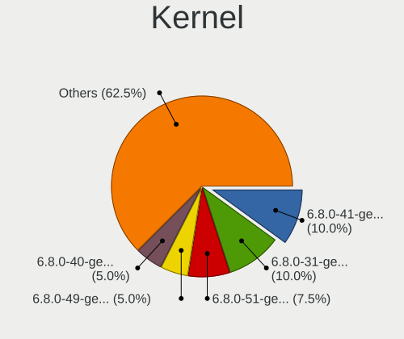

| Version                 | Desktops | Percent |
|-------------------------|----------|---------|
| 6.8.0-41-generic        | 8        | 10%     |
| 6.8.0-31-generic        | 8        | 10%     |
| 6.8.0-51-generic        | 6        | 7.5%    |
| 6.8.0-49-generic        | 4        | 5%      |
| 6.8.0-40-generic        | 4        | 5%      |
| 6.8.0-56-generic        | 3        | 3.75%   |
| 6.8.0-48-generic        | 3        | 3.75%   |
| 6.8.0-45-generic        | 3        | 3.75%   |
| 6.14.0-27-generic       | 3        | 3.75%   |
| 6.8.0-53-generic        | 2        | 2.5%    |
| 6.8.0-50-lowlatency     | 2        | 2.5%    |
| 6.8.0-47-generic        | 2        | 2.5%    |
| 6.8.0-39-generic        | 2        | 2.5%    |
| 6.14.0-37-generic       | 2        | 2.5%    |
| 6.11.0-25-generic       | 2        | 2.5%    |
| 6.11.0-24-generic       | 2        | 2.5%    |
| 6.8.0-87-generic        | 1        | 1.25%   |
| 6.8.0-58-generic        | 1        | 1.25%   |
| 6.8.0-55-generic        | 1        | 1.25%   |
| 6.8.0-54-generic        | 1        | 1.25%   |
| 6.8.0-52-generic        | 1        | 1.25%   |
| 6.8.0-48-lowlatency     | 1        | 1.25%   |
| 6.8.0-44-generic        | 1        | 1.25%   |
| 6.8.0-41-lowlatency     | 1        | 1.25%   |
| 6.8.0-36-generic        | 1        | 1.25%   |
| 6.8.0-35-generic        | 1        | 1.25%   |
| 6.8.0-32-generic        | 1        | 1.25%   |
| 6.8.0-22-generic        | 1        | 1.25%   |
| 6.8.0-1016-oem          | 1        | 1.25%   |
| 6.6.0-14-generic        | 1        | 1.25%   |
| 6.5.0-44-generic        | 1        | 1.25%   |
| 6.17.8-061708-generic   | 1        | 1.25%   |
| 6.14.0-36-generic       | 1        | 1.25%   |
| 6.14.0-35-generic       | 1        | 1.25%   |
| 6.14.0-33-generic       | 1        | 1.25%   |
| 6.14.0-29-generic       | 1        | 1.25%   |
| 6.12.3-alderlake-custom | 1        | 1.25%   |
| 6.11.0-26-generic       | 1        | 1.25%   |
| 6.11.0-21-generic       | 1        | 1.25%   |
| 6.11.0-17-generic       | 1        | 1.25%   |

Kernel Family
-------------

Linux kernel without a distro release

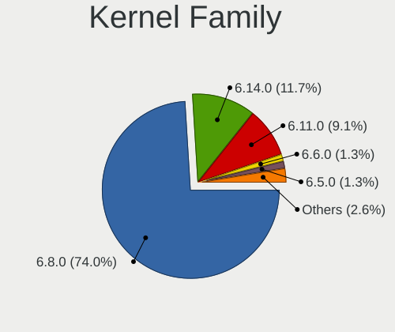

| Version | Desktops | Percent |
|---------|----------|---------|
| 6.8.0   | 57       | 74.03%  |
| 6.14.0  | 9        | 11.69%  |
| 6.11.0  | 7        | 9.09%   |
| 6.6.0   | 1        | 1.3%    |
| 6.5.0   | 1        | 1.3%    |
| 6.17.8  | 1        | 1.3%    |
| 6.12.3  | 1        | 1.3%    |

Kernel Major Ver.
-----------------

Linux kernel major version

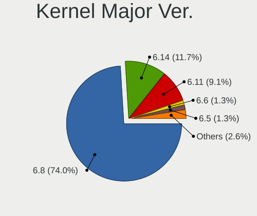

| Version | Desktops | Percent |
|---------|----------|---------|
| 6.8     | 57       | 74.03%  |
| 6.14    | 9        | 11.69%  |
| 6.11    | 7        | 9.09%   |
| 6.6     | 1        | 1.3%    |
| 6.5     | 1        | 1.3%    |
| 6.17    | 1        | 1.3%    |
| 6.12    | 1        | 1.3%    |

Arch
----

OS architecture (x86_64, i586, etc.)

| Name   | Desktops | Percent |
|--------|----------|---------|
| x86_64 | 75       | 100%    |

DE
--

Desktop Environment

| Name | Desktops | Percent |
|------|----------|---------|
| LXQt | 75       | 100%    |

Display Server
--------------

X11 or Wayland

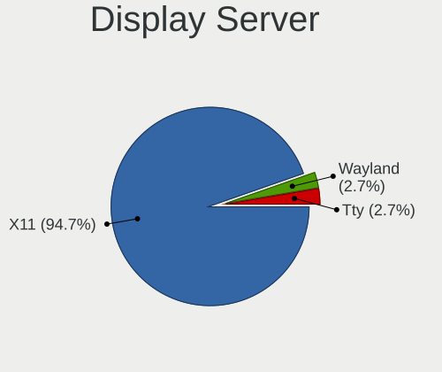

| Name    | Desktops | Percent |
|---------|----------|---------|
| X11     | 71       | 94.67%  |
| Wayland | 2        | 2.67%   |
| Tty     | 2        | 2.67%   |

Display Manager
---------------

SDDM, LightDM, etc.

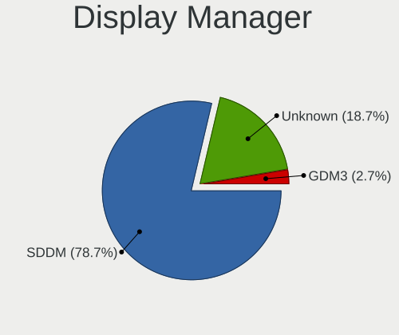

| Name    | Desktops | Percent |
|---------|----------|---------|
| SDDM    | 59       | 78.67%  |
| Unknown | 14       | 18.67%  |
| GDM3    | 2        | 2.67%   |

OS Lang
-------

Language

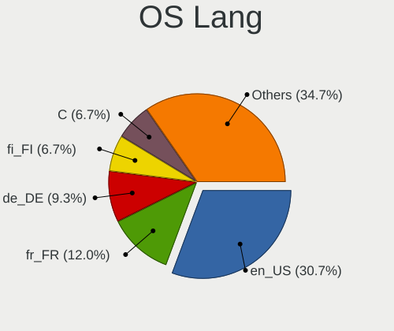

| Lang  | Desktops | Percent |
|-------|----------|---------|
| en_US | 23       | 30.67%  |
| fr_FR | 9        | 12%     |
| de_DE | 7        | 9.33%   |
| fi_FI | 5        | 6.67%   |
| C     | 5        | 6.67%   |
| en_GB | 4        | 5.33%   |
| pt_BR | 3        | 4%      |
| pl_PL | 2        | 2.67%   |
| it_IT | 2        | 2.67%   |
| es_MX | 2        | 2.67%   |
| es_AR | 2        | 2.67%   |
| en_CA | 2        | 2.67%   |
| el_GR | 2        | 2.67%   |
| nl_NL | 1        | 1.33%   |
| hu_HU | 1        | 1.33%   |
| es_ES | 1        | 1.33%   |
| en_SE | 1        | 1.33%   |
| de_CH | 1        | 1.33%   |
| ba_RU | 1        | 1.33%   |
| ar_DZ | 1        | 1.33%   |

Boot Mode
---------

EFI or BIOS

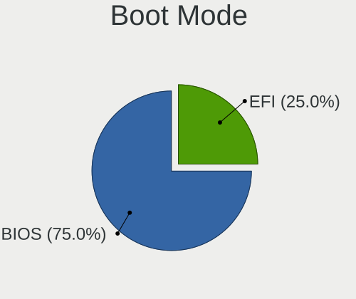

| Mode | Desktops | Percent |
|------|----------|---------|
| BIOS | 57       | 75%     |
| EFI  | 19       | 25%     |

Filesystem
----------

Type of filesystem

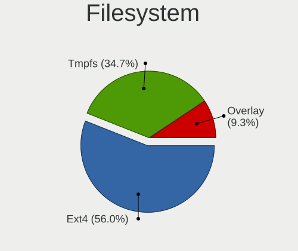

| Type    | Desktops | Percent |
|---------|----------|---------|
| Ext4    | 42       | 56%     |
| Tmpfs   | 26       | 34.67%  |
| Overlay | 7        | 9.33%   |

Part. scheme
------------

Scheme of partitioning

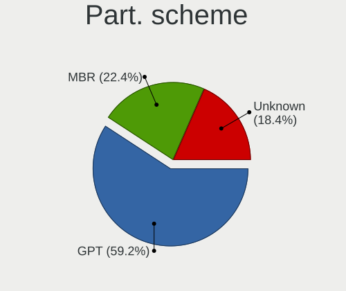

| Type    | Desktops | Percent |
|---------|----------|---------|
| GPT     | 45       | 59.21%  |
| MBR     | 17       | 22.37%  |
| Unknown | 14       | 18.42%  |

Dual Boot with Linux/BSD
------------------------

Hosting more than one Linux/BSD

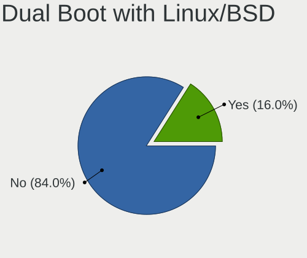

| Dual boot | Desktops | Percent |
|-----------|----------|---------|
| No        | 63       | 84%     |
| Yes       | 12       | 16%     |

Dual Boot (Win)
---------------

Hosting Linux and Windows

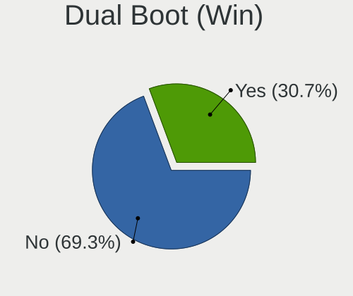

| Dual boot | Desktops | Percent |
|-----------|----------|---------|
| No        | 52       | 69.33%  |
| Yes       | 23       | 30.67%  |

Board
-----

Vendor
------

Motherboard manufacturer

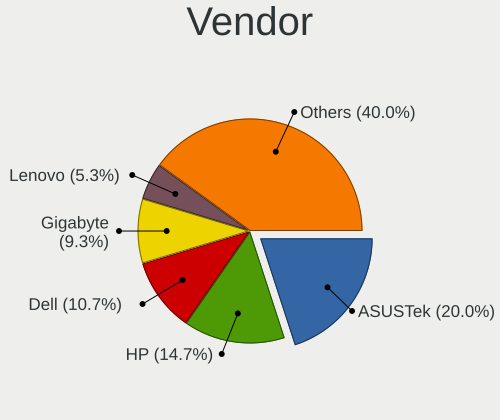

| Name                | Desktops | Percent |
|---------------------|----------|---------|
| ASUSTek Computer    | 15       | 20%     |
| Hewlett-Packard     | 11       | 14.67%  |
| Dell                | 8        | 10.67%  |
| Gigabyte Technology | 7        | 9.33%   |
| Lenovo              | 4        | 5.33%   |
| ASRock              | 4        | 5.33%   |
| Pegatron            | 3        | 4%      |
| MSI                 | 3        | 4%      |
| Fujitsu             | 3        | 4%      |
| Google              | 2        | 2.67%   |
| AZW                 | 2        | 2.67%   |
| Acer                | 2        | 2.67%   |
| Phitronics          | 1        | 1.33%   |
| Packard Bell        | 1        | 1.33%   |
| NU591               | 1        | 1.33%   |
| Haier               | 1        | 1.33%   |
| Foxconn             | 1        | 1.33%   |
| EPoX Computer       | 1        | 1.33%   |
| ECS                 | 1        | 1.33%   |
| DELTA               | 1        | 1.33%   |
| Apple               | 1        | 1.33%   |
| ADI                 | 1        | 1.33%   |
| Unknown             | 1        | 1.33%   |

Model
-----

Motherboard model

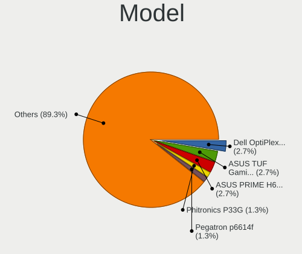

| Name                                | Desktops | Percent |
|-------------------------------------|----------|---------|
| Dell OptiPlex 9020                  | 2        | 2.67%   |
| ASUS TUF Gaming X570-PLUS           | 2        | 2.67%   |
| ASUS PRIME H610I-PLUS D4            | 2        | 2.67%   |
| Phitronics P33G                     | 1        | 1.33%   |
| Pegatron WE277AA-ABF p6352fr        | 1        | 1.33%   |
| Pegatron p6614f                     | 1        | 1.33%   |
| Pegatron 23-b030                    | 1        | 1.33%   |
| Packard Bell IMEDIA D9111           | 1        | 1.33%   |
| NU591 1.0                           | 1        | 1.33%   |
| MSI MS-7D53                         | 1        | 1.33%   |
| MSI MS-7204                         | 1        | 1.33%   |
| MSI B02311                          | 1        | 1.33%   |
| Lenovo ThinkCentre M93P 10AB000YMX  | 1        | 1.33%   |
| Lenovo ThinkCentre M92z 3311B8G     | 1        | 1.33%   |
| Lenovo ThinkCentre M79 10JAS00P00   | 1        | 1.33%   |
| Lenovo ThinkCentre M720s 10ST001AFR | 1        | 1.33%   |
| HP Z440 Workstation                 | 1        | 1.33%   |
| HP Z420 Workstation                 | 1        | 1.33%   |
| HP Z230 Tower Workstation           | 1        | 1.33%   |
| HP Z2 SFF G9 Workstation Desktop PC | 1        | 1.33%   |
| HP ProOne 400 G1 AiO                | 1        | 1.33%   |
| HP ProDesk 400 G2 MT                | 1        | 1.33%   |
| HP ProDesk 400 G1 SFF               | 1        | 1.33%   |
| HP Compaq dc7900 Small Form Factor  | 1        | 1.33%   |
| HP Compaq dc7100 SFF(PW292ET)       | 1        | 1.33%   |
| HP Compaq 8200 Elite SFF PC         | 1        | 1.33%   |
| HP 550-267nz                        | 1        | 1.33%   |
| Haier DT                            | 1        | 1.33%   |
| Google Zako                         | 1        | 1.33%   |
| Google Kench                        | 1        | 1.33%   |
| Gigabyte P67-DS3-B3                 | 1        | 1.33%   |
| Gigabyte P55-USB3                   | 1        | 1.33%   |
| Gigabyte H61M-DS2                   | 1        | 1.33%   |
| Gigabyte GA-MA69GM-S2H              | 1        | 1.33%   |
| Gigabyte G1.Sniper A88X-CF          | 1        | 1.33%   |
| Gigabyte F2A88X-D3H                 | 1        | 1.33%   |
| Gigabyte B550M S2H                  | 1        | 1.33%   |
| Fujitsu ESPRIMO_P956                | 1        | 1.33%   |
| Fujitsu ESPRIMO C720                | 1        | 1.33%   |
| Fujitsu CELSIUS M470-2              | 1        | 1.33%   |

Model Family
------------

Motherboard model prefix

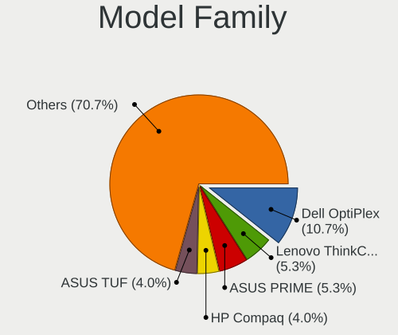

| Name                   | Desktops | Percent |
|------------------------|----------|---------|
| Dell OptiPlex          | 8        | 10.67%  |
| Lenovo ThinkCentre     | 4        | 5.33%   |
| ASUS PRIME             | 4        | 5.33%   |
| HP Compaq              | 3        | 4%      |
| ASUS TUF               | 3        | 4%      |
| HP ProDesk             | 2        | 2.67%   |
| Fujitsu ESPRIMO        | 2        | 2.67%   |
| Acer Aspire            | 2        | 2.67%   |
| Phitronics P33G        | 1        | 1.33%   |
| Pegatron WE277AA-ABF   | 1        | 1.33%   |
| Pegatron p6614f        | 1        | 1.33%   |
| Pegatron 23-b030       | 1        | 1.33%   |
| Packard Bell IMEDIA    | 1        | 1.33%   |
| NU591 1.0              | 1        | 1.33%   |
| MSI MS-7D53            | 1        | 1.33%   |
| MSI MS-7204            | 1        | 1.33%   |
| MSI B02311             | 1        | 1.33%   |
| HP Z440                | 1        | 1.33%   |
| HP Z420                | 1        | 1.33%   |
| HP Z230                | 1        | 1.33%   |
| HP Z2                  | 1        | 1.33%   |
| HP ProOne              | 1        | 1.33%   |
| HP 550-267nz           | 1        | 1.33%   |
| Haier DT               | 1        | 1.33%   |
| Google Zako            | 1        | 1.33%   |
| Google Kench           | 1        | 1.33%   |
| Gigabyte P67-DS3-B3    | 1        | 1.33%   |
| Gigabyte P55-USB3      | 1        | 1.33%   |
| Gigabyte H61M-DS2      | 1        | 1.33%   |
| Gigabyte GA-MA69GM-S2H | 1        | 1.33%   |
| Gigabyte G1.Sniper     | 1        | 1.33%   |
| Gigabyte F2A88X-D3H    | 1        | 1.33%   |
| Gigabyte B550M         | 1        | 1.33%   |
| Fujitsu CELSIUS        | 1        | 1.33%   |
| Foxconn G31MV          | 1        | 1.33%   |
| EPoX MCP61             | 1        | 1.33%   |
| ECS RS480-M            | 1        | 1.33%   |
| DELTA B75M2K           | 1        | 1.33%   |
| AZW MINI               | 1        | 1.33%   |
| AZW LZX                | 1        | 1.33%   |

MFG Year
--------

Motherboard manufacture year

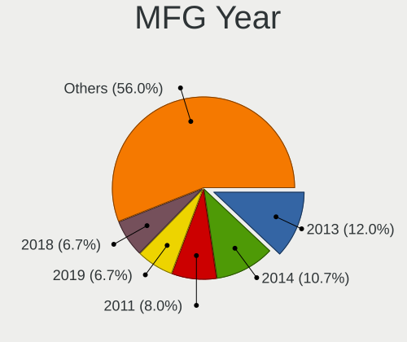

| Year | Desktops | Percent |
|------|----------|---------|
| 2013 | 9        | 12%     |
| 2014 | 8        | 10.67%  |
| 2011 | 6        | 8%      |
| 2019 | 5        | 6.67%   |
| 2018 | 5        | 6.67%   |
| 2024 | 4        | 5.33%   |
| 2023 | 4        | 5.33%   |
| 2012 | 4        | 5.33%   |
| 2010 | 4        | 5.33%   |
| 2007 | 4        | 5.33%   |
| 2022 | 3        | 4%      |
| 2017 | 3        | 4%      |
| 2009 | 3        | 4%      |
| 2008 | 3        | 4%      |
| 2021 | 2        | 2.67%   |
| 2020 | 2        | 2.67%   |
| 2016 | 2        | 2.67%   |
| 2006 | 2        | 2.67%   |
| 2015 | 1        | 1.33%   |
| 2005 | 1        | 1.33%   |

Form Factor
-----------

Physical design of the computer

| Name    | Desktops | Percent |
|---------|----------|---------|
| Desktop | 75       | 100%    |

Secure Boot
-----------

Enabled or disabled

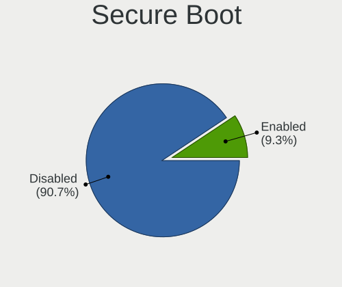

| State    | Desktops | Percent |
|----------|----------|---------|
| Disabled | 68       | 90.67%  |
| Enabled  | 7        | 9.33%   |

Coreboot
--------

Have coreboot on board

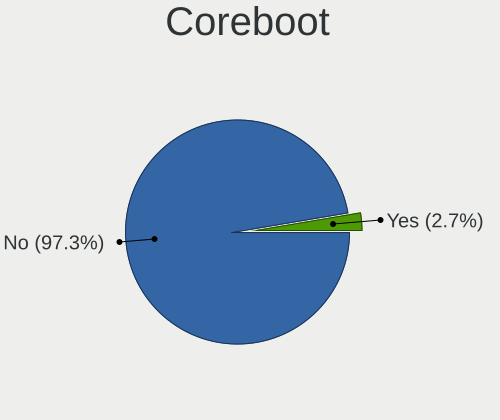

| Used | Desktops | Percent |
|------|----------|---------|
| No   | 73       | 97.33%  |
| Yes  | 2        | 2.67%   |

RAM Size
--------

Total RAM memory

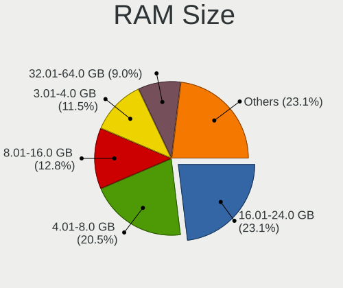

| Size in GB  | Desktops | Percent |
|-------------|----------|---------|
| 16.01-24.0  | 18       | 23.08%  |
| 4.01-8.0    | 16       | 20.51%  |
| 8.01-16.0   | 10       | 12.82%  |
| 3.01-4.0    | 9        | 11.54%  |
| 32.01-64.0  | 7        | 8.97%   |
| 1.01-2.0    | 6        | 7.69%   |
| 24.01-32.0  | 5        | 6.41%   |
| 64.01-256.0 | 4        | 5.13%   |
| 2.01-3.0    | 3        | 3.85%   |

RAM Used
--------

Used RAM memory

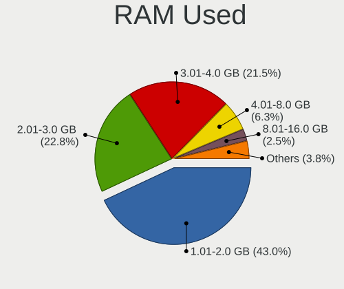

| Used GB   | Desktops | Percent |
|-----------|----------|---------|
| 1.01-2.0  | 34       | 43.04%  |
| 2.01-3.0  | 18       | 22.78%  |
| 3.01-4.0  | 17       | 21.52%  |
| 4.01-8.0  | 5        | 6.33%   |
| 8.01-16.0 | 2        | 2.53%   |
| 0.51-1.0  | 2        | 2.53%   |
| 0.01-0.5  | 1        | 1.27%   |

Total Drives
------------

Number of drives on board

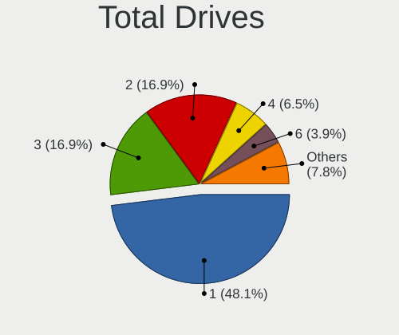

| Drives | Desktops | Percent |
|--------|----------|---------|
| 1      | 37       | 48.05%  |
| 3      | 13       | 16.88%  |
| 2      | 13       | 16.88%  |
| 4      | 5        | 6.49%   |
| 6      | 3        | 3.9%    |
| 5      | 2        | 2.6%    |
| 0      | 2        | 2.6%    |
| 11     | 1        | 1.3%    |
| 9      | 1        | 1.3%    |

Has CD-ROM
----------

Has CD-ROM on board

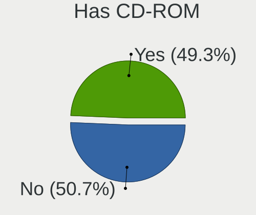

| Presented | Desktops | Percent |
|-----------|----------|---------|
| No        | 38       | 50.67%  |
| Yes       | 37       | 49.33%  |

Has Ethernet
------------

Has Ethernet on board

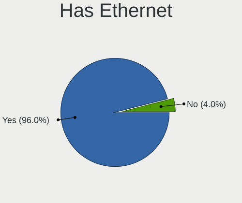

| Presented | Desktops | Percent |
|-----------|----------|---------|
| Yes       | 72       | 96%     |
| No        | 3        | 4%      |

Has WiFi
--------

Has WiFi module

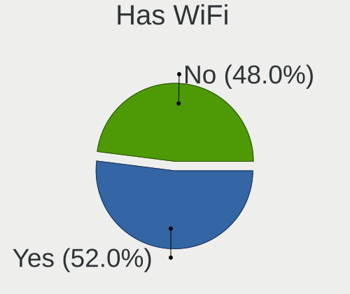

| Presented | Desktops | Percent |
|-----------|----------|---------|
| Yes       | 39       | 52%     |
| No        | 36       | 48%     |

Has Bluetooth
-------------

Has Bluetooth module

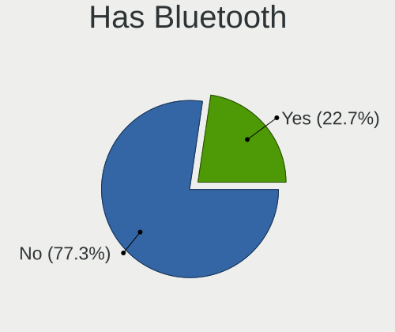

| Presented | Desktops | Percent |
|-----------|----------|---------|
| No        | 58       | 77.33%  |
| Yes       | 17       | 22.67%  |

Location
--------

Country
-------

Geographic location (country)

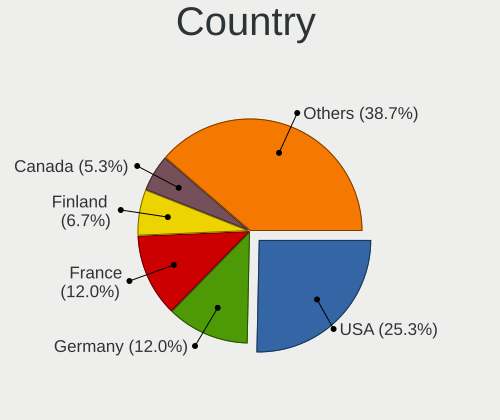

| Country     | Desktops | Percent |
|-------------|----------|---------|
| USA         | 19       | 25.33%  |
| Germany     | 9        | 12%     |
| France      | 9        | 12%     |
| Finland     | 5        | 6.67%   |
| Canada      | 4        | 5.33%   |
| Italy       | 3        | 4%      |
| Brazil      | 3        | 4%      |
| Hungary     | 2        | 2.67%   |
| Greece      | 2        | 2.67%   |
| China       | 2        | 2.67%   |
| Australia   | 2        | 2.67%   |
| Argentina   | 2        | 2.67%   |
| UK          | 1        | 1.33%   |
| Thailand    | 1        | 1.33%   |
| Switzerland | 1        | 1.33%   |
| Sweden      | 1        | 1.33%   |
| Spain       | 1        | 1.33%   |
| Russia      | 1        | 1.33%   |
| Romania     | 1        | 1.33%   |
| Poland      | 1        | 1.33%   |
| Norway      | 1        | 1.33%   |
| Japan       | 1        | 1.33%   |
| Costa Rica  | 1        | 1.33%   |
| Chile       | 1        | 1.33%   |
| Algeria     | 1        | 1.33%   |

City
----

Geographic location (city)

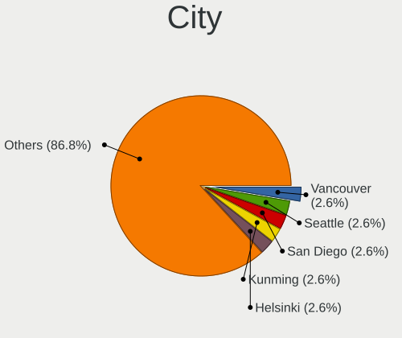

| City                  | Desktops | Percent |
|-----------------------|----------|---------|
| Vancouver             | 2        | 2.63%   |
| Seattle               | 2        | 2.63%   |
| San Diego             | 2        | 2.63%   |
| Kunming               | 2        | 2.63%   |
| Helsinki              | 2        | 2.63%   |
| Berlin                | 2        | 2.63%   |
| Zurich                | 1        | 1.32%   |
| Würzburg             | 1        | 1.32%   |
| Volos                 | 1        | 1.32%   |
| Virginia Beach        | 1        | 1.32%   |
| Verona                | 1        | 1.32%   |
| Vaasa                 | 1        | 1.32%   |
| Timberlea             | 1        | 1.32%   |
| Thessaloniki          | 1        | 1.32%   |
| Tandil                | 1        | 1.32%   |
| Tampere               | 1        | 1.32%   |
| Sydney                | 1        | 1.32%   |
| Svetlyy               | 1        | 1.32%   |
| Strasbourg            | 1        | 1.32%   |
| Skepplanda            | 1        | 1.32%   |
| Seville               | 1        | 1.32%   |
| Sao Paulo             | 1        | 1.32%   |
| Sao Jeronimo da Serra | 1        | 1.32%   |
| Saint-Dié            | 1        | 1.32%   |
| Rottweil              | 1        | 1.32%   |
| Rome                  | 1        | 1.32%   |
| Rockville             | 1        | 1.32%   |
| Rochester             | 1        | 1.32%   |
| Redmond               | 1        | 1.32%   |
| Prosperity            | 1        | 1.32%   |
| Poitiers              | 1        | 1.32%   |
| Pforzheim             | 1        | 1.32%   |
| Osaka                 | 1        | 1.32%   |
| Oregon City           | 1        | 1.32%   |
| Northport             | 1        | 1.32%   |
| Nonthaburi            | 1        | 1.32%   |
| Nancy                 | 1        | 1.32%   |
| Nagyhegyes            | 1        | 1.32%   |
| Moron                 | 1        | 1.32%   |
| Melbourne             | 1        | 1.32%   |

Drives
------

Drive Vendor
------------

Hard drive vendors

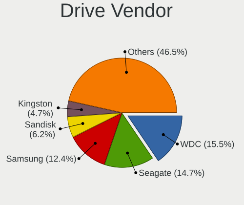

| Vendor                       | Desktops | Drives | Percent |
|------------------------------|----------|--------|---------|
| WDC                          | 20       | 36     | 15.5%   |
| Seagate                      | 19       | 27     | 14.73%  |
| Samsung Electronics          | 16       | 23     | 12.4%   |
| Sandisk                      | 8        | 14     | 6.2%    |
| Kingston                     | 6        | 6      | 4.65%   |
| Toshiba                      | 4        | 6      | 3.1%    |
| China                        | 4        | 4      | 3.1%    |
| Intel                        | 3        | 3      | 2.33%   |
| Crucial                      | 3        | 5      | 2.33%   |
| Unknown                      | 2        | 2      | 1.55%   |
| PNY                          | 2        | 2      | 1.55%   |
| Phison Electronics           | 2        | 5      | 1.55%   |
| Micron/Crucial Technology    | 2        | 3      | 1.55%   |
| MicroFrom                    | 2        | 2      | 1.55%   |
| Lexar                        | 2        | 2      | 1.55%   |
| KingSpec                     | 2        | 2      | 1.55%   |
| JMicron Technology           | 2        | 2      | 1.55%   |
| Intenso                      | 2        | 4      | 1.55%   |
| Hitachi                      | 2        | 2      | 1.55%   |
| YMTC                         | 1        | 1      | 0.78%   |
| WD MediaMax                  | 1        | 1      | 0.78%   |
| Verbatim                     | 1        | 1      | 0.78%   |
| Thinkplus                    | 1        | 1      | 0.78%   |
| STEC                         | 1        | 1      | 0.78%   |
| SPCC                         | 1        | 1      | 0.78%   |
| SK hynix                     | 1        | 1      | 0.78%   |
| Silicon Motion               | 1        | 1      | 0.78%   |
| Shenzhen Longsys Electronics | 1        | 1      | 0.78%   |
| Realtek Semiconductor        | 1        | 1      | 0.78%   |
| NT-512                       | 1        | 1      | 0.78%   |
| Micron Technology            | 1        | 1      | 0.78%   |
| Maxtor                       | 1        | 1      | 0.78%   |
| KIOXIA                       | 1        | 1      | 0.78%   |
| Hewlett-Packard              | 1        | 4      | 0.78%   |
| HAJAAN                       | 1        | 1      | 0.78%   |
| Great                        | 1        | 2      | 0.78%   |
| Gigabyte Technology          | 1        | 1      | 0.78%   |
| Fujitsu                      | 1        | 1      | 0.78%   |
| FIKWOT                       | 1        | 1      | 0.78%   |
| ExcelStor                    | 1        | 1      | 0.78%   |

Drive Model
-----------

Hard drive models

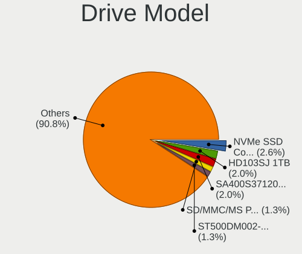

| Model                                              | Desktops | Percent |
|----------------------------------------------------|----------|---------|
| Samsung NVMe SSD Controller SM981/PM981/PM983 1TB  | 4        | 2.61%   |
| Samsung HD103SJ 1TB                                | 3        | 1.96%   |
| Kingston SA400S37120G 120GB SSD                    | 3        | 1.96%   |
| Unknown SD/MMC/MS PRO 2GB                          | 2        | 1.31%   |
| Seagate ST500DM002-1BD142 500GB                    | 2        | 1.31%   |
| Seagate ST4000VN008-2DR166 4TB                     | 2        | 1.31%   |
| Seagate ST3500418AS 500GB                          | 2        | 1.31%   |
| Seagate ST14000NM0121 14TB                         | 2        | 1.31%   |
| Samsung SSD 850 EVO 250GB                          | 2        | 1.31%   |
| Samsung NVMe SSD Controller PM9A1/PM9A3/980PRO 1TB | 2        | 1.31%   |
| Micron/Crucial CT500P5SSD8 500GB                   | 2        | 1.31%   |
| MicroFrom 256GB SATA3 SSD                          | 2        | 1.31%   |
| Kingston SA400S37480G 480GB SSD                    | 2        | 1.31%   |
| YMTC PC005 512GB                                   | 1        | 0.65%   |
| WDC WDS500G2B0A-00SM50 500GB                       | 1        | 0.65%   |
| WDC WDS240G2G0A-00JH30 240GB SSD                   | 1        | 0.65%   |
| WDC WD800JD-75JNC0 80GB                            | 1        | 0.65%   |
| WDC WD800JD-22LSA0 80GB                            | 1        | 0.65%   |
| WDC WD6400AAKS-65A7B2 640GB                        | 1        | 0.65%   |
| WDC WD5001AALS-00L3B2 500GB                        | 1        | 0.65%   |
| WDC WD5000LPVX-80V0TT0 500GB                       | 1        | 0.65%   |
| WDC WD5000AZLX-00CL5A0 500GB                       | 1        | 0.65%   |
| WDC WD5000AAKX-60U6AA0 500GB                       | 1        | 0.65%   |
| WDC WD5000AAKS-60A7B2 500GB                        | 1        | 0.65%   |
| WDC WD40EZRZ-22GXCB0 4TB                           | 1        | 0.65%   |
| WDC WD40EFZX-68AWUN0 4TB                           | 1        | 0.65%   |
| WDC WD40 EFAX-68JH4N1 4TB                          | 1        | 0.65%   |
| WDC WD3200JS-55PDB0 320GB                          | 1        | 0.65%   |
| WDC WD30EZRX-00D8PB0 3TB                           | 1        | 0.65%   |
| WDC WD30EFRX-68EUZN0 3TB                           | 1        | 0.65%   |
| WDC WD20EZRX-22D8PB0 2TB                           | 1        | 0.65%   |
| WDC WD20EZRX-00D8PB0 2TB                           | 1        | 0.65%   |
| WDC WD20EZAZ-00GGJB0 2TB                           | 1        | 0.65%   |
| WDC WD2002FAEX-007BA0 2TB                          | 1        | 0.65%   |
| WDC WD2000JD-19HBB0 196GB                          | 1        | 0.65%   |
| WDC WD20 03FZEX-00SRLA0 2TB                        | 1        | 0.65%   |
| WDC WD180EDGZ-11B2DA0 18TB                         | 1        | 0.65%   |
| WDC WD1600BEVS-60VAT0 160GB                        | 1        | 0.65%   |
| WDC WD1600AAJS-00V4A0 160GB                        | 1        | 0.65%   |
| WDC WD10EZEX-60ZF5A0 1TB                           | 1        | 0.65%   |

HDD Vendor
----------

Hard disk drive vendors

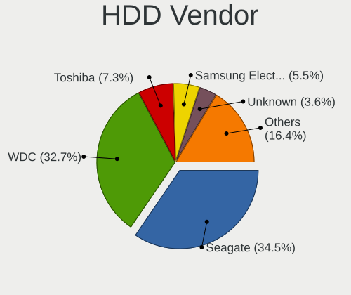

| Vendor              | Desktops | Drives | Percent |
|---------------------|----------|--------|---------|
| Seagate             | 19       | 27     | 34.55%  |
| WDC                 | 18       | 32     | 32.73%  |
| Toshiba             | 4        | 6      | 7.27%   |
| Samsung Electronics | 3        | 4      | 5.45%   |
| Unknown             | 2        | 2      | 3.64%   |
| Hitachi             | 2        | 2      | 3.64%   |
| WD MediaMax         | 1        | 1      | 1.82%   |
| Maxtor              | 1        | 1      | 1.82%   |
| JMicron Technology  | 1        | 1      | 1.82%   |
| Hewlett-Packard     | 1        | 4      | 1.82%   |
| Fujitsu             | 1        | 1      | 1.82%   |
| ExcelStor           | 1        | 1      | 1.82%   |
| ASM                 | 1        | 1      | 1.82%   |

SSD Vendor
----------

Solid state drive vendors

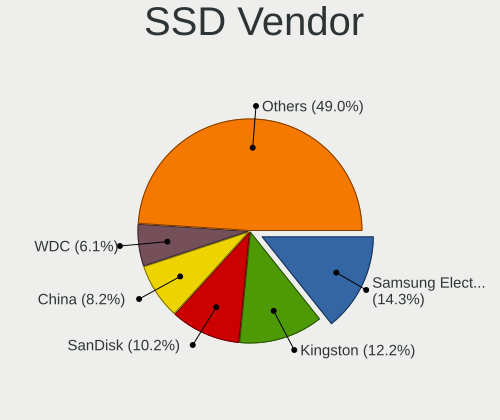

| Vendor              | Desktops | Drives | Percent |
|---------------------|----------|--------|---------|
| Samsung Electronics | 7        | 8      | 14.29%  |
| Kingston            | 6        | 6      | 12.24%  |
| SanDisk             | 5        | 9      | 10.2%   |
| China               | 4        | 4      | 8.16%   |
| WDC                 | 3        | 4      | 6.12%   |
| Crucial             | 3        | 5      | 6.12%   |
| MicroFrom           | 2        | 2      | 4.08%   |
| Lexar               | 2        | 2      | 4.08%   |
| Intenso             | 2        | 4      | 4.08%   |
| Thinkplus           | 1        | 1      | 2.04%   |
| STEC                | 1        | 1      | 2.04%   |
| SPCC                | 1        | 1      | 2.04%   |
| PNY                 | 1        | 1      | 2.04%   |
| NT-512              | 1        | 1      | 2.04%   |
| KingSpec            | 1        | 1      | 2.04%   |
| Intel               | 1        | 1      | 2.04%   |
| HAJAAN              | 1        | 1      | 2.04%   |
| Great               | 1        | 2      | 2.04%   |
| Gigabyte Technology | 1        | 1      | 2.04%   |
| FIKWOT              | 1        | 1      | 2.04%   |
| Cavalry             | 1        | 1      | 2.04%   |
| ASMT                | 1        | 1      | 2.04%   |
| ASMedia             | 1        | 1      | 2.04%   |
| Apacer              | 1        | 1      | 2.04%   |

Drive Kind
----------

HDD or SSD

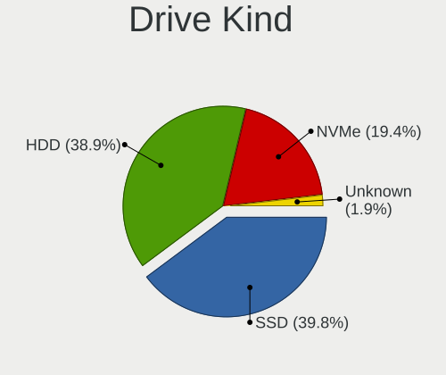

| Kind    | Desktops | Drives | Percent |
|---------|----------|--------|---------|
| SSD     | 43       | 60     | 39.81%  |
| HDD     | 42       | 83     | 38.89%  |
| NVMe    | 21       | 35     | 19.44%  |
| Unknown | 2        | 2      | 1.85%   |

Drive Connector
---------------

SATA, SAS, NVMe, etc.

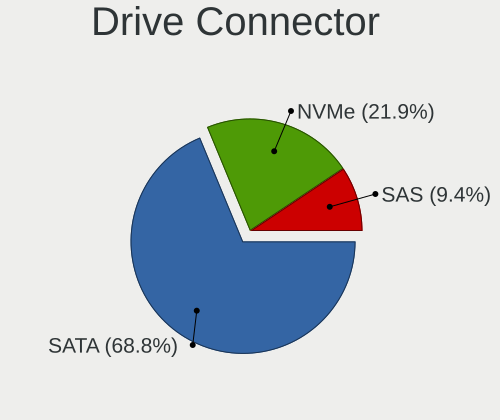

| Type | Desktops | Drives | Percent |
|------|----------|--------|---------|
| SATA | 66       | 135    | 68.75%  |
| NVMe | 21       | 35     | 21.88%  |
| SAS  | 9        | 10     | 9.38%   |

Drive Size
----------

Size of hard drive

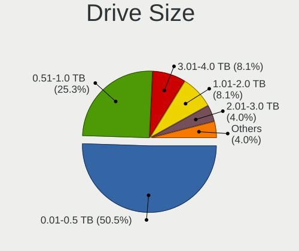

| Size in TB | Desktops | Drives | Percent |
|------------|----------|--------|---------|
| 0.01-0.5   | 50       | 69     | 50.51%  |
| 0.51-1.0   | 25       | 34     | 25.25%  |
| 3.01-4.0   | 8        | 16     | 8.08%   |
| 1.01-2.0   | 8        | 11     | 8.08%   |
| 2.01-3.0   | 4        | 8      | 4.04%   |
| 10.01-20.0 | 3        | 4      | 3.03%   |
| 4.01-10.0  | 1        | 1      | 1.01%   |

Space Total
-----------

Amount of disk space available on the file system

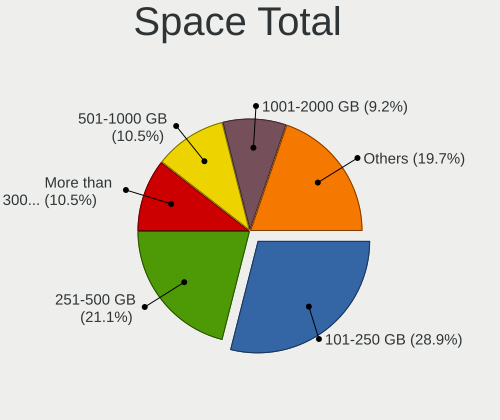

| Size in GB     | Desktops | Percent |
|----------------|----------|---------|
| 101-250        | 22       | 28.95%  |
| 251-500        | 16       | 21.05%  |
| More than 3000 | 8        | 10.53%  |
| 501-1000       | 8        | 10.53%  |
| 1001-2000      | 7        | 9.21%   |
| 1-20           | 7        | 9.21%   |
| 21-50          | 3        | 3.95%   |
| 51-100         | 2        | 2.63%   |
| Unknown        | 2        | 2.63%   |
| 2001-3000      | 1        | 1.32%   |

Space Used
----------

Amount of used disk space

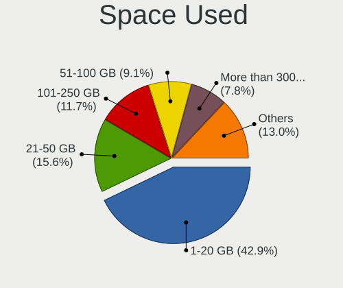

| Used GB        | Desktops | Percent |
|----------------|----------|---------|
| 1-20           | 33       | 42.86%  |
| 21-50          | 12       | 15.58%  |
| 101-250        | 9        | 11.69%  |
| 51-100         | 7        | 9.09%   |
| More than 3000 | 6        | 7.79%   |
| 501-1000       | 4        | 5.19%   |
| 251-500        | 3        | 3.9%    |
| Unknown        | 2        | 2.6%    |
| 1001-2000      | 1        | 1.3%    |

Malfunc. Drives
---------------

Drive models with a malfunction

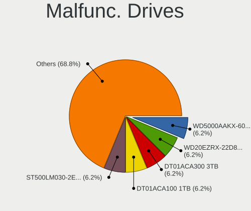

| Model                             | Desktops | Drives | Percent |
|-----------------------------------|----------|--------|---------|
| WDC WD5000AAKX-60U6AA0 500GB      | 1        | 1      | 6.25%   |
| WDC WD20EZRX-22D8PB0 2TB          | 1        | 1      | 6.25%   |
| Toshiba DT01ACA300 3TB            | 1        | 2      | 6.25%   |
| Toshiba DT01ACA100 1TB            | 1        | 1      | 6.25%   |
| Seagate ST500LM030-2E717D 500GB   | 1        | 1      | 6.25%   |
| Seagate ST500DM002-1SB10A 500GB   | 1        | 1      | 6.25%   |
| Seagate ST500DM002-1BD142 500GB   | 1        | 1      | 6.25%   |
| Seagate ST3500412AS 500GB         | 1        | 1      | 6.25%   |
| Seagate ST31000528AS 1TB          | 1        | 1      | 6.25%   |
| Seagate ST31000524AS 1TB          | 1        | 1      | 6.25%   |
| Seagate ST1000VM002-1CT162 1TB    | 1        | 1      | 6.25%   |
| SanDisk SDSSDHP128G 128GB         | 1        | 1      | 6.25%   |
| Maxtor STM3320613AS 320GB         | 1        | 1      | 6.25%   |
| ExcelStor Technology J8160S 160GB | 1        | 1      | 6.25%   |
| Crucial CT500MX500SSD1 500GB      | 1        | 2      | 6.25%   |
| China SSD 480GB                   | 1        | 1      | 6.25%   |

Malfunc. Drive Vendor
---------------------

Vendors of faulty drives

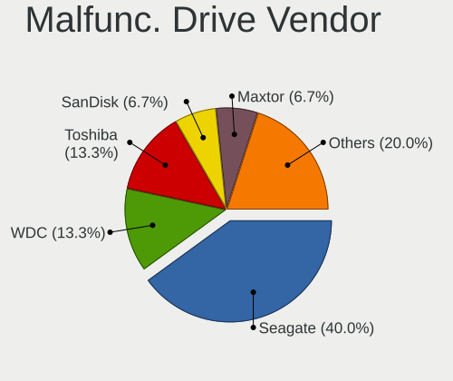

| Vendor    | Desktops | Drives | Percent |
|-----------|----------|--------|---------|
| Seagate   | 6        | 7      | 40%     |
| WDC       | 2        | 2      | 13.33%  |
| Toshiba   | 2        | 3      | 13.33%  |
| SanDisk   | 1        | 1      | 6.67%   |
| Maxtor    | 1        | 1      | 6.67%   |
| ExcelStor | 1        | 1      | 6.67%   |
| Crucial   | 1        | 2      | 6.67%   |
| China     | 1        | 1      | 6.67%   |

Malfunc. HDD Vendor
-------------------

Vendors of faulty HDD drives

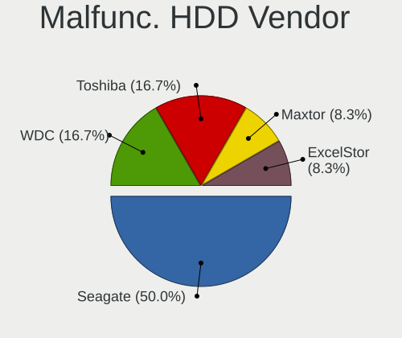

| Vendor    | Desktops | Drives | Percent |
|-----------|----------|--------|---------|
| Seagate   | 6        | 7      | 50%     |
| WDC       | 2        | 2      | 16.67%  |
| Toshiba   | 2        | 3      | 16.67%  |
| Maxtor    | 1        | 1      | 8.33%   |
| ExcelStor | 1        | 1      | 8.33%   |

Malfunc. Drive Kind
-------------------

Kinds of faulty drives

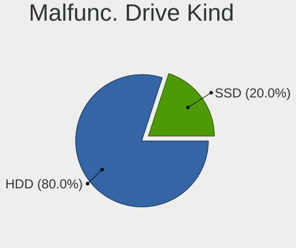

| Kind | Desktops | Drives | Percent |
|------|----------|--------|---------|
| HDD  | 12       | 14     | 80%     |
| SSD  | 3        | 4      | 20%     |

Failed Drives
-------------

Failed drive models

Zero info for selected period =(

Failed Drive Vendor
-------------------

Failed drive vendors

Zero info for selected period =(

Drive Status
------------

Number of failed and malfunc. drives

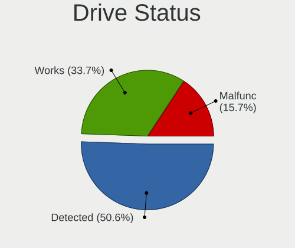

| Status   | Desktops | Drives | Percent |
|----------|----------|--------|---------|
| Detected | 45       | 109    | 50.56%  |
| Works    | 30       | 53     | 33.71%  |
| Malfunc  | 14       | 18     | 15.73%  |

Storage controller
------------------

Storage Vendor
--------------

Storage controller vendors

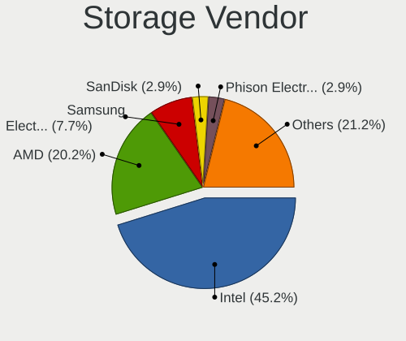

| Vendor                           | Desktops | Percent |
|----------------------------------|----------|---------|
| Intel                            | 47       | 45.19%  |
| AMD                              | 21       | 20.19%  |
| Samsung Electronics              | 8        | 7.69%   |
| SanDisk                          | 3        | 2.88%   |
| Phison Electronics               | 3        | 2.88%   |
| Nvidia                           | 3        | 2.88%   |
| ASMedia Technology               | 3        | 2.88%   |
| Zhaoxin                          | 2        | 1.92%   |
| Micron/Crucial Technology        | 2        | 1.92%   |
| JMicron Technology               | 2        | 1.92%   |
| Yangtze Memory Technologies      | 1        | 0.96%   |
| VIA Technologies                 | 1        | 0.96%   |
| Silicon Motion                   | 1        | 0.96%   |
| Silicon Integrated Systems [SiS] | 1        | 0.96%   |
| Shenzhen Longsys Electronics     | 1        | 0.96%   |
| Realtek Semiconductor            | 1        | 0.96%   |
| Micron Technology                | 1        | 0.96%   |
| MAXIO Technology (Hangzhou)      | 1        | 0.96%   |
| KIOXIA                           | 1        | 0.96%   |
| Broadcom / LSI                   | 1        | 0.96%   |

Storage Model
-------------

Storage controller models

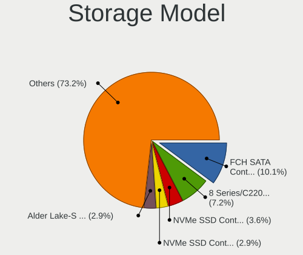

| Model                                                                                   | Desktops | Percent |
|-----------------------------------------------------------------------------------------|----------|---------|
| AMD FCH SATA Controller [AHCI mode]                                                     | 14       | 10.14%  |
| Intel 8 Series/C220 Series Chipset Family 6-port SATA Controller 1 [AHCI mode]          | 10       | 7.25%   |
| Samsung NVMe SSD Controller SM981/PM981/PM983                                           | 5        | 3.62%   |
| Samsung NVMe SSD Controller PM9A1/PM9A3/980PRO                                          | 4        | 2.9%    |
| Intel Alder Lake-S PCH SATA Controller [AHCI Mode]                                      | 4        | 2.9%    |
| Intel SATA Controller [RAID mode]                                                       | 3        | 2.17%   |
| Intel NM10/ICH7 Family SATA Controller [IDE mode]                                       | 3        | 2.17%   |
| Intel 7 Series/C210 Series Chipset Family 6-port SATA Controller [AHCI mode]            | 3        | 2.17%   |
| ASMedia ASM1061/ASM1062 Serial ATA Controller                                           | 3        | 2.17%   |
| AMD SB7x0/SB8x0/SB9x0 IDE Controller                                                    | 3        | 2.17%   |
| Zhaoxin ZX-100/ZX-200/KX-6000/KX-6000G/KH-40000/KX-7000 StorX AHCI Controller           | 2        | 1.45%   |
| Nvidia MCP61 SATA Controller                                                            | 2        | 1.45%   |
| Nvidia MCP61 IDE                                                                        | 2        | 1.45%   |
| Micron/Crucial P5 NVMe PCIe SSD[SlashP5]                                                | 2        | 1.45%   |
| Intel Volume Management Device NVMe RAID Controller                                     | 2        | 1.45%   |
| Intel SSD 660P Series                                                                   | 2        | 1.45%   |
| Intel Q170/Q150/B150/H170/H110/Z170/CM236 Chipset SATA Controller [AHCI Mode]           | 2        | 1.45%   |
| Intel C610/X99 series chipset sSATA Controller [AHCI mode]                              | 2        | 1.45%   |
| Intel C610/X99 series chipset 6-Port SATA Controller [AHCI mode]                        | 2        | 1.45%   |
| Intel 82801JI (ICH10 Family) SATA AHCI Controller                                       | 2        | 1.45%   |
| Intel 82801G (ICH7 Family) IDE Controller                                               | 2        | 1.45%   |
| Intel 82801FB/FW (ICH6/ICH6W) SATA Controller                                           | 2        | 1.45%   |
| Intel 82801FB/FBM/FR/FW/FRW (ICH6 Family) IDE Controller                                | 2        | 1.45%   |
| Intel 6 Series/C200 Series Chipset Family Desktop SATA Controller (IDE mode, ports 4-5) | 2        | 1.45%   |
| Intel 6 Series/C200 Series Chipset Family Desktop SATA Controller (IDE mode, ports 0-3) | 2        | 1.45%   |
| Intel 6 Series/C200 Series Chipset Family 6 port Desktop SATA AHCI Controller           | 2        | 1.45%   |
| Intel 4 Series Chipset PT IDER Controller                                               | 2        | 1.45%   |
| Intel 200 Series PCH SATA controller [AHCI mode]                                        | 2        | 1.45%   |
| AMD SB7x0/SB8x0/SB9x0 SATA Controller [IDE mode]                                        | 2        | 1.45%   |
| AMD SB7x0/SB8x0/SB9x0 SATA Controller [AHCI mode]                                       | 2        | 1.45%   |
| AMD 400 Series Chipset SATA Controller                                                  | 2        | 1.45%   |
| Yangtze Memory PC005 NVMe SSD                                                           | 1        | 0.72%   |
| VIA VT82C586A/B/VT82C686/A/B/VT823x/A/C PIPC Bus Master IDE                             | 1        | 0.72%   |
| VIA VT8237A Integrated SATA Controller                                                  | 1        | 0.72%   |
| Silicon Motion SM2263EN/SM2263XT (DRAM-less) NVMe SSD Controllers                       | 1        | 0.72%   |
| Silicon Integrated Systems [SiS] SATA Controller / IDE mode                             | 1        | 0.72%   |
| Silicon Integrated Systems [SiS] 5513 IDE Controller                                    | 1        | 0.72%   |
| Shenzhen Longsys Lexar NM790 / Patriot Viper VP4300 Lite NVMe SSD (DRAM-less)           | 1        | 0.72%   |
| SanDisk WD Blue SN570 NVMe SSD 2TB                                                      | 1        | 0.72%   |
| SanDisk WD Blue SN550 NVMe SSD 2TB (DRAM-less)                                          | 1        | 0.72%   |

Storage Kind
------------

Kind of storage controller (IDE, SATA, NVMe, SAS, ...)

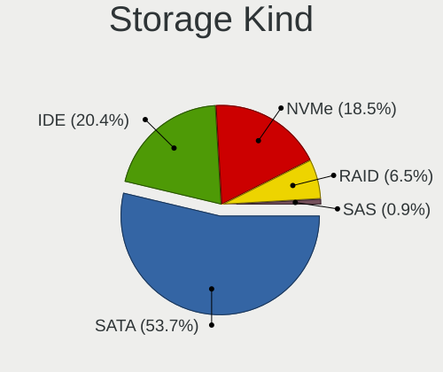

| Kind | Desktops | Percent |
|------|----------|---------|
| SATA | 58       | 53.7%   |
| IDE  | 22       | 20.37%  |
| NVMe | 20       | 18.52%  |
| RAID | 7        | 6.48%   |
| SAS  | 1        | 0.93%   |

Processor
---------

CPU Vendor
----------

Processor vendors

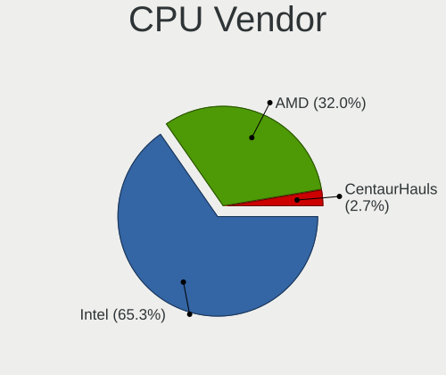

| Vendor       | Desktops | Percent |
|--------------|----------|---------|
| Intel        | 49       | 65.33%  |
| AMD          | 24       | 32%     |
| CentaurHauls | 2        | 2.67%   |

CPU Model
---------

Processor models

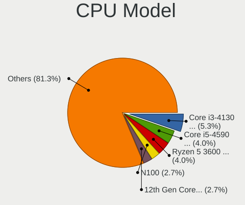

| Model                                       | Desktops | Percent |
|---------------------------------------------|----------|---------|
| Intel Core i3-4130 CPU @ 3.40GHz            | 4        | 5.33%   |
| Intel Core i5-4590 CPU @ 3.30GHz            | 3        | 4%      |
| AMD Ryzen 5 3600 6-Core Processor           | 3        | 4%      |
| Intel N100                                  | 2        | 2.67%   |
| Intel 12th Gen Core i5-12600K               | 2        | 2.67%   |
| Intel Xeon CPU X5670 @ 2.93GHz              | 1        | 1.33%   |
| Intel Xeon CPU X 000 @ 3.47GHz              | 1        | 1.33%   |
| Intel Xeon CPU E5-2690 v4 @ 2.60GHz         | 1        | 1.33%   |
| Intel Xeon CPU E5-2650 v2 @ 2.60GHz         | 1        | 1.33%   |
| Intel Xeon CPU E5-1620 v3 @ 3.50GHz         | 1        | 1.33%   |
| Intel Xeon CPU E3-1241 v3 @ 3.50GHz         | 1        | 1.33%   |
| Intel Pentium Gold G5420 CPU @ 3.80GHz      | 1        | 1.33%   |
| Intel Pentium Dual-Core CPU E5500 @ 2.80GHz | 1        | 1.33%   |
| Intel Pentium Dual-Core CPU E5300 @ 2.60GHz | 1        | 1.33%   |
| Intel Pentium Dual CPU E2220 @ 2.40GHz      | 1        | 1.33%   |
| Intel Pentium Dual CPU E2160 @ 1.80GHz      | 1        | 1.33%   |
| Intel Pentium Dual CPU E2140 @ 1.60GHz      | 1        | 1.33%   |
| Intel Pentium D CPU 3.00GHz                 | 1        | 1.33%   |
| Intel Pentium 4 CPU 3.40GHz                 | 1        | 1.33%   |
| Intel Core i7-6700 CPU @ 3.40GHz            | 1        | 1.33%   |
| Intel Core i7-4600U CPU @ 2.10GHz           | 1        | 1.33%   |
| Intel Core i7-3770 CPU @ 3.40GHz            | 1        | 1.33%   |
| Intel Core i7-2600 CPU @ 3.40GHz            | 1        | 1.33%   |
| Intel Core i7 CPU 860 @ 2.80GHz             | 1        | 1.33%   |
| Intel Core i5-8400 CPU @ 2.80GHz            | 1        | 1.33%   |
| Intel Core i5-6600 CPU @ 3.30GHz            | 1        | 1.33%   |
| Intel Core i5-6500 CPU @ 3.20GHz            | 1        | 1.33%   |
| Intel Core i5-4590T CPU @ 2.00GHz           | 1        | 1.33%   |
| Intel Core i5-4570T CPU @ 2.90GHz           | 1        | 1.33%   |
| Intel Core i5-3470S CPU @ 2.90GHz           | 1        | 1.33%   |
| Intel Core i5-3470 CPU @ 3.20GHz            | 1        | 1.33%   |
| Intel Core i5-2400 CPU @ 3.10GHz            | 1        | 1.33%   |
| Intel Core i5-14500T                        | 1        | 1.33%   |
| Intel Core i3-3210 CPU @ 3.20GHz            | 1        | 1.33%   |
| Intel Core 2 Duo CPU E8400 @ 3.00GHz        | 1        | 1.33%   |
| Intel Core 2 Duo CPU E7500 @ 2.93GHz        | 1        | 1.33%   |
| Intel Celeron CPU N3160 @ 1.60GHz           | 1        | 1.33%   |
| Intel Celeron CPU G1840 @ 2.80GHz           | 1        | 1.33%   |
| Intel Celeron CPU G1610 @ 2.60GHz           | 1        | 1.33%   |
| Intel Celeron CPU 3865U @ 1.80GHz           | 1        | 1.33%   |

CPU Model Family
----------------

Processor model prefix

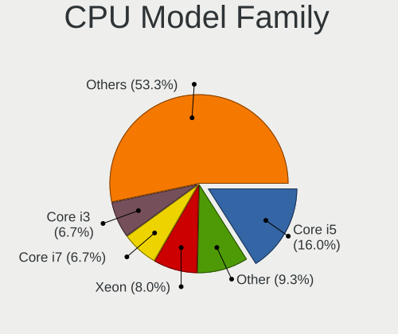

| Model                   | Desktops | Percent |
|-------------------------|----------|---------|
| Intel Core i5           | 12       | 16%     |
| Other                   | 7        | 9.33%   |
| Intel Xeon              | 6        | 8%      |
| Intel Core i7           | 5        | 6.67%   |
| Intel Core i3           | 5        | 6.67%   |
| Intel Celeron           | 5        | 6.67%   |
| AMD Ryzen 5             | 4        | 5.33%   |
| Intel Pentium Dual      | 3        | 4%      |
| AMD A10                 | 3        | 4%      |
| Intel Pentium Dual-Core | 2        | 2.67%   |
| Intel Core 2 Duo        | 2        | 2.67%   |
| AMD Ryzen 9             | 2        | 2.67%   |
| AMD Ryzen 7             | 2        | 2.67%   |
| AMD FX                  | 2        | 2.67%   |
| AMD Athlon II X2        | 2        | 2.67%   |
| AMD A4                  | 2        | 2.67%   |
| Intel Pentium Gold      | 1        | 1.33%   |
| Intel Pentium D         | 1        | 1.33%   |
| Intel Pentium 4         | 1        | 1.33%   |
| Intel Atom              | 1        | 1.33%   |
| AMD Phenom II X6        | 1        | 1.33%   |
| AMD E2                  | 1        | 1.33%   |
| AMD E                   | 1        | 1.33%   |
| AMD Athlon II X4        | 1        | 1.33%   |
| AMD Athlon 64 X2        | 1        | 1.33%   |
| AMD Athlon 64           | 1        | 1.33%   |
| AMD A8                  | 1        | 1.33%   |

CPU Cores
---------

Number of processor cores

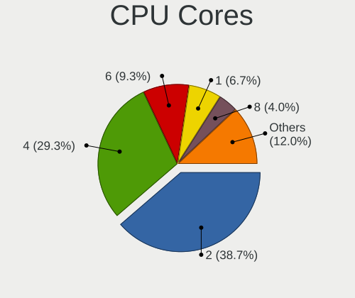

| Number | Desktops | Percent |
|--------|----------|---------|
| 2      | 29       | 38.67%  |
| 4      | 22       | 29.33%  |
| 6      | 7        | 9.33%   |
| 1      | 5        | 6.67%   |
| 8      | 3        | 4%      |
| 16     | 2        | 2.67%   |
| 14     | 2        | 2.67%   |
| 12     | 2        | 2.67%   |
| 10     | 2        | 2.67%   |
| 3      | 1        | 1.33%   |

CPU Sockets
-----------

Number of sockets

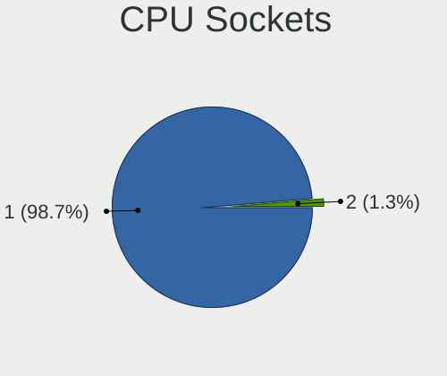

| Number | Desktops | Percent |
|--------|----------|---------|
| 1      | 74       | 98.67%  |
| 2      | 1        | 1.33%   |

CPU Threads
-----------

Threads per core (Hyper-Threading)

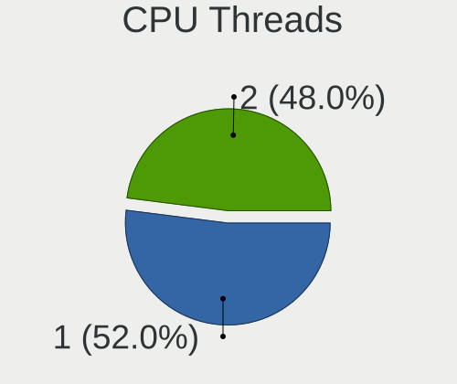

| Number | Desktops | Percent |
|--------|----------|---------|
| 1      | 39       | 52%     |
| 2      | 36       | 48%     |

CPU Op-Modes
------------

CPU Operation Modes (32-bit, 64-bit)

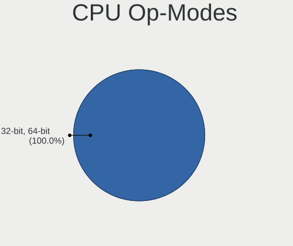

| Op mode        | Desktops | Percent |
|----------------|----------|---------|
| 32-bit, 64-bit | 75       | 100%    |

CPU Microcode
-------------

Microcode number

| Number  | Desktops | Percent |
|---------|----------|---------|
| Unknown | 75       | 100%    |

CPU Microarch
-------------

Microarchitecture

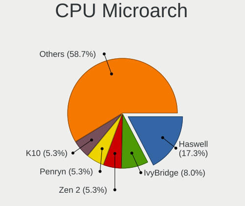

| Name             | Desktops | Percent |
|------------------|----------|---------|
| Haswell          | 13       | 17.33%  |
| IvyBridge        | 6        | 8%      |
| Zen 2            | 4        | 5.33%   |
| Penryn           | 4        | 5.33%   |
| K10              | 4        | 5.33%   |
| Unknown          | 4        | 5.33%   |
| Steamroller      | 3        | 4%      |
| Skylake          | 3        | 4%      |
| Piledriver       | 3        | 4%      |
| NetBurst         | 3        | 4%      |
| KabyLake         | 3        | 4%      |
| Core             | 3        | 4%      |
| Zen 3            | 2        | 2.67%   |
| Westmere         | 2        | 2.67%   |
| Silvermont       | 2        | 2.67%   |
| SandyBridge      | 2        | 2.67%   |
| K8 Hammer        | 2        | 2.67%   |
| Gracemont        | 2        | 2.67%   |
| Bulldozer        | 2        | 2.67%   |
| Alderlake Hybrid | 2        | 2.67%   |
| Zen+             | 1        | 1.33%   |
| Zen              | 1        | 1.33%   |
| Puma             | 1        | 1.33%   |
| Nehalem          | 1        | 1.33%   |
| Broadwell        | 1        | 1.33%   |
| Bobcat           | 1        | 1.33%   |

Graphics
--------

GPU Vendor
----------

Vendors of graphics cards

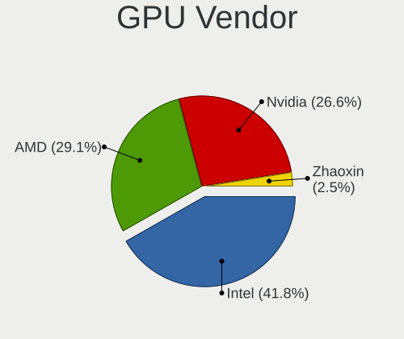

| Vendor  | Desktops | Percent |
|---------|----------|---------|
| Intel   | 33       | 41.77%  |
| AMD     | 23       | 29.11%  |
| Nvidia  | 21       | 26.58%  |
| Zhaoxin | 2        | 2.53%   |

GPU Model
---------

Graphics card models

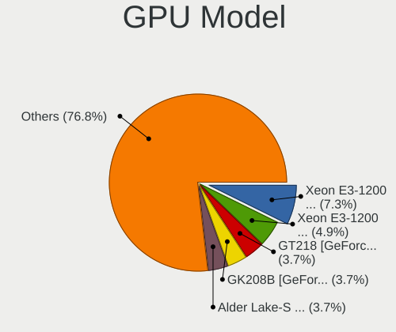

| Model                                                                                    | Desktops | Percent |
|------------------------------------------------------------------------------------------|----------|---------|
| Intel Xeon E3-1200 v3/4th Gen Core Processor Integrated Graphics Controller              | 6        | 7.32%   |
| Intel Xeon E3-1200 v2/3rd Gen Core processor Graphics Controller                         | 4        | 4.88%   |
| Nvidia GT218 [GeForce 210]                                                               | 3        | 3.66%   |
| Nvidia GK208B [GeForce GT 710]                                                           | 3        | 3.66%   |
| Intel Alder Lake-S GT1 [UHD Graphics 770]                                                | 3        | 3.66%   |
| Intel 4 Series Chipset Integrated Graphics Controller                                    | 3        | 3.66%   |
| Zhaoxin KX-6000 C-960 GPU                                                                | 2        | 2.44%   |
| Nvidia GP107GL [Quadro P620]                                                             | 2        | 2.44%   |
| Intel Skylake-S GT2 [HD Graphics 530]                                                    | 2        | 2.44%   |
| Intel Alder Lake-N [UHD Graphics]                                                        | 2        | 2.44%   |
| AMD Oland [Radeon HD 8570 / R5 430 OEM / R7 240/340 / Radeon 520 OEM]                    | 2        | 2.44%   |
| AMD Navi 21 [Radeon RX 6800/6800 XT / 6900 XT]                                           | 2        | 2.44%   |
| AMD Kaveri [Radeon R7 Graphics]                                                          | 2        | 2.44%   |
| AMD Ellesmere [Radeon RX 470/480/570/570X/580/580X/590]                                  | 2        | 2.44%   |
| Nvidia TU116 [GeForce GTX 1660 SUPER]                                                    | 1        | 1.22%   |
| Nvidia TU116 [CMP 30HX]                                                                  | 1        | 1.22%   |
| Nvidia TU106 [GeForce RTX 2060 Rev. A]                                                   | 1        | 1.22%   |
| Nvidia GT218 [GeForce 8400 GS Rev. 3]                                                    | 1        | 1.22%   |
| Nvidia GT218 [GeForce 405]                                                               | 1        | 1.22%   |
| Nvidia GP108 [GeForce GT 1030]                                                           | 1        | 1.22%   |
| Nvidia GK208B [GeForce GT 730]                                                           | 1        | 1.22%   |
| Nvidia GF119 [GeForce GT 705]                                                            | 1        | 1.22%   |
| Nvidia GF106GL [Quadro 2000]                                                             | 1        | 1.22%   |
| Nvidia GA106 [GeForce RTX 3060 Lite Hash Rate]                                           | 1        | 1.22%   |
| Nvidia G72 [GeForce 7200 GS / 7300 SE]                                                   | 1        | 1.22%   |
| Nvidia C77 [GeForce 8300]                                                                | 1        | 1.22%   |
| Nvidia C61 [GeForce 7025 / nForce 630a]                                                  | 1        | 1.22%   |
| Intel Raptor Lake-S GT1 [UHD Graphics 770]                                               | 1        | 1.22%   |
| Intel Kaby Lake-U GT1 [HD Graphics 610]                                                  | 1        | 1.22%   |
| Intel IvyBridge GT2 [HD Graphics 4000]                                                   | 1        | 1.22%   |
| Intel Haswell-ULT Integrated Graphics Controller                                         | 1        | 1.22%   |
| Intel DG2 [Arc A380]                                                                     | 1        | 1.22%   |
| Intel CoffeeLake-S GT2 [UHD Graphics 630]                                                | 1        | 1.22%   |
| Intel CoffeeLake-S GT1 [UHD Graphics 610]                                                | 1        | 1.22%   |
| Intel Atom/Celeron/Pentium Processor x5-E8000/J3xxx/N3xxx Integrated Graphics Controller | 1        | 1.22%   |
| Intel Atom Processor Z36xxx/Z37xxx Series Graphics & Display                             | 1        | 1.22%   |
| Intel 82G33/G31 Express Integrated Graphics Controller                                   | 1        | 1.22%   |
| Intel 82915G/GV/910GL Integrated Graphics Controller                                     | 1        | 1.22%   |
| Intel 4th Generation Core Processor Family Integrated Graphics Controller                | 1        | 1.22%   |
| Intel 2nd Generation Core Processor Family Integrated Graphics Controller                | 1        | 1.22%   |

GPU Combo
---------

Combinations of graphics cards

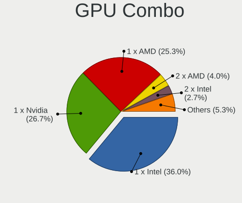

| Name           | Desktops | Percent |
|----------------|----------|---------|
| 1 x Intel      | 27       | 36%     |
| 1 x Nvidia     | 20       | 26.67%  |
| 1 x AMD        | 19       | 25.33%  |
| 2 x AMD        | 3        | 4%      |
| 2 x Intel      | 2        | 2.67%   |
| 1 x Zhaoxin    | 2        | 2.67%   |
| Intel + Nvidia | 1        | 1.33%   |
| Intel + AMD    | 1        | 1.33%   |

GPU Driver
----------

Free vs proprietary

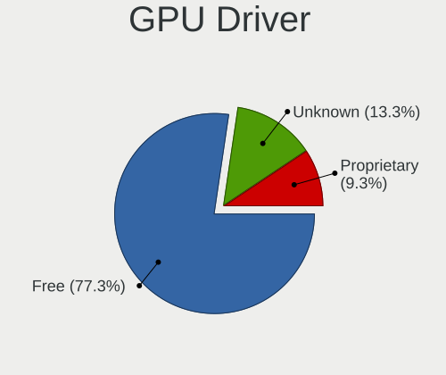

| Driver      | Desktops | Percent |
|-------------|----------|---------|
| Free        | 58       | 77.33%  |
| Unknown     | 10       | 13.33%  |
| Proprietary | 7        | 9.33%   |

GPU Memory
----------

Total video memory

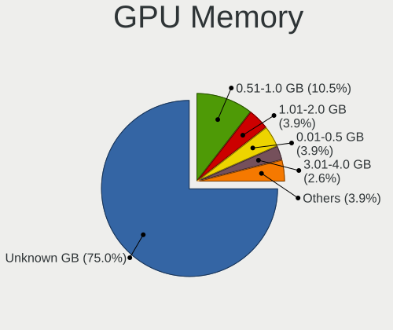

| Size in GB | Desktops | Percent |
|------------|----------|---------|
| Unknown    | 57       | 75%     |
| 0.51-1.0   | 8        | 10.53%  |
| 1.01-2.0   | 3        | 3.95%   |
| 0.01-0.5   | 3        | 3.95%   |
| 3.01-4.0   | 2        | 2.63%   |
| 5.01-6.0   | 1        | 1.32%   |
| 16.01-24.0 | 1        | 1.32%   |
| 8.01-16.0  | 1        | 1.32%   |

Monitor
-------

Monitor Vendor
--------------

Monitor vendors

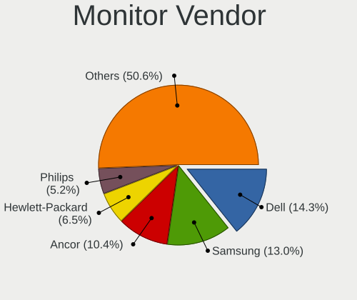

| Vendor               | Desktops | Percent |
|----------------------|----------|---------|
| Dell                 | 11       | 14.29%  |
| Samsung Electronics  | 10       | 12.99%  |
| Ancor Communications | 8        | 10.39%  |
| Hewlett-Packard      | 5        | 6.49%   |
| Philips              | 4        | 5.19%   |
| Lenovo               | 4        | 5.19%   |
| BenQ                 | 4        | 5.19%   |
| Acer                 | 4        | 5.19%   |
| Iiyama               | 3        | 3.9%    |
| Goldstar             | 3        | 3.9%    |
| XYK                  | 2        | 2.6%    |
| ViewSonic            | 2        | 2.6%    |
| Unknown              | 2        | 2.6%    |
| HUAWEI               | 2        | 2.6%    |
| AOC                  | 2        | 2.6%    |
| Sony                 | 1        | 1.3%    |
| Sceptre Tech         | 1        | 1.3%    |
| MStar                | 1        | 1.3%    |
| Medion               | 1        | 1.3%    |
| KNH                  | 1        | 1.3%    |
| INNOCN               | 1        | 1.3%    |
| HKC                  | 1        | 1.3%    |
| HannStar             | 1        | 1.3%    |
| Fujitsu Siemens      | 1        | 1.3%    |
| Eizo                 | 1        | 1.3%    |
| ASUSTek Computer     | 1        | 1.3%    |

Monitor Model
-------------

Monitor models

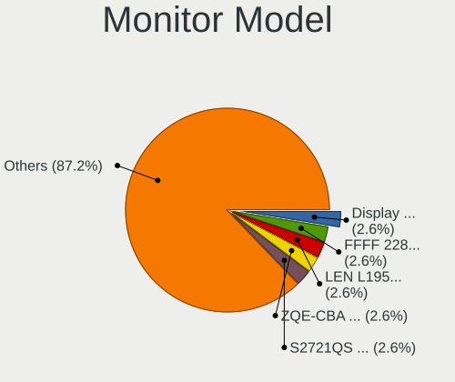

| Model                                                                   | Desktops | Percent |
|-------------------------------------------------------------------------|----------|---------|
| XYK Display XYK1200 1920x1200 301x188mm 14.0-inch                       | 2        | 2.56%   |
| Unknown LCD Monitor FFFF 2288x1287 2550x2550mm 142.0-inch               | 2        | 2.56%   |
| Lenovo LEN L1950wD LEN1086 1920x1080 150x100mm 7.1-inch                 | 2        | 2.56%   |
| HUAWEI ZQE-CBA HWV6A25 3440x1440 797x334mm 34.0-inch                    | 2        | 2.56%   |
| Dell S2721QS DELA198 3840x2160 597x336mm 27.0-inch                      | 2        | 2.56%   |
| ViewSonic VX3211-2K VSCF634 2560x1440 698x392mm 31.5-inch               | 1        | 1.28%   |
| ViewSonic VX2240w VSC6B20 1680x1050 495x291mm 22.6-inch                 | 1        | 1.28%   |
| Sony TV *00 SNYA003 1920x1080 1218x685mm 55.0-inch                      | 1        | 1.28%   |
| Sceptre Tech Sceptre X9WG-NagaV SPT1999 1440x900 370x220mm 16.9-inch    | 1        | 1.28%   |
| Samsung Electronics SyncMaster SAM0565 1440x900 428x255mm 19.6-inch     | 1        | 1.28%   |
| Samsung Electronics SyncMaster SAM044E 1440x900 408x255mm 18.9-inch     | 1        | 1.28%   |
| Samsung Electronics SyncMaster SAM03D0 1440x900 410x257mm 19.1-inch     | 1        | 1.28%   |
| Samsung Electronics SyncMaster SAM036D 1920x1080                        | 1        | 1.28%   |
| Samsung Electronics SyncMaster SAM010B 1280x1024 338x270mm 17.0-inch    | 1        | 1.28%   |
| Samsung Electronics S19C150 SAM0AE6 1366x768 410x230mm 18.5-inch        | 1        | 1.28%   |
| Samsung Electronics LS32AG32x SAM71DE 1920x1080 698x393mm 31.5-inch     | 1        | 1.28%   |
| Samsung Electronics LCD Monitor SAM0DF6 3840x2160 890x500mm 40.2-inch   | 1        | 1.28%   |
| Samsung Electronics LCD Monitor SAM0DE1 3840x2160 1872x1053mm 84.6-inch | 1        | 1.28%   |
| Samsung Electronics C34H89x SAM0E25 3440x1440 797x333mm 34.0-inch       | 1        | 1.28%   |
| Philips PHL 278E1 PHLC217 3840x2160 597x336mm 27.0-inch                 | 1        | 1.28%   |
| Philips PHL 223V5LH PHLC114 1920x1080 477x268mm 21.5-inch               | 1        | 1.28%   |
| Philips PHL 223V5 PHLC0CF 1920x1080 477x268mm 21.5-inch                 | 1        | 1.28%   |
| Philips LCD Monitor FTV 3840x2160                                       | 1        | 1.28%   |
| MStar Demo MST0030 1920x1080 708x398mm 32.0-inch                        | 1        | 1.28%   |
| Medion MD 20430 MED36A2 1920x1080 521x293mm 23.5-inch                   | 1        | 1.28%   |
| Lenovo P27q-20 LEN61EA 2560x1440 600x340mm 27.2-inch                    | 1        | 1.28%   |
| Lenovo LEN-M92z-B LEN0092 1920x1080 509x286mm 23.0-inch                 | 1        | 1.28%   |
| KNH monitor KNH2A3B 1920x1200 510x290mm 23.1-inch                       | 1        | 1.28%   |
| INNOCN 49C1R IOCFFFF 1920x1080 1197x337mm 49.0-inch                     | 1        | 1.28%   |
| Iiyama PLE2483H IVM6113 1920x1080 531x299mm 24.0-inch                   | 1        | 1.28%   |
| Iiyama PLB2403WS IVM5601 1920x1200 519x324mm 24.1-inch                  | 1        | 1.28%   |
| Iiyama PL2530H IVM6132 1920x1080 544x303mm 24.5-inch                    | 1        | 1.28%   |
| HKC Monitor HKC2160 1920x1080 304x228mm 15.0-inch                       | 1        | 1.28%   |
| Hewlett-Packard w20 HWP26AB 1680x1050 433x270mm 20.1-inch               | 1        | 1.28%   |
| Hewlett-Packard TouchSmart HWP4211 1920x1080 509x286mm 23.0-inch        | 1        | 1.28%   |
| Hewlett-Packard LA2205 HWP2847 1680x1050 473x296mm 22.0-inch            | 1        | 1.28%   |
| Hewlett-Packard 25x HPN357E 1920x1080 544x303mm 24.5-inch               | 1        | 1.28%   |
| Hewlett-Packard 24mh HPN366B 1920x1080 527x296mm 23.8-inch              | 1        | 1.28%   |
| HannStar X500 HSD025B 1024x768 300x230mm 14.9-inch                      | 1        | 1.28%   |
| Goldstar FHD GSM5BCA 1920x1080 480x270mm 21.7-inch                      | 1        | 1.28%   |

Monitor Resolution
------------------

Monitor screen resolution

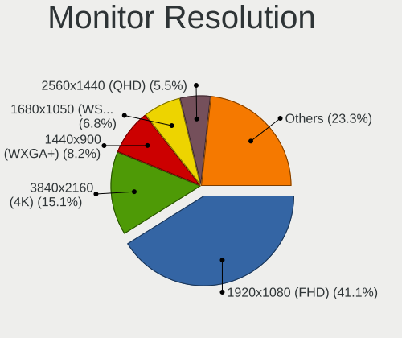

| Resolution         | Desktops | Percent |
|--------------------|----------|---------|
| 1920x1080 (FHD)    | 30       | 41.1%   |
| 3840x2160 (4K)     | 11       | 15.07%  |
| 1440x900 (WXGA+)   | 6        | 8.22%   |
| 1680x1050 (WSXGA+) | 5        | 6.85%   |
| 2560x1440 (QHD)    | 4        | 5.48%   |
| 1920x1200 (WUXGA)  | 4        | 5.48%   |
| 3440x1440          | 3        | 4.11%   |
| 1280x1024 (SXGA)   | 3        | 4.11%   |
| 2288x1287          | 2        | 2.74%   |
| 1600x900 (HD+)     | 2        | 2.74%   |
| 1366x768 (WXGA)    | 2        | 2.74%   |
| 1024x768 (XGA)     | 1        | 1.37%   |

Monitor Diagonal
----------------

Diagonal size in inches

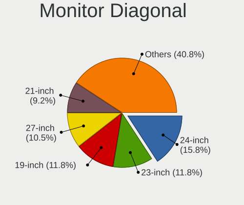

| Inches  | Desktops | Percent |
|---------|----------|---------|
| 24      | 12       | 15.79%  |
| 23      | 9        | 11.84%  |
| 19      | 9        | 11.84%  |
| 27      | 8        | 10.53%  |
| 21      | 7        | 9.21%   |
| 34      | 4        | 5.26%   |
| 22      | 3        | 3.95%   |
| 18      | 3        | 3.95%   |
| 142     | 2        | 2.63%   |
| 84      | 2        | 2.63%   |
| 31      | 2        | 2.63%   |
| 20      | 2        | 2.63%   |
| 17      | 2        | 2.63%   |
| 15      | 2        | 2.63%   |
| 14      | 2        | 2.63%   |
| Unknown | 2        | 2.63%   |
| 55      | 1        | 1.32%   |
| 54      | 1        | 1.32%   |
| 52      | 1        | 1.32%   |
| 49      | 1        | 1.32%   |
| 32      | 1        | 1.32%   |

Monitor Width
-------------

Physical width

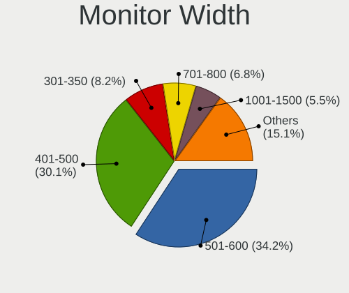

| Width in mm    | Desktops | Percent |
|----------------|----------|---------|
| 501-600        | 25       | 34.25%  |
| 401-500        | 22       | 30.14%  |
| 301-350        | 6        | 8.22%   |
| 701-800        | 5        | 6.85%   |
| 1001-1500      | 4        | 5.48%   |
| 601-700        | 3        | 4.11%   |
| More than 2000 | 2        | 2.74%   |
| 351-400        | 2        | 2.74%   |
| 1501-2000      | 2        | 2.74%   |
| Unknown        | 2        | 2.74%   |

Aspect Ratio
------------

Proportional relationship between the width and the height

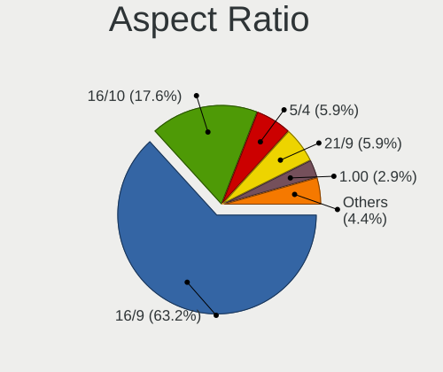

| Ratio   | Desktops | Percent |
|---------|----------|---------|
| 16/9    | 43       | 63.24%  |
| 16/10   | 12       | 17.65%  |
| 5/4     | 4        | 5.88%   |
| 21/9    | 4        | 5.88%   |
| 1.00    | 2        | 2.94%   |
| 4/3     | 1        | 1.47%   |
| 32/9    | 1        | 1.47%   |
| Unknown | 1        | 1.47%   |

Monitor Area
------------

Area in inch²

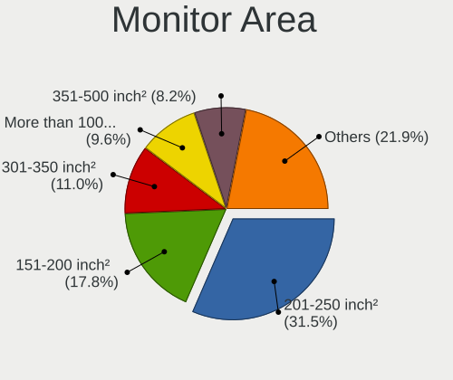

| Area in inch² | Desktops | Percent |
|----------------|----------|---------|
| 201-250        | 23       | 31.51%  |
| 151-200        | 13       | 17.81%  |
| 301-350        | 8        | 10.96%  |
| More than 1000 | 7        | 9.59%   |
| 351-500        | 6        | 8.22%   |
| 251-300        | 6        | 8.22%   |
| 141-150        | 3        | 4.11%   |
| 81-90          | 2        | 2.74%   |
| 101-110        | 2        | 2.74%   |
| Unknown        | 2        | 2.74%   |
| 501-1000       | 1        | 1.37%   |

Pixel Density
-------------

Pixels per inch

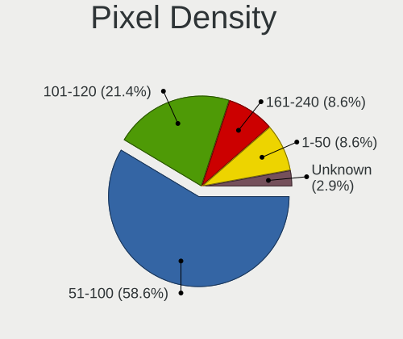

| Density | Desktops | Percent |
|---------|----------|---------|
| 51-100  | 41       | 58.57%  |
| 101-120 | 15       | 21.43%  |
| 1-50    | 6        | 8.57%   |
| 161-240 | 6        | 8.57%   |
| Unknown | 2        | 2.86%   |

Multiple Monitors
-----------------

Total monitors connected

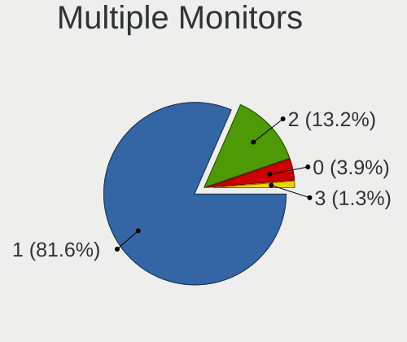

| Total | Desktops | Percent |
|-------|----------|---------|
| 1     | 62       | 81.58%  |
| 2     | 10       | 13.16%  |
| 0     | 3        | 3.95%   |
| 3     | 1        | 1.32%   |

Network
-------

Net Controller Vendor
---------------------

Controller vendors

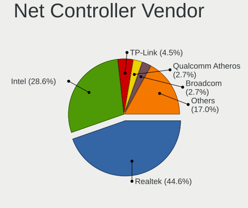

| Vendor                           | Desktops | Percent |
|----------------------------------|----------|---------|
| Realtek Semiconductor            | 50       | 44.64%  |
| Intel                            | 32       | 28.57%  |
| TP-Link                          | 5        | 4.46%   |
| Qualcomm Atheros Communications  | 3        | 2.68%   |
| Broadcom                         | 3        | 2.68%   |
| U-Blox                           | 2        | 1.79%   |
| Nvidia                           | 2        | 1.79%   |
| NetGear                          | 2        | 1.79%   |
| Silicon Integrated Systems [SiS] | 1        | 0.89%   |
| Samsung Electronics              | 1        | 0.89%   |
| Ralink Technology                | 1        | 0.89%   |
| Ralink                           | 1        | 0.89%   |
| Qualcomm Atheros                 | 1        | 0.89%   |
| Motorola PCS                     | 1        | 0.89%   |
| LSI                              | 1        | 0.89%   |
| Edimax Technology                | 1        | 0.89%   |
| Dresden Elektronik               | 1        | 0.89%   |
| D-Link                           | 1        | 0.89%   |
| Broadcom Limited                 | 1        | 0.89%   |
| Belkin Components                | 1        | 0.89%   |
| ASIX Electronics                 | 1        | 0.89%   |

Net Controller Model
--------------------

Controller models

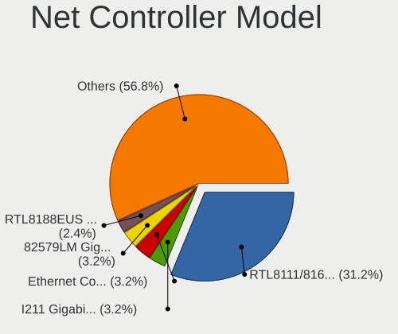

| Model                                                                  | Desktops | Percent |
|------------------------------------------------------------------------|----------|---------|
| Realtek RTL8111/8168/8211/8411 PCI Express Gigabit Ethernet Controller | 39       | 31.2%   |
| Intel I211 Gigabit Network Connection                                  | 4        | 3.2%    |
| Intel Ethernet Connection I217-LM                                      | 4        | 3.2%    |
| Intel 82579LM Gigabit Network Connection (Lewisville)                  | 4        | 3.2%    |
| Realtek RTL8188EUS 802.11n Wireless Network Adapter                    | 3        | 2.4%    |
| Realtek RTL-8100/8101L/8139 PCI Fast Ethernet Adapter                  | 3        | 2.4%    |
| Qualcomm Atheros AR9271 802.11n                                        | 3        | 2.4%    |
| U-Blox [u-blox 7]                                                      | 2        | 1.6%    |
| Realtek RTL88x2bu [AC1200 Techkey]                                     | 2        | 1.6%    |
| Realtek RTL8125 2.5GbE Controller                                      | 2        | 1.6%    |
| Realtek 802.11ac NIC                                                   | 2        | 1.6%    |
| Intel Wireless 7265                                                    | 2        | 1.6%    |
| Intel Wi-Fi 5(802.11ac) Wireless-AC 9x6x [Thunder Peak]                | 2        | 1.6%    |
| Intel Ethernet Connection (17) I219-LM                                 | 2        | 1.6%    |
| Intel 82567LM-3 Gigabit Network Connection                             | 2        | 1.6%    |
| TP-Link TL-WN823N v2/v3 [Realtek RTL8192EU]                            | 1        | 0.8%    |
| TP-Link TL-WN822N Version 4 RTL8192EU                                  | 1        | 0.8%    |
| TP-Link Archer T3U [Realtek RTL8812BU]                                 | 1        | 0.8%    |
| TP-Link Archer T2U PLUS [RTL8821AU]                                    | 1        | 0.8%    |
| TP-Link 802.11n NIC                                                    | 1        | 0.8%    |
| Silicon Integrated Systems [SiS] 191 Gigabit Ethernet Adapter          | 1        | 0.8%    |
| Samsung GT-I9070 (network tethering, USB debugging enabled)            | 1        | 0.8%    |
| Realtek RTL8192EU 802.11b/g/n WLAN Adapter                             | 1        | 0.8%    |
| Realtek RTL8192EE PCIe Wireless Network Adapter                        | 1        | 0.8%    |
| Realtek RTL8192CU 802.11n WLAN Adapter                                 | 1        | 0.8%    |
| Realtek RTL8191SU 802.11n WLAN Adapter                                 | 1        | 0.8%    |
| Realtek RTL8188CUS 802.11n WLAN Adapter                                | 1        | 0.8%    |
| Realtek RTL8187B Wireless 802.11g 54Mbps Network Adapter               | 1        | 0.8%    |
| Realtek RTL8153 Gigabit Ethernet Adapter                               | 1        | 0.8%    |
| Realtek RTL8152 Fast Ethernet Adapter                                  | 1        | 0.8%    |
| Realtek RTL810xE PCI Express Fast Ethernet controller                  | 1        | 0.8%    |
| Realtek RTL-8110SC/8169SC Gigabit Ethernet                             | 1        | 0.8%    |
| Realtek 802.11ax WLAN Adapter                                          | 1        | 0.8%    |
| Ralink MT7610U ("Archer T2U" 2.4G+5G WLAN Adapter                      | 1        | 0.8%    |
| Ralink RT5390R 802.11bgn PCIe Wireless Network Adapter                 | 1        | 0.8%    |
| Qualcomm Atheros AR5212/5213/2414 Wireless Network Adapter             | 1        | 0.8%    |
| Nvidia MCP77 Ethernet                                                  | 1        | 0.8%    |
| Nvidia MCP61 Ethernet                                                  | 1        | 0.8%    |
| NetGear WNDA3100v1 802.11abgn [Atheros AR9170+AR9104]                  | 1        | 0.8%    |
| NetGear A6210                                                          | 1        | 0.8%    |

Wireless Vendor
---------------

Wireless vendors

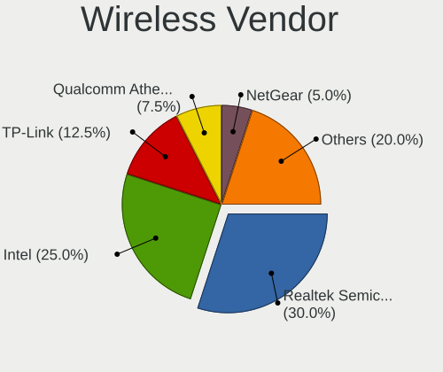

| Vendor                          | Desktops | Percent |
|---------------------------------|----------|---------|
| Realtek Semiconductor           | 12       | 30%     |
| Intel                           | 10       | 25%     |
| TP-Link                         | 5        | 12.5%   |
| Qualcomm Atheros Communications | 3        | 7.5%    |
| NetGear                         | 2        | 5%      |
| Broadcom                        | 2        | 5%      |
| Ralink Technology               | 1        | 2.5%    |
| Ralink                          | 1        | 2.5%    |
| Qualcomm Atheros                | 1        | 2.5%    |
| Edimax Technology               | 1        | 2.5%    |
| D-Link                          | 1        | 2.5%    |
| Belkin Components               | 1        | 2.5%    |

Wireless Model
--------------

Wireless models

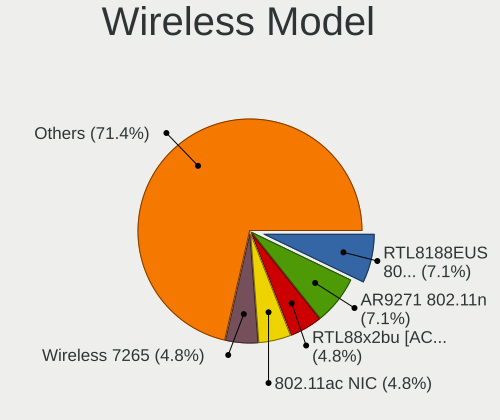

| Model                                                                                   | Desktops | Percent |
|-----------------------------------------------------------------------------------------|----------|---------|
| Realtek RTL8188EUS 802.11n Wireless Network Adapter                                     | 3        | 7.14%   |
| Qualcomm Atheros AR9271 802.11n                                                         | 3        | 7.14%   |
| Realtek RTL88x2bu [AC1200 Techkey]                                                      | 2        | 4.76%   |
| Realtek 802.11ac NIC                                                                    | 2        | 4.76%   |
| Intel Wireless 7265                                                                     | 2        | 4.76%   |
| Intel Wi-Fi 5(802.11ac) Wireless-AC 9x6x [Thunder Peak]                                 | 2        | 4.76%   |
| TP-Link TL-WN823N v2/v3 [Realtek RTL8192EU]                                             | 1        | 2.38%   |
| TP-Link TL-WN822N Version 4 RTL8192EU                                                   | 1        | 2.38%   |
| TP-Link Archer T3U [Realtek RTL8812BU]                                                  | 1        | 2.38%   |
| TP-Link Archer T2U PLUS [RTL8821AU]                                                     | 1        | 2.38%   |
| TP-Link 802.11n NIC                                                                     | 1        | 2.38%   |
| Realtek RTL8192EU 802.11b/g/n WLAN Adapter                                              | 1        | 2.38%   |
| Realtek RTL8192EE PCIe Wireless Network Adapter                                         | 1        | 2.38%   |
| Realtek RTL8192CU 802.11n WLAN Adapter                                                  | 1        | 2.38%   |
| Realtek RTL8191SU 802.11n WLAN Adapter                                                  | 1        | 2.38%   |
| Realtek RTL8188CUS 802.11n WLAN Adapter                                                 | 1        | 2.38%   |
| Realtek RTL8187B Wireless 802.11g 54Mbps Network Adapter                                | 1        | 2.38%   |
| Realtek 802.11ax WLAN Adapter                                                           | 1        | 2.38%   |
| Ralink MT7610U ("Archer T2U" 2.4G+5G WLAN Adapter                                       | 1        | 2.38%   |
| Ralink RT5390R 802.11bgn PCIe Wireless Network Adapter                                  | 1        | 2.38%   |
| Qualcomm Atheros AR5212/5213/2414 Wireless Network Adapter                              | 1        | 2.38%   |
| NetGear WNDA3100v1 802.11abgn [Atheros AR9170+AR9104]                                   | 1        | 2.38%   |
| NetGear A6210                                                                           | 1        | 2.38%   |
| Intel Wireless 3165                                                                     | 1        | 2.38%   |
| Intel Wi-Fi 6E(802.11ax) AX210/AX1675* 2x2 [Typhoon Peak]                               | 1        | 2.38%   |
| Intel Wi-Fi 6 AX200                                                                     | 1        | 2.38%   |
| Intel Centrino Wireless-N 1000 [Condor Peak]                                            | 1        | 2.38%   |
| Intel Centrino Advanced-N 6235                                                          | 1        | 2.38%   |
| Intel Alder Lake-N PCH CNVi WiFi                                                        | 1        | 2.38%   |
| Edimax Edimax AC600 USB                                                                 | 1        | 2.38%   |
| D-Link DWA-131 Wireless N Nano Adapter (Rev. E1) [Realtek RTL8192EU]                    | 1        | 2.38%   |
| Broadcom BCM43228 802.11a/b/g/n                                                         | 1        | 2.38%   |
| Broadcom BCM4322 802.11a/b/g/n Wireless LAN Controller                                  | 1        | 2.38%   |
| Belkin Components F7D2102 802.11n N300 Micro Wireless Adapter v3000 [Realtek RTL8192CU] | 1        | 2.38%   |

Ethernet Vendor
---------------

Ethernet vendors

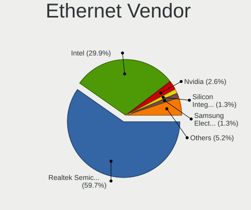

| Vendor                           | Desktops | Percent |
|----------------------------------|----------|---------|
| Realtek Semiconductor            | 46       | 59.74%  |
| Intel                            | 23       | 29.87%  |
| Nvidia                           | 2        | 2.6%    |
| Silicon Integrated Systems [SiS] | 1        | 1.3%    |
| Samsung Electronics              | 1        | 1.3%    |
| Motorola PCS                     | 1        | 1.3%    |
| Broadcom Limited                 | 1        | 1.3%    |
| Broadcom                         | 1        | 1.3%    |
| ASIX Electronics                 | 1        | 1.3%    |

Ethernet Model
--------------

Ethernet models

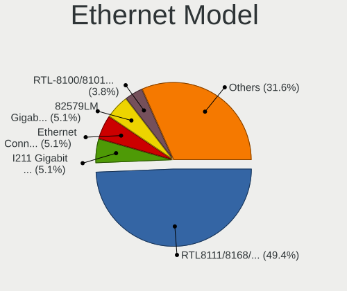

| Model                                                                  | Desktops | Percent |
|------------------------------------------------------------------------|----------|---------|
| Realtek RTL8111/8168/8211/8411 PCI Express Gigabit Ethernet Controller | 39       | 49.37%  |
| Intel I211 Gigabit Network Connection                                  | 4        | 5.06%   |
| Intel Ethernet Connection I217-LM                                      | 4        | 5.06%   |
| Intel 82579LM Gigabit Network Connection (Lewisville)                  | 4        | 5.06%   |
| Realtek RTL-8100/8101L/8139 PCI Fast Ethernet Adapter                  | 3        | 3.8%    |
| Realtek RTL8125 2.5GbE Controller                                      | 2        | 2.53%   |
| Intel Ethernet Connection (17) I219-LM                                 | 2        | 2.53%   |
| Intel 82567LM-3 Gigabit Network Connection                             | 2        | 2.53%   |
| Silicon Integrated Systems [SiS] 191 Gigabit Ethernet Adapter          | 1        | 1.27%   |
| Samsung GT-I9070 (network tethering, USB debugging enabled)            | 1        | 1.27%   |
| Realtek RTL8153 Gigabit Ethernet Adapter                               | 1        | 1.27%   |
| Realtek RTL8152 Fast Ethernet Adapter                                  | 1        | 1.27%   |
| Realtek RTL810xE PCI Express Fast Ethernet controller                  | 1        | 1.27%   |
| Realtek RTL-8110SC/8169SC Gigabit Ethernet                             | 1        | 1.27%   |
| Nvidia MCP77 Ethernet                                                  | 1        | 1.27%   |
| Nvidia MCP61 Ethernet                                                  | 1        | 1.27%   |
| Motorola PCS motorola one 5G ace                                       | 1        | 1.27%   |
| Intel Ethernet Controller I226-V                                       | 1        | 1.27%   |
| Intel Ethernet Connection I217-V                                       | 1        | 1.27%   |
| Intel Ethernet Connection (7) I219-V                                   | 1        | 1.27%   |
| Intel Ethernet Connection (5) I219-V                                   | 1        | 1.27%   |
| Intel Ethernet Connection (2) I218-V                                   | 1        | 1.27%   |
| Intel 82574L Gigabit Network Connection                                | 1        | 1.27%   |
| Intel 82562ET/EZ/GT/GZ - PRO/100 VE (LOM) Ethernet Controller          | 1        | 1.27%   |
| Broadcom NetXtreme II BCM57810 10 Gigabit Ethernet                     | 1        | 1.27%   |
| Broadcom Limited NetXtreme BCM5751 Gigabit Ethernet PCI Express        | 1        | 1.27%   |
| ASIX AX88772A Fast Ethernet                                            | 1        | 1.27%   |

Net Controller Kind
-------------------

Ethernet, WiFi or modem

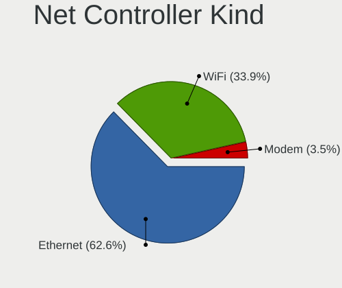

| Kind     | Desktops | Percent |
|----------|----------|---------|
| Ethernet | 72       | 62.61%  |
| WiFi     | 39       | 33.91%  |
| Modem    | 4        | 3.48%   |

Used Controller
---------------

Currently used network controller

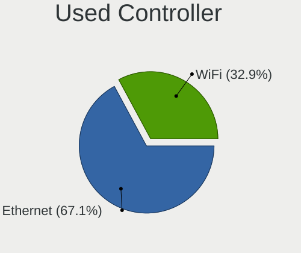

| Kind     | Desktops | Percent |
|----------|----------|---------|
| Ethernet | 49       | 67.12%  |
| WiFi     | 24       | 32.88%  |

NICs
----

Total network controllers on board

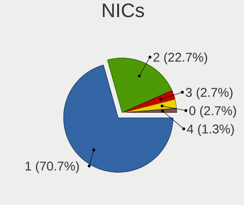

| Total | Desktops | Percent |
|-------|----------|---------|
| 1     | 53       | 70.67%  |
| 2     | 17       | 22.67%  |
| 3     | 2        | 2.67%   |
| 0     | 2        | 2.67%   |
| 4     | 1        | 1.33%   |

IPv6
----

IPv6 vs IPv4

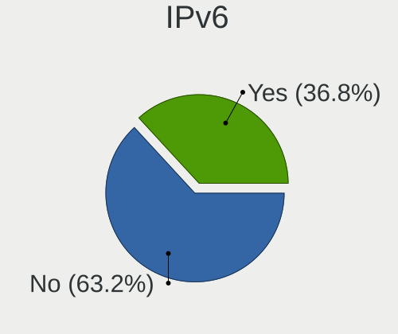

| Used | Desktops | Percent |
|------|----------|---------|
| No   | 48       | 63.16%  |
| Yes  | 28       | 36.84%  |

Bluetooth
---------

Bluetooth Vendor
----------------

Controller vendors

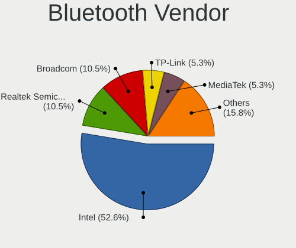

| Vendor                  | Desktops | Percent |
|-------------------------|----------|---------|
| Intel                   | 10       | 52.63%  |
| Realtek Semiconductor   | 2        | 10.53%  |
| Broadcom                | 2        | 10.53%  |
| TP-Link                 | 1        | 5.26%   |
| MediaTek                | 1        | 5.26%   |
| Cambridge Silicon Radio | 1        | 5.26%   |
| Apple                   | 1        | 5.26%   |
| Unknown                 | 1        | 5.26%   |

Bluetooth Model
---------------

Controller models

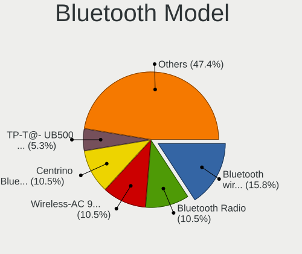

| Model                                               | Desktops | Percent |
|-----------------------------------------------------|----------|---------|
| Intel Bluetooth wireless interface                  | 3        | 15.79%  |
| Realtek Bluetooth Radio                             | 2        | 10.53%  |
| Intel Wireless-AC 9260 Bluetooth Adapter            | 2        | 10.53%  |
| Intel Centrino Bluetooth Wireless Transceiver       | 2        | 10.53%  |
| TP-Link TP-T@- UB500 Adapter                        | 1        | 5.26%   |
| MediaTek Wireless_Device                            | 1        | 5.26%   |
| Intel AX210 Bluetooth                               | 1        | 5.26%   |
| Intel AX201 Bluetooth                               | 1        | 5.26%   |
| Intel AX200 Bluetooth                               | 1        | 5.26%   |
| Cambridge Silicon Radio Bluetooth Dongle (HCI mode) | 1        | 5.26%   |
| Broadcom HP Portable Bumble Bee                     | 1        | 5.26%   |
| Broadcom BCM20702A0 Bluetooth 4.0                   | 1        | 5.26%   |
| Apple Built-in Bluetooth 2.0+EDR HCI                | 1        | 5.26%   |
| Unknown                                             | 1        | 5.26%   |

Sound
-----

Sound Vendor
------------

Sound card vendors

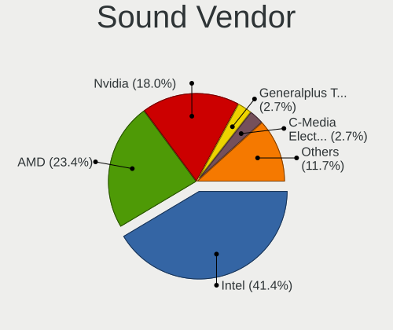

| Vendor                           | Desktops | Percent |
|----------------------------------|----------|---------|
| Intel                            | 46       | 41.44%  |
| AMD                              | 26       | 23.42%  |
| Nvidia                           | 20       | 18.02%  |
| Generalplus Technology           | 3        | 2.7%    |
| C-Media Electronics              | 3        | 2.7%    |
| Zhaoxin                          | 2        | 1.8%    |
| Razer USA                        | 2        | 1.8%    |
| BEHRINGER International          | 2        | 1.8%    |
| VIA Technologies                 | 1        | 0.9%    |
| Silicon Integrated Systems [SiS] | 1        | 0.9%    |
| Micro Star International         | 1        | 0.9%    |
| Jieli Technology                 | 1        | 0.9%    |
| Creative Labs                    | 1        | 0.9%    |
| AKAI                             | 1        | 0.9%    |
| Unknown                          | 1        | 0.9%    |

Sound Model
-----------

Sound card models

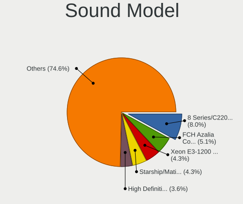

| Model                                                                                     | Desktops | Percent |
|-------------------------------------------------------------------------------------------|----------|---------|
| Intel 8 Series/C220 Series Chipset High Definition Audio Controller                       | 11       | 7.97%   |
| AMD FCH Azalia Controller                                                                 | 7        | 5.07%   |
| Intel Xeon E3-1200 v3/4th Gen Core Processor HD Audio Controller                          | 6        | 4.35%   |
| AMD Starship/Matisse HD Audio Controller                                                  | 6        | 4.35%   |
| Nvidia High Definition Audio Controller                                                   | 5        | 3.62%   |
| AMD SBx00 Azalia (Intel HDA)                                                              | 5        | 3.62%   |
| Nvidia GK208 HDMI/DP Audio Controller                                                     | 4        | 2.9%    |
| Intel Alder Lake-S HD Audio Controller                                                    | 4        | 2.9%    |
| Intel 6 Series/C200 Series Chipset Family High Definition Audio Controller                | 4        | 2.9%    |
| Intel NM10/ICH7 Family High Definition Audio Controller                                   | 3        | 2.17%   |
| Intel 82801JI (ICH10 Family) HD Audio Controller                                          | 3        | 2.17%   |
| Intel 7 Series/C216 Chipset Family High Definition Audio Controller                       | 3        | 2.17%   |
| Generalplus Technology USB Audio Device                                                   | 3        | 2.17%   |
| AMD Oland/Hainan/Cape Verde/Pitcairn HDMI Audio [Radeon HD 7000 Series]                   | 3        | 2.17%   |
| AMD Navi 21/23 HDMI/DP Audio Controller                                                   | 3        | 2.17%   |
| Zhaoxin ZX-E High Definition Audio Controller                                             | 2        | 1.45%   |
| Zhaoxin ZX-100/KX-5000/KX-6000/KX-6000G/KH-40000/KX-7000 High Definition Audio Controller | 2        | 1.45%   |
| Nvidia MCP61 High Definition Audio                                                        | 2        | 1.45%   |
| Nvidia GP107GL High Definition Audio Controller                                           | 2        | 1.45%   |
| Intel Alder Lake-N PCH High Definition Audio Controller                                   | 2        | 1.45%   |
| Intel 82801JD/DO (ICH10 Family) HD Audio Controller                                       | 2        | 1.45%   |
| Intel 100 Series/C230 Series Chipset Family HD Audio Controller                           | 2        | 1.45%   |
| BEHRINGER International UMC202HD 192k                                                     | 2        | 1.45%   |
| AMD Trinity HDMI Audio Controller                                                         | 2        | 1.45%   |
| AMD Navi 10 HDMI Audio                                                                    | 2        | 1.45%   |
| AMD Kaveri HDMI/DP Audio Controller                                                       | 2        | 1.45%   |
| AMD Family 17h (Models 00h-0fh) HD Audio Controller                                       | 2        | 1.45%   |
| AMD Ellesmere HDMI Audio [Radeon RX 470/480 / 570/580/590]                                | 2        | 1.45%   |
| AMD Caicos HDMI Audio [Radeon HD 6450 / 7450/8450/8490 OEM / R5 230/235/235X OEM]         | 2        | 1.45%   |
| AMD Baffin HDMI/DP Audio [Radeon RX 550 640SP / RX 560/560X]                              | 2        | 1.45%   |
| VIA Technologies VX900/VT8xxx High Definition Audio Controller                            | 1        | 0.72%   |
| Silicon Integrated Systems [SiS] Azalia Audio Controller                                  | 1        | 0.72%   |
| Razer USA Razer Barracuda X                                                               | 1        | 0.72%   |
| Razer USA Nari (Wireless)                                                                 | 1        | 0.72%   |
| Nvidia TU116 High Definition Audio Controller                                             | 1        | 0.72%   |
| Nvidia TU106 High Definition Audio Controller                                             | 1        | 0.72%   |
| Nvidia MCP72XE/MCP72P/MCP78U/MCP78S High Definition Audio                                 | 1        | 0.72%   |
| Nvidia GP108 High Definition Audio Controller                                             | 1        | 0.72%   |
| Nvidia GF119 HDMI Audio Controller                                                        | 1        | 0.72%   |
| Nvidia GF106 High Definition Audio Controller                                             | 1        | 0.72%   |

Memory
------

Memory Vendor
-------------

Memory module vendors

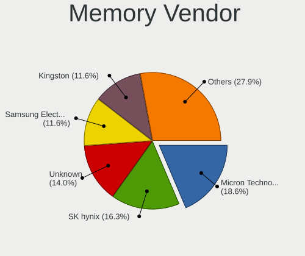

| Vendor                     | Desktops | Percent |
|----------------------------|----------|---------|
| Micron Technology          | 8        | 18.6%   |
| SK hynix                   | 7        | 16.28%  |
| Unknown                    | 6        | 13.95%  |
| Samsung Electronics        | 5        | 11.63%  |
| Kingston                   | 5        | 11.63%  |
| Unknown                    | 3        | 6.98%   |
| KINGBANK                   | 2        | 4.65%   |
| Xi'an UniIC Semiconductors | 1        | 2.33%   |
| Team                       | 1        | 2.33%   |
| Kllisre                    | 1        | 2.33%   |
| GOODRAM                    | 1        | 2.33%   |
| G.Skill                    | 1        | 2.33%   |
| Crucial                    | 1        | 2.33%   |
| Corsair                    | 1        | 2.33%   |

Memory Model
------------

Memory module models

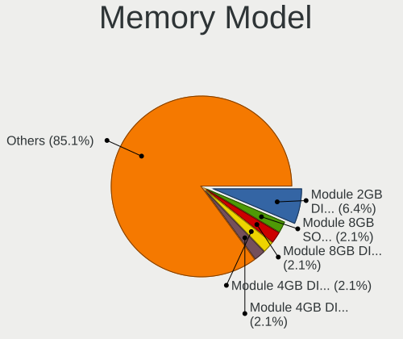

| Model                                                          | Desktops | Percent |
|----------------------------------------------------------------|----------|---------|
| Unknown                                                        | 3        | 6.38%   |
| Xi'an UniIC Semiconductors RAM Module 8GB SODIMM DDR4 3200MT/s | 1        | 2.13%   |
| Unknown RAM Module 8GB DIMM 667MT/s                            | 1        | 2.13%   |
| Unknown RAM Module 4GB DIMM DDR3 1333MT/s                      | 1        | 2.13%   |
| Unknown RAM Module 4GB DIMM 1600MT/s                           | 1        | 2.13%   |
| Unknown RAM Module 2GB DIMM DDR2 800MT/s                       | 1        | 2.13%   |
| Unknown RAM Module 2GB DIMM 1333MT/s                           | 1        | 2.13%   |
| Unknown RAM Module 1GB DIMM DDR2 800MT/s                       | 1        | 2.13%   |
| Unknown RAM Module 1GB DIMM                                    | 1        | 2.13%   |
| Team RAM TEAMGROUP-UD4-2666 8GB DIMM DDR4 3000MT/s             | 1        | 2.13%   |
| SK hynix RAM Module 4GB DIMM DDR3 1600MT/s                     | 1        | 2.13%   |
| SK hynix RAM Module 16GB DIMM DDR5 4800MT/s                    | 1        | 2.13%   |
| SK hynix RAM HMT41GU6BFR8C-PB 8GB DIMM DDR3 1600MT/s           | 1        | 2.13%   |
| SK hynix RAM HMT351U6CFR8C-PB 4GB DIMM DDR2 1066MT/s           | 1        | 2.13%   |
| SK hynix RAM HMT351U6CFR8C-H9 4GB DIMM DDR3 1333MT/s           | 1        | 2.13%   |
| SK hynix RAM HMT351S6CFR8C-PB 4GB SODIMM DDR3 1600MT/s         | 1        | 2.13%   |
| SK hynix RAM HMT351S6CFR8C-PB 4GB DIMM DDR3 1600MT/s           | 1        | 2.13%   |
| SK hynix RAM HMT325S6CFR8C-PB 2GB DIMM DDR3 1600MT/s           | 1        | 2.13%   |
| SK hynix RAM HMCG78AGBSA095N 16GB SODIMM DDR5 5600MT/s         | 1        | 2.13%   |
| Samsung RAM M393A1G40EB1-CPB 8GB DIMM DDR4 3200MT/s            | 1        | 2.13%   |
| Samsung RAM M378B5673FH0-CH9 2GB DIMM DDR3 1600MT/s            | 1        | 2.13%   |
| Samsung RAM M378B1G73EB0-YK0 8GB DIMM DDR3 1600MT/s            | 1        | 2.13%   |
| Samsung RAM M378A1K43CB2-CTD 8GB DIMM DDR4 3266MT/s            | 1        | 2.13%   |
| Samsung RAM M3 78T2863QZS-CF7 1GB DIMM DDR2 800MT/s            | 1        | 2.13%   |
| Micron RAM Module 8GB DIMM DDR4 2400MT/s                       | 1        | 2.13%   |
| Micron RAM Module 4GB Row Of Chips LPDDR5 6400MT/s             | 1        | 2.13%   |
| Micron RAM 8KTF51264HZ-1G6N1 4GB SODIMM DDR3 1600MT/s          | 1        | 2.13%   |
| Micron RAM 8KTF51264AZ-1G6E1 4GB DIMM DDR3 1600MT/s            | 1        | 2.13%   |
| Micron RAM 8JTF51264AZ-1G6E1 4GB DIMM DDR3 1600MT/s            | 1        | 2.13%   |
| Micron RAM 4JTF12864AZ-1G4D1 1GB DIMM DDR3 1333MT/s            | 1        | 2.13%   |
| Micron RAM 18ASF1G72PDZ-2G1A1 8GB RIMM DDR4 2133MT/s           | 1        | 2.13%   |
| Micron RAM 16JTF25664AZ-1G4F1 2GB DIMM 1333MT/s                | 1        | 2.13%   |
| Kllisre RAM Module 16GB DIMM DDR4 2400MT/s                     | 1        | 2.13%   |
| Kingston RAM Module 4GB DIMM DDR3 1600MT/s                     | 1        | 2.13%   |
| Kingston RAM Module 2GB DIMM DDR3 1600MT/s                     | 1        | 2.13%   |
| Kingston RAM KHX1866C9D3/4 4GB DIMM DDR3 1600MT/s              | 1        | 2.13%   |
| Kingston RAM KHX1600C9D3/4GX 4GB DIMM DDR3 1867MT/s            | 1        | 2.13%   |
| Kingston RAM 9905474-029.A00LF 2GB DIMM DDR3 1333MT/s          | 1        | 2.13%   |
| KINGBANK RAM Module 16GB SODIMM DDR4 3200MT/s                  | 1        | 2.13%   |
| KINGBANK RAM Module 16GB DIMM DDR4 3200MT/s                    | 1        | 2.13%   |

Memory Kind
-----------

Memory module kinds

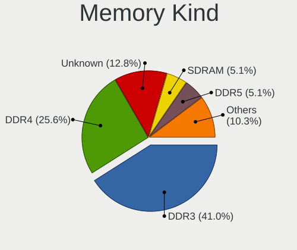

| Kind    | Desktops | Percent |
|---------|----------|---------|
| DDR3    | 16       | 41.03%  |
| DDR4    | 10       | 25.64%  |
| Unknown | 5        | 12.82%  |
| SDRAM   | 2        | 5.13%   |
| DDR5    | 2        | 5.13%   |
| DDR2    | 2        | 5.13%   |
| LPDDR5  | 1        | 2.56%   |
| DDR     | 1        | 2.56%   |

Memory Form Factor
------------------

Physical design of the memory module

| Name         | Desktops | Percent |
|--------------|----------|---------|
| DIMM         | 29       | 80.56%  |
| SODIMM       | 5        | 13.89%  |
| Row Of Chips | 1        | 2.78%   |
| RIMM         | 1        | 2.78%   |

Memory Size
-----------

Memory module size

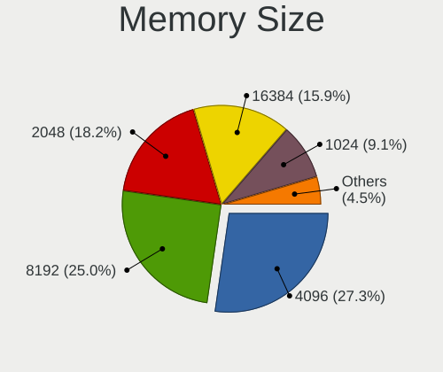

| Size  | Desktops | Percent |
|-------|----------|---------|
| 4096  | 12       | 27.27%  |
| 8192  | 11       | 25%     |
| 2048  | 8        | 18.18%  |
| 16384 | 7        | 15.91%  |
| 1024  | 4        | 9.09%   |
| 32768 | 2        | 4.55%   |

Memory Speed
------------

Memory module speed

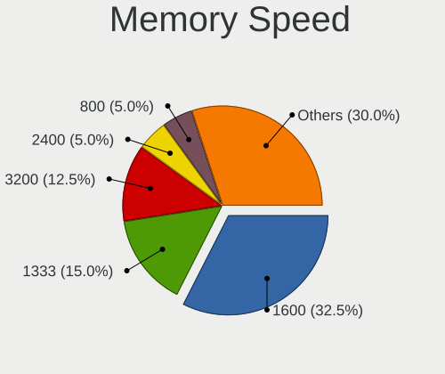

| Speed   | Desktops | Percent |
|---------|----------|---------|
| 1600    | 13       | 32.5%   |
| 1333    | 6        | 15%     |
| 3200    | 5        | 12.5%   |
| 2400    | 2        | 5%      |
| 800     | 2        | 5%      |
| 50410   | 1        | 2.5%    |
| 6400    | 1        | 2.5%    |
| 5600    | 1        | 2.5%    |
| 4800    | 1        | 2.5%    |
| 3600    | 1        | 2.5%    |
| 3266    | 1        | 2.5%    |
| 3000    | 1        | 2.5%    |
| 2133    | 1        | 2.5%    |
| 1066    | 1        | 2.5%    |
| 667     | 1        | 2.5%    |
| 533     | 1        | 2.5%    |
| Unknown | 1        | 2.5%    |

Printers & scanners
-------------------

Printer Vendor
--------------

Printer device vendors

| Vendor             | Desktops | Percent |
|--------------------|----------|---------|
| Brother Industries | 1        | 100%    |

Printer Model
-------------

Printer device models

| Model                  | Desktops | Percent |
|------------------------|----------|---------|
| Brother HL-2130 series | 1        | 100%    |

Scanner Vendor
--------------

Scanner device vendors

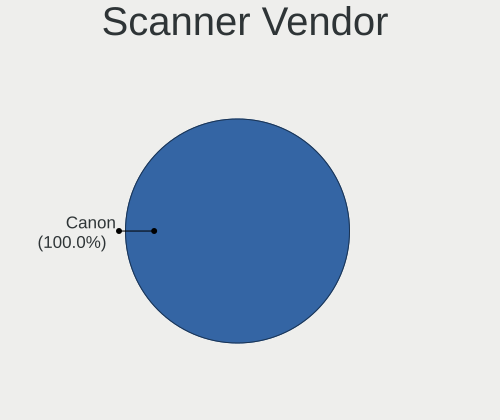

| Vendor | Desktops | Percent |
|--------|----------|---------|
| Canon  | 1        | 100%    |

Scanner Model
-------------

Scanner device models

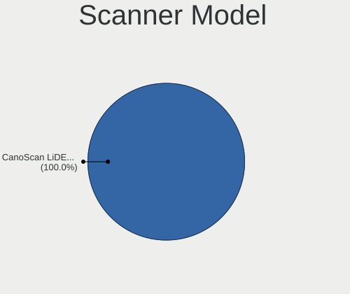

| Model                   | Desktops | Percent |
|-------------------------|----------|---------|
| Canon CanoScan LiDE 210 | 1        | 100%    |

Camera
------

Camera Vendor
-------------

Camera device vendors

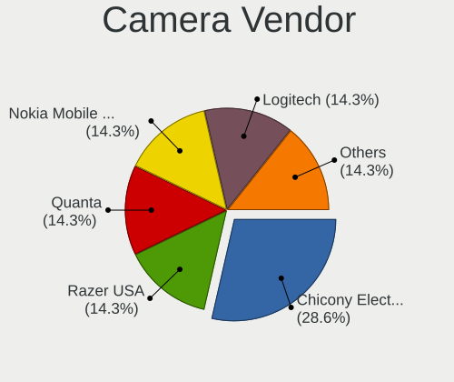

| Vendor              | Desktops | Percent |
|---------------------|----------|---------|
| Chicony Electronics | 2        | 28.57%  |
| Razer USA           | 1        | 14.29%  |
| Quanta              | 1        | 14.29%  |
| Nokia Mobile Phones | 1        | 14.29%  |
| Logitech            | 1        | 14.29%  |
| Jieli Technology    | 1        | 14.29%  |

Camera Model
------------

Camera device models

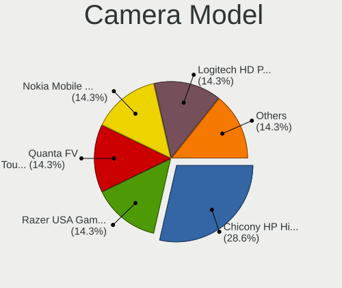

| Model                                 | Desktops | Percent |
|---------------------------------------|----------|---------|
| Chicony HP High Definition 1MP Webcam | 2        | 28.57%  |
| Razer USA Gaming Webcam [Kiyo]        | 1        | 14.29%  |
| Quanta FV TouchCam V1                 | 1        | 14.29%  |
| Nokia Mobile Phones Lumia 640 Phone   | 1        | 14.29%  |
| Logitech HD Pro Webcam C920           | 1        | 14.29%  |
| Jieli USB PHY 2.0                     | 1        | 14.29%  |

Security
--------

Fingerprint Vendor
------------------

Fingerprint sensor vendors

Zero info for selected period =(

Fingerprint Model
-----------------

Fingerprint sensor models

Zero info for selected period =(

Chipcard Vendor
---------------

Chipcard module vendors

Zero info for selected period =(

Chipcard Model
--------------

Chipcard module models

Zero info for selected period =(

Unsupported
-----------

Unsupported Devices
-------------------

Total unsupported devices on board

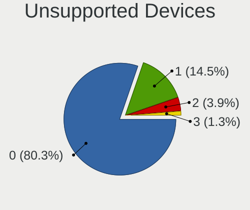

| Total | Desktops | Percent |
|-------|----------|---------|
| 0     | 61       | 80.26%  |
| 1     | 11       | 14.47%  |
| 2     | 3        | 3.95%   |
| 3     | 1        | 1.32%   |

Unsupported Device Types
------------------------

Types of unsupported devices

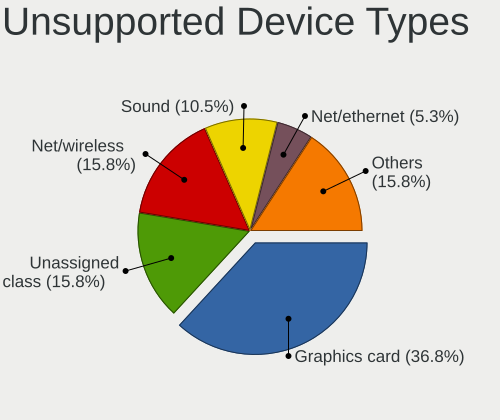

| Type                     | Desktops | Percent |
|--------------------------|----------|---------|
| Graphics card            | 7        | 36.84%  |
| Unassigned class         | 3        | 15.79%  |
| Net/wireless             | 3        | 15.79%  |
| Sound                    | 2        | 10.53%  |
| Net/ethernet             | 1        | 5.26%   |
| Modem                    | 1        | 5.26%   |
| Communication controller | 1        | 5.26%   |
| Card reader              | 1        | 5.26%   |

