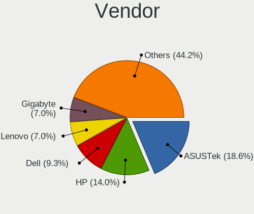
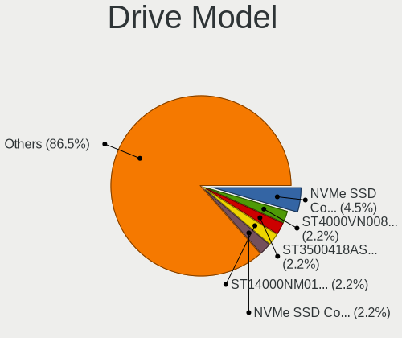
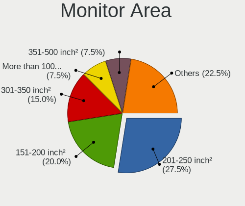
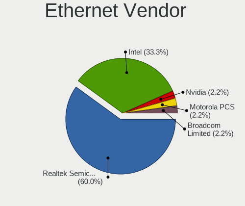
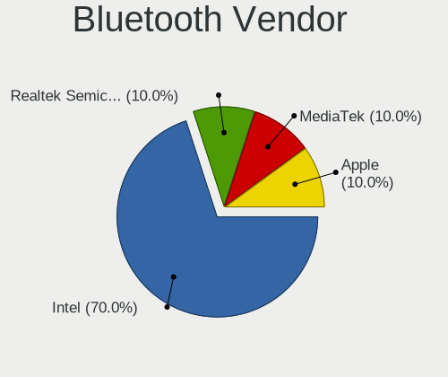
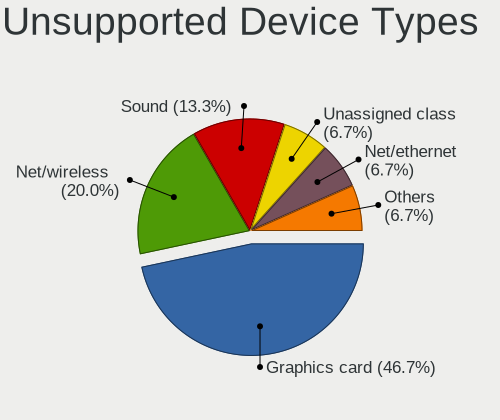

Lubuntu 24.04 - Tested Hardware & Statistics (Desktops)
-------------------------------------------------------

A project to collect tested hardware configurations for Lubuntu 24.04.

Anyone can contribute to this report by the [hw-probe](https://github.com/linuxhw/hw-probe) tool:

    sudo -E hw-probe -all -upload

Please contribute! Especially if your hardware is rare.

Contents
--------

* [ Test Cases ](#test-cases)

* [ System ](#system)
  - [ Kernel                   ](#kernel)
  - [ Kernel Family            ](#kernel-family)
  - [ Kernel Major Ver.        ](#kernel-major-ver)
  - [ Arch                     ](#arch)
  - [ DE                       ](#de)
  - [ Display Server           ](#display-server)
  - [ Display Manager          ](#display-manager)
  - [ OS Lang                  ](#os-lang)
  - [ Boot Mode                ](#boot-mode)
  - [ Filesystem               ](#filesystem)
  - [ Part. scheme             ](#part-scheme)
  - [ Dual Boot with Linux/BSD ](#dual-boot-with-linuxbsd)
  - [ Dual Boot (Win)          ](#dual-boot-win)

* [ Board ](#board)
  - [ Vendor                   ](#vendor)
  - [ Model                    ](#model)
  - [ Model Family             ](#model-family)
  - [ MFG Year                 ](#mfg-year)
  - [ Form Factor              ](#form-factor)
  - [ Secure Boot              ](#secure-boot)
  - [ Coreboot                 ](#coreboot)
  - [ RAM Size                 ](#ram-size)
  - [ RAM Used                 ](#ram-used)
  - [ Total Drives             ](#total-drives)
  - [ Has CD-ROM               ](#has-cd-rom)
  - [ Has Ethernet             ](#has-ethernet)
  - [ Has WiFi                 ](#has-wifi)
  - [ Has Bluetooth            ](#has-bluetooth)

* [ Location ](#location)
  - [ Country                  ](#country)
  - [ City                     ](#city)

* [ Drives ](#drives)
  - [ Drive Vendor             ](#drive-vendor)
  - [ Drive Model              ](#drive-model)
  - [ HDD Vendor               ](#hdd-vendor)
  - [ SSD Vendor               ](#ssd-vendor)
  - [ Drive Kind               ](#drive-kind)
  - [ Drive Connector          ](#drive-connector)
  - [ Drive Size               ](#drive-size)
  - [ Space Total              ](#space-total)
  - [ Space Used               ](#space-used)
  - [ Malfunc. Drives          ](#malfunc-drives)
  - [ Malfunc. Drive Vendor    ](#malfunc-drive-vendor)
  - [ Malfunc. HDD Vendor      ](#malfunc-hdd-vendor)
  - [ Malfunc. Drive Kind      ](#malfunc-drive-kind)
  - [ Failed Drives            ](#failed-drives)
  - [ Failed Drive Vendor      ](#failed-drive-vendor)
  - [ Drive Status             ](#drive-status)

* [ Storage controller ](#storage-controller)
  - [ Storage Vendor           ](#storage-vendor)
  - [ Storage Model            ](#storage-model)
  - [ Storage Kind             ](#storage-kind)

* [ Processor ](#processor)
  - [ CPU Vendor               ](#cpu-vendor)
  - [ CPU Model                ](#cpu-model)
  - [ CPU Model Family         ](#cpu-model-family)
  - [ CPU Cores                ](#cpu-cores)
  - [ CPU Sockets              ](#cpu-sockets)
  - [ CPU Threads              ](#cpu-threads)
  - [ CPU Op-Modes             ](#cpu-op-modes)
  - [ CPU Microcode            ](#cpu-microcode)
  - [ CPU Microarch            ](#cpu-microarch)

* [ Graphics ](#graphics)
  - [ GPU Vendor               ](#gpu-vendor)
  - [ GPU Model                ](#gpu-model)
  - [ GPU Combo                ](#gpu-combo)
  - [ GPU Driver               ](#gpu-driver)
  - [ GPU Memory               ](#gpu-memory)

* [ Monitor ](#monitor)
  - [ Monitor Vendor           ](#monitor-vendor)
  - [ Monitor Model            ](#monitor-model)
  - [ Monitor Resolution       ](#monitor-resolution)
  - [ Monitor Diagonal         ](#monitor-diagonal)
  - [ Monitor Width            ](#monitor-width)
  - [ Aspect Ratio             ](#aspect-ratio)
  - [ Monitor Area             ](#monitor-area)
  - [ Pixel Density            ](#pixel-density)
  - [ Multiple Monitors        ](#multiple-monitors)

* [ Network ](#network)
  - [ Net Controller Vendor    ](#net-controller-vendor)
  - [ Net Controller Model     ](#net-controller-model)
  - [ Wireless Vendor          ](#wireless-vendor)
  - [ Wireless Model           ](#wireless-model)
  - [ Ethernet Vendor          ](#ethernet-vendor)
  - [ Ethernet Model           ](#ethernet-model)
  - [ Net Controller Kind      ](#net-controller-kind)
  - [ Used Controller          ](#used-controller)
  - [ NICs                     ](#nics)
  - [ IPv6                     ](#ipv6)

* [ Bluetooth ](#bluetooth)
  - [ Bluetooth Vendor         ](#bluetooth-vendor)
  - [ Bluetooth Model          ](#bluetooth-model)

* [ Sound ](#sound)
  - [ Sound Vendor             ](#sound-vendor)
  - [ Sound Model              ](#sound-model)

* [ Memory ](#memory)
  - [ Memory Vendor            ](#memory-vendor)
  - [ Memory Model             ](#memory-model)
  - [ Memory Kind              ](#memory-kind)
  - [ Memory Form Factor       ](#memory-form-factor)
  - [ Memory Size              ](#memory-size)
  - [ Memory Speed             ](#memory-speed)

* [ Printers & scanners ](#printers--scanners)
  - [ Printer Vendor           ](#printer-vendor)
  - [ Printer Model            ](#printer-model)
  - [ Scanner Vendor           ](#scanner-vendor)
  - [ Scanner Model            ](#scanner-model)

* [ Camera ](#camera)
  - [ Camera Vendor            ](#camera-vendor)
  - [ Camera Model             ](#camera-model)

* [ Security ](#security)
  - [ Fingerprint Vendor       ](#fingerprint-vendor)
  - [ Fingerprint Model        ](#fingerprint-model)
  - [ Chipcard Vendor          ](#chipcard-vendor)
  - [ Chipcard Model           ](#chipcard-model)

* [ Unsupported ](#unsupported)
  - [ Unsupported Devices      ](#unsupported-devices)
  - [ Unsupported Device Types ](#unsupported-device-types)

Test Cases
----------

Total: 54

| Vendor        | Model                    | Probe                                                      | Date         |
|---------------|--------------------------|------------------------------------------------------------|--------------|
| MSI           | MS-77311                 | [f7f9b1ae97](https://linux-hardware.org/?probe=f7f9b1ae97) | Jan 04, 2025 |
| ABIT          | AT8 32X                  | [e613a45614](https://linux-hardware.org/?probe=e613a45614) | Jan 03, 2025 |
| ASUSTek       | A78M-A                   | [1c59a39f39](https://linux-hardware.org/?probe=1c59a39f39) | Dec 30, 2024 |
| Lenovo        | SHARKBAY 0B98417 WIN     | [8c5e303e5b](https://linux-hardware.org/?probe=8c5e303e5b) | Dec 27, 2024 |
| Dell          | 0200DY A01               | [fa349ac11f](https://linux-hardware.org/?probe=fa349ac11f) | Dec 23, 2024 |
| ASUSTek       | TUF Gaming X570-PLUS     | [19e00fa4e5](https://linux-hardware.org/?probe=19e00fa4e5) | Dec 21, 2024 |
| ASUSTek       | A78M-A                   | [efa5a4e952](https://linux-hardware.org/?probe=efa5a4e952) | Dec 21, 2024 |
| Lenovo        | SHARKBAY 0B98417 WIN     | [78c7a48933](https://linux-hardware.org/?probe=78c7a48933) | Dec 20, 2024 |
| ASUSTek       | M5A99X EVO               | [0f9a0492e2](https://linux-hardware.org/?probe=0f9a0492e2) | Dec 18, 2024 |
| Gigabyte      | B550M S2H                | [e32011dedf](https://linux-hardware.org/?probe=e32011dedf) | Dec 18, 2024 |
| Unknown       | ROUTER                   | [c6bf9058fa](https://linux-hardware.org/?probe=c6bf9058fa) | Dec 10, 2024 |
| ASUSTek       | M5A88-M                  | [520539e9f6](https://linux-hardware.org/?probe=520539e9f6) | Dec 01, 2024 |
| Foxconn       | G31MV/G31MV-K FAB        | [95b6ff9464](https://linux-hardware.org/?probe=95b6ff9464) | Nov 25, 2024 |
| ASUSTek       | TUF Gaming X570-PLUS     | [1299c66f0d](https://linux-hardware.org/?probe=1299c66f0d) | Nov 24, 2024 |
| HP            | 097Ch                    | [a95a57c236](https://linux-hardware.org/?probe=a95a57c236) | Nov 22, 2024 |
| ECS           | RS480-M                  | [5c9a33d3ef](https://linux-hardware.org/?probe=5c9a33d3ef) | Nov 18, 2024 |
| HP            | 1905                     | [603e331581](https://linux-hardware.org/?probe=603e331581) | Nov 17, 2024 |
| HP            | 1589                     | [b620b573ed](https://linux-hardware.org/?probe=b620b573ed) | Nov 16, 2024 |
| ADI           | MinnowBoard Turbot       | [bc4cd39271](https://linux-hardware.org/?probe=bc4cd39271) | Nov 05, 2024 |
| Dell          | 0WJ772                   | [d6dc667160](https://linux-hardware.org/?probe=d6dc667160) | Nov 01, 2024 |
| ASUSTek       | M4N68T-M LE              | [6403f7199d](https://linux-hardware.org/?probe=6403f7199d) | Oct 29, 2024 |
| Pegatron      | EVANS                    | [17c53eb7a7](https://linux-hardware.org/?probe=17c53eb7a7) | Oct 21, 2024 |
| ASUSTek       | Pro WS X570-ACE          | [dd98dbec76](https://linux-hardware.org/?probe=dd98dbec76) | Oct 17, 2024 |
| AZW           | MINI S                   | [b08901d4d7](https://linux-hardware.org/?probe=b08901d4d7) | Oct 03, 2024 |
| Lenovo        | MAHOBAY                  | [133a8522bd](https://linux-hardware.org/?probe=133a8522bd) | Sep 25, 2024 |
| AZW           | LZX TBD                  | [242bb69a07](https://linux-hardware.org/?probe=242bb69a07) | Sep 22, 2024 |
| AZW           | LZX TBD                  | [555138dd5b](https://linux-hardware.org/?probe=555138dd5b) | Sep 13, 2024 |
| Haier         | ZEB19 V1.1               | [fc948e0f5d](https://linux-hardware.org/?probe=fc948e0f5d) | Sep 13, 2024 |
| HP            | 895D                     | [2ffb71ca8d](https://linux-hardware.org/?probe=2ffb71ca8d) | Sep 03, 2024 |
| HP            | 18E9                     | [3cfa598b85](https://linux-hardware.org/?probe=3cfa598b85) | Sep 03, 2024 |
| Haier         | ZEB19 V1.1               | [dd01bca542](https://linux-hardware.org/?probe=dd01bca542) | Sep 01, 2024 |
| ASUSTek       | M5A78L-M/USB3            | [b1b7d3ccd5](https://linux-hardware.org/?probe=b1b7d3ccd5) | Aug 30, 2024 |
| ASUSTek       | TUF Gaming X570-PLUS     | [c37c1fe47f](https://linux-hardware.org/?probe=c37c1fe47f) | Aug 29, 2024 |
| ASUSTek       | TUF Gaming X570-PLUS     | [609fb0b8b9](https://linux-hardware.org/?probe=609fb0b8b9) | Aug 28, 2024 |
| Haier         | ZEB19 V1.1               | [f600ce1cc4](https://linux-hardware.org/?probe=f600ce1cc4) | Aug 27, 2024 |
| Apple         | Mac-7BA5B2D9E42DDD94     | [773d5ea3fe](https://linux-hardware.org/?probe=773d5ea3fe) | Aug 26, 2024 |
| AZW           | MINI S                   | [eaafeaecad](https://linux-hardware.org/?probe=eaafeaecad) | Aug 24, 2024 |
| Dell          | 0FDY5C A00               | [85ce806b0f](https://linux-hardware.org/?probe=85ce806b0f) | Aug 17, 2024 |
| Google        | Zako                     | [cbd6dd35bc](https://linux-hardware.org/?probe=cbd6dd35bc) | Aug 14, 2024 |
| Google        | Zako                     | [c5d4e9a38b](https://linux-hardware.org/?probe=c5d4e9a38b) | Aug 14, 2024 |
| Gigabyte      | GA-MA69GM-S2H            | [27116cd0ce](https://linux-hardware.org/?probe=27116cd0ce) | Aug 12, 2024 |
| Gigabyte      | P55-USB3                 | [d13ef904ba](https://linux-hardware.org/?probe=d13ef904ba) | Aug 08, 2024 |
| Fujitsu       | D2778-C1 S26361-D2778-C1 | [13bf9126f5](https://linux-hardware.org/?probe=13bf9126f5) | Aug 04, 2024 |
| Fujitsu       | D3402-A1 S26361-D3402-A1 | [b76253dea1](https://linux-hardware.org/?probe=b76253dea1) | Jul 01, 2024 |
| NU591         | 1.0                      | [c1efde8d4f](https://linux-hardware.org/?probe=c1efde8d4f) | Jun 15, 2024 |
| MSI           | MPG X570S EDGE MAX WIFI  | [5201ae534c](https://linux-hardware.org/?probe=5201ae534c) | May 28, 2024 |
| Dell          | 042P49 A01               | [153d7e94c8](https://linux-hardware.org/?probe=153d7e94c8) | May 27, 2024 |
| Dell          | 042P49 A01               | [3351870e5d](https://linux-hardware.org/?probe=3351870e5d) | May 27, 2024 |
| Pegatron      | 2AEE                     | [c1b8b9150f](https://linux-hardware.org/?probe=c1b8b9150f) | May 25, 2024 |
| Packard Be... | PT890-8237A              | [150aa2b8e8](https://linux-hardware.org/?probe=150aa2b8e8) | May 22, 2024 |
| Lenovo        | Bantry CRB NOK           | [a501c1214c](https://linux-hardware.org/?probe=a501c1214c) | May 19, 2024 |
| Lenovo        | Bantry CRB NOK           | [5c2dca5ac4](https://linux-hardware.org/?probe=5c2dca5ac4) | May 19, 2024 |
| HP            | 3031h                    | [1d9c5e06d3](https://linux-hardware.org/?probe=1d9c5e06d3) | Apr 18, 2024 |
| EPoX Compu... | MCP61 Series             | [8028d0a8d1](https://linux-hardware.org/?probe=8028d0a8d1) | Feb 24, 2024 |

System
------

Kernel
------

Version of the Linux kernel

| Version                 | Desktops | Percent |
|-------------------------|----------|---------|
| 6.8.0-31-generic        | 7        | 15.56%  |
| 6.8.0-41-generic        | 6        | 13.33%  |
| 6.8.0-40-generic        | 4        | 8.89%   |
| 6.8.0-51-generic        | 3        | 6.67%   |
| 6.8.0-49-generic        | 3        | 6.67%   |
| 6.8.0-48-generic        | 3        | 6.67%   |
| 6.8.0-50-lowlatency     | 2        | 4.44%   |
| 6.8.0-47-generic        | 2        | 4.44%   |
| 6.8.0-45-generic        | 2        | 4.44%   |
| 6.8.0-39-generic        | 2        | 4.44%   |
| 6.8.0-48-lowlatency     | 1        | 2.22%   |
| 6.8.0-44-generic        | 1        | 2.22%   |
| 6.8.0-41-lowlatency     | 1        | 2.22%   |
| 6.8.0-36-generic        | 1        | 2.22%   |
| 6.8.0-35-generic        | 1        | 2.22%   |
| 6.8.0-32-generic        | 1        | 2.22%   |
| 6.8.0-22-generic        | 1        | 2.22%   |
| 6.8.0-1016-oem          | 1        | 2.22%   |
| 6.6.0-14-generic        | 1        | 2.22%   |
| 6.5.0-44-generic        | 1        | 2.22%   |
| 6.12.3-alderlake-custom | 1        | 2.22%   |

Kernel Family
-------------

Linux kernel without a distro release

| Version | Desktops | Percent |
|---------|----------|---------|
| 6.8.0   | 40       | 93.02%  |
| 6.6.0   | 1        | 2.33%   |
| 6.5.0   | 1        | 2.33%   |
| 6.12.3  | 1        | 2.33%   |

Kernel Major Ver.
-----------------

Linux kernel major version

| Version | Desktops | Percent |
|---------|----------|---------|
| 6.8     | 40       | 93.02%  |
| 6.6     | 1        | 2.33%   |
| 6.5     | 1        | 2.33%   |
| 6.12    | 1        | 2.33%   |

Arch
----

OS architecture (x86_64, i586, etc.)

| Name   | Desktops | Percent |
|--------|----------|---------|
| x86_64 | 43       | 100%    |

DE
--

Desktop Environment

| Name | Desktops | Percent |
|------|----------|---------|
| LXQt | 43       | 100%    |

Display Server
--------------

X11 or Wayland

| Name    | Desktops | Percent |
|---------|----------|---------|
| X11     | 39       | 90.7%   |
| Wayland | 2        | 4.65%   |
| Tty     | 2        | 4.65%   |

Display Manager
---------------

SDDM, LightDM, etc.

| Name    | Desktops | Percent |
|---------|----------|---------|
| SDDM    | 32       | 74.42%  |
| Unknown | 9        | 20.93%  |
| GDM3    | 2        | 4.65%   |

OS Lang
-------

Language

| Lang  | Desktops | Percent |
|-------|----------|---------|
| en_US | 15       | 34.88%  |
| fr_FR | 4        | 9.3%    |
| de_DE | 4        | 9.3%    |
| C     | 4        | 9.3%    |
| pl_PL | 2        | 4.65%   |
| fi_FI | 2        | 4.65%   |
| es_AR | 2        | 4.65%   |
| el_GR | 2        | 4.65%   |
| pt_BR | 1        | 2.33%   |
| nl_NL | 1        | 2.33%   |
| it_IT | 1        | 2.33%   |
| es_MX | 1        | 2.33%   |
| es_ES | 1        | 2.33%   |
| en_SE | 1        | 2.33%   |
| en_GB | 1        | 2.33%   |
| en_CA | 1        | 2.33%   |

Boot Mode
---------

EFI or BIOS

| Mode | Desktops | Percent |
|------|----------|---------|
| BIOS | 35       | 81.4%   |
| EFI  | 8        | 18.6%   |

Filesystem
----------

Type of filesystem

| Type    | Desktops | Percent |
|---------|----------|---------|
| Ext4    | 25       | 58.14%  |
| Tmpfs   | 14       | 32.56%  |
| Overlay | 4        | 9.3%    |

Part. scheme
------------

Scheme of partitioning

| Type    | Desktops | Percent |
|---------|----------|---------|
| GPT     | 22       | 51.16%  |
| MBR     | 12       | 27.91%  |
| Unknown | 9        | 20.93%  |

Dual Boot with Linux/BSD
------------------------

Hosting more than one Linux/BSD

| Dual boot | Desktops | Percent |
|-----------|----------|---------|
| No        | 36       | 83.72%  |
| Yes       | 7        | 16.28%  |

Dual Boot (Win)
---------------

Hosting Linux and Windows

| Dual boot | Desktops | Percent |
|-----------|----------|---------|
| No        | 30       | 69.77%  |
| Yes       | 13       | 30.23%  |

Board
-----

Vendor
------

Motherboard manufacturer

| Name                | Desktops | Percent |
|---------------------|----------|---------|
| ASUSTek Computer    | 8        | 18.6%   |
| Hewlett-Packard     | 6        | 13.95%  |
| Dell                | 4        | 9.3%    |
| Lenovo              | 3        | 6.98%   |
| Gigabyte Technology | 3        | 6.98%   |
| Pegatron            | 2        | 4.65%   |
| MSI                 | 2        | 4.65%   |
| Fujitsu             | 2        | 4.65%   |
| AZW                 | 2        | 4.65%   |
| Packard Bell        | 1        | 2.33%   |
| NU591               | 1        | 2.33%   |
| Haier               | 1        | 2.33%   |
| Google              | 1        | 2.33%   |
| Foxconn             | 1        | 2.33%   |
| EPoX Computer       | 1        | 2.33%   |
| ECS                 | 1        | 2.33%   |
| Apple               | 1        | 2.33%   |
| ADI                 | 1        | 2.33%   |
| ABIT                | 1        | 2.33%   |
| Unknown             | 1        | 2.33%   |

Model
-----

Motherboard model

| Name                                | Desktops | Percent |
|-------------------------------------|----------|---------|
| ASUS TUF Gaming X570-PLUS           | 2        | 4.65%   |
| Pegatron WE277AA-ABF p6352fr        | 1        | 2.33%   |
| Pegatron 23-b030                    | 1        | 2.33%   |
| Packard Bell IMEDIA D9111           | 1        | 2.33%   |
| NU591 1.0                           | 1        | 2.33%   |
| MSI MS-7D53                         | 1        | 2.33%   |
| MSI B02311                          | 1        | 2.33%   |
| Lenovo ThinkCentre M93P 10AB000YMX  | 1        | 2.33%   |
| Lenovo ThinkCentre M92z 3311B8G     | 1        | 2.33%   |
| Lenovo ThinkCentre M79 10JAS00P00   | 1        | 2.33%   |
| HP Z420 Workstation                 | 1        | 2.33%   |
| HP Z230 Tower Workstation           | 1        | 2.33%   |
| HP Z2 SFF G9 Workstation Desktop PC | 1        | 2.33%   |
| HP ProDesk 400 G1 SFF               | 1        | 2.33%   |
| HP Compaq dc7900 Small Form Factor  | 1        | 2.33%   |
| HP Compaq dc7100 SFF(PW292ET)       | 1        | 2.33%   |
| Haier DT                            | 1        | 2.33%   |
| Google Zako                         | 1        | 2.33%   |
| Gigabyte P55-USB3                   | 1        | 2.33%   |
| Gigabyte GA-MA69GM-S2H              | 1        | 2.33%   |
| Gigabyte B550M S2H                  | 1        | 2.33%   |
| Fujitsu ESPRIMO_P956                | 1        | 2.33%   |
| Fujitsu CELSIUS M470-2              | 1        | 2.33%   |
| Foxconn G31MV/G31MV-K FAB           | 1        | 2.33%   |
| EPoX MCP61 Series                   | 1        | 2.33%   |
| ECS RS480-M                         | 1        | 2.33%   |
| Dell OptiPlex 780                   | 1        | 2.33%   |
| Dell OptiPlex 5050                  | 1        | 2.33%   |
| Dell OptiPlex 3010                  | 1        | 2.33%   |
| Dell OptiPlex 210L                  | 1        | 2.33%   |
| AZW MINI S                          | 1        | 2.33%   |
| AZW LZX                             | 1        | 2.33%   |
| ASUS PC                             | 1        | 2.33%   |
| ASUS M5A99X EVO                     | 1        | 2.33%   |
| ASUS M5A88-M                        | 1        | 2.33%   |
| ASUS M5A78L-M/USB3                  | 1        | 2.33%   |
| ASUS M4N68T-M LE                    | 1        | 2.33%   |
| ASUS A78M-A                         | 1        | 2.33%   |
| Apple MacPro5,1                     | 1        | 2.33%   |
| ADI Minnowboard Turbot D0 PLATFORM  | 1        | 2.33%   |

Model Family
------------

Motherboard model prefix

| Name                   | Desktops | Percent |
|------------------------|----------|---------|
| Dell OptiPlex          | 4        | 9.3%    |
| Lenovo ThinkCentre     | 3        | 6.98%   |
| HP Compaq              | 2        | 4.65%   |
| ASUS TUF               | 2        | 4.65%   |
| Pegatron WE277AA-ABF   | 1        | 2.33%   |
| Pegatron 23-b030       | 1        | 2.33%   |
| Packard Bell IMEDIA    | 1        | 2.33%   |
| NU591 1.0              | 1        | 2.33%   |
| MSI MS-7D53            | 1        | 2.33%   |
| MSI B02311             | 1        | 2.33%   |
| HP Z420                | 1        | 2.33%   |
| HP Z230                | 1        | 2.33%   |
| HP Z2                  | 1        | 2.33%   |
| HP ProDesk             | 1        | 2.33%   |
| Haier DT               | 1        | 2.33%   |
| Google Zako            | 1        | 2.33%   |
| Gigabyte P55-USB3      | 1        | 2.33%   |
| Gigabyte GA-MA69GM-S2H | 1        | 2.33%   |
| Gigabyte B550M         | 1        | 2.33%   |
| Fujitsu ESPRIMO        | 1        | 2.33%   |
| Fujitsu CELSIUS        | 1        | 2.33%   |
| Foxconn G31MV          | 1        | 2.33%   |
| EPoX MCP61             | 1        | 2.33%   |
| ECS RS480-M            | 1        | 2.33%   |
| AZW MINI               | 1        | 2.33%   |
| AZW LZX                | 1        | 2.33%   |
| ASUS PC                | 1        | 2.33%   |
| ASUS M5A99X            | 1        | 2.33%   |
| ASUS M5A88-M           | 1        | 2.33%   |
| ASUS M5A78L-M          | 1        | 2.33%   |
| ASUS M4N68T-M          | 1        | 2.33%   |
| ASUS A78M-A            | 1        | 2.33%   |
| Apple MacPro5          | 1        | 2.33%   |
| ADI Minnowboard        | 1        | 2.33%   |
| ABIT AT8               | 1        | 2.33%   |
| Unknown                | 1        | 2.33%   |

MFG Year
--------

Motherboard manufacture year

| Year | Desktops | Percent |
|------|----------|---------|
| 2023 | 4        | 9.3%    |
| 2019 | 4        | 9.3%    |
| 2011 | 4        | 9.3%    |
| 2012 | 3        | 6.98%   |
| 2010 | 3        | 6.98%   |
| 2008 | 3        | 6.98%   |
| 2007 | 3        | 6.98%   |
| 2006 | 3        | 6.98%   |
| 2020 | 2        | 4.65%   |
| 2018 | 2        | 4.65%   |
| 2017 | 2        | 4.65%   |
| 2014 | 2        | 4.65%   |
| 2013 | 2        | 4.65%   |
| 2009 | 2        | 4.65%   |
| 2024 | 1        | 2.33%   |
| 2022 | 1        | 2.33%   |
| 2021 | 1        | 2.33%   |
| 2016 | 1        | 2.33%   |

Form Factor
-----------

Physical design of the computer

| Name    | Desktops | Percent |
|---------|----------|---------|
| Desktop | 43       | 100%    |

Secure Boot
-----------

Enabled or disabled

| State    | Desktops | Percent |
|----------|----------|---------|
| Disabled | 41       | 95.35%  |
| Enabled  | 2        | 4.65%   |

Coreboot
--------

Have coreboot on board

| Used | Desktops | Percent |
|------|----------|---------|
| No   | 42       | 97.67%  |
| Yes  | 1        | 2.33%   |

RAM Size
--------

Total RAM memory

| Size in GB  | Desktops | Percent |
|-------------|----------|---------|
| 4.01-8.0    | 7        | 15.91%  |
| 3.01-4.0    | 7        | 15.91%  |
| 16.01-24.0  | 7        | 15.91%  |
| 32.01-64.0  | 6        | 13.64%  |
| 1.01-2.0    | 6        | 13.64%  |
| 24.01-32.0  | 4        | 9.09%   |
| 64.01-256.0 | 3        | 6.82%   |
| 8.01-16.0   | 3        | 6.82%   |
| 2.01-3.0    | 1        | 2.27%   |

RAM Used
--------

Used RAM memory

| Used GB   | Desktops | Percent |
|-----------|----------|---------|
| 1.01-2.0  | 21       | 47.73%  |
| 3.01-4.0  | 10       | 22.73%  |
| 2.01-3.0  | 6        | 13.64%  |
| 4.01-8.0  | 3        | 6.82%   |
| 0.51-1.0  | 2        | 4.55%   |
| 8.01-16.0 | 1        | 2.27%   |
| 0.01-0.5  | 1        | 2.27%   |

Total Drives
------------

Number of drives on board

| Drives | Desktops | Percent |
|--------|----------|---------|
| 1      | 24       | 54.55%  |
| 3      | 6        | 13.64%  |
| 2      | 5        | 11.36%  |
| 4      | 3        | 6.82%   |
| 6      | 2        | 4.55%   |
| 11     | 1        | 2.27%   |
| 9      | 1        | 2.27%   |
| 5      | 1        | 2.27%   |
| 0      | 1        | 2.27%   |

Has CD-ROM
----------

Has CD-ROM on board

| Presented | Desktops | Percent |
|-----------|----------|---------|
| No        | 23       | 53.49%  |
| Yes       | 20       | 46.51%  |

Has Ethernet
------------

Has Ethernet on board

| Presented | Desktops | Percent |
|-----------|----------|---------|
| Yes       | 41       | 95.35%  |
| No        | 2        | 4.65%   |

Has WiFi
--------

Has WiFi module

| Presented | Desktops | Percent |
|-----------|----------|---------|
| Yes       | 23       | 53.49%  |
| No        | 20       | 46.51%  |

Has Bluetooth
-------------

Has Bluetooth module

| Presented | Desktops | Percent |
|-----------|----------|---------|
| No        | 33       | 76.74%  |
| Yes       | 10       | 23.26%  |

Location
--------

Country
-------

Geographic location (country)

| Country    | Desktops | Percent |
|------------|----------|---------|
| USA        | 13       | 30.23%  |
| Germany    | 5        | 11.63%  |
| France     | 4        | 9.3%    |
| Greece     | 2        | 4.65%   |
| Finland    | 2        | 4.65%   |
| China      | 2        | 4.65%   |
| Australia  | 2        | 4.65%   |
| Argentina  | 2        | 4.65%   |
| Sweden     | 1        | 2.33%   |
| Spain      | 1        | 2.33%   |
| Romania    | 1        | 2.33%   |
| Poland     | 1        | 2.33%   |
| Norway     | 1        | 2.33%   |
| Japan      | 1        | 2.33%   |
| Italy      | 1        | 2.33%   |
| Hungary    | 1        | 2.33%   |
| Costa Rica | 1        | 2.33%   |
| Canada     | 1        | 2.33%   |
| Brazil     | 1        | 2.33%   |

City
----

Geographic location (city)

| City               | Desktops | Percent |
|--------------------|----------|---------|
| Seattle            | 2        | 4.55%   |
| Kunming            | 2        | 4.55%   |
| Würzburg          | 1        | 2.27%   |
| Volos              | 1        | 2.27%   |
| Virginia Beach     | 1        | 2.27%   |
| Verona             | 1        | 2.27%   |
| Vaasa              | 1        | 2.27%   |
| Toronto            | 1        | 2.27%   |
| Thessaloniki       | 1        | 2.27%   |
| Tandil             | 1        | 2.27%   |
| Sydney             | 1        | 2.27%   |
| Strasbourg         | 1        | 2.27%   |
| Skepplanda         | 1        | 2.27%   |
| Seville            | 1        | 2.27%   |
| Rockville          | 1        | 2.27%   |
| Rochester          | 1        | 2.27%   |
| Redmond            | 1        | 2.27%   |
| Pforzheim          | 1        | 2.27%   |
| Osaka              | 1        | 2.27%   |
| Oregon City        | 1        | 2.27%   |
| Northport          | 1        | 2.27%   |
| Nancy              | 1        | 2.27%   |
| Moron              | 1        | 2.27%   |
| Melbourne          | 1        | 2.27%   |
| Louisville         | 1        | 2.27%   |
| Los Angeles        | 1        | 2.27%   |
| Langhus            | 1        | 2.27%   |
| Kansas City        | 1        | 2.27%   |
| Hillsboro          | 1        | 2.27%   |
| Helsinki           | 1        | 2.27%   |
| Grecia             | 1        | 2.27%   |
| Gmina Śrem        | 1        | 2.27%   |
| Germering          | 1        | 2.27%   |
| Düsseldorf        | 1        | 2.27%   |
| Duque de Caxias    | 1        | 2.27%   |
| Budapest           | 1        | 2.27%   |
| Brétigny-sur-Orge | 1        | 2.27%   |
| Brasov             | 1        | 2.27%   |
| Berlin             | 1        | 2.27%   |
| Bellingham         | 1        | 2.27%   |

Drives
------

Drive Vendor
------------

Hard drive vendors

| Vendor                    | Desktops | Drives | Percent |
|---------------------------|----------|--------|---------|
| Seagate                   | 12       | 19     | 17.65%  |
| WDC                       | 11       | 20     | 16.18%  |
| Samsung Electronics       | 8        | 14     | 11.76%  |
| Sandisk                   | 5        | 7      | 7.35%   |
| Kingston                  | 3        | 3      | 4.41%   |
| Micron/Crucial Technology | 2        | 3      | 2.94%   |
| Intenso                   | 2        | 4      | 2.94%   |
| Intel                     | 2        | 2      | 2.94%   |
| China                     | 2        | 2      | 2.94%   |
| YMTC                      | 1        | 1      | 1.47%   |
| WD MediaMax               | 1        | 1      | 1.47%   |
| STEC                      | 1        | 1      | 1.47%   |
| Silicon Motion            | 1        | 1      | 1.47%   |
| Realtek Semiconductor     | 1        | 1      | 1.47%   |
| PNY                       | 1        | 1      | 1.47%   |
| Phison Electronics        | 1        | 3      | 1.47%   |
| NT-512                    | 1        | 1      | 1.47%   |
| Micron Technology         | 1        | 1      | 1.47%   |
| KingSpec                  | 1        | 1      | 1.47%   |
| Hitachi                   | 1        | 1      | 1.47%   |
| Hewlett-Packard           | 1        | 4      | 1.47%   |
| Great                     | 1        | 2      | 1.47%   |
| Gigabyte Technology       | 1        | 1      | 1.47%   |
| Fujitsu                   | 1        | 1      | 1.47%   |
| FIKWOT                    | 1        | 1      | 1.47%   |
| ExcelStor                 | 1        | 1      | 1.47%   |
| Cavalry                   | 1        | 1      | 1.47%   |
| ASMT                      | 1        | 1      | 1.47%   |
| ASMedia                   | 1        | 1      | 1.47%   |
| Apacer                    | 1        | 1      | 1.47%   |

Drive Model
-----------

Hard drive models

| Model                                                | Desktops | Percent |
|------------------------------------------------------|----------|---------|
| Samsung NVMe SSD Controller SM981/PM981/PM983 512GB  | 4        | 4.49%   |
| Seagate ST4000VN008-2DR166 4TB                       | 2        | 2.25%   |
| Seagate ST3500418AS 500GB                            | 2        | 2.25%   |
| Seagate ST14000NM0121 14TB                           | 2        | 2.25%   |
| Samsung NVMe SSD Controller PM9A1/PM9A3/980PRO 512GB | 2        | 2.25%   |
| Samsung HD103SJ 1TB                                  | 2        | 2.25%   |
| Micron/Crucial CT500P5SSD8 500GB                     | 2        | 2.25%   |
| Kingston SA400S37120G 120GB SSD                      | 2        | 2.25%   |
| YMTC PC005 512GB                                     | 1        | 1.12%   |
| WDC WD800JD-75JNC0 80GB                              | 1        | 1.12%   |
| WDC WD6400AAKS-65A7B2 640GB                          | 1        | 1.12%   |
| WDC WD5001AALS-00L3B2 500GB                          | 1        | 1.12%   |
| WDC WD5000AZLX-00CL5A0 500GB                         | 1        | 1.12%   |
| WDC WD40EZRZ-22GXCB0 4TB                             | 1        | 1.12%   |
| WDC WD40 EFAX-68JH4N1 4TB                            | 1        | 1.12%   |
| WDC WD3200JS-55PDB0 320GB                            | 1        | 1.12%   |
| WDC WD30EZRX-00D8PB0 3TB                             | 1        | 1.12%   |
| WDC WD30EFRX-68EUZN0 3TB                             | 1        | 1.12%   |
| WDC WD20EZRX-00D8PB0 2TB                             | 1        | 1.12%   |
| WDC WD20EZAZ-00GGJB0 2TB                             | 1        | 1.12%   |
| WDC WD2002FAEX-007BA0 2TB                            | 1        | 1.12%   |
| WDC WD2000JD-19HBB0 196GB                            | 1        | 1.12%   |
| WDC WD20 03FZEX-00SRLA0 2TB                          | 1        | 1.12%   |
| WDC WD180EDGZ-11B2DA0 18TB                           | 1        | 1.12%   |
| WDC WD1600BEVS-60VAT0 160GB                          | 1        | 1.12%   |
| WDC WD10EZEX-60ZF5A0 1TB                             | 1        | 1.12%   |
| WDC WD10EZEX-00MFCA0 1TB                             | 1        | 1.12%   |
| WDC WD10EZEX-00BN5A0 1TB                             | 1        | 1.12%   |
| WD MediaMax WL1000GSA6454 1TB                        | 1        | 1.12%   |
| STEC MACH-8 SSD 64GB                                 | 1        | 1.12%   |
| Silicon Motion 512GB                                 | 1        | 1.12%   |
| Seagate ST500LM030-2E717D 500GB                      | 1        | 1.12%   |
| Seagate ST500DM002-1SB10A 500GB                      | 1        | 1.12%   |
| Seagate ST500DM002-1BD142 500GB                      | 1        | 1.12%   |
| Seagate ST3320620AS 320GB                            | 1        | 1.12%   |
| Seagate ST3160813AS 160GB                            | 1        | 1.12%   |
| Seagate ST3160318AS 160GB                            | 1        | 1.12%   |
| Seagate ST31000528AS 1TB                             | 1        | 1.12%   |
| Seagate ST31000524AS 1TB                             | 1        | 1.12%   |
| Seagate ST2000DM008-2FR102 2TB                       | 1        | 1.12%   |

HDD Vendor
----------

Hard disk drive vendors

| Vendor              | Desktops | Drives | Percent |
|---------------------|----------|--------|---------|
| Seagate             | 12       | 19     | 38.71%  |
| WDC                 | 11       | 20     | 35.48%  |
| Samsung Electronics | 2        | 3      | 6.45%   |
| WD MediaMax         | 1        | 1      | 3.23%   |
| Hitachi             | 1        | 1      | 3.23%   |
| Hewlett-Packard     | 1        | 4      | 3.23%   |
| Fujitsu             | 1        | 1      | 3.23%   |
| ExcelStor           | 1        | 1      | 3.23%   |
| ASMT                | 1        | 1      | 3.23%   |

SSD Vendor
----------

Solid state drive vendors

| Vendor              | Desktops | Drives | Percent |
|---------------------|----------|--------|---------|
| SanDisk             | 3        | 4      | 13.04%  |
| Kingston            | 3        | 3      | 13.04%  |
| Samsung Electronics | 2        | 2      | 8.7%    |
| Intenso             | 2        | 4      | 8.7%    |
| China               | 2        | 2      | 8.7%    |
| STEC                | 1        | 1      | 4.35%   |
| PNY                 | 1        | 1      | 4.35%   |
| NT-512              | 1        | 1      | 4.35%   |
| KingSpec            | 1        | 1      | 4.35%   |
| Intel               | 1        | 1      | 4.35%   |
| Great               | 1        | 2      | 4.35%   |
| Gigabyte Technology | 1        | 1      | 4.35%   |
| FIKWOT              | 1        | 1      | 4.35%   |
| Cavalry             | 1        | 1      | 4.35%   |
| ASMedia             | 1        | 1      | 4.35%   |
| Apacer              | 1        | 1      | 4.35%   |

Drive Kind
----------

HDD or SSD

| Kind | Desktops | Drives | Percent |
|------|----------|--------|---------|
| HDD  | 24       | 51     | 41.38%  |
| SSD  | 22       | 27     | 37.93%  |
| NVMe | 12       | 23     | 20.69%  |

Drive Connector
---------------

SATA, SAS, NVMe, etc.

| Type | Desktops | Drives | Percent |
|------|----------|--------|---------|
| SATA | 36       | 74     | 70.59%  |
| NVMe | 12       | 23     | 23.53%  |
| SAS  | 3        | 4      | 5.88%   |

Drive Size
----------

Size of hard drive

| Size in TB | Desktops | Drives | Percent |
|------------|----------|--------|---------|
| 0.01-0.5   | 27       | 35     | 47.37%  |
| 0.51-1.0   | 15       | 18     | 26.32%  |
| 1.01-2.0   | 6        | 9      | 10.53%  |
| 3.01-4.0   | 5        | 9      | 8.77%   |
| 10.01-20.0 | 3        | 4      | 5.26%   |
| 2.01-3.0   | 1        | 3      | 1.75%   |

Space Total
-----------

Amount of disk space available on the file system

| Size in GB     | Desktops | Percent |
|----------------|----------|---------|
| 251-500        | 10       | 23.26%  |
| 101-250        | 9        | 20.93%  |
| More than 3000 | 6        | 13.95%  |
| 1001-2000      | 4        | 9.3%    |
| 21-50          | 3        | 6.98%   |
| 1-20           | 3        | 6.98%   |
| 501-1000       | 3        | 6.98%   |
| 51-100         | 3        | 6.98%   |
| Unknown        | 2        | 4.65%   |

Space Used
----------

Amount of used disk space

| Used GB        | Desktops | Percent |
|----------------|----------|---------|
| 1-20           | 19       | 43.18%  |
| 21-50          | 8        | 18.18%  |
| 101-250        | 7        | 15.91%  |
| More than 3000 | 4        | 9.09%   |
| 501-1000       | 2        | 4.55%   |
| 51-100         | 2        | 4.55%   |
| Unknown        | 2        | 4.55%   |

Malfunc. Drives
---------------

Drive models with a malfunction

| Model                             | Desktops | Drives | Percent |
|-----------------------------------|----------|--------|---------|
| Seagate ST500LM030-2E717D 500GB   | 1        | 1      | 16.67%  |
| Seagate ST500DM002-1SB10A 500GB   | 1        | 1      | 16.67%  |
| Seagate ST31000528AS 1TB          | 1        | 1      | 16.67%  |
| Seagate ST31000524AS 1TB          | 1        | 1      | 16.67%  |
| Seagate ST1000VM002-1CT162 1TB    | 1        | 1      | 16.67%  |
| ExcelStor Technology J8160S 165GB | 1        | 1      | 16.67%  |

Malfunc. Drive Vendor
---------------------

Vendors of faulty drives

| Vendor    | Desktops | Drives | Percent |
|-----------|----------|--------|---------|
| Seagate   | 4        | 5      | 80%     |
| ExcelStor | 1        | 1      | 20%     |

Malfunc. HDD Vendor
-------------------

Vendors of faulty HDD drives

| Vendor    | Desktops | Drives | Percent |
|-----------|----------|--------|---------|
| Seagate   | 4        | 5      | 80%     |
| ExcelStor | 1        | 1      | 20%     |

Malfunc. Drive Kind
-------------------

Kinds of faulty drives

| Kind | Desktops | Drives | Percent |
|------|----------|--------|---------|
| HDD  | 5        | 6      | 100%    |

Failed Drives
-------------

Failed drive models

Zero info for selected period =(

Failed Drive Vendor
-------------------

Failed drive vendors

Zero info for selected period =(

Drive Status
------------

Number of failed and malfunc. drives

| Status   | Desktops | Drives | Percent |
|----------|----------|--------|---------|
| Detected | 23       | 67     | 50%     |
| Works    | 18       | 28     | 39.13%  |
| Malfunc  | 5        | 6      | 10.87%  |

Storage controller
------------------

Storage Vendor
--------------

Storage controller vendors

| Vendor                      | Desktops | Percent |
|-----------------------------|----------|---------|
| Intel                       | 23       | 35.94%  |
| AMD                         | 14       | 21.88%  |
| Samsung Electronics         | 6        | 9.38%   |
| Zhaoxin                     | 2        | 3.13%   |
| SanDisk                     | 2        | 3.13%   |
| Nvidia                      | 2        | 3.13%   |
| Micron/Crucial Technology   | 2        | 3.13%   |
| JMicron Technology          | 2        | 3.13%   |
| ASMedia Technology          | 2        | 3.13%   |
| Yangtze Memory Technologies | 1        | 1.56%   |
| VIA Technologies            | 1        | 1.56%   |
| ULi Electronics             | 1        | 1.56%   |
| Silicon Motion              | 1        | 1.56%   |
| Silicon Image               | 1        | 1.56%   |
| Realtek Semiconductor       | 1        | 1.56%   |
| Phison Electronics          | 1        | 1.56%   |
| Micron Technology           | 1        | 1.56%   |
| Broadcom / LSI              | 1        | 1.56%   |

Storage Model
-------------

Storage controller models

| Model                                                                            | Desktops | Percent |
|----------------------------------------------------------------------------------|----------|---------|
| AMD FCH SATA Controller [AHCI mode]                                              | 7        | 8.14%   |
| Samsung NVMe SSD Controller SM981/PM981/PM983                                    | 4        | 4.65%   |
| Samsung NVMe SSD Controller PM9A1/PM9A3/980PRO                                   | 4        | 4.65%   |
| Intel 8 Series/C220 Series Chipset Family 6-port SATA Controller 1 [AHCI mode]   | 3        | 3.49%   |
| AMD SB7x0/SB8x0/SB9x0 IDE Controller                                             | 3        | 3.49%   |
| Zhaoxin ZX-100/ZX-200/KX-6000/KX-6000G/KH-40000/KX-7000 StorX AHCI Controller    | 2        | 2.33%   |
| Nvidia MCP61 SATA Controller                                                     | 2        | 2.33%   |
| Nvidia MCP61 IDE                                                                 | 2        | 2.33%   |
| Micron/Crucial P5 NVMe PCIe SSD[SlashP5]                                         | 2        | 2.33%   |
| Intel SATA Controller [RAID Mode]                                                | 2        | 2.33%   |
| Intel NM10/ICH7 Family SATA Controller [IDE mode]                                | 2        | 2.33%   |
| Intel 82801JI (ICH10 Family) SATA AHCI Controller                                | 2        | 2.33%   |
| Intel 82801FB/FW (ICH6/ICH6W) SATA Controller                                    | 2        | 2.33%   |
| Intel 82801FB/FBM/FR/FW/FRW (ICH6 Family) IDE Controller                         | 2        | 2.33%   |
| Intel 4 Series Chipset PT IDER Controller                                        | 2        | 2.33%   |
| ASMedia ASM1061/ASM1062 Serial ATA Controller                                    | 2        | 2.33%   |
| AMD SB7x0/SB8x0/SB9x0 SATA Controller [IDE mode]                                 | 2        | 2.33%   |
| AMD SB7x0/SB8x0/SB9x0 SATA Controller [AHCI mode]                                | 2        | 2.33%   |
| Yangtze Memory PC005 NVMe SSD                                                    | 1        | 1.16%   |
| VIA VT82C586A/B/VT82C686/A/B/VT823x/A/C PIPC Bus Master IDE                      | 1        | 1.16%   |
| VIA Serial ATA Controller                                                        | 1        | 1.16%   |
| ULi ULi M5288 SATA                                                               | 1        | 1.16%   |
| ULi M5229 IDE                                                                    | 1        | 1.16%   |
| Silicon Motion SM2263EN/SM2263XT (DRAM-less) NVMe SSD Controllers                | 1        | 1.16%   |
| Silicon Image SiI 3132 Serial ATA Raid II Controller                             | 1        | 1.16%   |
| SanDisk WD Blue SN570 NVMe SSD 2TB                                               | 1        | 1.16%   |
| SanDisk WD Blue SN550 NVMe SSD 2TB (DRAM-less)                                   | 1        | 1.16%   |
| SanDisk Ultra 3D / WD PC SN530, IX SN530, Blue SN550 NVMe SSD (DRAM-less)        | 1        | 1.16%   |
| Realtek RTS5765DL NVMe SSD Controller (DRAM-less)                                | 1        | 1.16%   |
| Phison PS5019-E19 PCIe4 NVMe Controller (DRAM-less)                              | 1        | 1.16%   |
| Phison PS5013-E13 PCIe3 NVMe Controller (DRAM-less)                              | 1        | 1.16%   |
| Micron 2550 NVMe SSD (DRAM-less)                                                 | 1        | 1.16%   |
| JMicron JMB363 SATA/IDE Controller                                               | 1        | 1.16%   |
| JMicron JMB362 SATA Controller                                                   | 1        | 1.16%   |
| Intel Volume Management Device NVMe RAID Controller Intel Corporation            | 1        | 1.16%   |
| Intel SSD 660P Series                                                            | 1        | 1.16%   |
| Intel Q170/Q150/B150/H170/H110/Z170/CM236 Chipset SATA Controller [AHCI Mode]    | 1        | 1.16%   |
| Intel C602 chipset 4-Port SATA Storage Control Unit                              | 1        | 1.16%   |
| Intel C600/X79 series chipset IDE-r Controller                                   | 1        | 1.16%   |
| Intel Atom/Celeron/Pentium Processor x5-E8000/J3xxx/N3xxx Series SATA Controller | 1        | 1.16%   |

Storage Kind
------------

Kind of storage controller (IDE, SATA, NVMe, SAS, ...)

| Kind | Desktops | Percent |
|------|----------|---------|
| SATA | 33       | 48.53%  |
| IDE  | 17       | 25%     |
| NVMe | 12       | 17.65%  |
| RAID | 5        | 7.35%   |
| SAS  | 1        | 1.47%   |

Processor
---------

CPU Vendor
----------

Processor vendors

| Vendor       | Desktops | Percent |
|--------------|----------|---------|
| Intel        | 24       | 55.81%  |
| AMD          | 17       | 39.53%  |
| CentaurHauls | 2        | 4.65%   |

CPU Model
---------

Processor models

| Model                                                      | Desktops | Percent |
|------------------------------------------------------------|----------|---------|
| AMD Ryzen 5 3600 6-Core Processor                          | 3        | 6.98%   |
| Intel N100                                                 | 2        | 4.65%   |
| Intel Xeon CPU X5670 @ 2.93GHz                             | 1        | 2.33%   |
| Intel Xeon CPU X 000 @ 3.47GHz                             | 1        | 2.33%   |
| Intel Xeon CPU E5-2650 v2 @ 2.60GHz                        | 1        | 2.33%   |
| Intel Xeon CPU E3-1241 v3 @ 3.50GHz                        | 1        | 2.33%   |
| Intel Pentium Dual-Core CPU E5300 @ 2.60GHz                | 1        | 2.33%   |
| Intel Pentium Dual CPU E2160 @ 1.80GHz                     | 1        | 2.33%   |
| Intel Pentium Dual CPU E2140 @ 1.60GHz                     | 1        | 2.33%   |
| Intel Pentium 4 CPU 3.40GHz                                | 1        | 2.33%   |
| Intel Core i7-4600U CPU @ 2.10GHz                          | 1        | 2.33%   |
| Intel Core i7 CPU 860 @ 2.80GHz                            | 1        | 2.33%   |
| Intel Core i5-6600 CPU @ 3.30GHz                           | 1        | 2.33%   |
| Intel Core i5-6500 CPU @ 3.20GHz                           | 1        | 2.33%   |
| Intel Core i5-4570T CPU @ 2.90GHz                          | 1        | 2.33%   |
| Intel Core i5-3470S CPU @ 2.90GHz                          | 1        | 2.33%   |
| Intel Core i3-4130 CPU @ 3.40GHz                           | 1        | 2.33%   |
| Intel Core 2 Duo CPU E8400 @ 3.00GHz                       | 1        | 2.33%   |
| Intel Core 2 Duo CPU E7500 @ 2.93GHz                       | 1        | 2.33%   |
| Intel Celeron CPU N3160 @ 1.60GHz                          | 1        | 2.33%   |
| Intel Celeron CPU G1610 @ 2.60GHz                          | 1        | 2.33%   |
| Intel Celeron CPU 2.80GHz                                  | 1        | 2.33%   |
| Intel Atom CPU E3826 @ 1.46GHz                             | 1        | 2.33%   |
| Intel 13th Gen Core i7-13700                               | 1        | 2.33%   |
| CentaurHauls ZHAOXIN KX-6640MA Series Z3-6540M@2.1~2.2+GHz | 1        | 2.33%   |
| CentaurHauls ZHAOXIN KaiXian KX-6640MA@2.2+GHz             | 1        | 2.33%   |
| AMD Ryzen 9 5950X 16-Core Processor                        | 1        | 2.33%   |
| AMD Ryzen 9 5900X 12-Core Processor                        | 1        | 2.33%   |
| AMD Phenom II X6 1055T Processor                           | 1        | 2.33%   |
| AMD FX-6100 Six-Core Processor                             | 1        | 2.33%   |
| AMD FX-4100 Quad-Core Processor                            | 1        | 2.33%   |
| AMD E-450 APU with Radeon HD Graphics                      | 1        | 2.33%   |
| AMD Dual Core Opteron Processor 170                        | 1        | 2.33%   |
| AMD Athlon II X4 610e Processor                            | 1        | 2.33%   |
| AMD Athlon II X2 245 Processor                             | 1        | 2.33%   |
| AMD Athlon 64 X2 Dual Core Processor 6000+                 | 1        | 2.33%   |
| AMD Athlon 64 Processor 3500+                              | 1        | 2.33%   |
| AMD A4-6300 APU with Radeon HD Graphics                    | 1        | 2.33%   |
| AMD A4-5300 APU with Radeon HD Graphics                    | 1        | 2.33%   |
| AMD A10 PRO-7800B R7, 12 Compute Cores 4C+8G               | 1        | 2.33%   |

CPU Model Family
----------------

Processor model prefix

| Model                   | Desktops | Percent |
|-------------------------|----------|---------|
| Other                   | 5        | 11.63%  |
| Intel Xeon              | 4        | 9.3%    |
| Intel Core i5           | 4        | 9.3%    |
| Intel Celeron           | 3        | 6.98%   |
| AMD Ryzen 5             | 3        | 6.98%   |
| Intel Pentium Dual      | 2        | 4.65%   |
| Intel Core i7           | 2        | 4.65%   |
| Intel Core 2 Duo        | 2        | 4.65%   |
| AMD Ryzen 9             | 2        | 4.65%   |
| AMD FX                  | 2        | 4.65%   |
| AMD A4                  | 2        | 4.65%   |
| Intel Pentium Dual-Core | 1        | 2.33%   |
| Intel Pentium 4         | 1        | 2.33%   |
| Intel Core i3           | 1        | 2.33%   |
| Intel Atom              | 1        | 2.33%   |
| AMD Phenom II X6        | 1        | 2.33%   |
| AMD E                   | 1        | 2.33%   |
| AMD Dual Core Opteron   | 1        | 2.33%   |
| AMD Athlon II X4        | 1        | 2.33%   |
| AMD Athlon II X2        | 1        | 2.33%   |
| AMD Athlon 64 X2        | 1        | 2.33%   |
| AMD Athlon 64           | 1        | 2.33%   |
| AMD A10                 | 1        | 2.33%   |

CPU Cores
---------

Number of processor cores

| Number | Desktops | Percent |
|--------|----------|---------|
| 2      | 16       | 37.21%  |
| 4      | 11       | 25.58%  |
| 6      | 5        | 11.63%  |
| 1      | 5        | 11.63%  |
| 16     | 2        | 4.65%   |
| 12     | 2        | 4.65%   |
| 8      | 1        | 2.33%   |
| 3      | 1        | 2.33%   |

CPU Sockets
-----------

Number of sockets

| Number | Desktops | Percent |
|--------|----------|---------|
| 1      | 42       | 97.67%  |
| 2      | 1        | 2.33%   |

CPU Threads
-----------

Threads per core (Hyper-Threading)

| Number | Desktops | Percent |
|--------|----------|---------|
| 1      | 24       | 55.81%  |
| 2      | 19       | 44.19%  |

CPU Op-Modes
------------

CPU Operation Modes (32-bit, 64-bit)

| Op mode        | Desktops | Percent |
|----------------|----------|---------|
| 32-bit, 64-bit | 43       | 100%    |

CPU Microcode
-------------

Microcode number

| Number  | Desktops | Percent |
|---------|----------|---------|
| Unknown | 43       | 100%    |

CPU Microarch
-------------

Microarchitecture

| Name             | Desktops | Percent |
|------------------|----------|---------|
| Haswell          | 4        | 9.3%    |
| Zen 2            | 3        | 6.98%   |
| Penryn           | 3        | 6.98%   |
| K8 Hammer        | 3        | 6.98%   |
| K10              | 3        | 6.98%   |
| IvyBridge        | 3        | 6.98%   |
| Zen 3            | 2        | 4.65%   |
| Westmere         | 2        | 4.65%   |
| Skylake          | 2        | 4.65%   |
| Silvermont       | 2        | 4.65%   |
| Piledriver       | 2        | 4.65%   |
| NetBurst         | 2        | 4.65%   |
| Gracemont        | 2        | 4.65%   |
| Core             | 2        | 4.65%   |
| Bulldozer        | 2        | 4.65%   |
| Unknown          | 2        | 4.65%   |
| Steamroller      | 1        | 2.33%   |
| Nehalem          | 1        | 2.33%   |
| Bobcat           | 1        | 2.33%   |
| Alderlake Hybrid | 1        | 2.33%   |

Graphics
--------

GPU Vendor
----------

Vendors of graphics cards

| Vendor  | Desktops | Percent |
|---------|----------|---------|
| Intel   | 15       | 34.88%  |
| AMD     | 15       | 34.88%  |
| Nvidia  | 11       | 25.58%  |
| Zhaoxin | 2        | 4.65%   |

GPU Model
---------

Graphics card models

| Model                                                                                    | Desktops | Percent |
|------------------------------------------------------------------------------------------|----------|---------|
| Zhaoxin KX-6000 C-960 GPU                                                                | 2        | 4.35%   |
| Nvidia GT218 [GeForce 210]                                                               | 2        | 4.35%   |
| Intel Xeon E3-1200 v2/3rd Gen Core processor Graphics Controller                         | 2        | 4.35%   |
| Intel HD Graphics 530                                                                    | 2        | 4.35%   |
| Intel Alder Lake-N [UHD Graphics]                                                        | 2        | 4.35%   |
| Intel 4 Series Chipset Integrated Graphics Controller                                    | 2        | 4.35%   |
| AMD Navi 21 [Radeon RX 6800/6800 XT / 6900 XT]                                           | 2        | 4.35%   |
| Nvidia TU116 [GeForce GTX 1660 SUPER]                                                    | 1        | 2.17%   |
| Nvidia TU106 [GeForce RTX 2060 Rev. A]                                                   | 1        | 2.17%   |
| Nvidia GT218 [GeForce 8400 GS Rev. 3]                                                    | 1        | 2.17%   |
| Nvidia GT218 [GeForce 405]                                                               | 1        | 2.17%   |
| Nvidia GP107GL [Quadro P620]                                                             | 1        | 2.17%   |
| Nvidia GK208B [GeForce GT 710]                                                           | 1        | 2.17%   |
| Nvidia GF106GL [Quadro 2000]                                                             | 1        | 2.17%   |
| Nvidia GA106 [GeForce RTX 3060 Lite Hash Rate]                                           | 1        | 2.17%   |
| Nvidia C61 [GeForce 7025 / nForce 630a]                                                  | 1        | 2.17%   |
| Intel Xeon E3-1200 v3/4th Gen Core Processor Integrated Graphics Controller              | 1        | 2.17%   |
| Intel Raptor Lake-S GT1 [UHD Graphics 770]                                               | 1        | 2.17%   |
| Intel Haswell-ULT Integrated Graphics Controller                                         | 1        | 2.17%   |
| Intel Atom/Celeron/Pentium Processor x5-E8000/J3xxx/N3xxx Integrated Graphics Controller | 1        | 2.17%   |
| Intel Atom Processor Z36xxx/Z37xxx Series Graphics & Display                             | 1        | 2.17%   |
| Intel 82G33/G31 Express Integrated Graphics Controller                                   | 1        | 2.17%   |
| Intel 82915G/GV/910GL Integrated Graphics Controller                                     | 1        | 2.17%   |
| AMD Wrestler [Radeon HD 6320]                                                            | 1        | 2.17%   |
| AMD Trinity 2 [Radeon HD 7480D]                                                          | 1        | 2.17%   |
| AMD RV570 [Radeon X1950 PRO] (Secondary)                                                 | 1        | 2.17%   |
| AMD RV570 [Radeon X1950 PRO]                                                             | 1        | 2.17%   |
| AMD RV505 CE [Radeon X1550 64-bit]                                                       | 1        | 2.17%   |
| AMD RS690 [Radeon X1200]                                                                 | 1        | 2.17%   |
| AMD RS480 [Radeon Xpress 200 Series]                                                     | 1        | 2.17%   |
| AMD Richland [Radeon HD 8370D]                                                           | 1        | 2.17%   |
| AMD Radeon X1300 Secondary                                                               | 1        | 2.17%   |
| AMD Oland [Radeon HD 8570 / R5 430 OEM / R7 240/340 / Radeon 520 OEM]                    | 1        | 2.17%   |
| AMD Navi 22 [Radeon RX 6700/6700 XT/6750 XT / 6800M/6850M XT]                            | 1        | 2.17%   |
| AMD Navi 14 [Radeon Pro W5500]                                                           | 1        | 2.17%   |
| AMD Lexa PRO [Radeon 540/540X/550/550X / RX 540X/550/550X]                               | 1        | 2.17%   |
| AMD Kaveri [Radeon R7 Graphics]                                                          | 1        | 2.17%   |
| AMD Caicos XTX [Radeon HD 8490 / R5 235X OEM]                                            | 1        | 2.17%   |
| AMD Caicos PRO [Radeon HD 7450]                                                          | 1        | 2.17%   |

GPU Combo
---------

Combinations of graphics cards

| Name        | Desktops | Percent |
|-------------|----------|---------|
| 1 x Intel   | 14       | 32.56%  |
| 1 x AMD     | 12       | 27.91%  |
| 1 x Nvidia  | 11       | 25.58%  |
| 2 x AMD     | 3        | 6.98%   |
| 1 x Zhaoxin | 2        | 4.65%   |
| 2 x Intel   | 1        | 2.33%   |

GPU Driver
----------

Free vs proprietary

| Driver      | Desktops | Percent |
|-------------|----------|---------|
| Free        | 35       | 81.4%   |
| Unknown     | 5        | 11.63%  |
| Proprietary | 3        | 6.98%   |

GPU Memory
----------

Total video memory

| Size in GB | Desktops | Percent |
|------------|----------|---------|
| Unknown    | 32       | 74.42%  |
| 0.01-0.5   | 4        | 9.3%    |
| 0.51-1.0   | 3        | 6.98%   |
| 1.01-2.0   | 2        | 4.65%   |
| 5.01-6.0   | 1        | 2.33%   |
| 8.01-16.0  | 1        | 2.33%   |

Monitor
-------

Monitor Vendor
--------------

Monitor vendors

| Vendor               | Desktops | Percent |
|----------------------|----------|---------|
| Dell                 | 7        | 17.07%  |
| Samsung Electronics  | 6        | 14.63%  |
| Ancor Communications | 5        | 12.2%   |
| Hewlett-Packard      | 3        | 7.32%   |
| Philips              | 2        | 4.88%   |
| Lenovo               | 2        | 4.88%   |
| Goldstar             | 2        | 4.88%   |
| Acer                 | 2        | 4.88%   |
| Unknown              | 1        | 2.44%   |
| Sceptre Tech         | 1        | 2.44%   |
| MStar                | 1        | 2.44%   |
| Medion               | 1        | 2.44%   |
| KNH                  | 1        | 2.44%   |
| INNOCN               | 1        | 2.44%   |
| Iiyama               | 1        | 2.44%   |
| HKC                  | 1        | 2.44%   |
| HannStar             | 1        | 2.44%   |
| Fujitsu Siemens      | 1        | 2.44%   |
| Eizo                 | 1        | 2.44%   |
| AOC                  | 1        | 2.44%   |

Monitor Model
-------------

Monitor models

| Model                                                                  | Desktops | Percent |
|------------------------------------------------------------------------|----------|---------|
| Dell S2721QS DELA198 3840x2160 597x336mm 27.0-inch                     | 2        | 4.76%   |
| Unknown LCD Monitor FFFF 2288x1287 2550x2550mm 142.0-inch              | 1        | 2.38%   |
| Sceptre Tech Sceptre X9WG-NagaV SPT1999 1440x900 370x220mm 16.9-inch   | 1        | 2.38%   |
| Samsung Electronics SyncMaster SAM0565 1440x900 428x255mm 19.6-inch    | 1        | 2.38%   |
| Samsung Electronics SyncMaster SAM03D0 1440x900 410x257mm 19.1-inch    | 1        | 2.38%   |
| Samsung Electronics SyncMaster SAM036D 1920x1080                       | 1        | 2.38%   |
| Samsung Electronics SyncMaster SAM010B 1280x1024 338x270mm 17.0-inch   | 1        | 2.38%   |
| Samsung Electronics LS32AG32x SAM71DE 1920x1080 698x393mm 31.5-inch    | 1        | 2.38%   |
| Samsung Electronics LCD Monitor SAM0DF6 3840x2160 890x500mm 40.2-inch  | 1        | 2.38%   |
| Philips PHL 278E1 PHLC217 3840x2160 597x336mm 27.0-inch                | 1        | 2.38%   |
| Philips PHL 223V5 PHLC0CF 1920x1080 480x270mm 21.7-inch                | 1        | 2.38%   |
| MStar Demo MST0030 1920x1080 708x398mm 32.0-inch                       | 1        | 2.38%   |
| Medion MD 20430 MED36A2 1920x1080 521x293mm 23.5-inch                  | 1        | 2.38%   |
| Lenovo P27q-20 LEN61EA 2560x1440 609x349mm 27.6-inch                   | 1        | 2.38%   |
| Lenovo LEN-M92z-B LEN0092 1920x1080 509x286mm 23.0-inch                | 1        | 2.38%   |
| KNH 10.1' monitor KNH2A3B 1920x1080 345x194mm 15.6-inch                | 1        | 2.38%   |
| INNOCN 49C1R IOCFFFF 1920x1080 1197x337mm 49.0-inch                    | 1        | 2.38%   |
| Iiyama PLE2483H IVM6113 1920x1080 530x300mm 24.0-inch                  | 1        | 2.38%   |
| HKC '' HKC2160 1920x1080 360x270mm 17.7-inch                           | 1        | 2.38%   |
| Hewlett-Packard w20 HWP26AB 1680x1050 433x270mm 20.1-inch              | 1        | 2.38%   |
| Hewlett-Packard HPQ 8300 AiO HWP4211 1920x1080 510x287mm 23.0-inch     | 1        | 2.38%   |
| Hewlett-Packard 25x HPN357E 1920x1080 544x303mm 24.5-inch              | 1        | 2.38%   |
| HannStar X500 HSD025B 1024x768 300x230mm 14.9-inch                     | 1        | 2.38%   |
| Goldstar FHD GSM5BCA 1920x1080 480x270mm 21.7-inch                     | 1        | 2.38%   |
| Goldstar 20M35 GSM4EED 1600x900 433x236mm 19.4-inch                    | 1        | 2.38%   |
| Fujitsu Siemens 4312 FA FUS0311 1280x1024 338x270mm 17.0-inch          | 1        | 2.38%   |
| Eizo EV2450 ENC2530 1920x1080 528x297mm 23.9-inch                      | 1        | 2.38%   |
| Dell S2721QS DELA196 3840x2160 597x336mm 27.0-inch                     | 1        | 2.38%   |
| Dell S2240L DELD054 1920x1080 476x267mm 21.5-inch                      | 1        | 2.38%   |
| Dell P3421W DELA1A6 3440x1440 800x335mm 34.1-inch                      | 1        | 2.38%   |
| Dell P2414H DELA09A 1920x1080 527x297mm 23.8-inch                      | 1        | 2.38%   |
| Dell AW2518HF DELA102 1920x1080 544x303mm 24.5-inch                    | 1        | 2.38%   |
| Dell 1907FPV DEL4019 1280x1024 376x301mm 19.0-inch                     | 1        | 2.38%   |
| AOC U34G2G4R3 AOC3402 3440x1440 797x334mm 34.0-inch                    | 1        | 2.38%   |
| Ancor Communications VH226 ACI22F2 1920x1080 477x268mm 21.5-inch       | 1        | 2.38%   |
| Ancor Communications VE248 ACI2494 1920x1080 531x299mm 24.0-inch       | 1        | 2.38%   |
| Ancor Communications VE198 ACI19EA 1440x900 408x255mm 18.9-inch        | 1        | 2.38%   |
| Ancor Communications ASUS VH242H ACI24F3 1920x1080 521x293mm 23.5-inch | 1        | 2.38%   |
| Ancor Communications ASUS PB279 ACI27A6 3840x2160 596x335mm 26.9-inch  | 1        | 2.38%   |
| Acer X163W ACR0015 1366x768 344x193mm 15.5-inch                        | 1        | 2.38%   |

Monitor Resolution
------------------

Monitor screen resolution

| Resolution         | Desktops | Percent |
|--------------------|----------|---------|
| 1920x1080 (FHD)    | 15       | 39.47%  |
| 3840x2160 (4K)     | 7        | 18.42%  |
| 1440x900 (WXGA+)   | 5        | 13.16%  |
| 1280x1024 (SXGA)   | 3        | 7.89%   |
| 3440x1440          | 2        | 5.26%   |
| 2560x1440 (QHD)    | 1        | 2.63%   |
| 2288x1287          | 1        | 2.63%   |
| 1680x1050 (WSXGA+) | 1        | 2.63%   |
| 1600x900 (HD+)     | 1        | 2.63%   |
| 1366x768 (WXGA)    | 1        | 2.63%   |
| 1024x768 (XGA)     | 1        | 2.63%   |

Monitor Diagonal
----------------

Diagonal size in inches

| Inches  | Desktops | Percent |
|---------|----------|---------|
| 27      | 6        | 14.63%  |
| 24      | 6        | 14.63%  |
| 19      | 6        | 14.63%  |
| 23      | 4        | 9.76%   |
| 21      | 4        | 9.76%   |
| 15      | 3        | 7.32%   |
| 34      | 2        | 4.88%   |
| 17      | 2        | 4.88%   |
| 142     | 1        | 2.44%   |
| 84      | 1        | 2.44%   |
| 52      | 1        | 2.44%   |
| 49      | 1        | 2.44%   |
| 31      | 1        | 2.44%   |
| 20      | 1        | 2.44%   |
| 18      | 1        | 2.44%   |
| Unknown | 1        | 2.44%   |

Monitor Width
-------------

Physical width

| Width in mm    | Desktops | Percent |
|----------------|----------|---------|
| 501-600        | 13       | 33.33%  |
| 401-500        | 10       | 25.64%  |
| 301-350        | 5        | 12.82%  |
| 701-800        | 2        | 5.13%   |
| 601-700        | 2        | 5.13%   |
| 351-400        | 2        | 5.13%   |
| 1001-1500      | 2        | 5.13%   |
| More than 2000 | 1        | 2.56%   |
| 1501-2000      | 1        | 2.56%   |
| Unknown        | 1        | 2.56%   |

Aspect Ratio
------------

Proportional relationship between the width and the height

| Ratio | Desktops | Percent |
|-------|----------|---------|
| 16/9  | 24       | 64.86%  |
| 5/4   | 4        | 10.81%  |
| 16/10 | 4        | 10.81%  |
| 21/9  | 2        | 5.41%   |
| 4/3   | 1        | 2.7%    |
| 32/9  | 1        | 2.7%    |
| 1.00  | 1        | 2.7%    |

Monitor Area
------------

Area in inch²

| Area in inch² | Desktops | Percent |
|----------------|----------|---------|
| 201-250        | 11       | 27.5%   |
| 151-200        | 8        | 20%     |
| 301-350        | 6        | 15%     |
| More than 1000 | 3        | 7.5%    |
| 351-500        | 3        | 7.5%    |
| 101-110        | 3        | 7.5%    |
| 251-300        | 2        | 5%      |
| 141-150        | 2        | 5%      |
| 501-1000       | 1        | 2.5%    |
| Unknown        | 1        | 2.5%    |

Pixel Density
-------------

Pixels per inch

| Density | Desktops | Percent |
|---------|----------|---------|
| 51-100  | 23       | 58.97%  |
| 101-120 | 7        | 17.95%  |
| 161-240 | 4        | 10.26%  |
| 1-50    | 3        | 7.69%   |
| 121-160 | 1        | 2.56%   |
| Unknown | 1        | 2.56%   |

Multiple Monitors
-----------------

Total monitors connected

| Total | Desktops | Percent |
|-------|----------|---------|
| 1     | 36       | 81.82%  |
| 2     | 4        | 9.09%   |
| 0     | 3        | 6.82%   |
| 3     | 1        | 2.27%   |

Network
-------

Net Controller Vendor
---------------------

Controller vendors

| Vendor                | Desktops | Percent |
|-----------------------|----------|---------|
| Realtek Semiconductor | 29       | 45.31%  |
| Intel                 | 20       | 31.25%  |
| NetGear               | 2        | 3.13%   |
| TP-Link               | 1        | 1.56%   |
| Samsung Electronics   | 1        | 1.56%   |
| Ralink                | 1        | 1.56%   |
| Qualcomm Atheros      | 1        | 1.56%   |
| Nvidia                | 1        | 1.56%   |
| Motorola PCS          | 1        | 1.56%   |
| LSI                   | 1        | 1.56%   |
| Edimax Technology     | 1        | 1.56%   |
| Dresden Elektronik    | 1        | 1.56%   |
| D-Link                | 1        | 1.56%   |
| Broadcom Limited      | 1        | 1.56%   |
| Broadcom              | 1        | 1.56%   |
| Belkin Components     | 1        | 1.56%   |

Net Controller Model
--------------------

Controller models

| Model                                                                  | Desktops | Percent |
|------------------------------------------------------------------------|----------|---------|
| Realtek RTL8111/8168/8211/8411 PCI Express Gigabit Ethernet Controller | 21       | 28.77%  |
| Realtek RTL8188EUS 802.11n Wireless Network Adapter                    | 3        | 4.11%   |
| Intel I211 Gigabit Network Connection                                  | 3        | 4.11%   |
| Realtek RTL-8100/8101L/8139 PCI Fast Ethernet Adapter                  | 2        | 2.74%   |
| Intel Wi-Fi 5(802.11ac) Wireless-AC 9x6x [Thunder Peak]                | 2        | 2.74%   |
| Intel Ethernet Connection I217-LM                                      | 2        | 2.74%   |
| Intel 82579LM Gigabit Network Connection (Lewisville)                  | 2        | 2.74%   |
| Intel 82567LM-3 Gigabit Network Connection                             | 2        | 2.74%   |
| TP-Link TL-WN823N v2/v3 [Realtek RTL8192EU]                            | 1        | 1.37%   |
| Samsung GT-I9070 (network tethering, USB debugging enabled)            | 1        | 1.37%   |
| Realtek RTL88x2bu [AC1200 Techkey]                                     | 1        | 1.37%   |
| Realtek RTL8191SU 802.11n WLAN Adapter                                 | 1        | 1.37%   |
| Realtek RTL8188CUS 802.11n WLAN Adapter                                | 1        | 1.37%   |
| Realtek RTL8187B Wireless 802.11g 54Mbps Network Adapter               | 1        | 1.37%   |
| Realtek RTL8153 Gigabit Ethernet Adapter                               | 1        | 1.37%   |
| Realtek RTL8152 Fast Ethernet Adapter                                  | 1        | 1.37%   |
| Realtek RTL8125 2.5GbE Controller                                      | 1        | 1.37%   |
| Realtek RTL810xE PCI Express Fast Ethernet controller                  | 1        | 1.37%   |
| Realtek RTL-8110SC/8169SC Gigabit Ethernet                             | 1        | 1.37%   |
| Realtek 802.11ax WLAN Adapter                                          | 1        | 1.37%   |
| Realtek 802.11ac NIC                                                   | 1        | 1.37%   |
| Ralink RT5390R 802.11bgn PCIe Wireless Network Adapter                 | 1        | 1.37%   |
| Qualcomm Atheros AR5212/5213/2414 Wireless Network Adapter             | 1        | 1.37%   |
| Nvidia MCP61 Ethernet                                                  | 1        | 1.37%   |
| NetGear WNDA3100v1 802.11abgn [Atheros AR9170+AR9104]                  | 1        | 1.37%   |
| NetGear A6210                                                          | 1        | 1.37%   |
| Motorola PCS moto g84 5G                                               | 1        | 1.37%   |
| LSI LT WinModem                                                        | 1        | 1.37%   |
| Intel Wireless 7265                                                    | 1        | 1.37%   |
| Intel Wi-Fi 6E(802.11ax) AX210/AX1675* 2x2 [Typhoon Peak]              | 1        | 1.37%   |
| Intel Ethernet Controller I226-V                                       | 1        | 1.37%   |
| Intel Ethernet Connection (5) I219-V                                   | 1        | 1.37%   |
| Intel Ethernet Connection (17) I219-LM                                 | 1        | 1.37%   |
| Intel CNVi: Wi-Fi                                                      | 1        | 1.37%   |
| Intel Centrino Wireless-N 1000 [Condor Peak]                           | 1        | 1.37%   |
| Intel Centrino Advanced-N 6235                                         | 1        | 1.37%   |
| Intel 82574L Gigabit Network Connection                                | 1        | 1.37%   |
| Intel 82562ET/EZ/GT/GZ - PRO/100 VE (LOM) Ethernet Controller          | 1        | 1.37%   |
| Edimax AC600 USB                                                       | 1        | 1.37%   |
| Dresden Elektronik ZigBee gateway [ConBee II]                          | 1        | 1.37%   |

Wireless Vendor
---------------

Wireless vendors

| Vendor                | Desktops | Percent |
|-----------------------|----------|---------|
| Realtek Semiconductor | 8        | 34.78%  |
| Intel                 | 6        | 26.09%  |
| NetGear               | 2        | 8.7%    |
| TP-Link               | 1        | 4.35%   |
| Ralink                | 1        | 4.35%   |
| Qualcomm Atheros      | 1        | 4.35%   |
| Edimax Technology     | 1        | 4.35%   |
| D-Link                | 1        | 4.35%   |
| Broadcom              | 1        | 4.35%   |
| Belkin Components     | 1        | 4.35%   |

Wireless Model
--------------

Wireless models

| Model                                                                                   | Desktops | Percent |
|-----------------------------------------------------------------------------------------|----------|---------|
| Realtek RTL8188EUS 802.11n Wireless Network Adapter                                     | 3        | 12.5%   |
| Intel Wi-Fi 5(802.11ac) Wireless-AC 9x6x [Thunder Peak]                                 | 2        | 8.33%   |
| TP-Link TL-WN823N v2/v3 [Realtek RTL8192EU]                                             | 1        | 4.17%   |
| Realtek RTL88x2bu [AC1200 Techkey]                                                      | 1        | 4.17%   |
| Realtek RTL8191SU 802.11n WLAN Adapter                                                  | 1        | 4.17%   |
| Realtek RTL8188CUS 802.11n WLAN Adapter                                                 | 1        | 4.17%   |
| Realtek RTL8187B Wireless 802.11g 54Mbps Network Adapter                                | 1        | 4.17%   |
| Realtek 802.11ax WLAN Adapter                                                           | 1        | 4.17%   |
| Realtek 802.11ac NIC                                                                    | 1        | 4.17%   |
| Ralink RT5390R 802.11bgn PCIe Wireless Network Adapter                                  | 1        | 4.17%   |
| Qualcomm Atheros AR5212/5213/2414 Wireless Network Adapter                              | 1        | 4.17%   |
| NetGear WNDA3100v1 802.11abgn [Atheros AR9170+AR9104]                                   | 1        | 4.17%   |
| NetGear A6210                                                                           | 1        | 4.17%   |
| Intel Wireless 7265                                                                     | 1        | 4.17%   |
| Intel Wi-Fi 6E(802.11ax) AX210/AX1675* 2x2 [Typhoon Peak]                               | 1        | 4.17%   |
| Intel Centrino Wireless-N 1000 [Condor Peak]                                            | 1        | 4.17%   |
| Intel Centrino Advanced-N 6235                                                          | 1        | 4.17%   |
| Edimax AC600 USB                                                                        | 1        | 4.17%   |
| D-Link DWA-131 Wireless N Nano Adapter (Rev. E1) [Realtek RTL8192EU]                    | 1        | 4.17%   |
| Broadcom BCM4322 802.11a/b/g/n Wireless LAN Controller                                  | 1        | 4.17%   |
| Belkin Components F7D2102 802.11n N300 Micro Wireless Adapter v3000 [Realtek RTL8192CU] | 1        | 4.17%   |

Ethernet Vendor
---------------

Ethernet vendors

| Vendor                | Desktops | Percent |
|-----------------------|----------|---------|
| Realtek Semiconductor | 27       | 60%     |
| Intel                 | 15       | 33.33%  |
| Nvidia                | 1        | 2.22%   |
| Motorola PCS          | 1        | 2.22%   |
| Broadcom Limited      | 1        | 2.22%   |

Ethernet Model
--------------

Ethernet models

| Model                                                                  | Desktops | Percent |
|------------------------------------------------------------------------|----------|---------|
| Realtek RTL8111/8168/8211/8411 PCI Express Gigabit Ethernet Controller | 21       | 45.65%  |
| Intel I211 Gigabit Network Connection                                  | 3        | 6.52%   |
| Realtek RTL-8100/8101L/8139 PCI Fast Ethernet Adapter                  | 2        | 4.35%   |
| Intel Ethernet Connection I217-LM                                      | 2        | 4.35%   |
| Intel 82579LM Gigabit Network Connection (Lewisville)                  | 2        | 4.35%   |
| Intel 82567LM-3 Gigabit Network Connection                             | 2        | 4.35%   |
| Realtek RTL8153 Gigabit Ethernet Adapter                               | 1        | 2.17%   |
| Realtek RTL8152 Fast Ethernet Adapter                                  | 1        | 2.17%   |
| Realtek RTL8125 2.5GbE Controller                                      | 1        | 2.17%   |
| Realtek RTL810xE PCI Express Fast Ethernet controller                  | 1        | 2.17%   |
| Realtek RTL-8110SC/8169SC Gigabit Ethernet                             | 1        | 2.17%   |
| Nvidia MCP61 Ethernet                                                  | 1        | 2.17%   |
| Motorola PCS moto g84 5G                                               | 1        | 2.17%   |
| Intel Ethernet Controller I226-V                                       | 1        | 2.17%   |
| Intel Ethernet Connection (5) I219-V                                   | 1        | 2.17%   |
| Intel Ethernet Connection (17) I219-LM                                 | 1        | 2.17%   |
| Intel CNVi: Wi-Fi                                                      | 1        | 2.17%   |
| Intel 82574L Gigabit Network Connection                                | 1        | 2.17%   |
| Intel 82562ET/EZ/GT/GZ - PRO/100 VE (LOM) Ethernet Controller          | 1        | 2.17%   |
| Broadcom Limited NetXtreme BCM5751 Gigabit Ethernet PCI Express        | 1        | 2.17%   |

Net Controller Kind
-------------------

Ethernet, WiFi or modem

| Kind     | Desktops | Percent |
|----------|----------|---------|
| Ethernet | 41       | 62.12%  |
| WiFi     | 22       | 33.33%  |
| Modem    | 3        | 4.55%   |

Used Controller
---------------

Currently used network controller

| Kind     | Desktops | Percent |
|----------|----------|---------|
| Ethernet | 31       | 73.81%  |
| WiFi     | 11       | 26.19%  |

NICs
----

Total network controllers on board

| Total | Desktops | Percent |
|-------|----------|---------|
| 1     | 29       | 67.44%  |
| 2     | 10       | 23.26%  |
| 3     | 2        | 4.65%   |
| 4     | 1        | 2.33%   |
| 0     | 1        | 2.33%   |

IPv6
----

IPv6 vs IPv4

| Used | Desktops | Percent |
|------|----------|---------|
| No   | 27       | 61.36%  |
| Yes  | 17       | 38.64%  |

Bluetooth
---------

Bluetooth Vendor
----------------

Controller vendors

| Vendor                | Desktops | Percent |
|-----------------------|----------|---------|
| Intel                 | 7        | 70%     |
| Realtek Semiconductor | 1        | 10%     |
| MediaTek              | 1        | 10%     |
| Apple                 | 1        | 10%     |

Bluetooth Model
---------------

Controller models

| Model                                         | Desktops | Percent |
|-----------------------------------------------|----------|---------|
| Intel Wireless-AC 9260 Bluetooth Adapter      | 2        | 20%     |
| Intel Centrino Bluetooth Wireless Transceiver | 2        | 20%     |
| Realtek Bluetooth Radio                       | 1        | 10%     |
| MediaTek Wireless_Device                      | 1        | 10%     |
| Intel Bluetooth wireless interface            | 1        | 10%     |
| Intel AX210 Bluetooth                         | 1        | 10%     |
| Intel AX201 Bluetooth                         | 1        | 10%     |
| Apple Built-in Bluetooth 2.0+EDR HCI          | 1        | 10%     |

Sound
-----

Sound Vendor
------------

Sound card vendors

| Vendor                   | Desktops | Percent |
|--------------------------|----------|---------|
| Intel                    | 24       | 36.92%  |
| AMD                      | 17       | 26.15%  |
| Nvidia                   | 12       | 18.46%  |
| Zhaoxin                  | 2        | 3.08%   |
| VIA Technologies         | 1        | 1.54%   |
| ULi Electronics          | 1        | 1.54%   |
| Razer USA                | 1        | 1.54%   |
| Micro Star International | 1        | 1.54%   |
| Jieli Technology         | 1        | 1.54%   |
| Generalplus Technology   | 1        | 1.54%   |
| Creative Labs            | 1        | 1.54%   |
| C-Media Electronics      | 1        | 1.54%   |
| BEHRINGER International  | 1        | 1.54%   |
| AKAI                     | 1        | 1.54%   |

Sound Model
-----------

Sound card models

| Model                                                                                             | Desktops | Percent |
|---------------------------------------------------------------------------------------------------|----------|---------|
| AMD Starship/Matisse HD Audio Controller                                                          | 5        | 6.41%   |
| AMD SBx00 Azalia (Intel HDA)                                                                      | 5        | 6.41%   |
| Nvidia High Definition Audio Controller                                                           | 4        | 5.13%   |
| Intel 8 Series/C220 Series Chipset High Definition Audio Controller                               | 3        | 3.85%   |
| AMD Navi 21/23 HDMI/DP Audio Controller                                                           | 3        | 3.85%   |
| AMD FCH Azalia Controller                                                                         | 3        | 3.85%   |
| Zhaoxin ZX-E High Definition Audio Controller                                                     | 2        | 2.56%   |
| Zhaoxin ZX-100/KX-5000/KX-6000/KX-6000G/KH-40000/KX-7000 High Definition Audio Controller         | 2        | 2.56%   |
| Nvidia MCP61 High Definition Audio                                                                | 2        | 2.56%   |
| Intel NM10/ICH7 Family High Definition Audio Controller                                           | 2        | 2.56%   |
| Intel Alder Lake-N PCH High Definition Audio Controller                                           | 2        | 2.56%   |
| Intel 82801JI (ICH10 Family) HD Audio Controller                                                  | 2        | 2.56%   |
| Intel 82801JD/DO (ICH10 Family) HD Audio Controller                                               | 2        | 2.56%   |
| AMD Caicos HDMI Audio [Radeon HD 6450 / 7450/8450/8490 OEM / R5 230/235/235X OEM]                 | 2        | 2.56%   |
| VIA Technologies VX900/VT8xxx High Definition Audio Controller                                    | 1        | 1.28%   |
| ULi Electronics HD Audio Controller                                                               | 1        | 1.28%   |
| Razer USA Razer Barracuda X                                                                       | 1        | 1.28%   |
| Nvidia TU116 High Definition Audio Controller                                                     | 1        | 1.28%   |
| Nvidia TU106 High Definition Audio Controller                                                     | 1        | 1.28%   |
| Nvidia GP107GL High Definition Audio Controller                                                   | 1        | 1.28%   |
| Nvidia GK208 HDMI/DP Audio Controller                                                             | 1        | 1.28%   |
| Nvidia GF106 High Definition Audio Controller                                                     | 1        | 1.28%   |
| Nvidia GA106 High Definition Audio Controller                                                     | 1        | 1.28%   |
| Micro Star International USB Audio                                                                | 1        | 1.28%   |
| Jieli Technology GO Work USB                                                                      | 1        | 1.28%   |
| Intel Xeon E3-1200 v3/4th Gen Core Processor HD Audio Controller                                  | 1        | 1.28%   |
| Intel USB PnP Sound Device                                                                        | 1        | 1.28%   |
| Intel Haswell-ULT HD Audio Controller                                                             | 1        | 1.28%   |
| Intel C600/X79 series chipset High Definition Audio Controller                                    | 1        | 1.28%   |
| Intel Atom/Celeron/Pentium Processor x5-E8000/J3xxx/N3xxx Series High Definition Audio Controller | 1        | 1.28%   |
| Intel Atom Processor Z36xxx/Z37xxx Series High Definition Audio Controller                        | 1        | 1.28%   |
| Intel Alder Lake-S HD Audio Controller                                                            | 1        | 1.28%   |
| Intel 82801FB/FBM/FR/FW/FRW (ICH6 Family) High Definition Audio Controller                        | 1        | 1.28%   |
| Intel 82801FB/FBM/FR/FW/FRW (ICH6 Family) AC'97 Audio Controller                                  | 1        | 1.28%   |
| Intel 8 Series HD Audio Controller                                                                | 1        | 1.28%   |
| Intel 7 Series/C216 Chipset Family High Definition Audio Controller                               | 1        | 1.28%   |
| Intel 6 Series/C200 Series Chipset Family High Definition Audio Controller                        | 1        | 1.28%   |
| Intel 5 Series/3400 Series Chipset High Definition Audio                                          | 1        | 1.28%   |
| Intel 200 Series PCH HD Audio                                                                     | 1        | 1.28%   |
| Intel 100 Series/C230 Series Chipset Family HD Audio Controller                                   | 1        | 1.28%   |

Memory
------

Memory Vendor
-------------

Memory module vendors

| Vendor                     | Desktops | Percent |
|----------------------------|----------|---------|
| Unknown                    | 6        | 25%     |
| SK hynix                   | 5        | 20.83%  |
| Unknown                    | 3        | 12.5%   |
| Micron Technology          | 2        | 8.33%   |
| KINGBANK                   | 2        | 8.33%   |
| Xi'an UniIC Semiconductors | 1        | 4.17%   |
| Samsung Electronics        | 1        | 4.17%   |
| Kingston                   | 1        | 4.17%   |
| GOODRAM                    | 1        | 4.17%   |
| Crucial                    | 1        | 4.17%   |
| Corsair                    | 1        | 4.17%   |

Memory Model
------------

Memory module models

| Model                                                          | Desktops | Percent |
|----------------------------------------------------------------|----------|---------|
| Unknown                                                        | 3        | 11.54%  |
| Unknown RAM Module 1GB DIMM                                    | 2        | 7.69%   |
| Xi'an UniIC Semiconductors RAM Module 8GB SODIMM DDR4 3200MT/s | 1        | 3.85%   |
| Unknown RAM Module 8GB DIMM 667MT/s                            | 1        | 3.85%   |
| Unknown RAM Module 4GB DIMM DDR3 1333MT/s                      | 1        | 3.85%   |
| Unknown RAM Module 4GB DIMM 1600MT/s                           | 1        | 3.85%   |
| Unknown RAM Module 2GB DIMM 1333MT/s                           | 1        | 3.85%   |
| SK hynix RAM Module 16GB DIMM DDR5 4800MT/s                    | 1        | 3.85%   |
| SK hynix RAM HMT41GU6BFR8C-PB 8GB DIMM DDR3 1600MT/s           | 1        | 3.85%   |
| SK hynix RAM HMT351U6CFR8C-PB 4GB DIMM DDR2 1066MT/s           | 1        | 3.85%   |
| SK hynix RAM HMT351U6CFR8C-H9 4GB DIMM DDR2 1066MT/s           | 1        | 3.85%   |
| SK hynix RAM HMT351S6CFR8C-PB 4GB SODIMM DDR3 1600MT/s         | 1        | 3.85%   |
| SK hynix RAM HMT351S6CFR8C-PB 4GB DIMM DDR3 1600MT/s           | 1        | 3.85%   |
| SK hynix RAM HMT325S6CFR8C-PB 2GB DIMM DDR3 1600MT/s           | 1        | 3.85%   |
| Samsung RAM M3 78T2863QZS-CF7 1GB DIMM DDR2 800MT/s            | 1        | 3.85%   |
| Micron RAM Module 4GB Row Of Chips LPDDR5 6400MT/s             | 1        | 3.85%   |
| Micron RAM 16JTF25664AZ-1G4F1 2GB DIMM DDR3 1333MT/s           | 1        | 3.85%   |
| Kingston RAM 9905474-029.A00LF 2GB DIMM DDR3 1333MT/s          | 1        | 3.85%   |
| KINGBANK RAM Module 16GB SODIMM DDR4 3200MT/s                  | 1        | 3.85%   |
| KINGBANK RAM Module 16GB DIMM DDR4 3200MT/s                    | 1        | 3.85%   |
| GOODRAM RAM GR1333D364L9/4G 4GB DIMM DDR3 1600MT/s             | 1        | 3.85%   |
| Crucial RAM CT8G4SFS832A.M8FRS 8GB DIMM DDR4 3200MT/s          | 1        | 3.85%   |
| Corsair RAM CMK64GX4M2E3200C16 32GB DIMM DDR4 3600MT/s         | 1        | 3.85%   |

Memory Kind
-----------

Memory module kinds

| Kind    | Desktops | Percent |
|---------|----------|---------|
| DDR3    | 7        | 31.82%  |
| Unknown | 6        | 27.27%  |
| DDR4    | 4        | 18.18%  |
| SDRAM   | 1        | 4.55%   |
| LPDDR5  | 1        | 4.55%   |
| DDR5    | 1        | 4.55%   |
| DDR2    | 1        | 4.55%   |
| DDR     | 1        | 4.55%   |

Memory Form Factor
------------------

Physical design of the memory module

| Name         | Desktops | Percent |
|--------------|----------|---------|
| DIMM         | 16       | 80%     |
| SODIMM       | 3        | 15%     |
| Row Of Chips | 1        | 5%      |

Memory Size
-----------

Memory module size

| Size  | Desktops | Percent |
|-------|----------|---------|
| 4096  | 6        | 25%     |
| 2048  | 5        | 20.83%  |
| 16384 | 4        | 16.67%  |
| 8192  | 4        | 16.67%  |
| 1024  | 4        | 16.67%  |
| 32768 | 1        | 4.17%   |

Memory Speed
------------

Memory module speed

| Speed   | Desktops | Percent |
|---------|----------|---------|
| 1600    | 5        | 22.73%  |
| 1333    | 4        | 18.18%  |
| 3200    | 3        | 13.64%  |
| Unknown | 2        | 9.09%   |
| 50410   | 1        | 4.55%   |
| 6400    | 1        | 4.55%   |
| 4800    | 1        | 4.55%   |
| 3600    | 1        | 4.55%   |
| 1066    | 1        | 4.55%   |
| 800     | 1        | 4.55%   |
| 667     | 1        | 4.55%   |
| 533     | 1        | 4.55%   |

Printers & scanners
-------------------

Printer Vendor
--------------

Printer device vendors

Zero info for selected period =(

Printer Model
-------------

Printer device models

Zero info for selected period =(

Scanner Vendor
--------------

Scanner device vendors

Zero info for selected period =(

Scanner Model
-------------

Scanner device models

Zero info for selected period =(

Camera
------

Camera Vendor
-------------

Camera device vendors

| Vendor              | Desktops | Percent |
|---------------------|----------|---------|
| Razer USA           | 1        | 25%     |
| Quanta              | 1        | 25%     |
| Logitech            | 1        | 25%     |
| Chicony Electronics | 1        | 25%     |

Camera Model
------------

Camera device models

| Model                                 | Desktops | Percent |
|---------------------------------------|----------|---------|
| Razer USA Gaming Webcam [Kiyo]        | 1        | 25%     |
| Quanta FV TouchCam V1                 | 1        | 25%     |
| Logitech HD Pro Webcam C920           | 1        | 25%     |
| Chicony HP High Definition 1MP Webcam | 1        | 25%     |

Security
--------

Fingerprint Vendor
------------------

Fingerprint sensor vendors

Zero info for selected period =(

Fingerprint Model
-----------------

Fingerprint sensor models

Zero info for selected period =(

Chipcard Vendor
---------------

Chipcard module vendors

Zero info for selected period =(

Chipcard Model
--------------

Chipcard module models

Zero info for selected period =(

Unsupported
-----------

Unsupported Devices
-------------------

Total unsupported devices on board

| Total | Desktops | Percent |
|-------|----------|---------|
| 0     | 31       | 72.09%  |
| 1     | 9        | 20.93%  |
| 2     | 2        | 4.65%   |
| 3     | 1        | 2.33%   |

Unsupported Device Types
------------------------

Types of unsupported devices

| Type             | Desktops | Percent |
|------------------|----------|---------|
| Graphics card    | 7        | 46.67%  |
| Net/wireless     | 3        | 20%     |
| Sound            | 2        | 13.33%  |
| Unassigned class | 1        | 6.67%   |
| Net/ethernet     | 1        | 6.67%   |
| Modem            | 1        | 6.67%   |

