Lubuntu 24.04 - Tested Hardware & Statistics (Notebooks)
--------------------------------------------------------

A project to collect tested hardware configurations for Lubuntu 24.04.

Anyone can contribute to this report by the [hw-probe](https://github.com/linuxhw/hw-probe) tool:

    sudo -E hw-probe -all -upload

Please contribute! Especially if your hardware is rare.

Contents
--------

* [ Test Cases ](#test-cases)

* [ System ](#system)
  - [ Kernel                   ](#kernel)
  - [ Kernel Family            ](#kernel-family)
  - [ Kernel Major Ver.        ](#kernel-major-ver)
  - [ Arch                     ](#arch)
  - [ DE                       ](#de)
  - [ Display Server           ](#display-server)
  - [ Display Manager          ](#display-manager)
  - [ OS Lang                  ](#os-lang)
  - [ Boot Mode                ](#boot-mode)
  - [ Filesystem               ](#filesystem)
  - [ Part. scheme             ](#part-scheme)
  - [ Dual Boot with Linux/BSD ](#dual-boot-with-linuxbsd)
  - [ Dual Boot (Win)          ](#dual-boot-win)

* [ Board ](#board)
  - [ Vendor                   ](#vendor)
  - [ Model                    ](#model)
  - [ Model Family             ](#model-family)
  - [ MFG Year                 ](#mfg-year)
  - [ Form Factor              ](#form-factor)
  - [ Secure Boot              ](#secure-boot)
  - [ Coreboot                 ](#coreboot)
  - [ RAM Size                 ](#ram-size)
  - [ RAM Used                 ](#ram-used)
  - [ Total Drives             ](#total-drives)
  - [ Has CD-ROM               ](#has-cd-rom)
  - [ Has Ethernet             ](#has-ethernet)
  - [ Has WiFi                 ](#has-wifi)
  - [ Has Bluetooth            ](#has-bluetooth)

* [ Location ](#location)
  - [ Country                  ](#country)
  - [ City                     ](#city)

* [ Drives ](#drives)
  - [ Drive Vendor             ](#drive-vendor)
  - [ Drive Model              ](#drive-model)
  - [ HDD Vendor               ](#hdd-vendor)
  - [ SSD Vendor               ](#ssd-vendor)
  - [ Drive Kind               ](#drive-kind)
  - [ Drive Connector          ](#drive-connector)
  - [ Drive Size               ](#drive-size)
  - [ Space Total              ](#space-total)
  - [ Space Used               ](#space-used)
  - [ Malfunc. Drives          ](#malfunc-drives)
  - [ Malfunc. Drive Vendor    ](#malfunc-drive-vendor)
  - [ Malfunc. HDD Vendor      ](#malfunc-hdd-vendor)
  - [ Malfunc. Drive Kind      ](#malfunc-drive-kind)
  - [ Failed Drives            ](#failed-drives)
  - [ Failed Drive Vendor      ](#failed-drive-vendor)
  - [ Drive Status             ](#drive-status)

* [ Storage controller ](#storage-controller)
  - [ Storage Vendor           ](#storage-vendor)
  - [ Storage Model            ](#storage-model)
  - [ Storage Kind             ](#storage-kind)

* [ Processor ](#processor)
  - [ CPU Vendor               ](#cpu-vendor)
  - [ CPU Model                ](#cpu-model)
  - [ CPU Model Family         ](#cpu-model-family)
  - [ CPU Cores                ](#cpu-cores)
  - [ CPU Sockets              ](#cpu-sockets)
  - [ CPU Threads              ](#cpu-threads)
  - [ CPU Op-Modes             ](#cpu-op-modes)
  - [ CPU Microcode            ](#cpu-microcode)
  - [ CPU Microarch            ](#cpu-microarch)

* [ Graphics ](#graphics)
  - [ GPU Vendor               ](#gpu-vendor)
  - [ GPU Model                ](#gpu-model)
  - [ GPU Combo                ](#gpu-combo)
  - [ GPU Driver               ](#gpu-driver)
  - [ GPU Memory               ](#gpu-memory)

* [ Monitor ](#monitor)
  - [ Monitor Vendor           ](#monitor-vendor)
  - [ Monitor Model            ](#monitor-model)
  - [ Monitor Resolution       ](#monitor-resolution)
  - [ Monitor Diagonal         ](#monitor-diagonal)
  - [ Monitor Width            ](#monitor-width)
  - [ Aspect Ratio             ](#aspect-ratio)
  - [ Monitor Area             ](#monitor-area)
  - [ Pixel Density            ](#pixel-density)
  - [ Multiple Monitors        ](#multiple-monitors)

* [ Network ](#network)
  - [ Net Controller Vendor    ](#net-controller-vendor)
  - [ Net Controller Model     ](#net-controller-model)
  - [ Wireless Vendor          ](#wireless-vendor)
  - [ Wireless Model           ](#wireless-model)
  - [ Ethernet Vendor          ](#ethernet-vendor)
  - [ Ethernet Model           ](#ethernet-model)
  - [ Net Controller Kind      ](#net-controller-kind)
  - [ Used Controller          ](#used-controller)
  - [ NICs                     ](#nics)
  - [ IPv6                     ](#ipv6)

* [ Bluetooth ](#bluetooth)
  - [ Bluetooth Vendor         ](#bluetooth-vendor)
  - [ Bluetooth Model          ](#bluetooth-model)

* [ Sound ](#sound)
  - [ Sound Vendor             ](#sound-vendor)
  - [ Sound Model              ](#sound-model)

* [ Memory ](#memory)
  - [ Memory Vendor            ](#memory-vendor)
  - [ Memory Model             ](#memory-model)
  - [ Memory Kind              ](#memory-kind)
  - [ Memory Form Factor       ](#memory-form-factor)
  - [ Memory Size              ](#memory-size)
  - [ Memory Speed             ](#memory-speed)

* [ Printers & scanners ](#printers--scanners)
  - [ Printer Vendor           ](#printer-vendor)
  - [ Printer Model            ](#printer-model)
  - [ Scanner Vendor           ](#scanner-vendor)
  - [ Scanner Model            ](#scanner-model)

* [ Camera ](#camera)
  - [ Camera Vendor            ](#camera-vendor)
  - [ Camera Model             ](#camera-model)

* [ Security ](#security)
  - [ Fingerprint Vendor       ](#fingerprint-vendor)
  - [ Fingerprint Model        ](#fingerprint-model)
  - [ Chipcard Vendor          ](#chipcard-vendor)
  - [ Chipcard Model           ](#chipcard-model)

* [ Unsupported ](#unsupported)
  - [ Unsupported Devices      ](#unsupported-devices)
  - [ Unsupported Device Types ](#unsupported-device-types)

Test Cases
----------

Total: 239

| Vendor        | Model                       | Probe                                                      | Date         |
|---------------|-----------------------------|------------------------------------------------------------|--------------|
| HP            | ZBook 15 G5                 | [187734784b](https://linux-hardware.org/?probe=187734784b) | Dec 27, 2025 |
| Lenovo        | ThinkPad E595 20NFCTO1WW    | [5446798fde](https://linux-hardware.org/?probe=5446798fde) | Dec 26, 2025 |
| Lenovo        | IdeaPad 1 14IAU7 82QC       | [2986f7a77d](https://linux-hardware.org/?probe=2986f7a77d) | Dec 13, 2025 |
| ASUSTek       | UX21E                       | [fd4b7a4f7f](https://linux-hardware.org/?probe=fd4b7a4f7f) | Dec 11, 2025 |
| HP            | Laptop 17-cp2xxx            | [1313a11f35](https://linux-hardware.org/?probe=1313a11f35) | Dec 05, 2025 |
| Lenovo        | ThinkPad W520 42763JU       | [c286ee9983](https://linux-hardware.org/?probe=c286ee9983) | Dec 02, 2025 |
| Lenovo        | B50-10 80QR                 | [4408a00ac3](https://linux-hardware.org/?probe=4408a00ac3) | Dec 01, 2025 |
| HP            | Compaq 6710b                | [12b8f96bf2](https://linux-hardware.org/?probe=12b8f96bf2) | Nov 26, 2025 |
| Acer          | Aspire ES1-571              | [a07407b6f4](https://linux-hardware.org/?probe=a07407b6f4) | Nov 24, 2025 |
| HP            | Compaq 6710b                | [61884c946b](https://linux-hardware.org/?probe=61884c946b) | Nov 23, 2025 |
| Lenovo        | ThinkPad E16 Gen 2 21MA0... | [9b12af1d5b](https://linux-hardware.org/?probe=9b12af1d5b) | Nov 21, 2025 |
| Lenovo        | ThinkPad 11e 20EDS00100     | [94498724d0](https://linux-hardware.org/?probe=94498724d0) | Nov 18, 2025 |
| ASUSTek       | X541NA                      | [ba3d843404](https://linux-hardware.org/?probe=ba3d843404) | Nov 17, 2025 |
| ASUSTek       | X541NA                      | [523a4f088b](https://linux-hardware.org/?probe=523a4f088b) | Nov 17, 2025 |
| Mediacom      | WinPad 11,6 FullHD- WPU1... | [9a9fd2a326](https://linux-hardware.org/?probe=9a9fd2a326) | Nov 14, 2025 |
| Sony          | VPCEL22FX                   | [9a0352c14d](https://linux-hardware.org/?probe=9a0352c14d) | Nov 10, 2025 |
| Dell          | Inspiron N4030              | [1d78d381a1](https://linux-hardware.org/?probe=1d78d381a1) | Nov 06, 2025 |
| eMachines     | D725                        | [ba8479b330](https://linux-hardware.org/?probe=ba8479b330) | Oct 30, 2025 |
| Acer          | Aspire A114-31              | [844e569f33](https://linux-hardware.org/?probe=844e569f33) | Oct 27, 2025 |
| HP            | EliteBook 650 15.6 inch ... | [5416470867](https://linux-hardware.org/?probe=5416470867) | Oct 22, 2025 |
| Acer          | Aspire ES1-520              | [ec550c4995](https://linux-hardware.org/?probe=ec550c4995) | Oct 20, 2025 |
| Acer          | Aspire ES1-520              | [cf4de4bd8d](https://linux-hardware.org/?probe=cf4de4bd8d) | Oct 20, 2025 |
| Dell          | Latitude E7270              | [d297fcac05](https://linux-hardware.org/?probe=d297fcac05) | Oct 16, 2025 |
| Dell          | Latitude E7270              | [84182994aa](https://linux-hardware.org/?probe=84182994aa) | Oct 16, 2025 |
| Acer          | Aspire V5-573               | [0200752dbc](https://linux-hardware.org/?probe=0200752dbc) | Oct 10, 2025 |
| Acer          | Aspire E1-572               | [e2ab445e9f](https://linux-hardware.org/?probe=e2ab445e9f) | Sep 29, 2025 |
| Apple         | MacBookPro7,1               | [f780867d90](https://linux-hardware.org/?probe=f780867d90) | Sep 27, 2025 |
| Apple         | MacBookPro7,1               | [cb55cdef5a](https://linux-hardware.org/?probe=cb55cdef5a) | Sep 26, 2025 |
| Lenovo        | V110-15ISK 80TL             | [2046c31731](https://linux-hardware.org/?probe=2046c31731) | Sep 21, 2025 |
| ECS           | SF20PA2                     | [acf2b0e1ee](https://linux-hardware.org/?probe=acf2b0e1ee) | Sep 21, 2025 |
| HP            | EliteBook 840 G2            | [21ef567111](https://linux-hardware.org/?probe=21ef567111) | Sep 19, 2025 |
| Dell          | Latitude E5440              | [bd12814a9e](https://linux-hardware.org/?probe=bd12814a9e) | Sep 16, 2025 |
| Dell          | Precision M2800             | [3535af16c8](https://linux-hardware.org/?probe=3535af16c8) | Sep 16, 2025 |
| HP            | Stream Laptop 14-cb0XX      | [441808f496](https://linux-hardware.org/?probe=441808f496) | Sep 15, 2025 |
| HP            | ProBook 6570b               | [0466cf5fff](https://linux-hardware.org/?probe=0466cf5fff) | Sep 12, 2025 |
| ASUSTek       | X541UAK                     | [b2215a01fb](https://linux-hardware.org/?probe=b2215a01fb) | Sep 12, 2025 |
| HP            | EliteBook 2560p             | [23ad372c3e](https://linux-hardware.org/?probe=23ad372c3e) | Sep 03, 2025 |
| Apple         | MacBook5,1                  | [5c8d94137f](https://linux-hardware.org/?probe=5c8d94137f) | Aug 31, 2025 |
| HP            | Stream Laptop 14-ax0XX      | [ca404e9c3b](https://linux-hardware.org/?probe=ca404e9c3b) | Aug 31, 2025 |
| Fujitsu       | LIFEBOOK A544               | [cf9feb946f](https://linux-hardware.org/?probe=cf9feb946f) | Aug 30, 2025 |
| Fujitsu       | LIFEBOOK A544               | [0d2cbac126](https://linux-hardware.org/?probe=0d2cbac126) | Aug 30, 2025 |
| Acer          | Aspire V5-471P              | [24f90c7de8](https://linux-hardware.org/?probe=24f90c7de8) | Aug 30, 2025 |
| Lenovo        | Flex 2-14 20404             | [db7fc41efc](https://linux-hardware.org/?probe=db7fc41efc) | Aug 25, 2025 |
| Acer          | Aspire ES1-520              | [1f6b6666b7](https://linux-hardware.org/?probe=1f6b6666b7) | Aug 21, 2025 |
| HP            | Pavilion g6                 | [0bfc6ebf3c](https://linux-hardware.org/?probe=0bfc6ebf3c) | Aug 21, 2025 |
| Lenovo        | ThinkPad X230 23244P9       | [be2fdaf6cf](https://linux-hardware.org/?probe=be2fdaf6cf) | Aug 16, 2025 |
| Lenovo        | V17 G4 IRU 83A2             | [686231c062](https://linux-hardware.org/?probe=686231c062) | Aug 13, 2025 |
| Lenovo        | IdeaPad 1 14IGL05 81VU      | [42160d6019](https://linux-hardware.org/?probe=42160d6019) | Aug 09, 2025 |
| Lenovo        | ThinkPad X201 Tablet 309... | [4c53479b0d](https://linux-hardware.org/?probe=4c53479b0d) | Jul 20, 2025 |
| ASUSTek       | ASUS TUF Gaming A16 FA61... | [b3a4ba8426](https://linux-hardware.org/?probe=b3a4ba8426) | Jul 19, 2025 |
| HP            | ProBook 445 G7              | [0a9cd22479](https://linux-hardware.org/?probe=0a9cd22479) | Jul 17, 2025 |
| Lenovo        | ThinkPad L480 20LTS15Q00    | [9a5c80fd2d](https://linux-hardware.org/?probe=9a5c80fd2d) | Jul 15, 2025 |
| Lenovo        | ThinkPad L480 20LTS15Q00    | [ffb9f9b610](https://linux-hardware.org/?probe=ffb9f9b610) | Jul 15, 2025 |
| HP            | Compaq 6730s                | [37aa85d0a0](https://linux-hardware.org/?probe=37aa85d0a0) | Jul 12, 2025 |
| HP            | Compaq 6730s                | [a01ccbfb32](https://linux-hardware.org/?probe=a01ccbfb32) | Jul 12, 2025 |
| AVERATEC      | TS-508 Series               | [3d6760b2a7](https://linux-hardware.org/?probe=3d6760b2a7) | Jul 09, 2025 |
| HP            | ZBook 17                    | [ab76a79f42](https://linux-hardware.org/?probe=ab76a79f42) | Jul 04, 2025 |
| Apple         | MacBookAir1,1               | [3c69c5fc21](https://linux-hardware.org/?probe=3c69c5fc21) | Jul 04, 2025 |
| Apple         | MacBookAir1,1               | [b7769fdc36](https://linux-hardware.org/?probe=b7769fdc36) | Jun 29, 2025 |
| Acer          | TravelMate P214-53          | [3a8b3fb7e0](https://linux-hardware.org/?probe=3a8b3fb7e0) | Jun 29, 2025 |
| Samsung       | N150P/N210P/N220P           | [d41ed8aced](https://linux-hardware.org/?probe=d41ed8aced) | Jun 14, 2025 |
| HP            | EliteBook 840 G5            | [a8f1d36fc4](https://linux-hardware.org/?probe=a8f1d36fc4) | Jun 10, 2025 |
| Sony          | VGN-CR260F                  | [ee56468a4c](https://linux-hardware.org/?probe=ee56468a4c) | Jun 07, 2025 |
| Acer          | Aspire ES1-520              | [a033f52b7f](https://linux-hardware.org/?probe=a033f52b7f) | May 24, 2025 |
| Lenovo        | Yoga 300-11IBY 80M0         | [34cd0e4946](https://linux-hardware.org/?probe=34cd0e4946) | May 20, 2025 |
| Lenovo        | Flex 2-14 20404             | [385da9446f](https://linux-hardware.org/?probe=385da9446f) | May 15, 2025 |
| ASUSTek       | T200TA                      | [5634b07075](https://linux-hardware.org/?probe=5634b07075) | May 14, 2025 |
| Lenovo        | IdeaPad 320-15IKB 80XL      | [49a443f528](https://linux-hardware.org/?probe=49a443f528) | May 13, 2025 |
| Samsung       | R530/R730/P590              | [1caece1e67](https://linux-hardware.org/?probe=1caece1e67) | May 11, 2025 |
| Lenovo        | Yoga 300-11IBY 80M0         | [489f5af827](https://linux-hardware.org/?probe=489f5af827) | May 09, 2025 |
| Lenovo        | IdeaPad 320-15IKB 80XL      | [092fe815c8](https://linux-hardware.org/?probe=092fe815c8) | May 08, 2025 |
| Dell          | Inspiron N7010              | [dcd3dde686](https://linux-hardware.org/?probe=dcd3dde686) | May 08, 2025 |
| Dell          | Inspiron N7010              | [158472e8ff](https://linux-hardware.org/?probe=158472e8ff) | May 08, 2025 |
| ASUSTek       | T200TA                      | [c6f4914489](https://linux-hardware.org/?probe=c6f4914489) | May 07, 2025 |
| Toshiba       | K201                        | [1a2734d9d7](https://linux-hardware.org/?probe=1a2734d9d7) | May 07, 2025 |
| Apple         | MacBookPro7,1               | [989dd25d8f](https://linux-hardware.org/?probe=989dd25d8f) | May 06, 2025 |
| ASUSTek       | K54C                        | [9ac9aadb24](https://linux-hardware.org/?probe=9ac9aadb24) | May 02, 2025 |
| Acer          | Aspire ES1-531              | [ddddeb6319](https://linux-hardware.org/?probe=ddddeb6319) | Apr 30, 2025 |
| SK hynix      | HT14CCIC42E                 | [9eae655a49](https://linux-hardware.org/?probe=9eae655a49) | Apr 29, 2025 |
| Lenovo        | G450 2949                   | [3ad9e4247c](https://linux-hardware.org/?probe=3ad9e4247c) | Apr 28, 2025 |
| Acer          | Aspire A715-72G             | [80425a0c3d](https://linux-hardware.org/?probe=80425a0c3d) | Apr 28, 2025 |
| HP            | Stream Laptop 14-cb0XX      | [8b01d0c8bb](https://linux-hardware.org/?probe=8b01d0c8bb) | Apr 21, 2025 |
| Lenovo        | G50-45 80E3                 | [9ccfe014a1](https://linux-hardware.org/?probe=9ccfe014a1) | Apr 20, 2025 |
| Lenovo        | V15 G4 IRU 83A1             | [0c6e121418](https://linux-hardware.org/?probe=0c6e121418) | Apr 17, 2025 |
| Fujitsu       | LIFEBOOK U745               | [bfdf53f32b](https://linux-hardware.org/?probe=bfdf53f32b) | Apr 14, 2025 |
| Medion        | S6421 MD60703               | [ed6f7170e1](https://linux-hardware.org/?probe=ed6f7170e1) | Apr 11, 2025 |
| Samsung       | R519/R719                   | [5ffb25cebb](https://linux-hardware.org/?probe=5ffb25cebb) | Apr 10, 2025 |
| Lenovo        | V15 G4 IRU 83A1             | [30be4dfa4c](https://linux-hardware.org/?probe=30be4dfa4c) | Apr 07, 2025 |
| Lenovo        | IdeaPad 130-15AST 81H5      | [11874f224f](https://linux-hardware.org/?probe=11874f224f) | Apr 01, 2025 |
| HP            | 250 G5 Notebook PC          | [4d3f359ef4](https://linux-hardware.org/?probe=4d3f359ef4) | Mar 28, 2025 |
| Lenovo        | IdeaPad 1 15AMN7 82VG       | [8c45cf9d65](https://linux-hardware.org/?probe=8c45cf9d65) | Mar 28, 2025 |
| HP            | ProBook 6460b               | [a3a6d64fe2](https://linux-hardware.org/?probe=a3a6d64fe2) | Mar 24, 2025 |
| HP            | ProBook 6460b               | [a060640b1e](https://linux-hardware.org/?probe=a060640b1e) | Mar 24, 2025 |
| HP            | ProBook 6460b               | [852b5001e7](https://linux-hardware.org/?probe=852b5001e7) | Mar 24, 2025 |
| HP            | ProBook 6460b               | [64d1d555fe](https://linux-hardware.org/?probe=64d1d555fe) | Mar 23, 2025 |
| LG Electro... | R510-L.BP42P1               | [74d30a32bf](https://linux-hardware.org/?probe=74d30a32bf) | Mar 21, 2025 |
| LG Electro... | R510-L.BP42P1               | [8009c46e83](https://linux-hardware.org/?probe=8009c46e83) | Mar 21, 2025 |
| Lenovo        | IdeaPad 330-15ARR 81D2      | [1bf7e3d0e2](https://linux-hardware.org/?probe=1bf7e3d0e2) | Mar 20, 2025 |
| HP            | Pavilion 15                 | [d310efa1b2](https://linux-hardware.org/?probe=d310efa1b2) | Mar 18, 2025 |
| ASUSTek       | K73TA                       | [60e799694d](https://linux-hardware.org/?probe=60e799694d) | Mar 17, 2025 |
| Dell          | Latitude E6440              | [bb9b7661d4](https://linux-hardware.org/?probe=bb9b7661d4) | Mar 13, 2025 |
| Dell          | Latitude E6440              | [0051bb6671](https://linux-hardware.org/?probe=0051bb6671) | Mar 13, 2025 |
| HP            | Notebook                    | [968d4ecd8a](https://linux-hardware.org/?probe=968d4ecd8a) | Mar 12, 2025 |
| HP            | Notebook                    | [cb7c5e62f5](https://linux-hardware.org/?probe=cb7c5e62f5) | Mar 12, 2025 |
| Dell          | Latitude E6540              | [c412ebe459](https://linux-hardware.org/?probe=c412ebe459) | Mar 12, 2025 |
| Apple         | MacBookPro9,2               | [8e77314cdf](https://linux-hardware.org/?probe=8e77314cdf) | Mar 09, 2025 |
| ASUSTek       | UX21E                       | [35cbd54797](https://linux-hardware.org/?probe=35cbd54797) | Mar 08, 2025 |
| Lenovo        | ThinkPad T400 6474B84       | [a1639640b3](https://linux-hardware.org/?probe=a1639640b3) | Mar 08, 2025 |
| Lenovo        | ThinkPad T400 6474B84       | [efcf8daf47](https://linux-hardware.org/?probe=efcf8daf47) | Mar 08, 2025 |
| ASUSTek       | VivoBook_ASUSLaptop K360... | [c34e227278](https://linux-hardware.org/?probe=c34e227278) | Mar 06, 2025 |
| Acer          | TravelMate B117-M           | [e9e8f04857](https://linux-hardware.org/?probe=e9e8f04857) | Mar 05, 2025 |
| Dell          | Inspiron 1525               | [1c4bf1fcef](https://linux-hardware.org/?probe=1c4bf1fcef) | Mar 01, 2025 |
| Dell          | Inspiron 1525               | [5d1bacca4c](https://linux-hardware.org/?probe=5d1bacca4c) | Mar 01, 2025 |
| Lenovo        | IdeaPad 330-15IKB 81DC      | [9205563abd](https://linux-hardware.org/?probe=9205563abd) | Mar 01, 2025 |
| HP            | Laptop 15-bs0xx             | [f493249515](https://linux-hardware.org/?probe=f493249515) | Mar 01, 2025 |
| ASUSTek       | X556UJ                      | [6aa5a962d3](https://linux-hardware.org/?probe=6aa5a962d3) | Feb 27, 2025 |
| Toshiba       | Satellite Pro S500          | [d87b4c540a](https://linux-hardware.org/?probe=d87b4c540a) | Feb 26, 2025 |
| HP            | Laptop 15-da0xxx            | [99a9f8d81e](https://linux-hardware.org/?probe=99a9f8d81e) | Feb 21, 2025 |
| HP            | Laptop 15-bs0xx             | [692770517b](https://linux-hardware.org/?probe=692770517b) | Feb 20, 2025 |
| ASUSTek       | K84L                        | [6cac2213fa](https://linux-hardware.org/?probe=6cac2213fa) | Feb 17, 2025 |
| eMachines     | G725                        | [b7ee836429](https://linux-hardware.org/?probe=b7ee836429) | Feb 11, 2025 |
| eMachines     | G725                        | [e54b69b49c](https://linux-hardware.org/?probe=e54b69b49c) | Feb 10, 2025 |
| ASUSTek       | X451CA                      | [fd5776db86](https://linux-hardware.org/?probe=fd5776db86) | Feb 08, 2025 |
| ASUSTek       | X451CA                      | [308b4050db](https://linux-hardware.org/?probe=308b4050db) | Feb 08, 2025 |
| HP            | Unknown                     | [ef51904b41](https://linux-hardware.org/?probe=ef51904b41) | Feb 06, 2025 |
| HP            | Pavilion g6                 | [748cd34f19](https://linux-hardware.org/?probe=748cd34f19) | Feb 05, 2025 |
| HP            | Pavilion g6                 | [94f3d27d98](https://linux-hardware.org/?probe=94f3d27d98) | Feb 05, 2025 |
| Samsung       | NC210/NC110                 | [8d211624d4](https://linux-hardware.org/?probe=8d211624d4) | Feb 05, 2025 |
| Philco        | 14M2                        | [b3ad4b8037](https://linux-hardware.org/?probe=b3ad4b8037) | Feb 02, 2025 |
| Acer          | Aspire V5-531               | [fdf72272f8](https://linux-hardware.org/?probe=fdf72272f8) | Feb 02, 2025 |
| Lenovo        | IdeaPad 1 11IGL05 81VT      | [429beba248](https://linux-hardware.org/?probe=429beba248) | Feb 01, 2025 |
| Medion        | E5211                       | [8ececdcdc5](https://linux-hardware.org/?probe=8ececdcdc5) | Jan 31, 2025 |
| Fujitsu       | LIFEBOOK AH531              | [6986e60f2e](https://linux-hardware.org/?probe=6986e60f2e) | Jan 30, 2025 |
| HP            | EliteBook 8460p             | [4925a7f8a8](https://linux-hardware.org/?probe=4925a7f8a8) | Jan 26, 2025 |
| Medion        | WIM2180                     | [d2fdd0c96c](https://linux-hardware.org/?probe=d2fdd0c96c) | Jan 24, 2025 |
| HP            | Unknown                     | [d160dd68df](https://linux-hardware.org/?probe=d160dd68df) | Jan 19, 2025 |
| Medion        | WIM2180                     | [85c3f47766](https://linux-hardware.org/?probe=85c3f47766) | Jan 19, 2025 |
| Dell          | Latitude 5590               | [8cd5217873](https://linux-hardware.org/?probe=8cd5217873) | Jan 12, 2025 |
| Positivo      | S14BW01                     | [39679334e6](https://linux-hardware.org/?probe=39679334e6) | Jan 12, 2025 |
| Positivo      | S14BW01                     | [1f63e89a10](https://linux-hardware.org/?probe=1f63e89a10) | Jan 12, 2025 |
| ASUSTek       | X550MJ                      | [4a038e9d8b](https://linux-hardware.org/?probe=4a038e9d8b) | Jan 10, 2025 |
| HP            | Notebook                    | [2173dcc27a](https://linux-hardware.org/?probe=2173dcc27a) | Jan 09, 2025 |
| NVN-ED01      | Unknown                     | [f3e890317d](https://linux-hardware.org/?probe=f3e890317d) | Jan 07, 2025 |
| HP            | Pavilion g7                 | [5692787b6f](https://linux-hardware.org/?probe=5692787b6f) | Dec 31, 2024 |
| Fujitsu       | LIFEBOOK AH531              | [37872e53dc](https://linux-hardware.org/?probe=37872e53dc) | Dec 30, 2024 |
| Fujitsu       | LIFEBOOK AH531              | [0dc9a2432a](https://linux-hardware.org/?probe=0dc9a2432a) | Dec 30, 2024 |
| HP            | Notebook                    | [fb6c3eebe1](https://linux-hardware.org/?probe=fb6c3eebe1) | Dec 29, 2024 |
| Unchartevi... | 6540                        | [1d27092258](https://linux-hardware.org/?probe=1d27092258) | Dec 29, 2024 |
| Unknown       | Unknown                     | [dae997fee3](https://linux-hardware.org/?probe=dae997fee3) | Dec 26, 2024 |
| Dell          | Inspiron 1545               | [9cc6330a09](https://linux-hardware.org/?probe=9cc6330a09) | Dec 21, 2024 |
| ASUSTek       | X550CL                      | [ca719e1a32](https://linux-hardware.org/?probe=ca719e1a32) | Dec 20, 2024 |
| Lenovo        | IdeaPad 330-15IKB 81FD      | [bc07631f18](https://linux-hardware.org/?probe=bc07631f18) | Dec 18, 2024 |
| Lenovo        | IdeaPad S405 9802           | [10b9693723](https://linux-hardware.org/?probe=10b9693723) | Dec 17, 2024 |
| Lenovo        | IdeaPad S405 9802           | [3a61babe21](https://linux-hardware.org/?probe=3a61babe21) | Dec 17, 2024 |
| HP            | EliteBook 835 13 inch G1... | [501650199f](https://linux-hardware.org/?probe=501650199f) | Dec 12, 2024 |
| HP            | Laptop 15-db0xxx            | [469069638e](https://linux-hardware.org/?probe=469069638e) | Dec 01, 2024 |
| Acer          | AO722                       | [15b4d05c90](https://linux-hardware.org/?probe=15b4d05c90) | Nov 25, 2024 |
| Acer          | AO722                       | [f5300839f0](https://linux-hardware.org/?probe=f5300839f0) | Nov 25, 2024 |
| Apple         | MacBook5,1                  | [c9bc1374b3](https://linux-hardware.org/?probe=c9bc1374b3) | Nov 25, 2024 |
| Sony          | M730                        | [55d7e62f9d](https://linux-hardware.org/?probe=55d7e62f9d) | Nov 23, 2024 |
| HP            | Notebook                    | [bb9e0faf8f](https://linux-hardware.org/?probe=bb9e0faf8f) | Nov 22, 2024 |
| Apple         | MacBook5,1                  | [fc4768f63d](https://linux-hardware.org/?probe=fc4768f63d) | Nov 17, 2024 |
| HP            | ProBook 430 G2              | [ea645a6ae1](https://linux-hardware.org/?probe=ea645a6ae1) | Nov 08, 2024 |
| Sony          | VPCF132FX                   | [b584189661](https://linux-hardware.org/?probe=b584189661) | Nov 03, 2024 |
| Lenovo        | Yoga 300-11IBR 80M1         | [d47c826466](https://linux-hardware.org/?probe=d47c826466) | Oct 28, 2024 |
| Toshiba       | Satellite C660              | [11806f6477](https://linux-hardware.org/?probe=11806f6477) | Oct 24, 2024 |
| Dell          | Latitude E5450              | [0465141d52](https://linux-hardware.org/?probe=0465141d52) | Oct 23, 2024 |
| Toshiba       | Satellite P55W-C            | [84c58de68f](https://linux-hardware.org/?probe=84c58de68f) | Oct 23, 2024 |
| Toshiba       | Satellite P55W-C            | [2fbe7927f9](https://linux-hardware.org/?probe=2fbe7927f9) | Oct 23, 2024 |
| Fujitsu       | LIFEBOOK AH531              | [7205fb0b92](https://linux-hardware.org/?probe=7205fb0b92) | Oct 23, 2024 |
| Dell          | Inspiron 1501               | [5ac3420a2b](https://linux-hardware.org/?probe=5ac3420a2b) | Oct 22, 2024 |
| HP            | Pavilion Laptop 15-cs315... | [c61e1c6184](https://linux-hardware.org/?probe=c61e1c6184) | Oct 22, 2024 |
| Dell          | Latitude E5450              | [2ec7e21290](https://linux-hardware.org/?probe=2ec7e21290) | Oct 19, 2024 |
| Chuwi         | GemiBook Pro                | [be2a9177cc](https://linux-hardware.org/?probe=be2a9177cc) | Oct 19, 2024 |
| HP            | Compaq CQ58                 | [129913dcc6](https://linux-hardware.org/?probe=129913dcc6) | Oct 14, 2024 |
| Positivo      | C14CU51                     | [a50a121b61](https://linux-hardware.org/?probe=a50a121b61) | Oct 12, 2024 |
| HP            | 255 G5                      | [062ce32d62](https://linux-hardware.org/?probe=062ce32d62) | Oct 11, 2024 |
| HONOR         | NMH-WCX9                    | [03f4ff2833](https://linux-hardware.org/?probe=03f4ff2833) | Oct 09, 2024 |
| HONOR         | NMH-WCX9                    | [e167d1430c](https://linux-hardware.org/?probe=e167d1430c) | Oct 09, 2024 |
| Samsung       | 370E4K                      | [f87816505c](https://linux-hardware.org/?probe=f87816505c) | Oct 07, 2024 |
| Acer          | Aspire 5735                 | [4c1559410d](https://linux-hardware.org/?probe=4c1559410d) | Oct 06, 2024 |
| Acer          | Aspire 5735                 | [50e1561f7d](https://linux-hardware.org/?probe=50e1561f7d) | Oct 06, 2024 |
| Google        | Rabbid                      | [022398a237](https://linux-hardware.org/?probe=022398a237) | Oct 05, 2024 |
| Apple         | MacBook4,1                  | [1b71a4b0c9](https://linux-hardware.org/?probe=1b71a4b0c9) | Oct 01, 2024 |
| ASUSTek       | X553MA                      | [a96b018191](https://linux-hardware.org/?probe=a96b018191) | Sep 25, 2024 |
| MicroByte     | ezbook                      | [5b878e7b72](https://linux-hardware.org/?probe=5b878e7b72) | Sep 24, 2024 |
| HP            | Pavilion 15                 | [617c9c6fd3](https://linux-hardware.org/?probe=617c9c6fd3) | Sep 22, 2024 |
| HP            | Pavilion 15                 | [47d81a32ab](https://linux-hardware.org/?probe=47d81a32ab) | Sep 22, 2024 |
| Lenovo        | IdeaPad Slim 1-14AST-05 ... | [273c5852ff](https://linux-hardware.org/?probe=273c5852ff) | Sep 18, 2024 |
| Dell          | Inspiron 1564               | [e2028cccf6](https://linux-hardware.org/?probe=e2028cccf6) | Sep 14, 2024 |
| Apple         | MacBookPro8,1               | [606582cd82](https://linux-hardware.org/?probe=606582cd82) | Sep 10, 2024 |
| Complet       | MY8305                      | [fdab3231de](https://linux-hardware.org/?probe=fdab3231de) | Sep 07, 2024 |
| Chuwi         | HeroBook Air                | [09a139dbbe](https://linux-hardware.org/?probe=09a139dbbe) | Sep 04, 2024 |
| Chuwi         | HeroBook Air                | [163bdd4e80](https://linux-hardware.org/?probe=163bdd4e80) | Sep 04, 2024 |
| Acer          | AOD255                      | [3dace1f171](https://linux-hardware.org/?probe=3dace1f171) | Sep 03, 2024 |
| Acer          | AOD255                      | [7d7265c514](https://linux-hardware.org/?probe=7d7265c514) | Sep 03, 2024 |
| HP            | Compaq 6735s                | [ef4b082281](https://linux-hardware.org/?probe=ef4b082281) | Sep 02, 2024 |
| Lenovo        | ThinkPad L480 20LTS15Q00    | [c7bd2c3d2e](https://linux-hardware.org/?probe=c7bd2c3d2e) | Aug 26, 2024 |
| eMachines     | E725                        | [22fba92ec4](https://linux-hardware.org/?probe=22fba92ec4) | Aug 20, 2024 |
| Lenovo        | ThinkPad T61 7658CTO        | [c395b3e28c](https://linux-hardware.org/?probe=c395b3e28c) | Aug 19, 2024 |
| Dell          | XPS MXC062                  | [46f9c80883](https://linux-hardware.org/?probe=46f9c80883) | Aug 16, 2024 |
| Lenovo        | IdeaPad S205 Brazos         | [e40f1ca18f](https://linux-hardware.org/?probe=e40f1ca18f) | Aug 15, 2024 |
| HP            | EliteBook 8440p             | [46e4c79baf](https://linux-hardware.org/?probe=46e4c79baf) | Aug 13, 2024 |
| HP            | EliteBook 8440p             | [4a401d3cf7](https://linux-hardware.org/?probe=4a401d3cf7) | Aug 13, 2024 |
| HP            | Notebook                    | [0d521e10c8](https://linux-hardware.org/?probe=0d521e10c8) | Aug 11, 2024 |
| ASUSTek       | X540SA                      | [683c8f3f4b](https://linux-hardware.org/?probe=683c8f3f4b) | Aug 11, 2024 |
| HP            | Notebook                    | [1a796d1daf](https://linux-hardware.org/?probe=1a796d1daf) | Aug 04, 2024 |
| Acer          | Aspire A515-51              | [edc0e332b2](https://linux-hardware.org/?probe=edc0e332b2) | Aug 01, 2024 |
| Acer          | Aspire A515-51              | [bd658968cf](https://linux-hardware.org/?probe=bd658968cf) | Aug 01, 2024 |
| HP            | Laptop 15-da0xxx            | [ed33f895c9](https://linux-hardware.org/?probe=ed33f895c9) | Jul 28, 2024 |
| Intel         | STCK1A32WFC H67490-303      | [b12d74f728](https://linux-hardware.org/?probe=b12d74f728) | Jul 27, 2024 |
| Acer          | Swift SF113-31              | [6c63a7574e](https://linux-hardware.org/?probe=6c63a7574e) | Jul 26, 2024 |
| PROBOOK       | U SERIES                    | [e9b030a9df](https://linux-hardware.org/?probe=e9b030a9df) | Jul 17, 2024 |
| PROBOOK       | U SERIES                    | [bdc92be04b](https://linux-hardware.org/?probe=bdc92be04b) | Jul 15, 2024 |
| Apple         | MacBookPro9,2               | [e0376fa4fe](https://linux-hardware.org/?probe=e0376fa4fe) | Jul 13, 2024 |
| ASUSTek       | VivoBook 15_ASUS Laptop ... | [64b642a303](https://linux-hardware.org/?probe=64b642a303) | Jul 12, 2024 |
| ASUSTek       | K52JB                       | [d50ec4eed9](https://linux-hardware.org/?probe=d50ec4eed9) | Jul 09, 2024 |
| Packard Be... | EasyNote TE69BM             | [e4f954f464](https://linux-hardware.org/?probe=e4f954f464) | Jul 05, 2024 |
| Unknown       | N10(M1N1)                   | [fc2ca6d762](https://linux-hardware.org/?probe=fc2ca6d762) | Jul 04, 2024 |
| HP            | 14                          | [f28a807a2e](https://linux-hardware.org/?probe=f28a807a2e) | Jul 01, 2024 |
| HUAWEI        | BOHK-WAX9X                  | [3f56bdc232](https://linux-hardware.org/?probe=3f56bdc232) | Jul 01, 2024 |
| ASUSTek       | K52JB                       | [cda7f38058](https://linux-hardware.org/?probe=cda7f38058) | Jun 29, 2024 |
| Lenovo        | IdeaPad L340-15IRH Gamin... | [1da0ed40d4](https://linux-hardware.org/?probe=1da0ed40d4) | Jun 24, 2024 |
| Apple         | MacBookPro8,1               | [2639f09193](https://linux-hardware.org/?probe=2639f09193) | Jun 19, 2024 |
| Samsung       | QX311/QX411/QX412/QX511     | [e37830ceb9](https://linux-hardware.org/?probe=e37830ceb9) | Jun 10, 2024 |
| HP            | ZBook 15 G2                 | [a788fb84c1](https://linux-hardware.org/?probe=a788fb84c1) | Jun 02, 2024 |
| HP            | ZBook 15 G2                 | [60515e0fa6](https://linux-hardware.org/?probe=60515e0fa6) | Jun 02, 2024 |
| ODM           | Unknown                     | [d6a98e94b6](https://linux-hardware.org/?probe=d6a98e94b6) | May 27, 2024 |
| HP            | Pavilion Notebook           | [133e970ae7](https://linux-hardware.org/?probe=133e970ae7) | May 23, 2024 |
| Lenovo        | ThinkPad T560 20FJS0XX00    | [11d6470b8b](https://linux-hardware.org/?probe=11d6470b8b) | May 23, 2024 |
| Apple         | MacBookAir1,1               | [8c29382ba8](https://linux-hardware.org/?probe=8c29382ba8) | May 21, 2024 |
| Lenovo        | G575 20081                  | [581885ea87](https://linux-hardware.org/?probe=581885ea87) | May 11, 2024 |
| Shenzhen B... | XN116B                      | [47dbcecbd7](https://linux-hardware.org/?probe=47dbcecbd7) | May 04, 2024 |
| HP            | EliteBook 840 G4            | [f9fed717ee](https://linux-hardware.org/?probe=f9fed717ee) | May 03, 2024 |
| Notebook      | W54_W94_W955TU,-T,-C        | [c327d5c1a6](https://linux-hardware.org/?probe=c327d5c1a6) | May 01, 2024 |
| Apple         | MacBookPro5,5               | [2ddfed1c8a](https://linux-hardware.org/?probe=2ddfed1c8a) | May 01, 2024 |
| Lenovo        | G50-45 80E3                 | [a12bc9b719](https://linux-hardware.org/?probe=a12bc9b719) | Apr 28, 2024 |
| ASUSTek       | K53BY                       | [6f6c4b9d68](https://linux-hardware.org/?probe=6f6c4b9d68) | Apr 26, 2024 |
| HP            | Compaq 8710w (GT649PA#AB... | [00f1c96012](https://linux-hardware.org/?probe=00f1c96012) | Apr 26, 2024 |

System
------

Kernel
------

Version of the Linux kernel

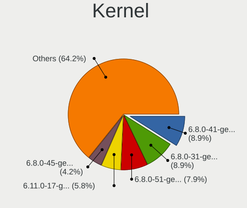

| Version             | Notebooks | Percent |
|---------------------|-----------|---------|
| 6.8.0-41-generic    | 17        | 8.95%   |
| 6.8.0-31-generic    | 17        | 8.95%   |
| 6.8.0-51-generic    | 15        | 7.89%   |
| 6.11.0-17-generic   | 11        | 5.79%   |
| 6.8.0-45-generic    | 8         | 4.21%   |
| 6.8.0-36-generic    | 8         | 4.21%   |
| 6.14.0-27-generic   | 8         | 4.21%   |
| 6.8.0-47-generic    | 7         | 3.68%   |
| 6.8.0-52-generic    | 6         | 3.16%   |
| 6.14.0-29-generic   | 6         | 3.16%   |
| 6.8.0-40-generic    | 5         | 2.63%   |
| 6.14.0-33-generic   | 5         | 2.63%   |
| 6.11.0-26-generic   | 5         | 2.63%   |
| 6.11.0-25-generic   | 5         | 2.63%   |
| 6.8.0-54-generic    | 4         | 2.11%   |
| 6.8.0-53-generic    | 4         | 2.11%   |
| 6.11.0-19-generic   | 4         | 2.11%   |
| 6.8.0-79-generic    | 3         | 1.58%   |
| 6.8.0-58-generic    | 3         | 1.58%   |
| 6.8.0-55-generic    | 3         | 1.58%   |
| 6.8.0-49-generic    | 3         | 1.58%   |
| 6.8.0-48-generic    | 3         | 1.58%   |
| 6.8.0-44-generic    | 3         | 1.58%   |
| 6.14.0-37-generic   | 3         | 1.58%   |
| 6.14.0-35-generic   | 3         | 1.58%   |
| 6.14.0-24-generic   | 3         | 1.58%   |
| 6.11.0-29-generic   | 3         | 1.58%   |
| 6.8.0-60-generic    | 2         | 1.05%   |
| 6.14.0-36-generic   | 2         | 1.05%   |
| 6.14.0-32-generic   | 2         | 1.05%   |
| 6.9.5-sandy-custom  | 1         | 0.53%   |
| 6.8.0-86-generic    | 1         | 0.53%   |
| 6.8.0-79-lowlatency | 1         | 0.53%   |
| 6.8.0-71-generic    | 1         | 0.53%   |
| 6.8.0-63-generic    | 1         | 0.53%   |
| 6.8.0-62-generic    | 1         | 0.53%   |
| 6.8.0-59-generic    | 1         | 0.53%   |
| 6.8.0-57-generic    | 1         | 0.53%   |
| 6.8.0-56-generic    | 1         | 0.53%   |
| 6.8.0-41-lowlatency | 1         | 0.53%   |

Kernel Family
-------------

Linux kernel without a distro release

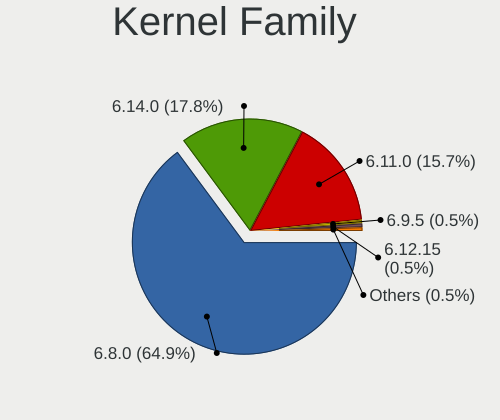

| Version | Notebooks | Percent |
|---------|-----------|---------|
| 6.8.0   | 120       | 64.86%  |
| 6.14.0  | 33        | 17.84%  |
| 6.11.0  | 29        | 15.68%  |
| 6.9.5   | 1         | 0.54%   |
| 6.12.15 | 1         | 0.54%   |
| 5.15.0  | 1         | 0.54%   |

Kernel Major Ver.
-----------------

Linux kernel major version

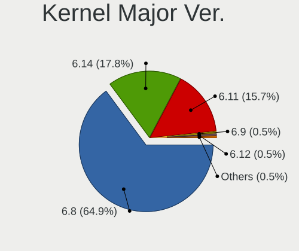

| Version | Notebooks | Percent |
|---------|-----------|---------|
| 6.8     | 120       | 64.86%  |
| 6.14    | 33        | 17.84%  |
| 6.11    | 29        | 15.68%  |
| 6.9     | 1         | 0.54%   |
| 6.12    | 1         | 0.54%   |
| 5.15    | 1         | 0.54%   |

Arch
----

OS architecture (x86_64, i586, etc.)

| Name   | Notebooks | Percent |
|--------|-----------|---------|
| x86_64 | 182       | 100%    |

DE
--

Desktop Environment

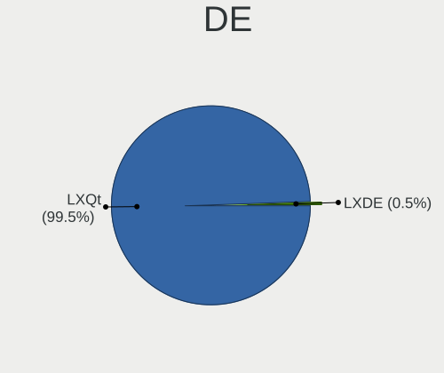

| Name | Notebooks | Percent |
|------|-----------|---------|
| LXQt | 181       | 99.45%  |
| LXDE | 1         | 0.55%   |

Display Server
--------------

X11 or Wayland

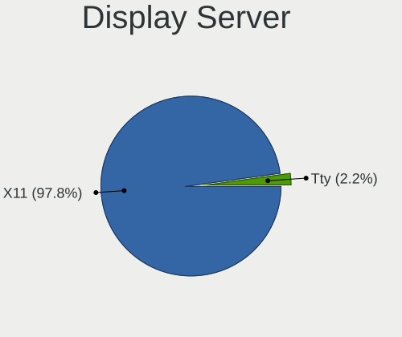

| Name | Notebooks | Percent |
|------|-----------|---------|
| X11  | 178       | 97.8%   |
| Tty  | 4         | 2.2%    |

Display Manager
---------------

SDDM, LightDM, etc.

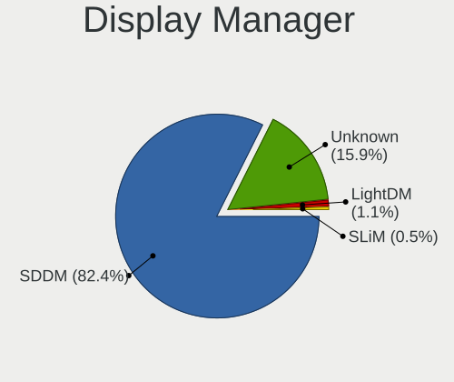

| Name    | Notebooks | Percent |
|---------|-----------|---------|
| SDDM    | 150       | 82.42%  |
| Unknown | 29        | 15.93%  |
| LightDM | 2         | 1.1%    |
| SLiM    | 1         | 0.55%   |

OS Lang
-------

Language

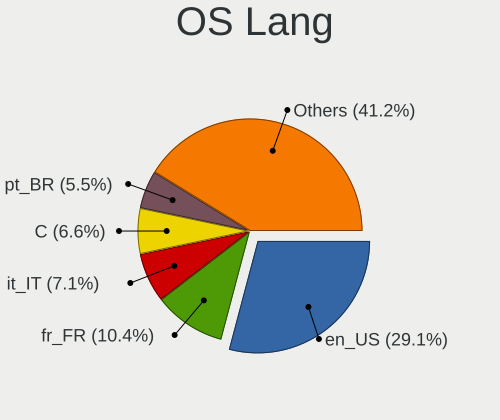

| Lang  | Notebooks | Percent |
|-------|-----------|---------|
| en_US | 53        | 29.12%  |
| fr_FR | 19        | 10.44%  |
| it_IT | 13        | 7.14%   |
| C     | 12        | 6.59%   |
| pt_BR | 10        | 5.49%   |
| de_DE | 10        | 5.49%   |
| en_GB | 8         | 4.4%    |
| es_ES | 7         | 3.85%   |
| es_MX | 6         | 3.3%    |
| pl_PL | 5         | 2.75%   |
| ru_RU | 3         | 1.65%   |
| fi_FI | 3         | 1.65%   |
| zh_CN | 2         | 1.1%    |
| tr_TR | 2         | 1.1%    |
| pt_PT | 2         | 1.1%    |
| es_CR | 2         | 1.1%    |
| es_AR | 2         | 1.1%    |
| en_ZA | 2         | 1.1%    |
| en_IN | 2         | 1.1%    |
| en_CA | 2         | 1.1%    |
| zh_TW | 1         | 0.55%   |
| nl_NL | 1         | 0.55%   |
| lt_LT | 1         | 0.55%   |
| gl_ES | 1         | 0.55%   |
| fr_CH | 1         | 0.55%   |
| fr_CA | 1         | 0.55%   |
| et_EE | 1         | 0.55%   |
| es_UY | 1         | 0.55%   |
| es_PE | 1         | 0.55%   |
| es_CO | 1         | 0.55%   |
| es_CL | 1         | 0.55%   |
| en_SG | 1         | 0.55%   |
| en_PH | 1         | 0.55%   |
| en_NG | 1         | 0.55%   |
| en_HK | 1         | 0.55%   |
| en_DE | 1         | 0.55%   |
| cs_CZ | 1         | 0.55%   |

Boot Mode
---------

EFI or BIOS

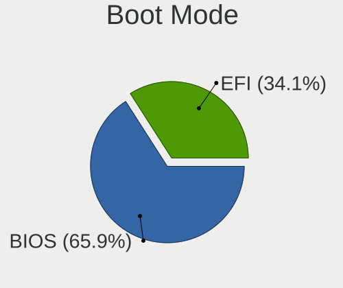

| Mode | Notebooks | Percent |
|------|-----------|---------|
| BIOS | 120       | 65.93%  |
| EFI  | 62        | 34.07%  |

Filesystem
----------

Type of filesystem

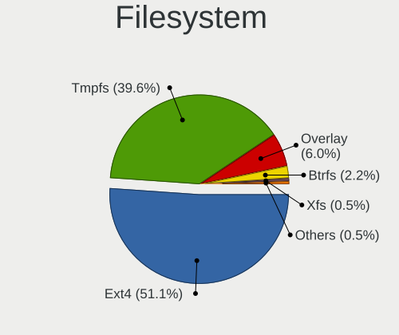

| Type    | Notebooks | Percent |
|---------|-----------|---------|
| Ext4    | 93        | 51.1%   |
| Tmpfs   | 72        | 39.56%  |
| Overlay | 11        | 6.04%   |
| Btrfs   | 4         | 2.2%    |
| Xfs     | 1         | 0.55%   |
| Ext2    | 1         | 0.55%   |

Part. scheme
------------

Scheme of partitioning

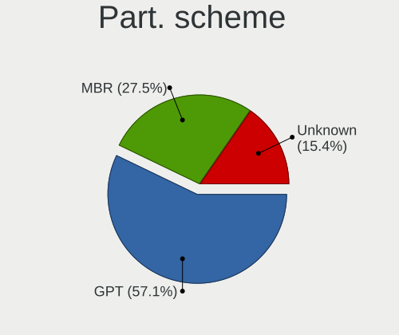

| Type    | Notebooks | Percent |
|---------|-----------|---------|
| GPT     | 104       | 57.14%  |
| MBR     | 50        | 27.47%  |
| Unknown | 28        | 15.38%  |

Dual Boot with Linux/BSD
------------------------

Hosting more than one Linux/BSD

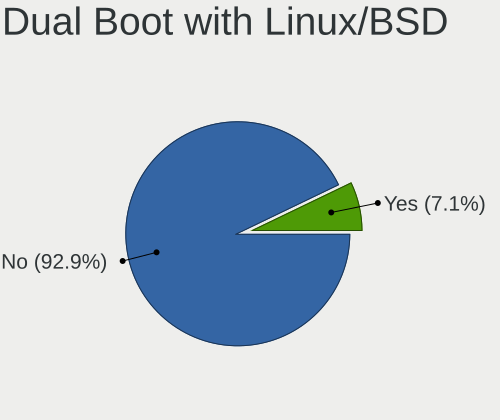

| Dual boot | Notebooks | Percent |
|-----------|-----------|---------|
| No        | 169       | 92.86%  |
| Yes       | 13        | 7.14%   |

Dual Boot (Win)
---------------

Hosting Linux and Windows

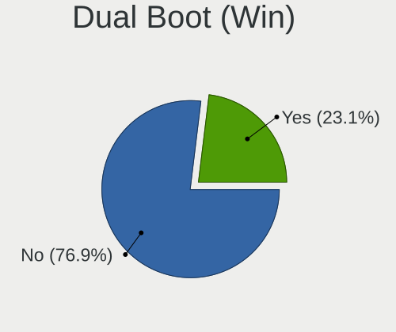

| Dual boot | Notebooks | Percent |
|-----------|-----------|---------|
| No        | 140       | 76.92%  |
| Yes       | 42        | 23.08%  |

Board
-----

Vendor
------

Motherboard manufacturer

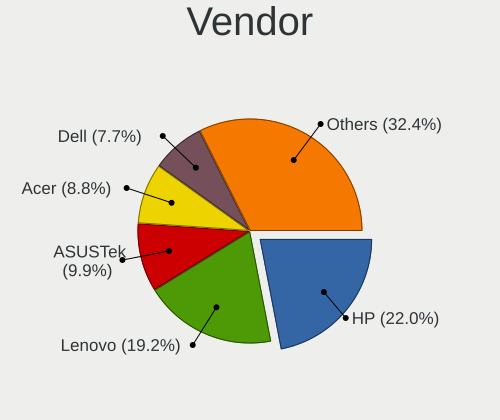

| Name                | Notebooks | Percent |
|---------------------|-----------|---------|
| Hewlett-Packard     | 40        | 21.98%  |
| Lenovo              | 35        | 19.23%  |
| ASUSTek Computer    | 18        | 9.89%   |
| Acer                | 16        | 8.79%   |
| Dell                | 14        | 7.69%   |
| Apple               | 10        | 5.49%   |
| Samsung Electronics | 6         | 3.3%    |
| Fujitsu             | 5         | 2.75%   |
| Sony                | 4         | 2.2%    |
| Toshiba             | 3         | 1.65%   |
| Medion              | 3         | 1.65%   |
| eMachines           | 3         | 1.65%   |
| Positivo            | 2         | 1.1%    |
| Chuwi               | 2         | 1.1%    |
| Unknown             | 2         | 1.1%    |
| Unchartevice        | 1         | 0.55%   |
| SK hynix            | 1         | 0.55%   |
| Semp Toshiba        | 1         | 0.55%   |
| PROBOOK             | 1         | 0.55%   |
| Philco              | 1         | 0.55%   |
| Packard Bell        | 1         | 0.55%   |
| ODM                 | 1         | 0.55%   |
| NVN-ED01            | 1         | 0.55%   |
| Notebook            | 1         | 0.55%   |
| MicroByte           | 1         | 0.55%   |
| Mediacom            | 1         | 0.55%   |
| LG Electronics      | 1         | 0.55%   |
| Intel               | 1         | 0.55%   |
| HUAWEI              | 1         | 0.55%   |
| HONOR               | 1         | 0.55%   |
| Google              | 1         | 0.55%   |
| ECS                 | 1         | 0.55%   |
| Complet             | 1         | 0.55%   |
| AVERATEC            | 1         | 0.55%   |

Model
-----

Motherboard model

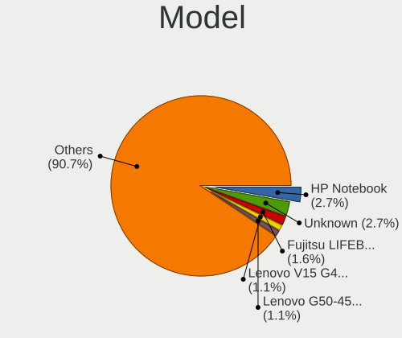

| Name                               | Notebooks | Percent |
|------------------------------------|-----------|---------|
| HP Notebook                        | 5         | 2.75%   |
| Unknown                            | 5         | 2.75%   |
| Fujitsu LIFEBOOK AH531             | 3         | 1.65%   |
| Lenovo V15 G4 IRU 83A1             | 2         | 1.1%    |
| Lenovo G50-45 80E3                 | 2         | 1.1%    |
| HP Pavilion g6                     | 2         | 1.1%    |
| HP Pavilion 15                     | 2         | 1.1%    |
| Dell Latitude E5450                | 2         | 1.1%    |
| ASUS UX21E                         | 2         | 1.1%    |
| Apple MacBookPro9,2                | 2         | 1.1%    |
| Apple MacBookPro8,1                | 2         | 1.1%    |
| Apple MacBookPro7,1                | 2         | 1.1%    |
| Apple MacBookAir1,1                | 2         | 1.1%    |
| Unchartevice 6540                  | 1         | 0.55%   |
| Toshiba Satellite Pro S500         | 1         | 0.55%   |
| Toshiba Satellite P55W-C           | 1         | 0.55%   |
| Toshiba Satellite C660             | 1         | 0.55%   |
| Sony VPCF132FX                     | 1         | 0.55%   |
| Sony VPCEL22FX                     | 1         | 0.55%   |
| Sony VGN-CR260F                    | 1         | 0.55%   |
| Sony M730                          | 1         | 0.55%   |
| SK hynix HT14CCIC42E               | 1         | 0.55%   |
| Semp Toshiba K201                  | 1         | 0.55%   |
| Samsung R530/R730/P590             | 1         | 0.55%   |
| Samsung R519/R719                  | 1         | 0.55%   |
| Samsung QX311/QX411/QX412/QX511    | 1         | 0.55%   |
| Samsung NC210/NC110                | 1         | 0.55%   |
| Samsung N150P/N210P/N220P          | 1         | 0.55%   |
| Samsung 370E4K                     | 1         | 0.55%   |
| PROBOOK U SERIES                   | 1         | 0.55%   |
| Positivo S14BW01                   | 1         | 0.55%   |
| Positivo C14CU51                   | 1         | 0.55%   |
| Philco 14M2                        | 1         | 0.55%   |
| Packard Bell EasyNote TE69BM       | 1         | 0.55%   |
| Notebook W54_W94_W955TU,-T,-C      | 1         | 0.55%   |
| MicroByte ezbook                   | 1         | 0.55%   |
| Medion WIM2180                     | 1         | 0.55%   |
| Medion S6421 MD60703               | 1         | 0.55%   |
| Medion E5211                       | 1         | 0.55%   |
| Mediacom WinPad 11,6 FullHD- WPU11 | 1         | 0.55%   |

Model Family
------------

Motherboard model prefix

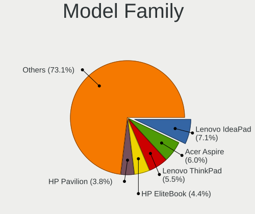

| Name                 | Notebooks | Percent |
|----------------------|-----------|---------|
| Lenovo IdeaPad       | 13        | 7.14%   |
| Acer Aspire          | 11        | 6.04%   |
| Lenovo ThinkPad      | 10        | 5.49%   |
| HP EliteBook         | 8         | 4.4%    |
| HP Pavilion          | 7         | 3.85%   |
| Dell Latitude        | 7         | 3.85%   |
| HP Notebook          | 5         | 2.75%   |
| Fujitsu LIFEBOOK     | 5         | 2.75%   |
| Dell Inspiron        | 5         | 2.75%   |
| Unknown              | 5         | 2.75%   |
| HP ProBook           | 4         | 2.2%    |
| HP Laptop            | 4         | 2.2%    |
| Toshiba Satellite    | 3         | 1.65%   |
| HP ZBook             | 3         | 1.65%   |
| HP Compaq            | 3         | 1.65%   |
| Lenovo Yoga          | 2         | 1.1%    |
| Lenovo V15           | 2         | 1.1%    |
| Lenovo G50-45        | 2         | 1.1%    |
| HP Stream            | 2         | 1.1%    |
| ASUS VivoBook        | 2         | 1.1%    |
| ASUS UX21E           | 2         | 1.1%    |
| Apple MacBookPro9    | 2         | 1.1%    |
| Apple MacBookPro8    | 2         | 1.1%    |
| Apple MacBookPro7    | 2         | 1.1%    |
| Apple MacBookAir1    | 2         | 1.1%    |
| Acer TravelMate      | 2         | 1.1%    |
| Unchartevice 6540    | 1         | 0.55%   |
| Sony VPCF132FX       | 1         | 0.55%   |
| Sony VPCEL22FX       | 1         | 0.55%   |
| Sony VGN-CR260F      | 1         | 0.55%   |
| Sony M730            | 1         | 0.55%   |
| SK hynix HT14CCIC42E | 1         | 0.55%   |
| Semp Toshiba K201    | 1         | 0.55%   |
| Samsung R530         | 1         | 0.55%   |
| Samsung R519         | 1         | 0.55%   |
| Samsung QX311        | 1         | 0.55%   |
| Samsung NC210        | 1         | 0.55%   |
| Samsung N150P        | 1         | 0.55%   |
| Samsung 370E4K       | 1         | 0.55%   |
| PROBOOK U            | 1         | 0.55%   |

MFG Year
--------

Motherboard manufacture year

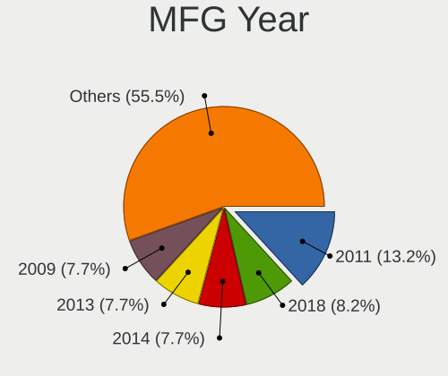

| Year | Notebooks | Percent |
|------|-----------|---------|
| 2011 | 24        | 13.19%  |
| 2018 | 15        | 8.24%   |
| 2014 | 14        | 7.69%   |
| 2013 | 14        | 7.69%   |
| 2009 | 14        | 7.69%   |
| 2010 | 12        | 6.59%   |
| 2008 | 12        | 6.59%   |
| 2017 | 11        | 6.04%   |
| 2016 | 11        | 6.04%   |
| 2015 | 11        | 6.04%   |
| 2019 | 8         | 4.4%    |
| 2023 | 7         | 3.85%   |
| 2021 | 6         | 3.3%    |
| 2012 | 6         | 3.3%    |
| 2022 | 5         | 2.75%   |
| 2024 | 4         | 2.2%    |
| 2020 | 3         | 1.65%   |
| 2007 | 3         | 1.65%   |
| 2006 | 2         | 1.1%    |

Form Factor
-----------

Physical design of the computer

| Name     | Notebooks | Percent |
|----------|-----------|---------|
| Notebook | 182       | 100%    |

Secure Boot
-----------

Enabled or disabled

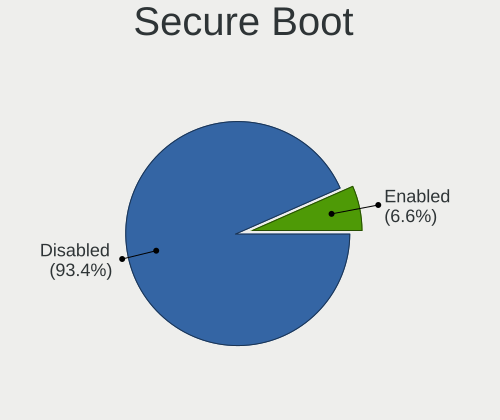

| State    | Notebooks | Percent |
|----------|-----------|---------|
| Disabled | 170       | 93.41%  |
| Enabled  | 12        | 6.59%   |

Coreboot
--------

Have coreboot on board

| Used | Notebooks | Percent |
|------|-----------|---------|
| No   | 181       | 99.45%  |
| Yes  | 1         | 0.55%   |

RAM Size
--------

Total RAM memory

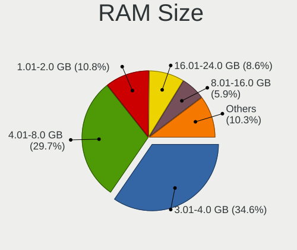

| Size in GB  | Notebooks | Percent |
|-------------|-----------|---------|
| 3.01-4.0    | 64        | 34.59%  |
| 4.01-8.0    | 55        | 29.73%  |
| 1.01-2.0    | 20        | 10.81%  |
| 16.01-24.0  | 16        | 8.65%   |
| 8.01-16.0   | 11        | 5.95%   |
| 2.01-3.0    | 9         | 4.86%   |
| 32.01-64.0  | 5         | 2.7%    |
| 24.01-32.0  | 2         | 1.08%   |
| 0.51-1.0    | 2         | 1.08%   |
| 64.01-256.0 | 1         | 0.54%   |

RAM Used
--------

Used RAM memory

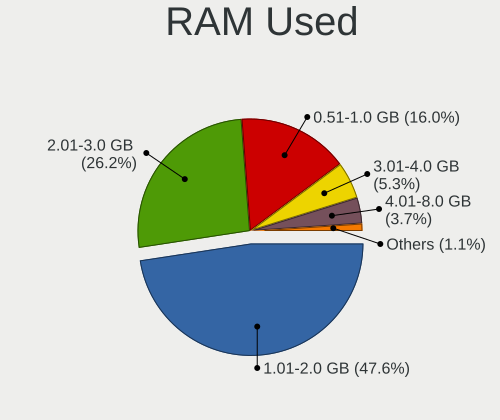

| Used GB    | Notebooks | Percent |
|------------|-----------|---------|
| 1.01-2.0   | 89        | 47.59%  |
| 2.01-3.0   | 49        | 26.2%   |
| 0.51-1.0   | 30        | 16.04%  |
| 3.01-4.0   | 10        | 5.35%   |
| 4.01-8.0   | 7         | 3.74%   |
| 16.01-24.0 | 1         | 0.53%   |
| 8.01-16.0  | 1         | 0.53%   |

Total Drives
------------

Number of drives on board

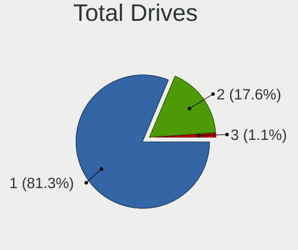

| Drives | Notebooks | Percent |
|--------|-----------|---------|
| 1      | 148       | 81.32%  |
| 2      | 32        | 17.58%  |
| 3      | 2         | 1.1%    |

Has CD-ROM
----------

Has CD-ROM on board

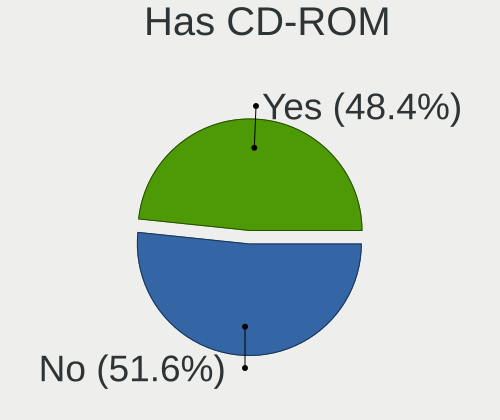

| Presented | Notebooks | Percent |
|-----------|-----------|---------|
| No        | 94        | 51.65%  |
| Yes       | 88        | 48.35%  |

Has Ethernet
------------

Has Ethernet on board

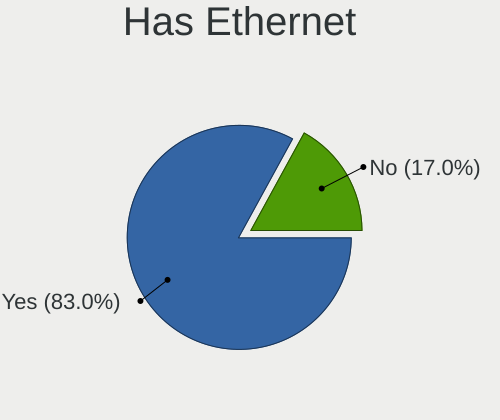

| Presented | Notebooks | Percent |
|-----------|-----------|---------|
| Yes       | 151       | 82.97%  |
| No        | 31        | 17.03%  |

Has WiFi
--------

Has WiFi module

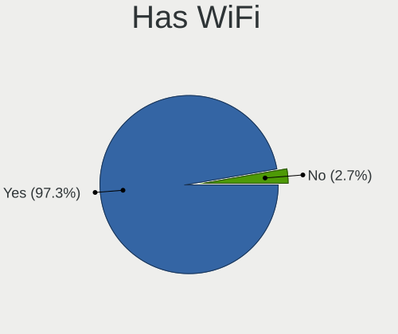

| Presented | Notebooks | Percent |
|-----------|-----------|---------|
| Yes       | 177       | 97.25%  |
| No        | 5         | 2.75%   |

Has Bluetooth
-------------

Has Bluetooth module

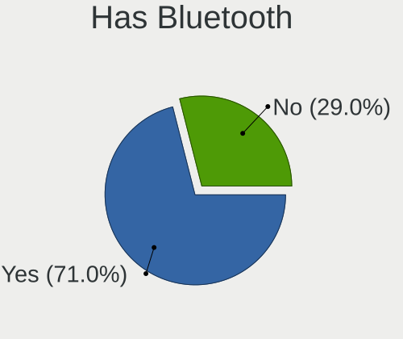

| Presented | Notebooks | Percent |
|-----------|-----------|---------|
| Yes       | 130       | 71.04%  |
| No        | 53        | 28.96%  |

Location
--------

Country
-------

Geographic location (country)

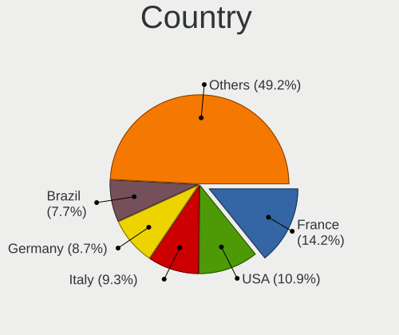

| Country            | Notebooks | Percent |
|--------------------|-----------|---------|
| France             | 26        | 14.21%  |
| USA                | 20        | 10.93%  |
| Italy              | 17        | 9.29%   |
| Germany            | 16        | 8.74%   |
| Brazil             | 14        | 7.65%   |
| Spain              | 7         | 3.83%   |
| Finland            | 7         | 3.83%   |
| India              | 5         | 2.73%   |
| Turkey             | 4         | 2.19%   |
| Romania            | 4         | 2.19%   |
| Costa Rica         | 4         | 2.19%   |
| UK                 | 3         | 1.64%   |
| South Africa       | 3         | 1.64%   |
| Russia             | 3         | 1.64%   |
| Poland             | 3         | 1.64%   |
| Norway             | 3         | 1.64%   |
| Mexico             | 3         | 1.64%   |
| Czechia            | 3         | 1.64%   |
| Canada             | 3         | 1.64%   |
| Uruguay            | 2         | 1.09%   |
| Taiwan             | 2         | 1.09%   |
| Sri Lanka          | 2         | 1.09%   |
| Portugal           | 2         | 1.09%   |
| Peru               | 2         | 1.09%   |
| Indonesia          | 2         | 1.09%   |
| Greece             | 2         | 1.09%   |
| China              | 2         | 1.09%   |
| Argentina          | 2         | 1.09%   |
| Switzerland        | 1         | 0.55%   |
| Singapore          | 1         | 0.55%   |
| Saudi Arabia       | 1         | 0.55%   |
| Philippines        | 1         | 0.55%   |
| Pakistan           | 1         | 0.55%   |
| Nigeria            | 1         | 0.55%   |
| Lithuania          | 1         | 0.55%   |
| Kazakhstan         | 1         | 0.55%   |
| Hong Kong          | 1         | 0.55%   |
| Estonia            | 1         | 0.55%   |
| Ecuador            | 1         | 0.55%   |
| Dominican Republic | 1         | 0.55%   |

City
----

Geographic location (city)

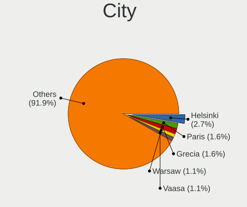

| City            | Notebooks | Percent |
|-----------------|-----------|---------|
| Helsinki        | 5         | 2.7%    |
| Paris           | 3         | 1.62%   |
| Grecia          | 3         | 1.62%   |
| Warsaw          | 2         | 1.08%   |
| Vaasa           | 2         | 1.08%   |
| Sao Paulo       | 2         | 1.08%   |
| Roorkee         | 2         | 1.08%   |
| Prague          | 2         | 1.08%   |
| Nice            | 2         | 1.08%   |
| New York        | 2         | 1.08%   |
| Montevideo      | 2         | 1.08%   |
| Monroe          | 2         | 1.08%   |
| Milan           | 2         | 1.08%   |
| Lucknow         | 2         | 1.08%   |
| Curitiba        | 2         | 1.08%   |
| Bursa           | 2         | 1.08%   |
| Barcelona       | 2         | 1.08%   |
| Aurora          | 2         | 1.08%   |
| Aachen          | 2         | 1.08%   |
| Wuppertal       | 1         | 0.54%   |
| Winnipeg        | 1         | 0.54%   |
| Wauwatosa       | 1         | 0.54%   |
| Voiron          | 1         | 0.54%   |
| Vitória        | 1         | 0.54%   |
| Vilnius         | 1         | 0.54%   |
| Villa Ballester | 1         | 0.54%   |
| Vienna          | 1         | 0.54%   |
| Varginha        | 1         | 0.54%   |
| Valladolid      | 1         | 0.54%   |
| Valencia        | 1         | 0.54%   |
| Turin           | 1         | 0.54%   |
| Treviso         | 1         | 0.54%   |
| Toulouse        | 1         | 0.54%   |
| Torre Orsaia    | 1         | 0.54%   |
| Tijuana         | 1         | 0.54%   |
| Thiais          | 1         | 0.54%   |
| Thessaloniki    | 1         | 0.54%   |
| Tårnåsen      | 1         | 0.54%   |
| Sulkowice       | 1         | 0.54%   |
| Stuttgart       | 1         | 0.54%   |

Drives
------

Drive Vendor
------------

Hard drive vendors

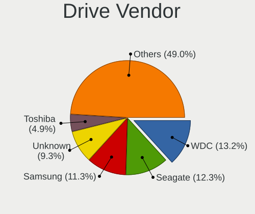

| Vendor              | Notebooks | Drives | Percent |
|---------------------|-----------|--------|---------|
| WDC                 | 27        | 29     | 13.24%  |
| Seagate             | 25        | 30     | 12.25%  |
| Samsung Electronics | 23        | 25     | 11.27%  |
| Unknown             | 19        | 20     | 9.31%   |
| Toshiba             | 10        | 10     | 4.9%    |
| Kingston            | 10        | 10     | 4.9%    |
| Crucial             | 8         | 9      | 3.92%   |
| HGST                | 7         | 7      | 3.43%   |
| SK hynix            | 6         | 6      | 2.94%   |
| Intel               | 6         | 6      | 2.94%   |
| Hitachi             | 6         | 6      | 2.94%   |
| Sandisk             | 5         | 6      | 2.45%   |
| Micron Technology   | 5         | 5      | 2.45%   |
| China               | 5         | 6      | 2.45%   |
| A-DATA Technology   | 4         | 4      | 1.96%   |
| UMIS                | 3         | 3      | 1.47%   |
| Fujitsu             | 3         | 3      | 1.47%   |
| USB                 | 2         | 2      | 0.98%   |
| SSK                 | 2         | 2      | 0.98%   |
| Patriot             | 2         | 2      | 0.98%   |
| Netac               | 2         | 2      | 0.98%   |
| Lexar               | 2         | 2      | 0.98%   |
| Zheino              | 1         | 1      | 0.49%   |
| XrayDisk            | 1         | 1      | 0.49%   |
| Verbatim            | 1         | 1      | 0.49%   |
| Timetec             | 1         | 1      | 0.49%   |
| Silicon Motion      | 1         | 1      | 0.49%   |
| ShiJi               | 1         | 1      | 0.49%   |
| Realtek             | 1         | 1      | 0.49%   |
| PNY                 | 1         | 1      | 0.49%   |
| Phison Electronics  | 1         | 1      | 0.49%   |
| ORICO               | 1         | 1      | 0.49%   |
| LITEON              | 1         | 1      | 0.49%   |
| Leven               | 1         | 1      | 0.49%   |
| KIOXIA              | 1         | 1      | 0.49%   |
| KingSpec            | 1         | 1      | 0.49%   |
| Intenso             | 1         | 1      | 0.49%   |
| Inland              | 1         | 1      | 0.49%   |
| HS-SSD-E100N        | 1         | 1      | 0.49%   |
| EVM                 | 1         | 1      | 0.49%   |

Drive Model
-----------

Hard drive models

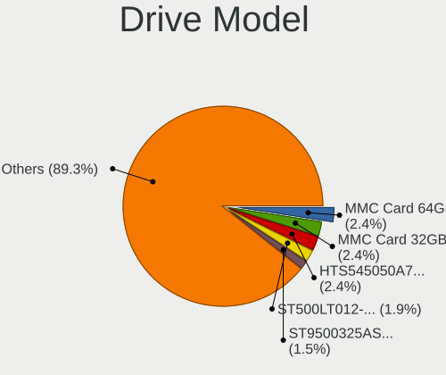

| Model                               | Notebooks | Percent |
|-------------------------------------|-----------|---------|
| Unknown MMC Card  64GB              | 5         | 2.43%   |
| Unknown MMC Card  32GB              | 5         | 2.43%   |
| HGST HTS545050A7E680 500GB          | 5         | 2.43%   |
| Seagate ST500LT012-1DG142 500GB     | 4         | 1.94%   |
| Seagate ST9500325AS 500GB           | 3         | 1.46%   |
| Seagate ST1000LM035-1RK172 1TB      | 3         | 1.46%   |
| Kingston SV300S37A120G 120GB SSD    | 3         | 1.46%   |
| Kingston SA400S37480G 480GB SSD     | 3         | 1.46%   |
| China SSD 128GB                     | 3         | 1.46%   |
| WDC WDS500G2B0A-00SM50 500GB        | 2         | 0.97%   |
| WDC WD5000LPCX-24VHAT0 500GB        | 2         | 0.97%   |
| WDC WD3200BEVT-22ZCT0 320GB         | 2         | 0.97%   |
| WDC WD2500BEVT-22ZCT0 250GB         | 2         | 0.97%   |
| WDC WD10JPVX-60JC3T0 1TB            | 2         | 0.97%   |
| USB SanDisk 3.2Gen1 496GB           | 2         | 0.97%   |
| Unknown MMC Card  128GB             | 2         | 0.97%   |
| UMIS RPJTJ512MKP1QDY 512GB          | 2         | 0.97%   |
| SSK Disk 2TB                        | 2         | 0.97%   |
| Seagate ST9320325AS 320GB           | 2         | 0.97%   |
| Seagate ST500LM021-1KJ152 500GB     | 2         | 0.97%   |
| Micron MTFDDAK256MAM-1K12 256GB SSD | 2         | 0.97%   |
| Micron 2400_MTFDKBA512QFM 512GB     | 2         | 0.97%   |
| Intel SSDSC2MH250A2 250GB           | 2         | 0.97%   |
| HGST HTS545050A7E380 500GB          | 2         | 0.97%   |
| Crucial CT480BX500SSD1 480GB        | 2         | 0.97%   |
| A-DATA XM11 128GB SSD               | 2         | 0.97%   |
| Zheino CHN 18ZIF001M 128 128GB      | 1         | 0.49%   |
| XrayDisk SSD 512GB                  | 1         | 0.49%   |
| WDC WDS500G2B0A 500GB SSD           | 1         | 0.49%   |
| WDC WD5000LPCX-80VHAT1 500GB        | 1         | 0.49%   |
| WDC WD5000LPCX-24C6HT0 500GB        | 1         | 0.49%   |
| WDC WD3200BPVT-22JJ5T0 320GB        | 1         | 0.49%   |
| WDC WD2500BPVT-22JJ5T0 250GB        | 1         | 0.49%   |
| WDC WD2500BEVT-75ZCT2 250GB         | 1         | 0.49%   |
| WDC WD2500BEVT-60ZCT1 250GB         | 1         | 0.49%   |
| WDC WD1600BEVT-22A23T0 160GB        | 1         | 0.49%   |
| WDC WD1200BEVS-22RST0 120GB         | 1         | 0.49%   |
| WDC WD1200BEVS-08RST2 120GB         | 1         | 0.49%   |
| WDC WD10SPZX-22Z10T1 1TB            | 1         | 0.49%   |
| WDC WD10SPZX-21Z10T0 1TB            | 1         | 0.49%   |

HDD Vendor
----------

Hard disk drive vendors

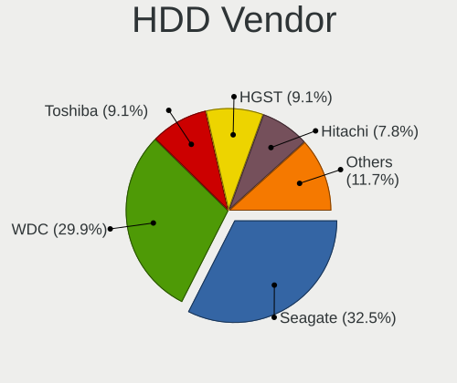

| Vendor              | Notebooks | Drives | Percent |
|---------------------|-----------|--------|---------|
| Seagate             | 25        | 30     | 32.47%  |
| WDC                 | 23        | 25     | 29.87%  |
| Toshiba             | 7         | 7      | 9.09%   |
| HGST                | 7         | 7      | 9.09%   |
| Hitachi             | 6         | 6      | 7.79%   |
| Samsung Electronics | 4         | 5      | 5.19%   |
| Fujitsu             | 3         | 3      | 3.9%    |
| SSK                 | 2         | 2      | 2.6%    |

SSD Vendor
----------

Solid state drive vendors

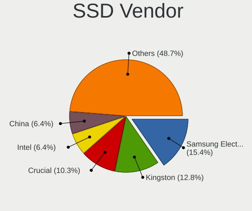

| Vendor              | Notebooks | Drives | Percent |
|---------------------|-----------|--------|---------|
| Samsung Electronics | 12        | 13     | 15.38%  |
| Kingston            | 10        | 10     | 12.82%  |
| Crucial             | 8         | 9      | 10.26%  |
| Intel               | 5         | 5      | 6.41%   |
| China               | 5         | 6      | 6.41%   |
| A-DATA Technology   | 4         | 4      | 5.13%   |
| WDC                 | 3         | 3      | 3.85%   |
| SanDisk             | 3         | 4      | 3.85%   |
| Toshiba             | 2         | 2      | 2.56%   |
| SK hynix            | 2         | 2      | 2.56%   |
| Patriot             | 2         | 2      | 2.56%   |
| Netac               | 2         | 2      | 2.56%   |
| Micron Technology   | 2         | 2      | 2.56%   |
| Lexar               | 2         | 2      | 2.56%   |
| Zheino              | 1         | 1      | 1.28%   |
| XrayDisk            | 1         | 1      | 1.28%   |
| Verbatim            | 1         | 1      | 1.28%   |
| Timetec             | 1         | 1      | 1.28%   |
| ShiJi               | 1         | 1      | 1.28%   |
| PNY                 | 1         | 1      | 1.28%   |
| LITEON              | 1         | 1      | 1.28%   |
| Leven               | 1         | 1      | 1.28%   |
| KingSpec            | 1         | 1      | 1.28%   |
| Intenso             | 1         | 1      | 1.28%   |
| Inland              | 1         | 1      | 1.28%   |
| EVM                 | 1         | 1      | 1.28%   |
| EDILOCA             | 1         | 1      | 1.28%   |
| Axiom               | 1         | 1      | 1.28%   |
| ASMedia             | 1         | 1      | 1.28%   |
| Apple               | 1         | 1      | 1.28%   |

Drive Kind
----------

HDD or SSD

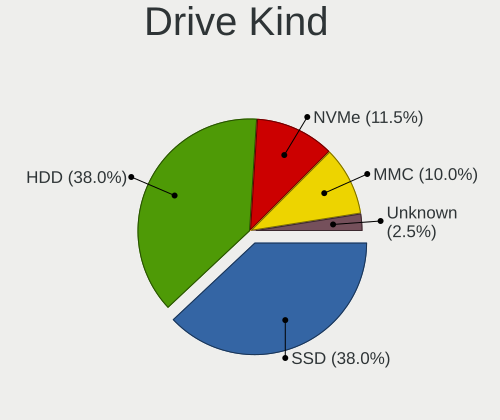

| Kind    | Notebooks | Drives | Percent |
|---------|-----------|--------|---------|
| SSD     | 76        | 82     | 38%     |
| HDD     | 76        | 85     | 38%     |
| NVMe    | 23        | 24     | 11.5%   |
| MMC     | 20        | 21     | 10%     |
| Unknown | 5         | 5      | 2.5%    |

Drive Connector
---------------

SATA, SAS, NVMe, etc.

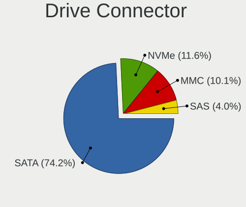

| Type | Notebooks | Drives | Percent |
|------|-----------|--------|---------|
| SATA | 147       | 164    | 74.24%  |
| NVMe | 23        | 23     | 11.62%  |
| MMC  | 20        | 21     | 10.1%   |
| SAS  | 8         | 9      | 4.04%   |

Drive Size
----------

Size of hard drive

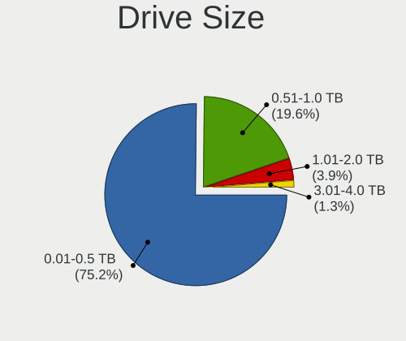

| Size in TB | Notebooks | Drives | Percent |
|------------|-----------|--------|---------|
| 0.01-0.5   | 115       | 126    | 75.16%  |
| 0.51-1.0   | 30        | 33     | 19.61%  |
| 1.01-2.0   | 6         | 6      | 3.92%   |
| 3.01-4.0   | 2         | 2      | 1.31%   |

Space Total
-----------

Amount of disk space available on the file system

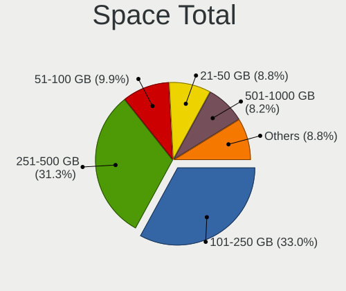

| Size in GB     | Notebooks | Percent |
|----------------|-----------|---------|
| 101-250        | 60        | 32.97%  |
| 251-500        | 57        | 31.32%  |
| 51-100         | 18        | 9.89%   |
| 21-50          | 16        | 8.79%   |
| 501-1000       | 15        | 8.24%   |
| 1-20           | 12        | 6.59%   |
| 1001-2000      | 3         | 1.65%   |
| More than 3000 | 1         | 0.55%   |

Space Used
----------

Amount of used disk space

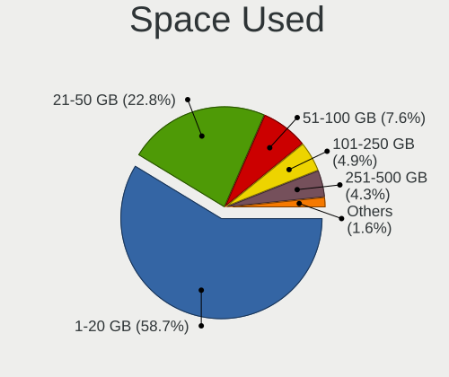

| Used GB   | Notebooks | Percent |
|-----------|-----------|---------|
| 1-20      | 108       | 58.7%   |
| 21-50     | 42        | 22.83%  |
| 51-100    | 14        | 7.61%   |
| 101-250   | 9         | 4.89%   |
| 251-500   | 8         | 4.35%   |
| 1001-2000 | 2         | 1.09%   |
| 501-1000  | 1         | 0.54%   |

Malfunc. Drives
---------------

Drive models with a malfunction

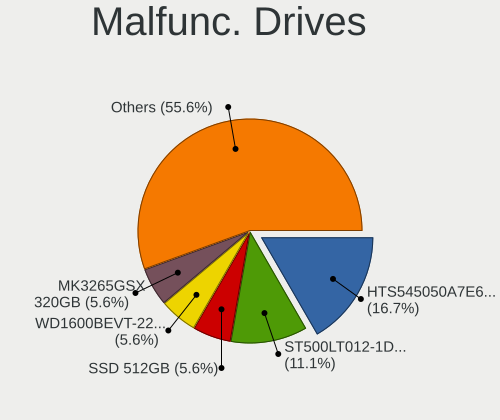

| Model                              | Notebooks | Drives | Percent |
|------------------------------------|-----------|--------|---------|
| HGST HTS545050A7E680 500GB         | 3         | 3      | 16.67%  |
| Seagate ST500LT012-1DG142 500GB    | 2         | 2      | 11.11%  |
| XrayDisk SSD 512GB                 | 1         | 1      | 5.56%   |
| WDC WD1600BEVT-22A23T0 160GB       | 1         | 1      | 5.56%   |
| Toshiba MK3265GSX 320GB            | 1         | 1      | 5.56%   |
| SK hynix SC210 2.5 7MM 512GB SSD   | 1         | 1      | 5.56%   |
| Seagate ST9500325AS 500GB          | 1         | 1      | 5.56%   |
| Seagate ST910021AS 100GB           | 1         | 1      | 5.56%   |
| Seagate ST1000LM024 HN-M101MBB 1TB | 1         | 1      | 5.56%   |
| SanDisk SSD PLUS 240GB             | 1         | 1      | 5.56%   |
| Samsung Electronics HM160HI 160GB  | 1         | 1      | 5.56%   |
| Intel SSDSC2KF128G8L 128GB         | 1         | 1      | 5.56%   |
| Hitachi HTS541680J9SA00 80GB       | 1         | 1      | 5.56%   |
| HGST HTS545050A7E380 500GB         | 1         | 1      | 5.56%   |
| China G521N256GB                   | 1         | 1      | 5.56%   |

Malfunc. Drive Vendor
---------------------

Vendors of faulty drives

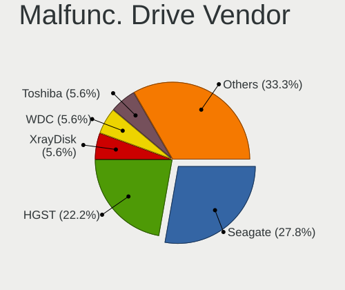

| Vendor              | Notebooks | Drives | Percent |
|---------------------|-----------|--------|---------|
| Seagate             | 5         | 5      | 27.78%  |
| HGST                | 4         | 4      | 22.22%  |
| XrayDisk            | 1         | 1      | 5.56%   |
| WDC                 | 1         | 1      | 5.56%   |
| Toshiba             | 1         | 1      | 5.56%   |
| SK hynix            | 1         | 1      | 5.56%   |
| SanDisk             | 1         | 1      | 5.56%   |
| Samsung Electronics | 1         | 1      | 5.56%   |
| Intel               | 1         | 1      | 5.56%   |
| Hitachi             | 1         | 1      | 5.56%   |
| China               | 1         | 1      | 5.56%   |

Malfunc. HDD Vendor
-------------------

Vendors of faulty HDD drives

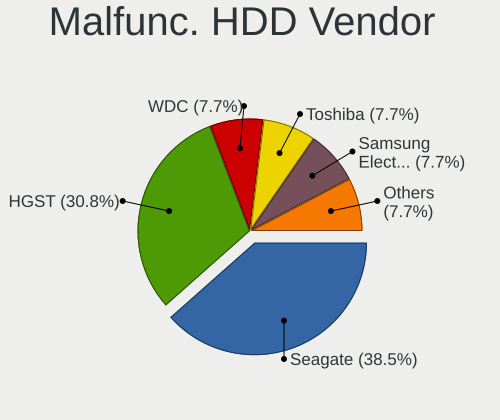

| Vendor              | Notebooks | Drives | Percent |
|---------------------|-----------|--------|---------|
| Seagate             | 5         | 5      | 38.46%  |
| HGST                | 4         | 4      | 30.77%  |
| WDC                 | 1         | 1      | 7.69%   |
| Toshiba             | 1         | 1      | 7.69%   |
| Samsung Electronics | 1         | 1      | 7.69%   |
| Hitachi             | 1         | 1      | 7.69%   |

Malfunc. Drive Kind
-------------------

Kinds of faulty drives

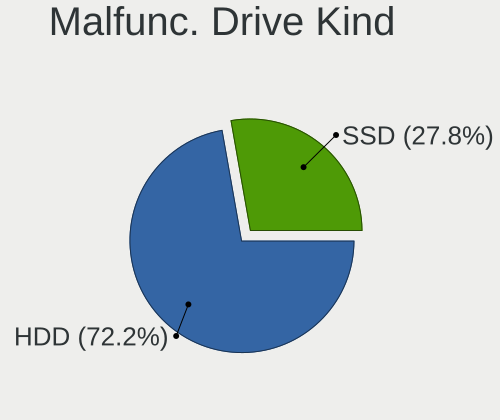

| Kind | Notebooks | Drives | Percent |
|------|-----------|--------|---------|
| HDD  | 13        | 13     | 72.22%  |
| SSD  | 5         | 5      | 27.78%  |

Failed Drives
-------------

Failed drive models

| Model                     | Notebooks | Drives | Percent |
|---------------------------|-----------|--------|---------|
| Seagate ST9500325AS 500GB | 1         | 1      | 100%    |

Failed Drive Vendor
-------------------

Failed drive vendors

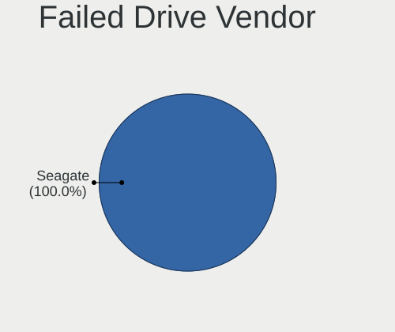

| Vendor  | Notebooks | Drives | Percent |
|---------|-----------|--------|---------|
| Seagate | 1         | 1      | 100%    |

Drive Status
------------

Number of failed and malfunc. drives

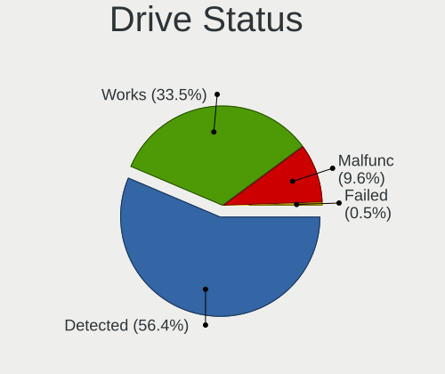

| Status   | Notebooks | Drives | Percent |
|----------|-----------|--------|---------|
| Detected | 106       | 128    | 56.38%  |
| Works    | 63        | 70     | 33.51%  |
| Malfunc  | 18        | 18     | 9.57%   |
| Failed   | 1         | 1      | 0.53%   |

Storage controller
------------------

Storage Vendor
--------------

Storage controller vendors

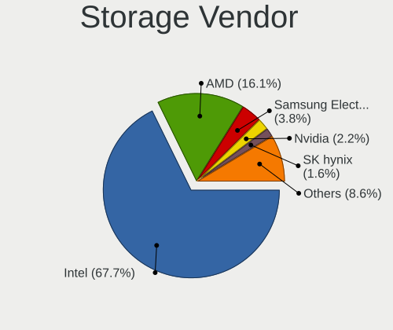

| Vendor                                  | Notebooks | Percent |
|-----------------------------------------|-----------|---------|
| Intel                                   | 126       | 67.74%  |
| AMD                                     | 30        | 16.13%  |
| Samsung Electronics                     | 7         | 3.76%   |
| Nvidia                                  | 4         | 2.15%   |
| SK hynix                                | 3         | 1.61%   |
| Micron Technology                       | 3         | 1.61%   |
| Shenzhen Unionmemory Information System | 2         | 1.08%   |
| SanDisk                                 | 2         | 1.08%   |
| VIA Technologies                        | 1         | 0.54%   |
| Union Memory (Shenzhen)                 | 1         | 0.54%   |
| Toshiba America Info Systems            | 1         | 0.54%   |
| Silicon Motion                          | 1         | 0.54%   |
| Silicon Integrated Systems [SiS]        | 1         | 0.54%   |
| Silicon Image                           | 1         | 0.54%   |
| Phison Electronics                      | 1         | 0.54%   |
| KIOXIA                                  | 1         | 0.54%   |
| ASMedia Technology                      | 1         | 0.54%   |

Storage Model
-------------

Storage controller models

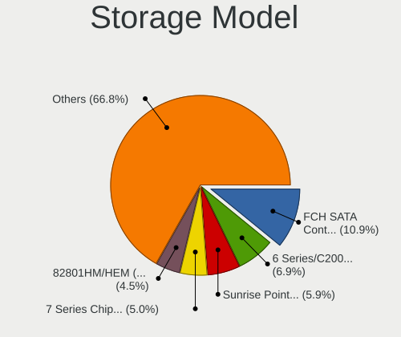

| Model                                                                                       | Notebooks | Percent |
|---------------------------------------------------------------------------------------------|-----------|---------|
| AMD FCH SATA Controller [AHCI mode]                                                         | 22        | 10.89%  |
| Intel 6 Series/C200 Series Chipset Family 6 port Mobile SATA AHCI Controller                | 14        | 6.93%   |
| Intel Sunrise Point-LP SATA Controller [AHCI mode]                                          | 12        | 5.94%   |
| Intel 7 Series Chipset Family 6-port SATA Controller [AHCI mode]                            | 10        | 4.95%   |
| Intel 82801HM/HEM (ICH8M/ICH8M-E) SATA Controller [AHCI mode]                               | 9         | 4.46%   |
| Intel 82801HM/HEM (ICH8M/ICH8M-E) IDE Controller                                            | 9         | 4.46%   |
| Intel Wildcat Point-LP SATA Controller [AHCI Mode]                                          | 7         | 3.47%   |
| Intel Celeron/Pentium Silver Processor SATA Controller                                      | 7         | 3.47%   |
| Intel 82801IBM/IEM (ICH9M/ICH9M-E) 4 port SATA Controller [AHCI mode]                       | 7         | 3.47%   |
| Intel Celeron N3350/Pentium N4200/Atom E3900 Series SATA AHCI Controller                    | 6         | 2.97%   |
| Intel Atom Processor E3800 Series SATA AHCI Controller                                      | 6         | 2.97%   |
| Intel 8 Series/C220 Series Chipset Family 6-port SATA Controller 1 [AHCI mode]              | 6         | 2.97%   |
| AMD SB7x0/SB8x0/SB9x0 SATA Controller [AHCI mode]                                           | 6         | 2.97%   |
| Intel 8 Series SATA Controller 1 [AHCI mode]                                                | 5         | 2.48%   |
| Intel 5 Series/3400 Series Chipset 6 port SATA AHCI Controller                              | 5         | 2.48%   |
| Intel 5 Series/3400 Series Chipset 4 port SATA AHCI Controller                              | 5         | 2.48%   |
| Intel Atom/Celeron/Pentium Processor x5-E8000/J3xxx/N3xxx Series SATA Controller            | 4         | 1.98%   |
| Intel Alder Lake-P SATA AHCI Controller                                                     | 4         | 1.98%   |
| Intel 82801 Mobile SATA Controller [RAID mode]                                              | 4         | 1.98%   |
| Intel NM10/ICH7 Family SATA Controller [AHCI mode]                                          | 3         | 1.49%   |
| Intel Cannon Lake Mobile PCH SATA AHCI Controller                                           | 3         | 1.49%   |
| Intel 82801IBM/IEM (ICH9M/ICH9M-E) 2 port SATA Controller [IDE mode]                        | 3         | 1.49%   |
| Shenzhen Unionmemory Information System RPETJ512MKP1QDQ PCIe 4.0 NVMe SSD 512GB (DRAM-less) | 2         | 0.99%   |
| Samsung NVMe SSD Controller SM981/PM981/PM983                                               | 2         | 0.99%   |
| Samsung NVMe SSD Controller 980 (DRAM-less)                                                 | 2         | 0.99%   |
| Nvidia MCP89 SATA Controller (AHCI mode)                                                    | 2         | 0.99%   |
| Nvidia MCP79 AHCI Controller                                                                | 2         | 0.99%   |
| Micron 2400 NVMe SSD (DRAM-less)                                                            | 2         | 0.99%   |
| Intel Volume Management Device NVMe RAID Controller                                         | 2         | 0.99%   |
| AMD SB600 Non-Raid-5 SATA                                                                   | 2         | 0.99%   |
| AMD SB600 IDE                                                                               | 2         | 0.99%   |
| VIA VT82C586A/B/VT82C686/A/B/VT823x/A/C PIPC Bus Master IDE                                 | 1         | 0.5%    |
| VIA VT8237A Integrated SATA RAID Controller                                                 | 1         | 0.5%    |
| Union Memory (Shenzhen) AM620 PCIe 3.0 NVMe SSD 256GB                                       | 1         | 0.5%    |
| Toshiba America Info Systems XG6 NVMe SSD Controller                                        | 1         | 0.5%    |
| SK hynix PVC10 NVMe Solid State Drive (DRAM-less)                                           | 1         | 0.5%    |
| SK hynix Platinum P41/PC801 NVMe Solid State Drive                                          | 1         | 0.5%    |
| SK hynix BC501 NVMe Solid State Drive                                                       | 1         | 0.5%    |
| Silicon Motion SM2263EN/SM2263XT (DRAM-less) NVMe SSD Controllers                           | 1         | 0.5%    |
| Silicon Integrated Systems [SiS] SATA Controller / IDE mode                                 | 1         | 0.5%    |

Storage Kind
------------

Kind of storage controller (IDE, SATA, NVMe, SAS, ...)

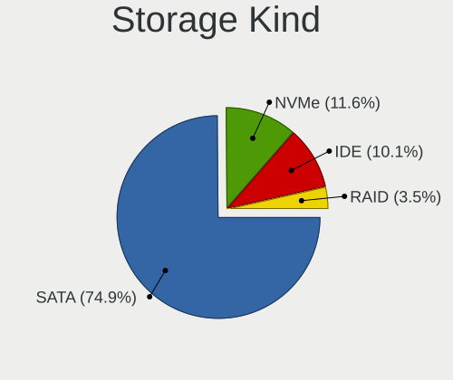

| Kind | Notebooks | Percent |
|------|-----------|---------|
| SATA | 149       | 74.87%  |
| NVMe | 23        | 11.56%  |
| IDE  | 20        | 10.05%  |
| RAID | 7         | 3.52%   |

Processor
---------

CPU Vendor
----------

Processor vendors

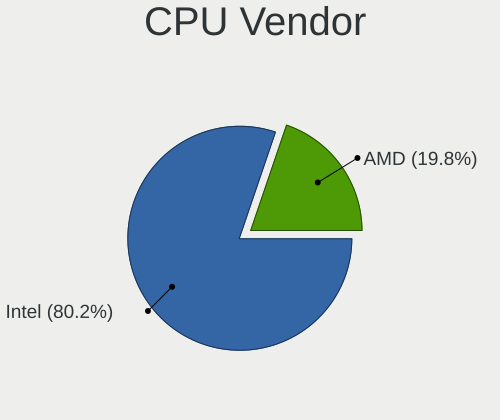

| Vendor | Notebooks | Percent |
|--------|-----------|---------|
| Intel  | 146       | 80.22%  |
| AMD    | 36        | 19.78%  |

CPU Model
---------

Processor models

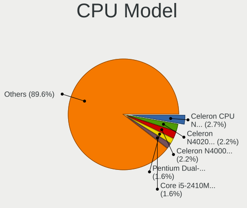

| Model                                       | Notebooks | Percent |
|---------------------------------------------|-----------|---------|
| Intel Celeron CPU N3350 @ 1.10GHz           | 5         | 2.75%   |
| Intel Celeron N4020 CPU @ 1.10GHz           | 4         | 2.2%    |
| Intel Celeron N4000 CPU @ 1.10GHz           | 4         | 2.2%    |
| Intel Pentium Dual-Core CPU T4300 @ 2.10GHz | 3         | 1.65%   |
| Intel Core i5-2410M CPU @ 2.30GHz           | 3         | 1.65%   |
| Intel Core i3-6006U CPU @ 2.00GHz           | 3         | 1.65%   |
| Intel Core 2 Duo CPU P8600 @ 2.40GHz        | 3         | 1.65%   |
| Intel Celeron CPU N2840 @ 2.16GHz           | 3         | 1.65%   |
| Intel Pentium Dual CPU T3400 @ 2.16GHz      | 2         | 1.1%    |
| Intel Pentium CPU N3710 @ 1.60GHz           | 2         | 1.1%    |
| Intel Pentium CPU N3700 @ 1.60GHz           | 2         | 1.1%    |
| Intel Pentium CPU N3540 @ 2.16GHz           | 2         | 1.1%    |
| Intel Core i7-5600U CPU @ 2.60GHz           | 2         | 1.1%    |
| Intel Core i7 CPU M 620 @ 2.67GHz           | 2         | 1.1%    |
| Intel Core i5-7200U CPU @ 2.50GHz           | 2         | 1.1%    |
| Intel Core i5-5300U CPU @ 2.30GHz           | 2         | 1.1%    |
| Intel Core i5-4200U CPU @ 1.60GHz           | 2         | 1.1%    |
| Intel Core i5-2467M CPU @ 1.60GHz           | 2         | 1.1%    |
| Intel Core i5-2430M CPU @ 2.40GHz           | 2         | 1.1%    |
| Intel Core i3-7020U CPU @ 2.30GHz           | 2         | 1.1%    |
| Intel Core i3-5005U CPU @ 2.00GHz           | 2         | 1.1%    |
| Intel Core i3-3217U CPU @ 1.80GHz           | 2         | 1.1%    |
| Intel Core i3 CPU M 380 @ 2.53GHz           | 2         | 1.1%    |
| Intel Core i3 CPU M 330 @ 2.13GHz           | 2         | 1.1%    |
| Intel Core 2 Duo CPU T7500 @ 2.20GHz        | 2         | 1.1%    |
| Intel Core 2 Duo CPU P8700 @ 2.53GHz        | 2         | 1.1%    |
| Intel Celeron CPU N3060 @ 1.60GHz           | 2         | 1.1%    |
| Intel Celeron CPU N3050 @ 1.60GHz           | 2         | 1.1%    |
| Intel Celeron CPU 1007U @ 1.50GHz           | 2         | 1.1%    |
| Intel Atom CPU N450 @ 1.66GHz               | 2         | 1.1%    |
| Intel 13th Gen Core i5-13420H               | 2         | 1.1%    |
| AMD E1-6010 APU with AMD Radeon R2 Graphics | 2         | 1.1%    |
| AMD E1-2500 APU with Radeon HD Graphics     | 2         | 1.1%    |
| AMD E-450 APU with Radeon HD Graphics       | 2         | 1.1%    |
| AMD A8-7410 APU with AMD Radeon R5 Graphics | 2         | 1.1%    |
| AMD A6-7310 APU with AMD Radeon R4 Graphics | 2         | 1.1%    |
| Intel Processor U300                        | 1         | 0.55%   |
| Intel Pentium Dual-Core CPU T4400 @ 2.20GHz | 1         | 0.55%   |
| Intel Pentium Dual-Core CPU T4200 @ 2.00GHz | 1         | 0.55%   |
| Intel Pentium Dual CPU T2330 @ 1.60GHz      | 1         | 0.55%   |

CPU Model Family
----------------

Processor model prefix

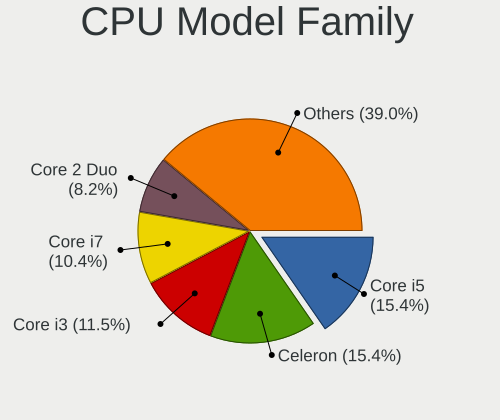

| Model                   | Notebooks | Percent |
|-------------------------|-----------|---------|
| Intel Core i5           | 28        | 15.38%  |
| Intel Celeron           | 28        | 15.38%  |
| Intel Core i3           | 21        | 11.54%  |
| Intel Core i7           | 19        | 10.44%  |
| Intel Core 2 Duo        | 15        | 8.24%   |
| Intel Pentium           | 10        | 5.49%   |
| Other                   | 7         | 3.85%   |
| Intel Atom              | 6         | 3.3%    |
| AMD A6                  | 6         | 3.3%    |
| Intel Pentium Dual-Core | 5         | 2.75%   |
| AMD Ryzen 5             | 5         | 2.75%   |
| AMD E1                  | 5         | 2.75%   |
| AMD E                   | 4         | 2.2%    |
| Intel Pentium Dual      | 3         | 1.65%   |
| AMD A4                  | 3         | 1.65%   |
| AMD Ryzen 7             | 2         | 1.1%    |
| AMD A8                  | 2         | 1.1%    |
| Intel Genuine           | 1         | 0.55%   |
| Intel Core 2            | 1         | 0.55%   |
| Intel Core              | 1         | 0.55%   |
| Intel Celeron Dual-Core | 1         | 0.55%   |
| AMD Sempron             | 1         | 0.55%   |
| AMD Ryzen 7 PRO         | 1         | 0.55%   |
| AMD Ryzen 3             | 1         | 0.55%   |
| AMD E2                  | 1         | 0.55%   |
| AMD C-50                | 1         | 0.55%   |
| AMD Athlon Neo          | 1         | 0.55%   |
| AMD Athlon 64 X2        | 1         | 0.55%   |
| AMD Athlon              | 1         | 0.55%   |
| AMD A10                 | 1         | 0.55%   |

CPU Cores
---------

Number of processor cores

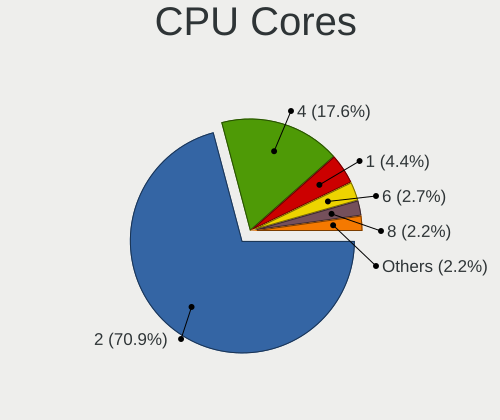

| Number | Notebooks | Percent |
|--------|-----------|---------|
| 2      | 129       | 70.88%  |
| 4      | 32        | 17.58%  |
| 1      | 8         | 4.4%    |
| 6      | 5         | 2.75%   |
| 8      | 4         | 2.2%    |
| 16     | 1         | 0.55%   |
| 14     | 1         | 0.55%   |
| 10     | 1         | 0.55%   |
| 5      | 1         | 0.55%   |

CPU Sockets
-----------

Number of sockets

| Number | Notebooks | Percent |
|--------|-----------|---------|
| 1      | 182       | 100%    |

CPU Threads
-----------

Threads per core (Hyper-Threading)

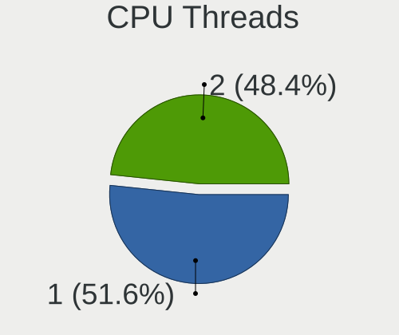

| Number | Notebooks | Percent |
|--------|-----------|---------|
| 1      | 94        | 51.65%  |
| 2      | 88        | 48.35%  |

CPU Op-Modes
------------

CPU Operation Modes (32-bit, 64-bit)

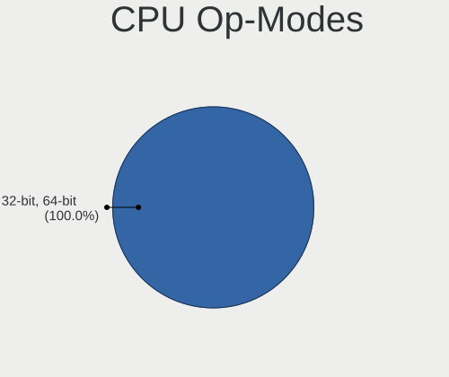

| Op mode        | Notebooks | Percent |
|----------------|-----------|---------|
| 32-bit, 64-bit | 182       | 100%    |

CPU Microcode
-------------

Microcode number

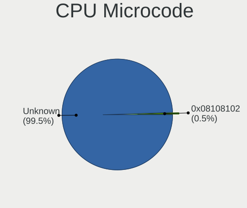

| Number     | Notebooks | Percent |
|------------|-----------|---------|
| Unknown    | 181       | 99.45%  |
| 0x08108102 | 1         | 0.55%   |

CPU Microarch
-------------

Microarchitecture

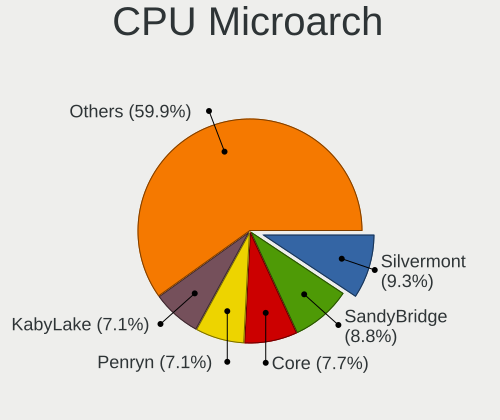

| Name             | Notebooks | Percent |
|------------------|-----------|---------|
| Silvermont       | 17        | 9.34%   |
| SandyBridge      | 16        | 8.79%   |
| Core             | 14        | 7.69%   |
| Penryn           | 13        | 7.14%   |
| KabyLake         | 13        | 7.14%   |
| Haswell          | 11        | 6.04%   |
| Westmere         | 9         | 4.95%   |
| IvyBridge        | 9         | 4.95%   |
| Goldmont plus    | 9         | 4.95%   |
| Broadwell        | 8         | 4.4%    |
| Puma             | 7         | 3.85%   |
| Goldmont         | 7         | 3.85%   |
| Unknown          | 7         | 3.85%   |
| Skylake          | 6         | 3.3%    |
| Bobcat           | 5         | 2.75%   |
| Alderlake Hybrid | 5         | 2.75%   |
| Excavator        | 4         | 2.2%    |
| Zen+             | 3         | 1.65%   |
| Jaguar           | 3         | 1.65%   |
| Bonnell          | 3         | 1.65%   |
| Piledriver       | 2         | 1.1%    |
| K8 Hammer        | 2         | 1.1%    |
| K10 Llano        | 2         | 1.1%    |
| Zen 2            | 1         | 0.55%   |
| Zen              | 1         | 0.55%   |
| Tremont          | 1         | 0.55%   |
| TigerLake        | 1         | 0.55%   |
| Nehalem          | 1         | 0.55%   |
| K8 & K10 hybrid  | 1         | 0.55%   |
| IceLake          | 1         | 0.55%   |

Graphics
--------

GPU Vendor
----------

Vendors of graphics cards

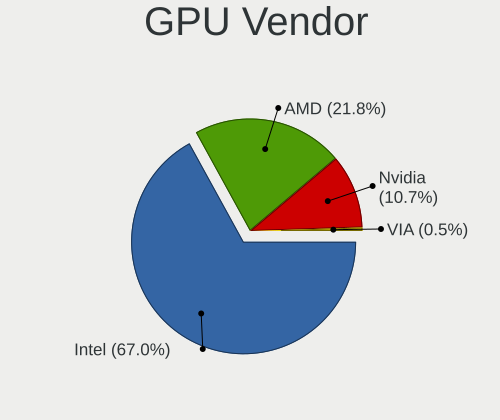

| Vendor           | Notebooks | Percent |
|------------------|-----------|---------|
| Intel            | 132       | 67.01%  |
| AMD              | 43        | 21.83%  |
| Nvidia           | 21        | 10.66%  |
| VIA Technologies | 1         | 0.51%   |

GPU Model
---------

Graphics card models

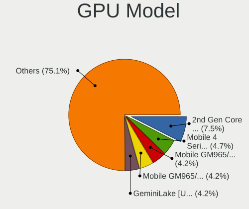

| Model                                                                                    | Notebooks | Percent |
|------------------------------------------------------------------------------------------|-----------|---------|
| Intel 2nd Generation Core Processor Family Integrated Graphics Controller                | 16        | 7.51%   |
| Intel Mobile 4 Series Chipset Integrated Graphics Controller                             | 10        | 4.69%   |
| Intel Mobile GM965/GL960 Integrated Graphics Controller (secondary)                      | 9         | 4.23%   |
| Intel Mobile GM965/GL960 Integrated Graphics Controller (primary)                        | 9         | 4.23%   |
| Intel GeminiLake [UHD Graphics 600]                                                      | 9         | 4.23%   |
| Intel Atom/Celeron/Pentium Processor x5-E8000/J3xxx/N3xxx Integrated Graphics Controller | 9         | 4.23%   |
| Intel 3rd Gen Core processor Graphics Controller                                         | 9         | 4.23%   |
| Intel Atom Processor Z36xxx/Z37xxx Series Graphics & Display                             | 8         | 3.76%   |
| Intel Kaby Lake-U GT2 [HD Graphics 620]                                                  | 7         | 3.29%   |
| Intel Broadwell-U GT2 [HD Graphics 5500]                                                 | 7         | 3.29%   |
| Intel Apollo Lake GT1 [HD Graphics 500]                                                  | 6         | 2.82%   |
| Intel Skylake-U GT2 [HD Graphics 520]                                                    | 5         | 2.35%   |
| Intel Haswell-ULT Integrated Graphics Controller                                         | 5         | 2.35%   |
| Intel Core Processor Integrated Graphics Controller                                      | 5         | 2.35%   |
| Intel 4th Gen Core Processor Integrated Graphics Controller                              | 5         | 2.35%   |
| Intel Raptor Lake-P [UHD Graphics]                                                       | 4         | 1.88%   |
| AMD Mullins [Radeon R4/R5 Graphics]                                                      | 4         | 1.88%   |
| Intel Kaby Lake-R GT2 [UHD Graphics 620]                                                 | 3         | 1.41%   |
| Intel Atom Processor D4xx/D5xx/N4xx/N5xx Integrated Graphics Controller                  | 3         | 1.41%   |
| AMD Topaz XT [Radeon R7 M260/M265 / M340/M360 / M440/M445 / 530/535 / 620/625 Mobile]    | 3         | 1.41%   |
| AMD Stoney [Radeon R2/R3/R4/R5 Graphics]                                                 | 3         | 1.41%   |
| AMD Seymour [Radeon HD 6400M/7400M Series]                                               | 3         | 1.41%   |
| AMD Picasso/Raven 2 [Radeon Vega Series / Radeon Vega Mobile Series]                     | 3         | 1.41%   |
| Nvidia MCP89 [GeForce 320M]                                                              | 2         | 0.94%   |
| Nvidia GT218M [GeForce 310M]                                                             | 2         | 0.94%   |
| Nvidia C79 [GeForce 9400M]                                                               | 2         | 0.94%   |
| Intel CoffeeLake-H GT2 [UHD Graphics 630]                                                | 2         | 0.94%   |
| AMD Wrestler [Radeon HD 6320]                                                            | 2         | 0.94%   |
| AMD Wrestler [Radeon HD 6310]                                                            | 2         | 0.94%   |
| AMD RV710/M92 [Mobility Radeon HD 4530/4570/5145/530v/540v/545v]                         | 2         | 0.94%   |
| AMD Mullins [Radeon R2 Graphics]                                                         | 2         | 0.94%   |
| AMD Mendocino [Radeon 610M]                                                              | 2         | 0.94%   |
| AMD Mars XTX [Radeon HD 8790M]                                                           | 2         | 0.94%   |
| AMD Kabini [Radeon HD 8240 / R3 Series]                                                  | 2         | 0.94%   |
| VIA Technologies CN896/VN896/P4M900 [Chrome 9 HC]                                        | 1         | 0.47%   |
| Nvidia GT218M [NVS 3100M]                                                                | 1         | 0.47%   |
| Nvidia GP107M [GeForce GTX 1050 Mobile]                                                  | 1         | 0.47%   |
| Nvidia GP107M [GeForce GTX 1050 3 GB Max-Q]                                              | 1         | 0.47%   |
| Nvidia GP107GLM [Quadro P2000 Mobile]                                                    | 1         | 0.47%   |
| Nvidia GM108M [GeForce 920MX]                                                            | 1         | 0.47%   |

GPU Combo
---------

Combinations of graphics cards

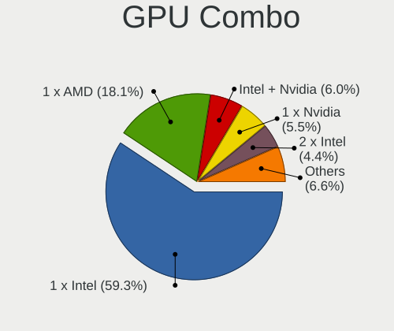

| Name           | Notebooks | Percent |
|----------------|-----------|---------|
| 1 x Intel      | 108       | 59.34%  |
| 1 x AMD        | 33        | 18.13%  |
| Intel + Nvidia | 11        | 6.04%   |
| 1 x Nvidia     | 10        | 5.49%   |
| 2 x Intel      | 8         | 4.4%    |
| 2 x AMD        | 6         | 3.3%    |
| Intel + AMD    | 4         | 2.2%    |
| Other          | 1         | 0.55%   |
| 1 x VIA        | 1         | 0.55%   |

GPU Driver
----------

Free vs proprietary

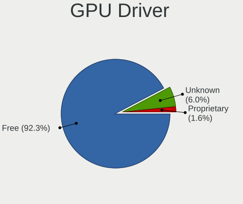

| Driver      | Notebooks | Percent |
|-------------|-----------|---------|
| Free        | 168       | 92.31%  |
| Unknown     | 11        | 6.04%   |
| Proprietary | 3         | 1.65%   |

GPU Memory
----------

Total video memory

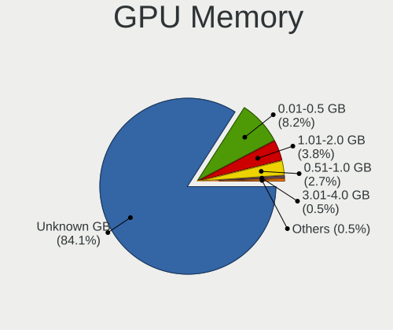

| Size in GB | Notebooks | Percent |
|------------|-----------|---------|
| Unknown    | 153       | 84.07%  |
| 0.01-0.5   | 15        | 8.24%   |
| 1.01-2.0   | 7         | 3.85%   |
| 0.51-1.0   | 5         | 2.75%   |
| 3.01-4.0   | 1         | 0.55%   |
| 2.01-3.0   | 1         | 0.55%   |

Monitor
-------

Monitor Vendor
--------------

Monitor vendors

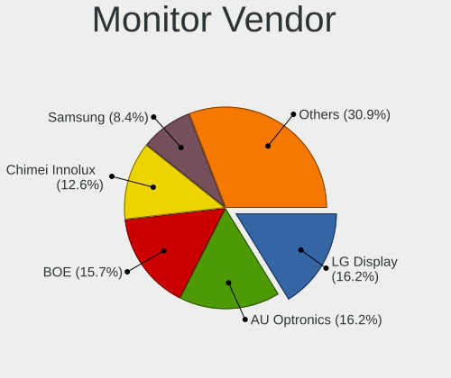

| Vendor                  | Notebooks | Percent |
|-------------------------|-----------|---------|
| LG Display              | 31        | 16.23%  |
| AU Optronics            | 31        | 16.23%  |
| BOE                     | 30        | 15.71%  |
| Chimei Innolux          | 24        | 12.57%  |
| Samsung Electronics     | 16        | 8.38%   |
| Apple                   | 11        | 5.76%   |
| Lenovo                  | 6         | 3.14%   |
| Chi Mei Optoelectronics | 5         | 2.62%   |
| CPT                     | 4         | 2.09%   |
| LG Philips              | 3         | 1.57%   |
| Goldstar                | 3         | 1.57%   |
| Philips                 | 2         | 1.05%   |
| PANDA                   | 2         | 1.05%   |
| Hewlett-Packard         | 2         | 1.05%   |
| CSW                     | 2         | 1.05%   |
| AOC                     | 2         | 1.05%   |
| Acer                    | 2         | 1.05%   |
| Unknown                 | 1         | 0.52%   |
| Sharp                   | 1         | 0.52%   |
| Quanta Display          | 1         | 0.52%   |
| NEC Computers           | 1         | 0.52%   |
| MTD                     | 1         | 0.52%   |
| ITE                     | 1         | 0.52%   |
| InnoLux Display         | 1         | 0.52%   |
| InfoVision              | 1         | 0.52%   |
| Impression              | 1         | 0.52%   |
| Dell                    | 1         | 0.52%   |
| DBL                     | 1         | 0.52%   |
| CSOT                    | 1         | 0.52%   |
| BenQ                    | 1         | 0.52%   |
| ASUSTek Computer        | 1         | 0.52%   |
| Ancor Communications    | 1         | 0.52%   |

Monitor Model
-------------

Monitor models

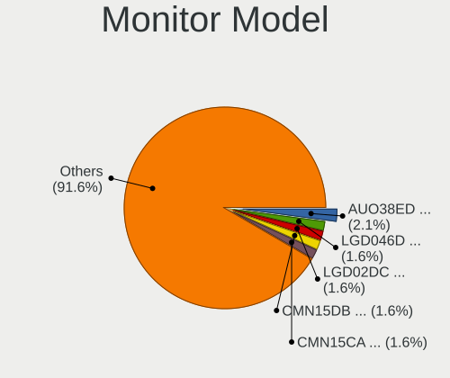

| Model                                                                    | Notebooks | Percent |
|--------------------------------------------------------------------------|-----------|---------|
| AU Optronics LCD Monitor AUO38ED 1920x1080 344x193mm 15.5-inch           | 4         | 2.09%   |
| LG Display LCD Monitor LGD046D 1920x1080 309x174mm 14.0-inch             | 3         | 1.57%   |
| LG Display LCD Monitor LGD02DC 1366x768 344x194mm 15.5-inch              | 3         | 1.57%   |
| Chimei Innolux LCD Monitor CMN15DB 1366x768 344x193mm 15.5-inch          | 3         | 1.57%   |
| Chimei Innolux LCD Monitor CMN15CA 1366x768 344x193mm 15.5-inch          | 3         | 1.57%   |
| Chi Mei Optoelectronics LCD Monitor CMO15A7 1366x768 344x193mm 15.5-inch | 3         | 1.57%   |
| BOE LCD Monitor BOE075A 1366x768 309x173mm 13.9-inch                     | 3         | 1.57%   |
| Apple LCD Monitor APP9CC5 1280x800 286x179mm 13.3-inch                   | 3         | 1.57%   |
| LG Display LCD Monitor LGD0384 1366x768 344x194mm 15.5-inch              | 2         | 1.05%   |
| CPT P116NWR1 R2 COR0489 1366x768 256x144mm 11.6-inch                     | 2         | 1.05%   |
| Chimei Innolux LCD Monitor CMN14C4 1366x768 309x173mm 13.9-inch          | 2         | 1.05%   |
| Chimei Innolux LCD Monitor CMN1132 1366x768 256x144mm 11.6-inch          | 2         | 1.05%   |
| BOE LCD Monitor BOE06A5 1366x768 344x194mm 15.5-inch                     | 2         | 1.05%   |
| BOE LCD Monitor BOE06A4 1366x768 344x194mm 15.5-inch                     | 2         | 1.05%   |
| BOE LCD Monitor BOE0696 1366x768 309x173mm 13.9-inch                     | 2         | 1.05%   |
| AU Optronics LCD Monitor AUO235C 1366x768 256x144mm 11.6-inch            | 2         | 1.05%   |
| AU Optronics LCD Monitor AUO229E 1600x900 382x214mm 17.2-inch            | 2         | 1.05%   |
| Apple LCD Monitor APP9CCB 1280x800 286x179mm 13.3-inch                   | 2         | 1.05%   |
| Unknown LCD Monitor FFFF 2288x1287 2550x2550mm 142.0-inch                | 1         | 0.52%   |
| Sharp LQ133M1JW08 SHP1425 1920x1080 294x165mm 13.3-inch                  | 1         | 0.52%   |
| Samsung Electronics S27C31x SAM7312 1920x1080 597x336mm 27.0-inch        | 1         | 0.52%   |
| Samsung Electronics LCD Monitor SEC5641 1366x768 344x193mm 15.5-inch     | 1         | 0.52%   |
| Samsung Electronics LCD Monitor SEC544B 1600x900 382x214mm 17.2-inch     | 1         | 0.52%   |
| Samsung Electronics LCD Monitor SEC4B45 1280x800 331x207mm 15.4-inch     | 1         | 0.52%   |
| Samsung Electronics LCD Monitor SEC4251 1366x768 344x194mm 15.5-inch     | 1         | 0.52%   |
| Samsung Electronics LCD Monitor SEC3449 1366x768 309x174mm 14.0-inch     | 1         | 0.52%   |
| Samsung Electronics LCD Monitor SEC3245 1366x768 340x190mm 15.3-inch     | 1         | 0.52%   |
| Samsung Electronics LCD Monitor SEC3242 1920x1080 235x132mm 10.6-inch    | 1         | 0.52%   |
| Samsung Electronics LCD Monitor SEC3052 1366x768 256x144mm 11.6-inch     | 1         | 0.52%   |
| Samsung Electronics LCD Monitor SEC3050 1366x768 309x174mm 14.0-inch     | 1         | 0.52%   |
| Samsung Electronics LCD Monitor SEC3047 1366x768 277x156mm 12.5-inch     | 1         | 0.52%   |
| Samsung Electronics LCD Monitor SDC8648 1920x1080 276x155mm 12.5-inch    | 1         | 0.52%   |
| Samsung Electronics LCD Monitor SDC4C48 1920x1080 293x165mm 13.2-inch    | 1         | 0.52%   |
| Samsung Electronics LCD Monitor SDC4852 1366x768 344x194mm 15.5-inch     | 1         | 0.52%   |
| Samsung Electronics LCD Monitor SDC4651 1366x768 344x194mm 15.5-inch     | 1         | 0.52%   |
| Samsung Electronics LCD Monitor SAM71B4 3840x2160 1872x1053mm 84.6-inch  | 1         | 0.52%   |
| Quanta Display LCD Monitor QDS0032 1280x800 331x207mm 15.4-inch          | 1         | 0.52%   |
| Philips PHL 275V8 PHLC293 2560x1440 597x336mm 27.0-inch                  | 1         | 0.52%   |
| Philips FTV PHL04C3 1920x1080 1440x810mm 65.0-inch                       | 1         | 0.52%   |
| PANDA LM133LF5L01 NCP0020 1920x1080 294x165mm 13.3-inch                  | 1         | 0.52%   |

Monitor Resolution
------------------

Monitor screen resolution

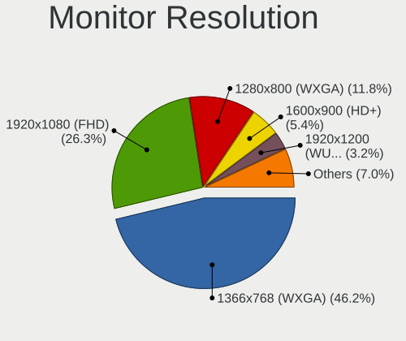

| Resolution         | Notebooks | Percent |
|--------------------|-----------|---------|
| 1366x768 (WXGA)    | 86        | 46.24%  |
| 1920x1080 (FHD)    | 49        | 26.34%  |
| 1280x800 (WXGA)    | 22        | 11.83%  |
| 1600x900 (HD+)     | 10        | 5.38%   |
| 1920x1200 (WUXGA)  | 6         | 3.23%   |
| 3840x2160 (4K)     | 4         | 2.15%   |
| 2560x1440 (QHD)    | 2         | 1.08%   |
| 1440x900 (WXGA+)   | 2         | 1.08%   |
| 2288x1287          | 1         | 0.54%   |
| 2160x1440          | 1         | 0.54%   |
| 1680x1050 (WSXGA+) | 1         | 0.54%   |
| 1280x1024 (SXGA)   | 1         | 0.54%   |
| 1024x600           | 1         | 0.54%   |

Monitor Diagonal
----------------

Diagonal size in inches

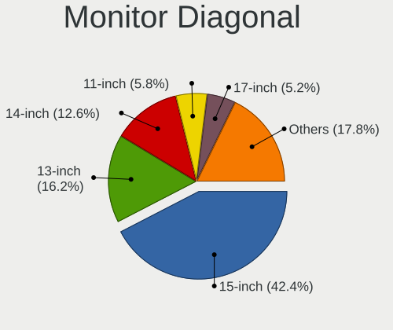

| Inches | Notebooks | Percent |
|--------|-----------|---------|
| 15     | 81        | 42.41%  |
| 13     | 31        | 16.23%  |
| 14     | 24        | 12.57%  |
| 11     | 11        | 5.76%   |
| 17     | 10        | 5.24%   |
| 27     | 7         | 3.66%   |
| 24     | 6         | 3.14%   |
| 12     | 6         | 3.14%   |
| 18     | 4         | 2.09%   |
| 16     | 3         | 1.57%   |
| 142    | 1         | 0.52%   |
| 84     | 1         | 0.52%   |
| 65     | 1         | 0.52%   |
| 22     | 1         | 0.52%   |
| 21     | 1         | 0.52%   |
| 20     | 1         | 0.52%   |
| 19     | 1         | 0.52%   |
| 10     | 1         | 0.52%   |

Monitor Width
-------------

Physical width

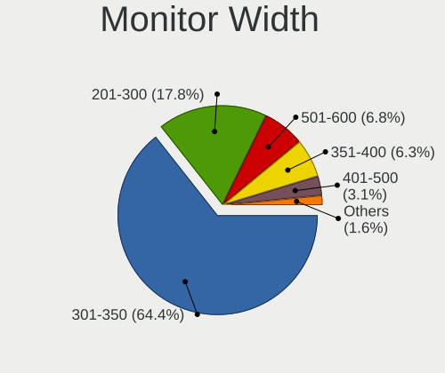

| Width in mm    | Notebooks | Percent |
|----------------|-----------|---------|
| 301-350        | 123       | 64.4%   |
| 201-300        | 34        | 17.8%   |
| 501-600        | 13        | 6.81%   |
| 351-400        | 12        | 6.28%   |
| 401-500        | 6         | 3.14%   |
| More than 2000 | 1         | 0.52%   |
| 1501-2000      | 1         | 0.52%   |
| 1001-1500      | 1         | 0.52%   |

Aspect Ratio
------------

Proportional relationship between the width and the height

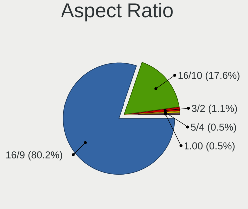

| Ratio | Notebooks | Percent |
|-------|-----------|---------|
| 16/9  | 146       | 80.22%  |
| 16/10 | 32        | 17.58%  |
| 3/2   | 2         | 1.1%    |
| 5/4   | 1         | 0.55%   |
| 1.00  | 1         | 0.55%   |

Monitor Area
------------

Area in inch²

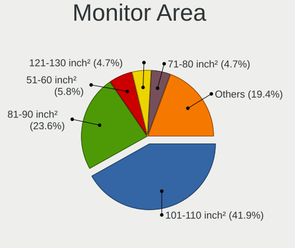

| Area in inch² | Notebooks | Percent |
|----------------|-----------|---------|
| 101-110        | 80        | 41.88%  |
| 81-90          | 45        | 23.56%  |
| 51-60          | 11        | 5.76%   |
| 71-80          | 9         | 4.71%   |
| 121-130        | 9         | 4.71%   |
| 301-350        | 7         | 3.66%   |
| 61-70          | 6         | 3.14%   |
| 201-250        | 5         | 2.62%   |
| More than 1000 | 3         | 1.57%   |
| 251-300        | 3         | 1.57%   |
| 151-200        | 3         | 1.57%   |
| 141-150        | 3         | 1.57%   |
| 111-120        | 3         | 1.57%   |
| 91-100         | 2         | 1.05%   |
| 41-50          | 1         | 0.52%   |
| 131-140        | 1         | 0.52%   |

Pixel Density
-------------

Pixels per inch

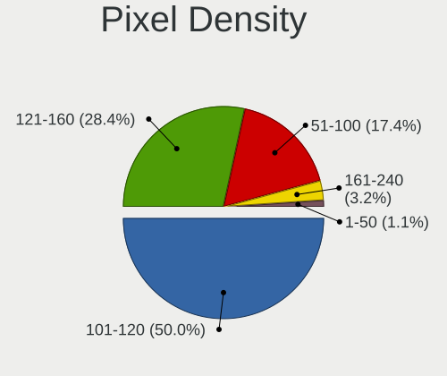

| Density | Notebooks | Percent |
|---------|-----------|---------|
| 101-120 | 95        | 50%     |
| 121-160 | 54        | 28.42%  |
| 51-100  | 33        | 17.37%  |
| 161-240 | 6         | 3.16%   |
| 1-50    | 2         | 1.05%   |

Multiple Monitors
-----------------

Total monitors connected

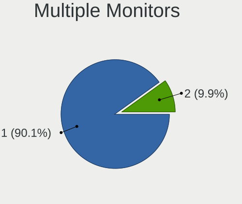

| Total | Notebooks | Percent |
|-------|-----------|---------|
| 1     | 164       | 90.11%  |
| 2     | 18        | 9.89%   |

Network
-------

Net Controller Vendor
---------------------

Controller vendors

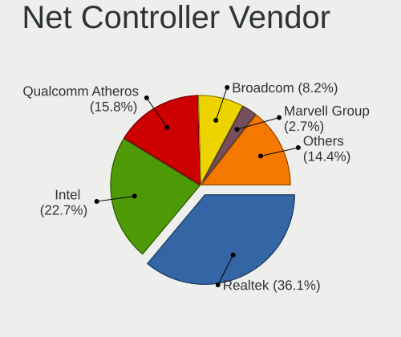

| Vendor                            | Notebooks | Percent |
|-----------------------------------|-----------|---------|
| Realtek Semiconductor             | 105       | 36.08%  |
| Intel                             | 66        | 22.68%  |
| Qualcomm Atheros                  | 46        | 15.81%  |
| Broadcom                          | 24        | 8.25%   |
| Marvell Technology Group          | 8         | 2.75%   |
| Ralink                            | 7         | 2.41%   |
| MediaTek                          | 5         | 1.72%   |
| Ralink Technology                 | 4         | 1.37%   |
| TP-Link                           | 3         | 1.03%   |
| Huawei Technologies               | 3         | 1.03%   |
| Sierra Wireless                   | 2         | 0.69%   |
| Nvidia                            | 2         | 0.69%   |
| DisplayLink                       | 2         | 0.69%   |
| Broadcom Limited                  | 2         | 0.69%   |
| ASIX Electronics                  | 2         | 0.69%   |
| ZTE WCDMA Technologies MSM        | 1         | 0.34%   |
| Xiaomi                            | 1         | 0.34%   |
| VIA Technologies                  | 1         | 0.34%   |
| Silicon Integrated Systems [SiS]  | 1         | 0.34%   |
| Samsung Electronics               | 1         | 0.34%   |
| Qualcomm                          | 1         | 0.34%   |
| JMicron Technology                | 1         | 0.34%   |
| Ericsson Business Mobile Networks | 1         | 0.34%   |
| Edimax Technology                 | 1         | 0.34%   |
| Davicom Semiconductor             | 1         | 0.34%   |

Net Controller Model
--------------------

Controller models

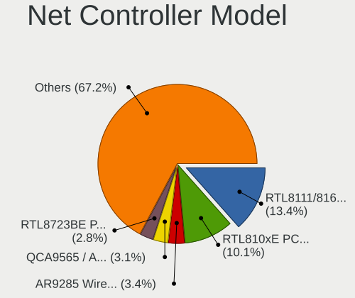

| Model                                                                  | Notebooks | Percent |
|------------------------------------------------------------------------|-----------|---------|
| Realtek RTL8111/8168/8211/8411 PCI Express Gigabit Ethernet Controller | 48        | 13.45%  |
| Realtek RTL810xE PCI Express Fast Ethernet controller                  | 36        | 10.08%  |
| Qualcomm Atheros AR9285 Wireless Network Adapter (PCI-Express)         | 12        | 3.36%   |
| Qualcomm Atheros QCA9565 / AR9565 Wireless Network Adapter             | 11        | 3.08%   |
| Realtek RTL8723BE PCIe Wireless Network Adapter                        | 10        | 2.8%    |
| Intel Wireless 7265                                                    | 9         | 2.52%   |
| Realtek RTL8821CE 802.11ac PCIe Wireless Network Adapter               | 5         | 1.4%    |
| Qualcomm Atheros QCA9377 802.11ac Wireless Network Adapter             | 5         | 1.4%    |
| Qualcomm Atheros AR9485 Wireless Network Adapter                       | 5         | 1.4%    |
| Intel Ethernet Connection I217-LM                                      | 5         | 1.4%    |
| Broadcom BCM4313 802.11bgn Wireless Network Adapter                    | 5         | 1.4%    |
| Realtek RTL8852BE PCIe 802.11ax Wireless Network Controller            | 4         | 1.12%   |
| Qualcomm Atheros AR9462 Wireless Network Adapter                       | 4         | 1.12%   |
| Intel Wireless 7260                                                    | 4         | 1.12%   |
| Intel Wireless 3165                                                    | 4         | 1.12%   |
| Intel Wireless 3160                                                    | 4         | 1.12%   |
| Intel PRO/Wireless 3945ABG [Golan] Network Connection                  | 4         | 1.12%   |
| Intel 82579LM Gigabit Network Connection (Lewisville)                  | 4         | 1.12%   |
| Broadcom NetXtreme BCM57765 Gigabit Ethernet PCIe                      | 4         | 1.12%   |
| Broadcom BCM4331 802.11a/b/g/n                                         | 4         | 1.12%   |
| Broadcom BCM4322 802.11a/b/g/n Wireless LAN Controller                 | 4         | 1.12%   |
| Broadcom BCM4312 802.11b/g LP-PHY                                      | 4         | 1.12%   |
| Realtek RTL8188EE Wireless Network Adapter                             | 3         | 0.84%   |
| Realtek RTL8188CE 802.11b/g/n WiFi Adapter                             | 3         | 0.84%   |
| Realtek RTL8153 Gigabit Ethernet Adapter                               | 3         | 0.84%   |
| Realtek 802.11n WLAN Adapter                                           | 3         | 0.84%   |
| Ralink RT2790 Wireless 802.11n 1T/2R PCIe                              | 3         | 0.84%   |
| Qualcomm Atheros AR8152 v2.0 Fast Ethernet                             | 3         | 0.84%   |
| Qualcomm Atheros AR8132 Fast Ethernet                                  | 3         | 0.84%   |
| Intel Wireless 8265 / 8275                                             | 3         | 0.84%   |
| Intel Raptor Lake PCH CNVi WiFi                                        | 3         | 0.84%   |
| Intel Ethernet Connection (4) I219-V                                   | 3         | 0.84%   |
| Intel Ethernet Connection (3) I218-LM                                  | 3         | 0.84%   |
| Intel Centrino Advanced-N 6235                                         | 3         | 0.84%   |
| Intel Centrino Advanced-N 6205 [Taylor Peak]                           | 3         | 0.84%   |
| TP-Link Archer T3U [Realtek RTL8812BU]                                 | 2         | 0.56%   |
| Realtek RTL8822CE 802.11ac PCIe Wireless Network Adapter               | 2         | 0.56%   |
| Realtek RTL8723DE Wireless Network Adapter                             | 2         | 0.56%   |
| Realtek RTL8187B Wireless 802.11g 54Mbps Network Adapter               | 2         | 0.56%   |
| Realtek RTL8152 Fast Ethernet Adapter                                  | 2         | 0.56%   |

Wireless Vendor
---------------

Wireless vendors

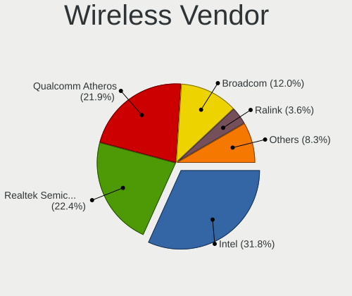

| Vendor                | Notebooks | Percent |
|-----------------------|-----------|---------|
| Intel                 | 61        | 31.77%  |
| Realtek Semiconductor | 43        | 22.4%   |
| Qualcomm Atheros      | 42        | 21.88%  |
| Broadcom              | 23        | 11.98%  |
| Ralink                | 7         | 3.65%   |
| Ralink Technology     | 4         | 2.08%   |
| MediaTek              | 4         | 2.08%   |
| TP-Link               | 3         | 1.56%   |
| Sierra Wireless       | 2         | 1.04%   |
| Qualcomm              | 1         | 0.52%   |
| Edimax Technology     | 1         | 0.52%   |
| Broadcom Limited      | 1         | 0.52%   |

Wireless Model
--------------

Wireless models

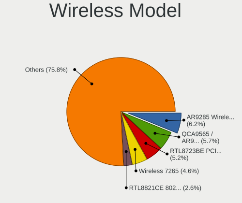

| Model                                                          | Notebooks | Percent |
|----------------------------------------------------------------|-----------|---------|
| Qualcomm Atheros AR9285 Wireless Network Adapter (PCI-Express) | 12        | 6.19%   |
| Qualcomm Atheros QCA9565 / AR9565 Wireless Network Adapter     | 11        | 5.67%   |
| Realtek RTL8723BE PCIe Wireless Network Adapter                | 10        | 5.15%   |
| Intel Wireless 7265                                            | 9         | 4.64%   |
| Realtek RTL8821CE 802.11ac PCIe Wireless Network Adapter       | 5         | 2.58%   |
| Qualcomm Atheros QCA9377 802.11ac Wireless Network Adapter     | 5         | 2.58%   |
| Qualcomm Atheros AR9485 Wireless Network Adapter               | 5         | 2.58%   |
| Broadcom BCM4313 802.11bgn Wireless Network Adapter            | 5         | 2.58%   |
| Realtek RTL8852BE PCIe 802.11ax Wireless Network Controller    | 4         | 2.06%   |
| Qualcomm Atheros AR9462 Wireless Network Adapter               | 4         | 2.06%   |
| Intel Wireless 7260                                            | 4         | 2.06%   |
| Intel Wireless 3165                                            | 4         | 2.06%   |
| Intel Wireless 3160                                            | 4         | 2.06%   |
| Intel PRO/Wireless 3945ABG [Golan] Network Connection          | 4         | 2.06%   |
| Broadcom BCM4331 802.11a/b/g/n                                 | 4         | 2.06%   |
| Broadcom BCM4322 802.11a/b/g/n Wireless LAN Controller         | 4         | 2.06%   |
| Broadcom BCM4312 802.11b/g LP-PHY                              | 4         | 2.06%   |
| Realtek RTL8188EE Wireless Network Adapter                     | 3         | 1.55%   |
| Realtek RTL8188CE 802.11b/g/n WiFi Adapter                     | 3         | 1.55%   |
| Realtek 802.11n WLAN Adapter                                   | 3         | 1.55%   |
| Ralink RT2790 Wireless 802.11n 1T/2R PCIe                      | 3         | 1.55%   |
| Intel Wireless 8265 / 8275                                     | 3         | 1.55%   |
| Intel Raptor Lake PCH CNVi WiFi                                | 3         | 1.55%   |
| Intel Centrino Advanced-N 6235                                 | 3         | 1.55%   |
| Intel Centrino Advanced-N 6205 [Taylor Peak]                   | 3         | 1.55%   |
| TP-Link Archer T3U [Realtek RTL8812BU]                         | 2         | 1.03%   |
| Realtek RTL8822CE 802.11ac PCIe Wireless Network Adapter       | 2         | 1.03%   |
| Realtek RTL8723DE Wireless Network Adapter                     | 2         | 1.03%   |
| Realtek RTL8187B Wireless 802.11g 54Mbps Network Adapter       | 2         | 1.03%   |
| Realtek 802.11ac NIC                                           | 2         | 1.03%   |
| Ralink MT7601U Wireless Adapter                                | 2         | 1.03%   |
| Ralink RT3290 Wireless 802.11n 1T/1R PCIe                      | 2         | 1.03%   |
| Qualcomm Atheros AR928X Wireless Network Adapter (PCI-Express) | 2         | 1.03%   |
| Qualcomm Atheros AR9287 Wireless Network Adapter (PCI-Express) | 2         | 1.03%   |
| Intel Wireless 8260                                            | 2         | 1.03%   |
| Intel PRO/Wireless 4965 AG or AGN [Kedron] Network Connection  | 2         | 1.03%   |
| Intel Gemini Lake PCH CNVi WiFi                                | 2         | 1.03%   |
| Intel Dual Band Wireless-AC 3168NGW [Stone Peak]               | 2         | 1.03%   |
| Intel Centrino Wireless-N 1030 [Rainbow Peak]                  | 2         | 1.03%   |
| Intel Cannon Lake PCH CNVi WiFi                                | 2         | 1.03%   |

Ethernet Vendor
---------------

Ethernet vendors

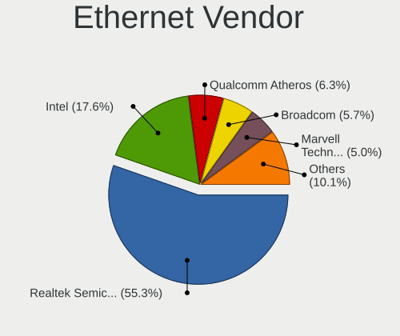

| Vendor                           | Notebooks | Percent |
|----------------------------------|-----------|---------|
| Realtek Semiconductor            | 88        | 55.35%  |
| Intel                            | 28        | 17.61%  |
| Qualcomm Atheros                 | 10        | 6.29%   |
| Broadcom                         | 9         | 5.66%   |
| Marvell Technology Group         | 8         | 5.03%   |
| Nvidia                           | 2         | 1.26%   |
| DisplayLink                      | 2         | 1.26%   |
| ASIX Electronics                 | 2         | 1.26%   |
| ZTE WCDMA Technologies MSM       | 1         | 0.63%   |
| Xiaomi                           | 1         | 0.63%   |
| VIA Technologies                 | 1         | 0.63%   |
| Silicon Integrated Systems [SiS] | 1         | 0.63%   |
| Samsung Electronics              | 1         | 0.63%   |
| MediaTek                         | 1         | 0.63%   |
| JMicron Technology               | 1         | 0.63%   |
| Huawei Technologies              | 1         | 0.63%   |
| Davicom Semiconductor            | 1         | 0.63%   |
| Broadcom Limited                 | 1         | 0.63%   |

Ethernet Model
--------------

Ethernet models

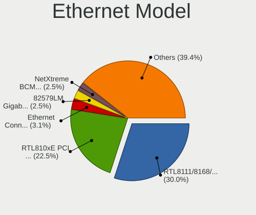

| Model                                                                          | Notebooks | Percent |
|--------------------------------------------------------------------------------|-----------|---------|
| Realtek RTL8111/8168/8211/8411 PCI Express Gigabit Ethernet Controller         | 48        | 30%     |
| Realtek RTL810xE PCI Express Fast Ethernet controller                          | 36        | 22.5%   |
| Intel Ethernet Connection I217-LM                                              | 5         | 3.13%   |
| Intel 82579LM Gigabit Network Connection (Lewisville)                          | 4         | 2.5%    |
| Broadcom NetXtreme BCM57765 Gigabit Ethernet PCIe                              | 4         | 2.5%    |
| Realtek RTL8153 Gigabit Ethernet Adapter                                       | 3         | 1.88%   |
| Qualcomm Atheros AR8152 v2.0 Fast Ethernet                                     | 3         | 1.88%   |
| Qualcomm Atheros AR8132 Fast Ethernet                                          | 3         | 1.88%   |
| Intel Ethernet Connection (4) I219-V                                           | 3         | 1.88%   |
| Intel Ethernet Connection (3) I218-LM                                          | 3         | 1.88%   |
| Realtek RTL8152 Fast Ethernet Adapter                                          | 2         | 1.25%   |
| Qualcomm Atheros AR8152 v1.1 Fast Ethernet                                     | 2         | 1.25%   |
| Qualcomm Atheros AR8151 v2.0 Gigabit Ethernet                                  | 2         | 1.25%   |
| Nvidia MCP79 Ethernet                                                          | 2         | 1.25%   |
| Marvell Group 88E8042 PCI-E Fast Ethernet Controller                           | 2         | 1.25%   |
| Marvell Group 88E8040 PCI-E Fast Ethernet Controller                           | 2         | 1.25%   |
| Intel 82579V Gigabit Network Connection                                        | 2         | 1.25%   |
| Intel 82577LM Gigabit Network Connection                                       | 2         | 1.25%   |
| Broadcom NetXtreme BCM5764M Gigabit Ethernet PCIe                              | 2         | 1.25%   |
| ASIX AX88179 Gigabit Ethernet                                                  | 2         | 1.25%   |
| ZTE WCDMA MSM ZTE Blade A54                                                    | 1         | 0.63%   |
| Xiaomi Mi/Redmi series (RNDIS)                                                 | 1         | 0.63%   |
| VIA VT6102/VT6103 [Rhine-II]                                                   | 1         | 0.63%   |
| Silicon Integrated Systems [SiS] 191 Gigabit Ethernet Adapter                  | 1         | 0.63%   |
| Samsung Galaxy series, misc. (tethering mode)                                  | 1         | 0.63%   |
| MediaTek Infinix HOT 50i                                                       | 1         | 0.63%   |
| Marvell Group Yukon Optima 88E8059 [PCIe Gigabit Ethernet Controller with AVB] | 1         | 0.63%   |
| Marvell Group 88E8071 PCI-E Gigabit Ethernet Controller                        | 1         | 0.63%   |
| Marvell Group 88E8057 PCI-E Gigabit Ethernet Controller                        | 1         | 0.63%   |
| Marvell Group 88E8039 PCI-E Fast Ethernet Controller                           | 1         | 0.63%   |
| JMicron JMC250 PCI Express Gigabit Ethernet Controller                         | 1         | 0.63%   |
| Intel WiMAX Connection 2400m                                                   | 1         | 0.63%   |
| Intel Ethernet Connection I219-LM                                              | 1         | 0.63%   |
| Intel Ethernet Connection I218-LM                                              | 1         | 0.63%   |
| Intel Ethernet Connection (7) I219-LM                                          | 1         | 0.63%   |
| Intel Ethernet Connection (4) I219-LM                                          | 1         | 0.63%   |
| Intel Ethernet Connection (18) I219-LM                                         | 1         | 0.63%   |
| Intel Ethernet Connection (16) I219-LM                                         | 1         | 0.63%   |
| Intel 82567LM Gigabit Network Connection                                       | 1         | 0.63%   |
| Intel 82566MM Gigabit Network Connection                                       | 1         | 0.63%   |

Net Controller Kind
-------------------

Ethernet, WiFi or modem

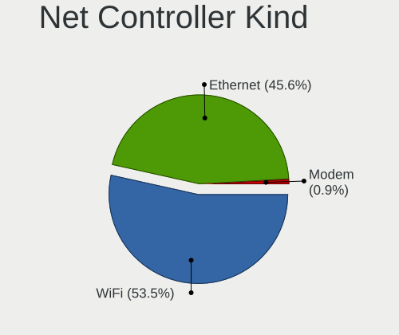

| Kind     | Notebooks | Percent |
|----------|-----------|---------|
| WiFi     | 177       | 53.47%  |
| Ethernet | 151       | 45.62%  |
| Modem    | 3         | 0.91%   |

Used Controller
---------------

Currently used network controller

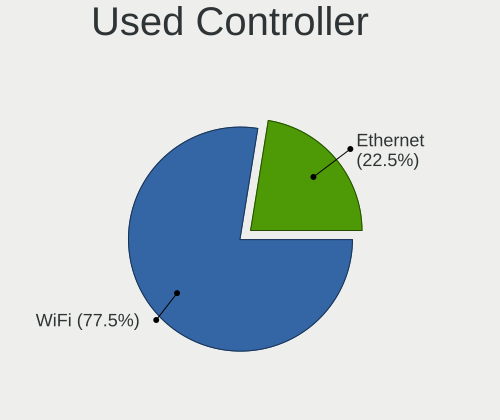

| Kind     | Notebooks | Percent |
|----------|-----------|---------|
| WiFi     | 145       | 77.54%  |
| Ethernet | 42        | 22.46%  |

NICs
----

Total network controllers on board

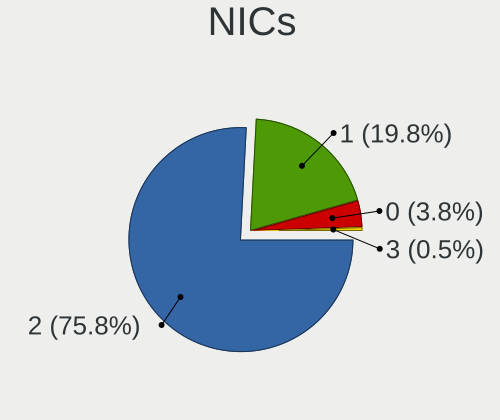

| Total | Notebooks | Percent |
|-------|-----------|---------|
| 2     | 138       | 75.82%  |
| 1     | 36        | 19.78%  |
| 0     | 7         | 3.85%   |
| 3     | 1         | 0.55%   |

IPv6
----

IPv6 vs IPv4

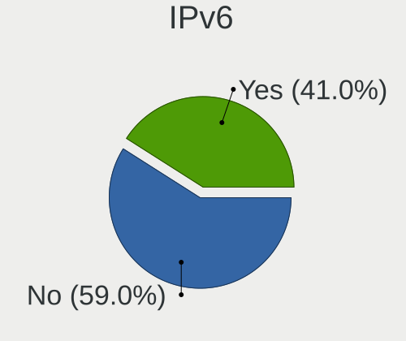

| Used | Notebooks | Percent |
|------|-----------|---------|
| No   | 108       | 59.02%  |
| Yes  | 75        | 40.98%  |

Bluetooth
---------

Bluetooth Vendor
----------------

Controller vendors

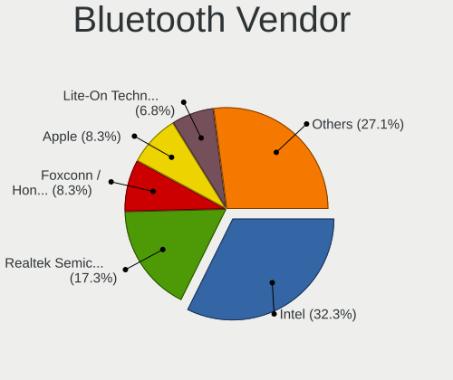

| Vendor                          | Notebooks | Percent |
|---------------------------------|-----------|---------|
| Intel                           | 43        | 32.33%  |
| Realtek Semiconductor           | 23        | 17.29%  |
| Foxconn / Hon Hai               | 11        | 8.27%   |
| Apple                           | 11        | 8.27%   |
| Lite-On Technology              | 9         | 6.77%   |
| Qualcomm Atheros Communications | 8         | 6.02%   |
| Broadcom                        | 8         | 6.02%   |
| Hewlett-Packard                 | 5         | 3.76%   |
| IMC Networks                    | 3         | 2.26%   |
| Dell                            | 3         | 2.26%   |
| Ralink                          | 2         | 1.5%    |
| USI                             | 1         | 0.75%   |
| Realtek                         | 1         | 0.75%   |
| Qcom                            | 1         | 0.75%   |
| MediaTek                        | 1         | 0.75%   |
| Chicony Electronics             | 1         | 0.75%   |
| Cambridge Silicon Radio         | 1         | 0.75%   |
| Alps Electric                   | 1         | 0.75%   |

Bluetooth Model
---------------

Controller models

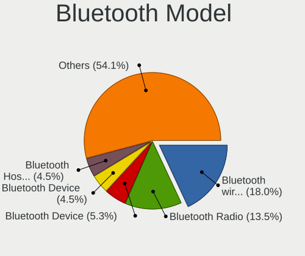

| Model                                                                               | Notebooks | Percent |
|-------------------------------------------------------------------------------------|-----------|---------|
| Intel Bluetooth wireless interface                                                  | 24        | 18.05%  |
| Realtek Bluetooth Radio                                                             | 18        | 13.53%  |
| Foxconn / Hon Hai Bluetooth Device                                                  | 7         | 5.26%   |
| Lite-On Bluetooth Device                                                            | 6         | 4.51%   |
| Apple Bluetooth Host Controller                                                     | 6         | 4.51%   |
| Intel Bluetooth 9460/9560 Jefferson Peak (JfP)                                      | 5         | 3.76%   |
| Qualcomm Atheros AR3012 Bluetooth 4.0                                               | 4         | 3.01%   |
| HP Broadcom 2070 Bluetooth Combo                                                    | 4         | 3.01%   |
| Apple Bluetooth USB Host Controller                                                 | 4         | 3.01%   |
| Realtek  Bluetooth 4.2 Adapter                                                      | 3         | 2.26%   |
| Intel Centrino Bluetooth Wireless Transceiver                                       | 3         | 2.26%   |
| Intel AX201 Bluetooth                                                               | 3         | 2.26%   |
| Ralink RT3290 Bluetooth                                                             | 2         | 1.5%    |
| Qualcomm Atheros  Bluetooth Device                                                  | 2         | 1.5%    |
| Lite-On Qualcomm Atheros QCA9377 Bluetooth                                          | 2         | 1.5%    |
| Intel Wireless-AC 3168 Bluetooth                                                    | 2         | 1.5%    |
| Intel Centrino Advanced-N 6230 Bluetooth adapter                                    | 2         | 1.5%    |
| Intel Bluetooth Device                                                              | 2         | 1.5%    |
| Dell Wireless 355 Bluetooth                                                         | 2         | 1.5%    |
| Broadcom BCM2070 Bluetooth Device                                                   | 2         | 1.5%    |
| Broadcom BCM2045B (BDC-2.1)                                                         | 2         | 1.5%    |
| USI Bluetooth Module BCM92070                                                       | 1         | 0.75%   |
| Realtek RTL8821A Bluetooth                                                          | 1         | 0.75%   |
| Realtek RTL8723B Bluetooth                                                          | 1         | 0.75%   |
| Realtek Bluetooth Radio                                                             | 1         | 0.75%   |
| Qualcomm Atheros Bluetooth                                                          | 1         | 0.75%   |
| Qualcomm Atheros AR3011 Bluetooth                                                   | 1         | 0.75%   |
| Qcom Broadcom Bluetooth USB                                                         | 1         | 0.75%   |
| MediaTek Wireless_Device                                                            | 1         | 0.75%   |
| Lite-On Atheros AR3012 Bluetooth                                                    | 1         | 0.75%   |
| Intel AX210 Bluetooth                                                               | 1         | 0.75%   |
| Intel AX200 Bluetooth                                                               | 1         | 0.75%   |
| IMC Networks Wireless_Device                                                        | 1         | 0.75%   |
| IMC Networks Bluetooth Device                                                       | 1         | 0.75%   |
| IMC Networks Atheros AR3012 Bluetooth 4.0 Adapter                                   | 1         | 0.75%   |
| HP Bluetooth 2.0 Interface [Broadcom BCM2045]                                       | 1         | 0.75%   |
| Foxconn / Hon Hai Foxconn T77H114 BCM2070 [Single-Chip Bluetooth 2.1 + EDR Adapter] | 1         | 0.75%   |
| Foxconn / Hon Hai BT                                                                | 1         | 0.75%   |
| Foxconn / Hon Hai Broadcom BCM20702A1 Bluetooth                                     | 1         | 0.75%   |
| Foxconn / Hon Hai Bluetooth Radio                                                   | 1         | 0.75%   |

Sound
-----

Sound Vendor
------------

Sound card vendors

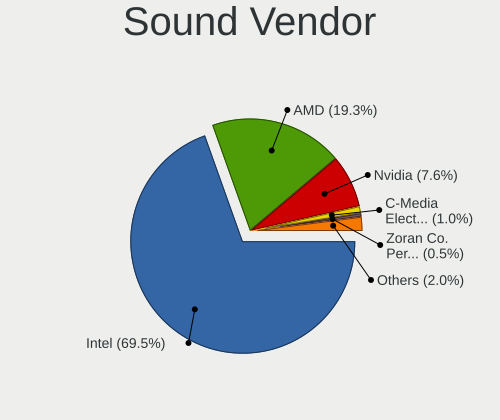

| Vendor                                       | Notebooks | Percent |
|----------------------------------------------|-----------|---------|
| Intel                                        | 137       | 69.54%  |
| AMD                                          | 38        | 19.29%  |
| Nvidia                                       | 15        | 7.61%   |
| C-Media Electronics                          | 2         | 1.02%   |
| Zoran Co. Personal Media Division (Nogatech) | 1         | 0.51%   |
| VIA Technologies                             | 1         | 0.51%   |
| Silicon Integrated Systems [SiS]             | 1         | 0.51%   |
| Logitech                                     | 1         | 0.51%   |
| Hewlett-Packard                              | 1         | 0.51%   |

Sound Model
-----------

Sound card models

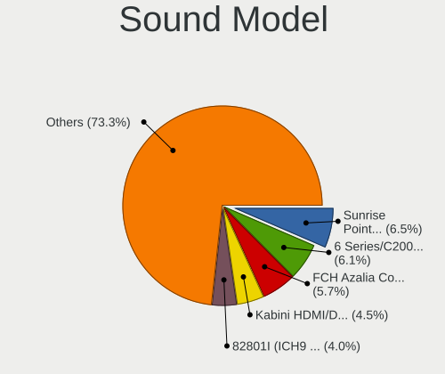

| Model                                                                                             | Notebooks | Percent |
|---------------------------------------------------------------------------------------------------|-----------|---------|
| Intel Sunrise Point-LP HD Audio                                                                   | 16        | 6.48%   |
| Intel 6 Series/C200 Series Chipset Family High Definition Audio Controller                        | 15        | 6.07%   |
| AMD FCH Azalia Controller                                                                         | 14        | 5.67%   |
| AMD Kabini HDMI/DP Audio                                                                          | 11        | 4.45%   |
| Intel 82801I (ICH9 Family) HD Audio Controller                                                    | 10        | 4.05%   |
| Intel 82801H (ICH8 Family) HD Audio Controller                                                    | 10        | 4.05%   |
| Intel 7 Series/C216 Chipset Family High Definition Audio Controller                               | 10        | 4.05%   |
| Intel 5 Series/3400 Series Chipset High Definition Audio                                          | 10        | 4.05%   |
| AMD Ryzen HD Audio Controller                                                                     | 10        | 4.05%   |
| Intel Celeron/Pentium Silver Processor High Definition Audio                                      | 9         | 3.64%   |
| Intel Wildcat Point-LP High Definition Audio Controller                                           | 8         | 3.24%   |
| Intel Broadwell-U Audio Controller                                                                | 8         | 3.24%   |
| Intel Atom/Celeron/Pentium Processor x5-E8000/J3xxx/N3xxx Series High Definition Audio Controller | 8         | 3.24%   |
| AMD SBx00 Azalia (Intel HDA)                                                                      | 8         | 3.24%   |
| Intel Celeron N3350/Pentium N4200/Atom E3900 Series Audio Cluster                                 | 7         | 2.83%   |
| Intel Atom Processor Z36xxx/Z37xxx Series High Definition Audio Controller                        | 6         | 2.43%   |
| Intel 8 Series/C220 Series Chipset High Definition Audio Controller                               | 6         | 2.43%   |
| Intel Haswell-ULT HD Audio Controller                                                             | 5         | 2.02%   |
| Intel 8 Series HD Audio Controller                                                                | 5         | 2.02%   |
| Intel Xeon E3-1200 v3/4th Gen Core Processor HD Audio Controller                                  | 4         | 1.62%   |
| Intel Raptor Lake-P/U/H cAVS                                                                      | 4         | 1.62%   |
| Intel NM10/ICH7 Family High Definition Audio Controller                                           | 4         | 1.62%   |
| AMD Wrestler HDMI Audio                                                                           | 4         | 1.62%   |
| AMD Raven/Raven2/Fenghuang HDMI/DP Audio Controller                                               | 4         | 1.62%   |
| AMD Family 15h (Models 60h-6fh) Audio Controller                                                  | 4         | 1.62%   |
| Nvidia High Definition Audio Controller                                                           | 3         | 1.21%   |
| Nvidia GP107GL High Definition Audio Controller                                                   | 3         | 1.21%   |
| Intel Cannon Lake PCH cAVS                                                                        | 3         | 1.21%   |
| AMD Radeon High Definition Audio Controller                                                       | 3         | 1.21%   |
| AMD High Definition Audio Controller                                                              | 3         | 1.21%   |
| Nvidia MCP89 High Definition Audio                                                                | 2         | 0.81%   |
| Nvidia MCP79 High Definition Audio                                                                | 2         | 0.81%   |
| Nvidia GF108 High Definition Audio Controller                                                     | 2         | 0.81%   |
| Intel Alder Lake PCH-P High Definition Audio Controller                                           | 2         | 0.81%   |
| AMD Trinity HDMI Audio Controller                                                                 | 2         | 0.81%   |
| AMD Renoir/Cezanne HDMI/DP Audio Controller                                                       | 2         | 0.81%   |
| AMD BeaverCreek HDMI Audio [Radeon HD 6500D and 6400G-6600G series]                               | 2         | 0.81%   |
| Zoran Co. Personal Media Division (Nogatech) USB Audio and HID                                    | 1         | 0.4%    |
| VIA Technologies VX900/VT8xxx High Definition Audio Controller                                    | 1         | 0.4%    |
| Silicon Integrated Systems [SiS] Azalia Audio Controller                                          | 1         | 0.4%    |

Memory
------

Memory Vendor
-------------

Memory module vendors

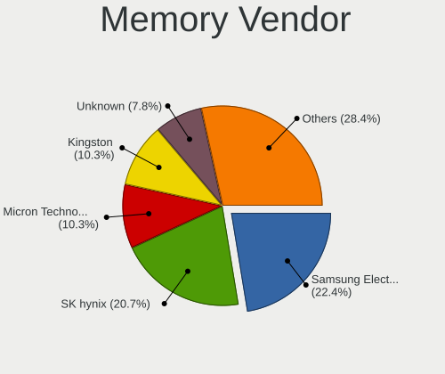

| Vendor              | Notebooks | Percent |
|---------------------|-----------|---------|
| Samsung Electronics | 26        | 22.41%  |
| SK hynix            | 24        | 20.69%  |
| Micron Technology   | 12        | 10.34%  |
| Kingston            | 12        | 10.34%  |
| Unknown             | 9         | 7.76%   |
| Elpida              | 6         | 5.17%   |
| Corsair             | 4         | 3.45%   |
| A-DATA Technology   | 4         | 3.45%   |
| Unknown (ABCD)      | 3         | 2.59%   |
| Smart               | 2         | 1.72%   |
| Ramaxel Technology  | 2         | 1.72%   |
| 48spaces            | 2         | 1.72%   |
| Timetec             | 1         | 0.86%   |
| Team                | 1         | 0.86%   |
| Smart Brazil        | 1         | 0.86%   |
| Quadratica          | 1         | 0.86%   |
| Qimonda             | 1         | 0.86%   |
| PNY                 | 1         | 0.86%   |
| Nanya Technology    | 1         | 0.86%   |
| Innodisk            | 1         | 0.86%   |
| Crucial             | 1         | 0.86%   |
| Unknown             | 1         | 0.86%   |

Memory Model
------------

Memory module models

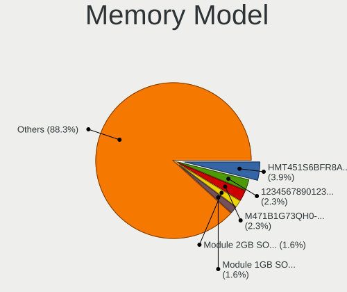

| Model                                                                     | Notebooks | Percent |
|---------------------------------------------------------------------------|-----------|---------|
| SK hynix RAM HMT451S6BFR8A-PB 4GB SODIMM DDR3 1600MT/s                    | 5         | 3.91%   |
| Unknown (ABCD) RAM 123456789012345678 2GB SODIMM LPDDR4 2400MT/s          | 3         | 2.34%   |
| Samsung RAM M471B1G73QH0-YK0 8GB SODIMM DDR3 1600MT/s                     | 3         | 2.34%   |
| Unknown RAM Module 2GB SODIMM DRAM                                        | 2         | 1.56%   |
| Unknown RAM Module 1GB SODIMM DDR2 667MT/s                                | 2         | 1.56%   |
| SK hynix RAM Module 4GB Row Of Chips DDR4 2400MT/s                        | 2         | 1.56%   |
| SK hynix RAM HMT41GS6BFR8A-PB 8GB SODIMM DDR3 2667MT/s                    | 2         | 1.56%   |
| SK hynix RAM HMA851S6AFR6N-UH 4GB SODIMM DDR4 2667MT/s                    | 2         | 1.56%   |
| Samsung RAM M471B5273DH0-CH9 4GB SODIMM DDR3 1600MT/s                     | 2         | 1.56%   |
| Samsung RAM M471B5173EB0-YK0 4GB SODIMM DDR3 1600MT/s                     | 2         | 1.56%   |
| Samsung RAM M471A1K43EB1-CWE 8GB SODIMM DDR4 3200MT/s                     | 2         | 1.56%   |
| Micron RAM MT40A1G16TB-062E:F 8GB Row Of Chips DDR4 3200MT/s              | 2         | 1.56%   |
| Kingston RAM ACR16D3LS1NGG/4G 4GB SODIMM DDR3 1600MT/s                    | 2         | 1.56%   |
| Corsair RAM Module 8GB SODIMM DDR3 1333MT/s                               | 2         | 1.56%   |
| 48spaces RAM 012345678901234567890123456789012345 2GB SODIMM DDR2 667MT/s | 2         | 1.56%   |
| Unknown RAM Module 2GB SODIMM DDR3 1066MT/s                               | 1         | 0.78%   |
| Unknown RAM Module 2GB SODIMM DDR3                                        | 1         | 0.78%   |
| Unknown RAM Module 2GB SODIMM DDR2 667MT/s                                | 1         | 0.78%   |
| Unknown RAM Module 2GB SODIMM DDR2                                        | 1         | 0.78%   |
| Unknown RAM Module 2GB DIMM DDR3 1333MT/s                                 | 1         | 0.78%   |
| Unknown RAM Module 1GB SODIMM DDR3 1066MT/s                               | 1         | 0.78%   |
| Timetec RAM S8G-1600 8GB SODIMM DDR3 1600MT/s                             | 1         | 0.78%   |
| Team RAM Elite-1333 4GB SODIMM DDR3 1334MT/s                              | 1         | 0.78%   |
| Smart RAM SH564568FH8NWPHSFG 2GB SODIMM DDR3 1333MT/s                     | 1         | 0.78%   |
| Smart RAM SH564128FJ8NWRNSQR 4GB SODIMM DDR3 1600MT/s                     | 1         | 0.78%   |
| Smart Brazil RAM SMS4TDC3C0K0446SCG 4GB SODIMM DDR4 2667MT/s              | 1         | 0.78%   |
| SK hynix RAM Module 4GB SODIMM DDR3 1600MT/s                              | 1         | 0.78%   |
| SK hynix RAM Module 4GB LPDDR5 6400MT/s                                   | 1         | 0.78%   |
| SK hynix RAM Module 2GB SODIMM DDR3 1600MT/s                              | 1         | 0.78%   |
| SK hynix RAM HMT451S6AFR8A-PB 4GB SODIMM DDR3 1600MT/s                    | 1         | 0.78%   |
| SK hynix RAM HMT451S6AFR6A-PB 4GB SODIMM DDR3 1600MT/s                    | 1         | 0.78%   |
| SK hynix RAM HMT425S6AFR6A-PB 2GB SODIMM DDR3 3200MT/s                    | 1         | 0.78%   |
| SK hynix RAM HMT41GS6AFR8A-PB 8GiB SODIMM DDR3 2667MT/s                   | 1         | 0.78%   |
| SK hynix RAM HMT351S6EFR8A-PB 4GB SODIMM DDR3 1600MT/s                    | 1         | 0.78%   |
| SK hynix RAM HMT351S6BFR8C-H9 4GB SODIMM DDR3 1333MT/s                    | 1         | 0.78%   |
| SK hynix RAM HMT125S6BFR8C-G7 2GB SODIMM DDR3 1067MT/s                    | 1         | 0.78%   |
| SK hynix RAM HMCG78AGBSA095N 16GB SODIMM DDR5 5600MT/s                    | 1         | 0.78%   |
| SK hynix RAM HMAA1GS6CJR6N-XN 8GB Row Of Chips DDR4 3200MT/s              | 1         | 0.78%   |
| SK hynix RAM HMA851S6CJR6N-VK 4GB Row Of Chips DDR4 2667MT/s              | 1         | 0.78%   |
| SK hynix RAM HMA425S6AFR6N-UH 2GB SODIMM DDR4 2400MT/s                    | 1         | 0.78%   |

Memory Kind
-----------

Memory module kinds

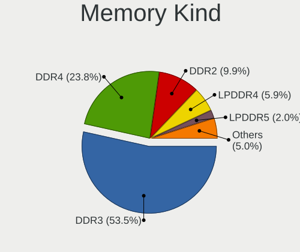

| Kind   | Notebooks | Percent |
|--------|-----------|---------|
| DDR3   | 54        | 53.47%  |
| DDR4   | 24        | 23.76%  |
| DDR2   | 10        | 9.9%    |
| LPDDR4 | 6         | 5.94%   |
| LPDDR5 | 2         | 1.98%   |
| DRAM   | 2         | 1.98%   |
| DDR5   | 2         | 1.98%   |
| SDRAM  | 1         | 0.99%   |

Memory Form Factor
------------------

Physical design of the memory module

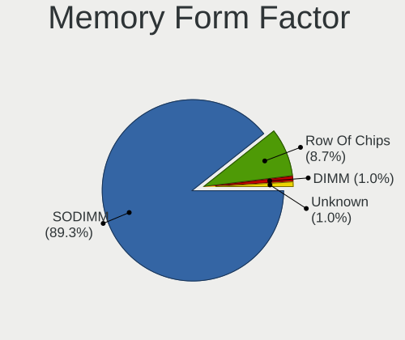

| Name         | Notebooks | Percent |
|--------------|-----------|---------|
| SODIMM       | 92        | 89.32%  |
| Row Of Chips | 9         | 8.74%   |
| DIMM         | 1         | 0.97%   |
| Unknown      | 1         | 0.97%   |

Memory Size
-----------

Memory module size

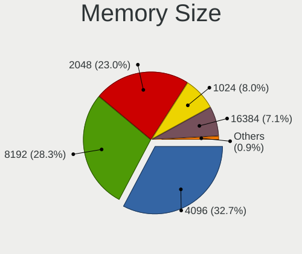

| Size  | Notebooks | Percent |
|-------|-----------|---------|
| 4096  | 37        | 32.74%  |
| 8192  | 32        | 28.32%  |
| 2048  | 26        | 23.01%  |
| 1024  | 9         | 7.96%   |
| 16384 | 8         | 7.08%   |
| 32768 | 1         | 0.88%   |

Memory Speed
------------

Memory module speed

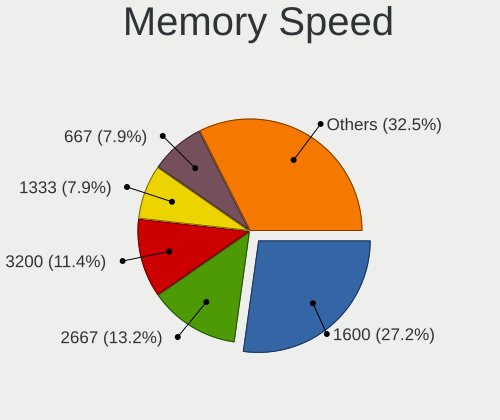

| Speed   | Notebooks | Percent |
|---------|-----------|---------|
| 1600    | 31        | 27.19%  |
| 2667    | 15        | 13.16%  |
| 3200    | 13        | 11.4%   |
| 1333    | 9         | 7.89%   |
| 667     | 9         | 7.89%   |
| 2400    | 7         | 6.14%   |
| 2133    | 4         | 3.51%   |
| 1334    | 4         | 3.51%   |
| 1067    | 4         | 3.51%   |
| 800     | 4         | 3.51%   |
| Unknown | 4         | 3.51%   |
| 6400    | 2         | 1.75%   |
| 5600    | 2         | 1.75%   |
| 1066    | 2         | 1.75%   |
| 8400    | 1         | 0.88%   |
| 3266    | 1         | 0.88%   |
| 2048    | 1         | 0.88%   |
| 975     | 1         | 0.88%   |

Printers & scanners
-------------------

Printer Vendor
--------------

Printer device vendors

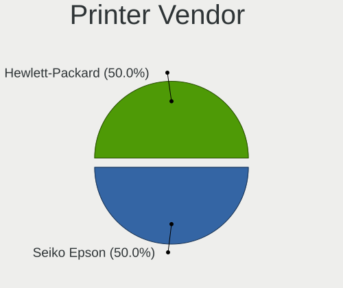

| Vendor          | Notebooks | Percent |
|-----------------|-----------|---------|
| Seiko Epson     | 1         | 50%     |
| Hewlett-Packard | 1         | 50%     |

Printer Model
-------------

Printer device models

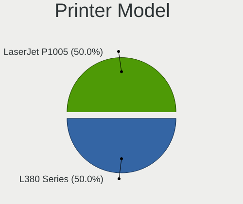

| Model                   | Notebooks | Percent |
|-------------------------|-----------|---------|
| Seiko Epson L380 Series | 1         | 50%     |
| HP LaserJet P1005       | 1         | 50%     |

Scanner Vendor
--------------

Scanner device vendors

Zero info for selected period =(

Scanner Model
-------------

Scanner device models

Zero info for selected period =(

Camera
------

Camera Vendor
-------------

Camera device vendors

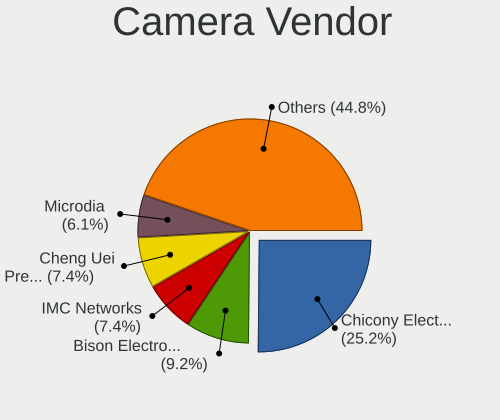

| Vendor                                 | Notebooks | Percent |
|----------------------------------------|-----------|---------|
| Chicony Electronics                    | 41        | 25.15%  |
| Bison Electronics                      | 15        | 9.2%    |
| IMC Networks                           | 12        | 7.36%   |
| Cheng Uei Precision Industry (Foxlink) | 12        | 7.36%   |
| Microdia                               | 10        | 6.13%   |
| Apple                                  | 10        | 6.13%   |
| Realtek Semiconductor                  | 9         | 5.52%   |
| Suyin                                  | 8         | 4.91%   |
| Sunplus Innovation Technology          | 7         | 4.29%   |
| Quanta                                 | 6         | 3.68%   |
| Silicon Motion                         | 4         | 2.45%   |
| Syntek                                 | 3         | 1.84%   |
| Luxvisions Innotech Limited            | 3         | 1.84%   |
| Logitech                               | 3         | 1.84%   |
| Alcor Micro                            | 3         | 1.84%   |
| Z-Star Microelectronics                | 2         | 1.23%   |
| Samsung Electronics                    | 2         | 1.23%   |
| Lenovo                                 | 2         | 1.23%   |
| icSpring                               | 2         | 1.23%   |
| Sonix Technology                       | 1         | 0.61%   |
| Shine-optics                           | 1         | 0.61%   |
| Ricoh                                  | 1         | 0.61%   |
| OmniVision Technologies                | 1         | 0.61%   |
| Lite-On Technology                     | 1         | 0.61%   |
| DigiTech                               | 1         | 0.61%   |
| BillionPixels                          | 1         | 0.61%   |
| ALi                                    | 1         | 0.61%   |
| Acer                                   | 1         | 0.61%   |

Camera Model
------------

Camera device models

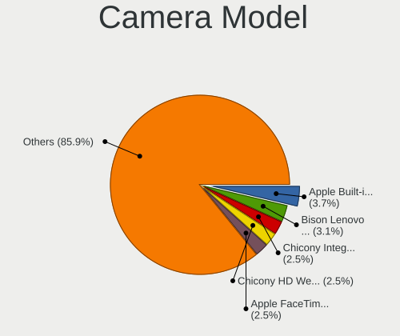

| Model                                                                      | Notebooks | Percent |
|----------------------------------------------------------------------------|-----------|---------|
| Apple Built-in iSight                                                      | 6         | 3.68%   |
| Bison Lenovo EasyCamera                                                    | 5         | 3.07%   |
| Chicony Integrated Camera                                                  | 4         | 2.45%   |
| Chicony HD WebCam                                                          | 4         | 2.45%   |
| Apple FaceTime HD Camera                                                   | 4         | 2.45%   |
| Realtek EasyCamera                                                         | 3         | 1.84%   |
| IMC Networks USB2.0 VGA UVC WebCam                                         | 3         | 1.84%   |
| IMC Networks Integrated Camera                                             | 3         | 1.84%   |
| Chicony VGA WebCam                                                         | 3         | 1.84%   |
| Chicony HP Webcam                                                          | 3         | 1.84%   |
| Chicony Fujitsu Integrated Camera                                          | 3         | 1.84%   |
| Cheng Uei Precision Industry (Foxlink) HP Webcam                           | 3         | 1.84%   |
| Bison EasyCamera                                                           | 3         | 1.84%   |
| Syntek EasyCamera                                                          | 2         | 1.23%   |
| Suyin UVC 0.3M Webcam                                                      | 2         | 1.23%   |
| Suyin Sony Visual Communication Camera                                     | 2         | 1.23%   |
| Suyin Acer/HP Integrated Webcam [CN0314]                                   | 2         | 1.23%   |
| Sunplus Integrated_Webcam_HD                                               | 2         | 1.23%   |
| Sunplus HP HD Webcam [Fixed]                                               | 2         | 1.23%   |
| Samsung Galaxy series, misc. (MTP mode)                                    | 2         | 1.23%   |
| Realtek Acer 640 x 480 laptop camera                                       | 2         | 1.23%   |
| Quanta HD Webcam                                                           | 2         | 1.23%   |
| Microdia Integrated Webcam                                                 | 2         | 1.23%   |
| Logitech Webcam C270                                                       | 2         | 1.23%   |
| Lenovo Integrated Webcam                                                   | 2         | 1.23%   |
| icSpring camera                                                            | 2         | 1.23%   |
| Chicony USB2.0 VGA UVC WebCam                                              | 2         | 1.23%   |
| Chicony CKF7063 Webcam (HP)                                                | 2         | 1.23%   |
| Cheng Uei Precision Industry (Foxlink) HP Wide Vision HD Integrated Webcam | 2         | 1.23%   |
| Cheng Uei Precision Industry (Foxlink) HP Truevision HD                    | 2         | 1.23%   |
| Bison Integrated Camera                                                    | 2         | 1.23%   |
| Alcor Micro ASUS USB2.0 WebCam                                             | 2         | 1.23%   |
| Z-Star WebCam SCB-0320N                                                    | 1         | 0.61%   |
| Z-Star Webcam                                                              | 1         | 0.61%   |
| Syntek Lenovo EasyCamera                                                   | 1         | 0.61%   |
| Suyin HP Truevision HD                                                     | 1         | 0.61%   |
| Suyin HD WebCam                                                            | 1         | 0.61%   |
| Sunplus USB 2.0 Camera                                                     | 1         | 0.61%   |
| Sunplus Laptop Integrated Webcam HD                                        | 1         | 0.61%   |
| Sunplus HD WebCam                                                          | 1         | 0.61%   |

Security
--------

Fingerprint Vendor
------------------

Fingerprint sensor vendors

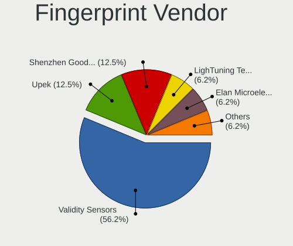

| Vendor                     | Notebooks | Percent |
|----------------------------|-----------|---------|
| Validity Sensors           | 9         | 56.25%  |
| Upek                       | 2         | 12.5%   |
| Shenzhen Goodix Technology | 2         | 12.5%   |
| LighTuning Technology      | 1         | 6.25%   |
| Elan Microelectronics      | 1         | 6.25%   |
| AuthenTec                  | 1         | 6.25%   |

Fingerprint Model
-----------------

Fingerprint sensor models

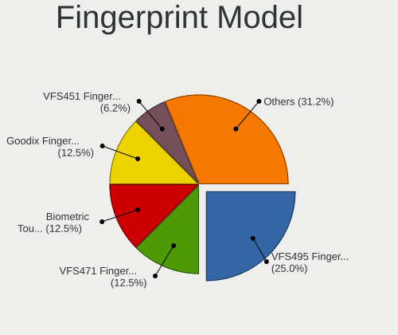

| Model                                                                      | Notebooks | Percent |
|----------------------------------------------------------------------------|-----------|---------|
| Validity Sensors VFS495 Fingerprint Reader                                 | 4         | 25%     |
| Validity Sensors VFS471 Fingerprint Reader                                 | 2         | 12.5%   |
| Upek Biometric Touchchip/Touchstrip Fingerprint Sensor                     | 2         | 12.5%   |
| Shenzhen Goodix  Fingerprint Device                                        | 2         | 12.5%   |
| Validity Sensors VFS451 Fingerprint Reader                                 | 1         | 6.25%   |
| Validity Sensors Synaptics VFS7552 Touch Fingerprint Sensor with PurePrint | 1         | 6.25%   |
| Validity Sensors Swipe Fingerprint Sensor                                  | 1         | 6.25%   |
| LighTuning EgisTec Touch Fingerprint Sensor                                | 1         | 6.25%   |
| Elan ELAN:Fingerprint                                                      | 1         | 6.25%   |
| AuthenTec AES1600                                                          | 1         | 6.25%   |

Chipcard Vendor
---------------

Chipcard module vendors

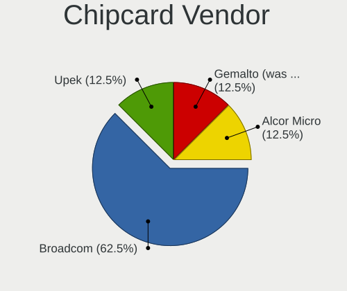

| Vendor                | Notebooks | Percent |
|-----------------------|-----------|---------|
| Broadcom              | 5         | 62.5%   |
| Upek                  | 1         | 12.5%   |
| Gemalto (was Gemplus) | 1         | 12.5%   |
| Alcor Micro           | 1         | 12.5%   |

Chipcard Model
--------------

Chipcard module models

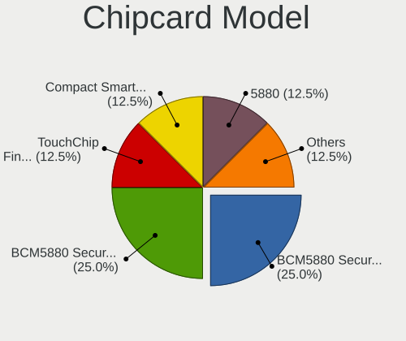

| Model                                                                        | Notebooks | Percent |
|------------------------------------------------------------------------------|-----------|---------|
| Broadcom BCM5880 Secure Applications Processor with fingerprint swipe sensor | 2         | 25%     |
| Broadcom BCM5880 Secure Applications Processor                               | 2         | 25%     |
| Upek TouchChip Fingerprint Coprocessor (WBF advanced mode)                   | 1         | 12.5%   |
| Gemalto (was Gemplus) Compact Smart Card Reader Writer                       | 1         | 12.5%   |
| Broadcom 5880                                                                | 1         | 12.5%   |
| Alcor Micro AU9540 Smartcard Reader                                          | 1         | 12.5%   |

Unsupported
-----------

Unsupported Devices
-------------------

Total unsupported devices on board

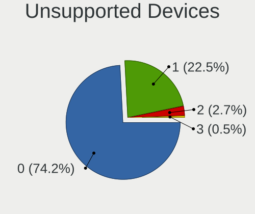

| Total | Notebooks | Percent |
|-------|-----------|---------|
| 0     | 135       | 74.18%  |
| 1     | 41        | 22.53%  |
| 2     | 5         | 2.75%   |
| 3     | 1         | 0.55%   |

Unsupported Device Types
------------------------

Types of unsupported devices

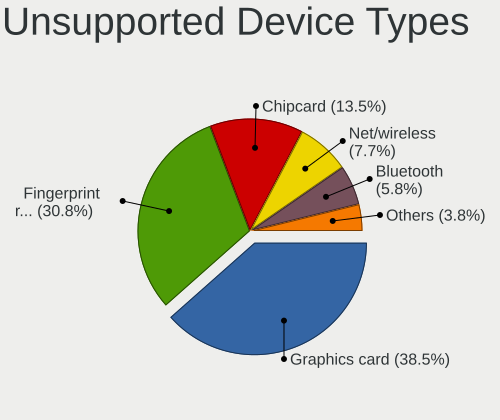

| Type               | Notebooks | Percent |
|--------------------|-----------|---------|
| Graphics card      | 20        | 38.46%  |
| Fingerprint reader | 16        | 30.77%  |
| Chipcard           | 7         | 13.46%  |
| Net/wireless       | 4         | 7.69%   |
| Bluetooth          | 3         | 5.77%   |
| Camera             | 2         | 3.85%   |

