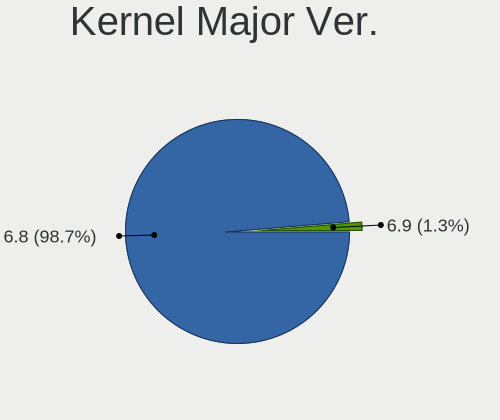
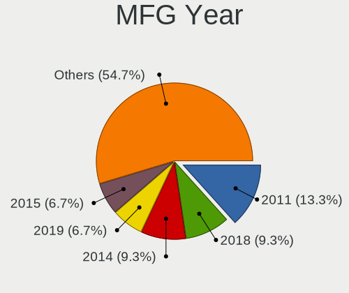
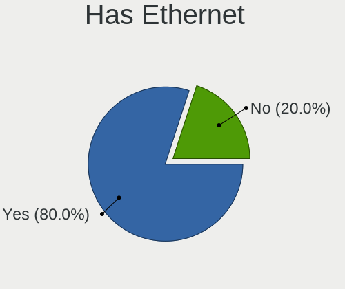
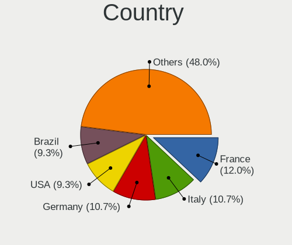
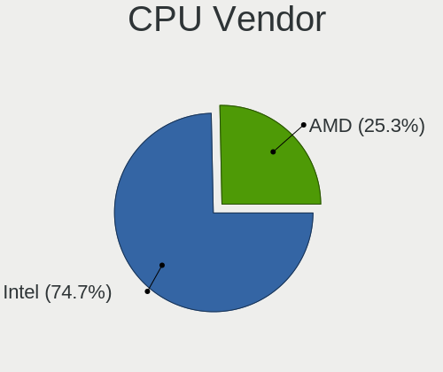
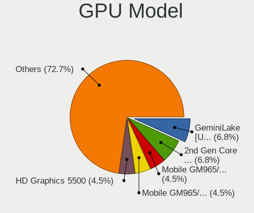
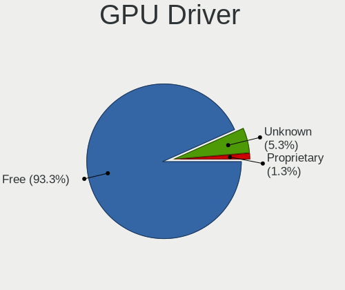
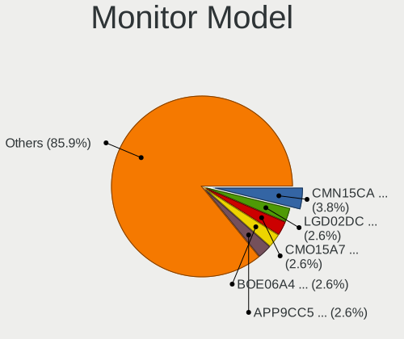
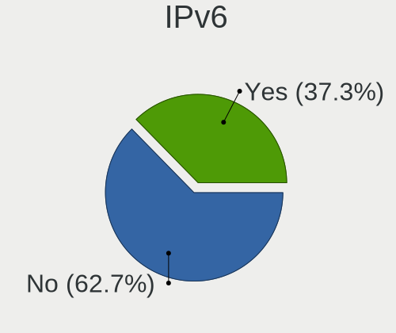

Lubuntu 24.04 - Tested Hardware & Statistics (Notebooks)
--------------------------------------------------------

A project to collect tested hardware configurations for Lubuntu 24.04.

Anyone can contribute to this report by the [hw-probe](https://github.com/linuxhw/hw-probe) tool:

    sudo -E hw-probe -all -upload

Please contribute! Especially if your hardware is rare.

Contents
--------

* [ Test Cases ](#test-cases)

* [ System ](#system)
  - [ Kernel                   ](#kernel)
  - [ Kernel Family            ](#kernel-family)
  - [ Kernel Major Ver.        ](#kernel-major-ver)
  - [ Arch                     ](#arch)
  - [ DE                       ](#de)
  - [ Display Server           ](#display-server)
  - [ Display Manager          ](#display-manager)
  - [ OS Lang                  ](#os-lang)
  - [ Boot Mode                ](#boot-mode)
  - [ Filesystem               ](#filesystem)
  - [ Part. scheme             ](#part-scheme)
  - [ Dual Boot with Linux/BSD ](#dual-boot-with-linuxbsd)
  - [ Dual Boot (Win)          ](#dual-boot-win)

* [ Board ](#board)
  - [ Vendor                   ](#vendor)
  - [ Model                    ](#model)
  - [ Model Family             ](#model-family)
  - [ MFG Year                 ](#mfg-year)
  - [ Form Factor              ](#form-factor)
  - [ Secure Boot              ](#secure-boot)
  - [ Coreboot                 ](#coreboot)
  - [ RAM Size                 ](#ram-size)
  - [ RAM Used                 ](#ram-used)
  - [ Total Drives             ](#total-drives)
  - [ Has CD-ROM               ](#has-cd-rom)
  - [ Has Ethernet             ](#has-ethernet)
  - [ Has WiFi                 ](#has-wifi)
  - [ Has Bluetooth            ](#has-bluetooth)

* [ Location ](#location)
  - [ Country                  ](#country)
  - [ City                     ](#city)

* [ Drives ](#drives)
  - [ Drive Vendor             ](#drive-vendor)
  - [ Drive Model              ](#drive-model)
  - [ HDD Vendor               ](#hdd-vendor)
  - [ SSD Vendor               ](#ssd-vendor)
  - [ Drive Kind               ](#drive-kind)
  - [ Drive Connector          ](#drive-connector)
  - [ Drive Size               ](#drive-size)
  - [ Space Total              ](#space-total)
  - [ Space Used               ](#space-used)
  - [ Malfunc. Drives          ](#malfunc-drives)
  - [ Malfunc. Drive Vendor    ](#malfunc-drive-vendor)
  - [ Malfunc. HDD Vendor      ](#malfunc-hdd-vendor)
  - [ Malfunc. Drive Kind      ](#malfunc-drive-kind)
  - [ Failed Drives            ](#failed-drives)
  - [ Failed Drive Vendor      ](#failed-drive-vendor)
  - [ Drive Status             ](#drive-status)

* [ Storage controller ](#storage-controller)
  - [ Storage Vendor           ](#storage-vendor)
  - [ Storage Model            ](#storage-model)
  - [ Storage Kind             ](#storage-kind)

* [ Processor ](#processor)
  - [ CPU Vendor               ](#cpu-vendor)
  - [ CPU Model                ](#cpu-model)
  - [ CPU Model Family         ](#cpu-model-family)
  - [ CPU Cores                ](#cpu-cores)
  - [ CPU Sockets              ](#cpu-sockets)
  - [ CPU Threads              ](#cpu-threads)
  - [ CPU Op-Modes             ](#cpu-op-modes)
  - [ CPU Microcode            ](#cpu-microcode)
  - [ CPU Microarch            ](#cpu-microarch)

* [ Graphics ](#graphics)
  - [ GPU Vendor               ](#gpu-vendor)
  - [ GPU Model                ](#gpu-model)
  - [ GPU Combo                ](#gpu-combo)
  - [ GPU Driver               ](#gpu-driver)
  - [ GPU Memory               ](#gpu-memory)

* [ Monitor ](#monitor)
  - [ Monitor Vendor           ](#monitor-vendor)
  - [ Monitor Model            ](#monitor-model)
  - [ Monitor Resolution       ](#monitor-resolution)
  - [ Monitor Diagonal         ](#monitor-diagonal)
  - [ Monitor Width            ](#monitor-width)
  - [ Aspect Ratio             ](#aspect-ratio)
  - [ Monitor Area             ](#monitor-area)
  - [ Pixel Density            ](#pixel-density)
  - [ Multiple Monitors        ](#multiple-monitors)

* [ Network ](#network)
  - [ Net Controller Vendor    ](#net-controller-vendor)
  - [ Net Controller Model     ](#net-controller-model)
  - [ Wireless Vendor          ](#wireless-vendor)
  - [ Wireless Model           ](#wireless-model)
  - [ Ethernet Vendor          ](#ethernet-vendor)
  - [ Ethernet Model           ](#ethernet-model)
  - [ Net Controller Kind      ](#net-controller-kind)
  - [ Used Controller          ](#used-controller)
  - [ NICs                     ](#nics)
  - [ IPv6                     ](#ipv6)

* [ Bluetooth ](#bluetooth)
  - [ Bluetooth Vendor         ](#bluetooth-vendor)
  - [ Bluetooth Model          ](#bluetooth-model)

* [ Sound ](#sound)
  - [ Sound Vendor             ](#sound-vendor)
  - [ Sound Model              ](#sound-model)

* [ Memory ](#memory)
  - [ Memory Vendor            ](#memory-vendor)
  - [ Memory Model             ](#memory-model)
  - [ Memory Kind              ](#memory-kind)
  - [ Memory Form Factor       ](#memory-form-factor)
  - [ Memory Size              ](#memory-size)
  - [ Memory Speed             ](#memory-speed)

* [ Printers & scanners ](#printers--scanners)
  - [ Printer Vendor           ](#printer-vendor)
  - [ Printer Model            ](#printer-model)
  - [ Scanner Vendor           ](#scanner-vendor)
  - [ Scanner Model            ](#scanner-model)

* [ Camera ](#camera)
  - [ Camera Vendor            ](#camera-vendor)
  - [ Camera Model             ](#camera-model)

* [ Security ](#security)
  - [ Fingerprint Vendor       ](#fingerprint-vendor)
  - [ Fingerprint Model        ](#fingerprint-model)
  - [ Chipcard Vendor          ](#chipcard-vendor)
  - [ Chipcard Model           ](#chipcard-model)

* [ Unsupported ](#unsupported)
  - [ Unsupported Devices      ](#unsupported-devices)
  - [ Unsupported Device Types ](#unsupported-device-types)

Test Cases
----------

Total: 96

| Vendor        | Model                       | Probe                                                      | Date         |
|---------------|-----------------------------|------------------------------------------------------------|--------------|
| HP            | Pavilion g7                 | [5692787b6f](https://linux-hardware.org/?probe=5692787b6f) | Dec 31, 2024 |
| Fujitsu       | LIFEBOOK AH531              | [37872e53dc](https://linux-hardware.org/?probe=37872e53dc) | Dec 30, 2024 |
| Fujitsu       | LIFEBOOK AH531              | [0dc9a2432a](https://linux-hardware.org/?probe=0dc9a2432a) | Dec 30, 2024 |
| HP            | Notebook                    | [fb6c3eebe1](https://linux-hardware.org/?probe=fb6c3eebe1) | Dec 29, 2024 |
| Unchartevi... | 6540                        | [1d27092258](https://linux-hardware.org/?probe=1d27092258) | Dec 29, 2024 |
| Unknown       | Unknown                     | [dae997fee3](https://linux-hardware.org/?probe=dae997fee3) | Dec 26, 2024 |
| Dell          | Inspiron 1545               | [9cc6330a09](https://linux-hardware.org/?probe=9cc6330a09) | Dec 21, 2024 |
| ASUSTek       | X550CL                      | [ca719e1a32](https://linux-hardware.org/?probe=ca719e1a32) | Dec 20, 2024 |
| Lenovo        | IdeaPad 330-15IKB 81FD      | [bc07631f18](https://linux-hardware.org/?probe=bc07631f18) | Dec 18, 2024 |
| Lenovo        | IdeaPad S405 9802           | [10b9693723](https://linux-hardware.org/?probe=10b9693723) | Dec 17, 2024 |
| Lenovo        | IdeaPad S405 9802           | [3a61babe21](https://linux-hardware.org/?probe=3a61babe21) | Dec 17, 2024 |
| HP            | EliteBook 835 13 inch G1... | [501650199f](https://linux-hardware.org/?probe=501650199f) | Dec 12, 2024 |
| HP            | Laptop 15-db0xxx            | [469069638e](https://linux-hardware.org/?probe=469069638e) | Dec 01, 2024 |
| Acer          | AO722                       | [15b4d05c90](https://linux-hardware.org/?probe=15b4d05c90) | Nov 25, 2024 |
| Acer          | AO722                       | [f5300839f0](https://linux-hardware.org/?probe=f5300839f0) | Nov 25, 2024 |
| Apple         | MacBook5,1                  | [c9bc1374b3](https://linux-hardware.org/?probe=c9bc1374b3) | Nov 25, 2024 |
| Sony          | M730                        | [55d7e62f9d](https://linux-hardware.org/?probe=55d7e62f9d) | Nov 23, 2024 |
| HP            | Notebook                    | [bb9e0faf8f](https://linux-hardware.org/?probe=bb9e0faf8f) | Nov 22, 2024 |
| Apple         | MacBook5,1                  | [fc4768f63d](https://linux-hardware.org/?probe=fc4768f63d) | Nov 17, 2024 |
| HP            | ProBook 430 G2              | [ea645a6ae1](https://linux-hardware.org/?probe=ea645a6ae1) | Nov 08, 2024 |
| Sony          | VPCF132FX                   | [b584189661](https://linux-hardware.org/?probe=b584189661) | Nov 03, 2024 |
| Lenovo        | Yoga 300-11IBR 80M1         | [d47c826466](https://linux-hardware.org/?probe=d47c826466) | Oct 28, 2024 |
| Toshiba       | Satellite C660              | [11806f6477](https://linux-hardware.org/?probe=11806f6477) | Oct 24, 2024 |
| Dell          | Latitude E5450              | [0465141d52](https://linux-hardware.org/?probe=0465141d52) | Oct 23, 2024 |
| Toshiba       | Satellite P55W-C            | [84c58de68f](https://linux-hardware.org/?probe=84c58de68f) | Oct 23, 2024 |
| Toshiba       | Satellite P55W-C            | [2fbe7927f9](https://linux-hardware.org/?probe=2fbe7927f9) | Oct 23, 2024 |
| Fujitsu       | LIFEBOOK AH531              | [7205fb0b92](https://linux-hardware.org/?probe=7205fb0b92) | Oct 23, 2024 |
| Dell          | Inspiron 1501               | [5ac3420a2b](https://linux-hardware.org/?probe=5ac3420a2b) | Oct 22, 2024 |
| HP            | Pavilion Laptop 15-cs315... | [c61e1c6184](https://linux-hardware.org/?probe=c61e1c6184) | Oct 22, 2024 |
| Dell          | Latitude E5450              | [2ec7e21290](https://linux-hardware.org/?probe=2ec7e21290) | Oct 19, 2024 |
| Chuwi         | GemiBook Pro                | [be2a9177cc](https://linux-hardware.org/?probe=be2a9177cc) | Oct 19, 2024 |
| HP            | Compaq CQ58                 | [129913dcc6](https://linux-hardware.org/?probe=129913dcc6) | Oct 14, 2024 |
| Positivo      | C14CU51                     | [a50a121b61](https://linux-hardware.org/?probe=a50a121b61) | Oct 12, 2024 |
| HP            | 255 G5                      | [062ce32d62](https://linux-hardware.org/?probe=062ce32d62) | Oct 11, 2024 |
| HONOR         | NMH-WCX9                    | [03f4ff2833](https://linux-hardware.org/?probe=03f4ff2833) | Oct 09, 2024 |
| HONOR         | NMH-WCX9                    | [e167d1430c](https://linux-hardware.org/?probe=e167d1430c) | Oct 09, 2024 |
| Samsung       | 370E4K                      | [f87816505c](https://linux-hardware.org/?probe=f87816505c) | Oct 07, 2024 |
| Acer          | Aspire 5735                 | [4c1559410d](https://linux-hardware.org/?probe=4c1559410d) | Oct 06, 2024 |
| Acer          | Aspire 5735                 | [50e1561f7d](https://linux-hardware.org/?probe=50e1561f7d) | Oct 06, 2024 |
| Google        | Rabbid                      | [022398a237](https://linux-hardware.org/?probe=022398a237) | Oct 05, 2024 |
| Apple         | MacBook4,1                  | [1b71a4b0c9](https://linux-hardware.org/?probe=1b71a4b0c9) | Oct 01, 2024 |
| ASUSTek       | X553MA                      | [a96b018191](https://linux-hardware.org/?probe=a96b018191) | Sep 25, 2024 |
| MicroByte     | ezbook                      | [5b878e7b72](https://linux-hardware.org/?probe=5b878e7b72) | Sep 24, 2024 |
| HP            | Pavilion 15                 | [617c9c6fd3](https://linux-hardware.org/?probe=617c9c6fd3) | Sep 22, 2024 |
| HP            | Pavilion 15                 | [47d81a32ab](https://linux-hardware.org/?probe=47d81a32ab) | Sep 22, 2024 |
| Lenovo        | IdeaPad Slim 1-14AST-05 ... | [273c5852ff](https://linux-hardware.org/?probe=273c5852ff) | Sep 18, 2024 |
| Dell          | Inspiron 1564               | [e2028cccf6](https://linux-hardware.org/?probe=e2028cccf6) | Sep 14, 2024 |
| Apple         | MacBookPro8,1               | [606582cd82](https://linux-hardware.org/?probe=606582cd82) | Sep 10, 2024 |
| Complet       | MY8305                      | [fdab3231de](https://linux-hardware.org/?probe=fdab3231de) | Sep 07, 2024 |
| Chuwi         | HeroBook Air                | [09a139dbbe](https://linux-hardware.org/?probe=09a139dbbe) | Sep 04, 2024 |
| Chuwi         | HeroBook Air                | [163bdd4e80](https://linux-hardware.org/?probe=163bdd4e80) | Sep 04, 2024 |
| Acer          | AOD255                      | [3dace1f171](https://linux-hardware.org/?probe=3dace1f171) | Sep 03, 2024 |
| Acer          | AOD255                      | [7d7265c514](https://linux-hardware.org/?probe=7d7265c514) | Sep 03, 2024 |
| HP            | Compaq 6735s                | [ef4b082281](https://linux-hardware.org/?probe=ef4b082281) | Sep 02, 2024 |
| Lenovo        | ThinkPad L480 20LTS15Q00    | [c7bd2c3d2e](https://linux-hardware.org/?probe=c7bd2c3d2e) | Aug 26, 2024 |
| eMachines     | E725                        | [22fba92ec4](https://linux-hardware.org/?probe=22fba92ec4) | Aug 20, 2024 |
| Lenovo        | ThinkPad T61 7658CTO        | [c395b3e28c](https://linux-hardware.org/?probe=c395b3e28c) | Aug 19, 2024 |
| Dell          | XPS MXC062                  | [46f9c80883](https://linux-hardware.org/?probe=46f9c80883) | Aug 16, 2024 |
| Lenovo        | IdeaPad S205 Brazos         | [e40f1ca18f](https://linux-hardware.org/?probe=e40f1ca18f) | Aug 15, 2024 |
| HP            | EliteBook 8440p             | [46e4c79baf](https://linux-hardware.org/?probe=46e4c79baf) | Aug 13, 2024 |
| HP            | EliteBook 8440p             | [4a401d3cf7](https://linux-hardware.org/?probe=4a401d3cf7) | Aug 13, 2024 |
| HP            | Notebook                    | [0d521e10c8](https://linux-hardware.org/?probe=0d521e10c8) | Aug 11, 2024 |
| ASUSTek       | X540SA                      | [683c8f3f4b](https://linux-hardware.org/?probe=683c8f3f4b) | Aug 11, 2024 |
| HP            | Notebook                    | [1a796d1daf](https://linux-hardware.org/?probe=1a796d1daf) | Aug 04, 2024 |
| Acer          | Aspire A515-51              | [edc0e332b2](https://linux-hardware.org/?probe=edc0e332b2) | Aug 01, 2024 |
| Acer          | Aspire A515-51              | [bd658968cf](https://linux-hardware.org/?probe=bd658968cf) | Aug 01, 2024 |
| HP            | Laptop 15-da0xxx            | [ed33f895c9](https://linux-hardware.org/?probe=ed33f895c9) | Jul 28, 2024 |
| Intel         | STCK1A32WFC H67490-303      | [b12d74f728](https://linux-hardware.org/?probe=b12d74f728) | Jul 27, 2024 |
| Acer          | Swift SF113-31              | [6c63a7574e](https://linux-hardware.org/?probe=6c63a7574e) | Jul 26, 2024 |
| PROBOOK       | U SERIES                    | [e9b030a9df](https://linux-hardware.org/?probe=e9b030a9df) | Jul 17, 2024 |
| PROBOOK       | U SERIES                    | [bdc92be04b](https://linux-hardware.org/?probe=bdc92be04b) | Jul 15, 2024 |
| Apple         | MacBookPro9,2               | [e0376fa4fe](https://linux-hardware.org/?probe=e0376fa4fe) | Jul 13, 2024 |
| ASUSTek       | VivoBook 15_ASUS Laptop ... | [64b642a303](https://linux-hardware.org/?probe=64b642a303) | Jul 12, 2024 |
| ASUSTek       | K52JB                       | [d50ec4eed9](https://linux-hardware.org/?probe=d50ec4eed9) | Jul 09, 2024 |
| Packard Be... | EasyNote TE69BM             | [e4f954f464](https://linux-hardware.org/?probe=e4f954f464) | Jul 05, 2024 |
| Unknown       | N10(M1N1)                   | [fc2ca6d762](https://linux-hardware.org/?probe=fc2ca6d762) | Jul 04, 2024 |
| HP            | 14                          | [f28a807a2e](https://linux-hardware.org/?probe=f28a807a2e) | Jul 01, 2024 |
| HUAWEI        | BOHK-WAX9X                  | [3f56bdc232](https://linux-hardware.org/?probe=3f56bdc232) | Jul 01, 2024 |
| ASUSTek       | K52JB                       | [cda7f38058](https://linux-hardware.org/?probe=cda7f38058) | Jun 29, 2024 |
| Lenovo        | IdeaPad L340-15IRH Gamin... | [1da0ed40d4](https://linux-hardware.org/?probe=1da0ed40d4) | Jun 24, 2024 |
| Apple         | MacBookPro8,1               | [2639f09193](https://linux-hardware.org/?probe=2639f09193) | Jun 19, 2024 |
| Samsung       | QX311/QX411/QX412/QX511     | [e37830ceb9](https://linux-hardware.org/?probe=e37830ceb9) | Jun 10, 2024 |
| HP            | ZBook 15 G2                 | [a788fb84c1](https://linux-hardware.org/?probe=a788fb84c1) | Jun 02, 2024 |
| HP            | ZBook 15 G2                 | [60515e0fa6](https://linux-hardware.org/?probe=60515e0fa6) | Jun 02, 2024 |
| ODM           | Unknown                     | [d6a98e94b6](https://linux-hardware.org/?probe=d6a98e94b6) | May 27, 2024 |
| HP            | Pavilion Notebook           | [133e970ae7](https://linux-hardware.org/?probe=133e970ae7) | May 23, 2024 |
| Lenovo        | ThinkPad T560 20FJS0XX00    | [11d6470b8b](https://linux-hardware.org/?probe=11d6470b8b) | May 23, 2024 |
| Apple         | MacBookAir1,1               | [8c29382ba8](https://linux-hardware.org/?probe=8c29382ba8) | May 21, 2024 |
| Lenovo        | G575 20081                  | [581885ea87](https://linux-hardware.org/?probe=581885ea87) | May 11, 2024 |
| Shenzhen B... | XN116B                      | [47dbcecbd7](https://linux-hardware.org/?probe=47dbcecbd7) | May 04, 2024 |
| HP            | EliteBook 840 G4            | [f9fed717ee](https://linux-hardware.org/?probe=f9fed717ee) | May 03, 2024 |
| Notebook      | W54_W94_W955TU,-T,-C        | [c327d5c1a6](https://linux-hardware.org/?probe=c327d5c1a6) | May 01, 2024 |
| Apple         | MacBookPro5,5               | [2ddfed1c8a](https://linux-hardware.org/?probe=2ddfed1c8a) | May 01, 2024 |
| Lenovo        | G50-45 80E3                 | [a12bc9b719](https://linux-hardware.org/?probe=a12bc9b719) | Apr 28, 2024 |
| ASUSTek       | K53BY                       | [6f6c4b9d68](https://linux-hardware.org/?probe=6f6c4b9d68) | Apr 26, 2024 |
| HP            | Compaq 8710w (GT649PA#AB... | [00f1c96012](https://linux-hardware.org/?probe=00f1c96012) | Apr 26, 2024 |

System
------

Kernel
------

Version of the Linux kernel

| Version             | Notebooks | Percent |
|---------------------|-----------|---------|
| 6.8.0-31-generic    | 16        | 21.33%  |
| 6.8.0-41-generic    | 13        | 17.33%  |
| 6.8.0-36-generic    | 8         | 10.67%  |
| 6.8.0-47-generic    | 7         | 9.33%   |
| 6.8.0-51-generic    | 6         | 8%      |
| 6.8.0-45-generic    | 6         | 8%      |
| 6.8.0-40-generic    | 5         | 6.67%   |
| 6.8.0-49-generic    | 3         | 4%      |
| 6.8.0-48-generic    | 3         | 4%      |
| 6.8.0-44-generic    | 3         | 4%      |
| 6.9.5-sandy-custom  | 1         | 1.33%   |
| 6.8.0-41-lowlatency | 1         | 1.33%   |
| 6.8.0-39-generic    | 1         | 1.33%   |
| 6.8.0-38-generic    | 1         | 1.33%   |
| 6.8.0-35-generic    | 1         | 1.33%   |

Kernel Family
-------------

Linux kernel without a distro release

| Version | Notebooks | Percent |
|---------|-----------|---------|
| 6.8.0   | 74        | 98.67%  |
| 6.9.5   | 1         | 1.33%   |

Kernel Major Ver.
-----------------

Linux kernel major version

| Version | Notebooks | Percent |
|---------|-----------|---------|
| 6.8     | 74        | 98.67%  |
| 6.9     | 1         | 1.33%   |

Arch
----

OS architecture (x86_64, i586, etc.)

| Name   | Notebooks | Percent |
|--------|-----------|---------|
| x86_64 | 75        | 100%    |

DE
--

Desktop Environment

| Name | Notebooks | Percent |
|------|-----------|---------|
| LXQt | 75        | 100%    |

Display Server
--------------

X11 or Wayland

| Name | Notebooks | Percent |
|------|-----------|---------|
| X11  | 73        | 97.33%  |
| Tty  | 2         | 2.67%   |

Display Manager
---------------

SDDM, LightDM, etc.

| Name    | Notebooks | Percent |
|---------|-----------|---------|
| SDDM    | 61        | 81.33%  |
| Unknown | 12        | 16%     |
| SLiM    | 1         | 1.33%   |
| LightDM | 1         | 1.33%   |

OS Lang
-------

Language

| Lang  | Notebooks | Percent |
|-------|-----------|---------|
| en_US | 19        | 25.33%  |
| it_IT | 7         | 9.33%   |
| fr_FR | 7         | 9.33%   |
| pt_BR | 6         | 8%      |
| C     | 6         | 8%      |
| de_DE | 5         | 6.67%   |
| ru_RU | 3         | 4%      |
| pl_PL | 3         | 4%      |
| es_MX | 3         | 4%      |
| es_CR | 2         | 2.67%   |
| en_GB | 2         | 2.67%   |
| zh_TW | 1         | 1.33%   |
| zh_CN | 1         | 1.33%   |
| tr_TR | 1         | 1.33%   |
| pt_PT | 1         | 1.33%   |
| fi_FI | 1         | 1.33%   |
| et_EE | 1         | 1.33%   |
| es_ES | 1         | 1.33%   |
| es_CL | 1         | 1.33%   |
| es_AR | 1         | 1.33%   |
| en_SG | 1         | 1.33%   |
| en_IN | 1         | 1.33%   |
| en_CA | 1         | 1.33%   |

Boot Mode
---------

EFI or BIOS

| Mode | Notebooks | Percent |
|------|-----------|---------|
| BIOS | 46        | 61.33%  |
| EFI  | 29        | 38.67%  |

Filesystem
----------

Type of filesystem

| Type    | Notebooks | Percent |
|---------|-----------|---------|
| Ext4    | 43        | 57.33%  |
| Tmpfs   | 27        | 36%     |
| Overlay | 4         | 5.33%   |
| Btrfs   | 1         | 1.33%   |

Part. scheme
------------

Scheme of partitioning

| Type    | Notebooks | Percent |
|---------|-----------|---------|
| GPT     | 44        | 58.67%  |
| MBR     | 19        | 25.33%  |
| Unknown | 12        | 16%     |

Dual Boot with Linux/BSD
------------------------

Hosting more than one Linux/BSD

| Dual boot | Notebooks | Percent |
|-----------|-----------|---------|
| No        | 69        | 92%     |
| Yes       | 6         | 8%      |

Dual Boot (Win)
---------------

Hosting Linux and Windows

| Dual boot | Notebooks | Percent |
|-----------|-----------|---------|
| No        | 55        | 73.33%  |
| Yes       | 20        | 26.67%  |

Board
-----

Vendor
------

Motherboard manufacturer

| Name                | Notebooks | Percent |
|---------------------|-----------|---------|
| Hewlett-Packard     | 17        | 22.67%  |
| Lenovo              | 11        | 14.67%  |
| ASUSTek Computer    | 6         | 8%      |
| Apple               | 6         | 8%      |
| Dell                | 5         | 6.67%   |
| Acer                | 5         | 6.67%   |
| Toshiba             | 2         | 2.67%   |
| Sony                | 2         | 2.67%   |
| Samsung Electronics | 2         | 2.67%   |
| Fujitsu             | 2         | 2.67%   |
| Chuwi               | 2         | 2.67%   |
| Unknown             | 2         | 2.67%   |
| Unchartevice        | 1         | 1.33%   |
| PROBOOK             | 1         | 1.33%   |
| Positivo            | 1         | 1.33%   |
| Packard Bell        | 1         | 1.33%   |
| ODM                 | 1         | 1.33%   |
| Notebook            | 1         | 1.33%   |
| MicroByte           | 1         | 1.33%   |
| Intel               | 1         | 1.33%   |
| HUAWEI              | 1         | 1.33%   |
| HONOR               | 1         | 1.33%   |
| Google              | 1         | 1.33%   |
| eMachines           | 1         | 1.33%   |
| Complet             | 1         | 1.33%   |

Model
-----

Motherboard model

| Name                                  | Notebooks | Percent |
|---------------------------------------|-----------|---------|
| HP Notebook                           | 3         | 4%      |
| Unknown                               | 3         | 4%      |
| Fujitsu LIFEBOOK AH531                | 2         | 2.67%   |
| Dell Latitude E5450                   | 2         | 2.67%   |
| Apple MacBookPro8,1                   | 2         | 2.67%   |
| Unchartevice 6540                     | 1         | 1.33%   |
| Toshiba Satellite P55W-C              | 1         | 1.33%   |
| Toshiba Satellite C660                | 1         | 1.33%   |
| Sony VPCF132FX                        | 1         | 1.33%   |
| Sony M730                             | 1         | 1.33%   |
| Samsung QX311/QX411/QX412/QX511       | 1         | 1.33%   |
| Samsung 370E4K                        | 1         | 1.33%   |
| PROBOOK U SERIES                      | 1         | 1.33%   |
| Positivo C14CU51                      | 1         | 1.33%   |
| Packard Bell EasyNote TE69BM          | 1         | 1.33%   |
| Notebook W54_W94_W955TU,-T,-C         | 1         | 1.33%   |
| MicroByte ezbook                      | 1         | 1.33%   |
| Lenovo Yoga 300-11IBR 80M1            | 1         | 1.33%   |
| Lenovo ThinkPad T61 7658CTO           | 1         | 1.33%   |
| Lenovo ThinkPad T560 20FJS0XX00       | 1         | 1.33%   |
| Lenovo ThinkPad L480 20LTS15Q00       | 1         | 1.33%   |
| Lenovo IdeaPad Slim 1-14AST-05 81VS   | 1         | 1.33%   |
| Lenovo IdeaPad S405 9802              | 1         | 1.33%   |
| Lenovo IdeaPad S205 Brazos            | 1         | 1.33%   |
| Lenovo IdeaPad L340-15IRH Gaming 81LK | 1         | 1.33%   |
| Lenovo IdeaPad 330-15IKB 81FD         | 1         | 1.33%   |
| Lenovo G575 20081                     | 1         | 1.33%   |
| Lenovo G50-45 80E3                    | 1         | 1.33%   |
| Intel STCK1A32WFC                     | 1         | 1.33%   |
| HUAWEI BOHK-WAX9X                     | 1         | 1.33%   |
| HONOR NMH-WCX9                        | 1         | 1.33%   |
| HP ZBook 15 G2                        | 1         | 1.33%   |
| HP ProBook 430 G2                     | 1         | 1.33%   |
| HP Pavilion Notebook                  | 1         | 1.33%   |
| HP Pavilion Laptop 15-cs3153cl        | 1         | 1.33%   |
| HP Pavilion g7                        | 1         | 1.33%   |
| HP Pavilion 15                        | 1         | 1.33%   |
| HP Laptop 15-db0xxx                   | 1         | 1.33%   |
| HP Laptop 15-da0xxx                   | 1         | 1.33%   |
| HP EliteBook 8440p                    | 1         | 1.33%   |

Model Family
------------

Motherboard model prefix

| Name                  | Notebooks | Percent |
|-----------------------|-----------|---------|
| Lenovo IdeaPad        | 5         | 6.67%   |
| HP Pavilion           | 4         | 5.33%   |
| Lenovo ThinkPad       | 3         | 4%      |
| HP Notebook           | 3         | 4%      |
| HP EliteBook          | 3         | 4%      |
| Unknown               | 3         | 4%      |
| Toshiba Satellite     | 2         | 2.67%   |
| HP Laptop             | 2         | 2.67%   |
| Fujitsu LIFEBOOK      | 2         | 2.67%   |
| Dell Latitude         | 2         | 2.67%   |
| Dell Inspiron         | 2         | 2.67%   |
| Apple MacBookPro8     | 2         | 2.67%   |
| Acer Aspire           | 2         | 2.67%   |
| Unchartevice 6540     | 1         | 1.33%   |
| Sony VPCF132FX        | 1         | 1.33%   |
| Sony M730             | 1         | 1.33%   |
| Samsung QX311         | 1         | 1.33%   |
| Samsung 370E4K        | 1         | 1.33%   |
| PROBOOK U             | 1         | 1.33%   |
| Positivo C14CU51      | 1         | 1.33%   |
| Packard Bell EasyNote | 1         | 1.33%   |
| Notebook W54          | 1         | 1.33%   |
| MicroByte ezbook      | 1         | 1.33%   |
| Lenovo Yoga           | 1         | 1.33%   |
| Lenovo G575           | 1         | 1.33%   |
| Lenovo G50-45         | 1         | 1.33%   |
| Intel STCK1A32WFC     | 1         | 1.33%   |
| HUAWEI BOHK-WAX9X     | 1         | 1.33%   |
| HONOR NMH-WCX9        | 1         | 1.33%   |
| HP ZBook              | 1         | 1.33%   |
| HP ProBook            | 1         | 1.33%   |
| HP Compaq             | 1         | 1.33%   |
| HP 255                | 1         | 1.33%   |
| HP 14                 | 1         | 1.33%   |
| Google Rabbid         | 1         | 1.33%   |
| eMachines E725        | 1         | 1.33%   |
| Dell XPS              | 1         | 1.33%   |
| Complet MY8305        | 1         | 1.33%   |
| Chuwi HeroBook        | 1         | 1.33%   |
| Chuwi GemiBook        | 1         | 1.33%   |

MFG Year
--------

Motherboard manufacture year

| Year | Notebooks | Percent |
|------|-----------|---------|
| 2011 | 10        | 13.33%  |
| 2018 | 7         | 9.33%   |
| 2014 | 7         | 9.33%   |
| 2019 | 5         | 6.67%   |
| 2015 | 5         | 6.67%   |
| 2013 | 5         | 6.67%   |
| 2010 | 5         | 6.67%   |
| 2009 | 5         | 6.67%   |
| 2008 | 5         | 6.67%   |
| 2021 | 4         | 5.33%   |
| 2017 | 4         | 5.33%   |
| 2024 | 2         | 2.67%   |
| 2023 | 2         | 2.67%   |
| 2022 | 2         | 2.67%   |
| 2016 | 2         | 2.67%   |
| 2012 | 2         | 2.67%   |
| 2006 | 2         | 2.67%   |
| 2007 | 1         | 1.33%   |

Form Factor
-----------

Physical design of the computer

| Name     | Notebooks | Percent |
|----------|-----------|---------|
| Notebook | 75        | 100%    |

Secure Boot
-----------

Enabled or disabled

| State    | Notebooks | Percent |
|----------|-----------|---------|
| Disabled | 68        | 90.67%  |
| Enabled  | 7         | 9.33%   |

Coreboot
--------

Have coreboot on board

| Used | Notebooks | Percent |
|------|-----------|---------|
| No   | 74        | 98.67%  |
| Yes  | 1         | 1.33%   |

RAM Size
--------

Total RAM memory

| Size in GB | Notebooks | Percent |
|------------|-----------|---------|
| 3.01-4.0   | 24        | 32%     |
| 4.01-8.0   | 22        | 29.33%  |
| 1.01-2.0   | 9         | 12%     |
| 16.01-24.0 | 8         | 10.67%  |
| 8.01-16.0  | 6         | 8%      |
| 2.01-3.0   | 4         | 5.33%   |
| 32.01-64.0 | 1         | 1.33%   |
| 0.51-1.0   | 1         | 1.33%   |

RAM Used
--------

Used RAM memory

| Used GB  | Notebooks | Percent |
|----------|-----------|---------|
| 1.01-2.0 | 34        | 45.33%  |
| 2.01-3.0 | 23        | 30.67%  |
| 0.51-1.0 | 14        | 18.67%  |
| 4.01-8.0 | 3         | 4%      |
| 3.01-4.0 | 1         | 1.33%   |

Total Drives
------------

Number of drives on board

| Drives | Notebooks | Percent |
|--------|-----------|---------|
| 1      | 61        | 81.33%  |
| 2      | 13        | 17.33%  |
| 3      | 1         | 1.33%   |

Has CD-ROM
----------

Has CD-ROM on board

| Presented | Notebooks | Percent |
|-----------|-----------|---------|
| No        | 41        | 54.67%  |
| Yes       | 34        | 45.33%  |

Has Ethernet
------------

Has Ethernet on board

| Presented | Notebooks | Percent |
|-----------|-----------|---------|
| Yes       | 60        | 80%     |
| No        | 15        | 20%     |

Has WiFi
--------

Has WiFi module

| Presented | Notebooks | Percent |
|-----------|-----------|---------|
| Yes       | 73        | 97.33%  |
| No        | 2         | 2.67%   |

Has Bluetooth
-------------

Has Bluetooth module

| Presented | Notebooks | Percent |
|-----------|-----------|---------|
| Yes       | 52        | 69.33%  |
| No        | 23        | 30.67%  |

Location
--------

Country
-------

Geographic location (country)

| Country            | Notebooks | Percent |
|--------------------|-----------|---------|
| France             | 9         | 12%     |
| Italy              | 8         | 10.67%  |
| Germany            | 8         | 10.67%  |
| USA                | 7         | 9.33%   |
| Brazil             | 7         | 9.33%   |
| Finland            | 3         | 4%      |
| Costa Rica         | 3         | 4%      |
| Turkey             | 2         | 2.67%   |
| Taiwan             | 2         | 2.67%   |
| Russia             | 2         | 2.67%   |
| Romania            | 2         | 2.67%   |
| Norway             | 2         | 2.67%   |
| India              | 2         | 2.67%   |
| Greece             | 2         | 2.67%   |
| UK                 | 1         | 1.33%   |
| Singapore          | 1         | 1.33%   |
| Saudi Arabia       | 1         | 1.33%   |
| Portugal           | 1         | 1.33%   |
| Poland             | 1         | 1.33%   |
| Kazakhstan         | 1         | 1.33%   |
| Indonesia          | 1         | 1.33%   |
| Estonia            | 1         | 1.33%   |
| Ecuador            | 1         | 1.33%   |
| Dominican Republic | 1         | 1.33%   |
| Czechia            | 1         | 1.33%   |
| China              | 1         | 1.33%   |
| Chile              | 1         | 1.33%   |
| Canada             | 1         | 1.33%   |
| Belgium            | 1         | 1.33%   |
| Argentina          | 1         | 1.33%   |

City
----

Geographic location (city)

| City                    | Notebooks | Percent |
|-------------------------|-----------|---------|
| Helsinki                | 3         | 4%      |
| Grecia                  | 3         | 4%      |
| Aurora                  | 2         | 2.67%   |
| Aachen                  | 2         | 2.67%   |
| Wuppertal               | 1         | 1.33%   |
| Wauwatosa               | 1         | 1.33%   |
| Warsaw                  | 1         | 1.33%   |
| Vitória                | 1         | 1.33%   |
| Varginha                | 1         | 1.33%   |
| Turin                   | 1         | 1.33%   |
| Treviso                 | 1         | 1.33%   |
| Torre Orsaia            | 1         | 1.33%   |
| Thiais                  | 1         | 1.33%   |
| Thessaloniki            | 1         | 1.33%   |
| Tårnåsen              | 1         | 1.33%   |
| St Petersburg           | 1         | 1.33%   |
| Smyrna                  | 1         | 1.33%   |
| Slemmestad              | 1         | 1.33%   |
| Singapore               | 1         | 1.33%   |
| Seattle                 | 1         | 1.33%   |
| Sao Paulo               | 1         | 1.33%   |
| Sao Caetano do Sul      | 1         | 1.33%   |
| Santo Domingo           | 1         | 1.33%   |
| Santiago                | 1         | 1.33%   |
| Sant'Agata Li Battiati  | 1         | 1.33%   |
| San Salvador de Jujuy   | 1         | 1.33%   |
| Roorkee                 | 1         | 1.33%   |
| Rome                    | 1         | 1.33%   |
| Riyadh                  | 1         | 1.33%   |
| Rho                     | 1         | 1.33%   |
| Rakvere                 | 1         | 1.33%   |
| Quito                   | 1         | 1.33%   |
| Porto                   | 1         | 1.33%   |
| Nova Iguaçu            | 1         | 1.33%   |
| New Haven               | 1         | 1.33%   |
| Neustadt                | 1         | 1.33%   |
| Nea Smyrni              | 1         | 1.33%   |
| Morrisburg              | 1         | 1.33%   |
| Montbonnot-Saint-Martin | 1         | 1.33%   |
| Le Bourget-du-Lac       | 1         | 1.33%   |

Drives
------

Drive Vendor
------------

Hard drive vendors

| Vendor              | Notebooks | Drives | Percent |
|---------------------|-----------|--------|---------|
| WDC                 | 12        | 12     | 14.29%  |
| Samsung Electronics | 10        | 10     | 11.9%   |
| Unknown             | 8         | 8      | 9.52%   |
| Seagate             | 8         | 8      | 9.52%   |
| Kingston            | 5         | 5      | 5.95%   |
| Hitachi             | 5         | 5      | 5.95%   |
| Toshiba             | 3         | 3      | 3.57%   |
| HGST                | 3         | 3      | 3.57%   |
| Fujitsu             | 3         | 3      | 3.57%   |
| Crucial             | 3         | 3      | 3.57%   |
| SSK                 | 2         | 2      | 2.38%   |
| SanDisk             | 2         | 2      | 2.38%   |
| Intel               | 2         | 2      | 2.38%   |
| China               | 2         | 2      | 2.38%   |
| Zheino              | 1         | 1      | 1.19%   |
| Verbatim            | 1         | 1      | 1.19%   |
| Timetec             | 1         | 1      | 1.19%   |
| SK hynix            | 1         | 1      | 1.19%   |
| ShiJi               | 1         | 1      | 1.19%   |
| Realtek             | 1         | 1      | 1.19%   |
| ORICO               | 1         | 1      | 1.19%   |
| Netac               | 1         | 1      | 1.19%   |
| LITEON              | 1         | 1      | 1.19%   |
| Lexar               | 1         | 1      | 1.19%   |
| Leven               | 1         | 1      | 1.19%   |
| Inland              | 1         | 1      | 1.19%   |
| EVM                 | 1         | 1      | 1.19%   |
| EDILOCA             | 1         | 1      | 1.19%   |
| Apple               | 1         | 1      | 1.19%   |
| A-DATA Technology   | 1         | 1      | 1.19%   |

Drive Model
-----------

Hard drive models

| Model                                | Notebooks | Percent |
|--------------------------------------|-----------|---------|
| Unknown MMC Card  64GB               | 2         | 2.38%   |
| Unknown MMC Card  128GB              | 2         | 2.38%   |
| SSK Disk 1TB                         | 2         | 2.38%   |
| Seagate ST9500325AS 500GB            | 2         | 2.38%   |
| Kingston SV300S37A120G 120GB SSD     | 2         | 2.38%   |
| Kingston SA400S37480G 480GB SSD      | 2         | 2.38%   |
| Intel SSDSC2MH250A2 250GB            | 2         | 2.38%   |
| HGST HTS545050A7E680 500GB           | 2         | 2.38%   |
| Zheino CHN 18ZIF001M 128 128GB       | 1         | 1.19%   |
| WDC WDS500G2B0A 500GB SSD            | 1         | 1.19%   |
| WDC WD5000LPCX-80VHAT1 500GB         | 1         | 1.19%   |
| WDC WD5000LPCX-24C6HT0 500GB         | 1         | 1.19%   |
| WDC WD3200BPVT-22JJ5T0 320GB         | 1         | 1.19%   |
| WDC WD3200BEVT-22ZCT0 320GB          | 1         | 1.19%   |
| WDC WD2500BEVT-75ZCT2 250GB          | 1         | 1.19%   |
| WDC WD2500BEVT-22ZCT0 250GB          | 1         | 1.19%   |
| WDC WD1600BEVT-22A23T0 160GB         | 1         | 1.19%   |
| WDC WD10SPZX-21Z10T0 1TB             | 1         | 1.19%   |
| WDC WD10JPVX-60JC3T0 1TB             | 1         | 1.19%   |
| WDC WD10 01FAES-75W7A0 1TB           | 1         | 1.19%   |
| WDC PC SN530 SDBPNPZ-256G-1027 256GB | 1         | 1.19%   |
| Verbatim Vi550 S3 1TB SSD            | 1         | 1.19%   |
| Unknown S10032  32GB                 | 1         | 1.19%   |
| Unknown MMC Card  32GB               | 1         | 1.19%   |
| Unknown EM200AB000 200GB             | 1         | 1.19%   |
| Unknown 064G30  64GB                 | 1         | 1.19%   |
| Toshiba MQ01ABD100 1TB               | 1         | 1.19%   |
| Toshiba MK3276GSX 320GB              | 1         | 1.19%   |
| Toshiba MK3265GSX 320GB              | 1         | 1.19%   |
| Timetec 35TTM8SSATA-256G             | 1         | 1.19%   |
| SK hynix SC210 2.5 7MM 512GB SSD     | 1         | 1.19%   |
| ShiJi SSD 256GB                      | 1         | 1.19%   |
| Seagate ST9500420AS 500GB            | 1         | 1.19%   |
| Seagate ST9320325AS 320GB            | 1         | 1.19%   |
| Seagate ST9320320AS 320GB            | 1         | 1.19%   |
| Seagate ST910021AS 100GB             | 1         | 1.19%   |
| Seagate ST500LT012-9WS142 500GB      | 1         | 1.19%   |
| Seagate ST1000LM024 HN-M101MBB 1TB   | 1         | 1.19%   |
| SanDisk SD8SB8U128G1001 128GB SSD    | 1         | 1.19%   |
| SanDisk DF4032  32GB                 | 1         | 1.19%   |

HDD Vendor
----------

Hard disk drive vendors

| Vendor  | Notebooks | Drives | Percent |
|---------|-----------|--------|---------|
| WDC     | 10        | 10     | 31.25%  |
| Seagate | 8         | 8      | 25%     |
| Hitachi | 5         | 5      | 15.63%  |
| Toshiba | 3         | 3      | 9.38%   |
| HGST    | 3         | 3      | 9.38%   |
| Fujitsu | 3         | 3      | 9.38%   |

SSD Vendor
----------

Solid state drive vendors

| Vendor              | Notebooks | Drives | Percent |
|---------------------|-----------|--------|---------|
| Samsung Electronics | 5         | 5      | 15.15%  |
| Kingston            | 5         | 5      | 15.15%  |
| Crucial             | 3         | 3      | 9.09%   |
| Intel               | 2         | 2      | 6.06%   |
| China               | 2         | 2      | 6.06%   |
| Zheino              | 1         | 1      | 3.03%   |
| WDC                 | 1         | 1      | 3.03%   |
| Verbatim            | 1         | 1      | 3.03%   |
| Timetec             | 1         | 1      | 3.03%   |
| SK hynix            | 1         | 1      | 3.03%   |
| ShiJi               | 1         | 1      | 3.03%   |
| SanDisk             | 1         | 1      | 3.03%   |
| Netac               | 1         | 1      | 3.03%   |
| LITEON              | 1         | 1      | 3.03%   |
| Lexar               | 1         | 1      | 3.03%   |
| Leven               | 1         | 1      | 3.03%   |
| Inland              | 1         | 1      | 3.03%   |
| EVM                 | 1         | 1      | 3.03%   |
| EDILOCA             | 1         | 1      | 3.03%   |
| Apple               | 1         | 1      | 3.03%   |
| A-DATA Technology   | 1         | 1      | 3.03%   |

Drive Kind
----------

HDD or SSD

| Kind    | Notebooks | Drives | Percent |
|---------|-----------|--------|---------|
| SSD     | 32        | 33     | 39.02%  |
| HDD     | 32        | 32     | 39.02%  |
| MMC     | 8         | 8      | 9.76%   |
| NVMe    | 8         | 9      | 9.76%   |
| Unknown | 2         | 2      | 2.44%   |

Drive Connector
---------------

SATA, SAS, NVMe, etc.

| Type | Notebooks | Drives | Percent |
|------|-----------|--------|---------|
| SATA | 64        | 66     | 79.01%  |
| MMC  | 8         | 8      | 9.88%   |
| NVMe | 6         | 6      | 7.41%   |
| SAS  | 3         | 4      | 3.7%    |

Drive Size
----------

Size of hard drive

| Size in TB | Notebooks | Drives | Percent |
|------------|-----------|--------|---------|
| 0.01-0.5   | 49        | 51     | 77.78%  |
| 0.51-1.0   | 14        | 14     | 22.22%  |

Space Total
-----------

Amount of disk space available on the file system

| Size in GB | Notebooks | Percent |
|------------|-----------|---------|
| 101-250    | 28        | 37.33%  |
| 251-500    | 23        | 30.67%  |
| 51-100     | 10        | 13.33%  |
| 21-50      | 6         | 8%      |
| 501-1000   | 4         | 5.33%   |
| 1-20       | 3         | 4%      |
| 1001-2000  | 1         | 1.33%   |

Space Used
----------

Amount of used disk space

| Used GB | Notebooks | Percent |
|---------|-----------|---------|
| 1-20    | 47        | 62.67%  |
| 21-50   | 19        | 25.33%  |
| 51-100  | 4         | 5.33%   |
| 101-250 | 3         | 4%      |
| 251-500 | 2         | 2.67%   |

Malfunc. Drives
---------------

Drive models with a malfunction

| Model                              | Notebooks | Drives | Percent |
|------------------------------------|-----------|--------|---------|
| WDC WD1600BEVT-22A23T0 160GB       | 1         | 1      | 11.11%  |
| Toshiba MK3265GSX 320GB            | 1         | 1      | 11.11%  |
| SK hynix SC210 2.5 7MM 512GB SSD   | 1         | 1      | 11.11%  |
| Seagate ST9500325AS 500GB          | 1         | 1      | 11.11%  |
| Seagate ST910021AS 100GB           | 1         | 1      | 11.11%  |
| Seagate ST1000LM024 HN-M101MBB 1TB | 1         | 1      | 11.11%  |
| Hitachi HTS541680J9SA00 80GB       | 1         | 1      | 11.11%  |
| HGST HTS545050A7E680 500GB         | 1         | 1      | 11.11%  |
| China G521N256GB                   | 1         | 1      | 11.11%  |

Malfunc. Drive Vendor
---------------------

Vendors of faulty drives

| Vendor   | Notebooks | Drives | Percent |
|----------|-----------|--------|---------|
| Seagate  | 3         | 3      | 33.33%  |
| WDC      | 1         | 1      | 11.11%  |
| Toshiba  | 1         | 1      | 11.11%  |
| SK hynix | 1         | 1      | 11.11%  |
| Hitachi  | 1         | 1      | 11.11%  |
| HGST     | 1         | 1      | 11.11%  |
| China    | 1         | 1      | 11.11%  |

Malfunc. HDD Vendor
-------------------

Vendors of faulty HDD drives

| Vendor  | Notebooks | Drives | Percent |
|---------|-----------|--------|---------|
| Seagate | 3         | 3      | 42.86%  |
| WDC     | 1         | 1      | 14.29%  |
| Toshiba | 1         | 1      | 14.29%  |
| Hitachi | 1         | 1      | 14.29%  |
| HGST    | 1         | 1      | 14.29%  |

Malfunc. Drive Kind
-------------------

Kinds of faulty drives

| Kind | Notebooks | Drives | Percent |
|------|-----------|--------|---------|
| HDD  | 7         | 7      | 77.78%  |
| SSD  | 2         | 2      | 22.22%  |

Failed Drives
-------------

Failed drive models

Zero info for selected period =(

Failed Drive Vendor
-------------------

Failed drive vendors

Zero info for selected period =(

Drive Status
------------

Number of failed and malfunc. drives

| Status   | Notebooks | Drives | Percent |
|----------|-----------|--------|---------|
| Detected | 41        | 47     | 53.25%  |
| Works    | 27        | 28     | 35.06%  |
| Malfunc  | 9         | 9      | 11.69%  |

Storage controller
------------------

Storage Vendor
--------------

Storage controller vendors

| Vendor              | Notebooks | Percent |
|---------------------|-----------|---------|
| Intel               | 51        | 67.11%  |
| AMD                 | 16        | 21.05%  |
| Samsung Electronics | 5         | 6.58%   |
| Nvidia              | 2         | 2.63%   |
| SanDisk             | 1         | 1.32%   |
| ASMedia Technology  | 1         | 1.32%   |

Storage Model
-------------

Storage controller models

| Model                                                                            | Notebooks | Percent |
|----------------------------------------------------------------------------------|-----------|---------|
| AMD FCH SATA Controller [AHCI mode]                                              | 9         | 10.84%  |
| Intel Sunrise Point-LP SATA Controller [AHCI mode]                               | 6         | 7.23%   |
| Intel Celeron/Pentium Silver Processor SATA Controller                           | 6         | 7.23%   |
| Intel 6 Series/C200 Series Chipset Family 6 port Mobile SATA AHCI Controller     | 6         | 7.23%   |
| AMD SB7x0/SB8x0/SB9x0 SATA Controller [AHCI mode]                                | 5         | 6.02%   |
| Intel Wildcat Point-LP SATA Controller [AHCI Mode]                               | 4         | 4.82%   |
| Intel 82801HM/HEM (ICH8M/ICH8M-E) SATA Controller [AHCI mode]                    | 4         | 4.82%   |
| Intel 82801HM/HEM (ICH8M/ICH8M-E) IDE Controller                                 | 4         | 4.82%   |
| Intel Atom Processor E3800 Series SATA AHCI Controller                           | 3         | 3.61%   |
| Intel 7 Series Chipset Family 6-port SATA Controller [AHCI mode]                 | 3         | 3.61%   |
| Intel 5 Series/3400 Series Chipset 4 port SATA AHCI Controller                   | 3         | 3.61%   |
| Samsung NVMe SSD Controller SM981/PM981/PM983                                    | 2         | 2.41%   |
| Nvidia MCP79 AHCI Controller                                                     | 2         | 2.41%   |
| Intel Celeron N3350/Pentium N4200/Atom E3900 Series SATA AHCI Controller         | 2         | 2.41%   |
| Intel Atom/Celeron/Pentium Processor x5-E8000/J3xxx/N3xxx Series SATA Controller | 2         | 2.41%   |
| Intel 82801IBM/IEM (ICH9M/ICH9M-E) 4 port SATA Controller [AHCI mode]            | 2         | 2.41%   |
| Intel 82801 Mobile SATA Controller [RAID mode]                                   | 2         | 2.41%   |
| Intel 5 Series/3400 Series Chipset 6 port SATA AHCI Controller                   | 2         | 2.41%   |
| AMD SB600 Non-Raid-5 SATA                                                        | 2         | 2.41%   |
| AMD SB600 IDE                                                                    | 2         | 2.41%   |
| SanDisk Ultra 3D / WD PC SN530, IX SN530, Blue SN550 NVMe SSD (DRAM-less)        | 1         | 1.2%    |
| Samsung NVMe SSD Controller SM961/PM961/SM963                                    | 1         | 1.2%    |
| Samsung NVMe SSD Controller PM9B1 (DRAM-less)                                    | 1         | 1.2%    |
| Samsung NVMe SSD Controller 980 (DRAM-less)                                      | 1         | 1.2%    |
| Intel NM10/ICH7 Family SATA Controller [AHCI mode]                               | 1         | 1.2%    |
| Intel Jasper Lake SATA AHCI Controller                                           | 1         | 1.2%    |
| Intel Cannon Lake Mobile PCH SATA AHCI Controller                                | 1         | 1.2%    |
| Intel 82801GBM/GHM (ICH7-M Family) SATA Controller [IDE mode]                    | 1         | 1.2%    |
| Intel 8 Series/C220 Series Chipset Family 6-port SATA Controller 1 [AHCI mode]   | 1         | 1.2%    |
| Intel 8 Series SATA Controller 1 [AHCI mode]                                     | 1         | 1.2%    |
| ASMedia ASM1061/ASM1062 Serial ATA Controller                                    | 1         | 1.2%    |
| AMD SB7x0/SB8x0/SB9x0 IDE Controller                                             | 1         | 1.2%    |

Storage Kind
------------

Kind of storage controller (IDE, SATA, NVMe, SAS, ...)

| Kind | Notebooks | Percent |
|------|-----------|---------|
| SATA | 66        | 80.49%  |
| IDE  | 8         | 9.76%   |
| NVMe | 6         | 7.32%   |
| RAID | 2         | 2.44%   |

Processor
---------

CPU Vendor
----------

Processor vendors

| Vendor | Notebooks | Percent |
|--------|-----------|---------|
| Intel  | 56        | 74.67%  |
| AMD    | 19        | 25.33%  |

CPU Model
---------

Processor models

| Model                                       | Notebooks | Percent |
|---------------------------------------------|-----------|---------|
| Intel Celeron N4000 CPU @ 1.10GHz           | 3         | 4%      |
| Intel Pentium CPU N3700 @ 1.60GHz           | 2         | 2.67%   |
| Intel Core i7-5600U CPU @ 2.60GHz           | 2         | 2.67%   |
| Intel Core i5-2430M CPU @ 2.40GHz           | 2         | 2.67%   |
| Intel Core i5-2410M CPU @ 2.30GHz           | 2         | 2.67%   |
| Intel Celeron N4020 CPU @ 1.10GHz           | 2         | 2.67%   |
| Intel Celeron CPU N3350 @ 1.10GHz           | 2         | 2.67%   |
| Intel Celeron CPU N2840 @ 2.16GHz           | 2         | 2.67%   |
| Intel Pentium Dual-Core CPU T4300 @ 2.10GHz | 1         | 1.33%   |
| Intel Pentium Dual CPU T3400 @ 2.16GHz      | 1         | 1.33%   |
| Intel Pentium CPU N4200 @ 1.10GHz           | 1         | 1.33%   |
| Intel Pentium 3805U @ 1.90GHz               | 1         | 1.33%   |
| Intel Core i7-8550U CPU @ 1.80GHz           | 1         | 1.33%   |
| Intel Core i7-7500U CPU @ 2.70GHz           | 1         | 1.33%   |
| Intel Core i7-6600U CPU @ 2.60GHz           | 1         | 1.33%   |
| Intel Core i7-6500U CPU @ 2.50GHz           | 1         | 1.33%   |
| Intel Core i7-4910MQ CPU @ 2.90GHz          | 1         | 1.33%   |
| Intel Core i7-3520M CPU @ 2.90GHz           | 1         | 1.33%   |
| Intel Core i7-2640M CPU @ 2.80GHz           | 1         | 1.33%   |
| Intel Core i7 CPU Q 740 @ 1.73GHz           | 1         | 1.33%   |
| Intel Core i7 CPU M 620 @ 2.67GHz           | 1         | 1.33%   |
| Intel Core i5-9300HF CPU @ 2.40GHz          | 1         | 1.33%   |
| Intel Core i5-5200U CPU @ 2.20GHz           | 1         | 1.33%   |
| Intel Core i5-2435M CPU @ 2.40GHz           | 1         | 1.33%   |
| Intel Core i5-1035G1 CPU @ 1.00GHz          | 1         | 1.33%   |
| Intel Core i5 CPU M 430 @ 2.27GHz           | 1         | 1.33%   |
| Intel Core i3-8130U CPU @ 2.20GHz           | 1         | 1.33%   |
| Intel Core i3-7020U CPU @ 2.30GHz           | 1         | 1.33%   |
| Intel Core i3-5005U CPU @ 2.00GHz           | 1         | 1.33%   |
| Intel Core i3-4005U CPU @ 1.70GHz           | 1         | 1.33%   |
| Intel Core i3-3217U CPU @ 1.80GHz           | 1         | 1.33%   |
| Intel Core i3 CPU M 380 @ 2.53GHz           | 1         | 1.33%   |
| Intel Core i3 CPU M 330 @ 2.13GHz           | 1         | 1.33%   |
| Intel Core 2 Duo CPU T7800 @ 2.60GHz        | 1         | 1.33%   |
| Intel Core 2 Duo CPU T7300 @ 2.00GHz        | 1         | 1.33%   |
| Intel Core 2 Duo CPU T5550 @ 1.83GHz        | 1         | 1.33%   |
| Intel Core 2 Duo CPU P8700 @ 2.53GHz        | 1         | 1.33%   |
| Intel Core 2 Duo CPU P7700 @ 1.80GHz        | 1         | 1.33%   |
| Intel Core 2 Duo CPU P7350 @ 2.00GHz        | 1         | 1.33%   |
| Intel Core 2 CPU T5500 @ 1.66GHz            | 1         | 1.33%   |

CPU Model Family
----------------

Processor model prefix

| Model                   | Notebooks | Percent |
|-------------------------|-----------|---------|
| Intel Celeron           | 14        | 18.67%  |
| Intel Core i7           | 11        | 14.67%  |
| Intel Core i5           | 9         | 12%     |
| Intel Core i3           | 7         | 9.33%   |
| Intel Core 2 Duo        | 6         | 8%      |
| Intel Pentium           | 4         | 5.33%   |
| AMD E                   | 3         | 4%      |
| Intel Atom              | 2         | 2.67%   |
| AMD Ryzen 5             | 2         | 2.67%   |
| AMD E1                  | 2         | 2.67%   |
| AMD A6                  | 2         | 2.67%   |
| AMD A4                  | 2         | 2.67%   |
| Intel Pentium Dual-Core | 1         | 1.33%   |
| Intel Pentium Dual      | 1         | 1.33%   |
| Intel Core 2            | 1         | 1.33%   |
| AMD Sempron             | 1         | 1.33%   |
| AMD Ryzen 7 PRO         | 1         | 1.33%   |
| AMD Ryzen 3             | 1         | 1.33%   |
| AMD C-50                | 1         | 1.33%   |
| AMD Athlon Neo          | 1         | 1.33%   |
| AMD Athlon 64 X2        | 1         | 1.33%   |
| AMD A8                  | 1         | 1.33%   |
| AMD A10                 | 1         | 1.33%   |

CPU Cores
---------

Number of processor cores

| Number | Notebooks | Percent |
|--------|-----------|---------|
| 2      | 55        | 73.33%  |
| 4      | 14        | 18.67%  |
| 1      | 4         | 5.33%   |
| 8      | 1         | 1.33%   |
| 6      | 1         | 1.33%   |

CPU Sockets
-----------

Number of sockets

| Number | Notebooks | Percent |
|--------|-----------|---------|
| 1      | 75        | 100%    |

CPU Threads
-----------

Threads per core (Hyper-Threading)

| Number | Notebooks | Percent |
|--------|-----------|---------|
| 1      | 42        | 56%     |
| 2      | 33        | 44%     |

CPU Op-Modes
------------

CPU Operation Modes (32-bit, 64-bit)

| Op mode        | Notebooks | Percent |
|----------------|-----------|---------|
| 32-bit, 64-bit | 75        | 100%    |

CPU Microcode
-------------

Microcode number

| Number  | Notebooks | Percent |
|---------|-----------|---------|
| Unknown | 75        | 100%    |

CPU Microarch
-------------

Microarchitecture

| Name            | Notebooks | Percent |
|-----------------|-----------|---------|
| Silvermont      | 7         | 9.33%   |
| SandyBridge     | 6         | 8%      |
| Goldmont plus   | 6         | 8%      |
| Core            | 6         | 8%      |
| KabyLake        | 5         | 6.67%   |
| Broadwell       | 5         | 6.67%   |
| Westmere        | 4         | 5.33%   |
| Bobcat          | 4         | 5.33%   |
| Puma            | 3         | 4%      |
| Penryn          | 3         | 4%      |
| IvyBridge       | 3         | 4%      |
| Goldmont        | 3         | 4%      |
| Excavator       | 3         | 4%      |
| Zen+            | 2         | 2.67%   |
| Skylake         | 2         | 2.67%   |
| K8 Hammer       | 2         | 2.67%   |
| Haswell         | 2         | 2.67%   |
| Unknown         | 2         | 2.67%   |
| Tremont         | 1         | 1.33%   |
| Piledriver      | 1         | 1.33%   |
| Nehalem         | 1         | 1.33%   |
| K8 & K10 hybrid | 1         | 1.33%   |
| Jaguar          | 1         | 1.33%   |
| IceLake         | 1         | 1.33%   |
| Bonnell         | 1         | 1.33%   |

Graphics
--------

GPU Vendor
----------

Vendors of graphics cards

| Vendor | Notebooks | Percent |
|--------|-----------|---------|
| Intel  | 50        | 63.29%  |
| AMD    | 21        | 26.58%  |
| Nvidia | 8         | 10.13%  |

GPU Model
---------

Graphics card models

| Model                                                                                    | Notebooks | Percent |
|------------------------------------------------------------------------------------------|-----------|---------|
| Intel GeminiLake [UHD Graphics 600]                                                      | 6         | 6.82%   |
| Intel 2nd Generation Core Processor Family Integrated Graphics Controller                | 6         | 6.82%   |
| Intel Mobile GM965/GL960 Integrated Graphics Controller (secondary)                      | 4         | 4.55%   |
| Intel Mobile GM965/GL960 Integrated Graphics Controller (primary)                        | 4         | 4.55%   |
| Intel HD Graphics 5500                                                                   | 4         | 4.55%   |
| Intel Atom Processor Z36xxx/Z37xxx Series Graphics & Display                             | 4         | 4.55%   |
| Intel Atom/Celeron/Pentium Processor x5-E8000/J3xxx/N3xxx Integrated Graphics Controller | 3         | 3.41%   |
| Intel 3rd Gen Core processor Graphics Controller                                         | 3         | 3.41%   |
| AMD Seymour [Radeon HD 6400M/7400M Series]                                               | 3         | 3.41%   |
| Nvidia C79 [GeForce 9400M]                                                               | 2         | 2.27%   |
| Intel UHD Graphics 620                                                                   | 2         | 2.27%   |
| Intel Skylake GT2 [HD Graphics 520]                                                      | 2         | 2.27%   |
| Intel Mobile 4 Series Chipset Integrated Graphics Controller                             | 2         | 2.27%   |
| Intel HD Graphics 620                                                                    | 2         | 2.27%   |
| Intel HD Graphics 500                                                                    | 2         | 2.27%   |
| Intel Core Processor Integrated Graphics Controller                                      | 2         | 2.27%   |
| AMD Wrestler [Radeon HD 6310]                                                            | 2         | 2.27%   |
| AMD Topaz XT [Radeon R7 M260/M265 / M340/M360 / M440/M445 / 530/535 / 620/625 Mobile]    | 2         | 2.27%   |
| AMD Stoney [Radeon R2/R3/R4/R5 Graphics]                                                 | 2         | 2.27%   |
| AMD Picasso/Raven 2 [Radeon Vega Series / Radeon Vega Mobile Series]                     | 2         | 2.27%   |
| AMD Mullins [Radeon R4/R5 Graphics]                                                      | 2         | 2.27%   |
| Nvidia GT218M [NVS 3100M]                                                                | 1         | 1.14%   |
| Nvidia GT218M [GeForce 310M]                                                             | 1         | 1.14%   |
| Nvidia GP107M [GeForce GTX 1050 3 GB Max-Q]                                              | 1         | 1.14%   |
| Nvidia GK106GLM [Quadro K2100M]                                                          | 1         | 1.14%   |
| Nvidia GF119M [GeForce GT 520M]                                                          | 1         | 1.14%   |
| Nvidia GF117M [GeForce 610M/710M/810M/820M / GT 620M/625M/630M/720M]                     | 1         | 1.14%   |
| Intel Mobile 945GM/GMS/GME, 943/940GML Express Integrated Graphics Controller            | 1         | 1.14%   |
| Intel Mobile 945GM/GMS, 943/940GML Express Integrated Graphics Controller                | 1         | 1.14%   |
| Intel JasperLake [UHD Graphics]                                                          | 1         | 1.14%   |
| Intel Iris Plus Graphics G1 (Ice Lake)                                                   | 1         | 1.14%   |
| Intel HD Graphics                                                                        | 1         | 1.14%   |
| Intel Haswell-ULT Integrated Graphics Controller                                         | 1         | 1.14%   |
| Intel Atom Processor D4xx/D5xx/N4xx/N5xx Integrated Graphics Controller                  | 1         | 1.14%   |
| Intel Apollo Lake [HD Graphics 505]                                                      | 1         | 1.14%   |
| Intel 4th Gen Core Processor Integrated Graphics Controller                              | 1         | 1.14%   |
| AMD Wrestler [Radeon HD 6320]                                                            | 1         | 1.14%   |
| AMD Wrestler [Radeon HD 6250]                                                            | 1         | 1.14%   |
| AMD Wani [Radeon R5/R6/R7 Graphics]                                                      | 1         | 1.14%   |
| AMD Trinity 2 [Radeon HD 7400G]                                                          | 1         | 1.14%   |

GPU Combo
---------

Combinations of graphics cards

| Name           | Notebooks | Percent |
|----------------|-----------|---------|
| 1 x Intel      | 43        | 57.33%  |
| 1 x AMD        | 16        | 21.33%  |
| 1 x Nvidia     | 5         | 6.67%   |
| 2 x AMD        | 4         | 5.33%   |
| Intel + Nvidia | 3         | 4%      |
| 2 x Intel      | 2         | 2.67%   |
| Other          | 1         | 1.33%   |
| Intel + AMD    | 1         | 1.33%   |

GPU Driver
----------

Free vs proprietary

| Driver      | Notebooks | Percent |
|-------------|-----------|---------|
| Free        | 70        | 93.33%  |
| Unknown     | 4         | 5.33%   |
| Proprietary | 1         | 1.33%   |

GPU Memory
----------

Total video memory

| Size in GB | Notebooks | Percent |
|------------|-----------|---------|
| Unknown    | 61        | 81.33%  |
| 0.01-0.5   | 9         | 12%     |
| 0.51-1.0   | 3         | 4%      |
| 2.01-3.0   | 1         | 1.33%   |
| 1.01-2.0   | 1         | 1.33%   |

Monitor
-------

Monitor Vendor
--------------

Monitor vendors

| Vendor                  | Notebooks | Percent |
|-------------------------|-----------|---------|
| BOE                     | 16        | 20.51%  |
| AU Optronics            | 13        | 16.67%  |
| LG Display              | 11        | 14.1%   |
| Chimei Innolux          | 8         | 10.26%  |
| Apple                   | 7         | 8.97%   |
| Samsung Electronics     | 5         | 6.41%   |
| PANDA                   | 2         | 2.56%   |
| Lenovo                  | 2         | 2.56%   |
| Chi Mei Optoelectronics | 2         | 2.56%   |
| Unknown                 | 1         | 1.28%   |
| Sharp                   | 1         | 1.28%   |
| Philips                 | 1         | 1.28%   |
| MTD                     | 1         | 1.28%   |
| LG Philips              | 1         | 1.28%   |
| InfoVision              | 1         | 1.28%   |
| Hewlett-Packard         | 1         | 1.28%   |
| Goldstar                | 1         | 1.28%   |
| CPT                     | 1         | 1.28%   |
| ASUSTek Computer        | 1         | 1.28%   |
| AOC                     | 1         | 1.28%   |
| Acer                    | 1         | 1.28%   |

Monitor Model
-------------

Monitor models

| Model                                                                    | Notebooks | Percent |
|--------------------------------------------------------------------------|-----------|---------|
| Chimei Innolux LCD Monitor CMN15CA 1366x768 344x193mm 15.5-inch          | 3         | 3.85%   |
| LG Display LCD Monitor LGD02DC 1366x768 344x194mm 15.5-inch              | 2         | 2.56%   |
| Chi Mei Optoelectronics LCD Monitor CMO15A7 1366x768 344x193mm 15.5-inch | 2         | 2.56%   |
| BOE LCD Monitor BOE06A4 1366x768 344x194mm 15.5-inch                     | 2         | 2.56%   |
| Apple LCD Monitor APP9CC5 1280x800 286x179mm 13.3-inch                   | 2         | 2.56%   |
| Unknown LCD Monitor FFFF 2288x1287 2550x2550mm 142.0-inch                | 1         | 1.28%   |
| Sharp LQ133M1JW08 SHP1425 1920x1080 294x165mm 13.3-inch                  | 1         | 1.28%   |
| Samsung Electronics S27C31x SAM7312 1920x1080 597x336mm 27.0-inch        | 1         | 1.28%   |
| Samsung Electronics LCD Monitor SEC3449 1366x768 309x174mm 14.0-inch     | 1         | 1.28%   |
| Samsung Electronics LCD Monitor SDC4C48 1920x1080 239x134mm 10.8-inch    | 1         | 1.28%   |
| Samsung Electronics LCD Monitor SDC4651 1366x768 344x194mm 15.5-inch     | 1         | 1.28%   |
| Samsung Electronics LCD Monitor SAM71B4 3840x2160 1110x620mm 50.1-inch   | 1         | 1.28%   |
| Philips PHL 275V8 PHLC293 2560x1440 597x336mm 27.0-inch                  | 1         | 1.28%   |
| PANDA LM133LF5L01 NCP0020 1920x1080 294x165mm 13.3-inch                  | 1         | 1.28%   |
| PANDA LM116LF3L01 NCP000A 1920x1080 256x144mm 11.6-inch                  | 1         | 1.28%   |
| MTD LCD Monitor MTD0001 1280x800 303x190mm 14.1-inch                     | 1         | 1.28%   |
| LG Philips LP154WX4-TLAB LPL3D01 1280x800 331x207mm 15.4-inch            | 1         | 1.28%   |
| LG Display LCD Monitor LGD0470 1920x1080 345x194mm 15.6-inch             | 1         | 1.28%   |
| LG Display LCD Monitor LGD046F 1920x1080 344x194mm 15.5-inch             | 1         | 1.28%   |
| LG Display LCD Monitor LGD046D 1920x1080 309x174mm 14.0-inch             | 1         | 1.28%   |
| LG Display LCD Monitor LGD0468 1366x768 344x194mm 15.5-inch              | 1         | 1.28%   |
| LG Display LCD Monitor LGD0430 1366x768 345x194mm 15.6-inch              | 1         | 1.28%   |
| LG Display LCD Monitor LGD0354 1366x768 293x165mm 13.2-inch              | 1         | 1.28%   |
| LG Display LCD Monitor LGD033A 1366x768 340x190mm 15.3-inch              | 1         | 1.28%   |
| LG Display LCD Monitor LGD02E3 1366x768 344x194mm 15.5-inch              | 1         | 1.28%   |
| LG Display LCD Monitor LGD027A 1600x900 382x215mm 17.3-inch              | 1         | 1.28%   |
| Lenovo LEN LT2452pwC LEN1144 1920x1080 518x324mm 24.1-inch               | 1         | 1.28%   |
| Lenovo LCD Monitor LEN4031 1280x800 304x190mm 14.1-inch                  | 1         | 1.28%   |
| InfoVision LCD Monitor IVO0489 1366x768 256x144mm 11.6-inch              | 1         | 1.28%   |
| Hewlett-Packard E243 HPN3469 1920x1080 527x296mm 23.8-inch               | 1         | 1.28%   |
| Goldstar HD GSM5ACD 1366x768 410x230mm 18.5-inch                         | 1         | 1.28%   |
| CPT LCD Monitor CPT140A 1280x800 331x207mm 15.4-inch                     | 1         | 1.28%   |
| Chimei Innolux LCD Monitor CMN15DB 1366x768 344x193mm 15.5-inch          | 1         | 1.28%   |
| Chimei Innolux LCD Monitor CMN15AB 1366x768 344x193mm 15.5-inch          | 1         | 1.28%   |
| Chimei Innolux LCD Monitor CMN14C3 1366x768 309x173mm 13.9-inch          | 1         | 1.28%   |
| Chimei Innolux LCD Monitor CMN1476 1366x768 309x174mm 14.0-inch          | 1         | 1.28%   |
| Chimei Innolux LCD Monitor CMN13C6 1920x1200 286x178mm 13.3-inch         | 1         | 1.28%   |
| BOE LCD Monitor BOE092E 1920x1080 310x173mm 14.0-inch                    | 1         | 1.28%   |
| BOE LCD Monitor BOE0893 2160x1440 296x197mm 14.0-inch                    | 1         | 1.28%   |
| BOE LCD Monitor BOE0872 1920x1080 344x194mm 15.5-inch                    | 1         | 1.28%   |

Monitor Resolution
------------------

Monitor screen resolution

| Resolution        | Notebooks | Percent |
|-------------------|-----------|---------|
| 1366x768 (WXGA)   | 34        | 45.33%  |
| 1920x1080 (FHD)   | 20        | 26.67%  |
| 1280x800 (WXGA)   | 12        | 16%     |
| 3840x2160 (4K)    | 2         | 2.67%   |
| 1600x900 (HD+)    | 2         | 2.67%   |
| 2560x1440 (QHD)   | 1         | 1.33%   |
| 2288x1287         | 1         | 1.33%   |
| 2160x1440         | 1         | 1.33%   |
| 1920x1200 (WUXGA) | 1         | 1.33%   |
| 1024x600          | 1         | 1.33%   |

Monitor Diagonal
----------------

Diagonal size in inches

| Inches | Notebooks | Percent |
|--------|-----------|---------|
| 15     | 33        | 42.31%  |
| 13     | 17        | 21.79%  |
| 14     | 9         | 11.54%  |
| 27     | 5         | 6.41%   |
| 11     | 4         | 5.13%   |
| 24     | 2         | 2.56%   |
| 18     | 2         | 2.56%   |
| 17     | 2         | 2.56%   |
| 142    | 1         | 1.28%   |
| 84     | 1         | 1.28%   |
| 12     | 1         | 1.28%   |
| 10     | 1         | 1.28%   |

Monitor Width
-------------

Physical width

| Width in mm    | Notebooks | Percent |
|----------------|-----------|---------|
| 301-350        | 47        | 60.26%  |
| 201-300        | 18        | 23.08%  |
| 501-600        | 7         | 8.97%   |
| 401-500        | 2         | 2.56%   |
| 351-400        | 2         | 2.56%   |
| More than 2000 | 1         | 1.28%   |
| 1501-2000      | 1         | 1.28%   |

Aspect Ratio
------------

Proportional relationship between the width and the height

| Ratio | Notebooks | Percent |
|-------|-----------|---------|
| 16/9  | 58        | 78.38%  |
| 16/10 | 14        | 18.92%  |
| 3/2   | 1         | 1.35%   |
| 1.00  | 1         | 1.35%   |

Monitor Area
------------

Area in inch²

| Area in inch² | Notebooks | Percent |
|----------------|-----------|---------|
| 101-110        | 32        | 41.03%  |
| 81-90          | 19        | 24.36%  |
| 71-80          | 7         | 8.97%   |
| 301-350        | 5         | 6.41%   |
| 51-60          | 4         | 5.13%   |
| More than 1000 | 2         | 2.56%   |
| 141-150        | 2         | 2.56%   |
| 121-130        | 2         | 2.56%   |
| 61-70          | 1         | 1.28%   |
| 41-50          | 1         | 1.28%   |
| 251-300        | 1         | 1.28%   |
| 201-250        | 1         | 1.28%   |
| 91-100         | 1         | 1.28%   |

Pixel Density
-------------

Pixels per inch

| Density | Notebooks | Percent |
|---------|-----------|---------|
| 101-120 | 41        | 52.56%  |
| 121-160 | 17        | 21.79%  |
| 51-100  | 14        | 17.95%  |
| 161-240 | 5         | 6.41%   |
| 1-50    | 1         | 1.28%   |

Multiple Monitors
-----------------

Total monitors connected

| Total | Notebooks | Percent |
|-------|-----------|---------|
| 1     | 69        | 92%     |
| 2     | 6         | 8%      |

Network
-------

Net Controller Vendor
---------------------

Controller vendors

| Vendor                   | Notebooks | Percent |
|--------------------------|-----------|---------|
| Realtek Semiconductor    | 43        | 36.44%  |
| Intel                    | 24        | 20.34%  |
| Qualcomm Atheros         | 19        | 16.1%   |
| Broadcom                 | 10        | 8.47%   |
| Marvell Technology Group | 4         | 3.39%   |
| Ralink                   | 3         | 2.54%   |
| Nvidia                   | 2         | 1.69%   |
| MediaTek                 | 2         | 1.69%   |
| DisplayLink              | 2         | 1.69%   |
| Xiaomi                   | 1         | 0.85%   |
| TP-Link                  | 1         | 0.85%   |
| Sierra Wireless          | 1         | 0.85%   |
| Ralink Technology        | 1         | 0.85%   |
| Qualcomm                 | 1         | 0.85%   |
| JMicron Technology       | 1         | 0.85%   |
| Edimax Technology        | 1         | 0.85%   |
| Broadcom Limited         | 1         | 0.85%   |
| ASIX Electronics         | 1         | 0.85%   |

Net Controller Model
--------------------

Controller models

| Model                                                                  | Notebooks | Percent |
|------------------------------------------------------------------------|-----------|---------|
| Realtek RTL8111/8168/8211/8411 PCI Express Gigabit Ethernet Controller | 18        | 12.41%  |
| Realtek RTL810xE PCI Express Fast Ethernet controller                  | 17        | 11.72%  |
| Realtek RTL8723BE PCIe Wireless Network Adapter                        | 5         | 3.45%   |
| Qualcomm Atheros QCA9565 / AR9565 Wireless Network Adapter             | 5         | 3.45%   |
| Qualcomm Atheros AR9285 Wireless Network Adapter (PCI-Express)         | 5         | 3.45%   |
| Intel Wireless 7265                                                    | 5         | 3.45%   |
| Realtek RTL8821CE 802.11ac PCIe Wireless Network Adapter               | 3         | 2.07%   |
| Broadcom NetXtreme BCM57765 Gigabit Ethernet PCIe                      | 3         | 2.07%   |
| Broadcom BCM4331 802.11a/b/g/n                                         | 3         | 2.07%   |
| Realtek RTL8822CE 802.11ac PCIe Wireless Network Adapter               | 2         | 1.38%   |
| Realtek RTL8723DE Wireless Network Adapter                             | 2         | 1.38%   |
| Realtek RTL8153 Gigabit Ethernet Adapter                               | 2         | 1.38%   |
| Realtek 802.11n WLAN Adapter                                           | 2         | 1.38%   |
| Qualcomm Atheros QCA9377 802.11ac Wireless Network Adapter             | 2         | 1.38%   |
| Qualcomm Atheros AR9485 Wireless Network Adapter                       | 2         | 1.38%   |
| Qualcomm Atheros AR8152 v2.0 Fast Ethernet                             | 2         | 1.38%   |
| Nvidia MCP79 Ethernet                                                  | 2         | 1.38%   |
| Intel Wireless 7260                                                    | 2         | 1.38%   |
| Intel Wireless 3165                                                    | 2         | 1.38%   |
| Intel Wireless 3160                                                    | 2         | 1.38%   |
| Intel PRO/Wireless 3945ABG [Golan] Network Connection                  | 2         | 1.38%   |
| Intel Ethernet Connection (4) I219-V                                   | 2         | 1.38%   |
| Intel Ethernet Connection (3) I218-LM                                  | 2         | 1.38%   |
| Broadcom BCM4322 802.11a/b/g/n Wireless LAN Controller                 | 2         | 1.38%   |
| Xiaomi Mi/Redmi series (RNDIS)                                         | 1         | 0.69%   |
| TP-Link Archer T2U PLUS [RTL8821AU]                                    | 1         | 0.69%   |
| Sierra Wireless MC8305 Modem                                           | 1         | 0.69%   |
| Realtek RTL8192EU 802.11b/g/n WLAN Adapter                             | 1         | 0.69%   |
| Realtek RTL8191SEvB Wireless LAN Controller                            | 1         | 0.69%   |
| Realtek RTL8188CE 802.11b/g/n WiFi Adapter                             | 1         | 0.69%   |
| Realtek RTL8187B Wireless 802.11g 54Mbps Network Adapter               | 1         | 0.69%   |
| Realtek 802.11ac NIC                                                   | 1         | 0.69%   |
| Ralink MT7610U ("Archer T2U" 2.4G+5G WLAN Adapter                      | 1         | 0.69%   |
| Ralink RT5390 Wireless 802.11n 1T/1R PCIe                              | 1         | 0.69%   |
| Ralink RT3290 Wireless 802.11n 1T/1R PCIe                              | 1         | 0.69%   |
| Ralink RT3090 Wireless 802.11n 1T/1R PCIe                              | 1         | 0.69%   |
| Qualcomm QCNFA765 Wireless Network Adapter                             | 1         | 0.69%   |
| Qualcomm Atheros AR928X Wireless Network Adapter (PCI-Express)         | 1         | 0.69%   |
| Qualcomm Atheros AR9287 Wireless Network Adapter (PCI-Express)         | 1         | 0.69%   |
| Qualcomm Atheros AR8152 v1.1 Fast Ethernet                             | 1         | 0.69%   |

Wireless Vendor
---------------

Wireless vendors

| Vendor                | Notebooks | Percent |
|-----------------------|-----------|---------|
| Intel                 | 22        | 28.21%  |
| Realtek Semiconductor | 19        | 24.36%  |
| Qualcomm Atheros      | 17        | 21.79%  |
| Broadcom              | 10        | 12.82%  |
| Ralink                | 3         | 3.85%   |
| MediaTek              | 2         | 2.56%   |
| TP-Link               | 1         | 1.28%   |
| Sierra Wireless       | 1         | 1.28%   |
| Ralink Technology     | 1         | 1.28%   |
| Qualcomm              | 1         | 1.28%   |
| Edimax Technology     | 1         | 1.28%   |

Wireless Model
--------------

Wireless models

| Model                                                                                 | Notebooks | Percent |
|---------------------------------------------------------------------------------------|-----------|---------|
| Realtek RTL8723BE PCIe Wireless Network Adapter                                       | 5         | 6.33%   |
| Qualcomm Atheros QCA9565 / AR9565 Wireless Network Adapter                            | 5         | 6.33%   |
| Qualcomm Atheros AR9285 Wireless Network Adapter (PCI-Express)                        | 5         | 6.33%   |
| Intel Wireless 7265                                                                   | 5         | 6.33%   |
| Realtek RTL8821CE 802.11ac PCIe Wireless Network Adapter                              | 3         | 3.8%    |
| Broadcom BCM4331 802.11a/b/g/n                                                        | 3         | 3.8%    |
| Realtek RTL8822CE 802.11ac PCIe Wireless Network Adapter                              | 2         | 2.53%   |
| Realtek RTL8723DE Wireless Network Adapter                                            | 2         | 2.53%   |
| Realtek 802.11n WLAN Adapter                                                          | 2         | 2.53%   |
| Qualcomm Atheros QCA9377 802.11ac Wireless Network Adapter                            | 2         | 2.53%   |
| Qualcomm Atheros AR9485 Wireless Network Adapter                                      | 2         | 2.53%   |
| Intel Wireless 7260                                                                   | 2         | 2.53%   |
| Intel Wireless 3165                                                                   | 2         | 2.53%   |
| Intel Wireless 3160                                                                   | 2         | 2.53%   |
| Intel PRO/Wireless 3945ABG [Golan] Network Connection                                 | 2         | 2.53%   |
| Broadcom BCM4322 802.11a/b/g/n Wireless LAN Controller                                | 2         | 2.53%   |
| TP-Link Archer T2U PLUS [RTL8821AU]                                                   | 1         | 1.27%   |
| Sierra Wireless MC8305 Modem                                                          | 1         | 1.27%   |
| Realtek RTL8192EU 802.11b/g/n WLAN Adapter                                            | 1         | 1.27%   |
| Realtek RTL8191SEvB Wireless LAN Controller                                           | 1         | 1.27%   |
| Realtek RTL8188CE 802.11b/g/n WiFi Adapter                                            | 1         | 1.27%   |
| Realtek RTL8187B Wireless 802.11g 54Mbps Network Adapter                              | 1         | 1.27%   |
| Realtek 802.11ac NIC                                                                  | 1         | 1.27%   |
| Ralink MT7610U ("Archer T2U" 2.4G+5G WLAN Adapter                                     | 1         | 1.27%   |
| Ralink RT5390 Wireless 802.11n 1T/1R PCIe                                             | 1         | 1.27%   |
| Ralink RT3290 Wireless 802.11n 1T/1R PCIe                                             | 1         | 1.27%   |
| Ralink RT3090 Wireless 802.11n 1T/1R PCIe                                             | 1         | 1.27%   |
| Qualcomm QCNFA765 Wireless Network Adapter                                            | 1         | 1.27%   |
| Qualcomm Atheros AR928X Wireless Network Adapter (PCI-Express)                        | 1         | 1.27%   |
| Qualcomm Atheros AR9287 Wireless Network Adapter (PCI-Express)                        | 1         | 1.27%   |
| Qualcomm Atheros AR5418 Wireless Network Adapter [AR5008E 802.11(a)bgn] (PCI-Express) | 1         | 1.27%   |
| MediaTek MT7922 802.11ax PCI Express Wireless Network Adapter                         | 1         | 1.27%   |
| MediaTek MT7630e 802.11bgn Wireless Network Adapter                                   | 1         | 1.27%   |
| Intel Wireless 8265 / 8275                                                            | 1         | 1.27%   |
| Intel Wireless 8260                                                                   | 1         | 1.27%   |
| Intel WiMAX/WiFi Link 5150                                                            | 1         | 1.27%   |
| Intel Wi-Fi 6 AX201 160MHz                                                            | 1         | 1.27%   |
| Intel Ice Lake-LP PCH CNVi WiFi                                                       | 1         | 1.27%   |
| Intel Dual Band Wireless-AC 3165 Plus Bluetooth                                       | 1         | 1.27%   |
| Intel Centrino Wireless-N 6150                                                        | 1         | 1.27%   |

Ethernet Vendor
---------------

Ethernet vendors

| Vendor                   | Notebooks | Percent |
|--------------------------|-----------|---------|
| Realtek Semiconductor    | 36        | 55.38%  |
| Intel                    | 9         | 13.85%  |
| Qualcomm Atheros         | 4         | 6.15%   |
| Marvell Technology Group | 4         | 6.15%   |
| Broadcom                 | 4         | 6.15%   |
| Nvidia                   | 2         | 3.08%   |
| DisplayLink              | 2         | 3.08%   |
| Xiaomi                   | 1         | 1.54%   |
| JMicron Technology       | 1         | 1.54%   |
| Broadcom Limited         | 1         | 1.54%   |
| ASIX Electronics         | 1         | 1.54%   |

Ethernet Model
--------------

Ethernet models

| Model                                                                  | Notebooks | Percent |
|------------------------------------------------------------------------|-----------|---------|
| Realtek RTL8111/8168/8211/8411 PCI Express Gigabit Ethernet Controller | 18        | 27.27%  |
| Realtek RTL810xE PCI Express Fast Ethernet controller                  | 17        | 25.76%  |
| Broadcom NetXtreme BCM57765 Gigabit Ethernet PCIe                      | 3         | 4.55%   |
| Realtek RTL8153 Gigabit Ethernet Adapter                               | 2         | 3.03%   |
| Qualcomm Atheros AR8152 v2.0 Fast Ethernet                             | 2         | 3.03%   |
| Nvidia MCP79 Ethernet                                                  | 2         | 3.03%   |
| Intel Ethernet Connection (4) I219-V                                   | 2         | 3.03%   |
| Intel Ethernet Connection (3) I218-LM                                  | 2         | 3.03%   |
| Xiaomi Mi/Redmi series (RNDIS)                                         | 1         | 1.52%   |
| Qualcomm Atheros AR8152 v1.1 Fast Ethernet                             | 1         | 1.52%   |
| Qualcomm Atheros AR8132 Fast Ethernet                                  | 1         | 1.52%   |
| Marvell Group 88E8071 PCI-E Gigabit Ethernet Controller                | 1         | 1.52%   |
| Marvell Group 88E8057 PCI-E Gigabit Ethernet Controller                | 1         | 1.52%   |
| Marvell Group 88E8042 PCI-E Fast Ethernet Controller                   | 1         | 1.52%   |
| Marvell Group 88E8039 PCI-E Fast Ethernet Controller                   | 1         | 1.52%   |
| JMicron JMC250 PCI Express Gigabit Ethernet Controller                 | 1         | 1.52%   |
| Intel WiMAX Connection 2400m                                           | 1         | 1.52%   |
| Intel Ethernet Connection I219-LM                                      | 1         | 1.52%   |
| Intel Ethernet Connection I217-LM                                      | 1         | 1.52%   |
| Intel 82577LM Gigabit Network Connection                               | 1         | 1.52%   |
| Intel 82566MM Gigabit Network Connection                               | 1         | 1.52%   |
| DisplayLink LAPDOCK                                                    | 1         | 1.52%   |
| DisplayLink HP Port Replicator (Composite Device)                      | 1         | 1.52%   |
| Broadcom Limited BCM4401-B0 100Base-TX                                 | 1         | 1.52%   |
| Broadcom BCM4401-B0 100Base-TX                                         | 1         | 1.52%   |
| ASIX AX88179 Gigabit Ethernet                                          | 1         | 1.52%   |

Net Controller Kind
-------------------

Ethernet, WiFi or modem

| Kind     | Notebooks | Percent |
|----------|-----------|---------|
| WiFi     | 73        | 54.89%  |
| Ethernet | 60        | 45.11%  |

Used Controller
---------------

Currently used network controller

| Kind     | Notebooks | Percent |
|----------|-----------|---------|
| WiFi     | 60        | 75.95%  |
| Ethernet | 19        | 24.05%  |

NICs
----

Total network controllers on board

| Total | Notebooks | Percent |
|-------|-----------|---------|
| 2     | 56        | 74.67%  |
| 1     | 16        | 21.33%  |
| 0     | 3         | 4%      |

IPv6
----

IPv6 vs IPv4

| Used | Notebooks | Percent |
|------|-----------|---------|
| No   | 47        | 62.67%  |
| Yes  | 28        | 37.33%  |

Bluetooth
---------

Bluetooth Vendor
----------------

Controller vendors

| Vendor                          | Notebooks | Percent |
|---------------------------------|-----------|---------|
| Intel                           | 15        | 28.3%   |
| Realtek Semiconductor           | 12        | 22.64%  |
| Apple                           | 7         | 13.21%  |
| Lite-On Technology              | 4         | 7.55%   |
| Foxconn / Hon Hai               | 4         | 7.55%   |
| Qualcomm Atheros Communications | 3         | 5.66%   |
| USI                             | 1         | 1.89%   |
| Realtek                         | 1         | 1.89%   |
| Ralink                          | 1         | 1.89%   |
| MediaTek                        | 1         | 1.89%   |
| IMC Networks                    | 1         | 1.89%   |
| Hewlett-Packard                 | 1         | 1.89%   |
| Dell                            | 1         | 1.89%   |
| Broadcom                        | 1         | 1.89%   |

Bluetooth Model
---------------

Controller models

| Model                                                                               | Notebooks | Percent |
|-------------------------------------------------------------------------------------|-----------|---------|
| Intel Bluetooth wireless interface                                                  | 12        | 22.64%  |
| Realtek Bluetooth Radio                                                             | 10        | 18.87%  |
| Apple Bluetooth Host Controller                                                     | 4         | 7.55%   |
| Qualcomm Atheros AR3012 Bluetooth 4.0                                               | 3         | 5.66%   |
| Lite-On Bluetooth Device                                                            | 3         | 5.66%   |
| Realtek  Bluetooth 4.2 Adapter                                                      | 2         | 3.77%   |
| Intel AX201 Bluetooth                                                               | 2         | 3.77%   |
| Foxconn / Hon Hai Bluetooth Device                                                  | 2         | 3.77%   |
| Apple Bluetooth USB Host Controller                                                 | 2         | 3.77%   |
| USI Bluetooth Module BCM92070                                                       | 1         | 1.89%   |
| Realtek Bluetooth Radio                                                             | 1         | 1.89%   |
| Ralink RT3290 Bluetooth                                                             | 1         | 1.89%   |
| MediaTek Wireless_Device                                                            | 1         | 1.89%   |
| Lite-On Qualcomm Atheros QCA9377 Bluetooth                                          | 1         | 1.89%   |
| Intel Centrino Advanced-N 6230 Bluetooth adapter                                    | 1         | 1.89%   |
| IMC Networks Bluetooth Device                                                       | 1         | 1.89%   |
| HP Broadcom 2070 Bluetooth Combo                                                    | 1         | 1.89%   |
| Foxconn / Hon Hai Foxconn T77H114 BCM2070 [Single-Chip Bluetooth 2.1 + EDR Adapter] | 1         | 1.89%   |
| Foxconn / Hon Hai BT                                                                | 1         | 1.89%   |
| Dell Wireless 355 Bluetooth                                                         | 1         | 1.89%   |
| Broadcom BCM2045B (BDC-2) [Bluetooth Controller]                                    | 1         | 1.89%   |
| Apple Bluetooth HCI                                                                 | 1         | 1.89%   |

Sound
-----

Sound Vendor
------------

Sound card vendors

| Vendor                                       | Notebooks | Percent |
|----------------------------------------------|-----------|---------|
| Intel                                        | 53        | 64.63%  |
| AMD                                          | 20        | 24.39%  |
| Nvidia                                       | 6         | 7.32%   |
| Zoran Co. Personal Media Division (Nogatech) | 1         | 1.22%   |
| Logitech                                     | 1         | 1.22%   |
| C-Media Electronics                          | 1         | 1.22%   |

Sound Model
-----------

Sound card models

| Model                                                                                             | Notebooks | Percent |
|---------------------------------------------------------------------------------------------------|-----------|---------|
| AMD SBx00 Azalia (Intel HDA)                                                                      | 7         | 6.73%   |
| Intel Sunrise Point-LP HD Audio                                                                   | 6         | 5.77%   |
| Intel Celeron/Pentium Silver Processor High Definition Audio                                      | 6         | 5.77%   |
| Intel 6 Series/C200 Series Chipset Family High Definition Audio Controller                        | 6         | 5.77%   |
| Intel Wildcat Point-LP High Definition Audio Controller                                           | 5         | 4.81%   |
| Intel Broadwell-U Audio Controller                                                                | 5         | 4.81%   |
| Intel 5 Series/3400 Series Chipset High Definition Audio                                          | 5         | 4.81%   |
| AMD Kabini HDMI/DP Audio                                                                          | 5         | 4.81%   |
| AMD FCH Azalia Controller                                                                         | 5         | 4.81%   |
| Intel 82801H (ICH8 Family) HD Audio Controller                                                    | 4         | 3.85%   |
| AMD Family 17h/19h/1ah HD Audio Controller                                                        | 4         | 3.85%   |
| Intel Celeron N3350/Pentium N4200/Atom E3900 Series Audio Cluster                                 | 3         | 2.88%   |
| Intel Atom/Celeron/Pentium Processor x5-E8000/J3xxx/N3xxx Series High Definition Audio Controller | 3         | 2.88%   |
| Intel Atom Processor Z36xxx/Z37xxx Series High Definition Audio Controller                        | 3         | 2.88%   |
| Intel 7 Series/C216 Chipset Family High Definition Audio Controller                               | 3         | 2.88%   |
| AMD Wrestler HDMI Audio                                                                           | 3         | 2.88%   |
| AMD Family 15h (Models 60h-6fh) Audio Controller                                                  | 3         | 2.88%   |
| Nvidia MCP79 High Definition Audio                                                                | 2         | 1.92%   |
| Nvidia High Definition Audio Controller                                                           | 2         | 1.92%   |
| Intel NM10/ICH7 Family High Definition Audio Controller                                           | 2         | 1.92%   |
| Intel 82801I (ICH9 Family) HD Audio Controller                                                    | 2         | 1.92%   |
| AMD Raven/Raven2/Fenghuang HDMI/DP Audio Controller                                               | 2         | 1.92%   |
| AMD High Definition Audio Controller                                                              | 2         | 1.92%   |
| Zoran Co. Personal Media Division (Nogatech) USB Audio and HID                                    | 1         | 0.96%   |
| Nvidia GP107GL High Definition Audio Controller                                                   | 1         | 0.96%   |
| Nvidia GK106 HDMI Audio Controller                                                                | 1         | 0.96%   |
| Logitech QuickCam for DELL Notebooks                                                              | 1         | 0.96%   |
| Intel Jasper Lake HD Audio                                                                        | 1         | 0.96%   |
| Intel Ice Lake-LP Smart Sound Technology Audio Controller                                         | 1         | 0.96%   |
| Intel Haswell-ULT HD Audio Controller                                                             | 1         | 0.96%   |
| Intel Cannon Lake PCH cAVS                                                                        | 1         | 0.96%   |
| Intel 8 Series/C220 Series Chipset High Definition Audio Controller                               | 1         | 0.96%   |
| Intel 8 Series HD Audio Controller                                                                | 1         | 0.96%   |
| C-Media Electronics Audio Adapter (Unitek Y-247A)                                                 | 1         | 0.96%   |
| AMD Trinity HDMI Audio Controller                                                                 | 1         | 0.96%   |
| AMD RV710/730 HDMI Audio [Radeon HD 4000 series]                                                  | 1         | 0.96%   |
| AMD RS690 HDMI Audio [Radeon Xpress 1200 Series]                                                  | 1         | 0.96%   |
| AMD Renoir Radeon High Definition Audio Controller                                                | 1         | 0.96%   |
| AMD Rembrandt Radeon High Definition Audio Controller                                             | 1         | 0.96%   |

Memory
------

Memory Vendor
-------------

Memory module vendors

| Vendor              | Notebooks | Percent |
|---------------------|-----------|---------|
| SK hynix            | 9         | 20%     |
| Samsung Electronics | 6         | 13.33%  |
| Micron Technology   | 5         | 11.11%  |
| Unknown             | 4         | 8.89%   |
| Kingston            | 4         | 8.89%   |
| Corsair             | 4         | 8.89%   |
| Unknown (ABCD)      | 2         | 4.44%   |
| Elpida              | 2         | 4.44%   |
| A-DATA Technology   | 2         | 4.44%   |
| Timetec             | 1         | 2.22%   |
| Team                | 1         | 2.22%   |
| Smart Brazil        | 1         | 2.22%   |
| Smart               | 1         | 2.22%   |
| Quadratica          | 1         | 2.22%   |
| Crucial             | 1         | 2.22%   |
| Unknown             | 1         | 2.22%   |

Memory Model
------------

Memory module models

| Model                                                                     | Notebooks | Percent |
|---------------------------------------------------------------------------|-----------|---------|
| Unknown (ABCD) RAM 123456789012345678 2GB SODIMM LPDDR3 2400MT/s          | 2         | 4.35%   |
| SK hynix RAM HMA851S6AFR6N-UH 4GB SODIMM DDR4 2667MT/s                    | 2         | 4.35%   |
| Corsair RAM Module 8GB SODIMM DDR3 1333MT/s                               | 2         | 4.35%   |
| Unknown RAM Module 2GB SODIMM DRAM                                        | 1         | 2.17%   |
| Unknown RAM Module 2GB SODIMM DDR3                                        | 1         | 2.17%   |
| Unknown RAM Module 2GB DIMM DDR3 1333MT/s                                 | 1         | 2.17%   |
| Unknown RAM Module 1GB SODIMM DDR2 667MT/s                                | 1         | 2.17%   |
| Timetec RAM S8G-1600 8GB SODIMM DDR3 1600MT/s                             | 1         | 2.17%   |
| Team RAM Elite-1333 4GB SODIMM DDR3 1334MT/s                              | 1         | 2.17%   |
| Smart RAM SH564128FJ8NWRNSQR 4GB SODIMM DDR3 1600MT/s                     | 1         | 2.17%   |
| Smart Brazil RAM SMS4TDC3C0K0446SCG 4GB SODIMM DDR4 2667MT/s              | 1         | 2.17%   |
| SK hynix RAM Module 4GB SODIMM DDR3 1600MT/s                              | 1         | 2.17%   |
| SK hynix RAM Module 4GB LPDDR5 6400MT/s                                   | 1         | 2.17%   |
| SK hynix RAM Module 2GB SODIMM DDR3 1600MT/s                              | 1         | 2.17%   |
| SK hynix RAM HMT451S6BFR8A-PB 4GB SODIMM DDR3 1600MT/s                    | 1         | 2.17%   |
| SK hynix RAM HMT41GS6BFR8A-PB 8GB SODIMM DDR3 1600MT/s                    | 1         | 2.17%   |
| SK hynix RAM HMT41GS6AFR8A-PB 8GB SODIMM DDR3 2667MT/s                    | 1         | 2.17%   |
| SK hynix RAM HMA851S6CJR6N-VK 4GB Row Of Chips DDR4 2667MT/s              | 1         | 2.17%   |
| Samsung RAM Module 8GB SODIMM DDR4 2133MT/s                               | 1         | 2.17%   |
| Samsung RAM M471B5773DH0-CH9 2GB SODIMM DDR3 1600MT/s                     | 1         | 2.17%   |
| Samsung RAM M471B5273DH0-CH9 4GB SODIMM DDR3 1334MT/s                     | 1         | 2.17%   |
| Samsung RAM M471B5173EB0-YK0 4GB SODIMM DDR3 1600MT/s                     | 1         | 2.17%   |
| Samsung RAM M471B1G73EB0-YK0 8GB SODIMM DDR3 1600MT/s                     | 1         | 2.17%   |
| Samsung RAM M471A5143EB0-CPB 4GB SODIMM DDR4 2133MT/s                     | 1         | 2.17%   |
| Quadratica RAM QDEC4S008G2618SEC 8GB SODIMM DDR4 2133MT/s                 | 1         | 2.17%   |
| Micron RAM Module 2GB SODIMM DDR3 1067MT/s                                | 1         | 2.17%   |
| Micron RAM 8KTF51264HZ-1G6E1 4GB SODIMM DDR3 1600MT/s                     | 1         | 2.17%   |
| Micron RAM 53E1G32D4NQ-046WTE 4GB Row Of Chips LPDDR4 3200MT/s            | 1         | 2.17%   |
| Micron RAM 4ATF51264HZ-3G2J1 4GB Row Of Chips DDR4 3200MT/s               | 1         | 2.17%   |
| Micron RAM 16KTF1G64HZ-1G6N1 8GB SODIMM DDR3 1600MT/s                     | 1         | 2.17%   |
| Kingston RAM KN2M64-ETB 8GB SODIMM DDR3 1600MT/s                          | 1         | 2.17%   |
| Kingston RAM 99U5711-001.A00G 4GB SODIMM DDR4 2400MT/s                    | 1         | 2.17%   |
| Kingston RAM 99U5295-011.A00LF 2GB SODIMM DDR 667MT/s                     | 1         | 2.17%   |
| Kingston RAM 414352313238583634443253383030433620 1GB SODIMM DDR2 667MT/s | 1         | 2.17%   |
| Elpida RAM EBJ40UG8EFU0 4GB SODIMM DDR3 1600MT/s                          | 1         | 2.17%   |
| Elpida RAM EBE11UE6ACUA-8G-E 1GB SODIMM DDR2 800MT/s                      | 1         | 2.17%   |
| Crucial RAM CT8G4SFS8266.C8FD1 8GB SODIMM DDR4 2667MT/s                   | 1         | 2.17%   |
| Corsair RAM Module 4GB SODIMM DDR3 1333MT/s                               | 1         | 2.17%   |
| Corsair RAM CMSX16GX4M1A2666C18 16GB SODIMM DDR4 2667MT/s                 | 1         | 2.17%   |
| Corsair RAM CM3X4GSD1066 4GB SODIMM DDR3 1067MT/s                         | 1         | 2.17%   |

Memory Kind
-----------

Memory module kinds

| Kind   | Notebooks | Percent |
|--------|-----------|---------|
| DDR3   | 22        | 53.66%  |
| DDR4   | 9         | 21.95%  |
| LPDDR4 | 5         | 12.2%   |
| DDR2   | 3         | 7.32%   |
| LPDDR5 | 1         | 2.44%   |
| DRAM   | 1         | 2.44%   |

Memory Form Factor
------------------

Physical design of the memory module

| Name         | Notebooks | Percent |
|--------------|-----------|---------|
| SODIMM       | 35        | 87.5%   |
| Row Of Chips | 3         | 7.5%    |
| DIMM         | 1         | 2.5%    |
| Unknown      | 1         | 2.5%    |

Memory Size
-----------

Memory module size

| Size  | Notebooks | Percent |
|-------|-----------|---------|
| 8192  | 17        | 37.78%  |
| 4096  | 15        | 33.33%  |
| 2048  | 7         | 15.56%  |
| 16384 | 3         | 6.67%   |
| 1024  | 3         | 6.67%   |

Memory Speed
------------

Memory module speed

| Speed   | Notebooks | Percent |
|---------|-----------|---------|
| 1600    | 13        | 28.89%  |
| 2667    | 7         | 15.56%  |
| 2400    | 4         | 8.89%   |
| 1333    | 4         | 8.89%   |
| 3200    | 3         | 6.67%   |
| 2133    | 3         | 6.67%   |
| 667     | 3         | 6.67%   |
| 1334    | 2         | 4.44%   |
| 1067    | 2         | 4.44%   |
| Unknown | 2         | 4.44%   |
| 6400    | 1         | 2.22%   |
| 800     | 1         | 2.22%   |

Printers & scanners
-------------------

Printer Vendor
--------------

Printer device vendors

| Vendor      | Notebooks | Percent |
|-------------|-----------|---------|
| Seiko Epson | 1         | 100%    |

Printer Model
-------------

Printer device models

| Model                   | Notebooks | Percent |
|-------------------------|-----------|---------|
| Seiko Epson L382 Series | 1         | 100%    |

Scanner Vendor
--------------

Scanner device vendors

Zero info for selected period =(

Scanner Model
-------------

Scanner device models

Zero info for selected period =(

Camera
------

Camera Vendor
-------------

Camera device vendors

| Vendor                                 | Notebooks | Percent |
|----------------------------------------|-----------|---------|
| Chicony Electronics                    | 18        | 25.71%  |
| Bison Electronics                      | 7         | 10%     |
| IMC Networks                           | 6         | 8.57%   |
| Cheng Uei Precision Industry (Foxlink) | 6         | 8.57%   |
| Apple                                  | 6         | 8.57%   |
| Microdia                               | 4         | 5.71%   |
| Suyin                                  | 3         | 4.29%   |
| Sunplus Innovation Technology          | 3         | 4.29%   |
| Quanta                                 | 3         | 4.29%   |
| Silicon Motion                         | 2         | 2.86%   |
| Realtek Semiconductor                  | 2         | 2.86%   |
| Logitech                               | 2         | 2.86%   |
| icSpring                               | 2         | 2.86%   |
| Sonix Technology                       | 1         | 1.43%   |
| Luxvisions Innotech Limited            | 1         | 1.43%   |
| Lenovo                                 | 1         | 1.43%   |
| ALi                                    | 1         | 1.43%   |
| Alcor Micro                            | 1         | 1.43%   |
| Acer                                   | 1         | 1.43%   |

Camera Model
------------

Camera device models

| Model                                                   | Notebooks | Percent |
|---------------------------------------------------------|-----------|---------|
| Apple FaceTime HD Camera                                | 3         | 4.29%   |
| Apple Built-in iSight                                   | 3         | 4.29%   |
| Logitech Webcam C270                                    | 2         | 2.86%   |
| icSpring camera                                         | 2         | 2.86%   |
| Chicony Integrated Camera                               | 2         | 2.86%   |
| Chicony Fujitsu Integrated Camera                       | 2         | 2.86%   |
| Cheng Uei Precision Industry (Foxlink) HP Truevision HD | 2         | 2.86%   |
| Bison Lenovo EasyCamera                                 | 2         | 2.86%   |
| Bison EasyCamera                                        | 2         | 2.86%   |
| Suyin Sony Visual Communication Camera                  | 1         | 1.43%   |
| Suyin HP Truevision HD                                  | 1         | 1.43%   |
| Suyin Acer/HP Integrated Webcam [CN0314]                | 1         | 1.43%   |
| Sunplus Laptop Integrated Webcam HD                     | 1         | 1.43%   |
| Sunplus Integrated_Webcam_HD                            | 1         | 1.43%   |
| Sunplus HD WebCam                                       | 1         | 1.43%   |
| Sonix USB 2.0 Camera                                    | 1         | 1.43%   |
| Silicon Motion WebCam SCB-1100N                         | 1         | 1.43%   |
| Silicon Motion ATIV VGA Camera                          | 1         | 1.43%   |
| Realtek USB2.0 camera                                   | 1         | 1.43%   |
| Realtek USB Camera                                      | 1         | 1.43%   |
| Quanta ov9734_techfront_camera                          | 1         | 1.43%   |
| Quanta HP Webcam                                        | 1         | 1.43%   |
| Quanta HD Webcam                                        | 1         | 1.43%   |
| Microdia USB Camera                                     | 1         | 1.43%   |
| Microdia USB 2.0 Camera                                 | 1         | 1.43%   |
| Microdia Sonix 1.3 MP Laptop Integrated Webcam          | 1         | 1.43%   |
| Microdia Lenovo EasyCamera                              | 1         | 1.43%   |
| Luxvisions Innotech Limited HP 5MP Camera               | 1         | 1.43%   |
| Lenovo Integrated Webcam                                | 1         | 1.43%   |
| IMC Networks USB2.0 VGA UVC WebCam                      | 1         | 1.43%   |
| IMC Networks USB2.0 HD UVC WebCam                       | 1         | 1.43%   |
| IMC Networks ov9734_azurewave_camera                    | 1         | 1.43%   |
| IMC Networks Lenovo EasyCamera                          | 1         | 1.43%   |
| IMC Networks Integrated Webcam                          | 1         | 1.43%   |
| IMC Networks HP TrueVision HD Camera                    | 1         | 1.43%   |
| Chicony WebCam                                          | 1         | 1.43%   |
| Chicony USB2.0 VGA UVC WebCam                           | 1         | 1.43%   |
| Chicony USB2.0 HD UVC WebCam                            | 1         | 1.43%   |
| Chicony USB 2.0 Camera                                  | 1         | 1.43%   |
| Chicony TOSHIBA Web Camera - HD                         | 1         | 1.43%   |

Security
--------

Fingerprint Vendor
------------------

Fingerprint sensor vendors

| Vendor                     | Notebooks | Percent |
|----------------------------|-----------|---------|
| Validity Sensors           | 4         | 57.14%  |
| Shenzhen Goodix Technology | 2         | 28.57%  |
| LighTuning Technology      | 1         | 14.29%  |

Fingerprint Model
-----------------

Fingerprint sensor models

| Model                                       | Notebooks | Percent |
|---------------------------------------------|-----------|---------|
| Validity Sensors VFS495 Fingerprint Reader  | 3         | 42.86%  |
| Shenzhen Goodix  Fingerprint Device         | 2         | 28.57%  |
| Validity Sensors VFS451 Fingerprint Reader  | 1         | 14.29%  |
| LighTuning EgisTec Touch Fingerprint Sensor | 1         | 14.29%  |

Chipcard Vendor
---------------

Chipcard module vendors

| Vendor      | Notebooks | Percent |
|-------------|-----------|---------|
| Broadcom    | 2         | 66.67%  |
| Alcor Micro | 1         | 33.33%  |

Chipcard Model
--------------

Chipcard module models

| Model                                                                        | Notebooks | Percent |
|------------------------------------------------------------------------------|-----------|---------|
| Broadcom BCM5880 Secure Applications Processor with fingerprint swipe sensor | 2         | 66.67%  |
| Alcor Micro AU9540 Smartcard Reader                                          | 1         | 33.33%  |

Unsupported
-----------

Unsupported Devices
-------------------

Total unsupported devices on board

| Total | Notebooks | Percent |
|-------|-----------|---------|
| 0     | 56        | 74.67%  |
| 1     | 16        | 21.33%  |
| 2     | 2         | 2.67%   |
| 3     | 1         | 1.33%   |

Unsupported Device Types
------------------------

Types of unsupported devices

| Type               | Notebooks | Percent |
|--------------------|-----------|---------|
| Graphics card      | 8         | 34.78%  |
| Fingerprint reader | 7         | 30.43%  |
| Net/wireless       | 3         | 13.04%  |
| Chipcard           | 3         | 13.04%  |
| Bluetooth          | 2         | 8.7%    |

