MX - Tested Hardware & Statistics
---------------------------------

A project to collect tested hardware configurations for MX.

Anyone can contribute to this report by the [hw-probe](https://github.com/linuxhw/hw-probe) tool:

    sudo -E hw-probe -all -upload

Please contribute! Especially if your hardware is rare.

This is a report for all computer types. See also reports for [desktops](/Dist/MX/Desktop/README.md) and [notebooks](/Dist/MX/Notebook/README.md).

Contents
--------

* [ Test Cases ](#test-cases)

* [ System ](#system)
  - [ OS                       ](#os)
  - [ OS Family                ](#os-family)
  - [ Kernel                   ](#kernel)
  - [ Kernel Family            ](#kernel-family)
  - [ Kernel Major Ver.        ](#kernel-major-ver)
  - [ Arch                     ](#arch)
  - [ DE                       ](#de)
  - [ Display Server           ](#display-server)
  - [ Display Manager          ](#display-manager)
  - [ OS Lang                  ](#os-lang)
  - [ Boot Mode                ](#boot-mode)
  - [ Filesystem               ](#filesystem)
  - [ Part. scheme             ](#part-scheme)
  - [ Dual Boot with Linux/BSD ](#dual-boot-with-linuxbsd)
  - [ Dual Boot (Win)          ](#dual-boot-win)

* [ Board ](#board)
  - [ Vendor                   ](#vendor)
  - [ Model                    ](#model)
  - [ Model Family             ](#model-family)
  - [ MFG Year                 ](#mfg-year)
  - [ Form Factor              ](#form-factor)
  - [ Secure Boot              ](#secure-boot)
  - [ Coreboot                 ](#coreboot)
  - [ RAM Size                 ](#ram-size)
  - [ RAM Used                 ](#ram-used)
  - [ Total Drives             ](#total-drives)
  - [ Has CD-ROM               ](#has-cd-rom)
  - [ Has Ethernet             ](#has-ethernet)
  - [ Has WiFi                 ](#has-wifi)
  - [ Has Bluetooth            ](#has-bluetooth)

* [ Location ](#location)
  - [ Country                  ](#country)
  - [ City                     ](#city)

* [ Drives ](#drives)
  - [ Drive Vendor             ](#drive-vendor)
  - [ Drive Model              ](#drive-model)
  - [ HDD Vendor               ](#hdd-vendor)
  - [ SSD Vendor               ](#ssd-vendor)
  - [ Drive Kind               ](#drive-kind)
  - [ Drive Connector          ](#drive-connector)
  - [ Drive Size               ](#drive-size)
  - [ Space Total              ](#space-total)
  - [ Space Used               ](#space-used)
  - [ Malfunc. Drives          ](#malfunc-drives)
  - [ Malfunc. Drive Vendor    ](#malfunc-drive-vendor)
  - [ Malfunc. HDD Vendor      ](#malfunc-hdd-vendor)
  - [ Malfunc. Drive Kind      ](#malfunc-drive-kind)
  - [ Failed Drives            ](#failed-drives)
  - [ Failed Drive Vendor      ](#failed-drive-vendor)
  - [ Drive Status             ](#drive-status)

* [ Storage controller ](#storage-controller)
  - [ Storage Vendor           ](#storage-vendor)
  - [ Storage Model            ](#storage-model)
  - [ Storage Kind             ](#storage-kind)

* [ Processor ](#processor)
  - [ CPU Vendor               ](#cpu-vendor)
  - [ CPU Model                ](#cpu-model)
  - [ CPU Model Family         ](#cpu-model-family)
  - [ CPU Cores                ](#cpu-cores)
  - [ CPU Sockets              ](#cpu-sockets)
  - [ CPU Threads              ](#cpu-threads)
  - [ CPU Op-Modes             ](#cpu-op-modes)
  - [ CPU Microcode            ](#cpu-microcode)
  - [ CPU Microarch            ](#cpu-microarch)

* [ Graphics ](#graphics)
  - [ GPU Vendor               ](#gpu-vendor)
  - [ GPU Model                ](#gpu-model)
  - [ GPU Combo                ](#gpu-combo)
  - [ GPU Driver               ](#gpu-driver)
  - [ GPU Memory               ](#gpu-memory)

* [ Monitor ](#monitor)
  - [ Monitor Vendor           ](#monitor-vendor)
  - [ Monitor Model            ](#monitor-model)
  - [ Monitor Resolution       ](#monitor-resolution)
  - [ Monitor Diagonal         ](#monitor-diagonal)
  - [ Monitor Width            ](#monitor-width)
  - [ Aspect Ratio             ](#aspect-ratio)
  - [ Monitor Area             ](#monitor-area)
  - [ Pixel Density            ](#pixel-density)
  - [ Multiple Monitors        ](#multiple-monitors)

* [ Network ](#network)
  - [ Net Controller Vendor    ](#net-controller-vendor)
  - [ Net Controller Model     ](#net-controller-model)
  - [ Wireless Vendor          ](#wireless-vendor)
  - [ Wireless Model           ](#wireless-model)
  - [ Ethernet Vendor          ](#ethernet-vendor)
  - [ Ethernet Model           ](#ethernet-model)
  - [ Net Controller Kind      ](#net-controller-kind)
  - [ Used Controller          ](#used-controller)
  - [ NICs                     ](#nics)
  - [ IPv6                     ](#ipv6)

* [ Bluetooth ](#bluetooth)
  - [ Bluetooth Vendor         ](#bluetooth-vendor)
  - [ Bluetooth Model          ](#bluetooth-model)

* [ Sound ](#sound)
  - [ Sound Vendor             ](#sound-vendor)
  - [ Sound Model              ](#sound-model)

* [ Memory ](#memory)
  - [ Memory Vendor            ](#memory-vendor)
  - [ Memory Model             ](#memory-model)
  - [ Memory Kind              ](#memory-kind)
  - [ Memory Form Factor       ](#memory-form-factor)
  - [ Memory Size              ](#memory-size)
  - [ Memory Speed             ](#memory-speed)

* [ Printers & scanners ](#printers--scanners)
  - [ Printer Vendor           ](#printer-vendor)
  - [ Printer Model            ](#printer-model)
  - [ Scanner Vendor           ](#scanner-vendor)
  - [ Scanner Model            ](#scanner-model)

* [ Camera ](#camera)
  - [ Camera Vendor            ](#camera-vendor)
  - [ Camera Model             ](#camera-model)

* [ Security ](#security)
  - [ Fingerprint Vendor       ](#fingerprint-vendor)
  - [ Fingerprint Model        ](#fingerprint-model)
  - [ Chipcard Vendor          ](#chipcard-vendor)
  - [ Chipcard Model           ](#chipcard-model)

* [ Unsupported ](#unsupported)
  - [ Unsupported Devices      ](#unsupported-devices)
  - [ Unsupported Device Types ](#unsupported-device-types)

Test Cases
----------

Total: 1221

| Vendor        | Model                       | Form-Factor | Probe                                                      | Date         |
|---------------|-----------------------------|-------------|------------------------------------------------------------|--------------|
| Lenovo        | IdeaPad 3 15ALC6 82MF       | Notebook    | [413b207df0](https://linux-hardware.org/?probe=413b207df0) | May 09, 2024 |
| Dell          | Latitude 3190               | Notebook    | [102011a182](https://linux-hardware.org/?probe=102011a182) | May 07, 2024 |
| Toshiba       | Satellite C50-B             | Notebook    | [4037de5266](https://linux-hardware.org/?probe=4037de5266) | May 06, 2024 |
| Lenovo        | Yoga Slim 7-14ARE05 82A2    | Notebook    | [c931a1a446](https://linux-hardware.org/?probe=c931a1a446) | May 05, 2024 |
| ASRock        | X570 Phantom Gaming 4       | Desktop     | [b9519853cd](https://linux-hardware.org/?probe=b9519853cd) | May 05, 2024 |
| ASRock        | X570 Phantom Gaming 4       | Desktop     | [08cb15cda7](https://linux-hardware.org/?probe=08cb15cda7) | May 05, 2024 |
| Lenovo        | Legion Y540-17IRH 81Q4      | Notebook    | [41e3014295](https://linux-hardware.org/?probe=41e3014295) | May 04, 2024 |
| Dell          | Vostro 3400                 | Notebook    | [cd1ed35419](https://linux-hardware.org/?probe=cd1ed35419) | May 02, 2024 |
| Lenovo        | IdeaPad 1 15ALC7 82R4       | Notebook    | [cbd3101c16](https://linux-hardware.org/?probe=cbd3101c16) | May 01, 2024 |
| Lenovo        | IdeaPad 1 15ALC7 82R4       | Notebook    | [6aca55ce35](https://linux-hardware.org/?probe=6aca55ce35) | May 01, 2024 |
| Lenovo        | Yoga 710-11IKB 80V6         | Notebook    | [bac49afb7f](https://linux-hardware.org/?probe=bac49afb7f) | Apr 30, 2024 |
| ASUSTek       | M4A89GTD-PRO                | Desktop     | [d40738eda7](https://linux-hardware.org/?probe=d40738eda7) | Apr 28, 2024 |
| ASRock        | 980DE3/U3S3                 | Desktop     | [9ed5c55a61](https://linux-hardware.org/?probe=9ed5c55a61) | Apr 28, 2024 |
| Intel         | AB2L .A001                  | Mini pc     | [c83deebaf0](https://linux-hardware.org/?probe=c83deebaf0) | Apr 28, 2024 |
| Lenovo        | ThinkPad E560 20EV0011GE    | Notebook    | [38ab585e58](https://linux-hardware.org/?probe=38ab585e58) | Apr 27, 2024 |
| Apple         | MacBookPro5,5               | Notebook    | [d1fbf194df](https://linux-hardware.org/?probe=d1fbf194df) | Apr 25, 2024 |
| ASUSTek       | SABERTOOTH 990FX            | Desktop     | [dc7cef1fe5](https://linux-hardware.org/?probe=dc7cef1fe5) | Apr 25, 2024 |
| Dell          | XPS 13 9305                 | Notebook    | [62621a436b](https://linux-hardware.org/?probe=62621a436b) | Apr 25, 2024 |
| ASUSTek       | TUF Gaming Z490-PLUS        | Desktop     | [c44f97261d](https://linux-hardware.org/?probe=c44f97261d) | Apr 24, 2024 |
| Dell          | 0K095G A02                  | Desktop     | [a5f4dd8567](https://linux-hardware.org/?probe=a5f4dd8567) | Apr 24, 2024 |
| Dell          | 0K095G A02                  | Desktop     | [0d7d9ad04d](https://linux-hardware.org/?probe=0d7d9ad04d) | Apr 24, 2024 |
| Lenovo        | G505s 20255                 | Notebook    | [b7d2ec7d4d](https://linux-hardware.org/?probe=b7d2ec7d4d) | Apr 24, 2024 |
| Acer          | Aspire A515-47              | Notebook    | [dc0e4e49bb](https://linux-hardware.org/?probe=dc0e4e49bb) | Apr 24, 2024 |
| Acer          | Aspire A515-47              | Notebook    | [feba2802f3](https://linux-hardware.org/?probe=feba2802f3) | Apr 22, 2024 |
| Samsung       | N150/N210/N220              | Notebook    | [73f5edc5e5](https://linux-hardware.org/?probe=73f5edc5e5) | Apr 22, 2024 |
| ASRock        | X399 Taichi                 | Desktop     | [0aeb871159](https://linux-hardware.org/?probe=0aeb871159) | Apr 22, 2024 |
| AMI           | Intel                       | Desktop     | [212fd4a0d8](https://linux-hardware.org/?probe=212fd4a0d8) | Apr 22, 2024 |
| AMI           | Intel                       | Desktop     | [2044003b5c](https://linux-hardware.org/?probe=2044003b5c) | Apr 22, 2024 |
| SGIN          | M15                         | Notebook    | [68c2d94db7](https://linux-hardware.org/?probe=68c2d94db7) | Apr 20, 2024 |
| ASUSTek       | VivoBook_ASUSLaptop K360... | Notebook    | [9e43e9df38](https://linux-hardware.org/?probe=9e43e9df38) | Apr 19, 2024 |
| Lenovo        | MIIX 320-10ICR 80XF         | Tablet      | [59b4f4a7fe](https://linux-hardware.org/?probe=59b4f4a7fe) | Apr 19, 2024 |
| HP            | Pavilion Aero Laptop 13-... | Notebook    | [b3e2fd82b1](https://linux-hardware.org/?probe=b3e2fd82b1) | Apr 18, 2024 |
| ASUSTek       | ROG STRIX B650-A GAMING ... | Desktop     | [980252a20c](https://linux-hardware.org/?probe=980252a20c) | Apr 18, 2024 |
| GPU Compan... | GWTN116-3                   | Notebook    | [30fba12411](https://linux-hardware.org/?probe=30fba12411) | Apr 18, 2024 |
| GPU Compan... | GWTN116-3                   | Notebook    | [a11ace542b](https://linux-hardware.org/?probe=a11ace542b) | Apr 18, 2024 |
| Toshiba       | Satellite C55D-B            | Notebook    | [0d2ecb9207](https://linux-hardware.org/?probe=0d2ecb9207) | Apr 17, 2024 |
| HP            | 255 G1                      | Notebook    | [edea4d298e](https://linux-hardware.org/?probe=edea4d298e) | Apr 15, 2024 |
| Acer          | Aspire E1-572               | Notebook    | [a91f9fc37a](https://linux-hardware.org/?probe=a91f9fc37a) | Apr 15, 2024 |
| Gigabyte      | Z370P D3-CF                 | Desktop     | [70446389fb](https://linux-hardware.org/?probe=70446389fb) | Apr 13, 2024 |
| Lenovo        | ThinkPad E16 Gen 1 21JT0... | Notebook    | [e717cc9856](https://linux-hardware.org/?probe=e717cc9856) | Apr 13, 2024 |
| Google        | Cyan                        | Notebook    | [46c86ddfe0](https://linux-hardware.org/?probe=46c86ddfe0) | Apr 12, 2024 |
| Google        | Cyan                        | Notebook    | [e2c458d3a7](https://linux-hardware.org/?probe=e2c458d3a7) | Apr 11, 2024 |
| Acer          | AO756                       | Notebook    | [79847ca0b1](https://linux-hardware.org/?probe=79847ca0b1) | Apr 11, 2024 |
| Apple         | MacBook4,1                  | Notebook    | [d6304d794d](https://linux-hardware.org/?probe=d6304d794d) | Apr 11, 2024 |
| Dell          | Latitude 3190               | Notebook    | [4f2b2351b3](https://linux-hardware.org/?probe=4f2b2351b3) | Apr 09, 2024 |
| HP            | Notebook                    | Notebook    | [414230182b](https://linux-hardware.org/?probe=414230182b) | Apr 06, 2024 |
| ASUSTek       | Z170-A                      | Desktop     | [30127a97b5](https://linux-hardware.org/?probe=30127a97b5) | Apr 06, 2024 |
| Google        | Magolor                     | Notebook    | [36145fc673](https://linux-hardware.org/?probe=36145fc673) | Apr 06, 2024 |
| Lenovo        | IdeaPad 1 15IJL7 82LX       | Notebook    | [0852701d67](https://linux-hardware.org/?probe=0852701d67) | Apr 05, 2024 |
| ASRock        | H77 Pro4-M                  | Desktop     | [4202019d78](https://linux-hardware.org/?probe=4202019d78) | Apr 03, 2024 |
| Dell          | Latitude 3190               | Notebook    | [c15e7df670](https://linux-hardware.org/?probe=c15e7df670) | Apr 02, 2024 |
| Lenovo        | ThinkBook 14 G2 ITL 20VD    | Notebook    | [a31a3d60b1](https://linux-hardware.org/?probe=a31a3d60b1) | Apr 01, 2024 |
| Lenovo        | ThinkBook 14 G2 ITL 20VD    | Notebook    | [ce4f787af2](https://linux-hardware.org/?probe=ce4f787af2) | Apr 01, 2024 |
| Lenovo        | ThinkPad L470 20J5S1FL00    | Notebook    | [bde51e7b2c](https://linux-hardware.org/?probe=bde51e7b2c) | Apr 01, 2024 |
| Dell          | Inspiron 3185               | Notebook    | [80090c69a3](https://linux-hardware.org/?probe=80090c69a3) | Mar 31, 2024 |
| Apple         | Mac-F4238CC8 PVT            | All in one  | [115bac67be](https://linux-hardware.org/?probe=115bac67be) | Mar 30, 2024 |
| Gigabyte      | GA-78LMT-USB3               | Desktop     | [7f8a245399](https://linux-hardware.org/?probe=7f8a245399) | Mar 29, 2024 |
| Gigabyte      | GA-78LMT-USB3               | Desktop     | [7b17376565](https://linux-hardware.org/?probe=7b17376565) | Mar 29, 2024 |
| Fujitsu       | LIFEBOOK T938               | Convertible | [791a897f07](https://linux-hardware.org/?probe=791a897f07) | Mar 28, 2024 |
| Gigabyte      | H81M-D2V                    | Desktop     | [6bc3e596e6](https://linux-hardware.org/?probe=6bc3e596e6) | Mar 28, 2024 |
| Gigabyte      | B550I AORUS PRO AX          | Desktop     | [e8233f1a8a](https://linux-hardware.org/?probe=e8233f1a8a) | Mar 26, 2024 |
| Acer          | Aspire E5-421G              | Notebook    | [f16af02ed4](https://linux-hardware.org/?probe=f16af02ed4) | Mar 26, 2024 |
| Lenovo        | ThinkPad X280 20KES6M100    | Notebook    | [07c23b72ec](https://linux-hardware.org/?probe=07c23b72ec) | Mar 25, 2024 |
| HP            | 250 G1                      | Notebook    | [1061b55594](https://linux-hardware.org/?probe=1061b55594) | Mar 25, 2024 |
| Dell          | 0HMX8D A01                  | Desktop     | [8cd1470fc0](https://linux-hardware.org/?probe=8cd1470fc0) | Mar 25, 2024 |
| Apple         | MacBookPro7,1               | Notebook    | [bbfdefb7ef](https://linux-hardware.org/?probe=bbfdefb7ef) | Mar 25, 2024 |
| HP            | Laptop 15-db0xxx            | Notebook    | [904ac30154](https://linux-hardware.org/?probe=904ac30154) | Mar 23, 2024 |
| Foxconn       | 2ABF                        | Desktop     | [2eb785461f](https://linux-hardware.org/?probe=2eb785461f) | Mar 23, 2024 |
| Raspberry ... | Raspberry Pi 4 Model B R... | Soc         | [8099dc4885](https://linux-hardware.org/?probe=8099dc4885) | Mar 22, 2024 |
| Lenovo        | ThinkPad E16 Gen 1 21JT0... | Notebook    | [cc230156f7](https://linux-hardware.org/?probe=cc230156f7) | Mar 19, 2024 |
| Gateway       | H57M01                      | Desktop     | [4254102990](https://linux-hardware.org/?probe=4254102990) | Mar 19, 2024 |
| Gateway       | H57M01                      | Desktop     | [162b2ed3b3](https://linux-hardware.org/?probe=162b2ed3b3) | Mar 17, 2024 |
| Lenovo        | IdeaPad Slim 5 16ABR8 82... | Notebook    | [16070af93d](https://linux-hardware.org/?probe=16070af93d) | Mar 17, 2024 |
| HP            | 255 G1                      | Notebook    | [097c812445](https://linux-hardware.org/?probe=097c812445) | Mar 16, 2024 |
| Toshiba       | dynabook T552/36GB          | Notebook    | [9da00148f4](https://linux-hardware.org/?probe=9da00148f4) | Mar 14, 2024 |
| Medion        | Defender P30                | Notebook    | [34a9a3fde8](https://linux-hardware.org/?probe=34a9a3fde8) | Mar 13, 2024 |
| Medion        | Defender P30                | Notebook    | [459ac8cc46](https://linux-hardware.org/?probe=459ac8cc46) | Mar 13, 2024 |
| Lenovo        | Legion Pro 5 16ARX8 82WM    | Notebook    | [91114bc213](https://linux-hardware.org/?probe=91114bc213) | Mar 13, 2024 |
| HP            | 620                         | Notebook    | [b5df7d8db3](https://linux-hardware.org/?probe=b5df7d8db3) | Mar 12, 2024 |
| Apple         | Mac-F2268CC8                | All in one  | [fccb125880](https://linux-hardware.org/?probe=fccb125880) | Mar 12, 2024 |
| AMI           | Aptio CRB                   | Mini pc     | [771c9373e9](https://linux-hardware.org/?probe=771c9373e9) | Mar 11, 2024 |
| HP            | 650                         | Notebook    | [96c8acc1a4](https://linux-hardware.org/?probe=96c8acc1a4) | Mar 11, 2024 |
| AZW           | SER V1.0                    | Mini pc     | [df839d09a2](https://linux-hardware.org/?probe=df839d09a2) | Mar 11, 2024 |
| ASUSTek       | PRIME B560-PLUS             | Desktop     | [5dc203d476](https://linux-hardware.org/?probe=5dc203d476) | Mar 10, 2024 |
| Foxconn       | 45GM/45CM/45CM-S            | Desktop     | [4ed069d496](https://linux-hardware.org/?probe=4ed069d496) | Mar 09, 2024 |
| HP            | 2B5A 011                    | Desktop     | [8eb2546f52](https://linux-hardware.org/?probe=8eb2546f52) | Mar 09, 2024 |
| Toshiba       | Satellite P875              | Notebook    | [e1b998e44b](https://linux-hardware.org/?probe=e1b998e44b) | Mar 09, 2024 |
| HP            | 8950                        | Desktop     | [ee925d29a1](https://linux-hardware.org/?probe=ee925d29a1) | Mar 08, 2024 |
| HP            | 8950                        | Desktop     | [f2b8f96540](https://linux-hardware.org/?probe=f2b8f96540) | Mar 08, 2024 |
| Lenovo        | G50-30 80G0                 | Notebook    | [be5e190ea5](https://linux-hardware.org/?probe=be5e190ea5) | Mar 08, 2024 |
| ASUSTek       | T100TA                      | Notebook    | [d723bb2900](https://linux-hardware.org/?probe=d723bb2900) | Mar 07, 2024 |
| ASRock        | A300M-STX                   | Desktop     | [a92e2761aa](https://linux-hardware.org/?probe=a92e2761aa) | Mar 06, 2024 |
| HP            | Compaq nc6320 (RU397EA#A... | Notebook    | [edd727d30d](https://linux-hardware.org/?probe=edd727d30d) | Mar 05, 2024 |
| HP            | EliteBook 840 G6            | Notebook    | [e61abe174c](https://linux-hardware.org/?probe=e61abe174c) | Mar 04, 2024 |
| Google        | Magolor                     | Notebook    | [bf456da608](https://linux-hardware.org/?probe=bf456da608) | Mar 04, 2024 |
| HP            | Pavilion g6                 | Notebook    | [fd797ba3af](https://linux-hardware.org/?probe=fd797ba3af) | Mar 04, 2024 |
| ASUSTek       | TUF Gaming B650M-E WIFI     | Desktop     | [e4944abc1f](https://linux-hardware.org/?probe=e4944abc1f) | Mar 03, 2024 |
| Alienware     | 18                          | Notebook    | [b7402f0c82](https://linux-hardware.org/?probe=b7402f0c82) | Mar 03, 2024 |
| HP            | Pavilion g6                 | Notebook    | [7e4412a097](https://linux-hardware.org/?probe=7e4412a097) | Mar 03, 2024 |
| Lenovo        | ThinkPad T480 20L6003PFR    | Notebook    | [d6ded6d32a](https://linux-hardware.org/?probe=d6ded6d32a) | Mar 03, 2024 |
| Dell          | System Inspiron N7110       | Notebook    | [6c1eb8d628](https://linux-hardware.org/?probe=6c1eb8d628) | Mar 02, 2024 |
| HP            | Pavilion dv6                | Notebook    | [14e50b9c6c](https://linux-hardware.org/?probe=14e50b9c6c) | Mar 01, 2024 |
| PC Special... | Lafite Pro III 17           | Notebook    | [41f1e90fb9](https://linux-hardware.org/?probe=41f1e90fb9) | Feb 29, 2024 |
| HP            | 250 15.6 inch G9 Noteboo... | Notebook    | [c6209a30c6](https://linux-hardware.org/?probe=c6209a30c6) | Feb 28, 2024 |
| HP            | 250 15.6 inch G9 Noteboo... | Notebook    | [3d502260aa](https://linux-hardware.org/?probe=3d502260aa) | Feb 28, 2024 |
| Dell          | 0M863N A01                  | Desktop     | [1db77a3f14](https://linux-hardware.org/?probe=1db77a3f14) | Feb 27, 2024 |
| Toshiba       | IS 1413G                    | Notebook    | [0f39b4b446](https://linux-hardware.org/?probe=0f39b4b446) | Feb 27, 2024 |
| Toshiba       | Satellite C55-A             | Notebook    | [9d0cd280a9](https://linux-hardware.org/?probe=9d0cd280a9) | Feb 27, 2024 |
| ASUSTek       | VivoBook_ASUSLaptop X513... | Notebook    | [527feb458b](https://linux-hardware.org/?probe=527feb458b) | Feb 26, 2024 |
| Gigabyte      | H310M S2H x.x               | Desktop     | [ce358b38bc](https://linux-hardware.org/?probe=ce358b38bc) | Feb 26, 2024 |
| HP            | OMEN by Gaming Laptop 16... | Notebook    | [f31eac8a5d](https://linux-hardware.org/?probe=f31eac8a5d) | Feb 24, 2024 |
| Foxconn       | 45GM/45CM/45CM-S            | Desktop     | [1dab02eb79](https://linux-hardware.org/?probe=1dab02eb79) | Feb 24, 2024 |
| Apple         | MacBookPro5,2               | Notebook    | [f34e05e096](https://linux-hardware.org/?probe=f34e05e096) | Feb 23, 2024 |
| Lenovo        | ThinkPad X1 Carbon 6th 2... | Notebook    | [bb563ea8ac](https://linux-hardware.org/?probe=bb563ea8ac) | Feb 23, 2024 |
| Lenovo        | ThinkPad X1 Carbon 6th 2... | Notebook    | [2c9ffa4b20](https://linux-hardware.org/?probe=2c9ffa4b20) | Feb 23, 2024 |
| Toshiba       | IS 1413G                    | Notebook    | [c88a0acd8e](https://linux-hardware.org/?probe=c88a0acd8e) | Feb 22, 2024 |
| Dell          | Vostro 1014                 | Notebook    | [5fcabcc564](https://linux-hardware.org/?probe=5fcabcc564) | Feb 22, 2024 |
| ASUSTek       | SABERTOOTH 990FX R2.0       | Desktop     | [9b25d17d18](https://linux-hardware.org/?probe=9b25d17d18) | Feb 21, 2024 |
| Dell          | Latitude 3190               | Notebook    | [1396b535bf](https://linux-hardware.org/?probe=1396b535bf) | Feb 20, 2024 |
| I-life        | ZEDNOTE                     | Notebook    | [172d63ec33](https://linux-hardware.org/?probe=172d63ec33) | Feb 19, 2024 |
| Lenovo        | 3741 SDK0T76461 WIN 3422... | Desktop     | [3cf24bd897](https://linux-hardware.org/?probe=3cf24bd897) | Feb 18, 2024 |
| Gigabyte      | X570 GAMING X               | Desktop     | [fab0b459e0](https://linux-hardware.org/?probe=fab0b459e0) | Feb 18, 2024 |
| Dell          | Vostro 15-3568              | Notebook    | [75d09cfc27](https://linux-hardware.org/?probe=75d09cfc27) | Feb 18, 2024 |
| ASUSTek       | VivoBook_ASUSLaptop X160... | Notebook    | [96859b01b7](https://linux-hardware.org/?probe=96859b01b7) | Feb 17, 2024 |
| Dell          | Latitude E5540              | Notebook    | [9103e34326](https://linux-hardware.org/?probe=9103e34326) | Feb 17, 2024 |
| HP            | Laptop 14-dk0xxx            | Notebook    | [9e494a90c5](https://linux-hardware.org/?probe=9e494a90c5) | Feb 17, 2024 |
| HP            | OMEN by Gaming Laptop 16... | Notebook    | [39da02c65d](https://linux-hardware.org/?probe=39da02c65d) | Feb 16, 2024 |
| Dell          | Inspiron 7566               | Notebook    | [9d3c279e4c](https://linux-hardware.org/?probe=9d3c279e4c) | Feb 16, 2024 |
| Dell          | Latitude 3190 2-in-1        | Convertible | [bb7608ac6f](https://linux-hardware.org/?probe=bb7608ac6f) | Feb 15, 2024 |
| Lenovo        | ThinkPad P14s Gen 2i 20V... | Notebook    | [70a8707a5c](https://linux-hardware.org/?probe=70a8707a5c) | Feb 15, 2024 |
| Lenovo        | 3741 SDK0T76461 WIN 3422... | Desktop     | [144333e02b](https://linux-hardware.org/?probe=144333e02b) | Feb 15, 2024 |
| ASRock        | B450M Pro4-F                | Desktop     | [a98775e16e](https://linux-hardware.org/?probe=a98775e16e) | Feb 13, 2024 |
| Dell          | Latitude 3190               | Notebook    | [2f96d064fd](https://linux-hardware.org/?probe=2f96d064fd) | Feb 13, 2024 |
| ASUSTek       | VivoBook_ASUSLaptop X512... | Notebook    | [a7f40a3ffe](https://linux-hardware.org/?probe=a7f40a3ffe) | Feb 11, 2024 |
| Fujitsu Si... | AMILO Li 1818               | Notebook    | [1703fc6a96](https://linux-hardware.org/?probe=1703fc6a96) | Feb 11, 2024 |
| ASUSTek       | T100TAM                     | Notebook    | [2b6b08ce6c](https://linux-hardware.org/?probe=2b6b08ce6c) | Feb 10, 2024 |
| LG Electro... | 17Z90N-V.BJ51P1             | Notebook    | [df1bbe4be6](https://linux-hardware.org/?probe=df1bbe4be6) | Feb 10, 2024 |
| Lenovo        | IdeaPad 330-15ARR 81D2      | Notebook    | [de7b828cc8](https://linux-hardware.org/?probe=de7b828cc8) | Feb 10, 2024 |
| ASUSTek       | H110M-A/M.2                 | Desktop     | [9c0a07bf2b](https://linux-hardware.org/?probe=9c0a07bf2b) | Feb 08, 2024 |
| Dell          | XPS 13 9350                 | Notebook    | [24d22f38e9](https://linux-hardware.org/?probe=24d22f38e9) | Feb 08, 2024 |
| ASUSTek       | H110M-A/M.2                 | Desktop     | [7350797e64](https://linux-hardware.org/?probe=7350797e64) | Feb 07, 2024 |
| ASRock        | 970 Extreme4                | Desktop     | [973c66c65d](https://linux-hardware.org/?probe=973c66c65d) | Feb 07, 2024 |
| Dell          | Latitude 3190               | Notebook    | [f597a4ca06](https://linux-hardware.org/?probe=f597a4ca06) | Feb 06, 2024 |
| MSI           | GE63 Raider RGB 9SE         | Notebook    | [044863dd64](https://linux-hardware.org/?probe=044863dd64) | Feb 05, 2024 |
| Dell          | Latitude 120L               | Notebook    | [e5707dd6cb](https://linux-hardware.org/?probe=e5707dd6cb) | Feb 04, 2024 |
| Samsung       | 750XDA                      | Notebook    | [a7dd0472ed](https://linux-hardware.org/?probe=a7dd0472ed) | Feb 03, 2024 |
| Acidanther... | Mac-F221DCC8                | All in one  | [973ce60ef5](https://linux-hardware.org/?probe=973ce60ef5) | Feb 03, 2024 |
| Dell          | Latitude D630               | Notebook    | [4ab9c9ef70](https://linux-hardware.org/?probe=4ab9c9ef70) | Feb 03, 2024 |
| Acidanther... | Mac-F221DCC8                | All in one  | [f610379068](https://linux-hardware.org/?probe=f610379068) | Feb 03, 2024 |
| VIT           | P3400                       | Notebook    | [036ee57838](https://linux-hardware.org/?probe=036ee57838) | Feb 02, 2024 |
| HP            | 09E8h                       | Desktop     | [413788d555](https://linux-hardware.org/?probe=413788d555) | Feb 02, 2024 |
| VIT           | P3400                       | Notebook    | [6b03e6574f](https://linux-hardware.org/?probe=6b03e6574f) | Feb 01, 2024 |
| Lenovo        | ThinkPad E14 Gen 2 20TA0... | Notebook    | [653f9c5fa5](https://linux-hardware.org/?probe=653f9c5fa5) | Feb 01, 2024 |
| Dell          | 00VTMF A01                  | Desktop     | [3298485dd9](https://linux-hardware.org/?probe=3298485dd9) | Jan 31, 2024 |
| Dell          | Latitude 3190               | Notebook    | [16f86af47d](https://linux-hardware.org/?probe=16f86af47d) | Jan 30, 2024 |
| HP            | Spectre x360 Convertible... | Convertible | [35aa462f74](https://linux-hardware.org/?probe=35aa462f74) | Jan 30, 2024 |
| Dell          | Latitude 7380               | Notebook    | [d11324e996](https://linux-hardware.org/?probe=d11324e996) | Jan 28, 2024 |
| Apple         | Mac-F4238CC8 PVT            | All in one  | [3f817efef4](https://linux-hardware.org/?probe=3f817efef4) | Jan 26, 2024 |
| HP            | 304Ah                       | Desktop     | [5e40a8acee](https://linux-hardware.org/?probe=5e40a8acee) | Jan 24, 2024 |
| Dell          | Latitude E6410              | Notebook    | [1b7b83010f](https://linux-hardware.org/?probe=1b7b83010f) | Jan 24, 2024 |
| Apple         | MacBookAir6,2               | Notebook    | [6eb8876e79](https://linux-hardware.org/?probe=6eb8876e79) | Jan 24, 2024 |
| ASUSTek       | TUF Gaming B660-PLUS WIF... | Desktop     | [6ae01879d8](https://linux-hardware.org/?probe=6ae01879d8) | Jan 23, 2024 |
| HP            | 0A5Ch                       | Desktop     | [f886596563](https://linux-hardware.org/?probe=f886596563) | Jan 23, 2024 |
| HP            | EliteBook 840 G8 Noteboo... | Notebook    | [e03dc88f3e](https://linux-hardware.org/?probe=e03dc88f3e) | Jan 20, 2024 |
| Gigabyte      | B650I AORUS ULTRA           | Desktop     | [0da14a9376](https://linux-hardware.org/?probe=0da14a9376) | Jan 18, 2024 |
| HP            | Notebook                    | Notebook    | [0f5f8dd38d](https://linux-hardware.org/?probe=0f5f8dd38d) | Jan 17, 2024 |
| Google        | Barla                       | Notebook    | [f053c5164a](https://linux-hardware.org/?probe=f053c5164a) | Jan 16, 2024 |
| HP            | 8750                        | Desktop     | [6dd29a1c24](https://linux-hardware.org/?probe=6dd29a1c24) | Jan 16, 2024 |
| Gigabyte      | B650I AORUS ULTRA           | Desktop     | [33216d3bf8](https://linux-hardware.org/?probe=33216d3bf8) | Jan 16, 2024 |
| Lenovo        | LOQ 15APH8 82XT             | Notebook    | [d0af07b360](https://linux-hardware.org/?probe=d0af07b360) | Jan 15, 2024 |
| Apple         | MacBookPro14,3              | Notebook    | [3b0c274172](https://linux-hardware.org/?probe=3b0c274172) | Jan 12, 2024 |
| Lenovo        | ThinkPad T470s W10DG 20J... | Notebook    | [f782b74751](https://linux-hardware.org/?probe=f782b74751) | Jan 12, 2024 |
| Unknown       | GB01                        | Desktop     | [33016aa27b](https://linux-hardware.org/?probe=33016aa27b) | Jan 11, 2024 |
| Unknown       | GB01                        | Desktop     | [551b27fa9b](https://linux-hardware.org/?probe=551b27fa9b) | Jan 11, 2024 |
| Lenovo        | ThinkPad X390 Yoga 20NQS... | Convertible | [f40c009358](https://linux-hardware.org/?probe=f40c009358) | Jan 11, 2024 |
| Dell          | 0KV62T A00                  | Desktop     | [17aa442f24](https://linux-hardware.org/?probe=17aa442f24) | Jan 10, 2024 |
| Dell          | Latitude 3190               | Notebook    | [afdd5a1dbe](https://linux-hardware.org/?probe=afdd5a1dbe) | Jan 09, 2024 |
| HP            | Pavilion dv2700             | Notebook    | [957ec4cc30](https://linux-hardware.org/?probe=957ec4cc30) | Jan 09, 2024 |
| KEIAN         | KI8-BK                      | Tablet      | [aaf299df58](https://linux-hardware.org/?probe=aaf299df58) | Jan 08, 2024 |
| Sony          | SVF1521H1EW                 | Notebook    | [1939183179](https://linux-hardware.org/?probe=1939183179) | Jan 07, 2024 |
| ASUSTek       | PN52                        | Mini pc     | [5c770765da](https://linux-hardware.org/?probe=5c770765da) | Jan 05, 2024 |
| HP            | 8265                        | Desktop     | [da63a4f9c1](https://linux-hardware.org/?probe=da63a4f9c1) | Jan 05, 2024 |
| ASUSTek       | H81M-PLUS                   | Desktop     | [029706288d](https://linux-hardware.org/?probe=029706288d) | Jan 04, 2024 |
| Apple         | Mac-AA95B1DDAB278B95 iMa... | All in one  | [9dfa4f4d36](https://linux-hardware.org/?probe=9dfa4f4d36) | Jan 03, 2024 |
| Lenovo        | ThinkPad X1 Carbon 3rd 2... | Notebook    | [71d03730b7](https://linux-hardware.org/?probe=71d03730b7) | Jan 03, 2024 |
| Dell          | Latitude 5400               | Notebook    | [9e318e9b78](https://linux-hardware.org/?probe=9e318e9b78) | Jan 03, 2024 |
| Dell          | Latitude 5400               | Notebook    | [59a90bd726](https://linux-hardware.org/?probe=59a90bd726) | Jan 03, 2024 |
| Acer          | Aspire A515-43              | Notebook    | [68a2707c3f](https://linux-hardware.org/?probe=68a2707c3f) | Dec 31, 2023 |
| MSI           | MS-ACB31 100                | All in one  | [ffe63dc278](https://linux-hardware.org/?probe=ffe63dc278) | Dec 30, 2023 |
| Google        | Barla                       | Notebook    | [585887bc42](https://linux-hardware.org/?probe=585887bc42) | Dec 30, 2023 |
| ASUSTek       | VivoBook_ASUSLaptop X150... | Notebook    | [8f3ab867ea](https://linux-hardware.org/?probe=8f3ab867ea) | Dec 30, 2023 |
| HP            | 8265                        | Desktop     | [94344dbe98](https://linux-hardware.org/?probe=94344dbe98) | Dec 28, 2023 |
| HP            | Pavilion dv6                | Notebook    | [39515c70db](https://linux-hardware.org/?probe=39515c70db) | Dec 27, 2023 |
| HP            | Pavilion dv6                | Notebook    | [c29956a752](https://linux-hardware.org/?probe=c29956a752) | Dec 27, 2023 |
| HONOR         | NMH-WCX9                    | Notebook    | [5647df79c0](https://linux-hardware.org/?probe=5647df79c0) | Dec 26, 2023 |
| Dell          | Latitude 3190               | Notebook    | [e0da711bcb](https://linux-hardware.org/?probe=e0da711bcb) | Dec 26, 2023 |
| Dell          | 033FF6 A00                  | Desktop     | [977367b99e](https://linux-hardware.org/?probe=977367b99e) | Dec 26, 2023 |
| Lenovo        | ThinkPad T460 20FMS0W32L    | Notebook    | [55200b6aa5](https://linux-hardware.org/?probe=55200b6aa5) | Dec 26, 2023 |
| Acer          | Aspire A315-24P             | Notebook    | [eade6242b7](https://linux-hardware.org/?probe=eade6242b7) | Dec 25, 2023 |
| HP            | 250 15.6 inch G9 Noteboo... | Notebook    | [ab0b99f2f2](https://linux-hardware.org/?probe=ab0b99f2f2) | Dec 25, 2023 |
| HP            | 250 15.6 inch G9 Noteboo... | Notebook    | [0da41c3e3b](https://linux-hardware.org/?probe=0da41c3e3b) | Dec 25, 2023 |
| Google        | Bobba                       | Notebook    | [c0e8038184](https://linux-hardware.org/?probe=c0e8038184) | Dec 22, 2023 |
| Google        | Bobba                       | Notebook    | [c03b219f2e](https://linux-hardware.org/?probe=c03b219f2e) | Dec 22, 2023 |
| Lenovo        | MIIX 300-10IBY 80NR         | Tablet      | [456c5b7613](https://linux-hardware.org/?probe=456c5b7613) | Dec 21, 2023 |
| Dell          | 033FF6 A00                  | Desktop     | [88cad415fb](https://linux-hardware.org/?probe=88cad415fb) | Dec 21, 2023 |
| ASUSTek       | X553MA                      | Notebook    | [bc7fc2be74](https://linux-hardware.org/?probe=bc7fc2be74) | Dec 20, 2023 |
| ASUSTek       | X553MA                      | Notebook    | [11f3b9c9d6](https://linux-hardware.org/?probe=11f3b9c9d6) | Dec 20, 2023 |
| ASUSTek       | TUF Gaming X570-PLUS        | Desktop     | [f912bcd96a](https://linux-hardware.org/?probe=f912bcd96a) | Dec 20, 2023 |
| Dell          | Latitude 3190               | Notebook    | [a7e488632e](https://linux-hardware.org/?probe=a7e488632e) | Dec 19, 2023 |
| Apple         | Mac-942B5BF58194151B        | All in one  | [97e3b8d570](https://linux-hardware.org/?probe=97e3b8d570) | Dec 18, 2023 |
| Apple         | Mac-942B5BF58194151B        | All in one  | [a6d28b0e6a](https://linux-hardware.org/?probe=a6d28b0e6a) | Dec 18, 2023 |
| Acer          | Aspire 4820TG               | Notebook    | [a9bc29a915](https://linux-hardware.org/?probe=a9bc29a915) | Dec 17, 2023 |
| ASUSTek       | M4A87TD/USB3                | Desktop     | [df3eb3c253](https://linux-hardware.org/?probe=df3eb3c253) | Dec 17, 2023 |
| HP            | 8265                        | Desktop     | [cc0b59e7f7](https://linux-hardware.org/?probe=cc0b59e7f7) | Dec 13, 2023 |
| HP            | Notebook                    | Notebook    | [d25691af9b](https://linux-hardware.org/?probe=d25691af9b) | Dec 13, 2023 |
| Gigabyte      | MRHM7AP                     | Desktop     | [ba4400c919](https://linux-hardware.org/?probe=ba4400c919) | Dec 13, 2023 |
| Dell          | Latitude 3190               | Notebook    | [faf8105e3c](https://linux-hardware.org/?probe=faf8105e3c) | Dec 12, 2023 |
| GPU Compan... | GWTC116-2                   | Notebook    | [10e35dbb2a](https://linux-hardware.org/?probe=10e35dbb2a) | Dec 12, 2023 |
| Dell          | Vostro 1320                 | Notebook    | [cf44765cd0](https://linux-hardware.org/?probe=cf44765cd0) | Dec 11, 2023 |
| Lenovo        | 3111 SDK0J40697 WIN 3305... | Mini pc     | [8fc19fa86c](https://linux-hardware.org/?probe=8fc19fa86c) | Dec 11, 2023 |
| Lenovo        | ThinkPad X201 3626GWG       | Notebook    | [023f7dd390](https://linux-hardware.org/?probe=023f7dd390) | Dec 11, 2023 |
| ASRock        | A620M Pro RS WiFi           | Desktop     | [3bbc394b2e](https://linux-hardware.org/?probe=3bbc394b2e) | Dec 08, 2023 |
| Lenovo        | IdeaPad 3 15ITL6 82H8       | Notebook    | [6c558ca3cf](https://linux-hardware.org/?probe=6c558ca3cf) | Dec 06, 2023 |
| Gigabyte      | G41M-ES2L                   | Desktop     | [442d7a2388](https://linux-hardware.org/?probe=442d7a2388) | Dec 03, 2023 |
| Apple         | MacBook3,1                  | Notebook    | [d536392d03](https://linux-hardware.org/?probe=d536392d03) | Nov 30, 2023 |
| Apple         | MacBook3,1                  | Notebook    | [bfe263dfe0](https://linux-hardware.org/?probe=bfe263dfe0) | Nov 30, 2023 |
| Dell          | 03NVJ6 A03                  | Desktop     | [9a5c924695](https://linux-hardware.org/?probe=9a5c924695) | Nov 26, 2023 |
| Lenovo        | ThinkBook 15 G3 ACL 21A4    | Notebook    | [339e20f716](https://linux-hardware.org/?probe=339e20f716) | Nov 24, 2023 |
| MSI           | A68HM-P33 V2                | Desktop     | [bee7ef1689](https://linux-hardware.org/?probe=bee7ef1689) | Nov 22, 2023 |
| Mediacom      | FlexBook edge11 - M-FBE1... | Notebook    | [9b0835e62d](https://linux-hardware.org/?probe=9b0835e62d) | Nov 21, 2023 |
| Dell          | Latitude 3190               | Notebook    | [3c5b8541c7](https://linux-hardware.org/?probe=3c5b8541c7) | Nov 21, 2023 |
| Lenovo        | ThinkPad T500 20552CU       | Notebook    | [7389e9e37c](https://linux-hardware.org/?probe=7389e9e37c) | Nov 21, 2023 |
| HP            | 8265                        | Desktop     | [d798ead6f7](https://linux-hardware.org/?probe=d798ead6f7) | Nov 20, 2023 |
| Dell          | 0MNPJ9 A01                  | Desktop     | [80ded618fb](https://linux-hardware.org/?probe=80ded618fb) | Nov 19, 2023 |
| Acer          | Extensa 215-55              | Notebook    | [e1a2307332](https://linux-hardware.org/?probe=e1a2307332) | Nov 18, 2023 |
| Dell          | Precision 5570              | Notebook    | [7cb435d2dc](https://linux-hardware.org/?probe=7cb435d2dc) | Nov 16, 2023 |
| HP            | ProLiant DL380 G5           | Server      | [55414de640](https://linux-hardware.org/?probe=55414de640) | Nov 14, 2023 |
| Gigabyte      | B365M DS3H                  | Desktop     | [23196bda4d](https://linux-hardware.org/?probe=23196bda4d) | Nov 14, 2023 |
| HP            | ProLiant DL360 G5           | Server      | [90ce2b0711](https://linux-hardware.org/?probe=90ce2b0711) | Nov 13, 2023 |
| Gateway       | NV57H                       | Notebook    | [e5f084f72c](https://linux-hardware.org/?probe=e5f084f72c) | Nov 11, 2023 |
| HP            | 3397                        | Desktop     | [67e178009d](https://linux-hardware.org/?probe=67e178009d) | Nov 09, 2023 |
| Apple         | Mac-F226BEC8 PVT            | All in one  | [751f4b0d96](https://linux-hardware.org/?probe=751f4b0d96) | Nov 08, 2023 |
| Intel         | NUC7JYB J67967-406          | Mini pc     | [600002b4a9](https://linux-hardware.org/?probe=600002b4a9) | Nov 08, 2023 |
| Gigabyte      | B365M DS3H                  | Desktop     | [25ab11fca1](https://linux-hardware.org/?probe=25ab11fca1) | Nov 08, 2023 |
| ASUSTek       | Maximus VIII HERO           | Desktop     | [0d65b73ae2](https://linux-hardware.org/?probe=0d65b73ae2) | Nov 07, 2023 |
| Dell          | Latitude 3190               | Notebook    | [309f968d10](https://linux-hardware.org/?probe=309f968d10) | Nov 07, 2023 |
| HP            | 2B34                        | Desktop     | [52737869e2](https://linux-hardware.org/?probe=52737869e2) | Nov 06, 2023 |
| HP            | ProBook 6470b               | Notebook    | [50c1d43281](https://linux-hardware.org/?probe=50c1d43281) | Nov 05, 2023 |
| AMI           | Unknown                     | Notebook    | [2512404fd7](https://linux-hardware.org/?probe=2512404fd7) | Nov 05, 2023 |
| ASRock        | A320M Pro4-F                | Desktop     | [7dab52cd8c](https://linux-hardware.org/?probe=7dab52cd8c) | Nov 05, 2023 |
| HP            | Compaq 6730s                | Notebook    | [073756d958](https://linux-hardware.org/?probe=073756d958) | Nov 03, 2023 |
| ASUSTek       | STRIX H270F GAMING          | Desktop     | [e95902544f](https://linux-hardware.org/?probe=e95902544f) | Nov 03, 2023 |
| Acer          | Aspire A315-56              | Notebook    | [2de4949247](https://linux-hardware.org/?probe=2de4949247) | Nov 01, 2023 |
| Lenovo        | V17 G2 ITL 82NX             | Notebook    | [d267711f7e](https://linux-hardware.org/?probe=d267711f7e) | Nov 01, 2023 |
| Dell          | Latitude 5490               | Notebook    | [fcee866d9a](https://linux-hardware.org/?probe=fcee866d9a) | Oct 31, 2023 |
| Dell          | Latitude 3190               | Notebook    | [dc68dc55c9](https://linux-hardware.org/?probe=dc68dc55c9) | Oct 31, 2023 |
| HONOR         | BMH-WDX9                    | Notebook    | [a1962fef8a](https://linux-hardware.org/?probe=a1962fef8a) | Oct 31, 2023 |
| AMI           | Intel                       | Notebook    | [42ebe1755f](https://linux-hardware.org/?probe=42ebe1755f) | Oct 30, 2023 |
| Gigabyte      | B365M DS3H                  | Desktop     | [0a5b6171b7](https://linux-hardware.org/?probe=0a5b6171b7) | Oct 30, 2023 |
| HP            | EliteBook 840 G6            | Notebook    | [52786d6efa](https://linux-hardware.org/?probe=52786d6efa) | Oct 30, 2023 |
| Intel         | H81                         | Desktop     | [2e37259d45](https://linux-hardware.org/?probe=2e37259d45) | Oct 29, 2023 |
| MSI           | B550M PRO-VDH WIFI          | Desktop     | [2cb1fb1ec9](https://linux-hardware.org/?probe=2cb1fb1ec9) | Oct 27, 2023 |
| HP            | 339A                        | Desktop     | [d0deadc097](https://linux-hardware.org/?probe=d0deadc097) | Oct 27, 2023 |
| Lenovo        | 376D SDK0T76465 WIN 3422... | Desktop     | [2a97bb6c00](https://linux-hardware.org/?probe=2a97bb6c00) | Oct 27, 2023 |
| Dell          | 0K9T56 A00                  | All in one  | [e02693091f](https://linux-hardware.org/?probe=e02693091f) | Oct 25, 2023 |
| Dell          | 0K9T56 A00                  | All in one  | [cc8dcd6a8d](https://linux-hardware.org/?probe=cc8dcd6a8d) | Oct 24, 2023 |
| Dell          | Latitude 3190               | Notebook    | [a26f69cb33](https://linux-hardware.org/?probe=a26f69cb33) | Oct 24, 2023 |
| AZW           | SER V1                      | Desktop     | [8c734a7dfc](https://linux-hardware.org/?probe=8c734a7dfc) | Oct 21, 2023 |
| MSI           | A68HM-E33 V2                | Desktop     | [f6a5fcd391](https://linux-hardware.org/?probe=f6a5fcd391) | Oct 21, 2023 |
| Dell          | Inspiron 16 7610            | Notebook    | [36eb2472ca](https://linux-hardware.org/?probe=36eb2472ca) | Oct 20, 2023 |
| HP            | ZBook 17 G2                 | Notebook    | [6c7d912754](https://linux-hardware.org/?probe=6c7d912754) | Oct 20, 2023 |
| Acer          | Extensa 2519                | Notebook    | [4d8970a1f5](https://linux-hardware.org/?probe=4d8970a1f5) | Oct 19, 2023 |
| Acer          | Aspire TC-1760              | Desktop     | [9e4ac23c4b](https://linux-hardware.org/?probe=9e4ac23c4b) | Oct 19, 2023 |
| Sony          | SVF1521A6EW                 | Notebook    | [dada2b85e8](https://linux-hardware.org/?probe=dada2b85e8) | Oct 17, 2023 |
| Dell          | Inspiron 5448               | Notebook    | [5901b49079](https://linux-hardware.org/?probe=5901b49079) | Oct 17, 2023 |
| Dell          | Latitude 3190               | Notebook    | [6524dff50f](https://linux-hardware.org/?probe=6524dff50f) | Oct 17, 2023 |
| Lenovo        | ThinkPad T470 W10DG 20JN... | Notebook    | [20c026b8a7](https://linux-hardware.org/?probe=20c026b8a7) | Oct 16, 2023 |
| Samsung       | 355V4C/356V4C/3445VC/354... | Notebook    | [da0024090d](https://linux-hardware.org/?probe=da0024090d) | Oct 16, 2023 |
| Apple         | MacBookPro5,3               | Notebook    | [60e2d65ac4](https://linux-hardware.org/?probe=60e2d65ac4) | Oct 16, 2023 |
| Apple         | MacBookPro8,1               | Notebook    | [df7395bd63](https://linux-hardware.org/?probe=df7395bd63) | Oct 16, 2023 |
| Gigabyte      | Z690 UD AX DDR4             | Desktop     | [273e4a294a](https://linux-hardware.org/?probe=273e4a294a) | Oct 15, 2023 |
| ASUSTek       | PRIME H610M-A D4            | Desktop     | [665eba904c](https://linux-hardware.org/?probe=665eba904c) | Oct 14, 2023 |
| Google        | Celes                       | Notebook    | [914ad131fd](https://linux-hardware.org/?probe=914ad131fd) | Oct 13, 2023 |
| ASUSTek       | PRIME B350-PLUS             | Desktop     | [00fc33d73e](https://linux-hardware.org/?probe=00fc33d73e) | Oct 13, 2023 |
| ASUSTek       | PRIME H610M-A D4            | Desktop     | [6f4fb2dff4](https://linux-hardware.org/?probe=6f4fb2dff4) | Oct 10, 2023 |
| Apple         | MacBookAir5,1               | Notebook    | [e4f9055fce](https://linux-hardware.org/?probe=e4f9055fce) | Oct 09, 2023 |
| Lenovo        | IdeaPad 330-15IKB 81FE      | Notebook    | [62c8d86cfa](https://linux-hardware.org/?probe=62c8d86cfa) | Oct 06, 2023 |
| Dell          | Latitude E6410              | Notebook    | [d6db17e35f](https://linux-hardware.org/?probe=d6db17e35f) | Oct 06, 2023 |
| ASUSTek       | PRIME H510M-D               | Desktop     | [e583e35b95](https://linux-hardware.org/?probe=e583e35b95) | Oct 03, 2023 |
| ASUSTek       | PRIME H510M-D               | Desktop     | [538889d79f](https://linux-hardware.org/?probe=538889d79f) | Oct 03, 2023 |
| Dell          | Latitude 3190               | Notebook    | [21aac15234](https://linux-hardware.org/?probe=21aac15234) | Oct 03, 2023 |
| Lenovo        | ThinkPad P52 20M9CTO1WW     | Notebook    | [4b46fb8e6a](https://linux-hardware.org/?probe=4b46fb8e6a) | Oct 02, 2023 |
| Notebook      | NL5xNU                      | Notebook    | [d5e4f28683](https://linux-hardware.org/?probe=d5e4f28683) | Oct 02, 2023 |
| Fujitsu Si... | AMILO A1650G                | Notebook    | [ec61a60044](https://linux-hardware.org/?probe=ec61a60044) | Sep 30, 2023 |
| ASUSTek       | VivoBook_ASUSLaptop TP42... | Convertible | [4a6090c2f4](https://linux-hardware.org/?probe=4a6090c2f4) | Sep 29, 2023 |
| Lenovo        | IdeaPad Pro 5 16APH8 83A... | Notebook    | [ee6e1996b9](https://linux-hardware.org/?probe=ee6e1996b9) | Sep 29, 2023 |
| Dell          | XPS 15 7590                 | Notebook    | [3c87964524](https://linux-hardware.org/?probe=3c87964524) | Sep 28, 2023 |
| Lenovo        | ThinkPad X240 20AMS1JQ11    | Notebook    | [2b7f074e47](https://linux-hardware.org/?probe=2b7f074e47) | Sep 27, 2023 |
| Dell          | Latitude 3190               | Notebook    | [8ebd8669f2](https://linux-hardware.org/?probe=8ebd8669f2) | Sep 26, 2023 |
| MSI           | G41M4                       | Desktop     | [0554e9757f](https://linux-hardware.org/?probe=0554e9757f) | Sep 26, 2023 |
| ASUSTek       | TUF Gaming X570-PLUS        | Desktop     | [4054ad9d77](https://linux-hardware.org/?probe=4054ad9d77) | Sep 26, 2023 |
| ASUSTek       | TUF Gaming X570-PLUS        | Desktop     | [76d936bb5b](https://linux-hardware.org/?probe=76d936bb5b) | Sep 26, 2023 |
| Apple         | MacBookAir5,2               | Notebook    | [55dec782e7](https://linux-hardware.org/?probe=55dec782e7) | Sep 25, 2023 |
| Apple         | MacBookPro8,1               | Notebook    | [0c1f872edb](https://linux-hardware.org/?probe=0c1f872edb) | Sep 23, 2023 |
| Dell          | Precision 5570              | Notebook    | [27b003d343](https://linux-hardware.org/?probe=27b003d343) | Sep 22, 2023 |
| ASUSTek       | VivoBook_ASUSLaptop X515... | Notebook    | [c00e994c2c](https://linux-hardware.org/?probe=c00e994c2c) | Sep 21, 2023 |
| HP            | EliteBook 735 G6            | Notebook    | [0ad032f320](https://linux-hardware.org/?probe=0ad032f320) | Sep 19, 2023 |
| Dell          | Latitude 3190               | Notebook    | [0a698044d8](https://linux-hardware.org/?probe=0a698044d8) | Sep 19, 2023 |
| Lenovo        | IdeaPad 520-15IKB 81BF      | Notebook    | [9e9652809d](https://linux-hardware.org/?probe=9e9652809d) | Sep 18, 2023 |
| HP            | Laptop 15-da0xxx            | Notebook    | [d66a3d9329](https://linux-hardware.org/?probe=d66a3d9329) | Sep 18, 2023 |
| Dell          | Latitude D620               | Notebook    | [65d2f56829](https://linux-hardware.org/?probe=65d2f56829) | Sep 18, 2023 |
| HP            | Pavilion dv2                | Notebook    | [ee227b3d35](https://linux-hardware.org/?probe=ee227b3d35) | Sep 16, 2023 |
| ASUSTek       | K55VJ                       | Notebook    | [82cae5303a](https://linux-hardware.org/?probe=82cae5303a) | Sep 16, 2023 |
| ASUSTek       | K55VJ                       | Notebook    | [db874f0737](https://linux-hardware.org/?probe=db874f0737) | Sep 16, 2023 |
| ASUSTek       | K54L                        | Notebook    | [4b62e4c882](https://linux-hardware.org/?probe=4b62e4c882) | Sep 15, 2023 |
| IP3 Tech      | PCBA-IP3_ACB20015           | Mini pc     | [fcfde3095d](https://linux-hardware.org/?probe=fcfde3095d) | Sep 12, 2023 |
| Dell          | Latitude 3190               | Notebook    | [a03ec42023](https://linux-hardware.org/?probe=a03ec42023) | Sep 12, 2023 |
| Dell          | XPS 17 9700                 | Notebook    | [e83ef4efd8](https://linux-hardware.org/?probe=e83ef4efd8) | Sep 11, 2023 |
| HP            | 620                         | Notebook    | [6fd1497e1a](https://linux-hardware.org/?probe=6fd1497e1a) | Sep 10, 2023 |
| Lenovo        | ThinkPad L580 20LW000VFR    | Notebook    | [a7dfc5e0f5](https://linux-hardware.org/?probe=a7dfc5e0f5) | Sep 09, 2023 |
| Lenovo        | ThinkPad L580 20LW000VFR    | Notebook    | [e224a5dc53](https://linux-hardware.org/?probe=e224a5dc53) | Sep 09, 2023 |
| Lenovo        | V15 G3 ABA 82TV             | Notebook    | [b906e23303](https://linux-hardware.org/?probe=b906e23303) | Sep 08, 2023 |
| HP            | ProBook 640 G2              | Notebook    | [318f1010b6](https://linux-hardware.org/?probe=318f1010b6) | Sep 08, 2023 |
| ASUSTek       | Z97-P                       | Desktop     | [d72c4b5cce](https://linux-hardware.org/?probe=d72c4b5cce) | Sep 06, 2023 |
| Dell          | Latitude 3190               | Notebook    | [7be68f9c9a](https://linux-hardware.org/?probe=7be68f9c9a) | Sep 06, 2023 |
| Foxconn       | 2ABF                        | Desktop     | [baad816533](https://linux-hardware.org/?probe=baad816533) | Sep 05, 2023 |
| Gigabyte      | PH67A-D3-B3                 | Desktop     | [a9fdf4f92b](https://linux-hardware.org/?probe=a9fdf4f92b) | Sep 03, 2023 |
| ASRock        | J4205-ITX                   | Desktop     | [8831793b97](https://linux-hardware.org/?probe=8831793b97) | Sep 03, 2023 |
| MSI           | A68HM-E33 V2                | Desktop     | [af96cda252](https://linux-hardware.org/?probe=af96cda252) | Sep 02, 2023 |
| Foxconn       | 2A92                        | Desktop     | [50ca8342d7](https://linux-hardware.org/?probe=50ca8342d7) | Sep 01, 2023 |
| HP            | ENVY x360 2-in-1 Laptop ... | Convertible | [9d8f7c345f](https://linux-hardware.org/?probe=9d8f7c345f) | Sep 01, 2023 |
| Apple         | MacBookPro8,1               | Notebook    | [2e3c70287a](https://linux-hardware.org/?probe=2e3c70287a) | Aug 30, 2023 |
| Dell          | Latitude 3190               | Notebook    | [6e16da127a](https://linux-hardware.org/?probe=6e16da127a) | Aug 29, 2023 |
| ASUSTek       | PRIME B550-PLUS             | Desktop     | [51ea627e30](https://linux-hardware.org/?probe=51ea627e30) | Aug 25, 2023 |
| ASUSTek       | PRIME B550-PLUS             | Desktop     | [c8e9f89359](https://linux-hardware.org/?probe=c8e9f89359) | Aug 25, 2023 |
| Pegatron      | 2AD5                        | Desktop     | [fcb0ac31fe](https://linux-hardware.org/?probe=fcb0ac31fe) | Aug 23, 2023 |
| Dell          | Latitude 3190               | Notebook    | [61ddf042df](https://linux-hardware.org/?probe=61ddf042df) | Aug 22, 2023 |
| HP            | EliteBook 840 G2            | Notebook    | [c8cc960675](https://linux-hardware.org/?probe=c8cc960675) | Aug 21, 2023 |
| Gigabyte      | MZGLKCP-00                  | Desktop     | [c6f294e543](https://linux-hardware.org/?probe=c6f294e543) | Aug 21, 2023 |
| Gigabyte      | MZGLKCP-00                  | Desktop     | [d6e0b89f34](https://linux-hardware.org/?probe=d6e0b89f34) | Aug 21, 2023 |
| Biostar       | H310MHC2                    | Desktop     | [12f3b0d269](https://linux-hardware.org/?probe=12f3b0d269) | Aug 20, 2023 |
| Notebook      | NL5xNU                      | Notebook    | [768e7b97fc](https://linux-hardware.org/?probe=768e7b97fc) | Aug 19, 2023 |
| Dell          | Latitude E6430              | Notebook    | [27d598d911](https://linux-hardware.org/?probe=27d598d911) | Aug 18, 2023 |
| Samsung       | RF511/RF411/RF711           | Notebook    | [b9134a5ee3](https://linux-hardware.org/?probe=b9134a5ee3) | Aug 16, 2023 |
| Gigabyte      | H510M S2H                   | Desktop     | [e5661bef5b](https://linux-hardware.org/?probe=e5661bef5b) | Aug 16, 2023 |
| ASUSTek       | F1A75-M LE                  | Desktop     | [f059d25382](https://linux-hardware.org/?probe=f059d25382) | Aug 14, 2023 |
| Beelink       | Gemini X                    | Notebook    | [d5c4e54794](https://linux-hardware.org/?probe=d5c4e54794) | Aug 14, 2023 |
| Dell          | Latitude E5410              | Notebook    | [4ae8d448a2](https://linux-hardware.org/?probe=4ae8d448a2) | Aug 14, 2023 |
| HP            | 250 G8 Notebook PC          | Notebook    | [64a738d034](https://linux-hardware.org/?probe=64a738d034) | Aug 13, 2023 |
| Dell          | Vostro 15-3568              | Notebook    | [b422d7c8cc](https://linux-hardware.org/?probe=b422d7c8cc) | Aug 12, 2023 |
| Toshiba       | Satellite T110              | Notebook    | [8180105119](https://linux-hardware.org/?probe=8180105119) | Aug 11, 2023 |
| Dell          | Inspiron 5415               | Notebook    | [69123aa283](https://linux-hardware.org/?probe=69123aa283) | Aug 10, 2023 |
| Dell          | Inspiron 5415               | Notebook    | [9c28979b9d](https://linux-hardware.org/?probe=9c28979b9d) | Aug 10, 2023 |
| Dell          | Latitude E6540              | Notebook    | [758d587fbb](https://linux-hardware.org/?probe=758d587fbb) | Aug 10, 2023 |
| ASUSTek       | UL30A                       | Notebook    | [11f3b9cfad](https://linux-hardware.org/?probe=11f3b9cfad) | Aug 08, 2023 |
| Samsung       | 305E4A/305E5A/305E7A        | Notebook    | [f30c6c7bb5](https://linux-hardware.org/?probe=f30c6c7bb5) | Aug 08, 2023 |
| Dell          | Inspiron 7391 2n1           | Convertible | [c7a3dd2647](https://linux-hardware.org/?probe=c7a3dd2647) | Aug 07, 2023 |
| Dell          | Inspiron 7391 2n1           | Convertible | [ed6fdbd235](https://linux-hardware.org/?probe=ed6fdbd235) | Aug 07, 2023 |
| HP            | Laptop 15-dy2xxx            | Notebook    | [5777798e8f](https://linux-hardware.org/?probe=5777798e8f) | Aug 07, 2023 |
| MSI           | A68HM-E33 V2                | Desktop     | [44556227ff](https://linux-hardware.org/?probe=44556227ff) | Aug 05, 2023 |
| ASUSTek       | ProArt StudioBook W5600Q... | Notebook    | [96211a5c87](https://linux-hardware.org/?probe=96211a5c87) | Aug 05, 2023 |
| OEM           | Intel H81                   | Desktop     | [82606b5050](https://linux-hardware.org/?probe=82606b5050) | Aug 03, 2023 |
| Lenovo        | IdeaPad C340-14API 81N6     | Notebook    | [482b97d3de](https://linux-hardware.org/?probe=482b97d3de) | Aug 02, 2023 |
| Dell          | Latitude E6320              | Notebook    | [9b42be4945](https://linux-hardware.org/?probe=9b42be4945) | Aug 02, 2023 |
| Gigabyte      | B560 AORUS PRO AX           | Desktop     | [c7e057da76](https://linux-hardware.org/?probe=c7e057da76) | Aug 02, 2023 |
| ASUSTek       | Z170 PRO GAMING             | Desktop     | [a0270160ad](https://linux-hardware.org/?probe=a0270160ad) | Aug 02, 2023 |
| HP            | 620                         | Notebook    | [4c04d9d11e](https://linux-hardware.org/?probe=4c04d9d11e) | Aug 01, 2023 |
| HP            | 620                         | Notebook    | [eafc7ac5c3](https://linux-hardware.org/?probe=eafc7ac5c3) | Aug 01, 2023 |
| Acer          | Aspire E1-532               | Notebook    | [9042ebc249](https://linux-hardware.org/?probe=9042ebc249) | Aug 01, 2023 |
| Dell          | Latitude 3190               | Notebook    | [c88a2ad597](https://linux-hardware.org/?probe=c88a2ad597) | Aug 01, 2023 |
| Lenovo        | 3000 C100 07612GU           | Notebook    | [3941ecc4f2](https://linux-hardware.org/?probe=3941ecc4f2) | Aug 01, 2023 |
| Fujitsu Si... | AMILO Li3710                | Notebook    | [f84a39b436](https://linux-hardware.org/?probe=f84a39b436) | Jul 31, 2023 |
| HP            | Pavilion Laptop 15-eh1xx... | Notebook    | [095890a440](https://linux-hardware.org/?probe=095890a440) | Jul 31, 2023 |
| Intel         | JSL MRD                     | Desktop     | [feb19ee725](https://linux-hardware.org/?probe=feb19ee725) | Jul 29, 2023 |
| Intel         | JSL MRD                     | Desktop     | [ca5990cfa3](https://linux-hardware.org/?probe=ca5990cfa3) | Jul 29, 2023 |
| Dell          | Latitude 5340               | Notebook    | [5ab5c25167](https://linux-hardware.org/?probe=5ab5c25167) | Jul 28, 2023 |
| ASUSTek       | LEUCITE3                    | Desktop     | [bb2046286f](https://linux-hardware.org/?probe=bb2046286f) | Jul 26, 2023 |
| ASUSTek       | LEUCITE3                    | Desktop     | [6ced09890f](https://linux-hardware.org/?probe=6ced09890f) | Jul 26, 2023 |
| Acer          | Aspire V3-571G              | Notebook    | [88f60930be](https://linux-hardware.org/?probe=88f60930be) | Jul 26, 2023 |
| Dell          | Inspiron 3583               | Notebook    | [e235fb3a23](https://linux-hardware.org/?probe=e235fb3a23) | Jul 26, 2023 |
| Dell          | Inspiron 13-5378            | Notebook    | [fd43074149](https://linux-hardware.org/?probe=fd43074149) | Jul 26, 2023 |
| Dell          | Latitude 3190               | Notebook    | [b1730d834d](https://linux-hardware.org/?probe=b1730d834d) | Jul 25, 2023 |
| Lenovo        | ThinkBook 15 G3 ACL 21A4    | Notebook    | [d10701a88b](https://linux-hardware.org/?probe=d10701a88b) | Jul 22, 2023 |
| Dell          | Latitude 3510               | Notebook    | [e1eb8b885c](https://linux-hardware.org/?probe=e1eb8b885c) | Jul 21, 2023 |
| Dell          | Latitude 5530               | Notebook    | [235731a6f1](https://linux-hardware.org/?probe=235731a6f1) | Jul 20, 2023 |
| Dell          | Latitude 5310               | Notebook    | [5b81040709](https://linux-hardware.org/?probe=5b81040709) | Jul 20, 2023 |
| Lenovo        | Legion 5 15ARH05H 82B1      | Notebook    | [31c0d94d23](https://linux-hardware.org/?probe=31c0d94d23) | Jul 18, 2023 |
| CONNEX        | L1415-BAY                   | Notebook    | [8f5663e9c8](https://linux-hardware.org/?probe=8f5663e9c8) | Jul 18, 2023 |
| ASRock        | B660M-HDV                   | Desktop     | [3a0685bcf0](https://linux-hardware.org/?probe=3a0685bcf0) | Jul 18, 2023 |
| Lenovo        | ThinkPad P15 Gen 1 20STS... | Notebook    | [18f41b2be6](https://linux-hardware.org/?probe=18f41b2be6) | Jul 17, 2023 |
| Dell          | Precision 5510              | Notebook    | [ff4ea6ba94](https://linux-hardware.org/?probe=ff4ea6ba94) | Jul 17, 2023 |
| Sony          | VGN-S3HP                    | Notebook    | [6e2c92c447](https://linux-hardware.org/?probe=6e2c92c447) | Jul 17, 2023 |
| Dell          | Latitude 5530               | Notebook    | [37681b3327](https://linux-hardware.org/?probe=37681b3327) | Jul 17, 2023 |
| HP            | Laptop 15-fc0xxx            | Notebook    | [782127b6f6](https://linux-hardware.org/?probe=782127b6f6) | Jul 17, 2023 |
| Acer          | Aspire 4750                 | Notebook    | [d1ef43e488](https://linux-hardware.org/?probe=d1ef43e488) | Jul 16, 2023 |
| Dell          | Precision 3571              | Notebook    | [2123567cb0](https://linux-hardware.org/?probe=2123567cb0) | Jul 16, 2023 |
| Dell          | System XPS L502X            | Notebook    | [e6b4c3cf4e](https://linux-hardware.org/?probe=e6b4c3cf4e) | Jul 12, 2023 |
| Dell          | Latitude 3190               | Notebook    | [f067ca0dbf](https://linux-hardware.org/?probe=f067ca0dbf) | Jul 11, 2023 |
| Acer          | Aspire ES1-511              | Notebook    | [1e7434d3b0](https://linux-hardware.org/?probe=1e7434d3b0) | Jul 10, 2023 |
| Medion        | MS-7667                     | Desktop     | [52ff08b634](https://linux-hardware.org/?probe=52ff08b634) | Jul 09, 2023 |
| HP            | 620                         | Notebook    | [5f88c564fd](https://linux-hardware.org/?probe=5f88c564fd) | Jul 08, 2023 |
| Acer          | Aspire A515-47              | Notebook    | [ab21b766b6](https://linux-hardware.org/?probe=ab21b766b6) | Jul 07, 2023 |
| Acer          | Aspire A515-47              | Notebook    | [5bba6eb442](https://linux-hardware.org/?probe=5bba6eb442) | Jul 07, 2023 |
| ASUSTek       | GL703VD                     | Notebook    | [68235880f7](https://linux-hardware.org/?probe=68235880f7) | Jul 06, 2023 |
| Dell          | Latitude 3190               | Notebook    | [b895b6dced](https://linux-hardware.org/?probe=b895b6dced) | Jul 04, 2023 |
| AOpen         | D1009 A1A4                  | Desktop     | [2819e086aa](https://linux-hardware.org/?probe=2819e086aa) | Jul 02, 2023 |
| ASRock        | A620M Pro RS WiFi           | Desktop     | [d04862302e](https://linux-hardware.org/?probe=d04862302e) | Jul 01, 2023 |
| Alienware     | m16 R1 AMD                  | Notebook    | [291c477bd0](https://linux-hardware.org/?probe=291c477bd0) | Jul 01, 2023 |
| ASUSTek       | X201EV                      | Notebook    | [a3fe51bc01](https://linux-hardware.org/?probe=a3fe51bc01) | Jun 30, 2023 |
| ASUSTek       | VivoBook 14_ASUS Laptop ... | Notebook    | [14a983e6d3](https://linux-hardware.org/?probe=14a983e6d3) | Jun 30, 2023 |
| ASUSTek       | X201EV                      | Notebook    | [3cffef17f3](https://linux-hardware.org/?probe=3cffef17f3) | Jun 30, 2023 |
| Acer          | Aspire E5-573               | Notebook    | [cd65c92d12](https://linux-hardware.org/?probe=cd65c92d12) | Jun 27, 2023 |
| Acer          | Aspire E5-573               | Notebook    | [e3b1cdc71c](https://linux-hardware.org/?probe=e3b1cdc71c) | Jun 27, 2023 |
| Apple         | Mac-F226BEC8 PVT            | All in one  | [f4540c6370](https://linux-hardware.org/?probe=f4540c6370) | Jun 27, 2023 |
| Dell          | Latitude 3190               | Notebook    | [5f68b5235f](https://linux-hardware.org/?probe=5f68b5235f) | Jun 27, 2023 |
| HP            | ProBook 450 G1              | Notebook    | [cadc656340](https://linux-hardware.org/?probe=cadc656340) | Jun 25, 2023 |
| HP            | Spectre Folio Convertibl... | Convertible | [123d2215a1](https://linux-hardware.org/?probe=123d2215a1) | Jun 25, 2023 |
| Dell          | Latitude E6510              | Notebook    | [a85838194d](https://linux-hardware.org/?probe=a85838194d) | Jun 23, 2023 |
| Lenovo        | IdeaPad Gaming 3 15ACH6 ... | Notebook    | [ed43d5454c](https://linux-hardware.org/?probe=ed43d5454c) | Jun 18, 2023 |
| Lenovo        | MIIX 310-10ICR 80SG         | Tablet      | [56c650c8b1](https://linux-hardware.org/?probe=56c650c8b1) | Jun 15, 2023 |
| Dell          | Latitude 3190               | Notebook    | [2c8d7ef5b6](https://linux-hardware.org/?probe=2c8d7ef5b6) | Jun 12, 2023 |
| HP            | Laptop 15-dw1xxx            | Notebook    | [bfde2cf63d](https://linux-hardware.org/?probe=bfde2cf63d) | Jun 10, 2023 |
| HP            | Laptop 15-dw1xxx            | Notebook    | [7c79725474](https://linux-hardware.org/?probe=7c79725474) | Jun 10, 2023 |
| MSI           | B350M MORTAR                | Desktop     | [6e5323aa42](https://linux-hardware.org/?probe=6e5323aa42) | Jun 09, 2023 |
| MSI           | B350M MORTAR                | Desktop     | [fc4b07cbb0](https://linux-hardware.org/?probe=fc4b07cbb0) | Jun 09, 2023 |
| Dell          | Latitude E6540              | Notebook    | [85520c9a0b](https://linux-hardware.org/?probe=85520c9a0b) | Jun 08, 2023 |
| Dell          | Latitude E6540              | Notebook    | [30f20f78ac](https://linux-hardware.org/?probe=30f20f78ac) | Jun 08, 2023 |
| ASUSTek       | X205TA                      | Notebook    | [4c56663011](https://linux-hardware.org/?probe=4c56663011) | Jun 07, 2023 |
| Dell          | Latitude 3190               | Notebook    | [fa8eba55f0](https://linux-hardware.org/?probe=fa8eba55f0) | Jun 05, 2023 |
| Dell          | Latitude E6510              | Notebook    | [49743c8db7](https://linux-hardware.org/?probe=49743c8db7) | Jun 04, 2023 |
| Dell          | Latitude E6510              | Notebook    | [51c45b0aa7](https://linux-hardware.org/?probe=51c45b0aa7) | Jun 04, 2023 |
| MSI           | U200                        | Notebook    | [01900b8117](https://linux-hardware.org/?probe=01900b8117) | Jun 04, 2023 |
| ASUSTek       | N56VB                       | Notebook    | [f47c68a2a7](https://linux-hardware.org/?probe=f47c68a2a7) | Jun 04, 2023 |
| ASUSTek       | VivoBook_ASUSLaptop K340... | Notebook    | [51d10ac11e](https://linux-hardware.org/?probe=51d10ac11e) | Jun 02, 2023 |
| Lenovo        | 3188 SDK0J40697 WIN 3305... | Desktop     | [c64fbbcad9](https://linux-hardware.org/?probe=c64fbbcad9) | Jun 02, 2023 |
| HP            | EliteBook 8460p             | Notebook    | [c46684adac](https://linux-hardware.org/?probe=c46684adac) | Jun 02, 2023 |
| MSI           | MAG X670E TOMAHAWK WIFI     | Desktop     | [7070e55aa0](https://linux-hardware.org/?probe=7070e55aa0) | Jun 01, 2023 |
| Dell          | Latitude 5540               | Notebook    | [98ec8ec8bf](https://linux-hardware.org/?probe=98ec8ec8bf) | Jun 01, 2023 |
| ASUSTek       | GL553VD                     | Notebook    | [4a2e70149f](https://linux-hardware.org/?probe=4a2e70149f) | Jun 01, 2023 |
| ASUSTek       | GL553VD                     | Notebook    | [b8fb5e55bc](https://linux-hardware.org/?probe=b8fb5e55bc) | Jun 01, 2023 |
| Unknown       | Unknown                     | Notebook    | [351ca28b27](https://linux-hardware.org/?probe=351ca28b27) | May 29, 2023 |
| Dell          | Latitude 3190               | Notebook    | [fe4a8422c8](https://linux-hardware.org/?probe=fe4a8422c8) | May 29, 2023 |
| Lenovo        | IdeaPad 3 14ABA7 82RM       | Notebook    | [d83ee3fda2](https://linux-hardware.org/?probe=d83ee3fda2) | May 28, 2023 |
| Dell          | Latitude E6510              | Notebook    | [9edaeb2ffa](https://linux-hardware.org/?probe=9edaeb2ffa) | May 25, 2023 |
| Sony          | SVE1513Q1ESI                | Notebook    | [422e8954f2](https://linux-hardware.org/?probe=422e8954f2) | May 24, 2023 |
| Casper        | EXCALIBUR G770              | Notebook    | [ef088af2df](https://linux-hardware.org/?probe=ef088af2df) | May 23, 2023 |
| HUAWEI        | HLYL-WXX9                   | Notebook    | [28a8978593](https://linux-hardware.org/?probe=28a8978593) | May 22, 2023 |
| Dell          | Latitude 3190               | Notebook    | [adf9fc9bdb](https://linux-hardware.org/?probe=adf9fc9bdb) | May 22, 2023 |
| Dell          | Latitude E6510              | Notebook    | [342b8d094e](https://linux-hardware.org/?probe=342b8d094e) | May 20, 2023 |
| Dell          | Latitude E6510              | Notebook    | [4d606396f8](https://linux-hardware.org/?probe=4d606396f8) | May 20, 2023 |
| Gigabyte      | B650 AORUS ELITE AX         | Desktop     | [5ae19394fc](https://linux-hardware.org/?probe=5ae19394fc) | May 20, 2023 |
| Gigabyte      | B650 AORUS ELITE AX         | Desktop     | [14548bc77a](https://linux-hardware.org/?probe=14548bc77a) | May 20, 2023 |
| HP            | Pavilion Gaming Laptop 1... | Notebook    | [e6746606b4](https://linux-hardware.org/?probe=e6746606b4) | May 19, 2023 |
| ASRock        | Z390 Phantom Gaming 9       | Desktop     | [5ca1acbf9b](https://linux-hardware.org/?probe=5ca1acbf9b) | May 19, 2023 |
| Unknown       | Unknown                     | Desktop     | [58066198c4](https://linux-hardware.org/?probe=58066198c4) | May 18, 2023 |
| Dell          | Latitude 3190               | Notebook    | [1d867407a6](https://linux-hardware.org/?probe=1d867407a6) | May 15, 2023 |
| Acer          | Aspire A315-59              | Notebook    | [4c33c99aab](https://linux-hardware.org/?probe=4c33c99aab) | May 14, 2023 |
| Dell          | 06X1TJ A00                  | Desktop     | [d3107c9603](https://linux-hardware.org/?probe=d3107c9603) | May 14, 2023 |
| Gigabyte      | 990FXA-UD3                  | Desktop     | [3bc96663a8](https://linux-hardware.org/?probe=3bc96663a8) | May 14, 2023 |
| ASUSTek       | X202E                       | Notebook    | [d6b7617a17](https://linux-hardware.org/?probe=d6b7617a17) | May 14, 2023 |
| Lenovo        | Yoga 3 Pro-1370 80HE        | Notebook    | [08afd40365](https://linux-hardware.org/?probe=08afd40365) | May 13, 2023 |
| Gigabyte      | X670 GAMING X AX            | Desktop     | [ebd2a32ce2](https://linux-hardware.org/?probe=ebd2a32ce2) | May 12, 2023 |
| Acer          | Extensa 5220                | Notebook    | [935b52f12c](https://linux-hardware.org/?probe=935b52f12c) | May 12, 2023 |
| Gigabyte      | X670 GAMING X AX            | Desktop     | [352c0902e9](https://linux-hardware.org/?probe=352c0902e9) | May 11, 2023 |
| Acer          | Aspire 5715Z                | Notebook    | [81c255952d](https://linux-hardware.org/?probe=81c255952d) | May 10, 2023 |
| Lenovo        | ThinkPad T440p 20AWS0GK0... | Notebook    | [177f30243c](https://linux-hardware.org/?probe=177f30243c) | May 08, 2023 |
| Dell          | Latitude 3190               | Notebook    | [fb4df1325b](https://linux-hardware.org/?probe=fb4df1325b) | May 08, 2023 |
| ASUSTek       | ROG STRIX B650E-F GAMING... | Desktop     | [f894b9a2c4](https://linux-hardware.org/?probe=f894b9a2c4) | May 07, 2023 |
| HP            | 250 15.6 inch G9 Noteboo... | Notebook    | [af9c3172bc](https://linux-hardware.org/?probe=af9c3172bc) | May 05, 2023 |
| HP            | Pro Tablet 10 EE G1         | Notebook    | [6af53fb237](https://linux-hardware.org/?probe=6af53fb237) | May 05, 2023 |
| Lenovo        | ThinkPad T460s 20F9003GU... | Notebook    | [7a570efe74](https://linux-hardware.org/?probe=7a570efe74) | May 05, 2023 |
| Apple         | MacBookPro7,1               | Notebook    | [8349b363f4](https://linux-hardware.org/?probe=8349b363f4) | May 03, 2023 |
| Apple         | MacBookPro7,1               | Notebook    | [49971d9c29](https://linux-hardware.org/?probe=49971d9c29) | May 03, 2023 |
| Apple         | MacBookAir3,1               | Notebook    | [97d802a5d6](https://linux-hardware.org/?probe=97d802a5d6) | May 03, 2023 |
| ASUSTek       | VivoBook_ASUSLaptop X510... | Notebook    | [6d2d5b74d2](https://linux-hardware.org/?probe=6d2d5b74d2) | May 03, 2023 |
| ASRock        | P55 Extreme                 | Desktop     | [e8721751c6](https://linux-hardware.org/?probe=e8721751c6) | May 03, 2023 |
| ASRock        | P55 Extreme                 | Desktop     | [e426e8e40b](https://linux-hardware.org/?probe=e426e8e40b) | May 03, 2023 |
| Lenovo        | ThinkPad X260 20F5S89L02    | Notebook    | [4e2f57ccc3](https://linux-hardware.org/?probe=4e2f57ccc3) | May 02, 2023 |
| HP            | Pavilion Laptop 15-eh1xx... | Notebook    | [a36c4e671d](https://linux-hardware.org/?probe=a36c4e671d) | May 02, 2023 |
| ASRock        | N68-S UCC                   | Desktop     | [f62abcbed6](https://linux-hardware.org/?probe=f62abcbed6) | May 02, 2023 |
| Dell          | 0PC5F7 A02                  | Desktop     | [2d1086090c](https://linux-hardware.org/?probe=2d1086090c) | May 01, 2023 |
| Dell          | Latitude 3190               | Notebook    | [59c654b2ec](https://linux-hardware.org/?probe=59c654b2ec) | May 01, 2023 |
| Fanless Mi... | Rev JSL1                    | Mini pc     | [e812a255a4](https://linux-hardware.org/?probe=e812a255a4) | May 01, 2023 |
| Apple         | MacBookPro6,2               | Notebook    | [3e154e4ccc](https://linux-hardware.org/?probe=3e154e4ccc) | Apr 28, 2023 |
| Apple         | MacBookPro6,2               | Notebook    | [2628c3040f](https://linux-hardware.org/?probe=2628c3040f) | Apr 28, 2023 |
| F-Plus Mob... | FLAPTOP r                   | Notebook    | [539369db0e](https://linux-hardware.org/?probe=539369db0e) | Apr 28, 2023 |
| HP            | EliteBook 6930p             | Notebook    | [014215365a](https://linux-hardware.org/?probe=014215365a) | Apr 27, 2023 |
| ASUSTek       | Z97-P                       | Desktop     | [8d94344086](https://linux-hardware.org/?probe=8d94344086) | Apr 26, 2023 |
| Gigabyte      | H61MA-D3V                   | Desktop     | [a37deef915](https://linux-hardware.org/?probe=a37deef915) | Apr 24, 2023 |
| Dell          | Latitude 3190               | Notebook    | [2c21a51932](https://linux-hardware.org/?probe=2c21a51932) | Apr 24, 2023 |
| ASUSTek       | ROG STRIX B550-F GAMING ... | Desktop     | [4939e609de](https://linux-hardware.org/?probe=4939e609de) | Apr 24, 2023 |
| HP            | G42                         | Notebook    | [58b0a0981e](https://linux-hardware.org/?probe=58b0a0981e) | Apr 23, 2023 |
| HP            | 090Ch                       | Desktop     | [01d609bbab](https://linux-hardware.org/?probe=01d609bbab) | Apr 23, 2023 |
| ASRock        | Z690 Pro RS                 | Desktop     | [acb9cde3d7](https://linux-hardware.org/?probe=acb9cde3d7) | Apr 23, 2023 |
| Gateway       | DX4860                      | Desktop     | [5583641f1b](https://linux-hardware.org/?probe=5583641f1b) | Apr 22, 2023 |
| Compal        | HEL81I                      | Notebook    | [426788b00c](https://linux-hardware.org/?probe=426788b00c) | Apr 22, 2023 |
| Google        | Akali 360                   | Notebook    | [2d18714bb2](https://linux-hardware.org/?probe=2d18714bb2) | Apr 20, 2023 |
| Lenovo        | ThinkPad T440p 20AWS1B30... | Notebook    | [c0207e5f9a](https://linux-hardware.org/?probe=c0207e5f9a) | Apr 19, 2023 |
| ASUSTek       | GRYPHON Z87                 | Desktop     | [045a79a6e4](https://linux-hardware.org/?probe=045a79a6e4) | Apr 18, 2023 |
| HP            | Laptop 17-cn0xxx            | Notebook    | [843dd1e105](https://linux-hardware.org/?probe=843dd1e105) | Apr 18, 2023 |
| ASUSTek       | 1015PX                      | Notebook    | [c271ba95b9](https://linux-hardware.org/?probe=c271ba95b9) | Apr 16, 2023 |
| ASUSTek       | 1015PX                      | Notebook    | [494fc3e648](https://linux-hardware.org/?probe=494fc3e648) | Apr 16, 2023 |
| ASUSTek       | TUF Gaming FX505DY_FX505... | Notebook    | [aa571700ad](https://linux-hardware.org/?probe=aa571700ad) | Apr 13, 2023 |
| Lenovo        | V17 G3 IAP 82U1             | Notebook    | [3d53b9ee9e](https://linux-hardware.org/?probe=3d53b9ee9e) | Apr 12, 2023 |
| HP            | 3646h                       | Desktop     | [c36653d824](https://linux-hardware.org/?probe=c36653d824) | Apr 12, 2023 |
| Dell          | Latitude 3190               | Notebook    | [c2a70674ac](https://linux-hardware.org/?probe=c2a70674ac) | Apr 10, 2023 |
| Lenovo        | ThinkPad X220 4290WC7       | Notebook    | [07ed4faaa0](https://linux-hardware.org/?probe=07ed4faaa0) | Apr 10, 2023 |
| HP            | 18E5                        | Desktop     | [441d2678ff](https://linux-hardware.org/?probe=441d2678ff) | Apr 07, 2023 |
| ASUSTek       | P8P67 LE                    | Desktop     | [aea33c89a1](https://linux-hardware.org/?probe=aea33c89a1) | Apr 05, 2023 |
| ASUSTek       | Z97-P                       | Desktop     | [86d8d7f80f](https://linux-hardware.org/?probe=86d8d7f80f) | Apr 05, 2023 |
| Dell          | Latitude 3190               | Notebook    | [a1fa664431](https://linux-hardware.org/?probe=a1fa664431) | Apr 03, 2023 |
| HP            | Pavilion Laptop 15-eh1xx... | Notebook    | [9a5c9ee256](https://linux-hardware.org/?probe=9a5c9ee256) | Apr 02, 2023 |
| Sony          | VPCCB32FD                   | Notebook    | [ef684c34bb](https://linux-hardware.org/?probe=ef684c34bb) | Mar 28, 2023 |
| HP            | 3029h                       | Desktop     | [153b913406](https://linux-hardware.org/?probe=153b913406) | Mar 27, 2023 |
| Dell          | Latitude 3190               | Notebook    | [757f1fc2e7](https://linux-hardware.org/?probe=757f1fc2e7) | Mar 27, 2023 |
| Sony          | VPCCB32FD                   | Notebook    | [20d8516896](https://linux-hardware.org/?probe=20d8516896) | Mar 26, 2023 |
| HP            | Pavilion Laptop 15-eh2xx... | Notebook    | [498bb39808](https://linux-hardware.org/?probe=498bb39808) | Mar 24, 2023 |
| Unknown       | GB01                        | Desktop     | [ad0e76307c](https://linux-hardware.org/?probe=ad0e76307c) | Mar 24, 2023 |
| MSI           | B360M PRO-VH                | Desktop     | [2706ed39b7](https://linux-hardware.org/?probe=2706ed39b7) | Mar 23, 2023 |
| Acer          | Aspire F5-573G              | Notebook    | [0550174a08](https://linux-hardware.org/?probe=0550174a08) | Mar 23, 2023 |
| HP            | 3048h                       | Desktop     | [cd326ce9fa](https://linux-hardware.org/?probe=cd326ce9fa) | Mar 22, 2023 |
| Dell          | Latitude 3190               | Notebook    | [f4bea67dcc](https://linux-hardware.org/?probe=f4bea67dcc) | Mar 20, 2023 |
| Lenovo        | ThinkPad L14 Gen 3 21C10... | Notebook    | [978df2886a](https://linux-hardware.org/?probe=978df2886a) | Mar 20, 2023 |
| ASUSTek       | VivoBook_ASUSLaptop X515... | Notebook    | [ac5495bdb4](https://linux-hardware.org/?probe=ac5495bdb4) | Mar 19, 2023 |
| ASUSTek       | VivoBook_ASUSLaptop X515... | Notebook    | [45d6f54263](https://linux-hardware.org/?probe=45d6f54263) | Mar 19, 2023 |
| Samsung       | 950QDB                      | Convertible | [e16175f1c5](https://linux-hardware.org/?probe=e16175f1c5) | Mar 19, 2023 |
| ASRock        | AB350 Pro4                  | Desktop     | [4a452568eb](https://linux-hardware.org/?probe=4a452568eb) | Mar 16, 2023 |
| Dell          | Latitude E5570              | Notebook    | [dc6436b8b2](https://linux-hardware.org/?probe=dc6436b8b2) | Mar 16, 2023 |
| Apple         | Mac-7BA5B2DFE22DDD8C Mac... | Mini pc     | [12e9972d5a](https://linux-hardware.org/?probe=12e9972d5a) | Mar 15, 2023 |
| Shenzhen M... | F6BFC                       | Desktop     | [46cb84be25](https://linux-hardware.org/?probe=46cb84be25) | Mar 14, 2023 |
| HP            | EliteBook 840 G8 Noteboo... | Notebook    | [9f3f315f73](https://linux-hardware.org/?probe=9f3f315f73) | Mar 14, 2023 |
| HP            | EliteBook 840 G8 Noteboo... | Notebook    | [42653f8c2a](https://linux-hardware.org/?probe=42653f8c2a) | Mar 14, 2023 |
| MSI           | CSM-H87M-G43                | Desktop     | [9df13e200e](https://linux-hardware.org/?probe=9df13e200e) | Mar 14, 2023 |
| TUXEDO        | InfinityBook Pro Gen7 (M... | Notebook    | [7ccc0f584e](https://linux-hardware.org/?probe=7ccc0f584e) | Mar 14, 2023 |
| Lenovo        | ThinkCentre M58 7638CB8     | Desktop     | [d303f78e26](https://linux-hardware.org/?probe=d303f78e26) | Mar 14, 2023 |
| Dell          | Latitude 3190               | Notebook    | [97cc3ffc79](https://linux-hardware.org/?probe=97cc3ffc79) | Mar 13, 2023 |
| HP            | Laptop 17-ak0xx             | Notebook    | [7d35815562](https://linux-hardware.org/?probe=7d35815562) | Mar 13, 2023 |
| Apple         | Mac-F226BEC8 PVT            | All in one  | [fd0eabacbf](https://linux-hardware.org/?probe=fd0eabacbf) | Mar 08, 2023 |
| Lenovo        | ThinkPad E490 20N9S21H00    | Notebook    | [0bb64aee2c](https://linux-hardware.org/?probe=0bb64aee2c) | Mar 08, 2023 |
| Dell          | Inspiron 15 3511            | Notebook    | [153652da71](https://linux-hardware.org/?probe=153652da71) | Mar 07, 2023 |
| Dell          | Latitude 3190               | Notebook    | [a3a4113ab4](https://linux-hardware.org/?probe=a3a4113ab4) | Mar 06, 2023 |
| Gigabyte      | PH67A-D3-B3                 | Desktop     | [145a0a3b7d](https://linux-hardware.org/?probe=145a0a3b7d) | Mar 05, 2023 |
| HP            | 255 G3                      | Notebook    | [9ccab85062](https://linux-hardware.org/?probe=9ccab85062) | Mar 04, 2023 |
| Dell          | Inspiron 15 3511            | Notebook    | [a84948f124](https://linux-hardware.org/?probe=a84948f124) | Mar 04, 2023 |
| HP            | 8184 X4                     | Desktop     | [b42f6862c7](https://linux-hardware.org/?probe=b42f6862c7) | Mar 04, 2023 |
| HP            | ZBook Fury 15.6 inch G8 ... | Notebook    | [1a0011a745](https://linux-hardware.org/?probe=1a0011a745) | Mar 03, 2023 |
| HP            | 620                         | Notebook    | [421e31de43](https://linux-hardware.org/?probe=421e31de43) | Mar 02, 2023 |
| Dell          | Inspiron 15 3511            | Notebook    | [5718d685e4](https://linux-hardware.org/?probe=5718d685e4) | Mar 02, 2023 |
| Chuwi         | GemiBook Pro                | Notebook    | [1b68738664](https://linux-hardware.org/?probe=1b68738664) | Mar 02, 2023 |
| Dell          | Inspiron 15 3511            | Notebook    | [5fe3c354ff](https://linux-hardware.org/?probe=5fe3c354ff) | Mar 02, 2023 |
| Dell          | Inspiron 15 3511            | Notebook    | [a15227fc75](https://linux-hardware.org/?probe=a15227fc75) | Mar 02, 2023 |
| Dell          | Latitude 3190               | Notebook    | [279b385865](https://linux-hardware.org/?probe=279b385865) | Feb 27, 2023 |
| HP            | 255 G3                      | Notebook    | [49dccf5753](https://linux-hardware.org/?probe=49dccf5753) | Feb 26, 2023 |
| AZW           | SER V01                     | Mini pc     | [73570a1c9a](https://linux-hardware.org/?probe=73570a1c9a) | Feb 26, 2023 |
| AZW           | SER V01                     | Mini pc     | [e82b3753f7](https://linux-hardware.org/?probe=e82b3753f7) | Feb 26, 2023 |
| Dell          | Inspiron 3521               | Notebook    | [b6321ee5a4](https://linux-hardware.org/?probe=b6321ee5a4) | Feb 25, 2023 |
| Dell          | Inspiron 3521               | Notebook    | [efc95d4697](https://linux-hardware.org/?probe=efc95d4697) | Feb 25, 2023 |
| Unknown       | 1.0                         | Desktop     | [bab30a1ac1](https://linux-hardware.org/?probe=bab30a1ac1) | Feb 24, 2023 |
| HP            | 250 G7 Notebook PC          | Notebook    | [182cdb3772](https://linux-hardware.org/?probe=182cdb3772) | Feb 24, 2023 |
| Acer          | Aspire 7750                 | Notebook    | [0608ea56d7](https://linux-hardware.org/?probe=0608ea56d7) | Feb 24, 2023 |
| ASUSTek       | UX330CAK                    | Notebook    | [419493491e](https://linux-hardware.org/?probe=419493491e) | Feb 23, 2023 |
| Apple         | Mac-7BA5B2DFE22DDD8C Mac... | Mini pc     | [e386073c5d](https://linux-hardware.org/?probe=e386073c5d) | Feb 23, 2023 |
| Positivo      | POS-PQ45AU POSITIVO         | Desktop     | [8ed6dacaa7](https://linux-hardware.org/?probe=8ed6dacaa7) | Feb 23, 2023 |
| HP            | EliteBook 840 G8 Noteboo... | Notebook    | [0e9172bdd5](https://linux-hardware.org/?probe=0e9172bdd5) | Feb 21, 2023 |
| HP            | EliteBook 840 G8 Noteboo... | Notebook    | [adc356a0a8](https://linux-hardware.org/?probe=adc356a0a8) | Feb 21, 2023 |
| Lenovo        | ThinkBook 15 G3 ACL 21A4    | Notebook    | [d09dc2494a](https://linux-hardware.org/?probe=d09dc2494a) | Feb 21, 2023 |
| Dell          | Latitude 3190               | Notebook    | [c05229588b](https://linux-hardware.org/?probe=c05229588b) | Feb 20, 2023 |
| Medion        | E1239T MD60139              | Notebook    | [033908dc21](https://linux-hardware.org/?probe=033908dc21) | Feb 19, 2023 |
| Lenovo        | ThinkPad E14 Gen 2 20TA0... | Notebook    | [d4663db4e0](https://linux-hardware.org/?probe=d4663db4e0) | Feb 19, 2023 |
| HP            | ProBook 445 G1              | Notebook    | [bcd5c952f1](https://linux-hardware.org/?probe=bcd5c952f1) | Feb 18, 2023 |
| Dell          | 0D441T A03                  | Desktop     | [351a527308](https://linux-hardware.org/?probe=351a527308) | Feb 18, 2023 |
| Lenovo        | IdeaPad 5 15ABA7 82SG       | Notebook    | [aba30bb2d8](https://linux-hardware.org/?probe=aba30bb2d8) | Feb 17, 2023 |
| RTD Embedd... | CMA34CR                     | Notebook    | [dd8527bd65](https://linux-hardware.org/?probe=dd8527bd65) | Feb 16, 2023 |
| Apple         | Mac-031AEE4D24BFF0B1 Mac... | Mini pc     | [db10d61562](https://linux-hardware.org/?probe=db10d61562) | Feb 16, 2023 |
| HP            | ProBook 450 G3              | Notebook    | [9d060a9cc6](https://linux-hardware.org/?probe=9d060a9cc6) | Feb 15, 2023 |
| HP            | ProBook 450 G3              | Notebook    | [0cbe95253a](https://linux-hardware.org/?probe=0cbe95253a) | Feb 15, 2023 |
| Linx          | LINX1010B                   | Notebook    | [5ca377461f](https://linux-hardware.org/?probe=5ca377461f) | Feb 14, 2023 |
| ASUSTek       | TUF Gaming X570-PLUS        | Desktop     | [482c922bbc](https://linux-hardware.org/?probe=482c922bbc) | Feb 14, 2023 |
| Dell          | Latitude 3190               | Notebook    | [f2fd97186c](https://linux-hardware.org/?probe=f2fd97186c) | Feb 13, 2023 |
| HP            | ProBook 455 G8 Notebook ... | Notebook    | [3cccebc1ef](https://linux-hardware.org/?probe=3cccebc1ef) | Feb 12, 2023 |
| Dell          | Inspiron 5559               | Notebook    | [dcb95dba09](https://linux-hardware.org/?probe=dcb95dba09) | Feb 12, 2023 |
| Insyde        | CherryTrail                 | Notebook    | [86103b5293](https://linux-hardware.org/?probe=86103b5293) | Feb 12, 2023 |
| Medion        | P6634                       | Notebook    | [ec0002869f](https://linux-hardware.org/?probe=ec0002869f) | Feb 11, 2023 |
| Medion        | P6634                       | Notebook    | [15c3260ecf](https://linux-hardware.org/?probe=15c3260ecf) | Feb 11, 2023 |
| MSI           | MAG B550 TOMAHAWK           | Desktop     | [13492935fd](https://linux-hardware.org/?probe=13492935fd) | Feb 09, 2023 |
| Dell          | 0P4T42 A01                  | All in one  | [d32909e1a4](https://linux-hardware.org/?probe=d32909e1a4) | Feb 09, 2023 |
| Microsoft     | Surface Pro 3               | Tablet      | [700f0ded17](https://linux-hardware.org/?probe=700f0ded17) | Feb 08, 2023 |
| Microsoft     | Surface Pro 3               | Tablet      | [b4c5f2e2de](https://linux-hardware.org/?probe=b4c5f2e2de) | Feb 08, 2023 |
| Acer          | Nitro AN515-55              | Notebook    | [b4b0bee06c](https://linux-hardware.org/?probe=b4b0bee06c) | Feb 08, 2023 |
| ASUSTek       | ZenBook UX363EA_UX363EA     | Convertible | [e6f4812d50](https://linux-hardware.org/?probe=e6f4812d50) | Feb 07, 2023 |
| Gigabyte      | GA-MA785GM-US2H             | Desktop     | [11f3874a6f](https://linux-hardware.org/?probe=11f3874a6f) | Feb 07, 2023 |
| HP            | 450                         | Notebook    | [26d3505372](https://linux-hardware.org/?probe=26d3505372) | Feb 06, 2023 |
| ASUSTek       | ZenBook UX363EA_UX363EA     | Convertible | [a255954f75](https://linux-hardware.org/?probe=a255954f75) | Feb 06, 2023 |
| Dell          | Latitude 3190               | Notebook    | [eafbc050e8](https://linux-hardware.org/?probe=eafbc050e8) | Feb 06, 2023 |
| ASUSTek       | Z97M-PLUS                   | Desktop     | [99a4bb9e50](https://linux-hardware.org/?probe=99a4bb9e50) | Feb 05, 2023 |
| ASUSTek       | GL752VW                     | Notebook    | [48f423dfae](https://linux-hardware.org/?probe=48f423dfae) | Feb 05, 2023 |
| HP            | Laptop 17-ak0xx             | Notebook    | [ed6c6cc366](https://linux-hardware.org/?probe=ed6c6cc366) | Feb 05, 2023 |
| SLIMBOOK      | ONE-AMD-M4                  | Desktop     | [dc948f9e70](https://linux-hardware.org/?probe=dc948f9e70) | Feb 05, 2023 |
| HP            | ZBook 17 G3                 | Notebook    | [7e94a2328d](https://linux-hardware.org/?probe=7e94a2328d) | Feb 05, 2023 |
| Acer          | Aspire 4736Z                | Notebook    | [a2ab102eeb](https://linux-hardware.org/?probe=a2ab102eeb) | Feb 04, 2023 |
| Gigabyte      | GA-MA785GM-US2H             | Desktop     | [42e242e6bf](https://linux-hardware.org/?probe=42e242e6bf) | Feb 04, 2023 |
| Unknown       | Unknown                     | Desktop     | [793f52c99a](https://linux-hardware.org/?probe=793f52c99a) | Feb 03, 2023 |
| ASUSTek       | VivoBook_ASUSLaptop X415... | Notebook    | [ddb7f53b34](https://linux-hardware.org/?probe=ddb7f53b34) | Feb 03, 2023 |
| ECS           | P4M800PRO-M                 | Desktop     | [f446d61863](https://linux-hardware.org/?probe=f446d61863) | Feb 02, 2023 |
| HP            | EliteBook 2570p             | Notebook    | [43101dad89](https://linux-hardware.org/?probe=43101dad89) | Feb 02, 2023 |
| Intel         | D34010WYK H14771-303        | Desktop     | [31485ae6ec](https://linux-hardware.org/?probe=31485ae6ec) | Feb 01, 2023 |
| Gigabyte      | GA-MA785GM-US2H             | Desktop     | [dd017ac78a](https://linux-hardware.org/?probe=dd017ac78a) | Jan 31, 2023 |
| Dell          | Latitude 3190               | Notebook    | [a53530646a](https://linux-hardware.org/?probe=a53530646a) | Jan 30, 2023 |
| ASUSTek       | ROG Maximus XIII HERO       | Desktop     | [a32a9ba13a](https://linux-hardware.org/?probe=a32a9ba13a) | Jan 30, 2023 |
| ASUSTek       | VivoBook_ASUSLaptop X412... | Notebook    | [1d28352c0f](https://linux-hardware.org/?probe=1d28352c0f) | Jan 28, 2023 |
| HP            | Compaq nc6320 (RH569ET#A... | Notebook    | [bf4432a140](https://linux-hardware.org/?probe=bf4432a140) | Jan 28, 2023 |
| Gigabyte      | GA-MA770-UD3                | Desktop     | [554aa8592c](https://linux-hardware.org/?probe=554aa8592c) | Jan 28, 2023 |
| BESSTAR Te... | UM340                       | Desktop     | [77efbbb270](https://linux-hardware.org/?probe=77efbbb270) | Jan 27, 2023 |
| MSI           | Z390-A PRO                  | Desktop     | [28c31b639b](https://linux-hardware.org/?probe=28c31b639b) | Jan 25, 2023 |
| Dell          | Latitude 3190               | Notebook    | [7d38c480af](https://linux-hardware.org/?probe=7d38c480af) | Jan 23, 2023 |
| Acer          | Swift SF314-43              | Notebook    | [3d1f5b0ee9](https://linux-hardware.org/?probe=3d1f5b0ee9) | Jan 23, 2023 |
| Gigabyte      | Z77X-D3H                    | Desktop     | [e81c0bcfc4](https://linux-hardware.org/?probe=e81c0bcfc4) | Jan 22, 2023 |
| AMI           | Intel                       | Notebook    | [53a3ba4e8a](https://linux-hardware.org/?probe=53a3ba4e8a) | Jan 21, 2023 |
| Dell          | 0PC5F7 A02                  | Desktop     | [7671c99c3c](https://linux-hardware.org/?probe=7671c99c3c) | Jan 19, 2023 |
| Dell          | Latitude 3190               | Notebook    | [96d1e3a219](https://linux-hardware.org/?probe=96d1e3a219) | Jan 16, 2023 |
| HP            | 3396                        | Desktop     | [2085b91098](https://linux-hardware.org/?probe=2085b91098) | Jan 15, 2023 |
| Lenovo        | ThinkPad X1 Extreme 2nd ... | Notebook    | [cb84c73399](https://linux-hardware.org/?probe=cb84c73399) | Jan 15, 2023 |
| Pegatron      | 2AD5                        | Desktop     | [d41fde4498](https://linux-hardware.org/?probe=d41fde4498) | Jan 15, 2023 |
| Lenovo        | 36DC SDK0J40709 WIN 3259... | All in one  | [4a07474fa4](https://linux-hardware.org/?probe=4a07474fa4) | Jan 12, 2023 |
| Dell          | Latitude 3190               | Notebook    | [055e045e52](https://linux-hardware.org/?probe=055e045e52) | Jan 09, 2023 |
| ASRock        | X370 Taichi                 | Desktop     | [9c3ea14006](https://linux-hardware.org/?probe=9c3ea14006) | Jan 09, 2023 |
| Lenovo        | ThinkPad Edge 031925U       | Notebook    | [95feaf21b4](https://linux-hardware.org/?probe=95feaf21b4) | Jan 07, 2023 |
| ASUSTek       | H81M-E                      | Desktop     | [165bb4a9ab](https://linux-hardware.org/?probe=165bb4a9ab) | Jan 06, 2023 |
| Toshiba       | Satellite M70               | Notebook    | [616dbdfa63](https://linux-hardware.org/?probe=616dbdfa63) | Jan 05, 2023 |
| Dell          | 0D881F A06                  | Desktop     | [21e5ad204d](https://linux-hardware.org/?probe=21e5ad204d) | Jan 04, 2023 |
| Dell          | 0D881F A06                  | Desktop     | [00dddfca31](https://linux-hardware.org/?probe=00dddfca31) | Jan 03, 2023 |
| Gigabyte      | B550M DS3H                  | Desktop     | [677feeeca9](https://linux-hardware.org/?probe=677feeeca9) | Jan 03, 2023 |
| Dell          | Latitude 3190               | Notebook    | [19f42109a3](https://linux-hardware.org/?probe=19f42109a3) | Jan 02, 2023 |
| ZOTAC         | Unknown                     | Desktop     | [c3d5155637](https://linux-hardware.org/?probe=c3d5155637) | Jan 01, 2023 |
| MSI           | Z390-A PRO                  | Desktop     | [3a3375e173](https://linux-hardware.org/?probe=3a3375e173) | Dec 29, 2022 |
| Toshiba       | PORTEGE Z30-C               | Notebook    | [03dad182bb](https://linux-hardware.org/?probe=03dad182bb) | Dec 28, 2022 |
| MSI           | Z270 GAMING PRO CARBON      | Desktop     | [f422489705](https://linux-hardware.org/?probe=f422489705) | Dec 27, 2022 |
| Dell          | Latitude 3190               | Notebook    | [f395b56cec](https://linux-hardware.org/?probe=f395b56cec) | Dec 26, 2022 |
| Apple         | MacBookPro10,1              | Notebook    | [6c8ec40821](https://linux-hardware.org/?probe=6c8ec40821) | Dec 25, 2022 |
| Dell          | 0HY9JP A02                  | Desktop     | [c195f58592](https://linux-hardware.org/?probe=c195f58592) | Dec 24, 2022 |
| Apple         | Mac-FFE5EF870D7BA81A iMa... | All in one  | [148add29a4](https://linux-hardware.org/?probe=148add29a4) | Dec 24, 2022 |
| Lenovo        | 3741 SDK0T76461 WIN 3422... | Desktop     | [70e125f0d0](https://linux-hardware.org/?probe=70e125f0d0) | Dec 23, 2022 |
| Dell          | Latitude 3190               | Notebook    | [9227c8dbfb](https://linux-hardware.org/?probe=9227c8dbfb) | Dec 19, 2022 |
| Lenovo        | Y70-70 Touch 80DU           | Notebook    | [916375929d](https://linux-hardware.org/?probe=916375929d) | Dec 18, 2022 |
| Lenovo        | ThinkPad E15 Gen 3 20YGC... | Notebook    | [75126bccca](https://linux-hardware.org/?probe=75126bccca) | Dec 17, 2022 |
| Toshiba       | Satellite L650              | Notebook    | [7ea253aa11](https://linux-hardware.org/?probe=7ea253aa11) | Dec 17, 2022 |
| Gigabyte      | G5 KC                       | Notebook    | [e482b827aa](https://linux-hardware.org/?probe=e482b827aa) | Dec 17, 2022 |
| Lenovo        | ThinkPad X200s 74695XG      | Notebook    | [9bc0315222](https://linux-hardware.org/?probe=9bc0315222) | Dec 14, 2022 |
| HP            | 15 Notebook PC              | Notebook    | [06e7a6dfe7](https://linux-hardware.org/?probe=06e7a6dfe7) | Dec 12, 2022 |
| Dell          | Latitude 3190               | Notebook    | [c2c5f3feb3](https://linux-hardware.org/?probe=c2c5f3feb3) | Dec 12, 2022 |
| Apple         | MacBookPro14,3              | Notebook    | [7cefe54b56](https://linux-hardware.org/?probe=7cefe54b56) | Dec 12, 2022 |
| Dell          | Vostro 15-3568              | Notebook    | [a583a55071](https://linux-hardware.org/?probe=a583a55071) | Dec 10, 2022 |
| Dell          | Vostro 15-3568              | Notebook    | [2e76f24d6a](https://linux-hardware.org/?probe=2e76f24d6a) | Dec 09, 2022 |
| Dell          | Vostro 15-3568              | Notebook    | [36b349ff7f](https://linux-hardware.org/?probe=36b349ff7f) | Dec 08, 2022 |
| Fujitsu       | D3498-A1 S26361-D3498-A1    | Desktop     | [03cd265cef](https://linux-hardware.org/?probe=03cd265cef) | Dec 05, 2022 |
| ASUSTek       | PRIME A320M-K               | Desktop     | [6487bbd7b7](https://linux-hardware.org/?probe=6487bbd7b7) | Dec 05, 2022 |
| Dell          | Latitude 3190               | Notebook    | [12975376ba](https://linux-hardware.org/?probe=12975376ba) | Dec 05, 2022 |
| SIRAGON       | AIO-5150                    | Desktop     | [90476603fa](https://linux-hardware.org/?probe=90476603fa) | Dec 04, 2022 |
| Acer          | Aspire ES1-732              | Notebook    | [7000f5ee26](https://linux-hardware.org/?probe=7000f5ee26) | Dec 04, 2022 |
| MSI           | GF63 Thin 9SC               | Notebook    | [057b0039b7](https://linux-hardware.org/?probe=057b0039b7) | Dec 01, 2022 |
| HP            | 304Ah                       | Desktop     | [15db22accc](https://linux-hardware.org/?probe=15db22accc) | Nov 30, 2022 |
| Dell          | Latitude 3190               | Notebook    | [3c4756b965](https://linux-hardware.org/?probe=3c4756b965) | Nov 28, 2022 |
| Sony          | VPCYB3V1E                   | Notebook    | [8fc84889a5](https://linux-hardware.org/?probe=8fc84889a5) | Nov 28, 2022 |
| HP            | OMEN by Laptop 16-c0xxx     | Notebook    | [1620a1a2cb](https://linux-hardware.org/?probe=1620a1a2cb) | Nov 28, 2022 |
| Apple         | MacBookPro10,1              | Notebook    | [b47217fa0c](https://linux-hardware.org/?probe=b47217fa0c) | Nov 25, 2022 |
| Apple         | MacBookPro10,1              | Notebook    | [3f08c2fb11](https://linux-hardware.org/?probe=3f08c2fb11) | Nov 25, 2022 |
| Sony          | VGN-TZ3RXN_B                | Notebook    | [5986f007c8](https://linux-hardware.org/?probe=5986f007c8) | Nov 22, 2022 |
| TUXEDO        | N7x0WU                      | Notebook    | [614f59ceaf](https://linux-hardware.org/?probe=614f59ceaf) | Nov 22, 2022 |
| Dell          | Latitude 3190               | Notebook    | [1cfe937b0e](https://linux-hardware.org/?probe=1cfe937b0e) | Nov 21, 2022 |
| ASRock        | B365M Pro4                  | Desktop     | [0f0d4f70b0](https://linux-hardware.org/?probe=0f0d4f70b0) | Nov 20, 2022 |
| Foxconn       | 2ABF                        | Desktop     | [aa4bde7d79](https://linux-hardware.org/?probe=aa4bde7d79) | Nov 20, 2022 |
| GEO           | GeoFlex 340                 | Convertible | [6e930633c0](https://linux-hardware.org/?probe=6e930633c0) | Nov 18, 2022 |
| Dell          | 0J051K A00                  | Server      | [cb579ef51b](https://linux-hardware.org/?probe=cb579ef51b) | Nov 17, 2022 |
| ASUSTek       | TUF Gaming B450-PLUS II     | Desktop     | [1a0674de42](https://linux-hardware.org/?probe=1a0674de42) | Nov 14, 2022 |
| ASUSTek       | ASUS BR1100CKA BR1100CKA... | Notebook    | [9884754d7b](https://linux-hardware.org/?probe=9884754d7b) | Nov 14, 2022 |
| Dell          | Latitude 3190               | Notebook    | [0e09796a40](https://linux-hardware.org/?probe=0e09796a40) | Nov 14, 2022 |
| Dell          | Latitude 7480               | Notebook    | [2e485b361c](https://linux-hardware.org/?probe=2e485b361c) | Nov 14, 2022 |
| Dell          | Inspiron 3583               | Notebook    | [6fcf5c9bd6](https://linux-hardware.org/?probe=6fcf5c9bd6) | Nov 13, 2022 |
| Lenovo        | ThinkPad X1 Extreme 20MF... | Notebook    | [48e0868598](https://linux-hardware.org/?probe=48e0868598) | Nov 13, 2022 |
| Lenovo        | ThinkPad T14s Gen 2i 20W... | Notebook    | [cb36e9d15c](https://linux-hardware.org/?probe=cb36e9d15c) | Nov 09, 2022 |
| ASRock        | H81M-HG4 R4.0               | Desktop     | [732e924bbb](https://linux-hardware.org/?probe=732e924bbb) | Nov 07, 2022 |
| Dell          | Latitude 3190               | Notebook    | [0459e9f47e](https://linux-hardware.org/?probe=0459e9f47e) | Nov 06, 2022 |
| ASUSTek       | X200CA                      | Notebook    | [91d85f8376](https://linux-hardware.org/?probe=91d85f8376) | Nov 05, 2022 |
| ASRock        | B365M Pro4                  | Desktop     | [f5305c9730](https://linux-hardware.org/?probe=f5305c9730) | Nov 04, 2022 |
| Intel         | NUC12WSBi7 M46422-302       | Mini pc     | [9c72952af7](https://linux-hardware.org/?probe=9c72952af7) | Nov 04, 2022 |
| Intel         | NUC10i3FNB K61362-303       | Mini pc     | [c165c40a7e](https://linux-hardware.org/?probe=c165c40a7e) | Nov 03, 2022 |
| Lenovo        | ThinkPad X1 Extreme 20MF... | Notebook    | [9819da96f2](https://linux-hardware.org/?probe=9819da96f2) | Nov 02, 2022 |
| ASUSTek       | G74Sx                       | Notebook    | [4e69212184](https://linux-hardware.org/?probe=4e69212184) | Nov 01, 2022 |
| SANTECH       | X170KM-G                    | Notebook    | [073f9a1d24](https://linux-hardware.org/?probe=073f9a1d24) | Nov 01, 2022 |
| MSI           | X570-A PRO                  | Desktop     | [c60d9aa72d](https://linux-hardware.org/?probe=c60d9aa72d) | Oct 31, 2022 |
| Vulcan Ele... | Excursion XB                | Notebook    | [30ceac1216](https://linux-hardware.org/?probe=30ceac1216) | Oct 31, 2022 |
| Dell          | Latitude 3190               | Notebook    | [fe0d1261a6](https://linux-hardware.org/?probe=fe0d1261a6) | Oct 31, 2022 |
| Lenovo        | ThinkPad X1 Extreme 20MF... | Notebook    | [423ad57e72](https://linux-hardware.org/?probe=423ad57e72) | Oct 29, 2022 |
| Lenovo        | ThinkPad X1 Extreme 20MF... | Notebook    | [f8b4ce6c3f](https://linux-hardware.org/?probe=f8b4ce6c3f) | Oct 29, 2022 |
| Apple         | MacBookPro14,3              | Notebook    | [6383143b5b](https://linux-hardware.org/?probe=6383143b5b) | Oct 28, 2022 |
| Biostar       | H61MH                       | Desktop     | [f505de310c](https://linux-hardware.org/?probe=f505de310c) | Oct 27, 2022 |
| ASUSTek       | ZenBook UX363EA_UX363EA     | Convertible | [226e4471e1](https://linux-hardware.org/?probe=226e4471e1) | Oct 27, 2022 |
| Lenovo        | 318E NOK                    | Desktop     | [6b190bfb4f](https://linux-hardware.org/?probe=6b190bfb4f) | Oct 25, 2022 |
| ASRock        | H370M-ITX/ac                | Desktop     | [fa925dcefb](https://linux-hardware.org/?probe=fa925dcefb) | Oct 24, 2022 |
| Dell          | Latitude 3190               | Notebook    | [b116ac92f3](https://linux-hardware.org/?probe=b116ac92f3) | Oct 24, 2022 |
| HP            | ENVY x360 2-in-1 Laptop ... | Convertible | [59dabaff86](https://linux-hardware.org/?probe=59dabaff86) | Oct 23, 2022 |
| win elemen... | MoreFine S500+              | Notebook    | [d34df28814](https://linux-hardware.org/?probe=d34df28814) | Oct 22, 2022 |
| Apple         | MacBookPro7,1               | Notebook    | [aa571dded9](https://linux-hardware.org/?probe=aa571dded9) | Oct 22, 2022 |
| Intel         | NUC12WSBi7 M46422-302       | Mini pc     | [c389b44ab5](https://linux-hardware.org/?probe=c389b44ab5) | Oct 21, 2022 |
| Lenovo        | ThinkPad T480 20L50004MZ    | Notebook    | [7fe25296ef](https://linux-hardware.org/?probe=7fe25296ef) | Oct 21, 2022 |
| Shenzhen W... | AERO 2 Pro                  | Mini pc     | [95ca32a110](https://linux-hardware.org/?probe=95ca32a110) | Oct 21, 2022 |
| Lenovo        | IdeaPad 5 15ITL05 82FG      | Notebook    | [e33a95e0b0](https://linux-hardware.org/?probe=e33a95e0b0) | Oct 18, 2022 |
| Intel         | NUC12WSBi7 M46422-302       | Mini pc     | [b6c2cf5b2e](https://linux-hardware.org/?probe=b6c2cf5b2e) | Oct 17, 2022 |
| Dell          | Latitude 3190               | Notebook    | [342d7acb67](https://linux-hardware.org/?probe=342d7acb67) | Oct 17, 2022 |
| Intel         | NUC12WSBi7 M46422-302       | Mini pc     | [1f6ff0e213](https://linux-hardware.org/?probe=1f6ff0e213) | Oct 17, 2022 |
| Apple         | MacBookPro11,1              | Notebook    | [09af41cbf8](https://linux-hardware.org/?probe=09af41cbf8) | Oct 16, 2022 |
| HP            | Laptop 15-ef2xxx            | Notebook    | [b3267ce847](https://linux-hardware.org/?probe=b3267ce847) | Oct 15, 2022 |
| Apple         | MacBookPro11,1              | Notebook    | [209d243342](https://linux-hardware.org/?probe=209d243342) | Oct 15, 2022 |
| Pegatron      | NARRA3                      | Desktop     | [1588e60c57](https://linux-hardware.org/?probe=1588e60c57) | Oct 12, 2022 |
| HP            | Laptop 17-ak0xx             | Notebook    | [67fbbc4074](https://linux-hardware.org/?probe=67fbbc4074) | Oct 11, 2022 |
| Medion        | E7424 MD60750               | Notebook    | [7c9ea600ad](https://linux-hardware.org/?probe=7c9ea600ad) | Oct 11, 2022 |
| Lenovo        | ThinkPad T420 4236TL7       | Notebook    | [8a639f4457](https://linux-hardware.org/?probe=8a639f4457) | Oct 10, 2022 |
| Dell          | Latitude 3190               | Notebook    | [bee132f486](https://linux-hardware.org/?probe=bee132f486) | Oct 10, 2022 |
| Apple         | MacBookAir7,2               | Notebook    | [e26911cff6](https://linux-hardware.org/?probe=e26911cff6) | Oct 08, 2022 |
| Lenovo        | ThinkPad T480 20L50004MZ    | Notebook    | [f2c440fdf6](https://linux-hardware.org/?probe=f2c440fdf6) | Oct 05, 2022 |
| Lenovo        | ThinkPad T480 20L50004MZ    | Notebook    | [8159009c50](https://linux-hardware.org/?probe=8159009c50) | Oct 05, 2022 |
| Google        | Setzer                      | Notebook    | [6bafaabd48](https://linux-hardware.org/?probe=6bafaabd48) | Oct 04, 2022 |
| Gigabyte      | GA-890GPA-UD3H              | Desktop     | [bb43eb5333](https://linux-hardware.org/?probe=bb43eb5333) | Oct 04, 2022 |
| Dell          | Vostro 3500                 | Notebook    | [396f61d294](https://linux-hardware.org/?probe=396f61d294) | Oct 03, 2022 |
| Dell          | Latitude 3190               | Notebook    | [29b38a4a94](https://linux-hardware.org/?probe=29b38a4a94) | Oct 03, 2022 |
| Dell          | Latitude 7490               | Notebook    | [872aafeb50](https://linux-hardware.org/?probe=872aafeb50) | Oct 02, 2022 |
| Apple         | Mac-F65AE981FFA204ED Mac... | Mini pc     | [f97d2b97ad](https://linux-hardware.org/?probe=f97d2b97ad) | Oct 01, 2022 |
| HP            | 250 G6 Notebook PC          | Notebook    | [992cf7d019](https://linux-hardware.org/?probe=992cf7d019) | Sep 30, 2022 |
| ASUSTek       | Z170-P                      | Desktop     | [2f3c79dd55](https://linux-hardware.org/?probe=2f3c79dd55) | Sep 29, 2022 |
| ASUSTek       | P5GC-MX/CKD/SI              | Desktop     | [72bb90ea71](https://linux-hardware.org/?probe=72bb90ea71) | Sep 28, 2022 |
| Lenovo        | ThinkPad T14s Gen 2i 20W... | Notebook    | [5b7d4c6b7a](https://linux-hardware.org/?probe=5b7d4c6b7a) | Sep 27, 2022 |
| Dell          | Precision 7520              | Notebook    | [a7b1df0888](https://linux-hardware.org/?probe=a7b1df0888) | Sep 26, 2022 |
| Dell          | Latitude 3190               | Notebook    | [27ac75e10c](https://linux-hardware.org/?probe=27ac75e10c) | Sep 26, 2022 |
| Apple         | MacBookAir7,2               | Notebook    | [93dd525100](https://linux-hardware.org/?probe=93dd525100) | Sep 25, 2022 |
| Acer          | Nitro AN515-54              | Notebook    | [6182e4ef84](https://linux-hardware.org/?probe=6182e4ef84) | Sep 25, 2022 |
| HP            | Pavilion g7                 | Notebook    | [22133612c0](https://linux-hardware.org/?probe=22133612c0) | Sep 25, 2022 |
| ASUSTek       | P5G41T-M LX                 | Desktop     | [8e429edcd6](https://linux-hardware.org/?probe=8e429edcd6) | Sep 25, 2022 |
| Lenovo        | V15-IGL 82C3                | Notebook    | [c2de0def85](https://linux-hardware.org/?probe=c2de0def85) | Sep 25, 2022 |
| ASUSTek       | PRIME B450M-A               | Desktop     | [bdb353fd2c](https://linux-hardware.org/?probe=bdb353fd2c) | Sep 20, 2022 |
| Dell          | Inspiron 5521               | Notebook    | [085558878e](https://linux-hardware.org/?probe=085558878e) | Sep 20, 2022 |
| Dell          | Latitude 3190               | Notebook    | [f96d782326](https://linux-hardware.org/?probe=f96d782326) | Sep 19, 2022 |
| HP            | EliteBook 850 G3            | Notebook    | [de3a2e822c](https://linux-hardware.org/?probe=de3a2e822c) | Sep 14, 2022 |
| Apple         | MacBookAir7,2               | Notebook    | [03ba2808d7](https://linux-hardware.org/?probe=03ba2808d7) | Sep 13, 2022 |
| Dell          | Latitude 3190               | Notebook    | [3c0abb17a9](https://linux-hardware.org/?probe=3c0abb17a9) | Sep 12, 2022 |
| HP            | 1632                        | Desktop     | [8309a8acf0](https://linux-hardware.org/?probe=8309a8acf0) | Sep 10, 2022 |
| Notebook      | PD5x_7xPNP_PNN_PNT          | Notebook    | [b4e36a92c7](https://linux-hardware.org/?probe=b4e36a92c7) | Sep 08, 2022 |
| Notebook      | PD5x_7xPNP_PNN_PNT          | Notebook    | [ac71ea732f](https://linux-hardware.org/?probe=ac71ea732f) | Sep 07, 2022 |
| Medion        | H110H4-EM                   | Desktop     | [1b22e5560d](https://linux-hardware.org/?probe=1b22e5560d) | Sep 07, 2022 |
| MSI           | Modern 14 B11MOL            | Notebook    | [1ce0bfd512](https://linux-hardware.org/?probe=1ce0bfd512) | Sep 06, 2022 |
| Lenovo        | ThinkPad T480 20L50004MZ    | Notebook    | [7702adff5d](https://linux-hardware.org/?probe=7702adff5d) | Sep 05, 2022 |
| Dell          | Latitude 3190               | Notebook    | [25c70ea2f3](https://linux-hardware.org/?probe=25c70ea2f3) | Sep 05, 2022 |
| ASUSTek       | ASUSPRO P3540FA_P3540FA     | Notebook    | [f8f2a6263a](https://linux-hardware.org/?probe=f8f2a6263a) | Sep 04, 2022 |
| ASRock        | H370M-ITX/ac                | Desktop     | [1a577be107](https://linux-hardware.org/?probe=1a577be107) | Sep 04, 2022 |
| Gigabyte      | B560M DS3H V2               | Desktop     | [c430bf0275](https://linux-hardware.org/?probe=c430bf0275) | Sep 03, 2022 |
| Dell          | Latitude 3190               | Notebook    | [0998f7a5d1](https://linux-hardware.org/?probe=0998f7a5d1) | Aug 29, 2022 |
| Lenovo        | ThinkPad T500 2241VL9       | Notebook    | [35c8369d91](https://linux-hardware.org/?probe=35c8369d91) | Aug 25, 2022 |
| Dell          | Latitude 3190               | Notebook    | [74fd1046be](https://linux-hardware.org/?probe=74fd1046be) | Aug 22, 2022 |
| win elemen... | MoreFine S500+              | Notebook    | [295b2926da](https://linux-hardware.org/?probe=295b2926da) | Aug 19, 2022 |
| Acer          | One Z1402                   | Notebook    | [d4b5a11843](https://linux-hardware.org/?probe=d4b5a11843) | Aug 18, 2022 |
| Apple         | MacBookPro11,3              | Notebook    | [4e9e089c1a](https://linux-hardware.org/?probe=4e9e089c1a) | Aug 18, 2022 |
| win elemen... | MoreFine S500+              | Notebook    | [abdf1d084a](https://linux-hardware.org/?probe=abdf1d084a) | Aug 18, 2022 |
| Dell          | Latitude 3190               | Notebook    | [5564506d3c](https://linux-hardware.org/?probe=5564506d3c) | Aug 15, 2022 |
| Biostar       | A780L3B                     | Desktop     | [62782d600f](https://linux-hardware.org/?probe=62782d600f) | Aug 14, 2022 |
| HP            | ProBook x360 11 G5 EE       | Convertible | [83e026f682](https://linux-hardware.org/?probe=83e026f682) | Aug 12, 2022 |
| Acer          | Extensa 5630                | Notebook    | [9ea053d8e8](https://linux-hardware.org/?probe=9ea053d8e8) | Aug 12, 2022 |
| Dell          | System XPS 15Z              | Notebook    | [45a22d4855](https://linux-hardware.org/?probe=45a22d4855) | Aug 11, 2022 |
| Lenovo        | ThinkPad T560 20FJS0EP00    | Notebook    | [dda2c8f199](https://linux-hardware.org/?probe=dda2c8f199) | Aug 11, 2022 |
| Lenovo        | ThinkPad L512 44444WG       | Notebook    | [e2a0bef6d4](https://linux-hardware.org/?probe=e2a0bef6d4) | Aug 10, 2022 |
| Lenovo        | ThinkPad L512 44444WG       | Notebook    | [fc0389fd3e](https://linux-hardware.org/?probe=fc0389fd3e) | Aug 10, 2022 |
| Dell          | Precision 7720              | Notebook    | [9f17ade16f](https://linux-hardware.org/?probe=9f17ade16f) | Aug 08, 2022 |
| Dell          | Latitude 3190               | Notebook    | [5818ff09cb](https://linux-hardware.org/?probe=5818ff09cb) | Aug 08, 2022 |
| HP            | Laptop 15-ef2xxx            | Notebook    | [68e632a5f6](https://linux-hardware.org/?probe=68e632a5f6) | Aug 08, 2022 |
| Samsung       | NC210/NC110                 | Notebook    | [438dc4ea93](https://linux-hardware.org/?probe=438dc4ea93) | Aug 05, 2022 |
| Dell          | Latitude 3190               | Notebook    | [1f86e5fa57](https://linux-hardware.org/?probe=1f86e5fa57) | Aug 01, 2022 |
| Intel         | DH55TC AAE70932-303         | Desktop     | [f275229d83](https://linux-hardware.org/?probe=f275229d83) | Jul 31, 2022 |
| Dell          | Vostro 3550                 | Notebook    | [d67c93b534](https://linux-hardware.org/?probe=d67c93b534) | Jul 29, 2022 |
| Acer          | Aspire 5520                 | Notebook    | [d49c27a24a](https://linux-hardware.org/?probe=d49c27a24a) | Jul 29, 2022 |
| Apple         | MacBookAir7,2               | Notebook    | [5e7b9f2b14](https://linux-hardware.org/?probe=5e7b9f2b14) | Jul 26, 2022 |
| Dell          | Latitude 3190               | Notebook    | [2ec6ff1812](https://linux-hardware.org/?probe=2ec6ff1812) | Jul 25, 2022 |
| MP            | MS-7848                     | Desktop     | [f7696965e0](https://linux-hardware.org/?probe=f7696965e0) | Jul 22, 2022 |
| MSI           | MAG B550 TOMAHAWK           | Desktop     | [85782181c7](https://linux-hardware.org/?probe=85782181c7) | Jul 21, 2022 |
| ASUSTek       | P8H61/USB3 R2.0             | Desktop     | [1076f6d59a](https://linux-hardware.org/?probe=1076f6d59a) | Jul 19, 2022 |
| Dell          | Latitude 3190               | Notebook    | [4fa9fe26c1](https://linux-hardware.org/?probe=4fa9fe26c1) | Jul 18, 2022 |
| HP            | ProBook 450 G4              | Notebook    | [b2e75a35a2](https://linux-hardware.org/?probe=b2e75a35a2) | Jul 17, 2022 |
| UMAX          | VisionBook-N12R             | Notebook    | [9ccb1f57ab](https://linux-hardware.org/?probe=9ccb1f57ab) | Jul 16, 2022 |
| Apple         | MacBookAir7,2               | Notebook    | [a1a565d211](https://linux-hardware.org/?probe=a1a565d211) | Jul 16, 2022 |
| AOpen         | D1009 A1A4                  | Desktop     | [d8edf66887](https://linux-hardware.org/?probe=d8edf66887) | Jul 13, 2022 |
| Dell          | Latitude 3190               | Notebook    | [b3c7283cdb](https://linux-hardware.org/?probe=b3c7283cdb) | Jul 11, 2022 |
| Acer          | Swift SF314-59              | Notebook    | [56424874b7](https://linux-hardware.org/?probe=56424874b7) | Jul 11, 2022 |
| Dell          | 0DR845                      | Desktop     | [4c4a530cc5](https://linux-hardware.org/?probe=4c4a530cc5) | Jul 06, 2022 |
| Alienware     | 13 R2                       | Notebook    | [ec877e9a2e](https://linux-hardware.org/?probe=ec877e9a2e) | Jul 06, 2022 |
| Alienware     | m15                         | Notebook    | [9578c619e6](https://linux-hardware.org/?probe=9578c619e6) | Jul 06, 2022 |
| Dell          | Latitude 3190               | Notebook    | [f5c0f0798a](https://linux-hardware.org/?probe=f5c0f0798a) | Jul 04, 2022 |
| ZOTAC         | ZBOX-ECM73070C/53060C       | Mini pc     | [77c632ea8e](https://linux-hardware.org/?probe=77c632ea8e) | Jul 01, 2022 |
| Dell          | Latitude 3190               | Notebook    | [3bf5b47ea1](https://linux-hardware.org/?probe=3bf5b47ea1) | Jun 27, 2022 |
| MSI           | B350 TOMAHAWK               | Desktop     | [5a66940742](https://linux-hardware.org/?probe=5a66940742) | Jun 23, 2022 |
| MSI           | Z77A-G41                    | Desktop     | [d0f55f3c0b](https://linux-hardware.org/?probe=d0f55f3c0b) | Jun 22, 2022 |
| Dell          | 0200DY A01                  | Desktop     | [bc8030c1d5](https://linux-hardware.org/?probe=bc8030c1d5) | Jun 22, 2022 |
| Dell          | 0DR845                      | Desktop     | [56b4af8d26](https://linux-hardware.org/?probe=56b4af8d26) | Jun 20, 2022 |
| Dell          | Latitude 3190               | Notebook    | [bb05f51a63](https://linux-hardware.org/?probe=bb05f51a63) | Jun 20, 2022 |
| Unknown       | Unknown                     | Notebook    | [3b7ffa4a35](https://linux-hardware.org/?probe=3b7ffa4a35) | Jun 18, 2022 |
| Dell          | Inspiron 15-3552            | Notebook    | [d89b7877a0](https://linux-hardware.org/?probe=d89b7877a0) | Jun 17, 2022 |
| Lenovo        | Unknown                     | Notebook    | [cd2f32d91c](https://linux-hardware.org/?probe=cd2f32d91c) | Jun 16, 2022 |
| HP            | ProBook 450 G1              | Notebook    | [623bb542e3](https://linux-hardware.org/?probe=623bb542e3) | Jun 15, 2022 |
| Apple         | MacBookAir7,2               | Notebook    | [fc34430f8d](https://linux-hardware.org/?probe=fc34430f8d) | Jun 15, 2022 |
| Dell          | Latitude 3190               | Notebook    | [fb55b815b6](https://linux-hardware.org/?probe=fb55b815b6) | Jun 13, 2022 |
| Toshiba       | Satellite C845              | Notebook    | [12d9cc2076](https://linux-hardware.org/?probe=12d9cc2076) | Jun 11, 2022 |
| Lenovo        | S130-11IGM 81J1             | Notebook    | [851d5469e5](https://linux-hardware.org/?probe=851d5469e5) | Jun 08, 2022 |
| Dell          | Latitude 3190               | Notebook    | [190816b333](https://linux-hardware.org/?probe=190816b333) | Jun 06, 2022 |
| HP            | ENVY x360 Convertible 15... | Convertible | [c21cd1f8f3](https://linux-hardware.org/?probe=c21cd1f8f3) | Jun 03, 2022 |
| Lenovo        | IdeaPad 3 15IIL05 81WE      | Notebook    | [b7ff235a14](https://linux-hardware.org/?probe=b7ff235a14) | Jun 03, 2022 |
| Gigabyte      | H410M S2H V3                | Desktop     | [b57b3a635c](https://linux-hardware.org/?probe=b57b3a635c) | Jun 02, 2022 |
| Dell          | Latitude D520               | Notebook    | [285ab7b873](https://linux-hardware.org/?probe=285ab7b873) | Jun 01, 2022 |
| Dell          | Latitude 3190               | Notebook    | [e43c62a67a](https://linux-hardware.org/?probe=e43c62a67a) | May 30, 2022 |
| ASUSTek       | K55A                        | Notebook    | [0eb5e9ea50](https://linux-hardware.org/?probe=0eb5e9ea50) | May 29, 2022 |
| AZW           | SER                         | Mini pc     | [9da3c6ca34](https://linux-hardware.org/?probe=9da3c6ca34) | May 18, 2022 |
| Sony          | VPCSB1V9R                   | Notebook    | [e3b15e462d](https://linux-hardware.org/?probe=e3b15e462d) | May 16, 2022 |
| Sony          | VPCSB1V9R                   | Notebook    | [9dfafea956](https://linux-hardware.org/?probe=9dfafea956) | May 16, 2022 |
| Dell          | Latitude 3190               | Notebook    | [e80556f7d6](https://linux-hardware.org/?probe=e80556f7d6) | May 16, 2022 |
| Medion        | E14304                      | Notebook    | [8d1a922b7b](https://linux-hardware.org/?probe=8d1a922b7b) | May 15, 2022 |
| HP            | Stream Laptop 14-cb0XX      | Notebook    | [3b0408920d](https://linux-hardware.org/?probe=3b0408920d) | May 13, 2022 |
| ASUSTek       | SABERTOOTH X99              | Desktop     | [b627953ad4](https://linux-hardware.org/?probe=b627953ad4) | May 11, 2022 |
| Acer          | Aspire A515-56              | Notebook    | [b728fa5844](https://linux-hardware.org/?probe=b728fa5844) | May 01, 2022 |
| Intel         | V1.3                        | Desktop     | [a01993f2fa](https://linux-hardware.org/?probe=a01993f2fa) | Apr 30, 2022 |
| Acer          | Nitro AN515-55              | Notebook    | [04b51fe1cf](https://linux-hardware.org/?probe=04b51fe1cf) | Apr 25, 2022 |
| Alienware     | m15 R7                      | Notebook    | [77727a1731](https://linux-hardware.org/?probe=77727a1731) | Apr 24, 2022 |
| Lenovo        | Legion 5 15ACH6H 82JU       | Notebook    | [4e8b5f940a](https://linux-hardware.org/?probe=4e8b5f940a) | Apr 23, 2022 |
| ASUSTek       | SABERTOOTH X99              | Desktop     | [51cc264c62](https://linux-hardware.org/?probe=51cc264c62) | Apr 22, 2022 |
| HP            | ProBook 450 G4              | Notebook    | [77a6f92da0](https://linux-hardware.org/?probe=77a6f92da0) | Apr 22, 2022 |
| ASUSTek       | M4A785-M                    | Desktop     | [03878be4ec](https://linux-hardware.org/?probe=03878be4ec) | Apr 20, 2022 |
| Gigabyte      | B550M S2H                   | Desktop     | [208972e3b5](https://linux-hardware.org/?probe=208972e3b5) | Apr 19, 2022 |
| ASRock        | N3150M                      | Desktop     | [0ee71f6582](https://linux-hardware.org/?probe=0ee71f6582) | Apr 19, 2022 |
| Gigabyte      | B550M S2H                   | Desktop     | [1127f26185](https://linux-hardware.org/?probe=1127f26185) | Apr 17, 2022 |
| Sun Micros... | Sun Ultra 40 M2 Workstat... | Server      | [7cc89d3cba](https://linux-hardware.org/?probe=7cc89d3cba) | Apr 14, 2022 |
| Sun Micros... | Sun Ultra 40 M2 Workstat... | Server      | [5cd6adf199](https://linux-hardware.org/?probe=5cd6adf199) | Apr 14, 2022 |
| Gigabyte      | G5 KC                       | Notebook    | [fc21d0150f](https://linux-hardware.org/?probe=fc21d0150f) | Apr 10, 2022 |
| Acer          | Aspire A515-56              | Notebook    | [db6408f394](https://linux-hardware.org/?probe=db6408f394) | Apr 07, 2022 |
| MSI           | GV62 8RD                    | Notebook    | [2e43728adb](https://linux-hardware.org/?probe=2e43728adb) | Apr 06, 2022 |
| Microsoft     | Surface Pro 7               | Tablet      | [084e2350e9](https://linux-hardware.org/?probe=084e2350e9) | Apr 05, 2022 |
| ASUSTek       | 1101HA                      | Notebook    | [c3d2458d59](https://linux-hardware.org/?probe=c3d2458d59) | Apr 04, 2022 |
| ASUSTek       | ROG Strix G712LU_G712LU     | Notebook    | [288629b95d](https://linux-hardware.org/?probe=288629b95d) | Apr 04, 2022 |
| Dell          | 0YXT71 A01                  | Desktop     | [5de0fab8f2](https://linux-hardware.org/?probe=5de0fab8f2) | Apr 04, 2022 |
| Lenovo        | ThinkPad T430 23427YU       | Notebook    | [07ada1e358](https://linux-hardware.org/?probe=07ada1e358) | Apr 03, 2022 |
| ASUSTek       | ROG Strix G513QC_G513QC     | Notebook    | [697f820432](https://linux-hardware.org/?probe=697f820432) | Apr 02, 2022 |
| Apple         | Mac-F65AE981FFA204ED Mac... | Mini pc     | [83dab83528](https://linux-hardware.org/?probe=83dab83528) | Apr 01, 2022 |
| TUXEDO        | N7x0WU                      | Notebook    | [cf4f31fe3c](https://linux-hardware.org/?probe=cf4f31fe3c) | Mar 30, 2022 |
| Lenovo        | ThinkPad T440p 20AW002VB... | Notebook    | [e3ec03ac31](https://linux-hardware.org/?probe=e3ec03ac31) | Mar 29, 2022 |
| Framework     | Laptop                      | Notebook    | [a9f49dfe70](https://linux-hardware.org/?probe=a9f49dfe70) | Mar 24, 2022 |
| Gigabyte      | P35-DS3P                    | Desktop     | [9c4373296f](https://linux-hardware.org/?probe=9c4373296f) | Mar 21, 2022 |
| Lenovo        | 1046 NO DPK                 | Desktop     | [561b1c3324](https://linux-hardware.org/?probe=561b1c3324) | Mar 17, 2022 |
| Gigabyte      | Z390 UD                     | Desktop     | [d0b555e0ba](https://linux-hardware.org/?probe=d0b555e0ba) | Mar 17, 2022 |
| Acer          | Extensa 5630                | Notebook    | [32cab1f9fc](https://linux-hardware.org/?probe=32cab1f9fc) | Mar 14, 2022 |
| Apple         | Mac-F2238AC8                | All in one  | [c8c2d7bba3](https://linux-hardware.org/?probe=c8c2d7bba3) | Mar 14, 2022 |
| HP            | 3647h                       | Desktop     | [fd6766aabb](https://linux-hardware.org/?probe=fd6766aabb) | Mar 11, 2022 |
| ASUSTek       | P5GC-MX/MEDION/SI           | Desktop     | [772e020316](https://linux-hardware.org/?probe=772e020316) | Mar 09, 2022 |
| MSI           | MS-7091                     | Desktop     | [71aaa6a920](https://linux-hardware.org/?probe=71aaa6a920) | Mar 09, 2022 |
| MSI           | MS-7091                     | Desktop     | [b08ddd1115](https://linux-hardware.org/?probe=b08ddd1115) | Mar 09, 2022 |
| ASUSTek       | PRIME H510M-A               | Desktop     | [4521c22268](https://linux-hardware.org/?probe=4521c22268) | Mar 06, 2022 |
| Dell          | Latitude 3190               | Notebook    | [964420352c](https://linux-hardware.org/?probe=964420352c) | Feb 28, 2022 |
| Dell          | XPS 17 9710                 | Notebook    | [7147fe2d5c](https://linux-hardware.org/?probe=7147fe2d5c) | Feb 26, 2022 |
| ASUSTek       | T102HA                      | Tablet      | [ecc5ad7332](https://linux-hardware.org/?probe=ecc5ad7332) | Feb 25, 2022 |
| ASUSTek       | 1101HA                      | Notebook    | [b234cc741f](https://linux-hardware.org/?probe=b234cc741f) | Feb 22, 2022 |
| Dell          | XPS 17 9710                 | Notebook    | [851badde2e](https://linux-hardware.org/?probe=851badde2e) | Feb 20, 2022 |
| ASUSTek       | ROG Maximus XIII HERO       | Desktop     | [e58223cc60](https://linux-hardware.org/?probe=e58223cc60) | Feb 18, 2022 |
| Huanan        | X99-F8 V2.0                 | Desktop     | [23c722f6cf](https://linux-hardware.org/?probe=23c722f6cf) | Feb 18, 2022 |
| Huanan        | X99-F8 V2.0                 | Desktop     | [f4fec6a5be](https://linux-hardware.org/?probe=f4fec6a5be) | Feb 17, 2022 |
| Sony          | VPCF119FX                   | Notebook    | [1e8448b824](https://linux-hardware.org/?probe=1e8448b824) | Feb 15, 2022 |
| MSI           | Z97 GAMING 5                | Desktop     | [7c66c1b404](https://linux-hardware.org/?probe=7c66c1b404) | Feb 09, 2022 |
| Sony          | SVE1513Q1ESI                | Notebook    | [77e599ef9f](https://linux-hardware.org/?probe=77e599ef9f) | Feb 08, 2022 |
| Dell          | Latitude E4310              | Notebook    | [50190cb420](https://linux-hardware.org/?probe=50190cb420) | Feb 06, 2022 |
| efirstview    | v01099                      | Notebook    | [ed22d3c2b6](https://linux-hardware.org/?probe=ed22d3c2b6) | Feb 04, 2022 |
| ASRock        | FM2A68M-HD+ R2.0            | Desktop     | [d0ba3786b2](https://linux-hardware.org/?probe=d0ba3786b2) | Feb 03, 2022 |
| HP            | ProBook 6460b               | Notebook    | [5f936a65be](https://linux-hardware.org/?probe=5f936a65be) | Feb 02, 2022 |
| Intel         | H81                         | Desktop     | [c1763fe2cf](https://linux-hardware.org/?probe=c1763fe2cf) | Jan 29, 2022 |
| ASUSTek       | X99-DELUXE                  | Desktop     | [4ffe151e7a](https://linux-hardware.org/?probe=4ffe151e7a) | Jan 29, 2022 |
| Lenovo        | ThinkPad W541 20EG0005MS    | Notebook    | [f89a7895fc](https://linux-hardware.org/?probe=f89a7895fc) | Jan 23, 2022 |
| Sony          | VPCEH2N1E                   | Notebook    | [17a4bc1847](https://linux-hardware.org/?probe=17a4bc1847) | Jan 22, 2022 |
| Fujitsu Si... | LIFEBOOK E8010              | Notebook    | [82d1bc5db0](https://linux-hardware.org/?probe=82d1bc5db0) | Jan 22, 2022 |
| MSI           | Alpha 15 B5EEK              | Notebook    | [882906d968](https://linux-hardware.org/?probe=882906d968) | Jan 17, 2022 |
| Acer          | Spin SP111-31               | Convertible | [21bfc2a904](https://linux-hardware.org/?probe=21bfc2a904) | Jan 16, 2022 |
| IBM           | 8183B2U                     | Desktop     | [d070680dfb](https://linux-hardware.org/?probe=d070680dfb) | Jan 14, 2022 |
| Alienware     | 13 R2                       | Notebook    | [65c1ae9026](https://linux-hardware.org/?probe=65c1ae9026) | Jan 14, 2022 |
| HP            | EliteBook 840 G3            | Notebook    | [58cff543b5](https://linux-hardware.org/?probe=58cff543b5) | Jan 06, 2022 |
| HP            | 0B4Ch D                     | Desktop     | [ecaec39529](https://linux-hardware.org/?probe=ecaec39529) | Jan 05, 2022 |
| HP            | EliteBook 8440p             | Notebook    | [d0d2edf745](https://linux-hardware.org/?probe=d0d2edf745) | Jan 04, 2022 |
| Lenovo        | G400s VILG1                 | Notebook    | [1cd4b24f16](https://linux-hardware.org/?probe=1cd4b24f16) | Jan 04, 2022 |
| Gigabyte      | P15FV5                      | Notebook    | [164348e568](https://linux-hardware.org/?probe=164348e568) | Jan 03, 2022 |
| Gigabyte      | F2A88X-UP4                  | Desktop     | [52e09bab91](https://linux-hardware.org/?probe=52e09bab91) | Jan 02, 2022 |
| HP            | 2000                        | Notebook    | [5d64fe5b92](https://linux-hardware.org/?probe=5d64fe5b92) | Jan 01, 2022 |
| HP            | Spectre x360 Convertible... | Convertible | [7cc374183b](https://linux-hardware.org/?probe=7cc374183b) | Dec 30, 2021 |
| Lenovo        | IdeaPad Y700-15ISK 80NV     | Notebook    | [4fe24b4f44](https://linux-hardware.org/?probe=4fe24b4f44) | Dec 26, 2021 |
| Intel         | NUC10i7FNB K61360-302       | Mini pc     | [9147191a67](https://linux-hardware.org/?probe=9147191a67) | Dec 24, 2021 |
| ASUSTek       | X550CC                      | Notebook    | [b0cde813b9](https://linux-hardware.org/?probe=b0cde813b9) | Dec 23, 2021 |
| ASUSTek       | TUF Gaming FA706IU_TUF70... | Notebook    | [63d7055c5e](https://linux-hardware.org/?probe=63d7055c5e) | Dec 18, 2021 |
| Fujitsu       | D3221-A1 S26361-D3221-A1    | Desktop     | [78d4e04363](https://linux-hardware.org/?probe=78d4e04363) | Dec 16, 2021 |
| Samsung       | 340XAA/350XAA/550XAA        | Notebook    | [49692045a2](https://linux-hardware.org/?probe=49692045a2) | Dec 16, 2021 |
| Toshiba       | Satellite L850-CJK          | Notebook    | [0dc076ad15](https://linux-hardware.org/?probe=0dc076ad15) | Dec 05, 2021 |
| ASUSTek       | ASUS TUF Gaming A15 FA50... | Notebook    | [21180cbdad](https://linux-hardware.org/?probe=21180cbdad) | Dec 04, 2021 |
| GALAX         | B550M                       | Desktop     | [a6866c8a45](https://linux-hardware.org/?probe=a6866c8a45) | Dec 04, 2021 |
| Lenovo        | Yoga 7 14ITL5 82BH          | Convertible | [bc8359d097](https://linux-hardware.org/?probe=bc8359d097) | Dec 01, 2021 |
| Lenovo        | B590 20208                  | Notebook    | [ed08d6bdd9](https://linux-hardware.org/?probe=ed08d6bdd9) | Nov 30, 2021 |
| Lenovo        | Unknown                     | Notebook    | [5b1b00738d](https://linux-hardware.org/?probe=5b1b00738d) | Nov 28, 2021 |
| ECS           | A55F-M3                     | Desktop     | [5439a8e37c](https://linux-hardware.org/?probe=5439a8e37c) | Nov 27, 2021 |
| Lenovo        | ThinkBook 13s-IWL 20R9      | Notebook    | [649434f9b8](https://linux-hardware.org/?probe=649434f9b8) | Nov 23, 2021 |
| Apple         | Mac-942B5BF58194151B        | All in one  | [bb58f4914e](https://linux-hardware.org/?probe=bb58f4914e) | Nov 21, 2021 |
| ASUSTek       | N53SN                       | Notebook    | [67d66feb3e](https://linux-hardware.org/?probe=67d66feb3e) | Nov 20, 2021 |
| Unknown       | Unknown                     | Notebook    | [381b31199f](https://linux-hardware.org/?probe=381b31199f) | Nov 18, 2021 |
| ASUSTek       | TUF Gaming FX505DT_FX505... | Notebook    | [791ae651bb](https://linux-hardware.org/?probe=791ae651bb) | Nov 14, 2021 |
| ASUSTek       | TUF Gaming FX505DT_FX505... | Notebook    | [b105aaabf5](https://linux-hardware.org/?probe=b105aaabf5) | Nov 14, 2021 |
| Lenovo        | SHARKBAY NO DPK             | Desktop     | [fd5f409df8](https://linux-hardware.org/?probe=fd5f409df8) | Nov 14, 2021 |
| Lenovo        | SHARKBAY NO DPK             | Desktop     | [a85cc99f78](https://linux-hardware.org/?probe=a85cc99f78) | Nov 14, 2021 |
| HP            | Compaq Presario CQ60        | Notebook    | [9d83baca33](https://linux-hardware.org/?probe=9d83baca33) | Nov 12, 2021 |
| Lenovo        | ThinkPad E15 Gen 3 20YG0... | Notebook    | [c277967769](https://linux-hardware.org/?probe=c277967769) | Nov 11, 2021 |
| ASRock        | X570 Steel Legend           | Desktop     | [18391015f7](https://linux-hardware.org/?probe=18391015f7) | Nov 11, 2021 |
| Dell          | Inspiron 3576               | Notebook    | [ad9fb758a6](https://linux-hardware.org/?probe=ad9fb758a6) | Nov 09, 2021 |
| Apple         | MacBook3,1                  | Notebook    | [25964b9256](https://linux-hardware.org/?probe=25964b9256) | Nov 08, 2021 |
| Google        | Akemi                       | Notebook    | [7408ab9056](https://linux-hardware.org/?probe=7408ab9056) | Nov 06, 2021 |
| Google        | Akemi                       | Notebook    | [dc4808bd56](https://linux-hardware.org/?probe=dc4808bd56) | Nov 06, 2021 |
| HP            | EliteBook 850 G3            | Notebook    | [cd26ab6e8f](https://linux-hardware.org/?probe=cd26ab6e8f) | Nov 05, 2021 |
| Dell          | Latitude 3190               | Notebook    | [592b613273](https://linux-hardware.org/?probe=592b613273) | Nov 01, 2021 |
| MSI           | B460M PRO                   | Desktop     | [ae3e01fef8](https://linux-hardware.org/?probe=ae3e01fef8) | Oct 31, 2021 |
| ECS           | A55F-M3                     | Desktop     | [27e84aca95](https://linux-hardware.org/?probe=27e84aca95) | Oct 31, 2021 |
| Gigabyte      | X570 AORUS PRO              | Desktop     | [fbd2076eee](https://linux-hardware.org/?probe=fbd2076eee) | Oct 28, 2021 |
| ASUSTek       | E402MA                      | Notebook    | [4c2453c6a2](https://linux-hardware.org/?probe=4c2453c6a2) | Oct 26, 2021 |
| Dell          | Latitude E7450              | Notebook    | [91837758ac](https://linux-hardware.org/?probe=91837758ac) | Oct 26, 2021 |
| Sony          | VPCEC3S1E                   | Notebook    | [2af79ba873](https://linux-hardware.org/?probe=2af79ba873) | Oct 25, 2021 |
| Dell          | Latitude 3190               | Notebook    | [d08efa2ef3](https://linux-hardware.org/?probe=d08efa2ef3) | Oct 25, 2021 |
| Lenovo        | ThinkPad L520 78595VG       | Notebook    | [4aff5a6a0c](https://linux-hardware.org/?probe=4aff5a6a0c) | Oct 24, 2021 |
| ASUSTek       | Maximus VII HERO            | Desktop     | [cbff9b4baf](https://linux-hardware.org/?probe=cbff9b4baf) | Oct 21, 2021 |
| ASUSTek       | Maximus VII HERO            | Desktop     | [1e6b01d3bd](https://linux-hardware.org/?probe=1e6b01d3bd) | Oct 21, 2021 |
| Gigabyte      | B550M DS3H                  | Desktop     | [ee6a141211](https://linux-hardware.org/?probe=ee6a141211) | Oct 19, 2021 |
| Dell          | 00F82W A01                  | Desktop     | [08e803937e](https://linux-hardware.org/?probe=08e803937e) | Oct 18, 2021 |
| Fujitsu Si... | ESPRIMO Mobile D9500        | Notebook    | [ee6fdf4608](https://linux-hardware.org/?probe=ee6fdf4608) | Oct 18, 2021 |
| Fujitsu Si... | AMILO Xa 1526               | Notebook    | [00863fcea8](https://linux-hardware.org/?probe=00863fcea8) | Oct 16, 2021 |
| Dell          | 0P611C A00                  | Desktop     | [c11bd1c981](https://linux-hardware.org/?probe=c11bd1c981) | Oct 11, 2021 |
| HP            | 21D0                        | Desktop     | [4cee9a5c3d](https://linux-hardware.org/?probe=4cee9a5c3d) | Oct 11, 2021 |
| Sony          | SVT13115FBS                 | Notebook    | [381872f3b9](https://linux-hardware.org/?probe=381872f3b9) | Oct 09, 2021 |
| GreatWall     | U320                        | Desktop     | [483d23be23](https://linux-hardware.org/?probe=483d23be23) | Oct 06, 2021 |
| GreatWall     | U320                        | Desktop     | [043d1121f4](https://linux-hardware.org/?probe=043d1121f4) | Oct 06, 2021 |
| Lenovo        | ThinkPad T530 2394CJ9       | Notebook    | [b36a94241d](https://linux-hardware.org/?probe=b36a94241d) | Oct 05, 2021 |
| Lenovo        | ThinkPad X1 Carbon 5th 2... | Notebook    | [c86e0b677e](https://linux-hardware.org/?probe=c86e0b677e) | Oct 03, 2021 |
| Dell          | 0M017G A00                  | Desktop     | [3549222788](https://linux-hardware.org/?probe=3549222788) | Oct 02, 2021 |
| Lenovo        | IdeaPadFlex 5 15ITL05 82... | Convertible | [536f6d67e3](https://linux-hardware.org/?probe=536f6d67e3) | Oct 02, 2021 |
| Intel         | Unknown                     | Desktop     | [e97eb92439](https://linux-hardware.org/?probe=e97eb92439) | Oct 01, 2021 |
| Apple         | Mac-F22C86C8                | Mini pc     | [8699437e9e](https://linux-hardware.org/?probe=8699437e9e) | Oct 01, 2021 |
| Lenovo        | ThinkPad L490 20Q5S0PR00    | Notebook    | [bbf6b89f02](https://linux-hardware.org/?probe=bbf6b89f02) | Oct 01, 2021 |
| Acer          | Aspire 4820T                | Notebook    | [a91911ca90](https://linux-hardware.org/?probe=a91911ca90) | Oct 01, 2021 |
| ASRock        | H470M-ITX/ac                | Desktop     | [ad42fa5d08](https://linux-hardware.org/?probe=ad42fa5d08) | Oct 01, 2021 |
| Dell          | 0M017G A00                  | Desktop     | [2bf98ef81c](https://linux-hardware.org/?probe=2bf98ef81c) | Sep 24, 2021 |
| ASUSTek       | TUF Gaming FA706IU_FA706... | Notebook    | [8c1a085f29](https://linux-hardware.org/?probe=8c1a085f29) | Sep 20, 2021 |
| Lenovo        | ThinkPad P51 20HJS0TP00     | Notebook    | [2774c819ea](https://linux-hardware.org/?probe=2774c819ea) | Sep 18, 2021 |
| Lenovo        | B40-45 20394                | Notebook    | [627672a7ec](https://linux-hardware.org/?probe=627672a7ec) | Sep 16, 2021 |
| HP            | Pavilion Laptop 15-eg0xx... | Notebook    | [e76ffa7805](https://linux-hardware.org/?probe=e76ffa7805) | Sep 06, 2021 |
| GTZS          | Unknown                     | Notebook    | [3df799f341](https://linux-hardware.org/?probe=3df799f341) | Sep 05, 2021 |
| Acer          | Aspire V3-371               | Notebook    | [ddd7b7b87f](https://linux-hardware.org/?probe=ddd7b7b87f) | Sep 02, 2021 |
| Acer          | Aspire V3-371               | Notebook    | [16c3c01bcd](https://linux-hardware.org/?probe=16c3c01bcd) | Sep 02, 2021 |
| Chuwi         | GemiBook Pro                | Notebook    | [f8735054b4](https://linux-hardware.org/?probe=f8735054b4) | Sep 02, 2021 |
| Dell          | 0P611C A00                  | Desktop     | [eadaa5e6cb](https://linux-hardware.org/?probe=eadaa5e6cb) | Aug 20, 2021 |
| Gigabyte      | A320M-S2H V2-CF             | Desktop     | [5d136cb09b](https://linux-hardware.org/?probe=5d136cb09b) | Aug 13, 2021 |
| Pixus         | Rise                        | Notebook    | [4479b88c1c](https://linux-hardware.org/?probe=4479b88c1c) | Aug 12, 2021 |
| Acer          | TravelMate 5360             | Notebook    | [f444dec794](https://linux-hardware.org/?probe=f444dec794) | Aug 12, 2021 |
| HP            | Spectre x360 Convertible... | Convertible | [3c5ac88729](https://linux-hardware.org/?probe=3c5ac88729) | Aug 08, 2021 |
| Apple         | Mac-F2238BAE iMac11,3       | All in one  | [6949bed845](https://linux-hardware.org/?probe=6949bed845) | Aug 05, 2021 |
| ASUSTek       | T102HA                      | Tablet      | [e94701caeb](https://linux-hardware.org/?probe=e94701caeb) | Aug 03, 2021 |
| Lenovo        | ThinkPad T420 4236MBU       | Notebook    | [7e0b868c64](https://linux-hardware.org/?probe=7e0b868c64) | Jul 29, 2021 |
| ASUSTek       | X79-DELUXE                  | Desktop     | [bc56fe50dd](https://linux-hardware.org/?probe=bc56fe50dd) | Jul 24, 2021 |
| Acer          | Aspire E5-574G              | Notebook    | [b09280946d](https://linux-hardware.org/?probe=b09280946d) | Jul 21, 2021 |
| ASRock        | H170M Pro4                  | Desktop     | [f291edbc4a](https://linux-hardware.org/?probe=f291edbc4a) | Jul 18, 2021 |
| Dell          | Vostro 5515                 | Notebook    | [f4ae054fc8](https://linux-hardware.org/?probe=f4ae054fc8) | Jul 15, 2021 |
| Dell          | Latitude 3340               | Notebook    | [c47b83476b](https://linux-hardware.org/?probe=c47b83476b) | Jul 12, 2021 |
| Gigabyte      | H110M-S2H-CF                | Desktop     | [192043ebbd](https://linux-hardware.org/?probe=192043ebbd) | Jul 12, 2021 |
| Acer          | Aspire one                  | Notebook    | [2c266e91ae](https://linux-hardware.org/?probe=2c266e91ae) | Jul 09, 2021 |
| Dell          | 00F82W A01                  | Desktop     | [b85b636b73](https://linux-hardware.org/?probe=b85b636b73) | Jun 26, 2021 |
| Medion        | P6669 MD60147               | Notebook    | [3ed80daa7b](https://linux-hardware.org/?probe=3ed80daa7b) | Jun 10, 2021 |
| Samsung       | 350V5C/351V5C/3540VC/344... | Notebook    | [c4ebb4c114](https://linux-hardware.org/?probe=c4ebb4c114) | Jun 04, 2021 |
| Dell          | Vostro 3460                 | Notebook    | [da200f9e64](https://linux-hardware.org/?probe=da200f9e64) | May 29, 2021 |
| Medion        | E6234                       | Notebook    | [313ec752ab](https://linux-hardware.org/?probe=313ec752ab) | May 24, 2021 |
| HP            | Stream Laptop 14-cb0XX      | Notebook    | [4ed89e1092](https://linux-hardware.org/?probe=4ed89e1092) | May 22, 2021 |
| HP            | Stream Laptop 14-cb0XX      | Notebook    | [57a69c7c0d](https://linux-hardware.org/?probe=57a69c7c0d) | May 20, 2021 |
| HP            | Mini 110-3500               | Notebook    | [f94c828225](https://linux-hardware.org/?probe=f94c828225) | May 19, 2021 |
| ASUSTek       | N56VZ                       | Notebook    | [c69cd5aceb](https://linux-hardware.org/?probe=c69cd5aceb) | May 18, 2021 |
| Intel         | DZ77SL-50K AAG55115-300     | Desktop     | [bae9a4e960](https://linux-hardware.org/?probe=bae9a4e960) | May 16, 2021 |
| Irbis         | TW94                        | Notebook    | [dc56e23810](https://linux-hardware.org/?probe=dc56e23810) | May 15, 2021 |
| ASUSTek       | TUF B450M-PRO GAMING        | Desktop     | [ac4ce770fc](https://linux-hardware.org/?probe=ac4ce770fc) | May 10, 2021 |
| Dell          | Latitude E6320              | Notebook    | [fa8bcef5a9](https://linux-hardware.org/?probe=fa8bcef5a9) | May 09, 2021 |
| MSI           | B450-A PRO MAX              | Desktop     | [506efba999](https://linux-hardware.org/?probe=506efba999) | May 02, 2021 |
| Acer          | Extensa 5620                | Notebook    | [a06636ba79](https://linux-hardware.org/?probe=a06636ba79) | Apr 24, 2021 |
| Dell          | 0UW744??????                | Notebook    | [32c3521a2e](https://linux-hardware.org/?probe=32c3521a2e) | Apr 22, 2021 |
| Lenovo        | ThinkPad T440s 20AQ007SG... | Notebook    | [73f2bd0075](https://linux-hardware.org/?probe=73f2bd0075) | Apr 16, 2021 |
| Lenovo        | ThinkPad T440s 20AQ007SG... | Notebook    | [75e60ebdf4](https://linux-hardware.org/?probe=75e60ebdf4) | Apr 16, 2021 |
| Intel         | ChiefRiver                  | Notebook    | [5e0db0f704](https://linux-hardware.org/?probe=5e0db0f704) | Apr 14, 2021 |
| eMachines     | E727                        | Notebook    | [048da4f23b](https://linux-hardware.org/?probe=048da4f23b) | Apr 12, 2021 |
| Lenovo        | ThinkPad E480 20KNCTO1WW    | Notebook    | [7159579bb8](https://linux-hardware.org/?probe=7159579bb8) | Apr 12, 2021 |
| ASRock        | B560M Pro4                  | Desktop     | [d4484f50cd](https://linux-hardware.org/?probe=d4484f50cd) | Apr 08, 2021 |
| ASUSTek       | G751JT                      | Notebook    | [4f88289a8c](https://linux-hardware.org/?probe=4f88289a8c) | Apr 08, 2021 |
| Lenovo        | Yoga 7 14ITL5 82BH          | Convertible | [6d6b869b27](https://linux-hardware.org/?probe=6d6b869b27) | Apr 08, 2021 |
| HP            | Falco                       | Notebook    | [9bb0bf9ac8](https://linux-hardware.org/?probe=9bb0bf9ac8) | Apr 07, 2021 |
| MSI           | MPG B550 GAMING PLUS        | Desktop     | [4959cfd244](https://linux-hardware.org/?probe=4959cfd244) | Apr 07, 2021 |
| ASUSTek       | 1025C                       | Notebook    | [33d6531353](https://linux-hardware.org/?probe=33d6531353) | Apr 06, 2021 |
| ASUSTek       | P5K-E                       | Desktop     | [f0c435ead1](https://linux-hardware.org/?probe=f0c435ead1) | Apr 01, 2021 |
| ASUSTek       | TUF B450-PRO GAMING         | Desktop     | [8d8771e1ef](https://linux-hardware.org/?probe=8d8771e1ef) | Mar 30, 2021 |

...

See full list of test cases in the file [Test_Cases.md](</Dist/MX/All/Test_Cases.md>).

System
------

OS
--

Installed operating systems

| Name           | Computers | Percent |
|----------------|-----------|---------|
| MX 21          | 401       | 45.26%  |
| MX 23          | 227       | 25.62%  |
| MX 19          | 148       | 16.7%   |
| MX 20          | 74        | 8.35%   |
| MX 18          | 27        | 3.05%   |
| MX 17          | 4         | 0.45%   |
| MX 24          | 2         | 0.23%   |
| MX 22          | 1         | 0.11%   |
| MX 16-migrated | 1         | 0.11%   |
| MX 16          | 1         | 0.11%   |

OS Family
---------

OS without a version

| Name | Computers | Percent |
|------|-----------|---------|
| MX   | 864       | 100%    |

Kernel
------

Version of the Linux kernel

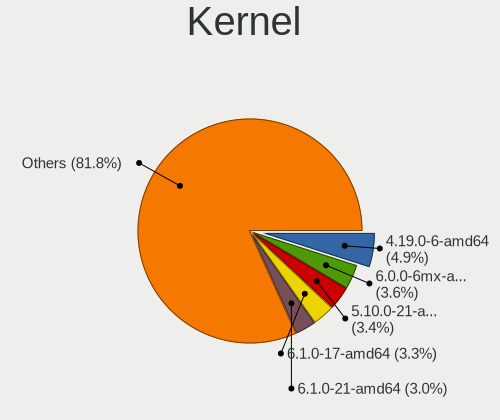

| Version                   | Computers | Percent |
|---------------------------|-----------|---------|
| 4.19.0-6-amd64            | 59        | 6.2%    |
| 5.10.0-21-amd64           | 41        | 4.31%   |
| 6.0.0-6mx-amd64           | 40        | 4.21%   |
| 6.1.0-17-amd64            | 32        | 3.36%   |
| 6.1.0-13-amd64            | 30        | 3.15%   |
| 6.1.0-10-amd64            | 27        | 2.84%   |
| 5.10.0-23-amd64           | 25        | 2.63%   |
| 5.10.0-20-amd64           | 24        | 2.52%   |
| 5.10.0-5mx-amd64          | 23        | 2.42%   |
| 5.10.0-18-amd64           | 20        | 2.1%    |
| 5.10.0-13-amd64           | 20        | 2.1%    |
| 6.5.0-1mx-ahs-amd64       | 19        | 2%      |
| 6.4.0-1mx-ahs-amd64       | 19        | 2%      |
| 5.14.0-4mx-amd64          | 18        | 1.89%   |
| 5.10.0-9-amd64            | 18        | 1.89%   |
| 5.10.0-19-amd64           | 18        | 1.89%   |
| 6.1.0-18-amd64            | 17        | 1.79%   |
| 5.6.0-2-amd64             | 17        | 1.79%   |
| 5.8.0-3-amd64             | 15        | 1.58%   |
| 5.16.0-5mx-amd64          | 14        | 1.47%   |
| 5.10.0-16-amd64           | 13        | 1.37%   |
| 5.18.0-4mx-amd64          | 11        | 1.16%   |
| 4.19.0-14-amd64           | 10        | 1.05%   |
| 4.19.0-13-amd64           | 10        | 1.05%   |
| 6.6.12-1-liquorix-amd64   | 9         | 0.95%   |
| 6.1.0-20-amd64            | 9         | 0.95%   |
| 6.0.0-10.1-liquorix-amd64 | 9         | 0.95%   |
| 4.19.0-17-amd64           | 9         | 0.95%   |
| 6.1.0-9-amd64             | 8         | 0.84%   |
| 6.1.0-11-amd64            | 8         | 0.84%   |
| 5.10.0-28-amd64           | 8         | 0.84%   |
| 5.10.0-11-amd64           | 8         | 0.84%   |
| 4.19.0-16-amd64           | 8         | 0.84%   |
| 5.10.0-22-amd64           | 7         | 0.74%   |
| 5.10.0-14-amd64           | 7         | 0.74%   |
| 4.19.0-5-amd64            | 7         | 0.74%   |
| 6.7.12-1-liquorix-amd64   | 6         | 0.63%   |
| 5.19.0-2mx-amd64          | 6         | 0.63%   |
| 5.10.0-15-amd64           | 6         | 0.63%   |
| 4.19.0-1-amd64            | 6         | 0.63%   |

Kernel Family
-------------

Linux kernel without a distro release

| Version  | Computers | Percent |
|----------|-----------|---------|
| 5.10.0   | 272       | 29.89%  |
| 6.1.0    | 164       | 18.02%  |
| 4.19.0   | 135       | 14.84%  |
| 6.0.0    | 60        | 6.59%   |
| 6.4.0    | 23        | 2.53%   |
| 5.16.0   | 23        | 2.53%   |
| 6.5.0    | 21        | 2.31%   |
| 5.14.0   | 21        | 2.31%   |
| 5.6.0    | 19        | 2.09%   |
| 5.8.0    | 15        | 1.65%   |
| 5.18.0   | 13        | 1.43%   |
| 5.19.0   | 12        | 1.32%   |
| 6.6.12   | 9         | 0.99%   |
| 5.4.0    | 9         | 0.99%   |
| 5.17.0   | 7         | 0.77%   |
| 6.7.12   | 6         | 0.66%   |
| 5.5.0    | 6         | 0.66%   |
| 4.15.0   | 6         | 0.66%   |
| 5.15.0   | 5         | 0.55%   |
| 5.8.16   | 4         | 0.44%   |
| 5.3.0    | 4         | 0.44%   |
| 5.2.21   | 4         | 0.44%   |
| 6.6.9    | 3         | 0.33%   |
| 5.6.10   | 3         | 0.33%   |
| 6.7.5    | 2         | 0.22%   |
| 6.6.11   | 2         | 0.22%   |
| 6.6.0    | 2         | 0.22%   |
| 6.4.9    | 2         | 0.22%   |
| 6.4.15   | 2         | 0.22%   |
| 6.3.0    | 2         | 0.22%   |
| 6.2.14   | 2         | 0.22%   |
| 6.1.15   | 2         | 0.22%   |
| 5.4.7    | 2         | 0.22%   |
| 5.13.0   | 2         | 0.22%   |
| 5.11.0   | 2         | 0.22%   |
| 5.10.197 | 2         | 0.22%   |
| 4.9.193  | 2         | 0.22%   |
| 4.18.0   | 2         | 0.22%   |
| 6.7.9    | 1         | 0.11%   |
| 6.7.8    | 1         | 0.11%   |

Kernel Major Ver.
-----------------

Linux kernel major version

| Version | Computers | Percent |
|---------|-----------|---------|
| 5.10    | 280       | 30.84%  |
| 6.1     | 168       | 18.5%   |
| 4.19    | 136       | 14.98%  |
| 6.0     | 61        | 6.72%   |
| 6.4     | 29        | 3.19%   |
| 6.5     | 25        | 2.75%   |
| 5.16    | 23        | 2.53%   |
| 5.6     | 22        | 2.42%   |
| 5.14    | 21        | 2.31%   |
| 5.8     | 19        | 2.09%   |
| 6.6     | 18        | 1.98%   |
| 5.18    | 13        | 1.43%   |
| 5.4     | 12        | 1.32%   |
| 5.19    | 12        | 1.32%   |
| 6.7     | 10        | 1.1%    |
| 5.2     | 7         | 0.77%   |
| 5.17    | 7         | 0.77%   |
| 5.5     | 6         | 0.66%   |
| 4.15    | 6         | 0.66%   |
| 5.3     | 5         | 0.55%   |
| 5.15    | 5         | 0.55%   |
| 4.9     | 5         | 0.55%   |
| 6.3     | 3         | 0.33%   |
| 6.2     | 3         | 0.33%   |
| 5.13    | 2         | 0.22%   |
| 5.11    | 2         | 0.22%   |
| 4.18    | 2         | 0.22%   |
| 5.9     | 1         | 0.11%   |
| 5.7     | 1         | 0.11%   |
| 5.1     | 1         | 0.11%   |
| 5.0     | 1         | 0.11%   |
| 3.16    | 1         | 0.11%   |
| Unknown | 1         | 0.11%   |

Arch
----

OS architecture (x86_64, i586, etc.)

| Name    | Computers | Percent |
|---------|-----------|---------|
| x86_64  | 821       | 94.91%  |
| i686    | 43        | 4.97%   |
| aarch64 | 1         | 0.12%   |

DE
--

Desktop Environment

| Name             | Computers | Percent |
|------------------|-----------|---------|
| XFCE             | 644       | 73.43%  |
| KDE5             | 161       | 18.36%  |
| Unknown          | 11        | 1.25%   |
| lightdm-xsession | 8         | 0.91%   |
| i3               | 7         | 0.8%    |
| fluxbox          | 7         | 0.8%    |
| Budgie           | 7         | 0.8%    |
| LXQt             | 6         | 0.68%   |
| X-Cinnamon       | 5         | 0.57%   |
| MATE             | 5         | 0.57%   |
| GNOME            | 5         | 0.57%   |
| Trinity          | 2         | 0.23%   |
| GNOME Flashback  | 2         | 0.23%   |
| Cinnamon         | 2         | 0.23%   |
| spectrwm         | 1         | 0.11%   |
| LXDE             | 1         | 0.11%   |
| KDE4             | 1         | 0.11%   |
| KDE              | 1         | 0.11%   |
| GNOME Classic    | 1         | 0.11%   |

Display Server
--------------

X11 or Wayland

| Name    | Computers | Percent |
|---------|-----------|---------|
| X11     | 855       | 98.96%  |
| Tty     | 7         | 0.81%   |
| Web     | 1         | 0.12%   |
| Wayland | 1         | 0.12%   |

Display Manager
---------------

SDDM, LightDM, etc.

| Name    | Computers | Percent |
|---------|-----------|---------|
| LightDM | 691       | 79.33%  |
| SDDM    | 149       | 17.11%  |
| TDM     | 13        | 1.49%   |
| SLiM    | 13        | 1.49%   |
| Unknown | 3         | 0.34%   |
| GDM3    | 1         | 0.11%   |
| GDM     | 1         | 0.11%   |

OS Lang
-------

Language

| Lang    | Computers | Percent |
|---------|-----------|---------|
| en_US   | 362       | 41.09%  |
| Unknown | 104       | 11.8%   |
| de_DE   | 80        | 9.08%   |
| en_GB   | 53        | 6.02%   |
| it_IT   | 38        | 4.31%   |
| ru_RU   | 25        | 2.84%   |
| fr_FR   | 25        | 2.84%   |
| es_ES   | 22        | 2.5%    |
| pl_PL   | 21        | 2.38%   |
| en_AU   | 18        | 2.04%   |
| sk_SK   | 14        | 1.59%   |
| pt_BR   | 14        | 1.59%   |
| es_MX   | 8         | 0.91%   |
| es_AR   | 8         | 0.91%   |
| tr_TR   | 7         | 0.79%   |
| es_VE   | 6         | 0.68%   |
| en_IE   | 6         | 0.68%   |
| en_CA   | 6         | 0.68%   |
| de_CH   | 6         | 0.68%   |
| nl_NL   | 5         | 0.57%   |
| en_NZ   | 5         | 0.57%   |
| hu_HU   | 4         | 0.45%   |
| fi_FI   | 4         | 0.45%   |
| uk_UA   | 3         | 0.34%   |
| es_CO   | 3         | 0.34%   |
| el_GR   | 3         | 0.34%   |
| C       | 3         | 0.34%   |
| sv_SE   | 2         | 0.23%   |
| ja_JP   | 2         | 0.23%   |
| hr_HR   | 2         | 0.23%   |
| fr_CA   | 2         | 0.23%   |
| fr_BE   | 2         | 0.23%   |
| es_US   | 2         | 0.23%   |
| bg_BG   | 2         | 0.23%   |
| zh_CN   | 1         | 0.11%   |
| ro_RO   | 1         | 0.11%   |
| nl_BE   | 1         | 0.11%   |
| nb_NO   | 1         | 0.11%   |
| ko_KR   | 1         | 0.11%   |
| id_ID   | 1         | 0.11%   |

Boot Mode
---------

EFI or BIOS

| Mode | Computers | Percent |
|------|-----------|---------|
| EFI  | 512       | 59.12%  |
| BIOS | 354       | 40.88%  |

Filesystem
----------

Type of filesystem

| Type     | Computers | Percent |
|----------|-----------|---------|
| Ext4     | 746       | 85.85%  |
| Overlay  | 83        | 9.55%   |
| Btrfs    | 29        | 3.34%   |
| Xfs      | 3         | 0.35%   |
| Tmpfs    | 3         | 0.35%   |
| Unknown  | 2         | 0.23%   |
| Reiserfs | 1         | 0.12%   |
| F2fs     | 1         | 0.12%   |
| Ext3     | 1         | 0.12%   |

Part. scheme
------------

Scheme of partitioning

| Type    | Computers | Percent |
|---------|-----------|---------|
| GPT     | 582       | 67.05%  |
| MBR     | 279       | 32.14%  |
| Unknown | 7         | 0.81%   |

Dual Boot with Linux/BSD
------------------------

Hosting more than one Linux/BSD

| Dual boot | Computers | Percent |
|-----------|-----------|---------|
| No        | 666       | 75.6%   |
| Yes       | 215       | 24.4%   |

Dual Boot (Win)
---------------

Hosting Linux and Windows

| Dual boot | Computers | Percent |
|-----------|-----------|---------|
| No        | 505       | 58.11%  |
| Yes       | 364       | 41.89%  |

Board
-----

Vendor
------

Motherboard manufacturer

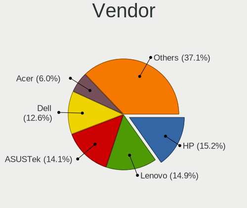

| Name                | Computers | Percent |
|---------------------|-----------|---------|
| Lenovo              | 129       | 14.93%  |
| Hewlett-Packard     | 128       | 14.81%  |
| ASUSTek Computer    | 119       | 13.77%  |
| Dell                | 106       | 12.27%  |
| Acer                | 49        | 5.67%   |
| Gigabyte Technology | 45        | 5.21%   |
| MSI                 | 35        | 4.05%   |
| Apple               | 35        | 4.05%   |
| ASRock              | 30        | 3.47%   |
| Toshiba             | 16        | 1.85%   |
| Intel               | 15        | 1.74%   |
| Sony                | 14        | 1.62%   |
| Medion              | 11        | 1.27%   |
| Samsung Electronics | 10        | 1.16%   |
| Google              | 8         | 0.93%   |
| Fujitsu Siemens     | 7         | 0.81%   |
| Unknown             | 7         | 0.81%   |
| Foxconn             | 5         | 0.58%   |
| Alienware           | 5         | 0.58%   |
| ZOTAC               | 4         | 0.46%   |
| Gateway             | 4         | 0.46%   |
| AZW                 | 4         | 0.46%   |
| AMI                 | 4         | 0.46%   |
| Notebook            | 3         | 0.35%   |
| Fujitsu             | 3         | 0.35%   |
| Biostar             | 3         | 0.35%   |
| TUXEDO              | 2         | 0.23%   |
| Pegatron            | 2         | 0.23%   |
| Microsoft           | 2         | 0.23%   |
| HONOR               | 2         | 0.23%   |
| GPU Company         | 2         | 0.23%   |
| ECS                 | 2         | 0.23%   |
| Clevo               | 2         | 0.23%   |
| Chuwi               | 2         | 0.23%   |
| win element         | 1         | 0.12%   |
| Vulcan Electronics  | 1         | 0.12%   |
| VIT                 | 1         | 0.12%   |
| UMAX                | 1         | 0.12%   |
| Teclast             | 1         | 0.12%   |
| Sun Microsystems    | 1         | 0.12%   |

Model
-----

Motherboard model

| Name                                  | Computers | Percent |
|---------------------------------------|-----------|---------|
| Unknown                               | 12        | 1.39%   |
| ASUS All Series                       | 10        | 1.16%   |
| HP Notebook                           | 4         | 0.46%   |
| AZW SER                               | 4         | 0.46%   |
| Lenovo ThinkBook 15 G3 ACL 21A4       | 3         | 0.35%   |
| HP Pavilion Laptop 15-eh1xxx          | 3         | 0.35%   |
| HP 250 15.6 inch G9 Notebook PC       | 3         | 0.35%   |
| Foxconn Pro3500 Series                | 3         | 0.35%   |
| Dell OptiPlex 9010                    | 3         | 0.35%   |
| Toshiba Satellite P875                | 2         | 0.23%   |
| Samsung 305E4A/305E5A/305E7A          | 2         | 0.23%   |
| MSI MS-7C91                           | 2         | 0.23%   |
| MSI MS-7A34                           | 2         | 0.23%   |
| Intel H81                             | 2         | 0.23%   |
| HP Stream Laptop 14-cb0XX             | 2         | 0.23%   |
| HP Spectre x360 Convertible 15-df1xxx | 2         | 0.23%   |
| HP ProBook 650 G1                     | 2         | 0.23%   |
| HP ProBook 450 G1                     | 2         | 0.23%   |
| HP Pavilion g6                        | 2         | 0.23%   |
| HP Pavilion dv6                       | 2         | 0.23%   |
| HP Laptop 17-ak0xx                    | 2         | 0.23%   |
| HP EliteBook 840 G6                   | 2         | 0.23%   |
| HP Compaq 8100 Elite SFF PC           | 2         | 0.23%   |
| Gigabyte GA-MA785GM-US2H              | 2         | 0.23%   |
| Dell Studio 540                       | 2         | 0.23%   |
| Dell OptiPlex 9020                    | 2         | 0.23%   |
| Dell OptiPlex 790                     | 2         | 0.23%   |
| Dell OptiPlex 780                     | 2         | 0.23%   |
| Dell OptiPlex 760                     | 2         | 0.23%   |
| Dell OptiPlex 755                     | 2         | 0.23%   |
| Dell Latitude E6540                   | 2         | 0.23%   |
| Dell Latitude E6410                   | 2         | 0.23%   |
| Dell Latitude E6320                   | 2         | 0.23%   |
| Dell Latitude 5530                    | 2         | 0.23%   |
| Dell Inspiron 13-5378                 | 2         | 0.23%   |
| Chuwi GemiBook Pro                    | 2         | 0.23%   |
| ASUS ZenBook UX363EA_UX363EA          | 2         | 0.23%   |
| ASUS X200CA                           | 2         | 0.23%   |
| ASUS ROG Maximus XIII HERO            | 2         | 0.23%   |
| ASUS PRIME B450M-A                    | 2         | 0.23%   |

Model Family
------------

Motherboard model prefix

| Name                  | Computers | Percent |
|-----------------------|-----------|---------|
| Lenovo ThinkPad       | 68        | 7.87%   |
| Dell Latitude         | 36        | 4.17%   |
| Acer Aspire           | 33        | 3.82%   |
| Dell Inspiron         | 21        | 2.43%   |
| Dell OptiPlex         | 19        | 2.2%    |
| Lenovo IdeaPad        | 18        | 2.08%   |
| HP Pavilion           | 17        | 1.97%   |
| HP Compaq             | 14        | 1.62%   |
| ASUS VivoBook         | 14        | 1.62%   |
| Toshiba Satellite     | 13        | 1.5%    |
| HP ProBook            | 13        | 1.5%    |
| HP EliteBook          | 13        | 1.5%    |
| HP Laptop             | 12        | 1.39%   |
| Unknown               | 12        | 1.39%   |
| ASUS TUF              | 11        | 1.27%   |
| ASUS PRIME            | 10        | 1.16%   |
| ASUS All              | 10        | 1.16%   |
| Dell Precision        | 8         | 0.93%   |
| ASUS ROG              | 8         | 0.93%   |
| Dell Vostro           | 7         | 0.81%   |
| HP 250                | 6         | 0.69%   |
| Lenovo ThinkBook      | 5         | 0.58%   |
| HP ZBook              | 5         | 0.58%   |
| HP Spectre            | 5         | 0.58%   |
| Dell XPS              | 5         | 0.58%   |
| Acer Extensa          | 5         | 0.58%   |
| Lenovo Yoga           | 4         | 0.46%   |
| Lenovo MIIX           | 4         | 0.46%   |
| Lenovo Legion         | 4         | 0.46%   |
| HP Notebook           | 4         | 0.46%   |
| HP ENVY               | 4         | 0.46%   |
| Fujitsu Siemens AMILO | 4         | 0.46%   |
| AZW SER               | 4         | 0.46%   |
| Lenovo ThinkCentre    | 3         | 0.35%   |
| Lenovo IdeaCentre     | 3         | 0.35%   |
| HP ProLiant           | 3         | 0.35%   |
| Foxconn Pro3500       | 3         | 0.35%   |
| Dell System           | 3         | 0.35%   |
| ASUS ZenBook          | 3         | 0.35%   |
| ASUS SABERTOOTH       | 3         | 0.35%   |

MFG Year
--------

Motherboard manufacture year

| Year    | Computers | Percent |
|---------|-----------|---------|
| 2021    | 78        | 9.03%   |
| 2013    | 69        | 7.99%   |
| 2018    | 67        | 7.75%   |
| 2011    | 64        | 7.41%   |
| 2012    | 62        | 7.18%   |
| 2019    | 61        | 7.06%   |
| 2022    | 55        | 6.37%   |
| 2020    | 53        | 6.13%   |
| 2010    | 52        | 6.02%   |
| 2016    | 45        | 5.21%   |
| 2014    | 42        | 4.86%   |
| 2017    | 39        | 4.51%   |
| 2015    | 39        | 4.51%   |
| 2008    | 33        | 3.82%   |
| 2009    | 32        | 3.7%    |
| 2007    | 26        | 3.01%   |
| 2023    | 23        | 2.66%   |
| 2006    | 13        | 1.5%    |
| 2005    | 8         | 0.93%   |
| Unknown | 2         | 0.23%   |
| 2004    | 1         | 0.12%   |

Form Factor
-----------

Physical design of the computer

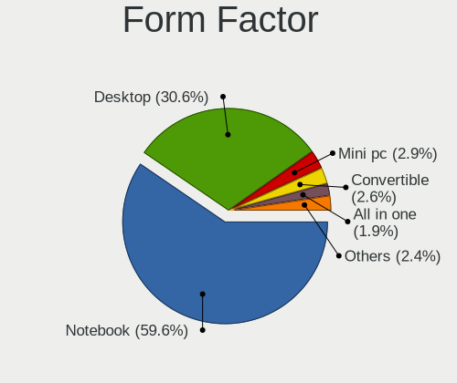

| Name           | Computers | Percent |
|----------------|-----------|---------|
| Notebook       | 520       | 60.19%  |
| Desktop        | 265       | 30.67%  |
| Mini pc        | 23        | 2.66%   |
| Convertible    | 21        | 2.43%   |
| All in one     | 16        | 1.85%   |
| Tablet         | 12        | 1.39%   |
| Server         | 6         | 0.69%   |
| System on chip | 1         | 0.12%   |

Secure Boot
-----------

Enabled or disabled

| State    | Computers | Percent |
|----------|-----------|---------|
| Disabled | 852       | 98.61%  |
| Enabled  | 12        | 1.39%   |

Coreboot
--------

Have coreboot on board

| Used | Computers | Percent |
|------|-----------|---------|
| No   | 854       | 98.84%  |
| Yes  | 10        | 1.16%   |

RAM Size
--------

Total RAM memory

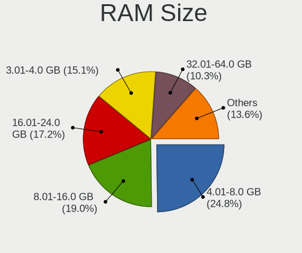

| Size in GB  | Computers | Percent |
|-------------|-----------|---------|
| 4.01-8.0    | 215       | 24.77%  |
| 8.01-16.0   | 165       | 19.01%  |
| 16.01-24.0  | 146       | 16.82%  |
| 3.01-4.0    | 143       | 16.47%  |
| 32.01-64.0  | 85        | 9.79%   |
| 1.01-2.0    | 59        | 6.8%    |
| 24.01-32.0  | 18        | 2.07%   |
| 2.01-3.0    | 15        | 1.73%   |
| 64.01-256.0 | 13        | 1.5%    |
| 0.51-1.0    | 9         | 1.04%   |

RAM Used
--------

Used RAM memory

| Used GB    | Computers | Percent |
|------------|-----------|---------|
| 1.01-2.0   | 323       | 35.57%  |
| 2.01-3.0   | 263       | 28.96%  |
| 3.01-4.0   | 126       | 13.88%  |
| 4.01-8.0   | 103       | 11.34%  |
| 0.51-1.0   | 65        | 7.16%   |
| 8.01-16.0  | 18        | 1.98%   |
| 0.01-0.5   | 7         | 0.77%   |
| 16.01-24.0 | 3         | 0.33%   |

Total Drives
------------

Number of drives on board

| Drives | Computers | Percent |
|--------|-----------|---------|
| 1      | 544       | 61.89%  |
| 2      | 205       | 23.32%  |
| 3      | 75        | 8.53%   |
| 4      | 26        | 2.96%   |
| 5      | 12        | 1.37%   |
| 0      | 7         | 0.8%    |
| 8      | 4         | 0.46%   |
| 7      | 3         | 0.34%   |
| 6      | 2         | 0.23%   |
| 9      | 1         | 0.11%   |

Has CD-ROM
----------

Has CD-ROM on board

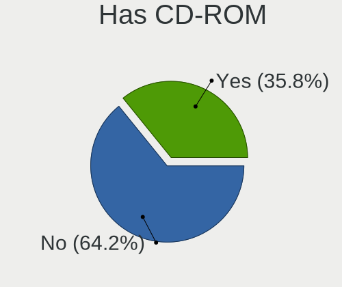

| Presented | Computers | Percent |
|-----------|-----------|---------|
| No        | 547       | 63.02%  |
| Yes       | 321       | 36.98%  |

Has Ethernet
------------

Has Ethernet on board

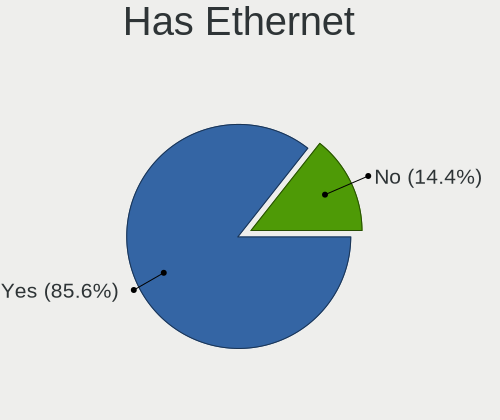

| Presented | Computers | Percent |
|-----------|-----------|---------|
| Yes       | 743       | 86%     |
| No        | 121       | 14%     |

Has WiFi
--------

Has WiFi module

| Presented | Computers | Percent |
|-----------|-----------|---------|
| Yes       | 705       | 81.41%  |
| No        | 161       | 18.59%  |

Has Bluetooth
-------------

Has Bluetooth module

| Presented | Computers | Percent |
|-----------|-----------|---------|
| Yes       | 537       | 62.01%  |
| No        | 329       | 37.99%  |

Location
--------

Country
-------

Geographic location (country)

| Country      | Computers | Percent |
|--------------|-----------|---------|
| USA          | 188       | 21.61%  |
| Germany      | 89        | 10.23%  |
| Italy        | 47        | 5.4%    |
| UK           | 43        | 4.94%   |
| Canada       | 35        | 4.02%   |
| France       | 33        | 3.79%   |
| Russia       | 31        | 3.56%   |
| Spain        | 29        | 3.33%   |
| Australia    | 28        | 3.22%   |
| Poland       | 26        | 2.99%   |
| Brazil       | 23        | 2.64%   |
| India        | 22        | 2.53%   |
| Greece       | 21        | 2.41%   |
| Slovakia     | 19        | 2.18%   |
| Netherlands  | 15        | 1.72%   |
| Mexico       | 11        | 1.26%   |
| Finland      | 11        | 1.26%   |
| Sweden       | 10        | 1.15%   |
| Serbia       | 10        | 1.15%   |
| Turkey       | 9         | 1.03%   |
| Austria      | 9         | 1.03%   |
| Switzerland  | 8         | 0.92%   |
| Romania      | 8         | 0.92%   |
| Indonesia    | 8         | 0.92%   |
| Argentina    | 8         | 0.92%   |
| New Zealand  | 7         | 0.8%    |
| Belgium      | 7         | 0.8%    |
| Venezuela    | 6         | 0.69%   |
| Ukraine      | 6         | 0.69%   |
| Hungary      | 6         | 0.69%   |
| South Africa | 5         | 0.57%   |
| Thailand     | 4         | 0.46%   |
| Portugal     | 4         | 0.46%   |
| Ireland      | 4         | 0.46%   |
| Egypt        | 4         | 0.46%   |
| Denmark      | 4         | 0.46%   |
| Czechia      | 4         | 0.46%   |
| Colombia     | 4         | 0.46%   |
| Chile        | 4         | 0.46%   |
| Algeria      | 4         | 0.46%   |

City
----

Geographic location (city)

| City           | Computers | Percent |
|----------------|-----------|---------|
| Bratislava     | 17        | 1.89%   |
| Berlin         | 13        | 1.44%   |
| Athens         | 12        | 1.33%   |
| Sydney         | 10        | 1.11%   |
| Moscow         | 10        | 1.11%   |
| Melbourne      | 10        | 1.11%   |
| Vienna         | 8         | 0.89%   |
| Milan          | 8         | 0.89%   |
| Warsaw         | 7         | 0.78%   |
| Bengaluru      | 7         | 0.78%   |
| St Petersburg  | 6         | 0.67%   |
| Paris          | 6         | 0.67%   |
| Seattle        | 5         | 0.56%   |
| Los Angeles    | 5         | 0.56%   |
| Budapest       | 5         | 0.56%   |
| Belgrade       | 5         | 0.56%   |
| Rome           | 4         | 0.44%   |
| Otwock         | 4         | 0.44%   |
| Madrid         | 4         | 0.44%   |
| Hamburg        | 4         | 0.44%   |
| Calgary        | 4         | 0.44%   |
| Cairo          | 4         | 0.44%   |
| Birmingham     | 4         | 0.44%   |
| Amsterdam      | 4         | 0.44%   |
| Stockholm      | 3         | 0.33%   |
| Singapore      | 3         | 0.33%   |
| Portland       | 3         | 0.33%   |
| Patna          | 3         | 0.33%   |
| Oxford         | 3         | 0.33%   |
| Oakland        | 3         | 0.33%   |
| Nashville      | 3         | 0.33%   |
| Munich         | 3         | 0.33%   |
| Montreal       | 3         | 0.33%   |
| Mesquite       | 3         | 0.33%   |
| Krakow         | 3         | 0.33%   |
| Johannesburg   | 3         | 0.33%   |
| Istanbul       | 3         | 0.33%   |
| Helsinki       | 3         | 0.33%   |
| Florianpolis | 3         | 0.33%   |
| Florence       | 3         | 0.33%   |

Drives
------

Drive Vendor
------------

Hard drive vendors

| Vendor              | Computers | Drives | Percent |
|---------------------|-----------|--------|---------|
| WDC                 | 178       | 212    | 14.13%  |
| Samsung Electronics | 175       | 244    | 13.89%  |
| Seagate             | 144       | 199    | 11.43%  |
| Kingston            | 79        | 85     | 6.27%   |
| SanDisk             | 66        | 73     | 5.24%   |
| Toshiba             | 64        | 73     | 5.08%   |
| Crucial             | 60        | 99     | 4.76%   |
| Unknown             | 59        | 72     | 4.68%   |
| SK hynix            | 41        | 42     | 3.25%   |
| Hitachi             | 41        | 51     | 3.25%   |
| Intel               | 31        | 40     | 2.46%   |
| China               | 20        | 27     | 1.59%   |
| HGST                | 19        | 24     | 1.51%   |
| A-DATA Technology   | 19        | 22     | 1.51%   |
| Micron Technology   | 18        | 23     | 1.43%   |
| Apple               | 15        | 20     | 1.19%   |
| SPCC                | 14        | 14     | 1.11%   |
| PNY                 | 14        | 16     | 1.11%   |
| Unknown             | 12        | 12     | 0.95%   |
| KIOXIA              | 11        | 15     | 0.87%   |
| Team                | 8         | 8      | 0.63%   |
| LITEON              | 8         | 8      | 0.63%   |
| Corsair             | 8         | 8      | 0.63%   |
| Netac               | 7         | 8      | 0.56%   |
| Fujitsu             | 7         | 7      | 0.56%   |
| Apacer              | 7         | 7      | 0.56%   |
| Transcend           | 6         | 6      | 0.48%   |
| GOODRAM             | 6         | 7      | 0.48%   |
| Silicon Motion      | 5         | 5      | 0.4%    |
| Patriot             | 5         | 7      | 0.4%    |
| Maxtor              | 5         | 6      | 0.4%    |
| Intenso             | 5         | 5      | 0.4%    |
| Phison              | 4         | 5      | 0.32%   |
| Mushkin             | 4         | 4      | 0.32%   |
| LITEONIT            | 4         | 4      | 0.32%   |
| KingSpec            | 4         | 5      | 0.32%   |
| Gigabyte Technology | 4         | 4      | 0.32%   |
| Phison Electronics  | 3         | 4      | 0.24%   |
| OCZ                 | 3         | 3      | 0.24%   |
| Lexar               | 3         | 3      | 0.24%   |

Drive Model
-----------

Hard drive models

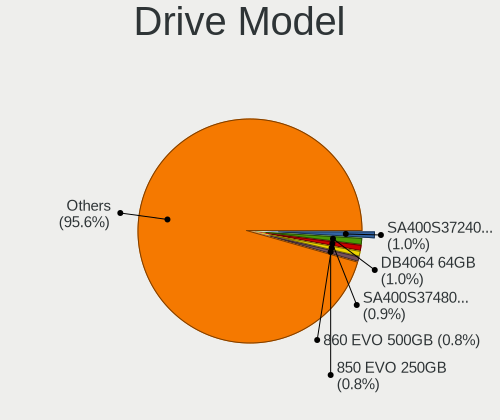

| Model                                  | Computers | Percent |
|----------------------------------------|-----------|---------|
| Kingston SA400S37480G 480GB SSD        | 14        | 1.02%   |
| Samsung SSD 860 EVO 500GB              | 13        | 0.95%   |
| Kingston SA400S37240G 240GB SSD        | 13        | 0.95%   |
| Unknown                                | 12        | 0.88%   |
| Samsung SSD 850 EVO 250GB              | 10        | 0.73%   |
| Toshiba MQ01ABF050 500GB               | 9         | 0.66%   |
| Seagate ST1000LM035-1RK172 1TB         | 9         | 0.66%   |
| Kingston SV300S37A120G 120GB SSD       | 8         | 0.58%   |
| Kingston SA400S37120G 120GB SSD        | 8         | 0.58%   |
| Seagate ST4000DM004-2CV104 4TB         | 7         | 0.51%   |
| Seagate ST2000DM008-2FR102 2TB         | 7         | 0.51%   |
| SanDisk NVMe SSD Drive 512GB           | 7         | 0.51%   |
| Samsung SSD 980 PRO 1TB                | 7         | 0.51%   |
| Samsung SSD 970 EVO Plus 1TB           | 7         | 0.51%   |
| Samsung SSD 860 EVO 250GB              | 7         | 0.51%   |
| Seagate ST500DM002-1BD142 500GB        | 6         | 0.44%   |
| Seagate ST1000DM010-2EP102 1TB         | 6         | 0.44%   |
| Samsung SSD 970 EVO Plus 500GB         | 6         | 0.44%   |
| Intel SSDPEKNU512GZ 512GB              | 6         | 0.44%   |
| HGST HTS721010A9E630 1TB               | 6         | 0.44%   |
| Crucial CT500MX500SSD1 500GB           | 6         | 0.44%   |
| Crucial CT120BX500SSD1 120GB           | 6         | 0.44%   |
| WDC WD5000LPVX-22V0TT0 500GB           | 5         | 0.36%   |
| Unknown SD/MMC/MS PRO 128GB            | 5         | 0.36%   |
| SK hynix SKHynix_HFM512GD3HX015N 512GB | 5         | 0.36%   |
| Seagate ST500LM021-1KJ152 500GB        | 5         | 0.36%   |
| Seagate ST1000LM048-2E7172 1TB         | 5         | 0.36%   |
| SanDisk NVMe SSD Drive 1TB             | 5         | 0.36%   |
| Samsung SSD 980 500GB                  | 5         | 0.36%   |
| Samsung SSD 870 EVO 500GB              | 5         | 0.36%   |
| Samsung SSD 860 EVO 1TB                | 5         | 0.36%   |
| Samsung SSD 850 EVO 500GB              | 5         | 0.36%   |
| Kingston SV300S37A240G 240GB SSD       | 5         | 0.36%   |
| Crucial CT1000MX500SSD1 1TB            | 5         | 0.36%   |
| WDC WD10JPVX-22JC3T0 1TB               | 4         | 0.29%   |
| WDC WD10EZEX-60WN4A0 1TB               | 4         | 0.29%   |
| WDC WD10EZEX-00BN5A0 1TB               | 4         | 0.29%   |
| Toshiba DT01ACA100 1TB                 | 4         | 0.29%   |
| SPCC Solid State Disk 1TB              | 4         | 0.29%   |
| Seagate ST3500413AS 500GB              | 4         | 0.29%   |

HDD Vendor
----------

Hard disk drive vendors

| Vendor              | Computers | Drives | Percent |
|---------------------|-----------|--------|---------|
| Seagate             | 144       | 197    | 33.57%  |
| WDC                 | 131       | 161    | 30.54%  |
| Toshiba             | 52        | 60     | 12.12%  |
| Hitachi             | 41        | 51     | 9.56%   |
| HGST                | 19        | 24     | 4.43%   |
| Samsung Electronics | 14        | 18     | 3.26%   |
| Fujitsu             | 7         | 7      | 1.63%   |
| Unknown             | 5         | 5      | 1.17%   |
| Maxtor              | 5         | 6      | 1.17%   |
| Apple               | 3         | 3      | 0.7%    |
| SABRENT             | 2         | 4      | 0.47%   |
| Hewlett-Packard     | 2         | 7      | 0.47%   |
| Space ke            | 1         | 2      | 0.23%   |
| IBM/Hitachi         | 1         | 1      | 0.23%   |
| External            | 1         | 1      | 0.23%   |
| ASMT                | 1         | 1      | 0.23%   |

SSD Vendor
----------

Solid state drive vendors

| Vendor              | Computers | Drives | Percent |
|---------------------|-----------|--------|---------|
| Samsung Electronics | 97        | 129    | 20%     |
| Kingston            | 62        | 67     | 12.78%  |
| Crucial             | 49        | 81     | 10.1%   |
| SanDisk             | 41        | 45     | 8.45%   |
| WDC                 | 22        | 23     | 4.54%   |
| China               | 20        | 27     | 4.12%   |
| A-DATA Technology   | 17        | 20     | 3.51%   |
| PNY                 | 13        | 14     | 2.68%   |
| SPCC                | 12        | 12     | 2.47%   |
| SK hynix            | 10        | 10     | 2.06%   |
| Intel               | 10        | 14     | 2.06%   |
| Micron Technology   | 9         | 14     | 1.86%   |
| Apple               | 9         | 12     | 1.86%   |
| LITEON              | 7         | 7      | 1.44%   |
| Transcend           | 6         | 6      | 1.24%   |
| Netac               | 6         | 6      | 1.24%   |
| GOODRAM             | 6         | 7      | 1.24%   |
| Team                | 5         | 5      | 1.03%   |
| Intenso             | 5         | 5      | 1.03%   |
| Toshiba             | 4         | 4      | 0.82%   |
| Patriot             | 4         | 5      | 0.82%   |
| LITEONIT            | 4         | 4      | 0.82%   |
| KingSpec            | 4         | 5      | 0.82%   |
| Apacer              | 4         | 4      | 0.82%   |
| OCZ                 | 3         | 3      | 0.62%   |
| Mushkin             | 3         | 3      | 0.62%   |
| Gigabyte Technology | 3         | 3      | 0.62%   |
| Dogfish             | 3         | 3      | 0.62%   |
| Corsair             | 3         | 3      | 0.62%   |
| WALRAM              | 2         | 2      | 0.41%   |
| Teclast             | 2         | 2      | 0.41%   |
| KingFast            | 2         | 2      | 0.41%   |
| KingDian            | 2         | 2      | 0.41%   |
| Indilinx            | 2         | 4      | 0.41%   |
| HS-SSD-C100         | 2         | 2      | 0.41%   |
| GeIL                | 2         | 2      | 0.41%   |
| EYOTA               | 2         | 2      | 0.41%   |
| Unknown             | 2         | 2      | 0.41%   |
| ZTC                 | 1         | 1      | 0.21%   |
| Yeyian              | 1         | 1      | 0.21%   |

Drive Kind
----------

HDD or SSD

| Kind    | Computers | Drives | Percent |
|---------|-----------|--------|---------|
| SSD     | 416       | 591    | 36.98%  |
| HDD     | 370       | 548    | 32.89%  |
| NVMe    | 267       | 335    | 23.73%  |
| MMC     | 65        | 80     | 5.78%   |
| Unknown | 7         | 11     | 0.62%   |

Drive Connector
---------------

SATA, SAS, NVMe, etc.

| Type | Computers | Drives | Percent |
|------|-----------|--------|---------|
| SATA | 627       | 1097   | 63.14%  |
| NVMe | 266       | 333    | 26.79%  |
| MMC  | 65        | 80     | 6.55%   |
| SAS  | 35        | 55     | 3.52%   |

Drive Size
----------

Size of hard drive

| Size in TB | Computers | Drives | Percent |
|------------|-----------|--------|---------|
| 0.01-0.5   | 506       | 706    | 62.55%  |
| 0.51-1.0   | 205       | 290    | 25.34%  |
| 1.01-2.0   | 57        | 78     | 7.05%   |
| 3.01-4.0   | 15        | 17     | 1.85%   |
| 2.01-3.0   | 13        | 16     | 1.61%   |
| 4.01-10.0  | 11        | 28     | 1.36%   |
| 10.01-20.0 | 2         | 4      | 0.25%   |

Space Total
-----------

Amount of disk space available on the file system

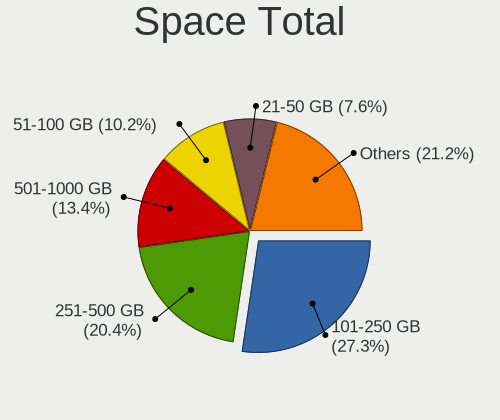

| Size in GB     | Computers | Percent |
|----------------|-----------|---------|
| 101-250        | 239       | 26.7%   |
| 251-500        | 177       | 19.78%  |
| 501-1000       | 116       | 12.96%  |
| 51-100         | 99        | 11.06%  |
| 21-50          | 75        | 8.38%   |
| 1-20           | 62        | 6.93%   |
| 1001-2000      | 59        | 6.59%   |
| More than 3000 | 38        | 4.25%   |
| 2001-3000      | 27        | 3.02%   |
| Unknown        | 3         | 0.34%   |

Space Used
----------

Amount of used disk space

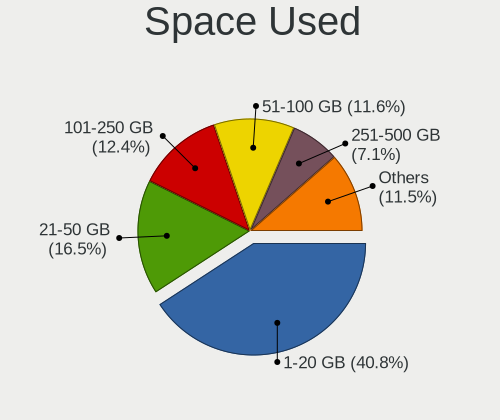

| Used GB        | Computers | Percent |
|----------------|-----------|---------|
| 1-20           | 369       | 40.73%  |
| 21-50          | 142       | 15.67%  |
| 101-250        | 119       | 13.13%  |
| 51-100         | 107       | 11.81%  |
| 251-500        | 67        | 7.4%    |
| 501-1000       | 39        | 4.3%    |
| 1001-2000      | 32        | 3.53%   |
| More than 3000 | 18        | 1.99%   |
| 2001-3000      | 10        | 1.1%    |
| Unknown        | 3         | 0.33%   |

Malfunc. Drives
---------------

Drive models with a malfunction

| Model                             | Computers | Drives | Percent |
|-----------------------------------|-----------|--------|---------|
| WDC WD5000LPVX-22V0TT0 500GB      | 3         | 3      | 1.68%   |
| Toshiba MQ01ABF050 500GB          | 3         | 3      | 1.68%   |
| Seagate ST9500325AS 500GB         | 3         | 3      | 1.68%   |
| Seagate ST1000LM035-1RK172 1TB    | 3         | 3      | 1.68%   |
| Hitachi HTS545050A7E380 500GB     | 3         | 3      | 1.68%   |
| HGST HTS545050A7E680 500GB        | 3         | 4      | 1.68%   |
| Toshiba MK7575GSX 752GB           | 2         | 3      | 1.12%   |
| Toshiba MK5059GSXP 500GB          | 2         | 2      | 1.12%   |
| Seagate ST500LT012-9WS142 500GB   | 2         | 2      | 1.12%   |
| SanDisk SSD PLUS 480GB            | 2         | 2      | 1.12%   |
| Kingston SV300S37A120G 120GB SSD  | 2         | 2      | 1.12%   |
| Indilinx IND-S325S120G 120GB SSD  | 2         | 4      | 1.12%   |
| Hitachi HUA722020ALA331 2TB       | 2         | 2      | 1.12%   |
| HGST HTS545050A7E380 500GB        | 2         | 2      | 1.12%   |
| China SSD 512GB                   | 2         | 2      | 1.12%   |
| A-DATA Technology SU650 240GB SSD | 2         | 2      | 1.12%   |
| WDC WDS100T2B0A-00SM50 1TB SSD    | 1         | 1      | 0.56%   |
| WDC WD5003ABYX-01WERA1 500GB      | 1         | 1      | 0.56%   |
| WDC WD5000LPCX-60VHAT1 500GB      | 1         | 1      | 0.56%   |
| WDC WD5000BPVT-60HXZT3 500GB      | 1         | 1      | 0.56%   |
| WDC WD5000AAKS-40V6A0 500GB       | 1         | 1      | 0.56%   |
| WDC WD40EZRX-00SPEB0 4TB          | 1         | 1      | 0.56%   |
| WDC WD3200LPVX-22V0TT0 320GB      | 1         | 1      | 0.56%   |
| WDC WD3200BPVT-80ZEST0 320GB      | 1         | 1      | 0.56%   |
| WDC WD3200BPVT-24JJ5T0 320GB      | 1         | 1      | 0.56%   |
| WDC WD3200BEVT-22ZCT0 320GB       | 1         | 1      | 0.56%   |
| WDC WD3200BEKT-60PVMT0 320GB      | 1         | 1      | 0.56%   |
| WDC WD3200AAKS-00UU3A0 320GB      | 1         | 1      | 0.56%   |
| WDC WD3200AAJS-00B4A0 320GB       | 1         | 1      | 0.56%   |
| WDC WD2500AAJS-00B4A0 250GB       | 1         | 3      | 0.56%   |
| WDC WD20EZRX-00D8PB0 2TB          | 1         | 1      | 0.56%   |
| WDC WD20EFRX-68EUZN0 2TB          | 1         | 2      | 0.56%   |
| WDC WD20EARX-00PASB0 2TB          | 1         | 1      | 0.56%   |
| WDC WD20EARS-00J99B0 2TB          | 1         | 1      | 0.56%   |
| WDC WD1600BEVT-22ZCT0 160GB       | 1         | 1      | 0.56%   |
| WDC WD1600BEVT-22A23T0 160GB      | 1         | 1      | 0.56%   |
| WDC WD1600BEKT-75PVMT0 160GB      | 1         | 1      | 0.56%   |
| WDC WD1600AVVS-63L2B0 160GB       | 1         | 1      | 0.56%   |
| WDC WD15EADS-11P8B2 1TB           | 1         | 1      | 0.56%   |
| WDC WD10EZRZ-00HTKB0 1TB          | 1         | 1      | 0.56%   |

Malfunc. Drive Vendor
---------------------

Vendors of faulty drives

| Vendor              | Computers | Drives | Percent |
|---------------------|-----------|--------|---------|
| Seagate             | 38        | 44     | 21.59%  |
| WDC                 | 33        | 37     | 18.75%  |
| Hitachi             | 19        | 21     | 10.8%   |
| Toshiba             | 13        | 14     | 7.39%   |
| Samsung Electronics | 13        | 19     | 7.39%   |
| HGST                | 10        | 11     | 5.68%   |
| SanDisk             | 5         | 5      | 2.84%   |
| Crucial             | 5         | 26     | 2.84%   |
| Maxtor              | 4         | 4      | 2.27%   |
| Kingston            | 4         | 4      | 2.27%   |
| Intel               | 4         | 5      | 2.27%   |
| Fujitsu             | 4         | 4      | 2.27%   |
| SK hynix            | 3         | 3      | 1.7%    |
| A-DATA Technology   | 3         | 4      | 1.7%    |
| Netac               | 2         | 2      | 1.14%   |
| Micron Technology   | 2         | 2      | 1.14%   |
| Indilinx            | 2         | 4      | 1.14%   |
| China               | 2         | 2      | 1.14%   |
| SPCC                | 1         | 1      | 0.57%   |
| RENICE              | 1         | 1      | 0.57%   |
| OCZ                 | 1         | 1      | 0.57%   |
| LITEONIT            | 1         | 1      | 0.57%   |
| Lexar               | 1         | 1      | 0.57%   |
| KingSpec            | 1         | 1      | 0.57%   |
| Intenso             | 1         | 1      | 0.57%   |
| IBM/Hitachi         | 1         | 1      | 0.57%   |
| GOODRAM             | 1         | 1      | 0.57%   |
| Apple               | 1         | 1      | 0.57%   |

Malfunc. HDD Vendor
-------------------

Vendors of faulty HDD drives

| Vendor              | Computers | Drives | Percent |
|---------------------|-----------|--------|---------|
| Seagate             | 38        | 44     | 30.65%  |
| WDC                 | 31        | 35     | 25%     |
| Hitachi             | 19        | 21     | 15.32%  |
| Toshiba             | 12        | 13     | 9.68%   |
| HGST                | 10        | 11     | 8.06%   |
| Samsung Electronics | 5         | 7      | 4.03%   |
| Maxtor              | 4         | 4      | 3.23%   |
| Fujitsu             | 4         | 4      | 3.23%   |
| IBM/Hitachi         | 1         | 1      | 0.81%   |

Malfunc. Drive Kind
-------------------

Kinds of faulty drives

| Kind | Computers | Drives | Percent |
|------|-----------|--------|---------|
| HDD  | 120       | 140    | 70.18%  |
| SSD  | 46        | 70     | 26.9%   |
| NVMe | 5         | 11     | 2.92%   |

Failed Drives
-------------

Failed drive models

| Model                     | Computers | Drives | Percent |
|---------------------------|-----------|--------|---------|
| Toshiba MK5065GSX 500GB   | 2         | 2      | 66.67%  |
| Seagate ST3500418AS 500GB | 1         | 2      | 33.33%  |

Failed Drive Vendor
-------------------

Failed drive vendors

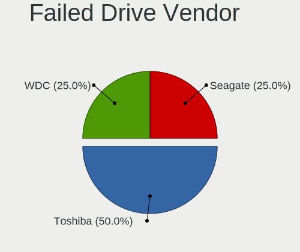

| Vendor  | Computers | Drives | Percent |
|---------|-----------|--------|---------|
| Toshiba | 2         | 2      | 66.67%  |
| Seagate | 1         | 2      | 33.33%  |

Drive Status
------------

Number of failed and malfunc. drives

| Status   | Computers | Drives | Percent |
|----------|-----------|--------|---------|
| Works    | 698       | 1162   | 69.94%  |
| Malfunc  | 167       | 221    | 16.73%  |
| Detected | 130       | 178    | 13.03%  |
| Failed   | 3         | 4      | 0.3%    |

Storage controller
------------------

Storage Vendor
--------------

Storage controller vendors

| Vendor                         | Computers | Percent |
|--------------------------------|-----------|---------|
| Intel                          | 567       | 53.54%  |
| AMD                            | 152       | 14.35%  |
| Samsung Electronics            | 82        | 7.74%   |
| SanDisk                        | 45        | 4.25%   |
| SK hynix                       | 26        | 2.46%   |
| Nvidia                         | 20        | 1.89%   |
| Kingston Technology Company    | 20        | 1.89%   |
| ASMedia Technology             | 18        | 1.7%    |
| Phison Electronics             | 16        | 1.51%   |
| Micron/Crucial Technology      | 14        | 1.32%   |
| KIOXIA                         | 14        | 1.32%   |
| Silicon Motion                 | 13        | 1.23%   |
| JMicron Technology             | 12        | 1.13%   |
| Marvell Technology Group       | 10        | 0.94%   |
| Micron Technology              | 9         | 0.85%   |
| Toshiba America Info Systems   | 5         | 0.47%   |
| MAXIO Technology (Hangzhou)    | 4         | 0.38%   |
| LSI Logic / Symbios Logic      | 4         | 0.38%   |
| VIA Technologies               | 3         | 0.28%   |
| Realtek Semiconductor          | 3         | 0.28%   |
| Hewlett-Packard                | 3         | 0.28%   |
| ADATA Technology               | 3         | 0.28%   |
| Union Memory (Shenzhen)        | 2         | 0.19%   |
| ULi Electronics                | 2         | 0.19%   |
| Silicon Image                  | 2         | 0.19%   |
| Shenzhen Longsys Electronics   | 2         | 0.19%   |
| Broadcom / LSI                 | 2         | 0.19%   |
| Apple                          | 2         | 0.19%   |
| TenaFe                         | 1         | 0.09%   |
| Solid State Storage Technology | 1         | 0.09%   |
| Lite-On Technology             | 1         | 0.09%   |
| Lenovo                         | 1         | 0.09%   |

Storage Model
-------------

Storage controller models

| Model                                                                          | Computers | Percent |
|--------------------------------------------------------------------------------|-----------|---------|
| AMD FCH SATA Controller [AHCI mode]                                            | 93        | 7.7%    |
| Intel 7 Series Chipset Family 6-port SATA Controller [AHCI mode]               | 52        | 4.3%    |
| Intel Sunrise Point-LP SATA Controller [AHCI mode]                             | 38        | 3.15%   |
| Samsung NVMe SSD Controller SM981/PM981/PM983                                  | 36        | 2.98%   |
| Intel 6 Series/C200 Series Chipset Family 6 port Mobile SATA AHCI Controller   | 35        | 2.9%    |
| Intel 8 Series/C220 Series Chipset Family 6-port SATA Controller 1 [AHCI mode] | 33        | 2.73%   |
| Intel 82801 Mobile SATA Controller [RAID mode]                                 | 26        | 2.15%   |
| Intel Volume Management Device NVMe RAID Controller                            | 25        | 2.07%   |
| Intel Celeron/Pentium Silver Processor SATA Controller                         | 22        | 1.82%   |
| Samsung NVMe SSD Controller 980 (DRAM-less)                                    | 18        | 1.49%   |
| ASMedia ASM1061/ASM1062 Serial ATA Controller                                  | 17        | 1.41%   |
| AMD SB7x0/SB8x0/SB9x0 SATA Controller [AHCI mode]                              | 17        | 1.41%   |
| AMD SB7x0/SB8x0/SB9x0 IDE Controller                                           | 17        | 1.41%   |
| Intel 82801IBM/IEM (ICH9M/ICH9M-E) 4 port SATA Controller [AHCI mode]          | 16        | 1.32%   |
| Intel 82801G (ICH7 Family) IDE Controller                                      | 16        | 1.32%   |
| Intel Q170/Q150/B150/H170/H110/Z170/CM236 Chipset SATA Controller [AHCI Mode]  | 15        | 1.24%   |
| Intel 5 Series/3400 Series Chipset 6 port SATA AHCI Controller                 | 15        | 1.24%   |
| Samsung NVMe SSD Controller PM9A1/PM9A3/980PRO                                 | 14        | 1.16%   |
| Samsung NVMe SSD Controller SM961/PM961/SM963                                  | 13        | 1.08%   |
| Intel 82801HM/HEM (ICH8M/ICH8M-E) IDE Controller                               | 13        | 1.08%   |
| Intel 8 Series SATA Controller 1 [AHCI mode]                                   | 13        | 1.08%   |
| Intel 6 Series/C200 Series Chipset Family 6 port Desktop SATA AHCI Controller  | 13        | 1.08%   |
| AMD 500 Series Chipset SATA Controller                                         | 13        | 1.08%   |
| Intel Tiger Lake-LP SATA Controller                                            | 12        | 0.99%   |
| Intel 7 Series/C210 Series Chipset Family 6-port SATA Controller [AHCI mode]   | 12        | 0.99%   |
| Intel 200 Series PCH SATA controller [AHCI mode]                               | 12        | 0.99%   |
| SK hynix Gold P31/BC711/PC711 NVMe Solid State Drive                           | 11        | 0.91%   |
| Silicon Motion SM2263EN/SM2263XT (DRAM-less) NVMe SSD Controllers              | 11        | 0.91%   |
| Micron/Crucial P2 [Nick P2] / P3 / P3 Plus NVMe PCIe SSD (DRAM-less)           | 11        | 0.91%   |
| Intel Cannon Lake Mobile PCH SATA AHCI Controller                              | 11        | 0.91%   |
| Intel 82801HM/HEM (ICH8M/ICH8M-E) SATA Controller [AHCI mode]                  | 11        | 0.91%   |
| Intel 500 Series Chipset Family SATA AHCI Controller                           | 11        | 0.91%   |
| AMD SB7x0/SB8x0/SB9x0 SATA Controller [IDE mode]                               | 11        | 0.91%   |
| KIOXIA NVMe SSD Controller BG4 (DRAM-less)                                     | 10        | 0.83%   |
| Intel Alder Lake-P SATA AHCI Controller                                        | 10        | 0.83%   |
| Intel 5 Series/3400 Series Chipset 4 port SATA AHCI Controller                 | 10        | 0.83%   |
| Intel Wildcat Point-LP SATA Controller [AHCI Mode]                             | 9         | 0.75%   |
| Intel SSD 670p Series [Keystone Harbor]                                        | 9         | 0.75%   |
| Intel NM10/ICH7 Family SATA Controller [IDE mode]                              | 9         | 0.75%   |
| Intel Comet Lake SATA AHCI Controller                                          | 9         | 0.75%   |

Storage Kind
------------

Kind of storage controller (IDE, SATA, NVMe, SAS, ...)

| Kind | Computers | Percent |
|------|-----------|---------|
| SATA | 627       | 57.89%  |
| NVMe | 260       | 24.01%  |
| IDE  | 122       | 11.27%  |
| RAID | 71        | 6.56%   |
| SCSI | 2         | 0.18%   |
| SAS  | 1         | 0.09%   |

Processor
---------

CPU Vendor
----------

Processor vendors

| Vendor       | Computers | Percent |
|--------------|-----------|---------|
| Intel        | 666       | 77.08%  |
| AMD          | 196       | 22.69%  |
| CentaurHauls | 1         | 0.12%   |
| ARM          | 1         | 0.12%   |

CPU Model
---------

Processor models

| Model                                    | Computers | Percent |
|------------------------------------------|-----------|---------|
| Intel Atom CPU Z3735F @ 1.33GHz          | 11        | 1.27%   |
| Intel 11th Gen Core i7-1165G7 @ 2.80GHz  | 11        | 1.27%   |
| Intel 11th Gen Core i5-1135G7 @ 2.40GHz  | 11        | 1.27%   |
| AMD Ryzen 7 5700U with Radeon Graphics   | 11        | 1.27%   |
| Intel Core i5-6200U CPU @ 2.30GHz        | 10        | 1.16%   |
| Intel Core i5-8250U CPU @ 1.60GHz        | 8         | 0.93%   |
| Intel 12th Gen Core i5-1235U             | 8         | 0.93%   |
| Intel Core i7-9750H CPU @ 2.60GHz        | 7         | 0.81%   |
| Intel Core i7-3770 CPU @ 3.40GHz         | 7         | 0.81%   |
| Intel Core i5-6300U CPU @ 2.40GHz        | 7         | 0.81%   |
| Intel Core i5-2520M CPU @ 2.50GHz        | 7         | 0.81%   |
| Intel Core i5 CPU M 520 @ 2.40GHz        | 7         | 0.81%   |
| Intel Core i7-8550U CPU @ 1.80GHz        | 6         | 0.69%   |
| Intel Core i5-3210M CPU @ 2.50GHz        | 6         | 0.69%   |
| Intel Core i5-2430M CPU @ 2.40GHz        | 6         | 0.69%   |
| Intel Core 2 Duo CPU E8400 @ 3.00GHz     | 6         | 0.69%   |
| Intel Atom x5-Z8350 CPU @ 1.44GHz        | 6         | 0.69%   |
| AMD Ryzen 5 5600H with Radeon Graphics   | 6         | 0.69%   |
| Intel Core i7-7500U CPU @ 2.70GHz        | 5         | 0.58%   |
| Intel Core i7-6820HQ CPU @ 2.70GHz       | 5         | 0.58%   |
| Intel Core i7-6700HQ CPU @ 2.60GHz       | 5         | 0.58%   |
| Intel Core i5-8365U CPU @ 1.60GHz        | 5         | 0.58%   |
| Intel Core i5-8350U CPU @ 1.70GHz        | 5         | 0.58%   |
| Intel Core 2 Duo CPU P8600 @ 2.40GHz     | 5         | 0.58%   |
| Intel Celeron N4020 CPU @ 1.10GHz        | 5         | 0.58%   |
| Intel Celeron CPU N3060 @ 1.60GHz        | 5         | 0.58%   |
| Intel 11th Gen Core i3-1115G4 @ 3.00GHz  | 5         | 0.58%   |
| Intel Core i7-8750H CPU @ 2.20GHz        | 4         | 0.46%   |
| Intel Core i7-3630QM CPU @ 2.40GHz       | 4         | 0.46%   |
| Intel Core i7-2670QM CPU @ 2.20GHz       | 4         | 0.46%   |
| Intel Core i5-9600K CPU @ 3.70GHz        | 4         | 0.46%   |
| Intel Core i5-2450M CPU @ 2.50GHz        | 4         | 0.46%   |
| Intel Core i3-2350M CPU @ 2.30GHz        | 4         | 0.46%   |
| Intel Celeron CPU N3350 @ 1.10GHz        | 4         | 0.46%   |
| Intel Celeron CPU 1007U @ 1.50GHz        | 4         | 0.46%   |
| Intel 12th Gen Core i7-12700H            | 4         | 0.46%   |
| AMD Ryzen 7 3700X 8-Core Processor       | 4         | 0.46%   |
| AMD Ryzen 5 5500U with Radeon Graphics   | 4         | 0.46%   |
| AMD Ryzen 5 1600 Six-Core Processor      | 4         | 0.46%   |
| Intel Pentium Silver N5000 CPU @ 1.10GHz | 3         | 0.35%   |

CPU Model Family
----------------

Processor model prefix

| Model                   | Computers | Percent |
|-------------------------|-----------|---------|
| Intel Core i5           | 176       | 20.37%  |
| Intel Core i7           | 137       | 15.86%  |
| Other                   | 77        | 8.91%   |
| Intel Celeron           | 61        | 7.06%   |
| Intel Core i3           | 55        | 6.37%   |
| AMD Ryzen 5             | 53        | 6.13%   |
| Intel Core 2 Duo        | 44        | 5.09%   |
| AMD Ryzen 7             | 42        | 4.86%   |
| Intel Atom              | 34        | 3.94%   |
| Intel Pentium           | 17        | 1.97%   |
| Intel Xeon              | 13        | 1.5%    |
| AMD Ryzen 3             | 12        | 1.39%   |
| AMD Ryzen 9             | 8         | 0.93%   |
| Intel Core 2 Quad       | 7         | 0.81%   |
| AMD A6                  | 7         | 0.81%   |
| AMD A4                  | 7         | 0.81%   |
| Intel Pentium Dual-Core | 6         | 0.69%   |
| Intel Core 2            | 6         | 0.69%   |
| AMD FX                  | 6         | 0.69%   |
| AMD A8                  | 6         | 0.69%   |
| Intel Pentium Silver    | 5         | 0.58%   |
| Intel Pentium 4         | 5         | 0.58%   |
| AMD Phenom II X4        | 5         | 0.58%   |
| AMD E1                  | 5         | 0.58%   |
| Intel Genuine           | 4         | 0.46%   |
| Intel Celeron M         | 4         | 0.46%   |
| AMD Athlon II X2        | 4         | 0.46%   |
| Intel Pentium M         | 3         | 0.35%   |
| Intel Pentium Gold      | 3         | 0.35%   |
| Intel Pentium Dual      | 3         | 0.35%   |
| Intel Core i9           | 3         | 0.35%   |
| AMD Turion 64 X2 Mobile | 3         | 0.35%   |
| AMD Sempron             | 3         | 0.35%   |
| AMD Phenom II X6        | 3         | 0.35%   |
| AMD E                   | 3         | 0.35%   |
| AMD Athlon II X4        | 3         | 0.35%   |
| AMD A10                 | 3         | 0.35%   |
| Intel Pentium D         | 2         | 0.23%   |
| AMD Ryzen Threadripper  | 2         | 0.23%   |
| AMD Phenom              | 2         | 0.23%   |

CPU Cores
---------

Number of processor cores

| Number  | Computers | Percent |
|---------|-----------|---------|
| 2       | 361       | 41.78%  |
| 4       | 279       | 32.29%  |
| 6       | 89        | 10.3%   |
| 8       | 64        | 7.41%   |
| 1       | 32        | 3.7%    |
| 10      | 14        | 1.62%   |
| 12      | 13        | 1.5%    |
| 14      | 5         | 0.58%   |
| 3       | 3         | 0.35%   |
| 16      | 2         | 0.23%   |
| 5       | 1         | 0.12%   |
| Unknown | 1         | 0.12%   |

CPU Sockets
-----------

Number of sockets

| Number  | Computers | Percent |
|---------|-----------|---------|
| 1       | 858       | 99.31%  |
| 2       | 5         | 0.58%   |
| Unknown | 1         | 0.12%   |

CPU Threads
-----------

Threads per core (Hyper-Threading)

| Number  | Computers | Percent |
|---------|-----------|---------|
| 2       | 534       | 61.73%  |
| 1       | 330       | 38.15%  |
| Unknown | 1         | 0.12%   |

CPU Op-Modes
------------

CPU Operation Modes (32-bit, 64-bit)

| Op mode        | Computers | Percent |
|----------------|-----------|---------|
| 32-bit, 64-bit | 846       | 97.8%   |
| 32-bit         | 19        | 2.2%    |

CPU Microcode
-------------

Microcode number

| Number     | Computers | Percent |
|------------|-----------|---------|
| Unknown    | 142       | 16.17%  |
| 0x206a7    | 56        | 6.38%   |
| 0x306a9    | 50        | 5.69%   |
| 0x306c3    | 39        | 4.44%   |
| 0x1067a    | 31        | 3.53%   |
| 0x406e3    | 22        | 2.51%   |
| 0x806c1    | 20        | 2.28%   |
| 0x30678    | 19        | 2.16%   |
| 0x20655    | 19        | 2.16%   |
| 0x0a50000c | 18        | 2.05%   |
| 0x806ec    | 16        | 1.82%   |
| 0x506e3    | 16        | 1.82%   |
| 0x40651    | 16        | 1.82%   |
| 0x806ea    | 15        | 1.71%   |
| 0x906ea    | 14        | 1.59%   |
| 0x806e9    | 14        | 1.59%   |
| 0x406c4    | 14        | 1.59%   |
| 0x306d4    | 12        | 1.37%   |
| 0x08608103 | 12        | 1.37%   |
| 0x706a1    | 11        | 1.25%   |
| 0x906e9    | 10        | 1.14%   |
| 0x706a8    | 10        | 1.14%   |
| 0x906ed    | 9         | 1.03%   |
| 0x906a4    | 9         | 1.03%   |
| 0x6fd      | 9         | 1.03%   |
| 0x906a3    | 8         | 0.91%   |
| 0x08701021 | 8         | 0.91%   |
| 0xa0653    | 7         | 0.8%    |
| 0x506c9    | 7         | 0.8%    |
| 0x106e5    | 7         | 0.8%    |
| 0x10676    | 7         | 0.8%    |
| 0x0800820d | 7         | 0.8%    |
| 0xa0671    | 6         | 0.68%   |
| 0x6fb      | 6         | 0.68%   |
| 0x6d8      | 6         | 0.68%   |
| 0x20652    | 6         | 0.68%   |
| 0x08108109 | 6         | 0.68%   |
| 0x08108102 | 6         | 0.68%   |
| 0x010000c8 | 6         | 0.68%   |
| 0xa0652    | 5         | 0.57%   |

CPU Microarch
-------------

Microarchitecture

| Name             | Computers | Percent |
|------------------|-----------|---------|
| KabyLake         | 98        | 11.33%  |
| SandyBridge      | 67        | 7.75%   |
| Haswell          | 65        | 7.51%   |
| IvyBridge        | 62        | 7.17%   |
| Penryn           | 47        | 5.43%   |
| Unknown          | 47        | 5.43%   |
| Skylake          | 45        | 5.2%    |
| Silvermont       | 41        | 4.74%   |
| Zen 3            | 33        | 3.82%   |
| Westmere         | 29        | 3.35%   |
| TigerLake        | 29        | 3.35%   |
| Core             | 27        | 3.12%   |
| Zen+             | 24        | 2.77%   |
| Alderlake Hybrid | 24        | 2.77%   |
| Goldmont plus    | 23        | 2.66%   |
| Zen 2            | 20        | 2.31%   |
| K10              | 19        | 2.2%    |
| CometLake        | 16        | 1.85%   |
| IceLake          | 15        | 1.73%   |
| Broadwell        | 13        | 1.5%    |
| Bonnell          | 12        | 1.39%   |
| Zen              | 11        | 1.27%   |
| K8 Hammer        | 11        | 1.27%   |
| Excavator        | 11        | 1.27%   |
| P6               | 10        | 1.16%   |
| Nehalem          | 10        | 1.16%   |
| NetBurst         | 8         | 0.92%   |
| Goldmont         | 8         | 0.92%   |
| Puma             | 7         | 0.81%   |
| Piledriver       | 7         | 0.81%   |
| K10 Llano        | 6         | 0.69%   |
| Tremont          | 5         | 0.58%   |
| Jaguar           | 4         | 0.46%   |
| Bobcat           | 4         | 0.46%   |
| Steamroller      | 3         | 0.35%   |
| Bulldozer        | 3         | 0.35%   |
| K8 & K10 hybrid  | 1         | 0.12%   |

Graphics
--------

GPU Vendor
----------

Vendors of graphics cards

| Vendor                     | Computers | Percent |
|----------------------------|-----------|---------|
| Intel                      | 535       | 53.29%  |
| Nvidia                     | 238       | 23.71%  |
| AMD                        | 229       | 22.81%  |
| VIA Technologies           | 1         | 0.1%    |
| Matrox Electronics Systems | 1         | 0.1%    |

GPU Model
---------

Graphics card models

| Model                                                                                    | Computers | Percent |
|------------------------------------------------------------------------------------------|-----------|---------|
| Intel 2nd Generation Core Processor Family Integrated Graphics Controller                | 53        | 5.09%   |
| Intel 3rd Gen Core processor Graphics Controller                                         | 44        | 4.22%   |
| Intel Skylake GT2 [HD Graphics 520]                                                      | 25        | 2.4%    |
| Intel TigerLake-LP GT2 [Iris Xe Graphics]                                                | 24        | 2.3%    |
| Intel Atom Processor Z36xxx/Z37xxx Series Graphics & Display                             | 21        | 2.02%   |
| Intel Atom/Celeron/Pentium Processor x5-E8000/J3xxx/N3xxx Integrated Graphics Controller | 20        | 1.92%   |
| Intel UHD Graphics 620                                                                   | 19        | 1.82%   |
| Intel GeminiLake [UHD Graphics 600]                                                      | 19        | 1.82%   |
| Intel Core Processor Integrated Graphics Controller                                      | 19        | 1.82%   |
| AMD Cezanne [Radeon Vega Series / Radeon Vega Mobile Series]                             | 18        | 1.73%   |
| Intel Haswell-ULT Integrated Graphics Controller                                         | 17        | 1.63%   |
| Intel Mobile 4 Series Chipset Integrated Graphics Controller                             | 16        | 1.54%   |
| Intel 4th Gen Core Processor Integrated Graphics Controller                              | 16        | 1.54%   |
| AMD Lucienne                                                                             | 16        | 1.54%   |
| AMD Picasso/Raven 2 [Radeon Vega Series / Radeon Vega Mobile Series]                     | 14        | 1.34%   |
| AMD Ellesmere [Radeon RX 470/480/570/570X/580/580X/590]                                  | 14        | 1.34%   |
| Intel CoffeeLake-H GT2 [UHD Graphics 630]                                                | 13        | 1.25%   |
| Intel HD Graphics 620                                                                    | 12        | 1.15%   |
| Intel HD Graphics 530                                                                    | 12        | 1.15%   |
| Intel Xeon E3-1200 v3/4th Gen Core Processor Integrated Graphics Controller              | 10        | 0.96%   |
| Intel WhiskeyLake-U GT2 [UHD Graphics 620]                                               | 10        | 0.96%   |
| Intel Mobile 945GM/GMS/GME, 943/940GML Express Integrated Graphics Controller            | 10        | 0.96%   |
| Nvidia TU117M [GeForce GTX 1650 Mobile / Max-Q]                                          | 9         | 0.86%   |
| Intel HD Graphics 630                                                                    | 9         | 0.86%   |
| Intel CometLake-U GT2 [UHD Graphics]                                                     | 9         | 0.86%   |
| Intel Mobile GM965/GL960 Integrated Graphics Controller (secondary)                      | 8         | 0.77%   |
| Intel Mobile GM965/GL960 Integrated Graphics Controller (primary)                        | 8         | 0.77%   |
| Intel HD Graphics 5500                                                                   | 8         | 0.77%   |
| Intel CoffeeLake-S GT2 [UHD Graphics 630]                                                | 8         | 0.77%   |
| Intel 4 Series Chipset Integrated Graphics Controller                                    | 8         | 0.77%   |
| AMD Renoir [Radeon RX Vega 6 (Ryzen 4000/5000 Mobile Series)]                            | 8         | 0.77%   |
| AMD Raphael                                                                              | 8         | 0.77%   |
| AMD Barcelo                                                                              | 8         | 0.77%   |
| Nvidia GP108 [GeForce GT 1030]                                                           | 7         | 0.67%   |
| Nvidia GK208B [GeForce GT 710]                                                           | 7         | 0.67%   |
| Intel Mobile 945GM/GMS, 943/940GML Express Integrated Graphics Controller                | 7         | 0.67%   |
| Intel Xeon E3-1200 v2/3rd Gen Core processor Graphics Controller                         | 6         | 0.58%   |
| Intel JasperLake [UHD Graphics]                                                          | 6         | 0.58%   |
| Intel HD Graphics 500                                                                    | 6         | 0.58%   |
| AMD Stoney [Radeon R2/R3/R4/R5 Graphics]                                                 | 6         | 0.58%   |

GPU Combo
---------

Combinations of graphics cards

| Name           | Computers | Percent |
|----------------|-----------|---------|
| 1 x Intel      | 402       | 46.26%  |
| 1 x AMD        | 175       | 20.14%  |
| 1 x Nvidia     | 139       | 16%     |
| Intel + Nvidia | 80        | 9.21%   |
| Intel + AMD    | 28        | 3.22%   |
| AMD + Nvidia   | 16        | 1.84%   |
| 2 x AMD        | 12        | 1.38%   |
| 2 x Intel      | 11        | 1.27%   |
| 2 x Nvidia     | 2         | 0.23%   |
| Other          | 1         | 0.12%   |
| 3 x AMD        | 1         | 0.12%   |
| 1 x VIA        | 1         | 0.12%   |
| 1 x Matrox     | 1         | 0.12%   |

GPU Driver
----------

Free vs proprietary

| Driver      | Computers | Percent |
|-------------|-----------|---------|
| Free        | 740       | 84.86%  |
| Proprietary | 100       | 11.47%  |
| Unknown     | 32        | 3.67%   |

GPU Memory
----------

Total video memory

| Size in GB | Computers | Percent |
|------------|-----------|---------|
| Unknown    | 532       | 60.8%   |
| 0.01-0.5   | 119       | 13.6%   |
| 1.01-2.0   | 79        | 9.03%   |
| 0.51-1.0   | 56        | 6.4%    |
| 3.01-4.0   | 37        | 4.23%   |
| 7.01-8.0   | 30        | 3.43%   |
| 5.01-6.0   | 8         | 0.91%   |
| 8.01-16.0  | 7         | 0.8%    |
| 2.01-3.0   | 6         | 0.69%   |
| 4.01-5.0   | 1         | 0.11%   |

Monitor
-------

Monitor Vendor
--------------

Monitor vendors

| Vendor                  | Computers | Percent |
|-------------------------|-----------|---------|
| AU Optronics            | 114       | 12.36%  |
| Samsung Electronics     | 113       | 12.26%  |
| Chimei Innolux          | 86        | 9.33%   |
| BOE                     | 74        | 8.03%   |
| LG Display              | 67        | 7.27%   |
| Goldstar                | 44        | 4.77%   |
| Dell                    | 42        | 4.56%   |
| Acer                    | 33        | 3.58%   |
| Hewlett-Packard         | 31        | 3.36%   |
| Apple                   | 28        | 3.04%   |
| Lenovo                  | 25        | 2.71%   |
| Chi Mei Optoelectronics | 24        | 2.6%    |
| AOC                     | 19        | 2.06%   |
| Ancor Communications    | 18        | 1.95%   |
| Philips                 | 17        | 1.84%   |
| BenQ                    | 14        | 1.52%   |
| Sony                    | 13        | 1.41%   |
| ViewSonic               | 12        | 1.3%    |
| PANDA                   | 12        | 1.3%    |
| Sharp                   | 10        | 1.08%   |
| InfoVision              | 10        | 1.08%   |
| ASUSTek Computer        | 9         | 0.98%   |
| HannStar                | 7         | 0.76%   |
| LG Philips              | 6         | 0.65%   |
| Eizo                    | 6         | 0.65%   |
| Iiyama                  | 5         | 0.54%   |
| Fujitsu Siemens         | 5         | 0.54%   |
| Vizio                   | 4         | 0.43%   |
| Vestel Elektronik       | 4         | 0.43%   |
| MSI                     | 4         | 0.43%   |
| CPT                     | 4         | 0.43%   |
| Sceptre Tech            | 3         | 0.33%   |
| Panasonic               | 3         | 0.33%   |
| Medion                  | 3         | 0.33%   |
| Quanta Display          | 2         | 0.22%   |
| Packard Bell            | 2         | 0.22%   |
| NEC Computers           | 2         | 0.22%   |
| MiTAC                   | 2         | 0.22%   |
| LG Electronics          | 2         | 0.22%   |
| Hitachi                 | 2         | 0.22%   |

Monitor Model
-------------

Monitor models

| Model                                                                    | Computers | Percent |
|--------------------------------------------------------------------------|-----------|---------|
| Chimei Innolux LCD Monitor CMN14D4 1920x1080 309x173mm 13.9-inch         | 9         | 0.96%   |
| Samsung Electronics SyncMaster SAM0091 1600x1200 432x324mm 21.3-inch     | 8         | 0.86%   |
| Samsung Electronics LCD Monitor SEC5441 1366x768 344x194mm 15.5-inch     | 7         | 0.75%   |
| LG Display LCD Monitor LGD04A7 1920x1080 344x194mm 15.5-inch             | 5         | 0.53%   |
| Vestel Elektronik 22W_LCD_TV VES3700 1920x540                            | 4         | 0.43%   |
| Chimei Innolux LCD Monitor CMN15DB 1366x768 344x193mm 15.5-inch          | 4         | 0.43%   |
| Chi Mei Optoelectronics LCD Monitor CMO15A7 1366x768 344x193mm 15.5-inch | 4         | 0.43%   |
| Chi Mei Optoelectronics LCD Monitor CMO15A3 1366x768 344x193mm 15.5-inch | 4         | 0.43%   |
| AU Optronics LCD Monitor AUO305C 1366x768 256x144mm 11.6-inch            | 4         | 0.43%   |
| AU Optronics LCD Monitor AUO21ED 1920x1080 344x193mm 15.5-inch           | 4         | 0.43%   |
| AOC 27G2G3 AOC2702 1920x1080 598x336mm 27.0-inch                         | 4         | 0.43%   |
| Samsung Electronics LCD Monitor SEC4251 1366x768 344x194mm 15.5-inch     | 3         | 0.32%   |
| Samsung Electronics LCD Monitor SEC314C 1920x1080 344x194mm 15.5-inch    | 3         | 0.32%   |
| Samsung Electronics LCD Monitor SDC4C48 1920x1080 344x194mm 15.5-inch    | 3         | 0.32%   |
| PANDA LCD Monitor NCP004D 1920x1080 344x194mm 15.5-inch                  | 3         | 0.32%   |
| Lenovo LCD Monitor LEN4011 1280x800 261x163mm 12.1-inch                  | 3         | 0.32%   |
| HannStar LCD Monitor HSD03E9 1024x600 220x129mm 10.0-inch                | 3         | 0.32%   |
| Goldstar ULTRAWIDE GSM76F9 2560x1080 531x298mm 24.0-inch                 | 3         | 0.32%   |
| Goldstar FULL HD GSM5B55 1920x1080 480x270mm 21.7-inch                   | 3         | 0.32%   |
| Chimei Innolux LCD Monitor CMN15F5 1920x1080 344x193mm 15.5-inch         | 3         | 0.32%   |
| Chimei Innolux LCD Monitor CMN14C4 1366x768 309x173mm 13.9-inch          | 3         | 0.32%   |
| Chimei Innolux LCD Monitor CMN1132 1366x768 256x144mm 11.6-inch          | 3         | 0.32%   |
| AU Optronics LCD Monitor AUO313C 1366x768 309x173mm 13.9-inch            | 3         | 0.32%   |
| AU Optronics LCD Monitor AUO26EC 1366x768 344x193mm 15.5-inch            | 3         | 0.32%   |
| AU Optronics LCD Monitor AUO106C 1366x768 277x156mm 12.5-inch            | 3         | 0.32%   |
| Apple Color LCD APP9C6B 1680x1050 433x270mm 20.1-inch                    | 3         | 0.32%   |
| AOC 24B2W1 AOC2402 1920x1080 527x296mm 23.8-inch                         | 3         | 0.32%   |
| Vizio E500i-A1 VIZ1004 1920x1080 1095x616mm 49.5-inch                    | 2         | 0.21%   |
| ViewSonic VX1935wm-3 VSCB81E 1440x900 410x256mm 19.0-inch                | 2         | 0.21%   |
| Sony TV SNY0801 1360x768                                                 | 2         | 0.21%   |
| Sony SDM-M81 SNY0480 1280x1024 359x287mm 18.1-inch                       | 2         | 0.21%   |
| Samsung Electronics S24F350 SAM0D20 1920x1080 521x293mm 23.5-inch        | 2         | 0.21%   |
| Samsung Electronics LCD Monitor SEC544B 1600x900 310x174mm 14.0-inch     | 2         | 0.21%   |
| Samsung Electronics LCD Monitor SEC504B 1600x900 382x215mm 17.3-inch     | 2         | 0.21%   |
| Samsung Electronics LCD Monitor SEC3741 1366x768 309x174mm 14.0-inch     | 2         | 0.21%   |
| Samsung Electronics LCD Monitor SEC325A 1366x768 344x194mm 15.5-inch     | 2         | 0.21%   |
| Samsung Electronics LCD Monitor SEC324A 1366x768 344x194mm 15.5-inch     | 2         | 0.21%   |
| Samsung Electronics LCD Monitor SDC4347 1366x768 344x193mm 15.5-inch     | 2         | 0.21%   |
| Samsung Electronics C32JG5x SAM0FE0 2560x1440 697x392mm 31.5-inch        | 2         | 0.21%   |
| Samsung Electronics C27F390 SAM0D32 1920x1080 598x336mm 27.0-inch        | 2         | 0.21%   |

Monitor Resolution
------------------

Monitor screen resolution

| Resolution         | Computers | Percent |
|--------------------|-----------|---------|
| 1920x1080 (FHD)    | 388       | 43.35%  |
| 1366x768 (WXGA)    | 192       | 21.45%  |
| 3840x2160 (4K)     | 56        | 6.26%   |
| 2560x1440 (QHD)    | 35        | 3.91%   |
| 1280x800 (WXGA)    | 32        | 3.58%   |
| 1600x900 (HD+)     | 29        | 3.24%   |
| 1680x1050 (WSXGA+) | 27        | 3.02%   |
| 1280x1024 (SXGA)   | 24        | 2.68%   |
| 1440x900 (WXGA+)   | 21        | 2.35%   |
| 1920x1200 (WUXGA)  | 19        | 2.12%   |
| 1600x1200          | 9         | 1.01%   |
| 1024x600           | 8         | 0.89%   |
| 1360x768           | 7         | 0.78%   |
| 2560x1080          | 6         | 0.67%   |
| 1024x768 (XGA)     | 6         | 0.67%   |
| 2560x1600          | 5         | 0.56%   |
| 3440x1440          | 4         | 0.45%   |
| 3840x2400          | 3         | 0.34%   |
| 2880x1800          | 3         | 0.34%   |
| 2160x1440          | 3         | 0.34%   |
| Unknown            | 3         | 0.34%   |
| 3200x1800 (QHD+)   | 2         | 0.22%   |
| 2256x1504          | 2         | 0.22%   |
| 1400x1050          | 2         | 0.22%   |
| 1280x720 (HD)      | 2         | 0.22%   |
| 3840x1080          | 1         | 0.11%   |
| 3200x2000          | 1         | 0.11%   |
| 3072x1920          | 1         | 0.11%   |
| 3000x2000          | 1         | 0.11%   |
| 2736x1824          | 1         | 0.11%   |
| 2048x1536          | 1         | 0.11%   |
| 1920x1440          | 1         | 0.11%   |

Monitor Diagonal
----------------

Diagonal size in inches

| Inches  | Computers | Percent |
|---------|-----------|---------|
| 15      | 245       | 26.52%  |
| 13      | 86        | 9.31%   |
| 14      | 62        | 6.71%   |
| 27      | 61        | 6.6%    |
| 23      | 61        | 6.6%    |
| 21      | 60        | 6.49%   |
| 24      | 59        | 6.39%   |
| 17      | 48        | 5.19%   |
| 11      | 27        | 2.92%   |
| 18      | 24        | 2.6%    |
| 19      | 22        | 2.38%   |
| 31      | 21        | 2.27%   |
| 16      | 18        | 1.95%   |
| 12      | 17        | 1.84%   |
| 22      | 14        | 1.52%   |
| 20      | 14        | 1.52%   |
| Unknown | 12        | 1.3%    |
| 10      | 11        | 1.19%   |
| 34      | 10        | 1.08%   |
| 84      | 9         | 0.97%   |
| 54      | 7         | 0.76%   |
| 65      | 4         | 0.43%   |
| 26      | 4         | 0.43%   |
| 40      | 3         | 0.32%   |
| 32      | 3         | 0.32%   |
| 25      | 3         | 0.32%   |
| 72      | 2         | 0.22%   |
| 46      | 2         | 0.22%   |
| 43      | 2         | 0.22%   |
| 42      | 2         | 0.22%   |
| 39      | 2         | 0.22%   |
| 75      | 1         | 0.11%   |
| 74      | 1         | 0.11%   |
| 61      | 1         | 0.11%   |
| 55      | 1         | 0.11%   |
| 52      | 1         | 0.11%   |
| 49      | 1         | 0.11%   |
| 37      | 1         | 0.11%   |
| 36      | 1         | 0.11%   |
| 28      | 1         | 0.11%   |

Monitor Width
-------------

Physical width

| Width in mm | Computers | Percent |
|-------------|-----------|---------|
| 301-350     | 358       | 39.3%   |
| 501-600     | 171       | 18.77%  |
| 401-500     | 117       | 12.84%  |
| 201-300     | 99        | 10.87%  |
| 351-400     | 72        | 7.9%    |
| 601-700     | 28        | 3.07%   |
| 1001-1500   | 17        | 1.87%   |
| 701-800     | 14        | 1.54%   |
| 1501-2000   | 13        | 1.43%   |
| Unknown     | 12        | 1.32%   |
| 801-900     | 6         | 0.66%   |
| 901-1000    | 4         | 0.44%   |

Aspect Ratio
------------

Proportional relationship between the width and the height

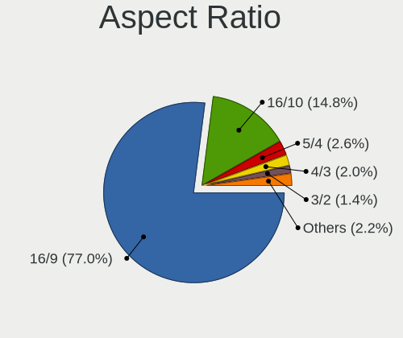

| Ratio   | Computers | Percent |
|---------|-----------|---------|
| 16/9    | 662       | 78.07%  |
| 16/10   | 114       | 13.44%  |
| 5/4     | 23        | 2.71%   |
| 4/3     | 20        | 2.36%   |
| 3/2     | 11        | 1.3%    |
| 21/9    | 10        | 1.18%   |
| Unknown | 8         | 0.94%   |

Monitor Area
------------

Area in inch

| Area in inch | Computers | Percent |
|----------------|-----------|---------|
| 101-110        | 243       | 26.59%  |
| 201-250        | 154       | 16.85%  |
| 81-90          | 115       | 12.58%  |
| 301-350        | 63        | 6.89%   |
| 151-200        | 57        | 6.24%   |
| 121-130        | 39        | 4.27%   |
| 351-500        | 35        | 3.83%   |
| 71-80          | 33        | 3.61%   |
| More than 1000 | 27        | 2.95%   |
| 51-60          | 27        | 2.95%   |
| 141-150        | 26        | 2.84%   |
| 251-300        | 22        | 2.41%   |
| 61-70          | 16        | 1.75%   |
| 111-120        | 14        | 1.53%   |
| 501-1000       | 13        | 1.42%   |
| Unknown        | 12        | 1.31%   |
| 41-50          | 11        | 1.2%    |
| 131-140        | 4         | 0.44%   |
| 91-100         | 3         | 0.33%   |

Pixel Density
-------------

Pixels per inch

| Density       | Computers | Percent |
|---------------|-----------|---------|
| 51-100        | 310       | 34.71%  |
| 121-160       | 249       | 27.88%  |
| 101-120       | 237       | 26.54%  |
| 161-240       | 49        | 5.49%   |
| 1-50          | 21        | 2.35%   |
| More than 240 | 15        | 1.68%   |
| Unknown       | 12        | 1.34%   |

Multiple Monitors
-----------------

Total monitors connected

| Total | Computers | Percent |
|-------|-----------|---------|
| 1     | 724       | 82.74%  |
| 2     | 121       | 13.83%  |
| 0     | 25        | 2.86%   |
| 3     | 5         | 0.57%   |

Network
-------

Net Controller Vendor
---------------------

Controller vendors

| Vendor                            | Computers | Percent |
|-----------------------------------|-----------|---------|
| Realtek Semiconductor             | 439       | 32.57%  |
| Intel                             | 405       | 30.04%  |
| Qualcomm Atheros                  | 147       | 10.91%  |
| Broadcom                          | 99        | 7.34%   |
| MediaTek                          | 34        | 2.52%   |
| TP-Link                           | 29        | 2.15%   |
| Broadcom Limited                  | 22        | 1.63%   |
| Ralink Technology                 | 17        | 1.26%   |
| Marvell Technology Group          | 17        | 1.26%   |
| Nvidia                            | 16        | 1.19%   |
| Ralink                            | 12        | 0.89%   |
| ASIX Electronics                  | 9         | 0.67%   |
| Samsung Electronics               | 8         | 0.59%   |
| OPPO Electronics                  | 8         | 0.59%   |
| Sierra Wireless                   | 5         | 0.37%   |
| Qualcomm Atheros Communications   | 5         | 0.37%   |
| Motorola PCS                      | 5         | 0.37%   |
| Microsoft                         | 5         | 0.37%   |
| Huawei Technologies               | 5         | 0.37%   |
| Xiaomi                            | 4         | 0.3%    |
| D-Link                            | 4         | 0.3%    |
| Qualcomm                          | 3         | 0.22%   |
| NetGear                           | 3         | 0.22%   |
| Linksys                           | 3         | 0.22%   |
| FIBOCOM                           | 3         | 0.22%   |
| Ericsson Business Mobile Networks | 3         | 0.22%   |
| Edimax Technology                 | 3         | 0.22%   |
| D-Link System                     | 3         | 0.22%   |
| AVM                               | 3         | 0.22%   |
| Attansic Technology               | 3         | 0.22%   |
| ASUSTek Computer                  | 3         | 0.22%   |
| VIA Technologies                  | 2         | 0.15%   |
| JMicron Technology                | 2         | 0.15%   |
| Dell                              | 2         | 0.15%   |
| ZyDAS                             | 1         | 0.07%   |
| U-Blox                            | 1         | 0.07%   |
| Tenda                             | 1         | 0.07%   |
| T & A Mobile Phones               | 1         | 0.07%   |
| Sweex                             | 1         | 0.07%   |
| Qualcomm Technologies             | 1         | 0.07%   |

Net Controller Model
--------------------

Controller models

| Model                                                                  | Computers | Percent |
|------------------------------------------------------------------------|-----------|---------|
| Realtek RTL8111/8168/8211/8411 PCI Express Gigabit Ethernet Controller | 293       | 18.49%  |
| Realtek RTL810xE PCI Express Fast Ethernet controller                  | 47        | 2.97%   |
| Intel Wi-Fi 6 AX200                                                    | 32        | 2.02%   |
| Intel 82579LM Gigabit Network Connection (Lewisville)                  | 26        | 1.64%   |
| Intel Wireless 8265 / 8275                                             | 25        | 1.58%   |
| Realtek RTL8153 Gigabit Ethernet Adapter                               | 23        | 1.45%   |
| Qualcomm Atheros AR9485 Wireless Network Adapter                       | 23        | 1.45%   |
| Intel Wi-Fi 6 AX201                                                    | 22        | 1.39%   |
| Intel Wireless 8260                                                    | 20        | 1.26%   |
| Qualcomm Atheros QCA9565 / AR9565 Wireless Network Adapter             | 19        | 1.2%    |
| Qualcomm Atheros QCA9377 802.11ac Wireless Network Adapter             | 18        | 1.14%   |
| Realtek RTL8821CE 802.11ac PCIe Wireless Network Adapter               | 17        | 1.07%   |
| Qualcomm Atheros AR9285 Wireless Network Adapter (PCI-Express)         | 17        | 1.07%   |
| Intel Wireless 7265                                                    | 17        | 1.07%   |
| Intel Wireless 7260                                                    | 17        | 1.07%   |
| Intel Wireless 3165                                                    | 17        | 1.07%   |
| Intel Ethernet Controller I225-V                                       | 16        | 1.01%   |
| Intel Ethernet Connection I217-LM                                      | 16        | 1.01%   |
| Realtek RTL8125 2.5GbE Controller                                      | 15        | 0.95%   |
| Broadcom BCM4313 802.11bgn Wireless Network Adapter                    | 14        | 0.88%   |
| Intel Alder Lake-P PCH CNVi WiFi                                       | 12        | 0.76%   |
| Realtek RTL88x2bu [AC1200 Techkey]                                     | 11        | 0.69%   |
| Realtek RTL8852BE PCIe 802.11ax Wireless Network Controller            | 11        | 0.69%   |
| Realtek 802.11ac NIC                                                   | 11        | 0.69%   |
| Intel Ethernet Connection (2) I219-V                                   | 11        | 0.69%   |
| Intel 82577LM Gigabit Network Connection                               | 11        | 0.69%   |
| Realtek RTL8822CE 802.11ac PCIe Wireless Network Adapter               | 10        | 0.63%   |
| MediaTek MT7922 802.11ax PCI Express Wireless Network Adapter          | 10        | 0.63%   |
| MediaTek MT7921 802.11ax PCI Express Wireless Network Adapter          | 10        | 0.63%   |
| Intel Wi-Fi 5(802.11ac) Wireless-AC 9x6x [Thunder Peak]                | 10        | 0.63%   |
| Intel I211 Gigabit Network Connection                                  | 10        | 0.63%   |
| Intel Dual Band Wireless-AC 3168NGW [Stone Peak]                       | 10        | 0.63%   |
| Intel Centrino Advanced-N 6205 [Taylor Peak]                           | 10        | 0.63%   |
| Realtek RTL8188EUS 802.11n Wireless Network Adapter                    | 9         | 0.57%   |
| Ralink MT7601U Wireless Adapter                                        | 9         | 0.57%   |
| Intel Cannon Lake PCH CNVi WiFi                                        | 9         | 0.57%   |
| Intel 82567LM-3 Gigabit Network Connection                             | 9         | 0.57%   |
| TP-Link TL-WN722N v2/v3 [Realtek RTL8188EUS]                           | 8         | 0.5%    |
| Realtek RTL8723BE PCIe Wireless Network Adapter                        | 8         | 0.5%    |
| Qualcomm Atheros QCA6174 802.11ac Wireless Network Adapter             | 8         | 0.5%    |

Wireless Vendor
---------------

Wireless vendors

| Vendor                          | Computers | Percent |
|---------------------------------|-----------|---------|
| Intel                           | 308       | 40.26%  |
| Realtek Semiconductor           | 131       | 17.12%  |
| Qualcomm Atheros                | 111       | 14.51%  |
| Broadcom                        | 69        | 9.02%   |
| MediaTek                        | 33        | 4.31%   |
| TP-Link                         | 26        | 3.4%    |
| Ralink Technology               | 17        | 2.22%   |
| Ralink                          | 12        | 1.57%   |
| Broadcom Limited                | 12        | 1.57%   |
| Sierra Wireless                 | 5         | 0.65%   |
| Qualcomm Atheros Communications | 5         | 0.65%   |
| D-Link                          | 4         | 0.52%   |
| NetGear                         | 3         | 0.39%   |
| Microsoft                       | 3         | 0.39%   |
| Linksys                         | 3         | 0.39%   |
| FIBOCOM                         | 3         | 0.39%   |
| Edimax Technology               | 3         | 0.39%   |
| AVM                             | 3         | 0.39%   |
| ASUSTek Computer                | 3         | 0.39%   |
| ZyDAS                           | 1         | 0.13%   |
| Tenda                           | 1         | 0.13%   |
| Sweex                           | 1         | 0.13%   |
| Qualcomm Technologies           | 1         | 0.13%   |
| Qualcomm                        | 1         | 0.13%   |
| Mercucys                        | 1         | 0.13%   |
| Marvell Technology Group        | 1         | 0.13%   |
| IMC Networks                    | 1         | 0.13%   |
| Hewlett-Packard                 | 1         | 0.13%   |
| Fujitsu Siemens Computers       | 1         | 0.13%   |
| D-Link System                   | 1         | 0.13%   |

Wireless Model
--------------

Wireless models

| Model                                                                   | Computers | Percent |
|-------------------------------------------------------------------------|-----------|---------|
| Intel Wi-Fi 6 AX200                                                     | 32        | 4.16%   |
| Intel Wireless 8265 / 8275                                              | 25        | 3.25%   |
| Qualcomm Atheros AR9485 Wireless Network Adapter                        | 23        | 2.99%   |
| Intel Wi-Fi 6 AX201                                                     | 22        | 2.86%   |
| Intel Wireless 8260                                                     | 20        | 2.6%    |
| Qualcomm Atheros QCA9565 / AR9565 Wireless Network Adapter              | 19        | 2.47%   |
| Qualcomm Atheros QCA9377 802.11ac Wireless Network Adapter              | 18        | 2.34%   |
| Realtek RTL8821CE 802.11ac PCIe Wireless Network Adapter                | 17        | 2.21%   |
| Qualcomm Atheros AR9285 Wireless Network Adapter (PCI-Express)          | 17        | 2.21%   |
| Intel Wireless 7265                                                     | 17        | 2.21%   |
| Intel Wireless 7260                                                     | 17        | 2.21%   |
| Intel Wireless 3165                                                     | 17        | 2.21%   |
| Broadcom BCM4313 802.11bgn Wireless Network Adapter                     | 14        | 1.82%   |
| Intel Alder Lake-P PCH CNVi WiFi                                        | 12        | 1.56%   |
| Realtek RTL88x2bu [AC1200 Techkey]                                      | 11        | 1.43%   |
| Realtek RTL8852BE PCIe 802.11ax Wireless Network Controller             | 11        | 1.43%   |
| Realtek 802.11ac NIC                                                    | 11        | 1.43%   |
| Realtek RTL8822CE 802.11ac PCIe Wireless Network Adapter                | 10        | 1.3%    |
| MediaTek MT7922 802.11ax PCI Express Wireless Network Adapter           | 10        | 1.3%    |
| MediaTek MT7921 802.11ax PCI Express Wireless Network Adapter           | 10        | 1.3%    |
| Intel Wi-Fi 5(802.11ac) Wireless-AC 9x6x [Thunder Peak]                 | 10        | 1.3%    |
| Intel Dual Band Wireless-AC 3168NGW [Stone Peak]                        | 10        | 1.3%    |
| Intel Centrino Advanced-N 6205 [Taylor Peak]                            | 10        | 1.3%    |
| Realtek RTL8188EUS 802.11n Wireless Network Adapter                     | 9         | 1.17%   |
| Ralink MT7601U Wireless Adapter                                         | 9         | 1.17%   |
| Intel Cannon Lake PCH CNVi WiFi                                         | 9         | 1.17%   |
| TP-Link TL-WN722N v2/v3 [Realtek RTL8188EUS]                            | 8         | 1.04%   |
| Realtek RTL8723BE PCIe Wireless Network Adapter                         | 8         | 1.04%   |
| Qualcomm Atheros QCA6174 802.11ac Wireless Network Adapter              | 8         | 1.04%   |
| Intel Wi-Fi 6E(802.11ax) AX210/AX1675* 2x2 [Typhoon Peak]               | 8         | 1.04%   |
| Broadcom BCM43142 802.11b/g/n                                           | 8         | 1.04%   |
| Qualcomm Atheros AR242x / AR542x Wireless Network Adapter (PCI-Express) | 7         | 0.91%   |
| Intel PRO/Wireless 3945ABG [Golan] Network Connection                   | 7         | 0.91%   |
| Intel Centrino Advanced-N 6200                                          | 7         | 0.91%   |
| Broadcom BCM4322 802.11a/b/g/n Wireless LAN Controller                  | 7         | 0.91%   |
| Realtek RTL8852AE 802.11ax PCIe Wireless Network Adapter                | 6         | 0.78%   |
| Realtek RTL8188CE 802.11b/g/n WiFi Adapter                              | 6         | 0.78%   |
| Realtek 802.11n WLAN Adapter                                            | 6         | 0.78%   |
| MediaTek Wi-Fi 6E MT7902 Wireless Network Adapter                       | 6         | 0.78%   |
| Intel Ice Lake-LP PCH CNVi WiFi                                         | 6         | 0.78%   |

Ethernet Vendor
---------------

Ethernet vendors

| Vendor                   | Computers | Percent |
|--------------------------|-----------|---------|
| Realtek Semiconductor    | 383       | 48.48%  |
| Intel                    | 213       | 26.96%  |
| Qualcomm Atheros         | 50        | 6.33%   |
| Broadcom                 | 43        | 5.44%   |
| Nvidia                   | 16        | 2.03%   |
| Marvell Technology Group | 16        | 2.03%   |
| Broadcom Limited         | 10        | 1.27%   |
| ASIX Electronics         | 9         | 1.14%   |
| Samsung Electronics      | 8         | 1.01%   |
| OPPO Electronics         | 8         | 1.01%   |
| Xiaomi                   | 4         | 0.51%   |
| Motorola PCS             | 4         | 0.51%   |
| TP-Link                  | 3         | 0.38%   |
| Huawei Technologies      | 3         | 0.38%   |
| Attansic Technology      | 3         | 0.38%   |
| VIA Technologies         | 2         | 0.25%   |
| Qualcomm                 | 2         | 0.25%   |
| Microsoft                | 2         | 0.25%   |
| JMicron Technology       | 2         | 0.25%   |
| D-Link System            | 2         | 0.25%   |
| T & A Mobile Phones      | 1         | 0.13%   |
| MediaTek                 | 1         | 0.13%   |
| Lenovo                   | 1         | 0.13%   |
| Foxconn / Hon Hai        | 1         | 0.13%   |
| DisplayLink              | 1         | 0.13%   |
| Aquantia                 | 1         | 0.13%   |
| Apple                    | 1         | 0.13%   |

Ethernet Model
--------------

Ethernet models

| Model                                                                  | Computers | Percent |
|------------------------------------------------------------------------|-----------|---------|
| Realtek RTL8111/8168/8211/8411 PCI Express Gigabit Ethernet Controller | 293       | 36.49%  |
| Realtek RTL810xE PCI Express Fast Ethernet controller                  | 47        | 5.85%   |
| Intel 82579LM Gigabit Network Connection (Lewisville)                  | 26        | 3.24%   |
| Realtek RTL8153 Gigabit Ethernet Adapter                               | 23        | 2.86%   |
| Intel Ethernet Controller I225-V                                       | 16        | 1.99%   |
| Intel Ethernet Connection I217-LM                                      | 16        | 1.99%   |
| Realtek RTL8125 2.5GbE Controller                                      | 15        | 1.87%   |
| Intel Ethernet Connection (2) I219-V                                   | 11        | 1.37%   |
| Intel 82577LM Gigabit Network Connection                               | 11        | 1.37%   |
| Intel I211 Gigabit Network Connection                                  | 10        | 1.25%   |
| Intel 82567LM-3 Gigabit Network Connection                             | 9         | 1.12%   |
| Intel Ethernet Connection I219-LM                                      | 8         | 1%      |
| Intel Ethernet Connection (4) I219-LM                                  | 8         | 1%      |
| Realtek RTL-8100/8101L/8139 PCI Fast Ethernet Adapter                  | 7         | 0.87%   |
| Qualcomm Atheros AR8162 Fast Ethernet                                  | 7         | 0.87%   |
| OPPO SM8350-MTP _SN:9338D66C                                           | 7         | 0.87%   |
| Qualcomm Atheros AR8161 Gigabit Ethernet                               | 6         | 0.75%   |
| Qualcomm Atheros AR8151 v2.0 Gigabit Ethernet                          | 6         | 0.75%   |
| Nvidia MCP79 Ethernet                                                  | 6         | 0.75%   |
| Marvell Group 88E8058 PCI-E Gigabit Ethernet Controller                | 6         | 0.75%   |
| Intel Ethernet Connection I218-LM                                      | 6         | 0.75%   |
| Intel Ethernet Connection (7) I219-V                                   | 6         | 0.75%   |
| Intel 82567LM Gigabit Network Connection                               | 6         | 0.75%   |
| Broadcom NetXtreme BCM57766 Gigabit Ethernet PCIe                      | 6         | 0.75%   |
| Broadcom NetXtreme BCM5764M Gigabit Ethernet PCIe                      | 6         | 0.75%   |
| ASIX AX88179 Gigabit Ethernet                                          | 6         | 0.75%   |
| Qualcomm Atheros AR8132 Fast Ethernet                                  | 5         | 0.62%   |
| Intel Ethernet Connection I219-V                                       | 5         | 0.62%   |
| Intel Ethernet Connection (4) I219-V                                   | 5         | 0.62%   |
| Intel Ethernet Connection (2) I219-LM                                  | 5         | 0.62%   |
| Intel Ethernet Connection (2) I218-V                                   | 5         | 0.62%   |
| Intel 82579V Gigabit Network Connection                                | 5         | 0.62%   |
| Broadcom NetLink BCM57785 Gigabit Ethernet PCIe                        | 5         | 0.62%   |
| Samsung GT-I9070 (network tethering, USB debugging enabled)            | 4         | 0.5%    |
| Samsung Galaxy series, misc. (tethering mode)                          | 4         | 0.5%    |
| Qualcomm Atheros QCA8172 Fast Ethernet                                 | 4         | 0.5%    |
| Qualcomm Atheros Killer E220x Gigabit Ethernet Controller              | 4         | 0.5%    |
| Motorola PCS moto g(7) power                                           | 4         | 0.5%    |
| Intel Ethernet Connection (6) I219-LM                                  | 4         | 0.5%    |
| Intel Ethernet Connection (3) I218-LM                                  | 4         | 0.5%    |

Net Controller Kind
-------------------

Ethernet, WiFi or modem

| Kind     | Computers | Percent |
|----------|-----------|---------|
| Ethernet | 742       | 50.79%  |
| WiFi     | 706       | 48.32%  |
| Modem    | 11        | 0.75%   |
| Unknown  | 2         | 0.14%   |

Used Controller
---------------

Currently used network controller

| Kind     | Computers | Percent |
|----------|-----------|---------|
| WiFi     | 539       | 60.9%   |
| Ethernet | 345       | 38.98%  |
| Unknown  | 1         | 0.11%   |

NICs
----

Total network controllers on board

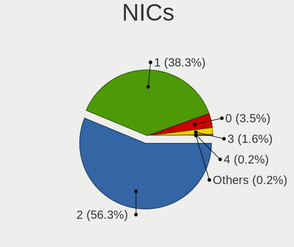

| Total | Computers | Percent |
|-------|-----------|---------|
| 2     | 500       | 57.74%  |
| 1     | 323       | 37.3%   |
| 0     | 27        | 3.12%   |
| 3     | 13        | 1.5%    |
| 4     | 2         | 0.23%   |
| 12    | 1         | 0.12%   |

IPv6
----

IPv6 vs IPv4

| Used | Computers | Percent |
|------|-----------|---------|
| No   | 677       | 77.64%  |
| Yes  | 195       | 22.36%  |

Bluetooth
---------

Bluetooth Vendor
----------------

Controller vendors

| Vendor                          | Computers | Percent |
|---------------------------------|-----------|---------|
| Intel                           | 236       | 42.37%  |
| Realtek Semiconductor           | 54        | 9.69%   |
| Qualcomm Atheros Communications | 42        | 7.54%   |
| Broadcom                        | 38        | 6.82%   |
| Cambridge Silicon Radio         | 33        | 5.92%   |
| Apple                           | 33        | 5.92%   |
| IMC Networks                    | 25        | 4.49%   |
| Foxconn / Hon Hai               | 22        | 3.95%   |
| Lite-On Technology              | 18        | 3.23%   |
| MediaTek                        | 10        | 1.8%    |
| Hewlett-Packard                 | 9         | 1.62%   |
| Dell                            | 9         | 1.62%   |
| Toshiba                         | 6         | 1.08%   |
| Ralink                          | 5         | 0.9%    |
| ASUSTek Computer                | 5         | 0.9%    |
| TP-Link                         | 3         | 0.54%   |
| Alps Electric                   | 3         | 0.54%   |
| Realtek                         | 1         | 0.18%   |
| Ralink Technology               | 1         | 0.18%   |
| Marvell Semiconductor           | 1         | 0.18%   |
| Edimax Technology               | 1         | 0.18%   |
| Creative Technology             | 1         | 0.18%   |
| Unknown                         | 1         | 0.18%   |

Bluetooth Model
---------------

Controller models

| Model                                                                               | Computers | Percent |
|-------------------------------------------------------------------------------------|-----------|---------|
| Intel Bluetooth wireless interface                                                  | 57        | 10.23%  |
| Realtek Bluetooth Radio                                                             | 44        | 7.9%    |
| Intel Bluetooth Device                                                              | 39        | 7%      |
| Intel AX201 Bluetooth                                                               | 38        | 6.82%   |
| Cambridge Silicon Radio Bluetooth Dongle (HCI mode)                                 | 33        | 5.92%   |
| Intel AX200 Bluetooth                                                               | 31        | 5.57%   |
| Intel Bluetooth 9460/9560 Jefferson Peak (JfP)                                      | 23        | 4.13%   |
| Qualcomm Atheros  Bluetooth Device                                                  | 19        | 3.41%   |
| IMC Networks Wireless_Device                                                        | 12        | 2.15%   |
| Intel AX211 Bluetooth                                                               | 11        | 1.97%   |
| Apple Bluetooth Host Controller                                                     | 11        | 1.97%   |
| MediaTek Wireless_Device                                                            | 10        | 1.8%    |
| Intel Wireless-AC 9260 Bluetooth Adapter                                            | 10        | 1.8%    |
| Intel Wireless-AC 3168 Bluetooth                                                    | 9         | 1.62%   |
| Apple Bluetooth USB Host Controller                                                 | 9         | 1.62%   |
| Realtek  Bluetooth 4.2 Adapter                                                      | 7         | 1.26%   |
| Intel Centrino Bluetooth Wireless Transceiver                                       | 7         | 1.26%   |
| Intel AX210 Bluetooth                                                               | 7         | 1.26%   |
| IMC Networks Bluetooth Radio                                                        | 7         | 1.26%   |
| Broadcom BCM20702A0 Bluetooth 4.0                                                   | 7         | 1.26%   |
| Broadcom BCM2045B (BDC-2.1)                                                         | 7         | 1.26%   |
| Apple Built-in Bluetooth 2.0+EDR HCI                                                | 7         | 1.26%   |
| Qualcomm Atheros AR3012 Bluetooth 4.0                                               | 6         | 1.08%   |
| Qualcomm Atheros AR3011 Bluetooth                                                   | 6         | 1.08%   |
| Lite-On Qualcomm Atheros QCA9377 Bluetooth                                          | 6         | 1.08%   |
| Lite-On Atheros AR3012 Bluetooth                                                    | 6         | 1.08%   |
| Apple Bluetooth HCI                                                                 | 6         | 1.08%   |
| Ralink RT3290 Bluetooth                                                             | 5         | 0.9%    |
| HP Broadcom 2070 Bluetooth Combo                                                    | 5         | 0.9%    |
| Foxconn / Hon Hai Bluetooth Device                                                  | 5         | 0.9%    |
| Dell DW375 Bluetooth Module                                                         | 5         | 0.9%    |
| Broadcom BCM2045B (BDC-2.1) [Bluetooth Controller]                                  | 5         | 0.9%    |
| Intel Centrino Advanced-N 6230 Bluetooth adapter                                    | 4         | 0.72%   |
| HP Bluetooth 2.0 Interface [Broadcom BCM2045]                                       | 4         | 0.72%   |
| Foxconn / Hon Hai Wireless_Device                                                   | 4         | 0.72%   |
| Foxconn / Hon Hai Foxconn T77H114 BCM2070 [Single-Chip Bluetooth 2.1 + EDR Adapter] | 4         | 0.72%   |
| Broadcom BCM2070 Bluetooth 2.1 + EDR                                                | 4         | 0.72%   |
| TP-Link UB500 Adapter                                                               | 3         | 0.54%   |
| Qualcomm Atheros QCA61x4 Bluetooth 4.0                                              | 3         | 0.54%   |
| Qualcomm Atheros Bluetooth                                                          | 3         | 0.54%   |

Sound
-----

Sound Vendor
------------

Sound card vendors

| Vendor                     | Computers | Percent |
|----------------------------|-----------|---------|
| Intel                      | 619       | 53.83%  |
| AMD                        | 228       | 19.83%  |
| Nvidia                     | 190       | 16.52%  |
| C-Media Electronics        | 16        | 1.39%   |
| Creative Labs              | 13        | 1.13%   |
| Texas Instruments          | 6         | 0.52%   |
| JMTek                      | 5         | 0.43%   |
| VIA Technologies           | 4         | 0.35%   |
| Realtek Semiconductor      | 4         | 0.35%   |
| Logitech                   | 4         | 0.35%   |
| GN Netcom                  | 4         | 0.35%   |
| Focusrite-Novation         | 4         | 0.35%   |
| Generalplus Technology     | 3         | 0.26%   |
| BEHRINGER International    | 3         | 0.26%   |
| Tenx Technology            | 2         | 0.17%   |
| ROCCAT                     | 2         | 0.17%   |
| Microsoft                  | 2         | 0.17%   |
| Lenovo                     | 2         | 0.17%   |
| Kingston Technology        | 2         | 0.17%   |
| Giga-Byte Technology       | 2         | 0.17%   |
| BR25                       | 2         | 0.17%   |
| Apple                      | 2         | 0.17%   |
| ULi Electronics            | 1         | 0.09%   |
| TerraTec Electronic        | 1         | 0.09%   |
| SteelSeries ApS            | 1         | 0.09%   |
| Sony                       | 1         | 0.09%   |
| Shenzhen Riitek Technology | 1         | 0.09%   |
| Setek Elektronik           | 1         | 0.09%   |
| Schiit Audio               | 1         | 0.09%   |
| Razer USA                  | 1         | 0.09%   |
| Plantronics                | 1         | 0.09%   |
| Philips (or NXP)           | 1         | 0.09%   |
| Mark of the Unicorn        | 1         | 0.09%   |
| M-Audio                    | 1         | 0.09%   |
| LG Electronics             | 1         | 0.09%   |
| iConnectivity              | 1         | 0.09%   |
| Hewlett-Packard            | 1         | 0.09%   |
| GYROCOM C&C                | 1         | 0.09%   |
| Guillemot                  | 1         | 0.09%   |
| Fortemedia                 | 1         | 0.09%   |

Sound Model
-----------

Sound card models

| Model                                                                                             | Computers | Percent |
|---------------------------------------------------------------------------------------------------|-----------|---------|
| AMD Family 17h/19h HD Audio Controller                                                            | 87        | 6.45%   |
| Intel 7 Series/C216 Chipset Family High Definition Audio Controller                               | 69        | 5.11%   |
| Intel Sunrise Point-LP HD Audio                                                                   | 62        | 4.6%    |
| Intel 6 Series/C200 Series Chipset Family High Definition Audio Controller                        | 55        | 4.08%   |
| AMD Renoir Radeon High Definition Audio Controller                                                | 48        | 3.56%   |
| Intel 8 Series/C220 Series Chipset High Definition Audio Controller                               | 37        | 2.74%   |
| Intel 5 Series/3400 Series Chipset High Definition Audio                                          | 34        | 2.52%   |
| Intel Xeon E3-1200 v3/4th Gen Core Processor HD Audio Controller                                  | 28        | 2.08%   |
| Intel Tiger Lake-LP Smart Sound Technology Audio Controller                                       | 28        | 2.08%   |
| Intel NM10/ICH7 Family High Definition Audio Controller                                           | 28        | 2.08%   |
| AMD SBx00 Azalia (Intel HDA)                                                                      | 28        | 2.08%   |
| Intel Cannon Lake PCH cAVS                                                                        | 25        | 1.85%   |
| AMD FCH Azalia Controller                                                                         | 25        | 1.85%   |
| Intel Celeron/Pentium Silver Processor High Definition Audio                                      | 23        | 1.7%    |
| Intel Alder Lake PCH-P High Definition Audio Controller                                           | 21        | 1.56%   |
| Intel 82801I (ICH9 Family) HD Audio Controller                                                    | 21        | 1.56%   |
| AMD Raven/Raven2/Fenghuang HDMI/DP Audio Controller                                               | 19        | 1.41%   |
| Intel Haswell-ULT HD Audio Controller                                                             | 17        | 1.26%   |
| Intel 8 Series HD Audio Controller                                                                | 17        | 1.26%   |
| Intel 100 Series/C230 Series Chipset Family HD Audio Controller                                   | 17        | 1.26%   |
| AMD Starship/Matisse HD Audio Controller                                                          | 16        | 1.19%   |
| Nvidia GP107GL High Definition Audio Controller                                                   | 15        | 1.11%   |
| Intel 82801H (ICH8 Family) HD Audio Controller                                                    | 15        | 1.11%   |
| AMD Kabini HDMI/DP Audio                                                                          | 15        | 1.11%   |
| AMD Family 17h (Models 00h-0fh) HD Audio Controller                                               | 15        | 1.11%   |
| AMD Ellesmere HDMI Audio [Radeon RX 470/480 / 570/580/590]                                        | 14        | 1.04%   |
| Nvidia GF108 High Definition Audio Controller                                                     | 13        | 0.96%   |
| AMD Rembrandt Radeon High Definition Audio Controller                                             | 13        | 0.96%   |
| Intel Wildcat Point-LP High Definition Audio Controller                                           | 12        | 0.89%   |
| Intel Broadwell-U Audio Controller                                                                | 12        | 0.89%   |
| Intel Atom/Celeron/Pentium Processor x5-E8000/J3xxx/N3xxx Series High Definition Audio Controller | 12        | 0.89%   |
| Intel 200 Series PCH HD Audio                                                                     | 11        | 0.82%   |
| Nvidia TU107 GeForce GTX 1650 High Definition Audio Controller                                    | 10        | 0.74%   |
| Nvidia TU106 High Definition Audio Controller                                                     | 10        | 0.74%   |
| Nvidia GK208 HDMI/DP Audio Controller                                                             | 10        | 0.74%   |
| Nvidia Audio device                                                                               | 10        | 0.74%   |
| Intel Comet Lake PCH cAVS                                                                         | 10        | 0.74%   |
| Intel Cannon Point-LP High Definition Audio Controller                                            | 10        | 0.74%   |
| AMD Family 15h (Models 60h-6fh) Audio Controller                                                  | 10        | 0.74%   |
| Nvidia GP104 High Definition Audio Controller                                                     | 9         | 0.67%   |

Memory
------

Memory Vendor
-------------

Memory module vendors

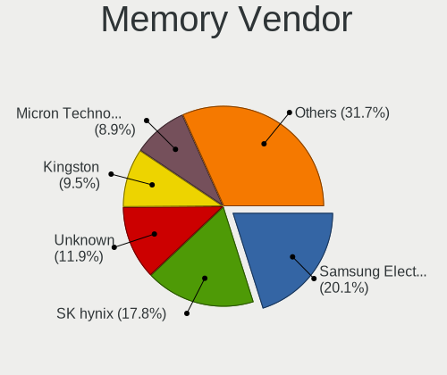

| Vendor                                  | Computers | Percent |
|-----------------------------------------|-----------|---------|
| Samsung Electronics                     | 208       | 20.53%  |
| SK hynix                                | 173       | 17.08%  |
| Unknown                                 | 127       | 12.54%  |
| Kingston                                | 103       | 10.17%  |
| Micron Technology                       | 88        | 8.69%   |
| Crucial                                 | 62        | 6.12%   |
| Corsair                                 | 48        | 4.74%   |
| G.Skill                                 | 30        | 2.96%   |
| A-DATA Technology                       | 25        | 2.47%   |
| Ramaxel Technology                      | 20        | 1.97%   |
| Elpida                                  | 19        | 1.88%   |
| Unknown (ABCD)                          | 18        | 1.78%   |
| Nanya Technology                        | 14        | 1.38%   |
| Unknown                                 | 12        | 1.18%   |
| Transcend                               | 7         | 0.69%   |
| Smart                                   | 7         | 0.69%   |
| Team                                    | 5         | 0.49%   |
| Patriot                                 | 5         | 0.49%   |
| Apacer                                  | 4         | 0.39%   |
| CSX                                     | 3         | 0.3%    |
| Unifosa                                 | 2         | 0.2%    |
| Teikon                                  | 2         | 0.2%    |
| PNY                                     | 2         | 0.2%    |
| Lexar Co Limited                        | 2         | 0.2%    |
| Avant                                   | 2         | 0.2%    |
| 48spaces                                | 2         | 0.2%    |
| Wilk                                    | 1         | 0.1%    |
| Unknown (F301)                          | 1         | 0.1%    |
| Unknown (AB)                            | 1         | 0.1%    |
| Unknown (0x0E9D)                        | 1         | 0.1%    |
| TRS STAR                                | 1         | 0.1%    |
| Timetec                                 | 1         | 0.1%    |
| Silicon Power Computer & Communications | 1         | 0.1%    |
| RZX                                     | 1         | 0.1%    |
| Qumo                                    | 1         | 0.1%    |
| Qimonda                                 | 1         | 0.1%    |
| Patriot Memory (PDP Systems)            | 1         | 0.1%    |
| OCZ                                     | 1         | 0.1%    |
| Netlist                                 | 1         | 0.1%    |
| MKF_SMBIOS_TYPE17_MANUFACTURER          | 1         | 0.1%    |

Memory Model
------------

Memory module models

| Model                                                            | Computers | Percent |
|------------------------------------------------------------------|-----------|---------|
| Unknown (ABCD) RAM 123456789012345678 2GB SODIMM LPDDR4 2400MT/s | 13        | 1.19%   |
| Unknown                                                          | 12        | 1.1%    |
| SK hynix RAM HMAA1GS6CJR6N-XN 8GB SODIMM DDR4 3200MT/s           | 10        | 0.92%   |
| SK hynix RAM HMA81GS6AFR8N-UH 8GB SODIMM DDR4 2667MT/s           | 10        | 0.92%   |
| Samsung RAM M471B5273CH0-CH9 4GB SODIMM DDR3 1334MT/s            | 10        | 0.92%   |
| Samsung RAM M471B5273DH0-CH9 4GB SODIMM DDR3 1334MT/s            | 9         | 0.83%   |
| Samsung RAM M471A1G44AB0-CWE 8192MB SODIMM DDR4 3200MT/s         | 9         | 0.83%   |
| Corsair RAM CMK16GX4M2B3200C16 8GB DIMM DDR4 3600MT/s            | 9         | 0.83%   |
| Samsung RAM M471A1G44BB0-CWE 8GB SODIMM DDR4 3200MT/s            | 8         | 0.73%   |
| Unknown RAM Module 4GB SODIMM DDR3                               | 7         | 0.64%   |
| Samsung RAM M471B5173DB0-YK0 4GB SODIMM DDR3 1600MT/s            | 7         | 0.64%   |
| Unknown RAM Module 2GB SODIMM DDR3 1333MT/s                      | 6         | 0.55%   |
| Samsung RAM M471A5244CB0-CTD 4GB SODIMM DDR4 3266MT/s            | 6         | 0.55%   |
| Samsung RAM M471A1K43EB1-CWE 8GB SODIMM DDR4 3200MT/s            | 6         | 0.55%   |
| Samsung RAM M471A1K43CB1-CRC 8GB SODIMM DDR4 2667MT/s            | 6         | 0.55%   |
| Micron RAM 16KTF51264HZ-1G6M1 4GB SODIMM DDR3 1600MT/s           | 6         | 0.55%   |
| Crucial RAM CT102464BF160B.C16 8GB SODIMM DDR3 1600MT/s          | 6         | 0.55%   |
| Unknown (ABCD) RAM 123456789012345678 4GB DIMM DDR4 2400MT/s     | 5         | 0.46%   |
| SK hynix RAM HMT451S6BFR8A-PB 4GB SODIMM DDR3 1600MT/s           | 5         | 0.46%   |
| SK hynix RAM HMT41GS6BFR8A-PB 8GB SODIMM DDR3 1600MT/s           | 5         | 0.46%   |
| SK hynix RAM HMT351S6CFR8C-PB 4GB SODIMM DDR3 1600MT/s           | 5         | 0.46%   |
| SK hynix RAM HMAA1GS6CJR6N-XN 8GB Row Of Chips DDR4 3200MT/s     | 5         | 0.46%   |
| SK hynix RAM HMA81GS6JJR8N-VK 8GB SODIMM DDR4 2667MT/s           | 5         | 0.46%   |
| Samsung RAM M471B5773DH0-CH9 2GB SODIMM DDR3 1600MT/s            | 5         | 0.46%   |
| Samsung RAM M471B5273DH0-CK0 4096MB SODIMM DDR3 1600MT/s         | 5         | 0.46%   |
| Samsung RAM M471B5173QH0-YK0 4GB SODIMM DDR3 1600MT/s            | 5         | 0.46%   |
| Samsung RAM M471B1G73EB0-YK0 8GB SODIMM DDR3 1600MT/s            | 5         | 0.46%   |
| Samsung RAM M471A5244CB0-CWE 4GB SODIMM DDR4 3200MT/s            | 5         | 0.46%   |
| Elpida RAM EBJ41UF8BCS0-DJ-F 4GB SODIMM DDR3 1334MT/s            | 5         | 0.46%   |
| SK hynix RAM HMT325S6CFR8C-PB 2GB SODIMM DDR3 1600MT/s           | 4         | 0.37%   |
| SK hynix RAM HMA82GS6AFR8N-UH 16GB SODIMM DDR4 2667MT/s          | 4         | 0.37%   |
| SK hynix RAM HMA81GS6DJR8N-XN 8192MB SODIMM DDR4 3200MT/s        | 4         | 0.37%   |
| SK hynix RAM HMA41GS6AFR8N-TF 8GB SODIMM DDR4 2667MT/s           | 4         | 0.37%   |
| Samsung RAM M471B1G73DB0-YK0 8GB SODIMM DDR3 1600MT/s            | 4         | 0.37%   |
| Samsung RAM M471A1K43DB1-CTD 8GB SODIMM DDR4 2667MT/s            | 4         | 0.37%   |
| Unknown RAM Module 8GB DIMM DDR3 1600MT/s                        | 3         | 0.28%   |
| Unknown RAM Module 4GB DIMM SDRAM                                | 3         | 0.28%   |
| Unknown RAM Module 4096MB DIMM 1600MT/s                          | 3         | 0.28%   |
| Unknown RAM Module 2GB SODIMM DDR2 667MT/s                       | 3         | 0.28%   |
| Unknown RAM Module 2GB DIMM DDR3 1333MT/s                        | 3         | 0.28%   |

Memory Kind
-----------

Memory module kinds

| Kind    | Computers | Percent |
|---------|-----------|---------|
| DDR3    | 342       | 39.18%  |
| DDR4    | 327       | 37.46%  |
| DDR2    | 58        | 6.64%   |
| LPDDR4  | 34        | 3.89%   |
| SDRAM   | 27        | 3.09%   |
| Unknown | 23        | 2.63%   |
| DDR5    | 18        | 2.06%   |
| DDR     | 18        | 2.06%   |
| LPDDR3  | 17        | 1.95%   |
| LPDDR5  | 5         | 0.57%   |
| DRAM    | 4         | 0.46%   |

Memory Form Factor
------------------

Physical design of the memory module

| Name         | Computers | Percent |
|--------------|-----------|---------|
| SODIMM       | 558       | 64.29%  |
| DIMM         | 252       | 29.03%  |
| Row Of Chips | 43        | 4.95%   |
| Unknown      | 7         | 0.81%   |
| Chip         | 6         | 0.69%   |
| FB-DIMM      | 2         | 0.23%   |

Memory Size
-----------

Memory module size

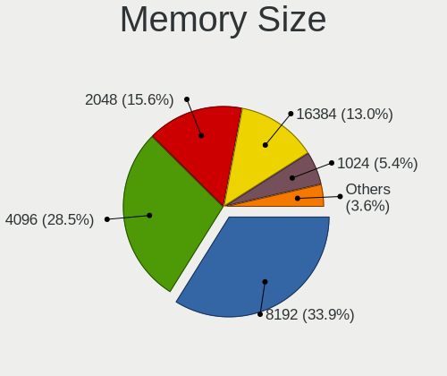

| Size  | Computers | Percent |
|-------|-----------|---------|
| 8192  | 307       | 32.59%  |
| 4096  | 284       | 30.15%  |
| 2048  | 152       | 16.14%  |
| 16384 | 119       | 12.63%  |
| 1024  | 48        | 5.1%    |
| 32768 | 24        | 2.55%   |
| 512   | 7         | 0.74%   |
| 256   | 1         | 0.11%   |

Memory Speed
------------

Memory module speed

| Speed   | Computers | Percent |
|---------|-----------|---------|
| 1600    | 199       | 21.01%  |
| 3200    | 136       | 14.36%  |
| 2667    | 94        | 9.93%   |
| 1333    | 83        | 8.76%   |
| 2400    | 63        | 6.65%   |
| 1334    | 45        | 4.75%   |
| 667     | 35        | 3.7%    |
| Unknown | 33        | 3.48%   |
| 2133    | 31        | 3.27%   |
| 800     | 25        | 2.64%   |
| 3600    | 24        | 2.53%   |
| 1067    | 24        | 2.53%   |
| 1867    | 16        | 1.69%   |
| 4800    | 10        | 1.06%   |
| 4267    | 8         | 0.84%   |
| 3000    | 8         | 0.84%   |
| 533     | 8         | 0.84%   |
| 4199    | 7         | 0.74%   |
| 3266    | 7         | 0.74%   |
| 2933    | 7         | 0.74%   |
| 1800    | 7         | 0.74%   |
| 2048    | 6         | 0.63%   |
| 6000    | 5         | 0.53%   |
| 1866    | 5         | 0.53%   |
| 975     | 5         | 0.53%   |
| 400     | 5         | 0.53%   |
| 3733    | 4         | 0.42%   |
| 2666    | 4         | 0.42%   |
| 1066    | 4         | 0.42%   |
| 333     | 4         | 0.42%   |
| 6400    | 3         | 0.32%   |
| 1639    | 3         | 0.32%   |
| 49926   | 2         | 0.21%   |
| 8400    | 2         | 0.21%   |
| 5500    | 2         | 0.21%   |
| 3800    | 2         | 0.21%   |
| 3466    | 2         | 0.21%   |
| 3066    | 2         | 0.21%   |
| 7500    | 1         | 0.11%   |
| 5800    | 1         | 0.11%   |

Printers & scanners
-------------------

Printer Vendor
--------------

Printer device vendors

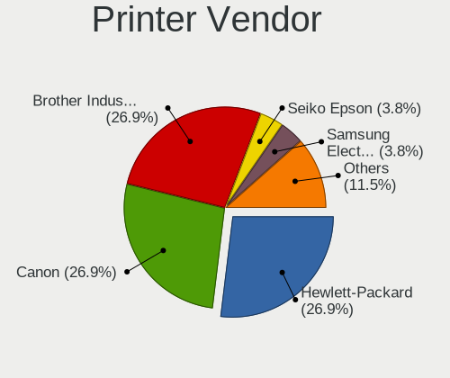

| Vendor                | Computers | Percent |
|-----------------------|-----------|---------|
| Canon                 | 6         | 27.27%  |
| Brother Industries    | 6         | 27.27%  |
| Hewlett-Packard       | 5         | 22.73%  |
| Seiko Epson           | 1         | 4.55%   |
| Samsung Electronics   | 1         | 4.55%   |
| Lexmark International | 1         | 4.55%   |
| Konica Minolta        | 1         | 4.55%   |
| Dymo-CoStar           | 1         | 4.55%   |

Printer Model
-------------

Printer device models

| Model                              | Computers | Percent |
|------------------------------------|-----------|---------|
| Canon MF641C                       | 2         | 9.09%   |
| Brother DCP-L2540DW                | 2         | 9.09%   |
| Seiko Epson L382 Series            | 1         | 4.55%   |
| Samsung ML-1610 Mono Laser Printer | 1         | 4.55%   |
| Lexmark International CS417dn      | 1         | 4.55%   |
| Konica Minolta 206                 | 1         | 4.55%   |
| HP LaserJet P2055 series           | 1         | 4.55%   |
| HP LaserJet M101-M106              | 1         | 4.55%   |
| HP LaserJet 1022                   | 1         | 4.55%   |
| HP ENVY 4500 series                | 1         | 4.55%   |
| HP Deskjet 1510                    | 1         | 4.55%   |
| Dymo-CoStar LabelWriter 450        | 1         | 4.55%   |
| Canon PIXMA MG5600 Series          | 1         | 4.55%   |
| Canon PIXMA MG2500 Series          | 1         | 4.55%   |
| Canon MG5700 series                | 1         | 4.55%   |
| Canon LiDE 400                     | 1         | 4.55%   |
| Brother Printer                    | 1         | 4.55%   |
| Brother MFC-7340                   | 1         | 4.55%   |
| Brother HL-L2350DW series          | 1         | 4.55%   |
| Brother HL-2150N series            | 1         | 4.55%   |

Scanner Vendor
--------------

Scanner device vendors

| Vendor      | Computers | Percent |
|-------------|-----------|---------|
| Canon       | 7         | 87.5%   |
| Seiko Epson | 1         | 12.5%   |

Scanner Model
-------------

Scanner device models

| Model                                 | Computers | Percent |
|---------------------------------------|-----------|---------|
| Canon CanoScan N670U/N676U/LiDE 20    | 2         | 25%     |
| Seiko Epson GT-X770 [Perfection V500] | 1         | 12.5%   |
| Canon CanoScan N1240U/LiDE 30         | 1         | 12.5%   |
| Canon CanoScan LiDE 700F              | 1         | 12.5%   |
| Canon CanoScan LIDE 25                | 1         | 12.5%   |
| Canon CanoScan LiDE 210               | 1         | 12.5%   |
| Canon CanoScan 8800F                  | 1         | 12.5%   |

Camera
------

Camera Vendor
-------------

Camera device vendors

| Vendor                                 | Computers | Percent |
|----------------------------------------|-----------|---------|
| Chicony Electronics                    | 109       | 20.22%  |
| Realtek Semiconductor                  | 43        | 7.98%   |
| IMC Networks                           | 41        | 7.61%   |
| Microdia                               | 40        | 7.42%   |
| Cheng Uei Precision Industry (Foxlink) | 29        | 5.38%   |
| Quanta                                 | 28        | 5.19%   |
| Bison Electronics                      | 28        | 5.19%   |
| Sunplus Innovation Technology          | 27        | 5.01%   |
| Logitech                               | 25        | 4.64%   |
| Apple                                  | 25        | 4.64%   |
| Suyin                                  | 17        | 3.15%   |
| Lite-On Technology                     | 16        | 2.97%   |
| Acer                                   | 15        | 2.78%   |
| Luxvisions Innotech Limited            | 13        | 2.41%   |
| Lenovo                                 | 9         | 1.67%   |
| Alcor Micro                            | 9         | 1.67%   |
| Syntek                                 | 7         | 1.3%    |
| Ricoh                                  | 7         | 1.3%    |
| Microsoft                              | 7         | 1.3%    |
| Silicon Motion                         | 6         | 1.11%   |
| Z-Star Microelectronics                | 5         | 0.93%   |
| Importek                               | 4         | 0.74%   |
| Samsung Electronics                    | 2         | 0.37%   |
| icSpring                               | 2         | 0.37%   |
| Hewlett-Packard                        | 2         | 0.37%   |
| Generalplus Technology                 | 2         | 0.37%   |
| GEMBIRD                                | 2         | 0.37%   |
| Y Media                                | 1         | 0.19%   |
| Xiongmai                               | 1         | 0.19%   |
| WaveRider Communications               | 1         | 0.19%   |
| Trust                                  | 1         | 0.19%   |
| SunplusIT                              | 1         | 0.19%   |
| Sunplus Technology                     | 1         | 0.19%   |
| Sonix Technology                       | 1         | 0.19%   |
| Primax Electronics                     | 1         | 0.19%   |
| Pixart Imaging                         | 1         | 0.19%   |
| Novatek Microelectronics               | 1         | 0.19%   |
| LG Electronics                         | 1         | 0.19%   |
| KYT-230807-A                           | 1         | 0.19%   |
| Huawei Technologies                    | 1         | 0.19%   |

Camera Model
------------

Camera device models

| Model                                                       | Computers | Percent |
|-------------------------------------------------------------|-----------|---------|
| Chicony Integrated Camera                                   | 27        | 5%      |
| IMC Networks USB2.0 HD UVC WebCam                           | 17        | 3.15%   |
| Realtek Integrated_Webcam_HD                                | 15        | 2.78%   |
| Microdia Integrated_Webcam_HD                               | 14        | 2.59%   |
| Apple Built-in iSight                                       | 13        | 2.41%   |
| Lite-On Integrated Camera                                   | 9         | 1.67%   |
| IMC Networks Integrated Camera                              | 9         | 1.67%   |
| Chicony HD WebCam                                           | 9         | 1.67%   |
| Bison Integrated Camera                                     | 7         | 1.3%    |
| Apple FaceTime HD Camera (Built-in)                         | 7         | 1.3%    |
| Sunplus Integrated_Webcam_HD                                | 6         | 1.11%   |
| Realtek USB Camera                                          | 6         | 1.11%   |
| Chicony TOSHIBA Web Camera - HD                             | 6         | 1.11%   |
| Quanta HD User Facing                                       | 5         | 0.93%   |
| Microdia USB 2.0 Camera                                     | 5         | 0.93%   |
| Logitech Webcam C930e                                       | 5         | 0.93%   |
| Logitech Webcam C270                                        | 5         | 0.93%   |
| Cheng Uei Precision Industry (Foxlink) HP Webcam            | 5         | 0.93%   |
| Cheng Uei Precision Industry (Foxlink) HP HD Camera         | 5         | 0.93%   |
| Sunplus HD WebCam                                           | 4         | 0.74%   |
| Sunplus Asus Webcam                                         | 4         | 0.74%   |
| Realtek USB2.0 HD UVC WebCam                                | 4         | 0.74%   |
| Microsoft LifeCam HD-3000                                   | 4         | 0.74%   |
| Microdia Integrated_Webcam_FHD                              | 4         | 0.74%   |
| Microdia Integrated Webcam                                  | 4         | 0.74%   |
| Luxvisions Innotech Limited HP Wide Vision HD Camera        | 4         | 0.74%   |
| Luxvisions Innotech Limited HP TrueVision HD Camera         | 4         | 0.74%   |
| Lenovo Integrated Webcam [R5U877]                           | 4         | 0.74%   |
| Lenovo Integrated Webcam                                    | 4         | 0.74%   |
| Importek TOSHIBA Web Camera - HD                            | 4         | 0.74%   |
| Chicony Integrated Camera (1280x720@30)                     | 4         | 0.74%   |
| Chicony HP TrueVision HD Camera                             | 4         | 0.74%   |
| Chicony HD User Facing                                      | 4         | 0.74%   |
| Bison HD Webcam                                             | 4         | 0.74%   |
| Bison BisonCam,NB Pro                                       | 4         | 0.74%   |
| Acer Integrated Camera                                      | 4         | 0.74%   |
| Syntek Integrated Camera                                    | 3         | 0.56%   |
| Syntek EasyCamera                                           | 3         | 0.56%   |
| Suyin HP TrueVision HD Integrated Webcam                    | 3         | 0.56%   |
| Suyin 1.3M WebCam (notebook emachines E730, Acer sub-brand) | 3         | 0.56%   |

Security
--------

Fingerprint Vendor
------------------

Fingerprint sensor vendors

| Vendor                             | Computers | Percent |
|------------------------------------|-----------|---------|
| Validity Sensors                   | 30        | 30.93%  |
| Synaptics                          | 21        | 21.65%  |
| Shenzhen Goodix Technology         | 14        | 14.43%  |
| Upek                               | 9         | 9.28%   |
| AuthenTec                          | 9         | 9.28%   |
| Elan Microelectronics              | 7         | 7.22%   |
| STMicroelectronics                 | 2         | 2.06%   |
| LighTuning Technology              | 2         | 2.06%   |
| Realtek USB2.0 Finger Print Bridge | 1         | 1.03%   |
| Microsoft                          | 1         | 1.03%   |
| Focal-systems.Corp                 | 1         | 1.03%   |

Fingerprint Model
-----------------

Fingerprint sensor models

| Model                                                           | Computers | Percent |
|-----------------------------------------------------------------|-----------|---------|
| Shenzhen Goodix  Fingerprint Device                             | 10        | 10.31%  |
| Validity Sensors VFS495 Fingerprint Reader                      | 7         | 7.22%   |
| Upek Biometric Touchchip/Touchstrip Fingerprint Sensor          | 7         | 7.22%   |
| Synaptics Metallica MIS Touch Fingerprint Reader                | 6         | 6.19%   |
| Validity Sensors VFS 5011 fingerprint sensor                    | 5         | 5.15%   |
| Validity Sensors Synaptics WBDI                                 | 5         | 5.15%   |
| Synaptics Prometheus MIS Touch Fingerprint Reader               | 4         | 4.12%   |
| Elan ELAN:Fingerprint                                           | 4         | 4.12%   |
| AuthenTec AES2810                                               | 4         | 4.12%   |
| AuthenTec AES2501 Fingerprint Sensor                            | 4         | 4.12%   |
| Validity Sensors VFS5011 Fingerprint Reader                     | 3         | 3.09%   |
| Validity Sensors VFS471 Fingerprint Reader                      | 3         | 3.09%   |
| Validity Sensors Fingerprint scanner                            | 3         | 3.09%   |
| Shenzhen Goodix Fingerprint Reader                              | 3         | 3.09%   |
| Elan ELAN:ARM-M4                                                | 3         | 3.09%   |
| Upek TCS5B Fingerprint sensor                                   | 2         | 2.06%   |
| Synaptics WBDI Fingerprint Reader USB 102                       | 2         | 2.06%   |
| Synaptics Metallica MOH Touch Fingerprint Reader                | 2         | 2.06%   |
| Synaptics Fingerprint reader [HP G6]                            | 2         | 2.06%   |
| STMicroelectronics Fingerprint Reader                           | 2         | 2.06%   |
| Validity Sensors VFS7500 Touch Fingerprint Sensor               | 1         | 1.03%   |
| Validity Sensors VFS491                                         | 1         | 1.03%   |
| Validity Sensors VFS451 Fingerprint Reader                      | 1         | 1.03%   |
| Validity Sensors VFS Fingerprint sensor                         | 1         | 1.03%   |
| Synaptics UWP WBDI Device                                       | 1         | 1.03%   |
| Synaptics UWP WBDI                                              | 1         | 1.03%   |
| Synaptics  WBDI                                                 | 1         | 1.03%   |
| Synaptics FS7604 Touch Fingerprint Sensor with PurePrint        | 1         | 1.03%   |
| Shenzhen Goodix FingerPrint                                     | 1         | 1.03%   |
| Realtek USB2.0 Finger Print Bridge FocalTech Fingerprint Device | 1         | 1.03%   |
| Microsoft Fingerprint Reader                                    | 1         | 1.03%   |
| LighTuning Fingerprint Reader                                   | 1         | 1.03%   |
| LighTuning EgisTec Touch Fingerprint Sensor                     | 1         | 1.03%   |
| Focal-systems.Corp FT9201Fingerprint.                           | 1         | 1.03%   |
| AuthenTec AES1660 Fingerprint Sensor                            | 1         | 1.03%   |
| Unknown                                                         | 1         | 1.03%   |

Chipcard Vendor
---------------

Chipcard module vendors

| Vendor                | Computers | Percent |
|-----------------------|-----------|---------|
| Broadcom              | 18        | 42.86%  |
| Alcor Micro           | 14        | 33.33%  |
| O2 Micro              | 4         | 9.52%   |
| Lenovo                | 3         | 7.14%   |
| Advanced Card Systems | 2         | 4.76%   |
| Chicony Electronics   | 1         | 2.38%   |

Chipcard Model
--------------

Chipcard module models

| Model                                                                        | Computers | Percent |
|------------------------------------------------------------------------------|-----------|---------|
| Alcor Micro AU9540 Smartcard Reader                                          | 14        | 33.33%  |
| Broadcom 58200                                                               | 7         | 16.67%  |
| Broadcom 5880                                                                | 5         | 11.9%   |
| Lenovo Integrated Smart Card Reader                                          | 3         | 7.14%   |
| Broadcom BCM5880 Secure Applications Processor with fingerprint swipe sensor | 3         | 7.14%   |
| Broadcom BCM5880 Secure Applications Processor                               | 3         | 7.14%   |
| O2 Micro Oz776 SmartCard Reader                                              | 2         | 4.76%   |
| O2 Micro OZ776 CCID Smartcard Reader                                         | 2         | 4.76%   |
| Chicony Electronics HP Skylab USB Smartcard Keyboard                         | 1         | 2.38%   |
| Advanced Card Systems ACR38 SmartCard Reader                                 | 1         | 2.38%   |
| Advanced Card Systems ACR122U                                                | 1         | 2.38%   |

Unsupported
-----------

Unsupported Devices
-------------------

Total unsupported devices on board

| Total | Computers | Percent |
|-------|-----------|---------|
| 0     | 585       | 66.7%   |
| 1     | 224       | 25.54%  |
| 2     | 56        | 6.39%   |
| 3     | 12        | 1.37%   |

Unsupported Device Types
------------------------

Types of unsupported devices

| Type                     | Computers | Percent |
|--------------------------|-----------|---------|
| Graphics card            | 128       | 36.26%  |
| Fingerprint reader       | 96        | 27.2%   |
| Chipcard                 | 39        | 11.05%  |
| Net/wireless             | 31        | 8.78%   |
| Multimedia controller    | 12        | 3.4%    |
| Camera                   | 12        | 3.4%    |
| Communication controller | 11        | 3.12%   |
| Bluetooth                | 5         | 1.42%   |
| Storage                  | 4         | 1.13%   |
| Unassigned class         | 3         | 0.85%   |
| Card reader              | 3         | 0.85%   |
| Network                  | 2         | 0.57%   |
| Net/ethernet             | 2         | 0.57%   |
| Flash memory             | 2         | 0.57%   |
| Wireless                 | 1         | 0.28%   |
| Sound                    | 1         | 0.28%   |
| Dvb card                 | 1         | 0.28%   |

