MX - Tested Hardware & Statistics (Desktops)
--------------------------------------------

A project to collect tested hardware configurations for MX.

Anyone can contribute to this report by the [hw-probe](https://github.com/linuxhw/hw-probe) tool:

    sudo -E hw-probe -all -upload

Please contribute! Especially if your hardware is rare.

Contents
--------

* [ Test Cases ](#test-cases)

* [ System ](#system)
  - [ OS                       ](#os)
  - [ OS Family                ](#os-family)
  - [ Kernel                   ](#kernel)
  - [ Kernel Family            ](#kernel-family)
  - [ Kernel Major Ver.        ](#kernel-major-ver)
  - [ Arch                     ](#arch)
  - [ DE                       ](#de)
  - [ Display Server           ](#display-server)
  - [ Display Manager          ](#display-manager)
  - [ OS Lang                  ](#os-lang)
  - [ Boot Mode                ](#boot-mode)
  - [ Filesystem               ](#filesystem)
  - [ Part. scheme             ](#part-scheme)
  - [ Dual Boot with Linux/BSD ](#dual-boot-with-linuxbsd)
  - [ Dual Boot (Win)          ](#dual-boot-win)

* [ Board ](#board)
  - [ Vendor                   ](#vendor)
  - [ Model                    ](#model)
  - [ Model Family             ](#model-family)
  - [ MFG Year                 ](#mfg-year)
  - [ Form Factor              ](#form-factor)
  - [ Secure Boot              ](#secure-boot)
  - [ Coreboot                 ](#coreboot)
  - [ RAM Size                 ](#ram-size)
  - [ RAM Used                 ](#ram-used)
  - [ Total Drives             ](#total-drives)
  - [ Has CD-ROM               ](#has-cd-rom)
  - [ Has Ethernet             ](#has-ethernet)
  - [ Has WiFi                 ](#has-wifi)
  - [ Has Bluetooth            ](#has-bluetooth)

* [ Location ](#location)
  - [ Country                  ](#country)
  - [ City                     ](#city)

* [ Drives ](#drives)
  - [ Drive Vendor             ](#drive-vendor)
  - [ Drive Model              ](#drive-model)
  - [ HDD Vendor               ](#hdd-vendor)
  - [ SSD Vendor               ](#ssd-vendor)
  - [ Drive Kind               ](#drive-kind)
  - [ Drive Connector          ](#drive-connector)
  - [ Drive Size               ](#drive-size)
  - [ Space Total              ](#space-total)
  - [ Space Used               ](#space-used)
  - [ Malfunc. Drives          ](#malfunc-drives)
  - [ Malfunc. Drive Vendor    ](#malfunc-drive-vendor)
  - [ Malfunc. HDD Vendor      ](#malfunc-hdd-vendor)
  - [ Malfunc. Drive Kind      ](#malfunc-drive-kind)
  - [ Failed Drives            ](#failed-drives)
  - [ Failed Drive Vendor      ](#failed-drive-vendor)
  - [ Drive Status             ](#drive-status)

* [ Storage controller ](#storage-controller)
  - [ Storage Vendor           ](#storage-vendor)
  - [ Storage Model            ](#storage-model)
  - [ Storage Kind             ](#storage-kind)

* [ Processor ](#processor)
  - [ CPU Vendor               ](#cpu-vendor)
  - [ CPU Model                ](#cpu-model)
  - [ CPU Model Family         ](#cpu-model-family)
  - [ CPU Cores                ](#cpu-cores)
  - [ CPU Sockets              ](#cpu-sockets)
  - [ CPU Threads              ](#cpu-threads)
  - [ CPU Op-Modes             ](#cpu-op-modes)
  - [ CPU Microcode            ](#cpu-microcode)
  - [ CPU Microarch            ](#cpu-microarch)

* [ Graphics ](#graphics)
  - [ GPU Vendor               ](#gpu-vendor)
  - [ GPU Model                ](#gpu-model)
  - [ GPU Combo                ](#gpu-combo)
  - [ GPU Driver               ](#gpu-driver)
  - [ GPU Memory               ](#gpu-memory)

* [ Monitor ](#monitor)
  - [ Monitor Vendor           ](#monitor-vendor)
  - [ Monitor Model            ](#monitor-model)
  - [ Monitor Resolution       ](#monitor-resolution)
  - [ Monitor Diagonal         ](#monitor-diagonal)
  - [ Monitor Width            ](#monitor-width)
  - [ Aspect Ratio             ](#aspect-ratio)
  - [ Monitor Area             ](#monitor-area)
  - [ Pixel Density            ](#pixel-density)
  - [ Multiple Monitors        ](#multiple-monitors)

* [ Network ](#network)
  - [ Net Controller Vendor    ](#net-controller-vendor)
  - [ Net Controller Model     ](#net-controller-model)
  - [ Wireless Vendor          ](#wireless-vendor)
  - [ Wireless Model           ](#wireless-model)
  - [ Ethernet Vendor          ](#ethernet-vendor)
  - [ Ethernet Model           ](#ethernet-model)
  - [ Net Controller Kind      ](#net-controller-kind)
  - [ Used Controller          ](#used-controller)
  - [ NICs                     ](#nics)
  - [ IPv6                     ](#ipv6)

* [ Bluetooth ](#bluetooth)
  - [ Bluetooth Vendor         ](#bluetooth-vendor)
  - [ Bluetooth Model          ](#bluetooth-model)

* [ Sound ](#sound)
  - [ Sound Vendor             ](#sound-vendor)
  - [ Sound Model              ](#sound-model)

* [ Memory ](#memory)
  - [ Memory Vendor            ](#memory-vendor)
  - [ Memory Model             ](#memory-model)
  - [ Memory Kind              ](#memory-kind)
  - [ Memory Form Factor       ](#memory-form-factor)
  - [ Memory Size              ](#memory-size)
  - [ Memory Speed             ](#memory-speed)

* [ Printers & scanners ](#printers--scanners)
  - [ Printer Vendor           ](#printer-vendor)
  - [ Printer Model            ](#printer-model)
  - [ Scanner Vendor           ](#scanner-vendor)
  - [ Scanner Model            ](#scanner-model)

* [ Camera ](#camera)
  - [ Camera Vendor            ](#camera-vendor)
  - [ Camera Model             ](#camera-model)

* [ Security ](#security)
  - [ Fingerprint Vendor       ](#fingerprint-vendor)
  - [ Fingerprint Model        ](#fingerprint-model)
  - [ Chipcard Vendor          ](#chipcard-vendor)
  - [ Chipcard Model           ](#chipcard-model)

* [ Unsupported ](#unsupported)
  - [ Unsupported Devices      ](#unsupported-devices)
  - [ Unsupported Device Types ](#unsupported-device-types)

Test Cases
----------

Total: 572

| Vendor        | Model                       | Probe                                                      | Date         |
|---------------|-----------------------------|------------------------------------------------------------|--------------|
| Lenovo        | ThinkCentre M57 6071ADU     | [08990918a9](https://linux-hardware.org/?probe=08990918a9) | Dec 29, 2025 |
| GMKtec        | NucBox K8 Plus              | [baff7be179](https://linux-hardware.org/?probe=baff7be179) | Dec 15, 2025 |
| Dell          | 0GDG8Y A00                  | [74489bc996](https://linux-hardware.org/?probe=74489bc996) | Dec 12, 2025 |
| Gigabyte      | Z77X-D3H                    | [445e38a0af](https://linux-hardware.org/?probe=445e38a0af) | Dec 12, 2025 |
| AZW           | EQ                          | [9449d2ff9f](https://linux-hardware.org/?probe=9449d2ff9f) | Dec 12, 2025 |
| Gigabyte      | A520M H                     | [0d1f8ef856](https://linux-hardware.org/?probe=0d1f8ef856) | Dec 09, 2025 |
| Gigabyte      | B460 HD3                    | [88e9427b13](https://linux-hardware.org/?probe=88e9427b13) | Dec 07, 2025 |
| ASUSTek       | PRIME H410M-K               | [7a7e3c991a](https://linux-hardware.org/?probe=7a7e3c991a) | Dec 06, 2025 |
| LattePanda    | 3 Delta LP-BS-7-S70JR200... | [068350c8f9](https://linux-hardware.org/?probe=068350c8f9) | Dec 05, 2025 |
| ASRock        | X570 PG Velocita            | [d76200a58a](https://linux-hardware.org/?probe=d76200a58a) | Dec 05, 2025 |
| ASUSTek       | PRIME B550M-A               | [32b9f41c9d](https://linux-hardware.org/?probe=32b9f41c9d) | Dec 04, 2025 |
| ASUSTek       | M5A78L-M LX PLUS            | [212a29eda9](https://linux-hardware.org/?probe=212a29eda9) | Dec 01, 2025 |
| Dell          | 0WMJ54 A01                  | [9265b6709d](https://linux-hardware.org/?probe=9265b6709d) | Nov 25, 2025 |
| Foxconn       | 2A8C                        | [29b884f7a8](https://linux-hardware.org/?probe=29b884f7a8) | Nov 24, 2025 |
| AZW           | EQ                          | [2bb38ce723](https://linux-hardware.org/?probe=2bb38ce723) | Nov 23, 2025 |
| ASRock        | B360M Pro4                  | [59e06dfbdc](https://linux-hardware.org/?probe=59e06dfbdc) | Nov 22, 2025 |
| Gigabyte      | B650M GAMING PLUS WIFI      | [3d1d1a9b31](https://linux-hardware.org/?probe=3d1d1a9b31) | Nov 22, 2025 |
| AZW           | EQ                          | [8ca2607f1e](https://linux-hardware.org/?probe=8ca2607f1e) | Nov 21, 2025 |
| Dell          | 03KWTV A00                  | [c16567816d](https://linux-hardware.org/?probe=c16567816d) | Nov 17, 2025 |
| ASRock        | A785GM-LE                   | [42290de27f](https://linux-hardware.org/?probe=42290de27f) | Nov 14, 2025 |
| Dell          | 0478VN A00                  | [d0416e02e4](https://linux-hardware.org/?probe=d0416e02e4) | Nov 14, 2025 |
| Dell          | 088DT1 A01                  | [b48e66c63c](https://linux-hardware.org/?probe=b48e66c63c) | Nov 14, 2025 |
| Dell          | 0GDG8Y A00                  | [9bbb18a6ce](https://linux-hardware.org/?probe=9bbb18a6ce) | Nov 13, 2025 |
| HP            | 1998                        | [9d0728359d](https://linux-hardware.org/?probe=9d0728359d) | Oct 30, 2025 |
| ASUSTek       | PRIME B550M-A WIFI II       | [dd70fdf93b](https://linux-hardware.org/?probe=dd70fdf93b) | Oct 21, 2025 |
| Gigabyte      | B450M DS3H WIFI-CF          | [e5e1c3eb94](https://linux-hardware.org/?probe=e5e1c3eb94) | Oct 20, 2025 |
| Unknown       | Unknown                     | [8dfb06ae56](https://linux-hardware.org/?probe=8dfb06ae56) | Oct 15, 2025 |
| ASUSTek       | Maximus VIII GENE           | [67bb684b06](https://linux-hardware.org/?probe=67bb684b06) | Oct 15, 2025 |
| Dell          | 0XCR8D A01                  | [5c64a80eb3](https://linux-hardware.org/?probe=5c64a80eb3) | Oct 14, 2025 |
| Dell          | 0XCR8D A01                  | [61a4c8e8b9](https://linux-hardware.org/?probe=61a4c8e8b9) | Oct 14, 2025 |
| Gigabyte      | GA-790FXTA-UD5              | [75993f5957](https://linux-hardware.org/?probe=75993f5957) | Oct 07, 2025 |
| American M... | K7S41GX                     | [53edf0f2d4](https://linux-hardware.org/?probe=53edf0f2d4) | Oct 05, 2025 |
| Gigabyte      | B560M DS3H V2               | [3f99eb19f4](https://linux-hardware.org/?probe=3f99eb19f4) | Oct 05, 2025 |
| Dell          | 0HD5W2 A00                  | [4a76959f28](https://linux-hardware.org/?probe=4a76959f28) | Oct 01, 2025 |
| Dell          | 0HD5W2 A00                  | [b1ce088521](https://linux-hardware.org/?probe=b1ce088521) | Oct 01, 2025 |
| ASUSTek       | TUF Gaming B450-PLUS II     | [eb13d054d5](https://linux-hardware.org/?probe=eb13d054d5) | Sep 29, 2025 |
| Unknown       | 1.0                         | [16637d807e](https://linux-hardware.org/?probe=16637d807e) | Sep 28, 2025 |
| Unknown       | K7VT6-C                     | [1ebf11a51e](https://linux-hardware.org/?probe=1ebf11a51e) | Sep 27, 2025 |
| Unknown       | K7VT6-C                     | [5acc199b06](https://linux-hardware.org/?probe=5acc199b06) | Sep 27, 2025 |
| ASUSTek       | TUF Gaming B450-PLUS II     | [c8a02404e8](https://linux-hardware.org/?probe=c8a02404e8) | Sep 26, 2025 |
| Gigabyte      | Z690 GAMING X DDR4 V2       | [8e8f810fcf](https://linux-hardware.org/?probe=8e8f810fcf) | Sep 26, 2025 |
| Dell          | 0NW6H5 A00                  | [bb3382d1b8](https://linux-hardware.org/?probe=bb3382d1b8) | Sep 21, 2025 |
| ASRock        | A300M-STX                   | [505139ae3b](https://linux-hardware.org/?probe=505139ae3b) | Sep 14, 2025 |
| Lenovo        | 3148 SDK0J40700 WIN 3258... | [ced811cdc0](https://linux-hardware.org/?probe=ced811cdc0) | Sep 10, 2025 |
| Lenovo        | 3148 SDK0J40700 WIN 3258... | [34d7d5986b](https://linux-hardware.org/?probe=34d7d5986b) | Sep 10, 2025 |
| Dell          | 0VG93V A00                  | [f938f4ce6a](https://linux-hardware.org/?probe=f938f4ce6a) | Sep 09, 2025 |
| Unknown       | Unknown                     | [86804b57a4](https://linux-hardware.org/?probe=86804b57a4) | Aug 31, 2025 |
| Lenovo        | 3148 SDK0J40700 WIN 3258... | [96eace97f0](https://linux-hardware.org/?probe=96eace97f0) | Aug 23, 2025 |
| Biostar       | G41D3+                      | [0fa7f0d0df](https://linux-hardware.org/?probe=0fa7f0d0df) | Aug 15, 2025 |
| Gigabyte      | B850 AORUS ELITE WIFI7 I... | [66b3deb7ce](https://linux-hardware.org/?probe=66b3deb7ce) | Aug 13, 2025 |
| ASUSTek       | PRIME B560-PLUS             | [3a07ec8362](https://linux-hardware.org/?probe=3a07ec8362) | Aug 13, 2025 |
| ASUSTek       | Q170M-C                     | [a13c14f3d4](https://linux-hardware.org/?probe=a13c14f3d4) | Aug 12, 2025 |
| HP            | 0B4Ch D                     | [19684fb424](https://linux-hardware.org/?probe=19684fb424) | Aug 12, 2025 |
| MSI           | Z170M MORTAR                | [15ef7008ac](https://linux-hardware.org/?probe=15ef7008ac) | Aug 11, 2025 |
| MSI           | Z170M MORTAR                | [5a8d247921](https://linux-hardware.org/?probe=5a8d247921) | Aug 11, 2025 |
| TianBei       | GOD88                       | [78f58ee6e2](https://linux-hardware.org/?probe=78f58ee6e2) | Aug 08, 2025 |
| ASUSTek       | PRIME B550M-A               | [e754f28930](https://linux-hardware.org/?probe=e754f28930) | Jul 25, 2025 |
| ASUSTek       | PRIME H470-PLUS             | [08f05cc5df](https://linux-hardware.org/?probe=08f05cc5df) | Jul 23, 2025 |
| ECS           | P43G                        | [399e8e60fa](https://linux-hardware.org/?probe=399e8e60fa) | Jul 22, 2025 |
| ASUSTek       | PRIME H310M-R R2.0          | [dd28fb514f](https://linux-hardware.org/?probe=dd28fb514f) | Jul 18, 2025 |
| Toshiba       | STI 012887                  | [d9df19d48a](https://linux-hardware.org/?probe=d9df19d48a) | Jul 09, 2025 |
| Unknown       | G41 Series                  | [d1ececac79](https://linux-hardware.org/?probe=d1ececac79) | Jul 04, 2025 |
| Wortmann      | TERRA_PC                    | [41b1554dad](https://linux-hardware.org/?probe=41b1554dad) | Jun 28, 2025 |
| Wortmann      | TERRA_PC                    | [66faf9c677](https://linux-hardware.org/?probe=66faf9c677) | Jun 28, 2025 |
| Lenovo        | 36F7 SDK0J40700 WIN 3258... | [7f33350270](https://linux-hardware.org/?probe=7f33350270) | Jun 27, 2025 |
| ASUSTek       | P6T DELUXE V2               | [90bf1ec264](https://linux-hardware.org/?probe=90bf1ec264) | Jun 19, 2025 |
| ASUSTek       | P6T DELUXE V2               | [ffc8b739e3](https://linux-hardware.org/?probe=ffc8b739e3) | Jun 19, 2025 |
| Acer          | H610MHP-E                   | [ca0ccf0dc6](https://linux-hardware.org/?probe=ca0ccf0dc6) | Jun 19, 2025 |
| ASRock        | 980DE3/U3S3                 | [f35c3f0d97](https://linux-hardware.org/?probe=f35c3f0d97) | Jun 18, 2025 |
| MSI           | Z170A PC MATE               | [9f9f242399](https://linux-hardware.org/?probe=9f9f242399) | Jun 17, 2025 |
| Pegatron      | 2A73h                       | [0fda070d5b](https://linux-hardware.org/?probe=0fda070d5b) | Jun 15, 2025 |
| MSI           | Z170A PC MATE               | [29cb3a4f3a](https://linux-hardware.org/?probe=29cb3a4f3a) | Jun 13, 2025 |
| MSI           | B360M BAZOOKA               | [076c8b5a2f](https://linux-hardware.org/?probe=076c8b5a2f) | Jun 05, 2025 |
| Lenovo        | 317C SDK0J40700 WIN 3258... | [c4951d5137](https://linux-hardware.org/?probe=c4951d5137) | Jun 05, 2025 |
| Dell          | 0D441T A01                  | [0929612cd7](https://linux-hardware.org/?probe=0929612cd7) | Jun 04, 2025 |
| HP            | 8062                        | [14a0fffacf](https://linux-hardware.org/?probe=14a0fffacf) | Jun 01, 2025 |
| Lenovo        | Win8 Pro DPK TPG            | [4689020ecc](https://linux-hardware.org/?probe=4689020ecc) | May 24, 2025 |
| MSI           | Z170M MORTAR                | [2b4da03498](https://linux-hardware.org/?probe=2b4da03498) | May 22, 2025 |
| HP            | 212B                        | [ae68308b57](https://linux-hardware.org/?probe=ae68308b57) | May 19, 2025 |
| Lenovo        | MAHOBAY NOK                 | [c971e9e2e1](https://linux-hardware.org/?probe=c971e9e2e1) | May 17, 2025 |
| Gigabyte      | AB350-Gaming-CF             | [bb45bbd399](https://linux-hardware.org/?probe=bb45bbd399) | May 12, 2025 |
| Pegatron      | 2A73h                       | [8b12a95d66](https://linux-hardware.org/?probe=8b12a95d66) | May 11, 2025 |
| ASUSTek       | AM1M-A                      | [f2914ba8d5](https://linux-hardware.org/?probe=f2914ba8d5) | May 10, 2025 |
| GEEKOM        | Mini IT13                   | [4ec9643d63](https://linux-hardware.org/?probe=4ec9643d63) | May 07, 2025 |
| Unknown       | AB07C                       | [a99ad523fa](https://linux-hardware.org/?probe=a99ad523fa) | May 03, 2025 |
| ASUSTek       | PRIME A320M-K               | [5219e561b2](https://linux-hardware.org/?probe=5219e561b2) | May 03, 2025 |
| ECS           | JSLM-Q3D                    | [54d83cdee4](https://linux-hardware.org/?probe=54d83cdee4) | May 03, 2025 |
| Intel         | B75                         | [ea4c550813](https://linux-hardware.org/?probe=ea4c550813) | Apr 30, 2025 |
| MSI           | PRO Z790-P WIFI             | [6928ed0afd](https://linux-hardware.org/?probe=6928ed0afd) | Apr 26, 2025 |
| MSI           | MAG B550 TOMAHAWK           | [b36b9677ac](https://linux-hardware.org/?probe=b36b9677ac) | Apr 24, 2025 |
| Shenzhen M... | AHBNB OEM                   | [6947eaa50a](https://linux-hardware.org/?probe=6947eaa50a) | Apr 19, 2025 |
| MSI           | 760GM-P21                   | [a4a0a6cb5b](https://linux-hardware.org/?probe=a4a0a6cb5b) | Apr 17, 2025 |
| MSI           | 760GM-P21                   | [88d1d194e5](https://linux-hardware.org/?probe=88d1d194e5) | Apr 17, 2025 |
| Lenovo        | 3148 SDK0J40700 WIN 3258... | [9b91cc31e7](https://linux-hardware.org/?probe=9b91cc31e7) | Apr 10, 2025 |
| MSI           | B75MA-E33                   | [79f17e1162](https://linux-hardware.org/?probe=79f17e1162) | Apr 10, 2025 |
| Dell          | 0HD5W2 A01                  | [149fec45ec](https://linux-hardware.org/?probe=149fec45ec) | Apr 10, 2025 |
| ASUSTek       | M2NPV-MX                    | [90f5be2e93](https://linux-hardware.org/?probe=90f5be2e93) | Mar 30, 2025 |
| Lenovo        | ThinkStation C20 4263BA7    | [3bfa147a0f](https://linux-hardware.org/?probe=3bfa147a0f) | Mar 27, 2025 |
| Shenzhen M... | AHBNB OEM                   | [5ccf766297](https://linux-hardware.org/?probe=5ccf766297) | Mar 26, 2025 |
| MSI           | B450 GAMING PLUS            | [c4dab6146d](https://linux-hardware.org/?probe=c4dab6146d) | Mar 24, 2025 |
| MSI           | B450 GAMING PLUS            | [1f74e0c8ba](https://linux-hardware.org/?probe=1f74e0c8ba) | Mar 24, 2025 |
| ASUSTek       | M5A97 R2.0                  | [f2f455142e](https://linux-hardware.org/?probe=f2f455142e) | Mar 22, 2025 |
| MSI           | MAG B760 TOMAHAWK WIFI D... | [cc9f5754a1](https://linux-hardware.org/?probe=cc9f5754a1) | Mar 20, 2025 |
| Fujitsu       | D2990-A1 S26361-D2990-A1    | [103d102f1e](https://linux-hardware.org/?probe=103d102f1e) | Mar 18, 2025 |
| Medion        | MS-7646                     | [0761a423f4](https://linux-hardware.org/?probe=0761a423f4) | Mar 16, 2025 |
| Foxconn       | 2AB1                        | [702838a49f](https://linux-hardware.org/?probe=702838a49f) | Mar 15, 2025 |
| Medion        | MS-7646                     | [18ab07fe68](https://linux-hardware.org/?probe=18ab07fe68) | Mar 15, 2025 |
| Foxconn       | 2AB1                        | [76336c64bc](https://linux-hardware.org/?probe=76336c64bc) | Mar 14, 2025 |
| AOpen         | D1001 C26361-D1001          | [d503542f14](https://linux-hardware.org/?probe=d503542f14) | Mar 11, 2025 |
| HP            | 18E5                        | [80a5f4f889](https://linux-hardware.org/?probe=80a5f4f889) | Mar 10, 2025 |
| ASUSTek       | P5G41T-M LX                 | [cfcb0472cc](https://linux-hardware.org/?probe=cfcb0472cc) | Feb 28, 2025 |
| MSI           | H270-A PRO                  | [71d5c84d53](https://linux-hardware.org/?probe=71d5c84d53) | Feb 27, 2025 |
| ASUSTek       | P6T DELUXE V2               | [1846658f0c](https://linux-hardware.org/?probe=1846658f0c) | Feb 22, 2025 |
| ASUSTek       | PRIME H610M-K D4            | [00d1da3042](https://linux-hardware.org/?probe=00d1da3042) | Feb 22, 2025 |
| Foxconn       | 2AB1                        | [9374b1af24](https://linux-hardware.org/?probe=9374b1af24) | Feb 22, 2025 |
| Pegatron      | E66                         | [638ddb76ea](https://linux-hardware.org/?probe=638ddb76ea) | Feb 21, 2025 |
| Intel         | DX58SO AAE29331-504         | [82a0e2a19f](https://linux-hardware.org/?probe=82a0e2a19f) | Feb 21, 2025 |
| Shenzhen D... | MP100                       | [cfa8b4b798](https://linux-hardware.org/?probe=cfa8b4b798) | Feb 15, 2025 |
| Shenzhen D... | MP100                       | [d725129d0f](https://linux-hardware.org/?probe=d725129d0f) | Feb 15, 2025 |
| ASUSTek       | PRIME B650-PLUS             | [48a13d7830](https://linux-hardware.org/?probe=48a13d7830) | Feb 14, 2025 |
| MSI           | V563610921-P5A-36964646-... | [0be5f69a3f](https://linux-hardware.org/?probe=0be5f69a3f) | Feb 02, 2025 |
| ASUSTek       | G16CHR                      | [951c844f51](https://linux-hardware.org/?probe=951c844f51) | Jan 31, 2025 |
| ASUSTek       | G16CHR                      | [d17f1249f5](https://linux-hardware.org/?probe=d17f1249f5) | Jan 31, 2025 |
| ASRock        | Z77 Pro3                    | [7ded8f457b](https://linux-hardware.org/?probe=7ded8f457b) | Jan 29, 2025 |
| Biostar       | H81MHV3                     | [7b83c9e94b](https://linux-hardware.org/?probe=7b83c9e94b) | Jan 25, 2025 |
| HP            | 18E5                        | [ad19b3112b](https://linux-hardware.org/?probe=ad19b3112b) | Jan 23, 2025 |
| HP            | 339A                        | [415c6f86df](https://linux-hardware.org/?probe=415c6f86df) | Jan 18, 2025 |
| MSI           | PRO X670-P WIFI             | [89a9d7da3e](https://linux-hardware.org/?probe=89a9d7da3e) | Jan 17, 2025 |
| Unknown       | Unknown                     | [8d647549f4](https://linux-hardware.org/?probe=8d647549f4) | Jan 15, 2025 |
| Unknown       | Unknown                     | [c3d2f04421](https://linux-hardware.org/?probe=c3d2f04421) | Jan 15, 2025 |
| Biostar       | H81MHV3                     | [d03cc0092f](https://linux-hardware.org/?probe=d03cc0092f) | Jan 05, 2025 |
| MSI           | B250M BAZOOKA               | [30ef92bbfc](https://linux-hardware.org/?probe=30ef92bbfc) | Jan 05, 2025 |
| Gigabyte      | Z390 AORUS PRO-CF           | [315981955a](https://linux-hardware.org/?probe=315981955a) | Jan 03, 2025 |
| Gigabyte      | Z390 AORUS PRO-CF           | [118b96c4df](https://linux-hardware.org/?probe=118b96c4df) | Jan 03, 2025 |
| Lenovo        | 30D0 SDK0J40697 WIN 3305... | [9494acd014](https://linux-hardware.org/?probe=9494acd014) | Dec 31, 2024 |
| Shenzhen D... | MP100                       | [ed4c3517e1](https://linux-hardware.org/?probe=ed4c3517e1) | Dec 31, 2024 |
| ASUSTek       | Z170 PRO GAMING             | [4825814497](https://linux-hardware.org/?probe=4825814497) | Dec 28, 2024 |
| MSI           | H61M-P20                    | [f15424c030](https://linux-hardware.org/?probe=f15424c030) | Dec 19, 2024 |
| Gigabyte      | B560M DS3H V2               | [00c881af99](https://linux-hardware.org/?probe=00c881af99) | Dec 09, 2024 |
| ASRock        | Z390 Phantom Gaming 9       | [6573a24594](https://linux-hardware.org/?probe=6573a24594) | Dec 01, 2024 |
| Dell          | 0DR845                      | [1b6afa334f](https://linux-hardware.org/?probe=1b6afa334f) | Nov 29, 2024 |
| ASUSTek       | PRIME X670-P WIFI           | [b671dd7405](https://linux-hardware.org/?probe=b671dd7405) | Nov 26, 2024 |
| Lenovo        | 3148 SDK0J40700 WIN 3258... | [10abdf7972](https://linux-hardware.org/?probe=10abdf7972) | Nov 24, 2024 |
| Gigabyte      | B550 AORUS ELITE V2         | [065b59e739](https://linux-hardware.org/?probe=065b59e739) | Nov 18, 2024 |
| Dell          | 073MMW A03                  | [f7d046b276](https://linux-hardware.org/?probe=f7d046b276) | Nov 15, 2024 |
| ASRock        | A75M-HVS                    | [71e383d168](https://linux-hardware.org/?probe=71e383d168) | Nov 14, 2024 |
| SYS           | H310CH5-TI2                 | [8d26063a45](https://linux-hardware.org/?probe=8d26063a45) | Nov 13, 2024 |
| HP            | 829D                        | [bbd6f07955](https://linux-hardware.org/?probe=bbd6f07955) | Nov 08, 2024 |
| ASUSTek       | PRIME A320M-K               | [0f2501a96e](https://linux-hardware.org/?probe=0f2501a96e) | Nov 07, 2024 |
| HP            | 829D                        | [ce428beb45](https://linux-hardware.org/?probe=ce428beb45) | Nov 07, 2024 |
| HP            | 8265                        | [91d18e37fc](https://linux-hardware.org/?probe=91d18e37fc) | Nov 07, 2024 |
| Lenovo        | ThinkCentre M71e 3129B2G    | [0f3c377fbc](https://linux-hardware.org/?probe=0f3c377fbc) | Nov 03, 2024 |
| MSI           | MAG B550 TOMAHAWK           | [2aaad8cdd1](https://linux-hardware.org/?probe=2aaad8cdd1) | Nov 01, 2024 |
| Unknown       | Unknown                     | [b73f669319](https://linux-hardware.org/?probe=b73f669319) | Oct 31, 2024 |
| Unknown       | Unknown                     | [aabc0b8d5c](https://linux-hardware.org/?probe=aabc0b8d5c) | Oct 31, 2024 |
| Acer          | Aspire XC-605               | [5b81ea0b2c](https://linux-hardware.org/?probe=5b81ea0b2c) | Oct 27, 2024 |
| Samsung       | DeskTop System              | [ca4fa68a45](https://linux-hardware.org/?probe=ca4fa68a45) | Oct 27, 2024 |
| Intel         | H61                         | [8460791859](https://linux-hardware.org/?probe=8460791859) | Oct 27, 2024 |
| Gigabyte      | P35-S3G                     | [c38dd7e7f6](https://linux-hardware.org/?probe=c38dd7e7f6) | Oct 24, 2024 |
| Gigabyte      | P35-S3G                     | [fc78d0d762](https://linux-hardware.org/?probe=fc78d0d762) | Oct 24, 2024 |
| Gigabyte      | B360 AORUS GAMING 3 WIFI... | [9644c911da](https://linux-hardware.org/?probe=9644c911da) | Oct 18, 2024 |
| ASRock        | Z370 Pro4                   | [768bfdaf9a](https://linux-hardware.org/?probe=768bfdaf9a) | Oct 17, 2024 |
| MSI           | H110M PRO-VD                | [cc09ec8aa4](https://linux-hardware.org/?probe=cc09ec8aa4) | Oct 16, 2024 |
| ASUSTek       | PRIME B450M-A II            | [bc9f2b478b](https://linux-hardware.org/?probe=bc9f2b478b) | Oct 14, 2024 |
| ASUSTek       | H110M-C/BR                  | [e0bf2cc58a](https://linux-hardware.org/?probe=e0bf2cc58a) | Oct 13, 2024 |
| ASUSTek       | PRIME B450M-A               | [4747b9f85b](https://linux-hardware.org/?probe=4747b9f85b) | Oct 10, 2024 |
| ASUSTek       | P8H61-M LX3 R2.0            | [8c8eabd7b6](https://linux-hardware.org/?probe=8c8eabd7b6) | Oct 10, 2024 |
| Dell          | 0P096C A00                  | [e67dbd9311](https://linux-hardware.org/?probe=e67dbd9311) | Sep 29, 2024 |
| HP            | 0A5Ch                       | [c1d6e5486d](https://linux-hardware.org/?probe=c1d6e5486d) | Sep 29, 2024 |
| Intel         | H110D4-P1                   | [626cc0fd13](https://linux-hardware.org/?probe=626cc0fd13) | Sep 28, 2024 |
| Gigabyte      | B360M AORUS Gaming 3-CF     | [2b9c6f05fe](https://linux-hardware.org/?probe=2b9c6f05fe) | Sep 28, 2024 |
| ASUSTek       | TUF Gaming Z690-PLUS WIF... | [2591c32e72](https://linux-hardware.org/?probe=2591c32e72) | Sep 27, 2024 |
| Intel         | B75                         | [17dd91b6f2](https://linux-hardware.org/?probe=17dd91b6f2) | Sep 24, 2024 |
| Gigabyte      | B450M H                     | [be59e2f196](https://linux-hardware.org/?probe=be59e2f196) | Sep 20, 2024 |
| MSI           | A78-G41 PC Mate             | [941b873461](https://linux-hardware.org/?probe=941b873461) | Sep 16, 2024 |
| MSI           | A78-G41 PC Mate             | [5cb76e009d](https://linux-hardware.org/?probe=5cb76e009d) | Sep 16, 2024 |
| ASRock        | Z490 Steel Legend           | [ea538bf56c](https://linux-hardware.org/?probe=ea538bf56c) | Sep 12, 2024 |
| Acer          | RS880M05                    | [4998887624](https://linux-hardware.org/?probe=4998887624) | Sep 03, 2024 |
| Acer          | RS880M05                    | [e421cfccdf](https://linux-hardware.org/?probe=e421cfccdf) | Sep 03, 2024 |
| Gigabyte      | GB-BSi5-1135G7              | [24c103a266](https://linux-hardware.org/?probe=24c103a266) | Aug 31, 2024 |
| Dell          | 0RF703                      | [e82a1ff8e3](https://linux-hardware.org/?probe=e82a1ff8e3) | Aug 29, 2024 |
| HP            | 82F1                        | [5bd98b8749](https://linux-hardware.org/?probe=5bd98b8749) | Aug 25, 2024 |
| HP            | 82F1                        | [1dcd4be378](https://linux-hardware.org/?probe=1dcd4be378) | Aug 25, 2024 |
| ASRock        | B650E PG Riptide WiFi       | [fe852bd498](https://linux-hardware.org/?probe=fe852bd498) | Aug 22, 2024 |
| Gigabyte      | B650 AORUS ELITE AX V2      | [fe6038ad0d](https://linux-hardware.org/?probe=fe6038ad0d) | Aug 14, 2024 |
| ASUSTek       | ROG STRIX B450-F GAMING     | [f17d30bee1](https://linux-hardware.org/?probe=f17d30bee1) | Aug 10, 2024 |
| ASUSTek       | ROG STRIX B450-F GAMING     | [49d572df1d](https://linux-hardware.org/?probe=49d572df1d) | Aug 10, 2024 |
| Gigabyte      | B150M-D3H-CF                | [dc966fdca4](https://linux-hardware.org/?probe=dc966fdca4) | Aug 09, 2024 |
| HP            | 0A04h                       | [f476265afe](https://linux-hardware.org/?probe=f476265afe) | Aug 08, 2024 |
| ASUSTek       | P5Q-EM                      | [a4984bb698](https://linux-hardware.org/?probe=a4984bb698) | Aug 05, 2024 |
| GEEKOM        | Mini IT13                   | [23c5c50556](https://linux-hardware.org/?probe=23c5c50556) | Jul 27, 2024 |
| ASUSTek       | GRYPHON Z87                 | [01b1c8c6cc](https://linux-hardware.org/?probe=01b1c8c6cc) | Jul 24, 2024 |
| Acer          | H610MHP-E                   | [54e0a6ed60](https://linux-hardware.org/?probe=54e0a6ed60) | Jul 22, 2024 |
| HC Technol... | HCAR5000-MI                 | [0662223517](https://linux-hardware.org/?probe=0662223517) | Jul 22, 2024 |
| Lenovo        | SHARKBAY NOK                | [768145912a](https://linux-hardware.org/?probe=768145912a) | Jul 20, 2024 |
| Lenovo        | ThinkCentre A58 75227SG     | [e8606d105c](https://linux-hardware.org/?probe=e8606d105c) | Jul 18, 2024 |
| HP            | 8266                        | [be8a065a36](https://linux-hardware.org/?probe=be8a065a36) | Jul 14, 2024 |
| Medion        | MS-7748                     | [3e7c4e1d43](https://linux-hardware.org/?probe=3e7c4e1d43) | Jul 14, 2024 |
| HP            | 8643 SMVB                   | [6a90ef0cd0](https://linux-hardware.org/?probe=6a90ef0cd0) | Jul 06, 2024 |
| MSI           | B450M PRO-VDH MAX           | [7dcaf9e889](https://linux-hardware.org/?probe=7dcaf9e889) | Jul 06, 2024 |
| Dell          | 0T656F A01                  | [ecdd487673](https://linux-hardware.org/?probe=ecdd487673) | Jul 05, 2024 |
| ASUSTek       | M5A97 R2.0                  | [1f3c85da43](https://linux-hardware.org/?probe=1f3c85da43) | Jul 02, 2024 |
| ASUSTek       | NODUSM3                     | [4b8b2d0cb0](https://linux-hardware.org/?probe=4b8b2d0cb0) | Jun 25, 2024 |
| Fujitsu       | D3067-A1 S26361-D3067-A1    | [3ba33c7694](https://linux-hardware.org/?probe=3ba33c7694) | Jun 23, 2024 |
| Fujitsu       | D3067-A1 S26361-D3067-A1    | [d88a3ae668](https://linux-hardware.org/?probe=d88a3ae668) | Jun 23, 2024 |
| Foxconn       | 45GM/45CM/45CM-S            | [8acebd9a23](https://linux-hardware.org/?probe=8acebd9a23) | Jun 20, 2024 |
| Lenovo        | Remore CRB Win8 STD MM D... | [26694fdf4c](https://linux-hardware.org/?probe=26694fdf4c) | Jun 15, 2024 |
| Gigabyte      | A520M H                     | [4850d46dda](https://linux-hardware.org/?probe=4850d46dda) | Jun 11, 2024 |
| Gigabyte      | A520M H                     | [199f375169](https://linux-hardware.org/?probe=199f375169) | Jun 01, 2024 |
| ASUSTek       | PRIME B360M-C               | [56f7d22d21](https://linux-hardware.org/?probe=56f7d22d21) | May 31, 2024 |
| ASUSTek       | A88XM-A                     | [4b9f7e6b3c](https://linux-hardware.org/?probe=4b9f7e6b3c) | May 29, 2024 |
| Medion        | Z370H4-EM                   | [144540334c](https://linux-hardware.org/?probe=144540334c) | May 28, 2024 |
| Medion        | Z370H4-EM                   | [e833e99cd2](https://linux-hardware.org/?probe=e833e99cd2) | May 26, 2024 |
| Acer          | Nitro N50-620               | [35d81006b0](https://linux-hardware.org/?probe=35d81006b0) | May 25, 2024 |
| Dell          | 042P49 A01                  | [9ef1b2b561](https://linux-hardware.org/?probe=9ef1b2b561) | May 25, 2024 |
| Dell          | 0MGK50 A02                  | [bbcfd5d01e](https://linux-hardware.org/?probe=bbcfd5d01e) | May 16, 2024 |
| Dell          | 0MGK50 A02                  | [09ba1d9fb0](https://linux-hardware.org/?probe=09ba1d9fb0) | May 16, 2024 |
| Pegatron      | EVE                         | [ee182c046b](https://linux-hardware.org/?probe=ee182c046b) | May 15, 2024 |
| Lenovo        | SHARKBAY 0B98401 WIN        | [5a380a95a7](https://linux-hardware.org/?probe=5a380a95a7) | May 13, 2024 |
| ASRock        | X570 Phantom Gaming 4       | [b9519853cd](https://linux-hardware.org/?probe=b9519853cd) | May 05, 2024 |
| ASRock        | X570 Phantom Gaming 4       | [08cb15cda7](https://linux-hardware.org/?probe=08cb15cda7) | May 05, 2024 |
| ASUSTek       | M4A89GTD-PRO                | [d40738eda7](https://linux-hardware.org/?probe=d40738eda7) | Apr 28, 2024 |
| ASRock        | 980DE3/U3S3                 | [9ed5c55a61](https://linux-hardware.org/?probe=9ed5c55a61) | Apr 28, 2024 |
| ASUSTek       | SABERTOOTH 990FX            | [dc7cef1fe5](https://linux-hardware.org/?probe=dc7cef1fe5) | Apr 25, 2024 |
| ASUSTek       | TUF Gaming Z490-PLUS        | [c44f97261d](https://linux-hardware.org/?probe=c44f97261d) | Apr 24, 2024 |
| Dell          | 0K095G A02                  | [a5f4dd8567](https://linux-hardware.org/?probe=a5f4dd8567) | Apr 24, 2024 |
| Dell          | 0K095G A02                  | [0d7d9ad04d](https://linux-hardware.org/?probe=0d7d9ad04d) | Apr 24, 2024 |
| ASRock        | X399 Taichi                 | [0aeb871159](https://linux-hardware.org/?probe=0aeb871159) | Apr 22, 2024 |
| AMI           | Intel                       | [212fd4a0d8](https://linux-hardware.org/?probe=212fd4a0d8) | Apr 22, 2024 |
| AMI           | Intel                       | [2044003b5c](https://linux-hardware.org/?probe=2044003b5c) | Apr 22, 2024 |
| ASUSTek       | ROG STRIX B650-A GAMING ... | [980252a20c](https://linux-hardware.org/?probe=980252a20c) | Apr 18, 2024 |
| Gigabyte      | Z370P D3-CF                 | [70446389fb](https://linux-hardware.org/?probe=70446389fb) | Apr 13, 2024 |
| ASUSTek       | Z170-A                      | [30127a97b5](https://linux-hardware.org/?probe=30127a97b5) | Apr 06, 2024 |
| ASRock        | H77 Pro4-M                  | [4202019d78](https://linux-hardware.org/?probe=4202019d78) | Apr 03, 2024 |
| Gigabyte      | GA-78LMT-USB3               | [7f8a245399](https://linux-hardware.org/?probe=7f8a245399) | Mar 29, 2024 |
| Gigabyte      | GA-78LMT-USB3               | [7b17376565](https://linux-hardware.org/?probe=7b17376565) | Mar 29, 2024 |
| Gigabyte      | H81M-D2V                    | [6bc3e596e6](https://linux-hardware.org/?probe=6bc3e596e6) | Mar 28, 2024 |
| Gigabyte      | B550I AORUS PRO AX          | [e8233f1a8a](https://linux-hardware.org/?probe=e8233f1a8a) | Mar 26, 2024 |
| Dell          | 0HMX8D A01                  | [8cd1470fc0](https://linux-hardware.org/?probe=8cd1470fc0) | Mar 25, 2024 |
| Foxconn       | 2ABF                        | [2eb785461f](https://linux-hardware.org/?probe=2eb785461f) | Mar 23, 2024 |
| Gateway       | H57M01                      | [4254102990](https://linux-hardware.org/?probe=4254102990) | Mar 19, 2024 |
| Gateway       | H57M01                      | [162b2ed3b3](https://linux-hardware.org/?probe=162b2ed3b3) | Mar 17, 2024 |
| ASUSTek       | PRIME B560-PLUS             | [5dc203d476](https://linux-hardware.org/?probe=5dc203d476) | Mar 10, 2024 |
| Foxconn       | 45GM/45CM/45CM-S            | [4ed069d496](https://linux-hardware.org/?probe=4ed069d496) | Mar 09, 2024 |
| HP            | 2B5A 011                    | [8eb2546f52](https://linux-hardware.org/?probe=8eb2546f52) | Mar 09, 2024 |
| HP            | 8950                        | [ee925d29a1](https://linux-hardware.org/?probe=ee925d29a1) | Mar 08, 2024 |
| HP            | 8950                        | [f2b8f96540](https://linux-hardware.org/?probe=f2b8f96540) | Mar 08, 2024 |
| ASRock        | A300M-STX                   | [a92e2761aa](https://linux-hardware.org/?probe=a92e2761aa) | Mar 06, 2024 |
| ASUSTek       | TUF Gaming B650M-E WIFI     | [e4944abc1f](https://linux-hardware.org/?probe=e4944abc1f) | Mar 03, 2024 |
| Dell          | 0M863N A01                  | [1db77a3f14](https://linux-hardware.org/?probe=1db77a3f14) | Feb 27, 2024 |
| Gigabyte      | H310M S2H x.x               | [ce358b38bc](https://linux-hardware.org/?probe=ce358b38bc) | Feb 26, 2024 |
| Foxconn       | 45GM/45CM/45CM-S            | [1dab02eb79](https://linux-hardware.org/?probe=1dab02eb79) | Feb 24, 2024 |
| ASUSTek       | SABERTOOTH 990FX R2.0       | [9b25d17d18](https://linux-hardware.org/?probe=9b25d17d18) | Feb 21, 2024 |
| Lenovo        | 3741 SDK0T76461 WIN 3422... | [3cf24bd897](https://linux-hardware.org/?probe=3cf24bd897) | Feb 18, 2024 |
| Gigabyte      | X570 GAMING X               | [fab0b459e0](https://linux-hardware.org/?probe=fab0b459e0) | Feb 18, 2024 |
| Lenovo        | 3741 SDK0T76461 WIN 3422... | [144333e02b](https://linux-hardware.org/?probe=144333e02b) | Feb 15, 2024 |
| ASRock        | B450M Pro4-F                | [a98775e16e](https://linux-hardware.org/?probe=a98775e16e) | Feb 13, 2024 |
| ASUSTek       | H110M-A/M.2                 | [9c0a07bf2b](https://linux-hardware.org/?probe=9c0a07bf2b) | Feb 08, 2024 |
| ASUSTek       | H110M-A/M.2                 | [7350797e64](https://linux-hardware.org/?probe=7350797e64) | Feb 07, 2024 |
| ASRock        | 970 Extreme4                | [973c66c65d](https://linux-hardware.org/?probe=973c66c65d) | Feb 07, 2024 |
| HP            | 09E8h                       | [413788d555](https://linux-hardware.org/?probe=413788d555) | Feb 02, 2024 |
| Dell          | 00VTMF A01                  | [3298485dd9](https://linux-hardware.org/?probe=3298485dd9) | Jan 31, 2024 |
| HP            | 304Ah                       | [5e40a8acee](https://linux-hardware.org/?probe=5e40a8acee) | Jan 24, 2024 |
| ASUSTek       | TUF Gaming B660-PLUS WIF... | [6ae01879d8](https://linux-hardware.org/?probe=6ae01879d8) | Jan 23, 2024 |
| HP            | 0A5Ch                       | [f886596563](https://linux-hardware.org/?probe=f886596563) | Jan 23, 2024 |
| Gigabyte      | B650I AORUS ULTRA           | [0da14a9376](https://linux-hardware.org/?probe=0da14a9376) | Jan 18, 2024 |
| HP            | 8750                        | [6dd29a1c24](https://linux-hardware.org/?probe=6dd29a1c24) | Jan 16, 2024 |
| Gigabyte      | B650I AORUS ULTRA           | [33216d3bf8](https://linux-hardware.org/?probe=33216d3bf8) | Jan 16, 2024 |
| Unknown       | GB01                        | [33016aa27b](https://linux-hardware.org/?probe=33016aa27b) | Jan 11, 2024 |
| Unknown       | GB01                        | [551b27fa9b](https://linux-hardware.org/?probe=551b27fa9b) | Jan 11, 2024 |
| Dell          | 0KV62T A00                  | [17aa442f24](https://linux-hardware.org/?probe=17aa442f24) | Jan 10, 2024 |
| HP            | 8265                        | [da63a4f9c1](https://linux-hardware.org/?probe=da63a4f9c1) | Jan 05, 2024 |
| ASUSTek       | H81M-PLUS                   | [029706288d](https://linux-hardware.org/?probe=029706288d) | Jan 04, 2024 |
| HP            | 8265                        | [94344dbe98](https://linux-hardware.org/?probe=94344dbe98) | Dec 28, 2023 |
| Dell          | 033FF6 A00                  | [977367b99e](https://linux-hardware.org/?probe=977367b99e) | Dec 26, 2023 |
| Dell          | 033FF6 A00                  | [88cad415fb](https://linux-hardware.org/?probe=88cad415fb) | Dec 21, 2023 |
| ASUSTek       | TUF Gaming X570-PLUS        | [f912bcd96a](https://linux-hardware.org/?probe=f912bcd96a) | Dec 20, 2023 |
| ASUSTek       | M4A87TD/USB3                | [df3eb3c253](https://linux-hardware.org/?probe=df3eb3c253) | Dec 17, 2023 |
| HP            | 8265                        | [cc0b59e7f7](https://linux-hardware.org/?probe=cc0b59e7f7) | Dec 13, 2023 |
| Gigabyte      | MRHM7AP                     | [ba4400c919](https://linux-hardware.org/?probe=ba4400c919) | Dec 13, 2023 |
| ASRock        | A620M Pro RS WiFi           | [3bbc394b2e](https://linux-hardware.org/?probe=3bbc394b2e) | Dec 08, 2023 |
| Gigabyte      | G41M-ES2L                   | [442d7a2388](https://linux-hardware.org/?probe=442d7a2388) | Dec 03, 2023 |
| Dell          | 03NVJ6 A03                  | [9a5c924695](https://linux-hardware.org/?probe=9a5c924695) | Nov 26, 2023 |
| MSI           | A68HM-P33 V2                | [bee7ef1689](https://linux-hardware.org/?probe=bee7ef1689) | Nov 22, 2023 |
| HP            | 8265                        | [d798ead6f7](https://linux-hardware.org/?probe=d798ead6f7) | Nov 20, 2023 |
| Dell          | 0MNPJ9 A01                  | [80ded618fb](https://linux-hardware.org/?probe=80ded618fb) | Nov 19, 2023 |
| Gigabyte      | B365M DS3H                  | [23196bda4d](https://linux-hardware.org/?probe=23196bda4d) | Nov 14, 2023 |
| HP            | 3397                        | [67e178009d](https://linux-hardware.org/?probe=67e178009d) | Nov 09, 2023 |
| Gigabyte      | B365M DS3H                  | [25ab11fca1](https://linux-hardware.org/?probe=25ab11fca1) | Nov 08, 2023 |
| ASUSTek       | Maximus VIII HERO           | [0d65b73ae2](https://linux-hardware.org/?probe=0d65b73ae2) | Nov 07, 2023 |
| HP            | 2B34                        | [52737869e2](https://linux-hardware.org/?probe=52737869e2) | Nov 06, 2023 |
| ASRock        | A320M Pro4-F                | [7dab52cd8c](https://linux-hardware.org/?probe=7dab52cd8c) | Nov 05, 2023 |
| ASUSTek       | STRIX H270F GAMING          | [e95902544f](https://linux-hardware.org/?probe=e95902544f) | Nov 03, 2023 |
| Gigabyte      | B365M DS3H                  | [0a5b6171b7](https://linux-hardware.org/?probe=0a5b6171b7) | Oct 30, 2023 |
| Intel         | H81                         | [2e37259d45](https://linux-hardware.org/?probe=2e37259d45) | Oct 29, 2023 |
| MSI           | B550M PRO-VDH WIFI          | [2cb1fb1ec9](https://linux-hardware.org/?probe=2cb1fb1ec9) | Oct 27, 2023 |
| HP            | 339A                        | [d0deadc097](https://linux-hardware.org/?probe=d0deadc097) | Oct 27, 2023 |
| Lenovo        | 376D SDK0T76465 WIN 3422... | [2a97bb6c00](https://linux-hardware.org/?probe=2a97bb6c00) | Oct 27, 2023 |
| AZW           | SER V1                      | [8c734a7dfc](https://linux-hardware.org/?probe=8c734a7dfc) | Oct 21, 2023 |
| MSI           | A68HM-E33 V2                | [f6a5fcd391](https://linux-hardware.org/?probe=f6a5fcd391) | Oct 21, 2023 |
| Acer          | Aspire TC-1760              | [9e4ac23c4b](https://linux-hardware.org/?probe=9e4ac23c4b) | Oct 19, 2023 |
| Gigabyte      | Z690 UD AX DDR4             | [273e4a294a](https://linux-hardware.org/?probe=273e4a294a) | Oct 15, 2023 |
| ASUSTek       | PRIME H610M-A D4            | [665eba904c](https://linux-hardware.org/?probe=665eba904c) | Oct 14, 2023 |
| ASUSTek       | PRIME B350-PLUS             | [00fc33d73e](https://linux-hardware.org/?probe=00fc33d73e) | Oct 13, 2023 |
| ASUSTek       | PRIME H610M-A D4            | [6f4fb2dff4](https://linux-hardware.org/?probe=6f4fb2dff4) | Oct 10, 2023 |
| ASUSTek       | PRIME H510M-D               | [e583e35b95](https://linux-hardware.org/?probe=e583e35b95) | Oct 03, 2023 |
| ASUSTek       | PRIME H510M-D               | [538889d79f](https://linux-hardware.org/?probe=538889d79f) | Oct 03, 2023 |
| MSI           | G41M4                       | [0554e9757f](https://linux-hardware.org/?probe=0554e9757f) | Sep 26, 2023 |
| ASUSTek       | TUF Gaming X570-PLUS        | [4054ad9d77](https://linux-hardware.org/?probe=4054ad9d77) | Sep 26, 2023 |
| ASUSTek       | TUF Gaming X570-PLUS        | [76d936bb5b](https://linux-hardware.org/?probe=76d936bb5b) | Sep 26, 2023 |
| ASUSTek       | Z97-P                       | [d72c4b5cce](https://linux-hardware.org/?probe=d72c4b5cce) | Sep 06, 2023 |
| Foxconn       | 2ABF                        | [baad816533](https://linux-hardware.org/?probe=baad816533) | Sep 05, 2023 |
| Gigabyte      | PH67A-D3-B3                 | [a9fdf4f92b](https://linux-hardware.org/?probe=a9fdf4f92b) | Sep 03, 2023 |
| ASRock        | J4205-ITX                   | [8831793b97](https://linux-hardware.org/?probe=8831793b97) | Sep 03, 2023 |
| MSI           | A68HM-E33 V2                | [af96cda252](https://linux-hardware.org/?probe=af96cda252) | Sep 02, 2023 |
| Foxconn       | 2A92                        | [50ca8342d7](https://linux-hardware.org/?probe=50ca8342d7) | Sep 01, 2023 |
| ASUSTek       | PRIME B550-PLUS             | [51ea627e30](https://linux-hardware.org/?probe=51ea627e30) | Aug 25, 2023 |
| ASUSTek       | PRIME B550-PLUS             | [c8e9f89359](https://linux-hardware.org/?probe=c8e9f89359) | Aug 25, 2023 |
| Pegatron      | 2AD5                        | [fcb0ac31fe](https://linux-hardware.org/?probe=fcb0ac31fe) | Aug 23, 2023 |
| Gigabyte      | MZGLKCP-00                  | [c6f294e543](https://linux-hardware.org/?probe=c6f294e543) | Aug 21, 2023 |
| Gigabyte      | MZGLKCP-00                  | [d6e0b89f34](https://linux-hardware.org/?probe=d6e0b89f34) | Aug 21, 2023 |
| Biostar       | H310MHC2                    | [12f3b0d269](https://linux-hardware.org/?probe=12f3b0d269) | Aug 20, 2023 |
| Gigabyte      | H510M S2H                   | [e5661bef5b](https://linux-hardware.org/?probe=e5661bef5b) | Aug 16, 2023 |
| ASUSTek       | F1A75-M LE                  | [f059d25382](https://linux-hardware.org/?probe=f059d25382) | Aug 14, 2023 |
| MSI           | A68HM-E33 V2                | [44556227ff](https://linux-hardware.org/?probe=44556227ff) | Aug 05, 2023 |
| OEM           | Intel H81                   | [82606b5050](https://linux-hardware.org/?probe=82606b5050) | Aug 03, 2023 |
| Gigabyte      | B560 AORUS PRO AX           | [c7e057da76](https://linux-hardware.org/?probe=c7e057da76) | Aug 02, 2023 |
| ASUSTek       | Z170 PRO GAMING             | [a0270160ad](https://linux-hardware.org/?probe=a0270160ad) | Aug 02, 2023 |
| Intel         | JSL MRD                     | [feb19ee725](https://linux-hardware.org/?probe=feb19ee725) | Jul 29, 2023 |
| Intel         | JSL MRD                     | [ca5990cfa3](https://linux-hardware.org/?probe=ca5990cfa3) | Jul 29, 2023 |
| ASUSTek       | LEUCITE3                    | [bb2046286f](https://linux-hardware.org/?probe=bb2046286f) | Jul 26, 2023 |
| ASUSTek       | LEUCITE3                    | [6ced09890f](https://linux-hardware.org/?probe=6ced09890f) | Jul 26, 2023 |
| ASRock        | B660M-HDV                   | [3a0685bcf0](https://linux-hardware.org/?probe=3a0685bcf0) | Jul 18, 2023 |
| Medion        | MS-7667                     | [52ff08b634](https://linux-hardware.org/?probe=52ff08b634) | Jul 09, 2023 |
| AOpen         | D1009 A1A4                  | [2819e086aa](https://linux-hardware.org/?probe=2819e086aa) | Jul 02, 2023 |
| ASRock        | A620M Pro RS WiFi           | [d04862302e](https://linux-hardware.org/?probe=d04862302e) | Jul 01, 2023 |
| MSI           | B350M MORTAR                | [6e5323aa42](https://linux-hardware.org/?probe=6e5323aa42) | Jun 09, 2023 |
| MSI           | B350M MORTAR                | [fc4b07cbb0](https://linux-hardware.org/?probe=fc4b07cbb0) | Jun 09, 2023 |
| Lenovo        | 3188 SDK0J40697 WIN 3305... | [c64fbbcad9](https://linux-hardware.org/?probe=c64fbbcad9) | Jun 02, 2023 |
| MSI           | MAG X670E TOMAHAWK WIFI     | [7070e55aa0](https://linux-hardware.org/?probe=7070e55aa0) | Jun 01, 2023 |
| Gigabyte      | B650 AORUS ELITE AX         | [5ae19394fc](https://linux-hardware.org/?probe=5ae19394fc) | May 20, 2023 |
| Gigabyte      | B650 AORUS ELITE AX         | [14548bc77a](https://linux-hardware.org/?probe=14548bc77a) | May 20, 2023 |
| ASRock        | Z390 Phantom Gaming 9       | [5ca1acbf9b](https://linux-hardware.org/?probe=5ca1acbf9b) | May 19, 2023 |
| Unknown       | Unknown                     | [58066198c4](https://linux-hardware.org/?probe=58066198c4) | May 18, 2023 |
| Dell          | 06X1TJ A00                  | [d3107c9603](https://linux-hardware.org/?probe=d3107c9603) | May 14, 2023 |
| Gigabyte      | 990FXA-UD3                  | [3bc96663a8](https://linux-hardware.org/?probe=3bc96663a8) | May 14, 2023 |
| Gigabyte      | X670 GAMING X AX            | [ebd2a32ce2](https://linux-hardware.org/?probe=ebd2a32ce2) | May 12, 2023 |
| Gigabyte      | X670 GAMING X AX            | [352c0902e9](https://linux-hardware.org/?probe=352c0902e9) | May 11, 2023 |
| ASUSTek       | ROG STRIX B650E-F GAMING... | [f894b9a2c4](https://linux-hardware.org/?probe=f894b9a2c4) | May 07, 2023 |
| ASRock        | P55 Extreme                 | [e8721751c6](https://linux-hardware.org/?probe=e8721751c6) | May 03, 2023 |
| ASRock        | P55 Extreme                 | [e426e8e40b](https://linux-hardware.org/?probe=e426e8e40b) | May 03, 2023 |
| ASRock        | N68-S UCC                   | [f62abcbed6](https://linux-hardware.org/?probe=f62abcbed6) | May 02, 2023 |
| Dell          | 0PC5F7 A02                  | [2d1086090c](https://linux-hardware.org/?probe=2d1086090c) | May 01, 2023 |
| ASUSTek       | Z97-P                       | [8d94344086](https://linux-hardware.org/?probe=8d94344086) | Apr 26, 2023 |
| Gigabyte      | H61MA-D3V                   | [a37deef915](https://linux-hardware.org/?probe=a37deef915) | Apr 24, 2023 |
| ASUSTek       | ROG STRIX B550-F GAMING ... | [4939e609de](https://linux-hardware.org/?probe=4939e609de) | Apr 24, 2023 |
| HP            | 090Ch                       | [01d609bbab](https://linux-hardware.org/?probe=01d609bbab) | Apr 23, 2023 |
| ASRock        | Z690 Pro RS                 | [acb9cde3d7](https://linux-hardware.org/?probe=acb9cde3d7) | Apr 23, 2023 |
| Gateway       | DX4860                      | [5583641f1b](https://linux-hardware.org/?probe=5583641f1b) | Apr 22, 2023 |
| ASUSTek       | GRYPHON Z87                 | [045a79a6e4](https://linux-hardware.org/?probe=045a79a6e4) | Apr 18, 2023 |
| HP            | 3646h                       | [c36653d824](https://linux-hardware.org/?probe=c36653d824) | Apr 12, 2023 |
| HP            | 18E5                        | [441d2678ff](https://linux-hardware.org/?probe=441d2678ff) | Apr 07, 2023 |
| ASUSTek       | P8P67 LE                    | [aea33c89a1](https://linux-hardware.org/?probe=aea33c89a1) | Apr 05, 2023 |
| ASUSTek       | Z97-P                       | [86d8d7f80f](https://linux-hardware.org/?probe=86d8d7f80f) | Apr 05, 2023 |
| HP            | 3029h                       | [153b913406](https://linux-hardware.org/?probe=153b913406) | Mar 27, 2023 |
| Unknown       | GB01                        | [ad0e76307c](https://linux-hardware.org/?probe=ad0e76307c) | Mar 24, 2023 |
| MSI           | B360M PRO-VH                | [2706ed39b7](https://linux-hardware.org/?probe=2706ed39b7) | Mar 23, 2023 |
| HP            | 3048h                       | [cd326ce9fa](https://linux-hardware.org/?probe=cd326ce9fa) | Mar 22, 2023 |
| ASRock        | AB350 Pro4                  | [4a452568eb](https://linux-hardware.org/?probe=4a452568eb) | Mar 16, 2023 |
| Shenzhen M... | F6BFC                       | [46cb84be25](https://linux-hardware.org/?probe=46cb84be25) | Mar 14, 2023 |
| MSI           | CSM-H87M-G43                | [9df13e200e](https://linux-hardware.org/?probe=9df13e200e) | Mar 14, 2023 |
| Lenovo        | ThinkCentre M58 7638CB8     | [d303f78e26](https://linux-hardware.org/?probe=d303f78e26) | Mar 14, 2023 |
| Gigabyte      | PH67A-D3-B3                 | [145a0a3b7d](https://linux-hardware.org/?probe=145a0a3b7d) | Mar 05, 2023 |
| HP            | 8184 X4                     | [b42f6862c7](https://linux-hardware.org/?probe=b42f6862c7) | Mar 04, 2023 |
| Unknown       | 1.0                         | [bab30a1ac1](https://linux-hardware.org/?probe=bab30a1ac1) | Feb 24, 2023 |
| Positivo      | POS-PQ45AU POSITIVO         | [8ed6dacaa7](https://linux-hardware.org/?probe=8ed6dacaa7) | Feb 23, 2023 |
| Dell          | 0D441T A03                  | [351a527308](https://linux-hardware.org/?probe=351a527308) | Feb 18, 2023 |
| ASUSTek       | TUF Gaming X570-PLUS        | [482c922bbc](https://linux-hardware.org/?probe=482c922bbc) | Feb 14, 2023 |
| MSI           | MAG B550 TOMAHAWK           | [13492935fd](https://linux-hardware.org/?probe=13492935fd) | Feb 09, 2023 |
| Gigabyte      | GA-MA785GM-US2H             | [11f3874a6f](https://linux-hardware.org/?probe=11f3874a6f) | Feb 07, 2023 |
| ASUSTek       | Z97M-PLUS                   | [99a4bb9e50](https://linux-hardware.org/?probe=99a4bb9e50) | Feb 05, 2023 |
| SLIMBOOK      | ONE-AMD-M4                  | [dc948f9e70](https://linux-hardware.org/?probe=dc948f9e70) | Feb 05, 2023 |
| Gigabyte      | GA-MA785GM-US2H             | [42e242e6bf](https://linux-hardware.org/?probe=42e242e6bf) | Feb 04, 2023 |
| Unknown       | Unknown                     | [793f52c99a](https://linux-hardware.org/?probe=793f52c99a) | Feb 03, 2023 |
| ECS           | P4M800PRO-M                 | [f446d61863](https://linux-hardware.org/?probe=f446d61863) | Feb 02, 2023 |
| Intel         | D34010WYK H14771-303        | [31485ae6ec](https://linux-hardware.org/?probe=31485ae6ec) | Feb 01, 2023 |
| Gigabyte      | GA-MA785GM-US2H             | [dd017ac78a](https://linux-hardware.org/?probe=dd017ac78a) | Jan 31, 2023 |
| ASUSTek       | ROG Maximus XIII HERO       | [a32a9ba13a](https://linux-hardware.org/?probe=a32a9ba13a) | Jan 30, 2023 |
| Gigabyte      | GA-MA770-UD3                | [554aa8592c](https://linux-hardware.org/?probe=554aa8592c) | Jan 28, 2023 |
| BESSTAR Te... | UM340                       | [77efbbb270](https://linux-hardware.org/?probe=77efbbb270) | Jan 27, 2023 |
| MSI           | Z390-A PRO                  | [28c31b639b](https://linux-hardware.org/?probe=28c31b639b) | Jan 25, 2023 |
| Gigabyte      | Z77X-D3H                    | [e81c0bcfc4](https://linux-hardware.org/?probe=e81c0bcfc4) | Jan 22, 2023 |
| Dell          | 0PC5F7 A02                  | [7671c99c3c](https://linux-hardware.org/?probe=7671c99c3c) | Jan 19, 2023 |
| HP            | 3396                        | [2085b91098](https://linux-hardware.org/?probe=2085b91098) | Jan 15, 2023 |
| Pegatron      | 2AD5                        | [d41fde4498](https://linux-hardware.org/?probe=d41fde4498) | Jan 15, 2023 |
| ASRock        | X370 Taichi                 | [9c3ea14006](https://linux-hardware.org/?probe=9c3ea14006) | Jan 09, 2023 |
| ASUSTek       | H81M-E                      | [165bb4a9ab](https://linux-hardware.org/?probe=165bb4a9ab) | Jan 06, 2023 |
| Dell          | 0D881F A06                  | [21e5ad204d](https://linux-hardware.org/?probe=21e5ad204d) | Jan 04, 2023 |
| Dell          | 0D881F A06                  | [00dddfca31](https://linux-hardware.org/?probe=00dddfca31) | Jan 03, 2023 |
| Gigabyte      | B550M DS3H                  | [677feeeca9](https://linux-hardware.org/?probe=677feeeca9) | Jan 03, 2023 |
| ZOTAC         | Unknown                     | [c3d5155637](https://linux-hardware.org/?probe=c3d5155637) | Jan 01, 2023 |
| MSI           | Z390-A PRO                  | [3a3375e173](https://linux-hardware.org/?probe=3a3375e173) | Dec 29, 2022 |
| MSI           | Z270 GAMING PRO CARBON      | [f422489705](https://linux-hardware.org/?probe=f422489705) | Dec 27, 2022 |
| Dell          | 0HY9JP A02                  | [c195f58592](https://linux-hardware.org/?probe=c195f58592) | Dec 24, 2022 |
| Lenovo        | 3741 SDK0T76461 WIN 3422... | [70e125f0d0](https://linux-hardware.org/?probe=70e125f0d0) | Dec 23, 2022 |
| Fujitsu       | D3498-A1 S26361-D3498-A1    | [03cd265cef](https://linux-hardware.org/?probe=03cd265cef) | Dec 05, 2022 |
| ASUSTek       | PRIME A320M-K               | [6487bbd7b7](https://linux-hardware.org/?probe=6487bbd7b7) | Dec 05, 2022 |
| SIRAGON       | AIO-5150                    | [90476603fa](https://linux-hardware.org/?probe=90476603fa) | Dec 04, 2022 |
| HP            | 304Ah                       | [15db22accc](https://linux-hardware.org/?probe=15db22accc) | Nov 30, 2022 |
| ASRock        | B365M Pro4                  | [0f0d4f70b0](https://linux-hardware.org/?probe=0f0d4f70b0) | Nov 20, 2022 |
| Foxconn       | 2ABF                        | [aa4bde7d79](https://linux-hardware.org/?probe=aa4bde7d79) | Nov 20, 2022 |
| ASUSTek       | TUF Gaming B450-PLUS II     | [1a0674de42](https://linux-hardware.org/?probe=1a0674de42) | Nov 14, 2022 |
| ASRock        | H81M-HG4 R4.0               | [732e924bbb](https://linux-hardware.org/?probe=732e924bbb) | Nov 07, 2022 |
| ASRock        | B365M Pro4                  | [f5305c9730](https://linux-hardware.org/?probe=f5305c9730) | Nov 04, 2022 |
| MSI           | X570-A PRO                  | [c60d9aa72d](https://linux-hardware.org/?probe=c60d9aa72d) | Oct 31, 2022 |
| Biostar       | H61MH                       | [f505de310c](https://linux-hardware.org/?probe=f505de310c) | Oct 27, 2022 |
| Lenovo        | 318E NOK                    | [6b190bfb4f](https://linux-hardware.org/?probe=6b190bfb4f) | Oct 25, 2022 |
| ASRock        | H370M-ITX/ac                | [fa925dcefb](https://linux-hardware.org/?probe=fa925dcefb) | Oct 24, 2022 |
| Pegatron      | NARRA3                      | [1588e60c57](https://linux-hardware.org/?probe=1588e60c57) | Oct 12, 2022 |
| Gigabyte      | GA-890GPA-UD3H              | [bb43eb5333](https://linux-hardware.org/?probe=bb43eb5333) | Oct 04, 2022 |
| ASUSTek       | Z170-P                      | [2f3c79dd55](https://linux-hardware.org/?probe=2f3c79dd55) | Sep 29, 2022 |
| ASUSTek       | P5GC-MX/CKD/SI              | [72bb90ea71](https://linux-hardware.org/?probe=72bb90ea71) | Sep 28, 2022 |
| ASUSTek       | P5G41T-M LX                 | [8e429edcd6](https://linux-hardware.org/?probe=8e429edcd6) | Sep 25, 2022 |
| ASUSTek       | PRIME B450M-A               | [bdb353fd2c](https://linux-hardware.org/?probe=bdb353fd2c) | Sep 20, 2022 |
| HP            | 1632                        | [8309a8acf0](https://linux-hardware.org/?probe=8309a8acf0) | Sep 10, 2022 |
| Medion        | H110H4-EM                   | [1b22e5560d](https://linux-hardware.org/?probe=1b22e5560d) | Sep 07, 2022 |
| ASRock        | H370M-ITX/ac                | [1a577be107](https://linux-hardware.org/?probe=1a577be107) | Sep 04, 2022 |
| Gigabyte      | B560M DS3H V2               | [c430bf0275](https://linux-hardware.org/?probe=c430bf0275) | Sep 03, 2022 |
| Biostar       | A780L3B                     | [62782d600f](https://linux-hardware.org/?probe=62782d600f) | Aug 14, 2022 |
| Intel         | DH55TC AAE70932-303         | [f275229d83](https://linux-hardware.org/?probe=f275229d83) | Jul 31, 2022 |
| MP            | MS-7848                     | [f7696965e0](https://linux-hardware.org/?probe=f7696965e0) | Jul 22, 2022 |
| MSI           | MAG B550 TOMAHAWK           | [85782181c7](https://linux-hardware.org/?probe=85782181c7) | Jul 21, 2022 |
| ASUSTek       | P8H61/USB3 R2.0             | [1076f6d59a](https://linux-hardware.org/?probe=1076f6d59a) | Jul 19, 2022 |
| AOpen         | D1009 A1A4                  | [d8edf66887](https://linux-hardware.org/?probe=d8edf66887) | Jul 13, 2022 |
| Dell          | 0DR845                      | [4c4a530cc5](https://linux-hardware.org/?probe=4c4a530cc5) | Jul 06, 2022 |
| MSI           | B350 TOMAHAWK               | [5a66940742](https://linux-hardware.org/?probe=5a66940742) | Jun 23, 2022 |
| MSI           | Z77A-G41                    | [d0f55f3c0b](https://linux-hardware.org/?probe=d0f55f3c0b) | Jun 22, 2022 |
| Dell          | 0200DY A01                  | [bc8030c1d5](https://linux-hardware.org/?probe=bc8030c1d5) | Jun 22, 2022 |
| Dell          | 0DR845                      | [56b4af8d26](https://linux-hardware.org/?probe=56b4af8d26) | Jun 20, 2022 |
| Gigabyte      | H410M S2H V3                | [b57b3a635c](https://linux-hardware.org/?probe=b57b3a635c) | Jun 02, 2022 |
| ASUSTek       | SABERTOOTH X99              | [b627953ad4](https://linux-hardware.org/?probe=b627953ad4) | May 11, 2022 |
| Intel         | V1.3                        | [a01993f2fa](https://linux-hardware.org/?probe=a01993f2fa) | Apr 30, 2022 |
| ASUSTek       | SABERTOOTH X99              | [51cc264c62](https://linux-hardware.org/?probe=51cc264c62) | Apr 22, 2022 |
| ASUSTek       | M4A785-M                    | [03878be4ec](https://linux-hardware.org/?probe=03878be4ec) | Apr 20, 2022 |
| Gigabyte      | B550M S2H                   | [208972e3b5](https://linux-hardware.org/?probe=208972e3b5) | Apr 19, 2022 |
| ASRock        | N3150M                      | [0ee71f6582](https://linux-hardware.org/?probe=0ee71f6582) | Apr 19, 2022 |
| Gigabyte      | B550M S2H                   | [1127f26185](https://linux-hardware.org/?probe=1127f26185) | Apr 17, 2022 |
| Dell          | 0YXT71 A01                  | [5de0fab8f2](https://linux-hardware.org/?probe=5de0fab8f2) | Apr 04, 2022 |
| Gigabyte      | P35-DS3P                    | [9c4373296f](https://linux-hardware.org/?probe=9c4373296f) | Mar 21, 2022 |
| Lenovo        | 1046 NO DPK                 | [561b1c3324](https://linux-hardware.org/?probe=561b1c3324) | Mar 17, 2022 |
| Gigabyte      | Z390 UD                     | [d0b555e0ba](https://linux-hardware.org/?probe=d0b555e0ba) | Mar 17, 2022 |
| HP            | 3647h                       | [fd6766aabb](https://linux-hardware.org/?probe=fd6766aabb) | Mar 11, 2022 |
| ASUSTek       | P5GC-MX/MEDION/SI           | [772e020316](https://linux-hardware.org/?probe=772e020316) | Mar 09, 2022 |
| MSI           | MS-7091                     | [71aaa6a920](https://linux-hardware.org/?probe=71aaa6a920) | Mar 09, 2022 |
| MSI           | MS-7091                     | [b08ddd1115](https://linux-hardware.org/?probe=b08ddd1115) | Mar 09, 2022 |
| ASUSTek       | PRIME H510M-A               | [4521c22268](https://linux-hardware.org/?probe=4521c22268) | Mar 06, 2022 |
| ASUSTek       | ROG Maximus XIII HERO       | [e58223cc60](https://linux-hardware.org/?probe=e58223cc60) | Feb 18, 2022 |
| Huanan        | X99-F8 V2.0                 | [23c722f6cf](https://linux-hardware.org/?probe=23c722f6cf) | Feb 18, 2022 |
| Huanan        | X99-F8 V2.0                 | [f4fec6a5be](https://linux-hardware.org/?probe=f4fec6a5be) | Feb 17, 2022 |
| MSI           | Z97 GAMING 5                | [7c66c1b404](https://linux-hardware.org/?probe=7c66c1b404) | Feb 09, 2022 |
| ASRock        | FM2A68M-HD+ R2.0            | [d0ba3786b2](https://linux-hardware.org/?probe=d0ba3786b2) | Feb 03, 2022 |
| Intel         | H81                         | [c1763fe2cf](https://linux-hardware.org/?probe=c1763fe2cf) | Jan 29, 2022 |
| ASUSTek       | X99-DELUXE                  | [4ffe151e7a](https://linux-hardware.org/?probe=4ffe151e7a) | Jan 29, 2022 |
| IBM           | 8183B2U                     | [d070680dfb](https://linux-hardware.org/?probe=d070680dfb) | Jan 14, 2022 |
| HP            | 0B4Ch D                     | [ecaec39529](https://linux-hardware.org/?probe=ecaec39529) | Jan 05, 2022 |
| Gigabyte      | F2A88X-UP4                  | [52e09bab91](https://linux-hardware.org/?probe=52e09bab91) | Jan 02, 2022 |
| Fujitsu       | D3221-A1 S26361-D3221-A1    | [78d4e04363](https://linux-hardware.org/?probe=78d4e04363) | Dec 16, 2021 |
| GALAX         | B550M                       | [a6866c8a45](https://linux-hardware.org/?probe=a6866c8a45) | Dec 04, 2021 |
| ECS           | A55F-M3                     | [5439a8e37c](https://linux-hardware.org/?probe=5439a8e37c) | Nov 27, 2021 |
| Lenovo        | SHARKBAY NO DPK             | [fd5f409df8](https://linux-hardware.org/?probe=fd5f409df8) | Nov 14, 2021 |
| Lenovo        | SHARKBAY NO DPK             | [a85cc99f78](https://linux-hardware.org/?probe=a85cc99f78) | Nov 14, 2021 |
| ASRock        | X570 Steel Legend           | [18391015f7](https://linux-hardware.org/?probe=18391015f7) | Nov 11, 2021 |
| MSI           | B460M PRO                   | [ae3e01fef8](https://linux-hardware.org/?probe=ae3e01fef8) | Oct 31, 2021 |
| ECS           | A55F-M3                     | [27e84aca95](https://linux-hardware.org/?probe=27e84aca95) | Oct 31, 2021 |
| Gigabyte      | X570 AORUS PRO              | [fbd2076eee](https://linux-hardware.org/?probe=fbd2076eee) | Oct 28, 2021 |
| ASUSTek       | Maximus VII HERO            | [cbff9b4baf](https://linux-hardware.org/?probe=cbff9b4baf) | Oct 21, 2021 |
| ASUSTek       | Maximus VII HERO            | [1e6b01d3bd](https://linux-hardware.org/?probe=1e6b01d3bd) | Oct 21, 2021 |
| Gigabyte      | B550M DS3H                  | [ee6a141211](https://linux-hardware.org/?probe=ee6a141211) | Oct 19, 2021 |
| Dell          | 00F82W A01                  | [08e803937e](https://linux-hardware.org/?probe=08e803937e) | Oct 18, 2021 |
| Dell          | 0P611C A00                  | [c11bd1c981](https://linux-hardware.org/?probe=c11bd1c981) | Oct 11, 2021 |
| HP            | 21D0                        | [4cee9a5c3d](https://linux-hardware.org/?probe=4cee9a5c3d) | Oct 11, 2021 |
| GreatWall     | U320                        | [483d23be23](https://linux-hardware.org/?probe=483d23be23) | Oct 06, 2021 |
| GreatWall     | U320                        | [043d1121f4](https://linux-hardware.org/?probe=043d1121f4) | Oct 06, 2021 |
| Dell          | 0M017G A00                  | [3549222788](https://linux-hardware.org/?probe=3549222788) | Oct 02, 2021 |
| Intel         | Unknown                     | [e97eb92439](https://linux-hardware.org/?probe=e97eb92439) | Oct 01, 2021 |
| ASRock        | H470M-ITX/ac                | [ad42fa5d08](https://linux-hardware.org/?probe=ad42fa5d08) | Oct 01, 2021 |
| Dell          | 0M017G A00                  | [2bf98ef81c](https://linux-hardware.org/?probe=2bf98ef81c) | Sep 24, 2021 |
| Dell          | 0P611C A00                  | [eadaa5e6cb](https://linux-hardware.org/?probe=eadaa5e6cb) | Aug 20, 2021 |
| Gigabyte      | A320M-S2H V2-CF             | [5d136cb09b](https://linux-hardware.org/?probe=5d136cb09b) | Aug 13, 2021 |
| ASUSTek       | X79-DELUXE                  | [bc56fe50dd](https://linux-hardware.org/?probe=bc56fe50dd) | Jul 24, 2021 |
| ASRock        | H170M Pro4                  | [f291edbc4a](https://linux-hardware.org/?probe=f291edbc4a) | Jul 18, 2021 |
| Gigabyte      | H110M-S2H-CF                | [192043ebbd](https://linux-hardware.org/?probe=192043ebbd) | Jul 12, 2021 |
| Dell          | 00F82W A01                  | [b85b636b73](https://linux-hardware.org/?probe=b85b636b73) | Jun 26, 2021 |
| Intel         | DZ77SL-50K AAG55115-300     | [bae9a4e960](https://linux-hardware.org/?probe=bae9a4e960) | May 16, 2021 |
| ASUSTek       | TUF B450M-PRO GAMING        | [ac4ce770fc](https://linux-hardware.org/?probe=ac4ce770fc) | May 10, 2021 |
| MSI           | B450-A PRO MAX              | [506efba999](https://linux-hardware.org/?probe=506efba999) | May 02, 2021 |
| ASRock        | B560M Pro4                  | [d4484f50cd](https://linux-hardware.org/?probe=d4484f50cd) | Apr 08, 2021 |
| MSI           | MPG B550 GAMING PLUS        | [4959cfd244](https://linux-hardware.org/?probe=4959cfd244) | Apr 07, 2021 |
| ASUSTek       | P5K-E                       | [f0c435ead1](https://linux-hardware.org/?probe=f0c435ead1) | Apr 01, 2021 |
| ASUSTek       | TUF B450-PRO GAMING         | [8d8771e1ef](https://linux-hardware.org/?probe=8d8771e1ef) | Mar 30, 2021 |
| Dell          | 0XR1GT A00                  | [04145c0b36](https://linux-hardware.org/?probe=04145c0b36) | Mar 29, 2021 |
| ASUSTek       | TUF B450M-PRO GAMING        | [4c93424ea5](https://linux-hardware.org/?probe=4c93424ea5) | Mar 26, 2021 |
| MSI           | B350 TOMAHAWK               | [d77d6984e4](https://linux-hardware.org/?probe=d77d6984e4) | Mar 19, 2021 |
| MSI           | MS-7210 100                 | [e8723eb58b](https://linux-hardware.org/?probe=e8723eb58b) | Mar 17, 2021 |
| ASRock        | H81M-ITX                    | [d58331ce9b](https://linux-hardware.org/?probe=d58331ce9b) | Feb 23, 2021 |
| ASUSTek       | M2N-MX SE Plus              | [94f0202173](https://linux-hardware.org/?probe=94f0202173) | Feb 23, 2021 |
| ASUSTek       | A8R-MVP                     | [ce881d4659](https://linux-hardware.org/?probe=ce881d4659) | Feb 23, 2021 |
| ASRock        | K8A780LM                    | [6543fc448e](https://linux-hardware.org/?probe=6543fc448e) | Feb 23, 2021 |
| ASRock        | K8A780LM                    | [ce0076fd09](https://linux-hardware.org/?probe=ce0076fd09) | Feb 23, 2021 |
| MSI           | MAG B550M MORTAR WIFI       | [4789c5df48](https://linux-hardware.org/?probe=4789c5df48) | Feb 06, 2021 |
| ASRock        | K8A780LM                    | [2e54aedb9e](https://linux-hardware.org/?probe=2e54aedb9e) | Jan 14, 2021 |
| ASRock        | H81M-ITX                    | [50e5d36672](https://linux-hardware.org/?probe=50e5d36672) | Jan 14, 2021 |
| ASUSTek       | A8R-MVP                     | [62ab746796](https://linux-hardware.org/?probe=62ab746796) | Jan 14, 2021 |
| ASUSTek       | M2N-MX SE Plus              | [f6a8e9eaf5](https://linux-hardware.org/?probe=f6a8e9eaf5) | Jan 14, 2021 |
| ASUSTek       | A8R-MVP                     | [00e4deffa2](https://linux-hardware.org/?probe=00e4deffa2) | Jan 14, 2021 |
| Intel         | MAHOBAY                     | [d3e3aa3011](https://linux-hardware.org/?probe=d3e3aa3011) | Nov 28, 2020 |
| Intel         | MAHOBAY                     | [b51d9808ea](https://linux-hardware.org/?probe=b51d9808ea) | Nov 28, 2020 |
| ASUSTek       | M5A97 R2.0                  | [6a65eeffd1](https://linux-hardware.org/?probe=6a65eeffd1) | Nov 27, 2020 |
| HP            | 1905                        | [03a91e7ecc](https://linux-hardware.org/?probe=03a91e7ecc) | Nov 27, 2020 |
| ASUSTek       | ROG STRIX B550-F GAMING     | [b7fec4788f](https://linux-hardware.org/?probe=b7fec4788f) | Nov 25, 2020 |
| ASUSTek       | PRIME B450M-A               | [d4f8648d28](https://linux-hardware.org/?probe=d4f8648d28) | Nov 24, 2020 |
| Intel         | MAHOBAY                     | [282590eccb](https://linux-hardware.org/?probe=282590eccb) | Nov 24, 2020 |
| ASRock        | H110M-ITX                   | [e3ca7996d2](https://linux-hardware.org/?probe=e3ca7996d2) | Nov 13, 2020 |
| ASUSTek       | PRIME B450M-A               | [a7bb20fa67](https://linux-hardware.org/?probe=a7bb20fa67) | Nov 08, 2020 |
| MSI           | Z87 MPOWER MAX              | [c4f4df2ec5](https://linux-hardware.org/?probe=c4f4df2ec5) | Oct 31, 2020 |
| Dell          | 0D28YY A00                  | [584335af3e](https://linux-hardware.org/?probe=584335af3e) | Oct 29, 2020 |
| Dell          | 0M9KCM A02                  | [3e66c830f8](https://linux-hardware.org/?probe=3e66c830f8) | Sep 22, 2020 |
| Gigabyte      | B450M DS3H-CF               | [a2151aadf5](https://linux-hardware.org/?probe=a2151aadf5) | Sep 14, 2020 |
| HP            | 8265                        | [38f924e8f9](https://linux-hardware.org/?probe=38f924e8f9) | Sep 07, 2020 |
| Dell          | 0M5DCD A00                  | [f138fd7e0c](https://linux-hardware.org/?probe=f138fd7e0c) | Aug 09, 2020 |
| ASUSTek       | PRIME H310M-R R2.0          | [2f71e9b242](https://linux-hardware.org/?probe=2f71e9b242) | Aug 03, 2020 |
| HP            | 3031h                       | [205dd10b09](https://linux-hardware.org/?probe=205dd10b09) | Jul 29, 2020 |
| HP            | 3031h                       | [22ebc88fac](https://linux-hardware.org/?probe=22ebc88fac) | Jul 29, 2020 |
| Fujitsu Si... | D2312-A3 S26361-D2312-A3    | [2233b1466b](https://linux-hardware.org/?probe=2233b1466b) | Jul 06, 2020 |
| Fujitsu Si... | D2312-A3 S26361-D2312-A3    | [c70f8ee92e](https://linux-hardware.org/?probe=c70f8ee92e) | Jul 06, 2020 |
| MSI           | 970A-G43                    | [ada20a047e](https://linux-hardware.org/?probe=ada20a047e) | May 27, 2020 |
| Gigabyte      | P55-USB3                    | [901dfafdbf](https://linux-hardware.org/?probe=901dfafdbf) | May 21, 2020 |
| Gigabyte      | GA-880GM-UD2H               | [a7d4e8b1e4](https://linux-hardware.org/?probe=a7d4e8b1e4) | Apr 10, 2020 |
| Intel         | DCP847SKE G80890-105        | [0357ef50d4](https://linux-hardware.org/?probe=0357ef50d4) | Apr 05, 2020 |
| ASUSTek       | P8Z77-V LX                  | [893f6857b2](https://linux-hardware.org/?probe=893f6857b2) | Apr 04, 2020 |
| ASUSTek       | Z97-E                       | [42c2810369](https://linux-hardware.org/?probe=42c2810369) | Apr 03, 2020 |
| ASUSTek       | P8Z77-V LX                  | [ec1375a9f8](https://linux-hardware.org/?probe=ec1375a9f8) | Apr 02, 2020 |
| MSI           | 760GM-P23                   | [67de432cb4](https://linux-hardware.org/?probe=67de432cb4) | Apr 01, 2020 |
| ASUSTek       | ROG STRIX B350-F GAMING     | [67d9f2023b](https://linux-hardware.org/?probe=67d9f2023b) | Apr 01, 2020 |
| Gigabyte      | Z390 GAMING X-CF            | [104b035076](https://linux-hardware.org/?probe=104b035076) | Apr 01, 2020 |
| Gigabyte      | A320M-DS2-CF                | [27d1900fba](https://linux-hardware.org/?probe=27d1900fba) | Mar 28, 2020 |
| Gigabyte      | Z68AP-D3                    | [617031b37d](https://linux-hardware.org/?probe=617031b37d) | Mar 28, 2020 |
| ASRock        | Z68 Pro3-M                  | [73690787f9](https://linux-hardware.org/?probe=73690787f9) | Mar 26, 2020 |
| Dell          | 0F373D A00                  | [2155b32aa1](https://linux-hardware.org/?probe=2155b32aa1) | Mar 25, 2020 |
| Gigabyte      | X470 AORUS ULTRA GAMING-... | [1243c4a0d9](https://linux-hardware.org/?probe=1243c4a0d9) | Mar 24, 2020 |
| HP            | 1790                        | [68a167efd3](https://linux-hardware.org/?probe=68a167efd3) | Mar 24, 2020 |
| ASUSTek       | M4A77T                      | [75d0b42f08](https://linux-hardware.org/?probe=75d0b42f08) | Mar 01, 2020 |
| ASUSTek       | PRIME H310M-K               | [ed464b4172](https://linux-hardware.org/?probe=ed464b4172) | Jan 23, 2020 |
| ASRock        | K8A780LM                    | [e0d3030787](https://linux-hardware.org/?probe=e0d3030787) | Jan 18, 2020 |
| ASRock        | K8A780LM                    | [83dca94e72](https://linux-hardware.org/?probe=83dca94e72) | Jan 17, 2020 |
| ASRock        | K8A780LM                    | [a5e0479887](https://linux-hardware.org/?probe=a5e0479887) | Jan 16, 2020 |
| Gigabyte      | GA-880GA-UD3H               | [03401edcb4](https://linux-hardware.org/?probe=03401edcb4) | Jan 13, 2020 |
| ASRock        | X370 Gaming X               | [8a0171b4b0](https://linux-hardware.org/?probe=8a0171b4b0) | Jan 13, 2020 |
| Gateway       | SX2185                      | [74f9db3262](https://linux-hardware.org/?probe=74f9db3262) | Jan 13, 2020 |
| Dell          | 088DT1 A01                  | [3c957a3758](https://linux-hardware.org/?probe=3c957a3758) | Dec 23, 2019 |
| MSI           | MS-7199                     | [8fe7e9e6a6](https://linux-hardware.org/?probe=8fe7e9e6a6) | Dec 21, 2019 |
| MSI           | B75MA-E33                   | [a08cc9782c](https://linux-hardware.org/?probe=a08cc9782c) | Nov 17, 2019 |
| Gigabyte      | P43-ES3G                    | [96fa353482](https://linux-hardware.org/?probe=96fa353482) | Nov 07, 2019 |
| ASRock        | H81M-ITX                    | [431ea0cbed](https://linux-hardware.org/?probe=431ea0cbed) | Oct 25, 2019 |
| Dell          | 0F8096                      | [d1f6910c12](https://linux-hardware.org/?probe=d1f6910c12) | Oct 20, 2019 |
| ASUSTek       | M2N-MX SE Plus              | [f4fcd6e28c](https://linux-hardware.org/?probe=f4fcd6e28c) | Oct 20, 2019 |
| ASRock        | H81M-ITX                    | [c5f47f2f27](https://linux-hardware.org/?probe=c5f47f2f27) | Oct 20, 2019 |
| ASUSTek       | SABERTOOTH X79              | [13dbc6f66d](https://linux-hardware.org/?probe=13dbc6f66d) | Oct 06, 2019 |
| ASUSTek       | Z97-A                       | [6a9aa2dd84](https://linux-hardware.org/?probe=6a9aa2dd84) | Jul 22, 2019 |
| Gigabyte      | EP45-UD3LR                  | [e42fd626b2](https://linux-hardware.org/?probe=e42fd626b2) | Apr 23, 2019 |
| Gigabyte      | EP45-UD3LR                  | [8469904453](https://linux-hardware.org/?probe=8469904453) | Apr 17, 2019 |
| Gigabyte      | Z370 AORUS Gaming 7         | [c68bd6bce7](https://linux-hardware.org/?probe=c68bd6bce7) | Feb 23, 2019 |

...

See full list of test cases in the file [Test_Cases.md](</Dist/MX/Desktop/Test_Cases.md>).

System
------

OS
--

Installed operating systems

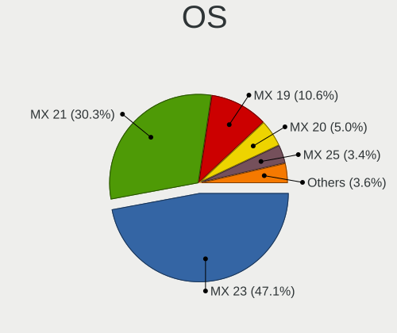

| Name           | Desktops | Percent |
|----------------|----------|---------|
| MX 23          | 208      | 47.06%  |
| MX 21          | 134      | 30.32%  |
| MX 19          | 47       | 10.63%  |
| MX 20          | 22       | 4.98%   |
| MX 25          | 15       | 3.39%   |
| MX 18          | 12       | 2.71%   |
| MX 22          | 1        | 0.23%   |
| MX 2           | 1        | 0.23%   |
| MX 17          | 1        | 0.23%   |
| MX 16-migrated | 1        | 0.23%   |

OS Family
---------

OS without a version

| Name | Desktops | Percent |
|------|----------|---------|
| MX   | 431      | 100%    |

Kernel
------

Version of the Linux kernel

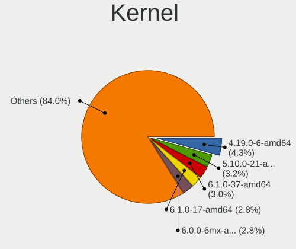

| Version                   | Desktops | Percent |
|---------------------------|----------|---------|
| 4.19.0-6-amd64            | 20       | 4.27%   |
| 5.10.0-21-amd64           | 15       | 3.21%   |
| 6.1.0-37-amd64            | 14       | 2.99%   |
| 6.1.0-17-amd64            | 13       | 2.78%   |
| 6.0.0-6mx-amd64           | 13       | 2.78%   |
| 5.10.0-20-amd64           | 13       | 2.78%   |
| 6.1.0-13-amd64            | 12       | 2.56%   |
| 6.1.0-23-amd64            | 10       | 2.14%   |
| 6.1.0-32-amd64            | 9        | 1.92%   |
| 6.1.0-10-amd64            | 9        | 1.92%   |
| 6.5.0-1mx-ahs-amd64       | 8        | 1.71%   |
| 6.1.0-34-amd64            | 8        | 1.71%   |
| 6.1.0-26-amd64            | 8        | 1.71%   |
| 6.1.0-25-amd64            | 8        | 1.71%   |
| 6.1.0-21-amd64            | 8        | 1.71%   |
| 6.1.0-40-amd64            | 7        | 1.5%    |
| 6.1.0-31-amd64            | 7        | 1.5%    |
| 5.14.0-4mx-amd64          | 7        | 1.5%    |
| 5.10.0-23-amd64           | 7        | 1.5%    |
| 5.10.0-18-amd64           | 7        | 1.5%    |
| 5.6.0-2-amd64             | 6        | 1.28%   |
| 5.10.0-5mx-amd64          | 6        | 1.28%   |
| 5.10.0-19-amd64           | 6        | 1.28%   |
| 6.4.0-1mx-ahs-amd64       | 5        | 1.07%   |
| 6.1.0-18-amd64            | 5        | 1.07%   |
| 5.18.0-4mx-amd64          | 5        | 1.07%   |
| 5.10.0-13-amd64           | 5        | 1.07%   |
| 4.19.0-17-amd64           | 5        | 1.07%   |
| 6.7.12-1-liquorix-amd64   | 4        | 0.85%   |
| 6.6.11-amd64              | 4        | 0.85%   |
| 6.16.12-1-liquorix-amd64  | 4        | 0.85%   |
| 6.12.57+deb13-amd64       | 4        | 0.85%   |
| 6.12.48+deb13-amd64       | 4        | 0.85%   |
| 6.1.0-41-amd64            | 4        | 0.85%   |
| 6.1.0-29-amd64            | 4        | 0.85%   |
| 6.1.0-11-amd64            | 4        | 0.85%   |
| 6.0.0-10.1-liquorix-amd64 | 4        | 0.85%   |
| 5.8.0-3-amd64             | 4        | 0.85%   |
| 5.10.0-16-amd64           | 4        | 0.85%   |
| 5.10.0-15-amd64           | 4        | 0.85%   |

Kernel Family
-------------

Linux kernel without a distro release

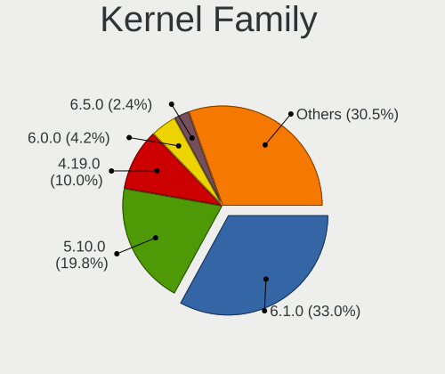

| Version | Desktops | Percent |
|---------|----------|---------|
| 6.1.0   | 148      | 32.96%  |
| 5.10.0  | 89       | 19.82%  |
| 4.19.0  | 45       | 10.02%  |
| 6.0.0   | 19       | 4.23%   |
| 6.5.0   | 11       | 2.45%   |
| 5.14.0  | 10       | 2.23%   |
| 6.4.0   | 7        | 1.56%   |
| 5.6.0   | 6        | 1.34%   |
| 5.5.0   | 5        | 1.11%   |
| 5.18.0  | 5        | 1.11%   |
| 5.16.0  | 5        | 1.11%   |
| 6.7.12  | 4        | 0.89%   |
| 6.6.11  | 4        | 0.89%   |
| 6.16.12 | 4        | 0.89%   |
| 6.12.57 | 4        | 0.89%   |
| 6.12.48 | 4        | 0.89%   |
| 5.8.0   | 4        | 0.89%   |
| 5.19.0  | 4        | 0.89%   |
| 6.3.9   | 3        | 0.67%   |
| 6.15.11 | 3        | 0.67%   |
| 6.10.11 | 3        | 0.67%   |
| 5.4.0   | 3        | 0.67%   |
| 5.15.0  | 3        | 0.67%   |
| 6.4.15  | 2        | 0.45%   |
| 6.2.14  | 2        | 0.45%   |
| 6.14.10 | 2        | 0.45%   |
| 6.13.7  | 2        | 0.45%   |
| 6.12.6  | 2        | 0.45%   |
| 6.12.30 | 2        | 0.45%   |
| 5.8.16  | 2        | 0.45%   |
| 5.3.0   | 2        | 0.45%   |
| 5.17.0  | 2        | 0.45%   |
| 6.9.7   | 1        | 0.22%   |
| 6.8.9   | 1        | 0.22%   |
| 6.7.11  | 1        | 0.22%   |
| 6.6.79  | 1        | 0.22%   |
| 6.6.7   | 1        | 0.22%   |
| 6.6.3   | 1        | 0.22%   |
| 6.5.9   | 1        | 0.22%   |
| 6.5.5   | 1        | 0.22%   |

Kernel Major Ver.
-----------------

Linux kernel major version

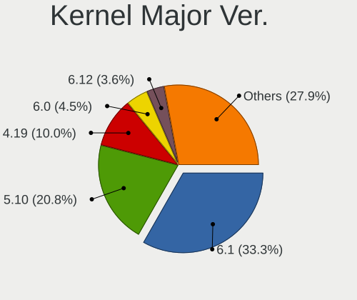

| Version | Desktops | Percent |
|---------|----------|---------|
| 6.1     | 149      | 33.26%  |
| 5.10    | 93       | 20.76%  |
| 4.19    | 45       | 10.04%  |
| 6.0     | 20       | 4.46%   |
| 6.12    | 16       | 3.57%   |
| 6.5     | 14       | 3.13%   |
| 6.4     | 10       | 2.23%   |
| 5.14    | 10       | 2.23%   |
| 6.6     | 7        | 1.56%   |
| 5.8     | 6        | 1.34%   |
| 5.6     | 6        | 1.34%   |
| 6.7     | 5        | 1.12%   |
| 6.10    | 5        | 1.12%   |
| 5.5     | 5        | 1.12%   |
| 5.4     | 5        | 1.12%   |
| 5.18    | 5        | 1.12%   |
| 5.16    | 5        | 1.12%   |
| 6.16    | 4        | 0.89%   |
| 6.13    | 4        | 0.89%   |
| 6.11    | 4        | 0.89%   |
| 5.19    | 4        | 0.89%   |
| 6.3     | 3        | 0.67%   |
| 6.15    | 3        | 0.67%   |
| 6.14    | 3        | 0.67%   |
| 5.15    | 3        | 0.67%   |
| 6.2     | 2        | 0.45%   |
| 5.3     | 2        | 0.45%   |
| 5.17    | 2        | 0.45%   |
| 6.9     | 1        | 0.22%   |
| 6.8     | 1        | 0.22%   |
| 6.17    | 1        | 0.22%   |
| 5.2     | 1        | 0.22%   |
| 5.11    | 1        | 0.22%   |
| 4.9     | 1        | 0.22%   |
| 4.18    | 1        | 0.22%   |
| 4.15    | 1        | 0.22%   |

Arch
----

OS architecture (x86_64, i586, etc.)

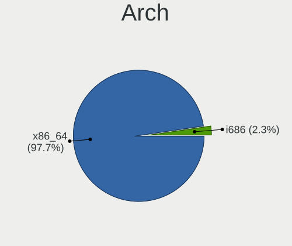

| Name   | Desktops | Percent |
|--------|----------|---------|
| x86_64 | 421      | 97.68%  |
| i686   | 10       | 2.32%   |

DE
--

Desktop Environment

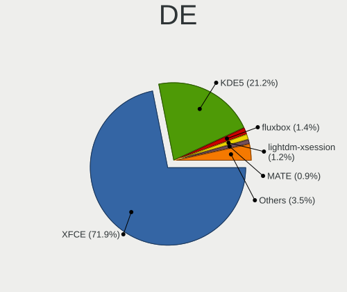

| Name             | Desktops | Percent |
|------------------|----------|---------|
| XFCE             | 312      | 71.89%  |
| KDE5             | 92       | 21.2%   |
| fluxbox          | 6        | 1.38%   |
| lightdm-xsession | 5        | 1.15%   |
| MATE             | 4        | 0.92%   |
| X-Cinnamon       | 3        | 0.69%   |
| LXQt             | 2        | 0.46%   |
| KDE6             | 2        | 0.46%   |
| KDE              | 2        | 0.46%   |
| Unknown          | 2        | 0.46%   |
| KDE4             | 1        | 0.23%   |
| ICEWM            | 1        | 0.23%   |
| i3               | 1        | 0.23%   |
| Budgie           | 1        | 0.23%   |

Display Server
--------------

X11 or Wayland

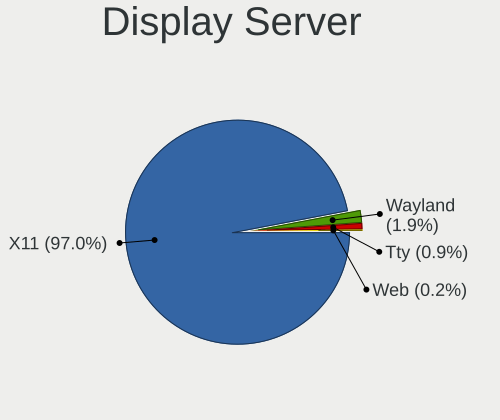

| Name    | Desktops | Percent |
|---------|----------|---------|
| X11     | 419      | 96.99%  |
| Wayland | 8        | 1.85%   |
| Tty     | 4        | 0.93%   |
| Web     | 1        | 0.23%   |

Display Manager
---------------

SDDM, LightDM, etc.

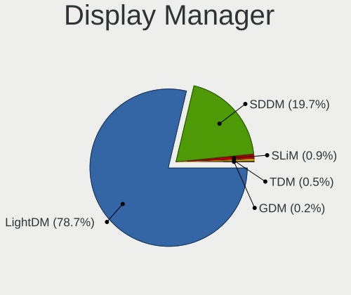

| Name    | Desktops | Percent |
|---------|----------|---------|
| LightDM | 340      | 78.7%   |
| SDDM    | 85       | 19.68%  |
| SLiM    | 4        | 0.93%   |
| TDM     | 2        | 0.46%   |
| GDM     | 1        | 0.23%   |

OS Lang
-------

Language

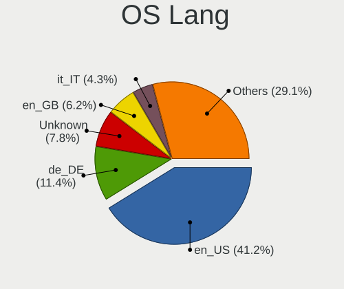

| Lang    | Desktops | Percent |
|---------|----------|---------|
| en_US   | 180      | 41.19%  |
| de_DE   | 50       | 11.44%  |
| Unknown | 34       | 7.78%   |
| en_GB   | 27       | 6.18%   |
| it_IT   | 19       | 4.35%   |
| es_ES   | 16       | 3.66%   |
| ru_RU   | 14       | 3.2%    |
| en_AU   | 12       | 2.75%   |
| pl_PL   | 10       | 2.29%   |
| pt_BR   | 9        | 2.06%   |
| sk_SK   | 8        | 1.83%   |
| fr_FR   | 8        | 1.83%   |
| es_AR   | 6        | 1.37%   |
| sv_SE   | 4        | 0.92%   |
| de_CH   | 4        | 0.92%   |
| tr_TR   | 3        | 0.69%   |
| fi_FI   | 3        | 0.69%   |
| es_VE   | 3        | 0.69%   |
| es_MX   | 3        | 0.69%   |
| en_NZ   | 3        | 0.69%   |
| en_CA   | 3        | 0.69%   |
| hu_HU   | 2        | 0.46%   |
| hr_HR   | 2        | 0.46%   |
| en_IE   | 2        | 0.46%   |
| de_AT   | 2        | 0.46%   |
| uk_UA   | 1        | 0.23%   |
| nl_BE   | 1        | 0.23%   |
| ko_KR   | 1        | 0.23%   |
| fr_BE   | 1        | 0.23%   |
| es_US   | 1        | 0.23%   |
| es_PE   | 1        | 0.23%   |
| es_NI   | 1        | 0.23%   |
| es_CO   | 1        | 0.23%   |
| el_GR   | 1        | 0.23%   |
| da_DK   | 1        | 0.23%   |

Boot Mode
---------

EFI or BIOS

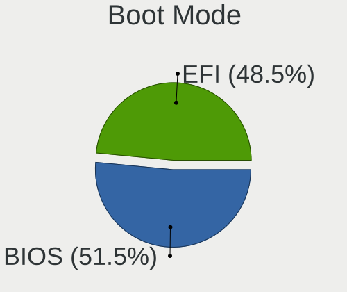

| Mode | Desktops | Percent |
|------|----------|---------|
| BIOS | 223      | 51.5%   |
| EFI  | 210      | 48.5%   |

Filesystem
----------

Type of filesystem

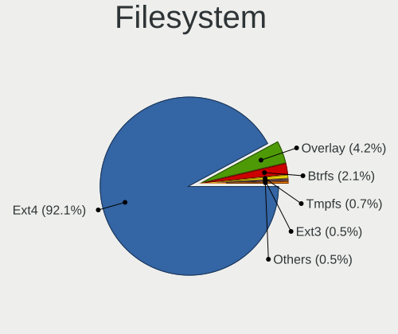

| Type     | Desktops | Percent |
|----------|----------|---------|
| Ext4     | 398      | 92.13%  |
| Overlay  | 18       | 4.17%   |
| Btrfs    | 9        | 2.08%   |
| Tmpfs    | 3        | 0.69%   |
| Ext3     | 2        | 0.46%   |
| Xfs      | 1        | 0.23%   |
| Reiserfs | 1        | 0.23%   |

Part. scheme
------------

Scheme of partitioning

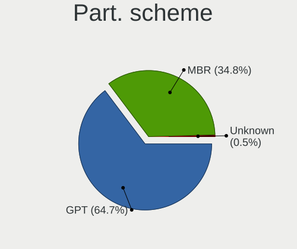

| Type    | Desktops | Percent |
|---------|----------|---------|
| GPT     | 281      | 64.75%  |
| MBR     | 151      | 34.79%  |
| Unknown | 2        | 0.46%   |

Dual Boot with Linux/BSD
------------------------

Hosting more than one Linux/BSD

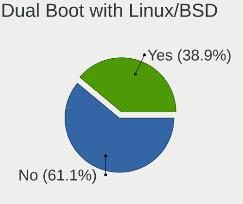

| Dual boot | Desktops | Percent |
|-----------|----------|---------|
| No        | 310      | 70.45%  |
| Yes       | 130      | 29.55%  |

Dual Boot (Win)
---------------

Hosting Linux and Windows

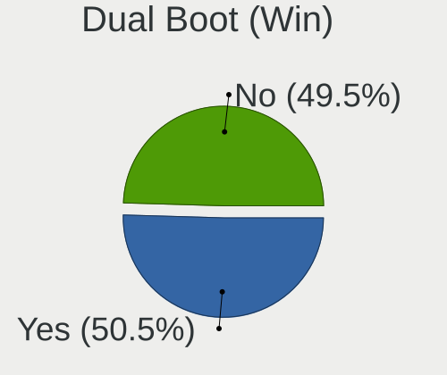

| Dual boot | Desktops | Percent |
|-----------|----------|---------|
| Yes       | 219      | 50.46%  |
| No        | 215      | 49.54%  |

Board
-----

Vendor
------

Motherboard manufacturer

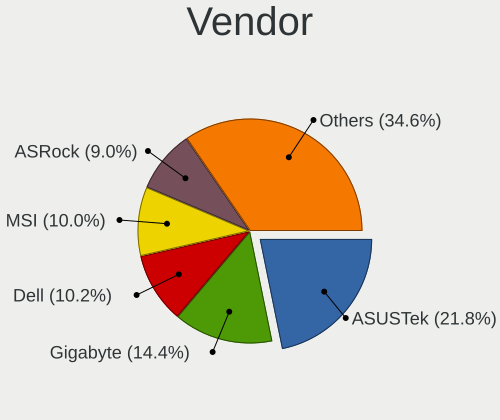

| Name                                 | Desktops | Percent |
|--------------------------------------|----------|---------|
| ASUSTek Computer                     | 94       | 21.81%  |
| Gigabyte Technology                  | 62       | 14.39%  |
| Dell                                 | 44       | 10.21%  |
| MSI                                  | 43       | 9.98%   |
| ASRock                               | 39       | 9.05%   |
| Hewlett-Packard                      | 36       | 8.35%   |
| Lenovo                               | 20       | 4.64%   |
| Intel                                | 14       | 3.25%   |
| Unknown                              | 12       | 2.78%   |
| Foxconn                              | 7        | 1.62%   |
| Pegatron                             | 5        | 1.16%   |
| Medion                               | 5        | 1.16%   |
| Acer                                 | 5        | 1.16%   |
| Fujitsu                              | 4        | 0.93%   |
| ECS                                  | 4        | 0.93%   |
| Biostar                              | 4        | 0.93%   |
| Gateway                              | 3        | 0.7%    |
| Shenzhen Meigao Electronic Equipment | 2        | 0.46%   |
| GEEKOM                               | 2        | 0.46%   |
| AZW                                  | 2        | 0.46%   |
| AOpen                                | 2        | 0.46%   |
| ZOTAC                                | 1        | 0.23%   |
| Wortmann AG                          | 1        | 0.23%   |
| TianBei                              | 1        | 0.23%   |
| SYS                                  | 1        | 0.23%   |
| SLIMBOOK                             | 1        | 0.23%   |
| SIRAGON                              | 1        | 0.23%   |
| Shenzhen DOKE electronic             | 1        | 0.23%   |
| Semp Toshiba                         | 1        | 0.23%   |
| Samsung Electronics                  | 1        | 0.23%   |
| Positivo                             | 1        | 0.23%   |
| OEM                                  | 1        | 0.23%   |
| MP                                   | 1        | 0.23%   |
| LattePanda                           | 1        | 0.23%   |
| IBM                                  | 1        | 0.23%   |
| Huanan                               | 1        | 0.23%   |
| HC Technology.                       | 1        | 0.23%   |
| GreatWall                            | 1        | 0.23%   |
| GALAX                                | 1        | 0.23%   |
| Fujitsu Siemens                      | 1        | 0.23%   |

Model
-----

Motherboard model

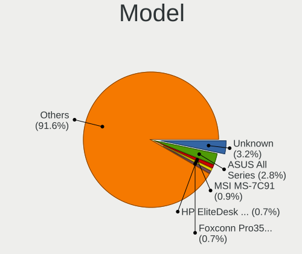

| Name                                 | Desktops | Percent |
|--------------------------------------|----------|---------|
| Unknown                              | 14       | 3.25%   |
| ASUS All Series                      | 12       | 2.78%   |
| MSI MS-7C91                          | 4        | 0.93%   |
| HP EliteDesk 800 G1 USDT             | 3        | 0.7%    |
| Foxconn Pro3500 Series               | 3        | 0.7%    |
| Dell OptiPlex 9020                   | 3        | 0.7%    |
| Dell OptiPlex 9010                   | 3        | 0.7%    |
| Dell OptiPlex 755                    | 3        | 0.7%    |
| ASUS PRIME B450M-A                   | 3        | 0.7%    |
| ASUS M5A97 R2.0                      | 3        | 0.7%    |
| MSI MS-7B86                          | 2        | 0.46%   |
| MSI MS-7A34                          | 2        | 0.46%   |
| MSI MS-7641                          | 2        | 0.46%   |
| Intel H81                            | 2        | 0.46%   |
| Intel B75                            | 2        | 0.46%   |
| HP Z400 Workstation                  | 2        | 0.46%   |
| HP Compaq Pro 6300 SFF               | 2        | 0.46%   |
| HP Compaq dc7700p Ultra-slim Desktop | 2        | 0.46%   |
| HP Compaq 8100 Elite SFF PC          | 2        | 0.46%   |
| Gigabyte Z77X-D3H                    | 2        | 0.46%   |
| Gigabyte GA-MA785GM-US2H             | 2        | 0.46%   |
| Gigabyte B560M DS3H V2               | 2        | 0.46%   |
| Gigabyte A520M H                     | 2        | 0.46%   |
| GEEKOM Mini IT13                     | 2        | 0.46%   |
| Dell Studio 540                      | 2        | 0.46%   |
| Dell OptiPlex 980                    | 2        | 0.46%   |
| Dell OptiPlex 790                    | 2        | 0.46%   |
| Dell OptiPlex 780                    | 2        | 0.46%   |
| Dell OptiPlex 760                    | 2        | 0.46%   |
| Dell OptiPlex 7040                   | 2        | 0.46%   |
| Dell Inspiron 3847                   | 2        | 0.46%   |
| ASUS Z170 PRO GAMING                 | 2        | 0.46%   |
| ASUS ROG Maximus XIII HERO           | 2        | 0.46%   |
| ASUS PRIME H310M-R R2.0              | 2        | 0.46%   |
| ASUS PRIME B560-PLUS                 | 2        | 0.46%   |
| ASUS PRIME B550M-A                   | 2        | 0.46%   |
| ASRock K8A780LM                      | 2        | 0.46%   |
| ASRock A300M-STX                     | 2        | 0.46%   |
| ASRock 980DE3/U3S3                   | 2        | 0.46%   |
| Wortmann AG TERRA_PC                 | 1        | 0.23%   |

Model Family
------------

Motherboard model prefix

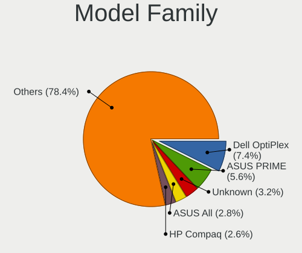

| Name                     | Desktops | Percent |
|--------------------------|----------|---------|
| Dell OptiPlex            | 32       | 7.42%   |
| ASUS PRIME               | 24       | 5.57%   |
| Unknown                  | 14       | 3.25%   |
| ASUS All                 | 12       | 2.78%   |
| HP Compaq                | 11       | 2.55%   |
| Lenovo ThinkCentre       | 10       | 2.32%   |
| ASUS TUF                 | 8        | 1.86%   |
| ASUS ROG                 | 8        | 1.86%   |
| HP EliteDesk             | 6        | 1.39%   |
| Lenovo IdeaCentre        | 5        | 1.16%   |
| Dell Inspiron            | 5        | 1.16%   |
| MSI MS-7C91              | 4        | 0.93%   |
| HP ProDesk               | 3        | 0.7%    |
| Gigabyte Z390            | 3        | 0.7%    |
| Foxconn Pro3500          | 3        | 0.7%    |
| Dell Studio              | 3        | 0.7%    |
| Dell Precision           | 3        | 0.7%    |
| ASUS SABERTOOTH          | 3        | 0.7%    |
| ASUS M5A97               | 3        | 0.7%    |
| ASRock X570              | 3        | 0.7%    |
| MSI MS-7B86              | 2        | 0.46%   |
| MSI MS-7A34              | 2        | 0.46%   |
| MSI MS-7641              | 2        | 0.46%   |
| Lenovo ThinkStation      | 2        | 0.46%   |
| Intel H81                | 2        | 0.46%   |
| Intel B75                | 2        | 0.46%   |
| HP Z400                  | 2        | 0.46%   |
| Gigabyte Z77X-D3H        | 2        | 0.46%   |
| Gigabyte X570            | 2        | 0.46%   |
| Gigabyte GA-MA785GM-US2H | 2        | 0.46%   |
| Gigabyte B650            | 2        | 0.46%   |
| Gigabyte B560M           | 2        | 0.46%   |
| Gigabyte B550M           | 2        | 0.46%   |
| Gigabyte B450M           | 2        | 0.46%   |
| Gigabyte A520M           | 2        | 0.46%   |
| GEEKOM Mini              | 2        | 0.46%   |
| Fujitsu ESPRIMO          | 2        | 0.46%   |
| Fujitsu CELSIUS          | 2        | 0.46%   |
| ASUS Z170                | 2        | 0.46%   |
| ASUS P5GC-MX             | 2        | 0.46%   |

MFG Year
--------

Motherboard manufacture year

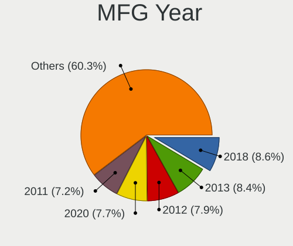

| Year | Desktops | Percent |
|------|----------|---------|
| 2018 | 37       | 8.58%   |
| 2013 | 36       | 8.35%   |
| 2012 | 34       | 7.89%   |
| 2020 | 33       | 7.66%   |
| 2011 | 31       | 7.19%   |
| 2021 | 27       | 6.26%   |
| 2022 | 25       | 5.8%    |
| 2009 | 25       | 5.8%    |
| 2017 | 23       | 5.34%   |
| 2010 | 21       | 4.87%   |
| 2019 | 20       | 4.64%   |
| 2014 | 18       | 4.18%   |
| 2016 | 17       | 3.94%   |
| 2023 | 16       | 3.71%   |
| 2015 | 16       | 3.71%   |
| 2008 | 13       | 3.02%   |
| 2007 | 13       | 3.02%   |
| 2006 | 10       | 2.32%   |
| 2024 | 8        | 1.86%   |
| 2025 | 3        | 0.7%    |
| 2005 | 3        | 0.7%    |
| 2004 | 2        | 0.46%   |

Form Factor
-----------

Physical design of the computer

| Name    | Desktops | Percent |
|---------|----------|---------|
| Desktop | 431      | 100%    |

Secure Boot
-----------

Enabled or disabled

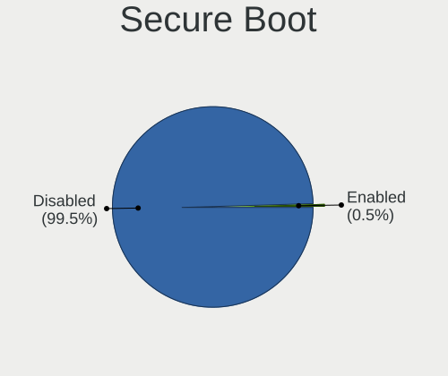

| State    | Desktops | Percent |
|----------|----------|---------|
| Disabled | 429      | 99.54%  |
| Enabled  | 2        | 0.46%   |

Coreboot
--------

Have coreboot on board

| Used | Desktops | Percent |
|------|----------|---------|
| No   | 431      | 100%    |

RAM Size
--------

Total RAM memory

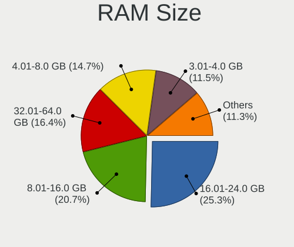

| Size in GB  | Desktops | Percent |
|-------------|----------|---------|
| 16.01-24.0  | 110      | 25.35%  |
| 8.01-16.0   | 90       | 20.74%  |
| 32.01-64.0  | 71       | 16.36%  |
| 4.01-8.0    | 64       | 14.75%  |
| 3.01-4.0    | 50       | 11.52%  |
| 24.01-32.0  | 15       | 3.46%   |
| 64.01-256.0 | 12       | 2.76%   |
| 1.01-2.0    | 12       | 2.76%   |
| 2.01-3.0    | 6        | 1.38%   |
| 0.51-1.0    | 4        | 0.92%   |

RAM Used
--------

Used RAM memory

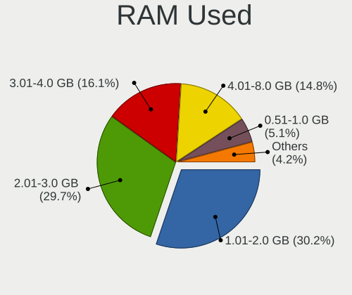

| Used GB    | Desktops | Percent |
|------------|----------|---------|
| 1.01-2.0   | 137      | 30.18%  |
| 2.01-3.0   | 135      | 29.74%  |
| 3.01-4.0   | 73       | 16.08%  |
| 4.01-8.0   | 67       | 14.76%  |
| 0.51-1.0   | 23       | 5.07%   |
| 8.01-16.0  | 13       | 2.86%   |
| 16.01-24.0 | 3        | 0.66%   |
| 0.01-0.5   | 2        | 0.44%   |
| 24.01-32.0 | 1        | 0.22%   |

Total Drives
------------

Number of drives on board

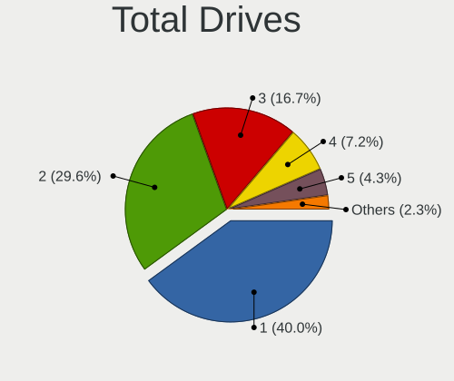

| Drives | Desktops | Percent |
|--------|----------|---------|
| 1      | 177      | 39.95%  |
| 2      | 131      | 29.57%  |
| 3      | 74       | 16.7%   |
| 4      | 32       | 7.22%   |
| 5      | 19       | 4.29%   |
| 8      | 3        | 0.68%   |
| 6      | 3        | 0.68%   |
| 7      | 2        | 0.45%   |
| 9      | 1        | 0.23%   |
| 0      | 1        | 0.23%   |

Has CD-ROM
----------

Has CD-ROM on board

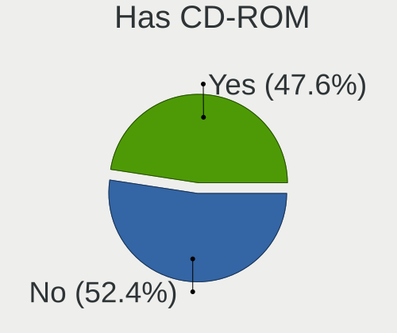

| Presented | Desktops | Percent |
|-----------|----------|---------|
| No        | 228      | 52.41%  |
| Yes       | 207      | 47.59%  |

Has Ethernet
------------

Has Ethernet on board

| Presented | Desktops | Percent |
|-----------|----------|---------|
| Yes       | 428      | 99.3%   |
| No        | 3        | 0.7%    |

Has WiFi
--------

Has WiFi module

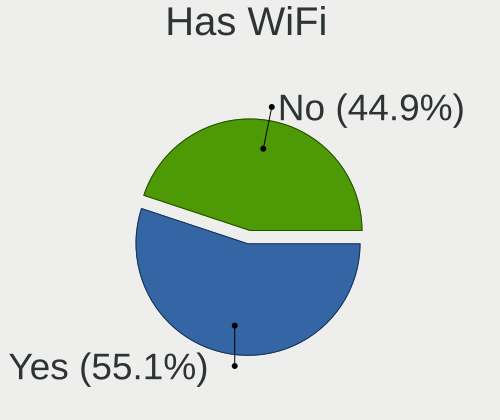

| Presented | Desktops | Percent |
|-----------|----------|---------|
| Yes       | 238      | 55.09%  |
| No        | 194      | 44.91%  |

Has Bluetooth
-------------

Has Bluetooth module

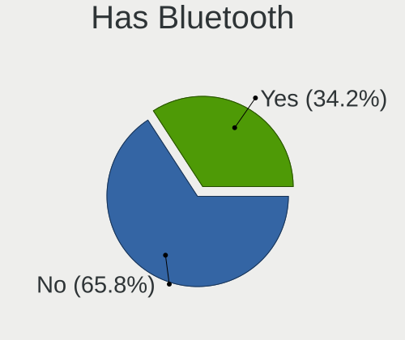

| Presented | Desktops | Percent |
|-----------|----------|---------|
| No        | 285      | 65.82%  |
| Yes       | 148      | 34.18%  |

Location
--------

Country
-------

Geographic location (country)

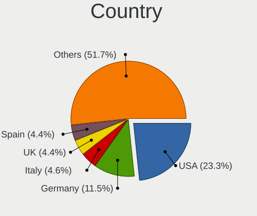

| Country                | Desktops | Percent |
|------------------------|----------|---------|
| USA                    | 101      | 23.33%  |
| Germany                | 50       | 11.55%  |
| Italy                  | 20       | 4.62%   |
| UK                     | 19       | 4.39%   |
| Spain                  | 19       | 4.39%   |
| Australia              | 18       | 4.16%   |
| Russia                 | 15       | 3.46%   |
| India                  | 13       | 3%      |
| France                 | 13       | 3%      |
| Poland                 | 12       | 2.77%   |
| Canada                 | 12       | 2.77%   |
| Brazil                 | 11       | 2.54%   |
| Slovakia               | 10       | 2.31%   |
| Sweden                 | 9        | 2.08%   |
| Finland                | 8        | 1.85%   |
| Indonesia              | 6        | 1.39%   |
| Argentina              | 6        | 1.39%   |
| Venezuela              | 5        | 1.15%   |
| Serbia                 | 5        | 1.15%   |
| Netherlands            | 5        | 1.15%   |
| Hungary                | 5        | 1.15%   |
| Belgium                | 5        | 1.15%   |
| Ukraine                | 4        | 0.92%   |
| Switzerland            | 4        | 0.92%   |
| New Zealand            | 4        | 0.92%   |
| Greece                 | 4        | 0.92%   |
| Denmark                | 4        | 0.92%   |
| Austria                | 4        | 0.92%   |
| Turkey                 | 3        | 0.69%   |
| South Africa           | 3        | 0.69%   |
| Mexico                 | 3        | 0.69%   |
| Ireland                | 3        | 0.69%   |
| Singapore              | 2        | 0.46%   |
| Romania                | 2        | 0.46%   |
| Malaysia               | 2        | 0.46%   |
| Chile                  | 2        | 0.46%   |
| Bosnia and Herzegovina | 2        | 0.46%   |
| UAE                    | 1        | 0.23%   |
| Sri Lanka              | 1        | 0.23%   |
| South Korea            | 1        | 0.23%   |

City
----

Geographic location (city)

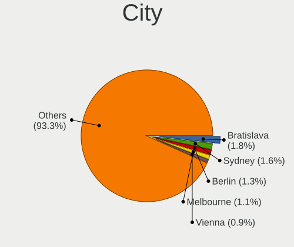

| City           | Desktops | Percent |
|----------------|----------|---------|
| Bratislava     | 8        | 1.79%   |
| Sydney         | 7        | 1.57%   |
| Berlin         | 6        | 1.35%   |
| Melbourne      | 5        | 1.12%   |
| Vienna         | 4        | 0.9%    |
| Seattle        | 4        | 0.9%    |
| Moscow         | 4        | 0.9%    |
| Cranston       | 4        | 0.9%    |
| Bengaluru      | 4        | 0.9%    |
| Warsaw         | 3        | 0.67%   |
| Toronto        | 3        | 0.67%   |
| St Petersburg  | 3        | 0.67%   |
| Milano         | 3        | 0.67%   |
| Florianópolis | 3        | 0.67%   |
| Charlotte      | 3        | 0.67%   |
| Birmingham     | 3        | 0.67%   |
| Barcelona      | 3        | 0.67%   |
| Vaasa          | 2        | 0.45%   |
| Stockholm      | 2        | 0.45%   |
| Singapore      | 2        | 0.45%   |
| Mesquite       | 2        | 0.45%   |
| Mérida        | 2        | 0.45%   |
| Manching       | 2        | 0.45%   |
| León          | 2        | 0.45%   |
| Kyiv           | 2        | 0.45%   |
| Krakow         | 2        | 0.45%   |
| Karori         | 2        | 0.45%   |
| Karlsruhe      | 2        | 0.45%   |
| Johannesburg   | 2        | 0.45%   |
| Houston        | 2        | 0.45%   |
| Helsinki       | 2        | 0.45%   |
| Hamburg        | 2        | 0.45%   |
| Göttingen     | 2        | 0.45%   |
| Gothenburg     | 2        | 0.45%   |
| Eureka         | 2        | 0.45%   |
| Ettingen       | 2        | 0.45%   |
| Espoo          | 2        | 0.45%   |
| Düsseldorf    | 2        | 0.45%   |
| Dublin         | 2        | 0.45%   |
| Debrecen       | 2        | 0.45%   |

Drives
------

Drive Vendor
------------

Hard drive vendors

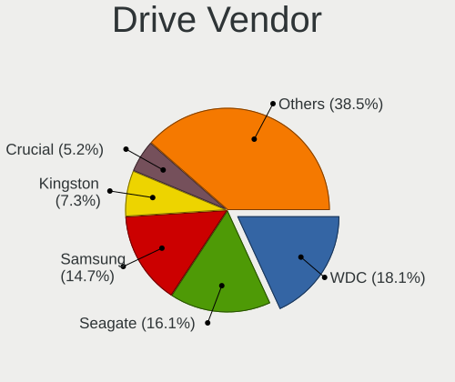

| Vendor                    | Desktops | Drives | Percent |
|---------------------------|----------|--------|---------|
| WDC                       | 144      | 188    | 18.14%  |
| Seagate                   | 128      | 184    | 16.12%  |
| Samsung Electronics       | 117      | 182    | 14.74%  |
| Kingston                  | 58       | 64     | 7.3%    |
| Crucial                   | 41       | 46     | 5.16%   |
| SanDisk                   | 39       | 43     | 4.91%   |
| Toshiba                   | 33       | 40     | 4.16%   |
| Hitachi                   | 25       | 33     | 3.15%   |
| A-DATA Technology         | 20       | 23     | 2.52%   |
| China                     | 17       | 23     | 2.14%   |
| Unknown                   | 11       | 16     | 1.39%   |
| SPCC                      | 9        | 9      | 1.13%   |
| Intel                     | 9        | 12     | 1.13%   |
| PNY                       | 7        | 9      | 0.88%   |
| Maxtor                    | 7        | 8      | 0.88%   |
| Lexar                     | 7        | 8      | 0.88%   |
| GOODRAM                   | 7        | 8      | 0.88%   |
| Micron Technology         | 6        | 7      | 0.76%   |
| Intenso                   | 6        | 6      | 0.76%   |
| Apacer                    | 6        | 6      | 0.76%   |
| Team                      | 5        | 7      | 0.63%   |
| Silicon Motion            | 5        | 5      | 0.63%   |
| Corsair                   | 5        | 5      | 0.63%   |
| Mushkin                   | 4        | 4      | 0.5%    |
| T-FORCE                   | 3        | 3      | 0.38%   |
| SK hynix                  | 3        | 3      | 0.38%   |
| Patriot                   | 3        | 5      | 0.38%   |
| HGST                      | 3        | 3      | 0.38%   |
| Apple                     | 3        | 3      | 0.38%   |
| Unknown                   | 3        | 3      | 0.38%   |
| XPG                       | 2        | 2      | 0.25%   |
| Transcend                 | 2        | 2      | 0.25%   |
| Realtek                   | 2        | 2      | 0.25%   |
| Plextor                   | 2        | 2      | 0.25%   |
| Phison                    | 2        | 2      | 0.25%   |
| OCZ                       | 2        | 2      | 0.25%   |
| Netac                     | 2        | 3      | 0.25%   |
| Micron/Crucial Technology | 2        | 2      | 0.25%   |
| LITEONIT                  | 2        | 2      | 0.25%   |
| KingFast                  | 2        | 3      | 0.25%   |

Drive Model
-----------

Hard drive models

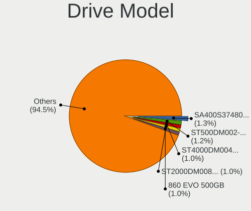

| Model                            | Desktops | Percent |
|----------------------------------|----------|---------|
| Kingston SA400S37480G 480GB SSD  | 12       | 1.32%   |
| Seagate ST500DM002-1BD142 500GB  | 11       | 1.21%   |
| Seagate ST4000DM004-2CV104 4TB   | 9        | 0.99%   |
| Seagate ST2000DM008-2FR102 2TB   | 9        | 0.99%   |
| Samsung SSD 860 EVO 500GB        | 9        | 0.99%   |
| Samsung SSD 850 EVO 250GB        | 8        | 0.88%   |
| Kingston SA400S37240G 240GB SSD  | 8        | 0.88%   |
| Toshiba DT01ACA100 1TB           | 7        | 0.77%   |
| Seagate ST1000DM010-2EP102 1TB   | 7        | 0.77%   |
| Seagate Expansion 2TB            | 7        | 0.77%   |
| Samsung SSD 970 EVO Plus 1TB     | 7        | 0.77%   |
| Crucial CT240BX500SSD1 240GB     | 7        | 0.77%   |
| WDC WD10EZEX-00BN5A0 1TB         | 6        | 0.66%   |
| SanDisk NVMe SSD Drive 1TB       | 6        | 0.66%   |
| Kingston SV300S37A240G 240GB SSD | 6        | 0.66%   |
| Kingston SA400S37120G 120GB SSD  | 6        | 0.66%   |
| WDC WD20EZRZ-00Z5HB0 2TB         | 5        | 0.55%   |
| Unknown SD/MMC/MS PRO 2GB        | 5        | 0.55%   |
| Seagate ST1000DM003-1SB102 1TB   | 5        | 0.55%   |
| Samsung SSD 980 500GB            | 5        | 0.55%   |
| Samsung SSD 860 EVO 250GB        | 5        | 0.55%   |
| Samsung SSD 850 EVO 500GB        | 5        | 0.55%   |
| Kingston SV300S37A120G 120GB SSD | 5        | 0.55%   |
| WDC WD10EZEX-08WN4A0 1TB         | 4        | 0.44%   |
| WDC WD1002FAEX-00Z3A0 1TB        | 4        | 0.44%   |
| Toshiba HDWD120 2TB              | 4        | 0.44%   |
| Seagate ST500LM021-1KJ152 500GB  | 4        | 0.44%   |
| Seagate ST3500418AS 500GB        | 4        | 0.44%   |
| Seagate ST3500413AS 500GB        | 4        | 0.44%   |
| Seagate ST31000524AS 1TB         | 4        | 0.44%   |
| Seagate ST2000DM001-1ER164 2TB   | 4        | 0.44%   |
| SanDisk SSD PLUS 1000GB          | 4        | 0.44%   |
| SanDisk SDSSDA240G 240GB         | 4        | 0.44%   |
| Samsung SSD 980 PRO 1TB          | 4        | 0.44%   |
| Samsung SSD 970 EVO Plus 500GB   | 4        | 0.44%   |
| Samsung SSD 860 QVO 1TB          | 4        | 0.44%   |
| Samsung SSD 860 EVO 1TB          | 4        | 0.44%   |
| Samsung SSD 850 PRO 256GB        | 4        | 0.44%   |
| WDC WD5000AAKX-75U6AA0 500GB     | 3        | 0.33%   |
| WDC WD20EZAZ-00GGJB0 2TB         | 3        | 0.33%   |

HDD Vendor
----------

Hard disk drive vendors

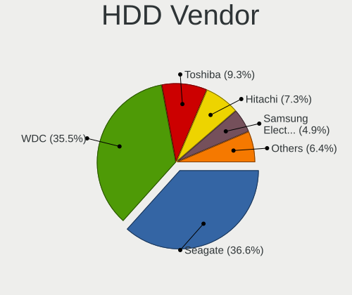

| Vendor              | Desktops | Drives | Percent |
|---------------------|----------|--------|---------|
| Seagate             | 126      | 181    | 36.63%  |
| WDC                 | 122      | 161    | 35.47%  |
| Toshiba             | 32       | 39     | 9.3%    |
| Hitachi             | 25       | 33     | 7.27%   |
| Samsung Electronics | 17       | 23     | 4.94%   |
| Maxtor              | 7        | 8      | 2.03%   |
| Unknown             | 6        | 6      | 1.74%   |
| HGST                | 3        | 3      | 0.87%   |
| Apple               | 3        | 3      | 0.87%   |
| IBM/Hitachi         | 1        | 1      | 0.29%   |
| Fujitsu             | 1        | 1      | 0.29%   |
| External            | 1        | 1      | 0.29%   |

SSD Vendor
----------

Solid state drive vendors

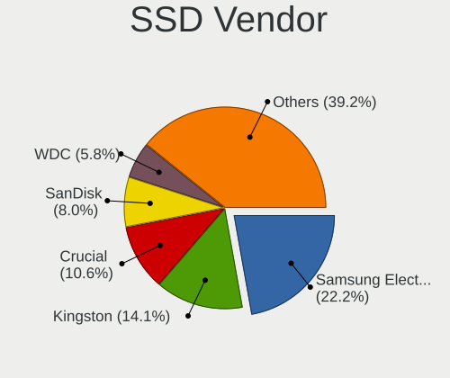

| Vendor              | Desktops | Drives | Percent |
|---------------------|----------|--------|---------|
| Samsung Electronics | 69       | 94     | 22.19%  |
| Kingston            | 44       | 49     | 14.15%  |
| Crucial             | 33       | 38     | 10.61%  |
| SanDisk             | 25       | 27     | 8.04%   |
| WDC                 | 18       | 20     | 5.79%   |
| China               | 17       | 23     | 5.47%   |
| A-DATA Technology   | 15       | 17     | 4.82%   |
| GOODRAM             | 7        | 8      | 2.25%   |
| SPCC                | 6        | 6      | 1.93%   |
| Intenso             | 6        | 6      | 1.93%   |
| Intel               | 6        | 8      | 1.93%   |
| PNY                 | 5        | 6      | 1.61%   |
| Micron Technology   | 4        | 5      | 1.29%   |
| Apacer              | 4        | 4      | 1.29%   |
| Team                | 3        | 3      | 0.96%   |
| T-FORCE             | 3        | 3      | 0.96%   |
| Mushkin             | 3        | 3      | 0.96%   |
| Transcend           | 2        | 2      | 0.64%   |
| Patriot             | 2        | 4      | 0.64%   |
| OCZ                 | 2        | 2      | 0.64%   |
| LITEONIT            | 2        | 2      | 0.64%   |
| KingFast            | 2        | 3      | 0.64%   |
| HS-SSD-C100         | 2        | 3      | 0.64%   |
| WDC WDS1            | 1        | 1      | 0.32%   |
| WALRAM              | 1        | 1      | 0.32%   |
| Verbatim            | 1        | 1      | 0.32%   |
| Vaseky              | 1        | 1      | 0.32%   |
| UP                  | 1        | 1      | 0.32%   |
| Unknown             | 1        | 1      | 0.32%   |
| Toshiba             | 1        | 1      | 0.32%   |
| Seagate             | 1        | 1      | 0.32%   |
| SABRENT             | 1        | 3      | 0.32%   |
| Rogueware           | 1        | 2      | 0.32%   |
| PUSKILL             | 1        | 2      | 0.32%   |
| Plextor             | 1        | 1      | 0.32%   |
| OCZ-VERTEX          | 1        | 1      | 0.32%   |
| MCQUEST             | 1        | 1      | 0.32%   |
| Lexar               | 1        | 1      | 0.32%   |
| KingSpec            | 1        | 1      | 0.32%   |
| Hoodisk             | 1        | 1      | 0.32%   |

Drive Kind
----------

HDD or SSD

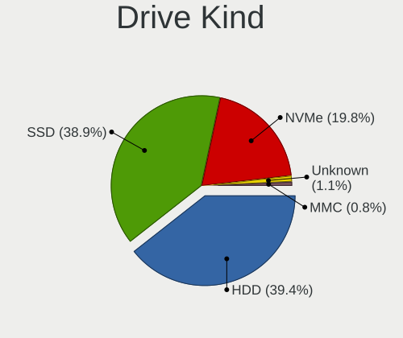

| Kind    | Desktops | Drives | Percent |
|---------|----------|--------|---------|
| HDD     | 260      | 460    | 39.39%  |
| SSD     | 257      | 372    | 38.94%  |
| NVMe    | 131      | 176    | 19.85%  |
| Unknown | 7        | 11     | 1.06%   |
| MMC     | 5        | 5      | 0.76%   |

Drive Connector
---------------

SATA, SAS, NVMe, etc.

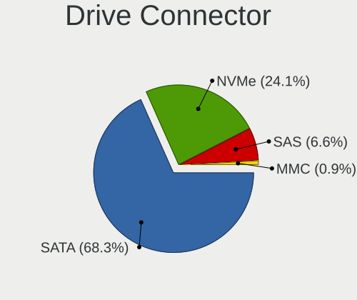

| Type | Desktops | Drives | Percent |
|------|----------|--------|---------|
| SATA | 371      | 797    | 68.32%  |
| NVMe | 131      | 174    | 24.13%  |
| SAS  | 36       | 48     | 6.63%   |
| MMC  | 5        | 5      | 0.92%   |

Drive Size
----------

Size of hard drive

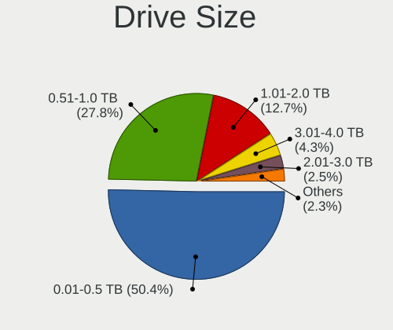

| Size in TB | Desktops | Drives | Percent |
|------------|----------|--------|---------|
| 0.01-0.5   | 281      | 436    | 50.36%  |
| 0.51-1.0   | 155      | 218    | 27.78%  |
| 1.01-2.0   | 71       | 98     | 12.72%  |
| 3.01-4.0   | 24       | 30     | 4.3%    |
| 2.01-3.0   | 14       | 18     | 2.51%   |
| 4.01-10.0  | 11       | 28     | 1.97%   |
| 10.01-20.0 | 2        | 4      | 0.36%   |

Space Total
-----------

Amount of disk space available on the file system

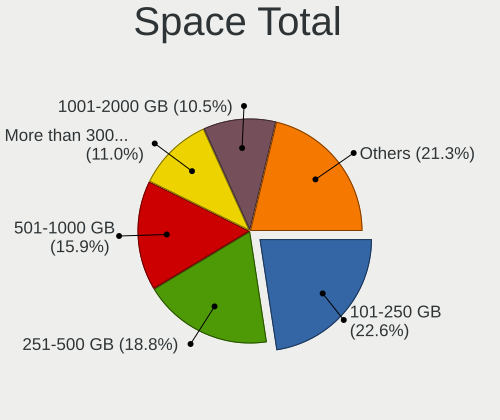

| Size in GB     | Desktops | Percent |
|----------------|----------|---------|
| 101-250        | 101      | 22.6%   |
| 251-500        | 84       | 18.79%  |
| 501-1000       | 71       | 15.88%  |
| More than 3000 | 49       | 10.96%  |
| 1001-2000      | 47       | 10.51%  |
| 2001-3000      | 33       | 7.38%   |
| 51-100         | 30       | 6.71%   |
| 1-20           | 19       | 4.25%   |
| 21-50          | 12       | 2.68%   |
| Unknown        | 1        | 0.22%   |

Space Used
----------

Amount of used disk space

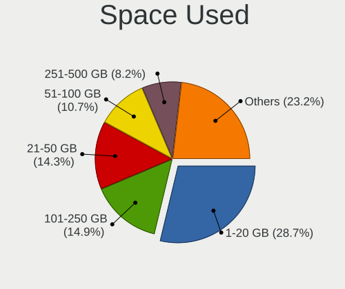

| Used GB        | Desktops | Percent |
|----------------|----------|---------|
| 1-20           | 129      | 28.73%  |
| 101-250        | 67       | 14.92%  |
| 21-50          | 64       | 14.25%  |
| 51-100         | 48       | 10.69%  |
| 251-500        | 37       | 8.24%   |
| 501-1000       | 36       | 8.02%   |
| 1001-2000      | 34       | 7.57%   |
| More than 3000 | 21       | 4.68%   |
| 2001-3000      | 12       | 2.67%   |
| Unknown        | 1        | 0.22%   |

Malfunc. Drives
---------------

Drive models with a malfunction

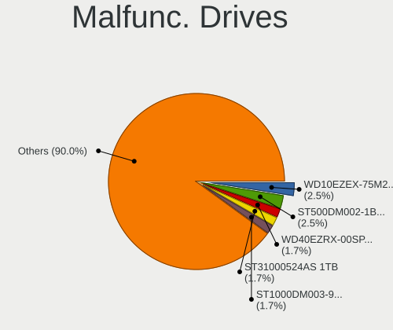

| Model                           | Desktops | Drives | Percent |
|---------------------------------|----------|--------|---------|
| WDC WD10EZEX-75M2NA0 1TB        | 3        | 4      | 2.5%    |
| Seagate ST500DM002-1BD142 500GB | 3        | 3      | 2.5%    |
| WDC WD40EZRX-00SPEB0 4TB        | 2        | 2      | 1.67%   |
| Seagate ST31000524AS 1TB        | 2        | 2      | 1.67%   |
| Seagate ST1000DM003-9YN162 1TB  | 2        | 2      | 1.67%   |
| Hitachi HUA722020ALA331 2TB     | 2        | 2      | 1.67%   |
| China SSD 512GB                 | 2        | 2      | 1.67%   |
| WDC WDS100T2B0A-00SM50 1TB SSD  | 1        | 1      | 0.83%   |
| WDC WD6400AACS-00G8B1 640GB     | 1        | 1      | 0.83%   |
| WDC WD5003ABYX-01WERA1 500GB    | 1        | 1      | 0.83%   |
| WDC WD5000LPVX-22V0TT0 500GB    | 1        | 1      | 0.83%   |
| WDC WD40EZRZ-00GXCB0 4TB        | 1        | 1      | 0.83%   |
| WDC WD3200AAKS-00UU3A0 320GB    | 1        | 1      | 0.83%   |
| WDC WD3200AAJS-61B4A0 320GB     | 1        | 1      | 0.83%   |
| WDC WD3200AAJS-00L7A0 320GB     | 1        | 1      | 0.83%   |
| WDC WD3200AAJS-00B4A0 320GB     | 1        | 1      | 0.83%   |
| WDC WD2500AAJS-00B4A0 250GB     | 1        | 3      | 0.83%   |
| WDC WD20EZRZ-00Z5HB0 2TB        | 1        | 1      | 0.83%   |
| WDC WD20EZRX-00D8PB0 2TB        | 1        | 1      | 0.83%   |
| WDC WD20EFRX-68EUZN0 2TB        | 1        | 2      | 0.83%   |
| WDC WD20EFRX-68AX9N0 2TB        | 1        | 1      | 0.83%   |
| WDC WD20EARX-00PASB0 2TB        | 1        | 1      | 0.83%   |
| WDC WD20EARS-00J99B0 2TB        | 1        | 1      | 0.83%   |
| WDC WD1600BEVT-00A23T0 160GB    | 1        | 1      | 0.83%   |
| WDC WD1600AVVS-63L2B0 160GB     | 1        | 1      | 0.83%   |
| WDC WD15EADS-11P8B2 1TB         | 1        | 1      | 0.83%   |
| WDC WD10SPZX-60Z10T0 1TB        | 1        | 1      | 0.83%   |
| WDC WD10EZRZ-00HTKB0 1TB        | 1        | 1      | 0.83%   |
| WDC WD10EZEX-75WN4A0 1TB        | 1        | 1      | 0.83%   |
| WDC WD10EZEX-00RKKA0 1TB        | 1        | 1      | 0.83%   |
| WDC WD10EAVS-00D7B1 1TB         | 1        | 1      | 0.83%   |
| WDC WD10EARS-00Y5B1 1TB         | 1        | 1      | 0.83%   |
| WDC WD10EADS-98M2B0 1TB         | 1        | 1      | 0.83%   |
| WDC WD10EADS-00M2B0 1TB         | 1        | 1      | 0.83%   |
| WDC WD1002FAEX-00Z3A0 1TB       | 1        | 1      | 0.83%   |
| Toshiba MQ01ABF050 500GB        | 1        | 1      | 0.83%   |
| Toshiba MQ01ABF032 320GB        | 1        | 1      | 0.83%   |
| Toshiba MK7575GSX 752GB         | 1        | 1      | 0.83%   |
| Toshiba MK6465GSX 640GB         | 1        | 1      | 0.83%   |
| Toshiba MK3259GSXP 320GB        | 1        | 1      | 0.83%   |

Malfunc. Drive Vendor
---------------------

Vendors of faulty drives

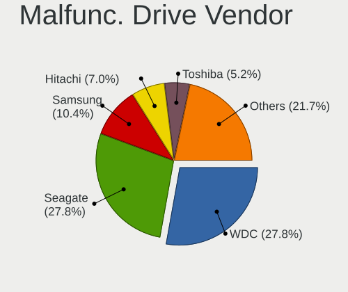

| Vendor              | Desktops | Drives | Percent |
|---------------------|----------|--------|---------|
| WDC                 | 32       | 37     | 27.83%  |
| Seagate             | 32       | 36     | 27.83%  |
| Samsung Electronics | 12       | 16     | 10.43%  |
| Hitachi             | 8        | 9      | 6.96%   |
| Toshiba             | 6        | 7      | 5.22%   |
| Maxtor              | 4        | 4      | 3.48%   |
| Kingston            | 2        | 2      | 1.74%   |
| Intel               | 2        | 3      | 1.74%   |
| Crucial             | 2        | 2      | 1.74%   |
| China               | 2        | 2      | 1.74%   |
| A-DATA Technology   | 2        | 3      | 1.74%   |
| SPCC                | 1        | 1      | 0.87%   |
| SanDisk             | 1        | 1      | 0.87%   |
| Micron Technology   | 1        | 1      | 0.87%   |
| Lexar               | 1        | 1      | 0.87%   |
| KingSpec            | 1        | 1      | 0.87%   |
| Intenso             | 1        | 1      | 0.87%   |
| IBM/Hitachi         | 1        | 1      | 0.87%   |
| HGST                | 1        | 1      | 0.87%   |
| GOODRAM             | 1        | 1      | 0.87%   |
| Fujitsu             | 1        | 1      | 0.87%   |
| ADATA Technology    | 1        | 1      | 0.87%   |

Malfunc. HDD Vendor
-------------------

Vendors of faulty HDD drives

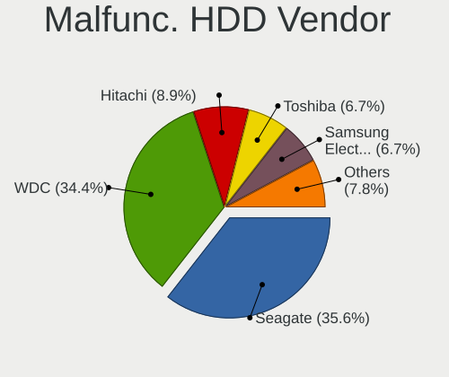

| Vendor              | Desktops | Drives | Percent |
|---------------------|----------|--------|---------|
| Seagate             | 32       | 36     | 35.56%  |
| WDC                 | 31       | 36     | 34.44%  |
| Hitachi             | 8        | 9      | 8.89%   |
| Toshiba             | 6        | 7      | 6.67%   |
| Samsung Electronics | 6        | 8      | 6.67%   |
| Maxtor              | 4        | 4      | 4.44%   |
| IBM/Hitachi         | 1        | 1      | 1.11%   |
| HGST                | 1        | 1      | 1.11%   |
| Fujitsu             | 1        | 1      | 1.11%   |

Malfunc. Drive Kind
-------------------

Kinds of faulty drives

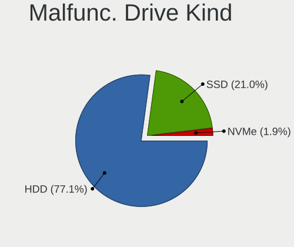

| Kind | Desktops | Drives | Percent |
|------|----------|--------|---------|
| HDD  | 81       | 103    | 77.14%  |
| SSD  | 22       | 27     | 20.95%  |
| NVMe | 2        | 2      | 1.9%    |

Failed Drives
-------------

Failed drive models

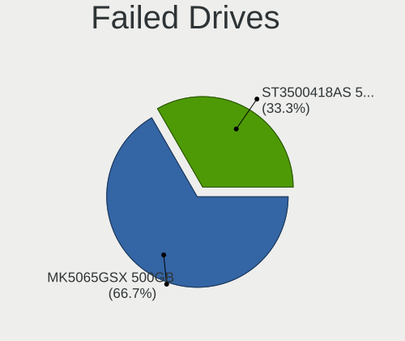

| Model                       | Desktops | Drives | Percent |
|-----------------------------|----------|--------|---------|
| Toshiba MK5065GSX 500GB     | 2        | 2      | 50%     |
| WDC WD3200AAJS-00B4A0 320GB | 1        | 1      | 25%     |
| Seagate ST3500418AS 500GB   | 1        | 2      | 25%     |

Failed Drive Vendor
-------------------

Failed drive vendors

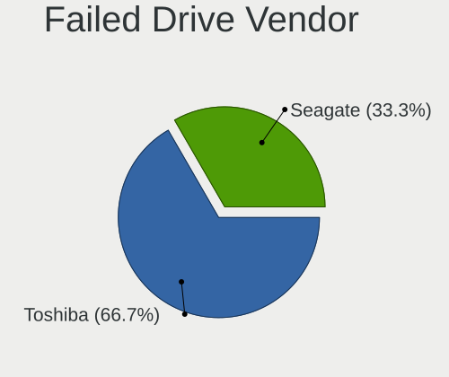

| Vendor  | Desktops | Drives | Percent |
|---------|----------|--------|---------|
| Toshiba | 2        | 2      | 50%     |
| WDC     | 1        | 1      | 25%     |
| Seagate | 1        | 2      | 25%     |

Drive Status
------------

Number of failed and malfunc. drives

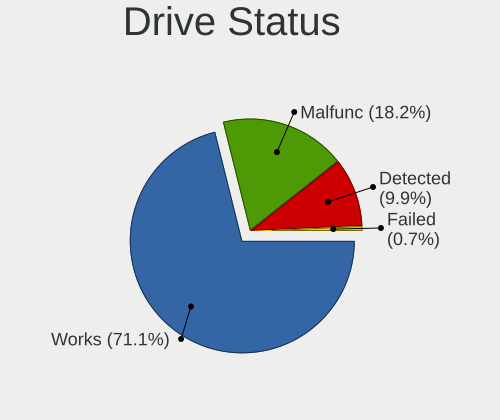

| Status   | Desktops | Drives | Percent |
|----------|----------|--------|---------|
| Works    | 394      | 807    | 71.12%  |
| Malfunc  | 101      | 132    | 18.23%  |
| Detected | 55       | 80     | 9.93%   |
| Failed   | 4        | 5      | 0.72%   |

Storage controller
------------------

Storage Vendor
--------------

Storage controller vendors

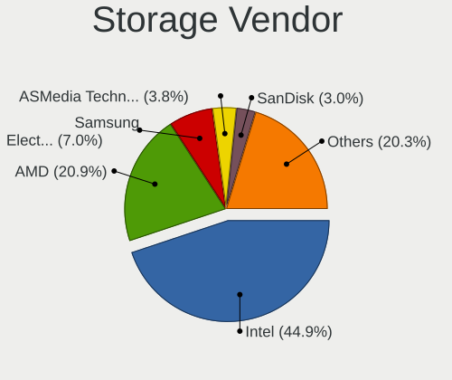

| Vendor                           | Desktops | Percent |
|----------------------------------|----------|---------|
| Intel                            | 281      | 44.89%  |
| AMD                              | 131      | 20.93%  |
| Samsung Electronics              | 44       | 7.03%   |
| ASMedia Technology               | 24       | 3.83%   |
| SanDisk                          | 19       | 3.04%   |
| Kingston Technology Company      | 15       | 2.4%    |
| JMicron Technology               | 15       | 2.4%    |
| Phison Electronics               | 14       | 2.24%   |
| Marvell Technology Group         | 13       | 2.08%   |
| Silicon Motion                   | 9        | 1.44%   |
| Nvidia                           | 7        | 1.12%   |
| Micron/Crucial Technology        | 7        | 1.12%   |
| ADATA Technology                 | 7        | 1.12%   |
| Realtek Semiconductor            | 5        | 0.8%    |
| VIA Technologies                 | 4        | 0.64%   |
| Shenzhen Longsys Electronics     | 4        | 0.64%   |
| Micron Technology                | 4        | 0.64%   |
| MAXIO Technology (Hangzhou)      | 4        | 0.64%   |
| LSI Logic / Symbios Logic        | 4        | 0.64%   |
| SK hynix                         | 3        | 0.48%   |
| Silicon Image                    | 3        | 0.48%   |
| ULi Electronics                  | 2        | 0.32%   |
| KIOXIA                           | 2        | 0.32%   |
| TenaFe                           | 1        | 0.16%   |
| Silicon Integrated Systems [SiS] | 1        | 0.16%   |
| Lite-On Technology               | 1        | 0.16%   |
| Integrated Technology Express    | 1        | 0.16%   |
| Initio                           | 1        | 0.16%   |

Storage Model
-------------

Storage controller models

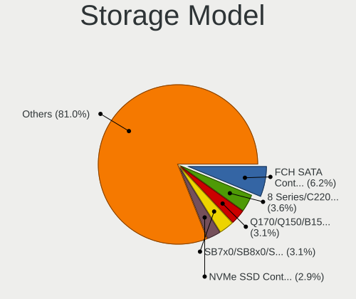

| Model                                                                                   | Desktops | Percent |
|-----------------------------------------------------------------------------------------|----------|---------|
| AMD FCH SATA Controller [AHCI mode]                                                     | 48       | 6.25%   |
| Intel 8 Series/C220 Series Chipset Family 6-port SATA Controller 1 [AHCI mode]          | 28       | 3.65%   |
| Intel Q170/Q150/B150/H170/H110/Z170/CM236 Chipset SATA Controller [AHCI Mode]           | 24       | 3.13%   |
| AMD SB7x0/SB8x0/SB9x0 IDE Controller                                                    | 24       | 3.13%   |
| Samsung NVMe SSD Controller SM981/PM981/PM983                                           | 22       | 2.86%   |
| ASMedia ASM1061/ASM1062 Serial ATA Controller                                           | 22       | 2.86%   |
| AMD 500 Series Chipset SATA Controller                                                  | 21       | 2.73%   |
| Intel 7 Series/C210 Series Chipset Family 6-port SATA Controller [AHCI mode]            | 19       | 2.47%   |
| AMD SB7x0/SB8x0/SB9x0 SATA Controller [AHCI mode]                                       | 19       | 2.47%   |
| Intel 6 Series/C200 Series Chipset Family 6 port Desktop SATA AHCI Controller           | 18       | 2.34%   |
| AMD 400 Series Chipset SATA Controller                                                  | 18       | 2.34%   |
| Intel 200 Series PCH SATA controller [AHCI mode]                                        | 17       | 2.21%   |
| Intel NM10/ICH7 Family SATA Controller [IDE mode]                                       | 16       | 2.08%   |
| AMD SB7x0/SB8x0/SB9x0 SATA Controller [IDE mode]                                        | 16       | 2.08%   |
| Intel Cannon Lake PCH SATA AHCI Controller                                              | 15       | 1.95%   |
| Intel 82801G (ICH7 Family) IDE Controller                                               | 15       | 1.95%   |
| AMD 600 Series Chipset SATA Controller                                                  | 14       | 1.82%   |
| Intel 500 Series Chipset Family SATA AHCI Controller                                    | 13       | 1.69%   |
| Intel Alder Lake-S PCH SATA Controller [AHCI Mode]                                      | 11       | 1.43%   |
| Intel SATA Controller [RAID mode]                                                       | 10       | 1.3%    |
| Samsung NVMe SSD Controller 980 (DRAM-less)                                             | 8        | 1.04%   |
| JMicron JMB363 SATA/IDE Controller                                                      | 8        | 1.04%   |
| AMD 300 Series Chipset SATA Controller                                                  | 8        | 1.04%   |
| Silicon Motion SM2263EN/SM2263XT (DRAM-less) NVMe SSD Controllers                       | 7        | 0.91%   |
| Micron/Crucial P2 [Nick P2] / P3 / P3 Plus NVMe PCIe SSD (DRAM-less)                    | 7        | 0.91%   |
| Intel 82801JD/DO (ICH10 Family) SATA AHCI Controller                                    | 7        | 0.91%   |
| Intel 6 Series/C200 Series Chipset Family Desktop SATA Controller (IDE mode, ports 4-5) | 7        | 0.91%   |
| Intel 6 Series/C200 Series Chipset Family Desktop SATA Controller (IDE mode, ports 0-3) | 7        | 0.91%   |
| Intel 4 Series Chipset PT IDER Controller                                               | 7        | 0.91%   |
| Samsung NVMe SSD Controller PM9A1/PM9A3/980PRO                                          | 6        | 0.78%   |
| Phison E12 NVMe Controller                                                              | 6        | 0.78%   |
| Intel Volume Management Device NVMe RAID Controller                                     | 6        | 0.78%   |
| Intel 82801JI (ICH10 Family) 4 port SATA IDE Controller #1                              | 6        | 0.78%   |
| Intel 82801JI (ICH10 Family) 2 port SATA IDE Controller #2                              | 6        | 0.78%   |
| Intel 82801IR/IO/IH (ICH9R/DO/DH) 6 port SATA Controller [AHCI mode]                    | 6        | 0.78%   |
| Intel 5 Series/3400 Series Chipset 4 port SATA IDE Controller                           | 6        | 0.78%   |
| Intel 5 Series/3400 Series Chipset 2 port SATA IDE Controller                           | 6        | 0.78%   |
| SanDisk WD SN560/SN740/SN770/SN5000 NVMe SSD                                            | 5        | 0.65%   |
| Samsung NVMe SSD Controller SM961/PM961/SM963                                           | 5        | 0.65%   |
| Intel Comet Lake SATA AHCI Controller                                                   | 5        | 0.65%   |

Storage Kind
------------

Kind of storage controller (IDE, SATA, NVMe, SAS, ...)

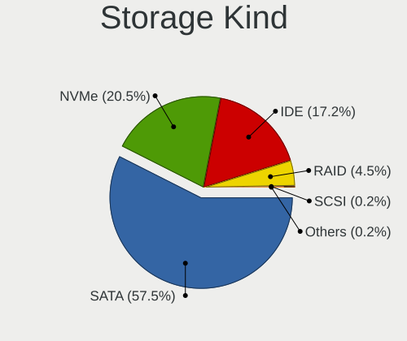

| Kind | Desktops | Percent |
|------|----------|---------|
| SATA | 358      | 57.46%  |
| NVMe | 128      | 20.55%  |
| IDE  | 107      | 17.17%  |
| RAID | 28       | 4.49%   |
| SAS  | 1        | 0.16%   |
| SCSI | 1        | 0.16%   |

Processor
---------

CPU Vendor
----------

Processor vendors

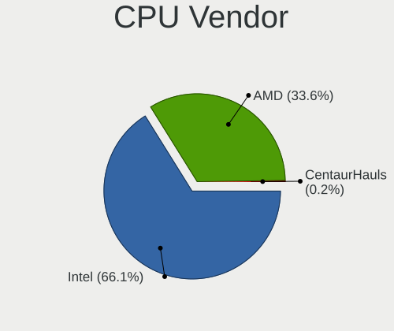

| Vendor       | Desktops | Percent |
|--------------|----------|---------|
| Intel        | 285      | 66.13%  |
| AMD          | 145      | 33.64%  |
| CentaurHauls | 1        | 0.23%   |

CPU Model
---------

Processor models

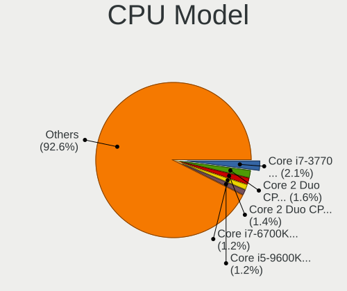

| Model                                       | Desktops | Percent |
|---------------------------------------------|----------|---------|
| Intel Core i7-3770 CPU @ 3.40GHz            | 9        | 2.09%   |
| Intel Core 2 Duo CPU E8400 @ 3.00GHz        | 7        | 1.62%   |
| Intel Core 2 Duo CPU E7500 @ 2.93GHz        | 6        | 1.39%   |
| Intel Core i7-6700K CPU @ 4.00GHz           | 5        | 1.16%   |
| Intel Core i5-9600K CPU @ 3.70GHz           | 5        | 1.16%   |
| Intel Core i5-3470 CPU @ 3.20GHz            | 5        | 1.16%   |
| AMD Ryzen 5 7600 6-Core Processor           | 5        | 1.16%   |
| AMD Ryzen 5 2600 Six-Core Processor         | 5        | 1.16%   |
| AMD Ryzen 5 1600 Six-Core Processor         | 5        | 1.16%   |
| Intel Core i5-8400 CPU @ 2.80GHz            | 4        | 0.93%   |
| Intel Core i5-2400 CPU @ 3.10GHz            | 4        | 0.93%   |
| Intel 11th Gen Core i7-11700 @ 2.50GHz      | 4        | 0.93%   |
| AMD Ryzen 7 3700X 8-Core Processor          | 4        | 0.93%   |
| AMD Ryzen 5 5600G with Radeon Graphics      | 4        | 0.93%   |
| AMD Ryzen 5 3600 6-Core Processor           | 4        | 0.93%   |
| AMD Phenom II X4 925 Processor              | 4        | 0.93%   |
| AMD FX-6300 Six-Core Processor              | 4        | 0.93%   |
| Intel Core i7-6700 CPU @ 3.40GHz            | 3        | 0.7%    |
| Intel Core i7-4790 CPU @ 3.60GHz            | 3        | 0.7%    |
| Intel Core i7-2600K CPU @ 3.40GHz           | 3        | 0.7%    |
| Intel Core i7 CPU 870 @ 2.93GHz             | 3        | 0.7%    |
| Intel Core i5-6600 CPU @ 3.30GHz            | 3        | 0.7%    |
| Intel Core i5-4690K CPU @ 3.50GHz           | 3        | 0.7%    |
| Intel Core i5-4590 CPU @ 3.30GHz            | 3        | 0.7%    |
| Intel Core i5-4460 CPU @ 3.20GHz            | 3        | 0.7%    |
| Intel Core i5-3330 CPU @ 3.00GHz            | 3        | 0.7%    |
| Intel Core i5-10400 CPU @ 2.90GHz           | 3        | 0.7%    |
| Intel Core i3-4160 CPU @ 3.60GHz            | 3        | 0.7%    |
| Intel Core i3-2100 CPU @ 3.10GHz            | 3        | 0.7%    |
| Intel 12th Gen Core i7-12700                | 3        | 0.7%    |
| Intel 11th Gen Core i5-11400 @ 2.60GHz      | 3        | 0.7%    |
| AMD Ryzen 7 5800X 8-Core Processor          | 3        | 0.7%    |
| AMD Ryzen 5 5600X 6-Core Processor          | 3        | 0.7%    |
| AMD Ryzen 5 3400G with Radeon Vega Graphics | 3        | 0.7%    |
| AMD Ryzen 5 1600X Six-Core Processor        | 3        | 0.7%    |
| AMD Phenom II X6 1090T Processor            | 3        | 0.7%    |
| Intel Pentium Dual-Core CPU E5500 @ 2.80GHz | 2        | 0.46%   |
| Intel Pentium Dual-Core CPU E5400 @ 2.70GHz | 2        | 0.46%   |
| Intel Pentium CPU G3240 @ 3.10GHz           | 2        | 0.46%   |
| Intel Pentium 4 CPU 3.20GHz                 | 2        | 0.46%   |

CPU Model Family
----------------

Processor model prefix

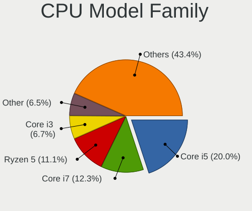

| Model                   | Desktops | Percent |
|-------------------------|----------|---------|
| Intel Core i5           | 86       | 19.95%  |
| Intel Core i7           | 53       | 12.3%   |
| AMD Ryzen 5             | 48       | 11.14%  |
| Intel Core i3           | 29       | 6.73%   |
| Other                   | 28       | 6.5%    |
| Intel Core 2 Duo        | 22       | 5.1%    |
| AMD Ryzen 7             | 21       | 4.87%   |
| Intel Celeron           | 13       | 3.02%   |
| Intel Xeon              | 12       | 2.78%   |
| AMD FX                  | 10       | 2.32%   |
| AMD Ryzen 9             | 8        | 1.86%   |
| Intel Pentium Dual-Core | 7        | 1.62%   |
| Intel Pentium           | 7        | 1.62%   |
| Intel Core 2 Quad       | 7        | 1.62%   |
| AMD Phenom II X4        | 7        | 1.62%   |
| Intel Pentium 4         | 5        | 1.16%   |
| AMD Athlon II X2        | 5        | 1.16%   |
| AMD Phenom II X6        | 4        | 0.93%   |
| AMD Athlon II X4        | 4        | 0.93%   |
| AMD Athlon              | 4        | 0.93%   |
| AMD A8                  | 4        | 0.93%   |
| Intel Core i9           | 3        | 0.7%    |
| Intel Core 2            | 3        | 0.7%    |
| AMD Sempron             | 3        | 0.7%    |
| AMD Ryzen 5 PRO         | 3        | 0.7%    |
| AMD Ryzen 3             | 3        | 0.7%    |
| AMD Phenom              | 3        | 0.7%    |
| AMD Athlon 64 X2        | 3        | 0.7%    |
| Intel Pentium Gold      | 2        | 0.46%   |
| Intel Pentium Dual      | 2        | 0.46%   |
| Intel Pentium D         | 2        | 0.46%   |
| AMD Ryzen Threadripper  | 2        | 0.46%   |
| AMD Athlon X4           | 2        | 0.46%   |
| AMD A4                  | 2        | 0.46%   |
| Intel Pentium Silver    | 1        | 0.23%   |
| Intel Genuine           | 1        | 0.23%   |
| Intel Core M            | 1        | 0.23%   |
| Intel Core 2 Extreme    | 1        | 0.23%   |
| Intel Celeron D         | 1        | 0.23%   |
| Intel Atom              | 1        | 0.23%   |

CPU Cores
---------

Number of processor cores

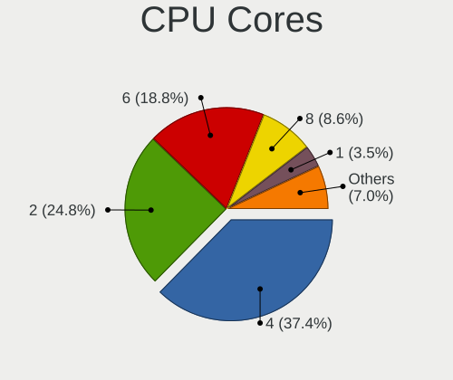

| Number | Desktops | Percent |
|--------|----------|---------|
| 4      | 161      | 37.35%  |
| 2      | 107      | 24.83%  |
| 6      | 81       | 18.79%  |
| 8      | 37       | 8.58%   |
| 1      | 15       | 3.48%   |
| 12     | 13       | 3.02%   |
| 16     | 5        | 1.16%   |
| 3      | 4        | 0.93%   |
| 14     | 3        | 0.7%    |
| 10     | 3        | 0.7%    |
| 20     | 2        | 0.46%   |

CPU Sockets
-----------

Number of sockets

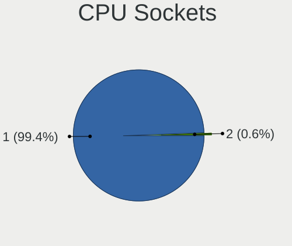

| Number | Desktops | Percent |
|--------|----------|---------|
| 1      | 428      | 99.3%   |
| 2      | 3        | 0.7%    |

CPU Threads
-----------

Threads per core (Hyper-Threading)

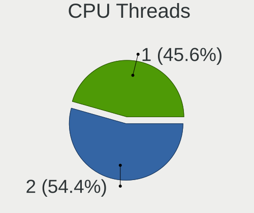

| Number | Desktops | Percent |
|--------|----------|---------|
| 2      | 235      | 54.4%   |
| 1      | 197      | 45.6%   |

CPU Op-Modes
------------

CPU Operation Modes (32-bit, 64-bit)

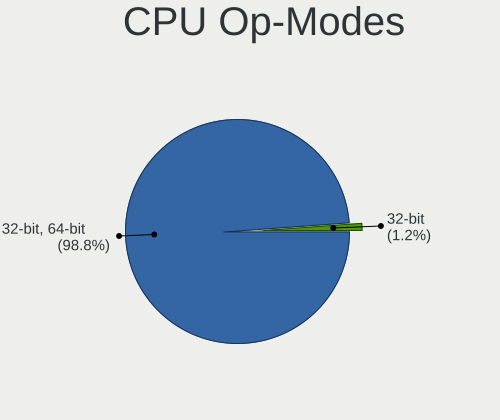

| Op mode        | Desktops | Percent |
|----------------|----------|---------|
| 32-bit, 64-bit | 426      | 98.84%  |
| 32-bit         | 5        | 1.16%   |

CPU Microcode
-------------

Microcode number

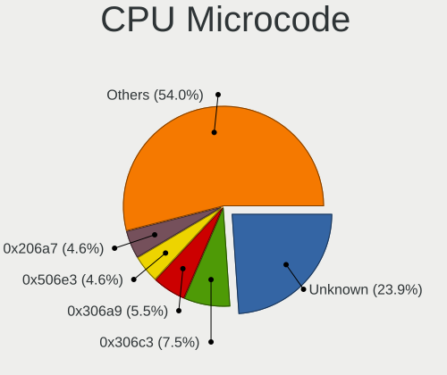

| Number     | Desktops | Percent |
|------------|----------|---------|
| Unknown    | 105      | 23.92%  |
| 0x306c3    | 33       | 7.52%   |
| 0x306a9    | 24       | 5.47%   |
| 0x506e3    | 20       | 4.56%   |
| 0x206a7    | 20       | 4.56%   |
| 0x1067a    | 18       | 4.1%    |
| 0x08701021 | 10       | 2.28%   |
| 0x0800820d | 10       | 2.28%   |
| 0xa0653    | 9        | 2.05%   |
| 0x906ea    | 8        | 1.82%   |
| 0x906ed    | 7        | 1.59%   |
| 0x010000c8 | 7        | 1.59%   |
| 0xa0671    | 6        | 1.37%   |
| 0x906e9    | 6        | 1.37%   |
| 0x6fb      | 6        | 1.37%   |
| 0x106e5    | 6        | 1.37%   |
| 0x0a601203 | 5        | 1.14%   |
| 0x06000852 | 5        | 1.14%   |
| 0x010000db | 5        | 1.14%   |
| 0x6fd      | 4        | 0.91%   |
| 0x08600106 | 4        | 0.91%   |
| 0x08108109 | 4        | 0.91%   |
| 0x010000dc | 4        | 0.91%   |
| 0xa0655    | 3        | 0.68%   |
| 0x906eb    | 3        | 0.68%   |
| 0x506c9    | 3        | 0.68%   |
| 0x20655    | 3        | 0.68%   |
| 0x0a50000d | 3        | 0.68%   |
| 0x0a20120a | 3        | 0.68%   |
| 0x08101016 | 3        | 0.68%   |
| 0x08001138 | 3        | 0.68%   |
| 0x03000027 | 3        | 0.68%   |
| 0x01000083 | 3        | 0.68%   |
| 0x906c0    | 2        | 0.46%   |
| 0x90675    | 2        | 0.46%   |
| 0x706a1    | 2        | 0.46%   |
| 0x406c3    | 2        | 0.46%   |
| 0x306f2    | 2        | 0.46%   |
| 0x206d7    | 2        | 0.46%   |
| 0x20652    | 2        | 0.46%   |

CPU Microarch
-------------

Microarchitecture

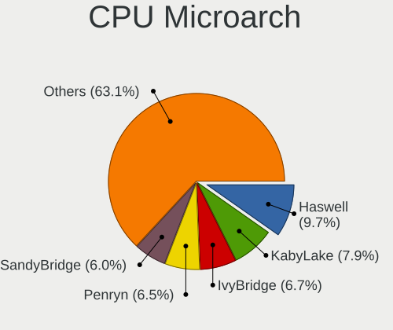

| Name             | Desktops | Percent |
|------------------|----------|---------|
| Haswell          | 42       | 9.74%   |
| KabyLake         | 34       | 7.89%   |
| IvyBridge        | 29       | 6.73%   |
| Penryn           | 28       | 6.5%    |
| SandyBridge      | 26       | 6.03%   |
| Skylake          | 24       | 5.57%   |
| K10              | 24       | 5.57%   |
| Unknown          | 23       | 5.34%   |
| Zen+             | 20       | 4.64%   |
| Zen 3            | 20       | 4.64%   |
| Zen 2            | 20       | 4.64%   |
| Core             | 16       | 3.71%   |
| CometLake        | 15       | 3.48%   |
| Alderlake Hybrid | 15       | 3.48%   |
| Zen              | 11       | 2.55%   |
| Nehalem          | 11       | 2.55%   |
| Piledriver       | 9        | 2.09%   |
| NetBurst         | 8        | 1.86%   |
| Icelake          | 8        | 1.86%   |
| Westmere         | 7        | 1.62%   |
| K8 Hammer        | 5        | 1.16%   |
| Tremont          | 4        | 0.93%   |
| K10 Llano        | 4        | 0.93%   |
| Goldmont         | 4        | 0.93%   |
| Excavator        | 4        | 0.93%   |
| Bulldozer        | 4        | 0.93%   |
| Steamroller      | 3        | 0.7%    |
| Goldmont plus    | 3        | 0.7%    |
| Silvermont       | 2        | 0.46%   |
| K6               | 2        | 0.46%   |
| Jaguar           | 2        | 0.46%   |
| TigerLake        | 1        | 0.23%   |
| Broadwell        | 1        | 0.23%   |
| Bonnell          | 1        | 0.23%   |
| Bobcat           | 1        | 0.23%   |

Graphics
--------

GPU Vendor
----------

Vendors of graphics cards

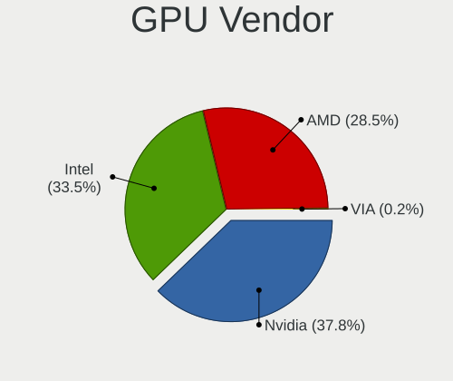

| Vendor           | Desktops | Percent |
|------------------|----------|---------|
| Nvidia           | 175      | 37.8%   |
| Intel            | 155      | 33.48%  |
| AMD              | 132      | 28.51%  |
| VIA Technologies | 1        | 0.22%   |

GPU Model
---------

Graphics card models

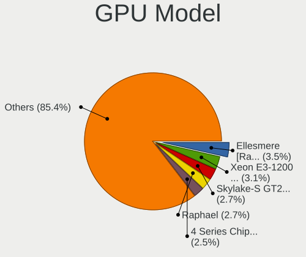

| Model                                                                       | Desktops | Percent |
|-----------------------------------------------------------------------------|----------|---------|
| AMD Ellesmere [Radeon RX 470/480/570/570X/580/580X/590]                     | 17       | 3.53%   |
| Intel Xeon E3-1200 v3/4th Gen Core Processor Integrated Graphics Controller | 15       | 3.12%   |
| Intel Skylake-S GT2 [HD Graphics 530]                                       | 13       | 2.7%    |
| AMD Raphael                                                                 | 13       | 2.7%    |
| Intel 4 Series Chipset Integrated Graphics Controller                       | 12       | 2.49%   |
| Intel 2nd Generation Core Processor Family Integrated Graphics Controller   | 12       | 2.49%   |
| Nvidia GP108 [GeForce GT 1030]                                              | 11       | 2.29%   |
| Intel Xeon E3-1200 v2/3rd Gen Core processor Graphics Controller            | 11       | 2.29%   |
| Intel CoffeeLake-S GT2 [UHD Graphics 630]                                   | 11       | 2.29%   |
| Nvidia GP107 [GeForce GTX 1050 Ti]                                          | 9        | 1.87%   |
| Nvidia GK208B [GeForce GT 710]                                              | 8        | 1.66%   |
| Intel CometLake-S GT2 [UHD Graphics 630]                                    | 8        | 1.66%   |
| Nvidia GP107 [GeForce GTX 1050]                                             | 7        | 1.46%   |
| Nvidia GP106 [GeForce GTX 1060 6GB]                                         | 7        | 1.46%   |
| AMD Picasso/Raven 2 [Radeon Vega Series / Radeon Vega Mobile Series]        | 7        | 1.46%   |
| AMD Cezanne [Radeon Vega Series / Radeon Vega Mobile Series]                | 7        | 1.46%   |
| Nvidia TU117 [GeForce GTX 1650]                                             | 5        | 1.04%   |
| Nvidia GT218 [GeForce 210]                                                  | 5        | 1.04%   |
| Nvidia GP104 [GeForce GTX 1080]                                             | 5        | 1.04%   |
| Nvidia GM107 [GeForce GTX 750 Ti]                                           | 5        | 1.04%   |
| Intel 82945G/GZ Integrated Graphics Controller                              | 5        | 1.04%   |
| AMD Navi 23 [Radeon RX 6600/6600 XT/6600M]                                  | 5        | 1.04%   |
| AMD Cedar [Radeon HD 5000/6000/7350/8350 Series]                            | 5        | 1.04%   |
| Nvidia GP104 [GeForce GTX 1070]                                             | 4        | 0.83%   |
| Nvidia GM206 [GeForce GTX 960]                                              | 4        | 0.83%   |
| Nvidia GF108 [GeForce GT 630]                                               | 4        | 0.83%   |
| Intel Kaby Lake-S GT2 [HD Graphics 630]                                     | 4        | 0.83%   |
| Intel JasperLake [UHD Graphics]                                             | 4        | 0.83%   |
| Intel Alder Lake-S GT1 [UHD Graphics 770]                                   | 4        | 0.83%   |
| Intel 4th Generation Core Processor Family Integrated Graphics Controller   | 4        | 0.83%   |
| AMD RS880 [Radeon HD 4200]                                                  | 4        | 0.83%   |
| AMD Navi 10 [Radeon RX 5600 OEM/5600 XT / 5700/5700 XT]                     | 4        | 0.83%   |
| Nvidia GM204 [GeForce GTX 970]                                              | 3        | 0.62%   |
| Nvidia GK208B [GeForce GT 730]                                              | 3        | 0.62%   |
| Nvidia GK110 [GeForce GTX 780]                                              | 3        | 0.62%   |
| Nvidia GK107 [GeForce GTX 650]                                              | 3        | 0.62%   |
| Nvidia GF119 [GeForce GT 610]                                               | 3        | 0.62%   |
| Nvidia GF106 [GeForce GTS 450]                                              | 3        | 0.62%   |
| Nvidia GA106 [GeForce RTX 3060 Lite Hash Rate]                              | 3        | 0.62%   |
| Nvidia GA104 [GeForce RTX 3070]                                             | 3        | 0.62%   |

GPU Combo
---------

Combinations of graphics cards

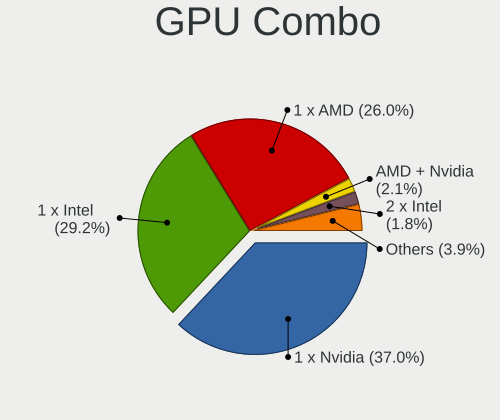

| Name           | Desktops | Percent |
|----------------|----------|---------|
| 1 x Nvidia     | 162      | 36.99%  |
| 1 x Intel      | 128      | 29.22%  |
| 1 x AMD        | 114      | 26.03%  |
| AMD + Nvidia   | 9        | 2.05%   |
| 2 x Intel      | 8        | 1.83%   |
| 2 x AMD        | 8        | 1.83%   |
| Intel + Nvidia | 4        | 0.91%   |
| Intel + AMD    | 3        | 0.68%   |
| 3 x AMD        | 1        | 0.23%   |
| 1 x VIA        | 1        | 0.23%   |

GPU Driver
----------

Free vs proprietary

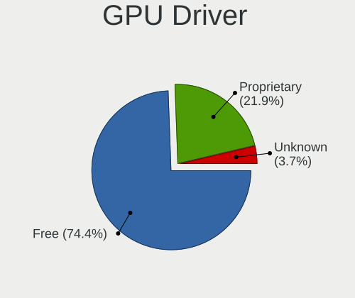

| Driver      | Desktops | Percent |
|-------------|----------|---------|
| Free        | 323      | 74.42%  |
| Proprietary | 95       | 21.89%  |
| Unknown     | 16       | 3.69%   |

GPU Memory
----------

Total video memory

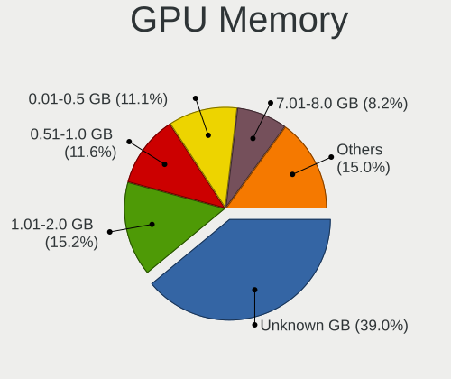

| Size in GB | Desktops | Percent |
|------------|----------|---------|
| Unknown    | 172      | 39%     |
| 1.01-2.0   | 67       | 15.19%  |
| 0.51-1.0   | 51       | 11.56%  |
| 0.01-0.5   | 49       | 11.11%  |
| 7.01-8.0   | 36       | 8.16%   |
| 3.01-4.0   | 34       | 7.71%   |
| 5.01-6.0   | 13       | 2.95%   |
| 8.01-16.0  | 11       | 2.49%   |
| 2.01-3.0   | 6        | 1.36%   |
| 4.01-5.0   | 1        | 0.23%   |
| 16.01-24.0 | 1        | 0.23%   |

Monitor
-------

Monitor Vendor
--------------

Monitor vendors

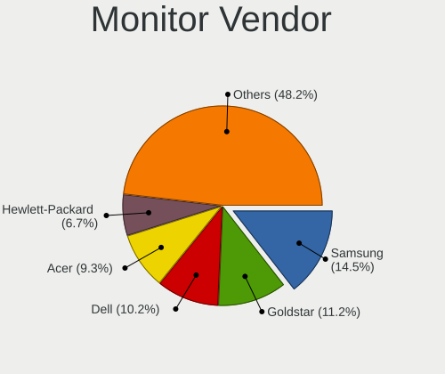

| Vendor               | Desktops | Percent |
|----------------------|----------|---------|
| Samsung Electronics  | 67       | 14.47%  |
| Goldstar             | 52       | 11.23%  |
| Dell                 | 47       | 10.15%  |
| Acer                 | 43       | 9.29%   |
| Hewlett-Packard      | 31       | 6.7%    |
| BenQ                 | 26       | 5.62%   |
| AOC                  | 23       | 4.97%   |
| Ancor Communications | 18       | 3.89%   |
| Philips              | 17       | 3.67%   |
| ViewSonic            | 12       | 2.59%   |
| Sony                 | 12       | 2.59%   |
| ASUSTek Computer     | 8        | 1.73%   |
| Lenovo               | 7        | 1.51%   |
| Eizo                 | 7        | 1.51%   |
| Iiyama               | 6        | 1.3%    |
| Fujitsu Siemens      | 6        | 1.3%    |
| Sceptre Tech         | 5        | 1.08%   |
| MSI                  | 5        | 1.08%   |
| Vizio                | 4        | 0.86%   |
| Vestel Elektronik    | 4        | 0.86%   |
| Medion               | 4        | 0.86%   |
| Plain Tree Systems   | 3        | 0.65%   |
| Hitachi              | 3        | 0.65%   |
| HannStar             | 3        | 0.65%   |
| RGT                  | 2        | 0.43%   |
| NEC Computers        | 2        | 0.43%   |
| LG Electronics       | 2        | 0.43%   |
| Gigabyte Technology  | 2        | 0.43%   |
| DENON                | 2        | 0.43%   |
| CHD                  | 2        | 0.43%   |
| Yeyian               | 1        | 0.22%   |
| Xiaomi               | 1        | 0.22%   |
| Wacom                | 1        | 0.22%   |
| VIE                  | 1        | 0.22%   |
| Videoseven           | 1        | 0.22%   |
| UTV                  | 1        | 0.22%   |
| Unknown (ADE)        | 1        | 0.22%   |
| Unknown              | 1        | 0.22%   |
| Toshiba              | 1        | 0.22%   |
| TCL                  | 1        | 0.22%   |

Monitor Model
-------------

Monitor models

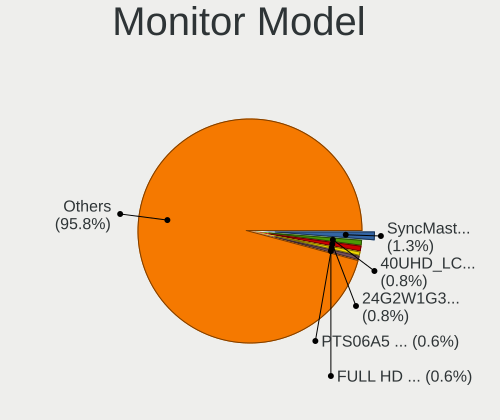

| Model                                                                | Desktops | Percent |
|----------------------------------------------------------------------|----------|---------|
| Samsung Electronics SyncMaster SAM0091 1600x1200 432x324mm 21.3-inch | 6        | 1.26%   |
| Vestel Elektronik 40UHD_LCD_TV VES3700 3840x2160 880x500mm 39.8-inch | 4        | 0.84%   |
| AOC 24G2W1G3 AOC2402 1920x1080 527x296mm 23.8-inch                   | 4        | 0.84%   |
| Plain Tree Systems LCD Monitor PTS06A5 1280x1024 340x270mm 17.1-inch | 3        | 0.63%   |
| Goldstar FULL HD GSM5B55 1920x1080 480x270mm 21.7-inch               | 3        | 0.63%   |
| Fujitsu Siemens B22W-7 LED FUS0838 1680x1050 474x296mm 22.0-inch     | 3        | 0.63%   |
| BenQ GL2460 BNQ78CE 1920x1080 531x299mm 24.0-inch                    | 3        | 0.63%   |
| Ancor Communications VS248 ACI2498 1920x1080 531x299mm 24.0-inch     | 3        | 0.63%   |
| Vizio E500i-B1 VIZ1004 1920x1080 1095x616mm 49.5-inch                | 2        | 0.42%   |
| ViewSonic VX1935wm-3 VSCB81E 1440x900 410x256mm 19.0-inch            | 2        | 0.42%   |
| Sony TV SNYF301 1920x1080                                            | 2        | 0.42%   |
| Sony TV SNY0801 1360x768                                             | 2        | 0.42%   |
| Sony SDM-M81 SNY0480 1280x1024 359x287mm 18.1-inch                   | 2        | 0.42%   |
| Sceptre Tech Sceptre E22 SPT08D5 1920x1080 470x300mm 22.0-inch       | 2        | 0.42%   |
| Samsung Electronics U32J59x SAM0F35 3840x2160 697x392mm 31.5-inch    | 2        | 0.42%   |
| Samsung Electronics C32JG5x SAM0FE0 2560x1440 697x392mm 31.5-inch    | 2        | 0.42%   |
| Samsung Electronics C27F390 SAM0D32 1920x1080 598x336mm 27.0-inch    | 2        | 0.42%   |
| RGT LCD Monitor RGT1352 1920x1080 480x270mm 21.7-inch                | 2        | 0.42%   |
| Philips PHL 276E9Q PHLC17B 1920x1080 598x336mm 27.0-inch             | 2        | 0.42%   |
| MSI G27C6 MSI5CA9 1920x1080 598x336mm 27.0-inch                      | 2        | 0.42%   |
| Medion MD22322 MEB8101 2560x1440 699x393mm 31.6-inch                 | 2        | 0.42%   |
| Iiyama PL2776HD IVM6605 1920x1080 598x336mm 27.0-inch                | 2        | 0.42%   |
| Hitachi HISENSE HEC002F 3840x2160 1872x1053mm 84.6-inch              | 2        | 0.42%   |
| Hewlett-Packard 2311xi HWP301B 1920x1080 509x286mm 23.0-inch         | 2        | 0.42%   |
| Goldstar W2243 GSM56FE 1920x1080 477x269mm 21.6-inch                 | 2        | 0.42%   |
| Goldstar ULTRAWIDE GSM76F9 2560x1080 531x298mm 24.0-inch             | 2        | 0.42%   |
| Goldstar M237WD GSM56EB 1920x1080 509x286mm 23.0-inch                | 2        | 0.42%   |
| Goldstar LG ULTRAWIDE GSM59F1 2560x1080 670x280mm 28.6-inch          | 2        | 0.42%   |
| Goldstar L1760TR GSM445D 1280x1024 338x270mm 17.0-inch               | 2        | 0.42%   |
| Goldstar HD GSM5ACD 1366x768 410x230mm 18.5-inch                     | 2        | 0.42%   |
| Goldstar HD 16 GSM3E92 1366x768 344x194mm 15.5-inch                  | 2        | 0.42%   |
| Goldstar FULL HD GSM5BDF 1920x1080 480x270mm 21.7-inch               | 2        | 0.42%   |
| Goldstar FULL HD GSM5B54 1920x1080 480x270mm 21.7-inch               | 2        | 0.42%   |
| Goldstar 32 FHD GSM76FF 1920x1080 698x392mm 31.5-inch                | 2        | 0.42%   |
| Dell U2412M DELA07A 1920x1200 518x324mm 24.1-inch                    | 2        | 0.42%   |
| Dell SE2419H DELF109 1920x1080 527x296mm 23.8-inch                   | 2        | 0.42%   |
| Dell E2417H DELA0E2 1920x1080 527x296mm 23.8-inch                    | 2        | 0.42%   |
| Dell 2208WFP DEL403C 1680x1050 473x296mm 22.0-inch                   | 2        | 0.42%   |
| BenQ LCD BNQ8024 2560x1440 600x340mm 27.2-inch                       | 2        | 0.42%   |
| BenQ GL2780 BNQ78EC 1920x1080 600x340mm 27.2-inch                    | 2        | 0.42%   |

Monitor Resolution
------------------

Monitor screen resolution

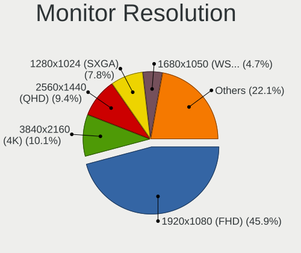

| Resolution         | Desktops | Percent |
|--------------------|----------|---------|
| 1920x1080 (FHD)    | 205      | 45.86%  |
| 3840x2160 (4K)     | 45       | 10.07%  |
| 2560x1440 (QHD)    | 42       | 9.4%    |
| 1280x1024 (SXGA)   | 35       | 7.83%   |
| 1680x1050 (WSXGA+) | 21       | 4.7%    |
| 1366x768 (WXGA)    | 20       | 4.47%   |
| 1600x900 (HD+)     | 14       | 3.13%   |
| 1440x900 (WXGA+)   | 13       | 2.91%   |
| 1920x1200 (WUXGA)  | 10       | 2.24%   |
| 1600x1200          | 10       | 2.24%   |
| 3440x1440          | 6        | 1.34%   |
| 1360x768           | 6        | 1.34%   |
| 2560x1080          | 5        | 1.12%   |
| 3840x1080          | 4        | 0.89%   |
| Unknown            | 4        | 0.89%   |
| 1024x768 (XGA)     | 3        | 0.67%   |
| 1280x720 (HD)      | 2        | 0.45%   |
| 2048x1536          | 1        | 0.22%   |
| 1920x1440          | 1        | 0.22%   |

Monitor Diagonal
----------------

Diagonal size in inches

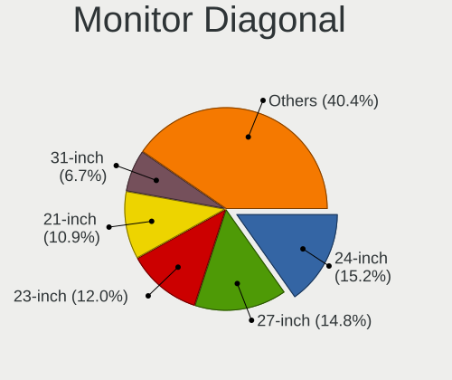

| Inches  | Desktops | Percent |
|---------|----------|---------|
| 24      | 70       | 15.22%  |
| 27      | 68       | 14.78%  |
| 23      | 55       | 11.96%  |
| 21      | 50       | 10.87%  |
| 31      | 31       | 6.74%   |
| 19      | 26       | 5.65%   |
| 18      | 24       | 5.22%   |
| 22      | 19       | 4.13%   |
| 17      | 18       | 3.91%   |
| Unknown | 14       | 3.04%   |
| 84      | 13       | 2.83%   |
| 20      | 13       | 2.83%   |
| 34      | 11       | 2.39%   |
| 54      | 7        | 1.52%   |
| 15      | 6        | 1.3%    |
| 72      | 4        | 0.87%   |
| 65      | 4        | 0.87%   |
| 25      | 4        | 0.87%   |
| 49      | 2        | 0.43%   |
| 40      | 2        | 0.43%   |
| 36      | 2        | 0.43%   |
| 32      | 2        | 0.43%   |
| 26      | 2        | 0.43%   |
| 85      | 1        | 0.22%   |
| 75      | 1        | 0.22%   |
| 74      | 1        | 0.22%   |
| 64      | 1        | 0.22%   |
| 61      | 1        | 0.22%   |
| 57      | 1        | 0.22%   |
| 55      | 1        | 0.22%   |
| 52      | 1        | 0.22%   |
| 42      | 1        | 0.22%   |
| 39      | 1        | 0.22%   |
| 28      | 1        | 0.22%   |
| 16      | 1        | 0.22%   |
| 13      | 1        | 0.22%   |

Monitor Width
-------------

Physical width

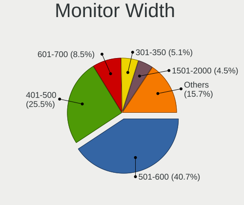

| Width in mm | Desktops | Percent |
|-------------|----------|---------|
| 501-600     | 182      | 40.72%  |
| 401-500     | 114      | 25.5%   |
| 601-700     | 38       | 8.5%    |
| 301-350     | 23       | 5.15%   |
| 1501-2000   | 20       | 4.47%   |
| 351-400     | 18       | 4.03%   |
| 1001-1500   | 18       | 4.03%   |
| 701-800     | 15       | 3.36%   |
| Unknown     | 14       | 3.13%   |
| 801-900     | 3        | 0.67%   |
| 201-300     | 1        | 0.22%   |
| 901-1000    | 1        | 0.22%   |

Aspect Ratio
------------

Proportional relationship between the width and the height

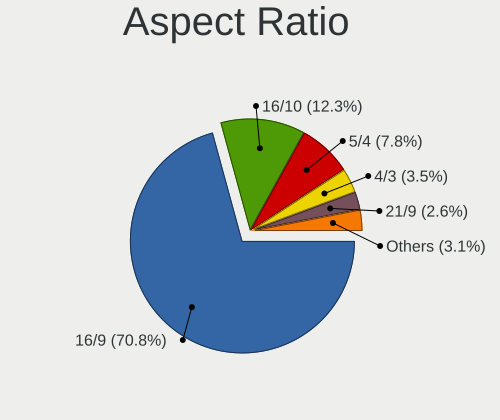

| Ratio   | Desktops | Percent |
|---------|----------|---------|
| 16/9    | 300      | 70.75%  |
| 16/10   | 52       | 12.26%  |
| 5/4     | 33       | 7.78%   |
| 4/3     | 15       | 3.54%   |
| 21/9    | 11       | 2.59%   |
| Unknown | 9        | 2.12%   |
| 32/9    | 2        | 0.47%   |
| 3/2     | 2        | 0.47%   |

Monitor Area
------------

Area in inch²

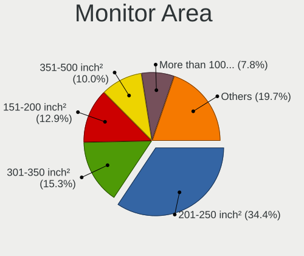

| Area in inch² | Desktops | Percent |
|----------------|----------|---------|
| 201-250        | 155      | 34.37%  |
| 301-350        | 69       | 15.3%   |
| 151-200        | 58       | 12.86%  |
| 351-500        | 45       | 9.98%   |
| More than 1000 | 35       | 7.76%   |
| 141-150        | 34       | 7.54%   |
| 251-300        | 25       | 5.54%   |
| Unknown        | 14       | 3.1%    |
| 501-1000       | 8        | 1.77%   |
| 101-110        | 3        | 0.67%   |
| 111-120        | 2        | 0.44%   |
| 71-80          | 1        | 0.22%   |
| 121-130        | 1        | 0.22%   |
| 91-100         | 1        | 0.22%   |

Pixel Density
-------------

Pixels per inch

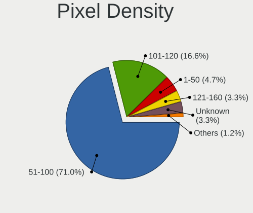

| Density | Desktops | Percent |
|---------|----------|---------|
| 51-100  | 304      | 71.03%  |
| 101-120 | 71       | 16.59%  |
| 1-50    | 20       | 4.67%   |
| 121-160 | 14       | 3.27%   |
| Unknown | 14       | 3.27%   |
| 161-240 | 5        | 1.17%   |

Multiple Monitors
-----------------

Total monitors connected

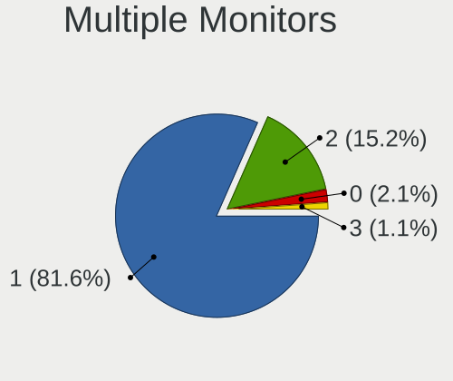

| Total | Desktops | Percent |
|-------|----------|---------|
| 1     | 355      | 81.61%  |
| 2     | 66       | 15.17%  |
| 0     | 9        | 2.07%   |
| 3     | 5        | 1.15%   |

Network
-------

Net Controller Vendor
---------------------

Controller vendors

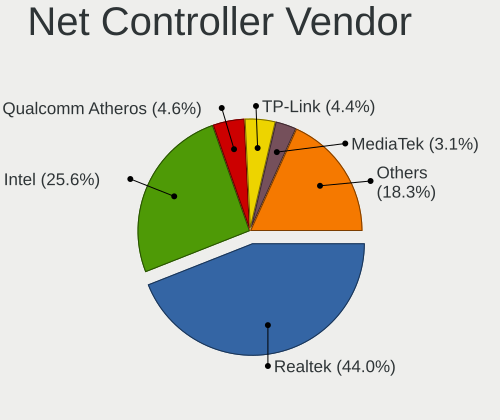

| Vendor                                 | Desktops | Percent |
|----------------------------------------|----------|---------|
| Realtek Semiconductor                  | 287      | 44.02%  |
| Intel                                  | 167      | 25.61%  |
| Qualcomm Atheros                       | 30       | 4.6%    |
| TP-Link                                | 29       | 4.45%   |
| MediaTek                               | 20       | 3.07%   |
| Broadcom                               | 16       | 2.45%   |
| Ralink Technology                      | 15       | 2.3%    |
| Broadcom Limited                       | 10       | 1.53%   |
| Ralink                                 | 7        | 1.07%   |
| Samsung Electronics                    | 6        | 0.92%   |
| Xiaomi                                 | 5        | 0.77%   |
| Qualcomm Atheros Communications        | 5        | 0.77%   |
| Nvidia                                 | 5        | 0.77%   |
| Marvell Technology Group               | 4        | 0.61%   |
| Edimax Technology                      | 4        | 0.61%   |
| VIA Technologies                       | 3        | 0.46%   |
| OPPO Electronics                       | 3        | 0.46%   |
| Microsoft                              | 3        | 0.46%   |
| Linksys                                | 3        | 0.46%   |
| IMC Networks                           | 3        | 0.46%   |
| Google                                 | 3        | 0.46%   |
| D-Link System                          | 3        | 0.46%   |
| D-Link                                 | 2        | 0.31%   |
| Belkin Components                      | 2        | 0.31%   |
| ASUSTek Computer                       | 2        | 0.31%   |
| U-Blox                                 | 1        | 0.15%   |
| Tenda                                  | 1        | 0.15%   |
| Sony Ericsson Mobile Communications AB | 1        | 0.15%   |
| Silicon Integrated Systems [SiS]       | 1        | 0.15%   |
| Realtek                                | 1        | 0.15%   |
| QinHeng Electronics                    | 1        | 0.15%   |
| NetGear                                | 1        | 0.15%   |
| Mercucys                               | 1        | 0.15%   |
| JMicron Technology                     | 1        | 0.15%   |
| ICS Advent                             | 1        | 0.15%   |
| Huawei Technologies                    | 1        | 0.15%   |
| AVM                                    | 1        | 0.15%   |
| Arduino SA                             | 1        | 0.15%   |
| Aquantia                               | 1        | 0.15%   |
| Unknown                                | 1        | 0.15%   |

Net Controller Model
--------------------

Controller models

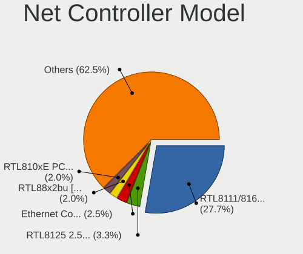

| Model                                                                  | Desktops | Percent |
|------------------------------------------------------------------------|----------|---------|
| Realtek RTL8111/8168/8211/8411 PCI Express Gigabit Ethernet Controller | 210      | 27.7%   |
| Realtek RTL8125 2.5GbE Controller                                      | 25       | 3.3%    |
| Intel Ethernet Controller I225-V                                       | 19       | 2.51%   |
| Realtek RTL88x2bu [AC1200 Techkey]                                     | 15       | 1.98%   |
| Realtek RTL810xE PCI Express Fast Ethernet controller                  | 15       | 1.98%   |
| Intel 82579LM Gigabit Network Connection (Lewisville)                  | 15       | 1.98%   |
| Intel Ethernet Connection (2) I219-V                                   | 13       | 1.72%   |
| Realtek RTL8188EUS 802.11n Wireless Network Adapter                    | 11       | 1.45%   |
| Realtek 802.11ac NIC                                                   | 11       | 1.45%   |
| Intel Wi-Fi 6 AX200                                                    | 11       | 1.45%   |
| Intel I211 Gigabit Network Connection                                  | 11       | 1.45%   |
| Intel Ethernet Connection I217-LM                                      | 11       | 1.45%   |
| Ralink MT7601U Wireless Adapter                                        | 10       | 1.32%   |
| Intel 82567LM-3 Gigabit Network Connection                             | 9        | 1.19%   |
| MediaTek MT7922 802.11ax PCI Express Wireless Network Adapter          | 8        | 1.06%   |
| Intel Ethernet Connection (7) I219-V                                   | 8        | 1.06%   |
| Realtek RTL8852BE PCIe 802.11ax Wireless Network Controller            | 7        | 0.92%   |
| Realtek RTL8188FTV 802.11b/g/n 1T1R 2.4G WLAN Adapter                  | 7        | 0.92%   |
| Realtek RTL8821CE 802.11ac PCIe Wireless Network Adapter               | 6        | 0.79%   |
| Intel Dual Band Wireless-AC 3168NGW [Stone Peak]                       | 6        | 0.79%   |
| Xiaomi Mi/Redmi series (RNDIS)                                         | 5        | 0.66%   |
| TP-Link Archer T3U [Realtek RTL8812BU]                                 | 5        | 0.66%   |
| Realtek RTL8812AU 802.11a/b/g/n/ac 2T2R DB WLAN Adapter                | 5        | 0.66%   |
| Realtek RTL8192EE PCIe Wireless Network Adapter                        | 5        | 0.66%   |
| Qualcomm Atheros AR9485 Wireless Network Adapter                       | 5        | 0.66%   |
| Intel Wireless 8260                                                    | 5        | 0.66%   |
| Intel Wi-Fi 6E(802.11ax) AX210/AX1675* 2x2 [Typhoon Peak]              | 5        | 0.66%   |
| Intel Ethernet Connection (2) I219-LM                                  | 5        | 0.66%   |
| Intel Ethernet Connection (2) I218-V                                   | 5        | 0.66%   |
| Intel Ethernet Connection (14) I219-V                                  | 5        | 0.66%   |
| TP-Link Archer T2U PLUS [RTL8821AU]                                    | 4        | 0.53%   |
| Samsung Galaxy series, misc. (tethering mode)                          | 4        | 0.53%   |
| Realtek RTL-8100/8101L/8139 PCI Fast Ethernet Adapter                  | 4        | 0.53%   |
| MediaTek MT7921K (RZ608) Wi-Fi 6E 80MHz                                | 4        | 0.53%   |
| Intel Wi-Fi 5(802.11ac) Wireless-AC 9x6x [Thunder Peak]                | 4        | 0.53%   |
| Intel Ethernet Controller I226-V                                       | 4        | 0.53%   |
| Intel Ethernet Connection I217-V                                       | 4        | 0.53%   |
| Intel 82578DM Gigabit Network Connection                               | 4        | 0.53%   |
| Intel 82566DM-2 Gigabit Network Connection                             | 4        | 0.53%   |
| VIA VT6102/VT6103 [Rhine-II]                                           | 3        | 0.4%    |

Wireless Vendor
---------------

Wireless vendors

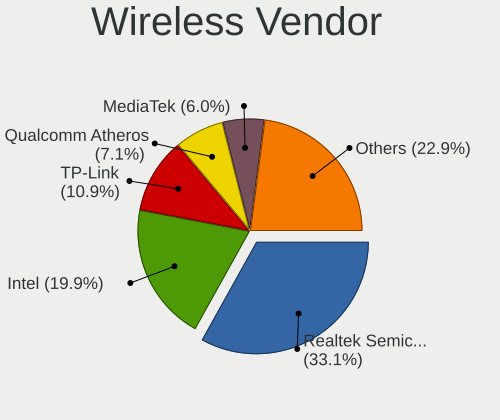

| Vendor                          | Desktops | Percent |
|---------------------------------|----------|---------|
| Realtek Semiconductor           | 88       | 33.08%  |
| Intel                           | 53       | 19.92%  |
| TP-Link                         | 29       | 10.9%   |
| Qualcomm Atheros                | 19       | 7.14%   |
| MediaTek                        | 16       | 6.02%   |
| Ralink Technology               | 15       | 5.64%   |
| Ralink                          | 7        | 2.63%   |
| Qualcomm Atheros Communications | 5        | 1.88%   |
| Broadcom                        | 5        | 1.88%   |
| Edimax Technology               | 4        | 1.5%    |
| Broadcom Limited                | 4        | 1.5%    |
| Microsoft                       | 3        | 1.13%   |
| Linksys                         | 3        | 1.13%   |
| IMC Networks                    | 3        | 1.13%   |
| D-Link                          | 2        | 0.75%   |
| Belkin Components               | 2        | 0.75%   |
| ASUSTek Computer                | 2        | 0.75%   |
| Tenda                           | 1        | 0.38%   |
| Realtek                         | 1        | 0.38%   |
| NetGear                         | 1        | 0.38%   |
| Mercucys                        | 1        | 0.38%   |
| D-Link System                   | 1        | 0.38%   |
| AVM                             | 1        | 0.38%   |

Wireless Model
--------------

Wireless models

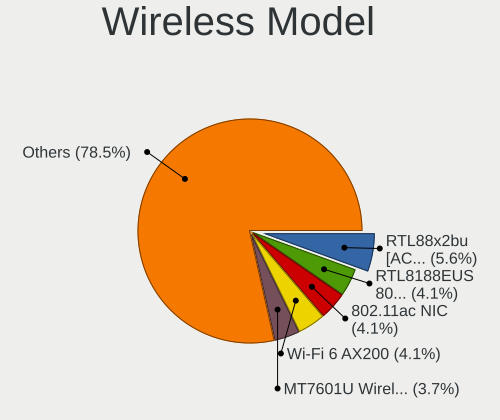

| Model                                                                | Desktops | Percent |
|----------------------------------------------------------------------|----------|---------|
| Realtek RTL88x2bu [AC1200 Techkey]                                   | 15       | 5.56%   |
| Realtek RTL8188EUS 802.11n Wireless Network Adapter                  | 11       | 4.07%   |
| Realtek 802.11ac NIC                                                 | 11       | 4.07%   |
| Intel Wi-Fi 6 AX200                                                  | 11       | 4.07%   |
| Ralink MT7601U Wireless Adapter                                      | 10       | 3.7%    |
| Realtek RTL8188FTV 802.11b/g/n 1T1R 2.4G WLAN Adapter                | 7        | 2.59%   |
| Realtek RTL8821CE 802.11ac PCIe Wireless Network Adapter             | 6        | 2.22%   |
| MediaTek MT7922 802.11ax PCI Express Wireless Network Adapter        | 6        | 2.22%   |
| Intel Dual Band Wireless-AC 3168NGW [Stone Peak]                     | 6        | 2.22%   |
| TP-Link Archer T3U [Realtek RTL8812BU]                               | 5        | 1.85%   |
| Realtek RTL8812AU 802.11a/b/g/n/ac 2T2R DB WLAN Adapter              | 5        | 1.85%   |
| Realtek RTL8192EE PCIe Wireless Network Adapter                      | 5        | 1.85%   |
| Qualcomm Atheros AR9485 Wireless Network Adapter                     | 5        | 1.85%   |
| Intel Wireless 8260                                                  | 5        | 1.85%   |
| Intel Wi-Fi 6E(802.11ax) AX210/AX1675* 2x2 [Typhoon Peak]            | 5        | 1.85%   |
| TP-Link Archer T2U PLUS [RTL8821AU]                                  | 4        | 1.48%   |
| Realtek RTL8852BE PCIe 802.11ax Wireless Network Controller          | 4        | 1.48%   |
| MediaTek MT7921K (RZ608) Wi-Fi 6E 80MHz                              | 4        | 1.48%   |
| Intel Wi-Fi 5(802.11ac) Wireless-AC 9x6x [Thunder Peak]              | 4        | 1.48%   |
| TP-Link TL-WN823N v2/v3 [Realtek RTL8192EU]                          | 3        | 1.11%   |
| TP-Link TL-WN821N v5/v6 [RTL8192EU]                                  | 3        | 1.11%   |
| TP-Link TL-WN722N v2/v3 [Realtek RTL8188EUS]                         | 3        | 1.11%   |
| TP-Link AC600 wireless Realtek RTL8811AU [Archer T2U Nano]           | 3        | 1.11%   |
| TP-Link 802.11ac WLAN Adapter                                        | 3        | 1.11%   |
| Realtek RTL8192EU 802.11b/g/n WLAN Adapter                           | 3        | 1.11%   |
| Ralink RT2870/RT3070 Wireless Adapter                                | 3        | 1.11%   |
| Qualcomm Atheros AR9271 802.11n                                      | 3        | 1.11%   |
| Qualcomm Atheros AR9462 Wireless Network Adapter                     | 3        | 1.11%   |
| MediaTek MT7902 802.11ax PCIe Wireless Network Adapter [Filogic 310] | 3        | 1.11%   |
| Intel Wireless 7265                                                  | 3        | 1.11%   |
| Intel Wireless 7260                                                  | 3        | 1.11%   |
| Intel Cannon Lake PCH CNVi WiFi                                      | 3        | 1.11%   |
| Intel 700 Series Chipset CNVi WiFi                                   | 3        | 1.11%   |
| IMC Networks Mediao 802.11n WLAN [Realtek RTL8191SU]                 | 3        | 1.11%   |
| TP-Link 802.11ac NIC                                                 | 2        | 0.74%   |
| Realtek RTL8822CE 802.11ac PCIe Wireless Network Adapter             | 2        | 0.74%   |
| Realtek RTL8723BE PCIe Wireless Network Adapter                      | 2        | 0.74%   |
| Realtek RTL8188EE Wireless Network Adapter                           | 2        | 0.74%   |
| Realtek RTL8188CUS 802.11n WLAN Adapter                              | 2        | 0.74%   |
| Realtek RTL8188CE 802.11b/g/n WiFi Adapter                           | 2        | 0.74%   |

Ethernet Vendor
---------------

Ethernet vendors

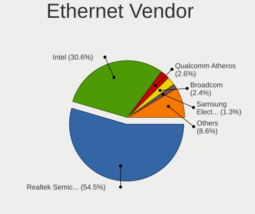

| Vendor                           | Desktops | Percent |
|----------------------------------|----------|---------|
| Realtek Semiconductor            | 253      | 54.53%  |
| Intel                            | 142      | 30.6%   |
| Qualcomm Atheros                 | 12       | 2.59%   |
| Broadcom                         | 11       | 2.37%   |
| Samsung Electronics              | 6        | 1.29%   |
| Broadcom Limited                 | 6        | 1.29%   |
| Xiaomi                           | 5        | 1.08%   |
| Nvidia                           | 5        | 1.08%   |
| MediaTek                         | 4        | 0.86%   |
| Marvell Technology Group         | 4        | 0.86%   |
| VIA Technologies                 | 3        | 0.65%   |
| OPPO Electronics                 | 3        | 0.65%   |
| Google                           | 3        | 0.65%   |
| D-Link System                    | 2        | 0.43%   |
| Silicon Integrated Systems [SiS] | 1        | 0.22%   |
| JMicron Technology               | 1        | 0.22%   |
| ICS Advent                       | 1        | 0.22%   |
| Huawei Technologies              | 1        | 0.22%   |
| Aquantia                         | 1        | 0.22%   |

Ethernet Model
--------------

Ethernet models

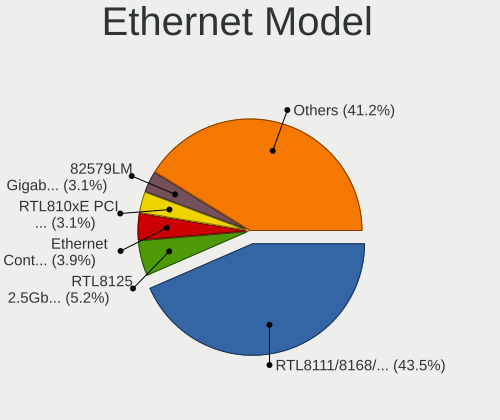

| Model                                                                  | Desktops | Percent |
|------------------------------------------------------------------------|----------|---------|
| Realtek RTL8111/8168/8211/8411 PCI Express Gigabit Ethernet Controller | 210      | 43.48%  |
| Realtek RTL8125 2.5GbE Controller                                      | 25       | 5.18%   |
| Intel Ethernet Controller I225-V                                       | 19       | 3.93%   |
| Realtek RTL810xE PCI Express Fast Ethernet controller                  | 15       | 3.11%   |
| Intel 82579LM Gigabit Network Connection (Lewisville)                  | 15       | 3.11%   |
| Intel Ethernet Connection (2) I219-V                                   | 13       | 2.69%   |
| Intel I211 Gigabit Network Connection                                  | 11       | 2.28%   |
| Intel Ethernet Connection I217-LM                                      | 11       | 2.28%   |
| Intel 82567LM-3 Gigabit Network Connection                             | 9        | 1.86%   |
| Intel Ethernet Connection (7) I219-V                                   | 8        | 1.66%   |
| Xiaomi Mi/Redmi series (RNDIS)                                         | 5        | 1.04%   |
| Intel Ethernet Connection (2) I219-LM                                  | 5        | 1.04%   |
| Intel Ethernet Connection (2) I218-V                                   | 5        | 1.04%   |
| Intel Ethernet Connection (14) I219-V                                  | 5        | 1.04%   |
| Samsung Galaxy series, misc. (tethering mode)                          | 4        | 0.83%   |
| Realtek RTL-8100/8101L/8139 PCI Fast Ethernet Adapter                  | 4        | 0.83%   |
| Intel Ethernet Controller I226-V                                       | 4        | 0.83%   |
| Intel Ethernet Connection I217-V                                       | 4        | 0.83%   |
| Intel 82578DM Gigabit Network Connection                               | 4        | 0.83%   |
| Intel 82566DM-2 Gigabit Network Connection                             | 4        | 0.83%   |
| VIA VT6102/VT6103 [Rhine-II]                                           | 3        | 0.62%   |
| Realtek RTL8852BE PCIe 802.11ax Wireless Network Controller            | 3        | 0.62%   |
| Realtek RTL8169 PCI Gigabit Ethernet Controller                        | 3        | 0.62%   |
| Qualcomm Atheros Attansic L2 Fast Ethernet                             | 3        | 0.62%   |
| Qualcomm Atheros AR8161 Gigabit Ethernet                               | 3        | 0.62%   |
| OPPO Ace 3V                                                            | 3        | 0.62%   |
| Nvidia MCP61 Ethernet                                                  | 3        | 0.62%   |
| Intel Ethernet Connection (17) I219-V                                  | 3        | 0.62%   |
| Intel Ethernet Connection (11) I219-V                                  | 3        | 0.62%   |
| Intel 82579V Gigabit Network Connection                                | 3        | 0.62%   |
| Samsung GT-I9070 (network tethering, USB debugging enabled)            | 2        | 0.41%   |
| Realtek Killer E3000 2.5GbE Controller                                 | 2        | 0.41%   |
| Qualcomm Atheros Killer E220x Gigabit Ethernet Controller              | 2        | 0.41%   |
| Nvidia MCP51 Ethernet Controller                                       | 2        | 0.41%   |
| MediaTek MT7922 802.11ax PCI Express Wireless Network Adapter          | 2        | 0.41%   |
| MediaTek Infinix HOT 50i                                               | 2        | 0.41%   |
| Marvell Group 88E8056 PCI-E Gigabit Ethernet Controller                | 2        | 0.41%   |
| Intel Ethernet Connection (5) I219-LM                                  | 2        | 0.41%   |
| Intel Ethernet Connection (11) I219-LM                                 | 2        | 0.41%   |
| Intel Alder Lake-S PCH CNVi WiFi                                       | 2        | 0.41%   |

Net Controller Kind
-------------------

Ethernet, WiFi or modem

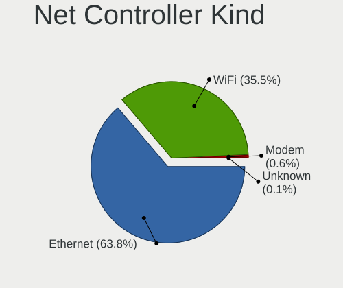

| Kind     | Desktops | Percent |
|----------|----------|---------|
| Ethernet | 428      | 63.79%  |
| WiFi     | 238      | 35.47%  |
| Modem    | 4        | 0.6%    |
| Unknown  | 1        | 0.15%   |

Used Controller
---------------

Currently used network controller

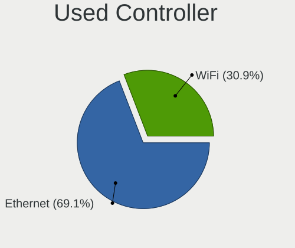

| Kind     | Desktops | Percent |
|----------|----------|---------|
| Ethernet | 307      | 69.14%  |
| WiFi     | 137      | 30.86%  |

NICs
----

Total network controllers on board

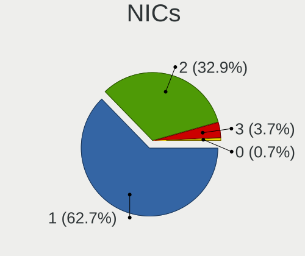

| Total | Desktops | Percent |
|-------|----------|---------|
| 1     | 271      | 62.73%  |
| 2     | 142      | 32.87%  |
| 3     | 16       | 3.7%    |
| 0     | 3        | 0.69%   |

IPv6
----

IPv6 vs IPv4

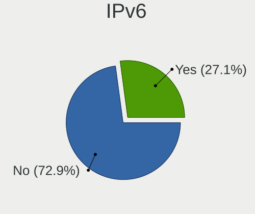

| Used | Desktops | Percent |
|------|----------|---------|
| No   | 317      | 72.87%  |
| Yes  | 118      | 27.13%  |

Bluetooth
---------

Bluetooth Vendor
----------------

Controller vendors

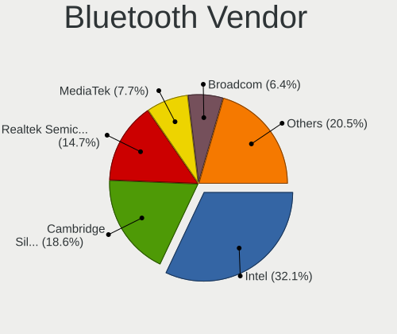

| Vendor                          | Desktops | Percent |
|---------------------------------|----------|---------|
| Intel                           | 50       | 32.05%  |
| Cambridge Silicon Radio         | 29       | 18.59%  |
| Realtek Semiconductor           | 23       | 14.74%  |
| MediaTek                        | 12       | 7.69%   |
| Broadcom                        | 10       | 6.41%   |
| TP-Link                         | 7        | 4.49%   |
| IMC Networks                    | 6        | 3.85%   |
| Foxconn / Hon Hai               | 6        | 3.85%   |
| ASUSTek Computer                | 5        | 3.21%   |
| Qualcomm Atheros Communications | 2        | 1.28%   |
| Realtek                         | 1        | 0.64%   |
| Lite-On Technology              | 1        | 0.64%   |
| Hewlett-Packard                 | 1        | 0.64%   |
| Creative Technology             | 1        | 0.64%   |
| Apple                           | 1        | 0.64%   |
| Actions                         | 1        | 0.64%   |

Bluetooth Model
---------------

Controller models

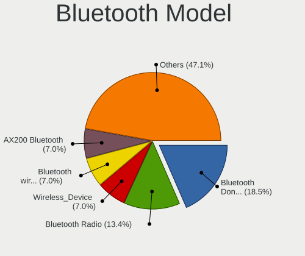

| Model                                                                                                     | Desktops | Percent |
|-----------------------------------------------------------------------------------------------------------|----------|---------|
| Cambridge Silicon Radio Bluetooth Dongle (HCI mode)                                                       | 29       | 18.47%  |
| Realtek Bluetooth Radio                                                                                   | 21       | 13.38%  |
| MediaTek Wireless_Device                                                                                  | 11       | 7.01%   |
| Intel Bluetooth wireless interface                                                                        | 11       | 7.01%   |
| Intel AX200 Bluetooth                                                                                     | 11       | 7.01%   |
| Broadcom BCM20702A0 Bluetooth 4.0                                                                         | 8        | 5.1%    |
| TP-Link TP-T@- UB500 Adapter                                                                              | 7        | 4.46%   |
| Intel Bluetooth Device                                                                                    | 6        | 3.82%   |
| Intel Wireless-AC 3168 Bluetooth                                                                          | 5        | 3.18%   |
| Intel Wireless-AC 9260 Bluetooth Adapter                                                                  | 4        | 2.55%   |
| Intel Bluetooth 9460/9560 Jefferson Peak (JfP)                                                            | 4        | 2.55%   |
| Intel AX210 Bluetooth                                                                                     | 4        | 2.55%   |
| Intel AX201 Bluetooth                                                                                     | 4        | 2.55%   |
| IMC Networks Bluetooth Radio                                                                              | 4        | 2.55%   |
| Foxconn / Hon Hai Bluetooth Device                                                                        | 3        | 1.91%   |
| Qualcomm Atheros AR9462 Bluetooth                                                                         | 2        | 1.27%   |
| IMC Networks Wireless_Device                                                                              | 2        | 1.27%   |
| Foxconn / Hon Hai Wireless_Device                                                                         | 2        | 1.27%   |
| ASUS ASUS USB-BT500                                                                                       | 2        | 1.27%   |
| Realtek  Bluetooth 4.2 Adapter                                                                            | 1        | 0.64%   |
| Realtek Bluetooth 5.4 Radio                                                                               | 1        | 0.64%   |
| Realtek Bluetooth 5.3 Radio                                                                               | 1        | 0.64%   |
| Realtek Bluetooth Radio                                                                                   | 1        | 0.64%   |
| MediaTek MT7668 2x2 Dual Band Dual Concurrent 802.11a/b/g/n/ac WiFi with MU-MIMO and Bluetooth 5.0 Radios | 1        | 0.64%   |
| Lite-On Qualcomm Atheros QCA9377 Bluetooth                                                                | 1        | 0.64%   |
| Intel Centrino Bluetooth Wireless Transceiver                                                             | 1        | 0.64%   |
| HP Bluetooth 2.0 Interface [Broadcom BCM2045]                                                             | 1        | 0.64%   |
| Foxconn / Hon Hai MediaTek Bluetooth Adapter                                                              | 1        | 0.64%   |
| Creative Bluetooth Audio W2                                                                               | 1        | 0.64%   |
| Broadcom HP Bluetooth Module                                                                              | 1        | 0.64%   |
| Broadcom Bluetooth Controller                                                                             | 1        | 0.64%   |
| ASUS Broadcom BCM20702A0 Bluetooth                                                                        | 1        | 0.64%   |
| ASUS Broadcom BCM20702 Single-Chip Bluetooth 4.0 + LE                                                     | 1        | 0.64%   |
| ASUS BCM20702A0                                                                                           | 1        | 0.64%   |
| Apple Bluetooth Host Controller                                                                           | 1        | 0.64%   |
| Actions general adapter                                                                                   | 1        | 0.64%   |

Sound
-----

Sound Vendor
------------

Sound card vendors

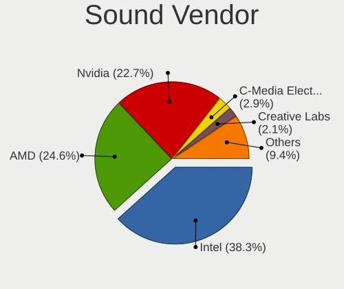

| Vendor                                       | Desktops | Percent |
|----------------------------------------------|----------|---------|
| Intel                                        | 274      | 38.32%  |
| AMD                                          | 176      | 24.62%  |
| Nvidia                                       | 162      | 22.66%  |
| C-Media Electronics                          | 21       | 2.94%   |
| Creative Labs                                | 15       | 2.1%    |
| Logitech                                     | 7        | 0.98%   |
| Texas Instruments                            | 5        | 0.7%    |
| JMTek                                        | 5        | 0.7%    |
| VIA Technologies                             | 3        | 0.42%   |
| Focusrite-Novation                           | 3        | 0.42%   |
| Tenx Technology                              | 2        | 0.28%   |
| ROCCAT                                       | 2        | 0.28%   |
| Kingston Technology                          | 2        | 0.28%   |
| Jieli Technology                             | 2        | 0.28%   |
| GYROCOM C&C                                  | 2        | 0.28%   |
| Giga-Byte Technology                         | 2        | 0.28%   |
| Generalplus Technology                       | 2        | 0.28%   |
| Fortemedia                                   | 2        | 0.28%   |
| Zoran Co. Personal Media Division (Nogatech) | 1        | 0.14%   |
| ULi Electronics                              | 1        | 0.14%   |
| TerraTec Electronic                          | 1        | 0.14%   |
| SteelSeries ApS                              | 1        | 0.14%   |
| Sony                                         | 1        | 0.14%   |
| Silicon Integrated Systems [SiS]             | 1        | 0.14%   |
| Setek Elektronik                             | 1        | 0.14%   |
| Schiit Audio                                 | 1        | 0.14%   |
| RODE Microphones                             | 1        | 0.14%   |
| Razer USA                                    | 1        | 0.14%   |
| MV-SILICON                                   | 1        | 0.14%   |
| Microsoft                                    | 1        | 0.14%   |
| Micro Star International                     | 1        | 0.14%   |
| M-Audio                                      | 1        | 0.14%   |
| Linux Foundation                             | 1        | 0.14%   |
| iConnectivity                                | 1        | 0.14%   |
| Hewlett-Packard                              | 1        | 0.14%   |
| GN Netcom                                    | 1        | 0.14%   |
| FiiO Electronics Technology                  | 1        | 0.14%   |
| Ensoniq                                      | 1        | 0.14%   |
| Emotiva                                      | 1        | 0.14%   |
| Digidesign                                   | 1        | 0.14%   |

Sound Model
-----------

Sound card models

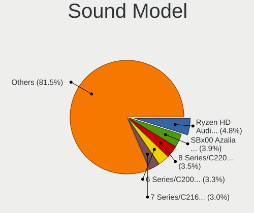

| Model                                                                      | Desktops | Percent |
|----------------------------------------------------------------------------|----------|---------|
| AMD Ryzen HD Audio Controller                                              | 40       | 4.84%   |
| AMD SBx00 Azalia (Intel HDA)                                               | 32       | 3.87%   |
| Intel 8 Series/C220 Series Chipset High Definition Audio Controller        | 29       | 3.51%   |
| Intel 6 Series/C200 Series Chipset Family High Definition Audio Controller | 27       | 3.26%   |
| Intel 7 Series/C216 Chipset Family High Definition Audio Controller        | 25       | 3.02%   |
| AMD Starship/Matisse HD Audio Controller                                   | 24       | 2.9%    |
| Intel 100 Series/C230 Series Chipset Family HD Audio Controller            | 23       | 2.78%   |
| AMD Family 17h (Models 00h-0fh) HD Audio Controller                        | 20       | 2.42%   |
| Intel Xeon E3-1200 v3/4th Gen Core Processor HD Audio Controller           | 18       | 2.18%   |
| Nvidia GP107GL High Definition Audio Controller                            | 17       | 2.06%   |
| AMD Ellesmere HDMI Audio [Radeon RX 470/480 / 570/580/590]                 | 17       | 2.06%   |
| Intel NM10/ICH7 Family High Definition Audio Controller                    | 16       | 1.93%   |
| Intel 200 Series PCH HD Audio                                              | 16       | 1.93%   |
| AMD Radeon High Definition Audio Controller                                | 16       | 1.93%   |
| Intel Cannon Lake PCH cAVS                                                 | 15       | 1.81%   |
| AMD Renoir/Cezanne HDMI/DP Audio Controller                                | 15       | 1.81%   |
| AMD Oland/Hainan/Cape Verde/Pitcairn HDMI Audio [Radeon HD 7000 Series]    | 14       | 1.69%   |
| Nvidia GK208 HDMI/DP Audio Controller                                      | 13       | 1.57%   |
| AMD FCH Azalia Controller                                                  | 12       | 1.45%   |
| Nvidia GP108 High Definition Audio Controller                              | 11       | 1.33%   |
| Intel Alder Lake-S HD Audio Controller                                     | 11       | 1.33%   |
| Intel 82801JI (ICH10 Family) HD Audio Controller                           | 11       | 1.33%   |
| Nvidia GP106 High Definition Audio Controller                              | 10       | 1.21%   |
| Nvidia GP104 High Definition Audio Controller                              | 10       | 1.21%   |
| Intel 5 Series/3400 Series Chipset High Definition Audio                   | 10       | 1.21%   |
| AMD Raven/Raven2/Fenghuang HDMI/DP Audio Controller                        | 10       | 1.21%   |
| Nvidia High Definition Audio Controller                                    | 9        | 1.09%   |
| Intel 82801JD/DO (ICH10 Family) HD Audio Controller                        | 9        | 1.09%   |
| AMD Navi 21/23 HDMI/DP Audio Controller                                    | 9        | 1.09%   |
| Intel 82801I (ICH9 Family) HD Audio Controller                             | 8        | 0.97%   |
| C-Media Electronics Audio Adapter (Unitek Y-247A)                          | 8        | 0.97%   |
| Nvidia GM107 High Definition Audio Controller [GeForce 940MX]              | 7        | 0.85%   |
| Nvidia GK107 HDMI Audio Controller                                         | 7        | 0.85%   |
| Intel Tiger Lake-H HD Audio Controller                                     | 7        | 0.85%   |
| AMD Cedar HDMI Audio [Radeon HD 5400/6300/7300 Series]                     | 7        | 0.85%   |
| AMD Baffin HDMI/DP Audio [Radeon RX 550 640SP / RX 560/560X]               | 7        | 0.85%   |
| Nvidia TU106 High Definition Audio Controller                              | 6        | 0.73%   |
| Nvidia GF108 High Definition Audio Controller                              | 6        | 0.73%   |
| Nvidia GA104 High Definition Audio Controller                              | 6        | 0.73%   |
| Intel 82801H (ICH8 Family) HD Audio Controller                             | 6        | 0.73%   |

Memory
------

Memory Vendor
-------------

Memory module vendors

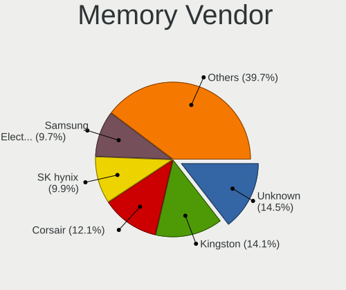

| Vendor                                  | Desktops | Percent |
|-----------------------------------------|----------|---------|
| Unknown                                 | 72       | 14.52%  |
| Kingston                                | 70       | 14.11%  |
| Corsair                                 | 60       | 12.1%   |
| SK hynix                                | 49       | 9.88%   |
| Samsung Electronics                     | 48       | 9.68%   |
| Crucial                                 | 43       | 8.67%   |
| G.Skill                                 | 38       | 7.66%   |
| Micron Technology                       | 21       | 4.23%   |
| A-DATA Technology                       | 13       | 2.62%   |
| Nanya Technology                        | 12       | 2.42%   |
| Unknown                                 | 9        | 1.81%   |
| Ramaxel Technology                      | 8        | 1.61%   |
| Team                                    | 6        | 1.21%   |
| Unknown (ABCD)                          | 5        | 1.01%   |
| Patriot                                 | 5        | 1.01%   |
| Elpida                                  | 3        | 0.6%    |
| Unknown (0x0B45)                        | 2        | 0.4%    |
| Transcend                               | 2        | 0.4%    |
| Timetec                                 | 2        | 0.4%    |
| Silicon Power Computer & Communications | 2        | 0.4%    |
| Lexar Co Limited                        | 2        | 0.4%    |
| Apacer                                  | 2        | 0.4%    |
| V-GeN                                   | 1        | 0.2%    |
| Unknown (AB)                            | 1        | 0.2%    |
| Unknown (0x0E9D)                        | 1        | 0.2%    |
| Unknown (0x0CAB)                        | 1        | 0.2%    |
| Unifosa                                 | 1        | 0.2%    |
| Smart                                   | 1        | 0.2%    |
| RZX                                     | 1        | 0.2%    |
| Qumo                                    | 1        | 0.2%    |
| Qimonda                                 | 1        | 0.2%    |
| PNY                                     | 1        | 0.2%    |
| Patriot Memory (PDP Systems)            | 1        | 0.2%    |
| OM Nanotech                             | 1        | 0.2%    |
| OCZ                                     | 1        | 0.2%    |
| Multilaser                              | 1        | 0.2%    |
| Lexar                                   | 1        | 0.2%    |
| KLEVV                                   | 1        | 0.2%    |
| Golden Empire                           | 1        | 0.2%    |
| CSX                                     | 1        | 0.2%    |

Memory Model
------------

Memory module models

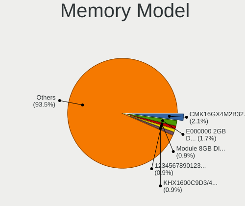

| Model                                                          | Desktops | Percent |
|----------------------------------------------------------------|----------|---------|
| Corsair RAM CMK16GX4M2B3200C16 8GB DIMM DDR4 3600MT/s          | 11       | 2.05%   |
| Unknown                                                        | 9        | 1.68%   |
| Unknown RAM Module 8GB DIMM DDR3 1600MT/s                      | 5        | 0.93%   |
| Unknown (ABCD) RAM 123456789012345678 2GB DIMM LPDDR4 2133MT/s | 5        | 0.93%   |
| Kingston RAM KHX1600C9D3/4GX 4GB DIMM DDR3 1867MT/s            | 5        | 0.93%   |
| Corsair RAM CMK16GX4M2B3000C15 8GB DIMM DDR4 3600MT/s          | 5        | 0.93%   |
| Unknown RAM Module 4GB DIMM SDRAM                              | 4        | 0.75%   |
| Unknown RAM Module 2GB DIMM 800MT/s                            | 4        | 0.75%   |
| SK hynix RAM HMT351U6EFR8C-PB 4GB DIMM DDR3 1600MT/s           | 4        | 0.75%   |
| Corsair RAM CMK32GX4M2B3200C16 16GB DIMM DDR4 3800MT/s         | 4        | 0.75%   |
| Unknown RAM Module 4096MB DIMM 1600MT/s                        | 3        | 0.56%   |
| Unknown RAM Module 2GB DIMM SDRAM                              | 3        | 0.56%   |
| Unknown RAM Module 2048MB DIMM 800MT/s                         | 3        | 0.56%   |
| SK hynix RAM HMT451U6BFR8C-PB 4GB DIMM DDR3 1600MT/s           | 3        | 0.56%   |
| SK hynix RAM HMT451S6AFR8A-PB 4GB SODIMM DDR3 1600MT/s         | 3        | 0.56%   |
| SK hynix RAM HMT351U6CFR8C-PB 4GB DIMM DDR3 1800MT/s           | 3        | 0.56%   |
| SK hynix RAM HMT125U6TFR8C-H9 2GB DIMM DDR3 1333MT/s           | 3        | 0.56%   |
| Samsung RAM M378B5273DH0-CH9 4GB DIMM DDR3 2133MT/s            | 3        | 0.56%   |
| Samsung RAM M3 78T2863QZS-CF7 1GB DIMM DDR2 800MT/s            | 3        | 0.56%   |
| Kingston RAM KHX2666C16/16G 16GB DIMM DDR4 3200MT/s            | 3        | 0.56%   |
| G.Skill RAM F4-3200C16-8GVKB 8GB DIMM DDR4 4000MT/s            | 3        | 0.56%   |
| Crucial RAM CT51264BD160BJ.M8F 4GB DIMM DDR3 1600MT/s          | 3        | 0.56%   |
| Corsair RAM CMZ8GX3M2A1600C9 4GB DIMM SDRAM 1800MT/s           | 3        | 0.56%   |
| Corsair RAM CMK16GX4M2A2133C13 8GB DIMM DDR4 3000MT/s          | 3        | 0.56%   |
| Unknown RAM Module 8GB DIMM DDR4 2667MT/s                      | 2        | 0.37%   |
| Unknown RAM Module 4GB DIMM DDR3 1333MT/s                      | 2        | 0.37%   |
| Unknown RAM Module 2GB DIMM DDR3 1333MT/s                      | 2        | 0.37%   |
| Unknown RAM Module 2GB DIMM DDR2 667MT/s                       | 2        | 0.37%   |
| Unknown RAM Module 2GB DIMM DDR2 333MT/s                       | 2        | 0.37%   |
| Unknown RAM Module 2GB DIMM DDR2                               | 2        | 0.37%   |
| Unknown RAM Module 2GB DIMM 667MT/s                            | 2        | 0.37%   |
| Unknown RAM Module 2GB DIMM 1333MT/s                           | 2        | 0.37%   |
| Unknown RAM Module 2048MB DIMM 1333MT/s                        | 2        | 0.37%   |
| Unknown RAM Module 1GB DIMM DDR2 667MT/s                       | 2        | 0.37%   |
| Unknown RAM Module 1024MB DIMM DDR 333MT/s                     | 2        | 0.37%   |
| SK hynix RAM HYMP125U64CP8-S6 2GB DIMM DDR2 49926MT/s          | 2        | 0.37%   |
| SK hynix RAM HMT451U6BFR8A-PB 4GB DIMM DDR3 1600MT/s           | 2        | 0.37%   |
| SK hynix RAM HMT451U6AFR8A-PB 4GB DIMM DDR3 1600MT/s           | 2        | 0.37%   |
| SK hynix RAM HMT351U6CFR8C-PB 4GB DIMM DDR3 1600MT/s           | 2        | 0.37%   |
| SK hynix RAM HMT351U6BFR8C-H9 4096MB DIMM 1333MT/s             | 2        | 0.37%   |

Memory Kind
-----------

Memory module kinds

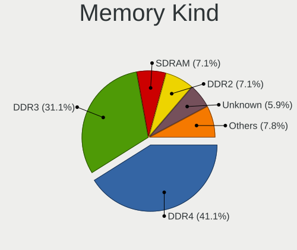

| Kind    | Desktops | Percent |
|---------|----------|---------|
| DDR4    | 180      | 41.1%   |
| DDR3    | 136      | 31.05%  |
| SDRAM   | 31       | 7.08%   |
| DDR2    | 31       | 7.08%   |
| Unknown | 26       | 5.94%   |
| DDR5    | 20       | 4.57%   |
| LPDDR4  | 7        | 1.6%    |
| DDR     | 6        | 1.37%   |
| LPDDR3  | 1        | 0.23%   |

Memory Form Factor
------------------

Physical design of the memory module

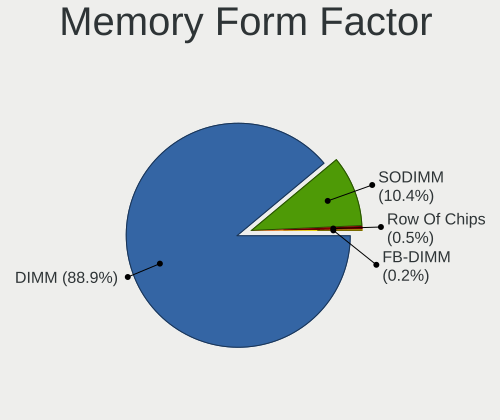

| Name         | Desktops | Percent |
|--------------|----------|---------|
| DIMM         | 378      | 88.94%  |
| SODIMM       | 44       | 10.35%  |
| Row Of Chips | 2        | 0.47%   |
| FB-DIMM      | 1        | 0.24%   |

Memory Size
-----------

Memory module size

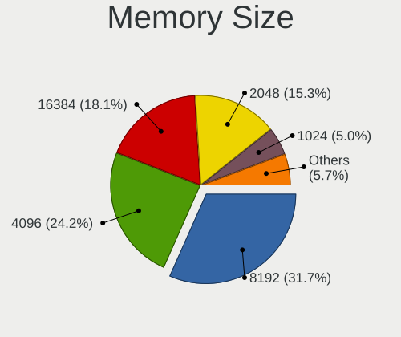

| Size  | Desktops | Percent |
|-------|----------|---------|
| 8192  | 145      | 31.66%  |
| 4096  | 111      | 24.24%  |
| 16384 | 83       | 18.12%  |
| 2048  | 70       | 15.28%  |
| 1024  | 23       | 5.02%   |
| 32768 | 20       | 4.37%   |
| 512   | 4        | 0.87%   |
| 65536 | 1        | 0.22%   |
| 256   | 1        | 0.22%   |

Memory Speed
------------

Memory module speed

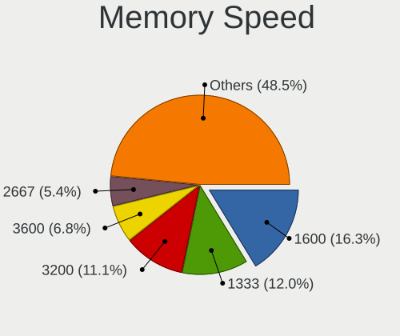

| Speed   | Desktops | Percent |
|---------|----------|---------|
| 1600    | 79       | 16.29%  |
| 1333    | 58       | 11.96%  |
| 3200    | 54       | 11.13%  |
| 3600    | 33       | 6.8%    |
| 2667    | 26       | 5.36%   |
| 2400    | 25       | 5.15%   |
| 800     | 21       | 4.33%   |
| 2133    | 19       | 3.92%   |
| 667     | 16       | 3.3%    |
| Unknown | 16       | 3.3%    |
| 6000    | 11       | 2.27%   |
| 1800    | 11       | 2.27%   |
| 3000    | 9        | 1.86%   |
| 1866    | 7        | 1.44%   |
| 2666    | 6        | 1.24%   |
| 3733    | 5        | 1.03%   |
| 2933    | 5        | 1.03%   |
| 2048    | 5        | 1.03%   |
| 1067    | 5        | 1.03%   |
| 400     | 5        | 1.03%   |
| 4000    | 4        | 0.82%   |
| 3800    | 4        | 0.82%   |
| 3466    | 4        | 0.82%   |
| 533     | 4        | 0.82%   |
| 333     | 4        | 0.82%   |
| 4800    | 3        | 0.62%   |
| 3400    | 3        | 0.62%   |
| 1867    | 3        | 0.62%   |
| 1639    | 3        | 0.62%   |
| 49926   | 2        | 0.41%   |
| 5600    | 2        | 0.41%   |
| 3500    | 2        | 0.41%   |
| 3266    | 2        | 0.41%   |
| 3151    | 2        | 0.41%   |
| 3066    | 2        | 0.41%   |
| 2800    | 2        | 0.41%   |
| 1066    | 2        | 0.41%   |
| 12800   | 1        | 0.21%   |
| 8400    | 1        | 0.21%   |
| 6200    | 1        | 0.21%   |

Printers & scanners
-------------------

Printer Vendor
--------------

Printer device vendors

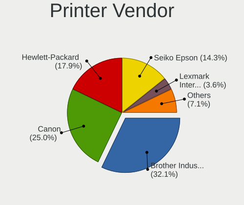

| Vendor                | Desktops | Percent |
|-----------------------|----------|---------|
| Brother Industries    | 9        | 32.14%  |
| Canon                 | 7        | 25%     |
| Hewlett-Packard       | 5        | 17.86%  |
| Seiko Epson           | 4        | 14.29%  |
| Lexmark International | 1        | 3.57%   |
| Konica Minolta        | 1        | 3.57%   |
| Dymo-CoStar           | 1        | 3.57%   |

Printer Model
-------------

Printer device models

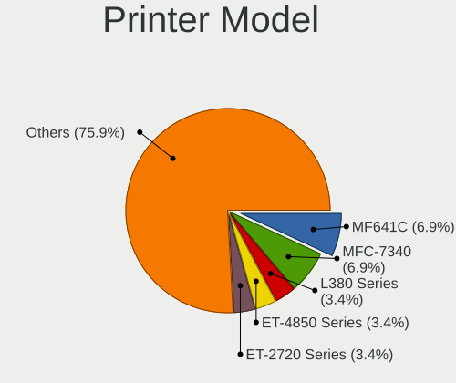

| Model                             | Desktops | Percent |
|-----------------------------------|----------|---------|
| Canon MF641C                      | 2        | 6.9%    |
| Brother MFC-7340                  | 2        | 6.9%    |
| Seiko Epson L380 Series           | 1        | 3.45%   |
| Seiko Epson ET-4850 Series        | 1        | 3.45%   |
| Seiko Epson ET-2720 Series        | 1        | 3.45%   |
| Seiko Epson EPSON L220 Series     | 1        | 3.45%   |
| Lexmark International CS417dn     | 1        | 3.45%   |
| Konica Minolta KONICA MINOLTA 206 | 1        | 3.45%   |
| HP Smart Tank 710-720 series      | 1        | 3.45%   |
| HP LaserJet Pro M148-M149         | 1        | 3.45%   |
| HP ENVY 4500 series               | 1        | 3.45%   |
| HP Deskjet 3510 series            | 1        | 3.45%   |
| HP Deskjet 1510                   | 1        | 3.45%   |
| Dymo-CoStar LabelWriter 450       | 1        | 3.45%   |
| Canon PIXMA MG5600 Series         | 1        | 3.45%   |
| Canon PIXMA MG3600 Series         | 1        | 3.45%   |
| Canon PIXMA MG2500 Series         | 1        | 3.45%   |
| Canon PIXMA iP4000                | 1        | 3.45%   |
| Canon MG5700 series               | 1        | 3.45%   |
| Brother Printer                   | 1        | 3.45%   |
| Brother MFC-7360N                 | 1        | 3.45%   |
| Brother HL-L2400DWE               | 1        | 3.45%   |
| Brother HL-L2380DW                | 1        | 3.45%   |
| Brother HL-L2350DW series         | 1        | 3.45%   |
| Brother HL-52x0 series            | 1        | 3.45%   |
| Brother DCP-L2540DW               | 1        | 3.45%   |
| Brother DCP-L2500D                | 1        | 3.45%   |

Scanner Vendor
--------------

Scanner device vendors

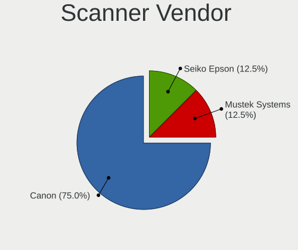

| Vendor         | Desktops | Percent |
|----------------|----------|---------|
| Canon          | 6        | 75%     |
| Seiko Epson    | 1        | 12.5%   |
| Mustek Systems | 1        | 12.5%   |

Scanner Model
-------------

Scanner device models

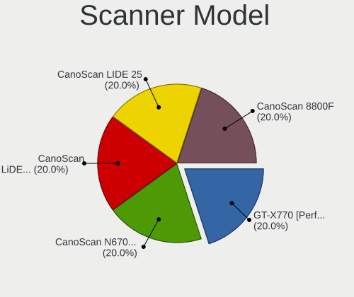

| Model                                 | Desktops | Percent |
|---------------------------------------|----------|---------|
| Canon CanoScan LiDE 210               | 2        | 25%     |
| Seiko Epson GT-X770 [Perfection V500] | 1        | 12.5%   |
| Mustek Systems BearPaw 1200 CU Plus   | 1        | 12.5%   |
| Canon CanoScan N670U/N676U/LiDE 20    | 1        | 12.5%   |
| Canon CanoScan LiDE 700F              | 1        | 12.5%   |
| Canon CanoScan LIDE 25                | 1        | 12.5%   |
| Canon CanoScan 8800F                  | 1        | 12.5%   |

Camera
------

Camera Vendor
-------------

Camera device vendors

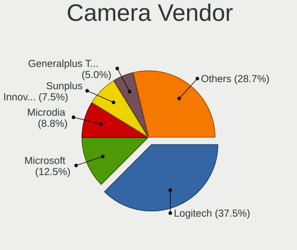

| Vendor                                 | Desktops | Percent |
|----------------------------------------|----------|---------|
| Logitech                               | 30       | 37.5%   |
| Microsoft                              | 10       | 12.5%   |
| Microdia                               | 7        | 8.75%   |
| Sunplus Innovation Technology          | 6        | 7.5%    |
| Generalplus Technology                 | 4        | 5%      |
| Chicony Electronics                    | 3        | 3.75%   |
| Sonix Technology                       | 2        | 2.5%    |
| MacroSilicon                           | 2        | 2.5%    |
| Z-Star Microelectronics                | 1        | 1.25%   |
| YGTek                                  | 1        | 1.25%   |
| USB Cam Manufacturer                   | 1        | 1.25%   |
| Trust                                  | 1        | 1.25%   |
| Sunplus Technology                     | 1        | 1.25%   |
| Pixart Imaging                         | 1        | 1.25%   |
| Lenovo                                 | 1        | 1.25%   |
| Huawei Technologies                    | 1        | 1.25%   |
| Hewlett-Packard                        | 1        | 1.25%   |
| Cubeternet                             | 1        | 1.25%   |
| Cheng Uei Precision Industry (Foxlink) | 1        | 1.25%   |
| Aveo Technology                        | 1        | 1.25%   |
| Arkmicro Technologies                  | 1        | 1.25%   |
| ARC International                      | 1        | 1.25%   |
| Alcor Micro                            | 1        | 1.25%   |
| Unknown                                | 1        | 1.25%   |

Camera Model
------------

Camera device models

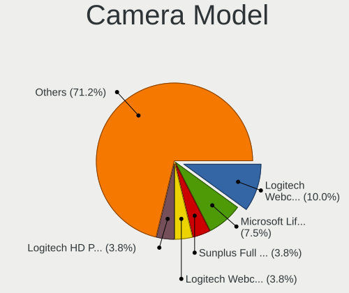

| Model                                                   | Desktops | Percent |
|---------------------------------------------------------|----------|---------|
| Logitech Webcam C270                                    | 8        | 10%     |
| Microsoft LifeCam HD-3000                               | 6        | 7.5%    |
| Sunplus Full HD webcam                                  | 3        | 3.75%   |
| Logitech Webcam C930e                                   | 3        | 3.75%   |
| Logitech HD Pro Webcam C920                             | 3        | 3.75%   |
| Microsoft LifeCam VX-800                                | 2        | 2.5%    |
| Microdia Sonix USB 2.0 Camera                           | 2        | 2.5%    |
| Logitech Webcam C200                                    | 2        | 2.5%    |
| Logitech HD Webcam C615                                 | 2        | 2.5%    |
| Logitech C922 Pro Stream Webcam                         | 2        | 2.5%    |
| Generalplus GENERAL WEBCAM                              | 2        | 2.5%    |
| Generalplus 808 Camera #9 (web-cam mode)                | 2        | 2.5%    |
| Z-Star Traveler TV 6500 SF Dia-scanner                  | 1        | 1.25%   |
| YGTek Webcam                                            | 1        | 1.25%   |
| USB Cam Manufacturer HDMI USB Camera                    | 1        | 1.25%   |
| Trust Widescreen 3MP Webcam                             | 1        | 1.25%   |
| Sunplus SPCA1527A/SPCA1528 SD card camera (webcam mode) | 1        | 1.25%   |
| Sunplus web camera                                      | 1        | 1.25%   |
| Sunplus SPCA2281 Web Camera                             | 1        | 1.25%   |
| Sunplus Aukey-PC-LM1E Camera                            | 1        | 1.25%   |
| Sonix USB Camera                                        | 1        | 1.25%   |
| Sonix GENERAL WEBCAM                                    | 1        | 1.25%   |
| Pixart Imaging GE 1.3 MP MiniCam Pro                    | 1        | 1.25%   |
| Microsoft LifeCam VX-5000                               | 1        | 1.25%   |
| Microsoft LifeCam VX-500 [1357]                         | 1        | 1.25%   |
| Microdia Webcam Vitade AF                               | 1        | 1.25%   |
| Microdia USB 2.0 Camera                                 | 1        | 1.25%   |
| Microdia Integrated Camera                              | 1        | 1.25%   |
| Microdia CyberTrack H7                                  | 1        | 1.25%   |
| Microdia Camera                                         | 1        | 1.25%   |
| MacroSilicon USB Video                                  | 1        | 1.25%   |
| MacroSilicon MS210x Video Grabber [EasierCAP]           | 1        | 1.25%   |
| Logitech Webcam Pro 9000                                | 1        | 1.25%   |
| Logitech Webcam C600                                    | 1        | 1.25%   |
| Logitech Webcam C310                                    | 1        | 1.25%   |
| Logitech Webcam C110                                    | 1        | 1.25%   |
| Logitech QuickCam Communicate MP/S5500                  | 1        | 1.25%   |
| Logitech Portable Webcam C905                           | 1        | 1.25%   |
| Logitech HD Webcam C910                                 | 1        | 1.25%   |
| Logitech C920 PRO HD Webcam                             | 1        | 1.25%   |

Security
--------

Fingerprint Vendor
------------------

Fingerprint sensor vendors

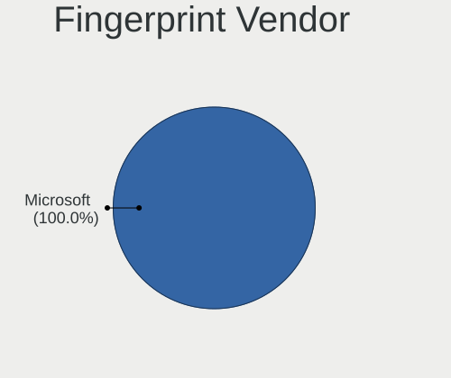

| Vendor    | Desktops | Percent |
|-----------|----------|---------|
| Microsoft | 1        | 100%    |

Fingerprint Model
-----------------

Fingerprint sensor models

| Model                        | Desktops | Percent |
|------------------------------|----------|---------|
| Microsoft Fingerprint Reader | 1        | 100%    |

Chipcard Vendor
---------------

Chipcard module vendors

| Vendor              | Desktops | Percent |
|---------------------|----------|---------|
| Chicony Electronics | 2        | 100%    |

Chipcard Model
--------------

Chipcard module models

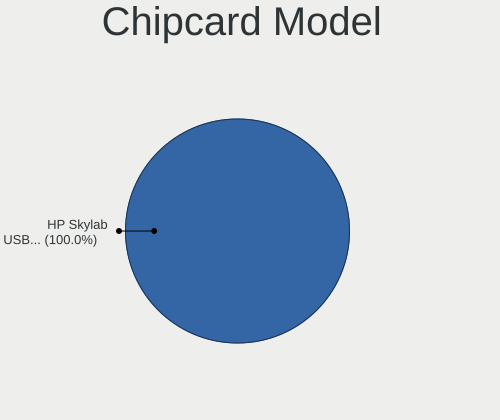

| Model                                                | Desktops | Percent |
|------------------------------------------------------|----------|---------|
| Chicony Electronics HP Skylab USB Smartcard Keyboard | 2        | 100%    |

Unsupported
-----------

Unsupported Devices
-------------------

Total unsupported devices on board

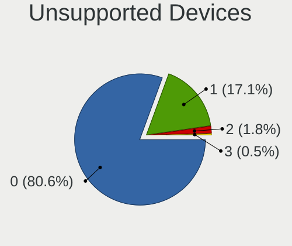

| Total | Desktops | Percent |
|-------|----------|---------|
| 0     | 349      | 80.6%   |
| 1     | 74       | 17.09%  |
| 2     | 8        | 1.85%   |
| 3     | 2        | 0.46%   |

Unsupported Device Types
------------------------

Types of unsupported devices

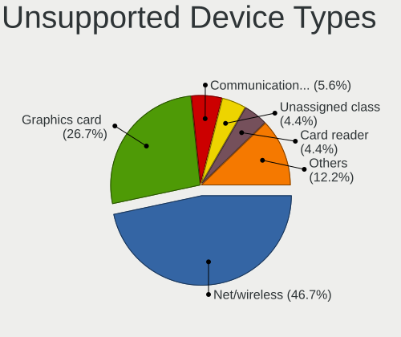

| Type                     | Desktops | Percent |
|--------------------------|----------|---------|
| Net/wireless             | 42       | 46.67%  |
| Graphics card            | 24       | 26.67%  |
| Communication controller | 5        | 5.56%   |
| Unassigned class         | 4        | 4.44%   |
| Card reader              | 4        | 4.44%   |
| Multimedia controller    | 2        | 2.22%   |
| Bluetooth                | 2        | 2.22%   |
| Storage/raid             | 1        | 1.11%   |
| Storage/ata              | 1        | 1.11%   |
| Network                  | 1        | 1.11%   |
| Fingerprint reader       | 1        | 1.11%   |
| Dvb card                 | 1        | 1.11%   |
| Chipcard                 | 1        | 1.11%   |
| Camera                   | 1        | 1.11%   |

