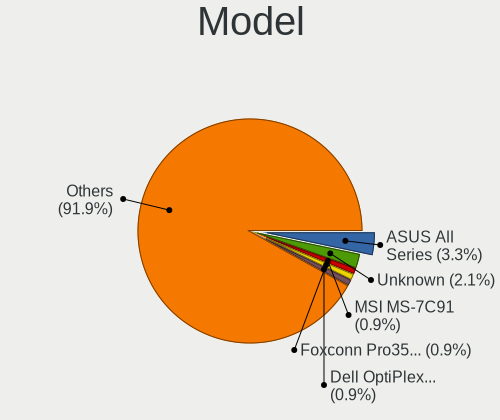
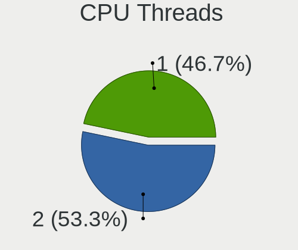
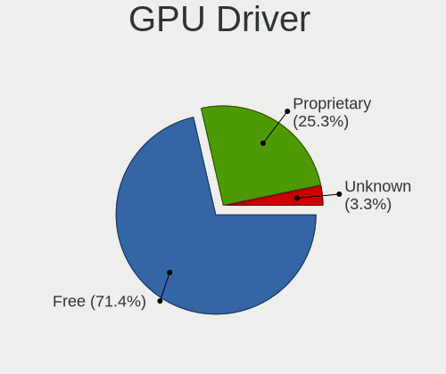
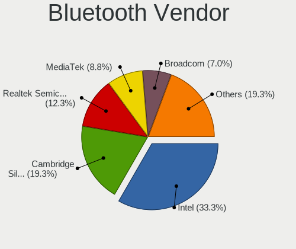
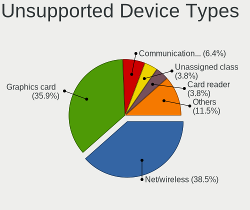

MX - Tested Hardware & Statistics (Desktops)
--------------------------------------------

A project to collect tested hardware configurations for MX.

Anyone can contribute to this report by the [hw-probe](https://github.com/linuxhw/hw-probe) tool:

    sudo -E hw-probe -all -upload

Please contribute! Especially if your hardware is rare.

Contents
--------

* [ Test Cases ](#test-cases)

* [ System ](#system)
  - [ OS                       ](#os)
  - [ OS Family                ](#os-family)
  - [ Kernel                   ](#kernel)
  - [ Kernel Family            ](#kernel-family)
  - [ Kernel Major Ver.        ](#kernel-major-ver)
  - [ Arch                     ](#arch)
  - [ DE                       ](#de)
  - [ Display Server           ](#display-server)
  - [ Display Manager          ](#display-manager)
  - [ OS Lang                  ](#os-lang)
  - [ Boot Mode                ](#boot-mode)
  - [ Filesystem               ](#filesystem)
  - [ Part. scheme             ](#part-scheme)
  - [ Dual Boot with Linux/BSD ](#dual-boot-with-linuxbsd)
  - [ Dual Boot (Win)          ](#dual-boot-win)

* [ Board ](#board)
  - [ Vendor                   ](#vendor)
  - [ Model                    ](#model)
  - [ Model Family             ](#model-family)
  - [ MFG Year                 ](#mfg-year)
  - [ Form Factor              ](#form-factor)
  - [ Secure Boot              ](#secure-boot)
  - [ Coreboot                 ](#coreboot)
  - [ RAM Size                 ](#ram-size)
  - [ RAM Used                 ](#ram-used)
  - [ Total Drives             ](#total-drives)
  - [ Has CD-ROM               ](#has-cd-rom)
  - [ Has Ethernet             ](#has-ethernet)
  - [ Has WiFi                 ](#has-wifi)
  - [ Has Bluetooth            ](#has-bluetooth)

* [ Location ](#location)
  - [ Country                  ](#country)
  - [ City                     ](#city)

* [ Drives ](#drives)
  - [ Drive Vendor             ](#drive-vendor)
  - [ Drive Model              ](#drive-model)
  - [ HDD Vendor               ](#hdd-vendor)
  - [ SSD Vendor               ](#ssd-vendor)
  - [ Drive Kind               ](#drive-kind)
  - [ Drive Connector          ](#drive-connector)
  - [ Drive Size               ](#drive-size)
  - [ Space Total              ](#space-total)
  - [ Space Used               ](#space-used)
  - [ Malfunc. Drives          ](#malfunc-drives)
  - [ Malfunc. Drive Vendor    ](#malfunc-drive-vendor)
  - [ Malfunc. HDD Vendor      ](#malfunc-hdd-vendor)
  - [ Malfunc. Drive Kind      ](#malfunc-drive-kind)
  - [ Failed Drives            ](#failed-drives)
  - [ Failed Drive Vendor      ](#failed-drive-vendor)
  - [ Drive Status             ](#drive-status)

* [ Storage controller ](#storage-controller)
  - [ Storage Vendor           ](#storage-vendor)
  - [ Storage Model            ](#storage-model)
  - [ Storage Kind             ](#storage-kind)

* [ Processor ](#processor)
  - [ CPU Vendor               ](#cpu-vendor)
  - [ CPU Model                ](#cpu-model)
  - [ CPU Model Family         ](#cpu-model-family)
  - [ CPU Cores                ](#cpu-cores)
  - [ CPU Sockets              ](#cpu-sockets)
  - [ CPU Threads              ](#cpu-threads)
  - [ CPU Op-Modes             ](#cpu-op-modes)
  - [ CPU Microcode            ](#cpu-microcode)
  - [ CPU Microarch            ](#cpu-microarch)

* [ Graphics ](#graphics)
  - [ GPU Vendor               ](#gpu-vendor)
  - [ GPU Model                ](#gpu-model)
  - [ GPU Combo                ](#gpu-combo)
  - [ GPU Driver               ](#gpu-driver)
  - [ GPU Memory               ](#gpu-memory)

* [ Monitor ](#monitor)
  - [ Monitor Vendor           ](#monitor-vendor)
  - [ Monitor Model            ](#monitor-model)
  - [ Monitor Resolution       ](#monitor-resolution)
  - [ Monitor Diagonal         ](#monitor-diagonal)
  - [ Monitor Width            ](#monitor-width)
  - [ Aspect Ratio             ](#aspect-ratio)
  - [ Monitor Area             ](#monitor-area)
  - [ Pixel Density            ](#pixel-density)
  - [ Multiple Monitors        ](#multiple-monitors)

* [ Network ](#network)
  - [ Net Controller Vendor    ](#net-controller-vendor)
  - [ Net Controller Model     ](#net-controller-model)
  - [ Wireless Vendor          ](#wireless-vendor)
  - [ Wireless Model           ](#wireless-model)
  - [ Ethernet Vendor          ](#ethernet-vendor)
  - [ Ethernet Model           ](#ethernet-model)
  - [ Net Controller Kind      ](#net-controller-kind)
  - [ Used Controller          ](#used-controller)
  - [ NICs                     ](#nics)
  - [ IPv6                     ](#ipv6)

* [ Bluetooth ](#bluetooth)
  - [ Bluetooth Vendor         ](#bluetooth-vendor)
  - [ Bluetooth Model          ](#bluetooth-model)

* [ Sound ](#sound)
  - [ Sound Vendor             ](#sound-vendor)
  - [ Sound Model              ](#sound-model)

* [ Memory ](#memory)
  - [ Memory Vendor            ](#memory-vendor)
  - [ Memory Model             ](#memory-model)
  - [ Memory Kind              ](#memory-kind)
  - [ Memory Form Factor       ](#memory-form-factor)
  - [ Memory Size              ](#memory-size)
  - [ Memory Speed             ](#memory-speed)

* [ Printers & scanners ](#printers--scanners)
  - [ Printer Vendor           ](#printer-vendor)
  - [ Printer Model            ](#printer-model)
  - [ Scanner Vendor           ](#scanner-vendor)
  - [ Scanner Model            ](#scanner-model)

* [ Camera ](#camera)
  - [ Camera Vendor            ](#camera-vendor)
  - [ Camera Model             ](#camera-model)

* [ Security ](#security)
  - [ Fingerprint Vendor       ](#fingerprint-vendor)
  - [ Fingerprint Model        ](#fingerprint-model)
  - [ Chipcard Vendor          ](#chipcard-vendor)
  - [ Chipcard Model           ](#chipcard-model)

* [ Unsupported ](#unsupported)
  - [ Unsupported Devices      ](#unsupported-devices)
  - [ Unsupported Device Types ](#unsupported-device-types)

Test Cases
----------

Total: 265

| Vendor        | Model                       | Probe                                                      | Date         |
|---------------|-----------------------------|------------------------------------------------------------|--------------|
| MSI           | G41M4                       | [0554e9757f](https://linux-hardware.org/?probe=0554e9757f) | Sep 26, 2023 |
| ASUSTek       | TUF Gaming X570-PLUS        | [4054ad9d77](https://linux-hardware.org/?probe=4054ad9d77) | Sep 26, 2023 |
| ASUSTek       | TUF Gaming X570-PLUS        | [76d936bb5b](https://linux-hardware.org/?probe=76d936bb5b) | Sep 26, 2023 |
| ASUSTek       | Z97-P                       | [d72c4b5cce](https://linux-hardware.org/?probe=d72c4b5cce) | Sep 06, 2023 |
| Foxconn       | 2ABF                        | [baad816533](https://linux-hardware.org/?probe=baad816533) | Sep 05, 2023 |
| Gigabyte      | PH67A-D3-B3                 | [a9fdf4f92b](https://linux-hardware.org/?probe=a9fdf4f92b) | Sep 03, 2023 |
| ASRock        | J4205-ITX                   | [8831793b97](https://linux-hardware.org/?probe=8831793b97) | Sep 03, 2023 |
| MSI           | A68HM-E33 V2                | [af96cda252](https://linux-hardware.org/?probe=af96cda252) | Sep 02, 2023 |
| Foxconn       | 2A92                        | [50ca8342d7](https://linux-hardware.org/?probe=50ca8342d7) | Sep 01, 2023 |
| ASUSTek       | PRIME B550-PLUS             | [51ea627e30](https://linux-hardware.org/?probe=51ea627e30) | Aug 25, 2023 |
| ASUSTek       | PRIME B550-PLUS             | [c8e9f89359](https://linux-hardware.org/?probe=c8e9f89359) | Aug 25, 2023 |
| Pegatron      | 2AD5                        | [fcb0ac31fe](https://linux-hardware.org/?probe=fcb0ac31fe) | Aug 23, 2023 |
| Gigabyte      | MZGLKCP-00                  | [c6f294e543](https://linux-hardware.org/?probe=c6f294e543) | Aug 21, 2023 |
| Gigabyte      | MZGLKCP-00                  | [d6e0b89f34](https://linux-hardware.org/?probe=d6e0b89f34) | Aug 21, 2023 |
| Biostar       | H310MHC2                    | [12f3b0d269](https://linux-hardware.org/?probe=12f3b0d269) | Aug 20, 2023 |
| Gigabyte      | H510M S2H                   | [e5661bef5b](https://linux-hardware.org/?probe=e5661bef5b) | Aug 16, 2023 |
| ASUSTek       | F1A75-M LE                  | [f059d25382](https://linux-hardware.org/?probe=f059d25382) | Aug 14, 2023 |
| MSI           | A68HM-E33 V2                | [44556227ff](https://linux-hardware.org/?probe=44556227ff) | Aug 05, 2023 |
| OEM           | Intel H81                   | [82606b5050](https://linux-hardware.org/?probe=82606b5050) | Aug 03, 2023 |
| Gigabyte      | B560 AORUS PRO AX           | [c7e057da76](https://linux-hardware.org/?probe=c7e057da76) | Aug 02, 2023 |
| ASUSTek       | Z170 PRO GAMING             | [a0270160ad](https://linux-hardware.org/?probe=a0270160ad) | Aug 02, 2023 |
| Intel         | JSL MRD                     | [feb19ee725](https://linux-hardware.org/?probe=feb19ee725) | Jul 29, 2023 |
| Intel         | JSL MRD                     | [ca5990cfa3](https://linux-hardware.org/?probe=ca5990cfa3) | Jul 29, 2023 |
| ASUSTek       | LEUCITE3                    | [bb2046286f](https://linux-hardware.org/?probe=bb2046286f) | Jul 26, 2023 |
| ASUSTek       | LEUCITE3                    | [6ced09890f](https://linux-hardware.org/?probe=6ced09890f) | Jul 26, 2023 |
| ASRock        | B660M-HDV                   | [3a0685bcf0](https://linux-hardware.org/?probe=3a0685bcf0) | Jul 18, 2023 |
| Medion        | MS-7667                     | [52ff08b634](https://linux-hardware.org/?probe=52ff08b634) | Jul 09, 2023 |
| AOpen         | D1009 A1A4                  | [2819e086aa](https://linux-hardware.org/?probe=2819e086aa) | Jul 02, 2023 |
| ASRock        | A620M Pro RS WiFi           | [d04862302e](https://linux-hardware.org/?probe=d04862302e) | Jul 01, 2023 |
| MSI           | B350M MORTAR                | [6e5323aa42](https://linux-hardware.org/?probe=6e5323aa42) | Jun 09, 2023 |
| MSI           | B350M MORTAR                | [fc4b07cbb0](https://linux-hardware.org/?probe=fc4b07cbb0) | Jun 09, 2023 |
| Lenovo        | 3188 SDK0J40697 WIN 3305... | [c64fbbcad9](https://linux-hardware.org/?probe=c64fbbcad9) | Jun 02, 2023 |
| MSI           | MAG X670E TOMAHAWK WIFI     | [7070e55aa0](https://linux-hardware.org/?probe=7070e55aa0) | Jun 01, 2023 |
| Gigabyte      | B650 AORUS ELITE AX         | [5ae19394fc](https://linux-hardware.org/?probe=5ae19394fc) | May 20, 2023 |
| Gigabyte      | B650 AORUS ELITE AX         | [14548bc77a](https://linux-hardware.org/?probe=14548bc77a) | May 20, 2023 |
| ASRock        | Z390 Phantom Gaming 9       | [5ca1acbf9b](https://linux-hardware.org/?probe=5ca1acbf9b) | May 19, 2023 |
| Unknown       | Unknown                     | [58066198c4](https://linux-hardware.org/?probe=58066198c4) | May 18, 2023 |
| Dell          | 06X1TJ A00                  | [d3107c9603](https://linux-hardware.org/?probe=d3107c9603) | May 14, 2023 |
| Gigabyte      | 990FXA-UD3                  | [3bc96663a8](https://linux-hardware.org/?probe=3bc96663a8) | May 14, 2023 |
| Gigabyte      | X670 GAMING X AX            | [ebd2a32ce2](https://linux-hardware.org/?probe=ebd2a32ce2) | May 12, 2023 |
| Gigabyte      | X670 GAMING X AX            | [352c0902e9](https://linux-hardware.org/?probe=352c0902e9) | May 11, 2023 |
| ASUSTek       | ROG STRIX B650E-F GAMING... | [f894b9a2c4](https://linux-hardware.org/?probe=f894b9a2c4) | May 07, 2023 |
| ASRock        | P55 Extreme                 | [e8721751c6](https://linux-hardware.org/?probe=e8721751c6) | May 03, 2023 |
| ASRock        | P55 Extreme                 | [e426e8e40b](https://linux-hardware.org/?probe=e426e8e40b) | May 03, 2023 |
| ASRock        | N68-S UCC                   | [f62abcbed6](https://linux-hardware.org/?probe=f62abcbed6) | May 02, 2023 |
| Dell          | 0PC5F7 A02                  | [2d1086090c](https://linux-hardware.org/?probe=2d1086090c) | May 01, 2023 |
| ASUSTek       | Z97-P                       | [8d94344086](https://linux-hardware.org/?probe=8d94344086) | Apr 26, 2023 |
| Gigabyte      | H61MA-D3V                   | [a37deef915](https://linux-hardware.org/?probe=a37deef915) | Apr 24, 2023 |
| ASUSTek       | ROG STRIX B550-F GAMING ... | [4939e609de](https://linux-hardware.org/?probe=4939e609de) | Apr 24, 2023 |
| HP            | 090Ch                       | [01d609bbab](https://linux-hardware.org/?probe=01d609bbab) | Apr 23, 2023 |
| ASRock        | Z690 Pro RS                 | [acb9cde3d7](https://linux-hardware.org/?probe=acb9cde3d7) | Apr 23, 2023 |
| Gateway       | DX4860                      | [5583641f1b](https://linux-hardware.org/?probe=5583641f1b) | Apr 22, 2023 |
| ASUSTek       | GRYPHON Z87                 | [045a79a6e4](https://linux-hardware.org/?probe=045a79a6e4) | Apr 18, 2023 |
| HP            | 3646h                       | [c36653d824](https://linux-hardware.org/?probe=c36653d824) | Apr 12, 2023 |
| HP            | 18E5                        | [441d2678ff](https://linux-hardware.org/?probe=441d2678ff) | Apr 07, 2023 |
| ASUSTek       | P8P67 LE                    | [aea33c89a1](https://linux-hardware.org/?probe=aea33c89a1) | Apr 05, 2023 |
| ASUSTek       | Z97-P                       | [86d8d7f80f](https://linux-hardware.org/?probe=86d8d7f80f) | Apr 05, 2023 |
| HP            | 3029h                       | [153b913406](https://linux-hardware.org/?probe=153b913406) | Mar 27, 2023 |
| Unknown       | GB01                        | [ad0e76307c](https://linux-hardware.org/?probe=ad0e76307c) | Mar 24, 2023 |
| MSI           | B360M PRO-VH                | [2706ed39b7](https://linux-hardware.org/?probe=2706ed39b7) | Mar 23, 2023 |
| HP            | 3048h                       | [cd326ce9fa](https://linux-hardware.org/?probe=cd326ce9fa) | Mar 22, 2023 |
| ASRock        | AB350 Pro4                  | [4a452568eb](https://linux-hardware.org/?probe=4a452568eb) | Mar 16, 2023 |
| Shenzhen M... | F6BFC                       | [46cb84be25](https://linux-hardware.org/?probe=46cb84be25) | Mar 14, 2023 |
| MSI           | CSM-H87M-G43                | [9df13e200e](https://linux-hardware.org/?probe=9df13e200e) | Mar 14, 2023 |
| Lenovo        | ThinkCentre M58 7638CB8     | [d303f78e26](https://linux-hardware.org/?probe=d303f78e26) | Mar 14, 2023 |
| Gigabyte      | PH67A-D3-B3                 | [145a0a3b7d](https://linux-hardware.org/?probe=145a0a3b7d) | Mar 05, 2023 |
| HP            | 8184 X4                     | [b42f6862c7](https://linux-hardware.org/?probe=b42f6862c7) | Mar 04, 2023 |
| Unknown       | 1.0                         | [bab30a1ac1](https://linux-hardware.org/?probe=bab30a1ac1) | Feb 24, 2023 |
| Positivo      | POS-PQ45AU POSITIVO         | [8ed6dacaa7](https://linux-hardware.org/?probe=8ed6dacaa7) | Feb 23, 2023 |
| Dell          | 0D441T A03                  | [351a527308](https://linux-hardware.org/?probe=351a527308) | Feb 18, 2023 |
| ASUSTek       | TUF Gaming X570-PLUS        | [482c922bbc](https://linux-hardware.org/?probe=482c922bbc) | Feb 14, 2023 |
| MSI           | MAG B550 TOMAHAWK           | [13492935fd](https://linux-hardware.org/?probe=13492935fd) | Feb 09, 2023 |
| Gigabyte      | GA-MA785GM-US2H             | [11f3874a6f](https://linux-hardware.org/?probe=11f3874a6f) | Feb 07, 2023 |
| ASUSTek       | Z97M-PLUS                   | [99a4bb9e50](https://linux-hardware.org/?probe=99a4bb9e50) | Feb 05, 2023 |
| SLIMBOOK      | ONE-AMD-M4                  | [dc948f9e70](https://linux-hardware.org/?probe=dc948f9e70) | Feb 05, 2023 |
| Gigabyte      | GA-MA785GM-US2H             | [42e242e6bf](https://linux-hardware.org/?probe=42e242e6bf) | Feb 04, 2023 |
| Unknown       | Unknown                     | [793f52c99a](https://linux-hardware.org/?probe=793f52c99a) | Feb 03, 2023 |
| ECS           | P4M800PRO-M                 | [f446d61863](https://linux-hardware.org/?probe=f446d61863) | Feb 02, 2023 |
| Intel         | D34010WYK H14771-303        | [31485ae6ec](https://linux-hardware.org/?probe=31485ae6ec) | Feb 01, 2023 |
| Gigabyte      | GA-MA785GM-US2H             | [dd017ac78a](https://linux-hardware.org/?probe=dd017ac78a) | Jan 31, 2023 |
| ASUSTek       | ROG Maximus XIII HERO       | [a32a9ba13a](https://linux-hardware.org/?probe=a32a9ba13a) | Jan 30, 2023 |
| Gigabyte      | GA-MA770-UD3                | [554aa8592c](https://linux-hardware.org/?probe=554aa8592c) | Jan 28, 2023 |
| BESSTAR Te... | UM340                       | [77efbbb270](https://linux-hardware.org/?probe=77efbbb270) | Jan 27, 2023 |
| MSI           | Z390-A PRO                  | [28c31b639b](https://linux-hardware.org/?probe=28c31b639b) | Jan 25, 2023 |
| Gigabyte      | Z77X-D3H                    | [e81c0bcfc4](https://linux-hardware.org/?probe=e81c0bcfc4) | Jan 22, 2023 |
| Dell          | 0PC5F7 A02                  | [7671c99c3c](https://linux-hardware.org/?probe=7671c99c3c) | Jan 19, 2023 |
| HP            | 3396                        | [2085b91098](https://linux-hardware.org/?probe=2085b91098) | Jan 15, 2023 |
| Pegatron      | 2AD5                        | [d41fde4498](https://linux-hardware.org/?probe=d41fde4498) | Jan 15, 2023 |
| ASRock        | X370 Taichi                 | [9c3ea14006](https://linux-hardware.org/?probe=9c3ea14006) | Jan 09, 2023 |
| ASUSTek       | H81M-E                      | [165bb4a9ab](https://linux-hardware.org/?probe=165bb4a9ab) | Jan 06, 2023 |
| Dell          | 0D881F A06                  | [21e5ad204d](https://linux-hardware.org/?probe=21e5ad204d) | Jan 04, 2023 |
| Dell          | 0D881F A06                  | [00dddfca31](https://linux-hardware.org/?probe=00dddfca31) | Jan 03, 2023 |
| Gigabyte      | B550M DS3H                  | [677feeeca9](https://linux-hardware.org/?probe=677feeeca9) | Jan 03, 2023 |
| ZOTAC         | Unknown                     | [c3d5155637](https://linux-hardware.org/?probe=c3d5155637) | Jan 01, 2023 |
| MSI           | Z390-A PRO                  | [3a3375e173](https://linux-hardware.org/?probe=3a3375e173) | Dec 29, 2022 |
| MSI           | Z270 GAMING PRO CARBON      | [f422489705](https://linux-hardware.org/?probe=f422489705) | Dec 27, 2022 |
| Dell          | 0HY9JP A02                  | [c195f58592](https://linux-hardware.org/?probe=c195f58592) | Dec 24, 2022 |
| Lenovo        | 3741 SDK0T76461 WIN 3422... | [70e125f0d0](https://linux-hardware.org/?probe=70e125f0d0) | Dec 23, 2022 |
| Fujitsu       | D3498-A1 S26361-D3498-A1    | [03cd265cef](https://linux-hardware.org/?probe=03cd265cef) | Dec 05, 2022 |
| ASUSTek       | PRIME A320M-K               | [6487bbd7b7](https://linux-hardware.org/?probe=6487bbd7b7) | Dec 05, 2022 |
| SIRAGON       | AIO-5150                    | [90476603fa](https://linux-hardware.org/?probe=90476603fa) | Dec 04, 2022 |
| HP            | 304Ah                       | [15db22accc](https://linux-hardware.org/?probe=15db22accc) | Nov 30, 2022 |
| ASRock        | B365M Pro4                  | [0f0d4f70b0](https://linux-hardware.org/?probe=0f0d4f70b0) | Nov 20, 2022 |
| Foxconn       | 2ABF                        | [aa4bde7d79](https://linux-hardware.org/?probe=aa4bde7d79) | Nov 20, 2022 |
| ASUSTek       | TUF Gaming B450-PLUS II     | [1a0674de42](https://linux-hardware.org/?probe=1a0674de42) | Nov 14, 2022 |
| ASRock        | H81M-HG4 R4.0               | [732e924bbb](https://linux-hardware.org/?probe=732e924bbb) | Nov 07, 2022 |
| ASRock        | B365M Pro4                  | [f5305c9730](https://linux-hardware.org/?probe=f5305c9730) | Nov 04, 2022 |
| MSI           | X570-A PRO                  | [c60d9aa72d](https://linux-hardware.org/?probe=c60d9aa72d) | Oct 31, 2022 |
| Biostar       | H61MH                       | [f505de310c](https://linux-hardware.org/?probe=f505de310c) | Oct 27, 2022 |
| Lenovo        | 318E NOK                    | [6b190bfb4f](https://linux-hardware.org/?probe=6b190bfb4f) | Oct 25, 2022 |
| ASRock        | H370M-ITX/ac                | [fa925dcefb](https://linux-hardware.org/?probe=fa925dcefb) | Oct 24, 2022 |
| Pegatron      | NARRA3                      | [1588e60c57](https://linux-hardware.org/?probe=1588e60c57) | Oct 12, 2022 |
| Gigabyte      | GA-890GPA-UD3H              | [bb43eb5333](https://linux-hardware.org/?probe=bb43eb5333) | Oct 04, 2022 |
| ASUSTek       | Z170-P                      | [2f3c79dd55](https://linux-hardware.org/?probe=2f3c79dd55) | Sep 29, 2022 |
| ASUSTek       | P5GC-MX/CKD/SI              | [72bb90ea71](https://linux-hardware.org/?probe=72bb90ea71) | Sep 28, 2022 |
| ASUSTek       | P5G41T-M LX                 | [8e429edcd6](https://linux-hardware.org/?probe=8e429edcd6) | Sep 25, 2022 |
| ASUSTek       | PRIME B450M-A               | [bdb353fd2c](https://linux-hardware.org/?probe=bdb353fd2c) | Sep 20, 2022 |
| HP            | 1632                        | [8309a8acf0](https://linux-hardware.org/?probe=8309a8acf0) | Sep 10, 2022 |
| Medion        | H110H4-EM                   | [1b22e5560d](https://linux-hardware.org/?probe=1b22e5560d) | Sep 07, 2022 |
| ASRock        | H370M-ITX/ac                | [1a577be107](https://linux-hardware.org/?probe=1a577be107) | Sep 04, 2022 |
| Gigabyte      | B560M DS3H V2               | [c430bf0275](https://linux-hardware.org/?probe=c430bf0275) | Sep 03, 2022 |
| Biostar       | A780L3B                     | [62782d600f](https://linux-hardware.org/?probe=62782d600f) | Aug 14, 2022 |
| Intel         | DH55TC AAE70932-303         | [f275229d83](https://linux-hardware.org/?probe=f275229d83) | Jul 31, 2022 |
| MP            | MS-7848                     | [f7696965e0](https://linux-hardware.org/?probe=f7696965e0) | Jul 22, 2022 |
| MSI           | MAG B550 TOMAHAWK           | [85782181c7](https://linux-hardware.org/?probe=85782181c7) | Jul 21, 2022 |
| ASUSTek       | P8H61/USB3 R2.0             | [1076f6d59a](https://linux-hardware.org/?probe=1076f6d59a) | Jul 19, 2022 |
| AOpen         | D1009 A1A4                  | [d8edf66887](https://linux-hardware.org/?probe=d8edf66887) | Jul 13, 2022 |
| Dell          | 0DR845                      | [4c4a530cc5](https://linux-hardware.org/?probe=4c4a530cc5) | Jul 06, 2022 |
| MSI           | B350 TOMAHAWK               | [5a66940742](https://linux-hardware.org/?probe=5a66940742) | Jun 23, 2022 |
| MSI           | Z77A-G41                    | [d0f55f3c0b](https://linux-hardware.org/?probe=d0f55f3c0b) | Jun 22, 2022 |
| Dell          | 0200DY A01                  | [bc8030c1d5](https://linux-hardware.org/?probe=bc8030c1d5) | Jun 22, 2022 |
| Dell          | 0DR845                      | [56b4af8d26](https://linux-hardware.org/?probe=56b4af8d26) | Jun 20, 2022 |
| Gigabyte      | H410M S2H V3                | [b57b3a635c](https://linux-hardware.org/?probe=b57b3a635c) | Jun 02, 2022 |
| ASUSTek       | SABERTOOTH X99              | [b627953ad4](https://linux-hardware.org/?probe=b627953ad4) | May 11, 2022 |
| Intel         | V1.3                        | [a01993f2fa](https://linux-hardware.org/?probe=a01993f2fa) | Apr 30, 2022 |
| ASUSTek       | SABERTOOTH X99              | [51cc264c62](https://linux-hardware.org/?probe=51cc264c62) | Apr 22, 2022 |
| ASUSTek       | M4A785-M                    | [03878be4ec](https://linux-hardware.org/?probe=03878be4ec) | Apr 20, 2022 |
| Gigabyte      | B550M S2H                   | [208972e3b5](https://linux-hardware.org/?probe=208972e3b5) | Apr 19, 2022 |
| ASRock        | N3150M                      | [0ee71f6582](https://linux-hardware.org/?probe=0ee71f6582) | Apr 19, 2022 |
| Gigabyte      | B550M S2H                   | [1127f26185](https://linux-hardware.org/?probe=1127f26185) | Apr 17, 2022 |
| Dell          | 0YXT71 A01                  | [5de0fab8f2](https://linux-hardware.org/?probe=5de0fab8f2) | Apr 04, 2022 |
| Gigabyte      | P35-DS3P                    | [9c4373296f](https://linux-hardware.org/?probe=9c4373296f) | Mar 21, 2022 |
| Lenovo        | 1046 NO DPK                 | [561b1c3324](https://linux-hardware.org/?probe=561b1c3324) | Mar 17, 2022 |
| Gigabyte      | Z390 UD                     | [d0b555e0ba](https://linux-hardware.org/?probe=d0b555e0ba) | Mar 17, 2022 |
| HP            | 3647h                       | [fd6766aabb](https://linux-hardware.org/?probe=fd6766aabb) | Mar 11, 2022 |
| ASUSTek       | P5GC-MX/MEDION/SI           | [772e020316](https://linux-hardware.org/?probe=772e020316) | Mar 09, 2022 |
| MSI           | MS-7091                     | [71aaa6a920](https://linux-hardware.org/?probe=71aaa6a920) | Mar 09, 2022 |
| MSI           | MS-7091                     | [b08ddd1115](https://linux-hardware.org/?probe=b08ddd1115) | Mar 09, 2022 |
| ASUSTek       | PRIME H510M-A               | [4521c22268](https://linux-hardware.org/?probe=4521c22268) | Mar 06, 2022 |
| ASUSTek       | ROG Maximus XIII HERO       | [e58223cc60](https://linux-hardware.org/?probe=e58223cc60) | Feb 18, 2022 |
| Huanan        | X99-F8 V2.0                 | [23c722f6cf](https://linux-hardware.org/?probe=23c722f6cf) | Feb 18, 2022 |
| Huanan        | X99-F8 V2.0                 | [f4fec6a5be](https://linux-hardware.org/?probe=f4fec6a5be) | Feb 17, 2022 |
| MSI           | Z97 GAMING 5                | [7c66c1b404](https://linux-hardware.org/?probe=7c66c1b404) | Feb 09, 2022 |
| ASRock        | FM2A68M-HD+ R2.0            | [d0ba3786b2](https://linux-hardware.org/?probe=d0ba3786b2) | Feb 03, 2022 |
| Intel         | H81                         | [c1763fe2cf](https://linux-hardware.org/?probe=c1763fe2cf) | Jan 29, 2022 |
| ASUSTek       | X99-DELUXE                  | [4ffe151e7a](https://linux-hardware.org/?probe=4ffe151e7a) | Jan 29, 2022 |
| IBM           | 8183B2U                     | [d070680dfb](https://linux-hardware.org/?probe=d070680dfb) | Jan 14, 2022 |
| HP            | 0B4Ch D                     | [ecaec39529](https://linux-hardware.org/?probe=ecaec39529) | Jan 05, 2022 |
| Gigabyte      | F2A88X-UP4                  | [52e09bab91](https://linux-hardware.org/?probe=52e09bab91) | Jan 02, 2022 |
| Fujitsu       | D3221-A1 S26361-D3221-A1    | [78d4e04363](https://linux-hardware.org/?probe=78d4e04363) | Dec 16, 2021 |
| GALAX         | B550M                       | [a6866c8a45](https://linux-hardware.org/?probe=a6866c8a45) | Dec 04, 2021 |
| ECS           | A55F-M3                     | [5439a8e37c](https://linux-hardware.org/?probe=5439a8e37c) | Nov 27, 2021 |
| Lenovo        | SHARKBAY NO DPK             | [fd5f409df8](https://linux-hardware.org/?probe=fd5f409df8) | Nov 14, 2021 |
| Lenovo        | SHARKBAY NO DPK             | [a85cc99f78](https://linux-hardware.org/?probe=a85cc99f78) | Nov 14, 2021 |
| ASRock        | X570 Steel Legend           | [18391015f7](https://linux-hardware.org/?probe=18391015f7) | Nov 11, 2021 |
| MSI           | B460M PRO                   | [ae3e01fef8](https://linux-hardware.org/?probe=ae3e01fef8) | Oct 31, 2021 |
| ECS           | A55F-M3                     | [27e84aca95](https://linux-hardware.org/?probe=27e84aca95) | Oct 31, 2021 |
| Gigabyte      | X570 AORUS PRO              | [fbd2076eee](https://linux-hardware.org/?probe=fbd2076eee) | Oct 28, 2021 |
| ASUSTek       | Maximus VII HERO            | [cbff9b4baf](https://linux-hardware.org/?probe=cbff9b4baf) | Oct 21, 2021 |
| ASUSTek       | Maximus VII HERO            | [1e6b01d3bd](https://linux-hardware.org/?probe=1e6b01d3bd) | Oct 21, 2021 |
| Gigabyte      | B550M DS3H                  | [ee6a141211](https://linux-hardware.org/?probe=ee6a141211) | Oct 19, 2021 |
| Dell          | 00F82W A01                  | [08e803937e](https://linux-hardware.org/?probe=08e803937e) | Oct 18, 2021 |
| Dell          | 0P611C A00                  | [c11bd1c981](https://linux-hardware.org/?probe=c11bd1c981) | Oct 11, 2021 |
| HP            | 21D0                        | [4cee9a5c3d](https://linux-hardware.org/?probe=4cee9a5c3d) | Oct 11, 2021 |
| GreatWall     | U320                        | [483d23be23](https://linux-hardware.org/?probe=483d23be23) | Oct 06, 2021 |
| GreatWall     | U320                        | [043d1121f4](https://linux-hardware.org/?probe=043d1121f4) | Oct 06, 2021 |
| Dell          | 0M017G A00                  | [3549222788](https://linux-hardware.org/?probe=3549222788) | Oct 02, 2021 |
| Intel         | Unknown                     | [e97eb92439](https://linux-hardware.org/?probe=e97eb92439) | Oct 01, 2021 |
| ASRock        | H470M-ITX/ac                | [ad42fa5d08](https://linux-hardware.org/?probe=ad42fa5d08) | Oct 01, 2021 |
| Dell          | 0M017G A00                  | [2bf98ef81c](https://linux-hardware.org/?probe=2bf98ef81c) | Sep 24, 2021 |
| Dell          | 0P611C A00                  | [eadaa5e6cb](https://linux-hardware.org/?probe=eadaa5e6cb) | Aug 20, 2021 |
| Gigabyte      | A320M-S2H V2-CF             | [5d136cb09b](https://linux-hardware.org/?probe=5d136cb09b) | Aug 13, 2021 |
| ASUSTek       | X79-DELUXE                  | [bc56fe50dd](https://linux-hardware.org/?probe=bc56fe50dd) | Jul 24, 2021 |
| ASRock        | H170M Pro4                  | [f291edbc4a](https://linux-hardware.org/?probe=f291edbc4a) | Jul 18, 2021 |
| Gigabyte      | H110M-S2H-CF                | [192043ebbd](https://linux-hardware.org/?probe=192043ebbd) | Jul 12, 2021 |
| Dell          | 00F82W A01                  | [b85b636b73](https://linux-hardware.org/?probe=b85b636b73) | Jun 26, 2021 |
| Intel         | DZ77SL-50K AAG55115-300     | [bae9a4e960](https://linux-hardware.org/?probe=bae9a4e960) | May 16, 2021 |
| ASUSTek       | TUF B450M-PRO GAMING        | [ac4ce770fc](https://linux-hardware.org/?probe=ac4ce770fc) | May 10, 2021 |
| MSI           | B450-A PRO MAX              | [506efba999](https://linux-hardware.org/?probe=506efba999) | May 02, 2021 |
| ASRock        | B560M Pro4                  | [d4484f50cd](https://linux-hardware.org/?probe=d4484f50cd) | Apr 08, 2021 |
| MSI           | MPG B550 GAMING PLUS        | [4959cfd244](https://linux-hardware.org/?probe=4959cfd244) | Apr 07, 2021 |
| ASUSTek       | P5K-E                       | [f0c435ead1](https://linux-hardware.org/?probe=f0c435ead1) | Apr 01, 2021 |
| ASUSTek       | TUF B450-PRO GAMING         | [8d8771e1ef](https://linux-hardware.org/?probe=8d8771e1ef) | Mar 30, 2021 |
| Dell          | 0XR1GT A00                  | [04145c0b36](https://linux-hardware.org/?probe=04145c0b36) | Mar 29, 2021 |
| ASUSTek       | TUF B450M-PRO GAMING        | [4c93424ea5](https://linux-hardware.org/?probe=4c93424ea5) | Mar 26, 2021 |
| MSI           | B350 TOMAHAWK               | [d77d6984e4](https://linux-hardware.org/?probe=d77d6984e4) | Mar 19, 2021 |
| MSI           | MS-7210 100                 | [e8723eb58b](https://linux-hardware.org/?probe=e8723eb58b) | Mar 17, 2021 |
| ASRock        | H81M-ITX                    | [d58331ce9b](https://linux-hardware.org/?probe=d58331ce9b) | Feb 23, 2021 |
| ASUSTek       | M2N-MX SE Plus              | [94f0202173](https://linux-hardware.org/?probe=94f0202173) | Feb 23, 2021 |
| ASUSTek       | A8R-MVP                     | [ce881d4659](https://linux-hardware.org/?probe=ce881d4659) | Feb 23, 2021 |
| ASRock        | K8A780LM                    | [6543fc448e](https://linux-hardware.org/?probe=6543fc448e) | Feb 23, 2021 |
| ASRock        | K8A780LM                    | [ce0076fd09](https://linux-hardware.org/?probe=ce0076fd09) | Feb 23, 2021 |
| MSI           | MAG B550M MORTAR WIFI       | [4789c5df48](https://linux-hardware.org/?probe=4789c5df48) | Feb 06, 2021 |
| ASRock        | K8A780LM                    | [2e54aedb9e](https://linux-hardware.org/?probe=2e54aedb9e) | Jan 14, 2021 |
| ASRock        | H81M-ITX                    | [50e5d36672](https://linux-hardware.org/?probe=50e5d36672) | Jan 14, 2021 |
| ASUSTek       | A8R-MVP                     | [62ab746796](https://linux-hardware.org/?probe=62ab746796) | Jan 14, 2021 |
| ASUSTek       | M2N-MX SE Plus              | [f6a8e9eaf5](https://linux-hardware.org/?probe=f6a8e9eaf5) | Jan 14, 2021 |
| ASUSTek       | A8R-MVP                     | [00e4deffa2](https://linux-hardware.org/?probe=00e4deffa2) | Jan 14, 2021 |
| Intel         | MAHOBAY                     | [d3e3aa3011](https://linux-hardware.org/?probe=d3e3aa3011) | Nov 28, 2020 |
| Intel         | MAHOBAY                     | [b51d9808ea](https://linux-hardware.org/?probe=b51d9808ea) | Nov 28, 2020 |
| ASUSTek       | M5A97 R2.0                  | [6a65eeffd1](https://linux-hardware.org/?probe=6a65eeffd1) | Nov 27, 2020 |
| HP            | 1905                        | [03a91e7ecc](https://linux-hardware.org/?probe=03a91e7ecc) | Nov 27, 2020 |
| ASUSTek       | ROG STRIX B550-F GAMING     | [b7fec4788f](https://linux-hardware.org/?probe=b7fec4788f) | Nov 25, 2020 |
| ASUSTek       | PRIME B450M-A               | [d4f8648d28](https://linux-hardware.org/?probe=d4f8648d28) | Nov 24, 2020 |
| Intel         | MAHOBAY                     | [282590eccb](https://linux-hardware.org/?probe=282590eccb) | Nov 24, 2020 |
| ASRock        | H110M-ITX                   | [e3ca7996d2](https://linux-hardware.org/?probe=e3ca7996d2) | Nov 13, 2020 |
| ASUSTek       | PRIME B450M-A               | [a7bb20fa67](https://linux-hardware.org/?probe=a7bb20fa67) | Nov 08, 2020 |
| MSI           | Z87 MPOWER MAX              | [c4f4df2ec5](https://linux-hardware.org/?probe=c4f4df2ec5) | Oct 31, 2020 |
| Dell          | 0D28YY A00                  | [584335af3e](https://linux-hardware.org/?probe=584335af3e) | Oct 29, 2020 |
| Dell          | 0M9KCM A02                  | [3e66c830f8](https://linux-hardware.org/?probe=3e66c830f8) | Sep 22, 2020 |
| Gigabyte      | B450M DS3H-CF               | [a2151aadf5](https://linux-hardware.org/?probe=a2151aadf5) | Sep 14, 2020 |
| HP            | 8265                        | [38f924e8f9](https://linux-hardware.org/?probe=38f924e8f9) | Sep 07, 2020 |
| Dell          | 0M5DCD A00                  | [f138fd7e0c](https://linux-hardware.org/?probe=f138fd7e0c) | Aug 09, 2020 |
| ASUSTek       | PRIME H310M-R R2.0          | [2f71e9b242](https://linux-hardware.org/?probe=2f71e9b242) | Aug 03, 2020 |
| HP            | 3031h                       | [205dd10b09](https://linux-hardware.org/?probe=205dd10b09) | Jul 29, 2020 |
| HP            | 3031h                       | [22ebc88fac](https://linux-hardware.org/?probe=22ebc88fac) | Jul 29, 2020 |
| Fujitsu Si... | D2312-A3 S26361-D2312-A3    | [2233b1466b](https://linux-hardware.org/?probe=2233b1466b) | Jul 06, 2020 |
| Fujitsu Si... | D2312-A3 S26361-D2312-A3    | [c70f8ee92e](https://linux-hardware.org/?probe=c70f8ee92e) | Jul 06, 2020 |
| MSI           | 970A-G43                    | [ada20a047e](https://linux-hardware.org/?probe=ada20a047e) | May 27, 2020 |
| Gigabyte      | P55-USB3                    | [901dfafdbf](https://linux-hardware.org/?probe=901dfafdbf) | May 21, 2020 |
| Gigabyte      | GA-880GM-UD2H               | [a7d4e8b1e4](https://linux-hardware.org/?probe=a7d4e8b1e4) | Apr 10, 2020 |
| Intel         | DCP847SKE G80890-105        | [0357ef50d4](https://linux-hardware.org/?probe=0357ef50d4) | Apr 05, 2020 |
| ASUSTek       | P8Z77-V LX                  | [893f6857b2](https://linux-hardware.org/?probe=893f6857b2) | Apr 04, 2020 |
| ASUSTek       | Z97-E                       | [42c2810369](https://linux-hardware.org/?probe=42c2810369) | Apr 03, 2020 |
| ASUSTek       | P8Z77-V LX                  | [ec1375a9f8](https://linux-hardware.org/?probe=ec1375a9f8) | Apr 02, 2020 |
| MSI           | 760GM-P23                   | [67de432cb4](https://linux-hardware.org/?probe=67de432cb4) | Apr 01, 2020 |
| ASUSTek       | ROG STRIX B350-F GAMING     | [67d9f2023b](https://linux-hardware.org/?probe=67d9f2023b) | Apr 01, 2020 |
| Gigabyte      | Z390 GAMING X-CF            | [104b035076](https://linux-hardware.org/?probe=104b035076) | Apr 01, 2020 |
| Gigabyte      | A320M-DS2-CF                | [27d1900fba](https://linux-hardware.org/?probe=27d1900fba) | Mar 28, 2020 |
| Gigabyte      | Z68AP-D3                    | [617031b37d](https://linux-hardware.org/?probe=617031b37d) | Mar 28, 2020 |
| ASRock        | Z68 Pro3-M                  | [73690787f9](https://linux-hardware.org/?probe=73690787f9) | Mar 26, 2020 |
| Dell          | 0F373D A00                  | [2155b32aa1](https://linux-hardware.org/?probe=2155b32aa1) | Mar 25, 2020 |
| Gigabyte      | X470 AORUS ULTRA GAMING-... | [1243c4a0d9](https://linux-hardware.org/?probe=1243c4a0d9) | Mar 24, 2020 |
| HP            | 1790                        | [68a167efd3](https://linux-hardware.org/?probe=68a167efd3) | Mar 24, 2020 |
| ASUSTek       | M4A77T                      | [75d0b42f08](https://linux-hardware.org/?probe=75d0b42f08) | Mar 01, 2020 |
| ASUSTek       | PRIME H310M-K               | [ed464b4172](https://linux-hardware.org/?probe=ed464b4172) | Jan 23, 2020 |
| ASRock        | K8A780LM                    | [e0d3030787](https://linux-hardware.org/?probe=e0d3030787) | Jan 18, 2020 |
| ASRock        | K8A780LM                    | [83dca94e72](https://linux-hardware.org/?probe=83dca94e72) | Jan 17, 2020 |
| ASRock        | K8A780LM                    | [a5e0479887](https://linux-hardware.org/?probe=a5e0479887) | Jan 16, 2020 |
| Gigabyte      | GA-880GA-UD3H               | [03401edcb4](https://linux-hardware.org/?probe=03401edcb4) | Jan 13, 2020 |
| ASRock        | X370 Gaming X               | [8a0171b4b0](https://linux-hardware.org/?probe=8a0171b4b0) | Jan 13, 2020 |
| Gateway       | SX2185                      | [74f9db3262](https://linux-hardware.org/?probe=74f9db3262) | Jan 13, 2020 |
| Dell          | 088DT1 A01                  | [3c957a3758](https://linux-hardware.org/?probe=3c957a3758) | Dec 23, 2019 |
| MSI           | MS-7199                     | [8fe7e9e6a6](https://linux-hardware.org/?probe=8fe7e9e6a6) | Dec 21, 2019 |
| MSI           | B75MA-E33                   | [a08cc9782c](https://linux-hardware.org/?probe=a08cc9782c) | Nov 17, 2019 |
| Gigabyte      | P43-ES3G                    | [96fa353482](https://linux-hardware.org/?probe=96fa353482) | Nov 07, 2019 |
| ASRock        | H81M-ITX                    | [431ea0cbed](https://linux-hardware.org/?probe=431ea0cbed) | Oct 25, 2019 |
| Dell          | 0F8096                      | [d1f6910c12](https://linux-hardware.org/?probe=d1f6910c12) | Oct 20, 2019 |
| ASUSTek       | M2N-MX SE Plus              | [f4fcd6e28c](https://linux-hardware.org/?probe=f4fcd6e28c) | Oct 20, 2019 |
| ASRock        | H81M-ITX                    | [c5f47f2f27](https://linux-hardware.org/?probe=c5f47f2f27) | Oct 20, 2019 |
| ASUSTek       | SABERTOOTH X79              | [13dbc6f66d](https://linux-hardware.org/?probe=13dbc6f66d) | Oct 06, 2019 |
| ASUSTek       | Z97-A                       | [6a9aa2dd84](https://linux-hardware.org/?probe=6a9aa2dd84) | Jul 22, 2019 |
| Gigabyte      | EP45-UD3LR                  | [e42fd626b2](https://linux-hardware.org/?probe=e42fd626b2) | Apr 23, 2019 |
| Gigabyte      | EP45-UD3LR                  | [8469904453](https://linux-hardware.org/?probe=8469904453) | Apr 17, 2019 |
| Gigabyte      | Z370 AORUS Gaming 7         | [c68bd6bce7](https://linux-hardware.org/?probe=c68bd6bce7) | Feb 23, 2019 |

System
------

OS
--

Installed operating systems

| Name           | Desktops | Percent |
|----------------|----------|---------|
| MX 21          | 113      | 54.07%  |
| MX 19          | 46       | 22.01%  |
| MX 20          | 22       | 10.53%  |
| MX 23          | 13       | 6.22%   |
| MX 18          | 12       | 5.74%   |
| MX 22          | 1        | 0.48%   |
| MX 17          | 1        | 0.48%   |
| MX 16-migrated | 1        | 0.48%   |

OS Family
---------

OS without a version

| Name | Desktops | Percent |
|------|----------|---------|
| MX   | 204      | 100%    |

Kernel
------

Version of the Linux kernel

| Version                   | Desktops | Percent |
|---------------------------|----------|---------|
| 4.19.0-6-amd64            | 20       | 9.05%   |
| 5.10.0-21-amd64           | 15       | 6.79%   |
| 5.10.0-20-amd64           | 13       | 5.88%   |
| 6.0.0-6mx-amd64           | 10       | 4.52%   |
| 5.6.0-2-amd64             | 6        | 2.71%   |
| 5.14.0-4mx-amd64          | 6        | 2.71%   |
| 5.10.0-5mx-amd64          | 6        | 2.71%   |
| 5.10.0-23-amd64           | 6        | 2.71%   |
| 5.10.0-19-amd64           | 6        | 2.71%   |
| 5.10.0-18-amd64           | 6        | 2.71%   |
| 6.1.0-10-amd64            | 5        | 2.26%   |
| 5.18.0-4mx-amd64          | 5        | 2.26%   |
| 5.10.0-13-amd64           | 5        | 2.26%   |
| 4.19.0-17-amd64           | 5        | 2.26%   |
| 6.1.0-11-amd64            | 4        | 1.81%   |
| 5.8.0-3-amd64             | 4        | 1.81%   |
| 5.10.0-16-amd64           | 4        | 1.81%   |
| 5.10.0-15-amd64           | 4        | 1.81%   |
| 4.19.0-14-amd64           | 4        | 1.81%   |
| 6.0.0-10.1-liquorix-amd64 | 3        | 1.36%   |
| 5.4.0-3-amd64             | 3        | 1.36%   |
| 5.16.0-5mx-amd64          | 3        | 1.36%   |
| 4.19.0-5-amd64            | 3        | 1.36%   |
| 4.19.0-18-amd64           | 3        | 1.36%   |
| 4.19.0-13-amd64           | 3        | 1.36%   |
| 4.19.0-1-amd64            | 3        | 1.36%   |
| 5.8.16-antix.1-amd64-smp  | 2        | 0.9%    |
| 5.14.0-3mx-amd64          | 2        | 0.9%    |
| 5.10.0-9-amd64            | 2        | 0.9%    |
| 5.10.0-11-amd64           | 2        | 0.9%    |
| 4.19.0-16-amd64           | 2        | 0.9%    |
| 4.19.0-12-amd64           | 2        | 0.9%    |
| 6.4.14-1-liquorix-amd64   | 1        | 0.45%   |
| 6.4.0-3mx-ahs-amd64       | 1        | 0.45%   |
| 6.4.0-1mx-ahs-amd64       | 1        | 0.45%   |
| 6.2.14-1-liquorix-amd64   | 1        | 0.45%   |
| 6.1.15-2-liquorix-amd64   | 1        | 0.45%   |
| 6.1.0-2mx-amd64           | 1        | 0.45%   |
| 6.0.5-x64v1-xanmod1       | 1        | 0.45%   |
| 6.0.0-4mx-rt-amd64        | 1        | 0.45%   |

Kernel Family
-------------

Linux kernel without a distro release

| Version  | Desktops | Percent |
|----------|----------|---------|
| 5.10.0   | 78       | 36.79%  |
| 4.19.0   | 45       | 21.23%  |
| 6.0.0    | 15       | 7.08%   |
| 6.1.0    | 10       | 4.72%   |
| 5.14.0   | 9        | 4.25%   |
| 5.6.0    | 6        | 2.83%   |
| 5.5.0    | 5        | 2.36%   |
| 5.18.0   | 5        | 2.36%   |
| 5.16.0   | 5        | 2.36%   |
| 5.8.0    | 4        | 1.89%   |
| 5.4.0    | 3        | 1.42%   |
| 5.19.0   | 3        | 1.42%   |
| 5.15.0   | 3        | 1.42%   |
| 6.4.0    | 2        | 0.94%   |
| 5.8.16   | 2        | 0.94%   |
| 5.3.0    | 2        | 0.94%   |
| 6.4.14   | 1        | 0.47%   |
| 6.2.14   | 1        | 0.47%   |
| 6.1.15   | 1        | 0.47%   |
| 6.0.5    | 1        | 0.47%   |
| 5.4.7    | 1        | 0.47%   |
| 5.4.10   | 1        | 0.47%   |
| 5.2.21   | 1        | 0.47%   |
| 5.17.0   | 1        | 0.47%   |
| 5.11.0   | 1        | 0.47%   |
| 5.10.52  | 1        | 0.47%   |
| 5.10.113 | 1        | 0.47%   |
| 5.10.111 | 1        | 0.47%   |
| 4.9.91   | 1        | 0.47%   |
| 4.18.0   | 1        | 0.47%   |
| 4.15.0   | 1        | 0.47%   |

Kernel Major Ver.
-----------------

Linux kernel major version

| Version | Desktops | Percent |
|---------|----------|---------|
| 5.10    | 81       | 38.21%  |
| 4.19    | 45       | 21.23%  |
| 6.0     | 16       | 7.55%   |
| 6.1     | 11       | 5.19%   |
| 5.14    | 9        | 4.25%   |
| 5.8     | 6        | 2.83%   |
| 5.6     | 6        | 2.83%   |
| 5.5     | 5        | 2.36%   |
| 5.4     | 5        | 2.36%   |
| 5.18    | 5        | 2.36%   |
| 5.16    | 5        | 2.36%   |
| 6.4     | 3        | 1.42%   |
| 5.19    | 3        | 1.42%   |
| 5.15    | 3        | 1.42%   |
| 5.3     | 2        | 0.94%   |
| 6.2     | 1        | 0.47%   |
| 5.2     | 1        | 0.47%   |
| 5.17    | 1        | 0.47%   |
| 5.11    | 1        | 0.47%   |
| 4.9     | 1        | 0.47%   |
| 4.18    | 1        | 0.47%   |
| 4.15    | 1        | 0.47%   |

Arch
----

OS architecture (x86_64, i586, etc.)

| Name   | Desktops | Percent |
|--------|----------|---------|
| x86_64 | 197      | 96.57%  |
| i686   | 7        | 3.43%   |

DE
--

Desktop Environment

| Name             | Desktops | Percent |
|------------------|----------|---------|
| XFCE             | 159      | 77.56%  |
| KDE5             | 36       | 17.56%  |
| lightdm-xsession | 3        | 1.46%   |
| MATE             | 2        | 0.98%   |
| X-Cinnamon       | 1        | 0.49%   |
| LXQt             | 1        | 0.49%   |
| KDE4             | 1        | 0.49%   |
| KDE              | 1        | 0.49%   |
| Unknown          | 1        | 0.49%   |

Display Server
--------------

X11 or Wayland

| Name | Desktops | Percent |
|------|----------|---------|
| X11  | 203      | 99.51%  |
| Tty  | 1        | 0.49%   |

Display Manager
---------------

SDDM, LightDM, etc.

| Name    | Desktops | Percent |
|---------|----------|---------|
| LightDM | 168      | 81.95%  |
| SDDM    | 31       | 15.12%  |
| SLiM    | 3        | 1.46%   |
| TDM     | 2        | 0.98%   |
| GDM     | 1        | 0.49%   |

OS Lang
-------

Language

| Lang    | Desktops | Percent |
|---------|----------|---------|
| en_US   | 76       | 36.36%  |
| Unknown | 34       | 16.27%  |
| de_DE   | 20       | 9.57%   |
| en_GB   | 10       | 4.78%   |
| it_IT   | 8        | 3.83%   |
| ru_RU   | 7        | 3.35%   |
| pl_PL   | 7        | 3.35%   |
| es_ES   | 7        | 3.35%   |
| sk_SK   | 5        | 2.39%   |
| pt_BR   | 5        | 2.39%   |
| es_AR   | 5        | 2.39%   |
| fr_FR   | 3        | 1.44%   |
| es_MX   | 3        | 1.44%   |
| en_AU   | 3        | 1.44%   |
| de_CH   | 3        | 1.44%   |
| sv_SE   | 2        | 0.96%   |
| hu_HU   | 2        | 0.96%   |
| uk_UA   | 1        | 0.48%   |
| tr_TR   | 1        | 0.48%   |
| hr_HR   | 1        | 0.48%   |
| fi_FI   | 1        | 0.48%   |
| es_VE   | 1        | 0.48%   |
| es_CO   | 1        | 0.48%   |
| en_NZ   | 1        | 0.48%   |
| en_IE   | 1        | 0.48%   |
| en_CA   | 1        | 0.48%   |

Boot Mode
---------

EFI or BIOS

| Mode | Desktops | Percent |
|------|----------|---------|
| BIOS | 126      | 61.17%  |
| EFI  | 80       | 38.83%  |

Filesystem
----------

Type of filesystem

| Type     | Desktops | Percent |
|----------|----------|---------|
| Ext4     | 184      | 90.2%   |
| Overlay  | 12       | 5.88%   |
| Btrfs    | 4        | 1.96%   |
| Xfs      | 1        | 0.49%   |
| Tmpfs    | 1        | 0.49%   |
| Reiserfs | 1        | 0.49%   |
| Ext3     | 1        | 0.49%   |

Part. scheme
------------

Scheme of partitioning

| Type    | Desktops | Percent |
|---------|----------|---------|
| GPT     | 113      | 54.59%  |
| MBR     | 92       | 44.44%  |
| Unknown | 2        | 0.97%   |

Dual Boot with Linux/BSD
------------------------

Hosting more than one Linux/BSD

| Dual boot | Desktops | Percent |
|-----------|----------|---------|
| No        | 133      | 63.33%  |
| Yes       | 77       | 36.67%  |

Dual Boot (Win)
---------------

Hosting Linux and Windows

| Dual boot | Desktops | Percent |
|-----------|----------|---------|
| Yes       | 111      | 54.41%  |
| No        | 93       | 45.59%  |

Board
-----

Vendor
------

Motherboard manufacturer

| Name                                 | Desktops | Percent |
|--------------------------------------|----------|---------|
| ASUSTek Computer                     | 43       | 21.08%  |
| Gigabyte Technology                  | 33       | 16.18%  |
| MSI                                  | 24       | 11.76%  |
| ASRock                               | 23       | 11.27%  |
| Dell                                 | 20       | 9.8%    |
| Hewlett-Packard                      | 13       | 6.37%   |
| Intel                                | 8        | 3.92%   |
| Lenovo                               | 6        | 2.94%   |
| Unknown                              | 4        | 1.96%   |
| Foxconn                              | 3        | 1.47%   |
| Biostar                              | 3        | 1.47%   |
| Pegatron                             | 2        | 0.98%   |
| Medion                               | 2        | 0.98%   |
| Gateway                              | 2        | 0.98%   |
| Fujitsu                              | 2        | 0.98%   |
| ECS                                  | 2        | 0.98%   |
| ZOTAC                                | 1        | 0.49%   |
| SLIMBOOK                             | 1        | 0.49%   |
| SIRAGON                              | 1        | 0.49%   |
| Shenzhen Meigao Electronic Equipment | 1        | 0.49%   |
| Positivo                             | 1        | 0.49%   |
| OEM                                  | 1        | 0.49%   |
| MP                                   | 1        | 0.49%   |
| IBM                                  | 1        | 0.49%   |
| Huanan                               | 1        | 0.49%   |
| GreatWall                            | 1        | 0.49%   |
| GALAX                                | 1        | 0.49%   |
| Fujitsu Siemens                      | 1        | 0.49%   |
| BESSTAR Tech                         | 1        | 0.49%   |
| AOpen                                | 1        | 0.49%   |

Model
-----

Motherboard model

| Name                                       | Desktops | Percent |
|--------------------------------------------|----------|---------|
| ASUS All Series                            | 9        | 4.41%   |
| Unknown                                    | 6        | 2.94%   |
| MSI MS-7C91                                | 2        | 0.98%   |
| MSI MS-7A34                                | 2        | 0.98%   |
| Gigabyte GA-MA785GM-US2H                   | 2        | 0.98%   |
| Foxconn Pro3500 Series                     | 2        | 0.98%   |
| Dell Studio 540                            | 2        | 0.98%   |
| Dell OptiPlex 9020                         | 2        | 0.98%   |
| Dell OptiPlex 9010                         | 2        | 0.98%   |
| Dell OptiPlex 790                          | 2        | 0.98%   |
| Dell OptiPlex 755                          | 2        | 0.98%   |
| ASUS ROG Maximus XIII HERO                 | 2        | 0.98%   |
| ASUS PRIME B450M-A                         | 2        | 0.98%   |
| ASRock K8A780LM                            | 2        | 0.98%   |
| SLIMBOOK ONE-AMD-M4                        | 1        | 0.49%   |
| SIRAGON AIO-5150                           | 1        | 0.49%   |
| Shenzhen Meigao Electronic Equipment UM450 | 1        | 0.49%   |
| Positivo POS-PQ45AU                        | 1        | 0.49%   |
| Pegatron FQ425AA-ABA a6655f                | 1        | 0.49%   |
| Pegatron 2AD5                              | 1        | 0.49%   |
| OEM Intel H81                              | 1        | 0.49%   |
| MSI MS-7E12                                | 1        | 0.49%   |
| MSI MS-7C94                                | 1        | 0.49%   |
| MSI MS-7C88                                | 1        | 0.49%   |
| MSI MS-7C56                                | 1        | 0.49%   |
| MSI MS-7C37                                | 1        | 0.49%   |
| MSI MS-7B98                                | 1        | 0.49%   |
| MSI MS-7B86                                | 1        | 0.49%   |
| MSI MS-7B53                                | 1        | 0.49%   |
| MSI MS-7A63                                | 1        | 0.49%   |
| MSI MS-7917                                | 1        | 0.49%   |
| MSI MS-7823                                | 1        | 0.49%   |
| MSI MS-7815                                | 1        | 0.49%   |
| MSI MS-7808                                | 1        | 0.49%   |
| MSI MS-7758                                | 1        | 0.49%   |
| MSI MS-7721                                | 1        | 0.49%   |
| MSI MS-7693                                | 1        | 0.49%   |
| MSI MS-7641                                | 1        | 0.49%   |
| MSI MS-7592                                | 1        | 0.49%   |
| MSI MS-7199                                | 1        | 0.49%   |

Model Family
------------

Motherboard model prefix

| Name                                       | Desktops | Percent |
|--------------------------------------------|----------|---------|
| Dell OptiPlex                              | 14       | 6.86%   |
| ASUS All                                   | 9        | 4.41%   |
| ASUS PRIME                                 | 6        | 2.94%   |
| Unknown                                    | 6        | 2.94%   |
| ASUS ROG                                   | 5        | 2.45%   |
| HP Compaq                                  | 4        | 1.96%   |
| ASUS TUF                                   | 4        | 1.96%   |
| MSI MS-7C91                                | 2        | 0.98%   |
| MSI MS-7A34                                | 2        | 0.98%   |
| Lenovo ThinkCentre                         | 2        | 0.98%   |
| Gigabyte Z390                              | 2        | 0.98%   |
| Gigabyte GA-MA785GM-US2H                   | 2        | 0.98%   |
| Gigabyte B550M                             | 2        | 0.98%   |
| Foxconn Pro3500                            | 2        | 0.98%   |
| Dell Studio                                | 2        | 0.98%   |
| Dell Inspiron                              | 2        | 0.98%   |
| ASUS P5GC-MX                               | 2        | 0.98%   |
| ASRock X370                                | 2        | 0.98%   |
| ASRock K8A780LM                            | 2        | 0.98%   |
| SLIMBOOK ONE-AMD-M4                        | 1        | 0.49%   |
| SIRAGON AIO-5150                           | 1        | 0.49%   |
| Shenzhen Meigao Electronic Equipment UM450 | 1        | 0.49%   |
| Positivo POS-PQ45AU                        | 1        | 0.49%   |
| Pegatron FQ425AA-ABA                       | 1        | 0.49%   |
| Pegatron 2AD5                              | 1        | 0.49%   |
| OEM Intel                                  | 1        | 0.49%   |
| MSI MS-7E12                                | 1        | 0.49%   |
| MSI MS-7C94                                | 1        | 0.49%   |
| MSI MS-7C88                                | 1        | 0.49%   |
| MSI MS-7C56                                | 1        | 0.49%   |
| MSI MS-7C37                                | 1        | 0.49%   |
| MSI MS-7B98                                | 1        | 0.49%   |
| MSI MS-7B86                                | 1        | 0.49%   |
| MSI MS-7B53                                | 1        | 0.49%   |
| MSI MS-7A63                                | 1        | 0.49%   |
| MSI MS-7917                                | 1        | 0.49%   |
| MSI MS-7823                                | 1        | 0.49%   |
| MSI MS-7815                                | 1        | 0.49%   |
| MSI MS-7808                                | 1        | 0.49%   |
| MSI MS-7758                                | 1        | 0.49%   |

MFG Year
--------

Motherboard manufacture year

| Year | Desktops | Percent |
|------|----------|---------|
| 2013 | 19       | 9.31%   |
| 2018 | 17       | 8.33%   |
| 2011 | 17       | 8.33%   |
| 2012 | 15       | 7.35%   |
| 2021 | 14       | 6.86%   |
| 2020 | 14       | 6.86%   |
| 2014 | 12       | 5.88%   |
| 2010 | 12       | 5.88%   |
| 2022 | 11       | 5.39%   |
| 2019 | 11       | 5.39%   |
| 2009 | 11       | 5.39%   |
| 2016 | 10       | 4.9%    |
| 2008 | 9        | 4.41%   |
| 2017 | 8        | 3.92%   |
| 2007 | 8        | 3.92%   |
| 2015 | 7        | 3.43%   |
| 2006 | 4        | 1.96%   |
| 2023 | 2        | 0.98%   |
| 2005 | 2        | 0.98%   |
| 2004 | 1        | 0.49%   |

Form Factor
-----------

Physical design of the computer

| Name    | Desktops | Percent |
|---------|----------|---------|
| Desktop | 204      | 100%    |

Secure Boot
-----------

Enabled or disabled

| State    | Desktops | Percent |
|----------|----------|---------|
| Disabled | 204      | 100%    |

Coreboot
--------

Have coreboot on board

| Used | Desktops | Percent |
|------|----------|---------|
| No   | 204      | 100%    |

RAM Size
--------

Total RAM memory

| Size in GB  | Desktops | Percent |
|-------------|----------|---------|
| 8.01-16.0   | 50       | 24.51%  |
| 16.01-24.0  | 48       | 23.53%  |
| 4.01-8.0    | 35       | 17.16%  |
| 32.01-64.0  | 26       | 12.75%  |
| 3.01-4.0    | 22       | 10.78%  |
| 24.01-32.0  | 8        | 3.92%   |
| 1.01-2.0    | 7        | 3.43%   |
| 64.01-256.0 | 3        | 1.47%   |
| 0.51-1.0    | 3        | 1.47%   |
| 2.01-3.0    | 2        | 0.98%   |

RAM Used
--------

Used RAM memory

| Used GB    | Desktops | Percent |
|------------|----------|---------|
| 1.01-2.0   | 75       | 35.38%  |
| 2.01-3.0   | 55       | 25.94%  |
| 3.01-4.0   | 31       | 14.62%  |
| 4.01-8.0   | 25       | 11.79%  |
| 0.51-1.0   | 16       | 7.55%   |
| 8.01-16.0  | 7        | 3.3%    |
| 0.01-0.5   | 2        | 0.94%   |
| 16.01-24.0 | 1        | 0.47%   |

Total Drives
------------

Number of drives on board

| Drives | Desktops | Percent |
|--------|----------|---------|
| 1      | 73       | 34.76%  |
| 2      | 62       | 29.52%  |
| 3      | 40       | 19.05%  |
| 4      | 17       | 8.1%    |
| 5      | 11       | 5.24%   |
| 8      | 3        | 1.43%   |
| 9      | 1        | 0.48%   |
| 7      | 1        | 0.48%   |
| 6      | 1        | 0.48%   |
| 0      | 1        | 0.48%   |

Has CD-ROM
----------

Has CD-ROM on board

| Presented | Desktops | Percent |
|-----------|----------|---------|
| Yes       | 108      | 52.17%  |
| No        | 99       | 47.83%  |

Has Ethernet
------------

Has Ethernet on board

| Presented | Desktops | Percent |
|-----------|----------|---------|
| Yes       | 203      | 99.51%  |
| No        | 1        | 0.49%   |

Has WiFi
--------

Has WiFi module

| Presented | Desktops | Percent |
|-----------|----------|---------|
| No        | 111      | 54.41%  |
| Yes       | 93       | 45.59%  |

Has Bluetooth
-------------

Has Bluetooth module

| Presented | Desktops | Percent |
|-----------|----------|---------|
| No        | 152      | 74.51%  |
| Yes       | 52       | 25.49%  |

Location
--------

Country
-------

Geographic location (country)

| Country                | Desktops | Percent |
|------------------------|----------|---------|
| USA                    | 50       | 24.51%  |
| Germany                | 19       | 9.31%   |
| Italy                  | 10       | 4.9%    |
| Spain                  | 9        | 4.41%   |
| Russia                 | 9        | 4.41%   |
| Poland                 | 9        | 4.41%   |
| UK                     | 8        | 3.92%   |
| Slovakia               | 7        | 3.43%   |
| Canada                 | 7        | 3.43%   |
| Australia              | 7        | 3.43%   |
| India                  | 6        | 2.94%   |
| France                 | 6        | 2.94%   |
| Brazil                 | 6        | 2.94%   |
| Sweden                 | 5        | 2.45%   |
| Finland                | 5        | 2.45%   |
| Argentina              | 5        | 2.45%   |
| Switzerland            | 3        | 1.47%   |
| Serbia                 | 3        | 1.47%   |
| Mexico                 | 3        | 1.47%   |
| Venezuela              | 2        | 0.98%   |
| Singapore              | 2        | 0.98%   |
| Netherlands            | 2        | 0.98%   |
| Indonesia              | 2        | 0.98%   |
| Hungary                | 2        | 0.98%   |
| Denmark                | 2        | 0.98%   |
| Ukraine                | 1        | 0.49%   |
| Turkey                 | 1        | 0.49%   |
| South Africa           | 1        | 0.49%   |
| Romania                | 1        | 0.49%   |
| Philippines            | 1        | 0.49%   |
| New Zealand            | 1        | 0.49%   |
| Ireland                | 1        | 0.49%   |
| Greece                 | 1        | 0.49%   |
| French Guiana          | 1        | 0.49%   |
| Estonia                | 1        | 0.49%   |
| Croatia                | 1        | 0.49%   |
| Colombia               | 1        | 0.49%   |
| Bosnia and Herzegovina | 1        | 0.49%   |
| Belgium                | 1        | 0.49%   |
| Austria                | 1        | 0.49%   |

City
----

Geographic location (city)

| City                     | Desktops | Percent |
|--------------------------|----------|---------|
| Bratislava               | 7        | 3.37%   |
| Sydney                   | 4        | 1.92%   |
| Moscow                   | 3        | 1.44%   |
| Florianpolis           | 3        | 1.44%   |
| Berlin                   | 3        | 1.44%   |
| Bengaluru                | 3        | 1.44%   |
| Barcelona                | 3        | 1.44%   |
| Toronto                  | 2        | 0.96%   |
| St Petersburg            | 2        | 0.96%   |
| Singapore                | 2        | 0.96%   |
| Mesquite                 | 2        | 0.96%   |
| Krakow                   | 2        | 0.96%   |
| Houston                  | 2        | 0.96%   |
| Ettingen                 | 2        | 0.96%   |
| Espoo                    | 2        | 0.96%   |
| Crdoba                 | 2        | 0.96%   |
| Centreville              | 2        | 0.96%   |
| Birmingham               | 2        | 0.96%   |
| Belgrade                 | 2        | 0.96%   |
| Alma                     | 2        | 0.96%   |
| Albertslund Municipality | 2        | 0.96%   |
| Zagreb                   | 1        | 0.48%   |
| Yuzhno-Sakhalinsk        | 1        | 0.48%   |
| Warsaw                   | 1        | 0.48%   |
| Warren                   | 1        | 0.48%   |
| Volos                    | 1        | 0.48%   |
| Voghera                  | 1        | 0.48%   |
| Virginia Beach           | 1        | 0.48%   |
| Vilhelmina               | 1        | 0.48%   |
| Vienna                   | 1        | 0.48%   |
| Vera                     | 1        | 0.48%   |
| Vasco da Gama            | 1        | 0.48%   |
| Valencia                 | 1        | 0.48%   |
| Vaidasoo                 | 1        | 0.48%   |
| Tuglie                   | 1        | 0.48%   |
| Tomsk                    | 1        | 0.48%   |
| Tlalnepantla             | 1        | 0.48%   |
| Tlajomulco de Zuniga     | 1        | 0.48%   |
| Titusville               | 1        | 0.48%   |
| Tilburg                  | 1        | 0.48%   |

Drives
------

Drive Vendor
------------

Hard drive vendors

| Vendor                    | Desktops | Drives | Percent |
|---------------------------|----------|--------|---------|
| WDC                       | 73       | 96     | 18.53%  |
| Seagate                   | 72       | 103    | 18.27%  |
| Samsung Electronics       | 58       | 95     | 14.72%  |
| Kingston                  | 32       | 34     | 8.12%   |
| Toshiba                   | 20       | 26     | 5.08%   |
| SanDisk                   | 19       | 22     | 4.82%   |
| Hitachi                   | 17       | 23     | 4.31%   |
| Crucial                   | 15       | 16     | 3.81%   |
| China                     | 12       | 15     | 3.05%   |
| A-DATA Technology         | 10       | 10     | 2.54%   |
| Unknown                   | 5        | 7      | 1.27%   |
| Maxtor                    | 5        | 6      | 1.27%   |
| GOODRAM                   | 5        | 6      | 1.27%   |
| PNY                       | 4        | 6      | 1.02%   |
| Intel                     | 4        | 5      | 1.02%   |
| Corsair                   | 4        | 4      | 1.02%   |
| SPCC                      | 3        | 3      | 0.76%   |
| Mushkin                   | 3        | 3      | 0.76%   |
| Apacer                    | 3        | 3      | 0.76%   |
| Transcend                 | 2        | 2      | 0.51%   |
| Team                      | 2        | 2      | 0.51%   |
| Silicon Motion            | 2        | 2      | 0.51%   |
| Micron/Crucial Technology | 2        | 2      | 0.51%   |
| XPG                       | 1        | 1      | 0.25%   |
| WDC WDS1                  | 1        | 1      | 0.25%   |
| WALRAM                    | 1        | 1      | 0.25%   |
| Vaseky                    | 1        | 1      | 0.25%   |
| Rogueware                 | 1        | 2      | 0.25%   |
| Phison Electronics        | 1        | 1      | 0.25%   |
| Phison                    | 1        | 1      | 0.25%   |
| OCZ                       | 1        | 1      | 0.25%   |
| Micron Technology         | 1        | 1      | 0.25%   |
| Lexar                     | 1        | 1      | 0.25%   |
| KingSpec                  | 1        | 1      | 0.25%   |
| KingFast                  | 1        | 1      | 0.25%   |
| JMicron Technology        | 1        | 1      | 0.25%   |
| Intenso                   | 1        | 1      | 0.25%   |
| IBM/Hitachi               | 1        | 1      | 0.25%   |
| HGST                      | 1        | 1      | 0.25%   |
| Gigabyte Technology       | 1        | 1      | 0.25%   |

Drive Model
-----------

Hard drive models

| Model                            | Desktops | Percent |
|----------------------------------|----------|---------|
| Kingston SA400S37480G 480GB SSD  | 8        | 1.75%   |
| Seagate ST4000DM004-2CV104 4TB   | 6        | 1.32%   |
| Seagate ST2000DM008-2FR102 2TB   | 6        | 1.32%   |
| Samsung SSD 860 EVO 500GB        | 6        | 1.32%   |
| Seagate ST1000DM010-2EP102 1TB   | 5        | 1.1%    |
| Samsung SSD 970 EVO Plus 1TB     | 5        | 1.1%    |
| Samsung SSD 850 EVO 250GB        | 5        | 1.1%    |
| Kingston SV300S37A240G 240GB SSD | 5        | 1.1%    |
| Toshiba DT01ACA100 1TB           | 4        | 0.88%   |
| Seagate ST500DM002-1BD142 500GB  | 4        | 0.88%   |
| Seagate ST3500413AS 500GB        | 4        | 0.88%   |
| WDC WD10EZEX-00BN5A0 1TB         | 3        | 0.66%   |
| WDC WD1002FAEX-00Z3A0 1TB        | 3        | 0.66%   |
| SanDisk SDSSDA240G 240GB         | 3        | 0.66%   |
| SanDisk NVMe SSD Drive 1TB       | 3        | 0.66%   |
| Samsung SSD 980 PRO 1TB          | 3        | 0.66%   |
| Samsung SSD 970 EVO Plus 500GB   | 3        | 0.66%   |
| Samsung SSD 870 EVO 500GB        | 3        | 0.66%   |
| Samsung SSD 860 EVO 250GB        | 3        | 0.66%   |
| Samsung SSD 850 EVO 500GB        | 3        | 0.66%   |
| Samsung SSD 850 EVO 1TB          | 3        | 0.66%   |
| Samsung SSD 840 Series 120GB     | 3        | 0.66%   |
| Kingston SV300S37A120G 120GB SSD | 3        | 0.66%   |
| Kingston SA400S37120G 120GB SSD  | 3        | 0.66%   |
| WDC WDS250G2B0A-00SM50 250GB SSD | 2        | 0.44%   |
| WDC WD60EZRZ-00RWYB1 6TB         | 2        | 0.44%   |
| WDC WD60EFRX-68L0BN1 6TB         | 2        | 0.44%   |
| WDC WD3200AAKS-75B3A0 320GB      | 2        | 0.44%   |
| WDC WD30EZRX-00D8PB0 3TB         | 2        | 0.44%   |
| WDC WD30EFRX-68AX9N0 3TB         | 2        | 0.44%   |
| WDC WD20EZRZ-00Z5HB0 2TB         | 2        | 0.44%   |
| WDC WD15EARX-00PASB0 1TB         | 2        | 0.44%   |
| WDC WD10EZRZ-00HTKB0 1TB         | 2        | 0.44%   |
| WDC WD10EZEX-75WN4A0 1TB         | 2        | 0.44%   |
| WDC WD10EZEX-60WN4A0 1TB         | 2        | 0.44%   |
| Unknown SD/MMC 2GB               | 2        | 0.44%   |
| Unknown M.S./M.S.Pro/HG 16GB     | 2        | 0.44%   |
| Toshiba MK5065GSX 500GB          | 2        | 0.44%   |
| Toshiba HDWD110 1TB              | 2        | 0.44%   |
| SPCC Solid State Disk 256GB      | 2        | 0.44%   |

HDD Vendor
----------

Hard disk drive vendors

| Vendor              | Desktops | Drives | Percent |
|---------------------|----------|--------|---------|
| Seagate             | 72       | 102    | 38.1%   |
| WDC                 | 63       | 85     | 33.33%  |
| Toshiba             | 20       | 26     | 10.58%  |
| Hitachi             | 17       | 23     | 8.99%   |
| Samsung Electronics | 7        | 9      | 3.7%    |
| Maxtor              | 5        | 6      | 2.65%   |
| Unknown             | 1        | 1      | 0.53%   |
| IBM/Hitachi         | 1        | 1      | 0.53%   |
| HGST                | 1        | 1      | 0.53%   |
| Fujitsu             | 1        | 1      | 0.53%   |
| External            | 1        | 1      | 0.53%   |

SSD Vendor
----------

Solid state drive vendors

| Vendor              | Desktops | Drives | Percent |
|---------------------|----------|--------|---------|
| Samsung Electronics | 41       | 55     | 25.79%  |
| Kingston            | 27       | 29     | 16.98%  |
| SanDisk             | 13       | 15     | 8.18%   |
| Crucial             | 13       | 14     | 8.18%   |
| China               | 12       | 15     | 7.55%   |
| A-DATA Technology   | 9        | 9      | 5.66%   |
| WDC                 | 8        | 9      | 5.03%   |
| GOODRAM             | 5        | 6      | 3.14%   |
| SPCC                | 3        | 3      | 1.89%   |
| PNY                 | 3        | 4      | 1.89%   |
| Intel               | 3        | 4      | 1.89%   |
| Transcend           | 2        | 2      | 1.26%   |
| Team                | 2        | 2      | 1.26%   |
| Mushkin             | 2        | 2      | 1.26%   |
| Apacer              | 2        | 2      | 1.26%   |
| WDC WDS1            | 1        | 1      | 0.63%   |
| WALRAM              | 1        | 1      | 0.63%   |
| Vaseky              | 1        | 1      | 0.63%   |
| Unknown             | 1        | 1      | 0.63%   |
| Rogueware           | 1        | 2      | 0.63%   |
| OCZ                 | 1        | 1      | 0.63%   |
| Micron Technology   | 1        | 1      | 0.63%   |
| KingSpec            | 1        | 1      | 0.63%   |
| KingFast            | 1        | 1      | 0.63%   |
| Intenso             | 1        | 1      | 0.63%   |
| Gigabyte Technology | 1        | 1      | 0.63%   |
| CT1000P3            | 1        | 1      | 0.63%   |
| Avant               | 1        | 1      | 0.63%   |
| Acer                | 1        | 1      | 0.63%   |

Drive Kind
----------

HDD or SSD

| Kind    | Desktops | Drives | Percent |
|---------|----------|--------|---------|
| HDD     | 141      | 256    | 43.12%  |
| SSD     | 131      | 186    | 40.06%  |
| NVMe    | 50       | 65     | 15.29%  |
| Unknown | 4        | 6      | 1.22%   |
| MMC     | 1        | 1      | 0.31%   |

Drive Connector
---------------

SATA, SAS, NVMe, etc.

| Type | Desktops | Drives | Percent |
|------|----------|--------|---------|
| SATA | 188      | 431    | 74.9%   |
| NVMe | 50       | 65     | 19.92%  |
| SAS  | 12       | 17     | 4.78%   |
| MMC  | 1        | 1      | 0.4%    |

Drive Size
----------

Size of hard drive

| Size in TB | Desktops | Drives | Percent |
|------------|----------|--------|---------|
| 0.01-0.5   | 151      | 243    | 50.67%  |
| 0.51-1.0   | 83       | 113    | 27.85%  |
| 1.01-2.0   | 34       | 43     | 11.41%  |
| 3.01-4.0   | 11       | 12     | 3.69%   |
| 2.01-3.0   | 11       | 14     | 3.69%   |
| 4.01-10.0  | 7        | 16     | 2.35%   |
| 10.01-20.0 | 1        | 1      | 0.34%   |

Space Total
-----------

Amount of disk space available on the file system

| Size in GB     | Desktops | Percent |
|----------------|----------|---------|
| 101-250        | 45       | 21.13%  |
| 251-500        | 44       | 20.66%  |
| 1001-2000      | 28       | 13.15%  |
| 501-1000       | 28       | 13.15%  |
| More than 3000 | 19       | 8.92%   |
| 2001-3000      | 19       | 8.92%   |
| 51-100         | 18       | 8.45%   |
| 21-50          | 6        | 2.82%   |
| 1-20           | 6        | 2.82%   |

Space Used
----------

Amount of used disk space

| Used GB        | Desktops | Percent |
|----------------|----------|---------|
| 1-20           | 52       | 24.76%  |
| 101-250        | 34       | 16.19%  |
| 21-50          | 32       | 15.24%  |
| 251-500        | 25       | 11.9%   |
| 51-100         | 22       | 10.48%  |
| 501-1000       | 16       | 7.62%   |
| 1001-2000      | 15       | 7.14%   |
| More than 3000 | 7        | 3.33%   |
| 2001-3000      | 7        | 3.33%   |

Malfunc. Drives
---------------

Drive models with a malfunction

| Model                           | Desktops | Drives | Percent |
|---------------------------------|----------|--------|---------|
| China SSD 512GB                 | 2        | 2      | 2.9%    |
| WDC WDS100T2B0A-00SM50 1TB SSD  | 1        | 1      | 1.45%   |
| WDC WD5003ABYX-01WERA1 500GB    | 1        | 1      | 1.45%   |
| WDC WD40EZRX-00SPEB0 4TB        | 1        | 1      | 1.45%   |
| WDC WD3200AAKS-00UU3A0 320GB    | 1        | 1      | 1.45%   |
| WDC WD3200AAJS-00B4A0 320GB     | 1        | 1      | 1.45%   |
| WDC WD2500AAJS-00B4A0 250GB     | 1        | 2      | 1.45%   |
| WDC WD20EZRX-00D8PB0 2TB        | 1        | 1      | 1.45%   |
| WDC WD20EARX-00PASB0 2TB        | 1        | 1      | 1.45%   |
| WDC WD20EARS-00J99B0 2TB        | 1        | 1      | 1.45%   |
| WDC WD1600AVVS-63L2B0 160GB     | 1        | 1      | 1.45%   |
| WDC WD15EADS-11P8B2 1TB         | 1        | 1      | 1.45%   |
| WDC WD10EZRZ-00HTKB0 1TB        | 1        | 1      | 1.45%   |
| WDC WD10EZEX-75WN4A0 1TB        | 1        | 1      | 1.45%   |
| WDC WD10EAVS-00D7B1 1TB         | 1        | 1      | 1.45%   |
| WDC WD10EADS-98M2B0 1TB         | 1        | 1      | 1.45%   |
| WDC WD10EADS-00M2B0 1TB         | 1        | 1      | 1.45%   |
| Toshiba MQ01ABF050 500GB        | 1        | 1      | 1.45%   |
| Toshiba MK7575GSX 752GB         | 1        | 1      | 1.45%   |
| Toshiba MK6465GSX 640GB         | 1        | 1      | 1.45%   |
| Toshiba MK1234GSX 120GB         | 1        | 1      | 1.45%   |
| SPCC Solid State Disk 512GB     | 1        | 1      | 1.45%   |
| Seagate ST500LT012-9WS142 500GB | 1        | 1      | 1.45%   |
| Seagate ST500LM021-1KJ152 500GB | 1        | 1      | 1.45%   |
| Seagate ST380815AS 80GB         | 1        | 1      | 1.45%   |
| Seagate ST3750330NS 752GB       | 1        | 1      | 1.45%   |
| Seagate ST3500820AS 500GB       | 1        | 1      | 1.45%   |
| Seagate ST3500413AS 500GB       | 1        | 1      | 1.45%   |
| Seagate ST3360320AS 360GB       | 1        | 1      | 1.45%   |
| Seagate ST3320418AS 320GB       | 1        | 1      | 1.45%   |
| Seagate ST3320413CS 320GB       | 1        | 1      | 1.45%   |
| Seagate ST33000651NS 3TB        | 1        | 1      | 1.45%   |
| Seagate ST320LT020-9YG142 320GB | 1        | 1      | 1.45%   |
| Seagate ST320LT012-1DG14C 320GB | 1        | 2      | 1.45%   |
| Seagate ST31500341AS 1TB        | 1        | 1      | 1.45%   |
| Seagate ST31000524AS 1TB        | 1        | 1      | 1.45%   |
| Seagate ST250DM000-1BD141 250GB | 1        | 1      | 1.45%   |
| Seagate ST2000DM001-1ER164 2TB  | 1        | 1      | 1.45%   |
| Seagate ST1000VM002-1CT162 1TB  | 1        | 1      | 1.45%   |
| Seagate ST1000DM010-2EP102 1TB  | 1        | 1      | 1.45%   |

Malfunc. Drive Vendor
---------------------

Vendors of faulty drives

| Vendor              | Desktops | Drives | Percent |
|---------------------|----------|--------|---------|
| Seagate             | 18       | 20     | 26.87%  |
| WDC                 | 16       | 17     | 23.88%  |
| Samsung Electronics | 5        | 8      | 7.46%   |
| Hitachi             | 5        | 6      | 7.46%   |
| Toshiba             | 4        | 4      | 5.97%   |
| Maxtor              | 4        | 4      | 5.97%   |
| Kingston            | 2        | 2      | 2.99%   |
| Crucial             | 2        | 2      | 2.99%   |
| China               | 2        | 2      | 2.99%   |
| SPCC                | 1        | 1      | 1.49%   |
| Lexar               | 1        | 1      | 1.49%   |
| KingSpec            | 1        | 1      | 1.49%   |
| Intenso             | 1        | 1      | 1.49%   |
| IBM/Hitachi         | 1        | 1      | 1.49%   |
| HGST                | 1        | 1      | 1.49%   |
| GOODRAM             | 1        | 1      | 1.49%   |
| Fujitsu             | 1        | 1      | 1.49%   |
| A-DATA Technology   | 1        | 1      | 1.49%   |

Malfunc. HDD Vendor
-------------------

Vendors of faulty HDD drives

| Vendor              | Desktops | Drives | Percent |
|---------------------|----------|--------|---------|
| Seagate             | 18       | 20     | 36%     |
| WDC                 | 15       | 16     | 30%     |
| Hitachi             | 5        | 6      | 10%     |
| Toshiba             | 4        | 4      | 8%      |
| Maxtor              | 4        | 4      | 8%      |
| Samsung Electronics | 1        | 2      | 2%      |
| IBM/Hitachi         | 1        | 1      | 2%      |
| HGST                | 1        | 1      | 2%      |
| Fujitsu             | 1        | 1      | 2%      |

Malfunc. Drive Kind
-------------------

Kinds of faulty drives

| Kind | Desktops | Drives | Percent |
|------|----------|--------|---------|
| HDD  | 47       | 55     | 74.6%   |
| SSD  | 15       | 18     | 23.81%  |
| NVMe | 1        | 1      | 1.59%   |

Failed Drives
-------------

Failed drive models

| Model                     | Desktops | Drives | Percent |
|---------------------------|----------|--------|---------|
| Toshiba MK5065GSX 500GB   | 2        | 2      | 66.67%  |
| Seagate ST3500418AS 500GB | 1        | 2      | 33.33%  |

Failed Drive Vendor
-------------------

Failed drive vendors

| Vendor  | Desktops | Drives | Percent |
|---------|----------|--------|---------|
| Toshiba | 2        | 2      | 66.67%  |
| Seagate | 1        | 2      | 33.33%  |

Drive Status
------------

Number of failed and malfunc. drives

| Status   | Desktops | Drives | Percent |
|----------|----------|--------|---------|
| Works    | 181      | 402    | 68.05%  |
| Malfunc  | 60       | 74     | 22.56%  |
| Detected | 22       | 34     | 8.27%   |
| Failed   | 3        | 4      | 1.13%   |

Storage controller
------------------

Storage Vendor
--------------

Storage controller vendors

| Vendor                      | Desktops | Percent |
|-----------------------------|----------|---------|
| Intel                       | 134      | 46.69%  |
| AMD                         | 60       | 20.91%  |
| Samsung Electronics         | 20       | 6.97%   |
| ASMedia Technology          | 13       | 4.53%   |
| JMicron Technology          | 9        | 3.14%   |
| SanDisk                     | 8        | 2.79%   |
| Phison Electronics          | 8        | 2.79%   |
| Marvell Technology Group    | 8        | 2.79%   |
| Kingston Technology Company | 5        | 1.74%   |
| Silicon Motion              | 4        | 1.39%   |
| Nvidia                      | 4        | 1.39%   |
| Micron/Crucial Technology   | 4        | 1.39%   |
| VIA Technologies            | 3        | 1.05%   |
| ULi Electronics             | 2        | 0.7%    |
| ADATA Technology            | 2        | 0.7%    |
| Silicon Image               | 1        | 0.35%   |
| MAXIO Technology (Hangzhou) | 1        | 0.35%   |
| LSI Logic / Symbios Logic   | 1        | 0.35%   |

Storage Model
-------------

Storage controller models

| Model                                                                                   | Desktops | Percent |
|-----------------------------------------------------------------------------------------|----------|---------|
| AMD FCH SATA Controller [AHCI mode]                                                     | 25       | 6.91%   |
| Intel 8 Series/C220 Series Chipset Family 6-port SATA Controller 1 [AHCI mode]          | 15       | 4.14%   |
| ASMedia ASM1062 Serial ATA Controller                                                   | 13       | 3.59%   |
| AMD SB7x0/SB8x0/SB9x0 IDE Controller                                                    | 13       | 3.59%   |
| Samsung NVMe SSD Controller SM981/PM981/PM983                                           | 12       | 3.31%   |
| AMD 500 Series Chipset SATA Controller                                                  | 11       | 3.04%   |
| Intel 6 Series/C200 Series Chipset Family 6 port Desktop SATA AHCI Controller           | 10       | 2.76%   |
| AMD SB7x0/SB8x0/SB9x0 SATA Controller [AHCI mode]                                       | 10       | 2.76%   |
| Intel 7 Series/C210 Series Chipset Family 6-port SATA Controller [AHCI mode]            | 9        | 2.49%   |
| Intel 500 Series Chipset Family SATA AHCI Controller                                    | 8        | 2.21%   |
| AMD SB7x0/SB8x0/SB9x0 SATA Controller [IDE mode]                                        | 8        | 2.21%   |
| AMD 400 Series Chipset SATA Controller                                                  | 8        | 2.21%   |
| Intel NM10/ICH7 Family SATA Controller [IDE mode]                                       | 7        | 1.93%   |
| Intel Cannon Lake PCH SATA AHCI Controller                                              | 7        | 1.93%   |
| Intel 82801G (ICH7 Family) IDE Controller                                               | 7        | 1.93%   |
| Intel SATA Controller [RAID mode]                                                       | 6        | 1.66%   |
| Intel Q170/Q150/B150/H170/H110/Z170/CM236 Chipset SATA Controller [AHCI Mode]           | 6        | 1.66%   |
| Intel 200 Series PCH SATA controller [AHCI mode]                                        | 6        | 1.66%   |
| JMicron JMB363 SATA/IDE Controller                                                      | 5        | 1.38%   |
| Intel 9 Series Chipset Family SATA Controller [AHCI Mode]                               | 5        | 1.38%   |
| Intel 82801JD/DO (ICH10 Family) SATA AHCI Controller                                    | 5        | 1.38%   |
| Intel 5 Series/3400 Series Chipset 4 port SATA IDE Controller                           | 5        | 1.38%   |
| Intel 5 Series/3400 Series Chipset 2 port SATA IDE Controller                           | 5        | 1.38%   |
| Intel 4 Series Chipset PT IDER Controller                                               | 5        | 1.38%   |
| Samsung NVMe SSD Controller SM961/PM961/SM963                                           | 4        | 1.1%    |
| Samsung NVMe SSD Controller PM9A1/PM9A3/980PRO                                          | 4        | 1.1%    |
| Phison E12 NVMe Controller                                                              | 4        | 1.1%    |
| Micron/Crucial P2 [Nick P2] / P3 / P3 Plus NVMe PCIe SSD (DRAM-less)                    | 4        | 1.1%    |
| Intel 82801JI (ICH10 Family) 4 port SATA IDE Controller #1                              | 4        | 1.1%    |
| Intel 82801JI (ICH10 Family) 2 port SATA IDE Controller #2                              | 4        | 1.1%    |
| Intel 82801IR/IO/IH (ICH9R/DO/DH) 6 port SATA Controller [AHCI mode]                    | 4        | 1.1%    |
| Intel 6 Series/C200 Series Chipset Family Desktop SATA Controller (IDE mode, ports 4-5) | 4        | 1.1%    |
| Intel 6 Series/C200 Series Chipset Family Desktop SATA Controller (IDE mode, ports 0-3) | 4        | 1.1%    |
| AMD 300 Series Chipset SATA Controller                                                  | 4        | 1.1%    |
| Silicon Motion SM2263EN/SM2263XT (DRAM-less) NVMe SSD Controllers                       | 3        | 0.83%   |
| SanDisk WD Blue SN570 NVMe SSD 1TB                                                      | 3        | 0.83%   |
| Samsung NVMe SSD Controller 980                                                         | 3        | 0.83%   |
| Nvidia MCP61 SATA Controller                                                            | 3        | 0.83%   |
| Nvidia MCP61 IDE                                                                        | 3        | 0.83%   |
| Marvell Group 88SE9172 SATA 6Gb/s Controller                                            | 3        | 0.83%   |

Storage Kind
------------

Kind of storage controller (IDE, SATA, NVMe, SAS, ...)

| Kind | Desktops | Percent |
|------|----------|---------|
| SATA | 168      | 58.95%  |
| IDE  | 57       | 20%     |
| NVMe | 49       | 17.19%  |
| RAID | 10       | 3.51%   |
| SCSI | 1        | 0.35%   |

Processor
---------

CPU Vendor
----------

Processor vendors

| Vendor       | Desktops | Percent |
|--------------|----------|---------|
| Intel        | 138      | 67.65%  |
| AMD          | 65       | 31.86%  |
| CentaurHauls | 1        | 0.49%   |

CPU Model
---------

Processor models

| Model                                   | Desktops | Percent |
|-----------------------------------------|----------|---------|
| Intel Core i7-3770 CPU @ 3.40GHz        | 6        | 2.94%   |
| Intel Core 2 Duo CPU E8400 @ 3.00GHz    | 5        | 2.45%   |
| AMD Ryzen 7 3700X 8-Core Processor      | 4        | 1.96%   |
| Intel Core i7-2600K CPU @ 3.40GHz       | 3        | 1.47%   |
| Intel Core i5-4690K CPU @ 3.50GHz       | 3        | 1.47%   |
| Intel Core i3-4160 CPU @ 3.60GHz        | 3        | 1.47%   |
| Intel 11th Gen Core i7-11700 @ 2.50GHz  | 3        | 1.47%   |
| AMD Ryzen 5 1600X Six-Core Processor    | 3        | 1.47%   |
| AMD Ryzen 5 1600 Six-Core Processor     | 3        | 1.47%   |
| Intel Pentium CPU G3240 @ 3.10GHz       | 2        | 0.98%   |
| Intel Core i9-9900K CPU @ 3.60GHz       | 2        | 0.98%   |
| Intel Core i7-9700K CPU @ 3.60GHz       | 2        | 0.98%   |
| Intel Core i7-5820K CPU @ 3.30GHz       | 2        | 0.98%   |
| Intel Core i7-4790 CPU @ 3.60GHz        | 2        | 0.98%   |
| Intel Core i7-2600 CPU @ 3.40GHz        | 2        | 0.98%   |
| Intel Core i5-9600K CPU @ 3.70GHz       | 2        | 0.98%   |
| Intel Core i5-8400 CPU @ 2.80GHz        | 2        | 0.98%   |
| Intel Core i5-6600K CPU @ 3.50GHz       | 2        | 0.98%   |
| Intel Core i5-4590 CPU @ 3.30GHz        | 2        | 0.98%   |
| Intel Core i5-4460 CPU @ 3.20GHz        | 2        | 0.98%   |
| Intel Core i5-3470 CPU @ 3.20GHz        | 2        | 0.98%   |
| Intel Core i5-3350P CPU @ 3.10GHz       | 2        | 0.98%   |
| Intel Core i5-2400 CPU @ 3.10GHz        | 2        | 0.98%   |
| Intel Core i5 CPU 750 @ 2.67GHz         | 2        | 0.98%   |
| Intel Core i3-2120 CPU @ 3.30GHz        | 2        | 0.98%   |
| Intel Core i3-10100 CPU @ 3.60GHz       | 2        | 0.98%   |
| Intel Core 2 Quad CPU Q8200 @ 2.33GHz   | 2        | 0.98%   |
| Intel Core 2 Duo CPU E7500 @ 2.93GHz    | 2        | 0.98%   |
| Intel 11th Gen Core i5-11400 @ 2.60GHz  | 2        | 0.98%   |
| AMD Ryzen 9 7900X 12-Core Processor     | 2        | 0.98%   |
| AMD Ryzen 7 5800X 8-Core Processor      | 2        | 0.98%   |
| AMD Ryzen 7 2700X Eight-Core Processor  | 2        | 0.98%   |
| AMD Ryzen 5 5600G with Radeon Graphics  | 2        | 0.98%   |
| AMD Ryzen 5 2600 Six-Core Processor     | 2        | 0.98%   |
| AMD Phenom II X6 1090T Processor        | 2        | 0.98%   |
| AMD Phenom II X4 925 Processor          | 2        | 0.98%   |
| AMD Athlon II X4 630 Processor          | 2        | 0.98%   |
| AMD A4-3300 APU with Radeon HD Graphics | 2        | 0.98%   |
| Intel Xeon W-2123 CPU @ 3.60GHz         | 1        | 0.49%   |
| Intel Xeon CPU W3565 @ 3.20GHz          | 1        | 0.49%   |

CPU Model Family
----------------

Processor model prefix

| Model                   | Desktops | Percent |
|-------------------------|----------|---------|
| Intel Core i5           | 38       | 18.63%  |
| Intel Core i7           | 26       | 12.75%  |
| AMD Ryzen 5             | 18       | 8.82%   |
| Intel Core i3           | 14       | 6.86%   |
| AMD Ryzen 7             | 12       | 5.88%   |
| Intel Core 2 Duo        | 10       | 4.9%    |
| Other                   | 9        | 4.41%   |
| Intel Celeron           | 7        | 3.43%   |
| Intel Core 2 Quad       | 6        | 2.94%   |
| Intel Xeon              | 5        | 2.45%   |
| Intel Pentium           | 5        | 2.45%   |
| AMD Phenom II X4        | 5        | 2.45%   |
| Intel Pentium 4         | 4        | 1.96%   |
| Intel Core i9           | 3        | 1.47%   |
| AMD Ryzen 9             | 3        | 1.47%   |
| AMD Athlon II X4        | 3        | 1.47%   |
| AMD Athlon II X2        | 3        | 1.47%   |
| Intel Pentium Gold      | 2        | 0.98%   |
| Intel Pentium Dual-Core | 2        | 0.98%   |
| Intel Pentium D         | 2        | 0.98%   |
| AMD Sempron             | 2        | 0.98%   |
| AMD Ryzen 3             | 2        | 0.98%   |
| AMD Phenom II X6        | 2        | 0.98%   |
| AMD Phenom              | 2        | 0.98%   |
| AMD FX                  | 2        | 0.98%   |
| AMD Athlon              | 2        | 0.98%   |
| AMD A4                  | 2        | 0.98%   |
| Intel Pentium Dual      | 1        | 0.49%   |
| Intel Core M            | 1        | 0.49%   |
| Intel Core 2 Extreme    | 1        | 0.49%   |
| Intel Celeron D         | 1        | 0.49%   |
| Intel Atom              | 1        | 0.49%   |
| CentaurHauls VIA Esther | 1        | 0.49%   |
| AMD Ryzen Threadripper  | 1        | 0.49%   |
| AMD Ryzen 5 PRO         | 1        | 0.49%   |
| AMD E1                  | 1        | 0.49%   |
| AMD Athlon X4           | 1        | 0.49%   |
| AMD Athlon 64 X2        | 1        | 0.49%   |
| AMD A8                  | 1        | 0.49%   |
| AMD A10                 | 1        | 0.49%   |

CPU Cores
---------

Number of processor cores

| Number | Desktops | Percent |
|--------|----------|---------|
| 4      | 81       | 39.71%  |
| 2      | 54       | 26.47%  |
| 6      | 28       | 13.73%  |
| 8      | 22       | 10.78%  |
| 1      | 9        | 4.41%   |
| 12     | 6        | 2.94%   |
| 10     | 2        | 0.98%   |
| 16     | 1        | 0.49%   |
| 3      | 1        | 0.49%   |

CPU Sockets
-----------

Number of sockets

| Number | Desktops | Percent |
|--------|----------|---------|
| 1      | 203      | 99.51%  |
| 2      | 1        | 0.49%   |

CPU Threads
-----------

Threads per core (Hyper-Threading)

| Number | Desktops | Percent |
|--------|----------|---------|
| 1      | 105      | 51.22%  |
| 2      | 100      | 48.78%  |

CPU Op-Modes
------------

CPU Operation Modes (32-bit, 64-bit)

| Op mode        | Desktops | Percent |
|----------------|----------|---------|
| 32-bit, 64-bit | 201      | 98.53%  |
| 32-bit         | 3        | 1.47%   |

CPU Microcode
-------------

Microcode number

| Number     | Desktops | Percent |
|------------|----------|---------|
| Unknown    | 25       | 12.2%   |
| 0x306c3    | 21       | 10.24%  |
| 0x206a7    | 15       | 7.32%   |
| 0x306a9    | 12       | 5.85%   |
| 0x1067a    | 9        | 4.39%   |
| 0x08701021 | 7        | 3.41%   |
| 0x906ed    | 6        | 2.93%   |
| 0x0800820d | 6        | 2.93%   |
| 0xa0671    | 5        | 2.44%   |
| 0x506e3    | 5        | 2.44%   |
| 0xa0653    | 4        | 1.95%   |
| 0x106e5    | 4        | 1.95%   |
| 0x010000db | 4        | 1.95%   |
| 0x010000c8 | 4        | 1.95%   |
| 0x906ea    | 3        | 1.46%   |
| 0x6fb      | 3        | 1.46%   |
| 0x0a601203 | 3        | 1.46%   |
| 0x08108109 | 3        | 1.46%   |
| 0x01000083 | 3        | 1.46%   |
| 0x706a1    | 2        | 0.98%   |
| 0x6fd      | 2        | 0.98%   |
| 0x506c9    | 2        | 0.98%   |
| 0x306f2    | 2        | 0.98%   |
| 0x20655    | 2        | 0.98%   |
| 0x10677    | 2        | 0.98%   |
| 0x0a20120a | 2        | 0.98%   |
| 0x08600106 | 2        | 0.98%   |
| 0x08001138 | 2        | 0.98%   |
| 0x08001137 | 2        | 0.98%   |
| 0x010000dc | 2        | 0.98%   |
| 0xf65      | 1        | 0.49%   |
| 0xf64      | 1        | 0.49%   |
| 0xf4a      | 1        | 0.49%   |
| 0xf49      | 1        | 0.49%   |
| 0xf47      | 1        | 0.49%   |
| 0xf34      | 1        | 0.49%   |
| 0xf29      | 1        | 0.49%   |
| 0xb0671    | 1        | 0.49%   |
| 0xa0655    | 1        | 0.49%   |
| 0x906eb    | 1        | 0.49%   |

CPU Microarch
-------------

Microarchitecture

| Name             | Desktops | Percent |
|------------------|----------|---------|
| Haswell          | 27       | 13.24%  |
| SandyBridge      | 17       | 8.33%   |
| K10              | 16       | 7.84%   |
| Penryn           | 15       | 7.35%   |
| IvyBridge        | 14       | 6.86%   |
| KabyLake         | 13       | 6.37%   |
| Zen 2            | 11       | 5.39%   |
| Zen+             | 10       | 4.9%    |
| Unknown          | 9        | 4.41%   |
| Zen              | 7        | 3.43%   |
| Skylake          | 7        | 3.43%   |
| NetBurst         | 7        | 3.43%   |
| Zen 3            | 6        | 2.94%   |
| Nehalem          | 6        | 2.94%   |
| Core             | 5        | 2.45%   |
| CometLake        | 5        | 2.45%   |
| Icelake          | 4        | 1.96%   |
| Westmere         | 3        | 1.47%   |
| K8 Hammer        | 3        | 1.47%   |
| Goldmont plus    | 3        | 1.47%   |
| Steamroller      | 2        | 0.98%   |
| K10 Llano        | 2        | 0.98%   |
| Goldmont         | 2        | 0.98%   |
| Alderlake Hybrid | 2        | 0.98%   |
| Tremont          | 1        | 0.49%   |
| Silvermont       | 1        | 0.49%   |
| Piledriver       | 1        | 0.49%   |
| Jaguar           | 1        | 0.49%   |
| Excavator        | 1        | 0.49%   |
| Bulldozer        | 1        | 0.49%   |
| Broadwell        | 1        | 0.49%   |
| Bonnell          | 1        | 0.49%   |

Graphics
--------

GPU Vendor
----------

Vendors of graphics cards

| Vendor           | Desktops | Percent |
|------------------|----------|---------|
| Nvidia           | 88       | 38.94%  |
| Intel            | 70       | 30.97%  |
| AMD              | 67       | 29.65%  |
| VIA Technologies | 1        | 0.44%   |

GPU Model
---------

Graphics card models

| Model                                                                       | Desktops | Percent |
|-----------------------------------------------------------------------------|----------|---------|
| Intel 2nd Generation Core Processor Family Integrated Graphics Controller   | 9        | 3.88%   |
| AMD Ellesmere [Radeon RX 470/480/570/570X/580/580X/590]                     | 9        | 3.88%   |
| Nvidia GK208B [GeForce GT 710]                                              | 7        | 3.02%   |
| Intel Xeon E3-1200 v3/4th Gen Core Processor Integrated Graphics Controller | 7        | 3.02%   |
| Intel 4 Series Chipset Integrated Graphics Controller                       | 6        | 2.59%   |
| Nvidia GP108 [GeForce GT 1030]                                              | 5        | 2.16%   |
| Nvidia GP107 [GeForce GTX 1050 Ti]                                          | 5        | 2.16%   |
| Intel CoffeeLake-S GT2 [UHD Graphics 630]                                   | 5        | 2.16%   |
| Nvidia GP104 [GeForce GTX 1080]                                             | 4        | 1.72%   |
| Nvidia GM107 [GeForce GTX 750 Ti]                                           | 4        | 1.72%   |
| Intel Xeon E3-1200 v2/3rd Gen Core processor Graphics Controller            | 4        | 1.72%   |
| AMD Raphael                                                                 | 4        | 1.72%   |
| Nvidia GT218 [GeForce 210]                                                  | 3        | 1.29%   |
| Nvidia GP104 [GeForce GTX 1070]                                             | 3        | 1.29%   |
| Intel GeminiLake [UHD Graphics 600]                                         | 3        | 1.29%   |
| Intel Core Processor Integrated Graphics Controller                         | 3        | 1.29%   |
| Intel CometLake-S GT2 [UHD Graphics 630]                                    | 3        | 1.29%   |
| Intel 82945G/GZ Integrated Graphics Controller                              | 3        | 1.29%   |
| Intel 4th Generation Core Processor Family Integrated Graphics Controller   | 3        | 1.29%   |
| AMD RV610 [Radeon HD 2400 PRO/XT]                                           | 3        | 1.29%   |
| AMD Picasso/Raven 2 [Radeon Vega Series / Radeon Vega Mobile Series]        | 3        | 1.29%   |
| AMD Navi 22 [Radeon RX 6700/6700 XT/6750 XT / 6800M/6850M XT]               | 3        | 1.29%   |
| AMD Navi 10 [Radeon RX 5600 OEM/5600 XT / 5700/5700 XT]                     | 3        | 1.29%   |
| AMD Hawaii PRO [Radeon R9 290/390]                                          | 3        | 1.29%   |
| AMD Cedar [Radeon HD 5000/6000/7350/8350 Series]                            | 3        | 1.29%   |
| Nvidia TU106 [GeForce RTX 2060 SUPER]                                       | 2        | 0.86%   |
| Nvidia TU104 [GeForce RTX 2070 SUPER]                                       | 2        | 0.86%   |
| Nvidia GT218 [GeForce 8400 GS Rev. 3]                                       | 2        | 0.86%   |
| Nvidia GP107 [GeForce GTX 1050]                                             | 2        | 0.86%   |
| Nvidia GM206 [GeForce GTX 960]                                              | 2        | 0.86%   |
| Nvidia GK208B [GeForce GT 730]                                              | 2        | 0.86%   |
| Nvidia GK110 [GeForce GTX 780]                                              | 2        | 0.86%   |
| Nvidia GK107GL [Quadro K600]                                                | 2        | 0.86%   |
| Nvidia GK107 [GeForce GTX 650]                                              | 2        | 0.86%   |
| Nvidia GK106 [GeForce GTX 660]                                              | 2        | 0.86%   |
| Nvidia GK106 [GeForce GTX 650 Ti]                                           | 2        | 0.86%   |
| Nvidia GF108 [GeForce GT 630]                                               | 2        | 0.86%   |
| Nvidia GA106 [GeForce RTX 3060 Lite Hash Rate]                              | 2        | 0.86%   |
| Intel RocketLake-S GT1 [UHD Graphics 750]                                   | 2        | 0.86%   |
| Intel RocketLake-S GT1 [UHD Graphics 730]                                   | 2        | 0.86%   |

GPU Combo
---------

Combinations of graphics cards

| Name           | Desktops | Percent |
|----------------|----------|---------|
| 1 x Nvidia     | 82       | 39.42%  |
| 1 x AMD        | 59       | 28.37%  |
| 1 x Intel      | 55       | 26.44%  |
| AMD + Nvidia   | 5        | 2.4%    |
| Intel + AMD    | 3        | 1.44%   |
| 3 x AMD        | 1        | 0.48%   |
| 2 x AMD        | 1        | 0.48%   |
| 1 x VIA        | 1        | 0.48%   |
| Intel + Nvidia | 1        | 0.48%   |

GPU Driver
----------

Free vs proprietary

| Driver      | Desktops | Percent |
|-------------|----------|---------|
| Free        | 143      | 69.76%  |
| Proprietary | 53       | 25.85%  |
| Unknown     | 9        | 4.39%   |

GPU Memory
----------

Total video memory

| Size in GB | Desktops | Percent |
|------------|----------|---------|
| Unknown    | 71       | 34.13%  |
| 1.01-2.0   | 36       | 17.31%  |
| 0.51-1.0   | 28       | 13.46%  |
| 3.01-4.0   | 22       | 10.58%  |
| 0.01-0.5   | 20       | 9.62%   |
| 7.01-8.0   | 18       | 8.65%   |
| 8.01-16.0  | 6        | 2.88%   |
| 5.01-6.0   | 4        | 1.92%   |
| 2.01-3.0   | 3        | 1.44%   |

Monitor
-------

Monitor Vendor
--------------

Monitor vendors

| Vendor               | Desktops | Percent |
|----------------------|----------|---------|
| Samsung Electronics  | 37       | 17.13%  |
| Dell                 | 24       | 11.11%  |
| Goldstar             | 22       | 10.19%  |
| Acer                 | 20       | 9.26%   |
| Hewlett-Packard      | 11       | 5.09%   |
| Ancor Communications | 9        | 4.17%   |
| Philips              | 8        | 3.7%    |
| BenQ                 | 8        | 3.7%    |
| AOC                  | 8        | 3.7%    |
| ViewSonic            | 7        | 3.24%   |
| Sony                 | 6        | 2.78%   |
| Iiyama               | 5        | 2.31%   |
| Fujitsu Siemens      | 5        | 2.31%   |
| ASUSTek Computer     | 5        | 2.31%   |
| Lenovo               | 4        | 1.85%   |
| Eizo                 | 4        | 1.85%   |
| Vestel Elektronik    | 3        | 1.39%   |
| MSI                  | 3        | 1.39%   |
| Medion               | 3        | 1.39%   |
| Vizio                | 2        | 0.93%   |
| Sceptre Tech         | 2        | 0.93%   |
| Xiaomi               | 1        | 0.46%   |
| Videoseven           | 1        | 0.46%   |
| Toshiba              | 1        | 0.46%   |
| SANYO                | 1        | 0.46%   |
| Sangyo               | 1        | 0.46%   |
| SAC                  | 1        | 0.46%   |
| RTK                  | 1        | 0.46%   |
| RIS                  | 1        | 0.46%   |
| Panasonic            | 1        | 0.46%   |
| NEC Computers        | 1        | 0.46%   |
| MiTAC                | 1        | 0.46%   |
| LG Electronics       | 1        | 0.46%   |
| IBM                  | 1        | 0.46%   |
| HYO                  | 1        | 0.46%   |
| Hitachi              | 1        | 0.46%   |
| Grundig              | 1        | 0.46%   |
| Gigabyte Technology  | 1        | 0.46%   |
| DTV                  | 1        | 0.46%   |
| CTV                  | 1        | 0.46%   |

Monitor Model
-------------

Monitor models

| Model                                                                | Desktops | Percent |
|----------------------------------------------------------------------|----------|---------|
| Samsung Electronics SyncMaster SAM0091 1600x1200 432x324mm 21.3-inch | 6        | 2.67%   |
| Vestel Elektronik 32W_LCD_TV VES3700 1920x1080 710x400mm 32.1-inch   | 3        | 1.33%   |
| ViewSonic VX1935wm-3 VSCB81E 1440x900 410x256mm 19.0-inch            | 2        | 0.89%   |
| Sony SDM-M81 SNY0480 1280x1024 359x287mm 18.1-inch                   | 2        | 0.89%   |
| Samsung Electronics C32JG5x SAM0FE0 2560x1440 697x392mm 31.5-inch    | 2        | 0.89%   |
| MSI G27C6 MSI5CA9 1920x1080 598x336mm 27.0-inch                      | 2        | 0.89%   |
| Medion MD22322 MEB8101 2560x1440 699x393mm 31.6-inch                 | 2        | 0.89%   |
| Iiyama PL2776HD IVM6605 1920x1080 598x336mm 27.0-inch                | 2        | 0.89%   |
| Goldstar 32 FHD GSM76FF 1920x1080 698x392mm 31.5-inch                | 2        | 0.89%   |
| Fujitsu Siemens B22W-7 LED FUS0838 1680x1050 474x296mm 22.0-inch     | 2        | 0.89%   |
| Dell E2417H DELA0E2 1920x1080 530x300mm 24.0-inch                    | 2        | 0.89%   |
| Xiaomi Mi TV XMD004A 1440x900 708x398mm 32.0-inch                    | 1        | 0.44%   |
| Vizio E500i-A1 VIZ1004 1920x1080 1095x616mm 49.5-inch                | 1        | 0.44%   |
| Vizio E260MV VIZ0062 1920x1080 509x286mm 23.0-inch                   | 1        | 0.44%   |
| ViewSonic XG2705 VSC0E39 1920x1080 598x336mm 27.0-inch               | 1        | 0.44%   |
| ViewSonic VX2757 VSCF931 1920x1080 598x336mm 27.0-inch               | 1        | 0.44%   |
| ViewSonic VX2453 Series VSC0C28 1920x1080 520x290mm 23.4-inch        | 1        | 0.44%   |
| ViewSonic VX2433wm VSC3822 1920x1080 520x290mm 23.4-inch             | 1        | 0.44%   |
| ViewSonic VS2210-FHD VSC1939 1920x1080 476x268mm 21.5-inch           | 1        | 0.44%   |
| Videoseven D19W12C IGM19C1 1440x900 408x255mm 18.9-inch              | 1        | 0.44%   |
| Toshiba TV TSB0206 1920x1080                                         | 1        | 0.44%   |
| Sony TV SNY0801 1360x768                                             | 1        | 0.44%   |
| Sony TV *00 SNY7105 3840x2160 1218x685mm 55.0-inch                   | 1        | 0.44%   |
| Sony SDM-HS74P SNY3170 1280x1024 338x270mm 17.0-inch                 | 1        | 0.44%   |
| Sony SDM-HS53 SNY2250 1024x768 304x228mm 15.0-inch                   | 1        | 0.44%   |
| Sceptre Tech Sceptre F24 SPT09AB 1920x1080 530x290mm 23.8-inch       | 1        | 0.44%   |
| Sceptre Tech E22 SPT08D5 1920x1080 470x300mm 22.0-inch               | 1        | 0.44%   |
| SANYO LED MONITOR SAN2213 1600x900 477x268mm 21.5-inch               | 1        | 0.44%   |
| Sangyo LCD Monitor M27A3 1920x1080                                   | 1        | 0.44%   |
| Samsung Electronics U32J59x SAM0F35 3840x2160 697x392mm 31.5-inch    | 1        | 0.44%   |
| Samsung Electronics U28H75x SAM0DFE 3840x2160 608x345mm 27.5-inch    | 1        | 0.44%   |
| Samsung Electronics U28E590 SAM0C4D 3840x2160 610x350mm 27.7-inch    | 1        | 0.44%   |
| Samsung Electronics SyncMaster SAM05CD 1920x1080                     | 1        | 0.44%   |
| Samsung Electronics SyncMaster SAM0594 1680x1050 459x296mm 21.5-inch | 1        | 0.44%   |
| Samsung Electronics SyncMaster SAM0420 1680x1050 474x296mm 22.0-inch | 1        | 0.44%   |
| Samsung Electronics SyncMaster SAM03E5 1680x1050 474x296mm 22.0-inch | 1        | 0.44%   |
| Samsung Electronics SyncMaster SAM02FE 1680x1050 433x271mm 20.1-inch | 1        | 0.44%   |
| Samsung Electronics SyncMaster SAM02AD 1440x900 410x257mm 19.1-inch  | 1        | 0.44%   |
| Samsung Electronics SyncMaster SAM0286 1280x720 372x209mm 16.8-inch  | 1        | 0.44%   |
| Samsung Electronics SyncMaster SAM01E1 1280x1024 380x300mm 19.1-inch | 1        | 0.44%   |

Monitor Resolution
------------------

Monitor screen resolution

| Resolution         | Desktops | Percent |
|--------------------|----------|---------|
| 1920x1080 (FHD)    | 98       | 46.01%  |
| 3840x2160 (4K)     | 19       | 8.92%   |
| 2560x1440 (QHD)    | 17       | 7.98%   |
| 1280x1024 (SXGA)   | 17       | 7.98%   |
| 1680x1050 (WSXGA+) | 15       | 7.04%   |
| 1366x768 (WXGA)    | 8        | 3.76%   |
| 1600x1200          | 7        | 3.29%   |
| 1440x900 (WXGA+)   | 7        | 3.29%   |
| 1600x900 (HD+)     | 4        | 1.88%   |
| 3440x1440          | 3        | 1.41%   |
| 1920x1200 (WUXGA)  | 3        | 1.41%   |
| 1360x768           | 3        | 1.41%   |
| 2560x1080          | 2        | 0.94%   |
| 1280x720 (HD)      | 2        | 0.94%   |
| 1024x768 (XGA)     | 2        | 0.94%   |
| Unknown            | 2        | 0.94%   |
| 3840x1080          | 1        | 0.47%   |
| 2560x1600          | 1        | 0.47%   |
| 2048x1536          | 1        | 0.47%   |
| 1920x1440          | 1        | 0.47%   |

Monitor Diagonal
----------------

Diagonal size in inches

| Inches  | Desktops | Percent |
|---------|----------|---------|
| 27      | 31       | 14.35%  |
| 23      | 31       | 14.35%  |
| 21      | 28       | 12.96%  |
| 24      | 24       | 11.11%  |
| 31      | 14       | 6.48%   |
| 22      | 13       | 6.02%   |
| 19      | 12       | 5.56%   |
| 18      | 10       | 4.63%   |
| 17      | 8        | 3.7%    |
| Unknown | 7        | 3.24%   |
| 84      | 5        | 2.31%   |
| 34      | 5        | 2.31%   |
| 20      | 5        | 2.31%   |
| 65      | 4        | 1.85%   |
| 15      | 4        | 1.85%   |
| 54      | 2        | 0.93%   |
| 25      | 2        | 0.93%   |
| 74      | 1        | 0.46%   |
| 72      | 1        | 0.46%   |
| 61      | 1        | 0.46%   |
| 52      | 1        | 0.46%   |
| 49      | 1        | 0.46%   |
| 42      | 1        | 0.46%   |
| 40      | 1        | 0.46%   |
| 32      | 1        | 0.46%   |
| 28      | 1        | 0.46%   |
| 26      | 1        | 0.46%   |
| 16      | 1        | 0.46%   |

Monitor Width
-------------

Physical width

| Width in mm | Desktops | Percent |
|-------------|----------|---------|
| 501-600     | 80       | 38.1%   |
| 401-500     | 58       | 27.62%  |
| 601-700     | 18       | 8.57%   |
| 351-400     | 12       | 5.71%   |
| 301-350     | 11       | 5.24%   |
| 1001-1500   | 9        | 4.29%   |
| 1501-2000   | 7        | 3.33%   |
| Unknown     | 7        | 3.33%   |
| 701-800     | 6        | 2.86%   |
| 801-900     | 1        | 0.48%   |
| 901-1000    | 1        | 0.48%   |

Aspect Ratio
------------

Proportional relationship between the width and the height

| Ratio   | Desktops | Percent |
|---------|----------|---------|
| 16/9    | 140      | 67.96%  |
| 16/10   | 27       | 13.11%  |
| 5/4     | 17       | 8.25%   |
| 4/3     | 10       | 4.85%   |
| Unknown | 6        | 2.91%   |
| 21/9    | 5        | 2.43%   |
| 3/2     | 1        | 0.49%   |

Monitor Area
------------

Area in inch

| Area in inch | Desktops | Percent |
|----------------|----------|---------|
| 201-250        | 82       | 39.05%  |
| 301-350        | 31       | 14.76%  |
| 151-200        | 28       | 13.33%  |
| 351-500        | 21       | 10%     |
| More than 1000 | 15       | 7.14%   |
| 141-150        | 12       | 5.71%   |
| 251-300        | 7        | 3.33%   |
| Unknown        | 7        | 3.33%   |
| 101-110        | 2        | 0.95%   |
| 501-1000       | 2        | 0.95%   |
| 121-130        | 1        | 0.48%   |
| 111-120        | 1        | 0.48%   |
| 91-100         | 1        | 0.48%   |

Pixel Density
-------------

Pixels per inch

| Density | Desktops | Percent |
|---------|----------|---------|
| 51-100  | 139      | 67.48%  |
| 101-120 | 38       | 18.45%  |
| 1-50    | 12       | 5.83%   |
| 121-160 | 7        | 3.4%    |
| Unknown | 7        | 3.4%    |
| 161-240 | 3        | 1.46%   |

Multiple Monitors
-----------------

Total monitors connected

| Total | Desktops | Percent |
|-------|----------|---------|
| 1     | 170      | 82.52%  |
| 2     | 29       | 14.08%  |
| 0     | 5        | 2.43%   |
| 3     | 2        | 0.97%   |

Network
-------

Net Controller Vendor
---------------------

Controller vendors

| Vendor                          | Desktops | Percent |
|---------------------------------|----------|---------|
| Realtek Semiconductor           | 128      | 43.39%  |
| Intel                           | 81       | 27.46%  |
| Qualcomm Atheros                | 17       | 5.76%   |
| TP-Link                         | 9        | 3.05%   |
| Ralink Technology               | 8        | 2.71%   |
| Broadcom                        | 8        | 2.71%   |
| MediaTek                        | 7        | 2.37%   |
| Ralink                          | 5        | 1.69%   |
| Broadcom Limited                | 4        | 1.36%   |
| Nvidia                          | 3        | 1.02%   |
| VIA Technologies                | 2        | 0.68%   |
| Samsung Electronics             | 2        | 0.68%   |
| Microsoft                       | 2        | 0.68%   |
| Marvell Technology Group        | 2        | 0.68%   |
| Linksys                         | 2        | 0.68%   |
| D-Link System                   | 2        | 0.68%   |
| Xiaomi                          | 1        | 0.34%   |
| U-Blox                          | 1        | 0.34%   |
| Qualcomm Atheros Communications | 1        | 0.34%   |
| OPPO Electronics                | 1        | 0.34%   |
| NetGear                         | 1        | 0.34%   |
| Mercucys                        | 1        | 0.34%   |
| JMicron Technology              | 1        | 0.34%   |
| IMC Networks                    | 1        | 0.34%   |
| Edimax Technology               | 1        | 0.34%   |
| D-Link                          | 1        | 0.34%   |
| AVM                             | 1        | 0.34%   |
| ASUSTek Computer                | 1        | 0.34%   |
| Aquantia                        | 1        | 0.34%   |

Net Controller Model
--------------------

Controller models

| Model                                                             | Desktops | Percent |
|-------------------------------------------------------------------|----------|---------|
| Realtek RTL8111/8168/8411 PCI Express Gigabit Ethernet Controller | 98       | 29.88%  |
| Realtek RTL8125 2.5GbE Controller                                 | 10       | 3.05%   |
| Intel Ethernet Controller I225-V                                  | 10       | 3.05%   |
| Intel I211 Gigabit Network Connection                             | 8        | 2.44%   |
| Intel 82579LM Gigabit Network Connection (Lewisville)             | 8        | 2.44%   |
| Intel 82567LM-3 Gigabit Network Connection                        | 7        | 2.13%   |
| Realtek RTL810xE PCI Express Fast Ethernet controller             | 6        | 1.83%   |
| Intel Ethernet Connection I217-LM                                 | 6        | 1.83%   |
| Intel Ethernet Connection (2) I219-V                              | 6        | 1.83%   |
| Realtek RTL88x2bu [AC1200 Techkey]                                | 5        | 1.52%   |
| Ralink MT7601U Wireless Adapter                                   | 5        | 1.52%   |
| Intel Ethernet Connection (2) I218-V                              | 5        | 1.52%   |
| Realtek RTL8188EUS 802.11n Wireless Network Adapter               | 4        | 1.22%   |
| MediaTek MT7922 802.11ax PCI Express Wireless Network Adapter     | 4        | 1.22%   |
| Intel Wireless-AC 9260                                            | 4        | 1.22%   |
| Intel Wi-Fi 6 AX200                                               | 4        | 1.22%   |
| Intel Dual Band Wireless-AC 3168NGW [Stone Peak]                  | 4        | 1.22%   |
| TP-Link TL-WN722N v2/v3 [Realtek RTL8188EUS]                      | 3        | 0.91%   |
| Realtek RTL8821CE 802.11ac PCIe Wireless Network Adapter          | 3        | 0.91%   |
| Realtek RTL8192EE PCIe Wireless Network Adapter                   | 3        | 0.91%   |
| Realtek RTL8169 PCI Gigabit Ethernet Controller                   | 3        | 0.91%   |
| Realtek 802.11ac NIC                                              | 3        | 0.91%   |
| Nvidia MCP61 Ethernet                                             | 3        | 0.91%   |
| Intel Ethernet Connection (7) I219-V                              | 3        | 0.91%   |
| Intel 82579V Gigabit Network Connection                           | 3        | 0.91%   |
| VIA VT6102/VT6103 [Rhine-II]                                      | 2        | 0.61%   |
| TP-Link Archer T3U [Realtek RTL8812BU]                            | 2        | 0.61%   |
| Realtek RTL-8100/8101L/8139 PCI Fast Ethernet Adapter             | 2        | 0.61%   |
| Qualcomm Atheros Killer E220x Gigabit Ethernet Controller         | 2        | 0.61%   |
| Qualcomm Atheros Attansic L2 Fast Ethernet                        | 2        | 0.61%   |
| Qualcomm Atheros AR9462 Wireless Network Adapter                  | 2        | 0.61%   |
| Qualcomm Atheros AR8161 Gigabit Ethernet                          | 2        | 0.61%   |
| MediaTek MT7921K (RZ608) Wi-Fi 6E 80MHz                           | 2        | 0.61%   |
| Intel Wireless 8260                                               | 2        | 0.61%   |
| Intel Wireless 7260                                               | 2        | 0.61%   |
| Intel Wi-Fi 6 AX210/AX211/AX411 160MHz                            | 2        | 0.61%   |
| Intel Ethernet Connection I217-V                                  | 2        | 0.61%   |
| Intel Ethernet Connection (14) I219-V                             | 2        | 0.61%   |
| Intel Ethernet Connection (11) I219-V                             | 2        | 0.61%   |
| Intel 82578DM Gigabit Network Connection                          | 2        | 0.61%   |

Wireless Vendor
---------------

Wireless vendors

| Vendor                          | Desktops | Percent |
|---------------------------------|----------|---------|
| Realtek Semiconductor           | 27       | 25.71%  |
| Intel                           | 23       | 21.9%   |
| TP-Link                         | 9        | 8.57%   |
| Ralink Technology               | 8        | 7.62%   |
| Qualcomm Atheros                | 8        | 7.62%   |
| MediaTek                        | 7        | 6.67%   |
| Ralink                          | 5        | 4.76%   |
| Broadcom                        | 4        | 3.81%   |
| Microsoft                       | 2        | 1.9%    |
| Linksys                         | 2        | 1.9%    |
| Qualcomm Atheros Communications | 1        | 0.95%   |
| NetGear                         | 1        | 0.95%   |
| Mercucys                        | 1        | 0.95%   |
| IMC Networks                    | 1        | 0.95%   |
| Edimax Technology               | 1        | 0.95%   |
| D-Link System                   | 1        | 0.95%   |
| D-Link                          | 1        | 0.95%   |
| Broadcom Limited                | 1        | 0.95%   |
| AVM                             | 1        | 0.95%   |
| ASUSTek Computer                | 1        | 0.95%   |

Wireless Model
--------------

Wireless models

| Model                                                                                         | Desktops | Percent |
|-----------------------------------------------------------------------------------------------|----------|---------|
| Realtek RTL88x2bu [AC1200 Techkey]                                                            | 5        | 4.72%   |
| Ralink MT7601U Wireless Adapter                                                               | 5        | 4.72%   |
| Realtek RTL8188EUS 802.11n Wireless Network Adapter                                           | 4        | 3.77%   |
| MediaTek MT7922 802.11ax PCI Express Wireless Network Adapter                                 | 4        | 3.77%   |
| Intel Wireless-AC 9260                                                                        | 4        | 3.77%   |
| Intel Wi-Fi 6 AX200                                                                           | 4        | 3.77%   |
| Intel Dual Band Wireless-AC 3168NGW [Stone Peak]                                              | 4        | 3.77%   |
| TP-Link TL-WN722N v2/v3 [Realtek RTL8188EUS]                                                  | 3        | 2.83%   |
| Realtek RTL8821CE 802.11ac PCIe Wireless Network Adapter                                      | 3        | 2.83%   |
| Realtek RTL8192EE PCIe Wireless Network Adapter                                               | 3        | 2.83%   |
| Realtek 802.11ac NIC                                                                          | 3        | 2.83%   |
| TP-Link Archer T3U [Realtek RTL8812BU]                                                        | 2        | 1.89%   |
| Qualcomm Atheros AR9462 Wireless Network Adapter                                              | 2        | 1.89%   |
| MediaTek MT7921K (RZ608) Wi-Fi 6E 80MHz                                                       | 2        | 1.89%   |
| Intel Wireless 8260                                                                           | 2        | 1.89%   |
| Intel Wireless 7260                                                                           | 2        | 1.89%   |
| Intel Wi-Fi 6 AX210/AX211/AX411 160MHz                                                        | 2        | 1.89%   |
| TP-Link TL-WN821N Version 5 RTL8192EU                                                         | 1        | 0.94%   |
| TP-Link RTL8812AU Archer T4U 802.11ac                                                         | 1        | 0.94%   |
| TP-Link 802.11n NIC                                                                           | 1        | 0.94%   |
| TP-Link 802.11ac NIC                                                                          | 1        | 0.94%   |
| Realtek RTL8814AU 802.11a/b/g/n/ac Wireless Adapter                                           | 1        | 0.94%   |
| Realtek RTL8812AU 802.11a/b/g/n/ac 2T2R DB WLAN Adapter                                       | 1        | 0.94%   |
| Realtek RTL8811AU 802.11a/b/g/n/ac WLAN Adapter                                               | 1        | 0.94%   |
| Realtek RTL8723BE PCIe Wireless Network Adapter                                               | 1        | 0.94%   |
| Realtek RTL8192EU 802.11b/g/n WLAN Adapter                                                    | 1        | 0.94%   |
| Realtek RTL8188FTV 802.11b/g/n 1T1R 2.4G WLAN Adapter                                         | 1        | 0.94%   |
| Realtek RTL8188EE Wireless Network Adapter                                                    | 1        | 0.94%   |
| Realtek Realtek 8812AU/8821AU 802.11ac WLAN Adapter [USB Wireless Dual-Band Adapter 2.4/5Ghz] | 1        | 0.94%   |
| Realtek B1610311068                                                                           | 1        | 0.94%   |
| Realtek 8821CE PCIe 802.11ac Wireless Network Controller                                      | 1        | 0.94%   |
| Ralink RT5372 Wireless Adapter                                                                | 1        | 0.94%   |
| Ralink RT3572 Wireless Adapter                                                                | 1        | 0.94%   |
| Ralink RT2870/RT3070 Wireless Adapter                                                         | 1        | 0.94%   |
| Ralink RT5392 PCIe Wireless Network Adapter                                                   | 1        | 0.94%   |
| Ralink RT5390 Wireless 802.11n 1T/1R PCIe                                                     | 1        | 0.94%   |
| Ralink RT2800 802.11n PCI                                                                     | 1        | 0.94%   |
| Ralink RT2790 Wireless 802.11n 1T/2R PCIe                                                     | 1        | 0.94%   |
| Ralink RT2561/RT61 802.11g PCI                                                                | 1        | 0.94%   |
| Qualcomm Atheros QCA9565 / AR9565 Wireless Network Adapter                                    | 1        | 0.94%   |

Ethernet Vendor
---------------

Ethernet vendors

| Vendor                   | Desktops | Percent |
|--------------------------|----------|---------|
| Realtek Semiconductor    | 115      | 53.49%  |
| Intel                    | 70       | 32.56%  |
| Qualcomm Atheros         | 9        | 4.19%   |
| Broadcom                 | 4        | 1.86%   |
| Nvidia                   | 3        | 1.4%    |
| Broadcom Limited         | 3        | 1.4%    |
| VIA Technologies         | 2        | 0.93%   |
| Samsung Electronics      | 2        | 0.93%   |
| Marvell Technology Group | 2        | 0.93%   |
| Xiaomi                   | 1        | 0.47%   |
| OPPO Electronics         | 1        | 0.47%   |
| JMicron Technology       | 1        | 0.47%   |
| D-Link System            | 1        | 0.47%   |
| Aquantia                 | 1        | 0.47%   |

Ethernet Model
--------------

Ethernet models

| Model                                                             | Desktops | Percent |
|-------------------------------------------------------------------|----------|---------|
| Realtek RTL8111/8168/8411 PCI Express Gigabit Ethernet Controller | 98       | 44.34%  |
| Realtek RTL8125 2.5GbE Controller                                 | 10       | 4.52%   |
| Intel Ethernet Controller I225-V                                  | 10       | 4.52%   |
| Intel I211 Gigabit Network Connection                             | 8        | 3.62%   |
| Intel 82579LM Gigabit Network Connection (Lewisville)             | 8        | 3.62%   |
| Intel 82567LM-3 Gigabit Network Connection                        | 7        | 3.17%   |
| Realtek RTL810xE PCI Express Fast Ethernet controller             | 6        | 2.71%   |
| Intel Ethernet Connection I217-LM                                 | 6        | 2.71%   |
| Intel Ethernet Connection (2) I219-V                              | 6        | 2.71%   |
| Intel Ethernet Connection (2) I218-V                              | 5        | 2.26%   |
| Realtek RTL8169 PCI Gigabit Ethernet Controller                   | 3        | 1.36%   |
| Nvidia MCP61 Ethernet                                             | 3        | 1.36%   |
| Intel Ethernet Connection (7) I219-V                              | 3        | 1.36%   |
| Intel 82579V Gigabit Network Connection                           | 3        | 1.36%   |
| VIA VT6102/VT6103 [Rhine-II]                                      | 2        | 0.9%    |
| Realtek RTL-8100/8101L/8139 PCI Fast Ethernet Adapter             | 2        | 0.9%    |
| Qualcomm Atheros Killer E220x Gigabit Ethernet Controller         | 2        | 0.9%    |
| Qualcomm Atheros Attansic L2 Fast Ethernet                        | 2        | 0.9%    |
| Qualcomm Atheros AR8161 Gigabit Ethernet                          | 2        | 0.9%    |
| Intel Ethernet Connection I217-V                                  | 2        | 0.9%    |
| Intel Ethernet Connection (14) I219-V                             | 2        | 0.9%    |
| Intel Ethernet Connection (11) I219-V                             | 2        | 0.9%    |
| Intel 82578DM Gigabit Network Connection                          | 2        | 0.9%    |
| Intel 82566DM-2 Gigabit Network Connection                        | 2        | 0.9%    |
| Xiaomi Mi/Redmi series (RNDIS)                                    | 1        | 0.45%   |
| Samsung GT-I9070 (network tethering, USB debugging enabled)       | 1        | 0.45%   |
| Samsung Galaxy series, misc. (tethering mode)                     | 1        | 0.45%   |
| Qualcomm Atheros QCA8171 Gigabit Ethernet                         | 1        | 0.45%   |
| Qualcomm Atheros Killer E2500 Gigabit Ethernet Controller         | 1        | 0.45%   |
| Qualcomm Atheros AR8131 Gigabit Ethernet                          | 1        | 0.45%   |
| OPPO 8                                                            | 1        | 0.45%   |
| Marvell Group 88E8056 PCI-E Gigabit Ethernet Controller           | 1        | 0.45%   |
| Marvell Group 88E8001 Gigabit Ethernet Controller                 | 1        | 0.45%   |
| JMicron JMC250 PCI Express Gigabit Ethernet Controller            | 1        | 0.45%   |
| Intel NM10/ICH7 Family LAN Controller                             | 1        | 0.45%   |
| Intel Ethernet Connection I218-V                                  | 1        | 0.45%   |
| Intel Ethernet Connection (2) I219-LM                             | 1        | 0.45%   |
| Intel Ethernet Connection (17) I219-V                             | 1        | 0.45%   |
| Intel 82578DC Gigabit Network Connection                          | 1        | 0.45%   |
| Intel 82562EZ 10/100 Ethernet Controller                          | 1        | 0.45%   |

Net Controller Kind
-------------------

Ethernet, WiFi or modem

| Kind     | Desktops | Percent |
|----------|----------|---------|
| Ethernet | 203      | 68.35%  |
| WiFi     | 93       | 31.31%  |
| Modem    | 1        | 0.34%   |

Used Controller
---------------

Currently used network controller

| Kind     | Desktops | Percent |
|----------|----------|---------|
| Ethernet | 145      | 69.38%  |
| WiFi     | 64       | 30.62%  |

NICs
----

Total network controllers on board

| Total | Desktops | Percent |
|-------|----------|---------|
| 1     | 138      | 67.65%  |
| 2     | 58       | 28.43%  |
| 3     | 8        | 3.92%   |

IPv6
----

IPv6 vs IPv4

| Used | Desktops | Percent |
|------|----------|---------|
| No   | 164      | 79.61%  |
| Yes  | 42       | 20.39%  |

Bluetooth
---------

Bluetooth Vendor
----------------

Controller vendors

| Vendor                          | Desktops | Percent |
|---------------------------------|----------|---------|
| Intel                           | 20       | 38.46%  |
| Cambridge Silicon Radio         | 10       | 19.23%  |
| Realtek Semiconductor           | 5        | 9.62%   |
| MediaTek                        | 5        | 9.62%   |
| Broadcom                        | 3        | 5.77%   |
| ASUSTek Computer                | 3        | 5.77%   |
| TP-Link                         | 2        | 3.85%   |
| Foxconn / Hon Hai               | 2        | 3.85%   |
| Qualcomm Atheros Communications | 1        | 1.92%   |
| Apple                           | 1        | 1.92%   |

Bluetooth Model
---------------

Controller models

| Model                                                 | Desktops | Percent |
|-------------------------------------------------------|----------|---------|
| Cambridge Silicon Radio Bluetooth Dongle (HCI mode)   | 10       | 19.23%  |
| Realtek Bluetooth Radio                               | 5        | 9.62%   |
| MediaTek Wireless_Device                              | 5        | 9.62%   |
| Intel Bluetooth wireless interface                    | 5        | 9.62%   |
| Intel Wireless-AC 9260 Bluetooth Adapter              | 4        | 7.69%   |
| Intel AX200 Bluetooth                                 | 4        | 7.69%   |
| Intel Wireless-AC 3168 Bluetooth                      | 3        | 5.77%   |
| Broadcom BCM20702A0 Bluetooth 4.0                     | 3        | 5.77%   |
| TP-Link UB5A Adapter                                  | 2        | 3.85%   |
| Foxconn / Hon Hai Bluetooth Device                    | 2        | 3.85%   |
| Qualcomm Atheros AR9462 Bluetooth                     | 1        | 1.92%   |
| Intel Centrino Bluetooth Wireless Transceiver         | 1        | 1.92%   |
| Intel Bluetooth Device                                | 1        | 1.92%   |
| Intel Bluetooth 9460/9560 Jefferson Peak (JfP)        | 1        | 1.92%   |
| Intel AX210 Bluetooth                                 | 1        | 1.92%   |
| ASUS Broadcom BCM20702A0 Bluetooth                    | 1        | 1.92%   |
| ASUS Broadcom BCM20702 Single-Chip Bluetooth 4.0 + LE | 1        | 1.92%   |
| ASUS BCM20702A0                                       | 1        | 1.92%   |
| Apple Bluetooth Host Controller                       | 1        | 1.92%   |

Sound
-----

Sound Vendor
------------

Sound card vendors

| Vendor                  | Desktops | Percent |
|-------------------------|----------|---------|
| Intel                   | 132      | 37.39%  |
| AMD                     | 85       | 24.08%  |
| Nvidia                  | 82       | 23.23%  |
| Creative Labs           | 10       | 2.83%   |
| C-Media Electronics     | 9        | 2.55%   |
| VIA Technologies        | 3        | 0.85%   |
| Texas Instruments       | 3        | 0.85%   |
| JMTek                   | 3        | 0.85%   |
| ROCCAT                  | 2        | 0.57%   |
| Kingston Technology     | 2        | 0.57%   |
| Focusrite-Novation      | 2        | 0.57%   |
| ULi Electronics         | 1        | 0.28%   |
| TerraTec Electronic     | 1        | 0.28%   |
| Tenx Technology         | 1        | 0.28%   |
| Setek Elektronik        | 1        | 0.28%   |
| Schiit Audio            | 1        | 0.28%   |
| Razer USA               | 1        | 0.28%   |
| Microsoft               | 1        | 0.28%   |
| M-Audio                 | 1        | 0.28%   |
| Logitech                | 1        | 0.28%   |
| GYROCOM C&C             | 1        | 0.28%   |
| GN Netcom               | 1        | 0.28%   |
| Giga-Byte Technology    | 1        | 0.28%   |
| Generalplus Technology  | 1        | 0.28%   |
| Fortemedia              | 1        | 0.28%   |
| Ensoniq                 | 1        | 0.28%   |
| Emotiva                 | 1        | 0.28%   |
| Digidesign              | 1        | 0.28%   |
| Cambridge Silicon Radio | 1        | 0.28%   |
| BR23                    | 1        | 0.28%   |
| BEHRINGER International | 1        | 0.28%   |

Sound Model
-----------

Sound card models

| Model                                                                                           | Desktops | Percent |
|-------------------------------------------------------------------------------------------------|----------|---------|
| AMD SBx00 Azalia (Intel HDA)                                                                    | 17       | 4.23%   |
| Intel 6 Series/C200 Series Chipset Family High Definition Audio Controller                      | 16       | 3.98%   |
| Intel 8 Series/C220 Series Chipset High Definition Audio Controller                             | 15       | 3.73%   |
| Intel 7 Series/C216 Chipset Family High Definition Audio Controller                             | 13       | 3.23%   |
| AMD Family 17h/19h HD Audio Controller                                                          | 13       | 3.23%   |
| AMD Starship/Matisse HD Audio Controller                                                        | 12       | 2.99%   |
| AMD Family 17h (Models 00h-0fh) HD Audio Controller                                             | 12       | 2.99%   |
| Nvidia GK208 HDMI/DP Audio Controller                                                           | 10       | 2.49%   |
| Intel Xeon E3-1200 v3/4th Gen Core Processor HD Audio Controller                                | 10       | 2.49%   |
| AMD Ellesmere HDMI Audio [Radeon RX 470/480 / 570/580/590]                                      | 9        | 2.24%   |
| Nvidia GP107GL High Definition Audio Controller                                                 | 8        | 1.99%   |
| Nvidia GP104 High Definition Audio Controller                                                   | 8        | 1.99%   |
| Intel NM10/ICH7 Family High Definition Audio Controller                                         | 7        | 1.74%   |
| Intel Cannon Lake PCH cAVS                                                                      | 7        | 1.74%   |
| Intel 82801JD/DO (ICH10 Family) HD Audio Controller                                             | 7        | 1.74%   |
| Intel 5 Series/3400 Series Chipset High Definition Audio                                        | 7        | 1.74%   |
| Nvidia High Definition Audio Controller                                                         | 6        | 1.49%   |
| Intel 82801JI (ICH10 Family) HD Audio Controller                                                | 6        | 1.49%   |
| Intel 100 Series/C230 Series Chipset Family HD Audio Controller                                 | 6        | 1.49%   |
| AMD Oland/Hainan/Cape Verde/Pitcairn HDMI Audio [Radeon HD 7000 Series]                         | 6        | 1.49%   |
| Nvidia GP108 High Definition Audio Controller                                                   | 5        | 1.24%   |
| Nvidia GM107 High Definition Audio Controller [GeForce 940MX]                                   | 5        | 1.24%   |
| Nvidia GK107 HDMI Audio Controller                                                              | 5        | 1.24%   |
| Intel Tiger Lake-H HD Audio Controller                                                          | 5        | 1.24%   |
| Intel 9 Series Chipset Family HD Audio Controller                                               | 5        | 1.24%   |
| Intel 200 Series PCH HD Audio                                                                   | 5        | 1.24%   |
| AMD Raven/Raven2/Fenghuang HDMI/DP Audio Controller                                             | 5        | 1.24%   |
| AMD FCH Azalia Controller                                                                       | 5        | 1.24%   |
| AMD Baffin HDMI/DP Audio [Radeon RX 550 640SP / RX 560/560X]                                    | 5        | 1.24%   |
| Nvidia TU106 High Definition Audio Controller                                                   | 4        | 1%      |
| Nvidia GK106 HDMI Audio Controller                                                              | 4        | 1%      |
| Creative Labs CA0132 Sound Core3D [Sound Blaster Recon3D / Z-Series / Sound BlasterX AE-5 Plus] | 4        | 1%      |
| C-Media Electronics Audio Adapter (Unitek Y-247A)                                               | 4        | 1%      |
| AMD Renoir Radeon High Definition Audio Controller                                              | 4        | 1%      |
| AMD Rembrandt Radeon High Definition Audio Controller                                           | 4        | 1%      |
| AMD Cedar HDMI Audio [Radeon HD 5400/6300/7300 Series]                                          | 4        | 1%      |
| Nvidia TU104 HD Audio Controller                                                                | 3        | 0.75%   |
| Nvidia MCP61 High Definition Audio                                                              | 3        | 0.75%   |
| Intel Celeron/Pentium Silver Processor High Definition Audio                                    | 3        | 0.75%   |
| Intel C610/X99 series chipset HD Audio Controller                                               | 3        | 0.75%   |

Memory
------

Memory Vendor
-------------

Memory module vendors

| Vendor                       | Desktops | Percent |
|------------------------------|----------|---------|
| Unknown                      | 42       | 18.67%  |
| Kingston                     | 35       | 15.56%  |
| Corsair                      | 32       | 14.22%  |
| Samsung Electronics          | 20       | 8.89%   |
| G.Skill                      | 19       | 8.44%   |
| SK hynix                     | 15       | 6.67%   |
| Crucial                      | 10       | 4.44%   |
| A-DATA Technology            | 7        | 3.11%   |
| Ramaxel Technology           | 6        | 2.67%   |
| Nanya Technology             | 5        | 2.22%   |
| Micron Technology            | 5        | 2.22%   |
| Unknown (ABCD)               | 3        | 1.33%   |
| Patriot                      | 3        | 1.33%   |
| Transcend                    | 2        | 0.89%   |
| Elpida                       | 2        | 0.89%   |
| Apacer                       | 2        | 0.89%   |
| Unknown                      | 2        | 0.89%   |
| Unknown (AB)                 | 1        | 0.44%   |
| Unknown (0x0E9D)             | 1        | 0.44%   |
| Unifosa                      | 1        | 0.44%   |
| Timetec                      | 1        | 0.44%   |
| Smart                        | 1        | 0.44%   |
| RZX                          | 1        | 0.44%   |
| Qumo                         | 1        | 0.44%   |
| PNY                          | 1        | 0.44%   |
| Patriot Memory (PDP Systems) | 1        | 0.44%   |
| OCZ                          | 1        | 0.44%   |
| Lexar Co Limited             | 1        | 0.44%   |
| Golden Empire                | 1        | 0.44%   |
| CSX                          | 1        | 0.44%   |
| Axiom                        | 1        | 0.44%   |
| Avant                        | 1        | 0.44%   |

Memory Model
------------

Memory module models

| Model                                                          | Desktops | Percent |
|----------------------------------------------------------------|----------|---------|
| Corsair RAM CMK16GX4M2B3200C16 8GB DIMM DDR4 3600MT/s          | 6        | 2.4%    |
| Unknown RAM Module 4GB DIMM SDRAM                              | 3        | 1.2%    |
| Unknown RAM Module 4096MB DIMM 1600MT/s                        | 3        | 1.2%    |
| Unknown RAM Module 2048MB DIMM 800MT/s                         | 3        | 1.2%    |
| Unknown (ABCD) RAM 123456789012345678 4GB DIMM LPDDR4 2400MT/s | 3        | 1.2%    |
| Kingston RAM KHX1600C9D3/4GX 4GB DIMM DDR3 1600MT/s            | 3        | 1.2%    |
| Corsair RAM CMK16GX4M2B3000C15 8GB DIMM DDR4 3533MT/s          | 3        | 1.2%    |
| Unknown RAM Module 2GB DIMM DDR2 333MT/s                       | 2        | 0.8%    |
| Unknown RAM Module 2GB DIMM 667MT/s                            | 2        | 0.8%    |
| Unknown RAM Module 2GB DIMM 1333MT/s                           | 2        | 0.8%    |
| Unknown RAM Module 2048MB DIMM 1333MT/s                        | 2        | 0.8%    |
| Unknown RAM Module 1024MB DIMM DDR 333MT/s                     | 2        | 0.8%    |
| SK hynix RAM HYMP125U64CP8-S6 2GB DIMM DDR2 49926MT/s          | 2        | 0.8%    |
| SK hynix RAM HMT351U6EFR8C-PB 4GB DIMM DDR3 1800MT/s           | 2        | 0.8%    |
| SK hynix RAM HMT351U6CFR8C-PB 4GB DIMM DDR3 1800MT/s           | 2        | 0.8%    |
| SK hynix RAM HMT125U6TFR8C-H9 2GB DIMM 1333MT/s                | 2        | 0.8%    |
| Samsung RAM M378B5773DH0-CH9 2GB DIMM DDR3 1333MT/s            | 2        | 0.8%    |
| Samsung RAM M378B5673FH0-CH9 2GB DIMM DDR3 1600MT/s            | 2        | 0.8%    |
| Patriot RAM 3200 C16 Series 16GB DIMM DDR4 3266MT/s            | 2        | 0.8%    |
| Micron RAM 16JTF51264AZ-1G6M1 4GB DIMM DDR3 1600MT/s           | 2        | 0.8%    |
| G.Skill RAM F4-4000C18-16GTZR 16GB DIMM DDR4 2667MT/s          | 2        | 0.8%    |
| Crucial RAM BLS8G4D32AESBK.M8FE1 8GB DIMM DDR4 3600MT/s        | 2        | 0.8%    |
| Corsair RAM CMK8GX4M1A2400C16 8GB DIMM DDR4 2800MT/s           | 2        | 0.8%    |
| Corsair RAM CMK32GX4M2B3200C16 16GB DIMM DDR4 3400MT/s         | 2        | 0.8%    |
| Corsair RAM CMK16GX4M2A2133C13 8GB DIMM DDR4 3000MT/s          | 2        | 0.8%    |
| Unknown                                                        | 2        | 0.8%    |
| Unknown RAM Module 8GB DIMM DDR3 1333MT/s                      | 1        | 0.4%    |
| Unknown RAM Module 8GB DIMM 1333MT/s                           | 1        | 0.4%    |
| Unknown RAM Module 8192MB DIMM DDR4 2133MT/s                   | 1        | 0.4%    |
| Unknown RAM Module 512MB DIMM SDRAM                            | 1        | 0.4%    |
| Unknown RAM Module 512MB DIMM DDR 400MT/s                      | 1        | 0.4%    |
| Unknown RAM Module 512MB DIMM DDR 200MT/s                      | 1        | 0.4%    |
| Unknown RAM Module 4GB DIMM DDR3 1333MT/s                      | 1        | 0.4%    |
| Unknown RAM Module 4GB DIMM DDR3 1066MT/s                      | 1        | 0.4%    |
| Unknown RAM Module 4GB DIMM DDR2 800MT/s                       | 1        | 0.4%    |
| Unknown RAM Module 4GB DIMM DDR2 533MT/s                       | 1        | 0.4%    |
| Unknown RAM Module 4GB DIMM 667MT/s                            | 1        | 0.4%    |
| Unknown RAM Module 4GB DIMM                                    | 1        | 0.4%    |
| Unknown RAM Module 4096MB DIMM DDR3 1333MT/s                   | 1        | 0.4%    |
| Unknown RAM Module 2GB SODIMM DDR2 667MT/s                     | 1        | 0.4%    |

Memory Kind
-----------

Memory module kinds

| Kind    | Desktops | Percent |
|---------|----------|---------|
| DDR4    | 75       | 36.41%  |
| DDR3    | 70       | 33.98%  |
| DDR2    | 17       | 8.25%   |
| Unknown | 17       | 8.25%   |
| SDRAM   | 13       | 6.31%   |
| DDR     | 6        | 2.91%   |
| DDR5    | 4        | 1.94%   |
| LPDDR4  | 3        | 1.46%   |
| LPDDR3  | 1        | 0.49%   |

Memory Form Factor
------------------

Physical design of the memory module

| Name   | Desktops | Percent |
|--------|----------|---------|
| DIMM   | 186      | 92.54%  |
| SODIMM | 15       | 7.46%   |

Memory Size
-----------

Memory module size

| Size  | Desktops | Percent |
|-------|----------|---------|
| 8192  | 65       | 29.68%  |
| 4096  | 62       | 28.31%  |
| 2048  | 38       | 17.35%  |
| 16384 | 28       | 12.79%  |
| 1024  | 15       | 6.85%   |
| 32768 | 7        | 3.2%    |
| 512   | 3        | 1.37%   |
| 256   | 1        | 0.46%   |

Memory Speed
------------

Memory module speed

| Speed   | Desktops | Percent |
|---------|----------|---------|
| 1600    | 35       | 15.56%  |
| 1333    | 34       | 15.11%  |
| 3200    | 16       | 7.11%   |
| 3600    | 14       | 6.22%   |
| 2400    | 11       | 4.89%   |
| 800     | 10       | 4.44%   |
| 667     | 10       | 4.44%   |
| 2133    | 9        | 4%      |
| 2667    | 8        | 3.56%   |
| Unknown | 8        | 3.56%   |
| 3000    | 7        | 3.11%   |
| 1800    | 5        | 2.22%   |
| 2933    | 4        | 1.78%   |
| 2666    | 4        | 1.78%   |
| 1867    | 4        | 1.78%   |
| 333     | 4        | 1.78%   |
| 6000    | 3        | 1.33%   |
| 3533    | 3        | 1.33%   |
| 2048    | 3        | 1.33%   |
| 533     | 3        | 1.33%   |
| 400     | 3        | 1.33%   |
| 49926   | 2        | 0.89%   |
| 3466    | 2        | 0.89%   |
| 3400    | 2        | 0.89%   |
| 3266    | 2        | 0.89%   |
| 2800    | 2        | 0.89%   |
| 1866    | 2        | 0.89%   |
| 1639    | 2        | 0.89%   |
| 1067    | 2        | 0.89%   |
| 5800    | 1        | 0.44%   |
| 4133    | 1        | 0.44%   |
| 3866    | 1        | 0.44%   |
| 3733    | 1        | 0.44%   |
| 3100    | 1        | 0.44%   |
| 2934    | 1        | 0.44%   |
| 2200    | 1        | 0.44%   |
| 2000    | 1        | 0.44%   |
| 1632    | 1        | 0.44%   |
| 1066    | 1        | 0.44%   |
| 200     | 1        | 0.44%   |

Printers & scanners
-------------------

Printer Vendor
--------------

Printer device vendors

| Vendor                | Desktops | Percent |
|-----------------------|----------|---------|
| Canon                 | 3        | 30%     |
| Hewlett-Packard       | 2        | 20%     |
| Brother Industries    | 2        | 20%     |
| Seiko Epson           | 1        | 10%     |
| Lexmark International | 1        | 10%     |
| Konica Minolta        | 1        | 10%     |

Printer Model
-------------

Printer device models

| Model                         | Desktops | Percent |
|-------------------------------|----------|---------|
| Canon MF641C                  | 2        | 20%     |
| Seiko Epson L380 Series       | 1        | 10%     |
| Lexmark International CS417dn | 1        | 10%     |
| Konica Minolta 206            | 1        | 10%     |
| HP ENVY 4500 series           | 1        | 10%     |
| HP Deskjet 1510               | 1        | 10%     |
| Canon MG5700 series           | 1        | 10%     |
| Brother MFC-7340              | 1        | 10%     |
| Brother DCP-L2540DW           | 1        | 10%     |

Scanner Vendor
--------------

Scanner device vendors

| Vendor | Desktops | Percent |
|--------|----------|---------|
| Canon  | 2        | 100%    |

Scanner Model
-------------

Scanner device models

| Model                   | Desktops | Percent |
|-------------------------|----------|---------|
| Canon CanoScan LIDE 25  | 1        | 50%     |
| Canon CanoScan LiDE 210 | 1        | 50%     |

Camera
------

Camera Vendor
-------------

Camera device vendors

| Vendor                        | Desktops | Percent |
|-------------------------------|----------|---------|
| Logitech                      | 11       | 31.43%  |
| Microsoft                     | 6        | 17.14%  |
| Sunplus Innovation Technology | 4        | 11.43%  |
| Microdia                      | 2        | 5.71%   |
| Generalplus Technology        | 2        | 5.71%   |
| Chicony Electronics           | 2        | 5.71%   |
| Trust                         | 1        | 2.86%   |
| Sunplus Technology            | 1        | 2.86%   |
| Sonix Technology              | 1        | 2.86%   |
| Pixart Imaging                | 1        | 2.86%   |
| Huawei Technologies           | 1        | 2.86%   |
| Hewlett-Packard               | 1        | 2.86%   |
| Aveo Technology               | 1        | 2.86%   |
| Arkmicro Technologies         | 1        | 2.86%   |

Camera Model
------------

Camera device models

| Model                                                   | Desktops | Percent |
|---------------------------------------------------------|----------|---------|
| Microsoft LifeCam HD-3000                               | 4        | 11.43%  |
| Logitech Webcam C270                                    | 3        | 8.57%   |
| Sunplus HD 720P webcam                                  | 2        | 5.71%   |
| Logitech Webcam C930e                                   | 2        | 5.71%   |
| Logitech Webcam C200                                    | 2        | 5.71%   |
| Trust Widescreen 3MP Webcam                             | 1        | 2.86%   |
| Sunplus SPCA1527A/SPCA1528 SD card camera (webcam mode) | 1        | 2.86%   |
| Sunplus NexiGo N930AF FHD Webcam                        | 1        | 2.86%   |
| Sunplus Aukey-PC-LM1E Camera                            | 1        | 2.86%   |
| Sonix USB Camera                                        | 1        | 2.86%   |
| Pixart Imaging GE 1.3 MP MiniCam Pro                    | 1        | 2.86%   |
| Microsoft LifeCam VX-800                                | 1        | 2.86%   |
| Microsoft LifeCam VX-500 [1357]                         | 1        | 2.86%   |
| Microdia USB 2.0 Camera                                 | 1        | 2.86%   |
| Microdia Camera                                         | 1        | 2.86%   |
| Logitech Webcam Pro 9000                                | 1        | 2.86%   |
| Logitech Webcam C110                                    | 1        | 2.86%   |
| Logitech HD Webcam C615                                 | 1        | 2.86%   |
| Logitech B525 HD Webcam                                 | 1        | 2.86%   |
| Huawei HiCamera                                         | 1        | 2.86%   |
| HP Webcam HD 2300                                       | 1        | 2.86%   |
| Generalplus CAMERA - UVC                                | 1        | 2.86%   |
| Generalplus 808 Camera                                  | 1        | 2.86%   |
| Chicony HP Prem AF Webcam KQ245AA                       | 1        | 2.86%   |
| Chicony HD Webcam                                       | 1        | 2.86%   |
| Aveo Camera                                             | 1        | 2.86%   |
| Arkmicro USB2.0 PC CAMERA                               | 1        | 2.86%   |

Security
--------

Fingerprint Vendor
------------------

Fingerprint sensor vendors

| Vendor    | Desktops | Percent |
|-----------|----------|---------|
| Microsoft | 1        | 100%    |

Fingerprint Model
-----------------

Fingerprint sensor models

| Model                        | Desktops | Percent |
|------------------------------|----------|---------|
| Microsoft Fingerprint Reader | 1        | 100%    |

Chipcard Vendor
---------------

Chipcard module vendors

Zero info for selected period =(

Chipcard Model
--------------

Chipcard module models

Zero info for selected period =(

Unsupported
-----------

Unsupported Devices
-------------------

Total unsupported devices on board

| Total | Desktops | Percent |
|-------|----------|---------|
| 0     | 174      | 85.29%  |
| 1     | 26       | 12.75%  |
| 3     | 2        | 0.98%   |
| 2     | 2        | 0.98%   |

Unsupported Device Types
------------------------

Types of unsupported devices

| Type                     | Desktops | Percent |
|--------------------------|----------|---------|
| Graphics card            | 15       | 45.45%  |
| Net/wireless             | 8        | 24.24%  |
| Unassigned class         | 3        | 9.09%   |
| Communication controller | 3        | 9.09%   |
| Multimedia controller    | 1        | 3.03%   |
| Fingerprint reader       | 1        | 3.03%   |
| Dvb card                 | 1        | 3.03%   |
| Camera                   | 1        | 3.03%   |

