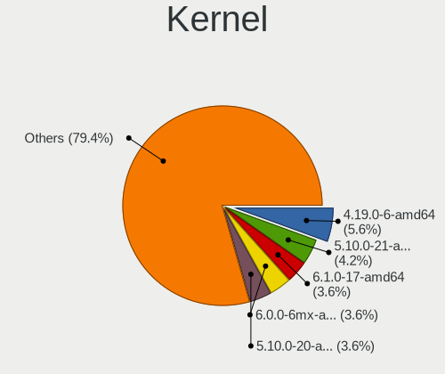
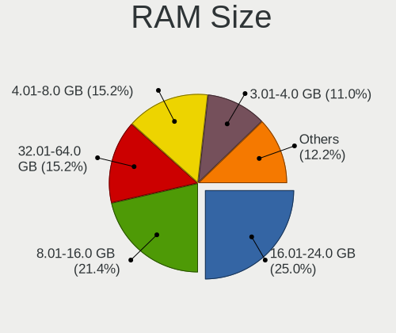
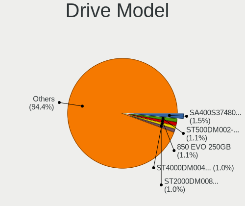
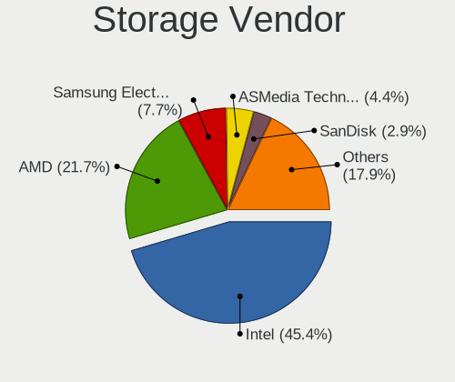
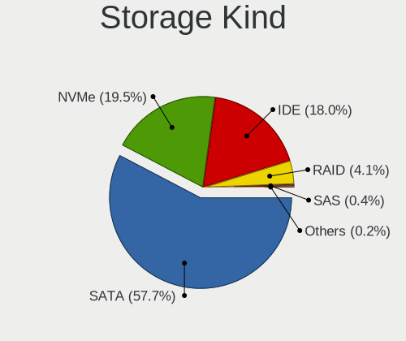
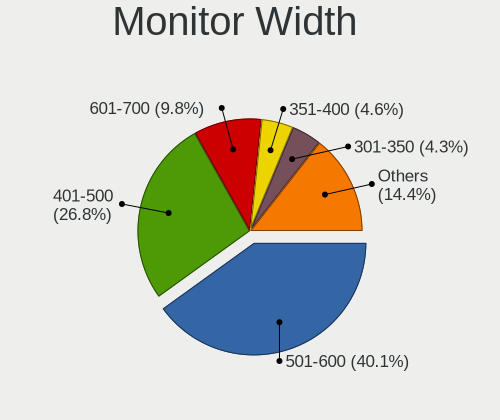
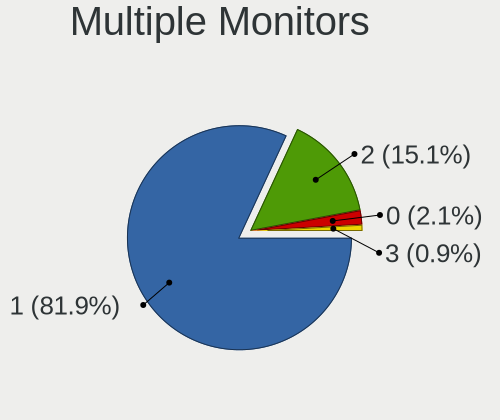
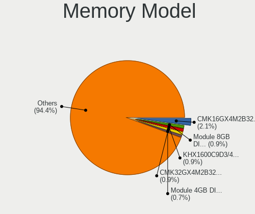

MX - Tested Hardware & Statistics (Desktops)
--------------------------------------------

A project to collect tested hardware configurations for MX.

Anyone can contribute to this report by the [hw-probe](https://github.com/linuxhw/hw-probe) tool:

    sudo -E hw-probe -all -upload

Please contribute! Especially if your hardware is rare.

Contents
--------

* [ Test Cases ](#test-cases)

* [ System ](#system)
  - [ OS                       ](#os)
  - [ OS Family                ](#os-family)
  - [ Kernel                   ](#kernel)
  - [ Kernel Family            ](#kernel-family)
  - [ Kernel Major Ver.        ](#kernel-major-ver)
  - [ Arch                     ](#arch)
  - [ DE                       ](#de)
  - [ Display Server           ](#display-server)
  - [ Display Manager          ](#display-manager)
  - [ OS Lang                  ](#os-lang)
  - [ Boot Mode                ](#boot-mode)
  - [ Filesystem               ](#filesystem)
  - [ Part. scheme             ](#part-scheme)
  - [ Dual Boot with Linux/BSD ](#dual-boot-with-linuxbsd)
  - [ Dual Boot (Win)          ](#dual-boot-win)

* [ Board ](#board)
  - [ Vendor                   ](#vendor)
  - [ Model                    ](#model)
  - [ Model Family             ](#model-family)
  - [ MFG Year                 ](#mfg-year)
  - [ Form Factor              ](#form-factor)
  - [ Secure Boot              ](#secure-boot)
  - [ Coreboot                 ](#coreboot)
  - [ RAM Size                 ](#ram-size)
  - [ RAM Used                 ](#ram-used)
  - [ Total Drives             ](#total-drives)
  - [ Has CD-ROM               ](#has-cd-rom)
  - [ Has Ethernet             ](#has-ethernet)
  - [ Has WiFi                 ](#has-wifi)
  - [ Has Bluetooth            ](#has-bluetooth)

* [ Location ](#location)
  - [ Country                  ](#country)
  - [ City                     ](#city)

* [ Drives ](#drives)
  - [ Drive Vendor             ](#drive-vendor)
  - [ Drive Model              ](#drive-model)
  - [ HDD Vendor               ](#hdd-vendor)
  - [ SSD Vendor               ](#ssd-vendor)
  - [ Drive Kind               ](#drive-kind)
  - [ Drive Connector          ](#drive-connector)
  - [ Drive Size               ](#drive-size)
  - [ Space Total              ](#space-total)
  - [ Space Used               ](#space-used)
  - [ Malfunc. Drives          ](#malfunc-drives)
  - [ Malfunc. Drive Vendor    ](#malfunc-drive-vendor)
  - [ Malfunc. HDD Vendor      ](#malfunc-hdd-vendor)
  - [ Malfunc. Drive Kind      ](#malfunc-drive-kind)
  - [ Failed Drives            ](#failed-drives)
  - [ Failed Drive Vendor      ](#failed-drive-vendor)
  - [ Drive Status             ](#drive-status)

* [ Storage controller ](#storage-controller)
  - [ Storage Vendor           ](#storage-vendor)
  - [ Storage Model            ](#storage-model)
  - [ Storage Kind             ](#storage-kind)

* [ Processor ](#processor)
  - [ CPU Vendor               ](#cpu-vendor)
  - [ CPU Model                ](#cpu-model)
  - [ CPU Model Family         ](#cpu-model-family)
  - [ CPU Cores                ](#cpu-cores)
  - [ CPU Sockets              ](#cpu-sockets)
  - [ CPU Threads              ](#cpu-threads)
  - [ CPU Op-Modes             ](#cpu-op-modes)
  - [ CPU Microcode            ](#cpu-microcode)
  - [ CPU Microarch            ](#cpu-microarch)

* [ Graphics ](#graphics)
  - [ GPU Vendor               ](#gpu-vendor)
  - [ GPU Model                ](#gpu-model)
  - [ GPU Combo                ](#gpu-combo)
  - [ GPU Driver               ](#gpu-driver)
  - [ GPU Memory               ](#gpu-memory)

* [ Monitor ](#monitor)
  - [ Monitor Vendor           ](#monitor-vendor)
  - [ Monitor Model            ](#monitor-model)
  - [ Monitor Resolution       ](#monitor-resolution)
  - [ Monitor Diagonal         ](#monitor-diagonal)
  - [ Monitor Width            ](#monitor-width)
  - [ Aspect Ratio             ](#aspect-ratio)
  - [ Monitor Area             ](#monitor-area)
  - [ Pixel Density            ](#pixel-density)
  - [ Multiple Monitors        ](#multiple-monitors)

* [ Network ](#network)
  - [ Net Controller Vendor    ](#net-controller-vendor)
  - [ Net Controller Model     ](#net-controller-model)
  - [ Wireless Vendor          ](#wireless-vendor)
  - [ Wireless Model           ](#wireless-model)
  - [ Ethernet Vendor          ](#ethernet-vendor)
  - [ Ethernet Model           ](#ethernet-model)
  - [ Net Controller Kind      ](#net-controller-kind)
  - [ Used Controller          ](#used-controller)
  - [ NICs                     ](#nics)
  - [ IPv6                     ](#ipv6)

* [ Bluetooth ](#bluetooth)
  - [ Bluetooth Vendor         ](#bluetooth-vendor)
  - [ Bluetooth Model          ](#bluetooth-model)

* [ Sound ](#sound)
  - [ Sound Vendor             ](#sound-vendor)
  - [ Sound Model              ](#sound-model)

* [ Memory ](#memory)
  - [ Memory Vendor            ](#memory-vendor)
  - [ Memory Model             ](#memory-model)
  - [ Memory Kind              ](#memory-kind)
  - [ Memory Form Factor       ](#memory-form-factor)
  - [ Memory Size              ](#memory-size)
  - [ Memory Speed             ](#memory-speed)

* [ Printers & scanners ](#printers--scanners)
  - [ Printer Vendor           ](#printer-vendor)
  - [ Printer Model            ](#printer-model)
  - [ Scanner Vendor           ](#scanner-vendor)
  - [ Scanner Model            ](#scanner-model)

* [ Camera ](#camera)
  - [ Camera Vendor            ](#camera-vendor)
  - [ Camera Model             ](#camera-model)

* [ Security ](#security)
  - [ Fingerprint Vendor       ](#fingerprint-vendor)
  - [ Fingerprint Model        ](#fingerprint-model)
  - [ Chipcard Vendor          ](#chipcard-vendor)
  - [ Chipcard Model           ](#chipcard-model)

* [ Unsupported ](#unsupported)
  - [ Unsupported Devices      ](#unsupported-devices)
  - [ Unsupported Device Types ](#unsupported-device-types)

Test Cases
----------

Total: 442

| Vendor        | Model                       | Probe                                                      | Date         |
|---------------|-----------------------------|------------------------------------------------------------|--------------|
| Biostar       | H81MHV3                     | [d03cc0092f](https://linux-hardware.org/?probe=d03cc0092f) | Jan 05, 2025 |
| MSI           | B250M BAZOOKA               | [30ef92bbfc](https://linux-hardware.org/?probe=30ef92bbfc) | Jan 05, 2025 |
| Gigabyte      | Z390 AORUS PRO-CF           | [315981955a](https://linux-hardware.org/?probe=315981955a) | Jan 03, 2025 |
| Gigabyte      | Z390 AORUS PRO-CF           | [118b96c4df](https://linux-hardware.org/?probe=118b96c4df) | Jan 03, 2025 |
| Lenovo        | 30D0 SDK0J40697 WIN 3305... | [9494acd014](https://linux-hardware.org/?probe=9494acd014) | Dec 31, 2024 |
| Shenzhen D... | MP100                       | [ed4c3517e1](https://linux-hardware.org/?probe=ed4c3517e1) | Dec 31, 2024 |
| ASUSTek       | Z170 PRO GAMING             | [4825814497](https://linux-hardware.org/?probe=4825814497) | Dec 28, 2024 |
| MSI           | H61M-P20                    | [f15424c030](https://linux-hardware.org/?probe=f15424c030) | Dec 19, 2024 |
| Gigabyte      | B560M DS3H V2               | [00c881af99](https://linux-hardware.org/?probe=00c881af99) | Dec 09, 2024 |
| ASRock        | Z390 Phantom Gaming 9       | [6573a24594](https://linux-hardware.org/?probe=6573a24594) | Dec 01, 2024 |
| Dell          | 0DR845                      | [1b6afa334f](https://linux-hardware.org/?probe=1b6afa334f) | Nov 29, 2024 |
| ASUSTek       | PRIME X670-P WIFI           | [b671dd7405](https://linux-hardware.org/?probe=b671dd7405) | Nov 26, 2024 |
| Lenovo        | 3148 SDK0J40700 WIN 3258... | [10abdf7972](https://linux-hardware.org/?probe=10abdf7972) | Nov 24, 2024 |
| Gigabyte      | B550 AORUS ELITE V2         | [065b59e739](https://linux-hardware.org/?probe=065b59e739) | Nov 18, 2024 |
| Dell          | 073MMW A03                  | [f7d046b276](https://linux-hardware.org/?probe=f7d046b276) | Nov 15, 2024 |
| ASRock        | A75M-HVS                    | [71e383d168](https://linux-hardware.org/?probe=71e383d168) | Nov 14, 2024 |
| SYS           | H310CH5-TI2                 | [8d26063a45](https://linux-hardware.org/?probe=8d26063a45) | Nov 13, 2024 |
| HP            | 829D                        | [bbd6f07955](https://linux-hardware.org/?probe=bbd6f07955) | Nov 08, 2024 |
| ASUSTek       | PRIME A320M-K               | [0f2501a96e](https://linux-hardware.org/?probe=0f2501a96e) | Nov 07, 2024 |
| HP            | 829D                        | [ce428beb45](https://linux-hardware.org/?probe=ce428beb45) | Nov 07, 2024 |
| HP            | 8265                        | [91d18e37fc](https://linux-hardware.org/?probe=91d18e37fc) | Nov 07, 2024 |
| Lenovo        | ThinkCentre M71e 3129B2G    | [0f3c377fbc](https://linux-hardware.org/?probe=0f3c377fbc) | Nov 03, 2024 |
| MSI           | MAG B550 TOMAHAWK           | [2aaad8cdd1](https://linux-hardware.org/?probe=2aaad8cdd1) | Nov 01, 2024 |
| Unknown       | Unknown                     | [b73f669319](https://linux-hardware.org/?probe=b73f669319) | Oct 31, 2024 |
| Unknown       | Unknown                     | [aabc0b8d5c](https://linux-hardware.org/?probe=aabc0b8d5c) | Oct 31, 2024 |
| Acer          | Aspire XC-605               | [5b81ea0b2c](https://linux-hardware.org/?probe=5b81ea0b2c) | Oct 27, 2024 |
| Samsung       | DeskTop System              | [ca4fa68a45](https://linux-hardware.org/?probe=ca4fa68a45) | Oct 27, 2024 |
| Intel         | H61                         | [8460791859](https://linux-hardware.org/?probe=8460791859) | Oct 27, 2024 |
| Gigabyte      | P35-S3G                     | [c38dd7e7f6](https://linux-hardware.org/?probe=c38dd7e7f6) | Oct 24, 2024 |
| Gigabyte      | P35-S3G                     | [fc78d0d762](https://linux-hardware.org/?probe=fc78d0d762) | Oct 24, 2024 |
| Gigabyte      | B360 AORUS GAMING 3 WIFI... | [9644c911da](https://linux-hardware.org/?probe=9644c911da) | Oct 18, 2024 |
| ASRock        | Z370 Pro4                   | [768bfdaf9a](https://linux-hardware.org/?probe=768bfdaf9a) | Oct 17, 2024 |
| MSI           | H110M PRO-VD                | [cc09ec8aa4](https://linux-hardware.org/?probe=cc09ec8aa4) | Oct 16, 2024 |
| ASUSTek       | PRIME B450M-A II            | [bc9f2b478b](https://linux-hardware.org/?probe=bc9f2b478b) | Oct 14, 2024 |
| ASUSTek       | H110M-C/BR                  | [e0bf2cc58a](https://linux-hardware.org/?probe=e0bf2cc58a) | Oct 13, 2024 |
| ASUSTek       | PRIME B450M-A               | [4747b9f85b](https://linux-hardware.org/?probe=4747b9f85b) | Oct 10, 2024 |
| ASUSTek       | P8H61-M LX3 R2.0            | [8c8eabd7b6](https://linux-hardware.org/?probe=8c8eabd7b6) | Oct 10, 2024 |
| Dell          | 0P096C A00                  | [e67dbd9311](https://linux-hardware.org/?probe=e67dbd9311) | Sep 29, 2024 |
| HP            | 0A5Ch                       | [c1d6e5486d](https://linux-hardware.org/?probe=c1d6e5486d) | Sep 29, 2024 |
| Intel         | H110D4-P1                   | [626cc0fd13](https://linux-hardware.org/?probe=626cc0fd13) | Sep 28, 2024 |
| Gigabyte      | B360M AORUS Gaming 3-CF     | [2b9c6f05fe](https://linux-hardware.org/?probe=2b9c6f05fe) | Sep 28, 2024 |
| ASUSTek       | TUF Gaming Z690-PLUS WIF... | [2591c32e72](https://linux-hardware.org/?probe=2591c32e72) | Sep 27, 2024 |
| Intel         | B75                         | [17dd91b6f2](https://linux-hardware.org/?probe=17dd91b6f2) | Sep 24, 2024 |
| Gigabyte      | B450M H                     | [be59e2f196](https://linux-hardware.org/?probe=be59e2f196) | Sep 20, 2024 |
| MSI           | A78-G41 PC Mate             | [941b873461](https://linux-hardware.org/?probe=941b873461) | Sep 16, 2024 |
| MSI           | A78-G41 PC Mate             | [5cb76e009d](https://linux-hardware.org/?probe=5cb76e009d) | Sep 16, 2024 |
| ASRock        | Z490 Steel Legend           | [ea538bf56c](https://linux-hardware.org/?probe=ea538bf56c) | Sep 12, 2024 |
| Acer          | RS880M05                    | [4998887624](https://linux-hardware.org/?probe=4998887624) | Sep 03, 2024 |
| Acer          | RS880M05                    | [e421cfccdf](https://linux-hardware.org/?probe=e421cfccdf) | Sep 03, 2024 |
| Gigabyte      | GB-BSi5-1135G7              | [24c103a266](https://linux-hardware.org/?probe=24c103a266) | Aug 31, 2024 |
| Dell          | 0RF703                      | [e82a1ff8e3](https://linux-hardware.org/?probe=e82a1ff8e3) | Aug 29, 2024 |
| HP            | 82F1                        | [5bd98b8749](https://linux-hardware.org/?probe=5bd98b8749) | Aug 25, 2024 |
| HP            | 82F1                        | [1dcd4be378](https://linux-hardware.org/?probe=1dcd4be378) | Aug 25, 2024 |
| ASRock        | B650E PG Riptide WiFi       | [fe852bd498](https://linux-hardware.org/?probe=fe852bd498) | Aug 22, 2024 |
| Gigabyte      | B650 AORUS ELITE AX V2      | [fe6038ad0d](https://linux-hardware.org/?probe=fe6038ad0d) | Aug 14, 2024 |
| ASUSTek       | ROG STRIX B450-F GAMING     | [f17d30bee1](https://linux-hardware.org/?probe=f17d30bee1) | Aug 10, 2024 |
| ASUSTek       | ROG STRIX B450-F GAMING     | [49d572df1d](https://linux-hardware.org/?probe=49d572df1d) | Aug 10, 2024 |
| Gigabyte      | B150M-D3H-CF                | [dc966fdca4](https://linux-hardware.org/?probe=dc966fdca4) | Aug 09, 2024 |
| HP            | 0A04h                       | [f476265afe](https://linux-hardware.org/?probe=f476265afe) | Aug 08, 2024 |
| ASUSTek       | P5Q-EM                      | [a4984bb698](https://linux-hardware.org/?probe=a4984bb698) | Aug 05, 2024 |
| GEEKOM        | Mini IT13                   | [23c5c50556](https://linux-hardware.org/?probe=23c5c50556) | Jul 27, 2024 |
| ASUSTek       | GRYPHON Z87                 | [01b1c8c6cc](https://linux-hardware.org/?probe=01b1c8c6cc) | Jul 24, 2024 |
| Acer          | H610MHP-E                   | [54e0a6ed60](https://linux-hardware.org/?probe=54e0a6ed60) | Jul 22, 2024 |
| HC Technol... | HCAR5000-MI                 | [0662223517](https://linux-hardware.org/?probe=0662223517) | Jul 22, 2024 |
| Lenovo        | SHARKBAY NOK                | [768145912a](https://linux-hardware.org/?probe=768145912a) | Jul 20, 2024 |
| Lenovo        | ThinkCentre A58 75227SG     | [e8606d105c](https://linux-hardware.org/?probe=e8606d105c) | Jul 18, 2024 |
| HP            | 8266                        | [be8a065a36](https://linux-hardware.org/?probe=be8a065a36) | Jul 14, 2024 |
| Medion        | MS-7748                     | [3e7c4e1d43](https://linux-hardware.org/?probe=3e7c4e1d43) | Jul 14, 2024 |
| HP            | 8643 SMVB                   | [6a90ef0cd0](https://linux-hardware.org/?probe=6a90ef0cd0) | Jul 06, 2024 |
| MSI           | B450M PRO-VDH MAX           | [7dcaf9e889](https://linux-hardware.org/?probe=7dcaf9e889) | Jul 06, 2024 |
| Dell          | 0T656F A01                  | [ecdd487673](https://linux-hardware.org/?probe=ecdd487673) | Jul 05, 2024 |
| ASUSTek       | M5A97 R2.0                  | [1f3c85da43](https://linux-hardware.org/?probe=1f3c85da43) | Jul 02, 2024 |
| ASUSTek       | NODUSM3                     | [4b8b2d0cb0](https://linux-hardware.org/?probe=4b8b2d0cb0) | Jun 25, 2024 |
| Fujitsu       | D3067-A1 S26361-D3067-A1    | [3ba33c7694](https://linux-hardware.org/?probe=3ba33c7694) | Jun 23, 2024 |
| Fujitsu       | D3067-A1 S26361-D3067-A1    | [d88a3ae668](https://linux-hardware.org/?probe=d88a3ae668) | Jun 23, 2024 |
| Foxconn       | 45GM/45CM/45CM-S            | [8acebd9a23](https://linux-hardware.org/?probe=8acebd9a23) | Jun 20, 2024 |
| Lenovo        | Remore CRB Win8 STD MM D... | [26694fdf4c](https://linux-hardware.org/?probe=26694fdf4c) | Jun 15, 2024 |
| Gigabyte      | A520M H                     | [4850d46dda](https://linux-hardware.org/?probe=4850d46dda) | Jun 11, 2024 |
| Gigabyte      | A520M H                     | [199f375169](https://linux-hardware.org/?probe=199f375169) | Jun 01, 2024 |
| ASUSTek       | PRIME B360M-C               | [56f7d22d21](https://linux-hardware.org/?probe=56f7d22d21) | May 31, 2024 |
| ASUSTek       | A88XM-A                     | [4b9f7e6b3c](https://linux-hardware.org/?probe=4b9f7e6b3c) | May 29, 2024 |
| Medion        | Z370H4-EM                   | [144540334c](https://linux-hardware.org/?probe=144540334c) | May 28, 2024 |
| Medion        | Z370H4-EM                   | [e833e99cd2](https://linux-hardware.org/?probe=e833e99cd2) | May 26, 2024 |
| Acer          | Nitro N50-620               | [35d81006b0](https://linux-hardware.org/?probe=35d81006b0) | May 25, 2024 |
| Dell          | 042P49 A01                  | [9ef1b2b561](https://linux-hardware.org/?probe=9ef1b2b561) | May 25, 2024 |
| Dell          | 0MGK50 A02                  | [bbcfd5d01e](https://linux-hardware.org/?probe=bbcfd5d01e) | May 16, 2024 |
| Dell          | 0MGK50 A02                  | [09ba1d9fb0](https://linux-hardware.org/?probe=09ba1d9fb0) | May 16, 2024 |
| Pegatron      | EVE                         | [ee182c046b](https://linux-hardware.org/?probe=ee182c046b) | May 15, 2024 |
| Lenovo        | SHARKBAY 0B98401 WIN        | [5a380a95a7](https://linux-hardware.org/?probe=5a380a95a7) | May 13, 2024 |
| ASRock        | X570 Phantom Gaming 4       | [b9519853cd](https://linux-hardware.org/?probe=b9519853cd) | May 05, 2024 |
| ASRock        | X570 Phantom Gaming 4       | [08cb15cda7](https://linux-hardware.org/?probe=08cb15cda7) | May 05, 2024 |
| ASUSTek       | M4A89GTD-PRO                | [d40738eda7](https://linux-hardware.org/?probe=d40738eda7) | Apr 28, 2024 |
| ASRock        | 980DE3/U3S3                 | [9ed5c55a61](https://linux-hardware.org/?probe=9ed5c55a61) | Apr 28, 2024 |
| ASUSTek       | SABERTOOTH 990FX            | [dc7cef1fe5](https://linux-hardware.org/?probe=dc7cef1fe5) | Apr 25, 2024 |
| ASUSTek       | TUF Gaming Z490-PLUS        | [c44f97261d](https://linux-hardware.org/?probe=c44f97261d) | Apr 24, 2024 |
| Dell          | 0K095G A02                  | [a5f4dd8567](https://linux-hardware.org/?probe=a5f4dd8567) | Apr 24, 2024 |
| Dell          | 0K095G A02                  | [0d7d9ad04d](https://linux-hardware.org/?probe=0d7d9ad04d) | Apr 24, 2024 |
| ASRock        | X399 Taichi                 | [0aeb871159](https://linux-hardware.org/?probe=0aeb871159) | Apr 22, 2024 |
| AMI           | Intel                       | [212fd4a0d8](https://linux-hardware.org/?probe=212fd4a0d8) | Apr 22, 2024 |
| AMI           | Intel                       | [2044003b5c](https://linux-hardware.org/?probe=2044003b5c) | Apr 22, 2024 |
| ASUSTek       | ROG STRIX B650-A GAMING ... | [980252a20c](https://linux-hardware.org/?probe=980252a20c) | Apr 18, 2024 |
| Gigabyte      | Z370P D3-CF                 | [70446389fb](https://linux-hardware.org/?probe=70446389fb) | Apr 13, 2024 |
| ASUSTek       | Z170-A                      | [30127a97b5](https://linux-hardware.org/?probe=30127a97b5) | Apr 06, 2024 |
| ASRock        | H77 Pro4-M                  | [4202019d78](https://linux-hardware.org/?probe=4202019d78) | Apr 03, 2024 |
| Gigabyte      | GA-78LMT-USB3               | [7f8a245399](https://linux-hardware.org/?probe=7f8a245399) | Mar 29, 2024 |
| Gigabyte      | GA-78LMT-USB3               | [7b17376565](https://linux-hardware.org/?probe=7b17376565) | Mar 29, 2024 |
| Gigabyte      | H81M-D2V                    | [6bc3e596e6](https://linux-hardware.org/?probe=6bc3e596e6) | Mar 28, 2024 |
| Gigabyte      | B550I AORUS PRO AX          | [e8233f1a8a](https://linux-hardware.org/?probe=e8233f1a8a) | Mar 26, 2024 |
| Dell          | 0HMX8D A01                  | [8cd1470fc0](https://linux-hardware.org/?probe=8cd1470fc0) | Mar 25, 2024 |
| Foxconn       | 2ABF                        | [2eb785461f](https://linux-hardware.org/?probe=2eb785461f) | Mar 23, 2024 |
| Gateway       | H57M01                      | [4254102990](https://linux-hardware.org/?probe=4254102990) | Mar 19, 2024 |
| Gateway       | H57M01                      | [162b2ed3b3](https://linux-hardware.org/?probe=162b2ed3b3) | Mar 17, 2024 |
| ASUSTek       | PRIME B560-PLUS             | [5dc203d476](https://linux-hardware.org/?probe=5dc203d476) | Mar 10, 2024 |
| Foxconn       | 45GM/45CM/45CM-S            | [4ed069d496](https://linux-hardware.org/?probe=4ed069d496) | Mar 09, 2024 |
| HP            | 2B5A 011                    | [8eb2546f52](https://linux-hardware.org/?probe=8eb2546f52) | Mar 09, 2024 |
| HP            | 8950                        | [ee925d29a1](https://linux-hardware.org/?probe=ee925d29a1) | Mar 08, 2024 |
| HP            | 8950                        | [f2b8f96540](https://linux-hardware.org/?probe=f2b8f96540) | Mar 08, 2024 |
| ASRock        | A300M-STX                   | [a92e2761aa](https://linux-hardware.org/?probe=a92e2761aa) | Mar 06, 2024 |
| ASUSTek       | TUF Gaming B650M-E WIFI     | [e4944abc1f](https://linux-hardware.org/?probe=e4944abc1f) | Mar 03, 2024 |
| Dell          | 0M863N A01                  | [1db77a3f14](https://linux-hardware.org/?probe=1db77a3f14) | Feb 27, 2024 |
| Gigabyte      | H310M S2H x.x               | [ce358b38bc](https://linux-hardware.org/?probe=ce358b38bc) | Feb 26, 2024 |
| Foxconn       | 45GM/45CM/45CM-S            | [1dab02eb79](https://linux-hardware.org/?probe=1dab02eb79) | Feb 24, 2024 |
| ASUSTek       | SABERTOOTH 990FX R2.0       | [9b25d17d18](https://linux-hardware.org/?probe=9b25d17d18) | Feb 21, 2024 |
| Lenovo        | 3741 SDK0T76461 WIN 3422... | [3cf24bd897](https://linux-hardware.org/?probe=3cf24bd897) | Feb 18, 2024 |
| Gigabyte      | X570 GAMING X               | [fab0b459e0](https://linux-hardware.org/?probe=fab0b459e0) | Feb 18, 2024 |
| Lenovo        | 3741 SDK0T76461 WIN 3422... | [144333e02b](https://linux-hardware.org/?probe=144333e02b) | Feb 15, 2024 |
| ASRock        | B450M Pro4-F                | [a98775e16e](https://linux-hardware.org/?probe=a98775e16e) | Feb 13, 2024 |
| ASUSTek       | H110M-A/M.2                 | [9c0a07bf2b](https://linux-hardware.org/?probe=9c0a07bf2b) | Feb 08, 2024 |
| ASUSTek       | H110M-A/M.2                 | [7350797e64](https://linux-hardware.org/?probe=7350797e64) | Feb 07, 2024 |
| ASRock        | 970 Extreme4                | [973c66c65d](https://linux-hardware.org/?probe=973c66c65d) | Feb 07, 2024 |
| HP            | 09E8h                       | [413788d555](https://linux-hardware.org/?probe=413788d555) | Feb 02, 2024 |
| Dell          | 00VTMF A01                  | [3298485dd9](https://linux-hardware.org/?probe=3298485dd9) | Jan 31, 2024 |
| HP            | 304Ah                       | [5e40a8acee](https://linux-hardware.org/?probe=5e40a8acee) | Jan 24, 2024 |
| ASUSTek       | TUF Gaming B660-PLUS WIF... | [6ae01879d8](https://linux-hardware.org/?probe=6ae01879d8) | Jan 23, 2024 |
| HP            | 0A5Ch                       | [f886596563](https://linux-hardware.org/?probe=f886596563) | Jan 23, 2024 |
| Gigabyte      | B650I AORUS ULTRA           | [0da14a9376](https://linux-hardware.org/?probe=0da14a9376) | Jan 18, 2024 |
| HP            | 8750                        | [6dd29a1c24](https://linux-hardware.org/?probe=6dd29a1c24) | Jan 16, 2024 |
| Gigabyte      | B650I AORUS ULTRA           | [33216d3bf8](https://linux-hardware.org/?probe=33216d3bf8) | Jan 16, 2024 |
| Unknown       | GB01                        | [33016aa27b](https://linux-hardware.org/?probe=33016aa27b) | Jan 11, 2024 |
| Unknown       | GB01                        | [551b27fa9b](https://linux-hardware.org/?probe=551b27fa9b) | Jan 11, 2024 |
| Dell          | 0KV62T A00                  | [17aa442f24](https://linux-hardware.org/?probe=17aa442f24) | Jan 10, 2024 |
| HP            | 8265                        | [da63a4f9c1](https://linux-hardware.org/?probe=da63a4f9c1) | Jan 05, 2024 |
| ASUSTek       | H81M-PLUS                   | [029706288d](https://linux-hardware.org/?probe=029706288d) | Jan 04, 2024 |
| HP            | 8265                        | [94344dbe98](https://linux-hardware.org/?probe=94344dbe98) | Dec 28, 2023 |
| Dell          | 033FF6 A00                  | [977367b99e](https://linux-hardware.org/?probe=977367b99e) | Dec 26, 2023 |
| Dell          | 033FF6 A00                  | [88cad415fb](https://linux-hardware.org/?probe=88cad415fb) | Dec 21, 2023 |
| ASUSTek       | TUF Gaming X570-PLUS        | [f912bcd96a](https://linux-hardware.org/?probe=f912bcd96a) | Dec 20, 2023 |
| ASUSTek       | M4A87TD/USB3                | [df3eb3c253](https://linux-hardware.org/?probe=df3eb3c253) | Dec 17, 2023 |
| HP            | 8265                        | [cc0b59e7f7](https://linux-hardware.org/?probe=cc0b59e7f7) | Dec 13, 2023 |
| Gigabyte      | MRHM7AP                     | [ba4400c919](https://linux-hardware.org/?probe=ba4400c919) | Dec 13, 2023 |
| ASRock        | A620M Pro RS WiFi           | [3bbc394b2e](https://linux-hardware.org/?probe=3bbc394b2e) | Dec 08, 2023 |
| Gigabyte      | G41M-ES2L                   | [442d7a2388](https://linux-hardware.org/?probe=442d7a2388) | Dec 03, 2023 |
| Dell          | 03NVJ6 A03                  | [9a5c924695](https://linux-hardware.org/?probe=9a5c924695) | Nov 26, 2023 |
| MSI           | A68HM-P33 V2                | [bee7ef1689](https://linux-hardware.org/?probe=bee7ef1689) | Nov 22, 2023 |
| HP            | 8265                        | [d798ead6f7](https://linux-hardware.org/?probe=d798ead6f7) | Nov 20, 2023 |
| Dell          | 0MNPJ9 A01                  | [80ded618fb](https://linux-hardware.org/?probe=80ded618fb) | Nov 19, 2023 |
| Gigabyte      | B365M DS3H                  | [23196bda4d](https://linux-hardware.org/?probe=23196bda4d) | Nov 14, 2023 |
| HP            | 3397                        | [67e178009d](https://linux-hardware.org/?probe=67e178009d) | Nov 09, 2023 |
| Gigabyte      | B365M DS3H                  | [25ab11fca1](https://linux-hardware.org/?probe=25ab11fca1) | Nov 08, 2023 |
| ASUSTek       | Maximus VIII HERO           | [0d65b73ae2](https://linux-hardware.org/?probe=0d65b73ae2) | Nov 07, 2023 |
| HP            | 2B34                        | [52737869e2](https://linux-hardware.org/?probe=52737869e2) | Nov 06, 2023 |
| ASRock        | A320M Pro4-F                | [7dab52cd8c](https://linux-hardware.org/?probe=7dab52cd8c) | Nov 05, 2023 |
| ASUSTek       | STRIX H270F GAMING          | [e95902544f](https://linux-hardware.org/?probe=e95902544f) | Nov 03, 2023 |
| Gigabyte      | B365M DS3H                  | [0a5b6171b7](https://linux-hardware.org/?probe=0a5b6171b7) | Oct 30, 2023 |
| Intel         | H81                         | [2e37259d45](https://linux-hardware.org/?probe=2e37259d45) | Oct 29, 2023 |
| MSI           | B550M PRO-VDH WIFI          | [2cb1fb1ec9](https://linux-hardware.org/?probe=2cb1fb1ec9) | Oct 27, 2023 |
| HP            | 339A                        | [d0deadc097](https://linux-hardware.org/?probe=d0deadc097) | Oct 27, 2023 |
| Lenovo        | 376D SDK0T76465 WIN 3422... | [2a97bb6c00](https://linux-hardware.org/?probe=2a97bb6c00) | Oct 27, 2023 |
| AZW           | SER V1                      | [8c734a7dfc](https://linux-hardware.org/?probe=8c734a7dfc) | Oct 21, 2023 |
| MSI           | A68HM-E33 V2                | [f6a5fcd391](https://linux-hardware.org/?probe=f6a5fcd391) | Oct 21, 2023 |
| Acer          | Aspire TC-1760              | [9e4ac23c4b](https://linux-hardware.org/?probe=9e4ac23c4b) | Oct 19, 2023 |
| Gigabyte      | Z690 UD AX DDR4             | [273e4a294a](https://linux-hardware.org/?probe=273e4a294a) | Oct 15, 2023 |
| ASUSTek       | PRIME H610M-A D4            | [665eba904c](https://linux-hardware.org/?probe=665eba904c) | Oct 14, 2023 |
| ASUSTek       | PRIME B350-PLUS             | [00fc33d73e](https://linux-hardware.org/?probe=00fc33d73e) | Oct 13, 2023 |
| ASUSTek       | PRIME H610M-A D4            | [6f4fb2dff4](https://linux-hardware.org/?probe=6f4fb2dff4) | Oct 10, 2023 |
| ASUSTek       | PRIME H510M-D               | [e583e35b95](https://linux-hardware.org/?probe=e583e35b95) | Oct 03, 2023 |
| ASUSTek       | PRIME H510M-D               | [538889d79f](https://linux-hardware.org/?probe=538889d79f) | Oct 03, 2023 |
| MSI           | G41M4                       | [0554e9757f](https://linux-hardware.org/?probe=0554e9757f) | Sep 26, 2023 |
| ASUSTek       | TUF Gaming X570-PLUS        | [4054ad9d77](https://linux-hardware.org/?probe=4054ad9d77) | Sep 26, 2023 |
| ASUSTek       | TUF Gaming X570-PLUS        | [76d936bb5b](https://linux-hardware.org/?probe=76d936bb5b) | Sep 26, 2023 |
| ASUSTek       | Z97-P                       | [d72c4b5cce](https://linux-hardware.org/?probe=d72c4b5cce) | Sep 06, 2023 |
| Foxconn       | 2ABF                        | [baad816533](https://linux-hardware.org/?probe=baad816533) | Sep 05, 2023 |
| Gigabyte      | PH67A-D3-B3                 | [a9fdf4f92b](https://linux-hardware.org/?probe=a9fdf4f92b) | Sep 03, 2023 |
| ASRock        | J4205-ITX                   | [8831793b97](https://linux-hardware.org/?probe=8831793b97) | Sep 03, 2023 |
| MSI           | A68HM-E33 V2                | [af96cda252](https://linux-hardware.org/?probe=af96cda252) | Sep 02, 2023 |
| Foxconn       | 2A92                        | [50ca8342d7](https://linux-hardware.org/?probe=50ca8342d7) | Sep 01, 2023 |
| ASUSTek       | PRIME B550-PLUS             | [51ea627e30](https://linux-hardware.org/?probe=51ea627e30) | Aug 25, 2023 |
| ASUSTek       | PRIME B550-PLUS             | [c8e9f89359](https://linux-hardware.org/?probe=c8e9f89359) | Aug 25, 2023 |
| Pegatron      | 2AD5                        | [fcb0ac31fe](https://linux-hardware.org/?probe=fcb0ac31fe) | Aug 23, 2023 |
| Gigabyte      | MZGLKCP-00                  | [c6f294e543](https://linux-hardware.org/?probe=c6f294e543) | Aug 21, 2023 |
| Gigabyte      | MZGLKCP-00                  | [d6e0b89f34](https://linux-hardware.org/?probe=d6e0b89f34) | Aug 21, 2023 |
| Biostar       | H310MHC2                    | [12f3b0d269](https://linux-hardware.org/?probe=12f3b0d269) | Aug 20, 2023 |
| Gigabyte      | H510M S2H                   | [e5661bef5b](https://linux-hardware.org/?probe=e5661bef5b) | Aug 16, 2023 |
| ASUSTek       | F1A75-M LE                  | [f059d25382](https://linux-hardware.org/?probe=f059d25382) | Aug 14, 2023 |
| MSI           | A68HM-E33 V2                | [44556227ff](https://linux-hardware.org/?probe=44556227ff) | Aug 05, 2023 |
| OEM           | Intel H81                   | [82606b5050](https://linux-hardware.org/?probe=82606b5050) | Aug 03, 2023 |
| Gigabyte      | B560 AORUS PRO AX           | [c7e057da76](https://linux-hardware.org/?probe=c7e057da76) | Aug 02, 2023 |
| ASUSTek       | Z170 PRO GAMING             | [a0270160ad](https://linux-hardware.org/?probe=a0270160ad) | Aug 02, 2023 |
| Intel         | JSL MRD                     | [feb19ee725](https://linux-hardware.org/?probe=feb19ee725) | Jul 29, 2023 |
| Intel         | JSL MRD                     | [ca5990cfa3](https://linux-hardware.org/?probe=ca5990cfa3) | Jul 29, 2023 |
| ASUSTek       | LEUCITE3                    | [bb2046286f](https://linux-hardware.org/?probe=bb2046286f) | Jul 26, 2023 |
| ASUSTek       | LEUCITE3                    | [6ced09890f](https://linux-hardware.org/?probe=6ced09890f) | Jul 26, 2023 |
| ASRock        | B660M-HDV                   | [3a0685bcf0](https://linux-hardware.org/?probe=3a0685bcf0) | Jul 18, 2023 |
| Medion        | MS-7667                     | [52ff08b634](https://linux-hardware.org/?probe=52ff08b634) | Jul 09, 2023 |
| AOpen         | D1009 A1A4                  | [2819e086aa](https://linux-hardware.org/?probe=2819e086aa) | Jul 02, 2023 |
| ASRock        | A620M Pro RS WiFi           | [d04862302e](https://linux-hardware.org/?probe=d04862302e) | Jul 01, 2023 |
| MSI           | B350M MORTAR                | [6e5323aa42](https://linux-hardware.org/?probe=6e5323aa42) | Jun 09, 2023 |
| MSI           | B350M MORTAR                | [fc4b07cbb0](https://linux-hardware.org/?probe=fc4b07cbb0) | Jun 09, 2023 |
| Lenovo        | 3188 SDK0J40697 WIN 3305... | [c64fbbcad9](https://linux-hardware.org/?probe=c64fbbcad9) | Jun 02, 2023 |
| MSI           | MAG X670E TOMAHAWK WIFI     | [7070e55aa0](https://linux-hardware.org/?probe=7070e55aa0) | Jun 01, 2023 |
| Gigabyte      | B650 AORUS ELITE AX         | [5ae19394fc](https://linux-hardware.org/?probe=5ae19394fc) | May 20, 2023 |
| Gigabyte      | B650 AORUS ELITE AX         | [14548bc77a](https://linux-hardware.org/?probe=14548bc77a) | May 20, 2023 |
| ASRock        | Z390 Phantom Gaming 9       | [5ca1acbf9b](https://linux-hardware.org/?probe=5ca1acbf9b) | May 19, 2023 |
| Unknown       | Unknown                     | [58066198c4](https://linux-hardware.org/?probe=58066198c4) | May 18, 2023 |
| Dell          | 06X1TJ A00                  | [d3107c9603](https://linux-hardware.org/?probe=d3107c9603) | May 14, 2023 |
| Gigabyte      | 990FXA-UD3                  | [3bc96663a8](https://linux-hardware.org/?probe=3bc96663a8) | May 14, 2023 |
| Gigabyte      | X670 GAMING X AX            | [ebd2a32ce2](https://linux-hardware.org/?probe=ebd2a32ce2) | May 12, 2023 |
| Gigabyte      | X670 GAMING X AX            | [352c0902e9](https://linux-hardware.org/?probe=352c0902e9) | May 11, 2023 |
| ASUSTek       | ROG STRIX B650E-F GAMING... | [f894b9a2c4](https://linux-hardware.org/?probe=f894b9a2c4) | May 07, 2023 |
| ASRock        | P55 Extreme                 | [e8721751c6](https://linux-hardware.org/?probe=e8721751c6) | May 03, 2023 |
| ASRock        | P55 Extreme                 | [e426e8e40b](https://linux-hardware.org/?probe=e426e8e40b) | May 03, 2023 |
| ASRock        | N68-S UCC                   | [f62abcbed6](https://linux-hardware.org/?probe=f62abcbed6) | May 02, 2023 |
| Dell          | 0PC5F7 A02                  | [2d1086090c](https://linux-hardware.org/?probe=2d1086090c) | May 01, 2023 |
| ASUSTek       | Z97-P                       | [8d94344086](https://linux-hardware.org/?probe=8d94344086) | Apr 26, 2023 |
| Gigabyte      | H61MA-D3V                   | [a37deef915](https://linux-hardware.org/?probe=a37deef915) | Apr 24, 2023 |
| ASUSTek       | ROG STRIX B550-F GAMING ... | [4939e609de](https://linux-hardware.org/?probe=4939e609de) | Apr 24, 2023 |
| HP            | 090Ch                       | [01d609bbab](https://linux-hardware.org/?probe=01d609bbab) | Apr 23, 2023 |
| ASRock        | Z690 Pro RS                 | [acb9cde3d7](https://linux-hardware.org/?probe=acb9cde3d7) | Apr 23, 2023 |
| Gateway       | DX4860                      | [5583641f1b](https://linux-hardware.org/?probe=5583641f1b) | Apr 22, 2023 |
| ASUSTek       | GRYPHON Z87                 | [045a79a6e4](https://linux-hardware.org/?probe=045a79a6e4) | Apr 18, 2023 |
| HP            | 3646h                       | [c36653d824](https://linux-hardware.org/?probe=c36653d824) | Apr 12, 2023 |
| HP            | 18E5                        | [441d2678ff](https://linux-hardware.org/?probe=441d2678ff) | Apr 07, 2023 |
| ASUSTek       | P8P67 LE                    | [aea33c89a1](https://linux-hardware.org/?probe=aea33c89a1) | Apr 05, 2023 |
| ASUSTek       | Z97-P                       | [86d8d7f80f](https://linux-hardware.org/?probe=86d8d7f80f) | Apr 05, 2023 |
| HP            | 3029h                       | [153b913406](https://linux-hardware.org/?probe=153b913406) | Mar 27, 2023 |
| Unknown       | GB01                        | [ad0e76307c](https://linux-hardware.org/?probe=ad0e76307c) | Mar 24, 2023 |
| MSI           | B360M PRO-VH                | [2706ed39b7](https://linux-hardware.org/?probe=2706ed39b7) | Mar 23, 2023 |
| HP            | 3048h                       | [cd326ce9fa](https://linux-hardware.org/?probe=cd326ce9fa) | Mar 22, 2023 |
| ASRock        | AB350 Pro4                  | [4a452568eb](https://linux-hardware.org/?probe=4a452568eb) | Mar 16, 2023 |
| Shenzhen M... | F6BFC                       | [46cb84be25](https://linux-hardware.org/?probe=46cb84be25) | Mar 14, 2023 |
| MSI           | CSM-H87M-G43                | [9df13e200e](https://linux-hardware.org/?probe=9df13e200e) | Mar 14, 2023 |
| Lenovo        | ThinkCentre M58 7638CB8     | [d303f78e26](https://linux-hardware.org/?probe=d303f78e26) | Mar 14, 2023 |
| Gigabyte      | PH67A-D3-B3                 | [145a0a3b7d](https://linux-hardware.org/?probe=145a0a3b7d) | Mar 05, 2023 |
| HP            | 8184 X4                     | [b42f6862c7](https://linux-hardware.org/?probe=b42f6862c7) | Mar 04, 2023 |
| Unknown       | 1.0                         | [bab30a1ac1](https://linux-hardware.org/?probe=bab30a1ac1) | Feb 24, 2023 |
| Positivo      | POS-PQ45AU POSITIVO         | [8ed6dacaa7](https://linux-hardware.org/?probe=8ed6dacaa7) | Feb 23, 2023 |
| Dell          | 0D441T A03                  | [351a527308](https://linux-hardware.org/?probe=351a527308) | Feb 18, 2023 |
| ASUSTek       | TUF Gaming X570-PLUS        | [482c922bbc](https://linux-hardware.org/?probe=482c922bbc) | Feb 14, 2023 |
| MSI           | MAG B550 TOMAHAWK           | [13492935fd](https://linux-hardware.org/?probe=13492935fd) | Feb 09, 2023 |
| Gigabyte      | GA-MA785GM-US2H             | [11f3874a6f](https://linux-hardware.org/?probe=11f3874a6f) | Feb 07, 2023 |
| ASUSTek       | Z97M-PLUS                   | [99a4bb9e50](https://linux-hardware.org/?probe=99a4bb9e50) | Feb 05, 2023 |
| SLIMBOOK      | ONE-AMD-M4                  | [dc948f9e70](https://linux-hardware.org/?probe=dc948f9e70) | Feb 05, 2023 |
| Gigabyte      | GA-MA785GM-US2H             | [42e242e6bf](https://linux-hardware.org/?probe=42e242e6bf) | Feb 04, 2023 |
| Unknown       | Unknown                     | [793f52c99a](https://linux-hardware.org/?probe=793f52c99a) | Feb 03, 2023 |
| ECS           | P4M800PRO-M                 | [f446d61863](https://linux-hardware.org/?probe=f446d61863) | Feb 02, 2023 |
| Intel         | D34010WYK H14771-303        | [31485ae6ec](https://linux-hardware.org/?probe=31485ae6ec) | Feb 01, 2023 |
| Gigabyte      | GA-MA785GM-US2H             | [dd017ac78a](https://linux-hardware.org/?probe=dd017ac78a) | Jan 31, 2023 |
| ASUSTek       | ROG Maximus XIII HERO       | [a32a9ba13a](https://linux-hardware.org/?probe=a32a9ba13a) | Jan 30, 2023 |
| Gigabyte      | GA-MA770-UD3                | [554aa8592c](https://linux-hardware.org/?probe=554aa8592c) | Jan 28, 2023 |
| BESSTAR Te... | UM340                       | [77efbbb270](https://linux-hardware.org/?probe=77efbbb270) | Jan 27, 2023 |
| MSI           | Z390-A PRO                  | [28c31b639b](https://linux-hardware.org/?probe=28c31b639b) | Jan 25, 2023 |
| Gigabyte      | Z77X-D3H                    | [e81c0bcfc4](https://linux-hardware.org/?probe=e81c0bcfc4) | Jan 22, 2023 |
| Dell          | 0PC5F7 A02                  | [7671c99c3c](https://linux-hardware.org/?probe=7671c99c3c) | Jan 19, 2023 |
| HP            | 3396                        | [2085b91098](https://linux-hardware.org/?probe=2085b91098) | Jan 15, 2023 |
| Pegatron      | 2AD5                        | [d41fde4498](https://linux-hardware.org/?probe=d41fde4498) | Jan 15, 2023 |
| ASRock        | X370 Taichi                 | [9c3ea14006](https://linux-hardware.org/?probe=9c3ea14006) | Jan 09, 2023 |
| ASUSTek       | H81M-E                      | [165bb4a9ab](https://linux-hardware.org/?probe=165bb4a9ab) | Jan 06, 2023 |
| Dell          | 0D881F A06                  | [21e5ad204d](https://linux-hardware.org/?probe=21e5ad204d) | Jan 04, 2023 |
| Dell          | 0D881F A06                  | [00dddfca31](https://linux-hardware.org/?probe=00dddfca31) | Jan 03, 2023 |
| Gigabyte      | B550M DS3H                  | [677feeeca9](https://linux-hardware.org/?probe=677feeeca9) | Jan 03, 2023 |
| ZOTAC         | Unknown                     | [c3d5155637](https://linux-hardware.org/?probe=c3d5155637) | Jan 01, 2023 |
| MSI           | Z390-A PRO                  | [3a3375e173](https://linux-hardware.org/?probe=3a3375e173) | Dec 29, 2022 |
| MSI           | Z270 GAMING PRO CARBON      | [f422489705](https://linux-hardware.org/?probe=f422489705) | Dec 27, 2022 |
| Dell          | 0HY9JP A02                  | [c195f58592](https://linux-hardware.org/?probe=c195f58592) | Dec 24, 2022 |
| Lenovo        | 3741 SDK0T76461 WIN 3422... | [70e125f0d0](https://linux-hardware.org/?probe=70e125f0d0) | Dec 23, 2022 |
| Fujitsu       | D3498-A1 S26361-D3498-A1    | [03cd265cef](https://linux-hardware.org/?probe=03cd265cef) | Dec 05, 2022 |
| ASUSTek       | PRIME A320M-K               | [6487bbd7b7](https://linux-hardware.org/?probe=6487bbd7b7) | Dec 05, 2022 |
| SIRAGON       | AIO-5150                    | [90476603fa](https://linux-hardware.org/?probe=90476603fa) | Dec 04, 2022 |
| HP            | 304Ah                       | [15db22accc](https://linux-hardware.org/?probe=15db22accc) | Nov 30, 2022 |
| ASRock        | B365M Pro4                  | [0f0d4f70b0](https://linux-hardware.org/?probe=0f0d4f70b0) | Nov 20, 2022 |
| Foxconn       | 2ABF                        | [aa4bde7d79](https://linux-hardware.org/?probe=aa4bde7d79) | Nov 20, 2022 |
| ASUSTek       | TUF Gaming B450-PLUS II     | [1a0674de42](https://linux-hardware.org/?probe=1a0674de42) | Nov 14, 2022 |
| ASRock        | H81M-HG4 R4.0               | [732e924bbb](https://linux-hardware.org/?probe=732e924bbb) | Nov 07, 2022 |
| ASRock        | B365M Pro4                  | [f5305c9730](https://linux-hardware.org/?probe=f5305c9730) | Nov 04, 2022 |
| MSI           | X570-A PRO                  | [c60d9aa72d](https://linux-hardware.org/?probe=c60d9aa72d) | Oct 31, 2022 |
| Biostar       | H61MH                       | [f505de310c](https://linux-hardware.org/?probe=f505de310c) | Oct 27, 2022 |
| Lenovo        | 318E NOK                    | [6b190bfb4f](https://linux-hardware.org/?probe=6b190bfb4f) | Oct 25, 2022 |
| ASRock        | H370M-ITX/ac                | [fa925dcefb](https://linux-hardware.org/?probe=fa925dcefb) | Oct 24, 2022 |
| Pegatron      | NARRA3                      | [1588e60c57](https://linux-hardware.org/?probe=1588e60c57) | Oct 12, 2022 |
| Gigabyte      | GA-890GPA-UD3H              | [bb43eb5333](https://linux-hardware.org/?probe=bb43eb5333) | Oct 04, 2022 |
| ASUSTek       | Z170-P                      | [2f3c79dd55](https://linux-hardware.org/?probe=2f3c79dd55) | Sep 29, 2022 |
| ASUSTek       | P5GC-MX/CKD/SI              | [72bb90ea71](https://linux-hardware.org/?probe=72bb90ea71) | Sep 28, 2022 |
| ASUSTek       | P5G41T-M LX                 | [8e429edcd6](https://linux-hardware.org/?probe=8e429edcd6) | Sep 25, 2022 |
| ASUSTek       | PRIME B450M-A               | [bdb353fd2c](https://linux-hardware.org/?probe=bdb353fd2c) | Sep 20, 2022 |
| HP            | 1632                        | [8309a8acf0](https://linux-hardware.org/?probe=8309a8acf0) | Sep 10, 2022 |
| Medion        | H110H4-EM                   | [1b22e5560d](https://linux-hardware.org/?probe=1b22e5560d) | Sep 07, 2022 |
| ASRock        | H370M-ITX/ac                | [1a577be107](https://linux-hardware.org/?probe=1a577be107) | Sep 04, 2022 |
| Gigabyte      | B560M DS3H V2               | [c430bf0275](https://linux-hardware.org/?probe=c430bf0275) | Sep 03, 2022 |
| Biostar       | A780L3B                     | [62782d600f](https://linux-hardware.org/?probe=62782d600f) | Aug 14, 2022 |
| Intel         | DH55TC AAE70932-303         | [f275229d83](https://linux-hardware.org/?probe=f275229d83) | Jul 31, 2022 |
| MP            | MS-7848                     | [f7696965e0](https://linux-hardware.org/?probe=f7696965e0) | Jul 22, 2022 |
| MSI           | MAG B550 TOMAHAWK           | [85782181c7](https://linux-hardware.org/?probe=85782181c7) | Jul 21, 2022 |
| ASUSTek       | P8H61/USB3 R2.0             | [1076f6d59a](https://linux-hardware.org/?probe=1076f6d59a) | Jul 19, 2022 |
| AOpen         | D1009 A1A4                  | [d8edf66887](https://linux-hardware.org/?probe=d8edf66887) | Jul 13, 2022 |
| Dell          | 0DR845                      | [4c4a530cc5](https://linux-hardware.org/?probe=4c4a530cc5) | Jul 06, 2022 |
| MSI           | B350 TOMAHAWK               | [5a66940742](https://linux-hardware.org/?probe=5a66940742) | Jun 23, 2022 |
| MSI           | Z77A-G41                    | [d0f55f3c0b](https://linux-hardware.org/?probe=d0f55f3c0b) | Jun 22, 2022 |
| Dell          | 0200DY A01                  | [bc8030c1d5](https://linux-hardware.org/?probe=bc8030c1d5) | Jun 22, 2022 |
| Dell          | 0DR845                      | [56b4af8d26](https://linux-hardware.org/?probe=56b4af8d26) | Jun 20, 2022 |
| Gigabyte      | H410M S2H V3                | [b57b3a635c](https://linux-hardware.org/?probe=b57b3a635c) | Jun 02, 2022 |
| ASUSTek       | SABERTOOTH X99              | [b627953ad4](https://linux-hardware.org/?probe=b627953ad4) | May 11, 2022 |
| Intel         | V1.3                        | [a01993f2fa](https://linux-hardware.org/?probe=a01993f2fa) | Apr 30, 2022 |
| ASUSTek       | SABERTOOTH X99              | [51cc264c62](https://linux-hardware.org/?probe=51cc264c62) | Apr 22, 2022 |
| ASUSTek       | M4A785-M                    | [03878be4ec](https://linux-hardware.org/?probe=03878be4ec) | Apr 20, 2022 |
| Gigabyte      | B550M S2H                   | [208972e3b5](https://linux-hardware.org/?probe=208972e3b5) | Apr 19, 2022 |
| ASRock        | N3150M                      | [0ee71f6582](https://linux-hardware.org/?probe=0ee71f6582) | Apr 19, 2022 |
| Gigabyte      | B550M S2H                   | [1127f26185](https://linux-hardware.org/?probe=1127f26185) | Apr 17, 2022 |
| Dell          | 0YXT71 A01                  | [5de0fab8f2](https://linux-hardware.org/?probe=5de0fab8f2) | Apr 04, 2022 |
| Gigabyte      | P35-DS3P                    | [9c4373296f](https://linux-hardware.org/?probe=9c4373296f) | Mar 21, 2022 |
| Lenovo        | 1046 NO DPK                 | [561b1c3324](https://linux-hardware.org/?probe=561b1c3324) | Mar 17, 2022 |
| Gigabyte      | Z390 UD                     | [d0b555e0ba](https://linux-hardware.org/?probe=d0b555e0ba) | Mar 17, 2022 |
| HP            | 3647h                       | [fd6766aabb](https://linux-hardware.org/?probe=fd6766aabb) | Mar 11, 2022 |
| ASUSTek       | P5GC-MX/MEDION/SI           | [772e020316](https://linux-hardware.org/?probe=772e020316) | Mar 09, 2022 |
| MSI           | MS-7091                     | [71aaa6a920](https://linux-hardware.org/?probe=71aaa6a920) | Mar 09, 2022 |
| MSI           | MS-7091                     | [b08ddd1115](https://linux-hardware.org/?probe=b08ddd1115) | Mar 09, 2022 |
| ASUSTek       | PRIME H510M-A               | [4521c22268](https://linux-hardware.org/?probe=4521c22268) | Mar 06, 2022 |
| ASUSTek       | ROG Maximus XIII HERO       | [e58223cc60](https://linux-hardware.org/?probe=e58223cc60) | Feb 18, 2022 |
| Huanan        | X99-F8 V2.0                 | [23c722f6cf](https://linux-hardware.org/?probe=23c722f6cf) | Feb 18, 2022 |
| Huanan        | X99-F8 V2.0                 | [f4fec6a5be](https://linux-hardware.org/?probe=f4fec6a5be) | Feb 17, 2022 |
| MSI           | Z97 GAMING 5                | [7c66c1b404](https://linux-hardware.org/?probe=7c66c1b404) | Feb 09, 2022 |
| ASRock        | FM2A68M-HD+ R2.0            | [d0ba3786b2](https://linux-hardware.org/?probe=d0ba3786b2) | Feb 03, 2022 |
| Intel         | H81                         | [c1763fe2cf](https://linux-hardware.org/?probe=c1763fe2cf) | Jan 29, 2022 |
| ASUSTek       | X99-DELUXE                  | [4ffe151e7a](https://linux-hardware.org/?probe=4ffe151e7a) | Jan 29, 2022 |
| IBM           | 8183B2U                     | [d070680dfb](https://linux-hardware.org/?probe=d070680dfb) | Jan 14, 2022 |
| HP            | 0B4Ch D                     | [ecaec39529](https://linux-hardware.org/?probe=ecaec39529) | Jan 05, 2022 |
| Gigabyte      | F2A88X-UP4                  | [52e09bab91](https://linux-hardware.org/?probe=52e09bab91) | Jan 02, 2022 |
| Fujitsu       | D3221-A1 S26361-D3221-A1    | [78d4e04363](https://linux-hardware.org/?probe=78d4e04363) | Dec 16, 2021 |
| GALAX         | B550M                       | [a6866c8a45](https://linux-hardware.org/?probe=a6866c8a45) | Dec 04, 2021 |
| ECS           | A55F-M3                     | [5439a8e37c](https://linux-hardware.org/?probe=5439a8e37c) | Nov 27, 2021 |
| Lenovo        | SHARKBAY NO DPK             | [fd5f409df8](https://linux-hardware.org/?probe=fd5f409df8) | Nov 14, 2021 |
| Lenovo        | SHARKBAY NO DPK             | [a85cc99f78](https://linux-hardware.org/?probe=a85cc99f78) | Nov 14, 2021 |
| ASRock        | X570 Steel Legend           | [18391015f7](https://linux-hardware.org/?probe=18391015f7) | Nov 11, 2021 |
| MSI           | B460M PRO                   | [ae3e01fef8](https://linux-hardware.org/?probe=ae3e01fef8) | Oct 31, 2021 |
| ECS           | A55F-M3                     | [27e84aca95](https://linux-hardware.org/?probe=27e84aca95) | Oct 31, 2021 |
| Gigabyte      | X570 AORUS PRO              | [fbd2076eee](https://linux-hardware.org/?probe=fbd2076eee) | Oct 28, 2021 |
| ASUSTek       | Maximus VII HERO            | [cbff9b4baf](https://linux-hardware.org/?probe=cbff9b4baf) | Oct 21, 2021 |
| ASUSTek       | Maximus VII HERO            | [1e6b01d3bd](https://linux-hardware.org/?probe=1e6b01d3bd) | Oct 21, 2021 |
| Gigabyte      | B550M DS3H                  | [ee6a141211](https://linux-hardware.org/?probe=ee6a141211) | Oct 19, 2021 |
| Dell          | 00F82W A01                  | [08e803937e](https://linux-hardware.org/?probe=08e803937e) | Oct 18, 2021 |
| Dell          | 0P611C A00                  | [c11bd1c981](https://linux-hardware.org/?probe=c11bd1c981) | Oct 11, 2021 |
| HP            | 21D0                        | [4cee9a5c3d](https://linux-hardware.org/?probe=4cee9a5c3d) | Oct 11, 2021 |
| GreatWall     | U320                        | [483d23be23](https://linux-hardware.org/?probe=483d23be23) | Oct 06, 2021 |
| GreatWall     | U320                        | [043d1121f4](https://linux-hardware.org/?probe=043d1121f4) | Oct 06, 2021 |
| Dell          | 0M017G A00                  | [3549222788](https://linux-hardware.org/?probe=3549222788) | Oct 02, 2021 |
| Intel         | Unknown                     | [e97eb92439](https://linux-hardware.org/?probe=e97eb92439) | Oct 01, 2021 |
| ASRock        | H470M-ITX/ac                | [ad42fa5d08](https://linux-hardware.org/?probe=ad42fa5d08) | Oct 01, 2021 |
| Dell          | 0M017G A00                  | [2bf98ef81c](https://linux-hardware.org/?probe=2bf98ef81c) | Sep 24, 2021 |
| Dell          | 0P611C A00                  | [eadaa5e6cb](https://linux-hardware.org/?probe=eadaa5e6cb) | Aug 20, 2021 |
| Gigabyte      | A320M-S2H V2-CF             | [5d136cb09b](https://linux-hardware.org/?probe=5d136cb09b) | Aug 13, 2021 |
| ASUSTek       | X79-DELUXE                  | [bc56fe50dd](https://linux-hardware.org/?probe=bc56fe50dd) | Jul 24, 2021 |
| ASRock        | H170M Pro4                  | [f291edbc4a](https://linux-hardware.org/?probe=f291edbc4a) | Jul 18, 2021 |
| Gigabyte      | H110M-S2H-CF                | [192043ebbd](https://linux-hardware.org/?probe=192043ebbd) | Jul 12, 2021 |
| Dell          | 00F82W A01                  | [b85b636b73](https://linux-hardware.org/?probe=b85b636b73) | Jun 26, 2021 |
| Intel         | DZ77SL-50K AAG55115-300     | [bae9a4e960](https://linux-hardware.org/?probe=bae9a4e960) | May 16, 2021 |
| ASUSTek       | TUF B450M-PRO GAMING        | [ac4ce770fc](https://linux-hardware.org/?probe=ac4ce770fc) | May 10, 2021 |
| MSI           | B450-A PRO MAX              | [506efba999](https://linux-hardware.org/?probe=506efba999) | May 02, 2021 |
| ASRock        | B560M Pro4                  | [d4484f50cd](https://linux-hardware.org/?probe=d4484f50cd) | Apr 08, 2021 |
| MSI           | MPG B550 GAMING PLUS        | [4959cfd244](https://linux-hardware.org/?probe=4959cfd244) | Apr 07, 2021 |
| ASUSTek       | P5K-E                       | [f0c435ead1](https://linux-hardware.org/?probe=f0c435ead1) | Apr 01, 2021 |
| ASUSTek       | TUF B450-PRO GAMING         | [8d8771e1ef](https://linux-hardware.org/?probe=8d8771e1ef) | Mar 30, 2021 |
| Dell          | 0XR1GT A00                  | [04145c0b36](https://linux-hardware.org/?probe=04145c0b36) | Mar 29, 2021 |
| ASUSTek       | TUF B450M-PRO GAMING        | [4c93424ea5](https://linux-hardware.org/?probe=4c93424ea5) | Mar 26, 2021 |
| MSI           | B350 TOMAHAWK               | [d77d6984e4](https://linux-hardware.org/?probe=d77d6984e4) | Mar 19, 2021 |
| MSI           | MS-7210 100                 | [e8723eb58b](https://linux-hardware.org/?probe=e8723eb58b) | Mar 17, 2021 |
| ASRock        | H81M-ITX                    | [d58331ce9b](https://linux-hardware.org/?probe=d58331ce9b) | Feb 23, 2021 |
| ASUSTek       | M2N-MX SE Plus              | [94f0202173](https://linux-hardware.org/?probe=94f0202173) | Feb 23, 2021 |
| ASUSTek       | A8R-MVP                     | [ce881d4659](https://linux-hardware.org/?probe=ce881d4659) | Feb 23, 2021 |
| ASRock        | K8A780LM                    | [6543fc448e](https://linux-hardware.org/?probe=6543fc448e) | Feb 23, 2021 |
| ASRock        | K8A780LM                    | [ce0076fd09](https://linux-hardware.org/?probe=ce0076fd09) | Feb 23, 2021 |
| MSI           | MAG B550M MORTAR WIFI       | [4789c5df48](https://linux-hardware.org/?probe=4789c5df48) | Feb 06, 2021 |
| ASRock        | K8A780LM                    | [2e54aedb9e](https://linux-hardware.org/?probe=2e54aedb9e) | Jan 14, 2021 |
| ASRock        | H81M-ITX                    | [50e5d36672](https://linux-hardware.org/?probe=50e5d36672) | Jan 14, 2021 |
| ASUSTek       | A8R-MVP                     | [62ab746796](https://linux-hardware.org/?probe=62ab746796) | Jan 14, 2021 |
| ASUSTek       | M2N-MX SE Plus              | [f6a8e9eaf5](https://linux-hardware.org/?probe=f6a8e9eaf5) | Jan 14, 2021 |
| ASUSTek       | A8R-MVP                     | [00e4deffa2](https://linux-hardware.org/?probe=00e4deffa2) | Jan 14, 2021 |
| Intel         | MAHOBAY                     | [d3e3aa3011](https://linux-hardware.org/?probe=d3e3aa3011) | Nov 28, 2020 |
| Intel         | MAHOBAY                     | [b51d9808ea](https://linux-hardware.org/?probe=b51d9808ea) | Nov 28, 2020 |
| ASUSTek       | M5A97 R2.0                  | [6a65eeffd1](https://linux-hardware.org/?probe=6a65eeffd1) | Nov 27, 2020 |
| HP            | 1905                        | [03a91e7ecc](https://linux-hardware.org/?probe=03a91e7ecc) | Nov 27, 2020 |
| ASUSTek       | ROG STRIX B550-F GAMING     | [b7fec4788f](https://linux-hardware.org/?probe=b7fec4788f) | Nov 25, 2020 |
| ASUSTek       | PRIME B450M-A               | [d4f8648d28](https://linux-hardware.org/?probe=d4f8648d28) | Nov 24, 2020 |
| Intel         | MAHOBAY                     | [282590eccb](https://linux-hardware.org/?probe=282590eccb) | Nov 24, 2020 |
| ASRock        | H110M-ITX                   | [e3ca7996d2](https://linux-hardware.org/?probe=e3ca7996d2) | Nov 13, 2020 |
| ASUSTek       | PRIME B450M-A               | [a7bb20fa67](https://linux-hardware.org/?probe=a7bb20fa67) | Nov 08, 2020 |
| MSI           | Z87 MPOWER MAX              | [c4f4df2ec5](https://linux-hardware.org/?probe=c4f4df2ec5) | Oct 31, 2020 |
| Dell          | 0D28YY A00                  | [584335af3e](https://linux-hardware.org/?probe=584335af3e) | Oct 29, 2020 |
| Dell          | 0M9KCM A02                  | [3e66c830f8](https://linux-hardware.org/?probe=3e66c830f8) | Sep 22, 2020 |
| Gigabyte      | B450M DS3H-CF               | [a2151aadf5](https://linux-hardware.org/?probe=a2151aadf5) | Sep 14, 2020 |
| HP            | 8265                        | [38f924e8f9](https://linux-hardware.org/?probe=38f924e8f9) | Sep 07, 2020 |
| Dell          | 0M5DCD A00                  | [f138fd7e0c](https://linux-hardware.org/?probe=f138fd7e0c) | Aug 09, 2020 |
| ASUSTek       | PRIME H310M-R R2.0          | [2f71e9b242](https://linux-hardware.org/?probe=2f71e9b242) | Aug 03, 2020 |
| HP            | 3031h                       | [205dd10b09](https://linux-hardware.org/?probe=205dd10b09) | Jul 29, 2020 |
| HP            | 3031h                       | [22ebc88fac](https://linux-hardware.org/?probe=22ebc88fac) | Jul 29, 2020 |
| Fujitsu Si... | D2312-A3 S26361-D2312-A3    | [2233b1466b](https://linux-hardware.org/?probe=2233b1466b) | Jul 06, 2020 |
| Fujitsu Si... | D2312-A3 S26361-D2312-A3    | [c70f8ee92e](https://linux-hardware.org/?probe=c70f8ee92e) | Jul 06, 2020 |
| MSI           | 970A-G43                    | [ada20a047e](https://linux-hardware.org/?probe=ada20a047e) | May 27, 2020 |
| Gigabyte      | P55-USB3                    | [901dfafdbf](https://linux-hardware.org/?probe=901dfafdbf) | May 21, 2020 |
| Gigabyte      | GA-880GM-UD2H               | [a7d4e8b1e4](https://linux-hardware.org/?probe=a7d4e8b1e4) | Apr 10, 2020 |
| Intel         | DCP847SKE G80890-105        | [0357ef50d4](https://linux-hardware.org/?probe=0357ef50d4) | Apr 05, 2020 |
| ASUSTek       | P8Z77-V LX                  | [893f6857b2](https://linux-hardware.org/?probe=893f6857b2) | Apr 04, 2020 |
| ASUSTek       | Z97-E                       | [42c2810369](https://linux-hardware.org/?probe=42c2810369) | Apr 03, 2020 |
| ASUSTek       | P8Z77-V LX                  | [ec1375a9f8](https://linux-hardware.org/?probe=ec1375a9f8) | Apr 02, 2020 |
| MSI           | 760GM-P23                   | [67de432cb4](https://linux-hardware.org/?probe=67de432cb4) | Apr 01, 2020 |
| ASUSTek       | ROG STRIX B350-F GAMING     | [67d9f2023b](https://linux-hardware.org/?probe=67d9f2023b) | Apr 01, 2020 |
| Gigabyte      | Z390 GAMING X-CF            | [104b035076](https://linux-hardware.org/?probe=104b035076) | Apr 01, 2020 |
| Gigabyte      | A320M-DS2-CF                | [27d1900fba](https://linux-hardware.org/?probe=27d1900fba) | Mar 28, 2020 |
| Gigabyte      | Z68AP-D3                    | [617031b37d](https://linux-hardware.org/?probe=617031b37d) | Mar 28, 2020 |
| ASRock        | Z68 Pro3-M                  | [73690787f9](https://linux-hardware.org/?probe=73690787f9) | Mar 26, 2020 |
| Dell          | 0F373D A00                  | [2155b32aa1](https://linux-hardware.org/?probe=2155b32aa1) | Mar 25, 2020 |
| Gigabyte      | X470 AORUS ULTRA GAMING-... | [1243c4a0d9](https://linux-hardware.org/?probe=1243c4a0d9) | Mar 24, 2020 |
| HP            | 1790                        | [68a167efd3](https://linux-hardware.org/?probe=68a167efd3) | Mar 24, 2020 |
| ASUSTek       | M4A77T                      | [75d0b42f08](https://linux-hardware.org/?probe=75d0b42f08) | Mar 01, 2020 |
| ASUSTek       | PRIME H310M-K               | [ed464b4172](https://linux-hardware.org/?probe=ed464b4172) | Jan 23, 2020 |
| ASRock        | K8A780LM                    | [e0d3030787](https://linux-hardware.org/?probe=e0d3030787) | Jan 18, 2020 |
| ASRock        | K8A780LM                    | [83dca94e72](https://linux-hardware.org/?probe=83dca94e72) | Jan 17, 2020 |
| ASRock        | K8A780LM                    | [a5e0479887](https://linux-hardware.org/?probe=a5e0479887) | Jan 16, 2020 |
| Gigabyte      | GA-880GA-UD3H               | [03401edcb4](https://linux-hardware.org/?probe=03401edcb4) | Jan 13, 2020 |
| ASRock        | X370 Gaming X               | [8a0171b4b0](https://linux-hardware.org/?probe=8a0171b4b0) | Jan 13, 2020 |
| Gateway       | SX2185                      | [74f9db3262](https://linux-hardware.org/?probe=74f9db3262) | Jan 13, 2020 |
| Dell          | 088DT1 A01                  | [3c957a3758](https://linux-hardware.org/?probe=3c957a3758) | Dec 23, 2019 |
| MSI           | MS-7199                     | [8fe7e9e6a6](https://linux-hardware.org/?probe=8fe7e9e6a6) | Dec 21, 2019 |
| MSI           | B75MA-E33                   | [a08cc9782c](https://linux-hardware.org/?probe=a08cc9782c) | Nov 17, 2019 |
| Gigabyte      | P43-ES3G                    | [96fa353482](https://linux-hardware.org/?probe=96fa353482) | Nov 07, 2019 |
| ASRock        | H81M-ITX                    | [431ea0cbed](https://linux-hardware.org/?probe=431ea0cbed) | Oct 25, 2019 |
| Dell          | 0F8096                      | [d1f6910c12](https://linux-hardware.org/?probe=d1f6910c12) | Oct 20, 2019 |
| ASUSTek       | M2N-MX SE Plus              | [f4fcd6e28c](https://linux-hardware.org/?probe=f4fcd6e28c) | Oct 20, 2019 |
| ASRock        | H81M-ITX                    | [c5f47f2f27](https://linux-hardware.org/?probe=c5f47f2f27) | Oct 20, 2019 |
| ASUSTek       | SABERTOOTH X79              | [13dbc6f66d](https://linux-hardware.org/?probe=13dbc6f66d) | Oct 06, 2019 |
| ASUSTek       | Z97-A                       | [6a9aa2dd84](https://linux-hardware.org/?probe=6a9aa2dd84) | Jul 22, 2019 |
| Gigabyte      | EP45-UD3LR                  | [e42fd626b2](https://linux-hardware.org/?probe=e42fd626b2) | Apr 23, 2019 |
| Gigabyte      | EP45-UD3LR                  | [8469904453](https://linux-hardware.org/?probe=8469904453) | Apr 17, 2019 |
| Gigabyte      | Z370 AORUS Gaming 7         | [c68bd6bce7](https://linux-hardware.org/?probe=c68bd6bce7) | Feb 23, 2019 |

System
------

OS
--

Installed operating systems

| Name           | Desktops | Percent |
|----------------|----------|---------|
| MX 23          | 130      | 37.9%   |
| MX 21          | 130      | 37.9%   |
| MX 19          | 46       | 13.41%  |
| MX 20          | 22       | 6.41%   |
| MX 18          | 12       | 3.5%    |
| MX 22          | 1        | 0.29%   |
| MX 17          | 1        | 0.29%   |
| MX 16-migrated | 1        | 0.29%   |

OS Family
---------

OS without a version

| Name | Desktops | Percent |
|------|----------|---------|
| MX   | 335      | 100%    |

Kernel
------

Version of the Linux kernel

| Version                   | Desktops | Percent |
|---------------------------|----------|---------|
| 4.19.0-6-amd64            | 20       | 5.56%   |
| 5.10.0-21-amd64           | 15       | 4.17%   |
| 6.1.0-17-amd64            | 13       | 3.61%   |
| 6.0.0-6mx-amd64           | 13       | 3.61%   |
| 5.10.0-20-amd64           | 13       | 3.61%   |
| 6.1.0-13-amd64            | 11       | 3.06%   |
| 6.1.0-23-amd64            | 10       | 2.78%   |
| 6.1.0-10-amd64            | 9        | 2.5%    |
| 6.1.0-26-amd64            | 8        | 2.22%   |
| 6.1.0-25-amd64            | 8        | 2.22%   |
| 6.1.0-21-amd64            | 8        | 2.22%   |
| 6.5.0-1mx-ahs-amd64       | 7        | 1.94%   |
| 5.14.0-4mx-amd64          | 7        | 1.94%   |
| 5.10.0-23-amd64           | 7        | 1.94%   |
| 5.10.0-18-amd64           | 7        | 1.94%   |
| 5.6.0-2-amd64             | 6        | 1.67%   |
| 5.10.0-5mx-amd64          | 6        | 1.67%   |
| 5.10.0-19-amd64           | 6        | 1.67%   |
| 6.4.0-1mx-ahs-amd64       | 5        | 1.39%   |
| 6.1.0-18-amd64            | 5        | 1.39%   |
| 5.18.0-4mx-amd64          | 5        | 1.39%   |
| 5.10.0-13-amd64           | 5        | 1.39%   |
| 4.19.0-17-amd64           | 5        | 1.39%   |
| 6.7.12-1-liquorix-amd64   | 4        | 1.11%   |
| 6.1.0-11-amd64            | 4        | 1.11%   |
| 6.0.0-10.1-liquorix-amd64 | 4        | 1.11%   |
| 5.8.0-3-amd64             | 4        | 1.11%   |
| 5.10.0-16-amd64           | 4        | 1.11%   |
| 5.10.0-15-amd64           | 4        | 1.11%   |
| 4.19.0-14-amd64           | 4        | 1.11%   |
| 6.6.11-amd64              | 3        | 0.83%   |
| 6.3.9-1-liquorix-amd64    | 3        | 0.83%   |
| 6.1.0-28-amd64            | 3        | 0.83%   |
| 6.1.0-22-amd64            | 3        | 0.83%   |
| 5.4.0-3-amd64             | 3        | 0.83%   |
| 5.16.0-5mx-amd64          | 3        | 0.83%   |
| 4.19.0-5-amd64            | 3        | 0.83%   |
| 4.19.0-18-amd64           | 3        | 0.83%   |
| 4.19.0-13-amd64           | 3        | 0.83%   |
| 4.19.0-1-amd64            | 3        | 0.83%   |

Kernel Family
-------------

Linux kernel without a distro release

| Version | Desktops | Percent |
|---------|----------|---------|
| 6.1.0   | 88       | 25.29%  |
| 5.10.0  | 86       | 24.71%  |
| 4.19.0  | 45       | 12.93%  |
| 6.0.0   | 19       | 5.46%   |
| 5.14.0  | 10       | 2.87%   |
| 6.5.0   | 9        | 2.59%   |
| 6.4.0   | 6        | 1.72%   |
| 5.6.0   | 6        | 1.72%   |
| 5.5.0   | 5        | 1.44%   |
| 5.18.0  | 5        | 1.44%   |
| 5.16.0  | 5        | 1.44%   |
| 6.7.12  | 4        | 1.15%   |
| 5.8.0   | 4        | 1.15%   |
| 5.19.0  | 4        | 1.15%   |
| 6.6.11  | 3        | 0.86%   |
| 6.3.9   | 3        | 0.86%   |
| 5.4.0   | 3        | 0.86%   |
| 5.15.0  | 3        | 0.86%   |
| 6.4.15  | 2        | 0.57%   |
| 6.2.14  | 2        | 0.57%   |
| 6.10.11 | 2        | 0.57%   |
| 5.8.16  | 2        | 0.57%   |
| 5.3.0   | 2        | 0.57%   |
| 5.17.0  | 2        | 0.57%   |
| 6.9.7   | 1        | 0.29%   |
| 6.8.9   | 1        | 0.29%   |
| 6.7.11  | 1        | 0.29%   |
| 6.6.7   | 1        | 0.29%   |
| 6.6.3   | 1        | 0.29%   |
| 6.5.9   | 1        | 0.29%   |
| 6.5.5   | 1        | 0.29%   |
| 6.5.11  | 1        | 0.29%   |
| 6.4.14  | 1        | 0.29%   |
| 6.12.7  | 1        | 0.29%   |
| 6.12.6  | 1        | 0.29%   |
| 6.11.9  | 1        | 0.29%   |
| 6.11.7  | 1        | 0.29%   |
| 6.11.3  | 1        | 0.29%   |
| 6.10.10 | 1        | 0.29%   |
| 6.1.15  | 1        | 0.29%   |

Kernel Major Ver.
-----------------

Linux kernel major version

| Version | Desktops | Percent |
|---------|----------|---------|
| 5.10    | 90       | 25.86%  |
| 6.1     | 89       | 25.57%  |
| 4.19    | 45       | 12.93%  |
| 6.0     | 20       | 5.75%   |
| 6.5     | 12       | 3.45%   |
| 5.14    | 10       | 2.87%   |
| 6.4     | 9        | 2.59%   |
| 5.8     | 6        | 1.72%   |
| 5.6     | 6        | 1.72%   |
| 6.7     | 5        | 1.44%   |
| 6.6     | 5        | 1.44%   |
| 5.5     | 5        | 1.44%   |
| 5.4     | 5        | 1.44%   |
| 5.18    | 5        | 1.44%   |
| 5.16    | 5        | 1.44%   |
| 5.19    | 4        | 1.15%   |
| 6.3     | 3        | 0.86%   |
| 6.11    | 3        | 0.86%   |
| 6.10    | 3        | 0.86%   |
| 5.15    | 3        | 0.86%   |
| 6.2     | 2        | 0.57%   |
| 6.12    | 2        | 0.57%   |
| 5.3     | 2        | 0.57%   |
| 5.17    | 2        | 0.57%   |
| 6.9     | 1        | 0.29%   |
| 6.8     | 1        | 0.29%   |
| 5.2     | 1        | 0.29%   |
| 5.11    | 1        | 0.29%   |
| 4.9     | 1        | 0.29%   |
| 4.18    | 1        | 0.29%   |
| 4.15    | 1        | 0.29%   |

Arch
----

OS architecture (x86_64, i586, etc.)

| Name   | Desktops | Percent |
|--------|----------|---------|
| x86_64 | 327      | 97.61%  |
| i686   | 8        | 2.39%   |

DE
--

Desktop Environment

| Name             | Desktops | Percent |
|------------------|----------|---------|
| XFCE             | 246      | 73.21%  |
| KDE5             | 74       | 22.02%  |
| lightdm-xsession | 4        | 1.19%   |
| MATE             | 3        | 0.89%   |
| X-Cinnamon       | 2        | 0.6%    |
| LXQt             | 2        | 0.6%    |
| Unknown          | 2        | 0.6%    |
| KDE4             | 1        | 0.3%    |
| KDE              | 1        | 0.3%    |
| fluxbox          | 1        | 0.3%    |

Display Server
--------------

X11 or Wayland

| Name    | Desktops | Percent |
|---------|----------|---------|
| X11     | 330      | 98.51%  |
| Tty     | 3        | 0.9%    |
| Web     | 1        | 0.3%    |
| Wayland | 1        | 0.3%    |

Display Manager
---------------

SDDM, LightDM, etc.

| Name    | Desktops | Percent |
|---------|----------|---------|
| LightDM | 266      | 79.17%  |
| SDDM    | 64       | 19.05%  |
| SLiM    | 3        | 0.89%   |
| TDM     | 2        | 0.6%    |
| GDM     | 1        | 0.3%    |

OS Lang
-------

Language

| Lang    | Desktops | Percent |
|---------|----------|---------|
| en_US   | 133      | 39.12%  |
| Unknown | 34       | 10%     |
| de_DE   | 32       | 9.41%   |
| en_GB   | 22       | 6.47%   |
| it_IT   | 14       | 4.12%   |
| ru_RU   | 13       | 3.82%   |
| es_ES   | 13       | 3.82%   |
| pt_BR   | 9        | 2.65%   |
| pl_PL   | 8        | 2.35%   |
| en_AU   | 8        | 2.35%   |
| sk_SK   | 7        | 2.06%   |
| fr_FR   | 7        | 2.06%   |
| es_AR   | 6        | 1.76%   |
| sv_SE   | 3        | 0.88%   |
| fi_FI   | 3        | 0.88%   |
| es_MX   | 3        | 0.88%   |
| de_CH   | 3        | 0.88%   |
| hu_HU   | 2        | 0.59%   |
| hr_HR   | 2        | 0.59%   |
| es_VE   | 2        | 0.59%   |
| en_NZ   | 2        | 0.59%   |
| en_IE   | 2        | 0.59%   |
| en_CA   | 2        | 0.59%   |
| uk_UA   | 1        | 0.29%   |
| tr_TR   | 1        | 0.29%   |
| nl_BE   | 1        | 0.29%   |
| ko_KR   | 1        | 0.29%   |
| fr_BE   | 1        | 0.29%   |
| es_US   | 1        | 0.29%   |
| es_NI   | 1        | 0.29%   |
| es_CO   | 1        | 0.29%   |
| el_GR   | 1        | 0.29%   |
| de_AT   | 1        | 0.29%   |

Boot Mode
---------

EFI or BIOS

| Mode | Desktops | Percent |
|------|----------|---------|
| BIOS | 184      | 54.6%   |
| EFI  | 153      | 45.4%   |

Filesystem
----------

Type of filesystem

| Type     | Desktops | Percent |
|----------|----------|---------|
| Ext4     | 309      | 92.24%  |
| Overlay  | 14       | 4.18%   |
| Btrfs    | 6        | 1.79%   |
| Tmpfs    | 2        | 0.6%    |
| Ext3     | 2        | 0.6%    |
| Xfs      | 1        | 0.3%    |
| Reiserfs | 1        | 0.3%    |

Part. scheme
------------

Scheme of partitioning

| Type    | Desktops | Percent |
|---------|----------|---------|
| GPT     | 208      | 61.54%  |
| MBR     | 128      | 37.87%  |
| Unknown | 2        | 0.59%   |

Dual Boot with Linux/BSD
------------------------

Hosting more than one Linux/BSD

| Dual boot | Desktops | Percent |
|-----------|----------|---------|
| No        | 230      | 66.86%  |
| Yes       | 114      | 33.14%  |

Dual Boot (Win)
---------------

Hosting Linux and Windows

| Dual boot | Desktops | Percent |
|-----------|----------|---------|
| Yes       | 171      | 51.04%  |
| No        | 164      | 48.96%  |

Board
-----

Vendor
------

Motherboard manufacturer

| Name                                 | Desktops | Percent |
|--------------------------------------|----------|---------|
| ASUSTek Computer                     | 75       | 22.39%  |
| Gigabyte Technology                  | 53       | 15.82%  |
| Dell                                 | 33       | 9.85%   |
| ASRock                               | 33       | 9.85%   |
| MSI                                  | 32       | 9.55%   |
| Hewlett-Packard                      | 29       | 8.66%   |
| Lenovo                               | 14       | 4.18%   |
| Intel                                | 12       | 3.58%   |
| Foxconn                              | 5        | 1.49%   |
| Acer                                 | 5        | 1.49%   |
| Unknown                              | 5        | 1.49%   |
| Medion                               | 4        | 1.19%   |
| Pegatron                             | 3        | 0.9%    |
| Gateway                              | 3        | 0.9%    |
| Fujitsu                              | 3        | 0.9%    |
| Biostar                              | 3        | 0.9%    |
| ECS                                  | 2        | 0.6%    |
| ZOTAC                                | 1        | 0.3%    |
| SYS                                  | 1        | 0.3%    |
| SLIMBOOK                             | 1        | 0.3%    |
| SIRAGON                              | 1        | 0.3%    |
| Shenzhen Meigao Electronic Equipment | 1        | 0.3%    |
| Shenzhen DOKE electronic             | 1        | 0.3%    |
| Samsung Electronics                  | 1        | 0.3%    |
| Positivo                             | 1        | 0.3%    |
| OEM                                  | 1        | 0.3%    |
| MP                                   | 1        | 0.3%    |
| IBM                                  | 1        | 0.3%    |
| Huanan                               | 1        | 0.3%    |
| HC Technology.                       | 1        | 0.3%    |
| GreatWall                            | 1        | 0.3%    |
| GEEKOM                               | 1        | 0.3%    |
| GALAX                                | 1        | 0.3%    |
| Fujitsu Siemens                      | 1        | 0.3%    |
| BESSTAR Tech                         | 1        | 0.3%    |
| AZW                                  | 1        | 0.3%    |
| AOpen                                | 1        | 0.3%    |
| AMI                                  | 1        | 0.3%    |

Model
-----

Motherboard model

| Name                                       | Desktops | Percent |
|--------------------------------------------|----------|---------|
| ASUS All Series                            | 11       | 3.28%   |
| Unknown                                    | 7        | 2.09%   |
| MSI MS-7C91                                | 3        | 0.9%    |
| Foxconn Pro3500 Series                     | 3        | 0.9%    |
| Dell OptiPlex 9010                         | 3        | 0.9%    |
| Dell OptiPlex 755                          | 3        | 0.9%    |
| ASUS PRIME B450M-A                         | 3        | 0.9%    |
| MSI MS-7A34                                | 2        | 0.6%    |
| Intel H81                                  | 2        | 0.6%    |
| HP Compaq dc7700p Ultra-slim Desktop       | 2        | 0.6%    |
| HP Compaq 8100 Elite SFF PC                | 2        | 0.6%    |
| Gigabyte GA-MA785GM-US2H                   | 2        | 0.6%    |
| Gigabyte B560M DS3H V2                     | 2        | 0.6%    |
| Dell Studio 540                            | 2        | 0.6%    |
| Dell OptiPlex 9020                         | 2        | 0.6%    |
| Dell OptiPlex 790                          | 2        | 0.6%    |
| Dell OptiPlex 780                          | 2        | 0.6%    |
| Dell OptiPlex 760                          | 2        | 0.6%    |
| ASUS Z170 PRO GAMING                       | 2        | 0.6%    |
| ASUS ROG Maximus XIII HERO                 | 2        | 0.6%    |
| ASUS M5A97 R2.0                            | 2        | 0.6%    |
| ASRock K8A780LM                            | 2        | 0.6%    |
| SYS H310CH5-TI2                            | 1        | 0.3%    |
| SLIMBOOK ONE-AMD-M4                        | 1        | 0.3%    |
| SIRAGON AIO-5150                           | 1        | 0.3%    |
| Shenzhen Meigao Electronic Equipment UM450 | 1        | 0.3%    |
| Shenzhen DOKE electronic MP100             | 1        | 0.3%    |
| Samsung DeskTop System                     | 1        | 0.3%    |
| Positivo POS-PQ45AU                        | 1        | 0.3%    |
| Pegatron KQ436AAR-ABA IQ504                | 1        | 0.3%    |
| Pegatron FQ425AA-ABA a6655f                | 1        | 0.3%    |
| Pegatron 2AD5                              | 1        | 0.3%    |
| OEM Intel H81                              | 1        | 0.3%    |
| MSI MS-7E12                                | 1        | 0.3%    |
| MSI MS-7C95                                | 1        | 0.3%    |
| MSI MS-7C94                                | 1        | 0.3%    |
| MSI MS-7C88                                | 1        | 0.3%    |
| MSI MS-7C56                                | 1        | 0.3%    |
| MSI MS-7C37                                | 1        | 0.3%    |
| MSI MS-7B98                                | 1        | 0.3%    |

Model Family
------------

Motherboard model prefix

| Name                                       | Desktops | Percent |
|--------------------------------------------|----------|---------|
| Dell OptiPlex                              | 24       | 7.16%   |
| ASUS PRIME                                 | 15       | 4.48%   |
| ASUS All                                   | 11       | 3.28%   |
| HP Compaq                                  | 10       | 2.99%   |
| ASUS TUF                                   | 8        | 2.39%   |
| Lenovo ThinkCentre                         | 7        | 2.09%   |
| ASUS ROG                                   | 7        | 2.09%   |
| Unknown                                    | 7        | 2.09%   |
| MSI MS-7C91                                | 3        | 0.9%    |
| Lenovo IdeaCentre                          | 3        | 0.9%    |
| HP EliteDesk                               | 3        | 0.9%    |
| Gigabyte Z390                              | 3        | 0.9%    |
| Foxconn Pro3500                            | 3        | 0.9%    |
| Dell Studio                                | 3        | 0.9%    |
| Dell Precision                             | 3        | 0.9%    |
| ASUS SABERTOOTH                            | 3        | 0.9%    |
| MSI MS-7A34                                | 2        | 0.6%    |
| Intel H81                                  | 2        | 0.6%    |
| HP ProDesk                                 | 2        | 0.6%    |
| Gigabyte X570                              | 2        | 0.6%    |
| Gigabyte GA-MA785GM-US2H                   | 2        | 0.6%    |
| Gigabyte B650                              | 2        | 0.6%    |
| Gigabyte B560M                             | 2        | 0.6%    |
| Gigabyte B550M                             | 2        | 0.6%    |
| Fujitsu CELSIUS                            | 2        | 0.6%    |
| Dell Inspiron                              | 2        | 0.6%    |
| ASUS Z170                                  | 2        | 0.6%    |
| ASUS P5GC-MX                               | 2        | 0.6%    |
| ASUS M5A97                                 | 2        | 0.6%    |
| ASRock X570                                | 2        | 0.6%    |
| ASRock X370                                | 2        | 0.6%    |
| ASRock K8A780LM                            | 2        | 0.6%    |
| Acer Veriton                               | 2        | 0.6%    |
| Acer Aspire                                | 2        | 0.6%    |
| SYS H310CH5-TI2                            | 1        | 0.3%    |
| SLIMBOOK ONE-AMD-M4                        | 1        | 0.3%    |
| SIRAGON AIO-5150                           | 1        | 0.3%    |
| Shenzhen Meigao Electronic Equipment UM450 | 1        | 0.3%    |
| Shenzhen DOKE electronic MP100             | 1        | 0.3%    |
| Samsung DeskTop                            | 1        | 0.3%    |

MFG Year
--------

Motherboard manufacture year

| Year | Desktops | Percent |
|------|----------|---------|
| 2013 | 30       | 8.96%   |
| 2018 | 27       | 8.06%   |
| 2012 | 26       | 7.76%   |
| 2011 | 24       | 7.16%   |
| 2021 | 23       | 6.87%   |
| 2020 | 23       | 6.87%   |
| 2022 | 20       | 5.97%   |
| 2019 | 19       | 5.67%   |
| 2017 | 19       | 5.67%   |
| 2009 | 19       | 5.67%   |
| 2010 | 16       | 4.78%   |
| 2016 | 14       | 4.18%   |
| 2015 | 14       | 4.18%   |
| 2014 | 14       | 4.18%   |
| 2007 | 12       | 3.58%   |
| 2008 | 11       | 3.28%   |
| 2023 | 10       | 2.99%   |
| 2006 | 8        | 2.39%   |
| 2005 | 3        | 0.9%    |
| 2024 | 2        | 0.6%    |
| 2004 | 1        | 0.3%    |

Form Factor
-----------

Physical design of the computer

| Name    | Desktops | Percent |
|---------|----------|---------|
| Desktop | 335      | 100%    |

Secure Boot
-----------

Enabled or disabled

| State    | Desktops | Percent |
|----------|----------|---------|
| Disabled | 335      | 100%    |

Coreboot
--------

Have coreboot on board

| Used | Desktops | Percent |
|------|----------|---------|
| No   | 335      | 100%    |

RAM Size
--------

Total RAM memory

| Size in GB  | Desktops | Percent |
|-------------|----------|---------|
| 16.01-24.0  | 84       | 25%     |
| 8.01-16.0   | 72       | 21.43%  |
| 4.01-8.0    | 51       | 15.18%  |
| 32.01-64.0  | 51       | 15.18%  |
| 3.01-4.0    | 37       | 11.01%  |
| 24.01-32.0  | 13       | 3.87%   |
| 1.01-2.0    | 11       | 3.27%   |
| 64.01-256.0 | 9        | 2.68%   |
| 2.01-3.0    | 5        | 1.49%   |
| 0.51-1.0    | 3        | 0.89%   |

RAM Used
--------

Used RAM memory

| Used GB    | Desktops | Percent |
|------------|----------|---------|
| 1.01-2.0   | 108      | 30.86%  |
| 2.01-3.0   | 105      | 30%     |
| 3.01-4.0   | 54       | 15.43%  |
| 4.01-8.0   | 50       | 14.29%  |
| 0.51-1.0   | 18       | 5.14%   |
| 8.01-16.0  | 10       | 2.86%   |
| 16.01-24.0 | 3        | 0.86%   |
| 0.01-0.5   | 2        | 0.57%   |

Total Drives
------------

Number of drives on board

| Drives | Desktops | Percent |
|--------|----------|---------|
| 1      | 126      | 36.63%  |
| 2      | 103      | 29.94%  |
| 3      | 64       | 18.6%   |
| 4      | 26       | 7.56%   |
| 5      | 15       | 4.36%   |
| 8      | 3        | 0.87%   |
| 6      | 3        | 0.87%   |
| 7      | 2        | 0.58%   |
| 9      | 1        | 0.29%   |
| 0      | 1        | 0.29%   |

Has CD-ROM
----------

Has CD-ROM on board

| Presented | Desktops | Percent |
|-----------|----------|---------|
| No        | 171      | 50.74%  |
| Yes       | 166      | 49.26%  |

Has Ethernet
------------

Has Ethernet on board

| Presented | Desktops | Percent |
|-----------|----------|---------|
| Yes       | 333      | 99.4%   |
| No        | 2        | 0.6%    |

Has WiFi
--------

Has WiFi module

| Presented | Desktops | Percent |
|-----------|----------|---------|
| Yes       | 181      | 54.03%  |
| No        | 154      | 45.97%  |

Has Bluetooth
-------------

Has Bluetooth module

| Presented | Desktops | Percent |
|-----------|----------|---------|
| No        | 227      | 67.76%  |
| Yes       | 108      | 32.24%  |

Location
--------

Country
-------

Geographic location (country)

| Country                | Desktops | Percent |
|------------------------|----------|---------|
| USA                    | 76       | 22.62%  |
| Germany                | 30       | 8.93%   |
| UK                     | 16       | 4.76%   |
| Spain                  | 15       | 4.46%   |
| Russia                 | 15       | 4.46%   |
| Italy                  | 15       | 4.46%   |
| Australia              | 14       | 4.17%   |
| France                 | 12       | 3.57%   |
| India                  | 11       | 3.27%   |
| Poland                 | 10       | 2.98%   |
| Brazil                 | 10       | 2.98%   |
| Slovakia               | 9        | 2.68%   |
| Canada                 | 9        | 2.68%   |
| Sweden                 | 8        | 2.38%   |
| Finland                | 7        | 2.08%   |
| Argentina              | 6        | 1.79%   |
| Serbia                 | 5        | 1.49%   |
| Belgium                | 5        | 1.49%   |
| Venezuela              | 4        | 1.19%   |
| Indonesia              | 4        | 1.19%   |
| Hungary                | 4        | 1.19%   |
| Switzerland            | 3        | 0.89%   |
| New Zealand            | 3        | 0.89%   |
| Netherlands            | 3        | 0.89%   |
| Mexico                 | 3        | 0.89%   |
| Denmark                | 3        | 0.89%   |
| Austria                | 3        | 0.89%   |
| Ukraine                | 2        | 0.6%    |
| South Africa           | 2        | 0.6%    |
| Singapore              | 2        | 0.6%    |
| Ireland                | 2        | 0.6%    |
| Greece                 | 2        | 0.6%    |
| Bosnia and Herzegovina | 2        | 0.6%    |
| UAE                    | 1        | 0.3%    |
| Turkey                 | 1        | 0.3%    |
| Sri Lanka              | 1        | 0.3%    |
| South Korea            | 1        | 0.3%    |
| Romania                | 1        | 0.3%    |
| Philippines            | 1        | 0.3%    |
| Norway                 | 1        | 0.3%    |

City
----

Geographic location (city)

| City                     | Desktops | Percent |
|--------------------------|----------|---------|
| Bratislava               | 7        | 2.03%   |
| Sydney                   | 6        | 1.74%   |
| Berlin                   | 5        | 1.45%   |
| Moscow                   | 4        | 1.16%   |
| Melbourne                | 4        | 1.16%   |
| Bengaluru                | 4        | 1.16%   |
| Vienna                   | 3        | 0.87%   |
| Toronto                  | 3        | 0.87%   |
| St Petersburg            | 3        | 0.87%   |
| Seattle                  | 3        | 0.87%   |
| Florianpolis           | 3        | 0.87%   |
| Birmingham               | 3        | 0.87%   |
| Barcelona                | 3        | 0.87%   |
| Warsaw                   | 2        | 0.58%   |
| Vaasa                    | 2        | 0.58%   |
| Stockholm                | 2        | 0.58%   |
| Singapore                | 2        | 0.58%   |
| Milano                   | 2        | 0.58%   |
| Mesquite                 | 2        | 0.58%   |
| Mrida                  | 2        | 0.58%   |
| Len                    | 2        | 0.58%   |
| Krakow                   | 2        | 0.58%   |
| Johannesburg             | 2        | 0.58%   |
| Houston                  | 2        | 0.58%   |
| Hamburg                  | 2        | 0.58%   |
| Gothenburg               | 2        | 0.58%   |
| Ettingen                 | 2        | 0.58%   |
| Espoo                    | 2        | 0.58%   |
| Dallas                   | 2        | 0.58%   |
| Crdoba                 | 2        | 0.58%   |
| Charlotte                | 2        | 0.58%   |
| Centreville              | 2        | 0.58%   |
| Cazin                    | 2        | 0.58%   |
| Caracas                  | 2        | 0.58%   |
| Budapest                 | 2        | 0.58%   |
| Brisbane                 | 2        | 0.58%   |
| Belgrade                 | 2        | 0.58%   |
| Alma                     | 2        | 0.58%   |
| Albertslund Municipality | 2        | 0.58%   |
| Zaragoza                 | 1        | 0.29%   |

Drives
------

Drive Vendor
------------

Hard drive vendors

| Vendor                    | Desktops | Drives | Percent |
|---------------------------|----------|--------|---------|
| WDC                       | 118      | 152    | 18.73%  |
| Seagate                   | 107      | 161    | 16.98%  |
| Samsung Electronics       | 98       | 154    | 15.56%  |
| Kingston                  | 48       | 51     | 7.62%   |
| Toshiba                   | 29       | 36     | 4.6%    |
| SanDisk                   | 29       | 32     | 4.6%    |
| Crucial                   | 27       | 31     | 4.29%   |
| Hitachi                   | 22       | 29     | 3.49%   |
| A-DATA Technology         | 18       | 20     | 2.86%   |
| China                     | 15       | 21     | 2.38%   |
| Unknown                   | 9        | 14     | 1.43%   |
| Intel                     | 8        | 10     | 1.27%   |
| Maxtor                    | 7        | 8      | 1.11%   |
| PNY                       | 6        | 8      | 0.95%   |
| Team                      | 5        | 7      | 0.79%   |
| SPCC                      | 5        | 5      | 0.79%   |
| GOODRAM                   | 5        | 6      | 0.79%   |
| Corsair                   | 5        | 5      | 0.79%   |
| Apacer                    | 5        | 5      | 0.79%   |
| Silicon Motion            | 4        | 4      | 0.63%   |
| Mushkin                   | 4        | 4      | 0.63%   |
| Intenso                   | 4        | 4      | 0.63%   |
| Micron Technology         | 3        | 4      | 0.48%   |
| Lexar                     | 3        | 3      | 0.48%   |
| Apple                     | 3        | 3      | 0.48%   |
| XPG                       | 2        | 2      | 0.32%   |
| Transcend                 | 2        | 2      | 0.32%   |
| Netac                     | 2        | 3      | 0.32%   |
| Micron/Crucial Technology | 2        | 2      | 0.32%   |
| KingFast                  | 2        | 3      | 0.32%   |
| HGST                      | 2        | 2      | 0.32%   |
| Gigabyte Technology       | 2        | 2      | 0.32%   |
| WDC WDS1                  | 1        | 1      | 0.16%   |
| WALRAM                    | 1        | 1      | 0.16%   |
| Verbatim                  | 1        | 1      | 0.16%   |
| Vaseky                    | 1        | 1      | 0.16%   |
| UP                        | 1        | 1      | 0.16%   |
| SABRENT                   | 1        | 3      | 0.16%   |
| Rogueware                 | 1        | 2      | 0.16%   |
| Realtek                   | 1        | 1      | 0.16%   |

Drive Model
-----------

Hard drive models

| Model                            | Desktops | Percent |
|----------------------------------|----------|---------|
| Kingston SA400S37480G 480GB SSD  | 11       | 1.5%    |
| Seagate ST500DM002-1BD142 500GB  | 8        | 1.09%   |
| Samsung SSD 850 EVO 250GB        | 8        | 1.09%   |
| Seagate ST4000DM004-2CV104 4TB   | 7        | 0.96%   |
| Seagate ST2000DM008-2FR102 2TB   | 7        | 0.96%   |
| Seagate ST1000DM010-2EP102 1TB   | 7        | 0.96%   |
| Samsung SSD 970 EVO Plus 1TB     | 7        | 0.96%   |
| Samsung SSD 860 EVO 500GB        | 7        | 0.96%   |
| Toshiba DT01ACA100 1TB           | 6        | 0.82%   |
| Kingston SV300S37A240G 240GB SSD | 6        | 0.82%   |
| Kingston SA400S37240G 240GB SSD  | 6        | 0.82%   |
| WDC WD10EZEX-00BN5A0 1TB         | 5        | 0.68%   |
| Unknown SD/MMC/MS PRO 128GB      | 5        | 0.68%   |
| Samsung SSD 980 500GB            | 5        | 0.68%   |
| Samsung SSD 860 EVO 250GB        | 5        | 0.68%   |
| Kingston SA400S37120G 120GB SSD  | 5        | 0.68%   |
| Seagate ST500LM021-1KJ152 500GB  | 4        | 0.55%   |
| Seagate ST3500418AS 500GB        | 4        | 0.55%   |
| Seagate ST3500413AS 500GB        | 4        | 0.55%   |
| Seagate ST31000524AS 1TB         | 4        | 0.55%   |
| Seagate ST2000DM001-1ER164 2TB   | 4        | 0.55%   |
| Seagate Expansion 1TB            | 4        | 0.55%   |
| Samsung SSD 980 PRO 1TB          | 4        | 0.55%   |
| Samsung SSD 970 EVO Plus 500GB   | 4        | 0.55%   |
| Samsung SSD 860 EVO 1TB          | 4        | 0.55%   |
| Samsung SSD 850 EVO 500GB        | 4        | 0.55%   |
| WDC WD20EZRZ-00Z5HB0 2TB         | 3        | 0.41%   |
| WDC WD20EZAZ-00GGJB0 2TB         | 3        | 0.41%   |
| WDC WD10EZEX-60WN4A0 1TB         | 3        | 0.41%   |
| WDC WD1002FAEX-00Z3A0 1TB        | 3        | 0.41%   |
| Unknown Compact Flash 977MB      | 3        | 0.41%   |
| Toshiba HDWD120 2TB              | 3        | 0.41%   |
| Toshiba HDWD110 1TB              | 3        | 0.41%   |
| SPCC Solid State Disk 256GB      | 3        | 0.41%   |
| Seagate ST2000DM001-1CH164 2TB   | 3        | 0.41%   |
| Seagate ST1000DM003-1SB102 1TB   | 3        | 0.41%   |
| SanDisk SSD PLUS 1000GB          | 3        | 0.41%   |
| SanDisk SDSSDA240G 240GB         | 3        | 0.41%   |
| SanDisk NVMe SSD Drive 500GB     | 3        | 0.41%   |
| SanDisk NVMe SSD Drive 1TB       | 3        | 0.41%   |

HDD Vendor
----------

Hard disk drive vendors

| Vendor              | Desktops | Drives | Percent |
|---------------------|----------|--------|---------|
| Seagate             | 105      | 158    | 36.21%  |
| WDC                 | 97       | 128    | 33.45%  |
| Toshiba             | 29       | 36     | 10%     |
| Hitachi             | 22       | 29     | 7.59%   |
| Samsung Electronics | 15       | 20     | 5.17%   |
| Maxtor              | 7        | 8      | 2.41%   |
| Unknown             | 5        | 5      | 1.72%   |
| Apple               | 3        | 3      | 1.03%   |
| HGST                | 2        | 2      | 0.69%   |
| SABRENT             | 1        | 3      | 0.34%   |
| IBM/Hitachi         | 1        | 1      | 0.34%   |
| Fujitsu             | 1        | 1      | 0.34%   |
| External            | 1        | 1      | 0.34%   |
| ASMT                | 1        | 1      | 0.34%   |

SSD Vendor
----------

Solid state drive vendors

| Vendor              | Desktops | Drives | Percent |
|---------------------|----------|--------|---------|
| Samsung Electronics | 59       | 83     | 23.98%  |
| Kingston            | 38       | 41     | 15.45%  |
| Crucial             | 23       | 27     | 9.35%   |
| SanDisk             | 19       | 21     | 7.72%   |
| WDC                 | 17       | 19     | 6.91%   |
| China               | 15       | 21     | 6.1%    |
| A-DATA Technology   | 14       | 15     | 5.69%   |
| SPCC                | 5        | 5      | 2.03%   |
| PNY                 | 5        | 6      | 2.03%   |
| Intel               | 5        | 6      | 2.03%   |
| GOODRAM             | 5        | 6      | 2.03%   |
| Intenso             | 4        | 4      | 1.63%   |
| Team                | 3        | 3      | 1.22%   |
| Mushkin             | 3        | 3      | 1.22%   |
| Micron Technology   | 3        | 4      | 1.22%   |
| Apacer              | 3        | 3      | 1.22%   |
| Transcend           | 2        | 2      | 0.81%   |
| KingFast            | 2        | 3      | 0.81%   |
| WDC WDS1            | 1        | 1      | 0.41%   |
| WALRAM              | 1        | 1      | 0.41%   |
| Verbatim            | 1        | 1      | 0.41%   |
| Vaseky              | 1        | 1      | 0.41%   |
| UP                  | 1        | 1      | 0.41%   |
| Unknown             | 1        | 1      | 0.41%   |
| Seagate             | 1        | 1      | 0.41%   |
| Rogueware           | 1        | 2      | 0.41%   |
| Plextor             | 1        | 1      | 0.41%   |
| Patriot             | 1        | 3      | 0.41%   |
| OCZ                 | 1        | 1      | 0.41%   |
| MCQUEST             | 1        | 1      | 0.41%   |
| KingSpec            | 1        | 1      | 0.41%   |
| HS-SSD-C100         | 1        | 1      | 0.41%   |
| Gigabyte Technology | 1        | 1      | 0.41%   |
| FORESEE             | 1        | 1      | 0.41%   |
| Corsair             | 1        | 1      | 0.41%   |
| CONSISTENT          | 1        | 1      | 0.41%   |
| Avant               | 1        | 1      | 0.41%   |
| AGI                 | 1        | 1      | 0.41%   |
| Acer                | 1        | 1      | 0.41%   |

Drive Kind
----------

HDD or SSD

| Kind    | Desktops | Drives | Percent |
|---------|----------|--------|---------|
| HDD     | 215      | 396    | 41.11%  |
| SSD     | 205      | 296    | 39.2%   |
| NVMe    | 96       | 124    | 18.36%  |
| Unknown | 6        | 10     | 1.15%   |
| MMC     | 1        | 1      | 0.19%   |

Drive Connector
---------------

SATA, SAS, NVMe, etc.

| Type | Desktops | Drives | Percent |
|------|----------|--------|---------|
| SATA | 296      | 664    | 70.31%  |
| NVMe | 96       | 122    | 22.8%   |
| SAS  | 28       | 40     | 6.65%   |
| MMC  | 1        | 1      | 0.24%   |

Drive Size
----------

Size of hard drive

| Size in TB | Desktops | Drives | Percent |
|------------|----------|--------|---------|
| 0.01-0.5   | 230      | 366    | 50.33%  |
| 0.51-1.0   | 126      | 179    | 27.57%  |
| 1.01-2.0   | 57       | 79     | 12.47%  |
| 3.01-4.0   | 19       | 23     | 4.16%   |
| 2.01-3.0   | 13       | 16     | 2.84%   |
| 4.01-10.0  | 10       | 25     | 2.19%   |
| 10.01-20.0 | 2        | 4      | 0.44%   |

Space Total
-----------

Amount of disk space available on the file system

| Size in GB     | Desktops | Percent |
|----------------|----------|---------|
| 101-250        | 74       | 21.33%  |
| 251-500        | 71       | 20.46%  |
| 501-1000       | 49       | 14.12%  |
| 1001-2000      | 43       | 12.39%  |
| More than 3000 | 37       | 10.66%  |
| 51-100         | 26       | 7.49%   |
| 2001-3000      | 25       | 7.2%    |
| 1-20           | 12       | 3.46%   |
| 21-50          | 9        | 2.59%   |
| Unknown        | 1        | 0.29%   |

Space Used
----------

Amount of used disk space

| Used GB        | Desktops | Percent |
|----------------|----------|---------|
| 1-20           | 89       | 25.72%  |
| 101-250        | 53       | 15.32%  |
| 21-50          | 52       | 15.03%  |
| 51-100         | 39       | 11.27%  |
| 251-500        | 33       | 9.54%   |
| 1001-2000      | 27       | 7.8%    |
| 501-1000       | 26       | 7.51%   |
| More than 3000 | 16       | 4.62%   |
| 2001-3000      | 10       | 2.89%   |
| Unknown        | 1        | 0.29%   |

Malfunc. Drives
---------------

Drive models with a malfunction

| Model                           | Desktops | Drives | Percent |
|---------------------------------|----------|--------|---------|
| Seagate ST500DM002-1BD142 500GB | 3        | 3      | 2.97%   |
| Seagate ST31000524AS 1TB        | 2        | 2      | 1.98%   |
| Seagate ST1000DM003-9YN162 1TB  | 2        | 2      | 1.98%   |
| Hitachi HUA722020ALA331 2TB     | 2        | 2      | 1.98%   |
| China SSD 512GB                 | 2        | 2      | 1.98%   |
| WDC WDS100T2B0A-00SM50 1TB SSD  | 1        | 1      | 0.99%   |
| WDC WD5003ABYX-01WERA1 500GB    | 1        | 1      | 0.99%   |
| WDC WD5000LPVX-22V0TT0 500GB    | 1        | 1      | 0.99%   |
| WDC WD40EZRX-00SPEB0 4TB        | 1        | 1      | 0.99%   |
| WDC WD3200AAKS-00UU3A0 320GB    | 1        | 1      | 0.99%   |
| WDC WD3200AAJS-00L7A0 320GB     | 1        | 1      | 0.99%   |
| WDC WD3200AAJS-00B4A0 320GB     | 1        | 1      | 0.99%   |
| WDC WD2500AAJS-00B4A0 250GB     | 1        | 3      | 0.99%   |
| WDC WD20EZRX-00D8PB0 2TB        | 1        | 1      | 0.99%   |
| WDC WD20EFRX-68EUZN0 2TB        | 1        | 2      | 0.99%   |
| WDC WD20EFRX-68AX9N0 2TB        | 1        | 1      | 0.99%   |
| WDC WD20EARX-00PASB0 2TB        | 1        | 1      | 0.99%   |
| WDC WD20EARS-00J99B0 2TB        | 1        | 1      | 0.99%   |
| WDC WD1600AVVS-63L2B0 160GB     | 1        | 1      | 0.99%   |
| WDC WD15EADS-11P8B2 1TB         | 1        | 1      | 0.99%   |
| WDC WD10EZRZ-00HTKB0 1TB        | 1        | 1      | 0.99%   |
| WDC WD10EZEX-75WN4A0 1TB        | 1        | 1      | 0.99%   |
| WDC WD10EAVS-00D7B1 1TB         | 1        | 1      | 0.99%   |
| WDC WD10EARS-00Y5B1 1TB         | 1        | 1      | 0.99%   |
| WDC WD10EADS-98M2B0 1TB         | 1        | 1      | 0.99%   |
| WDC WD10EADS-00M2B0 1TB         | 1        | 1      | 0.99%   |
| Toshiba MQ01ABF050 500GB        | 1        | 1      | 0.99%   |
| Toshiba MQ01ABF032 320GB        | 1        | 1      | 0.99%   |
| Toshiba MK7575GSX 752GB         | 1        | 1      | 0.99%   |
| Toshiba MK6465GSX 640GB         | 1        | 1      | 0.99%   |
| Toshiba MK3259GSXP 320GB        | 1        | 1      | 0.99%   |
| Toshiba MK1234GSX 120GB         | 1        | 1      | 0.99%   |
| Toshiba DT01ACA050 500GB        | 1        | 1      | 0.99%   |
| SPCC Solid State Disk 512GB     | 1        | 1      | 0.99%   |
| Seagate ST9500325AS 500GB       | 1        | 1      | 0.99%   |
| Seagate ST500LT012-9WS142 500GB | 1        | 1      | 0.99%   |
| Seagate ST500LM021-1KJ152 500GB | 1        | 1      | 0.99%   |
| Seagate ST500DM002-1BC142 500GB | 1        | 1      | 0.99%   |
| Seagate ST4000DM000-1F2168 4TB  | 1        | 1      | 0.99%   |
| Seagate ST380815AS 80GB         | 1        | 1      | 0.99%   |

Malfunc. Drive Vendor
---------------------

Vendors of faulty drives

| Vendor              | Desktops | Drives | Percent |
|---------------------|----------|--------|---------|
| Seagate             | 29       | 32     | 30.21%  |
| WDC                 | 20       | 24     | 20.83%  |
| Samsung Electronics | 10       | 13     | 10.42%  |
| Hitachi             | 8        | 9      | 8.33%   |
| Toshiba             | 6        | 7      | 6.25%   |
| Maxtor              | 4        | 4      | 4.17%   |
| Kingston            | 2        | 2      | 2.08%   |
| Crucial             | 2        | 2      | 2.08%   |
| China               | 2        | 2      | 2.08%   |
| A-DATA Technology   | 2        | 3      | 2.08%   |
| SPCC                | 1        | 1      | 1.04%   |
| SanDisk             | 1        | 1      | 1.04%   |
| Micron Technology   | 1        | 1      | 1.04%   |
| Lexar               | 1        | 1      | 1.04%   |
| KingSpec            | 1        | 1      | 1.04%   |
| Intenso             | 1        | 1      | 1.04%   |
| Intel               | 1        | 1      | 1.04%   |
| IBM/Hitachi         | 1        | 1      | 1.04%   |
| HGST                | 1        | 1      | 1.04%   |
| GOODRAM             | 1        | 1      | 1.04%   |
| Fujitsu             | 1        | 1      | 1.04%   |

Malfunc. HDD Vendor
-------------------

Vendors of faulty HDD drives

| Vendor              | Desktops | Drives | Percent |
|---------------------|----------|--------|---------|
| Seagate             | 29       | 32     | 39.19%  |
| WDC                 | 19       | 23     | 25.68%  |
| Hitachi             | 8        | 9      | 10.81%  |
| Toshiba             | 6        | 7      | 8.11%   |
| Samsung Electronics | 5        | 6      | 6.76%   |
| Maxtor              | 4        | 4      | 5.41%   |
| IBM/Hitachi         | 1        | 1      | 1.35%   |
| HGST                | 1        | 1      | 1.35%   |
| Fujitsu             | 1        | 1      | 1.35%   |

Malfunc. Drive Kind
-------------------

Kinds of faulty drives

| Kind | Desktops | Drives | Percent |
|------|----------|--------|---------|
| HDD  | 67       | 84     | 76.14%  |
| SSD  | 20       | 24     | 22.73%  |
| NVMe | 1        | 1      | 1.14%   |

Failed Drives
-------------

Failed drive models

| Model                       | Desktops | Drives | Percent |
|-----------------------------|----------|--------|---------|
| Toshiba MK5065GSX 500GB     | 2        | 2      | 50%     |
| WDC WD3200AAJS-00B4A0 320GB | 1        | 1      | 25%     |
| Seagate ST3500418AS 500GB   | 1        | 2      | 25%     |

Failed Drive Vendor
-------------------

Failed drive vendors

| Vendor  | Desktops | Drives | Percent |
|---------|----------|--------|---------|
| Toshiba | 2        | 2      | 50%     |
| WDC     | 1        | 1      | 25%     |
| Seagate | 1        | 2      | 25%     |

Drive Status
------------

Number of failed and malfunc. drives

| Status   | Desktops | Drives | Percent |
|----------|----------|--------|---------|
| Works    | 308      | 651    | 70.64%  |
| Malfunc  | 85       | 109    | 19.5%   |
| Detected | 39       | 62     | 8.94%   |
| Failed   | 4        | 5      | 0.92%   |

Storage controller
------------------

Storage Vendor
--------------

Storage controller vendors

| Vendor                        | Desktops | Percent |
|-------------------------------|----------|---------|
| Intel                         | 218      | 45.42%  |
| AMD                           | 104      | 21.67%  |
| Samsung Electronics           | 37       | 7.71%   |
| ASMedia Technology            | 21       | 4.38%   |
| SanDisk                       | 14       | 2.92%   |
| JMicron Technology            | 13       | 2.71%   |
| Phison Electronics            | 10       | 2.08%   |
| Kingston Technology Company   | 10       | 2.08%   |
| Marvell Technology Group      | 9        | 1.88%   |
| Silicon Motion                | 8        | 1.67%   |
| Nvidia                        | 6        | 1.25%   |
| Micron/Crucial Technology     | 6        | 1.25%   |
| ADATA Technology              | 5        | 1.04%   |
| LSI Logic / Symbios Logic     | 4        | 0.83%   |
| VIA Technologies              | 3        | 0.63%   |
| MAXIO Technology (Hangzhou)   | 3        | 0.63%   |
| ULi Electronics               | 2        | 0.42%   |
| Realtek Semiconductor         | 2        | 0.42%   |
| TenaFe                        | 1        | 0.21%   |
| Silicon Image                 | 1        | 0.21%   |
| Shenzhen Longsys Electronics  | 1        | 0.21%   |
| KIOXIA                        | 1        | 0.21%   |
| Integrated Technology Express | 1        | 0.21%   |

Storage Model
-------------

Storage controller models

| Model                                                                                   | Desktops | Percent |
|-----------------------------------------------------------------------------------------|----------|---------|
| AMD FCH SATA Controller [AHCI mode]                                                     | 42       | 7.05%   |
| Intel 8 Series/C220 Series Chipset Family 6-port SATA Controller 1 [AHCI mode]          | 23       | 3.86%   |
| Samsung NVMe SSD Controller SM981/PM981/PM983                                           | 20       | 3.36%   |
| ASMedia ASM1061/ASM1062 Serial ATA Controller                                           | 19       | 3.19%   |
| Intel Q170/Q150/B150/H170/H110/Z170/CM236 Chipset SATA Controller [AHCI Mode]           | 17       | 2.85%   |
| AMD SB7x0/SB8x0/SB9x0 IDE Controller                                                    | 17       | 2.85%   |
| AMD SB7x0/SB8x0/SB9x0 SATA Controller [AHCI mode]                                       | 16       | 2.68%   |
| AMD 500 Series Chipset SATA Controller                                                  | 16       | 2.68%   |
| Intel 6 Series/C200 Series Chipset Family 6 port Desktop SATA AHCI Controller           | 15       | 2.52%   |
| AMD 400 Series Chipset SATA Controller                                                  | 15       | 2.52%   |
| Intel 200 Series PCH SATA controller [AHCI mode]                                        | 14       | 2.35%   |
| Intel 7 Series/C210 Series Chipset Family 6-port SATA Controller [AHCI mode]            | 13       | 2.18%   |
| Intel NM10/ICH7 Family SATA Controller [IDE mode]                                       | 12       | 2.01%   |
| Intel Cannon Lake PCH SATA AHCI Controller                                              | 12       | 2.01%   |
| Intel 82801G (ICH7 Family) IDE Controller                                               | 11       | 1.85%   |
| Intel 500 Series Chipset Family SATA AHCI Controller                                    | 11       | 1.85%   |
| AMD SB7x0/SB8x0/SB9x0 SATA Controller [IDE mode]                                        | 11       | 1.85%   |
| AMD 600 Series Chipset SATA Controller                                                  | 10       | 1.68%   |
| Intel Alder Lake-S PCH SATA Controller [AHCI Mode]                                      | 9        | 1.51%   |
| Samsung NVMe SSD Controller 980 (DRAM-less)                                             | 7        | 1.17%   |
| Intel 82801JD/DO (ICH10 Family) SATA AHCI Controller                                    | 7        | 1.17%   |
| Intel 4 Series Chipset PT IDER Controller                                               | 7        | 1.17%   |
| Silicon Motion SM2263EN/SM2263XT (DRAM-less) NVMe SSD Controllers                       | 6        | 1.01%   |
| Samsung NVMe SSD Controller PM9A1/PM9A3/980PRO                                          | 6        | 1.01%   |
| Micron/Crucial P2 [Nick P2] / P3 / P3 Plus NVMe PCIe SSD (DRAM-less)                    | 6        | 1.01%   |
| JMicron JMB363 SATA/IDE Controller                                                      | 6        | 1.01%   |
| Intel SATA Controller [RAID mode]                                                       | 6        | 1.01%   |
| Intel 6 Series/C200 Series Chipset Family Desktop SATA Controller (IDE mode, ports 4-5) | 6        | 1.01%   |
| Intel 6 Series/C200 Series Chipset Family Desktop SATA Controller (IDE mode, ports 0-3) | 6        | 1.01%   |
| Intel 5 Series/3400 Series Chipset 4 port SATA IDE Controller                           | 6        | 1.01%   |
| Intel 5 Series/3400 Series Chipset 2 port SATA IDE Controller                           | 6        | 1.01%   |
| AMD 300 Series Chipset SATA Controller                                                  | 6        | 1.01%   |
| Samsung NVMe SSD Controller SM961/PM961/SM963                                           | 5        | 0.84%   |
| Phison E12 NVMe Controller                                                              | 5        | 0.84%   |
| Intel Volume Management Device NVMe RAID Controller                                     | 5        | 0.84%   |
| Intel 9 Series Chipset Family SATA Controller [AHCI Mode]                               | 5        | 0.84%   |
| Intel 82801JI (ICH10 Family) 4 port SATA IDE Controller #1                              | 5        | 0.84%   |
| Intel 82801JI (ICH10 Family) 2 port SATA IDE Controller #2                              | 5        | 0.84%   |
| Intel 82801IR/IO/IH (ICH9R/DO/DH) 6 port SATA Controller [AHCI mode]                    | 5        | 0.84%   |
| SanDisk Ultra 3D / WD PC SN530, IX SN530, Blue SN550 NVMe SSD (DRAM-less)               | 4        | 0.67%   |

Storage Kind
------------

Kind of storage controller (IDE, SATA, NVMe, SAS, ...)

| Kind | Desktops | Percent |
|------|----------|---------|
| SATA | 278      | 57.68%  |
| NVMe | 94       | 19.5%   |
| IDE  | 87       | 18.05%  |
| RAID | 20       | 4.15%   |
| SAS  | 2        | 0.41%   |
| SCSI | 1        | 0.21%   |

Processor
---------

CPU Vendor
----------

Processor vendors

| Vendor       | Desktops | Percent |
|--------------|----------|---------|
| Intel        | 222      | 66.27%  |
| AMD          | 112      | 33.43%  |
| CentaurHauls | 1        | 0.3%    |

CPU Model
---------

Processor models

| Model                                       | Desktops | Percent |
|---------------------------------------------|----------|---------|
| Intel Core i7-3770 CPU @ 3.40GHz            | 7        | 2.09%   |
| Intel Core 2 Duo CPU E8400 @ 3.00GHz        | 7        | 2.09%   |
| Intel Core i5-9600K CPU @ 3.70GHz           | 5        | 1.49%   |
| Intel Core i5-3470 CPU @ 3.20GHz            | 5        | 1.49%   |
| Intel Core 2 Duo CPU E7500 @ 2.93GHz        | 5        | 1.49%   |
| Intel Core i7-6700K CPU @ 4.00GHz           | 4        | 1.19%   |
| Intel Core i5-2400 CPU @ 3.10GHz            | 4        | 1.19%   |
| Intel 11th Gen Core i7-11700 @ 2.50GHz      | 4        | 1.19%   |
| AMD Ryzen 7 3700X 8-Core Processor          | 4        | 1.19%   |
| AMD Ryzen 5 7600 6-Core Processor           | 4        | 1.19%   |
| AMD Ryzen 5 5600G with Radeon Graphics      | 4        | 1.19%   |
| AMD Ryzen 5 2600 Six-Core Processor         | 4        | 1.19%   |
| AMD Ryzen 5 1600 Six-Core Processor         | 4        | 1.19%   |
| Intel Core i7-2600K CPU @ 3.40GHz           | 3        | 0.9%    |
| Intel Core i5-8400 CPU @ 2.80GHz            | 3        | 0.9%    |
| Intel Core i5-4690K CPU @ 3.50GHz           | 3        | 0.9%    |
| Intel Core i5-4590 CPU @ 3.30GHz            | 3        | 0.9%    |
| Intel Core i5-4460 CPU @ 3.20GHz            | 3        | 0.9%    |
| Intel Core i3-4160 CPU @ 3.60GHz            | 3        | 0.9%    |
| Intel 11th Gen Core i5-11400 @ 2.60GHz      | 3        | 0.9%    |
| AMD Ryzen 5 5600X 6-Core Processor          | 3        | 0.9%    |
| AMD Ryzen 5 3600 6-Core Processor           | 3        | 0.9%    |
| AMD Ryzen 5 1600X Six-Core Processor        | 3        | 0.9%    |
| AMD Phenom II X6 1090T Processor            | 3        | 0.9%    |
| AMD FX-6300 Six-Core Processor              | 3        | 0.9%    |
| Intel Pentium Dual-Core CPU E5400 @ 2.70GHz | 2        | 0.6%    |
| Intel Pentium CPU G3240 @ 3.10GHz           | 2        | 0.6%    |
| Intel Pentium 4 CPU 3.20GHz                 | 2        | 0.6%    |
| Intel Core i9-9900K CPU @ 3.60GHz           | 2        | 0.6%    |
| Intel Core i7-9700K CPU @ 3.60GHz           | 2        | 0.6%    |
| Intel Core i7-7700K CPU @ 4.20GHz           | 2        | 0.6%    |
| Intel Core i7-5820K CPU @ 3.30GHz           | 2        | 0.6%    |
| Intel Core i7-4790K CPU @ 4.00GHz           | 2        | 0.6%    |
| Intel Core i7-4790 CPU @ 3.60GHz            | 2        | 0.6%    |
| Intel Core i7-2600 CPU @ 3.40GHz            | 2        | 0.6%    |
| Intel Core i7-10700 CPU @ 2.90GHz           | 2        | 0.6%    |
| Intel Core i7 CPU 870 @ 2.93GHz             | 2        | 0.6%    |
| Intel Core i5-9400F CPU @ 2.90GHz           | 2        | 0.6%    |
| Intel Core i5-6600K CPU @ 3.50GHz           | 2        | 0.6%    |
| Intel Core i5-6600 CPU @ 3.30GHz            | 2        | 0.6%    |

CPU Model Family
----------------

Processor model prefix

| Model                   | Desktops | Percent |
|-------------------------|----------|---------|
| Intel Core i5           | 67       | 20%     |
| Intel Core i7           | 38       | 11.34%  |
| AMD Ryzen 5             | 38       | 11.34%  |
| Intel Core i3           | 22       | 6.57%   |
| Other                   | 21       | 6.27%   |
| Intel Core 2 Duo        | 18       | 5.37%   |
| AMD Ryzen 7             | 17       | 5.07%   |
| Intel Xeon              | 9        | 2.69%   |
| Intel Celeron           | 9        | 2.69%   |
| Intel Core 2 Quad       | 7        | 2.09%   |
| AMD FX                  | 7        | 2.09%   |
| Intel Pentium           | 6        | 1.79%   |
| Intel Pentium Dual-Core | 5        | 1.49%   |
| Intel Pentium 4         | 5        | 1.49%   |
| AMD Ryzen 9             | 5        | 1.49%   |
| AMD Phenom II X4        | 5        | 1.49%   |
| AMD Phenom II X6        | 4        | 1.19%   |
| AMD Athlon II X2        | 4        | 1.19%   |
| AMD A8                  | 4        | 1.19%   |
| Intel Core i9           | 3        | 0.9%    |
| Intel Core 2            | 3        | 0.9%    |
| AMD Ryzen 3             | 3        | 0.9%    |
| AMD Athlon II X4        | 3        | 0.9%    |
| Intel Pentium Gold      | 2        | 0.6%    |
| Intel Pentium Dual      | 2        | 0.6%    |
| Intel Pentium D         | 2        | 0.6%    |
| AMD Sempron             | 2        | 0.6%    |
| AMD Ryzen Threadripper  | 2        | 0.6%    |
| AMD Phenom              | 2        | 0.6%    |
| AMD Athlon X4           | 2        | 0.6%    |
| AMD Athlon 64 X2        | 2        | 0.6%    |
| AMD Athlon              | 2        | 0.6%    |
| AMD A4                  | 2        | 0.6%    |
| Intel Core M            | 1        | 0.3%    |
| Intel Core 2 Extreme    | 1        | 0.3%    |
| Intel Celeron D         | 1        | 0.3%    |
| Intel Atom              | 1        | 0.3%    |
| CentaurHauls VIA Esther | 1        | 0.3%    |
| AMD Ryzen 5 PRO         | 1        | 0.3%    |
| AMD PRO A10             | 1        | 0.3%    |

CPU Cores
---------

Number of processor cores

| Number | Desktops | Percent |
|--------|----------|---------|
| 4      | 123      | 36.72%  |
| 2      | 86       | 25.67%  |
| 6      | 64       | 19.1%   |
| 8      | 31       | 9.25%   |
| 1      | 13       | 3.88%   |
| 12     | 9        | 2.69%   |
| 16     | 3        | 0.9%    |
| 3      | 3        | 0.9%    |
| 10     | 2        | 0.6%    |
| 14     | 1        | 0.3%    |

CPU Sockets
-----------

Number of sockets

| Number | Desktops | Percent |
|--------|----------|---------|
| 1      | 333      | 99.4%   |
| 2      | 2        | 0.6%    |

CPU Threads
-----------

Threads per core (Hyper-Threading)

| Number | Desktops | Percent |
|--------|----------|---------|
| 2      | 179      | 53.27%  |
| 1      | 157      | 46.73%  |

CPU Op-Modes
------------

CPU Operation Modes (32-bit, 64-bit)

| Op mode        | Desktops | Percent |
|----------------|----------|---------|
| 32-bit, 64-bit | 332      | 99.1%   |
| 32-bit         | 3        | 0.9%    |

CPU Microcode
-------------

Microcode number

| Number     | Desktops | Percent |
|------------|----------|---------|
| Unknown    | 65       | 19.17%  |
| 0x306c3    | 28       | 8.26%   |
| 0x206a7    | 18       | 5.31%   |
| 0x306a9    | 17       | 5.01%   |
| 0x1067a    | 16       | 4.72%   |
| 0x506e3    | 14       | 4.13%   |
| 0x08701021 | 10       | 2.95%   |
| 0x0800820d | 9        | 2.65%   |
| 0x906ed    | 7        | 2.06%   |
| 0xa0671    | 6        | 1.77%   |
| 0xa0653    | 6        | 1.77%   |
| 0x906ea    | 6        | 1.77%   |
| 0x906e9    | 5        | 1.47%   |
| 0x6fb      | 5        | 1.47%   |
| 0x106e5    | 5        | 1.47%   |
| 0x0a601203 | 5        | 1.47%   |
| 0x010000c8 | 5        | 1.47%   |
| 0x6fd      | 4        | 1.18%   |
| 0x08108109 | 4        | 1.18%   |
| 0x010000dc | 4        | 1.18%   |
| 0x010000db | 4        | 1.18%   |
| 0x20655    | 3        | 0.88%   |
| 0x0a50000d | 3        | 0.88%   |
| 0x0a20120a | 3        | 0.88%   |
| 0x08600106 | 3        | 0.88%   |
| 0x08001138 | 3        | 0.88%   |
| 0x06000852 | 3        | 0.88%   |
| 0x03000027 | 3        | 0.88%   |
| 0x01000083 | 3        | 0.88%   |
| 0xa0655    | 2        | 0.59%   |
| 0x906eb    | 2        | 0.59%   |
| 0x90675    | 2        | 0.59%   |
| 0x706a1    | 2        | 0.59%   |
| 0x506c9    | 2        | 0.59%   |
| 0x406c3    | 2        | 0.59%   |
| 0x306f2    | 2        | 0.59%   |
| 0x206d7    | 2        | 0.59%   |
| 0x10677    | 2        | 0.59%   |
| 0x0a601206 | 2        | 0.59%   |
| 0x0a201016 | 2        | 0.59%   |

CPU Microarch
-------------

Microarchitecture

| Name             | Desktops | Percent |
|------------------|----------|---------|
| Haswell          | 35       | 10.45%  |
| KabyLake         | 27       | 8.06%   |
| SandyBridge      | 23       | 6.87%   |
| Penryn           | 23       | 6.87%   |
| IvyBridge        | 21       | 6.27%   |
| K10              | 19       | 5.67%   |
| Zen+             | 18       | 5.37%   |
| Skylake          | 17       | 5.07%   |
| Unknown          | 17       | 5.07%   |
| Zen 2            | 16       | 4.78%   |
| Zen 3            | 14       | 4.18%   |
| Core             | 14       | 4.18%   |
| CometLake        | 10       | 2.99%   |
| Zen              | 8        | 2.39%   |
| NetBurst         | 8        | 2.39%   |
| Alderlake Hybrid | 8        | 2.39%   |
| Piledriver       | 7        | 2.09%   |
| Nehalem          | 7        | 2.09%   |
| Icelake          | 7        | 2.09%   |
| Westmere         | 5        | 1.49%   |
| K8 Hammer        | 4        | 1.19%   |
| K10 Llano        | 4        | 1.19%   |
| Steamroller      | 3        | 0.9%    |
| Goldmont plus    | 3        | 0.9%    |
| Excavator        | 3        | 0.9%    |
| Bulldozer        | 3        | 0.9%    |
| Tremont          | 2        | 0.6%    |
| Silvermont       | 2        | 0.6%    |
| Goldmont         | 2        | 0.6%    |
| TigerLake        | 1        | 0.3%    |
| Jaguar           | 1        | 0.3%    |
| Broadwell        | 1        | 0.3%    |
| Bonnell          | 1        | 0.3%    |
| Bobcat           | 1        | 0.3%    |

Graphics
--------

GPU Vendor
----------

Vendors of graphics cards

| Vendor           | Desktops | Percent |
|------------------|----------|---------|
| Nvidia           | 141      | 38.95%  |
| Intel            | 117      | 32.32%  |
| AMD              | 103      | 28.45%  |
| VIA Technologies | 1        | 0.28%   |

GPU Model
---------

Graphics card models

| Model                                                                       | Desktops | Percent |
|-----------------------------------------------------------------------------|----------|---------|
| AMD Ellesmere [Radeon RX 470/480/570/570X/580/580X/590]                     | 14       | 3.72%   |
| Intel Xeon E3-1200 v3/4th Gen Core Processor Integrated Graphics Controller | 11       | 2.93%   |
| Intel 2nd Generation Core Processor Family Integrated Graphics Controller   | 11       | 2.93%   |
| Intel CoffeeLake-S GT2 [UHD Graphics 630]                                   | 10       | 2.66%   |
| Intel 4 Series Chipset Integrated Graphics Controller                       | 10       | 2.66%   |
| Nvidia GP108 [GeForce GT 1030]                                              | 9        | 2.39%   |
| AMD Raphael                                                                 | 9        | 2.39%   |
| Nvidia GK208B [GeForce GT 710]                                              | 8        | 2.13%   |
| Nvidia GP107 [GeForce GTX 1050]                                             | 7        | 1.86%   |
| Intel Xeon E3-1200 v2/3rd Gen Core processor Graphics Controller            | 7        | 1.86%   |
| Intel HD Graphics 530                                                       | 7        | 1.86%   |
| Nvidia GP107 [GeForce GTX 1050 Ti]                                          | 6        | 1.6%    |
| AMD Picasso/Raven 2 [Radeon Vega Series / Radeon Vega Mobile Series]        | 6        | 1.6%    |
| AMD Cezanne [Radeon Vega Series / Radeon Vega Mobile Series]                | 6        | 1.6%    |
| Nvidia GM107 [GeForce GTX 750 Ti]                                           | 5        | 1.33%   |
| Intel CometLake-S GT2 [UHD Graphics 630]                                    | 5        | 1.33%   |
| Intel 82945G/GZ Integrated Graphics Controller                              | 5        | 1.33%   |
| Nvidia TU117 [GeForce GTX 1650]                                             | 4        | 1.06%   |
| Nvidia GT218 [GeForce 210]                                                  | 4        | 1.06%   |
| Nvidia GP106 [GeForce GTX 1060 6GB]                                         | 4        | 1.06%   |
| Nvidia GP104 [GeForce GTX 1080]                                             | 4        | 1.06%   |
| Nvidia GP104 [GeForce GTX 1070]                                             | 4        | 1.06%   |
| Intel 4th Generation Core Processor Family Integrated Graphics Controller   | 4        | 1.06%   |
| AMD Cedar [Radeon HD 5000/6000/7350/8350 Series]                            | 4        | 1.06%   |
| Nvidia GM206 [GeForce GTX 960]                                              | 3        | 0.8%    |
| Nvidia GM204 [GeForce GTX 970]                                              | 3        | 0.8%    |
| Nvidia GK110 [GeForce GTX 780]                                              | 3        | 0.8%    |
| Nvidia GK107 [GeForce GTX 650]                                              | 3        | 0.8%    |
| Nvidia GF119 [GeForce GT 610]                                               | 3        | 0.8%    |
| Nvidia GF108 [GeForce GT 630]                                               | 3        | 0.8%    |
| Nvidia GA106 [GeForce RTX 3060 Lite Hash Rate]                              | 3        | 0.8%    |
| Intel RocketLake-S GT1 [UHD Graphics 730]                                   | 3        | 0.8%    |
| Intel HD Graphics 630                                                       | 3        | 0.8%    |
| Intel GeminiLake [UHD Graphics 600]                                         | 3        | 0.8%    |
| Intel Core Processor Integrated Graphics Controller                         | 3        | 0.8%    |
| Intel 82Q963/Q965 Integrated Graphics Controller                            | 3        | 0.8%    |
| AMD RV610 [Radeon HD 2400 PRO/XT]                                           | 3        | 0.8%    |
| AMD RV516 [Radeon X1300/X1550 Series] (Secondary)                           | 3        | 0.8%    |
| AMD RV516 [Radeon X1300/X1550 Series]                                       | 3        | 0.8%    |
| AMD Navi 22 [Radeon RX 6700/6700 XT/6750 XT / 6800M/6850M XT]               | 3        | 0.8%    |

GPU Combo
---------

Combinations of graphics cards

| Name           | Desktops | Percent |
|----------------|----------|---------|
| 1 x Nvidia     | 131      | 38.53%  |
| 1 x Intel      | 93       | 27.35%  |
| 1 x AMD        | 90       | 26.47%  |
| AMD + Nvidia   | 7        | 2.06%   |
| 2 x Intel      | 6        | 1.76%   |
| 2 x AMD        | 5        | 1.47%   |
| Intel + Nvidia | 3        | 0.88%   |
| Intel + AMD    | 3        | 0.88%   |
| 3 x AMD        | 1        | 0.29%   |
| 1 x VIA        | 1        | 0.29%   |

GPU Driver
----------

Free vs proprietary

| Driver      | Desktops | Percent |
|-------------|----------|---------|
| Free        | 240      | 71.43%  |
| Proprietary | 85       | 25.3%   |
| Unknown     | 11       | 3.27%   |

GPU Memory
----------

Total video memory

| Size in GB | Desktops | Percent |
|------------|----------|---------|
| Unknown    | 125      | 36.55%  |
| 1.01-2.0   | 57       | 16.67%  |
| 0.51-1.0   | 42       | 12.28%  |
| 0.01-0.5   | 35       | 10.23%  |
| 7.01-8.0   | 29       | 8.48%   |
| 3.01-4.0   | 29       | 8.48%   |
| 8.01-16.0  | 10       | 2.92%   |
| 5.01-6.0   | 9        | 2.63%   |
| 2.01-3.0   | 5        | 1.46%   |
| 4.01-5.0   | 1        | 0.29%   |

Monitor
-------

Monitor Vendor
--------------

Monitor vendors

| Vendor               | Desktops | Percent |
|----------------------|----------|---------|
| Samsung Electronics  | 53       | 14.85%  |
| Goldstar             | 39       | 10.92%  |
| Dell                 | 39       | 10.92%  |
| Acer                 | 34       | 9.52%   |
| Hewlett-Packard      | 20       | 5.6%    |
| BenQ                 | 19       | 5.32%   |
| AOC                  | 18       | 5.04%   |
| Ancor Communications | 15       | 4.2%    |
| Philips              | 14       | 3.92%   |
| ViewSonic            | 10       | 2.8%    |
| Sony                 | 8        | 2.24%   |
| ASUSTek Computer     | 7        | 1.96%   |
| Lenovo               | 6        | 1.68%   |
| Iiyama               | 5        | 1.4%    |
| Fujitsu Siemens      | 5        | 1.4%    |
| Eizo                 | 5        | 1.4%    |
| Vestel Elektronik    | 4        | 1.12%   |
| Sceptre Tech         | 4        | 1.12%   |
| Medion               | 4        | 1.12%   |
| MSI                  | 3        | 0.84%   |
| Vizio                | 2        | 0.56%   |
| LG Electronics       | 2        | 0.56%   |
| Gigabyte Technology  | 2        | 0.56%   |
| CHD                  | 2        | 0.56%   |
| Yeyian               | 1        | 0.28%   |
| Xiaomi               | 1        | 0.28%   |
| Wacom                | 1        | 0.28%   |
| Videoseven           | 1        | 0.28%   |
| UTV                  | 1        | 0.28%   |
| Unknown (ADE)        | 1        | 0.28%   |
| Unknown              | 1        | 0.28%   |
| Toshiba              | 1        | 0.28%   |
| Targa Visionary      | 1        | 0.28%   |
| SKG                  | 1        | 0.28%   |
| SANYO                | 1        | 0.28%   |
| Sangyo               | 1        | 0.28%   |
| SAC                  | 1        | 0.28%   |
| RTK                  | 1        | 0.28%   |
| RIS                  | 1        | 0.28%   |
| RGT                  | 1        | 0.28%   |

Monitor Model
-------------

Monitor models

| Model                                                                 | Desktops | Percent |
|-----------------------------------------------------------------------|----------|---------|
| Samsung Electronics SyncMaster SAM0091 1600x1200 432x324mm 21.3-inch  | 6        | 1.62%   |
| Vestel Elektronik 49FHD_LCD_TV VES3700 1920x1080 1280x720mm 57.8-inch | 4        | 1.08%   |
| Ancor Communications VS248 ACI2498 1920x1080 531x299mm 24.0-inch      | 3        | 0.81%   |
| ViewSonic VX1935wm-3 VSCB81E 1440x900 410x256mm 19.0-inch             | 2        | 0.54%   |
| Sony TV SNY0801 1360x768                                              | 2        | 0.54%   |
| Sony SDM-M81 SNY0480 1280x1024 359x287mm 18.1-inch                    | 2        | 0.54%   |
| Sceptre Tech E22 SPT08D5 1920x1080 470x300mm 22.0-inch                | 2        | 0.54%   |
| Samsung Electronics C32JG5x SAM0FE0 2560x1440 697x392mm 31.5-inch     | 2        | 0.54%   |
| Samsung Electronics C27F390 SAM0D32 1920x1080 600x340mm 27.2-inch     | 2        | 0.54%   |
| Philips PHL 276E9Q PHLC17B 1920x1080 598x336mm 27.0-inch              | 2        | 0.54%   |
| MSI G27C4S2 MSI5CA9 1920x1080 597x336mm 27.0-inch                     | 2        | 0.54%   |
| Medion MD22322 MEB8101 2560x1440 699x393mm 31.6-inch                  | 2        | 0.54%   |
| Iiyama PL2776HD IVM6605 1920x1080 598x336mm 27.0-inch                 | 2        | 0.54%   |
| Goldstar ULTRAWIDE GSM76F9 2560x1080 531x298mm 24.0-inch              | 2        | 0.54%   |
| Goldstar M237WD GSM56EB 1920x1080 509x286mm 23.0-inch                 | 2        | 0.54%   |
| Goldstar HD GSM5ACD 1366x768 410x230mm 18.5-inch                      | 2        | 0.54%   |
| Goldstar FULL HD GSM5B55 1920x1080 480x270mm 21.7-inch                | 2        | 0.54%   |
| Goldstar 32 FHD GSM76FF 1920x1080 698x392mm 31.5-inch                 | 2        | 0.54%   |
| Fujitsu Siemens B22W-7 LED FUS0838 1680x1050 470x300mm 22.0-inch      | 2        | 0.54%   |
| Dell U2412M DELA07A 1920x1200 518x324mm 24.1-inch                     | 2        | 0.54%   |
| Dell SE2419H DELF109 1920x1080 527x296mm 23.8-inch                    | 2        | 0.54%   |
| Dell E2417H DELA0E2 1920x1080 527x296mm 23.8-inch                     | 2        | 0.54%   |
| BenQ GL2480 BNQ78ED 1920x1080 531x298mm 24.0-inch                     | 2        | 0.54%   |
| BenQ GL2460 BNQ78CE 1920x1080 531x299mm 24.0-inch                     | 2        | 0.54%   |
| AOC 24G2W1G5 AOC2402 1920x1080 527x296mm 23.8-inch                    | 2        | 0.54%   |
| AOC 24G2W1G4 AOC2402 1920x1080 530x300mm 24.0-inch                    | 2        | 0.54%   |
| AOC 2460 AOC0001 1920x1080 530x300mm 24.0-inch                        | 2        | 0.54%   |
| Acer KA220HQ ACR0467 1920x1080 477x268mm 21.5-inch                    | 2        | 0.54%   |
| Yeyian MG2701 YEY2700 1920x1080 698x393mm 31.5-inch                   | 1        | 0.27%   |
| Xiaomi Mi TV XMD004A 1920x1080 708x398mm 32.0-inch                    | 1        | 0.27%   |
| Wacom One 13 WAC1070 1920x1080 290x170mm 13.2-inch                    | 1        | 0.27%   |
| Vizio E260MV VIZ0062 1920x1080 509x286mm 23.0-inch                    | 1        | 0.27%   |
| Vizio D48-D0 VIZ1004 1920x1080 1070x610mm 48.5-inch                   | 1        | 0.27%   |
| ViewSonic XG2705 VSC0E39 1920x1080 598x336mm 27.0-inch                | 1        | 0.27%   |
| ViewSonic VX2757 VSCF931 1920x1080 598x336mm 27.0-inch                | 1        | 0.27%   |
| ViewSonic VX2453 Series VSC0C28 1920x1080 520x290mm 23.4-inch         | 1        | 0.27%   |
| ViewSonic VX2452 Series VSCDE2E 1920x1080 521x293mm 23.5-inch         | 1        | 0.27%   |
| ViewSonic VX2433wm VSC3822 1920x1080 520x290mm 23.4-inch              | 1        | 0.27%   |
| ViewSonic VS2210-FHD VSC1939 1920x1080 476x268mm 21.5-inch            | 1        | 0.27%   |
| ViewSonic VP2780 SERIES VSC9C30 3840x2160 597x336mm 27.0-inch         | 1        | 0.27%   |

Monitor Resolution
------------------

Monitor screen resolution

| Resolution         | Desktops | Percent |
|--------------------|----------|---------|
| 1920x1080 (FHD)    | 159      | 45.82%  |
| 3840x2160 (4K)     | 34       | 9.8%    |
| 2560x1440 (QHD)    | 33       | 9.51%   |
| 1280x1024 (SXGA)   | 25       | 7.2%    |
| 1680x1050 (WSXGA+) | 18       | 5.19%   |
| 1366x768 (WXGA)    | 16       | 4.61%   |
| 1440x900 (WXGA+)   | 12       | 3.46%   |
| 1600x900 (HD+)     | 10       | 2.88%   |
| 1920x1200 (WUXGA)  | 8        | 2.31%   |
| 1600x1200          | 7        | 2.02%   |
| 1360x768           | 5        | 1.44%   |
| 3440x1440          | 4        | 1.15%   |
| 2560x1080          | 4        | 1.15%   |
| 1024x768 (XGA)     | 3        | 0.86%   |
| Unknown            | 3        | 0.86%   |
| 3840x1080          | 2        | 0.58%   |
| 1280x720 (HD)      | 2        | 0.58%   |
| 2048x1536          | 1        | 0.29%   |
| 1920x1440          | 1        | 0.29%   |

Monitor Diagonal
----------------

Diagonal size in inches

| Inches  | Desktops | Percent |
|---------|----------|---------|
| 24      | 57       | 15.97%  |
| 27      | 50       | 14.01%  |
| 23      | 42       | 11.76%  |
| 21      | 41       | 11.48%  |
| 31      | 28       | 7.84%   |
| 19      | 23       | 6.44%   |
| 18      | 20       | 5.6%    |
| 22      | 16       | 4.48%   |
| 17      | 10       | 2.8%    |
| Unknown | 10       | 2.8%    |
| 20      | 9        | 2.52%   |
| 84      | 8        | 2.24%   |
| 34      | 8        | 2.24%   |
| 15      | 6        | 1.68%   |
| 65      | 4        | 1.12%   |
| 54      | 4        | 1.12%   |
| 72      | 2        | 0.56%   |
| 40      | 2        | 0.56%   |
| 25      | 2        | 0.56%   |
| 75      | 1        | 0.28%   |
| 74      | 1        | 0.28%   |
| 64      | 1        | 0.28%   |
| 61      | 1        | 0.28%   |
| 57      | 1        | 0.28%   |
| 55      | 1        | 0.28%   |
| 52      | 1        | 0.28%   |
| 49      | 1        | 0.28%   |
| 42      | 1        | 0.28%   |
| 39      | 1        | 0.28%   |
| 32      | 1        | 0.28%   |
| 28      | 1        | 0.28%   |
| 26      | 1        | 0.28%   |
| 16      | 1        | 0.28%   |
| 13      | 1        | 0.28%   |

Monitor Width
-------------

Physical width

| Width in mm | Desktops | Percent |
|-------------|----------|---------|
| 501-600     | 139      | 40.06%  |
| 401-500     | 93       | 26.8%   |
| 601-700     | 34       | 9.8%    |
| 351-400     | 16       | 4.61%   |
| 301-350     | 15       | 4.32%   |
| 1001-1500   | 14       | 4.03%   |
| 1501-2000   | 12       | 3.46%   |
| Unknown     | 10       | 2.88%   |
| 701-800     | 9        | 2.59%   |
| 801-900     | 3        | 0.86%   |
| 201-300     | 1        | 0.29%   |
| 901-1000    | 1        | 0.29%   |

Aspect Ratio
------------

Proportional relationship between the width and the height

| Ratio   | Desktops | Percent |
|---------|----------|---------|
| 16/9    | 235      | 70.78%  |
| 16/10   | 44       | 13.25%  |
| 5/4     | 23       | 6.93%   |
| 4/3     | 12       | 3.61%   |
| 21/9    | 8        | 2.41%   |
| Unknown | 8        | 2.41%   |
| 32/9    | 1        | 0.3%    |
| 3/2     | 1        | 0.3%    |

Monitor Area
------------

Area in inch

| Area in inch | Desktops | Percent |
|----------------|----------|---------|
| 201-250        | 124      | 35.63%  |
| 301-350        | 50       | 14.37%  |
| 151-200        | 47       | 13.51%  |
| 351-500        | 38       | 10.92%  |
| More than 1000 | 24       | 6.9%    |
| 141-150        | 23       | 6.61%   |
| 251-300        | 19       | 5.46%   |
| Unknown        | 10       | 2.87%   |
| 501-1000       | 5        | 1.44%   |
| 101-110        | 3        | 0.86%   |
| 111-120        | 2        | 0.57%   |
| 71-80          | 1        | 0.29%   |
| 121-130        | 1        | 0.29%   |
| 91-100         | 1        | 0.29%   |

Pixel Density
-------------

Pixels per inch

| Density | Desktops | Percent |
|---------|----------|---------|
| 51-100  | 234      | 70.48%  |
| 101-120 | 57       | 17.17%  |
| 1-50    | 16       | 4.82%   |
| 121-160 | 11       | 3.31%   |
| Unknown | 10       | 3.01%   |
| 161-240 | 4        | 1.2%    |

Multiple Monitors
-----------------

Total monitors connected

| Total | Desktops | Percent |
|-------|----------|---------|
| 1     | 276      | 81.9%   |
| 2     | 51       | 15.13%  |
| 0     | 7        | 2.08%   |
| 3     | 3        | 0.89%   |

Network
-------

Net Controller Vendor
---------------------

Controller vendors

| Vendor                                 | Desktops | Percent |
|----------------------------------------|----------|---------|
| Realtek Semiconductor                  | 217      | 43.23%  |
| Intel                                  | 137      | 27.29%  |
| TP-Link                                | 23       | 4.58%   |
| Qualcomm Atheros                       | 22       | 4.38%   |
| MediaTek                               | 14       | 2.79%   |
| Broadcom                               | 14       | 2.79%   |
| Ralink Technology                      | 13       | 2.59%   |
| Broadcom Limited                       | 8        | 1.59%   |
| Samsung Electronics                    | 5        | 1%      |
| Ralink                                 | 5        | 1%      |
| Qualcomm Atheros Communications        | 4        | 0.8%    |
| Nvidia                                 | 4        | 0.8%    |
| Xiaomi                                 | 3        | 0.6%    |
| OPPO Electronics                       | 3        | 0.6%    |
| Microsoft                              | 3        | 0.6%    |
| Marvell Technology Group               | 3        | 0.6%    |
| Linksys                                | 3        | 0.6%    |
| D-Link System                          | 3        | 0.6%    |
| VIA Technologies                       | 2        | 0.4%    |
| IMC Networks                           | 2        | 0.4%    |
| Edimax Technology                      | 2        | 0.4%    |
| ASUSTek Computer                       | 2        | 0.4%    |
| U-Blox                                 | 1        | 0.2%    |
| Tenda                                  | 1        | 0.2%    |
| Sony Ericsson Mobile Communications AB | 1        | 0.2%    |
| NetGear                                | 1        | 0.2%    |
| Mercucys                               | 1        | 0.2%    |
| JMicron Technology                     | 1        | 0.2%    |
| Huawei Technologies                    | 1        | 0.2%    |
| D-Link                                 | 1        | 0.2%    |
| AVM                                    | 1        | 0.2%    |
| Aquantia                               | 1        | 0.2%    |

Net Controller Model
--------------------

Controller models

| Model                                                                  | Desktops | Percent |
|------------------------------------------------------------------------|----------|---------|
| Realtek RTL8111/8168/8211/8411 PCI Express Gigabit Ethernet Controller | 160      | 27.73%  |
| Realtek RTL8125 2.5GbE Controller                                      | 17       | 2.95%   |
| Intel Ethernet Controller I225-V                                       | 17       | 2.95%   |
| Intel 82579LM Gigabit Network Connection (Lewisville)                  | 13       | 2.25%   |
| Realtek RTL88x2bu [AC1200 Techkey]                                     | 12       | 2.08%   |
| Intel Ethernet Connection (2) I219-V                                   | 12       | 2.08%   |
| Realtek RTL810xE PCI Express Fast Ethernet controller                  | 11       | 1.91%   |
| Intel I211 Gigabit Network Connection                                  | 11       | 1.91%   |
| Realtek RTL8188EUS 802.11n Wireless Network Adapter                    | 9        | 1.56%   |
| Intel 82567LM-3 Gigabit Network Connection                             | 9        | 1.56%   |
| Realtek 802.11ac NIC                                                   | 8        | 1.39%   |
| Ralink MT7601U Wireless Adapter                                        | 8        | 1.39%   |
| Intel Wi-Fi 6 AX200                                                    | 8        | 1.39%   |
| MediaTek MT7922 802.11ax PCI Express Wireless Network Adapter          | 7        | 1.21%   |
| Intel Ethernet Connection I217-LM                                      | 7        | 1.21%   |
| Intel Ethernet Connection (7) I219-V                                   | 7        | 1.21%   |
| TP-Link Archer T3U [Realtek RTL8812BU]                                 | 5        | 0.87%   |
| Realtek RTL8852BE PCIe 802.11ax Wireless Network Controller            | 5        | 0.87%   |
| Realtek RTL8821CE 802.11ac PCIe Wireless Network Adapter               | 5        | 0.87%   |
| Intel Wi-Fi 6E(802.11ax) AX210/AX1675* 2x2 [Typhoon Peak]              | 5        | 0.87%   |
| Intel Ethernet Connection (2) I218-V                                   | 5        | 0.87%   |
| Intel Dual Band Wireless-AC 3168NGW [Stone Peak]                       | 5        | 0.87%   |
| Realtek RTL8192EE PCIe Wireless Network Adapter                        | 4        | 0.69%   |
| MediaTek MT7921K (RZ608) Wi-Fi 6E 80MHz                                | 4        | 0.69%   |
| Intel Wireless 8260                                                    | 4        | 0.69%   |
| Intel Wi-Fi 5(802.11ac) Wireless-AC 9x6x [Thunder Peak]                | 4        | 0.69%   |
| Intel Ethernet Connection I217-V                                       | 4        | 0.69%   |
| Intel Ethernet Connection (14) I219-V                                  | 4        | 0.69%   |
| Xiaomi Mi/Redmi series (RNDIS)                                         | 3        | 0.52%   |
| TP-Link TL-WN722N v2/v3 [Realtek RTL8188EUS]                           | 3        | 0.52%   |
| TP-Link AC600 wireless Realtek RTL8811AU [Archer T2U Nano]             | 3        | 0.52%   |
| TP-Link 802.11ac WLAN Adapter                                          | 3        | 0.52%   |
| Samsung Galaxy series, misc. (tethering mode)                          | 3        | 0.52%   |
| Realtek RTL8812AU 802.11a/b/g/n/ac 2T2R DB WLAN Adapter                | 3        | 0.52%   |
| Realtek RTL8188FTV 802.11b/g/n 1T1R 2.4G WLAN Adapter                  | 3        | 0.52%   |
| Realtek RTL8169 PCI Gigabit Ethernet Controller                        | 3        | 0.52%   |
| Realtek RTL-8100/8101L/8139 PCI Fast Ethernet Adapter                  | 3        | 0.52%   |
| Ralink RT2870/RT3070 Wireless Adapter                                  | 3        | 0.52%   |
| Qualcomm Atheros AR9271 802.11n                                        | 3        | 0.52%   |
| OPPO OnePlus Nord 4                                                    | 3        | 0.52%   |

Wireless Vendor
---------------

Wireless vendors

| Vendor                          | Desktops | Percent |
|---------------------------------|----------|---------|
| Realtek Semiconductor           | 66       | 32.51%  |
| Intel                           | 42       | 20.69%  |
| TP-Link                         | 23       | 11.33%  |
| Ralink Technology               | 13       | 6.4%    |
| Qualcomm Atheros                | 13       | 6.4%    |
| MediaTek                        | 12       | 5.91%   |
| Ralink                          | 5        | 2.46%   |
| Qualcomm Atheros Communications | 4        | 1.97%   |
| Broadcom                        | 4        | 1.97%   |
| Microsoft                       | 3        | 1.48%   |
| Linksys                         | 3        | 1.48%   |
| Broadcom Limited                | 3        | 1.48%   |
| IMC Networks                    | 2        | 0.99%   |
| Edimax Technology               | 2        | 0.99%   |
| ASUSTek Computer                | 2        | 0.99%   |
| Tenda                           | 1        | 0.49%   |
| NetGear                         | 1        | 0.49%   |
| Mercucys                        | 1        | 0.49%   |
| D-Link System                   | 1        | 0.49%   |
| D-Link                          | 1        | 0.49%   |
| AVM                             | 1        | 0.49%   |

Wireless Model
--------------

Wireless models

| Model                                                         | Desktops | Percent |
|---------------------------------------------------------------|----------|---------|
| Realtek RTL88x2bu [AC1200 Techkey]                            | 12       | 5.83%   |
| Realtek RTL8188EUS 802.11n Wireless Network Adapter           | 9        | 4.37%   |
| Realtek 802.11ac NIC                                          | 8        | 3.88%   |
| Ralink MT7601U Wireless Adapter                               | 8        | 3.88%   |
| Intel Wi-Fi 6 AX200                                           | 8        | 3.88%   |
| MediaTek MT7922 802.11ax PCI Express Wireless Network Adapter | 6        | 2.91%   |
| TP-Link Archer T3U [Realtek RTL8812BU]                        | 5        | 2.43%   |
| Realtek RTL8821CE 802.11ac PCIe Wireless Network Adapter      | 5        | 2.43%   |
| Intel Wi-Fi 6E(802.11ax) AX210/AX1675* 2x2 [Typhoon Peak]     | 5        | 2.43%   |
| Intel Dual Band Wireless-AC 3168NGW [Stone Peak]              | 5        | 2.43%   |
| Realtek RTL8852BE PCIe 802.11ax Wireless Network Controller   | 4        | 1.94%   |
| Realtek RTL8192EE PCIe Wireless Network Adapter               | 4        | 1.94%   |
| MediaTek MT7921K (RZ608) Wi-Fi 6E 80MHz                       | 4        | 1.94%   |
| Intel Wireless 8260                                           | 4        | 1.94%   |
| Intel Wi-Fi 5(802.11ac) Wireless-AC 9x6x [Thunder Peak]       | 4        | 1.94%   |
| TP-Link TL-WN722N v2/v3 [Realtek RTL8188EUS]                  | 3        | 1.46%   |
| TP-Link AC600 wireless Realtek RTL8811AU [Archer T2U Nano]    | 3        | 1.46%   |
| TP-Link 802.11ac WLAN Adapter                                 | 3        | 1.46%   |
| Realtek RTL8812AU 802.11a/b/g/n/ac 2T2R DB WLAN Adapter       | 3        | 1.46%   |
| Realtek RTL8188FTV 802.11b/g/n 1T1R 2.4G WLAN Adapter         | 3        | 1.46%   |
| Ralink RT2870/RT3070 Wireless Adapter                         | 3        | 1.46%   |
| Qualcomm Atheros AR9271 802.11n                               | 3        | 1.46%   |
| Intel Wireless 7265                                           | 3        | 1.46%   |
| Intel Alder Lake-S PCH CNVi WiFi                              | 3        | 1.46%   |
| TP-Link TL-WN821N v5/v6 [RTL8192EU]                           | 2        | 0.97%   |
| TP-Link Archer T2U PLUS [RTL8821AU]                           | 2        | 0.97%   |
| Realtek RTL8723BE PCIe Wireless Network Adapter               | 2        | 0.97%   |
| Realtek RTL8192EU 802.11b/g/n WLAN Adapter                    | 2        | 0.97%   |
| Realtek RTL8188CUS 802.11n WLAN Adapter                       | 2        | 0.97%   |
| Realtek 802.11n WLAN Adapter                                  | 2        | 0.97%   |
| Qualcomm Atheros AR9462 Wireless Network Adapter              | 2        | 0.97%   |
| Qualcomm Atheros AR93xx Wireless Network Adapter              | 2        | 0.97%   |
| Microsoft Xbox Wireless Adapter for Windows                   | 2        | 0.97%   |
| Intel Wireless 7260                                           | 2        | 0.97%   |
| Intel Wireless 3165                                           | 2        | 0.97%   |
| IMC Networks Mediao 802.11n WLAN [Realtek RTL8191SU]          | 2        | 0.97%   |
| TP-Link TL-WN823N v2/v3 [Realtek RTL8192EU]                   | 1        | 0.49%   |
| TP-Link RTL8812AU Archer T4U 802.11ac                         | 1        | 0.49%   |
| TP-Link Archer T4U ver.3                                      | 1        | 0.49%   |
| TP-Link 802.11n NIC                                           | 1        | 0.49%   |

Ethernet Vendor
---------------

Ethernet vendors

| Vendor                   | Desktops | Percent |
|--------------------------|----------|---------|
| Realtek Semiconductor    | 190      | 53.37%  |
| Intel                    | 117      | 32.87%  |
| Broadcom                 | 10       | 2.81%   |
| Qualcomm Atheros         | 9        | 2.53%   |
| Broadcom Limited         | 5        | 1.4%    |
| Nvidia                   | 4        | 1.12%   |
| Xiaomi                   | 3        | 0.84%   |
| Samsung Electronics      | 3        | 0.84%   |
| OPPO Electronics         | 3        | 0.84%   |
| Marvell Technology Group | 3        | 0.84%   |
| VIA Technologies         | 2        | 0.56%   |
| MediaTek                 | 2        | 0.56%   |
| D-Link System            | 2        | 0.56%   |
| JMicron Technology       | 1        | 0.28%   |
| Huawei Technologies      | 1        | 0.28%   |
| Aquantia                 | 1        | 0.28%   |

Ethernet Model
--------------

Ethernet models

| Model                                                                  | Desktops | Percent |
|------------------------------------------------------------------------|----------|---------|
| Realtek RTL8111/8168/8211/8411 PCI Express Gigabit Ethernet Controller | 160      | 43.6%   |
| Realtek RTL8125 2.5GbE Controller                                      | 17       | 4.63%   |
| Intel Ethernet Controller I225-V                                       | 17       | 4.63%   |
| Intel 82579LM Gigabit Network Connection (Lewisville)                  | 13       | 3.54%   |
| Intel Ethernet Connection (2) I219-V                                   | 12       | 3.27%   |
| Realtek RTL810xE PCI Express Fast Ethernet controller                  | 11       | 3%      |
| Intel I211 Gigabit Network Connection                                  | 11       | 3%      |
| Intel 82567LM-3 Gigabit Network Connection                             | 9        | 2.45%   |
| Intel Ethernet Connection I217-LM                                      | 7        | 1.91%   |
| Intel Ethernet Connection (7) I219-V                                   | 7        | 1.91%   |
| Intel Ethernet Connection (2) I218-V                                   | 5        | 1.36%   |
| Intel Ethernet Connection I217-V                                       | 4        | 1.09%   |
| Intel Ethernet Connection (14) I219-V                                  | 4        | 1.09%   |
| Xiaomi Mi/Redmi series (RNDIS)                                         | 3        | 0.82%   |
| Samsung Galaxy series, misc. (tethering mode)                          | 3        | 0.82%   |
| Realtek RTL8169 PCI Gigabit Ethernet Controller                        | 3        | 0.82%   |
| Realtek RTL-8100/8101L/8139 PCI Fast Ethernet Adapter                  | 3        | 0.82%   |
| OPPO OnePlus Nord 4                                                    | 3        | 0.82%   |
| Nvidia MCP61 Ethernet                                                  | 3        | 0.82%   |
| Intel Ethernet Connection (17) I219-V                                  | 3        | 0.82%   |
| Intel Ethernet Connection (11) I219-V                                  | 3        | 0.82%   |
| Intel 82579V Gigabit Network Connection                                | 3        | 0.82%   |
| Intel 82578DM Gigabit Network Connection                               | 3        | 0.82%   |
| Intel 82566DM-2 Gigabit Network Connection                             | 3        | 0.82%   |
| VIA VT6102/VT6103 [Rhine-II]                                           | 2        | 0.54%   |
| Qualcomm Atheros Killer E220x Gigabit Ethernet Controller              | 2        | 0.54%   |
| Qualcomm Atheros Attansic L2 Fast Ethernet                             | 2        | 0.54%   |
| Qualcomm Atheros AR8161 Gigabit Ethernet                               | 2        | 0.54%   |
| Intel Ethernet Connection (2) I219-LM                                  | 2        | 0.54%   |
| Intel Ethernet Connection (11) I219-LM                                 | 2        | 0.54%   |
| Intel 82578DC Gigabit Network Connection                               | 2        | 0.54%   |
| Intel 82566DM Gigabit Network Connection                               | 2        | 0.54%   |
| D-Link System DGE-528T Gigabit Ethernet Adapter                        | 2        | 0.54%   |
| Broadcom NetXtreme BCM5762 Gigabit Ethernet PCIe                       | 2        | 0.54%   |
| Broadcom NetXtreme BCM5761 Gigabit Ethernet PCIe                       | 2        | 0.54%   |
| Broadcom NetXtreme BCM5754 Gigabit Ethernet PCI Express                | 2        | 0.54%   |
| Realtek RTL8852BE PCIe 802.11ax Wireless Network Controller            | 1        | 0.27%   |
| Realtek RTL8152 Fast Ethernet Adapter                                  | 1        | 0.27%   |
| Realtek Killer E3000 2.5GbE Controller                                 | 1        | 0.27%   |
| Qualcomm Atheros QCA8171 Gigabit Ethernet                              | 1        | 0.27%   |

Net Controller Kind
-------------------

Ethernet, WiFi or modem

| Kind     | Desktops | Percent |
|----------|----------|---------|
| Ethernet | 333      | 64.16%  |
| WiFi     | 182      | 35.07%  |
| Modem    | 3        | 0.58%   |
| Unknown  | 1        | 0.19%   |

Used Controller
---------------

Currently used network controller

| Kind     | Desktops | Percent |
|----------|----------|---------|
| Ethernet | 241      | 69.25%  |
| WiFi     | 106      | 30.46%  |
| Modem    | 1        | 0.29%   |

NICs
----

Total network controllers on board

| Total | Desktops | Percent |
|-------|----------|---------|
| 1     | 216      | 64.48%  |
| 2     | 106      | 31.64%  |
| 3     | 11       | 3.28%   |
| 0     | 2        | 0.6%    |

IPv6
----

IPv6 vs IPv4

| Used | Desktops | Percent |
|------|----------|---------|
| No   | 262      | 77.74%  |
| Yes  | 75       | 22.26%  |

Bluetooth
---------

Bluetooth Vendor
----------------

Controller vendors

| Vendor                          | Desktops | Percent |
|---------------------------------|----------|---------|
| Intel                           | 38       | 33.33%  |
| Cambridge Silicon Radio         | 22       | 19.3%   |
| Realtek Semiconductor           | 14       | 12.28%  |
| MediaTek                        | 10       | 8.77%   |
| Broadcom                        | 8        | 7.02%   |
| TP-Link                         | 5        | 4.39%   |
| IMC Networks                    | 4        | 3.51%   |
| ASUSTek Computer                | 4        | 3.51%   |
| Foxconn / Hon Hai               | 3        | 2.63%   |
| Qualcomm Atheros Communications | 1        | 0.88%   |
| Lite-On Technology              | 1        | 0.88%   |
| Hewlett-Packard                 | 1        | 0.88%   |
| Creative Technology             | 1        | 0.88%   |
| Apple                           | 1        | 0.88%   |
| Actions                         | 1        | 0.88%   |

Bluetooth Model
---------------

Controller models

| Model                                                                                                     | Desktops | Percent |
|-----------------------------------------------------------------------------------------------------------|----------|---------|
| Cambridge Silicon Radio Bluetooth Dongle (HCI mode)                                                       | 22       | 19.3%   |
| Realtek Bluetooth Radio                                                                                   | 12       | 10.53%  |
| Intel Bluetooth wireless interface                                                                        | 11       | 9.65%   |
| MediaTek Wireless_Device                                                                                  | 9        | 7.89%   |
| Intel AX200 Bluetooth                                                                                     | 7        | 6.14%   |
| Broadcom BCM20702A0 Bluetooth 4.0                                                                         | 7        | 6.14%   |
| TP-Link TP-Link Bluetooth USB Adapter                                                                     | 5        | 4.39%   |
| Intel Wireless-AC 9260 Bluetooth Adapter                                                                  | 4        | 3.51%   |
| Intel Wireless-AC 3168 Bluetooth                                                                          | 4        | 3.51%   |
| Intel AX210 Bluetooth                                                                                     | 4        | 3.51%   |
| Intel AX201 Bluetooth                                                                                     | 3        | 2.63%   |
| Intel Bluetooth 9460/9560 Jefferson Peak (JfP)                                                            | 2        | 1.75%   |
| Intel AX211 Bluetooth                                                                                     | 2        | 1.75%   |
| IMC Networks Wireless_Device                                                                              | 2        | 1.75%   |
| IMC Networks Bluetooth Radio                                                                              | 2        | 1.75%   |
| Foxconn / Hon Hai Bluetooth Device                                                                        | 2        | 1.75%   |
| Realtek  Bluetooth 4.2 Adapter                                                                            | 1        | 0.88%   |
| Realtek 802.11ac WLAN Adapter                                                                             | 1        | 0.88%   |
| Qualcomm Atheros AR9462 Bluetooth                                                                         | 1        | 0.88%   |
| MediaTek MT7668 2x2 Dual Band Dual Concurrent 802.11a/b/g/n/ac WiFi with MU-MIMO and Bluetooth 5.0 Radios | 1        | 0.88%   |
| Lite-On Qualcomm Atheros QCA9377 Bluetooth                                                                | 1        | 0.88%   |
| Intel Centrino Bluetooth Wireless Transceiver                                                             | 1        | 0.88%   |
| HP Bluetooth 2.0 Interface [Broadcom BCM2045]                                                             | 1        | 0.88%   |
| Foxconn / Hon Hai Wireless_Device                                                                         | 1        | 0.88%   |
| Creative Bluetooth Audio W2                                                                               | 1        | 0.88%   |
| Broadcom Bluetooth Controller                                                                             | 1        | 0.88%   |
| ASUS Broadcom BCM20702A0 Bluetooth                                                                        | 1        | 0.88%   |
| ASUS Broadcom BCM20702 Single-Chip Bluetooth 4.0 + LE                                                     | 1        | 0.88%   |
| ASUS BCM20702A0                                                                                           | 1        | 0.88%   |
| ASUS ASUS USB-BT500                                                                                       | 1        | 0.88%   |
| Apple Bluetooth Host Controller                                                                           | 1        | 0.88%   |
| Actions general adapter                                                                                   | 1        | 0.88%   |

Sound
-----

Sound Vendor
------------

Sound card vendors

| Vendor                  | Desktops | Percent |
|-------------------------|----------|---------|
| Intel                   | 213      | 37.77%  |
| AMD                     | 138      | 24.47%  |
| Nvidia                  | 133      | 23.58%  |
| C-Media Electronics     | 17       | 3.01%   |
| Creative Labs           | 13       | 2.3%    |
| Texas Instruments       | 4        | 0.71%   |
| Logitech                | 4        | 0.71%   |
| JMTek                   | 4        | 0.71%   |
| VIA Technologies        | 3        | 0.53%   |
| Focusrite-Novation      | 3        | 0.53%   |
| Tenx Technology         | 2        | 0.35%   |
| ROCCAT                  | 2        | 0.35%   |
| Kingston Technology     | 2        | 0.35%   |
| Giga-Byte Technology    | 2        | 0.35%   |
| Generalplus Technology  | 2        | 0.35%   |
| ULi Electronics         | 1        | 0.18%   |
| TerraTec Electronic     | 1        | 0.18%   |
| SteelSeries ApS         | 1        | 0.18%   |
| Setek Elektronik        | 1        | 0.18%   |
| Schiit Audio            | 1        | 0.18%   |
| RODE Microphones        | 1        | 0.18%   |
| Razer USA               | 1        | 0.18%   |
| MV-SILICON              | 1        | 0.18%   |
| Microsoft               | 1        | 0.18%   |
| M-Audio                 | 1        | 0.18%   |
| Jieli Technology        | 1        | 0.18%   |
| iConnectivity           | 1        | 0.18%   |
| GYROCOM C&C             | 1        | 0.18%   |
| GN Netcom               | 1        | 0.18%   |
| Fortemedia              | 1        | 0.18%   |
| Ensoniq                 | 1        | 0.18%   |
| Emotiva                 | 1        | 0.18%   |
| Digidesign              | 1        | 0.18%   |
| Corsair                 | 1        | 0.18%   |
| Cambridge Silicon Radio | 1        | 0.18%   |
| BEHRINGER International | 1        | 0.18%   |
| ASUSTek Computer        | 1        | 0.18%   |

Sound Model
-----------

Sound card models

| Model                                                                      | Desktops | Percent |
|----------------------------------------------------------------------------|----------|---------|
| AMD Family 17h/19h/1ah HD Audio Controller                                 | 27       | 4.19%   |
| AMD SBx00 Azalia (Intel HDA)                                               | 24       | 3.72%   |
| Intel 8 Series/C220 Series Chipset High Definition Audio Controller        | 23       | 3.57%   |
| Intel 6 Series/C200 Series Chipset Family High Definition Audio Controller | 23       | 3.57%   |
| AMD Starship/Matisse HD Audio Controller                                   | 19       | 2.95%   |
| Intel 7 Series/C216 Chipset Family High Definition Audio Controller        | 18       | 2.79%   |
| AMD Family 17h (Models 00h-0fh) HD Audio Controller                        | 18       | 2.79%   |
| Intel 100 Series/C230 Series Chipset Family HD Audio Controller            | 16       | 2.48%   |
| Nvidia GP107GL High Definition Audio Controller                            | 15       | 2.33%   |
| Intel Xeon E3-1200 v3/4th Gen Core Processor HD Audio Controller           | 14       | 2.17%   |
| AMD Ellesmere HDMI Audio [Radeon RX 470/480 / 570/580/590]                 | 14       | 2.17%   |
| Intel 200 Series PCH HD Audio                                              | 13       | 2.02%   |
| Nvidia GK208 HDMI/DP Audio Controller                                      | 12       | 1.86%   |
| Intel NM10/ICH7 Family High Definition Audio Controller                    | 12       | 1.86%   |
| Intel Cannon Lake PCH cAVS                                                 | 12       | 1.86%   |
| AMD Rembrandt Radeon High Definition Audio Controller                      | 11       | 1.71%   |
| AMD Oland/Hainan/Cape Verde/Pitcairn HDMI Audio [Radeon HD 7000 Series]    | 11       | 1.71%   |
| AMD FCH Azalia Controller                                                  | 11       | 1.71%   |
| AMD Renoir Radeon High Definition Audio Controller                         | 10       | 1.55%   |
| Nvidia GP108 High Definition Audio Controller                              | 9        | 1.4%    |
| Nvidia GP104 High Definition Audio Controller                              | 9        | 1.4%    |
| Intel Alder Lake-S HD Audio Controller                                     | 9        | 1.4%    |
| Intel 82801JD/DO (ICH10 Family) HD Audio Controller                        | 9        | 1.4%    |
| Intel 5 Series/3400 Series Chipset High Definition Audio                   | 9        | 1.4%    |
| Intel 82801JI (ICH10 Family) HD Audio Controller                           | 8        | 1.24%   |
| AMD Raven/Raven2/Fenghuang HDMI/DP Audio Controller                        | 8        | 1.24%   |
| Nvidia High Definition Audio Controller                                    | 7        | 1.09%   |
| Nvidia TU106 High Definition Audio Controller                              | 6        | 0.93%   |
| Nvidia GP106 High Definition Audio Controller                              | 6        | 0.93%   |
| Nvidia GM107 High Definition Audio Controller [GeForce 940MX]              | 6        | 0.93%   |
| Nvidia GK107 HDMI Audio Controller                                         | 6        | 0.93%   |
| Intel Tiger Lake-H HD Audio Controller                                     | 6        | 0.93%   |
| Intel 82801H (ICH8 Family) HD Audio Controller                             | 6        | 0.93%   |
| C-Media Electronics Audio Adapter (Unitek Y-247A)                          | 6        | 0.93%   |
| AMD Navi 21/23 HDMI/DP Audio Controller                                    | 6        | 0.93%   |
| AMD Baffin HDMI/DP Audio [Radeon RX 550 640SP / RX 560/560X]               | 6        | 0.93%   |
| Nvidia GF119 HDMI Audio Controller                                         | 5        | 0.78%   |
| Nvidia GA104 High Definition Audio Controller                              | 5        | 0.78%   |
| Intel 9 Series Chipset Family HD Audio Controller                          | 5        | 0.78%   |
| Intel 82801I (ICH9 Family) HD Audio Controller                             | 5        | 0.78%   |

Memory
------

Memory Vendor
-------------

Memory module vendors

| Vendor                                  | Desktops | Percent |
|-----------------------------------------|----------|---------|
| Unknown                                 | 61       | 15.56%  |
| Kingston                                | 56       | 14.29%  |
| Corsair                                 | 50       | 12.76%  |
| Samsung Electronics                     | 41       | 10.46%  |
| SK hynix                                | 32       | 8.16%   |
| Crucial                                 | 32       | 8.16%   |
| G.Skill                                 | 31       | 7.91%   |
| Micron Technology                       | 16       | 4.08%   |
| A-DATA Technology                       | 11       | 2.81%   |
| Nanya Technology                        | 10       | 2.55%   |
| Ramaxel Technology                      | 7        | 1.79%   |
| Team                                    | 4        | 1.02%   |
| Patriot                                 | 4        | 1.02%   |
| Unknown (ABCD)                          | 3        | 0.77%   |
| Unknown                                 | 3        | 0.77%   |
| Transcend                               | 2        | 0.51%   |
| Elpida                                  | 2        | 0.51%   |
| Apacer                                  | 2        | 0.51%   |
| V-GeN                                   | 1        | 0.26%   |
| Unknown (AB)                            | 1        | 0.26%   |
| Unknown (0x0E9D)                        | 1        | 0.26%   |
| Unknown (0x0CAB)                        | 1        | 0.26%   |
| Unknown (0x0B45)                        | 1        | 0.26%   |
| Unifosa                                 | 1        | 0.26%   |
| Timetec                                 | 1        | 0.26%   |
| Smart                                   | 1        | 0.26%   |
| Silicon Power Computer & Communications | 1        | 0.26%   |
| RZX                                     | 1        | 0.26%   |
| Qumo                                    | 1        | 0.26%   |
| Qimonda                                 | 1        | 0.26%   |
| PNY                                     | 1        | 0.26%   |
| Patriot Memory (PDP Systems)            | 1        | 0.26%   |
| OM Nanotech                             | 1        | 0.26%   |
| OCZ                                     | 1        | 0.26%   |
| Multilaser                              | 1        | 0.26%   |
| Lexar Co Limited                        | 1        | 0.26%   |
| Lexar                                   | 1        | 0.26%   |
| Golden Empire                           | 1        | 0.26%   |
| CSX                                     | 1        | 0.26%   |
| Axiom                                   | 1        | 0.26%   |

Memory Model
------------

Memory module models

| Model                                                        | Desktops | Percent |
|--------------------------------------------------------------|----------|---------|
| Corsair RAM CMK16GX4M2B3200C16 8GB DIMM DDR4 3600MT/s        | 9        | 2.11%   |
| Unknown RAM Module 8GB DIMM DDR3 1600MT/s                    | 4        | 0.94%   |
| Kingston RAM KHX1600C9D3/4GX 4GB DIMM DDR3 1800MT/s          | 4        | 0.94%   |
| Corsair RAM CMK32GX4M2B3200C16 16GB DIMM DDR4 3800MT/s       | 4        | 0.94%   |
| Unknown RAM Module 4GB DIMM SDRAM                            | 3        | 0.7%    |
| Unknown RAM Module 4096MB DIMM 1600MT/s                      | 3        | 0.7%    |
| Unknown RAM Module 2GB DIMM 800MT/s                          | 3        | 0.7%    |
| Unknown RAM Module 2048MB DIMM 800MT/s                       | 3        | 0.7%    |
| Unknown (ABCD) RAM 123456789012345678 2GB DIMM DDR3 2400MT/s | 3        | 0.7%    |
| SK hynix RAM HMT351U6EFR8C-PB 4GB DIMM DDR3 1600MT/s         | 3        | 0.7%    |
| SK hynix RAM HMT351U6CFR8C-PB 4GB DIMM DDR3 1800MT/s         | 3        | 0.7%    |
| Corsair RAM CMZ8GX3M2A1600C9 4GB DIMM DDR3 1800MT/s          | 3        | 0.7%    |
| Corsair RAM CMK16GX4M2B3000C15 8GB DIMM DDR4 3600MT/s        | 3        | 0.7%    |
| Corsair RAM CMK16GX4M2A2133C13 8GB DIMM DDR4 3000MT/s        | 3        | 0.7%    |
| Unknown                                                      | 3        | 0.7%    |
| Unknown RAM Module 8GB DIMM DDR4 2667MT/s                    | 2        | 0.47%   |
| Unknown RAM Module 4GB DIMM DDR3 1333MT/s                    | 2        | 0.47%   |
| Unknown RAM Module 2GB DIMM DDR3 1333MT/s                    | 2        | 0.47%   |
| Unknown RAM Module 2GB DIMM DDR2 333MT/s                     | 2        | 0.47%   |
| Unknown RAM Module 2GB DIMM DDR2                             | 2        | 0.47%   |
| Unknown RAM Module 2GB DIMM 667MT/s                          | 2        | 0.47%   |
| Unknown RAM Module 2GB DIMM 1333MT/s                         | 2        | 0.47%   |
| Unknown RAM Module 2048MB DIMM 1333MT/s                      | 2        | 0.47%   |
| Unknown RAM Module 1024MB DIMM DDR 333MT/s                   | 2        | 0.47%   |
| SK hynix RAM HYMP125U64CP8-S6 2GB DIMM DDR2 49926MT/s        | 2        | 0.47%   |
| SK hynix RAM HMT451S6AFR8A-PB 4GB SODIMM DDR3 1600MT/s       | 2        | 0.47%   |
| SK hynix RAM HMT351U6CFR8C-PB 4GB DIMM DDR3 1600MT/s         | 2        | 0.47%   |
| SK hynix RAM HMT125U6TFR8C-H9 2GB DIMM 1333MT/s              | 2        | 0.47%   |
| Samsung RAM M378B5773DH0-CH9 2048MB DIMM DDR3 1333MT/s       | 2        | 0.47%   |
| Samsung RAM M378B5673FH0-CH9 2GB DIMM DDR3 1600MT/s          | 2        | 0.47%   |
| Samsung RAM M378B5273DH0-CH9 4GB DIMM DDR3 2133MT/s          | 2        | 0.47%   |
| Samsung RAM M378B5173QH0-CK0 4GB DIMM DDR3 1600MT/s          | 2        | 0.47%   |
| Samsung RAM M378A1K43CB2-CRC 8GB DIMM DDR4 3500MT/s          | 2        | 0.47%   |
| Samsung RAM M3 78T5663EH3-CF7 2GB DIMM DDR2 800MT/s          | 2        | 0.47%   |
| Samsung RAM M3 78T2863QZS-CF7 1GB DIMM DDR2 800MT/s          | 2        | 0.47%   |
| Patriot RAM 3200 C16 Series 4GB DIMM DDR4 3600MT/s           | 2        | 0.47%   |
| Nanya RAM NT4GC64B8HG0NF-DI 4GB DIMM DDR3 1600MT/s           | 2        | 0.47%   |
| Micron RAM 8JTF51264AZ-1G6E1 4GB DIMM 1600MT/s               | 2        | 0.47%   |
| Micron RAM 16JTF51264AZ-1G6M1 4GB DIMM DDR3 1600MT/s         | 2        | 0.47%   |
| Kingston RAM KHX2666C16/16G 16GB DIMM DDR4 3200MT/s          | 2        | 0.47%   |

Memory Kind
-----------

Memory module kinds

| Kind    | Desktops | Percent |
|---------|----------|---------|
| DDR4    | 138      | 40.23%  |
| DDR3    | 112      | 32.65%  |
| DDR2    | 28       | 8.16%   |
| SDRAM   | 21       | 6.12%   |
| Unknown | 21       | 6.12%   |
| DDR5    | 13       | 3.79%   |
| DDR     | 6        | 1.75%   |
| LPDDR4  | 3        | 0.87%   |
| LPDDR3  | 1        | 0.29%   |

Memory Form Factor
------------------

Physical design of the memory module

| Name    | Desktops | Percent |
|---------|----------|---------|
| DIMM    | 301      | 90.12%  |
| SODIMM  | 32       | 9.58%   |
| FB-DIMM | 1        | 0.3%    |

Memory Size
-----------

Memory module size

| Size  | Desktops | Percent |
|-------|----------|---------|
| 8192  | 114      | 31.4%   |
| 4096  | 92       | 25.34%  |
| 16384 | 60       | 16.53%  |
| 2048  | 57       | 15.7%   |
| 1024  | 21       | 5.79%   |
| 32768 | 14       | 3.86%   |
| 512   | 4        | 1.1%    |
| 256   | 1        | 0.28%   |

Memory Speed
------------

Memory module speed

| Speed   | Desktops | Percent |
|---------|----------|---------|
| 1600    | 61       | 16.01%  |
| 1333    | 50       | 13.12%  |
| 3200    | 39       | 10.24%  |
| 3600    | 24       | 6.3%    |
| 2400    | 21       | 5.51%   |
| 2667    | 20       | 5.25%   |
| 800     | 17       | 4.46%   |
| 667     | 15       | 3.94%   |
| 2133    | 13       | 3.41%   |
| Unknown | 12       | 3.15%   |
| 1800    | 11       | 2.89%   |
| 3000    | 9        | 2.36%   |
| 6000    | 8        | 2.1%    |
| 2933    | 5        | 1.31%   |
| 2048    | 5        | 1.31%   |
| 3800    | 4        | 1.05%   |
| 2666    | 4        | 1.05%   |
| 1867    | 4        | 1.05%   |
| 1866    | 4        | 1.05%   |
| 533     | 4        | 1.05%   |
| 400     | 4        | 1.05%   |
| 333     | 4        | 1.05%   |
| 4000    | 3        | 0.79%   |
| 3466    | 3        | 0.79%   |
| 1639    | 3        | 0.79%   |
| 1067    | 3        | 0.79%   |
| 49926   | 2        | 0.52%   |
| 4800    | 2        | 0.52%   |
| 3733    | 2        | 0.52%   |
| 3500    | 2        | 0.52%   |
| 3400    | 2        | 0.52%   |
| 3151    | 2        | 0.52%   |
| 3066    | 2        | 0.52%   |
| 2800    | 2        | 0.52%   |
| 12800   | 1        | 0.26%   |
| 6200    | 1        | 0.26%   |
| 5800    | 1        | 0.26%   |
| 4333    | 1        | 0.26%   |
| 4133    | 1        | 0.26%   |
| 3866    | 1        | 0.26%   |

Printers & scanners
-------------------

Printer Vendor
--------------

Printer device vendors

| Vendor                | Desktops | Percent |
|-----------------------|----------|---------|
| Canon                 | 6        | 35.29%  |
| Brother Industries    | 5        | 29.41%  |
| Hewlett-Packard       | 3        | 17.65%  |
| Seiko Epson           | 1        | 5.88%   |
| Lexmark International | 1        | 5.88%   |
| Konica Minolta        | 1        | 5.88%   |

Printer Model
-------------

Printer device models

| Model                             | Desktops | Percent |
|-----------------------------------|----------|---------|
| Canon MF641C                      | 2        | 11.76%  |
| Seiko Epson L382 Series           | 1        | 5.88%   |
| Lexmark International CS417dn     | 1        | 5.88%   |
| Konica Minolta KONICA MINOLTA 206 | 1        | 5.88%   |
| HP ENVY 4500 series               | 1        | 5.88%   |
| HP Deskjet 3510 series            | 1        | 5.88%   |
| HP Deskjet 1510                   | 1        | 5.88%   |
| Canon PIXMA MG5600 Series         | 1        | 5.88%   |
| Canon PIXMA MG2500 Series         | 1        | 5.88%   |
| Canon PIXMA iP4000                | 1        | 5.88%   |
| Canon MG5700 series               | 1        | 5.88%   |
| Brother Printer                   | 1        | 5.88%   |
| Brother MFC-7340                  | 1        | 5.88%   |
| Brother HL-L2350DW series         | 1        | 5.88%   |
| Brother HL-52x0 series            | 1        | 5.88%   |
| Brother DCP-L2540DW               | 1        | 5.88%   |

Scanner Vendor
--------------

Scanner device vendors

| Vendor         | Desktops | Percent |
|----------------|----------|---------|
| Canon          | 6        | 75%     |
| Seiko Epson    | 1        | 12.5%   |
| Mustek Systems | 1        | 12.5%   |

Scanner Model
-------------

Scanner device models

| Model                                 | Desktops | Percent |
|---------------------------------------|----------|---------|
| Canon CanoScan LiDE 210               | 2        | 25%     |
| Seiko Epson GT-X770 [Perfection V500] | 1        | 12.5%   |
| Mustek Systems BearPaw 1200 CU Plus   | 1        | 12.5%   |
| Canon CanoScan N670U/N676U/LiDE 20    | 1        | 12.5%   |
| Canon CanoScan LiDE 700F              | 1        | 12.5%   |
| Canon CanoScan LIDE 25                | 1        | 12.5%   |
| Canon CanoScan 8800F                  | 1        | 12.5%   |

Camera
------

Camera Vendor
-------------

Camera device vendors

| Vendor                                 | Desktops | Percent |
|----------------------------------------|----------|---------|
| Logitech                               | 24       | 37.5%   |
| Microsoft                              | 9        | 14.06%  |
| Sunplus Innovation Technology          | 6        | 9.38%   |
| Microdia                               | 5        | 7.81%   |
| Generalplus Technology                 | 3        | 4.69%   |
| Sonix Technology                       | 2        | 3.13%   |
| Chicony Electronics                    | 2        | 3.13%   |
| Z-Star Microelectronics                | 1        | 1.56%   |
| Trust                                  | 1        | 1.56%   |
| Sunplus Technology                     | 1        | 1.56%   |
| Pixart Imaging                         | 1        | 1.56%   |
| MacroSilicon                           | 1        | 1.56%   |
| Lenovo                                 | 1        | 1.56%   |
| Huawei Technologies                    | 1        | 1.56%   |
| Hewlett-Packard                        | 1        | 1.56%   |
| Cheng Uei Precision Industry (Foxlink) | 1        | 1.56%   |
| Aveo Technology                        | 1        | 1.56%   |
| Arkmicro Technologies                  | 1        | 1.56%   |
| ARC International                      | 1        | 1.56%   |
| Alcor Micro                            | 1        | 1.56%   |

Camera Model
------------

Camera device models

| Model                                                   | Desktops | Percent |
|---------------------------------------------------------|----------|---------|
| Logitech Webcam C270                                    | 6        | 9.38%   |
| Microsoft LifeCam HD-3000                               | 5        | 7.81%   |
| Logitech Webcam C930e                                   | 3        | 4.69%   |
| Sunplus HD 720P webcam                                  | 2        | 3.13%   |
| Microsoft LifeCam VX-800                                | 2        | 3.13%   |
| Logitech Webcam C200                                    | 2        | 3.13%   |
| Logitech HD Webcam C615                                 | 2        | 3.13%   |
| Logitech C922 Pro Stream Webcam                         | 2        | 3.13%   |
| Generalplus 808 Camera #9 (web-cam mode)                | 2        | 3.13%   |
| Z-Star Traveler TV 6500 SF Dia-scanner                  | 1        | 1.56%   |
| Trust Widescreen 3MP Webcam                             | 1        | 1.56%   |
| Sunplus SPCA1527A/SPCA1528 SD card camera (webcam mode) | 1        | 1.56%   |
| Sunplus web camera                                      | 1        | 1.56%   |
| Sunplus USB Camera                                      | 1        | 1.56%   |
| Sunplus SPCA2281 Web Camera                             | 1        | 1.56%   |
| Sunplus FULL HD webcam                                  | 1        | 1.56%   |
| Sonix ZZ3                                               | 1        | 1.56%   |
| Sonix HDF Webcam USB                                    | 1        | 1.56%   |
| Pixart Imaging GE 1.3 MP MiniCam Pro                    | 1        | 1.56%   |
| Microsoft LifeCam VX-5000                               | 1        | 1.56%   |
| Microsoft LifeCam VX-500 [1357]                         | 1        | 1.56%   |
| Microdia USB 2.0 Camera                                 | 1        | 1.56%   |
| Microdia Streaming Camera W8GS                          | 1        | 1.56%   |
| Microdia Sonix USB 2.0 Camera                           | 1        | 1.56%   |
| Microdia Integrated Camera                              | 1        | 1.56%   |
| Microdia Camera                                         | 1        | 1.56%   |
| MacroSilicon USB Video                                  | 1        | 1.56%   |
| Logitech Webcam Pro 9000                                | 1        | 1.56%   |
| Logitech Webcam C600                                    | 1        | 1.56%   |
| Logitech Webcam C310                                    | 1        | 1.56%   |
| Logitech Webcam C110                                    | 1        | 1.56%   |
| Logitech QuickCam Communicate MP/S5500                  | 1        | 1.56%   |
| Logitech Portable Webcam C905                           | 1        | 1.56%   |
| Logitech HD Webcam C910                                 | 1        | 1.56%   |
| Logitech HD Pro Webcam C920                             | 1        | 1.56%   |
| Logitech B525 HD Webcam                                 | 1        | 1.56%   |
| Lenovo Lenovo FHD Webcam Audio                          | 1        | 1.56%   |
| Huawei HiCamera                                         | 1        | 1.56%   |
| HP HP Webcam HD 2300                                    | 1        | 1.56%   |
| Generalplus GENERAL WEBCAM                              | 1        | 1.56%   |

Security
--------

Fingerprint Vendor
------------------

Fingerprint sensor vendors

| Vendor    | Desktops | Percent |
|-----------|----------|---------|
| Microsoft | 1        | 100%    |

Fingerprint Model
-----------------

Fingerprint sensor models

| Model                        | Desktops | Percent |
|------------------------------|----------|---------|
| Microsoft Fingerprint Reader | 1        | 100%    |

Chipcard Vendor
---------------

Chipcard module vendors

| Vendor              | Desktops | Percent |
|---------------------|----------|---------|
| Chicony Electronics | 1        | 100%    |

Chipcard Model
--------------

Chipcard module models

| Model                                                | Desktops | Percent |
|------------------------------------------------------|----------|---------|
| Chicony Electronics HP Skylab USB Smartcard Keyboard | 1        | 100%    |

Unsupported
-----------

Unsupported Devices
-------------------

Total unsupported devices on board

| Total | Desktops | Percent |
|-------|----------|---------|
| 0     | 264      | 78.57%  |
| 1     | 64       | 19.05%  |
| 2     | 6        | 1.79%   |
| 3     | 2        | 0.6%    |

Unsupported Device Types
------------------------

Types of unsupported devices

| Type                     | Desktops | Percent |
|--------------------------|----------|---------|
| Net/wireless             | 30       | 38.46%  |
| Graphics card            | 28       | 35.9%   |
| Communication controller | 5        | 6.41%   |
| Unassigned class         | 3        | 3.85%   |
| Card reader              | 3        | 3.85%   |
| Bluetooth                | 2        | 2.56%   |
| Storage/raid             | 1        | 1.28%   |
| Network                  | 1        | 1.28%   |
| Multimedia controller    | 1        | 1.28%   |
| Fingerprint reader       | 1        | 1.28%   |
| Dvb card                 | 1        | 1.28%   |
| Chipcard                 | 1        | 1.28%   |
| Camera                   | 1        | 1.28%   |

