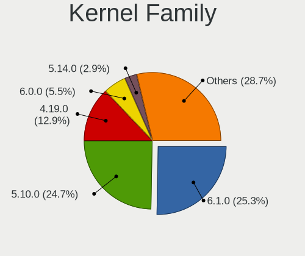
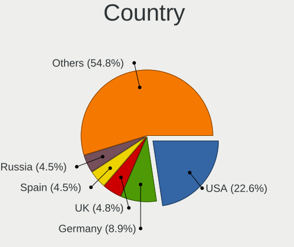
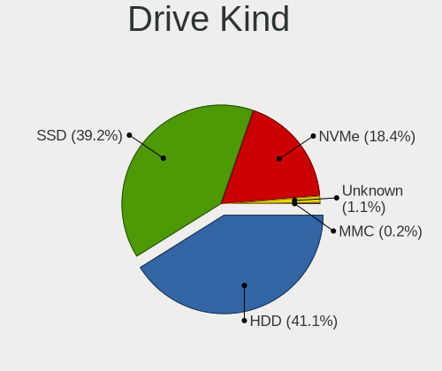
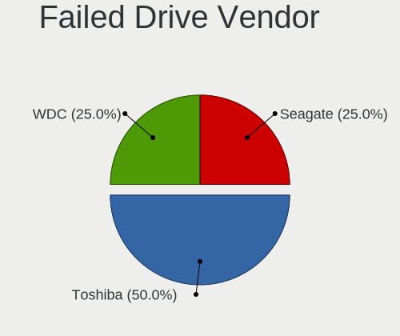
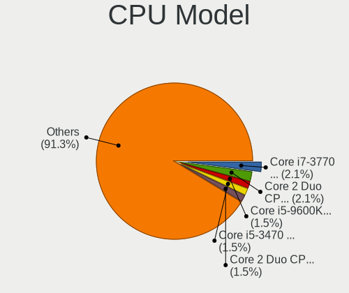
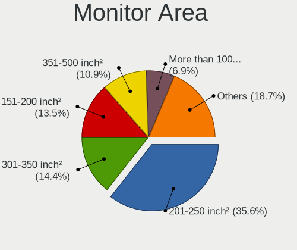

MX - Tested Hardware & Statistics (Desktops)
--------------------------------------------

A project to collect tested hardware configurations for MX.

Anyone can contribute to this report by the [hw-probe](https://github.com/linuxhw/hw-probe) tool:

    sudo -E hw-probe -all -upload

Please contribute! Especially if your hardware is rare.

Contents
--------

* [ Test Cases ](#test-cases)

* [ System ](#system)
  - [ OS                       ](#os)
  - [ OS Family                ](#os-family)
  - [ Kernel                   ](#kernel)
  - [ Kernel Family            ](#kernel-family)
  - [ Kernel Major Ver.        ](#kernel-major-ver)
  - [ Arch                     ](#arch)
  - [ DE                       ](#de)
  - [ Display Server           ](#display-server)
  - [ Display Manager          ](#display-manager)
  - [ OS Lang                  ](#os-lang)
  - [ Boot Mode                ](#boot-mode)
  - [ Filesystem               ](#filesystem)
  - [ Part. scheme             ](#part-scheme)
  - [ Dual Boot with Linux/BSD ](#dual-boot-with-linuxbsd)
  - [ Dual Boot (Win)          ](#dual-boot-win)

* [ Board ](#board)
  - [ Vendor                   ](#vendor)
  - [ Model                    ](#model)
  - [ Model Family             ](#model-family)
  - [ MFG Year                 ](#mfg-year)
  - [ Form Factor              ](#form-factor)
  - [ Secure Boot              ](#secure-boot)
  - [ Coreboot                 ](#coreboot)
  - [ RAM Size                 ](#ram-size)
  - [ RAM Used                 ](#ram-used)
  - [ Total Drives             ](#total-drives)
  - [ Has CD-ROM               ](#has-cd-rom)
  - [ Has Ethernet             ](#has-ethernet)
  - [ Has WiFi                 ](#has-wifi)
  - [ Has Bluetooth            ](#has-bluetooth)

* [ Location ](#location)
  - [ Country                  ](#country)
  - [ City                     ](#city)

* [ Drives ](#drives)
  - [ Drive Vendor             ](#drive-vendor)
  - [ Drive Model              ](#drive-model)
  - [ HDD Vendor               ](#hdd-vendor)
  - [ SSD Vendor               ](#ssd-vendor)
  - [ Drive Kind               ](#drive-kind)
  - [ Drive Connector          ](#drive-connector)
  - [ Drive Size               ](#drive-size)
  - [ Space Total              ](#space-total)
  - [ Space Used               ](#space-used)
  - [ Malfunc. Drives          ](#malfunc-drives)
  - [ Malfunc. Drive Vendor    ](#malfunc-drive-vendor)
  - [ Malfunc. HDD Vendor      ](#malfunc-hdd-vendor)
  - [ Malfunc. Drive Kind      ](#malfunc-drive-kind)
  - [ Failed Drives            ](#failed-drives)
  - [ Failed Drive Vendor      ](#failed-drive-vendor)
  - [ Drive Status             ](#drive-status)

* [ Storage controller ](#storage-controller)
  - [ Storage Vendor           ](#storage-vendor)
  - [ Storage Model            ](#storage-model)
  - [ Storage Kind             ](#storage-kind)

* [ Processor ](#processor)
  - [ CPU Vendor               ](#cpu-vendor)
  - [ CPU Model                ](#cpu-model)
  - [ CPU Model Family         ](#cpu-model-family)
  - [ CPU Cores                ](#cpu-cores)
  - [ CPU Sockets              ](#cpu-sockets)
  - [ CPU Threads              ](#cpu-threads)
  - [ CPU Op-Modes             ](#cpu-op-modes)
  - [ CPU Microcode            ](#cpu-microcode)
  - [ CPU Microarch            ](#cpu-microarch)

* [ Graphics ](#graphics)
  - [ GPU Vendor               ](#gpu-vendor)
  - [ GPU Model                ](#gpu-model)
  - [ GPU Combo                ](#gpu-combo)
  - [ GPU Driver               ](#gpu-driver)
  - [ GPU Memory               ](#gpu-memory)

* [ Monitor ](#monitor)
  - [ Monitor Vendor           ](#monitor-vendor)
  - [ Monitor Model            ](#monitor-model)
  - [ Monitor Resolution       ](#monitor-resolution)
  - [ Monitor Diagonal         ](#monitor-diagonal)
  - [ Monitor Width            ](#monitor-width)
  - [ Aspect Ratio             ](#aspect-ratio)
  - [ Monitor Area             ](#monitor-area)
  - [ Pixel Density            ](#pixel-density)
  - [ Multiple Monitors        ](#multiple-monitors)

* [ Network ](#network)
  - [ Net Controller Vendor    ](#net-controller-vendor)
  - [ Net Controller Model     ](#net-controller-model)
  - [ Wireless Vendor          ](#wireless-vendor)
  - [ Wireless Model           ](#wireless-model)
  - [ Ethernet Vendor          ](#ethernet-vendor)
  - [ Ethernet Model           ](#ethernet-model)
  - [ Net Controller Kind      ](#net-controller-kind)
  - [ Used Controller          ](#used-controller)
  - [ NICs                     ](#nics)
  - [ IPv6                     ](#ipv6)

* [ Bluetooth ](#bluetooth)
  - [ Bluetooth Vendor         ](#bluetooth-vendor)
  - [ Bluetooth Model          ](#bluetooth-model)

* [ Sound ](#sound)
  - [ Sound Vendor             ](#sound-vendor)
  - [ Sound Model              ](#sound-model)

* [ Memory ](#memory)
  - [ Memory Vendor            ](#memory-vendor)
  - [ Memory Model             ](#memory-model)
  - [ Memory Kind              ](#memory-kind)
  - [ Memory Form Factor       ](#memory-form-factor)
  - [ Memory Size              ](#memory-size)
  - [ Memory Speed             ](#memory-speed)

* [ Printers & scanners ](#printers--scanners)
  - [ Printer Vendor           ](#printer-vendor)
  - [ Printer Model            ](#printer-model)
  - [ Scanner Vendor           ](#scanner-vendor)
  - [ Scanner Model            ](#scanner-model)

* [ Camera ](#camera)
  - [ Camera Vendor            ](#camera-vendor)
  - [ Camera Model             ](#camera-model)

* [ Security ](#security)
  - [ Fingerprint Vendor       ](#fingerprint-vendor)
  - [ Fingerprint Model        ](#fingerprint-model)
  - [ Chipcard Vendor          ](#chipcard-vendor)
  - [ Chipcard Model           ](#chipcard-model)

* [ Unsupported ](#unsupported)
  - [ Unsupported Devices      ](#unsupported-devices)
  - [ Unsupported Device Types ](#unsupported-device-types)

Test Cases
----------

Total: 171

| Vendor        | Model                       | Probe                                                      | Date         |
|---------------|-----------------------------|------------------------------------------------------------|--------------|
| MSI           | Z390-A PRO                  | [3a3375e173](https://linux-hardware.org/?probe=3a3375e173) | Dec 29, 2022 |
| MSI           | Z270 GAMING PRO CARBON      | [f422489705](https://linux-hardware.org/?probe=f422489705) | Dec 27, 2022 |
| Dell          | 0HY9JP A02                  | [c195f58592](https://linux-hardware.org/?probe=c195f58592) | Dec 24, 2022 |
| Lenovo        | 3741 SDK0T76461 WIN 3422... | [70e125f0d0](https://linux-hardware.org/?probe=70e125f0d0) | Dec 23, 2022 |
| Fujitsu       | D3498-A1 S26361-D3498-A1    | [03cd265cef](https://linux-hardware.org/?probe=03cd265cef) | Dec 05, 2022 |
| ASUSTek       | PRIME A320M-K               | [6487bbd7b7](https://linux-hardware.org/?probe=6487bbd7b7) | Dec 05, 2022 |
| SIRAGON       | AIO-5150                    | [90476603fa](https://linux-hardware.org/?probe=90476603fa) | Dec 04, 2022 |
| HP            | 304Ah                       | [15db22accc](https://linux-hardware.org/?probe=15db22accc) | Nov 30, 2022 |
| ASRock        | B365M Pro4                  | [0f0d4f70b0](https://linux-hardware.org/?probe=0f0d4f70b0) | Nov 20, 2022 |
| Foxconn       | 2ABF                        | [aa4bde7d79](https://linux-hardware.org/?probe=aa4bde7d79) | Nov 20, 2022 |
| ASUSTek       | TUF Gaming B450-PLUS II     | [1a0674de42](https://linux-hardware.org/?probe=1a0674de42) | Nov 14, 2022 |
| ASRock        | H81M-HG4 R4.0               | [732e924bbb](https://linux-hardware.org/?probe=732e924bbb) | Nov 07, 2022 |
| ASRock        | B365M Pro4                  | [f5305c9730](https://linux-hardware.org/?probe=f5305c9730) | Nov 04, 2022 |
| MSI           | X570-A PRO                  | [c60d9aa72d](https://linux-hardware.org/?probe=c60d9aa72d) | Oct 31, 2022 |
| Biostar       | H61MH                       | [f505de310c](https://linux-hardware.org/?probe=f505de310c) | Oct 27, 2022 |
| Lenovo        | 318E NOK                    | [6b190bfb4f](https://linux-hardware.org/?probe=6b190bfb4f) | Oct 25, 2022 |
| ASRock        | H370M-ITX/ac                | [fa925dcefb](https://linux-hardware.org/?probe=fa925dcefb) | Oct 24, 2022 |
| Pegatron      | NARRA3                      | [1588e60c57](https://linux-hardware.org/?probe=1588e60c57) | Oct 12, 2022 |
| Gigabyte      | GA-890GPA-UD3H              | [bb43eb5333](https://linux-hardware.org/?probe=bb43eb5333) | Oct 04, 2022 |
| ASUSTek       | Z170-P                      | [2f3c79dd55](https://linux-hardware.org/?probe=2f3c79dd55) | Sep 29, 2022 |
| ASUSTek       | P5GC-MX/CKD/SI              | [72bb90ea71](https://linux-hardware.org/?probe=72bb90ea71) | Sep 28, 2022 |
| ASUSTek       | P5G41T-M LX                 | [8e429edcd6](https://linux-hardware.org/?probe=8e429edcd6) | Sep 25, 2022 |
| ASUSTek       | PRIME B450M-A               | [bdb353fd2c](https://linux-hardware.org/?probe=bdb353fd2c) | Sep 20, 2022 |
| HP            | 1632                        | [8309a8acf0](https://linux-hardware.org/?probe=8309a8acf0) | Sep 10, 2022 |
| Medion        | H110H4-EM                   | [1b22e5560d](https://linux-hardware.org/?probe=1b22e5560d) | Sep 07, 2022 |
| ASRock        | H370M-ITX/ac                | [1a577be107](https://linux-hardware.org/?probe=1a577be107) | Sep 04, 2022 |
| Gigabyte      | B560M DS3H V2               | [c430bf0275](https://linux-hardware.org/?probe=c430bf0275) | Sep 03, 2022 |
| Biostar       | A780L3B                     | [62782d600f](https://linux-hardware.org/?probe=62782d600f) | Aug 14, 2022 |
| Intel         | DH55TC AAE70932-303         | [f275229d83](https://linux-hardware.org/?probe=f275229d83) | Jul 31, 2022 |
| MP            | MS-7848                     | [f7696965e0](https://linux-hardware.org/?probe=f7696965e0) | Jul 22, 2022 |
| MSI           | MAG B550 TOMAHAWK           | [85782181c7](https://linux-hardware.org/?probe=85782181c7) | Jul 21, 2022 |
| ASUSTek       | P8H61/USB3 R2.0             | [1076f6d59a](https://linux-hardware.org/?probe=1076f6d59a) | Jul 19, 2022 |
| AOpen         | D1009 A1A4                  | [d8edf66887](https://linux-hardware.org/?probe=d8edf66887) | Jul 13, 2022 |
| Dell          | 0DR845                      | [4c4a530cc5](https://linux-hardware.org/?probe=4c4a530cc5) | Jul 06, 2022 |
| MSI           | B350 TOMAHAWK               | [5a66940742](https://linux-hardware.org/?probe=5a66940742) | Jun 23, 2022 |
| MSI           | Z77A-G41                    | [d0f55f3c0b](https://linux-hardware.org/?probe=d0f55f3c0b) | Jun 22, 2022 |
| Dell          | 0200DY A01                  | [bc8030c1d5](https://linux-hardware.org/?probe=bc8030c1d5) | Jun 22, 2022 |
| Dell          | 0DR845                      | [56b4af8d26](https://linux-hardware.org/?probe=56b4af8d26) | Jun 20, 2022 |
| Gigabyte      | H410M S2H V3                | [b57b3a635c](https://linux-hardware.org/?probe=b57b3a635c) | Jun 02, 2022 |
| ASUSTek       | SABERTOOTH X99              | [b627953ad4](https://linux-hardware.org/?probe=b627953ad4) | May 11, 2022 |
| Intel         | V1.3                        | [a01993f2fa](https://linux-hardware.org/?probe=a01993f2fa) | Apr 30, 2022 |
| ASUSTek       | SABERTOOTH X99              | [51cc264c62](https://linux-hardware.org/?probe=51cc264c62) | Apr 22, 2022 |
| ASUSTek       | M4A785-M                    | [03878be4ec](https://linux-hardware.org/?probe=03878be4ec) | Apr 20, 2022 |
| Gigabyte      | B550M S2H                   | [208972e3b5](https://linux-hardware.org/?probe=208972e3b5) | Apr 19, 2022 |
| ASRock        | N3150M                      | [0ee71f6582](https://linux-hardware.org/?probe=0ee71f6582) | Apr 19, 2022 |
| Gigabyte      | B550M S2H                   | [1127f26185](https://linux-hardware.org/?probe=1127f26185) | Apr 17, 2022 |
| Dell          | 0YXT71 A01                  | [5de0fab8f2](https://linux-hardware.org/?probe=5de0fab8f2) | Apr 04, 2022 |
| Gigabyte      | P35-DS3P                    | [9c4373296f](https://linux-hardware.org/?probe=9c4373296f) | Mar 21, 2022 |
| Lenovo        | 1046 NO DPK                 | [561b1c3324](https://linux-hardware.org/?probe=561b1c3324) | Mar 17, 2022 |
| Gigabyte      | Z390 UD                     | [d0b555e0ba](https://linux-hardware.org/?probe=d0b555e0ba) | Mar 17, 2022 |
| HP            | 3647h                       | [fd6766aabb](https://linux-hardware.org/?probe=fd6766aabb) | Mar 11, 2022 |
| ASUSTek       | P5GC-MX/MEDION/SI           | [772e020316](https://linux-hardware.org/?probe=772e020316) | Mar 09, 2022 |
| MSI           | MS-7091                     | [71aaa6a920](https://linux-hardware.org/?probe=71aaa6a920) | Mar 09, 2022 |
| MSI           | MS-7091                     | [b08ddd1115](https://linux-hardware.org/?probe=b08ddd1115) | Mar 09, 2022 |
| ASUSTek       | PRIME H510M-A               | [4521c22268](https://linux-hardware.org/?probe=4521c22268) | Mar 06, 2022 |
| ASUSTek       | ROG Maximus XIII HERO       | [e58223cc60](https://linux-hardware.org/?probe=e58223cc60) | Feb 18, 2022 |
| Huanan        | X99-F8 V2.0                 | [23c722f6cf](https://linux-hardware.org/?probe=23c722f6cf) | Feb 18, 2022 |
| Huanan        | X99-F8 V2.0                 | [f4fec6a5be](https://linux-hardware.org/?probe=f4fec6a5be) | Feb 17, 2022 |
| MSI           | Z97 GAMING 5                | [7c66c1b404](https://linux-hardware.org/?probe=7c66c1b404) | Feb 09, 2022 |
| ASRock        | FM2A68M-HD+ R2.0            | [d0ba3786b2](https://linux-hardware.org/?probe=d0ba3786b2) | Feb 03, 2022 |
| Intel         | H81                         | [c1763fe2cf](https://linux-hardware.org/?probe=c1763fe2cf) | Jan 29, 2022 |
| ASUSTek       | X99-DELUXE                  | [4ffe151e7a](https://linux-hardware.org/?probe=4ffe151e7a) | Jan 29, 2022 |
| IBM           | 8183B2U                     | [d070680dfb](https://linux-hardware.org/?probe=d070680dfb) | Jan 14, 2022 |
| HP            | 0B4Ch D                     | [ecaec39529](https://linux-hardware.org/?probe=ecaec39529) | Jan 05, 2022 |
| Gigabyte      | F2A88X-UP4                  | [52e09bab91](https://linux-hardware.org/?probe=52e09bab91) | Jan 02, 2022 |
| Fujitsu       | D3221-A1 S26361-D3221-A1    | [78d4e04363](https://linux-hardware.org/?probe=78d4e04363) | Dec 16, 2021 |
| GALAX         | B550M                       | [a6866c8a45](https://linux-hardware.org/?probe=a6866c8a45) | Dec 04, 2021 |
| ECS           | A55F-M3                     | [5439a8e37c](https://linux-hardware.org/?probe=5439a8e37c) | Nov 27, 2021 |
| Lenovo        | SHARKBAY NO DPK             | [fd5f409df8](https://linux-hardware.org/?probe=fd5f409df8) | Nov 14, 2021 |
| Lenovo        | SHARKBAY NO DPK             | [a85cc99f78](https://linux-hardware.org/?probe=a85cc99f78) | Nov 14, 2021 |
| ASRock        | X570 Steel Legend           | [18391015f7](https://linux-hardware.org/?probe=18391015f7) | Nov 11, 2021 |
| MSI           | B460M PRO                   | [ae3e01fef8](https://linux-hardware.org/?probe=ae3e01fef8) | Oct 31, 2021 |
| ECS           | A55F-M3                     | [27e84aca95](https://linux-hardware.org/?probe=27e84aca95) | Oct 31, 2021 |
| Gigabyte      | X570 AORUS PRO              | [fbd2076eee](https://linux-hardware.org/?probe=fbd2076eee) | Oct 28, 2021 |
| ASUSTek       | Maximus VII HERO            | [cbff9b4baf](https://linux-hardware.org/?probe=cbff9b4baf) | Oct 21, 2021 |
| ASUSTek       | Maximus VII HERO            | [1e6b01d3bd](https://linux-hardware.org/?probe=1e6b01d3bd) | Oct 21, 2021 |
| Gigabyte      | B550M DS3H                  | [ee6a141211](https://linux-hardware.org/?probe=ee6a141211) | Oct 19, 2021 |
| Dell          | 00F82W A01                  | [08e803937e](https://linux-hardware.org/?probe=08e803937e) | Oct 18, 2021 |
| Dell          | 0P611C A00                  | [c11bd1c981](https://linux-hardware.org/?probe=c11bd1c981) | Oct 11, 2021 |
| HP            | 21D0                        | [4cee9a5c3d](https://linux-hardware.org/?probe=4cee9a5c3d) | Oct 11, 2021 |
| GreatWall     | U320                        | [483d23be23](https://linux-hardware.org/?probe=483d23be23) | Oct 06, 2021 |
| GreatWall     | U320                        | [043d1121f4](https://linux-hardware.org/?probe=043d1121f4) | Oct 06, 2021 |
| Dell          | 0M017G A00                  | [3549222788](https://linux-hardware.org/?probe=3549222788) | Oct 02, 2021 |
| Intel         | Unknown                     | [e97eb92439](https://linux-hardware.org/?probe=e97eb92439) | Oct 01, 2021 |
| ASRock        | H470M-ITX/ac                | [ad42fa5d08](https://linux-hardware.org/?probe=ad42fa5d08) | Oct 01, 2021 |
| Dell          | 0M017G A00                  | [2bf98ef81c](https://linux-hardware.org/?probe=2bf98ef81c) | Sep 24, 2021 |
| Dell          | 0P611C A00                  | [eadaa5e6cb](https://linux-hardware.org/?probe=eadaa5e6cb) | Aug 20, 2021 |
| Gigabyte      | A320M-S2H V2-CF             | [5d136cb09b](https://linux-hardware.org/?probe=5d136cb09b) | Aug 13, 2021 |
| ASUSTek       | X79-DELUXE                  | [bc56fe50dd](https://linux-hardware.org/?probe=bc56fe50dd) | Jul 24, 2021 |
| ASRock        | H170M Pro4                  | [f291edbc4a](https://linux-hardware.org/?probe=f291edbc4a) | Jul 18, 2021 |
| Gigabyte      | H110M-S2H-CF                | [192043ebbd](https://linux-hardware.org/?probe=192043ebbd) | Jul 12, 2021 |
| Dell          | 00F82W A01                  | [b85b636b73](https://linux-hardware.org/?probe=b85b636b73) | Jun 26, 2021 |
| Intel         | DZ77SL-50K AAG55115-300     | [bae9a4e960](https://linux-hardware.org/?probe=bae9a4e960) | May 16, 2021 |
| ASUSTek       | TUF B450M-PRO GAMING        | [ac4ce770fc](https://linux-hardware.org/?probe=ac4ce770fc) | May 10, 2021 |
| MSI           | B450-A PRO MAX              | [506efba999](https://linux-hardware.org/?probe=506efba999) | May 02, 2021 |
| ASRock        | B560M Pro4                  | [d4484f50cd](https://linux-hardware.org/?probe=d4484f50cd) | Apr 08, 2021 |
| MSI           | MPG B550 GAMING PLUS        | [4959cfd244](https://linux-hardware.org/?probe=4959cfd244) | Apr 07, 2021 |
| ASUSTek       | P5K-E                       | [f0c435ead1](https://linux-hardware.org/?probe=f0c435ead1) | Apr 01, 2021 |
| ASUSTek       | TUF B450-PRO GAMING         | [8d8771e1ef](https://linux-hardware.org/?probe=8d8771e1ef) | Mar 30, 2021 |
| Dell          | 0XR1GT A00                  | [04145c0b36](https://linux-hardware.org/?probe=04145c0b36) | Mar 29, 2021 |
| ASUSTek       | TUF B450M-PRO GAMING        | [4c93424ea5](https://linux-hardware.org/?probe=4c93424ea5) | Mar 26, 2021 |
| MSI           | B350 TOMAHAWK               | [d77d6984e4](https://linux-hardware.org/?probe=d77d6984e4) | Mar 19, 2021 |
| MSI           | MS-7210 100                 | [e8723eb58b](https://linux-hardware.org/?probe=e8723eb58b) | Mar 17, 2021 |
| ASRock        | H81M-ITX                    | [d58331ce9b](https://linux-hardware.org/?probe=d58331ce9b) | Feb 23, 2021 |
| ASUSTek       | M2N-MX SE Plus              | [94f0202173](https://linux-hardware.org/?probe=94f0202173) | Feb 23, 2021 |
| ASUSTek       | A8R-MVP                     | [ce881d4659](https://linux-hardware.org/?probe=ce881d4659) | Feb 23, 2021 |
| ASRock        | K8A780LM                    | [6543fc448e](https://linux-hardware.org/?probe=6543fc448e) | Feb 23, 2021 |
| ASRock        | K8A780LM                    | [ce0076fd09](https://linux-hardware.org/?probe=ce0076fd09) | Feb 23, 2021 |
| MSI           | MAG B550M MORTAR WIFI       | [4789c5df48](https://linux-hardware.org/?probe=4789c5df48) | Feb 06, 2021 |
| ASRock        | K8A780LM                    | [2e54aedb9e](https://linux-hardware.org/?probe=2e54aedb9e) | Jan 14, 2021 |
| ASRock        | H81M-ITX                    | [50e5d36672](https://linux-hardware.org/?probe=50e5d36672) | Jan 14, 2021 |
| ASUSTek       | A8R-MVP                     | [62ab746796](https://linux-hardware.org/?probe=62ab746796) | Jan 14, 2021 |
| ASUSTek       | M2N-MX SE Plus              | [f6a8e9eaf5](https://linux-hardware.org/?probe=f6a8e9eaf5) | Jan 14, 2021 |
| ASUSTek       | A8R-MVP                     | [00e4deffa2](https://linux-hardware.org/?probe=00e4deffa2) | Jan 14, 2021 |
| Intel         | MAHOBAY                     | [d3e3aa3011](https://linux-hardware.org/?probe=d3e3aa3011) | Nov 28, 2020 |
| Intel         | MAHOBAY                     | [b51d9808ea](https://linux-hardware.org/?probe=b51d9808ea) | Nov 28, 2020 |
| ASUSTek       | M5A97 R2.0                  | [6a65eeffd1](https://linux-hardware.org/?probe=6a65eeffd1) | Nov 27, 2020 |
| HP            | 1905                        | [03a91e7ecc](https://linux-hardware.org/?probe=03a91e7ecc) | Nov 27, 2020 |
| ASUSTek       | ROG STRIX B550-F GAMING     | [b7fec4788f](https://linux-hardware.org/?probe=b7fec4788f) | Nov 25, 2020 |
| ASUSTek       | PRIME B450M-A               | [d4f8648d28](https://linux-hardware.org/?probe=d4f8648d28) | Nov 24, 2020 |
| Intel         | MAHOBAY                     | [282590eccb](https://linux-hardware.org/?probe=282590eccb) | Nov 24, 2020 |
| ASRock        | H110M-ITX                   | [e3ca7996d2](https://linux-hardware.org/?probe=e3ca7996d2) | Nov 13, 2020 |
| ASUSTek       | PRIME B450M-A               | [a7bb20fa67](https://linux-hardware.org/?probe=a7bb20fa67) | Nov 08, 2020 |
| MSI           | Z87 MPOWER MAX              | [c4f4df2ec5](https://linux-hardware.org/?probe=c4f4df2ec5) | Oct 31, 2020 |
| Dell          | 0D28YY A00                  | [584335af3e](https://linux-hardware.org/?probe=584335af3e) | Oct 29, 2020 |
| Dell          | 0M9KCM A02                  | [3e66c830f8](https://linux-hardware.org/?probe=3e66c830f8) | Sep 22, 2020 |
| Gigabyte      | B450M DS3H-CF               | [a2151aadf5](https://linux-hardware.org/?probe=a2151aadf5) | Sep 14, 2020 |
| HP            | 8265                        | [38f924e8f9](https://linux-hardware.org/?probe=38f924e8f9) | Sep 07, 2020 |
| Dell          | 0M5DCD A00                  | [f138fd7e0c](https://linux-hardware.org/?probe=f138fd7e0c) | Aug 09, 2020 |
| ASUSTek       | PRIME H310M-R R2.0          | [2f71e9b242](https://linux-hardware.org/?probe=2f71e9b242) | Aug 03, 2020 |
| HP            | 3031h                       | [205dd10b09](https://linux-hardware.org/?probe=205dd10b09) | Jul 29, 2020 |
| HP            | 3031h                       | [22ebc88fac](https://linux-hardware.org/?probe=22ebc88fac) | Jul 29, 2020 |
| Fujitsu Si... | D2312-A3 S26361-D2312-A3    | [2233b1466b](https://linux-hardware.org/?probe=2233b1466b) | Jul 06, 2020 |
| Fujitsu Si... | D2312-A3 S26361-D2312-A3    | [c70f8ee92e](https://linux-hardware.org/?probe=c70f8ee92e) | Jul 06, 2020 |
| MSI           | 970A-G43                    | [ada20a047e](https://linux-hardware.org/?probe=ada20a047e) | May 27, 2020 |
| Gigabyte      | P55-USB3                    | [901dfafdbf](https://linux-hardware.org/?probe=901dfafdbf) | May 21, 2020 |
| Gigabyte      | GA-880GM-UD2H               | [a7d4e8b1e4](https://linux-hardware.org/?probe=a7d4e8b1e4) | Apr 10, 2020 |
| Intel         | DCP847SKE G80890-105        | [0357ef50d4](https://linux-hardware.org/?probe=0357ef50d4) | Apr 05, 2020 |
| ASUSTek       | P8Z77-V LX                  | [893f6857b2](https://linux-hardware.org/?probe=893f6857b2) | Apr 04, 2020 |
| ASUSTek       | Z97-E                       | [42c2810369](https://linux-hardware.org/?probe=42c2810369) | Apr 03, 2020 |
| ASUSTek       | P8Z77-V LX                  | [ec1375a9f8](https://linux-hardware.org/?probe=ec1375a9f8) | Apr 02, 2020 |
| MSI           | 760GM-P23                   | [67de432cb4](https://linux-hardware.org/?probe=67de432cb4) | Apr 01, 2020 |
| ASUSTek       | ROG STRIX B350-F GAMING     | [67d9f2023b](https://linux-hardware.org/?probe=67d9f2023b) | Apr 01, 2020 |
| Gigabyte      | Z390 GAMING X-CF            | [104b035076](https://linux-hardware.org/?probe=104b035076) | Apr 01, 2020 |
| Gigabyte      | A320M-DS2-CF                | [27d1900fba](https://linux-hardware.org/?probe=27d1900fba) | Mar 28, 2020 |
| Gigabyte      | Z68AP-D3                    | [617031b37d](https://linux-hardware.org/?probe=617031b37d) | Mar 28, 2020 |
| ASRock        | Z68 Pro3-M                  | [73690787f9](https://linux-hardware.org/?probe=73690787f9) | Mar 26, 2020 |
| Dell          | 0F373D A00                  | [2155b32aa1](https://linux-hardware.org/?probe=2155b32aa1) | Mar 25, 2020 |
| Gigabyte      | X470 AORUS ULTRA GAMING-... | [1243c4a0d9](https://linux-hardware.org/?probe=1243c4a0d9) | Mar 24, 2020 |
| HP            | 1790                        | [68a167efd3](https://linux-hardware.org/?probe=68a167efd3) | Mar 24, 2020 |
| ASUSTek       | M4A77T                      | [75d0b42f08](https://linux-hardware.org/?probe=75d0b42f08) | Mar 01, 2020 |
| ASUSTek       | PRIME H310M-K               | [ed464b4172](https://linux-hardware.org/?probe=ed464b4172) | Jan 23, 2020 |
| ASRock        | K8A780LM                    | [e0d3030787](https://linux-hardware.org/?probe=e0d3030787) | Jan 18, 2020 |
| ASRock        | K8A780LM                    | [83dca94e72](https://linux-hardware.org/?probe=83dca94e72) | Jan 17, 2020 |
| ASRock        | K8A780LM                    | [a5e0479887](https://linux-hardware.org/?probe=a5e0479887) | Jan 16, 2020 |
| Gigabyte      | GA-880GA-UD3H               | [03401edcb4](https://linux-hardware.org/?probe=03401edcb4) | Jan 13, 2020 |
| ASRock        | X370 Gaming X               | [8a0171b4b0](https://linux-hardware.org/?probe=8a0171b4b0) | Jan 13, 2020 |
| Gateway       | SX2185                      | [74f9db3262](https://linux-hardware.org/?probe=74f9db3262) | Jan 13, 2020 |
| Dell          | 088DT1 A01                  | [3c957a3758](https://linux-hardware.org/?probe=3c957a3758) | Dec 23, 2019 |
| MSI           | MS-7199                     | [8fe7e9e6a6](https://linux-hardware.org/?probe=8fe7e9e6a6) | Dec 21, 2019 |
| MSI           | B75MA-E33                   | [a08cc9782c](https://linux-hardware.org/?probe=a08cc9782c) | Nov 17, 2019 |
| Gigabyte      | P43-ES3G                    | [96fa353482](https://linux-hardware.org/?probe=96fa353482) | Nov 07, 2019 |
| ASRock        | H81M-ITX                    | [431ea0cbed](https://linux-hardware.org/?probe=431ea0cbed) | Oct 25, 2019 |
| Dell          | 0F8096                      | [d1f6910c12](https://linux-hardware.org/?probe=d1f6910c12) | Oct 20, 2019 |
| ASUSTek       | M2N-MX SE Plus              | [f4fcd6e28c](https://linux-hardware.org/?probe=f4fcd6e28c) | Oct 20, 2019 |
| ASRock        | H81M-ITX                    | [c5f47f2f27](https://linux-hardware.org/?probe=c5f47f2f27) | Oct 20, 2019 |
| ASUSTek       | SABERTOOTH X79              | [13dbc6f66d](https://linux-hardware.org/?probe=13dbc6f66d) | Oct 06, 2019 |
| ASUSTek       | Z97-A                       | [6a9aa2dd84](https://linux-hardware.org/?probe=6a9aa2dd84) | Jul 22, 2019 |
| Gigabyte      | EP45-UD3LR                  | [e42fd626b2](https://linux-hardware.org/?probe=e42fd626b2) | Apr 23, 2019 |
| Gigabyte      | EP45-UD3LR                  | [8469904453](https://linux-hardware.org/?probe=8469904453) | Apr 17, 2019 |
| Gigabyte      | Z370 AORUS Gaming 7         | [c68bd6bce7](https://linux-hardware.org/?probe=c68bd6bce7) | Feb 23, 2019 |

System
------

OS
--

Installed operating systems

| Name           | Desktops | Percent |
|----------------|----------|---------|
| MX 21          | 53       | 39.55%  |
| MX 19          | 44       | 32.84%  |
| MX 20          | 22       | 16.42%  |
| MX 18          | 12       | 8.96%   |
| MX 22          | 1        | 0.75%   |
| MX 17          | 1        | 0.75%   |
| MX 16-migrated | 1        | 0.75%   |

OS Family
---------

OS without a version

| Name | Desktops | Percent |
|------|----------|---------|
| MX   | 133      | 100%    |

Kernel
------

Version of the Linux kernel

| Version                    | Desktops | Percent |
|----------------------------|----------|---------|
| 4.19.0-6-amd64             | 20       | 13.89%  |
| 5.6.0-2-amd64              | 6        | 4.17%   |
| 5.10.0-19-amd64            | 6        | 4.17%   |
| 5.14.0-4mx-amd64           | 5        | 3.47%   |
| 5.10.0-13-amd64            | 5        | 3.47%   |
| 4.19.0-17-amd64            | 5        | 3.47%   |
| 5.8.0-3-amd64              | 4        | 2.78%   |
| 5.10.0-5mx-amd64           | 4        | 2.78%   |
| 5.10.0-16-amd64            | 4        | 2.78%   |
| 5.10.0-15-amd64            | 4        | 2.78%   |
| 4.19.0-14-amd64            | 4        | 2.78%   |
| 5.4.0-3-amd64              | 3        | 2.08%   |
| 5.16.0-5mx-amd64           | 3        | 2.08%   |
| 5.10.0-18-amd64            | 3        | 2.08%   |
| 4.19.0-5-amd64             | 3        | 2.08%   |
| 4.19.0-18-amd64            | 3        | 2.08%   |
| 4.19.0-13-amd64            | 3        | 2.08%   |
| 4.19.0-1-amd64             | 3        | 2.08%   |
| 5.8.16-antix.1-amd64-smp   | 2        | 1.39%   |
| 5.14.0-3mx-amd64           | 2        | 1.39%   |
| 5.10.0-9-amd64             | 2        | 1.39%   |
| 5.10.0-20-amd64            | 2        | 1.39%   |
| 5.10.0-11-amd64            | 2        | 1.39%   |
| 4.19.0-16-amd64            | 2        | 1.39%   |
| 4.19.0-12-amd64            | 2        | 1.39%   |
| 6.0.5-x64v1-xanmod1        | 1        | 0.69%   |
| 6.0.0-4mx-rt-amd64         | 1        | 0.69%   |
| 5.5.0-9.1-liquorix-amd64   | 1        | 0.69%   |
| 5.5.0-7.1-liquorix-amd64   | 1        | 0.69%   |
| 5.5.0-5.1-liquorix-amd64   | 1        | 0.69%   |
| 5.5.0-10.2-liquorix-amd64  | 1        | 0.69%   |
| 5.5.0-050500rc1-lowlatency | 1        | 0.69%   |
| 5.4.7-antix.1-amd64-smp    | 1        | 0.69%   |
| 5.4.10                     | 1        | 0.69%   |
| 5.3.0-10.1-liquorix-amd64  | 1        | 0.69%   |
| 5.3.0-0.bpo.2-amd64        | 1        | 0.69%   |
| 5.2.21-antix.2-amd64-smp   | 1        | 0.69%   |
| 5.19.0-4.2-liquorix-amd64  | 1        | 0.69%   |
| 5.19.0-17.2-liquorix-amd64 | 1        | 0.69%   |
| 5.19.0-14.1-liquorix-amd64 | 1        | 0.69%   |

Kernel Family
-------------

Linux kernel without a distro release

| Version  | Desktops | Percent |
|----------|----------|---------|
| 4.19.0   | 44       | 32.12%  |
| 5.10.0   | 40       | 29.2%   |
| 5.14.0   | 8        | 5.84%   |
| 5.6.0    | 6        | 4.38%   |
| 5.5.0    | 5        | 3.65%   |
| 5.16.0   | 5        | 3.65%   |
| 5.8.0    | 4        | 2.92%   |
| 5.4.0    | 3        | 2.19%   |
| 5.19.0   | 3        | 2.19%   |
| 5.15.0   | 3        | 2.19%   |
| 5.8.16   | 2        | 1.46%   |
| 5.3.0    | 2        | 1.46%   |
| 6.0.5    | 1        | 0.73%   |
| 6.0.0    | 1        | 0.73%   |
| 5.4.7    | 1        | 0.73%   |
| 5.4.10   | 1        | 0.73%   |
| 5.2.21   | 1        | 0.73%   |
| 5.18.0   | 1        | 0.73%   |
| 5.11.0   | 1        | 0.73%   |
| 5.10.52  | 1        | 0.73%   |
| 5.10.111 | 1        | 0.73%   |
| 4.9.91   | 1        | 0.73%   |
| 4.18.0   | 1        | 0.73%   |
| 4.15.0   | 1        | 0.73%   |

Kernel Major Ver.
-----------------

Linux kernel major version

| Version | Desktops | Percent |
|---------|----------|---------|
| 4.19    | 44       | 32.12%  |
| 5.10    | 42       | 30.66%  |
| 5.14    | 8        | 5.84%   |
| 5.8     | 6        | 4.38%   |
| 5.6     | 6        | 4.38%   |
| 5.5     | 5        | 3.65%   |
| 5.4     | 5        | 3.65%   |
| 5.16    | 5        | 3.65%   |
| 5.19    | 3        | 2.19%   |
| 5.15    | 3        | 2.19%   |
| 6.0     | 2        | 1.46%   |
| 5.3     | 2        | 1.46%   |
| 5.2     | 1        | 0.73%   |
| 5.18    | 1        | 0.73%   |
| 5.11    | 1        | 0.73%   |
| 4.9     | 1        | 0.73%   |
| 4.18    | 1        | 0.73%   |
| 4.15    | 1        | 0.73%   |

Arch
----

OS architecture (x86_64, i586, etc.)

| Name   | Desktops | Percent |
|--------|----------|---------|
| x86_64 | 128      | 96.24%  |
| i686   | 5        | 3.76%   |

DE
--

Desktop Environment

| Name             | Desktops | Percent |
|------------------|----------|---------|
| XFCE             | 106      | 79.7%   |
| KDE5             | 18       | 13.53%  |
| MATE             | 2        | 1.5%    |
| lightdm-xsession | 2        | 1.5%    |
| X-Cinnamon       | 1        | 0.75%   |
| LXQt             | 1        | 0.75%   |
| KDE4             | 1        | 0.75%   |
| KDE              | 1        | 0.75%   |
| Unknown          | 1        | 0.75%   |

Display Server
--------------

X11 or Wayland

| Name | Desktops | Percent |
|------|----------|---------|
| X11  | 133      | 100%    |

Display Manager
---------------

SDDM, LightDM, etc.

| Name    | Desktops | Percent |
|---------|----------|---------|
| LightDM | 114      | 85.71%  |
| SDDM    | 14       | 10.53%  |
| TDM     | 2        | 1.5%    |
| SLiM    | 2        | 1.5%    |
| GDM     | 1        | 0.75%   |

OS Lang
-------

Language

| Lang    | Desktops | Percent |
|---------|----------|---------|
| en_US   | 43       | 31.16%  |
| Unknown | 34       | 24.64%  |
| de_DE   | 13       | 9.42%   |
| pl_PL   | 6        | 4.35%   |
| sk_SK   | 5        | 3.62%   |
| it_IT   | 5        | 3.62%   |
| es_ES   | 5        | 3.62%   |
| en_GB   | 5        | 3.62%   |
| pt_BR   | 4        | 2.9%    |
| ru_RU   | 2        | 1.45%   |
| hu_HU   | 2        | 1.45%   |
| fr_FR   | 2        | 1.45%   |
| de_CH   | 2        | 1.45%   |
| uk_UA   | 1        | 0.72%   |
| tr_TR   | 1        | 0.72%   |
| sv_SE   | 1        | 0.72%   |
| fi_FI   | 1        | 0.72%   |
| es_VE   | 1        | 0.72%   |
| es_MX   | 1        | 0.72%   |
| es_CO   | 1        | 0.72%   |
| en_NZ   | 1        | 0.72%   |
| en_IE   | 1        | 0.72%   |
| en_AU   | 1        | 0.72%   |

Boot Mode
---------

EFI or BIOS

| Mode | Desktops | Percent |
|------|----------|---------|
| BIOS | 89       | 66.92%  |
| EFI  | 44       | 33.08%  |

Filesystem
----------

Type of filesystem

| Type     | Desktops | Percent |
|----------|----------|---------|
| Ext4     | 122      | 91.73%  |
| Overlay  | 5        | 3.76%   |
| Btrfs    | 3        | 2.26%   |
| Xfs      | 1        | 0.75%   |
| Reiserfs | 1        | 0.75%   |
| Ext3     | 1        | 0.75%   |

Part. scheme
------------

Scheme of partitioning

| Type    | Desktops | Percent |
|---------|----------|---------|
| GPT     | 68       | 50.75%  |
| MBR     | 64       | 47.76%  |
| Unknown | 2        | 1.49%   |

Dual Boot with Linux/BSD
------------------------

Hosting more than one Linux/BSD

| Dual boot | Desktops | Percent |
|-----------|----------|---------|
| No        | 85       | 62.04%  |
| Yes       | 52       | 37.96%  |

Dual Boot (Win)
---------------

Hosting Linux and Windows

| Dual boot | Desktops | Percent |
|-----------|----------|---------|
| Yes       | 76       | 57.14%  |
| No        | 57       | 42.86%  |

Board
-----

Vendor
------

Motherboard manufacturer

| Name                | Desktops | Percent |
|---------------------|----------|---------|
| ASUSTek Computer    | 30       | 22.56%  |
| Gigabyte Technology | 21       | 15.79%  |
| MSI                 | 18       | 13.53%  |
| Dell                | 16       | 12.03%  |
| ASRock              | 14       | 10.53%  |
| Hewlett-Packard     | 7        | 5.26%   |
| Intel               | 6        | 4.51%   |
| Lenovo              | 4        | 3.01%   |
| Fujitsu             | 2        | 1.5%    |
| Biostar             | 2        | 1.5%    |
| SIRAGON             | 1        | 0.75%   |
| Pegatron            | 1        | 0.75%   |
| MP                  | 1        | 0.75%   |
| Medion              | 1        | 0.75%   |
| IBM                 | 1        | 0.75%   |
| Huanan              | 1        | 0.75%   |
| GreatWall           | 1        | 0.75%   |
| Gateway             | 1        | 0.75%   |
| GALAX               | 1        | 0.75%   |
| Fujitsu Siemens     | 1        | 0.75%   |
| Foxconn             | 1        | 0.75%   |
| ECS                 | 1        | 0.75%   |
| AOpen               | 1        | 0.75%   |

Model
-----

Motherboard model

| Name                                        | Desktops | Percent |
|---------------------------------------------|----------|---------|
| ASUS All Series                             | 4        | 3.01%   |
| MSI MS-7A34                                 | 2        | 1.5%    |
| Dell Studio 540                             | 2        | 1.5%    |
| Dell OptiPlex 9010                          | 2        | 1.5%    |
| Dell OptiPlex 790                           | 2        | 1.5%    |
| Dell OptiPlex 755                           | 2        | 1.5%    |
| ASUS PRIME B450M-A                          | 2        | 1.5%    |
| ASRock K8A780LM                             | 2        | 1.5%    |
| SIRAGON AIO-5150                            | 1        | 0.75%   |
| Pegatron FQ425AA-ABA a6655f                 | 1        | 0.75%   |
| MSI MS-7C94                                 | 1        | 0.75%   |
| MSI MS-7C91                                 | 1        | 0.75%   |
| MSI MS-7C88                                 | 1        | 0.75%   |
| MSI MS-7C56                                 | 1        | 0.75%   |
| MSI MS-7C37                                 | 1        | 0.75%   |
| MSI MS-7B98                                 | 1        | 0.75%   |
| MSI MS-7B86                                 | 1        | 0.75%   |
| MSI MS-7A63                                 | 1        | 0.75%   |
| MSI MS-7917                                 | 1        | 0.75%   |
| MSI MS-7815                                 | 1        | 0.75%   |
| MSI MS-7808                                 | 1        | 0.75%   |
| MSI MS-7758                                 | 1        | 0.75%   |
| MSI MS-7693                                 | 1        | 0.75%   |
| MSI MS-7641                                 | 1        | 0.75%   |
| MSI MS-7199                                 | 1        | 0.75%   |
| MSI GEG                                     | 1        | 0.75%   |
| MP MS-7848                                  | 1        | 0.75%   |
| Medion Akoya P5330 E MD8876/2458            | 1        | 0.75%   |
| Lenovo ThinkStation P620 30E0CTO1WW         | 1        | 0.75%   |
| Lenovo ThinkCentre M75s Gen 2 11JAS0CJ00    | 1        | 0.75%   |
| Lenovo IdeaCentre Gaming5 17IAB7 90T00007US | 1        | 0.75%   |
| Lenovo 10AAS1QB0B                           | 1        | 0.75%   |
| Intel V1.3                                  | 1        | 0.75%   |
| Intel MAHOBAY                               | 1        | 0.75%   |
| Intel H81                                   | 1        | 0.75%   |
| Intel DH55TC AAE70932-303                   | 1        | 0.75%   |
| Intel DCP847SKE G80890-105                  | 1        | 0.75%   |
| IBM 8183B2U                                 | 1        | 0.75%   |
| Huanan X99-F8                               | 1        | 0.75%   |
| HP Z400 Workstation                         | 1        | 0.75%   |

Model Family
------------

Motherboard model prefix

| Name                 | Desktops | Percent |
|----------------------|----------|---------|
| Dell OptiPlex        | 11       | 8.27%   |
| ASUS PRIME           | 5        | 3.76%   |
| ASUS All             | 4        | 3.01%   |
| ASUS TUF             | 3        | 2.26%   |
| ASUS ROG             | 3        | 2.26%   |
| MSI MS-7A34          | 2        | 1.5%    |
| HP Compaq            | 2        | 1.5%    |
| Gigabyte Z390        | 2        | 1.5%    |
| Gigabyte B550M       | 2        | 1.5%    |
| Dell Studio          | 2        | 1.5%    |
| Dell Inspiron        | 2        | 1.5%    |
| ASUS P5GC-MX         | 2        | 1.5%    |
| ASRock K8A780LM      | 2        | 1.5%    |
| SIRAGON AIO-5150     | 1        | 0.75%   |
| Pegatron FQ425AA-ABA | 1        | 0.75%   |
| MSI MS-7C94          | 1        | 0.75%   |
| MSI MS-7C91          | 1        | 0.75%   |
| MSI MS-7C88          | 1        | 0.75%   |
| MSI MS-7C56          | 1        | 0.75%   |
| MSI MS-7C37          | 1        | 0.75%   |
| MSI MS-7B98          | 1        | 0.75%   |
| MSI MS-7B86          | 1        | 0.75%   |
| MSI MS-7A63          | 1        | 0.75%   |
| MSI MS-7917          | 1        | 0.75%   |
| MSI MS-7815          | 1        | 0.75%   |
| MSI MS-7808          | 1        | 0.75%   |
| MSI MS-7758          | 1        | 0.75%   |
| MSI MS-7693          | 1        | 0.75%   |
| MSI MS-7641          | 1        | 0.75%   |
| MSI MS-7199          | 1        | 0.75%   |
| MSI GEG              | 1        | 0.75%   |
| MP MS-7848           | 1        | 0.75%   |
| Medion Akoya         | 1        | 0.75%   |
| Lenovo ThinkStation  | 1        | 0.75%   |
| Lenovo ThinkCentre   | 1        | 0.75%   |
| Lenovo IdeaCentre    | 1        | 0.75%   |
| Lenovo 10AAS1QB0B    | 1        | 0.75%   |
| Intel V1.3           | 1        | 0.75%   |
| Intel MAHOBAY        | 1        | 0.75%   |
| Intel H81            | 1        | 0.75%   |

MFG Year
--------

Motherboard manufacture year

| Year | Desktops | Percent |
|------|----------|---------|
| 2018 | 14       | 10.53%  |
| 2020 | 12       | 9.02%   |
| 2013 | 12       | 9.02%   |
| 2012 | 11       | 8.27%   |
| 2011 | 11       | 8.27%   |
| 2019 | 9        | 6.77%   |
| 2010 | 8        | 6.02%   |
| 2014 | 7        | 5.26%   |
| 2007 | 7        | 5.26%   |
| 2021 | 6        | 4.51%   |
| 2017 | 6        | 4.51%   |
| 2016 | 6        | 4.51%   |
| 2009 | 6        | 4.51%   |
| 2008 | 6        | 4.51%   |
| 2015 | 5        | 3.76%   |
| 2006 | 3        | 2.26%   |
| 2022 | 2        | 1.5%    |
| 2005 | 2        | 1.5%    |

Form Factor
-----------

Physical design of the computer

| Name    | Desktops | Percent |
|---------|----------|---------|
| Desktop | 133      | 100%    |

Secure Boot
-----------

Enabled or disabled

| State    | Desktops | Percent |
|----------|----------|---------|
| Disabled | 133      | 100%    |

Coreboot
--------

Have coreboot on board

| Used | Desktops | Percent |
|------|----------|---------|
| No   | 133      | 100%    |

RAM Size
--------

Total RAM memory

| Size in GB  | Desktops | Percent |
|-------------|----------|---------|
| 16.01-24.0  | 35       | 26.32%  |
| 8.01-16.0   | 32       | 24.06%  |
| 4.01-8.0    | 19       | 14.29%  |
| 32.01-64.0  | 18       | 13.53%  |
| 3.01-4.0    | 16       | 12.03%  |
| 1.01-2.0    | 6        | 4.51%   |
| 24.01-32.0  | 3        | 2.26%   |
| 64.01-256.0 | 2        | 1.5%    |
| 2.01-3.0    | 1        | 0.75%   |
| 0.51-1.0    | 1        | 0.75%   |

RAM Used
--------

Used RAM memory

| Used GB    | Desktops | Percent |
|------------|----------|---------|
| 1.01-2.0   | 47       | 34.31%  |
| 2.01-3.0   | 32       | 23.36%  |
| 3.01-4.0   | 22       | 16.06%  |
| 4.01-8.0   | 17       | 12.41%  |
| 0.51-1.0   | 12       | 8.76%   |
| 8.01-16.0  | 5        | 3.65%   |
| 16.01-24.0 | 1        | 0.73%   |
| 0.01-0.5   | 1        | 0.73%   |

Total Drives
------------

Number of drives on board

| Drives | Desktops | Percent |
|--------|----------|---------|
| 2      | 50       | 36.23%  |
| 1      | 40       | 28.99%  |
| 3      | 27       | 19.57%  |
| 4      | 9        | 6.52%   |
| 5      | 8        | 5.8%    |
| 8      | 2        | 1.45%   |
| 6      | 1        | 0.72%   |
| 0      | 1        | 0.72%   |

Has CD-ROM
----------

Has CD-ROM on board

| Presented | Desktops | Percent |
|-----------|----------|---------|
| Yes       | 71       | 52.99%  |
| No        | 63       | 47.01%  |

Has Ethernet
------------

Has Ethernet on board

| Presented | Desktops | Percent |
|-----------|----------|---------|
| Yes       | 133      | 100%    |

Has WiFi
--------

Has WiFi module

| Presented | Desktops | Percent |
|-----------|----------|---------|
| No        | 85       | 63.91%  |
| Yes       | 48       | 36.09%  |

Has Bluetooth
-------------

Has Bluetooth module

| Presented | Desktops | Percent |
|-----------|----------|---------|
| No        | 111      | 83.46%  |
| Yes       | 22       | 16.54%  |

Location
--------

Country
-------

Geographic location (country)

| Country     | Desktops | Percent |
|-------------|----------|---------|
| USA         | 34       | 25.56%  |
| Germany     | 11       | 8.27%   |
| Slovakia    | 7        | 5.26%   |
| Poland      | 7        | 5.26%   |
| Italy       | 7        | 5.26%   |
| Spain       | 6        | 4.51%   |
| UK          | 5        | 3.76%   |
| France      | 5        | 3.76%   |
| Brazil      | 5        | 3.76%   |
| Russia      | 4        | 3.01%   |
| India       | 4        | 3.01%   |
| Australia   | 4        | 3.01%   |
| Sweden      | 3        | 2.26%   |
| Serbia      | 3        | 2.26%   |
| Finland     | 3        | 2.26%   |
| Canada      | 3        | 2.26%   |
| Venezuela   | 2        | 1.5%    |
| Switzerland | 2        | 1.5%    |
| Netherlands | 2        | 1.5%    |
| Indonesia   | 2        | 1.5%    |
| Hungary     | 2        | 1.5%    |
| Denmark     | 2        | 1.5%    |
| Ukraine     | 1        | 0.75%   |
| Turkey      | 1        | 0.75%   |
| Philippines | 1        | 0.75%   |
| New Zealand | 1        | 0.75%   |
| Mexico      | 1        | 0.75%   |
| Ireland     | 1        | 0.75%   |
| Greece      | 1        | 0.75%   |
| Estonia     | 1        | 0.75%   |
| Colombia    | 1        | 0.75%   |
| Austria     | 1        | 0.75%   |

City
----

Geographic location (city)

| City                     | Desktops | Percent |
|--------------------------|----------|---------|
| Bratislava               | 7        | 5.15%   |
| Barcelona                | 3        | 2.21%   |
| Florianópolis           | 2        | 1.47%   |
| Ettingen                 | 2        | 1.47%   |
| Centreville              | 2        | 1.47%   |
| Berlin                   | 2        | 1.47%   |
| Bengaluru                | 2        | 1.47%   |
| Belgrade                 | 2        | 1.47%   |
| Albertslund Municipality | 2        | 1.47%   |
| Yuzhno-Sakhalinsk        | 1        | 0.74%   |
| Warsaw                   | 1        | 0.74%   |
| Warren                   | 1        | 0.74%   |
| Volos                    | 1        | 0.74%   |
| Voghera                  | 1        | 0.74%   |
| Virginia Beach           | 1        | 0.74%   |
| Vilhelmina               | 1        | 0.74%   |
| Vienna                   | 1        | 0.74%   |
| Vasco da Gama            | 1        | 0.74%   |
| Valencia                 | 1        | 0.74%   |
| Vaidasoo                 | 1        | 0.74%   |
| Tuglie                   | 1        | 0.74%   |
| Titusville               | 1        | 0.74%   |
| Tilburg                  | 1        | 0.74%   |
| Tacoma                   | 1        | 0.74%   |
| Sydney                   | 1        | 0.74%   |
| Stockholm                | 1        | 0.74%   |
| Stevens Point            | 1        | 0.74%   |
| St Petersburg            | 1        | 0.74%   |
| Springdale               | 1        | 0.74%   |
| Southsea                 | 1        | 0.74%   |
| Södertälje             | 1        | 0.74%   |
| Sibulan                  | 1        | 0.74%   |
| Serrana                  | 1        | 0.74%   |
| Seelbach                 | 1        | 0.74%   |
| San Diego                | 1        | 0.74%   |
| Rzeszów                 | 1        | 0.74%   |
| Rosporden                | 1        | 0.74%   |
| Reno                     | 1        | 0.74%   |
| Rathenow                 | 1        | 0.74%   |
| Puebla City              | 1        | 0.74%   |

Drives
------

Drive Vendor
------------

Hard drive vendors

| Vendor                    | Desktops | Drives | Percent |
|---------------------------|----------|--------|---------|
| Seagate                   | 54       | 74     | 20.61%  |
| WDC                       | 47       | 60     | 17.94%  |
| Samsung Electronics       | 40       | 61     | 15.27%  |
| Kingston                  | 20       | 21     | 7.63%   |
| Hitachi                   | 16       | 21     | 6.11%   |
| Toshiba                   | 14       | 18     | 5.34%   |
| Crucial                   | 11       | 12     | 4.2%    |
| SanDisk                   | 10       | 11     | 3.82%   |
| A-DATA Technology         | 9        | 9      | 3.44%   |
| Maxtor                    | 5        | 6      | 1.91%   |
| GOODRAM                   | 5        | 6      | 1.91%   |
| Corsair                   | 4        | 4      | 1.53%   |
| PNY                       | 3        | 4      | 1.15%   |
| Intel                     | 3        | 4      | 1.15%   |
| SPCC                      | 2        | 2      | 0.76%   |
| Mushkin                   | 2        | 2      | 0.76%   |
| Apacer                    | 2        | 2      | 0.76%   |
| WDC WDS1                  | 1        | 1      | 0.38%   |
| Unknown                   | 1        | 2      | 0.38%   |
| Transcend                 | 1        | 1      | 0.38%   |
| OCZ                       | 1        | 1      | 0.38%   |
| Micron/Crucial Technology | 1        | 1      | 0.38%   |
| Micron Technology         | 1        | 1      | 0.38%   |
| KingFast                  | 1        | 1      | 0.38%   |
| JMicron Technology        | 1        | 1      | 0.38%   |
| Intenso                   | 1        | 1      | 0.38%   |
| IBM/Hitachi               | 1        | 1      | 0.38%   |
| HGST                      | 1        | 1      | 0.38%   |
| Gigabyte Technology       | 1        | 1      | 0.38%   |
| Fujitsu                   | 1        | 1      | 0.38%   |
| Avant                     | 1        | 1      | 0.38%   |
| Acer                      | 1        | 1      | 0.38%   |

Drive Model
-----------

Hard drive models

| Model                            | Desktops | Percent |
|----------------------------------|----------|---------|
| Seagate ST2000DM008-2FR102 2TB   | 5        | 1.64%   |
| Samsung SSD 860 EVO 500GB        | 5        | 1.64%   |
| Kingston SA400S37480G 480GB SSD  | 5        | 1.64%   |
| Toshiba DT01ACA100 1TB           | 4        | 1.32%   |
| Seagate ST500DM002-1BD142 500GB  | 4        | 1.32%   |
| Seagate ST4000DM004-2CV104 4TB   | 4        | 1.32%   |
| Seagate ST1000DM010-2EP102 1TB   | 4        | 1.32%   |
| Samsung SSD 850 EVO 250GB        | 4        | 1.32%   |
| WDC WD1002FAEX-00Z3A0 1TB        | 3        | 0.99%   |
| Seagate ST3500413AS 500GB        | 3        | 0.99%   |
| SanDisk SDSSDA240G 240GB         | 3        | 0.99%   |
| Samsung SSD 970 EVO Plus 500GB   | 3        | 0.99%   |
| Samsung SSD 970 EVO Plus 1TB     | 3        | 0.99%   |
| Samsung SSD 850 EVO 500GB        | 3        | 0.99%   |
| WDC WD60EZRZ-00RWYB1 6TB         | 2        | 0.66%   |
| WDC WD60EFRX-68L0BN1 6TB         | 2        | 0.66%   |
| WDC WD30EZRX-00D8PB0 3TB         | 2        | 0.66%   |
| WDC WD30EFRX-68AX9N0 3TB         | 2        | 0.66%   |
| WDC WD15EARX-00PASB0 1TB         | 2        | 0.66%   |
| WDC WD10EZEX-75WN4A0 1TB         | 2        | 0.66%   |
| Toshiba MK5065GSX 500GB          | 2        | 0.66%   |
| Seagate ST2000DM001-1CH164 2TB   | 2        | 0.66%   |
| Seagate ST1000DM003-1SB102 1TB   | 2        | 0.66%   |
| SanDisk SSD PLUS 1000GB          | 2        | 0.66%   |
| SanDisk SDSSDP128G 128GB         | 2        | 0.66%   |
| Samsung SSD 870 EVO 500GB        | 2        | 0.66%   |
| Samsung SSD 860 QVO 1TB          | 2        | 0.66%   |
| Samsung SSD 860 EVO 250GB        | 2        | 0.66%   |
| Samsung SSD 860 EVO 1TB          | 2        | 0.66%   |
| Samsung SSD 850 EVO 1TB          | 2        | 0.66%   |
| Samsung SSD 840 EVO 250GB        | 2        | 0.66%   |
| Samsung SSD 830 Series 128GB     | 2        | 0.66%   |
| Kingston SV300S37A240G 240GB SSD | 2        | 0.66%   |
| Kingston SUV400S37240G 240GB SSD | 2        | 0.66%   |
| Kingston SA400S37120G 120GB SSD  | 2        | 0.66%   |
| Hitachi HUA723020ALA641 2TB      | 2        | 0.66%   |
| Hitachi HTS543232A7A384 320GB    | 2        | 0.66%   |
| Hitachi HDS721050CLA362 500GB    | 2        | 0.66%   |
| Crucial CT120BX500SSD1 120GB     | 2        | 0.66%   |
| Corsair MP400 2TB                | 2        | 0.66%   |

HDD Vendor
----------

Hard disk drive vendors

| Vendor              | Desktops | Drives | Percent |
|---------------------|----------|--------|---------|
| Seagate             | 54       | 73     | 39.71%  |
| WDC                 | 39       | 51     | 28.68%  |
| Hitachi             | 16       | 21     | 11.76%  |
| Toshiba             | 14       | 18     | 10.29%  |
| Samsung Electronics | 5        | 6      | 3.68%   |
| Maxtor              | 5        | 6      | 3.68%   |
| IBM/Hitachi         | 1        | 1      | 0.74%   |
| HGST                | 1        | 1      | 0.74%   |
| Fujitsu             | 1        | 1      | 0.74%   |

SSD Vendor
----------

Solid state drive vendors

| Vendor              | Desktops | Drives | Percent |
|---------------------|----------|--------|---------|
| Samsung Electronics | 29       | 37     | 28.16%  |
| Kingston            | 17       | 18     | 16.5%   |
| SanDisk             | 10       | 11     | 9.71%   |
| Crucial             | 10       | 11     | 9.71%   |
| A-DATA Technology   | 8        | 8      | 7.77%   |
| WDC                 | 7        | 8      | 6.8%    |
| GOODRAM             | 5        | 6      | 4.85%   |
| SPCC                | 2        | 2      | 1.94%   |
| PNY                 | 2        | 2      | 1.94%   |
| Intel               | 2        | 3      | 1.94%   |
| WDC WDS1            | 1        | 1      | 0.97%   |
| Transcend           | 1        | 1      | 0.97%   |
| OCZ                 | 1        | 1      | 0.97%   |
| Mushkin             | 1        | 1      | 0.97%   |
| Micron Technology   | 1        | 1      | 0.97%   |
| KingFast            | 1        | 1      | 0.97%   |
| Intenso             | 1        | 1      | 0.97%   |
| Gigabyte Technology | 1        | 1      | 0.97%   |
| Avant               | 1        | 1      | 0.97%   |
| Apacer              | 1        | 1      | 0.97%   |
| Acer                | 1        | 1      | 0.97%   |

Drive Kind
----------

HDD or SSD

| Kind    | Desktops | Drives | Percent |
|---------|----------|--------|---------|
| HDD     | 101      | 178    | 46.12%  |
| SSD     | 85       | 117    | 38.81%  |
| NVMe    | 30       | 34     | 13.7%   |
| Unknown | 3        | 4      | 1.37%   |

Drive Connector
---------------

SATA, SAS, NVMe, etc.

| Type | Desktops | Drives | Percent |
|------|----------|--------|---------|
| SATA | 128      | 291    | 78.05%  |
| NVMe | 30       | 34     | 18.29%  |
| SAS  | 6        | 8      | 3.66%   |

Drive Size
----------

Size of hard drive

| Size in TB | Desktops | Drives | Percent |
|------------|----------|--------|---------|
| 0.01-0.5   | 104      | 166    | 51.49%  |
| 0.51-1.0   | 56       | 76     | 27.72%  |
| 1.01-2.0   | 21       | 26     | 10.4%   |
| 3.01-4.0   | 8        | 9      | 3.96%   |
| 2.01-3.0   | 7        | 8      | 3.47%   |
| 4.01-10.0  | 5        | 9      | 2.48%   |
| 10.01-20.0 | 1        | 1      | 0.5%    |

Space Total
-----------

Amount of disk space available on the file system

| Size in GB     | Desktops | Percent |
|----------------|----------|---------|
| 251-500        | 30       | 21.58%  |
| 101-250        | 27       | 19.42%  |
| 1001-2000      | 21       | 15.11%  |
| 501-1000       | 18       | 12.95%  |
| More than 3000 | 15       | 10.79%  |
| 51-100         | 13       | 9.35%   |
| 2001-3000      | 10       | 7.19%   |
| 21-50          | 3        | 2.16%   |
| 1-20           | 2        | 1.44%   |

Space Used
----------

Amount of used disk space

| Used GB        | Desktops | Percent |
|----------------|----------|---------|
| 1-20           | 28       | 20.59%  |
| 101-250        | 24       | 17.65%  |
| 251-500        | 20       | 14.71%  |
| 21-50          | 20       | 14.71%  |
| 51-100         | 12       | 8.82%   |
| 1001-2000      | 11       | 8.09%   |
| 501-1000       | 10       | 7.35%   |
| 2001-3000      | 6        | 4.41%   |
| More than 3000 | 5        | 3.68%   |

Malfunc. Drives
---------------

Drive models with a malfunction

| Model                                    | Desktops | Drives | Percent |
|------------------------------------------|----------|--------|---------|
| WDC WDS100T2B0A-00SM50 1TB SSD           | 1        | 1      | 1.92%   |
| WDC WD5003ABYX-01WERA1 500GB             | 1        | 1      | 1.92%   |
| WDC WD20EZRX-00D8PB0 2TB                 | 1        | 1      | 1.92%   |
| WDC WD20EARX-00PASB0 2TB                 | 1        | 1      | 1.92%   |
| WDC WD1600AVVS-63L2B0 160GB              | 1        | 1      | 1.92%   |
| WDC WD15EADS-11P8B2 1TB                  | 1        | 1      | 1.92%   |
| WDC WD10EZEX-75WN4A0 1TB                 | 1        | 1      | 1.92%   |
| WDC WD10EAVS-00D7B1 1TB                  | 1        | 1      | 1.92%   |
| WDC WD10EADS-98M2B0 1TB                  | 1        | 1      | 1.92%   |
| WDC WD10EADS-00M2B0 1TB                  | 1        | 1      | 1.92%   |
| Toshiba MQ01ABF050 500GB                 | 1        | 1      | 1.92%   |
| Toshiba MK7575GSX 752GB                  | 1        | 1      | 1.92%   |
| Toshiba MK6465GSX 640GB                  | 1        | 1      | 1.92%   |
| SPCC Solid State Disk 512GB              | 1        | 1      | 1.92%   |
| Seagate ST500LT012-9WS142 500GB          | 1        | 1      | 1.92%   |
| Seagate ST500LM021-1KJ152 500GB          | 1        | 1      | 1.92%   |
| Seagate ST380815AS 80GB                  | 1        | 1      | 1.92%   |
| Seagate ST3750330NS 752GB                | 1        | 1      | 1.92%   |
| Seagate ST3500820AS 500GB                | 1        | 1      | 1.92%   |
| Seagate ST3500413AS 500GB                | 1        | 1      | 1.92%   |
| Seagate ST3360320AS 360GB                | 1        | 1      | 1.92%   |
| Seagate ST3320413CS 320GB                | 1        | 1      | 1.92%   |
| Seagate ST33000651NS 3TB                 | 1        | 1      | 1.92%   |
| Seagate ST320LT020-9YG142 320GB          | 1        | 1      | 1.92%   |
| Seagate ST320LT012-1DG14C 320GB          | 1        | 2      | 1.92%   |
| Seagate ST31500341AS 1TB                 | 1        | 1      | 1.92%   |
| Seagate ST31000524AS 1TB                 | 1        | 1      | 1.92%   |
| Seagate ST250DM000-1BD141 250GB          | 1        | 1      | 1.92%   |
| Seagate ST2000DM001-1ER164 2TB           | 1        | 1      | 1.92%   |
| Seagate ST1000DM010-2EP102 1TB           | 1        | 1      | 1.92%   |
| Samsung Electronics SSD 850 EVO 500GB    | 1        | 1      | 1.92%   |
| Samsung Electronics SSD 850 EVO 1TB      | 1        | 2      | 1.92%   |
| Samsung Electronics SSD 840 Series 120GB | 1        | 1      | 1.92%   |
| Samsung Electronics HD322GJ 320GB        | 1        | 2      | 1.92%   |
| Maxtor STM3500320AS 500GB                | 1        | 1      | 1.92%   |
| Maxtor 6Y120M0 128GB                     | 1        | 1      | 1.92%   |
| Maxtor 6L200M0 200GB                     | 1        | 1      | 1.92%   |
| Maxtor 4K040H2 40GB                      | 1        | 1      | 1.92%   |
| Intenso SSD Sata III 120GB               | 1        | 1      | 1.92%   |
| IBM/Hitachi IC25N030ATCS04-0 32GB        | 1        | 1      | 1.92%   |

Malfunc. Drive Vendor
---------------------

Vendors of faulty drives

| Vendor              | Desktops | Drives | Percent |
|---------------------|----------|--------|---------|
| Seagate             | 15       | 17     | 30%     |
| WDC                 | 10       | 10     | 20%     |
| Hitachi             | 5        | 6      | 10%     |
| Samsung Electronics | 4        | 6      | 8%      |
| Maxtor              | 4        | 4      | 8%      |
| Toshiba             | 3        | 3      | 6%      |
| Crucial             | 2        | 2      | 4%      |
| SPCC                | 1        | 1      | 2%      |
| Intenso             | 1        | 1      | 2%      |
| IBM/Hitachi         | 1        | 1      | 2%      |
| HGST                | 1        | 1      | 2%      |
| GOODRAM             | 1        | 1      | 2%      |
| Fujitsu             | 1        | 1      | 2%      |
| A-DATA Technology   | 1        | 1      | 2%      |

Malfunc. HDD Vendor
-------------------

Vendors of faulty HDD drives

| Vendor              | Desktops | Drives | Percent |
|---------------------|----------|--------|---------|
| Seagate             | 15       | 17     | 37.5%   |
| WDC                 | 9        | 9      | 22.5%   |
| Hitachi             | 5        | 6      | 12.5%   |
| Maxtor              | 4        | 4      | 10%     |
| Toshiba             | 3        | 3      | 7.5%    |
| Samsung Electronics | 1        | 2      | 2.5%    |
| IBM/Hitachi         | 1        | 1      | 2.5%    |
| HGST                | 1        | 1      | 2.5%    |
| Fujitsu             | 1        | 1      | 2.5%    |

Malfunc. Drive Kind
-------------------

Kinds of faulty drives

| Kind | Desktops | Drives | Percent |
|------|----------|--------|---------|
| HDD  | 37       | 44     | 78.72%  |
| SSD  | 10       | 11     | 21.28%  |

Failed Drives
-------------

Failed drive models

| Model                     | Desktops | Drives | Percent |
|---------------------------|----------|--------|---------|
| Toshiba MK5065GSX 500GB   | 2        | 2      | 66.67%  |
| Seagate ST3500418AS 500GB | 1        | 2      | 33.33%  |

Failed Drive Vendor
-------------------

Failed drive vendors

| Vendor  | Desktops | Drives | Percent |
|---------|----------|--------|---------|
| Toshiba | 2        | 2      | 66.67%  |
| Seagate | 1        | 2      | 33.33%  |

Drive Status
------------

Number of failed and malfunc. drives

| Status   | Desktops | Drives | Percent |
|----------|----------|--------|---------|
| Works    | 115      | 261    | 66.86%  |
| Malfunc  | 44       | 55     | 25.58%  |
| Detected | 10       | 13     | 5.81%   |
| Failed   | 3        | 4      | 1.74%   |

Storage controller
------------------

Storage Vendor
--------------

Storage controller vendors

| Vendor                      | Desktops | Percent |
|-----------------------------|----------|---------|
| Intel                       | 86       | 47.78%  |
| AMD                         | 40       | 22.22%  |
| Samsung Electronics         | 16       | 8.89%   |
| ASMedia Technology          | 8        | 4.44%   |
| JMicron Technology          | 7        | 3.89%   |
| Phison Electronics          | 6        | 3.33%   |
| Nvidia                      | 3        | 1.67%   |
| Marvell Technology Group    | 3        | 1.67%   |
| Kingston Technology Company | 3        | 1.67%   |
| ULi Electronics             | 2        | 1.11%   |
| Micron/Crucial Technology   | 2        | 1.11%   |
| VIA Technologies            | 1        | 0.56%   |
| Silicon Motion              | 1        | 0.56%   |
| SanDisk                     | 1        | 0.56%   |
| ADATA Technology            | 1        | 0.56%   |

Storage Model
-------------

Storage controller models

| Model                                                                          | Desktops | Percent |
|--------------------------------------------------------------------------------|----------|---------|
| AMD FCH SATA Controller [AHCI mode]                                            | 16       | 6.84%   |
| Samsung NVMe SSD Controller SM981/PM981/PM983                                  | 9        | 3.85%   |
| Intel 8 Series/C220 Series Chipset Family 6-port SATA Controller 1 [AHCI mode] | 9        | 3.85%   |
| AMD SB7x0/SB8x0/SB9x0 IDE Controller                                           | 9        | 3.85%   |
| ASMedia ASM1062 Serial ATA Controller                                          | 8        | 3.42%   |
| AMD 500 Series Chipset SATA Controller                                         | 8        | 3.42%   |
| AMD 400 Series Chipset SATA Controller                                         | 8        | 3.42%   |
| AMD SB7x0/SB8x0/SB9x0 SATA Controller [IDE mode]                               | 7        | 2.99%   |
| Intel NM10/ICH7 Family SATA Controller [IDE mode]                              | 6        | 2.56%   |
| Intel 7 Series/C210 Series Chipset Family 6-port SATA Controller [AHCI mode]   | 6        | 2.56%   |
| Intel 6 Series/C200 Series Chipset Family 6 port Desktop SATA AHCI Controller  | 6        | 2.56%   |
| JMicron JMB363 SATA/IDE Controller                                             | 5        | 2.14%   |
| Intel Q170/Q150/B150/H170/H110/Z170/CM236 Chipset SATA Controller [AHCI Mode]  | 5        | 2.14%   |
| Intel Cannon Lake PCH SATA AHCI Controller                                     | 5        | 2.14%   |
| Intel 82801G (ICH7 Family) IDE Controller                                      | 5        | 2.14%   |
| Intel 500 Series Chipset Family SATA AHCI Controller                           | 5        | 2.14%   |
| Intel 200 Series PCH SATA controller [AHCI mode]                               | 5        | 2.14%   |
| AMD SB7x0/SB8x0/SB9x0 SATA Controller [AHCI mode]                              | 5        | 2.14%   |
| Samsung NVMe SSD Controller SM961/PM961/SM963                                  | 4        | 1.71%   |
| Phison E12 NVMe Controller                                                     | 4        | 1.71%   |
| Intel SATA Controller [RAID mode]                                              | 4        | 1.71%   |
| Intel 82801JI (ICH10 Family) 4 port SATA IDE Controller #1                     | 4        | 1.71%   |
| Intel 82801JI (ICH10 Family) 2 port SATA IDE Controller #2                     | 4        | 1.71%   |
| Intel 82801IR/IO/IH (ICH9R/DO/DH) 6 port SATA Controller [AHCI mode]           | 4        | 1.71%   |
| Intel 5 Series/3400 Series Chipset 4 port SATA IDE Controller                  | 4        | 1.71%   |
| Intel 5 Series/3400 Series Chipset 2 port SATA IDE Controller                  | 4        | 1.71%   |
| Intel C610/X99 series chipset sSATA Controller [AHCI mode]                     | 3        | 1.28%   |
| Intel C610/X99 series chipset 6-Port SATA Controller [AHCI mode]               | 3        | 1.28%   |
| Intel 82801JD/DO (ICH10 Family) SATA AHCI Controller                           | 3        | 1.28%   |
| Intel 4 Series Chipset PT IDER Controller                                      | 3        | 1.28%   |
| AMD 300 Series Chipset SATA Controller                                         | 3        | 1.28%   |
| ULi M5229 IDE                                                                  | 2        | 0.85%   |
| Samsung NVMe SSD Controller PM9A1/PM9A3/980PRO                                 | 2        | 0.85%   |
| Samsung NVMe SSD Controller 980                                                | 2        | 0.85%   |
| Nvidia MCP61 SATA Controller                                                   | 2        | 0.85%   |
| Nvidia MCP61 IDE                                                               | 2        | 0.85%   |
| Micron/Crucial P2 NVMe PCIe SSD                                                | 2        | 0.85%   |
| JMicron JMB368 IDE controller                                                  | 2        | 0.85%   |
| Intel C600/X79 series chipset 6-Port SATA AHCI Controller                      | 2        | 0.85%   |
| Intel 9 Series Chipset Family SATA Controller [AHCI Mode]                      | 2        | 0.85%   |

Storage Kind
------------

Kind of storage controller (IDE, SATA, NVMe, SAS, ...)

| Kind | Desktops | Percent |
|------|----------|---------|
| SATA | 106      | 57.92%  |
| IDE  | 41       | 22.4%   |
| NVMe | 30       | 16.39%  |
| RAID | 6        | 3.28%   |

Processor
---------

CPU Vendor
----------

Processor vendors

| Vendor       | Desktops | Percent |
|--------------|----------|---------|
| Intel        | 89       | 66.92%  |
| AMD          | 43       | 32.33%  |
| CentaurHauls | 1        | 0.75%   |

CPU Model
---------

Processor models

| Model                                       | Desktops | Percent |
|---------------------------------------------|----------|---------|
| AMD Ryzen 7 3700X 8-Core Processor          | 4        | 3.01%   |
| Intel Core i7-3770 CPU @ 3.40GHz            | 3        | 2.26%   |
| Intel Core 2 Duo CPU E8400 @ 3.00GHz        | 3        | 2.26%   |
| AMD Ryzen 5 1600X Six-Core Processor        | 3        | 2.26%   |
| Intel Pentium CPU G3240 @ 3.10GHz           | 2        | 1.5%    |
| Intel Core i9-9900K CPU @ 3.60GHz           | 2        | 1.5%    |
| Intel Core i7-5820K CPU @ 3.30GHz           | 2        | 1.5%    |
| Intel Core i5-9600K CPU @ 3.70GHz           | 2        | 1.5%    |
| Intel Core i5-4690K CPU @ 3.50GHz           | 2        | 1.5%    |
| Intel Core i5-3470 CPU @ 3.20GHz            | 2        | 1.5%    |
| Intel Core i5-3350P CPU @ 3.10GHz           | 2        | 1.5%    |
| Intel Core i3-2120 CPU @ 3.30GHz            | 2        | 1.5%    |
| Intel Core 2 Quad CPU Q8200 @ 2.33GHz       | 2        | 1.5%    |
| Intel 11th Gen Core i7-11700 @ 2.50GHz      | 2        | 1.5%    |
| AMD Ryzen 7 2700X Eight-Core Processor      | 2        | 1.5%    |
| AMD Ryzen 5 1600 Six-Core Processor         | 2        | 1.5%    |
| AMD Phenom II X6 1090T Processor            | 2        | 1.5%    |
| AMD Phenom II X4 925 Processor              | 2        | 1.5%    |
| Intel Xeon W-2123 CPU @ 3.60GHz             | 1        | 0.75%   |
| Intel Xeon CPU W3565 @ 3.20GHz              | 1        | 0.75%   |
| Intel Xeon CPU E5-2678 v3 @ 2.50GHz         | 1        | 0.75%   |
| Intel Xeon CPU E3-1225 v3 @ 3.20GHz         | 1        | 0.75%   |
| Intel Pentium Gold G6605 CPU @ 4.30GHz      | 1        | 0.75%   |
| Intel Pentium Dual-Core CPU E6600 @ 3.06GHz | 1        | 0.75%   |
| Intel Pentium Dual-Core CPU E5400 @ 2.70GHz | 1        | 0.75%   |
| Intel Pentium Dual CPU E2180 @ 2.00GHz      | 1        | 0.75%   |
| Intel Pentium D CPU 3.40GHz                 | 1        | 0.75%   |
| Intel Pentium CPU G3240T @ 2.70GHz          | 1        | 0.75%   |
| Intel Pentium CPU 2030M @ 2.50GHz           | 1        | 0.75%   |
| Intel Pentium 4 CPU 3.40GHz                 | 1        | 0.75%   |
| Intel Pentium 4 CPU 3.20GHz                 | 1        | 0.75%   |
| Intel Core i9-10850K CPU @ 3.60GHz          | 1        | 0.75%   |
| Intel Core i7-9700K CPU @ 3.60GHz           | 1        | 0.75%   |
| Intel Core i7-9700F CPU @ 3.00GHz           | 1        | 0.75%   |
| Intel Core i7-8700K CPU @ 3.70GHz           | 1        | 0.75%   |
| Intel Core i7-7700K CPU @ 4.20GHz           | 1        | 0.75%   |
| Intel Core i7-4820K CPU @ 3.70GHz           | 1        | 0.75%   |
| Intel Core i7-4790K CPU @ 4.00GHz           | 1        | 0.75%   |
| Intel Core i7-4770K CPU @ 3.50GHz           | 1        | 0.75%   |
| Intel Core i7-3820 CPU @ 3.60GHz            | 1        | 0.75%   |

CPU Model Family
----------------

Processor model prefix

| Model                   | Desktops | Percent |
|-------------------------|----------|---------|
| Intel Core i5           | 25       | 18.8%   |
| Intel Core i7           | 15       | 11.28%  |
| AMD Ryzen 5             | 11       | 8.27%   |
| Intel Core i3           | 10       | 7.52%   |
| AMD Ryzen 7             | 8        | 6.02%   |
| Intel Core 2 Duo        | 7        | 5.26%   |
| Intel Core 2 Quad       | 5        | 3.76%   |
| Other                   | 4        | 3.01%   |
| Intel Xeon              | 4        | 3.01%   |
| Intel Pentium           | 4        | 3.01%   |
| Intel Core i9           | 3        | 2.26%   |
| AMD Phenom II X4        | 3        | 2.26%   |
| AMD Athlon II X2        | 3        | 2.26%   |
| Intel Pentium Dual-Core | 2        | 1.5%    |
| Intel Pentium 4         | 2        | 1.5%    |
| Intel Celeron           | 2        | 1.5%    |
| AMD Sempron             | 2        | 1.5%    |
| AMD Ryzen 3             | 2        | 1.5%    |
| AMD Phenom II X6        | 2        | 1.5%    |
| AMD Athlon              | 2        | 1.5%    |
| Intel Pentium Gold      | 1        | 0.75%   |
| Intel Pentium Dual      | 1        | 0.75%   |
| Intel Pentium D         | 1        | 0.75%   |
| Intel Core 2 Extreme    | 1        | 0.75%   |
| Intel Celeron D         | 1        | 0.75%   |
| Intel Atom              | 1        | 0.75%   |
| CentaurHauls VIA Esther | 1        | 0.75%   |
| AMD Ryzen Threadripper  | 1        | 0.75%   |
| AMD Ryzen 9             | 1        | 0.75%   |
| AMD Ryzen 5 PRO         | 1        | 0.75%   |
| AMD Phenom              | 1        | 0.75%   |
| AMD FX                  | 1        | 0.75%   |
| AMD E1                  | 1        | 0.75%   |
| AMD Athlon X4           | 1        | 0.75%   |
| AMD Athlon 64 X2        | 1        | 0.75%   |
| AMD A4                  | 1        | 0.75%   |
| AMD A10                 | 1        | 0.75%   |

CPU Cores
---------

Number of processor cores

| Number | Desktops | Percent |
|--------|----------|---------|
| 4      | 49       | 36.84%  |
| 2      | 40       | 30.08%  |
| 6      | 19       | 14.29%  |
| 8      | 14       | 10.53%  |
| 1      | 6        | 4.51%   |
| 12     | 4        | 3.01%   |
| 10     | 1        | 0.75%   |

CPU Sockets
-----------

Number of sockets

| Number | Desktops | Percent |
|--------|----------|---------|
| 1      | 133      | 100%    |

CPU Threads
-----------

Threads per core (Hyper-Threading)

| Number | Desktops | Percent |
|--------|----------|---------|
| 1      | 67       | 50.38%  |
| 2      | 66       | 49.62%  |

CPU Op-Modes
------------

CPU Operation Modes (32-bit, 64-bit)

| Op mode        | Desktops | Percent |
|----------------|----------|---------|
| 32-bit, 64-bit | 131      | 98.5%   |
| 32-bit         | 2        | 1.5%    |

CPU Microcode
-------------

Microcode number

| Number     | Desktops | Percent |
|------------|----------|---------|
| Unknown    | 16       | 12.03%  |
| 0x306c3    | 11       | 8.27%   |
| 0x206a7    | 10       | 7.52%   |
| 0x306a9    | 9        | 6.77%   |
| 0x1067a    | 7        | 5.26%   |
| 0x08701021 | 7        | 5.26%   |
| 0x906ed    | 5        | 3.76%   |
| 0x0800820d | 5        | 3.76%   |
| 0x506e3    | 4        | 3.01%   |
| 0xa0671    | 3        | 2.26%   |
| 0xa0653    | 3        | 2.26%   |
| 0x010000c8 | 3        | 2.26%   |
| 0x6fd      | 2        | 1.5%    |
| 0x6fb      | 2        | 1.5%    |
| 0x306f2    | 2        | 1.5%    |
| 0x20655    | 2        | 1.5%    |
| 0x106e5    | 2        | 1.5%    |
| 0x10677    | 2        | 1.5%    |
| 0x08108109 | 2        | 1.5%    |
| 0x08001138 | 2        | 1.5%    |
| 0x010000db | 2        | 1.5%    |
| 0x01000083 | 2        | 1.5%    |
| 0xf65      | 1        | 0.75%   |
| 0xf64      | 1        | 0.75%   |
| 0xf4a      | 1        | 0.75%   |
| 0xf29      | 1        | 0.75%   |
| 0xa0655    | 1        | 0.75%   |
| 0x906eb    | 1        | 0.75%   |
| 0x906ea    | 1        | 0.75%   |
| 0x906e9    | 1        | 0.75%   |
| 0x90672    | 1        | 0.75%   |
| 0x50654    | 1        | 0.75%   |
| 0x406c3    | 1        | 0.75%   |
| 0x306e4    | 1        | 0.75%   |
| 0x30661    | 1        | 0.75%   |
| 0x206d7    | 1        | 0.75%   |
| 0x20652    | 1        | 0.75%   |
| 0x10676    | 1        | 0.75%   |
| 0x0a201016 | 1        | 0.75%   |
| 0x0a201009 | 1        | 0.75%   |

CPU Microarch
-------------

Microarchitecture

| Name        | Desktops | Percent |
|-------------|----------|---------|
| Haswell     | 16       | 12.03%  |
| Penryn      | 12       | 9.02%   |
| SandyBridge | 11       | 8.27%   |
| IvyBridge   | 11       | 8.27%   |
| KabyLake    | 10       | 7.52%   |
| K10         | 10       | 7.52%   |
| Zen+        | 8        | 6.02%   |
| Zen 2       | 8        | 6.02%   |
| Zen         | 6        | 4.51%   |
| Skylake     | 5        | 3.76%   |
| NetBurst    | 4        | 3.01%   |
| Core        | 4        | 3.01%   |
| CometLake   | 4        | 3.01%   |
| Zen 3       | 3        | 2.26%   |
| Westmere    | 3        | 2.26%   |
| Nehalem     | 3        | 2.26%   |
| K8 Hammer   | 3        | 2.26%   |
| Unknown     | 3        | 2.26%   |
| Icelake     | 2        | 1.5%    |
| Steamroller | 1        | 0.75%   |
| Silvermont  | 1        | 0.75%   |
| K10 Llano   | 1        | 0.75%   |
| Jaguar      | 1        | 0.75%   |
| Excavator   | 1        | 0.75%   |
| Bulldozer   | 1        | 0.75%   |
| Bonnell     | 1        | 0.75%   |

Graphics
--------

GPU Vendor
----------

Vendors of graphics cards

| Vendor           | Desktops | Percent |
|------------------|----------|---------|
| Nvidia           | 59       | 40.14%  |
| Intel            | 45       | 30.61%  |
| AMD              | 42       | 28.57%  |
| VIA Technologies | 1        | 0.68%   |

GPU Model
---------

Graphics card models

| Model                                                                         | Desktops | Percent |
|-------------------------------------------------------------------------------|----------|---------|
| Intel 2nd Generation Core Processor Family Integrated Graphics Controller     | 9        | 5.92%   |
| Nvidia GK208B [GeForce GT 710]                                                | 6        | 3.95%   |
| AMD Ellesmere [Radeon RX 470/480/570/570X/580/580X/590]                       | 5        | 3.29%   |
| Intel Xeon E3-1200 v3/4th Gen Core Processor Integrated Graphics Controller   | 4        | 2.63%   |
| Intel Xeon E3-1200 v2/3rd Gen Core processor Graphics Controller              | 4        | 2.63%   |
| Nvidia GT218 [GeForce 210]                                                    | 3        | 1.97%   |
| Nvidia GP107 [GeForce GTX 1050 Ti]                                            | 3        | 1.97%   |
| Nvidia GP104 [GeForce GTX 1080]                                               | 3        | 1.97%   |
| Nvidia GM107 [GeForce GTX 750 Ti]                                             | 3        | 1.97%   |
| Intel Core Processor Integrated Graphics Controller                           | 3        | 1.97%   |
| Intel 4 Series Chipset Integrated Graphics Controller                         | 3        | 1.97%   |
| AMD RV610 [Radeon HD 2400 PRO/XT]                                             | 3        | 1.97%   |
| AMD Navi 10 [Radeon RX 5600 OEM/5600 XT / 5700/5700 XT]                       | 3        | 1.97%   |
| AMD Hawaii PRO [Radeon R9 290/390]                                            | 3        | 1.97%   |
| Nvidia TU106 [GeForce RTX 2060 SUPER]                                         | 2        | 1.32%   |
| Nvidia GP108 [GeForce GT 1030]                                                | 2        | 1.32%   |
| Nvidia GP107 [GeForce GTX 1050]                                               | 2        | 1.32%   |
| Nvidia GP104 [GeForce GTX 1070]                                               | 2        | 1.32%   |
| Nvidia GK107GL [Quadro K600]                                                  | 2        | 1.32%   |
| Nvidia GK107 [GeForce GTX 650]                                                | 2        | 1.32%   |
| Nvidia GK106 [GeForce GTX 660]                                                | 2        | 1.32%   |
| Intel RocketLake-S GT1 [UHD Graphics 750]                                     | 2        | 1.32%   |
| Intel IvyBridge GT2 [HD Graphics 4000]                                        | 2        | 1.32%   |
| Intel HD Graphics 530                                                         | 2        | 1.32%   |
| Intel CometLake-S GT2 [UHD Graphics 630]                                      | 2        | 1.32%   |
| Intel CoffeeLake-S GT2 [UHD Graphics 630]                                     | 2        | 1.32%   |
| Intel 82945G/GZ Integrated Graphics Controller                                | 2        | 1.32%   |
| Intel 4th Generation Core Processor Family Integrated Graphics Controller     | 2        | 1.32%   |
| AMD RV635 [Radeon HD 3650/3750/4570/4580]                                     | 2        | 1.32%   |
| AMD RV516 [Radeon X1300/X1550 Series] (Secondary)                             | 2        | 1.32%   |
| AMD RV516 [Radeon X1300/X1550 Series]                                         | 2        | 1.32%   |
| AMD RS780L [Radeon 3000]                                                      | 2        | 1.32%   |
| AMD Raven Ridge [Radeon Vega Series / Radeon Vega Mobile Series]              | 2        | 1.32%   |
| AMD Picasso/Raven 2 [Radeon Vega Series / Radeon Vega Mobile Series]          | 2        | 1.32%   |
| AMD Navi 22 [Radeon RX 6700/6700 XT/6750 XT / 6800M]                          | 2        | 1.32%   |
| AMD Lexa PRO [Radeon 540/540X/550/550X / RX 540X/550/550X]                    | 2        | 1.32%   |
| VIA Technologies CN700/P4M800 Pro/P4M800 CE/VN800 Graphics [S3 UniChrome Pro] | 1        | 0.66%   |
| Nvidia TU117 [GeForce GTX 1650]                                               | 1        | 0.66%   |
| Nvidia TU116 [GeForce GTX 1660 SUPER]                                         | 1        | 0.66%   |
| Nvidia TU106 [GeForce RTX 2070]                                               | 1        | 0.66%   |

GPU Combo
---------

Combinations of graphics cards

| Name           | Desktops | Percent |
|----------------|----------|---------|
| 1 x Nvidia     | 58       | 42.65%  |
| 1 x AMD        | 39       | 28.68%  |
| 1 x Intel      | 33       | 24.26%  |
| Intel + AMD    | 2        | 1.47%   |
| 3 x AMD        | 1        | 0.74%   |
| 2 x AMD        | 1        | 0.74%   |
| 1 x VIA        | 1        | 0.74%   |
| Intel + Nvidia | 1        | 0.74%   |

GPU Driver
----------

Free vs proprietary

| Driver      | Desktops | Percent |
|-------------|----------|---------|
| Free        | 89       | 66.42%  |
| Proprietary | 39       | 29.1%   |
| Unknown     | 6        | 4.48%   |

GPU Memory
----------

Total video memory

| Size in GB | Desktops | Percent |
|------------|----------|---------|
| Unknown    | 44       | 32.35%  |
| 1.01-2.0   | 23       | 16.91%  |
| 0.51-1.0   | 23       | 16.91%  |
| 3.01-4.0   | 15       | 11.03%  |
| 7.01-8.0   | 13       | 9.56%   |
| 0.01-0.5   | 10       | 7.35%   |
| 5.01-6.0   | 4        | 2.94%   |
| 8.01-16.0  | 3        | 2.21%   |
| 2.01-3.0   | 1        | 0.74%   |

Monitor
-------

Monitor Vendor
--------------

Monitor vendors

| Vendor               | Desktops | Percent |
|----------------------|----------|---------|
| Samsung Electronics  | 25       | 17.73%  |
| Goldstar             | 18       | 12.77%  |
| Dell                 | 16       | 11.35%  |
| Acer                 | 13       | 9.22%   |
| Hewlett-Packard      | 7        | 4.96%   |
| Ancor Communications | 6        | 4.26%   |
| ViewSonic            | 4        | 2.84%   |
| Philips              | 4        | 2.84%   |
| Lenovo               | 4        | 2.84%   |
| Iiyama               | 4        | 2.84%   |
| Fujitsu Siemens      | 4        | 2.84%   |
| AOC                  | 4        | 2.84%   |
| Vestel Elektronik    | 3        | 2.13%   |
| Eizo                 | 3        | 2.13%   |
| ASUSTek Computer     | 3        | 2.13%   |
| Vizio                | 2        | 1.42%   |
| Sony                 | 2        | 1.42%   |
| MSI                  | 2        | 1.42%   |
| Medion               | 2        | 1.42%   |
| BenQ                 | 2        | 1.42%   |
| Videoseven           | 1        | 0.71%   |
| Sceptre Tech         | 1        | 0.71%   |
| SANYO                | 1        | 0.71%   |
| SAC                  | 1        | 0.71%   |
| RIS                  | 1        | 0.71%   |
| NEC Computers        | 1        | 0.71%   |
| MiTAC                | 1        | 0.71%   |
| IBM                  | 1        | 0.71%   |
| HYO                  | 1        | 0.71%   |
| Grundig              | 1        | 0.71%   |
| Gigabyte Technology  | 1        | 0.71%   |
| DTV                  | 1        | 0.71%   |
| Arnos Instruments    | 1        | 0.71%   |

Monitor Model
-------------

Monitor models

| Model                                                                   | Desktops | Percent |
|-------------------------------------------------------------------------|----------|---------|
| Samsung Electronics SyncMaster SAM0091 1600x1200 432x324mm 21.3-inch    | 6        | 4.11%   |
| Vestel Elektronik 40UHD_LCD_TV VES3700 3840x2160 890x500mm 40.2-inch    | 3        | 2.05%   |
| Medion MD22322 MEB8101 2560x1440 699x393mm 31.6-inch                    | 2        | 1.37%   |
| Iiyama PL2776HD IVM6605 1920x1080 598x336mm 27.0-inch                   | 2        | 1.37%   |
| Goldstar 32 FHD GSM76FF 1920x1080 698x392mm 31.5-inch                   | 2        | 1.37%   |
| Fujitsu Siemens B22W-7 LED FUS0838 1680x1050 474x296mm 22.0-inch        | 2        | 1.37%   |
| Vizio M220MV VIZ0062 1920x1080 509x286mm 23.0-inch                      | 1        | 0.68%   |
| Vizio E50-C1 VIZ1004 1920x1080 1095x616mm 49.5-inch                     | 1        | 0.68%   |
| ViewSonic XG2705 VSC0E39 1920x1080 598x336mm 27.0-inch                  | 1        | 0.68%   |
| ViewSonic VX2757 VSCF931 1920x1080 598x336mm 27.0-inch                  | 1        | 0.68%   |
| ViewSonic VX2453 Series VSC0C28 1920x1080 520x290mm 23.4-inch           | 1        | 0.68%   |
| ViewSonic VS2210-FHD VSC1939 1920x1080 476x268mm 21.5-inch              | 1        | 0.68%   |
| Videoseven D19W12C IGM19C1 1440x900 408x255mm 18.9-inch                 | 1        | 0.68%   |
| Sony TV SNY0801 1360x768                                                | 1        | 0.68%   |
| Sony SDM-HS74P SNY3170 1280x1024 338x270mm 17.0-inch                    | 1        | 0.68%   |
| Sceptre Tech E22 SPT08D5 1920x1080 409x230mm 18.5-inch                  | 1        | 0.68%   |
| SANYO Casper SAN2213 1600x900 304x228mm 15.0-inch                       | 1        | 0.68%   |
| Samsung Electronics SyncMaster SAM05CD 1920x1080                        | 1        | 0.68%   |
| Samsung Electronics SyncMaster SAM0420 1680x1050 474x296mm 22.0-inch    | 1        | 0.68%   |
| Samsung Electronics SyncMaster SAM03E5 1680x1050 474x296mm 22.0-inch    | 1        | 0.68%   |
| Samsung Electronics SyncMaster SAM02FE 1680x1050 433x271mm 20.1-inch    | 1        | 0.68%   |
| Samsung Electronics SyncMaster SAM0286 1280x720 372x209mm 16.8-inch     | 1        | 0.68%   |
| Samsung Electronics SyncMaster SAM011F 1280x1024 376x301mm 19.0-inch    | 1        | 0.68%   |
| Samsung Electronics SyncMaster SAM0059 1280x1024 312x234mm 15.4-inch    | 1        | 0.68%   |
| Samsung Electronics SMBX2450 SAM0722 1920x1080 531x299mm 24.0-inch      | 1        | 0.68%   |
| Samsung Electronics SMB2030 SAM063C 1600x900 443x249mm 20.0-inch        | 1        | 0.68%   |
| Samsung Electronics SMB1930N SAM0632 1366x768 410x230mm 18.5-inch       | 1        | 0.68%   |
| Samsung Electronics S24F350 SAM0D20 1920x1080 520x290mm 23.4-inch       | 1        | 0.68%   |
| Samsung Electronics S23B550 SAM0919 1920x1080 510x290mm 23.1-inch       | 1        | 0.68%   |
| Samsung Electronics S22F350 SAM0D1A 1920x1080 477x268mm 21.5-inch       | 1        | 0.68%   |
| Samsung Electronics LCD Monitor SAM0F13 3840x2160 1872x1053mm 84.6-inch | 1        | 0.68%   |
| Samsung Electronics LCD Monitor SAM0D3B 3840x2160 950x540mm 43.0-inch   | 1        | 0.68%   |
| Samsung Electronics C32JG5x SAM0FE0 2560x1440 697x392mm 31.5-inch       | 1        | 0.68%   |
| Samsung Electronics C27JG5x SAM0F57 1680x1050 600x340mm 27.2-inch       | 1        | 0.68%   |
| Samsung Electronics C27F390 SAM0D32 1920x1080 598x336mm 27.0-inch       | 1        | 0.68%   |
| Samsung Electronics C24F390 SAM0D2C 1920x1080 521x293mm 23.5-inch       | 1        | 0.68%   |
| SAC DP_FREESYNC SAC2700 2560x1440 597x336mm 27.0-inch                   | 1        | 0.68%   |
| RIS photo19 RIS0839 1366x768 410x230mm 18.5-inch                        | 1        | 0.68%   |
| Philips PHL 276E9Q PHLC17B 1920x1080 598x336mm 27.0-inch                | 1        | 0.68%   |
| Philips PHL 246E9Q PHLC17C 1920x1080 527x296mm 23.8-inch                | 1        | 0.68%   |

Monitor Resolution
------------------

Monitor screen resolution

| Resolution         | Desktops | Percent |
|--------------------|----------|---------|
| 1920x1080 (FHD)    | 62       | 45.26%  |
| 3840x2160 (4K)     | 11       | 8.03%   |
| 2560x1440 (QHD)    | 11       | 8.03%   |
| 1680x1050 (WSXGA+) | 10       | 7.3%    |
| 1280x1024 (SXGA)   | 10       | 7.3%    |
| 1600x1200          | 7        | 5.11%   |
| 1366x768 (WXGA)    | 5        | 3.65%   |
| 1440x900 (WXGA+)   | 4        | 2.92%   |
| 3440x1440          | 3        | 2.19%   |
| 1920x1200 (WUXGA)  | 3        | 2.19%   |
| 1600x900 (HD+)     | 3        | 2.19%   |
| 1360x768           | 3        | 2.19%   |
| 2560x1080          | 2        | 1.46%   |
| 2048x1536          | 1        | 0.73%   |
| 1280x720 (HD)      | 1        | 0.73%   |
| 1024x768 (XGA)     | 1        | 0.73%   |

Monitor Diagonal
----------------

Diagonal size in inches

| Inches  | Desktops | Percent |
|---------|----------|---------|
| 27      | 22       | 15.6%   |
| 21      | 21       | 14.89%  |
| 23      | 20       | 14.18%  |
| 24      | 15       | 10.64%  |
| 22      | 9        | 6.38%   |
| 31      | 8        | 5.67%   |
| 19      | 7        | 4.96%   |
| 18      | 7        | 4.96%   |
| 84      | 5        | 3.55%   |
| 34      | 5        | 3.55%   |
| 17      | 5        | 3.55%   |
| 20      | 4        | 2.84%   |
| 15      | 3        | 2.13%   |
| 65      | 2        | 1.42%   |
| 72      | 1        | 0.71%   |
| 54      | 1        | 0.71%   |
| 49      | 1        | 0.71%   |
| 42      | 1        | 0.71%   |
| 26      | 1        | 0.71%   |
| 25      | 1        | 0.71%   |
| 16      | 1        | 0.71%   |
| Unknown | 1        | 0.71%   |

Monitor Width
-------------

Physical width

| Width in mm | Desktops | Percent |
|-------------|----------|---------|
| 501-600     | 54       | 39.71%  |
| 401-500     | 42       | 30.88%  |
| 601-700     | 9        | 6.62%   |
| 301-350     | 8        | 5.88%   |
| 351-400     | 6        | 4.41%   |
| 1501-2000   | 6        | 4.41%   |
| 701-800     | 5        | 3.68%   |
| 1001-1500   | 4        | 2.94%   |
| 901-1000    | 1        | 0.74%   |
| Unknown     | 1        | 0.74%   |

Aspect Ratio
------------

Proportional relationship between the width and the height

| Ratio | Desktops | Percent |
|-------|----------|---------|
| 16/9  | 94       | 69.63%  |
| 16/10 | 18       | 13.33%  |
| 5/4   | 10       | 7.41%   |
| 4/3   | 8        | 5.93%   |
| 21/9  | 5        | 3.7%    |

Monitor Area
------------

Area in inch²

| Area in inch² | Desktops | Percent |
|----------------|----------|---------|
| 201-250        | 56       | 40.58%  |
| 301-350        | 22       | 15.94%  |
| 151-200        | 16       | 11.59%  |
| 351-500        | 13       | 9.42%   |
| More than 1000 | 10       | 7.25%   |
| 141-150        | 9        | 6.52%   |
| 251-300        | 6        | 4.35%   |
| 121-130        | 1        | 0.72%   |
| 111-120        | 1        | 0.72%   |
| 101-110        | 1        | 0.72%   |
| 501-1000       | 1        | 0.72%   |
| 91-100         | 1        | 0.72%   |
| Unknown        | 1        | 0.72%   |

Pixel Density
-------------

Pixels per inch

| Density | Desktops | Percent |
|---------|----------|---------|
| 51-100  | 94       | 71.21%  |
| 101-120 | 29       | 21.97%  |
| 1-50    | 6        | 4.55%   |
| 161-240 | 1        | 0.76%   |
| 121-160 | 1        | 0.76%   |
| Unknown | 1        | 0.76%   |

Multiple Monitors
-----------------

Total monitors connected

| Total | Desktops | Percent |
|-------|----------|---------|
| 1     | 111      | 83.46%  |
| 2     | 18       | 13.53%  |
| 3     | 2        | 1.5%    |
| 0     | 2        | 1.5%    |

Network
-------

Net Controller Vendor
---------------------

Controller vendors

| Vendor                   | Desktops | Percent |
|--------------------------|----------|---------|
| Realtek Semiconductor    | 81       | 44.75%  |
| Intel                    | 51       | 28.18%  |
| Qualcomm Atheros         | 10       | 5.52%   |
| Ralink Technology        | 6        | 3.31%   |
| Broadcom                 | 6        | 3.31%   |
| TP-Link                  | 5        | 2.76%   |
| Ralink                   | 3        | 1.66%   |
| Nvidia                   | 2        | 1.1%    |
| Marvell Technology Group | 2        | 1.1%    |
| Broadcom Limited         | 2        | 1.1%    |
| Xiaomi                   | 1        | 0.55%   |
| VIA Technologies         | 1        | 0.55%   |
| U-Blox                   | 1        | 0.55%   |
| OPPO Electronics         | 1        | 0.55%   |
| NetGear                  | 1        | 0.55%   |
| Mercucys                 | 1        | 0.55%   |
| Linksys                  | 1        | 0.55%   |
| JMicron Technology       | 1        | 0.55%   |
| Edimax Technology        | 1        | 0.55%   |
| D-Link System            | 1        | 0.55%   |
| AVM                      | 1        | 0.55%   |
| ASUSTek Computer         | 1        | 0.55%   |
| Aquantia                 | 1        | 0.55%   |

Net Controller Model
--------------------

Controller models

| Model                                                                                         | Desktops | Percent |
|-----------------------------------------------------------------------------------------------|----------|---------|
| Realtek RTL8111/8168/8411 PCI Express Gigabit Ethernet Controller                             | 62       | 31.31%  |
| Intel I211 Gigabit Network Connection                                                         | 7        | 3.54%   |
| Intel 82579LM Gigabit Network Connection (Lewisville)                                         | 7        | 3.54%   |
| Realtek RTL810xE PCI Express Fast Ethernet controller                                         | 5        | 2.53%   |
| Intel Ethernet Connection (2) I219-V                                                          | 5        | 2.53%   |
| Realtek RTL8125 2.5GbE Controller                                                             | 4        | 2.02%   |
| Ralink MT7601U Wireless Adapter                                                               | 4        | 2.02%   |
| Intel Ethernet Connection (2) I218-V                                                          | 4        | 2.02%   |
| Intel 82567LM-3 Gigabit Network Connection                                                    | 4        | 2.02%   |
| TP-Link TL-WN722N v2/v3 [Realtek RTL8188EUS]                                                  | 3        | 1.52%   |
| Realtek RTL8192EE PCIe Wireless Network Adapter                                               | 3        | 1.52%   |
| Realtek RTL8169 PCI Gigabit Ethernet Controller                                               | 3        | 1.52%   |
| Intel Ethernet Connection I217-LM                                                             | 3        | 1.52%   |
| Intel Ethernet Connection (7) I219-V                                                          | 3        | 1.52%   |
| Intel 82579V Gigabit Network Connection                                                       | 3        | 1.52%   |
| Realtek RTL8188EUS 802.11n Wireless Network Adapter                                           | 2        | 1.01%   |
| Realtek RTL-8100/8101L/8139 PCI Fast Ethernet Adapter                                         | 2        | 1.01%   |
| Realtek 802.11ac NIC                                                                          | 2        | 1.01%   |
| Qualcomm Atheros Killer E220x Gigabit Ethernet Controller                                     | 2        | 1.01%   |
| Qualcomm Atheros Attansic L2 Fast Ethernet                                                    | 2        | 1.01%   |
| Nvidia MCP61 Ethernet                                                                         | 2        | 1.01%   |
| Intel Wireless 8260                                                                           | 2        | 1.01%   |
| Intel Wi-Fi 6 AX200                                                                           | 2        | 1.01%   |
| Intel Ethernet Controller I225-V                                                              | 2        | 1.01%   |
| Intel Ethernet Connection (14) I219-V                                                         | 2        | 1.01%   |
| Intel Ethernet Connection (11) I219-V                                                         | 2        | 1.01%   |
| Intel Dual Band Wireless-AC 3168NGW [Stone Peak]                                              | 2        | 1.01%   |
| Intel 82566DM-2 Gigabit Network Connection                                                    | 2        | 1.01%   |
| Xiaomi Mi/Redmi series (RNDIS)                                                                | 1        | 0.51%   |
| VIA VT6102/VT6103 [Rhine-II]                                                                  | 1        | 0.51%   |
| U-Blox [u-blox 8]                                                                             | 1        | 0.51%   |
| TP-Link TL-WN821N v5/v6 [RTL8192EU]                                                           | 1        | 0.51%   |
| TP-Link Archer T3U [Realtek RTL8812BU]                                                        | 1        | 0.51%   |
| Realtek RTL88x2bu [AC1200 Techkey]                                                            | 1        | 0.51%   |
| Realtek RTL8814AU 802.11a/b/g/n/ac Wireless Adapter                                           | 1        | 0.51%   |
| Realtek RTL8811AU 802.11a/b/g/n/ac WLAN Adapter                                               | 1        | 0.51%   |
| Realtek RTL8192EU 802.11b/g/n WLAN Adapter                                                    | 1        | 0.51%   |
| Realtek RTL8188FTV 802.11b/g/n 1T1R 2.4G WLAN Adapter                                         | 1        | 0.51%   |
| Realtek RTL8188EE Wireless Network Adapter                                                    | 1        | 0.51%   |
| Realtek Realtek 8812AU/8821AU 802.11ac WLAN Adapter [USB Wireless Dual-Band Adapter 2.4/5Ghz] | 1        | 0.51%   |

Wireless Vendor
---------------

Wireless vendors

| Vendor                | Desktops | Percent |
|-----------------------|----------|---------|
| Realtek Semiconductor | 15       | 29.41%  |
| Intel                 | 9        | 17.65%  |
| Ralink Technology     | 6        | 11.76%  |
| TP-Link               | 5        | 9.8%    |
| Ralink                | 3        | 5.88%   |
| Qualcomm Atheros      | 3        | 5.88%   |
| Broadcom              | 3        | 5.88%   |
| NetGear               | 1        | 1.96%   |
| Mercucys              | 1        | 1.96%   |
| Linksys               | 1        | 1.96%   |
| Edimax Technology     | 1        | 1.96%   |
| Broadcom Limited      | 1        | 1.96%   |
| AVM                   | 1        | 1.96%   |
| ASUSTek Computer      | 1        | 1.96%   |

Wireless Model
--------------

Wireless models

| Model                                                                                         | Desktops | Percent |
|-----------------------------------------------------------------------------------------------|----------|---------|
| Ralink MT7601U Wireless Adapter                                                               | 4        | 7.84%   |
| TP-Link TL-WN722N v2/v3 [Realtek RTL8188EUS]                                                  | 3        | 5.88%   |
| Realtek RTL8192EE PCIe Wireless Network Adapter                                               | 3        | 5.88%   |
| Realtek RTL8188EUS 802.11n Wireless Network Adapter                                           | 2        | 3.92%   |
| Realtek 802.11ac NIC                                                                          | 2        | 3.92%   |
| Intel Wireless 8260                                                                           | 2        | 3.92%   |
| Intel Wi-Fi 6 AX200                                                                           | 2        | 3.92%   |
| Intel Dual Band Wireless-AC 3168NGW [Stone Peak]                                              | 2        | 3.92%   |
| TP-Link TL-WN821N v5/v6 [RTL8192EU]                                                           | 1        | 1.96%   |
| TP-Link Archer T3U [Realtek RTL8812BU]                                                        | 1        | 1.96%   |
| Realtek RTL88x2bu [AC1200 Techkey]                                                            | 1        | 1.96%   |
| Realtek RTL8814AU 802.11a/b/g/n/ac Wireless Adapter                                           | 1        | 1.96%   |
| Realtek RTL8811AU 802.11a/b/g/n/ac WLAN Adapter                                               | 1        | 1.96%   |
| Realtek RTL8192EU 802.11b/g/n WLAN Adapter                                                    | 1        | 1.96%   |
| Realtek RTL8188FTV 802.11b/g/n 1T1R 2.4G WLAN Adapter                                         | 1        | 1.96%   |
| Realtek RTL8188EE Wireless Network Adapter                                                    | 1        | 1.96%   |
| Realtek Realtek 8812AU/8821AU 802.11ac WLAN Adapter [USB Wireless Dual-Band Adapter 2.4/5Ghz] | 1        | 1.96%   |
| Realtek B1680188186                                                                           | 1        | 1.96%   |
| Ralink RT5372 Wireless Adapter                                                                | 1        | 1.96%   |
| Ralink RT2870/RT3070 Wireless Adapter                                                         | 1        | 1.96%   |
| Ralink RT5392 PCIe Wireless Network Adapter                                                   | 1        | 1.96%   |
| Ralink RT5390 Wireless 802.11n 1T/1R PCIe                                                     | 1        | 1.96%   |
| Ralink RT2800 802.11n PCI                                                                     | 1        | 1.96%   |
| Qualcomm Atheros QCA9565 / AR9565 Wireless Network Adapter                                    | 1        | 1.96%   |
| Qualcomm Atheros AR9485 Wireless Network Adapter                                              | 1        | 1.96%   |
| Qualcomm Atheros AR922X Wireless Network Adapter                                              | 1        | 1.96%   |
| NetGear A6210                                                                                 | 1        | 1.96%   |
| Mercucys MW300UM RTL8192EU wifi                                                               | 1        | 1.96%   |
| Linksys WUSB6300 V2                                                                           | 1        | 1.96%   |
| Intel Wireless 7260                                                                           | 1        | 1.96%   |
| Intel Centrino Wireless-N 2230                                                                | 1        | 1.96%   |
| Intel Alder Lake-S PCH CNVi WiFi                                                              | 1        | 1.96%   |
| Edimax RTL8192S WLAN Adapter                                                                  | 1        | 1.96%   |
| Broadcom Limited BCM4360 802.11ac Wireless Network Adapter                                    | 1        | 1.96%   |
| Broadcom BCM4360 802.11ac Wireless Network Adapter                                            | 1        | 1.96%   |
| Broadcom BCM4352 802.11ac Wireless Network Adapter                                            | 1        | 1.96%   |
| Broadcom BCM43228 802.11a/b/g/n                                                               | 1        | 1.96%   |
| AVM FRITZ!WLAN AC 860                                                                         | 1        | 1.96%   |
| ASUS USB-N10 802.11n Network Adapter [Realtek RTL8188SU]                                      | 1        | 1.96%   |

Ethernet Vendor
---------------

Ethernet vendors

| Vendor                   | Desktops | Percent |
|--------------------------|----------|---------|
| Realtek Semiconductor    | 73       | 51.77%  |
| Intel                    | 47       | 33.33%  |
| Qualcomm Atheros         | 7        | 4.96%   |
| Broadcom                 | 3        | 2.13%   |
| Nvidia                   | 2        | 1.42%   |
| Marvell Technology Group | 2        | 1.42%   |
| Xiaomi                   | 1        | 0.71%   |
| VIA Technologies         | 1        | 0.71%   |
| OPPO Electronics         | 1        | 0.71%   |
| JMicron Technology       | 1        | 0.71%   |
| D-Link System            | 1        | 0.71%   |
| Broadcom Limited         | 1        | 0.71%   |
| Aquantia                 | 1        | 0.71%   |

Ethernet Model
--------------

Ethernet models

| Model                                                             | Desktops | Percent |
|-------------------------------------------------------------------|----------|---------|
| Realtek RTL8111/8168/8411 PCI Express Gigabit Ethernet Controller | 62       | 42.47%  |
| Intel I211 Gigabit Network Connection                             | 7        | 4.79%   |
| Intel 82579LM Gigabit Network Connection (Lewisville)             | 7        | 4.79%   |
| Realtek RTL810xE PCI Express Fast Ethernet controller             | 5        | 3.42%   |
| Intel Ethernet Connection (2) I219-V                              | 5        | 3.42%   |
| Realtek RTL8125 2.5GbE Controller                                 | 4        | 2.74%   |
| Intel Ethernet Connection (2) I218-V                              | 4        | 2.74%   |
| Intel 82567LM-3 Gigabit Network Connection                        | 4        | 2.74%   |
| Realtek RTL8169 PCI Gigabit Ethernet Controller                   | 3        | 2.05%   |
| Intel Ethernet Connection I217-LM                                 | 3        | 2.05%   |
| Intel Ethernet Connection (7) I219-V                              | 3        | 2.05%   |
| Intel 82579V Gigabit Network Connection                           | 3        | 2.05%   |
| Realtek RTL-8100/8101L/8139 PCI Fast Ethernet Adapter             | 2        | 1.37%   |
| Qualcomm Atheros Killer E220x Gigabit Ethernet Controller         | 2        | 1.37%   |
| Qualcomm Atheros Attansic L2 Fast Ethernet                        | 2        | 1.37%   |
| Nvidia MCP61 Ethernet                                             | 2        | 1.37%   |
| Intel Ethernet Controller I225-V                                  | 2        | 1.37%   |
| Intel Ethernet Connection (14) I219-V                             | 2        | 1.37%   |
| Intel Ethernet Connection (11) I219-V                             | 2        | 1.37%   |
| Intel 82566DM-2 Gigabit Network Connection                        | 2        | 1.37%   |
| Xiaomi Mi/Redmi series (RNDIS)                                    | 1        | 0.68%   |
| VIA VT6102/VT6103 [Rhine-II]                                      | 1        | 0.68%   |
| Qualcomm Atheros QCA8171 Gigabit Ethernet                         | 1        | 0.68%   |
| Qualcomm Atheros Killer E2500 Gigabit Ethernet Controller         | 1        | 0.68%   |
| Qualcomm Atheros AR8131 Gigabit Ethernet                          | 1        | 0.68%   |
| OPPO RMX3263                                                      | 1        | 0.68%   |
| Marvell Group 88E8056 PCI-E Gigabit Ethernet Controller           | 1        | 0.68%   |
| Marvell Group 88E8001 Gigabit Ethernet Controller                 | 1        | 0.68%   |
| JMicron JMC250 PCI Express Gigabit Ethernet Controller            | 1        | 0.68%   |
| Intel Ethernet Connection I217-V                                  | 1        | 0.68%   |
| Intel Ethernet Connection (2) I219-LM                             | 1        | 0.68%   |
| Intel 82578DM Gigabit Network Connection                          | 1        | 0.68%   |
| Intel 82578DC Gigabit Network Connection                          | 1        | 0.68%   |
| Intel 82562EZ 10/100 Ethernet Controller                          | 1        | 0.68%   |
| D-Link System DGE-528T Gigabit Ethernet Adapter                   | 1        | 0.68%   |
| Broadcom NetXtreme BCM5764M Gigabit Ethernet PCIe                 | 1        | 0.68%   |
| Broadcom NetXtreme BCM5754 Gigabit Ethernet PCI Express           | 1        | 0.68%   |
| Broadcom NetXtreme BCM5751 Gigabit Ethernet PCI Express           | 1        | 0.68%   |
| Broadcom Limited NetXtreme BCM5755 Gigabit Ethernet PCI Express   | 1        | 0.68%   |
| Aquantia AQC107 NBase-T/IEEE 802.3bz Ethernet Controller [AQtion] | 1        | 0.68%   |

Net Controller Kind
-------------------

Ethernet, WiFi or modem

| Kind     | Desktops | Percent |
|----------|----------|---------|
| Ethernet | 133      | 73.08%  |
| WiFi     | 48       | 26.37%  |
| Modem    | 1        | 0.55%   |

Used Controller
---------------

Currently used network controller

| Kind     | Desktops | Percent |
|----------|----------|---------|
| Ethernet | 100      | 73.53%  |
| WiFi     | 36       | 26.47%  |

NICs
----

Total network controllers on board

| Total | Desktops | Percent |
|-------|----------|---------|
| 1     | 100      | 75.19%  |
| 2     | 29       | 21.8%   |
| 3     | 4        | 3.01%   |

IPv6
----

IPv6 vs IPv4

| Used | Desktops | Percent |
|------|----------|---------|
| No   | 115      | 85.82%  |
| Yes  | 19       | 14.18%  |

Bluetooth
---------

Bluetooth Vendor
----------------

Controller vendors

| Vendor                          | Desktops | Percent |
|---------------------------------|----------|---------|
| Intel                           | 8        | 36.36%  |
| Cambridge Silicon Radio         | 7        | 31.82%  |
| ASUSTek Computer                | 3        | 13.64%  |
| Realtek Semiconductor           | 1        | 4.55%   |
| Qualcomm Atheros Communications | 1        | 4.55%   |
| Broadcom                        | 1        | 4.55%   |
| Apple                           | 1        | 4.55%   |

Bluetooth Model
---------------

Controller models

| Model                                                 | Desktops | Percent |
|-------------------------------------------------------|----------|---------|
| Cambridge Silicon Radio Bluetooth Dongle (HCI mode)   | 7        | 31.82%  |
| Intel Wireless-AC 3168 Bluetooth                      | 2        | 9.09%   |
| Intel Bluetooth wireless interface                    | 2        | 9.09%   |
| Intel AX200 Bluetooth                                 | 2        | 9.09%   |
| Realtek Bluetooth Radio                               | 1        | 4.55%   |
| Qualcomm Atheros AR9462 Bluetooth                     | 1        | 4.55%   |
| Intel Centrino Bluetooth Wireless Transceiver         | 1        | 4.55%   |
| Intel Bluetooth Device                                | 1        | 4.55%   |
| Broadcom BCM20702A0 Bluetooth 4.0                     | 1        | 4.55%   |
| ASUS Broadcom BCM20702A0 Bluetooth                    | 1        | 4.55%   |
| ASUS Broadcom BCM20702 Single-Chip Bluetooth 4.0 + LE | 1        | 4.55%   |
| ASUS BCM20702A0                                       | 1        | 4.55%   |
| Apple Bluetooth USB Host Controller                   | 1        | 4.55%   |

Sound
-----

Sound Vendor
------------

Sound card vendors

| Vendor                  | Desktops | Percent |
|-------------------------|----------|---------|
| Intel                   | 86       | 36.75%  |
| Nvidia                  | 57       | 24.36%  |
| AMD                     | 55       | 23.5%   |
| Creative Labs           | 7        | 2.99%   |
| C-Media Electronics     | 6        | 2.56%   |
| JMTek                   | 3        | 1.28%   |
| ROCCAT                  | 2        | 0.85%   |
| Focusrite-Novation      | 2        | 0.85%   |
| VIA Technologies        | 1        | 0.43%   |
| Unknown                 | 1        | 0.43%   |
| ULi Electronics         | 1        | 0.43%   |
| Texas Instruments       | 1        | 0.43%   |
| TerraTec Electronic     | 1        | 0.43%   |
| Tenx Technology         | 1        | 0.43%   |
| Schiit Audio            | 1        | 0.43%   |
| Razer USA               | 1        | 0.43%   |
| Microsoft               | 1        | 0.43%   |
| Logitech                | 1        | 0.43%   |
| Kingston Technology     | 1        | 0.43%   |
| GYROCOM C&C             | 1        | 0.43%   |
| GN Netcom               | 1        | 0.43%   |
| Generalplus Technology  | 1        | 0.43%   |
| Fortemedia              | 1        | 0.43%   |
| BEHRINGER International | 1        | 0.43%   |

Sound Model
-----------

Sound card models

| Model                                                                                           | Desktops | Percent |
|-------------------------------------------------------------------------------------------------|----------|---------|
| AMD SBx00 Azalia (Intel HDA)                                                                    | 11       | 4.15%   |
| Intel 7 Series/C216 Chipset Family High Definition Audio Controller                             | 10       | 3.77%   |
| Intel 6 Series/C200 Series Chipset Family High Definition Audio Controller                      | 10       | 3.77%   |
| AMD Family 17h (Models 00h-0fh) HD Audio Controller                                             | 10       | 3.77%   |
| Intel 8 Series/C220 Series Chipset High Definition Audio Controller                             | 9        | 3.4%    |
| AMD Starship/Matisse HD Audio Controller                                                        | 9        | 3.4%    |
| Nvidia GK208 HDMI/DP Audio Controller                                                           | 8        | 3.02%   |
| Nvidia GP107GL High Definition Audio Controller                                                 | 6        | 2.26%   |
| Nvidia GP104 High Definition Audio Controller                                                   | 6        | 2.26%   |
| Intel Xeon E3-1200 v3/4th Gen Core Processor HD Audio Controller                                | 6        | 2.26%   |
| Nvidia High Definition Audio Controller                                                         | 5        | 1.89%   |
| Nvidia GK107 HDMI Audio Controller                                                              | 5        | 1.89%   |
| Intel NM10/ICH7 Family High Definition Audio Controller                                         | 5        | 1.89%   |
| Intel Cannon Lake PCH cAVS                                                                      | 5        | 1.89%   |
| Intel 82801JI (ICH10 Family) HD Audio Controller                                                | 5        | 1.89%   |
| Intel 5 Series/3400 Series Chipset High Definition Audio                                        | 5        | 1.89%   |
| Intel 200 Series PCH HD Audio                                                                   | 5        | 1.89%   |
| Intel 100 Series/C230 Series Chipset Family HD Audio Controller                                 | 5        | 1.89%   |
| AMD Family 17h/19h HD Audio Controller                                                          | 5        | 1.89%   |
| AMD Ellesmere HDMI Audio [Radeon RX 470/480 / 570/580/590]                                      | 5        | 1.89%   |
| Intel 82801JD/DO (ICH10 Family) HD Audio Controller                                             | 4        | 1.51%   |
| AMD Raven/Raven2/Fenghuang HDMI/DP Audio Controller                                             | 4        | 1.51%   |
| AMD Baffin HDMI/DP Audio [Radeon RX 550 640SP / RX 560/560X]                                    | 4        | 1.51%   |
| Nvidia TU106 High Definition Audio Controller                                                   | 3        | 1.13%   |
| Nvidia GM107 High Definition Audio Controller [GeForce 940MX]                                   | 3        | 1.13%   |
| Intel Tiger Lake-H HD Audio Controller                                                          | 3        | 1.13%   |
| Intel C610/X99 series chipset HD Audio Controller                                               | 3        | 1.13%   |
| Intel 9 Series Chipset Family HD Audio Controller                                               | 3        | 1.13%   |
| Intel 82801I (ICH9 Family) HD Audio Controller                                                  | 3        | 1.13%   |
| Creative Labs CA0132 Sound Core3D [Sound Blaster Recon3D / Z-Series / Sound BlasterX AE-5 Plus] | 3        | 1.13%   |
| AMD Oland/Hainan/Cape Verde/Pitcairn HDMI Audio [Radeon HD 7000 Series]                         | 3        | 1.13%   |
| AMD Navi 10 HDMI Audio                                                                          | 3        | 1.13%   |
| AMD Hawaii HDMI Audio [Radeon R9 290/290X / 390/390X]                                           | 3        | 1.13%   |
| AMD FCH Azalia Controller                                                                       | 3        | 1.13%   |
| ROCCAT Khan AIMO                                                                                | 2        | 0.75%   |
| Nvidia TU104 HD Audio Controller                                                                | 2        | 0.75%   |
| Nvidia MCP61 High Definition Audio                                                              | 2        | 0.75%   |
| Nvidia GP108 High Definition Audio Controller                                                   | 2        | 0.75%   |
| Nvidia GK106 HDMI Audio Controller                                                              | 2        | 0.75%   |
| Nvidia GF108 High Definition Audio Controller                                                   | 2        | 0.75%   |

Memory
------

Memory Vendor
-------------

Memory module vendors

| Vendor                       | Desktops | Percent |
|------------------------------|----------|---------|
| Unknown                      | 28       | 19.31%  |
| Kingston                     | 27       | 18.62%  |
| Corsair                      | 23       | 15.86%  |
| G.Skill                      | 14       | 9.66%   |
| SK hynix                     | 11       | 7.59%   |
| Samsung Electronics          | 11       | 7.59%   |
| Nanya Technology             | 4        | 2.76%   |
| Micron Technology            | 4        | 2.76%   |
| Crucial                      | 4        | 2.76%   |
| Ramaxel Technology           | 3        | 2.07%   |
| Patriot                      | 3        | 2.07%   |
| A-DATA Technology            | 3        | 2.07%   |
| Transcend                    | 1        | 0.69%   |
| Smart                        | 1        | 0.69%   |
| RZX                          | 1        | 0.69%   |
| PNY                          | 1        | 0.69%   |
| Patriot Memory (PDP Systems) | 1        | 0.69%   |
| OCZ                          | 1        | 0.69%   |
| Elpida                       | 1        | 0.69%   |
| Axiom                        | 1        | 0.69%   |
| Apacer                       | 1        | 0.69%   |
| Unknown                      | 1        | 0.69%   |

Memory Model
------------

Memory module models

| Model                                                   | Desktops | Percent |
|---------------------------------------------------------|----------|---------|
| Corsair RAM CMK16GX4M2B3200C16 8GB DIMM DDR4 3600MT/s   | 6        | 3.66%   |
| Unknown RAM Module 4096MB DIMM 1600MT/s                 | 3        | 1.83%   |
| Unknown RAM Module 2048MB DIMM 800MT/s                  | 3        | 1.83%   |
| Corsair RAM CMK16GX4M2B3000C15 8GB DIMM DDR4 3200MT/s   | 3        | 1.83%   |
| Unknown RAM Module 4GB DIMM SDRAM                       | 2        | 1.22%   |
| Unknown RAM Module 2GB DIMM DDR2 333MT/s                | 2        | 1.22%   |
| Unknown RAM Module 2048MB DIMM 1333MT/s                 | 2        | 1.22%   |
| Unknown RAM Module 1024MB DIMM DDR 333MT/s              | 2        | 1.22%   |
| SK hynix RAM HYMP125U64CP8-S6 2GB DIMM DDR2 49926MT/s   | 2        | 1.22%   |
| SK hynix RAM HMT351U6EFR8C-PB 4GB DIMM DDR3 1800MT/s    | 2        | 1.22%   |
| SK hynix RAM HMT351U6CFR8C-PB 4096MB DIMM DDR3 1800MT/s | 2        | 1.22%   |
| Patriot RAM 3200 C16 Series 16GB DIMM DDR4 3200MT/s     | 2        | 1.22%   |
| Micron RAM 16JTF51264AZ-1G6M1 4GB DIMM DDR3 1600MT/s    | 2        | 1.22%   |
| Kingston RAM KHX1600C9D3/4GX 4GB DIMM DDR3 2400MT/s     | 2        | 1.22%   |
| Corsair RAM CMK32GX4M2B3200C16 16GB DIMM DDR4 3400MT/s  | 2        | 1.22%   |
| Corsair RAM CMK16GX4M2A2133C13 8GB DIMM DDR4 3000MT/s   | 2        | 1.22%   |
| Unknown RAM Module 8GB DIMM 1333MT/s                    | 1        | 0.61%   |
| Unknown RAM Module 8192MB DIMM DDR4 2133MT/s            | 1        | 0.61%   |
| Unknown RAM Module 512MB DIMM SDRAM                     | 1        | 0.61%   |
| Unknown RAM Module 512MB DIMM DDR 400MT/s               | 1        | 0.61%   |
| Unknown RAM Module 512MB DIMM DDR 200MT/s               | 1        | 0.61%   |
| Unknown RAM Module 4GB DIMM DDR2 800MT/s                | 1        | 0.61%   |
| Unknown RAM Module 4GB DIMM 667MT/s                     | 1        | 0.61%   |
| Unknown RAM Module 4GB DIMM                             | 1        | 0.61%   |
| Unknown RAM Module 4096MB DIMM DDR3 1333MT/s            | 1        | 0.61%   |
| Unknown RAM Module 2GB DIMM DDR3 1333MT/s               | 1        | 0.61%   |
| Unknown RAM Module 2GB DIMM 1333MT/s                    | 1        | 0.61%   |
| Unknown RAM Module 2048MB DIMM DDR2 800MT/s             | 1        | 0.61%   |
| Unknown RAM Module 2048MB DIMM DDR 667MT/s              | 1        | 0.61%   |
| Unknown RAM Module 1024MB DIMM SDRAM                    | 1        | 0.61%   |
| Unknown RAM Module 1024MB DIMM DDR2 533MT/s             | 1        | 0.61%   |
| Unknown RAM Module 1024MB DIMM DDR 400MT/s              | 1        | 0.61%   |
| Unknown RAM Module 1024MB DIMM DDR 200MT/s              | 1        | 0.61%   |
| Unknown RAM Module 1024MB DIMM DDR                      | 1        | 0.61%   |
| Unknown RAM Module 1024MB DIMM 800MT/s                  | 1        | 0.61%   |
| Unknown RAM Module 1024MB DIMM 667MT/s                  | 1        | 0.61%   |
| Unknown RAM Module 1024MB DIMM                          | 1        | 0.61%   |
| Transcend RAM JM800QLU-2G 2048MB DIMM DDR 2048MT/s      | 1        | 0.61%   |
| Smart RAM SH564128FH8N6TNSQG 4GB DIMM DDR3 1600MT/s     | 1        | 0.61%   |
| Smart RAM SH564128FH8N0QHSCG 4096MB DIMM DDR3 1333MT/s  | 1        | 0.61%   |

Memory Kind
-----------

Memory module kinds

| Kind    | Desktops | Percent |
|---------|----------|---------|
| DDR4    | 51       | 38.93%  |
| DDR3    | 45       | 34.35%  |
| DDR2    | 13       | 9.92%   |
| Unknown | 12       | 9.16%   |
| SDRAM   | 5        | 3.82%   |
| DDR     | 5        | 3.82%   |

Memory Form Factor
------------------

Physical design of the memory module

| Name   | Desktops | Percent |
|--------|----------|---------|
| DIMM   | 126      | 96.18%  |
| SODIMM | 5        | 3.82%   |

Memory Size
-----------

Memory module size

| Size  | Desktops | Percent |
|-------|----------|---------|
| 8192  | 44       | 30.56%  |
| 4096  | 42       | 29.17%  |
| 2048  | 23       | 15.97%  |
| 16384 | 16       | 11.11%  |
| 1024  | 11       | 7.64%   |
| 32768 | 5        | 3.47%   |
| 512   | 3        | 2.08%   |

Memory Speed
------------

Memory module speed

| Speed   | Desktops | Percent |
|---------|----------|---------|
| 1600    | 25       | 16.89%  |
| 1333    | 22       | 14.86%  |
| 3200    | 12       | 8.11%   |
| 3600    | 10       | 6.76%   |
| 2133    | 10       | 6.76%   |
| 800     | 8        | 5.41%   |
| 667     | 6        | 4.05%   |
| Unknown | 6        | 4.05%   |
| 3466    | 5        | 3.38%   |
| 3000    | 5        | 3.38%   |
| 2666    | 4        | 2.7%    |
| 333     | 4        | 2.7%    |
| 3400    | 3        | 2.03%   |
| 2933    | 3        | 2.03%   |
| 2667    | 3        | 2.03%   |
| 2400    | 3        | 2.03%   |
| 2048    | 3        | 2.03%   |
| 1800    | 3        | 2.03%   |
| 49926   | 2        | 1.35%   |
| 1867    | 2        | 1.35%   |
| 1639    | 2        | 1.35%   |
| 400     | 2        | 1.35%   |
| 3733    | 1        | 0.68%   |
| 3100    | 1        | 0.68%   |
| 1866    | 1        | 0.68%   |
| 533     | 1        | 0.68%   |
| 200     | 1        | 0.68%   |

Printers & scanners
-------------------

Printer Vendor
--------------

Printer device vendors

| Vendor                | Desktops | Percent |
|-----------------------|----------|---------|
| Canon                 | 2        | 28.57%  |
| Brother Industries    | 2        | 28.57%  |
| Seiko Epson           | 1        | 14.29%  |
| Lexmark International | 1        | 14.29%  |
| Konica Minolta        | 1        | 14.29%  |

Printer Model
-------------

Printer device models

| Model                         | Desktops | Percent |
|-------------------------------|----------|---------|
| Seiko Epson L380 Series       | 1        | 14.29%  |
| Lexmark International CS417dn | 1        | 14.29%  |
| Konica Minolta 206            | 1        | 14.29%  |
| Canon MG5700 series           | 1        | 14.29%  |
| Canon MF641C                  | 1        | 14.29%  |
| Brother MFC-7340              | 1        | 14.29%  |
| Brother DCP-L2540DW           | 1        | 14.29%  |

Scanner Vendor
--------------

Scanner device vendors

| Vendor | Desktops | Percent |
|--------|----------|---------|
| Canon  | 1        | 100%    |

Scanner Model
-------------

Scanner device models

| Model                  | Desktops | Percent |
|------------------------|----------|---------|
| Canon CanoScan LIDE 25 | 1        | 100%    |

Camera
------

Camera Vendor
-------------

Camera device vendors

| Vendor                        | Desktops | Percent |
|-------------------------------|----------|---------|
| Logitech                      | 11       | 40.74%  |
| Microsoft                     | 5        | 18.52%  |
| Sunplus Innovation Technology | 2        | 7.41%   |
| Generalplus Technology        | 2        | 7.41%   |
| Chicony Electronics           | 2        | 7.41%   |
| Trust                         | 1        | 3.7%    |
| Sunplus Technology            | 1        | 3.7%    |
| Sonix Technology              | 1        | 3.7%    |
| Huawei Technologies           | 1        | 3.7%    |
| Arkmicro Technologies         | 1        | 3.7%    |

Camera Model
------------

Camera device models

| Model                                                   | Desktops | Percent |
|---------------------------------------------------------|----------|---------|
| Microsoft LifeCam HD-3000                               | 4        | 14.81%  |
| Logitech Webcam C270                                    | 3        | 11.11%  |
| Logitech Webcam C930e                                   | 2        | 7.41%   |
| Logitech Webcam C200                                    | 2        | 7.41%   |
| Trust Widescreen 3MP Webcam                             | 1        | 3.7%    |
| Sunplus SPCA1527A/SPCA1528 SD card camera (webcam mode) | 1        | 3.7%    |
| Sunplus NexiGo N930AF FHD Webcam                        | 1        | 3.7%    |
| Sunplus HD 720P webcam                                  | 1        | 3.7%    |
| Sonix USB Camera                                        | 1        | 3.7%    |
| Microsoft LifeCam VX-800                                | 1        | 3.7%    |
| Logitech Webcam Pro 9000                                | 1        | 3.7%    |
| Logitech Webcam C110                                    | 1        | 3.7%    |
| Logitech HD Webcam C615                                 | 1        | 3.7%    |
| Logitech B525 HD Webcam                                 | 1        | 3.7%    |
| Huawei UVC Camera                                       | 1        | 3.7%    |
| Generalplus GENERAL WEBCAM                              | 1        | 3.7%    |
| Generalplus 808 Camera #9 (web-cam mode)                | 1        | 3.7%    |
| Chicony HP Prem AF Webcam KQ245AA                       | 1        | 3.7%    |
| Chicony HD Webcam                                       | 1        | 3.7%    |
| Arkmicro USB2.0 PC CAMERA                               | 1        | 3.7%    |

Security
--------

Fingerprint Vendor
------------------

Fingerprint sensor vendors

| Vendor    | Desktops | Percent |
|-----------|----------|---------|
| Microsoft | 1        | 100%    |

Fingerprint Model
-----------------

Fingerprint sensor models

| Model                        | Desktops | Percent |
|------------------------------|----------|---------|
| Microsoft Fingerprint Reader | 1        | 100%    |

Chipcard Vendor
---------------

Chipcard module vendors

Zero info for selected period =(

Chipcard Model
--------------

Chipcard module models

Zero info for selected period =(

Unsupported
-----------

Unsupported Devices
-------------------

Total unsupported devices on board

| Total | Desktops | Percent |
|-------|----------|---------|
| 0     | 116      | 87.22%  |
| 1     | 15       | 11.28%  |
| 3     | 1        | 0.75%   |
| 2     | 1        | 0.75%   |

Unsupported Device Types
------------------------

Types of unsupported devices

| Type                     | Desktops | Percent |
|--------------------------|----------|---------|
| Graphics card            | 8        | 42.11%  |
| Unassigned class         | 3        | 15.79%  |
| Net/wireless             | 3        | 15.79%  |
| Multimedia controller    | 1        | 5.26%   |
| Fingerprint reader       | 1        | 5.26%   |
| Dvb card                 | 1        | 5.26%   |
| Communication controller | 1        | 5.26%   |
| Camera                   | 1        | 5.26%   |

