MX - Tested Hardware & Statistics (Notebooks)
---------------------------------------------

A project to collect tested hardware configurations for MX.

Anyone can contribute to this report by the [hw-probe](https://github.com/linuxhw/hw-probe) tool:

    sudo -E hw-probe -all -upload

Please contribute! Especially if your hardware is rare.

Contents
--------

* [ Test Cases ](#test-cases)

* [ System ](#system)
  - [ OS                       ](#os)
  - [ OS Family                ](#os-family)
  - [ Kernel                   ](#kernel)
  - [ Kernel Family            ](#kernel-family)
  - [ Kernel Major Ver.        ](#kernel-major-ver)
  - [ Arch                     ](#arch)
  - [ DE                       ](#de)
  - [ Display Server           ](#display-server)
  - [ Display Manager          ](#display-manager)
  - [ OS Lang                  ](#os-lang)
  - [ Boot Mode                ](#boot-mode)
  - [ Filesystem               ](#filesystem)
  - [ Part. scheme             ](#part-scheme)
  - [ Dual Boot with Linux/BSD ](#dual-boot-with-linuxbsd)
  - [ Dual Boot (Win)          ](#dual-boot-win)

* [ Board ](#board)
  - [ Vendor                   ](#vendor)
  - [ Model                    ](#model)
  - [ Model Family             ](#model-family)
  - [ MFG Year                 ](#mfg-year)
  - [ Form Factor              ](#form-factor)
  - [ Secure Boot              ](#secure-boot)
  - [ Coreboot                 ](#coreboot)
  - [ RAM Size                 ](#ram-size)
  - [ RAM Used                 ](#ram-used)
  - [ Total Drives             ](#total-drives)
  - [ Has CD-ROM               ](#has-cd-rom)
  - [ Has Ethernet             ](#has-ethernet)
  - [ Has WiFi                 ](#has-wifi)
  - [ Has Bluetooth            ](#has-bluetooth)

* [ Location ](#location)
  - [ Country                  ](#country)
  - [ City                     ](#city)

* [ Drives ](#drives)
  - [ Drive Vendor             ](#drive-vendor)
  - [ Drive Model              ](#drive-model)
  - [ HDD Vendor               ](#hdd-vendor)
  - [ SSD Vendor               ](#ssd-vendor)
  - [ Drive Kind               ](#drive-kind)
  - [ Drive Connector          ](#drive-connector)
  - [ Drive Size               ](#drive-size)
  - [ Space Total              ](#space-total)
  - [ Space Used               ](#space-used)
  - [ Malfunc. Drives          ](#malfunc-drives)
  - [ Malfunc. Drive Vendor    ](#malfunc-drive-vendor)
  - [ Malfunc. HDD Vendor      ](#malfunc-hdd-vendor)
  - [ Malfunc. Drive Kind      ](#malfunc-drive-kind)
  - [ Failed Drives            ](#failed-drives)
  - [ Failed Drive Vendor      ](#failed-drive-vendor)
  - [ Drive Status             ](#drive-status)

* [ Storage controller ](#storage-controller)
  - [ Storage Vendor           ](#storage-vendor)
  - [ Storage Model            ](#storage-model)
  - [ Storage Kind             ](#storage-kind)

* [ Processor ](#processor)
  - [ CPU Vendor               ](#cpu-vendor)
  - [ CPU Model                ](#cpu-model)
  - [ CPU Model Family         ](#cpu-model-family)
  - [ CPU Cores                ](#cpu-cores)
  - [ CPU Sockets              ](#cpu-sockets)
  - [ CPU Threads              ](#cpu-threads)
  - [ CPU Op-Modes             ](#cpu-op-modes)
  - [ CPU Microcode            ](#cpu-microcode)
  - [ CPU Microarch            ](#cpu-microarch)

* [ Graphics ](#graphics)
  - [ GPU Vendor               ](#gpu-vendor)
  - [ GPU Model                ](#gpu-model)
  - [ GPU Combo                ](#gpu-combo)
  - [ GPU Driver               ](#gpu-driver)
  - [ GPU Memory               ](#gpu-memory)

* [ Monitor ](#monitor)
  - [ Monitor Vendor           ](#monitor-vendor)
  - [ Monitor Model            ](#monitor-model)
  - [ Monitor Resolution       ](#monitor-resolution)
  - [ Monitor Diagonal         ](#monitor-diagonal)
  - [ Monitor Width            ](#monitor-width)
  - [ Aspect Ratio             ](#aspect-ratio)
  - [ Monitor Area             ](#monitor-area)
  - [ Pixel Density            ](#pixel-density)
  - [ Multiple Monitors        ](#multiple-monitors)

* [ Network ](#network)
  - [ Net Controller Vendor    ](#net-controller-vendor)
  - [ Net Controller Model     ](#net-controller-model)
  - [ Wireless Vendor          ](#wireless-vendor)
  - [ Wireless Model           ](#wireless-model)
  - [ Ethernet Vendor          ](#ethernet-vendor)
  - [ Ethernet Model           ](#ethernet-model)
  - [ Net Controller Kind      ](#net-controller-kind)
  - [ Used Controller          ](#used-controller)
  - [ NICs                     ](#nics)
  - [ IPv6                     ](#ipv6)

* [ Bluetooth ](#bluetooth)
  - [ Bluetooth Vendor         ](#bluetooth-vendor)
  - [ Bluetooth Model          ](#bluetooth-model)

* [ Sound ](#sound)
  - [ Sound Vendor             ](#sound-vendor)
  - [ Sound Model              ](#sound-model)

* [ Memory ](#memory)
  - [ Memory Vendor            ](#memory-vendor)
  - [ Memory Model             ](#memory-model)
  - [ Memory Kind              ](#memory-kind)
  - [ Memory Form Factor       ](#memory-form-factor)
  - [ Memory Size              ](#memory-size)
  - [ Memory Speed             ](#memory-speed)

* [ Printers & scanners ](#printers--scanners)
  - [ Printer Vendor           ](#printer-vendor)
  - [ Printer Model            ](#printer-model)
  - [ Scanner Vendor           ](#scanner-vendor)
  - [ Scanner Model            ](#scanner-model)

* [ Camera ](#camera)
  - [ Camera Vendor            ](#camera-vendor)
  - [ Camera Model             ](#camera-model)

* [ Security ](#security)
  - [ Fingerprint Vendor       ](#fingerprint-vendor)
  - [ Fingerprint Model        ](#fingerprint-model)
  - [ Chipcard Vendor          ](#chipcard-vendor)
  - [ Chipcard Model           ](#chipcard-model)

* [ Unsupported ](#unsupported)
  - [ Unsupported Devices      ](#unsupported-devices)
  - [ Unsupported Device Types ](#unsupported-device-types)

Test Cases
----------

Total: 1167

| Vendor        | Model                       | Probe                                                      | Date         |
|---------------|-----------------------------|------------------------------------------------------------|--------------|
| HP            | ProBook 655 G1              | [428ad9e1da](https://linux-hardware.org/?probe=428ad9e1da) | Jan 02, 2026 |
| HP            | ProBook 655 G1              | [9d4441d7ff](https://linux-hardware.org/?probe=9d4441d7ff) | Jan 02, 2026 |
| Apple         | MacBookPro5,5               | [bf4dff23a5](https://linux-hardware.org/?probe=bf4dff23a5) | Jan 02, 2026 |
| Dell          | Latitude 5520               | [3da3572f73](https://linux-hardware.org/?probe=3da3572f73) | Jan 02, 2026 |
| Packard Be... | EasyNote TE69KB             | [587c4317fa](https://linux-hardware.org/?probe=587c4317fa) | Jan 01, 2026 |
| Toshiba       | Satellite C850D-119         | [94c9e1ceba](https://linux-hardware.org/?probe=94c9e1ceba) | Jan 01, 2026 |
| Dell          | Vostro 15-3568              | [9bf916ef12](https://linux-hardware.org/?probe=9bf916ef12) | Dec 28, 2025 |
| Sony          | VPCEH2J1E                   | [de9cb788dd](https://linux-hardware.org/?probe=de9cb788dd) | Dec 25, 2025 |
| Lenovo        | G50-30 80G0                 | [eaca56d6a6](https://linux-hardware.org/?probe=eaca56d6a6) | Dec 25, 2025 |
| Lenovo        | ThinkPad X201 Tablet 311... | [c2c4520d0c](https://linux-hardware.org/?probe=c2c4520d0c) | Dec 24, 2025 |
| Lenovo        | ThinkPad T480 20L6S9UJ0Y    | [57cfc501d6](https://linux-hardware.org/?probe=57cfc501d6) | Dec 23, 2025 |
| Toshiba       | NB520                       | [9ed62aa4b7](https://linux-hardware.org/?probe=9ed62aa4b7) | Dec 21, 2025 |
| Acer          | Aspire A114-33              | [1773222e3d](https://linux-hardware.org/?probe=1773222e3d) | Dec 21, 2025 |
| Lenovo        | ThinkPad L580 20LW000VMX    | [c6cfe81aa5](https://linux-hardware.org/?probe=c6cfe81aa5) | Dec 20, 2025 |
| ASUSTek       | 1000HE                      | [aea8a66e54](https://linux-hardware.org/?probe=aea8a66e54) | Dec 20, 2025 |
| Lenovo        | ThinkPad P1 Gen 3 20TJS2... | [0c9c335722](https://linux-hardware.org/?probe=0c9c335722) | Dec 16, 2025 |
| Lenovo        | ThinkPad P1 Gen 3 20TJS2... | [89c1b0ace9](https://linux-hardware.org/?probe=89c1b0ace9) | Dec 16, 2025 |
| Dell          | Latitude 5410               | [5dd93b27b0](https://linux-hardware.org/?probe=5dd93b27b0) | Dec 13, 2025 |
| Apple         | MacBookPro14,1              | [1ca15aa6cd](https://linux-hardware.org/?probe=1ca15aa6cd) | Dec 10, 2025 |
| Medion        | NPxxRNA                     | [e9344c9092](https://linux-hardware.org/?probe=e9344c9092) | Dec 09, 2025 |
| Lenovo        | ThinkPad T590 20N5S3FR00    | [cc805f3509](https://linux-hardware.org/?probe=cc805f3509) | Dec 06, 2025 |
| Dell          | Latitude 5500               | [b5f9c9ebe4](https://linux-hardware.org/?probe=b5f9c9ebe4) | Dec 06, 2025 |
| Google        | Terra                       | [cede36936e](https://linux-hardware.org/?probe=cede36936e) | Dec 06, 2025 |
| HP            | 250 G7 Notebook PC          | [e713098184](https://linux-hardware.org/?probe=e713098184) | Dec 05, 2025 |
| Lenovo        | ThinkPad T440 20B7A1P700    | [527ff37ff4](https://linux-hardware.org/?probe=527ff37ff4) | Nov 30, 2025 |
| Acer          | AO532h                      | [93ae5ca608](https://linux-hardware.org/?probe=93ae5ca608) | Nov 30, 2025 |
| ASUSTek       | K52Jc                       | [56b3a4c466](https://linux-hardware.org/?probe=56b3a4c466) | Nov 30, 2025 |
| ASUSTek       | K52Jc                       | [c098c92aab](https://linux-hardware.org/?probe=c098c92aab) | Nov 29, 2025 |
| Toshiba       | PORTEGE Z30-C               | [635b3601d7](https://linux-hardware.org/?probe=635b3601d7) | Nov 27, 2025 |
| Fujitsu       | FMVNA7SE                    | [3e9482ed4c](https://linux-hardware.org/?probe=3e9482ed4c) | Nov 27, 2025 |
| Notebook      | NL5xRU                      | [a651458834](https://linux-hardware.org/?probe=a651458834) | Nov 27, 2025 |
| Dell          | Vostro 3500                 | [d2ba738f11](https://linux-hardware.org/?probe=d2ba738f11) | Nov 23, 2025 |
| Dell          | Latitude 5500               | [da824eeb52](https://linux-hardware.org/?probe=da824eeb52) | Nov 22, 2025 |
| Daten Tecn... | DVRN-4                      | [2146dd4395](https://linux-hardware.org/?probe=2146dd4395) | Nov 21, 2025 |
| Lenovo        | G50-45 80E3                 | [b10db4854c](https://linux-hardware.org/?probe=b10db4854c) | Nov 19, 2025 |
| Apple         | MacBookAir7,2               | [fadd3c1658](https://linux-hardware.org/?probe=fadd3c1658) | Nov 16, 2025 |
| HP            | 2000                        | [a87e9d5e79](https://linux-hardware.org/?probe=a87e9d5e79) | Nov 14, 2025 |
| HP            | ENVY Laptop 17-cg1xxx       | [8da244ccdd](https://linux-hardware.org/?probe=8da244ccdd) | Nov 14, 2025 |
| HP            | Stream Laptop 14-ax0XX      | [b2d8511070](https://linux-hardware.org/?probe=b2d8511070) | Nov 13, 2025 |
| Toshiba       | Satellite C70-B             | [6c24d32c03](https://linux-hardware.org/?probe=6c24d32c03) | Nov 13, 2025 |
| Sony          | VPCEB4M1E                   | [85d85991d2](https://linux-hardware.org/?probe=85d85991d2) | Nov 12, 2025 |
| Sony          | VPCEB4M1E                   | [e4afefa75f](https://linux-hardware.org/?probe=e4afefa75f) | Nov 12, 2025 |
| Toshiba       | Satellite L510              | [9c228175c9](https://linux-hardware.org/?probe=9c228175c9) | Nov 12, 2025 |
| Dell          | Vostro 3400                 | [5803878a17](https://linux-hardware.org/?probe=5803878a17) | Nov 09, 2025 |
| Dell          | Inspiron 16 5645            | [7f29a20d7d](https://linux-hardware.org/?probe=7f29a20d7d) | Nov 05, 2025 |
| HP            | 2000                        | [df6a6894b0](https://linux-hardware.org/?probe=df6a6894b0) | Nov 04, 2025 |
| ASUSTek       | UX303UA                     | [5e97e42d1f](https://linux-hardware.org/?probe=5e97e42d1f) | Nov 02, 2025 |
| ASUSTek       | UX430UNR                    | [99d51c0dba](https://linux-hardware.org/?probe=99d51c0dba) | Nov 01, 2025 |
| Medion        | Crawler E30e                | [cad65708be](https://linux-hardware.org/?probe=cad65708be) | Nov 01, 2025 |
| Lenovo        | ThinkPad X200 74553XG       | [f26926f29c](https://linux-hardware.org/?probe=f26926f29c) | Oct 29, 2025 |
| Fujitsu Si... | AMILO Pi 2540               | [33db8bddec](https://linux-hardware.org/?probe=33db8bddec) | Oct 23, 2025 |
| HP            | Stream Notebook PC 11       | [d4d64a6d08](https://linux-hardware.org/?probe=d4d64a6d08) | Oct 23, 2025 |
| Dell          | Inspiron 5567               | [2f13ec3188](https://linux-hardware.org/?probe=2f13ec3188) | Oct 21, 2025 |
| Dell          | Inspiron 5567               | [e9f9adf8ef](https://linux-hardware.org/?probe=e9f9adf8ef) | Oct 21, 2025 |
| Toshiba       | Satellite L510              | [3f681fe057](https://linux-hardware.org/?probe=3f681fe057) | Oct 20, 2025 |
| Dell          | Latitude E5540              | [4c8afbabca](https://linux-hardware.org/?probe=4c8afbabca) | Oct 19, 2025 |
| Acer          | Aspire AG15-51P             | [1b96a53761](https://linux-hardware.org/?probe=1b96a53761) | Oct 16, 2025 |
| Dell          | Inspiron N4020              | [45dd2629b5](https://linux-hardware.org/?probe=45dd2629b5) | Oct 10, 2025 |
| ASUSTek       | VivoBook_ASUSLaptop M150... | [6e27bedba7](https://linux-hardware.org/?probe=6e27bedba7) | Oct 07, 2025 |
| Wortmann      | 1220663_1470189             | [8be31b3cbc](https://linux-hardware.org/?probe=8be31b3cbc) | Oct 06, 2025 |
| ASUSTek       | UX410UQK                    | [ebb2f63d3b](https://linux-hardware.org/?probe=ebb2f63d3b) | Oct 06, 2025 |
| Samsung       | 305E4A/305E5A/305E7A        | [81d1a3e7a8](https://linux-hardware.org/?probe=81d1a3e7a8) | Oct 06, 2025 |
| Google        | Treeya                      | [4d63a8557b](https://linux-hardware.org/?probe=4d63a8557b) | Oct 06, 2025 |
| Lenovo        | G50-70 20351                | [408a86830b](https://linux-hardware.org/?probe=408a86830b) | Oct 05, 2025 |
| Lenovo        | G50-70 20351                | [74fdf4158c](https://linux-hardware.org/?probe=74fdf4158c) | Oct 05, 2025 |
| HP            | Pavilion Laptop 15z-eh00... | [2518904235](https://linux-hardware.org/?probe=2518904235) | Oct 05, 2025 |
| Apple         | MacBookAir7,1               | [688a16bfec](https://linux-hardware.org/?probe=688a16bfec) | Sep 28, 2025 |
| HP            | EliteBook 645 14 inch G1... | [da0ebf373b](https://linux-hardware.org/?probe=da0ebf373b) | Sep 27, 2025 |
| HP            | Pavilion Laptop 15z-eh00... | [25f8f8f056](https://linux-hardware.org/?probe=25f8f8f056) | Sep 24, 2025 |
| Dell          | Inspiron N7010              | [75c303ee55](https://linux-hardware.org/?probe=75c303ee55) | Sep 21, 2025 |
| Lenovo        | Flex 2-14 20404             | [fde585ff82](https://linux-hardware.org/?probe=fde585ff82) | Sep 20, 2025 |
| HP            | ProBook 440 G7              | [792c15eeb7](https://linux-hardware.org/?probe=792c15eeb7) | Sep 20, 2025 |
| Acer          | AO722                       | [f1a6eab88d](https://linux-hardware.org/?probe=f1a6eab88d) | Sep 19, 2025 |
| Apple         | MacBookAir6,2               | [e36fc51285](https://linux-hardware.org/?probe=e36fc51285) | Sep 15, 2025 |
| Apple         | MacBookAir6,2               | [d38939253e](https://linux-hardware.org/?probe=d38939253e) | Sep 15, 2025 |
| Dell          | Inspiron 16 5645            | [4a93f8b0d1](https://linux-hardware.org/?probe=4a93f8b0d1) | Sep 15, 2025 |
| Medion        | E15223                      | [c062b348d1](https://linux-hardware.org/?probe=c062b348d1) | Sep 15, 2025 |
| Apple         | MacBookAir6,2               | [3618f3c44d](https://linux-hardware.org/?probe=3618f3c44d) | Sep 14, 2025 |
| Toshiba       | PORTEGE R30-A               | [c8da642ab9](https://linux-hardware.org/?probe=c8da642ab9) | Sep 13, 2025 |
| Dell          | Inspiron 16 5645            | [abcdd54c4d](https://linux-hardware.org/?probe=abcdd54c4d) | Sep 12, 2025 |
| PCBOX         | PCB-GLW2                    | [0d2fd19d0e](https://linux-hardware.org/?probe=0d2fd19d0e) | Sep 10, 2025 |
| Apple         | MacBookAir6,2               | [8fed6df5bb](https://linux-hardware.org/?probe=8fed6df5bb) | Sep 07, 2025 |
| HP            | ProBook 470 G3              | [097eca27df](https://linux-hardware.org/?probe=097eca27df) | Sep 06, 2025 |
| Acer          | TravelMate B311-31          | [20e8fc805c](https://linux-hardware.org/?probe=20e8fc805c) | Sep 03, 2025 |
| HP            | Pavilion 15                 | [ab1864300c](https://linux-hardware.org/?probe=ab1864300c) | Sep 02, 2025 |
| Unknown       | AX16PRO                     | [3a42432fe5](https://linux-hardware.org/?probe=3a42432fe5) | Aug 28, 2025 |
| Fujitsu Si... | AMILO Pro Edition V3505     | [ce15c49d7f](https://linux-hardware.org/?probe=ce15c49d7f) | Aug 26, 2025 |
| HP            | ProBook 470 G3              | [07e76d8dd5](https://linux-hardware.org/?probe=07e76d8dd5) | Aug 23, 2025 |
| HP            | Laptop 15s-fq2xxx           | [a80e84712a](https://linux-hardware.org/?probe=a80e84712a) | Aug 23, 2025 |
| ASUSTek       | VivoBook_ASUSLaptop X140... | [defcf8d9c2](https://linux-hardware.org/?probe=defcf8d9c2) | Aug 22, 2025 |
| HP            | 255 15.6 inch G9 Noteboo... | [307b882e42](https://linux-hardware.org/?probe=307b882e42) | Aug 20, 2025 |
| MSI           | GE62 2QF                    | [d7f7fecb75](https://linux-hardware.org/?probe=d7f7fecb75) | Aug 17, 2025 |
| Lenovo        | IdeaPad 320-17ABR 80YN      | [8a410a9c2c](https://linux-hardware.org/?probe=8a410a9c2c) | Aug 16, 2025 |
| HP            | Pavilion 15                 | [8bc227fe80](https://linux-hardware.org/?probe=8bc227fe80) | Aug 10, 2025 |
| Google        | Treeya                      | [57c5dfda3f](https://linux-hardware.org/?probe=57c5dfda3f) | Aug 09, 2025 |
| ASUSTek       | X202E                       | [224f9800a0](https://linux-hardware.org/?probe=224f9800a0) | Aug 09, 2025 |
| ASUSTek       | X202E                       | [54719df93e](https://linux-hardware.org/?probe=54719df93e) | Aug 09, 2025 |
| Dell          | Studio XPS 1640             | [af14bd2dea](https://linux-hardware.org/?probe=af14bd2dea) | Aug 07, 2025 |
| Dell          | Latitude 9510               | [f898a3708e](https://linux-hardware.org/?probe=f898a3708e) | Aug 05, 2025 |
| ASUSTek       | ZenBook UX325SA_UM325SA     | [52f9d3da90](https://linux-hardware.org/?probe=52f9d3da90) | Aug 03, 2025 |
| HP            | Laptop 15-dw2xxx            | [d765b11397](https://linux-hardware.org/?probe=d765b11397) | Aug 03, 2025 |
| MSI           | Modern 14 A10M              | [b3323d296c](https://linux-hardware.org/?probe=b3323d296c) | Aug 01, 2025 |
| Acer          | TravelMate P215-53          | [6f2159a6ff](https://linux-hardware.org/?probe=6f2159a6ff) | Jul 31, 2025 |
| Acer          | Aspire one 1-431            | [8c04b9267a](https://linux-hardware.org/?probe=8c04b9267a) | Jul 31, 2025 |
| Unknown       | Unknown                     | [458d6debf1](https://linux-hardware.org/?probe=458d6debf1) | Jul 30, 2025 |
| Dell          | Latitude 5400               | [5be654e778](https://linux-hardware.org/?probe=5be654e778) | Jul 30, 2025 |
| Dell          | Vostro 3500                 | [c2d479c2e8](https://linux-hardware.org/?probe=c2d479c2e8) | Jul 30, 2025 |
| Apple         | MacBookPro9,2               | [e3b80533b2](https://linux-hardware.org/?probe=e3b80533b2) | Jul 28, 2025 |
| Packard Be... | EasyNote TS44HR             | [75d8a5514e](https://linux-hardware.org/?probe=75d8a5514e) | Jul 27, 2025 |
| HP            | Pavilion dv6500             | [3d658232b3](https://linux-hardware.org/?probe=3d658232b3) | Jul 25, 2025 |
| Apple         | MacBookAir2,1               | [20f1fb531e](https://linux-hardware.org/?probe=20f1fb531e) | Jul 23, 2025 |
| Apple         | MacBookAir1,1               | [633472e541](https://linux-hardware.org/?probe=633472e541) | Jul 22, 2025 |
| Apple         | MacBookPro7,1               | [78bf64aa11](https://linux-hardware.org/?probe=78bf64aa11) | Jul 22, 2025 |
| HP            | Laptop                      | [6e1a0ff0fa](https://linux-hardware.org/?probe=6e1a0ff0fa) | Jul 21, 2025 |
| Acer          | Aspire 5750G                | [3c42e357d1](https://linux-hardware.org/?probe=3c42e357d1) | Jul 16, 2025 |
| Apple         | MacBookPro7,1               | [647e63d412](https://linux-hardware.org/?probe=647e63d412) | Jul 15, 2025 |
| Acer          | Predator PH18-72            | [795524aef0](https://linux-hardware.org/?probe=795524aef0) | Jul 14, 2025 |
| HP            | Pavilion dv6500             | [da1f1188d0](https://linux-hardware.org/?probe=da1f1188d0) | Jul 10, 2025 |
| Alienware     | 17 R4                       | [91ebf4cf72](https://linux-hardware.org/?probe=91ebf4cf72) | Jul 10, 2025 |
| Alienware     | 17 R4                       | [1557d34a34](https://linux-hardware.org/?probe=1557d34a34) | Jul 08, 2025 |
| Lenovo        | Yoga Pro 7 14ARP8 83AU      | [82fb91ab48](https://linux-hardware.org/?probe=82fb91ab48) | Jul 05, 2025 |
| Lenovo        | Yoga Pro 7 14ARP8 83AU      | [7b1303b585](https://linux-hardware.org/?probe=7b1303b585) | Jul 05, 2025 |
| Fujitsu       | LIFEBOOK E734               | [a208fc1359](https://linux-hardware.org/?probe=a208fc1359) | Jul 02, 2025 |
| Toshiba       | Satellite C70D-B            | [35f24ff6b4](https://linux-hardware.org/?probe=35f24ff6b4) | Jul 01, 2025 |
| Infinix       | GL613                       | [0a7f9146e1](https://linux-hardware.org/?probe=0a7f9146e1) | Jun 30, 2025 |
| ATARI         | VCS 800 Onyx                | [6d9422b126](https://linux-hardware.org/?probe=6d9422b126) | Jun 27, 2025 |
| ASUSTek       | F3Sg                        | [acc043daec](https://linux-hardware.org/?probe=acc043daec) | Jun 26, 2025 |
| ASUSTek       | VivoBook_ASUSLaptop X170... | [1d719b744d](https://linux-hardware.org/?probe=1d719b744d) | Jun 24, 2025 |
| Intel         | powered classmate PC        | [e41e762d92](https://linux-hardware.org/?probe=e41e762d92) | Jun 23, 2025 |
| Acer          | Aspire A315-41G             | [89e44ec862](https://linux-hardware.org/?probe=89e44ec862) | Jun 21, 2025 |
| Intel         | powered classmate PC        | [73e28609cc](https://linux-hardware.org/?probe=73e28609cc) | Jun 16, 2025 |
| Intel         | powered classmate PC        | [ba84a1c954](https://linux-hardware.org/?probe=ba84a1c954) | Jun 16, 2025 |
| Intel         | powered classmate PC        | [de05adf4be](https://linux-hardware.org/?probe=de05adf4be) | Jun 16, 2025 |
| Acer          | Aspire E1-432               | [5549edc6d3](https://linux-hardware.org/?probe=5549edc6d3) | Jun 15, 2025 |
| HP            | Presario CQ57               | [abfed818bb](https://linux-hardware.org/?probe=abfed818bb) | Jun 15, 2025 |
| Intel         | powered classmate PC        | [cb98fcf7b0](https://linux-hardware.org/?probe=cb98fcf7b0) | Jun 13, 2025 |
| ASUSTek       | VivoBook_ASUSLaptop X515... | [4e48864c36](https://linux-hardware.org/?probe=4e48864c36) | Jun 13, 2025 |
| Intel         | powered classmate PC        | [5ed3743c9f](https://linux-hardware.org/?probe=5ed3743c9f) | Jun 11, 2025 |
| Intel         | powered classmate PC        | [1ef141a39b](https://linux-hardware.org/?probe=1ef141a39b) | Jun 11, 2025 |
| Apple         | MacBookPro7,1               | [f246b5c8ee](https://linux-hardware.org/?probe=f246b5c8ee) | Jun 11, 2025 |
| Intel         | powered classmate PC        | [cdcfcc2077](https://linux-hardware.org/?probe=cdcfcc2077) | Jun 10, 2025 |
| HP            | Notebook                    | [d1fbc3acd3](https://linux-hardware.org/?probe=d1fbc3acd3) | Jun 08, 2025 |
| HP            | Notebook                    | [8e678c782d](https://linux-hardware.org/?probe=8e678c782d) | Jun 08, 2025 |
| Lenovo        | IdeaPad 3 15ALC6 82KU       | [55ba6e9314](https://linux-hardware.org/?probe=55ba6e9314) | Jun 05, 2025 |
| Daten Tecn... | DVRN-4                      | [4369bd8486](https://linux-hardware.org/?probe=4369bd8486) | Jun 02, 2025 |
| Dell          | System Inspiron N411Z       | [333a275c1e](https://linux-hardware.org/?probe=333a275c1e) | Jun 01, 2025 |
| HP            | Pavilion Notebook           | [372f4efe68](https://linux-hardware.org/?probe=372f4efe68) | May 24, 2025 |
| Dell          | Inspiron 3542               | [da660b8818](https://linux-hardware.org/?probe=da660b8818) | May 24, 2025 |
| Apple         | MacBookAir1,1               | [ad5dcf0a77](https://linux-hardware.org/?probe=ad5dcf0a77) | May 22, 2025 |
| Acer          | Aspire AV16-51P             | [6e14a97260](https://linux-hardware.org/?probe=6e14a97260) | May 21, 2025 |
| Unknown       | Unknown                     | [db9efb83b5](https://linux-hardware.org/?probe=db9efb83b5) | May 19, 2025 |
| HP            | Laptop 14-em0xxx            | [35532415da](https://linux-hardware.org/?probe=35532415da) | May 17, 2025 |
| HP            | Laptop 14-em0xxx            | [cc3799f7b4](https://linux-hardware.org/?probe=cc3799f7b4) | May 17, 2025 |
| HP            | Pavilion dv7                | [90c8da4c22](https://linux-hardware.org/?probe=90c8da4c22) | May 17, 2025 |
| Acer          | Aspire A315-41              | [839b8194be](https://linux-hardware.org/?probe=839b8194be) | May 14, 2025 |
| HP            | ProBook 445 G8 Notebook ... | [d68381eaa0](https://linux-hardware.org/?probe=d68381eaa0) | May 14, 2025 |
| HP            | Pavilion x2 Detachable P... | [4810457ca4](https://linux-hardware.org/?probe=4810457ca4) | May 11, 2025 |
| Alienware     | 17 R4                       | [68d5433cb2](https://linux-hardware.org/?probe=68d5433cb2) | May 11, 2025 |
| Dell          | Inspiron 14-3467            | [bf2355ffc1](https://linux-hardware.org/?probe=bf2355ffc1) | May 05, 2025 |
| Toshiba       | Satellite A300              | [fbc016a6c1](https://linux-hardware.org/?probe=fbc016a6c1) | May 04, 2025 |
| HP            | ENVY 15 x360 PC             | [bbf9f60a98](https://linux-hardware.org/?probe=bbf9f60a98) | May 04, 2025 |
| Toshiba       | Satellite A300              | [9b925ffdf3](https://linux-hardware.org/?probe=9b925ffdf3) | May 04, 2025 |
| Apple         | MacBookPro7,1               | [891baab7c7](https://linux-hardware.org/?probe=891baab7c7) | May 02, 2025 |
| Dell          | Inspiron 14-3467            | [070c57d0ef](https://linux-hardware.org/?probe=070c57d0ef) | Apr 30, 2025 |
| Dell          | Precision 3530              | [73f7113ffb](https://linux-hardware.org/?probe=73f7113ffb) | Apr 29, 2025 |
| Dell          | Latitude E6400              | [56e60c04c9](https://linux-hardware.org/?probe=56e60c04c9) | Apr 27, 2025 |
| Dell          | Latitude E6400              | [f9d2b3e6d9](https://linux-hardware.org/?probe=f9d2b3e6d9) | Apr 27, 2025 |
| Acer          | Aspire 7750                 | [7290031e9e](https://linux-hardware.org/?probe=7290031e9e) | Apr 26, 2025 |
| Lenovo        | G50-45 80E3                 | [b888f58f60](https://linux-hardware.org/?probe=b888f58f60) | Apr 26, 2025 |
| ASUSTek       | P552LA                      | [8c9c5975a0](https://linux-hardware.org/?probe=8c9c5975a0) | Apr 25, 2025 |
| Fujitsu Si... | AMILO Li1705                | [f3e8946a13](https://linux-hardware.org/?probe=f3e8946a13) | Apr 24, 2025 |
| Lenovo        | IdeaPad 330-15AST 81D6      | [703bd9063a](https://linux-hardware.org/?probe=703bd9063a) | Apr 24, 2025 |
| Samsung       | N150/N210/N220              | [60a16df78d](https://linux-hardware.org/?probe=60a16df78d) | Apr 21, 2025 |
| ASUSTek       | VivoBook_ASUSLaptop X415... | [261cca5e2a](https://linux-hardware.org/?probe=261cca5e2a) | Apr 17, 2025 |
| ASUSTek       | VivoBook_ASUSLaptop X415... | [e045bb43a0](https://linux-hardware.org/?probe=e045bb43a0) | Apr 17, 2025 |
| HP            | Laptop 15s-fq2xxx           | [b11cb00993](https://linux-hardware.org/?probe=b11cb00993) | Apr 17, 2025 |
| HP            | Pavilion dv7                | [bc8ee714aa](https://linux-hardware.org/?probe=bc8ee714aa) | Apr 13, 2025 |
| Dell          | Latitude E5500              | [8c5aad5e48](https://linux-hardware.org/?probe=8c5aad5e48) | Apr 12, 2025 |
| Fujitsu       | LIFEBOOK LH532              | [53242d1ed3](https://linux-hardware.org/?probe=53242d1ed3) | Apr 10, 2025 |
| Apple         | MacBookPro8,2               | [cd7b47ea0a](https://linux-hardware.org/?probe=cd7b47ea0a) | Apr 10, 2025 |
| Dell          | G15 5515                    | [6ef6273956](https://linux-hardware.org/?probe=6ef6273956) | Apr 09, 2025 |
| HP            | ENVY 15 x360 PC             | [9ba27ba280](https://linux-hardware.org/?probe=9ba27ba280) | Apr 08, 2025 |
| HP            | OMEN Gaming Laptop 17-db... | [cf02aa8670](https://linux-hardware.org/?probe=cf02aa8670) | Apr 07, 2025 |
| Dell          | Latitude E6410              | [fd3fac39ae](https://linux-hardware.org/?probe=fd3fac39ae) | Apr 04, 2025 |
| MSI           | U90/U100                    | [5006e02c05](https://linux-hardware.org/?probe=5006e02c05) | Apr 03, 2025 |
| Medion        | S17405                      | [38a1f6ced0](https://linux-hardware.org/?probe=38a1f6ced0) | Apr 03, 2025 |
| HP            | ProBook 455 G3              | [1b2d9a76f8](https://linux-hardware.org/?probe=1b2d9a76f8) | Apr 02, 2025 |
| ASUSTek       | 1000HE                      | [e857ea0047](https://linux-hardware.org/?probe=e857ea0047) | Mar 30, 2025 |
| Acer          | AO725                       | [8fa858fde1](https://linux-hardware.org/?probe=8fa858fde1) | Mar 25, 2025 |
| HP            | ProBook 450 G8 Notebook ... | [1cd4bf968d](https://linux-hardware.org/?probe=1cd4bf968d) | Mar 19, 2025 |
| Lenovo        | ThinkPad L512 44444XG       | [c3086a05f4](https://linux-hardware.org/?probe=c3086a05f4) | Mar 18, 2025 |
| Fujitsu       | LIFEBOOK U7411              | [ee280b693e](https://linux-hardware.org/?probe=ee280b693e) | Mar 16, 2025 |
| Dell          | Latitude E6540              | [8486d9062e](https://linux-hardware.org/?probe=8486d9062e) | Mar 14, 2025 |
| Dell          | Latitude E6440              | [59f2291974](https://linux-hardware.org/?probe=59f2291974) | Mar 13, 2025 |
| ASUSTek       | 1000H                       | [6921f09d8b](https://linux-hardware.org/?probe=6921f09d8b) | Mar 13, 2025 |
| HP            | ZBook 17 G3                 | [cb8bd65307](https://linux-hardware.org/?probe=cb8bd65307) | Mar 07, 2025 |
| ASUSTek       | 901                         | [fdafcbf1ec](https://linux-hardware.org/?probe=fdafcbf1ec) | Mar 05, 2025 |
| Acer          | TravelMate 7730G            | [664a0068ce](https://linux-hardware.org/?probe=664a0068ce) | Mar 04, 2025 |
| ASUSTek       | VivoBook 15_ASUS Laptop ... | [0c5131b0cc](https://linux-hardware.org/?probe=0c5131b0cc) | Mar 02, 2025 |
| Toshiba       | Satellite C55D-B            | [23dc9bb800](https://linux-hardware.org/?probe=23dc9bb800) | Feb 28, 2025 |
| ASUSTek       | VivoBook_ASUSLaptop X160... | [70e7510bd3](https://linux-hardware.org/?probe=70e7510bd3) | Feb 28, 2025 |
| ASUSTek       | Vivobook Go E1504FA_E150... | [b476447887](https://linux-hardware.org/?probe=b476447887) | Feb 23, 2025 |
| Lenovo        | IdeaPad 330-14IGM 81D0      | [933a486ebf](https://linux-hardware.org/?probe=933a486ebf) | Feb 21, 2025 |
| Lenovo        | IdeaPad 330-14IGM 81D0      | [9226357bd6](https://linux-hardware.org/?probe=9226357bd6) | Feb 21, 2025 |
| Lenovo        | ThinkPad T420 4180A32       | [3fe648af90](https://linux-hardware.org/?probe=3fe648af90) | Feb 19, 2025 |
| Dell          | Inspiron 5558               | [ac45242025](https://linux-hardware.org/?probe=ac45242025) | Feb 17, 2025 |
| Panasonic     | CFSV1-2                     | [962d1504f0](https://linux-hardware.org/?probe=962d1504f0) | Feb 16, 2025 |
| Acer          | Aspire E1-731               | [d84936954c](https://linux-hardware.org/?probe=d84936954c) | Feb 14, 2025 |
| Dell          | Latitude D630               | [8a27773bce](https://linux-hardware.org/?probe=8a27773bce) | Feb 13, 2025 |
| Dell          | Latitude E6400              | [857964a35f](https://linux-hardware.org/?probe=857964a35f) | Feb 10, 2025 |
| Google        | Phaser360                   | [b261235d72](https://linux-hardware.org/?probe=b261235d72) | Feb 09, 2025 |
| Dell          | Latitude 5420               | [6a6ade61a2](https://linux-hardware.org/?probe=6a6ade61a2) | Feb 08, 2025 |
| HP            | Victus by Gaming Laptop ... | [3db8c7f29d](https://linux-hardware.org/?probe=3db8c7f29d) | Feb 07, 2025 |
| Lenovo        | IdeaPad 1 15AMN7 82VG       | [58b815cbda](https://linux-hardware.org/?probe=58b815cbda) | Feb 05, 2025 |
| Dell          | Inspiron MP061              | [b995685a87](https://linux-hardware.org/?probe=b995685a87) | Feb 03, 2025 |
| Dell          | Inspiron MP061              | [ff7bdb9ff5](https://linux-hardware.org/?probe=ff7bdb9ff5) | Feb 03, 2025 |
| MSI           | Katana 15 B13VFK            | [f63c2b237e](https://linux-hardware.org/?probe=f63c2b237e) | Feb 03, 2025 |
| Toshiba       | Satellite P500              | [b0a9517f32](https://linux-hardware.org/?probe=b0a9517f32) | Feb 03, 2025 |
| Dell          | Latitude E6540              | [b0066afe40](https://linux-hardware.org/?probe=b0066afe40) | Jan 28, 2025 |
| Dell          | Latitude E6540              | [24e4f652f2](https://linux-hardware.org/?probe=24e4f652f2) | Jan 28, 2025 |
| Dell          | Latitude E6540              | [6abfa647ce](https://linux-hardware.org/?probe=6abfa647ce) | Jan 28, 2025 |
| Dell          | Precision 5540              | [51f95532d7](https://linux-hardware.org/?probe=51f95532d7) | Jan 26, 2025 |
| Lenovo        | ThinkPad X1 Carbon 4th 2... | [e48900314b](https://linux-hardware.org/?probe=e48900314b) | Jan 26, 2025 |
| Lenovo        | ThinkPad X1 Carbon 4th 2... | [8d0c94654d](https://linux-hardware.org/?probe=8d0c94654d) | Jan 26, 2025 |
| Lenovo        | ThinkBook 16 G7 IML 21MS    | [05534db00b](https://linux-hardware.org/?probe=05534db00b) | Jan 24, 2025 |
| Lenovo        | ThinkBook 16 G7 IML 21MS    | [5d9ad551c5](https://linux-hardware.org/?probe=5d9ad551c5) | Jan 24, 2025 |
| HP            | 255 G8 Notebook PC          | [fb7ea03b75](https://linux-hardware.org/?probe=fb7ea03b75) | Jan 23, 2025 |
| HP            | Compaq nc6320 (RU397EA#A... | [d55491d0da](https://linux-hardware.org/?probe=d55491d0da) | Jan 21, 2025 |
| Dell          | Studio 1555                 | [07d75f559e](https://linux-hardware.org/?probe=07d75f559e) | Jan 21, 2025 |
| Dell          | Studio 1555                 | [e54000b052](https://linux-hardware.org/?probe=e54000b052) | Jan 20, 2025 |
| Dell          | Latitude 5520               | [0a05270d35](https://linux-hardware.org/?probe=0a05270d35) | Jan 19, 2025 |
| Medion        | Akoya S2218 MD99590         | [d880b99a80](https://linux-hardware.org/?probe=d880b99a80) | Jan 16, 2025 |
| Medion        | E15223                      | [664bb6cdac](https://linux-hardware.org/?probe=664bb6cdac) | Jan 15, 2025 |
| Lenovo        | ThinkPad X131e 3374A14      | [6d9233d064](https://linux-hardware.org/?probe=6d9233d064) | Jan 13, 2025 |
| Dell          | Inspiron 7537               | [c26bacf658](https://linux-hardware.org/?probe=c26bacf658) | Jan 09, 2025 |
| Dell          | Inspiron 7537               | [02a7b74d49](https://linux-hardware.org/?probe=02a7b74d49) | Jan 09, 2025 |
| HP            | HDX18                       | [5036eb4ddb](https://linux-hardware.org/?probe=5036eb4ddb) | Jan 09, 2025 |
| Dell          | XPS 15 9570                 | [66adacf460](https://linux-hardware.org/?probe=66adacf460) | Jan 07, 2025 |
| Dell          | XPS 15 9570                 | [1faaaf8a62](https://linux-hardware.org/?probe=1faaaf8a62) | Jan 06, 2025 |
| HP            | ZBook Firefly 14 inch G8... | [a322d502b8](https://linux-hardware.org/?probe=a322d502b8) | Jan 05, 2025 |
| Dell          | Latitude 5590               | [ac8442c3af](https://linux-hardware.org/?probe=ac8442c3af) | Jan 01, 2025 |
| ASUSTek       | VivoBook_ASUSLaptop X140... | [cb43939fff](https://linux-hardware.org/?probe=cb43939fff) | Jan 01, 2025 |
| Sony          | VGN-FZ11M                   | [25ec238dec](https://linux-hardware.org/?probe=25ec238dec) | Dec 31, 2024 |
| Lenovo        | ThinkPad E570 20H5S0CF00    | [1b1018c49e](https://linux-hardware.org/?probe=1b1018c49e) | Dec 30, 2024 |
| Dell          | Latitude E7450              | [6677188d5d](https://linux-hardware.org/?probe=6677188d5d) | Dec 27, 2024 |
| Toshiba       | Satellite P870              | [a0e62c769c](https://linux-hardware.org/?probe=a0e62c769c) | Dec 24, 2024 |
| Toshiba       | Satellite P870              | [17c3c89a60](https://linux-hardware.org/?probe=17c3c89a60) | Dec 23, 2024 |
| Acer          | Aspire A315-510P            | [2bb943950c](https://linux-hardware.org/?probe=2bb943950c) | Dec 23, 2024 |
| Dell          | Latitude E6440              | [8ef2131731](https://linux-hardware.org/?probe=8ef2131731) | Dec 23, 2024 |
| ASUSTek       | Vivobook Go E1404FA_E140... | [117beaf6ca](https://linux-hardware.org/?probe=117beaf6ca) | Dec 22, 2024 |
| Apple         | MacBookPro12,1              | [80af2d46c0](https://linux-hardware.org/?probe=80af2d46c0) | Dec 21, 2024 |
| Razer         | Blade 15 Mid 2019-Base      | [e052122061](https://linux-hardware.org/?probe=e052122061) | Dec 20, 2024 |
| HP            | Laptop 17-cp0xxx            | [fb6b122d69](https://linux-hardware.org/?probe=fb6b122d69) | Dec 19, 2024 |
| Dell          | Latitude E5570              | [54e9a1a0b3](https://linux-hardware.org/?probe=54e9a1a0b3) | Dec 17, 2024 |
| HP            | EliteBook 840 G3            | [dc74fc85f6](https://linux-hardware.org/?probe=dc74fc85f6) | Dec 14, 2024 |
| youyeetoo     | X1 SBC                      | [1abafad3a5](https://linux-hardware.org/?probe=1abafad3a5) | Dec 12, 2024 |
| HP            | Pavilion dv6700             | [1a8a388009](https://linux-hardware.org/?probe=1a8a388009) | Dec 11, 2024 |
| ASUSTek       | F5V                         | [fc57564f87](https://linux-hardware.org/?probe=fc57564f87) | Dec 09, 2024 |
| HP            | 255 15.6 inch G9 Noteboo... | [b5d4c3caa9](https://linux-hardware.org/?probe=b5d4c3caa9) | Dec 02, 2024 |
| ASUSTek       | VivoBook_ASUSLaptop M150... | [32ae181590](https://linux-hardware.org/?probe=32ae181590) | Dec 01, 2024 |
| Lenovo        | ThinkPad T14 Gen 5 21MMS... | [cf0dcbdaff](https://linux-hardware.org/?probe=cf0dcbdaff) | Nov 30, 2024 |
| HP            | 255 G1                      | [0dd46cadda](https://linux-hardware.org/?probe=0dd46cadda) | Nov 29, 2024 |
| Acer          | Swift SF314-57              | [fc0d1a098a](https://linux-hardware.org/?probe=fc0d1a098a) | Nov 25, 2024 |
| Lenovo        | ThinkPad T440p 20AWA0N5R... | [af6d253f42](https://linux-hardware.org/?probe=af6d253f42) | Nov 25, 2024 |
| Dell          | Latitude E5430 non-vPro     | [b2bdca3443](https://linux-hardware.org/?probe=b2bdca3443) | Nov 20, 2024 |
| Lenovo        | ThinkPad Z61m 94529JG       | [2b158c1a28](https://linux-hardware.org/?probe=2b158c1a28) | Nov 19, 2024 |
| Lenovo        | IdeaPad 100S-11IBY 80R2     | [4b5de9a37a](https://linux-hardware.org/?probe=4b5de9a37a) | Nov 19, 2024 |
| Toshiba       | Satellite C55D-B            | [7c3fb96c09](https://linux-hardware.org/?probe=7c3fb96c09) | Nov 18, 2024 |
| Lenovo        | 3000 N200 0769BLG           | [d58726bb7b](https://linux-hardware.org/?probe=d58726bb7b) | Nov 18, 2024 |
| Insyde        | M1106BAP                    | [cad9f73269](https://linux-hardware.org/?probe=cad9f73269) | Nov 18, 2024 |
| Acer          | Aspire A515-54G             | [3b287d26d3](https://linux-hardware.org/?probe=3b287d26d3) | Nov 17, 2024 |
| Lenovo        | 3000 N200 0769BLG           | [60ef264f93](https://linux-hardware.org/?probe=60ef264f93) | Nov 16, 2024 |
| HP            | ENVY m7 Notebook            | [d38f15b4c6](https://linux-hardware.org/?probe=d38f15b4c6) | Nov 13, 2024 |
| Acer          | Aspire 5750G                | [554b0591cd](https://linux-hardware.org/?probe=554b0591cd) | Nov 05, 2024 |
| Dell          | Latitude E6440              | [04241680ab](https://linux-hardware.org/?probe=04241680ab) | Nov 03, 2024 |
| Dell          | Latitude E6440              | [651d5b49ad](https://linux-hardware.org/?probe=651d5b49ad) | Nov 03, 2024 |
| HP            | ProBook 645 G2              | [07452965ae](https://linux-hardware.org/?probe=07452965ae) | Nov 01, 2024 |
| HP            | ProBook 645 G2              | [9f82b3c340](https://linux-hardware.org/?probe=9f82b3c340) | Oct 31, 2024 |
| Acer          | Aspire Lite AL15-52         | [fe9498f7a0](https://linux-hardware.org/?probe=fe9498f7a0) | Oct 29, 2024 |
| HP            | Casablanca H710             | [f80673dbdc](https://linux-hardware.org/?probe=f80673dbdc) | Oct 28, 2024 |
| Apple         | MacBookAir1,1               | [3cf79323fc](https://linux-hardware.org/?probe=3cf79323fc) | Oct 28, 2024 |
| Toshiba       | PORTEGE X30-E               | [8171ac365f](https://linux-hardware.org/?probe=8171ac365f) | Oct 27, 2024 |
| Lenovo        | ThinkPad E470 20H1002FLM    | [7f9f628051](https://linux-hardware.org/?probe=7f9f628051) | Oct 25, 2024 |
| HP            | Pavilion g6                 | [b9c9cc3f65](https://linux-hardware.org/?probe=b9c9cc3f65) | Oct 25, 2024 |
| HP            | Pavilion g6                 | [76ff4ae74d](https://linux-hardware.org/?probe=76ff4ae74d) | Oct 25, 2024 |
| HP            | Laptop 15-dy5xxx            | [c030729a0e](https://linux-hardware.org/?probe=c030729a0e) | Oct 24, 2024 |
| HP            | Laptop 14-fq1xxx            | [4232854445](https://linux-hardware.org/?probe=4232854445) | Oct 23, 2024 |
| ASUSTek       | X551MA                      | [26585357e5](https://linux-hardware.org/?probe=26585357e5) | Oct 21, 2024 |
| Lenovo        | ThinkPad E16 Gen 1 21JT0... | [7ae8bf79b4](https://linux-hardware.org/?probe=7ae8bf79b4) | Oct 21, 2024 |
| HP            | Pavilion dv6700             | [082fa9dd81](https://linux-hardware.org/?probe=082fa9dd81) | Oct 17, 2024 |
| HP            | EliteBook 8440p             | [f977e8a7ce](https://linux-hardware.org/?probe=f977e8a7ce) | Oct 16, 2024 |
| ASUSTek       | VivoBook_ASUSLaptop X409... | [423cf5f3bd](https://linux-hardware.org/?probe=423cf5f3bd) | Oct 16, 2024 |
| HP            | 655                         | [44bcea3de2](https://linux-hardware.org/?probe=44bcea3de2) | Oct 14, 2024 |
| Dell          | Latitude E6430              | [bdebcd33a6](https://linux-hardware.org/?probe=bdebcd33a6) | Oct 12, 2024 |
| Framework     | Laptop                      | [ba5a1a5bfc](https://linux-hardware.org/?probe=ba5a1a5bfc) | Oct 11, 2024 |
| Apple         | MacBookPro7,1               | [292332c812](https://linux-hardware.org/?probe=292332c812) | Oct 08, 2024 |
| Acer          | Aspire 5738                 | [946c78abb8](https://linux-hardware.org/?probe=946c78abb8) | Oct 07, 2024 |
| Apple         | MacBookPro11,4              | [b373b972bf](https://linux-hardware.org/?probe=b373b972bf) | Oct 03, 2024 |
| HP            | ProBook 645 G2              | [07e2717694](https://linux-hardware.org/?probe=07e2717694) | Oct 02, 2024 |
| Medion        | E2215T MD60285              | [a3f12e9645](https://linux-hardware.org/?probe=a3f12e9645) | Oct 01, 2024 |
| MSI           | Prestige 16 AI Evo B1MG     | [e44bc0da2c](https://linux-hardware.org/?probe=e44bc0da2c) | Oct 01, 2024 |
| Lenovo        | ThinkPad T410 2522E34       | [22aef19581](https://linux-hardware.org/?probe=22aef19581) | Sep 30, 2024 |
| HP            | 255 15.6 inch G9 Noteboo... | [6526213a5a](https://linux-hardware.org/?probe=6526213a5a) | Sep 30, 2024 |
| ASUSTek       | VivoBook_ASUSLaptop M160... | [1c28596af0](https://linux-hardware.org/?probe=1c28596af0) | Sep 28, 2024 |
| TECNO Mobi... | MEGABOOK T14TA              | [f42a3c6797](https://linux-hardware.org/?probe=f42a3c6797) | Sep 28, 2024 |
| Dell          | Latitude 7490               | [4fc1fc2d86](https://linux-hardware.org/?probe=4fc1fc2d86) | Sep 27, 2024 |
| Samsung       | 730U3E/740U3E               | [82cb5ef24c](https://linux-hardware.org/?probe=82cb5ef24c) | Sep 25, 2024 |
| Lenovo        | LOQ 15IRH8 82XV             | [a8db3428c3](https://linux-hardware.org/?probe=a8db3428c3) | Sep 25, 2024 |
| HP            | Pavilion g6                 | [e4085b23eb](https://linux-hardware.org/?probe=e4085b23eb) | Sep 24, 2024 |
| HP            | Pavilion 17                 | [6d532316c9](https://linux-hardware.org/?probe=6d532316c9) | Sep 22, 2024 |
| ASUSTek       | VivoBook_ASUSLaptop M360... | [ae73de44a9](https://linux-hardware.org/?probe=ae73de44a9) | Sep 22, 2024 |
| Dell          | System XPS L702X            | [d2662fe6a6](https://linux-hardware.org/?probe=d2662fe6a6) | Sep 20, 2024 |
| Acer          | Aspire A515-47              | [bf14576006](https://linux-hardware.org/?probe=bf14576006) | Sep 16, 2024 |
| Lenovo        | ThinkPad T410 2522G18       | [1165597d26](https://linux-hardware.org/?probe=1165597d26) | Sep 16, 2024 |
| System76      | Serval WS                   | [0da8d49168](https://linux-hardware.org/?probe=0da8d49168) | Sep 14, 2024 |
| ASUSTek       | VivoBook_ASUSLaptop X409... | [b105d16e70](https://linux-hardware.org/?probe=b105d16e70) | Sep 13, 2024 |
| HP            | EliteBook 840 G1            | [f8dd4f91b9](https://linux-hardware.org/?probe=f8dd4f91b9) | Sep 12, 2024 |
| Inter Sale... | NID-11125DE                 | [5f0390c58c](https://linux-hardware.org/?probe=5f0390c58c) | Sep 12, 2024 |
| HP            | Pavilion dv7                | [871aaa0215](https://linux-hardware.org/?probe=871aaa0215) | Sep 11, 2024 |
| HP            | Pavilion dv7                | [af8ba6a16b](https://linux-hardware.org/?probe=af8ba6a16b) | Sep 11, 2024 |
| Dell          | Latitude 7300               | [e7bf6cf5d8](https://linux-hardware.org/?probe=e7bf6cf5d8) | Sep 06, 2024 |
| Acer          | Aspire A515-45              | [fbffd2655c](https://linux-hardware.org/?probe=fbffd2655c) | Sep 05, 2024 |
| HP            | Notebook                    | [4074a83837](https://linux-hardware.org/?probe=4074a83837) | Sep 01, 2024 |
| Lenovo        | V17 G2 ITL 82NX             | [ce81460fc8](https://linux-hardware.org/?probe=ce81460fc8) | Aug 31, 2024 |
| Dell          | System XPS 15Z              | [64925b60e9](https://linux-hardware.org/?probe=64925b60e9) | Aug 29, 2024 |
| Apple         | MacBookPro8,2               | [23e6c52258](https://linux-hardware.org/?probe=23e6c52258) | Aug 29, 2024 |
| ASUSTek       | ROG Zephyrus G15 GA503QR... | [02c479ee0f](https://linux-hardware.org/?probe=02c479ee0f) | Aug 27, 2024 |
| ASUSTek       | ROG Zephyrus G15 GA503QR... | [d4b46af5cb](https://linux-hardware.org/?probe=d4b46af5cb) | Aug 27, 2024 |
| Unknown       | AX16Pro                     | [091e76b6ed](https://linux-hardware.org/?probe=091e76b6ed) | Aug 27, 2024 |
| Lenovo        | B550 20053                  | [d7a362e8ae](https://linux-hardware.org/?probe=d7a362e8ae) | Aug 25, 2024 |
| HP            | Notebook                    | [51aefbbe02](https://linux-hardware.org/?probe=51aefbbe02) | Aug 24, 2024 |
| Dell          | Inspiron 15 3511            | [e9389eeab0](https://linux-hardware.org/?probe=e9389eeab0) | Aug 24, 2024 |
| HP            | ProBook 455 G8 Notebook ... | [5dd0130b6b](https://linux-hardware.org/?probe=5dd0130b6b) | Aug 21, 2024 |
| Dell          | XPS 15 9570                 | [561ce191e0](https://linux-hardware.org/?probe=561ce191e0) | Aug 19, 2024 |
| Dell          | XPS 15 9570                 | [6011f4954b](https://linux-hardware.org/?probe=6011f4954b) | Aug 19, 2024 |
| MSI           | Vector 16 HX A14VHG         | [00d080c251](https://linux-hardware.org/?probe=00d080c251) | Aug 17, 2024 |
| Dell          | Latitude D430               | [4346500f96](https://linux-hardware.org/?probe=4346500f96) | Aug 16, 2024 |
| Lenovo        | IdeaPad 5 15IAL7 82SF       | [9153a53950](https://linux-hardware.org/?probe=9153a53950) | Aug 16, 2024 |
| Lenovo        | V17 G3 IAP 82U1             | [1b19bfdd9a](https://linux-hardware.org/?probe=1b19bfdd9a) | Aug 15, 2024 |
| Dell          | XPS 16 9640                 | [4c6475c28e](https://linux-hardware.org/?probe=4c6475c28e) | Aug 12, 2024 |
| Acer          | TP-SW5-012P-18FQ            | [95f5359eb5](https://linux-hardware.org/?probe=95f5359eb5) | Aug 10, 2024 |
| Unknown       | E142                        | [9944efec2a](https://linux-hardware.org/?probe=9944efec2a) | Aug 07, 2024 |
| Lenovo        | ThinkPad L14 Gen 1 20U6S... | [a4f8eaf4bc](https://linux-hardware.org/?probe=a4f8eaf4bc) | Aug 07, 2024 |
| ASUSTek       | T100TA                      | [087ac815ec](https://linux-hardware.org/?probe=087ac815ec) | Aug 06, 2024 |
| Lenovo        | ThinkPad T14s Gen 2i 20W... | [1771fdc95b](https://linux-hardware.org/?probe=1771fdc95b) | Aug 06, 2024 |
| Acer          | Aspire A515-47              | [7e28f24801](https://linux-hardware.org/?probe=7e28f24801) | Jul 30, 2024 |
| Acer          | Aspire A315-510P            | [49a9d6c2e4](https://linux-hardware.org/?probe=49a9d6c2e4) | Jul 30, 2024 |
| Acer          | TP-SW5-012P-18FQ            | [0cd53c394b](https://linux-hardware.org/?probe=0cd53c394b) | Jul 26, 2024 |
| HP            | Compaq 6730s                | [2c89ca2d0d](https://linux-hardware.org/?probe=2c89ca2d0d) | Jul 25, 2024 |
| HP            | Compaq 6730s                | [5724e952f7](https://linux-hardware.org/?probe=5724e952f7) | Jul 25, 2024 |
| ASUSTek       | PU301LA                     | [4f9c3ff09f](https://linux-hardware.org/?probe=4f9c3ff09f) | Jul 23, 2024 |
| HP            | ProBook 455 G2              | [6e9b0d9256](https://linux-hardware.org/?probe=6e9b0d9256) | Jul 22, 2024 |
| HP            | ENVY m7 Notebook            | [b9f143068f](https://linux-hardware.org/?probe=b9f143068f) | Jul 21, 2024 |
| Lenovo        | ThinkPad L480 20LS001AGE    | [797eae789c](https://linux-hardware.org/?probe=797eae789c) | Jul 21, 2024 |
| Lenovo        | IdeaPad 1 15ALC7 82R4       | [345fc32f50](https://linux-hardware.org/?probe=345fc32f50) | Jul 21, 2024 |
| Apple         | MacBookPro5,4               | [44267b835a](https://linux-hardware.org/?probe=44267b835a) | Jul 16, 2024 |
| Fujitsu       | LIFEBOOK E734               | [f0cc03e825](https://linux-hardware.org/?probe=f0cc03e825) | Jul 15, 2024 |
| Lenovo        | ThinkPad T500 20552CU       | [587f2d66e0](https://linux-hardware.org/?probe=587f2d66e0) | Jul 12, 2024 |
| Lenovo        | ThinkPad E16 Gen 1 21JT0... | [dd1cfc0693](https://linux-hardware.org/?probe=dd1cfc0693) | Jul 11, 2024 |
| Acer          | Aspire 5538                 | [209e123c1e](https://linux-hardware.org/?probe=209e123c1e) | Jul 08, 2024 |
| HP            | ProBook 455 15.6 inch G9... | [75ce86bf8e](https://linux-hardware.org/?probe=75ce86bf8e) | Jul 05, 2024 |
| Dell          | Latitude E5420              | [a140673eb6](https://linux-hardware.org/?probe=a140673eb6) | Jul 01, 2024 |
| Dell          | Vostro 3400                 | [c54b7538dc](https://linux-hardware.org/?probe=c54b7538dc) | Jul 01, 2024 |
| ASUSTek       | VivoBook_ASUSLaptop X421... | [17c5c8cb74](https://linux-hardware.org/?probe=17c5c8cb74) | Jun 28, 2024 |
| Lenovo        | ThinkPad P50 20ENCTO1WW     | [64ca53d3d0](https://linux-hardware.org/?probe=64ca53d3d0) | Jun 27, 2024 |
| Razer         | Blade 18 - RZ09-0509        | [d0e4380367](https://linux-hardware.org/?probe=d0e4380367) | Jun 23, 2024 |
| ASUSTek       | VivoBook_ASUSLaptop X712... | [c6bee0ad67](https://linux-hardware.org/?probe=c6bee0ad67) | Jun 23, 2024 |
| Lenovo        | ThinkPad T580 20LAS4KG0Q    | [9e222818ab](https://linux-hardware.org/?probe=9e222818ab) | Jun 22, 2024 |
| Lenovo        | ThinkPad T580 20LAS4KG0Q    | [d20044a0fc](https://linux-hardware.org/?probe=d20044a0fc) | Jun 22, 2024 |
| Acer          | Aspire ES1-572              | [3ed5118890](https://linux-hardware.org/?probe=3ed5118890) | Jun 21, 2024 |
| Dell          | XPS 14 9440                 | [b32c71b845](https://linux-hardware.org/?probe=b32c71b845) | Jun 14, 2024 |
| Lenovo        | IdeaPad Gaming 3 15ACH6 ... | [386adc3726](https://linux-hardware.org/?probe=386adc3726) | Jun 13, 2024 |
| Lenovo        | IdeaPad 3 15ADA05 81W1      | [8c44fcfe24](https://linux-hardware.org/?probe=8c44fcfe24) | Jun 08, 2024 |
| Dell          | Latitude 3190               | [931a3406c1](https://linux-hardware.org/?probe=931a3406c1) | Jun 06, 2024 |
| HP            | Compaq 6715s (KE068ET#AB... | [c823161b4d](https://linux-hardware.org/?probe=c823161b4d) | Jun 05, 2024 |
| HP            | Compaq 6715s (KE068ET#AB... | [bd5daadc8e](https://linux-hardware.org/?probe=bd5daadc8e) | Jun 05, 2024 |
| ASUSTek       | X205TA                      | [e39012d26d](https://linux-hardware.org/?probe=e39012d26d) | Jun 02, 2024 |
| ASUSTek       | ASUS TUF Gaming A17 FA70... | [8e15f36c9e](https://linux-hardware.org/?probe=8e15f36c9e) | Jun 02, 2024 |
| Dell          | Inspiron 5584               | [0d061a3e07](https://linux-hardware.org/?probe=0d061a3e07) | May 31, 2024 |
| HP            | 255 G7 Notebook PC          | [a22a7ed64a](https://linux-hardware.org/?probe=a22a7ed64a) | May 30, 2024 |
| HP            | 620                         | [fc744613bf](https://linux-hardware.org/?probe=fc744613bf) | May 30, 2024 |
| HP            | Laptop 15-dw1xxx            | [b1b2d6a841](https://linux-hardware.org/?probe=b1b2d6a841) | May 30, 2024 |
| Acer          | Aspire ES1-533              | [f308e9468f](https://linux-hardware.org/?probe=f308e9468f) | May 29, 2024 |
| Lenovo        | IdeaPad 3 15ADA05 81W1      | [5d9d51e2c4](https://linux-hardware.org/?probe=5d9d51e2c4) | May 28, 2024 |
| HP            | ENVY Notebook               | [525b25d9db](https://linux-hardware.org/?probe=525b25d9db) | May 28, 2024 |
| ASUSTek       | ASUS TUF Gaming F15 FX50... | [d5c083c4c6](https://linux-hardware.org/?probe=d5c083c4c6) | May 27, 2024 |
| Acer          | Aspire 8730                 | [9633277543](https://linux-hardware.org/?probe=9633277543) | May 27, 2024 |
| Dell          | Studio XPS 1645             | [e9eb7685bd](https://linux-hardware.org/?probe=e9eb7685bd) | May 27, 2024 |
| Dell          | Studio XPS 1645             | [d4926c0589](https://linux-hardware.org/?probe=d4926c0589) | May 26, 2024 |
| Apple         | MacBook4,1                  | [29ebda2c17](https://linux-hardware.org/?probe=29ebda2c17) | May 23, 2024 |
| ASUSTek       | Vivobook Go E1504FA_E150... | [599aca7ecd](https://linux-hardware.org/?probe=599aca7ecd) | May 23, 2024 |
| Fujitsu Si... | AMILO Li 2727               | [730034178b](https://linux-hardware.org/?probe=730034178b) | May 22, 2024 |
| Fujitsu       | LIFEBOOK E734               | [74c8e530ad](https://linux-hardware.org/?probe=74c8e530ad) | May 22, 2024 |
| Fujitsu       | LIFEBOOK E734               | [de96d1e8d8](https://linux-hardware.org/?probe=de96d1e8d8) | May 22, 2024 |
| Dell          | Latitude 3190               | [744cbd30d7](https://linux-hardware.org/?probe=744cbd30d7) | May 21, 2024 |
| HP            | ProBook 455 G8 Notebook ... | [f7b6c908b5](https://linux-hardware.org/?probe=f7b6c908b5) | May 20, 2024 |
| HP            | 650                         | [4e91cb9494](https://linux-hardware.org/?probe=4e91cb9494) | May 19, 2024 |
| Lenovo        | B590 37613FG                | [34097ce34b](https://linux-hardware.org/?probe=34097ce34b) | May 16, 2024 |
| Lenovo        | ThinkPad T410s 2912BY8      | [6d19133fbd](https://linux-hardware.org/?probe=6d19133fbd) | May 16, 2024 |
| Apple         | MacBook1,1                  | [d2c4471cc0](https://linux-hardware.org/?probe=d2c4471cc0) | May 15, 2024 |
| Dell          | Vostro 15 3515              | [a936d845d9](https://linux-hardware.org/?probe=a936d845d9) | May 14, 2024 |
| Lenovo        | ThinkPad T410s 2912BY8      | [ef78e9b672](https://linux-hardware.org/?probe=ef78e9b672) | May 13, 2024 |
| GFAST         | N-140                       | [5f9ab6d37e](https://linux-hardware.org/?probe=5f9ab6d37e) | May 13, 2024 |
| Lenovo        | IdeaPad 3 15ALC6 82KU       | [ccf9b15f46](https://linux-hardware.org/?probe=ccf9b15f46) | May 13, 2024 |
| Toshiba       | Satellite C55D-B            | [916a3269bb](https://linux-hardware.org/?probe=916a3269bb) | May 11, 2024 |
| HP            | 250 G1                      | [d2f30faf8c](https://linux-hardware.org/?probe=d2f30faf8c) | May 11, 2024 |
| Apple         | MacBook1,1                  | [b474cba5c4](https://linux-hardware.org/?probe=b474cba5c4) | May 10, 2024 |
| HP            | Laptop 14-bs0xx             | [67c81e68d4](https://linux-hardware.org/?probe=67c81e68d4) | May 09, 2024 |
| Lenovo        | IdeaPad 3 15ALC6 82MF       | [413b207df0](https://linux-hardware.org/?probe=413b207df0) | May 09, 2024 |
| Dell          | Latitude 3190               | [102011a182](https://linux-hardware.org/?probe=102011a182) | May 07, 2024 |
| Toshiba       | Satellite C50-B             | [4037de5266](https://linux-hardware.org/?probe=4037de5266) | May 06, 2024 |
| Lenovo        | Yoga Slim 7-14ARE05 82A2    | [c931a1a446](https://linux-hardware.org/?probe=c931a1a446) | May 05, 2024 |
| Lenovo        | Legion Y540-17IRH 81Q4      | [41e3014295](https://linux-hardware.org/?probe=41e3014295) | May 04, 2024 |
| Dell          | Vostro 3400                 | [cd1ed35419](https://linux-hardware.org/?probe=cd1ed35419) | May 02, 2024 |
| Lenovo        | IdeaPad 1 15ALC7 82R4       | [cbd3101c16](https://linux-hardware.org/?probe=cbd3101c16) | May 01, 2024 |
| Lenovo        | IdeaPad 1 15ALC7 82R4       | [6aca55ce35](https://linux-hardware.org/?probe=6aca55ce35) | May 01, 2024 |
| Lenovo        | Yoga 710-11IKB 80V6         | [bac49afb7f](https://linux-hardware.org/?probe=bac49afb7f) | Apr 30, 2024 |
| Lenovo        | ThinkPad E560 20EV0011GE    | [38ab585e58](https://linux-hardware.org/?probe=38ab585e58) | Apr 27, 2024 |
| Apple         | MacBookPro5,5               | [d1fbf194df](https://linux-hardware.org/?probe=d1fbf194df) | Apr 25, 2024 |
| Dell          | XPS 13 9305                 | [62621a436b](https://linux-hardware.org/?probe=62621a436b) | Apr 25, 2024 |
| Lenovo        | G505s 20255                 | [b7d2ec7d4d](https://linux-hardware.org/?probe=b7d2ec7d4d) | Apr 24, 2024 |
| Acer          | Aspire A515-47              | [dc0e4e49bb](https://linux-hardware.org/?probe=dc0e4e49bb) | Apr 24, 2024 |
| Acer          | Aspire A515-47              | [feba2802f3](https://linux-hardware.org/?probe=feba2802f3) | Apr 22, 2024 |
| Samsung       | N150/N210/N220              | [73f5edc5e5](https://linux-hardware.org/?probe=73f5edc5e5) | Apr 22, 2024 |
| SGIN          | M15                         | [68c2d94db7](https://linux-hardware.org/?probe=68c2d94db7) | Apr 20, 2024 |
| ASUSTek       | VivoBook_ASUSLaptop K360... | [9e43e9df38](https://linux-hardware.org/?probe=9e43e9df38) | Apr 19, 2024 |
| HP            | Pavilion Aero Laptop 13-... | [b3e2fd82b1](https://linux-hardware.org/?probe=b3e2fd82b1) | Apr 18, 2024 |
| GPU Compan... | GWTN116-3                   | [30fba12411](https://linux-hardware.org/?probe=30fba12411) | Apr 18, 2024 |
| GPU Compan... | GWTN116-3                   | [a11ace542b](https://linux-hardware.org/?probe=a11ace542b) | Apr 18, 2024 |
| Toshiba       | Satellite C55D-B            | [0d2ecb9207](https://linux-hardware.org/?probe=0d2ecb9207) | Apr 17, 2024 |
| HP            | 255 G1                      | [edea4d298e](https://linux-hardware.org/?probe=edea4d298e) | Apr 15, 2024 |
| Acer          | Aspire E1-572               | [a91f9fc37a](https://linux-hardware.org/?probe=a91f9fc37a) | Apr 15, 2024 |
| Lenovo        | ThinkPad E16 Gen 1 21JT0... | [e717cc9856](https://linux-hardware.org/?probe=e717cc9856) | Apr 13, 2024 |
| Google        | Cyan                        | [46c86ddfe0](https://linux-hardware.org/?probe=46c86ddfe0) | Apr 12, 2024 |
| Google        | Cyan                        | [e2c458d3a7](https://linux-hardware.org/?probe=e2c458d3a7) | Apr 11, 2024 |
| Acer          | AO756                       | [79847ca0b1](https://linux-hardware.org/?probe=79847ca0b1) | Apr 11, 2024 |
| Apple         | MacBook4,1                  | [d6304d794d](https://linux-hardware.org/?probe=d6304d794d) | Apr 11, 2024 |
| Dell          | Latitude 3190               | [4f2b2351b3](https://linux-hardware.org/?probe=4f2b2351b3) | Apr 09, 2024 |
| HP            | Notebook                    | [414230182b](https://linux-hardware.org/?probe=414230182b) | Apr 06, 2024 |
| Google        | Magolor                     | [36145fc673](https://linux-hardware.org/?probe=36145fc673) | Apr 06, 2024 |
| Lenovo        | IdeaPad 1 15IJL7 82LX       | [0852701d67](https://linux-hardware.org/?probe=0852701d67) | Apr 05, 2024 |
| Dell          | Latitude 3190               | [c15e7df670](https://linux-hardware.org/?probe=c15e7df670) | Apr 02, 2024 |
| Lenovo        | ThinkBook 14 G2 ITL 20VD    | [a31a3d60b1](https://linux-hardware.org/?probe=a31a3d60b1) | Apr 01, 2024 |
| Lenovo        | ThinkBook 14 G2 ITL 20VD    | [ce4f787af2](https://linux-hardware.org/?probe=ce4f787af2) | Apr 01, 2024 |
| Lenovo        | ThinkPad L470 20J5S1FL00    | [bde51e7b2c](https://linux-hardware.org/?probe=bde51e7b2c) | Apr 01, 2024 |
| Dell          | Inspiron 3185               | [80090c69a3](https://linux-hardware.org/?probe=80090c69a3) | Mar 31, 2024 |
| Acer          | Aspire E5-421G              | [f16af02ed4](https://linux-hardware.org/?probe=f16af02ed4) | Mar 26, 2024 |
| Lenovo        | ThinkPad X280 20KES6M100    | [07c23b72ec](https://linux-hardware.org/?probe=07c23b72ec) | Mar 25, 2024 |
| HP            | 250 G1                      | [1061b55594](https://linux-hardware.org/?probe=1061b55594) | Mar 25, 2024 |
| Apple         | MacBookPro7,1               | [bbfdefb7ef](https://linux-hardware.org/?probe=bbfdefb7ef) | Mar 25, 2024 |
| HP            | Laptop 15-db0xxx            | [904ac30154](https://linux-hardware.org/?probe=904ac30154) | Mar 23, 2024 |
| Lenovo        | ThinkPad E16 Gen 1 21JT0... | [cc230156f7](https://linux-hardware.org/?probe=cc230156f7) | Mar 19, 2024 |
| Lenovo        | IdeaPad Slim 5 16ABR8 82... | [16070af93d](https://linux-hardware.org/?probe=16070af93d) | Mar 17, 2024 |
| HP            | 255 G1                      | [097c812445](https://linux-hardware.org/?probe=097c812445) | Mar 16, 2024 |
| Toshiba       | dynabook T552/36GB          | [9da00148f4](https://linux-hardware.org/?probe=9da00148f4) | Mar 14, 2024 |
| Medion        | Defender P30                | [34a9a3fde8](https://linux-hardware.org/?probe=34a9a3fde8) | Mar 13, 2024 |
| Medion        | Defender P30                | [459ac8cc46](https://linux-hardware.org/?probe=459ac8cc46) | Mar 13, 2024 |
| Lenovo        | Legion Pro 5 16ARX8 82WM    | [91114bc213](https://linux-hardware.org/?probe=91114bc213) | Mar 13, 2024 |
| HP            | 620                         | [b5df7d8db3](https://linux-hardware.org/?probe=b5df7d8db3) | Mar 12, 2024 |
| HP            | 650                         | [96c8acc1a4](https://linux-hardware.org/?probe=96c8acc1a4) | Mar 11, 2024 |
| Toshiba       | Satellite P875              | [e1b998e44b](https://linux-hardware.org/?probe=e1b998e44b) | Mar 09, 2024 |
| Lenovo        | G50-30 80G0                 | [be5e190ea5](https://linux-hardware.org/?probe=be5e190ea5) | Mar 08, 2024 |
| ASUSTek       | T100TA                      | [d723bb2900](https://linux-hardware.org/?probe=d723bb2900) | Mar 07, 2024 |
| HP            | Compaq nc6320 (RU397EA#A... | [edd727d30d](https://linux-hardware.org/?probe=edd727d30d) | Mar 05, 2024 |
| HP            | EliteBook 840 G6            | [e61abe174c](https://linux-hardware.org/?probe=e61abe174c) | Mar 04, 2024 |
| Google        | Magolor                     | [bf456da608](https://linux-hardware.org/?probe=bf456da608) | Mar 04, 2024 |
| HP            | Pavilion g6                 | [fd797ba3af](https://linux-hardware.org/?probe=fd797ba3af) | Mar 04, 2024 |
| Alienware     | 18                          | [b7402f0c82](https://linux-hardware.org/?probe=b7402f0c82) | Mar 03, 2024 |
| HP            | Pavilion g6                 | [7e4412a097](https://linux-hardware.org/?probe=7e4412a097) | Mar 03, 2024 |
| Lenovo        | ThinkPad T480 20L6003PFR    | [d6ded6d32a](https://linux-hardware.org/?probe=d6ded6d32a) | Mar 03, 2024 |
| Dell          | System Inspiron N7110       | [6c1eb8d628](https://linux-hardware.org/?probe=6c1eb8d628) | Mar 02, 2024 |
| HP            | Pavilion dv6                | [14e50b9c6c](https://linux-hardware.org/?probe=14e50b9c6c) | Mar 01, 2024 |
| PC Special... | Lafite Pro III 17           | [41f1e90fb9](https://linux-hardware.org/?probe=41f1e90fb9) | Feb 29, 2024 |
| HP            | 250 15.6 inch G9 Noteboo... | [c6209a30c6](https://linux-hardware.org/?probe=c6209a30c6) | Feb 28, 2024 |
| HP            | 250 15.6 inch G9 Noteboo... | [3d502260aa](https://linux-hardware.org/?probe=3d502260aa) | Feb 28, 2024 |
| Toshiba       | IS 1413G                    | [0f39b4b446](https://linux-hardware.org/?probe=0f39b4b446) | Feb 27, 2024 |
| Toshiba       | Satellite C55-A             | [9d0cd280a9](https://linux-hardware.org/?probe=9d0cd280a9) | Feb 27, 2024 |
| ASUSTek       | VivoBook_ASUSLaptop X513... | [527feb458b](https://linux-hardware.org/?probe=527feb458b) | Feb 26, 2024 |
| HP            | OMEN by Gaming Laptop 16... | [f31eac8a5d](https://linux-hardware.org/?probe=f31eac8a5d) | Feb 24, 2024 |
| Apple         | MacBookPro5,2               | [f34e05e096](https://linux-hardware.org/?probe=f34e05e096) | Feb 23, 2024 |
| Lenovo        | ThinkPad X1 Carbon 6th 2... | [bb563ea8ac](https://linux-hardware.org/?probe=bb563ea8ac) | Feb 23, 2024 |
| Lenovo        | ThinkPad X1 Carbon 6th 2... | [2c9ffa4b20](https://linux-hardware.org/?probe=2c9ffa4b20) | Feb 23, 2024 |
| Toshiba       | IS 1413G                    | [c88a0acd8e](https://linux-hardware.org/?probe=c88a0acd8e) | Feb 22, 2024 |
| Dell          | Vostro 1014                 | [5fcabcc564](https://linux-hardware.org/?probe=5fcabcc564) | Feb 22, 2024 |
| Dell          | Latitude 3190               | [1396b535bf](https://linux-hardware.org/?probe=1396b535bf) | Feb 20, 2024 |
| I-life        | ZEDNOTE                     | [172d63ec33](https://linux-hardware.org/?probe=172d63ec33) | Feb 19, 2024 |
| Dell          | Vostro 15-3568              | [75d09cfc27](https://linux-hardware.org/?probe=75d09cfc27) | Feb 18, 2024 |
| ASUSTek       | VivoBook_ASUSLaptop X160... | [96859b01b7](https://linux-hardware.org/?probe=96859b01b7) | Feb 17, 2024 |
| Dell          | Latitude E5540              | [9103e34326](https://linux-hardware.org/?probe=9103e34326) | Feb 17, 2024 |
| HP            | Laptop 14-dk0xxx            | [9e494a90c5](https://linux-hardware.org/?probe=9e494a90c5) | Feb 17, 2024 |
| HP            | OMEN by Gaming Laptop 16... | [39da02c65d](https://linux-hardware.org/?probe=39da02c65d) | Feb 16, 2024 |
| Dell          | Inspiron 7566               | [9d3c279e4c](https://linux-hardware.org/?probe=9d3c279e4c) | Feb 16, 2024 |
| Lenovo        | ThinkPad P14s Gen 2i 20V... | [70a8707a5c](https://linux-hardware.org/?probe=70a8707a5c) | Feb 15, 2024 |
| Dell          | Latitude 3190               | [2f96d064fd](https://linux-hardware.org/?probe=2f96d064fd) | Feb 13, 2024 |
| ASUSTek       | VivoBook_ASUSLaptop X512... | [a7f40a3ffe](https://linux-hardware.org/?probe=a7f40a3ffe) | Feb 11, 2024 |
| Fujitsu Si... | AMILO Li 1818               | [1703fc6a96](https://linux-hardware.org/?probe=1703fc6a96) | Feb 11, 2024 |
| ASUSTek       | T100TAM                     | [2b6b08ce6c](https://linux-hardware.org/?probe=2b6b08ce6c) | Feb 10, 2024 |
| LG Electro... | 17Z90N-V.BJ51P1             | [df1bbe4be6](https://linux-hardware.org/?probe=df1bbe4be6) | Feb 10, 2024 |
| Lenovo        | IdeaPad 330-15ARR 81D2      | [de7b828cc8](https://linux-hardware.org/?probe=de7b828cc8) | Feb 10, 2024 |
| Dell          | XPS 13 9350                 | [24d22f38e9](https://linux-hardware.org/?probe=24d22f38e9) | Feb 08, 2024 |
| Dell          | Latitude 3190               | [f597a4ca06](https://linux-hardware.org/?probe=f597a4ca06) | Feb 06, 2024 |
| MSI           | GE63 Raider RGB 9SE         | [044863dd64](https://linux-hardware.org/?probe=044863dd64) | Feb 05, 2024 |
| Dell          | Latitude 120L               | [e5707dd6cb](https://linux-hardware.org/?probe=e5707dd6cb) | Feb 04, 2024 |
| Samsung       | 750XDA                      | [a7dd0472ed](https://linux-hardware.org/?probe=a7dd0472ed) | Feb 03, 2024 |
| Dell          | Latitude D630               | [4ab9c9ef70](https://linux-hardware.org/?probe=4ab9c9ef70) | Feb 03, 2024 |
| VIT           | P3400                       | [036ee57838](https://linux-hardware.org/?probe=036ee57838) | Feb 02, 2024 |
| VIT           | P3400                       | [6b03e6574f](https://linux-hardware.org/?probe=6b03e6574f) | Feb 01, 2024 |
| Lenovo        | ThinkPad E14 Gen 2 20TA0... | [653f9c5fa5](https://linux-hardware.org/?probe=653f9c5fa5) | Feb 01, 2024 |
| Dell          | Latitude 3190               | [16f86af47d](https://linux-hardware.org/?probe=16f86af47d) | Jan 30, 2024 |
| Dell          | Latitude 7380               | [d11324e996](https://linux-hardware.org/?probe=d11324e996) | Jan 28, 2024 |
| Dell          | Latitude E6410              | [1b7b83010f](https://linux-hardware.org/?probe=1b7b83010f) | Jan 24, 2024 |
| Apple         | MacBookAir6,2               | [6eb8876e79](https://linux-hardware.org/?probe=6eb8876e79) | Jan 24, 2024 |
| HP            | EliteBook 840 G8 Noteboo... | [e03dc88f3e](https://linux-hardware.org/?probe=e03dc88f3e) | Jan 20, 2024 |
| HP            | Notebook                    | [0f5f8dd38d](https://linux-hardware.org/?probe=0f5f8dd38d) | Jan 17, 2024 |
| Google        | Barla                       | [f053c5164a](https://linux-hardware.org/?probe=f053c5164a) | Jan 16, 2024 |
| Lenovo        | LOQ 15APH8 82XT             | [d0af07b360](https://linux-hardware.org/?probe=d0af07b360) | Jan 15, 2024 |
| Apple         | MacBookPro14,3              | [3b0c274172](https://linux-hardware.org/?probe=3b0c274172) | Jan 12, 2024 |
| Lenovo        | ThinkPad T470s W10DG 20J... | [f782b74751](https://linux-hardware.org/?probe=f782b74751) | Jan 12, 2024 |
| Dell          | Latitude 3190               | [afdd5a1dbe](https://linux-hardware.org/?probe=afdd5a1dbe) | Jan 09, 2024 |
| HP            | Pavilion dv2700             | [957ec4cc30](https://linux-hardware.org/?probe=957ec4cc30) | Jan 09, 2024 |
| Sony          | SVF1521H1EW                 | [1939183179](https://linux-hardware.org/?probe=1939183179) | Jan 07, 2024 |
| Lenovo        | ThinkPad X1 Carbon 3rd 2... | [71d03730b7](https://linux-hardware.org/?probe=71d03730b7) | Jan 03, 2024 |
| Dell          | Latitude 5400               | [9e318e9b78](https://linux-hardware.org/?probe=9e318e9b78) | Jan 03, 2024 |
| Dell          | Latitude 5400               | [59a90bd726](https://linux-hardware.org/?probe=59a90bd726) | Jan 03, 2024 |
| Acer          | Aspire A515-43              | [68a2707c3f](https://linux-hardware.org/?probe=68a2707c3f) | Dec 31, 2023 |
| Google        | Barla                       | [585887bc42](https://linux-hardware.org/?probe=585887bc42) | Dec 30, 2023 |
| ASUSTek       | VivoBook_ASUSLaptop X150... | [8f3ab867ea](https://linux-hardware.org/?probe=8f3ab867ea) | Dec 30, 2023 |
| HP            | Pavilion dv6                | [39515c70db](https://linux-hardware.org/?probe=39515c70db) | Dec 27, 2023 |
| HP            | Pavilion dv6                | [c29956a752](https://linux-hardware.org/?probe=c29956a752) | Dec 27, 2023 |
| HONOR         | NMH-WCX9                    | [5647df79c0](https://linux-hardware.org/?probe=5647df79c0) | Dec 26, 2023 |
| Dell          | Latitude 3190               | [e0da711bcb](https://linux-hardware.org/?probe=e0da711bcb) | Dec 26, 2023 |
| Lenovo        | ThinkPad T460 20FMS0W32L    | [55200b6aa5](https://linux-hardware.org/?probe=55200b6aa5) | Dec 26, 2023 |
| Acer          | Aspire A315-24P             | [eade6242b7](https://linux-hardware.org/?probe=eade6242b7) | Dec 25, 2023 |
| HP            | 250 15.6 inch G9 Noteboo... | [ab0b99f2f2](https://linux-hardware.org/?probe=ab0b99f2f2) | Dec 25, 2023 |
| HP            | 250 15.6 inch G9 Noteboo... | [0da41c3e3b](https://linux-hardware.org/?probe=0da41c3e3b) | Dec 25, 2023 |
| Google        | Bobba                       | [c0e8038184](https://linux-hardware.org/?probe=c0e8038184) | Dec 22, 2023 |
| Google        | Bobba                       | [c03b219f2e](https://linux-hardware.org/?probe=c03b219f2e) | Dec 22, 2023 |
| ASUSTek       | X553MA                      | [bc7fc2be74](https://linux-hardware.org/?probe=bc7fc2be74) | Dec 20, 2023 |
| ASUSTek       | X553MA                      | [11f3b9c9d6](https://linux-hardware.org/?probe=11f3b9c9d6) | Dec 20, 2023 |
| Dell          | Latitude 3190               | [a7e488632e](https://linux-hardware.org/?probe=a7e488632e) | Dec 19, 2023 |
| Acer          | Aspire 4820TG               | [a9bc29a915](https://linux-hardware.org/?probe=a9bc29a915) | Dec 17, 2023 |
| HP            | Notebook                    | [d25691af9b](https://linux-hardware.org/?probe=d25691af9b) | Dec 13, 2023 |
| Dell          | Latitude 3190               | [faf8105e3c](https://linux-hardware.org/?probe=faf8105e3c) | Dec 12, 2023 |
| GPU Compan... | GWTC116-2                   | [10e35dbb2a](https://linux-hardware.org/?probe=10e35dbb2a) | Dec 12, 2023 |
| Dell          | Vostro 1320                 | [cf44765cd0](https://linux-hardware.org/?probe=cf44765cd0) | Dec 11, 2023 |
| Lenovo        | ThinkPad X201 3626GWG       | [023f7dd390](https://linux-hardware.org/?probe=023f7dd390) | Dec 11, 2023 |
| Lenovo        | IdeaPad 3 15ITL6 82H8       | [6c558ca3cf](https://linux-hardware.org/?probe=6c558ca3cf) | Dec 06, 2023 |
| Apple         | MacBook3,1                  | [d536392d03](https://linux-hardware.org/?probe=d536392d03) | Nov 30, 2023 |
| Apple         | MacBook3,1                  | [bfe263dfe0](https://linux-hardware.org/?probe=bfe263dfe0) | Nov 30, 2023 |
| Lenovo        | ThinkBook 15 G3 ACL 21A4    | [339e20f716](https://linux-hardware.org/?probe=339e20f716) | Nov 24, 2023 |
| Mediacom      | FlexBook edge11 - M-FBE1... | [9b0835e62d](https://linux-hardware.org/?probe=9b0835e62d) | Nov 21, 2023 |
| Dell          | Latitude 3190               | [3c5b8541c7](https://linux-hardware.org/?probe=3c5b8541c7) | Nov 21, 2023 |
| Lenovo        | ThinkPad T500 20552CU       | [7389e9e37c](https://linux-hardware.org/?probe=7389e9e37c) | Nov 21, 2023 |
| Acer          | Extensa 215-55              | [e1a2307332](https://linux-hardware.org/?probe=e1a2307332) | Nov 18, 2023 |
| Dell          | Precision 5570              | [7cb435d2dc](https://linux-hardware.org/?probe=7cb435d2dc) | Nov 16, 2023 |
| Gateway       | NV57H                       | [e5f084f72c](https://linux-hardware.org/?probe=e5f084f72c) | Nov 11, 2023 |
| Dell          | Latitude 3190               | [309f968d10](https://linux-hardware.org/?probe=309f968d10) | Nov 07, 2023 |
| HP            | ProBook 6470b               | [50c1d43281](https://linux-hardware.org/?probe=50c1d43281) | Nov 05, 2023 |
| AMI           | Unknown                     | [2512404fd7](https://linux-hardware.org/?probe=2512404fd7) | Nov 05, 2023 |
| HP            | Compaq 6730s                | [073756d958](https://linux-hardware.org/?probe=073756d958) | Nov 03, 2023 |
| Acer          | Aspire A315-56              | [2de4949247](https://linux-hardware.org/?probe=2de4949247) | Nov 01, 2023 |
| Lenovo        | V17 G2 ITL 82NX             | [d267711f7e](https://linux-hardware.org/?probe=d267711f7e) | Nov 01, 2023 |
| Dell          | Latitude 5490               | [fcee866d9a](https://linux-hardware.org/?probe=fcee866d9a) | Oct 31, 2023 |
| Dell          | Latitude 3190               | [dc68dc55c9](https://linux-hardware.org/?probe=dc68dc55c9) | Oct 31, 2023 |
| HONOR         | BMH-WDX9                    | [a1962fef8a](https://linux-hardware.org/?probe=a1962fef8a) | Oct 31, 2023 |
| AMI           | Intel                       | [42ebe1755f](https://linux-hardware.org/?probe=42ebe1755f) | Oct 30, 2023 |
| HP            | EliteBook 840 G6            | [52786d6efa](https://linux-hardware.org/?probe=52786d6efa) | Oct 30, 2023 |
| Dell          | Latitude 3190               | [a26f69cb33](https://linux-hardware.org/?probe=a26f69cb33) | Oct 24, 2023 |
| Dell          | Inspiron 16 7610            | [36eb2472ca](https://linux-hardware.org/?probe=36eb2472ca) | Oct 20, 2023 |
| HP            | ZBook 17 G2                 | [6c7d912754](https://linux-hardware.org/?probe=6c7d912754) | Oct 20, 2023 |
| Acer          | Extensa 2519                | [4d8970a1f5](https://linux-hardware.org/?probe=4d8970a1f5) | Oct 19, 2023 |
| Sony          | SVF1521A6EW                 | [dada2b85e8](https://linux-hardware.org/?probe=dada2b85e8) | Oct 17, 2023 |
| Dell          | Inspiron 5448               | [5901b49079](https://linux-hardware.org/?probe=5901b49079) | Oct 17, 2023 |
| Dell          | Latitude 3190               | [6524dff50f](https://linux-hardware.org/?probe=6524dff50f) | Oct 17, 2023 |
| Lenovo        | ThinkPad T470 W10DG 20JN... | [20c026b8a7](https://linux-hardware.org/?probe=20c026b8a7) | Oct 16, 2023 |
| Samsung       | 355V4C/356V4C/3445VC/354... | [da0024090d](https://linux-hardware.org/?probe=da0024090d) | Oct 16, 2023 |
| Apple         | MacBookPro5,3               | [60e2d65ac4](https://linux-hardware.org/?probe=60e2d65ac4) | Oct 16, 2023 |
| Apple         | MacBookPro8,1               | [df7395bd63](https://linux-hardware.org/?probe=df7395bd63) | Oct 16, 2023 |
| Google        | Celes                       | [914ad131fd](https://linux-hardware.org/?probe=914ad131fd) | Oct 13, 2023 |
| Apple         | MacBookAir5,1               | [e4f9055fce](https://linux-hardware.org/?probe=e4f9055fce) | Oct 09, 2023 |
| Lenovo        | IdeaPad 330-15IKB 81FE      | [62c8d86cfa](https://linux-hardware.org/?probe=62c8d86cfa) | Oct 06, 2023 |
| Dell          | Latitude E6410              | [d6db17e35f](https://linux-hardware.org/?probe=d6db17e35f) | Oct 06, 2023 |
| Dell          | Latitude 3190               | [21aac15234](https://linux-hardware.org/?probe=21aac15234) | Oct 03, 2023 |
| Lenovo        | ThinkPad P52 20M9CTO1WW     | [4b46fb8e6a](https://linux-hardware.org/?probe=4b46fb8e6a) | Oct 02, 2023 |
| Notebook      | NL5xNU                      | [d5e4f28683](https://linux-hardware.org/?probe=d5e4f28683) | Oct 02, 2023 |
| Fujitsu Si... | AMILO A1650G                | [ec61a60044](https://linux-hardware.org/?probe=ec61a60044) | Sep 30, 2023 |
| Lenovo        | IdeaPad Pro 5 16APH8 83A... | [ee6e1996b9](https://linux-hardware.org/?probe=ee6e1996b9) | Sep 29, 2023 |
| Dell          | XPS 15 7590                 | [3c87964524](https://linux-hardware.org/?probe=3c87964524) | Sep 28, 2023 |
| Lenovo        | ThinkPad X240 20AMS1JQ11    | [2b7f074e47](https://linux-hardware.org/?probe=2b7f074e47) | Sep 27, 2023 |
| Dell          | Latitude 3190               | [8ebd8669f2](https://linux-hardware.org/?probe=8ebd8669f2) | Sep 26, 2023 |
| Apple         | MacBookAir5,2               | [55dec782e7](https://linux-hardware.org/?probe=55dec782e7) | Sep 25, 2023 |
| Apple         | MacBookPro8,1               | [0c1f872edb](https://linux-hardware.org/?probe=0c1f872edb) | Sep 23, 2023 |
| Dell          | Precision 5570              | [27b003d343](https://linux-hardware.org/?probe=27b003d343) | Sep 22, 2023 |
| ASUSTek       | VivoBook_ASUSLaptop X515... | [c00e994c2c](https://linux-hardware.org/?probe=c00e994c2c) | Sep 21, 2023 |
| HP            | EliteBook 735 G6            | [0ad032f320](https://linux-hardware.org/?probe=0ad032f320) | Sep 19, 2023 |
| Dell          | Latitude 3190               | [0a698044d8](https://linux-hardware.org/?probe=0a698044d8) | Sep 19, 2023 |
| Lenovo        | IdeaPad 520-15IKB 81BF      | [9e9652809d](https://linux-hardware.org/?probe=9e9652809d) | Sep 18, 2023 |
| HP            | Laptop 15-da0xxx            | [d66a3d9329](https://linux-hardware.org/?probe=d66a3d9329) | Sep 18, 2023 |
| Dell          | Latitude D620               | [65d2f56829](https://linux-hardware.org/?probe=65d2f56829) | Sep 18, 2023 |
| HP            | Pavilion dv2                | [ee227b3d35](https://linux-hardware.org/?probe=ee227b3d35) | Sep 16, 2023 |
| ASUSTek       | K55VJ                       | [82cae5303a](https://linux-hardware.org/?probe=82cae5303a) | Sep 16, 2023 |
| ASUSTek       | K55VJ                       | [db874f0737](https://linux-hardware.org/?probe=db874f0737) | Sep 16, 2023 |
| ASUSTek       | K54L                        | [4b62e4c882](https://linux-hardware.org/?probe=4b62e4c882) | Sep 15, 2023 |
| Dell          | Latitude 3190               | [a03ec42023](https://linux-hardware.org/?probe=a03ec42023) | Sep 12, 2023 |
| Dell          | XPS 17 9700                 | [e83ef4efd8](https://linux-hardware.org/?probe=e83ef4efd8) | Sep 11, 2023 |
| HP            | 620                         | [6fd1497e1a](https://linux-hardware.org/?probe=6fd1497e1a) | Sep 10, 2023 |
| Lenovo        | ThinkPad L580 20LW000VFR    | [a7dfc5e0f5](https://linux-hardware.org/?probe=a7dfc5e0f5) | Sep 09, 2023 |
| Lenovo        | ThinkPad L580 20LW000VFR    | [e224a5dc53](https://linux-hardware.org/?probe=e224a5dc53) | Sep 09, 2023 |
| Lenovo        | V15 G3 ABA 82TV             | [b906e23303](https://linux-hardware.org/?probe=b906e23303) | Sep 08, 2023 |
| HP            | ProBook 640 G2              | [318f1010b6](https://linux-hardware.org/?probe=318f1010b6) | Sep 08, 2023 |
| Dell          | Latitude 3190               | [7be68f9c9a](https://linux-hardware.org/?probe=7be68f9c9a) | Sep 06, 2023 |
| Apple         | MacBookPro8,1               | [2e3c70287a](https://linux-hardware.org/?probe=2e3c70287a) | Aug 30, 2023 |
| Dell          | Latitude 3190               | [6e16da127a](https://linux-hardware.org/?probe=6e16da127a) | Aug 29, 2023 |
| Dell          | Latitude 3190               | [61ddf042df](https://linux-hardware.org/?probe=61ddf042df) | Aug 22, 2023 |
| HP            | EliteBook 840 G2            | [c8cc960675](https://linux-hardware.org/?probe=c8cc960675) | Aug 21, 2023 |
| Notebook      | NL5xNU                      | [768e7b97fc](https://linux-hardware.org/?probe=768e7b97fc) | Aug 19, 2023 |
| Dell          | Latitude E6430              | [27d598d911](https://linux-hardware.org/?probe=27d598d911) | Aug 18, 2023 |
| Samsung       | RF511/RF411/RF711           | [b9134a5ee3](https://linux-hardware.org/?probe=b9134a5ee3) | Aug 16, 2023 |
| Beelink       | Gemini X                    | [d5c4e54794](https://linux-hardware.org/?probe=d5c4e54794) | Aug 14, 2023 |
| Dell          | Latitude E5410              | [4ae8d448a2](https://linux-hardware.org/?probe=4ae8d448a2) | Aug 14, 2023 |
| HP            | 250 G8 Notebook PC          | [64a738d034](https://linux-hardware.org/?probe=64a738d034) | Aug 13, 2023 |
| Dell          | Vostro 15-3568              | [b422d7c8cc](https://linux-hardware.org/?probe=b422d7c8cc) | Aug 12, 2023 |
| Toshiba       | Satellite T110              | [8180105119](https://linux-hardware.org/?probe=8180105119) | Aug 11, 2023 |
| Dell          | Inspiron 5415               | [69123aa283](https://linux-hardware.org/?probe=69123aa283) | Aug 10, 2023 |
| Dell          | Inspiron 5415               | [9c28979b9d](https://linux-hardware.org/?probe=9c28979b9d) | Aug 10, 2023 |
| Dell          | Latitude E6540              | [758d587fbb](https://linux-hardware.org/?probe=758d587fbb) | Aug 10, 2023 |
| ASUSTek       | UL30A                       | [11f3b9cfad](https://linux-hardware.org/?probe=11f3b9cfad) | Aug 08, 2023 |
| Samsung       | 305E4A/305E5A/305E7A        | [f30c6c7bb5](https://linux-hardware.org/?probe=f30c6c7bb5) | Aug 08, 2023 |
| HP            | Laptop 15-dy2xxx            | [5777798e8f](https://linux-hardware.org/?probe=5777798e8f) | Aug 07, 2023 |
| ASUSTek       | ProArt StudioBook W5600Q... | [96211a5c87](https://linux-hardware.org/?probe=96211a5c87) | Aug 05, 2023 |
| Lenovo        | IdeaPad C340-14API 81N6     | [482b97d3de](https://linux-hardware.org/?probe=482b97d3de) | Aug 02, 2023 |
| Dell          | Latitude E6320              | [9b42be4945](https://linux-hardware.org/?probe=9b42be4945) | Aug 02, 2023 |
| HP            | 620                         | [4c04d9d11e](https://linux-hardware.org/?probe=4c04d9d11e) | Aug 01, 2023 |
| HP            | 620                         | [eafc7ac5c3](https://linux-hardware.org/?probe=eafc7ac5c3) | Aug 01, 2023 |
| Acer          | Aspire E1-532               | [9042ebc249](https://linux-hardware.org/?probe=9042ebc249) | Aug 01, 2023 |
| Dell          | Latitude 3190               | [c88a2ad597](https://linux-hardware.org/?probe=c88a2ad597) | Aug 01, 2023 |
| Lenovo        | 3000 C100 07612GU           | [3941ecc4f2](https://linux-hardware.org/?probe=3941ecc4f2) | Aug 01, 2023 |
| Fujitsu Si... | AMILO Li3710                | [f84a39b436](https://linux-hardware.org/?probe=f84a39b436) | Jul 31, 2023 |
| HP            | Pavilion Laptop 15-eh1xx... | [095890a440](https://linux-hardware.org/?probe=095890a440) | Jul 31, 2023 |
| Dell          | Latitude 5340               | [5ab5c25167](https://linux-hardware.org/?probe=5ab5c25167) | Jul 28, 2023 |
| Acer          | Aspire V3-571G              | [88f60930be](https://linux-hardware.org/?probe=88f60930be) | Jul 26, 2023 |
| Dell          | Inspiron 3583               | [e235fb3a23](https://linux-hardware.org/?probe=e235fb3a23) | Jul 26, 2023 |
| Dell          | Inspiron 13-5378            | [fd43074149](https://linux-hardware.org/?probe=fd43074149) | Jul 26, 2023 |
| Dell          | Latitude 3190               | [b1730d834d](https://linux-hardware.org/?probe=b1730d834d) | Jul 25, 2023 |
| Lenovo        | ThinkBook 15 G3 ACL 21A4    | [d10701a88b](https://linux-hardware.org/?probe=d10701a88b) | Jul 22, 2023 |
| Dell          | Latitude 3510               | [e1eb8b885c](https://linux-hardware.org/?probe=e1eb8b885c) | Jul 21, 2023 |
| Dell          | Latitude 5530               | [235731a6f1](https://linux-hardware.org/?probe=235731a6f1) | Jul 20, 2023 |
| Dell          | Latitude 5310               | [5b81040709](https://linux-hardware.org/?probe=5b81040709) | Jul 20, 2023 |
| Lenovo        | Legion 5 15ARH05H 82B1      | [31c0d94d23](https://linux-hardware.org/?probe=31c0d94d23) | Jul 18, 2023 |
| CONNEX        | L1415-BAY                   | [8f5663e9c8](https://linux-hardware.org/?probe=8f5663e9c8) | Jul 18, 2023 |
| Lenovo        | ThinkPad P15 Gen 1 20STS... | [18f41b2be6](https://linux-hardware.org/?probe=18f41b2be6) | Jul 17, 2023 |
| Dell          | Precision 5510              | [ff4ea6ba94](https://linux-hardware.org/?probe=ff4ea6ba94) | Jul 17, 2023 |
| Sony          | VGN-S3HP                    | [6e2c92c447](https://linux-hardware.org/?probe=6e2c92c447) | Jul 17, 2023 |
| Dell          | Latitude 5530               | [37681b3327](https://linux-hardware.org/?probe=37681b3327) | Jul 17, 2023 |
| HP            | Laptop 15-fc0xxx            | [782127b6f6](https://linux-hardware.org/?probe=782127b6f6) | Jul 17, 2023 |
| Acer          | Aspire 4750                 | [d1ef43e488](https://linux-hardware.org/?probe=d1ef43e488) | Jul 16, 2023 |
| Dell          | Precision 3571              | [2123567cb0](https://linux-hardware.org/?probe=2123567cb0) | Jul 16, 2023 |
| Dell          | System XPS L502X            | [e6b4c3cf4e](https://linux-hardware.org/?probe=e6b4c3cf4e) | Jul 12, 2023 |
| Dell          | Latitude 3190               | [f067ca0dbf](https://linux-hardware.org/?probe=f067ca0dbf) | Jul 11, 2023 |
| Acer          | Aspire ES1-511              | [1e7434d3b0](https://linux-hardware.org/?probe=1e7434d3b0) | Jul 10, 2023 |
| HP            | 620                         | [5f88c564fd](https://linux-hardware.org/?probe=5f88c564fd) | Jul 08, 2023 |
| Acer          | Aspire A515-47              | [ab21b766b6](https://linux-hardware.org/?probe=ab21b766b6) | Jul 07, 2023 |
| Acer          | Aspire A515-47              | [5bba6eb442](https://linux-hardware.org/?probe=5bba6eb442) | Jul 07, 2023 |
| ASUSTek       | GL703VD                     | [68235880f7](https://linux-hardware.org/?probe=68235880f7) | Jul 06, 2023 |
| Dell          | Latitude 3190               | [b895b6dced](https://linux-hardware.org/?probe=b895b6dced) | Jul 04, 2023 |
| Alienware     | m16 R1 AMD                  | [291c477bd0](https://linux-hardware.org/?probe=291c477bd0) | Jul 01, 2023 |
| ASUSTek       | X201EV                      | [a3fe51bc01](https://linux-hardware.org/?probe=a3fe51bc01) | Jun 30, 2023 |
| ASUSTek       | VivoBook 14_ASUS Laptop ... | [14a983e6d3](https://linux-hardware.org/?probe=14a983e6d3) | Jun 30, 2023 |
| ASUSTek       | X201EV                      | [3cffef17f3](https://linux-hardware.org/?probe=3cffef17f3) | Jun 30, 2023 |
| Acer          | Aspire E5-573               | [cd65c92d12](https://linux-hardware.org/?probe=cd65c92d12) | Jun 27, 2023 |
| Acer          | Aspire E5-573               | [e3b1cdc71c](https://linux-hardware.org/?probe=e3b1cdc71c) | Jun 27, 2023 |
| Dell          | Latitude 3190               | [5f68b5235f](https://linux-hardware.org/?probe=5f68b5235f) | Jun 27, 2023 |
| HP            | ProBook 450 G1              | [cadc656340](https://linux-hardware.org/?probe=cadc656340) | Jun 25, 2023 |
| Dell          | Latitude E6510              | [a85838194d](https://linux-hardware.org/?probe=a85838194d) | Jun 23, 2023 |
| Lenovo        | IdeaPad Gaming 3 15ACH6 ... | [ed43d5454c](https://linux-hardware.org/?probe=ed43d5454c) | Jun 18, 2023 |
| Dell          | Latitude 3190               | [2c8d7ef5b6](https://linux-hardware.org/?probe=2c8d7ef5b6) | Jun 12, 2023 |
| HP            | Laptop 15-dw1xxx            | [bfde2cf63d](https://linux-hardware.org/?probe=bfde2cf63d) | Jun 10, 2023 |
| HP            | Laptop 15-dw1xxx            | [7c79725474](https://linux-hardware.org/?probe=7c79725474) | Jun 10, 2023 |
| Dell          | Latitude E6540              | [85520c9a0b](https://linux-hardware.org/?probe=85520c9a0b) | Jun 08, 2023 |
| Dell          | Latitude E6540              | [30f20f78ac](https://linux-hardware.org/?probe=30f20f78ac) | Jun 08, 2023 |
| ASUSTek       | X205TA                      | [4c56663011](https://linux-hardware.org/?probe=4c56663011) | Jun 07, 2023 |
| Dell          | Latitude 3190               | [fa8eba55f0](https://linux-hardware.org/?probe=fa8eba55f0) | Jun 05, 2023 |
| Dell          | Latitude E6510              | [49743c8db7](https://linux-hardware.org/?probe=49743c8db7) | Jun 04, 2023 |
| Dell          | Latitude E6510              | [51c45b0aa7](https://linux-hardware.org/?probe=51c45b0aa7) | Jun 04, 2023 |
| MSI           | U200                        | [01900b8117](https://linux-hardware.org/?probe=01900b8117) | Jun 04, 2023 |
| ASUSTek       | N56VB                       | [f47c68a2a7](https://linux-hardware.org/?probe=f47c68a2a7) | Jun 04, 2023 |
| ASUSTek       | VivoBook_ASUSLaptop K340... | [51d10ac11e](https://linux-hardware.org/?probe=51d10ac11e) | Jun 02, 2023 |
| HP            | EliteBook 8460p             | [c46684adac](https://linux-hardware.org/?probe=c46684adac) | Jun 02, 2023 |
| Dell          | Latitude 5540               | [98ec8ec8bf](https://linux-hardware.org/?probe=98ec8ec8bf) | Jun 01, 2023 |
| ASUSTek       | GL553VD                     | [4a2e70149f](https://linux-hardware.org/?probe=4a2e70149f) | Jun 01, 2023 |
| ASUSTek       | GL553VD                     | [b8fb5e55bc](https://linux-hardware.org/?probe=b8fb5e55bc) | Jun 01, 2023 |
| Unknown       | Unknown                     | [351ca28b27](https://linux-hardware.org/?probe=351ca28b27) | May 29, 2023 |
| Dell          | Latitude 3190               | [fe4a8422c8](https://linux-hardware.org/?probe=fe4a8422c8) | May 29, 2023 |
| Lenovo        | IdeaPad 3 14ABA7 82RM       | [d83ee3fda2](https://linux-hardware.org/?probe=d83ee3fda2) | May 28, 2023 |
| Dell          | Latitude E6510              | [9edaeb2ffa](https://linux-hardware.org/?probe=9edaeb2ffa) | May 25, 2023 |
| Sony          | SVE1513Q1ESI                | [422e8954f2](https://linux-hardware.org/?probe=422e8954f2) | May 24, 2023 |
| Casper        | EXCALIBUR G770              | [ef088af2df](https://linux-hardware.org/?probe=ef088af2df) | May 23, 2023 |
| HUAWEI        | HLYL-WXX9                   | [28a8978593](https://linux-hardware.org/?probe=28a8978593) | May 22, 2023 |
| Dell          | Latitude 3190               | [adf9fc9bdb](https://linux-hardware.org/?probe=adf9fc9bdb) | May 22, 2023 |
| Dell          | Latitude E6510              | [342b8d094e](https://linux-hardware.org/?probe=342b8d094e) | May 20, 2023 |
| Dell          | Latitude E6510              | [4d606396f8](https://linux-hardware.org/?probe=4d606396f8) | May 20, 2023 |
| HP            | Pavilion Gaming Laptop 1... | [e6746606b4](https://linux-hardware.org/?probe=e6746606b4) | May 19, 2023 |
| Dell          | Latitude 3190               | [1d867407a6](https://linux-hardware.org/?probe=1d867407a6) | May 15, 2023 |
| Acer          | Aspire A315-59              | [4c33c99aab](https://linux-hardware.org/?probe=4c33c99aab) | May 14, 2023 |
| ASUSTek       | X202E                       | [d6b7617a17](https://linux-hardware.org/?probe=d6b7617a17) | May 14, 2023 |
| Lenovo        | Yoga 3 Pro-1370 80HE        | [08afd40365](https://linux-hardware.org/?probe=08afd40365) | May 13, 2023 |
| Acer          | Extensa 5220                | [935b52f12c](https://linux-hardware.org/?probe=935b52f12c) | May 12, 2023 |
| Acer          | Aspire 5715Z                | [81c255952d](https://linux-hardware.org/?probe=81c255952d) | May 10, 2023 |
| Lenovo        | ThinkPad T440p 20AWS0GK0... | [177f30243c](https://linux-hardware.org/?probe=177f30243c) | May 08, 2023 |
| Dell          | Latitude 3190               | [fb4df1325b](https://linux-hardware.org/?probe=fb4df1325b) | May 08, 2023 |
| HP            | 250 15.6 inch G9 Noteboo... | [af9c3172bc](https://linux-hardware.org/?probe=af9c3172bc) | May 05, 2023 |
| HP            | Pro Tablet 10 EE G1         | [6af53fb237](https://linux-hardware.org/?probe=6af53fb237) | May 05, 2023 |
| Lenovo        | ThinkPad T460s 20F9003GU... | [7a570efe74](https://linux-hardware.org/?probe=7a570efe74) | May 05, 2023 |
| Apple         | MacBookPro7,1               | [8349b363f4](https://linux-hardware.org/?probe=8349b363f4) | May 03, 2023 |
| Apple         | MacBookPro7,1               | [49971d9c29](https://linux-hardware.org/?probe=49971d9c29) | May 03, 2023 |
| Apple         | MacBookAir3,1               | [97d802a5d6](https://linux-hardware.org/?probe=97d802a5d6) | May 03, 2023 |
| ASUSTek       | VivoBook_ASUSLaptop X510... | [6d2d5b74d2](https://linux-hardware.org/?probe=6d2d5b74d2) | May 03, 2023 |
| Lenovo        | ThinkPad X260 20F5S89L02    | [4e2f57ccc3](https://linux-hardware.org/?probe=4e2f57ccc3) | May 02, 2023 |
| HP            | Pavilion Laptop 15-eh1xx... | [a36c4e671d](https://linux-hardware.org/?probe=a36c4e671d) | May 02, 2023 |
| Dell          | Latitude 3190               | [59c654b2ec](https://linux-hardware.org/?probe=59c654b2ec) | May 01, 2023 |
| Apple         | MacBookPro6,2               | [3e154e4ccc](https://linux-hardware.org/?probe=3e154e4ccc) | Apr 28, 2023 |
| Apple         | MacBookPro6,2               | [2628c3040f](https://linux-hardware.org/?probe=2628c3040f) | Apr 28, 2023 |
| F-Plus Mob... | FLAPTOP r                   | [539369db0e](https://linux-hardware.org/?probe=539369db0e) | Apr 28, 2023 |
| HP            | EliteBook 6930p             | [014215365a](https://linux-hardware.org/?probe=014215365a) | Apr 27, 2023 |
| Dell          | Latitude 3190               | [2c21a51932](https://linux-hardware.org/?probe=2c21a51932) | Apr 24, 2023 |
| HP            | G42                         | [58b0a0981e](https://linux-hardware.org/?probe=58b0a0981e) | Apr 23, 2023 |
| Compal        | HEL81I                      | [426788b00c](https://linux-hardware.org/?probe=426788b00c) | Apr 22, 2023 |
| Google        | Akali 360                   | [2d18714bb2](https://linux-hardware.org/?probe=2d18714bb2) | Apr 20, 2023 |
| Lenovo        | ThinkPad T440p 20AWS1B30... | [c0207e5f9a](https://linux-hardware.org/?probe=c0207e5f9a) | Apr 19, 2023 |
| HP            | Laptop 17-cn0xxx            | [843dd1e105](https://linux-hardware.org/?probe=843dd1e105) | Apr 18, 2023 |
| ASUSTek       | 1015PX                      | [c271ba95b9](https://linux-hardware.org/?probe=c271ba95b9) | Apr 16, 2023 |
| ASUSTek       | 1015PX                      | [494fc3e648](https://linux-hardware.org/?probe=494fc3e648) | Apr 16, 2023 |
| ASUSTek       | TUF Gaming FX505DY_FX505... | [aa571700ad](https://linux-hardware.org/?probe=aa571700ad) | Apr 13, 2023 |
| Lenovo        | V17 G3 IAP 82U1             | [3d53b9ee9e](https://linux-hardware.org/?probe=3d53b9ee9e) | Apr 12, 2023 |
| Dell          | Latitude 3190               | [c2a70674ac](https://linux-hardware.org/?probe=c2a70674ac) | Apr 10, 2023 |
| Lenovo        | ThinkPad X220 4290WC7       | [07ed4faaa0](https://linux-hardware.org/?probe=07ed4faaa0) | Apr 10, 2023 |
| Dell          | Latitude 3190               | [a1fa664431](https://linux-hardware.org/?probe=a1fa664431) | Apr 03, 2023 |
| HP            | Pavilion Laptop 15-eh1xx... | [9a5c9ee256](https://linux-hardware.org/?probe=9a5c9ee256) | Apr 02, 2023 |
| Sony          | VPCCB32FD                   | [ef684c34bb](https://linux-hardware.org/?probe=ef684c34bb) | Mar 28, 2023 |
| Dell          | Latitude 3190               | [757f1fc2e7](https://linux-hardware.org/?probe=757f1fc2e7) | Mar 27, 2023 |
| Sony          | VPCCB32FD                   | [20d8516896](https://linux-hardware.org/?probe=20d8516896) | Mar 26, 2023 |
| HP            | Pavilion Laptop 15-eh2xx... | [498bb39808](https://linux-hardware.org/?probe=498bb39808) | Mar 24, 2023 |
| Acer          | Aspire F5-573G              | [0550174a08](https://linux-hardware.org/?probe=0550174a08) | Mar 23, 2023 |
| Dell          | Latitude 3190               | [f4bea67dcc](https://linux-hardware.org/?probe=f4bea67dcc) | Mar 20, 2023 |
| Lenovo        | ThinkPad L14 Gen 3 21C10... | [978df2886a](https://linux-hardware.org/?probe=978df2886a) | Mar 20, 2023 |
| ASUSTek       | VivoBook_ASUSLaptop X515... | [ac5495bdb4](https://linux-hardware.org/?probe=ac5495bdb4) | Mar 19, 2023 |
| ASUSTek       | VivoBook_ASUSLaptop X515... | [45d6f54263](https://linux-hardware.org/?probe=45d6f54263) | Mar 19, 2023 |
| Dell          | Latitude E5570              | [dc6436b8b2](https://linux-hardware.org/?probe=dc6436b8b2) | Mar 16, 2023 |
| HP            | EliteBook 840 G8 Noteboo... | [9f3f315f73](https://linux-hardware.org/?probe=9f3f315f73) | Mar 14, 2023 |
| HP            | EliteBook 840 G8 Noteboo... | [42653f8c2a](https://linux-hardware.org/?probe=42653f8c2a) | Mar 14, 2023 |
| TUXEDO        | InfinityBook Pro Gen7 (M... | [7ccc0f584e](https://linux-hardware.org/?probe=7ccc0f584e) | Mar 14, 2023 |
| Dell          | Latitude 3190               | [97cc3ffc79](https://linux-hardware.org/?probe=97cc3ffc79) | Mar 13, 2023 |
| HP            | Laptop 17-ak0xx             | [7d35815562](https://linux-hardware.org/?probe=7d35815562) | Mar 13, 2023 |
| Lenovo        | ThinkPad E490 20N9S21H00    | [0bb64aee2c](https://linux-hardware.org/?probe=0bb64aee2c) | Mar 08, 2023 |
| Dell          | Inspiron 15 3511            | [153652da71](https://linux-hardware.org/?probe=153652da71) | Mar 07, 2023 |
| Dell          | Latitude 3190               | [a3a4113ab4](https://linux-hardware.org/?probe=a3a4113ab4) | Mar 06, 2023 |
| HP            | 255 G3                      | [9ccab85062](https://linux-hardware.org/?probe=9ccab85062) | Mar 04, 2023 |
| Dell          | Inspiron 15 3511            | [a84948f124](https://linux-hardware.org/?probe=a84948f124) | Mar 04, 2023 |
| HP            | ZBook Fury 15.6 inch G8 ... | [1a0011a745](https://linux-hardware.org/?probe=1a0011a745) | Mar 03, 2023 |
| HP            | 620                         | [421e31de43](https://linux-hardware.org/?probe=421e31de43) | Mar 02, 2023 |
| Dell          | Inspiron 15 3511            | [5718d685e4](https://linux-hardware.org/?probe=5718d685e4) | Mar 02, 2023 |
| Chuwi         | GemiBook Pro                | [1b68738664](https://linux-hardware.org/?probe=1b68738664) | Mar 02, 2023 |
| Dell          | Inspiron 15 3511            | [5fe3c354ff](https://linux-hardware.org/?probe=5fe3c354ff) | Mar 02, 2023 |
| Dell          | Inspiron 15 3511            | [a15227fc75](https://linux-hardware.org/?probe=a15227fc75) | Mar 02, 2023 |
| Dell          | Latitude 3190               | [279b385865](https://linux-hardware.org/?probe=279b385865) | Feb 27, 2023 |
| HP            | 255 G3                      | [49dccf5753](https://linux-hardware.org/?probe=49dccf5753) | Feb 26, 2023 |
| Dell          | Inspiron 3521               | [b6321ee5a4](https://linux-hardware.org/?probe=b6321ee5a4) | Feb 25, 2023 |
| Dell          | Inspiron 3521               | [efc95d4697](https://linux-hardware.org/?probe=efc95d4697) | Feb 25, 2023 |
| HP            | 250 G7 Notebook PC          | [182cdb3772](https://linux-hardware.org/?probe=182cdb3772) | Feb 24, 2023 |
| Acer          | Aspire 7750                 | [0608ea56d7](https://linux-hardware.org/?probe=0608ea56d7) | Feb 24, 2023 |
| ASUSTek       | UX330CAK                    | [419493491e](https://linux-hardware.org/?probe=419493491e) | Feb 23, 2023 |
| HP            | EliteBook 840 G8 Noteboo... | [0e9172bdd5](https://linux-hardware.org/?probe=0e9172bdd5) | Feb 21, 2023 |
| HP            | EliteBook 840 G8 Noteboo... | [adc356a0a8](https://linux-hardware.org/?probe=adc356a0a8) | Feb 21, 2023 |
| Lenovo        | ThinkBook 15 G3 ACL 21A4    | [d09dc2494a](https://linux-hardware.org/?probe=d09dc2494a) | Feb 21, 2023 |
| Dell          | Latitude 3190               | [c05229588b](https://linux-hardware.org/?probe=c05229588b) | Feb 20, 2023 |
| Medion        | E1239T MD60139              | [033908dc21](https://linux-hardware.org/?probe=033908dc21) | Feb 19, 2023 |
| Lenovo        | ThinkPad E14 Gen 2 20TA0... | [d4663db4e0](https://linux-hardware.org/?probe=d4663db4e0) | Feb 19, 2023 |
| HP            | ProBook 445 G1              | [bcd5c952f1](https://linux-hardware.org/?probe=bcd5c952f1) | Feb 18, 2023 |
| Lenovo        | IdeaPad 5 15ABA7 82SG       | [aba30bb2d8](https://linux-hardware.org/?probe=aba30bb2d8) | Feb 17, 2023 |
| RTD Embedd... | CMA34CR                     | [dd8527bd65](https://linux-hardware.org/?probe=dd8527bd65) | Feb 16, 2023 |
| HP            | ProBook 450 G3              | [9d060a9cc6](https://linux-hardware.org/?probe=9d060a9cc6) | Feb 15, 2023 |
| HP            | ProBook 450 G3              | [0cbe95253a](https://linux-hardware.org/?probe=0cbe95253a) | Feb 15, 2023 |
| Linx          | LINX1010B                   | [5ca377461f](https://linux-hardware.org/?probe=5ca377461f) | Feb 14, 2023 |
| Dell          | Latitude 3190               | [f2fd97186c](https://linux-hardware.org/?probe=f2fd97186c) | Feb 13, 2023 |
| HP            | ProBook 455 G8 Notebook ... | [3cccebc1ef](https://linux-hardware.org/?probe=3cccebc1ef) | Feb 12, 2023 |
| Dell          | Inspiron 5559               | [dcb95dba09](https://linux-hardware.org/?probe=dcb95dba09) | Feb 12, 2023 |
| Insyde        | CherryTrail                 | [86103b5293](https://linux-hardware.org/?probe=86103b5293) | Feb 12, 2023 |
| Medion        | P6634                       | [ec0002869f](https://linux-hardware.org/?probe=ec0002869f) | Feb 11, 2023 |
| Medion        | P6634                       | [15c3260ecf](https://linux-hardware.org/?probe=15c3260ecf) | Feb 11, 2023 |
| Acer          | Nitro AN515-55              | [b4b0bee06c](https://linux-hardware.org/?probe=b4b0bee06c) | Feb 08, 2023 |
| HP            | 450                         | [26d3505372](https://linux-hardware.org/?probe=26d3505372) | Feb 06, 2023 |
| Dell          | Latitude 3190               | [eafbc050e8](https://linux-hardware.org/?probe=eafbc050e8) | Feb 06, 2023 |
| ASUSTek       | GL752VW                     | [48f423dfae](https://linux-hardware.org/?probe=48f423dfae) | Feb 05, 2023 |
| HP            | Laptop 17-ak0xx             | [ed6c6cc366](https://linux-hardware.org/?probe=ed6c6cc366) | Feb 05, 2023 |
| HP            | ZBook 17 G3                 | [7e94a2328d](https://linux-hardware.org/?probe=7e94a2328d) | Feb 05, 2023 |
| Acer          | Aspire 4736Z                | [a2ab102eeb](https://linux-hardware.org/?probe=a2ab102eeb) | Feb 04, 2023 |
| ASUSTek       | VivoBook_ASUSLaptop X415... | [ddb7f53b34](https://linux-hardware.org/?probe=ddb7f53b34) | Feb 03, 2023 |
| HP            | EliteBook 2570p             | [43101dad89](https://linux-hardware.org/?probe=43101dad89) | Feb 02, 2023 |
| Dell          | Latitude 3190               | [a53530646a](https://linux-hardware.org/?probe=a53530646a) | Jan 30, 2023 |
| ASUSTek       | VivoBook_ASUSLaptop X412... | [1d28352c0f](https://linux-hardware.org/?probe=1d28352c0f) | Jan 28, 2023 |
| HP            | Compaq nc6320 (RH569ET#A... | [bf4432a140](https://linux-hardware.org/?probe=bf4432a140) | Jan 28, 2023 |
| Dell          | Latitude 3190               | [7d38c480af](https://linux-hardware.org/?probe=7d38c480af) | Jan 23, 2023 |
| Acer          | Swift SF314-43              | [3d1f5b0ee9](https://linux-hardware.org/?probe=3d1f5b0ee9) | Jan 23, 2023 |
| AMI           | Intel                       | [53a3ba4e8a](https://linux-hardware.org/?probe=53a3ba4e8a) | Jan 21, 2023 |
| Dell          | Latitude 3190               | [96d1e3a219](https://linux-hardware.org/?probe=96d1e3a219) | Jan 16, 2023 |
| Lenovo        | ThinkPad X1 Extreme 2nd ... | [cb84c73399](https://linux-hardware.org/?probe=cb84c73399) | Jan 15, 2023 |
| Dell          | Latitude 3190               | [055e045e52](https://linux-hardware.org/?probe=055e045e52) | Jan 09, 2023 |
| Lenovo        | ThinkPad Edge 031925U       | [95feaf21b4](https://linux-hardware.org/?probe=95feaf21b4) | Jan 07, 2023 |
| Toshiba       | Satellite M70               | [616dbdfa63](https://linux-hardware.org/?probe=616dbdfa63) | Jan 05, 2023 |
| Dell          | Latitude 3190               | [19f42109a3](https://linux-hardware.org/?probe=19f42109a3) | Jan 02, 2023 |
| Toshiba       | PORTEGE Z30-C               | [03dad182bb](https://linux-hardware.org/?probe=03dad182bb) | Dec 28, 2022 |
| Dell          | Latitude 3190               | [f395b56cec](https://linux-hardware.org/?probe=f395b56cec) | Dec 26, 2022 |
| Apple         | MacBookPro10,1              | [6c8ec40821](https://linux-hardware.org/?probe=6c8ec40821) | Dec 25, 2022 |
| Dell          | Latitude 3190               | [9227c8dbfb](https://linux-hardware.org/?probe=9227c8dbfb) | Dec 19, 2022 |
| Lenovo        | Y70-70 Touch 80DU           | [916375929d](https://linux-hardware.org/?probe=916375929d) | Dec 18, 2022 |
| Lenovo        | ThinkPad E15 Gen 3 20YGC... | [75126bccca](https://linux-hardware.org/?probe=75126bccca) | Dec 17, 2022 |
| Toshiba       | Satellite L650              | [7ea253aa11](https://linux-hardware.org/?probe=7ea253aa11) | Dec 17, 2022 |
| Gigabyte      | G5 KC                       | [e482b827aa](https://linux-hardware.org/?probe=e482b827aa) | Dec 17, 2022 |
| Lenovo        | ThinkPad X200s 74695XG      | [9bc0315222](https://linux-hardware.org/?probe=9bc0315222) | Dec 14, 2022 |
| HP            | 15 Notebook PC              | [06e7a6dfe7](https://linux-hardware.org/?probe=06e7a6dfe7) | Dec 12, 2022 |
| Dell          | Latitude 3190               | [c2c5f3feb3](https://linux-hardware.org/?probe=c2c5f3feb3) | Dec 12, 2022 |
| Apple         | MacBookPro14,3              | [7cefe54b56](https://linux-hardware.org/?probe=7cefe54b56) | Dec 12, 2022 |
| Dell          | Vostro 15-3568              | [a583a55071](https://linux-hardware.org/?probe=a583a55071) | Dec 10, 2022 |
| Dell          | Vostro 15-3568              | [2e76f24d6a](https://linux-hardware.org/?probe=2e76f24d6a) | Dec 09, 2022 |
| Dell          | Vostro 15-3568              | [36b349ff7f](https://linux-hardware.org/?probe=36b349ff7f) | Dec 08, 2022 |
| Dell          | Latitude 3190               | [12975376ba](https://linux-hardware.org/?probe=12975376ba) | Dec 05, 2022 |
| Acer          | Aspire ES1-732              | [7000f5ee26](https://linux-hardware.org/?probe=7000f5ee26) | Dec 04, 2022 |
| MSI           | GF63 Thin 9SC               | [057b0039b7](https://linux-hardware.org/?probe=057b0039b7) | Dec 01, 2022 |
| Dell          | Latitude 3190               | [3c4756b965](https://linux-hardware.org/?probe=3c4756b965) | Nov 28, 2022 |
| Sony          | VPCYB3V1E                   | [8fc84889a5](https://linux-hardware.org/?probe=8fc84889a5) | Nov 28, 2022 |
| HP            | OMEN by Laptop 16-c0xxx     | [1620a1a2cb](https://linux-hardware.org/?probe=1620a1a2cb) | Nov 28, 2022 |
| Apple         | MacBookPro10,1              | [b47217fa0c](https://linux-hardware.org/?probe=b47217fa0c) | Nov 25, 2022 |
| Apple         | MacBookPro10,1              | [3f08c2fb11](https://linux-hardware.org/?probe=3f08c2fb11) | Nov 25, 2022 |
| Sony          | VGN-TZ3RXN_B                | [5986f007c8](https://linux-hardware.org/?probe=5986f007c8) | Nov 22, 2022 |
| TUXEDO        | N7x0WU                      | [614f59ceaf](https://linux-hardware.org/?probe=614f59ceaf) | Nov 22, 2022 |
| Dell          | Latitude 3190               | [1cfe937b0e](https://linux-hardware.org/?probe=1cfe937b0e) | Nov 21, 2022 |
| ASUSTek       | ASUS BR1100CKA BR1100CKA... | [9884754d7b](https://linux-hardware.org/?probe=9884754d7b) | Nov 14, 2022 |
| Dell          | Latitude 3190               | [0e09796a40](https://linux-hardware.org/?probe=0e09796a40) | Nov 14, 2022 |
| Dell          | Latitude 7480               | [2e485b361c](https://linux-hardware.org/?probe=2e485b361c) | Nov 14, 2022 |
| Dell          | Inspiron 3583               | [6fcf5c9bd6](https://linux-hardware.org/?probe=6fcf5c9bd6) | Nov 13, 2022 |
| Lenovo        | ThinkPad X1 Extreme 20MF... | [48e0868598](https://linux-hardware.org/?probe=48e0868598) | Nov 13, 2022 |
| Lenovo        | ThinkPad T14s Gen 2i 20W... | [cb36e9d15c](https://linux-hardware.org/?probe=cb36e9d15c) | Nov 09, 2022 |
| Dell          | Latitude 3190               | [0459e9f47e](https://linux-hardware.org/?probe=0459e9f47e) | Nov 06, 2022 |
| ASUSTek       | X200CA                      | [91d85f8376](https://linux-hardware.org/?probe=91d85f8376) | Nov 05, 2022 |
| Lenovo        | ThinkPad X1 Extreme 20MF... | [9819da96f2](https://linux-hardware.org/?probe=9819da96f2) | Nov 02, 2022 |
| ASUSTek       | G74Sx                       | [4e69212184](https://linux-hardware.org/?probe=4e69212184) | Nov 01, 2022 |
| SANTECH       | X170KM-G                    | [073f9a1d24](https://linux-hardware.org/?probe=073f9a1d24) | Nov 01, 2022 |
| Vulcan Ele... | Excursion XB                | [30ceac1216](https://linux-hardware.org/?probe=30ceac1216) | Oct 31, 2022 |
| Dell          | Latitude 3190               | [fe0d1261a6](https://linux-hardware.org/?probe=fe0d1261a6) | Oct 31, 2022 |
| Lenovo        | ThinkPad X1 Extreme 20MF... | [423ad57e72](https://linux-hardware.org/?probe=423ad57e72) | Oct 29, 2022 |
| Lenovo        | ThinkPad X1 Extreme 20MF... | [f8b4ce6c3f](https://linux-hardware.org/?probe=f8b4ce6c3f) | Oct 29, 2022 |
| Apple         | MacBookPro14,3              | [6383143b5b](https://linux-hardware.org/?probe=6383143b5b) | Oct 28, 2022 |
| Dell          | Latitude 3190               | [b116ac92f3](https://linux-hardware.org/?probe=b116ac92f3) | Oct 24, 2022 |
| win elemen... | MoreFine S500+              | [d34df28814](https://linux-hardware.org/?probe=d34df28814) | Oct 22, 2022 |
| Apple         | MacBookPro7,1               | [aa571dded9](https://linux-hardware.org/?probe=aa571dded9) | Oct 22, 2022 |
| Lenovo        | ThinkPad T480 20L50004MZ    | [7fe25296ef](https://linux-hardware.org/?probe=7fe25296ef) | Oct 21, 2022 |
| Lenovo        | IdeaPad 5 15ITL05 82FG      | [e33a95e0b0](https://linux-hardware.org/?probe=e33a95e0b0) | Oct 18, 2022 |
| Dell          | Latitude 3190               | [342d7acb67](https://linux-hardware.org/?probe=342d7acb67) | Oct 17, 2022 |
| Apple         | MacBookPro11,1              | [09af41cbf8](https://linux-hardware.org/?probe=09af41cbf8) | Oct 16, 2022 |
| HP            | Laptop 15-ef2xxx            | [b3267ce847](https://linux-hardware.org/?probe=b3267ce847) | Oct 15, 2022 |
| Apple         | MacBookPro11,1              | [209d243342](https://linux-hardware.org/?probe=209d243342) | Oct 15, 2022 |
| HP            | Laptop 17-ak0xx             | [67fbbc4074](https://linux-hardware.org/?probe=67fbbc4074) | Oct 11, 2022 |
| Medion        | E7424 MD60750               | [7c9ea600ad](https://linux-hardware.org/?probe=7c9ea600ad) | Oct 11, 2022 |
| Lenovo        | ThinkPad T420 4236TL7       | [8a639f4457](https://linux-hardware.org/?probe=8a639f4457) | Oct 10, 2022 |
| Dell          | Latitude 3190               | [bee132f486](https://linux-hardware.org/?probe=bee132f486) | Oct 10, 2022 |
| Apple         | MacBookAir7,2               | [e26911cff6](https://linux-hardware.org/?probe=e26911cff6) | Oct 08, 2022 |
| Lenovo        | ThinkPad T480 20L50004MZ    | [f2c440fdf6](https://linux-hardware.org/?probe=f2c440fdf6) | Oct 05, 2022 |
| Lenovo        | ThinkPad T480 20L50004MZ    | [8159009c50](https://linux-hardware.org/?probe=8159009c50) | Oct 05, 2022 |
| Google        | Setzer                      | [6bafaabd48](https://linux-hardware.org/?probe=6bafaabd48) | Oct 04, 2022 |
| Dell          | Vostro 3500                 | [396f61d294](https://linux-hardware.org/?probe=396f61d294) | Oct 03, 2022 |
| Dell          | Latitude 3190               | [29b38a4a94](https://linux-hardware.org/?probe=29b38a4a94) | Oct 03, 2022 |
| Dell          | Latitude 7490               | [872aafeb50](https://linux-hardware.org/?probe=872aafeb50) | Oct 02, 2022 |
| HP            | 250 G6 Notebook PC          | [992cf7d019](https://linux-hardware.org/?probe=992cf7d019) | Sep 30, 2022 |
| Lenovo        | ThinkPad T14s Gen 2i 20W... | [5b7d4c6b7a](https://linux-hardware.org/?probe=5b7d4c6b7a) | Sep 27, 2022 |
| Dell          | Precision 7520              | [a7b1df0888](https://linux-hardware.org/?probe=a7b1df0888) | Sep 26, 2022 |
| Dell          | Latitude 3190               | [27ac75e10c](https://linux-hardware.org/?probe=27ac75e10c) | Sep 26, 2022 |
| Apple         | MacBookAir7,2               | [93dd525100](https://linux-hardware.org/?probe=93dd525100) | Sep 25, 2022 |
| Acer          | Nitro AN515-54              | [6182e4ef84](https://linux-hardware.org/?probe=6182e4ef84) | Sep 25, 2022 |
| HP            | Pavilion g7                 | [22133612c0](https://linux-hardware.org/?probe=22133612c0) | Sep 25, 2022 |
| Lenovo        | V15-IGL 82C3                | [c2de0def85](https://linux-hardware.org/?probe=c2de0def85) | Sep 25, 2022 |
| Dell          | Inspiron 5521               | [085558878e](https://linux-hardware.org/?probe=085558878e) | Sep 20, 2022 |
| Dell          | Latitude 3190               | [f96d782326](https://linux-hardware.org/?probe=f96d782326) | Sep 19, 2022 |
| HP            | EliteBook 850 G3            | [de3a2e822c](https://linux-hardware.org/?probe=de3a2e822c) | Sep 14, 2022 |
| Apple         | MacBookAir7,2               | [03ba2808d7](https://linux-hardware.org/?probe=03ba2808d7) | Sep 13, 2022 |
| Dell          | Latitude 3190               | [3c0abb17a9](https://linux-hardware.org/?probe=3c0abb17a9) | Sep 12, 2022 |
| Notebook      | PD5x_7xPNP_PNN_PNT          | [b4e36a92c7](https://linux-hardware.org/?probe=b4e36a92c7) | Sep 08, 2022 |
| Notebook      | PD5x_7xPNP_PNN_PNT          | [ac71ea732f](https://linux-hardware.org/?probe=ac71ea732f) | Sep 07, 2022 |
| MSI           | Modern 14 B11MOL            | [1ce0bfd512](https://linux-hardware.org/?probe=1ce0bfd512) | Sep 06, 2022 |
| Lenovo        | ThinkPad T480 20L50004MZ    | [7702adff5d](https://linux-hardware.org/?probe=7702adff5d) | Sep 05, 2022 |
| Dell          | Latitude 3190               | [25c70ea2f3](https://linux-hardware.org/?probe=25c70ea2f3) | Sep 05, 2022 |
| ASUSTek       | ASUSPRO P3540FA_P3540FA     | [f8f2a6263a](https://linux-hardware.org/?probe=f8f2a6263a) | Sep 04, 2022 |
| Dell          | Latitude 3190               | [0998f7a5d1](https://linux-hardware.org/?probe=0998f7a5d1) | Aug 29, 2022 |
| Lenovo        | ThinkPad T500 2241VL9       | [35c8369d91](https://linux-hardware.org/?probe=35c8369d91) | Aug 25, 2022 |
| Dell          | Latitude 3190               | [74fd1046be](https://linux-hardware.org/?probe=74fd1046be) | Aug 22, 2022 |
| win elemen... | MoreFine S500+              | [295b2926da](https://linux-hardware.org/?probe=295b2926da) | Aug 19, 2022 |
| Acer          | One Z1402                   | [d4b5a11843](https://linux-hardware.org/?probe=d4b5a11843) | Aug 18, 2022 |
| Apple         | MacBookPro11,3              | [4e9e089c1a](https://linux-hardware.org/?probe=4e9e089c1a) | Aug 18, 2022 |
| win elemen... | MoreFine S500+              | [abdf1d084a](https://linux-hardware.org/?probe=abdf1d084a) | Aug 18, 2022 |
| Dell          | Latitude 3190               | [5564506d3c](https://linux-hardware.org/?probe=5564506d3c) | Aug 15, 2022 |
| Acer          | Extensa 5630                | [9ea053d8e8](https://linux-hardware.org/?probe=9ea053d8e8) | Aug 12, 2022 |
| Dell          | System XPS 15Z              | [45a22d4855](https://linux-hardware.org/?probe=45a22d4855) | Aug 11, 2022 |
| Lenovo        | ThinkPad T560 20FJS0EP00    | [dda2c8f199](https://linux-hardware.org/?probe=dda2c8f199) | Aug 11, 2022 |
| Lenovo        | ThinkPad L512 44444WG       | [e2a0bef6d4](https://linux-hardware.org/?probe=e2a0bef6d4) | Aug 10, 2022 |
| Lenovo        | ThinkPad L512 44444WG       | [fc0389fd3e](https://linux-hardware.org/?probe=fc0389fd3e) | Aug 10, 2022 |
| Dell          | Precision 7720              | [9f17ade16f](https://linux-hardware.org/?probe=9f17ade16f) | Aug 08, 2022 |
| Dell          | Latitude 3190               | [5818ff09cb](https://linux-hardware.org/?probe=5818ff09cb) | Aug 08, 2022 |
| HP            | Laptop 15-ef2xxx            | [68e632a5f6](https://linux-hardware.org/?probe=68e632a5f6) | Aug 08, 2022 |
| Samsung       | NC210/NC110                 | [438dc4ea93](https://linux-hardware.org/?probe=438dc4ea93) | Aug 05, 2022 |
| Dell          | Latitude 3190               | [1f86e5fa57](https://linux-hardware.org/?probe=1f86e5fa57) | Aug 01, 2022 |
| Dell          | Vostro 3550                 | [d67c93b534](https://linux-hardware.org/?probe=d67c93b534) | Jul 29, 2022 |
| Acer          | Aspire 5520                 | [d49c27a24a](https://linux-hardware.org/?probe=d49c27a24a) | Jul 29, 2022 |
| Apple         | MacBookAir7,2               | [5e7b9f2b14](https://linux-hardware.org/?probe=5e7b9f2b14) | Jul 26, 2022 |
| Dell          | Latitude 3190               | [2ec6ff1812](https://linux-hardware.org/?probe=2ec6ff1812) | Jul 25, 2022 |
| Dell          | Latitude 3190               | [4fa9fe26c1](https://linux-hardware.org/?probe=4fa9fe26c1) | Jul 18, 2022 |
| HP            | ProBook 450 G4              | [b2e75a35a2](https://linux-hardware.org/?probe=b2e75a35a2) | Jul 17, 2022 |
| UMAX          | VisionBook-N12R             | [9ccb1f57ab](https://linux-hardware.org/?probe=9ccb1f57ab) | Jul 16, 2022 |
| Apple         | MacBookAir7,2               | [a1a565d211](https://linux-hardware.org/?probe=a1a565d211) | Jul 16, 2022 |
| Dell          | Latitude 3190               | [b3c7283cdb](https://linux-hardware.org/?probe=b3c7283cdb) | Jul 11, 2022 |
| Acer          | Swift SF314-59              | [56424874b7](https://linux-hardware.org/?probe=56424874b7) | Jul 11, 2022 |
| Alienware     | 13 R2                       | [ec877e9a2e](https://linux-hardware.org/?probe=ec877e9a2e) | Jul 06, 2022 |
| Alienware     | m15                         | [9578c619e6](https://linux-hardware.org/?probe=9578c619e6) | Jul 06, 2022 |
| Dell          | Latitude 3190               | [f5c0f0798a](https://linux-hardware.org/?probe=f5c0f0798a) | Jul 04, 2022 |
| Dell          | Latitude 3190               | [3bf5b47ea1](https://linux-hardware.org/?probe=3bf5b47ea1) | Jun 27, 2022 |
| Dell          | Latitude 3190               | [bb05f51a63](https://linux-hardware.org/?probe=bb05f51a63) | Jun 20, 2022 |
| Unknown       | Unknown                     | [3b7ffa4a35](https://linux-hardware.org/?probe=3b7ffa4a35) | Jun 18, 2022 |
| Dell          | Inspiron 15-3552            | [d89b7877a0](https://linux-hardware.org/?probe=d89b7877a0) | Jun 17, 2022 |
| Lenovo        | Unknown                     | [cd2f32d91c](https://linux-hardware.org/?probe=cd2f32d91c) | Jun 16, 2022 |
| HP            | ProBook 450 G1              | [623bb542e3](https://linux-hardware.org/?probe=623bb542e3) | Jun 15, 2022 |
| Apple         | MacBookAir7,2               | [fc34430f8d](https://linux-hardware.org/?probe=fc34430f8d) | Jun 15, 2022 |
| Dell          | Latitude 3190               | [fb55b815b6](https://linux-hardware.org/?probe=fb55b815b6) | Jun 13, 2022 |
| Toshiba       | Satellite C845              | [12d9cc2076](https://linux-hardware.org/?probe=12d9cc2076) | Jun 11, 2022 |
| Lenovo        | S130-11IGM 81J1             | [851d5469e5](https://linux-hardware.org/?probe=851d5469e5) | Jun 08, 2022 |
| Dell          | Latitude 3190               | [190816b333](https://linux-hardware.org/?probe=190816b333) | Jun 06, 2022 |
| Lenovo        | IdeaPad 3 15IIL05 81WE      | [b7ff235a14](https://linux-hardware.org/?probe=b7ff235a14) | Jun 03, 2022 |
| Dell          | Latitude D520               | [285ab7b873](https://linux-hardware.org/?probe=285ab7b873) | Jun 01, 2022 |
| Dell          | Latitude 3190               | [e43c62a67a](https://linux-hardware.org/?probe=e43c62a67a) | May 30, 2022 |
| ASUSTek       | K55A                        | [0eb5e9ea50](https://linux-hardware.org/?probe=0eb5e9ea50) | May 29, 2022 |
| Sony          | VPCSB1V9R                   | [e3b15e462d](https://linux-hardware.org/?probe=e3b15e462d) | May 16, 2022 |
| Sony          | VPCSB1V9R                   | [9dfafea956](https://linux-hardware.org/?probe=9dfafea956) | May 16, 2022 |
| Dell          | Latitude 3190               | [e80556f7d6](https://linux-hardware.org/?probe=e80556f7d6) | May 16, 2022 |
| Medion        | E14304                      | [8d1a922b7b](https://linux-hardware.org/?probe=8d1a922b7b) | May 15, 2022 |
| HP            | Stream Laptop 14-cb0XX      | [3b0408920d](https://linux-hardware.org/?probe=3b0408920d) | May 13, 2022 |
| Acer          | Aspire A515-56              | [b728fa5844](https://linux-hardware.org/?probe=b728fa5844) | May 01, 2022 |
| Acer          | Nitro AN515-55              | [04b51fe1cf](https://linux-hardware.org/?probe=04b51fe1cf) | Apr 25, 2022 |
| Alienware     | m15 R7                      | [77727a1731](https://linux-hardware.org/?probe=77727a1731) | Apr 24, 2022 |
| Lenovo        | Legion 5 15ACH6H 82JU       | [4e8b5f940a](https://linux-hardware.org/?probe=4e8b5f940a) | Apr 23, 2022 |
| HP            | ProBook 450 G4              | [77a6f92da0](https://linux-hardware.org/?probe=77a6f92da0) | Apr 22, 2022 |
| Gigabyte      | G5 KC                       | [fc21d0150f](https://linux-hardware.org/?probe=fc21d0150f) | Apr 10, 2022 |
| Acer          | Aspire A515-56              | [db6408f394](https://linux-hardware.org/?probe=db6408f394) | Apr 07, 2022 |
| MSI           | GV62 8RD                    | [2e43728adb](https://linux-hardware.org/?probe=2e43728adb) | Apr 06, 2022 |
| ASUSTek       | 1101HA                      | [c3d2458d59](https://linux-hardware.org/?probe=c3d2458d59) | Apr 04, 2022 |
| ASUSTek       | ROG Strix G712LU_G712LU     | [288629b95d](https://linux-hardware.org/?probe=288629b95d) | Apr 04, 2022 |
| Lenovo        | ThinkPad T430 23427YU       | [07ada1e358](https://linux-hardware.org/?probe=07ada1e358) | Apr 03, 2022 |
| ASUSTek       | ROG Strix G513QC_G513QC     | [697f820432](https://linux-hardware.org/?probe=697f820432) | Apr 02, 2022 |
| TUXEDO        | N7x0WU                      | [cf4f31fe3c](https://linux-hardware.org/?probe=cf4f31fe3c) | Mar 30, 2022 |
| Lenovo        | ThinkPad T440p 20AW002VB... | [e3ec03ac31](https://linux-hardware.org/?probe=e3ec03ac31) | Mar 29, 2022 |
| Framework     | Laptop                      | [a9f49dfe70](https://linux-hardware.org/?probe=a9f49dfe70) | Mar 24, 2022 |
| Acer          | Extensa 5630                | [32cab1f9fc](https://linux-hardware.org/?probe=32cab1f9fc) | Mar 14, 2022 |
| Dell          | Latitude 3190               | [964420352c](https://linux-hardware.org/?probe=964420352c) | Feb 28, 2022 |
| Dell          | XPS 17 9710                 | [7147fe2d5c](https://linux-hardware.org/?probe=7147fe2d5c) | Feb 26, 2022 |
| ASUSTek       | 1101HA                      | [b234cc741f](https://linux-hardware.org/?probe=b234cc741f) | Feb 22, 2022 |
| Dell          | XPS 17 9710                 | [851badde2e](https://linux-hardware.org/?probe=851badde2e) | Feb 20, 2022 |
| Sony          | VPCF119FX                   | [1e8448b824](https://linux-hardware.org/?probe=1e8448b824) | Feb 15, 2022 |
| Sony          | SVE1513Q1ESI                | [77e599ef9f](https://linux-hardware.org/?probe=77e599ef9f) | Feb 08, 2022 |
| Dell          | Latitude E4310              | [50190cb420](https://linux-hardware.org/?probe=50190cb420) | Feb 06, 2022 |
| efirstview    | v01099                      | [ed22d3c2b6](https://linux-hardware.org/?probe=ed22d3c2b6) | Feb 04, 2022 |
| HP            | ProBook 6460b               | [5f936a65be](https://linux-hardware.org/?probe=5f936a65be) | Feb 02, 2022 |
| Lenovo        | ThinkPad W541 20EG0005MS    | [f89a7895fc](https://linux-hardware.org/?probe=f89a7895fc) | Jan 23, 2022 |
| Sony          | VPCEH2N1E                   | [17a4bc1847](https://linux-hardware.org/?probe=17a4bc1847) | Jan 22, 2022 |
| Fujitsu Si... | LIFEBOOK E8010              | [82d1bc5db0](https://linux-hardware.org/?probe=82d1bc5db0) | Jan 22, 2022 |
| MSI           | Alpha 15 B5EEK              | [882906d968](https://linux-hardware.org/?probe=882906d968) | Jan 17, 2022 |
| Alienware     | 13 R2                       | [65c1ae9026](https://linux-hardware.org/?probe=65c1ae9026) | Jan 14, 2022 |
| HP            | EliteBook 840 G3            | [58cff543b5](https://linux-hardware.org/?probe=58cff543b5) | Jan 06, 2022 |
| HP            | EliteBook 8440p             | [d0d2edf745](https://linux-hardware.org/?probe=d0d2edf745) | Jan 04, 2022 |
| Lenovo        | G400s VILG1                 | [1cd4b24f16](https://linux-hardware.org/?probe=1cd4b24f16) | Jan 04, 2022 |
| Gigabyte      | P15FV5                      | [164348e568](https://linux-hardware.org/?probe=164348e568) | Jan 03, 2022 |
| HP            | 2000                        | [5d64fe5b92](https://linux-hardware.org/?probe=5d64fe5b92) | Jan 01, 2022 |
| Lenovo        | IdeaPad Y700-15ISK 80NV     | [4fe24b4f44](https://linux-hardware.org/?probe=4fe24b4f44) | Dec 26, 2021 |
| ASUSTek       | X550CC                      | [b0cde813b9](https://linux-hardware.org/?probe=b0cde813b9) | Dec 23, 2021 |
| ASUSTek       | TUF Gaming FA706IU_TUF70... | [63d7055c5e](https://linux-hardware.org/?probe=63d7055c5e) | Dec 18, 2021 |
| Samsung       | 340XAA/350XAA/550XAA        | [49692045a2](https://linux-hardware.org/?probe=49692045a2) | Dec 16, 2021 |
| Toshiba       | Satellite L850-CJK          | [0dc076ad15](https://linux-hardware.org/?probe=0dc076ad15) | Dec 05, 2021 |
| ASUSTek       | ASUS TUF Gaming A15 FA50... | [21180cbdad](https://linux-hardware.org/?probe=21180cbdad) | Dec 04, 2021 |
| Lenovo        | B590 20208                  | [ed08d6bdd9](https://linux-hardware.org/?probe=ed08d6bdd9) | Nov 30, 2021 |
| Lenovo        | Unknown                     | [5b1b00738d](https://linux-hardware.org/?probe=5b1b00738d) | Nov 28, 2021 |
| Lenovo        | ThinkBook 13s-IWL 20R9      | [649434f9b8](https://linux-hardware.org/?probe=649434f9b8) | Nov 23, 2021 |
| ASUSTek       | N53SN                       | [67d66feb3e](https://linux-hardware.org/?probe=67d66feb3e) | Nov 20, 2021 |
| Unknown       | Unknown                     | [381b31199f](https://linux-hardware.org/?probe=381b31199f) | Nov 18, 2021 |
| ASUSTek       | TUF Gaming FX505DT_FX505... | [791ae651bb](https://linux-hardware.org/?probe=791ae651bb) | Nov 14, 2021 |
| ASUSTek       | TUF Gaming FX505DT_FX505... | [b105aaabf5](https://linux-hardware.org/?probe=b105aaabf5) | Nov 14, 2021 |
| HP            | Compaq Presario CQ60        | [9d83baca33](https://linux-hardware.org/?probe=9d83baca33) | Nov 12, 2021 |
| Lenovo        | ThinkPad E15 Gen 3 20YG0... | [c277967769](https://linux-hardware.org/?probe=c277967769) | Nov 11, 2021 |
| Dell          | Inspiron 3576               | [ad9fb758a6](https://linux-hardware.org/?probe=ad9fb758a6) | Nov 09, 2021 |
| Apple         | MacBook3,1                  | [25964b9256](https://linux-hardware.org/?probe=25964b9256) | Nov 08, 2021 |
| Google        | Akemi                       | [7408ab9056](https://linux-hardware.org/?probe=7408ab9056) | Nov 06, 2021 |
| Google        | Akemi                       | [dc4808bd56](https://linux-hardware.org/?probe=dc4808bd56) | Nov 06, 2021 |
| HP            | EliteBook 850 G3            | [cd26ab6e8f](https://linux-hardware.org/?probe=cd26ab6e8f) | Nov 05, 2021 |
| Dell          | Latitude 3190               | [592b613273](https://linux-hardware.org/?probe=592b613273) | Nov 01, 2021 |
| ASUSTek       | E402MA                      | [4c2453c6a2](https://linux-hardware.org/?probe=4c2453c6a2) | Oct 26, 2021 |
| Dell          | Latitude E7450              | [91837758ac](https://linux-hardware.org/?probe=91837758ac) | Oct 26, 2021 |
| Sony          | VPCEC3S1E                   | [2af79ba873](https://linux-hardware.org/?probe=2af79ba873) | Oct 25, 2021 |

...

See full list of test cases in the file [Test_Cases.md](</Dist/MX/Notebook/Test_Cases.md>).

System
------

OS
--

Installed operating systems

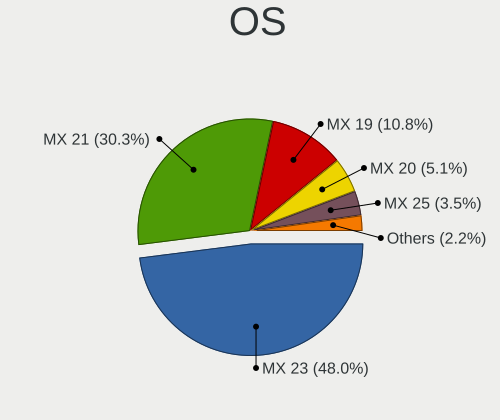

| Name  | Notebooks | Percent |
|-------|-----------|---------|
| MX 23 | 407       | 48%     |
| MX 21 | 257       | 30.31%  |
| MX 19 | 92        | 10.85%  |
| MX 20 | 43        | 5.07%   |
| MX 25 | 30        | 3.54%   |
| MX 18 | 13        | 1.53%   |
| MX 24 | 3         | 0.35%   |
| MX 17 | 2         | 0.24%   |
| MX 16 | 1         | 0.12%   |

OS Family
---------

OS without a version

| Name | Notebooks | Percent |
|------|-----------|---------|
| MX   | 832       | 100%    |

Kernel
------

Version of the Linux kernel

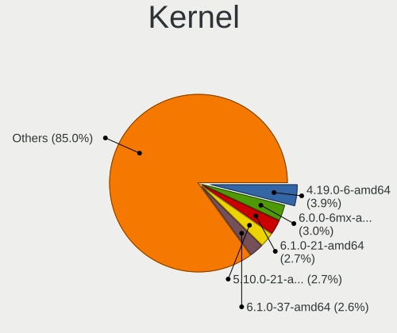

| Version                 | Notebooks | Percent |
|-------------------------|-----------|---------|
| 4.19.0-6-amd64          | 36        | 3.94%   |
| 6.0.0-6mx-amd64         | 27        | 2.96%   |
| 6.1.0-21-amd64          | 25        | 2.74%   |
| 5.10.0-21-amd64         | 25        | 2.74%   |
| 6.1.0-37-amd64          | 24        | 2.63%   |
| 6.1.0-17-amd64          | 21        | 2.3%    |
| 6.1.0-13-amd64          | 20        | 2.19%   |
| 6.1.0-10-amd64          | 20        | 2.19%   |
| 6.1.0-25-amd64          | 19        | 2.08%   |
| 5.10.0-23-amd64         | 17        | 1.86%   |
| 6.1.0-33-amd64          | 16        | 1.75%   |
| 6.5.0-1mx-ahs-amd64     | 15        | 1.64%   |
| 6.1.0-26-amd64          | 15        | 1.64%   |
| 5.10.0-13-amd64         | 15        | 1.64%   |
| 6.4.0-1mx-ahs-amd64     | 14        | 1.53%   |
| 5.10.0-9-amd64          | 14        | 1.53%   |
| 6.1.0-23-amd64          | 13        | 1.42%   |
| 5.10.0-5mx-amd64        | 13        | 1.42%   |
| 5.10.0-18-amd64         | 13        | 1.42%   |
| 6.12.48+deb13-amd64     | 12        | 1.31%   |
| 6.12.57+deb13-amd64     | 11        | 1.2%    |
| 6.6.12-1-liquorix-amd64 | 10        | 1.1%    |
| 5.8.0-3-amd64           | 10        | 1.1%    |
| 5.14.0-4mx-amd64        | 10        | 1.1%    |
| 6.1.0-32-amd64          | 9         | 0.99%   |
| 6.1.0-31-amd64          | 9         | 0.99%   |
| 6.1.0-29-amd64          | 9         | 0.99%   |
| 6.1.0-28-amd64          | 9         | 0.99%   |
| 6.1.0-18-amd64          | 9         | 0.99%   |
| 5.10.0-20-amd64         | 9         | 0.99%   |
| 5.10.0-16-amd64         | 9         | 0.99%   |
| 6.1.0-9-amd64           | 8         | 0.88%   |
| 6.1.0-40-amd64          | 8         | 0.88%   |
| 5.16.0-5mx-amd64        | 8         | 0.88%   |
| 5.10.0-19-amd64         | 8         | 0.88%   |
| 6.1.0-30-amd64          | 7         | 0.77%   |
| 6.1.0-20-amd64          | 7         | 0.77%   |
| 5.6.0-2-amd64           | 7         | 0.77%   |
| 5.10.0-14-amd64         | 7         | 0.77%   |
| 4.19.0-13-amd64         | 7         | 0.77%   |

Kernel Family
-------------

Linux kernel without a distro release

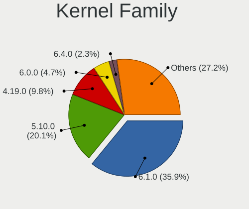

| Version | Notebooks | Percent |
|---------|-----------|---------|
| 6.1.0   | 313       | 35.94%  |
| 5.10.0  | 175       | 20.09%  |
| 4.19.0  | 85        | 9.76%   |
| 6.0.0   | 41        | 4.71%   |
| 6.4.0   | 20        | 2.3%    |
| 6.5.0   | 15        | 1.72%   |
| 5.16.0  | 13        | 1.49%   |
| 6.12.48 | 12        | 1.38%   |
| 6.12.57 | 11        | 1.26%   |
| 6.6.12  | 10        | 1.15%   |
| 5.8.0   | 10        | 1.15%   |
| 5.14.0  | 10        | 1.15%   |
| 5.6.0   | 9         | 1.03%   |
| 5.18.0  | 7         | 0.8%    |
| 6.8.9   | 6         | 0.69%   |
| 5.4.0   | 6         | 0.69%   |
| 5.19.0  | 6         | 0.69%   |
| 6.16.12 | 5         | 0.57%   |
| 6.14.2  | 4         | 0.46%   |
| 6.11.10 | 4         | 0.46%   |
| 6.10.10 | 4         | 0.46%   |
| 5.17.0  | 4         | 0.46%   |
| 6.9.7   | 3         | 0.34%   |
| 6.9.12  | 3         | 0.34%   |
| 6.3.0   | 3         | 0.34%   |
| 6.15.11 | 3         | 0.34%   |
| 6.14.10 | 3         | 0.34%   |
| 6.12.6  | 3         | 0.34%   |
| 6.7.5   | 2         | 0.23%   |
| 6.7.12  | 2         | 0.23%   |
| 6.6.9   | 2         | 0.23%   |
| 6.6.11  | 2         | 0.23%   |
| 6.4.9   | 2         | 0.23%   |
| 6.14.9  | 2         | 0.23%   |
| 6.13.8  | 2         | 0.23%   |
| 6.13.7  | 2         | 0.23%   |
| 6.12.8  | 2         | 0.23%   |
| 6.12.11 | 2         | 0.23%   |
| 5.8.16  | 2         | 0.23%   |
| 5.6.10  | 2         | 0.23%   |

Kernel Major Ver.
-----------------

Linux kernel major version

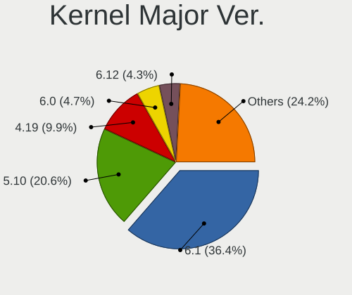

| Version | Notebooks | Percent |
|---------|-----------|---------|
| 6.1     | 316       | 36.36%  |
| 5.10    | 179       | 20.6%   |
| 4.19    | 86        | 9.9%    |
| 6.0     | 41        | 4.72%   |
| 6.12    | 37        | 4.26%   |
| 6.4     | 23        | 2.65%   |
| 6.5     | 16        | 1.84%   |
| 6.6     | 14        | 1.61%   |
| 5.16    | 13        | 1.5%    |
| 6.14    | 12        | 1.38%   |
| 5.8     | 12        | 1.38%   |
| 5.6     | 11        | 1.27%   |
| 5.14    | 10        | 1.15%   |
| 6.11    | 9         | 1.04%   |
| 6.8     | 7         | 0.81%   |
| 5.18    | 7         | 0.81%   |
| 6.9     | 6         | 0.69%   |
| 6.10    | 6         | 0.69%   |
| 5.4     | 6         | 0.69%   |
| 5.19    | 6         | 0.69%   |
| 6.7     | 5         | 0.58%   |
| 6.16    | 5         | 0.58%   |
| 6.13    | 4         | 0.46%   |
| 5.2     | 4         | 0.46%   |
| 5.17    | 4         | 0.46%   |
| 6.3     | 3         | 0.35%   |
| 6.15    | 3         | 0.35%   |
| 5.3     | 3         | 0.35%   |
| 4.9     | 3         | 0.35%   |
| 6.2     | 2         | 0.23%   |
| 5.15    | 2         | 0.23%   |
| 5.13    | 2         | 0.23%   |
| 4.15    | 2         | 0.23%   |
| 6.17    | 1         | 0.12%   |
| 5.9     | 1         | 0.12%   |
| 5.7     | 1         | 0.12%   |
| 5.5     | 1         | 0.12%   |
| 5.11    | 1         | 0.12%   |
| 5.1     | 1         | 0.12%   |
| 5.0     | 1         | 0.12%   |

Arch
----

OS architecture (x86_64, i586, etc.)

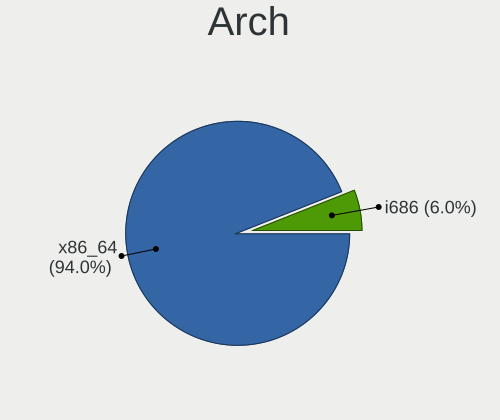

| Name   | Notebooks | Percent |
|--------|-----------|---------|
| x86_64 | 783       | 94%     |
| i686   | 50        | 6%      |

DE
--

Desktop Environment

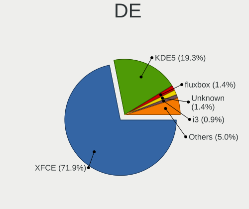

| Name             | Notebooks | Percent |
|------------------|-----------|---------|
| XFCE             | 606       | 71.89%  |
| KDE5             | 163       | 19.34%  |
| fluxbox          | 12        | 1.42%   |
| Unknown          | 12        | 1.42%   |
| i3               | 8         | 0.95%   |
| Budgie           | 8         | 0.95%   |
| GNOME            | 6         | 0.71%   |
| X-Cinnamon       | 4         | 0.47%   |
| LXQt             | 4         | 0.47%   |
| KDE6             | 4         | 0.47%   |
| MATE             | 3         | 0.36%   |
| lightdm-xsession | 3         | 0.36%   |
| Trinity          | 2         | 0.24%   |
| GNOME Flashback  | 2         | 0.24%   |
| Cinnamon         | 2         | 0.24%   |
| spectrwm         | 1         | 0.12%   |
| LXDE             | 1         | 0.12%   |
| KDE              | 1         | 0.12%   |
| GNOME Classic    | 1         | 0.12%   |

Display Server
--------------

X11 or Wayland

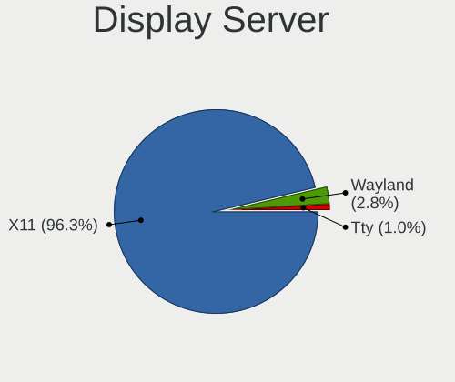

| Name    | Notebooks | Percent |
|---------|-----------|---------|
| X11     | 801       | 96.27%  |
| Wayland | 23        | 2.76%   |
| Tty     | 8         | 0.96%   |

Display Manager
---------------

SDDM, LightDM, etc.

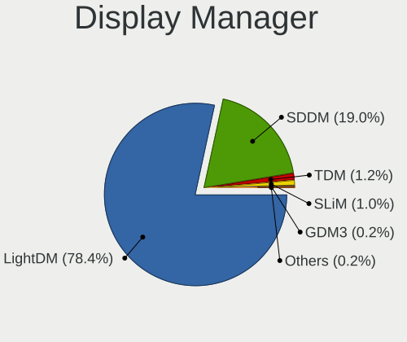

| Name    | Notebooks | Percent |
|---------|-----------|---------|
| LightDM | 657       | 78.4%   |
| SDDM    | 159       | 18.97%  |
| TDM     | 10        | 1.19%   |
| SLiM    | 8         | 0.95%   |
| GDM3    | 2         | 0.24%   |
| Unknown | 2         | 0.24%   |

OS Lang
-------

Language

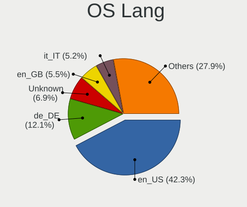

| Lang    | Notebooks | Percent |
|---------|-----------|---------|
| en_US   | 356       | 42.33%  |
| de_DE   | 102       | 12.13%  |
| Unknown | 58        | 6.9%    |
| en_GB   | 46        | 5.47%   |
| it_IT   | 44        | 5.23%   |
| fr_FR   | 31        | 3.69%   |
| ru_RU   | 21        | 2.5%    |
| pl_PL   | 19        | 2.26%   |
| pt_BR   | 13        | 1.55%   |
| en_AU   | 13        | 1.55%   |
| es_ES   | 10        | 1.19%   |
| en_CA   | 9         | 1.07%   |
| hu_HU   | 8         | 0.95%   |
| sk_SK   | 7         | 0.83%   |
| nl_NL   | 7         | 0.83%   |
| es_AR   | 7         | 0.83%   |
| tr_TR   | 6         | 0.71%   |
| es_MX   | 6         | 0.71%   |
| es_BO   | 6         | 0.71%   |
| en_NZ   | 6         | 0.71%   |
| en_IE   | 6         | 0.71%   |
| es_VE   | 5         | 0.59%   |
| de_AT   | 5         | 0.59%   |
| nl_BE   | 4         | 0.48%   |
| de_CH   | 4         | 0.48%   |
| fi_FI   | 3         | 0.36%   |
| es_CO   | 3         | 0.36%   |
| el_GR   | 3         | 0.36%   |
| C       | 3         | 0.36%   |
| bg_BG   | 3         | 0.36%   |
| zh_TW   | 2         | 0.24%   |
| zh_CN   | 2         | 0.24%   |
| uk_UA   | 2         | 0.24%   |
| nb_NO   | 2         | 0.24%   |
| hr_HR   | 2         | 0.24%   |
| fr_CH   | 2         | 0.24%   |
| fr_CA   | 2         | 0.24%   |
| fr_BE   | 2         | 0.24%   |
| es_PE   | 2         | 0.24%   |
| ro_RO   | 1         | 0.12%   |

Boot Mode
---------

EFI or BIOS

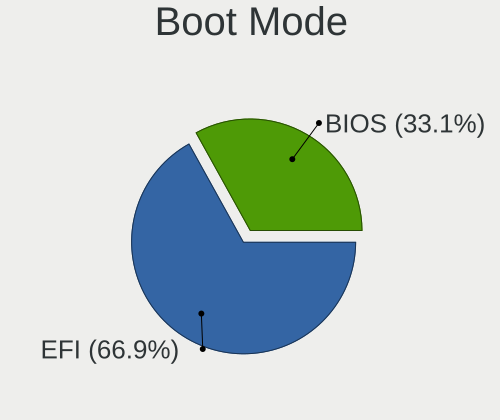

| Mode | Notebooks | Percent |
|------|-----------|---------|
| EFI  | 557       | 66.95%  |
| BIOS | 275       | 33.05%  |

Filesystem
----------

Type of filesystem

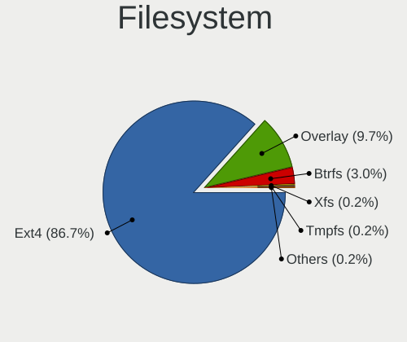

| Type    | Notebooks | Percent |
|---------|-----------|---------|
| Ext4    | 727       | 86.65%  |
| Overlay | 81        | 9.65%   |
| Btrfs   | 25        | 2.98%   |
| Xfs     | 2         | 0.24%   |
| Tmpfs   | 2         | 0.24%   |
| F2fs    | 1         | 0.12%   |
| Unknown | 1         | 0.12%   |

Part. scheme
------------

Scheme of partitioning

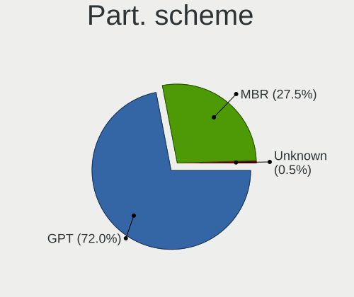

| Type    | Notebooks | Percent |
|---------|-----------|---------|
| GPT     | 601       | 71.98%  |
| MBR     | 230       | 27.54%  |
| Unknown | 4         | 0.48%   |

Dual Boot with Linux/BSD
------------------------

Hosting more than one Linux/BSD

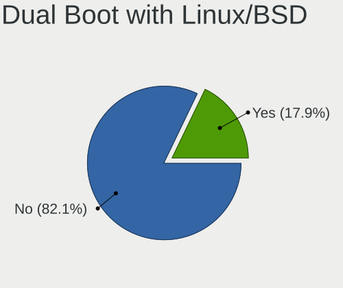

| Dual boot | Notebooks | Percent |
|-----------|-----------|---------|
| No        | 690       | 82.14%  |
| Yes       | 150       | 17.86%  |

Dual Boot (Win)
---------------

Hosting Linux and Windows

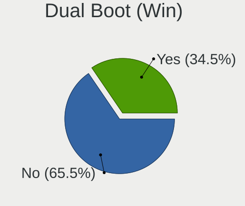

| Dual boot | Notebooks | Percent |
|-----------|-----------|---------|
| No        | 548       | 65.47%  |
| Yes       | 289       | 34.53%  |

Board
-----

Vendor
------

Motherboard manufacturer

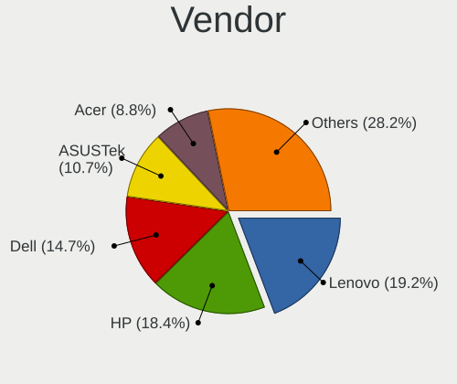

| Name                 | Notebooks | Percent |
|----------------------|-----------|---------|
| Lenovo               | 160       | 19.23%  |
| Hewlett-Packard      | 153       | 18.39%  |
| Dell                 | 122       | 14.66%  |
| ASUSTek Computer     | 89        | 10.7%   |
| Acer                 | 73        | 8.77%   |
| Apple                | 42        | 5.05%   |
| Toshiba              | 27        | 3.25%   |
| Sony                 | 17        | 2.04%   |
| MSI                  | 14        | 1.68%   |
| Samsung Electronics  | 13        | 1.56%   |
| Medion               | 13        | 1.56%   |
| Google               | 12        | 1.44%   |
| Fujitsu Siemens      | 10        | 1.2%    |
| Unknown              | 8         | 0.96%   |
| Intel                | 7         | 0.84%   |
| Alienware            | 6         | 0.72%   |
| Notebook             | 4         | 0.48%   |
| Fujitsu              | 4         | 0.48%   |
| Packard Bell         | 3         | 0.36%   |
| TUXEDO               | 2         | 0.24%   |
| Razer                | 2         | 0.24%   |
| Panasonic            | 2         | 0.24%   |
| HONOR                | 2         | 0.24%   |
| GPU Company          | 2         | 0.24%   |
| Gigabyte Technology  | 2         | 0.24%   |
| Framework            | 2         | 0.24%   |
| Daten Tecnologia     | 2         | 0.24%   |
| Clevo                | 2         | 0.24%   |
| Chuwi                | 2         | 0.24%   |
| AMI                  | 2         | 0.24%   |
| youyeetoo            | 1         | 0.12%   |
| Wortmann AG          | 1         | 0.12%   |
| win element          | 1         | 0.12%   |
| Vulcan Electronics   | 1         | 0.12%   |
| VIT                  | 1         | 0.12%   |
| UMAX                 | 1         | 0.12%   |
| TECNO Mobile Limited | 1         | 0.12%   |
| System76             | 1         | 0.12%   |
| SGIN                 | 1         | 0.12%   |
| Semp Toshiba         | 1         | 0.12%   |

Model
-----

Motherboard model

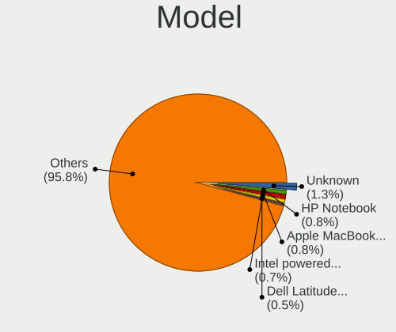

| Name                                | Notebooks | Percent |
|-------------------------------------|-----------|---------|
| Unknown                             | 11        | 1.32%   |
| HP Notebook                         | 7         | 0.84%   |
| Apple MacBookPro7,1                 | 7         | 0.84%   |
| Intel powered classmate PC          | 6         | 0.72%   |
| Dell Latitude E6540                 | 4         | 0.48%   |
| Samsung 305E4A/305E5A/305E7A        | 3         | 0.36%   |
| Lenovo ThinkBook 15 G3 ACL 21A4     | 3         | 0.36%   |
| HP Pavilion Laptop 15-eh1xxx        | 3         | 0.36%   |
| HP Pavilion g6                      | 3         | 0.36%   |
| HP Pavilion dv7                     | 3         | 0.36%   |
| HP Pavilion 15                      | 3         | 0.36%   |
| HP 255 15.6 inch G9 Notebook PC     | 3         | 0.36%   |
| HP 250 15.6 inch G9 Notebook PC     | 3         | 0.36%   |
| Dell Vostro 3500                    | 3         | 0.36%   |
| Apple MacBookAir7,2                 | 3         | 0.36%   |
| Apple MacBookAir6,2                 | 3         | 0.36%   |
| Apple MacBookAir1,1                 | 3         | 0.36%   |
| Toshiba Satellite P875              | 2         | 0.24%   |
| Toshiba Satellite C70-B             | 2         | 0.24%   |
| Toshiba Satellite A300              | 2         | 0.24%   |
| Toshiba PORTEGE Z30-C               | 2         | 0.24%   |
| Samsung N150/N210/N220              | 2         | 0.24%   |
| Lenovo V17 G3 IAP 82U1              | 2         | 0.24%   |
| Lenovo ThinkPad T500 20552CU        | 2         | 0.24%   |
| Lenovo IdeaPad Gaming 3 15ACH6 82K2 | 2         | 0.24%   |
| Lenovo IdeaPad 3 15ALC6 82KU        | 2         | 0.24%   |
| Lenovo IdeaPad 1 15ALC7 82R4        | 2         | 0.24%   |
| Lenovo G50-45 80E3                  | 2         | 0.24%   |
| Lenovo G50-30 80G0                  | 2         | 0.24%   |
| HP ZBook 17 G3                      | 2         | 0.24%   |
| HP Stream Laptop 14-cb0XX           | 2         | 0.24%   |
| HP ProBook 650 G1                   | 2         | 0.24%   |
| HP ProBook 455 G8 Notebook PC       | 2         | 0.24%   |
| HP ProBook 450 G1                   | 2         | 0.24%   |
| HP Presario CQ57                    | 2         | 0.24%   |
| HP Pavilion dv6                     | 2         | 0.24%   |
| HP Laptop 17-ak0xx                  | 2         | 0.24%   |
| HP EliteBook 8440p                  | 2         | 0.24%   |
| HP EliteBook 840 G6                 | 2         | 0.24%   |
| HP EliteBook 840 G3                 | 2         | 0.24%   |

Model Family
------------

Motherboard model prefix

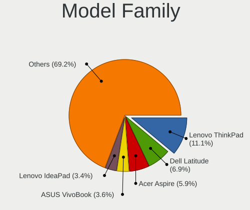

| Name                  | Notebooks | Percent |
|-----------------------|-----------|---------|
| Lenovo ThinkPad       | 92        | 11.06%  |
| Dell Latitude         | 57        | 6.85%   |
| Acer Aspire           | 49        | 5.89%   |
| ASUS VivoBook         | 30        | 3.61%   |
| Lenovo IdeaPad        | 28        | 3.37%   |
| HP Pavilion           | 28        | 3.37%   |
| Dell Inspiron         | 26        | 3.13%   |
| HP ProBook            | 22        | 2.64%   |
| Toshiba Satellite     | 20        | 2.4%    |
| HP Laptop             | 20        | 2.4%    |
| HP EliteBook          | 17        | 2.04%   |
| Dell Vostro           | 12        | 1.44%   |
| Unknown               | 11        | 1.32%   |
| HP 255                | 8         | 0.96%   |
| HP 250                | 8         | 0.96%   |
| Fujitsu Siemens AMILO | 8         | 0.96%   |
| Dell XPS              | 8         | 0.96%   |
| HP ZBook              | 7         | 0.84%   |
| HP Notebook           | 7         | 0.84%   |
| HP Compaq             | 7         | 0.84%   |
| Dell Precision        | 7         | 0.84%   |
| Apple MacBookPro7     | 7         | 0.84%   |
| Lenovo ThinkBook      | 6         | 0.72%   |
| Intel powered         | 6         | 0.72%   |
| Dell System           | 6         | 0.72%   |
| Toshiba PORTEGE       | 5         | 0.6%    |
| HP ENVY               | 5         | 0.6%    |
| Apple MacBookPro5     | 5         | 0.6%    |
| Acer Extensa          | 5         | 0.6%    |
| Lenovo Yoga           | 4         | 0.48%   |
| Lenovo Legion         | 4         | 0.48%   |
| ASUS TUF              | 4         | 0.48%   |
| ASUS ASUS             | 4         | 0.48%   |
| Apple MacBookAir7     | 4         | 0.48%   |
| Acer TravelMate       | 4         | 0.48%   |
| Acer Swift            | 4         | 0.48%   |
| Samsung 305E4A        | 3         | 0.36%   |
| Packard Bell EasyNote | 3         | 0.36%   |
| Lenovo V17            | 3         | 0.36%   |
| Lenovo B590           | 3         | 0.36%   |

MFG Year
--------

Motherboard manufacture year

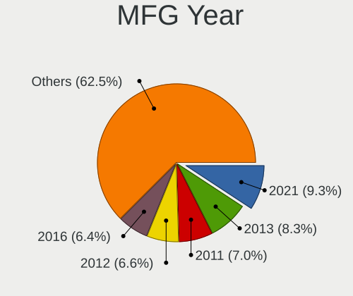

| Year    | Notebooks | Percent |
|---------|-----------|---------|
| 2021    | 77        | 9.25%   |
| 2013    | 69        | 8.29%   |
| 2011    | 58        | 6.97%   |
| 2012    | 55        | 6.61%   |
| 2016    | 53        | 6.37%   |
| 2018    | 52        | 6.25%   |
| 2019    | 51        | 6.13%   |
| 2010    | 50        | 6.01%   |
| 2020    | 47        | 5.65%   |
| 2022    | 43        | 5.17%   |
| 2015    | 42        | 5.05%   |
| 2008    | 40        | 4.81%   |
| 2014    | 37        | 4.45%   |
| 2023    | 33        | 3.97%   |
| 2009    | 32        | 3.85%   |
| 2017    | 28        | 3.37%   |
| 2007    | 20        | 2.4%    |
| 2024    | 19        | 2.28%   |
| 2006    | 14        | 1.68%   |
| 2005    | 6         | 0.72%   |
| 2025    | 5         | 0.6%    |
| Unknown | 1         | 0.12%   |

Form Factor
-----------

Physical design of the computer

| Name     | Notebooks | Percent |
|----------|-----------|---------|
| Notebook | 832       | 100%    |

Secure Boot
-----------

Enabled or disabled

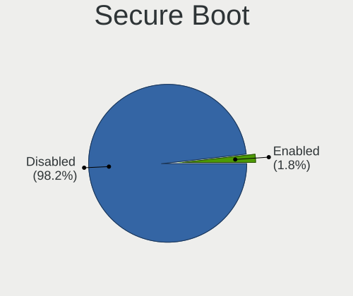

| State    | Notebooks | Percent |
|----------|-----------|---------|
| Disabled | 818       | 98.2%   |
| Enabled  | 15        | 1.8%    |

Coreboot
--------

Have coreboot on board

| Used | Notebooks | Percent |
|------|-----------|---------|
| No   | 817       | 98.2%   |
| Yes  | 15        | 1.8%    |

RAM Size
--------

Total RAM memory

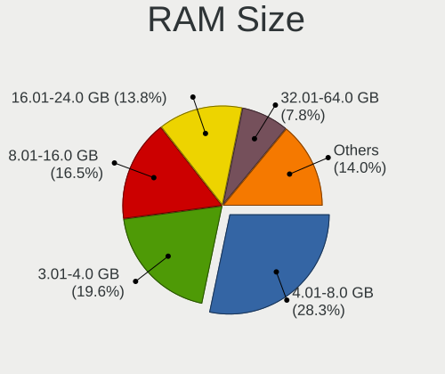

| Size in GB  | Notebooks | Percent |
|-------------|-----------|---------|
| 4.01-8.0    | 236       | 28.26%  |
| 3.01-4.0    | 164       | 19.64%  |
| 8.01-16.0   | 138       | 16.53%  |
| 16.01-24.0  | 115       | 13.77%  |
| 32.01-64.0  | 65        | 7.78%   |
| 1.01-2.0    | 63        | 7.54%   |
| 2.01-3.0    | 29        | 3.47%   |
| 24.01-32.0  | 9         | 1.08%   |
| 64.01-256.0 | 8         | 0.96%   |
| 0.51-1.0    | 8         | 0.96%   |

RAM Used
--------

Used RAM memory

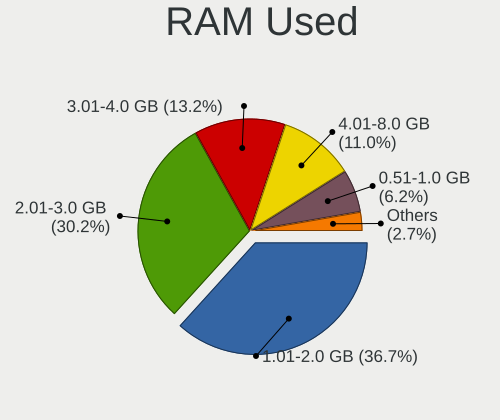

| Used GB    | Notebooks | Percent |
|------------|-----------|---------|
| 1.01-2.0   | 321       | 36.73%  |
| 2.01-3.0   | 264       | 30.21%  |
| 3.01-4.0   | 115       | 13.16%  |
| 4.01-8.0   | 96        | 10.98%  |
| 0.51-1.0   | 54        | 6.18%   |
| 8.01-16.0  | 17        | 1.95%   |
| 0.01-0.5   | 5         | 0.57%   |
| 24.01-32.0 | 1         | 0.11%   |
| 16.01-24.0 | 1         | 0.11%   |

Total Drives
------------

Number of drives on board

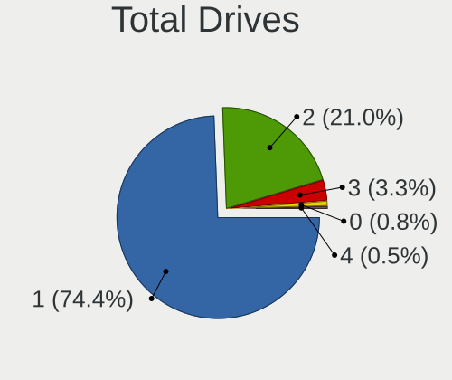

| Drives | Notebooks | Percent |
|--------|-----------|---------|
| 1      | 625       | 74.4%   |
| 2      | 176       | 20.95%  |
| 3      | 28        | 3.33%   |
| 0      | 7         | 0.83%   |
| 4      | 4         | 0.48%   |

Has CD-ROM
----------

Has CD-ROM on board

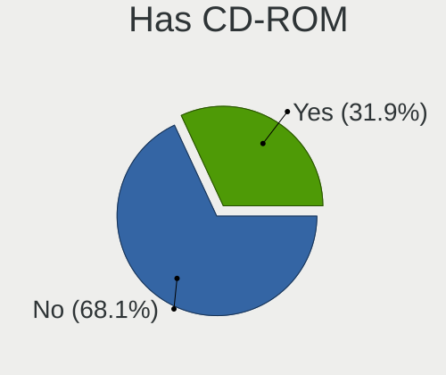

| Presented | Notebooks | Percent |
|-----------|-----------|---------|
| No        | 567       | 68.07%  |
| Yes       | 266       | 31.93%  |

Has Ethernet
------------

Has Ethernet on board

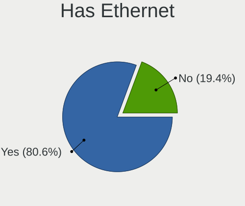

| Presented | Notebooks | Percent |
|-----------|-----------|---------|
| Yes       | 671       | 80.65%  |
| No        | 161       | 19.35%  |

Has WiFi
--------

Has WiFi module

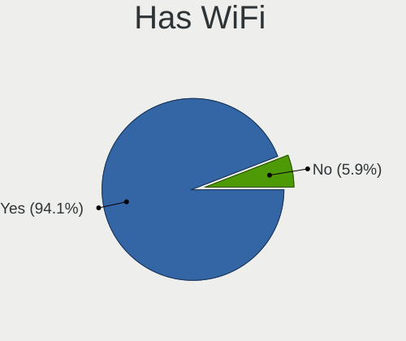

| Presented | Notebooks | Percent |
|-----------|-----------|---------|
| Yes       | 786       | 94.13%  |
| No        | 49        | 5.87%   |

Has Bluetooth
-------------

Has Bluetooth module

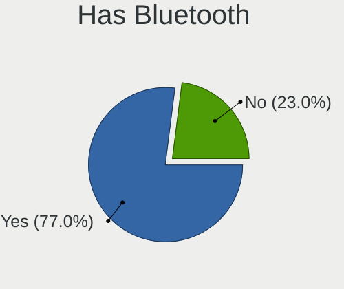

| Presented | Notebooks | Percent |
|-----------|-----------|---------|
| Yes       | 643       | 77.01%  |
| No        | 192       | 22.99%  |

Location
--------

Country
-------

Geographic location (country)

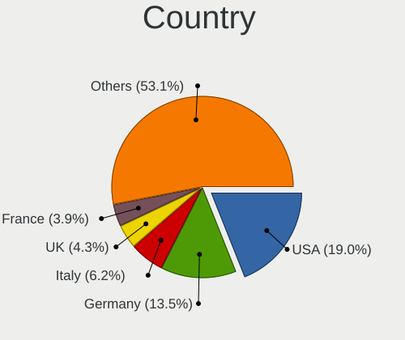

| Country      | Notebooks | Percent |
|--------------|-----------|---------|
| USA          | 159       | 18.97%  |
| Germany      | 113       | 13.48%  |
| Italy        | 52        | 6.21%   |
| UK           | 36        | 4.3%    |
| France       | 33        | 3.94%   |
| Canada       | 33        | 3.94%   |
| Russia       | 27        | 3.22%   |
| Brazil       | 25        | 2.98%   |
| Poland       | 23        | 2.74%   |
| India        | 22        | 2.63%   |
| Greece       | 20        | 2.39%   |
| Netherlands  | 16        | 1.91%   |
| Australia    | 16        | 1.91%   |
| Spain        | 15        | 1.79%   |
| Austria      | 12        | 1.43%   |
| Serbia       | 11        | 1.31%   |
| Mexico       | 11        | 1.31%   |
| Romania      | 10        | 1.19%   |
| Indonesia    | 10        | 1.19%   |
| Belgium      | 10        | 1.19%   |
| Hungary      | 9         | 1.07%   |
| Turkey       | 8         | 0.95%   |
| Slovakia     | 8         | 0.95%   |
| Argentina    | 8         | 0.95%   |
| New Zealand  | 7         | 0.84%   |
| Ukraine      | 6         | 0.72%   |
| Switzerland  | 6         | 0.72%   |
| Norway       | 6         | 0.72%   |
| Finland      | 6         | 0.72%   |
| Egypt        | 6         | 0.72%   |
| Colombia     | 6         | 0.72%   |
| Bolivia      | 6         | 0.72%   |
| Thailand     | 5         | 0.6%    |
| Sweden       | 5         | 0.6%    |
| Portugal     | 5         | 0.6%    |
| Ireland      | 5         | 0.6%    |
| Czechia      | 5         | 0.6%    |
| Venezuela    | 4         | 0.48%   |
| South Africa | 4         | 0.48%   |
| Japan        | 3         | 0.36%   |

City
----

Geographic location (city)

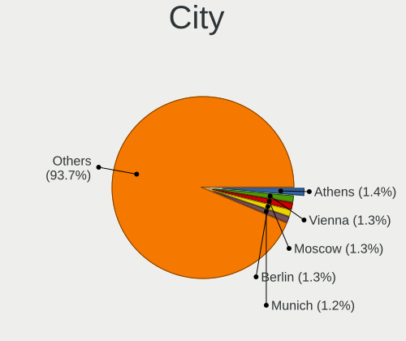

| City                | Notebooks | Percent |
|---------------------|-----------|---------|
| Athens              | 12        | 1.38%   |
| Vienna              | 11        | 1.27%   |
| Moscow              | 11        | 1.27%   |
| Berlin              | 11        | 1.27%   |
| Munich              | 10        | 1.15%   |
| Milan               | 10        | 1.15%   |
| Paris               | 9         | 1.04%   |
| Warsaw              | 7         | 0.81%   |
| Rome                | 7         | 0.81%   |
| Los Angeles         | 7         | 0.81%   |
| Budapest            | 7         | 0.81%   |
| Bratislava          | 7         | 0.81%   |
| St Petersburg       | 6         | 0.69%   |
| La Paz              | 6         | 0.69%   |
| Belgrade            | 6         | 0.69%   |
| Sydney              | 5         | 0.58%   |
| Rio de Janeiro      | 5         | 0.58%   |
| Hamburg             | 5         | 0.58%   |
| Florence            | 5         | 0.58%   |
| Seattle             | 4         | 0.46%   |
| Montreal            | 4         | 0.46%   |
| Krakow              | 4         | 0.46%   |
| Edgware             | 4         | 0.46%   |
| Dublin              | 4         | 0.46%   |
| Cairo               | 4         | 0.46%   |
| Bogotá             | 4         | 0.46%   |
| Bengaluru           | 4         | 0.46%   |
| Amsterdam           | 4         | 0.46%   |
| Stuttgart           | 3         | 0.35%   |
| San Diego           | 3         | 0.35%   |
| Prague              | 3         | 0.35%   |
| Pessac-sur-Dordogne | 3         | 0.35%   |
| Patna               | 3         | 0.35%   |
| Otwock              | 3         | 0.35%   |
| Oslo                | 3         | 0.35%   |
| New York            | 3         | 0.35%   |
| Mexico City         | 3         | 0.35%   |
| Melbourne           | 3         | 0.35%   |
| Madrid              | 3         | 0.35%   |
| Istanbul            | 3         | 0.35%   |

Drives
------

Drive Vendor
------------

Hard drive vendors

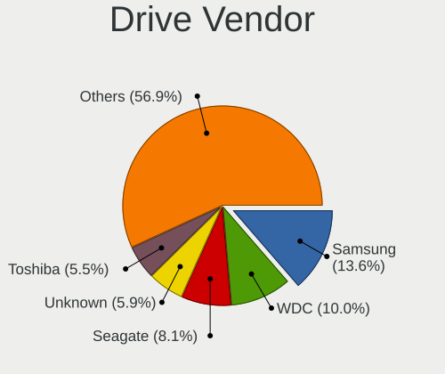

| Vendor              | Notebooks | Drives | Percent |
|---------------------|-----------|--------|---------|
| Samsung Electronics | 141       | 167    | 13.64%  |
| WDC                 | 103       | 112    | 9.96%   |
| Seagate             | 84        | 99     | 8.12%   |
| Unknown             | 61        | 72     | 5.9%    |
| Toshiba             | 57        | 62     | 5.51%   |
| SK hynix            | 56        | 58     | 5.42%   |
| SanDisk             | 56        | 61     | 5.42%   |
| Kingston            | 54        | 59     | 5.22%   |
| Crucial             | 50        | 85     | 4.84%   |
| Intel               | 34        | 43     | 3.29%   |
| Hitachi             | 26        | 29     | 2.51%   |
| Micron Technology   | 25        | 30     | 2.42%   |
| HGST                | 23        | 32     | 2.22%   |
| Unknown             | 22        | 22     | 2.13%   |
| KIOXIA              | 16        | 21     | 1.55%   |
| Apple               | 16        | 19     | 1.55%   |
| Intenso             | 13        | 13     | 1.26%   |
| SPCC                | 12        | 12     | 1.16%   |
| China               | 12        | 14     | 1.16%   |
| PNY                 | 9         | 9      | 0.87%   |
| Fujitsu             | 8         | 8      | 0.77%   |
| A-DATA Technology   | 8         | 11     | 0.77%   |
| Transcend           | 7         | 7      | 0.68%   |
| Patriot             | 7         | 8      | 0.68%   |
| Phison              | 6         | 8      | 0.58%   |
| Netac               | 6         | 6      | 0.58%   |
| LITEON              | 6         | 6      | 0.58%   |
| Team                | 5         | 5      | 0.48%   |
| FORESEE             | 5         | 5      | 0.48%   |
| UMIS                | 4         | 4      | 0.39%   |
| Phison Electronics  | 4         | 5      | 0.39%   |
| LITEONIT            | 4         | 4      | 0.39%   |
| KingSpec            | 4         | 5      | 0.39%   |
| Verbatim            | 3         | 3      | 0.29%   |
| OCZ                 | 3         | 3      | 0.29%   |
| Lexar               | 3         | 3      | 0.29%   |
| Fanxiang            | 3         | 4      | 0.29%   |
| Dogfish             | 3         | 3      | 0.29%   |
| Corsair             | 3         | 3      | 0.29%   |
| XPG                 | 2         | 2      | 0.19%   |

Drive Model
-----------

Hard drive models

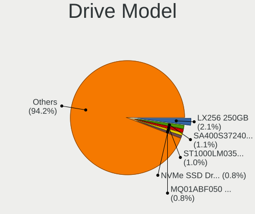

| Model                                  | Notebooks | Percent |
|----------------------------------------|-----------|---------|
| Unknown                                | 22        | 2.07%   |
| Kingston SA400S37240G 240GB SSD        | 12        | 1.13%   |
| Seagate ST1000LM035-1RK172 1TB         | 11        | 1.04%   |
| SanDisk NVMe SSD Drive 512GB           | 9         | 0.85%   |
| Toshiba MQ01ABF050 500GB               | 8         | 0.75%   |
| Samsung SSD 860 EVO 500GB              | 8         | 0.75%   |
| HGST HTS721010A9E630 1TB               | 8         | 0.75%   |
| SK hynix HBG4e  32GB                   | 7         | 0.66%   |
| Kingston SV300S37A120G 120GB SSD       | 7         | 0.66%   |
| Intel SSDPEKNU512GZ 512GB              | 7         | 0.66%   |
| Toshiba MQ01ABD100 1TB                 | 6         | 0.57%   |
| Seagate ST9500325AS 500GB              | 6         | 0.57%   |
| Samsung SSD 870 EVO 500GB              | 6         | 0.57%   |
| Samsung SSD 850 EVO 250GB              | 6         | 0.57%   |
| Kingston SA400S37120G 120GB SSD        | 6         | 0.57%   |
| Crucial CT500MX500SSD1 500GB           | 6         | 0.57%   |
| SK hynix SKHynix_HFM512GD3HX015N 512GB | 5         | 0.47%   |
| Seagate ST500LM012 HN-M500MBB 500GB    | 5         | 0.47%   |
| Seagate ST1000LM024 HN-M101MBB 1TB     | 5         | 0.47%   |
| Samsung SSD 850 EVO 500GB              | 5         | 0.47%   |
| WDC WD5000LPVX-22V0TT0 500GB           | 4         | 0.38%   |
| Unknown DA4064  64GB                   | 4         | 0.38%   |
| SPCC Solid State Disk 1TB              | 4         | 0.38%   |
| Seagate ST500LT012-1DG142 500GB        | 4         | 0.38%   |
| Seagate ST500LM000-1EJ162 500GB        | 4         | 0.38%   |
| Seagate ST320LT012-1DG14C 320GB        | 4         | 0.38%   |
| Seagate ST1000LM048-2E7172 1TB         | 4         | 0.38%   |
| Micron MTFDKCD512TFK 512GB             | 4         | 0.38%   |
| Kingston SA400S37480G 480GB SSD        | 4         | 0.38%   |
| Intel SSDPEKNW512G8 512GB              | 4         | 0.38%   |
| HGST HTS545050A7E680 500GB             | 4         | 0.38%   |
| HGST HTS545050A7E380 500GB             | 4         | 0.38%   |
| Crucial CT480BX500SSD1 480GB           | 4         | 0.38%   |
| Crucial CT120BX500SSD1 120GB           | 4         | 0.38%   |
| Crucial CT1000MX500SSD1 1TB            | 4         | 0.38%   |
| Apple SSD SM0128G 121GB                | 4         | 0.38%   |
| WDC WD1600BEVT-22ZCT0 160GB            | 3         | 0.28%   |
| WDC WD10JPVX-22JC3T0 1TB               | 3         | 0.28%   |
| Unknown SDW32G  32GB                   | 3         | 0.28%   |
| Unknown SD32G  32GB                    | 3         | 0.28%   |

HDD Vendor
----------

Hard disk drive vendors

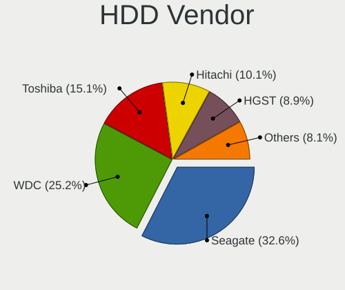

| Vendor              | Notebooks | Drives | Percent |
|---------------------|-----------|--------|---------|
| Seagate             | 84        | 96     | 32.56%  |
| WDC                 | 65        | 69     | 25.19%  |
| Toshiba             | 39        | 41     | 15.12%  |
| Hitachi             | 26        | 29     | 10.08%  |
| HGST                | 23        | 32     | 8.91%   |
| Samsung Electronics | 9         | 10     | 3.49%   |
| Fujitsu             | 8         | 8      | 3.1%    |
| Unknown             | 1         | 1      | 0.39%   |
| Intenso             | 1         | 1      | 0.39%   |
| External            | 1         | 1      | 0.39%   |
| Unknown             | 1         | 1      | 0.39%   |

SSD Vendor
----------

Solid state drive vendors

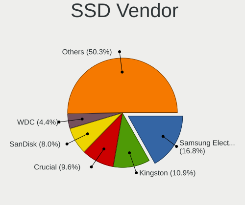

| Vendor              | Notebooks | Drives | Percent |
|---------------------|-----------|--------|---------|
| Samsung Electronics | 65        | 78     | 16.84%  |
| Kingston            | 42        | 46     | 10.88%  |
| Crucial             | 37        | 70     | 9.59%   |
| SanDisk             | 31        | 33     | 8.03%   |
| WDC                 | 17        | 17     | 4.4%    |
| Apple               | 14        | 17     | 3.63%   |
| China               | 12        | 14     | 3.11%   |
| SPCC                | 11        | 11     | 2.85%   |
| Intenso             | 11        | 11     | 2.85%   |
| Intel               | 10        | 14     | 2.59%   |
| SK hynix            | 9         | 9      | 2.33%   |
| Micron Technology   | 9         | 14     | 2.33%   |
| PNY                 | 8         | 8      | 2.07%   |
| Transcend           | 7         | 7      | 1.81%   |
| A-DATA Technology   | 6         | 9      | 1.55%   |
| Toshiba             | 5         | 5      | 1.3%    |
| Patriot             | 5         | 5      | 1.3%    |
| Netac               | 5         | 5      | 1.3%    |
| LITEON              | 5         | 5      | 1.3%    |
| Unknown             | 5         | 5      | 1.3%    |
| LITEONIT            | 4         | 4      | 1.04%   |
| KingSpec            | 4         | 5      | 1.04%   |
| Verbatim            | 3         | 3      | 0.78%   |
| Team                | 3         | 3      | 0.78%   |
| OCZ                 | 3         | 3      | 0.78%   |
| Dogfish             | 3         | 3      | 0.78%   |
| Lexar               | 2         | 2      | 0.52%   |
| KingFast            | 2         | 2      | 0.52%   |
| KingDian            | 2         | 2      | 0.52%   |
| Indilinx            | 2         | 4      | 0.52%   |
| Gigabyte Technology | 2         | 2      | 0.52%   |
| GeIL                | 2         | 2      | 0.52%   |
| Fanxiang            | 2         | 2      | 0.52%   |
| EYOTA               | 2         | 2      | 0.52%   |
| Corsair             | 2         | 2      | 0.52%   |
| ZTC                 | 1         | 1      | 0.26%   |
| Yeyian              | 1         | 1      | 0.26%   |
| YANSEN              | 1         | 1      | 0.26%   |
| WALRAM              | 1         | 1      | 0.26%   |
| V-GeN               | 1         | 1      | 0.26%   |

Drive Kind
----------

HDD or SSD

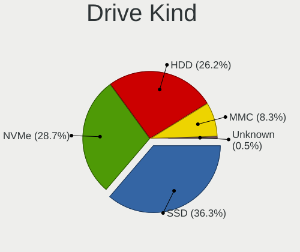

| Kind    | Notebooks | Drives | Percent |
|---------|-----------|--------|---------|
| SSD     | 351       | 461    | 36.26%  |
| NVMe    | 278       | 342    | 28.72%  |
| HDD     | 254       | 289    | 26.24%  |
| MMC     | 80        | 99     | 8.26%   |
| Unknown | 5         | 6      | 0.52%   |

Drive Connector
---------------

SATA, SAS, NVMe, etc.

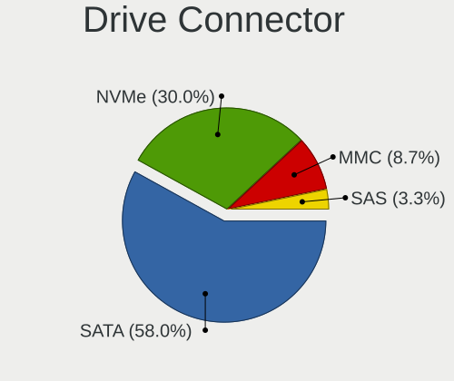

| Type | Notebooks | Drives | Percent |
|------|-----------|--------|---------|
| SATA | 535       | 725    | 58.03%  |
| NVMe | 277       | 337    | 30.04%  |
| MMC  | 80        | 99     | 8.68%   |
| SAS  | 30        | 36     | 3.25%   |

Drive Size
----------

Size of hard drive

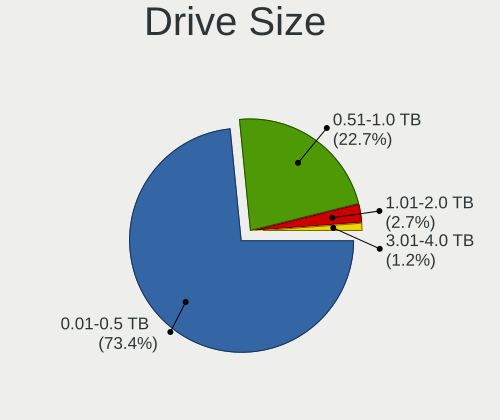

| Size in TB | Notebooks | Drives | Percent |
|------------|-----------|--------|---------|
| 0.01-0.5   | 434       | 542    | 73.43%  |
| 0.51-1.0   | 134       | 184    | 22.67%  |
| 1.01-2.0   | 16        | 17     | 2.71%   |
| 3.01-4.0   | 7         | 7      | 1.18%   |

Space Total
-----------

Amount of disk space available on the file system

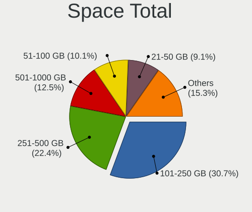

| Size in GB     | Notebooks | Percent |
|----------------|-----------|---------|
| 101-250        | 263       | 30.65%  |
| 251-500        | 192       | 22.38%  |
| 501-1000       | 107       | 12.47%  |
| 51-100         | 87        | 10.14%  |
| 21-50          | 78        | 9.09%   |
| 1-20           | 78        | 9.09%   |
| 1001-2000      | 29        | 3.38%   |
| More than 3000 | 13        | 1.52%   |
| 2001-3000      | 7         | 0.82%   |
| Unknown        | 4         | 0.47%   |

Space Used
----------

Amount of used disk space

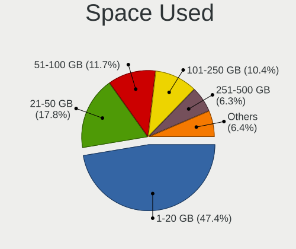

| Used GB        | Notebooks | Percent |
|----------------|-----------|---------|
| 1-20           | 413       | 47.36%  |
| 21-50          | 155       | 17.78%  |
| 51-100         | 102       | 11.7%   |
| 101-250        | 91        | 10.44%  |
| 251-500        | 55        | 6.31%   |
| 501-1000       | 30        | 3.44%   |
| 1001-2000      | 14        | 1.61%   |
| More than 3000 | 6         | 0.69%   |
| Unknown        | 4         | 0.46%   |
| 2001-3000      | 2         | 0.23%   |

Malfunc. Drives
---------------

Drive models with a malfunction

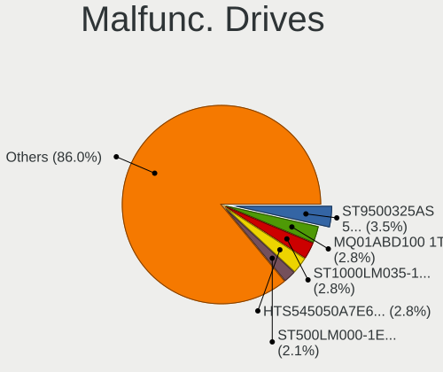

| Model                                | Notebooks | Drives | Percent |
|--------------------------------------|-----------|--------|---------|
| Seagate ST9500325AS 500GB            | 5         | 5      | 3.5%    |
| Toshiba MQ01ABD100 1TB               | 4         | 4      | 2.8%    |
| Seagate ST1000LM035-1RK172 1TB       | 4         | 4      | 2.8%    |
| HGST HTS545050A7E680 500GB           | 4         | 5      | 2.8%    |
| SK hynix BC711 HFM512GD3JX013N 512GB | 3         | 4      | 2.1%    |
| Seagate ST500LM000-1EJ162 500GB      | 3         | 3      | 2.1%    |
| WDC WD5000LPVX-22V0TT0 500GB         | 2         | 2      | 1.4%    |
| WDC WD Green 2.5 240GB               | 2         | 2      | 1.4%    |
| Toshiba MQ01ABF050 500GB             | 2         | 2      | 1.4%    |
| Toshiba MK5059GSXP 500GB             | 2         | 2      | 1.4%    |
| Seagate ST500LT012-9WS142 500GB      | 2         | 2      | 1.4%    |
| Seagate ST1000LM024 HN-M101MBB 1TB   | 2         | 2      | 1.4%    |
| SanDisk SSD PLUS 480GB               | 2         | 2      | 1.4%    |
| SanDisk SSD PLUS 1000GB              | 2         | 2      | 1.4%    |
| Indilinx IND-S325S120G 120GB SSD     | 2         | 4      | 1.4%    |
| Hitachi HTS545050A7E380 500GB        | 2         | 2      | 1.4%    |
| HGST HTS721010A9E630 1TB             | 2         | 2      | 1.4%    |
| YANSEN YSZF18-128 128GB SSD          | 1         | 1      | 0.7%    |
| WDC WDS100T2G0A-00JH30 1TB SSD       | 1         | 1      | 0.7%    |
| WDC WD5000LPCX-00VHAT0 500GB         | 1         | 1      | 0.7%    |
| WDC WD5000LPCX-0 500GB               | 1         | 1      | 0.7%    |
| WDC WD5000BPVT-60HXZT3 500GB         | 1         | 1      | 0.7%    |
| WDC WD3200LPVX-22V0TT0 320GB         | 1         | 1      | 0.7%    |
| WDC WD3200BPVT-80ZEST0 320GB         | 1         | 1      | 0.7%    |
| WDC WD3200BPVT-24JJ5T0 320GB         | 1         | 1      | 0.7%    |
| WDC WD3200BEVT-22ZCT0 320GB          | 1         | 1      | 0.7%    |
| WDC WD3200BEKT-60PVMT0 320GB         | 1         | 1      | 0.7%    |
| WDC WD32 00BEKT-75PVMT0 320GB        | 1         | 1      | 0.7%    |
| WDC WD2500BEVT-75A23T0 250GB         | 1         | 1      | 0.7%    |
| WDC WD1600BEVT-22ZCT0 160GB          | 1         | 1      | 0.7%    |
| WDC WD1600BEVT-22A23T0 160GB         | 1         | 1      | 0.7%    |
| WDC WD1600BEKT-75PVMT0 160GB         | 1         | 2      | 0.7%    |
| V-GeN V-GEN09SM22AR1024SDK 1TB SSD   | 1         | 1      | 0.7%    |
| Toshiba THNSNK256GCS8 SATA 256GB SSD | 1         | 1      | 0.7%    |
| Toshiba MQ01ABD050 500GB             | 1         | 1      | 0.7%    |
| Toshiba MK8009GAH 80GB               | 1         | 1      | 0.7%    |
| Toshiba MK7575GSX 752GB              | 1         | 2      | 0.7%    |
| Toshiba MK5055GSX 500GB              | 1         | 1      | 0.7%    |
| Toshiba MK2565GSX 250GB              | 1         | 1      | 0.7%    |
| Toshiba MK1652GSX 160GB              | 1         | 1      | 0.7%    |

Malfunc. Drive Vendor
---------------------

Vendors of faulty drives

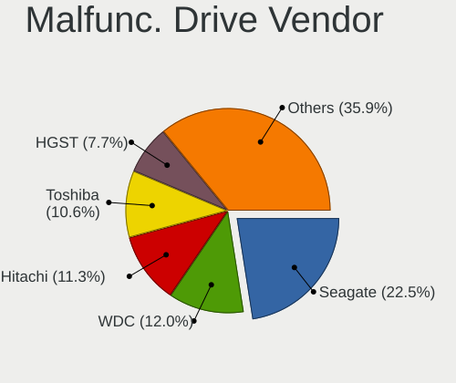

| Vendor              | Notebooks | Drives | Percent |
|---------------------|-----------|--------|---------|
| Seagate             | 32        | 38     | 22.54%  |
| WDC                 | 17        | 19     | 11.97%  |
| Hitachi             | 16        | 17     | 11.27%  |
| Toshiba             | 15        | 16     | 10.56%  |
| HGST                | 11        | 15     | 7.75%   |
| Samsung Electronics | 10        | 13     | 7.04%   |
| SK hynix            | 5         | 6      | 3.52%   |
| SanDisk             | 5         | 5      | 3.52%   |
| Intel               | 5         | 7      | 3.52%   |
| Fujitsu             | 4         | 4      | 2.82%   |
| Crucial             | 3         | 20     | 2.11%   |
| Netac               | 2         | 2      | 1.41%   |
| Kingston            | 2         | 2      | 1.41%   |
| Indilinx            | 2         | 4      | 1.41%   |
| China               | 2         | 2      | 1.41%   |
| YANSEN              | 1         | 1      | 0.7%    |
| V-GeN               | 1         | 1      | 0.7%    |
| RENICE              | 1         | 1      | 0.7%    |
| Phison              | 1         | 1      | 0.7%    |
| OCZ                 | 1         | 1      | 0.7%    |
| Micron Technology   | 1         | 1      | 0.7%    |
| LITEONIT            | 1         | 1      | 0.7%    |
| Intenso             | 1         | 1      | 0.7%    |
| Apple               | 1         | 1      | 0.7%    |
| A-DATA Technology   | 1         | 1      | 0.7%    |
| Unknown             | 1         | 1      | 0.7%    |

Malfunc. HDD Vendor
-------------------

Vendors of faulty HDD drives

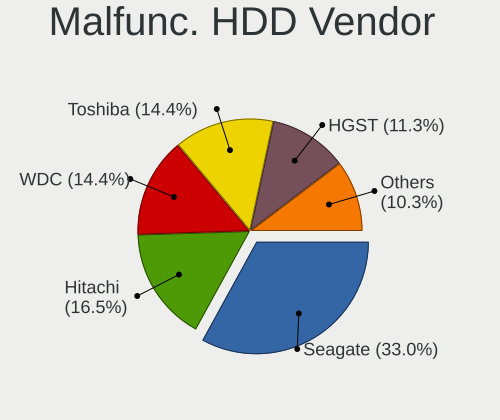

| Vendor              | Notebooks | Drives | Percent |
|---------------------|-----------|--------|---------|
| Seagate             | 32        | 38     | 32.99%  |
| Hitachi             | 16        | 17     | 16.49%  |
| WDC                 | 14        | 16     | 14.43%  |
| Toshiba             | 14        | 15     | 14.43%  |
| HGST                | 11        | 15     | 11.34%  |
| Samsung Electronics | 5         | 6      | 5.15%   |
| Fujitsu             | 4         | 4      | 4.12%   |
| Unknown             | 1         | 1      | 1.03%   |

Malfunc. Drive Kind
-------------------

Kinds of faulty drives

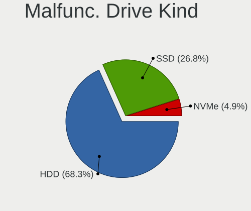

| Kind | Notebooks | Drives | Percent |
|------|-----------|--------|---------|
| HDD  | 97        | 112    | 68.31%  |
| SSD  | 38        | 60     | 26.76%  |
| NVMe | 7         | 9      | 4.93%   |

Failed Drives
-------------

Failed drive models

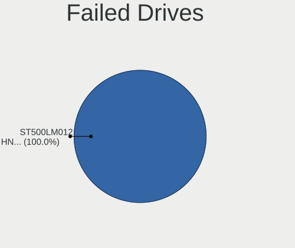

| Model                               | Notebooks | Drives | Percent |
|-------------------------------------|-----------|--------|---------|
| Seagate ST500LM012 HN-M500MBB 500GB | 1         | 1      | 100%    |

Failed Drive Vendor
-------------------

Failed drive vendors

| Vendor  | Notebooks | Drives | Percent |
|---------|-----------|--------|---------|
| Seagate | 1         | 1      | 100%    |

Drive Status
------------

Number of failed and malfunc. drives

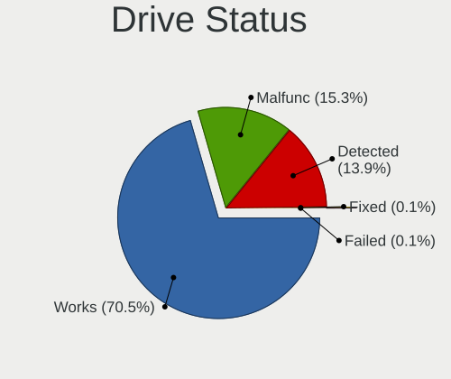

| Status   | Notebooks | Drives | Percent |
|----------|-----------|--------|---------|
| Works    | 644       | 855    | 70.54%  |
| Malfunc  | 140       | 181    | 15.33%  |
| Detected | 127       | 159    | 13.91%  |
| Fixed    | 1         | 1      | 0.11%   |
| Failed   | 1         | 1      | 0.11%   |

Storage controller
------------------

Storage Vendor
--------------

Storage controller vendors

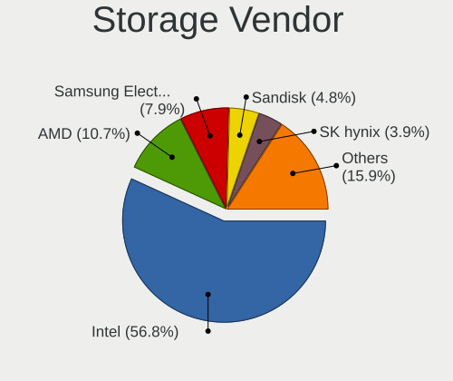

| Vendor                                  | Notebooks | Percent |
|-----------------------------------------|-----------|---------|
| Intel                                   | 534       | 56.81%  |
| AMD                                     | 101       | 10.74%  |
| Samsung Electronics                     | 74        | 7.87%   |
| Sandisk                                 | 45        | 4.79%   |
| SK hynix                                | 37        | 3.94%   |
| Nvidia                                  | 20        | 2.13%   |
| Micron Technology                       | 20        | 2.13%   |
| KIOXIA                                  | 19        | 2.02%   |
| Kingston Technology Company             | 14        | 1.49%   |
| Phison Electronics                      | 13        | 1.38%   |
| Toshiba America Info Systems            | 10        | 1.06%   |
| Micron/Crucial Technology               | 10        | 1.06%   |
| Silicon Motion                          | 9         | 0.96%   |
| Shenzhen Longsys Electronics            | 5         | 0.53%   |
| MAXIO Technology (Hangzhou)             | 5         | 0.53%   |
| ADATA Technology                        | 4         | 0.43%   |
| Union Memory (Shenzhen)                 | 3         | 0.32%   |
| Marvell Technology Group                | 3         | 0.32%   |
| Solid State Storage Technology          | 2         | 0.21%   |
| VIA Technologies                        | 1         | 0.11%   |
| Solidigm                                | 1         | 0.11%   |
| Silicon Integrated Systems [SiS]        | 1         | 0.11%   |
| Silicon Image                           | 1         | 0.11%   |
| Shenzhen Unionmemory Information System | 1         | 0.11%   |
| Realtek Semiconductor                   | 1         | 0.11%   |
| Nextorage                               | 1         | 0.11%   |
| Netac Technology                        | 1         | 0.11%   |
| Lite-On Technology                      | 1         | 0.11%   |
| Lenovo                                  | 1         | 0.11%   |
| Biwin Storage Technology                | 1         | 0.11%   |
| Unknown                                 | 1         | 0.11%   |

Storage Model
-------------

Storage controller models

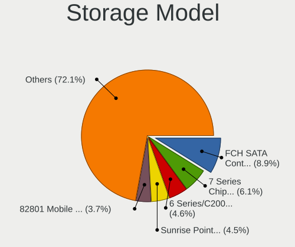

| Model                                                                          | Notebooks | Percent |
|--------------------------------------------------------------------------------|-----------|---------|
| AMD FCH SATA Controller [AHCI mode]                                            | 90        | 8.86%   |
| Intel 7 Series Chipset Family 6-port SATA Controller [AHCI mode]               | 62        | 6.1%    |
| Intel 6 Series/C200 Series Chipset Family 6 port Mobile SATA AHCI Controller   | 47        | 4.63%   |
| Intel Sunrise Point-LP SATA Controller [AHCI mode]                             | 46        | 4.53%   |
| Intel 82801 Mobile SATA Controller [RAID mode]                                 | 38        | 3.74%   |
| Intel Volume Management Device NVMe RAID Controller                            | 29        | 2.85%   |
| Intel 82801IBM/IEM (ICH9M/ICH9M-E) 4 port SATA Controller [AHCI mode]          | 27        | 2.66%   |
| Samsung NVMe SSD Controller SM981/PM981/PM983                                  | 24        | 2.36%   |
| Intel 82801HM/HEM (ICH8M/ICH8M-E) IDE Controller                               | 22        | 2.17%   |
| Intel 5 Series/3400 Series Chipset 6 port SATA AHCI Controller                 | 21        | 2.07%   |
| Intel 82801HM/HEM (ICH8M/ICH8M-E) SATA Controller [AHCI mode]                  | 19        | 1.87%   |
| Intel Celeron/Pentium Silver Processor SATA Controller                         | 18        | 1.77%   |
| Intel 8 Series SATA Controller 1 [AHCI mode]                                   | 18        | 1.77%   |
| SK hynix Gold P31/BC711/PC711 NVMe Solid State Drive                           | 17        | 1.67%   |
| Intel Tiger Lake-LP SATA Controller                                            | 17        | 1.67%   |
| Intel 8 Series/C220 Series Chipset Family 6-port SATA Controller 1 [AHCI mode] | 17        | 1.67%   |
| Samsung NVMe SSD Controller 980 (DRAM-less)                                    | 16        | 1.57%   |
| Intel Cannon Lake Mobile PCH SATA AHCI Controller                              | 15        | 1.48%   |
| Intel Wildcat Point-LP SATA Controller [AHCI Mode]                             | 14        | 1.38%   |
| Intel 5 Series/3400 Series Chipset 4 port SATA AHCI Controller                 | 14        | 1.38%   |
| SanDisk WD SN560/SN740/SN770/SN5000 NVMe SSD                                   | 13        | 1.28%   |
| Intel 82801G (ICH7 Family) IDE Controller                                      | 12        | 1.18%   |
| KIOXIA NVMe SSD Controller BG4 (DRAM-less)                                     | 11        | 1.08%   |
| SanDisk Ultra 3D / WD PC SN530, IX SN530, Blue SN550 NVMe SSD (DRAM-less)      | 10        | 0.98%   |
| Intel Alder Lake-P SATA AHCI Controller                                        | 10        | 0.98%   |
| Intel 82801GBM/GHM (ICH7-M Family) SATA Controller [AHCI mode]                 | 10        | 0.98%   |
| Silicon Motion SM2263EN/SM2263XT (DRAM-less) NVMe SSD Controllers              | 9         | 0.89%   |
| Samsung NVMe SSD Controller PM9A1/PM9A3/980PRO                                 | 9         | 0.89%   |
| Nvidia MCP89 SATA Controller (AHCI mode)                                       | 9         | 0.89%   |
| Micron 2450 NVMe SSD [HendrixV] (DRAM-less)                                    | 9         | 0.89%   |
| Intel SSD 670p Series [Keystone Harbor]                                        | 9         | 0.89%   |
| Intel SSD 660P Series                                                          | 9         | 0.89%   |
| Intel Q170/Q150/B150/H170/H110/Z170/CM236 Chipset SATA Controller [AHCI Mode]  | 9         | 0.89%   |
| Intel NM10/ICH7 Family SATA Controller [AHCI mode]                             | 9         | 0.89%   |
| Intel Celeron N3350/Pentium N4200/Atom E3900 Series SATA AHCI Controller       | 9         | 0.89%   |
| Samsung NVMe SSD Controller PM9B1 (DRAM-less)                                  | 8         | 0.79%   |
| Intel Cannon Point-LP SATA Controller [AHCI Mode]                              | 8         | 0.79%   |
| Samsung NVMe SSD Controller SM961/PM961/SM963                                  | 7         | 0.69%   |
| Intel RST Volume Management Device Controller                                  | 7         | 0.69%   |
| Intel HM170/QM170 Chipset SATA Controller [AHCI Mode]                          | 7         | 0.69%   |

Storage Kind
------------

Kind of storage controller (IDE, SATA, NVMe, SAS, ...)

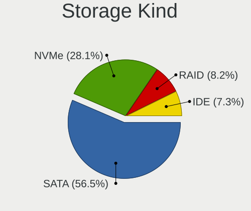

| Kind | Notebooks | Percent |
|------|-----------|---------|
| SATA | 551       | 56.45%  |
| NVMe | 274       | 28.07%  |
| RAID | 80        | 8.2%    |
| IDE  | 71        | 7.27%   |

Processor
---------

CPU Vendor
----------

Processor vendors

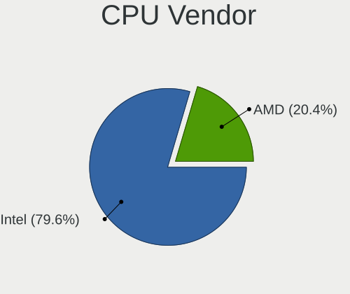

| Vendor | Notebooks | Percent |
|--------|-----------|---------|
| Intel  | 662       | 79.57%  |
| AMD    | 170       | 20.43%  |

CPU Model
---------

Processor models

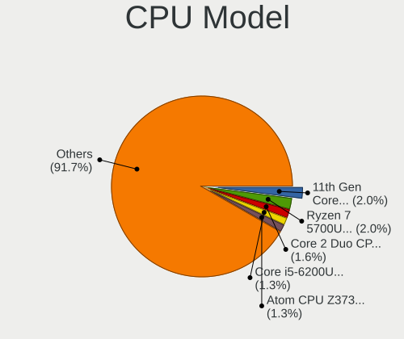

| Model                                       | Notebooks | Percent |
|---------------------------------------------|-----------|---------|
| Intel 11th Gen Core i5-1135G7 @ 2.40GHz     | 17        | 2.04%   |
| AMD Ryzen 7 5700U with Radeon Graphics      | 17        | 2.04%   |
| Intel Core 2 Duo CPU P8600 @ 2.40GHz        | 13        | 1.56%   |
| Intel Core i5-6200U CPU @ 2.30GHz           | 11        | 1.32%   |
| Intel Atom CPU Z3735F @ 1.33GHz             | 11        | 1.32%   |
| Intel 11th Gen Core i7-1165G7 @ 2.80GHz     | 11        | 1.32%   |
| Intel Core i5-2520M CPU @ 2.50GHz           | 10        | 1.2%    |
| Intel Core i7-9750H CPU @ 2.60GHz           | 9         | 1.08%   |
| Intel Core i5-8250U CPU @ 1.60GHz           | 8         | 0.96%   |
| Intel Core i5-6300U CPU @ 2.40GHz           | 8         | 0.96%   |
| Intel Core i5 CPU M 520 @ 2.40GHz           | 8         | 0.96%   |
| Intel Celeron CPU N3060 @ 1.60GHz           | 8         | 0.96%   |
| Intel 12th Gen Core i5-1235U                | 8         | 0.96%   |
| Intel Core i5-8365U CPU @ 1.60GHz           | 7         | 0.84%   |
| Intel Core i5-8350U CPU @ 1.70GHz           | 7         | 0.84%   |
| Intel Core i5-7200U CPU @ 2.50GHz           | 7         | 0.84%   |
| Intel Celeron N4020 CPU @ 1.10GHz           | 7         | 0.84%   |
| Intel Celeron CPU 847 @ 1.10GHz             | 7         | 0.84%   |
| Intel Core i7-7500U CPU @ 2.70GHz           | 6         | 0.72%   |
| Intel Core i7-6820HQ CPU @ 2.70GHz          | 6         | 0.72%   |
| Intel Core i7-6700HQ CPU @ 2.60GHz          | 6         | 0.72%   |
| Intel Core i7-6500U CPU @ 2.50GHz           | 6         | 0.72%   |
| Intel Core i5-3210M CPU @ 2.50GHz           | 6         | 0.72%   |
| Intel Core i5-2430M CPU @ 2.40GHz           | 6         | 0.72%   |
| Intel 12th Gen Core i5-12450H               | 6         | 0.72%   |
| Intel 11th Gen Core i3-1115G4 @ 3.00GHz     | 6         | 0.72%   |
| AMD Ryzen 5 5500U with Radeon Graphics      | 6         | 0.72%   |
| Intel Core i7-8750H CPU @ 2.20GHz           | 5         | 0.6%    |
| Intel Core i7-8550U CPU @ 1.80GHz           | 5         | 0.6%    |
| Intel Core i7-3630QM CPU @ 2.40GHz          | 5         | 0.6%    |
| Intel Core i7-2670QM CPU @ 2.20GHz          | 5         | 0.6%    |
| Intel Core i5-5200U CPU @ 2.20GHz           | 5         | 0.6%    |
| Intel Core i5-4300M CPU @ 2.60GHz           | 5         | 0.6%    |
| Intel Core i5-4210U CPU @ 1.70GHz           | 5         | 0.6%    |
| Intel Core i5-10210U CPU @ 1.60GHz          | 5         | 0.6%    |
| Intel Core i5 CPU M 560 @ 2.67GHz           | 5         | 0.6%    |
| Intel Core i3-2330M CPU @ 2.20GHz           | 5         | 0.6%    |
| AMD Ryzen 7 5800H with Radeon Graphics      | 5         | 0.6%    |
| AMD Ryzen 5 5625U with Radeon Graphics      | 5         | 0.6%    |
| AMD A8-6410 APU with AMD Radeon R5 Graphics | 5         | 0.6%    |

CPU Model Family
----------------

Processor model prefix

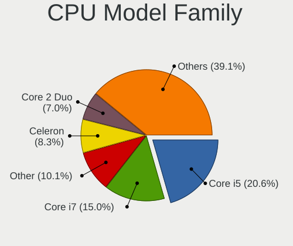

| Model                   | Notebooks | Percent |
|-------------------------|-----------|---------|
| Intel Core i5           | 171       | 20.55%  |
| Intel Core i7           | 125       | 15.02%  |
| Other                   | 84        | 10.1%   |
| Intel Celeron           | 69        | 8.29%   |
| Intel Core 2 Duo        | 58        | 6.97%   |
| Intel Core i3           | 52        | 6.25%   |
| AMD Ryzen 7             | 44        | 5.29%   |
| Intel Atom              | 39        | 4.69%   |
| AMD Ryzen 5             | 33        | 3.97%   |
| Intel Pentium           | 19        | 2.28%   |
| AMD Ryzen 3             | 15        | 1.8%    |
| AMD A8                  | 11        | 1.32%   |
| AMD A4                  | 9         | 1.08%   |
| AMD Ryzen 9             | 8         | 0.96%   |
| Intel Genuine           | 7         | 0.84%   |
| Intel Core 2            | 7         | 0.84%   |
| AMD A6                  | 7         | 0.84%   |
| Intel Core              | 6         | 0.72%   |
| AMD E1                  | 6         | 0.72%   |
| Intel Pentium Dual-Core | 5         | 0.6%    |
| AMD A10                 | 5         | 0.6%    |
| Intel Pentium Dual      | 4         | 0.48%   |
| Intel Core i9           | 4         | 0.48%   |
| AMD Turion 64 X2 Mobile | 4         | 0.48%   |
| AMD E2                  | 4         | 0.48%   |
| AMD E                   | 4         | 0.48%   |
| Intel Pentium Silver    | 3         | 0.36%   |
| Intel Pentium M         | 3         | 0.36%   |
| Intel Celeron M         | 3         | 0.36%   |
| Intel Xeon              | 2         | 0.24%   |
| Intel Pentium Gold      | 2         | 0.24%   |
| Intel Core Duo          | 2         | 0.24%   |
| AMD Ryzen 3 PRO         | 2         | 0.24%   |
| AMD C-60                | 2         | 0.24%   |
| AMD Athlon              | 2         | 0.24%   |
| AMD A12                 | 2         | 0.24%   |
| Intel Celeron Dual-Core | 1         | 0.12%   |
| AMD Turion Neo X2       | 1         | 0.12%   |
| AMD Turion 64 X2        | 1         | 0.12%   |
| AMD Turion 64 Mobile    | 1         | 0.12%   |

CPU Cores
---------

Number of processor cores

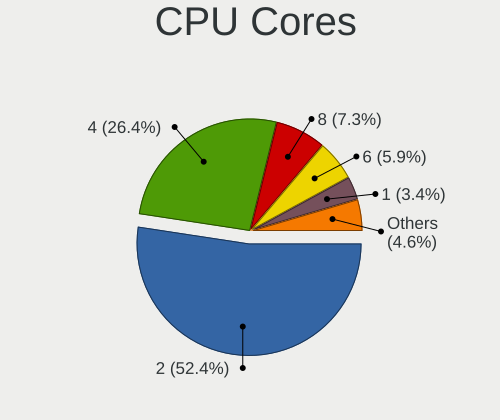

| Number | Notebooks | Percent |
|--------|-----------|---------|
| 2      | 436       | 52.4%   |
| 4      | 220       | 26.44%  |
| 8      | 61        | 7.33%   |
| 6      | 49        | 5.89%   |
| 1      | 28        | 3.37%   |
| 10     | 15        | 1.8%    |
| 14     | 7         | 0.84%   |
| 16     | 5         | 0.6%    |
| 12     | 5         | 0.6%    |
| 24     | 4         | 0.48%   |
| 5      | 2         | 0.24%   |

CPU Sockets
-----------

Number of sockets

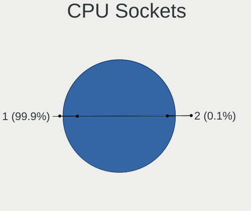

| Number | Notebooks | Percent |
|--------|-----------|---------|
| 1      | 831       | 99.88%  |
| 2      | 1         | 0.12%   |

CPU Threads
-----------

Threads per core (Hyper-Threading)

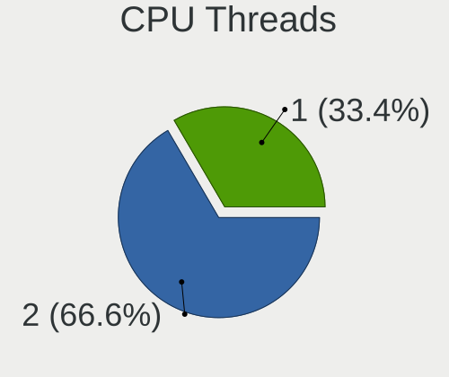

| Number | Notebooks | Percent |
|--------|-----------|---------|
| 2      | 554       | 66.59%  |
| 1      | 278       | 33.41%  |

CPU Op-Modes
------------

CPU Operation Modes (32-bit, 64-bit)

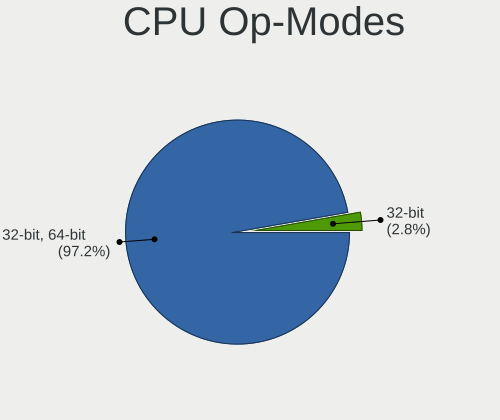

| Op mode        | Notebooks | Percent |
|----------------|-----------|---------|
| 32-bit, 64-bit | 810       | 97.24%  |
| 32-bit         | 23        | 2.76%   |

CPU Microcode
-------------

Microcode number

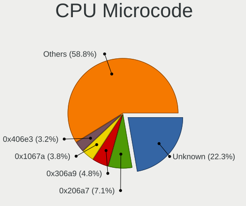

| Number     | Notebooks | Percent |
|------------|-----------|---------|
| Unknown    | 189       | 22.29%  |
| 0x206a7    | 60        | 7.08%   |
| 0x306a9    | 41        | 4.83%   |
| 0x1067a    | 32        | 3.77%   |
| 0x406e3    | 27        | 3.18%   |
| 0x20655    | 24        | 2.83%   |
| 0x806c1    | 22        | 2.59%   |
| 0x40651    | 22        | 2.59%   |
| 0x30678    | 22        | 2.59%   |
| 0x306c3    | 19        | 2.24%   |
| 0x306d4    | 18        | 2.12%   |
| 0x08608103 | 17        | 2%      |
| 0x806ec    | 15        | 1.77%   |
| 0x6fd      | 15        | 1.77%   |
| 0x0a50000c | 15        | 1.77%   |
| 0x806e9    | 14        | 1.65%   |
| 0x806ea    | 13        | 1.53%   |
| 0x406c4    | 13        | 1.53%   |
| 0x906ea    | 12        | 1.42%   |
| 0x706a8    | 12        | 1.42%   |
| 0x906a4    | 11        | 1.3%    |
| 0x506e3    | 11        | 1.3%    |
| 0x10676    | 10        | 1.18%   |
| 0x906a3    | 9         | 1.06%   |
| 0x706a1    | 8         | 0.94%   |
| 0x20652    | 8         | 0.94%   |
| 0x106c2    | 8         | 0.94%   |
| 0x506c9    | 7         | 0.83%   |
| 0xa0652    | 6         | 0.71%   |
| 0x906e9    | 6         | 0.71%   |
| 0x106ca    | 6         | 0.71%   |
| 0x08108109 | 6         | 0.71%   |
| 0x07030105 | 6         | 0.71%   |
| 0x0600611a | 6         | 0.71%   |
| 0x6fb      | 5         | 0.59%   |
| 0x6e8      | 5         | 0.59%   |
| 0x6d8      | 5         | 0.59%   |
| 0x08108102 | 5         | 0.59%   |
| 0x05000119 | 5         | 0.59%   |
| 0x03000027 | 5         | 0.59%   |

CPU Microarch
-------------

Microarchitecture

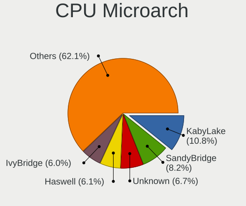

| Name              | Notebooks | Percent |
|-------------------|-----------|---------|
| KabyLake          | 90        | 10.82%  |
| SandyBridge       | 68        | 8.17%   |
| Unknown           | 56        | 6.73%   |
| Haswell           | 51        | 6.13%   |
| IvyBridge         | 50        | 6.01%   |
| Penryn            | 48        | 5.77%   |
| Silvermont        | 45        | 5.41%   |
| Skylake           | 44        | 5.29%   |
| TigerLake         | 41        | 4.93%   |
| Westmere          | 35        | 4.21%   |
| Alderlake Hybrid  | 33        | 3.97%   |
| Core              | 31        | 3.73%   |
| Zen 3             | 30        | 3.61%   |
| Goldmont plus     | 21        | 2.52%   |
| Broadwell         | 20        | 2.4%    |
| Bonnell           | 18        | 2.16%   |
| Excavator         | 17        | 2.04%   |
| Zen+              | 14        | 1.68%   |
| P6                | 13        | 1.56%   |
| Puma              | 12        | 1.44%   |
| IceLake           | 12        | 1.44%   |
| Bobcat            | 11        | 1.32%   |
| CometLake         | 10        | 1.2%    |
| K8 Hammer         | 9         | 1.08%   |
| Goldmont          | 9         | 1.08%   |
| Zen 2             | 8         | 0.96%   |
| Zen               | 5         | 0.6%    |
| Piledriver        | 5         | 0.6%    |
| Meteorlake Hybrid | 5         | 0.6%    |
| K10 Llano         | 5         | 0.6%    |
| Jaguar            | 4         | 0.48%   |
| Tremont           | 3         | 0.36%   |
| Nehalem           | 3         | 0.36%   |
| Gracemont         | 3         | 0.36%   |
| Steamroller       | 1         | 0.12%   |
| K8 & K10 hybrid   | 1         | 0.12%   |
| K10               | 1         | 0.12%   |

Graphics
--------

GPU Vendor
----------

Vendors of graphics cards

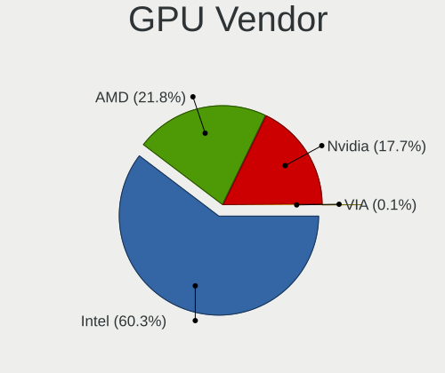

| Vendor           | Notebooks | Percent |
|------------------|-----------|---------|
| Intel            | 595       | 60.34%  |
| AMD              | 215       | 21.81%  |
| Nvidia           | 175       | 17.75%  |
| VIA Technologies | 1         | 0.1%    |

GPU Model
---------

Graphics card models

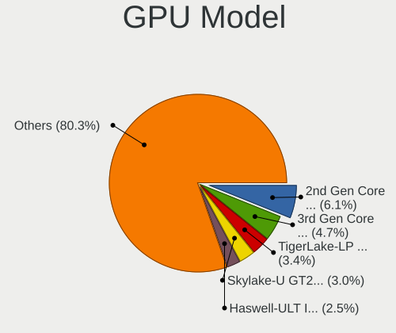

| Model                                                                                    | Notebooks | Percent |
|------------------------------------------------------------------------------------------|-----------|---------|
| Intel 2nd Generation Core Processor Family Integrated Graphics Controller                | 63        | 6.08%   |
| Intel 3rd Gen Core processor Graphics Controller                                         | 49        | 4.73%   |
| Intel TigerLake-LP GT2 [Iris Xe Graphics]                                                | 35        | 3.38%   |
| Intel Skylake-U GT2 [HD Graphics 520]                                                    | 31        | 2.99%   |
| Intel Haswell-ULT Integrated Graphics Controller                                         | 26        | 2.51%   |
| Intel Atom Processor Z36xxx/Z37xxx Series Graphics & Display                             | 26        | 2.51%   |
| AMD Lucienne                                                                             | 26        | 2.51%   |
| Intel Core Processor Integrated Graphics Controller                                      | 25        | 2.41%   |
| Intel Mobile 4 Series Chipset Integrated Graphics Controller                             | 24        | 2.31%   |
| Intel Kaby Lake-R GT2 [UHD Graphics 620]                                                 | 22        | 2.12%   |
| Intel 4th Gen Core Processor Integrated Graphics Controller                              | 22        | 2.12%   |
| Intel Kaby Lake-U GT2 [HD Graphics 620]                                                  | 19        | 1.83%   |
| Intel GeminiLake [UHD Graphics 600]                                                      | 19        | 1.83%   |
| Intel Atom/Celeron/Pentium Processor x5-E8000/J3xxx/N3xxx Integrated Graphics Controller | 19        | 1.83%   |
| Intel Mobile 945GM/GMS/GME, 943/940GML Express Integrated Graphics Controller            | 17        | 1.64%   |
| AMD Cezanne [Radeon Vega Series / Radeon Vega Mobile Series]                             | 17        | 1.64%   |
| Intel Mobile GM965/GL960 Integrated Graphics Controller (secondary)                      | 15        | 1.45%   |
| Intel Mobile GM965/GL960 Integrated Graphics Controller (primary)                        | 15        | 1.45%   |
| Intel CoffeeLake-H GT2 [UHD Graphics 630]                                                | 15        | 1.45%   |
| Intel WhiskeyLake-U GT2 [UHD Graphics 620]                                               | 14        | 1.35%   |
| AMD Picasso/Raven 2 [Radeon Vega Series / Radeon Vega Mobile Series]                     | 14        | 1.35%   |
| Intel Broadwell-U GT2 [HD Graphics 5500]                                                 | 13        | 1.25%   |
| AMD Barcelo                                                                              | 12        | 1.16%   |
| Intel Skylake-H GT2 [HD Graphics 530]                                                    | 11        | 1.06%   |
| AMD Stoney [Radeon R2/R3/R4/R5 Graphics]                                                 | 11        | 1.06%   |
| Nvidia TU117M [GeForce GTX 1650 Mobile / Max-Q]                                          | 10        | 0.96%   |
| Intel Mobile 945GM/GMS, 943/940GML Express Integrated Graphics Controller                | 10        | 0.96%   |
| Nvidia MCP89 [GeForce 320M]                                                              | 9         | 0.87%   |
| Intel Atom Processor D4xx/D5xx/N4xx/N5xx Integrated Graphics Controller                  | 8         | 0.77%   |
| Intel Apollo Lake GT1 [HD Graphics 500]                                                  | 8         | 0.77%   |
| AMD Seymour [Radeon HD 6400M/7400M Series]                                               | 8         | 0.77%   |
| AMD Mullins [Radeon R4/R5 Graphics]                                                      | 8         | 0.77%   |
| Intel Mobile 945GSE Express Integrated Graphics Controller                               | 7         | 0.68%   |
| Intel CometLake-U GT2 [UHD Graphics]                                                     | 7         | 0.68%   |
| AMD Topaz XT [Radeon R7 M260/M265 / M340/M360 / M440/M445 / 530/535 / 620/625 Mobile]    | 7         | 0.68%   |
| AMD Renoir [Radeon Vega Series / Radeon Vega Mobile Series]                              | 7         | 0.68%   |
| AMD Mendocino [Radeon 610M]                                                              | 7         | 0.68%   |
| Nvidia GF117M [GeForce 610M/710M/810M/820M / GT 620M/625M/630M/720M]                     | 6         | 0.58%   |
| Nvidia GF108M [GeForce GT 620M/630M/635M/640M LE]                                        | 6         | 0.58%   |
| Nvidia C79 [GeForce 9400M]                                                               | 6         | 0.58%   |

GPU Combo
---------

Combinations of graphics cards

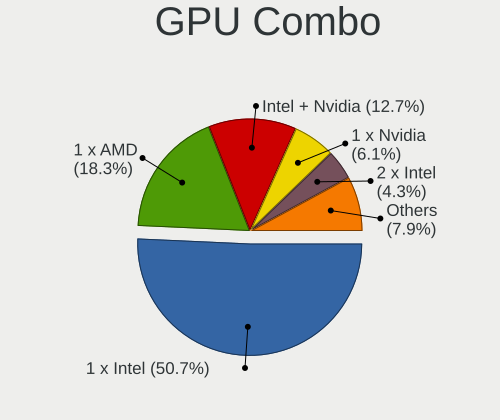

| Name               | Notebooks | Percent |
|--------------------|-----------|---------|
| 1 x Intel          | 424       | 50.72%  |
| 1 x AMD            | 153       | 18.3%   |
| Intel + Nvidia     | 106       | 12.68%  |
| 1 x Nvidia         | 51        | 6.1%    |
| 2 x Intel          | 36        | 4.31%   |
| Intel + AMD        | 31        | 3.71%   |
| 2 x AMD            | 16        | 1.91%   |
| AMD + Nvidia       | 15        | 1.79%   |
| 2 x Nvidia         | 2         | 0.24%   |
| 1 x VIA            | 1         | 0.12%   |
| Intel + 2 x Nvidia | 1         | 0.12%   |

GPU Driver
----------

Free vs proprietary

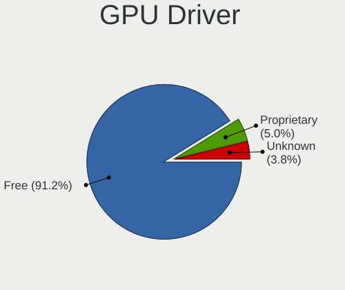

| Driver      | Notebooks | Percent |
|-------------|-----------|---------|
| Free        | 767       | 91.2%   |
| Proprietary | 42        | 4.99%   |
| Unknown     | 32        | 3.8%    |

GPU Memory
----------

Total video memory

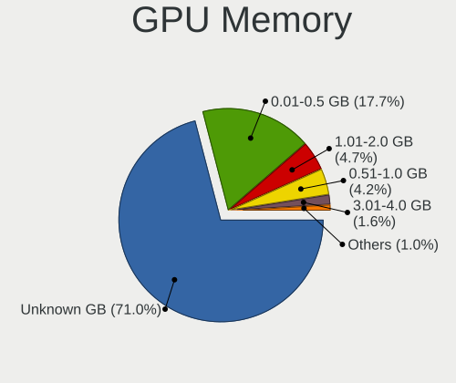

| Size in GB | Notebooks | Percent |
|------------|-----------|---------|
| Unknown    | 594       | 70.97%  |
| 0.01-0.5   | 148       | 17.68%  |
| 1.01-2.0   | 39        | 4.66%   |
| 0.51-1.0   | 35        | 4.18%   |
| 3.01-4.0   | 13        | 1.55%   |
| 7.01-8.0   | 5         | 0.6%    |
| 5.01-6.0   | 2         | 0.24%   |
| 2.01-3.0   | 1         | 0.12%   |

Monitor
-------

Monitor Vendor
--------------

Monitor vendors

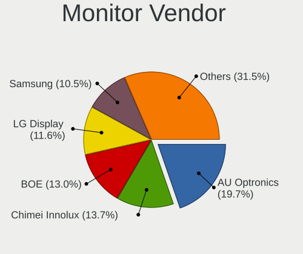

| Vendor                  | Notebooks | Percent |
|-------------------------|-----------|---------|
| AU Optronics            | 177       | 19.71%  |
| Chimei Innolux          | 123       | 13.7%   |
| BOE                     | 117       | 13.03%  |
| LG Display              | 104       | 11.58%  |
| Samsung Electronics     | 94        | 10.47%  |
| Apple                   | 40        | 4.45%   |
| Chi Mei Optoelectronics | 29        | 3.23%   |
| Lenovo                  | 25        | 2.78%   |
| InfoVision              | 16        | 1.78%   |
| Hewlett-Packard         | 15        | 1.67%   |
| Goldstar                | 14        | 1.56%   |
| Sharp                   | 13        | 1.45%   |
| PANDA                   | 13        | 1.45%   |
| Dell                    | 12        | 1.34%   |
| LG Philips              | 11        | 1.22%   |
| HannStar                | 9         | 1%      |
| Ancor Communications    | 7         | 0.78%   |
| BenQ                    | 6         | 0.67%   |
| HKC                     | 5         | 0.56%   |
| CPT                     | 5         | 0.56%   |
| Sony                    | 4         | 0.45%   |
| Quanta Display          | 4         | 0.45%   |
| InnoLux Display         | 4         | 0.45%   |
| ASUSTek Computer        | 4         | 0.45%   |
| AOC                     | 4         | 0.45%   |
| Acer                    | 4         | 0.45%   |
| Philips                 | 3         | 0.33%   |
| NEC Computers           | 3         | 0.33%   |
| Vizio                   | 2         | 0.22%   |
| ViewSonic               | 2         | 0.22%   |
| Unknown (XXX)           | 2         | 0.22%   |
| KDC                     | 2         | 0.22%   |
| IBM                     | 2         | 0.22%   |
| CSW                     | 2         | 0.22%   |
| TRU                     | 1         | 0.11%   |
| TMX                     | 1         | 0.11%   |
| Sunplus                 | 1         | 0.11%   |
| STA                     | 1         | 0.11%   |
| RTK                     | 1         | 0.11%   |
| Panasonic               | 1         | 0.11%   |

Monitor Model
-------------

Monitor models

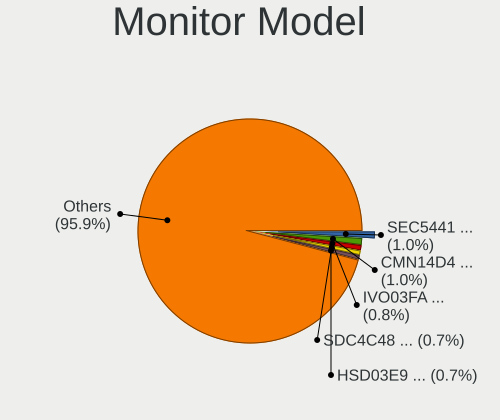

| Model                                                                    | Notebooks | Percent |
|--------------------------------------------------------------------------|-----------|---------|
| Samsung Electronics LCD Monitor SEC5441 1280x800 331x207mm 15.4-inch     | 9         | 1%      |
| Chimei Innolux LCD Monitor CMN14D4 1920x1080 309x173mm 13.9-inch         | 9         | 1%      |
| InfoVision LCD Monitor IVO03FA 1366x768 223x125mm 10.1-inch              | 7         | 0.78%   |
| Samsung Electronics LCD Monitor SDC4C48 1920x1080 293x165mm 13.2-inch    | 6         | 0.67%   |
| HannStar LCD Monitor HSD03E9 1024x600 220x129mm 10.0-inch                | 6         | 0.67%   |
| Chimei Innolux LCD Monitor CMN15F5 1920x1080 344x193mm 15.5-inch         | 6         | 0.67%   |
| Chi Mei Optoelectronics LCD Monitor CMO15A7 1366x768 344x193mm 15.5-inch | 6         | 0.67%   |
| AU Optronics LCD Monitor AUO21ED 1920x1080 344x193mm 15.5-inch           | 6         | 0.67%   |
| LG Display LCD Monitor LGD04A7 1920x1080 344x194mm 15.5-inch             | 5         | 0.56%   |
| Chimei Innolux LCD Monitor CMN15DB 1366x768 344x193mm 15.5-inch          | 5         | 0.56%   |
| AU Optronics LCD Monitor AUO305C 1366x768 256x144mm 11.6-inch            | 5         | 0.56%   |
| Samsung Electronics LCD Monitor SEC544B 1600x900 382x214mm 17.2-inch     | 4         | 0.44%   |
| Samsung Electronics LCD Monitor SEC4251 1366x768 344x194mm 15.5-inch     | 4         | 0.44%   |
| Samsung Electronics LCD Monitor SEC325A 1366x768 344x194mm 15.5-inch     | 4         | 0.44%   |
| PANDA LCD Monitor NCP004D 1920x1080 344x194mm 15.5-inch                  | 4         | 0.44%   |
| LG Display LCD Monitor LGD0590 1920x1080 344x194mm 15.5-inch             | 4         | 0.44%   |
| Lenovo LCD Monitor LEN4011 1280x800 261x163mm 12.1-inch                  | 4         | 0.44%   |
| Chimei Innolux LCD Monitor CMN14C4 1366x768 309x173mm 13.9-inch          | 4         | 0.44%   |
| Chimei Innolux LCD Monitor CMN1132 1366x768 256x144mm 11.6-inch          | 4         | 0.44%   |
| Chi Mei Optoelectronics LCD Monitor CMO15A3 1366x768 344x193mm 15.5-inch | 4         | 0.44%   |
| BOE LCD Monitor BOE084E 1920x1080 382x215mm 17.3-inch                    | 4         | 0.44%   |
| BOE LCD Monitor BOE0672 1366x768 344x194mm 15.5-inch                     | 4         | 0.44%   |
| AU Optronics LCD Monitor AUO403D 1920x1080 309x174mm 14.0-inch           | 4         | 0.44%   |
| Apple LCD Monitor APP9CC5 1280x800 286x179mm 13.3-inch                   | 4         | 0.44%   |
| Samsung Electronics LCD Monitor SEC504B 1600x900 382x215mm 17.3-inch     | 3         | 0.33%   |
| Samsung Electronics LCD Monitor SEC314C 1920x1080 344x194mm 15.5-inch    | 3         | 0.33%   |
| LG Display LCD Monitor LGD0563 1920x1080 344x194mm 15.5-inch             | 3         | 0.33%   |
| LG Display LCD Monitor LGD033A 1366x768 344x194mm 15.5-inch              | 3         | 0.33%   |
| LG Display LCD Monitor LGD027A 1600x900 382x215mm 17.3-inch              | 3         | 0.33%   |
| Lenovo LCD Monitor LEN40B0 1366x768 344x194mm 15.5-inch                  | 3         | 0.33%   |
| Lenovo LCD Monitor LEN4036 1440x900 303x190mm 14.1-inch                  | 3         | 0.33%   |
| Chimei Innolux LCD Monitor CMN1618 1920x1200 344x215mm 16.0-inch         | 3         | 0.33%   |
| Chimei Innolux LCD Monitor CMN1521 1920x1080 344x193mm 15.5-inch         | 3         | 0.33%   |
| Chimei Innolux LCD Monitor CMN1493 1366x768 309x173mm 13.9-inch          | 3         | 0.33%   |
| BOE LCD Monitor BOE0791 1920x1080 309x173mm 13.9-inch                    | 3         | 0.33%   |
| BOE LCD Monitor BOE05DF 1366x768 293x165mm 13.2-inch                     | 3         | 0.33%   |
| AU Optronics LCD Monitor AUO41EC 1366x768 344x193mm 15.5-inch            | 3         | 0.33%   |
| AU Optronics LCD Monitor AUO38ED 1920x1080 344x193mm 15.5-inch           | 3         | 0.33%   |
| AU Optronics LCD Monitor AUO313D 1920x1080 309x174mm 14.0-inch           | 3         | 0.33%   |
| AU Optronics LCD Monitor AUO313C 1366x768 309x173mm 13.9-inch            | 3         | 0.33%   |

Monitor Resolution
------------------

Monitor screen resolution

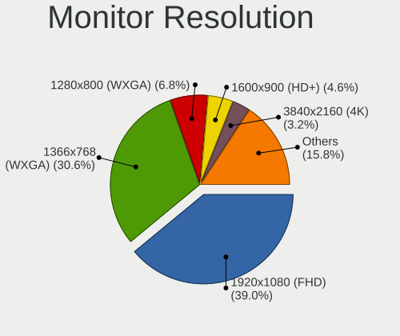

| Resolution         | Notebooks | Percent |
|--------------------|-----------|---------|
| 1920x1080 (FHD)    | 339       | 39.01%  |
| 1366x768 (WXGA)    | 266       | 30.61%  |
| 1280x800 (WXGA)    | 59        | 6.79%   |
| 1600x900 (HD+)     | 40        | 4.6%    |
| 3840x2160 (4K)     | 28        | 3.22%   |
| 1920x1200 (WUXGA)  | 27        | 3.11%   |
| 1440x900 (WXGA+)   | 22        | 2.53%   |
| 2560x1440 (QHD)    | 14        | 1.61%   |
| 1024x600           | 14        | 1.61%   |
| 2560x1600          | 12        | 1.38%   |
| 1680x1050 (WSXGA+) | 11        | 1.27%   |
| 2880x1800          | 6         | 0.69%   |
| 1280x1024 (SXGA)   | 6         | 0.69%   |
| 1024x768 (XGA)     | 4         | 0.46%   |
| 3840x2400          | 3         | 0.35%   |
| 2560x1080          | 3         | 0.35%   |
| 2256x1504          | 3         | 0.35%   |
| 3200x1800 (QHD+)   | 2         | 0.23%   |
| 2160x1440          | 2         | 0.23%   |
| 1400x1050          | 2         | 0.23%   |
| 1360x768           | 2         | 0.23%   |
| 3440x1440          | 1         | 0.12%   |
| 3200x2000          | 1         | 0.12%   |
| 3072x1920          | 1         | 0.12%   |
| 1680x945           | 1         | 0.12%   |

Monitor Diagonal
----------------

Diagonal size in inches

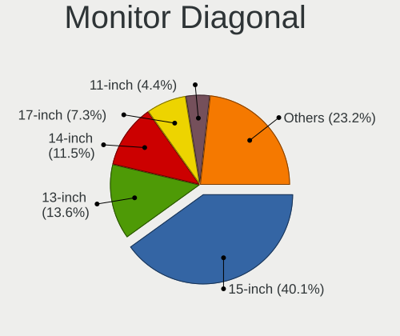

| Inches  | Notebooks | Percent |
|---------|-----------|---------|
| 15      | 359       | 40.07%  |
| 13      | 122       | 13.62%  |
| 14      | 103       | 11.5%   |
| 17      | 65        | 7.25%   |
| 11      | 39        | 4.35%   |
| 24      | 28        | 3.13%   |
| 16      | 28        | 3.13%   |
| 10      | 23        | 2.57%   |
| 12      | 19        | 2.12%   |
| 23      | 18        | 2.01%   |
| 27      | 14        | 1.56%   |
| 18      | 14        | 1.56%   |
| 21      | 12        | 1.34%   |
| 19      | 8         | 0.89%   |
| 31      | 6         | 0.67%   |
| 54      | 5         | 0.56%   |
| 63      | 4         | 0.45%   |
| 20      | 4         | 0.45%   |
| 32      | 3         | 0.33%   |
| 22      | 3         | 0.33%   |
| Unknown | 3         | 0.33%   |
| 43      | 2         | 0.22%   |
| 40      | 2         | 0.22%   |
| 34      | 2         | 0.22%   |
| 26      | 2         | 0.22%   |
| 84      | 1         | 0.11%   |
| 72      | 1         | 0.11%   |
| 57      | 1         | 0.11%   |
| 46      | 1         | 0.11%   |
| 39      | 1         | 0.11%   |
| 37      | 1         | 0.11%   |
| 36      | 1         | 0.11%   |
| 25      | 1         | 0.11%   |

Monitor Width
-------------

Physical width

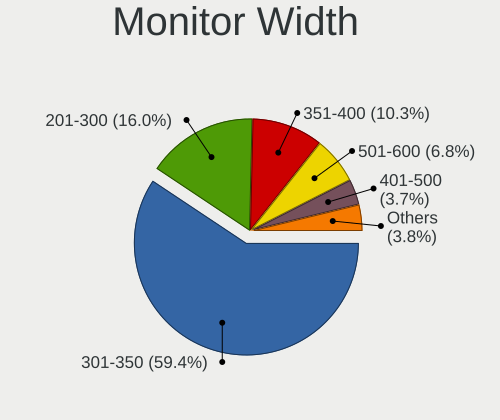

| Width in mm | Notebooks | Percent |
|-------------|-----------|---------|
| 301-350     | 530       | 59.35%  |
| 201-300     | 143       | 16.01%  |
| 351-400     | 92        | 10.3%   |
| 501-600     | 61        | 6.83%   |
| 401-500     | 33        | 3.7%    |
| 1001-1500   | 10        | 1.12%   |
| 701-800     | 7         | 0.78%   |
| 601-700     | 6         | 0.67%   |
| 801-900     | 4         | 0.45%   |
| Unknown     | 3         | 0.34%   |
| 1501-2000   | 2         | 0.22%   |
| 901-1000    | 2         | 0.22%   |

Aspect Ratio
------------

Proportional relationship between the width and the height

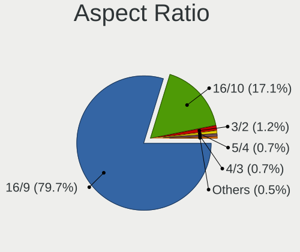

| Ratio   | Notebooks | Percent |
|---------|-----------|---------|
| 16/9    | 657       | 79.73%  |
| 16/10   | 141       | 17.11%  |
| 3/2     | 10        | 1.21%   |
| 5/4     | 6         | 0.73%   |
| 4/3     | 6         | 0.73%   |
| 21/9    | 2         | 0.24%   |
| 0.56    | 1         | 0.12%   |
| Unknown | 1         | 0.12%   |

Monitor Area
------------

Area in inch²

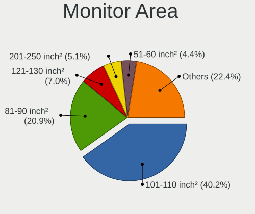

| Area in inch² | Notebooks | Percent |
|----------------|-----------|---------|
| 101-110        | 360       | 40.18%  |
| 81-90          | 187       | 20.87%  |
| 121-130        | 63        | 7.03%   |
| 201-250        | 46        | 5.13%   |
| 51-60          | 39        | 4.35%   |
| 71-80          | 35        | 3.91%   |
| 41-50          | 23        | 2.57%   |
| 111-120        | 21        | 2.34%   |
| 61-70          | 19        | 2.12%   |
| 151-200        | 16        | 1.79%   |
| 301-350        | 15        | 1.67%   |
| 141-150        | 14        | 1.56%   |
| 251-300        | 13        | 1.45%   |
| More than 1000 | 12        | 1.34%   |
| 351-500        | 11        | 1.23%   |
| 501-1000       | 8         | 0.89%   |
| 91-100         | 6         | 0.67%   |
| 131-140        | 5         | 0.56%   |
| Unknown        | 3         | 0.33%   |

Pixel Density
-------------

Pixels per inch

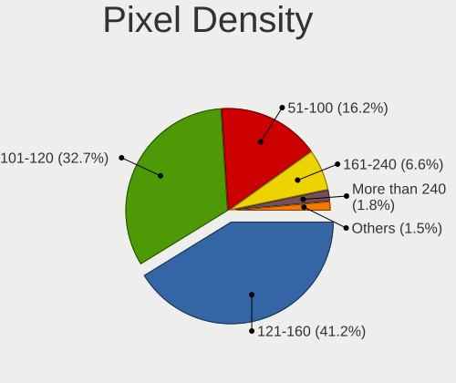

| Density       | Notebooks | Percent |
|---------------|-----------|---------|
| 121-160       | 364       | 41.22%  |
| 101-120       | 289       | 32.73%  |
| 51-100        | 143       | 16.19%  |
| 161-240       | 58        | 6.57%   |
| More than 240 | 16        | 1.81%   |
| 1-50          | 10        | 1.13%   |
| Unknown       | 3         | 0.34%   |

Multiple Monitors
-----------------

Total monitors connected

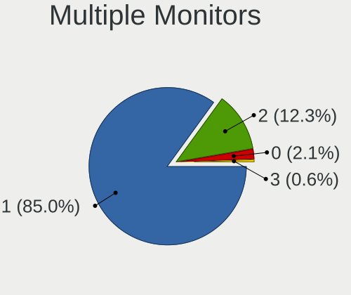

| Total | Notebooks | Percent |
|-------|-----------|---------|
| 1     | 714       | 85%     |
| 2     | 103       | 12.26%  |
| 0     | 18        | 2.14%   |
| 3     | 5         | 0.6%    |

Network
-------

Net Controller Vendor
---------------------

Controller vendors

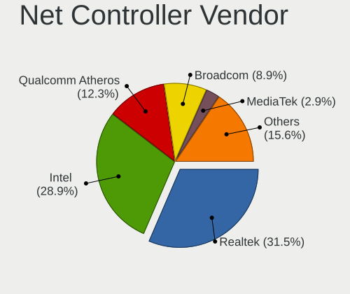

| Vendor                                 | Notebooks | Percent |
|----------------------------------------|-----------|---------|
| Realtek Semiconductor                  | 419       | 31.48%  |
| Intel                                  | 385       | 28.93%  |
| Qualcomm Atheros                       | 164       | 12.32%  |
| Broadcom                               | 118       | 8.87%   |
| MediaTek                               | 38        | 2.85%   |
| Broadcom Limited                       | 28        | 2.1%    |
| Ralink                                 | 19        | 1.43%   |
| Marvell Technology Group               | 17        | 1.28%   |
| TP-Link                                | 14        | 1.05%   |
| ASIX Electronics                       | 14        | 1.05%   |
| Nvidia                                 | 11        | 0.83%   |
| Samsung Electronics                    | 9         | 0.68%   |
| Sierra Wireless                        | 8         | 0.6%    |
| OPPO Electronics                       | 8         | 0.6%    |
| Motorola PCS                           | 8         | 0.6%    |
| Huawei Technologies                    | 5         | 0.38%   |
| Dell                                   | 5         | 0.38%   |
| Ralink Technology                      | 4         | 0.3%    |
| Qualcomm Atheros Communications        | 4         | 0.3%    |
| ASUSTek Computer                       | 4         | 0.3%    |
| Xiaomi                                 | 3         | 0.23%   |
| Qualcomm                               | 3         | 0.23%   |
| NetGear                                | 3         | 0.23%   |
| Google                                 | 3         | 0.23%   |
| Ericsson Business Mobile Networks      | 3         | 0.23%   |
| D-Link                                 | 3         | 0.23%   |
| Attansic Technology                    | 3         | 0.23%   |
| Suzhou Motorcomm Electronic Technology | 2         | 0.15%   |
| Shenzhen Goodix Technology             | 2         | 0.15%   |
| Lenovo                                 | 2         | 0.15%   |
| JMicron Technology                     | 2         | 0.15%   |
| Hewlett-Packard                        | 2         | 0.15%   |
| Fibocom                                | 2         | 0.15%   |
| Belkin Components                      | 2         | 0.15%   |
| ZyDAS                                  | 1         | 0.08%   |
| VIA Technologies                       | 1         | 0.08%   |
| Sweex                                  | 1         | 0.08%   |
| Spreadtrum Communications              | 1         | 0.08%   |
| SEGGER                                 | 1         | 0.08%   |
| Qualcomm Technologies                  | 1         | 0.08%   |

Net Controller Model
--------------------

Controller models

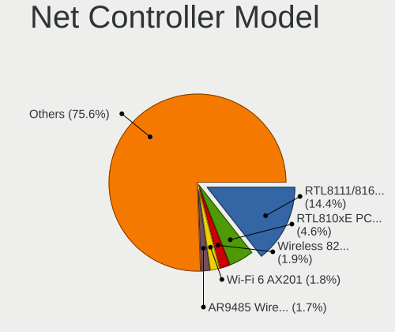

| Model                                                                   | Notebooks | Percent |
|-------------------------------------------------------------------------|-----------|---------|
| Realtek RTL8111/8168/8211/8411 PCI Express Gigabit Ethernet Controller  | 230       | 14.39%  |
| Realtek RTL810xE PCI Express Fast Ethernet controller                   | 74        | 4.63%   |
| Intel Wireless 8265 / 8275                                              | 31        | 1.94%   |
| Intel Wi-Fi 6 AX201                                                     | 28        | 1.75%   |
| Qualcomm Atheros AR9485 Wireless Network Adapter                        | 27        | 1.69%   |
| Realtek RTL8821CE 802.11ac PCIe Wireless Network Adapter                | 26        | 1.63%   |
| Realtek RTL8153 Gigabit Ethernet Adapter                                | 26        | 1.63%   |
| Intel Wireless 8260                                                     | 25        | 1.56%   |
| Intel Wi-Fi 6 AX200                                                     | 24        | 1.5%    |
| Qualcomm Atheros QCA9565 / AR9565 Wireless Network Adapter              | 23        | 1.44%   |
| Intel Wireless 7260                                                     | 23        | 1.44%   |
| Realtek RTL8852BE PCIe 802.11ax Wireless Network Controller             | 22        | 1.38%   |
| Qualcomm Atheros AR9285 Wireless Network Adapter (PCI-Express)          | 22        | 1.38%   |
| Intel Wireless 7265                                                     | 21        | 1.31%   |
| Broadcom BCM4313 802.11bgn Wireless Network Adapter                     | 19        | 1.19%   |
| Qualcomm Atheros QCA9377 802.11ac Wireless Network Adapter              | 17        | 1.06%   |
| Intel Wireless 3165                                                     | 17        | 1.06%   |
| Realtek RTL8822CE 802.11ac PCIe Wireless Network Adapter                | 16        | 1%      |
| Intel 82579LM Gigabit Network Connection (Lewisville)                   | 16        | 1%      |
| Intel 82577LM Gigabit Network Connection                                | 16        | 1%      |
| Broadcom BCM43142 802.11b/g/n                                           | 16        | 1%      |
| MediaTek MT7921 802.11ax PCIe Wireless Network Adapter [Filogic 330]    | 15        | 0.94%   |
| Intel Ethernet Connection I217-LM                                       | 15        | 0.94%   |
| Intel Alder Lake-P PCH CNVi WiFi                                        | 15        | 0.94%   |
| Intel PRO/Wireless 3945ABG [Golan] Network Connection                   | 14        | 0.88%   |
| Ralink RT3290 Wireless 802.11n 1T/1R PCIe                               | 13        | 0.81%   |
| Intel Centrino Advanced-N 6205 [Taylor Peak]                            | 13        | 0.81%   |
| Broadcom BCM4322 802.11a/b/g/n Wireless LAN Controller                  | 13        | 0.81%   |
| Realtek RTL8723BE PCIe Wireless Network Adapter                         | 12        | 0.75%   |
| Qualcomm Atheros QCA6174 802.11ac Wireless Network Adapter              | 12        | 0.75%   |
| MediaTek MT7902 802.11ax PCIe Wireless Network Adapter [Filogic 310]    | 12        | 0.75%   |
| ASIX AX88179 Gigabit Ethernet                                           | 12        | 0.75%   |
| Qualcomm Atheros AR242x / AR542x Wireless Network Adapter (PCI-Express) | 11        | 0.69%   |
| Intel Centrino Advanced-N 6200                                          | 11        | 0.69%   |
| Intel Cannon Lake PCH CNVi WiFi                                         | 11        | 0.69%   |
| Broadcom NetXtreme BCM5764M Gigabit Ethernet PCIe                       | 11        | 0.69%   |
| Intel Ethernet Connection I219-LM                                       | 10        | 0.63%   |
| Intel Ethernet Connection (4) I219-LM                                   | 10        | 0.63%   |
| Intel Centrino Advanced-N 6235                                          | 10        | 0.63%   |
| Intel 82567LM Gigabit Network Connection                                | 10        | 0.63%   |

Wireless Vendor
---------------

Wireless vendors

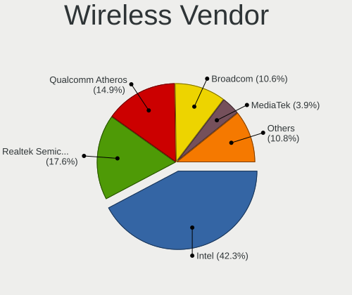

| Vendor                            | Notebooks | Percent |
|-----------------------------------|-----------|---------|
| Intel                             | 360       | 42.25%  |
| Realtek Semiconductor             | 150       | 17.61%  |
| Qualcomm Atheros                  | 127       | 14.91%  |
| Broadcom                          | 90        | 10.56%  |
| MediaTek                          | 33        | 3.87%   |
| Broadcom Limited                  | 20        | 2.35%   |
| Ralink                            | 19        | 2.23%   |
| TP-Link                           | 12        | 1.41%   |
| Sierra Wireless                   | 8         | 0.94%   |
| Ralink Technology                 | 4         | 0.47%   |
| Qualcomm Atheros Communications   | 4         | 0.47%   |
| ASUSTek Computer                  | 4         | 0.47%   |
| NetGear                           | 3         | 0.35%   |
| D-Link                            | 3         | 0.35%   |
| Fibocom                           | 2         | 0.23%   |
| Dell                              | 2         | 0.23%   |
| Belkin Components                 | 2         | 0.23%   |
| ZyDAS                             | 1         | 0.12%   |
| Sweex                             | 1         | 0.12%   |
| Qualcomm Technologies             | 1         | 0.12%   |
| Qualcomm                          | 1         | 0.12%   |
| Linksys                           | 1         | 0.12%   |
| Hewlett-Packard                   | 1         | 0.12%   |
| Fujitsu Siemens Computers         | 1         | 0.12%   |
| Ericsson Business Mobile Networks | 1         | 0.12%   |
| Edimax Technology                 | 1         | 0.12%   |

Wireless Model
--------------

Wireless models

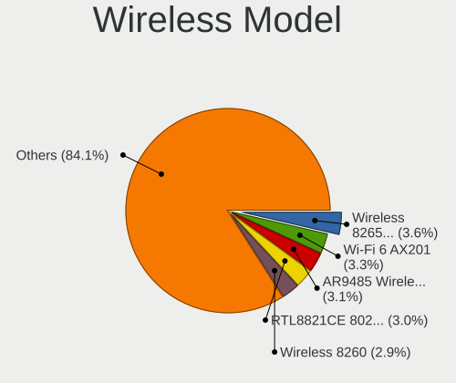

| Model                                                                   | Notebooks | Percent |
|-------------------------------------------------------------------------|-----------|---------|
| Intel Wireless 8265 / 8275                                              | 31        | 3.61%   |
| Intel Wi-Fi 6 AX201                                                     | 28        | 3.26%   |
| Qualcomm Atheros AR9485 Wireless Network Adapter                        | 27        | 3.14%   |
| Realtek RTL8821CE 802.11ac PCIe Wireless Network Adapter                | 26        | 3.03%   |
| Intel Wireless 8260                                                     | 25        | 2.91%   |
| Intel Wi-Fi 6 AX200                                                     | 24        | 2.79%   |
| Qualcomm Atheros QCA9565 / AR9565 Wireless Network Adapter              | 23        | 2.68%   |
| Intel Wireless 7260                                                     | 23        | 2.68%   |
| Qualcomm Atheros AR9285 Wireless Network Adapter (PCI-Express)          | 22        | 2.56%   |
| Intel Wireless 7265                                                     | 21        | 2.44%   |
| Realtek RTL8852BE PCIe 802.11ax Wireless Network Controller             | 19        | 2.21%   |
| Broadcom BCM4313 802.11bgn Wireless Network Adapter                     | 19        | 2.21%   |
| Qualcomm Atheros QCA9377 802.11ac Wireless Network Adapter              | 17        | 1.98%   |
| Intel Wireless 3165                                                     | 17        | 1.98%   |
| Realtek RTL8822CE 802.11ac PCIe Wireless Network Adapter                | 16        | 1.86%   |
| Broadcom BCM43142 802.11b/g/n                                           | 16        | 1.86%   |
| MediaTek MT7921 802.11ax PCIe Wireless Network Adapter [Filogic 330]    | 15        | 1.75%   |
| Intel PRO/Wireless 3945ABG [Golan] Network Connection                   | 14        | 1.63%   |
| Ralink RT3290 Wireless 802.11n 1T/1R PCIe                               | 13        | 1.51%   |
| Intel Centrino Advanced-N 6205 [Taylor Peak]                            | 13        | 1.51%   |
| Broadcom BCM4322 802.11a/b/g/n Wireless LAN Controller                  | 13        | 1.51%   |
| Realtek RTL8723BE PCIe Wireless Network Adapter                         | 12        | 1.4%    |
| Qualcomm Atheros QCA6174 802.11ac Wireless Network Adapter              | 12        | 1.4%    |
| MediaTek MT7902 802.11ax PCIe Wireless Network Adapter [Filogic 310]    | 12        | 1.4%    |
| Qualcomm Atheros AR242x / AR542x Wireless Network Adapter (PCI-Express) | 11        | 1.28%   |
| Intel Centrino Advanced-N 6200                                          | 11        | 1.28%   |
| Intel Cannon Lake PCH CNVi WiFi                                         | 11        | 1.28%   |
| Intel Centrino Advanced-N 6235                                          | 10        | 1.16%   |
| Intel Alder Lake-P PCH CNVi WiFi                                        | 10        | 1.16%   |
| Intel PRO/Wireless 5100 AGN [Shiloh] Network Connection                 | 9         | 1.05%   |
| Realtek RTL88x2bu [AC1200 Techkey]                                      | 8         | 0.93%   |
| Realtek RTL8188EUS 802.11n Wireless Network Adapter                     | 8         | 0.93%   |
| Realtek 802.11n WLAN Adapter                                            | 8         | 0.93%   |
| Realtek 802.11ac NIC                                                    | 8         | 0.93%   |
| Realtek RTL8852AE 802.11ax PCIe Wireless Network Adapter                | 7         | 0.81%   |
| Intel Wi-Fi 5(802.11ac) Wireless-AC 9x6x [Thunder Peak]                 | 7         | 0.81%   |
| Broadcom Limited BCM4360 802.11ac Dual Band Wireless Network Adapter    | 7         | 0.81%   |
| Broadcom BCM43224 802.11a/b/g/n                                         | 7         | 0.81%   |
| TP-Link TL-WN722N v2/v3 [Realtek RTL8188EUS]                            | 6         | 0.7%    |
| Realtek RTL8188CE 802.11b/g/n WiFi Adapter                              | 6         | 0.7%    |

Ethernet Vendor
---------------

Ethernet vendors

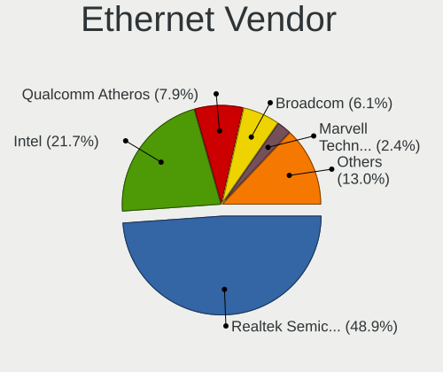

| Vendor                                 | Notebooks | Percent |
|----------------------------------------|-----------|---------|
| Realtek Semiconductor                  | 351       | 48.89%  |
| Intel                                  | 156       | 21.73%  |
| Qualcomm Atheros                       | 57        | 7.94%   |
| Broadcom                               | 44        | 6.13%   |
| Marvell Technology Group               | 17        | 2.37%   |
| ASIX Electronics                       | 14        | 1.95%   |
| Nvidia                                 | 11        | 1.53%   |
| Samsung Electronics                    | 9         | 1.25%   |
| Broadcom Limited                       | 9         | 1.25%   |
| OPPO Electronics                       | 8         | 1.11%   |
| Motorola PCS                           | 8         | 1.11%   |
| MediaTek                               | 5         | 0.7%    |
| Xiaomi                                 | 3         | 0.42%   |
| TP-Link                                | 3         | 0.42%   |
| Huawei Technologies                    | 3         | 0.42%   |
| Attansic Technology                    | 3         | 0.42%   |
| Suzhou Motorcomm Electronic Technology | 2         | 0.28%   |
| Qualcomm                               | 2         | 0.28%   |
| Lenovo                                 | 2         | 0.28%   |
| JMicron Technology                     | 2         | 0.28%   |
| Google                                 | 2         | 0.28%   |
| VIA Technologies                       | 1         | 0.14%   |
| Spreadtrum Communications              | 1         | 0.14%   |
| QinHeng Electronics                    | 1         | 0.14%   |
| OnePlus Technology (Shenzhen)          | 1         | 0.14%   |
| Hewlett-Packard                        | 1         | 0.14%   |
| Foxconn / Hon Hai                      | 1         | 0.14%   |
| DisplayLink                            | 1         | 0.14%   |

Ethernet Model
--------------

Ethernet models

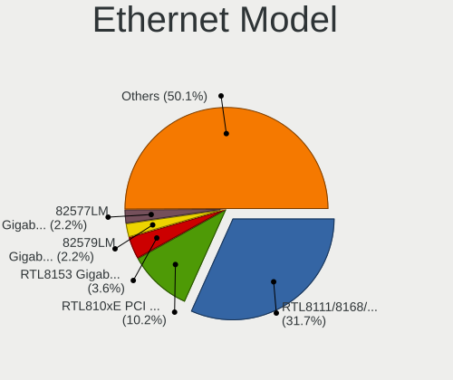

| Model                                                                  | Notebooks | Percent |
|------------------------------------------------------------------------|-----------|---------|
| Realtek RTL8111/8168/8211/8411 PCI Express Gigabit Ethernet Controller | 230       | 31.72%  |
| Realtek RTL810xE PCI Express Fast Ethernet controller                  | 74        | 10.21%  |
| Realtek RTL8153 Gigabit Ethernet Adapter                               | 26        | 3.59%   |
| Intel 82579LM Gigabit Network Connection (Lewisville)                  | 16        | 2.21%   |
| Intel 82577LM Gigabit Network Connection                               | 16        | 2.21%   |
| Intel Ethernet Connection I217-LM                                      | 15        | 2.07%   |
| ASIX AX88179 Gigabit Ethernet                                          | 12        | 1.66%   |
| Broadcom NetXtreme BCM5764M Gigabit Ethernet PCIe                      | 11        | 1.52%   |
| Intel Ethernet Connection I219-LM                                      | 10        | 1.38%   |
| Intel Ethernet Connection (4) I219-LM                                  | 10        | 1.38%   |
| Intel 82567LM Gigabit Network Connection                               | 10        | 1.38%   |
| Qualcomm Atheros AR8162 Fast Ethernet                                  | 8         | 1.1%    |
| Qualcomm Atheros AR8151 v2.0 Gigabit Ethernet                          | 8         | 1.1%    |
| Intel Ethernet Connection I218-LM                                      | 8         | 1.1%    |
| Realtek RTL8125 2.5GbE Controller                                      | 7         | 0.97%   |
| OPPO Ace 3V                                                            | 7         | 0.97%   |
| Intel Ethernet Connection I219-V                                       | 7         | 0.97%   |
| Intel Ethernet Connection (4) I219-V                                   | 7         | 0.97%   |
| Broadcom NetLink BCM57785 Gigabit Ethernet PCIe                        | 7         | 0.97%   |
| Qualcomm Atheros AR8132 Fast Ethernet                                  | 6         | 0.83%   |
| Motorola PCS motorola one 5G ace                                       | 6         | 0.83%   |
| Samsung Galaxy series, misc. (tethering mode)                          | 5         | 0.69%   |
| Realtek RTL-8100/8101L/8139 PCI Fast Ethernet Adapter                  | 5         | 0.69%   |
| Qualcomm Atheros AR8161 Gigabit Ethernet                               | 5         | 0.69%   |
| Nvidia MCP79 Ethernet                                                  | 5         | 0.69%   |
| Intel Ethernet Connection (6) I219-LM                                  | 5         | 0.69%   |
| Intel Ethernet Connection (3) I218-LM                                  | 5         | 0.69%   |
| Intel Ethernet Connection (2) I219-LM                                  | 5         | 0.69%   |
| Intel Alder Lake-P PCH CNVi WiFi                                       | 5         | 0.69%   |
| Samsung GT-I9070 (network tethering, USB debugging enabled)            | 4         | 0.55%   |
| Qualcomm Atheros QCA8172 Fast Ethernet                                 | 4         | 0.55%   |
| Intel Ethernet Connection (13) I219-LM                                 | 4         | 0.55%   |
| Broadcom NetXtreme BCM57765 Gigabit Ethernet PCIe                      | 4         | 0.55%   |
| Xiaomi Mi/Redmi series (RNDIS)                                         | 3         | 0.41%   |
| TP-Link UE300 10/100/1000 LAN (ethernet mode) [Realtek RTL8153]        | 3         | 0.41%   |
| Realtek RTL8852CE PCIe 802.11ax Wireless Network Controller            | 3         | 0.41%   |
| Realtek RTL8852BE PCIe 802.11ax Wireless Network Controller            | 3         | 0.41%   |
| Realtek RTL8152 Fast Ethernet Adapter                                  | 3         | 0.41%   |
| Qualcomm Atheros QCA8171 Gigabit Ethernet                              | 3         | 0.41%   |
| Qualcomm Atheros Killer E2500 Gigabit Ethernet Controller              | 3         | 0.41%   |

Net Controller Kind
-------------------

Ethernet, WiFi or modem

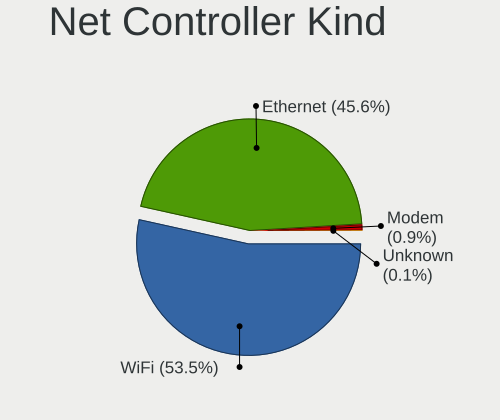

| Kind     | Notebooks | Percent |
|----------|-----------|---------|
| WiFi     | 786       | 53.47%  |
| Ethernet | 670       | 45.58%  |
| Modem    | 13        | 0.88%   |
| Unknown  | 1         | 0.07%   |

Used Controller
---------------

Currently used network controller

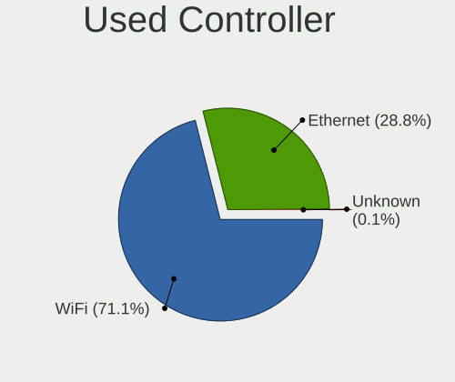

| Kind     | Notebooks | Percent |
|----------|-----------|---------|
| WiFi     | 607       | 71.08%  |
| Ethernet | 246       | 28.81%  |
| Unknown  | 1         | 0.12%   |

NICs
----

Total network controllers on board

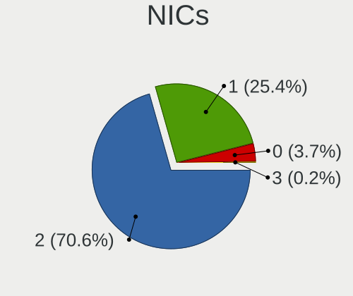

| Total | Notebooks | Percent |
|-------|-----------|---------|
| 2     | 589       | 70.62%  |
| 1     | 212       | 25.42%  |
| 0     | 31        | 3.72%   |
| 3     | 2         | 0.24%   |

IPv6
----

IPv6 vs IPv4

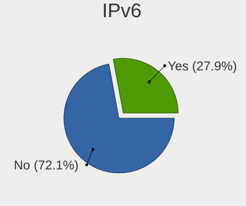

| Used | Notebooks | Percent |
|------|-----------|---------|
| No   | 605       | 72.11%  |
| Yes  | 234       | 27.89%  |

Bluetooth
---------

Bluetooth Vendor
----------------

Controller vendors

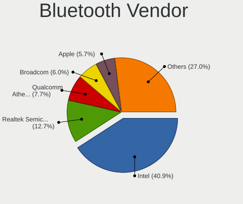

| Vendor                          | Notebooks | Percent |
|---------------------------------|-----------|---------|
| Intel                           | 271       | 40.87%  |
| Realtek Semiconductor           | 84        | 12.67%  |
| Qualcomm Atheros Communications | 51        | 7.69%   |
| Broadcom                        | 40        | 6.03%   |
| Apple                           | 38        | 5.73%   |
| IMC Networks                    | 37        | 5.58%   |
| Lite-On Technology              | 27        | 4.07%   |
| Foxconn / Hon Hai               | 23        | 3.47%   |
| Dell                            | 17        | 2.56%   |
| Cambridge Silicon Radio         | 17        | 2.56%   |
| Ralink                          | 13        | 1.96%   |
| Hewlett-Packard                 | 13        | 1.96%   |
| Toshiba                         | 10        | 1.51%   |
| ASUSTek Computer                | 6         | 0.9%    |
| Alps Electric                   | 4         | 0.6%    |
| MediaTek                        | 3         | 0.45%   |
| Foxconn International           | 3         | 0.45%   |
| Realtek                         | 2         | 0.3%    |
| Ralink Technology               | 1         | 0.15%   |
| Plugable                        | 1         | 0.15%   |
| Micro Star International        | 1         | 0.15%   |
| Edimax Technology               | 1         | 0.15%   |

Bluetooth Model
---------------

Controller models

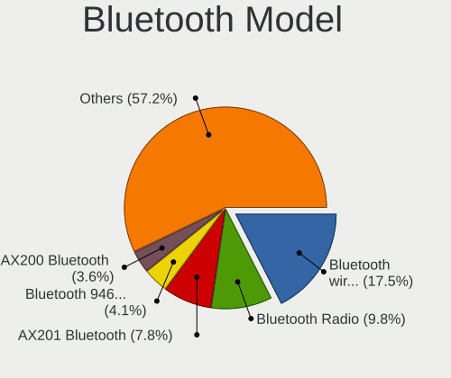

| Model                                                                               | Notebooks | Percent |
|-------------------------------------------------------------------------------------|-----------|---------|
| Intel Bluetooth wireless interface                                                  | 116       | 17.5%   |
| Realtek Bluetooth Radio                                                             | 65        | 9.8%    |
| Intel AX201 Bluetooth                                                               | 52        | 7.84%   |
| Intel Bluetooth 9460/9560 Jefferson Peak (JfP)                                      | 27        | 4.07%   |
| Intel AX200 Bluetooth                                                               | 24        | 3.62%   |
| Qualcomm Atheros  Bluetooth Device                                                  | 23        | 3.47%   |
| IMC Networks Wireless_Device                                                        | 23        | 3.47%   |
| Apple Bluetooth Host Controller                                                     | 20        | 3.02%   |
| Intel Bluetooth Device                                                              | 19        | 2.87%   |
| Cambridge Silicon Radio Bluetooth Dongle (HCI mode)                                 | 17        | 2.56%   |
| Realtek  Bluetooth 4.2 Adapter                                                      | 13        | 1.96%   |
| Ralink RT3290 Bluetooth                                                             | 13        | 1.96%   |
| Apple Bluetooth USB Host Controller                                                 | 12        | 1.81%   |
| Intel Centrino Bluetooth Wireless Transceiver                                       | 9         | 1.36%   |
| Qualcomm Atheros AR3011 Bluetooth                                                   | 8         | 1.21%   |
| Lite-On Atheros AR3012 Bluetooth                                                    | 8         | 1.21%   |
| IMC Networks Bluetooth Radio                                                        | 8         | 1.21%   |
| Broadcom BCM2045B (BDC-2.1)                                                         | 8         | 1.21%   |
| Qualcomm Atheros AR3012 Bluetooth 4.0                                               | 7         | 1.06%   |
| Intel Centrino Advanced-N 6230 Bluetooth adapter                                    | 7         | 1.06%   |
| HP Bluetooth 2.0 Interface [Broadcom BCM2045]                                       | 7         | 1.06%   |
| Lite-On Qualcomm Atheros QCA9377 Bluetooth                                          | 6         | 0.9%    |
| Intel Wireless-AC 9260 Bluetooth Adapter                                            | 6         | 0.9%    |
| Intel Wireless-AC 3168 Bluetooth                                                    | 6         | 0.9%    |
| HP Broadcom 2070 Bluetooth Combo                                                    | 6         | 0.9%    |
| Dell DW375 Bluetooth Module                                                         | 6         | 0.9%    |
| Qualcomm Atheros QCA61x4 Bluetooth 4.0                                              | 5         | 0.75%   |
| Intel AX210 Bluetooth                                                               | 5         | 0.75%   |
| Foxconn / Hon Hai Foxconn T77H114 BCM2070 [Single-Chip Bluetooth 2.1 + EDR Adapter] | 5         | 0.75%   |
| Broadcom BCM2045B (BDC-2.1) [Bluetooth Controller]                                  | 5         | 0.75%   |
| Toshiba BCM43142A0                                                                  | 4         | 0.6%    |
| Qualcomm Atheros Bluetooth                                                          | 4         | 0.6%    |
| Foxconn / Hon Hai MediaTek Bluetooth Adapter                                        | 4         | 0.6%    |
| Broadcom BCM2070 Bluetooth 2.1 + EDR                                                | 4         | 0.6%    |
| ASUS Broadcom Bluetooth 2.1                                                         | 4         | 0.6%    |
| Apple Bluetooth HCI                                                                 | 4         | 0.6%    |
| Realtek RTL8723B Bluetooth                                                          | 3         | 0.45%   |
| MediaTek Wireless_Device                                                            | 3         | 0.45%   |
| Lite-On Wireless_Device                                                             | 3         | 0.45%   |
| Lite-On Bluetooth Radio                                                             | 3         | 0.45%   |

Sound
-----

Sound Vendor
------------

Sound card vendors

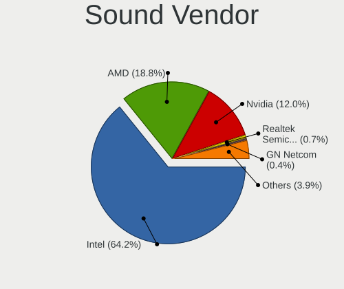

| Vendor                           | Notebooks | Percent |
|----------------------------------|-----------|---------|
| Intel                            | 622       | 64.19%  |
| AMD                              | 182       | 18.78%  |
| Nvidia                           | 116       | 11.97%  |
| Realtek Semiconductor            | 7         | 0.72%   |
| GN Netcom                        | 4         | 0.41%   |
| Texas Instruments                | 3         | 0.31%   |
| Nordic Semiconductor ASA         | 3         | 0.31%   |
| JMTek                            | 3         | 0.31%   |
| C-Media Electronics              | 3         | 0.31%   |
| VIA Technologies                 | 2         | 0.21%   |
| Philips (or NXP)                 | 2         | 0.21%   |
| Lenovo                           | 2         | 0.21%   |
| Focusrite-Novation               | 2         | 0.21%   |
| BEHRINGER International          | 2         | 0.21%   |
| SteelSeries ApS                  | 1         | 0.1%    |
| Silicon Integrated Systems [SiS] | 1         | 0.1%    |
| Plantronics                      | 1         | 0.1%    |
| Mark of the Unicorn              | 1         | 0.1%    |
| Logitech                         | 1         | 0.1%    |
| Jieli Technology                 | 1         | 0.1%    |
| Guillemot                        | 1         | 0.1%    |
| Generalplus Technology           | 1         | 0.1%    |
| FIFINE 683 Microphone            | 1         | 0.1%    |
| DSEA A/S                         | 1         | 0.1%    |
| Dell                             | 1         | 0.1%    |
| Conexant Systems                 | 1         | 0.1%    |
| CMX Systems                      | 1         | 0.1%    |
| Audient                          | 1         | 0.1%    |
| AKAI Professional M.I.           | 1         | 0.1%    |
| Actions Semiconductor            | 1         | 0.1%    |

Sound Model
-----------

Sound card models

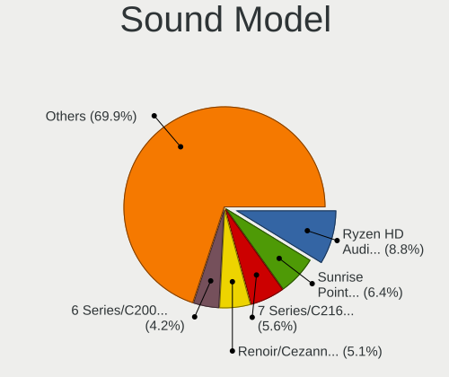

| Model                                                                                             | Notebooks | Percent |
|---------------------------------------------------------------------------------------------------|-----------|---------|
| AMD Ryzen HD Audio Controller                                                                     | 104       | 8.75%   |
| Intel Sunrise Point-LP HD Audio                                                                   | 76        | 6.4%    |
| Intel 7 Series/C216 Chipset Family High Definition Audio Controller                               | 67        | 5.64%   |
| AMD Renoir/Cezanne HDMI/DP Audio Controller                                                       | 60        | 5.05%   |
| Intel 6 Series/C200 Series Chipset Family High Definition Audio Controller                        | 50        | 4.21%   |
| Intel Tiger Lake-LP Smart Sound Technology Audio Controller                                       | 40        | 3.37%   |
| Intel 5 Series/3400 Series Chipset High Definition Audio                                          | 38        | 3.2%    |
| AMD FCH Azalia Controller                                                                         | 34        | 2.86%   |
| Intel 82801I (ICH9 Family) HD Audio Controller                                                    | 33        | 2.78%   |
| Intel NM10/ICH7 Family High Definition Audio Controller                                           | 31        | 2.61%   |
| Intel Haswell-ULT HD Audio Controller                                                             | 26        | 2.19%   |
| Intel Alder Lake PCH-P High Definition Audio Controller                                           | 26        | 2.19%   |
| Intel 8 Series HD Audio Controller                                                                | 26        | 2.19%   |
| Intel 8 Series/C220 Series Chipset High Definition Audio Controller                               | 25        | 2.1%    |
| Intel 82801H (ICH8 Family) HD Audio Controller                                                    | 22        | 1.85%   |
| AMD Kabini HDMI/DP Audio                                                                          | 22        | 1.85%   |
| Intel Xeon E3-1200 v3/4th Gen Core Processor HD Audio Controller                                  | 21        | 1.77%   |
| Intel Celeron/Pentium Silver Processor High Definition Audio                                      | 21        | 1.77%   |
| Intel Wildcat Point-LP High Definition Audio Controller                                           | 20        | 1.68%   |
| Intel Broadwell-U Audio Controller                                                                | 20        | 1.68%   |
| Intel Cannon Lake PCH cAVS                                                                        | 18        | 1.52%   |
| AMD Raven/Raven2/Fenghuang HDMI/DP Audio Controller                                               | 18        | 1.52%   |
| AMD Radeon High Definition Audio Controller                                                       | 18        | 1.52%   |
| Intel Atom/Celeron/Pentium Processor x5-E8000/J3xxx/N3xxx Series High Definition Audio Controller | 15        | 1.26%   |
| Nvidia GF108 High Definition Audio Controller                                                     | 14        | 1.18%   |
| Intel Cannon Point-LP High Definition Audio Controller                                            | 14        | 1.18%   |
| AMD Family 15h (Models 60h-6fh) Audio Controller                                                  | 14        | 1.18%   |
| Intel 100 Series/C230 Series Chipset Family HD Audio Controller                                   | 12        | 1.01%   |
| AMD High Definition Audio Controller                                                              | 11        | 0.93%   |
| Nvidia TU107 GeForce GTX 1650 High Definition Audio Controller                                    | 10        | 0.84%   |
| Nvidia GA107 High Definition Audio Controller                                                     | 10        | 0.84%   |
| Nvidia MCP89 High Definition Audio                                                                | 9         | 0.76%   |
| Intel Raptor Lake-P/U/H cAVS                                                                      | 9         | 0.76%   |
| Intel Comet Lake PCH-LP cAVS                                                                      | 9         | 0.76%   |
| Intel Celeron N3350/Pentium N4200/Atom E3900 Series Audio Cluster                                 | 9         | 0.76%   |
| Intel Atom Processor Z36xxx/Z37xxx Series High Definition Audio Controller                        | 9         | 0.76%   |
| AMD Wrestler HDMI Audio                                                                           | 9         | 0.76%   |
| AMD SBx00 Azalia (Intel HDA)                                                                      | 9         | 0.76%   |
| Intel Ice Lake-LP Smart Sound Technology Audio Controller                                         | 8         | 0.67%   |
| Intel Comet Lake PCH cAVS                                                                         | 8         | 0.67%   |

Memory
------

Memory Vendor
-------------

Memory module vendors

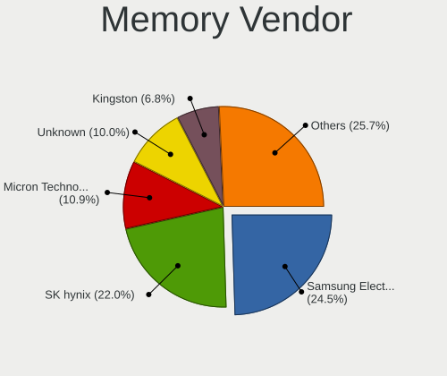

| Vendor                         | Notebooks | Percent |
|--------------------------------|-----------|---------|
| Samsung Electronics            | 240       | 24.51%  |
| SK hynix                       | 215       | 21.96%  |
| Micron Technology              | 107       | 10.93%  |
| Unknown                        | 98        | 10.01%  |
| Kingston                       | 67        | 6.84%   |
| Crucial                        | 53        | 5.41%   |
| A-DATA Technology              | 26        | 2.66%   |
| Elpida                         | 22        | 2.25%   |
| Ramaxel Technology             | 21        | 2.15%   |
| Unknown                        | 20        | 2.04%   |
| Unknown (ABCD)                 | 18        | 1.84%   |
| Corsair                        | 12        | 1.23%   |
| Nanya Technology               | 11        | 1.12%   |
| Team                           | 10        | 1.02%   |
| Smart                          | 8         | 0.82%   |
| G.Skill                        | 7         | 0.72%   |
| Transcend                      | 6         | 0.61%   |
| Patriot                        | 4         | 0.41%   |
| Apacer                         | 4         | 0.41%   |
| 48spaces                       | 3         | 0.31%   |
| Teikon                         | 2         | 0.2%    |
| CSX                            | 2         | 0.2%    |
| ASint Technology               | 2         | 0.2%    |
| 4ea5                           | 2         | 0.2%    |
| Wilk                           | 1         | 0.1%    |
| Unknown (F301)                 | 1         | 0.1%    |
| Unknown (8A02)                 | 1         | 0.1%    |
| Unifosa                        | 1         | 0.1%    |
| TRS STAR                       | 1         | 0.1%    |
| Qimonda                        | 1         | 0.1%    |
| PNY                            | 1         | 0.1%    |
| Netlist                        | 1         | 0.1%    |
| MKF_SMBIOS_TYPE17_MANUFACTURER | 1         | 0.1%    |
| Lexar Co Limited               | 1         | 0.1%    |
| Lexar                          | 1         | 0.1%    |
| Innodisk                       | 1         | 0.1%    |
| High Bridge                    | 1         | 0.1%    |
| Hewlett-Packard                | 1         | 0.1%    |
| ff                             | 1         | 0.1%    |
| Essencore                      | 1         | 0.1%    |

Memory Model
------------

Memory module models

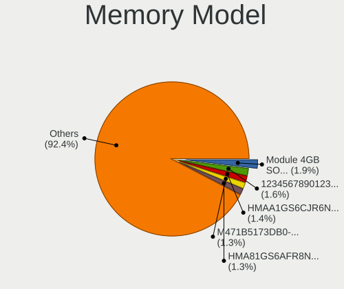

| Model                                                            | Notebooks | Percent |
|------------------------------------------------------------------|-----------|---------|
| Unknown                                                          | 20        | 1.91%   |
| Unknown (ABCD) RAM 123456789012345678 2GB SODIMM LPDDR4 2400MT/s | 17        | 1.63%   |
| SK hynix RAM HMAA1GS6CJR6N-XN 8GB SODIMM DDR4 3200MT/s           | 15        | 1.43%   |
| SK hynix RAM HMA81GS6AFR8N-UH 8GB SODIMM DDR4 2667MT/s           | 14        | 1.34%   |
| Samsung RAM M471B5173DB0-YK0 4GB SODIMM DDR3 1600MT/s            | 14        | 1.34%   |
| Samsung RAM M471B5273DH0-CH9 4GB SODIMM DDR3 1600MT/s            | 13        | 1.24%   |
| Samsung RAM M471B5273CH0-CH9 4GB SODIMM DDR3 1334MT/s            | 12        | 1.15%   |
| Samsung RAM M471A1K43EB1-CWE 8GB SODIMM DDR4 3200MT/s            | 11        | 1.05%   |
| Samsung RAM M471A1G44BB0-CWE 8GB SODIMM DDR4 3200MT/s            | 10        | 0.96%   |
| Unknown RAM Module 2GB SODIMM DDR3 1333MT/s                      | 9         | 0.86%   |
| Samsung RAM M471A5244CB0-CTD 4GB SODIMM DDR4 3266MT/s            | 9         | 0.86%   |
| Samsung RAM M471A1G44AB0-CWE 8GiB SODIMM DDR4 3200MT/s           | 9         | 0.86%   |
| Unknown RAM Module 4GB SODIMM DDR3                               | 8         | 0.76%   |
| SK hynix RAM HMT451S6BFR8A-PB 4GB SODIMM DDR3 1600MT/s           | 8         | 0.76%   |
| Samsung RAM M471B5173QH0-YK0 4GB SODIMM DDR3 1600MT/s            | 8         | 0.76%   |
| Unknown RAM Module 1GB SODIMM DDR2 667MT/s                       | 7         | 0.67%   |
| SK hynix RAM HMAA1GS6CJR6N-XN 8GB Row Of Chips DDR4 3200MT/s     | 7         | 0.67%   |
| SK hynix RAM HMA81GS6DJR8N-XN 8GB SODIMM DDR4 3200MT/s           | 7         | 0.67%   |
| Samsung RAM M471B1G73QH0-YK0 8GB SODIMM DDR3 1600MT/s            | 7         | 0.67%   |
| Samsung RAM M471B1G73EB0-YK0 8192MB SODIMM DDR3 1600MT/s         | 7         | 0.67%   |
| Samsung RAM M471A1K43CB1-CRC 8GB SODIMM DDR4 8400MT/s            | 7         | 0.67%   |
| Unknown RAM Module 2GB SODIMM DDR2 667MT/s                       | 6         | 0.57%   |
| SK hynix RAM HMT351S6CFR8C-PB 4GB SODIMM DDR3 1600MT/s           | 6         | 0.57%   |
| SK hynix RAM HMA81GS6JJR8N-VK 8GB SODIMM DDR4 2667MT/s           | 6         | 0.57%   |
| Samsung RAM M471B5273DH0-CK0 4GB SODIMM DDR3 2400MT/s            | 6         | 0.57%   |
| Samsung RAM M471B5173EB0-YK0 4GB SODIMM DDR3 1600MT/s            | 6         | 0.57%   |
| Samsung RAM M471B1G73DB0-YK0 8GB SODIMM DDR3 1600MT/s            | 6         | 0.57%   |
| Micron RAM 16KTF51264HZ-1G6M1 4GB SODIMM DDR3 1600MT/s           | 6         | 0.57%   |
| SK hynix RAM HMT41GS6BFR8A-PB 8GB SODIMM DDR3 2667MT/s           | 5         | 0.48%   |
| Samsung RAM M471B5773DH0-CH9 2GB SODIMM DDR3 1600MT/s            | 5         | 0.48%   |
| Samsung RAM M471A5244CB0-CWE 4GB SODIMM DDR4 3200MT/s            | 5         | 0.48%   |
| Samsung RAM M471A1K43DB1-CWE 8GB SODIMM DDR4 3200MT/s            | 5         | 0.48%   |
| Samsung RAM M471A1K43DB1-CTD 8GB SODIMM DDR4 2667MT/s            | 5         | 0.48%   |
| Micron RAM 8KTF51264HZ-1G6E1 4GB SODIMM DDR3 1600MT/s            | 5         | 0.48%   |
| Elpida RAM EBJ41UF8BCS0-DJ-F 4GB SODIMM DDR3 1334MT/s            | 5         | 0.48%   |
| Crucial RAM CT102464BF160B.C16 8GB SODIMM DDR3 1600MT/s          | 5         | 0.48%   |
| Unknown RAM Module 8GB SODIMM DDR3 1600MT/s                      | 4         | 0.38%   |
| Unknown RAM Module 2GB SODIMM SDRAM                              | 4         | 0.38%   |
| Unknown RAM Module 2GB SODIMM DDR2                               | 4         | 0.38%   |
| Unknown RAM Module 1GB SODIMM DDR2                               | 4         | 0.38%   |

Memory Kind
-----------

Memory module kinds

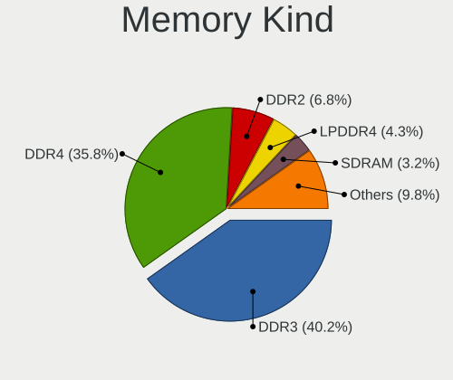

| Kind    | Notebooks | Percent |
|---------|-----------|---------|
| DDR3    | 339       | 40.17%  |
| DDR4    | 302       | 35.78%  |
| DDR2    | 57        | 6.75%   |
| LPDDR4  | 36        | 4.27%   |
| SDRAM   | 27        | 3.2%    |
| DDR5    | 26        | 3.08%   |
| LPDDR5  | 19        | 2.25%   |
| LPDDR3  | 15        | 1.78%   |
| DDR     | 13        | 1.54%   |
| Unknown | 6         | 0.71%   |
| DRAM    | 4         | 0.47%   |

Memory Form Factor
------------------

Physical design of the memory module

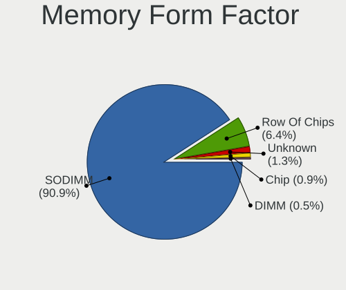

| Name         | Notebooks | Percent |
|--------------|-----------|---------|
| SODIMM       | 766       | 90.87%  |
| Row Of Chips | 54        | 6.41%   |
| Unknown      | 11        | 1.3%    |
| Chip         | 8         | 0.95%   |
| DIMM         | 4         | 0.47%   |

Memory Size
-----------

Memory module size

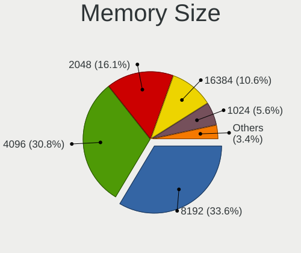

| Size  | Notebooks | Percent |
|-------|-----------|---------|
| 8192  | 308       | 33.59%  |
| 4096  | 282       | 30.75%  |
| 2048  | 148       | 16.14%  |
| 16384 | 97        | 10.58%  |
| 1024  | 51        | 5.56%   |
| 32768 | 27        | 2.94%   |
| 512   | 4         | 0.44%   |

Memory Speed
------------

Memory module speed

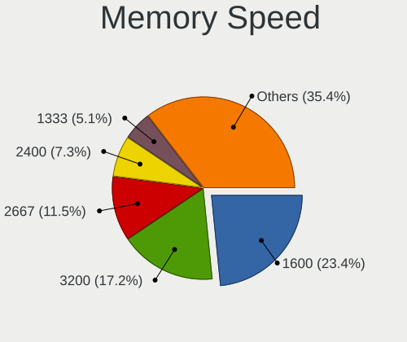

| Speed   | Notebooks | Percent |
|---------|-----------|---------|
| 1600    | 214       | 23.41%  |
| 3200    | 157       | 17.18%  |
| 2667    | 105       | 11.49%  |
| 2400    | 67        | 7.33%   |
| 1333    | 47        | 5.14%   |
| 1334    | 43        | 4.7%    |
| 667     | 35        | 3.83%   |
| 1067    | 33        | 3.61%   |
| Unknown | 33        | 3.61%   |
| 2133    | 23        | 2.52%   |
| 800     | 19        | 2.08%   |
| 5600    | 14        | 1.53%   |
| 6400    | 11        | 1.2%    |
| 4800    | 11        | 1.2%    |
| 4199    | 10        | 1.09%   |
| 1867    | 10        | 1.09%   |
| 8400    | 9         | 0.98%   |
| 4267    | 9         | 0.98%   |
| 3266    | 9         | 0.98%   |
| 2048    | 9         | 0.98%   |
| 975     | 8         | 0.88%   |
| 533     | 8         | 0.88%   |
| 1066    | 5         | 0.55%   |
| 7467    | 3         | 0.33%   |
| 5500    | 3         | 0.33%   |
| 3733    | 3         | 0.33%   |
| 2933    | 3         | 0.33%   |
| 7500    | 2         | 0.22%   |
| 4266    | 2         | 0.22%   |
| 1639    | 2         | 0.22%   |
| 5200    | 1         | 0.11%   |
| 2267    | 1         | 0.11%   |
| 1866    | 1         | 0.11%   |
| 666     | 1         | 0.11%   |
| 400     | 1         | 0.11%   |
| 166     | 1         | 0.11%   |
| 100     | 1         | 0.11%   |

Printers & scanners
-------------------

Printer Vendor
--------------

Printer device vendors

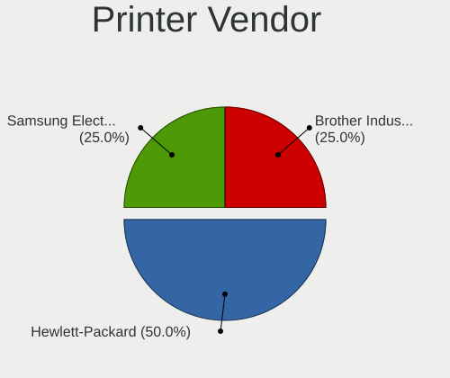

| Vendor              | Notebooks | Percent |
|---------------------|-----------|---------|
| Hewlett-Packard     | 3         | 42.86%  |
| Samsung Electronics | 1         | 14.29%  |
| Dymo-CoStar         | 1         | 14.29%  |
| Canon               | 1         | 14.29%  |
| Brother Industries  | 1         | 14.29%  |

Printer Model
-------------

Printer device models

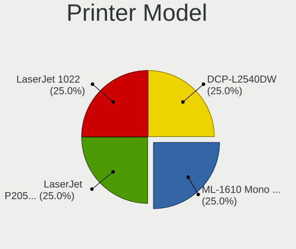

| Model                              | Notebooks | Percent |
|------------------------------------|-----------|---------|
| Samsung ML-1610 Mono Laser Printer | 1         | 14.29%  |
| HP LaserJet P2055 series           | 1         | 14.29%  |
| HP LaserJet P1006                  | 1         | 14.29%  |
| HP LaserJet 1022                   | 1         | 14.29%  |
| Dymo-CoStar LabelWriter 450        | 1         | 14.29%  |
| Canon LiDE 400                     | 1         | 14.29%  |
| Brother DCP-L2540DW                | 1         | 14.29%  |

Scanner Vendor
--------------

Scanner device vendors

| Vendor | Notebooks | Percent |
|--------|-----------|---------|
| Canon  | 2         | 100%    |

Scanner Model
-------------

Scanner device models

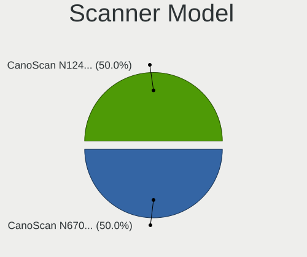

| Model                              | Notebooks | Percent |
|------------------------------------|-----------|---------|
| Canon CanoScan N670U/N676U/LiDE 20 | 1         | 50%     |
| Canon CanoScan N1240U/LiDE 30      | 1         | 50%     |

Camera
------

Camera Vendor
-------------

Camera device vendors

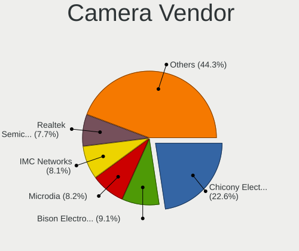

| Vendor                                 | Notebooks | Percent |
|----------------------------------------|-----------|---------|
| Chicony Electronics                    | 162       | 22.63%  |
| Bison Electronics                      | 65        | 9.08%   |
| Microdia                               | 59        | 8.24%   |
| IMC Networks                           | 58        | 8.1%    |
| Realtek Semiconductor                  | 55        | 7.68%   |
| Quanta                                 | 43        | 6.01%   |
| Sunplus Innovation Technology          | 33        | 4.61%   |
| Cheng Uei Precision Industry (Foxlink) | 33        | 4.61%   |
| Apple                                  | 29        | 4.05%   |
| Suyin                                  | 26        | 3.63%   |
| Luxvisions Innotech Limited            | 22        | 3.07%   |
| Lite-On Technology                     | 21        | 2.93%   |
| Alcor Micro                            | 14        | 1.96%   |
| Lenovo                                 | 13        | 1.82%   |
| Syntek                                 | 11        | 1.54%   |
| Silicon Motion                         | 9         | 1.26%   |
| Ricoh                                  | 9         | 1.26%   |
| Sonix Technology                       | 6         | 0.84%   |
| Importek                               | 6         | 0.84%   |
| Z-Star Microelectronics                | 5         | 0.7%    |
| Logitech                               | 5         | 0.7%    |
| icSpring                               | 4         | 0.56%   |
| Samsung Electronics                    | 3         | 0.42%   |
| kingcome                               | 2         | 0.28%   |
| Intel                                  | 2         | 0.28%   |
| Cubeternet                             | 2         | 0.28%   |
| ALi                                    | 2         | 0.28%   |
| Acer                                   | 2         | 0.28%   |
| Y Media                                | 1         | 0.14%   |
| Xiongmai                               | 1         | 0.14%   |
| WaveRider Communications               | 1         | 0.14%   |
| Tobii Technology AB                    | 1         | 0.14%   |
| SunplusIT                              | 1         | 0.14%   |
| ShineTech                              | 1         | 0.14%   |
| Primax Electronics                     | 1         | 0.14%   |
| Novatek Microelectronics               | 1         | 0.14%   |
| Microsoft                              | 1         | 0.14%   |
| KYT-240222-A                           | 1         | 0.14%   |
| HYGD-240403-A                          | 1         | 0.14%   |
| Hewlett-Packard                        | 1         | 0.14%   |

Camera Model
------------

Camera device models

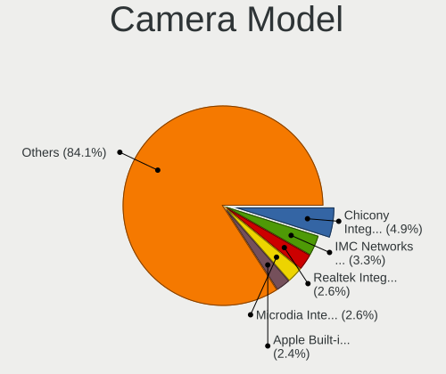

| Model                                               | Notebooks | Percent |
|-----------------------------------------------------|-----------|---------|
| Chicony Integrated Camera                           | 35        | 4.88%   |
| IMC Networks USB2.0 HD UVC WebCam                   | 24        | 3.35%   |
| Realtek Integrated_Webcam_HD                        | 19        | 2.65%   |
| Microdia Integrated_Webcam_HD                       | 19        | 2.65%   |
| Apple Built-in iSight                               | 17        | 2.37%   |
| Sunplus Integrated_Webcam_HD                        | 11        | 1.53%   |
| IMC Networks Integrated Camera                      | 11        | 1.53%   |
| Chicony HD WebCam                                   | 10        | 1.39%   |
| Lite-On Integrated Camera                           | 9         | 1.26%   |
| Chicony TOSHIBA Web Camera - HD                     | 9         | 1.26%   |
| Quanta HD User Facing                               | 8         | 1.12%   |
| Chicony HP Truevision HD camera                     | 8         | 1.12%   |
| Bison USB HD Webcam                                 | 8         | 1.12%   |
| Bison Integrated Camera                             | 8         | 1.12%   |
| Lenovo Integrated Webcam [R5U877]                   | 7         | 0.98%   |
| Bison Lenovo EasyCamera                             | 7         | 0.98%   |
| Realtek USB2.0 HD UVC WebCam                        | 6         | 0.84%   |
| Quanta HP TrueVision HD Camera                      | 6         | 0.84%   |
| Microdia Integrated Webcam                          | 6         | 0.84%   |
| Luxvisions Innotech Limited Integrated Camera       | 6         | 0.84%   |
| Luxvisions Innotech Limited HP TrueVision HD Camera | 6         | 0.84%   |
| Importek TOSHIBA Web Camera - HD                    | 6         | 0.84%   |
| IMC Networks USB2.0 VGA UVC WebCam                  | 6         | 0.84%   |
| Chicony USB 2.0 Camera                              | 6         | 0.84%   |
| Cheng Uei Precision Industry (Foxlink) HP Webcam    | 6         | 0.84%   |
| Bison HD Webcam                                     | 6         | 0.84%   |
| Syntek Integrated Camera                            | 5         | 0.7%    |
| Suyin HP TrueVision HD Integrated Webcam            | 5         | 0.7%    |
| Sunplus HD WebCam                                   | 5         | 0.7%    |
| Quanta HP HD Camera                                 | 5         | 0.7%    |
| Microdia Laptop_Integrated_Webcam_2M                | 5         | 0.7%    |
| Lite-On HP HD Camera                                | 5         | 0.7%    |
| Lenovo Integrated Webcam                            | 5         | 0.7%    |
| IMC Networks USB2.0 UVC HD Webcam                   | 5         | 0.7%    |
| Chicony USB2.0 HD UVC WebCam                        | 5         | 0.7%    |
| Chicony Integrated Camera (1280x720@30)             | 5         | 0.7%    |
| Chicony HP Truevision HD                            | 5         | 0.7%    |
| Chicony HD User Facing                              | 5         | 0.7%    |
| Cheng Uei Precision Industry (Foxlink) HP HD Camera | 5         | 0.7%    |
| Bison BisonCam,NB Pro                               | 5         | 0.7%    |

Security
--------

Fingerprint Vendor
------------------

Fingerprint sensor vendors

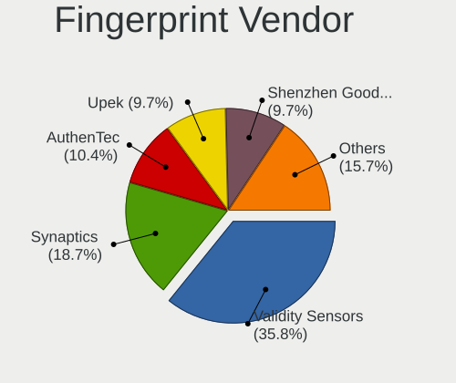

| Vendor                             | Notebooks | Percent |
|------------------------------------|-----------|---------|
| Validity Sensors                   | 48        | 35.82%  |
| Synaptics                          | 25        | 18.66%  |
| AuthenTec                          | 14        | 10.45%  |
| Upek                               | 13        | 9.7%    |
| Shenzhen Goodix Technology         | 13        | 9.7%    |
| Elan Microelectronics              | 13        | 9.7%    |
| STMicroelectronics                 | 3         | 2.24%   |
| LighTuning Technology              | 3         | 2.24%   |
| Realtek USB2.0 Finger Print Bridge | 1         | 0.75%   |
| Focal-systems.Corp                 | 1         | 0.75%   |

Fingerprint Model
-----------------

Fingerprint sensor models

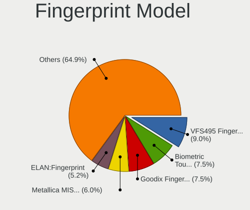

| Model                                                           | Notebooks | Percent |
|-----------------------------------------------------------------|-----------|---------|
| Validity Sensors VFS495 Fingerprint Reader                      | 12        | 8.96%   |
| Upek Biometric Touchchip/Touchstrip Fingerprint Sensor          | 10        | 7.46%   |
| Shenzhen Goodix  Fingerprint Device                             | 10        | 7.46%   |
| Synaptics Metallica MIS Touch Fingerprint Reader                | 8         | 5.97%   |
| Elan ELAN:Fingerprint                                           | 7         | 5.22%   |
| Validity Sensors VFS 5011 fingerprint sensor                    | 6         | 4.48%   |
| Elan ELAN:ARM-M4                                                | 6         | 4.48%   |
| AuthenTec AES2810                                               | 6         | 4.48%   |
| AuthenTec AES2501 Fingerprint Sensor                            | 6         | 4.48%   |
| Validity Sensors Synaptics WBDI                                 | 5         | 3.73%   |
| Validity Sensors VFS5011 Fingerprint Reader                     | 4         | 2.99%   |
| Validity Sensors VFS Fingerprint sensor                         | 4         | 2.99%   |
| Validity Sensors Fingerprint scanner                            | 4         | 2.99%   |
| Synaptics Prometheus MIS Touch Fingerprint Reader               | 4         | 2.99%   |
| Validity Sensors VFS471 Fingerprint Reader                      | 3         | 2.24%   |
| Upek TCS5B Fingerprint sensor                                   | 3         | 2.24%   |
| Synaptics UWP WBDI Device                                       | 3         | 2.24%   |
| Synaptics FS7604 Touch Fingerprint Sensor with PurePrint        | 3         | 2.24%   |
| STMicroelectronics Fingerprint Reader                           | 3         | 2.24%   |
| Validity Sensors VFS7500 Touch Fingerprint Sensor               | 2         | 1.49%   |
| Validity Sensors VFS451 Fingerprint Reader                      | 2         | 1.49%   |
| Validity Sensors VFS300 Fingerprint Reader                      | 2         | 1.49%   |
| Validity Sensors Swipe Fingerprint Sensor                       | 2         | 1.49%   |
| Synaptics Metallica MOH Touch Fingerprint Reader                | 2         | 1.49%   |
| Synaptics Fingerprint reader [HP G6]                            | 2         | 1.49%   |
| Shenzhen Goodix Fingerprint Reader                              | 2         | 1.49%   |
| LighTuning EgisTec Touch Fingerprint Sensor                     | 2         | 1.49%   |
| Validity Sensors VFS491                                         | 1         | 0.75%   |
| Validity Sensors VFS101 Fingerprint Reader                      | 1         | 0.75%   |
| Synaptics UWP WBDI                                              | 1         | 0.75%   |
| Synaptics  WBDI                                                 | 1         | 0.75%   |
| Shenzhen Goodix FingerPrint                                     | 1         | 0.75%   |
| Realtek USB2.0 Finger Print Bridge FocalTech Fingerprint Device | 1         | 0.75%   |
| LighTuning Fingerprint Reader                                   | 1         | 0.75%   |
| Focal-systems.Corp FT9201Fingerprint.                           | 1         | 0.75%   |
| AuthenTec AES1660 Fingerprint Sensor                            | 1         | 0.75%   |
| AuthenTec AES1600                                               | 1         | 0.75%   |
| Unknown                                                         | 1         | 0.75%   |

Chipcard Vendor
---------------

Chipcard module vendors

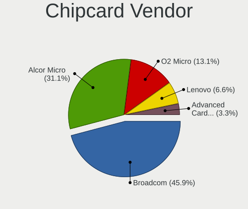

| Vendor                | Notebooks | Percent |
|-----------------------|-----------|---------|
| Broadcom              | 28        | 45.9%   |
| Alcor Micro           | 19        | 31.15%  |
| O2 Micro              | 8         | 13.11%  |
| Lenovo                | 4         | 6.56%   |
| Advanced Card Systems | 2         | 3.28%   |

Chipcard Model
--------------

Chipcard module models

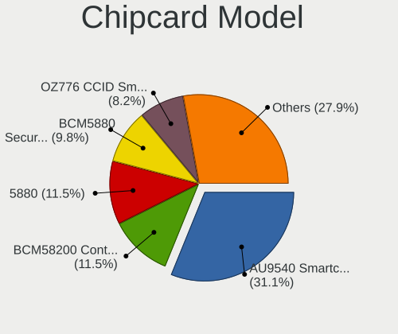

| Model                                                                        | Notebooks | Percent |
|------------------------------------------------------------------------------|-----------|---------|
| Alcor Micro AU9540 Smartcard Reader                                          | 19        | 31.15%  |
| Broadcom BCM58200 ControlVault 3 (FingerPrint sensor + Contacted SmartCard)  | 7         | 11.48%  |
| Broadcom 5880                                                                | 7         | 11.48%  |
| Broadcom BCM5880 Secure Applications Processor                               | 6         | 9.84%   |
| O2 Micro OZ776 CCID Smartcard Reader                                         | 5         | 8.2%    |
| Lenovo Integrated Smart Card Reader                                          | 4         | 6.56%   |
| Broadcom BCM5880 Secure Applications Processor with fingerprint swipe sensor | 4         | 6.56%   |
| Broadcom 58200                                                               | 4         | 6.56%   |
| O2 Micro Oz776 SmartCard Reader                                              | 3         | 4.92%   |
| Advanced Card Systems ACR38 SmartCard Reader                                 | 1         | 1.64%   |
| Advanced Card Systems ACR122U                                                | 1         | 1.64%   |

Unsupported
-----------

Unsupported Devices
-------------------

Total unsupported devices on board

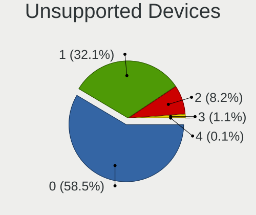

| Total | Notebooks | Percent |
|-------|-----------|---------|
| 0     | 494       | 58.53%  |
| 1     | 271       | 32.11%  |
| 2     | 69        | 8.18%   |
| 3     | 9         | 1.07%   |
| 4     | 1         | 0.12%   |

Unsupported Device Types
------------------------

Types of unsupported devices

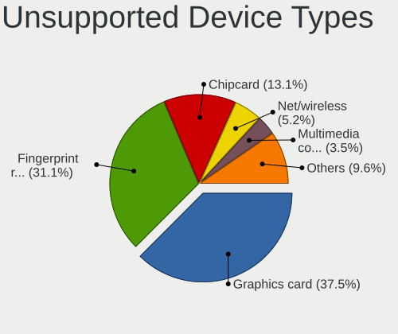

| Type                     | Notebooks | Percent |
|--------------------------|-----------|---------|
| Graphics card            | 160       | 37.47%  |
| Fingerprint reader       | 133       | 31.15%  |
| Chipcard                 | 56        | 13.11%  |
| Net/wireless             | 22        | 5.15%   |
| Multimedia controller    | 15        | 3.51%   |
| Bluetooth                | 12        | 2.81%   |
| Camera                   | 11        | 2.58%   |
| Storage                  | 6         | 1.41%   |
| Flash memory             | 3         | 0.7%    |
| Communication controller | 3         | 0.7%    |
| Net/ethernet             | 2         | 0.47%   |
| Wireless                 | 1         | 0.23%   |
| Sound                    | 1         | 0.23%   |
| Network                  | 1         | 0.23%   |
| Card reader              | 1         | 0.23%   |

