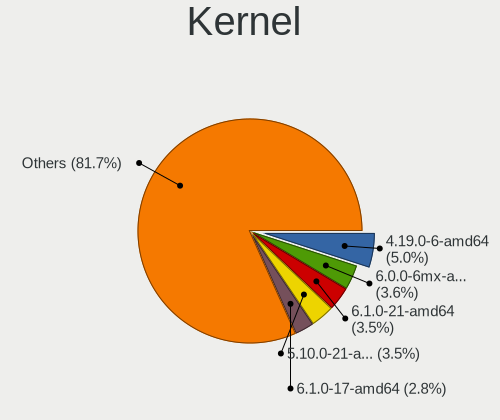
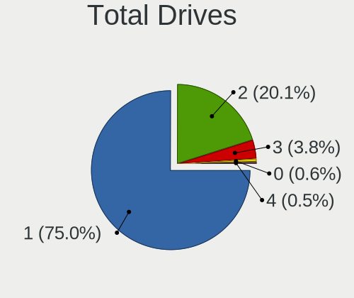
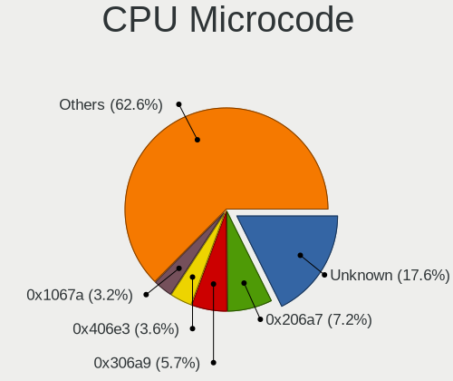
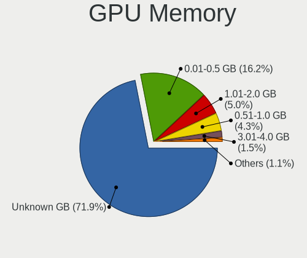
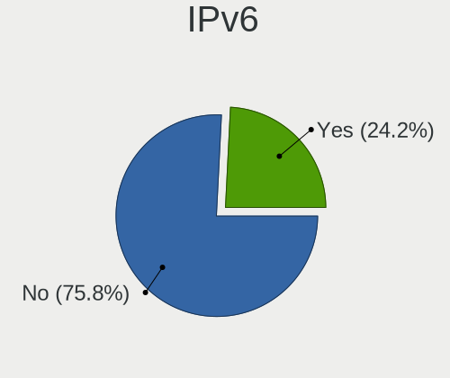
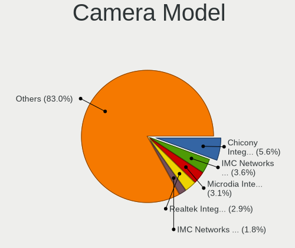

MX - Tested Hardware & Statistics (Notebooks)
---------------------------------------------

A project to collect tested hardware configurations for MX.

Anyone can contribute to this report by the [hw-probe](https://github.com/linuxhw/hw-probe) tool:

    sudo -E hw-probe -all -upload

Please contribute! Especially if your hardware is rare.

Contents
--------

* [ Test Cases ](#test-cases)

* [ System ](#system)
  - [ OS                       ](#os)
  - [ OS Family                ](#os-family)
  - [ Kernel                   ](#kernel)
  - [ Kernel Family            ](#kernel-family)
  - [ Kernel Major Ver.        ](#kernel-major-ver)
  - [ Arch                     ](#arch)
  - [ DE                       ](#de)
  - [ Display Server           ](#display-server)
  - [ Display Manager          ](#display-manager)
  - [ OS Lang                  ](#os-lang)
  - [ Boot Mode                ](#boot-mode)
  - [ Filesystem               ](#filesystem)
  - [ Part. scheme             ](#part-scheme)
  - [ Dual Boot with Linux/BSD ](#dual-boot-with-linuxbsd)
  - [ Dual Boot (Win)          ](#dual-boot-win)

* [ Board ](#board)
  - [ Vendor                   ](#vendor)
  - [ Model                    ](#model)
  - [ Model Family             ](#model-family)
  - [ MFG Year                 ](#mfg-year)
  - [ Form Factor              ](#form-factor)
  - [ Secure Boot              ](#secure-boot)
  - [ Coreboot                 ](#coreboot)
  - [ RAM Size                 ](#ram-size)
  - [ RAM Used                 ](#ram-used)
  - [ Total Drives             ](#total-drives)
  - [ Has CD-ROM               ](#has-cd-rom)
  - [ Has Ethernet             ](#has-ethernet)
  - [ Has WiFi                 ](#has-wifi)
  - [ Has Bluetooth            ](#has-bluetooth)

* [ Location ](#location)
  - [ Country                  ](#country)
  - [ City                     ](#city)

* [ Drives ](#drives)
  - [ Drive Vendor             ](#drive-vendor)
  - [ Drive Model              ](#drive-model)
  - [ HDD Vendor               ](#hdd-vendor)
  - [ SSD Vendor               ](#ssd-vendor)
  - [ Drive Kind               ](#drive-kind)
  - [ Drive Connector          ](#drive-connector)
  - [ Drive Size               ](#drive-size)
  - [ Space Total              ](#space-total)
  - [ Space Used               ](#space-used)
  - [ Malfunc. Drives          ](#malfunc-drives)
  - [ Malfunc. Drive Vendor    ](#malfunc-drive-vendor)
  - [ Malfunc. HDD Vendor      ](#malfunc-hdd-vendor)
  - [ Malfunc. Drive Kind      ](#malfunc-drive-kind)
  - [ Failed Drives            ](#failed-drives)
  - [ Failed Drive Vendor      ](#failed-drive-vendor)
  - [ Drive Status             ](#drive-status)

* [ Storage controller ](#storage-controller)
  - [ Storage Vendor           ](#storage-vendor)
  - [ Storage Model            ](#storage-model)
  - [ Storage Kind             ](#storage-kind)

* [ Processor ](#processor)
  - [ CPU Vendor               ](#cpu-vendor)
  - [ CPU Model                ](#cpu-model)
  - [ CPU Model Family         ](#cpu-model-family)
  - [ CPU Cores                ](#cpu-cores)
  - [ CPU Sockets              ](#cpu-sockets)
  - [ CPU Threads              ](#cpu-threads)
  - [ CPU Op-Modes             ](#cpu-op-modes)
  - [ CPU Microcode            ](#cpu-microcode)
  - [ CPU Microarch            ](#cpu-microarch)

* [ Graphics ](#graphics)
  - [ GPU Vendor               ](#gpu-vendor)
  - [ GPU Model                ](#gpu-model)
  - [ GPU Combo                ](#gpu-combo)
  - [ GPU Driver               ](#gpu-driver)
  - [ GPU Memory               ](#gpu-memory)

* [ Monitor ](#monitor)
  - [ Monitor Vendor           ](#monitor-vendor)
  - [ Monitor Model            ](#monitor-model)
  - [ Monitor Resolution       ](#monitor-resolution)
  - [ Monitor Diagonal         ](#monitor-diagonal)
  - [ Monitor Width            ](#monitor-width)
  - [ Aspect Ratio             ](#aspect-ratio)
  - [ Monitor Area             ](#monitor-area)
  - [ Pixel Density            ](#pixel-density)
  - [ Multiple Monitors        ](#multiple-monitors)

* [ Network ](#network)
  - [ Net Controller Vendor    ](#net-controller-vendor)
  - [ Net Controller Model     ](#net-controller-model)
  - [ Wireless Vendor          ](#wireless-vendor)
  - [ Wireless Model           ](#wireless-model)
  - [ Ethernet Vendor          ](#ethernet-vendor)
  - [ Ethernet Model           ](#ethernet-model)
  - [ Net Controller Kind      ](#net-controller-kind)
  - [ Used Controller          ](#used-controller)
  - [ NICs                     ](#nics)
  - [ IPv6                     ](#ipv6)

* [ Bluetooth ](#bluetooth)
  - [ Bluetooth Vendor         ](#bluetooth-vendor)
  - [ Bluetooth Model          ](#bluetooth-model)

* [ Sound ](#sound)
  - [ Sound Vendor             ](#sound-vendor)
  - [ Sound Model              ](#sound-model)

* [ Memory ](#memory)
  - [ Memory Vendor            ](#memory-vendor)
  - [ Memory Model             ](#memory-model)
  - [ Memory Kind              ](#memory-kind)
  - [ Memory Form Factor       ](#memory-form-factor)
  - [ Memory Size              ](#memory-size)
  - [ Memory Speed             ](#memory-speed)

* [ Printers & scanners ](#printers--scanners)
  - [ Printer Vendor           ](#printer-vendor)
  - [ Printer Model            ](#printer-model)
  - [ Scanner Vendor           ](#scanner-vendor)
  - [ Scanner Model            ](#scanner-model)

* [ Camera ](#camera)
  - [ Camera Vendor            ](#camera-vendor)
  - [ Camera Model             ](#camera-model)

* [ Security ](#security)
  - [ Fingerprint Vendor       ](#fingerprint-vendor)
  - [ Fingerprint Model        ](#fingerprint-model)
  - [ Chipcard Vendor          ](#chipcard-vendor)
  - [ Chipcard Model           ](#chipcard-model)

* [ Unsupported ](#unsupported)
  - [ Unsupported Devices      ](#unsupported-devices)
  - [ Unsupported Device Types ](#unsupported-device-types)

Test Cases
----------

Total: 759

| Vendor        | Model                       | Probe                                                      | Date         |
|---------------|-----------------------------|------------------------------------------------------------|--------------|
| Lenovo        | IdeaPad 3 15ALC6 82MF       | [413b207df0](https://linux-hardware.org/?probe=413b207df0) | May 09, 2024 |
| Dell          | Latitude 3190               | [102011a182](https://linux-hardware.org/?probe=102011a182) | May 07, 2024 |
| Toshiba       | Satellite C50-B             | [4037de5266](https://linux-hardware.org/?probe=4037de5266) | May 06, 2024 |
| Lenovo        | Yoga Slim 7-14ARE05 82A2    | [c931a1a446](https://linux-hardware.org/?probe=c931a1a446) | May 05, 2024 |
| Lenovo        | Legion Y540-17IRH 81Q4      | [41e3014295](https://linux-hardware.org/?probe=41e3014295) | May 04, 2024 |
| Dell          | Vostro 3400                 | [cd1ed35419](https://linux-hardware.org/?probe=cd1ed35419) | May 02, 2024 |
| Lenovo        | IdeaPad 1 15ALC7 82R4       | [cbd3101c16](https://linux-hardware.org/?probe=cbd3101c16) | May 01, 2024 |
| Lenovo        | IdeaPad 1 15ALC7 82R4       | [6aca55ce35](https://linux-hardware.org/?probe=6aca55ce35) | May 01, 2024 |
| Lenovo        | Yoga 710-11IKB 80V6         | [bac49afb7f](https://linux-hardware.org/?probe=bac49afb7f) | Apr 30, 2024 |
| Lenovo        | ThinkPad E560 20EV0011GE    | [38ab585e58](https://linux-hardware.org/?probe=38ab585e58) | Apr 27, 2024 |
| Apple         | MacBookPro5,5               | [d1fbf194df](https://linux-hardware.org/?probe=d1fbf194df) | Apr 25, 2024 |
| Dell          | XPS 13 9305                 | [62621a436b](https://linux-hardware.org/?probe=62621a436b) | Apr 25, 2024 |
| Lenovo        | G505s 20255                 | [b7d2ec7d4d](https://linux-hardware.org/?probe=b7d2ec7d4d) | Apr 24, 2024 |
| Acer          | Aspire A515-47              | [dc0e4e49bb](https://linux-hardware.org/?probe=dc0e4e49bb) | Apr 24, 2024 |
| Acer          | Aspire A515-47              | [feba2802f3](https://linux-hardware.org/?probe=feba2802f3) | Apr 22, 2024 |
| Samsung       | N150/N210/N220              | [73f5edc5e5](https://linux-hardware.org/?probe=73f5edc5e5) | Apr 22, 2024 |
| SGIN          | M15                         | [68c2d94db7](https://linux-hardware.org/?probe=68c2d94db7) | Apr 20, 2024 |
| ASUSTek       | VivoBook_ASUSLaptop K360... | [9e43e9df38](https://linux-hardware.org/?probe=9e43e9df38) | Apr 19, 2024 |
| HP            | Pavilion Aero Laptop 13-... | [b3e2fd82b1](https://linux-hardware.org/?probe=b3e2fd82b1) | Apr 18, 2024 |
| GPU Compan... | GWTN116-3                   | [30fba12411](https://linux-hardware.org/?probe=30fba12411) | Apr 18, 2024 |
| GPU Compan... | GWTN116-3                   | [a11ace542b](https://linux-hardware.org/?probe=a11ace542b) | Apr 18, 2024 |
| Toshiba       | Satellite C55D-B            | [0d2ecb9207](https://linux-hardware.org/?probe=0d2ecb9207) | Apr 17, 2024 |
| HP            | 255 G1                      | [edea4d298e](https://linux-hardware.org/?probe=edea4d298e) | Apr 15, 2024 |
| Acer          | Aspire E1-572               | [a91f9fc37a](https://linux-hardware.org/?probe=a91f9fc37a) | Apr 15, 2024 |
| Lenovo        | ThinkPad E16 Gen 1 21JT0... | [e717cc9856](https://linux-hardware.org/?probe=e717cc9856) | Apr 13, 2024 |
| Google        | Cyan                        | [46c86ddfe0](https://linux-hardware.org/?probe=46c86ddfe0) | Apr 12, 2024 |
| Google        | Cyan                        | [e2c458d3a7](https://linux-hardware.org/?probe=e2c458d3a7) | Apr 11, 2024 |
| Acer          | AO756                       | [79847ca0b1](https://linux-hardware.org/?probe=79847ca0b1) | Apr 11, 2024 |
| Apple         | MacBook4,1                  | [d6304d794d](https://linux-hardware.org/?probe=d6304d794d) | Apr 11, 2024 |
| Dell          | Latitude 3190               | [4f2b2351b3](https://linux-hardware.org/?probe=4f2b2351b3) | Apr 09, 2024 |
| HP            | Notebook                    | [414230182b](https://linux-hardware.org/?probe=414230182b) | Apr 06, 2024 |
| Google        | Magolor                     | [36145fc673](https://linux-hardware.org/?probe=36145fc673) | Apr 06, 2024 |
| Lenovo        | IdeaPad 1 15IJL7 82LX       | [0852701d67](https://linux-hardware.org/?probe=0852701d67) | Apr 05, 2024 |
| Dell          | Latitude 3190               | [c15e7df670](https://linux-hardware.org/?probe=c15e7df670) | Apr 02, 2024 |
| Lenovo        | ThinkBook 14 G2 ITL 20VD    | [a31a3d60b1](https://linux-hardware.org/?probe=a31a3d60b1) | Apr 01, 2024 |
| Lenovo        | ThinkBook 14 G2 ITL 20VD    | [ce4f787af2](https://linux-hardware.org/?probe=ce4f787af2) | Apr 01, 2024 |
| Lenovo        | ThinkPad L470 20J5S1FL00    | [bde51e7b2c](https://linux-hardware.org/?probe=bde51e7b2c) | Apr 01, 2024 |
| Dell          | Inspiron 3185               | [80090c69a3](https://linux-hardware.org/?probe=80090c69a3) | Mar 31, 2024 |
| Acer          | Aspire E5-421G              | [f16af02ed4](https://linux-hardware.org/?probe=f16af02ed4) | Mar 26, 2024 |
| Lenovo        | ThinkPad X280 20KES6M100    | [07c23b72ec](https://linux-hardware.org/?probe=07c23b72ec) | Mar 25, 2024 |
| HP            | 250 G1                      | [1061b55594](https://linux-hardware.org/?probe=1061b55594) | Mar 25, 2024 |
| Apple         | MacBookPro7,1               | [bbfdefb7ef](https://linux-hardware.org/?probe=bbfdefb7ef) | Mar 25, 2024 |
| HP            | Laptop 15-db0xxx            | [904ac30154](https://linux-hardware.org/?probe=904ac30154) | Mar 23, 2024 |
| Lenovo        | ThinkPad E16 Gen 1 21JT0... | [cc230156f7](https://linux-hardware.org/?probe=cc230156f7) | Mar 19, 2024 |
| Lenovo        | IdeaPad Slim 5 16ABR8 82... | [16070af93d](https://linux-hardware.org/?probe=16070af93d) | Mar 17, 2024 |
| HP            | 255 G1                      | [097c812445](https://linux-hardware.org/?probe=097c812445) | Mar 16, 2024 |
| Toshiba       | dynabook T552/36GB          | [9da00148f4](https://linux-hardware.org/?probe=9da00148f4) | Mar 14, 2024 |
| Medion        | Defender P30                | [34a9a3fde8](https://linux-hardware.org/?probe=34a9a3fde8) | Mar 13, 2024 |
| Medion        | Defender P30                | [459ac8cc46](https://linux-hardware.org/?probe=459ac8cc46) | Mar 13, 2024 |
| Lenovo        | Legion Pro 5 16ARX8 82WM    | [91114bc213](https://linux-hardware.org/?probe=91114bc213) | Mar 13, 2024 |
| HP            | 620                         | [b5df7d8db3](https://linux-hardware.org/?probe=b5df7d8db3) | Mar 12, 2024 |
| HP            | 650                         | [96c8acc1a4](https://linux-hardware.org/?probe=96c8acc1a4) | Mar 11, 2024 |
| Toshiba       | Satellite P875              | [e1b998e44b](https://linux-hardware.org/?probe=e1b998e44b) | Mar 09, 2024 |
| Lenovo        | G50-30 80G0                 | [be5e190ea5](https://linux-hardware.org/?probe=be5e190ea5) | Mar 08, 2024 |
| ASUSTek       | T100TA                      | [d723bb2900](https://linux-hardware.org/?probe=d723bb2900) | Mar 07, 2024 |
| HP            | Compaq nc6320 (RU397EA#A... | [edd727d30d](https://linux-hardware.org/?probe=edd727d30d) | Mar 05, 2024 |
| HP            | EliteBook 840 G6            | [e61abe174c](https://linux-hardware.org/?probe=e61abe174c) | Mar 04, 2024 |
| Google        | Magolor                     | [bf456da608](https://linux-hardware.org/?probe=bf456da608) | Mar 04, 2024 |
| HP            | Pavilion g6                 | [fd797ba3af](https://linux-hardware.org/?probe=fd797ba3af) | Mar 04, 2024 |
| Alienware     | 18                          | [b7402f0c82](https://linux-hardware.org/?probe=b7402f0c82) | Mar 03, 2024 |
| HP            | Pavilion g6                 | [7e4412a097](https://linux-hardware.org/?probe=7e4412a097) | Mar 03, 2024 |
| Lenovo        | ThinkPad T480 20L6003PFR    | [d6ded6d32a](https://linux-hardware.org/?probe=d6ded6d32a) | Mar 03, 2024 |
| Dell          | System Inspiron N7110       | [6c1eb8d628](https://linux-hardware.org/?probe=6c1eb8d628) | Mar 02, 2024 |
| HP            | Pavilion dv6                | [14e50b9c6c](https://linux-hardware.org/?probe=14e50b9c6c) | Mar 01, 2024 |
| PC Special... | Lafite Pro III 17           | [41f1e90fb9](https://linux-hardware.org/?probe=41f1e90fb9) | Feb 29, 2024 |
| HP            | 250 15.6 inch G9 Noteboo... | [c6209a30c6](https://linux-hardware.org/?probe=c6209a30c6) | Feb 28, 2024 |
| HP            | 250 15.6 inch G9 Noteboo... | [3d502260aa](https://linux-hardware.org/?probe=3d502260aa) | Feb 28, 2024 |
| Toshiba       | IS 1413G                    | [0f39b4b446](https://linux-hardware.org/?probe=0f39b4b446) | Feb 27, 2024 |
| Toshiba       | Satellite C55-A             | [9d0cd280a9](https://linux-hardware.org/?probe=9d0cd280a9) | Feb 27, 2024 |
| ASUSTek       | VivoBook_ASUSLaptop X513... | [527feb458b](https://linux-hardware.org/?probe=527feb458b) | Feb 26, 2024 |
| HP            | OMEN by Gaming Laptop 16... | [f31eac8a5d](https://linux-hardware.org/?probe=f31eac8a5d) | Feb 24, 2024 |
| Apple         | MacBookPro5,2               | [f34e05e096](https://linux-hardware.org/?probe=f34e05e096) | Feb 23, 2024 |
| Lenovo        | ThinkPad X1 Carbon 6th 2... | [bb563ea8ac](https://linux-hardware.org/?probe=bb563ea8ac) | Feb 23, 2024 |
| Lenovo        | ThinkPad X1 Carbon 6th 2... | [2c9ffa4b20](https://linux-hardware.org/?probe=2c9ffa4b20) | Feb 23, 2024 |
| Toshiba       | IS 1413G                    | [c88a0acd8e](https://linux-hardware.org/?probe=c88a0acd8e) | Feb 22, 2024 |
| Dell          | Vostro 1014                 | [5fcabcc564](https://linux-hardware.org/?probe=5fcabcc564) | Feb 22, 2024 |
| Dell          | Latitude 3190               | [1396b535bf](https://linux-hardware.org/?probe=1396b535bf) | Feb 20, 2024 |
| I-life        | ZEDNOTE                     | [172d63ec33](https://linux-hardware.org/?probe=172d63ec33) | Feb 19, 2024 |
| Dell          | Vostro 15-3568              | [75d09cfc27](https://linux-hardware.org/?probe=75d09cfc27) | Feb 18, 2024 |
| ASUSTek       | VivoBook_ASUSLaptop X160... | [96859b01b7](https://linux-hardware.org/?probe=96859b01b7) | Feb 17, 2024 |
| Dell          | Latitude E5540              | [9103e34326](https://linux-hardware.org/?probe=9103e34326) | Feb 17, 2024 |
| HP            | Laptop 14-dk0xxx            | [9e494a90c5](https://linux-hardware.org/?probe=9e494a90c5) | Feb 17, 2024 |
| HP            | OMEN by Gaming Laptop 16... | [39da02c65d](https://linux-hardware.org/?probe=39da02c65d) | Feb 16, 2024 |
| Dell          | Inspiron 7566               | [9d3c279e4c](https://linux-hardware.org/?probe=9d3c279e4c) | Feb 16, 2024 |
| Lenovo        | ThinkPad P14s Gen 2i 20V... | [70a8707a5c](https://linux-hardware.org/?probe=70a8707a5c) | Feb 15, 2024 |
| Dell          | Latitude 3190               | [2f96d064fd](https://linux-hardware.org/?probe=2f96d064fd) | Feb 13, 2024 |
| ASUSTek       | VivoBook_ASUSLaptop X512... | [a7f40a3ffe](https://linux-hardware.org/?probe=a7f40a3ffe) | Feb 11, 2024 |
| Fujitsu Si... | AMILO Li 1818               | [1703fc6a96](https://linux-hardware.org/?probe=1703fc6a96) | Feb 11, 2024 |
| ASUSTek       | T100TAM                     | [2b6b08ce6c](https://linux-hardware.org/?probe=2b6b08ce6c) | Feb 10, 2024 |
| LG Electro... | 17Z90N-V.BJ51P1             | [df1bbe4be6](https://linux-hardware.org/?probe=df1bbe4be6) | Feb 10, 2024 |
| Lenovo        | IdeaPad 330-15ARR 81D2      | [de7b828cc8](https://linux-hardware.org/?probe=de7b828cc8) | Feb 10, 2024 |
| Dell          | XPS 13 9350                 | [24d22f38e9](https://linux-hardware.org/?probe=24d22f38e9) | Feb 08, 2024 |
| Dell          | Latitude 3190               | [f597a4ca06](https://linux-hardware.org/?probe=f597a4ca06) | Feb 06, 2024 |
| MSI           | GE63 Raider RGB 9SE         | [044863dd64](https://linux-hardware.org/?probe=044863dd64) | Feb 05, 2024 |
| Dell          | Latitude 120L               | [e5707dd6cb](https://linux-hardware.org/?probe=e5707dd6cb) | Feb 04, 2024 |
| Samsung       | 750XDA                      | [a7dd0472ed](https://linux-hardware.org/?probe=a7dd0472ed) | Feb 03, 2024 |
| Dell          | Latitude D630               | [4ab9c9ef70](https://linux-hardware.org/?probe=4ab9c9ef70) | Feb 03, 2024 |
| VIT           | P3400                       | [036ee57838](https://linux-hardware.org/?probe=036ee57838) | Feb 02, 2024 |
| VIT           | P3400                       | [6b03e6574f](https://linux-hardware.org/?probe=6b03e6574f) | Feb 01, 2024 |
| Lenovo        | ThinkPad E14 Gen 2 20TA0... | [653f9c5fa5](https://linux-hardware.org/?probe=653f9c5fa5) | Feb 01, 2024 |
| Dell          | Latitude 3190               | [16f86af47d](https://linux-hardware.org/?probe=16f86af47d) | Jan 30, 2024 |
| Dell          | Latitude 7380               | [d11324e996](https://linux-hardware.org/?probe=d11324e996) | Jan 28, 2024 |
| Dell          | Latitude E6410              | [1b7b83010f](https://linux-hardware.org/?probe=1b7b83010f) | Jan 24, 2024 |
| Apple         | MacBookAir6,2               | [6eb8876e79](https://linux-hardware.org/?probe=6eb8876e79) | Jan 24, 2024 |
| HP            | EliteBook 840 G8 Noteboo... | [e03dc88f3e](https://linux-hardware.org/?probe=e03dc88f3e) | Jan 20, 2024 |
| HP            | Notebook                    | [0f5f8dd38d](https://linux-hardware.org/?probe=0f5f8dd38d) | Jan 17, 2024 |
| Google        | Barla                       | [f053c5164a](https://linux-hardware.org/?probe=f053c5164a) | Jan 16, 2024 |
| Lenovo        | LOQ 15APH8 82XT             | [d0af07b360](https://linux-hardware.org/?probe=d0af07b360) | Jan 15, 2024 |
| Apple         | MacBookPro14,3              | [3b0c274172](https://linux-hardware.org/?probe=3b0c274172) | Jan 12, 2024 |
| Lenovo        | ThinkPad T470s W10DG 20J... | [f782b74751](https://linux-hardware.org/?probe=f782b74751) | Jan 12, 2024 |
| Dell          | Latitude 3190               | [afdd5a1dbe](https://linux-hardware.org/?probe=afdd5a1dbe) | Jan 09, 2024 |
| HP            | Pavilion dv2700             | [957ec4cc30](https://linux-hardware.org/?probe=957ec4cc30) | Jan 09, 2024 |
| Sony          | SVF1521H1EW                 | [1939183179](https://linux-hardware.org/?probe=1939183179) | Jan 07, 2024 |
| Lenovo        | ThinkPad X1 Carbon 3rd 2... | [71d03730b7](https://linux-hardware.org/?probe=71d03730b7) | Jan 03, 2024 |
| Dell          | Latitude 5400               | [9e318e9b78](https://linux-hardware.org/?probe=9e318e9b78) | Jan 03, 2024 |
| Dell          | Latitude 5400               | [59a90bd726](https://linux-hardware.org/?probe=59a90bd726) | Jan 03, 2024 |
| Acer          | Aspire A515-43              | [68a2707c3f](https://linux-hardware.org/?probe=68a2707c3f) | Dec 31, 2023 |
| Google        | Barla                       | [585887bc42](https://linux-hardware.org/?probe=585887bc42) | Dec 30, 2023 |
| ASUSTek       | VivoBook_ASUSLaptop X150... | [8f3ab867ea](https://linux-hardware.org/?probe=8f3ab867ea) | Dec 30, 2023 |
| HP            | Pavilion dv6                | [39515c70db](https://linux-hardware.org/?probe=39515c70db) | Dec 27, 2023 |
| HP            | Pavilion dv6                | [c29956a752](https://linux-hardware.org/?probe=c29956a752) | Dec 27, 2023 |
| HONOR         | NMH-WCX9                    | [5647df79c0](https://linux-hardware.org/?probe=5647df79c0) | Dec 26, 2023 |
| Dell          | Latitude 3190               | [e0da711bcb](https://linux-hardware.org/?probe=e0da711bcb) | Dec 26, 2023 |
| Lenovo        | ThinkPad T460 20FMS0W32L    | [55200b6aa5](https://linux-hardware.org/?probe=55200b6aa5) | Dec 26, 2023 |
| Acer          | Aspire A315-24P             | [eade6242b7](https://linux-hardware.org/?probe=eade6242b7) | Dec 25, 2023 |
| HP            | 250 15.6 inch G9 Noteboo... | [ab0b99f2f2](https://linux-hardware.org/?probe=ab0b99f2f2) | Dec 25, 2023 |
| HP            | 250 15.6 inch G9 Noteboo... | [0da41c3e3b](https://linux-hardware.org/?probe=0da41c3e3b) | Dec 25, 2023 |
| Google        | Bobba                       | [c0e8038184](https://linux-hardware.org/?probe=c0e8038184) | Dec 22, 2023 |
| Google        | Bobba                       | [c03b219f2e](https://linux-hardware.org/?probe=c03b219f2e) | Dec 22, 2023 |
| ASUSTek       | X553MA                      | [bc7fc2be74](https://linux-hardware.org/?probe=bc7fc2be74) | Dec 20, 2023 |
| ASUSTek       | X553MA                      | [11f3b9c9d6](https://linux-hardware.org/?probe=11f3b9c9d6) | Dec 20, 2023 |
| Dell          | Latitude 3190               | [a7e488632e](https://linux-hardware.org/?probe=a7e488632e) | Dec 19, 2023 |
| Acer          | Aspire 4820TG               | [a9bc29a915](https://linux-hardware.org/?probe=a9bc29a915) | Dec 17, 2023 |
| HP            | Notebook                    | [d25691af9b](https://linux-hardware.org/?probe=d25691af9b) | Dec 13, 2023 |
| Dell          | Latitude 3190               | [faf8105e3c](https://linux-hardware.org/?probe=faf8105e3c) | Dec 12, 2023 |
| GPU Compan... | GWTC116-2                   | [10e35dbb2a](https://linux-hardware.org/?probe=10e35dbb2a) | Dec 12, 2023 |
| Dell          | Vostro 1320                 | [cf44765cd0](https://linux-hardware.org/?probe=cf44765cd0) | Dec 11, 2023 |
| Lenovo        | ThinkPad X201 3626GWG       | [023f7dd390](https://linux-hardware.org/?probe=023f7dd390) | Dec 11, 2023 |
| Lenovo        | IdeaPad 3 15ITL6 82H8       | [6c558ca3cf](https://linux-hardware.org/?probe=6c558ca3cf) | Dec 06, 2023 |
| Apple         | MacBook3,1                  | [d536392d03](https://linux-hardware.org/?probe=d536392d03) | Nov 30, 2023 |
| Apple         | MacBook3,1                  | [bfe263dfe0](https://linux-hardware.org/?probe=bfe263dfe0) | Nov 30, 2023 |
| Lenovo        | ThinkBook 15 G3 ACL 21A4    | [339e20f716](https://linux-hardware.org/?probe=339e20f716) | Nov 24, 2023 |
| Mediacom      | FlexBook edge11 - M-FBE1... | [9b0835e62d](https://linux-hardware.org/?probe=9b0835e62d) | Nov 21, 2023 |
| Dell          | Latitude 3190               | [3c5b8541c7](https://linux-hardware.org/?probe=3c5b8541c7) | Nov 21, 2023 |
| Lenovo        | ThinkPad T500 20552CU       | [7389e9e37c](https://linux-hardware.org/?probe=7389e9e37c) | Nov 21, 2023 |
| Acer          | Extensa 215-55              | [e1a2307332](https://linux-hardware.org/?probe=e1a2307332) | Nov 18, 2023 |
| Dell          | Precision 5570              | [7cb435d2dc](https://linux-hardware.org/?probe=7cb435d2dc) | Nov 16, 2023 |
| Gateway       | NV57H                       | [e5f084f72c](https://linux-hardware.org/?probe=e5f084f72c) | Nov 11, 2023 |
| Dell          | Latitude 3190               | [309f968d10](https://linux-hardware.org/?probe=309f968d10) | Nov 07, 2023 |
| HP            | ProBook 6470b               | [50c1d43281](https://linux-hardware.org/?probe=50c1d43281) | Nov 05, 2023 |
| AMI           | Unknown                     | [2512404fd7](https://linux-hardware.org/?probe=2512404fd7) | Nov 05, 2023 |
| HP            | Compaq 6730s                | [073756d958](https://linux-hardware.org/?probe=073756d958) | Nov 03, 2023 |
| Acer          | Aspire A315-56              | [2de4949247](https://linux-hardware.org/?probe=2de4949247) | Nov 01, 2023 |
| Lenovo        | V17 G2 ITL 82NX             | [d267711f7e](https://linux-hardware.org/?probe=d267711f7e) | Nov 01, 2023 |
| Dell          | Latitude 5490               | [fcee866d9a](https://linux-hardware.org/?probe=fcee866d9a) | Oct 31, 2023 |
| Dell          | Latitude 3190               | [dc68dc55c9](https://linux-hardware.org/?probe=dc68dc55c9) | Oct 31, 2023 |
| HONOR         | BMH-WDX9                    | [a1962fef8a](https://linux-hardware.org/?probe=a1962fef8a) | Oct 31, 2023 |
| AMI           | Intel                       | [42ebe1755f](https://linux-hardware.org/?probe=42ebe1755f) | Oct 30, 2023 |
| HP            | EliteBook 840 G6            | [52786d6efa](https://linux-hardware.org/?probe=52786d6efa) | Oct 30, 2023 |
| Dell          | Latitude 3190               | [a26f69cb33](https://linux-hardware.org/?probe=a26f69cb33) | Oct 24, 2023 |
| Dell          | Inspiron 16 7610            | [36eb2472ca](https://linux-hardware.org/?probe=36eb2472ca) | Oct 20, 2023 |
| HP            | ZBook 17 G2                 | [6c7d912754](https://linux-hardware.org/?probe=6c7d912754) | Oct 20, 2023 |
| Acer          | Extensa 2519                | [4d8970a1f5](https://linux-hardware.org/?probe=4d8970a1f5) | Oct 19, 2023 |
| Sony          | SVF1521A6EW                 | [dada2b85e8](https://linux-hardware.org/?probe=dada2b85e8) | Oct 17, 2023 |
| Dell          | Inspiron 5448               | [5901b49079](https://linux-hardware.org/?probe=5901b49079) | Oct 17, 2023 |
| Dell          | Latitude 3190               | [6524dff50f](https://linux-hardware.org/?probe=6524dff50f) | Oct 17, 2023 |
| Lenovo        | ThinkPad T470 W10DG 20JN... | [20c026b8a7](https://linux-hardware.org/?probe=20c026b8a7) | Oct 16, 2023 |
| Samsung       | 355V4C/356V4C/3445VC/354... | [da0024090d](https://linux-hardware.org/?probe=da0024090d) | Oct 16, 2023 |
| Apple         | MacBookPro5,3               | [60e2d65ac4](https://linux-hardware.org/?probe=60e2d65ac4) | Oct 16, 2023 |
| Apple         | MacBookPro8,1               | [df7395bd63](https://linux-hardware.org/?probe=df7395bd63) | Oct 16, 2023 |
| Google        | Celes                       | [914ad131fd](https://linux-hardware.org/?probe=914ad131fd) | Oct 13, 2023 |
| Apple         | MacBookAir5,1               | [e4f9055fce](https://linux-hardware.org/?probe=e4f9055fce) | Oct 09, 2023 |
| Lenovo        | IdeaPad 330-15IKB 81FE      | [62c8d86cfa](https://linux-hardware.org/?probe=62c8d86cfa) | Oct 06, 2023 |
| Dell          | Latitude E6410              | [d6db17e35f](https://linux-hardware.org/?probe=d6db17e35f) | Oct 06, 2023 |
| Dell          | Latitude 3190               | [21aac15234](https://linux-hardware.org/?probe=21aac15234) | Oct 03, 2023 |
| Lenovo        | ThinkPad P52 20M9CTO1WW     | [4b46fb8e6a](https://linux-hardware.org/?probe=4b46fb8e6a) | Oct 02, 2023 |
| Notebook      | NL5xNU                      | [d5e4f28683](https://linux-hardware.org/?probe=d5e4f28683) | Oct 02, 2023 |
| Fujitsu Si... | AMILO A1650G                | [ec61a60044](https://linux-hardware.org/?probe=ec61a60044) | Sep 30, 2023 |
| Lenovo        | IdeaPad Pro 5 16APH8 83A... | [ee6e1996b9](https://linux-hardware.org/?probe=ee6e1996b9) | Sep 29, 2023 |
| Dell          | XPS 15 7590                 | [3c87964524](https://linux-hardware.org/?probe=3c87964524) | Sep 28, 2023 |
| Lenovo        | ThinkPad X240 20AMS1JQ11    | [2b7f074e47](https://linux-hardware.org/?probe=2b7f074e47) | Sep 27, 2023 |
| Dell          | Latitude 3190               | [8ebd8669f2](https://linux-hardware.org/?probe=8ebd8669f2) | Sep 26, 2023 |
| Apple         | MacBookAir5,2               | [55dec782e7](https://linux-hardware.org/?probe=55dec782e7) | Sep 25, 2023 |
| Apple         | MacBookPro8,1               | [0c1f872edb](https://linux-hardware.org/?probe=0c1f872edb) | Sep 23, 2023 |
| Dell          | Precision 5570              | [27b003d343](https://linux-hardware.org/?probe=27b003d343) | Sep 22, 2023 |
| ASUSTek       | VivoBook_ASUSLaptop X515... | [c00e994c2c](https://linux-hardware.org/?probe=c00e994c2c) | Sep 21, 2023 |
| HP            | EliteBook 735 G6            | [0ad032f320](https://linux-hardware.org/?probe=0ad032f320) | Sep 19, 2023 |
| Dell          | Latitude 3190               | [0a698044d8](https://linux-hardware.org/?probe=0a698044d8) | Sep 19, 2023 |
| Lenovo        | IdeaPad 520-15IKB 81BF      | [9e9652809d](https://linux-hardware.org/?probe=9e9652809d) | Sep 18, 2023 |
| HP            | Laptop 15-da0xxx            | [d66a3d9329](https://linux-hardware.org/?probe=d66a3d9329) | Sep 18, 2023 |
| Dell          | Latitude D620               | [65d2f56829](https://linux-hardware.org/?probe=65d2f56829) | Sep 18, 2023 |
| HP            | Pavilion dv2                | [ee227b3d35](https://linux-hardware.org/?probe=ee227b3d35) | Sep 16, 2023 |
| ASUSTek       | K55VJ                       | [82cae5303a](https://linux-hardware.org/?probe=82cae5303a) | Sep 16, 2023 |
| ASUSTek       | K55VJ                       | [db874f0737](https://linux-hardware.org/?probe=db874f0737) | Sep 16, 2023 |
| ASUSTek       | K54L                        | [4b62e4c882](https://linux-hardware.org/?probe=4b62e4c882) | Sep 15, 2023 |
| Dell          | Latitude 3190               | [a03ec42023](https://linux-hardware.org/?probe=a03ec42023) | Sep 12, 2023 |
| Dell          | XPS 17 9700                 | [e83ef4efd8](https://linux-hardware.org/?probe=e83ef4efd8) | Sep 11, 2023 |
| HP            | 620                         | [6fd1497e1a](https://linux-hardware.org/?probe=6fd1497e1a) | Sep 10, 2023 |
| Lenovo        | ThinkPad L580 20LW000VFR    | [a7dfc5e0f5](https://linux-hardware.org/?probe=a7dfc5e0f5) | Sep 09, 2023 |
| Lenovo        | ThinkPad L580 20LW000VFR    | [e224a5dc53](https://linux-hardware.org/?probe=e224a5dc53) | Sep 09, 2023 |
| Lenovo        | V15 G3 ABA 82TV             | [b906e23303](https://linux-hardware.org/?probe=b906e23303) | Sep 08, 2023 |
| HP            | ProBook 640 G2              | [318f1010b6](https://linux-hardware.org/?probe=318f1010b6) | Sep 08, 2023 |
| Dell          | Latitude 3190               | [7be68f9c9a](https://linux-hardware.org/?probe=7be68f9c9a) | Sep 06, 2023 |
| Apple         | MacBookPro8,1               | [2e3c70287a](https://linux-hardware.org/?probe=2e3c70287a) | Aug 30, 2023 |
| Dell          | Latitude 3190               | [6e16da127a](https://linux-hardware.org/?probe=6e16da127a) | Aug 29, 2023 |
| Dell          | Latitude 3190               | [61ddf042df](https://linux-hardware.org/?probe=61ddf042df) | Aug 22, 2023 |
| HP            | EliteBook 840 G2            | [c8cc960675](https://linux-hardware.org/?probe=c8cc960675) | Aug 21, 2023 |
| Notebook      | NL5xNU                      | [768e7b97fc](https://linux-hardware.org/?probe=768e7b97fc) | Aug 19, 2023 |
| Dell          | Latitude E6430              | [27d598d911](https://linux-hardware.org/?probe=27d598d911) | Aug 18, 2023 |
| Samsung       | RF511/RF411/RF711           | [b9134a5ee3](https://linux-hardware.org/?probe=b9134a5ee3) | Aug 16, 2023 |
| Beelink       | Gemini X                    | [d5c4e54794](https://linux-hardware.org/?probe=d5c4e54794) | Aug 14, 2023 |
| Dell          | Latitude E5410              | [4ae8d448a2](https://linux-hardware.org/?probe=4ae8d448a2) | Aug 14, 2023 |
| HP            | 250 G8 Notebook PC          | [64a738d034](https://linux-hardware.org/?probe=64a738d034) | Aug 13, 2023 |
| Dell          | Vostro 15-3568              | [b422d7c8cc](https://linux-hardware.org/?probe=b422d7c8cc) | Aug 12, 2023 |
| Toshiba       | Satellite T110              | [8180105119](https://linux-hardware.org/?probe=8180105119) | Aug 11, 2023 |
| Dell          | Inspiron 5415               | [69123aa283](https://linux-hardware.org/?probe=69123aa283) | Aug 10, 2023 |
| Dell          | Inspiron 5415               | [9c28979b9d](https://linux-hardware.org/?probe=9c28979b9d) | Aug 10, 2023 |
| Dell          | Latitude E6540              | [758d587fbb](https://linux-hardware.org/?probe=758d587fbb) | Aug 10, 2023 |
| ASUSTek       | UL30A                       | [11f3b9cfad](https://linux-hardware.org/?probe=11f3b9cfad) | Aug 08, 2023 |
| Samsung       | 305E4A/305E5A/305E7A        | [f30c6c7bb5](https://linux-hardware.org/?probe=f30c6c7bb5) | Aug 08, 2023 |
| HP            | Laptop 15-dy2xxx            | [5777798e8f](https://linux-hardware.org/?probe=5777798e8f) | Aug 07, 2023 |
| ASUSTek       | ProArt StudioBook W5600Q... | [96211a5c87](https://linux-hardware.org/?probe=96211a5c87) | Aug 05, 2023 |
| Lenovo        | IdeaPad C340-14API 81N6     | [482b97d3de](https://linux-hardware.org/?probe=482b97d3de) | Aug 02, 2023 |
| Dell          | Latitude E6320              | [9b42be4945](https://linux-hardware.org/?probe=9b42be4945) | Aug 02, 2023 |
| HP            | 620                         | [4c04d9d11e](https://linux-hardware.org/?probe=4c04d9d11e) | Aug 01, 2023 |
| HP            | 620                         | [eafc7ac5c3](https://linux-hardware.org/?probe=eafc7ac5c3) | Aug 01, 2023 |
| Acer          | Aspire E1-532               | [9042ebc249](https://linux-hardware.org/?probe=9042ebc249) | Aug 01, 2023 |
| Dell          | Latitude 3190               | [c88a2ad597](https://linux-hardware.org/?probe=c88a2ad597) | Aug 01, 2023 |
| Lenovo        | 3000 C100 07612GU           | [3941ecc4f2](https://linux-hardware.org/?probe=3941ecc4f2) | Aug 01, 2023 |
| Fujitsu Si... | AMILO Li3710                | [f84a39b436](https://linux-hardware.org/?probe=f84a39b436) | Jul 31, 2023 |
| HP            | Pavilion Laptop 15-eh1xx... | [095890a440](https://linux-hardware.org/?probe=095890a440) | Jul 31, 2023 |
| Dell          | Latitude 5340               | [5ab5c25167](https://linux-hardware.org/?probe=5ab5c25167) | Jul 28, 2023 |
| Acer          | Aspire V3-571G              | [88f60930be](https://linux-hardware.org/?probe=88f60930be) | Jul 26, 2023 |
| Dell          | Inspiron 3583               | [e235fb3a23](https://linux-hardware.org/?probe=e235fb3a23) | Jul 26, 2023 |
| Dell          | Inspiron 13-5378            | [fd43074149](https://linux-hardware.org/?probe=fd43074149) | Jul 26, 2023 |
| Dell          | Latitude 3190               | [b1730d834d](https://linux-hardware.org/?probe=b1730d834d) | Jul 25, 2023 |
| Lenovo        | ThinkBook 15 G3 ACL 21A4    | [d10701a88b](https://linux-hardware.org/?probe=d10701a88b) | Jul 22, 2023 |
| Dell          | Latitude 3510               | [e1eb8b885c](https://linux-hardware.org/?probe=e1eb8b885c) | Jul 21, 2023 |
| Dell          | Latitude 5530               | [235731a6f1](https://linux-hardware.org/?probe=235731a6f1) | Jul 20, 2023 |
| Dell          | Latitude 5310               | [5b81040709](https://linux-hardware.org/?probe=5b81040709) | Jul 20, 2023 |
| Lenovo        | Legion 5 15ARH05H 82B1      | [31c0d94d23](https://linux-hardware.org/?probe=31c0d94d23) | Jul 18, 2023 |
| CONNEX        | L1415-BAY                   | [8f5663e9c8](https://linux-hardware.org/?probe=8f5663e9c8) | Jul 18, 2023 |
| Lenovo        | ThinkPad P15 Gen 1 20STS... | [18f41b2be6](https://linux-hardware.org/?probe=18f41b2be6) | Jul 17, 2023 |
| Dell          | Precision 5510              | [ff4ea6ba94](https://linux-hardware.org/?probe=ff4ea6ba94) | Jul 17, 2023 |
| Sony          | VGN-S3HP                    | [6e2c92c447](https://linux-hardware.org/?probe=6e2c92c447) | Jul 17, 2023 |
| Dell          | Latitude 5530               | [37681b3327](https://linux-hardware.org/?probe=37681b3327) | Jul 17, 2023 |
| HP            | Laptop 15-fc0xxx            | [782127b6f6](https://linux-hardware.org/?probe=782127b6f6) | Jul 17, 2023 |
| Acer          | Aspire 4750                 | [d1ef43e488](https://linux-hardware.org/?probe=d1ef43e488) | Jul 16, 2023 |
| Dell          | Precision 3571              | [2123567cb0](https://linux-hardware.org/?probe=2123567cb0) | Jul 16, 2023 |
| Dell          | System XPS L502X            | [e6b4c3cf4e](https://linux-hardware.org/?probe=e6b4c3cf4e) | Jul 12, 2023 |
| Dell          | Latitude 3190               | [f067ca0dbf](https://linux-hardware.org/?probe=f067ca0dbf) | Jul 11, 2023 |
| Acer          | Aspire ES1-511              | [1e7434d3b0](https://linux-hardware.org/?probe=1e7434d3b0) | Jul 10, 2023 |
| HP            | 620                         | [5f88c564fd](https://linux-hardware.org/?probe=5f88c564fd) | Jul 08, 2023 |
| Acer          | Aspire A515-47              | [ab21b766b6](https://linux-hardware.org/?probe=ab21b766b6) | Jul 07, 2023 |
| Acer          | Aspire A515-47              | [5bba6eb442](https://linux-hardware.org/?probe=5bba6eb442) | Jul 07, 2023 |
| ASUSTek       | GL703VD                     | [68235880f7](https://linux-hardware.org/?probe=68235880f7) | Jul 06, 2023 |
| Dell          | Latitude 3190               | [b895b6dced](https://linux-hardware.org/?probe=b895b6dced) | Jul 04, 2023 |
| Alienware     | m16 R1 AMD                  | [291c477bd0](https://linux-hardware.org/?probe=291c477bd0) | Jul 01, 2023 |
| ASUSTek       | X201EV                      | [a3fe51bc01](https://linux-hardware.org/?probe=a3fe51bc01) | Jun 30, 2023 |
| ASUSTek       | VivoBook 14_ASUS Laptop ... | [14a983e6d3](https://linux-hardware.org/?probe=14a983e6d3) | Jun 30, 2023 |
| ASUSTek       | X201EV                      | [3cffef17f3](https://linux-hardware.org/?probe=3cffef17f3) | Jun 30, 2023 |
| Acer          | Aspire E5-573               | [cd65c92d12](https://linux-hardware.org/?probe=cd65c92d12) | Jun 27, 2023 |
| Acer          | Aspire E5-573               | [e3b1cdc71c](https://linux-hardware.org/?probe=e3b1cdc71c) | Jun 27, 2023 |
| Dell          | Latitude 3190               | [5f68b5235f](https://linux-hardware.org/?probe=5f68b5235f) | Jun 27, 2023 |
| HP            | ProBook 450 G1              | [cadc656340](https://linux-hardware.org/?probe=cadc656340) | Jun 25, 2023 |
| Dell          | Latitude E6510              | [a85838194d](https://linux-hardware.org/?probe=a85838194d) | Jun 23, 2023 |
| Lenovo        | IdeaPad Gaming 3 15ACH6 ... | [ed43d5454c](https://linux-hardware.org/?probe=ed43d5454c) | Jun 18, 2023 |
| Dell          | Latitude 3190               | [2c8d7ef5b6](https://linux-hardware.org/?probe=2c8d7ef5b6) | Jun 12, 2023 |
| HP            | Laptop 15-dw1xxx            | [bfde2cf63d](https://linux-hardware.org/?probe=bfde2cf63d) | Jun 10, 2023 |
| HP            | Laptop 15-dw1xxx            | [7c79725474](https://linux-hardware.org/?probe=7c79725474) | Jun 10, 2023 |
| Dell          | Latitude E6540              | [85520c9a0b](https://linux-hardware.org/?probe=85520c9a0b) | Jun 08, 2023 |
| Dell          | Latitude E6540              | [30f20f78ac](https://linux-hardware.org/?probe=30f20f78ac) | Jun 08, 2023 |
| ASUSTek       | X205TA                      | [4c56663011](https://linux-hardware.org/?probe=4c56663011) | Jun 07, 2023 |
| Dell          | Latitude 3190               | [fa8eba55f0](https://linux-hardware.org/?probe=fa8eba55f0) | Jun 05, 2023 |
| Dell          | Latitude E6510              | [49743c8db7](https://linux-hardware.org/?probe=49743c8db7) | Jun 04, 2023 |
| Dell          | Latitude E6510              | [51c45b0aa7](https://linux-hardware.org/?probe=51c45b0aa7) | Jun 04, 2023 |
| MSI           | U200                        | [01900b8117](https://linux-hardware.org/?probe=01900b8117) | Jun 04, 2023 |
| ASUSTek       | N56VB                       | [f47c68a2a7](https://linux-hardware.org/?probe=f47c68a2a7) | Jun 04, 2023 |
| ASUSTek       | VivoBook_ASUSLaptop K340... | [51d10ac11e](https://linux-hardware.org/?probe=51d10ac11e) | Jun 02, 2023 |
| HP            | EliteBook 8460p             | [c46684adac](https://linux-hardware.org/?probe=c46684adac) | Jun 02, 2023 |
| Dell          | Latitude 5540               | [98ec8ec8bf](https://linux-hardware.org/?probe=98ec8ec8bf) | Jun 01, 2023 |
| ASUSTek       | GL553VD                     | [4a2e70149f](https://linux-hardware.org/?probe=4a2e70149f) | Jun 01, 2023 |
| ASUSTek       | GL553VD                     | [b8fb5e55bc](https://linux-hardware.org/?probe=b8fb5e55bc) | Jun 01, 2023 |
| Unknown       | Unknown                     | [351ca28b27](https://linux-hardware.org/?probe=351ca28b27) | May 29, 2023 |
| Dell          | Latitude 3190               | [fe4a8422c8](https://linux-hardware.org/?probe=fe4a8422c8) | May 29, 2023 |
| Lenovo        | IdeaPad 3 14ABA7 82RM       | [d83ee3fda2](https://linux-hardware.org/?probe=d83ee3fda2) | May 28, 2023 |
| Dell          | Latitude E6510              | [9edaeb2ffa](https://linux-hardware.org/?probe=9edaeb2ffa) | May 25, 2023 |
| Sony          | SVE1513Q1ESI                | [422e8954f2](https://linux-hardware.org/?probe=422e8954f2) | May 24, 2023 |
| Casper        | EXCALIBUR G770              | [ef088af2df](https://linux-hardware.org/?probe=ef088af2df) | May 23, 2023 |
| HUAWEI        | HLYL-WXX9                   | [28a8978593](https://linux-hardware.org/?probe=28a8978593) | May 22, 2023 |
| Dell          | Latitude 3190               | [adf9fc9bdb](https://linux-hardware.org/?probe=adf9fc9bdb) | May 22, 2023 |
| Dell          | Latitude E6510              | [342b8d094e](https://linux-hardware.org/?probe=342b8d094e) | May 20, 2023 |
| Dell          | Latitude E6510              | [4d606396f8](https://linux-hardware.org/?probe=4d606396f8) | May 20, 2023 |
| HP            | Pavilion Gaming Laptop 1... | [e6746606b4](https://linux-hardware.org/?probe=e6746606b4) | May 19, 2023 |
| Dell          | Latitude 3190               | [1d867407a6](https://linux-hardware.org/?probe=1d867407a6) | May 15, 2023 |
| Acer          | Aspire A315-59              | [4c33c99aab](https://linux-hardware.org/?probe=4c33c99aab) | May 14, 2023 |
| ASUSTek       | X202E                       | [d6b7617a17](https://linux-hardware.org/?probe=d6b7617a17) | May 14, 2023 |
| Lenovo        | Yoga 3 Pro-1370 80HE        | [08afd40365](https://linux-hardware.org/?probe=08afd40365) | May 13, 2023 |
| Acer          | Extensa 5220                | [935b52f12c](https://linux-hardware.org/?probe=935b52f12c) | May 12, 2023 |
| Acer          | Aspire 5715Z                | [81c255952d](https://linux-hardware.org/?probe=81c255952d) | May 10, 2023 |
| Lenovo        | ThinkPad T440p 20AWS0GK0... | [177f30243c](https://linux-hardware.org/?probe=177f30243c) | May 08, 2023 |
| Dell          | Latitude 3190               | [fb4df1325b](https://linux-hardware.org/?probe=fb4df1325b) | May 08, 2023 |
| HP            | 250 15.6 inch G9 Noteboo... | [af9c3172bc](https://linux-hardware.org/?probe=af9c3172bc) | May 05, 2023 |
| HP            | Pro Tablet 10 EE G1         | [6af53fb237](https://linux-hardware.org/?probe=6af53fb237) | May 05, 2023 |
| Lenovo        | ThinkPad T460s 20F9003GU... | [7a570efe74](https://linux-hardware.org/?probe=7a570efe74) | May 05, 2023 |
| Apple         | MacBookPro7,1               | [8349b363f4](https://linux-hardware.org/?probe=8349b363f4) | May 03, 2023 |
| Apple         | MacBookPro7,1               | [49971d9c29](https://linux-hardware.org/?probe=49971d9c29) | May 03, 2023 |
| Apple         | MacBookAir3,1               | [97d802a5d6](https://linux-hardware.org/?probe=97d802a5d6) | May 03, 2023 |
| ASUSTek       | VivoBook_ASUSLaptop X510... | [6d2d5b74d2](https://linux-hardware.org/?probe=6d2d5b74d2) | May 03, 2023 |
| Lenovo        | ThinkPad X260 20F5S89L02    | [4e2f57ccc3](https://linux-hardware.org/?probe=4e2f57ccc3) | May 02, 2023 |
| HP            | Pavilion Laptop 15-eh1xx... | [a36c4e671d](https://linux-hardware.org/?probe=a36c4e671d) | May 02, 2023 |
| Dell          | Latitude 3190               | [59c654b2ec](https://linux-hardware.org/?probe=59c654b2ec) | May 01, 2023 |
| Apple         | MacBookPro6,2               | [3e154e4ccc](https://linux-hardware.org/?probe=3e154e4ccc) | Apr 28, 2023 |
| Apple         | MacBookPro6,2               | [2628c3040f](https://linux-hardware.org/?probe=2628c3040f) | Apr 28, 2023 |
| F-Plus Mob... | FLAPTOP r                   | [539369db0e](https://linux-hardware.org/?probe=539369db0e) | Apr 28, 2023 |
| HP            | EliteBook 6930p             | [014215365a](https://linux-hardware.org/?probe=014215365a) | Apr 27, 2023 |
| Dell          | Latitude 3190               | [2c21a51932](https://linux-hardware.org/?probe=2c21a51932) | Apr 24, 2023 |
| HP            | G42                         | [58b0a0981e](https://linux-hardware.org/?probe=58b0a0981e) | Apr 23, 2023 |
| Compal        | HEL81I                      | [426788b00c](https://linux-hardware.org/?probe=426788b00c) | Apr 22, 2023 |
| Google        | Akali 360                   | [2d18714bb2](https://linux-hardware.org/?probe=2d18714bb2) | Apr 20, 2023 |
| Lenovo        | ThinkPad T440p 20AWS1B30... | [c0207e5f9a](https://linux-hardware.org/?probe=c0207e5f9a) | Apr 19, 2023 |
| HP            | Laptop 17-cn0xxx            | [843dd1e105](https://linux-hardware.org/?probe=843dd1e105) | Apr 18, 2023 |
| ASUSTek       | 1015PX                      | [c271ba95b9](https://linux-hardware.org/?probe=c271ba95b9) | Apr 16, 2023 |
| ASUSTek       | 1015PX                      | [494fc3e648](https://linux-hardware.org/?probe=494fc3e648) | Apr 16, 2023 |
| ASUSTek       | TUF Gaming FX505DY_FX505... | [aa571700ad](https://linux-hardware.org/?probe=aa571700ad) | Apr 13, 2023 |
| Lenovo        | V17 G3 IAP 82U1             | [3d53b9ee9e](https://linux-hardware.org/?probe=3d53b9ee9e) | Apr 12, 2023 |
| Dell          | Latitude 3190               | [c2a70674ac](https://linux-hardware.org/?probe=c2a70674ac) | Apr 10, 2023 |
| Lenovo        | ThinkPad X220 4290WC7       | [07ed4faaa0](https://linux-hardware.org/?probe=07ed4faaa0) | Apr 10, 2023 |
| Dell          | Latitude 3190               | [a1fa664431](https://linux-hardware.org/?probe=a1fa664431) | Apr 03, 2023 |
| HP            | Pavilion Laptop 15-eh1xx... | [9a5c9ee256](https://linux-hardware.org/?probe=9a5c9ee256) | Apr 02, 2023 |
| Sony          | VPCCB32FD                   | [ef684c34bb](https://linux-hardware.org/?probe=ef684c34bb) | Mar 28, 2023 |
| Dell          | Latitude 3190               | [757f1fc2e7](https://linux-hardware.org/?probe=757f1fc2e7) | Mar 27, 2023 |
| Sony          | VPCCB32FD                   | [20d8516896](https://linux-hardware.org/?probe=20d8516896) | Mar 26, 2023 |
| HP            | Pavilion Laptop 15-eh2xx... | [498bb39808](https://linux-hardware.org/?probe=498bb39808) | Mar 24, 2023 |
| Acer          | Aspire F5-573G              | [0550174a08](https://linux-hardware.org/?probe=0550174a08) | Mar 23, 2023 |
| Dell          | Latitude 3190               | [f4bea67dcc](https://linux-hardware.org/?probe=f4bea67dcc) | Mar 20, 2023 |
| Lenovo        | ThinkPad L14 Gen 3 21C10... | [978df2886a](https://linux-hardware.org/?probe=978df2886a) | Mar 20, 2023 |
| ASUSTek       | VivoBook_ASUSLaptop X515... | [ac5495bdb4](https://linux-hardware.org/?probe=ac5495bdb4) | Mar 19, 2023 |
| ASUSTek       | VivoBook_ASUSLaptop X515... | [45d6f54263](https://linux-hardware.org/?probe=45d6f54263) | Mar 19, 2023 |
| Dell          | Latitude E5570              | [dc6436b8b2](https://linux-hardware.org/?probe=dc6436b8b2) | Mar 16, 2023 |
| HP            | EliteBook 840 G8 Noteboo... | [9f3f315f73](https://linux-hardware.org/?probe=9f3f315f73) | Mar 14, 2023 |
| HP            | EliteBook 840 G8 Noteboo... | [42653f8c2a](https://linux-hardware.org/?probe=42653f8c2a) | Mar 14, 2023 |
| TUXEDO        | InfinityBook Pro Gen7 (M... | [7ccc0f584e](https://linux-hardware.org/?probe=7ccc0f584e) | Mar 14, 2023 |
| Dell          | Latitude 3190               | [97cc3ffc79](https://linux-hardware.org/?probe=97cc3ffc79) | Mar 13, 2023 |
| HP            | Laptop 17-ak0xx             | [7d35815562](https://linux-hardware.org/?probe=7d35815562) | Mar 13, 2023 |
| Lenovo        | ThinkPad E490 20N9S21H00    | [0bb64aee2c](https://linux-hardware.org/?probe=0bb64aee2c) | Mar 08, 2023 |
| Dell          | Inspiron 15 3511            | [153652da71](https://linux-hardware.org/?probe=153652da71) | Mar 07, 2023 |
| Dell          | Latitude 3190               | [a3a4113ab4](https://linux-hardware.org/?probe=a3a4113ab4) | Mar 06, 2023 |
| HP            | 255 G3                      | [9ccab85062](https://linux-hardware.org/?probe=9ccab85062) | Mar 04, 2023 |
| Dell          | Inspiron 15 3511            | [a84948f124](https://linux-hardware.org/?probe=a84948f124) | Mar 04, 2023 |
| HP            | ZBook Fury 15.6 inch G8 ... | [1a0011a745](https://linux-hardware.org/?probe=1a0011a745) | Mar 03, 2023 |
| HP            | 620                         | [421e31de43](https://linux-hardware.org/?probe=421e31de43) | Mar 02, 2023 |
| Dell          | Inspiron 15 3511            | [5718d685e4](https://linux-hardware.org/?probe=5718d685e4) | Mar 02, 2023 |
| Chuwi         | GemiBook Pro                | [1b68738664](https://linux-hardware.org/?probe=1b68738664) | Mar 02, 2023 |
| Dell          | Inspiron 15 3511            | [5fe3c354ff](https://linux-hardware.org/?probe=5fe3c354ff) | Mar 02, 2023 |
| Dell          | Inspiron 15 3511            | [a15227fc75](https://linux-hardware.org/?probe=a15227fc75) | Mar 02, 2023 |
| Dell          | Latitude 3190               | [279b385865](https://linux-hardware.org/?probe=279b385865) | Feb 27, 2023 |
| HP            | 255 G3                      | [49dccf5753](https://linux-hardware.org/?probe=49dccf5753) | Feb 26, 2023 |
| Dell          | Inspiron 3521               | [b6321ee5a4](https://linux-hardware.org/?probe=b6321ee5a4) | Feb 25, 2023 |
| Dell          | Inspiron 3521               | [efc95d4697](https://linux-hardware.org/?probe=efc95d4697) | Feb 25, 2023 |
| HP            | 250 G7 Notebook PC          | [182cdb3772](https://linux-hardware.org/?probe=182cdb3772) | Feb 24, 2023 |
| Acer          | Aspire 7750                 | [0608ea56d7](https://linux-hardware.org/?probe=0608ea56d7) | Feb 24, 2023 |
| ASUSTek       | UX330CAK                    | [419493491e](https://linux-hardware.org/?probe=419493491e) | Feb 23, 2023 |
| HP            | EliteBook 840 G8 Noteboo... | [0e9172bdd5](https://linux-hardware.org/?probe=0e9172bdd5) | Feb 21, 2023 |
| HP            | EliteBook 840 G8 Noteboo... | [adc356a0a8](https://linux-hardware.org/?probe=adc356a0a8) | Feb 21, 2023 |
| Lenovo        | ThinkBook 15 G3 ACL 21A4    | [d09dc2494a](https://linux-hardware.org/?probe=d09dc2494a) | Feb 21, 2023 |
| Dell          | Latitude 3190               | [c05229588b](https://linux-hardware.org/?probe=c05229588b) | Feb 20, 2023 |
| Medion        | E1239T MD60139              | [033908dc21](https://linux-hardware.org/?probe=033908dc21) | Feb 19, 2023 |
| Lenovo        | ThinkPad E14 Gen 2 20TA0... | [d4663db4e0](https://linux-hardware.org/?probe=d4663db4e0) | Feb 19, 2023 |
| HP            | ProBook 445 G1              | [bcd5c952f1](https://linux-hardware.org/?probe=bcd5c952f1) | Feb 18, 2023 |
| Lenovo        | IdeaPad 5 15ABA7 82SG       | [aba30bb2d8](https://linux-hardware.org/?probe=aba30bb2d8) | Feb 17, 2023 |
| RTD Embedd... | CMA34CR                     | [dd8527bd65](https://linux-hardware.org/?probe=dd8527bd65) | Feb 16, 2023 |
| HP            | ProBook 450 G3              | [9d060a9cc6](https://linux-hardware.org/?probe=9d060a9cc6) | Feb 15, 2023 |
| HP            | ProBook 450 G3              | [0cbe95253a](https://linux-hardware.org/?probe=0cbe95253a) | Feb 15, 2023 |
| Linx          | LINX1010B                   | [5ca377461f](https://linux-hardware.org/?probe=5ca377461f) | Feb 14, 2023 |
| Dell          | Latitude 3190               | [f2fd97186c](https://linux-hardware.org/?probe=f2fd97186c) | Feb 13, 2023 |
| HP            | ProBook 455 G8 Notebook ... | [3cccebc1ef](https://linux-hardware.org/?probe=3cccebc1ef) | Feb 12, 2023 |
| Dell          | Inspiron 5559               | [dcb95dba09](https://linux-hardware.org/?probe=dcb95dba09) | Feb 12, 2023 |
| Insyde        | CherryTrail                 | [86103b5293](https://linux-hardware.org/?probe=86103b5293) | Feb 12, 2023 |
| Medion        | P6634                       | [ec0002869f](https://linux-hardware.org/?probe=ec0002869f) | Feb 11, 2023 |
| Medion        | P6634                       | [15c3260ecf](https://linux-hardware.org/?probe=15c3260ecf) | Feb 11, 2023 |
| Acer          | Nitro AN515-55              | [b4b0bee06c](https://linux-hardware.org/?probe=b4b0bee06c) | Feb 08, 2023 |
| HP            | 450                         | [26d3505372](https://linux-hardware.org/?probe=26d3505372) | Feb 06, 2023 |
| Dell          | Latitude 3190               | [eafbc050e8](https://linux-hardware.org/?probe=eafbc050e8) | Feb 06, 2023 |
| ASUSTek       | GL752VW                     | [48f423dfae](https://linux-hardware.org/?probe=48f423dfae) | Feb 05, 2023 |
| HP            | Laptop 17-ak0xx             | [ed6c6cc366](https://linux-hardware.org/?probe=ed6c6cc366) | Feb 05, 2023 |
| HP            | ZBook 17 G3                 | [7e94a2328d](https://linux-hardware.org/?probe=7e94a2328d) | Feb 05, 2023 |
| Acer          | Aspire 4736Z                | [a2ab102eeb](https://linux-hardware.org/?probe=a2ab102eeb) | Feb 04, 2023 |
| ASUSTek       | VivoBook_ASUSLaptop X415... | [ddb7f53b34](https://linux-hardware.org/?probe=ddb7f53b34) | Feb 03, 2023 |
| HP            | EliteBook 2570p             | [43101dad89](https://linux-hardware.org/?probe=43101dad89) | Feb 02, 2023 |
| Dell          | Latitude 3190               | [a53530646a](https://linux-hardware.org/?probe=a53530646a) | Jan 30, 2023 |
| ASUSTek       | VivoBook_ASUSLaptop X412... | [1d28352c0f](https://linux-hardware.org/?probe=1d28352c0f) | Jan 28, 2023 |
| HP            | Compaq nc6320 (RH569ET#A... | [bf4432a140](https://linux-hardware.org/?probe=bf4432a140) | Jan 28, 2023 |
| Dell          | Latitude 3190               | [7d38c480af](https://linux-hardware.org/?probe=7d38c480af) | Jan 23, 2023 |
| Acer          | Swift SF314-43              | [3d1f5b0ee9](https://linux-hardware.org/?probe=3d1f5b0ee9) | Jan 23, 2023 |
| AMI           | Intel                       | [53a3ba4e8a](https://linux-hardware.org/?probe=53a3ba4e8a) | Jan 21, 2023 |
| Dell          | Latitude 3190               | [96d1e3a219](https://linux-hardware.org/?probe=96d1e3a219) | Jan 16, 2023 |
| Lenovo        | ThinkPad X1 Extreme 2nd ... | [cb84c73399](https://linux-hardware.org/?probe=cb84c73399) | Jan 15, 2023 |
| Dell          | Latitude 3190               | [055e045e52](https://linux-hardware.org/?probe=055e045e52) | Jan 09, 2023 |
| Lenovo        | ThinkPad Edge 031925U       | [95feaf21b4](https://linux-hardware.org/?probe=95feaf21b4) | Jan 07, 2023 |
| Toshiba       | Satellite M70               | [616dbdfa63](https://linux-hardware.org/?probe=616dbdfa63) | Jan 05, 2023 |
| Dell          | Latitude 3190               | [19f42109a3](https://linux-hardware.org/?probe=19f42109a3) | Jan 02, 2023 |
| Toshiba       | PORTEGE Z30-C               | [03dad182bb](https://linux-hardware.org/?probe=03dad182bb) | Dec 28, 2022 |
| Dell          | Latitude 3190               | [f395b56cec](https://linux-hardware.org/?probe=f395b56cec) | Dec 26, 2022 |
| Apple         | MacBookPro10,1              | [6c8ec40821](https://linux-hardware.org/?probe=6c8ec40821) | Dec 25, 2022 |
| Dell          | Latitude 3190               | [9227c8dbfb](https://linux-hardware.org/?probe=9227c8dbfb) | Dec 19, 2022 |
| Lenovo        | Y70-70 Touch 80DU           | [916375929d](https://linux-hardware.org/?probe=916375929d) | Dec 18, 2022 |
| Lenovo        | ThinkPad E15 Gen 3 20YGC... | [75126bccca](https://linux-hardware.org/?probe=75126bccca) | Dec 17, 2022 |
| Toshiba       | Satellite L650              | [7ea253aa11](https://linux-hardware.org/?probe=7ea253aa11) | Dec 17, 2022 |
| Gigabyte      | G5 KC                       | [e482b827aa](https://linux-hardware.org/?probe=e482b827aa) | Dec 17, 2022 |
| Lenovo        | ThinkPad X200s 74695XG      | [9bc0315222](https://linux-hardware.org/?probe=9bc0315222) | Dec 14, 2022 |
| HP            | 15 Notebook PC              | [06e7a6dfe7](https://linux-hardware.org/?probe=06e7a6dfe7) | Dec 12, 2022 |
| Dell          | Latitude 3190               | [c2c5f3feb3](https://linux-hardware.org/?probe=c2c5f3feb3) | Dec 12, 2022 |
| Apple         | MacBookPro14,3              | [7cefe54b56](https://linux-hardware.org/?probe=7cefe54b56) | Dec 12, 2022 |
| Dell          | Vostro 15-3568              | [a583a55071](https://linux-hardware.org/?probe=a583a55071) | Dec 10, 2022 |
| Dell          | Vostro 15-3568              | [2e76f24d6a](https://linux-hardware.org/?probe=2e76f24d6a) | Dec 09, 2022 |
| Dell          | Vostro 15-3568              | [36b349ff7f](https://linux-hardware.org/?probe=36b349ff7f) | Dec 08, 2022 |
| Dell          | Latitude 3190               | [12975376ba](https://linux-hardware.org/?probe=12975376ba) | Dec 05, 2022 |
| Acer          | Aspire ES1-732              | [7000f5ee26](https://linux-hardware.org/?probe=7000f5ee26) | Dec 04, 2022 |
| MSI           | GF63 Thin 9SC               | [057b0039b7](https://linux-hardware.org/?probe=057b0039b7) | Dec 01, 2022 |
| Dell          | Latitude 3190               | [3c4756b965](https://linux-hardware.org/?probe=3c4756b965) | Nov 28, 2022 |
| Sony          | VPCYB3V1E                   | [8fc84889a5](https://linux-hardware.org/?probe=8fc84889a5) | Nov 28, 2022 |
| HP            | OMEN by Laptop 16-c0xxx     | [1620a1a2cb](https://linux-hardware.org/?probe=1620a1a2cb) | Nov 28, 2022 |
| Apple         | MacBookPro10,1              | [b47217fa0c](https://linux-hardware.org/?probe=b47217fa0c) | Nov 25, 2022 |
| Apple         | MacBookPro10,1              | [3f08c2fb11](https://linux-hardware.org/?probe=3f08c2fb11) | Nov 25, 2022 |
| Sony          | VGN-TZ3RXN_B                | [5986f007c8](https://linux-hardware.org/?probe=5986f007c8) | Nov 22, 2022 |
| TUXEDO        | N7x0WU                      | [614f59ceaf](https://linux-hardware.org/?probe=614f59ceaf) | Nov 22, 2022 |
| Dell          | Latitude 3190               | [1cfe937b0e](https://linux-hardware.org/?probe=1cfe937b0e) | Nov 21, 2022 |
| ASUSTek       | ASUS BR1100CKA BR1100CKA... | [9884754d7b](https://linux-hardware.org/?probe=9884754d7b) | Nov 14, 2022 |
| Dell          | Latitude 3190               | [0e09796a40](https://linux-hardware.org/?probe=0e09796a40) | Nov 14, 2022 |
| Dell          | Latitude 7480               | [2e485b361c](https://linux-hardware.org/?probe=2e485b361c) | Nov 14, 2022 |
| Dell          | Inspiron 3583               | [6fcf5c9bd6](https://linux-hardware.org/?probe=6fcf5c9bd6) | Nov 13, 2022 |
| Lenovo        | ThinkPad X1 Extreme 20MF... | [48e0868598](https://linux-hardware.org/?probe=48e0868598) | Nov 13, 2022 |
| Lenovo        | ThinkPad T14s Gen 2i 20W... | [cb36e9d15c](https://linux-hardware.org/?probe=cb36e9d15c) | Nov 09, 2022 |
| Dell          | Latitude 3190               | [0459e9f47e](https://linux-hardware.org/?probe=0459e9f47e) | Nov 06, 2022 |
| ASUSTek       | X200CA                      | [91d85f8376](https://linux-hardware.org/?probe=91d85f8376) | Nov 05, 2022 |
| Lenovo        | ThinkPad X1 Extreme 20MF... | [9819da96f2](https://linux-hardware.org/?probe=9819da96f2) | Nov 02, 2022 |
| ASUSTek       | G74Sx                       | [4e69212184](https://linux-hardware.org/?probe=4e69212184) | Nov 01, 2022 |
| SANTECH       | X170KM-G                    | [073f9a1d24](https://linux-hardware.org/?probe=073f9a1d24) | Nov 01, 2022 |
| Vulcan Ele... | Excursion XB                | [30ceac1216](https://linux-hardware.org/?probe=30ceac1216) | Oct 31, 2022 |
| Dell          | Latitude 3190               | [fe0d1261a6](https://linux-hardware.org/?probe=fe0d1261a6) | Oct 31, 2022 |
| Lenovo        | ThinkPad X1 Extreme 20MF... | [423ad57e72](https://linux-hardware.org/?probe=423ad57e72) | Oct 29, 2022 |
| Lenovo        | ThinkPad X1 Extreme 20MF... | [f8b4ce6c3f](https://linux-hardware.org/?probe=f8b4ce6c3f) | Oct 29, 2022 |
| Apple         | MacBookPro14,3              | [6383143b5b](https://linux-hardware.org/?probe=6383143b5b) | Oct 28, 2022 |
| Dell          | Latitude 3190               | [b116ac92f3](https://linux-hardware.org/?probe=b116ac92f3) | Oct 24, 2022 |
| win elemen... | MoreFine S500+              | [d34df28814](https://linux-hardware.org/?probe=d34df28814) | Oct 22, 2022 |
| Apple         | MacBookPro7,1               | [aa571dded9](https://linux-hardware.org/?probe=aa571dded9) | Oct 22, 2022 |
| Lenovo        | ThinkPad T480 20L50004MZ    | [7fe25296ef](https://linux-hardware.org/?probe=7fe25296ef) | Oct 21, 2022 |
| Lenovo        | IdeaPad 5 15ITL05 82FG      | [e33a95e0b0](https://linux-hardware.org/?probe=e33a95e0b0) | Oct 18, 2022 |
| Dell          | Latitude 3190               | [342d7acb67](https://linux-hardware.org/?probe=342d7acb67) | Oct 17, 2022 |
| Apple         | MacBookPro11,1              | [09af41cbf8](https://linux-hardware.org/?probe=09af41cbf8) | Oct 16, 2022 |
| HP            | Laptop 15-ef2xxx            | [b3267ce847](https://linux-hardware.org/?probe=b3267ce847) | Oct 15, 2022 |
| Apple         | MacBookPro11,1              | [209d243342](https://linux-hardware.org/?probe=209d243342) | Oct 15, 2022 |
| HP            | Laptop 17-ak0xx             | [67fbbc4074](https://linux-hardware.org/?probe=67fbbc4074) | Oct 11, 2022 |
| Medion        | E7424 MD60750               | [7c9ea600ad](https://linux-hardware.org/?probe=7c9ea600ad) | Oct 11, 2022 |
| Lenovo        | ThinkPad T420 4236TL7       | [8a639f4457](https://linux-hardware.org/?probe=8a639f4457) | Oct 10, 2022 |
| Dell          | Latitude 3190               | [bee132f486](https://linux-hardware.org/?probe=bee132f486) | Oct 10, 2022 |
| Apple         | MacBookAir7,2               | [e26911cff6](https://linux-hardware.org/?probe=e26911cff6) | Oct 08, 2022 |
| Lenovo        | ThinkPad T480 20L50004MZ    | [f2c440fdf6](https://linux-hardware.org/?probe=f2c440fdf6) | Oct 05, 2022 |
| Lenovo        | ThinkPad T480 20L50004MZ    | [8159009c50](https://linux-hardware.org/?probe=8159009c50) | Oct 05, 2022 |
| Google        | Setzer                      | [6bafaabd48](https://linux-hardware.org/?probe=6bafaabd48) | Oct 04, 2022 |
| Dell          | Vostro 3500                 | [396f61d294](https://linux-hardware.org/?probe=396f61d294) | Oct 03, 2022 |
| Dell          | Latitude 3190               | [29b38a4a94](https://linux-hardware.org/?probe=29b38a4a94) | Oct 03, 2022 |
| Dell          | Latitude 7490               | [872aafeb50](https://linux-hardware.org/?probe=872aafeb50) | Oct 02, 2022 |
| HP            | 250 G6 Notebook PC          | [992cf7d019](https://linux-hardware.org/?probe=992cf7d019) | Sep 30, 2022 |
| Lenovo        | ThinkPad T14s Gen 2i 20W... | [5b7d4c6b7a](https://linux-hardware.org/?probe=5b7d4c6b7a) | Sep 27, 2022 |
| Dell          | Precision 7520              | [a7b1df0888](https://linux-hardware.org/?probe=a7b1df0888) | Sep 26, 2022 |
| Dell          | Latitude 3190               | [27ac75e10c](https://linux-hardware.org/?probe=27ac75e10c) | Sep 26, 2022 |
| Apple         | MacBookAir7,2               | [93dd525100](https://linux-hardware.org/?probe=93dd525100) | Sep 25, 2022 |
| Acer          | Nitro AN515-54              | [6182e4ef84](https://linux-hardware.org/?probe=6182e4ef84) | Sep 25, 2022 |
| HP            | Pavilion g7                 | [22133612c0](https://linux-hardware.org/?probe=22133612c0) | Sep 25, 2022 |
| Lenovo        | V15-IGL 82C3                | [c2de0def85](https://linux-hardware.org/?probe=c2de0def85) | Sep 25, 2022 |
| Dell          | Inspiron 5521               | [085558878e](https://linux-hardware.org/?probe=085558878e) | Sep 20, 2022 |
| Dell          | Latitude 3190               | [f96d782326](https://linux-hardware.org/?probe=f96d782326) | Sep 19, 2022 |
| HP            | EliteBook 850 G3            | [de3a2e822c](https://linux-hardware.org/?probe=de3a2e822c) | Sep 14, 2022 |
| Apple         | MacBookAir7,2               | [03ba2808d7](https://linux-hardware.org/?probe=03ba2808d7) | Sep 13, 2022 |
| Dell          | Latitude 3190               | [3c0abb17a9](https://linux-hardware.org/?probe=3c0abb17a9) | Sep 12, 2022 |
| Notebook      | PD5x_7xPNP_PNN_PNT          | [b4e36a92c7](https://linux-hardware.org/?probe=b4e36a92c7) | Sep 08, 2022 |
| Notebook      | PD5x_7xPNP_PNN_PNT          | [ac71ea732f](https://linux-hardware.org/?probe=ac71ea732f) | Sep 07, 2022 |
| MSI           | Modern 14 B11MOL            | [1ce0bfd512](https://linux-hardware.org/?probe=1ce0bfd512) | Sep 06, 2022 |
| Lenovo        | ThinkPad T480 20L50004MZ    | [7702adff5d](https://linux-hardware.org/?probe=7702adff5d) | Sep 05, 2022 |
| Dell          | Latitude 3190               | [25c70ea2f3](https://linux-hardware.org/?probe=25c70ea2f3) | Sep 05, 2022 |
| ASUSTek       | ASUSPRO P3540FA_P3540FA     | [f8f2a6263a](https://linux-hardware.org/?probe=f8f2a6263a) | Sep 04, 2022 |
| Dell          | Latitude 3190               | [0998f7a5d1](https://linux-hardware.org/?probe=0998f7a5d1) | Aug 29, 2022 |
| Lenovo        | ThinkPad T500 2241VL9       | [35c8369d91](https://linux-hardware.org/?probe=35c8369d91) | Aug 25, 2022 |
| Dell          | Latitude 3190               | [74fd1046be](https://linux-hardware.org/?probe=74fd1046be) | Aug 22, 2022 |
| win elemen... | MoreFine S500+              | [295b2926da](https://linux-hardware.org/?probe=295b2926da) | Aug 19, 2022 |
| Acer          | One Z1402                   | [d4b5a11843](https://linux-hardware.org/?probe=d4b5a11843) | Aug 18, 2022 |
| Apple         | MacBookPro11,3              | [4e9e089c1a](https://linux-hardware.org/?probe=4e9e089c1a) | Aug 18, 2022 |
| win elemen... | MoreFine S500+              | [abdf1d084a](https://linux-hardware.org/?probe=abdf1d084a) | Aug 18, 2022 |
| Dell          | Latitude 3190               | [5564506d3c](https://linux-hardware.org/?probe=5564506d3c) | Aug 15, 2022 |
| Acer          | Extensa 5630                | [9ea053d8e8](https://linux-hardware.org/?probe=9ea053d8e8) | Aug 12, 2022 |
| Dell          | System XPS 15Z              | [45a22d4855](https://linux-hardware.org/?probe=45a22d4855) | Aug 11, 2022 |
| Lenovo        | ThinkPad T560 20FJS0EP00    | [dda2c8f199](https://linux-hardware.org/?probe=dda2c8f199) | Aug 11, 2022 |
| Lenovo        | ThinkPad L512 44444WG       | [e2a0bef6d4](https://linux-hardware.org/?probe=e2a0bef6d4) | Aug 10, 2022 |
| Lenovo        | ThinkPad L512 44444WG       | [fc0389fd3e](https://linux-hardware.org/?probe=fc0389fd3e) | Aug 10, 2022 |
| Dell          | Precision 7720              | [9f17ade16f](https://linux-hardware.org/?probe=9f17ade16f) | Aug 08, 2022 |
| Dell          | Latitude 3190               | [5818ff09cb](https://linux-hardware.org/?probe=5818ff09cb) | Aug 08, 2022 |
| HP            | Laptop 15-ef2xxx            | [68e632a5f6](https://linux-hardware.org/?probe=68e632a5f6) | Aug 08, 2022 |
| Samsung       | NC210/NC110                 | [438dc4ea93](https://linux-hardware.org/?probe=438dc4ea93) | Aug 05, 2022 |
| Dell          | Latitude 3190               | [1f86e5fa57](https://linux-hardware.org/?probe=1f86e5fa57) | Aug 01, 2022 |
| Dell          | Vostro 3550                 | [d67c93b534](https://linux-hardware.org/?probe=d67c93b534) | Jul 29, 2022 |
| Acer          | Aspire 5520                 | [d49c27a24a](https://linux-hardware.org/?probe=d49c27a24a) | Jul 29, 2022 |
| Apple         | MacBookAir7,2               | [5e7b9f2b14](https://linux-hardware.org/?probe=5e7b9f2b14) | Jul 26, 2022 |
| Dell          | Latitude 3190               | [2ec6ff1812](https://linux-hardware.org/?probe=2ec6ff1812) | Jul 25, 2022 |
| Dell          | Latitude 3190               | [4fa9fe26c1](https://linux-hardware.org/?probe=4fa9fe26c1) | Jul 18, 2022 |
| HP            | ProBook 450 G4              | [b2e75a35a2](https://linux-hardware.org/?probe=b2e75a35a2) | Jul 17, 2022 |
| UMAX          | VisionBook-N12R             | [9ccb1f57ab](https://linux-hardware.org/?probe=9ccb1f57ab) | Jul 16, 2022 |
| Apple         | MacBookAir7,2               | [a1a565d211](https://linux-hardware.org/?probe=a1a565d211) | Jul 16, 2022 |
| Dell          | Latitude 3190               | [b3c7283cdb](https://linux-hardware.org/?probe=b3c7283cdb) | Jul 11, 2022 |
| Acer          | Swift SF314-59              | [56424874b7](https://linux-hardware.org/?probe=56424874b7) | Jul 11, 2022 |
| Alienware     | 13 R2                       | [ec877e9a2e](https://linux-hardware.org/?probe=ec877e9a2e) | Jul 06, 2022 |
| Alienware     | m15                         | [9578c619e6](https://linux-hardware.org/?probe=9578c619e6) | Jul 06, 2022 |
| Dell          | Latitude 3190               | [f5c0f0798a](https://linux-hardware.org/?probe=f5c0f0798a) | Jul 04, 2022 |
| Dell          | Latitude 3190               | [3bf5b47ea1](https://linux-hardware.org/?probe=3bf5b47ea1) | Jun 27, 2022 |
| Dell          | Latitude 3190               | [bb05f51a63](https://linux-hardware.org/?probe=bb05f51a63) | Jun 20, 2022 |
| Unknown       | Unknown                     | [3b7ffa4a35](https://linux-hardware.org/?probe=3b7ffa4a35) | Jun 18, 2022 |
| Dell          | Inspiron 15-3552            | [d89b7877a0](https://linux-hardware.org/?probe=d89b7877a0) | Jun 17, 2022 |
| Lenovo        | Unknown                     | [cd2f32d91c](https://linux-hardware.org/?probe=cd2f32d91c) | Jun 16, 2022 |
| HP            | ProBook 450 G1              | [623bb542e3](https://linux-hardware.org/?probe=623bb542e3) | Jun 15, 2022 |
| Apple         | MacBookAir7,2               | [fc34430f8d](https://linux-hardware.org/?probe=fc34430f8d) | Jun 15, 2022 |
| Dell          | Latitude 3190               | [fb55b815b6](https://linux-hardware.org/?probe=fb55b815b6) | Jun 13, 2022 |
| Toshiba       | Satellite C845              | [12d9cc2076](https://linux-hardware.org/?probe=12d9cc2076) | Jun 11, 2022 |
| Lenovo        | S130-11IGM 81J1             | [851d5469e5](https://linux-hardware.org/?probe=851d5469e5) | Jun 08, 2022 |
| Dell          | Latitude 3190               | [190816b333](https://linux-hardware.org/?probe=190816b333) | Jun 06, 2022 |
| Lenovo        | IdeaPad 3 15IIL05 81WE      | [b7ff235a14](https://linux-hardware.org/?probe=b7ff235a14) | Jun 03, 2022 |
| Dell          | Latitude D520               | [285ab7b873](https://linux-hardware.org/?probe=285ab7b873) | Jun 01, 2022 |
| Dell          | Latitude 3190               | [e43c62a67a](https://linux-hardware.org/?probe=e43c62a67a) | May 30, 2022 |
| ASUSTek       | K55A                        | [0eb5e9ea50](https://linux-hardware.org/?probe=0eb5e9ea50) | May 29, 2022 |
| Sony          | VPCSB1V9R                   | [e3b15e462d](https://linux-hardware.org/?probe=e3b15e462d) | May 16, 2022 |
| Sony          | VPCSB1V9R                   | [9dfafea956](https://linux-hardware.org/?probe=9dfafea956) | May 16, 2022 |
| Dell          | Latitude 3190               | [e80556f7d6](https://linux-hardware.org/?probe=e80556f7d6) | May 16, 2022 |
| Medion        | E14304                      | [8d1a922b7b](https://linux-hardware.org/?probe=8d1a922b7b) | May 15, 2022 |
| HP            | Stream Laptop 14-cb0XX      | [3b0408920d](https://linux-hardware.org/?probe=3b0408920d) | May 13, 2022 |
| Acer          | Aspire A515-56              | [b728fa5844](https://linux-hardware.org/?probe=b728fa5844) | May 01, 2022 |
| Acer          | Nitro AN515-55              | [04b51fe1cf](https://linux-hardware.org/?probe=04b51fe1cf) | Apr 25, 2022 |
| Alienware     | m15 R7                      | [77727a1731](https://linux-hardware.org/?probe=77727a1731) | Apr 24, 2022 |
| Lenovo        | Legion 5 15ACH6H 82JU       | [4e8b5f940a](https://linux-hardware.org/?probe=4e8b5f940a) | Apr 23, 2022 |
| HP            | ProBook 450 G4              | [77a6f92da0](https://linux-hardware.org/?probe=77a6f92da0) | Apr 22, 2022 |
| Gigabyte      | G5 KC                       | [fc21d0150f](https://linux-hardware.org/?probe=fc21d0150f) | Apr 10, 2022 |
| Acer          | Aspire A515-56              | [db6408f394](https://linux-hardware.org/?probe=db6408f394) | Apr 07, 2022 |
| MSI           | GV62 8RD                    | [2e43728adb](https://linux-hardware.org/?probe=2e43728adb) | Apr 06, 2022 |
| ASUSTek       | 1101HA                      | [c3d2458d59](https://linux-hardware.org/?probe=c3d2458d59) | Apr 04, 2022 |
| ASUSTek       | ROG Strix G712LU_G712LU     | [288629b95d](https://linux-hardware.org/?probe=288629b95d) | Apr 04, 2022 |
| Lenovo        | ThinkPad T430 23427YU       | [07ada1e358](https://linux-hardware.org/?probe=07ada1e358) | Apr 03, 2022 |
| ASUSTek       | ROG Strix G513QC_G513QC     | [697f820432](https://linux-hardware.org/?probe=697f820432) | Apr 02, 2022 |
| TUXEDO        | N7x0WU                      | [cf4f31fe3c](https://linux-hardware.org/?probe=cf4f31fe3c) | Mar 30, 2022 |
| Lenovo        | ThinkPad T440p 20AW002VB... | [e3ec03ac31](https://linux-hardware.org/?probe=e3ec03ac31) | Mar 29, 2022 |
| Framework     | Laptop                      | [a9f49dfe70](https://linux-hardware.org/?probe=a9f49dfe70) | Mar 24, 2022 |
| Acer          | Extensa 5630                | [32cab1f9fc](https://linux-hardware.org/?probe=32cab1f9fc) | Mar 14, 2022 |
| Dell          | Latitude 3190               | [964420352c](https://linux-hardware.org/?probe=964420352c) | Feb 28, 2022 |
| Dell          | XPS 17 9710                 | [7147fe2d5c](https://linux-hardware.org/?probe=7147fe2d5c) | Feb 26, 2022 |
| ASUSTek       | 1101HA                      | [b234cc741f](https://linux-hardware.org/?probe=b234cc741f) | Feb 22, 2022 |
| Dell          | XPS 17 9710                 | [851badde2e](https://linux-hardware.org/?probe=851badde2e) | Feb 20, 2022 |
| Sony          | VPCF119FX                   | [1e8448b824](https://linux-hardware.org/?probe=1e8448b824) | Feb 15, 2022 |
| Sony          | SVE1513Q1ESI                | [77e599ef9f](https://linux-hardware.org/?probe=77e599ef9f) | Feb 08, 2022 |
| Dell          | Latitude E4310              | [50190cb420](https://linux-hardware.org/?probe=50190cb420) | Feb 06, 2022 |
| efirstview    | v01099                      | [ed22d3c2b6](https://linux-hardware.org/?probe=ed22d3c2b6) | Feb 04, 2022 |
| HP            | ProBook 6460b               | [5f936a65be](https://linux-hardware.org/?probe=5f936a65be) | Feb 02, 2022 |
| Lenovo        | ThinkPad W541 20EG0005MS    | [f89a7895fc](https://linux-hardware.org/?probe=f89a7895fc) | Jan 23, 2022 |
| Sony          | VPCEH2N1E                   | [17a4bc1847](https://linux-hardware.org/?probe=17a4bc1847) | Jan 22, 2022 |
| Fujitsu Si... | LIFEBOOK E8010              | [82d1bc5db0](https://linux-hardware.org/?probe=82d1bc5db0) | Jan 22, 2022 |
| MSI           | Alpha 15 B5EEK              | [882906d968](https://linux-hardware.org/?probe=882906d968) | Jan 17, 2022 |
| Alienware     | 13 R2                       | [65c1ae9026](https://linux-hardware.org/?probe=65c1ae9026) | Jan 14, 2022 |
| HP            | EliteBook 840 G3            | [58cff543b5](https://linux-hardware.org/?probe=58cff543b5) | Jan 06, 2022 |
| HP            | EliteBook 8440p             | [d0d2edf745](https://linux-hardware.org/?probe=d0d2edf745) | Jan 04, 2022 |
| Lenovo        | G400s VILG1                 | [1cd4b24f16](https://linux-hardware.org/?probe=1cd4b24f16) | Jan 04, 2022 |
| Gigabyte      | P15FV5                      | [164348e568](https://linux-hardware.org/?probe=164348e568) | Jan 03, 2022 |
| HP            | 2000                        | [5d64fe5b92](https://linux-hardware.org/?probe=5d64fe5b92) | Jan 01, 2022 |
| Lenovo        | IdeaPad Y700-15ISK 80NV     | [4fe24b4f44](https://linux-hardware.org/?probe=4fe24b4f44) | Dec 26, 2021 |
| ASUSTek       | X550CC                      | [b0cde813b9](https://linux-hardware.org/?probe=b0cde813b9) | Dec 23, 2021 |
| ASUSTek       | TUF Gaming FA706IU_TUF70... | [63d7055c5e](https://linux-hardware.org/?probe=63d7055c5e) | Dec 18, 2021 |
| Samsung       | 340XAA/350XAA/550XAA        | [49692045a2](https://linux-hardware.org/?probe=49692045a2) | Dec 16, 2021 |
| Toshiba       | Satellite L850-CJK          | [0dc076ad15](https://linux-hardware.org/?probe=0dc076ad15) | Dec 05, 2021 |
| ASUSTek       | ASUS TUF Gaming A15 FA50... | [21180cbdad](https://linux-hardware.org/?probe=21180cbdad) | Dec 04, 2021 |
| Lenovo        | B590 20208                  | [ed08d6bdd9](https://linux-hardware.org/?probe=ed08d6bdd9) | Nov 30, 2021 |
| Lenovo        | Unknown                     | [5b1b00738d](https://linux-hardware.org/?probe=5b1b00738d) | Nov 28, 2021 |
| Lenovo        | ThinkBook 13s-IWL 20R9      | [649434f9b8](https://linux-hardware.org/?probe=649434f9b8) | Nov 23, 2021 |
| ASUSTek       | N53SN                       | [67d66feb3e](https://linux-hardware.org/?probe=67d66feb3e) | Nov 20, 2021 |
| Unknown       | Unknown                     | [381b31199f](https://linux-hardware.org/?probe=381b31199f) | Nov 18, 2021 |
| ASUSTek       | TUF Gaming FX505DT_FX505... | [791ae651bb](https://linux-hardware.org/?probe=791ae651bb) | Nov 14, 2021 |
| ASUSTek       | TUF Gaming FX505DT_FX505... | [b105aaabf5](https://linux-hardware.org/?probe=b105aaabf5) | Nov 14, 2021 |
| HP            | Compaq Presario CQ60        | [9d83baca33](https://linux-hardware.org/?probe=9d83baca33) | Nov 12, 2021 |
| Lenovo        | ThinkPad E15 Gen 3 20YG0... | [c277967769](https://linux-hardware.org/?probe=c277967769) | Nov 11, 2021 |
| Dell          | Inspiron 3576               | [ad9fb758a6](https://linux-hardware.org/?probe=ad9fb758a6) | Nov 09, 2021 |
| Apple         | MacBook3,1                  | [25964b9256](https://linux-hardware.org/?probe=25964b9256) | Nov 08, 2021 |
| Google        | Akemi                       | [7408ab9056](https://linux-hardware.org/?probe=7408ab9056) | Nov 06, 2021 |
| Google        | Akemi                       | [dc4808bd56](https://linux-hardware.org/?probe=dc4808bd56) | Nov 06, 2021 |
| HP            | EliteBook 850 G3            | [cd26ab6e8f](https://linux-hardware.org/?probe=cd26ab6e8f) | Nov 05, 2021 |
| Dell          | Latitude 3190               | [592b613273](https://linux-hardware.org/?probe=592b613273) | Nov 01, 2021 |
| ASUSTek       | E402MA                      | [4c2453c6a2](https://linux-hardware.org/?probe=4c2453c6a2) | Oct 26, 2021 |
| Dell          | Latitude E7450              | [91837758ac](https://linux-hardware.org/?probe=91837758ac) | Oct 26, 2021 |
| Sony          | VPCEC3S1E                   | [2af79ba873](https://linux-hardware.org/?probe=2af79ba873) | Oct 25, 2021 |
| Dell          | Latitude 3190               | [d08efa2ef3](https://linux-hardware.org/?probe=d08efa2ef3) | Oct 25, 2021 |
| Lenovo        | ThinkPad L520 78595VG       | [4aff5a6a0c](https://linux-hardware.org/?probe=4aff5a6a0c) | Oct 24, 2021 |
| Fujitsu Si... | ESPRIMO Mobile D9500        | [ee6fdf4608](https://linux-hardware.org/?probe=ee6fdf4608) | Oct 18, 2021 |
| Fujitsu Si... | AMILO Xa 1526               | [00863fcea8](https://linux-hardware.org/?probe=00863fcea8) | Oct 16, 2021 |
| Sony          | SVT13115FBS                 | [381872f3b9](https://linux-hardware.org/?probe=381872f3b9) | Oct 09, 2021 |
| Lenovo        | ThinkPad T530 2394CJ9       | [b36a94241d](https://linux-hardware.org/?probe=b36a94241d) | Oct 05, 2021 |
| Lenovo        | ThinkPad X1 Carbon 5th 2... | [c86e0b677e](https://linux-hardware.org/?probe=c86e0b677e) | Oct 03, 2021 |
| Lenovo        | ThinkPad L490 20Q5S0PR00    | [bbf6b89f02](https://linux-hardware.org/?probe=bbf6b89f02) | Oct 01, 2021 |
| Acer          | Aspire 4820T                | [a91911ca90](https://linux-hardware.org/?probe=a91911ca90) | Oct 01, 2021 |
| ASUSTek       | TUF Gaming FA706IU_FA706... | [8c1a085f29](https://linux-hardware.org/?probe=8c1a085f29) | Sep 20, 2021 |
| Lenovo        | ThinkPad P51 20HJS0TP00     | [2774c819ea](https://linux-hardware.org/?probe=2774c819ea) | Sep 18, 2021 |
| Lenovo        | B40-45 20394                | [627672a7ec](https://linux-hardware.org/?probe=627672a7ec) | Sep 16, 2021 |
| HP            | Pavilion Laptop 15-eg0xx... | [e76ffa7805](https://linux-hardware.org/?probe=e76ffa7805) | Sep 06, 2021 |
| GTZS          | Unknown                     | [3df799f341](https://linux-hardware.org/?probe=3df799f341) | Sep 05, 2021 |
| Acer          | Aspire V3-371               | [ddd7b7b87f](https://linux-hardware.org/?probe=ddd7b7b87f) | Sep 02, 2021 |
| Acer          | Aspire V3-371               | [16c3c01bcd](https://linux-hardware.org/?probe=16c3c01bcd) | Sep 02, 2021 |
| Chuwi         | GemiBook Pro                | [f8735054b4](https://linux-hardware.org/?probe=f8735054b4) | Sep 02, 2021 |
| Pixus         | Rise                        | [4479b88c1c](https://linux-hardware.org/?probe=4479b88c1c) | Aug 12, 2021 |
| Acer          | TravelMate 5360             | [f444dec794](https://linux-hardware.org/?probe=f444dec794) | Aug 12, 2021 |
| Lenovo        | ThinkPad T420 4236MBU       | [7e0b868c64](https://linux-hardware.org/?probe=7e0b868c64) | Jul 29, 2021 |
| Acer          | Aspire E5-574G              | [b09280946d](https://linux-hardware.org/?probe=b09280946d) | Jul 21, 2021 |
| Dell          | Vostro 5515                 | [f4ae054fc8](https://linux-hardware.org/?probe=f4ae054fc8) | Jul 15, 2021 |
| Dell          | Latitude 3340               | [c47b83476b](https://linux-hardware.org/?probe=c47b83476b) | Jul 12, 2021 |
| Acer          | Aspire one                  | [2c266e91ae](https://linux-hardware.org/?probe=2c266e91ae) | Jul 09, 2021 |
| Medion        | P6669 MD60147               | [3ed80daa7b](https://linux-hardware.org/?probe=3ed80daa7b) | Jun 10, 2021 |
| Samsung       | 350V5C/351V5C/3540VC/344... | [c4ebb4c114](https://linux-hardware.org/?probe=c4ebb4c114) | Jun 04, 2021 |
| Dell          | Vostro 3460                 | [da200f9e64](https://linux-hardware.org/?probe=da200f9e64) | May 29, 2021 |
| Medion        | E6234                       | [313ec752ab](https://linux-hardware.org/?probe=313ec752ab) | May 24, 2021 |
| HP            | Stream Laptop 14-cb0XX      | [4ed89e1092](https://linux-hardware.org/?probe=4ed89e1092) | May 22, 2021 |
| HP            | Stream Laptop 14-cb0XX      | [57a69c7c0d](https://linux-hardware.org/?probe=57a69c7c0d) | May 20, 2021 |
| HP            | Mini 110-3500               | [f94c828225](https://linux-hardware.org/?probe=f94c828225) | May 19, 2021 |
| ASUSTek       | N56VZ                       | [c69cd5aceb](https://linux-hardware.org/?probe=c69cd5aceb) | May 18, 2021 |
| Irbis         | TW94                        | [dc56e23810](https://linux-hardware.org/?probe=dc56e23810) | May 15, 2021 |
| Dell          | Latitude E6320              | [fa8bcef5a9](https://linux-hardware.org/?probe=fa8bcef5a9) | May 09, 2021 |
| Acer          | Extensa 5620                | [a06636ba79](https://linux-hardware.org/?probe=a06636ba79) | Apr 24, 2021 |
| Dell          | 0UW744??????                | [32c3521a2e](https://linux-hardware.org/?probe=32c3521a2e) | Apr 22, 2021 |
| Lenovo        | ThinkPad T440s 20AQ007SG... | [73f2bd0075](https://linux-hardware.org/?probe=73f2bd0075) | Apr 16, 2021 |
| Lenovo        | ThinkPad T440s 20AQ007SG... | [75e60ebdf4](https://linux-hardware.org/?probe=75e60ebdf4) | Apr 16, 2021 |
| Intel         | ChiefRiver                  | [5e0db0f704](https://linux-hardware.org/?probe=5e0db0f704) | Apr 14, 2021 |
| eMachines     | E727                        | [048da4f23b](https://linux-hardware.org/?probe=048da4f23b) | Apr 12, 2021 |
| Lenovo        | ThinkPad E480 20KNCTO1WW    | [7159579bb8](https://linux-hardware.org/?probe=7159579bb8) | Apr 12, 2021 |
| ASUSTek       | G751JT                      | [4f88289a8c](https://linux-hardware.org/?probe=4f88289a8c) | Apr 08, 2021 |
| HP            | Falco                       | [9bb0bf9ac8](https://linux-hardware.org/?probe=9bb0bf9ac8) | Apr 07, 2021 |
| ASUSTek       | 1025C                       | [33d6531353](https://linux-hardware.org/?probe=33d6531353) | Apr 06, 2021 |
| HP            | ZBook 17 G6                 | [046176e590](https://linux-hardware.org/?probe=046176e590) | Mar 16, 2021 |
| Dell          | Latitude E5470              | [064cf2bccd](https://linux-hardware.org/?probe=064cf2bccd) | Mar 11, 2021 |
| Toshiba       | PORTEGE R705                | [f537f51a95](https://linux-hardware.org/?probe=f537f51a95) | Mar 09, 2021 |
| HP            | Notebook                    | [113644885d](https://linux-hardware.org/?probe=113644885d) | Mar 04, 2021 |
| Acer          | AOD255                      | [f8501e519f](https://linux-hardware.org/?probe=f8501e519f) | Mar 03, 2021 |
| Google        | Gnawty                      | [252bc4cb46](https://linux-hardware.org/?probe=252bc4cb46) | Feb 25, 2021 |
| Dell          | Latitude D430               | [63906404d0](https://linux-hardware.org/?probe=63906404d0) | Feb 25, 2021 |
| ASUSTek       | X101CH                      | [7897616bb0](https://linux-hardware.org/?probe=7897616bb0) | Feb 25, 2021 |
| Fujitsu Si... | ESPRIMO Mobile D9500        | [b91a419a64](https://linux-hardware.org/?probe=b91a419a64) | Feb 25, 2021 |
| ASUSTek       | X200CA                      | [2817beb96d](https://linux-hardware.org/?probe=2817beb96d) | Feb 25, 2021 |
| HP            | Pavilion g6                 | [f23e85a87a](https://linux-hardware.org/?probe=f23e85a87a) | Feb 23, 2021 |
| Google        | Gnawty                      | [7614a9a19c](https://linux-hardware.org/?probe=7614a9a19c) | Feb 23, 2021 |
| Lenovo        | ThinkPad E425 1198CTO       | [67304f1ffa](https://linux-hardware.org/?probe=67304f1ffa) | Feb 22, 2021 |
| Samsung       | 305E4A/305E5A/305E7A        | [6f34bc4f67](https://linux-hardware.org/?probe=6f34bc4f67) | Feb 19, 2021 |
| Lenovo        | IdeaPad 310-15ISK 80SM      | [7552dacfb9](https://linux-hardware.org/?probe=7552dacfb9) | Feb 17, 2021 |
| HP            | Mini 110-3500               | [bb5cf4031b](https://linux-hardware.org/?probe=bb5cf4031b) | Feb 13, 2021 |
| HP            | Notebook                    | [69f70d7a09](https://linux-hardware.org/?probe=69f70d7a09) | Feb 10, 2021 |
| HP            | 15                          | [437cb08f68](https://linux-hardware.org/?probe=437cb08f68) | Feb 08, 2021 |
| Apple         | MacBook7,1                  | [a6324a9e06](https://linux-hardware.org/?probe=a6324a9e06) | Feb 05, 2021 |
| Clevo         | P170EM                      | [eff7a04dad](https://linux-hardware.org/?probe=eff7a04dad) | Feb 02, 2021 |
| Lenovo        | ThinkPad T440p 20AWA1NAU... | [b6ebe98655](https://linux-hardware.org/?probe=b6ebe98655) | Feb 01, 2021 |
| HP            | ProBook 650 G1              | [9021b90504](https://linux-hardware.org/?probe=9021b90504) | Jan 22, 2021 |
| ASUSTek       | ZenBook UX425EA_UX425EA     | [a147ddbe9d](https://linux-hardware.org/?probe=a147ddbe9d) | Jan 20, 2021 |
| HP            | Mini 110-3500               | [3c2a01636e](https://linux-hardware.org/?probe=3c2a01636e) | Jan 19, 2021 |
| HP            | Pavilion g6                 | [c4b4831246](https://linux-hardware.org/?probe=c4b4831246) | Jan 15, 2021 |
| Fujitsu Si... | ESPRIMO Mobile D9500        | [989e87e18e](https://linux-hardware.org/?probe=989e87e18e) | Jan 15, 2021 |
| ASUSTek       | X101CH                      | [3dfb714393](https://linux-hardware.org/?probe=3dfb714393) | Jan 15, 2021 |
| Dell          | Latitude D430               | [874d8f3925](https://linux-hardware.org/?probe=874d8f3925) | Jan 14, 2021 |
| Dell          | Latitude E5520              | [1d46b26326](https://linux-hardware.org/?probe=1d46b26326) | Jan 03, 2021 |
| HP            | Presario CQ57               | [351ae067b6](https://linux-hardware.org/?probe=351ae067b6) | Dec 31, 2020 |
| HP            | Presario CQ57               | [94b74045cc](https://linux-hardware.org/?probe=94b74045cc) | Dec 30, 2020 |
| Acer          | Aspire ES1-511              | [7f351d7c49](https://linux-hardware.org/?probe=7f351d7c49) | Dec 30, 2020 |
| Lenovo        | ThinkPad X270 W10DG 20K5... | [5de3914984](https://linux-hardware.org/?probe=5de3914984) | Dec 15, 2020 |
| Lenovo        | V145-15AST 81MT             | [ebb2dc7bff](https://linux-hardware.org/?probe=ebb2dc7bff) | Dec 15, 2020 |
| Lenovo        | ThinkPad X220 4291WMQ       | [165b895e27](https://linux-hardware.org/?probe=165b895e27) | Dec 01, 2020 |
| HP            | ENVY Laptop 13-ba0xxx       | [32692a5980](https://linux-hardware.org/?probe=32692a5980) | Nov 18, 2020 |
| Acer          | Aspire E5-571G              | [7f5f7e9fff](https://linux-hardware.org/?probe=7f5f7e9fff) | Nov 17, 2020 |
| Toshiba       | Satellite A300              | [309a3f69e8](https://linux-hardware.org/?probe=309a3f69e8) | Nov 16, 2020 |
| Lenovo        | ThinkPad T410 2537G99       | [554dfc3cfe](https://linux-hardware.org/?probe=554dfc3cfe) | Nov 12, 2020 |
| Lenovo        | ThinkPad T410 2537G99       | [2dc30b7928](https://linux-hardware.org/?probe=2dc30b7928) | Nov 12, 2020 |
| Lenovo        | ThinkPad X270 W10DG 20K5... | [fe6cbf555a](https://linux-hardware.org/?probe=fe6cbf555a) | Nov 08, 2020 |
| Dell          | Inspiron 14-3452            | [96e87a665b](https://linux-hardware.org/?probe=96e87a665b) | Nov 01, 2020 |
| Lenovo        | IdeaPad 110-15IBR 80T7      | [470c0ca72b](https://linux-hardware.org/?probe=470c0ca72b) | Oct 23, 2020 |
| HP            | Compaq 8510p (KM229AV)      | [30634ffde6](https://linux-hardware.org/?probe=30634ffde6) | Oct 12, 2020 |
| Acer          | Aspire SW5-015              | [b125bdb89e](https://linux-hardware.org/?probe=b125bdb89e) | Oct 07, 2020 |
| HP            | Pavilion 15                 | [8e6632f1a3](https://linux-hardware.org/?probe=8e6632f1a3) | Oct 06, 2020 |
| Lenovo        | V145-15AST 81MT             | [7155397289](https://linux-hardware.org/?probe=7155397289) | Oct 03, 2020 |
| Lenovo        | ThinkPad T400 2768WGB       | [995b1a3a3d](https://linux-hardware.org/?probe=995b1a3a3d) | Sep 29, 2020 |
| Toshiba       | Satellite C660              | [a5f308c899](https://linux-hardware.org/?probe=a5f308c899) | Sep 21, 2020 |
| Lenovo        | ThinkPad T60 20085TG        | [31cd0f06c2](https://linux-hardware.org/?probe=31cd0f06c2) | Sep 16, 2020 |
| Samsung       | 350V5C/351V5C/3540VC/344... | [356bacc97a](https://linux-hardware.org/?probe=356bacc97a) | Aug 27, 2020 |
| HP            | ZBook 15 G4                 | [c36d170750](https://linux-hardware.org/?probe=c36d170750) | Aug 27, 2020 |
| HP            | ZBook 15 G4                 | [00d13faf2a](https://linux-hardware.org/?probe=00d13faf2a) | Aug 27, 2020 |
| Acer          | Aspire A114-32              | [7f178a7089](https://linux-hardware.org/?probe=7f178a7089) | Aug 20, 2020 |
| Samsung       | 350V5C/351V5C/3540VC/344... | [9b4d2c057e](https://linux-hardware.org/?probe=9b4d2c057e) | Aug 19, 2020 |
| ASUSTek       | VivoBook 15_ASUS Laptop ... | [57e274292b](https://linux-hardware.org/?probe=57e274292b) | Aug 16, 2020 |
| Acer          | Aspire 7520                 | [d878dbb71e](https://linux-hardware.org/?probe=d878dbb71e) | Aug 13, 2020 |
| HP            | Pavilion dv7                | [3494105666](https://linux-hardware.org/?probe=3494105666) | Jul 28, 2020 |
| ASUSTek       | TUF Gaming FA706IU_TUF70... | [c0d166e020](https://linux-hardware.org/?probe=c0d166e020) | Jul 27, 2020 |
| HP            | ProBook 650 G1              | [9a488079c3](https://linux-hardware.org/?probe=9a488079c3) | Jul 23, 2020 |
| Sony          | VPCF23P1E                   | [2e0915f8a9](https://linux-hardware.org/?probe=2e0915f8a9) | Jun 18, 2020 |
| Lenovo        | ThinkPad T440s 20AQ006HU... | [54a69351ae](https://linux-hardware.org/?probe=54a69351ae) | Jun 17, 2020 |
| HP            | Pavilion Laptop 15-cw0xx... | [b93dafce99](https://linux-hardware.org/?probe=b93dafce99) | Jun 09, 2020 |
| Lenovo        | ThinkPad X250 20CLS4YA00    | [72150af905](https://linux-hardware.org/?probe=72150af905) | Jun 06, 2020 |
| ASUSTek       | X540UP                      | [2ec9f9c770](https://linux-hardware.org/?probe=2ec9f9c770) | Jun 05, 2020 |
| Sony          | VGN-NR310FH                 | [c774d0a51a](https://linux-hardware.org/?probe=c774d0a51a) | Jun 05, 2020 |
| Acer          | Aspire A315-41              | [665b2837c7](https://linux-hardware.org/?probe=665b2837c7) | May 27, 2020 |
| ASUSTek       | VivoBook_ASUSLaptop X712... | [c85746245d](https://linux-hardware.org/?probe=c85746245d) | May 26, 2020 |
| Lenovo        | B590 20206                  | [8f4a7e2b6e](https://linux-hardware.org/?probe=8f4a7e2b6e) | May 26, 2020 |
| Lenovo        | ThinkPad E490 20N9S26G00    | [a26e5790ce](https://linux-hardware.org/?probe=a26e5790ce) | May 06, 2020 |
| Samsung       | R780/R778                   | [eb0bb63c6d](https://linux-hardware.org/?probe=eb0bb63c6d) | Apr 09, 2020 |
| Clevo         | P150HMx                     | [196b689717](https://linux-hardware.org/?probe=196b689717) | Mar 27, 2020 |
| Dell          | Latitude E7440              | [c6fe81343e](https://linux-hardware.org/?probe=c6fe81343e) | Mar 26, 2020 |
| ASUSTek       | X455LAB                     | [4a5174a726](https://linux-hardware.org/?probe=4a5174a726) | Mar 24, 2020 |
| Notebook      | W65_W67RZ1                  | [aaffd10ebf](https://linux-hardware.org/?probe=aaffd10ebf) | Mar 24, 2020 |
| Dell          | Inspiron 13-5378            | [242a7e4fdc](https://linux-hardware.org/?probe=242a7e4fdc) | Mar 24, 2020 |
| Clevo         | P150HMx                     | [8f9823569b](https://linux-hardware.org/?probe=8f9823569b) | Mar 24, 2020 |
| Dell          | Inspiron N5010              | [8654fde26b](https://linux-hardware.org/?probe=8654fde26b) | Mar 24, 2020 |
| Medion        | Akoya E1318T                | [d6be35c8af](https://linux-hardware.org/?probe=d6be35c8af) | Mar 20, 2020 |
| Dell          | Latitude 3190               | [1bab98d664](https://linux-hardware.org/?probe=1bab98d664) | Mar 20, 2020 |
| HP            | EliteBook 8560p             | [e5925f1349](https://linux-hardware.org/?probe=e5925f1349) | Mar 07, 2020 |
| Acer          | Aspire 8943G                | [f8e194e907](https://linux-hardware.org/?probe=f8e194e907) | Mar 01, 2020 |
| Lenovo        | IdeaPad 330-15IGM 81D1      | [370f5d5063](https://linux-hardware.org/?probe=370f5d5063) | Feb 26, 2020 |
| Lenovo        | ThinkPad T440p 20AWS2T11... | [9c888bfdde](https://linux-hardware.org/?probe=9c888bfdde) | Feb 11, 2020 |
| Lenovo        | ThinkPad X201 3680MY9       | [26a7c0e493](https://linux-hardware.org/?probe=26a7c0e493) | Feb 09, 2020 |
| Google        | Gnawty                      | [4a2e211ce1](https://linux-hardware.org/?probe=4a2e211ce1) | Feb 08, 2020 |
| Lenovo        | ThinkPad W510 4875W17       | [8865e9546b](https://linux-hardware.org/?probe=8865e9546b) | Feb 03, 2020 |
| Lenovo        | ThinkPad W510 4875W17       | [f4779c95ce](https://linux-hardware.org/?probe=f4779c95ce) | Feb 03, 2020 |
| Acer          | Swift SF314-54G             | [48912b8dc6](https://linux-hardware.org/?probe=48912b8dc6) | Jan 19, 2020 |
| ASUSTek       | TUF Gaming FX505GT_TUF50... | [0abd5b1d73](https://linux-hardware.org/?probe=0abd5b1d73) | Jan 18, 2020 |
| Toshiba       | Satellite P875              | [b267e93d40](https://linux-hardware.org/?probe=b267e93d40) | Jan 15, 2020 |
| Toshiba       | Satellite P875              | [7e579fcba2](https://linux-hardware.org/?probe=7e579fcba2) | Jan 15, 2020 |
| MSI           | GP63 Leopard 8RD            | [0a8865c437](https://linux-hardware.org/?probe=0a8865c437) | Jan 13, 2020 |
| Packard Be... | EasyNote TE11HC             | [aa52528043](https://linux-hardware.org/?probe=aa52528043) | Jan 13, 2020 |
| Lenovo        | ThinkPad X1C 5th W10DG 2... | [ba3b839fa4](https://linux-hardware.org/?probe=ba3b839fa4) | Jan 12, 2020 |
| HP            | Pavilion Laptop 14-ce3xx... | [7f8e86e96b](https://linux-hardware.org/?probe=7f8e86e96b) | Jan 12, 2020 |
| HP            | Pavilion g6                 | [9c722b6763](https://linux-hardware.org/?probe=9c722b6763) | Dec 21, 2019 |
| Toshiba       | Satellite C50-A-12K         | [a413f419ef](https://linux-hardware.org/?probe=a413f419ef) | Dec 17, 2019 |
| Dell          | G3 3579                     | [c4fe97cca2](https://linux-hardware.org/?probe=c4fe97cca2) | Dec 04, 2019 |
| Dell          | G3 3579                     | [ada421696a](https://linux-hardware.org/?probe=ada421696a) | Dec 04, 2019 |
| HP            | Laptop 14-ck0xxx            | [ff52ea1b93](https://linux-hardware.org/?probe=ff52ea1b93) | Dec 03, 2019 |
| MSI           | MS-N033                     | [a5ee4c1dc1](https://linux-hardware.org/?probe=a5ee4c1dc1) | Nov 17, 2019 |
| ASUSTek       | 1005HA                      | [bd953e0701](https://linux-hardware.org/?probe=bd953e0701) | Nov 17, 2019 |
| Lenovo        | ThinkPad L412 0585W28       | [73073ac3f3](https://linux-hardware.org/?probe=73073ac3f3) | Nov 17, 2019 |
| Lenovo        | ThinkPad X301 2776LBU       | [993b5f104a](https://linux-hardware.org/?probe=993b5f104a) | Nov 17, 2019 |
| ASUSTek       | X101CH                      | [b17de4dbad](https://linux-hardware.org/?probe=b17de4dbad) | Nov 04, 2019 |
| HP            | Pavilion g6                 | [2cb09606ed](https://linux-hardware.org/?probe=2cb09606ed) | Nov 01, 2019 |
| HP            | ProBook 4440s               | [fc67acaa63](https://linux-hardware.org/?probe=fc67acaa63) | Oct 29, 2019 |
| HP            | Laptop 14-cm0xxx            | [6a706da421](https://linux-hardware.org/?probe=6a706da421) | Oct 23, 2019 |
| MSI           | GP63 Leopard 8RD            | [df3af7b333](https://linux-hardware.org/?probe=df3af7b333) | Oct 23, 2019 |
| HP            | EliteBook 8540w             | [ea8ef5afc7](https://linux-hardware.org/?probe=ea8ef5afc7) | Oct 23, 2019 |
| Fujitsu Si... | ESPRIMO Mobile D9500        | [cb80682975](https://linux-hardware.org/?probe=cb80682975) | Oct 20, 2019 |
| HP            | Pavilion g6                 | [6bde777445](https://linux-hardware.org/?probe=6bde777445) | Oct 20, 2019 |
| Lenovo        | ThinkPad X220 4291F52       | [e024139431](https://linux-hardware.org/?probe=e024139431) | Aug 29, 2019 |
| Lenovo        | ThinkPad X201s 5413A19      | [673c3629dc](https://linux-hardware.org/?probe=673c3629dc) | Aug 22, 2019 |
| Panasonic     | CF-C1BT02EGE                | [acbec08287](https://linux-hardware.org/?probe=acbec08287) | Aug 15, 2019 |
| MSI           | GP63 Leopard 8RD            | [bf82fba8fd](https://linux-hardware.org/?probe=bf82fba8fd) | Apr 29, 2019 |
| ASUSTek       | K55VM                       | [e967dd6404](https://linux-hardware.org/?probe=e967dd6404) | Mar 27, 2019 |
| MSI           | GP63 Leopard 8RD            | [67b484c4a0](https://linux-hardware.org/?probe=67b484c4a0) | Jan 19, 2019 |
| Toshiba       | Satellite C70-B             | [9b54677f2e](https://linux-hardware.org/?probe=9b54677f2e) | Oct 27, 2018 |
| MSI           | GP63 Leopard 8RD            | [ec89febb0c](https://linux-hardware.org/?probe=ec89febb0c) | Oct 27, 2018 |
| Dell          | Inspiron ME051              | [f789720dc4](https://linux-hardware.org/?probe=f789720dc4) | Nov 26, 2017 |

...

See full list of test cases in the file [Test_Cases.md](</Dist/MX/Notebook/Test_Cases.md>).

System
------

OS
--

Installed operating systems

| Name  | Notebooks | Percent |
|-------|-----------|---------|
| MX 21 | 238       | 44.74%  |
| MX 23 | 143       | 26.88%  |
| MX 19 | 91        | 17.11%  |
| MX 20 | 43        | 8.08%   |
| MX 18 | 13        | 2.44%   |
| MX 17 | 2         | 0.38%   |
| MX 24 | 1         | 0.19%   |
| MX 16 | 1         | 0.19%   |

OS Family
---------

OS without a version

| Name | Notebooks | Percent |
|------|-----------|---------|
| MX   | 520       | 100%    |

Kernel
------

Version of the Linux kernel

| Version                 | Notebooks | Percent |
|-------------------------|-----------|---------|
| 4.19.0-6-amd64          | 36        | 6.24%   |
| 5.10.0-21-amd64         | 25        | 4.33%   |
| 6.0.0-6mx-amd64         | 24        | 4.16%   |
| 6.1.0-13-amd64          | 19        | 3.29%   |
| 6.1.0-17-amd64          | 18        | 3.12%   |
| 6.1.0-10-amd64          | 18        | 3.12%   |
| 5.10.0-23-amd64         | 16        | 2.77%   |
| 5.10.0-13-amd64         | 15        | 2.6%    |
| 5.10.0-9-amd64          | 14        | 2.43%   |
| 6.5.0-1mx-ahs-amd64     | 13        | 2.25%   |
| 6.4.0-1mx-ahs-amd64     | 13        | 2.25%   |
| 5.10.0-5mx-amd64        | 13        | 2.25%   |
| 5.10.0-18-amd64         | 13        | 2.25%   |
| 6.6.12-1-liquorix-amd64 | 9         | 1.56%   |
| 6.1.0-18-amd64          | 9         | 1.56%   |
| 5.8.0-3-amd64           | 9         | 1.56%   |
| 5.14.0-4mx-amd64        | 9         | 1.56%   |
| 5.10.0-20-amd64         | 9         | 1.56%   |
| 5.10.0-16-amd64         | 9         | 1.56%   |
| 6.1.0-9-amd64           | 8         | 1.39%   |
| 5.16.0-5mx-amd64        | 8         | 1.39%   |
| 5.10.0-19-amd64         | 8         | 1.39%   |
| 5.6.0-2-amd64           | 7         | 1.21%   |
| 5.10.0-14-amd64         | 7         | 1.21%   |
| 4.19.0-13-amd64         | 7         | 1.21%   |
| 6.1.0-20-amd64          | 6         | 1.04%   |
| 5.10.0-28-amd64         | 6         | 1.04%   |
| 5.10.0-11-amd64         | 6         | 1.04%   |
| 4.19.0-16-amd64         | 6         | 1.04%   |
| 4.19.0-14-amd64         | 6         | 1.04%   |
| 6.1.0-17-686-pae        | 5         | 0.87%   |
| 6.1.0-12-amd64          | 5         | 0.87%   |
| 6.0.0-4mx-amd64         | 5         | 0.87%   |
| 5.18.0-4mx-amd64        | 5         | 0.87%   |
| 5.10.0-22-amd64         | 5         | 0.87%   |
| 6.1.0-9mx-ahs-amd64     | 4         | 0.69%   |
| 4.19.0-5-amd64          | 4         | 0.69%   |
| 4.19.0-17-amd64         | 4         | 0.69%   |
| 4.19.0-11-amd64         | 4         | 0.69%   |
| 6.1.0-16-amd64          | 3         | 0.52%   |

Kernel Family
-------------

Linux kernel without a distro release

| Version | Notebooks | Percent |
|---------|-----------|---------|
| 5.10.0  | 166       | 30.29%  |
| 6.1.0   | 107       | 19.53%  |
| 4.19.0  | 85        | 15.51%  |
| 6.0.0   | 35        | 6.39%   |
| 6.4.0   | 16        | 2.92%   |
| 6.5.0   | 13        | 2.37%   |
| 5.16.0  | 13        | 2.37%   |
| 6.6.12  | 9         | 1.64%   |
| 5.8.0   | 9         | 1.64%   |
| 5.6.0   | 9         | 1.64%   |
| 5.14.0  | 9         | 1.64%   |
| 5.18.0  | 7         | 1.28%   |
| 5.4.0   | 6         | 1.09%   |
| 5.19.0  | 6         | 1.09%   |
| 5.17.0  | 4         | 0.73%   |
| 6.7.5   | 2         | 0.36%   |
| 6.7.12  | 2         | 0.36%   |
| 6.6.9   | 2         | 0.36%   |
| 6.4.9   | 2         | 0.36%   |
| 6.3.0   | 2         | 0.36%   |
| 5.8.16  | 2         | 0.36%   |
| 5.6.10  | 2         | 0.36%   |
| 5.3.0   | 2         | 0.36%   |
| 5.2.21  | 2         | 0.36%   |
| 5.15.0  | 2         | 0.36%   |
| 5.13.0  | 2         | 0.36%   |
| 4.9.193 | 2         | 0.36%   |
| 4.15.0  | 2         | 0.36%   |
| 6.7.9   | 1         | 0.18%   |
| 6.7.6   | 1         | 0.18%   |
| 6.7.11  | 1         | 0.18%   |
| 6.5.10  | 1         | 0.18%   |
| 6.4.3   | 1         | 0.18%   |
| 6.2.7   | 1         | 0.18%   |
| 6.2.14  | 1         | 0.18%   |
| 6.1.77  | 1         | 0.18%   |
| 6.1.15  | 1         | 0.18%   |
| 6.1.12  | 1         | 0.18%   |
| 5.9.1   | 1         | 0.18%   |
| 5.7.0   | 1         | 0.18%   |

Kernel Major Ver.
-----------------

Linux kernel major version

| Version | Notebooks | Percent |
|---------|-----------|---------|
| 5.10    | 170       | 31.14%  |
| 6.1     | 110       | 20.15%  |
| 4.19    | 86        | 15.75%  |
| 6.0     | 35        | 6.41%   |
| 6.4     | 19        | 3.48%   |
| 6.5     | 14        | 2.56%   |
| 5.16    | 13        | 2.38%   |
| 6.6     | 11        | 2.01%   |
| 5.8     | 11        | 2.01%   |
| 5.6     | 11        | 2.01%   |
| 5.14    | 9         | 1.65%   |
| 5.18    | 7         | 1.28%   |
| 5.4     | 6         | 1.1%    |
| 5.19    | 6         | 1.1%    |
| 6.7     | 5         | 0.92%   |
| 5.2     | 4         | 0.73%   |
| 5.17    | 4         | 0.73%   |
| 5.3     | 3         | 0.55%   |
| 4.9     | 3         | 0.55%   |
| 6.3     | 2         | 0.37%   |
| 6.2     | 2         | 0.37%   |
| 5.15    | 2         | 0.37%   |
| 5.13    | 2         | 0.37%   |
| 4.15    | 2         | 0.37%   |
| 5.9     | 1         | 0.18%   |
| 5.7     | 1         | 0.18%   |
| 5.5     | 1         | 0.18%   |
| 5.11    | 1         | 0.18%   |
| 5.1     | 1         | 0.18%   |
| 5.0     | 1         | 0.18%   |
| 4.18    | 1         | 0.18%   |
| 3.16    | 1         | 0.18%   |
| Unknown | 1         | 0.18%   |

Arch
----

OS architecture (x86_64, i586, etc.)

| Name   | Notebooks | Percent |
|--------|-----------|---------|
| x86_64 | 490       | 94.05%  |
| i686   | 31        | 5.95%   |

DE
--

Desktop Environment

| Name             | Notebooks | Percent |
|------------------|-----------|---------|
| XFCE             | 383       | 72.68%  |
| KDE5             | 94        | 17.84%  |
| Unknown          | 8         | 1.52%   |
| i3               | 7         | 1.33%   |
| Budgie           | 7         | 1.33%   |
| fluxbox          | 5         | 0.95%   |
| X-Cinnamon       | 4         | 0.76%   |
| GNOME            | 4         | 0.76%   |
| LXQt             | 3         | 0.57%   |
| MATE             | 2         | 0.38%   |
| lightdm-xsession | 2         | 0.38%   |
| GNOME Flashback  | 2         | 0.38%   |
| Cinnamon         | 2         | 0.38%   |
| Trinity          | 1         | 0.19%   |
| spectrwm         | 1         | 0.19%   |
| LXDE             | 1         | 0.19%   |
| GNOME Classic    | 1         | 0.19%   |

Display Server
--------------

X11 or Wayland

| Name    | Notebooks | Percent |
|---------|-----------|---------|
| X11     | 514       | 98.85%  |
| Tty     | 5         | 0.96%   |
| Wayland | 1         | 0.19%   |

Display Manager
---------------

SDDM, LightDM, etc.

| Name    | Notebooks | Percent |
|---------|-----------|---------|
| LightDM | 417       | 79.58%  |
| SDDM    | 87        | 16.6%   |
| TDM     | 9         | 1.72%   |
| SLiM    | 8         | 1.53%   |
| Unknown | 2         | 0.38%   |
| GDM3    | 1         | 0.19%   |

OS Lang
-------

Language

| Lang    | Notebooks | Percent |
|---------|-----------|---------|
| en_US   | 227       | 42.91%  |
| Unknown | 57        | 10.78%  |
| de_DE   | 51        | 9.64%   |
| en_GB   | 32        | 6.05%   |
| it_IT   | 22        | 4.16%   |
| fr_FR   | 19        | 3.59%   |
| ru_RU   | 15        | 2.84%   |
| pl_PL   | 12        | 2.27%   |
| en_AU   | 9         | 1.7%    |
| pt_BR   | 8         | 1.51%   |
| sk_SK   | 7         | 1.32%   |
| es_ES   | 7         | 1.32%   |
| es_MX   | 5         | 0.95%   |
| en_CA   | 5         | 0.95%   |
| tr_TR   | 4         | 0.76%   |
| nl_NL   | 4         | 0.76%   |
| es_VE   | 4         | 0.76%   |
| en_NZ   | 4         | 0.76%   |
| en_IE   | 4         | 0.76%   |
| de_CH   | 3         | 0.57%   |
| uk_UA   | 2         | 0.38%   |
| hu_HU   | 2         | 0.38%   |
| fr_BE   | 2         | 0.38%   |
| fi_FI   | 2         | 0.38%   |
| es_CO   | 2         | 0.38%   |
| es_AR   | 2         | 0.38%   |
| el_GR   | 2         | 0.38%   |
| C       | 2         | 0.38%   |
| bg_BG   | 2         | 0.38%   |
| zh_CN   | 1         | 0.19%   |
| ro_RO   | 1         | 0.19%   |
| nl_BE   | 1         | 0.19%   |
| nb_NO   | 1         | 0.19%   |
| ja_JP   | 1         | 0.19%   |
| id_ID   | 1         | 0.19%   |
| fr_CA   | 1         | 0.19%   |
| es_UY   | 1         | 0.19%   |
| es_US   | 1         | 0.19%   |
| es_PE   | 1         | 0.19%   |
| en_IL   | 1         | 0.19%   |

Boot Mode
---------

EFI or BIOS

| Mode | Notebooks | Percent |
|------|-----------|---------|
| EFI  | 330       | 63.46%  |
| BIOS | 190       | 36.54%  |

Filesystem
----------

Type of filesystem

| Type    | Notebooks | Percent |
|---------|-----------|---------|
| Ext4    | 439       | 83.78%  |
| Overlay | 61        | 11.64%  |
| Btrfs   | 19        | 3.63%   |
| Xfs     | 2         | 0.38%   |
| Tmpfs   | 1         | 0.19%   |
| F2fs    | 1         | 0.19%   |
| Unknown | 1         | 0.19%   |

Part. scheme
------------

Scheme of partitioning

| Type    | Notebooks | Percent |
|---------|-----------|---------|
| GPT     | 354       | 67.95%  |
| MBR     | 163       | 31.29%  |
| Unknown | 4         | 0.77%   |

Dual Boot with Linux/BSD
------------------------

Hosting more than one Linux/BSD

| Dual boot | Notebooks | Percent |
|-----------|-----------|---------|
| No        | 419       | 79.81%  |
| Yes       | 106       | 20.19%  |

Dual Boot (Win)
---------------

Hosting Linux and Windows

| Dual boot | Notebooks | Percent |
|-----------|-----------|---------|
| No        | 327       | 62.52%  |
| Yes       | 196       | 37.48%  |

Board
-----

Vendor
------

Motherboard manufacturer

| Name                      | Notebooks | Percent |
|---------------------------|-----------|---------|
| Lenovo                    | 113       | 21.73%  |
| Hewlett-Packard           | 92        | 17.69%  |
| Dell                      | 71        | 13.65%  |
| ASUSTek Computer          | 54        | 10.38%  |
| Acer                      | 46        | 8.85%   |
| Apple                     | 21        | 4.04%   |
| Toshiba                   | 16        | 3.08%   |
| Sony                      | 14        | 2.69%   |
| Samsung Electronics       | 10        | 1.92%   |
| MSI                       | 8         | 1.54%   |
| Medion                    | 8         | 1.54%   |
| Google                    | 8         | 1.54%   |
| Fujitsu Siemens           | 6         | 1.15%   |
| Alienware                 | 5         | 0.96%   |
| Notebook                  | 3         | 0.58%   |
| Unknown                   | 3         | 0.58%   |
| TUXEDO                    | 2         | 0.38%   |
| HONOR                     | 2         | 0.38%   |
| GPU Company               | 2         | 0.38%   |
| Gigabyte Technology       | 2         | 0.38%   |
| Clevo                     | 2         | 0.38%   |
| Chuwi                     | 2         | 0.38%   |
| AMI                       | 2         | 0.38%   |
| win element               | 1         | 0.19%   |
| Vulcan Electronics        | 1         | 0.19%   |
| VIT                       | 1         | 0.19%   |
| UMAX                      | 1         | 0.19%   |
| SGIN                      | 1         | 0.19%   |
| Semp Toshiba              | 1         | 0.19%   |
| SANTECH                   | 1         | 0.19%   |
| RTD Embedded Technologies | 1         | 0.19%   |
| Pixus                     | 1         | 0.19%   |
| PC Specialist             | 1         | 0.19%   |
| Panasonic                 | 1         | 0.19%   |
| Packard Bell              | 1         | 0.19%   |
| Mediacom                  | 1         | 0.19%   |
| Linx                      | 1         | 0.19%   |
| LG Electronics            | 1         | 0.19%   |
| Irbis                     | 1         | 0.19%   |
| Intel                     | 1         | 0.19%   |

Model
-----

Motherboard model

| Name                               | Notebooks | Percent |
|------------------------------------|-----------|---------|
| Unknown                            | 6         | 1.15%   |
| HP Notebook                        | 4         | 0.77%   |
| Lenovo ThinkBook 15 G3 ACL 21A4    | 3         | 0.58%   |
| HP Pavilion Laptop 15-eh1xxx       | 3         | 0.58%   |
| HP 250 15.6 inch G9 Notebook PC    | 3         | 0.58%   |
| Toshiba Satellite P875             | 2         | 0.38%   |
| Samsung 305E4A/305E5A/305E7A       | 2         | 0.38%   |
| HP Stream Laptop 14-cb0XX          | 2         | 0.38%   |
| HP ProBook 650 G1                  | 2         | 0.38%   |
| HP ProBook 450 G1                  | 2         | 0.38%   |
| HP Pavilion g6                     | 2         | 0.38%   |
| HP Pavilion dv6                    | 2         | 0.38%   |
| HP Laptop 17-ak0xx                 | 2         | 0.38%   |
| HP EliteBook 840 G6                | 2         | 0.38%   |
| Dell Latitude E6540                | 2         | 0.38%   |
| Dell Latitude E6410                | 2         | 0.38%   |
| Dell Latitude E6320                | 2         | 0.38%   |
| Dell Latitude 5530                 | 2         | 0.38%   |
| Dell Inspiron 13-5378              | 2         | 0.38%   |
| Chuwi GemiBook Pro                 | 2         | 0.38%   |
| ASUS X200CA                        | 2         | 0.38%   |
| Apple MacBookPro7,1                | 2         | 0.38%   |
| Apple MacBookAir7,2                | 2         | 0.38%   |
| Apple MacBook3,1                   | 2         | 0.38%   |
| Acer Nitro AN515-55                | 2         | 0.38%   |
| Acer Aspire ES1-511                | 2         | 0.38%   |
| win element MoreFine S500+         | 1         | 0.19%   |
| Vulcan Excursion XB                | 1         | 0.19%   |
| VIT P3400                          | 1         | 0.19%   |
| UMAX VisionBook-N12R               | 1         | 0.19%   |
| TUXEDO N7x0WU                      | 1         | 0.19%   |
| TUXEDO InfinityBook Pro Gen7 (MK1) | 1         | 0.19%   |
| Toshiba Satellite M70              | 1         | 0.19%   |
| Toshiba Satellite L850-CJK         | 1         | 0.19%   |
| Toshiba Satellite L650             | 1         | 0.19%   |
| Toshiba Satellite C845             | 1         | 0.19%   |
| Toshiba Satellite C70-B            | 1         | 0.19%   |
| Toshiba Satellite C660             | 1         | 0.19%   |
| Toshiba Satellite C55D-B           | 1         | 0.19%   |
| Toshiba Satellite C55-A            | 1         | 0.19%   |

Model Family
------------

Motherboard model prefix

| Name                  | Notebooks | Percent |
|-----------------------|-----------|---------|
| Lenovo ThinkPad       | 67        | 12.88%  |
| Dell Latitude         | 33        | 6.35%   |
| Acer Aspire           | 31        | 5.96%   |
| Lenovo IdeaPad        | 18        | 3.46%   |
| HP Pavilion           | 17        | 3.27%   |
| Dell Inspiron         | 16        | 3.08%   |
| Toshiba Satellite     | 13        | 2.5%    |
| HP EliteBook          | 13        | 2.5%    |
| ASUS VivoBook         | 13        | 2.5%    |
| HP ProBook            | 12        | 2.31%   |
| HP Laptop             | 12        | 2.31%   |
| Dell Vostro           | 7         | 1.35%   |
| HP 250                | 6         | 1.15%   |
| Unknown               | 6         | 1.15%   |
| Lenovo ThinkBook      | 5         | 0.96%   |
| HP ZBook              | 5         | 0.96%   |
| HP Compaq             | 5         | 0.96%   |
| Dell XPS              | 5         | 0.96%   |
| Dell Precision        | 5         | 0.96%   |
| Acer Extensa          | 5         | 0.96%   |
| Lenovo Legion         | 4         | 0.77%   |
| HP Notebook           | 4         | 0.77%   |
| Fujitsu Siemens AMILO | 4         | 0.77%   |
| ASUS TUF              | 4         | 0.77%   |
| Lenovo Yoga           | 3         | 0.58%   |
| Dell System           | 3         | 0.58%   |
| Apple MacBookPro5     | 3         | 0.58%   |
| Acer Swift            | 3         | 0.58%   |
| Acer Nitro            | 3         | 0.58%   |
| Toshiba PORTEGE       | 2         | 0.38%   |
| Samsung 305E4A        | 2         | 0.38%   |
| Lenovo V17            | 2         | 0.38%   |
| Lenovo B590           | 2         | 0.38%   |
| HP Stream             | 2         | 0.38%   |
| HP OMEN               | 2         | 0.38%   |
| HP 255                | 2         | 0.38%   |
| HP 15                 | 2         | 0.38%   |
| Chuwi GemiBook        | 2         | 0.38%   |
| ASUS X200CA           | 2         | 0.38%   |
| ASUS ROG              | 2         | 0.38%   |

MFG Year
--------

Motherboard manufacture year

| Year    | Notebooks | Percent |
|---------|-----------|---------|
| 2021    | 51        | 9.81%   |
| 2013    | 42        | 8.08%   |
| 2011    | 42        | 8.08%   |
| 2012    | 39        | 7.5%    |
| 2018    | 38        | 7.31%   |
| 2019    | 35        | 6.73%   |
| 2010    | 35        | 6.73%   |
| 2022    | 31        | 5.96%   |
| 2016    | 30        | 5.77%   |
| 2020    | 27        | 5.19%   |
| 2015    | 26        | 5%      |
| 2014    | 25        | 4.81%   |
| 2017    | 21        | 4.04%   |
| 2008    | 19        | 3.65%   |
| 2009    | 16        | 3.08%   |
| 2023    | 15        | 2.88%   |
| 2007    | 14        | 2.69%   |
| 2006    | 8         | 1.54%   |
| 2005    | 5         | 0.96%   |
| Unknown | 1         | 0.19%   |

Form Factor
-----------

Physical design of the computer

| Name     | Notebooks | Percent |
|----------|-----------|---------|
| Notebook | 520       | 100%    |

Secure Boot
-----------

Enabled or disabled

| State    | Notebooks | Percent |
|----------|-----------|---------|
| Disabled | 510       | 98.08%  |
| Enabled  | 10        | 1.92%   |

Coreboot
--------

Have coreboot on board

| Used | Notebooks | Percent |
|------|-----------|---------|
| No   | 510       | 98.08%  |
| Yes  | 10        | 1.92%   |

RAM Size
--------

Total RAM memory

| Size in GB  | Notebooks | Percent |
|-------------|-----------|---------|
| 4.01-8.0    | 152       | 29.12%  |
| 3.01-4.0    | 103       | 19.73%  |
| 8.01-16.0   | 88        | 16.86%  |
| 16.01-24.0  | 71        | 13.6%   |
| 1.01-2.0    | 42        | 8.05%   |
| 32.01-64.0  | 37        | 7.09%   |
| 2.01-3.0    | 12        | 2.3%    |
| 24.01-32.0  | 6         | 1.15%   |
| 64.01-256.0 | 6         | 1.15%   |
| 0.51-1.0    | 5         | 0.96%   |

RAM Used
--------

Used RAM memory

| Used GB    | Notebooks | Percent |
|------------|-----------|---------|
| 1.01-2.0   | 204       | 37.36%  |
| 2.01-3.0   | 157       | 28.75%  |
| 3.01-4.0   | 75        | 13.74%  |
| 4.01-8.0   | 55        | 10.07%  |
| 0.51-1.0   | 41        | 7.51%   |
| 8.01-16.0  | 9         | 1.65%   |
| 0.01-0.5   | 4         | 0.73%   |
| 16.01-24.0 | 1         | 0.18%   |

Total Drives
------------

Number of drives on board

| Drives | Notebooks | Percent |
|--------|-----------|---------|
| 1      | 392       | 74.67%  |
| 2      | 105       | 20%     |
| 3      | 21        | 4%      |
| 0      | 4         | 0.76%   |
| 4      | 3         | 0.57%   |

Has CD-ROM
----------

Has CD-ROM on board

| Presented | Notebooks | Percent |
|-----------|-----------|---------|
| No        | 352       | 67.56%  |
| Yes       | 169       | 32.44%  |

Has Ethernet
------------

Has Ethernet on board

| Presented | Notebooks | Percent |
|-----------|-----------|---------|
| Yes       | 425       | 81.73%  |
| No        | 95        | 18.27%  |

Has WiFi
--------

Has WiFi module

| Presented | Notebooks | Percent |
|-----------|-----------|---------|
| Yes       | 504       | 96.55%  |
| No        | 18        | 3.45%   |

Has Bluetooth
-------------

Has Bluetooth module

| Presented | Notebooks | Percent |
|-----------|-----------|---------|
| Yes       | 405       | 77.59%  |
| No        | 117       | 22.41%  |

Location
--------

Country
-------

Geographic location (country)

| Country      | Notebooks | Percent |
|--------------|-----------|---------|
| USA          | 101       | 19.24%  |
| Germany      | 58        | 11.05%  |
| Italy        | 29        | 5.52%   |
| UK           | 26        | 4.95%   |
| Canada       | 25        | 4.76%   |
| France       | 22        | 4.19%   |
| Greece       | 17        | 3.24%   |
| Russia       | 16        | 3.05%   |
| Poland       | 15        | 2.86%   |
| Brazil       | 15        | 2.86%   |
| India        | 14        | 2.67%   |
| Australia    | 13        | 2.48%   |
| Spain        | 12        | 2.29%   |
| Netherlands  | 11        | 2.1%    |
| Slovakia     | 8         | 1.52%   |
| Mexico       | 8         | 1.52%   |
| Romania      | 7         | 1.33%   |
| Turkey       | 6         | 1.14%   |
| Serbia       | 6         | 1.14%   |
| Austria      | 6         | 1.14%   |
| New Zealand  | 5         | 0.95%   |
| Indonesia    | 5         | 0.95%   |
| Belgium      | 5         | 0.95%   |
| Ukraine      | 4         | 0.76%   |
| Thailand     | 4         | 0.76%   |
| Sweden       | 4         | 0.76%   |
| Portugal     | 4         | 0.76%   |
| Hungary      | 4         | 0.76%   |
| Finland      | 4         | 0.76%   |
| Egypt        | 4         | 0.76%   |
| Czechia      | 4         | 0.76%   |
| Venezuela    | 3         | 0.57%   |
| Switzerland  | 3         | 0.57%   |
| South Africa | 3         | 0.57%   |
| Norway       | 3         | 0.57%   |
| Colombia     | 3         | 0.57%   |
| Belarus      | 3         | 0.57%   |
| Bangladesh   | 3         | 0.57%   |
| Algeria      | 3         | 0.57%   |
| Vietnam      | 2         | 0.38%   |

City
----

Geographic location (city)

| City           | Notebooks | Percent |
|----------------|-----------|---------|
| Athens         | 10        | 1.83%   |
| Milan          | 7         | 1.28%   |
| Bratislava     | 7         | 1.28%   |
| Berlin         | 7         | 1.28%   |
| Vienna         | 6         | 1.1%    |
| Paris          | 6         | 1.1%    |
| Moscow         | 6         | 1.1%    |
| Warsaw         | 5         | 0.92%   |
| Los Angeles    | 5         | 0.92%   |
| Rome           | 4         | 0.73%   |
| Cairo          | 4         | 0.73%   |
| Budapest       | 4         | 0.73%   |
| Bengaluru      | 4         | 0.73%   |
| Sydney         | 3         | 0.55%   |
| St Petersburg  | 3         | 0.55%   |
| Otwock         | 3         | 0.55%   |
| Munich         | 3         | 0.55%   |
| Montreal       | 3         | 0.55%   |
| Melbourne      | 3         | 0.55%   |
| Calgary        | 3         | 0.55%   |
| Belgrade       | 3         | 0.55%   |
| Amsterdam      | 3         | 0.55%   |
| Yekaterinburg  | 2         | 0.37%   |
| Walled Lake    | 2         | 0.37%   |
| Toulouse       | 2         | 0.37%   |
| Stockholm      | 2         | 0.37%   |
| Seattle        | 2         | 0.37%   |
| Salamina       | 2         | 0.37%   |
| Rio de Janeiro | 2         | 0.37%   |
| Ravensburg     | 2         | 0.37%   |
| Qubec        | 2         | 0.37%   |
| Prague         | 2         | 0.37%   |
| Porto          | 2         | 0.37%   |
| Portland       | 2         | 0.37%   |
| Perth          | 2         | 0.37%   |
| Patna          | 2         | 0.37%   |
| Oxford         | 2         | 0.37%   |
| Oslo           | 2         | 0.37%   |
| Orange         | 2         | 0.37%   |
| Oakland        | 2         | 0.37%   |

Drives
------

Drive Vendor
------------

Hard drive vendors

| Vendor                      | Notebooks | Drives | Percent |
|-----------------------------|-----------|--------|---------|
| Samsung Electronics         | 86        | 107    | 13.15%  |
| WDC                         | 73        | 75     | 11.16%  |
| Seagate                     | 53        | 61     | 8.1%    |
| Unknown                     | 39        | 46     | 5.96%   |
| Toshiba                     | 39        | 41     | 5.96%   |
| SK hynix                    | 37        | 38     | 5.66%   |
| Kingston                    | 36        | 39     | 5.5%    |
| SanDisk                     | 35        | 38     | 5.35%   |
| Crucial                     | 31        | 61     | 4.74%   |
| Intel                       | 21        | 26     | 3.21%   |
| Hitachi                     | 20        | 21     | 3.06%   |
| HGST                        | 17        | 22     | 2.6%    |
| Micron Technology           | 15        | 19     | 2.29%   |
| SPCC                        | 10        | 10     | 1.53%   |
| Apple                       | 10        | 13     | 1.53%   |
| Unknown                     | 10        | 10     | 1.53%   |
| KIOXIA                      | 8         | 12     | 1.22%   |
| PNY                         | 6         | 6      | 0.92%   |
| LITEON                      | 6         | 6      | 0.92%   |
| Fujitsu                     | 6         | 6      | 0.92%   |
| China                       | 6         | 7      | 0.92%   |
| A-DATA Technology           | 6         | 8      | 0.92%   |
| Netac                       | 5         | 5      | 0.76%   |
| Transcend                   | 4         | 4      | 0.61%   |
| Team                        | 4         | 4      | 0.61%   |
| Patriot                     | 4         | 5      | 0.61%   |
| LITEONIT                    | 4         | 4      | 0.61%   |
| Phison                      | 3         | 4      | 0.46%   |
| KingSpec                    | 3         | 4      | 0.46%   |
| Dogfish                     | 3         | 3      | 0.46%   |
| Corsair                     | 3         | 3      | 0.46%   |
| UMIS                        | 2         | 2      | 0.31%   |
| Phison Electronics          | 2         | 3      | 0.31%   |
| OCZ                         | 2         | 2      | 0.31%   |
| Kingston Technology Company | 2         | 2      | 0.31%   |
| KingDian                    | 2         | 2      | 0.31%   |
| Intenso                     | 2         | 2      | 0.31%   |
| Indilinx                    | 2         | 4      | 0.31%   |
| Gigabyte Technology         | 2         | 2      | 0.31%   |
| GeIL                        | 2         | 2      | 0.31%   |

Drive Model
-----------

Hard drive models

| Model                                  | Notebooks | Percent |
|----------------------------------------|-----------|---------|
| Unknown                                | 10        | 1.49%   |
| Seagate ST1000LM035-1RK172 1TB         | 9         | 1.34%   |
| Toshiba MQ01ABF050 500GB               | 8         | 1.19%   |
| Kingston SA400S37240G 240GB SSD        | 8         | 1.19%   |
| SanDisk NVMe SSD Drive 512GB           | 7         | 1.04%   |
| Samsung SSD 860 EVO 500GB              | 7         | 1.04%   |
| SK hynix SKHynix_HFM512GD3HX015N 512GB | 5         | 0.74%   |
| Intel SSDPEKNU512GZ 512GB              | 5         | 0.74%   |
| HGST HTS721010A9E630 1TB               | 5         | 0.74%   |
| WDC WD5000LPVX-22V0TT0 500GB           | 4         | 0.6%    |
| SPCC Solid State Disk 1TB              | 4         | 0.6%    |
| Seagate ST1000LM048-2E7172 1TB         | 4         | 0.6%    |
| Samsung SSD 850 EVO 250GB              | 4         | 0.6%    |
| Kingston SV300S37A120G 120GB SSD       | 4         | 0.6%    |
| Kingston SA400S37480G 480GB SSD        | 4         | 0.6%    |
| Kingston SA400S37120G 120GB SSD        | 4         | 0.6%    |
| Crucial CT500MX500SSD1 500GB           | 4         | 0.6%    |
| Crucial CT120BX500SSD1 120GB           | 4         | 0.6%    |
| WDC WD10JPVX-22JC3T0 1TB               | 3         | 0.45%   |
| Unknown SD32G  32GB                    | 3         | 0.45%   |
| Unknown DA4064  64GB                   | 3         | 0.45%   |
| Toshiba MQ01ABD075 752GB               | 3         | 0.45%   |
| SK hynix HFM512GDJTNI-82A0A 512GB      | 3         | 0.45%   |
| SK hynix HBG4e  32GB                   | 3         | 0.45%   |
| Seagate ST9500325AS 500GB              | 3         | 0.45%   |
| Seagate ST1000LM024 HN-M101MBB 1TB     | 3         | 0.45%   |
| Samsung SSD 980 PRO 1TB                | 3         | 0.45%   |
| Micron MTFDKCD512TFK 512GB             | 3         | 0.45%   |
| Intel SSDPEKNW512G8 512GB              | 3         | 0.45%   |
| HGST HTS545050A7E680 500GB             | 3         | 0.45%   |
| HGST HTS545050A7E380 500GB             | 3         | 0.45%   |
| HGST HTS541010A9E680 1TB               | 3         | 0.45%   |
| Crucial CT480BX500SSD1 480GB           | 3         | 0.45%   |
| WDC WDS500G2B0B-00YS70 500GB SSD       | 2         | 0.3%    |
| WDC WD5000LPCX-24VHAT0 500GB           | 2         | 0.3%    |
| WDC WD3200BEKT-60PVMT0 320GB           | 2         | 0.3%    |
| WDC WD1600BEVT-22ZCT0 160GB            | 2         | 0.3%    |
| WDC PC SN530 SDBPMPZ-512G-1101 512GB   | 2         | 0.3%    |
| Unknown SS08G  8GB                     | 2         | 0.3%    |
| Unknown SDW32G  32GB                   | 2         | 0.3%    |

HDD Vendor
----------

Hard disk drive vendors

| Vendor              | Notebooks | Drives | Percent |
|---------------------|-----------|--------|---------|
| Seagate             | 53        | 60     | 29.94%  |
| WDC                 | 46        | 46     | 25.99%  |
| Toshiba             | 27        | 28     | 15.25%  |
| Hitachi             | 20        | 21     | 11.3%   |
| HGST                | 17        | 22     | 9.6%    |
| Samsung Electronics | 6         | 7      | 3.39%   |
| Fujitsu             | 6         | 6      | 3.39%   |
| Unknown             | 1         | 1      | 0.56%   |
| SABRENT             | 1         | 1      | 0.56%   |

SSD Vendor
----------

Solid state drive vendors

| Vendor              | Notebooks | Drives | Percent |
|---------------------|-----------|--------|---------|
| Samsung Electronics | 42        | 54     | 17%     |
| Kingston            | 26        | 28     | 10.53%  |
| Crucial             | 24        | 53     | 9.72%   |
| SanDisk             | 21        | 23     | 8.5%    |
| WDC                 | 10        | 10     | 4.05%   |
| SPCC                | 9         | 9      | 3.64%   |
| SK hynix            | 8         | 8      | 3.24%   |
| Apple               | 8         | 11     | 3.24%   |
| PNY                 | 6         | 6      | 2.43%   |
| Micron Technology   | 6         | 10     | 2.43%   |
| Intel               | 6         | 9      | 2.43%   |
| China               | 6         | 7      | 2.43%   |
| Netac               | 5         | 5      | 2.02%   |
| LITEON              | 5         | 5      | 2.02%   |
| A-DATA Technology   | 5         | 7      | 2.02%   |
| Transcend           | 4         | 4      | 1.62%   |
| Toshiba             | 4         | 4      | 1.62%   |
| LITEONIT            | 4         | 4      | 1.62%   |
| Patriot             | 3         | 3      | 1.21%   |
| KingSpec            | 3         | 4      | 1.21%   |
| Dogfish             | 3         | 3      | 1.21%   |
| Team                | 2         | 2      | 0.81%   |
| OCZ                 | 2         | 2      | 0.81%   |
| KingDian            | 2         | 2      | 0.81%   |
| Intenso             | 2         | 2      | 0.81%   |
| Indilinx            | 2         | 4      | 0.81%   |
| Gigabyte Technology | 2         | 2      | 0.81%   |
| GeIL                | 2         | 2      | 0.81%   |
| EYOTA               | 2         | 2      | 0.81%   |
| Corsair             | 2         | 2      | 0.81%   |
| Unknown             | 2         | 2      | 0.81%   |
| ZTC                 | 1         | 1      | 0.4%    |
| Yeyian              | 1         | 1      | 0.4%    |
| WALRAM              | 1         | 1      | 0.4%    |
| Teclast             | 1         | 1      | 0.4%    |
| SWORDBILL           | 1         | 2      | 0.4%    |
| Smart               | 1         | 1      | 0.4%    |
| Seagate             | 1         | 1      | 0.4%    |
| RENICE              | 1         | 1      | 0.4%    |
| Phison              | 1         | 1      | 0.4%    |

Drive Kind
----------

HDD or SSD

| Kind    | Notebooks | Drives | Percent |
|---------|-----------|--------|---------|
| SSD     | 219       | 309    | 35.9%   |
| HDD     | 175       | 192    | 28.69%  |
| NVMe    | 165       | 201    | 27.05%  |
| MMC     | 49        | 59     | 8.03%   |
| Unknown | 2         | 2      | 0.33%   |

Drive Connector
---------------

SATA, SAS, NVMe, etc.

| Type | Notebooks | Drives | Percent |
|------|-----------|--------|---------|
| SATA | 348       | 493    | 60.95%  |
| NVMe | 164       | 200    | 28.72%  |
| MMC  | 49        | 59     | 8.58%   |
| SAS  | 10        | 11     | 1.75%   |

Drive Size
----------

Size of hard drive

| Size in TB | Notebooks | Drives | Percent |
|------------|-----------|--------|---------|
| 0.01-0.5   | 285       | 364    | 74.41%  |
| 0.51-1.0   | 89        | 128    | 23.24%  |
| 1.01-2.0   | 7         | 7      | 1.83%   |
| 3.01-4.0   | 2         | 2      | 0.52%   |

Space Total
-----------

Amount of disk space available on the file system

| Size in GB     | Notebooks | Percent |
|----------------|-----------|---------|
| 101-250        | 156       | 29.1%   |
| 251-500        | 113       | 21.08%  |
| 51-100         | 67        | 12.5%   |
| 501-1000       | 65        | 12.13%  |
| 21-50          | 57        | 10.63%  |
| 1-20           | 45        | 8.4%    |
| 1001-2000      | 22        | 4.1%    |
| More than 3000 | 6         | 1.12%   |
| 2001-3000      | 3         | 0.56%   |
| Unknown        | 2         | 0.37%   |

Space Used
----------

Amount of used disk space

| Used GB        | Notebooks | Percent |
|----------------|-----------|---------|
| 1-20           | 255       | 46.7%   |
| 21-50          | 88        | 16.12%  |
| 51-100         | 69        | 12.64%  |
| 101-250        | 63        | 11.54%  |
| 251-500        | 35        | 6.41%   |
| 501-1000       | 19        | 3.48%   |
| 1001-2000      | 11        | 2.01%   |
| More than 3000 | 3         | 0.55%   |
| Unknown        | 2         | 0.37%   |
| 2001-3000      | 1         | 0.18%   |

Malfunc. Drives
---------------

Drive models with a malfunction

| Model                                | Notebooks | Drives | Percent |
|--------------------------------------|-----------|--------|---------|
| Seagate ST9500325AS 500GB            | 3         | 3      | 3.3%    |
| Seagate ST1000LM035-1RK172 1TB       | 3         | 3      | 3.3%    |
| HGST HTS545050A7E680 500GB           | 3         | 4      | 3.3%    |
| WDC WD5000LPVX-22V0TT0 500GB         | 2         | 2      | 2.2%    |
| Toshiba MQ01ABF050 500GB             | 2         | 2      | 2.2%    |
| Toshiba MK5059GSXP 500GB             | 2         | 2      | 2.2%    |
| SanDisk SSD PLUS 480GB               | 2         | 2      | 2.2%    |
| Indilinx IND-S325S120G 120GB SSD     | 2         | 4      | 2.2%    |
| Hitachi HTS545050A7E380 500GB        | 2         | 2      | 2.2%    |
| WDC WD5000LPCX-60VHAT1 500GB         | 1         | 1      | 1.1%    |
| WDC WD5000BPVT-60HXZT3 500GB         | 1         | 1      | 1.1%    |
| WDC WD3200LPVX-22V0TT0 320GB         | 1         | 1      | 1.1%    |
| WDC WD3200BPVT-80ZEST0 320GB         | 1         | 1      | 1.1%    |
| WDC WD3200BPVT-24JJ5T0 320GB         | 1         | 1      | 1.1%    |
| WDC WD3200BEVT-22ZCT0 320GB          | 1         | 1      | 1.1%    |
| WDC WD3200BEKT-60PVMT0 320GB         | 1         | 1      | 1.1%    |
| WDC WD1600BEVT-22ZCT0 160GB          | 1         | 1      | 1.1%    |
| WDC WD1600BEVT-22A23T0 160GB         | 1         | 1      | 1.1%    |
| WDC WD1600BEKT-75PVMT0 160GB         | 1         | 1      | 1.1%    |
| WDC WD Green 2.5 240GB               | 1         | 1      | 1.1%    |
| Toshiba THNSNK256GCS8 SATA 256GB SSD | 1         | 1      | 1.1%    |
| Toshiba MQ01ABD100 1TB               | 1         | 1      | 1.1%    |
| Toshiba MK7575GSX 752GB              | 1         | 2      | 1.1%    |
| Toshiba MK2565GSX 250GB              | 1         | 1      | 1.1%    |
| SK hynix SC210 2.5 7MM 512GB SSD     | 1         | 1      | 1.1%    |
| SK hynix BC711 HFM512GD3JX013N 512GB | 1         | 1      | 1.1%    |
| Seagate ST980811AS 80GB              | 1         | 1      | 1.1%    |
| Seagate ST9500420AS 500GB            | 1         | 1      | 1.1%    |
| Seagate ST9320423AS 320GB            | 1         | 1      | 1.1%    |
| Seagate ST9320421AS 320GB            | 1         | 1      | 1.1%    |
| Seagate ST9160821AS 160GB            | 1         | 1      | 1.1%    |
| Seagate ST750LM022 HN-M750MBB 752GB  | 1         | 1      | 1.1%    |
| Seagate ST500LT012-9WS142 500GB      | 1         | 1      | 1.1%    |
| Seagate ST500LM000-1EJ162 500GB      | 1         | 1      | 1.1%    |
| Seagate ST320LT012-9WS14C 320GB      | 1         | 1      | 1.1%    |
| Seagate ST320LT009-9WC142 320GB      | 1         | 1      | 1.1%    |
| Seagate ST320LT007-9ZV142 320GB      | 1         | 5      | 1.1%    |
| Seagate ST1000LM024 HN-M101MBB 1TB   | 1         | 1      | 1.1%    |
| SanDisk SSD PLUS 1000GB              | 1         | 1      | 1.1%    |
| SanDisk SD9SN8W-128G-1006 128GB SSD  | 1         | 1      | 1.1%    |

Malfunc. Drive Vendor
---------------------

Vendors of faulty drives

| Vendor              | Notebooks | Drives | Percent |
|---------------------|-----------|--------|---------|
| Seagate             | 18        | 22     | 19.78%  |
| WDC                 | 13        | 13     | 14.29%  |
| Hitachi             | 12        | 12     | 13.19%  |
| HGST                | 9         | 10     | 9.89%   |
| Toshiba             | 8         | 9      | 8.79%   |
| Samsung Electronics | 6         | 9      | 6.59%   |
| SanDisk             | 4         | 4      | 4.4%    |
| Intel               | 3         | 4      | 3.3%    |
| Fujitsu             | 3         | 3      | 3.3%    |
| SK hynix            | 2         | 2      | 2.2%    |
| Netac               | 2         | 2      | 2.2%    |
| Kingston            | 2         | 2      | 2.2%    |
| Indilinx            | 2         | 4      | 2.2%    |
| Crucial             | 2         | 18     | 2.2%    |
| RENICE              | 1         | 1      | 1.1%    |
| OCZ                 | 1         | 1      | 1.1%    |
| Micron Technology   | 1         | 1      | 1.1%    |
| LITEONIT            | 1         | 1      | 1.1%    |
| A-DATA Technology   | 1         | 1      | 1.1%    |

Malfunc. HDD Vendor
-------------------

Vendors of faulty HDD drives

| Vendor              | Notebooks | Drives | Percent |
|---------------------|-----------|--------|---------|
| Seagate             | 18        | 22     | 28.13%  |
| WDC                 | 12        | 12     | 18.75%  |
| Hitachi             | 12        | 12     | 18.75%  |
| HGST                | 9         | 10     | 14.06%  |
| Toshiba             | 7         | 8      | 10.94%  |
| Samsung Electronics | 3         | 4      | 4.69%   |
| Fujitsu             | 3         | 3      | 4.69%   |

Malfunc. Drive Kind
-------------------

Kinds of faulty drives

| Kind | Notebooks | Drives | Percent |
|------|-----------|--------|---------|
| HDD  | 64        | 71     | 70.33%  |
| SSD  | 25        | 45     | 27.47%  |
| NVMe | 2         | 3      | 2.2%    |

Failed Drives
-------------

Failed drive models

Zero info for selected period =(

Failed Drive Vendor
-------------------

Failed drive vendors

Zero info for selected period =(

Drive Status
------------

Number of failed and malfunc. drives

| Status   | Notebooks | Drives | Percent |
|----------|-----------|--------|---------|
| Works    | 402       | 558    | 71.15%  |
| Malfunc  | 90        | 119    | 15.93%  |
| Detected | 73        | 86     | 12.92%  |

Storage controller
------------------

Storage Vendor
--------------

Storage controller vendors

| Vendor                         | Notebooks | Percent |
|--------------------------------|-----------|---------|
| Intel                          | 348       | 59.08%  |
| AMD                            | 63        | 10.7%   |
| Samsung Electronics            | 44        | 7.47%   |
| SanDisk                        | 29        | 4.92%   |
| SK hynix                       | 25        | 4.24%   |
| Nvidia                         | 12        | 2.04%   |
| Kingston Technology Company    | 12        | 2.04%   |
| KIOXIA                         | 11        | 1.87%   |
| Micron Technology              | 9         | 1.53%   |
| Phison Electronics             | 7         | 1.19%   |
| Micron/Crucial Technology      | 7         | 1.19%   |
| Silicon Motion                 | 6         | 1.02%   |
| Toshiba America Info Systems   | 5         | 0.85%   |
| Union Memory (Shenzhen)        | 2         | 0.34%   |
| Solid State Storage Technology | 1         | 0.17%   |
| Silicon Image                  | 1         | 0.17%   |
| Shenzhen Longsys Electronics   | 1         | 0.17%   |
| Realtek Semiconductor          | 1         | 0.17%   |
| MAXIO Technology (Hangzhou)    | 1         | 0.17%   |
| Marvell Technology Group       | 1         | 0.17%   |
| Lite-On Technology             | 1         | 0.17%   |
| Lenovo                         | 1         | 0.17%   |
| ADATA Technology               | 1         | 0.17%   |

Storage Model
-------------

Storage controller models

| Model                                                                            | Notebooks | Percent |
|----------------------------------------------------------------------------------|-----------|---------|
| AMD FCH SATA Controller [AHCI mode]                                              | 56        | 8.79%   |
| Intel 7 Series Chipset Family 6-port SATA Controller [AHCI mode]                 | 46        | 7.22%   |
| Intel Sunrise Point-LP SATA Controller [AHCI mode]                               | 33        | 5.18%   |
| Intel 6 Series/C200 Series Chipset Family 6 port Mobile SATA AHCI Controller     | 33        | 5.18%   |
| Intel 82801 Mobile SATA Controller [RAID mode]                                   | 23        | 3.61%   |
| Intel Volume Management Device NVMe RAID Controller                              | 19        | 2.98%   |
| Intel 82801IBM/IEM (ICH9M/ICH9M-E) 4 port SATA Controller [AHCI mode]            | 16        | 2.51%   |
| Samsung NVMe SSD Controller SM981/PM981/PM983                                    | 15        | 2.35%   |
| Intel Celeron/Pentium Silver Processor SATA Controller                           | 15        | 2.35%   |
| Intel 8 Series/C220 Series Chipset Family 6-port SATA Controller 1 [AHCI mode]   | 13        | 2.04%   |
| Samsung NVMe SSD Controller 980 (DRAM-less)                                      | 12        | 1.88%   |
| SK hynix Gold P31/BC711/PC711 NVMe Solid State Drive                             | 11        | 1.73%   |
| Intel Tiger Lake-LP SATA Controller                                              | 11        | 1.73%   |
| Intel Cannon Lake Mobile PCH SATA AHCI Controller                                | 11        | 1.73%   |
| Intel 5 Series/3400 Series Chipset 6 port SATA AHCI Controller                   | 11        | 1.73%   |
| Intel 82801HM/HEM (ICH8M/ICH8M-E) IDE Controller                                 | 10        | 1.57%   |
| Intel 8 Series SATA Controller 1 [AHCI mode]                                     | 10        | 1.57%   |
| Intel 5 Series/3400 Series Chipset 4 port SATA AHCI Controller                   | 10        | 1.57%   |
| Intel Wildcat Point-LP SATA Controller [AHCI Mode]                               | 8         | 1.26%   |
| Intel Alder Lake-P SATA AHCI Controller                                          | 8         | 1.26%   |
| Intel 82801HM/HEM (ICH8M/ICH8M-E) SATA Controller [AHCI mode]                    | 8         | 1.26%   |
| Intel 82801G (ICH7 Family) IDE Controller                                        | 8         | 1.26%   |
| Samsung NVMe SSD Controller PM9A1/PM9A3/980PRO                                   | 7         | 1.1%    |
| KIOXIA NVMe SSD Controller BG4 (DRAM-less)                                       | 7         | 1.1%    |
| Intel NM10/ICH7 Family SATA Controller [AHCI mode]                               | 7         | 1.1%    |
| SK hynix BC511 NVMe SSD                                                          | 6         | 0.94%   |
| Silicon Motion SM2263EN/SM2263XT (DRAM-less) NVMe SSD Controllers                | 6         | 0.94%   |
| SanDisk WD Black SN770 / PC SN740 256GB / PC SN560 (DRAM-less) NVMe SSD          | 6         | 0.94%   |
| Samsung NVMe SSD Controller SM961/PM961/SM963                                    | 6         | 0.94%   |
| Micron 2450 NVMe SSD [HendrixV] (DRAM-less)                                      | 6         | 0.94%   |
| Intel SSD 670p Series [Keystone Harbor]                                          | 6         | 0.94%   |
| Intel SSD 660P Series                                                            | 6         | 0.94%   |
| Intel Q170/Q150/B150/H170/H110/Z170/CM236 Chipset SATA Controller [AHCI Mode]    | 6         | 0.94%   |
| Intel HM170/QM170 Chipset SATA Controller [AHCI Mode]                            | 6         | 0.94%   |
| Intel Cannon Point-LP SATA Controller [AHCI Mode]                                | 6         | 0.94%   |
| Intel Atom Processor E3800 Series SATA AHCI Controller                           | 6         | 0.94%   |
| Intel 82801GBM/GHM (ICH7-M Family) SATA Controller [AHCI mode]                   | 6         | 0.94%   |
| SanDisk Ultra 3D / WD Blue SN550 NVMe SSD                                        | 5         | 0.78%   |
| Micron/Crucial P2 [Nick P2] / P3 / P3 Plus NVMe PCIe SSD (DRAM-less)             | 5         | 0.78%   |
| Intel Atom/Celeron/Pentium Processor x5-E8000/J3xxx/N3xxx Series SATA Controller | 5         | 0.78%   |

Storage Kind
------------

Kind of storage controller (IDE, SATA, NVMe, SAS, ...)

| Kind | Notebooks | Percent |
|------|-----------|---------|
| SATA | 361       | 59.18%  |
| NVMe | 162       | 26.56%  |
| RAID | 45        | 7.38%   |
| IDE  | 42        | 6.89%   |

Processor
---------

CPU Vendor
----------

Processor vendors

| Vendor | Notebooks | Percent |
|--------|-----------|---------|
| Intel  | 421       | 80.96%  |
| AMD    | 99        | 19.04%  |

CPU Model
---------

Processor models

| Model                                   | Notebooks | Percent |
|-----------------------------------------|-----------|---------|
| AMD Ryzen 7 5700U with Radeon Graphics  | 11        | 2.12%   |
| Intel 11th Gen Core i5-1135G7 @ 2.40GHz | 10        | 1.92%   |
| Intel Core i5-6200U CPU @ 2.30GHz       | 9         | 1.73%   |
| Intel 12th Gen Core i5-1235U            | 8         | 1.54%   |
| Intel Core i7-9750H CPU @ 2.60GHz       | 7         | 1.35%   |
| Intel Core i5-6300U CPU @ 2.40GHz       | 7         | 1.35%   |
| Intel Core i5-2520M CPU @ 2.50GHz       | 7         | 1.35%   |
| Intel Atom CPU Z3735F @ 1.33GHz         | 7         | 1.35%   |
| Intel 11th Gen Core i7-1165G7 @ 2.80GHz | 7         | 1.35%   |
| Intel Core i5 CPU M 520 @ 2.40GHz       | 6         | 1.15%   |
| Intel Core i7-8550U CPU @ 1.80GHz       | 5         | 0.96%   |
| Intel Core i7-7500U CPU @ 2.70GHz       | 5         | 0.96%   |
| Intel Core i7-6820HQ CPU @ 2.70GHz      | 5         | 0.96%   |
| Intel Core i7-6700HQ CPU @ 2.60GHz      | 5         | 0.96%   |
| Intel Core i5-8350U CPU @ 1.70GHz       | 5         | 0.96%   |
| Intel Core i5-8250U CPU @ 1.60GHz       | 5         | 0.96%   |
| Intel Core i5-3210M CPU @ 2.50GHz       | 5         | 0.96%   |
| Intel Core i5-2430M CPU @ 2.40GHz       | 5         | 0.96%   |
| Intel Core 2 Duo CPU P8600 @ 2.40GHz    | 5         | 0.96%   |
| Intel Celeron N4020 CPU @ 1.10GHz       | 5         | 0.96%   |
| Intel Celeron CPU N3060 @ 1.60GHz       | 5         | 0.96%   |
| Intel 11th Gen Core i3-1115G4 @ 3.00GHz | 5         | 0.96%   |
| Intel Core i7-8750H CPU @ 2.20GHz       | 4         | 0.77%   |
| Intel Core i7-3630QM CPU @ 2.40GHz      | 4         | 0.77%   |
| Intel Core i7-2670QM CPU @ 2.20GHz      | 4         | 0.77%   |
| Intel Core i5-8365U CPU @ 1.60GHz       | 4         | 0.77%   |
| Intel Core i5-2450M CPU @ 2.50GHz       | 4         | 0.77%   |
| Intel 12th Gen Core i7-12700H           | 4         | 0.77%   |
| AMD Ryzen 5 5500U with Radeon Graphics  | 4         | 0.77%   |
| Intel Core i7-7700HQ CPU @ 2.80GHz      | 3         | 0.58%   |
| Intel Core i7-6600U CPU @ 2.60GHz       | 3         | 0.58%   |
| Intel Core i7-6500U CPU @ 2.50GHz       | 3         | 0.58%   |
| Intel Core i7-4810MQ CPU @ 2.80GHz      | 3         | 0.58%   |
| Intel Core i7-4600U CPU @ 2.10GHz       | 3         | 0.58%   |
| Intel Core i5-7200U CPU @ 2.50GHz       | 3         | 0.58%   |
| Intel Core i5-4300M CPU @ 2.60GHz       | 3         | 0.58%   |
| Intel Core i5-4210U CPU @ 1.70GHz       | 3         | 0.58%   |
| Intel Core i5-3320M CPU @ 2.60GHz       | 3         | 0.58%   |
| Intel Core i5-3230M CPU @ 2.60GHz       | 3         | 0.58%   |
| Intel Core i5-2410M CPU @ 2.30GHz       | 3         | 0.58%   |

CPU Model Family
----------------

Processor model prefix

| Model                   | Notebooks | Percent |
|-------------------------|-----------|---------|
| Intel Core i5           | 112       | 21.54%  |
| Intel Core i7           | 93        | 17.88%  |
| Other                   | 53        | 10.19%  |
| Intel Celeron           | 45        | 8.65%   |
| Intel Core i3           | 32        | 6.15%   |
| Intel Core 2 Duo        | 27        | 5.19%   |
| AMD Ryzen 7             | 25        | 4.81%   |
| Intel Atom              | 24        | 4.62%   |
| AMD Ryzen 5             | 20        | 3.85%   |
| Intel Pentium           | 11        | 2.12%   |
| AMD Ryzen 3             | 9         | 1.73%   |
| AMD A6                  | 7         | 1.35%   |
| Intel Core 2            | 5         | 0.96%   |
| AMD Ryzen 9             | 5         | 0.96%   |
| AMD A8                  | 5         | 0.96%   |
| AMD A4                  | 5         | 0.96%   |
| Intel Genuine           | 4         | 0.77%   |
| AMD E1                  | 4         | 0.77%   |
| Intel Pentium Silver    | 3         | 0.58%   |
| Intel Pentium M         | 3         | 0.58%   |
| Intel Pentium Dual-Core | 3         | 0.58%   |
| Intel Celeron M         | 3         | 0.58%   |
| AMD Turion 64 X2 Mobile | 3         | 0.58%   |
| AMD E                   | 3         | 0.58%   |
| AMD A10                 | 2         | 0.38%   |
| Intel Xeon              | 1         | 0.19%   |
| Intel Pentium Gold      | 1         | 0.19%   |
| Intel Pentium Dual      | 1         | 0.19%   |
| Intel Core Duo          | 1         | 0.19%   |
| Intel Celeron Dual-Core | 1         | 0.19%   |
| AMD Turion Neo X2       | 1         | 0.19%   |
| AMD Turion 64 X2        | 1         | 0.19%   |
| AMD Turion 64 Mobile    | 1         | 0.19%   |
| AMD Sempron             | 1         | 0.19%   |
| AMD Ryzen 3 PRO         | 1         | 0.19%   |
| AMD Phenom II           | 1         | 0.19%   |
| AMD E2                  | 1         | 0.19%   |
| AMD Athlon 64 X2        | 1         | 0.19%   |
| AMD A12                 | 1         | 0.19%   |

CPU Cores
---------

Number of processor cores

| Number | Notebooks | Percent |
|--------|-----------|---------|
| 2      | 274       | 52.69%  |
| 4      | 139       | 26.73%  |
| 8      | 34        | 6.54%   |
| 6      | 32        | 6.15%   |
| 1      | 20        | 3.85%   |
| 10     | 11        | 2.12%   |
| 14     | 5         | 0.96%   |
| 12     | 4         | 0.77%   |
| 5      | 1         | 0.19%   |

CPU Sockets
-----------

Number of sockets

| Number | Notebooks | Percent |
|--------|-----------|---------|
| 1      | 520       | 100%    |

CPU Threads
-----------

Threads per core (Hyper-Threading)

| Number | Notebooks | Percent |
|--------|-----------|---------|
| 2      | 352       | 67.69%  |
| 1      | 168       | 32.31%  |

CPU Op-Modes
------------

CPU Operation Modes (32-bit, 64-bit)

| Op mode        | Notebooks | Percent |
|----------------|-----------|---------|
| 32-bit, 64-bit | 506       | 97.12%  |
| 32-bit         | 15        | 2.88%   |

CPU Microcode
-------------

Microcode number

| Number     | Notebooks | Percent |
|------------|-----------|---------|
| Unknown    | 85        | 16.01%  |
| 0x206a7    | 40        | 7.53%   |
| 0x306a9    | 32        | 6.03%   |
| 0x406e3    | 21        | 3.95%   |
| 0x1067a    | 17        | 3.2%    |
| 0x806c1    | 15        | 2.82%   |
| 0x30678    | 15        | 2.82%   |
| 0x20655    | 15        | 2.82%   |
| 0x306c3    | 14        | 2.64%   |
| 0x0a50000c | 14        | 2.64%   |
| 0x40651    | 13        | 2.45%   |
| 0x08608103 | 12        | 2.26%   |
| 0x806ea    | 11        | 2.07%   |
| 0x806e9    | 11        | 2.07%   |
| 0x306d4    | 11        | 2.07%   |
| 0x806ec    | 10        | 1.88%   |
| 0x406c4    | 10        | 1.88%   |
| 0x906ea    | 9         | 1.69%   |
| 0x506e3    | 9         | 1.69%   |
| 0x906a4    | 8         | 1.51%   |
| 0x706a8    | 8         | 1.51%   |
| 0x906a3    | 7         | 1.32%   |
| 0x706a1    | 7         | 1.32%   |
| 0x6fd      | 6         | 1.13%   |
| 0xa0652    | 5         | 0.94%   |
| 0x906e9    | 5         | 0.94%   |
| 0x6d8      | 5         | 0.94%   |
| 0x20652    | 5         | 0.94%   |
| 0x106ca    | 5         | 0.94%   |
| 0x10676    | 5         | 0.94%   |
| 0x08108102 | 5         | 0.94%   |
| 0x106c2    | 4         | 0.75%   |
| 0x03000027 | 4         | 0.75%   |
| 0x506c9    | 3         | 0.56%   |
| 0x08600104 | 3         | 0.56%   |
| 0x08108109 | 3         | 0.56%   |
| 0x07030106 | 3         | 0.56%   |
| 0x07030105 | 3         | 0.56%   |
| 0x0700010f | 3         | 0.56%   |
| 0x06006704 | 3         | 0.56%   |

CPU Microarch
-------------

Microarchitecture

| Name             | Notebooks | Percent |
|------------------|-----------|---------|
| KabyLake         | 61        | 11.73%  |
| SandyBridge      | 46        | 8.85%   |
| IvyBridge        | 40        | 7.69%   |
| Skylake          | 34        | 6.54%   |
| Unknown          | 31        | 5.96%   |
| Silvermont       | 30        | 5.77%   |
| Haswell          | 30        | 5.77%   |
| Penryn           | 25        | 4.81%   |
| TigerLake        | 24        | 4.62%   |
| Westmere         | 22        | 4.23%   |
| Zen 3            | 18        | 3.46%   |
| Alderlake Hybrid | 17        | 3.27%   |
| Goldmont plus    | 16        | 3.08%   |
| Core             | 16        | 3.08%   |
| Broadwell        | 11        | 2.12%   |
| Bonnell          | 11        | 2.12%   |
| Zen+             | 9         | 1.73%   |
| P6               | 9         | 1.73%   |
| Icelake          | 9         | 1.73%   |
| Excavator        | 9         | 1.73%   |
| Puma             | 7         | 1.35%   |
| K8 Hammer        | 7         | 1.35%   |
| CometLake        | 6         | 1.15%   |
| Zen 2            | 5         | 0.96%   |
| Zen              | 4         | 0.77%   |
| K10 Llano        | 4         | 0.77%   |
| Goldmont         | 4         | 0.77%   |
| Bobcat           | 4         | 0.77%   |
| Piledriver       | 3         | 0.58%   |
| Jaguar           | 3         | 0.58%   |
| Nehalem          | 2         | 0.38%   |
| Tremont          | 1         | 0.19%   |
| K8 & K10 hybrid  | 1         | 0.19%   |
| K10              | 1         | 0.19%   |

Graphics
--------

GPU Vendor
----------

Vendors of graphics cards

| Vendor | Notebooks | Percent |
|--------|-----------|---------|
| Intel  | 385       | 61.6%   |
| AMD    | 125       | 20%     |
| Nvidia | 115       | 18.4%   |

GPU Model
---------

Graphics card models

| Model                                                                                    | Notebooks | Percent |
|------------------------------------------------------------------------------------------|-----------|---------|
| Intel 2nd Generation Core Processor Family Integrated Graphics Controller                | 42        | 6.41%   |
| Intel 3rd Gen Core processor Graphics Controller                                         | 39        | 5.95%   |
| Intel Skylake GT2 [HD Graphics 520]                                                      | 24        | 3.66%   |
| Intel TigerLake-LP GT2 [Iris Xe Graphics]                                                | 19        | 2.9%    |
| Intel Atom Processor Z36xxx/Z37xxx Series Graphics & Display                             | 17        | 2.6%    |
| Intel Mobile 4 Series Chipset Integrated Graphics Controller                             | 16        | 2.44%   |
| Intel Core Processor Integrated Graphics Controller                                      | 16        | 2.44%   |
| AMD Lucienne                                                                             | 16        | 2.44%   |
| Intel UHD Graphics 620                                                                   | 15        | 2.29%   |
| Intel Haswell-ULT Integrated Graphics Controller                                         | 14        | 2.14%   |
| Intel GeminiLake [UHD Graphics 600]                                                      | 14        | 2.14%   |
| Intel 4th Gen Core Processor Integrated Graphics Controller                              | 14        | 2.14%   |
| Intel Atom/Celeron/Pentium Processor x5-E8000/J3xxx/N3xxx Integrated Graphics Controller | 13        | 1.98%   |
| Intel HD Graphics 620                                                                    | 11        | 1.68%   |
| Intel CoffeeLake-H GT2 [UHD Graphics 630]                                                | 11        | 1.68%   |
| Intel Mobile 945GM/GMS/GME, 943/940GML Express Integrated Graphics Controller            | 10        | 1.53%   |
| AMD Cezanne [Radeon Vega Series / Radeon Vega Mobile Series]                             | 10        | 1.53%   |
| Nvidia TU117M [GeForce GTX 1650 Mobile / Max-Q]                                          | 9         | 1.37%   |
| Intel WhiskeyLake-U GT2 [UHD Graphics 620]                                               | 9         | 1.37%   |
| Intel HD Graphics 530                                                                    | 9         | 1.37%   |
| AMD Picasso/Raven 2 [Radeon Vega Series / Radeon Vega Mobile Series]                     | 9         | 1.37%   |
| Intel Mobile GM965/GL960 Integrated Graphics Controller (secondary)                      | 8         | 1.22%   |
| Intel Mobile GM965/GL960 Integrated Graphics Controller (primary)                        | 8         | 1.22%   |
| Intel HD Graphics 5500                                                                   | 8         | 1.22%   |
| Intel Mobile 945GM/GMS, 943/940GML Express Integrated Graphics Controller                | 7         | 1.07%   |
| AMD Barcelo                                                                              | 7         | 1.07%   |
| AMD Stoney [Radeon R2/R3/R4/R5 Graphics]                                                 | 6         | 0.92%   |
| AMD Seymour [Radeon HD 6400M/7400M Series]                                               | 6         | 0.92%   |
| Nvidia GF108M [GeForce GT 620M/630M/635M/640M LE]                                        | 5         | 0.76%   |
| Intel Tiger Lake-LP GT2 [UHD Graphics G4]                                                | 5         | 0.76%   |
| Intel CometLake-H GT2 [UHD Graphics]                                                     | 5         | 0.76%   |
| Intel Atom Processor D4xx/D5xx/N4xx/N5xx Integrated Graphics Controller                  | 5         | 0.76%   |
| Intel Alder Lake-UP3 GT2 [Iris Xe Graphics]                                              | 5         | 0.76%   |
| Nvidia TU116M [GeForce GTX 1660 Ti Mobile]                                               | 4         | 0.61%   |
| Nvidia MCP89 [GeForce 320M]                                                              | 4         | 0.61%   |
| Nvidia GP107M [GeForce GTX 1050 Ti Mobile]                                               | 4         | 0.61%   |
| Nvidia GM107M [GeForce GTX 960M]                                                         | 4         | 0.61%   |
| Nvidia GA106M [GeForce RTX 3060 Mobile / Max-Q]                                          | 4         | 0.61%   |
| Intel Mobile 915GM/GMS/910GML Express Graphics Controller                                | 4         | 0.61%   |
| Intel HD Graphics 630                                                                    | 4         | 0.61%   |

GPU Combo
---------

Combinations of graphics cards

| Name           | Notebooks | Percent |
|----------------|-----------|---------|
| 1 x Intel      | 281       | 54.04%  |
| 1 x AMD        | 83        | 15.96%  |
| Intel + Nvidia | 72        | 13.85%  |
| 1 x Nvidia     | 30        | 5.77%   |
| Intel + AMD    | 22        | 4.23%   |
| 2 x Intel      | 10        | 1.92%   |
| 2 x AMD        | 10        | 1.92%   |
| AMD + Nvidia   | 10        | 1.92%   |
| 2 x Nvidia     | 2         | 0.38%   |

GPU Driver
----------

Free vs proprietary

| Driver      | Notebooks | Percent |
|-------------|-----------|---------|
| Free        | 481       | 91.62%  |
| Proprietary | 28        | 5.33%   |
| Unknown     | 16        | 3.05%   |

GPU Memory
----------

Total video memory

| Size in GB | Notebooks | Percent |
|------------|-----------|---------|
| Unknown    | 381       | 72.71%  |
| 0.01-0.5   | 77        | 14.69%  |
| 1.01-2.0   | 29        | 5.53%   |
| 0.51-1.0   | 21        | 4.01%   |
| 3.01-4.0   | 9         | 1.72%   |
| 7.01-8.0   | 4         | 0.76%   |
| 5.01-6.0   | 2         | 0.38%   |
| 2.01-3.0   | 1         | 0.19%   |

Monitor
-------

Monitor Vendor
--------------

Monitor vendors

| Vendor                  | Notebooks | Percent |
|-------------------------|-----------|---------|
| AU Optronics            | 107       | 19.07%  |
| Chimei Innolux          | 81        | 14.44%  |
| BOE                     | 68        | 12.12%  |
| LG Display              | 64        | 11.41%  |
| Samsung Electronics     | 63        | 11.23%  |
| Chi Mei Optoelectronics | 24        | 4.28%   |
| Apple                   | 20        | 3.57%   |
| Lenovo                  | 18        | 3.21%   |
| Hewlett-Packard         | 13        | 2.32%   |
| PANDA                   | 12        | 2.14%   |
| Goldstar                | 10        | 1.78%   |
| Sharp                   | 9         | 1.6%    |
| InfoVision              | 9         | 1.6%    |
| Dell                    | 7         | 1.25%   |
| LG Philips              | 6         | 1.07%   |
| HannStar                | 6         | 1.07%   |
| Ancor Communications    | 6         | 1.07%   |
| CPT                     | 4         | 0.71%   |
| Sony                    | 3         | 0.53%   |
| Philips                 | 3         | 0.53%   |
| Acer                    | 3         | 0.53%   |
| Vizio                   | 2         | 0.36%   |
| ViewSonic               | 2         | 0.36%   |
| Quanta Display          | 2         | 0.36%   |
| BenQ                    | 2         | 0.36%   |
| ASUSTek Computer        | 2         | 0.36%   |
| Unknown (XXX)           | 1         | 0.18%   |
| TMX                     | 1         | 0.18%   |
| Sunplus                 | 1         | 0.18%   |
| STA                     | 1         | 0.18%   |
| Panasonic               | 1         | 0.18%   |
| Packard Bell            | 1         | 0.18%   |
| ONN                     | 1         | 0.18%   |
| NEC Computers           | 1         | 0.18%   |
| LTM                     | 1         | 0.18%   |
| KDC                     | 1         | 0.18%   |
| InnoLux Display         | 1         | 0.18%   |
| HKC                     | 1         | 0.18%   |
| Eizo                    | 1         | 0.18%   |
| CSO                     | 1         | 0.18%   |

Monitor Model
-------------

Monitor models

| Model                                                                    | Notebooks | Percent |
|--------------------------------------------------------------------------|-----------|---------|
| Chimei Innolux LCD Monitor CMN14D4 1920x1080 309x173mm 13.9-inch         | 8         | 1.43%   |
| Samsung Electronics LCD Monitor SEC5441 1366x768 344x194mm 15.5-inch     | 7         | 1.25%   |
| LG Display LCD Monitor LGD04A7 1920x1080 344x194mm 15.5-inch             | 5         | 0.89%   |
| Chimei Innolux LCD Monitor CMN15DB 1366x768 344x193mm 15.5-inch          | 4         | 0.71%   |
| Chi Mei Optoelectronics LCD Monitor CMO15A7 1366x768 344x193mm 15.5-inch | 4         | 0.71%   |
| Chi Mei Optoelectronics LCD Monitor CMO15A3 1366x768 344x193mm 15.5-inch | 4         | 0.71%   |
| AU Optronics LCD Monitor AUO305C 1366x768 256x144mm 11.6-inch            | 4         | 0.71%   |
| AU Optronics LCD Monitor AUO21ED 1920x1080 344x193mm 15.5-inch           | 4         | 0.71%   |
| Samsung Electronics LCD Monitor SEC4251 1366x768 344x194mm 15.5-inch     | 3         | 0.53%   |
| Samsung Electronics LCD Monitor SEC314C 1920x1080 344x194mm 15.5-inch    | 3         | 0.53%   |
| Samsung Electronics LCD Monitor SDC4C48 1920x1080 344x194mm 15.5-inch    | 3         | 0.53%   |
| PANDA LCD Monitor NCP004D 1920x1080 344x194mm 15.5-inch                  | 3         | 0.53%   |
| Lenovo LCD Monitor LEN4011 1280x800 261x163mm 12.1-inch                  | 3         | 0.53%   |
| HannStar LCD Monitor HSD03E9 1024x600 220x129mm 10.0-inch                | 3         | 0.53%   |
| Chimei Innolux LCD Monitor CMN15F5 1920x1080 344x193mm 15.5-inch         | 3         | 0.53%   |
| Chimei Innolux LCD Monitor CMN14C4 1366x768 309x173mm 13.9-inch          | 3         | 0.53%   |
| Chimei Innolux LCD Monitor CMN1132 1366x768 256x144mm 11.6-inch          | 3         | 0.53%   |
| AU Optronics LCD Monitor AUO313C 1366x768 309x173mm 13.9-inch            | 3         | 0.53%   |
| AU Optronics LCD Monitor AUO26EC 1366x768 344x193mm 15.5-inch            | 3         | 0.53%   |
| AU Optronics LCD Monitor AUO106C 1366x768 277x156mm 12.5-inch            | 3         | 0.53%   |
| Samsung Electronics LCD Monitor SEC544B 1600x900 310x174mm 14.0-inch     | 2         | 0.36%   |
| Samsung Electronics LCD Monitor SEC504B 1600x900 382x215mm 17.3-inch     | 2         | 0.36%   |
| Samsung Electronics LCD Monitor SEC3741 1366x768 309x174mm 14.0-inch     | 2         | 0.36%   |
| Samsung Electronics LCD Monitor SEC325A 1366x768 344x194mm 15.5-inch     | 2         | 0.36%   |
| Samsung Electronics LCD Monitor SEC324A 1366x768 344x194mm 15.5-inch     | 2         | 0.36%   |
| Samsung Electronics LCD Monitor SDC4347 1366x768 344x193mm 15.5-inch     | 2         | 0.36%   |
| PANDA LCD Monitor NCP0036 1920x1080 344x194mm 15.5-inch                  | 2         | 0.36%   |
| LG Display LCD Monitor LGD0709 1920x1080 344x194mm 15.5-inch             | 2         | 0.36%   |
| LG Display LCD Monitor LGD0590 1920x1080 344x194mm 15.5-inch             | 2         | 0.36%   |
| LG Display LCD Monitor LGD0386 1366x768 309x174mm 14.0-inch              | 2         | 0.36%   |
| LG Display LCD Monitor LGD02F2 1366x768 344x194mm 15.5-inch              | 2         | 0.36%   |
| Lenovo LCD Monitor LEN40B0 1366x768 344x193mm 15.5-inch                  | 2         | 0.36%   |
| Lenovo LCD Monitor LEN4053 1680x1050 331x207mm 15.4-inch                 | 2         | 0.36%   |
| InfoVision LCD Monitor IVO03F4 1920x1080 309x173mm 13.9-inch             | 2         | 0.36%   |
| Hewlett-Packard E240 HWP3265 1920x1080 527x296mm 23.8-inch               | 2         | 0.36%   |
| Goldstar HDR WFHD GSM7714 2560x1080 798x334mm 34.1-inch                  | 2         | 0.36%   |
| Goldstar FULL HD GSM5B55 1920x1080 480x270mm 21.7-inch                   | 2         | 0.36%   |
| Chimei Innolux LCD Monitor CMN15E7 1920x1080 344x193mm 15.5-inch         | 2         | 0.36%   |
| Chimei Innolux LCD Monitor CMN15D5 1920x1080 344x193mm 15.5-inch         | 2         | 0.36%   |
| Chimei Innolux LCD Monitor CMN15C4 1920x1080 344x193mm 15.5-inch         | 2         | 0.36%   |

Monitor Resolution
------------------

Monitor screen resolution

| Resolution         | Notebooks | Percent |
|--------------------|-----------|---------|
| 1920x1080 (FHD)    | 218       | 40.22%  |
| 1366x768 (WXGA)    | 173       | 31.92%  |
| 1280x800 (WXGA)    | 32        | 5.9%    |
| 1600x900 (HD+)     | 21        | 3.87%   |
| 3840x2160 (4K)     | 16        | 2.95%   |
| 1920x1200 (WUXGA)  | 14        | 2.58%   |
| 1440x900 (WXGA+)   | 11        | 2.03%   |
| 1024x600           | 8         | 1.48%   |
| 2560x1440 (QHD)    | 7         | 1.29%   |
| 1680x1050 (WSXGA+) | 6         | 1.11%   |
| 2560x1600          | 5         | 0.92%   |
| 1280x1024 (SXGA)   | 5         | 0.92%   |
| 1024x768 (XGA)     | 4         | 0.74%   |
| 3840x2400          | 3         | 0.55%   |
| 2880x1800          | 3         | 0.55%   |
| 2560x1080          | 3         | 0.55%   |
| 3200x1800 (QHD+)   | 2         | 0.37%   |
| 2256x1504          | 2         | 0.37%   |
| 2160x1440          | 2         | 0.37%   |
| 1400x1050          | 2         | 0.37%   |
| 1360x768           | 2         | 0.37%   |
| 3440x1440          | 1         | 0.18%   |
| 3200x2000          | 1         | 0.18%   |
| 3072x1920          | 1         | 0.18%   |

Monitor Diagonal
----------------

Diagonal size in inches

| Inches  | Notebooks | Percent |
|---------|-----------|---------|
| 15      | 232       | 41.43%  |
| 13      | 76        | 13.57%  |
| 14      | 61        | 10.89%  |
| 17      | 39        | 6.96%   |
| 11      | 23        | 4.11%   |
| 24      | 16        | 2.86%   |
| 16      | 16        | 2.86%   |
| 23      | 15        | 2.68%   |
| 12      | 15        | 2.68%   |
| 10      | 11        | 1.96%   |
| 21      | 10        | 1.79%   |
| 27      | 7         | 1.25%   |
| 19      | 6         | 1.07%   |
| 18      | 5         | 0.89%   |
| 54      | 4         | 0.71%   |
| 34      | 4         | 0.71%   |
| 20      | 3         | 0.54%   |
| Unknown | 3         | 0.54%   |
| 43      | 2         | 0.36%   |
| 40      | 2         | 0.36%   |
| 32      | 2         | 0.36%   |
| 26      | 2         | 0.36%   |
| 84      | 1         | 0.18%   |
| 46      | 1         | 0.18%   |
| 37      | 1         | 0.18%   |
| 36      | 1         | 0.18%   |
| 31      | 1         | 0.18%   |
| 25      | 1         | 0.18%   |

Monitor Width
-------------

Physical width

| Width in mm | Notebooks | Percent |
|-------------|-----------|---------|
| 301-350     | 334       | 59.75%  |
| 201-300     | 85        | 15.21%  |
| 351-400     | 59        | 10.55%  |
| 501-600     | 40        | 7.16%   |
| 401-500     | 19        | 3.4%    |
| 701-800     | 7         | 1.25%   |
| 1001-1500   | 5         | 0.89%   |
| 801-900     | 3         | 0.54%   |
| Unknown     | 3         | 0.54%   |
| 901-1000    | 2         | 0.36%   |
| 601-700     | 1         | 0.18%   |
| 1501-2000   | 1         | 0.18%   |

Aspect Ratio
------------

Proportional relationship between the width and the height

| Ratio   | Notebooks | Percent |
|---------|-----------|---------|
| 16/9    | 416       | 81.09%  |
| 16/10   | 73        | 14.23%  |
| 3/2     | 8         | 1.56%   |
| 4/3     | 6         | 1.17%   |
| 5/4     | 5         | 0.97%   |
| 21/9    | 4         | 0.78%   |
| Unknown | 1         | 0.19%   |

Monitor Area
------------

Area in inch

| Area in inch | Notebooks | Percent |
|----------------|-----------|---------|
| 101-110        | 232       | 41.43%  |
| 81-90          | 112       | 20%     |
| 121-130        | 38        | 6.79%   |
| 201-250        | 32        | 5.71%   |
| 71-80          | 24        | 4.29%   |
| 51-60          | 23        | 4.11%   |
| 61-70          | 15        | 2.68%   |
| 151-200        | 13        | 2.32%   |
| 111-120        | 12        | 2.14%   |
| 41-50          | 11        | 1.96%   |
| 301-350        | 8         | 1.43%   |
| 351-500        | 7         | 1.25%   |
| 251-300        | 7         | 1.25%   |
| 501-1000       | 7         | 1.25%   |
| More than 1000 | 5         | 0.89%   |
| 141-150        | 5         | 0.89%   |
| 131-140        | 4         | 0.71%   |
| Unknown        | 3         | 0.54%   |
| 91-100         | 2         | 0.36%   |

Pixel Density
-------------

Pixels per inch

| Density       | Notebooks | Percent |
|---------------|-----------|---------|
| 121-160       | 224       | 40.58%  |
| 101-120       | 175       | 31.7%   |
| 51-100        | 99        | 17.93%  |
| 161-240       | 35        | 6.34%   |
| More than 240 | 11        | 1.99%   |
| 1-50          | 5         | 0.91%   |
| Unknown       | 3         | 0.54%   |

Multiple Monitors
-----------------

Total monitors connected

| Total | Notebooks | Percent |
|-------|-----------|---------|
| 1     | 438       | 83.27%  |
| 2     | 71        | 13.5%   |
| 0     | 14        | 2.66%   |
| 3     | 3         | 0.57%   |

Network
-------

Net Controller Vendor
---------------------

Controller vendors

| Vendor                            | Notebooks | Percent |
|-----------------------------------|-----------|---------|
| Intel                             | 254       | 30.42%  |
| Realtek Semiconductor             | 253       | 30.3%   |
| Qualcomm Atheros                  | 116       | 13.89%  |
| Broadcom                          | 74        | 8.86%   |
| MediaTek                          | 20        | 2.4%    |
| Broadcom Limited                  | 13        | 1.56%   |
| Marvell Technology Group          | 11        | 1.32%   |
| TP-Link                           | 10        | 1.2%    |
| Nvidia                            | 9         | 1.08%   |
| Ralink                            | 7         | 0.84%   |
| ASIX Electronics                  | 7         | 0.84%   |
| Samsung Electronics               | 5         | 0.6%    |
| OPPO Electronics                  | 5         | 0.6%    |
| Motorola PCS                      | 5         | 0.6%    |
| Huawei Technologies               | 5         | 0.6%    |
| Sierra Wireless                   | 4         | 0.48%   |
| Ralink Technology                 | 4         | 0.48%   |
| Qualcomm                          | 3         | 0.36%   |
| Ericsson Business Mobile Networks | 3         | 0.36%   |
| D-Link                            | 3         | 0.36%   |
| Attansic Technology               | 3         | 0.36%   |
| Qualcomm Atheros Communications   | 2         | 0.24%   |
| NetGear                           | 2         | 0.24%   |
| FIBOCOM                           | 2         | 0.24%   |
| Dell                              | 2         | 0.24%   |
| ZyDAS                             | 1         | 0.12%   |
| Xiaomi                            | 1         | 0.12%   |
| Sweex                             | 1         | 0.12%   |
| Qualcomm Technologies             | 1         | 0.12%   |
| Lenovo                            | 1         | 0.12%   |
| JMicron Technology                | 1         | 0.12%   |
| Hewlett-Packard                   | 1         | 0.12%   |
| Google                            | 1         | 0.12%   |
| Fujitsu Siemens Computers         | 1         | 0.12%   |
| Foxconn / Hon Hai                 | 1         | 0.12%   |
| DisplayLink                       | 1         | 0.12%   |
| ASUSTek Computer                  | 1         | 0.12%   |
| AMD                               | 1         | 0.12%   |

Net Controller Model
--------------------

Controller models

| Model                                                                   | Notebooks | Percent |
|-------------------------------------------------------------------------|-----------|---------|
| Realtek RTL8111/8168/8211/8411 PCI Express Gigabit Ethernet Controller  | 153       | 15.24%  |
| Realtek RTL810xE PCI Express Fast Ethernet controller                   | 39        | 3.88%   |
| Qualcomm Atheros AR9485 Wireless Network Adapter                        | 22        | 2.19%   |
| Intel Wireless 8265 / 8275                                              | 19        | 1.89%   |
| Intel Wi-Fi 6 AX200                                                     | 19        | 1.89%   |
| Realtek RTL8153 Gigabit Ethernet Adapter                                | 17        | 1.69%   |
| Qualcomm Atheros QCA9565 / AR9565 Wireless Network Adapter              | 17        | 1.69%   |
| Intel Wireless 8260                                                     | 17        | 1.69%   |
| Intel Wi-Fi 6 AX201                                                     | 17        | 1.69%   |
| Qualcomm Atheros AR9285 Wireless Network Adapter (PCI-Express)          | 16        | 1.59%   |
| Intel Wireless 7260                                                     | 15        | 1.49%   |
| Qualcomm Atheros QCA9377 802.11ac Wireless Network Adapter              | 14        | 1.39%   |
| Intel Wireless 7265                                                     | 14        | 1.39%   |
| Intel 82579LM Gigabit Network Connection (Lewisville)                   | 14        | 1.39%   |
| Broadcom BCM4313 802.11bgn Wireless Network Adapter                     | 14        | 1.39%   |
| Intel Wireless 3165                                                     | 13        | 1.29%   |
| Realtek RTL8821CE 802.11ac PCIe Wireless Network Adapter                | 12        | 1.2%    |
| Intel Alder Lake-P PCH CNVi WiFi                                        | 11        | 1.1%    |
| Intel 82577LM Gigabit Network Connection                                | 11        | 1.1%    |
| MediaTek MT7921 802.11ax PCI Express Wireless Network Adapter           | 10        | 1%      |
| Intel Ethernet Connection I217-LM                                       | 10        | 1%      |
| Intel Centrino Advanced-N 6205 [Taylor Peak]                            | 10        | 1%      |
| Realtek RTL8852BE PCIe 802.11ax Wireless Network Controller             | 9         | 0.9%    |
| Realtek RTL8822CE 802.11ac PCIe Wireless Network Adapter                | 9         | 0.9%    |
| Intel Cannon Lake PCH CNVi WiFi                                         | 9         | 0.9%    |
| Intel Ethernet Connection I219-LM                                       | 8         | 0.8%    |
| Broadcom BCM43142 802.11b/g/n                                           | 8         | 0.8%    |
| Realtek RTL8723BE PCIe Wireless Network Adapter                         | 7         | 0.7%    |
| Qualcomm Atheros QCA6174 802.11ac Wireless Network Adapter              | 7         | 0.7%    |
| Qualcomm Atheros AR8162 Fast Ethernet                                   | 7         | 0.7%    |
| Qualcomm Atheros AR242x / AR542x Wireless Network Adapter (PCI-Express) | 7         | 0.7%    |
| Intel PRO/Wireless 3945ABG [Golan] Network Connection                   | 7         | 0.7%    |
| Intel Ethernet Connection (4) I219-LM                                   | 7         | 0.7%    |
| Intel Centrino Advanced-N 6200                                          | 7         | 0.7%    |
| Broadcom BCM4322 802.11a/b/g/n Wireless LAN Controller                  | 7         | 0.7%    |
| Realtek RTL8852AE 802.11ax PCIe Wireless Network Adapter                | 6         | 0.6%    |
| Qualcomm Atheros AR8151 v2.0 Gigabit Ethernet                           | 6         | 0.6%    |
| Intel Wi-Fi 5(802.11ac) Wireless-AC 9x6x [Thunder Peak]                 | 6         | 0.6%    |
| Intel Ethernet Connection I218-LM                                       | 6         | 0.6%    |
| Intel Centrino Advanced-N 6235                                          | 6         | 0.6%    |

Wireless Vendor
---------------

Wireless vendors

| Vendor                          | Notebooks | Percent |
|---------------------------------|-----------|---------|
| Intel                           | 240       | 44.53%  |
| Qualcomm Atheros                | 90        | 16.7%   |
| Realtek Semiconductor           | 85        | 15.77%  |
| Broadcom                        | 56        | 10.39%  |
| MediaTek                        | 19        | 3.53%   |
| Broadcom Limited                | 10        | 1.86%   |
| TP-Link                         | 8         | 1.48%   |
| Ralink                          | 7         | 1.3%    |
| Sierra Wireless                 | 4         | 0.74%   |
| Ralink Technology               | 4         | 0.74%   |
| D-Link                          | 3         | 0.56%   |
| Qualcomm Atheros Communications | 2         | 0.37%   |
| NetGear                         | 2         | 0.37%   |
| FIBOCOM                         | 2         | 0.37%   |
| ZyDAS                           | 1         | 0.19%   |
| Sweex                           | 1         | 0.19%   |
| Qualcomm Technologies           | 1         | 0.19%   |
| Qualcomm                        | 1         | 0.19%   |
| Hewlett-Packard                 | 1         | 0.19%   |
| Fujitsu Siemens Computers       | 1         | 0.19%   |
| ASUSTek Computer                | 1         | 0.19%   |

Wireless Model
--------------

Wireless models

| Model                                                                   | Notebooks | Percent |
|-------------------------------------------------------------------------|-----------|---------|
| Qualcomm Atheros AR9485 Wireless Network Adapter                        | 22        | 4.07%   |
| Intel Wireless 8265 / 8275                                              | 19        | 3.51%   |
| Intel Wi-Fi 6 AX200                                                     | 19        | 3.51%   |
| Qualcomm Atheros QCA9565 / AR9565 Wireless Network Adapter              | 17        | 3.14%   |
| Intel Wireless 8260                                                     | 17        | 3.14%   |
| Intel Wi-Fi 6 AX201                                                     | 17        | 3.14%   |
| Qualcomm Atheros AR9285 Wireless Network Adapter (PCI-Express)          | 16        | 2.96%   |
| Intel Wireless 7260                                                     | 15        | 2.77%   |
| Qualcomm Atheros QCA9377 802.11ac Wireless Network Adapter              | 14        | 2.59%   |
| Intel Wireless 7265                                                     | 14        | 2.59%   |
| Broadcom BCM4313 802.11bgn Wireless Network Adapter                     | 14        | 2.59%   |
| Intel Wireless 3165                                                     | 13        | 2.4%    |
| Realtek RTL8821CE 802.11ac PCIe Wireless Network Adapter                | 12        | 2.22%   |
| Intel Alder Lake-P PCH CNVi WiFi                                        | 11        | 2.03%   |
| MediaTek MT7921 802.11ax PCI Express Wireless Network Adapter           | 10        | 1.85%   |
| Intel Centrino Advanced-N 6205 [Taylor Peak]                            | 10        | 1.85%   |
| Realtek RTL8852BE PCIe 802.11ax Wireless Network Controller             | 9         | 1.66%   |
| Realtek RTL8822CE 802.11ac PCIe Wireless Network Adapter                | 9         | 1.66%   |
| Intel Cannon Lake PCH CNVi WiFi                                         | 9         | 1.66%   |
| Broadcom BCM43142 802.11b/g/n                                           | 8         | 1.48%   |
| Realtek RTL8723BE PCIe Wireless Network Adapter                         | 7         | 1.29%   |
| Qualcomm Atheros QCA6174 802.11ac Wireless Network Adapter              | 7         | 1.29%   |
| Qualcomm Atheros AR242x / AR542x Wireless Network Adapter (PCI-Express) | 7         | 1.29%   |
| Intel PRO/Wireless 3945ABG [Golan] Network Connection                   | 7         | 1.29%   |
| Intel Centrino Advanced-N 6200                                          | 7         | 1.29%   |
| Broadcom BCM4322 802.11a/b/g/n Wireless LAN Controller                  | 7         | 1.29%   |
| Realtek RTL8852AE 802.11ax PCIe Wireless Network Adapter                | 6         | 1.11%   |
| Intel Wi-Fi 5(802.11ac) Wireless-AC 9x6x [Thunder Peak]                 | 6         | 1.11%   |
| Intel Centrino Advanced-N 6235                                          | 6         | 1.11%   |
| Broadcom BCM43224 802.11a/b/g/n                                         | 6         | 1.11%   |
| TP-Link TL-WN722N v2/v3 [Realtek RTL8188EUS]                            | 5         | 0.92%   |
| Realtek RTL8188CE 802.11b/g/n WiFi Adapter                              | 5         | 0.92%   |
| Ralink RT3290 Wireless 802.11n 1T/1R PCIe                               | 5         | 0.92%   |
| MediaTek Wi-Fi 6E MT7902 Wireless Network Adapter                       | 5         | 0.92%   |
| Intel PRO/Wireless 5100 AGN [Shiloh] Network Connection                 | 5         | 0.92%   |
| Intel Ice Lake-LP PCH CNVi WiFi                                         | 5         | 0.92%   |
| Intel Comet Lake PCH CNVi WiFi                                          | 5         | 0.92%   |
| Intel Centrino Ultimate-N 6300                                          | 5         | 0.92%   |
| Realtek RTL88x2bu [AC1200 Techkey]                                      | 4         | 0.74%   |
| Realtek RTL8188EUS 802.11n Wireless Network Adapter                     | 4         | 0.74%   |

Ethernet Vendor
---------------

Ethernet vendors

| Vendor                   | Notebooks | Percent |
|--------------------------|-----------|---------|
| Realtek Semiconductor    | 217       | 48.44%  |
| Intel                    | 106       | 23.66%  |
| Qualcomm Atheros         | 40        | 8.93%   |
| Broadcom                 | 25        | 5.58%   |
| Marvell Technology Group | 11        | 2.46%   |
| Nvidia                   | 9         | 2.01%   |
| ASIX Electronics         | 7         | 1.56%   |
| Samsung Electronics      | 5         | 1.12%   |
| OPPO Electronics         | 5         | 1.12%   |
| Motorola PCS             | 4         | 0.89%   |
| Huawei Technologies      | 3         | 0.67%   |
| Broadcom Limited         | 3         | 0.67%   |
| Attansic Technology      | 3         | 0.67%   |
| TP-Link                  | 2         | 0.45%   |
| Qualcomm                 | 2         | 0.45%   |
| Xiaomi                   | 1         | 0.22%   |
| MediaTek                 | 1         | 0.22%   |
| Lenovo                   | 1         | 0.22%   |
| JMicron Technology       | 1         | 0.22%   |
| Foxconn / Hon Hai        | 1         | 0.22%   |
| DisplayLink              | 1         | 0.22%   |

Ethernet Model
--------------

Ethernet models

| Model                                                                  | Notebooks | Percent |
|------------------------------------------------------------------------|-----------|---------|
| Realtek RTL8111/8168/8211/8411 PCI Express Gigabit Ethernet Controller | 153       | 33.92%  |
| Realtek RTL810xE PCI Express Fast Ethernet controller                  | 39        | 8.65%   |
| Realtek RTL8153 Gigabit Ethernet Adapter                               | 17        | 3.77%   |
| Intel 82579LM Gigabit Network Connection (Lewisville)                  | 14        | 3.1%    |
| Intel 82577LM Gigabit Network Connection                               | 11        | 2.44%   |
| Intel Ethernet Connection I217-LM                                      | 10        | 2.22%   |
| Intel Ethernet Connection I219-LM                                      | 8         | 1.77%   |
| Qualcomm Atheros AR8162 Fast Ethernet                                  | 7         | 1.55%   |
| Intel Ethernet Connection (4) I219-LM                                  | 7         | 1.55%   |
| Qualcomm Atheros AR8151 v2.0 Gigabit Ethernet                          | 6         | 1.33%   |
| Intel Ethernet Connection I218-LM                                      | 6         | 1.33%   |
| Intel 82567LM Gigabit Network Connection                               | 6         | 1.33%   |
| ASIX AX88179 Gigabit Ethernet                                          | 6         | 1.33%   |
| Qualcomm Atheros AR8132 Fast Ethernet                                  | 5         | 1.11%   |
| Intel Ethernet Connection I219-V                                       | 5         | 1.11%   |
| Intel Ethernet Connection (4) I219-V                                   | 5         | 1.11%   |
| Broadcom NetLink BCM57785 Gigabit Ethernet PCIe                        | 5         | 1.11%   |
| Realtek RTL-8100/8101L/8139 PCI Fast Ethernet Adapter                  | 4         | 0.89%   |
| Qualcomm Atheros QCA8172 Fast Ethernet                                 | 4         | 0.89%   |
| Qualcomm Atheros AR8161 Gigabit Ethernet                               | 4         | 0.89%   |
| OPPO SM8350-MTP _SN:9338D66C                                           | 4         | 0.89%   |
| Motorola PCS moto g(7) power                                           | 4         | 0.89%   |
| Intel Ethernet Connection (3) I218-LM                                  | 4         | 0.89%   |
| Broadcom NetXtreme BCM5764M Gigabit Ethernet PCIe                      | 4         | 0.89%   |
| Samsung Galaxy series, misc. (tethering mode)                          | 3         | 0.67%   |
| Realtek RTL8125 2.5GbE Controller                                      | 3         | 0.67%   |
| Qualcomm Atheros AR8151 v1.0 Gigabit Ethernet                          | 3         | 0.67%   |
| Nvidia MCP79 Ethernet                                                  | 3         | 0.67%   |
| Nvidia MCP67 Ethernet                                                  | 3         | 0.67%   |
| Marvell Group 88E8058 PCI-E Gigabit Ethernet Controller                | 3         | 0.67%   |
| Intel Ethernet Connection (7) I219-V                                   | 3         | 0.67%   |
| Intel Ethernet Connection (6) I219-LM                                  | 3         | 0.67%   |
| Intel Ethernet Connection (5) I219-LM                                  | 3         | 0.67%   |
| Intel Ethernet Connection (2) I219-LM                                  | 3         | 0.67%   |
| Intel Ethernet Connection (16) I219-LM                                 | 3         | 0.67%   |
| Broadcom NetXtreme BCM57786 Gigabit Ethernet PCIe                      | 3         | 0.67%   |
| Broadcom BCM4401-B0 100Base-TX                                         | 3         | 0.67%   |
| Attansic AR8152 v2.0 Fast Ethernet                                     | 3         | 0.67%   |
| TP-Link UE300 10/100/1000 LAN (ethernet mode) [Realtek RTL8153]        | 2         | 0.44%   |
| Samsung GT-I9070 (network tethering, USB debugging enabled)            | 2         | 0.44%   |

Net Controller Kind
-------------------

Ethernet, WiFi or modem

| Kind     | Notebooks | Percent |
|----------|-----------|---------|
| WiFi     | 504       | 53.62%  |
| Ethernet | 424       | 45.11%  |
| Modem    | 10        | 1.06%   |
| Unknown  | 2         | 0.21%   |

Used Controller
---------------

Currently used network controller

| Kind     | Notebooks | Percent |
|----------|-----------|---------|
| WiFi     | 397       | 75.19%  |
| Ethernet | 130       | 24.62%  |
| Unknown  | 1         | 0.19%   |

NICs
----

Total network controllers on board

| Total | Notebooks | Percent |
|-------|-----------|---------|
| 2     | 382       | 73.18%  |
| 1     | 120       | 22.99%  |
| 0     | 18        | 3.45%   |
| 3     | 2         | 0.38%   |

IPv6
----

IPv6 vs IPv4

| Used | Notebooks | Percent |
|------|-----------|---------|
| No   | 406       | 77.19%  |
| Yes  | 120       | 22.81%  |

Bluetooth
---------

Bluetooth Vendor
----------------

Controller vendors

| Vendor                          | Notebooks | Percent |
|---------------------------------|-----------|---------|
| Intel                           | 176       | 42.11%  |
| Realtek Semiconductor           | 44        | 10.53%  |
| Qualcomm Atheros Communications | 38        | 9.09%   |
| Broadcom                        | 30        | 7.18%   |
| IMC Networks                    | 22        | 5.26%   |
| Apple                           | 20        | 4.78%   |
| Lite-On Technology              | 17        | 4.07%   |
| Foxconn / Hon Hai               | 17        | 4.07%   |
| Cambridge Silicon Radio         | 16        | 3.83%   |
| Hewlett-Packard                 | 9         | 2.15%   |
| Dell                            | 9         | 2.15%   |
| Toshiba                         | 6         | 1.44%   |
| Ralink                          | 5         | 1.2%    |
| Alps Electric                   | 3         | 0.72%   |
| ASUSTek Computer                | 2         | 0.48%   |
| Realtek                         | 1         | 0.24%   |
| Ralink Technology               | 1         | 0.24%   |
| MediaTek                        | 1         | 0.24%   |
| Edimax Technology               | 1         | 0.24%   |

Bluetooth Model
---------------

Controller models

| Model                                                                               | Notebooks | Percent |
|-------------------------------------------------------------------------------------|-----------|---------|
| Intel Bluetooth wireless interface                                                  | 46        | 11%     |
| Realtek Bluetooth Radio                                                             | 34        | 8.13%   |
| Intel Bluetooth Device                                                              | 31        | 7.42%   |
| Intel AX201 Bluetooth                                                               | 29        | 6.94%   |
| Intel Bluetooth 9460/9560 Jefferson Peak (JfP)                                      | 20        | 4.78%   |
| Intel AX200 Bluetooth                                                               | 19        | 4.55%   |
| Qualcomm Atheros  Bluetooth Device                                                  | 17        | 4.07%   |
| Cambridge Silicon Radio Bluetooth Dongle (HCI mode)                                 | 16        | 3.83%   |
| IMC Networks Wireless_Device                                                        | 11        | 2.63%   |
| Apple Bluetooth Host Controller                                                     | 10        | 2.39%   |
| Intel AX211 Bluetooth                                                               | 8         | 1.91%   |
| Realtek  Bluetooth 4.2 Adapter                                                      | 7         | 1.67%   |
| Broadcom BCM2045B (BDC-2.1)                                                         | 7         | 1.67%   |
| Qualcomm Atheros AR3012 Bluetooth 4.0                                               | 6         | 1.44%   |
| Qualcomm Atheros AR3011 Bluetooth                                                   | 6         | 1.44%   |
| Lite-On Atheros AR3012 Bluetooth                                                    | 6         | 1.44%   |
| Intel Wireless-AC 9260 Bluetooth Adapter                                            | 6         | 1.44%   |
| Intel Centrino Bluetooth Wireless Transceiver                                       | 6         | 1.44%   |
| IMC Networks Bluetooth Radio                                                        | 6         | 1.44%   |
| Ralink RT3290 Bluetooth                                                             | 5         | 1.2%    |
| Lite-On Qualcomm Atheros QCA9377 Bluetooth                                          | 5         | 1.2%    |
| HP Broadcom 2070 Bluetooth Combo                                                    | 5         | 1.2%    |
| Dell DW375 Bluetooth Module                                                         | 5         | 1.2%    |
| Broadcom BCM2045B (BDC-2.1) [Bluetooth Controller]                                  | 5         | 1.2%    |
| Apple Bluetooth USB Host Controller                                                 | 5         | 1.2%    |
| Intel Wireless-AC 3168 Bluetooth                                                    | 4         | 0.96%   |
| Intel Centrino Advanced-N 6230 Bluetooth adapter                                    | 4         | 0.96%   |
| HP Bluetooth 2.0 Interface [Broadcom BCM2045]                                       | 4         | 0.96%   |
| Foxconn / Hon Hai Foxconn T77H114 BCM2070 [Single-Chip Bluetooth 2.1 + EDR Adapter] | 4         | 0.96%   |
| Broadcom BCM2070 Bluetooth 2.1 + EDR                                                | 4         | 0.96%   |
| Qualcomm Atheros QCA61x4 Bluetooth 4.0                                              | 3         | 0.72%   |
| Qualcomm Atheros Bluetooth                                                          | 3         | 0.72%   |
| Intel AX210 Bluetooth                                                               | 3         | 0.72%   |
| Foxconn / Hon Hai MediaTek Bluetooth Adapter                                        | 3         | 0.72%   |
| Apple Bluetooth HCI                                                                 | 3         | 0.72%   |
| Toshiba BCM43142A0                                                                  | 2         | 0.48%   |
| Lite-On Wireless_Device                                                             | 2         | 0.48%   |
| IMC Networks Atheros AR3012 Bluetooth 4.0 Adapter                                   | 2         | 0.48%   |
| Foxconn / Hon Hai Wireless_Device                                                   | 2         | 0.48%   |
| Foxconn / Hon Hai Bluetooth USB Host Controller                                     | 2         | 0.48%   |

Sound
-----

Sound Vendor
------------

Sound card vendors

| Vendor                  | Notebooks | Percent |
|-------------------------|-----------|---------|
| Intel                   | 399       | 64.98%  |
| AMD                     | 104       | 16.94%  |
| Nvidia                  | 78        | 12.7%   |
| Realtek Semiconductor   | 4         | 0.65%   |
| Texas Instruments       | 3         | 0.49%   |
| GN Netcom               | 3         | 0.49%   |
| Lenovo                  | 2         | 0.33%   |
| JMTek                   | 2         | 0.33%   |
| C-Media Electronics     | 2         | 0.33%   |
| BEHRINGER International | 2         | 0.33%   |
| VIA Technologies        | 1         | 0.16%   |
| SteelSeries ApS         | 1         | 0.16%   |
| Plantronics             | 1         | 0.16%   |
| Philips (or NXP)        | 1         | 0.16%   |
| Mark of the Unicorn     | 1         | 0.16%   |
| Logitech                | 1         | 0.16%   |
| Guillemot               | 1         | 0.16%   |
| Generalplus Technology  | 1         | 0.16%   |
| Focusrite-Novation      | 1         | 0.16%   |
| FIFINE 683 Microphone   | 1         | 0.16%   |
| Conexant Systems        | 1         | 0.16%   |
| CMX Systems             | 1         | 0.16%   |
| BR25                    | 1         | 0.16%   |
| AKAI Professional M.I.  | 1         | 0.16%   |
| Actions Semiconductor   | 1         | 0.16%   |

Sound Model
-----------

Sound card models

| Model                                                                                             | Notebooks | Percent |
|---------------------------------------------------------------------------------------------------|-----------|---------|
| AMD Family 17h/19h HD Audio Controller                                                            | 60        | 8.15%   |
| Intel Sunrise Point-LP HD Audio                                                                   | 53        | 7.2%    |
| Intel 7 Series/C216 Chipset Family High Definition Audio Controller                               | 49        | 6.66%   |
| Intel 6 Series/C200 Series Chipset Family High Definition Audio Controller                        | 36        | 4.89%   |
| AMD Renoir Radeon High Definition Audio Controller                                                | 35        | 4.76%   |
| Intel 5 Series/3400 Series Chipset High Definition Audio                                          | 24        | 3.26%   |
| Intel Tiger Lake-LP Smart Sound Technology Audio Controller                                       | 23        | 3.13%   |
| Intel NM10/ICH7 Family High Definition Audio Controller                                           | 19        | 2.58%   |
| Intel Alder Lake PCH-P High Definition Audio Controller                                           | 19        | 2.58%   |
| AMD FCH Azalia Controller                                                                         | 19        | 2.58%   |
| Intel 82801I (ICH9 Family) HD Audio Controller                                                    | 18        | 2.45%   |
| Intel Celeron/Pentium Silver Processor High Definition Audio                                      | 16        | 2.17%   |
| Intel 8 Series/C220 Series Chipset High Definition Audio Controller                               | 16        | 2.17%   |
| Intel Haswell-ULT HD Audio Controller                                                             | 14        | 1.9%    |
| Intel Cannon Lake PCH cAVS                                                                        | 14        | 1.9%    |
| Intel 8 Series HD Audio Controller                                                                | 14        | 1.9%    |
| Intel Xeon E3-1200 v3/4th Gen Core Processor HD Audio Controller                                  | 13        | 1.77%   |
| AMD Kabini HDMI/DP Audio                                                                          | 13        | 1.77%   |
| AMD Raven/Raven2/Fenghuang HDMI/DP Audio Controller                                               | 12        | 1.63%   |
| Intel Wildcat Point-LP High Definition Audio Controller                                           | 11        | 1.49%   |
| Intel Broadwell-U Audio Controller                                                                | 11        | 1.49%   |
| Nvidia GF108 High Definition Audio Controller                                                     | 10        | 1.36%   |
| Nvidia Audio device                                                                               | 10        | 1.36%   |
| Intel Atom/Celeron/Pentium Processor x5-E8000/J3xxx/N3xxx Series High Definition Audio Controller | 10        | 1.36%   |
| Intel 82801H (ICH8 Family) HD Audio Controller                                                    | 10        | 1.36%   |
| Intel Cannon Point-LP High Definition Audio Controller                                            | 9         | 1.22%   |
| Intel 100 Series/C230 Series Chipset Family HD Audio Controller                                   | 9         | 1.22%   |
| Nvidia TU107 GeForce GTX 1650 High Definition Audio Controller                                    | 8         | 1.09%   |
| AMD Family 15h (Models 60h-6fh) Audio Controller                                                  | 8         | 1.09%   |
| Intel Atom Processor Z36xxx/Z37xxx Series High Definition Audio Controller                        | 7         | 0.95%   |
| Intel Comet Lake PCH cAVS                                                                         | 6         | 0.82%   |
| Intel CM238 HD Audio Controller                                                                   | 6         | 0.82%   |
| AMD High Definition Audio Controller                                                              | 6         | 0.82%   |
| Nvidia TU116 High Definition Audio Controller                                                     | 5         | 0.68%   |
| Nvidia GT216 HDMI Audio Controller                                                                | 5         | 0.68%   |
| Intel Ice Lake-LP Smart Sound Technology Audio Controller                                         | 5         | 0.68%   |
| AMD SBx00 Azalia (Intel HDA)                                                                      | 5         | 0.68%   |
| AMD Rembrandt Radeon High Definition Audio Controller                                             | 5         | 0.68%   |
| Realtek Semiconductor USB Audio                                                                   | 4         | 0.54%   |
| Nvidia TU106 High Definition Audio Controller                                                     | 4         | 0.54%   |

Memory
------

Memory Vendor
-------------

Memory module vendors

| Vendor                         | Notebooks | Percent |
|--------------------------------|-----------|---------|
| Samsung Electronics            | 155       | 24.96%  |
| SK hynix                       | 133       | 21.42%  |
| Micron Technology              | 66        | 10.63%  |
| Unknown                        | 64        | 10.31%  |
| Kingston                       | 51        | 8.21%   |
| Crucial                        | 29        | 4.67%   |
| A-DATA Technology              | 15        | 2.42%   |
| Unknown (ABCD)                 | 13        | 2.09%   |
| Elpida                         | 13        | 2.09%   |
| Ramaxel Technology             | 12        | 1.93%   |
| Corsair                        | 10        | 1.61%   |
| Unknown                        | 9         | 1.45%   |
| Nanya Technology               | 7         | 1.13%   |
| Smart                          | 6         | 0.97%   |
| Transcend                      | 5         | 0.81%   |
| G.Skill                        | 5         | 0.81%   |
| Team                           | 3         | 0.48%   |
| Teikon                         | 2         | 0.32%   |
| Patriot                        | 2         | 0.32%   |
| 48spaces                       | 2         | 0.32%   |
| Wilk                           | 1         | 0.16%   |
| Unknown (F301)                 | 1         | 0.16%   |
| Unifosa                        | 1         | 0.16%   |
| TRS STAR                       | 1         | 0.16%   |
| Qimonda                        | 1         | 0.16%   |
| PNY                            | 1         | 0.16%   |
| Netlist                        | 1         | 0.16%   |
| MKF_SMBIOS_TYPE17_MANUFACTURER | 1         | 0.16%   |
| Lexar Co Limited               | 1         | 0.16%   |
| Innodisk                       | 1         | 0.16%   |
| High Bridge                    | 1         | 0.16%   |
| Hewlett-Packard                | 1         | 0.16%   |
| ff                             | 1         | 0.16%   |
| Essencore                      | 1         | 0.16%   |
| CSX                            | 1         | 0.16%   |
| Avant                          | 1         | 0.16%   |
| ASint Technology               | 1         | 0.16%   |
| Apacer                         | 1         | 0.16%   |
| 4ea5                           | 1         | 0.16%   |

Memory Model
------------

Memory module models

| Model                                                            | Notebooks | Percent |
|------------------------------------------------------------------|-----------|---------|
| Unknown (ABCD) RAM 123456789012345678 2GB SODIMM LPDDR4 2400MT/s | 12        | 1.81%   |
| Samsung RAM M471B5273CH0-CH9 4GB SODIMM DDR3 1334MT/s            | 10        | 1.51%   |
| SK hynix RAM HMAA1GS6CJR6N-XN 8GB SODIMM DDR4 3200MT/s           | 9         | 1.36%   |
| Samsung RAM M471B5273DH0-CH9 4GB SODIMM DDR3 1334MT/s            | 9         | 1.36%   |
| Unknown                                                          | 9         | 1.36%   |
| SK hynix RAM HMA81GS6AFR8N-UH 8GB SODIMM DDR4 2667MT/s           | 8         | 1.2%    |
| Samsung RAM M471A1G44BB0-CWE 8GB SODIMM DDR4 3200MT/s            | 8         | 1.2%    |
| Samsung RAM M471A1G44AB0-CWE 8192MB SODIMM DDR4 3200MT/s         | 8         | 1.2%    |
| Unknown RAM Module 4GB SODIMM DDR3                               | 7         | 1.05%   |
| Samsung RAM M471B5173DB0-YK0 4GB SODIMM DDR3 1600MT/s            | 6         | 0.9%    |
| Samsung RAM M471A5244CB0-CTD 4GB SODIMM DDR4 3266MT/s            | 6         | 0.9%    |
| Samsung RAM M471A1K43EB1-CWE 8GB SODIMM DDR4 3200MT/s            | 6         | 0.9%    |
| Unknown RAM Module 2GB SODIMM DDR3 1333MT/s                      | 5         | 0.75%   |
| SK hynix RAM HMT451S6BFR8A-PB 4GB SODIMM DDR3 1600MT/s           | 5         | 0.75%   |
| SK hynix RAM HMT41GS6BFR8A-PB 8GB SODIMM DDR3 1600MT/s           | 5         | 0.75%   |
| SK hynix RAM HMT351S6CFR8C-PB 4GB SODIMM DDR3 1600MT/s           | 5         | 0.75%   |
| SK hynix RAM HMAA1GS6CJR6N-XN 8GB Row Of Chips DDR4 3200MT/s     | 5         | 0.75%   |
| SK hynix RAM HMA81GS6JJR8N-VK 8GB SODIMM DDR4 2667MT/s           | 5         | 0.75%   |
| Samsung RAM M471B5773DH0-CH9 2GB SODIMM DDR3 1600MT/s            | 5         | 0.75%   |
| Samsung RAM M471B5273DH0-CK0 4096MB SODIMM DDR3 1600MT/s         | 5         | 0.75%   |
| Samsung RAM M471B5173QH0-YK0 4GB SODIMM DDR3 1600MT/s            | 5         | 0.75%   |
| Samsung RAM M471B1G73EB0-YK0 8GB SODIMM DDR3 1600MT/s            | 5         | 0.75%   |
| Micron RAM 16KTF51264HZ-1G6M1 4GB SODIMM DDR3 1600MT/s           | 5         | 0.75%   |
| Elpida RAM EBJ41UF8BCS0-DJ-F 4GB SODIMM DDR3 1334MT/s            | 5         | 0.75%   |
| Crucial RAM CT102464BF160B.C16 8GB SODIMM DDR3 1600MT/s          | 5         | 0.75%   |
| SK hynix RAM HMT325S6CFR8C-PB 2GB SODIMM DDR3 1600MT/s           | 4         | 0.6%    |
| SK hynix RAM HMA82GS6AFR8N-UH 16GB SODIMM DDR4 2667MT/s          | 4         | 0.6%    |
| SK hynix RAM HMA81GS6DJR8N-XN 8192MB SODIMM DDR4 3200MT/s        | 4         | 0.6%    |
| SK hynix RAM HMA41GS6AFR8N-TF 8GB SODIMM DDR4 2667MT/s           | 4         | 0.6%    |
| Samsung RAM M471A1K43DB1-CTD 8GB SODIMM DDR4 2667MT/s            | 4         | 0.6%    |
| Samsung RAM M471A1K43CB1-CRC 8GB SODIMM DDR4 2667MT/s            | 4         | 0.6%    |
| Unknown RAM Module 2048MB SODIMM DDR2                            | 3         | 0.45%   |
| SK hynix RAM HMT351S6CFR8C-H9 4GB SODIMM DDR3 1333MT/s           | 3         | 0.45%   |
| SK hynix RAM HMT351S6CFR8C-H9 4096MB SODIMM 1334MT/s             | 3         | 0.45%   |
| Samsung RAM M471B5773CHS-CH9 2048MB SODIMM DDR3 4199MT/s         | 3         | 0.45%   |
| Samsung RAM M471B5273BH1-CF8 4GB SODIMM DDR3 1067MT/s            | 3         | 0.45%   |
| Samsung RAM M471B5173BH0-CK0 4GB SODIMM DDR3 1600MT/s            | 3         | 0.45%   |
| Samsung RAM M471B1G73DB0-YK0 8GB SODIMM DDR3 1600MT/s            | 3         | 0.45%   |
| Samsung RAM M471A5244CB0-CWE 4GB SODIMM DDR4 3200MT/s            | 3         | 0.45%   |
| Samsung RAM M471A5244BB0-CRC 4GB SODIMM DDR4 2667MT/s            | 3         | 0.45%   |

Memory Kind
-----------

Memory module kinds

| Kind    | Notebooks | Percent |
|---------|-----------|---------|
| DDR3    | 222       | 42.29%  |
| DDR4    | 194       | 36.95%  |
| DDR2    | 32        | 6.1%    |
| LPDDR4  | 23        | 4.38%   |
| SDRAM   | 11        | 2.1%    |
| LPDDR3  | 11        | 2.1%    |
| DDR     | 11        | 2.1%    |
| DDR5    | 9         | 1.71%   |
| LPDDR5  | 5         | 0.95%   |
| DRAM    | 4         | 0.76%   |
| Unknown | 3         | 0.57%   |

Memory Form Factor
------------------

Physical design of the memory module

| Name         | Notebooks | Percent |
|--------------|-----------|---------|
| SODIMM       | 478       | 90.53%  |
| Row Of Chips | 33        | 6.25%   |
| Unknown      | 7         | 1.33%   |
| Chip         | 6         | 1.14%   |
| DIMM         | 4         | 0.76%   |

Memory Size
-----------

Memory module size

| Size  | Notebooks | Percent |
|-------|-----------|---------|
| 8192  | 193       | 33.57%  |
| 4096  | 187       | 32.52%  |
| 2048  | 90        | 15.65%  |
| 16384 | 61        | 10.61%  |
| 1024  | 29        | 5.04%   |
| 32768 | 12        | 2.09%   |
| 512   | 3         | 0.52%   |

Memory Speed
------------

Memory module speed

| Speed   | Notebooks | Percent |
|---------|-----------|---------|
| 1600    | 135       | 23.68%  |
| 3200    | 94        | 16.49%  |
| 2667    | 67        | 11.75%  |
| 1334    | 44        | 7.72%   |
| 2400    | 42        | 7.37%   |
| 1333    | 31        | 5.44%   |
| Unknown | 23        | 4.04%   |
| 667     | 21        | 3.68%   |
| 2133    | 19        | 3.33%   |
| 1067    | 18        | 3.16%   |
| 800     | 11        | 1.93%   |
| 4800    | 8         | 1.4%    |
| 1867    | 8         | 1.4%    |
| 4199    | 7         | 1.23%   |
| 4267    | 6         | 1.05%   |
| 3266    | 6         | 1.05%   |
| 975     | 5         | 0.88%   |
| 533     | 4         | 0.7%    |
| 1066    | 3         | 0.53%   |
| 8400    | 2         | 0.35%   |
| 6400    | 2         | 0.35%   |
| 5500    | 2         | 0.35%   |
| 2933    | 2         | 0.35%   |
| 2048    | 2         | 0.35%   |
| 7500    | 1         | 0.18%   |
| 5600    | 1         | 0.18%   |
| 4266    | 1         | 0.18%   |
| 1866    | 1         | 0.18%   |
| 666     | 1         | 0.18%   |
| 400     | 1         | 0.18%   |
| 166     | 1         | 0.18%   |
| 100     | 1         | 0.18%   |

Printers & scanners
-------------------

Printer Vendor
--------------

Printer device vendors

| Vendor              | Notebooks | Percent |
|---------------------|-----------|---------|
| Hewlett-Packard     | 2         | 33.33%  |
| Samsung Electronics | 1         | 16.67%  |
| Dymo-CoStar         | 1         | 16.67%  |
| Canon               | 1         | 16.67%  |
| Brother Industries  | 1         | 16.67%  |

Printer Model
-------------

Printer device models

| Model                              | Notebooks | Percent |
|------------------------------------|-----------|---------|
| Samsung ML-1610 Mono Laser Printer | 1         | 16.67%  |
| HP LaserJet P2055 series           | 1         | 16.67%  |
| HP LaserJet 1022                   | 1         | 16.67%  |
| Dymo-CoStar LabelWriter 450        | 1         | 16.67%  |
| Canon LiDE 400                     | 1         | 16.67%  |
| Brother DCP-L2540DW                | 1         | 16.67%  |

Scanner Vendor
--------------

Scanner device vendors

| Vendor | Notebooks | Percent |
|--------|-----------|---------|
| Canon  | 2         | 100%    |

Scanner Model
-------------

Scanner device models

| Model                              | Notebooks | Percent |
|------------------------------------|-----------|---------|
| Canon CanoScan N670U/N676U/LiDE 20 | 1         | 50%     |
| Canon CanoScan N1240U/LiDE 30      | 1         | 50%     |

Camera
------

Camera Vendor
-------------

Camera device vendors

| Vendor                                 | Notebooks | Percent |
|----------------------------------------|-----------|---------|
| Chicony Electronics                    | 100       | 22.32%  |
| Realtek Semiconductor                  | 38        | 8.48%   |
| IMC Networks                           | 38        | 8.48%   |
| Microdia                               | 35        | 7.81%   |
| Cheng Uei Precision Industry (Foxlink) | 27        | 6.03%   |
| Bison Electronics                      | 25        | 5.58%   |
| Quanta                                 | 24        | 5.36%   |
| Sunplus Innovation Technology          | 22        | 4.91%   |
| Suyin                                  | 17        | 3.79%   |
| Lite-On Technology                     | 15        | 3.35%   |
| Apple                                  | 15        | 3.35%   |
| Acer                                   | 14        | 3.13%   |
| Luxvisions Innotech Limited            | 13        | 2.9%    |
| Lenovo                                 | 9         | 2.01%   |
| Alcor Micro                            | 9         | 2.01%   |
| Syntek                                 | 7         | 1.56%   |
| Ricoh                                  | 7         | 1.56%   |
| Silicon Motion                         | 6         | 1.34%   |
| Z-Star Microelectronics                | 4         | 0.89%   |
| Logitech                               | 4         | 0.89%   |
| Importek                               | 4         | 0.89%   |
| Samsung Electronics                    | 2         | 0.45%   |
| icSpring                               | 2         | 0.45%   |
| Y Media                                | 1         | 0.22%   |
| Xiongmai                               | 1         | 0.22%   |
| WaveRider Communications               | 1         | 0.22%   |
| SunplusIT                              | 1         | 0.22%   |
| Primax Electronics                     | 1         | 0.22%   |
| Novatek Microelectronics               | 1         | 0.22%   |
| KYT-230807-A                           | 1         | 0.22%   |
| Hewlett-Packard                        | 1         | 0.22%   |
| Goodong Industry                       | 1         | 0.22%   |
| Cubeternet                             | 1         | 0.22%   |
| ALi                                    | 1         | 0.22%   |

Camera Model
------------

Camera device models

| Model                                                       | Notebooks | Percent |
|-------------------------------------------------------------|-----------|---------|
| Chicony Integrated Camera                                   | 26        | 5.8%    |
| IMC Networks USB2.0 HD UVC WebCam                           | 14        | 3.13%   |
| Realtek Integrated_Webcam_HD                                | 13        | 2.9%    |
| Microdia Integrated_Webcam_HD                               | 13        | 2.9%    |
| Lite-On Integrated Camera                                   | 9         | 2.01%   |
| IMC Networks Integrated Camera                              | 9         | 2.01%   |
| Chicony HD WebCam                                           | 7         | 1.56%   |
| Apple Built-in iSight                                       | 7         | 1.56%   |
| Sunplus Integrated_Webcam_HD                                | 6         | 1.34%   |
| Chicony TOSHIBA Web Camera - HD                             | 6         | 1.34%   |
| Quanta HD User Facing                                       | 5         | 1.12%   |
| Cheng Uei Precision Industry (Foxlink) HP Webcam            | 5         | 1.12%   |
| Sunplus HD WebCam                                           | 4         | 0.89%   |
| Sunplus Asus Webcam                                         | 4         | 0.89%   |
| Realtek USB2.0 HD UVC WebCam                                | 4         | 0.89%   |
| Realtek USB Camera                                          | 4         | 0.89%   |
| Microdia USB 2.0 Camera                                     | 4         | 0.89%   |
| Microdia Integrated Webcam                                  | 4         | 0.89%   |
| Luxvisions Innotech Limited HP Wide Vision HD Camera        | 4         | 0.89%   |
| Luxvisions Innotech Limited HP TrueVision HD Camera         | 4         | 0.89%   |
| Lenovo Integrated Webcam [R5U877]                           | 4         | 0.89%   |
| Lenovo Integrated Webcam                                    | 4         | 0.89%   |
| Importek TOSHIBA Web Camera - HD                            | 4         | 0.89%   |
| Chicony Integrated Camera (1280x720@30)                     | 4         | 0.89%   |
| Chicony HP TrueVision HD Camera                             | 4         | 0.89%   |
| Chicony HD User Facing                                      | 4         | 0.89%   |
| Cheng Uei Precision Industry (Foxlink) HP HD Camera         | 4         | 0.89%   |
| Bison Integrated Camera                                     | 4         | 0.89%   |
| Bison HD Webcam                                             | 4         | 0.89%   |
| Bison BisonCam,NB Pro                                       | 4         | 0.89%   |
| Acer Integrated Camera                                      | 4         | 0.89%   |
| Syntek Integrated Camera                                    | 3         | 0.67%   |
| Syntek EasyCamera                                           | 3         | 0.67%   |
| Suyin HP TrueVision HD Integrated Webcam                    | 3         | 0.67%   |
| Suyin 1.3M WebCam (notebook emachines E730, Acer sub-brand) | 3         | 0.67%   |
| Ricoh USB2.0 Camera                                         | 3         | 0.67%   |
| Quanta VGA WebCam                                           | 3         | 0.67%   |
| Quanta HP TrueVision HD Camera                              | 3         | 0.67%   |
| Quanta ACER HD User Facing                                  | 3         | 0.67%   |
| Microdia Integrated_Webcam_FHD                              | 3         | 0.67%   |

Security
--------

Fingerprint Vendor
------------------

Fingerprint sensor vendors

| Vendor                             | Notebooks | Percent |
|------------------------------------|-----------|---------|
| Validity Sensors                   | 29        | 32.22%  |
| Synaptics                          | 18        | 20%     |
| Shenzhen Goodix Technology         | 13        | 14.44%  |
| Upek                               | 9         | 10%     |
| AuthenTec                          | 9         | 10%     |
| Elan Microelectronics              | 6         | 6.67%   |
| STMicroelectronics                 | 2         | 2.22%   |
| LighTuning Technology              | 2         | 2.22%   |
| Realtek USB2.0 Finger Print Bridge | 1         | 1.11%   |
| Focal-systems.Corp                 | 1         | 1.11%   |

Fingerprint Model
-----------------

Fingerprint sensor models

| Model                                                           | Notebooks | Percent |
|-----------------------------------------------------------------|-----------|---------|
| Shenzhen Goodix  Fingerprint Device                             | 10        | 11.11%  |
| Validity Sensors VFS495 Fingerprint Reader                      | 7         | 7.78%   |
| Upek Biometric Touchchip/Touchstrip Fingerprint Sensor          | 7         | 7.78%   |
| Synaptics Metallica MIS Touch Fingerprint Reader                | 6         | 6.67%   |
| Validity Sensors VFS 5011 fingerprint sensor                    | 5         | 5.56%   |
| Validity Sensors Synaptics WBDI                                 | 5         | 5.56%   |
| AuthenTec AES2810                                               | 4         | 4.44%   |
| AuthenTec AES2501 Fingerprint Sensor                            | 4         | 4.44%   |
| Validity Sensors VFS471 Fingerprint Reader                      | 3         | 3.33%   |
| Validity Sensors Fingerprint scanner                            | 3         | 3.33%   |
| Synaptics Prometheus MIS Touch Fingerprint Reader               | 3         | 3.33%   |
| Elan ELAN:Fingerprint                                           | 3         | 3.33%   |
| Elan ELAN:ARM-M4                                                | 3         | 3.33%   |
| Validity Sensors VFS5011 Fingerprint Reader                     | 2         | 2.22%   |
| Upek TCS5B Fingerprint sensor                                   | 2         | 2.22%   |
| Synaptics Metallica MOH Touch Fingerprint Reader                | 2         | 2.22%   |
| Synaptics Fingerprint reader [HP G6]                            | 2         | 2.22%   |
| STMicroelectronics Fingerprint Reader                           | 2         | 2.22%   |
| Shenzhen Goodix Fingerprint Reader                              | 2         | 2.22%   |
| Validity Sensors VFS7500 Touch Fingerprint Sensor               | 1         | 1.11%   |
| Validity Sensors VFS491                                         | 1         | 1.11%   |
| Validity Sensors VFS451 Fingerprint Reader                      | 1         | 1.11%   |
| Validity Sensors VFS Fingerprint sensor                         | 1         | 1.11%   |
| Synaptics UWP WBDI Device                                       | 1         | 1.11%   |
| Synaptics UWP WBDI                                              | 1         | 1.11%   |
| Synaptics  WBDI                                                 | 1         | 1.11%   |
| Synaptics FS7604 Touch Fingerprint Sensor with PurePrint        | 1         | 1.11%   |
| Shenzhen Goodix FingerPrint                                     | 1         | 1.11%   |
| Realtek USB2.0 Finger Print Bridge FocalTech Fingerprint Device | 1         | 1.11%   |
| LighTuning Fingerprint Reader                                   | 1         | 1.11%   |
| LighTuning EgisTec Touch Fingerprint Sensor                     | 1         | 1.11%   |
| Focal-systems.Corp FT9201Fingerprint.                           | 1         | 1.11%   |
| AuthenTec AES1660 Fingerprint Sensor                            | 1         | 1.11%   |
| Unknown                                                         | 1         | 1.11%   |

Chipcard Vendor
---------------

Chipcard module vendors

| Vendor                | Notebooks | Percent |
|-----------------------|-----------|---------|
| Broadcom              | 18        | 43.9%   |
| Alcor Micro           | 14        | 34.15%  |
| O2 Micro              | 4         | 9.76%   |
| Lenovo                | 3         | 7.32%   |
| Advanced Card Systems | 2         | 4.88%   |

Chipcard Model
--------------

Chipcard module models

| Model                                                                        | Notebooks | Percent |
|------------------------------------------------------------------------------|-----------|---------|
| Alcor Micro AU9540 Smartcard Reader                                          | 14        | 34.15%  |
| Broadcom 58200                                                               | 7         | 17.07%  |
| Broadcom 5880                                                                | 5         | 12.2%   |
| Lenovo Integrated Smart Card Reader                                          | 3         | 7.32%   |
| Broadcom BCM5880 Secure Applications Processor with fingerprint swipe sensor | 3         | 7.32%   |
| Broadcom BCM5880 Secure Applications Processor                               | 3         | 7.32%   |
| O2 Micro Oz776 SmartCard Reader                                              | 2         | 4.88%   |
| O2 Micro OZ776 CCID Smartcard Reader                                         | 2         | 4.88%   |
| Advanced Card Systems ACR38 SmartCard Reader                                 | 1         | 2.44%   |
| Advanced Card Systems ACR122U                                                | 1         | 2.44%   |

Unsupported
-----------

Unsupported Devices
-------------------

Total unsupported devices on board

| Total | Notebooks | Percent |
|-------|-----------|---------|
| 0     | 306       | 57.84%  |
| 1     | 167       | 31.57%  |
| 2     | 49        | 9.26%   |
| 3     | 7         | 1.32%   |

Unsupported Device Types
------------------------

Types of unsupported devices

| Type                     | Notebooks | Percent |
|--------------------------|-----------|---------|
| Graphics card            | 104       | 37.55%  |
| Fingerprint reader       | 89        | 32.13%  |
| Chipcard                 | 38        | 13.72%  |
| Net/wireless             | 12        | 4.33%   |
| Camera                   | 10        | 3.61%   |
| Multimedia controller    | 7         | 2.53%   |
| Storage                  | 4         | 1.44%   |
| Bluetooth                | 4         | 1.44%   |
| Communication controller | 3         | 1.08%   |
| Flash memory             | 2         | 0.72%   |
| Wireless                 | 1         | 0.36%   |
| Network                  | 1         | 0.36%   |
| Net/ethernet             | 1         | 0.36%   |
| Card reader              | 1         | 0.36%   |

