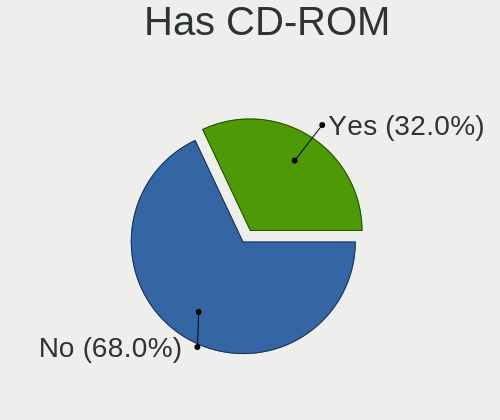
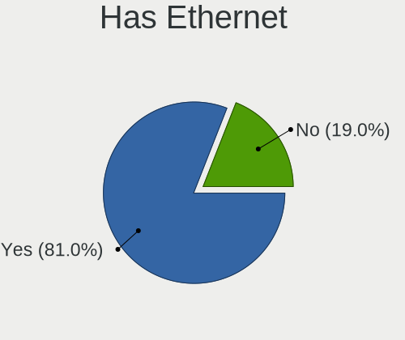
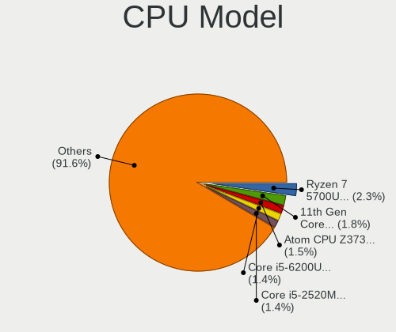
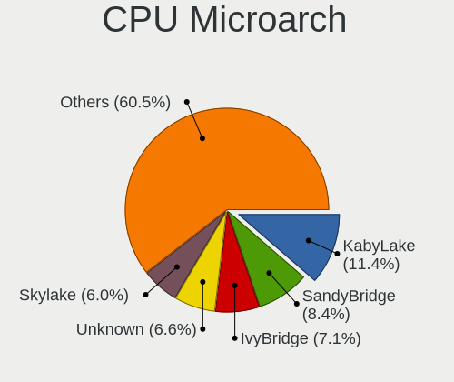
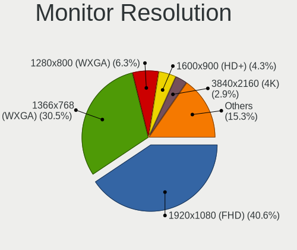
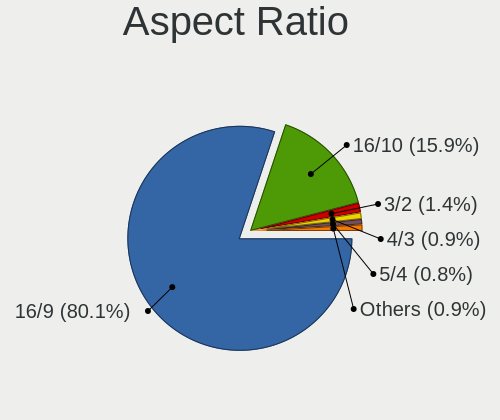
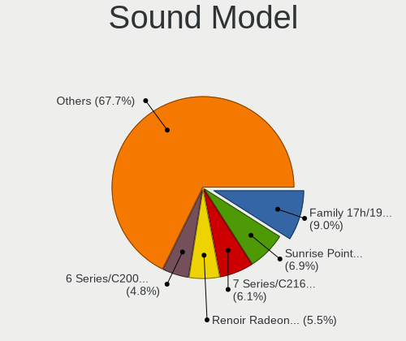
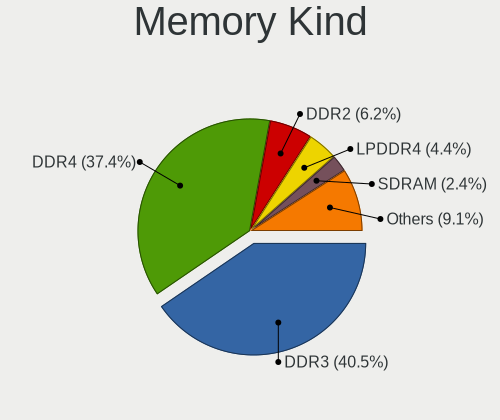

MX - Tested Hardware & Statistics (Notebooks)
---------------------------------------------

A project to collect tested hardware configurations for MX.

Anyone can contribute to this report by the [hw-probe](https://github.com/linuxhw/hw-probe) tool:

    sudo -E hw-probe -all -upload

Please contribute! Especially if your hardware is rare.

Contents
--------

* [ Test Cases ](#test-cases)

* [ System ](#system)
  - [ OS                       ](#os)
  - [ OS Family                ](#os-family)
  - [ Kernel                   ](#kernel)
  - [ Kernel Family            ](#kernel-family)
  - [ Kernel Major Ver.        ](#kernel-major-ver)
  - [ Arch                     ](#arch)
  - [ DE                       ](#de)
  - [ Display Server           ](#display-server)
  - [ Display Manager          ](#display-manager)
  - [ OS Lang                  ](#os-lang)
  - [ Boot Mode                ](#boot-mode)
  - [ Filesystem               ](#filesystem)
  - [ Part. scheme             ](#part-scheme)
  - [ Dual Boot with Linux/BSD ](#dual-boot-with-linuxbsd)
  - [ Dual Boot (Win)          ](#dual-boot-win)

* [ Board ](#board)
  - [ Vendor                   ](#vendor)
  - [ Model                    ](#model)
  - [ Model Family             ](#model-family)
  - [ MFG Year                 ](#mfg-year)
  - [ Form Factor              ](#form-factor)
  - [ Secure Boot              ](#secure-boot)
  - [ Coreboot                 ](#coreboot)
  - [ RAM Size                 ](#ram-size)
  - [ RAM Used                 ](#ram-used)
  - [ Total Drives             ](#total-drives)
  - [ Has CD-ROM               ](#has-cd-rom)
  - [ Has Ethernet             ](#has-ethernet)
  - [ Has WiFi                 ](#has-wifi)
  - [ Has Bluetooth            ](#has-bluetooth)

* [ Location ](#location)
  - [ Country                  ](#country)
  - [ City                     ](#city)

* [ Drives ](#drives)
  - [ Drive Vendor             ](#drive-vendor)
  - [ Drive Model              ](#drive-model)
  - [ HDD Vendor               ](#hdd-vendor)
  - [ SSD Vendor               ](#ssd-vendor)
  - [ Drive Kind               ](#drive-kind)
  - [ Drive Connector          ](#drive-connector)
  - [ Drive Size               ](#drive-size)
  - [ Space Total              ](#space-total)
  - [ Space Used               ](#space-used)
  - [ Malfunc. Drives          ](#malfunc-drives)
  - [ Malfunc. Drive Vendor    ](#malfunc-drive-vendor)
  - [ Malfunc. HDD Vendor      ](#malfunc-hdd-vendor)
  - [ Malfunc. Drive Kind      ](#malfunc-drive-kind)
  - [ Failed Drives            ](#failed-drives)
  - [ Failed Drive Vendor      ](#failed-drive-vendor)
  - [ Drive Status             ](#drive-status)

* [ Storage controller ](#storage-controller)
  - [ Storage Vendor           ](#storage-vendor)
  - [ Storage Model            ](#storage-model)
  - [ Storage Kind             ](#storage-kind)

* [ Processor ](#processor)
  - [ CPU Vendor               ](#cpu-vendor)
  - [ CPU Model                ](#cpu-model)
  - [ CPU Model Family         ](#cpu-model-family)
  - [ CPU Cores                ](#cpu-cores)
  - [ CPU Sockets              ](#cpu-sockets)
  - [ CPU Threads              ](#cpu-threads)
  - [ CPU Op-Modes             ](#cpu-op-modes)
  - [ CPU Microcode            ](#cpu-microcode)
  - [ CPU Microarch            ](#cpu-microarch)

* [ Graphics ](#graphics)
  - [ GPU Vendor               ](#gpu-vendor)
  - [ GPU Model                ](#gpu-model)
  - [ GPU Combo                ](#gpu-combo)
  - [ GPU Driver               ](#gpu-driver)
  - [ GPU Memory               ](#gpu-memory)

* [ Monitor ](#monitor)
  - [ Monitor Vendor           ](#monitor-vendor)
  - [ Monitor Model            ](#monitor-model)
  - [ Monitor Resolution       ](#monitor-resolution)
  - [ Monitor Diagonal         ](#monitor-diagonal)
  - [ Monitor Width            ](#monitor-width)
  - [ Aspect Ratio             ](#aspect-ratio)
  - [ Monitor Area             ](#monitor-area)
  - [ Pixel Density            ](#pixel-density)
  - [ Multiple Monitors        ](#multiple-monitors)

* [ Network ](#network)
  - [ Net Controller Vendor    ](#net-controller-vendor)
  - [ Net Controller Model     ](#net-controller-model)
  - [ Wireless Vendor          ](#wireless-vendor)
  - [ Wireless Model           ](#wireless-model)
  - [ Ethernet Vendor          ](#ethernet-vendor)
  - [ Ethernet Model           ](#ethernet-model)
  - [ Net Controller Kind      ](#net-controller-kind)
  - [ Used Controller          ](#used-controller)
  - [ NICs                     ](#nics)
  - [ IPv6                     ](#ipv6)

* [ Bluetooth ](#bluetooth)
  - [ Bluetooth Vendor         ](#bluetooth-vendor)
  - [ Bluetooth Model          ](#bluetooth-model)

* [ Sound ](#sound)
  - [ Sound Vendor             ](#sound-vendor)
  - [ Sound Model              ](#sound-model)

* [ Memory ](#memory)
  - [ Memory Vendor            ](#memory-vendor)
  - [ Memory Model             ](#memory-model)
  - [ Memory Kind              ](#memory-kind)
  - [ Memory Form Factor       ](#memory-form-factor)
  - [ Memory Size              ](#memory-size)
  - [ Memory Speed             ](#memory-speed)

* [ Printers & scanners ](#printers--scanners)
  - [ Printer Vendor           ](#printer-vendor)
  - [ Printer Model            ](#printer-model)
  - [ Scanner Vendor           ](#scanner-vendor)
  - [ Scanner Model            ](#scanner-model)

* [ Camera ](#camera)
  - [ Camera Vendor            ](#camera-vendor)
  - [ Camera Model             ](#camera-model)

* [ Security ](#security)
  - [ Fingerprint Vendor       ](#fingerprint-vendor)
  - [ Fingerprint Model        ](#fingerprint-model)
  - [ Chipcard Vendor          ](#chipcard-vendor)
  - [ Chipcard Model           ](#chipcard-model)

* [ Unsupported ](#unsupported)
  - [ Unsupported Devices      ](#unsupported-devices)
  - [ Unsupported Device Types ](#unsupported-device-types)

Test Cases
----------

Total: 232

| Vendor        | Model                       | Probe                                                      | Date         |
|---------------|-----------------------------|------------------------------------------------------------|--------------|
| Dell          | Latitude 3190               | [e43c62a67a](https://linux-hardware.org/?probe=e43c62a67a) | May 30, 2022 |
| ASUSTek       | K55A                        | [0eb5e9ea50](https://linux-hardware.org/?probe=0eb5e9ea50) | May 29, 2022 |
| Sony          | VPCSB1V9R                   | [e3b15e462d](https://linux-hardware.org/?probe=e3b15e462d) | May 16, 2022 |
| Sony          | VPCSB1V9R                   | [9dfafea956](https://linux-hardware.org/?probe=9dfafea956) | May 16, 2022 |
| Dell          | Latitude 3190               | [e80556f7d6](https://linux-hardware.org/?probe=e80556f7d6) | May 16, 2022 |
| Medion        | E14304                      | [8d1a922b7b](https://linux-hardware.org/?probe=8d1a922b7b) | May 15, 2022 |
| HP            | Stream Laptop 14-cb0XX      | [3b0408920d](https://linux-hardware.org/?probe=3b0408920d) | May 13, 2022 |
| Acer          | Aspire A515-56              | [b728fa5844](https://linux-hardware.org/?probe=b728fa5844) | May 01, 2022 |
| Acer          | Nitro AN515-55              | [04b51fe1cf](https://linux-hardware.org/?probe=04b51fe1cf) | Apr 25, 2022 |
| Alienware     | m15 R7                      | [77727a1731](https://linux-hardware.org/?probe=77727a1731) | Apr 24, 2022 |
| Lenovo        | Legion 5 15ACH6H 82JU       | [4e8b5f940a](https://linux-hardware.org/?probe=4e8b5f940a) | Apr 23, 2022 |
| HP            | ProBook 450 G4              | [77a6f92da0](https://linux-hardware.org/?probe=77a6f92da0) | Apr 22, 2022 |
| Gigabyte      | G5 KC                       | [fc21d0150f](https://linux-hardware.org/?probe=fc21d0150f) | Apr 10, 2022 |
| Acer          | Aspire A515-56              | [db6408f394](https://linux-hardware.org/?probe=db6408f394) | Apr 07, 2022 |
| MSI           | GV62 8RD                    | [2e43728adb](https://linux-hardware.org/?probe=2e43728adb) | Apr 06, 2022 |
| ASUSTek       | 1101HA                      | [c3d2458d59](https://linux-hardware.org/?probe=c3d2458d59) | Apr 04, 2022 |
| ASUSTek       | ROG Strix G712LU_G712LU     | [288629b95d](https://linux-hardware.org/?probe=288629b95d) | Apr 04, 2022 |
| Lenovo        | ThinkPad T430 23427YU       | [07ada1e358](https://linux-hardware.org/?probe=07ada1e358) | Apr 03, 2022 |
| ASUSTek       | ROG Strix G513QC_G513QC     | [697f820432](https://linux-hardware.org/?probe=697f820432) | Apr 02, 2022 |
| TUXEDO        | N7x0WU                      | [cf4f31fe3c](https://linux-hardware.org/?probe=cf4f31fe3c) | Mar 30, 2022 |
| Lenovo        | ThinkPad T440p 20AW002VB... | [e3ec03ac31](https://linux-hardware.org/?probe=e3ec03ac31) | Mar 29, 2022 |
| Framework     | Laptop                      | [a9f49dfe70](https://linux-hardware.org/?probe=a9f49dfe70) | Mar 24, 2022 |
| Acer          | Extensa 5630                | [32cab1f9fc](https://linux-hardware.org/?probe=32cab1f9fc) | Mar 14, 2022 |
| Dell          | Latitude 3190               | [964420352c](https://linux-hardware.org/?probe=964420352c) | Feb 28, 2022 |
| Dell          | XPS 17 9710                 | [7147fe2d5c](https://linux-hardware.org/?probe=7147fe2d5c) | Feb 26, 2022 |
| ASUSTek       | 1101HA                      | [b234cc741f](https://linux-hardware.org/?probe=b234cc741f) | Feb 22, 2022 |
| Dell          | XPS 17 9710                 | [851badde2e](https://linux-hardware.org/?probe=851badde2e) | Feb 20, 2022 |
| Sony          | VPCF119FX                   | [1e8448b824](https://linux-hardware.org/?probe=1e8448b824) | Feb 15, 2022 |
| Sony          | SVE1513Q1ESI                | [77e599ef9f](https://linux-hardware.org/?probe=77e599ef9f) | Feb 08, 2022 |
| Dell          | Latitude E4310              | [50190cb420](https://linux-hardware.org/?probe=50190cb420) | Feb 06, 2022 |
| efirstview    | v01099                      | [ed22d3c2b6](https://linux-hardware.org/?probe=ed22d3c2b6) | Feb 04, 2022 |
| HP            | ProBook 6460b               | [5f936a65be](https://linux-hardware.org/?probe=5f936a65be) | Feb 02, 2022 |
| Lenovo        | ThinkPad W541 20EG0005MS    | [f89a7895fc](https://linux-hardware.org/?probe=f89a7895fc) | Jan 23, 2022 |
| Sony          | VPCEH2N1E                   | [17a4bc1847](https://linux-hardware.org/?probe=17a4bc1847) | Jan 22, 2022 |
| Fujitsu Si... | LIFEBOOK E8010              | [82d1bc5db0](https://linux-hardware.org/?probe=82d1bc5db0) | Jan 22, 2022 |
| MSI           | Alpha 15 B5EEK              | [882906d968](https://linux-hardware.org/?probe=882906d968) | Jan 17, 2022 |
| Alienware     | 13 R2                       | [65c1ae9026](https://linux-hardware.org/?probe=65c1ae9026) | Jan 14, 2022 |
| HP            | EliteBook 840 G3            | [58cff543b5](https://linux-hardware.org/?probe=58cff543b5) | Jan 06, 2022 |
| HP            | EliteBook 8440p             | [d0d2edf745](https://linux-hardware.org/?probe=d0d2edf745) | Jan 04, 2022 |
| Lenovo        | G400s VILG1                 | [1cd4b24f16](https://linux-hardware.org/?probe=1cd4b24f16) | Jan 04, 2022 |
| Gigabyte      | P15FV5                      | [164348e568](https://linux-hardware.org/?probe=164348e568) | Jan 03, 2022 |
| HP            | 2000                        | [5d64fe5b92](https://linux-hardware.org/?probe=5d64fe5b92) | Jan 01, 2022 |
| Lenovo        | IdeaPad Y700-15ISK 80NV     | [4fe24b4f44](https://linux-hardware.org/?probe=4fe24b4f44) | Dec 26, 2021 |
| ASUSTek       | X550CC                      | [b0cde813b9](https://linux-hardware.org/?probe=b0cde813b9) | Dec 23, 2021 |
| ASUSTek       | TUF Gaming FA706IU_TUF70... | [63d7055c5e](https://linux-hardware.org/?probe=63d7055c5e) | Dec 18, 2021 |
| Samsung       | 340XAA/350XAA/550XAA        | [49692045a2](https://linux-hardware.org/?probe=49692045a2) | Dec 16, 2021 |
| Toshiba       | Satellite L850-CJK          | [0dc076ad15](https://linux-hardware.org/?probe=0dc076ad15) | Dec 05, 2021 |
| ASUSTek       | ASUS TUF Gaming A15 FA50... | [21180cbdad](https://linux-hardware.org/?probe=21180cbdad) | Dec 04, 2021 |
| Lenovo        | B590 20208                  | [ed08d6bdd9](https://linux-hardware.org/?probe=ed08d6bdd9) | Nov 30, 2021 |
| Lenovo        | Unknown                     | [5b1b00738d](https://linux-hardware.org/?probe=5b1b00738d) | Nov 28, 2021 |
| Lenovo        | ThinkBook 13s-IWL 20R9      | [649434f9b8](https://linux-hardware.org/?probe=649434f9b8) | Nov 23, 2021 |
| ASUSTek       | N53SN                       | [67d66feb3e](https://linux-hardware.org/?probe=67d66feb3e) | Nov 20, 2021 |
| Unknown       | Unknown                     | [381b31199f](https://linux-hardware.org/?probe=381b31199f) | Nov 18, 2021 |
| ASUSTek       | TUF Gaming FX505DT_FX505... | [791ae651bb](https://linux-hardware.org/?probe=791ae651bb) | Nov 14, 2021 |
| ASUSTek       | TUF Gaming FX505DT_FX505... | [b105aaabf5](https://linux-hardware.org/?probe=b105aaabf5) | Nov 14, 2021 |
| HP            | Compaq Presario CQ60        | [9d83baca33](https://linux-hardware.org/?probe=9d83baca33) | Nov 12, 2021 |
| Lenovo        | ThinkPad E15 Gen 3 20YG0... | [c277967769](https://linux-hardware.org/?probe=c277967769) | Nov 11, 2021 |
| Dell          | Inspiron 3576               | [ad9fb758a6](https://linux-hardware.org/?probe=ad9fb758a6) | Nov 09, 2021 |
| Apple         | MacBook3,1                  | [25964b9256](https://linux-hardware.org/?probe=25964b9256) | Nov 08, 2021 |
| Google        | Akemi                       | [7408ab9056](https://linux-hardware.org/?probe=7408ab9056) | Nov 06, 2021 |
| Google        | Akemi                       | [dc4808bd56](https://linux-hardware.org/?probe=dc4808bd56) | Nov 06, 2021 |
| HP            | EliteBook 850 G3            | [cd26ab6e8f](https://linux-hardware.org/?probe=cd26ab6e8f) | Nov 05, 2021 |
| Dell          | Latitude 3190               | [592b613273](https://linux-hardware.org/?probe=592b613273) | Nov 01, 2021 |
| ASUSTek       | E402MA                      | [4c2453c6a2](https://linux-hardware.org/?probe=4c2453c6a2) | Oct 26, 2021 |
| Dell          | Latitude E7450              | [91837758ac](https://linux-hardware.org/?probe=91837758ac) | Oct 26, 2021 |
| Sony          | VPCEC3S1E                   | [2af79ba873](https://linux-hardware.org/?probe=2af79ba873) | Oct 25, 2021 |
| Dell          | Latitude 3190               | [d08efa2ef3](https://linux-hardware.org/?probe=d08efa2ef3) | Oct 25, 2021 |
| Lenovo        | ThinkPad L520 78595VG       | [4aff5a6a0c](https://linux-hardware.org/?probe=4aff5a6a0c) | Oct 24, 2021 |
| Fujitsu Si... | ESPRIMO Mobile D9500        | [ee6fdf4608](https://linux-hardware.org/?probe=ee6fdf4608) | Oct 18, 2021 |
| Fujitsu Si... | AMILO Xa 1526               | [00863fcea8](https://linux-hardware.org/?probe=00863fcea8) | Oct 16, 2021 |
| Sony          | SVT13115FBS                 | [381872f3b9](https://linux-hardware.org/?probe=381872f3b9) | Oct 09, 2021 |
| Lenovo        | ThinkPad T530 2394CJ9       | [b36a94241d](https://linux-hardware.org/?probe=b36a94241d) | Oct 05, 2021 |
| Lenovo        | ThinkPad X1 Carbon 5th 2... | [c86e0b677e](https://linux-hardware.org/?probe=c86e0b677e) | Oct 03, 2021 |
| Lenovo        | ThinkPad L490 20Q5S0PR00    | [bbf6b89f02](https://linux-hardware.org/?probe=bbf6b89f02) | Oct 01, 2021 |
| Acer          | Aspire 4820T                | [a91911ca90](https://linux-hardware.org/?probe=a91911ca90) | Oct 01, 2021 |
| ASUSTek       | TUF Gaming FA706IU_FA706... | [8c1a085f29](https://linux-hardware.org/?probe=8c1a085f29) | Sep 20, 2021 |
| Lenovo        | ThinkPad P51 20HJS0TP00     | [2774c819ea](https://linux-hardware.org/?probe=2774c819ea) | Sep 18, 2021 |
| Lenovo        | B40-45 20394                | [627672a7ec](https://linux-hardware.org/?probe=627672a7ec) | Sep 16, 2021 |
| HP            | Pavilion Laptop 15-eg0xx... | [e76ffa7805](https://linux-hardware.org/?probe=e76ffa7805) | Sep 06, 2021 |
| GTZS          | Unknown                     | [3df799f341](https://linux-hardware.org/?probe=3df799f341) | Sep 05, 2021 |
| Acer          | Aspire V3-371               | [ddd7b7b87f](https://linux-hardware.org/?probe=ddd7b7b87f) | Sep 02, 2021 |
| Acer          | Aspire V3-371               | [16c3c01bcd](https://linux-hardware.org/?probe=16c3c01bcd) | Sep 02, 2021 |
| Chuwi         | GemiBook Pro                | [f8735054b4](https://linux-hardware.org/?probe=f8735054b4) | Sep 02, 2021 |
| Pixus         | Rise                        | [4479b88c1c](https://linux-hardware.org/?probe=4479b88c1c) | Aug 12, 2021 |
| Acer          | TravelMate 5360             | [f444dec794](https://linux-hardware.org/?probe=f444dec794) | Aug 12, 2021 |
| Lenovo        | ThinkPad T420 4236MBU       | [7e0b868c64](https://linux-hardware.org/?probe=7e0b868c64) | Jul 29, 2021 |
| Acer          | Aspire E5-574G              | [b09280946d](https://linux-hardware.org/?probe=b09280946d) | Jul 21, 2021 |
| Dell          | Vostro 5515                 | [f4ae054fc8](https://linux-hardware.org/?probe=f4ae054fc8) | Jul 15, 2021 |
| Dell          | Latitude 3340               | [c47b83476b](https://linux-hardware.org/?probe=c47b83476b) | Jul 12, 2021 |
| Acer          | Aspire one                  | [2c266e91ae](https://linux-hardware.org/?probe=2c266e91ae) | Jul 09, 2021 |
| Medion        | P6669 MD60147               | [3ed80daa7b](https://linux-hardware.org/?probe=3ed80daa7b) | Jun 10, 2021 |
| Samsung       | 350V5C/351V5C/3540VC/344... | [c4ebb4c114](https://linux-hardware.org/?probe=c4ebb4c114) | Jun 04, 2021 |
| Dell          | Vostro 3460                 | [da200f9e64](https://linux-hardware.org/?probe=da200f9e64) | May 29, 2021 |
| Medion        | E6234                       | [313ec752ab](https://linux-hardware.org/?probe=313ec752ab) | May 24, 2021 |
| HP            | Stream Laptop 14-cb0XX      | [4ed89e1092](https://linux-hardware.org/?probe=4ed89e1092) | May 22, 2021 |
| HP            | Stream Laptop 14-cb0XX      | [57a69c7c0d](https://linux-hardware.org/?probe=57a69c7c0d) | May 20, 2021 |
| HP            | Mini 110-3500               | [f94c828225](https://linux-hardware.org/?probe=f94c828225) | May 19, 2021 |
| ASUSTek       | N56VZ                       | [c69cd5aceb](https://linux-hardware.org/?probe=c69cd5aceb) | May 18, 2021 |
| Irbis         | TW94                        | [dc56e23810](https://linux-hardware.org/?probe=dc56e23810) | May 15, 2021 |
| Dell          | Latitude E6320              | [fa8bcef5a9](https://linux-hardware.org/?probe=fa8bcef5a9) | May 09, 2021 |
| Acer          | Extensa 5620                | [a06636ba79](https://linux-hardware.org/?probe=a06636ba79) | Apr 24, 2021 |
| Dell          | 0UW744??????                | [32c3521a2e](https://linux-hardware.org/?probe=32c3521a2e) | Apr 22, 2021 |
| Lenovo        | ThinkPad T440s 20AQ007SG... | [73f2bd0075](https://linux-hardware.org/?probe=73f2bd0075) | Apr 16, 2021 |
| Lenovo        | ThinkPad T440s 20AQ007SG... | [75e60ebdf4](https://linux-hardware.org/?probe=75e60ebdf4) | Apr 16, 2021 |
| Intel         | ChiefRiver                  | [5e0db0f704](https://linux-hardware.org/?probe=5e0db0f704) | Apr 14, 2021 |
| eMachines     | E727                        | [048da4f23b](https://linux-hardware.org/?probe=048da4f23b) | Apr 12, 2021 |
| Lenovo        | ThinkPad E480 20KNCTO1WW    | [7159579bb8](https://linux-hardware.org/?probe=7159579bb8) | Apr 12, 2021 |
| ASUSTek       | G751JT                      | [4f88289a8c](https://linux-hardware.org/?probe=4f88289a8c) | Apr 08, 2021 |
| HP            | Falco                       | [9bb0bf9ac8](https://linux-hardware.org/?probe=9bb0bf9ac8) | Apr 07, 2021 |
| ASUSTek       | 1025C                       | [33d6531353](https://linux-hardware.org/?probe=33d6531353) | Apr 06, 2021 |
| HP            | ZBook 17 G6                 | [046176e590](https://linux-hardware.org/?probe=046176e590) | Mar 16, 2021 |
| Dell          | Latitude E5470              | [064cf2bccd](https://linux-hardware.org/?probe=064cf2bccd) | Mar 11, 2021 |
| Toshiba       | PORTEGE R705                | [f537f51a95](https://linux-hardware.org/?probe=f537f51a95) | Mar 09, 2021 |
| HP            | Notebook                    | [113644885d](https://linux-hardware.org/?probe=113644885d) | Mar 04, 2021 |
| Acer          | AOD255                      | [f8501e519f](https://linux-hardware.org/?probe=f8501e519f) | Mar 03, 2021 |
| Google        | Gnawty                      | [252bc4cb46](https://linux-hardware.org/?probe=252bc4cb46) | Feb 25, 2021 |
| Dell          | Latitude D430               | [63906404d0](https://linux-hardware.org/?probe=63906404d0) | Feb 25, 2021 |
| ASUSTek       | X101CH                      | [7897616bb0](https://linux-hardware.org/?probe=7897616bb0) | Feb 25, 2021 |
| Fujitsu Si... | ESPRIMO Mobile D9500        | [b91a419a64](https://linux-hardware.org/?probe=b91a419a64) | Feb 25, 2021 |
| ASUSTek       | X200CA                      | [2817beb96d](https://linux-hardware.org/?probe=2817beb96d) | Feb 25, 2021 |
| HP            | Pavilion g6                 | [f23e85a87a](https://linux-hardware.org/?probe=f23e85a87a) | Feb 23, 2021 |
| Google        | Gnawty                      | [7614a9a19c](https://linux-hardware.org/?probe=7614a9a19c) | Feb 23, 2021 |
| Lenovo        | ThinkPad E425 1198CTO       | [67304f1ffa](https://linux-hardware.org/?probe=67304f1ffa) | Feb 22, 2021 |
| Samsung       | 305E4A/305E5A/305E7A        | [6f34bc4f67](https://linux-hardware.org/?probe=6f34bc4f67) | Feb 19, 2021 |
| Lenovo        | IdeaPad 310-15ISK 80SM      | [7552dacfb9](https://linux-hardware.org/?probe=7552dacfb9) | Feb 17, 2021 |
| HP            | Mini 110-3500               | [bb5cf4031b](https://linux-hardware.org/?probe=bb5cf4031b) | Feb 13, 2021 |
| HP            | Notebook                    | [69f70d7a09](https://linux-hardware.org/?probe=69f70d7a09) | Feb 10, 2021 |
| HP            | 15                          | [437cb08f68](https://linux-hardware.org/?probe=437cb08f68) | Feb 08, 2021 |
| Apple         | MacBook7,1                  | [a6324a9e06](https://linux-hardware.org/?probe=a6324a9e06) | Feb 05, 2021 |
| Clevo         | P170EM                      | [eff7a04dad](https://linux-hardware.org/?probe=eff7a04dad) | Feb 02, 2021 |
| Lenovo        | ThinkPad T440p 20AWA1NAU... | [b6ebe98655](https://linux-hardware.org/?probe=b6ebe98655) | Feb 01, 2021 |
| HP            | ProBook 650 G1              | [9021b90504](https://linux-hardware.org/?probe=9021b90504) | Jan 22, 2021 |
| ASUSTek       | ZenBook UX425EA_UX425EA     | [a147ddbe9d](https://linux-hardware.org/?probe=a147ddbe9d) | Jan 20, 2021 |
| HP            | Mini 110-3500               | [3c2a01636e](https://linux-hardware.org/?probe=3c2a01636e) | Jan 19, 2021 |
| HP            | Pavilion g6                 | [c4b4831246](https://linux-hardware.org/?probe=c4b4831246) | Jan 15, 2021 |
| Fujitsu Si... | ESPRIMO Mobile D9500        | [989e87e18e](https://linux-hardware.org/?probe=989e87e18e) | Jan 15, 2021 |
| ASUSTek       | X101CH                      | [3dfb714393](https://linux-hardware.org/?probe=3dfb714393) | Jan 15, 2021 |
| Dell          | Latitude D430               | [874d8f3925](https://linux-hardware.org/?probe=874d8f3925) | Jan 14, 2021 |
| Dell          | Latitude E5520              | [1d46b26326](https://linux-hardware.org/?probe=1d46b26326) | Jan 03, 2021 |
| HP            | Presario CQ57               | [351ae067b6](https://linux-hardware.org/?probe=351ae067b6) | Dec 31, 2020 |
| HP            | Presario CQ57               | [94b74045cc](https://linux-hardware.org/?probe=94b74045cc) | Dec 30, 2020 |
| Acer          | Aspire ES1-511              | [7f351d7c49](https://linux-hardware.org/?probe=7f351d7c49) | Dec 30, 2020 |
| Lenovo        | ThinkPad X270 W10DG 20K5... | [5de3914984](https://linux-hardware.org/?probe=5de3914984) | Dec 15, 2020 |
| Lenovo        | V145-15AST 81MT             | [ebb2dc7bff](https://linux-hardware.org/?probe=ebb2dc7bff) | Dec 15, 2020 |
| Lenovo        | ThinkPad X220 4291WMQ       | [165b895e27](https://linux-hardware.org/?probe=165b895e27) | Dec 01, 2020 |
| HP            | ENVY Laptop 13-ba0xxx       | [32692a5980](https://linux-hardware.org/?probe=32692a5980) | Nov 18, 2020 |
| Acer          | Aspire E5-571G              | [7f5f7e9fff](https://linux-hardware.org/?probe=7f5f7e9fff) | Nov 17, 2020 |
| Toshiba       | Satellite A300              | [309a3f69e8](https://linux-hardware.org/?probe=309a3f69e8) | Nov 16, 2020 |
| Lenovo        | ThinkPad T410 2537G99       | [554dfc3cfe](https://linux-hardware.org/?probe=554dfc3cfe) | Nov 12, 2020 |
| Lenovo        | ThinkPad T410 2537G99       | [2dc30b7928](https://linux-hardware.org/?probe=2dc30b7928) | Nov 12, 2020 |
| Lenovo        | ThinkPad X270 W10DG 20K5... | [fe6cbf555a](https://linux-hardware.org/?probe=fe6cbf555a) | Nov 08, 2020 |
| Dell          | Inspiron 14-3452            | [96e87a665b](https://linux-hardware.org/?probe=96e87a665b) | Nov 01, 2020 |
| Lenovo        | IdeaPad 110-15IBR 80T7      | [470c0ca72b](https://linux-hardware.org/?probe=470c0ca72b) | Oct 23, 2020 |
| HP            | Compaq 8510p (KM229AV)      | [30634ffde6](https://linux-hardware.org/?probe=30634ffde6) | Oct 12, 2020 |
| Acer          | Aspire SW5-015              | [b125bdb89e](https://linux-hardware.org/?probe=b125bdb89e) | Oct 07, 2020 |
| HP            | Pavilion 15                 | [8e6632f1a3](https://linux-hardware.org/?probe=8e6632f1a3) | Oct 06, 2020 |
| Lenovo        | V145-15AST 81MT             | [7155397289](https://linux-hardware.org/?probe=7155397289) | Oct 03, 2020 |
| Lenovo        | ThinkPad T400 2768WGB       | [995b1a3a3d](https://linux-hardware.org/?probe=995b1a3a3d) | Sep 29, 2020 |
| Toshiba       | Satellite C660              | [a5f308c899](https://linux-hardware.org/?probe=a5f308c899) | Sep 21, 2020 |
| Lenovo        | ThinkPad T60 20085TG        | [31cd0f06c2](https://linux-hardware.org/?probe=31cd0f06c2) | Sep 16, 2020 |
| Samsung       | 350V5C/351V5C/3540VC/344... | [356bacc97a](https://linux-hardware.org/?probe=356bacc97a) | Aug 27, 2020 |
| HP            | ZBook 15 G4                 | [c36d170750](https://linux-hardware.org/?probe=c36d170750) | Aug 27, 2020 |
| HP            | ZBook 15 G4                 | [00d13faf2a](https://linux-hardware.org/?probe=00d13faf2a) | Aug 27, 2020 |
| Acer          | Aspire A114-32              | [7f178a7089](https://linux-hardware.org/?probe=7f178a7089) | Aug 20, 2020 |
| Samsung       | 350V5C/351V5C/3540VC/344... | [9b4d2c057e](https://linux-hardware.org/?probe=9b4d2c057e) | Aug 19, 2020 |
| ASUSTek       | VivoBook 15_ASUS Laptop ... | [57e274292b](https://linux-hardware.org/?probe=57e274292b) | Aug 16, 2020 |
| Acer          | Aspire 7520                 | [d878dbb71e](https://linux-hardware.org/?probe=d878dbb71e) | Aug 13, 2020 |
| HP            | Pavilion dv7                | [3494105666](https://linux-hardware.org/?probe=3494105666) | Jul 28, 2020 |
| ASUSTek       | TUF Gaming FA706IU_TUF70... | [c0d166e020](https://linux-hardware.org/?probe=c0d166e020) | Jul 27, 2020 |
| HP            | ProBook 650 G1              | [9a488079c3](https://linux-hardware.org/?probe=9a488079c3) | Jul 23, 2020 |
| Sony          | VPCF23P1E                   | [2e0915f8a9](https://linux-hardware.org/?probe=2e0915f8a9) | Jun 18, 2020 |
| Lenovo        | ThinkPad T440s 20AQ006HU... | [54a69351ae](https://linux-hardware.org/?probe=54a69351ae) | Jun 17, 2020 |
| HP            | Pavilion Laptop 15-cw0xx... | [b93dafce99](https://linux-hardware.org/?probe=b93dafce99) | Jun 09, 2020 |
| Lenovo        | ThinkPad X250 20CLS4YA00    | [72150af905](https://linux-hardware.org/?probe=72150af905) | Jun 06, 2020 |
| ASUSTek       | X540UP                      | [2ec9f9c770](https://linux-hardware.org/?probe=2ec9f9c770) | Jun 05, 2020 |
| Sony          | VGN-NR310FH                 | [c774d0a51a](https://linux-hardware.org/?probe=c774d0a51a) | Jun 05, 2020 |
| Acer          | Aspire A315-41              | [665b2837c7](https://linux-hardware.org/?probe=665b2837c7) | May 27, 2020 |
| ASUSTek       | VivoBook_ASUSLaptop X712... | [c85746245d](https://linux-hardware.org/?probe=c85746245d) | May 26, 2020 |
| Lenovo        | B590 20206                  | [8f4a7e2b6e](https://linux-hardware.org/?probe=8f4a7e2b6e) | May 26, 2020 |
| Lenovo        | ThinkPad E490 20N9S26G00    | [a26e5790ce](https://linux-hardware.org/?probe=a26e5790ce) | May 06, 2020 |
| Samsung       | R780/R778                   | [eb0bb63c6d](https://linux-hardware.org/?probe=eb0bb63c6d) | Apr 09, 2020 |
| Clevo         | P150HMx                     | [196b689717](https://linux-hardware.org/?probe=196b689717) | Mar 27, 2020 |
| Dell          | Latitude E7440              | [c6fe81343e](https://linux-hardware.org/?probe=c6fe81343e) | Mar 26, 2020 |
| ASUSTek       | X455LAB                     | [4a5174a726](https://linux-hardware.org/?probe=4a5174a726) | Mar 24, 2020 |
| Notebook      | W65_W67RZ1                  | [aaffd10ebf](https://linux-hardware.org/?probe=aaffd10ebf) | Mar 24, 2020 |
| Dell          | Inspiron 13-5378            | [242a7e4fdc](https://linux-hardware.org/?probe=242a7e4fdc) | Mar 24, 2020 |
| Clevo         | P150HMx                     | [8f9823569b](https://linux-hardware.org/?probe=8f9823569b) | Mar 24, 2020 |
| Dell          | Inspiron N5010              | [8654fde26b](https://linux-hardware.org/?probe=8654fde26b) | Mar 24, 2020 |
| Medion        | Akoya E1318T                | [d6be35c8af](https://linux-hardware.org/?probe=d6be35c8af) | Mar 20, 2020 |
| Dell          | Latitude 3190               | [1bab98d664](https://linux-hardware.org/?probe=1bab98d664) | Mar 20, 2020 |
| HP            | EliteBook 8560p             | [e5925f1349](https://linux-hardware.org/?probe=e5925f1349) | Mar 07, 2020 |
| Acer          | Aspire 8943G                | [f8e194e907](https://linux-hardware.org/?probe=f8e194e907) | Mar 01, 2020 |
| Lenovo        | IdeaPad 330-15IGM 81D1      | [370f5d5063](https://linux-hardware.org/?probe=370f5d5063) | Feb 26, 2020 |
| Lenovo        | ThinkPad T440p 20AWS2T11... | [9c888bfdde](https://linux-hardware.org/?probe=9c888bfdde) | Feb 11, 2020 |
| Lenovo        | ThinkPad X201 3680MY9       | [26a7c0e493](https://linux-hardware.org/?probe=26a7c0e493) | Feb 09, 2020 |
| Google        | Gnawty                      | [4a2e211ce1](https://linux-hardware.org/?probe=4a2e211ce1) | Feb 08, 2020 |
| Lenovo        | ThinkPad W510 4875W17       | [8865e9546b](https://linux-hardware.org/?probe=8865e9546b) | Feb 03, 2020 |
| Lenovo        | ThinkPad W510 4875W17       | [f4779c95ce](https://linux-hardware.org/?probe=f4779c95ce) | Feb 03, 2020 |
| Acer          | Swift SF314-54G             | [48912b8dc6](https://linux-hardware.org/?probe=48912b8dc6) | Jan 19, 2020 |
| ASUSTek       | TUF Gaming FX505GT_TUF50... | [0abd5b1d73](https://linux-hardware.org/?probe=0abd5b1d73) | Jan 18, 2020 |
| Toshiba       | Satellite P875              | [b267e93d40](https://linux-hardware.org/?probe=b267e93d40) | Jan 15, 2020 |
| Toshiba       | Satellite P875              | [7e579fcba2](https://linux-hardware.org/?probe=7e579fcba2) | Jan 15, 2020 |
| MSI           | GP63 Leopard 8RD            | [0a8865c437](https://linux-hardware.org/?probe=0a8865c437) | Jan 13, 2020 |
| Packard Be... | EasyNote TE11HC             | [aa52528043](https://linux-hardware.org/?probe=aa52528043) | Jan 13, 2020 |
| Lenovo        | ThinkPad X1C 5th W10DG 2... | [ba3b839fa4](https://linux-hardware.org/?probe=ba3b839fa4) | Jan 12, 2020 |
| HP            | Pavilion Laptop 14-ce3xx... | [7f8e86e96b](https://linux-hardware.org/?probe=7f8e86e96b) | Jan 12, 2020 |
| HP            | Pavilion g6                 | [9c722b6763](https://linux-hardware.org/?probe=9c722b6763) | Dec 21, 2019 |
| Toshiba       | Satellite C50-A-12K         | [a413f419ef](https://linux-hardware.org/?probe=a413f419ef) | Dec 17, 2019 |
| Dell          | G3 3579                     | [c4fe97cca2](https://linux-hardware.org/?probe=c4fe97cca2) | Dec 04, 2019 |
| Dell          | G3 3579                     | [ada421696a](https://linux-hardware.org/?probe=ada421696a) | Dec 04, 2019 |
| HP            | Laptop 14-ck0xxx            | [ff52ea1b93](https://linux-hardware.org/?probe=ff52ea1b93) | Dec 03, 2019 |
| MSI           | MS-N033                     | [a5ee4c1dc1](https://linux-hardware.org/?probe=a5ee4c1dc1) | Nov 17, 2019 |
| ASUSTek       | 1005HA                      | [bd953e0701](https://linux-hardware.org/?probe=bd953e0701) | Nov 17, 2019 |
| Lenovo        | ThinkPad L412 0585W28       | [73073ac3f3](https://linux-hardware.org/?probe=73073ac3f3) | Nov 17, 2019 |
| Lenovo        | ThinkPad X301 2776LBU       | [993b5f104a](https://linux-hardware.org/?probe=993b5f104a) | Nov 17, 2019 |
| ASUSTek       | X101CH                      | [b17de4dbad](https://linux-hardware.org/?probe=b17de4dbad) | Nov 04, 2019 |
| HP            | Pavilion g6                 | [2cb09606ed](https://linux-hardware.org/?probe=2cb09606ed) | Nov 01, 2019 |
| HP            | ProBook 4440s               | [fc67acaa63](https://linux-hardware.org/?probe=fc67acaa63) | Oct 29, 2019 |
| HP            | Laptop 14-cm0xxx            | [6a706da421](https://linux-hardware.org/?probe=6a706da421) | Oct 23, 2019 |
| MSI           | GP63 Leopard 8RD            | [df3af7b333](https://linux-hardware.org/?probe=df3af7b333) | Oct 23, 2019 |
| HP            | EliteBook 8540w             | [ea8ef5afc7](https://linux-hardware.org/?probe=ea8ef5afc7) | Oct 23, 2019 |
| Fujitsu Si... | ESPRIMO Mobile D9500        | [cb80682975](https://linux-hardware.org/?probe=cb80682975) | Oct 20, 2019 |
| HP            | Pavilion g6                 | [6bde777445](https://linux-hardware.org/?probe=6bde777445) | Oct 20, 2019 |
| Lenovo        | ThinkPad X220 4291F52       | [e024139431](https://linux-hardware.org/?probe=e024139431) | Aug 29, 2019 |
| Lenovo        | ThinkPad X201s 5413A19      | [673c3629dc](https://linux-hardware.org/?probe=673c3629dc) | Aug 22, 2019 |
| Panasonic     | CF-C1BT02EGE                | [acbec08287](https://linux-hardware.org/?probe=acbec08287) | Aug 15, 2019 |
| MSI           | GP63 Leopard 8RD            | [bf82fba8fd](https://linux-hardware.org/?probe=bf82fba8fd) | Apr 29, 2019 |
| ASUSTek       | K55VM                       | [e967dd6404](https://linux-hardware.org/?probe=e967dd6404) | Mar 27, 2019 |
| MSI           | GP63 Leopard 8RD            | [67b484c4a0](https://linux-hardware.org/?probe=67b484c4a0) | Jan 19, 2019 |
| Toshiba       | Satellite C70-B             | [9b54677f2e](https://linux-hardware.org/?probe=9b54677f2e) | Oct 27, 2018 |
| MSI           | GP63 Leopard 8RD            | [ec89febb0c](https://linux-hardware.org/?probe=ec89febb0c) | Oct 27, 2018 |
| Dell          | Inspiron ME051              | [f789720dc4](https://linux-hardware.org/?probe=f789720dc4) | Nov 26, 2017 |

System
------

OS
--

Installed operating systems

| Name  | Notebooks | Percent |
|-------|-----------|---------|
| MX 19 | 84        | 43.75%  |
| MX 21 | 50        | 26.04%  |
| MX 20 | 42        | 21.88%  |
| MX 18 | 13        | 6.77%   |
| MX 17 | 2         | 1.04%   |
| MX 16 | 1         | 0.52%   |

OS Family
---------

OS without a version

| Name | Notebooks | Percent |
|------|-----------|---------|
| MX   | 184       | 100%    |

Kernel
------

Version of the Linux kernel

| Version                    | Notebooks | Percent |
|----------------------------|-----------|---------|
| 4.19.0-6-amd64             | 32        | 15.76%  |
| 5.10.0-9-amd64             | 14        | 6.9%    |
| 5.10.0-5mx-amd64           | 13        | 6.4%    |
| 5.10.0-13-amd64            | 9         | 4.43%   |
| 5.8.0-3-amd64              | 8         | 3.94%   |
| 5.14.0-4mx-amd64           | 7         | 3.45%   |
| 5.10.0-11-amd64            | 6         | 2.96%   |
| 4.19.0-16-amd64            | 6         | 2.96%   |
| 4.19.0-14-amd64            | 6         | 2.96%   |
| 4.19.0-13-amd64            | 6         | 2.96%   |
| 5.6.0-2-amd64              | 5         | 2.46%   |
| 4.19.0-5-amd64             | 4         | 1.97%   |
| 4.19.0-17-amd64            | 4         | 1.97%   |
| 4.19.0-11-amd64            | 4         | 1.97%   |
| 5.10.0-8mx-amd64           | 3         | 1.48%   |
| 4.19.0-9-amd64             | 3         | 1.48%   |
| 4.19.0-12-amd64            | 3         | 1.48%   |
| 4.19.0-1-amd64             | 3         | 1.48%   |
| 5.8.16-antix.1-amd64-smp   | 2         | 0.99%   |
| 5.6.10-antix.1-amd64-smp   | 2         | 0.99%   |
| 5.4.0-3-amd64              | 2         | 0.99%   |
| 5.16.0-6mx-amd64           | 2         | 0.99%   |
| 5.10.0-8-amd64             | 2         | 0.99%   |
| 5.10.0-14-amd64            | 2         | 0.99%   |
| 5.10.0-11-686-pae          | 2         | 0.99%   |
| 5.10.0-10-amd64            | 2         | 0.99%   |
| 4.19.0-8-amd64             | 2         | 0.99%   |
| 4.19.0-16-686-pae          | 2         | 0.99%   |
| 4.15.0-1-amd64             | 2         | 0.99%   |
| 5.9.1-rt20avl1             | 1         | 0.49%   |
| 5.7.0-19.1-liquorix-amd64  | 1         | 0.49%   |
| 5.6.0-15.2-liquorix-amd64  | 1         | 0.49%   |
| 5.6.0-12.1-liquorix-amd64  | 1         | 0.49%   |
| 5.5.0-9.1-liquorix-amd64   | 1         | 0.49%   |
| 5.4.0-antix.1-amd64-smp    | 1         | 0.49%   |
| 5.4.0-13.3-liquorix-amd64  | 1         | 0.49%   |
| 5.4.0-11.2-liquorix-amd64  | 1         | 0.49%   |
| 5.4.0-10.2-liquorix-amd64  | 1         | 0.49%   |
| 5.3.10-antix.1-amd64-smp   | 1         | 0.49%   |
| 5.3.0-2-amd64              | 1         | 0.49%   |
| 5.3.0-10.1-liquorix-amd64  | 1         | 0.49%   |
| 5.2.8-antix.1-amd64-smp    | 1         | 0.49%   |
| 5.2.21-antix.2-amd64-smp   | 1         | 0.49%   |
| 5.2.21-antix.2-686-smp-pae | 1         | 0.49%   |
| 5.2.0-21.2-liquorix-amd64  | 1         | 0.49%   |
| 5.17.0-5.2-liquorix-amd64  | 1         | 0.49%   |
| 5.17.0-1-amd64             | 1         | 0.49%   |
| 5.16.0-5mx-amd64           | 1         | 0.49%   |
| 5.16.0-4mx-amd64           | 1         | 0.49%   |
| 5.15.0-3mx-amd64           | 1         | 0.49%   |
| 5.15.0-1mx-amd64           | 1         | 0.49%   |
| 5.13.0-12.3-liquorix-amd64 | 1         | 0.49%   |
| 5.11.0-21.1-liquorix-amd64 | 1         | 0.49%   |
| 5.10.1-gnu                 | 1         | 0.49%   |
| 5.10.0-9mx-amd64           | 1         | 0.49%   |
| 5.10.0-6.2-liquorix-amd64  | 1         | 0.49%   |
| 5.10.0-13-686-pae          | 1         | 0.49%   |
| 5.10.0-11-686              | 1         | 0.49%   |
| 5.1.2-antix.1-amd64-smp    | 1         | 0.49%   |
| 5.0.0-9.2-liquorix-amd64   | 1         | 0.49%   |

Kernel Family
-------------

Linux kernel without a distro release

| Version  | Notebooks | Percent |
|----------|-----------|---------|
| 4.19.0   | 79        | 40.31%  |
| 5.10.0   | 54        | 27.55%  |
| 5.8.0    | 8         | 4.08%   |
| 5.6.0    | 7         | 3.57%   |
| 5.14.0   | 7         | 3.57%   |
| 5.4.0    | 6         | 3.06%   |
| 5.16.0   | 4         | 2.04%   |
| 5.8.16   | 2         | 1.02%   |
| 5.6.10   | 2         | 1.02%   |
| 5.3.0    | 2         | 1.02%   |
| 5.2.21   | 2         | 1.02%   |
| 5.17.0   | 2         | 1.02%   |
| 5.15.0   | 2         | 1.02%   |
| 4.9.193  | 2         | 1.02%   |
| 4.15.0   | 2         | 1.02%   |
| 5.9.1    | 1         | 0.51%   |
| 5.7.0    | 1         | 0.51%   |
| 5.5.0    | 1         | 0.51%   |
| 5.3.10   | 1         | 0.51%   |
| 5.2.8    | 1         | 0.51%   |
| 5.2.0    | 1         | 0.51%   |
| 5.13.0   | 1         | 0.51%   |
| 5.11.0   | 1         | 0.51%   |
| 5.10.1   | 1         | 0.51%   |
| 5.1.2    | 1         | 0.51%   |
| 5.0.0    | 1         | 0.51%   |
| 4.9.246  | 1         | 0.51%   |
| 4.19.174 | 1         | 0.51%   |
| 4.18.0   | 1         | 0.51%   |
| 3.16.0   | 1         | 0.51%   |

Kernel Major Ver.
-----------------

Linux kernel major version

| Version | Notebooks | Percent |
|---------|-----------|---------|
| 4.19    | 80        | 40.82%  |
| 5.10    | 55        | 28.06%  |
| 5.8     | 10        | 5.1%    |
| 5.6     | 9         | 4.59%   |
| 5.14    | 7         | 3.57%   |
| 5.4     | 6         | 3.06%   |
| 5.2     | 4         | 2.04%   |
| 5.16    | 4         | 2.04%   |
| 5.3     | 3         | 1.53%   |
| 4.9     | 3         | 1.53%   |
| 5.17    | 2         | 1.02%   |
| 5.15    | 2         | 1.02%   |
| 4.15    | 2         | 1.02%   |
| 5.9     | 1         | 0.51%   |
| 5.7     | 1         | 0.51%   |
| 5.5     | 1         | 0.51%   |
| 5.13    | 1         | 0.51%   |
| 5.11    | 1         | 0.51%   |
| 5.1     | 1         | 0.51%   |
| 5.0     | 1         | 0.51%   |
| 4.18    | 1         | 0.51%   |
| 3.16    | 1         | 0.51%   |

Arch
----

OS architecture (x86_64, i586, etc.)

| Name   | Notebooks | Percent |
|--------|-----------|---------|
| x86_64 | 172       | 92.97%  |
| i686   | 13        | 7.03%   |

DE
--

Desktop Environment

| Name            | Notebooks | Percent |
|-----------------|-----------|---------|
| XFCE            | 131       | 70.05%  |
| KDE5            | 29        | 15.51%  |
| Budgie          | 5         | 2.67%   |
| Unknown         | 5         | 2.67%   |
| i3              | 4         | 2.14%   |
| MATE            | 2         | 1.07%   |
| GNOME           | 2         | 1.07%   |
| Cinnamon        | 2         | 1.07%   |
| X-Cinnamon      | 1         | 0.53%   |
| Trinity         | 1         | 0.53%   |
| spectrwm        | 1         | 0.53%   |
| LXQt            | 1         | 0.53%   |
| LXDE            | 1         | 0.53%   |
| GNOME Flashback | 1         | 0.53%   |
| fluxbox         | 1         | 0.53%   |

Display Server
--------------

X11 or Wayland

| Name | Notebooks | Percent |
|------|-----------|---------|
| X11  | 182       | 98.91%  |
| Tty  | 2         | 1.09%   |

Display Manager
---------------

SDDM, LightDM, etc.

| Name    | Notebooks | Percent |
|---------|-----------|---------|
| LightDM | 146       | 78.49%  |
| SDDM    | 25        | 13.44%  |
| TDM     | 9         | 4.84%   |
| SLiM    | 5         | 2.69%   |
| Unknown | 1         | 0.54%   |

OS Lang
-------

Language

| Lang    | Notebooks | Percent |
|---------|-----------|---------|
| en_US   | 63        | 32.98%  |
| Unknown | 55        | 28.8%   |
| de_DE   | 17        | 8.9%    |
| en_GB   | 9         | 4.71%   |
| ru_RU   | 8         | 4.19%   |
| sk_SK   | 6         | 3.14%   |
| pt_BR   | 5         | 2.62%   |
| it_IT   | 5         | 2.62%   |
| fr_FR   | 3         | 1.57%   |
| es_ES   | 3         | 1.57%   |
| pl_PL   | 2         | 1.05%   |
| en_IE   | 2         | 1.05%   |
| zh_CN   | 1         | 0.52%   |
| uk_UA   | 1         | 0.52%   |
| tr_TR   | 1         | 0.52%   |
| nl_NL   | 1         | 0.52%   |
| fr_BE   | 1         | 0.52%   |
| fi_FI   | 1         | 0.52%   |
| es_VE   | 1         | 0.52%   |
| es_PE   | 1         | 0.52%   |
| es_MX   | 1         | 0.52%   |
| es_CO   | 1         | 0.52%   |
| en_AU   | 1         | 0.52%   |
| de_CH   | 1         | 0.52%   |
| cs_CZ   | 1         | 0.52%   |

Boot Mode
---------

EFI or BIOS

| Mode | Notebooks | Percent |
|------|-----------|---------|
| EFI  | 93        | 50.54%  |
| BIOS | 91        | 49.46%  |

Filesystem
----------

Type of filesystem

| Type    | Notebooks | Percent |
|---------|-----------|---------|
| Ext4    | 160       | 86.96%  |
| Overlay | 17        | 9.24%   |
| Btrfs   | 4         | 2.17%   |
| Xfs     | 1         | 0.54%   |
| F2fs    | 1         | 0.54%   |
| Unknown | 1         | 0.54%   |

Part. scheme
------------

Scheme of partitioning

| Type    | Notebooks | Percent |
|---------|-----------|---------|
| GPT     | 110       | 59.46%  |
| MBR     | 72        | 38.92%  |
| Unknown | 3         | 1.62%   |

Dual Boot with Linux/BSD
------------------------

Hosting more than one Linux/BSD

| Dual boot | Notebooks | Percent |
|-----------|-----------|---------|
| No        | 147       | 79.03%  |
| Yes       | 39        | 20.97%  |

Dual Boot (Win)
---------------

Hosting Linux and Windows

| Dual boot | Notebooks | Percent |
|-----------|-----------|---------|
| No        | 108       | 58.7%   |
| Yes       | 76        | 41.3%   |

Board
-----

Vendor
------

Motherboard manufacturer

| Name                | Notebooks | Percent |
|---------------------|-----------|---------|
| Lenovo              | 42        | 22.83%  |
| Hewlett-Packard     | 31        | 16.85%  |
| ASUSTek Computer    | 22        | 11.96%  |
| Dell                | 19        | 10.33%  |
| Acer                | 18        | 9.78%   |
| Sony                | 8         | 4.35%   |
| Toshiba             | 7         | 3.8%    |
| Samsung Electronics | 4         | 2.17%   |
| MSI                 | 4         | 2.17%   |
| Medion              | 4         | 2.17%   |
| Fujitsu Siemens     | 3         | 1.63%   |
| Google              | 2         | 1.09%   |
| Gigabyte Technology | 2         | 1.09%   |
| Clevo               | 2         | 1.09%   |
| Apple               | 2         | 1.09%   |
| Alienware           | 2         | 1.09%   |
| TUXEDO              | 1         | 0.54%   |
| Pixus               | 1         | 0.54%   |
| Panasonic           | 1         | 0.54%   |
| Packard Bell        | 1         | 0.54%   |
| Notebook            | 1         | 0.54%   |
| Irbis               | 1         | 0.54%   |
| Intel               | 1         | 0.54%   |
| Framework           | 1         | 0.54%   |
| eMachines           | 1         | 0.54%   |
| efirstview          | 1         | 0.54%   |
| Chuwi               | 1         | 0.54%   |
| Unknown             | 1         | 0.54%   |

Model
-----

Motherboard model

| Name                                     | Notebooks | Percent |
|------------------------------------------|-----------|---------|
| HP Stream Laptop 14-cb0XX                | 2         | 1.09%   |
| HP ProBook 650 G1                        | 2         | 1.09%   |
| Unknown                                  | 2         | 1.09%   |
| TUXEDO N7x0WU                            | 1         | 0.54%   |
| Toshiba Satellite P875                   | 1         | 0.54%   |
| Toshiba Satellite L850-CJK               | 1         | 0.54%   |
| Toshiba Satellite C70-B                  | 1         | 0.54%   |
| Toshiba Satellite C660                   | 1         | 0.54%   |
| Toshiba Satellite C50-A-12K              | 1         | 0.54%   |
| Toshiba Satellite A300                   | 1         | 0.54%   |
| Toshiba PORTEGE R705                     | 1         | 0.54%   |
| Sony VPCSB1V9R                           | 1         | 0.54%   |
| Sony VPCF23P1E                           | 1         | 0.54%   |
| Sony VPCF119FX                           | 1         | 0.54%   |
| Sony VPCEH2N1E                           | 1         | 0.54%   |
| Sony VPCEC3S1E                           | 1         | 0.54%   |
| Sony VGN-NR310FH                         | 1         | 0.54%   |
| Sony SVT13115FBS                         | 1         | 0.54%   |
| Sony SVE1513Q1ESI                        | 1         | 0.54%   |
| Samsung R780/R778                        | 1         | 0.54%   |
| Samsung 350V5C/351V5C/3540VC/3440VC      | 1         | 0.54%   |
| Samsung 340XAA/350XAA/550XAA             | 1         | 0.54%   |
| Samsung 305E4A/305E5A/305E7A             | 1         | 0.54%   |
| Pixus Rise                               | 1         | 0.54%   |
| Panasonic CF-C1BT02EGE                   | 1         | 0.54%   |
| Packard Bell EasyNote TE11HC             | 1         | 0.54%   |
| Notebook W65_W67RZ1                      | 1         | 0.54%   |
| MSI MS-N033                              | 1         | 0.54%   |
| MSI GV62 8RD                             | 1         | 0.54%   |
| MSI GP63 Leopard 8RD                     | 1         | 0.54%   |
| MSI Alpha 15 B5EEK                       | 1         | 0.54%   |
| Medion P6669 MD60147                     | 1         | 0.54%   |
| Medion E6234                             | 1         | 0.54%   |
| Medion E14304                            | 1         | 0.54%   |
| Medion Akoya E1318T                      | 1         | 0.54%   |
| Lenovo V145-15AST 81MT                   | 1         | 0.54%   |
| Lenovo ThinkPad X301 2776LBU             | 1         | 0.54%   |
| Lenovo ThinkPad X270 W10DG 20K5S0YT00    | 1         | 0.54%   |
| Lenovo ThinkPad X250 20CLS4YA00          | 1         | 0.54%   |
| Lenovo ThinkPad X220 4291WMQ             | 1         | 0.54%   |
| Lenovo ThinkPad X220 4291F52             | 1         | 0.54%   |
| Lenovo ThinkPad X201s 5413A19            | 1         | 0.54%   |
| Lenovo ThinkPad X201 3680MY9             | 1         | 0.54%   |
| Lenovo ThinkPad X1C 5th W10DG 20K4S0EC00 | 1         | 0.54%   |
| Lenovo ThinkPad X1 Carbon 5th 20HR0013AU | 1         | 0.54%   |
| Lenovo ThinkPad W541 20EG0005MS          | 1         | 0.54%   |
| Lenovo ThinkPad W510 4875W17             | 1         | 0.54%   |
| Lenovo ThinkPad T60 20085TG              | 1         | 0.54%   |
| Lenovo ThinkPad T530 2394CJ9             | 1         | 0.54%   |
| Lenovo ThinkPad T440s 20AQ007SGE         | 1         | 0.54%   |
| Lenovo ThinkPad T440s 20AQ006HUS         | 1         | 0.54%   |
| Lenovo ThinkPad T440p 20AWS2T11D         | 1         | 0.54%   |
| Lenovo ThinkPad T440p 20AWA1NAUK         | 1         | 0.54%   |
| Lenovo ThinkPad T440p 20AW002VBR         | 1         | 0.54%   |
| Lenovo ThinkPad T430 23427YU             | 1         | 0.54%   |
| Lenovo ThinkPad T420 4236MBU             | 1         | 0.54%   |
| Lenovo ThinkPad T410 2537G99             | 1         | 0.54%   |
| Lenovo ThinkPad T400 2768WGB             | 1         | 0.54%   |
| Lenovo ThinkPad P51 20HJS0TP00           | 1         | 0.54%   |
| Lenovo ThinkPad L520 78595VG             | 1         | 0.54%   |

Model Family
------------

Motherboard model prefix

| Name                   | Notebooks | Percent |
|------------------------|-----------|---------|
| Lenovo ThinkPad        | 30        | 16.3%   |
| Acer Aspire            | 12        | 6.52%   |
| Dell Latitude          | 9         | 4.89%   |
| Toshiba Satellite      | 6         | 3.26%   |
| HP Pavilion            | 6         | 3.26%   |
| HP ProBook             | 5         | 2.72%   |
| HP EliteBook           | 5         | 2.72%   |
| Dell Inspiron          | 5         | 2.72%   |
| Lenovo IdeaPad         | 4         | 2.17%   |
| ASUS TUF               | 3         | 1.63%   |
| Lenovo B590            | 2         | 1.09%   |
| HP ZBook               | 2         | 1.09%   |
| HP Stream              | 2         | 1.09%   |
| HP Laptop              | 2         | 1.09%   |
| HP Compaq              | 2         | 1.09%   |
| Dell Vostro            | 2         | 1.09%   |
| ASUS VivoBook          | 2         | 1.09%   |
| ASUS ROG               | 2         | 1.09%   |
| Acer Extensa           | 2         | 1.09%   |
| Unknown                | 2         | 1.09%   |
| TUXEDO N7x0WU          | 1         | 0.54%   |
| Toshiba PORTEGE        | 1         | 0.54%   |
| Sony VPCSB1V9R         | 1         | 0.54%   |
| Sony VPCF23P1E         | 1         | 0.54%   |
| Sony VPCF119FX         | 1         | 0.54%   |
| Sony VPCEH2N1E         | 1         | 0.54%   |
| Sony VPCEC3S1E         | 1         | 0.54%   |
| Sony VGN-NR310FH       | 1         | 0.54%   |
| Sony SVT13115FBS       | 1         | 0.54%   |
| Sony SVE1513Q1ESI      | 1         | 0.54%   |
| Samsung R780           | 1         | 0.54%   |
| Samsung 350V5C         | 1         | 0.54%   |
| Samsung 340XAA         | 1         | 0.54%   |
| Samsung 305E4A         | 1         | 0.54%   |
| Pixus Rise             | 1         | 0.54%   |
| Panasonic CF-C1BT02EGE | 1         | 0.54%   |
| Packard Bell EasyNote  | 1         | 0.54%   |
| Notebook W65           | 1         | 0.54%   |
| MSI MS-N033            | 1         | 0.54%   |
| MSI GV62               | 1         | 0.54%   |
| MSI GP63               | 1         | 0.54%   |
| MSI Alpha              | 1         | 0.54%   |
| Medion P6669           | 1         | 0.54%   |
| Medion E6234           | 1         | 0.54%   |
| Medion E14304          | 1         | 0.54%   |
| Medion Akoya           | 1         | 0.54%   |
| Lenovo V145-15AST      | 1         | 0.54%   |
| Lenovo ThinkBook       | 1         | 0.54%   |
| Lenovo Legion          | 1         | 0.54%   |
| Lenovo G400s           | 1         | 0.54%   |
| Lenovo B40-45          | 1         | 0.54%   |
| Irbis TW94             | 1         | 0.54%   |
| Intel ChiefRiver       | 1         | 0.54%   |
| HP Presario            | 1         | 0.54%   |
| HP Notebook            | 1         | 0.54%   |
| HP Mini                | 1         | 0.54%   |
| HP Falco               | 1         | 0.54%   |
| HP ENVY                | 1         | 0.54%   |
| HP 2000                | 1         | 0.54%   |
| HP 15                  | 1         | 0.54%   |

MFG Year
--------

Motherboard manufacture year

| Year    | Notebooks | Percent |
|---------|-----------|---------|
| 2011    | 19        | 10.33%  |
| 2010    | 19        | 10.33%  |
| 2018    | 18        | 9.78%   |
| 2012    | 18        | 9.78%   |
| 2021    | 14        | 7.61%   |
| 2014    | 14        | 7.61%   |
| 2013    | 13        | 7.07%   |
| 2016    | 12        | 6.52%   |
| 2015    | 10        | 5.43%   |
| 2019    | 9         | 4.89%   |
| 2008    | 9         | 4.89%   |
| 2017    | 7         | 3.8%    |
| 2020    | 6         | 3.26%   |
| 2009    | 6         | 3.26%   |
| 2007    | 4         | 2.17%   |
| 2006    | 2         | 1.09%   |
| 2005    | 2         | 1.09%   |
| 2022    | 1         | 0.54%   |
| Unknown | 1         | 0.54%   |

Form Factor
-----------

Physical design of the computer

| Name     | Notebooks | Percent |
|----------|-----------|---------|
| Notebook | 184       | 100%    |

Secure Boot
-----------

Enabled or disabled

| State    | Notebooks | Percent |
|----------|-----------|---------|
| Disabled | 184       | 100%    |

Coreboot
--------

Have coreboot on board

| Used | Notebooks | Percent |
|------|-----------|---------|
| No   | 181       | 98.37%  |
| Yes  | 3         | 1.63%   |

RAM Size
--------

Total RAM memory

| Size in GB  | Notebooks | Percent |
|-------------|-----------|---------|
| 4.01-8.0    | 53        | 28.65%  |
| 8.01-16.0   | 38        | 20.54%  |
| 3.01-4.0    | 37        | 20%     |
| 16.01-24.0  | 22        | 11.89%  |
| 1.01-2.0    | 15        | 8.11%   |
| 2.01-3.0    | 7         | 3.78%   |
| 32.01-64.0  | 6         | 3.24%   |
| 0.51-1.0    | 4         | 2.16%   |
| 24.01-32.0  | 2         | 1.08%   |
| 64.01-256.0 | 1         | 0.54%   |

RAM Used
--------

Used RAM memory

| Used GB   | Notebooks | Percent |
|-----------|-----------|---------|
| 1.01-2.0  | 76        | 38.78%  |
| 2.01-3.0  | 46        | 23.47%  |
| 3.01-4.0  | 27        | 13.78%  |
| 0.51-1.0  | 27        | 13.78%  |
| 4.01-8.0  | 14        | 7.14%   |
| 8.01-16.0 | 4         | 2.04%   |
| 0.01-0.5  | 2         | 1.02%   |

Total Drives
------------

Number of drives on board

| Drives | Notebooks | Percent |
|--------|-----------|---------|
| 1      | 134       | 72.04%  |
| 2      | 38        | 20.43%  |
| 3      | 10        | 5.38%   |
| 4      | 2         | 1.08%   |
| 0      | 2         | 1.08%   |

Has CD-ROM
----------

Has CD-ROM on board

| Presented | Notebooks | Percent |
|-----------|-----------|---------|
| No        | 117       | 63.24%  |
| Yes       | 68        | 36.76%  |

Has Ethernet
------------

Has Ethernet on board

| Presented | Notebooks | Percent |
|-----------|-----------|---------|
| Yes       | 162       | 88.04%  |
| No        | 22        | 11.96%  |

Has WiFi
--------

Has WiFi module

| Presented | Notebooks | Percent |
|-----------|-----------|---------|
| Yes       | 178       | 96.74%  |
| No        | 6         | 3.26%   |

Has Bluetooth
-------------

Has Bluetooth module

| Presented | Notebooks | Percent |
|-----------|-----------|---------|
| Yes       | 135       | 73.37%  |
| No        | 49        | 26.63%  |

Location
--------

Country
-------

Geographic location (country)

| Country     | Notebooks | Percent |
|-------------|-----------|---------|
| USA         | 35        | 19.02%  |
| Germany     | 20        | 10.87%  |
| UK          | 10        | 5.43%   |
| Canada      | 9         | 4.89%   |
| Russia      | 8         | 4.35%   |
| Italy       | 7         | 3.8%    |
| Brazil      | 7         | 3.8%    |
| Spain       | 6         | 3.26%   |
| Slovakia    | 6         | 3.26%   |
| Netherlands | 6         | 3.26%   |
| Austria     | 6         | 3.26%   |
| France      | 5         | 2.72%   |
| Ukraine     | 4         | 2.17%   |
| Poland      | 4         | 2.17%   |
| Mexico      | 4         | 2.17%   |
| India       | 4         | 2.17%   |
| Thailand    | 3         | 1.63%   |
| Finland     | 3         | 1.63%   |
| Czechia     | 3         | 1.63%   |
| Belgium     | 3         | 1.63%   |
| Portugal    | 2         | 1.09%   |
| Colombia    | 2         | 1.09%   |
| China       | 2         | 1.09%   |
| Belarus     | 2         | 1.09%   |
| Australia   | 2         | 1.09%   |
| Vietnam     | 1         | 0.54%   |
| Venezuela   | 1         | 0.54%   |
| Turkey      | 1         | 0.54%   |
| Syria       | 1         | 0.54%   |
| Switzerland | 1         | 0.54%   |
| Sweden      | 1         | 0.54%   |
| Serbia      | 1         | 0.54%   |
| Romania     | 1         | 0.54%   |
| Philippines | 1         | 0.54%   |
| Peru        | 1         | 0.54%   |
| Norway      | 1         | 0.54%   |
| Nigeria     | 1         | 0.54%   |
| Malaysia    | 1         | 0.54%   |
| Latvia      | 1         | 0.54%   |
| Indonesia   | 1         | 0.54%   |
| Hungary     | 1         | 0.54%   |
| Greece      | 1         | 0.54%   |
| Chile       | 1         | 0.54%   |
| Azerbaijan  | 1         | 0.54%   |
| Angola      | 1         | 0.54%   |
| Algeria     | 1         | 0.54%   |

City
----

Geographic location (city)

| City                      | Notebooks | Percent |
|---------------------------|-----------|---------|
| Vienna                    | 6         | 3.17%   |
| Bratislava                | 6         | 3.17%   |
| Berlin                    | 4         | 2.12%   |
| Munich                    | 3         | 1.59%   |
| Los Angeles               | 3         | 1.59%   |
| Warsaw                    | 2         | 1.06%   |
| St Petersburg             | 2         | 1.06%   |
| Prague                    | 2         | 1.06%   |
| Patna                     | 2         | 1.06%   |
| Oxford                    | 2         | 1.06%   |
| Moscow                    | 2         | 1.06%   |
| Montreal                  | 2         | 1.06%   |
| Minsk                     | 2         | 1.06%   |
| Madrid                    | 2         | 1.06%   |
| Dnipro                    | 2         | 1.06%   |
| Buffalo                   | 2         | 1.06%   |
| Bogot                   | 2         | 1.06%   |
| Amsterdam                 | 2         | 1.06%   |
| Zurich                    | 1         | 0.53%   |
| Xalapa                    | 1         | 0.53%   |
| Wentzville                | 1         | 0.53%   |
| Waycross                  | 1         | 0.53%   |
| Vancouver                 | 1         | 0.53%   |
| Valencia                  | 1         | 0.53%   |
| Uelzen                    | 1         | 0.53%   |
| Tver                      | 1         | 0.53%   |
| Trzebinia                 | 1         | 0.53%   |
| Trivandrum                | 1         | 0.53%   |
| Tampa                     | 1         | 0.53%   |
| Taggia                    | 1         | 0.53%   |
| Tacoma                    | 1         | 0.53%   |
| Suzhou                    | 1         | 0.53%   |
| Surprise                  | 1         | 0.53%   |
| Spijkenisse               | 1         | 0.53%   |
| Siegen                    | 1         | 0.53%   |
| Shenzhen                  | 1         | 0.53%   |
| Schiedam                  | 1         | 0.53%   |
| Schaarbeek                | 1         | 0.53%   |
| Saskatoon                 | 1         | 0.53%   |
| Santa Pola                | 1         | 0.53%   |
| San Giovanni in Persiceto | 1         | 0.53%   |
| Saarlouis                 | 1         | 0.53%   |
| Rsselsheim am Main      | 1         | 0.53%   |
| Rusko                     | 1         | 0.53%   |
| Roseville                 | 1         | 0.53%   |
| Romulus                   | 1         | 0.53%   |
| Rochester                 | 1         | 0.53%   |
| Rivne                     | 1         | 0.53%   |
| Riga                      | 1         | 0.53%   |
| Rensselaer                | 1         | 0.53%   |
| Relizane                  | 1         | 0.53%   |
| Reinbek                   | 1         | 0.53%   |
| Puerto Vallarta           | 1         | 0.53%   |
| Powder Springs            | 1         | 0.53%   |
| Postbauer-Heng            | 1         | 0.53%   |
| Portsmouth                | 1         | 0.53%   |
| Porto                     | 1         | 0.53%   |
| Portland                  | 1         | 0.53%   |
| Philadelphia              | 1         | 0.53%   |
| Perm                      | 1         | 0.53%   |

Drives
------

Drive Vendor
------------

Hard drive vendors

| Vendor              | Notebooks | Drives | Percent |
|---------------------|-----------|--------|---------|
| WDC                 | 31        | 32     | 12.92%  |
| Samsung Electronics | 31        | 38     | 12.92%  |
| Seagate             | 22        | 24     | 9.17%   |
| Kingston            | 18        | 18     | 7.5%    |
| Toshiba             | 15        | 16     | 6.25%   |
| Crucial             | 15        | 20     | 6.25%   |
| Unknown             | 14        | 17     | 5.83%   |
| SanDisk             | 14        | 14     | 5.83%   |
| SK Hynix            | 9         | 10     | 3.75%   |
| Hitachi             | 8         | 8      | 3.33%   |
| HGST                | 8         | 13     | 3.33%   |
| Intel               | 7         | 10     | 2.92%   |
| Transcend           | 4         | 4      | 1.67%   |
| PNY                 | 3         | 3      | 1.25%   |
| LITEON              | 3         | 3      | 1.25%   |
| Dogfish             | 3         | 3      | 1.25%   |
| A-DATA Technology   | 3         | 5      | 1.25%   |
| Phison              | 2         | 2      | 0.83%   |
| Micron Technology   | 2         | 6      | 0.83%   |
| KingSpec            | 2         | 2      | 0.83%   |
| KingDian            | 2         | 2      | 0.83%   |
| Fujitsu             | 2         | 2      | 0.83%   |
| ZTC                 | 1         | 1      | 0.42%   |
| Yeyian              | 1         | 1      | 0.42%   |
| Team                | 1         | 1      | 0.42%   |
| SPCC                | 1         | 1      | 0.42%   |
| SMART               | 1         | 1      | 0.42%   |
| SABRENT             | 1         | 1      | 0.42%   |
| Phison Electronics  | 1         | 2      | 0.42%   |
| Patriot             | 1         | 1      | 0.42%   |
| OCZ                 | 1         | 1      | 0.42%   |
| Netac               | 1         | 1      | 0.42%   |
| LITEONIT            | 1         | 1      | 0.42%   |
| Lexar               | 1         | 1      | 0.42%   |
| Lenovo              | 1         | 1      | 0.42%   |
| KingFast            | 1         | 1      | 0.42%   |
| Intenso             | 1         | 1      | 0.42%   |
| Indilinx            | 1         | 3      | 0.42%   |
| HUAWEI              | 1         | 1      | 0.42%   |
| GOODRAM             | 1         | 1      | 0.42%   |
| Gigabyte Technology | 1         | 1      | 0.42%   |
| GeIL                | 1         | 1      | 0.42%   |
| Corsair             | 1         | 1      | 0.42%   |
| Unknown             | 1         | 1      | 0.42%   |

Drive Model
-----------

Hard drive models

| Model                                | Notebooks | Percent |
|--------------------------------------|-----------|---------|
| Kingston SA400S37240G 240GB SSD      | 6         | 2.43%   |
| Seagate ST1000LM035-1RK172 1TB       | 5         | 2.02%   |
| Samsung SSD 860 EVO 500GB            | 4         | 1.62%   |
| Seagate ST1000LM048-2E7172 1TB       | 3         | 1.21%   |
| Kingston SV300S37A120G 120GB SSD     | 3         | 1.21%   |
| HGST HTS541010A9E680 1TB             | 3         | 1.21%   |
| Crucial CT500MX500SSD1 500GB         | 3         | 1.21%   |
| WDC WD5000LPCX-24VHAT0 500GB         | 2         | 0.81%   |
| WDC WD10JPVX-22JC3T0 1TB             | 2         | 0.81%   |
| Unknown BJTD4R  32GB                 | 2         | 0.81%   |
| Toshiba MQ01ABF050 500GB             | 2         | 0.81%   |
| Toshiba MQ01ABD075 752GB             | 2         | 0.81%   |
| SK Hynix HFM512GDJTNI-82A0A 512GB    | 2         | 0.81%   |
| Seagate ST2000LM003 HN-M201RAD 2TB   | 2         | 0.81%   |
| Seagate ST1000LM024 HN-M101MBB 1TB   | 2         | 0.81%   |
| SanDisk SDSSDA120G 120GB             | 2         | 0.81%   |
| Samsung SSD 850 EVO 250GB            | 2         | 0.81%   |
| Micron 1100_MTFDDAV256TBN 256GB SSD  | 2         | 0.81%   |
| Kingston SA400S37480G 480GB SSD      | 2         | 0.81%   |
| Kingston SA400S37120G 120GB SSD      | 2         | 0.81%   |
| Intel SSDSA2BW120G3H 120GB           | 2         | 0.81%   |
| Intel SSDPEKNW512G8 512GB            | 2         | 0.81%   |
| Hitachi HTS543232A7A384 320GB        | 2         | 0.81%   |
| HGST HTS721010A9E630 1TB             | 2         | 0.81%   |
| Dogfish SSD 128GB                    | 2         | 0.81%   |
| Crucial CT250MX500SSD1 250GB         | 2         | 0.81%   |
| Crucial CT240BX500SSD1 240GB         | 2         | 0.81%   |
| Crucial CT120BX500SSD1 120GB         | 2         | 0.81%   |
| Crucial CT1000MX500SSD1 1TB          | 2         | 0.81%   |
| A-DATA SP600 32GB SSD                | 2         | 0.81%   |
| ZTC SM201-256G                       | 1         | 0.4%    |
| Yeyian VALK 1000 120GB SSD           | 1         | 0.4%    |
| WDC WDS500G2B0B-00YS70 500GB SSD     | 1         | 0.4%    |
| WDC WDS240G2G0A-00JH30 240GB SSD     | 1         | 0.4%    |
| WDC WDS120G2G0A-00JH30 120GB SSD     | 1         | 0.4%    |
| WDC WDS100T1X0E-00AFY0 1TB           | 1         | 0.4%    |
| WDC WD7500BPVX-00JC3T0 752GB         | 1         | 0.4%    |
| WDC WD5000LPVX-22V0TT0 500GB         | 1         | 0.4%    |
| WDC WD5000LPLX-08ZNTT0 500GB         | 1         | 0.4%    |
| WDC WD5000LPCX-22VHAT0 500GB         | 1         | 0.4%    |
| WDC WD5000BPVT-60HXZT3 500GB         | 1         | 0.4%    |
| WDC WD3200LPVX-22V0TT0 320GB         | 1         | 0.4%    |
| WDC WD3200LPVT-08G33T1 320GB         | 1         | 0.4%    |
| WDC WD3200BEKT-60PVMT0 320GB         | 1         | 0.4%    |
| WDC WD2500BEVT-22A23T0 250GB         | 1         | 0.4%    |
| WDC WD2500BEVE-00WZT0 250GB          | 1         | 0.4%    |
| WDC WD1600BEVT-60ZCT1 160GB          | 1         | 0.4%    |
| WDC WD1600BEVT-22ZCT0 160GB          | 1         | 0.4%    |
| WDC WD1600BEVT-22A23T0 160GB         | 1         | 0.4%    |
| WDC WD10SPZX-80Z10T2 1TB             | 1         | 0.4%    |
| WDC WD10SPZX-75Z10T2 1TB             | 1         | 0.4%    |
| WDC WD10SPZX-60Z10T0 1TB             | 1         | 0.4%    |
| WDC WD10SPZX-00Z10T0 1TB             | 1         | 0.4%    |
| WDC PC SN730 SDBQNTY-512G-1001 512GB | 1         | 0.4%    |
| WDC PC SN730 NVMe 1024GB             | 1         | 0.4%    |
| WDC PC SN530 SDBPNPZ-1T00-1032 1TB   | 1         | 0.4%    |
| WDC PC SN530 SDBPMPZ-512G-1101 512GB | 1         | 0.4%    |
| WDC PC SN530 SDBPMPZ-512G-1001 512GB | 1         | 0.4%    |
| WDC PC SN520 SDAPNUW-512G-1006 512GB | 1         | 0.4%    |
| WDC PC SN520 SDAPNUW-256G-1102 256GB | 1         | 0.4%    |

HDD Vendor
----------

Hard disk drive vendors

| Vendor              | Notebooks | Drives | Percent |
|---------------------|-----------|--------|---------|
| Seagate             | 22        | 24     | 29.33%  |
| WDC                 | 21        | 21     | 28%     |
| Toshiba             | 10        | 11     | 13.33%  |
| Hitachi             | 8         | 8      | 10.67%  |
| HGST                | 8         | 13     | 10.67%  |
| Samsung Electronics | 3         | 4      | 4%      |
| Fujitsu             | 2         | 2      | 2.67%   |
| SABRENT             | 1         | 1      | 1.33%   |

SSD Vendor
----------

Solid state drive vendors

| Vendor              | Notebooks | Drives | Percent |
|---------------------|-----------|--------|---------|
| Samsung Electronics | 19        | 24     | 16.96%  |
| Kingston            | 16        | 16     | 14.29%  |
| Crucial             | 14        | 18     | 12.5%   |
| SanDisk             | 13        | 13     | 11.61%  |
| Transcend           | 4         | 4      | 3.57%   |
| WDC                 | 3         | 3      | 2.68%   |
| SK Hynix            | 3         | 3      | 2.68%   |
| PNY                 | 3         | 3      | 2.68%   |
| LITEON              | 3         | 3      | 2.68%   |
| Intel               | 3         | 6      | 2.68%   |
| Dogfish             | 3         | 3      | 2.68%   |
| A-DATA Technology   | 3         | 5      | 2.68%   |
| Toshiba             | 2         | 2      | 1.79%   |
| Micron Technology   | 2         | 6      | 1.79%   |
| KingSpec            | 2         | 2      | 1.79%   |
| KingDian            | 2         | 2      | 1.79%   |
| ZTC                 | 1         | 1      | 0.89%   |
| Yeyian              | 1         | 1      | 0.89%   |
| Team                | 1         | 1      | 0.89%   |
| SPCC                | 1         | 1      | 0.89%   |
| SMART               | 1         | 1      | 0.89%   |
| PHISON              | 1         | 1      | 0.89%   |
| Patriot             | 1         | 1      | 0.89%   |
| OCZ                 | 1         | 1      | 0.89%   |
| Netac               | 1         | 1      | 0.89%   |
| LITEONIT            | 1         | 1      | 0.89%   |
| KingFast            | 1         | 1      | 0.89%   |
| Intenso             | 1         | 1      | 0.89%   |
| Indilinx            | 1         | 3      | 0.89%   |
| GOODRAM             | 1         | 1      | 0.89%   |
| Gigabyte Technology | 1         | 1      | 0.89%   |
| GeIL                | 1         | 1      | 0.89%   |
| Corsair             | 1         | 1      | 0.89%   |

Drive Kind
----------

HDD or SSD

| Kind    | Notebooks | Drives | Percent |
|---------|-----------|--------|---------|
| SSD     | 97        | 132    | 44.09%  |
| HDD     | 74        | 84     | 33.64%  |
| NVMe    | 31        | 40     | 14.09%  |
| MMC     | 17        | 20     | 7.73%   |
| Unknown | 1         | 1      | 0.45%   |

Drive Connector
---------------

SATA, SAS, NVMe, etc.

| Type | Notebooks | Drives | Percent |
|------|-----------|--------|---------|
| SATA | 145       | 214    | 73.98%  |
| NVMe | 31        | 40     | 15.82%  |
| MMC  | 17        | 20     | 8.67%   |
| SAS  | 3         | 3      | 1.53%   |

Drive Size
----------

Size of hard drive

| Size in TB | Notebooks | Drives | Percent |
|------------|-----------|--------|---------|
| 0.01-0.5   | 123       | 163    | 74.1%   |
| 0.51-1.0   | 40        | 50     | 24.1%   |
| 1.01-2.0   | 2         | 2      | 1.2%    |
| 4.01-10.0  | 1         | 1      | 0.6%    |

Space Total
-----------

Amount of disk space available on the file system

| Size in GB     | Notebooks | Percent |
|----------------|-----------|---------|
| 101-250        | 61        | 32.62%  |
| 251-500        | 32        | 17.11%  |
| 501-1000       | 29        | 15.51%  |
| 51-100         | 26        | 13.9%   |
| 21-50          | 16        | 8.56%   |
| 1-20           | 11        | 5.88%   |
| 1001-2000      | 7         | 3.74%   |
| More than 3000 | 2         | 1.07%   |
| Unknown        | 2         | 1.07%   |
| 2001-3000      | 1         | 0.53%   |

Space Used
----------

Amount of used disk space

| Used GB        | Notebooks | Percent |
|----------------|-----------|---------|
| 1-20           | 79        | 41.36%  |
| 21-50          | 34        | 17.8%   |
| 51-100         | 28        | 14.66%  |
| 101-250        | 22        | 11.52%  |
| 251-500        | 14        | 7.33%   |
| 501-1000       | 8         | 4.19%   |
| More than 3000 | 2         | 1.05%   |
| 1001-2000      | 2         | 1.05%   |
| Unknown        | 2         | 1.05%   |

Malfunc. Drives
---------------

Drive models with a malfunction

| Model                                        | Notebooks | Drives | Percent |
|----------------------------------------------|-----------|--------|---------|
| Seagate ST1000LM035-1RK172 1TB               | 3         | 3      | 10%     |
| WDC WD5000BPVT-60HXZT3 500GB                 | 1         | 1      | 3.33%   |
| WDC WD3200LPVX-22V0TT0 320GB                 | 1         | 1      | 3.33%   |
| WDC WD3200BEKT-60PVMT0 320GB                 | 1         | 1      | 3.33%   |
| WDC WD1600BEVT-22ZCT0 160GB                  | 1         | 1      | 3.33%   |
| WDC WD1600BEVT-22A23T0 160GB                 | 1         | 1      | 3.33%   |
| Toshiba MK7575GSX 752GB                      | 1         | 2      | 3.33%   |
| Toshiba MK5059GSXP 500GB                     | 1         | 1      | 3.33%   |
| Toshiba MK2565GSX 250GB                      | 1         | 1      | 3.33%   |
| Seagate ST9500420AS 500GB                    | 1         | 1      | 3.33%   |
| Seagate ST9500325AS 500GB                    | 1         | 1      | 3.33%   |
| Seagate ST9320421AS 320GB                    | 1         | 1      | 3.33%   |
| Seagate ST750LM022 HN-M750MBB 752GB          | 1         | 1      | 3.33%   |
| SanDisk SD9SN8W-128G-1006 128GB SSD          | 1         | 1      | 3.33%   |
| Samsung Electronics SSD 840 PRO Series 256GB | 1         | 1      | 3.33%   |
| Samsung Electronics HS122JC 120GB            | 1         | 2      | 3.33%   |
| Kingston SV300S37A120G 120GB SSD             | 1         | 1      | 3.33%   |
| Indilinx IND-S325S120G 120GB SSD             | 1         | 3      | 3.33%   |
| Hitachi HTS547575A9E384 752GB                | 1         | 1      | 3.33%   |
| Hitachi HTS543232A7A384 320GB                | 1         | 1      | 3.33%   |
| Hitachi HTS543216L9SA02 160GB                | 1         | 1      | 3.33%   |
| Hitachi HTS542516K9SA00 160GB                | 1         | 1      | 3.33%   |
| HGST HTS545050A7E680 500GB                   | 1         | 2      | 3.33%   |
| HGST HTS545032A7E380 320GB                   | 1         | 1      | 3.33%   |
| HGST HTS541010A9E680 1TB                     | 1         | 1      | 3.33%   |
| Fujitsu MHZ2160BH G2 160GB                   | 1         | 1      | 3.33%   |
| Crucial CT512M550SSD1 512GB                  | 1         | 1      | 3.33%   |
| A-DATA Technology SU650 240GB SSD            | 1         | 1      | 3.33%   |

Malfunc. Drive Vendor
---------------------

Vendors of faulty drives

| Vendor              | Notebooks | Drives | Percent |
|---------------------|-----------|--------|---------|
| Seagate             | 7         | 7      | 23.33%  |
| WDC                 | 5         | 5      | 16.67%  |
| Hitachi             | 4         | 4      | 13.33%  |
| Toshiba             | 3         | 4      | 10%     |
| HGST                | 3         | 4      | 10%     |
| Samsung Electronics | 2         | 3      | 6.67%   |
| SanDisk             | 1         | 1      | 3.33%   |
| Kingston            | 1         | 1      | 3.33%   |
| Indilinx            | 1         | 3      | 3.33%   |
| Fujitsu             | 1         | 1      | 3.33%   |
| Crucial             | 1         | 1      | 3.33%   |
| A-DATA Technology   | 1         | 1      | 3.33%   |

Malfunc. HDD Vendor
-------------------

Vendors of faulty HDD drives

| Vendor              | Notebooks | Drives | Percent |
|---------------------|-----------|--------|---------|
| Seagate             | 7         | 7      | 29.17%  |
| WDC                 | 5         | 5      | 20.83%  |
| Hitachi             | 4         | 4      | 16.67%  |
| Toshiba             | 3         | 4      | 12.5%   |
| HGST                | 3         | 4      | 12.5%   |
| Samsung Electronics | 1         | 2      | 4.17%   |
| Fujitsu             | 1         | 1      | 4.17%   |

Malfunc. Drive Kind
-------------------

Kinds of faulty drives

| Kind | Notebooks | Drives | Percent |
|------|-----------|--------|---------|
| HDD  | 24        | 27     | 80%     |
| SSD  | 6         | 8      | 20%     |

Failed Drives
-------------

Failed drive models

Zero info for selected period =(

Failed Drive Vendor
-------------------

Failed drive vendors

Zero info for selected period =(

Drive Status
------------

Number of failed and malfunc. drives

| Status   | Notebooks | Drives | Percent |
|----------|-----------|--------|---------|
| Works    | 150       | 218    | 74.63%  |
| Malfunc  | 29        | 35     | 14.43%  |
| Detected | 22        | 24     | 10.95%  |

Storage controller
------------------

Storage Vendor
--------------

Storage controller vendors

| Vendor                       | Notebooks | Percent |
|------------------------------|-----------|---------|
| Intel                        | 139       | 71.28%  |
| AMD                          | 19        | 9.74%   |
| Samsung Electronics          | 9         | 4.62%   |
| Sandisk                      | 8         | 4.1%    |
| SK Hynix                     | 5         | 2.56%   |
| Nvidia                       | 4         | 2.05%   |
| Toshiba America Info Systems | 2         | 1.03%   |
| Phison Electronics           | 2         | 1.03%   |
| Kingston Technology Company  | 2         | 1.03%   |
| Silicon Motion               | 1         | 0.51%   |
| Silicon Image                | 1         | 0.51%   |
| Micron/Crucial Technology    | 1         | 0.51%   |
| Lenovo                       | 1         | 0.51%   |
| KIOXIA                       | 1         | 0.51%   |

Storage Model
-------------

Storage controller models

| Model                                                                            | Notebooks | Percent |
|----------------------------------------------------------------------------------|-----------|---------|
| Intel 7 Series Chipset Family 6-port SATA Controller [AHCI mode]                 | 20        | 9.57%   |
| AMD FCH SATA Controller [AHCI mode]                                              | 17        | 8.13%   |
| Intel 6 Series/C200 Series Chipset Family 6 port Mobile SATA AHCI Controller     | 15        | 7.18%   |
| Intel Sunrise Point-LP SATA Controller [AHCI mode]                               | 14        | 6.7%    |
| Intel 82801 Mobile SATA Controller [RAID mode]                                   | 12        | 5.74%   |
| Intel 5 Series/3400 Series Chipset 6 port SATA AHCI Controller                   | 9         | 4.31%   |
| Intel 8 Series/C220 Series Chipset Family 6-port SATA Controller 1 [AHCI mode]   | 7         | 3.35%   |
| Intel 8 Series SATA Controller 1 [AHCI mode]                                     | 6         | 2.87%   |
| Intel 82801HM/HEM (ICH8M/ICH8M-E) SATA Controller [AHCI mode]                    | 5         | 2.39%   |
| Intel 82801HM/HEM (ICH8M/ICH8M-E) IDE Controller                                 | 5         | 2.39%   |
| Intel 5 Series/3400 Series Chipset 4 port SATA AHCI Controller                   | 5         | 2.39%   |
| Samsung NVMe SSD Controller SM961/PM961/SM963                                    | 4         | 1.91%   |
| Intel NM10/ICH7 Family SATA Controller [AHCI mode]                               | 4         | 1.91%   |
| Intel Celeron/Pentium Silver Processor SATA Controller                           | 4         | 1.91%   |
| Intel Cannon Lake Mobile PCH SATA AHCI Controller                                | 4         | 1.91%   |
| Intel 82801IBM/IEM (ICH9M/ICH9M-E) 4 port SATA Controller [AHCI mode]            | 4         | 1.91%   |
| Samsung NVMe SSD Controller SM981/PM981/PM983                                    | 3         | 1.44%   |
| Intel Wildcat Point-LP SATA Controller [AHCI Mode]                               | 3         | 1.44%   |
| Intel Volume Management Device NVMe RAID Controller                              | 3         | 1.44%   |
| Intel SSD 660P Series                                                            | 3         | 1.44%   |
| Intel HM170/QM170 Chipset SATA Controller [AHCI Mode]                            | 3         | 1.44%   |
| Intel 82801GBM/GHM (ICH7-M Family) SATA Controller [AHCI mode]                   | 3         | 1.44%   |
| Intel 82801G (ICH7 Family) IDE Controller                                        | 3         | 1.44%   |
| Toshiba America Info Systems XG6 NVMe SSD Controller                             | 2         | 0.96%   |
| SK Hynix Gold P31 SSD                                                            | 2         | 0.96%   |
| SK Hynix BC511                                                                   | 2         | 0.96%   |
| Sandisk WD Blue SN500 / PC SN520 NVMe SSD                                        | 2         | 0.96%   |
| Sandisk WD Black SN750 / PC SN730 NVMe SSD                                       | 2         | 0.96%   |
| Sandisk Non-Volatile memory controller                                           | 2         | 0.96%   |
| Samsung NVMe SSD Controller PM9A1/PM9A3/980PRO                                   | 2         | 0.96%   |
| Phison E12 NVMe Controller                                                       | 2         | 0.96%   |
| Intel Atom/Celeron/Pentium Processor x5-E8000/J3xxx/N3xxx Series SATA Controller | 2         | 0.96%   |
| Intel Atom Processor E3800 Series SATA AHCI Controller                           | 2         | 0.96%   |
| Intel 400 Series Chipset Family SATA AHCI Controller                             | 2         | 0.96%   |
| SK Hynix BC501 NVMe Solid State Drive                                            | 1         | 0.48%   |
| Silicon Motion SM2263EN/SM2263XT SSD Controller                                  | 1         | 0.48%   |
| Silicon Image SiI 3132 Serial ATA Raid II Controller                             | 1         | 0.48%   |
| Sandisk WD PC SN810 / Black SN850 NVMe SSD                                       | 1         | 0.48%   |
| Sandisk WD Blue SN550 NVMe SSD                                                   | 1         | 0.48%   |
| Nvidia MCP89 SATA Controller (AHCI mode)                                         | 1         | 0.48%   |
| Nvidia MCP78S [GeForce 8200] SATA Controller (non-AHCI mode)                     | 1         | 0.48%   |
| Nvidia MCP78S [GeForce 8200] IDE                                                 | 1         | 0.48%   |
| Nvidia MCP67 AHCI Controller                                                     | 1         | 0.48%   |
| Nvidia MCP51 Serial ATA Controller                                               | 1         | 0.48%   |
| Nvidia MCP51 IDE                                                                 | 1         | 0.48%   |
| Micron/Crucial P2 NVMe PCIe SSD                                                  | 1         | 0.48%   |
| Lenovo Non-Volatile memory controller                                            | 1         | 0.48%   |
| KIOXIA Non-Volatile memory controller                                            | 1         | 0.48%   |
| Kingston Company Company Non-Volatile memory controller                          | 1         | 0.48%   |
| Kingston Company KC2000 NVMe SSD                                                 | 1         | 0.48%   |
| Intel US15W/US15X/US15L/UL11L SCH [Poulsbo] IDE Controller                       | 1         | 0.48%   |
| Intel Tiger Lake-LP SATA Controller [AHCI mode]                                  | 1         | 0.48%   |
| Intel Q170/Q150/B150/H170/H110/Z170/CM236 Chipset SATA Controller [AHCI Mode]    | 1         | 0.48%   |
| Intel Non-Volatile memory controller                                             | 1         | 0.48%   |
| Intel Mobile PM965/GM965 PT IDER Controller                                      | 1         | 0.48%   |
| Intel Comet Lake SATA AHCI Controller                                            | 1         | 0.48%   |
| Intel Celeron N3350/Pentium N4200/Atom E3900 Series SATA AHCI Controller         | 1         | 0.48%   |
| Intel Cannon Point-LP SATA Controller [AHCI Mode]                                | 1         | 0.48%   |
| Intel 82801IBM/IEM (ICH9M/ICH9M-E) 2 port SATA Controller [IDE mode]             | 1         | 0.48%   |
| Intel 82801GBM/GHM (ICH7-M Family) SATA Controller [IDE mode]                    | 1         | 0.48%   |

Storage Kind
------------

Kind of storage controller (IDE, SATA, NVMe, SAS, ...)

| Kind | Notebooks | Percent |
|------|-----------|---------|
| SATA | 137       | 68.16%  |
| NVMe | 31        | 15.42%  |
| IDE  | 17        | 8.46%   |
| RAID | 16        | 7.96%   |

Processor
---------

CPU Vendor
----------

Processor vendors

| Vendor | Notebooks | Percent |
|--------|-----------|---------|
| Intel  | 156       | 84.78%  |
| AMD    | 28        | 15.22%  |

CPU Model
---------

Processor models

| Model                                         | Notebooks | Percent |
|-----------------------------------------------|-----------|---------|
| Intel Core i5-6200U CPU @ 2.30GHz             | 6         | 3.26%   |
| Intel Core i5 CPU M 520 @ 2.40GHz             | 5         | 2.72%   |
| Intel Core i7-8550U CPU @ 1.80GHz             | 4         | 2.17%   |
| Intel Core i7-7500U CPU @ 2.70GHz             | 4         | 2.17%   |
| Intel Core i5-2520M CPU @ 2.50GHz             | 4         | 2.17%   |
| Intel Core i7-6700HQ CPU @ 2.60GHz            | 3         | 1.63%   |
| Intel Core i7-2670QM CPU @ 2.20GHz            | 3         | 1.63%   |
| Intel Core i5-4210U CPU @ 1.70GHz             | 3         | 1.63%   |
| Intel Core i5-3210M CPU @ 2.50GHz             | 3         | 1.63%   |
| Intel Core i3-2310M CPU @ 2.10GHz             | 3         | 1.63%   |
| Intel Celeron CPU N3060 @ 1.60GHz             | 3         | 1.63%   |
| AMD Ryzen 7 5800H with Radeon Graphics        | 3         | 1.63%   |
| Intel Core i7-8750H CPU @ 2.20GHz             | 2         | 1.09%   |
| Intel Core i7-6500U CPU @ 2.50GHz             | 2         | 1.09%   |
| Intel Core i7-4600U CPU @ 2.10GHz             | 2         | 1.09%   |
| Intel Core i7-3630QM CPU @ 2.40GHz            | 2         | 1.09%   |
| Intel Core i7-3610QM CPU @ 2.30GHz            | 2         | 1.09%   |
| Intel Core i7-10750H CPU @ 2.60GHz            | 2         | 1.09%   |
| Intel Core i7 CPU Q 720 @ 1.60GHz             | 2         | 1.09%   |
| Intel Core i7 CPU M 620 @ 2.67GHz             | 2         | 1.09%   |
| Intel Core i5-8250U CPU @ 1.60GHz             | 2         | 1.09%   |
| Intel Core i5-4300M CPU @ 2.60GHz             | 2         | 1.09%   |
| Intel Core i5-3320M CPU @ 2.60GHz             | 2         | 1.09%   |
| Intel Core i5-3230M CPU @ 2.60GHz             | 2         | 1.09%   |
| Intel Core i5-2540M CPU @ 2.60GHz             | 2         | 1.09%   |
| Intel Core i5-2450M CPU @ 2.50GHz             | 2         | 1.09%   |
| Intel Core i3-4000M CPU @ 2.40GHz             | 2         | 1.09%   |
| Intel Core i3 CPU M 330 @ 2.13GHz             | 2         | 1.09%   |
| Intel Core 2 Duo CPU P8600 @ 2.40GHz          | 2         | 1.09%   |
| Intel Celeron CPU N2840 @ 2.16GHz             | 2         | 1.09%   |
| Intel Atom CPU N270 @ 1.60GHz                 | 2         | 1.09%   |
| Intel Atom CPU N2600 @ 1.60GHz                | 2         | 1.09%   |
| Intel 11th Gen Core i7-1165G7 @ 2.80GHz       | 2         | 1.09%   |
| AMD Ryzen 7 5700U with Radeon Graphics        | 2         | 1.09%   |
| AMD Ryzen 5 2500U with Radeon Vega Mobile Gfx | 2         | 1.09%   |
| AMD A8-6410 APU with AMD Radeon R5 Graphics   | 2         | 1.09%   |
| Intel Pentium Silver N5000 CPU @ 1.10GHz      | 1         | 0.54%   |
| Intel Pentium M processor 1.80GHz             | 1         | 0.54%   |
| Intel Pentium Dual-Core CPU T4500 @ 2.30GHz   | 1         | 0.54%   |
| Intel Pentium CPU N3710 @ 1.60GHz             | 1         | 0.54%   |
| Intel Pentium CPU B960 @ 2.20GHz              | 1         | 0.54%   |
| Intel Pentium CPU 2020M @ 2.40GHz             | 1         | 0.54%   |
| Intel Core i7-9850H CPU @ 2.60GHz             | 1         | 0.54%   |
| Intel Core i7-9750H CPU @ 2.60GHz             | 1         | 0.54%   |
| Intel Core i7-8565U CPU @ 1.80GHz             | 1         | 0.54%   |
| Intel Core i7-7820HQ CPU @ 2.90GHz            | 1         | 0.54%   |
| Intel Core i7-7700HQ CPU @ 2.80GHz            | 1         | 0.54%   |
| Intel Core i7-5600U CPU @ 2.60GHz             | 1         | 0.54%   |
| Intel Core i7-5500U CPU @ 2.40GHz             | 1         | 0.54%   |
| Intel Core i7-4810MQ CPU @ 2.80GHz            | 1         | 0.54%   |
| Intel Core i7-4710MQ CPU @ 2.50GHz            | 1         | 0.54%   |
| Intel Core i7-3720QM CPU @ 2.60GHz            | 1         | 0.54%   |
| Intel Core i7-3632QM CPU @ 2.20GHz            | 1         | 0.54%   |
| Intel Core i7-3537U CPU @ 2.00GHz             | 1         | 0.54%   |
| Intel Core i7-1065G7 CPU @ 1.30GHz            | 1         | 0.54%   |
| Intel Core i7 CPU M 640 @ 2.80GHz             | 1         | 0.54%   |
| Intel Core i7 CPU L 620 @ 2.00GHz             | 1         | 0.54%   |
| Intel Core i5-8365U CPU @ 1.60GHz             | 1         | 0.54%   |
| Intel Core i5-8300H CPU @ 2.30GHz             | 1         | 0.54%   |
| Intel Core i5-8265U CPU @ 1.60GHz             | 1         | 0.54%   |

CPU Model Family
----------------

Processor model prefix

| Model                   | Notebooks | Percent |
|-------------------------|-----------|---------|
| Intel Core i5           | 49        | 26.63%  |
| Intel Core i7           | 45        | 24.46%  |
| Intel Celeron           | 16        | 8.7%    |
| Intel Core i3           | 11        | 5.98%   |
| Intel Atom              | 11        | 5.98%   |
| Intel Core 2 Duo        | 9         | 4.89%   |
| AMD Ryzen 7             | 8         | 4.35%   |
| Other                   | 6         | 3.26%   |
| Intel Pentium           | 3         | 1.63%   |
| AMD A6                  | 3         | 1.63%   |
| AMD Turion 64 X2 Mobile | 2         | 1.09%   |
| AMD Ryzen 5             | 2         | 1.09%   |
| AMD Ryzen 3             | 2         | 1.09%   |
| AMD E1                  | 2         | 1.09%   |
| AMD E                   | 2         | 1.09%   |
| AMD A8                  | 2         | 1.09%   |
| AMD A4                  | 2         | 1.09%   |
| Intel Pentium Silver    | 1         | 0.54%   |
| Intel Pentium M         | 1         | 0.54%   |
| Intel Pentium Dual-Core | 1         | 0.54%   |
| Intel Core Duo          | 1         | 0.54%   |
| Intel Core 2            | 1         | 0.54%   |
| Intel Celeron M         | 1         | 0.54%   |
| AMD Sempron             | 1         | 0.54%   |
| AMD Ryzen 9             | 1         | 0.54%   |
| AMD Athlon 64 X2        | 1         | 0.54%   |

CPU Cores
---------

Number of processor cores

| Number | Notebooks | Percent |
|--------|-----------|---------|
| 2      | 108       | 58.7%   |
| 4      | 50        | 27.17%  |
| 1      | 10        | 5.43%   |
| 8      | 8         | 4.35%   |
| 6      | 7         | 3.8%    |
| 14     | 1         | 0.54%   |

CPU Sockets
-----------

Number of sockets

| Number | Notebooks | Percent |
|--------|-----------|---------|
| 1      | 184       | 100%    |

CPU Threads
-----------

Threads per core (Hyper-Threading)

| Number | Notebooks | Percent |
|--------|-----------|---------|
| 2      | 130       | 70.65%  |
| 1      | 54        | 29.35%  |

CPU Op-Modes
------------

CPU Operation Modes (32-bit, 64-bit)

| Op mode        | Notebooks | Percent |
|----------------|-----------|---------|
| 32-bit, 64-bit | 176       | 95.14%  |
| 32-bit         | 9         | 4.86%   |

CPU Microcode
-------------

Microcode number

| Number     | Notebooks | Percent |
|------------|-----------|---------|
| Unknown    | 18        | 9.73%   |
| 0x306a9    | 17        | 9.19%   |
| 0x206a7    | 16        | 8.65%   |
| 0x406e3    | 9         | 4.86%   |
| 0x20655    | 8         | 4.32%   |
| 0x40651    | 7         | 3.78%   |
| 0x306c3    | 7         | 3.78%   |
| 0x806ea    | 5         | 2.7%    |
| 0x906ea    | 4         | 2.16%   |
| 0x806e9    | 4         | 2.16%   |
| 0x806c1    | 4         | 2.16%   |
| 0x406c4    | 4         | 2.16%   |
| 0x306d4    | 4         | 2.16%   |
| 0x30678    | 4         | 2.16%   |
| 0x20652    | 4         | 2.16%   |
| 0x106c2    | 4         | 2.16%   |
| 0xa0652    | 3         | 1.62%   |
| 0x706a1    | 3         | 1.62%   |
| 0x1067a    | 3         | 1.62%   |
| 0x10676    | 3         | 1.62%   |
| 0x0a50000c | 3         | 1.62%   |
| 0x03000027 | 3         | 1.62%   |
| 0x906e9    | 2         | 1.08%   |
| 0x806ec    | 2         | 1.08%   |
| 0x706e5    | 2         | 1.08%   |
| 0x6fd      | 2         | 1.08%   |
| 0x506e3    | 2         | 1.08%   |
| 0x30661    | 2         | 1.08%   |
| 0x106e5    | 2         | 1.08%   |
| 0x106ca    | 2         | 1.08%   |
| 0x08608103 | 2         | 1.08%   |
| 0x08108102 | 2         | 1.08%   |
| 0x0810100b | 2         | 1.08%   |
| 0x07030105 | 2         | 1.08%   |
| 0x0700010f | 2         | 1.08%   |
| 0x906ed    | 1         | 0.54%   |
| 0x906a3    | 1         | 0.54%   |
| 0x806eb    | 1         | 0.54%   |
| 0x806d1    | 1         | 0.54%   |
| 0x706a8    | 1         | 0.54%   |
| 0x6fb      | 1         | 0.54%   |
| 0x6f2      | 1         | 0.54%   |
| 0x6ec      | 1         | 0.54%   |
| 0x6d8      | 1         | 0.54%   |
| 0x6d6      | 1         | 0.54%   |
| 0x506c9    | 1         | 0.54%   |
| 0x406c3    | 1         | 0.54%   |
| 0x10661    | 1         | 0.54%   |
| 0x0a50000b | 1         | 0.54%   |
| 0x08600106 | 1         | 0.54%   |
| 0x08600104 | 1         | 0.54%   |
| 0x08101007 | 1         | 0.54%   |
| 0x07030104 | 1         | 0.54%   |
| 0x06006705 | 1         | 0.54%   |
| 0x05000119 | 1         | 0.54%   |
| 0x0500010d | 1         | 0.54%   |
| 0x02000057 | 1         | 0.54%   |

CPU Microarch
-------------

Microarchitecture

| Name             | Notebooks | Percent |
|------------------|-----------|---------|
| KabyLake         | 22        | 11.96%  |
| SandyBridge      | 20        | 10.87%  |
| IvyBridge        | 19        | 10.33%  |
| Haswell          | 14        | 7.61%   |
| Westmere         | 13        | 7.07%   |
| Skylake          | 12        | 6.52%   |
| Silvermont       | 11        | 5.98%   |
| Bonnell          | 8         | 4.35%   |
| Penryn           | 7         | 3.8%    |
| Core             | 5         | 2.72%   |
| Zen 3            | 4         | 2.17%   |
| TigerLake        | 4         | 2.17%   |
| Goldmont plus    | 4         | 2.17%   |
| Broadwell        | 4         | 2.17%   |
| Zen              | 3         | 1.63%   |
| Puma             | 3         | 1.63%   |
| P6               | 3         | 1.63%   |
| K8 Hammer        | 3         | 1.63%   |
| K10 Llano        | 3         | 1.63%   |
| Icelake          | 3         | 1.63%   |
| CometLake        | 3         | 1.63%   |
| Zen+             | 2         | 1.09%   |
| Zen 2            | 2         | 1.09%   |
| Nehalem          | 2         | 1.09%   |
| Jaguar           | 2         | 1.09%   |
| Bobcat           | 2         | 1.09%   |
| Unknown          | 2         | 1.09%   |
| K8 & K10 hybrid  | 1         | 0.54%   |
| Goldmont         | 1         | 0.54%   |
| Excavator        | 1         | 0.54%   |
| Alderlake Hybrid | 1         | 0.54%   |

Graphics
--------

GPU Vendor
----------

Vendors of graphics cards

| Vendor | Notebooks | Percent |
|--------|-----------|---------|
| Intel  | 139       | 61.23%  |
| Nvidia | 46        | 20.26%  |
| AMD    | 42        | 18.5%   |

GPU Model
---------

Graphics card models

| Model                                                                                    | Notebooks | Percent |
|------------------------------------------------------------------------------------------|-----------|---------|
| Intel 3rd Gen Core processor Graphics Controller                                         | 18        | 7.53%   |
| Intel 2nd Generation Core Processor Family Integrated Graphics Controller                | 17        | 7.11%   |
| Intel Skylake GT2 [HD Graphics 520]                                                      | 9         | 3.77%   |
| Intel Core Processor Integrated Graphics Controller                                      | 8         | 3.35%   |
| Intel Haswell-ULT Integrated Graphics Controller                                         | 7         | 2.93%   |
| Intel 4th Gen Core Processor Integrated Graphics Controller                              | 7         | 2.93%   |
| Intel UHD Graphics 620                                                                   | 6         | 2.51%   |
| Intel Atom/Celeron/Pentium Processor x5-E8000/J3xxx/N3xxx Integrated Graphics Controller | 6         | 2.51%   |
| Intel HD Graphics 620                                                                    | 5         | 2.09%   |
| Intel CoffeeLake-H GT2 [UHD Graphics 630]                                                | 5         | 2.09%   |
| Intel Atom Processor Z36xxx/Z37xxx Series Graphics & Display                             | 5         | 2.09%   |
| Intel TigerLake-LP GT2 [Iris Xe Graphics]                                                | 4         | 1.67%   |
| Intel Mobile 945GM/GMS/GME, 943/940GML Express Integrated Graphics Controller            | 4         | 1.67%   |
| Intel Mobile 4 Series Chipset Integrated Graphics Controller                             | 4         | 1.67%   |
| Intel HD Graphics 5500                                                                   | 4         | 1.67%   |
| AMD Seymour [Radeon HD 6400M/7400M Series]                                               | 4         | 1.67%   |
| Nvidia GP107M [GeForce GTX 1050 Ti Mobile]                                               | 3         | 1.26%   |
| Nvidia GA106M [GeForce RTX 3060 Mobile / Max-Q]                                          | 3         | 1.26%   |
| Intel WhiskeyLake-U GT2 [UHD Graphics 620]                                               | 3         | 1.26%   |
| Intel Mobile GM965/GL960 Integrated Graphics Controller (secondary)                      | 3         | 1.26%   |
| Intel Mobile GM965/GL960 Integrated Graphics Controller (primary)                        | 3         | 1.26%   |
| Intel Mobile 945GSE Express Integrated Graphics Controller                               | 3         | 1.26%   |
| Intel HD Graphics 530                                                                    | 3         | 1.26%   |
| Intel GeminiLake [UHD Graphics 600]                                                      | 3         | 1.26%   |
| Intel CometLake-H GT2 [UHD Graphics]                                                     | 3         | 1.26%   |
| AMD Raven Ridge [Radeon Vega Series / Radeon Vega Mobile Series]                         | 3         | 1.26%   |
| AMD Jet PRO [Radeon R5 M230 / R7 M260DX / Radeon 520 Mobile]                             | 3         | 1.26%   |
| AMD Cezanne                                                                              | 3         | 1.26%   |
| Nvidia TU117M [GeForce GTX 1650 Mobile / Max-Q]                                          | 2         | 0.84%   |
| Nvidia TU116M [GeForce GTX 1660 Ti Mobile]                                               | 2         | 0.84%   |
| Nvidia GT216M [GeForce GT 330M]                                                          | 2         | 0.84%   |
| Nvidia GT216GLM [Quadro FX 880M]                                                         | 2         | 0.84%   |
| Nvidia GM107M [GeForce GTX 960M]                                                         | 2         | 0.84%   |
| Nvidia GF117M [GeForce 610M/710M/810M/820M / GT 620M/625M/630M/720M]                     | 2         | 0.84%   |
| Nvidia GF108M [GeForce GT 620M/630M/635M/640M LE]                                        | 2         | 0.84%   |
| Intel HD Graphics 630                                                                    | 2         | 0.84%   |
| Intel Atom Processor D4xx/D5xx/N4xx/N5xx Integrated Graphics Controller                  | 2         | 0.84%   |
| Intel Atom Processor D2xxx/N2xxx Integrated Graphics Controller                          | 2         | 0.84%   |
| AMD Thames [Radeon HD 7500M/7600M Series]                                                | 2         | 0.84%   |
| AMD Sun LE [Radeon HD 8550M / R5 M230]                                                   | 2         | 0.84%   |
| AMD Sumo [Radeon HD 6520G]                                                               | 2         | 0.84%   |
| AMD RV630/M76 [Mobility Radeon HD 2600]                                                  | 2         | 0.84%   |
| AMD Renoir                                                                               | 2         | 0.84%   |
| AMD Picasso/Raven 2 [Radeon Vega Series / Radeon Vega Mobile Series]                     | 2         | 0.84%   |
| AMD Mullins [Radeon R4/R5 Graphics]                                                      | 2         | 0.84%   |
| AMD Madison [Mobility Radeon HD 5650/5750 / 6530M/6550M]                                 | 2         | 0.84%   |
| AMD Lucienne                                                                             | 2         | 0.84%   |
| Nvidia TU117M [GeForce MX450]                                                            | 1         | 0.42%   |
| Nvidia TU117M                                                                            | 1         | 0.42%   |
| Nvidia TU106GLM [Quadro RTX 3000 Mobile / Max-Q]                                         | 1         | 0.42%   |
| Nvidia MCP89 [GeForce 320M]                                                              | 1         | 0.42%   |
| Nvidia GP108M [GeForce MX250]                                                            | 1         | 0.42%   |
| Nvidia GP108M [GeForce MX150]                                                            | 1         | 0.42%   |
| Nvidia GM206GLM [Quadro M2200 Mobile]                                                    | 1         | 0.42%   |
| Nvidia GM108M [GeForce MX130]                                                            | 1         | 0.42%   |
| Nvidia GM108M [GeForce MX110]                                                            | 1         | 0.42%   |
| Nvidia GM108M [GeForce 940M]                                                             | 1         | 0.42%   |
| Nvidia GM108M [GeForce 940MX]                                                            | 1         | 0.42%   |
| Nvidia GM108M [GeForce 920MX]                                                            | 1         | 0.42%   |
| Nvidia GM107M [GeForce GTX 950M]                                                         | 1         | 0.42%   |

GPU Combo
---------

Combinations of graphics cards

| Name           | Notebooks | Percent |
|----------------|-----------|---------|
| 1 x Intel      | 100       | 54.35%  |
| Intel + Nvidia | 31        | 16.85%  |
| 1 x AMD        | 25        | 13.59%  |
| 1 x Nvidia     | 11        | 5.98%   |
| Intel + AMD    | 8         | 4.35%   |
| 2 x AMD        | 5         | 2.72%   |
| AMD + Nvidia   | 4         | 2.17%   |

GPU Driver
----------

Free vs proprietary

| Driver      | Notebooks | Percent |
|-------------|-----------|---------|
| Free        | 168       | 90.81%  |
| Proprietary | 13        | 7.03%   |
| Unknown     | 4         | 2.16%   |

GPU Memory
----------

Total video memory

| Size in GB | Notebooks | Percent |
|------------|-----------|---------|
| Unknown    | 135       | 72.97%  |
| 0.01-0.5   | 25        | 13.51%  |
| 0.51-1.0   | 12        | 6.49%   |
| 1.01-2.0   | 11        | 5.95%   |
| 7.01-8.0   | 1         | 0.54%   |
| 3.01-4.0   | 1         | 0.54%   |

Monitor
-------

Monitor Vendor
--------------

Monitor vendors

| Vendor                  | Notebooks | Percent |
|-------------------------|-----------|---------|
| AU Optronics            | 37        | 18.88%  |
| LG Display              | 30        | 15.31%  |
| Chimei Innolux          | 28        | 14.29%  |
| Samsung Electronics     | 21        | 10.71%  |
| BOE                     | 18        | 9.18%   |
| Lenovo                  | 10        | 5.1%    |
| Chi Mei Optoelectronics | 9         | 4.59%   |
| PANDA                   | 5         | 2.55%   |
| HannStar                | 4         | 2.04%   |
| Dell                    | 4         | 2.04%   |
| Sharp                   | 3         | 1.53%   |
| LG Philips              | 3         | 1.53%   |
| InfoVision              | 3         | 1.53%   |
| Hewlett-Packard         | 3         | 1.53%   |
| Ancor Communications    | 3         | 1.53%   |
| Sony                    | 2         | 1.02%   |
| Philips                 | 2         | 1.02%   |
| Goldstar                | 2         | 1.02%   |
| CPT                     | 2         | 1.02%   |
| Apple                   | 2         | 1.02%   |
| Vizio                   | 1         | 0.51%   |
| Panasonic               | 1         | 0.51%   |
| InnoLux Display         | 1         | 0.51%   |
| AOC                     | 1         | 0.51%   |
| Acer                    | 1         | 0.51%   |

Monitor Model
-------------

Monitor models

| Model                                                                    | Notebooks | Percent |
|--------------------------------------------------------------------------|-----------|---------|
| LG Display LCD Monitor LGD04A7 1920x1080 344x194mm 15.5-inch             | 4         | 2.04%   |
| Samsung Electronics LCD Monitor SEC5441 1366x768 309x174mm 14.0-inch     | 3         | 1.53%   |
| Chi Mei Optoelectronics LCD Monitor CMO15A3 1366x768 344x193mm 15.5-inch | 3         | 1.53%   |
| Samsung Electronics LCD Monitor SEC504B 1600x900 382x215mm 17.3-inch     | 2         | 1.02%   |
| Samsung Electronics LCD Monitor SEC314C 1920x1080 340x190mm 15.3-inch    | 2         | 1.02%   |
| PANDA LCD Monitor NCP004D 1920x1080 344x194mm 15.5-inch                  | 2         | 1.02%   |
| PANDA LCD Monitor NCP0036 1920x1080 344x194mm 15.5-inch                  | 2         | 1.02%   |
| Lenovo LCD Monitor LEN4011 1280x800 261x163mm 12.1-inch                  | 2         | 1.02%   |
| HannStar LCD Monitor HSD03E9 1024x600 220x129mm 10.0-inch                | 2         | 1.02%   |
| Goldstar HDR WFHD GSM7714 2560x1080 798x334mm 34.1-inch                  | 2         | 1.02%   |
| Chimei Innolux LCD Monitor CMN15DB 1366x768 344x193mm 15.5-inch          | 2         | 1.02%   |
| Chimei Innolux LCD Monitor CMN15D5 1920x1080 344x193mm 15.5-inch         | 2         | 1.02%   |
| Chimei Innolux LCD Monitor CMN1521 1920x1080 344x193mm 15.5-inch         | 2         | 1.02%   |
| Chimei Innolux LCD Monitor CMN14D4 1920x1080 309x173mm 13.9-inch         | 2         | 1.02%   |
| Chimei Innolux LCD Monitor CMN14C4 1366x768 309x173mm 13.9-inch          | 2         | 1.02%   |
| Chimei Innolux LCD Monitor CMN1491 1366x768 309x174mm 14.0-inch          | 2         | 1.02%   |
| Chimei Innolux LCD Monitor CMN1132 1366x768 256x144mm 11.6-inch          | 2         | 1.02%   |
| BOE LCD Monitor BOE08BE 1920x1080 382x215mm 17.3-inch                    | 2         | 1.02%   |
| BOE LCD Monitor BOE05DF 1366x768 293x165mm 13.2-inch                     | 2         | 1.02%   |
| AU Optronics LCD Monitor AUO38ED 1920x1080 344x193mm 15.5-inch           | 2         | 1.02%   |
| AU Optronics LCD Monitor AUO313D 1920x1080 309x174mm 14.0-inch           | 2         | 1.02%   |
| AU Optronics LCD Monitor AUO313C 1366x768 309x173mm 13.9-inch            | 2         | 1.02%   |
| AU Optronics LCD Monitor AUO23EC 1366x768 344x193mm 15.5-inch            | 2         | 1.02%   |
| AU Optronics LCD Monitor AUO106C 1366x768 276x155mm 12.5-inch            | 2         | 1.02%   |
| AU Optronics LCD Monitor AUO01EE 1600x900 340x190mm 15.3-inch            | 2         | 1.02%   |
| Vizio E320VA VIZ0071 1360x768 697x392mm 31.5-inch                        | 1         | 0.51%   |
| Sony Nvidia Defaul t Flat Panel SNY06FA 1600x900 360x200mm 16.2-inch     | 1         | 0.51%   |
| Sony Nvidia Defaul t Flat Panel MS_0025 1920x1080 360x200mm 16.2-inch    | 1         | 0.51%   |
| Sharp LQ156M1JW03 SHP14C5 1920x1080 344x194mm 15.5-inch                  | 1         | 0.51%   |
| Sharp LCD Monitor SHP1517 3840x2400 366x229mm 17.0-inch                  | 1         | 0.51%   |
| Sharp LCD Monitor SHP1445 3840x2160 350x190mm 15.7-inch                  | 1         | 0.51%   |
| Samsung Electronics SyncMaster SAM00B6 1280x1024 376x301mm 19.0-inch     | 1         | 0.51%   |
| Samsung Electronics SMB1630N SAM0630 1366x768 340x190mm 15.3-inch        | 1         | 0.51%   |
| Samsung Electronics S24F350 SAM0D20 1920x1080 521x293mm 23.5-inch        | 1         | 0.51%   |
| Samsung Electronics S23B300 SAM08AF 1920x1080 510x287mm 23.0-inch        | 1         | 0.51%   |
| Samsung Electronics LCD Monitor SEC5541 1366x768 344x193mm 15.5-inch     | 1         | 0.51%   |
| Samsung Electronics LCD Monitor SEC544B 1600x900 310x174mm 14.0-inch     | 1         | 0.51%   |
| Samsung Electronics LCD Monitor SEC4251 1366x768 344x194mm 15.5-inch     | 1         | 0.51%   |
| Samsung Electronics LCD Monitor SEC4245 1280x800 331x207mm 15.4-inch     | 1         | 0.51%   |
| Samsung Electronics LCD Monitor SEC3945 1280x800 331x207mm 15.4-inch     | 1         | 0.51%   |
| Samsung Electronics LCD Monitor SEC3741 1280x800 286x179mm 13.3-inch     | 1         | 0.51%   |
| Samsung Electronics LCD Monitor SEC3541 1366x768 309x174mm 14.0-inch     | 1         | 0.51%   |
| Samsung Electronics LCD Monitor SEC3152 1366x768 344x194mm 15.5-inch     | 1         | 0.51%   |
| Samsung Electronics LCD Monitor SDC4C48 1920x1080 344x194mm 15.5-inch    | 1         | 0.51%   |
| Samsung Electronics C27F390 SAM0D32 1920x1080 598x336mm 27.0-inch        | 1         | 0.51%   |
| Philips PHL BDM4350 PHL08FA 3840x2160 953x543mm 43.2-inch                | 1         | 0.51%   |
| Philips PHL 243V5 PHLC0D1 1920x1080 521x293mm 23.5-inch                  | 1         | 0.51%   |
| PANDA LCD Monitor NCP0052 1920x1080 309x174mm 14.0-inch                  | 1         | 0.51%   |
| Panasonic VVX16T029D00 MEI96A2 2880x1620 344x193mm 15.5-inch             | 1         | 0.51%   |
| LG Philips LCD Monitor LPLA900 1280x800 331x207mm 15.4-inch              | 1         | 0.51%   |
| LG Philips LCD Monitor LPLA002 1440x900 367x230mm 17.1-inch              | 1         | 0.51%   |
| LG Philips LCD Monitor LPL1901 1680x1050 331x207mm 15.4-inch             | 1         | 0.51%   |
| LG Display LP156WH2-TLE1 LGDCF01 1366x768 344x194mm 15.5-inch            | 1         | 0.51%   |
| LG Display LP156WH1-TLA3 LGD01C2 1366x768 344x194mm 15.5-inch            | 1         | 0.51%   |
| LG Display LCD Monitor LGDD801 1366x768 344x194mm 15.5-inch              | 1         | 0.51%   |
| LG Display LCD Monitor LGD06E2 1920x1080 344x194mm 15.5-inch             | 1         | 0.51%   |
| LG Display LCD Monitor LGD062E 1920x1080 344x194mm 15.5-inch             | 1         | 0.51%   |
| LG Display LCD Monitor LGD059E 1920x1080 382x215mm 17.3-inch             | 1         | 0.51%   |
| LG Display LCD Monitor LGD0590 1920x1080 344x194mm 15.5-inch             | 1         | 0.51%   |
| LG Display LCD Monitor LGD057E 1920x1080 344x194mm 15.5-inch             | 1         | 0.51%   |

Monitor Resolution
------------------

Monitor screen resolution

| Resolution         | Notebooks | Percent |
|--------------------|-----------|---------|
| 1920x1080 (FHD)    | 70        | 37.04%  |
| 1366x768 (WXGA)    | 70        | 37.04%  |
| 1600x900 (HD+)     | 11        | 5.82%   |
| 1280x800 (WXGA)    | 10        | 5.29%   |
| 1024x600           | 6         | 3.17%   |
| 3840x2160 (4K)     | 4         | 2.12%   |
| 1440x900 (WXGA+)   | 4         | 2.12%   |
| 1280x1024 (SXGA)   | 3         | 1.59%   |
| 2560x1440 (QHD)    | 2         | 1.06%   |
| 2560x1080          | 2         | 1.06%   |
| 1680x1050 (WSXGA+) | 2         | 1.06%   |
| 3840x2400          | 1         | 0.53%   |
| 2256x1504          | 1         | 0.53%   |
| 2160x1440          | 1         | 0.53%   |
| 1920x1200 (WUXGA)  | 1         | 0.53%   |
| 1400x1050          | 1         | 0.53%   |

Monitor Diagonal
----------------

Diagonal size in inches

| Inches | Notebooks | Percent |
|--------|-----------|---------|
| 15     | 83        | 42.56%  |
| 13     | 28        | 14.36%  |
| 14     | 25        | 12.82%  |
| 17     | 13        | 6.67%   |
| 10     | 7         | 3.59%   |
| 12     | 6         | 3.08%   |
| 24     | 5         | 2.56%   |
| 23     | 5         | 2.56%   |
| 27     | 4         | 2.05%   |
| 19     | 4         | 2.05%   |
| 11     | 4         | 2.05%   |
| 34     | 2         | 1.03%   |
| 20     | 2         | 1.03%   |
| 18     | 2         | 1.03%   |
| 43     | 1         | 0.51%   |
| 37     | 1         | 0.51%   |
| 32     | 1         | 0.51%   |
| 21     | 1         | 0.51%   |
| 16     | 1         | 0.51%   |

Monitor Width
-------------

Physical width

| Width in mm | Notebooks | Percent |
|-------------|-----------|---------|
| 301-350     | 118       | 60.51%  |
| 201-300     | 30        | 15.38%  |
| 351-400     | 22        | 11.28%  |
| 501-600     | 14        | 7.18%   |
| 401-500     | 6         | 3.08%   |
| 701-800     | 3         | 1.54%   |
| 801-900     | 1         | 0.51%   |
| 901-1000    | 1         | 0.51%   |

Aspect Ratio
------------

Proportional relationship between the width and the height

| Ratio | Notebooks | Percent |
|-------|-----------|---------|
| 16/9  | 152       | 84.44%  |
| 16/10 | 18        | 10%     |
| 3/2   | 4         | 2.22%   |
| 5/4   | 3         | 1.67%   |
| 21/9  | 2         | 1.11%   |
| 4/3   | 1         | 0.56%   |

Monitor Area
------------

Area in inch

| Area in inch | Notebooks | Percent |
|----------------|-----------|---------|
| 101-110        | 83        | 42.56%  |
| 81-90          | 44        | 22.56%  |
| 121-130        | 12        | 6.15%   |
| 71-80          | 9         | 4.62%   |
| 201-250        | 9         | 4.62%   |
| 41-50          | 7         | 3.59%   |
| 61-70          | 6         | 3.08%   |
| 151-200        | 6         | 3.08%   |
| 51-60          | 4         | 2.05%   |
| 301-350        | 4         | 2.05%   |
| 351-500        | 3         | 1.54%   |
| 251-300        | 2         | 1.03%   |
| 141-150        | 2         | 1.03%   |
| 501-1000       | 2         | 1.03%   |
| 131-140        | 1         | 0.51%   |
| 111-120        | 1         | 0.51%   |

Pixel Density
-------------

Pixels per inch

| Density       | Notebooks | Percent |
|---------------|-----------|---------|
| 101-120       | 73        | 38.22%  |
| 121-160       | 68        | 35.6%   |
| 51-100        | 39        | 20.42%  |
| 161-240       | 8         | 4.19%   |
| More than 240 | 3         | 1.57%   |

Multiple Monitors
-----------------

Total monitors connected

| Total | Notebooks | Percent |
|-------|-----------|---------|
| 1     | 155       | 84.24%  |
| 2     | 26        | 14.13%  |
| 0     | 2         | 1.09%   |
| 3     | 1         | 0.54%   |

Network
-------

Net Controller Vendor
---------------------

Controller vendors

| Vendor                            | Notebooks | Percent |
|-----------------------------------|-----------|---------|
| Intel                             | 99        | 33.22%  |
| Realtek Semiconductor             | 89        | 29.87%  |
| Qualcomm Atheros                  | 54        | 18.12%  |
| Broadcom                          | 18        | 6.04%   |
| Marvell Technology Group          | 6         | 2.01%   |
| Nvidia                            | 4         | 1.34%   |
| MEDIATEK                          | 4         | 1.34%   |
| TP-Link                           | 3         | 1.01%   |
| Huawei Technologies               | 3         | 1.01%   |
| Sierra Wireless                   | 2         | 0.67%   |
| Ralink Technology                 | 2         | 0.67%   |
| Ralink                            | 2         | 0.67%   |
| Ericsson Business Mobile Networks | 2         | 0.67%   |
| Attansic Technology               | 2         | 0.67%   |
| Qualcomm                          | 1         | 0.34%   |
| JMicron Technology                | 1         | 0.34%   |
| Hewlett-Packard                   | 1         | 0.34%   |
| Google                            | 1         | 0.34%   |
| Dell                              | 1         | 0.34%   |
| Broadcom Limited                  | 1         | 0.34%   |
| ASUSTek Computer                  | 1         | 0.34%   |
| ASIX Electronics                  | 1         | 0.34%   |

Net Controller Model
--------------------

Controller models

| Model                                                                          | Notebooks | Percent |
|--------------------------------------------------------------------------------|-----------|---------|
| Realtek RTL8111/8168/8411 PCI Express Gigabit Ethernet Controller              | 61        | 16.67%  |
| Realtek RTL810xE PCI Express Fast Ethernet controller                          | 17        | 4.64%   |
| Qualcomm Atheros AR9485 Wireless Network Adapter                               | 15        | 4.1%    |
| Intel Wireless 7260                                                            | 11        | 3.01%   |
| Qualcomm Atheros AR9285 Wireless Network Adapter (PCI-Express)                 | 9         | 2.46%   |
| Intel 82579LM Gigabit Network Connection (Lewisville)                          | 8         | 2.19%   |
| Intel 82577LM Gigabit Network Connection                                       | 8         | 2.19%   |
| Intel Centrino Advanced-N 6205 [Taylor Peak]                                   | 7         | 1.91%   |
| Intel Centrino Advanced-N 6200                                                 | 7         | 1.91%   |
| Realtek RTL8723BE PCIe Wireless Network Adapter                                | 6         | 1.64%   |
| Qualcomm Atheros QCA9377 802.11ac Wireless Network Adapter                     | 6         | 1.64%   |
| Intel Wireless 8265 / 8275                                                     | 6         | 1.64%   |
| Intel Wireless 8260                                                            | 6         | 1.64%   |
| Intel Wireless 3165                                                            | 6         | 1.64%   |
| Intel Wireless 7265                                                            | 5         | 1.37%   |
| Intel Wi-Fi 6 AX200                                                            | 5         | 1.37%   |
| Intel Ethernet Connection I217-LM                                              | 5         | 1.37%   |
| Realtek RTL8821CE 802.11ac PCIe Wireless Network Adapter                       | 4         | 1.09%   |
| Realtek RTL8153 Gigabit Ethernet Adapter                                       | 4         | 1.09%   |
| Qualcomm Atheros QCA9565 / AR9565 Wireless Network Adapter                     | 4         | 1.09%   |
| Qualcomm Atheros AR8132 Fast Ethernet                                          | 4         | 1.09%   |
| Qualcomm Atheros AR242x / AR542x Wireless Network Adapter (PCI-Express)        | 4         | 1.09%   |
| Intel Ethernet Connection I219-V                                               | 4         | 1.09%   |
| Intel Ethernet Connection I218-LM                                              | 4         | 1.09%   |
| Intel Centrino Advanced-N 6235                                                 | 4         | 1.09%   |
| Intel Cannon Lake PCH CNVi WiFi                                                | 4         | 1.09%   |
| Realtek RTL8188EUS 802.11n Wireless Network Adapter                            | 3         | 0.82%   |
| Qualcomm Atheros AR8161 Gigabit Ethernet                                       | 3         | 0.82%   |
| MEDIATEK MT7921 802.11ax PCI Express Wireless Network Adapter                  | 3         | 0.82%   |
| Intel Centrino Wireless-N 2230                                                 | 3         | 0.82%   |
| Broadcom BCM43142 802.11b/g/n                                                  | 3         | 0.82%   |
| Broadcom BCM4313 802.11bgn Wireless Network Adapter                            | 3         | 0.82%   |
| TP-Link TL-WN722N v2/v3 [Realtek RTL8188EUS]                                   | 2         | 0.55%   |
| Realtek RTL88x2bu [AC1200 Techkey]                                             | 2         | 0.55%   |
| Realtek RTL8822CE 802.11ac PCIe Wireless Network Adapter                       | 2         | 0.55%   |
| Realtek RTL8822BE 802.11a/b/g/n/ac WiFi adapter                                | 2         | 0.55%   |
| Realtek RTL8188CE 802.11b/g/n WiFi Adapter                                     | 2         | 0.55%   |
| Qualcomm Atheros QCA8172 Fast Ethernet                                         | 2         | 0.55%   |
| Qualcomm Atheros QCA6174 802.11ac Wireless Network Adapter                     | 2         | 0.55%   |
| Qualcomm Atheros Killer E2400 Gigabit Ethernet Controller                      | 2         | 0.55%   |
| Qualcomm Atheros AR9287 Wireless Network Adapter (PCI-Express)                 | 2         | 0.55%   |
| Qualcomm Atheros AR8162 Fast Ethernet                                          | 2         | 0.55%   |
| Qualcomm Atheros AR8151 v1.0 Gigabit Ethernet                                  | 2         | 0.55%   |
| Marvell Group Yukon Optima 88E8059 [PCIe Gigabit Ethernet Controller with AVB] | 2         | 0.55%   |
| Intel Wireless-AC 9260                                                         | 2         | 0.55%   |
| Intel Wi-Fi 6 AX210/AX211/AX411 160MHz                                         | 2         | 0.55%   |
| Intel Wi-Fi 6 AX201                                                            | 2         | 0.55%   |
| Intel PRO/Wireless 5100 AGN [Shiloh] Network Connection                        | 2         | 0.55%   |
| Intel PRO/Wireless 4965 AG or AGN [Kedron] Network Connection                  | 2         | 0.55%   |
| Intel PRO/Wireless 3945ABG [Golan] Network Connection                          | 2         | 0.55%   |
| Intel Ice Lake-LP PCH CNVi WiFi                                                | 2         | 0.55%   |
| Intel Ethernet Connection (3) I218-LM                                          | 2         | 0.55%   |
| Intel Dual Band Wireless-AC 3165 Plus Bluetooth                                | 2         | 0.55%   |
| Intel Comet Lake PCH CNVi WiFi                                                 | 2         | 0.55%   |
| Intel Centrino Wireless-N 1000 [Condor Peak]                                   | 2         | 0.55%   |
| Intel Centrino Ultimate-N 6300                                                 | 2         | 0.55%   |
| Intel 82567LM Gigabit Network Connection                                       | 2         | 0.55%   |
| Ericsson Business Mobile Networks F5521gw                                      | 2         | 0.55%   |
| Broadcom BCM43225 802.11b/g/n                                                  | 2         | 0.55%   |
| Attansic AR8152 v2.0 Fast Ethernet                                             | 2         | 0.55%   |

Wireless Vendor
---------------

Wireless vendors

| Vendor                | Notebooks | Percent |
|-----------------------|-----------|---------|
| Intel                 | 94        | 49.47%  |
| Qualcomm Atheros      | 44        | 23.16%  |
| Realtek Semiconductor | 26        | 13.68%  |
| Broadcom              | 13        | 6.84%   |
| MEDIATEK              | 3         | 1.58%   |
| TP-Link               | 2         | 1.05%   |
| Sierra Wireless       | 2         | 1.05%   |
| Ralink Technology     | 2         | 1.05%   |
| Ralink                | 2         | 1.05%   |
| Hewlett-Packard       | 1         | 0.53%   |
| ASUSTek Computer      | 1         | 0.53%   |

Wireless Model
--------------

Wireless models

| Model                                                                                         | Notebooks | Percent |
|-----------------------------------------------------------------------------------------------|-----------|---------|
| Qualcomm Atheros AR9485 Wireless Network Adapter                                              | 15        | 7.85%   |
| Intel Wireless 7260                                                                           | 11        | 5.76%   |
| Qualcomm Atheros AR9285 Wireless Network Adapter (PCI-Express)                                | 9         | 4.71%   |
| Intel Centrino Advanced-N 6205 [Taylor Peak]                                                  | 7         | 3.66%   |
| Intel Centrino Advanced-N 6200                                                                | 7         | 3.66%   |
| Realtek RTL8723BE PCIe Wireless Network Adapter                                               | 6         | 3.14%   |
| Qualcomm Atheros QCA9377 802.11ac Wireless Network Adapter                                    | 6         | 3.14%   |
| Intel Wireless 8265 / 8275                                                                    | 6         | 3.14%   |
| Intel Wireless 8260                                                                           | 6         | 3.14%   |
| Intel Wireless 3165                                                                           | 6         | 3.14%   |
| Intel Wireless 7265                                                                           | 5         | 2.62%   |
| Intel Wi-Fi 6 AX200                                                                           | 5         | 2.62%   |
| Realtek RTL8821CE 802.11ac PCIe Wireless Network Adapter                                      | 4         | 2.09%   |
| Qualcomm Atheros QCA9565 / AR9565 Wireless Network Adapter                                    | 4         | 2.09%   |
| Qualcomm Atheros AR242x / AR542x Wireless Network Adapter (PCI-Express)                       | 4         | 2.09%   |
| Intel Centrino Advanced-N 6235                                                                | 4         | 2.09%   |
| Intel Cannon Lake PCH CNVi WiFi                                                               | 4         | 2.09%   |
| Realtek RTL8188EUS 802.11n Wireless Network Adapter                                           | 3         | 1.57%   |
| MEDIATEK MT7921 802.11ax PCI Express Wireless Network Adapter                                 | 3         | 1.57%   |
| Intel Centrino Wireless-N 2230                                                                | 3         | 1.57%   |
| Broadcom BCM43142 802.11b/g/n                                                                 | 3         | 1.57%   |
| Broadcom BCM4313 802.11bgn Wireless Network Adapter                                           | 3         | 1.57%   |
| TP-Link TL-WN722N v2/v3 [Realtek RTL8188EUS]                                                  | 2         | 1.05%   |
| Realtek RTL88x2bu [AC1200 Techkey]                                                            | 2         | 1.05%   |
| Realtek RTL8822CE 802.11ac PCIe Wireless Network Adapter                                      | 2         | 1.05%   |
| Realtek RTL8822BE 802.11a/b/g/n/ac WiFi adapter                                               | 2         | 1.05%   |
| Realtek RTL8188CE 802.11b/g/n WiFi Adapter                                                    | 2         | 1.05%   |
| Qualcomm Atheros QCA6174 802.11ac Wireless Network Adapter                                    | 2         | 1.05%   |
| Qualcomm Atheros AR9287 Wireless Network Adapter (PCI-Express)                                | 2         | 1.05%   |
| Intel Wireless-AC 9260                                                                        | 2         | 1.05%   |
| Intel Wi-Fi 6 AX210/AX211/AX411 160MHz                                                        | 2         | 1.05%   |
| Intel Wi-Fi 6 AX201                                                                           | 2         | 1.05%   |
| Intel PRO/Wireless 5100 AGN [Shiloh] Network Connection                                       | 2         | 1.05%   |
| Intel PRO/Wireless 4965 AG or AGN [Kedron] Network Connection                                 | 2         | 1.05%   |
| Intel PRO/Wireless 3945ABG [Golan] Network Connection                                         | 2         | 1.05%   |
| Intel Ice Lake-LP PCH CNVi WiFi                                                               | 2         | 1.05%   |
| Intel Dual Band Wireless-AC 3165 Plus Bluetooth                                               | 2         | 1.05%   |
| Intel Comet Lake PCH CNVi WiFi                                                                | 2         | 1.05%   |
| Intel Centrino Wireless-N 1000 [Condor Peak]                                                  | 2         | 1.05%   |
| Intel Centrino Ultimate-N 6300                                                                | 2         | 1.05%   |
| Broadcom BCM43225 802.11b/g/n                                                                 | 2         | 1.05%   |
| Sierra Wireless EM7430 Qualcomm Snapdragon X7 LTE-A                                           | 1         | 0.52%   |
| Sierra Wireless EM7345 4G LTE                                                                 | 1         | 0.52%   |
| Realtek RTL8852AE 802.11ax PCIe Wireless Network Adapter                                      | 1         | 0.52%   |
| Realtek RTL8821AE 802.11ac PCIe Wireless Network Adapter                                      | 1         | 0.52%   |
| Realtek RTL8723AE PCIe Wireless Network Adapter                                               | 1         | 0.52%   |
| Realtek RTL8188EE Wireless Network Adapter                                                    | 1         | 0.52%   |
| Realtek RTL8188CUS 802.11n WLAN Adapter                                                       | 1         | 0.52%   |
| Realtek Realtek 8812AU/8821AU 802.11ac WLAN Adapter [USB Wireless Dual-Band Adapter 2.4/5Ghz] | 1         | 0.52%   |
| Ralink RT2870/RT3070 Wireless Adapter                                                         | 1         | 0.52%   |
| Ralink RT2070 Wireless Adapter                                                                | 1         | 0.52%   |
| Ralink RT5390 Wireless 802.11n 1T/1R PCIe                                                     | 1         | 0.52%   |
| Ralink RT3290 Wireless 802.11n 1T/1R PCIe                                                     | 1         | 0.52%   |
| Qualcomm Atheros AR9462 Wireless Network Adapter                                              | 1         | 0.52%   |
| Qualcomm Atheros AR928X Wireless Network Adapter (PCI-Express)                                | 1         | 0.52%   |
| Intel WiFi Link 5100                                                                          | 1         | 0.52%   |
| Intel Tiger Lake PCH CNVi WiFi                                                                | 1         | 0.52%   |
| Intel PRO/Wireless 2200BG [Calexico2] Network Connection                                      | 1         | 0.52%   |
| Intel Dual Band Wireless-AC 3168NGW [Stone Peak]                                              | 1         | 0.52%   |
| Intel Comet Lake PCH-LP CNVi WiFi                                                             | 1         | 0.52%   |

Ethernet Vendor
---------------

Ethernet vendors

| Vendor                   | Notebooks | Percent |
|--------------------------|-----------|---------|
| Realtek Semiconductor    | 81        | 48.5%   |
| Intel                    | 43        | 25.75%  |
| Qualcomm Atheros         | 18        | 10.78%  |
| Marvell Technology Group | 6         | 3.59%   |
| Broadcom                 | 6         | 3.59%   |
| Nvidia                   | 4         | 2.4%    |
| Attansic Technology      | 2         | 1.2%    |
| TP-Link                  | 1         | 0.6%    |
| Qualcomm                 | 1         | 0.6%    |
| MediaTek                 | 1         | 0.6%    |
| JMicron Technology       | 1         | 0.6%    |
| Huawei Technologies      | 1         | 0.6%    |
| Broadcom Limited         | 1         | 0.6%    |
| ASIX Electronics         | 1         | 0.6%    |

Ethernet Model
--------------

Ethernet models

| Model                                                                          | Notebooks | Percent |
|--------------------------------------------------------------------------------|-----------|---------|
| Realtek RTL8111/8168/8411 PCI Express Gigabit Ethernet Controller              | 61        | 36.09%  |
| Realtek RTL810xE PCI Express Fast Ethernet controller                          | 17        | 10.06%  |
| Intel 82579LM Gigabit Network Connection (Lewisville)                          | 8         | 4.73%   |
| Intel 82577LM Gigabit Network Connection                                       | 8         | 4.73%   |
| Intel Ethernet Connection I217-LM                                              | 5         | 2.96%   |
| Realtek RTL8153 Gigabit Ethernet Adapter                                       | 4         | 2.37%   |
| Qualcomm Atheros AR8132 Fast Ethernet                                          | 4         | 2.37%   |
| Intel Ethernet Connection I219-V                                               | 4         | 2.37%   |
| Intel Ethernet Connection I218-LM                                              | 4         | 2.37%   |
| Qualcomm Atheros AR8161 Gigabit Ethernet                                       | 3         | 1.78%   |
| Qualcomm Atheros QCA8172 Fast Ethernet                                         | 2         | 1.18%   |
| Qualcomm Atheros Killer E2400 Gigabit Ethernet Controller                      | 2         | 1.18%   |
| Qualcomm Atheros AR8162 Fast Ethernet                                          | 2         | 1.18%   |
| Qualcomm Atheros AR8151 v1.0 Gigabit Ethernet                                  | 2         | 1.18%   |
| Marvell Group Yukon Optima 88E8059 [PCIe Gigabit Ethernet Controller with AVB] | 2         | 1.18%   |
| Intel Ethernet Connection (3) I218-LM                                          | 2         | 1.18%   |
| Intel 82567LM Gigabit Network Connection                                       | 2         | 1.18%   |
| Attansic AR8152 v2.0 Fast Ethernet                                             | 2         | 1.18%   |
| TP-Link USB 10/100/1000 LAN                                                    | 1         | 0.59%   |
| Realtek Killer E2600 Gigabit Ethernet Controller                               | 1         | 0.59%   |
| Qualcomm Redmi Note 9S                                                         | 1         | 0.59%   |
| Qualcomm Atheros QCA8171 Gigabit Ethernet                                      | 1         | 0.59%   |
| Qualcomm Atheros AR8152 v1.1 Fast Ethernet                                     | 1         | 0.59%   |
| Qualcomm Atheros AR8151 v2.0 Gigabit Ethernet                                  | 1         | 0.59%   |
| Nvidia MCP89 Ethernet                                                          | 1         | 0.59%   |
| Nvidia MCP77 Ethernet                                                          | 1         | 0.59%   |
| Nvidia MCP67 Ethernet                                                          | 1         | 0.59%   |
| Nvidia MCP51 Ethernet Controller                                               | 1         | 0.59%   |
| MediaTek SP514                                                                 | 1         | 0.59%   |
| Marvell Group 88E8058 PCI-E Gigabit Ethernet Controller                        | 1         | 0.59%   |
| Marvell Group 88E8057 PCI-E Gigabit Ethernet Controller                        | 1         | 0.59%   |
| Marvell Group 88E8055 PCI-E Gigabit Ethernet Controller                        | 1         | 0.59%   |
| Marvell Group 88E8039 PCI-E Fast Ethernet Controller                           | 1         | 0.59%   |
| JMicron JMC250 PCI Express Gigabit Ethernet Controller                         | 1         | 0.59%   |
| Intel Ethernet Connection I219-LM                                              | 1         | 0.59%   |
| Intel Ethernet Connection I217-V                                               | 1         | 0.59%   |
| Intel Ethernet Connection (7) I219-LM                                          | 1         | 0.59%   |
| Intel Ethernet Connection (6) I219-LM                                          | 1         | 0.59%   |
| Intel Ethernet Connection (5) I219-LM                                          | 1         | 0.59%   |
| Intel Ethernet Connection (4) I219-V                                           | 1         | 0.59%   |
| Intel Ethernet Connection (2) I219-LM                                          | 1         | 0.59%   |
| Intel 82579V Gigabit Network Connection                                        | 1         | 0.59%   |
| Intel 82573L Gigabit Ethernet Controller                                       | 1         | 0.59%   |
| Intel 82566MM Gigabit Network Connection                                       | 1         | 0.59%   |
| Huawei MAR-LX1A                                                                | 1         | 0.59%   |
| Broadcom NetXtreme BCM5764M Gigabit Ethernet PCIe                              | 1         | 0.59%   |
| Broadcom NetXtreme BCM5761 Gigabit Ethernet PCIe                               | 1         | 0.59%   |
| Broadcom NetXtreme BCM5752 Gigabit Ethernet PCI Express                        | 1         | 0.59%   |
| Broadcom NetLink BCM5787M Gigabit Ethernet PCI Express                         | 1         | 0.59%   |
| Broadcom NetLink BCM57785 Gigabit Ethernet PCIe                                | 1         | 0.59%   |
| Broadcom Limited BCM4401-B0 100Base-TX                                         | 1         | 0.59%   |
| Broadcom BCM4401-B0 100Base-TX                                                 | 1         | 0.59%   |
| ASIX AX88179 Gigabit Ethernet                                                  | 1         | 0.59%   |

Net Controller Kind
-------------------

Ethernet, WiFi or modem

| Kind     | Notebooks | Percent |
|----------|-----------|---------|
| WiFi     | 178       | 51.45%  |
| Ethernet | 162       | 46.82%  |
| Modem    | 5         | 1.45%   |
| Unknown  | 1         | 0.29%   |

Used Controller
---------------

Currently used network controller

| Kind     | Notebooks | Percent |
|----------|-----------|---------|
| WiFi     | 142       | 74.35%  |
| Ethernet | 48        | 25.13%  |
| Unknown  | 1         | 0.52%   |

NICs
----

Total network controllers on board

| Total | Notebooks | Percent |
|-------|-----------|---------|
| 2     | 154       | 83.7%   |
| 1     | 27        | 14.67%  |
| 0     | 3         | 1.63%   |

IPv6
----

IPv6 vs IPv4

| Used | Notebooks | Percent |
|------|-----------|---------|
| No   | 163       | 88.11%  |
| Yes  | 22        | 11.89%  |

Bluetooth
---------

Bluetooth Vendor
----------------

Controller vendors

| Vendor                          | Notebooks | Percent |
|---------------------------------|-----------|---------|
| Intel                           | 60        | 43.17%  |
| Realtek Semiconductor           | 13        | 9.35%   |
| Qualcomm Atheros Communications | 13        | 9.35%   |
| Broadcom                        | 13        | 9.35%   |
| IMC Networks                    | 8         | 5.76%   |
| Lite-On Technology              | 6         | 4.32%   |
| Cambridge Silicon Radio         | 6         | 4.32%   |
| Hewlett-Packard                 | 5         | 3.6%    |
| Foxconn / Hon Hai               | 4         | 2.88%   |
| Toshiba                         | 3         | 2.16%   |
| Dell                            | 3         | 2.16%   |
| Apple                           | 2         | 1.44%   |
| Ralink                          | 1         | 0.72%   |
| ASUSTek Computer                | 1         | 0.72%   |
| Alps Electric                   | 1         | 0.72%   |

Bluetooth Model
---------------

Controller models

| Model                                                                               | Notebooks | Percent |
|-------------------------------------------------------------------------------------|-----------|---------|
| Intel Bluetooth wireless interface                                                  | 33        | 23.74%  |
| Intel AX201 Bluetooth                                                               | 8         | 5.76%   |
| Realtek Bluetooth Radio                                                             | 7         | 5.04%   |
| Qualcomm Atheros  Bluetooth Device                                                  | 6         | 4.32%   |
| Cambridge Silicon Radio Bluetooth Dongle (HCI mode)                                 | 6         | 4.32%   |
| Realtek  Bluetooth 4.2 Adapter                                                      | 5         | 3.6%    |
| Intel Bluetooth 9460/9560 Jefferson Peak (JfP)                                      | 5         | 3.6%    |
| Intel AX200 Bluetooth                                                               | 5         | 3.6%    |
| Broadcom BCM2045B (BDC-2.1)                                                         | 5         | 3.6%    |
| IMC Networks Bluetooth Radio                                                        | 4         | 2.88%   |
| HP Broadcom 2070 Bluetooth Combo                                                    | 4         | 2.88%   |
| Qualcomm Atheros AR3011 Bluetooth                                                   | 3         | 2.16%   |
| Lite-On Qualcomm Atheros QCA9377 Bluetooth                                          | 3         | 2.16%   |
| Intel Centrino Bluetooth Wireless Transceiver                                       | 3         | 2.16%   |
| Qualcomm Atheros Bluetooth                                                          | 2         | 1.44%   |
| Qualcomm Atheros AR3012 Bluetooth 4.0                                               | 2         | 1.44%   |
| Lite-On Atheros AR3012 Bluetooth                                                    | 2         | 1.44%   |
| Intel Wireless-AC 9260 Bluetooth Adapter                                            | 2         | 1.44%   |
| Intel AX210 Bluetooth                                                               | 2         | 1.44%   |
| IMC Networks Wireless_Device                                                        | 2         | 1.44%   |
| Foxconn / Hon Hai Foxconn T77H114 BCM2070 [Single-Chip Bluetooth 2.1 + EDR Adapter] | 2         | 1.44%   |
| Dell DW375 Bluetooth Module                                                         | 2         | 1.44%   |
| Broadcom BCM2045B (BDC-2.1) [Bluetooth Controller]                                  | 2         | 1.44%   |
| Toshiba Integrated Bluetooth (Taiyo Yuden)                                          | 1         | 0.72%   |
| Toshiba Bluetooth USB Host Controller                                               | 1         | 0.72%   |
| Toshiba BCM43142A0                                                                  | 1         | 0.72%   |
| Realtek RTL8723B Bluetooth                                                          | 1         | 0.72%   |
| Ralink RT3290 Bluetooth                                                             | 1         | 0.72%   |
| Lite-On Wireless_Device                                                             | 1         | 0.72%   |
| Intel Wireless-AC 3168 Bluetooth                                                    | 1         | 0.72%   |
| Intel Bluetooth Device                                                              | 1         | 0.72%   |
| IMC Networks Bluetooth Device                                                       | 1         | 0.72%   |
| IMC Networks Atheros AR3012 Bluetooth 4.0 Adapter                                   | 1         | 0.72%   |
| HP Bluetooth 2.0 Interface [Broadcom BCM2045]                                       | 1         | 0.72%   |
| Foxconn / Hon Hai Bluetooth USB Host Controller                                     | 1         | 0.72%   |
| Foxconn / Hon Hai Acer Bluetooth module                                             | 1         | 0.72%   |
| Dell Wireless 360 Bluetooth                                                         | 1         | 0.72%   |
| Broadcom HP Portable Bumble Bee                                                     | 1         | 0.72%   |
| Broadcom Bluetooth 2.1 Device                                                       | 1         | 0.72%   |
| Broadcom BCM43142A0 Bluetooth 4.0                                                   | 1         | 0.72%   |
| Broadcom BCM20702 Bluetooth 4.0 [ThinkPad]                                          | 1         | 0.72%   |
| Broadcom BCM2070 Bluetooth 2.1 + EDR                                                | 1         | 0.72%   |
| Broadcom BCM2045B (BDC-2) [Bluetooth Controller]                                    | 1         | 0.72%   |
| ASUS Broadcom Bluetooth 2.1                                                         | 1         | 0.72%   |
| Apple Bluetooth Host Controller                                                     | 1         | 0.72%   |
| Apple Bluetooth HCI                                                                 | 1         | 0.72%   |
| Alps Electric UGTZ4 Bluetooth                                                       | 1         | 0.72%   |

Sound
-----

Sound Vendor
------------

Sound card vendors

| Vendor              | Notebooks | Percent |
|---------------------|-----------|---------|
| Intel               | 152       | 67.86%  |
| AMD                 | 33        | 14.73%  |
| Nvidia              | 30        | 13.39%  |
| GN Netcom           | 2         | 0.89%   |
| C-Media Electronics | 2         | 0.89%   |
| Texas Instruments   | 1         | 0.45%   |
| SteelSeries ApS     | 1         | 0.45%   |
| Plantronics         | 1         | 0.45%   |
| Mark of the Unicorn | 1         | 0.45%   |
| Unknown             | 1         | 0.45%   |

Sound Model
-----------

Sound card models

| Model                                                                                             | Notebooks | Percent |
|---------------------------------------------------------------------------------------------------|-----------|---------|
| Intel 7 Series/C216 Chipset Family High Definition Audio Controller                               | 23        | 8.71%   |
| Intel Sunrise Point-LP HD Audio                                                                   | 20        | 7.58%   |
| Intel 6 Series/C200 Series Chipset Family High Definition Audio Controller                        | 16        | 6.06%   |
| Intel 5 Series/3400 Series Chipset High Definition Audio                                          | 15        | 5.68%   |
| AMD Family 17h/19h HD Audio Controller                                                            | 13        | 4.92%   |
| Intel NM10/ICH7 Family High Definition Audio Controller                                           | 9         | 3.41%   |
| AMD FCH Azalia Controller                                                                         | 9         | 3.41%   |
| Intel Xeon E3-1200 v3/4th Gen Core Processor HD Audio Controller                                  | 7         | 2.65%   |
| Intel Haswell-ULT HD Audio Controller                                                             | 7         | 2.65%   |
| Intel 8 Series/C220 Series Chipset High Definition Audio Controller                               | 7         | 2.65%   |
| Intel 8 Series HD Audio Controller                                                                | 7         | 2.65%   |
| AMD Renoir Radeon High Definition Audio Controller                                                | 7         | 2.65%   |
| Nvidia Audio device                                                                               | 6         | 2.27%   |
| Intel Cannon Lake PCH cAVS                                                                        | 5         | 1.89%   |
| Intel Atom/Celeron/Pentium Processor x5-E8000/J3xxx/N3xxx Series High Definition Audio Controller | 5         | 1.89%   |
| Intel 82801I (ICH9 Family) HD Audio Controller                                                    | 5         | 1.89%   |
| Intel 82801H (ICH8 Family) HD Audio Controller                                                    | 5         | 1.89%   |
| AMD Kabini HDMI/DP Audio                                                                          | 5         | 1.89%   |
| Nvidia GT216 HDMI Audio Controller                                                                | 4         | 1.52%   |
| Intel Wildcat Point-LP High Definition Audio Controller                                           | 4         | 1.52%   |
| Intel Tiger Lake-LP Smart Sound Technology Audio Controller                                       | 4         | 1.52%   |
| Intel Celeron/Pentium Silver Processor High Definition Audio                                      | 4         | 1.52%   |
| Intel Broadwell-U Audio Controller                                                                | 4         | 1.52%   |
| AMD Raven/Raven2/Fenghuang HDMI/DP Audio Controller                                               | 4         | 1.52%   |
| Nvidia TU116 High Definition Audio Controller                                                     | 3         | 1.14%   |
| Nvidia TU107 GeForce GTX 1650 High Definition Audio Controller                                    | 3         | 1.14%   |
| Nvidia GF108 High Definition Audio Controller                                                     | 3         | 1.14%   |
| Intel Comet Lake PCH cAVS                                                                         | 3         | 1.14%   |
| Intel Cannon Point-LP High Definition Audio Controller                                            | 3         | 1.14%   |
| Intel Atom Processor Z36xxx/Z37xxx Series High Definition Audio Controller                        | 3         | 1.14%   |
| Intel 100 Series/C230 Series Chipset Family HD Audio Controller                                   | 3         | 1.14%   |
| AMD BeaverCreek HDMI Audio [Radeon HD 6500D and 6400G-6600G series]                               | 3         | 1.14%   |
| Intel Ice Lake-LP Smart Sound Technology Audio Controller                                         | 2         | 0.76%   |
| Intel CM238 HD Audio Controller                                                                   | 2         | 0.76%   |
| C-Media Electronics USB Advanced Audio Device                                                     | 2         | 0.76%   |
| AMD SBx00 Azalia (Intel HDA)                                                                      | 2         | 0.76%   |
| AMD Redwood HDMI Audio [Radeon HD 5000 Series]                                                    | 2         | 0.76%   |
| Texas Instruments PCM2704 16-bit stereo audio DAC                                                 | 1         | 0.38%   |
| SteelSeries ApS SteelSeries Arctis 7                                                              | 1         | 0.38%   |
| Plantronics BT600                                                                                 | 1         | 0.38%   |
| Nvidia TU106 High Definition Audio Controller                                                     | 1         | 0.38%   |
| Nvidia MCP89 High Definition Audio                                                                | 1         | 0.38%   |
| Nvidia MCP72XE/MCP72P/MCP78U/MCP78S High Definition Audio                                         | 1         | 0.38%   |
| Nvidia MCP67 High Definition Audio                                                                | 1         | 0.38%   |
| Nvidia MCP51 High Definition Audio                                                                | 1         | 0.38%   |
| Nvidia GP107GL High Definition Audio Controller                                                   | 1         | 0.38%   |
| Nvidia GM206 High Definition Audio Controller                                                     | 1         | 0.38%   |
| Nvidia GM107 High Definition Audio Controller [GeForce 940MX]                                     | 1         | 0.38%   |
| Nvidia GK106 HDMI Audio Controller                                                                | 1         | 0.38%   |
| Nvidia GF116 High Definition Audio Controller                                                     | 1         | 0.38%   |
| Nvidia GF114 HDMI Audio Controller                                                                | 1         | 0.38%   |
| Mark of the Unicorn M Series                                                                      | 1         | 0.38%   |
| Intel US15W/US15X/US15L/UL11L SCH [Poulsbo] HD Audio Controller                                   | 1         | 0.38%   |
| Intel Tiger Lake-H HD Audio Controller                                                            | 1         | 0.38%   |
| Intel Comet Lake PCH-LP cAVS                                                                      | 1         | 0.38%   |
| Intel Celeron N3350/Pentium N4200/Atom E3900 Series Audio Cluster                                 | 1         | 0.38%   |
| Intel Alder Lake PCH-P High Definition Audio Controller                                           | 1         | 0.38%   |
| Intel 82801FB/FBM/FR/FW/FRW (ICH6 Family) High Definition Audio Controller                        | 1         | 0.38%   |
| Intel 82801DB/DBL/DBM (ICH4/ICH4-L/ICH4-M) AC'97 Audio Controller                                 | 1         | 0.38%   |
| GN Netcom Jabra UC VOICE 150a MS                                                                  | 1         | 0.38%   |

Memory
------

Memory Vendor
-------------

Memory module vendors

| Vendor              | Notebooks | Percent |
|---------------------|-----------|---------|
| Samsung Electronics | 52        | 23.42%  |
| SK Hynix            | 46        | 20.72%  |
| Unknown             | 29        | 13.06%  |
| Micron Technology   | 24        | 10.81%  |
| Kingston            | 21        | 9.46%   |
| Crucial             | 11        | 4.95%   |
| Ramaxel Technology  | 6         | 2.7%    |
| A-DATA Technology   | 5         | 2.25%   |
| Smart               | 4         | 1.8%    |
| Unknown (ABCD)      | 3         | 1.35%   |
| Elpida              | 3         | 1.35%   |
| Transcend           | 2         | 0.9%    |
| Teikon              | 2         | 0.9%    |
| Nanya Technology    | 2         | 0.9%    |
| Corsair             | 2         | 0.9%    |
| Unknown             | 2         | 0.9%    |
| Unknown (F301)      | 1         | 0.45%   |
| TRS STAR            | 1         | 0.45%   |
| Team                | 1         | 0.45%   |
| PNY                 | 1         | 0.45%   |
| Patriot             | 1         | 0.45%   |
| High Bridge         | 1         | 0.45%   |
| Avant               | 1         | 0.45%   |
| Apacer              | 1         | 0.45%   |

Memory Model
------------

Memory module models

| Model                                                          | Notebooks | Percent |
|----------------------------------------------------------------|-----------|---------|
| Samsung RAM M471B5273CH0-CH9 4GB SODIMM DDR3 1334MT/s          | 6         | 2.45%   |
| Samsung RAM M471B5273DH0-CH9 4GB SODIMM DDR3 1334MT/s          | 5         | 2.04%   |
| Unknown RAM Module 4GB SODIMM DDR3                             | 4         | 1.63%   |
| Samsung RAM M471A1K43DB1-CTD 8GB SODIMM DDR4 2667MT/s          | 4         | 1.63%   |
| Micron RAM 16KTF51264HZ-1G6M1 4GB SODIMM DDR3 1600MT/s         | 4         | 1.63%   |
| Crucial RAM CT102464BF160B.C16 8192MB SODIMM DDR3 1600MT/s     | 4         | 1.63%   |
| Unknown RAM Module 2048MB SODIMM DDR2                          | 3         | 1.22%   |
| SK Hynix RAM HMT351S6CFR8C-PB 4GB SODIMM DDR3 1600MT/s         | 3         | 1.22%   |
| SK Hynix RAM HMT325S6CFR8C-PB 2GB SODIMM DDR3 1600MT/s         | 3         | 1.22%   |
| Samsung RAM M471B5273DH0-CK0 4096MB SODIMM DDR3 1600MT/s       | 3         | 1.22%   |
| Samsung RAM M471A5244CB0-CTD 4GB SODIMM DDR4 3266MT/s          | 3         | 1.22%   |
| Samsung RAM M471A1G44AB0-CWE 8GB SODIMM DDR4 3200MT/s          | 3         | 1.22%   |
| Unknown RAM Module 8GB SODIMM DDR3                             | 2         | 0.82%   |
| Unknown RAM Module 4096MB SODIMM DDR3 1333MT/s                 | 2         | 0.82%   |
| Unknown (ABCD) RAM 123456789012345678 2GB SODIMM DDR4 2400MT/s | 2         | 0.82%   |
| Teikon RAM TMT451S6BFR8A-PBHJ 4GB SODIMM DDR3 1600MT/s         | 2         | 0.82%   |
| SK Hynix RAM HMT851S6AMR6A-PB 4GB Chip DDR3 1600MT/s           | 2         | 0.82%   |
| SK Hynix RAM HMT451S6BFR8A-PB 4GB SODIMM DDR3 1600MT/s         | 2         | 0.82%   |
| SK Hynix RAM HMT41GS6BFR8A-PB 8GB SODIMM DDR3 1600MT/s         | 2         | 0.82%   |
| SK Hynix RAM HMT325S6BFR8C-H9 2048MB SODIMM DDR3 1333MT/s      | 2         | 0.82%   |
| SK Hynix RAM HMT125S6BFR8C-H9 2GB SODIMM DDR3 1333MT/s         | 2         | 0.82%   |
| SK Hynix RAM HMA81GS6AFR8N-UH 8GB SODIMM DDR4 2667MT/s         | 2         | 0.82%   |
| SK Hynix RAM HMA41GS6AFR8N-TF 8GB SODIMM DDR4 2667MT/s         | 2         | 0.82%   |
| Samsung RAM Module 8GB SODIMM DDR4 2133MT/s                    | 2         | 0.82%   |
| Samsung RAM M471B5773DH0-CH9 2GB SODIMM DDR3 1600MT/s          | 2         | 0.82%   |
| Samsung RAM M471B5273BH1-CF8 4GB SODIMM DDR3 1067MT/s          | 2         | 0.82%   |
| Samsung RAM M471B5173QH0-YK0 4GB SODIMM DDR3 1600MT/s          | 2         | 0.82%   |
| Samsung RAM M471B5173BH0-CK0 4096MB SODIMM DDR3 1600MT/s       | 2         | 0.82%   |
| Samsung RAM M471A1K43DB1-CWE 8GB SODIMM DDR4 3200MT/s          | 2         | 0.82%   |
| Samsung RAM M471A1K43CB1-CRC 8GB SODIMM DDR4 2667MT/s          | 2         | 0.82%   |
| Micron RAM 16KTF1G64HZ-1G6N1 8GB SODIMM DDR3 1600MT/s          | 2         | 0.82%   |
| Micron RAM 16KTF1G64HZ-1G6E1 8192MB SODIMM DDR3 1600MT/s       | 2         | 0.82%   |
| Micron RAM 16JSF51264HZ-1G4D1 4GB SODIMM DDR3 1334MT/s         | 2         | 0.82%   |
| Kingston RAM HP16D3LS1KEGR/4G 4GB SODIMM DDR3 1600MT/s         | 2         | 0.82%   |
| Unknown                                                        | 2         | 0.82%   |
| Unknown RAM Module 8GB SODIMM DDR3 1600MT/s                    | 1         | 0.41%   |
| Unknown RAM Module 8192MB SODIMM DDR3 1600MT/s                 | 1         | 0.41%   |
| Unknown RAM Module 4GB SODIMM DDR4 2667MT/s                    | 1         | 0.41%   |
| Unknown RAM Module 4096MB SODIMM DDR3                          | 1         | 0.41%   |
| Unknown RAM Module 2GB SODIMM DRAM 667MT/s                     | 1         | 0.41%   |
| Unknown RAM Module 2GB SODIMM DRAM                             | 1         | 0.41%   |
| Unknown RAM Module 2GB SODIMM DDR3 1333MT/s                    | 1         | 0.41%   |
| Unknown RAM Module 2GB SODIMM DDR3                             | 1         | 0.41%   |
| Unknown RAM Module 2GB SODIMM DDR2 667MT/s                     | 1         | 0.41%   |
| Unknown RAM Module 2GB SODIMM DDR2                             | 1         | 0.41%   |
| Unknown RAM Module 2GB DIMM DDR3 1600MT/s                      | 1         | 0.41%   |
| Unknown RAM Module 2048MB SODIMM DDR3 1333MT/s                 | 1         | 0.41%   |
| Unknown RAM Module 2048MB SODIMM DDR3                          | 1         | 0.41%   |
| Unknown RAM Module 2048MB SODIMM DDR2 667MT/s                  | 1         | 0.41%   |
| Unknown RAM Module 2048MB SODIMM 800MT/s                       | 1         | 0.41%   |
| Unknown RAM Module 1GB SODIMM DDR3 1333MT/s                    | 1         | 0.41%   |
| Unknown RAM Module 1GB SODIMM DDR2 667MT/s                     | 1         | 0.41%   |
| Unknown RAM Module 1024MB SODIMM SDRAM                         | 1         | 0.41%   |
| Unknown RAM Module 1024MB SODIMM DRAM                          | 1         | 0.41%   |
| Unknown RAM Module 1024MB SODIMM DDR2 667MT/s                  | 1         | 0.41%   |
| Unknown RAM Module 1024MB SODIMM DDR2                          | 1         | 0.41%   |
| Unknown RAM Module 1024MB Chip DDR 533MT/s                     | 1         | 0.41%   |
| Unknown (F301) RAM G2BT-4AFP00 16384MB SODIMM DDR4 2133MT/s    | 1         | 0.41%   |
| Unknown (ABCD) RAM 123456789012345678 2GB DIMM LPDDR4 2400MT/s | 1         | 0.41%   |
| TRS STAR RAM Module 8GB SODIMM DDR3 1333MT/s                   | 1         | 0.41%   |

Memory Kind
-----------

Memory module kinds

| Kind    | Notebooks | Percent |
|---------|-----------|---------|
| DDR3    | 97        | 52.72%  |
| DDR4    | 55        | 29.89%  |
| DDR2    | 14        | 7.61%   |
| SDRAM   | 4         | 2.17%   |
| LPDDR4  | 4         | 2.17%   |
| DRAM    | 3         | 1.63%   |
| DDR     | 3         | 1.63%   |
| LPDDR3  | 2         | 1.09%   |
| Unknown | 2         | 1.09%   |

Memory Form Factor
------------------

Physical design of the memory module

| Name         | Notebooks | Percent |
|--------------|-----------|---------|
| SODIMM       | 175       | 96.15%  |
| Row Of Chips | 3         | 1.65%   |
| Chip         | 3         | 1.65%   |
| DIMM         | 1         | 0.55%   |

Memory Size
-----------

Memory module size

| Size  | Notebooks | Percent |
|-------|-----------|---------|
| 4096  | 85        | 40.48%  |
| 8192  | 58        | 27.62%  |
| 2048  | 41        | 19.52%  |
| 16384 | 13        | 6.19%   |
| 1024  | 12        | 5.71%   |
| 32768 | 1         | 0.48%   |

Memory Speed
------------

Memory module speed

| Speed   | Notebooks | Percent |
|---------|-----------|---------|
| 1600    | 59        | 29.35%  |
| 2667    | 23        | 11.44%  |
| 1334    | 21        | 10.45%  |
| 3200    | 16        | 7.96%   |
| Unknown | 14        | 6.97%   |
| 2400    | 13        | 6.47%   |
| 1333    | 13        | 6.47%   |
| 667     | 9         | 4.48%   |
| 2133    | 8         | 3.98%   |
| 1067    | 6         | 2.99%   |
| 800     | 4         | 1.99%   |
| 4199    | 3         | 1.49%   |
| 3266    | 3         | 1.49%   |
| 1867    | 2         | 1%      |
| 533     | 2         | 1%      |
| 8400    | 1         | 0.5%    |
| 4800    | 1         | 0.5%    |
| 4267    | 1         | 0.5%    |
| 1777    | 1         | 0.5%    |
| 166     | 1         | 0.5%    |

Printers & scanners
-------------------

Printer Vendor
--------------

Printer device vendors

| Vendor              | Notebooks | Percent |
|---------------------|-----------|---------|
| Samsung Electronics | 1         | 50%     |
| Hewlett-Packard     | 1         | 50%     |

Printer Model
-------------

Printer device models

| Model                              | Notebooks | Percent |
|------------------------------------|-----------|---------|
| Samsung ML-1610 Mono Laser Printer | 1         | 50%     |
| HP LaserJet P2055 series           | 1         | 50%     |

Scanner Vendor
--------------

Scanner device vendors

| Vendor | Notebooks | Percent |
|--------|-----------|---------|
| Canon  | 2         | 100%    |

Scanner Model
-------------

Scanner device models

| Model                              | Notebooks | Percent |
|------------------------------------|-----------|---------|
| Canon CanoScan N670U/N676U/LiDE 20 | 1         | 50%     |
| Canon CanoScan N1240U/LiDE 30      | 1         | 50%     |

Camera
------

Camera Vendor
-------------

Camera device vendors

| Vendor                                 | Notebooks | Percent |
|----------------------------------------|-----------|---------|
| Chicony Electronics                    | 38        | 25.33%  |
| Acer                                   | 15        | 10%     |
| Sunplus Innovation Technology          | 12        | 8%      |
| Realtek Semiconductor                  | 12        | 8%      |
| Microdia                               | 10        | 6.67%   |
| IMC Networks                           | 9         | 6%      |
| Cheng Uei Precision Industry (Foxlink) | 9         | 6%      |
| Lite-On Technology                     | 7         | 4.67%   |
| Suyin                                  | 6         | 4%      |
| Lenovo                                 | 5         | 3.33%   |
| Quanta                                 | 4         | 2.67%   |
| Z-Star Microelectronics                | 3         | 2%      |
| Syntek                                 | 3         | 2%      |
| Silicon Motion                         | 2         | 1.33%   |
| Ricoh                                  | 2         | 1.33%   |
| Luxvisions Innotech Limited            | 2         | 1.33%   |
| Y Media                                | 1         | 0.67%   |
| Xiongmai                               | 1         | 0.67%   |
| WaveRider Communications               | 1         | 0.67%   |
| Samsung Electronics                    | 1         | 0.67%   |
| Primax Electronics                     | 1         | 0.67%   |
| Logitech                               | 1         | 0.67%   |
| Importek                               | 1         | 0.67%   |
| Goodong Industry                       | 1         | 0.67%   |
| Cubeternet                             | 1         | 0.67%   |
| Apple                                  | 1         | 0.67%   |
| Alcor Micro                            | 1         | 0.67%   |

Camera Model
------------

Camera device models

| Model                                                       | Notebooks | Percent |
|-------------------------------------------------------------|-----------|---------|
| Chicony Integrated Camera                                   | 8         | 5.33%   |
| Sunplus Integrated_Webcam_HD                                | 5         | 3.33%   |
| Lite-On Integrated Camera                                   | 4         | 2.67%   |
| IMC Networks USB2.0 HD UVC WebCam                           | 4         | 2.67%   |
| Chicony USB 2.0 Camera                                      | 4         | 2.67%   |
| Syntek EasyCamera                                           | 3         | 2%      |
| Suyin 1.3M WebCam (notebook emachines E730, Acer sub-brand) | 3         | 2%      |
| Realtek Integrated_Webcam_HD                                | 3         | 2%      |
| Chicony TOSHIBA Web Camera - HD                             | 3         | 2%      |
| Chicony HP Truevision HD camera                             | 3         | 2%      |
| Acer BisonCam, NB Pro                                       | 3         | 2%      |
| Sunplus HD WebCam                                           | 2         | 1.33%   |
| Sunplus Asus Webcam                                         | 2         | 1.33%   |
| Ricoh USB2.0 Camera                                         | 2         | 1.33%   |
| Realtek USB2.0 HD UVC WebCam                                | 2         | 1.33%   |
| Realtek USB Camera                                          | 2         | 1.33%   |
| Quanta VGA WebCam                                           | 2         | 1.33%   |
| Microdia USB 2.0 Camera                                     | 2         | 1.33%   |
| Microdia Integrated Webcam                                  | 2         | 1.33%   |
| Lite-On HP HD Camera                                        | 2         | 1.33%   |
| Lenovo Integrated Webcam [R5U877]                           | 2         | 1.33%   |
| Lenovo Integrated Webcam                                    | 2         | 1.33%   |
| Chicony HP Webcam [2 MP Macro]                              | 2         | 1.33%   |
| Chicony HD WebCam                                           | 2         | 1.33%   |
| Cheng Uei Precision Industry (Foxlink) HP Webcam            | 2         | 1.33%   |
| Cheng Uei Precision Industry (Foxlink) HP Truevision HD     | 2         | 1.33%   |
| Cheng Uei Precision Industry (Foxlink) HP HD Camera         | 2         | 1.33%   |
| Acer SunplusIT INC. Integrated Camera                       | 2         | 1.33%   |
| Acer Lenovo Integrated Webcam                               | 2         | 1.33%   |
| Acer Lenovo EasyCamera                                      | 2         | 1.33%   |
| Z-Star WebCam SCB-1900N                                     | 1         | 0.67%   |
| Z-Star WebCam SC-03FFL11739P                                | 1         | 0.67%   |
| Z-Star Venus USB2.0 Camera                                  | 1         | 0.67%   |
| Y Media USB Camera                                          | 1         | 0.67%   |
| Xiongmai web camera                                         | 1         | 0.67%   |
| WaveRider USB 2.0 Camera                                    | 1         | 0.67%   |
| Suyin Sony Visual Communication Camera                      | 1         | 0.67%   |
| Suyin Acer/HP Integrated Webcam [CN0314]                    | 1         | 0.67%   |
| Suyin 1.3M HD WebCam                                        | 1         | 0.67%   |
| Sunplus Laptop_Integrated_Webcam_HD                         | 1         | 0.67%   |
| Sunplus Laptop_Integrated_Webcam_FHD                        | 1         | 0.67%   |
| Sunplus Dell Integrated Webcam                              | 1         | 0.67%   |
| Silicon Motion Web Camera                                   | 1         | 0.67%   |
| Silicon Motion Silicon Motion Camera                        | 1         | 0.67%   |
| Samsung Galaxy A5 (MTP)                                     | 1         | 0.67%   |
| Realtek USB2.0 VGA UVC WebCam                               | 1         | 0.67%   |
| Realtek Lenovo EasyCamera                                   | 1         | 0.67%   |
| Realtek Integrated Webcam                                   | 1         | 0.67%   |
| Realtek HD Webcam - Realtek                                 | 1         | 0.67%   |
| Realtek HD WebCam                                           | 1         | 0.67%   |
| Quanta HP Wide Vision HD Camera                             | 1         | 0.67%   |
| Quanta HD User Facing                                       | 1         | 0.67%   |
| Primax Dell Laptop Integrated Webcam 2Mpix                  | 1         | 0.67%   |
| Microdia Webcam Vitade AF                                   | 1         | 0.67%   |
| Microdia WebCam SC-13HDL12639P                              | 1         | 0.67%   |
| Microdia Webcam                                             | 1         | 0.67%   |
| Microdia Laptop_Integrated_Webcam_1.3M                      | 1         | 0.67%   |
| Microdia Integrated_Webcam_HD                               | 1         | 0.67%   |
| Microdia HP Webcam-101                                      | 1         | 0.67%   |
| Luxvisions Innotech Limited Integrated Camera               | 1         | 0.67%   |

Security
--------

Fingerprint Vendor
------------------

Fingerprint sensor vendors

| Vendor                     | Notebooks | Percent |
|----------------------------|-----------|---------|
| Validity Sensors           | 14        | 43.75%  |
| Upek                       | 5         | 15.63%  |
| Synaptics                  | 4         | 12.5%   |
| Shenzhen Goodix Technology | 3         | 9.38%   |
| AuthenTec                  | 3         | 9.38%   |
| LighTuning Technology      | 2         | 6.25%   |
| STMicroelectronics         | 1         | 3.13%   |

Fingerprint Model
-----------------

Fingerprint sensor models

| Model                                                      | Notebooks | Percent |
|------------------------------------------------------------|-----------|---------|
| Upek Biometric Touchchip/Touchstrip Fingerprint Sensor     | 4         | 12.5%   |
| Validity Sensors VFS495 Fingerprint Reader                 | 3         | 9.38%   |
| Validity Sensors VFS 5011 fingerprint sensor               | 3         | 9.38%   |
| Validity Sensors Synaptics WBDI                            | 3         | 9.38%   |
| Validity Sensors VFS471 Fingerprint Reader                 | 2         | 6.25%   |
| Synaptics Metallica MOH Touch Fingerprint Reader           | 2         | 6.25%   |
| Shenzhen Goodix  FingerPrint Device                        | 2         | 6.25%   |
| Validity Sensors VFS5011 Fingerprint Reader                | 1         | 3.13%   |
| Validity Sensors VFS451 Fingerprint Reader                 | 1         | 3.13%   |
| Validity Sensors Fingerprint scanner                       | 1         | 3.13%   |
| Upek TCS5B Fingerprint sensor                              | 1         | 3.13%   |
| Synaptics  VFS7552 Touch Fingerprint Sensor with PurePrint | 1         | 3.13%   |
| STMicroelectronics Fingerprint Reader                      | 1         | 3.13%   |
| Shenzhen Goodix Fingerprint Reader                         | 1         | 3.13%   |
| LighTuning Fingerprint Reader                              | 1         | 3.13%   |
| LighTuning EgisTec Touch Fingerprint Sensor                | 1         | 3.13%   |
| AuthenTec AES2810                                          | 1         | 3.13%   |
| AuthenTec AES2501 Fingerprint Sensor                       | 1         | 3.13%   |
| AuthenTec AES1660 Fingerprint Sensor                       | 1         | 3.13%   |
| Unknown                                                    | 1         | 3.13%   |

Chipcard Vendor
---------------

Chipcard module vendors

| Vendor      | Notebooks | Percent |
|-------------|-----------|---------|
| Alcor Micro | 4         | 36.36%  |
| Lenovo      | 3         | 27.27%  |
| Broadcom    | 3         | 27.27%  |
| O2 Micro    | 1         | 9.09%   |

Chipcard Model
--------------

Chipcard module models

| Model                                                                        | Notebooks | Percent |
|------------------------------------------------------------------------------|-----------|---------|
| Alcor Micro AU9540 Smartcard Reader                                          | 4         | 36.36%  |
| Lenovo Integrated Smart Card Reader                                          | 3         | 27.27%  |
| Broadcom BCM5880 Secure Applications Processor                               | 2         | 18.18%  |
| O2 Micro Oz776 SmartCard Reader                                              | 1         | 9.09%   |
| Broadcom BCM5880 Secure Applications Processor with fingerprint swipe sensor | 1         | 9.09%   |

Unsupported
-----------

Unsupported Devices
-------------------

Total unsupported devices on board

| Total | Notebooks | Percent |
|-------|-----------|---------|
| 0     | 114       | 60.96%  |
| 1     | 58        | 31.02%  |
| 2     | 15        | 8.02%   |

Unsupported Device Types
------------------------

Types of unsupported devices

| Type                     | Notebooks | Percent |
|--------------------------|-----------|---------|
| Graphics card            | 36        | 41.38%  |
| Fingerprint reader       | 32        | 36.78%  |
| Chipcard                 | 10        | 11.49%  |
| Storage                  | 3         | 3.45%   |
| Net/wireless             | 2         | 2.3%    |
| Multimedia controller    | 2         | 2.3%    |
| Communication controller | 1         | 1.15%   |
| Bluetooth                | 1         | 1.15%   |

