MX - Tested Hardware & Statistics
---------------------------------

A project to collect tested hardware configurations for MX.

Anyone can contribute to this report by the [hw-probe](https://github.com/linuxhw/hw-probe) tool:

    sudo -E hw-probe -all -upload

Please contribute! Especially if your hardware is rare.

This is a report for all computer types. See also reports for [desktops](/Dist/MX/Desktop/README.md) and [notebooks](/Dist/MX/Notebook/README.md).

Contents
--------

* [ Test Cases ](#test-cases)

* [ System ](#system)
  - [ OS                       ](#os)
  - [ OS Family                ](#os-family)
  - [ Kernel                   ](#kernel)
  - [ Kernel Family            ](#kernel-family)
  - [ Kernel Major Ver.        ](#kernel-major-ver)
  - [ Arch                     ](#arch)
  - [ DE                       ](#de)
  - [ Display Server           ](#display-server)
  - [ Display Manager          ](#display-manager)
  - [ OS Lang                  ](#os-lang)
  - [ Boot Mode                ](#boot-mode)
  - [ Filesystem               ](#filesystem)
  - [ Part. scheme             ](#part-scheme)
  - [ Dual Boot with Linux/BSD ](#dual-boot-with-linuxbsd)
  - [ Dual Boot (Win)          ](#dual-boot-win)

* [ Board ](#board)
  - [ Vendor                   ](#vendor)
  - [ Model                    ](#model)
  - [ Model Family             ](#model-family)
  - [ MFG Year                 ](#mfg-year)
  - [ Form Factor              ](#form-factor)
  - [ Secure Boot              ](#secure-boot)
  - [ Coreboot                 ](#coreboot)
  - [ RAM Size                 ](#ram-size)
  - [ RAM Used                 ](#ram-used)
  - [ Total Drives             ](#total-drives)
  - [ Has CD-ROM               ](#has-cd-rom)
  - [ Has Ethernet             ](#has-ethernet)
  - [ Has WiFi                 ](#has-wifi)
  - [ Has Bluetooth            ](#has-bluetooth)

* [ Location ](#location)
  - [ Country                  ](#country)
  - [ City                     ](#city)

* [ Drives ](#drives)
  - [ Drive Vendor             ](#drive-vendor)
  - [ Drive Model              ](#drive-model)
  - [ HDD Vendor               ](#hdd-vendor)
  - [ SSD Vendor               ](#ssd-vendor)
  - [ Drive Kind               ](#drive-kind)
  - [ Drive Connector          ](#drive-connector)
  - [ Drive Size               ](#drive-size)
  - [ Space Total              ](#space-total)
  - [ Space Used               ](#space-used)
  - [ Malfunc. Drives          ](#malfunc-drives)
  - [ Malfunc. Drive Vendor    ](#malfunc-drive-vendor)
  - [ Malfunc. HDD Vendor      ](#malfunc-hdd-vendor)
  - [ Malfunc. Drive Kind      ](#malfunc-drive-kind)
  - [ Failed Drives            ](#failed-drives)
  - [ Failed Drive Vendor      ](#failed-drive-vendor)
  - [ Drive Status             ](#drive-status)

* [ Storage controller ](#storage-controller)
  - [ Storage Vendor           ](#storage-vendor)
  - [ Storage Model            ](#storage-model)
  - [ Storage Kind             ](#storage-kind)

* [ Processor ](#processor)
  - [ CPU Vendor               ](#cpu-vendor)
  - [ CPU Model                ](#cpu-model)
  - [ CPU Model Family         ](#cpu-model-family)
  - [ CPU Cores                ](#cpu-cores)
  - [ CPU Sockets              ](#cpu-sockets)
  - [ CPU Threads              ](#cpu-threads)
  - [ CPU Op-Modes             ](#cpu-op-modes)
  - [ CPU Microcode            ](#cpu-microcode)
  - [ CPU Microarch            ](#cpu-microarch)

* [ Graphics ](#graphics)
  - [ GPU Vendor               ](#gpu-vendor)
  - [ GPU Model                ](#gpu-model)
  - [ GPU Combo                ](#gpu-combo)
  - [ GPU Driver               ](#gpu-driver)
  - [ GPU Memory               ](#gpu-memory)

* [ Monitor ](#monitor)
  - [ Monitor Vendor           ](#monitor-vendor)
  - [ Monitor Model            ](#monitor-model)
  - [ Monitor Resolution       ](#monitor-resolution)
  - [ Monitor Diagonal         ](#monitor-diagonal)
  - [ Monitor Width            ](#monitor-width)
  - [ Aspect Ratio             ](#aspect-ratio)
  - [ Monitor Area             ](#monitor-area)
  - [ Pixel Density            ](#pixel-density)
  - [ Multiple Monitors        ](#multiple-monitors)

* [ Network ](#network)
  - [ Net Controller Vendor    ](#net-controller-vendor)
  - [ Net Controller Model     ](#net-controller-model)
  - [ Wireless Vendor          ](#wireless-vendor)
  - [ Wireless Model           ](#wireless-model)
  - [ Ethernet Vendor          ](#ethernet-vendor)
  - [ Ethernet Model           ](#ethernet-model)
  - [ Net Controller Kind      ](#net-controller-kind)
  - [ Used Controller          ](#used-controller)
  - [ NICs                     ](#nics)
  - [ IPv6                     ](#ipv6)

* [ Bluetooth ](#bluetooth)
  - [ Bluetooth Vendor         ](#bluetooth-vendor)
  - [ Bluetooth Model          ](#bluetooth-model)

* [ Sound ](#sound)
  - [ Sound Vendor             ](#sound-vendor)
  - [ Sound Model              ](#sound-model)

* [ Memory ](#memory)
  - [ Memory Vendor            ](#memory-vendor)
  - [ Memory Model             ](#memory-model)
  - [ Memory Kind              ](#memory-kind)
  - [ Memory Form Factor       ](#memory-form-factor)
  - [ Memory Size              ](#memory-size)
  - [ Memory Speed             ](#memory-speed)

* [ Printers & scanners ](#printers--scanners)
  - [ Printer Vendor           ](#printer-vendor)
  - [ Printer Model            ](#printer-model)
  - [ Scanner Vendor           ](#scanner-vendor)
  - [ Scanner Model            ](#scanner-model)

* [ Camera ](#camera)
  - [ Camera Vendor            ](#camera-vendor)
  - [ Camera Model             ](#camera-model)

* [ Security ](#security)
  - [ Fingerprint Vendor       ](#fingerprint-vendor)
  - [ Fingerprint Model        ](#fingerprint-model)
  - [ Chipcard Vendor          ](#chipcard-vendor)
  - [ Chipcard Model           ](#chipcard-model)

* [ Unsupported ](#unsupported)
  - [ Unsupported Devices      ](#unsupported-devices)
  - [ Unsupported Device Types ](#unsupported-device-types)

Test Cases
----------

Total: 587

| Vendor        | Model                       | Form-Factor | Probe                                                      | Date         |
|---------------|-----------------------------|-------------|------------------------------------------------------------|--------------|
| MSI           | Z390-A PRO                  | Desktop     | [3a3375e173](https://linux-hardware.org/?probe=3a3375e173) | Dec 29, 2022 |
| Toshiba       | PORTEGE Z30-C               | Notebook    | [03dad182bb](https://linux-hardware.org/?probe=03dad182bb) | Dec 28, 2022 |
| MSI           | Z270 GAMING PRO CARBON      | Desktop     | [f422489705](https://linux-hardware.org/?probe=f422489705) | Dec 27, 2022 |
| Dell          | Latitude 3190               | Notebook    | [f395b56cec](https://linux-hardware.org/?probe=f395b56cec) | Dec 26, 2022 |
| Apple         | MacBookPro10,1              | Notebook    | [6c8ec40821](https://linux-hardware.org/?probe=6c8ec40821) | Dec 25, 2022 |
| Dell          | 0HY9JP A02                  | Desktop     | [c195f58592](https://linux-hardware.org/?probe=c195f58592) | Dec 24, 2022 |
| Apple         | Mac-FFE5EF870D7BA81A iMa... | All in one  | [148add29a4](https://linux-hardware.org/?probe=148add29a4) | Dec 24, 2022 |
| Lenovo        | 3741 SDK0T76461 WIN 3422... | Desktop     | [70e125f0d0](https://linux-hardware.org/?probe=70e125f0d0) | Dec 23, 2022 |
| Dell          | Latitude 3190               | Notebook    | [9227c8dbfb](https://linux-hardware.org/?probe=9227c8dbfb) | Dec 19, 2022 |
| Lenovo        | Y70-70 Touch 80DU           | Notebook    | [916375929d](https://linux-hardware.org/?probe=916375929d) | Dec 18, 2022 |
| Lenovo        | ThinkPad E15 Gen 3 20YGC... | Notebook    | [75126bccca](https://linux-hardware.org/?probe=75126bccca) | Dec 17, 2022 |
| Toshiba       | Satellite L650              | Notebook    | [7ea253aa11](https://linux-hardware.org/?probe=7ea253aa11) | Dec 17, 2022 |
| Gigabyte      | G5 KC                       | Notebook    | [e482b827aa](https://linux-hardware.org/?probe=e482b827aa) | Dec 17, 2022 |
| Lenovo        | ThinkPad X200s 74695XG      | Notebook    | [9bc0315222](https://linux-hardware.org/?probe=9bc0315222) | Dec 14, 2022 |
| HP            | 15 Notebook PC              | Notebook    | [06e7a6dfe7](https://linux-hardware.org/?probe=06e7a6dfe7) | Dec 12, 2022 |
| Dell          | Latitude 3190               | Notebook    | [c2c5f3feb3](https://linux-hardware.org/?probe=c2c5f3feb3) | Dec 12, 2022 |
| Apple         | MacBookPro14,3              | Notebook    | [7cefe54b56](https://linux-hardware.org/?probe=7cefe54b56) | Dec 12, 2022 |
| Dell          | Vostro 15-3568              | Notebook    | [a583a55071](https://linux-hardware.org/?probe=a583a55071) | Dec 10, 2022 |
| Dell          | Vostro 15-3568              | Notebook    | [2e76f24d6a](https://linux-hardware.org/?probe=2e76f24d6a) | Dec 09, 2022 |
| Dell          | Vostro 15-3568              | Notebook    | [36b349ff7f](https://linux-hardware.org/?probe=36b349ff7f) | Dec 08, 2022 |
| Fujitsu       | D3498-A1 S26361-D3498-A1    | Desktop     | [03cd265cef](https://linux-hardware.org/?probe=03cd265cef) | Dec 05, 2022 |
| ASUSTek       | PRIME A320M-K               | Desktop     | [6487bbd7b7](https://linux-hardware.org/?probe=6487bbd7b7) | Dec 05, 2022 |
| Dell          | Latitude 3190               | Notebook    | [12975376ba](https://linux-hardware.org/?probe=12975376ba) | Dec 05, 2022 |
| SIRAGON       | AIO-5150                    | Desktop     | [90476603fa](https://linux-hardware.org/?probe=90476603fa) | Dec 04, 2022 |
| Acer          | Aspire ES1-732              | Notebook    | [7000f5ee26](https://linux-hardware.org/?probe=7000f5ee26) | Dec 04, 2022 |
| MSI           | GF63 Thin 9SC               | Notebook    | [057b0039b7](https://linux-hardware.org/?probe=057b0039b7) | Dec 01, 2022 |
| HP            | 304Ah                       | Desktop     | [15db22accc](https://linux-hardware.org/?probe=15db22accc) | Nov 30, 2022 |
| Dell          | Latitude 3190               | Notebook    | [3c4756b965](https://linux-hardware.org/?probe=3c4756b965) | Nov 28, 2022 |
| Sony          | VPCYB3V1E                   | Notebook    | [8fc84889a5](https://linux-hardware.org/?probe=8fc84889a5) | Nov 28, 2022 |
| HP            | OMEN by Laptop 16-c0xxx     | Notebook    | [1620a1a2cb](https://linux-hardware.org/?probe=1620a1a2cb) | Nov 28, 2022 |
| Apple         | MacBookPro10,1              | Notebook    | [b47217fa0c](https://linux-hardware.org/?probe=b47217fa0c) | Nov 25, 2022 |
| Apple         | MacBookPro10,1              | Notebook    | [3f08c2fb11](https://linux-hardware.org/?probe=3f08c2fb11) | Nov 25, 2022 |
| Sony          | VGN-TZ3RXN_B                | Notebook    | [5986f007c8](https://linux-hardware.org/?probe=5986f007c8) | Nov 22, 2022 |
| TUXEDO        | N7x0WU                      | Notebook    | [614f59ceaf](https://linux-hardware.org/?probe=614f59ceaf) | Nov 22, 2022 |
| Dell          | Latitude 3190               | Notebook    | [1cfe937b0e](https://linux-hardware.org/?probe=1cfe937b0e) | Nov 21, 2022 |
| ASRock        | B365M Pro4                  | Desktop     | [0f0d4f70b0](https://linux-hardware.org/?probe=0f0d4f70b0) | Nov 20, 2022 |
| Foxconn       | 2ABF                        | Desktop     | [aa4bde7d79](https://linux-hardware.org/?probe=aa4bde7d79) | Nov 20, 2022 |
| GEO           | GeoFlex 340                 | Convertible | [6e930633c0](https://linux-hardware.org/?probe=6e930633c0) | Nov 18, 2022 |
| Dell          | 0J051K A00                  | Server      | [cb579ef51b](https://linux-hardware.org/?probe=cb579ef51b) | Nov 17, 2022 |
| ASUSTek       | TUF Gaming B450-PLUS II     | Desktop     | [1a0674de42](https://linux-hardware.org/?probe=1a0674de42) | Nov 14, 2022 |
| ASUSTek       | ASUS BR1100CKA BR1100CKA... | Notebook    | [9884754d7b](https://linux-hardware.org/?probe=9884754d7b) | Nov 14, 2022 |
| Dell          | Latitude 3190               | Notebook    | [0e09796a40](https://linux-hardware.org/?probe=0e09796a40) | Nov 14, 2022 |
| Dell          | Latitude 7480               | Notebook    | [2e485b361c](https://linux-hardware.org/?probe=2e485b361c) | Nov 14, 2022 |
| Dell          | Inspiron 3583               | Notebook    | [6fcf5c9bd6](https://linux-hardware.org/?probe=6fcf5c9bd6) | Nov 13, 2022 |
| Lenovo        | ThinkPad X1 Extreme 20MF... | Notebook    | [48e0868598](https://linux-hardware.org/?probe=48e0868598) | Nov 13, 2022 |
| Lenovo        | ThinkPad T14s Gen 2i 20W... | Notebook    | [cb36e9d15c](https://linux-hardware.org/?probe=cb36e9d15c) | Nov 09, 2022 |
| ASRock        | H81M-HG4 R4.0               | Desktop     | [732e924bbb](https://linux-hardware.org/?probe=732e924bbb) | Nov 07, 2022 |
| Dell          | Latitude 3190               | Notebook    | [0459e9f47e](https://linux-hardware.org/?probe=0459e9f47e) | Nov 06, 2022 |
| ASUSTek       | X200CA                      | Notebook    | [91d85f8376](https://linux-hardware.org/?probe=91d85f8376) | Nov 05, 2022 |
| ASRock        | B365M Pro4                  | Desktop     | [f5305c9730](https://linux-hardware.org/?probe=f5305c9730) | Nov 04, 2022 |
| Intel         | NUC12WSBi7 M46422-302       | Mini pc     | [9c72952af7](https://linux-hardware.org/?probe=9c72952af7) | Nov 04, 2022 |
| Intel         | NUC10i3FNB K61362-303       | Mini pc     | [c165c40a7e](https://linux-hardware.org/?probe=c165c40a7e) | Nov 03, 2022 |
| Lenovo        | ThinkPad X1 Extreme 20MF... | Notebook    | [9819da96f2](https://linux-hardware.org/?probe=9819da96f2) | Nov 02, 2022 |
| ASUSTek       | G74Sx                       | Notebook    | [4e69212184](https://linux-hardware.org/?probe=4e69212184) | Nov 01, 2022 |
| SANTECH       | X170KM-G                    | Notebook    | [073f9a1d24](https://linux-hardware.org/?probe=073f9a1d24) | Nov 01, 2022 |
| MSI           | X570-A PRO                  | Desktop     | [c60d9aa72d](https://linux-hardware.org/?probe=c60d9aa72d) | Oct 31, 2022 |
| Vulcan Ele... | Excursion XB                | Notebook    | [30ceac1216](https://linux-hardware.org/?probe=30ceac1216) | Oct 31, 2022 |
| Dell          | Latitude 3190               | Notebook    | [fe0d1261a6](https://linux-hardware.org/?probe=fe0d1261a6) | Oct 31, 2022 |
| Lenovo        | ThinkPad X1 Extreme 20MF... | Notebook    | [423ad57e72](https://linux-hardware.org/?probe=423ad57e72) | Oct 29, 2022 |
| Lenovo        | ThinkPad X1 Extreme 20MF... | Notebook    | [f8b4ce6c3f](https://linux-hardware.org/?probe=f8b4ce6c3f) | Oct 29, 2022 |
| Apple         | MacBookPro14,3              | Notebook    | [6383143b5b](https://linux-hardware.org/?probe=6383143b5b) | Oct 28, 2022 |
| Biostar       | H61MH                       | Desktop     | [f505de310c](https://linux-hardware.org/?probe=f505de310c) | Oct 27, 2022 |
| ASUSTek       | ZenBook UX363EA_UX363EA     | Convertible | [226e4471e1](https://linux-hardware.org/?probe=226e4471e1) | Oct 27, 2022 |
| Lenovo        | 318E NOK                    | Desktop     | [6b190bfb4f](https://linux-hardware.org/?probe=6b190bfb4f) | Oct 25, 2022 |
| ASRock        | H370M-ITX/ac                | Desktop     | [fa925dcefb](https://linux-hardware.org/?probe=fa925dcefb) | Oct 24, 2022 |
| Dell          | Latitude 3190               | Notebook    | [b116ac92f3](https://linux-hardware.org/?probe=b116ac92f3) | Oct 24, 2022 |
| HP            | ENVY x360 2-in-1 Laptop ... | Convertible | [59dabaff86](https://linux-hardware.org/?probe=59dabaff86) | Oct 23, 2022 |
| win elemen... | MoreFine S500+              | Notebook    | [d34df28814](https://linux-hardware.org/?probe=d34df28814) | Oct 22, 2022 |
| Apple         | MacBookPro7,1               | Notebook    | [aa571dded9](https://linux-hardware.org/?probe=aa571dded9) | Oct 22, 2022 |
| Intel         | NUC12WSBi7 M46422-302       | Mini pc     | [c389b44ab5](https://linux-hardware.org/?probe=c389b44ab5) | Oct 21, 2022 |
| Lenovo        | ThinkPad T480 20L50004MZ    | Notebook    | [7fe25296ef](https://linux-hardware.org/?probe=7fe25296ef) | Oct 21, 2022 |
| Shenzhen W... | AERO 2 Pro                  | Mini pc     | [95ca32a110](https://linux-hardware.org/?probe=95ca32a110) | Oct 21, 2022 |
| Lenovo        | IdeaPad 5 15ITL05 82FG      | Notebook    | [e33a95e0b0](https://linux-hardware.org/?probe=e33a95e0b0) | Oct 18, 2022 |
| Intel         | NUC12WSBi7 M46422-302       | Mini pc     | [b6c2cf5b2e](https://linux-hardware.org/?probe=b6c2cf5b2e) | Oct 17, 2022 |
| Dell          | Latitude 3190               | Notebook    | [342d7acb67](https://linux-hardware.org/?probe=342d7acb67) | Oct 17, 2022 |
| Intel         | NUC12WSBi7 M46422-302       | Mini pc     | [1f6ff0e213](https://linux-hardware.org/?probe=1f6ff0e213) | Oct 17, 2022 |
| Apple         | MacBookPro11,1              | Notebook    | [09af41cbf8](https://linux-hardware.org/?probe=09af41cbf8) | Oct 16, 2022 |
| HP            | Laptop 15-ef2xxx            | Notebook    | [b3267ce847](https://linux-hardware.org/?probe=b3267ce847) | Oct 15, 2022 |
| Apple         | MacBookPro11,1              | Notebook    | [209d243342](https://linux-hardware.org/?probe=209d243342) | Oct 15, 2022 |
| Pegatron      | NARRA3                      | Desktop     | [1588e60c57](https://linux-hardware.org/?probe=1588e60c57) | Oct 12, 2022 |
| HP            | Laptop 17-ak0xx             | Notebook    | [67fbbc4074](https://linux-hardware.org/?probe=67fbbc4074) | Oct 11, 2022 |
| Medion        | E7424 MD60750               | Notebook    | [7c9ea600ad](https://linux-hardware.org/?probe=7c9ea600ad) | Oct 11, 2022 |
| Lenovo        | ThinkPad T420 4236TL7       | Notebook    | [8a639f4457](https://linux-hardware.org/?probe=8a639f4457) | Oct 10, 2022 |
| Dell          | Latitude 3190               | Notebook    | [bee132f486](https://linux-hardware.org/?probe=bee132f486) | Oct 10, 2022 |
| Apple         | MacBookAir7,2               | Notebook    | [e26911cff6](https://linux-hardware.org/?probe=e26911cff6) | Oct 08, 2022 |
| Lenovo        | ThinkPad T480 20L50004MZ    | Notebook    | [f2c440fdf6](https://linux-hardware.org/?probe=f2c440fdf6) | Oct 05, 2022 |
| Lenovo        | ThinkPad T480 20L50004MZ    | Notebook    | [8159009c50](https://linux-hardware.org/?probe=8159009c50) | Oct 05, 2022 |
| Google        | Setzer                      | Notebook    | [6bafaabd48](https://linux-hardware.org/?probe=6bafaabd48) | Oct 04, 2022 |
| Gigabyte      | GA-890GPA-UD3H              | Desktop     | [bb43eb5333](https://linux-hardware.org/?probe=bb43eb5333) | Oct 04, 2022 |
| Dell          | Vostro 3500                 | Notebook    | [396f61d294](https://linux-hardware.org/?probe=396f61d294) | Oct 03, 2022 |
| Dell          | Latitude 3190               | Notebook    | [29b38a4a94](https://linux-hardware.org/?probe=29b38a4a94) | Oct 03, 2022 |
| Dell          | Latitude 7490               | Notebook    | [872aafeb50](https://linux-hardware.org/?probe=872aafeb50) | Oct 02, 2022 |
| Apple         | Mac-F65AE981FFA204ED Mac... | Mini pc     | [f97d2b97ad](https://linux-hardware.org/?probe=f97d2b97ad) | Oct 01, 2022 |
| HP            | 250 G6 Notebook PC          | Notebook    | [992cf7d019](https://linux-hardware.org/?probe=992cf7d019) | Sep 30, 2022 |
| ASUSTek       | Z170-P                      | Desktop     | [2f3c79dd55](https://linux-hardware.org/?probe=2f3c79dd55) | Sep 29, 2022 |
| ASUSTek       | P5GC-MX/CKD/SI              | Desktop     | [72bb90ea71](https://linux-hardware.org/?probe=72bb90ea71) | Sep 28, 2022 |
| Lenovo        | ThinkPad T14s Gen 2i 20W... | Notebook    | [5b7d4c6b7a](https://linux-hardware.org/?probe=5b7d4c6b7a) | Sep 27, 2022 |
| Dell          | Precision 7520              | Notebook    | [a7b1df0888](https://linux-hardware.org/?probe=a7b1df0888) | Sep 26, 2022 |
| Dell          | Latitude 3190               | Notebook    | [27ac75e10c](https://linux-hardware.org/?probe=27ac75e10c) | Sep 26, 2022 |
| Apple         | MacBookAir7,2               | Notebook    | [93dd525100](https://linux-hardware.org/?probe=93dd525100) | Sep 25, 2022 |
| Acer          | Nitro AN515-54              | Notebook    | [6182e4ef84](https://linux-hardware.org/?probe=6182e4ef84) | Sep 25, 2022 |
| HP            | Pavilion g7                 | Notebook    | [22133612c0](https://linux-hardware.org/?probe=22133612c0) | Sep 25, 2022 |
| ASUSTek       | P5G41T-M LX                 | Desktop     | [8e429edcd6](https://linux-hardware.org/?probe=8e429edcd6) | Sep 25, 2022 |
| Lenovo        | V15-IGL 82C3                | Notebook    | [c2de0def85](https://linux-hardware.org/?probe=c2de0def85) | Sep 25, 2022 |
| ASUSTek       | PRIME B450M-A               | Desktop     | [bdb353fd2c](https://linux-hardware.org/?probe=bdb353fd2c) | Sep 20, 2022 |
| Dell          | Inspiron 5521               | Notebook    | [085558878e](https://linux-hardware.org/?probe=085558878e) | Sep 20, 2022 |
| Dell          | Latitude 3190               | Notebook    | [f96d782326](https://linux-hardware.org/?probe=f96d782326) | Sep 19, 2022 |
| HP            | EliteBook 850 G3            | Notebook    | [de3a2e822c](https://linux-hardware.org/?probe=de3a2e822c) | Sep 14, 2022 |
| Apple         | MacBookAir7,2               | Notebook    | [03ba2808d7](https://linux-hardware.org/?probe=03ba2808d7) | Sep 13, 2022 |
| Dell          | Latitude 3190               | Notebook    | [3c0abb17a9](https://linux-hardware.org/?probe=3c0abb17a9) | Sep 12, 2022 |
| HP            | 1632                        | Desktop     | [8309a8acf0](https://linux-hardware.org/?probe=8309a8acf0) | Sep 10, 2022 |
| Notebook      | PD5x_7xPNP_PNN_PNT          | Notebook    | [b4e36a92c7](https://linux-hardware.org/?probe=b4e36a92c7) | Sep 08, 2022 |
| Notebook      | PD5x_7xPNP_PNN_PNT          | Notebook    | [ac71ea732f](https://linux-hardware.org/?probe=ac71ea732f) | Sep 07, 2022 |
| Medion        | H110H4-EM                   | Desktop     | [1b22e5560d](https://linux-hardware.org/?probe=1b22e5560d) | Sep 07, 2022 |
| MSI           | Modern 14 B11MOL            | Notebook    | [1ce0bfd512](https://linux-hardware.org/?probe=1ce0bfd512) | Sep 06, 2022 |
| Lenovo        | ThinkPad T480 20L50004MZ    | Notebook    | [7702adff5d](https://linux-hardware.org/?probe=7702adff5d) | Sep 05, 2022 |
| Dell          | Latitude 3190               | Notebook    | [25c70ea2f3](https://linux-hardware.org/?probe=25c70ea2f3) | Sep 05, 2022 |
| ASUSTek       | ASUSPRO P3540FA_P3540FA     | Notebook    | [f8f2a6263a](https://linux-hardware.org/?probe=f8f2a6263a) | Sep 04, 2022 |
| ASRock        | H370M-ITX/ac                | Desktop     | [1a577be107](https://linux-hardware.org/?probe=1a577be107) | Sep 04, 2022 |
| Gigabyte      | B560M DS3H V2               | Desktop     | [c430bf0275](https://linux-hardware.org/?probe=c430bf0275) | Sep 03, 2022 |
| Dell          | Latitude 3190               | Notebook    | [0998f7a5d1](https://linux-hardware.org/?probe=0998f7a5d1) | Aug 29, 2022 |
| Lenovo        | ThinkPad T500 2241VL9       | Notebook    | [35c8369d91](https://linux-hardware.org/?probe=35c8369d91) | Aug 25, 2022 |
| Dell          | Latitude 3190               | Notebook    | [74fd1046be](https://linux-hardware.org/?probe=74fd1046be) | Aug 22, 2022 |
| win elemen... | MoreFine S500+              | Notebook    | [295b2926da](https://linux-hardware.org/?probe=295b2926da) | Aug 19, 2022 |
| Acer          | One Z1402                   | Notebook    | [d4b5a11843](https://linux-hardware.org/?probe=d4b5a11843) | Aug 18, 2022 |
| Apple         | MacBookPro11,3              | Notebook    | [4e9e089c1a](https://linux-hardware.org/?probe=4e9e089c1a) | Aug 18, 2022 |
| win elemen... | MoreFine S500+              | Notebook    | [abdf1d084a](https://linux-hardware.org/?probe=abdf1d084a) | Aug 18, 2022 |
| Dell          | Latitude 3190               | Notebook    | [5564506d3c](https://linux-hardware.org/?probe=5564506d3c) | Aug 15, 2022 |
| Biostar       | A780L3B                     | Desktop     | [62782d600f](https://linux-hardware.org/?probe=62782d600f) | Aug 14, 2022 |
| HP            | ProBook x360 11 G5 EE       | Convertible | [83e026f682](https://linux-hardware.org/?probe=83e026f682) | Aug 12, 2022 |
| Acer          | Extensa 5630                | Notebook    | [9ea053d8e8](https://linux-hardware.org/?probe=9ea053d8e8) | Aug 12, 2022 |
| Dell          | System XPS 15Z              | Notebook    | [45a22d4855](https://linux-hardware.org/?probe=45a22d4855) | Aug 11, 2022 |
| Lenovo        | ThinkPad T560 20FJS0EP00    | Notebook    | [dda2c8f199](https://linux-hardware.org/?probe=dda2c8f199) | Aug 11, 2022 |
| Lenovo        | ThinkPad L512 44444WG       | Notebook    | [e2a0bef6d4](https://linux-hardware.org/?probe=e2a0bef6d4) | Aug 10, 2022 |
| Lenovo        | ThinkPad L512 44444WG       | Notebook    | [fc0389fd3e](https://linux-hardware.org/?probe=fc0389fd3e) | Aug 10, 2022 |
| Dell          | Precision 7720              | Notebook    | [9f17ade16f](https://linux-hardware.org/?probe=9f17ade16f) | Aug 08, 2022 |
| Dell          | Latitude 3190               | Notebook    | [5818ff09cb](https://linux-hardware.org/?probe=5818ff09cb) | Aug 08, 2022 |
| HP            | Laptop 15-ef2xxx            | Notebook    | [68e632a5f6](https://linux-hardware.org/?probe=68e632a5f6) | Aug 08, 2022 |
| Samsung       | NC210/NC110                 | Notebook    | [438dc4ea93](https://linux-hardware.org/?probe=438dc4ea93) | Aug 05, 2022 |
| Dell          | Latitude 3190               | Notebook    | [1f86e5fa57](https://linux-hardware.org/?probe=1f86e5fa57) | Aug 01, 2022 |
| Intel         | DH55TC AAE70932-303         | Desktop     | [f275229d83](https://linux-hardware.org/?probe=f275229d83) | Jul 31, 2022 |
| Dell          | Vostro 3550                 | Notebook    | [d67c93b534](https://linux-hardware.org/?probe=d67c93b534) | Jul 29, 2022 |
| Acer          | Aspire 5520                 | Notebook    | [d49c27a24a](https://linux-hardware.org/?probe=d49c27a24a) | Jul 29, 2022 |
| Apple         | MacBookAir7,2               | Notebook    | [5e7b9f2b14](https://linux-hardware.org/?probe=5e7b9f2b14) | Jul 26, 2022 |
| Dell          | Latitude 3190               | Notebook    | [2ec6ff1812](https://linux-hardware.org/?probe=2ec6ff1812) | Jul 25, 2022 |
| MP            | MS-7848                     | Desktop     | [f7696965e0](https://linux-hardware.org/?probe=f7696965e0) | Jul 22, 2022 |
| MSI           | MAG B550 TOMAHAWK           | Desktop     | [85782181c7](https://linux-hardware.org/?probe=85782181c7) | Jul 21, 2022 |
| ASUSTek       | P8H61/USB3 R2.0             | Desktop     | [1076f6d59a](https://linux-hardware.org/?probe=1076f6d59a) | Jul 19, 2022 |
| Dell          | Latitude 3190               | Notebook    | [4fa9fe26c1](https://linux-hardware.org/?probe=4fa9fe26c1) | Jul 18, 2022 |
| HP            | ProBook 450 G4              | Notebook    | [b2e75a35a2](https://linux-hardware.org/?probe=b2e75a35a2) | Jul 17, 2022 |
| UMAX          | VisionBook-N12R             | Notebook    | [9ccb1f57ab](https://linux-hardware.org/?probe=9ccb1f57ab) | Jul 16, 2022 |
| Apple         | MacBookAir7,2               | Notebook    | [a1a565d211](https://linux-hardware.org/?probe=a1a565d211) | Jul 16, 2022 |
| AOpen         | D1009 A1A4                  | Desktop     | [d8edf66887](https://linux-hardware.org/?probe=d8edf66887) | Jul 13, 2022 |
| Dell          | Latitude 3190               | Notebook    | [b3c7283cdb](https://linux-hardware.org/?probe=b3c7283cdb) | Jul 11, 2022 |
| Acer          | Swift SF314-59              | Notebook    | [56424874b7](https://linux-hardware.org/?probe=56424874b7) | Jul 11, 2022 |
| Dell          | 0DR845                      | Desktop     | [4c4a530cc5](https://linux-hardware.org/?probe=4c4a530cc5) | Jul 06, 2022 |
| Alienware     | 13 R2                       | Notebook    | [ec877e9a2e](https://linux-hardware.org/?probe=ec877e9a2e) | Jul 06, 2022 |
| Alienware     | m15                         | Notebook    | [9578c619e6](https://linux-hardware.org/?probe=9578c619e6) | Jul 06, 2022 |
| Dell          | Latitude 3190               | Notebook    | [f5c0f0798a](https://linux-hardware.org/?probe=f5c0f0798a) | Jul 04, 2022 |
| ZOTAC         | ZBOX-ECM73070C/53060C       | Mini pc     | [77c632ea8e](https://linux-hardware.org/?probe=77c632ea8e) | Jul 01, 2022 |
| Dell          | Latitude 3190               | Notebook    | [3bf5b47ea1](https://linux-hardware.org/?probe=3bf5b47ea1) | Jun 27, 2022 |
| MSI           | B350 TOMAHAWK               | Desktop     | [5a66940742](https://linux-hardware.org/?probe=5a66940742) | Jun 23, 2022 |
| MSI           | Z77A-G41                    | Desktop     | [d0f55f3c0b](https://linux-hardware.org/?probe=d0f55f3c0b) | Jun 22, 2022 |
| Dell          | 0200DY A01                  | Desktop     | [bc8030c1d5](https://linux-hardware.org/?probe=bc8030c1d5) | Jun 22, 2022 |
| Dell          | 0DR845                      | Desktop     | [56b4af8d26](https://linux-hardware.org/?probe=56b4af8d26) | Jun 20, 2022 |
| Dell          | Latitude 3190               | Notebook    | [bb05f51a63](https://linux-hardware.org/?probe=bb05f51a63) | Jun 20, 2022 |
| Unknown       | Unknown                     | Notebook    | [3b7ffa4a35](https://linux-hardware.org/?probe=3b7ffa4a35) | Jun 18, 2022 |
| Dell          | Inspiron 15-3552            | Notebook    | [d89b7877a0](https://linux-hardware.org/?probe=d89b7877a0) | Jun 17, 2022 |
| Lenovo        | Unknown                     | Notebook    | [cd2f32d91c](https://linux-hardware.org/?probe=cd2f32d91c) | Jun 16, 2022 |
| HP            | ProBook 450 G1              | Notebook    | [623bb542e3](https://linux-hardware.org/?probe=623bb542e3) | Jun 15, 2022 |
| Apple         | MacBookAir7,2               | Notebook    | [fc34430f8d](https://linux-hardware.org/?probe=fc34430f8d) | Jun 15, 2022 |
| Dell          | Latitude 3190               | Notebook    | [fb55b815b6](https://linux-hardware.org/?probe=fb55b815b6) | Jun 13, 2022 |
| Toshiba       | Satellite C845              | Notebook    | [12d9cc2076](https://linux-hardware.org/?probe=12d9cc2076) | Jun 11, 2022 |
| Lenovo        | S130-11IGM 81J1             | Notebook    | [851d5469e5](https://linux-hardware.org/?probe=851d5469e5) | Jun 08, 2022 |
| Dell          | Latitude 3190               | Notebook    | [190816b333](https://linux-hardware.org/?probe=190816b333) | Jun 06, 2022 |
| HP            | ENVY x360 Convertible 15... | Convertible | [c21cd1f8f3](https://linux-hardware.org/?probe=c21cd1f8f3) | Jun 03, 2022 |
| Lenovo        | IdeaPad 3 15IIL05 81WE      | Notebook    | [b7ff235a14](https://linux-hardware.org/?probe=b7ff235a14) | Jun 03, 2022 |
| Gigabyte      | H410M S2H V3                | Desktop     | [b57b3a635c](https://linux-hardware.org/?probe=b57b3a635c) | Jun 02, 2022 |
| Dell          | Latitude D520               | Notebook    | [285ab7b873](https://linux-hardware.org/?probe=285ab7b873) | Jun 01, 2022 |
| Dell          | Latitude 3190               | Notebook    | [e43c62a67a](https://linux-hardware.org/?probe=e43c62a67a) | May 30, 2022 |
| ASUSTek       | K55A                        | Notebook    | [0eb5e9ea50](https://linux-hardware.org/?probe=0eb5e9ea50) | May 29, 2022 |
| AZW           | SER                         | Mini pc     | [9da3c6ca34](https://linux-hardware.org/?probe=9da3c6ca34) | May 18, 2022 |
| Sony          | VPCSB1V9R                   | Notebook    | [e3b15e462d](https://linux-hardware.org/?probe=e3b15e462d) | May 16, 2022 |
| Sony          | VPCSB1V9R                   | Notebook    | [9dfafea956](https://linux-hardware.org/?probe=9dfafea956) | May 16, 2022 |
| Dell          | Latitude 3190               | Notebook    | [e80556f7d6](https://linux-hardware.org/?probe=e80556f7d6) | May 16, 2022 |
| Medion        | E14304                      | Notebook    | [8d1a922b7b](https://linux-hardware.org/?probe=8d1a922b7b) | May 15, 2022 |
| HP            | Stream Laptop 14-cb0XX      | Notebook    | [3b0408920d](https://linux-hardware.org/?probe=3b0408920d) | May 13, 2022 |
| ASUSTek       | SABERTOOTH X99              | Desktop     | [b627953ad4](https://linux-hardware.org/?probe=b627953ad4) | May 11, 2022 |
| Acer          | Aspire A515-56              | Notebook    | [b728fa5844](https://linux-hardware.org/?probe=b728fa5844) | May 01, 2022 |
| Intel         | V1.3                        | Desktop     | [a01993f2fa](https://linux-hardware.org/?probe=a01993f2fa) | Apr 30, 2022 |
| Acer          | Nitro AN515-55              | Notebook    | [04b51fe1cf](https://linux-hardware.org/?probe=04b51fe1cf) | Apr 25, 2022 |
| Alienware     | m15 R7                      | Notebook    | [77727a1731](https://linux-hardware.org/?probe=77727a1731) | Apr 24, 2022 |
| Lenovo        | Legion 5 15ACH6H 82JU       | Notebook    | [4e8b5f940a](https://linux-hardware.org/?probe=4e8b5f940a) | Apr 23, 2022 |
| ASUSTek       | SABERTOOTH X99              | Desktop     | [51cc264c62](https://linux-hardware.org/?probe=51cc264c62) | Apr 22, 2022 |
| HP            | ProBook 450 G4              | Notebook    | [77a6f92da0](https://linux-hardware.org/?probe=77a6f92da0) | Apr 22, 2022 |
| ASUSTek       | M4A785-M                    | Desktop     | [03878be4ec](https://linux-hardware.org/?probe=03878be4ec) | Apr 20, 2022 |
| Gigabyte      | B550M S2H                   | Desktop     | [208972e3b5](https://linux-hardware.org/?probe=208972e3b5) | Apr 19, 2022 |
| ASRock        | N3150M                      | Desktop     | [0ee71f6582](https://linux-hardware.org/?probe=0ee71f6582) | Apr 19, 2022 |
| Gigabyte      | B550M S2H                   | Desktop     | [1127f26185](https://linux-hardware.org/?probe=1127f26185) | Apr 17, 2022 |
| Sun Micros... | Sun Ultra 40 M2 Workstat... | Server      | [7cc89d3cba](https://linux-hardware.org/?probe=7cc89d3cba) | Apr 14, 2022 |
| Sun Micros... | Sun Ultra 40 M2 Workstat... | Server      | [5cd6adf199](https://linux-hardware.org/?probe=5cd6adf199) | Apr 14, 2022 |
| Gigabyte      | G5 KC                       | Notebook    | [fc21d0150f](https://linux-hardware.org/?probe=fc21d0150f) | Apr 10, 2022 |
| Acer          | Aspire A515-56              | Notebook    | [db6408f394](https://linux-hardware.org/?probe=db6408f394) | Apr 07, 2022 |
| MSI           | GV62 8RD                    | Notebook    | [2e43728adb](https://linux-hardware.org/?probe=2e43728adb) | Apr 06, 2022 |
| Microsoft     | Surface Pro 7               | Tablet      | [084e2350e9](https://linux-hardware.org/?probe=084e2350e9) | Apr 05, 2022 |
| ASUSTek       | 1101HA                      | Notebook    | [c3d2458d59](https://linux-hardware.org/?probe=c3d2458d59) | Apr 04, 2022 |
| ASUSTek       | ROG Strix G712LU_G712LU     | Notebook    | [288629b95d](https://linux-hardware.org/?probe=288629b95d) | Apr 04, 2022 |
| Dell          | 0YXT71 A01                  | Desktop     | [5de0fab8f2](https://linux-hardware.org/?probe=5de0fab8f2) | Apr 04, 2022 |
| Lenovo        | ThinkPad T430 23427YU       | Notebook    | [07ada1e358](https://linux-hardware.org/?probe=07ada1e358) | Apr 03, 2022 |
| ASUSTek       | ROG Strix G513QC_G513QC     | Notebook    | [697f820432](https://linux-hardware.org/?probe=697f820432) | Apr 02, 2022 |
| Apple         | Mac-F65AE981FFA204ED Mac... | Mini pc     | [83dab83528](https://linux-hardware.org/?probe=83dab83528) | Apr 01, 2022 |
| TUXEDO        | N7x0WU                      | Notebook    | [cf4f31fe3c](https://linux-hardware.org/?probe=cf4f31fe3c) | Mar 30, 2022 |
| Lenovo        | ThinkPad T440p 20AW002VB... | Notebook    | [e3ec03ac31](https://linux-hardware.org/?probe=e3ec03ac31) | Mar 29, 2022 |
| Framework     | Laptop                      | Notebook    | [a9f49dfe70](https://linux-hardware.org/?probe=a9f49dfe70) | Mar 24, 2022 |
| Gigabyte      | P35-DS3P                    | Desktop     | [9c4373296f](https://linux-hardware.org/?probe=9c4373296f) | Mar 21, 2022 |
| Lenovo        | 1046 NO DPK                 | Desktop     | [561b1c3324](https://linux-hardware.org/?probe=561b1c3324) | Mar 17, 2022 |
| Gigabyte      | Z390 UD                     | Desktop     | [d0b555e0ba](https://linux-hardware.org/?probe=d0b555e0ba) | Mar 17, 2022 |
| Acer          | Extensa 5630                | Notebook    | [32cab1f9fc](https://linux-hardware.org/?probe=32cab1f9fc) | Mar 14, 2022 |
| Apple         | Mac-F2238AC8                | All in one  | [c8c2d7bba3](https://linux-hardware.org/?probe=c8c2d7bba3) | Mar 14, 2022 |
| HP            | 3647h                       | Desktop     | [fd6766aabb](https://linux-hardware.org/?probe=fd6766aabb) | Mar 11, 2022 |
| ASUSTek       | P5GC-MX/MEDION/SI           | Desktop     | [772e020316](https://linux-hardware.org/?probe=772e020316) | Mar 09, 2022 |
| MSI           | MS-7091                     | Desktop     | [71aaa6a920](https://linux-hardware.org/?probe=71aaa6a920) | Mar 09, 2022 |
| MSI           | MS-7091                     | Desktop     | [b08ddd1115](https://linux-hardware.org/?probe=b08ddd1115) | Mar 09, 2022 |
| ASUSTek       | PRIME H510M-A               | Desktop     | [4521c22268](https://linux-hardware.org/?probe=4521c22268) | Mar 06, 2022 |
| Dell          | Latitude 3190               | Notebook    | [964420352c](https://linux-hardware.org/?probe=964420352c) | Feb 28, 2022 |
| Dell          | XPS 17 9710                 | Notebook    | [7147fe2d5c](https://linux-hardware.org/?probe=7147fe2d5c) | Feb 26, 2022 |
| ASUSTek       | T102HA                      | Tablet      | [ecc5ad7332](https://linux-hardware.org/?probe=ecc5ad7332) | Feb 25, 2022 |
| ASUSTek       | 1101HA                      | Notebook    | [b234cc741f](https://linux-hardware.org/?probe=b234cc741f) | Feb 22, 2022 |
| Dell          | XPS 17 9710                 | Notebook    | [851badde2e](https://linux-hardware.org/?probe=851badde2e) | Feb 20, 2022 |
| ASUSTek       | ROG Maximus XIII HERO       | Desktop     | [e58223cc60](https://linux-hardware.org/?probe=e58223cc60) | Feb 18, 2022 |
| Huanan        | X99-F8 V2.0                 | Desktop     | [23c722f6cf](https://linux-hardware.org/?probe=23c722f6cf) | Feb 18, 2022 |
| Huanan        | X99-F8 V2.0                 | Desktop     | [f4fec6a5be](https://linux-hardware.org/?probe=f4fec6a5be) | Feb 17, 2022 |
| Sony          | VPCF119FX                   | Notebook    | [1e8448b824](https://linux-hardware.org/?probe=1e8448b824) | Feb 15, 2022 |
| MSI           | Z97 GAMING 5                | Desktop     | [7c66c1b404](https://linux-hardware.org/?probe=7c66c1b404) | Feb 09, 2022 |
| Sony          | SVE1513Q1ESI                | Notebook    | [77e599ef9f](https://linux-hardware.org/?probe=77e599ef9f) | Feb 08, 2022 |
| Dell          | Latitude E4310              | Notebook    | [50190cb420](https://linux-hardware.org/?probe=50190cb420) | Feb 06, 2022 |
| efirstview    | v01099                      | Notebook    | [ed22d3c2b6](https://linux-hardware.org/?probe=ed22d3c2b6) | Feb 04, 2022 |
| ASRock        | FM2A68M-HD+ R2.0            | Desktop     | [d0ba3786b2](https://linux-hardware.org/?probe=d0ba3786b2) | Feb 03, 2022 |
| HP            | ProBook 6460b               | Notebook    | [5f936a65be](https://linux-hardware.org/?probe=5f936a65be) | Feb 02, 2022 |
| Intel         | H81                         | Desktop     | [c1763fe2cf](https://linux-hardware.org/?probe=c1763fe2cf) | Jan 29, 2022 |
| ASUSTek       | X99-DELUXE                  | Desktop     | [4ffe151e7a](https://linux-hardware.org/?probe=4ffe151e7a) | Jan 29, 2022 |
| Lenovo        | ThinkPad W541 20EG0005MS    | Notebook    | [f89a7895fc](https://linux-hardware.org/?probe=f89a7895fc) | Jan 23, 2022 |
| Sony          | VPCEH2N1E                   | Notebook    | [17a4bc1847](https://linux-hardware.org/?probe=17a4bc1847) | Jan 22, 2022 |
| Fujitsu Si... | LIFEBOOK E8010              | Notebook    | [82d1bc5db0](https://linux-hardware.org/?probe=82d1bc5db0) | Jan 22, 2022 |
| MSI           | Alpha 15 B5EEK              | Notebook    | [882906d968](https://linux-hardware.org/?probe=882906d968) | Jan 17, 2022 |
| Acer          | Spin SP111-31               | Convertible | [21bfc2a904](https://linux-hardware.org/?probe=21bfc2a904) | Jan 16, 2022 |
| IBM           | 8183B2U                     | Desktop     | [d070680dfb](https://linux-hardware.org/?probe=d070680dfb) | Jan 14, 2022 |
| Alienware     | 13 R2                       | Notebook    | [65c1ae9026](https://linux-hardware.org/?probe=65c1ae9026) | Jan 14, 2022 |
| HP            | EliteBook 840 G3            | Notebook    | [58cff543b5](https://linux-hardware.org/?probe=58cff543b5) | Jan 06, 2022 |
| HP            | 0B4Ch D                     | Desktop     | [ecaec39529](https://linux-hardware.org/?probe=ecaec39529) | Jan 05, 2022 |
| HP            | EliteBook 8440p             | Notebook    | [d0d2edf745](https://linux-hardware.org/?probe=d0d2edf745) | Jan 04, 2022 |
| Lenovo        | G400s VILG1                 | Notebook    | [1cd4b24f16](https://linux-hardware.org/?probe=1cd4b24f16) | Jan 04, 2022 |
| Gigabyte      | P15FV5                      | Notebook    | [164348e568](https://linux-hardware.org/?probe=164348e568) | Jan 03, 2022 |
| Gigabyte      | F2A88X-UP4                  | Desktop     | [52e09bab91](https://linux-hardware.org/?probe=52e09bab91) | Jan 02, 2022 |
| HP            | 2000                        | Notebook    | [5d64fe5b92](https://linux-hardware.org/?probe=5d64fe5b92) | Jan 01, 2022 |
| HP            | Spectre x360 Convertible... | Convertible | [7cc374183b](https://linux-hardware.org/?probe=7cc374183b) | Dec 30, 2021 |
| Lenovo        | IdeaPad Y700-15ISK 80NV     | Notebook    | [4fe24b4f44](https://linux-hardware.org/?probe=4fe24b4f44) | Dec 26, 2021 |
| Intel         | NUC10i7FNB K61360-302       | Mini pc     | [9147191a67](https://linux-hardware.org/?probe=9147191a67) | Dec 24, 2021 |
| ASUSTek       | X550CC                      | Notebook    | [b0cde813b9](https://linux-hardware.org/?probe=b0cde813b9) | Dec 23, 2021 |
| ASUSTek       | TUF Gaming FA706IU_TUF70... | Notebook    | [63d7055c5e](https://linux-hardware.org/?probe=63d7055c5e) | Dec 18, 2021 |
| Fujitsu       | D3221-A1 S26361-D3221-A1    | Desktop     | [78d4e04363](https://linux-hardware.org/?probe=78d4e04363) | Dec 16, 2021 |
| Samsung       | 340XAA/350XAA/550XAA        | Notebook    | [49692045a2](https://linux-hardware.org/?probe=49692045a2) | Dec 16, 2021 |
| Toshiba       | Satellite L850-CJK          | Notebook    | [0dc076ad15](https://linux-hardware.org/?probe=0dc076ad15) | Dec 05, 2021 |
| ASUSTek       | ASUS TUF Gaming A15 FA50... | Notebook    | [21180cbdad](https://linux-hardware.org/?probe=21180cbdad) | Dec 04, 2021 |
| GALAX         | B550M                       | Desktop     | [a6866c8a45](https://linux-hardware.org/?probe=a6866c8a45) | Dec 04, 2021 |
| Lenovo        | Yoga 7 14ITL5 82BH          | Convertible | [bc8359d097](https://linux-hardware.org/?probe=bc8359d097) | Dec 01, 2021 |
| Lenovo        | B590 20208                  | Notebook    | [ed08d6bdd9](https://linux-hardware.org/?probe=ed08d6bdd9) | Nov 30, 2021 |
| Lenovo        | Unknown                     | Notebook    | [5b1b00738d](https://linux-hardware.org/?probe=5b1b00738d) | Nov 28, 2021 |
| ECS           | A55F-M3                     | Desktop     | [5439a8e37c](https://linux-hardware.org/?probe=5439a8e37c) | Nov 27, 2021 |
| Lenovo        | ThinkBook 13s-IWL 20R9      | Notebook    | [649434f9b8](https://linux-hardware.org/?probe=649434f9b8) | Nov 23, 2021 |
| Apple         | Mac-942B5BF58194151B        | All in one  | [bb58f4914e](https://linux-hardware.org/?probe=bb58f4914e) | Nov 21, 2021 |
| ASUSTek       | N53SN                       | Notebook    | [67d66feb3e](https://linux-hardware.org/?probe=67d66feb3e) | Nov 20, 2021 |
| Unknown       | Unknown                     | Notebook    | [381b31199f](https://linux-hardware.org/?probe=381b31199f) | Nov 18, 2021 |
| ASUSTek       | TUF Gaming FX505DT_FX505... | Notebook    | [791ae651bb](https://linux-hardware.org/?probe=791ae651bb) | Nov 14, 2021 |
| ASUSTek       | TUF Gaming FX505DT_FX505... | Notebook    | [b105aaabf5](https://linux-hardware.org/?probe=b105aaabf5) | Nov 14, 2021 |
| Lenovo        | SHARKBAY NO DPK             | Desktop     | [fd5f409df8](https://linux-hardware.org/?probe=fd5f409df8) | Nov 14, 2021 |
| Lenovo        | SHARKBAY NO DPK             | Desktop     | [a85cc99f78](https://linux-hardware.org/?probe=a85cc99f78) | Nov 14, 2021 |
| HP            | Compaq Presario CQ60        | Notebook    | [9d83baca33](https://linux-hardware.org/?probe=9d83baca33) | Nov 12, 2021 |
| Lenovo        | ThinkPad E15 Gen 3 20YG0... | Notebook    | [c277967769](https://linux-hardware.org/?probe=c277967769) | Nov 11, 2021 |
| ASRock        | X570 Steel Legend           | Desktop     | [18391015f7](https://linux-hardware.org/?probe=18391015f7) | Nov 11, 2021 |
| Dell          | Inspiron 3576               | Notebook    | [ad9fb758a6](https://linux-hardware.org/?probe=ad9fb758a6) | Nov 09, 2021 |
| Apple         | MacBook3,1                  | Notebook    | [25964b9256](https://linux-hardware.org/?probe=25964b9256) | Nov 08, 2021 |
| Google        | Akemi                       | Notebook    | [7408ab9056](https://linux-hardware.org/?probe=7408ab9056) | Nov 06, 2021 |
| Google        | Akemi                       | Notebook    | [dc4808bd56](https://linux-hardware.org/?probe=dc4808bd56) | Nov 06, 2021 |
| HP            | EliteBook 850 G3            | Notebook    | [cd26ab6e8f](https://linux-hardware.org/?probe=cd26ab6e8f) | Nov 05, 2021 |
| Dell          | Latitude 3190               | Notebook    | [592b613273](https://linux-hardware.org/?probe=592b613273) | Nov 01, 2021 |
| MSI           | B460M PRO                   | Desktop     | [ae3e01fef8](https://linux-hardware.org/?probe=ae3e01fef8) | Oct 31, 2021 |
| ECS           | A55F-M3                     | Desktop     | [27e84aca95](https://linux-hardware.org/?probe=27e84aca95) | Oct 31, 2021 |
| Gigabyte      | X570 AORUS PRO              | Desktop     | [fbd2076eee](https://linux-hardware.org/?probe=fbd2076eee) | Oct 28, 2021 |
| ASUSTek       | E402MA                      | Notebook    | [4c2453c6a2](https://linux-hardware.org/?probe=4c2453c6a2) | Oct 26, 2021 |
| Dell          | Latitude E7450              | Notebook    | [91837758ac](https://linux-hardware.org/?probe=91837758ac) | Oct 26, 2021 |
| Sony          | VPCEC3S1E                   | Notebook    | [2af79ba873](https://linux-hardware.org/?probe=2af79ba873) | Oct 25, 2021 |
| Dell          | Latitude 3190               | Notebook    | [d08efa2ef3](https://linux-hardware.org/?probe=d08efa2ef3) | Oct 25, 2021 |
| Lenovo        | ThinkPad L520 78595VG       | Notebook    | [4aff5a6a0c](https://linux-hardware.org/?probe=4aff5a6a0c) | Oct 24, 2021 |
| ASUSTek       | Maximus VII HERO            | Desktop     | [cbff9b4baf](https://linux-hardware.org/?probe=cbff9b4baf) | Oct 21, 2021 |
| ASUSTek       | Maximus VII HERO            | Desktop     | [1e6b01d3bd](https://linux-hardware.org/?probe=1e6b01d3bd) | Oct 21, 2021 |
| Gigabyte      | B550M DS3H                  | Desktop     | [ee6a141211](https://linux-hardware.org/?probe=ee6a141211) | Oct 19, 2021 |
| Dell          | 00F82W A01                  | Desktop     | [08e803937e](https://linux-hardware.org/?probe=08e803937e) | Oct 18, 2021 |
| Fujitsu Si... | ESPRIMO Mobile D9500        | Notebook    | [ee6fdf4608](https://linux-hardware.org/?probe=ee6fdf4608) | Oct 18, 2021 |
| Fujitsu Si... | AMILO Xa 1526               | Notebook    | [00863fcea8](https://linux-hardware.org/?probe=00863fcea8) | Oct 16, 2021 |
| Dell          | 0P611C A00                  | Desktop     | [c11bd1c981](https://linux-hardware.org/?probe=c11bd1c981) | Oct 11, 2021 |
| HP            | 21D0                        | Desktop     | [4cee9a5c3d](https://linux-hardware.org/?probe=4cee9a5c3d) | Oct 11, 2021 |
| Sony          | SVT13115FBS                 | Notebook    | [381872f3b9](https://linux-hardware.org/?probe=381872f3b9) | Oct 09, 2021 |
| GreatWall     | U320                        | Desktop     | [483d23be23](https://linux-hardware.org/?probe=483d23be23) | Oct 06, 2021 |
| GreatWall     | U320                        | Desktop     | [043d1121f4](https://linux-hardware.org/?probe=043d1121f4) | Oct 06, 2021 |
| Lenovo        | ThinkPad T530 2394CJ9       | Notebook    | [b36a94241d](https://linux-hardware.org/?probe=b36a94241d) | Oct 05, 2021 |
| Lenovo        | ThinkPad X1 Carbon 5th 2... | Notebook    | [c86e0b677e](https://linux-hardware.org/?probe=c86e0b677e) | Oct 03, 2021 |
| Dell          | 0M017G A00                  | Desktop     | [3549222788](https://linux-hardware.org/?probe=3549222788) | Oct 02, 2021 |
| Lenovo        | IdeaPadFlex 5 15ITL05 82... | Convertible | [536f6d67e3](https://linux-hardware.org/?probe=536f6d67e3) | Oct 02, 2021 |
| Intel         | Unknown                     | Desktop     | [e97eb92439](https://linux-hardware.org/?probe=e97eb92439) | Oct 01, 2021 |
| Apple         | Mac-F22C86C8                | Mini pc     | [8699437e9e](https://linux-hardware.org/?probe=8699437e9e) | Oct 01, 2021 |
| Lenovo        | ThinkPad L490 20Q5S0PR00    | Notebook    | [bbf6b89f02](https://linux-hardware.org/?probe=bbf6b89f02) | Oct 01, 2021 |
| Acer          | Aspire 4820T                | Notebook    | [a91911ca90](https://linux-hardware.org/?probe=a91911ca90) | Oct 01, 2021 |
| ASRock        | H470M-ITX/ac                | Desktop     | [ad42fa5d08](https://linux-hardware.org/?probe=ad42fa5d08) | Oct 01, 2021 |
| Dell          | 0M017G A00                  | Desktop     | [2bf98ef81c](https://linux-hardware.org/?probe=2bf98ef81c) | Sep 24, 2021 |
| ASUSTek       | TUF Gaming FA706IU_FA706... | Notebook    | [8c1a085f29](https://linux-hardware.org/?probe=8c1a085f29) | Sep 20, 2021 |
| Lenovo        | ThinkPad P51 20HJS0TP00     | Notebook    | [2774c819ea](https://linux-hardware.org/?probe=2774c819ea) | Sep 18, 2021 |
| Lenovo        | B40-45 20394                | Notebook    | [627672a7ec](https://linux-hardware.org/?probe=627672a7ec) | Sep 16, 2021 |
| HP            | Pavilion Laptop 15-eg0xx... | Notebook    | [e76ffa7805](https://linux-hardware.org/?probe=e76ffa7805) | Sep 06, 2021 |
| GTZS          | Unknown                     | Notebook    | [3df799f341](https://linux-hardware.org/?probe=3df799f341) | Sep 05, 2021 |
| Acer          | Aspire V3-371               | Notebook    | [ddd7b7b87f](https://linux-hardware.org/?probe=ddd7b7b87f) | Sep 02, 2021 |
| Acer          | Aspire V3-371               | Notebook    | [16c3c01bcd](https://linux-hardware.org/?probe=16c3c01bcd) | Sep 02, 2021 |
| Chuwi         | GemiBook Pro                | Notebook    | [f8735054b4](https://linux-hardware.org/?probe=f8735054b4) | Sep 02, 2021 |
| Dell          | 0P611C A00                  | Desktop     | [eadaa5e6cb](https://linux-hardware.org/?probe=eadaa5e6cb) | Aug 20, 2021 |
| Gigabyte      | A320M-S2H V2-CF             | Desktop     | [5d136cb09b](https://linux-hardware.org/?probe=5d136cb09b) | Aug 13, 2021 |
| Pixus         | Rise                        | Notebook    | [4479b88c1c](https://linux-hardware.org/?probe=4479b88c1c) | Aug 12, 2021 |
| Acer          | TravelMate 5360             | Notebook    | [f444dec794](https://linux-hardware.org/?probe=f444dec794) | Aug 12, 2021 |
| HP            | Spectre x360 Convertible... | Convertible | [3c5ac88729](https://linux-hardware.org/?probe=3c5ac88729) | Aug 08, 2021 |
| Apple         | Mac-F2238BAE iMac11,3       | All in one  | [6949bed845](https://linux-hardware.org/?probe=6949bed845) | Aug 05, 2021 |
| ASUSTek       | T102HA                      | Tablet      | [e94701caeb](https://linux-hardware.org/?probe=e94701caeb) | Aug 03, 2021 |
| Lenovo        | ThinkPad T420 4236MBU       | Notebook    | [7e0b868c64](https://linux-hardware.org/?probe=7e0b868c64) | Jul 29, 2021 |
| ASUSTek       | X79-DELUXE                  | Desktop     | [bc56fe50dd](https://linux-hardware.org/?probe=bc56fe50dd) | Jul 24, 2021 |
| Acer          | Aspire E5-574G              | Notebook    | [b09280946d](https://linux-hardware.org/?probe=b09280946d) | Jul 21, 2021 |
| ASRock        | H170M Pro4                  | Desktop     | [f291edbc4a](https://linux-hardware.org/?probe=f291edbc4a) | Jul 18, 2021 |
| Dell          | Vostro 5515                 | Notebook    | [f4ae054fc8](https://linux-hardware.org/?probe=f4ae054fc8) | Jul 15, 2021 |
| Dell          | Latitude 3340               | Notebook    | [c47b83476b](https://linux-hardware.org/?probe=c47b83476b) | Jul 12, 2021 |
| Gigabyte      | H110M-S2H-CF                | Desktop     | [192043ebbd](https://linux-hardware.org/?probe=192043ebbd) | Jul 12, 2021 |
| Acer          | Aspire one                  | Notebook    | [2c266e91ae](https://linux-hardware.org/?probe=2c266e91ae) | Jul 09, 2021 |
| Dell          | 00F82W A01                  | Desktop     | [b85b636b73](https://linux-hardware.org/?probe=b85b636b73) | Jun 26, 2021 |
| Medion        | P6669 MD60147               | Notebook    | [3ed80daa7b](https://linux-hardware.org/?probe=3ed80daa7b) | Jun 10, 2021 |
| Samsung       | 350V5C/351V5C/3540VC/344... | Notebook    | [c4ebb4c114](https://linux-hardware.org/?probe=c4ebb4c114) | Jun 04, 2021 |
| Dell          | Vostro 3460                 | Notebook    | [da200f9e64](https://linux-hardware.org/?probe=da200f9e64) | May 29, 2021 |
| Medion        | E6234                       | Notebook    | [313ec752ab](https://linux-hardware.org/?probe=313ec752ab) | May 24, 2021 |
| HP            | Stream Laptop 14-cb0XX      | Notebook    | [4ed89e1092](https://linux-hardware.org/?probe=4ed89e1092) | May 22, 2021 |
| HP            | Stream Laptop 14-cb0XX      | Notebook    | [57a69c7c0d](https://linux-hardware.org/?probe=57a69c7c0d) | May 20, 2021 |
| HP            | Mini 110-3500               | Notebook    | [f94c828225](https://linux-hardware.org/?probe=f94c828225) | May 19, 2021 |
| ASUSTek       | N56VZ                       | Notebook    | [c69cd5aceb](https://linux-hardware.org/?probe=c69cd5aceb) | May 18, 2021 |
| Intel         | DZ77SL-50K AAG55115-300     | Desktop     | [bae9a4e960](https://linux-hardware.org/?probe=bae9a4e960) | May 16, 2021 |
| Irbis         | TW94                        | Notebook    | [dc56e23810](https://linux-hardware.org/?probe=dc56e23810) | May 15, 2021 |
| ASUSTek       | TUF B450M-PRO GAMING        | Desktop     | [ac4ce770fc](https://linux-hardware.org/?probe=ac4ce770fc) | May 10, 2021 |
| Dell          | Latitude E6320              | Notebook    | [fa8bcef5a9](https://linux-hardware.org/?probe=fa8bcef5a9) | May 09, 2021 |
| MSI           | B450-A PRO MAX              | Desktop     | [506efba999](https://linux-hardware.org/?probe=506efba999) | May 02, 2021 |
| Acer          | Extensa 5620                | Notebook    | [a06636ba79](https://linux-hardware.org/?probe=a06636ba79) | Apr 24, 2021 |
| Dell          | 0UW744??????                | Notebook    | [32c3521a2e](https://linux-hardware.org/?probe=32c3521a2e) | Apr 22, 2021 |
| Lenovo        | ThinkPad T440s 20AQ007SG... | Notebook    | [73f2bd0075](https://linux-hardware.org/?probe=73f2bd0075) | Apr 16, 2021 |
| Lenovo        | ThinkPad T440s 20AQ007SG... | Notebook    | [75e60ebdf4](https://linux-hardware.org/?probe=75e60ebdf4) | Apr 16, 2021 |
| Intel         | ChiefRiver                  | Notebook    | [5e0db0f704](https://linux-hardware.org/?probe=5e0db0f704) | Apr 14, 2021 |
| eMachines     | E727                        | Notebook    | [048da4f23b](https://linux-hardware.org/?probe=048da4f23b) | Apr 12, 2021 |
| Lenovo        | ThinkPad E480 20KNCTO1WW    | Notebook    | [7159579bb8](https://linux-hardware.org/?probe=7159579bb8) | Apr 12, 2021 |
| ASRock        | B560M Pro4                  | Desktop     | [d4484f50cd](https://linux-hardware.org/?probe=d4484f50cd) | Apr 08, 2021 |
| ASUSTek       | G751JT                      | Notebook    | [4f88289a8c](https://linux-hardware.org/?probe=4f88289a8c) | Apr 08, 2021 |
| Lenovo        | Yoga 7 14ITL5 82BH          | Convertible | [6d6b869b27](https://linux-hardware.org/?probe=6d6b869b27) | Apr 08, 2021 |
| HP            | Falco                       | Notebook    | [9bb0bf9ac8](https://linux-hardware.org/?probe=9bb0bf9ac8) | Apr 07, 2021 |
| MSI           | MPG B550 GAMING PLUS        | Desktop     | [4959cfd244](https://linux-hardware.org/?probe=4959cfd244) | Apr 07, 2021 |
| ASUSTek       | 1025C                       | Notebook    | [33d6531353](https://linux-hardware.org/?probe=33d6531353) | Apr 06, 2021 |
| ASUSTek       | P5K-E                       | Desktop     | [f0c435ead1](https://linux-hardware.org/?probe=f0c435ead1) | Apr 01, 2021 |
| ASUSTek       | TUF B450-PRO GAMING         | Desktop     | [8d8771e1ef](https://linux-hardware.org/?probe=8d8771e1ef) | Mar 30, 2021 |
| Dell          | 0W7H8C A02                  | Server      | [1a32b081a7](https://linux-hardware.org/?probe=1a32b081a7) | Mar 30, 2021 |
| Dell          | 0XR1GT A00                  | Desktop     | [04145c0b36](https://linux-hardware.org/?probe=04145c0b36) | Mar 29, 2021 |
| ASUSTek       | TUF B450M-PRO GAMING        | Desktop     | [4c93424ea5](https://linux-hardware.org/?probe=4c93424ea5) | Mar 26, 2021 |
| MSI           | B350 TOMAHAWK               | Desktop     | [d77d6984e4](https://linux-hardware.org/?probe=d77d6984e4) | Mar 19, 2021 |
| MSI           | MS-7210 100                 | Desktop     | [e8723eb58b](https://linux-hardware.org/?probe=e8723eb58b) | Mar 17, 2021 |
| HP            | ZBook 17 G6                 | Notebook    | [046176e590](https://linux-hardware.org/?probe=046176e590) | Mar 16, 2021 |
| ZOTAC         | ZBOX-BI320                  | Mini pc     | [dcc5bdef7d](https://linux-hardware.org/?probe=dcc5bdef7d) | Mar 12, 2021 |
| Dell          | Latitude E5470              | Notebook    | [064cf2bccd](https://linux-hardware.org/?probe=064cf2bccd) | Mar 11, 2021 |
| Toshiba       | PORTEGE R705                | Notebook    | [f537f51a95](https://linux-hardware.org/?probe=f537f51a95) | Mar 09, 2021 |
| HP            | Notebook                    | Notebook    | [113644885d](https://linux-hardware.org/?probe=113644885d) | Mar 04, 2021 |
| Acer          | AOD255                      | Notebook    | [f8501e519f](https://linux-hardware.org/?probe=f8501e519f) | Mar 03, 2021 |
| Google        | Gnawty                      | Notebook    | [252bc4cb46](https://linux-hardware.org/?probe=252bc4cb46) | Feb 25, 2021 |
| Dell          | Latitude D430               | Notebook    | [63906404d0](https://linux-hardware.org/?probe=63906404d0) | Feb 25, 2021 |
| ASUSTek       | X101CH                      | Notebook    | [7897616bb0](https://linux-hardware.org/?probe=7897616bb0) | Feb 25, 2021 |
| Fujitsu Si... | ESPRIMO Mobile D9500        | Notebook    | [b91a419a64](https://linux-hardware.org/?probe=b91a419a64) | Feb 25, 2021 |
| ASUSTek       | X200CA                      | Notebook    | [2817beb96d](https://linux-hardware.org/?probe=2817beb96d) | Feb 25, 2021 |
| ASRock        | H81M-ITX                    | Desktop     | [d58331ce9b](https://linux-hardware.org/?probe=d58331ce9b) | Feb 23, 2021 |
| ASUSTek       | M2N-MX SE Plus              | Desktop     | [94f0202173](https://linux-hardware.org/?probe=94f0202173) | Feb 23, 2021 |
| ASUSTek       | A8R-MVP                     | Desktop     | [ce881d4659](https://linux-hardware.org/?probe=ce881d4659) | Feb 23, 2021 |
| ASRock        | K8A780LM                    | Desktop     | [6543fc448e](https://linux-hardware.org/?probe=6543fc448e) | Feb 23, 2021 |
| ASRock        | K8A780LM                    | Desktop     | [ce0076fd09](https://linux-hardware.org/?probe=ce0076fd09) | Feb 23, 2021 |
| HP            | Pavilion g6                 | Notebook    | [f23e85a87a](https://linux-hardware.org/?probe=f23e85a87a) | Feb 23, 2021 |
| Google        | Gnawty                      | Notebook    | [7614a9a19c](https://linux-hardware.org/?probe=7614a9a19c) | Feb 23, 2021 |
| Lenovo        | ThinkPad E425 1198CTO       | Notebook    | [67304f1ffa](https://linux-hardware.org/?probe=67304f1ffa) | Feb 22, 2021 |
| Samsung       | 305E4A/305E5A/305E7A        | Notebook    | [6f34bc4f67](https://linux-hardware.org/?probe=6f34bc4f67) | Feb 19, 2021 |
| Medion        | E1235T MD99743              | Tablet      | [314aa4d200](https://linux-hardware.org/?probe=314aa4d200) | Feb 18, 2021 |
| Lenovo        | IdeaPad 310-15ISK 80SM      | Notebook    | [7552dacfb9](https://linux-hardware.org/?probe=7552dacfb9) | Feb 17, 2021 |
| HP            | Mini 110-3500               | Notebook    | [bb5cf4031b](https://linux-hardware.org/?probe=bb5cf4031b) | Feb 13, 2021 |
| HP            | Notebook                    | Notebook    | [69f70d7a09](https://linux-hardware.org/?probe=69f70d7a09) | Feb 10, 2021 |
| HP            | 15                          | Notebook    | [437cb08f68](https://linux-hardware.org/?probe=437cb08f68) | Feb 08, 2021 |
| MSI           | MAG B550M MORTAR WIFI       | Desktop     | [4789c5df48](https://linux-hardware.org/?probe=4789c5df48) | Feb 06, 2021 |
| Apple         | MacBook7,1                  | Notebook    | [a6324a9e06](https://linux-hardware.org/?probe=a6324a9e06) | Feb 05, 2021 |
| Clevo         | P170EM                      | Notebook    | [eff7a04dad](https://linux-hardware.org/?probe=eff7a04dad) | Feb 02, 2021 |
| Lenovo        | ThinkPad T440p 20AWA1NAU... | Notebook    | [b6ebe98655](https://linux-hardware.org/?probe=b6ebe98655) | Feb 01, 2021 |
| HP            | ProBook 650 G1              | Notebook    | [9021b90504](https://linux-hardware.org/?probe=9021b90504) | Jan 22, 2021 |
| ASUSTek       | ZenBook UX425EA_UX425EA     | Notebook    | [a147ddbe9d](https://linux-hardware.org/?probe=a147ddbe9d) | Jan 20, 2021 |
| HP            | Mini 110-3500               | Notebook    | [3c2a01636e](https://linux-hardware.org/?probe=3c2a01636e) | Jan 19, 2021 |
| HP            | Pavilion g6                 | Notebook    | [c4b4831246](https://linux-hardware.org/?probe=c4b4831246) | Jan 15, 2021 |
| Fujitsu Si... | ESPRIMO Mobile D9500        | Notebook    | [989e87e18e](https://linux-hardware.org/?probe=989e87e18e) | Jan 15, 2021 |
| ASUSTek       | X101CH                      | Notebook    | [3dfb714393](https://linux-hardware.org/?probe=3dfb714393) | Jan 15, 2021 |
| ASRock        | K8A780LM                    | Desktop     | [2e54aedb9e](https://linux-hardware.org/?probe=2e54aedb9e) | Jan 14, 2021 |
| Dell          | Latitude D430               | Notebook    | [874d8f3925](https://linux-hardware.org/?probe=874d8f3925) | Jan 14, 2021 |
| ASRock        | H81M-ITX                    | Desktop     | [50e5d36672](https://linux-hardware.org/?probe=50e5d36672) | Jan 14, 2021 |
| ASUSTek       | A8R-MVP                     | Desktop     | [62ab746796](https://linux-hardware.org/?probe=62ab746796) | Jan 14, 2021 |
| ASUSTek       | M2N-MX SE Plus              | Desktop     | [f6a8e9eaf5](https://linux-hardware.org/?probe=f6a8e9eaf5) | Jan 14, 2021 |
| ASUSTek       | A8R-MVP                     | Desktop     | [00e4deffa2](https://linux-hardware.org/?probe=00e4deffa2) | Jan 14, 2021 |
| Dell          | Latitude E5520              | Notebook    | [1d46b26326](https://linux-hardware.org/?probe=1d46b26326) | Jan 03, 2021 |
| HP            | Presario CQ57               | Notebook    | [351ae067b6](https://linux-hardware.org/?probe=351ae067b6) | Dec 31, 2020 |
| HP            | Presario CQ57               | Notebook    | [94b74045cc](https://linux-hardware.org/?probe=94b74045cc) | Dec 30, 2020 |
| Acer          | Aspire ES1-511              | Notebook    | [7f351d7c49](https://linux-hardware.org/?probe=7f351d7c49) | Dec 30, 2020 |
| HP            | Spectre x2 Detachable 12... | Tablet      | [98c8e4f3a6](https://linux-hardware.org/?probe=98c8e4f3a6) | Dec 20, 2020 |
| Lenovo        | ThinkPad X270 W10DG 20K5... | Notebook    | [5de3914984](https://linux-hardware.org/?probe=5de3914984) | Dec 15, 2020 |
| Lenovo        | V145-15AST 81MT             | Notebook    | [ebb2dc7bff](https://linux-hardware.org/?probe=ebb2dc7bff) | Dec 15, 2020 |
| HP            | Spectre x2 Detachable 12... | Tablet      | [5783b64146](https://linux-hardware.org/?probe=5783b64146) | Dec 11, 2020 |
| Lenovo        | ThinkPad X220 4291WMQ       | Notebook    | [165b895e27](https://linux-hardware.org/?probe=165b895e27) | Dec 01, 2020 |
| Intel         | MAHOBAY                     | Desktop     | [d3e3aa3011](https://linux-hardware.org/?probe=d3e3aa3011) | Nov 28, 2020 |
| Intel         | MAHOBAY                     | Desktop     | [b51d9808ea](https://linux-hardware.org/?probe=b51d9808ea) | Nov 28, 2020 |
| ASUSTek       | M5A97 R2.0                  | Desktop     | [6a65eeffd1](https://linux-hardware.org/?probe=6a65eeffd1) | Nov 27, 2020 |
| HP            | 1905                        | Desktop     | [03a91e7ecc](https://linux-hardware.org/?probe=03a91e7ecc) | Nov 27, 2020 |
| ASUSTek       | ROG STRIX B550-F GAMING     | Desktop     | [b7fec4788f](https://linux-hardware.org/?probe=b7fec4788f) | Nov 25, 2020 |
| ASUSTek       | PRIME B450M-A               | Desktop     | [d4f8648d28](https://linux-hardware.org/?probe=d4f8648d28) | Nov 24, 2020 |
| Intel         | MAHOBAY                     | Desktop     | [282590eccb](https://linux-hardware.org/?probe=282590eccb) | Nov 24, 2020 |
| HP            | ENVY Laptop 13-ba0xxx       | Notebook    | [32692a5980](https://linux-hardware.org/?probe=32692a5980) | Nov 18, 2020 |
| Acer          | Aspire E5-571G              | Notebook    | [7f5f7e9fff](https://linux-hardware.org/?probe=7f5f7e9fff) | Nov 17, 2020 |
| Toshiba       | Satellite A300              | Notebook    | [309a3f69e8](https://linux-hardware.org/?probe=309a3f69e8) | Nov 16, 2020 |
| ASRock        | H110M-ITX                   | Desktop     | [e3ca7996d2](https://linux-hardware.org/?probe=e3ca7996d2) | Nov 13, 2020 |
| Lenovo        | ThinkPad T410 2537G99       | Notebook    | [554dfc3cfe](https://linux-hardware.org/?probe=554dfc3cfe) | Nov 12, 2020 |
| Lenovo        | ThinkPad T410 2537G99       | Notebook    | [2dc30b7928](https://linux-hardware.org/?probe=2dc30b7928) | Nov 12, 2020 |
| ASUSTek       | PRIME B450M-A               | Desktop     | [a7bb20fa67](https://linux-hardware.org/?probe=a7bb20fa67) | Nov 08, 2020 |
| Lenovo        | ThinkPad X270 W10DG 20K5... | Notebook    | [fe6cbf555a](https://linux-hardware.org/?probe=fe6cbf555a) | Nov 08, 2020 |
| Dell          | Inspiron 14-3452            | Notebook    | [96e87a665b](https://linux-hardware.org/?probe=96e87a665b) | Nov 01, 2020 |
| MSI           | Z87 MPOWER MAX              | Desktop     | [c4f4df2ec5](https://linux-hardware.org/?probe=c4f4df2ec5) | Oct 31, 2020 |
| Dell          | 0D28YY A00                  | Desktop     | [584335af3e](https://linux-hardware.org/?probe=584335af3e) | Oct 29, 2020 |
| Lenovo        | IdeaPad 110-15IBR 80T7      | Notebook    | [470c0ca72b](https://linux-hardware.org/?probe=470c0ca72b) | Oct 23, 2020 |
| Dell          | Latitude 5175               | Tablet      | [5144248c79](https://linux-hardware.org/?probe=5144248c79) | Oct 19, 2020 |
| HP            | Compaq 8510p (KM229AV)      | Notebook    | [30634ffde6](https://linux-hardware.org/?probe=30634ffde6) | Oct 12, 2020 |
| Acer          | Aspire SW5-015              | Notebook    | [b125bdb89e](https://linux-hardware.org/?probe=b125bdb89e) | Oct 07, 2020 |
| HP            | Pavilion 15                 | Notebook    | [8e6632f1a3](https://linux-hardware.org/?probe=8e6632f1a3) | Oct 06, 2020 |
| Lenovo        | V145-15AST 81MT             | Notebook    | [7155397289](https://linux-hardware.org/?probe=7155397289) | Oct 03, 2020 |
| Hometech      | Wi11T                       | Tablet      | [78d63aeadc](https://linux-hardware.org/?probe=78d63aeadc) | Sep 30, 2020 |
| Lenovo        | ThinkPad T400 2768WGB       | Notebook    | [995b1a3a3d](https://linux-hardware.org/?probe=995b1a3a3d) | Sep 29, 2020 |
| Dell          | 0M9KCM A02                  | Desktop     | [3e66c830f8](https://linux-hardware.org/?probe=3e66c830f8) | Sep 22, 2020 |
| Toshiba       | Satellite C660              | Notebook    | [a5f308c899](https://linux-hardware.org/?probe=a5f308c899) | Sep 21, 2020 |
| Lenovo        | ThinkPad T60 20085TG        | Notebook    | [31cd0f06c2](https://linux-hardware.org/?probe=31cd0f06c2) | Sep 16, 2020 |
| Gigabyte      | B450M DS3H-CF               | Desktop     | [a2151aadf5](https://linux-hardware.org/?probe=a2151aadf5) | Sep 14, 2020 |
| HP            | 838B 0100                   | All in one  | [c3133d1a1c](https://linux-hardware.org/?probe=c3133d1a1c) | Sep 09, 2020 |
| HP            | 8265                        | Desktop     | [38f924e8f9](https://linux-hardware.org/?probe=38f924e8f9) | Sep 07, 2020 |
| Teclast       | F5                          | Convertible | [1003072bc5](https://linux-hardware.org/?probe=1003072bc5) | Sep 06, 2020 |
| Samsung       | 350V5C/351V5C/3540VC/344... | Notebook    | [356bacc97a](https://linux-hardware.org/?probe=356bacc97a) | Aug 27, 2020 |
| HP            | ZBook 15 G4                 | Notebook    | [c36d170750](https://linux-hardware.org/?probe=c36d170750) | Aug 27, 2020 |
| HP            | ZBook 15 G4                 | Notebook    | [00d13faf2a](https://linux-hardware.org/?probe=00d13faf2a) | Aug 27, 2020 |
| Acer          | Aspire A114-32              | Notebook    | [7f178a7089](https://linux-hardware.org/?probe=7f178a7089) | Aug 20, 2020 |
| Samsung       | 350V5C/351V5C/3540VC/344... | Notebook    | [9b4d2c057e](https://linux-hardware.org/?probe=9b4d2c057e) | Aug 19, 2020 |
| ASUSTek       | VivoBook 15_ASUS Laptop ... | Notebook    | [57e274292b](https://linux-hardware.org/?probe=57e274292b) | Aug 16, 2020 |
| Acer          | Aspire 7520                 | Notebook    | [d878dbb71e](https://linux-hardware.org/?probe=d878dbb71e) | Aug 13, 2020 |
| Dell          | 0M5DCD A00                  | Desktop     | [f138fd7e0c](https://linux-hardware.org/?probe=f138fd7e0c) | Aug 09, 2020 |
| HP            | ProLiant DL380 G6           | Server      | [e01126d9bd](https://linux-hardware.org/?probe=e01126d9bd) | Aug 06, 2020 |
| HP            | ProLiant DL380 G6           | Server      | [7a48a3ced3](https://linux-hardware.org/?probe=7a48a3ced3) | Aug 06, 2020 |
| ASUSTek       | PRIME H310M-R R2.0          | Desktop     | [2f71e9b242](https://linux-hardware.org/?probe=2f71e9b242) | Aug 03, 2020 |
| HP            | 3031h                       | Desktop     | [205dd10b09](https://linux-hardware.org/?probe=205dd10b09) | Jul 29, 2020 |
| HP            | 3031h                       | Desktop     | [22ebc88fac](https://linux-hardware.org/?probe=22ebc88fac) | Jul 29, 2020 |
| HP            | Pavilion dv7                | Notebook    | [3494105666](https://linux-hardware.org/?probe=3494105666) | Jul 28, 2020 |
| ASUSTek       | TUF Gaming FA706IU_TUF70... | Notebook    | [c0d166e020](https://linux-hardware.org/?probe=c0d166e020) | Jul 27, 2020 |
| HP            | ProBook 650 G1              | Notebook    | [9a488079c3](https://linux-hardware.org/?probe=9a488079c3) | Jul 23, 2020 |
| Fujitsu Si... | D2312-A3 S26361-D2312-A3    | Desktop     | [2233b1466b](https://linux-hardware.org/?probe=2233b1466b) | Jul 06, 2020 |
| Fujitsu Si... | D2312-A3 S26361-D2312-A3    | Desktop     | [c70f8ee92e](https://linux-hardware.org/?probe=c70f8ee92e) | Jul 06, 2020 |
| Sony          | VPCF23P1E                   | Notebook    | [2e0915f8a9](https://linux-hardware.org/?probe=2e0915f8a9) | Jun 18, 2020 |
| Lenovo        | ThinkPad T440s 20AQ006HU... | Notebook    | [54a69351ae](https://linux-hardware.org/?probe=54a69351ae) | Jun 17, 2020 |
| HP            | Pavilion Laptop 15-cw0xx... | Notebook    | [b93dafce99](https://linux-hardware.org/?probe=b93dafce99) | Jun 09, 2020 |
| Lenovo        | ThinkPad X250 20CLS4YA00    | Notebook    | [72150af905](https://linux-hardware.org/?probe=72150af905) | Jun 06, 2020 |
| ASUSTek       | X540UP                      | Notebook    | [2ec9f9c770](https://linux-hardware.org/?probe=2ec9f9c770) | Jun 05, 2020 |
| Sony          | VGN-NR310FH                 | Notebook    | [c774d0a51a](https://linux-hardware.org/?probe=c774d0a51a) | Jun 05, 2020 |
| MSI           | 970A-G43                    | Desktop     | [ada20a047e](https://linux-hardware.org/?probe=ada20a047e) | May 27, 2020 |
| Acer          | Aspire A315-41              | Notebook    | [665b2837c7](https://linux-hardware.org/?probe=665b2837c7) | May 27, 2020 |
| ASUSTek       | VivoBook_ASUSLaptop X712... | Notebook    | [c85746245d](https://linux-hardware.org/?probe=c85746245d) | May 26, 2020 |
| Lenovo        | B590 20206                  | Notebook    | [8f4a7e2b6e](https://linux-hardware.org/?probe=8f4a7e2b6e) | May 26, 2020 |
| Gigabyte      | P55-USB3                    | Desktop     | [901dfafdbf](https://linux-hardware.org/?probe=901dfafdbf) | May 21, 2020 |
| Lenovo        | ThinkPad E490 20N9S26G00    | Notebook    | [a26e5790ce](https://linux-hardware.org/?probe=a26e5790ce) | May 06, 2020 |
| Lenovo        | MIIX 3-1030 80HV            | Tablet      | [34335c5fb5](https://linux-hardware.org/?probe=34335c5fb5) | Apr 24, 2020 |
| Gigabyte      | GA-880GM-UD2H               | Desktop     | [a7d4e8b1e4](https://linux-hardware.org/?probe=a7d4e8b1e4) | Apr 10, 2020 |
| Samsung       | R780/R778                   | Notebook    | [eb0bb63c6d](https://linux-hardware.org/?probe=eb0bb63c6d) | Apr 09, 2020 |
| Intel         | DCP847SKE G80890-105        | Desktop     | [0357ef50d4](https://linux-hardware.org/?probe=0357ef50d4) | Apr 05, 2020 |
| Dell          | Latitude 3390 2-in-1        | Convertible | [60ae29c5ac](https://linux-hardware.org/?probe=60ae29c5ac) | Apr 04, 2020 |
| ASUSTek       | P8Z77-V LX                  | Desktop     | [893f6857b2](https://linux-hardware.org/?probe=893f6857b2) | Apr 04, 2020 |
| ASUSTek       | Z97-E                       | Desktop     | [42c2810369](https://linux-hardware.org/?probe=42c2810369) | Apr 03, 2020 |
| ASUSTek       | P8Z77-V LX                  | Desktop     | [ec1375a9f8](https://linux-hardware.org/?probe=ec1375a9f8) | Apr 02, 2020 |
| MSI           | 760GM-P23                   | Desktop     | [67de432cb4](https://linux-hardware.org/?probe=67de432cb4) | Apr 01, 2020 |
| ASUSTek       | ROG STRIX B350-F GAMING     | Desktop     | [67d9f2023b](https://linux-hardware.org/?probe=67d9f2023b) | Apr 01, 2020 |
| Gigabyte      | Z390 GAMING X-CF            | Desktop     | [104b035076](https://linux-hardware.org/?probe=104b035076) | Apr 01, 2020 |
| Gigabyte      | A320M-DS2-CF                | Desktop     | [27d1900fba](https://linux-hardware.org/?probe=27d1900fba) | Mar 28, 2020 |
| Gigabyte      | Z68AP-D3                    | Desktop     | [617031b37d](https://linux-hardware.org/?probe=617031b37d) | Mar 28, 2020 |
| Clevo         | P150HMx                     | Notebook    | [196b689717](https://linux-hardware.org/?probe=196b689717) | Mar 27, 2020 |
| ASRock        | Z68 Pro3-M                  | Desktop     | [73690787f9](https://linux-hardware.org/?probe=73690787f9) | Mar 26, 2020 |
| Dell          | Latitude E7440              | Notebook    | [c6fe81343e](https://linux-hardware.org/?probe=c6fe81343e) | Mar 26, 2020 |
| Dell          | 0F373D A00                  | Desktop     | [2155b32aa1](https://linux-hardware.org/?probe=2155b32aa1) | Mar 25, 2020 |
| ASUSTek       | X455LAB                     | Notebook    | [4a5174a726](https://linux-hardware.org/?probe=4a5174a726) | Mar 24, 2020 |
| Notebook      | W65_W67RZ1                  | Notebook    | [aaffd10ebf](https://linux-hardware.org/?probe=aaffd10ebf) | Mar 24, 2020 |
| Dell          | Inspiron 13-5378            | Notebook    | [242a7e4fdc](https://linux-hardware.org/?probe=242a7e4fdc) | Mar 24, 2020 |
| Clevo         | P150HMx                     | Notebook    | [8f9823569b](https://linux-hardware.org/?probe=8f9823569b) | Mar 24, 2020 |
| Gigabyte      | X470 AORUS ULTRA GAMING-... | Desktop     | [1243c4a0d9](https://linux-hardware.org/?probe=1243c4a0d9) | Mar 24, 2020 |
| Dell          | Inspiron N5010              | Notebook    | [8654fde26b](https://linux-hardware.org/?probe=8654fde26b) | Mar 24, 2020 |
| HP            | 1790                        | Desktop     | [68a167efd3](https://linux-hardware.org/?probe=68a167efd3) | Mar 24, 2020 |
| Medion        | Akoya E1318T                | Notebook    | [d6be35c8af](https://linux-hardware.org/?probe=d6be35c8af) | Mar 20, 2020 |
| Dell          | Latitude 3190               | Notebook    | [1bab98d664](https://linux-hardware.org/?probe=1bab98d664) | Mar 20, 2020 |
| HP            | EliteBook 8560p             | Notebook    | [e5925f1349](https://linux-hardware.org/?probe=e5925f1349) | Mar 07, 2020 |
| Intel         | NUC8i7HVB J68196-504        | Mini pc     | [296f21e934](https://linux-hardware.org/?probe=296f21e934) | Mar 03, 2020 |
| Acer          | Aspire 8943G                | Notebook    | [f8e194e907](https://linux-hardware.org/?probe=f8e194e907) | Mar 01, 2020 |
| ASUSTek       | M4A77T                      | Desktop     | [75d0b42f08](https://linux-hardware.org/?probe=75d0b42f08) | Mar 01, 2020 |
| Lenovo        | IdeaPad 330-15IGM 81D1      | Notebook    | [370f5d5063](https://linux-hardware.org/?probe=370f5d5063) | Feb 26, 2020 |
| Lenovo        | ThinkPad T440p 20AWS2T11... | Notebook    | [9c888bfdde](https://linux-hardware.org/?probe=9c888bfdde) | Feb 11, 2020 |
| Lenovo        | ThinkPad X201 3680MY9       | Notebook    | [26a7c0e493](https://linux-hardware.org/?probe=26a7c0e493) | Feb 09, 2020 |
| Google        | Gnawty                      | Notebook    | [4a2e211ce1](https://linux-hardware.org/?probe=4a2e211ce1) | Feb 08, 2020 |
| Lenovo        | ThinkPad W510 4875W17       | Notebook    | [8865e9546b](https://linux-hardware.org/?probe=8865e9546b) | Feb 03, 2020 |
| Lenovo        | ThinkPad W510 4875W17       | Notebook    | [f4779c95ce](https://linux-hardware.org/?probe=f4779c95ce) | Feb 03, 2020 |
| ASUSTek       | PRIME H310M-K               | Desktop     | [ed464b4172](https://linux-hardware.org/?probe=ed464b4172) | Jan 23, 2020 |
| Intel         | NUC8i7HVB J68196-504        | Mini pc     | [f703814098](https://linux-hardware.org/?probe=f703814098) | Jan 23, 2020 |
| Acer          | Swift SF314-54G             | Notebook    | [48912b8dc6](https://linux-hardware.org/?probe=48912b8dc6) | Jan 19, 2020 |
| ASRock        | K8A780LM                    | Desktop     | [e0d3030787](https://linux-hardware.org/?probe=e0d3030787) | Jan 18, 2020 |
| ASUSTek       | TUF Gaming FX505GT_TUF50... | Notebook    | [0abd5b1d73](https://linux-hardware.org/?probe=0abd5b1d73) | Jan 18, 2020 |
| ASRock        | K8A780LM                    | Desktop     | [83dca94e72](https://linux-hardware.org/?probe=83dca94e72) | Jan 17, 2020 |
| ASRock        | K8A780LM                    | Desktop     | [a5e0479887](https://linux-hardware.org/?probe=a5e0479887) | Jan 16, 2020 |
| Toshiba       | Satellite P875              | Notebook    | [b267e93d40](https://linux-hardware.org/?probe=b267e93d40) | Jan 15, 2020 |
| Toshiba       | Satellite P875              | Notebook    | [7e579fcba2](https://linux-hardware.org/?probe=7e579fcba2) | Jan 15, 2020 |
| Intel         | NUC8i7HVB J68196-504        | Mini pc     | [811669dbdd](https://linux-hardware.org/?probe=811669dbdd) | Jan 13, 2020 |
| Gigabyte      | GA-880GA-UD3H               | Desktop     | [03401edcb4](https://linux-hardware.org/?probe=03401edcb4) | Jan 13, 2020 |
| ASRock        | X370 Gaming X               | Desktop     | [8a0171b4b0](https://linux-hardware.org/?probe=8a0171b4b0) | Jan 13, 2020 |
| Gateway       | SX2185                      | Desktop     | [74f9db3262](https://linux-hardware.org/?probe=74f9db3262) | Jan 13, 2020 |
| MSI           | GP63 Leopard 8RD            | Notebook    | [0a8865c437](https://linux-hardware.org/?probe=0a8865c437) | Jan 13, 2020 |
| HP            | Spectre x360 Convertible... | Convertible | [f10553e785](https://linux-hardware.org/?probe=f10553e785) | Jan 13, 2020 |
| Packard Be... | EasyNote TE11HC             | Notebook    | [aa52528043](https://linux-hardware.org/?probe=aa52528043) | Jan 13, 2020 |
| Lenovo        | ThinkPad X1C 5th W10DG 2... | Notebook    | [ba3b839fa4](https://linux-hardware.org/?probe=ba3b839fa4) | Jan 12, 2020 |
| HP            | Pavilion Laptop 14-ce3xx... | Notebook    | [7f8e86e96b](https://linux-hardware.org/?probe=7f8e86e96b) | Jan 12, 2020 |
| Dell          | 088DT1 A01                  | Desktop     | [3c957a3758](https://linux-hardware.org/?probe=3c957a3758) | Dec 23, 2019 |
| HP            | Pavilion g6                 | Notebook    | [9c722b6763](https://linux-hardware.org/?probe=9c722b6763) | Dec 21, 2019 |
| Radiant Sy... | P845                        | Mini pc     | [2a979257ab](https://linux-hardware.org/?probe=2a979257ab) | Dec 21, 2019 |
| MSI           | MS-7199                     | Desktop     | [8fe7e9e6a6](https://linux-hardware.org/?probe=8fe7e9e6a6) | Dec 21, 2019 |
| Radiant Sy... | P845                        | Mini pc     | [b7165ade10](https://linux-hardware.org/?probe=b7165ade10) | Dec 21, 2019 |
| Toshiba       | Satellite C50-A-12K         | Notebook    | [a413f419ef](https://linux-hardware.org/?probe=a413f419ef) | Dec 17, 2019 |
| Dell          | G3 3579                     | Notebook    | [c4fe97cca2](https://linux-hardware.org/?probe=c4fe97cca2) | Dec 04, 2019 |
| Dell          | G3 3579                     | Notebook    | [ada421696a](https://linux-hardware.org/?probe=ada421696a) | Dec 04, 2019 |
| HP            | Laptop 14-ck0xxx            | Notebook    | [ff52ea1b93](https://linux-hardware.org/?probe=ff52ea1b93) | Dec 03, 2019 |
| Intel         | NUC8i7HVB J68196-504        | Mini pc     | [c96e6bc37c](https://linux-hardware.org/?probe=c96e6bc37c) | Dec 02, 2019 |
| Intel         | NUC8i7HVB J68196-504        | Mini pc     | [02ae0c5f5b](https://linux-hardware.org/?probe=02ae0c5f5b) | Dec 02, 2019 |
| MSI           | MS-N033                     | Notebook    | [a5ee4c1dc1](https://linux-hardware.org/?probe=a5ee4c1dc1) | Nov 17, 2019 |
| ASUSTek       | 1005HA                      | Notebook    | [bd953e0701](https://linux-hardware.org/?probe=bd953e0701) | Nov 17, 2019 |
| MSI           | B75MA-E33                   | Desktop     | [a08cc9782c](https://linux-hardware.org/?probe=a08cc9782c) | Nov 17, 2019 |
| Lenovo        | ThinkPad L412 0585W28       | Notebook    | [73073ac3f3](https://linux-hardware.org/?probe=73073ac3f3) | Nov 17, 2019 |
| Lenovo        | ThinkPad X301 2776LBU       | Notebook    | [993b5f104a](https://linux-hardware.org/?probe=993b5f104a) | Nov 17, 2019 |
| Gigabyte      | P43-ES3G                    | Desktop     | [96fa353482](https://linux-hardware.org/?probe=96fa353482) | Nov 07, 2019 |
| Radiant Sy... | P845                        | Mini pc     | [585b07ffaf](https://linux-hardware.org/?probe=585b07ffaf) | Nov 04, 2019 |
| ASUSTek       | X101CH                      | Notebook    | [b17de4dbad](https://linux-hardware.org/?probe=b17de4dbad) | Nov 04, 2019 |
| HP            | Pavilion g6                 | Notebook    | [2cb09606ed](https://linux-hardware.org/?probe=2cb09606ed) | Nov 01, 2019 |
| HP            | ProBook 4440s               | Notebook    | [fc67acaa63](https://linux-hardware.org/?probe=fc67acaa63) | Oct 29, 2019 |
| ASRock        | H81M-ITX                    | Desktop     | [431ea0cbed](https://linux-hardware.org/?probe=431ea0cbed) | Oct 25, 2019 |
| HP            | Laptop 14-cm0xxx            | Notebook    | [6a706da421](https://linux-hardware.org/?probe=6a706da421) | Oct 23, 2019 |
| MSI           | GP63 Leopard 8RD            | Notebook    | [df3af7b333](https://linux-hardware.org/?probe=df3af7b333) | Oct 23, 2019 |
| HP            | EliteBook 8540w             | Notebook    | [ea8ef5afc7](https://linux-hardware.org/?probe=ea8ef5afc7) | Oct 23, 2019 |
| Dell          | 0F8096                      | Desktop     | [d1f6910c12](https://linux-hardware.org/?probe=d1f6910c12) | Oct 20, 2019 |
| ASUSTek       | M2N-MX SE Plus              | Desktop     | [f4fcd6e28c](https://linux-hardware.org/?probe=f4fcd6e28c) | Oct 20, 2019 |
| Fujitsu Si... | ESPRIMO Mobile D9500        | Notebook    | [cb80682975](https://linux-hardware.org/?probe=cb80682975) | Oct 20, 2019 |
| ZOTAC         | ZBOX-ID18                   | Mini pc     | [4c4d77145b](https://linux-hardware.org/?probe=4c4d77145b) | Oct 20, 2019 |
| ZOTAC         | ZBOX-BI320                  | Mini pc     | [71373d2071](https://linux-hardware.org/?probe=71373d2071) | Oct 20, 2019 |
| ASRock        | H81M-ITX                    | Desktop     | [c5f47f2f27](https://linux-hardware.org/?probe=c5f47f2f27) | Oct 20, 2019 |
| HP            | Pavilion g6                 | Notebook    | [6bde777445](https://linux-hardware.org/?probe=6bde777445) | Oct 20, 2019 |
| ASUSTek       | SABERTOOTH X79              | Desktop     | [13dbc6f66d](https://linux-hardware.org/?probe=13dbc6f66d) | Oct 06, 2019 |
| Lenovo        | ThinkPad X220 4291F52       | Notebook    | [e024139431](https://linux-hardware.org/?probe=e024139431) | Aug 29, 2019 |
| Lenovo        | ThinkPad X201s 5413A19      | Notebook    | [673c3629dc](https://linux-hardware.org/?probe=673c3629dc) | Aug 22, 2019 |
| Panasonic     | CF-C1BT02EGE                | Notebook    | [acbec08287](https://linux-hardware.org/?probe=acbec08287) | Aug 15, 2019 |
| ASUSTek       | Z97-A                       | Desktop     | [6a9aa2dd84](https://linux-hardware.org/?probe=6a9aa2dd84) | Jul 22, 2019 |
| MSI           | GP63 Leopard 8RD            | Notebook    | [bf82fba8fd](https://linux-hardware.org/?probe=bf82fba8fd) | Apr 29, 2019 |
| Gigabyte      | EP45-UD3LR                  | Desktop     | [e42fd626b2](https://linux-hardware.org/?probe=e42fd626b2) | Apr 23, 2019 |
| Gigabyte      | EP45-UD3LR                  | Desktop     | [8469904453](https://linux-hardware.org/?probe=8469904453) | Apr 17, 2019 |
| ASUSTek       | K55VM                       | Notebook    | [e967dd6404](https://linux-hardware.org/?probe=e967dd6404) | Mar 27, 2019 |
| Gigabyte      | Z370 AORUS Gaming 7         | Desktop     | [c68bd6bce7](https://linux-hardware.org/?probe=c68bd6bce7) | Feb 23, 2019 |
| MSI           | GP63 Leopard 8RD            | Notebook    | [67b484c4a0](https://linux-hardware.org/?probe=67b484c4a0) | Jan 19, 2019 |
| Acer          | Aspire C22-760              | All in one  | [ff0b5db4bf](https://linux-hardware.org/?probe=ff0b5db4bf) | Dec 18, 2018 |
| Acer          | Aspire C22-760              | All in one  | [7909d2b661](https://linux-hardware.org/?probe=7909d2b661) | Nov 09, 2018 |
| Toshiba       | Satellite C70-B             | Notebook    | [9b54677f2e](https://linux-hardware.org/?probe=9b54677f2e) | Oct 27, 2018 |
| MSI           | GP63 Leopard 8RD            | Notebook    | [ec89febb0c](https://linux-hardware.org/?probe=ec89febb0c) | Oct 27, 2018 |
| Dell          | Inspiron ME051              | Notebook    | [f789720dc4](https://linux-hardware.org/?probe=f789720dc4) | Nov 26, 2017 |

...

See full list of test cases in the file [Test_Cases.md](</Dist/MX/All/Test_Cases.md>).

System
------

OS
--

Installed operating systems

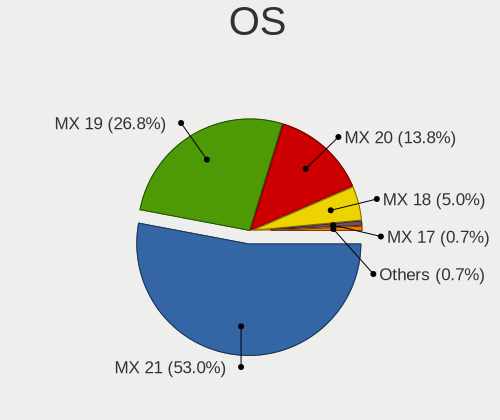

| Name           | Computers | Percent |
|----------------|-----------|---------|
| MX 21          | 183       | 42.36%  |
| MX 19          | 141       | 32.64%  |
| MX 20          | 74        | 17.13%  |
| MX 18          | 27        | 6.25%   |
| MX 17          | 4         | 0.93%   |
| MX 22          | 1         | 0.23%   |
| MX 16-migrated | 1         | 0.23%   |
| MX 16          | 1         | 0.23%   |

OS Family
---------

OS without a version

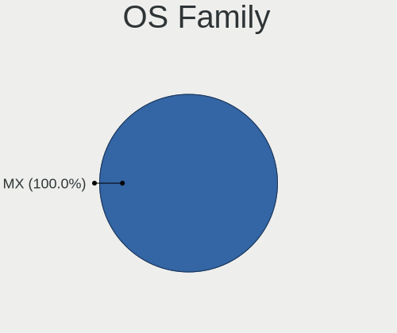

| Name | Computers | Percent |
|------|-----------|---------|
| MX   | 421       | 100%    |

Kernel
------

Version of the Linux kernel

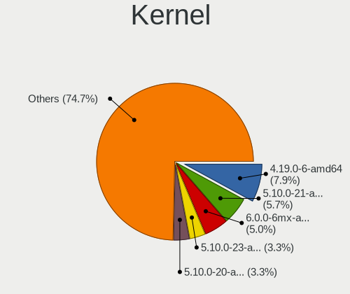

| Version                  | Computers | Percent |
|--------------------------|-----------|---------|
| 4.19.0-6-amd64           | 57        | 12.18%  |
| 5.10.0-5mx-amd64         | 20        | 4.27%   |
| 5.10.0-13-amd64          | 19        | 4.06%   |
| 5.10.0-9-amd64           | 18        | 3.85%   |
| 5.10.0-19-amd64          | 16        | 3.42%   |
| 5.8.0-3-amd64            | 15        | 3.21%   |
| 5.6.0-2-amd64            | 15        | 3.21%   |
| 5.14.0-4mx-amd64         | 15        | 3.21%   |
| 5.10.0-18-amd64          | 15        | 3.21%   |
| 5.10.0-16-amd64          | 13        | 2.78%   |
| 5.16.0-5mx-amd64         | 12        | 2.56%   |
| 4.19.0-14-amd64          | 10        | 2.14%   |
| 4.19.0-13-amd64          | 10        | 2.14%   |
| 4.19.0-17-amd64          | 9         | 1.92%   |
| 5.10.0-11-amd64          | 8         | 1.71%   |
| 4.19.0-16-amd64          | 8         | 1.71%   |
| 5.18.0-4mx-amd64         | 7         | 1.5%    |
| 4.19.0-5-amd64           | 7         | 1.5%    |
| 5.10.0-15-amd64          | 6         | 1.28%   |
| 5.10.0-14-amd64          | 6         | 1.28%   |
| 4.19.0-1-amd64           | 6         | 1.28%   |
| 5.4.0-3-amd64            | 5         | 1.07%   |
| 5.10.0-8mx-amd64         | 5         | 1.07%   |
| 4.19.0-18-amd64          | 5         | 1.07%   |
| 4.19.0-12-amd64          | 5         | 1.07%   |
| 6.0.0-4mx-amd64          | 4         | 0.85%   |
| 5.8.16-antix.1-amd64-smp | 4         | 0.85%   |
| 5.10.0-20-amd64          | 4         | 0.85%   |
| 5.10.0-17-amd64          | 4         | 0.85%   |
| 5.10.0-10-amd64          | 4         | 0.85%   |
| 4.19.0-11-amd64          | 4         | 0.85%   |
| 4.15.0-1-amd64           | 4         | 0.85%   |
| 6.0.0-3mx-amd64          | 3         | 0.64%   |
| 5.2.21-antix.2-amd64-smp | 3         | 0.64%   |
| 5.19.0-2mx-amd64         | 3         | 0.64%   |
| 5.16.0-6mx-amd64         | 3         | 0.64%   |
| 4.19.0-9-amd64           | 3         | 0.64%   |
| 5.6.10-antix.1-amd64-smp | 2         | 0.43%   |
| 5.5.0-9.1-liquorix-amd64 | 2         | 0.43%   |
| 5.4.7-antix.1-amd64-smp  | 2         | 0.43%   |

Kernel Family
-------------

Linux kernel without a distro release

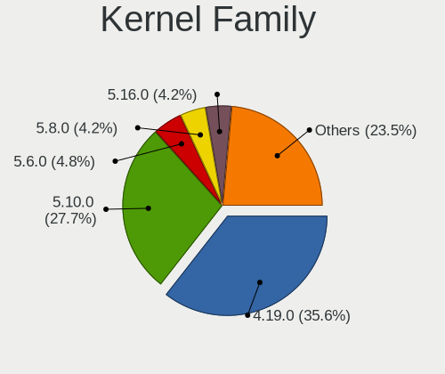

| Version  | Computers | Percent |
|----------|-----------|---------|
| 5.10.0   | 147       | 32.81%  |
| 4.19.0   | 132       | 29.46%  |
| 5.16.0   | 20        | 4.46%   |
| 5.14.0   | 18        | 4.02%   |
| 5.6.0    | 17        | 3.79%   |
| 5.8.0    | 15        | 3.35%   |
| 6.0.0    | 9         | 2.01%   |
| 5.4.0    | 9         | 2.01%   |
| 5.18.0   | 9         | 2.01%   |
| 5.19.0   | 7         | 1.56%   |
| 5.5.0    | 6         | 1.34%   |
| 4.15.0   | 6         | 1.34%   |
| 5.17.0   | 5         | 1.12%   |
| 5.15.0   | 5         | 1.12%   |
| 5.8.16   | 4         | 0.89%   |
| 5.3.0    | 4         | 0.89%   |
| 5.2.21   | 4         | 0.89%   |
| 5.6.10   | 3         | 0.67%   |
| 5.4.7    | 2         | 0.45%   |
| 5.11.0   | 2         | 0.45%   |
| 4.9.193  | 2         | 0.45%   |
| 4.18.0   | 2         | 0.45%   |
| 6.0.5    | 1         | 0.22%   |
| 5.9.1    | 1         | 0.22%   |
| 5.7.0    | 1         | 0.22%   |
| 5.4.10   | 1         | 0.22%   |
| 5.3.10   | 1         | 0.22%   |
| 5.2.8    | 1         | 0.22%   |
| 5.2.15   | 1         | 0.22%   |
| 5.2.0    | 1         | 0.22%   |
| 5.13.0   | 1         | 0.22%   |
| 5.10.82  | 1         | 0.22%   |
| 5.10.52  | 1         | 0.22%   |
| 5.10.111 | 1         | 0.22%   |
| 5.10.1   | 1         | 0.22%   |
| 5.1.2    | 1         | 0.22%   |
| 5.0.0    | 1         | 0.22%   |
| 4.9.91   | 1         | 0.22%   |
| 4.9.246  | 1         | 0.22%   |
| 4.9.189  | 1         | 0.22%   |

Kernel Major Ver.
-----------------

Linux kernel major version

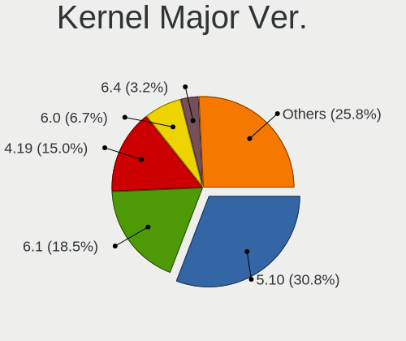

| Version | Computers | Percent |
|---------|-----------|---------|
| 5.10    | 151       | 33.71%  |
| 4.19    | 133       | 29.69%  |
| 5.6     | 20        | 4.46%   |
| 5.16    | 20        | 4.46%   |
| 5.8     | 19        | 4.24%   |
| 5.14    | 18        | 4.02%   |
| 5.4     | 12        | 2.68%   |
| 6.0     | 10        | 2.23%   |
| 5.18    | 9         | 2.01%   |
| 5.2     | 7         | 1.56%   |
| 5.19    | 7         | 1.56%   |
| 5.5     | 6         | 1.34%   |
| 4.15    | 6         | 1.34%   |
| 5.3     | 5         | 1.12%   |
| 5.17    | 5         | 1.12%   |
| 5.15    | 5         | 1.12%   |
| 4.9     | 5         | 1.12%   |
| 5.11    | 2         | 0.45%   |
| 4.18    | 2         | 0.45%   |
| 5.9     | 1         | 0.22%   |
| 5.7     | 1         | 0.22%   |
| 5.13    | 1         | 0.22%   |
| 5.1     | 1         | 0.22%   |
| 5.0     | 1         | 0.22%   |
| 3.16    | 1         | 0.22%   |

Arch
----

OS architecture (x86_64, i586, etc.)

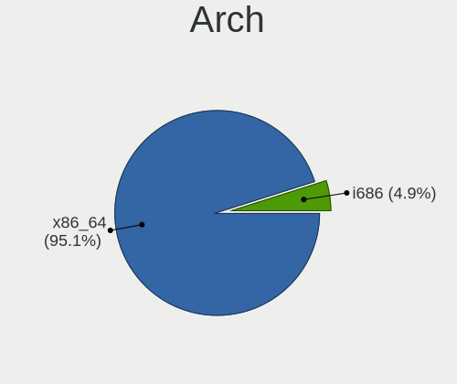

| Name   | Computers | Percent |
|--------|-----------|---------|
| x86_64 | 400       | 94.79%  |
| i686   | 22        | 5.21%   |

DE
--

Desktop Environment

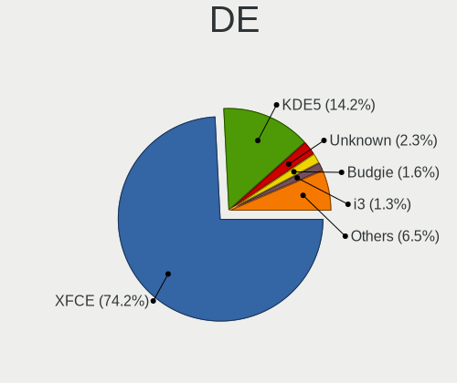

| Name             | Computers | Percent |
|------------------|-----------|---------|
| XFCE             | 320       | 74.42%  |
| KDE5             | 65        | 15.12%  |
| Unknown          | 8         | 1.86%   |
| Budgie           | 7         | 1.63%   |
| i3               | 5         | 1.16%   |
| MATE             | 4         | 0.93%   |
| LXQt             | 4         | 0.93%   |
| GNOME            | 3         | 0.7%    |
| X-Cinnamon       | 2         | 0.47%   |
| lightdm-xsession | 2         | 0.47%   |
| Cinnamon         | 2         | 0.47%   |
| Trinity          | 1         | 0.23%   |
| spectrwm         | 1         | 0.23%   |
| LXDE             | 1         | 0.23%   |
| KDE4             | 1         | 0.23%   |
| KDE              | 1         | 0.23%   |
| GNOME Flashback  | 1         | 0.23%   |
| GNOME Classic    | 1         | 0.23%   |
| fluxbox          | 1         | 0.23%   |

Display Server
--------------

X11 or Wayland

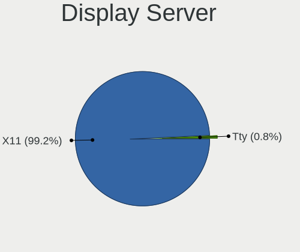

| Name | Computers | Percent |
|------|-----------|---------|
| X11  | 418       | 99.29%  |
| Tty  | 3         | 0.71%   |

Display Manager
---------------

SDDM, LightDM, etc.

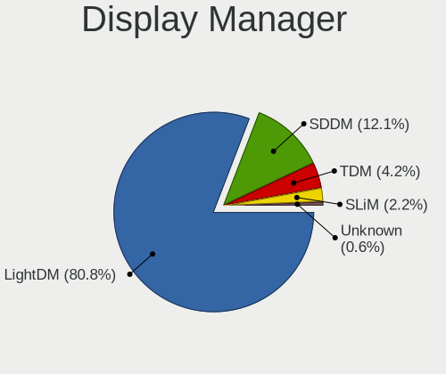

| Name    | Computers | Percent |
|---------|-----------|---------|
| LightDM | 346       | 81.03%  |
| SDDM    | 55        | 12.88%  |
| TDM     | 13        | 3.04%   |
| SLiM    | 10        | 2.34%   |
| Unknown | 2         | 0.47%   |
| GDM     | 1         | 0.23%   |

OS Lang
-------

Language

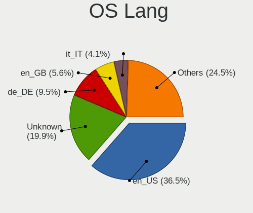

| Lang    | Computers | Percent |
|---------|-----------|---------|
| en_US   | 150       | 34.32%  |
| Unknown | 102       | 23.34%  |
| de_DE   | 42        | 9.61%   |
| en_GB   | 22        | 5.03%   |
| it_IT   | 16        | 3.66%   |
| sk_SK   | 12        | 2.75%   |
| ru_RU   | 11        | 2.52%   |
| es_ES   | 11        | 2.52%   |
| pt_BR   | 9         | 2.06%   |
| pl_PL   | 9         | 2.06%   |
| fr_FR   | 7         | 1.6%    |
| tr_TR   | 5         | 1.14%   |
| en_AU   | 5         | 1.14%   |
| hu_HU   | 3         | 0.69%   |
| en_NZ   | 3         | 0.69%   |
| en_IE   | 3         | 0.69%   |
| de_CH   | 3         | 0.69%   |
| uk_UA   | 2         | 0.46%   |
| nl_NL   | 2         | 0.46%   |
| fi_FI   | 2         | 0.46%   |
| es_VE   | 2         | 0.46%   |
| es_MX   | 2         | 0.46%   |
| es_CO   | 2         | 0.46%   |
| bg_BG   | 2         | 0.46%   |
| zh_CN   | 1         | 0.23%   |
| sv_SE   | 1         | 0.23%   |
| nb_NO   | 1         | 0.23%   |
| id_ID   | 1         | 0.23%   |
| fr_CH   | 1         | 0.23%   |
| fr_BE   | 1         | 0.23%   |
| es_UY   | 1         | 0.23%   |
| es_PE   | 1         | 0.23%   |
| da_DK   | 1         | 0.23%   |
| cs_CZ   | 1         | 0.23%   |

Boot Mode
---------

EFI or BIOS

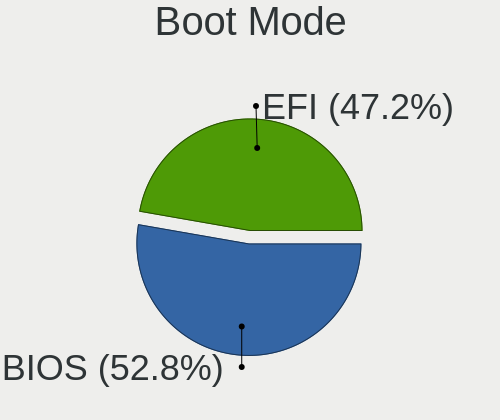

| Mode | Computers | Percent |
|------|-----------|---------|
| EFI  | 216       | 51.31%  |
| BIOS | 205       | 48.69%  |

Filesystem
----------

Type of filesystem

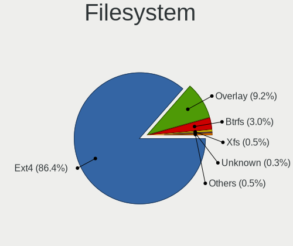

| Type     | Computers | Percent |
|----------|-----------|---------|
| Ext4     | 368       | 86.79%  |
| Overlay  | 38        | 8.96%   |
| Btrfs    | 11        | 2.59%   |
| Xfs      | 2         | 0.47%   |
| Unknown  | 2         | 0.47%   |
| Reiserfs | 1         | 0.24%   |
| F2fs     | 1         | 0.24%   |
| Ext3     | 1         | 0.24%   |

Part. scheme
------------

Scheme of partitioning

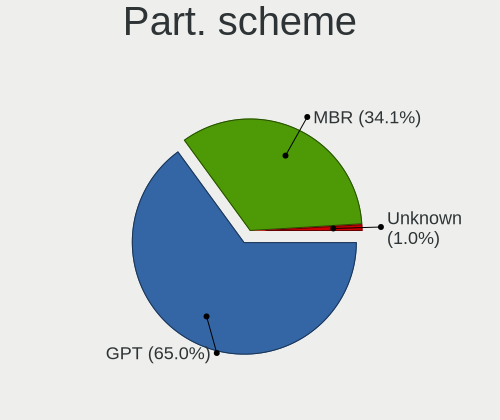

| Type    | Computers | Percent |
|---------|-----------|---------|
| GPT     | 261       | 61.7%   |
| MBR     | 155       | 36.64%  |
| Unknown | 7         | 1.65%   |

Dual Boot with Linux/BSD
------------------------

Hosting more than one Linux/BSD

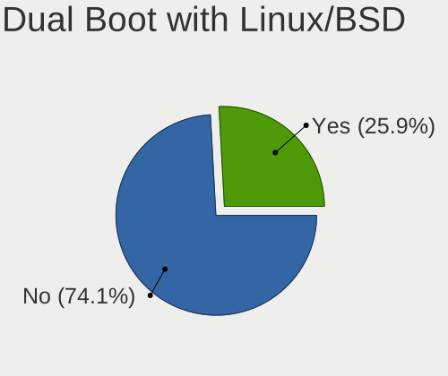

| Dual boot | Computers | Percent |
|-----------|-----------|---------|
| No        | 318       | 73.61%  |
| Yes       | 114       | 26.39%  |

Dual Boot (Win)
---------------

Hosting Linux and Windows

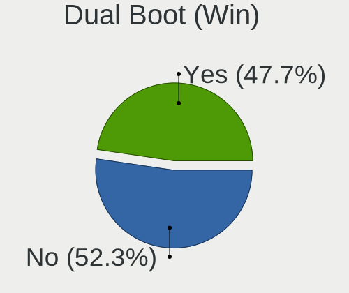

| Dual boot | Computers | Percent |
|-----------|-----------|---------|
| No        | 222       | 52.36%  |
| Yes       | 202       | 47.64%  |

Board
-----

Vendor
------

Motherboard manufacturer

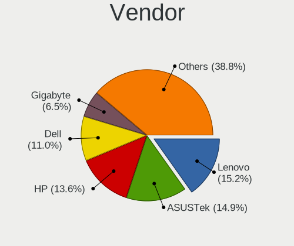

| Name                        | Computers | Percent |
|-----------------------------|-----------|---------|
| Lenovo                      | 63        | 14.96%  |
| ASUSTek Computer            | 58        | 13.78%  |
| Hewlett-Packard             | 53        | 12.59%  |
| Dell                        | 51        | 12.11%  |
| Acer                        | 25        | 5.94%   |
| MSI                         | 24        | 5.7%    |
| Gigabyte Technology         | 23        | 5.46%   |
| ASRock                      | 14        | 3.33%   |
| Apple                       | 14        | 3.33%   |
| Toshiba                     | 10        | 2.38%   |
| Sony                        | 10        | 2.38%   |
| Intel                       | 10        | 2.38%   |
| Medion                      | 7         | 1.66%   |
| Samsung Electronics         | 5         | 1.19%   |
| Fujitsu Siemens             | 4         | 0.95%   |
| ZOTAC                       | 3         | 0.71%   |
| Alienware                   | 3         | 0.71%   |
| Notebook                    | 2         | 0.48%   |
| Google                      | 2         | 0.48%   |
| Fujitsu                     | 2         | 0.48%   |
| Clevo                       | 2         | 0.48%   |
| Biostar                     | 2         | 0.48%   |
| Unknown                     | 2         | 0.48%   |
| win element                 | 1         | 0.24%   |
| Vulcan Electronics          | 1         | 0.24%   |
| UMAX                        | 1         | 0.24%   |
| TUXEDO                      | 1         | 0.24%   |
| Teclast                     | 1         | 0.24%   |
| Sun Microsystems            | 1         | 0.24%   |
| SIRAGON                     | 1         | 0.24%   |
| Shenzhen Wangang Technology | 1         | 0.24%   |
| SANTECH                     | 1         | 0.24%   |
| Radiant Systems             | 1         | 0.24%   |
| Pixus                       | 1         | 0.24%   |
| Pegatron                    | 1         | 0.24%   |
| Panasonic                   | 1         | 0.24%   |
| Packard Bell                | 1         | 0.24%   |
| MP                          | 1         | 0.24%   |
| Microsoft                   | 1         | 0.24%   |
| Irbis                       | 1         | 0.24%   |

Model
-----

Motherboard model

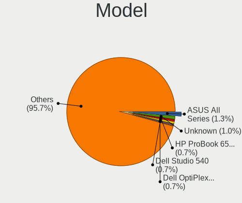

| Name                                         | Computers | Percent |
|----------------------------------------------|-----------|---------|
| Unknown                                      | 5         | 1.19%   |
| ASUS All Series                              | 4         | 0.95%   |
| MSI MS-7A34                                  | 2         | 0.48%   |
| HP Stream Laptop 14-cb0XX                    | 2         | 0.48%   |
| HP ProBook 650 G1                            | 2         | 0.48%   |
| Dell Studio 540                              | 2         | 0.48%   |
| Dell OptiPlex 9010                           | 2         | 0.48%   |
| Dell OptiPlex 790                            | 2         | 0.48%   |
| Dell OptiPlex 755                            | 2         | 0.48%   |
| ASUS X200CA                                  | 2         | 0.48%   |
| ASUS PRIME B450M-A                           | 2         | 0.48%   |
| ASRock K8A780LM                              | 2         | 0.48%   |
| Apple MacBookAir7,2                          | 2         | 0.48%   |
| ZOTAC ZBOX-ID18                              | 1         | 0.24%   |
| ZOTAC ZBOX-ECM73070C/53060C                  | 1         | 0.24%   |
| ZOTAC ZBOX-BI320                             | 1         | 0.24%   |
| win element MoreFine S500+                   | 1         | 0.24%   |
| Vulcan Excursion XB                          | 1         | 0.24%   |
| UMAX VisionBook-N12R                         | 1         | 0.24%   |
| TUXEDO N7x0WU                                | 1         | 0.24%   |
| Toshiba Satellite P875                       | 1         | 0.24%   |
| Toshiba Satellite L850-CJK                   | 1         | 0.24%   |
| Toshiba Satellite L650                       | 1         | 0.24%   |
| Toshiba Satellite C845                       | 1         | 0.24%   |
| Toshiba Satellite C70-B                      | 1         | 0.24%   |
| Toshiba Satellite C660                       | 1         | 0.24%   |
| Toshiba Satellite C50-A-12K                  | 1         | 0.24%   |
| Toshiba Satellite A300                       | 1         | 0.24%   |
| Toshiba PORTEGE Z30-C                        | 1         | 0.24%   |
| Toshiba PORTEGE R705                         | 1         | 0.24%   |
| Teclast F5                                   | 1         | 0.24%   |
| Sun Microsystems Sun Ultra 40 M2 Workstation | 1         | 0.24%   |
| Sony VPCYB3V1E                               | 1         | 0.24%   |
| Sony VPCSB1V9R                               | 1         | 0.24%   |
| Sony VPCF23P1E                               | 1         | 0.24%   |
| Sony VPCF119FX                               | 1         | 0.24%   |
| Sony VPCEH2N1E                               | 1         | 0.24%   |
| Sony VPCEC3S1E                               | 1         | 0.24%   |
| Sony VGN-TZ3RXN_B                            | 1         | 0.24%   |
| Sony VGN-NR310FH                             | 1         | 0.24%   |

Model Family
------------

Motherboard model prefix

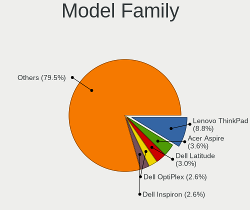

| Name                    | Computers | Percent |
|-------------------------|-----------|---------|
| Lenovo ThinkPad         | 39        | 9.26%   |
| Acer Aspire             | 15        | 3.56%   |
| Dell Latitude           | 14        | 3.33%   |
| Dell OptiPlex           | 11        | 2.61%   |
| Dell Inspiron           | 10        | 2.38%   |
| Toshiba Satellite       | 8         | 1.9%    |
| HP ProBook              | 7         | 1.66%   |
| HP Pavilion             | 7         | 1.66%   |
| Lenovo IdeaPad          | 6         | 1.43%   |
| ASUS TUF                | 6         | 1.43%   |
| HP EliteBook            | 5         | 1.19%   |
| Dell Vostro             | 5         | 1.19%   |
| ASUS ROG                | 5         | 1.19%   |
| ASUS PRIME              | 5         | 1.19%   |
| Unknown                 | 5         | 1.19%   |
| HP Laptop               | 4         | 0.95%   |
| HP Compaq               | 4         | 0.95%   |
| ASUS All                | 4         | 0.95%   |
| HP Spectre              | 3         | 0.71%   |
| HP ENVY                 | 3         | 0.71%   |
| Toshiba PORTEGE         | 2         | 0.48%   |
| MSI MS-7A34             | 2         | 0.48%   |
| Medion Akoya            | 2         | 0.48%   |
| Lenovo B590             | 2         | 0.48%   |
| HP ZBook                | 2         | 0.48%   |
| HP Stream               | 2         | 0.48%   |
| HP 15                   | 2         | 0.48%   |
| Gigabyte Z390           | 2         | 0.48%   |
| Gigabyte B550M          | 2         | 0.48%   |
| Fujitsu Siemens ESPRIMO | 2         | 0.48%   |
| Dell Studio             | 2         | 0.48%   |
| Dell Precision          | 2         | 0.48%   |
| Dell PowerEdge          | 2         | 0.48%   |
| ASUS ZenBook            | 2         | 0.48%   |
| ASUS X200CA             | 2         | 0.48%   |
| ASUS VivoBook           | 2         | 0.48%   |
| ASUS P5GC-MX            | 2         | 0.48%   |
| ASUS ASUS               | 2         | 0.48%   |
| ASRock K8A780LM         | 2         | 0.48%   |
| Apple MacBookPro11      | 2         | 0.48%   |

MFG Year
--------

Motherboard manufacture year

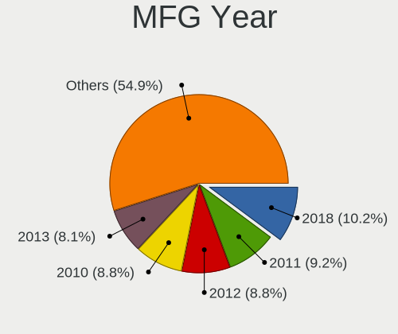

| Year    | Computers | Percent |
|---------|-----------|---------|
| 2018    | 44        | 10.45%  |
| 2011    | 38        | 9.03%   |
| 2021    | 34        | 8.08%   |
| 2010    | 33        | 7.84%   |
| 2012    | 32        | 7.6%    |
| 2013    | 31        | 7.36%   |
| 2020    | 29        | 6.89%   |
| 2019    | 26        | 6.18%   |
| 2017    | 23        | 5.46%   |
| 2016    | 23        | 5.46%   |
| 2015    | 23        | 5.46%   |
| 2014    | 22        | 5.23%   |
| 2008    | 18        | 4.28%   |
| 2007    | 14        | 3.33%   |
| 2009    | 13        | 3.09%   |
| 2022    | 7         | 1.66%   |
| 2006    | 6         | 1.43%   |
| 2005    | 4         | 0.95%   |
| Unknown | 1         | 0.24%   |

Form Factor
-----------

Physical design of the computer

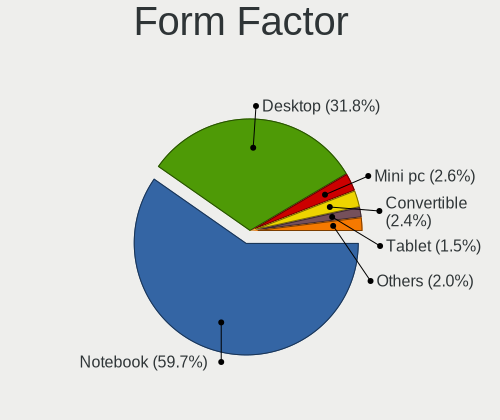

| Name        | Computers | Percent |
|-------------|-----------|---------|
| Notebook    | 249       | 59.14%  |
| Desktop     | 133       | 31.59%  |
| Convertible | 12        | 2.85%   |
| Mini pc     | 11        | 2.61%   |
| Tablet      | 7         | 1.66%   |
| All in one  | 5         | 1.19%   |
| Server      | 4         | 0.95%   |

Secure Boot
-----------

Enabled or disabled

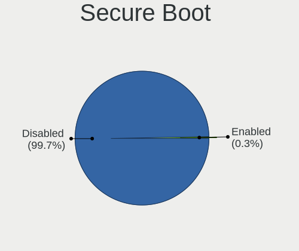

| State    | Computers | Percent |
|----------|-----------|---------|
| Disabled | 419       | 99.52%  |
| Enabled  | 2         | 0.48%   |

Coreboot
--------

Have coreboot on board

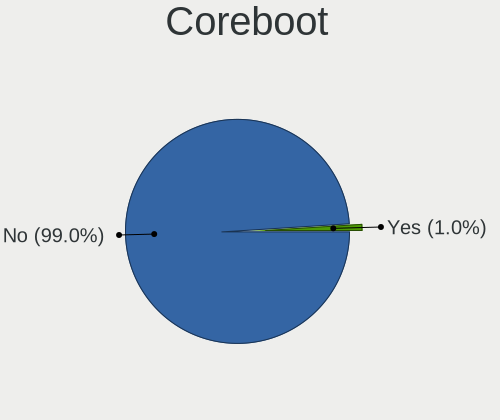

| Used | Computers | Percent |
|------|-----------|---------|
| No   | 417       | 99.05%  |
| Yes  | 4         | 0.95%   |

RAM Size
--------

Total RAM memory

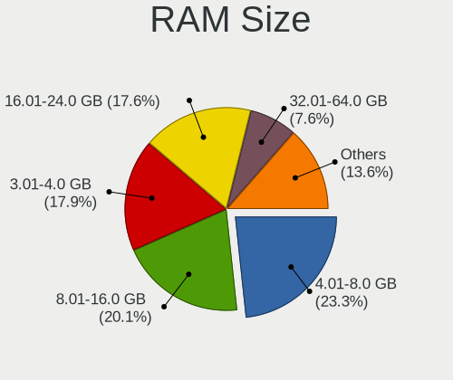

| Size in GB  | Computers | Percent |
|-------------|-----------|---------|
| 4.01-8.0    | 100       | 23.64%  |
| 8.01-16.0   | 86        | 20.33%  |
| 16.01-24.0  | 76        | 17.97%  |
| 3.01-4.0    | 72        | 17.02%  |
| 32.01-64.0  | 33        | 7.8%    |
| 1.01-2.0    | 30        | 7.09%   |
| 2.01-3.0    | 10        | 2.36%   |
| 0.51-1.0    | 6         | 1.42%   |
| 24.01-32.0  | 5         | 1.18%   |
| 64.01-256.0 | 5         | 1.18%   |

RAM Used
--------

Used RAM memory

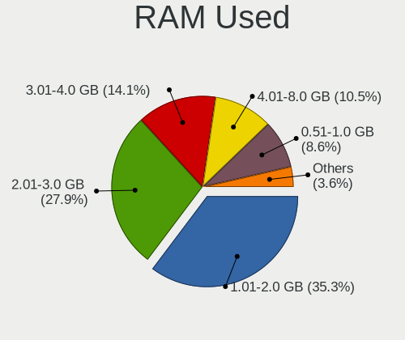

| Used GB    | Computers | Percent |
|------------|-----------|---------|
| 1.01-2.0   | 160       | 35.56%  |
| 2.01-3.0   | 111       | 24.67%  |
| 3.01-4.0   | 64        | 14.22%  |
| 4.01-8.0   | 49        | 10.89%  |
| 0.51-1.0   | 48        | 10.67%  |
| 8.01-16.0  | 12        | 2.67%   |
| 0.01-0.5   | 5         | 1.11%   |
| 16.01-24.0 | 1         | 0.22%   |

Total Drives
------------

Number of drives on board

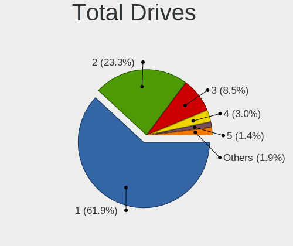

| Drives | Computers | Percent |
|--------|-----------|---------|
| 1      | 250       | 57.74%  |
| 2      | 111       | 25.64%  |
| 3      | 43        | 9.93%   |
| 4      | 11        | 2.54%   |
| 5      | 8         | 1.85%   |
| 0      | 6         | 1.39%   |
| 8      | 3         | 0.69%   |
| 6      | 1         | 0.23%   |

Has CD-ROM
----------

Has CD-ROM on board

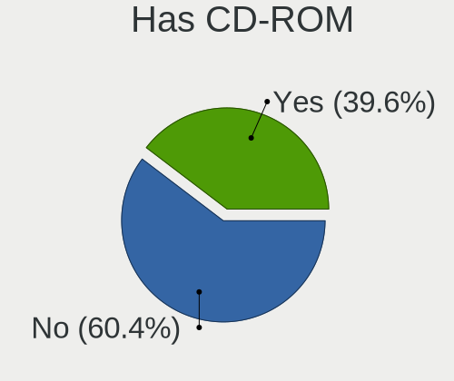

| Presented | Computers | Percent |
|-----------|-----------|---------|
| No        | 258       | 60.99%  |
| Yes       | 165       | 39.01%  |

Has Ethernet
------------

Has Ethernet on board

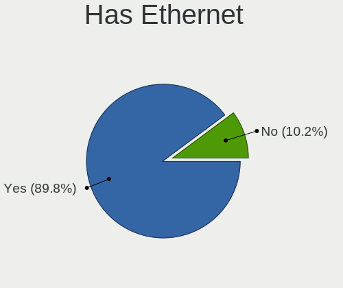

| Presented | Computers | Percent |
|-----------|-----------|---------|
| Yes       | 373       | 88.6%   |
| No        | 48        | 11.4%   |

Has WiFi
--------

Has WiFi module

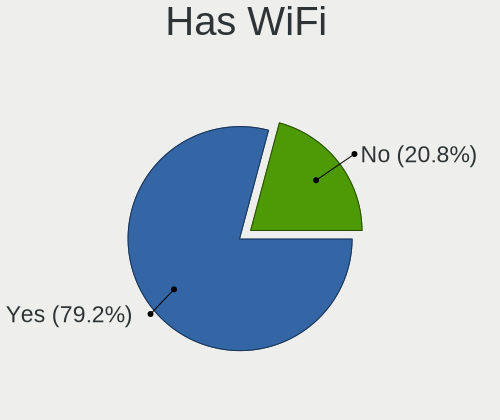

| Presented | Computers | Percent |
|-----------|-----------|---------|
| Yes       | 321       | 76.07%  |
| No        | 101       | 23.93%  |

Has Bluetooth
-------------

Has Bluetooth module

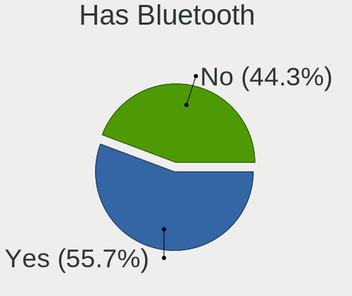

| Presented | Computers | Percent |
|-----------|-----------|---------|
| Yes       | 238       | 56.4%   |
| No        | 184       | 43.6%   |

Location
--------

Country
-------

Geographic location (country)

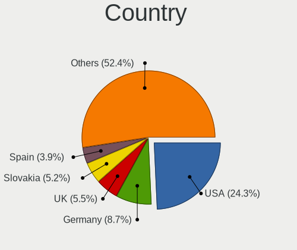

| Country     | Computers | Percent |
|-------------|-----------|---------|
| USA         | 99        | 23.4%   |
| Germany     | 45        | 10.64%  |
| Italy       | 25        | 5.91%   |
| UK          | 20        | 4.73%   |
| Slovakia    | 17        | 4.02%   |
| Russia      | 15        | 3.55%   |
| Spain       | 14        | 3.31%   |
| Canada      | 14        | 3.31%   |
| Poland      | 13        | 3.07%   |
| Brazil      | 13        | 3.07%   |
| India       | 12        | 2.84%   |
| France      | 12        | 2.84%   |
| Netherlands | 11        | 2.6%    |
| Australia   | 9         | 2.13%   |
| Finland     | 7         | 1.65%   |
| Austria     | 7         | 1.65%   |
| Ukraine     | 5         | 1.18%   |
| Turkey      | 5         | 1.18%   |
| Serbia      | 5         | 1.18%   |
| Mexico      | 5         | 1.18%   |
| Switzerland | 4         | 0.95%   |
| Sweden      | 4         | 0.95%   |
| Indonesia   | 4         | 0.95%   |
| Hungary     | 4         | 0.95%   |
| Venezuela   | 3         | 0.71%   |
| Thailand    | 3         | 0.71%   |
| New Zealand | 3         | 0.71%   |
| Denmark     | 3         | 0.71%   |
| Czechia     | 3         | 0.71%   |
| Colombia    | 3         | 0.71%   |
| Belgium     | 3         | 0.71%   |
| Vietnam     | 2         | 0.47%   |
| Romania     | 2         | 0.47%   |
| Portugal    | 2         | 0.47%   |
| Philippines | 2         | 0.47%   |
| Norway      | 2         | 0.47%   |
| Greece      | 2         | 0.47%   |
| China       | 2         | 0.47%   |
| Chile       | 2         | 0.47%   |
| Bulgaria    | 2         | 0.47%   |

City
----

Geographic location (city)

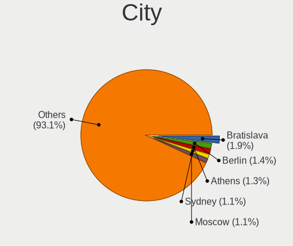

| City             | Computers | Percent |
|------------------|-----------|---------|
| Bratislava       | 16        | 3.64%   |
| Vienna           | 7         | 1.59%   |
| Berlin           | 7         | 1.59%   |
| St Petersburg    | 5         | 1.14%   |
| Amsterdam        | 4         | 0.91%   |
| Warsaw           | 3         | 0.68%   |
| Rome             | 3         | 0.68%   |
| Patna            | 3         | 0.68%   |
| Oxford           | 3         | 0.68%   |
| Munich           | 3         | 0.68%   |
| Montreal         | 3         | 0.68%   |
| Madrid           | 3         | 0.68%   |
| Los Angeles      | 3         | 0.68%   |
| Istanbul         | 3         | 0.68%   |
| Helsinki         | 3         | 0.68%   |
| Cambridge        | 3         | 0.68%   |
| Buffalo          | 3         | 0.68%   |
| Budapest         | 3         | 0.68%   |
| Bogotá          | 3         | 0.68%   |
| Bengaluru        | 3         | 0.68%   |
| Belgrade         | 3         | 0.68%   |
| Barcelona        | 3         | 0.68%   |
| Walled Lake      | 2         | 0.46%   |
| Vasco da Gama    | 2         | 0.46%   |
| Valencia         | 2         | 0.46%   |
| Tacoma           | 2         | 0.46%   |
| Sydney           | 2         | 0.46%   |
| Prague           | 2         | 0.46%   |
| Portland         | 2         | 0.46%   |
| Orange           | 2         | 0.46%   |
| Nashville        | 2         | 0.46%   |
| Moscow           | 2         | 0.46%   |
| Minsk            | 2         | 0.46%   |
| Milan            | 2         | 0.46%   |
| Melbourne        | 2         | 0.46%   |
| Ho Chi Minh City | 2         | 0.46%   |
| Hamburg          | 2         | 0.46%   |
| Florianópolis   | 2         | 0.46%   |
| Florence         | 2         | 0.46%   |
| Ettingen         | 2         | 0.46%   |

Drives
------

Drive Vendor
------------

Hard drive vendors

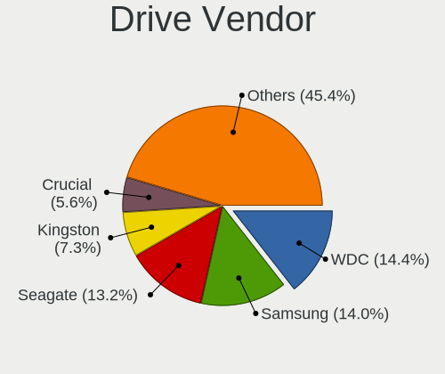

| Vendor              | Computers | Drives | Percent |
|---------------------|-----------|--------|---------|
| WDC                 | 92        | 107    | 14.51%  |
| Samsung Electronics | 91        | 127    | 14.35%  |
| Seagate             | 87        | 117    | 13.72%  |
| Kingston            | 43        | 45     | 6.78%   |
| Toshiba             | 38        | 44     | 5.99%   |
| Crucial             | 36        | 55     | 5.68%   |
| SanDisk             | 29        | 33     | 4.57%   |
| Hitachi             | 29        | 35     | 4.57%   |
| Unknown             | 27        | 35     | 4.26%   |
| SK hynix            | 15        | 16     | 2.37%   |
| Intel               | 15        | 22     | 2.37%   |
| A-DATA Technology   | 12        | 14     | 1.89%   |
| HGST                | 9         | 14     | 1.42%   |
| PNY                 | 8         | 9      | 1.26%   |
| Apple               | 7         | 11     | 1.1%    |
| GOODRAM             | 6         | 7      | 0.95%   |
| Corsair             | 6         | 6      | 0.95%   |
| Transcend           | 5         | 5      | 0.79%   |
| SPCC                | 5         | 5      | 0.79%   |
| Micron Technology   | 5         | 9      | 0.79%   |
| Maxtor              | 5         | 6      | 0.79%   |
| LITEON              | 4         | 4      | 0.63%   |
| Phison              | 3         | 4      | 0.47%   |
| Netac               | 3         | 3      | 0.47%   |
| Fujitsu             | 3         | 3      | 0.47%   |
| Dogfish             | 3         | 3      | 0.47%   |
| Team                | 2         | 2      | 0.32%   |
| OCZ                 | 2         | 2      | 0.32%   |
| Mushkin             | 2         | 2      | 0.32%   |
| KIOXIA              | 2         | 3      | 0.32%   |
| KingSpec            | 2         | 2      | 0.32%   |
| KingFast            | 2         | 2      | 0.32%   |
| KingDian            | 2         | 2      | 0.32%   |
| Intenso             | 2         | 2      | 0.32%   |
| Indilinx            | 2         | 4      | 0.32%   |
| Gigabyte Technology | 2         | 2      | 0.32%   |
| ASMT                | 2         | 4      | 0.32%   |
| Apacer              | 2         | 2      | 0.32%   |
| Unknown             | 2         | 2      | 0.32%   |
| ZTC                 | 1         | 1      | 0.16%   |

Drive Model
-----------

Hard drive models

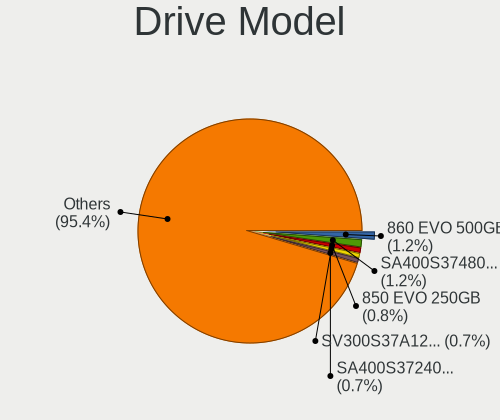

| Model                            | Computers | Percent |
|----------------------------------|-----------|---------|
| Samsung SSD 860 EVO 500GB        | 9         | 1.3%    |
| Kingston SA400S37480G 480GB SSD  | 8         | 1.16%   |
| Samsung SSD 850 EVO 250GB        | 7         | 1.01%   |
| Kingston SA400S37240G 240GB SSD  | 7         | 1.01%   |
| Seagate ST1000LM035-1RK172 1TB   | 6         | 0.87%   |
| Crucial CT120BX500SSD1 120GB     | 6         | 0.87%   |
| Seagate ST2000DM008-2FR102 2TB   | 5         | 0.72%   |
| Samsung SSD 970 EVO Plus 1TB     | 5         | 0.72%   |
| Kingston SV300S37A120G 120GB SSD | 5         | 0.72%   |
| Crucial CT500MX500SSD1 500GB     | 5         | 0.72%   |
| Toshiba MQ01ABF050 500GB         | 4         | 0.58%   |
| Toshiba DT01ACA100 1TB           | 4         | 0.58%   |
| Seagate ST500DM002-1BD142 500GB  | 4         | 0.58%   |
| Seagate ST4000DM004-2CV104 4TB   | 4         | 0.58%   |
| Seagate ST1000LM048-2E7172 1TB   | 4         | 0.58%   |
| Seagate ST1000DM010-2EP102 1TB   | 4         | 0.58%   |
| Samsung SSD 980 PRO 1TB          | 4         | 0.58%   |
| Samsung SSD 850 EVO 500GB        | 4         | 0.58%   |
| Kingston SA400S37120G 120GB SSD  | 4         | 0.58%   |
| Hitachi HTS543232A7A384 320GB    | 4         | 0.58%   |
| A-DATA SP600 32GB SSD            | 4         | 0.58%   |
| WDC WD10JPVX-22JC3T0 1TB         | 3         | 0.43%   |
| WDC WD1002FAEX-00Z3A0 1TB        | 3         | 0.43%   |
| Unknown SD32G  32GB              | 3         | 0.43%   |
| Seagate ST3500413AS 500GB        | 3         | 0.43%   |
| SanDisk SDSSDA240G 240GB         | 3         | 0.43%   |
| SanDisk SDSSDA120G 120GB         | 3         | 0.43%   |
| Samsung SSD 970 EVO Plus 500GB   | 3         | 0.43%   |
| Samsung SSD 970 EVO 1TB          | 3         | 0.43%   |
| Samsung SSD 860 EVO 1TB          | 3         | 0.43%   |
| Samsung SSD 840 EVO 250GB        | 3         | 0.43%   |
| Samsung SSD 830 Series 128GB     | 3         | 0.43%   |
| Intel SSDPEKNW512G8 512GB        | 3         | 0.43%   |
| HGST HTS541010A9E680 1TB         | 3         | 0.43%   |
| Crucial CT240BX500SSD1 240GB     | 3         | 0.43%   |
| Crucial CT1000MX500SSD1 1TB      | 3         | 0.43%   |
| WDC WDS120G2G0A-00JH30 120GB SSD | 2         | 0.29%   |
| WDC WDS100T1X0E-00AFY0 1TB       | 2         | 0.29%   |
| WDC WD60EZRZ-00RWYB1 6TB         | 2         | 0.29%   |
| WDC WD60EFRX-68L0BN1 6TB         | 2         | 0.29%   |

HDD Vendor
----------

Hard disk drive vendors

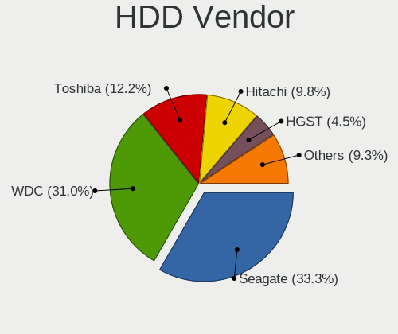

| Vendor              | Computers | Drives | Percent |
|---------------------|-----------|--------|---------|
| Seagate             | 87        | 116    | 36.1%   |
| WDC                 | 68        | 80     | 28.22%  |
| Hitachi             | 29        | 35     | 12.03%  |
| Toshiba             | 28        | 34     | 11.62%  |
| HGST                | 9         | 14     | 3.73%   |
| Samsung Electronics | 8         | 10     | 3.32%   |
| Maxtor              | 5         | 6      | 2.07%   |
| Fujitsu             | 3         | 3      | 1.24%   |
| Unknown             | 1         | 1      | 0.41%   |
| IBM/Hitachi         | 1         | 1      | 0.41%   |
| ASMT                | 1         | 3      | 0.41%   |
| Apple               | 1         | 1      | 0.41%   |

SSD Vendor
----------

Solid state drive vendors

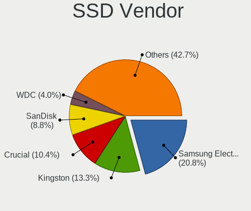

| Vendor              | Computers | Drives | Percent |
|---------------------|-----------|--------|---------|
| Samsung Electronics | 56        | 72     | 21.29%  |
| Kingston            | 35        | 36     | 13.31%  |
| Crucial             | 33        | 46     | 12.55%  |
| SanDisk             | 27        | 30     | 10.27%  |
| A-DATA Technology   | 11        | 13     | 4.18%   |
| WDC                 | 10        | 11     | 3.8%    |
| PNY                 | 7         | 7      | 2.66%   |
| GOODRAM             | 6         | 7      | 2.28%   |
| Apple               | 6         | 9      | 2.28%   |
| Transcend           | 5         | 5      | 1.9%    |
| SPCC                | 5         | 5      | 1.9%    |
| SK hynix            | 5         | 5      | 1.9%    |
| Intel               | 5         | 9      | 1.9%    |
| Toshiba             | 4         | 4      | 1.52%   |
| Micron Technology   | 4         | 8      | 1.52%   |
| LITEON              | 4         | 4      | 1.52%   |
| Netac               | 3         | 3      | 1.14%   |
| Dogfish             | 3         | 3      | 1.14%   |
| OCZ                 | 2         | 2      | 0.76%   |
| KingSpec            | 2         | 2      | 0.76%   |
| KingFast            | 2         | 2      | 0.76%   |
| KingDian            | 2         | 2      | 0.76%   |
| Intenso             | 2         | 2      | 0.76%   |
| Indilinx            | 2         | 4      | 0.76%   |
| Gigabyte Technology | 2         | 2      | 0.76%   |
| Corsair             | 2         | 2      | 0.76%   |
| ZTC                 | 1         | 1      | 0.38%   |
| Yeyian              | 1         | 1      | 0.38%   |
| WDC WDS1            | 1         | 1      | 0.38%   |
| Teclast             | 1         | 1      | 0.38%   |
| Team                | 1         | 1      | 0.38%   |
| Smart               | 1         | 1      | 0.38%   |
| Phison              | 1         | 1      | 0.38%   |
| Patriot             | 1         | 1      | 0.38%   |
| Mushkin             | 1         | 1      | 0.38%   |
| MMY                 | 1         | 1      | 0.38%   |
| LITEONIT            | 1         | 1      | 0.38%   |
| HS-SSD-C100         | 1         | 1      | 0.38%   |
| GeIL                | 1         | 1      | 0.38%   |
| CT1000MX            | 1         | 1      | 0.38%   |

Drive Kind
----------

HDD or SSD

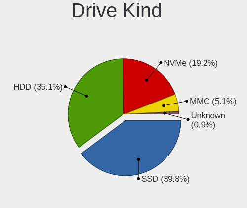

| Kind    | Computers | Drives | Percent |
|---------|-----------|--------|---------|
| SSD     | 225       | 313    | 40.04%  |
| HDD     | 204       | 304    | 36.3%   |
| NVMe    | 100       | 133    | 17.79%  |
| MMC     | 29        | 38     | 5.16%   |
| Unknown | 4         | 5      | 0.71%   |

Drive Connector
---------------

SATA, SAS, NVMe, etc.

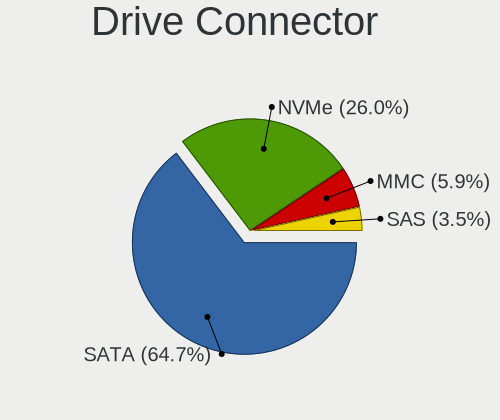

| Type | Computers | Drives | Percent |
|------|-----------|--------|---------|
| SATA | 335       | 603    | 70.23%  |
| NVMe | 100       | 132    | 20.96%  |
| MMC  | 29        | 38     | 6.08%   |
| SAS  | 13        | 20     | 2.73%   |

Drive Size
----------

Size of hard drive

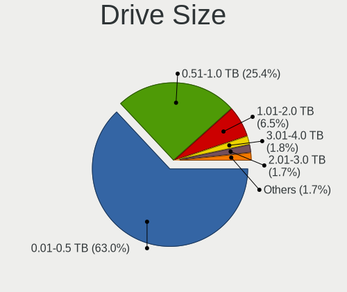

| Size in TB | Computers | Drives | Percent |
|------------|-----------|--------|---------|
| 0.01-0.5   | 278       | 399    | 63.33%  |
| 0.51-1.0   | 112       | 152    | 25.51%  |
| 1.01-2.0   | 26        | 32     | 5.92%   |
| 3.01-4.0   | 9         | 10     | 2.05%   |
| 2.01-3.0   | 7         | 8      | 1.59%   |
| 4.01-10.0  | 6         | 15     | 1.37%   |
| 10.01-20.0 | 1         | 1      | 0.23%   |

Space Total
-----------

Amount of disk space available on the file system

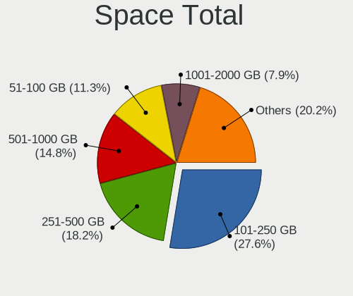

| Size in GB     | Computers | Percent |
|----------------|-----------|---------|
| 101-250        | 123       | 27.89%  |
| 251-500        | 83        | 18.82%  |
| 501-1000       | 61        | 13.83%  |
| 51-100         | 50        | 11.34%  |
| 21-50          | 35        | 7.94%   |
| 1001-2000      | 33        | 7.48%   |
| 1-20           | 21        | 4.76%   |
| More than 3000 | 20        | 4.54%   |
| 2001-3000      | 13        | 2.95%   |
| Unknown        | 2         | 0.45%   |

Space Used
----------

Amount of used disk space

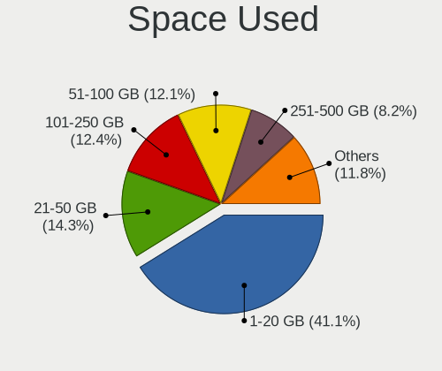

| Used GB        | Computers | Percent |
|----------------|-----------|---------|
| 1-20           | 162       | 36.24%  |
| 21-50          | 68        | 15.21%  |
| 101-250        | 64        | 14.32%  |
| 51-100         | 54        | 12.08%  |
| 251-500        | 45        | 10.07%  |
| 501-1000       | 21        | 4.7%    |
| 1001-2000      | 17        | 3.8%    |
| More than 3000 | 8         | 1.79%   |
| 2001-3000      | 6         | 1.34%   |
| Unknown        | 2         | 0.45%   |

Malfunc. Drives
---------------

Drive models with a malfunction

| Model                                | Computers | Drives | Percent |
|--------------------------------------|-----------|--------|---------|
| Seagate ST1000LM035-1RK172 1TB       | 3         | 3      | 3.13%   |
| Toshiba MK7575GSX 752GB              | 2         | 3      | 2.08%   |
| Seagate ST500LT012-9WS142 500GB      | 2         | 2      | 2.08%   |
| Indilinx IND-S325S120G 120GB SSD     | 2         | 4      | 2.08%   |
| A-DATA Technology SU650 240GB SSD    | 2         | 2      | 2.08%   |
| WDC WDS100T2B0A-00SM50 1TB SSD       | 1         | 1      | 1.04%   |
| WDC WD5003ABYX-01WERA1 500GB         | 1         | 1      | 1.04%   |
| WDC WD5000LPVX-22V0TT0 500GB         | 1         | 1      | 1.04%   |
| WDC WD5000BPVT-60HXZT3 500GB         | 1         | 1      | 1.04%   |
| WDC WD5000AAKS-40V6A0 500GB          | 1         | 1      | 1.04%   |
| WDC WD3200LPVX-22V0TT0 320GB         | 1         | 1      | 1.04%   |
| WDC WD3200BEVT-22ZCT0 320GB          | 1         | 1      | 1.04%   |
| WDC WD3200BEKT-60PVMT0 320GB         | 1         | 1      | 1.04%   |
| WDC WD20EZRX-00D8PB0 2TB             | 1         | 1      | 1.04%   |
| WDC WD20EARX-00PASB0 2TB             | 1         | 1      | 1.04%   |
| WDC WD1600BEVT-22ZCT0 160GB          | 1         | 1      | 1.04%   |
| WDC WD1600BEVT-22A23T0 160GB         | 1         | 1      | 1.04%   |
| WDC WD1600AVVS-63L2B0 160GB          | 1         | 1      | 1.04%   |
| WDC WD15EADS-11P8B2 1TB              | 1         | 1      | 1.04%   |
| WDC WD10EZEX-75WN4A0 1TB             | 1         | 1      | 1.04%   |
| WDC WD10EZEX-60WN4A0 1TB             | 1         | 1      | 1.04%   |
| WDC WD10EAVS-00D7B1 1TB              | 1         | 1      | 1.04%   |
| WDC WD10EADS-98M2B0 1TB              | 1         | 1      | 1.04%   |
| WDC WD10EADS-00M2B0 1TB              | 1         | 1      | 1.04%   |
| Toshiba THNSNK256GCS8 SATA 256GB SSD | 1         | 1      | 1.04%   |
| Toshiba MQ01ABF050 500GB             | 1         | 1      | 1.04%   |
| Toshiba MK6465GSX 640GB              | 1         | 1      | 1.04%   |
| Toshiba MK5059GSXP 500GB             | 1         | 1      | 1.04%   |
| Toshiba MK2565GSX 250GB              | 1         | 1      | 1.04%   |
| SPCC Solid State Disk 512GB          | 1         | 1      | 1.04%   |
| Seagate ST9500420AS 500GB            | 1         | 1      | 1.04%   |
| Seagate ST9500325AS 500GB            | 1         | 1      | 1.04%   |
| Seagate ST9320421AS 320GB            | 1         | 1      | 1.04%   |
| Seagate ST9160821AS 160GB            | 1         | 1      | 1.04%   |
| Seagate ST750LM022 HN-M750MBB 752GB  | 1         | 1      | 1.04%   |
| Seagate ST500LM021-1KJ152 500GB      | 1         | 1      | 1.04%   |
| Seagate ST380815AS 80GB              | 1         | 1      | 1.04%   |
| Seagate ST3750330NS 752GB            | 1         | 1      | 1.04%   |
| Seagate ST3500820AS 500GB            | 1         | 1      | 1.04%   |
| Seagate ST3500413AS 500GB            | 1         | 1      | 1.04%   |

Malfunc. Drive Vendor
---------------------

Vendors of faulty drives

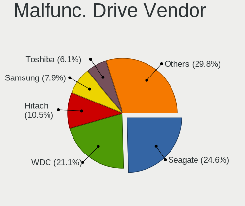

| Vendor              | Computers | Drives | Percent |
|---------------------|-----------|--------|---------|
| Seagate             | 24        | 26     | 25.53%  |
| WDC                 | 19        | 19     | 20.21%  |
| Hitachi             | 11        | 12     | 11.7%   |
| Toshiba             | 7         | 8      | 7.45%   |
| Samsung Electronics | 7         | 10     | 7.45%   |
| Crucial             | 5         | 10     | 5.32%   |
| Maxtor              | 4         | 4      | 4.26%   |
| HGST                | 4         | 5      | 4.26%   |
| Indilinx            | 2         | 4      | 2.13%   |
| Fujitsu             | 2         | 2      | 2.13%   |
| A-DATA Technology   | 2         | 2      | 2.13%   |
| SPCC                | 1         | 1      | 1.06%   |
| SanDisk             | 1         | 1      | 1.06%   |
| Kingston            | 1         | 1      | 1.06%   |
| Intenso             | 1         | 1      | 1.06%   |
| Intel               | 1         | 2      | 1.06%   |
| IBM/Hitachi         | 1         | 1      | 1.06%   |
| GOODRAM             | 1         | 1      | 1.06%   |

Malfunc. HDD Vendor
-------------------

Vendors of faulty HDD drives

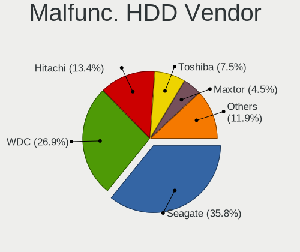

| Vendor              | Computers | Drives | Percent |
|---------------------|-----------|--------|---------|
| Seagate             | 24        | 26     | 33.33%  |
| WDC                 | 18        | 18     | 25%     |
| Hitachi             | 11        | 12     | 15.28%  |
| Toshiba             | 6         | 7      | 8.33%   |
| Maxtor              | 4         | 4      | 5.56%   |
| HGST                | 4         | 5      | 5.56%   |
| Samsung Electronics | 2         | 4      | 2.78%   |
| Fujitsu             | 2         | 2      | 2.78%   |
| IBM/Hitachi         | 1         | 1      | 1.39%   |

Malfunc. Drive Kind
-------------------

Kinds of faulty drives

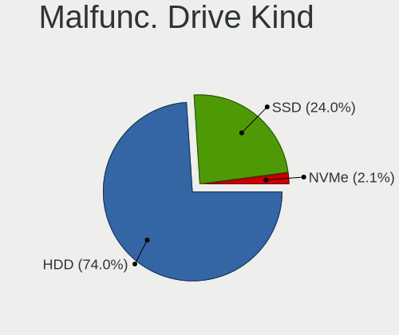

| Kind | Computers | Drives | Percent |
|------|-----------|--------|---------|
| HDD  | 69        | 79     | 75.82%  |
| SSD  | 20        | 23     | 21.98%  |
| NVMe | 2         | 8      | 2.2%    |

Failed Drives
-------------

Failed drive models

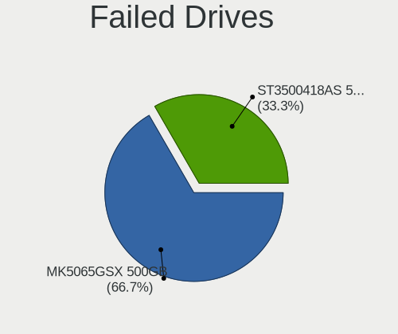

| Model                     | Computers | Drives | Percent |
|---------------------------|-----------|--------|---------|
| Toshiba MK5065GSX 500GB   | 2         | 2      | 66.67%  |
| Seagate ST3500418AS 500GB | 1         | 2      | 33.33%  |

Failed Drive Vendor
-------------------

Failed drive vendors

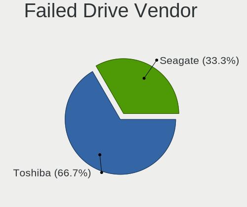

| Vendor  | Computers | Drives | Percent |
|---------|-----------|--------|---------|
| Toshiba | 2         | 2      | 66.67%  |
| Seagate | 1         | 2      | 33.33%  |

Drive Status
------------

Number of failed and malfunc. drives

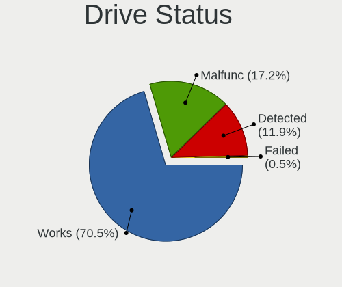

| Status   | Computers | Drives | Percent |
|----------|-----------|--------|---------|
| Works    | 344       | 610    | 70.64%  |
| Malfunc  | 87        | 110    | 17.86%  |
| Detected | 53        | 69     | 10.88%  |
| Failed   | 3         | 4      | 0.62%   |

Storage controller
------------------

Storage Vendor
--------------

Storage controller vendors

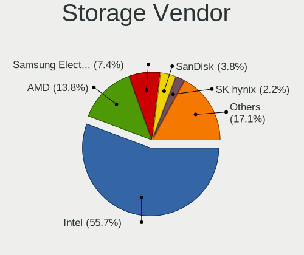

| Vendor                       | Computers | Percent |
|------------------------------|-----------|---------|
| Intel                        | 294       | 59.04%  |
| AMD                          | 66        | 13.25%  |
| Samsung Electronics          | 41        | 8.23%   |
| SanDisk                      | 15        | 3.01%   |
| Nvidia                       | 11        | 2.21%   |
| Phison Electronics           | 10        | 2.01%   |
| SK hynix                     | 9         | 1.81%   |
| Kingston Technology Company  | 8         | 1.61%   |
| ASMedia Technology           | 8         | 1.61%   |
| JMicron Technology           | 7         | 1.41%   |
| KIOXIA                       | 5         | 1%      |
| Micron/Crucial Technology    | 4         | 0.8%    |
| Marvell Technology Group     | 4         | 0.8%    |
| Toshiba America Info Systems | 3         | 0.6%    |
| Silicon Motion               | 3         | 0.6%    |
| ULi Electronics              | 2         | 0.4%    |
| Broadcom / LSI               | 2         | 0.4%    |
| VIA Technologies             | 1         | 0.2%    |
| Silicon Image                | 1         | 0.2%    |
| Micron Technology            | 1         | 0.2%    |
| Lenovo                       | 1         | 0.2%    |
| Hewlett-Packard              | 1         | 0.2%    |
| ADATA Technology             | 1         | 0.2%    |

Storage Model
-------------

Storage controller models

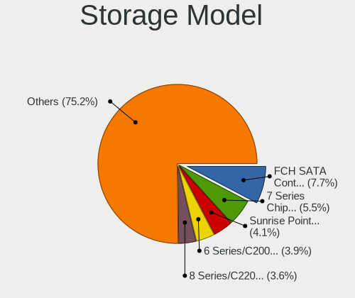

| Model                                                                          | Computers | Percent |
|--------------------------------------------------------------------------------|-----------|---------|
| AMD FCH SATA Controller [AHCI mode]                                            | 39        | 6.79%   |
| Intel 7 Series Chipset Family 6-port SATA Controller [AHCI mode]               | 29        | 5.05%   |
| Intel Sunrise Point-LP SATA Controller [AHCI mode]                             | 22        | 3.83%   |
| Intel 6 Series/C200 Series Chipset Family 6 port Mobile SATA AHCI Controller   | 20        | 3.48%   |
| Samsung NVMe SSD Controller SM981/PM981/PM983                                  | 18        | 3.14%   |
| Intel 8 Series/C220 Series Chipset Family 6-port SATA Controller 1 [AHCI mode] | 17        | 2.96%   |
| Intel 82801 Mobile SATA Controller [RAID mode]                                 | 14        | 2.44%   |
| Samsung NVMe SSD Controller SM961/PM961/SM963                                  | 11        | 1.92%   |
| Intel 5 Series/3400 Series Chipset 6 port SATA AHCI Controller                 | 11        | 1.92%   |
| Intel Celeron/Pentium Silver Processor SATA Controller                         | 9         | 1.57%   |
| Intel 82801G (ICH7 Family) IDE Controller                                      | 9         | 1.57%   |
| AMD SB7x0/SB8x0/SB9x0 IDE Controller                                           | 9         | 1.57%   |
| Intel Q170/Q150/B150/H170/H110/Z170/CM236 Chipset SATA Controller [AHCI Mode]  | 8         | 1.39%   |
| ASMedia ASM1062 Serial ATA Controller                                          | 8         | 1.39%   |
| AMD 500 Series Chipset SATA Controller                                         | 8         | 1.39%   |
| AMD 400 Series Chipset SATA Controller                                         | 8         | 1.39%   |
| Samsung NVMe SSD Controller PM9A1/PM9A3/980PRO                                 | 7         | 1.22%   |
| Phison E12 NVMe Controller                                                     | 7         | 1.22%   |
| Intel Cannon Lake Mobile PCH SATA AHCI Controller                              | 7         | 1.22%   |
| Intel 8 Series SATA Controller 1 [AHCI mode]                                   | 7         | 1.22%   |
| Intel 6 Series/C200 Series Chipset Family 6 port Desktop SATA AHCI Controller  | 7         | 1.22%   |
| Intel 5 Series/3400 Series Chipset 4 port SATA AHCI Controller                 | 7         | 1.22%   |
| AMD SB7x0/SB8x0/SB9x0 SATA Controller [IDE mode]                               | 7         | 1.22%   |
| AMD SB7x0/SB8x0/SB9x0 SATA Controller [AHCI mode]                              | 7         | 1.22%   |
| SanDisk WD Black SN750 / PC SN730 NVMe SSD                                     | 6         | 1.05%   |
| Intel Volume Management Device NVMe RAID Controller                            | 6         | 1.05%   |
| Intel NM10/ICH7 Family SATA Controller [IDE mode]                              | 6         | 1.05%   |
| Intel 82801IBM/IEM (ICH9M/ICH9M-E) 4 port SATA Controller [AHCI mode]          | 6         | 1.05%   |
| Intel 7 Series/C210 Series Chipset Family 6-port SATA Controller [AHCI mode]   | 6         | 1.05%   |
| Intel 500 Series Chipset Family SATA AHCI Controller                           | 6         | 1.05%   |
| Intel 200 Series PCH SATA controller [AHCI mode]                               | 6         | 1.05%   |
| KIOXIA NVMe SSD Controller BG4                                                 | 5         | 0.87%   |
| JMicron JMB363 SATA/IDE Controller                                             | 5         | 0.87%   |
| Intel NM10/ICH7 Family SATA Controller [AHCI mode]                             | 5         | 0.87%   |
| Intel Comet Lake SATA AHCI Controller                                          | 5         | 0.87%   |
| Intel Cannon Lake PCH SATA AHCI Controller                                     | 5         | 0.87%   |
| Intel 82801JI (ICH10 Family) 4 port SATA IDE Controller #1                     | 5         | 0.87%   |
| Intel 82801HM/HEM (ICH8M/ICH8M-E) SATA Controller [AHCI mode]                  | 5         | 0.87%   |
| Intel 82801HM/HEM (ICH8M/ICH8M-E) IDE Controller                               | 5         | 0.87%   |
| Samsung NVMe SSD Controller 980                                                | 4         | 0.7%    |

Storage Kind
------------

Kind of storage controller (IDE, SATA, NVMe, SAS, ...)

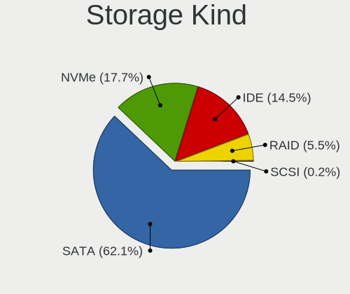

| Kind | Computers | Percent |
|------|-----------|---------|
| SATA | 311       | 61.34%  |
| NVMe | 99        | 19.53%  |
| IDE  | 67        | 13.21%  |
| RAID | 29        | 5.72%   |
| SCSI | 1         | 0.2%    |

Processor
---------

CPU Vendor
----------

Processor vendors

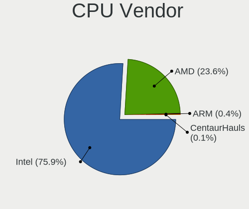

| Vendor       | Computers | Percent |
|--------------|-----------|---------|
| Intel        | 336       | 79.81%  |
| AMD          | 84        | 19.95%  |
| CentaurHauls | 1         | 0.24%   |

CPU Model
---------

Processor models

| Model                                   | Computers | Percent |
|-----------------------------------------|-----------|---------|
| Intel 11th Gen Core i7-1165G7 @ 2.80GHz | 7         | 1.66%   |
| Intel Core i7-8550U CPU @ 1.80GHz       | 6         | 1.43%   |
| Intel Core i5-6200U CPU @ 2.30GHz       | 6         | 1.43%   |
| Intel Core i5 CPU M 520 @ 2.40GHz       | 6         | 1.43%   |
| Intel Core i5-2520M CPU @ 2.50GHz       | 5         | 1.19%   |
| Intel Core i7-7500U CPU @ 2.70GHz       | 4         | 0.95%   |
| Intel Celeron CPU N3060 @ 1.60GHz       | 4         | 0.95%   |
| Intel Atom CPU Z3735F @ 1.33GHz         | 4         | 0.95%   |
| Intel 11th Gen Core i5-1135G7 @ 2.40GHz | 4         | 0.95%   |
| AMD Ryzen 7 3700X 8-Core Processor      | 4         | 0.95%   |
| Intel Core i7-9750H CPU @ 2.60GHz       | 3         | 0.71%   |
| Intel Core i7-8750H CPU @ 2.20GHz       | 3         | 0.71%   |
| Intel Core i7-6700HQ CPU @ 2.60GHz      | 3         | 0.71%   |
| Intel Core i7-3770 CPU @ 3.40GHz        | 3         | 0.71%   |
| Intel Core i7-2670QM CPU @ 2.20GHz      | 3         | 0.71%   |
| Intel Core i5-8250U CPU @ 1.60GHz       | 3         | 0.71%   |
| Intel Core i5-4210U CPU @ 1.70GHz       | 3         | 0.71%   |
| Intel Core i5-3210M CPU @ 2.50GHz       | 3         | 0.71%   |
| Intel Core i3-4000M CPU @ 2.40GHz       | 3         | 0.71%   |
| Intel Core i3-2350M CPU @ 2.30GHz       | 3         | 0.71%   |
| Intel Core i3-2310M CPU @ 2.10GHz       | 3         | 0.71%   |
| Intel Core 2 Duo CPU P8600 @ 2.40GHz    | 3         | 0.71%   |
| Intel Core 2 Duo CPU E8400 @ 3.00GHz    | 3         | 0.71%   |
| Intel Celeron CPU 1007U @ 1.50GHz       | 3         | 0.71%   |
| AMD Ryzen 7 5800H with Radeon Graphics  | 3         | 0.71%   |
| AMD Ryzen 7 5700U with Radeon Graphics  | 3         | 0.71%   |
| AMD Ryzen 5 1600X Six-Core Processor    | 3         | 0.71%   |
| Intel Pentium CPU G3240 @ 3.10GHz       | 2         | 0.48%   |
| Intel Core i9-9900K CPU @ 3.60GHz       | 2         | 0.48%   |
| Intel Core i7-8565U CPU @ 1.80GHz       | 2         | 0.48%   |
| Intel Core i7-7820HQ CPU @ 2.90GHz      | 2         | 0.48%   |
| Intel Core i7-6820HQ CPU @ 2.70GHz      | 2         | 0.48%   |
| Intel Core i7-6600U CPU @ 2.60GHz       | 2         | 0.48%   |
| Intel Core i7-6500U CPU @ 2.50GHz       | 2         | 0.48%   |
| Intel Core i7-5820K CPU @ 3.30GHz       | 2         | 0.48%   |
| Intel Core i7-4600U CPU @ 2.10GHz       | 2         | 0.48%   |
| Intel Core i7-3720QM CPU @ 2.60GHz      | 2         | 0.48%   |
| Intel Core i7-3630QM CPU @ 2.40GHz      | 2         | 0.48%   |
| Intel Core i7-3610QM CPU @ 2.30GHz      | 2         | 0.48%   |
| Intel Core i7-10750H CPU @ 2.60GHz      | 2         | 0.48%   |

CPU Model Family
----------------

Processor model prefix

| Model                   | Computers | Percent |
|-------------------------|-----------|---------|
| Intel Core i5           | 87        | 20.67%  |
| Intel Core i7           | 80        | 19%     |
| Intel Core i3           | 35        | 8.31%   |
| Intel Celeron           | 31        | 7.36%   |
| Other                   | 22        | 5.23%   |
| Intel Core 2 Duo        | 21        | 4.99%   |
| AMD Ryzen 7             | 20        | 4.75%   |
| Intel Atom              | 18        | 4.28%   |
| AMD Ryzen 5             | 16        | 3.8%    |
| Intel Pentium           | 9         | 2.14%   |
| Intel Xeon              | 7         | 1.66%   |
| Intel Core 2 Quad       | 5         | 1.19%   |
| AMD Ryzen 3             | 4         | 0.95%   |
| Intel Pentium Dual-Core | 3         | 0.71%   |
| Intel Core i9           | 3         | 0.71%   |
| AMD Turion 64 X2 Mobile | 3         | 0.71%   |
| AMD Sempron             | 3         | 0.71%   |
| AMD Ryzen 9             | 3         | 0.71%   |
| AMD Phenom II X4        | 3         | 0.71%   |
| AMD E1                  | 3         | 0.71%   |
| AMD E                   | 3         | 0.71%   |
| AMD Athlon II X2        | 3         | 0.71%   |
| AMD A8                  | 3         | 0.71%   |
| AMD A6                  | 3         | 0.71%   |
| AMD A4                  | 3         | 0.71%   |
| Intel Pentium Silver    | 2         | 0.48%   |
| Intel Pentium 4         | 2         | 0.48%   |
| Intel Celeron M         | 2         | 0.48%   |
| AMD Phenom II X6        | 2         | 0.48%   |
| AMD Athlon 64 X2        | 2         | 0.48%   |
| AMD Athlon              | 2         | 0.48%   |
| AMD A10                 | 2         | 0.48%   |
| Intel Pentium M         | 1         | 0.24%   |
| Intel Pentium Gold      | 1         | 0.24%   |
| Intel Pentium Dual      | 1         | 0.24%   |
| Intel Pentium D         | 1         | 0.24%   |
| Intel Genuine           | 1         | 0.24%   |
| Intel Core m5           | 1         | 0.24%   |
| Intel Core Duo          | 1         | 0.24%   |
| Intel Core 2 Extreme    | 1         | 0.24%   |

CPU Cores
---------

Number of processor cores

| Number | Computers | Percent |
|--------|-----------|---------|
| 2      | 193       | 45.84%  |
| 4      | 141       | 33.49%  |
| 6      | 32        | 7.6%    |
| 8      | 29        | 6.89%   |
| 1      | 17        | 4.04%   |
| 12     | 6         | 1.43%   |
| 14     | 2         | 0.48%   |
| 10     | 1         | 0.24%   |

CPU Sockets
-----------

Number of sockets

| Number | Computers | Percent |
|--------|-----------|---------|
| 1      | 418       | 99.29%  |
| 2      | 3         | 0.71%   |

CPU Threads
-----------

Threads per core (Hyper-Threading)

| Number | Computers | Percent |
|--------|-----------|---------|
| 2      | 260       | 61.76%  |
| 1      | 161       | 38.24%  |

CPU Op-Modes
------------

CPU Operation Modes (32-bit, 64-bit)

| Op mode        | Computers | Percent |
|----------------|-----------|---------|
| 32-bit, 64-bit | 409       | 96.92%  |
| 32-bit         | 13        | 3.08%   |

CPU Microcode
-------------

Microcode number

| Number     | Computers | Percent |
|------------|-----------|---------|
| Unknown    | 49        | 11.48%  |
| 0x206a7    | 32        | 7.49%   |
| 0x306a9    | 30        | 7.03%   |
| 0x306c3    | 19        | 4.45%   |
| 0x406e3    | 14        | 3.28%   |
| 0x1067a    | 14        | 3.28%   |
| 0x20655    | 12        | 2.81%   |
| 0x806c1    | 11        | 2.58%   |
| 0x806ea    | 9         | 2.11%   |
| 0x40651    | 9         | 2.11%   |
| 0x906ea    | 8         | 1.87%   |
| 0x506e3    | 8         | 1.87%   |
| 0x906ed    | 7         | 1.64%   |
| 0x806ec    | 7         | 1.64%   |
| 0x806e9    | 7         | 1.64%   |
| 0x306d4    | 7         | 1.64%   |
| 0x30678    | 7         | 1.64%   |
| 0x08701021 | 7         | 1.64%   |
| 0x906e9    | 6         | 1.41%   |
| 0x406c4    | 6         | 1.41%   |
| 0x20652    | 6         | 1.41%   |
| 0x706a1    | 5         | 1.17%   |
| 0x6fd      | 5         | 1.17%   |
| 0x0a50000c | 5         | 1.17%   |
| 0x0800820d | 5         | 1.17%   |
| 0xa0671    | 4         | 0.94%   |
| 0xa0653    | 4         | 0.94%   |
| 0x706a8    | 4         | 0.94%   |
| 0x106e5    | 4         | 0.94%   |
| 0x106c2    | 4         | 0.94%   |
| 0x10676    | 4         | 0.94%   |
| 0x08608103 | 4         | 0.94%   |
| 0x03000027 | 4         | 0.94%   |
| 0xa0652    | 3         | 0.7%    |
| 0x906a3    | 3         | 0.7%    |
| 0x706e5    | 3         | 0.7%    |
| 0x6fb      | 3         | 0.7%    |
| 0x506c9    | 3         | 0.7%    |
| 0x406c3    | 3         | 0.7%    |
| 0x30661    | 3         | 0.7%    |

CPU Microarch
-------------

Microarchitecture

| Name             | Computers | Percent |
|------------------|-----------|---------|
| KabyLake         | 52        | 12.32%  |
| SandyBridge      | 39        | 9.24%   |
| IvyBridge        | 35        | 8.29%   |
| Haswell          | 34        | 8.06%   |
| Skylake          | 24        | 5.69%   |
| Penryn           | 23        | 5.45%   |
| Westmere         | 20        | 4.74%   |
| Silvermont       | 18        | 4.27%   |
| Zen+             | 12        | 2.84%   |
| TigerLake        | 12        | 2.84%   |
| Zen 2            | 11        | 2.61%   |
| Zen 3            | 10        | 2.37%   |
| K10              | 10        | 2.37%   |
| Core             | 10        | 2.37%   |
| Bonnell          | 10        | 2.37%   |
| Zen              | 9         | 2.13%   |
| Goldmont plus    | 9         | 2.13%   |
| Unknown          | 9         | 2.13%   |
| K8 Hammer        | 8         | 1.9%    |
| IceLake          | 8         | 1.9%    |
| CometLake        | 8         | 1.9%    |
| Broadwell        | 8         | 1.9%    |
| Nehalem          | 6         | 1.42%   |
| P6               | 5         | 1.18%   |
| Puma             | 4         | 0.95%   |
| NetBurst         | 4         | 0.95%   |
| K10 Llano        | 4         | 0.95%   |
| Goldmont         | 4         | 0.95%   |
| Jaguar           | 3         | 0.71%   |
| Excavator        | 3         | 0.71%   |
| Bobcat           | 3         | 0.71%   |
| Tremont          | 2         | 0.47%   |
| Alderlake Hybrid | 2         | 0.47%   |
| Steamroller      | 1         | 0.24%   |
| K8 & K10 hybrid  | 1         | 0.24%   |
| Bulldozer        | 1         | 0.24%   |

Graphics
--------

GPU Vendor
----------

Vendors of graphics cards

| Vendor                     | Computers | Percent |
|----------------------------|-----------|---------|
| Intel                      | 263       | 53.13%  |
| Nvidia                     | 126       | 25.45%  |
| AMD                        | 104       | 21.01%  |
| VIA Technologies           | 1         | 0.2%    |
| Matrox Electronics Systems | 1         | 0.2%    |

GPU Model
---------

Graphics card models

| Model                                                                                    | Computers | Percent |
|------------------------------------------------------------------------------------------|-----------|---------|
| Intel 2nd Generation Core Processor Family Integrated Graphics Controller                | 32        | 6.2%    |
| Intel 3rd Gen Core processor Graphics Controller                                         | 24        | 4.65%   |
| Intel Skylake GT2 [HD Graphics 520]                                                      | 13        | 2.52%   |
| Intel Core Processor Integrated Graphics Controller                                      | 13        | 2.52%   |
| Intel TigerLake-LP GT2 [Iris Xe Graphics]                                                | 12        | 2.33%   |
| Intel UHD Graphics 620                                                                   | 10        | 1.94%   |
| Intel Atom/Celeron/Pentium Processor x5-E8000/J3xxx/N3xxx Integrated Graphics Controller | 10        | 1.94%   |
| Intel Haswell-ULT Integrated Graphics Controller                                         | 9         | 1.74%   |
| Intel HD Graphics 620                                                                    | 8         | 1.55%   |
| Intel CoffeeLake-H GT2 [UHD Graphics 630]                                                | 8         | 1.55%   |
| Intel Atom Processor Z36xxx/Z37xxx Series Graphics & Display                             | 8         | 1.55%   |
| Intel 4th Gen Core Processor Integrated Graphics Controller                              | 8         | 1.55%   |
| Intel HD Graphics 530                                                                    | 7         | 1.36%   |
| Intel GeminiLake [UHD Graphics 600]                                                      | 7         | 1.36%   |
| Nvidia GK208B [GeForce GT 710]                                                           | 6         | 1.16%   |
| Intel Mobile 945GM/GMS/GME, 943/940GML Express Integrated Graphics Controller            | 6         | 1.16%   |
| Intel Mobile 4 Series Chipset Integrated Graphics Controller                             | 6         | 1.16%   |
| AMD Picasso/Raven 2 [Radeon Vega Series / Radeon Vega Mobile Series]                     | 6         | 1.16%   |
| AMD Cezanne [Radeon Vega Series / Radeon Vega Mobile Series]                             | 6         | 1.16%   |
| Intel WhiskeyLake-U GT2 [UHD Graphics 620]                                               | 5         | 0.97%   |
| Intel HD Graphics 630                                                                    | 5         | 0.97%   |
| Intel HD Graphics 5500                                                                   | 5         | 0.97%   |
| AMD Raven Ridge [Radeon Vega Series / Radeon Vega Mobile Series]                         | 5         | 0.97%   |
| AMD Ellesmere [Radeon RX 470/480/570/570X/580/580X/590]                                  | 5         | 0.97%   |
| Nvidia TU117M [GeForce GTX 1650 Mobile / Max-Q]                                          | 4         | 0.78%   |
| Nvidia GP107M [GeForce GTX 1050 Ti Mobile]                                               | 4         | 0.78%   |
| Nvidia GA106M [GeForce RTX 3060 Mobile / Max-Q]                                          | 4         | 0.78%   |
| Intel Xeon E3-1200 v3/4th Gen Core Processor Integrated Graphics Controller              | 4         | 0.78%   |
| Intel Xeon E3-1200 v2/3rd Gen Core processor Graphics Controller                         | 4         | 0.78%   |
| Intel CometLake-U GT2 [UHD Graphics]                                                     | 4         | 0.78%   |
| AMD Seymour [Radeon HD 6400M/7400M Series]                                               | 4         | 0.78%   |
| AMD Lucienne                                                                             | 4         | 0.78%   |
| Nvidia GT218 [GeForce 210]                                                               | 3         | 0.58%   |
| Nvidia GP107 [GeForce GTX 1050 Ti]                                                       | 3         | 0.58%   |
| Nvidia GP104 [GeForce GTX 1080]                                                          | 3         | 0.58%   |
| Nvidia GM107 [GeForce GTX 750 Ti]                                                        | 3         | 0.58%   |
| Intel Mobile GM965/GL960 Integrated Graphics Controller (secondary)                      | 3         | 0.58%   |
| Intel Mobile GM965/GL960 Integrated Graphics Controller (primary)                        | 3         | 0.58%   |
| Intel Mobile 945GSE Express Integrated Graphics Controller                               | 3         | 0.58%   |
| Intel Mobile 945GM/GMS, 943/940GML Express Integrated Graphics Controller                | 3         | 0.58%   |

GPU Combo
---------

Combinations of graphics cards

| Name           | Computers | Percent |
|----------------|-----------|---------|
| 1 x Intel      | 195       | 45.99%  |
| 1 x AMD        | 79        | 18.63%  |
| 1 x Nvidia     | 78        | 18.4%   |
| Intel + Nvidia | 43        | 10.14%  |
| Intel + AMD    | 13        | 3.07%   |
| 2 x AMD        | 8         | 1.89%   |
| AMD + Nvidia   | 4         | 0.94%   |
| 3 x AMD        | 1         | 0.24%   |
| 2 x Intel      | 1         | 0.24%   |
| 1 x VIA        | 1         | 0.24%   |
| 1 x Matrox     | 1         | 0.24%   |

GPU Driver
----------

Free vs proprietary

| Driver      | Computers | Percent |
|-------------|-----------|---------|
| Free        | 354       | 82.52%  |
| Proprietary | 57        | 13.29%  |
| Unknown     | 18        | 4.2%    |

GPU Memory
----------

Total video memory

| Size in GB | Computers | Percent |
|------------|-----------|---------|
| Unknown    | 260       | 60.75%  |
| 0.01-0.5   | 45        | 10.51%  |
| 0.51-1.0   | 39        | 9.11%   |
| 1.01-2.0   | 38        | 8.88%   |
| 3.01-4.0   | 20        | 4.67%   |
| 7.01-8.0   | 17        | 3.97%   |
| 5.01-6.0   | 4         | 0.93%   |
| 8.01-16.0  | 3         | 0.7%    |
| 2.01-3.0   | 2         | 0.47%   |

Monitor
-------

Monitor Vendor
--------------

Monitor vendors

| Vendor                  | Computers | Percent |
|-------------------------|-----------|---------|
| Samsung Electronics     | 60        | 13.33%  |
| AU Optronics            | 59        | 13.11%  |
| LG Display              | 39        | 8.67%   |
| Chimei Innolux          | 38        | 8.44%   |
| BOE                     | 32        | 7.11%   |
| Goldstar                | 26        | 5.78%   |
| Dell                    | 21        | 4.67%   |
| Lenovo                  | 17        | 3.78%   |
| Hewlett-Packard         | 16        | 3.56%   |
| Acer                    | 15        | 3.33%   |
| Chi Mei Optoelectronics | 13        | 2.89%   |
| Apple                   | 10        | 2.22%   |
| Ancor Communications    | 9         | 2%      |
| Philips                 | 6         | 1.33%   |
| PANDA                   | 6         | 1.33%   |
| Sony                    | 5         | 1.11%   |
| AOC                     | 5         | 1.11%   |
| ViewSonic               | 4         | 0.89%   |
| Sharp                   | 4         | 0.89%   |
| InfoVision              | 4         | 0.89%   |
| Iiyama                  | 4         | 0.89%   |
| HannStar                | 4         | 0.89%   |
| Fujitsu Siemens         | 4         | 0.89%   |
| Eizo                    | 4         | 0.89%   |
| BenQ                    | 4         | 0.89%   |
| Vizio                   | 3         | 0.67%   |
| Vestel Elektronik       | 3         | 0.67%   |
| LG Philips              | 3         | 0.67%   |
| ASUSTek Computer        | 3         | 0.67%   |
| Sceptre Tech            | 2         | 0.44%   |
| MSI                     | 2         | 0.44%   |
| Medion                  | 2         | 0.44%   |
| CPT                     | 2         | 0.44%   |
| Videoseven              | 1         | 0.22%   |
| Sunplus                 | 1         | 0.22%   |
| STA                     | 1         | 0.22%   |
| SANYO                   | 1         | 0.22%   |
| SAC                     | 1         | 0.22%   |
| RIS                     | 1         | 0.22%   |
| PRI                     | 1         | 0.22%   |

Monitor Model
-------------

Monitor models

| Model                                                                    | Computers | Percent |
|--------------------------------------------------------------------------|-----------|---------|
| Samsung Electronics SyncMaster SAM0091 1600x1200 432x324mm 21.3-inch     | 8         | 1.76%   |
| LG Display LCD Monitor LGD04A7 1920x1080 344x194mm 15.5-inch             | 4         | 0.88%   |
| Chi Mei Optoelectronics LCD Monitor CMO15A3 1366x768 344x193mm 15.5-inch | 4         | 0.88%   |
| Vestel Elektronik 40UHD_LCD_TV VES3700 3840x2160 890x500mm 40.2-inch     | 3         | 0.66%   |
| Samsung Electronics LCD Monitor SEC5441 1366x768 344x194mm 15.5-inch     | 3         | 0.66%   |
| Chimei Innolux LCD Monitor CMN14D4 1920x1080 309x173mm 13.9-inch         | 3         | 0.66%   |
| Samsung Electronics S24F350 SAM0D20 1920x1080 520x290mm 23.4-inch        | 2         | 0.44%   |
| Samsung Electronics LCD Monitor SEC544B 1600x900 382x214mm 17.2-inch     | 2         | 0.44%   |
| Samsung Electronics LCD Monitor SEC504B 1600x900 382x215mm 17.3-inch     | 2         | 0.44%   |
| Samsung Electronics LCD Monitor SEC3741 1280x800 331x207mm 15.4-inch     | 2         | 0.44%   |
| Samsung Electronics LCD Monitor SEC314C 1920x1080 344x194mm 15.5-inch    | 2         | 0.44%   |
| Samsung Electronics C27F390 SAM0D32 1920x1080 598x336mm 27.0-inch        | 2         | 0.44%   |
| Samsung Electronics C24F390 SAM0D2C 1920x1080 521x293mm 23.5-inch        | 2         | 0.44%   |
| PANDA LCD Monitor NCP004D 1920x1080 344x194mm 15.5-inch                  | 2         | 0.44%   |
| PANDA LCD Monitor NCP0036 1920x1080 344x194mm 15.5-inch                  | 2         | 0.44%   |
| Medion MD22322 MEB8101 2560x1440 699x393mm 31.6-inch                     | 2         | 0.44%   |
| Lenovo LCD Monitor LEN4011 1280x800 261x163mm 12.1-inch                  | 2         | 0.44%   |
| Iiyama PL2776HD IVM6605 1920x1080 598x336mm 27.0-inch                    | 2         | 0.44%   |
| Hewlett-Packard E240 HWP3265 1920x1080 527x296mm 23.8-inch               | 2         | 0.44%   |
| HannStar HSD101PFW2 HSD03E9 1024x600 222x125mm 10.0-inch                 | 2         | 0.44%   |
| Goldstar ULTRAWIDE GSM76F9 2560x1080 531x298mm 24.0-inch                 | 2         | 0.44%   |
| Goldstar HDR WFHD GSM7714 2560x1080 798x334mm 34.1-inch                  | 2         | 0.44%   |
| Goldstar FULL HD GSM5B55 1920x1080 480x270mm 21.7-inch                   | 2         | 0.44%   |
| Goldstar 32 FHD GSM76FF 1920x1080 698x392mm 31.5-inch                    | 2         | 0.44%   |
| Fujitsu Siemens B22W-7 LED FUS0838 1680x1050 474x296mm 22.0-inch         | 2         | 0.44%   |
| Chimei Innolux LCD Monitor CMN15DB 1366x768 344x193mm 15.5-inch          | 2         | 0.44%   |
| Chimei Innolux LCD Monitor CMN15D5 1920x1080 344x193mm 15.5-inch         | 2         | 0.44%   |
| Chimei Innolux LCD Monitor CMN1521 1920x1080 344x193mm 15.5-inch         | 2         | 0.44%   |
| Chimei Innolux LCD Monitor CMN14C4 1366x768 309x173mm 13.9-inch          | 2         | 0.44%   |
| Chimei Innolux LCD Monitor CMN1493 1366x768 309x173mm 13.9-inch          | 2         | 0.44%   |
| Chimei Innolux LCD Monitor CMN1491 1366x768 309x174mm 14.0-inch          | 2         | 0.44%   |
| Chimei Innolux LCD Monitor CMN1132 1366x768 256x144mm 11.6-inch          | 2         | 0.44%   |
| BOE LCD Monitor BOE08BE 1920x1080 382x215mm 17.3-inch                    | 2         | 0.44%   |
| BOE LCD Monitor BOE0802 1920x1080 344x193mm 15.5-inch                    | 2         | 0.44%   |
| BOE LCD Monitor BOE0791 1920x1080 309x173mm 13.9-inch                    | 2         | 0.44%   |
| BOE LCD Monitor BOE06A7 1920x1080 294x165mm 13.3-inch                    | 2         | 0.44%   |
| BOE LCD Monitor BOE05DF 1366x768 293x165mm 13.2-inch                     | 2         | 0.44%   |
| AU Optronics LCD Monitor AUO61D2 1024x600 222x125mm 10.0-inch            | 2         | 0.44%   |
| AU Optronics LCD Monitor AUO38ED 1920x1080 344x193mm 15.5-inch           | 2         | 0.44%   |
| AU Optronics LCD Monitor AUO313D 1920x1080 309x174mm 14.0-inch           | 2         | 0.44%   |

Monitor Resolution
------------------

Monitor screen resolution

| Resolution         | Computers | Percent |
|--------------------|-----------|---------|
| 1920x1080 (FHD)    | 187       | 42.89%  |
| 1366x768 (WXGA)    | 94        | 21.56%  |
| 3840x2160 (4K)     | 24        | 5.5%    |
| 1600x900 (HD+)     | 18        | 4.13%   |
| 2560x1440 (QHD)    | 15        | 3.44%   |
| 1680x1050 (WSXGA+) | 15        | 3.44%   |
| 1280x1024 (SXGA)   | 13        | 2.98%   |
| 1280x800 (WXGA)    | 12        | 2.75%   |
| 1600x1200          | 9         | 2.06%   |
| 1440x900 (WXGA+)   | 9         | 2.06%   |
| 1024x600           | 7         | 1.61%   |
| 1920x1200 (WUXGA)  | 6         | 1.38%   |
| 2560x1080          | 5         | 1.15%   |
| 1360x768           | 5         | 1.15%   |
| 3440x1440          | 3         | 0.69%   |
| 2880x1800          | 3         | 0.69%   |
| 1400x1050          | 2         | 0.46%   |
| 3840x2400          | 1         | 0.23%   |
| 3000x2000          | 1         | 0.23%   |
| 2736x1824          | 1         | 0.23%   |
| 2560x1600          | 1         | 0.23%   |
| 2256x1504          | 1         | 0.23%   |
| 2160x1440          | 1         | 0.23%   |
| 2048x1536          | 1         | 0.23%   |
| 1280x720 (HD)      | 1         | 0.23%   |
| 1024x768 (XGA)     | 1         | 0.23%   |

Monitor Diagonal
----------------

Diagonal size in inches

| Inches  | Computers | Percent |
|---------|-----------|---------|
| 15      | 121       | 26.95%  |
| 13      | 39        | 8.69%   |
| 14      | 32        | 7.13%   |
| 24      | 30        | 6.68%   |
| 23      | 30        | 6.68%   |
| 21      | 30        | 6.68%   |
| 27      | 27        | 6.01%   |
| 17      | 26        | 5.79%   |
| 11      | 13        | 2.9%    |
| 19      | 12        | 2.67%   |
| 31      | 9         | 2%      |
| 22      | 9         | 2%      |
| 18      | 9         | 2%      |
| 12      | 9         | 2%      |
| 34      | 8         | 1.78%   |
| 20      | 8         | 1.78%   |
| 10      | 8         | 1.78%   |
| 84      | 7         | 1.56%   |
| 26      | 3         | 0.67%   |
| 16      | 3         | 0.67%   |
| 65      | 2         | 0.45%   |
| 25      | 2         | 0.45%   |
| Unknown | 2         | 0.45%   |
| 72      | 1         | 0.22%   |
| 54      | 1         | 0.22%   |
| 49      | 1         | 0.22%   |
| 46      | 1         | 0.22%   |
| 43      | 1         | 0.22%   |
| 42      | 1         | 0.22%   |
| 40      | 1         | 0.22%   |
| 39      | 1         | 0.22%   |
| 37      | 1         | 0.22%   |
| 32      | 1         | 0.22%   |

Monitor Width
-------------

Physical width

| Width in mm | Computers | Percent |
|-------------|-----------|---------|
| 301-350     | 172       | 38.91%  |
| 501-600     | 85        | 19.23%  |
| 401-500     | 58        | 13.12%  |
| 201-300     | 50        | 11.31%  |
| 351-400     | 38        | 8.6%    |
| 601-700     | 10        | 2.26%   |
| 701-800     | 9         | 2.04%   |
| 1501-2000   | 8         | 1.81%   |
| 1001-1500   | 5         | 1.13%   |
| 801-900     | 3         | 0.68%   |
| 901-1000    | 2         | 0.45%   |
| Unknown     | 2         | 0.45%   |

Aspect Ratio
------------

Proportional relationship between the width and the height

| Ratio | Computers | Percent |
|-------|-----------|---------|
| 16/9  | 326       | 78.18%  |
| 16/10 | 50        | 11.99%  |
| 5/4   | 14        | 3.36%   |
| 4/3   | 13        | 3.12%   |
| 21/9  | 8         | 1.92%   |
| 3/2   | 6         | 1.44%   |

Monitor Area
------------

Area in inch²

| Area in inch² | Computers | Percent |
|----------------|-----------|---------|
| 101-110        | 120       | 26.97%  |
| 201-250        | 83        | 18.65%  |
| 81-90          | 57        | 12.81%  |
| 301-350        | 28        | 6.29%   |
| 151-200        | 27        | 6.07%   |
| 121-130        | 21        | 4.72%   |
| 351-500        | 18        | 4.04%   |
| 71-80          | 15        | 3.37%   |
| 51-60          | 13        | 2.92%   |
| More than 1000 | 12        | 2.7%    |
| 251-300        | 12        | 2.7%    |
| 141-150        | 11        | 2.47%   |
| 61-70          | 8         | 1.8%    |
| 41-50          | 8         | 1.8%    |
| 501-1000       | 6         | 1.35%   |
| 111-120        | 2         | 0.45%   |
| Unknown        | 2         | 0.45%   |
| 131-140        | 1         | 0.22%   |
| 91-100         | 1         | 0.22%   |

Pixel Density
-------------

Pixels per inch

| Density       | Computers | Percent |
|---------------|-----------|---------|
| 51-100        | 163       | 37.64%  |
| 101-120       | 121       | 27.94%  |
| 121-160       | 111       | 25.64%  |
| 161-240       | 20        | 4.62%   |
| More than 240 | 9         | 2.08%   |
| 1-50          | 7         | 1.62%   |
| Unknown       | 2         | 0.46%   |

Multiple Monitors
-----------------

Total monitors connected

| Total | Computers | Percent |
|-------|-----------|---------|
| 1     | 351       | 82.01%  |
| 2     | 60        | 14.02%  |
| 0     | 12        | 2.8%    |
| 3     | 5         | 1.17%   |

Network
-------

Net Controller Vendor
---------------------

Controller vendors

| Vendor                            | Computers | Percent |
|-----------------------------------|-----------|---------|
| Realtek Semiconductor             | 217       | 33.8%   |
| Intel                             | 204       | 31.78%  |
| Qualcomm Atheros                  | 82        | 12.77%  |
| Broadcom                          | 39        | 6.07%   |
| TP-Link                           | 10        | 1.56%   |
| Ralink Technology                 | 9         | 1.4%    |
| Nvidia                            | 9         | 1.4%    |
| Marvell Technology Group          | 9         | 1.4%    |
| Broadcom Limited                  | 9         | 1.4%    |
| MediaTek                          | 7         | 1.09%   |
| Ralink                            | 6         | 0.93%   |
| Sierra Wireless                   | 4         | 0.62%   |
| ASIX Electronics                  | 4         | 0.62%   |
| Huawei Technologies               | 3         | 0.47%   |
| Ericsson Business Mobile Networks | 3         | 0.47%   |
| NetGear                           | 2         | 0.31%   |
| JMicron Technology                | 2         | 0.31%   |
| Edimax Technology                 | 2         | 0.31%   |
| Attansic Technology               | 2         | 0.31%   |
| ASUSTek Computer                  | 2         | 0.31%   |
| Xiaomi                            | 1         | 0.16%   |
| VIA Technologies                  | 1         | 0.16%   |
| U-Blox                            | 1         | 0.16%   |
| Samsung Electronics               | 1         | 0.16%   |
| Qualcomm Atheros Communications   | 1         | 0.16%   |
| Qualcomm                          | 1         | 0.16%   |
| OPPO Electronics                  | 1         | 0.16%   |
| Microsoft                         | 1         | 0.16%   |
| Mercucys                          | 1         | 0.16%   |
| Linksys                           | 1         | 0.16%   |
| Lenovo                            | 1         | 0.16%   |
| Hewlett-Packard                   | 1         | 0.16%   |
| Google                            | 1         | 0.16%   |
| Dell                              | 1         | 0.16%   |
| D-Link System                     | 1         | 0.16%   |
| AVM                               | 1         | 0.16%   |
| Aquantia                          | 1         | 0.16%   |

Net Controller Model
--------------------

Controller models

| Model                                                                   | Computers | Percent |
|-------------------------------------------------------------------------|-----------|---------|
| Realtek RTL8111/8168/8411 PCI Express Gigabit Ethernet Controller       | 150       | 19.79%  |
| Realtek RTL810xE PCI Express Fast Ethernet controller                   | 27        | 3.56%   |
| Qualcomm Atheros AR9485 Wireless Network Adapter                        | 17        | 2.24%   |
| Intel 82579LM Gigabit Network Connection (Lewisville)                   | 16        | 2.11%   |
| Intel Wi-Fi 6 AX200                                                     | 14        | 1.85%   |
| Realtek RTL8153 Gigabit Ethernet Adapter                                | 13        | 1.72%   |
| Intel Wireless 8265 / 8275                                              | 13        | 1.72%   |
| Intel Wireless 7260                                                     | 12        | 1.58%   |
| Qualcomm Atheros AR9285 Wireless Network Adapter (PCI-Express)          | 11        | 1.45%   |
| Intel Wireless 8260                                                     | 11        | 1.45%   |
| Qualcomm Atheros QCA9377 802.11ac Wireless Network Adapter              | 10        | 1.32%   |
| Intel Wireless 3165                                                     | 10        | 1.32%   |
| Intel Wi-Fi 6 AX201                                                     | 10        | 1.32%   |
| Intel Ethernet Connection I217-LM                                       | 8         | 1.06%   |
| Intel Centrino Advanced-N 6205 [Taylor Peak]                            | 8         | 1.06%   |
| Intel 82577LM Gigabit Network Connection                                | 8         | 1.06%   |
| Intel I211 Gigabit Network Connection                                   | 7         | 0.92%   |
| Intel Dual Band Wireless-AC 3168NGW [Stone Peak]                        | 7         | 0.92%   |
| Intel Centrino Advanced-N 6200                                          | 7         | 0.92%   |
| Realtek RTL8821CE 802.11ac PCIe Wireless Network Adapter                | 6         | 0.79%   |
| Realtek RTL8723BE PCIe Wireless Network Adapter                         | 6         | 0.79%   |
| Realtek RTL8188EUS 802.11n Wireless Network Adapter                     | 6         | 0.79%   |
| Qualcomm Atheros QCA9565 / AR9565 Wireless Network Adapter              | 6         | 0.79%   |
| Intel Wireless 7265                                                     | 6         | 0.79%   |
| Intel Cannon Lake PCH CNVi WiFi                                         | 6         | 0.79%   |
| Broadcom BCM4313 802.11bgn Wireless Network Adapter                     | 6         | 0.79%   |
| TP-Link TL-WN722N v2/v3 [Realtek RTL8188EUS]                            | 5         | 0.66%   |
| Realtek RTL8125 2.5GbE Controller                                       | 5         | 0.66%   |
| Qualcomm Atheros AR242x / AR542x Wireless Network Adapter (PCI-Express) | 5         | 0.66%   |
| Intel Ethernet Connection (2) I219-V                                    | 5         | 0.66%   |
| Realtek RTL88x2bu [AC1200 Techkey]                                      | 4         | 0.53%   |
| Ralink MT7601U Wireless Adapter                                         | 4         | 0.53%   |
| Qualcomm Atheros QCA6174 802.11ac Wireless Network Adapter              | 4         | 0.53%   |
| Qualcomm Atheros AR8132 Fast Ethernet                                   | 4         | 0.53%   |
| MediaTek MT7921 802.11ax PCI Express Wireless Network Adapter           | 4         | 0.53%   |
| Intel PRO/Wireless 3945ABG [Golan] Network Connection                   | 4         | 0.53%   |
| Intel Ice Lake-LP PCH CNVi WiFi                                         | 4         | 0.53%   |
| Intel Ethernet Connection I219-V                                        | 4         | 0.53%   |
| Intel Ethernet Connection I218-LM                                       | 4         | 0.53%   |
| Intel Ethernet Connection (7) I219-V                                    | 4         | 0.53%   |

Wireless Vendor
---------------

Wireless vendors

| Vendor                          | Computers | Percent |
|---------------------------------|-----------|---------|
| Intel                           | 154       | 44.51%  |
| Qualcomm Atheros                | 60        | 17.34%  |
| Realtek Semiconductor           | 56        | 16.18%  |
| Broadcom                        | 24        | 6.94%   |
| TP-Link                         | 9         | 2.6%    |
| Ralink Technology               | 9         | 2.6%    |
| Broadcom Limited                | 7         | 2.02%   |
| Ralink                          | 6         | 1.73%   |
| MediaTek                        | 6         | 1.73%   |
| Sierra Wireless                 | 4         | 1.16%   |
| NetGear                         | 2         | 0.58%   |
| Edimax Technology               | 2         | 0.58%   |
| ASUSTek Computer                | 2         | 0.58%   |
| Qualcomm Atheros Communications | 1         | 0.29%   |
| Mercucys                        | 1         | 0.29%   |
| Linksys                         | 1         | 0.29%   |
| Hewlett-Packard                 | 1         | 0.29%   |
| AVM                             | 1         | 0.29%   |

Wireless Model
--------------

Wireless models

| Model                                                                   | Computers | Percent |
|-------------------------------------------------------------------------|-----------|---------|
| Qualcomm Atheros AR9485 Wireless Network Adapter                        | 17        | 4.9%    |
| Intel Wi-Fi 6 AX200                                                     | 14        | 4.03%   |
| Intel Wireless 8265 / 8275                                              | 13        | 3.75%   |
| Intel Wireless 7260                                                     | 12        | 3.46%   |
| Qualcomm Atheros AR9285 Wireless Network Adapter (PCI-Express)          | 11        | 3.17%   |
| Intel Wireless 8260                                                     | 11        | 3.17%   |
| Qualcomm Atheros QCA9377 802.11ac Wireless Network Adapter              | 10        | 2.88%   |
| Intel Wireless 3165                                                     | 10        | 2.88%   |
| Intel Wi-Fi 6 AX201                                                     | 10        | 2.88%   |
| Intel Centrino Advanced-N 6205 [Taylor Peak]                            | 8         | 2.31%   |
| Intel Dual Band Wireless-AC 3168NGW [Stone Peak]                        | 7         | 2.02%   |
| Intel Centrino Advanced-N 6200                                          | 7         | 2.02%   |
| Realtek RTL8821CE 802.11ac PCIe Wireless Network Adapter                | 6         | 1.73%   |
| Realtek RTL8723BE PCIe Wireless Network Adapter                         | 6         | 1.73%   |
| Realtek RTL8188EUS 802.11n Wireless Network Adapter                     | 6         | 1.73%   |
| Qualcomm Atheros QCA9565 / AR9565 Wireless Network Adapter              | 6         | 1.73%   |
| Intel Wireless 7265                                                     | 6         | 1.73%   |
| Intel Cannon Lake PCH CNVi WiFi                                         | 6         | 1.73%   |
| Broadcom BCM4313 802.11bgn Wireless Network Adapter                     | 6         | 1.73%   |
| TP-Link TL-WN722N v2/v3 [Realtek RTL8188EUS]                            | 5         | 1.44%   |
| Qualcomm Atheros AR242x / AR542x Wireless Network Adapter (PCI-Express) | 5         | 1.44%   |
| Realtek RTL88x2bu [AC1200 Techkey]                                      | 4         | 1.15%   |
| Ralink MT7601U Wireless Adapter                                         | 4         | 1.15%   |
| Qualcomm Atheros QCA6174 802.11ac Wireless Network Adapter              | 4         | 1.15%   |
| MediaTek MT7921 802.11ax PCI Express Wireless Network Adapter           | 4         | 1.15%   |
| Intel PRO/Wireless 3945ABG [Golan] Network Connection                   | 4         | 1.15%   |
| Intel Ice Lake-LP PCH CNVi WiFi                                         | 4         | 1.15%   |
| Intel Centrino Wireless-N 2230                                          | 4         | 1.15%   |
| Intel Centrino Advanced-N 6235                                          | 4         | 1.15%   |
| Broadcom Limited BCM4360 802.11ac Wireless Network Adapter              | 4         | 1.15%   |
| Realtek RTL8822CE 802.11ac PCIe Wireless Network Adapter                | 3         | 0.86%   |
| Realtek RTL8822BE 802.11a/b/g/n/ac WiFi adapter                         | 3         | 0.86%   |
| Realtek RTL8192EE PCIe Wireless Network Adapter                         | 3         | 0.86%   |
| Realtek RTL8188EE Wireless Network Adapter                              | 3         | 0.86%   |
| Realtek RTL8188CE 802.11b/g/n WiFi Adapter                              | 3         | 0.86%   |
| Realtek 802.11n WLAN Adapter                                            | 3         | 0.86%   |
| Realtek 802.11ac NIC                                                    | 3         | 0.86%   |
| Ralink RT2870/RT3070 Wireless Adapter                                   | 3         | 0.86%   |
| Intel Comet Lake PCH-LP CNVi WiFi                                       | 3         | 0.86%   |
| Broadcom BCM43142 802.11b/g/n                                           | 3         | 0.86%   |

Ethernet Vendor
---------------

Ethernet vendors

| Vendor                   | Computers | Percent |
|--------------------------|-----------|---------|
| Realtek Semiconductor    | 195       | 49.74%  |
| Intel                    | 107       | 27.3%   |
| Qualcomm Atheros         | 31        | 7.91%   |
| Broadcom                 | 19        | 4.85%   |
| Nvidia                   | 9         | 2.3%    |
| Marvell Technology Group | 9         | 2.3%    |
| ASIX Electronics         | 4         | 1.02%   |
| JMicron Technology       | 2         | 0.51%   |
| Broadcom Limited         | 2         | 0.51%   |
| Attansic Technology      | 2         | 0.51%   |
| Xiaomi                   | 1         | 0.26%   |
| VIA Technologies         | 1         | 0.26%   |
| TP-Link                  | 1         | 0.26%   |
| Samsung Electronics      | 1         | 0.26%   |
| Qualcomm                 | 1         | 0.26%   |
| OPPO Electronics         | 1         | 0.26%   |
| Microsoft                | 1         | 0.26%   |
| MediaTek                 | 1         | 0.26%   |
| Lenovo                   | 1         | 0.26%   |
| Huawei Technologies      | 1         | 0.26%   |
| D-Link System            | 1         | 0.26%   |
| Aquantia                 | 1         | 0.26%   |

Ethernet Model
--------------

Ethernet models

| Model                                                                          | Computers | Percent |
|--------------------------------------------------------------------------------|-----------|---------|
| Realtek RTL8111/8168/8411 PCI Express Gigabit Ethernet Controller              | 150       | 37.22%  |
| Realtek RTL810xE PCI Express Fast Ethernet controller                          | 27        | 6.7%    |
| Intel 82579LM Gigabit Network Connection (Lewisville)                          | 16        | 3.97%   |
| Realtek RTL8153 Gigabit Ethernet Adapter                                       | 13        | 3.23%   |
| Intel Ethernet Connection I217-LM                                              | 8         | 1.99%   |
| Intel 82577LM Gigabit Network Connection                                       | 8         | 1.99%   |
| Intel I211 Gigabit Network Connection                                          | 7         | 1.74%   |
| Realtek RTL8125 2.5GbE Controller                                              | 5         | 1.24%   |
| Intel Ethernet Connection (2) I219-V                                           | 5         | 1.24%   |
| Qualcomm Atheros AR8132 Fast Ethernet                                          | 4         | 0.99%   |
| Intel Ethernet Connection I219-V                                               | 4         | 0.99%   |
| Intel Ethernet Connection I218-LM                                              | 4         | 0.99%   |
| Intel Ethernet Connection (7) I219-V                                           | 4         | 0.99%   |
| Intel Ethernet Connection (2) I218-V                                           | 4         | 0.99%   |
| Intel 82579V Gigabit Network Connection                                        | 4         | 0.99%   |
| Intel 82567LM-3 Gigabit Network Connection                                     | 4         | 0.99%   |
| Intel 82567LM Gigabit Network Connection                                       | 4         | 0.99%   |
| Broadcom NetXtreme BCM5764M Gigabit Ethernet PCIe                              | 4         | 0.99%   |
| Realtek RTL8169 PCI Gigabit Ethernet Controller                                | 3         | 0.74%   |
| Qualcomm Atheros QCA8172 Fast Ethernet                                         | 3         | 0.74%   |
| Qualcomm Atheros AR8161 Gigabit Ethernet                                       | 3         | 0.74%   |
| Intel Ethernet Controller I225-V                                               | 3         | 0.74%   |
| Intel Ethernet Connection I219-LM                                              | 3         | 0.74%   |
| Intel Ethernet Connection (5) I219-LM                                          | 3         | 0.74%   |
| Intel Ethernet Connection (2) I219-LM                                          | 3         | 0.74%   |
| Realtek RTL-8100/8101L/8139 PCI Fast Ethernet Adapter                          | 2         | 0.5%    |
| Realtek Killer E3000 2.5GbE Controller                                         | 2         | 0.5%    |
| Qualcomm Atheros QCA8171 Gigabit Ethernet                                      | 2         | 0.5%    |
| Qualcomm Atheros Killer E2500 Gigabit Ethernet Controller                      | 2         | 0.5%    |
| Qualcomm Atheros Killer E2400 Gigabit Ethernet Controller                      | 2         | 0.5%    |
| Qualcomm Atheros Killer E220x Gigabit Ethernet Controller                      | 2         | 0.5%    |
| Qualcomm Atheros Attansic L2 Fast Ethernet                                     | 2         | 0.5%    |
| Qualcomm Atheros AR8162 Fast Ethernet                                          | 2         | 0.5%    |
| Qualcomm Atheros AR8152 v1.1 Fast Ethernet                                     | 2         | 0.5%    |
| Qualcomm Atheros AR8151 v2.0 Gigabit Ethernet                                  | 2         | 0.5%    |
| Qualcomm Atheros AR8151 v1.0 Gigabit Ethernet                                  | 2         | 0.5%    |
| Qualcomm Atheros AR8131 Gigabit Ethernet                                       | 2         | 0.5%    |
| Nvidia MCP67 Ethernet                                                          | 2         | 0.5%    |
| Nvidia MCP61 Ethernet                                                          | 2         | 0.5%    |
| Marvell Group Yukon Optima 88E8059 [PCIe Gigabit Ethernet Controller with AVB] | 2         | 0.5%    |

Net Controller Kind
-------------------

Ethernet, WiFi or modem

| Kind     | Computers | Percent |
|----------|-----------|---------|
| Ethernet | 373       | 53.13%  |
| WiFi     | 321       | 45.73%  |
| Modem    | 7         | 1%      |
| Unknown  | 1         | 0.14%   |

Used Controller
---------------

Currently used network controller

| Kind     | Computers | Percent |
|----------|-----------|---------|
| WiFi     | 258       | 59.58%  |
| Ethernet | 174       | 40.18%  |
| Unknown  | 1         | 0.23%   |

NICs
----

Total network controllers on board

| Total | Computers | Percent |
|-------|-----------|---------|
| 2     | 244       | 57.82%  |
| 1     | 160       | 37.91%  |
| 0     | 9         | 2.13%   |
| 3     | 7         | 1.66%   |
| 12    | 1         | 0.24%   |
| 4     | 1         | 0.24%   |

IPv6
----

IPv6 vs IPv4

| Used | Computers | Percent |
|------|-----------|---------|
| No   | 358       | 84.24%  |
| Yes  | 67        | 15.76%  |

Bluetooth
---------

Bluetooth Vendor
----------------

Controller vendors

| Vendor                          | Computers | Percent |
|---------------------------------|-----------|---------|
| Intel                           | 112       | 46.09%  |
| Qualcomm Atheros Communications | 21        | 8.64%   |
| Broadcom                        | 20        | 8.23%   |
| Realtek Semiconductor           | 19        | 7.82%   |
| Cambridge Silicon Radio         | 14        | 5.76%   |
| Apple                           | 14        | 5.76%   |
| IMC Networks                    | 9         | 3.7%    |
| Foxconn / Hon Hai               | 8         | 3.29%   |
| Lite-On Technology              | 6         | 2.47%   |
| Hewlett-Packard                 | 5         | 2.06%   |
| ASUSTek Computer                | 4         | 1.65%   |
| Toshiba                         | 3         | 1.23%   |
| Dell                            | 3         | 1.23%   |
| Ralink                          | 2         | 0.82%   |
| Alps Electric                   | 2         | 0.82%   |
| MediaTek                        | 1         | 0.41%   |

Bluetooth Model
---------------

Controller models

| Model                                                                               | Computers | Percent |
|-------------------------------------------------------------------------------------|-----------|---------|
| Intel Bluetooth wireless interface                                                  | 51        | 20.99%  |
| Intel AX201 Bluetooth                                                               | 17        | 7%      |
| Intel AX200 Bluetooth                                                               | 14        | 5.76%   |
| Cambridge Silicon Radio Bluetooth Dongle (HCI mode)                                 | 14        | 5.76%   |
| Realtek Bluetooth Radio                                                             | 11        | 4.53%   |
| Qualcomm Atheros  Bluetooth Device                                                  | 11        | 4.53%   |
| Intel Bluetooth 9460/9560 Jefferson Peak (JfP)                                      | 11        | 4.53%   |
| Intel Wireless-AC 3168 Bluetooth                                                    | 7         | 2.88%   |
| Realtek  Bluetooth 4.2 Adapter                                                      | 6         | 2.47%   |
| Broadcom BCM2045B (BDC-2.1)                                                         | 6         | 2.47%   |
| Apple Bluetooth USB Host Controller                                                 | 6         | 2.47%   |
| Apple Bluetooth Host Controller                                                     | 5         | 2.06%   |
| Qualcomm Atheros AR3011 Bluetooth                                                   | 4         | 1.65%   |
| Intel Centrino Bluetooth Wireless Transceiver                                       | 4         | 1.65%   |
| IMC Networks Bluetooth Radio                                                        | 4         | 1.65%   |
| HP Broadcom 2070 Bluetooth Combo                                                    | 4         | 1.65%   |
| Broadcom BCM2045B (BDC-2.1) [Bluetooth Controller]                                  | 4         | 1.65%   |
| Lite-On Qualcomm Atheros QCA9377 Bluetooth                                          | 3         | 1.23%   |
| Intel Bluetooth Device                                                              | 3         | 1.23%   |
| Foxconn / Hon Hai Foxconn T77H114 BCM2070 [Single-Chip Bluetooth 2.1 + EDR Adapter] | 3         | 1.23%   |
| Ralink RT3290 Bluetooth                                                             | 2         | 0.82%   |
| Qualcomm Atheros Bluetooth                                                          | 2         | 0.82%   |
| Qualcomm Atheros AR3012 Bluetooth 4.0                                               | 2         | 0.82%   |
| Lite-On Atheros AR3012 Bluetooth                                                    | 2         | 0.82%   |
| Intel Wireless-AC 9260 Bluetooth Adapter                                            | 2         | 0.82%   |
| Intel AX210 Bluetooth                                                               | 2         | 0.82%   |
| IMC Networks Wireless_Device                                                        | 2         | 0.82%   |
| IMC Networks Bluetooth Device                                                       | 2         | 0.82%   |
| Foxconn / Hon Hai Wireless_Device                                                   | 2         | 0.82%   |
| Dell DW375 Bluetooth Module                                                         | 2         | 0.82%   |
| Broadcom BCM2070 Bluetooth 2.1 + EDR                                                | 2         | 0.82%   |
| Apple Built-in Bluetooth 2.0+EDR HCI                                                | 2         | 0.82%   |
| Toshiba Integrated Bluetooth (Taiyo Yuden)                                          | 1         | 0.41%   |
| Toshiba Bluetooth USB Host Controller                                               | 1         | 0.41%   |
| Toshiba BCM43142A0                                                                  | 1         | 0.41%   |
| Realtek RTL8821A Bluetooth                                                          | 1         | 0.41%   |
| Realtek RTL8723B Bluetooth                                                          | 1         | 0.41%   |
| Qualcomm Atheros Bluetooth USB Host Controller                                      | 1         | 0.41%   |
| Qualcomm Atheros AR9462 Bluetooth                                                   | 1         | 0.41%   |
| MediaTek Wireless_Device                                                            | 1         | 0.41%   |

Sound
-----

Sound Vendor
------------

Sound card vendors

| Vendor                     | Computers | Percent |
|----------------------------|-----------|---------|
| Intel                      | 318       | 54.83%  |
| AMD                        | 104       | 17.93%  |
| Nvidia                     | 103       | 17.76%  |
| C-Media Electronics        | 9         | 1.55%   |
| Creative Labs              | 7         | 1.21%   |
| JMTek                      | 3         | 0.52%   |
| GN Netcom                  | 3         | 0.52%   |
| Texas Instruments          | 2         | 0.34%   |
| ROCCAT                     | 2         | 0.34%   |
| Realtek Semiconductor      | 2         | 0.34%   |
| Logitech                   | 2         | 0.34%   |
| Focusrite-Novation         | 2         | 0.34%   |
| BEHRINGER International    | 2         | 0.34%   |
| VIA Technologies           | 1         | 0.17%   |
| Unknown                    | 1         | 0.17%   |
| ULi Electronics            | 1         | 0.17%   |
| TerraTec Electronic        | 1         | 0.17%   |
| Tenx Technology            | 1         | 0.17%   |
| SteelSeries ApS            | 1         | 0.17%   |
| Shenzhen Riitek Technology | 1         | 0.17%   |
| Schiit Audio               | 1         | 0.17%   |
| Razer USA                  | 1         | 0.17%   |
| Plantronics                | 1         | 0.17%   |
| Microsoft                  | 1         | 0.17%   |
| Mark of the Unicorn        | 1         | 0.17%   |
| LG Electronics             | 1         | 0.17%   |
| Lenovo                     | 1         | 0.17%   |
| Kingston Technology        | 1         | 0.17%   |
| GYROCOM C&C                | 1         | 0.17%   |
| Generalplus Technology     | 1         | 0.17%   |
| Fortemedia                 | 1         | 0.17%   |
| FIFINE 683 Microphone      | 1         | 0.17%   |
| Dell                       | 1         | 0.17%   |
| CMX Systems                | 1         | 0.17%   |

Sound Model
-----------

Sound card models

| Model                                                                                             | Computers | Percent |
|---------------------------------------------------------------------------------------------------|-----------|---------|
| Intel 7 Series/C216 Chipset Family High Definition Audio Controller                               | 40        | 5.97%   |
| Intel Sunrise Point-LP HD Audio                                                                   | 33        | 4.93%   |
| Intel 6 Series/C200 Series Chipset Family High Definition Audio Controller                        | 31        | 4.63%   |
| AMD Family 17h/19h HD Audio Controller                                                            | 26        | 3.88%   |
| Intel 5 Series/3400 Series Chipset High Definition Audio                                          | 23        | 3.43%   |
| Intel 8 Series/C220 Series Chipset High Definition Audio Controller                               | 18        | 2.69%   |
| Intel NM10/ICH7 Family High Definition Audio Controller                                           | 17        | 2.54%   |
| Intel Xeon E3-1200 v3/4th Gen Core Processor HD Audio Controller                                  | 14        | 2.09%   |
| Intel Cannon Lake PCH cAVS                                                                        | 14        | 2.09%   |
| AMD SBx00 Azalia (Intel HDA)                                                                      | 14        | 2.09%   |
| AMD Renoir Radeon High Definition Audio Controller                                                | 14        | 2.09%   |
| AMD FCH Azalia Controller                                                                         | 13        | 1.94%   |
| Intel Tiger Lake-LP Smart Sound Technology Audio Controller                                       | 12        | 1.79%   |
| Intel 82801I (ICH9 Family) HD Audio Controller                                                    | 10        | 1.49%   |
| AMD Raven/Raven2/Fenghuang HDMI/DP Audio Controller                                               | 10        | 1.49%   |
| AMD Family 17h (Models 00h-0fh) HD Audio Controller                                               | 10        | 1.49%   |
| Intel Haswell-ULT HD Audio Controller                                                             | 9         | 1.34%   |
| Intel Celeron/Pentium Silver Processor High Definition Audio                                      | 9         | 1.34%   |
| Intel 8 Series HD Audio Controller                                                                | 9         | 1.34%   |
| Intel 100 Series/C230 Series Chipset Family HD Audio Controller                                   | 9         | 1.34%   |
| AMD Starship/Matisse HD Audio Controller                                                          | 9         | 1.34%   |
| Nvidia GP107GL High Definition Audio Controller                                                   | 8         | 1.19%   |
| Nvidia GK208 HDMI/DP Audio Controller                                                             | 8         | 1.19%   |
| Intel Broadwell-U Audio Controller                                                                | 8         | 1.19%   |
| AMD Kabini HDMI/DP Audio                                                                          | 8         | 1.19%   |
| Nvidia GK107 HDMI Audio Controller                                                                | 7         | 1.04%   |
| Intel Wildcat Point-LP High Definition Audio Controller                                           | 7         | 1.04%   |
| Intel Atom/Celeron/Pentium Processor x5-E8000/J3xxx/N3xxx Series High Definition Audio Controller | 7         | 1.04%   |
| Nvidia TU106 High Definition Audio Controller                                                     | 6         | 0.9%    |
| Nvidia GP104 High Definition Audio Controller                                                     | 6         | 0.9%    |
| Nvidia GF108 High Definition Audio Controller                                                     | 6         | 0.9%    |
| Intel 82801H (ICH8 Family) HD Audio Controller                                                    | 6         | 0.9%    |
| Intel 200 Series PCH HD Audio                                                                     | 6         | 0.9%    |
| Nvidia TU107 GeForce GTX 1650 High Definition Audio Controller                                    | 5         | 0.75%   |
| Nvidia High Definition Audio Controller                                                           | 5         | 0.75%   |
| Nvidia GT216 HDMI Audio Controller                                                                | 5         | 0.75%   |
| Nvidia GM107 High Definition Audio Controller [GeForce 940MX]                                     | 5         | 0.75%   |
| Nvidia GA106 High Definition Audio Controller                                                     | 5         | 0.75%   |
| Intel Tiger Lake-H HD Audio Controller                                                            | 5         | 0.75%   |
| Intel Comet Lake PCH cAVS                                                                         | 5         | 0.75%   |

Memory
------

Memory Vendor
-------------

Memory module vendors

| Vendor                       | Computers | Percent |
|------------------------------|-----------|---------|
| Samsung Electronics          | 94        | 19.26%  |
| SK hynix                     | 82        | 16.8%   |
| Unknown                      | 66        | 13.52%  |
| Kingston                     | 62        | 12.7%   |
| Micron Technology            | 42        | 8.61%   |
| Corsair                      | 27        | 5.53%   |
| Crucial                      | 23        | 4.71%   |
| G.Skill                      | 14        | 2.87%   |
| Ramaxel Technology           | 11        | 2.25%   |
| A-DATA Technology            | 9         | 1.84%   |
| Elpida                       | 8         | 1.64%   |
| Nanya Technology             | 7         | 1.43%   |
| Unknown (ABCD)               | 6         | 1.23%   |
| Smart                        | 5         | 1.02%   |
| Transcend                    | 4         | 0.82%   |
| Patriot                      | 4         | 0.82%   |
| Unknown                      | 4         | 0.82%   |
| Apacer                       | 3         | 0.61%   |
| Teikon                       | 2         | 0.41%   |
| Team                         | 2         | 0.41%   |
| PNY                          | 2         | 0.41%   |
| Unknown (F301)               | 1         | 0.2%    |
| TRS STAR                     | 1         | 0.2%    |
| RZX                          | 1         | 0.2%    |
| Patriot Memory (PDP Systems) | 1         | 0.2%    |
| OCZ                          | 1         | 0.2%    |
| Innodisk                     | 1         | 0.2%    |
| High Bridge                  | 1         | 0.2%    |
| Axiom                        | 1         | 0.2%    |
| Avant                        | 1         | 0.2%    |
| ASint Technology             | 1         | 0.2%    |
| 48spaces                     | 1         | 0.2%    |

Memory Model
------------

Memory module models

| Model                                                            | Computers | Percent |
|------------------------------------------------------------------|-----------|---------|
| Samsung RAM M471B5273DH0-CH9 4096MB SODIMM DDR3 1334MT/s         | 6         | 1.12%   |
| Samsung RAM M471B5273CH0-CH9 4GB SODIMM DDR3 1334MT/s            | 6         | 1.12%   |
| Corsair RAM CMK16GX4M2B3200C16 8GB DIMM DDR4 3600MT/s            | 6         | 1.12%   |
| Unknown (ABCD) RAM 123456789012345678 2GB SODIMM LPDDR4 2400MT/s | 5         | 0.93%   |
| Samsung RAM M471A1G44AB0-CWE 8GB SODIMM DDR4 3200MT/s            | 5         | 0.93%   |
| Micron RAM 16KTF51264HZ-1G6M1 4GB SODIMM DDR3 1600MT/s           | 5         | 0.93%   |
| Unknown RAM Module 4GB SODIMM DDR3                               | 4         | 0.75%   |
| SK hynix RAM HMT351S6CFR8C-PB 4GB SODIMM DDR3 1600MT/s           | 4         | 0.75%   |
| SK hynix RAM HMAA1GS6CJR6N-XN 8GB SODIMM DDR4 3200MT/s           | 4         | 0.75%   |
| SK hynix RAM HMA81GS6JJR8N-VK 8GB SODIMM DDR4 2667MT/s           | 4         | 0.75%   |
| SK hynix RAM HMA81GS6AFR8N-UH 8GB SODIMM DDR4 2667MT/s           | 4         | 0.75%   |
| Samsung RAM M471A1K43DB1-CTD 8GB SODIMM DDR4 2667MT/s            | 4         | 0.75%   |
| Samsung RAM M471A1K43CB1-CRC 8GB SODIMM DDR4 2667MT/s            | 4         | 0.75%   |
| Crucial RAM CT102464BF160B.C16 8GB SODIMM DDR3 1600MT/s          | 4         | 0.75%   |
| Unknown                                                          | 4         | 0.75%   |
| Unknown RAM Module 4096MB DIMM 1600MT/s                          | 3         | 0.56%   |
| Unknown RAM Module 2048MB SODIMM DDR3 1333MT/s                   | 3         | 0.56%   |
| Unknown RAM Module 2048MB SODIMM DDR2                            | 3         | 0.56%   |
| Unknown RAM Module 2048MB DIMM 800MT/s                           | 3         | 0.56%   |
| SK hynix RAM HMT325S6CFR8C-PB 2GB SODIMM DDR3 1600MT/s           | 3         | 0.56%   |
| Samsung RAM M471B5773DH0-CH9 2GB SODIMM DDR3 1600MT/s            | 3         | 0.56%   |
| Samsung RAM M471B5273DH0-CK0 4GB SODIMM DDR3 1600MT/s            | 3         | 0.56%   |
| Samsung RAM M471B5173DB0-YK0 4GB SODIMM DDR3 1600MT/s            | 3         | 0.56%   |
| Samsung RAM M471B1G73DB0-YK0 8GB SODIMM DDR3 1600MT/s            | 3         | 0.56%   |
| Samsung RAM M471A5244CB0-CTD 4GB SODIMM DDR4 3266MT/s            | 3         | 0.56%   |
| Corsair RAM CMK16GX4M2B3000C15 8GB DIMM DDR4 3200MT/s            | 3         | 0.56%   |
| Unknown RAM Module 8GB SODIMM DDR3                               | 2         | 0.37%   |
| Unknown RAM Module 4GB DIMM SDRAM                                | 2         | 0.37%   |
| Unknown RAM Module 4096MB SODIMM DDR3 1333MT/s                   | 2         | 0.37%   |
| Unknown RAM Module 4096MB DIMM DDR3 1333MT/s                     | 2         | 0.37%   |
| Unknown RAM Module 2GB SODIMM DDR2                               | 2         | 0.37%   |
| Unknown RAM Module 2GB DIMM DDR3 1333MT/s                        | 2         | 0.37%   |
| Unknown RAM Module 2GB DIMM DDR2 333MT/s                         | 2         | 0.37%   |
| Unknown RAM Module 2048MB DIMM 1333MT/s                          | 2         | 0.37%   |
| Unknown RAM Module 1024MB DIMM DDR 333MT/s                       | 2         | 0.37%   |
| Teikon RAM TMT451S6BFR8A-PBHJ 4GB SODIMM DDR3 1600MT/s           | 2         | 0.37%   |
| SK hynix RAM Module 8GB SODIMM DDR3 1600MT/s                     | 2         | 0.37%   |
| SK hynix RAM HYMP125U64CP8-S6 2GB DIMM DDR2 49926MT/s            | 2         | 0.37%   |
| SK hynix RAM HMT851S6AMR6A-PB 4GB Chip DDR3 1600MT/s             | 2         | 0.37%   |
| SK hynix RAM HMT451S6BFR8A-PB 4GB SODIMM DDR3 1600MT/s           | 2         | 0.37%   |

Memory Kind
-----------

Memory module kinds

| Kind    | Computers | Percent |
|---------|-----------|---------|
| DDR3    | 188       | 44.66%  |
| DDR4    | 146       | 34.68%  |
| DDR2    | 30        | 7.13%   |
| LPDDR4  | 14        | 3.33%   |
| Unknown | 13        | 3.09%   |
| DDR     | 11        | 2.61%   |
| SDRAM   | 9         | 2.14%   |
| LPDDR3  | 6         | 1.43%   |
| DRAM    | 3         | 0.71%   |
| DDR5    | 1         | 0.24%   |

Memory Form Factor
------------------

Physical design of the memory module

| Name         | Computers | Percent |
|--------------|-----------|---------|
| SODIMM       | 269       | 64.05%  |
| DIMM         | 132       | 31.43%  |
| Row Of Chips | 15        | 3.57%   |
| Chip         | 3         | 0.71%   |
| Unknown      | 1         | 0.24%   |

Memory Size
-----------

Memory module size

| Size  | Computers | Percent |
|-------|-----------|---------|
| 4096  | 165       | 35.33%  |
| 8192  | 143       | 30.62%  |
| 2048  | 81        | 17.34%  |
| 16384 | 41        | 8.78%   |
| 1024  | 26        | 5.57%   |
| 32768 | 8         | 1.71%   |
| 512   | 3         | 0.64%   |

Memory Speed
------------

Memory module speed

| Speed   | Computers | Percent |
|---------|-----------|---------|
| 1600    | 111       | 24.03%  |
| 3200    | 46        | 9.96%   |
| 1333    | 46        | 9.96%   |
| 2667    | 41        | 8.87%   |
| 2400    | 31        | 6.71%   |
| 1334    | 26        | 5.63%   |
| Unknown | 23        | 4.98%   |
| 2133    | 20        | 4.33%   |
| 667     | 17        | 3.68%   |
| 800     | 12        | 2.6%    |
| 3600    | 10        | 2.16%   |
| 1067    | 9         | 1.95%   |
| 1867    | 8         | 1.73%   |
| 3466    | 5         | 1.08%   |
| 3000    | 5         | 1.08%   |
| 4267    | 4         | 0.87%   |
| 2933    | 4         | 0.87%   |
| 2666    | 4         | 0.87%   |
| 333     | 4         | 0.87%   |
| 4199    | 3         | 0.65%   |
| 3733    | 3         | 0.65%   |
| 3400    | 3         | 0.65%   |
| 3266    | 3         | 0.65%   |
| 2048    | 3         | 0.65%   |
| 1800    | 3         | 0.65%   |
| 1639    | 3         | 0.65%   |
| 533     | 3         | 0.65%   |
| 49926   | 2         | 0.43%   |
| 8400    | 2         | 0.43%   |
| 400     | 2         | 0.43%   |
| 4800    | 1         | 0.22%   |
| 3100    | 1         | 0.22%   |
| 1866    | 1         | 0.22%   |
| 666     | 1         | 0.22%   |
| 200     | 1         | 0.22%   |
| 166     | 1         | 0.22%   |

Printers & scanners
-------------------

Printer Vendor
--------------

Printer device vendors

| Vendor                | Computers | Percent |
|-----------------------|-----------|---------|
| Brother Industries    | 4         | 28.57%  |
| Hewlett-Packard       | 3         | 21.43%  |
| Canon                 | 3         | 21.43%  |
| Seiko Epson           | 1         | 7.14%   |
| Samsung Electronics   | 1         | 7.14%   |
| Lexmark International | 1         | 7.14%   |
| Konica Minolta        | 1         | 7.14%   |

Printer Model
-------------

Printer device models

| Model                              | Computers | Percent |
|------------------------------------|-----------|---------|
| Brother DCP-L2540DW                | 2         | 14.29%  |
| Seiko Epson L380 Series            | 1         | 7.14%   |
| Samsung ML-1610 Mono Laser Printer | 1         | 7.14%   |
| Lexmark International CS417dn      | 1         | 7.14%   |
| Konica Minolta 206                 | 1         | 7.14%   |
| HP LaserJet P2055 series           | 1         | 7.14%   |
| HP LaserJet M101-M106              | 1         | 7.14%   |
| HP LaserJet 1022                   | 1         | 7.14%   |
| Canon MG5700 series                | 1         | 7.14%   |
| Canon MF641C                       | 1         | 7.14%   |
| Canon LiDE 400                     | 1         | 7.14%   |
| Brother MFC-7340                   | 1         | 7.14%   |
| Brother HL-2150N series            | 1         | 7.14%   |

Scanner Vendor
--------------

Scanner device vendors

| Vendor | Computers | Percent |
|--------|-----------|---------|
| Canon  | 4         | 100%    |

Scanner Model
-------------

Scanner device models

| Model                              | Computers | Percent |
|------------------------------------|-----------|---------|
| Canon CanoScan N670U/N676U/LiDE 20 | 1         | 25%     |
| Canon CanoScan N1240U/LiDE 30      | 1         | 25%     |
| Canon CanoScan LiDE 700F           | 1         | 25%     |
| Canon CanoScan LIDE 25             | 1         | 25%     |

Camera
------

Camera Vendor
-------------

Camera device vendors

| Vendor                                 | Computers | Percent |
|----------------------------------------|-----------|---------|
| Chicony Electronics                    | 54        | 21.34%  |
| Realtek Semiconductor                  | 24        | 9.49%   |
| Acer                                   | 24        | 9.49%   |
| Microdia                               | 17        | 6.72%   |
| Sunplus Innovation Technology          | 16        | 6.32%   |
| Logitech                               | 13        | 5.14%   |
| Cheng Uei Precision Industry (Foxlink) | 13        | 5.14%   |
| IMC Networks                           | 12        | 4.74%   |
| Quanta                                 | 10        | 3.95%   |
| Lite-On Technology                     | 9         | 3.56%   |
| Suyin                                  | 7         | 2.77%   |
| Lenovo                                 | 7         | 2.77%   |
| Apple                                  | 7         | 2.77%   |
| Microsoft                              | 5         | 1.98%   |
| Ricoh                                  | 4         | 1.58%   |
| Z-Star Microelectronics                | 3         | 1.19%   |
| Syntek                                 | 3         | 1.19%   |
| Silicon Motion                         | 3         | 1.19%   |
| Luxvisions Innotech Limited            | 2         | 0.79%   |
| Generalplus Technology                 | 2         | 0.79%   |
| Alcor Micro                            | 2         | 0.79%   |
| Y Media                                | 1         | 0.4%    |
| Xiongmai                               | 1         | 0.4%    |
| WaveRider Communications               | 1         | 0.4%    |
| USB Camera                             | 1         | 0.4%    |
| Trust                                  | 1         | 0.4%    |
| Sunplus Technology                     | 1         | 0.4%    |
| Sonix Technology                       | 1         | 0.4%    |
| Samsung Electronics                    | 1         | 0.4%    |
| Primax Electronics                     | 1         | 0.4%    |
| LG Electronics                         | 1         | 0.4%    |
| Importek                               | 1         | 0.4%    |
| Huawei Technologies                    | 1         | 0.4%    |
| Goodong Industry                       | 1         | 0.4%    |
| GEMBIRD                                | 1         | 0.4%    |
| Cubeternet                             | 1         | 0.4%    |
| Arkmicro Technologies                  | 1         | 0.4%    |

Camera Model
------------

Camera device models

| Model                                                       | Computers | Percent |
|-------------------------------------------------------------|-----------|---------|
| Chicony Integrated Camera                                   | 11        | 4.33%   |
| Realtek Integrated_Webcam_HD                                | 7         | 2.76%   |
| Microdia Integrated_Webcam_HD                               | 6         | 2.36%   |
| IMC Networks USB2.0 HD UVC WebCam                           | 6         | 2.36%   |
| Sunplus Integrated_Webcam_HD                                | 5         | 1.97%   |
| Lite-On Integrated Camera                                   | 5         | 1.97%   |
| Acer Integrated Camera                                      | 5         | 1.97%   |
| Microsoft LifeCam HD-3000                                   | 4         | 1.57%   |
| Chicony USB 2.0 Camera                                      | 4         | 1.57%   |
| Chicony TOSHIBA Web Camera - HD                             | 4         | 1.57%   |
| Chicony HP TrueVision HD Camera                             | 4         | 1.57%   |
| Chicony HD Webcam                                           | 4         | 1.57%   |
| Acer BisonCam, NB Pro                                       | 4         | 1.57%   |
| Syntek EasyCamera                                           | 3         | 1.18%   |
| Suyin 1.3M WebCam (notebook emachines E730, Acer sub-brand) | 3         | 1.18%   |
| Sunplus ASUS Webcam                                         | 3         | 1.18%   |
| Realtek USB2.0 HD UVC WebCam                                | 3         | 1.18%   |
| Realtek USB Camera                                          | 3         | 1.18%   |
| Microdia USB 2.0 Camera                                     | 3         | 1.18%   |
| Logitech Webcam C270                                        | 3         | 1.18%   |
| Lenovo Integrated Webcam [R5U877]                           | 3         | 1.18%   |
| Lenovo Integrated Webcam                                    | 3         | 1.18%   |
| Cheng Uei Precision Industry (Foxlink) HP Webcam            | 3         | 1.18%   |
| Cheng Uei Precision Industry (Foxlink) HP HD Camera         | 3         | 1.18%   |
| Apple FaceTime HD Camera (Built-in)                         | 3         | 1.18%   |
| Apple Built-in iSight                                       | 3         | 1.18%   |
| Acer HD Webcam                                              | 3         | 1.18%   |
| Acer BisonCam,NB Pro                                        | 3         | 1.18%   |
| Sunplus HD WebCam                                           | 2         | 0.79%   |
| Ricoh USB2.0 Camera                                         | 2         | 0.79%   |
| Realtek USB2.0 camera                                       | 2         | 0.79%   |
| Quanta VGA WebCam                                           | 2         | 0.79%   |
| Quanta HP Wide Vision HD Camera                             | 2         | 0.79%   |
| Quanta HD User Facing                                       | 2         | 0.79%   |
| Microdia Integrated Webcam                                  | 2         | 0.79%   |
| Logitech Webcam C930e                                       | 2         | 0.79%   |
| Logitech Webcam C200                                        | 2         | 0.79%   |
| IMC Networks Integrated Camera                              | 2         | 0.79%   |
| Chicony VGA Webcam                                          | 2         | 0.79%   |
| Chicony Integrated Camera (1280x720@30)                     | 2         | 0.79%   |

Security
--------

Fingerprint Vendor
------------------

Fingerprint sensor vendors

| Vendor                     | Computers | Percent |
|----------------------------|-----------|---------|
| Validity Sensors           | 16        | 34.78%  |
| Synaptics                  | 8         | 17.39%  |
| Upek                       | 7         | 15.22%  |
| Shenzhen Goodix Technology | 5         | 10.87%  |
| AuthenTec                  | 5         | 10.87%  |
| LighTuning Technology      | 2         | 4.35%   |
| STMicroelectronics         | 1         | 2.17%   |
| Microsoft                  | 1         | 2.17%   |
| Elan Microelectronics      | 1         | 2.17%   |

Fingerprint Model
-----------------

Fingerprint sensor models

| Model                                                      | Computers | Percent |
|------------------------------------------------------------|-----------|---------|
| Upek Biometric Touchchip/Touchstrip Fingerprint Sensor     | 5         | 10.87%  |
| Validity Sensors VFS 5011 fingerprint sensor               | 4         | 8.7%    |
| Validity Sensors VFS495 Fingerprint Reader                 | 3         | 6.52%   |
| Validity Sensors Synaptics WBDI                            | 3         | 6.52%   |
| Shenzhen Goodix  FingerPrint Device                        | 3         | 6.52%   |
| AuthenTec AES2810                                          | 3         | 6.52%   |
| Unknown                                                    | 3         | 6.52%   |
| Validity Sensors VFS471 Fingerprint Reader                 | 2         | 4.35%   |
| Upek TCS5B Fingerprint sensor                              | 2         | 4.35%   |
| Synaptics Metallica MOH Touch Fingerprint Reader           | 2         | 4.35%   |
| Synaptics Metallica MIS Touch Fingerprint Reader           | 2         | 4.35%   |
| Shenzhen Goodix Fingerprint Reader                         | 2         | 4.35%   |
| Validity Sensors VFS5011 Fingerprint Reader                | 1         | 2.17%   |
| Validity Sensors VFS451 Fingerprint Reader                 | 1         | 2.17%   |
| Validity Sensors VFS Fingerprint sensor                    | 1         | 2.17%   |
| Validity Sensors Fingerprint scanner                       | 1         | 2.17%   |
| Synaptics  VFS7552 Touch Fingerprint Sensor with PurePrint | 1         | 2.17%   |
| STMicroelectronics Fingerprint Reader                      | 1         | 2.17%   |
| Microsoft Fingerprint Reader                               | 1         | 2.17%   |
| LighTuning Fingerprint Reader                              | 1         | 2.17%   |
| LighTuning EgisTec Touch Fingerprint Sensor                | 1         | 2.17%   |
| Elan ELAN:Fingerprint                                      | 1         | 2.17%   |
| AuthenTec AES2501 Fingerprint Sensor                       | 1         | 2.17%   |
| AuthenTec AES1660 Fingerprint Sensor                       | 1         | 2.17%   |

Chipcard Vendor
---------------

Chipcard module vendors

| Vendor                | Computers | Percent |
|-----------------------|-----------|---------|
| Broadcom              | 7         | 35%     |
| Alcor Micro           | 7         | 35%     |
| Lenovo                | 3         | 15%     |
| Advanced Card Systems | 2         | 10%     |
| O2 Micro              | 1         | 5%      |

Chipcard Model
--------------

Chipcard module models

| Model                                                                        | Computers | Percent |
|------------------------------------------------------------------------------|-----------|---------|
| Alcor Micro AU9540 Smartcard Reader                                          | 7         | 35%     |
| Broadcom 5880                                                                | 4         | 20%     |
| Lenovo Integrated Smart Card Reader                                          | 3         | 15%     |
| Broadcom BCM5880 Secure Applications Processor                               | 2         | 10%     |
| O2 Micro Oz776 SmartCard Reader                                              | 1         | 5%      |
| Broadcom BCM5880 Secure Applications Processor with fingerprint swipe sensor | 1         | 5%      |
| Advanced Card Systems ACR38 SmartCard Reader                                 | 1         | 5%      |
| Advanced Card Systems ACR122U                                                | 1         | 5%      |

Unsupported
-----------

Unsupported Devices
-------------------

Total unsupported devices on board

| Total | Computers | Percent |
|-------|-----------|---------|
| 0     | 301       | 69.68%  |
| 1     | 96        | 22.22%  |
| 2     | 30        | 6.94%   |
| 3     | 5         | 1.16%   |

Unsupported Device Types
------------------------

Types of unsupported devices

| Type                     | Computers | Percent |
|--------------------------|-----------|---------|
| Graphics card            | 65        | 40.37%  |
| Fingerprint reader       | 46        | 28.57%  |
| Chipcard                 | 17        | 10.56%  |
| Multimedia controller    | 10        | 6.21%   |
| Communication controller | 6         | 3.73%   |
| Net/wireless             | 5         | 3.11%   |
| Unassigned class         | 3         | 1.86%   |
| Storage                  | 3         | 1.86%   |
| Camera                   | 2         | 1.24%   |
| Sound                    | 1         | 0.62%   |
| Net/ethernet             | 1         | 0.62%   |
| Dvb card                 | 1         | 0.62%   |
| Bluetooth                | 1         | 0.62%   |

