MX - Tested Hardware & Statistics
---------------------------------

A project to collect tested hardware configurations for MX.

Anyone can contribute to this report by the [hw-probe](https://github.com/linuxhw/hw-probe) tool:

    sudo -E hw-probe -all -upload

Please contribute! Especially if your hardware is rare.

This is a report for all computer types. See also reports for [desktops](/Dist/MX/Desktop/README.md) and [notebooks](/Dist/MX/Notebook/README.md).

Contents
--------

* [ Test Cases ](#test-cases)

* [ System ](#system)
  - [ OS                       ](#os)
  - [ OS Family                ](#os-family)
  - [ Kernel                   ](#kernel)
  - [ Kernel Family            ](#kernel-family)
  - [ Kernel Major Ver.        ](#kernel-major-ver)
  - [ Arch                     ](#arch)
  - [ DE                       ](#de)
  - [ Display Server           ](#display-server)
  - [ Display Manager          ](#display-manager)
  - [ OS Lang                  ](#os-lang)
  - [ Boot Mode                ](#boot-mode)
  - [ Filesystem               ](#filesystem)
  - [ Part. scheme             ](#part-scheme)
  - [ Dual Boot with Linux/BSD ](#dual-boot-with-linuxbsd)
  - [ Dual Boot (Win)          ](#dual-boot-win)

* [ Board ](#board)
  - [ Vendor                   ](#vendor)
  - [ Model                    ](#model)
  - [ Model Family             ](#model-family)
  - [ MFG Year                 ](#mfg-year)
  - [ Form Factor              ](#form-factor)
  - [ Secure Boot              ](#secure-boot)
  - [ Coreboot                 ](#coreboot)
  - [ RAM Size                 ](#ram-size)
  - [ RAM Used                 ](#ram-used)
  - [ Total Drives             ](#total-drives)
  - [ Has CD-ROM               ](#has-cd-rom)
  - [ Has Ethernet             ](#has-ethernet)
  - [ Has WiFi                 ](#has-wifi)
  - [ Has Bluetooth            ](#has-bluetooth)

* [ Location ](#location)
  - [ Country                  ](#country)
  - [ City                     ](#city)

* [ Drives ](#drives)
  - [ Drive Vendor             ](#drive-vendor)
  - [ Drive Model              ](#drive-model)
  - [ HDD Vendor               ](#hdd-vendor)
  - [ SSD Vendor               ](#ssd-vendor)
  - [ Drive Kind               ](#drive-kind)
  - [ Drive Connector          ](#drive-connector)
  - [ Drive Size               ](#drive-size)
  - [ Space Total              ](#space-total)
  - [ Space Used               ](#space-used)
  - [ Malfunc. Drives          ](#malfunc-drives)
  - [ Malfunc. Drive Vendor    ](#malfunc-drive-vendor)
  - [ Malfunc. HDD Vendor      ](#malfunc-hdd-vendor)
  - [ Malfunc. Drive Kind      ](#malfunc-drive-kind)
  - [ Failed Drives            ](#failed-drives)
  - [ Failed Drive Vendor      ](#failed-drive-vendor)
  - [ Drive Status             ](#drive-status)

* [ Storage controller ](#storage-controller)
  - [ Storage Vendor           ](#storage-vendor)
  - [ Storage Model            ](#storage-model)
  - [ Storage Kind             ](#storage-kind)

* [ Processor ](#processor)
  - [ CPU Vendor               ](#cpu-vendor)
  - [ CPU Model                ](#cpu-model)
  - [ CPU Model Family         ](#cpu-model-family)
  - [ CPU Cores                ](#cpu-cores)
  - [ CPU Sockets              ](#cpu-sockets)
  - [ CPU Threads              ](#cpu-threads)
  - [ CPU Op-Modes             ](#cpu-op-modes)
  - [ CPU Microcode            ](#cpu-microcode)
  - [ CPU Microarch            ](#cpu-microarch)

* [ Graphics ](#graphics)
  - [ GPU Vendor               ](#gpu-vendor)
  - [ GPU Model                ](#gpu-model)
  - [ GPU Combo                ](#gpu-combo)
  - [ GPU Driver               ](#gpu-driver)
  - [ GPU Memory               ](#gpu-memory)

* [ Monitor ](#monitor)
  - [ Monitor Vendor           ](#monitor-vendor)
  - [ Monitor Model            ](#monitor-model)
  - [ Monitor Resolution       ](#monitor-resolution)
  - [ Monitor Diagonal         ](#monitor-diagonal)
  - [ Monitor Width            ](#monitor-width)
  - [ Aspect Ratio             ](#aspect-ratio)
  - [ Monitor Area             ](#monitor-area)
  - [ Pixel Density            ](#pixel-density)
  - [ Multiple Monitors        ](#multiple-monitors)

* [ Network ](#network)
  - [ Net Controller Vendor    ](#net-controller-vendor)
  - [ Net Controller Model     ](#net-controller-model)
  - [ Wireless Vendor          ](#wireless-vendor)
  - [ Wireless Model           ](#wireless-model)
  - [ Ethernet Vendor          ](#ethernet-vendor)
  - [ Ethernet Model           ](#ethernet-model)
  - [ Net Controller Kind      ](#net-controller-kind)
  - [ Used Controller          ](#used-controller)
  - [ NICs                     ](#nics)
  - [ IPv6                     ](#ipv6)

* [ Bluetooth ](#bluetooth)
  - [ Bluetooth Vendor         ](#bluetooth-vendor)
  - [ Bluetooth Model          ](#bluetooth-model)

* [ Sound ](#sound)
  - [ Sound Vendor             ](#sound-vendor)
  - [ Sound Model              ](#sound-model)

* [ Memory ](#memory)
  - [ Memory Vendor            ](#memory-vendor)
  - [ Memory Model             ](#memory-model)
  - [ Memory Kind              ](#memory-kind)
  - [ Memory Form Factor       ](#memory-form-factor)
  - [ Memory Size              ](#memory-size)
  - [ Memory Speed             ](#memory-speed)

* [ Printers & scanners ](#printers--scanners)
  - [ Printer Vendor           ](#printer-vendor)
  - [ Printer Model            ](#printer-model)
  - [ Scanner Vendor           ](#scanner-vendor)
  - [ Scanner Model            ](#scanner-model)

* [ Camera ](#camera)
  - [ Camera Vendor            ](#camera-vendor)
  - [ Camera Model             ](#camera-model)

* [ Security ](#security)
  - [ Fingerprint Vendor       ](#fingerprint-vendor)
  - [ Fingerprint Model        ](#fingerprint-model)
  - [ Chipcard Vendor          ](#chipcard-vendor)
  - [ Chipcard Model           ](#chipcard-model)

* [ Unsupported ](#unsupported)
  - [ Unsupported Devices      ](#unsupported-devices)
  - [ Unsupported Device Types ](#unsupported-device-types)

Test Cases
----------

Total: 1513

| Vendor        | Model                       | Form-Factor | Probe                                                      | Date         |
|---------------|-----------------------------|-------------|------------------------------------------------------------|--------------|
| Biostar       | H81MHV3                     | Desktop     | [d03cc0092f](https://linux-hardware.org/?probe=d03cc0092f) | Jan 05, 2025 |
| MSI           | B250M BAZOOKA               | Desktop     | [30ef92bbfc](https://linux-hardware.org/?probe=30ef92bbfc) | Jan 05, 2025 |
| HP            | ZBook Firefly 14 inch G8... | Notebook    | [a322d502b8](https://linux-hardware.org/?probe=a322d502b8) | Jan 05, 2025 |
| Gigabyte      | Z390 AORUS PRO-CF           | Desktop     | [315981955a](https://linux-hardware.org/?probe=315981955a) | Jan 03, 2025 |
| Gigabyte      | Z390 AORUS PRO-CF           | Desktop     | [118b96c4df](https://linux-hardware.org/?probe=118b96c4df) | Jan 03, 2025 |
| Dell          | Latitude 5590               | Notebook    | [ac8442c3af](https://linux-hardware.org/?probe=ac8442c3af) | Jan 01, 2025 |
| ASUSTek       | VivoBook_ASUSLaptop X140... | Notebook    | [cb43939fff](https://linux-hardware.org/?probe=cb43939fff) | Jan 01, 2025 |
| Sony          | VGN-FZ11M                   | Notebook    | [25ec238dec](https://linux-hardware.org/?probe=25ec238dec) | Dec 31, 2024 |
| Lenovo        | 30D0 SDK0J40697 WIN 3305... | Desktop     | [9494acd014](https://linux-hardware.org/?probe=9494acd014) | Dec 31, 2024 |
| Shenzhen D... | MP100                       | Desktop     | [ed4c3517e1](https://linux-hardware.org/?probe=ed4c3517e1) | Dec 31, 2024 |
| Apple         | Mac-031AEE4D24BFF0B1 Mac... | Mini pc     | [b71ec4b1e6](https://linux-hardware.org/?probe=b71ec4b1e6) | Dec 31, 2024 |
| Lenovo        | ThinkPad E570 20H5S0CF00    | Notebook    | [1b1018c49e](https://linux-hardware.org/?probe=1b1018c49e) | Dec 30, 2024 |
| ASUSTek       | Z170 PRO GAMING             | Desktop     | [4825814497](https://linux-hardware.org/?probe=4825814497) | Dec 28, 2024 |
| Dell          | Latitude E7450              | Notebook    | [6677188d5d](https://linux-hardware.org/?probe=6677188d5d) | Dec 27, 2024 |
| Toshiba       | Satellite P870              | Notebook    | [a0e62c769c](https://linux-hardware.org/?probe=a0e62c769c) | Dec 24, 2024 |
| Toshiba       | Satellite P870              | Notebook    | [17c3c89a60](https://linux-hardware.org/?probe=17c3c89a60) | Dec 23, 2024 |
| Acer          | Aspire A315-510P            | Notebook    | [2bb943950c](https://linux-hardware.org/?probe=2bb943950c) | Dec 23, 2024 |
| Dell          | Latitude E6440              | Notebook    | [8ef2131731](https://linux-hardware.org/?probe=8ef2131731) | Dec 23, 2024 |
| ASUSTek       | Vivobook Go E1404FA_E140... | Notebook    | [117beaf6ca](https://linux-hardware.org/?probe=117beaf6ca) | Dec 22, 2024 |
| Apple         | MacBookPro12,1              | Notebook    | [80af2d46c0](https://linux-hardware.org/?probe=80af2d46c0) | Dec 21, 2024 |
| Razer         | Blade 15 Mid 2019-Base      | Notebook    | [e052122061](https://linux-hardware.org/?probe=e052122061) | Dec 20, 2024 |
| HP            | Laptop 17-cp0xxx            | Notebook    | [fb6b122d69](https://linux-hardware.org/?probe=fb6b122d69) | Dec 19, 2024 |
| Dell          | 0P4T42 A01                  | All in one  | [aad8987195](https://linux-hardware.org/?probe=aad8987195) | Dec 19, 2024 |
| MSI           | H61M-P20                    | Desktop     | [f15424c030](https://linux-hardware.org/?probe=f15424c030) | Dec 19, 2024 |
| Dell          | Latitude E5570              | Notebook    | [54e9a1a0b3](https://linux-hardware.org/?probe=54e9a1a0b3) | Dec 17, 2024 |
| Dell          | Inspiron 7786               | Convertible | [5fac427a17](https://linux-hardware.org/?probe=5fac427a17) | Dec 16, 2024 |
| Shenzhen M... | F7BSC                       | Mini pc     | [57042541c4](https://linux-hardware.org/?probe=57042541c4) | Dec 15, 2024 |
| HP            | EliteBook 840 G3            | Notebook    | [dc74fc85f6](https://linux-hardware.org/?probe=dc74fc85f6) | Dec 14, 2024 |
| AZW           | GTi14 V1.0                  | Mini pc     | [28e079a0db](https://linux-hardware.org/?probe=28e079a0db) | Dec 12, 2024 |
| youyeetoo     | X1 SBC                      | Notebook    | [1abafad3a5](https://linux-hardware.org/?probe=1abafad3a5) | Dec 12, 2024 |
| HP            | Pavilion dv6700             | Notebook    | [1a8a388009](https://linux-hardware.org/?probe=1a8a388009) | Dec 11, 2024 |
| GRT           | H90                         | Mini pc     | [6f862e4d32](https://linux-hardware.org/?probe=6f862e4d32) | Dec 11, 2024 |
| AZW           | GTi14 V1.0                  | Mini pc     | [62bb9a9c3b](https://linux-hardware.org/?probe=62bb9a9c3b) | Dec 10, 2024 |
| ASUSTek       | F5V                         | Notebook    | [fc57564f87](https://linux-hardware.org/?probe=fc57564f87) | Dec 09, 2024 |
| Gigabyte      | B560M DS3H V2               | Desktop     | [00c881af99](https://linux-hardware.org/?probe=00c881af99) | Dec 09, 2024 |
| HP            | Spectre x360 2-in-1 Lapt... | Convertible | [a669b03a47](https://linux-hardware.org/?probe=a669b03a47) | Dec 08, 2024 |
| HP            | 255 15.6 inch G9 Noteboo... | Notebook    | [b5d4c3caa9](https://linux-hardware.org/?probe=b5d4c3caa9) | Dec 02, 2024 |
| Dell          | 0G17RR A00                  | All in one  | [384d13d228](https://linux-hardware.org/?probe=384d13d228) | Dec 01, 2024 |
| Dell          | 0G17RR A00                  | All in one  | [01ec6d486a](https://linux-hardware.org/?probe=01ec6d486a) | Dec 01, 2024 |
| ASRock        | Z390 Phantom Gaming 9       | Desktop     | [6573a24594](https://linux-hardware.org/?probe=6573a24594) | Dec 01, 2024 |
| ASUSTek       | VivoBook_ASUSLaptop M150... | Notebook    | [32ae181590](https://linux-hardware.org/?probe=32ae181590) | Dec 01, 2024 |
| Lenovo        | ThinkPad T14 Gen 5 21MMS... | Notebook    | [cf0dcbdaff](https://linux-hardware.org/?probe=cf0dcbdaff) | Nov 30, 2024 |
| HP            | 255 G1                      | Notebook    | [0dd46cadda](https://linux-hardware.org/?probe=0dd46cadda) | Nov 29, 2024 |
| Dell          | 0DR845                      | Desktop     | [1b6afa334f](https://linux-hardware.org/?probe=1b6afa334f) | Nov 29, 2024 |
| GRT           | H90                         | Mini pc     | [074a205d8a](https://linux-hardware.org/?probe=074a205d8a) | Nov 29, 2024 |
| ASUSTek       | PRIME X670-P WIFI           | Desktop     | [b671dd7405](https://linux-hardware.org/?probe=b671dd7405) | Nov 26, 2024 |
| Acer          | Swift SF314-57              | Notebook    | [fc0d1a098a](https://linux-hardware.org/?probe=fc0d1a098a) | Nov 25, 2024 |
| Lenovo        | ThinkPad T440p 20AWA0N5R... | Notebook    | [af6d253f42](https://linux-hardware.org/?probe=af6d253f42) | Nov 25, 2024 |
| Lenovo        | 3148 SDK0J40700 WIN 3258... | Desktop     | [10abdf7972](https://linux-hardware.org/?probe=10abdf7972) | Nov 24, 2024 |
| Dell          | Latitude E5430 non-vPro     | Notebook    | [b2bdca3443](https://linux-hardware.org/?probe=b2bdca3443) | Nov 20, 2024 |
| Lenovo        | ThinkPad Z61m 94529JG       | Notebook    | [2b158c1a28](https://linux-hardware.org/?probe=2b158c1a28) | Nov 19, 2024 |
| Lenovo        | IdeaPad 100S-11IBY 80R2     | Notebook    | [4b5de9a37a](https://linux-hardware.org/?probe=4b5de9a37a) | Nov 19, 2024 |
| Gigabyte      | B550 AORUS ELITE V2         | Desktop     | [065b59e739](https://linux-hardware.org/?probe=065b59e739) | Nov 18, 2024 |
| Toshiba       | Satellite C55D-B            | Notebook    | [7c3fb96c09](https://linux-hardware.org/?probe=7c3fb96c09) | Nov 18, 2024 |
| Lenovo        | 3000 N200 0769BLG           | Notebook    | [d58726bb7b](https://linux-hardware.org/?probe=d58726bb7b) | Nov 18, 2024 |
| Insyde        | M1106BAP                    | Notebook    | [cad9f73269](https://linux-hardware.org/?probe=cad9f73269) | Nov 18, 2024 |
| Acer          | Aspire A515-54G             | Notebook    | [3b287d26d3](https://linux-hardware.org/?probe=3b287d26d3) | Nov 17, 2024 |
| Raspberry ... | Raspberry Pi 5 Model B R... | Soc         | [190740e091](https://linux-hardware.org/?probe=190740e091) | Nov 16, 2024 |
| Raspberry ... | Raspberry Pi 5 Model B R... | Soc         | [8cf19c813b](https://linux-hardware.org/?probe=8cf19c813b) | Nov 16, 2024 |
| Lenovo        | 3000 N200 0769BLG           | Notebook    | [60ef264f93](https://linux-hardware.org/?probe=60ef264f93) | Nov 16, 2024 |
| Dell          | 073MMW A03                  | Desktop     | [f7d046b276](https://linux-hardware.org/?probe=f7d046b276) | Nov 15, 2024 |
| ASRock        | A75M-HVS                    | Desktop     | [71e383d168](https://linux-hardware.org/?probe=71e383d168) | Nov 14, 2024 |
| SYS           | H310CH5-TI2                 | Desktop     | [8d26063a45](https://linux-hardware.org/?probe=8d26063a45) | Nov 13, 2024 |
| HP            | ENVY m7 Notebook            | Notebook    | [d38f15b4c6](https://linux-hardware.org/?probe=d38f15b4c6) | Nov 13, 2024 |
| HP            | 829D                        | Desktop     | [bbd6f07955](https://linux-hardware.org/?probe=bbd6f07955) | Nov 08, 2024 |
| ASUSTek       | PRIME A320M-K               | Desktop     | [0f2501a96e](https://linux-hardware.org/?probe=0f2501a96e) | Nov 07, 2024 |
| HP            | 829D                        | Desktop     | [ce428beb45](https://linux-hardware.org/?probe=ce428beb45) | Nov 07, 2024 |
| HP            | 8265                        | Desktop     | [91d18e37fc](https://linux-hardware.org/?probe=91d18e37fc) | Nov 07, 2024 |
| Samsung       | 935QDC                      | Convertible | [d6a39bed87](https://linux-hardware.org/?probe=d6a39bed87) | Nov 05, 2024 |
| Acer          | Aspire 5750G                | Notebook    | [554b0591cd](https://linux-hardware.org/?probe=554b0591cd) | Nov 05, 2024 |
| Lenovo        | ThinkCentre M71e 3129B2G    | Desktop     | [0f3c377fbc](https://linux-hardware.org/?probe=0f3c377fbc) | Nov 03, 2024 |
| Dell          | Latitude E6440              | Notebook    | [04241680ab](https://linux-hardware.org/?probe=04241680ab) | Nov 03, 2024 |
| Dell          | Latitude E6440              | Notebook    | [651d5b49ad](https://linux-hardware.org/?probe=651d5b49ad) | Nov 03, 2024 |
| HP            | ProBook 645 G2              | Notebook    | [07452965ae](https://linux-hardware.org/?probe=07452965ae) | Nov 01, 2024 |
| Gateway       | ZX4351                      | All in one  | [c98e028454](https://linux-hardware.org/?probe=c98e028454) | Nov 01, 2024 |
| MSI           | MAG B550 TOMAHAWK           | Desktop     | [2aaad8cdd1](https://linux-hardware.org/?probe=2aaad8cdd1) | Nov 01, 2024 |
| HP            | ProBook 645 G2              | Notebook    | [9f82b3c340](https://linux-hardware.org/?probe=9f82b3c340) | Oct 31, 2024 |
| Unknown       | Unknown                     | Desktop     | [b73f669319](https://linux-hardware.org/?probe=b73f669319) | Oct 31, 2024 |
| Unknown       | Unknown                     | Desktop     | [aabc0b8d5c](https://linux-hardware.org/?probe=aabc0b8d5c) | Oct 31, 2024 |
| Acer          | Aspire Lite AL15-52         | Notebook    | [fe9498f7a0](https://linux-hardware.org/?probe=fe9498f7a0) | Oct 29, 2024 |
| HP            | Casablanca H710             | Notebook    | [f80673dbdc](https://linux-hardware.org/?probe=f80673dbdc) | Oct 28, 2024 |
| Apple         | MacBookAir1,1               | Notebook    | [3cf79323fc](https://linux-hardware.org/?probe=3cf79323fc) | Oct 28, 2024 |
| Acer          | Aspire XC-605               | Desktop     | [5b81ea0b2c](https://linux-hardware.org/?probe=5b81ea0b2c) | Oct 27, 2024 |
| Samsung       | DeskTop System              | Desktop     | [ca4fa68a45](https://linux-hardware.org/?probe=ca4fa68a45) | Oct 27, 2024 |
| Toshiba       | PORTEGE X30-E               | Notebook    | [8171ac365f](https://linux-hardware.org/?probe=8171ac365f) | Oct 27, 2024 |
| Intel         | H61                         | Desktop     | [8460791859](https://linux-hardware.org/?probe=8460791859) | Oct 27, 2024 |
| Lenovo        | ThinkPad E470 20H1002FLM    | Notebook    | [7f9f628051](https://linux-hardware.org/?probe=7f9f628051) | Oct 25, 2024 |
| HP            | Pavilion g6                 | Notebook    | [b9c9cc3f65](https://linux-hardware.org/?probe=b9c9cc3f65) | Oct 25, 2024 |
| HP            | Pavilion g6                 | Notebook    | [76ff4ae74d](https://linux-hardware.org/?probe=76ff4ae74d) | Oct 25, 2024 |
| Gigabyte      | P35-S3G                     | Desktop     | [c38dd7e7f6](https://linux-hardware.org/?probe=c38dd7e7f6) | Oct 24, 2024 |
| Gigabyte      | P35-S3G                     | Desktop     | [fc78d0d762](https://linux-hardware.org/?probe=fc78d0d762) | Oct 24, 2024 |
| HP            | Laptop 15-dy5xxx            | Notebook    | [c030729a0e](https://linux-hardware.org/?probe=c030729a0e) | Oct 24, 2024 |
| HP            | Laptop 14-fq1xxx            | Notebook    | [4232854445](https://linux-hardware.org/?probe=4232854445) | Oct 23, 2024 |
| ASUSTek       | X551MA                      | Notebook    | [26585357e5](https://linux-hardware.org/?probe=26585357e5) | Oct 21, 2024 |
| Lenovo        | ThinkPad E16 Gen 1 21JT0... | Notebook    | [7ae8bf79b4](https://linux-hardware.org/?probe=7ae8bf79b4) | Oct 21, 2024 |
| Gigabyte      | B360 AORUS GAMING 3 WIFI... | Desktop     | [9644c911da](https://linux-hardware.org/?probe=9644c911da) | Oct 18, 2024 |
| HP            | Pavilion dv6700             | Notebook    | [082fa9dd81](https://linux-hardware.org/?probe=082fa9dd81) | Oct 17, 2024 |
| ASRock        | Z370 Pro4                   | Desktop     | [768bfdaf9a](https://linux-hardware.org/?probe=768bfdaf9a) | Oct 17, 2024 |
| HP            | EliteBook 8440p             | Notebook    | [f977e8a7ce](https://linux-hardware.org/?probe=f977e8a7ce) | Oct 16, 2024 |
| ASUSTek       | VivoBook_ASUSLaptop X409... | Notebook    | [423cf5f3bd](https://linux-hardware.org/?probe=423cf5f3bd) | Oct 16, 2024 |
| MSI           | H110M PRO-VD                | Desktop     | [cc09ec8aa4](https://linux-hardware.org/?probe=cc09ec8aa4) | Oct 16, 2024 |
| ASUSTek       | PRIME B450M-A II            | Desktop     | [bc9f2b478b](https://linux-hardware.org/?probe=bc9f2b478b) | Oct 14, 2024 |
| HP            | 655                         | Notebook    | [44bcea3de2](https://linux-hardware.org/?probe=44bcea3de2) | Oct 14, 2024 |
| ASUSTek       | H110M-C/BR                  | Desktop     | [e0bf2cc58a](https://linux-hardware.org/?probe=e0bf2cc58a) | Oct 13, 2024 |
| Dell          | Latitude E6430              | Notebook    | [bdebcd33a6](https://linux-hardware.org/?probe=bdebcd33a6) | Oct 12, 2024 |
| Framework     | Laptop                      | Notebook    | [ba5a1a5bfc](https://linux-hardware.org/?probe=ba5a1a5bfc) | Oct 11, 2024 |
| ASUSTek       | PRIME B450M-A               | Desktop     | [4747b9f85b](https://linux-hardware.org/?probe=4747b9f85b) | Oct 10, 2024 |
| ASUSTek       | P8H61-M LX3 R2.0            | Desktop     | [8c8eabd7b6](https://linux-hardware.org/?probe=8c8eabd7b6) | Oct 10, 2024 |
| Apple         | MacBookPro7,1               | Notebook    | [292332c812](https://linux-hardware.org/?probe=292332c812) | Oct 08, 2024 |
| Acer          | Aspire 5738                 | Notebook    | [946c78abb8](https://linux-hardware.org/?probe=946c78abb8) | Oct 07, 2024 |
| HP            | 86EE                        | All in one  | [b60cb3ba3d](https://linux-hardware.org/?probe=b60cb3ba3d) | Oct 07, 2024 |
| HP            | ProLiant DL360 G7           | Server      | [7926b0dc7f](https://linux-hardware.org/?probe=7926b0dc7f) | Oct 05, 2024 |
| Apple         | MacBookPro11,4              | Notebook    | [b373b972bf](https://linux-hardware.org/?probe=b373b972bf) | Oct 03, 2024 |
| HP            | ProBook 645 G2              | Notebook    | [07e2717694](https://linux-hardware.org/?probe=07e2717694) | Oct 02, 2024 |
| Medion        | E2215T MD60285              | Notebook    | [a3f12e9645](https://linux-hardware.org/?probe=a3f12e9645) | Oct 01, 2024 |
| MSI           | Prestige 16 AI Evo B1MG     | Notebook    | [e44bc0da2c](https://linux-hardware.org/?probe=e44bc0da2c) | Oct 01, 2024 |
| Lenovo        | ThinkPad T410 2522E34       | Notebook    | [22aef19581](https://linux-hardware.org/?probe=22aef19581) | Sep 30, 2024 |
| HP            | 255 15.6 inch G9 Noteboo... | Notebook    | [6526213a5a](https://linux-hardware.org/?probe=6526213a5a) | Sep 30, 2024 |
| Dell          | 0P096C A00                  | Desktop     | [e67dbd9311](https://linux-hardware.org/?probe=e67dbd9311) | Sep 29, 2024 |
| HP            | 0A5Ch                       | Desktop     | [c1d6e5486d](https://linux-hardware.org/?probe=c1d6e5486d) | Sep 29, 2024 |
| Intel         | H110D4-P1                   | Desktop     | [626cc0fd13](https://linux-hardware.org/?probe=626cc0fd13) | Sep 28, 2024 |
| ASUSTek       | VivoBook_ASUSLaptop M160... | Notebook    | [1c28596af0](https://linux-hardware.org/?probe=1c28596af0) | Sep 28, 2024 |
| TECNO Mobi... | MEGABOOK T14TA              | Notebook    | [f42a3c6797](https://linux-hardware.org/?probe=f42a3c6797) | Sep 28, 2024 |
| Gigabyte      | B360M AORUS Gaming 3-CF     | Desktop     | [2b9c6f05fe](https://linux-hardware.org/?probe=2b9c6f05fe) | Sep 28, 2024 |
| ASUSTek       | TUF Gaming Z690-PLUS WIF... | Desktop     | [2591c32e72](https://linux-hardware.org/?probe=2591c32e72) | Sep 27, 2024 |
| Unknown       | Unknown                     | Mini pc     | [10786fdad1](https://linux-hardware.org/?probe=10786fdad1) | Sep 27, 2024 |
| Dell          | Latitude 7490               | Notebook    | [4fc1fc2d86](https://linux-hardware.org/?probe=4fc1fc2d86) | Sep 27, 2024 |
| Samsung       | 730U3E/740U3E               | Notebook    | [82cb5ef24c](https://linux-hardware.org/?probe=82cb5ef24c) | Sep 25, 2024 |
| Lenovo        | LOQ 15IRH8 82XV             | Notebook    | [a8db3428c3](https://linux-hardware.org/?probe=a8db3428c3) | Sep 25, 2024 |
| HP            | Pavilion g6                 | Notebook    | [e4085b23eb](https://linux-hardware.org/?probe=e4085b23eb) | Sep 24, 2024 |
| Intel         | B75                         | Desktop     | [17dd91b6f2](https://linux-hardware.org/?probe=17dd91b6f2) | Sep 24, 2024 |
| HP            | Pavilion 17                 | Notebook    | [6d532316c9](https://linux-hardware.org/?probe=6d532316c9) | Sep 22, 2024 |
| ASUSTek       | VivoBook_ASUSLaptop M360... | Notebook    | [ae73de44a9](https://linux-hardware.org/?probe=ae73de44a9) | Sep 22, 2024 |
| Dell          | System XPS L702X            | Notebook    | [d2662fe6a6](https://linux-hardware.org/?probe=d2662fe6a6) | Sep 20, 2024 |
| Gigabyte      | B450M H                     | Desktop     | [be59e2f196](https://linux-hardware.org/?probe=be59e2f196) | Sep 20, 2024 |
| Raspberry ... | Raspberry Pi 5 Model B R... | Soc         | [2d03646368](https://linux-hardware.org/?probe=2d03646368) | Sep 17, 2024 |
| MSI           | A78-G41 PC Mate             | Desktop     | [941b873461](https://linux-hardware.org/?probe=941b873461) | Sep 16, 2024 |
| MSI           | A78-G41 PC Mate             | Desktop     | [5cb76e009d](https://linux-hardware.org/?probe=5cb76e009d) | Sep 16, 2024 |
| Acer          | Aspire A515-47              | Notebook    | [bf14576006](https://linux-hardware.org/?probe=bf14576006) | Sep 16, 2024 |
| Lenovo        | ThinkPad T410 2522G18       | Notebook    | [1165597d26](https://linux-hardware.org/?probe=1165597d26) | Sep 16, 2024 |
| System76      | Serval WS                   | Notebook    | [0da8d49168](https://linux-hardware.org/?probe=0da8d49168) | Sep 14, 2024 |
| ASUSTek       | VivoBook_ASUSLaptop X409... | Notebook    | [b105d16e70](https://linux-hardware.org/?probe=b105d16e70) | Sep 13, 2024 |
| HP            | EliteBook 840 G1            | Notebook    | [f8dd4f91b9](https://linux-hardware.org/?probe=f8dd4f91b9) | Sep 12, 2024 |
| ASRock        | Z490 Steel Legend           | Desktop     | [ea538bf56c](https://linux-hardware.org/?probe=ea538bf56c) | Sep 12, 2024 |
| Inter Sale... | NID-11125DE                 | Notebook    | [5f0390c58c](https://linux-hardware.org/?probe=5f0390c58c) | Sep 12, 2024 |
| Dell          | 0JYH5J A00                  | All in one  | [b1a24dcb7c](https://linux-hardware.org/?probe=b1a24dcb7c) | Sep 11, 2024 |
| HP            | Pavilion dv7                | Notebook    | [871aaa0215](https://linux-hardware.org/?probe=871aaa0215) | Sep 11, 2024 |
| HP            | Pavilion dv7                | Notebook    | [af8ba6a16b](https://linux-hardware.org/?probe=af8ba6a16b) | Sep 11, 2024 |
| Dell          | Latitude 7300               | Notebook    | [e7bf6cf5d8](https://linux-hardware.org/?probe=e7bf6cf5d8) | Sep 06, 2024 |
| Acer          | Aspire A515-45              | Notebook    | [fbffd2655c](https://linux-hardware.org/?probe=fbffd2655c) | Sep 05, 2024 |
| Acer          | RS880M05                    | Desktop     | [4998887624](https://linux-hardware.org/?probe=4998887624) | Sep 03, 2024 |
| Acer          | RS880M05                    | Desktop     | [e421cfccdf](https://linux-hardware.org/?probe=e421cfccdf) | Sep 03, 2024 |
| HP            | Notebook                    | Notebook    | [4074a83837](https://linux-hardware.org/?probe=4074a83837) | Sep 01, 2024 |
| Gigabyte      | GB-BSi5-1135G7              | Desktop     | [24c103a266](https://linux-hardware.org/?probe=24c103a266) | Aug 31, 2024 |
| Lenovo        | V17 G2 ITL 82NX             | Notebook    | [ce81460fc8](https://linux-hardware.org/?probe=ce81460fc8) | Aug 31, 2024 |
| Dell          | 0RF703                      | Desktop     | [e82a1ff8e3](https://linux-hardware.org/?probe=e82a1ff8e3) | Aug 29, 2024 |
| Dell          | System XPS 15Z              | Notebook    | [64925b60e9](https://linux-hardware.org/?probe=64925b60e9) | Aug 29, 2024 |
| Apple         | MacBookPro8,2               | Notebook    | [23e6c52258](https://linux-hardware.org/?probe=23e6c52258) | Aug 29, 2024 |
| ASUSTek       | ROG Zephyrus G15 GA503QR... | Notebook    | [02c479ee0f](https://linux-hardware.org/?probe=02c479ee0f) | Aug 27, 2024 |
| ASUSTek       | ROG Zephyrus G15 GA503QR... | Notebook    | [d4b46af5cb](https://linux-hardware.org/?probe=d4b46af5cb) | Aug 27, 2024 |
| Unknown       | AX16Pro                     | Notebook    | [091e76b6ed](https://linux-hardware.org/?probe=091e76b6ed) | Aug 27, 2024 |
| Apple         | Mac-031B6874CF7F642A iMa... | All in one  | [c539073766](https://linux-hardware.org/?probe=c539073766) | Aug 25, 2024 |
| Lenovo        | B550 20053                  | Notebook    | [d7a362e8ae](https://linux-hardware.org/?probe=d7a362e8ae) | Aug 25, 2024 |
| HP            | 82F1                        | Desktop     | [5bd98b8749](https://linux-hardware.org/?probe=5bd98b8749) | Aug 25, 2024 |
| HP            | 82F1                        | Desktop     | [1dcd4be378](https://linux-hardware.org/?probe=1dcd4be378) | Aug 25, 2024 |
| HP            | Notebook                    | Notebook    | [51aefbbe02](https://linux-hardware.org/?probe=51aefbbe02) | Aug 24, 2024 |
| Dell          | Inspiron 15 3511            | Notebook    | [e9389eeab0](https://linux-hardware.org/?probe=e9389eeab0) | Aug 24, 2024 |
| ASRock        | B650E PG Riptide WiFi       | Desktop     | [fe852bd498](https://linux-hardware.org/?probe=fe852bd498) | Aug 22, 2024 |
| HP            | ProBook 455 G8 Notebook ... | Notebook    | [5dd0130b6b](https://linux-hardware.org/?probe=5dd0130b6b) | Aug 21, 2024 |
| AZW           | EQ13                        | Mini pc     | [1f081f6ae3](https://linux-hardware.org/?probe=1f081f6ae3) | Aug 20, 2024 |
| Dell          | XPS 15 9570                 | Notebook    | [561ce191e0](https://linux-hardware.org/?probe=561ce191e0) | Aug 19, 2024 |
| Dell          | XPS 15 9570                 | Notebook    | [6011f4954b](https://linux-hardware.org/?probe=6011f4954b) | Aug 19, 2024 |
| MSI           | Vector 16 HX A14VHG         | Notebook    | [00d080c251](https://linux-hardware.org/?probe=00d080c251) | Aug 17, 2024 |
| Dell          | Latitude D430               | Notebook    | [4346500f96](https://linux-hardware.org/?probe=4346500f96) | Aug 16, 2024 |
| Lenovo        | IdeaPad 5 15IAL7 82SF       | Notebook    | [9153a53950](https://linux-hardware.org/?probe=9153a53950) | Aug 16, 2024 |
| Apple         | Mac-F226BEC8 PVT            | All in one  | [a34d40daeb](https://linux-hardware.org/?probe=a34d40daeb) | Aug 16, 2024 |
| Lenovo        | V17 G3 IAP 82U1             | Notebook    | [1b19bfdd9a](https://linux-hardware.org/?probe=1b19bfdd9a) | Aug 15, 2024 |
| Gigabyte      | B650 AORUS ELITE AX V2      | Desktop     | [fe6038ad0d](https://linux-hardware.org/?probe=fe6038ad0d) | Aug 14, 2024 |
| Dell          | XPS 16 9640                 | Notebook    | [4c6475c28e](https://linux-hardware.org/?probe=4c6475c28e) | Aug 12, 2024 |
| ASUSTek       | ROG STRIX B450-F GAMING     | Desktop     | [f17d30bee1](https://linux-hardware.org/?probe=f17d30bee1) | Aug 10, 2024 |
| ASUSTek       | ROG STRIX B450-F GAMING     | Desktop     | [49d572df1d](https://linux-hardware.org/?probe=49d572df1d) | Aug 10, 2024 |
| Acer          | TP-SW5-012P-18FQ            | Notebook    | [95f5359eb5](https://linux-hardware.org/?probe=95f5359eb5) | Aug 10, 2024 |
| Gigabyte      | B150M-D3H-CF                | Desktop     | [dc966fdca4](https://linux-hardware.org/?probe=dc966fdca4) | Aug 09, 2024 |
| HP            | 0A04h                       | Desktop     | [f476265afe](https://linux-hardware.org/?probe=f476265afe) | Aug 08, 2024 |
| Unknown       | E142                        | Notebook    | [9944efec2a](https://linux-hardware.org/?probe=9944efec2a) | Aug 07, 2024 |
| Lenovo        | ThinkPad L14 Gen 1 20U6S... | Notebook    | [a4f8eaf4bc](https://linux-hardware.org/?probe=a4f8eaf4bc) | Aug 07, 2024 |
| ASUSTek       | T100TA                      | Notebook    | [087ac815ec](https://linux-hardware.org/?probe=087ac815ec) | Aug 06, 2024 |
| Lenovo        | ThinkPad T14s Gen 2i 20W... | Notebook    | [1771fdc95b](https://linux-hardware.org/?probe=1771fdc95b) | Aug 06, 2024 |
| ASUSTek       | P5Q-EM                      | Desktop     | [a4984bb698](https://linux-hardware.org/?probe=a4984bb698) | Aug 05, 2024 |
| ASUSTek       | ROG Flow X13 GV302XU_GV3... | Convertible | [3d75c97eb7](https://linux-hardware.org/?probe=3d75c97eb7) | Aug 04, 2024 |
| Microsoft     | Surface Pro 9               | Tablet      | [ddc89e68c4](https://linux-hardware.org/?probe=ddc89e68c4) | Aug 02, 2024 |
| Raspberry ... | Raspberry Pi 4 Model B R... | Soc         | [6903ed9a06](https://linux-hardware.org/?probe=6903ed9a06) | Aug 02, 2024 |
| Lenovo        | ThinkPad 10 20C3S0HJ00      | Tablet      | [fbdcd41333](https://linux-hardware.org/?probe=fbdcd41333) | Jul 30, 2024 |
| Acer          | Aspire A515-47              | Notebook    | [7e28f24801](https://linux-hardware.org/?probe=7e28f24801) | Jul 30, 2024 |
| Acer          | Aspire A315-510P            | Notebook    | [49a9d6c2e4](https://linux-hardware.org/?probe=49a9d6c2e4) | Jul 30, 2024 |
| GEEKOM        | Mini IT13                   | Desktop     | [23c5c50556](https://linux-hardware.org/?probe=23c5c50556) | Jul 27, 2024 |
| Lenovo        | 334A NOK                    | Mini pc     | [9e68c66366](https://linux-hardware.org/?probe=9e68c66366) | Jul 26, 2024 |
| Acer          | TP-SW5-012P-18FQ            | Notebook    | [0cd53c394b](https://linux-hardware.org/?probe=0cd53c394b) | Jul 26, 2024 |
| HP            | Compaq 6730s                | Notebook    | [2c89ca2d0d](https://linux-hardware.org/?probe=2c89ca2d0d) | Jul 25, 2024 |
| HP            | Compaq 6730s                | Notebook    | [5724e952f7](https://linux-hardware.org/?probe=5724e952f7) | Jul 25, 2024 |
| ASUSTek       | GRYPHON Z87                 | Desktop     | [01b1c8c6cc](https://linux-hardware.org/?probe=01b1c8c6cc) | Jul 24, 2024 |
| ASUSTek       | PU301LA                     | Notebook    | [4f9c3ff09f](https://linux-hardware.org/?probe=4f9c3ff09f) | Jul 23, 2024 |
| HP            | ProBook 455 G2              | Notebook    | [6e9b0d9256](https://linux-hardware.org/?probe=6e9b0d9256) | Jul 22, 2024 |
| Acer          | H610MHP-E                   | Desktop     | [54e0a6ed60](https://linux-hardware.org/?probe=54e0a6ed60) | Jul 22, 2024 |
| HC Technol... | HCAR5000-MI                 | Desktop     | [0662223517](https://linux-hardware.org/?probe=0662223517) | Jul 22, 2024 |
| HP            | ENVY m7 Notebook            | Notebook    | [b9f143068f](https://linux-hardware.org/?probe=b9f143068f) | Jul 21, 2024 |
| Lenovo        | ThinkPad L480 20LS001AGE    | Notebook    | [797eae789c](https://linux-hardware.org/?probe=797eae789c) | Jul 21, 2024 |
| Lenovo        | IdeaPad 1 15ALC7 82R4       | Notebook    | [345fc32f50](https://linux-hardware.org/?probe=345fc32f50) | Jul 21, 2024 |
| Lenovo        | SHARKBAY NOK                | Desktop     | [768145912a](https://linux-hardware.org/?probe=768145912a) | Jul 20, 2024 |
| Lenovo        | ThinkCentre A58 75227SG     | Desktop     | [e8606d105c](https://linux-hardware.org/?probe=e8606d105c) | Jul 18, 2024 |
| Apple         | MacBookPro5,4               | Notebook    | [44267b835a](https://linux-hardware.org/?probe=44267b835a) | Jul 16, 2024 |
| Fujitsu       | LIFEBOOK E734               | Notebook    | [f0cc03e825](https://linux-hardware.org/?probe=f0cc03e825) | Jul 15, 2024 |
| HP            | 8266                        | Desktop     | [be8a065a36](https://linux-hardware.org/?probe=be8a065a36) | Jul 14, 2024 |
| Medion        | MS-7748                     | Desktop     | [3e7c4e1d43](https://linux-hardware.org/?probe=3e7c4e1d43) | Jul 14, 2024 |
| Lenovo        | ThinkPad T500 20552CU       | Notebook    | [587f2d66e0](https://linux-hardware.org/?probe=587f2d66e0) | Jul 12, 2024 |
| Lenovo        | ThinkPad E16 Gen 1 21JT0... | Notebook    | [dd1cfc0693](https://linux-hardware.org/?probe=dd1cfc0693) | Jul 11, 2024 |
| Acer          | Aspire 5538                 | Notebook    | [209e123c1e](https://linux-hardware.org/?probe=209e123c1e) | Jul 08, 2024 |
| HP            | 8643 SMVB                   | Desktop     | [6a90ef0cd0](https://linux-hardware.org/?probe=6a90ef0cd0) | Jul 06, 2024 |
| MSI           | B450M PRO-VDH MAX           | Desktop     | [7dcaf9e889](https://linux-hardware.org/?probe=7dcaf9e889) | Jul 06, 2024 |
| HP            | ProBook 455 15.6 inch G9... | Notebook    | [75ce86bf8e](https://linux-hardware.org/?probe=75ce86bf8e) | Jul 05, 2024 |
| Dell          | 0T656F A01                  | Desktop     | [ecdd487673](https://linux-hardware.org/?probe=ecdd487673) | Jul 05, 2024 |
| ASUSTek       | M5A97 R2.0                  | Desktop     | [1f3c85da43](https://linux-hardware.org/?probe=1f3c85da43) | Jul 02, 2024 |
| Dell          | Latitude E5420              | Notebook    | [a140673eb6](https://linux-hardware.org/?probe=a140673eb6) | Jul 01, 2024 |
| Dell          | Vostro 3400                 | Notebook    | [c54b7538dc](https://linux-hardware.org/?probe=c54b7538dc) | Jul 01, 2024 |
| ASUSTek       | VivoBook_ASUSLaptop X421... | Notebook    | [17c5c8cb74](https://linux-hardware.org/?probe=17c5c8cb74) | Jun 28, 2024 |
| Dell          | 0YY62T A00                  | Mini pc     | [e46328f6d3](https://linux-hardware.org/?probe=e46328f6d3) | Jun 27, 2024 |
| Lenovo        | ThinkPad P50 20ENCTO1WW     | Notebook    | [64ca53d3d0](https://linux-hardware.org/?probe=64ca53d3d0) | Jun 27, 2024 |
| Lenovo        | 312D SDK0J40697 WIN 3305... | Mini pc     | [a86fc2b197](https://linux-hardware.org/?probe=a86fc2b197) | Jun 27, 2024 |
| Samsung       | 960QGK                      | Convertible | [d7e98771ef](https://linux-hardware.org/?probe=d7e98771ef) | Jun 26, 2024 |
| ASUSTek       | NODUSM3                     | Desktop     | [4b8b2d0cb0](https://linux-hardware.org/?probe=4b8b2d0cb0) | Jun 25, 2024 |
| Razer         | Blade 18 - RZ09-0509        | Notebook    | [d0e4380367](https://linux-hardware.org/?probe=d0e4380367) | Jun 23, 2024 |
| Fujitsu       | D3067-A1 S26361-D3067-A1    | Desktop     | [3ba33c7694](https://linux-hardware.org/?probe=3ba33c7694) | Jun 23, 2024 |
| Fujitsu       | D3067-A1 S26361-D3067-A1    | Desktop     | [d88a3ae668](https://linux-hardware.org/?probe=d88a3ae668) | Jun 23, 2024 |
| ASUSTek       | VivoBook_ASUSLaptop X712... | Notebook    | [c6bee0ad67](https://linux-hardware.org/?probe=c6bee0ad67) | Jun 23, 2024 |
| Lenovo        | ThinkPad T580 20LAS4KG0Q    | Notebook    | [9e222818ab](https://linux-hardware.org/?probe=9e222818ab) | Jun 22, 2024 |
| Lenovo        | ThinkPad T580 20LAS4KG0Q    | Notebook    | [d20044a0fc](https://linux-hardware.org/?probe=d20044a0fc) | Jun 22, 2024 |
| Acer          | Aspire ES1-572              | Notebook    | [3ed5118890](https://linux-hardware.org/?probe=3ed5118890) | Jun 21, 2024 |
| Foxconn       | 45GM/45CM/45CM-S            | Desktop     | [8acebd9a23](https://linux-hardware.org/?probe=8acebd9a23) | Jun 20, 2024 |
| Lenovo        | Remore CRB Win8 STD MM D... | Desktop     | [26694fdf4c](https://linux-hardware.org/?probe=26694fdf4c) | Jun 15, 2024 |
| Dell          | XPS 14 9440                 | Notebook    | [b32c71b845](https://linux-hardware.org/?probe=b32c71b845) | Jun 14, 2024 |
| Lenovo        | IdeaPad Gaming 3 15ACH6 ... | Notebook    | [386adc3726](https://linux-hardware.org/?probe=386adc3726) | Jun 13, 2024 |
| Dell          | Inspiron 7500 2n1 Black     | Convertible | [18eb7baa73](https://linux-hardware.org/?probe=18eb7baa73) | Jun 11, 2024 |
| Gigabyte      | A520M H                     | Desktop     | [4850d46dda](https://linux-hardware.org/?probe=4850d46dda) | Jun 11, 2024 |
| Lenovo        | IdeaPad 3 15ADA05 81W1      | Notebook    | [8c44fcfe24](https://linux-hardware.org/?probe=8c44fcfe24) | Jun 08, 2024 |
| Dell          | Latitude 3190               | Notebook    | [931a3406c1](https://linux-hardware.org/?probe=931a3406c1) | Jun 06, 2024 |
| HP            | Compaq 6715s (KE068ET#AB... | Notebook    | [c823161b4d](https://linux-hardware.org/?probe=c823161b4d) | Jun 05, 2024 |
| HP            | Compaq 6715s (KE068ET#AB... | Notebook    | [bd5daadc8e](https://linux-hardware.org/?probe=bd5daadc8e) | Jun 05, 2024 |
| ASUSTek       | X205TA                      | Notebook    | [e39012d26d](https://linux-hardware.org/?probe=e39012d26d) | Jun 02, 2024 |
| ASUSTek       | ASUS TUF Gaming A17 FA70... | Notebook    | [8e15f36c9e](https://linux-hardware.org/?probe=8e15f36c9e) | Jun 02, 2024 |
| Gigabyte      | A520M H                     | Desktop     | [199f375169](https://linux-hardware.org/?probe=199f375169) | Jun 01, 2024 |
| ASUSTek       | PRIME B360M-C               | Desktop     | [56f7d22d21](https://linux-hardware.org/?probe=56f7d22d21) | May 31, 2024 |
| Dell          | Inspiron 5584               | Notebook    | [0d061a3e07](https://linux-hardware.org/?probe=0d061a3e07) | May 31, 2024 |
| HP            | 255 G7 Notebook PC          | Notebook    | [a22a7ed64a](https://linux-hardware.org/?probe=a22a7ed64a) | May 30, 2024 |
| HP            | 620                         | Notebook    | [fc744613bf](https://linux-hardware.org/?probe=fc744613bf) | May 30, 2024 |
| HP            | Laptop 15-dw1xxx            | Notebook    | [b1b2d6a841](https://linux-hardware.org/?probe=b1b2d6a841) | May 30, 2024 |
| ASUSTek       | A88XM-A                     | Desktop     | [4b9f7e6b3c](https://linux-hardware.org/?probe=4b9f7e6b3c) | May 29, 2024 |
| Acer          | Aspire ES1-533              | Notebook    | [f308e9468f](https://linux-hardware.org/?probe=f308e9468f) | May 29, 2024 |
| Lenovo        | IdeaPad 3 15ADA05 81W1      | Notebook    | [5d9d51e2c4](https://linux-hardware.org/?probe=5d9d51e2c4) | May 28, 2024 |
| Medion        | Z370H4-EM                   | Desktop     | [144540334c](https://linux-hardware.org/?probe=144540334c) | May 28, 2024 |
| HP            | ENVY Notebook               | Notebook    | [525b25d9db](https://linux-hardware.org/?probe=525b25d9db) | May 28, 2024 |
| ASUSTek       | ASUS TUF Gaming F15 FX50... | Notebook    | [d5c083c4c6](https://linux-hardware.org/?probe=d5c083c4c6) | May 27, 2024 |
| Acer          | Aspire 8730                 | Notebook    | [9633277543](https://linux-hardware.org/?probe=9633277543) | May 27, 2024 |
| Dell          | Studio XPS 1645             | Notebook    | [e9eb7685bd](https://linux-hardware.org/?probe=e9eb7685bd) | May 27, 2024 |
| Medion        | Z370H4-EM                   | Desktop     | [e833e99cd2](https://linux-hardware.org/?probe=e833e99cd2) | May 26, 2024 |
| Dell          | Studio XPS 1645             | Notebook    | [d4926c0589](https://linux-hardware.org/?probe=d4926c0589) | May 26, 2024 |
| Acer          | Nitro N50-620               | Desktop     | [35d81006b0](https://linux-hardware.org/?probe=35d81006b0) | May 25, 2024 |
| Dell          | 042P49 A01                  | Desktop     | [9ef1b2b561](https://linux-hardware.org/?probe=9ef1b2b561) | May 25, 2024 |
| Apple         | MacBook4,1                  | Notebook    | [29ebda2c17](https://linux-hardware.org/?probe=29ebda2c17) | May 23, 2024 |
| ASUSTek       | Vivobook Go E1504FA_E150... | Notebook    | [599aca7ecd](https://linux-hardware.org/?probe=599aca7ecd) | May 23, 2024 |
| Fujitsu Si... | AMILO Li 2727               | Notebook    | [730034178b](https://linux-hardware.org/?probe=730034178b) | May 22, 2024 |
| Fujitsu       | LIFEBOOK E734               | Notebook    | [74c8e530ad](https://linux-hardware.org/?probe=74c8e530ad) | May 22, 2024 |
| Fujitsu       | LIFEBOOK E734               | Notebook    | [de96d1e8d8](https://linux-hardware.org/?probe=de96d1e8d8) | May 22, 2024 |
| ASUSTek       | ROG Flow X13 GV302XU_GV3... | Convertible | [356cb5a3e4](https://linux-hardware.org/?probe=356cb5a3e4) | May 21, 2024 |
| Dell          | Latitude 3190               | Notebook    | [744cbd30d7](https://linux-hardware.org/?probe=744cbd30d7) | May 21, 2024 |
| HP            | ProBook 455 G8 Notebook ... | Notebook    | [f7b6c908b5](https://linux-hardware.org/?probe=f7b6c908b5) | May 20, 2024 |
| HP            | 650                         | Notebook    | [4e91cb9494](https://linux-hardware.org/?probe=4e91cb9494) | May 19, 2024 |
| Lenovo        | B590 37613FG                | Notebook    | [34097ce34b](https://linux-hardware.org/?probe=34097ce34b) | May 16, 2024 |
| Lenovo        | ThinkPad T410s 2912BY8      | Notebook    | [6d19133fbd](https://linux-hardware.org/?probe=6d19133fbd) | May 16, 2024 |
| Dell          | 0MGK50 A02                  | Desktop     | [bbcfd5d01e](https://linux-hardware.org/?probe=bbcfd5d01e) | May 16, 2024 |
| Dell          | 0MGK50 A02                  | Desktop     | [09ba1d9fb0](https://linux-hardware.org/?probe=09ba1d9fb0) | May 16, 2024 |
| Pegatron      | EVE                         | Desktop     | [ee182c046b](https://linux-hardware.org/?probe=ee182c046b) | May 15, 2024 |
| Apple         | MacBook1,1                  | Notebook    | [d2c4471cc0](https://linux-hardware.org/?probe=d2c4471cc0) | May 15, 2024 |
| Microsoft     | Surface Laptop Go           | Tablet      | [fc99aed1f8](https://linux-hardware.org/?probe=fc99aed1f8) | May 15, 2024 |
| Dell          | Vostro 15 3515              | Notebook    | [a936d845d9](https://linux-hardware.org/?probe=a936d845d9) | May 14, 2024 |
| Lenovo        | SHARKBAY 0B98401 WIN        | Desktop     | [5a380a95a7](https://linux-hardware.org/?probe=5a380a95a7) | May 13, 2024 |
| Lenovo        | ThinkPad T410s 2912BY8      | Notebook    | [ef78e9b672](https://linux-hardware.org/?probe=ef78e9b672) | May 13, 2024 |
| GFAST         | N-140                       | Notebook    | [5f9ab6d37e](https://linux-hardware.org/?probe=5f9ab6d37e) | May 13, 2024 |
| Lenovo        | IdeaPad 3 15ALC6 82KU       | Notebook    | [ccf9b15f46](https://linux-hardware.org/?probe=ccf9b15f46) | May 13, 2024 |
| Toshiba       | Satellite C55D-B            | Notebook    | [916a3269bb](https://linux-hardware.org/?probe=916a3269bb) | May 11, 2024 |
| HP            | 250 G1                      | Notebook    | [d2f30faf8c](https://linux-hardware.org/?probe=d2f30faf8c) | May 11, 2024 |
| Apple         | MacBook1,1                  | Notebook    | [b474cba5c4](https://linux-hardware.org/?probe=b474cba5c4) | May 10, 2024 |
| HP            | Laptop 14-bs0xx             | Notebook    | [67c81e68d4](https://linux-hardware.org/?probe=67c81e68d4) | May 09, 2024 |
| Lenovo        | IdeaPad 3 15ALC6 82MF       | Notebook    | [413b207df0](https://linux-hardware.org/?probe=413b207df0) | May 09, 2024 |
| Dell          | Latitude 3190               | Notebook    | [102011a182](https://linux-hardware.org/?probe=102011a182) | May 07, 2024 |
| Toshiba       | Satellite C50-B             | Notebook    | [4037de5266](https://linux-hardware.org/?probe=4037de5266) | May 06, 2024 |
| Lenovo        | Yoga Slim 7-14ARE05 82A2    | Notebook    | [c931a1a446](https://linux-hardware.org/?probe=c931a1a446) | May 05, 2024 |
| ASRock        | X570 Phantom Gaming 4       | Desktop     | [b9519853cd](https://linux-hardware.org/?probe=b9519853cd) | May 05, 2024 |
| ASRock        | X570 Phantom Gaming 4       | Desktop     | [08cb15cda7](https://linux-hardware.org/?probe=08cb15cda7) | May 05, 2024 |
| Lenovo        | Legion Y540-17IRH 81Q4      | Notebook    | [41e3014295](https://linux-hardware.org/?probe=41e3014295) | May 04, 2024 |
| Dell          | Vostro 3400                 | Notebook    | [cd1ed35419](https://linux-hardware.org/?probe=cd1ed35419) | May 02, 2024 |
| Lenovo        | IdeaPad 1 15ALC7 82R4       | Notebook    | [cbd3101c16](https://linux-hardware.org/?probe=cbd3101c16) | May 01, 2024 |
| Lenovo        | IdeaPad 1 15ALC7 82R4       | Notebook    | [6aca55ce35](https://linux-hardware.org/?probe=6aca55ce35) | May 01, 2024 |
| Lenovo        | Yoga 710-11IKB 80V6         | Notebook    | [bac49afb7f](https://linux-hardware.org/?probe=bac49afb7f) | Apr 30, 2024 |
| ASUSTek       | M4A89GTD-PRO                | Desktop     | [d40738eda7](https://linux-hardware.org/?probe=d40738eda7) | Apr 28, 2024 |
| ASRock        | 980DE3/U3S3                 | Desktop     | [9ed5c55a61](https://linux-hardware.org/?probe=9ed5c55a61) | Apr 28, 2024 |
| Intel         | AB2L .A001                  | Mini pc     | [c83deebaf0](https://linux-hardware.org/?probe=c83deebaf0) | Apr 28, 2024 |
| Lenovo        | ThinkPad E560 20EV0011GE    | Notebook    | [38ab585e58](https://linux-hardware.org/?probe=38ab585e58) | Apr 27, 2024 |
| Apple         | MacBookPro5,5               | Notebook    | [d1fbf194df](https://linux-hardware.org/?probe=d1fbf194df) | Apr 25, 2024 |
| ASUSTek       | SABERTOOTH 990FX            | Desktop     | [dc7cef1fe5](https://linux-hardware.org/?probe=dc7cef1fe5) | Apr 25, 2024 |
| Dell          | XPS 13 9305                 | Notebook    | [62621a436b](https://linux-hardware.org/?probe=62621a436b) | Apr 25, 2024 |
| ASUSTek       | TUF Gaming Z490-PLUS        | Desktop     | [c44f97261d](https://linux-hardware.org/?probe=c44f97261d) | Apr 24, 2024 |
| Dell          | 0K095G A02                  | Desktop     | [a5f4dd8567](https://linux-hardware.org/?probe=a5f4dd8567) | Apr 24, 2024 |
| Dell          | 0K095G A02                  | Desktop     | [0d7d9ad04d](https://linux-hardware.org/?probe=0d7d9ad04d) | Apr 24, 2024 |
| Lenovo        | G505s 20255                 | Notebook    | [b7d2ec7d4d](https://linux-hardware.org/?probe=b7d2ec7d4d) | Apr 24, 2024 |
| Acer          | Aspire A515-47              | Notebook    | [dc0e4e49bb](https://linux-hardware.org/?probe=dc0e4e49bb) | Apr 24, 2024 |
| Acer          | Aspire A515-47              | Notebook    | [feba2802f3](https://linux-hardware.org/?probe=feba2802f3) | Apr 22, 2024 |
| Samsung       | N150/N210/N220              | Notebook    | [73f5edc5e5](https://linux-hardware.org/?probe=73f5edc5e5) | Apr 22, 2024 |
| ASRock        | X399 Taichi                 | Desktop     | [0aeb871159](https://linux-hardware.org/?probe=0aeb871159) | Apr 22, 2024 |
| AMI           | Intel                       | Desktop     | [212fd4a0d8](https://linux-hardware.org/?probe=212fd4a0d8) | Apr 22, 2024 |
| AMI           | Intel                       | Desktop     | [2044003b5c](https://linux-hardware.org/?probe=2044003b5c) | Apr 22, 2024 |
| SGIN          | M15                         | Notebook    | [68c2d94db7](https://linux-hardware.org/?probe=68c2d94db7) | Apr 20, 2024 |
| ASUSTek       | VivoBook_ASUSLaptop K360... | Notebook    | [9e43e9df38](https://linux-hardware.org/?probe=9e43e9df38) | Apr 19, 2024 |
| Lenovo        | MIIX 320-10ICR 80XF         | Tablet      | [59b4f4a7fe](https://linux-hardware.org/?probe=59b4f4a7fe) | Apr 19, 2024 |
| HP            | Pavilion Aero Laptop 13-... | Notebook    | [b3e2fd82b1](https://linux-hardware.org/?probe=b3e2fd82b1) | Apr 18, 2024 |
| ASUSTek       | ROG STRIX B650-A GAMING ... | Desktop     | [980252a20c](https://linux-hardware.org/?probe=980252a20c) | Apr 18, 2024 |
| GPU Compan... | GWTN116-3                   | Notebook    | [30fba12411](https://linux-hardware.org/?probe=30fba12411) | Apr 18, 2024 |
| GPU Compan... | GWTN116-3                   | Notebook    | [a11ace542b](https://linux-hardware.org/?probe=a11ace542b) | Apr 18, 2024 |
| Toshiba       | Satellite C55D-B            | Notebook    | [0d2ecb9207](https://linux-hardware.org/?probe=0d2ecb9207) | Apr 17, 2024 |
| HP            | 255 G1                      | Notebook    | [edea4d298e](https://linux-hardware.org/?probe=edea4d298e) | Apr 15, 2024 |
| Acer          | Aspire E1-572               | Notebook    | [a91f9fc37a](https://linux-hardware.org/?probe=a91f9fc37a) | Apr 15, 2024 |
| Gigabyte      | Z370P D3-CF                 | Desktop     | [70446389fb](https://linux-hardware.org/?probe=70446389fb) | Apr 13, 2024 |
| Lenovo        | ThinkPad E16 Gen 1 21JT0... | Notebook    | [e717cc9856](https://linux-hardware.org/?probe=e717cc9856) | Apr 13, 2024 |
| Google        | Cyan                        | Notebook    | [46c86ddfe0](https://linux-hardware.org/?probe=46c86ddfe0) | Apr 12, 2024 |
| Google        | Cyan                        | Notebook    | [e2c458d3a7](https://linux-hardware.org/?probe=e2c458d3a7) | Apr 11, 2024 |
| Acer          | AO756                       | Notebook    | [79847ca0b1](https://linux-hardware.org/?probe=79847ca0b1) | Apr 11, 2024 |
| Apple         | MacBook4,1                  | Notebook    | [d6304d794d](https://linux-hardware.org/?probe=d6304d794d) | Apr 11, 2024 |
| Dell          | Latitude 3190               | Notebook    | [4f2b2351b3](https://linux-hardware.org/?probe=4f2b2351b3) | Apr 09, 2024 |
| HP            | Notebook                    | Notebook    | [414230182b](https://linux-hardware.org/?probe=414230182b) | Apr 06, 2024 |
| ASUSTek       | Z170-A                      | Desktop     | [30127a97b5](https://linux-hardware.org/?probe=30127a97b5) | Apr 06, 2024 |
| Google        | Magolor                     | Notebook    | [36145fc673](https://linux-hardware.org/?probe=36145fc673) | Apr 06, 2024 |
| Lenovo        | IdeaPad 1 15IJL7 82LX       | Notebook    | [0852701d67](https://linux-hardware.org/?probe=0852701d67) | Apr 05, 2024 |
| ASRock        | H77 Pro4-M                  | Desktop     | [4202019d78](https://linux-hardware.org/?probe=4202019d78) | Apr 03, 2024 |
| Dell          | Latitude 3190               | Notebook    | [c15e7df670](https://linux-hardware.org/?probe=c15e7df670) | Apr 02, 2024 |
| Lenovo        | ThinkBook 14 G2 ITL 20VD    | Notebook    | [a31a3d60b1](https://linux-hardware.org/?probe=a31a3d60b1) | Apr 01, 2024 |
| Lenovo        | ThinkBook 14 G2 ITL 20VD    | Notebook    | [ce4f787af2](https://linux-hardware.org/?probe=ce4f787af2) | Apr 01, 2024 |
| Lenovo        | ThinkPad L470 20J5S1FL00    | Notebook    | [bde51e7b2c](https://linux-hardware.org/?probe=bde51e7b2c) | Apr 01, 2024 |
| Dell          | Inspiron 3185               | Notebook    | [80090c69a3](https://linux-hardware.org/?probe=80090c69a3) | Mar 31, 2024 |
| Apple         | Mac-F4238CC8 PVT            | All in one  | [115bac67be](https://linux-hardware.org/?probe=115bac67be) | Mar 30, 2024 |
| Gigabyte      | GA-78LMT-USB3               | Desktop     | [7f8a245399](https://linux-hardware.org/?probe=7f8a245399) | Mar 29, 2024 |
| Gigabyte      | GA-78LMT-USB3               | Desktop     | [7b17376565](https://linux-hardware.org/?probe=7b17376565) | Mar 29, 2024 |
| Fujitsu       | LIFEBOOK T938               | Convertible | [791a897f07](https://linux-hardware.org/?probe=791a897f07) | Mar 28, 2024 |
| Gigabyte      | H81M-D2V                    | Desktop     | [6bc3e596e6](https://linux-hardware.org/?probe=6bc3e596e6) | Mar 28, 2024 |
| Gigabyte      | B550I AORUS PRO AX          | Desktop     | [e8233f1a8a](https://linux-hardware.org/?probe=e8233f1a8a) | Mar 26, 2024 |
| Acer          | Aspire E5-421G              | Notebook    | [f16af02ed4](https://linux-hardware.org/?probe=f16af02ed4) | Mar 26, 2024 |
| Lenovo        | ThinkPad X280 20KES6M100    | Notebook    | [07c23b72ec](https://linux-hardware.org/?probe=07c23b72ec) | Mar 25, 2024 |
| HP            | 250 G1                      | Notebook    | [1061b55594](https://linux-hardware.org/?probe=1061b55594) | Mar 25, 2024 |
| Dell          | 0HMX8D A01                  | Desktop     | [8cd1470fc0](https://linux-hardware.org/?probe=8cd1470fc0) | Mar 25, 2024 |
| Apple         | MacBookPro7,1               | Notebook    | [bbfdefb7ef](https://linux-hardware.org/?probe=bbfdefb7ef) | Mar 25, 2024 |
| HP            | Laptop 15-db0xxx            | Notebook    | [904ac30154](https://linux-hardware.org/?probe=904ac30154) | Mar 23, 2024 |
| Foxconn       | 2ABF                        | Desktop     | [2eb785461f](https://linux-hardware.org/?probe=2eb785461f) | Mar 23, 2024 |
| Raspberry ... | Raspberry Pi 4 Model B R... | Soc         | [8099dc4885](https://linux-hardware.org/?probe=8099dc4885) | Mar 22, 2024 |
| Lenovo        | ThinkPad E16 Gen 1 21JT0... | Notebook    | [cc230156f7](https://linux-hardware.org/?probe=cc230156f7) | Mar 19, 2024 |
| Gateway       | H57M01                      | Desktop     | [4254102990](https://linux-hardware.org/?probe=4254102990) | Mar 19, 2024 |
| Gateway       | H57M01                      | Desktop     | [162b2ed3b3](https://linux-hardware.org/?probe=162b2ed3b3) | Mar 17, 2024 |
| Lenovo        | IdeaPad Slim 5 16ABR8 82... | Notebook    | [16070af93d](https://linux-hardware.org/?probe=16070af93d) | Mar 17, 2024 |
| HP            | 255 G1                      | Notebook    | [097c812445](https://linux-hardware.org/?probe=097c812445) | Mar 16, 2024 |
| Toshiba       | dynabook T552/36GB          | Notebook    | [9da00148f4](https://linux-hardware.org/?probe=9da00148f4) | Mar 14, 2024 |
| Medion        | Defender P30                | Notebook    | [34a9a3fde8](https://linux-hardware.org/?probe=34a9a3fde8) | Mar 13, 2024 |
| Medion        | Defender P30                | Notebook    | [459ac8cc46](https://linux-hardware.org/?probe=459ac8cc46) | Mar 13, 2024 |
| Lenovo        | Legion Pro 5 16ARX8 82WM    | Notebook    | [91114bc213](https://linux-hardware.org/?probe=91114bc213) | Mar 13, 2024 |
| HP            | 620                         | Notebook    | [b5df7d8db3](https://linux-hardware.org/?probe=b5df7d8db3) | Mar 12, 2024 |
| Apple         | Mac-F2268CC8                | All in one  | [fccb125880](https://linux-hardware.org/?probe=fccb125880) | Mar 12, 2024 |
| AMI           | Aptio CRB                   | Mini pc     | [771c9373e9](https://linux-hardware.org/?probe=771c9373e9) | Mar 11, 2024 |
| HP            | 650                         | Notebook    | [96c8acc1a4](https://linux-hardware.org/?probe=96c8acc1a4) | Mar 11, 2024 |
| AZW           | SER V1.0                    | Mini pc     | [df839d09a2](https://linux-hardware.org/?probe=df839d09a2) | Mar 11, 2024 |
| ASUSTek       | PRIME B560-PLUS             | Desktop     | [5dc203d476](https://linux-hardware.org/?probe=5dc203d476) | Mar 10, 2024 |
| Foxconn       | 45GM/45CM/45CM-S            | Desktop     | [4ed069d496](https://linux-hardware.org/?probe=4ed069d496) | Mar 09, 2024 |
| HP            | 2B5A 011                    | Desktop     | [8eb2546f52](https://linux-hardware.org/?probe=8eb2546f52) | Mar 09, 2024 |
| Toshiba       | Satellite P875              | Notebook    | [e1b998e44b](https://linux-hardware.org/?probe=e1b998e44b) | Mar 09, 2024 |
| HP            | 8950                        | Desktop     | [ee925d29a1](https://linux-hardware.org/?probe=ee925d29a1) | Mar 08, 2024 |
| HP            | 8950                        | Desktop     | [f2b8f96540](https://linux-hardware.org/?probe=f2b8f96540) | Mar 08, 2024 |
| Lenovo        | G50-30 80G0                 | Notebook    | [be5e190ea5](https://linux-hardware.org/?probe=be5e190ea5) | Mar 08, 2024 |
| ASUSTek       | T100TA                      | Notebook    | [d723bb2900](https://linux-hardware.org/?probe=d723bb2900) | Mar 07, 2024 |
| ASRock        | A300M-STX                   | Desktop     | [a92e2761aa](https://linux-hardware.org/?probe=a92e2761aa) | Mar 06, 2024 |
| HP            | Compaq nc6320 (RU397EA#A... | Notebook    | [edd727d30d](https://linux-hardware.org/?probe=edd727d30d) | Mar 05, 2024 |
| HP            | EliteBook 840 G6            | Notebook    | [e61abe174c](https://linux-hardware.org/?probe=e61abe174c) | Mar 04, 2024 |
| Google        | Magolor                     | Notebook    | [bf456da608](https://linux-hardware.org/?probe=bf456da608) | Mar 04, 2024 |
| HP            | Pavilion g6                 | Notebook    | [fd797ba3af](https://linux-hardware.org/?probe=fd797ba3af) | Mar 04, 2024 |
| ASUSTek       | TUF Gaming B650M-E WIFI     | Desktop     | [e4944abc1f](https://linux-hardware.org/?probe=e4944abc1f) | Mar 03, 2024 |
| Alienware     | 18                          | Notebook    | [b7402f0c82](https://linux-hardware.org/?probe=b7402f0c82) | Mar 03, 2024 |
| HP            | Pavilion g6                 | Notebook    | [7e4412a097](https://linux-hardware.org/?probe=7e4412a097) | Mar 03, 2024 |
| Lenovo        | ThinkPad T480 20L6003PFR    | Notebook    | [d6ded6d32a](https://linux-hardware.org/?probe=d6ded6d32a) | Mar 03, 2024 |
| Dell          | System Inspiron N7110       | Notebook    | [6c1eb8d628](https://linux-hardware.org/?probe=6c1eb8d628) | Mar 02, 2024 |
| HP            | Pavilion dv6                | Notebook    | [14e50b9c6c](https://linux-hardware.org/?probe=14e50b9c6c) | Mar 01, 2024 |
| PC Special... | Lafite Pro III 17           | Notebook    | [41f1e90fb9](https://linux-hardware.org/?probe=41f1e90fb9) | Feb 29, 2024 |
| HP            | 250 15.6 inch G9 Noteboo... | Notebook    | [c6209a30c6](https://linux-hardware.org/?probe=c6209a30c6) | Feb 28, 2024 |
| HP            | 250 15.6 inch G9 Noteboo... | Notebook    | [3d502260aa](https://linux-hardware.org/?probe=3d502260aa) | Feb 28, 2024 |
| Dell          | 0M863N A01                  | Desktop     | [1db77a3f14](https://linux-hardware.org/?probe=1db77a3f14) | Feb 27, 2024 |
| Toshiba       | IS 1413G                    | Notebook    | [0f39b4b446](https://linux-hardware.org/?probe=0f39b4b446) | Feb 27, 2024 |
| Toshiba       | Satellite C55-A             | Notebook    | [9d0cd280a9](https://linux-hardware.org/?probe=9d0cd280a9) | Feb 27, 2024 |
| ASUSTek       | VivoBook_ASUSLaptop X513... | Notebook    | [527feb458b](https://linux-hardware.org/?probe=527feb458b) | Feb 26, 2024 |
| Gigabyte      | H310M S2H x.x               | Desktop     | [ce358b38bc](https://linux-hardware.org/?probe=ce358b38bc) | Feb 26, 2024 |
| HP            | OMEN by Gaming Laptop 16... | Notebook    | [f31eac8a5d](https://linux-hardware.org/?probe=f31eac8a5d) | Feb 24, 2024 |
| Foxconn       | 45GM/45CM/45CM-S            | Desktop     | [1dab02eb79](https://linux-hardware.org/?probe=1dab02eb79) | Feb 24, 2024 |
| Apple         | MacBookPro5,2               | Notebook    | [f34e05e096](https://linux-hardware.org/?probe=f34e05e096) | Feb 23, 2024 |
| Lenovo        | ThinkPad X1 Carbon 6th 2... | Notebook    | [bb563ea8ac](https://linux-hardware.org/?probe=bb563ea8ac) | Feb 23, 2024 |
| Lenovo        | ThinkPad X1 Carbon 6th 2... | Notebook    | [2c9ffa4b20](https://linux-hardware.org/?probe=2c9ffa4b20) | Feb 23, 2024 |
| Toshiba       | IS 1413G                    | Notebook    | [c88a0acd8e](https://linux-hardware.org/?probe=c88a0acd8e) | Feb 22, 2024 |
| Dell          | Vostro 1014                 | Notebook    | [5fcabcc564](https://linux-hardware.org/?probe=5fcabcc564) | Feb 22, 2024 |
| ASUSTek       | SABERTOOTH 990FX R2.0       | Desktop     | [9b25d17d18](https://linux-hardware.org/?probe=9b25d17d18) | Feb 21, 2024 |
| Dell          | Latitude 3190               | Notebook    | [1396b535bf](https://linux-hardware.org/?probe=1396b535bf) | Feb 20, 2024 |
| I-life        | ZEDNOTE                     | Notebook    | [172d63ec33](https://linux-hardware.org/?probe=172d63ec33) | Feb 19, 2024 |
| Lenovo        | 3741 SDK0T76461 WIN 3422... | Desktop     | [3cf24bd897](https://linux-hardware.org/?probe=3cf24bd897) | Feb 18, 2024 |
| Gigabyte      | X570 GAMING X               | Desktop     | [fab0b459e0](https://linux-hardware.org/?probe=fab0b459e0) | Feb 18, 2024 |
| Dell          | Vostro 15-3568              | Notebook    | [75d09cfc27](https://linux-hardware.org/?probe=75d09cfc27) | Feb 18, 2024 |
| ASUSTek       | VivoBook_ASUSLaptop X160... | Notebook    | [96859b01b7](https://linux-hardware.org/?probe=96859b01b7) | Feb 17, 2024 |
| Dell          | Latitude E5540              | Notebook    | [9103e34326](https://linux-hardware.org/?probe=9103e34326) | Feb 17, 2024 |
| HP            | Laptop 14-dk0xxx            | Notebook    | [9e494a90c5](https://linux-hardware.org/?probe=9e494a90c5) | Feb 17, 2024 |
| HP            | OMEN by Gaming Laptop 16... | Notebook    | [39da02c65d](https://linux-hardware.org/?probe=39da02c65d) | Feb 16, 2024 |
| Dell          | Inspiron 7566               | Notebook    | [9d3c279e4c](https://linux-hardware.org/?probe=9d3c279e4c) | Feb 16, 2024 |
| Dell          | Latitude 3190 2-in-1        | Convertible | [bb7608ac6f](https://linux-hardware.org/?probe=bb7608ac6f) | Feb 15, 2024 |
| Lenovo        | ThinkPad P14s Gen 2i 20V... | Notebook    | [70a8707a5c](https://linux-hardware.org/?probe=70a8707a5c) | Feb 15, 2024 |
| Lenovo        | 3741 SDK0T76461 WIN 3422... | Desktop     | [144333e02b](https://linux-hardware.org/?probe=144333e02b) | Feb 15, 2024 |
| ASRock        | B450M Pro4-F                | Desktop     | [a98775e16e](https://linux-hardware.org/?probe=a98775e16e) | Feb 13, 2024 |
| Dell          | Latitude 3190               | Notebook    | [2f96d064fd](https://linux-hardware.org/?probe=2f96d064fd) | Feb 13, 2024 |
| ASUSTek       | VivoBook_ASUSLaptop X512... | Notebook    | [a7f40a3ffe](https://linux-hardware.org/?probe=a7f40a3ffe) | Feb 11, 2024 |
| Fujitsu Si... | AMILO Li 1818               | Notebook    | [1703fc6a96](https://linux-hardware.org/?probe=1703fc6a96) | Feb 11, 2024 |
| ASUSTek       | T100TAM                     | Notebook    | [2b6b08ce6c](https://linux-hardware.org/?probe=2b6b08ce6c) | Feb 10, 2024 |
| LG Electro... | 17Z90N-V.BJ51P1             | Notebook    | [df1bbe4be6](https://linux-hardware.org/?probe=df1bbe4be6) | Feb 10, 2024 |
| Lenovo        | IdeaPad 330-15ARR 81D2      | Notebook    | [de7b828cc8](https://linux-hardware.org/?probe=de7b828cc8) | Feb 10, 2024 |
| ASUSTek       | H110M-A/M.2                 | Desktop     | [9c0a07bf2b](https://linux-hardware.org/?probe=9c0a07bf2b) | Feb 08, 2024 |
| Dell          | XPS 13 9350                 | Notebook    | [24d22f38e9](https://linux-hardware.org/?probe=24d22f38e9) | Feb 08, 2024 |
| ASUSTek       | H110M-A/M.2                 | Desktop     | [7350797e64](https://linux-hardware.org/?probe=7350797e64) | Feb 07, 2024 |
| ASRock        | 970 Extreme4                | Desktop     | [973c66c65d](https://linux-hardware.org/?probe=973c66c65d) | Feb 07, 2024 |
| Dell          | Latitude 3190               | Notebook    | [f597a4ca06](https://linux-hardware.org/?probe=f597a4ca06) | Feb 06, 2024 |
| MSI           | GE63 Raider RGB 9SE         | Notebook    | [044863dd64](https://linux-hardware.org/?probe=044863dd64) | Feb 05, 2024 |
| Dell          | Latitude 120L               | Notebook    | [e5707dd6cb](https://linux-hardware.org/?probe=e5707dd6cb) | Feb 04, 2024 |
| Samsung       | 750XDA                      | Notebook    | [a7dd0472ed](https://linux-hardware.org/?probe=a7dd0472ed) | Feb 03, 2024 |
| Acidanther... | Mac-F221DCC8                | All in one  | [973ce60ef5](https://linux-hardware.org/?probe=973ce60ef5) | Feb 03, 2024 |
| Dell          | Latitude D630               | Notebook    | [4ab9c9ef70](https://linux-hardware.org/?probe=4ab9c9ef70) | Feb 03, 2024 |
| Acidanther... | Mac-F221DCC8                | All in one  | [f610379068](https://linux-hardware.org/?probe=f610379068) | Feb 03, 2024 |
| VIT           | P3400                       | Notebook    | [036ee57838](https://linux-hardware.org/?probe=036ee57838) | Feb 02, 2024 |
| HP            | 09E8h                       | Desktop     | [413788d555](https://linux-hardware.org/?probe=413788d555) | Feb 02, 2024 |
| VIT           | P3400                       | Notebook    | [6b03e6574f](https://linux-hardware.org/?probe=6b03e6574f) | Feb 01, 2024 |
| Lenovo        | ThinkPad E14 Gen 2 20TA0... | Notebook    | [653f9c5fa5](https://linux-hardware.org/?probe=653f9c5fa5) | Feb 01, 2024 |
| Dell          | 00VTMF A01                  | Desktop     | [3298485dd9](https://linux-hardware.org/?probe=3298485dd9) | Jan 31, 2024 |
| Dell          | Latitude 3190               | Notebook    | [16f86af47d](https://linux-hardware.org/?probe=16f86af47d) | Jan 30, 2024 |
| HP            | Spectre x360 Convertible... | Convertible | [35aa462f74](https://linux-hardware.org/?probe=35aa462f74) | Jan 30, 2024 |
| Dell          | Latitude 7380               | Notebook    | [d11324e996](https://linux-hardware.org/?probe=d11324e996) | Jan 28, 2024 |
| Apple         | Mac-F4238CC8 PVT            | All in one  | [3f817efef4](https://linux-hardware.org/?probe=3f817efef4) | Jan 26, 2024 |
| HP            | 304Ah                       | Desktop     | [5e40a8acee](https://linux-hardware.org/?probe=5e40a8acee) | Jan 24, 2024 |
| Dell          | Latitude E6410              | Notebook    | [1b7b83010f](https://linux-hardware.org/?probe=1b7b83010f) | Jan 24, 2024 |
| Apple         | MacBookAir6,2               | Notebook    | [6eb8876e79](https://linux-hardware.org/?probe=6eb8876e79) | Jan 24, 2024 |
| ASUSTek       | TUF Gaming B660-PLUS WIF... | Desktop     | [6ae01879d8](https://linux-hardware.org/?probe=6ae01879d8) | Jan 23, 2024 |
| HP            | 0A5Ch                       | Desktop     | [f886596563](https://linux-hardware.org/?probe=f886596563) | Jan 23, 2024 |
| HP            | EliteBook 840 G8 Noteboo... | Notebook    | [e03dc88f3e](https://linux-hardware.org/?probe=e03dc88f3e) | Jan 20, 2024 |
| Gigabyte      | B650I AORUS ULTRA           | Desktop     | [0da14a9376](https://linux-hardware.org/?probe=0da14a9376) | Jan 18, 2024 |
| HP            | Notebook                    | Notebook    | [0f5f8dd38d](https://linux-hardware.org/?probe=0f5f8dd38d) | Jan 17, 2024 |
| Google        | Barla                       | Notebook    | [f053c5164a](https://linux-hardware.org/?probe=f053c5164a) | Jan 16, 2024 |
| HP            | 8750                        | Desktop     | [6dd29a1c24](https://linux-hardware.org/?probe=6dd29a1c24) | Jan 16, 2024 |
| Gigabyte      | B650I AORUS ULTRA           | Desktop     | [33216d3bf8](https://linux-hardware.org/?probe=33216d3bf8) | Jan 16, 2024 |
| Lenovo        | LOQ 15APH8 82XT             | Notebook    | [d0af07b360](https://linux-hardware.org/?probe=d0af07b360) | Jan 15, 2024 |
| Apple         | MacBookPro14,3              | Notebook    | [3b0c274172](https://linux-hardware.org/?probe=3b0c274172) | Jan 12, 2024 |
| Lenovo        | ThinkPad T470s W10DG 20J... | Notebook    | [f782b74751](https://linux-hardware.org/?probe=f782b74751) | Jan 12, 2024 |
| Unknown       | GB01                        | Desktop     | [33016aa27b](https://linux-hardware.org/?probe=33016aa27b) | Jan 11, 2024 |
| Unknown       | GB01                        | Desktop     | [551b27fa9b](https://linux-hardware.org/?probe=551b27fa9b) | Jan 11, 2024 |
| Lenovo        | ThinkPad X390 Yoga 20NQS... | Convertible | [f40c009358](https://linux-hardware.org/?probe=f40c009358) | Jan 11, 2024 |
| Dell          | 0KV62T A00                  | Desktop     | [17aa442f24](https://linux-hardware.org/?probe=17aa442f24) | Jan 10, 2024 |
| Dell          | Latitude 3190               | Notebook    | [afdd5a1dbe](https://linux-hardware.org/?probe=afdd5a1dbe) | Jan 09, 2024 |
| HP            | Pavilion dv2700             | Notebook    | [957ec4cc30](https://linux-hardware.org/?probe=957ec4cc30) | Jan 09, 2024 |
| KEIAN         | KI8-BK                      | Tablet      | [aaf299df58](https://linux-hardware.org/?probe=aaf299df58) | Jan 08, 2024 |
| Sony          | SVF1521H1EW                 | Notebook    | [1939183179](https://linux-hardware.org/?probe=1939183179) | Jan 07, 2024 |
| ASUSTek       | PN52                        | Mini pc     | [5c770765da](https://linux-hardware.org/?probe=5c770765da) | Jan 05, 2024 |
| HP            | 8265                        | Desktop     | [da63a4f9c1](https://linux-hardware.org/?probe=da63a4f9c1) | Jan 05, 2024 |
| ASUSTek       | H81M-PLUS                   | Desktop     | [029706288d](https://linux-hardware.org/?probe=029706288d) | Jan 04, 2024 |
| Apple         | Mac-AA95B1DDAB278B95 iMa... | All in one  | [9dfa4f4d36](https://linux-hardware.org/?probe=9dfa4f4d36) | Jan 03, 2024 |
| Lenovo        | ThinkPad X1 Carbon 3rd 2... | Notebook    | [71d03730b7](https://linux-hardware.org/?probe=71d03730b7) | Jan 03, 2024 |
| Dell          | Latitude 5400               | Notebook    | [9e318e9b78](https://linux-hardware.org/?probe=9e318e9b78) | Jan 03, 2024 |
| Dell          | Latitude 5400               | Notebook    | [59a90bd726](https://linux-hardware.org/?probe=59a90bd726) | Jan 03, 2024 |
| Acer          | Aspire A515-43              | Notebook    | [68a2707c3f](https://linux-hardware.org/?probe=68a2707c3f) | Dec 31, 2023 |
| MSI           | MS-ACB31 100                | All in one  | [ffe63dc278](https://linux-hardware.org/?probe=ffe63dc278) | Dec 30, 2023 |
| Google        | Barla                       | Notebook    | [585887bc42](https://linux-hardware.org/?probe=585887bc42) | Dec 30, 2023 |
| ASUSTek       | VivoBook_ASUSLaptop X150... | Notebook    | [8f3ab867ea](https://linux-hardware.org/?probe=8f3ab867ea) | Dec 30, 2023 |
| HP            | 8265                        | Desktop     | [94344dbe98](https://linux-hardware.org/?probe=94344dbe98) | Dec 28, 2023 |
| HP            | Pavilion dv6                | Notebook    | [39515c70db](https://linux-hardware.org/?probe=39515c70db) | Dec 27, 2023 |
| HP            | Pavilion dv6                | Notebook    | [c29956a752](https://linux-hardware.org/?probe=c29956a752) | Dec 27, 2023 |
| HONOR         | NMH-WCX9                    | Notebook    | [5647df79c0](https://linux-hardware.org/?probe=5647df79c0) | Dec 26, 2023 |
| Dell          | Latitude 3190               | Notebook    | [e0da711bcb](https://linux-hardware.org/?probe=e0da711bcb) | Dec 26, 2023 |
| Dell          | 033FF6 A00                  | Desktop     | [977367b99e](https://linux-hardware.org/?probe=977367b99e) | Dec 26, 2023 |
| Lenovo        | ThinkPad T460 20FMS0W32L    | Notebook    | [55200b6aa5](https://linux-hardware.org/?probe=55200b6aa5) | Dec 26, 2023 |
| Acer          | Aspire A315-24P             | Notebook    | [eade6242b7](https://linux-hardware.org/?probe=eade6242b7) | Dec 25, 2023 |
| HP            | 250 15.6 inch G9 Noteboo... | Notebook    | [ab0b99f2f2](https://linux-hardware.org/?probe=ab0b99f2f2) | Dec 25, 2023 |
| HP            | 250 15.6 inch G9 Noteboo... | Notebook    | [0da41c3e3b](https://linux-hardware.org/?probe=0da41c3e3b) | Dec 25, 2023 |
| Google        | Bobba                       | Notebook    | [c0e8038184](https://linux-hardware.org/?probe=c0e8038184) | Dec 22, 2023 |
| Google        | Bobba                       | Notebook    | [c03b219f2e](https://linux-hardware.org/?probe=c03b219f2e) | Dec 22, 2023 |
| Lenovo        | MIIX 300-10IBY 80NR         | Tablet      | [456c5b7613](https://linux-hardware.org/?probe=456c5b7613) | Dec 21, 2023 |
| Dell          | 033FF6 A00                  | Desktop     | [88cad415fb](https://linux-hardware.org/?probe=88cad415fb) | Dec 21, 2023 |
| ASUSTek       | X553MA                      | Notebook    | [bc7fc2be74](https://linux-hardware.org/?probe=bc7fc2be74) | Dec 20, 2023 |
| ASUSTek       | X553MA                      | Notebook    | [11f3b9c9d6](https://linux-hardware.org/?probe=11f3b9c9d6) | Dec 20, 2023 |
| ASUSTek       | TUF Gaming X570-PLUS        | Desktop     | [f912bcd96a](https://linux-hardware.org/?probe=f912bcd96a) | Dec 20, 2023 |
| Dell          | Latitude 3190               | Notebook    | [a7e488632e](https://linux-hardware.org/?probe=a7e488632e) | Dec 19, 2023 |
| Apple         | Mac-942B5BF58194151B        | All in one  | [97e3b8d570](https://linux-hardware.org/?probe=97e3b8d570) | Dec 18, 2023 |
| Apple         | Mac-942B5BF58194151B        | All in one  | [a6d28b0e6a](https://linux-hardware.org/?probe=a6d28b0e6a) | Dec 18, 2023 |
| Acer          | Aspire 4820TG               | Notebook    | [a9bc29a915](https://linux-hardware.org/?probe=a9bc29a915) | Dec 17, 2023 |
| ASUSTek       | M4A87TD/USB3                | Desktop     | [df3eb3c253](https://linux-hardware.org/?probe=df3eb3c253) | Dec 17, 2023 |
| HP            | 8265                        | Desktop     | [cc0b59e7f7](https://linux-hardware.org/?probe=cc0b59e7f7) | Dec 13, 2023 |
| HP            | Notebook                    | Notebook    | [d25691af9b](https://linux-hardware.org/?probe=d25691af9b) | Dec 13, 2023 |
| Gigabyte      | MRHM7AP                     | Desktop     | [ba4400c919](https://linux-hardware.org/?probe=ba4400c919) | Dec 13, 2023 |
| Dell          | Latitude 3190               | Notebook    | [faf8105e3c](https://linux-hardware.org/?probe=faf8105e3c) | Dec 12, 2023 |
| GPU Compan... | GWTC116-2                   | Notebook    | [10e35dbb2a](https://linux-hardware.org/?probe=10e35dbb2a) | Dec 12, 2023 |
| Dell          | Vostro 1320                 | Notebook    | [cf44765cd0](https://linux-hardware.org/?probe=cf44765cd0) | Dec 11, 2023 |
| Lenovo        | 3111 SDK0J40697 WIN 3305... | Mini pc     | [8fc19fa86c](https://linux-hardware.org/?probe=8fc19fa86c) | Dec 11, 2023 |
| Lenovo        | ThinkPad X201 3626GWG       | Notebook    | [023f7dd390](https://linux-hardware.org/?probe=023f7dd390) | Dec 11, 2023 |
| ASRock        | A620M Pro RS WiFi           | Desktop     | [3bbc394b2e](https://linux-hardware.org/?probe=3bbc394b2e) | Dec 08, 2023 |
| Lenovo        | IdeaPad 3 15ITL6 82H8       | Notebook    | [6c558ca3cf](https://linux-hardware.org/?probe=6c558ca3cf) | Dec 06, 2023 |
| Gigabyte      | G41M-ES2L                   | Desktop     | [442d7a2388](https://linux-hardware.org/?probe=442d7a2388) | Dec 03, 2023 |
| Apple         | MacBook3,1                  | Notebook    | [d536392d03](https://linux-hardware.org/?probe=d536392d03) | Nov 30, 2023 |
| Apple         | MacBook3,1                  | Notebook    | [bfe263dfe0](https://linux-hardware.org/?probe=bfe263dfe0) | Nov 30, 2023 |
| Dell          | 03NVJ6 A03                  | Desktop     | [9a5c924695](https://linux-hardware.org/?probe=9a5c924695) | Nov 26, 2023 |
| Lenovo        | ThinkBook 15 G3 ACL 21A4    | Notebook    | [339e20f716](https://linux-hardware.org/?probe=339e20f716) | Nov 24, 2023 |
| MSI           | A68HM-P33 V2                | Desktop     | [bee7ef1689](https://linux-hardware.org/?probe=bee7ef1689) | Nov 22, 2023 |
| Mediacom      | FlexBook edge11 - M-FBE1... | Notebook    | [9b0835e62d](https://linux-hardware.org/?probe=9b0835e62d) | Nov 21, 2023 |
| Dell          | Latitude 3190               | Notebook    | [3c5b8541c7](https://linux-hardware.org/?probe=3c5b8541c7) | Nov 21, 2023 |
| Lenovo        | ThinkPad T500 20552CU       | Notebook    | [7389e9e37c](https://linux-hardware.org/?probe=7389e9e37c) | Nov 21, 2023 |
| HP            | 8265                        | Desktop     | [d798ead6f7](https://linux-hardware.org/?probe=d798ead6f7) | Nov 20, 2023 |
| Dell          | 0MNPJ9 A01                  | Desktop     | [80ded618fb](https://linux-hardware.org/?probe=80ded618fb) | Nov 19, 2023 |
| Acer          | Extensa 215-55              | Notebook    | [e1a2307332](https://linux-hardware.org/?probe=e1a2307332) | Nov 18, 2023 |
| Dell          | Precision 5570              | Notebook    | [7cb435d2dc](https://linux-hardware.org/?probe=7cb435d2dc) | Nov 16, 2023 |
| HP            | ProLiant DL380 G5           | Server      | [55414de640](https://linux-hardware.org/?probe=55414de640) | Nov 14, 2023 |
| Gigabyte      | B365M DS3H                  | Desktop     | [23196bda4d](https://linux-hardware.org/?probe=23196bda4d) | Nov 14, 2023 |
| HP            | ProLiant DL360 G5           | Server      | [90ce2b0711](https://linux-hardware.org/?probe=90ce2b0711) | Nov 13, 2023 |
| Gateway       | NV57H                       | Notebook    | [e5f084f72c](https://linux-hardware.org/?probe=e5f084f72c) | Nov 11, 2023 |
| HP            | 3397                        | Desktop     | [67e178009d](https://linux-hardware.org/?probe=67e178009d) | Nov 09, 2023 |
| Apple         | Mac-F226BEC8 PVT            | All in one  | [751f4b0d96](https://linux-hardware.org/?probe=751f4b0d96) | Nov 08, 2023 |
| Intel         | NUC7JYB J67967-406          | Mini pc     | [600002b4a9](https://linux-hardware.org/?probe=600002b4a9) | Nov 08, 2023 |
| Gigabyte      | B365M DS3H                  | Desktop     | [25ab11fca1](https://linux-hardware.org/?probe=25ab11fca1) | Nov 08, 2023 |
| ASUSTek       | Maximus VIII HERO           | Desktop     | [0d65b73ae2](https://linux-hardware.org/?probe=0d65b73ae2) | Nov 07, 2023 |
| Dell          | Latitude 3190               | Notebook    | [309f968d10](https://linux-hardware.org/?probe=309f968d10) | Nov 07, 2023 |
| HP            | 2B34                        | Desktop     | [52737869e2](https://linux-hardware.org/?probe=52737869e2) | Nov 06, 2023 |
| HP            | ProBook 6470b               | Notebook    | [50c1d43281](https://linux-hardware.org/?probe=50c1d43281) | Nov 05, 2023 |
| AMI           | Unknown                     | Notebook    | [2512404fd7](https://linux-hardware.org/?probe=2512404fd7) | Nov 05, 2023 |
| ASRock        | A320M Pro4-F                | Desktop     | [7dab52cd8c](https://linux-hardware.org/?probe=7dab52cd8c) | Nov 05, 2023 |
| HP            | Compaq 6730s                | Notebook    | [073756d958](https://linux-hardware.org/?probe=073756d958) | Nov 03, 2023 |
| ASUSTek       | STRIX H270F GAMING          | Desktop     | [e95902544f](https://linux-hardware.org/?probe=e95902544f) | Nov 03, 2023 |
| Acer          | Aspire A315-56              | Notebook    | [2de4949247](https://linux-hardware.org/?probe=2de4949247) | Nov 01, 2023 |
| Lenovo        | V17 G2 ITL 82NX             | Notebook    | [d267711f7e](https://linux-hardware.org/?probe=d267711f7e) | Nov 01, 2023 |
| Dell          | Latitude 5490               | Notebook    | [fcee866d9a](https://linux-hardware.org/?probe=fcee866d9a) | Oct 31, 2023 |
| Dell          | Latitude 3190               | Notebook    | [dc68dc55c9](https://linux-hardware.org/?probe=dc68dc55c9) | Oct 31, 2023 |
| HONOR         | BMH-WDX9                    | Notebook    | [a1962fef8a](https://linux-hardware.org/?probe=a1962fef8a) | Oct 31, 2023 |
| AMI           | Intel                       | Notebook    | [42ebe1755f](https://linux-hardware.org/?probe=42ebe1755f) | Oct 30, 2023 |
| Gigabyte      | B365M DS3H                  | Desktop     | [0a5b6171b7](https://linux-hardware.org/?probe=0a5b6171b7) | Oct 30, 2023 |
| HP            | EliteBook 840 G6            | Notebook    | [52786d6efa](https://linux-hardware.org/?probe=52786d6efa) | Oct 30, 2023 |
| Intel         | H81                         | Desktop     | [2e37259d45](https://linux-hardware.org/?probe=2e37259d45) | Oct 29, 2023 |
| MSI           | B550M PRO-VDH WIFI          | Desktop     | [2cb1fb1ec9](https://linux-hardware.org/?probe=2cb1fb1ec9) | Oct 27, 2023 |
| HP            | 339A                        | Desktop     | [d0deadc097](https://linux-hardware.org/?probe=d0deadc097) | Oct 27, 2023 |
| Lenovo        | 376D SDK0T76465 WIN 3422... | Desktop     | [2a97bb6c00](https://linux-hardware.org/?probe=2a97bb6c00) | Oct 27, 2023 |
| Dell          | 0K9T56 A00                  | All in one  | [e02693091f](https://linux-hardware.org/?probe=e02693091f) | Oct 25, 2023 |
| Dell          | 0K9T56 A00                  | All in one  | [cc8dcd6a8d](https://linux-hardware.org/?probe=cc8dcd6a8d) | Oct 24, 2023 |
| Dell          | Latitude 3190               | Notebook    | [a26f69cb33](https://linux-hardware.org/?probe=a26f69cb33) | Oct 24, 2023 |
| AZW           | SER V1                      | Desktop     | [8c734a7dfc](https://linux-hardware.org/?probe=8c734a7dfc) | Oct 21, 2023 |
| MSI           | A68HM-E33 V2                | Desktop     | [f6a5fcd391](https://linux-hardware.org/?probe=f6a5fcd391) | Oct 21, 2023 |
| Dell          | Inspiron 16 7610            | Notebook    | [36eb2472ca](https://linux-hardware.org/?probe=36eb2472ca) | Oct 20, 2023 |
| HP            | ZBook 17 G2                 | Notebook    | [6c7d912754](https://linux-hardware.org/?probe=6c7d912754) | Oct 20, 2023 |
| Acer          | Extensa 2519                | Notebook    | [4d8970a1f5](https://linux-hardware.org/?probe=4d8970a1f5) | Oct 19, 2023 |
| Acer          | Aspire TC-1760              | Desktop     | [9e4ac23c4b](https://linux-hardware.org/?probe=9e4ac23c4b) | Oct 19, 2023 |
| Sony          | SVF1521A6EW                 | Notebook    | [dada2b85e8](https://linux-hardware.org/?probe=dada2b85e8) | Oct 17, 2023 |
| Dell          | Inspiron 5448               | Notebook    | [5901b49079](https://linux-hardware.org/?probe=5901b49079) | Oct 17, 2023 |
| Dell          | Latitude 3190               | Notebook    | [6524dff50f](https://linux-hardware.org/?probe=6524dff50f) | Oct 17, 2023 |
| Lenovo        | ThinkPad T470 W10DG 20JN... | Notebook    | [20c026b8a7](https://linux-hardware.org/?probe=20c026b8a7) | Oct 16, 2023 |
| Samsung       | 355V4C/356V4C/3445VC/354... | Notebook    | [da0024090d](https://linux-hardware.org/?probe=da0024090d) | Oct 16, 2023 |
| Apple         | MacBookPro5,3               | Notebook    | [60e2d65ac4](https://linux-hardware.org/?probe=60e2d65ac4) | Oct 16, 2023 |
| Apple         | MacBookPro8,1               | Notebook    | [df7395bd63](https://linux-hardware.org/?probe=df7395bd63) | Oct 16, 2023 |
| Gigabyte      | Z690 UD AX DDR4             | Desktop     | [273e4a294a](https://linux-hardware.org/?probe=273e4a294a) | Oct 15, 2023 |
| ASUSTek       | PRIME H610M-A D4            | Desktop     | [665eba904c](https://linux-hardware.org/?probe=665eba904c) | Oct 14, 2023 |
| Google        | Celes                       | Notebook    | [914ad131fd](https://linux-hardware.org/?probe=914ad131fd) | Oct 13, 2023 |
| ASUSTek       | PRIME B350-PLUS             | Desktop     | [00fc33d73e](https://linux-hardware.org/?probe=00fc33d73e) | Oct 13, 2023 |
| ASUSTek       | PRIME H610M-A D4            | Desktop     | [6f4fb2dff4](https://linux-hardware.org/?probe=6f4fb2dff4) | Oct 10, 2023 |
| Apple         | MacBookAir5,1               | Notebook    | [e4f9055fce](https://linux-hardware.org/?probe=e4f9055fce) | Oct 09, 2023 |
| Lenovo        | IdeaPad 330-15IKB 81FE      | Notebook    | [62c8d86cfa](https://linux-hardware.org/?probe=62c8d86cfa) | Oct 06, 2023 |
| Dell          | Latitude E6410              | Notebook    | [d6db17e35f](https://linux-hardware.org/?probe=d6db17e35f) | Oct 06, 2023 |
| ASUSTek       | PRIME H510M-D               | Desktop     | [e583e35b95](https://linux-hardware.org/?probe=e583e35b95) | Oct 03, 2023 |
| ASUSTek       | PRIME H510M-D               | Desktop     | [538889d79f](https://linux-hardware.org/?probe=538889d79f) | Oct 03, 2023 |
| Dell          | Latitude 3190               | Notebook    | [21aac15234](https://linux-hardware.org/?probe=21aac15234) | Oct 03, 2023 |
| Lenovo        | ThinkPad P52 20M9CTO1WW     | Notebook    | [4b46fb8e6a](https://linux-hardware.org/?probe=4b46fb8e6a) | Oct 02, 2023 |
| Notebook      | NL5xNU                      | Notebook    | [d5e4f28683](https://linux-hardware.org/?probe=d5e4f28683) | Oct 02, 2023 |
| Fujitsu Si... | AMILO A1650G                | Notebook    | [ec61a60044](https://linux-hardware.org/?probe=ec61a60044) | Sep 30, 2023 |
| ASUSTek       | VivoBook_ASUSLaptop TP42... | Convertible | [4a6090c2f4](https://linux-hardware.org/?probe=4a6090c2f4) | Sep 29, 2023 |
| Lenovo        | IdeaPad Pro 5 16APH8 83A... | Notebook    | [ee6e1996b9](https://linux-hardware.org/?probe=ee6e1996b9) | Sep 29, 2023 |
| Dell          | XPS 15 7590                 | Notebook    | [3c87964524](https://linux-hardware.org/?probe=3c87964524) | Sep 28, 2023 |
| Lenovo        | ThinkPad X240 20AMS1JQ11    | Notebook    | [2b7f074e47](https://linux-hardware.org/?probe=2b7f074e47) | Sep 27, 2023 |
| Dell          | Latitude 3190               | Notebook    | [8ebd8669f2](https://linux-hardware.org/?probe=8ebd8669f2) | Sep 26, 2023 |
| MSI           | G41M4                       | Desktop     | [0554e9757f](https://linux-hardware.org/?probe=0554e9757f) | Sep 26, 2023 |
| ASUSTek       | TUF Gaming X570-PLUS        | Desktop     | [4054ad9d77](https://linux-hardware.org/?probe=4054ad9d77) | Sep 26, 2023 |
| ASUSTek       | TUF Gaming X570-PLUS        | Desktop     | [76d936bb5b](https://linux-hardware.org/?probe=76d936bb5b) | Sep 26, 2023 |
| Apple         | MacBookAir5,2               | Notebook    | [55dec782e7](https://linux-hardware.org/?probe=55dec782e7) | Sep 25, 2023 |
| Apple         | MacBookPro8,1               | Notebook    | [0c1f872edb](https://linux-hardware.org/?probe=0c1f872edb) | Sep 23, 2023 |
| Dell          | Precision 5570              | Notebook    | [27b003d343](https://linux-hardware.org/?probe=27b003d343) | Sep 22, 2023 |
| ASUSTek       | VivoBook_ASUSLaptop X515... | Notebook    | [c00e994c2c](https://linux-hardware.org/?probe=c00e994c2c) | Sep 21, 2023 |
| HP            | EliteBook 735 G6            | Notebook    | [0ad032f320](https://linux-hardware.org/?probe=0ad032f320) | Sep 19, 2023 |
| Dell          | Latitude 3190               | Notebook    | [0a698044d8](https://linux-hardware.org/?probe=0a698044d8) | Sep 19, 2023 |
| Lenovo        | IdeaPad 520-15IKB 81BF      | Notebook    | [9e9652809d](https://linux-hardware.org/?probe=9e9652809d) | Sep 18, 2023 |
| HP            | Laptop 15-da0xxx            | Notebook    | [d66a3d9329](https://linux-hardware.org/?probe=d66a3d9329) | Sep 18, 2023 |
| Dell          | Latitude D620               | Notebook    | [65d2f56829](https://linux-hardware.org/?probe=65d2f56829) | Sep 18, 2023 |
| HP            | Pavilion dv2                | Notebook    | [ee227b3d35](https://linux-hardware.org/?probe=ee227b3d35) | Sep 16, 2023 |
| ASUSTek       | K55VJ                       | Notebook    | [82cae5303a](https://linux-hardware.org/?probe=82cae5303a) | Sep 16, 2023 |
| ASUSTek       | K55VJ                       | Notebook    | [db874f0737](https://linux-hardware.org/?probe=db874f0737) | Sep 16, 2023 |
| ASUSTek       | K54L                        | Notebook    | [4b62e4c882](https://linux-hardware.org/?probe=4b62e4c882) | Sep 15, 2023 |
| IP3 Tech      | PCBA-IP3_ACB20015           | Mini pc     | [fcfde3095d](https://linux-hardware.org/?probe=fcfde3095d) | Sep 12, 2023 |
| Dell          | Latitude 3190               | Notebook    | [a03ec42023](https://linux-hardware.org/?probe=a03ec42023) | Sep 12, 2023 |
| Dell          | XPS 17 9700                 | Notebook    | [e83ef4efd8](https://linux-hardware.org/?probe=e83ef4efd8) | Sep 11, 2023 |
| HP            | 620                         | Notebook    | [6fd1497e1a](https://linux-hardware.org/?probe=6fd1497e1a) | Sep 10, 2023 |
| Lenovo        | ThinkPad L580 20LW000VFR    | Notebook    | [a7dfc5e0f5](https://linux-hardware.org/?probe=a7dfc5e0f5) | Sep 09, 2023 |
| Lenovo        | ThinkPad L580 20LW000VFR    | Notebook    | [e224a5dc53](https://linux-hardware.org/?probe=e224a5dc53) | Sep 09, 2023 |
| Lenovo        | V15 G3 ABA 82TV             | Notebook    | [b906e23303](https://linux-hardware.org/?probe=b906e23303) | Sep 08, 2023 |
| HP            | ProBook 640 G2              | Notebook    | [318f1010b6](https://linux-hardware.org/?probe=318f1010b6) | Sep 08, 2023 |
| ASUSTek       | Z97-P                       | Desktop     | [d72c4b5cce](https://linux-hardware.org/?probe=d72c4b5cce) | Sep 06, 2023 |
| Dell          | Latitude 3190               | Notebook    | [7be68f9c9a](https://linux-hardware.org/?probe=7be68f9c9a) | Sep 06, 2023 |
| Foxconn       | 2ABF                        | Desktop     | [baad816533](https://linux-hardware.org/?probe=baad816533) | Sep 05, 2023 |
| Gigabyte      | PH67A-D3-B3                 | Desktop     | [a9fdf4f92b](https://linux-hardware.org/?probe=a9fdf4f92b) | Sep 03, 2023 |
| ASRock        | J4205-ITX                   | Desktop     | [8831793b97](https://linux-hardware.org/?probe=8831793b97) | Sep 03, 2023 |
| MSI           | A68HM-E33 V2                | Desktop     | [af96cda252](https://linux-hardware.org/?probe=af96cda252) | Sep 02, 2023 |
| Foxconn       | 2A92                        | Desktop     | [50ca8342d7](https://linux-hardware.org/?probe=50ca8342d7) | Sep 01, 2023 |
| HP            | ENVY x360 2-in-1 Laptop ... | Convertible | [9d8f7c345f](https://linux-hardware.org/?probe=9d8f7c345f) | Sep 01, 2023 |
| Apple         | MacBookPro8,1               | Notebook    | [2e3c70287a](https://linux-hardware.org/?probe=2e3c70287a) | Aug 30, 2023 |
| Dell          | Latitude 3190               | Notebook    | [6e16da127a](https://linux-hardware.org/?probe=6e16da127a) | Aug 29, 2023 |
| ASUSTek       | PRIME B550-PLUS             | Desktop     | [51ea627e30](https://linux-hardware.org/?probe=51ea627e30) | Aug 25, 2023 |
| ASUSTek       | PRIME B550-PLUS             | Desktop     | [c8e9f89359](https://linux-hardware.org/?probe=c8e9f89359) | Aug 25, 2023 |
| Pegatron      | 2AD5                        | Desktop     | [fcb0ac31fe](https://linux-hardware.org/?probe=fcb0ac31fe) | Aug 23, 2023 |
| Dell          | Latitude 3190               | Notebook    | [61ddf042df](https://linux-hardware.org/?probe=61ddf042df) | Aug 22, 2023 |
| HP            | EliteBook 840 G2            | Notebook    | [c8cc960675](https://linux-hardware.org/?probe=c8cc960675) | Aug 21, 2023 |
| Gigabyte      | MZGLKCP-00                  | Desktop     | [c6f294e543](https://linux-hardware.org/?probe=c6f294e543) | Aug 21, 2023 |
| Gigabyte      | MZGLKCP-00                  | Desktop     | [d6e0b89f34](https://linux-hardware.org/?probe=d6e0b89f34) | Aug 21, 2023 |
| Biostar       | H310MHC2                    | Desktop     | [12f3b0d269](https://linux-hardware.org/?probe=12f3b0d269) | Aug 20, 2023 |
| Notebook      | NL5xNU                      | Notebook    | [768e7b97fc](https://linux-hardware.org/?probe=768e7b97fc) | Aug 19, 2023 |
| Dell          | Latitude E6430              | Notebook    | [27d598d911](https://linux-hardware.org/?probe=27d598d911) | Aug 18, 2023 |
| Samsung       | RF511/RF411/RF711           | Notebook    | [b9134a5ee3](https://linux-hardware.org/?probe=b9134a5ee3) | Aug 16, 2023 |
| Gigabyte      | H510M S2H                   | Desktop     | [e5661bef5b](https://linux-hardware.org/?probe=e5661bef5b) | Aug 16, 2023 |
| ASUSTek       | F1A75-M LE                  | Desktop     | [f059d25382](https://linux-hardware.org/?probe=f059d25382) | Aug 14, 2023 |
| Beelink       | Gemini X                    | Notebook    | [d5c4e54794](https://linux-hardware.org/?probe=d5c4e54794) | Aug 14, 2023 |
| Dell          | Latitude E5410              | Notebook    | [4ae8d448a2](https://linux-hardware.org/?probe=4ae8d448a2) | Aug 14, 2023 |
| HP            | 250 G8 Notebook PC          | Notebook    | [64a738d034](https://linux-hardware.org/?probe=64a738d034) | Aug 13, 2023 |
| Dell          | Vostro 15-3568              | Notebook    | [b422d7c8cc](https://linux-hardware.org/?probe=b422d7c8cc) | Aug 12, 2023 |
| Toshiba       | Satellite T110              | Notebook    | [8180105119](https://linux-hardware.org/?probe=8180105119) | Aug 11, 2023 |
| Dell          | Inspiron 5415               | Notebook    | [69123aa283](https://linux-hardware.org/?probe=69123aa283) | Aug 10, 2023 |
| Dell          | Inspiron 5415               | Notebook    | [9c28979b9d](https://linux-hardware.org/?probe=9c28979b9d) | Aug 10, 2023 |
| Dell          | Latitude E6540              | Notebook    | [758d587fbb](https://linux-hardware.org/?probe=758d587fbb) | Aug 10, 2023 |
| ASUSTek       | UL30A                       | Notebook    | [11f3b9cfad](https://linux-hardware.org/?probe=11f3b9cfad) | Aug 08, 2023 |
| Samsung       | 305E4A/305E5A/305E7A        | Notebook    | [f30c6c7bb5](https://linux-hardware.org/?probe=f30c6c7bb5) | Aug 08, 2023 |
| Dell          | Inspiron 7391 2n1           | Convertible | [c7a3dd2647](https://linux-hardware.org/?probe=c7a3dd2647) | Aug 07, 2023 |
| Dell          | Inspiron 7391 2n1           | Convertible | [ed6fdbd235](https://linux-hardware.org/?probe=ed6fdbd235) | Aug 07, 2023 |
| HP            | Laptop 15-dy2xxx            | Notebook    | [5777798e8f](https://linux-hardware.org/?probe=5777798e8f) | Aug 07, 2023 |
| MSI           | A68HM-E33 V2                | Desktop     | [44556227ff](https://linux-hardware.org/?probe=44556227ff) | Aug 05, 2023 |
| ASUSTek       | ProArt StudioBook W5600Q... | Notebook    | [96211a5c87](https://linux-hardware.org/?probe=96211a5c87) | Aug 05, 2023 |
| OEM           | Intel H81                   | Desktop     | [82606b5050](https://linux-hardware.org/?probe=82606b5050) | Aug 03, 2023 |
| Lenovo        | IdeaPad C340-14API 81N6     | Notebook    | [482b97d3de](https://linux-hardware.org/?probe=482b97d3de) | Aug 02, 2023 |
| Dell          | Latitude E6320              | Notebook    | [9b42be4945](https://linux-hardware.org/?probe=9b42be4945) | Aug 02, 2023 |
| Gigabyte      | B560 AORUS PRO AX           | Desktop     | [c7e057da76](https://linux-hardware.org/?probe=c7e057da76) | Aug 02, 2023 |
| ASUSTek       | Z170 PRO GAMING             | Desktop     | [a0270160ad](https://linux-hardware.org/?probe=a0270160ad) | Aug 02, 2023 |
| HP            | 620                         | Notebook    | [4c04d9d11e](https://linux-hardware.org/?probe=4c04d9d11e) | Aug 01, 2023 |
| HP            | 620                         | Notebook    | [eafc7ac5c3](https://linux-hardware.org/?probe=eafc7ac5c3) | Aug 01, 2023 |
| Acer          | Aspire E1-532               | Notebook    | [9042ebc249](https://linux-hardware.org/?probe=9042ebc249) | Aug 01, 2023 |
| Dell          | Latitude 3190               | Notebook    | [c88a2ad597](https://linux-hardware.org/?probe=c88a2ad597) | Aug 01, 2023 |
| Lenovo        | 3000 C100 07612GU           | Notebook    | [3941ecc4f2](https://linux-hardware.org/?probe=3941ecc4f2) | Aug 01, 2023 |
| Fujitsu Si... | AMILO Li3710                | Notebook    | [f84a39b436](https://linux-hardware.org/?probe=f84a39b436) | Jul 31, 2023 |
| HP            | Pavilion Laptop 15-eh1xx... | Notebook    | [095890a440](https://linux-hardware.org/?probe=095890a440) | Jul 31, 2023 |
| Intel         | JSL MRD                     | Desktop     | [feb19ee725](https://linux-hardware.org/?probe=feb19ee725) | Jul 29, 2023 |
| Intel         | JSL MRD                     | Desktop     | [ca5990cfa3](https://linux-hardware.org/?probe=ca5990cfa3) | Jul 29, 2023 |
| Dell          | Latitude 5340               | Notebook    | [5ab5c25167](https://linux-hardware.org/?probe=5ab5c25167) | Jul 28, 2023 |
| ASUSTek       | LEUCITE3                    | Desktop     | [bb2046286f](https://linux-hardware.org/?probe=bb2046286f) | Jul 26, 2023 |
| ASUSTek       | LEUCITE3                    | Desktop     | [6ced09890f](https://linux-hardware.org/?probe=6ced09890f) | Jul 26, 2023 |
| Acer          | Aspire V3-571G              | Notebook    | [88f60930be](https://linux-hardware.org/?probe=88f60930be) | Jul 26, 2023 |
| Dell          | Inspiron 3583               | Notebook    | [e235fb3a23](https://linux-hardware.org/?probe=e235fb3a23) | Jul 26, 2023 |
| Dell          | Inspiron 13-5378            | Notebook    | [fd43074149](https://linux-hardware.org/?probe=fd43074149) | Jul 26, 2023 |
| Dell          | Latitude 3190               | Notebook    | [b1730d834d](https://linux-hardware.org/?probe=b1730d834d) | Jul 25, 2023 |
| Lenovo        | ThinkBook 15 G3 ACL 21A4    | Notebook    | [d10701a88b](https://linux-hardware.org/?probe=d10701a88b) | Jul 22, 2023 |
| Dell          | Latitude 3510               | Notebook    | [e1eb8b885c](https://linux-hardware.org/?probe=e1eb8b885c) | Jul 21, 2023 |
| Dell          | Latitude 5530               | Notebook    | [235731a6f1](https://linux-hardware.org/?probe=235731a6f1) | Jul 20, 2023 |
| Dell          | Latitude 5310               | Notebook    | [5b81040709](https://linux-hardware.org/?probe=5b81040709) | Jul 20, 2023 |
| Lenovo        | Legion 5 15ARH05H 82B1      | Notebook    | [31c0d94d23](https://linux-hardware.org/?probe=31c0d94d23) | Jul 18, 2023 |
| CONNEX        | L1415-BAY                   | Notebook    | [8f5663e9c8](https://linux-hardware.org/?probe=8f5663e9c8) | Jul 18, 2023 |
| ASRock        | B660M-HDV                   | Desktop     | [3a0685bcf0](https://linux-hardware.org/?probe=3a0685bcf0) | Jul 18, 2023 |
| Lenovo        | ThinkPad P15 Gen 1 20STS... | Notebook    | [18f41b2be6](https://linux-hardware.org/?probe=18f41b2be6) | Jul 17, 2023 |
| Dell          | Precision 5510              | Notebook    | [ff4ea6ba94](https://linux-hardware.org/?probe=ff4ea6ba94) | Jul 17, 2023 |
| Sony          | VGN-S3HP                    | Notebook    | [6e2c92c447](https://linux-hardware.org/?probe=6e2c92c447) | Jul 17, 2023 |
| Dell          | Latitude 5530               | Notebook    | [37681b3327](https://linux-hardware.org/?probe=37681b3327) | Jul 17, 2023 |
| HP            | Laptop 15-fc0xxx            | Notebook    | [782127b6f6](https://linux-hardware.org/?probe=782127b6f6) | Jul 17, 2023 |
| Acer          | Aspire 4750                 | Notebook    | [d1ef43e488](https://linux-hardware.org/?probe=d1ef43e488) | Jul 16, 2023 |
| Dell          | Precision 3571              | Notebook    | [2123567cb0](https://linux-hardware.org/?probe=2123567cb0) | Jul 16, 2023 |
| Dell          | System XPS L502X            | Notebook    | [e6b4c3cf4e](https://linux-hardware.org/?probe=e6b4c3cf4e) | Jul 12, 2023 |
| Dell          | Latitude 3190               | Notebook    | [f067ca0dbf](https://linux-hardware.org/?probe=f067ca0dbf) | Jul 11, 2023 |
| Acer          | Aspire ES1-511              | Notebook    | [1e7434d3b0](https://linux-hardware.org/?probe=1e7434d3b0) | Jul 10, 2023 |
| Medion        | MS-7667                     | Desktop     | [52ff08b634](https://linux-hardware.org/?probe=52ff08b634) | Jul 09, 2023 |
| HP            | 620                         | Notebook    | [5f88c564fd](https://linux-hardware.org/?probe=5f88c564fd) | Jul 08, 2023 |
| Acer          | Aspire A515-47              | Notebook    | [ab21b766b6](https://linux-hardware.org/?probe=ab21b766b6) | Jul 07, 2023 |
| Acer          | Aspire A515-47              | Notebook    | [5bba6eb442](https://linux-hardware.org/?probe=5bba6eb442) | Jul 07, 2023 |
| ASUSTek       | GL703VD                     | Notebook    | [68235880f7](https://linux-hardware.org/?probe=68235880f7) | Jul 06, 2023 |
| Dell          | Latitude 3190               | Notebook    | [b895b6dced](https://linux-hardware.org/?probe=b895b6dced) | Jul 04, 2023 |
| AOpen         | D1009 A1A4                  | Desktop     | [2819e086aa](https://linux-hardware.org/?probe=2819e086aa) | Jul 02, 2023 |
| ASRock        | A620M Pro RS WiFi           | Desktop     | [d04862302e](https://linux-hardware.org/?probe=d04862302e) | Jul 01, 2023 |
| Alienware     | m16 R1 AMD                  | Notebook    | [291c477bd0](https://linux-hardware.org/?probe=291c477bd0) | Jul 01, 2023 |
| ASUSTek       | X201EV                      | Notebook    | [a3fe51bc01](https://linux-hardware.org/?probe=a3fe51bc01) | Jun 30, 2023 |
| ASUSTek       | VivoBook 14_ASUS Laptop ... | Notebook    | [14a983e6d3](https://linux-hardware.org/?probe=14a983e6d3) | Jun 30, 2023 |
| ASUSTek       | X201EV                      | Notebook    | [3cffef17f3](https://linux-hardware.org/?probe=3cffef17f3) | Jun 30, 2023 |
| Acer          | Aspire E5-573               | Notebook    | [cd65c92d12](https://linux-hardware.org/?probe=cd65c92d12) | Jun 27, 2023 |
| Acer          | Aspire E5-573               | Notebook    | [e3b1cdc71c](https://linux-hardware.org/?probe=e3b1cdc71c) | Jun 27, 2023 |
| Apple         | Mac-F226BEC8 PVT            | All in one  | [f4540c6370](https://linux-hardware.org/?probe=f4540c6370) | Jun 27, 2023 |
| Dell          | Latitude 3190               | Notebook    | [5f68b5235f](https://linux-hardware.org/?probe=5f68b5235f) | Jun 27, 2023 |
| HP            | ProBook 450 G1              | Notebook    | [cadc656340](https://linux-hardware.org/?probe=cadc656340) | Jun 25, 2023 |
| HP            | Spectre Folio Convertibl... | Convertible | [123d2215a1](https://linux-hardware.org/?probe=123d2215a1) | Jun 25, 2023 |
| Dell          | Latitude E6510              | Notebook    | [a85838194d](https://linux-hardware.org/?probe=a85838194d) | Jun 23, 2023 |
| Lenovo        | IdeaPad Gaming 3 15ACH6 ... | Notebook    | [ed43d5454c](https://linux-hardware.org/?probe=ed43d5454c) | Jun 18, 2023 |
| Lenovo        | MIIX 310-10ICR 80SG         | Tablet      | [56c650c8b1](https://linux-hardware.org/?probe=56c650c8b1) | Jun 15, 2023 |
| Dell          | Latitude 3190               | Notebook    | [2c8d7ef5b6](https://linux-hardware.org/?probe=2c8d7ef5b6) | Jun 12, 2023 |
| HP            | Laptop 15-dw1xxx            | Notebook    | [bfde2cf63d](https://linux-hardware.org/?probe=bfde2cf63d) | Jun 10, 2023 |
| HP            | Laptop 15-dw1xxx            | Notebook    | [7c79725474](https://linux-hardware.org/?probe=7c79725474) | Jun 10, 2023 |
| MSI           | B350M MORTAR                | Desktop     | [6e5323aa42](https://linux-hardware.org/?probe=6e5323aa42) | Jun 09, 2023 |
| MSI           | B350M MORTAR                | Desktop     | [fc4b07cbb0](https://linux-hardware.org/?probe=fc4b07cbb0) | Jun 09, 2023 |
| Dell          | Latitude E6540              | Notebook    | [85520c9a0b](https://linux-hardware.org/?probe=85520c9a0b) | Jun 08, 2023 |
| Dell          | Latitude E6540              | Notebook    | [30f20f78ac](https://linux-hardware.org/?probe=30f20f78ac) | Jun 08, 2023 |
| ASUSTek       | X205TA                      | Notebook    | [4c56663011](https://linux-hardware.org/?probe=4c56663011) | Jun 07, 2023 |
| Dell          | Latitude 3190               | Notebook    | [fa8eba55f0](https://linux-hardware.org/?probe=fa8eba55f0) | Jun 05, 2023 |
| Dell          | Latitude E6510              | Notebook    | [49743c8db7](https://linux-hardware.org/?probe=49743c8db7) | Jun 04, 2023 |
| Dell          | Latitude E6510              | Notebook    | [51c45b0aa7](https://linux-hardware.org/?probe=51c45b0aa7) | Jun 04, 2023 |
| MSI           | U200                        | Notebook    | [01900b8117](https://linux-hardware.org/?probe=01900b8117) | Jun 04, 2023 |
| ASUSTek       | N56VB                       | Notebook    | [f47c68a2a7](https://linux-hardware.org/?probe=f47c68a2a7) | Jun 04, 2023 |
| ASUSTek       | VivoBook_ASUSLaptop K340... | Notebook    | [51d10ac11e](https://linux-hardware.org/?probe=51d10ac11e) | Jun 02, 2023 |
| Lenovo        | 3188 SDK0J40697 WIN 3305... | Desktop     | [c64fbbcad9](https://linux-hardware.org/?probe=c64fbbcad9) | Jun 02, 2023 |
| HP            | EliteBook 8460p             | Notebook    | [c46684adac](https://linux-hardware.org/?probe=c46684adac) | Jun 02, 2023 |
| MSI           | MAG X670E TOMAHAWK WIFI     | Desktop     | [7070e55aa0](https://linux-hardware.org/?probe=7070e55aa0) | Jun 01, 2023 |
| Dell          | Latitude 5540               | Notebook    | [98ec8ec8bf](https://linux-hardware.org/?probe=98ec8ec8bf) | Jun 01, 2023 |
| ASUSTek       | GL553VD                     | Notebook    | [4a2e70149f](https://linux-hardware.org/?probe=4a2e70149f) | Jun 01, 2023 |
| ASUSTek       | GL553VD                     | Notebook    | [b8fb5e55bc](https://linux-hardware.org/?probe=b8fb5e55bc) | Jun 01, 2023 |
| Unknown       | Unknown                     | Notebook    | [351ca28b27](https://linux-hardware.org/?probe=351ca28b27) | May 29, 2023 |
| Dell          | Latitude 3190               | Notebook    | [fe4a8422c8](https://linux-hardware.org/?probe=fe4a8422c8) | May 29, 2023 |
| Lenovo        | IdeaPad 3 14ABA7 82RM       | Notebook    | [d83ee3fda2](https://linux-hardware.org/?probe=d83ee3fda2) | May 28, 2023 |
| Dell          | Latitude E6510              | Notebook    | [9edaeb2ffa](https://linux-hardware.org/?probe=9edaeb2ffa) | May 25, 2023 |
| Sony          | SVE1513Q1ESI                | Notebook    | [422e8954f2](https://linux-hardware.org/?probe=422e8954f2) | May 24, 2023 |
| Casper        | EXCALIBUR G770              | Notebook    | [ef088af2df](https://linux-hardware.org/?probe=ef088af2df) | May 23, 2023 |
| HUAWEI        | HLYL-WXX9                   | Notebook    | [28a8978593](https://linux-hardware.org/?probe=28a8978593) | May 22, 2023 |
| Dell          | Latitude 3190               | Notebook    | [adf9fc9bdb](https://linux-hardware.org/?probe=adf9fc9bdb) | May 22, 2023 |
| Dell          | Latitude E6510              | Notebook    | [342b8d094e](https://linux-hardware.org/?probe=342b8d094e) | May 20, 2023 |
| Dell          | Latitude E6510              | Notebook    | [4d606396f8](https://linux-hardware.org/?probe=4d606396f8) | May 20, 2023 |
| Gigabyte      | B650 AORUS ELITE AX         | Desktop     | [5ae19394fc](https://linux-hardware.org/?probe=5ae19394fc) | May 20, 2023 |
| Gigabyte      | B650 AORUS ELITE AX         | Desktop     | [14548bc77a](https://linux-hardware.org/?probe=14548bc77a) | May 20, 2023 |
| HP            | Pavilion Gaming Laptop 1... | Notebook    | [e6746606b4](https://linux-hardware.org/?probe=e6746606b4) | May 19, 2023 |
| ASRock        | Z390 Phantom Gaming 9       | Desktop     | [5ca1acbf9b](https://linux-hardware.org/?probe=5ca1acbf9b) | May 19, 2023 |
| Unknown       | Unknown                     | Desktop     | [58066198c4](https://linux-hardware.org/?probe=58066198c4) | May 18, 2023 |
| Dell          | Latitude 3190               | Notebook    | [1d867407a6](https://linux-hardware.org/?probe=1d867407a6) | May 15, 2023 |
| Acer          | Aspire A315-59              | Notebook    | [4c33c99aab](https://linux-hardware.org/?probe=4c33c99aab) | May 14, 2023 |
| Dell          | 06X1TJ A00                  | Desktop     | [d3107c9603](https://linux-hardware.org/?probe=d3107c9603) | May 14, 2023 |
| Gigabyte      | 990FXA-UD3                  | Desktop     | [3bc96663a8](https://linux-hardware.org/?probe=3bc96663a8) | May 14, 2023 |
| ASUSTek       | X202E                       | Notebook    | [d6b7617a17](https://linux-hardware.org/?probe=d6b7617a17) | May 14, 2023 |
| Lenovo        | Yoga 3 Pro-1370 80HE        | Notebook    | [08afd40365](https://linux-hardware.org/?probe=08afd40365) | May 13, 2023 |
| Gigabyte      | X670 GAMING X AX            | Desktop     | [ebd2a32ce2](https://linux-hardware.org/?probe=ebd2a32ce2) | May 12, 2023 |
| Acer          | Extensa 5220                | Notebook    | [935b52f12c](https://linux-hardware.org/?probe=935b52f12c) | May 12, 2023 |
| Gigabyte      | X670 GAMING X AX            | Desktop     | [352c0902e9](https://linux-hardware.org/?probe=352c0902e9) | May 11, 2023 |
| Acer          | Aspire 5715Z                | Notebook    | [81c255952d](https://linux-hardware.org/?probe=81c255952d) | May 10, 2023 |
| Lenovo        | ThinkPad T440p 20AWS0GK0... | Notebook    | [177f30243c](https://linux-hardware.org/?probe=177f30243c) | May 08, 2023 |
| Dell          | Latitude 3190               | Notebook    | [fb4df1325b](https://linux-hardware.org/?probe=fb4df1325b) | May 08, 2023 |
| ASUSTek       | ROG STRIX B650E-F GAMING... | Desktop     | [f894b9a2c4](https://linux-hardware.org/?probe=f894b9a2c4) | May 07, 2023 |
| HP            | 250 15.6 inch G9 Noteboo... | Notebook    | [af9c3172bc](https://linux-hardware.org/?probe=af9c3172bc) | May 05, 2023 |
| HP            | Pro Tablet 10 EE G1         | Notebook    | [6af53fb237](https://linux-hardware.org/?probe=6af53fb237) | May 05, 2023 |
| Lenovo        | ThinkPad T460s 20F9003GU... | Notebook    | [7a570efe74](https://linux-hardware.org/?probe=7a570efe74) | May 05, 2023 |
| Apple         | MacBookPro7,1               | Notebook    | [8349b363f4](https://linux-hardware.org/?probe=8349b363f4) | May 03, 2023 |
| Apple         | MacBookPro7,1               | Notebook    | [49971d9c29](https://linux-hardware.org/?probe=49971d9c29) | May 03, 2023 |
| Apple         | MacBookAir3,1               | Notebook    | [97d802a5d6](https://linux-hardware.org/?probe=97d802a5d6) | May 03, 2023 |
| ASUSTek       | VivoBook_ASUSLaptop X510... | Notebook    | [6d2d5b74d2](https://linux-hardware.org/?probe=6d2d5b74d2) | May 03, 2023 |
| ASRock        | P55 Extreme                 | Desktop     | [e8721751c6](https://linux-hardware.org/?probe=e8721751c6) | May 03, 2023 |
| ASRock        | P55 Extreme                 | Desktop     | [e426e8e40b](https://linux-hardware.org/?probe=e426e8e40b) | May 03, 2023 |
| Lenovo        | ThinkPad X260 20F5S89L02    | Notebook    | [4e2f57ccc3](https://linux-hardware.org/?probe=4e2f57ccc3) | May 02, 2023 |
| HP            | Pavilion Laptop 15-eh1xx... | Notebook    | [a36c4e671d](https://linux-hardware.org/?probe=a36c4e671d) | May 02, 2023 |
| ASRock        | N68-S UCC                   | Desktop     | [f62abcbed6](https://linux-hardware.org/?probe=f62abcbed6) | May 02, 2023 |
| Dell          | 0PC5F7 A02                  | Desktop     | [2d1086090c](https://linux-hardware.org/?probe=2d1086090c) | May 01, 2023 |
| Dell          | Latitude 3190               | Notebook    | [59c654b2ec](https://linux-hardware.org/?probe=59c654b2ec) | May 01, 2023 |
| Fanless Mi... | Rev JSL1                    | Mini pc     | [e812a255a4](https://linux-hardware.org/?probe=e812a255a4) | May 01, 2023 |
| Apple         | MacBookPro6,2               | Notebook    | [3e154e4ccc](https://linux-hardware.org/?probe=3e154e4ccc) | Apr 28, 2023 |
| Apple         | MacBookPro6,2               | Notebook    | [2628c3040f](https://linux-hardware.org/?probe=2628c3040f) | Apr 28, 2023 |
| F-Plus Mob... | FLAPTOP r                   | Notebook    | [539369db0e](https://linux-hardware.org/?probe=539369db0e) | Apr 28, 2023 |
| HP            | EliteBook 6930p             | Notebook    | [014215365a](https://linux-hardware.org/?probe=014215365a) | Apr 27, 2023 |
| ASUSTek       | Z97-P                       | Desktop     | [8d94344086](https://linux-hardware.org/?probe=8d94344086) | Apr 26, 2023 |
| Gigabyte      | H61MA-D3V                   | Desktop     | [a37deef915](https://linux-hardware.org/?probe=a37deef915) | Apr 24, 2023 |
| Dell          | Latitude 3190               | Notebook    | [2c21a51932](https://linux-hardware.org/?probe=2c21a51932) | Apr 24, 2023 |
| ASUSTek       | ROG STRIX B550-F GAMING ... | Desktop     | [4939e609de](https://linux-hardware.org/?probe=4939e609de) | Apr 24, 2023 |
| HP            | G42                         | Notebook    | [58b0a0981e](https://linux-hardware.org/?probe=58b0a0981e) | Apr 23, 2023 |
| HP            | 090Ch                       | Desktop     | [01d609bbab](https://linux-hardware.org/?probe=01d609bbab) | Apr 23, 2023 |
| ASRock        | Z690 Pro RS                 | Desktop     | [acb9cde3d7](https://linux-hardware.org/?probe=acb9cde3d7) | Apr 23, 2023 |
| Gateway       | DX4860                      | Desktop     | [5583641f1b](https://linux-hardware.org/?probe=5583641f1b) | Apr 22, 2023 |
| Compal        | HEL81I                      | Notebook    | [426788b00c](https://linux-hardware.org/?probe=426788b00c) | Apr 22, 2023 |
| Google        | Akali 360                   | Notebook    | [2d18714bb2](https://linux-hardware.org/?probe=2d18714bb2) | Apr 20, 2023 |
| Lenovo        | ThinkPad T440p 20AWS1B30... | Notebook    | [c0207e5f9a](https://linux-hardware.org/?probe=c0207e5f9a) | Apr 19, 2023 |
| ASUSTek       | GRYPHON Z87                 | Desktop     | [045a79a6e4](https://linux-hardware.org/?probe=045a79a6e4) | Apr 18, 2023 |
| HP            | Laptop 17-cn0xxx            | Notebook    | [843dd1e105](https://linux-hardware.org/?probe=843dd1e105) | Apr 18, 2023 |
| ASUSTek       | 1015PX                      | Notebook    | [c271ba95b9](https://linux-hardware.org/?probe=c271ba95b9) | Apr 16, 2023 |
| ASUSTek       | 1015PX                      | Notebook    | [494fc3e648](https://linux-hardware.org/?probe=494fc3e648) | Apr 16, 2023 |
| ASUSTek       | TUF Gaming FX505DY_FX505... | Notebook    | [aa571700ad](https://linux-hardware.org/?probe=aa571700ad) | Apr 13, 2023 |
| Lenovo        | V17 G3 IAP 82U1             | Notebook    | [3d53b9ee9e](https://linux-hardware.org/?probe=3d53b9ee9e) | Apr 12, 2023 |
| HP            | 3646h                       | Desktop     | [c36653d824](https://linux-hardware.org/?probe=c36653d824) | Apr 12, 2023 |
| Dell          | Latitude 3190               | Notebook    | [c2a70674ac](https://linux-hardware.org/?probe=c2a70674ac) | Apr 10, 2023 |
| Lenovo        | ThinkPad X220 4290WC7       | Notebook    | [07ed4faaa0](https://linux-hardware.org/?probe=07ed4faaa0) | Apr 10, 2023 |
| HP            | 18E5                        | Desktop     | [441d2678ff](https://linux-hardware.org/?probe=441d2678ff) | Apr 07, 2023 |
| ASUSTek       | P8P67 LE                    | Desktop     | [aea33c89a1](https://linux-hardware.org/?probe=aea33c89a1) | Apr 05, 2023 |
| ASUSTek       | Z97-P                       | Desktop     | [86d8d7f80f](https://linux-hardware.org/?probe=86d8d7f80f) | Apr 05, 2023 |
| Dell          | Latitude 3190               | Notebook    | [a1fa664431](https://linux-hardware.org/?probe=a1fa664431) | Apr 03, 2023 |
| HP            | Pavilion Laptop 15-eh1xx... | Notebook    | [9a5c9ee256](https://linux-hardware.org/?probe=9a5c9ee256) | Apr 02, 2023 |
| Sony          | VPCCB32FD                   | Notebook    | [ef684c34bb](https://linux-hardware.org/?probe=ef684c34bb) | Mar 28, 2023 |
| HP            | 3029h                       | Desktop     | [153b913406](https://linux-hardware.org/?probe=153b913406) | Mar 27, 2023 |
| Dell          | Latitude 3190               | Notebook    | [757f1fc2e7](https://linux-hardware.org/?probe=757f1fc2e7) | Mar 27, 2023 |
| Sony          | VPCCB32FD                   | Notebook    | [20d8516896](https://linux-hardware.org/?probe=20d8516896) | Mar 26, 2023 |
| HP            | Pavilion Laptop 15-eh2xx... | Notebook    | [498bb39808](https://linux-hardware.org/?probe=498bb39808) | Mar 24, 2023 |
| Unknown       | GB01                        | Desktop     | [ad0e76307c](https://linux-hardware.org/?probe=ad0e76307c) | Mar 24, 2023 |
| MSI           | B360M PRO-VH                | Desktop     | [2706ed39b7](https://linux-hardware.org/?probe=2706ed39b7) | Mar 23, 2023 |
| Acer          | Aspire F5-573G              | Notebook    | [0550174a08](https://linux-hardware.org/?probe=0550174a08) | Mar 23, 2023 |
| HP            | 3048h                       | Desktop     | [cd326ce9fa](https://linux-hardware.org/?probe=cd326ce9fa) | Mar 22, 2023 |
| Dell          | Latitude 3190               | Notebook    | [f4bea67dcc](https://linux-hardware.org/?probe=f4bea67dcc) | Mar 20, 2023 |
| Lenovo        | ThinkPad L14 Gen 3 21C10... | Notebook    | [978df2886a](https://linux-hardware.org/?probe=978df2886a) | Mar 20, 2023 |
| ASUSTek       | VivoBook_ASUSLaptop X515... | Notebook    | [ac5495bdb4](https://linux-hardware.org/?probe=ac5495bdb4) | Mar 19, 2023 |
| ASUSTek       | VivoBook_ASUSLaptop X515... | Notebook    | [45d6f54263](https://linux-hardware.org/?probe=45d6f54263) | Mar 19, 2023 |
| Samsung       | 950QDB                      | Convertible | [e16175f1c5](https://linux-hardware.org/?probe=e16175f1c5) | Mar 19, 2023 |
| ASRock        | AB350 Pro4                  | Desktop     | [4a452568eb](https://linux-hardware.org/?probe=4a452568eb) | Mar 16, 2023 |
| Dell          | Latitude E5570              | Notebook    | [dc6436b8b2](https://linux-hardware.org/?probe=dc6436b8b2) | Mar 16, 2023 |
| Apple         | Mac-7BA5B2DFE22DDD8C Mac... | Mini pc     | [12e9972d5a](https://linux-hardware.org/?probe=12e9972d5a) | Mar 15, 2023 |
| Shenzhen M... | F6BFC                       | Desktop     | [46cb84be25](https://linux-hardware.org/?probe=46cb84be25) | Mar 14, 2023 |
| HP            | EliteBook 840 G8 Noteboo... | Notebook    | [9f3f315f73](https://linux-hardware.org/?probe=9f3f315f73) | Mar 14, 2023 |
| HP            | EliteBook 840 G8 Noteboo... | Notebook    | [42653f8c2a](https://linux-hardware.org/?probe=42653f8c2a) | Mar 14, 2023 |
| MSI           | CSM-H87M-G43                | Desktop     | [9df13e200e](https://linux-hardware.org/?probe=9df13e200e) | Mar 14, 2023 |
| TUXEDO        | InfinityBook Pro Gen7 (M... | Notebook    | [7ccc0f584e](https://linux-hardware.org/?probe=7ccc0f584e) | Mar 14, 2023 |
| Lenovo        | ThinkCentre M58 7638CB8     | Desktop     | [d303f78e26](https://linux-hardware.org/?probe=d303f78e26) | Mar 14, 2023 |
| Dell          | Latitude 3190               | Notebook    | [97cc3ffc79](https://linux-hardware.org/?probe=97cc3ffc79) | Mar 13, 2023 |
| HP            | Laptop 17-ak0xx             | Notebook    | [7d35815562](https://linux-hardware.org/?probe=7d35815562) | Mar 13, 2023 |
| Apple         | Mac-F226BEC8 PVT            | All in one  | [fd0eabacbf](https://linux-hardware.org/?probe=fd0eabacbf) | Mar 08, 2023 |
| Lenovo        | ThinkPad E490 20N9S21H00    | Notebook    | [0bb64aee2c](https://linux-hardware.org/?probe=0bb64aee2c) | Mar 08, 2023 |
| Dell          | Inspiron 15 3511            | Notebook    | [153652da71](https://linux-hardware.org/?probe=153652da71) | Mar 07, 2023 |
| Dell          | Latitude 3190               | Notebook    | [a3a4113ab4](https://linux-hardware.org/?probe=a3a4113ab4) | Mar 06, 2023 |
| Gigabyte      | PH67A-D3-B3                 | Desktop     | [145a0a3b7d](https://linux-hardware.org/?probe=145a0a3b7d) | Mar 05, 2023 |
| HP            | 255 G3                      | Notebook    | [9ccab85062](https://linux-hardware.org/?probe=9ccab85062) | Mar 04, 2023 |
| Dell          | Inspiron 15 3511            | Notebook    | [a84948f124](https://linux-hardware.org/?probe=a84948f124) | Mar 04, 2023 |
| HP            | 8184 X4                     | Desktop     | [b42f6862c7](https://linux-hardware.org/?probe=b42f6862c7) | Mar 04, 2023 |
| HP            | ZBook Fury 15.6 inch G8 ... | Notebook    | [1a0011a745](https://linux-hardware.org/?probe=1a0011a745) | Mar 03, 2023 |
| HP            | 620                         | Notebook    | [421e31de43](https://linux-hardware.org/?probe=421e31de43) | Mar 02, 2023 |
| Dell          | Inspiron 15 3511            | Notebook    | [5718d685e4](https://linux-hardware.org/?probe=5718d685e4) | Mar 02, 2023 |
| Chuwi         | GemiBook Pro                | Notebook    | [1b68738664](https://linux-hardware.org/?probe=1b68738664) | Mar 02, 2023 |
| Dell          | Inspiron 15 3511            | Notebook    | [5fe3c354ff](https://linux-hardware.org/?probe=5fe3c354ff) | Mar 02, 2023 |
| Dell          | Inspiron 15 3511            | Notebook    | [a15227fc75](https://linux-hardware.org/?probe=a15227fc75) | Mar 02, 2023 |
| Dell          | Latitude 3190               | Notebook    | [279b385865](https://linux-hardware.org/?probe=279b385865) | Feb 27, 2023 |
| HP            | 255 G3                      | Notebook    | [49dccf5753](https://linux-hardware.org/?probe=49dccf5753) | Feb 26, 2023 |
| AZW           | SER V01                     | Mini pc     | [73570a1c9a](https://linux-hardware.org/?probe=73570a1c9a) | Feb 26, 2023 |
| AZW           | SER V01                     | Mini pc     | [e82b3753f7](https://linux-hardware.org/?probe=e82b3753f7) | Feb 26, 2023 |
| Dell          | Inspiron 3521               | Notebook    | [b6321ee5a4](https://linux-hardware.org/?probe=b6321ee5a4) | Feb 25, 2023 |
| Dell          | Inspiron 3521               | Notebook    | [efc95d4697](https://linux-hardware.org/?probe=efc95d4697) | Feb 25, 2023 |
| Unknown       | 1.0                         | Desktop     | [bab30a1ac1](https://linux-hardware.org/?probe=bab30a1ac1) | Feb 24, 2023 |
| HP            | 250 G7 Notebook PC          | Notebook    | [182cdb3772](https://linux-hardware.org/?probe=182cdb3772) | Feb 24, 2023 |
| Acer          | Aspire 7750                 | Notebook    | [0608ea56d7](https://linux-hardware.org/?probe=0608ea56d7) | Feb 24, 2023 |
| ASUSTek       | UX330CAK                    | Notebook    | [419493491e](https://linux-hardware.org/?probe=419493491e) | Feb 23, 2023 |
| Apple         | Mac-7BA5B2DFE22DDD8C Mac... | Mini pc     | [e386073c5d](https://linux-hardware.org/?probe=e386073c5d) | Feb 23, 2023 |
| Positivo      | POS-PQ45AU POSITIVO         | Desktop     | [8ed6dacaa7](https://linux-hardware.org/?probe=8ed6dacaa7) | Feb 23, 2023 |
| HP            | EliteBook 840 G8 Noteboo... | Notebook    | [0e9172bdd5](https://linux-hardware.org/?probe=0e9172bdd5) | Feb 21, 2023 |
| HP            | EliteBook 840 G8 Noteboo... | Notebook    | [adc356a0a8](https://linux-hardware.org/?probe=adc356a0a8) | Feb 21, 2023 |
| Lenovo        | ThinkBook 15 G3 ACL 21A4    | Notebook    | [d09dc2494a](https://linux-hardware.org/?probe=d09dc2494a) | Feb 21, 2023 |
| Dell          | Latitude 3190               | Notebook    | [c05229588b](https://linux-hardware.org/?probe=c05229588b) | Feb 20, 2023 |
| Medion        | E1239T MD60139              | Notebook    | [033908dc21](https://linux-hardware.org/?probe=033908dc21) | Feb 19, 2023 |
| Lenovo        | ThinkPad E14 Gen 2 20TA0... | Notebook    | [d4663db4e0](https://linux-hardware.org/?probe=d4663db4e0) | Feb 19, 2023 |
| HP            | ProBook 445 G1              | Notebook    | [bcd5c952f1](https://linux-hardware.org/?probe=bcd5c952f1) | Feb 18, 2023 |
| Dell          | 0D441T A03                  | Desktop     | [351a527308](https://linux-hardware.org/?probe=351a527308) | Feb 18, 2023 |
| Lenovo        | IdeaPad 5 15ABA7 82SG       | Notebook    | [aba30bb2d8](https://linux-hardware.org/?probe=aba30bb2d8) | Feb 17, 2023 |
| RTD Embedd... | CMA34CR                     | Notebook    | [dd8527bd65](https://linux-hardware.org/?probe=dd8527bd65) | Feb 16, 2023 |
| Apple         | Mac-031AEE4D24BFF0B1 Mac... | Mini pc     | [db10d61562](https://linux-hardware.org/?probe=db10d61562) | Feb 16, 2023 |
| HP            | ProBook 450 G3              | Notebook    | [9d060a9cc6](https://linux-hardware.org/?probe=9d060a9cc6) | Feb 15, 2023 |
| HP            | ProBook 450 G3              | Notebook    | [0cbe95253a](https://linux-hardware.org/?probe=0cbe95253a) | Feb 15, 2023 |
| Linx          | LINX1010B                   | Notebook    | [5ca377461f](https://linux-hardware.org/?probe=5ca377461f) | Feb 14, 2023 |
| ASUSTek       | TUF Gaming X570-PLUS        | Desktop     | [482c922bbc](https://linux-hardware.org/?probe=482c922bbc) | Feb 14, 2023 |
| Dell          | Latitude 3190               | Notebook    | [f2fd97186c](https://linux-hardware.org/?probe=f2fd97186c) | Feb 13, 2023 |
| HP            | ProBook 455 G8 Notebook ... | Notebook    | [3cccebc1ef](https://linux-hardware.org/?probe=3cccebc1ef) | Feb 12, 2023 |
| Dell          | Inspiron 5559               | Notebook    | [dcb95dba09](https://linux-hardware.org/?probe=dcb95dba09) | Feb 12, 2023 |
| Insyde        | CherryTrail                 | Notebook    | [86103b5293](https://linux-hardware.org/?probe=86103b5293) | Feb 12, 2023 |
| Medion        | P6634                       | Notebook    | [ec0002869f](https://linux-hardware.org/?probe=ec0002869f) | Feb 11, 2023 |
| Medion        | P6634                       | Notebook    | [15c3260ecf](https://linux-hardware.org/?probe=15c3260ecf) | Feb 11, 2023 |
| MSI           | MAG B550 TOMAHAWK           | Desktop     | [13492935fd](https://linux-hardware.org/?probe=13492935fd) | Feb 09, 2023 |
| Dell          | 0P4T42 A01                  | All in one  | [d32909e1a4](https://linux-hardware.org/?probe=d32909e1a4) | Feb 09, 2023 |
| Microsoft     | Surface Pro 3               | Tablet      | [700f0ded17](https://linux-hardware.org/?probe=700f0ded17) | Feb 08, 2023 |
| Microsoft     | Surface Pro 3               | Tablet      | [b4c5f2e2de](https://linux-hardware.org/?probe=b4c5f2e2de) | Feb 08, 2023 |
| Acer          | Nitro AN515-55              | Notebook    | [b4b0bee06c](https://linux-hardware.org/?probe=b4b0bee06c) | Feb 08, 2023 |
| ASUSTek       | ZenBook UX363EA_UX363EA     | Convertible | [e6f4812d50](https://linux-hardware.org/?probe=e6f4812d50) | Feb 07, 2023 |
| Gigabyte      | GA-MA785GM-US2H             | Desktop     | [11f3874a6f](https://linux-hardware.org/?probe=11f3874a6f) | Feb 07, 2023 |
| HP            | 450                         | Notebook    | [26d3505372](https://linux-hardware.org/?probe=26d3505372) | Feb 06, 2023 |
| ASUSTek       | ZenBook UX363EA_UX363EA     | Convertible | [a255954f75](https://linux-hardware.org/?probe=a255954f75) | Feb 06, 2023 |
| Dell          | Latitude 3190               | Notebook    | [eafbc050e8](https://linux-hardware.org/?probe=eafbc050e8) | Feb 06, 2023 |
| ASUSTek       | Z97M-PLUS                   | Desktop     | [99a4bb9e50](https://linux-hardware.org/?probe=99a4bb9e50) | Feb 05, 2023 |
| ASUSTek       | GL752VW                     | Notebook    | [48f423dfae](https://linux-hardware.org/?probe=48f423dfae) | Feb 05, 2023 |
| HP            | Laptop 17-ak0xx             | Notebook    | [ed6c6cc366](https://linux-hardware.org/?probe=ed6c6cc366) | Feb 05, 2023 |
| SLIMBOOK      | ONE-AMD-M4                  | Desktop     | [dc948f9e70](https://linux-hardware.org/?probe=dc948f9e70) | Feb 05, 2023 |
| HP            | ZBook 17 G3                 | Notebook    | [7e94a2328d](https://linux-hardware.org/?probe=7e94a2328d) | Feb 05, 2023 |
| Acer          | Aspire 4736Z                | Notebook    | [a2ab102eeb](https://linux-hardware.org/?probe=a2ab102eeb) | Feb 04, 2023 |
| Gigabyte      | GA-MA785GM-US2H             | Desktop     | [42e242e6bf](https://linux-hardware.org/?probe=42e242e6bf) | Feb 04, 2023 |
| Unknown       | Unknown                     | Desktop     | [793f52c99a](https://linux-hardware.org/?probe=793f52c99a) | Feb 03, 2023 |
| ASUSTek       | VivoBook_ASUSLaptop X415... | Notebook    | [ddb7f53b34](https://linux-hardware.org/?probe=ddb7f53b34) | Feb 03, 2023 |
| ECS           | P4M800PRO-M                 | Desktop     | [f446d61863](https://linux-hardware.org/?probe=f446d61863) | Feb 02, 2023 |
| HP            | EliteBook 2570p             | Notebook    | [43101dad89](https://linux-hardware.org/?probe=43101dad89) | Feb 02, 2023 |
| Intel         | D34010WYK H14771-303        | Desktop     | [31485ae6ec](https://linux-hardware.org/?probe=31485ae6ec) | Feb 01, 2023 |
| Gigabyte      | GA-MA785GM-US2H             | Desktop     | [dd017ac78a](https://linux-hardware.org/?probe=dd017ac78a) | Jan 31, 2023 |
| Dell          | Latitude 3190               | Notebook    | [a53530646a](https://linux-hardware.org/?probe=a53530646a) | Jan 30, 2023 |
| ASUSTek       | ROG Maximus XIII HERO       | Desktop     | [a32a9ba13a](https://linux-hardware.org/?probe=a32a9ba13a) | Jan 30, 2023 |
| ASUSTek       | VivoBook_ASUSLaptop X412... | Notebook    | [1d28352c0f](https://linux-hardware.org/?probe=1d28352c0f) | Jan 28, 2023 |
| HP            | Compaq nc6320 (RH569ET#A... | Notebook    | [bf4432a140](https://linux-hardware.org/?probe=bf4432a140) | Jan 28, 2023 |
| Gigabyte      | GA-MA770-UD3                | Desktop     | [554aa8592c](https://linux-hardware.org/?probe=554aa8592c) | Jan 28, 2023 |
| BESSTAR Te... | UM340                       | Desktop     | [77efbbb270](https://linux-hardware.org/?probe=77efbbb270) | Jan 27, 2023 |
| MSI           | Z390-A PRO                  | Desktop     | [28c31b639b](https://linux-hardware.org/?probe=28c31b639b) | Jan 25, 2023 |
| Dell          | Latitude 3190               | Notebook    | [7d38c480af](https://linux-hardware.org/?probe=7d38c480af) | Jan 23, 2023 |
| Acer          | Swift SF314-43              | Notebook    | [3d1f5b0ee9](https://linux-hardware.org/?probe=3d1f5b0ee9) | Jan 23, 2023 |
| Gigabyte      | Z77X-D3H                    | Desktop     | [e81c0bcfc4](https://linux-hardware.org/?probe=e81c0bcfc4) | Jan 22, 2023 |
| AMI           | Intel                       | Notebook    | [53a3ba4e8a](https://linux-hardware.org/?probe=53a3ba4e8a) | Jan 21, 2023 |
| Dell          | 0PC5F7 A02                  | Desktop     | [7671c99c3c](https://linux-hardware.org/?probe=7671c99c3c) | Jan 19, 2023 |
| Dell          | Latitude 3190               | Notebook    | [96d1e3a219](https://linux-hardware.org/?probe=96d1e3a219) | Jan 16, 2023 |
| HP            | 3396                        | Desktop     | [2085b91098](https://linux-hardware.org/?probe=2085b91098) | Jan 15, 2023 |
| Lenovo        | ThinkPad X1 Extreme 2nd ... | Notebook    | [cb84c73399](https://linux-hardware.org/?probe=cb84c73399) | Jan 15, 2023 |
| Pegatron      | 2AD5                        | Desktop     | [d41fde4498](https://linux-hardware.org/?probe=d41fde4498) | Jan 15, 2023 |
| Lenovo        | 36DC SDK0J40709 WIN 3259... | All in one  | [4a07474fa4](https://linux-hardware.org/?probe=4a07474fa4) | Jan 12, 2023 |
| Dell          | Latitude 3190               | Notebook    | [055e045e52](https://linux-hardware.org/?probe=055e045e52) | Jan 09, 2023 |
| ASRock        | X370 Taichi                 | Desktop     | [9c3ea14006](https://linux-hardware.org/?probe=9c3ea14006) | Jan 09, 2023 |
| Lenovo        | ThinkPad Edge 031925U       | Notebook    | [95feaf21b4](https://linux-hardware.org/?probe=95feaf21b4) | Jan 07, 2023 |
| ASUSTek       | H81M-E                      | Desktop     | [165bb4a9ab](https://linux-hardware.org/?probe=165bb4a9ab) | Jan 06, 2023 |
| Toshiba       | Satellite M70               | Notebook    | [616dbdfa63](https://linux-hardware.org/?probe=616dbdfa63) | Jan 05, 2023 |
| Dell          | 0D881F A06                  | Desktop     | [21e5ad204d](https://linux-hardware.org/?probe=21e5ad204d) | Jan 04, 2023 |
| Dell          | 0D881F A06                  | Desktop     | [00dddfca31](https://linux-hardware.org/?probe=00dddfca31) | Jan 03, 2023 |
| Gigabyte      | B550M DS3H                  | Desktop     | [677feeeca9](https://linux-hardware.org/?probe=677feeeca9) | Jan 03, 2023 |
| Dell          | Latitude 3190               | Notebook    | [19f42109a3](https://linux-hardware.org/?probe=19f42109a3) | Jan 02, 2023 |
| ZOTAC         | Unknown                     | Desktop     | [c3d5155637](https://linux-hardware.org/?probe=c3d5155637) | Jan 01, 2023 |
| MSI           | Z390-A PRO                  | Desktop     | [3a3375e173](https://linux-hardware.org/?probe=3a3375e173) | Dec 29, 2022 |
| Toshiba       | PORTEGE Z30-C               | Notebook    | [03dad182bb](https://linux-hardware.org/?probe=03dad182bb) | Dec 28, 2022 |
| MSI           | Z270 GAMING PRO CARBON      | Desktop     | [f422489705](https://linux-hardware.org/?probe=f422489705) | Dec 27, 2022 |
| Dell          | Latitude 3190               | Notebook    | [f395b56cec](https://linux-hardware.org/?probe=f395b56cec) | Dec 26, 2022 |
| Apple         | MacBookPro10,1              | Notebook    | [6c8ec40821](https://linux-hardware.org/?probe=6c8ec40821) | Dec 25, 2022 |
| Dell          | 0HY9JP A02                  | Desktop     | [c195f58592](https://linux-hardware.org/?probe=c195f58592) | Dec 24, 2022 |
| Apple         | Mac-FFE5EF870D7BA81A iMa... | All in one  | [148add29a4](https://linux-hardware.org/?probe=148add29a4) | Dec 24, 2022 |
| Lenovo        | 3741 SDK0T76461 WIN 3422... | Desktop     | [70e125f0d0](https://linux-hardware.org/?probe=70e125f0d0) | Dec 23, 2022 |
| Dell          | Latitude 3190               | Notebook    | [9227c8dbfb](https://linux-hardware.org/?probe=9227c8dbfb) | Dec 19, 2022 |
| Lenovo        | Y70-70 Touch 80DU           | Notebook    | [916375929d](https://linux-hardware.org/?probe=916375929d) | Dec 18, 2022 |
| Lenovo        | ThinkPad E15 Gen 3 20YGC... | Notebook    | [75126bccca](https://linux-hardware.org/?probe=75126bccca) | Dec 17, 2022 |
| Toshiba       | Satellite L650              | Notebook    | [7ea253aa11](https://linux-hardware.org/?probe=7ea253aa11) | Dec 17, 2022 |
| Gigabyte      | G5 KC                       | Notebook    | [e482b827aa](https://linux-hardware.org/?probe=e482b827aa) | Dec 17, 2022 |
| Lenovo        | ThinkPad X200s 74695XG      | Notebook    | [9bc0315222](https://linux-hardware.org/?probe=9bc0315222) | Dec 14, 2022 |
| HP            | 15 Notebook PC              | Notebook    | [06e7a6dfe7](https://linux-hardware.org/?probe=06e7a6dfe7) | Dec 12, 2022 |
| Dell          | Latitude 3190               | Notebook    | [c2c5f3feb3](https://linux-hardware.org/?probe=c2c5f3feb3) | Dec 12, 2022 |
| Apple         | MacBookPro14,3              | Notebook    | [7cefe54b56](https://linux-hardware.org/?probe=7cefe54b56) | Dec 12, 2022 |
| Dell          | Vostro 15-3568              | Notebook    | [a583a55071](https://linux-hardware.org/?probe=a583a55071) | Dec 10, 2022 |
| Dell          | Vostro 15-3568              | Notebook    | [2e76f24d6a](https://linux-hardware.org/?probe=2e76f24d6a) | Dec 09, 2022 |
| Dell          | Vostro 15-3568              | Notebook    | [36b349ff7f](https://linux-hardware.org/?probe=36b349ff7f) | Dec 08, 2022 |
| Fujitsu       | D3498-A1 S26361-D3498-A1    | Desktop     | [03cd265cef](https://linux-hardware.org/?probe=03cd265cef) | Dec 05, 2022 |
| ASUSTek       | PRIME A320M-K               | Desktop     | [6487bbd7b7](https://linux-hardware.org/?probe=6487bbd7b7) | Dec 05, 2022 |
| Dell          | Latitude 3190               | Notebook    | [12975376ba](https://linux-hardware.org/?probe=12975376ba) | Dec 05, 2022 |
| SIRAGON       | AIO-5150                    | Desktop     | [90476603fa](https://linux-hardware.org/?probe=90476603fa) | Dec 04, 2022 |
| Acer          | Aspire ES1-732              | Notebook    | [7000f5ee26](https://linux-hardware.org/?probe=7000f5ee26) | Dec 04, 2022 |
| MSI           | GF63 Thin 9SC               | Notebook    | [057b0039b7](https://linux-hardware.org/?probe=057b0039b7) | Dec 01, 2022 |
| HP            | 304Ah                       | Desktop     | [15db22accc](https://linux-hardware.org/?probe=15db22accc) | Nov 30, 2022 |
| Dell          | Latitude 3190               | Notebook    | [3c4756b965](https://linux-hardware.org/?probe=3c4756b965) | Nov 28, 2022 |
| Sony          | VPCYB3V1E                   | Notebook    | [8fc84889a5](https://linux-hardware.org/?probe=8fc84889a5) | Nov 28, 2022 |
| HP            | OMEN by Laptop 16-c0xxx     | Notebook    | [1620a1a2cb](https://linux-hardware.org/?probe=1620a1a2cb) | Nov 28, 2022 |
| Apple         | MacBookPro10,1              | Notebook    | [b47217fa0c](https://linux-hardware.org/?probe=b47217fa0c) | Nov 25, 2022 |
| Apple         | MacBookPro10,1              | Notebook    | [3f08c2fb11](https://linux-hardware.org/?probe=3f08c2fb11) | Nov 25, 2022 |
| Sony          | VGN-TZ3RXN_B                | Notebook    | [5986f007c8](https://linux-hardware.org/?probe=5986f007c8) | Nov 22, 2022 |
| TUXEDO        | N7x0WU                      | Notebook    | [614f59ceaf](https://linux-hardware.org/?probe=614f59ceaf) | Nov 22, 2022 |
| Dell          | Latitude 3190               | Notebook    | [1cfe937b0e](https://linux-hardware.org/?probe=1cfe937b0e) | Nov 21, 2022 |
| ASRock        | B365M Pro4                  | Desktop     | [0f0d4f70b0](https://linux-hardware.org/?probe=0f0d4f70b0) | Nov 20, 2022 |
| Foxconn       | 2ABF                        | Desktop     | [aa4bde7d79](https://linux-hardware.org/?probe=aa4bde7d79) | Nov 20, 2022 |
| GEO           | GeoFlex 340                 | Convertible | [6e930633c0](https://linux-hardware.org/?probe=6e930633c0) | Nov 18, 2022 |
| Dell          | 0J051K A00                  | Server      | [cb579ef51b](https://linux-hardware.org/?probe=cb579ef51b) | Nov 17, 2022 |
| ASUSTek       | TUF Gaming B450-PLUS II     | Desktop     | [1a0674de42](https://linux-hardware.org/?probe=1a0674de42) | Nov 14, 2022 |
| ASUSTek       | ASUS BR1100CKA BR1100CKA... | Notebook    | [9884754d7b](https://linux-hardware.org/?probe=9884754d7b) | Nov 14, 2022 |
| Dell          | Latitude 3190               | Notebook    | [0e09796a40](https://linux-hardware.org/?probe=0e09796a40) | Nov 14, 2022 |
| Dell          | Latitude 7480               | Notebook    | [2e485b361c](https://linux-hardware.org/?probe=2e485b361c) | Nov 14, 2022 |
| Dell          | Inspiron 3583               | Notebook    | [6fcf5c9bd6](https://linux-hardware.org/?probe=6fcf5c9bd6) | Nov 13, 2022 |
| Lenovo        | ThinkPad X1 Extreme 20MF... | Notebook    | [48e0868598](https://linux-hardware.org/?probe=48e0868598) | Nov 13, 2022 |
| Lenovo        | ThinkPad T14s Gen 2i 20W... | Notebook    | [cb36e9d15c](https://linux-hardware.org/?probe=cb36e9d15c) | Nov 09, 2022 |
| ASRock        | H81M-HG4 R4.0               | Desktop     | [732e924bbb](https://linux-hardware.org/?probe=732e924bbb) | Nov 07, 2022 |
| Dell          | Latitude 3190               | Notebook    | [0459e9f47e](https://linux-hardware.org/?probe=0459e9f47e) | Nov 06, 2022 |
| ASUSTek       | X200CA                      | Notebook    | [91d85f8376](https://linux-hardware.org/?probe=91d85f8376) | Nov 05, 2022 |
| ASRock        | B365M Pro4                  | Desktop     | [f5305c9730](https://linux-hardware.org/?probe=f5305c9730) | Nov 04, 2022 |
| Intel         | NUC12WSBi7 M46422-302       | Mini pc     | [9c72952af7](https://linux-hardware.org/?probe=9c72952af7) | Nov 04, 2022 |
| Intel         | NUC10i3FNB K61362-303       | Mini pc     | [c165c40a7e](https://linux-hardware.org/?probe=c165c40a7e) | Nov 03, 2022 |
| Lenovo        | ThinkPad X1 Extreme 20MF... | Notebook    | [9819da96f2](https://linux-hardware.org/?probe=9819da96f2) | Nov 02, 2022 |
| ASUSTek       | G74Sx                       | Notebook    | [4e69212184](https://linux-hardware.org/?probe=4e69212184) | Nov 01, 2022 |
| SANTECH       | X170KM-G                    | Notebook    | [073f9a1d24](https://linux-hardware.org/?probe=073f9a1d24) | Nov 01, 2022 |
| MSI           | X570-A PRO                  | Desktop     | [c60d9aa72d](https://linux-hardware.org/?probe=c60d9aa72d) | Oct 31, 2022 |
| Vulcan Ele... | Excursion XB                | Notebook    | [30ceac1216](https://linux-hardware.org/?probe=30ceac1216) | Oct 31, 2022 |
| Dell          | Latitude 3190               | Notebook    | [fe0d1261a6](https://linux-hardware.org/?probe=fe0d1261a6) | Oct 31, 2022 |
| Lenovo        | ThinkPad X1 Extreme 20MF... | Notebook    | [423ad57e72](https://linux-hardware.org/?probe=423ad57e72) | Oct 29, 2022 |
| Lenovo        | ThinkPad X1 Extreme 20MF... | Notebook    | [f8b4ce6c3f](https://linux-hardware.org/?probe=f8b4ce6c3f) | Oct 29, 2022 |
| Apple         | MacBookPro14,3              | Notebook    | [6383143b5b](https://linux-hardware.org/?probe=6383143b5b) | Oct 28, 2022 |
| Biostar       | H61MH                       | Desktop     | [f505de310c](https://linux-hardware.org/?probe=f505de310c) | Oct 27, 2022 |
| ASUSTek       | ZenBook UX363EA_UX363EA     | Convertible | [226e4471e1](https://linux-hardware.org/?probe=226e4471e1) | Oct 27, 2022 |
| Lenovo        | 318E NOK                    | Desktop     | [6b190bfb4f](https://linux-hardware.org/?probe=6b190bfb4f) | Oct 25, 2022 |
| ASRock        | H370M-ITX/ac                | Desktop     | [fa925dcefb](https://linux-hardware.org/?probe=fa925dcefb) | Oct 24, 2022 |
| Dell          | Latitude 3190               | Notebook    | [b116ac92f3](https://linux-hardware.org/?probe=b116ac92f3) | Oct 24, 2022 |
| HP            | ENVY x360 2-in-1 Laptop ... | Convertible | [59dabaff86](https://linux-hardware.org/?probe=59dabaff86) | Oct 23, 2022 |
| win elemen... | MoreFine S500+              | Notebook    | [d34df28814](https://linux-hardware.org/?probe=d34df28814) | Oct 22, 2022 |
| Apple         | MacBookPro7,1               | Notebook    | [aa571dded9](https://linux-hardware.org/?probe=aa571dded9) | Oct 22, 2022 |
| Intel         | NUC12WSBi7 M46422-302       | Mini pc     | [c389b44ab5](https://linux-hardware.org/?probe=c389b44ab5) | Oct 21, 2022 |
| Lenovo        | ThinkPad T480 20L50004MZ    | Notebook    | [7fe25296ef](https://linux-hardware.org/?probe=7fe25296ef) | Oct 21, 2022 |
| Shenzhen W... | AERO 2 Pro                  | Mini pc     | [95ca32a110](https://linux-hardware.org/?probe=95ca32a110) | Oct 21, 2022 |
| Lenovo        | IdeaPad 5 15ITL05 82FG      | Notebook    | [e33a95e0b0](https://linux-hardware.org/?probe=e33a95e0b0) | Oct 18, 2022 |
| Intel         | NUC12WSBi7 M46422-302       | Mini pc     | [b6c2cf5b2e](https://linux-hardware.org/?probe=b6c2cf5b2e) | Oct 17, 2022 |
| Dell          | Latitude 3190               | Notebook    | [342d7acb67](https://linux-hardware.org/?probe=342d7acb67) | Oct 17, 2022 |

...

See full list of test cases in the file [Test_Cases.md](</Dist/MX/All/Test_Cases.md>).

System
------

OS
--

Installed operating systems

| Name           | Computers | Percent |
|----------------|-----------|---------|
| MX 23          | 440       | 39.32%  |
| MX 21          | 420       | 37.53%  |
| MX 19          | 148       | 13.23%  |
| MX 20          | 74        | 6.61%   |
| MX 18          | 27        | 2.41%   |
| MX 17          | 4         | 0.36%   |
| MX 24          | 3         | 0.27%   |
| MX 22          | 1         | 0.09%   |
| MX 16-migrated | 1         | 0.09%   |
| MX 16          | 1         | 0.09%   |

OS Family
---------

OS without a version

| Name | Computers | Percent |
|------|-----------|---------|
| MX   | 1093      | 100%    |

Kernel
------

Version of the Linux kernel

| Version                   | Computers | Percent |
|---------------------------|-----------|---------|
| 4.19.0-6-amd64            | 59        | 4.93%   |
| 6.0.0-6mx-amd64           | 43        | 3.6%    |
| 5.10.0-21-amd64           | 41        | 3.43%   |
| 6.1.0-17-amd64            | 39        | 3.26%   |
| 6.1.0-21-amd64            | 36        | 3.01%   |
| 6.1.0-13-amd64            | 32        | 2.68%   |
| 6.1.0-10-amd64            | 32        | 2.68%   |
| 6.1.0-25-amd64            | 29        | 2.42%   |
| 6.1.0-26-amd64            | 25        | 2.09%   |
| 5.10.0-23-amd64           | 25        | 2.09%   |
| 6.1.0-23-amd64            | 24        | 2.01%   |
| 5.10.0-20-amd64           | 24        | 2.01%   |
| 5.10.0-5mx-amd64          | 23        | 1.92%   |
| 6.5.0-1mx-ahs-amd64       | 22        | 1.84%   |
| 6.4.0-1mx-ahs-amd64       | 21        | 1.76%   |
| 5.10.0-18-amd64           | 21        | 1.76%   |
| 5.10.0-13-amd64           | 20        | 1.67%   |
| 5.14.0-4mx-amd64          | 19        | 1.59%   |
| 5.10.0-9-amd64            | 18        | 1.51%   |
| 5.10.0-19-amd64           | 18        | 1.51%   |
| 6.1.0-18-amd64            | 17        | 1.42%   |
| 5.6.0-2-amd64             | 17        | 1.42%   |
| 5.8.0-3-amd64             | 15        | 1.25%   |
| 5.16.0-5mx-amd64          | 15        | 1.25%   |
| 5.10.0-16-amd64           | 13        | 1.09%   |
| 6.1.0-28-amd64            | 11        | 0.92%   |
| 5.18.0-4mx-amd64          | 11        | 0.92%   |
| 6.1.0-20-amd64            | 10        | 0.84%   |
| 6.0.0-10.1-liquorix-amd64 | 10        | 0.84%   |
| 4.19.0-14-amd64           | 10        | 0.84%   |
| 4.19.0-13-amd64           | 10        | 0.84%   |
| 6.6.12-1-liquorix-amd64   | 9         | 0.75%   |
| 4.19.0-17-amd64           | 9         | 0.75%   |
| 6.1.0-9-amd64             | 8         | 0.67%   |
| 6.1.0-11-amd64            | 8         | 0.67%   |
| 5.10.0-28-amd64           | 8         | 0.67%   |
| 5.10.0-11-amd64           | 8         | 0.67%   |
| 4.19.0-16-amd64           | 8         | 0.67%   |
| 6.1.0-22-amd64            | 7         | 0.59%   |
| 5.10.0-22-amd64           | 7         | 0.59%   |

Kernel Family
-------------

Linux kernel without a distro release

| Version | Computers | Percent |
|---------|-----------|---------|
| 6.1.0   | 322       | 28.1%   |
| 5.10.0  | 282       | 24.61%  |
| 4.19.0  | 135       | 11.78%  |
| 6.0.0   | 64        | 5.58%   |
| 6.4.0   | 26        | 2.27%   |
| 6.5.0   | 24        | 2.09%   |
| 5.16.0  | 24        | 2.09%   |
| 5.14.0  | 22        | 1.92%   |
| 5.6.0   | 19        | 1.66%   |
| 5.8.0   | 15        | 1.31%   |
| 5.18.0  | 13        | 1.13%   |
| 5.19.0  | 12        | 1.05%   |
| 6.8.9   | 9         | 0.79%   |
| 6.6.12  | 9         | 0.79%   |
| 5.4.0   | 9         | 0.79%   |
| 5.17.0  | 7         | 0.61%   |
| 6.7.12  | 6         | 0.52%   |
| 5.5.0   | 6         | 0.52%   |
| 4.15.0  | 6         | 0.52%   |
| 6.6.11  | 5         | 0.44%   |
| 6.11.10 | 5         | 0.44%   |
| 5.15.0  | 5         | 0.44%   |
| 6.10.10 | 4         | 0.35%   |
| 5.8.16  | 4         | 0.35%   |
| 5.3.0   | 4         | 0.35%   |
| 5.2.21  | 4         | 0.35%   |
| 6.9.7   | 3         | 0.26%   |
| 6.9.12  | 3         | 0.26%   |
| 6.6.9   | 3         | 0.26%   |
| 6.3.9   | 3         | 0.26%   |
| 6.3.0   | 3         | 0.26%   |
| 6.2.14  | 3         | 0.26%   |
| 6.12.6  | 3         | 0.26%   |
| 6.10.11 | 3         | 0.26%   |
| 5.6.10  | 3         | 0.26%   |
| 6.7.5   | 2         | 0.17%   |
| 6.7.11  | 2         | 0.17%   |
| 6.6.0   | 2         | 0.17%   |
| 6.4.9   | 2         | 0.17%   |
| 6.4.15  | 2         | 0.17%   |

Kernel Major Ver.
-----------------

Linux kernel major version

| Version | Computers | Percent |
|---------|-----------|---------|
| 6.1     | 326       | 28.5%   |
| 5.10    | 290       | 25.35%  |
| 4.19    | 136       | 11.89%  |
| 6.0     | 65        | 5.68%   |
| 6.4     | 32        | 2.8%    |
| 6.5     | 28        | 2.45%   |
| 6.6     | 25        | 2.19%   |
| 5.16    | 24        | 2.1%    |
| 5.6     | 22        | 1.92%   |
| 5.14    | 22        | 1.92%   |
| 5.8     | 19        | 1.66%   |
| 5.18    | 13        | 1.14%   |
| 6.11    | 12        | 1.05%   |
| 5.4     | 12        | 1.05%   |
| 5.19    | 12        | 1.05%   |
| 6.8     | 11        | 0.96%   |
| 6.7     | 11        | 0.96%   |
| 6.9     | 9         | 0.79%   |
| 6.10    | 8         | 0.7%    |
| 5.2     | 7         | 0.61%   |
| 5.17    | 7         | 0.61%   |
| 6.3     | 6         | 0.52%   |
| 5.5     | 6         | 0.52%   |
| 4.15    | 6         | 0.52%   |
| 5.3     | 5         | 0.44%   |
| 5.15    | 5         | 0.44%   |
| 4.9     | 5         | 0.44%   |
| 6.2     | 4         | 0.35%   |
| 6.12    | 4         | 0.35%   |
| 5.13    | 2         | 0.17%   |
| 5.11    | 2         | 0.17%   |
| 4.18    | 2         | 0.17%   |
| 5.9     | 1         | 0.09%   |
| 5.7     | 1         | 0.09%   |
| 5.1     | 1         | 0.09%   |
| 5.0     | 1         | 0.09%   |
| 3.16    | 1         | 0.09%   |
| Unknown | 1         | 0.09%   |

Arch
----

OS architecture (x86_64, i586, etc.)

| Name    | Computers | Percent |
|---------|-----------|---------|
| x86_64  | 1036      | 94.7%   |
| i686    | 54        | 4.94%   |
| aarch64 | 4         | 0.37%   |

DE
--

Desktop Environment

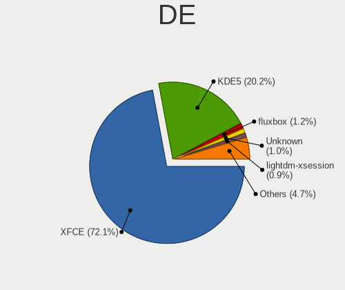

| Name             | Computers | Percent |
|------------------|-----------|---------|
| XFCE             | 800       | 72.07%  |
| KDE5             | 224       | 20.18%  |
| fluxbox          | 13        | 1.17%   |
| Unknown          | 11        | 0.99%   |
| lightdm-xsession | 10        | 0.9%    |
| Budgie           | 8         | 0.72%   |
| LXQt             | 7         | 0.63%   |
| i3               | 7         | 0.63%   |
| X-Cinnamon       | 6         | 0.54%   |
| MATE             | 6         | 0.54%   |
| GNOME            | 6         | 0.54%   |
| Trinity          | 3         | 0.27%   |
| GNOME Flashback  | 2         | 0.18%   |
| Cinnamon         | 2         | 0.18%   |
| spectrwm         | 1         | 0.09%   |
| LXDE             | 1         | 0.09%   |
| KDE4             | 1         | 0.09%   |
| KDE              | 1         | 0.09%   |
| GNOME Classic    | 1         | 0.09%   |

Display Server
--------------

X11 or Wayland

| Name    | Computers | Percent |
|---------|-----------|---------|
| X11     | 1072      | 97.9%   |
| Wayland | 12        | 1.1%    |
| Tty     | 10        | 0.91%   |
| Web     | 1         | 0.09%   |

Display Manager
---------------

SDDM, LightDM, etc.

| Name    | Computers | Percent |
|---------|-----------|---------|
| LightDM | 867       | 78.75%  |
| SDDM    | 201       | 18.26%  |
| TDM     | 14        | 1.27%   |
| SLiM    | 13        | 1.18%   |
| Unknown | 3         | 0.27%   |
| GDM3    | 2         | 0.18%   |
| GDM     | 1         | 0.09%   |

OS Lang
-------

Language

| Lang    | Computers | Percent |
|---------|-----------|---------|
| en_US   | 471       | 42.43%  |
| de_DE   | 105       | 9.46%   |
| Unknown | 104       | 9.37%   |
| en_GB   | 64        | 5.77%   |
| it_IT   | 52        | 4.68%   |
| ru_RU   | 35        | 3.15%   |
| fr_FR   | 30        | 2.7%    |
| es_ES   | 26        | 2.34%   |
| pl_PL   | 25        | 2.25%   |
| en_AU   | 23        | 2.07%   |
| pt_BR   | 19        | 1.71%   |
| sk_SK   | 15        | 1.35%   |
| tr_TR   | 9         | 0.81%   |
| hu_HU   | 9         | 0.81%   |
| es_MX   | 9         | 0.81%   |
| es_AR   | 9         | 0.81%   |
| en_CA   | 9         | 0.81%   |
| fi_FI   | 7         | 0.63%   |
| es_VE   | 7         | 0.63%   |
| en_IE   | 7         | 0.63%   |
| nl_NL   | 6         | 0.54%   |
| en_NZ   | 6         | 0.54%   |
| de_CH   | 6         | 0.54%   |
| es_CO   | 4         | 0.36%   |
| el_GR   | 4         | 0.36%   |
| de_AT   | 4         | 0.36%   |
| uk_UA   | 3         | 0.27%   |
| sv_SE   | 3         | 0.27%   |
| hr_HR   | 3         | 0.27%   |
| fr_CH   | 3         | 0.27%   |
| fr_BE   | 3         | 0.27%   |
| C       | 3         | 0.27%   |
| bg_BG   | 3         | 0.27%   |
| zh_CN   | 2         | 0.18%   |
| nl_BE   | 2         | 0.18%   |
| nb_NO   | 2         | 0.18%   |
| ja_JP   | 2         | 0.18%   |
| fr_CA   | 2         | 0.18%   |
| es_US   | 2         | 0.18%   |
| zh_TW   | 1         | 0.09%   |

Boot Mode
---------

EFI or BIOS

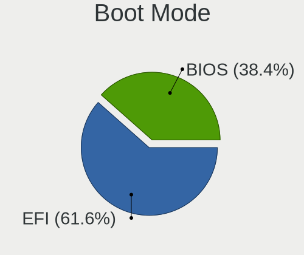

| Mode | Computers | Percent |
|------|-----------|---------|
| EFI  | 674       | 61.55%  |
| BIOS | 421       | 38.45%  |

Filesystem
----------

Type of filesystem

| Type     | Computers | Percent |
|----------|-----------|---------|
| Ext4     | 963       | 87.63%  |
| Overlay  | 90        | 8.19%   |
| Btrfs    | 34        | 3.09%   |
| Xfs      | 3         | 0.27%   |
| Tmpfs    | 3         | 0.27%   |
| Ext3     | 2         | 0.18%   |
| Unknown  | 2         | 0.18%   |
| Reiserfs | 1         | 0.09%   |
| F2fs     | 1         | 0.09%   |

Part. scheme
------------

Scheme of partitioning

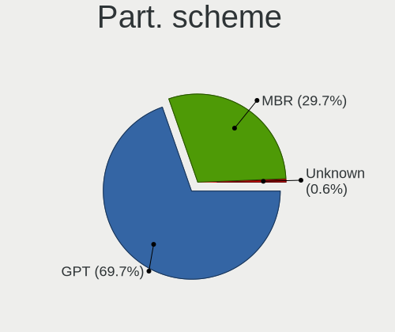

| Type    | Computers | Percent |
|---------|-----------|---------|
| GPT     | 765       | 69.67%  |
| MBR     | 326       | 29.69%  |
| Unknown | 7         | 0.64%   |

Dual Boot with Linux/BSD
------------------------

Hosting more than one Linux/BSD

| Dual boot | Computers | Percent |
|-----------|-----------|---------|
| No        | 851       | 76.6%   |
| Yes       | 260       | 23.4%   |

Dual Boot (Win)
---------------

Hosting Linux and Windows

| Dual boot | Computers | Percent |
|-----------|-----------|---------|
| No        | 650       | 59.14%  |
| Yes       | 449       | 40.86%  |

Board
-----

Vendor
------

Motherboard manufacturer

| Name                                 | Computers | Percent |
|--------------------------------------|-----------|---------|
| Hewlett-Packard                      | 166       | 15.19%  |
| Lenovo                               | 163       | 14.91%  |
| ASUSTek Computer                     | 154       | 14.09%  |
| Dell                                 | 138       | 12.63%  |
| Acer                                 | 66        | 6.04%   |
| Gigabyte Technology                  | 55        | 5.03%   |
| Apple                                | 44        | 4.03%   |
| MSI                                  | 43        | 3.93%   |
| ASRock                               | 33        | 3.02%   |
| Toshiba                              | 18        | 1.65%   |
| Intel                                | 18        | 1.65%   |
| Sony                                 | 15        | 1.37%   |
| Samsung Electronics                  | 14        | 1.28%   |
| Medion                               | 14        | 1.28%   |
| Unknown                              | 11        | 1.01%   |
| Google                               | 8         | 0.73%   |
| Fujitsu Siemens                      | 8         | 0.73%   |
| AZW                                  | 6         | 0.55%   |
| Gateway                              | 5         | 0.46%   |
| Fujitsu                              | 5         | 0.46%   |
| Foxconn                              | 5         | 0.46%   |
| Alienware                            | 5         | 0.46%   |
| ZOTAC                                | 4         | 0.37%   |
| Raspberry Pi Foundation              | 4         | 0.37%   |
| Microsoft                            | 4         | 0.37%   |
| AMI                                  | 4         | 0.37%   |
| Pegatron                             | 3         | 0.27%   |
| Notebook                             | 3         | 0.27%   |
| Biostar                              | 3         | 0.27%   |
| TUXEDO                               | 2         | 0.18%   |
| Shenzhen Meigao Electronic Equipment | 2         | 0.18%   |
| Razer                                | 2         | 0.18%   |
| HONOR                                | 2         | 0.18%   |
| GPU Company                          | 2         | 0.18%   |
| Framework                            | 2         | 0.18%   |
| ECS                                  | 2         | 0.18%   |
| Clevo                                | 2         | 0.18%   |
| Chuwi                                | 2         | 0.18%   |
| youyeetoo                            | 1         | 0.09%   |
| win element                          | 1         | 0.09%   |

Model
-----

Motherboard model

| Name                                  | Computers | Percent |
|---------------------------------------|-----------|---------|
| Unknown                               | 16        | 1.46%   |
| ASUS All Series                       | 11        | 1.01%   |
| HP Notebook                           | 5         | 0.46%   |
| AZW SER                               | 4         | 0.37%   |
| MSI MS-7C91                           | 3         | 0.27%   |
| Lenovo ThinkBook 15 G3 ACL 21A4       | 3         | 0.27%   |
| HP Pavilion Laptop 15-eh1xxx          | 3         | 0.27%   |
| HP Pavilion g6                        | 3         | 0.27%   |
| HP 250 15.6 inch G9 Notebook PC       | 3         | 0.27%   |
| Foxconn Pro3500 Series                | 3         | 0.27%   |
| Dell OptiPlex 9010                    | 3         | 0.27%   |
| Dell OptiPlex 755                     | 3         | 0.27%   |
| ASUS PRIME B450M-A                    | 3         | 0.27%   |
| Apple MacBookPro7,1                   | 3         | 0.27%   |
| Toshiba Satellite P875                | 2         | 0.18%   |
| Samsung 305E4A/305E5A/305E7A          | 2         | 0.18%   |
| RPi Raspberry Pi 5 Model B Rev 1.0    | 2         | 0.18%   |
| MSI MS-7A34                           | 2         | 0.18%   |
| Lenovo V17 G3 IAP 82U1                | 2         | 0.18%   |
| Lenovo ThinkPad T500 20552CU          | 2         | 0.18%   |
| Lenovo IdeaPad Gaming 3 15ACH6 82K2   | 2         | 0.18%   |
| Lenovo IdeaPad 1 15ALC7 82R4          | 2         | 0.18%   |
| Intel H81                             | 2         | 0.18%   |
| HP Stream Laptop 14-cb0XX             | 2         | 0.18%   |
| HP Spectre x360 Convertible 15-df1xxx | 2         | 0.18%   |
| HP ProBook 650 G1                     | 2         | 0.18%   |
| HP ProBook 455 G8 Notebook PC         | 2         | 0.18%   |
| HP ProBook 450 G1                     | 2         | 0.18%   |
| HP Pavilion dv7                       | 2         | 0.18%   |
| HP Pavilion dv6                       | 2         | 0.18%   |
| HP Laptop 17-ak0xx                    | 2         | 0.18%   |
| HP EliteBook 8440p                    | 2         | 0.18%   |
| HP EliteBook 840 G6                   | 2         | 0.18%   |
| HP EliteBook 840 G3                   | 2         | 0.18%   |
| HP Compaq dc7700p Ultra-slim Desktop  | 2         | 0.18%   |
| HP Compaq 8100 Elite SFF PC           | 2         | 0.18%   |
| HP Compaq 6730s                       | 2         | 0.18%   |
| HP 650                                | 2         | 0.18%   |
| HP 255 G1                             | 2         | 0.18%   |
| HP 255 15.6 inch G9 Notebook PC       | 2         | 0.18%   |

Model Family
------------

Motherboard model prefix

| Name                  | Computers | Percent |
|-----------------------|-----------|---------|
| Lenovo ThinkPad       | 83        | 7.59%   |
| Dell Latitude         | 47        | 4.3%    |
| Acer Aspire           | 45        | 4.12%   |
| Dell Inspiron         | 26        | 2.38%   |
| Dell OptiPlex         | 24        | 2.2%    |
| ASUS VivoBook         | 24        | 2.2%    |
| Lenovo IdeaPad        | 23        | 2.1%    |
| HP Pavilion           | 22        | 2.01%   |
| HP ProBook            | 17        | 1.56%   |
| HP Compaq             | 17        | 1.56%   |
| HP Laptop             | 16        | 1.46%   |
| HP EliteBook          | 16        | 1.46%   |
| Unknown               | 16        | 1.46%   |
| ASUS PRIME            | 15        | 1.37%   |
| Toshiba Satellite     | 14        | 1.28%   |
| ASUS TUF              | 12        | 1.1%    |
| ASUS ROG              | 12        | 1.1%    |
| ASUS All              | 11        | 1.01%   |
| Lenovo ThinkCentre    | 10        | 0.91%   |
| Dell XPS              | 9         | 0.82%   |
| Dell Vostro           | 9         | 0.82%   |
| Dell Precision        | 8         | 0.73%   |
| HP 250                | 7         | 0.64%   |
| HP ZBook              | 6         | 0.55%   |
| HP Spectre            | 6         | 0.55%   |
| HP ENVY               | 6         | 0.55%   |
| HP 255                | 6         | 0.55%   |
| Lenovo ThinkBook      | 5         | 0.46%   |
| HP Notebook           | 5         | 0.46%   |
| Fujitsu Siemens AMILO | 5         | 0.46%   |
| Dell System           | 5         | 0.46%   |
| Acer Extensa          | 5         | 0.46%   |
| RPi Raspberry         | 4         | 0.37%   |
| Microsoft Surface     | 4         | 0.37%   |
| Lenovo Yoga           | 4         | 0.37%   |
| Lenovo MIIX           | 4         | 0.37%   |
| Lenovo Legion         | 4         | 0.37%   |
| Lenovo IdeaCentre     | 4         | 0.37%   |
| HP ProLiant           | 4         | 0.37%   |
| Dell Studio           | 4         | 0.37%   |

MFG Year
--------

Motherboard manufacture year

| Year    | Computers | Percent |
|---------|-----------|---------|
| 2021    | 97        | 8.87%   |
| 2013    | 85        | 7.78%   |
| 2018    | 82        | 7.5%    |
| 2012    | 77        | 7.04%   |
| 2011    | 76        | 6.95%   |
| 2019    | 72        | 6.59%   |
| 2022    | 68        | 6.22%   |
| 2020    | 65        | 5.95%   |
| 2010    | 59        | 5.4%    |
| 2016    | 56        | 5.12%   |
| 2017    | 49        | 4.48%   |
| 2015    | 49        | 4.48%   |
| 2014    | 48        | 4.39%   |
| 2023    | 47        | 4.3%    |
| 2009    | 42        | 3.84%   |
| 2008    | 41        | 3.75%   |
| 2007    | 34        | 3.11%   |
| 2006    | 18        | 1.65%   |
| 2024    | 15        | 1.37%   |
| 2005    | 8         | 0.73%   |
| Unknown | 4         | 0.37%   |
| 2004    | 1         | 0.09%   |

Form Factor
-----------

Physical design of the computer

| Name           | Computers | Percent |
|----------------|-----------|---------|
| Notebook       | 651       | 59.56%  |
| Desktop        | 335       | 30.65%  |
| Mini pc        | 32        | 2.93%   |
| Convertible    | 28        | 2.56%   |
| All in one     | 21        | 1.92%   |
| Tablet         | 15        | 1.37%   |
| Server         | 7         | 0.64%   |
| System on chip | 4         | 0.37%   |

Secure Boot
-----------

Enabled or disabled

| State    | Computers | Percent |
|----------|-----------|---------|
| Disabled | 1082      | 98.9%   |
| Enabled  | 12        | 1.1%    |

Coreboot
--------

Have coreboot on board

| Used | Computers | Percent |
|------|-----------|---------|
| No   | 1082      | 98.99%  |
| Yes  | 11        | 1.01%   |

RAM Size
--------

Total RAM memory

| Size in GB  | Computers | Percent |
|-------------|-----------|---------|
| 4.01-8.0    | 272       | 24.79%  |
| 8.01-16.0   | 208       | 18.96%  |
| 16.01-24.0  | 189       | 17.23%  |
| 3.01-4.0    | 166       | 15.13%  |
| 32.01-64.0  | 113       | 10.3%   |
| 1.01-2.0    | 74        | 6.75%   |
| 2.01-3.0    | 23        | 2.1%    |
| 24.01-32.0  | 21        | 1.91%   |
| 64.01-256.0 | 20        | 1.82%   |
| 0.51-1.0    | 11        | 1%      |

RAM Used
--------

Used RAM memory

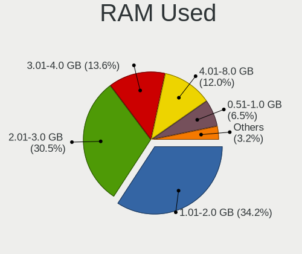

| Used GB    | Computers | Percent |
|------------|-----------|---------|
| 1.01-2.0   | 392       | 34.21%  |
| 2.01-3.0   | 350       | 30.54%  |
| 3.01-4.0   | 156       | 13.61%  |
| 4.01-8.0   | 137       | 11.95%  |
| 0.51-1.0   | 74        | 6.46%   |
| 8.01-16.0  | 26        | 2.27%   |
| 0.01-0.5   | 7         | 0.61%   |
| 16.01-24.0 | 4         | 0.35%   |

Total Drives
------------

Number of drives on board

| Drives | Computers | Percent |
|--------|-----------|---------|
| 1      | 691       | 62.25%  |
| 2      | 262       | 23.6%   |
| 3      | 93        | 8.38%   |
| 4      | 31        | 2.79%   |
| 5      | 15        | 1.35%   |
| 0      | 7         | 0.63%   |
| 8      | 4         | 0.36%   |
| 7      | 3         | 0.27%   |
| 6      | 3         | 0.27%   |
| 9      | 1         | 0.09%   |

Has CD-ROM
----------

Has CD-ROM on board

| Presented | Computers | Percent |
|-----------|-----------|---------|
| No        | 704       | 64.18%  |
| Yes       | 393       | 35.82%  |

Has Ethernet
------------

Has Ethernet on board

| Presented | Computers | Percent |
|-----------|-----------|---------|
| Yes       | 936       | 85.64%  |
| No        | 157       | 14.36%  |

Has WiFi
--------

Has WiFi module

| Presented | Computers | Percent |
|-----------|-----------|---------|
| Yes       | 884       | 80.73%  |
| No        | 211       | 19.27%  |

Has Bluetooth
-------------

Has Bluetooth module

| Presented | Computers | Percent |
|-----------|-----------|---------|
| Yes       | 691       | 63.05%  |
| No        | 405       | 36.95%  |

Location
--------

Country
-------

Geographic location (country)

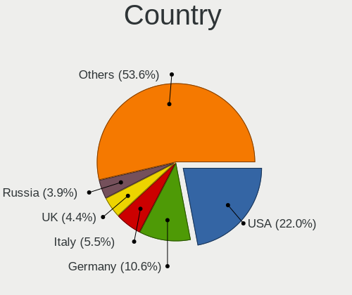

| Country      | Computers | Percent |
|--------------|-----------|---------|
| USA          | 242       | 22%     |
| Germany      | 117       | 10.64%  |
| Italy        | 60        | 5.45%   |
| UK           | 48        | 4.36%   |
| Russia       | 43        | 3.91%   |
| Canada       | 42        | 3.82%   |
| France       | 37        | 3.36%   |
| Spain        | 34        | 3.09%   |
| Australia    | 33        | 3%      |
| Poland       | 31        | 2.82%   |
| Brazil       | 29        | 2.64%   |
| India        | 28        | 2.55%   |
| Greece       | 24        | 2.18%   |
| Slovakia     | 20        | 1.82%   |
| Netherlands  | 17        | 1.55%   |
| Mexico       | 14        | 1.27%   |
| Finland      | 14        | 1.27%   |
| Austria      | 13        | 1.18%   |
| Sweden       | 12        | 1.09%   |
| Serbia       | 12        | 1.09%   |
| Hungary      | 12        | 1.09%   |
| Turkey       | 11        | 1%      |
| Indonesia    | 11        | 1%      |
| Belgium      | 11        | 1%      |
| Switzerland  | 10        | 0.91%   |
| Romania      | 10        | 0.91%   |
| Argentina    | 10        | 0.91%   |
| Venezuela    | 8         | 0.73%   |
| Ukraine      | 8         | 0.73%   |
| New Zealand  | 8         | 0.73%   |
| Colombia     | 7         | 0.64%   |
| Norway       | 6         | 0.55%   |
| Thailand     | 5         | 0.45%   |
| South Africa | 5         | 0.45%   |
| Singapore    | 5         | 0.45%   |
| Portugal     | 5         | 0.45%   |
| Ireland      | 5         | 0.45%   |
| Egypt        | 5         | 0.45%   |
| Czechia      | 5         | 0.45%   |
| Chile        | 5         | 0.45%   |

City
----

Geographic location (city)

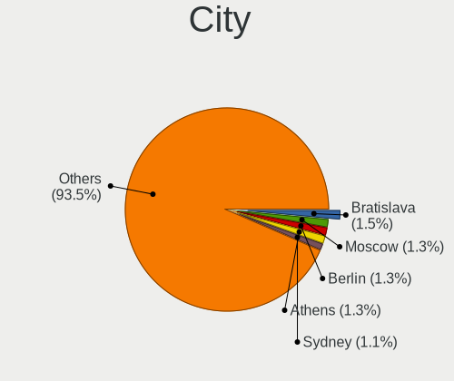

| City          | Computers | Percent |
|---------------|-----------|---------|
| Bratislava    | 17        | 1.5%    |
| Moscow        | 15        | 1.32%   |
| Berlin        | 15        | 1.32%   |
| Athens        | 15        | 1.32%   |
| Sydney        | 12        | 1.06%   |
| Vienna        | 11        | 0.97%   |
| Milan         | 11        | 0.97%   |
| Melbourne     | 10        | 0.88%   |
| St Petersburg | 9         | 0.79%   |
| Budapest      | 9         | 0.79%   |
| Warsaw        | 8         | 0.7%    |
| Seattle       | 8         | 0.7%    |
| Bengaluru     | 8         | 0.7%    |
| Paris         | 7         | 0.62%   |
| Munich        | 7         | 0.62%   |
| Los Angeles   | 6         | 0.53%   |
| Hamburg       | 6         | 0.53%   |
| Belgrade      | 6         | 0.53%   |
| Singapore     | 5         | 0.44%   |
| Rome          | 5         | 0.44%   |
| Montreal      | 5         | 0.44%   |
| Madrid        | 5         | 0.44%   |
| Krakow        | 5         | 0.44%   |
| Florence      | 5         | 0.44%   |
| Bogot       | 5         | 0.44%   |
| Amsterdam     | 5         | 0.44%   |
| Toronto       | 4         | 0.35%   |
| Stockholm     | 4         | 0.35%   |
| Otwock        | 4         | 0.35%   |
| Istanbul      | 4         | 0.35%   |
| Dublin        | 4         | 0.35%   |
| Calgary       | 4         | 0.35%   |
| Cairo         | 4         | 0.35%   |
| Birmingham    | 4         | 0.35%   |
| Zagreb        | 3         | 0.26%   |
| Stuttgart     | 3         | 0.26%   |
| Santa Clara   | 3         | 0.26%   |
| Prague        | 3         | 0.26%   |
| Portland      | 3         | 0.26%   |
| Patna         | 3         | 0.26%   |

Drives
------

Drive Vendor
------------

Hard drive vendors

| Vendor              | Computers | Drives | Percent |
|---------------------|-----------|--------|---------|
| Samsung Electronics | 233       | 314    | 14.68%  |
| WDC                 | 216       | 257    | 13.61%  |
| Seagate             | 175       | 247    | 11.03%  |
| Kingston            | 95        | 101    | 5.99%   |
| SanDisk             | 92        | 102    | 5.8%    |
| Crucial             | 77        | 121    | 4.85%   |
| Toshiba             | 74        | 84     | 4.66%   |
| Unknown             | 73        | 90     | 4.6%    |
| SK hynix            | 50        | 51     | 3.15%   |
| Hitachi             | 49        | 60     | 3.09%   |
| Intel               | 42        | 55     | 2.65%   |
| Micron Technology   | 25        | 31     | 1.58%   |
| A-DATA Technology   | 25        | 29     | 1.58%   |
| China               | 24        | 32     | 1.51%   |
| HGST                | 21        | 28     | 1.32%   |
| Apple               | 19        | 24     | 1.2%    |
| SPCC                | 17        | 17     | 1.07%   |
| Unknown             | 17        | 17     | 1.07%   |
| PNY                 | 15        | 17     | 0.95%   |
| KIOXIA              | 15        | 19     | 0.95%   |
| Team                | 9         | 11     | 0.57%   |
| Intenso             | 9         | 9      | 0.57%   |
| Silicon Motion      | 8         | 9      | 0.5%    |
| Netac               | 8         | 9      | 0.5%    |
| LITEON              | 8         | 8      | 0.5%    |
| Fujitsu             | 8         | 8      | 0.5%    |
| Corsair             | 8         | 8      | 0.5%    |
| Transcend           | 7         | 7      | 0.44%   |
| Maxtor              | 7         | 8      | 0.44%   |
| Apacer              | 7         | 7      | 0.44%   |
| Patriot             | 6         | 9      | 0.38%   |
| GOODRAM             | 6         | 7      | 0.38%   |
| Phison Electronics  | 5         | 6      | 0.32%   |
| Mushkin             | 5         | 5      | 0.32%   |
| Lexar               | 5         | 5      | 0.32%   |
| FORESEE             | 5         | 5      | 0.32%   |
| Phison              | 4         | 5      | 0.25%   |
| OCZ                 | 4         | 4      | 0.25%   |
| LITEONIT            | 4         | 4      | 0.25%   |
| KingSpec            | 4         | 5      | 0.25%   |

Drive Model
-----------

Hard drive models

| Model                                  | Computers | Percent |
|----------------------------------------|-----------|---------|
| Kingston SA400S37240G 240GB SSD        | 17        | 0.99%   |
| Unknown                                | 17        | 0.99%   |
| Kingston SA400S37480G 480GB SSD        | 15        | 0.87%   |
| Samsung SSD 860 EVO 500GB              | 14        | 0.81%   |
| Samsung SSD 850 EVO 250GB              | 13        | 0.76%   |
| Samsung SSD 970 EVO Plus 1TB           | 11        | 0.64%   |
| Seagate ST1000LM035-1RK172 1TB         | 10        | 0.58%   |
| SanDisk NVMe SSD Drive 1TB             | 10        | 0.58%   |
| Kingston SV300S37A120G 120GB SSD       | 10        | 0.58%   |
| Kingston SA400S37120G 120GB SSD        | 10        | 0.58%   |
| Toshiba MQ01ABF050 500GB               | 9         | 0.52%   |
| SanDisk NVMe SSD Drive 512GB           | 9         | 0.52%   |
| Unknown SD/MMC/MS PRO 128GB            | 8         | 0.46%   |
| Seagate ST500DM002-1BD142 500GB        | 8         | 0.46%   |
| HGST HTS721010A9E630 1TB               | 8         | 0.46%   |
| Crucial CT500MX500SSD1 500GB           | 8         | 0.46%   |
| Seagate ST4000DM004-2CV104 4TB         | 7         | 0.41%   |
| Seagate ST2000DM008-2FR102 2TB         | 7         | 0.41%   |
| Seagate ST1000DM010-2EP102 1TB         | 7         | 0.41%   |
| Samsung SSD 980 PRO 1TB                | 7         | 0.41%   |
| Samsung SSD 870 EVO 500GB              | 7         | 0.41%   |
| Samsung SSD 860 EVO 250GB              | 7         | 0.41%   |
| Intel SSDPEKNU512GZ 512GB              | 7         | 0.41%   |
| Crucial CT120BX500SSD1 120GB           | 7         | 0.41%   |
| Toshiba MQ01ABD100 1TB                 | 6         | 0.35%   |
| Toshiba DT01ACA100 1TB                 | 6         | 0.35%   |
| Seagate ST500LM021-1KJ152 500GB        | 6         | 0.35%   |
| Samsung SSD 980 500GB                  | 6         | 0.35%   |
| Samsung SSD 970 EVO Plus 500GB         | 6         | 0.35%   |
| Samsung SSD 850 EVO 500GB              | 6         | 0.35%   |
| Kingston SV300S37A240G 240GB SSD       | 6         | 0.35%   |
| Crucial CT1000MX500SSD1 1TB            | 6         | 0.35%   |
| WDC WD5000LPVX-22V0TT0 500GB           | 5         | 0.29%   |
| WDC WD10EZEX-00BN5A0 1TB               | 5         | 0.29%   |
| SK hynix SKHynix_HFM512GD3HX015N 512GB | 5         | 0.29%   |
| SK hynix HBG4e  32GB                   | 5         | 0.29%   |
| Seagate ST9500325AS 500GB              | 5         | 0.29%   |
| Seagate ST3500418AS 500GB              | 5         | 0.29%   |
| Seagate ST2000DM001-1ER164 2TB         | 5         | 0.29%   |
| Seagate ST1000LM048-2E7172 1TB         | 5         | 0.29%   |

HDD Vendor
----------

Hard disk drive vendors

| Vendor              | Computers | Drives | Percent |
|---------------------|-----------|--------|---------|
| Seagate             | 173       | 243    | 32.89%  |
| WDC                 | 158       | 191    | 30.04%  |
| Toshiba             | 62        | 71     | 11.79%  |
| Hitachi             | 49        | 60     | 9.32%   |
| Samsung Electronics | 23        | 29     | 4.37%   |
| HGST                | 21        | 28     | 3.99%   |
| Unknown             | 8         | 8      | 1.52%   |
| Fujitsu             | 8         | 8      | 1.52%   |
| Maxtor              | 7         | 8      | 1.33%   |
| Apple               | 5         | 5      | 0.95%   |
| Hewlett-Packard     | 3         | 8      | 0.57%   |
| External            | 3         | 4      | 0.57%   |
| SABRENT             | 2         | 4      | 0.38%   |
| ASMT                | 2         | 4      | 0.38%   |
| Space ke            | 1         | 2      | 0.19%   |
| IBM/Hitachi         | 1         | 1      | 0.19%   |

SSD Vendor
----------

Solid state drive vendors

| Vendor              | Computers | Drives | Percent |
|---------------------|-----------|--------|---------|
| Samsung Electronics | 117       | 155    | 19.76%  |
| Kingston            | 74        | 79     | 12.5%   |
| Crucial             | 62        | 98     | 10.47%  |
| SanDisk             | 51        | 55     | 8.61%   |
| WDC                 | 31        | 33     | 5.24%   |
| China               | 24        | 32     | 4.05%   |
| A-DATA Technology   | 20        | 23     | 3.38%   |
| SPCC                | 15        | 15     | 2.53%   |
| Intel               | 14        | 18     | 2.36%   |
| PNY                 | 13        | 14     | 2.2%    |
| Micron Technology   | 12        | 18     | 2.03%   |
| Apple               | 11        | 14     | 1.86%   |
| SK hynix            | 10        | 10     | 1.69%   |
| Intenso             | 9         | 9      | 1.52%   |
| Transcend           | 7         | 7      | 1.18%   |
| LITEON              | 7         | 7      | 1.18%   |
| Netac               | 6         | 6      | 1.01%   |
| GOODRAM             | 6         | 7      | 1.01%   |
| Team                | 5         | 5      | 0.84%   |
| Patriot             | 5         | 7      | 0.84%   |
| Toshiba             | 4         | 4      | 0.68%   |
| OCZ                 | 4         | 4      | 0.68%   |
| LITEONIT            | 4         | 4      | 0.68%   |
| KingSpec            | 4         | 5      | 0.68%   |
| Apacer              | 4         | 4      | 0.68%   |
| Verbatim            | 3         | 3      | 0.51%   |
| Mushkin             | 3         | 3      | 0.51%   |
| KingFast            | 3         | 4      | 0.51%   |
| Gigabyte Technology | 3         | 3      | 0.51%   |
| FORESEE             | 3         | 3      | 0.51%   |
| Dogfish             | 3         | 3      | 0.51%   |
| Corsair             | 3         | 3      | 0.51%   |
| Unknown             | 3         | 3      | 0.51%   |
| WALRAM              | 2         | 2      | 0.34%   |
| Teclast             | 2         | 2      | 0.34%   |
| Seagate             | 2         | 2      | 0.34%   |
| KingDian            | 2         | 2      | 0.34%   |
| Indilinx            | 2         | 4      | 0.34%   |
| HS-SSD-C100         | 2         | 2      | 0.34%   |
| GeIL                | 2         | 2      | 0.34%   |

Drive Kind
----------

HDD or SSD

| Kind    | Computers | Drives | Percent |
|---------|-----------|--------|---------|
| SSD     | 516       | 711    | 36.36%  |
| HDD     | 446       | 674    | 31.43%  |
| NVMe    | 364       | 455    | 25.65%  |
| MMC     | 80        | 101    | 5.64%   |
| Unknown | 13        | 18     | 0.92%   |

Drive Connector
---------------

SATA, SAS, NVMe, etc.

| Type | Computers | Drives | Percent |
|------|-----------|--------|---------|
| SATA | 766       | 1322   | 60.41%  |
| NVMe | 363       | 452    | 28.63%  |
| MMC  | 80        | 101    | 6.31%   |
| SAS  | 59        | 84     | 4.65%   |

Drive Size
----------

Size of hard drive

| Size in TB | Computers | Drives | Percent |
|------------|-----------|--------|---------|
| 0.01-0.5   | 609       | 854    | 61.7%   |
| 0.51-1.0   | 254       | 352    | 25.73%  |
| 1.01-2.0   | 74        | 99     | 7.5%    |
| 3.01-4.0   | 22        | 26     | 2.23%   |
| 2.01-3.0   | 13        | 16     | 1.32%   |
| 4.01-10.0  | 12        | 33     | 1.22%   |
| 10.01-20.0 | 3         | 5      | 0.3%    |

Space Total
-----------

Amount of disk space available on the file system

| Size in GB     | Computers | Percent |
|----------------|-----------|---------|
| 101-250        | 309       | 27.35%  |
| 251-500        | 230       | 20.35%  |
| 501-1000       | 151       | 13.36%  |
| 51-100         | 115       | 10.18%  |
| 21-50          | 86        | 7.61%   |
| 1-20           | 85        | 7.52%   |
| 1001-2000      | 73        | 6.46%   |
| More than 3000 | 49        | 4.34%   |
| 2001-3000      | 29        | 2.57%   |
| Unknown        | 3         | 0.27%   |

Space Used
----------

Amount of used disk space

| Used GB        | Computers | Percent |
|----------------|-----------|---------|
| 1-20           | 466       | 40.81%  |
| 21-50          | 189       | 16.55%  |
| 101-250        | 142       | 12.43%  |
| 51-100         | 133       | 11.65%  |
| 251-500        | 81        | 7.09%   |
| 501-1000       | 54        | 4.73%   |
| 1001-2000      | 39        | 3.42%   |
| More than 3000 | 23        | 2.01%   |
| 2001-3000      | 12        | 1.05%   |
| Unknown        | 3         | 0.26%   |

Malfunc. Drives
---------------

Drive models with a malfunction

| Model                             | Computers | Drives | Percent |
|-----------------------------------|-----------|--------|---------|
| Seagate ST9500325AS 500GB         | 5         | 5      | 2.29%   |
| WDC WD5000LPVX-22V0TT0 500GB      | 3         | 3      | 1.38%   |
| Toshiba MQ01ABF050 500GB          | 3         | 3      | 1.38%   |
| Seagate ST500LM000-1EJ162 500GB   | 3         | 3      | 1.38%   |
| Seagate ST500DM002-1BD142 500GB   | 3         | 3      | 1.38%   |
| Seagate ST1000LM035-1RK172 1TB    | 3         | 3      | 1.38%   |
| Hitachi HTS545050A7E380 500GB     | 3         | 3      | 1.38%   |
| HGST HTS545050A7E680 500GB        | 3         | 4      | 1.38%   |
| Toshiba MQ01ABD100 1TB            | 2         | 2      | 0.92%   |
| Toshiba MK7575GSX 752GB           | 2         | 3      | 0.92%   |
| Toshiba MK5059GSXP 500GB          | 2         | 2      | 0.92%   |
| Seagate ST500LT012-9WS142 500GB   | 2         | 2      | 0.92%   |
| Seagate ST31000524AS 1TB          | 2         | 2      | 0.92%   |
| Seagate ST1000DM003-9YN162 1TB    | 2         | 2      | 0.92%   |
| SanDisk SSD PLUS 480GB            | 2         | 2      | 0.92%   |
| Kingston SV300S37A120G 120GB SSD  | 2         | 2      | 0.92%   |
| Indilinx IND-S325S120G 120GB SSD  | 2         | 4      | 0.92%   |
| Hitachi HUA722020ALA331 2TB       | 2         | 2      | 0.92%   |
| HGST HTS721010A9E630 1TB          | 2         | 2      | 0.92%   |
| HGST HTS545050A7E380 500GB        | 2         | 4      | 0.92%   |
| China SSD 512GB                   | 2         | 2      | 0.92%   |
| A-DATA Technology SU650 240GB SSD | 2         | 2      | 0.92%   |
| WDC WDS100T2B0A-00SM50 1TB SSD    | 1         | 1      | 0.46%   |
| WDC WD5003ABYX-01WERA1 500GB      | 1         | 1      | 0.46%   |
| WDC WD5000BPVT-60HXZT3 500GB      | 1         | 1      | 0.46%   |
| WDC WD5000AAKS-40V6A0 500GB       | 1         | 1      | 0.46%   |
| WDC WD40EZRX-00SPEB0 4TB          | 1         | 1      | 0.46%   |
| WDC WD3200LPVX-22V0TT0 320GB      | 1         | 1      | 0.46%   |
| WDC WD3200BPVT-80ZEST0 320GB      | 1         | 1      | 0.46%   |
| WDC WD3200BPVT-24JJ5T0 320GB      | 1         | 1      | 0.46%   |
| WDC WD3200BEVT-22ZCT0 320GB       | 1         | 1      | 0.46%   |
| WDC WD3200BEKT-60PVMT0 320GB      | 1         | 1      | 0.46%   |
| WDC WD3200AAKS-00UU3A0 320GB      | 1         | 1      | 0.46%   |
| WDC WD3200AAJS-00L7A0 320GB       | 1         | 1      | 0.46%   |
| WDC WD3200AAJS-00B4A0 320GB       | 1         | 1      | 0.46%   |
| WDC WD32 00BEKT-75PVMT0 320GB     | 1         | 1      | 0.46%   |
| WDC WD2500AAJS-00B4A0 250GB       | 1         | 3      | 0.46%   |
| WDC WD20EZRX-00D8PB0 2TB          | 1         | 1      | 0.46%   |
| WDC WD20EFRX-68EUZN0 2TB          | 1         | 2      | 0.46%   |
| WDC WD20EFRX-68AX9N0 2TB          | 1         | 1      | 0.46%   |

Malfunc. Drive Vendor
---------------------

Vendors of faulty drives

| Vendor              | Computers | Drives | Percent |
|---------------------|-----------|--------|---------|
| Seagate             | 51        | 59     | 23.94%  |
| WDC                 | 36        | 40     | 16.9%   |
| Hitachi             | 24        | 27     | 11.27%  |
| Samsung Electronics | 19        | 25     | 8.92%   |
| Toshiba             | 17        | 19     | 7.98%   |
| HGST                | 11        | 14     | 5.16%   |
| Intel               | 6         | 7      | 2.82%   |
| SanDisk             | 5         | 5      | 2.35%   |
| Fujitsu             | 5         | 5      | 2.35%   |
| Crucial             | 5         | 27     | 2.35%   |
| Maxtor              | 4         | 4      | 1.88%   |
| Kingston            | 4         | 4      | 1.88%   |
| China               | 4         | 4      | 1.88%   |
| SK hynix            | 3         | 3      | 1.41%   |
| A-DATA Technology   | 3         | 4      | 1.41%   |
| Netac               | 2         | 2      | 0.94%   |
| Micron Technology   | 2         | 2      | 0.94%   |
| Indilinx            | 2         | 4      | 0.94%   |
| SPCC                | 1         | 1      | 0.47%   |
| RENICE              | 1         | 1      | 0.47%   |
| OCZ                 | 1         | 1      | 0.47%   |
| LITEONIT            | 1         | 1      | 0.47%   |
| Lexar               | 1         | 1      | 0.47%   |
| KingSpec            | 1         | 1      | 0.47%   |
| Intenso             | 1         | 1      | 0.47%   |
| IBM/Hitachi         | 1         | 1      | 0.47%   |
| GOODRAM             | 1         | 1      | 0.47%   |
| Apple               | 1         | 1      | 0.47%   |

Malfunc. HDD Vendor
-------------------

Vendors of faulty HDD drives

| Vendor              | Computers | Drives | Percent |
|---------------------|-----------|--------|---------|
| Seagate             | 51        | 59     | 32.9%   |
| WDC                 | 33        | 37     | 21.29%  |
| Hitachi             | 24        | 27     | 15.48%  |
| Toshiba             | 16        | 18     | 10.32%  |
| HGST                | 11        | 14     | 7.1%    |
| Samsung Electronics | 10        | 12     | 6.45%   |
| Fujitsu             | 5         | 5      | 3.23%   |
| Maxtor              | 4         | 4      | 2.58%   |
| IBM/Hitachi         | 1         | 1      | 0.65%   |

Malfunc. Drive Kind
-------------------

Kinds of faulty drives

| Kind | Computers | Drives | Percent |
|------|-----------|--------|---------|
| HDD  | 148       | 177    | 72.2%   |
| SSD  | 51        | 76     | 24.88%  |
| NVMe | 6         | 12     | 2.93%   |

Failed Drives
-------------

Failed drive models

| Model                       | Computers | Drives | Percent |
|-----------------------------|-----------|--------|---------|
| Toshiba MK5065GSX 500GB     | 2         | 2      | 50%     |
| WDC WD3200AAJS-00B4A0 320GB | 1         | 1      | 25%     |
| Seagate ST3500418AS 500GB   | 1         | 2      | 25%     |

Failed Drive Vendor
-------------------

Failed drive vendors

| Vendor  | Computers | Drives | Percent |
|---------|-----------|--------|---------|
| Toshiba | 2         | 2      | 50%     |
| WDC     | 1         | 1      | 25%     |
| Seagate | 1         | 2      | 25%     |

Drive Status
------------

Number of failed and malfunc. drives

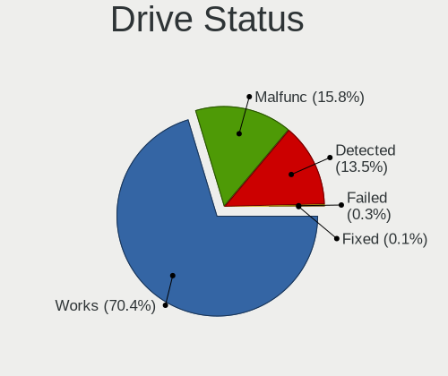

| Status   | Computers | Drives | Percent |
|----------|-----------|--------|---------|
| Works    | 893       | 1452   | 70.37%  |
| Malfunc  | 200       | 265    | 15.76%  |
| Detected | 171       | 236    | 13.48%  |
| Failed   | 4         | 5      | 0.32%   |
| Fixed    | 1         | 1      | 0.08%   |

Storage controller
------------------

Storage Vendor
--------------

Storage controller vendors

| Vendor                           | Computers | Percent |
|----------------------------------|-----------|---------|
| Intel                            | 698       | 52.17%  |
| AMD                              | 190       | 14.2%   |
| Samsung Electronics              | 114       | 8.52%   |
| SanDisk                          | 63        | 4.71%   |
| SK hynix                         | 32        | 2.39%   |
| Nvidia                           | 25        | 1.87%   |
| Kingston Technology Company      | 24        | 1.79%   |
| ASMedia Technology               | 21        | 1.57%   |
| Phison Electronics               | 20        | 1.49%   |
| Silicon Motion                   | 18        | 1.35%   |
| KIOXIA                           | 18        | 1.35%   |
| Micron Technology                | 16        | 1.2%    |
| Micron/Crucial Technology        | 15        | 1.12%   |
| JMicron Technology               | 13        | 0.97%   |
| Marvell Technology Group         | 10        | 0.75%   |
| MAXIO Technology (Hangzhou)      | 7         | 0.52%   |
| Toshiba America Info Systems     | 6         | 0.45%   |
| ADATA Technology                 | 6         | 0.45%   |
| Shenzhen Longsys Electronics     | 5         | 0.37%   |
| Realtek Semiconductor            | 5         | 0.37%   |
| LSI Logic / Symbios Logic        | 4         | 0.3%    |
| Hewlett-Packard                  | 4         | 0.3%    |
| VIA Technologies                 | 3         | 0.22%   |
| Union Memory (Shenzhen)          | 3         | 0.22%   |
| ULi Electronics                  | 2         | 0.15%   |
| Solid State Storage Technology   | 2         | 0.15%   |
| Silicon Image                    | 2         | 0.15%   |
| Broadcom / LSI                   | 2         | 0.15%   |
| Apple                            | 2         | 0.15%   |
| TenaFe                           | 1         | 0.07%   |
| Silicon Integrated Systems [SiS] | 1         | 0.07%   |
| O2 Micro                         | 1         | 0.07%   |
| Lite-On Technology               | 1         | 0.07%   |
| Lenovo                           | 1         | 0.07%   |
| Integrated Technology Express    | 1         | 0.07%   |
| Biwin Storage Technology         | 1         | 0.07%   |
| Unknown                          | 1         | 0.07%   |

Storage Model
-------------

Storage controller models

| Model                                                                          | Computers | Percent |
|--------------------------------------------------------------------------------|-----------|---------|
| AMD FCH SATA Controller [AHCI mode]                                            | 119       | 7.8%    |
| Intel 7 Series Chipset Family 6-port SATA Controller [AHCI mode]               | 58        | 3.8%    |
| Samsung NVMe SSD Controller SM981/PM981/PM983                                  | 48        | 3.15%   |
| Intel Sunrise Point-LP SATA Controller [AHCI mode]                             | 45        | 2.95%   |
| Intel 6 Series/C200 Series Chipset Family 6 port Mobile SATA AHCI Controller   | 43        | 2.82%   |
| Intel 8 Series/C220 Series Chipset Family 6-port SATA Controller 1 [AHCI mode] | 40        | 2.62%   |
| Intel 82801 Mobile SATA Controller [RAID mode]                                 | 34        | 2.23%   |
| Intel Volume Management Device NVMe RAID Controller                            | 31        | 2.03%   |
| Intel Q170/Q150/B150/H170/H110/Z170/CM236 Chipset SATA Controller [AHCI Mode]  | 24        | 1.57%   |
| Samsung NVMe SSD Controller 980 (DRAM-less)                                    | 23        | 1.51%   |
| Intel Celeron/Pentium Silver Processor SATA Controller                         | 23        | 1.51%   |
| Intel 82801G (ICH7 Family) IDE Controller                                      | 22        | 1.44%   |
| Intel 5 Series/3400 Series Chipset 6 port SATA AHCI Controller                 | 21        | 1.38%   |
| Intel 82801IBM/IEM (ICH9M/ICH9M-E) 4 port SATA Controller [AHCI mode]          | 20        | 1.31%   |
| Intel 82801HM/HEM (ICH8M/ICH8M-E) IDE Controller                               | 20        | 1.31%   |
| AMD SB7x0/SB8x0/SB9x0 SATA Controller [AHCI mode]                              | 20        | 1.31%   |
| ASMedia ASM1061/ASM1062 Serial ATA Controller                                  | 19        | 1.25%   |
| Intel 82801HM/HEM (ICH8M/ICH8M-E) SATA Controller [AHCI mode]                  | 18        | 1.18%   |
| AMD SB7x0/SB8x0/SB9x0 IDE Controller                                           | 18        | 1.18%   |
| Samsung NVMe SSD Controller PM9A1/PM9A3/980PRO                                 | 17        | 1.11%   |
| Intel 6 Series/C200 Series Chipset Family 6 port Desktop SATA AHCI Controller  | 17        | 1.11%   |
| Silicon Motion SM2263EN/SM2263XT (DRAM-less) NVMe SSD Controllers              | 16        | 1.05%   |
| Intel 200 Series PCH SATA controller [AHCI mode]                               | 16        | 1.05%   |
| AMD 500 Series Chipset SATA Controller                                         | 16        | 1.05%   |
| Intel Tiger Lake-LP SATA Controller                                            | 15        | 0.98%   |
| Intel 8 Series SATA Controller 1 [AHCI mode]                                   | 15        | 0.98%   |
| AMD 400 Series Chipset SATA Controller                                         | 15        | 0.98%   |
| SanDisk WD Black SN770 / PC SN740 256GB / PC SN560 (DRAM-less) NVMe SSD        | 14        | 0.92%   |
| Samsung NVMe SSD Controller SM961/PM961/SM963                                  | 14        | 0.92%   |
| Intel Alder Lake-P SATA AHCI Controller                                        | 14        | 0.92%   |
| Intel 7 Series/C210 Series Chipset Family 6-port SATA Controller [AHCI mode]   | 14        | 0.92%   |
| SK hynix Gold P31/BC711/PC711 NVMe Solid State Drive                           | 13        | 0.85%   |
| Intel Cannon Lake PCH SATA AHCI Controller                                     | 13        | 0.85%   |
| Intel Cannon Lake Mobile PCH SATA AHCI Controller                              | 13        | 0.85%   |
| SanDisk Ultra 3D / WD PC SN530, IX SN530, Blue SN550 NVMe SSD (DRAM-less)      | 12        | 0.79%   |
| Micron/Crucial P2 [Nick P2] / P3 / P3 Plus NVMe PCIe SSD (DRAM-less)           | 12        | 0.79%   |
| Intel NM10/ICH7 Family SATA Controller [IDE mode]                              | 12        | 0.79%   |
| Intel 500 Series Chipset Family SATA AHCI Controller                           | 12        | 0.79%   |
| KIOXIA NVMe SSD Controller BG4 (DRAM-less)                                     | 11        | 0.72%   |
| Intel SSD 670p Series [Keystone Harbor]                                        | 11        | 0.72%   |

Storage Kind
------------

Kind of storage controller (IDE, SATA, NVMe, SAS, ...)

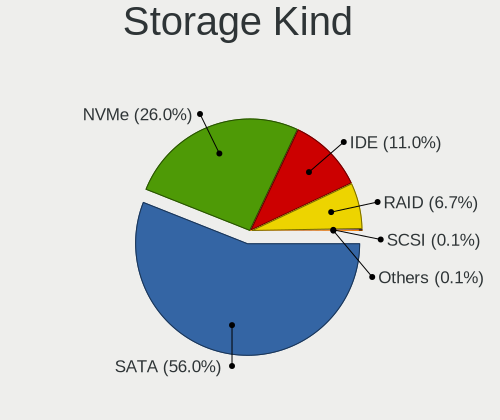

| Kind | Computers | Percent |
|------|-----------|---------|
| SATA | 769       | 56.01%  |
| NVMe | 357       | 26%     |
| IDE  | 151       | 11%     |
| RAID | 92        | 6.7%    |
| SAS  | 2         | 0.15%   |
| SCSI | 2         | 0.15%   |

Processor
---------

CPU Vendor
----------

Processor vendors

| Vendor       | Computers | Percent |
|--------------|-----------|---------|
| Intel        | 830       | 75.94%  |
| AMD          | 258       | 23.6%   |
| ARM          | 4         | 0.37%   |
| CentaurHauls | 1         | 0.09%   |

CPU Model
---------

Processor models

| Model                                      | Computers | Percent |
|--------------------------------------------|-----------|---------|
| AMD Ryzen 7 5700U with Radeon Graphics     | 15        | 1.37%   |
| Intel Atom CPU Z3735F @ 1.33GHz            | 14        | 1.28%   |
| Intel 11th Gen Core i5-1135G7 @ 2.40GHz    | 14        | 1.28%   |
| Intel 11th Gen Core i7-1165G7 @ 2.80GHz    | 13        | 1.19%   |
| Intel Core i5-8250U CPU @ 1.60GHz          | 10        | 0.91%   |
| Intel Core i5-6200U CPU @ 2.30GHz          | 10        | 0.91%   |
| Intel Core i5-2520M CPU @ 2.50GHz          | 9         | 0.82%   |
| Intel Core i7-9750H CPU @ 2.60GHz          | 8         | 0.73%   |
| Intel Core i5-6300U CPU @ 2.40GHz          | 8         | 0.73%   |
| Intel Core i5 CPU M 520 @ 2.40GHz          | 8         | 0.73%   |
| Intel 12th Gen Core i5-1235U               | 8         | 0.73%   |
| Intel Core i7-3770 CPU @ 3.40GHz           | 7         | 0.64%   |
| Intel Core i5-3210M CPU @ 2.50GHz          | 7         | 0.64%   |
| Intel Core 2 Duo CPU E8400 @ 3.00GHz       | 7         | 0.64%   |
| Intel Atom x5-Z8350 CPU @ 1.44GHz          | 7         | 0.64%   |
| Intel Core i7-8550U CPU @ 1.80GHz          | 6         | 0.55%   |
| Intel Core i7-6700HQ CPU @ 2.60GHz         | 6         | 0.55%   |
| Intel Core i5-9600K CPU @ 3.70GHz          | 6         | 0.55%   |
| Intel Core i5-8365U CPU @ 1.60GHz          | 6         | 0.55%   |
| Intel Core i5-8350U CPU @ 1.70GHz          | 6         | 0.55%   |
| Intel Core i5-2430M CPU @ 2.40GHz          | 6         | 0.55%   |
| Intel Celeron CPU N3350 @ 1.10GHz          | 6         | 0.55%   |
| AMD Ryzen 5 5600H with Radeon Graphics     | 6         | 0.55%   |
| Intel Core Ultra 7 155H                    | 5         | 0.46%   |
| Intel Core i7-8750H CPU @ 2.20GHz          | 5         | 0.46%   |
| Intel Core i7-7500U CPU @ 2.70GHz          | 5         | 0.46%   |
| Intel Core i7-6820HQ CPU @ 2.70GHz         | 5         | 0.46%   |
| Intel Core i7-3630QM CPU @ 2.40GHz         | 5         | 0.46%   |
| Intel Core i7-2670QM CPU @ 2.20GHz         | 5         | 0.46%   |
| Intel Core i5-7200U CPU @ 2.50GHz          | 5         | 0.46%   |
| Intel Core i5-3470 CPU @ 3.20GHz           | 5         | 0.46%   |
| Intel Core i5 CPU M 560 @ 2.67GHz          | 5         | 0.46%   |
| Intel Core 2 Duo CPU P8600 @ 2.40GHz       | 5         | 0.46%   |
| Intel Core 2 Duo CPU E7500 @ 2.93GHz       | 5         | 0.46%   |
| Intel Celeron N4020 CPU @ 1.10GHz          | 5         | 0.46%   |
| Intel Celeron CPU N3060 @ 1.60GHz          | 5         | 0.46%   |
| Intel 11th Gen Core i3-1115G4 @ 3.00GHz    | 5         | 0.46%   |
| AMD Ryzen 9 7940HS w/ Radeon 780M Graphics | 5         | 0.46%   |
| AMD Ryzen 7 5825U with Radeon Graphics     | 5         | 0.46%   |
| AMD Ryzen 5 5625U with Radeon Graphics     | 5         | 0.46%   |

CPU Model Family
----------------

Processor model prefix

| Model                   | Computers | Percent |
|-------------------------|-----------|---------|
| Intel Core i5           | 223       | 20.4%   |
| Intel Core i7           | 162       | 14.82%  |
| Other                   | 101       | 9.24%   |
| AMD Ryzen 5             | 70        | 6.4%    |
| Intel Core i3           | 67        | 6.13%   |
| Intel Celeron           | 65        | 5.95%   |
| Intel Core 2 Duo        | 62        | 5.67%   |
| AMD Ryzen 7             | 52        | 4.76%   |
| Intel Atom              | 41        | 3.75%   |
| Intel Pentium           | 22        | 2.01%   |
| AMD Ryzen 3             | 18        | 1.65%   |
| Intel Xeon              | 17        | 1.56%   |
| AMD Ryzen 9             | 16        | 1.46%   |
| AMD A8                  | 10        | 0.91%   |
| Intel Pentium Dual-Core | 9         | 0.82%   |
| Intel Core 2            | 8         | 0.73%   |
| AMD A6                  | 8         | 0.73%   |
| AMD A4                  | 8         | 0.73%   |
| Intel Core 2 Quad       | 7         | 0.64%   |
| Intel Core              | 7         | 0.64%   |
| AMD FX                  | 7         | 0.64%   |
| Intel Pentium Silver    | 6         | 0.55%   |
| Intel Genuine           | 6         | 0.55%   |
| Intel Core i9           | 6         | 0.55%   |
| Intel Pentium 4         | 5         | 0.46%   |
| AMD Phenom II X4        | 5         | 0.46%   |
| AMD E1                  | 5         | 0.46%   |
| AMD A10                 | 5         | 0.46%   |
| Intel Pentium Gold      | 4         | 0.37%   |
| Intel Pentium Dual      | 4         | 0.37%   |
| Intel Celeron M         | 4         | 0.37%   |
| AMD Turion 64 X2 Mobile | 4         | 0.37%   |
| AMD Phenom II X6        | 4         | 0.37%   |
| AMD E                   | 4         | 0.37%   |
| AMD Athlon II X4        | 4         | 0.37%   |
| AMD Athlon II X2        | 4         | 0.37%   |
| AMD Athlon              | 4         | 0.37%   |
| Intel Pentium M         | 3         | 0.27%   |
| AMD Sempron             | 3         | 0.27%   |
| AMD E2                  | 3         | 0.27%   |

CPU Cores
---------

Number of processor cores

| Number  | Computers | Percent |
|---------|-----------|---------|
| 2       | 440       | 40.26%  |
| 4       | 357       | 32.66%  |
| 6       | 115       | 10.52%  |
| 8       | 87        | 7.96%   |
| 1       | 35        | 3.2%    |
| 10      | 16        | 1.46%   |
| 12      | 15        | 1.37%   |
| 16      | 10        | 0.91%   |
| 14      | 6         | 0.55%   |
| Unknown | 4         | 0.37%   |
| 24      | 3         | 0.27%   |
| 3       | 3         | 0.27%   |
| 5       | 2         | 0.18%   |

CPU Sockets
-----------

Number of sockets

| Number  | Computers | Percent |
|---------|-----------|---------|
| 1       | 1082      | 98.99%  |
| 2       | 7         | 0.64%   |
| Unknown | 4         | 0.37%   |

CPU Threads
-----------

Threads per core (Hyper-Threading)

| Number  | Computers | Percent |
|---------|-----------|---------|
| 2       | 679       | 62.07%  |
| 1       | 411       | 37.57%  |
| Unknown | 4         | 0.37%   |

CPU Op-Modes
------------

CPU Operation Modes (32-bit, 64-bit)

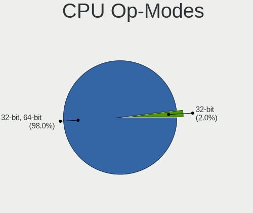

| Op mode        | Computers | Percent |
|----------------|-----------|---------|
| 32-bit, 64-bit | 1072      | 97.99%  |
| 32-bit         | 22        | 2.01%   |

CPU Microcode
-------------

Microcode number

| Number     | Computers | Percent |
|------------|-----------|---------|
| Unknown    | 208       | 18.74%  |
| 0x206a7    | 67        | 6.04%   |
| 0x306a9    | 60        | 5.41%   |
| 0x306c3    | 46        | 4.14%   |
| 0x1067a    | 40        | 3.6%    |
| 0x806c1    | 26        | 2.34%   |
| 0x506e3    | 25        | 2.25%   |
| 0x406e3    | 25        | 2.25%   |
| 0x30678    | 25        | 2.25%   |
| 0x20655    | 23        | 2.07%   |
| 0x806ec    | 20        | 1.8%    |
| 0x906ea    | 18        | 1.62%   |
| 0x40651    | 18        | 1.62%   |
| 0x0a50000c | 18        | 1.62%   |
| 0x806ea    | 17        | 1.53%   |
| 0x806e9    | 17        | 1.53%   |
| 0x08608103 | 17        | 1.53%   |
| 0x406c4    | 16        | 1.44%   |
| 0x6fd      | 15        | 1.35%   |
| 0x306d4    | 14        | 1.26%   |
| 0x906e9    | 13        | 1.17%   |
| 0x906a4    | 12        | 1.08%   |
| 0x706a1    | 12        | 1.08%   |
| 0x906a3    | 10        | 0.9%    |
| 0x706a8    | 10        | 0.9%    |
| 0x08701021 | 10        | 0.9%    |
| 0x906ed    | 9         | 0.81%   |
| 0x506c9    | 9         | 0.81%   |
| 0x10676    | 9         | 0.81%   |
| 0x08108109 | 9         | 0.81%   |
| 0x0800820d | 9         | 0.81%   |
| 0x6fb      | 8         | 0.72%   |
| 0x106e5    | 8         | 0.72%   |
| 0xa0671    | 7         | 0.63%   |
| 0xa0653    | 7         | 0.63%   |
| 0x20652    | 7         | 0.63%   |
| 0x0600611a | 7         | 0.63%   |
| 0x03000027 | 7         | 0.63%   |
| 0x010000c8 | 7         | 0.63%   |
| 0xa0652    | 6         | 0.54%   |

CPU Microarch
-------------

Microarchitecture

| Name              | Computers | Percent |
|-------------------|-----------|---------|
| KabyLake          | 124       | 11.33%  |
| SandyBridge       | 81        | 7.4%    |
| Haswell           | 77        | 7.04%   |
| IvyBridge         | 72        | 6.58%   |
| Unknown           | 69        | 6.31%   |
| Penryn            | 60        | 5.48%   |
| Skylake           | 57        | 5.21%   |
| Silvermont        | 50        | 4.57%   |
| Zen 3             | 45        | 4.11%   |
| Core              | 39        | 3.56%   |
| TigerLake         | 38        | 3.47%   |
| Alderlake Hybrid  | 37        | 3.38%   |
| Westmere          | 35        | 3.2%    |
| Zen+              | 31        | 2.83%   |
| Zen 2             | 25        | 2.29%   |
| Goldmont plus     | 24        | 2.19%   |
| K10               | 21        | 1.92%   |
| Icelake           | 20        | 1.83%   |
| CometLake         | 18        | 1.65%   |
| Excavator         | 15        | 1.37%   |
| Broadwell         | 15        | 1.37%   |
| K8 Hammer         | 14        | 1.28%   |
| P6                | 13        | 1.19%   |
| Zen               | 12        | 1.1%    |
| Bonnell           | 12        | 1.1%    |
| Nehalem           | 11        | 1.01%   |
| Goldmont          | 11        | 1.01%   |
| Piledriver        | 10        | 0.91%   |
| Puma              | 8         | 0.73%   |
| NetBurst          | 8         | 0.73%   |
| K10 Llano         | 8         | 0.73%   |
| Bobcat            | 7         | 0.64%   |
| Tremont           | 6         | 0.55%   |
| Meteorlake Hybrid | 6         | 0.55%   |
| Steamroller       | 4         | 0.37%   |
| Jaguar            | 4         | 0.37%   |
| Gracemont         | 3         | 0.27%   |
| Bulldozer         | 3         | 0.27%   |
| K8 & K10 hybrid   | 1         | 0.09%   |

Graphics
--------

GPU Vendor
----------

Vendors of graphics cards

| Vendor                     | Computers | Percent |
|----------------------------|-----------|---------|
| Intel                      | 665       | 52.78%  |
| AMD                        | 297       | 23.57%  |
| Nvidia                     | 296       | 23.49%  |
| VIA Technologies           | 1         | 0.08%   |
| Matrox Electronics Systems | 1         | 0.08%   |

GPU Model
---------

Graphics card models

| Model                                                                                    | Computers | Percent |
|------------------------------------------------------------------------------------------|-----------|---------|
| Intel 2nd Generation Core Processor Family Integrated Graphics Controller                | 64        | 4.87%   |
| Intel 3rd Gen Core processor Graphics Controller                                         | 51        | 3.88%   |
| Intel TigerLake-LP GT2 [Iris Xe Graphics]                                                | 32        | 2.44%   |
| Intel Skylake GT2 [HD Graphics 520]                                                      | 28        | 2.13%   |
| Intel Atom Processor Z36xxx/Z37xxx Series Graphics & Display                             | 28        | 2.13%   |
| Intel UHD Graphics 620                                                                   | 24        | 1.83%   |
| AMD Cezanne [Radeon Vega Series / Radeon Vega Mobile Series]                             | 24        | 1.83%   |
| Intel Core Processor Integrated Graphics Controller                                      | 23        | 1.75%   |
| AMD Lucienne                                                                             | 23        | 1.75%   |
| Intel Atom/Celeron/Pentium Processor x5-E8000/J3xxx/N3xxx Integrated Graphics Controller | 22        | 1.68%   |
| Intel Mobile 4 Series Chipset Integrated Graphics Controller                             | 20        | 1.52%   |
| Intel 4th Gen Core Processor Integrated Graphics Controller                              | 20        | 1.52%   |
| Intel Haswell-ULT Integrated Graphics Controller                                         | 19        | 1.45%   |
| Intel GeminiLake [UHD Graphics 600]                                                      | 19        | 1.45%   |
| AMD Picasso/Raven 2 [Radeon Vega Series / Radeon Vega Mobile Series]                     | 19        | 1.45%   |
| Intel HD Graphics 530                                                                    | 17        | 1.29%   |
| Intel HD Graphics 620                                                                    | 16        | 1.22%   |
| Intel CoffeeLake-H GT2 [UHD Graphics 630]                                                | 15        | 1.14%   |
| AMD Ellesmere [Radeon RX 470/480/570/570X/580/580X/590]                                  | 15        | 1.14%   |
| Intel Mobile GM965/GL960 Integrated Graphics Controller (secondary)                      | 14        | 1.07%   |
| Intel Mobile GM965/GL960 Integrated Graphics Controller (primary)                        | 14        | 1.07%   |
| Intel WhiskeyLake-U GT2 [UHD Graphics 620]                                               | 13        | 0.99%   |
| AMD Barcelo                                                                              | 13        | 0.99%   |
| Intel Mobile 945GM/GMS/GME, 943/940GML Express Integrated Graphics Controller            | 12        | 0.91%   |
| Intel Xeon E3-1200 v3/4th Gen Core Processor Integrated Graphics Controller              | 11        | 0.84%   |
| Intel CometLake-U GT2 [UHD Graphics]                                                     | 11        | 0.84%   |
| Intel CoffeeLake-S GT2 [UHD Graphics 630]                                                | 11        | 0.84%   |
| Nvidia TU117M [GeForce GTX 1650 Mobile / Max-Q]                                          | 10        | 0.76%   |
| Intel HD Graphics 630                                                                    | 10        | 0.76%   |
| Intel 4 Series Chipset Integrated Graphics Controller                                    | 10        | 0.76%   |
| AMD Renoir [Radeon Vega Series / Radeon Vega Mobile Series]                              | 10        | 0.76%   |
| AMD Raphael                                                                              | 10        | 0.76%   |
| Nvidia GP108 [GeForce GT 1030]                                                           | 9         | 0.69%   |
| Intel Mobile 945GM/GMS, 943/940GML Express Integrated Graphics Controller                | 9         | 0.69%   |
| Intel HD Graphics 5500                                                                   | 9         | 0.69%   |
| Nvidia GK208B [GeForce GT 710]                                                           | 8         | 0.61%   |
| Intel Xeon E3-1200 v2/3rd Gen Core processor Graphics Controller                         | 8         | 0.61%   |
| Intel HD Graphics 500                                                                    | 8         | 0.61%   |
| AMD Seymour [Radeon HD 6400M/7400M Series]                                               | 8         | 0.61%   |
| Nvidia GP107 [GeForce GTX 1050]                                                          | 7         | 0.53%   |

GPU Combo
---------

Combinations of graphics cards

| Name           | Computers | Percent |
|----------------|-----------|---------|
| 1 x Intel      | 493       | 44.9%   |
| 1 x AMD        | 227       | 20.67%  |
| 1 x Nvidia     | 171       | 15.57%  |
| Intel + Nvidia | 100       | 9.11%   |
| Intel + AMD    | 32        | 2.91%   |
| 2 x Intel      | 26        | 2.37%   |
| AMD + Nvidia   | 22        | 2%      |
| 2 x AMD        | 18        | 1.64%   |
| Other          | 4         | 0.36%   |
| 2 x Nvidia     | 2         | 0.18%   |
| 3 x AMD        | 1         | 0.09%   |
| 1 x VIA        | 1         | 0.09%   |
| 1 x Matrox     | 1         | 0.09%   |

GPU Driver
----------

Free vs proprietary

| Driver      | Computers | Percent |
|-------------|-----------|---------|
| Free        | 927       | 84.2%   |
| Proprietary | 126       | 11.44%  |
| Unknown     | 48        | 4.36%   |

GPU Memory
----------

Total video memory

| Size in GB | Computers | Percent |
|------------|-----------|---------|
| Unknown    | 674       | 61%     |
| 0.01-0.5   | 159       | 14.39%  |
| 1.01-2.0   | 93        | 8.42%   |
| 0.51-1.0   | 71        | 6.43%   |
| 3.01-4.0   | 43        | 3.89%   |
| 7.01-8.0   | 35        | 3.17%   |
| 5.01-6.0   | 11        | 1%      |
| 8.01-16.0  | 11        | 1%      |
| 2.01-3.0   | 7         | 0.63%   |
| 4.01-5.0   | 1         | 0.09%   |

Monitor
-------

Monitor Vendor
--------------

Monitor vendors

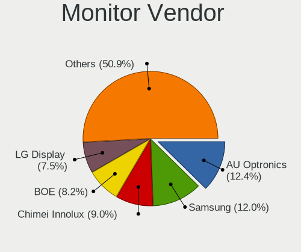

| Vendor                  | Computers | Percent |
|-------------------------|-----------|---------|
| AU Optronics            | 144       | 12.37%  |
| Samsung Electronics     | 140       | 12.03%  |
| Chimei Innolux          | 105       | 9.02%   |
| BOE                     | 96        | 8.25%   |
| LG Display              | 87        | 7.47%   |
| Dell                    | 59        | 5.07%   |
| Goldstar                | 56        | 4.81%   |
| Acer                    | 40        | 3.44%   |
| Hewlett-Packard         | 38        | 3.26%   |
| Apple                   | 35        | 3.01%   |
| Lenovo                  | 31        | 2.66%   |
| Chi Mei Optoelectronics | 28        | 2.41%   |
| BenQ                    | 28        | 2.41%   |
| AOC                     | 25        | 2.15%   |
| Ancor Communications    | 21        | 1.8%    |
| Philips                 | 20        | 1.72%   |
| Sony                    | 14        | 1.2%    |
| PANDA                   | 13        | 1.12%   |
| ViewSonic               | 12        | 1.03%   |
| Sharp                   | 12        | 1.03%   |
| ASUSTek Computer        | 12        | 1.03%   |
| InfoVision              | 11        | 0.95%   |
| LG Philips              | 10        | 0.86%   |
| HannStar                | 7         | 0.6%    |
| Eizo                    | 6         | 0.52%   |
| Sceptre Tech            | 5         | 0.43%   |
| MSI                     | 5         | 0.43%   |
| Iiyama                  | 5         | 0.43%   |
| Fujitsu Siemens         | 5         | 0.43%   |
| Vizio                   | 4         | 0.34%   |
| Vestel Elektronik       | 4         | 0.34%   |
| Medion                  | 4         | 0.34%   |
| HKC                     | 4         | 0.34%   |
| CPT                     | 4         | 0.34%   |
| Quanta Display          | 3         | 0.26%   |
| Panasonic               | 3         | 0.26%   |
| IBM                     | 3         | 0.26%   |
| SGT                     | 2         | 0.17%   |
| RTK                     | 2         | 0.17%   |
| Packard Bell            | 2         | 0.17%   |

Monitor Model
-------------

Monitor models

| Model                                                                    | Computers | Percent |
|--------------------------------------------------------------------------|-----------|---------|
| Chimei Innolux LCD Monitor CMN14D4 1920x1080 309x173mm 13.9-inch         | 10        | 0.85%   |
| Samsung Electronics SyncMaster SAM0091 1600x1200 432x324mm 21.3-inch     | 8         | 0.68%   |
| Samsung Electronics LCD Monitor SEC5441 1280x800 286x179mm 13.3-inch     | 8         | 0.68%   |
| LG Display LCD Monitor LGD04A7 1920x1080 344x194mm 15.5-inch             | 5         | 0.42%   |
| Chimei Innolux LCD Monitor CMN15F5 1920x1080 344x193mm 15.5-inch         | 5         | 0.42%   |
| Chimei Innolux LCD Monitor CMN15DB 1366x768 344x193mm 15.5-inch          | 5         | 0.42%   |
| Chi Mei Optoelectronics LCD Monitor CMO15A7 1366x768 344x193mm 15.5-inch | 5         | 0.42%   |
| AOC Q27G2WG4 AOC2702 2560x1440 597x336mm 27.0-inch                       | 5         | 0.42%   |
| Vestel Elektronik 49FHD_LCD_TV VES3700 1920x1080 1280x720mm 57.8-inch    | 4         | 0.34%   |
| Samsung Electronics LCD Monitor SEC4251 1366x768 344x194mm 15.5-inch     | 4         | 0.34%   |
| Samsung Electronics LCD Monitor SEC325A 1366x768 344x194mm 15.5-inch     | 4         | 0.34%   |
| Samsung Electronics LCD Monitor SDC4C48 1920x1080 239x134mm 10.8-inch    | 4         | 0.34%   |
| PANDA LCD Monitor NCP004D 1920x1080 344x194mm 15.5-inch                  | 4         | 0.34%   |
| Goldstar FULL HD GSM5B55 1920x1080 480x270mm 21.7-inch                   | 4         | 0.34%   |
| Chimei Innolux LCD Monitor CMN1132 1366x768 256x144mm 11.6-inch          | 4         | 0.34%   |
| Chi Mei Optoelectronics LCD Monitor CMO15A3 1366x768 344x193mm 15.5-inch | 4         | 0.34%   |
| BOE LCD Monitor BOE0672 1366x768 344x194mm 15.5-inch                     | 4         | 0.34%   |
| AU Optronics LCD Monitor AUO305C 1366x768 256x144mm 11.6-inch            | 4         | 0.34%   |
| AU Optronics LCD Monitor AUO21ED 1920x1080 344x193mm 15.5-inch           | 4         | 0.34%   |
| Samsung Electronics LCD Monitor SEC544B 1600x900 382x215mm 17.3-inch     | 3         | 0.25%   |
| Samsung Electronics LCD Monitor SEC314C 1920x1080 344x194mm 15.5-inch    | 3         | 0.25%   |
| Samsung Electronics C27F390 SAM0D32 1920x1080 600x340mm 27.2-inch        | 3         | 0.25%   |
| Philips 221P3LPY PHL08A3 1920x1080 477x268mm 21.5-inch                   | 3         | 0.25%   |
| LG Display LCD Monitor LGD0590 1920x1080 344x194mm 15.5-inch             | 3         | 0.25%   |
| LG Display LCD Monitor LGD0563 1920x1080 344x194mm 15.5-inch             | 3         | 0.25%   |
| Lenovo LCD Monitor LEN4036 1440x900 303x189mm 14.1-inch                  | 3         | 0.25%   |
| Lenovo LCD Monitor LEN4011 1280x800 261x163mm 12.1-inch                  | 3         | 0.25%   |
| HannStar LCD Monitor HSD03E9 1024x600 220x129mm 10.0-inch                | 3         | 0.25%   |
| Goldstar ULTRAWIDE GSM76F9 2560x1080 531x298mm 24.0-inch                 | 3         | 0.25%   |
| Goldstar LG FULL HD GSM5ABB 1920x1080 480x270mm 21.7-inch                | 3         | 0.25%   |
| Chimei Innolux LCD Monitor CMN1618 1920x1200 344x215mm 16.0-inch         | 3         | 0.25%   |
| Chimei Innolux LCD Monitor CMN1521 1920x1080 344x193mm 15.5-inch         | 3         | 0.25%   |
| Chimei Innolux LCD Monitor CMN14C4 1366x768 309x173mm 13.9-inch          | 3         | 0.25%   |
| BOE LCD Monitor BOE084E 1920x1080 382x215mm 17.3-inch                    | 3         | 0.25%   |
| AU Optronics LCD Monitor AUO403D 1920x1080 309x174mm 14.0-inch           | 3         | 0.25%   |
| AU Optronics LCD Monitor AUO313C 1366x768 309x173mm 13.9-inch            | 3         | 0.25%   |
| AU Optronics LCD Monitor AUO26EC 1366x768 344x193mm 15.5-inch            | 3         | 0.25%   |
| AU Optronics LCD Monitor AUO21EC 1366x768 344x193mm 15.5-inch            | 3         | 0.25%   |
| AU Optronics LCD Monitor AUO109D 1920x1080 381x214mm 17.2-inch           | 3         | 0.25%   |
| AU Optronics LCD Monitor AUO106C 1366x768 277x156mm 12.5-inch            | 3         | 0.25%   |

Monitor Resolution
------------------

Monitor screen resolution

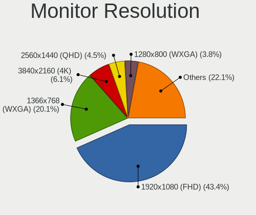

| Resolution         | Computers | Percent |
|--------------------|-----------|---------|
| 1920x1080 (FHD)    | 489       | 43.39%  |
| 1366x768 (WXGA)    | 226       | 20.05%  |
| 3840x2160 (4K)     | 69        | 6.12%   |
| 2560x1440 (QHD)    | 51        | 4.53%   |
| 1280x800 (WXGA)    | 43        | 3.82%   |
| 1600x900 (HD+)     | 40        | 3.55%   |
| 1680x1050 (WSXGA+) | 34        | 3.02%   |
| 1280x1024 (SXGA)   | 30        | 2.66%   |
| 1920x1200 (WUXGA)  | 28        | 2.48%   |
| 1440x900 (WXGA+)   | 28        | 2.48%   |
| 2560x1600          | 9         | 0.8%    |
| 1600x1200          | 9         | 0.8%    |
| 1360x768           | 9         | 0.8%    |
| 1024x600           | 8         | 0.71%   |
| 2560x1080          | 7         | 0.62%   |
| 1024x768 (XGA)     | 7         | 0.62%   |
| 2880x1800          | 6         | 0.53%   |
| 3440x1440          | 5         | 0.44%   |
| 3840x2400          | 3         | 0.27%   |
| 2880x1920          | 3         | 0.27%   |
| 2256x1504          | 3         | 0.27%   |
| 2160x1440          | 3         | 0.27%   |
| Unknown            | 3         | 0.27%   |
| 3840x1080          | 2         | 0.18%   |
| 3200x1800 (QHD+)   | 2         | 0.18%   |
| 1400x1050          | 2         | 0.18%   |
| 1280x720 (HD)      | 2         | 0.18%   |
| 3840x2560          | 1         | 0.09%   |
| 3200x2000          | 1         | 0.09%   |
| 3072x1920          | 1         | 0.09%   |
| 3000x2000          | 1         | 0.09%   |
| 2048x1536          | 1         | 0.09%   |
| 1920x1440          | 1         | 0.09%   |

Monitor Diagonal
----------------

Diagonal size in inches

| Inches  | Computers | Percent |
|---------|-----------|---------|
| 15      | 305       | 26.2%   |
| 13      | 110       | 9.45%   |
| 24      | 87        | 7.47%   |
| 14      | 81        | 6.96%   |
| 27      | 71        | 6.1%    |
| 23      | 70        | 6.01%   |
| 21      | 69        | 5.93%   |
| 17      | 62        | 5.33%   |
| 31      | 38        | 3.26%   |
| 11      | 32        | 2.75%   |
| 19      | 31        | 2.66%   |
| 18      | 28        | 2.41%   |
| 16      | 26        | 2.23%   |
| 22      | 19        | 1.63%   |
| 12      | 17        | 1.46%   |
| 20      | 16        | 1.37%   |
| Unknown | 14        | 1.2%    |
| 34      | 12        | 1.03%   |
| 10      | 12        | 1.03%   |
| 84      | 11        | 0.95%   |
| 54      | 8         | 0.69%   |
| 32      | 5         | 0.43%   |
| 65      | 4         | 0.34%   |
| 40      | 4         | 0.34%   |
| 26      | 4         | 0.34%   |
| 72      | 3         | 0.26%   |
| 39      | 3         | 0.26%   |
| 25      | 3         | 0.26%   |
| 57      | 2         | 0.17%   |
| 46      | 2         | 0.17%   |
| 43      | 2         | 0.17%   |
| 42      | 2         | 0.17%   |
| 28      | 2         | 0.17%   |
| 75      | 1         | 0.09%   |
| 74      | 1         | 0.09%   |
| 64      | 1         | 0.09%   |
| 61      | 1         | 0.09%   |
| 55      | 1         | 0.09%   |
| 52      | 1         | 0.09%   |
| 49      | 1         | 0.09%   |

Monitor Width
-------------

Physical width

| Width in mm | Computers | Percent |
|-------------|-----------|---------|
| 301-350     | 452       | 39.34%  |
| 501-600     | 218       | 18.97%  |
| 401-500     | 141       | 12.27%  |
| 201-300     | 120       | 10.44%  |
| 351-400     | 92        | 8.01%   |
| 601-700     | 45        | 3.92%   |
| 1001-1500   | 20        | 1.74%   |
| 701-800     | 19        | 1.65%   |
| 1501-2000   | 16        | 1.39%   |
| Unknown     | 14        | 1.22%   |
| 801-900     | 8         | 0.7%    |
| 901-1000    | 4         | 0.35%   |

Aspect Ratio
------------

Proportional relationship between the width and the height

| Ratio   | Computers | Percent |
|---------|-----------|---------|
| 16/9    | 824       | 77.01%  |
| 16/10   | 158       | 14.77%  |
| 5/4     | 28        | 2.62%   |
| 4/3     | 21        | 1.96%   |
| 3/2     | 15        | 1.4%    |
| 21/9    | 12        | 1.12%   |
| Unknown | 9         | 0.84%   |
| 6/5     | 1         | 0.09%   |
| 32/9    | 1         | 0.09%   |
| 0.56    | 1         | 0.09%   |

Monitor Area
------------

Area in inch

| Area in inch | Computers | Percent |
|----------------|-----------|---------|
| 101-110        | 304       | 26.34%  |
| 201-250        | 191       | 16.55%  |
| 81-90          | 149       | 12.91%  |
| 301-350        | 73        | 6.33%   |
| 151-200        | 73        | 6.33%   |
| 351-500        | 57        | 4.94%   |
| 121-130        | 53        | 4.59%   |
| 71-80          | 40        | 3.47%   |
| More than 1000 | 33        | 2.86%   |
| 51-60          | 32        | 2.77%   |
| 251-300        | 31        | 2.69%   |
| 141-150        | 31        | 2.69%   |
| 111-120        | 20        | 1.73%   |
| 61-70          | 17        | 1.47%   |
| 501-1000       | 16        | 1.39%   |
| Unknown        | 14        | 1.21%   |
| 41-50          | 12        | 1.04%   |
| 131-140        | 4         | 0.35%   |
| 91-100         | 4         | 0.35%   |

Pixel Density
-------------

Pixels per inch

| Density       | Computers | Percent |
|---------------|-----------|---------|
| 51-100        | 393       | 35.03%  |
| 121-160       | 312       | 27.81%  |
| 101-120       | 290       | 25.85%  |
| 161-240       | 68        | 6.06%   |
| 1-50          | 25        | 2.23%   |
| More than 240 | 20        | 1.78%   |
| Unknown       | 14        | 1.25%   |

Multiple Monitors
-----------------

Total monitors connected

| Total | Computers | Percent |
|-------|-----------|---------|
| 1     | 916       | 82.82%  |
| 2     | 151       | 13.65%  |
| 0     | 32        | 2.89%   |
| 3     | 7         | 0.63%   |

Network
-------

Net Controller Vendor
---------------------

Controller vendors

| Vendor                            | Computers | Percent |
|-----------------------------------|-----------|---------|
| Realtek Semiconductor             | 571       | 33.61%  |
| Intel                             | 503       | 29.61%  |
| Qualcomm Atheros                  | 162       | 9.54%   |
| Broadcom                          | 127       | 7.47%   |
| MediaTek                          | 51        | 3%      |
| TP-Link                           | 36        | 2.12%   |
| Broadcom Limited                  | 30        | 1.77%   |
| Marvell Technology Group          | 21        | 1.24%   |
| Ralink Technology                 | 19        | 1.12%   |
| Nvidia                            | 19        | 1.12%   |
| Ralink                            | 16        | 0.94%   |
| ASIX Electronics                  | 13        | 0.77%   |
| Samsung Electronics               | 12        | 0.71%   |
| OPPO Electronics                  | 10        | 0.59%   |
| Motorola PCS                      | 7         | 0.41%   |
| Xiaomi                            | 6         | 0.35%   |
| Sierra Wireless                   | 6         | 0.35%   |
| Qualcomm Atheros Communications   | 6         | 0.35%   |
| Microsoft                         | 6         | 0.35%   |
| Huawei Technologies               | 6         | 0.35%   |
| ASUSTek Computer                  | 5         | 0.29%   |
| NetGear                           | 4         | 0.24%   |
| Dell                              | 4         | 0.24%   |
| D-Link                            | 4         | 0.24%   |
| Qualcomm                          | 3         | 0.18%   |
| Linksys                           | 3         | 0.18%   |
| Fibocom                           | 3         | 0.18%   |
| Ericsson Business Mobile Networks | 3         | 0.18%   |
| Edimax Technology                 | 3         | 0.18%   |
| D-Link System                     | 3         | 0.18%   |
| AVM                               | 3         | 0.18%   |
| Attansic Technology               | 3         | 0.18%   |
| VIA Technologies                  | 2         | 0.12%   |
| Raspberry Pi                      | 2         | 0.12%   |
| Lenovo                            | 2         | 0.12%   |
| JMicron Technology                | 2         | 0.12%   |
| IMC Networks                      | 2         | 0.12%   |
| ZyDAS                             | 1         | 0.06%   |
| U-Blox                            | 1         | 0.06%   |
| Tenda                             | 1         | 0.06%   |

Net Controller Model
--------------------

Controller models

| Model                                                                  | Computers | Percent |
|------------------------------------------------------------------------|-----------|---------|
| Realtek RTL8111/8168/8211/8411 PCI Express Gigabit Ethernet Controller | 368       | 18.32%  |
| Realtek RTL810xE PCI Express Fast Ethernet controller                  | 58        | 2.89%   |
| Intel Wi-Fi 6 AX200                                                    | 33        | 1.64%   |
| Intel Wireless 8265 / 8275                                             | 32        | 1.59%   |
| Realtek RTL8153 Gigabit Ethernet Adapter                               | 31        | 1.54%   |
| Intel 82579LM Gigabit Network Connection (Lewisville)                  | 28        | 1.39%   |
| Intel Wi-Fi 6 AX201                                                    | 26        | 1.29%   |
| Realtek RTL8821CE 802.11ac PCIe Wireless Network Adapter               | 25        | 1.24%   |
| Qualcomm Atheros AR9485 Wireless Network Adapter                       | 25        | 1.24%   |
| Intel Wireless 8260                                                    | 25        | 1.24%   |
| Realtek RTL8125 2.5GbE Controller                                      | 24        | 1.19%   |
| Realtek RTL8852BE PCIe 802.11ax Wireless Network Controller            | 23        | 1.14%   |
| Intel Wireless 7265                                                    | 22        | 1.1%    |
| Intel Wireless 3165                                                    | 22        | 1.1%    |
| Intel Wireless 7260                                                    | 20        | 1%      |
| Intel Ethernet Controller I225-V                                       | 20        | 1%      |
| Intel Ethernet Connection I217-LM                                      | 20        | 1%      |
| Qualcomm Atheros QCA9565 / AR9565 Wireless Network Adapter             | 19        | 0.95%   |
| Qualcomm Atheros QCA9377 802.11ac Wireless Network Adapter             | 19        | 0.95%   |
| Realtek RTL88x2bu [AC1200 Techkey]                                     | 18        | 0.9%    |
| Qualcomm Atheros AR9285 Wireless Network Adapter (PCI-Express)         | 17        | 0.85%   |
| Broadcom BCM4313 802.11bgn Wireless Network Adapter                    | 17        | 0.85%   |
| Realtek RTL8822CE 802.11ac PCIe Wireless Network Adapter               | 16        | 0.8%    |
| Realtek RTL8188EUS 802.11n Wireless Network Adapter                    | 16        | 0.8%    |
| MediaTek MT7921 802.11ax PCI Express Wireless Network Adapter          | 15        | 0.75%   |
| Intel Alder Lake-P PCH CNVi WiFi                                       | 15        | 0.75%   |
| Intel 82577LM Gigabit Network Connection                               | 15        | 0.75%   |
| Realtek 802.11ac NIC                                                   | 14        | 0.7%    |
| MediaTek MT7922 802.11ax PCI Express Wireless Network Adapter          | 14        | 0.7%    |
| Intel Ethernet Connection (2) I219-V                                   | 13        | 0.65%   |
| Intel Dual Band Wireless-AC 3168NGW [Stone Peak]                       | 12        | 0.6%    |
| MediaTek Wi-Fi 6E MT7902 Wireless Network Adapter                      | 11        | 0.55%   |
| Intel Wi-Fi 6E(802.11ax) AX210/AX1675* 2x2 [Typhoon Peak]              | 11        | 0.55%   |
| Intel I211 Gigabit Network Connection                                  | 11        | 0.55%   |
| Intel Ethernet Connection (7) I219-V                                   | 11        | 0.55%   |
| Intel Centrino Advanced-N 6205 [Taylor Peak]                           | 11        | 0.55%   |
| Intel Cannon Lake PCH CNVi WiFi                                        | 11        | 0.55%   |
| Realtek RTL8723BE PCIe Wireless Network Adapter                        | 10        | 0.5%    |
| Ralink MT7601U Wireless Adapter                                        | 10        | 0.5%    |
| Qualcomm Atheros QCA6174 802.11ac Wireless Network Adapter             | 10        | 0.5%    |

Wireless Vendor
---------------

Wireless vendors

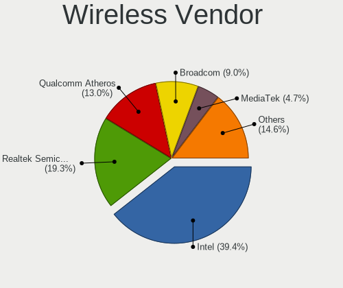

| Vendor                          | Computers | Percent |
|---------------------------------|-----------|---------|
| Intel                           | 377       | 39.39%  |
| Realtek Semiconductor           | 185       | 19.33%  |
| Qualcomm Atheros                | 124       | 12.96%  |
| Broadcom                        | 86        | 8.99%   |
| MediaTek                        | 45        | 4.7%    |
| TP-Link                         | 33        | 3.45%   |
| Ralink Technology               | 19        | 1.99%   |
| Broadcom Limited                | 17        | 1.78%   |
| Ralink                          | 16        | 1.67%   |
| Sierra Wireless                 | 6         | 0.63%   |
| Qualcomm Atheros Communications | 6         | 0.63%   |
| ASUSTek Computer                | 5         | 0.52%   |
| NetGear                         | 4         | 0.42%   |
| D-Link                          | 4         | 0.42%   |
| Microsoft                       | 3         | 0.31%   |
| Linksys                         | 3         | 0.31%   |
| Fibocom                         | 3         | 0.31%   |
| Edimax Technology               | 3         | 0.31%   |
| AVM                             | 3         | 0.31%   |
| IMC Networks                    | 2         | 0.21%   |
| Dell                            | 2         | 0.21%   |
| ZyDAS                           | 1         | 0.1%    |
| Tenda                           | 1         | 0.1%    |
| Sweex                           | 1         | 0.1%    |
| Qualcomm Technologies           | 1         | 0.1%    |
| Qualcomm                        | 1         | 0.1%    |
| Mercucys                        | 1         | 0.1%    |
| Marvell Technology Group        | 1         | 0.1%    |
| Hewlett-Packard                 | 1         | 0.1%    |
| Fujitsu Siemens Computers       | 1         | 0.1%    |
| D-Link System                   | 1         | 0.1%    |
| Belkin Components               | 1         | 0.1%    |

Wireless Model
--------------

Wireless models

| Model                                                                   | Computers | Percent |
|-------------------------------------------------------------------------|-----------|---------|
| Intel Wi-Fi 6 AX200                                                     | 33        | 3.42%   |
| Intel Wireless 8265 / 8275                                              | 32        | 3.32%   |
| Intel Wi-Fi 6 AX201                                                     | 26        | 2.7%    |
| Realtek RTL8821CE 802.11ac PCIe Wireless Network Adapter                | 25        | 2.59%   |
| Qualcomm Atheros AR9485 Wireless Network Adapter                        | 25        | 2.59%   |
| Intel Wireless 8260                                                     | 25        | 2.59%   |
| Intel Wireless 7265                                                     | 22        | 2.28%   |
| Intel Wireless 3165                                                     | 22        | 2.28%   |
| Realtek RTL8852BE PCIe 802.11ax Wireless Network Controller             | 21        | 2.18%   |
| Intel Wireless 7260                                                     | 20        | 2.07%   |
| Qualcomm Atheros QCA9565 / AR9565 Wireless Network Adapter              | 19        | 1.97%   |
| Qualcomm Atheros QCA9377 802.11ac Wireless Network Adapter              | 19        | 1.97%   |
| Realtek RTL88x2bu [AC1200 Techkey]                                      | 18        | 1.87%   |
| Qualcomm Atheros AR9285 Wireless Network Adapter (PCI-Express)          | 17        | 1.76%   |
| Broadcom BCM4313 802.11bgn Wireless Network Adapter                     | 17        | 1.76%   |
| Realtek RTL8822CE 802.11ac PCIe Wireless Network Adapter                | 16        | 1.66%   |
| Realtek RTL8188EUS 802.11n Wireless Network Adapter                     | 16        | 1.66%   |
| MediaTek MT7921 802.11ax PCI Express Wireless Network Adapter           | 15        | 1.56%   |
| Realtek 802.11ac NIC                                                    | 14        | 1.45%   |
| Intel Alder Lake-P PCH CNVi WiFi                                        | 14        | 1.45%   |
| Intel Dual Band Wireless-AC 3168NGW [Stone Peak]                        | 12        | 1.24%   |
| MediaTek Wi-Fi 6E MT7902 Wireless Network Adapter                       | 11        | 1.14%   |
| MediaTek MT7922 802.11ax PCI Express Wireless Network Adapter           | 11        | 1.14%   |
| Intel Wi-Fi 6E(802.11ax) AX210/AX1675* 2x2 [Typhoon Peak]               | 11        | 1.14%   |
| Intel Centrino Advanced-N 6205 [Taylor Peak]                            | 11        | 1.14%   |
| Intel Cannon Lake PCH CNVi WiFi                                         | 11        | 1.14%   |
| Realtek RTL8723BE PCIe Wireless Network Adapter                         | 10        | 1.04%   |
| Ralink MT7601U Wireless Adapter                                         | 10        | 1.04%   |
| Qualcomm Atheros QCA6174 802.11ac Wireless Network Adapter              | 10        | 1.04%   |
| Qualcomm Atheros AR242x / AR542x Wireless Network Adapter (PCI-Express) | 10        | 1.04%   |
| Intel Wi-Fi 5(802.11ac) Wireless-AC 9x6x [Thunder Peak]                 | 10        | 1.04%   |
| Intel PRO/Wireless 3945ABG [Golan] Network Connection                   | 10        | 1.04%   |
| Intel Centrino Advanced-N 6200                                          | 10        | 1.04%   |
| Broadcom BCM43142 802.11b/g/n                                           | 10        | 1.04%   |
| TP-Link TL-WN722N v2/v3 [Realtek RTL8188EUS]                            | 9         | 0.93%   |
| Intel Centrino Advanced-N 6235                                          | 9         | 0.93%   |
| Broadcom BCM4322 802.11a/b/g/n Wireless LAN Controller                  | 9         | 0.93%   |
| Qualcomm Atheros AR928X Wireless Network Adapter (PCI-Express)          | 8         | 0.83%   |
| Intel Ice Lake-LP PCH CNVi WiFi                                         | 8         | 0.83%   |
| Realtek 802.11n WLAN Adapter                                            | 7         | 0.73%   |

Ethernet Vendor
---------------

Ethernet vendors

| Vendor                        | Computers | Percent |
|-------------------------------|-----------|---------|
| Realtek Semiconductor         | 492       | 49.05%  |
| Intel                         | 264       | 26.32%  |
| Broadcom                      | 59        | 5.88%   |
| Qualcomm Atheros              | 54        | 5.38%   |
| Marvell Technology Group      | 20        | 1.99%   |
| Nvidia                        | 19        | 1.89%   |
| Broadcom Limited              | 13        | 1.3%    |
| ASIX Electronics              | 13        | 1.3%    |
| OPPO Electronics              | 10        | 1%      |
| Samsung Electronics           | 8         | 0.8%    |
| Motorola PCS                  | 7         | 0.7%    |
| Xiaomi                        | 6         | 0.6%    |
| MediaTek                      | 6         | 0.6%    |
| Huawei Technologies           | 4         | 0.4%    |
| TP-Link                       | 3         | 0.3%    |
| Microsoft                     | 3         | 0.3%    |
| Attansic Technology           | 3         | 0.3%    |
| VIA Technologies              | 2         | 0.2%    |
| Raspberry Pi                  | 2         | 0.2%    |
| Qualcomm                      | 2         | 0.2%    |
| Lenovo                        | 2         | 0.2%    |
| JMicron Technology            | 2         | 0.2%    |
| D-Link System                 | 2         | 0.2%    |
| T & A Mobile Phones           | 1         | 0.1%    |
| Spreadtrum Communications     | 1         | 0.1%    |
| OnePlus Technology (Shenzhen) | 1         | 0.1%    |
| Foxconn / Hon Hai             | 1         | 0.1%    |
| DisplayLink                   | 1         | 0.1%    |
| Aquantia                      | 1         | 0.1%    |
| Apple                         | 1         | 0.1%    |

Ethernet Model
--------------

Ethernet models

| Model                                                                  | Computers | Percent |
|------------------------------------------------------------------------|-----------|---------|
| Realtek RTL8111/8168/8211/8411 PCI Express Gigabit Ethernet Controller | 368       | 35.87%  |
| Realtek RTL810xE PCI Express Fast Ethernet controller                  | 58        | 5.65%   |
| Realtek RTL8153 Gigabit Ethernet Adapter                               | 31        | 3.02%   |
| Intel 82579LM Gigabit Network Connection (Lewisville)                  | 28        | 2.73%   |
| Realtek RTL8125 2.5GbE Controller                                      | 24        | 2.34%   |
| Intel Ethernet Controller I225-V                                       | 20        | 1.95%   |
| Intel Ethernet Connection I217-LM                                      | 20        | 1.95%   |
| Intel 82577LM Gigabit Network Connection                               | 15        | 1.46%   |
| Intel Ethernet Connection (2) I219-V                                   | 13        | 1.27%   |
| Intel I211 Gigabit Network Connection                                  | 11        | 1.07%   |
| Intel Ethernet Connection (7) I219-V                                   | 11        | 1.07%   |
| Intel Ethernet Connection I219-LM                                      | 10        | 0.97%   |
| Intel Ethernet Connection (4) I219-LM                                  | 10        | 0.97%   |
| OPPO OnePlus Nord 4                                                    | 9         | 0.88%   |
| Intel 82567LM-3 Gigabit Network Connection                             | 9         | 0.88%   |
| ASIX AX88179 Gigabit Ethernet                                          | 9         | 0.88%   |
| Samsung Galaxy series, misc. (tethering mode)                          | 8         | 0.78%   |
| Realtek RTL-8100/8101L/8139 PCI Fast Ethernet Adapter                  | 8         | 0.78%   |
| Qualcomm Atheros AR8161 Gigabit Ethernet                               | 8         | 0.78%   |
| Broadcom NetXtreme BCM57766 Gigabit Ethernet PCIe                      | 8         | 0.78%   |
| Broadcom NetXtreme BCM5764M Gigabit Ethernet PCIe                      | 8         | 0.78%   |
| Qualcomm Atheros AR8162 Fast Ethernet                                  | 7         | 0.68%   |
| Qualcomm Atheros AR8151 v2.0 Gigabit Ethernet                          | 7         | 0.68%   |
| Nvidia MCP79 Ethernet                                                  | 7         | 0.68%   |
| Intel Ethernet Connection I218-LM                                      | 7         | 0.68%   |
| Intel Ethernet Connection (2) I219-LM                                  | 7         | 0.68%   |
| Intel 82567LM Gigabit Network Connection                               | 7         | 0.68%   |
| Motorola PCS moto g84 5G                                               | 6         | 0.58%   |
| Marvell Group 88E8058 PCI-E Gigabit Ethernet Controller                | 6         | 0.58%   |
| Intel Ethernet Connection I217-V                                       | 6         | 0.58%   |
| Intel Ethernet Connection (4) I219-V                                   | 6         | 0.58%   |
| Broadcom NetLink BCM57785 Gigabit Ethernet PCIe                        | 6         | 0.58%   |
| Xiaomi Mi/Redmi series (RNDIS)                                         | 5         | 0.49%   |
| Qualcomm Atheros AR8132 Fast Ethernet                                  | 5         | 0.49%   |
| Intel Ethernet Connection I219-V                                       | 5         | 0.49%   |
| Intel Ethernet Connection (3) I218-LM                                  | 5         | 0.49%   |
| Intel Ethernet Connection (2) I218-V                                   | 5         | 0.49%   |
| Intel 82579V Gigabit Network Connection                                | 5         | 0.49%   |
| Qualcomm Atheros QCA8172 Fast Ethernet                                 | 4         | 0.39%   |
| Qualcomm Atheros Killer E220x Gigabit Ethernet Controller              | 4         | 0.39%   |

Net Controller Kind
-------------------

Ethernet, WiFi or modem

| Kind     | Computers | Percent |
|----------|-----------|---------|
| Ethernet | 934       | 50.82%  |
| WiFi     | 885       | 48.15%  |
| Modem    | 16        | 0.87%   |
| Unknown  | 3         | 0.16%   |

Used Controller
---------------

Currently used network controller

| Kind     | Computers | Percent |
|----------|-----------|---------|
| WiFi     | 652       | 58.58%  |
| Ethernet | 459       | 41.24%  |
| Modem    | 1         | 0.09%   |
| Unknown  | 1         | 0.09%   |

NICs
----

Total network controllers on board

| Total | Computers | Percent |
|-------|-----------|---------|
| 2     | 616       | 56.26%  |
| 1     | 419       | 38.26%  |
| 0     | 38        | 3.47%   |
| 3     | 18        | 1.64%   |
| 4     | 2         | 0.18%   |
| 12    | 1         | 0.09%   |
| 8     | 1         | 0.09%   |

IPv6
----

IPv6 vs IPv4

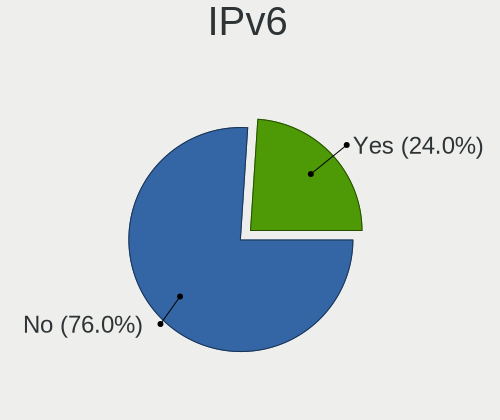

| Used | Computers | Percent |
|------|-----------|---------|
| No   | 838       | 76.04%  |
| Yes  | 264       | 23.96%  |

Bluetooth
---------

Bluetooth Vendor
----------------

Controller vendors

| Vendor                          | Computers | Percent |
|---------------------------------|-----------|---------|
| Intel                           | 300       | 41.84%  |
| Realtek Semiconductor           | 81        | 11.3%   |
| Qualcomm Atheros Communications | 45        | 6.28%   |
| Broadcom                        | 44        | 6.14%   |
| Apple                           | 42        | 5.86%   |
| Cambridge Silicon Radio         | 40        | 5.58%   |
| IMC Networks                    | 38        | 5.3%    |
| Foxconn / Hon Hai               | 27        | 3.77%   |
| Lite-On Technology              | 22        | 3.07%   |
| Hewlett-Packard                 | 14        | 1.95%   |
| MediaTek                        | 13        | 1.81%   |
| Dell                            | 12        | 1.67%   |
| Toshiba                         | 7         | 0.98%   |
| Ralink                          | 7         | 0.98%   |
| ASUSTek Computer                | 7         | 0.98%   |
| TP-Link                         | 6         | 0.84%   |
| Alps Electric                   | 4         | 0.56%   |
| Realtek                         | 1         | 0.14%   |
| Ralink Technology               | 1         | 0.14%   |
| Marvell Semiconductor           | 1         | 0.14%   |
| Foxconn International           | 1         | 0.14%   |
| Edimax Technology               | 1         | 0.14%   |
| Creative Technology             | 1         | 0.14%   |
| Actions                         | 1         | 0.14%   |
| Unknown                         | 1         | 0.14%   |

Bluetooth Model
---------------

Controller models

| Model                                                                               | Computers | Percent |
|-------------------------------------------------------------------------------------|-----------|---------|
| Intel Bluetooth wireless interface                                                  | 121       | 16.88%  |
| Realtek Bluetooth Radio                                                             | 61        | 8.51%   |
| Intel AX201 Bluetooth                                                               | 51        | 7.11%   |
| Cambridge Silicon Radio Bluetooth Dongle (HCI mode)                                 | 40        | 5.58%   |
| Intel AX200 Bluetooth                                                               | 32        | 4.46%   |
| Intel Bluetooth 9460/9560 Jefferson Peak (JfP)                                      | 26        | 3.63%   |
| Qualcomm Atheros  Bluetooth Device                                                  | 21        | 2.93%   |
| IMC Networks Wireless_Device                                                        | 21        | 2.93%   |
| Apple Bluetooth Host Controller                                                     | 17        | 2.37%   |
| Intel AX211 Bluetooth                                                               | 16        | 2.23%   |
| Realtek  Bluetooth 4.2 Adapter                                                      | 12        | 1.67%   |
| MediaTek Wireless_Device                                                            | 12        | 1.67%   |
| Intel Wireless-AC 3168 Bluetooth                                                    | 11        | 1.53%   |
| Apple Bluetooth USB Host Controller                                                 | 11        | 1.53%   |
| Intel Wireless-AC 9260 Bluetooth Adapter                                            | 10        | 1.39%   |
| Intel Centrino Bluetooth Wireless Transceiver                                       | 10        | 1.39%   |
| Intel AX210 Bluetooth                                                               | 10        | 1.39%   |
| IMC Networks Bluetooth Radio                                                        | 10        | 1.39%   |
| Broadcom BCM20702A0 Bluetooth 4.0                                                   | 9         | 1.26%   |
| HP Bluetooth 2.0 Interface [Broadcom BCM2045]                                       | 8         | 1.12%   |
| Broadcom BCM2045B (BDC-2.1)                                                         | 8         | 1.12%   |
| Ralink RT3290 Bluetooth                                                             | 7         | 0.98%   |
| Intel Bluetooth Device                                                              | 7         | 0.98%   |
| Foxconn / Hon Hai Wireless_Device                                                   | 7         | 0.98%   |
| Apple Built-in Bluetooth 2.0+EDR HCI                                                | 7         | 0.98%   |
| Apple Bluetooth HCI                                                                 | 7         | 0.98%   |
| TP-Link TP-Link Bluetooth USB Adapter                                               | 6         | 0.84%   |
| Qualcomm Atheros AR3012 Bluetooth 4.0                                               | 6         | 0.84%   |
| Qualcomm Atheros AR3011 Bluetooth                                                   | 6         | 0.84%   |
| Lite-On Qualcomm Atheros QCA9377 Bluetooth                                          | 6         | 0.84%   |
| Lite-On Atheros AR3012 Bluetooth                                                    | 6         | 0.84%   |
| Intel Centrino Advanced-N 6230 Bluetooth adapter                                    | 6         | 0.84%   |
| HP Broadcom 2070 Bluetooth Combo                                                    | 6         | 0.84%   |
| Dell DW375 Bluetooth Module                                                         | 6         | 0.84%   |
| Realtek 802.11ac WLAN Adapter                                                       | 5         | 0.7%    |
| Foxconn / Hon Hai Bluetooth Device                                                  | 5         | 0.7%    |
| Broadcom BCM2045B (BDC-2.1) [Bluetooth Controller]                                  | 5         | 0.7%    |
| Foxconn / Hon Hai MediaTek Bluetooth Adapter                                        | 4         | 0.56%   |
| Foxconn / Hon Hai Foxconn T77H114 BCM2070 [Single-Chip Bluetooth 2.1 + EDR Adapter] | 4         | 0.56%   |
| Broadcom BCM2070 Bluetooth 2.1 + EDR                                                | 4         | 0.56%   |

Sound
-----

Sound Vendor
------------

Sound card vendors

| Vendor                                       | Computers | Percent |
|----------------------------------------------|-----------|---------|
| Intel                                        | 769       | 53.4%   |
| AMD                                          | 297       | 20.63%  |
| Nvidia                                       | 237       | 16.46%  |
| C-Media Electronics                          | 22        | 1.53%   |
| Creative Labs                                | 13        | 0.9%    |
| Texas Instruments                            | 7         | 0.49%   |
| Logitech                                     | 7         | 0.49%   |
| JMTek                                        | 7         | 0.49%   |
| Realtek Semiconductor                        | 5         | 0.35%   |
| VIA Technologies                             | 4         | 0.28%   |
| GN Netcom                                    | 4         | 0.28%   |
| Focusrite-Novation                           | 4         | 0.28%   |
| Microsoft                                    | 3         | 0.21%   |
| Lenovo                                       | 3         | 0.21%   |
| Generalplus Technology                       | 3         | 0.21%   |
| BEHRINGER International                      | 3         | 0.21%   |
| Tenx Technology                              | 2         | 0.14%   |
| SteelSeries ApS                              | 2         | 0.14%   |
| ROCCAT                                       | 2         | 0.14%   |
| Philips (or NXP)                             | 2         | 0.14%   |
| Kingston Technology                          | 2         | 0.14%   |
| Jieli Technology                             | 2         | 0.14%   |
| Giga-Byte Technology                         | 2         | 0.14%   |
| Dell                                         | 2         | 0.14%   |
| Apple                                        | 2         | 0.14%   |
| Zoran Co. Personal Media Division (Nogatech) | 1         | 0.07%   |
| ULi Electronics                              | 1         | 0.07%   |
| TerraTec Electronic                          | 1         | 0.07%   |
| Sony                                         | 1         | 0.07%   |
| Silicon Integrated Systems [SiS]             | 1         | 0.07%   |
| Shenzhen Riitek Technology                   | 1         | 0.07%   |
| Setek Elektronik                             | 1         | 0.07%   |
| Schiit Audio                                 | 1         | 0.07%   |
| RODE Microphones                             | 1         | 0.07%   |
| Razer USA                                    | 1         | 0.07%   |
| Plantronics                                  | 1         | 0.07%   |
| Nordic Semiconductor ASA                     | 1         | 0.07%   |
| MV-SILICON                                   | 1         | 0.07%   |
| Mark of the Unicorn                          | 1         | 0.07%   |
| M-Audio                                      | 1         | 0.07%   |

Sound Model
-----------

Sound card models

| Model                                                                                             | Computers | Percent |
|---------------------------------------------------------------------------------------------------|-----------|---------|
| AMD Family 17h/19h/1ah HD Audio Controller                                                        | 123       | 7.23%   |
| Intel 7 Series/C216 Chipset Family High Definition Audio Controller                               | 79        | 4.64%   |
| Intel Sunrise Point-LP HD Audio                                                                   | 74        | 4.35%   |
| Intel 6 Series/C200 Series Chipset Family High Definition Audio Controller                        | 69        | 4.05%   |
| AMD Renoir Radeon High Definition Audio Controller                                                | 69        | 4.05%   |
| Intel 8 Series/C220 Series Chipset High Definition Audio Controller                               | 47        | 2.76%   |
| Intel 5 Series/3400 Series Chipset High Definition Audio                                          | 40        | 2.35%   |
| Intel Tiger Lake-LP Smart Sound Technology Audio Controller                                       | 37        | 2.17%   |
| Intel NM10/ICH7 Family High Definition Audio Controller                                           | 34        | 2%      |
| AMD FCH Azalia Controller                                                                         | 34        | 2%      |
| Intel Xeon E3-1200 v3/4th Gen Core Processor HD Audio Controller                                  | 33        | 1.94%   |
| Intel Cannon Lake PCH cAVS                                                                        | 31        | 1.82%   |
| AMD SBx00 Azalia (Intel HDA)                                                                      | 31        | 1.82%   |
| Intel Alder Lake PCH-P High Definition Audio Controller                                           | 28        | 1.65%   |
| Intel 82801I (ICH9 Family) HD Audio Controller                                                    | 28        | 1.65%   |
| Intel 100 Series/C230 Series Chipset Family HD Audio Controller                                   | 27        | 1.59%   |
| Intel Celeron/Pentium Silver Processor High Definition Audio                                      | 24        | 1.41%   |
| Intel 82801H (ICH8 Family) HD Audio Controller                                                    | 24        | 1.41%   |
| AMD Rembrandt Radeon High Definition Audio Controller                                             | 24        | 1.41%   |
| AMD Raven/Raven2/Fenghuang HDMI/DP Audio Controller                                               | 24        | 1.41%   |
| Intel Haswell-ULT HD Audio Controller                                                             | 19        | 1.12%   |
| Intel 8 Series HD Audio Controller                                                                | 19        | 1.12%   |
| AMD Starship/Matisse HD Audio Controller                                                          | 19        | 1.12%   |
| AMD Kabini HDMI/DP Audio                                                                          | 19        | 1.12%   |
| Nvidia GP107GL High Definition Audio Controller                                                   | 18        | 1.06%   |
| AMD Family 17h (Models 00h-0fh) HD Audio Controller                                               | 18        | 1.06%   |
| Nvidia GF108 High Definition Audio Controller                                                     | 17        | 1%      |
| Intel 200 Series PCH HD Audio                                                                     | 15        | 0.88%   |
| AMD Ellesmere HDMI Audio [Radeon RX 470/480 / 570/580/590]                                        | 15        | 0.88%   |
| Intel Wildcat Point-LP High Definition Audio Controller                                           | 14        | 0.82%   |
| Intel Broadwell-U Audio Controller                                                                | 14        | 0.82%   |
| Nvidia TU107 GeForce GTX 1650 High Definition Audio Controller                                    | 13        | 0.76%   |
| Intel Cannon Point-LP High Definition Audio Controller                                            | 13        | 0.76%   |
| Intel Atom/Celeron/Pentium Processor x5-E8000/J3xxx/N3xxx Series High Definition Audio Controller | 13        | 0.76%   |
| AMD Oland/Hainan/Cape Verde/Pitcairn HDMI Audio [Radeon HD 7000 Series]                           | 13        | 0.76%   |
| AMD Family 15h (Models 60h-6fh) Audio Controller                                                  | 13        | 0.76%   |
| Nvidia TU106 High Definition Audio Controller                                                     | 12        | 0.71%   |
| Nvidia GK208 HDMI/DP Audio Controller                                                             | 12        | 0.71%   |
| Intel Comet Lake PCH cAVS                                                                         | 12        | 0.71%   |
| Intel Comet Lake PCH-LP cAVS                                                                      | 11        | 0.65%   |

Memory
------

Memory Vendor
-------------

Memory module vendors

| Vendor                                  | Computers | Percent |
|-----------------------------------------|-----------|---------|
| Samsung Electronics                     | 258       | 20.14%  |
| SK hynix                                | 228       | 17.8%   |
| Unknown                                 | 153       | 11.94%  |
| Kingston                                | 122       | 9.52%   |
| Micron Technology                       | 114       | 8.9%    |
| Crucial                                 | 80        | 6.25%   |
| Corsair                                 | 62        | 4.84%   |
| G.Skill                                 | 37        | 2.89%   |
| Ramaxel Technology                      | 28        | 2.19%   |
| A-DATA Technology                       | 28        | 2.19%   |
| Elpida                                  | 23        | 1.8%    |
| Unknown                                 | 23        | 1.8%    |
| Unknown (ABCD)                          | 20        | 1.56%   |
| Nanya Technology                        | 18        | 1.41%   |
| Team                                    | 9         | 0.7%    |
| Transcend                               | 8         | 0.62%   |
| Smart                                   | 8         | 0.62%   |
| Patriot                                 | 8         | 0.62%   |
| Apacer                                  | 4         | 0.31%   |
| Unifosa                                 | 3         | 0.23%   |
| CSX                                     | 3         | 0.23%   |
| Teikon                                  | 2         | 0.16%   |
| Qimonda                                 | 2         | 0.16%   |
| PNY                                     | 2         | 0.16%   |
| Lexar Co Limited                        | 2         | 0.16%   |
| Avant                                   | 2         | 0.16%   |
| 48spaces                                | 2         | 0.16%   |
| Wilk                                    | 1         | 0.08%   |
| V-GeN                                   | 1         | 0.08%   |
| Unknown (F301)                          | 1         | 0.08%   |
| Unknown (AB)                            | 1         | 0.08%   |
| Unknown (0x0E9D)                        | 1         | 0.08%   |
| Unknown (0x0CAB)                        | 1         | 0.08%   |
| Unknown (0x0B45)                        | 1         | 0.08%   |
| TRS STAR                                | 1         | 0.08%   |
| Timetec                                 | 1         | 0.08%   |
| Silicon Power Computer & Communications | 1         | 0.08%   |
| Shenzhen Longsys                        | 1         | 0.08%   |
| RZX                                     | 1         | 0.08%   |
| Qumo                                    | 1         | 0.08%   |

Memory Model
------------

Memory module models

| Model                                                            | Computers | Percent |
|------------------------------------------------------------------|-----------|---------|
| Unknown                                                          | 23        | 1.68%   |
| Unknown (ABCD) RAM 123456789012345678 2GB SODIMM LPDDR3 2400MT/s | 15        | 1.09%   |
| SK hynix RAM HMA81GS6AFR8N-UH 8GB SODIMM DDR4 2667MT/s           | 15        | 1.09%   |
| SK hynix RAM HMAA1GS6CJR6N-XN 8GB SODIMM DDR4 3200MT/s           | 13        | 0.95%   |
| Samsung RAM M471B5273DH0-CH9 4GB SODIMM DDR3 1334MT/s            | 12        | 0.87%   |
| Samsung RAM M471B5273CH0-CH9 4GB SODIMM DDR3 1334MT/s            | 11        | 0.8%    |
| Samsung RAM M471A1K43EB1-CWE 8GB SODIMM DDR4 3200MT/s            | 10        | 0.73%   |
| Unknown RAM Module 2GB SODIMM DDR3 1333MT/s                      | 9         | 0.66%   |
| Samsung RAM M471B5173DB0-YK0 4GB SODIMM DDR3 1600MT/s            | 9         | 0.66%   |
| Samsung RAM M471A1G44BB0-CWE 8GB SODIMM DDR4 3200MT/s            | 9         | 0.66%   |
| Samsung RAM M471A1G44AB0-CWE 8GB SODIMM DDR4 3200MT/s            | 9         | 0.66%   |
| Corsair RAM CMK16GX4M2B3200C16 8GB DIMM DDR4 3600MT/s            | 9         | 0.66%   |
| Samsung RAM M471A1K43CB1-CRC 8GB SODIMM DDR4 2667MT/s            | 8         | 0.58%   |
| Unknown RAM Module 4GB SODIMM DDR3                               | 7         | 0.51%   |
| SK hynix RAM HMT41GS6BFR8A-PB 8GB SODIMM DDR3 1600MT/s           | 7         | 0.51%   |
| SK hynix RAM HMAA1GS6CJR6N-XN 8GB Row Of Chips DDR4 3200MT/s     | 7         | 0.51%   |
| SK hynix RAM HMA81GS6DJR8N-XN 8GB SODIMM DDR4 3200MT/s           | 7         | 0.51%   |
| Samsung RAM M471A5244CB0-CTD 4GB SODIMM DDR4 3266MT/s            | 7         | 0.51%   |
| Micron RAM 16KTF51264HZ-1G6M1 4GB SODIMM DDR3 1600MT/s           | 7         | 0.51%   |
| SK hynix RAM HMT351S6CFR8C-PB 4GB SODIMM DDR3 1600MT/s           | 6         | 0.44%   |
| Samsung RAM M471B5173QH0-YK0 4GB SODIMM DDR3 1600MT/s            | 6         | 0.44%   |
| Samsung RAM M471B1G73DB0-YK0 8GB SODIMM DDR3 1600MT/s            | 6         | 0.44%   |
| Samsung RAM M471A5244CB0-CWE 4096MB SODIMM DDR4 3200MT/s         | 6         | 0.44%   |
| Crucial RAM CT102464BF160B.C16 8GB SODIMM DDR3 1600MT/s          | 6         | 0.44%   |
| Unknown RAM Module 2GB SODIMM DDR2 667MT/s                       | 5         | 0.36%   |
| Unknown (ABCD) RAM 123456789012345678 2GB DIMM DDR3 2400MT/s     | 5         | 0.36%   |
| SK hynix RAM HMA81GS6JJR8N-VK 8GB SODIMM DDR4 2667MT/s           | 5         | 0.36%   |
| SK hynix RAM HMA41GS6AFR8N-TF 8GB SODIMM DDR4 2667MT/s           | 5         | 0.36%   |
| Samsung RAM M471B5773DH0-CH9 2GB SODIMM DDR3 1600MT/s            | 5         | 0.36%   |
| Samsung RAM M471B5273DH0-CK0 4GB SODIMM DDR3 2400MT/s            | 5         | 0.36%   |
| Samsung RAM M471B1G73EB0-YK0 8GB SODIMM DDR3 1600MT/s            | 5         | 0.36%   |
| Micron RAM 8KTF51264HZ-1G6E1 4GB SODIMM DDR3 1600MT/s            | 5         | 0.36%   |
| Elpida RAM EBJ41UF8BCS0-DJ-F 4GB SODIMM DDR3 1334MT/s            | 5         | 0.36%   |
| Unknown RAM Module 8GB DIMM DDR3 1600MT/s                        | 4         | 0.29%   |
| Unknown RAM Module 2GB DIMM DDR3 1333MT/s                        | 4         | 0.29%   |
| SK hynix RAM HMT451S6BFR8A-PB 4GB SODIMM DDR3 1600MT/s           | 4         | 0.29%   |
| SK hynix RAM HMA82GS6AFR8N-UH 16GB SODIMM DDR4 2667MT/s          | 4         | 0.29%   |
| Samsung RAM M471B5173BH0-CK0 4GB SODIMM DDR3 1600MT/s            | 4         | 0.29%   |
| Samsung RAM M471B1G73QH0-YK0 8GB SODIMM DDR3 1600MT/s            | 4         | 0.29%   |
| Samsung RAM M471A1K43DB1-CWE 8GB SODIMM DDR4 3200MT/s            | 4         | 0.29%   |

Memory Kind
-----------

Memory module kinds

| Kind    | Computers | Percent |
|---------|-----------|---------|
| DDR4    | 424       | 38.27%  |
| DDR3    | 413       | 37.27%  |
| DDR2    | 76        | 6.86%   |
| LPDDR4  | 42        | 3.79%   |
| SDRAM   | 38        | 3.43%   |
| DDR5    | 32        | 2.89%   |
| Unknown | 26        | 2.35%   |
| DDR     | 19        | 1.71%   |
| LPDDR5  | 17        | 1.53%   |
| LPDDR3  | 17        | 1.53%   |
| DRAM    | 4         | 0.36%   |

Memory Form Factor
------------------

Physical design of the memory module

| Name         | Computers | Percent |
|--------------|-----------|---------|
| SODIMM       | 706       | 64.24%  |
| DIMM         | 313       | 28.48%  |
| Row Of Chips | 61        | 5.55%   |
| Chip         | 8         | 0.73%   |
| Unknown      | 8         | 0.73%   |
| FB-DIMM      | 3         | 0.27%   |

Memory Size
-----------

Memory module size

| Size  | Computers | Percent |
|-------|-----------|---------|
| 8192  | 403       | 33.89%  |
| 4096  | 339       | 28.51%  |
| 2048  | 185       | 15.56%  |
| 16384 | 155       | 13.04%  |
| 1024  | 64        | 5.38%   |
| 32768 | 34        | 2.86%   |
| 512   | 7         | 0.59%   |
| 49152 | 1         | 0.08%   |
| 256   | 1         | 0.08%   |

Memory Speed
------------

Memory module speed

| Speed   | Computers | Percent |
|---------|-----------|---------|
| 1600    | 239       | 19.92%  |
| 3200    | 184       | 15.33%  |
| 2667    | 123       | 10.25%  |
| 1333    | 100       | 8.33%   |
| 2400    | 81        | 6.75%   |
| 1334    | 50        | 4.17%   |
| 667     | 45        | 3.75%   |
| Unknown | 39        | 3.25%   |
| 2133    | 34        | 2.83%   |
| 800     | 32        | 2.67%   |
| 1067    | 28        | 2.33%   |
| 3600    | 24        | 2%      |
| 1867    | 17        | 1.42%   |
| 4800    | 13        | 1.08%   |
| 4267    | 12        | 1%      |
| 1800    | 11        | 0.92%   |
| 6400    | 10        | 0.83%   |
| 533     | 10        | 0.83%   |
| 4199    | 9         | 0.75%   |
| 3000    | 9         | 0.75%   |
| 2048    | 9         | 0.75%   |
| 6000    | 8         | 0.67%   |
| 3266    | 8         | 0.67%   |
| 2933    | 8         | 0.67%   |
| 5600    | 7         | 0.58%   |
| 3733    | 6         | 0.5%    |
| 1066    | 6         | 0.5%    |
| 975     | 6         | 0.5%    |
| 1866    | 5         | 0.42%   |
| 1639    | 5         | 0.42%   |
| 400     | 5         | 0.42%   |
| 3800    | 4         | 0.33%   |
| 2666    | 4         | 0.33%   |
| 333     | 4         | 0.33%   |
| 4000    | 3         | 0.25%   |
| 3466    | 3         | 0.25%   |
| 49926   | 2         | 0.17%   |
| 8400    | 2         | 0.17%   |
| 7500    | 2         | 0.17%   |
| 7467    | 2         | 0.17%   |

Printers & scanners
-------------------

Printer Vendor
--------------

Printer device vendors

| Vendor                | Computers | Percent |
|-----------------------|-----------|---------|
| Hewlett-Packard       | 7         | 26.92%  |
| Canon                 | 7         | 26.92%  |
| Brother Industries    | 7         | 26.92%  |
| Seiko Epson           | 1         | 3.85%   |
| Samsung Electronics   | 1         | 3.85%   |
| Lexmark International | 1         | 3.85%   |
| Konica Minolta        | 1         | 3.85%   |
| Dymo-CoStar           | 1         | 3.85%   |

Printer Model
-------------

Printer device models

| Model                              | Computers | Percent |
|------------------------------------|-----------|---------|
| Canon MF641C                       | 2         | 7.69%   |
| Brother DCP-L2540DW                | 2         | 7.69%   |
| Seiko Epson L382 Series            | 1         | 3.85%   |
| Samsung ML-1610 Mono Laser Printer | 1         | 3.85%   |
| Lexmark International CS417dn      | 1         | 3.85%   |
| Konica Minolta KONICA MINOLTA 206  | 1         | 3.85%   |
| HP LaserJet P2055 series           | 1         | 3.85%   |
| HP LaserJet P1006                  | 1         | 3.85%   |
| HP LaserJet M101-M106              | 1         | 3.85%   |
| HP LaserJet 1022                   | 1         | 3.85%   |
| HP ENVY 4500 series                | 1         | 3.85%   |
| HP Deskjet 3510 series             | 1         | 3.85%   |
| HP Deskjet 1510                    | 1         | 3.85%   |
| Dymo-CoStar LabelWriter 450        | 1         | 3.85%   |
| Canon PIXMA MG5600 Series          | 1         | 3.85%   |
| Canon PIXMA MG2500 Series          | 1         | 3.85%   |
| Canon PIXMA iP4000                 | 1         | 3.85%   |
| Canon MG5700 series                | 1         | 3.85%   |
| Canon LiDE 400                     | 1         | 3.85%   |
| Brother Printer                    | 1         | 3.85%   |
| Brother MFC-7340                   | 1         | 3.85%   |
| Brother HL-L2350DW series          | 1         | 3.85%   |
| Brother HL-52x0 series             | 1         | 3.85%   |
| Brother HL-2150N series            | 1         | 3.85%   |

Scanner Vendor
--------------

Scanner device vendors

| Vendor         | Computers | Percent |
|----------------|-----------|---------|
| Canon          | 9         | 81.82%  |
| Seiko Epson    | 1         | 9.09%   |
| Mustek Systems | 1         | 9.09%   |

Scanner Model
-------------

Scanner device models

| Model                                 | Computers | Percent |
|---------------------------------------|-----------|---------|
| Canon CanoScan N670U/N676U/LiDE 20    | 2         | 18.18%  |
| Canon CanoScan LiDE 700F              | 2         | 18.18%  |
| Canon CanoScan LiDE 210               | 2         | 18.18%  |
| Seiko Epson GT-X770 [Perfection V500] | 1         | 9.09%   |
| Mustek Systems BearPaw 1200 CU Plus   | 1         | 9.09%   |
| Canon CanoScan N1240U/LiDE 30         | 1         | 9.09%   |
| Canon CanoScan LIDE 25                | 1         | 9.09%   |
| Canon CanoScan 8800F                  | 1         | 9.09%   |

Camera
------

Camera Vendor
-------------

Camera device vendors

| Vendor                                 | Computers | Percent |
|----------------------------------------|-----------|---------|
| Chicony Electronics                    | 136       | 20.21%  |
| Microdia                               | 52        | 7.73%   |
| IMC Networks                           | 52        | 7.73%   |
| Realtek Semiconductor                  | 47        | 6.98%   |
| Bison Electronics                      | 39        | 5.79%   |
| Sunplus Innovation Technology          | 36        | 5.35%   |
| Quanta                                 | 35        | 5.2%    |
| Cheng Uei Precision Industry (Foxlink) | 33        | 4.9%    |
| Apple                                  | 31        | 4.61%   |
| Logitech                               | 30        | 4.46%   |
| Suyin                                  | 21        | 3.12%   |
| Luxvisions Innotech Limited            | 18        | 2.67%   |
| Lite-On Technology                     | 18        | 2.67%   |
| Lenovo                                 | 12        | 1.78%   |
| Alcor Micro                            | 12        | 1.78%   |
| Acer                                   | 11        | 1.63%   |
| Microsoft                              | 10        | 1.49%   |
| Syntek                                 | 9         | 1.34%   |
| Silicon Motion                         | 8         | 1.19%   |
| Ricoh                                  | 8         | 1.19%   |
| Sonix Technology                       | 7         | 1.04%   |
| Z-Star Microelectronics                | 5         | 0.74%   |
| Importek                               | 5         | 0.74%   |
| icSpring                               | 3         | 0.45%   |
| Generalplus Technology                 | 3         | 0.45%   |
| GEMBIRD                                | 3         | 0.45%   |
| Samsung Electronics                    | 2         | 0.3%    |
| Intel                                  | 2         | 0.3%    |
| Hewlett-Packard                        | 2         | 0.3%    |
| Cubeternet                             | 2         | 0.3%    |
| Y Media                                | 1         | 0.15%   |
| Xiongmai                               | 1         | 0.15%   |
| WaveRider Communications               | 1         | 0.15%   |
| Trust                                  | 1         | 0.15%   |
| SunplusIT                              | 1         | 0.15%   |
| Sunplus Technology                     | 1         | 0.15%   |
| ShineTech                              | 1         | 0.15%   |
| Shenzhen Kingcome Optoelectronic       | 1         | 0.15%   |
| Primax Electronics                     | 1         | 0.15%   |
| Pixart Imaging                         | 1         | 0.15%   |

Camera Model
------------

Camera device models

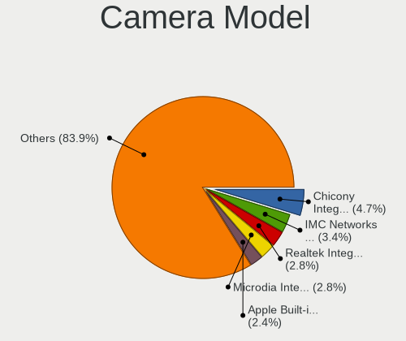

| Model                                                | Computers | Percent |
|------------------------------------------------------|-----------|---------|
| Chicony Integrated Camera                            | 32        | 4.74%   |
| IMC Networks USB2.0 HD UVC WebCam                    | 23        | 3.41%   |
| Realtek Integrated_Webcam_HD                         | 19        | 2.81%   |
| Microdia Integrated_Webcam_HD                        | 19        | 2.81%   |
| Apple Built-in iSight                                | 16        | 2.37%   |
| IMC Networks Integrated Camera                       | 10        | 1.48%   |
| Chicony HD WebCam                                    | 10        | 1.48%   |
| Lite-On Integrated Camera                            | 9         | 1.33%   |
| Sunplus Integrated_Webcam_HD                         | 8         | 1.19%   |
| Bison Integrated Camera                              | 8         | 1.19%   |
| Apple FaceTime HD Camera (Built-in)                  | 8         | 1.19%   |
| Logitech Webcam C270                                 | 7         | 1.04%   |
| Chicony TOSHIBA Web Camera - HD                      | 7         | 1.04%   |
| Quanta HD User Facing                                | 6         | 0.89%   |
| Luxvisions Innotech Limited Integrated Camera        | 6         | 0.89%   |
| Lenovo Integrated Webcam [R5U877]                    | 6         | 0.89%   |
| Chicony HP TrueVision HD Camera                      | 6         | 0.89%   |
| Cheng Uei Precision Industry (Foxlink) HP HD Camera  | 6         | 0.89%   |
| Suyin HP TrueVision HD Integrated Webcam             | 5         | 0.74%   |
| Quanta HP TrueVision HD Camera                       | 5         | 0.74%   |
| Microsoft LifeCam HD-3000                            | 5         | 0.74%   |
| Microdia USB 2.0 Camera                              | 5         | 0.74%   |
| Luxvisions Innotech Limited HP TrueVision HD Camera  | 5         | 0.74%   |
| Logitech Webcam C930e                                | 5         | 0.74%   |
| Importek TOSHIBA Web Camera - HD                     | 5         | 0.74%   |
| IMC Networks USB2.0 VGA UVC WebCam                   | 5         | 0.74%   |
| Chicony HP Truevision HD                             | 5         | 0.74%   |
| Chicony HD User Facing                               | 5         | 0.74%   |
| Cheng Uei Precision Industry (Foxlink) HP Webcam     | 5         | 0.74%   |
| Syntek Integrated Camera                             | 4         | 0.59%   |
| Sunplus HD WebCam                                    | 4         | 0.59%   |
| Sunplus Asus Webcam                                  | 4         | 0.59%   |
| Realtek USB2.0 HD UVC WebCam                         | 4         | 0.59%   |
| Microdia Integrated_Webcam_FHD                       | 4         | 0.59%   |
| Microdia Integrated Webcam                           | 4         | 0.59%   |
| Luxvisions Innotech Limited HP Wide Vision HD Camera | 4         | 0.59%   |
| Lenovo Integrated Webcam                             | 4         | 0.59%   |
| Chicony VGA Webcam                                   | 4         | 0.59%   |
| Chicony USB2.0 HD UVC WebCam                         | 4         | 0.59%   |
| Chicony USB 2.0 Camera                               | 4         | 0.59%   |

Security
--------

Fingerprint Vendor
------------------

Fingerprint sensor vendors

| Vendor                             | Computers | Percent |
|------------------------------------|-----------|---------|
| Validity Sensors                   | 43        | 34.4%   |
| Synaptics                          | 24        | 19.2%   |
| Shenzhen Goodix Technology         | 15        | 12%     |
| Upek                               | 12        | 9.6%    |
| Elan Microelectronics              | 11        | 8.8%    |
| AuthenTec                          | 10        | 8%      |
| LighTuning Technology              | 4         | 3.2%    |
| STMicroelectronics                 | 3         | 2.4%    |
| Realtek USB2.0 Finger Print Bridge | 1         | 0.8%    |
| Microsoft                          | 1         | 0.8%    |
| Focal-systems.Corp                 | 1         | 0.8%    |

Fingerprint Model
-----------------

Fingerprint sensor models

| Model                                                           | Computers | Percent |
|-----------------------------------------------------------------|-----------|---------|
| Validity Sensors VFS495 Fingerprint Reader                      | 10        | 8%      |
| Upek Biometric Touchchip/Touchstrip Fingerprint Sensor          | 10        | 8%      |
| Shenzhen Goodix  Fingerprint Device                             | 10        | 8%      |
| Validity Sensors VFS 5011 fingerprint sensor                    | 6         | 4.8%    |
| Synaptics Metallica MIS Touch Fingerprint Reader                | 6         | 4.8%    |
| Elan ELAN:Fingerprint                                           | 6         | 4.8%    |
| Validity Sensors VFS5011 Fingerprint Reader                     | 5         | 4%      |
| Validity Sensors Synaptics WBDI                                 | 5         | 4%      |
| AuthenTec AES2501 Fingerprint Sensor                            | 5         | 4%      |
| Validity Sensors Fingerprint scanner                            | 4         | 3.2%    |
| Synaptics Prometheus MIS Touch Fingerprint Reader               | 4         | 3.2%    |
| Shenzhen Goodix Fingerprint Reader                              | 4         | 3.2%    |
| Elan ELAN:ARM-M4                                                | 4         | 3.2%    |
| AuthenTec AES2810                                               | 4         | 3.2%    |
| Validity Sensors VFS471 Fingerprint Reader                      | 3         | 2.4%    |
| Synaptics UWP WBDI Device                                       | 3         | 2.4%    |
| STMicroelectronics Fingerprint Reader                           | 3         | 2.4%    |
| Validity Sensors VFS7500 Touch Fingerprint Sensor               | 2         | 1.6%    |
| Validity Sensors VFS451 Fingerprint Reader                      | 2         | 1.6%    |
| Validity Sensors VFS Fingerprint sensor                         | 2         | 1.6%    |
| Validity Sensors Swipe Fingerprint Sensor                       | 2         | 1.6%    |
| Upek TCS5B Fingerprint sensor                                   | 2         | 1.6%    |
| Synaptics WBDI Fingerprint Reader USB 102                       | 2         | 1.6%    |
| Synaptics Metallica MOH Touch Fingerprint Reader                | 2         | 1.6%    |
| Synaptics FS7604 Touch Fingerprint Sensor with PurePrint        | 2         | 1.6%    |
| Synaptics Fingerprint reader [HP G6]                            | 2         | 1.6%    |
| LighTuning EgisTec Touch Fingerprint Sensor                     | 2         | 1.6%    |
| Validity Sensors VFS491                                         | 1         | 0.8%    |
| Validity Sensors VFS300 Fingerprint Reader                      | 1         | 0.8%    |
| Synaptics UWP WBDI                                              | 1         | 0.8%    |
| Synaptics  WBDI                                                 | 1         | 0.8%    |
| Shenzhen Goodix FingerPrint                                     | 1         | 0.8%    |
| Realtek USB2.0 Finger Print Bridge FocalTech Fingerprint Device | 1         | 0.8%    |
| Microsoft Fingerprint Reader                                    | 1         | 0.8%    |
| LighTuning Fingerprint Sensor                                   | 1         | 0.8%    |
| LighTuning Fingerprint Reader                                   | 1         | 0.8%    |
| Focal-systems.Corp FT9201Fingerprint.                       | 1         | 0.8%    |
| Elan WBF Fingerprint Sensor                                     | 1         | 0.8%    |
| AuthenTec AES1660 Fingerprint Sensor                            | 1         | 0.8%    |
| Unknown                                                         | 1         | 0.8%    |

Chipcard Vendor
---------------

Chipcard module vendors

| Vendor                | Computers | Percent |
|-----------------------|-----------|---------|
| Broadcom              | 23        | 45.1%   |
| Alcor Micro           | 16        | 31.37%  |
| O2 Micro              | 5         | 9.8%    |
| Lenovo                | 4         | 7.84%   |
| Advanced Card Systems | 2         | 3.92%   |
| Chicony Electronics   | 1         | 1.96%   |

Chipcard Model
--------------

Chipcard module models

| Model                                                                        | Computers | Percent |
|------------------------------------------------------------------------------|-----------|---------|
| Alcor Micro AU9540 Smartcard Reader                                          | 16        | 31.37%  |
| Broadcom 58200                                                               | 8         | 15.69%  |
| Broadcom 5880                                                                | 7         | 13.73%  |
| Lenovo Integrated Smart Card Reader                                          | 4         | 7.84%   |
| Broadcom BCM5880 Secure Applications Processor with fingerprint swipe sensor | 4         | 7.84%   |
| Broadcom BCM5880 Secure Applications Processor                               | 4         | 7.84%   |
| O2 Micro Oz776 SmartCard Reader                                              | 3         | 5.88%   |
| O2 Micro OZ776 CCID Smartcard Reader                                         | 2         | 3.92%   |
| Chicony Electronics HP Skylab USB Smartcard Keyboard                         | 1         | 1.96%   |
| Advanced Card Systems ACR38 SmartCard Reader                                 | 1         | 1.96%   |
| Advanced Card Systems ACR122U                                                | 1         | 1.96%   |

Unsupported
-----------

Unsupported Devices
-------------------

Total unsupported devices on board

| Total | Computers | Percent |
|-------|-----------|---------|
| 0     | 724       | 65.4%   |
| 1     | 289       | 26.11%  |
| 2     | 77        | 6.96%   |
| 3     | 16        | 1.45%   |
| 4     | 1         | 0.09%   |

Unsupported Device Types
------------------------

Types of unsupported devices

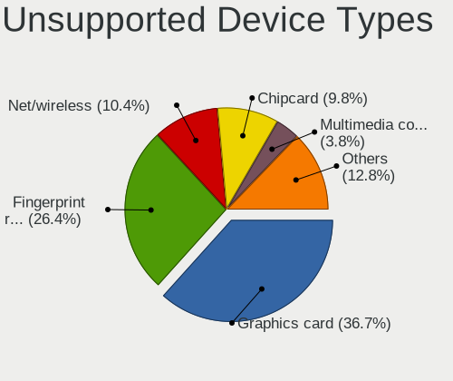

| Type                     | Computers | Percent |
|--------------------------|-----------|---------|
| Graphics card            | 172       | 36.67%  |
| Fingerprint reader       | 124       | 26.44%  |
| Net/wireless             | 49        | 10.45%  |
| Chipcard                 | 46        | 9.81%   |
| Multimedia controller    | 18        | 3.84%   |
| Camera                   | 14        | 2.99%   |
| Communication controller | 12        | 2.56%   |
| Bluetooth                | 9         | 1.92%   |
| Storage                  | 5         | 1.07%   |
| Unassigned class         | 4         | 0.85%   |
| Card reader              | 4         | 0.85%   |
| Network                  | 3         | 0.64%   |
| Sound                    | 2         | 0.43%   |
| Net/ethernet             | 2         | 0.43%   |
| Flash memory             | 2         | 0.43%   |
| Wireless                 | 1         | 0.21%   |
| Storage/raid             | 1         | 0.21%   |
| Dvb card                 | 1         | 0.21%   |

