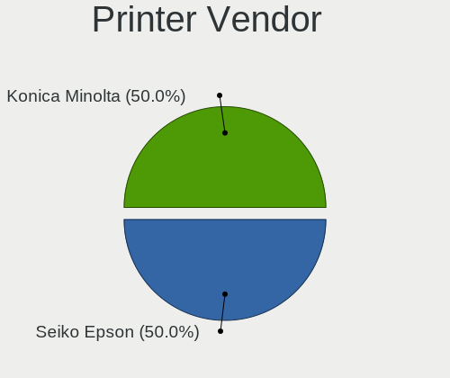
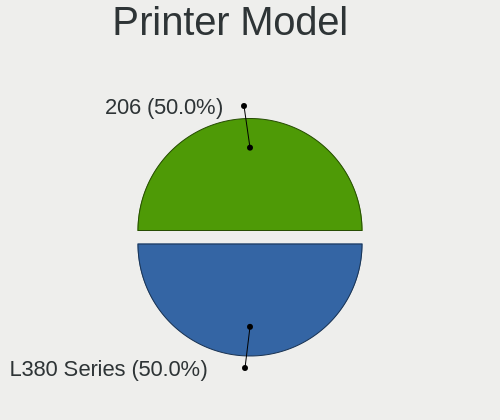
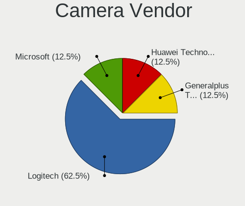
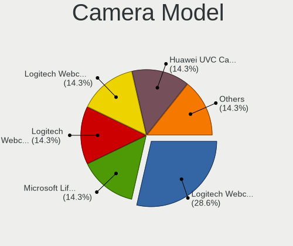
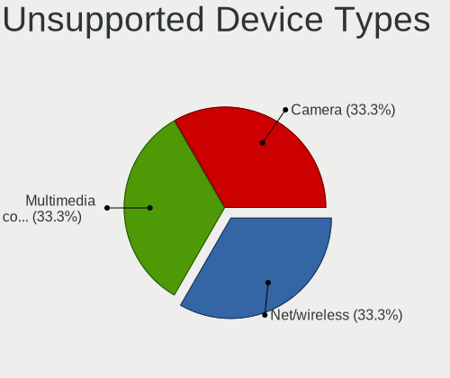

MX 19 - Tested Hardware & Statistics (Desktops)
-----------------------------------------------

A project to collect tested hardware configurations for MX 19.

Anyone can contribute to this report by the [hw-probe](https://github.com/linuxhw/hw-probe) tool:

    sudo -E hw-probe -all -upload

Please contribute! Especially if your hardware is rare.

Contents
--------

* [ Test Cases ](#test-cases)

* [ System ](#system)
  - [ Kernel                   ](#kernel)
  - [ Kernel Family            ](#kernel-family)
  - [ Kernel Major Ver.        ](#kernel-major-ver)
  - [ Arch                     ](#arch)
  - [ DE                       ](#de)
  - [ Display Server           ](#display-server)
  - [ Display Manager          ](#display-manager)
  - [ OS Lang                  ](#os-lang)
  - [ Boot Mode                ](#boot-mode)
  - [ Filesystem               ](#filesystem)
  - [ Part. scheme             ](#part-scheme)
  - [ Dual Boot with Linux/BSD ](#dual-boot-with-linuxbsd)
  - [ Dual Boot (Win)          ](#dual-boot-win)

* [ Board ](#board)
  - [ Vendor                   ](#vendor)
  - [ Model                    ](#model)
  - [ Model Family             ](#model-family)
  - [ MFG Year                 ](#mfg-year)
  - [ Form Factor              ](#form-factor)
  - [ Secure Boot              ](#secure-boot)
  - [ Coreboot                 ](#coreboot)
  - [ RAM Size                 ](#ram-size)
  - [ RAM Used                 ](#ram-used)
  - [ Total Drives             ](#total-drives)
  - [ Has CD-ROM               ](#has-cd-rom)
  - [ Has Ethernet             ](#has-ethernet)
  - [ Has WiFi                 ](#has-wifi)
  - [ Has Bluetooth            ](#has-bluetooth)

* [ Location ](#location)
  - [ Country                  ](#country)
  - [ City                     ](#city)

* [ Drives ](#drives)
  - [ Drive Vendor             ](#drive-vendor)
  - [ Drive Model              ](#drive-model)
  - [ HDD Vendor               ](#hdd-vendor)
  - [ SSD Vendor               ](#ssd-vendor)
  - [ Drive Kind               ](#drive-kind)
  - [ Drive Connector          ](#drive-connector)
  - [ Drive Size               ](#drive-size)
  - [ Space Total              ](#space-total)
  - [ Space Used               ](#space-used)
  - [ Malfunc. Drives          ](#malfunc-drives)
  - [ Malfunc. Drive Vendor    ](#malfunc-drive-vendor)
  - [ Malfunc. HDD Vendor      ](#malfunc-hdd-vendor)
  - [ Malfunc. Drive Kind      ](#malfunc-drive-kind)
  - [ Failed Drives            ](#failed-drives)
  - [ Failed Drive Vendor      ](#failed-drive-vendor)
  - [ Drive Status             ](#drive-status)

* [ Storage controller ](#storage-controller)
  - [ Storage Vendor           ](#storage-vendor)
  - [ Storage Model            ](#storage-model)
  - [ Storage Kind             ](#storage-kind)

* [ Processor ](#processor)
  - [ CPU Vendor               ](#cpu-vendor)
  - [ CPU Model                ](#cpu-model)
  - [ CPU Model Family         ](#cpu-model-family)
  - [ CPU Cores                ](#cpu-cores)
  - [ CPU Sockets              ](#cpu-sockets)
  - [ CPU Threads              ](#cpu-threads)
  - [ CPU Op-Modes             ](#cpu-op-modes)
  - [ CPU Microcode            ](#cpu-microcode)
  - [ CPU Microarch            ](#cpu-microarch)

* [ Graphics ](#graphics)
  - [ GPU Vendor               ](#gpu-vendor)
  - [ GPU Model                ](#gpu-model)
  - [ GPU Combo                ](#gpu-combo)
  - [ GPU Driver               ](#gpu-driver)
  - [ GPU Memory               ](#gpu-memory)

* [ Monitor ](#monitor)
  - [ Monitor Vendor           ](#monitor-vendor)
  - [ Monitor Model            ](#monitor-model)
  - [ Monitor Resolution       ](#monitor-resolution)
  - [ Monitor Diagonal         ](#monitor-diagonal)
  - [ Monitor Width            ](#monitor-width)
  - [ Aspect Ratio             ](#aspect-ratio)
  - [ Monitor Area             ](#monitor-area)
  - [ Pixel Density            ](#pixel-density)
  - [ Multiple Monitors        ](#multiple-monitors)

* [ Network ](#network)
  - [ Net Controller Vendor    ](#net-controller-vendor)
  - [ Net Controller Model     ](#net-controller-model)
  - [ Wireless Vendor          ](#wireless-vendor)
  - [ Wireless Model           ](#wireless-model)
  - [ Ethernet Vendor          ](#ethernet-vendor)
  - [ Ethernet Model           ](#ethernet-model)
  - [ Net Controller Kind      ](#net-controller-kind)
  - [ Used Controller          ](#used-controller)
  - [ NICs                     ](#nics)
  - [ IPv6                     ](#ipv6)

* [ Bluetooth ](#bluetooth)
  - [ Bluetooth Vendor         ](#bluetooth-vendor)
  - [ Bluetooth Model          ](#bluetooth-model)

* [ Sound ](#sound)
  - [ Sound Vendor             ](#sound-vendor)
  - [ Sound Model              ](#sound-model)

* [ Memory ](#memory)
  - [ Memory Vendor            ](#memory-vendor)
  - [ Memory Model             ](#memory-model)
  - [ Memory Kind              ](#memory-kind)
  - [ Memory Form Factor       ](#memory-form-factor)
  - [ Memory Size              ](#memory-size)
  - [ Memory Speed             ](#memory-speed)

* [ Printers & scanners ](#printers--scanners)
  - [ Printer Vendor           ](#printer-vendor)
  - [ Printer Model            ](#printer-model)
  - [ Scanner Vendor           ](#scanner-vendor)
  - [ Scanner Model            ](#scanner-model)

* [ Camera ](#camera)
  - [ Camera Vendor            ](#camera-vendor)
  - [ Camera Model             ](#camera-model)

* [ Security ](#security)
  - [ Fingerprint Vendor       ](#fingerprint-vendor)
  - [ Fingerprint Model        ](#fingerprint-model)
  - [ Chipcard Vendor          ](#chipcard-vendor)
  - [ Chipcard Model           ](#chipcard-model)

* [ Unsupported ](#unsupported)
  - [ Unsupported Devices      ](#unsupported-devices)
  - [ Unsupported Device Types ](#unsupported-device-types)

Test Cases
----------

Total: 62

| Vendor        | Model                    | Probe                                                      | Date         |
|---------------|--------------------------|------------------------------------------------------------|--------------|
| ASUSTek       | M4A785-M                 | [03878be4ec](https://linux-hardware.org/?probe=03878be4ec) | Apr 20, 2022 |
| ASRock        | FM2A68M-HD+ R2.0         | [d0ba3786b2](https://linux-hardware.org/?probe=d0ba3786b2) | Feb 03, 2022 |
| Intel         | H81                      | [c1763fe2cf](https://linux-hardware.org/?probe=c1763fe2cf) | Jan 29, 2022 |
| ECS           | A55F-M3                  | [5439a8e37c](https://linux-hardware.org/?probe=5439a8e37c) | Nov 27, 2021 |
| MSI           | B460M PRO                | [ae3e01fef8](https://linux-hardware.org/?probe=ae3e01fef8) | Oct 31, 2021 |
| ECS           | A55F-M3                  | [27e84aca95](https://linux-hardware.org/?probe=27e84aca95) | Oct 31, 2021 |
| ASUSTek       | Maximus VII HERO         | [cbff9b4baf](https://linux-hardware.org/?probe=cbff9b4baf) | Oct 21, 2021 |
| ASUSTek       | Maximus VII HERO         | [1e6b01d3bd](https://linux-hardware.org/?probe=1e6b01d3bd) | Oct 21, 2021 |
| Dell          | 0P611C A00               | [c11bd1c981](https://linux-hardware.org/?probe=c11bd1c981) | Oct 11, 2021 |
| GreatWall     | U320                     | [483d23be23](https://linux-hardware.org/?probe=483d23be23) | Oct 06, 2021 |
| GreatWall     | U320                     | [043d1121f4](https://linux-hardware.org/?probe=043d1121f4) | Oct 06, 2021 |
| Dell          | 0M017G A00               | [3549222788](https://linux-hardware.org/?probe=3549222788) | Oct 02, 2021 |
| Intel         | Unknown                  | [e97eb92439](https://linux-hardware.org/?probe=e97eb92439) | Oct 01, 2021 |
| Dell          | 0M017G A00               | [2bf98ef81c](https://linux-hardware.org/?probe=2bf98ef81c) | Sep 24, 2021 |
| Dell          | 0P611C A00               | [eadaa5e6cb](https://linux-hardware.org/?probe=eadaa5e6cb) | Aug 20, 2021 |
| ASUSTek       | X79-DELUXE               | [bc56fe50dd](https://linux-hardware.org/?probe=bc56fe50dd) | Jul 24, 2021 |
| Intel         | DZ77SL-50K AAG55115-300  | [bae9a4e960](https://linux-hardware.org/?probe=bae9a4e960) | May 16, 2021 |
| MSI           | MPG B550 GAMING PLUS     | [4959cfd244](https://linux-hardware.org/?probe=4959cfd244) | Apr 07, 2021 |
| ASUSTek       | TUF B450-PRO GAMING      | [8d8771e1ef](https://linux-hardware.org/?probe=8d8771e1ef) | Mar 30, 2021 |
| MSI           | B350 TOMAHAWK            | [d77d6984e4](https://linux-hardware.org/?probe=d77d6984e4) | Mar 19, 2021 |
| ASRock        | H81M-ITX                 | [d58331ce9b](https://linux-hardware.org/?probe=d58331ce9b) | Feb 23, 2021 |
| ASUSTek       | M2N-MX SE Plus           | [94f0202173](https://linux-hardware.org/?probe=94f0202173) | Feb 23, 2021 |
| ASRock        | K8A780LM                 | [6543fc448e](https://linux-hardware.org/?probe=6543fc448e) | Feb 23, 2021 |
| ASRock        | K8A780LM                 | [ce0076fd09](https://linux-hardware.org/?probe=ce0076fd09) | Feb 23, 2021 |
| ASRock        | K8A780LM                 | [2e54aedb9e](https://linux-hardware.org/?probe=2e54aedb9e) | Jan 14, 2021 |
| ASRock        | H81M-ITX                 | [50e5d36672](https://linux-hardware.org/?probe=50e5d36672) | Jan 14, 2021 |
| ASUSTek       | M2N-MX SE Plus           | [f6a8e9eaf5](https://linux-hardware.org/?probe=f6a8e9eaf5) | Jan 14, 2021 |
| Intel         | MAHOBAY                  | [d3e3aa3011](https://linux-hardware.org/?probe=d3e3aa3011) | Nov 28, 2020 |
| Intel         | MAHOBAY                  | [b51d9808ea](https://linux-hardware.org/?probe=b51d9808ea) | Nov 28, 2020 |
| ASUSTek       | ROG STRIX B550-F GAMING  | [b7fec4788f](https://linux-hardware.org/?probe=b7fec4788f) | Nov 25, 2020 |
| ASUSTek       | PRIME B450M-A            | [d4f8648d28](https://linux-hardware.org/?probe=d4f8648d28) | Nov 24, 2020 |
| Intel         | MAHOBAY                  | [282590eccb](https://linux-hardware.org/?probe=282590eccb) | Nov 24, 2020 |
| ASRock        | H110M-ITX                | [e3ca7996d2](https://linux-hardware.org/?probe=e3ca7996d2) | Nov 13, 2020 |
| ASUSTek       | PRIME B450M-A            | [a7bb20fa67](https://linux-hardware.org/?probe=a7bb20fa67) | Nov 08, 2020 |
| Dell          | 0D28YY A00               | [584335af3e](https://linux-hardware.org/?probe=584335af3e) | Oct 29, 2020 |
| Dell          | 0M9KCM A02               | [3e66c830f8](https://linux-hardware.org/?probe=3e66c830f8) | Sep 22, 2020 |
| Gigabyte      | B450M DS3H-CF            | [a2151aadf5](https://linux-hardware.org/?probe=a2151aadf5) | Sep 14, 2020 |
| HP            | 8265                     | [38f924e8f9](https://linux-hardware.org/?probe=38f924e8f9) | Sep 07, 2020 |
| Dell          | 0M5DCD A00               | [f138fd7e0c](https://linux-hardware.org/?probe=f138fd7e0c) | Aug 09, 2020 |
| ASUSTek       | PRIME H310M-R R2.0       | [2f71e9b242](https://linux-hardware.org/?probe=2f71e9b242) | Aug 03, 2020 |
| HP            | 3031h                    | [205dd10b09](https://linux-hardware.org/?probe=205dd10b09) | Jul 29, 2020 |
| HP            | 3031h                    | [22ebc88fac](https://linux-hardware.org/?probe=22ebc88fac) | Jul 29, 2020 |
| Fujitsu Si... | D2312-A3 S26361-D2312-A3 | [2233b1466b](https://linux-hardware.org/?probe=2233b1466b) | Jul 06, 2020 |
| Fujitsu Si... | D2312-A3 S26361-D2312-A3 | [c70f8ee92e](https://linux-hardware.org/?probe=c70f8ee92e) | Jul 06, 2020 |
| MSI           | 970A-G43                 | [ada20a047e](https://linux-hardware.org/?probe=ada20a047e) | May 27, 2020 |
| Gigabyte      | GA-880GM-UD2H            | [a7d4e8b1e4](https://linux-hardware.org/?probe=a7d4e8b1e4) | Apr 10, 2020 |
| Intel         | DCP847SKE G80890-105     | [0357ef50d4](https://linux-hardware.org/?probe=0357ef50d4) | Apr 05, 2020 |
| Gigabyte      | A320M-DS2-CF             | [27d1900fba](https://linux-hardware.org/?probe=27d1900fba) | Mar 28, 2020 |
| Gigabyte      | Z68AP-D3                 | [617031b37d](https://linux-hardware.org/?probe=617031b37d) | Mar 28, 2020 |
| ASRock        | Z68 Pro3-M               | [73690787f9](https://linux-hardware.org/?probe=73690787f9) | Mar 26, 2020 |
| Dell          | 0F373D A00               | [2155b32aa1](https://linux-hardware.org/?probe=2155b32aa1) | Mar 25, 2020 |
| ASUSTek       | M4A77T                   | [75d0b42f08](https://linux-hardware.org/?probe=75d0b42f08) | Mar 01, 2020 |
| ASUSTek       | PRIME H310M-K            | [ed464b4172](https://linux-hardware.org/?probe=ed464b4172) | Jan 23, 2020 |
| ASRock        | K8A780LM                 | [e0d3030787](https://linux-hardware.org/?probe=e0d3030787) | Jan 18, 2020 |
| ASRock        | K8A780LM                 | [83dca94e72](https://linux-hardware.org/?probe=83dca94e72) | Jan 17, 2020 |
| ASRock        | K8A780LM                 | [a5e0479887](https://linux-hardware.org/?probe=a5e0479887) | Jan 16, 2020 |
| Gigabyte      | GA-880GA-UD3H            | [03401edcb4](https://linux-hardware.org/?probe=03401edcb4) | Jan 13, 2020 |
| ASRock        | X370 Gaming X            | [8a0171b4b0](https://linux-hardware.org/?probe=8a0171b4b0) | Jan 13, 2020 |
| Gateway       | SX2185                   | [74f9db3262](https://linux-hardware.org/?probe=74f9db3262) | Jan 13, 2020 |
| Dell          | 088DT1 A01               | [3c957a3758](https://linux-hardware.org/?probe=3c957a3758) | Dec 23, 2019 |
| Gigabyte      | P43-ES3G                 | [96fa353482](https://linux-hardware.org/?probe=96fa353482) | Nov 07, 2019 |
| ASUSTek       | M2N-MX SE Plus           | [f4fcd6e28c](https://linux-hardware.org/?probe=f4fcd6e28c) | Oct 20, 2019 |

System
------

Kernel
------

Version of the Linux kernel

| Version                    | Desktops | Percent |
|----------------------------|----------|---------|
| 4.19.0-6-amd64             | 14       | 28%     |
| 5.6.0-2-amd64              | 5        | 10%     |
| 5.10.0-5mx-amd64           | 3        | 6%      |
| 4.19.0-14-amd64            | 3        | 6%      |
| 4.19.0-13-amd64            | 3        | 6%      |
| 5.8.16-antix.1-amd64-smp   | 2        | 4%      |
| 5.8.0-3-amd64              | 2        | 4%      |
| 5.4.0-3-amd64              | 2        | 4%      |
| 4.19.0-18-amd64            | 2        | 4%      |
| 4.19.0-17-amd64            | 2        | 4%      |
| 5.5.0-10.2-liquorix-amd64  | 1        | 2%      |
| 5.5.0-050500rc1-lowlatency | 1        | 2%      |
| 5.4.7-antix.1-amd64-smp    | 1        | 2%      |
| 5.4.10                     | 1        | 2%      |
| 5.3.0-0.bpo.2-amd64        | 1        | 2%      |
| 5.2.21-antix.2-amd64-smp   | 1        | 2%      |
| 5.10.0-9mx-amd64           | 1        | 2%      |
| 5.10.0-8mx-rt-amd64        | 1        | 2%      |
| 5.10.0-0.bpo.3-amd64       | 1        | 2%      |
| 4.19.0-20-amd64            | 1        | 2%      |
| 4.19.0-12-amd64            | 1        | 2%      |
| 4.19.0-10-686-pae          | 1        | 2%      |

Kernel Family
-------------

Linux kernel without a distro release

| Version | Desktops | Percent |
|---------|----------|---------|
| 4.19.0  | 22       | 48.89%  |
| 5.10.0  | 6        | 13.33%  |
| 5.6.0   | 5        | 11.11%  |
| 5.8.16  | 2        | 4.44%   |
| 5.8.0   | 2        | 4.44%   |
| 5.5.0   | 2        | 4.44%   |
| 5.4.0   | 2        | 4.44%   |
| 5.4.7   | 1        | 2.22%   |
| 5.4.10  | 1        | 2.22%   |
| 5.3.0   | 1        | 2.22%   |
| 5.2.21  | 1        | 2.22%   |

Kernel Major Ver.
-----------------

Linux kernel major version

| Version | Desktops | Percent |
|---------|----------|---------|
| 4.19    | 22       | 48.89%  |
| 5.10    | 6        | 13.33%  |
| 5.6     | 5        | 11.11%  |
| 5.8     | 4        | 8.89%   |
| 5.4     | 4        | 8.89%   |
| 5.5     | 2        | 4.44%   |
| 5.3     | 1        | 2.22%   |
| 5.2     | 1        | 2.22%   |

Arch
----

OS architecture (x86_64, i586, etc.)

| Name   | Desktops | Percent |
|--------|----------|---------|
| x86_64 | 42       | 97.67%  |
| i686   | 1        | 2.33%   |

DE
--

Desktop Environment

| Name | Desktops | Percent |
|------|----------|---------|
| XFCE | 36       | 83.72%  |
| KDE5 | 5        | 11.63%  |
| MATE | 1        | 2.33%   |
| KDE  | 1        | 2.33%   |

Display Server
--------------

X11 or Wayland

| Name | Desktops | Percent |
|------|----------|---------|
| X11  | 43       | 100%    |

Display Manager
---------------

SDDM, LightDM, etc.

| Name    | Desktops | Percent |
|---------|----------|---------|
| LightDM | 38       | 88.37%  |
| SDDM    | 3        | 6.98%   |
| TDM     | 2        | 4.65%   |

OS Lang
-------

Language

| Lang    | Desktops | Percent |
|---------|----------|---------|
| en_US   | 14       | 30.43%  |
| Unknown | 9        | 19.57%  |
| sk_SK   | 4        | 8.7%    |
| pt_BR   | 3        | 6.52%   |
| pl_PL   | 3        | 6.52%   |
| en_GB   | 3        | 6.52%   |
| de_DE   | 3        | 6.52%   |
| uk_UA   | 1        | 2.17%   |
| tr_TR   | 1        | 2.17%   |
| hu_HU   | 1        | 2.17%   |
| fr_FR   | 1        | 2.17%   |
| es_ES   | 1        | 2.17%   |
| en_IE   | 1        | 2.17%   |
| en_AU   | 1        | 2.17%   |

Boot Mode
---------

EFI or BIOS

| Mode | Desktops | Percent |
|------|----------|---------|
| BIOS | 30       | 69.77%  |
| EFI  | 13       | 30.23%  |

Filesystem
----------

Type of filesystem

| Type  | Desktops | Percent |
|-------|----------|---------|
| Ext4  | 41       | 95.35%  |
| Btrfs | 2        | 4.65%   |

Part. scheme
------------

Scheme of partitioning

| Type    | Desktops | Percent |
|---------|----------|---------|
| MBR     | 21       | 48.84%  |
| GPT     | 21       | 48.84%  |
| Unknown | 1        | 2.33%   |

Dual Boot with Linux/BSD
------------------------

Hosting more than one Linux/BSD

| Dual boot | Desktops | Percent |
|-----------|----------|---------|
| No        | 31       | 68.89%  |
| Yes       | 14       | 31.11%  |

Dual Boot (Win)
---------------

Hosting Linux and Windows

| Dual boot | Desktops | Percent |
|-----------|----------|---------|
| Yes       | 25       | 58.14%  |
| No        | 18       | 41.86%  |

Board
-----

Vendor
------

Motherboard manufacturer

| Name                | Desktops | Percent |
|---------------------|----------|---------|
| ASUSTek Computer    | 10       | 23.26%  |
| Dell                | 8        | 18.6%   |
| Gigabyte Technology | 6        | 13.95%  |
| ASRock              | 6        | 13.95%  |
| MSI                 | 4        | 9.3%    |
| Intel               | 4        | 9.3%    |
| Hewlett-Packard     | 1        | 2.33%   |
| GreatWall           | 1        | 2.33%   |
| Gateway             | 1        | 2.33%   |
| Fujitsu Siemens     | 1        | 2.33%   |
| ECS                 | 1        | 2.33%   |

Model
-----

Motherboard model

| Name                         | Desktops | Percent |
|------------------------------|----------|---------|
| Dell Studio 540              | 2        | 4.65%   |
| ASRock K8A780LM              | 2        | 4.65%   |
| MSI MS-7C88                  | 1        | 2.33%   |
| MSI MS-7C56                  | 1        | 2.33%   |
| MSI MS-7A34                  | 1        | 2.33%   |
| MSI MS-7693                  | 1        | 2.33%   |
| Intel MAHOBAY                | 1        | 2.33%   |
| Intel H81                    | 1        | 2.33%   |
| Intel DCP847SKE G80890-105   | 1        | 2.33%   |
| HP 3031h                     | 1        | 2.33%   |
| GreatWall U320               | 1        | 2.33%   |
| Gigabyte Z68AP-D3            | 1        | 2.33%   |
| Gigabyte P43-ES3G            | 1        | 2.33%   |
| Gigabyte GA-880GM-UD2H       | 1        | 2.33%   |
| Gigabyte GA-880GA-UD3H       | 1        | 2.33%   |
| Gigabyte B450M DS3H          | 1        | 2.33%   |
| Gigabyte A320M-DS2           | 1        | 2.33%   |
| Gateway SX2185               | 1        | 2.33%   |
| Fujitsu Siemens ESPRIMO P    | 1        | 2.33%   |
| ECS A55F-M3                  | 1        | 2.33%   |
| Dell XPS720                  | 1        | 2.33%   |
| Dell OptiPlex 9010           | 1        | 2.33%   |
| Dell OptiPlex 790            | 1        | 2.33%   |
| Dell OptiPlex 760            | 1        | 2.33%   |
| Dell OptiPlex 390            | 1        | 2.33%   |
| Dell Inspiron 3847           | 1        | 2.33%   |
| ASUS X79-DELUXE              | 1        | 2.33%   |
| ASUS TUF B450-PRO GAMING     | 1        | 2.33%   |
| ASUS ROG STRIX B550-F GAMING | 1        | 2.33%   |
| ASUS PRIME H310M-R R2.0      | 1        | 2.33%   |
| ASUS PRIME H310M-K           | 1        | 2.33%   |
| ASUS PRIME B450M-A           | 1        | 2.33%   |
| ASUS M4A785-M                | 1        | 2.33%   |
| ASUS M4A77T                  | 1        | 2.33%   |
| ASUS M2N-MX SE Plus          | 1        | 2.33%   |
| ASUS All Series              | 1        | 2.33%   |
| ASRock Z68 Pro3-M            | 1        | 2.33%   |
| ASRock X370 Gaming X         | 1        | 2.33%   |
| ASRock H81M-ITX              | 1        | 2.33%   |
| ASRock H110M-ITX             | 1        | 2.33%   |

Model Family
------------

Motherboard model prefix

| Name                    | Desktops | Percent |
|-------------------------|----------|---------|
| Dell OptiPlex           | 4        | 9.3%    |
| ASUS PRIME              | 3        | 6.98%   |
| Dell Studio             | 2        | 4.65%   |
| ASRock K8A780LM         | 2        | 4.65%   |
| MSI MS-7C88             | 1        | 2.33%   |
| MSI MS-7C56             | 1        | 2.33%   |
| MSI MS-7A34             | 1        | 2.33%   |
| MSI MS-7693             | 1        | 2.33%   |
| Intel MAHOBAY           | 1        | 2.33%   |
| Intel H81               | 1        | 2.33%   |
| Intel DCP847SKE         | 1        | 2.33%   |
| HP 3031h                | 1        | 2.33%   |
| GreatWall U320          | 1        | 2.33%   |
| Gigabyte Z68AP-D3       | 1        | 2.33%   |
| Gigabyte P43-ES3G       | 1        | 2.33%   |
| Gigabyte GA-880GM-UD2H  | 1        | 2.33%   |
| Gigabyte GA-880GA-UD3H  | 1        | 2.33%   |
| Gigabyte B450M          | 1        | 2.33%   |
| Gigabyte A320M-DS2      | 1        | 2.33%   |
| Gateway SX2185          | 1        | 2.33%   |
| Fujitsu Siemens ESPRIMO | 1        | 2.33%   |
| ECS A55F-M3             | 1        | 2.33%   |
| Dell XPS720             | 1        | 2.33%   |
| Dell Inspiron           | 1        | 2.33%   |
| ASUS X79-DELUXE         | 1        | 2.33%   |
| ASUS TUF                | 1        | 2.33%   |
| ASUS ROG                | 1        | 2.33%   |
| ASUS M4A785-M           | 1        | 2.33%   |
| ASUS M4A77T             | 1        | 2.33%   |
| ASUS M2N-MX             | 1        | 2.33%   |
| ASUS All                | 1        | 2.33%   |
| ASRock Z68              | 1        | 2.33%   |
| ASRock X370             | 1        | 2.33%   |
| ASRock H81M-ITX         | 1        | 2.33%   |
| ASRock H110M-ITX        | 1        | 2.33%   |
| Unknown                 | 1        | 2.33%   |

MFG Year
--------

Motherboard manufacture year

| Year | Desktops | Percent |
|------|----------|---------|
| 2011 | 7        | 16.28%  |
| 2018 | 5        | 11.63%  |
| 2013 | 5        | 11.63%  |
| 2008 | 4        | 9.3%    |
| 2020 | 3        | 6.98%   |
| 2017 | 3        | 6.98%   |
| 2010 | 3        | 6.98%   |
| 2019 | 2        | 4.65%   |
| 2016 | 2        | 4.65%   |
| 2015 | 2        | 4.65%   |
| 2012 | 2        | 4.65%   |
| 2009 | 2        | 4.65%   |
| 2014 | 1        | 2.33%   |
| 2007 | 1        | 2.33%   |
| 2006 | 1        | 2.33%   |

Form Factor
-----------

Physical design of the computer

| Name    | Desktops | Percent |
|---------|----------|---------|
| Desktop | 43       | 100%    |

Secure Boot
-----------

Enabled or disabled

| State    | Desktops | Percent |
|----------|----------|---------|
| Disabled | 43       | 100%    |

Coreboot
--------

Have coreboot on board

| Used | Desktops | Percent |
|------|----------|---------|
| No   | 43       | 100%    |

RAM Size
--------

Total RAM memory

| Size in GB | Desktops | Percent |
|------------|----------|---------|
| 16.01-24.0 | 15       | 34.88%  |
| 8.01-16.0  | 10       | 23.26%  |
| 3.01-4.0   | 7        | 16.28%  |
| 4.01-8.0   | 5        | 11.63%  |
| 1.01-2.0   | 4        | 9.3%    |
| 32.01-64.0 | 2        | 4.65%   |

RAM Used
--------

Used RAM memory

| Used GB   | Desktops | Percent |
|-----------|----------|---------|
| 1.01-2.0  | 14       | 31.11%  |
| 2.01-3.0  | 12       | 26.67%  |
| 3.01-4.0  | 8        | 17.78%  |
| 0.51-1.0  | 7        | 15.56%  |
| 4.01-8.0  | 3        | 6.67%   |
| 8.01-16.0 | 1        | 2.22%   |

Total Drives
------------

Number of drives on board

| Drives | Desktops | Percent |
|--------|----------|---------|
| 2      | 20       | 44.44%  |
| 1      | 17       | 37.78%  |
| 5      | 3        | 6.67%   |
| 4      | 3        | 6.67%   |
| 3      | 2        | 4.44%   |

Has CD-ROM
----------

Has CD-ROM on board

| Presented | Desktops | Percent |
|-----------|----------|---------|
| Yes       | 25       | 58.14%  |
| No        | 18       | 41.86%  |

Has Ethernet
------------

Has Ethernet on board

| Presented | Desktops | Percent |
|-----------|----------|---------|
| Yes       | 43       | 100%    |

Has WiFi
--------

Has WiFi module

| Presented | Desktops | Percent |
|-----------|----------|---------|
| No        | 29       | 67.44%  |
| Yes       | 14       | 32.56%  |

Has Bluetooth
-------------

Has Bluetooth module

| Presented | Desktops | Percent |
|-----------|----------|---------|
| No        | 36       | 83.72%  |
| Yes       | 7        | 16.28%  |

Location
--------

Country
-------

Geographic location (country)

| Country     | Desktops | Percent |
|-------------|----------|---------|
| USA         | 10       | 23.26%  |
| UK          | 4        | 9.3%    |
| Slovakia    | 4        | 9.3%    |
| Poland      | 3        | 6.98%   |
| Brazil      | 3        | 6.98%   |
| Spain       | 2        | 4.65%   |
| Serbia      | 2        | 4.65%   |
| India       | 2        | 4.65%   |
| Germany     | 2        | 4.65%   |
| Australia   | 2        | 4.65%   |
| Ukraine     | 1        | 2.33%   |
| Turkey      | 1        | 2.33%   |
| Netherlands | 1        | 2.33%   |
| Ireland     | 1        | 2.33%   |
| Hungary     | 1        | 2.33%   |
| France      | 1        | 2.33%   |
| Denmark     | 1        | 2.33%   |
| Canada      | 1        | 2.33%   |
| Austria     | 1        | 2.33%   |

City
----

Geographic location (city)

| City                     | Desktops | Percent |
|--------------------------|----------|---------|
| Bratislava               | 4        | 9.09%   |
| Centreville              | 2        | 4.55%   |
| Belgrade                 | 2        | 4.55%   |
| Warsaw                   | 1        | 2.27%   |
| Virginia Beach           | 1        | 2.27%   |
| Vienna                   | 1        | 2.27%   |
| Valencia                 | 1        | 2.27%   |
| Tilburg                  | 1        | 2.27%   |
| Sydney                   | 1        | 2.27%   |
| Springdale               | 1        | 2.27%   |
| Southsea                 | 1        | 2.27%   |
| Serrana                  | 1        | 2.27%   |
| Pabianice                | 1        | 2.27%   |
| Oxford                   | 1        | 2.27%   |
| Norwalk                  | 1        | 2.27%   |
| Newtownabbey             | 1        | 2.27%   |
| Melbourne                | 1        | 2.27%   |
| McLoud                   | 1        | 2.27%   |
| Lyon                     | 1        | 2.27%   |
| Lewisham                 | 1        | 2.27%   |
| Lee's Summit             | 1        | 2.27%   |
| Lahnstein                | 1        | 2.27%   |
| Kolodenka                | 1        | 2.27%   |
| Kharagpur                | 1        | 2.27%   |
| Hamburg                  | 1        | 2.27%   |
| Gdansk                   | 1        | 2.27%   |
| Fort Wayne               | 1        | 2.27%   |
| Florianópolis           | 1        | 2.27%   |
| Felcsut                  | 1        | 2.27%   |
| Farmington               | 1        | 2.27%   |
| Dublin                   | 1        | 2.27%   |
| Chula Vista              | 1        | 2.27%   |
| Campos dos Goytacazes    | 1        | 2.27%   |
| Bilecik                  | 1        | 2.27%   |
| Bengaluru                | 1        | 2.27%   |
| Barcelona                | 1        | 2.27%   |
| Baddeck                  | 1        | 2.27%   |
| Ankara                   | 1        | 2.27%   |
| Albertslund Municipality | 1        | 2.27%   |

Drives
------

Drive Vendor
------------

Hard drive vendors

| Vendor                    | Desktops | Drives | Percent |
|---------------------------|----------|--------|---------|
| Seagate                   | 20       | 29     | 25.32%  |
| WDC                       | 16       | 19     | 20.25%  |
| Hitachi                   | 8        | 11     | 10.13%  |
| Samsung Electronics       | 6        | 7      | 7.59%   |
| Crucial                   | 6        | 6      | 7.59%   |
| Toshiba                   | 5        | 6      | 6.33%   |
| Kingston                  | 4        | 5      | 5.06%   |
| SanDisk                   | 3        | 3      | 3.8%    |
| Mushkin                   | 2        | 2      | 2.53%   |
| GOODRAM                   | 2        | 3      | 2.53%   |
| A-DATA Technology         | 2        | 2      | 2.53%   |
| Micron/Crucial Technology | 1        | 1      | 1.27%   |
| KingFast                  | 1        | 1      | 1.27%   |
| Intel                     | 1        | 2      | 1.27%   |
| Fujitsu                   | 1        | 1      | 1.27%   |
| Corsair                   | 1        | 1      | 1.27%   |

Drive Model
-----------

Hard drive models

| Model                            | Desktops | Percent |
|----------------------------------|----------|---------|
| Seagate ST500DM002-1BD142 500GB  | 3        | 3.41%   |
| Seagate ST1000DM010-2EP102 1TB   | 3        | 3.41%   |
| WDC WD30EZRX-00D8PB0 3TB         | 2        | 2.27%   |
| WDC WD15EARX-00PASB0 1TB         | 2        | 2.27%   |
| Toshiba MK5065GSX 500GB          | 2        | 2.27%   |
| Seagate ST4000DM004-2CV104 4TB   | 2        | 2.27%   |
| SanDisk SDSSDP128G 128GB         | 2        | 2.27%   |
| Hitachi HTS543232A7A384 320GB    | 2        | 2.27%   |
| WDC WDS500G2B0A-00SM50 500GB SSD | 1        | 1.14%   |
| WDC WDS250G1B0A-00H9H0 250GB SSD | 1        | 1.14%   |
| WDC WD80EZAZ-11TDBA0 8TB         | 1        | 1.14%   |
| WDC WD5003ABYX-01WERA1 500GB     | 1        | 1.14%   |
| WDC WD5000AAKX-75U6AA0 500GB     | 1        | 1.14%   |
| WDC WD2500JS-75NCB3 250GB        | 1        | 1.14%   |
| WDC WD2500AAJS-00L7A0 250GB      | 1        | 1.14%   |
| WDC WD20EZRX-00D8PB0 2TB         | 1        | 1.14%   |
| WDC WD20EARX-00PASB0 2TB         | 1        | 1.14%   |
| WDC WD1600AVVS-63L2B0 160GB      | 1        | 1.14%   |
| WDC WD10JPVX-22JC3T0 1TB         | 1        | 1.14%   |
| WDC WD10EZEX-75WN4A0 1TB         | 1        | 1.14%   |
| WDC WD10EZEX-00BN5A0 1TB         | 1        | 1.14%   |
| WDC WD10EARX-00N0YB0 1TB         | 1        | 1.14%   |
| WDC WD1003FZEX-00MK2A0 1TB       | 1        | 1.14%   |
| Toshiba MK6465GSX 640GB          | 1        | 1.14%   |
| Toshiba MG06ACA10TE 10TB         | 1        | 1.14%   |
| Toshiba DT01ACA300 3TB           | 1        | 1.14%   |
| Toshiba DT01ACA100 1TB           | 1        | 1.14%   |
| Seagate ST3500820AS 500GB        | 1        | 1.14%   |
| Seagate ST3500418AS 500GB        | 1        | 1.14%   |
| Seagate ST3500413AS 500GB        | 1        | 1.14%   |
| Seagate ST3320413CS 320GB        | 1        | 1.14%   |
| Seagate ST3320413AS 320GB        | 1        | 1.14%   |
| Seagate ST33000651NS 3TB         | 1        | 1.14%   |
| Seagate ST320LT007-9ZV142 320GB  | 1        | 1.14%   |
| Seagate ST3160318AS 160GB        | 1        | 1.14%   |
| Seagate ST2000DM001-9YN164 2TB   | 1        | 1.14%   |
| Seagate ST2000DM001-1CH164 2TB   | 1        | 1.14%   |
| Seagate ST1000NM0055-1V410C 1TB  | 1        | 1.14%   |
| Seagate ST1000LM048-2E7172 1TB   | 1        | 1.14%   |
| Seagate ST1000DM003-1SB10C 1TB   | 1        | 1.14%   |

HDD Vendor
----------

Hard disk drive vendors

| Vendor              | Desktops | Drives | Percent |
|---------------------|----------|--------|---------|
| Seagate             | 20       | 29     | 40.82%  |
| WDC                 | 14       | 17     | 28.57%  |
| Hitachi             | 8        | 11     | 16.33%  |
| Toshiba             | 5        | 6      | 10.2%   |
| Samsung Electronics | 1        | 2      | 2.04%   |
| Fujitsu             | 1        | 1      | 2.04%   |

SSD Vendor
----------

Solid state drive vendors

| Vendor              | Desktops | Drives | Percent |
|---------------------|----------|--------|---------|
| Crucial             | 6        | 6      | 25%     |
| SanDisk             | 3        | 3      | 12.5%   |
| Samsung Electronics | 3        | 3      | 12.5%   |
| Kingston            | 3        | 4      | 12.5%   |
| WDC                 | 2        | 2      | 8.33%   |
| GOODRAM             | 2        | 3      | 8.33%   |
| A-DATA Technology   | 2        | 2      | 8.33%   |
| Mushkin             | 1        | 1      | 4.17%   |
| KingFast            | 1        | 1      | 4.17%   |
| Intel               | 1        | 2      | 4.17%   |

Drive Kind
----------

HDD or SSD

| Kind | Desktops | Drives | Percent |
|------|----------|--------|---------|
| HDD  | 36       | 66     | 58.06%  |
| SSD  | 20       | 27     | 32.26%  |
| NVMe | 6        | 6      | 9.68%   |

Drive Connector
---------------

SATA, SAS, NVMe, etc.

| Type | Desktops | Drives | Percent |
|------|----------|--------|---------|
| SATA | 41       | 93     | 87.23%  |
| NVMe | 6        | 6      | 12.77%  |

Drive Size
----------

Size of hard drive

| Size in TB | Desktops | Drives | Percent |
|------------|----------|--------|---------|
| 0.01-0.5   | 33       | 50     | 50.77%  |
| 0.51-1.0   | 18       | 28     | 27.69%  |
| 1.01-2.0   | 6        | 7      | 9.23%   |
| 2.01-3.0   | 4        | 4      | 6.15%   |
| 3.01-4.0   | 2        | 2      | 3.08%   |
| 4.01-10.0  | 2        | 2      | 3.08%   |

Space Total
-----------

Amount of disk space available on the file system

| Size in GB     | Desktops | Percent |
|----------------|----------|---------|
| 251-500        | 11       | 22.92%  |
| 501-1000       | 8        | 16.67%  |
| 101-250        | 7        | 14.58%  |
| 1001-2000      | 7        | 14.58%  |
| More than 3000 | 5        | 10.42%  |
| 51-100         | 4        | 8.33%   |
| 21-50          | 3        | 6.25%   |
| 2001-3000      | 3        | 6.25%   |

Space Used
----------

Amount of used disk space

| Used GB        | Desktops | Percent |
|----------------|----------|---------|
| 1-20           | 9        | 20.45%  |
| 251-500        | 8        | 18.18%  |
| 21-50          | 7        | 15.91%  |
| 101-250        | 7        | 15.91%  |
| 501-1000       | 4        | 9.09%   |
| 1001-2000      | 3        | 6.82%   |
| 51-100         | 3        | 6.82%   |
| 2001-3000      | 2        | 4.55%   |
| More than 3000 | 1        | 2.27%   |

Malfunc. Drives
---------------

Drive models with a malfunction

| Model                             | Desktops | Drives | Percent |
|-----------------------------------|----------|--------|---------|
| WDC WD5003ABYX-01WERA1 500GB      | 1        | 1      | 5.88%   |
| WDC WD20EZRX-00D8PB0 2TB          | 1        | 1      | 5.88%   |
| WDC WD20EARX-00PASB0 2TB          | 1        | 1      | 5.88%   |
| WDC WD1600AVVS-63L2B0 160GB       | 1        | 1      | 5.88%   |
| WDC WD10EZEX-75WN4A0 1TB          | 1        | 1      | 5.88%   |
| Toshiba MK6465GSX 640GB           | 1        | 1      | 5.88%   |
| Seagate ST3500820AS 500GB         | 1        | 1      | 5.88%   |
| Seagate ST3320413CS 320GB         | 1        | 1      | 5.88%   |
| Seagate ST33000651NS 3TB          | 1        | 1      | 5.88%   |
| Seagate ST1000DM010-2EP102 1TB    | 1        | 1      | 5.88%   |
| Samsung Electronics HD322GJ 320GB | 1        | 2      | 5.88%   |
| Hitachi HUA722020ALA331 2TB       | 1        | 1      | 5.88%   |
| Hitachi HDT721010SLA360 1TB       | 1        | 1      | 5.88%   |
| Hitachi HDP725016GLA380 160GB     | 1        | 1      | 5.88%   |
| Fujitsu MHV2060BH PL 64GB         | 1        | 1      | 5.88%   |
| Crucial CT256M550SSD1 256GB       | 1        | 1      | 5.88%   |
| Crucial CT240M500SSD1 240GB       | 1        | 1      | 5.88%   |

Malfunc. Drive Vendor
---------------------

Vendors of faulty drives

| Vendor              | Desktops | Drives | Percent |
|---------------------|----------|--------|---------|
| WDC                 | 5        | 5      | 31.25%  |
| Seagate             | 3        | 4      | 18.75%  |
| Hitachi             | 3        | 3      | 18.75%  |
| Crucial             | 2        | 2      | 12.5%   |
| Toshiba             | 1        | 1      | 6.25%   |
| Samsung Electronics | 1        | 2      | 6.25%   |
| Fujitsu             | 1        | 1      | 6.25%   |

Malfunc. HDD Vendor
-------------------

Vendors of faulty HDD drives

| Vendor              | Desktops | Drives | Percent |
|---------------------|----------|--------|---------|
| WDC                 | 5        | 5      | 35.71%  |
| Seagate             | 3        | 4      | 21.43%  |
| Hitachi             | 3        | 3      | 21.43%  |
| Toshiba             | 1        | 1      | 7.14%   |
| Samsung Electronics | 1        | 2      | 7.14%   |
| Fujitsu             | 1        | 1      | 7.14%   |

Malfunc. Drive Kind
-------------------

Kinds of faulty drives

| Kind | Desktops | Drives | Percent |
|------|----------|--------|---------|
| HDD  | 12       | 16     | 85.71%  |
| SSD  | 2        | 2      | 14.29%  |

Failed Drives
-------------

Failed drive models

| Model                     | Desktops | Drives | Percent |
|---------------------------|----------|--------|---------|
| Toshiba MK5065GSX 500GB   | 2        | 2      | 66.67%  |
| Seagate ST3500418AS 500GB | 1        | 2      | 33.33%  |

Failed Drive Vendor
-------------------

Failed drive vendors

| Vendor  | Desktops | Drives | Percent |
|---------|----------|--------|---------|
| Toshiba | 2        | 2      | 66.67%  |
| Seagate | 1        | 2      | 33.33%  |

Drive Status
------------

Number of failed and malfunc. drives

| Status   | Desktops | Drives | Percent |
|----------|----------|--------|---------|
| Works    | 35       | 72     | 63.64%  |
| Malfunc  | 13       | 18     | 23.64%  |
| Detected | 4        | 5      | 7.27%   |
| Failed   | 3        | 4      | 5.45%   |

Storage controller
------------------

Storage Vendor
--------------

Storage controller vendors

| Vendor                      | Desktops | Percent |
|-----------------------------|----------|---------|
| Intel                       | 23       | 42.59%  |
| AMD                         | 17       | 31.48%  |
| Samsung Electronics         | 2        | 3.7%    |
| Nvidia                      | 2        | 3.7%    |
| Marvell Technology Group    | 2        | 3.7%    |
| JMicron Technology          | 2        | 3.7%    |
| ASMedia Technology          | 2        | 3.7%    |
| Silicon Motion              | 1        | 1.85%   |
| Phison Electronics          | 1        | 1.85%   |
| Micron/Crucial Technology   | 1        | 1.85%   |
| Kingston Technology Company | 1        | 1.85%   |

Storage Model
-------------

Storage controller models

| Model                                                                                   | Desktops | Percent |
|-----------------------------------------------------------------------------------------|----------|---------|
| AMD FCH SATA Controller [AHCI mode]                                                     | 7        | 8.97%   |
| AMD SB7x0/SB8x0/SB9x0 IDE Controller                                                    | 6        | 7.69%   |
| AMD SB7x0/SB8x0/SB9x0 SATA Controller [IDE mode]                                        | 4        | 5.13%   |
| AMD SB7x0/SB8x0/SB9x0 SATA Controller [AHCI mode]                                       | 4        | 5.13%   |
| Intel 82801JI (ICH10 Family) 4 port SATA IDE Controller #1                              | 3        | 3.85%   |
| Intel 82801JI (ICH10 Family) 2 port SATA IDE Controller #2                              | 3        | 3.85%   |
| Intel 8 Series/C220 Series Chipset Family 6-port SATA Controller 1 [AHCI mode]          | 3        | 3.85%   |
| Intel 6 Series/C200 Series Chipset Family 6 port Desktop SATA AHCI Controller           | 3        | 3.85%   |
| AMD 400 Series Chipset SATA Controller                                                  | 3        | 3.85%   |
| Samsung NVMe SSD Controller SM981/PM981/PM983                                           | 2        | 2.56%   |
| Intel 82801JD/DO (ICH10 Family) SATA AHCI Controller                                    | 2        | 2.56%   |
| Intel 4 Series Chipset PT IDER Controller                                               | 2        | 2.56%   |
| ASMedia ASM1062 Serial ATA Controller                                                   | 2        | 2.56%   |
| AMD 500 Series Chipset SATA Controller                                                  | 2        | 2.56%   |
| Silicon Motion SM2262/SM2262EN SSD Controller                                           | 1        | 1.28%   |
| Phison E12 NVMe Controller                                                              | 1        | 1.28%   |
| Nvidia MCP61 SATA Controller                                                            | 1        | 1.28%   |
| Nvidia MCP61 IDE                                                                        | 1        | 1.28%   |
| Nvidia MCP55 SATA Controller                                                            | 1        | 1.28%   |
| Nvidia MCP55 IDE                                                                        | 1        | 1.28%   |
| Micron/Crucial P2 NVMe PCIe SSD                                                         | 1        | 1.28%   |
| Marvell Group 88SE9230 PCIe 2.0 x2 4-port SATA 6 Gb/s RAID Controller                   | 1        | 1.28%   |
| Marvell Group 88SE9170 PCIe 2.0 x1 2-port SATA 6 Gb/s Controller                        | 1        | 1.28%   |
| Kingston Company KC2000 NVMe SSD                                                        | 1        | 1.28%   |
| JMicron JMB368 IDE controller                                                           | 1        | 1.28%   |
| JMicron JMB363 SATA/IDE Controller                                                      | 1        | 1.28%   |
| Intel SATA Controller [RAID mode]                                                       | 1        | 1.28%   |
| Intel Q170/Q150/B150/H170/H110/Z170/CM236 Chipset SATA Controller [AHCI Mode]           | 1        | 1.28%   |
| Intel NM10/ICH7 Family SATA Controller [IDE mode]                                       | 1        | 1.28%   |
| Intel Cannon Lake PCH SATA AHCI Controller                                              | 1        | 1.28%   |
| Intel C600/X79 series chipset 6-Port SATA AHCI Controller                               | 1        | 1.28%   |
| Intel 82801HR/HO/HH (ICH8R/DO/DH) 2 port SATA Controller [IDE mode]                     | 1        | 1.28%   |
| Intel 82801H (ICH8 Family) 4 port SATA Controller [IDE mode]                            | 1        | 1.28%   |
| Intel 7 Series Chipset Family 6-port SATA Controller [AHCI mode]                        | 1        | 1.28%   |
| Intel 6 Series/C200 Series Chipset Family Desktop SATA Controller (IDE mode, ports 4-5) | 1        | 1.28%   |
| Intel 6 Series/C200 Series Chipset Family Desktop SATA Controller (IDE mode, ports 0-3) | 1        | 1.28%   |
| Intel 6 Series/C200 Series Chipset Family 6 port Mobile SATA AHCI Controller            | 1        | 1.28%   |
| Intel 5 Series/3400 Series Chipset 4 port SATA IDE Controller                           | 1        | 1.28%   |
| Intel 5 Series/3400 Series Chipset 2 port SATA IDE Controller                           | 1        | 1.28%   |
| Intel 400 Series Chipset Family SATA AHCI Controller                                    | 1        | 1.28%   |

Storage Kind
------------

Kind of storage controller (IDE, SATA, NVMe, SAS, ...)

| Kind | Desktops | Percent |
|------|----------|---------|
| SATA | 33       | 55%     |
| IDE  | 19       | 31.67%  |
| NVMe | 6        | 10%     |
| RAID | 2        | 3.33%   |

Processor
---------

CPU Vendor
----------

Processor vendors

| Vendor | Desktops | Percent |
|--------|----------|---------|
| Intel  | 25       | 58.14%  |
| AMD    | 18       | 41.86%  |

CPU Model
---------

Processor models

| Model                                       | Desktops | Percent |
|---------------------------------------------|----------|---------|
| AMD Ryzen 5 1600X Six-Core Processor        | 3        | 6.98%   |
| Intel Pentium CPU G3240 @ 3.10GHz           | 2        | 4.65%   |
| Intel Core 2 Quad CPU Q8200 @ 2.33GHz       | 2        | 4.65%   |
| AMD Ryzen 7 3700X 8-Core Processor          | 2        | 4.65%   |
| Intel Pentium Gold G6605 CPU @ 4.30GHz      | 1        | 2.33%   |
| Intel Pentium Dual-Core CPU E5400 @ 2.70GHz | 1        | 2.33%   |
| Intel Core i7-9700F CPU @ 3.00GHz           | 1        | 2.33%   |
| Intel Core i7-4820K CPU @ 3.70GHz           | 1        | 2.33%   |
| Intel Core i7-4790K CPU @ 4.00GHz           | 1        | 2.33%   |
| Intel Core i7-3770 CPU @ 3.40GHz            | 1        | 2.33%   |
| Intel Core i5-4430 CPU @ 3.00GHz            | 1        | 2.33%   |
| Intel Core i5-3470 CPU @ 3.20GHz            | 1        | 2.33%   |
| Intel Core i5-2500K CPU @ 3.30GHz           | 1        | 2.33%   |
| Intel Core i5-2430M CPU @ 2.40GHz           | 1        | 2.33%   |
| Intel Core i5-2400 CPU @ 3.10GHz            | 1        | 2.33%   |
| Intel Core i5 CPU 650 @ 3.20GHz             | 1        | 2.33%   |
| Intel Core i3-8100 CPU @ 3.60GHz            | 1        | 2.33%   |
| Intel Core i3-6300 CPU @ 3.80GHz            | 1        | 2.33%   |
| Intel Core i3-2120 CPU @ 3.30GHz            | 1        | 2.33%   |
| Intel Core 2 Quad CPU Q9550 @ 2.83GHz       | 1        | 2.33%   |
| Intel Core 2 Extreme CPU Q6850 @ 3.00GHz    | 1        | 2.33%   |
| Intel Core 2 Duo CPU E7500 @ 2.93GHz        | 1        | 2.33%   |
| Intel Celeron D CPU 3.46GHz                 | 1        | 2.33%   |
| Intel Celeron CPU 847E @ 1.10GHz            | 1        | 2.33%   |
| Intel Atom CPU D2550 @ 1.86GHz              | 1        | 2.33%   |
| AMD Sempron Processor 3000+                 | 1        | 2.33%   |
| AMD Sempron Processor 2800+                 | 1        | 2.33%   |
| AMD Ryzen 7 2700X Eight-Core Processor      | 1        | 2.33%   |
| AMD Ryzen 5 2600 Six-Core Processor         | 1        | 2.33%   |
| AMD Phenom II X6 1090T Processor            | 1        | 2.33%   |
| AMD Phenom II X4 965 Processor              | 1        | 2.33%   |
| AMD Phenom II X4 925 Processor              | 1        | 2.33%   |
| AMD E1-2500 APU with Radeon HD Graphics     | 1        | 2.33%   |
| AMD Athlon X4 950 Quad Core Processor       | 1        | 2.33%   |
| AMD Athlon II X2 B26 Processor              | 1        | 2.33%   |
| AMD Athlon II X2 260 Processor              | 1        | 2.33%   |
| AMD Athlon 7750 Dual-Core Processor         | 1        | 2.33%   |
| AMD A4-3300 APU with Radeon HD Graphics     | 1        | 2.33%   |

CPU Model Family
----------------

Processor model prefix

| Model                   | Desktops | Percent |
|-------------------------|----------|---------|
| Intel Core i5           | 6        | 13.95%  |
| Intel Core i7           | 4        | 9.3%    |
| AMD Ryzen 5             | 4        | 9.3%    |
| Intel Core i3           | 3        | 6.98%   |
| Intel Core 2 Quad       | 3        | 6.98%   |
| AMD Ryzen 7             | 3        | 6.98%   |
| Intel Pentium           | 2        | 4.65%   |
| AMD Sempron             | 2        | 4.65%   |
| AMD Phenom II X4        | 2        | 4.65%   |
| AMD Athlon II X2        | 2        | 4.65%   |
| Intel Pentium Gold      | 1        | 2.33%   |
| Intel Pentium Dual-Core | 1        | 2.33%   |
| Intel Core 2 Extreme    | 1        | 2.33%   |
| Intel Core 2 Duo        | 1        | 2.33%   |
| Intel Celeron D         | 1        | 2.33%   |
| Intel Celeron           | 1        | 2.33%   |
| Intel Atom              | 1        | 2.33%   |
| AMD Phenom II X6        | 1        | 2.33%   |
| AMD E1                  | 1        | 2.33%   |
| AMD Athlon X4           | 1        | 2.33%   |
| AMD Athlon              | 1        | 2.33%   |
| AMD A4                  | 1        | 2.33%   |

CPU Cores
---------

Number of processor cores

| Number | Desktops | Percent |
|--------|----------|---------|
| 2      | 17       | 39.53%  |
| 4      | 14       | 32.56%  |
| 6      | 5        | 11.63%  |
| 8      | 4        | 9.3%    |
| 1      | 3        | 6.98%   |

CPU Sockets
-----------

Number of sockets

| Number | Desktops | Percent |
|--------|----------|---------|
| 1      | 43       | 100%    |

CPU Threads
-----------

Threads per core (Hyper-Threading)

| Number | Desktops | Percent |
|--------|----------|---------|
| 1      | 26       | 60.47%  |
| 2      | 17       | 39.53%  |

CPU Op-Modes
------------

CPU Operation Modes (32-bit, 64-bit)

| Op mode        | Desktops | Percent |
|----------------|----------|---------|
| 32-bit, 64-bit | 43       | 100%    |

CPU Microcode
-------------

Microcode number

| Number     | Desktops | Percent |
|------------|----------|---------|
| 0x206a7    | 5        | 11.63%  |
| Unknown    | 5        | 11.63%  |
| 0x306c3    | 4        | 9.3%    |
| 0x1067a    | 2        | 4.65%   |
| 0x10677    | 2        | 4.65%   |
| 0x08701021 | 2        | 4.65%   |
| 0x0800820d | 2        | 4.65%   |
| 0x010000c8 | 2        | 4.65%   |
| 0xf65      | 1        | 2.33%   |
| 0xa0653    | 1        | 2.33%   |
| 0x906ed    | 1        | 2.33%   |
| 0x906eb    | 1        | 2.33%   |
| 0x6fb      | 1        | 2.33%   |
| 0x506e3    | 1        | 2.33%   |
| 0x306e4    | 1        | 2.33%   |
| 0x306a9    | 1        | 2.33%   |
| 0x30661    | 1        | 2.33%   |
| 0x20652    | 1        | 2.33%   |
| 0x08001138 | 1        | 2.33%   |
| 0x08001137 | 1        | 2.33%   |
| 0x08001126 | 1        | 2.33%   |
| 0x0700010f | 1        | 2.33%   |
| 0x06006118 | 1        | 2.33%   |
| 0x03000027 | 1        | 2.33%   |
| 0x010000dc | 1        | 2.33%   |
| 0x010000db | 1        | 2.33%   |
| 0x01000083 | 1        | 2.33%   |

CPU Microarch
-------------

Microarchitecture

| Name        | Desktops | Percent |
|-------------|----------|---------|
| K10         | 6        | 13.95%  |
| SandyBridge | 5        | 11.63%  |
| Penryn      | 5        | 11.63%  |
| Haswell     | 4        | 9.3%    |
| Zen         | 3        | 6.98%   |
| IvyBridge   | 3        | 6.98%   |
| Zen+        | 2        | 4.65%   |
| Zen 2       | 2        | 4.65%   |
| KabyLake    | 2        | 4.65%   |
| K8 Hammer   | 2        | 4.65%   |
| Westmere    | 1        | 2.33%   |
| Skylake     | 1        | 2.33%   |
| NetBurst    | 1        | 2.33%   |
| K10 Llano   | 1        | 2.33%   |
| Jaguar      | 1        | 2.33%   |
| Excavator   | 1        | 2.33%   |
| Core        | 1        | 2.33%   |
| CometLake   | 1        | 2.33%   |
| Bonnell     | 1        | 2.33%   |

Graphics
--------

GPU Vendor
----------

Vendors of graphics cards

| Vendor | Desktops | Percent |
|--------|----------|---------|
| Nvidia | 17       | 36.17%  |
| AMD    | 16       | 34.04%  |
| Intel  | 14       | 29.79%  |

GPU Model
---------

Graphics card models

| Model                                                                       | Desktops | Percent |
|-----------------------------------------------------------------------------|----------|---------|
| Intel 2nd Generation Core Processor Family Integrated Graphics Controller   | 5        | 9.8%    |
| Nvidia GK208B [GeForce GT 710]                                              | 3        | 5.88%   |
| AMD Ellesmere [Radeon RX 470/480/570/570X/580/580X/590]                     | 3        | 5.88%   |
| Nvidia GT218 [GeForce 210]                                                  | 2        | 3.92%   |
| AMD RV635 [Radeon HD 3650/3750/4570/4580]                                   | 2        | 3.92%   |
| AMD RV610 [Radeon HD 2400 PRO/XT]                                           | 2        | 3.92%   |
| AMD RS780L [Radeon 3000]                                                    | 2        | 3.92%   |
| Nvidia TU106 [GeForce RTX 2070]                                             | 1        | 1.96%   |
| Nvidia TU106 [GeForce RTX 2060 SUPER]                                       | 1        | 1.96%   |
| Nvidia TU104 [GeForce RTX 2060]                                             | 1        | 1.96%   |
| Nvidia GT218 [GeForce 8400 GS Rev. 3]                                       | 1        | 1.96%   |
| Nvidia GP108 [GeForce GT 1030]                                              | 1        | 1.96%   |
| Nvidia GP107 [GeForce GTX 1050]                                             | 1        | 1.96%   |
| Nvidia GK110 [GeForce GTX 780]                                              | 1        | 1.96%   |
| Nvidia GK104 [GeForce GTX 660 Ti]                                           | 1        | 1.96%   |
| Nvidia GF114 [GeForce GTX 560 SE]                                           | 1        | 1.96%   |
| Nvidia GF110 [GeForce GTX 570]                                              | 1        | 1.96%   |
| Nvidia GF108 [GeForce GT 630]                                               | 1        | 1.96%   |
| Nvidia GF108 [GeForce GT 430]                                               | 1        | 1.96%   |
| Nvidia GF104 [GeForce GTX 460]                                              | 1        | 1.96%   |
| Intel Xeon E3-1200 v3/4th Gen Core Processor Integrated Graphics Controller | 1        | 1.96%   |
| Intel Xeon E3-1200 v2/3rd Gen Core processor Graphics Controller            | 1        | 1.96%   |
| Intel IvyBridge GT2 [HD Graphics 4000]                                      | 1        | 1.96%   |
| Intel HD Graphics 530                                                       | 1        | 1.96%   |
| Intel Core Processor Integrated Graphics Controller                         | 1        | 1.96%   |
| Intel CometLake-S GT2 [UHD Graphics 630]                                    | 1        | 1.96%   |
| Intel Atom Processor D2xxx/N2xxx Integrated Graphics Controller             | 1        | 1.96%   |
| Intel 82Q963/Q965 Integrated Graphics Controller                            | 1        | 1.96%   |
| Intel 4 Series Chipset Integrated Graphics Controller                       | 1        | 1.96%   |
| AMD SuperSumo [Radeon HD 6410D]                                             | 1        | 1.96%   |
| AMD RV516 [Radeon X1300/X1550 Series] (Secondary)                           | 1        | 1.96%   |
| AMD RV516 [Radeon X1300/X1550 Series]                                       | 1        | 1.96%   |
| AMD RS880 [Radeon HD 4250]                                                  | 1        | 1.96%   |
| AMD Redwood PRO [Radeon HD 5550/5570/5630/6510/6610/7570]                   | 1        | 1.96%   |
| AMD Oland XT [Radeon HD 8670 / R5 340X OEM / R7 250/350/350X OEM]           | 1        | 1.96%   |
| AMD Navi 10 [Radeon RX 5600 OEM/5600 XT / 5700/5700 XT]                     | 1        | 1.96%   |
| AMD Kabini [Radeon HD 8240 / R3 Series]                                     | 1        | 1.96%   |
| AMD Hawaii PRO [Radeon R9 290/390]                                          | 1        | 1.96%   |
| AMD Curacao PRO [Radeon R7 370 / R9 270/370 OEM]                            | 1        | 1.96%   |

GPU Combo
---------

Combinations of graphics cards

| Name       | Desktops | Percent |
|------------|----------|---------|
| 1 x Nvidia | 17       | 36.96%  |
| 1 x AMD    | 16       | 34.78%  |
| 1 x Intel  | 12       | 26.09%  |
| 3 x AMD    | 1        | 2.17%   |

GPU Driver
----------

Free vs proprietary

| Driver      | Desktops | Percent |
|-------------|----------|---------|
| Free        | 32       | 72.73%  |
| Proprietary | 12       | 27.27%  |

GPU Memory
----------

Total video memory

| Size in GB | Desktops | Percent |
|------------|----------|---------|
| Unknown    | 14       | 30.43%  |
| 1.01-2.0   | 9        | 19.57%  |
| 0.01-0.5   | 8        | 17.39%  |
| 0.51-1.0   | 7        | 15.22%  |
| 7.01-8.0   | 3        | 6.52%   |
| 3.01-4.0   | 3        | 6.52%   |
| 5.01-6.0   | 1        | 2.17%   |
| 2.01-3.0   | 1        | 2.17%   |

Monitor
-------

Monitor Vendor
--------------

Monitor vendors

| Vendor               | Desktops | Percent |
|----------------------|----------|---------|
| Samsung Electronics  | 8        | 19.05%  |
| Goldstar             | 8        | 19.05%  |
| Dell                 | 6        | 14.29%  |
| Acer                 | 4        | 9.52%   |
| ViewSonic            | 3        | 7.14%   |
| Philips              | 2        | 4.76%   |
| Ancor Communications | 2        | 4.76%   |
| Vestel Elektronik    | 1        | 2.38%   |
| SANYO                | 1        | 2.38%   |
| MSI                  | 1        | 2.38%   |
| IBM                  | 1        | 2.38%   |
| HYO                  | 1        | 2.38%   |
| Eizo                 | 1        | 2.38%   |
| DTV                  | 1        | 2.38%   |
| BenQ                 | 1        | 2.38%   |
| AOC                  | 1        | 2.38%   |

Monitor Model
-------------

Monitor models

| Model                                                                 | Desktops | Percent |
|-----------------------------------------------------------------------|----------|---------|
| Samsung Electronics SyncMaster SAM0091 1600x1200 432x324mm 21.3-inch  | 4        | 9.3%    |
| Goldstar 32 FHD GSM76FF 1920x1080 698x392mm 31.5-inch                 | 2        | 4.65%   |
| ViewSonic VX2757 VSCF931 1920x1080 598x336mm 27.0-inch                | 1        | 2.33%   |
| ViewSonic VX2453 Series VSC0C28 1920x1080 520x290mm 23.4-inch         | 1        | 2.33%   |
| ViewSonic VS2210-FHD VSC1939 1920x1080 476x268mm 21.5-inch            | 1        | 2.33%   |
| Vestel Elektronik 24W_LCD_TV VES3700 1920x1080 706x398mm 31.9-inch    | 1        | 2.33%   |
| SANYO Casper SAN2213 1600x900 304x228mm 15.0-inch                     | 1        | 2.33%   |
| Samsung Electronics SyncMaster SAM02FE 1680x1050 433x271mm 20.1-inch  | 1        | 2.33%   |
| Samsung Electronics SMB1930N SAM0632 1366x768 410x230mm 18.5-inch     | 1        | 2.33%   |
| Samsung Electronics S22F350 SAM0D1A 1920x1080 477x268mm 21.5-inch     | 1        | 2.33%   |
| Samsung Electronics LCD Monitor SAM0F13 3840x2160 950x540mm 43.0-inch | 1        | 2.33%   |
| Philips FTV PHL04C3 1920x1080 1440x810mm 65.0-inch                    | 1        | 2.33%   |
| Philips FTV PHL01EA 1920x1080 1440x810mm 65.0-inch                    | 1        | 2.33%   |
| MSI MAG271C MSI3FA6 1920x1080 600x340mm 27.2-inch                     | 1        | 2.33%   |
| IBM L191p IBM24CB 1280x1024 380x300mm 19.1-inch                       | 1        | 2.33%   |
| HYO DUAL-DVI HYO049B 2560x1440 597x336mm 27.0-inch                    | 1        | 2.33%   |
| Goldstar W2361 GSM56FA 1920x1080 510x290mm 23.1-inch                  | 1        | 2.33%   |
| Goldstar W2243 GSM56FE 1920x1080 477x268mm 21.5-inch                  | 1        | 2.33%   |
| Goldstar IPS FULLHD GSM5AB8 1920x1080 480x270mm 21.7-inch             | 1        | 2.33%   |
| Goldstar IPS FULLHD GSM5AB6 1920x1080 480x270mm 21.7-inch             | 1        | 2.33%   |
| Goldstar HD GSM5ACB 1366x768 410x230mm 18.5-inch                      | 1        | 2.33%   |
| Goldstar E2411 GSM583B 1920x1080 477x268mm 21.5-inch                  | 1        | 2.33%   |
| Eizo S1921 ENC1831 1280x1024 380x300mm 19.1-inch                      | 1        | 2.33%   |
| DTV Philco DTV0B01 1600x1200 700x390mm 31.5-inch                      | 1        | 2.33%   |
| Dell U4320Q DEL41D6 3840x2160 940x530mm 42.5-inch                     | 1        | 2.33%   |
| Dell U2412M DELA07A 1920x1200 518x324mm 24.1-inch                     | 1        | 2.33%   |
| Dell SE2717H/HX DELD0A1 1920x1080 598x336mm 27.0-inch                 | 1        | 2.33%   |
| Dell SE2419H DELF109 1920x1080 527x296mm 23.8-inch                    | 1        | 2.33%   |
| Dell P2210 DEL404C 1680x1050 474x296mm 22.0-inch                      | 1        | 2.33%   |
| Dell E1913 DELD051 1440x900 408x255mm 18.9-inch                       | 1        | 2.33%   |
| BenQ GW2406Z BNQ78E1 1920x1080 527x296mm 23.8-inch                    | 1        | 2.33%   |
| AOC 2060W3 AOC2060 1920x1080 440x240mm 19.7-inch                      | 1        | 2.33%   |
| AOC 1970W AOC1970 1366x768 410x230mm 18.5-inch                        | 1        | 2.33%   |
| Ancor Communications VS248 ACI2498 1920x1080 531x299mm 24.0-inch      | 1        | 2.33%   |
| Ancor Communications ASUS VW193D ACI19D5 1440x900 408x255mm 18.9-inch | 1        | 2.33%   |
| Acer XF240H ACR0472 1920x1080 531x299mm 24.0-inch                     | 1        | 2.33%   |
| Acer X203H ACR009D 1600x900 443x249mm 20.0-inch                       | 1        | 2.33%   |
| Acer HX1953L ACR038C 1600x900 432x239mm 19.4-inch                     | 1        | 2.33%   |
| Acer H243HX ACR0074 1920x1080 531x298mm 24.0-inch                     | 1        | 2.33%   |

Monitor Resolution
------------------

Monitor screen resolution

| Resolution         | Desktops | Percent |
|--------------------|----------|---------|
| 1920x1080 (FHD)    | 20       | 47.62%  |
| 1600x1200          | 5        | 11.9%   |
| 3840x2160 (4K)     | 4        | 9.52%   |
| 1366x768 (WXGA)    | 3        | 7.14%   |
| 1680x1050 (WSXGA+) | 2        | 4.76%   |
| 1600x900 (HD+)     | 2        | 4.76%   |
| 1440x900 (WXGA+)   | 2        | 4.76%   |
| 1280x1024 (SXGA)   | 2        | 4.76%   |
| 2560x1440 (QHD)    | 1        | 2.38%   |
| 1920x1200 (WUXGA)  | 1        | 2.38%   |

Monitor Diagonal
----------------

Diagonal size in inches

| Inches | Desktops | Percent |
|--------|----------|---------|
| 21     | 9        | 20.93%  |
| 24     | 7        | 16.28%  |
| 19     | 5        | 11.63%  |
| 27     | 4        | 9.3%    |
| 18     | 4        | 9.3%    |
| 31     | 3        | 6.98%   |
| 23     | 3        | 6.98%   |
| 84     | 2        | 4.65%   |
| 65     | 2        | 4.65%   |
| 20     | 2        | 4.65%   |
| 42     | 1        | 2.33%   |
| 22     | 1        | 2.33%   |

Monitor Width
-------------

Physical width

| Width in mm | Desktops | Percent |
|-------------|----------|---------|
| 401-500     | 18       | 42.86%  |
| 501-600     | 14       | 33.33%  |
| 601-700     | 3        | 7.14%   |
| 351-400     | 2        | 4.76%   |
| 1501-2000   | 2        | 4.76%   |
| 1001-1500   | 2        | 4.76%   |
| 901-1000    | 1        | 2.38%   |

Aspect Ratio
------------

Proportional relationship between the width and the height

| Ratio | Desktops | Percent |
|-------|----------|---------|
| 16/9  | 30       | 73.17%  |
| 16/10 | 5        | 12.2%   |
| 4/3   | 4        | 9.76%   |
| 5/4   | 2        | 4.88%   |

Monitor Area
------------

Area in inch²

| Area in inch² | Desktops | Percent |
|----------------|----------|---------|
| 201-250        | 19       | 45.24%  |
| 151-200        | 7        | 16.67%  |
| More than 1000 | 4        | 9.52%   |
| 301-350        | 4        | 9.52%   |
| 351-500        | 3        | 7.14%   |
| 141-150        | 3        | 7.14%   |
| 251-300        | 1        | 2.38%   |
| 501-1000       | 1        | 2.38%   |

Pixel Density
-------------

Pixels per inch

| Density | Desktops | Percent |
|---------|----------|---------|
| 51-100  | 31       | 75.61%  |
| 101-120 | 8        | 19.51%  |
| 1-50    | 2        | 4.88%   |

Multiple Monitors
-----------------

Total monitors connected

| Total | Desktops | Percent |
|-------|----------|---------|
| 1     | 40       | 93.02%  |
| 2     | 3        | 6.98%   |

Network
-------

Net Controller Vendor
---------------------

Controller vendors

| Vendor                | Desktops | Percent |
|-----------------------|----------|---------|
| Realtek Semiconductor | 29       | 54.72%  |
| Intel                 | 11       | 20.75%  |
| Ralink                | 3        | 5.66%   |
| Qualcomm Atheros      | 3        | 5.66%   |
| Broadcom              | 3        | 5.66%   |
| Nvidia                | 1        | 1.89%   |
| D-Link System         | 1        | 1.89%   |
| Broadcom Limited      | 1        | 1.89%   |
| ASUSTek Computer      | 1        | 1.89%   |

Net Controller Model
--------------------

Controller models

| Model                                                             | Desktops | Percent |
|-------------------------------------------------------------------|----------|---------|
| Realtek RTL8111/8168/8411 PCI Express Gigabit Ethernet Controller | 26       | 44.07%  |
| Realtek RTL810xE PCI Express Fast Ethernet controller             | 3        | 5.08%   |
| Intel 82579V Gigabit Network Connection                           | 2        | 3.39%   |
| Intel 82579LM Gigabit Network Connection (Lewisville)             | 2        | 3.39%   |
| Intel 82567LM-3 Gigabit Network Connection                        | 2        | 3.39%   |
| Realtek RTL8192EU 802.11b/g/n WLAN Adapter                        | 1        | 1.69%   |
| Realtek RTL8192EE PCIe Wireless Network Adapter                   | 1        | 1.69%   |
| Realtek RTL8188EUS 802.11n Wireless Network Adapter               | 1        | 1.69%   |
| Realtek RTL-8100/8101L/8139 PCI Fast Ethernet Adapter             | 1        | 1.69%   |
| Realtek 802.11ac NIC                                              | 1        | 1.69%   |
| Ralink RT5392 PCIe Wireless Network Adapter                       | 1        | 1.69%   |
| Ralink RT5390 Wireless 802.11n 1T/1R PCIe                         | 1        | 1.69%   |
| Ralink RT2800 802.11n PCI                                         | 1        | 1.69%   |
| Qualcomm Atheros QCA9565 / AR9565 Wireless Network Adapter        | 1        | 1.69%   |
| Qualcomm Atheros QCA8171 Gigabit Ethernet                         | 1        | 1.69%   |
| Qualcomm Atheros AR922X Wireless Network Adapter                  | 1        | 1.69%   |
| Nvidia MCP61 Ethernet                                             | 1        | 1.69%   |
| Intel Wireless 7260                                               | 1        | 1.69%   |
| Intel Wi-Fi 6 AX200                                               | 1        | 1.69%   |
| Intel I211 Gigabit Network Connection                             | 1        | 1.69%   |
| Intel Ethernet Controller I225-V                                  | 1        | 1.69%   |
| Intel Ethernet Connection (2) I219-V                              | 1        | 1.69%   |
| Intel Ethernet Connection (2) I218-V                              | 1        | 1.69%   |
| D-Link System DGE-528T Gigabit Ethernet Adapter                   | 1        | 1.69%   |
| Broadcom NetXtreme BCM5754 Gigabit Ethernet PCI Express           | 1        | 1.69%   |
| Broadcom Limited NetXtreme BCM5755 Gigabit Ethernet PCI Express   | 1        | 1.69%   |
| Broadcom BCM4352 802.11ac Wireless Network Adapter                | 1        | 1.69%   |
| Broadcom BCM43228 802.11a/b/g/n                                   | 1        | 1.69%   |
| ASUS USB-N10 802.11n Network Adapter [Realtek RTL8188SU]          | 1        | 1.69%   |

Wireless Vendor
---------------

Wireless vendors

| Vendor                | Desktops | Percent |
|-----------------------|----------|---------|
| Realtek Semiconductor | 4        | 28.57%  |
| Ralink                | 3        | 21.43%  |
| Qualcomm Atheros      | 2        | 14.29%  |
| Intel                 | 2        | 14.29%  |
| Broadcom              | 2        | 14.29%  |
| ASUSTek Computer      | 1        | 7.14%   |

Wireless Model
--------------

Wireless models

| Model                                                      | Desktops | Percent |
|------------------------------------------------------------|----------|---------|
| Realtek RTL8192EU 802.11b/g/n WLAN Adapter                 | 1        | 7.14%   |
| Realtek RTL8192EE PCIe Wireless Network Adapter            | 1        | 7.14%   |
| Realtek RTL8188EUS 802.11n Wireless Network Adapter        | 1        | 7.14%   |
| Realtek 802.11ac NIC                                       | 1        | 7.14%   |
| Ralink RT5392 PCIe Wireless Network Adapter                | 1        | 7.14%   |
| Ralink RT5390 Wireless 802.11n 1T/1R PCIe                  | 1        | 7.14%   |
| Ralink RT2800 802.11n PCI                                  | 1        | 7.14%   |
| Qualcomm Atheros QCA9565 / AR9565 Wireless Network Adapter | 1        | 7.14%   |
| Qualcomm Atheros AR922X Wireless Network Adapter           | 1        | 7.14%   |
| Intel Wireless 7260                                        | 1        | 7.14%   |
| Intel Wi-Fi 6 AX200                                        | 1        | 7.14%   |
| Broadcom BCM4352 802.11ac Wireless Network Adapter         | 1        | 7.14%   |
| Broadcom BCM43228 802.11a/b/g/n                            | 1        | 7.14%   |
| ASUS USB-N10 802.11n Network Adapter [Realtek RTL8188SU]   | 1        | 7.14%   |

Ethernet Vendor
---------------

Ethernet vendors

| Vendor                | Desktops | Percent |
|-----------------------|----------|---------|
| Realtek Semiconductor | 29       | 65.91%  |
| Intel                 | 10       | 22.73%  |
| Qualcomm Atheros      | 1        | 2.27%   |
| Nvidia                | 1        | 2.27%   |
| D-Link System         | 1        | 2.27%   |
| Broadcom Limited      | 1        | 2.27%   |
| Broadcom              | 1        | 2.27%   |

Ethernet Model
--------------

Ethernet models

| Model                                                             | Desktops | Percent |
|-------------------------------------------------------------------|----------|---------|
| Realtek RTL8111/8168/8411 PCI Express Gigabit Ethernet Controller | 26       | 57.78%  |
| Realtek RTL810xE PCI Express Fast Ethernet controller             | 3        | 6.67%   |
| Intel 82579V Gigabit Network Connection                           | 2        | 4.44%   |
| Intel 82579LM Gigabit Network Connection (Lewisville)             | 2        | 4.44%   |
| Intel 82567LM-3 Gigabit Network Connection                        | 2        | 4.44%   |
| Realtek RTL-8100/8101L/8139 PCI Fast Ethernet Adapter             | 1        | 2.22%   |
| Qualcomm Atheros QCA8171 Gigabit Ethernet                         | 1        | 2.22%   |
| Nvidia MCP61 Ethernet                                             | 1        | 2.22%   |
| Intel I211 Gigabit Network Connection                             | 1        | 2.22%   |
| Intel Ethernet Controller I225-V                                  | 1        | 2.22%   |
| Intel Ethernet Connection (2) I219-V                              | 1        | 2.22%   |
| Intel Ethernet Connection (2) I218-V                              | 1        | 2.22%   |
| D-Link System DGE-528T Gigabit Ethernet Adapter                   | 1        | 2.22%   |
| Broadcom NetXtreme BCM5754 Gigabit Ethernet PCI Express           | 1        | 2.22%   |
| Broadcom Limited NetXtreme BCM5755 Gigabit Ethernet PCI Express   | 1        | 2.22%   |

Net Controller Kind
-------------------

Ethernet, WiFi or modem

| Kind     | Desktops | Percent |
|----------|----------|---------|
| Ethernet | 43       | 75.44%  |
| WiFi     | 14       | 24.56%  |

Used Controller
---------------

Currently used network controller

| Kind     | Desktops | Percent |
|----------|----------|---------|
| Ethernet | 33       | 73.33%  |
| WiFi     | 12       | 26.67%  |

NICs
----

Total network controllers on board

| Total | Desktops | Percent |
|-------|----------|---------|
| 1     | 31       | 72.09%  |
| 2     | 11       | 25.58%  |
| 3     | 1        | 2.33%   |

IPv6
----

IPv6 vs IPv4

| Used | Desktops | Percent |
|------|----------|---------|
| No   | 40       | 93.02%  |
| Yes  | 3        | 6.98%   |

Bluetooth
---------

Bluetooth Vendor
----------------

Controller vendors

| Vendor                          | Desktops | Percent |
|---------------------------------|----------|---------|
| Intel                           | 2        | 28.57%  |
| Cambridge Silicon Radio         | 2        | 28.57%  |
| Qualcomm Atheros Communications | 1        | 14.29%  |
| Broadcom                        | 1        | 14.29%  |
| ASUSTek Computer                | 1        | 14.29%  |

Bluetooth Model
---------------

Controller models

| Model                                               | Desktops | Percent |
|-----------------------------------------------------|----------|---------|
| Cambridge Silicon Radio Bluetooth Dongle (HCI mode) | 2        | 28.57%  |
| Qualcomm Atheros AR9462 Bluetooth                   | 1        | 14.29%  |
| Intel Bluetooth wireless interface                  | 1        | 14.29%  |
| Intel AX200 Bluetooth                               | 1        | 14.29%  |
| Broadcom BCM20702A0 Bluetooth 4.0                   | 1        | 14.29%  |
| ASUS BCM20702A0                                     | 1        | 14.29%  |

Sound
-----

Sound Vendor
------------

Sound card vendors

| Vendor              | Desktops | Percent |
|---------------------|----------|---------|
| Intel               | 24       | 33.33%  |
| AMD                 | 22       | 30.56%  |
| Nvidia              | 17       | 23.61%  |
| Creative Labs       | 4        | 5.56%   |
| C-Media Electronics | 2        | 2.78%   |
| Tenx Technology     | 1        | 1.39%   |
| Logitech            | 1        | 1.39%   |
| JMTek               | 1        | 1.39%   |

Sound Model
-----------

Sound card models

| Model                                                                      | Desktops | Percent |
|----------------------------------------------------------------------------|----------|---------|
| AMD SBx00 Azalia (Intel HDA)                                               | 7        | 8.33%   |
| Intel 6 Series/C200 Series Chipset Family High Definition Audio Controller | 5        | 5.95%   |
| AMD Family 17h (Models 00h-0fh) HD Audio Controller                        | 5        | 5.95%   |
| Nvidia High Definition Audio Controller                                    | 3        | 3.57%   |
| Nvidia GK208 HDMI/DP Audio Controller                                      | 3        | 3.57%   |
| Intel 82801JI (ICH10 Family) HD Audio Controller                           | 3        | 3.57%   |
| Intel 8 Series/C220 Series Chipset High Definition Audio Controller        | 3        | 3.57%   |
| AMD Ellesmere HDMI Audio [Radeon RX 470/480 / 570/580/590]                 | 3        | 3.57%   |
| Nvidia TU106 High Definition Audio Controller                              | 2        | 2.38%   |
| Nvidia GF108 High Definition Audio Controller                              | 2        | 2.38%   |
| Intel 82801JD/DO (ICH10 Family) HD Audio Controller                        | 2        | 2.38%   |
| Intel 7 Series/C216 Chipset Family High Definition Audio Controller        | 2        | 2.38%   |
| Creative Labs EMU10k2/CA0100/CA0102/CA10200 [Sound Blaster Audigy Series]  | 2        | 2.38%   |
| AMD Starship/Matisse HD Audio Controller                                   | 2        | 2.38%   |
| AMD RV635 HDMI Audio [Radeon HD 3650/3730/3750]                            | 2        | 2.38%   |
| AMD RV610 HDMI Audio [Radeon HD 2350 PRO / 2400 PRO/XT / HD 3410]          | 2        | 2.38%   |
| AMD Oland/Hainan/Cape Verde/Pitcairn HDMI Audio [Radeon HD 7000 Series]    | 2        | 2.38%   |
| AMD FCH Azalia Controller                                                  | 2        | 2.38%   |
| Tenx Technology USB AUDIO                                                  | 1        | 1.19%   |
| Nvidia TU104 HD Audio Controller                                           | 1        | 1.19%   |
| Nvidia MCP61 High Definition Audio                                         | 1        | 1.19%   |
| Nvidia GP108 High Definition Audio Controller                              | 1        | 1.19%   |
| Nvidia GP107GL High Definition Audio Controller                            | 1        | 1.19%   |
| Nvidia GK110 High Definition Audio Controller                              | 1        | 1.19%   |
| Nvidia GK104 HDMI Audio Controller                                         | 1        | 1.19%   |
| Nvidia GF114 HDMI Audio Controller                                         | 1        | 1.19%   |
| Nvidia GF110 High Definition Audio Controller                              | 1        | 1.19%   |
| Nvidia GF104 High Definition Audio Controller                              | 1        | 1.19%   |
| Logitech G432 Gaming Headset                                               | 1        | 1.19%   |
| JMTek iTalk-02                                                             | 1        | 1.19%   |
| Intel Xeon E3-1200 v3/4th Gen Core Processor HD Audio Controller           | 1        | 1.19%   |
| Intel NM10/ICH7 Family High Definition Audio Controller                    | 1        | 1.19%   |
| Intel Comet Lake PCH-V cAVS                                                | 1        | 1.19%   |
| Intel Cannon Lake PCH cAVS                                                 | 1        | 1.19%   |
| Intel C600/X79 series chipset High Definition Audio Controller             | 1        | 1.19%   |
| Intel 9 Series Chipset Family HD Audio Controller                          | 1        | 1.19%   |
| Intel 82801H (ICH8 Family) HD Audio Controller                             | 1        | 1.19%   |
| Intel 5 Series/3400 Series Chipset High Definition Audio                   | 1        | 1.19%   |
| Intel 200 Series PCH HD Audio                                              | 1        | 1.19%   |
| Intel 100 Series/C230 Series Chipset Family HD Audio Controller            | 1        | 1.19%   |

Memory
------

Memory Vendor
-------------

Memory module vendors

| Vendor              | Desktops | Percent |
|---------------------|----------|---------|
| Unknown             | 11       | 24.44%  |
| Kingston            | 10       | 22.22%  |
| Corsair             | 7        | 15.56%  |
| SK hynix            | 4        | 8.89%   |
| Samsung Electronics | 3        | 6.67%   |
| G.Skill             | 3        | 6.67%   |
| Patriot             | 2        | 4.44%   |
| Smart               | 1        | 2.22%   |
| RZX                 | 1        | 2.22%   |
| OCZ                 | 1        | 2.22%   |
| Crucial             | 1        | 2.22%   |
| Axiom               | 1        | 2.22%   |

Memory Model
------------

Memory module models

| Model                                                    | Desktops | Percent |
|----------------------------------------------------------|----------|---------|
| Unknown RAM Module 4096MB DIMM 1600MT/s                  | 3        | 5.77%   |
| Unknown RAM Module 1024MB DIMM DDR 333MT/s               | 2        | 3.85%   |
| SK hynix RAM HYMP125U64CP8-S6 2GB DIMM DDR2 49926MT/s    | 2        | 3.85%   |
| Unknown RAM Module 512MB DIMM DDR 200MT/s                | 1        | 1.92%   |
| Unknown RAM Module 4GB DIMM SDRAM                        | 1        | 1.92%   |
| Unknown RAM Module 4GB DIMM DDR2 800MT/s                 | 1        | 1.92%   |
| Unknown RAM Module 2048MB DIMM DDR2 800MT/s              | 1        | 1.92%   |
| Unknown RAM Module 2048MB DIMM 800MT/s                   | 1        | 1.92%   |
| Unknown RAM Module 2048MB DIMM 1333MT/s                  | 1        | 1.92%   |
| Unknown RAM Module 1024MB DIMM DDR2 533MT/s              | 1        | 1.92%   |
| Unknown RAM Module 1024MB DIMM DDR 400MT/s               | 1        | 1.92%   |
| Unknown RAM Module 1024MB DIMM DDR 200MT/s               | 1        | 1.92%   |
| Unknown RAM Module 1024MB DIMM 667MT/s                   | 1        | 1.92%   |
| Smart RAM SH564128FH8N6TNSQG 4096MB DIMM DDR3 1600MT/s   | 1        | 1.92%   |
| Smart RAM SH564128FH8N0QHSCG 4096MB DIMM DDR3 1333MT/s   | 1        | 1.92%   |
| SK hynix RAM HMT351U6CFR8C-H9 4GB DIMM DDR3 1600MT/s     | 1        | 1.92%   |
| SK hynix RAM HMT325U6CFR8C-PB 2GB DIMM DDR3 1600MT/s     | 1        | 1.92%   |
| Samsung RAM M391B5273CH0-CH9 4096MB DIMM DDR3 1333MT/s   | 1        | 1.92%   |
| Samsung RAM M378B5773DH0-CH9 2GB DIMM DDR3 1333MT/s      | 1        | 1.92%   |
| Samsung RAM M3 78T5663QZ3-CF7 2048MB DIMM SDRAM          | 1        | 1.92%   |
| Samsung RAM M3 78T5663EH3-CF7 2GB DIMM DDR2 800MT/s      | 1        | 1.92%   |
| RZX RAM D3D10M1600B-8G 8GB DIMM DDR3 1600MT/s            | 1        | 1.92%   |
| Patriot RAM 3200 C16 Series 8GB DIMM DDR4 3200MT/s       | 1        | 1.92%   |
| Patriot RAM 3000 C15 Series 8GB DIMM DDR4 3000MT/s       | 1        | 1.92%   |
| OCZ RAM OCZ2N800SR2G 2048MB DIMM DDR 800MT/s             | 1        | 1.92%   |
| Kingston RAM Module 4096MB DIMM DDR3 1600MT/s            | 1        | 1.92%   |
| Kingston RAM Module 4096MB DIMM DDR3 1333MT/s            | 1        | 1.92%   |
| Kingston RAM Module 2048MB DIMM DDR2 667MT/s             | 1        | 1.92%   |
| Kingston RAM KHX2666C16/8G 8GB DIMM DDR4 3466MT/s        | 1        | 1.92%   |
| Kingston RAM KHX1600C9D3/4GX 4GB DIMM DDR3 2400MT/s      | 1        | 1.92%   |
| Kingston RAM KHX1600C10D3/8G 8GB DIMM DDR3 1600MT/s      | 1        | 1.92%   |
| Kingston RAM K531R8-ETB 4GB DIMM DDR3 1600MT/s           | 1        | 1.92%   |
| Kingston RAM CL16-16-16 D4-2400 4GB DIMM DDR4 2134MT/s   | 1        | 1.92%   |
| Kingston RAM 99U5471-020.A00LF 4GB DIMM DDR3 1600MT/s    | 1        | 1.92%   |
| Kingston RAM 99U5403-159.A01LF 8GB DIMM DDR3             | 1        | 1.92%   |
| Kingston RAM 9965525-026.A00LF 8192MB DIMM DDR3 1333MT/s | 1        | 1.92%   |
| G.Skill RAM F4-2400C15-8GNT 8192MB DIMM DDR4 2666MT/s    | 1        | 1.92%   |
| G.Skill RAM F3-2133C9-8GTX 8GB DIMM DDR3 2133MT/s        | 1        | 1.92%   |
| G.Skill RAM F3-1333C9-4GSL 4GB SODIMM DDR3 1333MT/s      | 1        | 1.92%   |
| Crucial RAM CT51264BA160BJ.C8 4GB DIMM DDR3 1600MT/s     | 1        | 1.92%   |

Memory Kind
-----------

Memory module kinds

| Kind    | Desktops | Percent |
|---------|----------|---------|
| DDR3    | 14       | 33.33%  |
| DDR4    | 11       | 26.19%  |
| DDR2    | 7        | 16.67%  |
| Unknown | 5        | 11.9%   |
| SDRAM   | 3        | 7.14%   |
| DDR     | 2        | 4.76%   |

Memory Form Factor
------------------

Physical design of the memory module

| Name   | Desktops | Percent |
|--------|----------|---------|
| DIMM   | 41       | 97.62%  |
| SODIMM | 1        | 2.38%   |

Memory Size
-----------

Memory module size

| Size  | Desktops | Percent |
|-------|----------|---------|
| 4096  | 14       | 30.43%  |
| 8192  | 13       | 28.26%  |
| 2048  | 10       | 21.74%  |
| 1024  | 4        | 8.7%    |
| 16384 | 3        | 6.52%   |
| 32768 | 1        | 2.17%   |
| 512   | 1        | 2.17%   |

Memory Speed
------------

Memory module speed

| Speed   | Desktops | Percent |
|---------|----------|---------|
| 1600    | 12       | 23.53%  |
| 1333    | 9        | 17.65%  |
| 800     | 4        | 7.84%   |
| 3466    | 3        | 5.88%   |
| 3000    | 3        | 5.88%   |
| 49926   | 2        | 3.92%   |
| 2400    | 2        | 3.92%   |
| 2133    | 2        | 3.92%   |
| 667     | 2        | 3.92%   |
| 333     | 2        | 3.92%   |
| 3600    | 1        | 1.96%   |
| 3200    | 1        | 1.96%   |
| 2666    | 1        | 1.96%   |
| 2048    | 1        | 1.96%   |
| 1867    | 1        | 1.96%   |
| 1639    | 1        | 1.96%   |
| 533     | 1        | 1.96%   |
| 400     | 1        | 1.96%   |
| 200     | 1        | 1.96%   |
| Unknown | 1        | 1.96%   |

Printers & scanners
-------------------

Printer Vendor
--------------

Printer device vendors

| Vendor         | Desktops | Percent |
|----------------|----------|---------|
| Seiko Epson    | 1        | 50%     |
| Konica Minolta | 1        | 50%     |

Printer Model
-------------

Printer device models

| Model                   | Desktops | Percent |
|-------------------------|----------|---------|
| Seiko Epson L380 Series | 1        | 50%     |
| Konica Minolta 206      | 1        | 50%     |

Scanner Vendor
--------------

Scanner device vendors

Zero info for selected period =(

Scanner Model
-------------

Scanner device models

Zero info for selected period =(

Camera
------

Camera Vendor
-------------

Camera device vendors

| Vendor                 | Desktops | Percent |
|------------------------|----------|---------|
| Logitech               | 5        | 62.5%   |
| Microsoft              | 1        | 12.5%   |
| Huawei Technologies    | 1        | 12.5%   |
| Generalplus Technology | 1        | 12.5%   |

Camera Model
------------

Camera device models

| Model                                    | Desktops | Percent |
|------------------------------------------|----------|---------|
| Logitech Webcam C200                     | 2        | 25%     |
| Microsoft LifeCam HD-3000                | 1        | 12.5%   |
| Logitech Webcam Pro 9000                 | 1        | 12.5%   |
| Logitech Webcam C270                     | 1        | 12.5%   |
| Logitech B525 HD Webcam                  | 1        | 12.5%   |
| Huawei HiCamera                          | 1        | 12.5%   |
| Generalplus 808 Camera #9 (web-cam mode) | 1        | 12.5%   |

Security
--------

Fingerprint Vendor
------------------

Fingerprint sensor vendors

Zero info for selected period =(

Fingerprint Model
-----------------

Fingerprint sensor models

Zero info for selected period =(

Chipcard Vendor
---------------

Chipcard module vendors

Zero info for selected period =(

Chipcard Model
--------------

Chipcard module models

Zero info for selected period =(

Unsupported
-----------

Unsupported Devices
-------------------

Total unsupported devices on board

| Total | Desktops | Percent |
|-------|----------|---------|
| 0     | 41       | 95.35%  |
| 3     | 1        | 2.33%   |
| 1     | 1        | 2.33%   |

Unsupported Device Types
------------------------

Types of unsupported devices

| Type                  | Desktops | Percent |
|-----------------------|----------|---------|
| Net/wireless          | 1        | 25%     |
| Multimedia controller | 1        | 25%     |
| Graphics card         | 1        | 25%     |
| Camera                | 1        | 25%     |

