MX 19 - Tested Hardware & Statistics (Desktops)
-----------------------------------------------

A project to collect tested hardware configurations for MX 19.

Anyone can contribute to this report by the [hw-probe](https://github.com/linuxhw/hw-probe) tool:

    sudo -E hw-probe -all -upload

Please submit a probe of your configuration if it's not presented on the page or is rare.

Full-feature report is available here: https://linux-hardware.org/?view=trends&rel=mx-19

Contents
--------

* [ Test Cases ](#test-cases)

* [ System ](#system)
  - [ Kernel                   ](#kernel)
  - [ Kernel Family            ](#kernel-family)
  - [ Kernel Major Ver.        ](#kernel-major-ver)
  - [ Arch                     ](#arch)
  - [ DE                       ](#de)
  - [ Display Server           ](#display-server)
  - [ Display Manager          ](#display-manager)
  - [ OS Lang                  ](#os-lang)
  - [ Boot Mode                ](#boot-mode)
  - [ Filesystem               ](#filesystem)
  - [ Part. scheme             ](#part-scheme)
  - [ Dual Boot with Linux/BSD ](#dual-boot-with-linuxbsd)
  - [ Dual Boot (Win)          ](#dual-boot-win)

* [ Board ](#board)
  - [ Vendor                   ](#vendor)
  - [ Model                    ](#model)
  - [ Model Family             ](#model-family)
  - [ MFG Year                 ](#mfg-year)
  - [ Form Factor              ](#form-factor)
  - [ Secure Boot              ](#secure-boot)
  - [ Coreboot                 ](#coreboot)
  - [ RAM Size                 ](#ram-size)
  - [ RAM Used                 ](#ram-used)
  - [ Total Drives             ](#total-drives)
  - [ Has CD-ROM               ](#has-cd-rom)
  - [ Has Ethernet             ](#has-ethernet)
  - [ Has WiFi                 ](#has-wifi)
  - [ Has Bluetooth            ](#has-bluetooth)

* [ Location ](#location)
  - [ Country                  ](#country)
  - [ City                     ](#city)

* [ Drives ](#drives)
  - [ Drive Vendor             ](#drive-vendor)
  - [ Drive Model              ](#drive-model)
  - [ HDD Vendor               ](#hdd-vendor)
  - [ SSD Vendor               ](#ssd-vendor)
  - [ Drive Kind               ](#drive-kind)
  - [ Drive Connector          ](#drive-connector)
  - [ Drive Size               ](#drive-size)
  - [ Space Total              ](#space-total)
  - [ Space Used               ](#space-used)
  - [ Malfunc. Drives          ](#malfunc-drives)
  - [ Malfunc. Drive Vendor    ](#malfunc-drive-vendor)
  - [ Malfunc. HDD Vendor      ](#malfunc-hdd-vendor)
  - [ Malfunc. Drive Kind      ](#malfunc-drive-kind)
  - [ Failed Drives            ](#failed-drives)
  - [ Failed Drive Vendor      ](#failed-drive-vendor)
  - [ Drive Status             ](#drive-status)

* [ Storage controller ](#storage-controller)
  - [ Storage Vendor           ](#storage-vendor)
  - [ Storage Model            ](#storage-model)
  - [ Storage Kind             ](#storage-kind)

* [ Processor ](#processor)
  - [ CPU Vendor               ](#cpu-vendor)
  - [ CPU Model                ](#cpu-model)
  - [ CPU Model Family         ](#cpu-model-family)
  - [ CPU Cores                ](#cpu-cores)
  - [ CPU Sockets              ](#cpu-sockets)
  - [ CPU Threads              ](#cpu-threads)
  - [ CPU Op-Modes             ](#cpu-op-modes)
  - [ CPU Microcode            ](#cpu-microcode)
  - [ CPU Microarch            ](#cpu-microarch)

* [ Graphics ](#graphics)
  - [ GPU Vendor               ](#gpu-vendor)
  - [ GPU Model                ](#gpu-model)
  - [ GPU Combo                ](#gpu-combo)
  - [ GPU Driver               ](#gpu-driver)
  - [ GPU Memory               ](#gpu-memory)

* [ Monitor ](#monitor)
  - [ Monitor Vendor           ](#monitor-vendor)
  - [ Monitor Model            ](#monitor-model)
  - [ Monitor Resolution       ](#monitor-resolution)
  - [ Monitor Diagonal         ](#monitor-diagonal)
  - [ Monitor Width            ](#monitor-width)
  - [ Aspect Ratio             ](#aspect-ratio)
  - [ Monitor Area             ](#monitor-area)
  - [ Pixel Density            ](#pixel-density)
  - [ Multiple Monitors        ](#multiple-monitors)

* [ Network ](#network)
  - [ Net Controller Vendor    ](#net-controller-vendor)
  - [ Net Controller Model     ](#net-controller-model)
  - [ Wireless Vendor          ](#wireless-vendor)
  - [ Wireless Model           ](#wireless-model)
  - [ Ethernet Vendor          ](#ethernet-vendor)
  - [ Ethernet Model           ](#ethernet-model)
  - [ Net Controller Kind      ](#net-controller-kind)
  - [ Used Controller          ](#used-controller)
  - [ NICs                     ](#nics)
  - [ IPv6                     ](#ipv6)

* [ Bluetooth ](#bluetooth)
  - [ Bluetooth Vendor         ](#bluetooth-vendor)
  - [ Bluetooth Model          ](#bluetooth-model)

* [ Sound ](#sound)
  - [ Sound Vendor             ](#sound-vendor)
  - [ Sound Model              ](#sound-model)

* [ Memory ](#memory)
  - [ Memory Vendor            ](#memory-vendor)
  - [ Memory Model             ](#memory-model)
  - [ Memory Kind              ](#memory-kind)
  - [ Memory Form Factor       ](#memory-form-factor)
  - [ Memory Size              ](#memory-size)
  - [ Memory Speed             ](#memory-speed)

* [ Printers & scanners ](#printers--scanners)
  - [ Printer Vendor           ](#printer-vendor)
  - [ Printer Model            ](#printer-model)
  - [ Scanner Vendor           ](#scanner-vendor)
  - [ Scanner Model            ](#scanner-model)

* [ Camera ](#camera)
  - [ Camera Vendor            ](#camera-vendor)
  - [ Camera Model             ](#camera-model)

* [ Security ](#security)
  - [ Fingerprint Vendor       ](#fingerprint-vendor)
  - [ Fingerprint Model        ](#fingerprint-model)
  - [ Chipcard Vendor          ](#chipcard-vendor)
  - [ Chipcard Model           ](#chipcard-model)

* [ Unsupported ](#unsupported)
  - [ Unsupported Devices      ](#unsupported-devices)
  - [ Unsupported Device Types ](#unsupported-device-types)

Test Cases
----------

| Vendor        | Model                    | Probe                                                      | Date         |
|---------------|--------------------------|------------------------------------------------------------|--------------|
| Dell          | 0M017G A00               | [2bf98ef81c](https://linux-hardware.org/?probe=2bf98ef81c) | Sep 24, 2021 |
| Dell          | 0P611C A00               | [eadaa5e6cb](https://linux-hardware.org/?probe=eadaa5e6cb) | Aug 20, 2021 |
| ASUSTek       | X79-DELUXE               | [bc56fe50dd](https://linux-hardware.org/?probe=bc56fe50dd) | Jul 24, 2021 |
| Intel         | DZ77SL-50K AAG55115-300  | [bae9a4e960](https://linux-hardware.org/?probe=bae9a4e960) | May 16, 2021 |
| MSI           | MPG B550 GAMING PLUS     | [4959cfd244](https://linux-hardware.org/?probe=4959cfd244) | Apr 07, 2021 |
| ASUSTek       | TUF B450-PRO GAMING      | [8d8771e1ef](https://linux-hardware.org/?probe=8d8771e1ef) | Mar 30, 2021 |
| MSI           | B350 TOMAHAWK            | [d77d6984e4](https://linux-hardware.org/?probe=d77d6984e4) | Mar 19, 2021 |
| ASRock        | H81M-ITX                 | [d58331ce9b](https://linux-hardware.org/?probe=d58331ce9b) | Feb 23, 2021 |
| ASUSTek       | M2N-MX SE Plus           | [94f0202173](https://linux-hardware.org/?probe=94f0202173) | Feb 23, 2021 |
| ASRock        | K8A780LM                 | [6543fc448e](https://linux-hardware.org/?probe=6543fc448e) | Feb 23, 2021 |
| ASRock        | K8A780LM                 | [2340ea8f96](https://linux-hardware.org/?probe=2340ea8f96) | Feb 23, 2021 |
| ASRock        | K8A780LM                 | [ce0076fd09](https://linux-hardware.org/?probe=ce0076fd09) | Feb 23, 2021 |
| ASRock        | K8A780LM                 | [2e54aedb9e](https://linux-hardware.org/?probe=2e54aedb9e) | Jan 14, 2021 |
| ASRock        | H81M-ITX                 | [50e5d36672](https://linux-hardware.org/?probe=50e5d36672) | Jan 14, 2021 |
| ASRock        | K8A780LM                 | [ba37404fee](https://linux-hardware.org/?probe=ba37404fee) | Jan 14, 2021 |
| ASUSTek       | M2N-MX SE Plus           | [f6a8e9eaf5](https://linux-hardware.org/?probe=f6a8e9eaf5) | Jan 14, 2021 |
| Intel         | MAHOBAY                  | [d3e3aa3011](https://linux-hardware.org/?probe=d3e3aa3011) | Nov 28, 2020 |
| Intel         | MAHOBAY                  | [b51d9808ea](https://linux-hardware.org/?probe=b51d9808ea) | Nov 28, 2020 |
| ASUSTek       | ROG STRIX B550-F GAMING  | [b7fec4788f](https://linux-hardware.org/?probe=b7fec4788f) | Nov 25, 2020 |
| ASUSTek       | PRIME B450M-A            | [d4f8648d28](https://linux-hardware.org/?probe=d4f8648d28) | Nov 24, 2020 |
| Intel         | MAHOBAY                  | [282590eccb](https://linux-hardware.org/?probe=282590eccb) | Nov 24, 2020 |
| ASRock        | H110M-ITX                | [e3ca7996d2](https://linux-hardware.org/?probe=e3ca7996d2) | Nov 13, 2020 |
| ASUSTek       | PRIME B450M-A            | [a7bb20fa67](https://linux-hardware.org/?probe=a7bb20fa67) | Nov 08, 2020 |
| Dell          | 0D28YY A00               | [584335af3e](https://linux-hardware.org/?probe=584335af3e) | Oct 29, 2020 |
| Dell          | 0M9KCM A02               | [3e66c830f8](https://linux-hardware.org/?probe=3e66c830f8) | Sep 22, 2020 |
| Gigabyte      | B450M DS3H-CF            | [a2151aadf5](https://linux-hardware.org/?probe=a2151aadf5) | Sep 14, 2020 |
| HP            | 8265                     | [38f924e8f9](https://linux-hardware.org/?probe=38f924e8f9) | Sep 07, 2020 |
| Dell          | 0M5DCD A00               | [f138fd7e0c](https://linux-hardware.org/?probe=f138fd7e0c) | Aug 09, 2020 |
| ASUSTek       | PRIME H310M-R R2.0       | [2f71e9b242](https://linux-hardware.org/?probe=2f71e9b242) | Aug 03, 2020 |
| HP            | 3031h                    | [205dd10b09](https://linux-hardware.org/?probe=205dd10b09) | Jul 29, 2020 |
| HP            | 3031h                    | [22ebc88fac](https://linux-hardware.org/?probe=22ebc88fac) | Jul 29, 2020 |
| Fujitsu Si... | D2312-A3 S26361-D2312-A3 | [2233b1466b](https://linux-hardware.org/?probe=2233b1466b) | Jul 06, 2020 |
| Fujitsu Si... | D2312-A3 S26361-D2312-A3 | [c70f8ee92e](https://linux-hardware.org/?probe=c70f8ee92e) | Jul 06, 2020 |
| MSI           | 970A-G43                 | [ada20a047e](https://linux-hardware.org/?probe=ada20a047e) | May 27, 2020 |
| Gigabyte      | GA-880GM-UD2H            | [a7d4e8b1e4](https://linux-hardware.org/?probe=a7d4e8b1e4) | Apr 10, 2020 |
| Intel         | DCP847SKE G80890-105     | [0357ef50d4](https://linux-hardware.org/?probe=0357ef50d4) | Apr 05, 2020 |
| Gigabyte      | A320M-DS2-CF             | [27d1900fba](https://linux-hardware.org/?probe=27d1900fba) | Mar 28, 2020 |
| Gigabyte      | Z68AP-D3                 | [617031b37d](https://linux-hardware.org/?probe=617031b37d) | Mar 28, 2020 |
| ASRock        | Z68 Pro3-M               | [73690787f9](https://linux-hardware.org/?probe=73690787f9) | Mar 26, 2020 |
| Dell          | 0F373D A00               | [2155b32aa1](https://linux-hardware.org/?probe=2155b32aa1) | Mar 25, 2020 |
| ASUSTek       | M4A77T                   | [75d0b42f08](https://linux-hardware.org/?probe=75d0b42f08) | Mar 01, 2020 |
| ASUSTek       | PRIME H310M-K            | [ed464b4172](https://linux-hardware.org/?probe=ed464b4172) | Jan 23, 2020 |
| ASRock        | K8A780LM                 | [e0d3030787](https://linux-hardware.org/?probe=e0d3030787) | Jan 18, 2020 |
| ASRock        | K8A780LM                 | [83dca94e72](https://linux-hardware.org/?probe=83dca94e72) | Jan 17, 2020 |
| ASRock        | K8A780LM                 | [a5e0479887](https://linux-hardware.org/?probe=a5e0479887) | Jan 16, 2020 |
| Gigabyte      | GA-880GA-UD3H            | [03401edcb4](https://linux-hardware.org/?probe=03401edcb4) | Jan 13, 2020 |
| ASRock        | X370 Gaming X            | [8a0171b4b0](https://linux-hardware.org/?probe=8a0171b4b0) | Jan 13, 2020 |
| Gateway       | SX2185                   | [74f9db3262](https://linux-hardware.org/?probe=74f9db3262) | Jan 13, 2020 |
| Dell          | 088DT1 A01               | [3c957a3758](https://linux-hardware.org/?probe=3c957a3758) | Dec 23, 2019 |
| Gigabyte      | P43-ES3G                 | [96fa353482](https://linux-hardware.org/?probe=96fa353482) | Nov 07, 2019 |
| ASUSTek       | M2N-MX SE Plus           | [f4fcd6e28c](https://linux-hardware.org/?probe=f4fcd6e28c) | Oct 20, 2019 |

System
------

Kernel
------

Version of the Linux kernel

| Version                    | Desktops | Percent |
|----------------------------|----------|---------|
| 4.19.0-6-amd64             | 6        | 54.55%  |
| 5.5.0-050500rc1-lowlatency | 1        | 9.09%   |
| 5.4.7-antix.1-amd64-smp    | 1        | 9.09%   |
| 5.4.10                     | 1        | 9.09%   |
| 5.3.0-0.bpo.2-amd64        | 1        | 9.09%   |
| 5.2.21-antix.2-amd64-smp   | 1        | 9.09%   |

Kernel Family
-------------

Linux kernel without a distro release

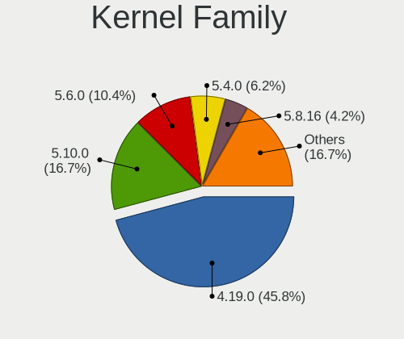

| Version | Desktops | Percent |
|---------|----------|---------|
| 4.19.0  | 6        | 54.55%  |
| 5.5.0   | 1        | 9.09%   |
| 5.4.7   | 1        | 9.09%   |
| 5.4.10  | 1        | 9.09%   |
| 5.3.0   | 1        | 9.09%   |
| 5.2.21  | 1        | 9.09%   |

Kernel Major Ver.
-----------------

Linux kernel major version

| Version | Desktops | Percent |
|---------|----------|---------|
| 4.19    | 6        | 54.55%  |
| 5.4     | 2        | 18.18%  |
| 5.5     | 1        | 9.09%   |
| 5.3     | 1        | 9.09%   |
| 5.2     | 1        | 9.09%   |

Arch
----

OS architecture (x86_64, i586, etc.)

| Name   | Desktops | Percent |
|--------|----------|---------|
| x86_64 | 11       | 100%    |

DE
--

Desktop Environment

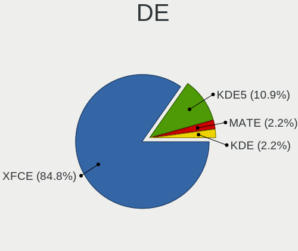

| Name | Desktops | Percent |
|------|----------|---------|
| XFCE | 11       | 100%    |

Display Server
--------------

X11 or Wayland

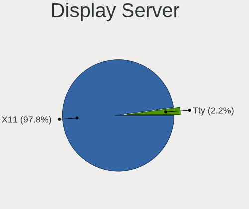

| Name | Desktops | Percent |
|------|----------|---------|
| X11  | 11       | 100%    |

Display Manager
---------------

SDDM, LightDM, etc.

| Name    | Desktops | Percent |
|---------|----------|---------|
| LightDM | 11       | 100%    |

OS Lang
-------

Language

| Lang    | Desktops | Percent |
|---------|----------|---------|
| Unknown | 9        | 81.82%  |
| en_US   | 2        | 18.18%  |

Boot Mode
---------

EFI or BIOS

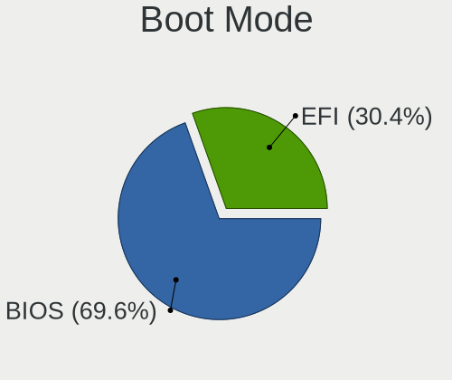

| Mode | Desktops | Percent |
|------|----------|---------|
| BIOS | 6        | 54.55%  |
| EFI  | 5        | 45.45%  |

Filesystem
----------

Type of filesystem

| Type | Desktops | Percent |
|------|----------|---------|
| Ext4 | 11       | 100%    |

Part. scheme
------------

Scheme of partitioning

| Type | Desktops | Percent |
|------|----------|---------|
| MBR  | 6        | 54.55%  |
| GPT  | 5        | 45.45%  |

Dual Boot with Linux/BSD
------------------------

Hosting more than one Linux/BSD

| Dual boot | Desktops | Percent |
|-----------|----------|---------|
| Yes       | 6        | 54.55%  |
| No        | 5        | 45.45%  |

Dual Boot (Win)
---------------

Hosting Linux and Windows

| Dual boot | Desktops | Percent |
|-----------|----------|---------|
| Yes       | 8        | 72.73%  |
| No        | 3        | 27.27%  |

Board
-----

Vendor
------

Motherboard manufacturer

| Name                | Desktops | Percent |
|---------------------|----------|---------|
| ASUSTek Computer    | 3        | 27.27%  |
| ASRock              | 3        | 27.27%  |
| Gigabyte Technology | 2        | 18.18%  |
| Dell                | 2        | 18.18%  |
| Gateway             | 1        | 9.09%   |

Model
-----

Motherboard model

| Name                   | Desktops | Percent |
|------------------------|----------|---------|
| ASRock K8A780LM        | 2        | 18.18%  |
| Gigabyte P43-ES3G      | 1        | 9.09%   |
| Gigabyte GA-880GA-UD3H | 1        | 9.09%   |
| Gateway SX2185         | 1        | 9.09%   |
| Dell OptiPlex 9010     | 1        | 9.09%   |
| Dell Inspiron 3847     | 1        | 9.09%   |
| ASUS PRIME H310M-K     | 1        | 9.09%   |
| ASUS M4A77T            | 1        | 9.09%   |
| ASUS M2N-MX SE Plus    | 1        | 9.09%   |
| ASRock X370 Gaming X   | 1        | 9.09%   |

Model Family
------------

Motherboard model prefix

| Name                   | Desktops | Percent |
|------------------------|----------|---------|
| ASRock K8A780LM        | 2        | 18.18%  |
| Gigabyte P43-ES3G      | 1        | 9.09%   |
| Gigabyte GA-880GA-UD3H | 1        | 9.09%   |
| Gateway SX2185         | 1        | 9.09%   |
| Dell OptiPlex          | 1        | 9.09%   |
| Dell Inspiron          | 1        | 9.09%   |
| ASUS PRIME             | 1        | 9.09%   |
| ASUS M4A77T            | 1        | 9.09%   |
| ASUS M2N-MX            | 1        | 9.09%   |
| ASRock X370            | 1        | 9.09%   |

MFG Year
--------

Motherboard manufacture year

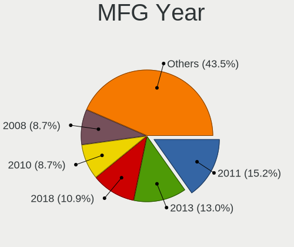

| Year | Desktops | Percent |
|------|----------|---------|
| 2011 | 3        | 27.27%  |
| 2018 | 2        | 18.18%  |
| 2013 | 2        | 18.18%  |
| 2010 | 2        | 18.18%  |
| 2019 | 1        | 9.09%   |
| 2008 | 1        | 9.09%   |

Form Factor
-----------

Physical design of the computer

| Name    | Desktops | Percent |
|---------|----------|---------|
| Desktop | 11       | 100%    |

Secure Boot
-----------

Enabled or disabled

| State    | Desktops | Percent |
|----------|----------|---------|
| Disabled | 11       | 100%    |

Coreboot
--------

Have coreboot on board

| Used | Desktops | Percent |
|------|----------|---------|
| No   | 11       | 100%    |

RAM Size
--------

Total RAM memory

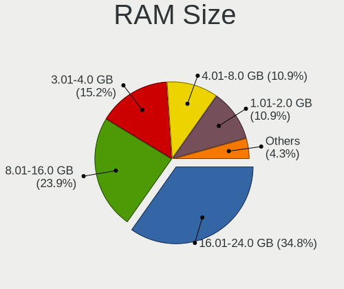

| Size in GB | Desktops | Percent |
|------------|----------|---------|
| 16.01-24.0 | 4        | 36.36%  |
| 3.01-4.0   | 3        | 27.27%  |
| 1.01-2.0   | 2        | 18.18%  |
| 4.01-8.0   | 1        | 9.09%   |
| 8.01-16.0  | 1        | 9.09%   |

RAM Used
--------

Used RAM memory

| Used GB  | Desktops | Percent |
|----------|----------|---------|
| 2.01-3.0 | 4        | 36.36%  |
| 1.01-2.0 | 3        | 27.27%  |
| 0.51-1.0 | 3        | 27.27%  |
| 3.01-4.0 | 1        | 9.09%   |

Total Drives
------------

Number of drives on board

| Drives | Desktops | Percent |
|--------|----------|---------|
| 1      | 5        | 45.45%  |
| 2      | 4        | 36.36%  |
| 5      | 1        | 9.09%   |
| 4      | 1        | 9.09%   |

Has CD-ROM
----------

Has CD-ROM on board

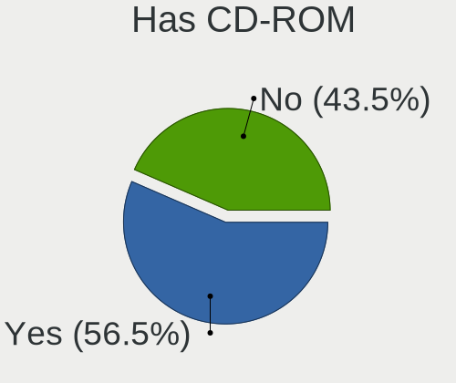

| Presented | Desktops | Percent |
|-----------|----------|---------|
| Yes       | 8        | 72.73%  |
| No        | 3        | 27.27%  |

Has Ethernet
------------

Has Ethernet on board

| Presented | Desktops | Percent |
|-----------|----------|---------|
| Yes       | 11       | 100%    |

Has WiFi
--------

Has WiFi module

| Presented | Desktops | Percent |
|-----------|----------|---------|
| No        | 7        | 63.64%  |
| Yes       | 4        | 36.36%  |

Has Bluetooth
-------------

Has Bluetooth module

| Presented | Desktops | Percent |
|-----------|----------|---------|
| No        | 10       | 90.91%  |
| Yes       | 1        | 9.09%   |

Location
--------

Country
-------

Geographic location (country)

| Country   | Desktops | Percent |
|-----------|----------|---------|
| USA       | 4        | 36.36%  |
| Slovakia  | 3        | 27.27%  |
| UK        | 1        | 9.09%   |
| Serbia    | 1        | 9.09%   |
| India     | 1        | 9.09%   |
| Australia | 1        | 9.09%   |

City
----

Geographic location (city)

| City           | Desktops | Percent |
|----------------|----------|---------|
| Bratislava     | 3        | 27.27%  |
| Virginia Beach | 1        | 9.09%   |
| Sydney         | 1        | 9.09%   |
| Pleasant Hill  | 1        | 9.09%   |
| Newtownabbey   | 1        | 9.09%   |
| McLoud         | 1        | 9.09%   |
| Kharagpur      | 1        | 9.09%   |
| Fort Wayne     | 1        | 9.09%   |
| Belgrade       | 1        | 9.09%   |

Drives
------

Drive Vendor
------------

Hard drive vendors

| Vendor              | Desktops | Drives | Percent |
|---------------------|----------|--------|---------|
| Seagate             | 5        | 5      | 27.78%  |
| Toshiba             | 4        | 4      | 22.22%  |
| WDC                 | 3        | 3      | 16.67%  |
| Hitachi             | 2        | 3      | 11.11%  |
| Samsung Electronics | 1        | 1      | 5.56%   |
| Mushkin             | 1        | 1      | 5.56%   |
| Kingston            | 1        | 2      | 5.56%   |
| Intel               | 1        | 2      | 5.56%   |

Drive Model
-----------

Hard drive models

| Model                            | Desktops | Percent |
|----------------------------------|----------|---------|
| Toshiba MK5065GSX 500GB          | 2        | 10.53%  |
| WDC WDS500G2B0A-00SM50 500GB SSD | 1        | 5.26%   |
| WDC WD5000AAKX-75U6AA0 500GB     | 1        | 5.26%   |
| WDC WD2500AAJS-00L7A0 250GB      | 1        | 5.26%   |
| Toshiba DT01ACA300 3TB           | 1        | 5.26%   |
| Toshiba DT01ACA100 1TB           | 1        | 5.26%   |
| Seagate ST500DM002-1BD142 500GB  | 1        | 5.26%   |
| Seagate ST4000DM004-2CV104 4TB   | 1        | 5.26%   |
| Seagate ST3320413CS 320GB        | 1        | 5.26%   |
| Seagate ST1000LM048-2E7172 1TB   | 1        | 5.26%   |
| Seagate ST1000DM003-1ER162 1TB   | 1        | 5.26%   |
| Samsung SSD 860 EVO 500GB        | 1        | 5.26%   |
| Mushkin MKNSSDPL500GB-D8         | 1        | 5.26%   |
| Kingston SKC600512G 512GB SSD    | 1        | 5.26%   |
| Kingston SKC600256G 256GB SSD    | 1        | 5.26%   |
| Intel SSDSC2KW256G8 256GB        | 1        | 5.26%   |
| Hitachi HUA723020ALA641 2TB      | 1        | 5.26%   |
| Hitachi HTS543232A7A384 320GB    | 1        | 5.26%   |

HDD Vendor
----------

Hard disk drive vendors

| Vendor  | Desktops | Drives | Percent |
|---------|----------|--------|---------|
| Seagate | 5        | 5      | 38.46%  |
| Toshiba | 4        | 4      | 30.77%  |
| WDC     | 2        | 2      | 15.38%  |
| Hitachi | 2        | 3      | 15.38%  |

SSD Vendor
----------

Solid state drive vendors

| Vendor              | Desktops | Drives | Percent |
|---------------------|----------|--------|---------|
| WDC                 | 1        | 1      | 25%     |
| Samsung Electronics | 1        | 1      | 25%     |
| Kingston            | 1        | 2      | 25%     |
| Intel               | 1        | 2      | 25%     |

Drive Kind
----------

HDD or SSD

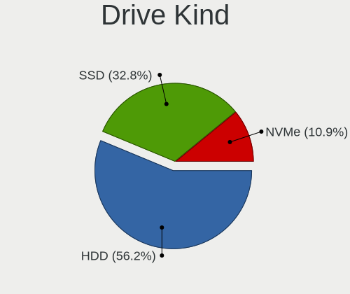

| Kind | Desktops | Drives | Percent |
|------|----------|--------|---------|
| HDD  | 11       | 14     | 73.33%  |
| SSD  | 3        | 6      | 20%     |
| NVMe | 1        | 1      | 6.67%   |

Drive Connector
---------------

SATA, SAS, NVMe, etc.

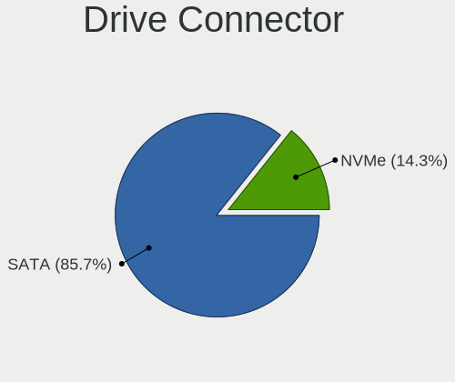

| Type | Desktops | Drives | Percent |
|------|----------|--------|---------|
| SATA | 11       | 20     | 91.67%  |
| NVMe | 1        | 1      | 8.33%   |

Drive Size
----------

Size of hard drive

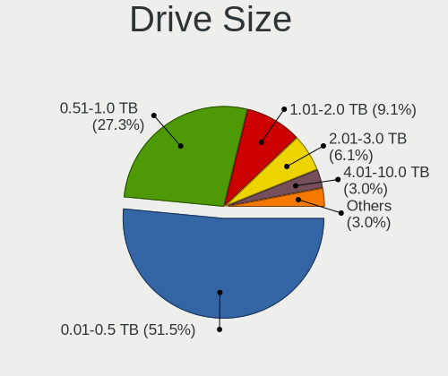

| Size in TB | Desktops | Drives | Percent |
|------------|----------|--------|---------|
| 0.01-0.5   | 9        | 12     | 60%     |
| 0.51-1.0   | 3        | 4      | 20%     |
| 3.01-4.0   | 1        | 1      | 6.67%   |
| 2.01-3.0   | 1        | 1      | 6.67%   |
| 1.01-2.0   | 1        | 2      | 6.67%   |

Space Total
-----------

Amount of disk space available on the file system

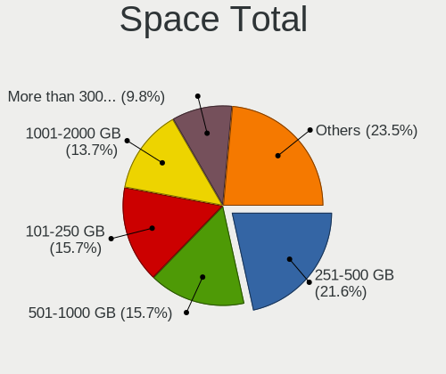

| Size in GB     | Desktops | Percent |
|----------------|----------|---------|
| 251-500        | 5        | 45.45%  |
| More than 3000 | 2        | 18.18%  |
| 101-250        | 2        | 18.18%  |
| 501-1000       | 1        | 9.09%   |
| 51-100         | 1        | 9.09%   |

Space Used
----------

Amount of used disk space

| Used GB   | Desktops | Percent |
|-----------|----------|---------|
| 1-20      | 4        | 36.36%  |
| 21-50     | 3        | 27.27%  |
| 251-500   | 1        | 9.09%   |
| 2001-3000 | 1        | 9.09%   |
| 501-1000  | 1        | 9.09%   |
| 51-100    | 1        | 9.09%   |

Malfunc. Drives
---------------

Drive models with a malfunction

| Model                     | Desktops | Drives | Percent |
|---------------------------|----------|--------|---------|
| Seagate ST3320413CS 320GB | 1        | 1      | 100%    |

Malfunc. Drive Vendor
---------------------

Vendors of faulty drives

| Vendor  | Desktops | Drives | Percent |
|---------|----------|--------|---------|
| Seagate | 1        | 1      | 100%    |

Malfunc. HDD Vendor
-------------------

Vendors of faulty HDD drives

| Vendor  | Desktops | Drives | Percent |
|---------|----------|--------|---------|
| Seagate | 1        | 1      | 100%    |

Malfunc. Drive Kind
-------------------

Kinds of faulty drives

| Kind | Desktops | Drives | Percent |
|------|----------|--------|---------|
| HDD  | 1        | 1      | 100%    |

Failed Drives
-------------

Failed drive models

| Model                   | Desktops | Drives | Percent |
|-------------------------|----------|--------|---------|
| Toshiba MK5065GSX 500GB | 2        | 2      | 100%    |

Failed Drive Vendor
-------------------

Failed drive vendors

| Vendor  | Desktops | Drives | Percent |
|---------|----------|--------|---------|
| Toshiba | 2        | 2      | 100%    |

Drive Status
------------

Number of failed and malfunc. drives

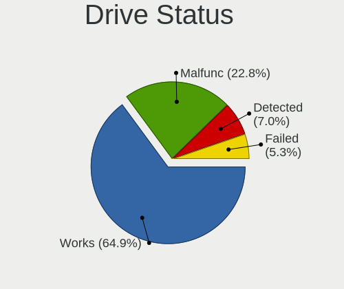

| Status   | Desktops | Drives | Percent |
|----------|----------|--------|---------|
| Works    | 8        | 17     | 66.67%  |
| Failed   | 2        | 2      | 16.67%  |
| Detected | 1        | 1      | 8.33%   |
| Malfunc  | 1        | 1      | 8.33%   |

Storage controller
------------------

Storage Vendor
--------------

Storage controller vendors

| Vendor             | Desktops | Percent |
|--------------------|----------|---------|
| AMD                | 6        | 42.86%  |
| Intel              | 4        | 28.57%  |
| JMicron Technology | 2        | 14.29%  |
| Silicon Motion     | 1        | 7.14%   |
| Nvidia             | 1        | 7.14%   |

Storage Model
-------------

Storage controller models

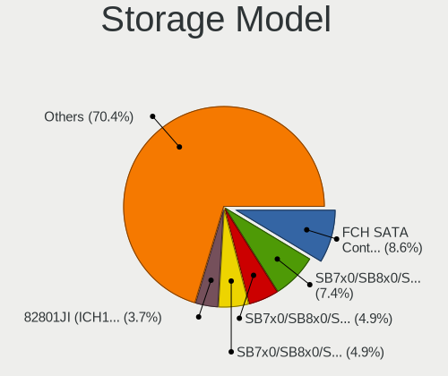

| Model                                                                          | Desktops | Percent |
|--------------------------------------------------------------------------------|----------|---------|
| AMD SB7x0/SB8x0/SB9x0 SATA Controller [AHCI mode]                              | 4        | 20%     |
| AMD SB7x0/SB8x0/SB9x0 IDE Controller                                           | 3        | 15%     |
| AMD FCH SATA Controller [AHCI mode]                                            | 2        | 10%     |
| Silicon Motion SM2262/SM2262EN SSD Controller                                  | 1        | 5%      |
| Nvidia MCP61 SATA Controller                                                   | 1        | 5%      |
| Nvidia MCP61 IDE                                                               | 1        | 5%      |
| JMicron JMB368 IDE controller                                                  | 1        | 5%      |
| JMicron JMB363 SATA/IDE Controller                                             | 1        | 5%      |
| Intel SATA Controller [RAID mode]                                              | 1        | 5%      |
| Intel Cannon Lake PCH SATA AHCI Controller                                     | 1        | 5%      |
| Intel 82801JI (ICH10 Family) 4 port SATA IDE Controller #1                     | 1        | 5%      |
| Intel 82801JI (ICH10 Family) 2 port SATA IDE Controller #2                     | 1        | 5%      |
| Intel 8 Series/C220 Series Chipset Family 6-port SATA Controller 1 [AHCI mode] | 1        | 5%      |
| AMD X370 Series Chipset SATA Controller                                        | 1        | 5%      |

Storage Kind
------------

Kind of storage controller (IDE, SATA, NVMe, SAS, ...)

| Kind | Desktops | Percent |
|------|----------|---------|
| SATA | 8        | 50%     |
| IDE  | 6        | 37.5%   |
| RAID | 1        | 6.25%   |
| NVMe | 1        | 6.25%   |

Processor
---------

CPU Vendor
----------

Processor vendors

| Vendor | Desktops | Percent |
|--------|----------|---------|
| AMD    | 7        | 63.64%  |
| Intel  | 4        | 36.36%  |

CPU Model
---------

Processor models

| Model                                       | Desktops | Percent |
|---------------------------------------------|----------|---------|
| Intel Pentium Dual-Core CPU E5400 @ 2.70GHz | 1        | 9.09%   |
| Intel Pentium CPU G3240 @ 3.10GHz           | 1        | 9.09%   |
| Intel Core i5-3470 CPU @ 3.20GHz            | 1        | 9.09%   |
| Intel Core i3-8100 CPU @ 3.60GHz            | 1        | 9.09%   |
| AMD Sempron Processor 3000+                 | 1        | 9.09%   |
| AMD Sempron Processor 2800+                 | 1        | 9.09%   |
| AMD Ryzen 5 1600X Six-Core Processor        | 1        | 9.09%   |
| AMD Phenom II X6 1090T Processor            | 1        | 9.09%   |
| AMD E1-2500 APU with Radeon HD Graphics     | 1        | 9.09%   |
| AMD Athlon II X2 260 Processor              | 1        | 9.09%   |
| AMD Athlon 7750 Dual-Core Processor         | 1        | 9.09%   |

CPU Model Family
----------------

Processor model prefix

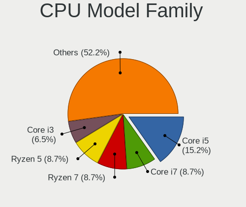

| Model                   | Desktops | Percent |
|-------------------------|----------|---------|
| AMD Sempron             | 2        | 18.18%  |
| Intel Pentium Dual-Core | 1        | 9.09%   |
| Intel Pentium           | 1        | 9.09%   |
| Intel Core i5           | 1        | 9.09%   |
| Intel Core i3           | 1        | 9.09%   |
| AMD Ryzen 5             | 1        | 9.09%   |
| AMD Phenom II X6        | 1        | 9.09%   |
| AMD E1                  | 1        | 9.09%   |
| AMD Athlon II X2        | 1        | 9.09%   |
| AMD Athlon              | 1        | 9.09%   |

CPU Cores
---------

Number of processor cores

| Number | Desktops | Percent |
|--------|----------|---------|
| 2      | 5        | 45.45%  |
| 6      | 2        | 18.18%  |
| 4      | 2        | 18.18%  |
| 1      | 2        | 18.18%  |

CPU Sockets
-----------

Number of sockets

| Number | Desktops | Percent |
|--------|----------|---------|
| 1      | 11       | 100%    |

CPU Threads
-----------

Threads per core (Hyper-Threading)

| Number | Desktops | Percent |
|--------|----------|---------|
| 1      | 10       | 90.91%  |
| 2      | 1        | 9.09%   |

CPU Op-Modes
------------

CPU Operation Modes (32-bit, 64-bit)

| Op mode        | Desktops | Percent |
|----------------|----------|---------|
| 32-bit, 64-bit | 11       | 100%    |

CPU Microcode
-------------

Microcode number

| Number     | Desktops | Percent |
|------------|----------|---------|
| Unknown    | 3        | 27.27%  |
| 0x906eb    | 1        | 9.09%   |
| 0x306c3    | 1        | 9.09%   |
| 0x306a9    | 1        | 9.09%   |
| 0x1067a    | 1        | 9.09%   |
| 0x08001137 | 1        | 9.09%   |
| 0x0700010f | 1        | 9.09%   |
| 0x010000dc | 1        | 9.09%   |
| 0x01000083 | 1        | 9.09%   |

CPU Microarch
-------------

Microarchitecture

| Name      | Desktops | Percent |
|-----------|----------|---------|
| K10       | 3        | 27.27%  |
| K8 Hammer | 2        | 18.18%  |
| Zen       | 1        | 9.09%   |
| Penryn    | 1        | 9.09%   |
| KabyLake  | 1        | 9.09%   |
| Jaguar    | 1        | 9.09%   |
| IvyBridge | 1        | 9.09%   |
| Haswell   | 1        | 9.09%   |

Graphics
--------

GPU Vendor
----------

Vendors of graphics cards

| Vendor | Desktops | Percent |
|--------|----------|---------|
| AMD    | 8        | 72.73%  |
| Intel  | 2        | 18.18%  |
| Nvidia | 1        | 9.09%   |

GPU Model
---------

Graphics card models

| Model                                                                       | Desktops | Percent |
|-----------------------------------------------------------------------------|----------|---------|
| AMD RS780L [Radeon 3000]                                                    | 2        | 15.38%  |
| Nvidia GF108 [GeForce GT 430]                                               | 1        | 7.69%   |
| Intel Xeon E3-1200 v3/4th Gen Core Processor Integrated Graphics Controller | 1        | 7.69%   |
| Intel Xeon E3-1200 v2/3rd Gen Core processor Graphics Controller            | 1        | 7.69%   |
| AMD RV635 [Radeon HD 3650/3750/4570/4580]                                   | 1        | 7.69%   |
| AMD RV516 [Radeon X1300/X1550 Series] (Secondary)                           | 1        | 7.69%   |
| AMD RV516 [Radeon X1300/X1550 Series]                                       | 1        | 7.69%   |
| AMD Redwood PRO [Radeon HD 5550/5570/5630/6510/6610/7570]                   | 1        | 7.69%   |
| AMD Kabini [Radeon HD 8240 / R3 Series]                                     | 1        | 7.69%   |
| AMD Hawaii PRO [Radeon R9 290/390]                                          | 1        | 7.69%   |
| AMD Ellesmere [Radeon RX 470/480/570/570X/580/580X/590]                     | 1        | 7.69%   |
| AMD Curacao PRO [Radeon R7 370 / R9 270/370 OEM]                            | 1        | 7.69%   |

GPU Combo
---------

Combinations of graphics cards

| Name       | Desktops | Percent |
|------------|----------|---------|
| 1 x AMD    | 7        | 63.64%  |
| 1 x Intel  | 2        | 18.18%  |
| 3 x AMD    | 1        | 9.09%   |
| 1 x Nvidia | 1        | 9.09%   |

GPU Driver
----------

Free vs proprietary

| Driver | Desktops | Percent |
|--------|----------|---------|
| Free   | 11       | 100%    |

GPU Memory
----------

Total video memory

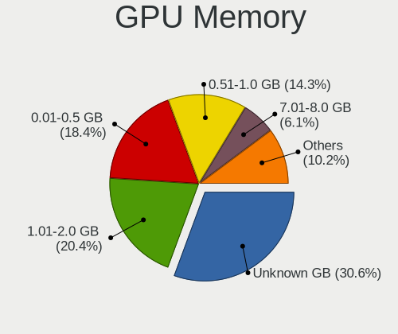

| Size in GB | Desktops | Percent |
|------------|----------|---------|
| 0.01-0.5   | 4        | 36.36%  |
| Unknown    | 4        | 36.36%  |
| 3.01-4.0   | 1        | 9.09%   |
| 1.01-2.0   | 1        | 9.09%   |
| 0.51-1.0   | 1        | 9.09%   |

Monitor
-------

Monitor Vendor
--------------

Monitor vendors

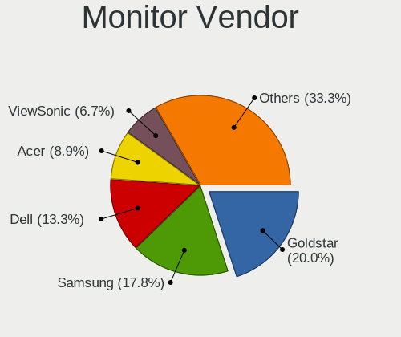

| Vendor              | Desktops | Percent |
|---------------------|----------|---------|
| Samsung Electronics | 3        | 27.27%  |
| Dell                | 2        | 18.18%  |
| Acer                | 2        | 18.18%  |
| ViewSonic           | 1        | 9.09%   |
| Philips             | 1        | 9.09%   |
| Goldstar            | 1        | 9.09%   |
| BenQ                | 1        | 9.09%   |

Monitor Model
-------------

Monitor models

| Model                                                                | Desktops | Percent |
|----------------------------------------------------------------------|----------|---------|
| Samsung Electronics SyncMaster SAM0091 1600x1200 432x324mm 21.3-inch | 3        | 27.27%  |
| ViewSonic VX2757 VSCF931 1920x1080 598x336mm 27.0-inch               | 1        | 9.09%   |
| Philips FTV PHL04C3 1920x1080 1440x810mm 65.0-inch                   | 1        | 9.09%   |
| Goldstar IPS FULLHD GSM5AB8 1920x1080 480x270mm 21.7-inch            | 1        | 9.09%   |
| Dell SE2419H DELF109 1920x1080 527x296mm 23.8-inch                   | 1        | 9.09%   |
| Dell E1913 DELD051 1440x900 408x255mm 18.9-inch                      | 1        | 9.09%   |
| BenQ GW2406Z BNQ78E1 1920x1080 530x300mm 24.0-inch                   | 1        | 9.09%   |
| Acer XF240H ACR0472 1920x1080 531x299mm 24.0-inch                    | 1        | 9.09%   |
| Acer HX1953L ACR038C 1600x900 432x239mm 19.4-inch                    | 1        | 9.09%   |

Monitor Resolution
------------------

Monitor screen resolution

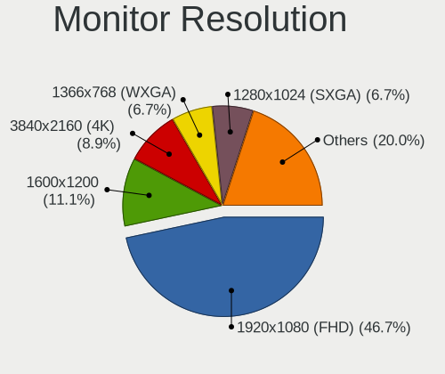

| Resolution       | Desktops | Percent |
|------------------|----------|---------|
| 1920x1080 (FHD)  | 5        | 50%     |
| 1600x1200        | 3        | 30%     |
| 1600x900 (HD+)   | 1        | 10%     |
| 1440x900 (WXGA+) | 1        | 10%     |

Monitor Diagonal
----------------

Diagonal size in inches

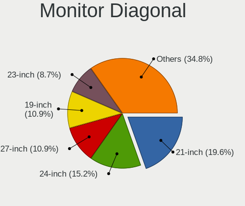

| Inches | Desktops | Percent |
|--------|----------|---------|
| 21     | 4        | 36.36%  |
| 24     | 3        | 27.27%  |
| 65     | 1        | 9.09%   |
| 27     | 1        | 9.09%   |
| 19     | 1        | 9.09%   |
| 18     | 1        | 9.09%   |

Monitor Width
-------------

Physical width

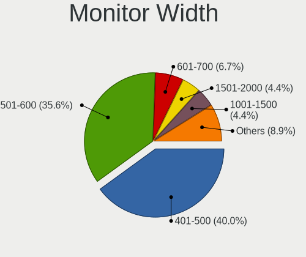

| Width in mm | Desktops | Percent |
|-------------|----------|---------|
| 401-500     | 6        | 54.55%  |
| 501-600     | 4        | 36.36%  |
| 1001-1500   | 1        | 9.09%   |

Aspect Ratio
------------

Proportional relationship between the width and the height

| Ratio | Desktops | Percent |
|-------|----------|---------|
| 16/9  | 6        | 60%     |
| 4/3   | 3        | 30%     |
| 16/10 | 1        | 10%     |

Monitor Area
------------

Area in inch²

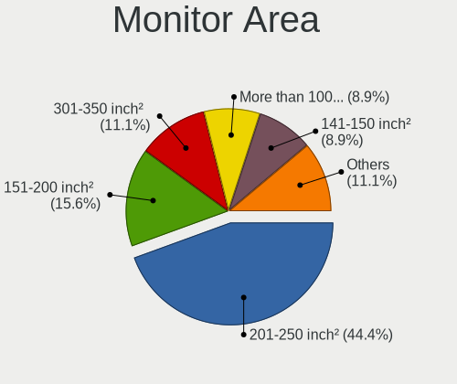

| Area in inch² | Desktops | Percent |
|----------------|----------|---------|
| 201-250        | 7        | 63.64%  |
| 151-200        | 2        | 18.18%  |
| More than 1000 | 1        | 9.09%   |
| 301-350        | 1        | 9.09%   |

Pixel Density
-------------

Pixels per inch

| Density | Desktops | Percent |
|---------|----------|---------|
| 51-100  | 9        | 81.82%  |
| 1-50    | 1        | 9.09%   |
| 101-120 | 1        | 9.09%   |

Multiple Monitors
-----------------

Total monitors connected

| Total | Desktops | Percent |
|-------|----------|---------|
| 1     | 10       | 90.91%  |
| 2     | 1        | 9.09%   |

Network
-------

Net Controller Vendor
---------------------

Controller vendors

| Vendor                | Desktops | Percent |
|-----------------------|----------|---------|
| Realtek Semiconductor | 7        | 50%     |
| Intel                 | 2        | 14.29%  |
| Ralink                | 1        | 7.14%   |
| Qualcomm Atheros      | 1        | 7.14%   |
| Nvidia                | 1        | 7.14%   |
| D-Link System         | 1        | 7.14%   |
| Broadcom              | 1        | 7.14%   |

Net Controller Model
--------------------

Controller models

| Model                                                             | Desktops | Percent |
|-------------------------------------------------------------------|----------|---------|
| Realtek RTL8111/8168/8411 PCI Express Gigabit Ethernet Controller | 7        | 46.67%  |
| Realtek RTL8188EUS 802.11n Wireless Network Adapter               | 1        | 6.67%   |
| Ralink RT2800 802.11n PCI                                         | 1        | 6.67%   |
| Qualcomm Atheros QCA9565 / AR9565 Wireless Network Adapter        | 1        | 6.67%   |
| Nvidia MCP61 Ethernet                                             | 1        | 6.67%   |
| Intel I211 Gigabit Network Connection                             | 1        | 6.67%   |
| Intel 82579LM Gigabit Network Connection (Lewisville)             | 1        | 6.67%   |
| D-Link System DGE-528T Gigabit Ethernet Adapter                   | 1        | 6.67%   |
| Broadcom BCM43228 802.11a/b/g/n                                   | 1        | 6.67%   |

Wireless Vendor
---------------

Wireless vendors

| Vendor                | Desktops | Percent |
|-----------------------|----------|---------|
| Realtek Semiconductor | 1        | 25%     |
| Ralink                | 1        | 25%     |
| Qualcomm Atheros      | 1        | 25%     |
| Broadcom              | 1        | 25%     |

Wireless Model
--------------

Wireless models

| Model                                                      | Desktops | Percent |
|------------------------------------------------------------|----------|---------|
| Realtek RTL8188EUS 802.11n Wireless Network Adapter        | 1        | 25%     |
| Ralink RT2800 802.11n PCI                                  | 1        | 25%     |
| Qualcomm Atheros QCA9565 / AR9565 Wireless Network Adapter | 1        | 25%     |
| Broadcom BCM43228 802.11a/b/g/n                            | 1        | 25%     |

Ethernet Vendor
---------------

Ethernet vendors

| Vendor                | Desktops | Percent |
|-----------------------|----------|---------|
| Realtek Semiconductor | 7        | 63.64%  |
| Intel                 | 2        | 18.18%  |
| Nvidia                | 1        | 9.09%   |
| D-Link System         | 1        | 9.09%   |

Ethernet Model
--------------

Ethernet models

| Model                                                             | Desktops | Percent |
|-------------------------------------------------------------------|----------|---------|
| Realtek RTL8111/8168/8411 PCI Express Gigabit Ethernet Controller | 7        | 63.64%  |
| Nvidia MCP61 Ethernet                                             | 1        | 9.09%   |
| Intel I211 Gigabit Network Connection                             | 1        | 9.09%   |
| Intel 82579LM Gigabit Network Connection (Lewisville)             | 1        | 9.09%   |
| D-Link System DGE-528T Gigabit Ethernet Adapter                   | 1        | 9.09%   |

Net Controller Kind
-------------------

Ethernet, WiFi or modem

| Kind     | Desktops | Percent |
|----------|----------|---------|
| Ethernet | 11       | 73.33%  |
| WiFi     | 4        | 26.67%  |

Used Controller
---------------

Currently used network controller

| Kind     | Desktops | Percent |
|----------|----------|---------|
| Ethernet | 11       | 73.33%  |
| WiFi     | 4        | 26.67%  |

NICs
----

Total network controllers on board

| Total | Desktops | Percent |
|-------|----------|---------|
| 1     | 8        | 72.73%  |
| 2     | 3        | 27.27%  |

IPv6
----

IPv6 vs IPv4

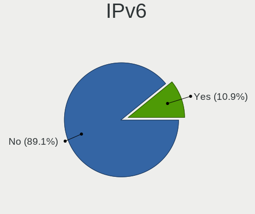

| Used | Desktops | Percent |
|------|----------|---------|
| No   | 11       | 100%    |

Bluetooth
---------

Bluetooth Vendor
----------------

Controller vendors

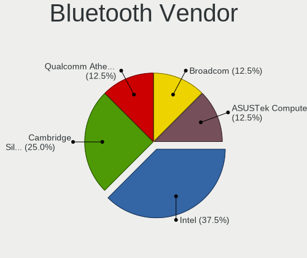

| Vendor                          | Desktops | Percent |
|---------------------------------|----------|---------|
| Qualcomm Atheros Communications | 1        | 100%    |

Bluetooth Model
---------------

Controller models

| Model                             | Desktops | Percent |
|-----------------------------------|----------|---------|
| Qualcomm Atheros AR9462 Bluetooth | 1        | 100%    |

Sound
-----

Sound Vendor
------------

Sound card vendors

| Vendor        | Desktops | Percent |
|---------------|----------|---------|
| AMD           | 8        | 57.14%  |
| Intel         | 4        | 28.57%  |
| Nvidia        | 1        | 7.14%   |
| Creative Labs | 1        | 7.14%   |

Sound Model
-----------

Sound card models

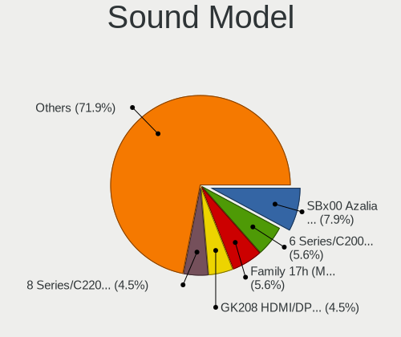

| Model                                                                     | Desktops | Percent |
|---------------------------------------------------------------------------|----------|---------|
| AMD SBx00 Azalia (Intel HDA)                                              | 4        | 21.05%  |
| Nvidia GF108 High Definition Audio Controller                             | 1        | 5.26%   |
| Intel Xeon E3-1200 v3/4th Gen Core Processor HD Audio Controller          | 1        | 5.26%   |
| Intel Cannon Lake PCH cAVS                                                | 1        | 5.26%   |
| Intel 82801JI (ICH10 Family) HD Audio Controller                          | 1        | 5.26%   |
| Intel 8 Series/C220 Series Chipset High Definition Audio Controller       | 1        | 5.26%   |
| Intel 7 Series/C216 Chipset Family High Definition Audio Controller       | 1        | 5.26%   |
| Creative Labs EMU10k2/CA0100/CA0102/CA10200 [Sound Blaster Audigy Series] | 1        | 5.26%   |
| AMD RV635 HDMI Audio [Radeon HD 3650/3730/3750]                           | 1        | 5.26%   |
| AMD Redwood HDMI Audio [Radeon HD 5000 Series]                            | 1        | 5.26%   |
| AMD Oland/Hainan/Cape Verde/Pitcairn HDMI Audio [Radeon HD 7000 Series]   | 1        | 5.26%   |
| AMD Kabini HDMI/DP Audio                                                  | 1        | 5.26%   |
| AMD Hawaii HDMI Audio [Radeon R9 290/290X / 390/390X]                     | 1        | 5.26%   |
| AMD FCH Azalia Controller                                                 | 1        | 5.26%   |
| AMD Family 17h (Models 00h-0fh) HD Audio Controller                       | 1        | 5.26%   |
| AMD Ellesmere HDMI Audio [Radeon RX 470/480 / 570/580/590]                | 1        | 5.26%   |

Memory
------

Memory Vendor
-------------

Memory module vendors

| Vendor   | Desktops | Percent |
|----------|----------|---------|
| Unknown  | 6        | 54.55%  |
| Kingston | 2        | 18.18%  |
| SK Hynix | 1        | 9.09%   |
| Patriot  | 1        | 9.09%   |
| Corsair  | 1        | 9.09%   |

Memory Model
------------

Memory module models

| Model                                                    | Desktops | Percent |
|----------------------------------------------------------|----------|---------|
| Unknown RAM Module 4096MB DIMM 1600MT/s                  | 2        | 14.29%  |
| Unknown RAM Module 1024MB DIMM DDR 333MT/s               | 2        | 14.29%  |
| Unknown RAM Module 512MB DIMM DDR 200MT/s                | 1        | 7.14%   |
| Unknown RAM Module 2048MB DIMM DDR2 800MT/s              | 1        | 7.14%   |
| Unknown RAM Module 2048MB DIMM 800MT/s                   | 1        | 7.14%   |
| Unknown RAM Module 1024MB DIMM DDR 200MT/s               | 1        | 7.14%   |
| Unknown RAM Module 1024MB DIMM 667MT/s                   | 1        | 7.14%   |
| SK Hynix RAM HMT325U6CFR8C-PB 2048MB DIMM DDR3 1600MT/s  | 1        | 7.14%   |
| Patriot RAM 3000 C15 Series 8192MB DIMM DDR4 3000MT/s    | 1        | 7.14%   |
| Kingston RAM Module 4096MB DIMM DDR3 1600MT/s            | 1        | 7.14%   |
| Kingston RAM K531R8-ETB 4096MB DIMM DDR3 1600MT/s        | 1        | 7.14%   |
| Corsair RAM CMK16GX4M2A2133C13 8192MB DIMM DDR4 2400MT/s | 1        | 7.14%   |

Memory Kind
-----------

Memory module kinds

| Kind    | Desktops | Percent |
|---------|----------|---------|
| DDR3    | 3        | 27.27%  |
| Unknown | 3        | 27.27%  |
| DDR4    | 2        | 18.18%  |
| DDR     | 2        | 18.18%  |
| DDR2    | 1        | 9.09%   |

Memory Form Factor
------------------

Physical design of the memory module

| Name | Desktops | Percent |
|------|----------|---------|
| DIMM | 11       | 100%    |

Memory Size
-----------

Memory module size

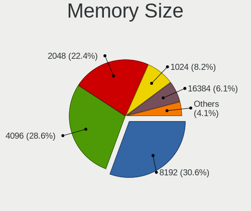

| Size | Desktops | Percent |
|------|----------|---------|
| 4096 | 4        | 30.77%  |
| 2048 | 3        | 23.08%  |
| 1024 | 3        | 23.08%  |
| 8192 | 2        | 15.38%  |
| 512  | 1        | 7.69%   |

Memory Speed
------------

Memory module speed

| Speed | Desktops | Percent |
|-------|----------|---------|
| 1600  | 5        | 38.46%  |
| 800   | 2        | 15.38%  |
| 333   | 2        | 15.38%  |
| 3000  | 1        | 7.69%   |
| 2400  | 1        | 7.69%   |
| 667   | 1        | 7.69%   |
| 200   | 1        | 7.69%   |

Printers & scanners
-------------------

Printer Vendor
--------------

Printer device vendors

Zero info for selected period =(

Printer Model
-------------

Printer device models

Zero info for selected period =(

Scanner Vendor
--------------

Scanner device vendors

Zero info for selected period =(

Scanner Model
-------------

Scanner device models

Zero info for selected period =(

Camera
------

Camera Vendor
-------------

Camera device vendors

Zero info for selected period =(

Camera Model
------------

Camera device models

Zero info for selected period =(

Security
--------

Fingerprint Vendor
------------------

Fingerprint sensor vendors

Zero info for selected period =(

Fingerprint Model
-----------------

Fingerprint sensor models

Zero info for selected period =(

Chipcard Vendor
---------------

Chipcard module vendors

Zero info for selected period =(

Chipcard Model
--------------

Chipcard module models

Zero info for selected period =(

Unsupported
-----------

Unsupported Devices
-------------------

Total unsupported devices on board

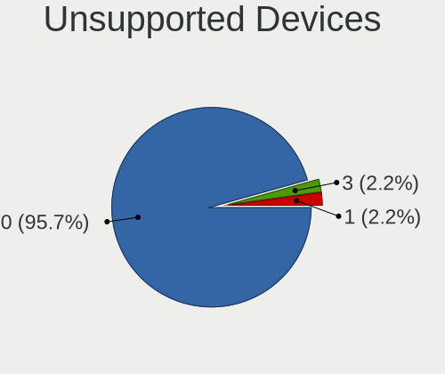

| Total | Desktops | Percent |
|-------|----------|---------|
| 0     | 11       | 100%    |

Unsupported Device Types
------------------------

Types of unsupported devices

Zero info for selected period =(

