MX 19 - Tested Hardware & Statistics (Notebooks)
------------------------------------------------

A project to collect tested hardware configurations for MX 19.

Anyone can contribute to this report by the [hw-probe](https://github.com/linuxhw/hw-probe) tool:

    sudo -E hw-probe -all -upload

Please contribute! Especially if your hardware is rare.

Contents
--------

* [ Test Cases ](#test-cases)

* [ System ](#system)
  - [ Kernel                   ](#kernel)
  - [ Kernel Family            ](#kernel-family)
  - [ Kernel Major Ver.        ](#kernel-major-ver)
  - [ Arch                     ](#arch)
  - [ DE                       ](#de)
  - [ Display Server           ](#display-server)
  - [ Display Manager          ](#display-manager)
  - [ OS Lang                  ](#os-lang)
  - [ Boot Mode                ](#boot-mode)
  - [ Filesystem               ](#filesystem)
  - [ Part. scheme             ](#part-scheme)
  - [ Dual Boot with Linux/BSD ](#dual-boot-with-linuxbsd)
  - [ Dual Boot (Win)          ](#dual-boot-win)

* [ Board ](#board)
  - [ Vendor                   ](#vendor)
  - [ Model                    ](#model)
  - [ Model Family             ](#model-family)
  - [ MFG Year                 ](#mfg-year)
  - [ Form Factor              ](#form-factor)
  - [ Secure Boot              ](#secure-boot)
  - [ Coreboot                 ](#coreboot)
  - [ RAM Size                 ](#ram-size)
  - [ RAM Used                 ](#ram-used)
  - [ Total Drives             ](#total-drives)
  - [ Has CD-ROM               ](#has-cd-rom)
  - [ Has Ethernet             ](#has-ethernet)
  - [ Has WiFi                 ](#has-wifi)
  - [ Has Bluetooth            ](#has-bluetooth)

* [ Location ](#location)
  - [ Country                  ](#country)
  - [ City                     ](#city)

* [ Drives ](#drives)
  - [ Drive Vendor             ](#drive-vendor)
  - [ Drive Model              ](#drive-model)
  - [ HDD Vendor               ](#hdd-vendor)
  - [ SSD Vendor               ](#ssd-vendor)
  - [ Drive Kind               ](#drive-kind)
  - [ Drive Connector          ](#drive-connector)
  - [ Drive Size               ](#drive-size)
  - [ Space Total              ](#space-total)
  - [ Space Used               ](#space-used)
  - [ Malfunc. Drives          ](#malfunc-drives)
  - [ Malfunc. Drive Vendor    ](#malfunc-drive-vendor)
  - [ Malfunc. HDD Vendor      ](#malfunc-hdd-vendor)
  - [ Malfunc. Drive Kind      ](#malfunc-drive-kind)
  - [ Failed Drives            ](#failed-drives)
  - [ Failed Drive Vendor      ](#failed-drive-vendor)
  - [ Drive Status             ](#drive-status)

* [ Storage controller ](#storage-controller)
  - [ Storage Vendor           ](#storage-vendor)
  - [ Storage Model            ](#storage-model)
  - [ Storage Kind             ](#storage-kind)

* [ Processor ](#processor)
  - [ CPU Vendor               ](#cpu-vendor)
  - [ CPU Model                ](#cpu-model)
  - [ CPU Model Family         ](#cpu-model-family)
  - [ CPU Cores                ](#cpu-cores)
  - [ CPU Sockets              ](#cpu-sockets)
  - [ CPU Threads              ](#cpu-threads)
  - [ CPU Op-Modes             ](#cpu-op-modes)
  - [ CPU Microcode            ](#cpu-microcode)
  - [ CPU Microarch            ](#cpu-microarch)

* [ Graphics ](#graphics)
  - [ GPU Vendor               ](#gpu-vendor)
  - [ GPU Model                ](#gpu-model)
  - [ GPU Combo                ](#gpu-combo)
  - [ GPU Driver               ](#gpu-driver)
  - [ GPU Memory               ](#gpu-memory)

* [ Monitor ](#monitor)
  - [ Monitor Vendor           ](#monitor-vendor)
  - [ Monitor Model            ](#monitor-model)
  - [ Monitor Resolution       ](#monitor-resolution)
  - [ Monitor Diagonal         ](#monitor-diagonal)
  - [ Monitor Width            ](#monitor-width)
  - [ Aspect Ratio             ](#aspect-ratio)
  - [ Monitor Area             ](#monitor-area)
  - [ Pixel Density            ](#pixel-density)
  - [ Multiple Monitors        ](#multiple-monitors)

* [ Network ](#network)
  - [ Net Controller Vendor    ](#net-controller-vendor)
  - [ Net Controller Model     ](#net-controller-model)
  - [ Wireless Vendor          ](#wireless-vendor)
  - [ Wireless Model           ](#wireless-model)
  - [ Ethernet Vendor          ](#ethernet-vendor)
  - [ Ethernet Model           ](#ethernet-model)
  - [ Net Controller Kind      ](#net-controller-kind)
  - [ Used Controller          ](#used-controller)
  - [ NICs                     ](#nics)
  - [ IPv6                     ](#ipv6)

* [ Bluetooth ](#bluetooth)
  - [ Bluetooth Vendor         ](#bluetooth-vendor)
  - [ Bluetooth Model          ](#bluetooth-model)

* [ Sound ](#sound)
  - [ Sound Vendor             ](#sound-vendor)
  - [ Sound Model              ](#sound-model)

* [ Memory ](#memory)
  - [ Memory Vendor            ](#memory-vendor)
  - [ Memory Model             ](#memory-model)
  - [ Memory Kind              ](#memory-kind)
  - [ Memory Form Factor       ](#memory-form-factor)
  - [ Memory Size              ](#memory-size)
  - [ Memory Speed             ](#memory-speed)

* [ Printers & scanners ](#printers--scanners)
  - [ Printer Vendor           ](#printer-vendor)
  - [ Printer Model            ](#printer-model)
  - [ Scanner Vendor           ](#scanner-vendor)
  - [ Scanner Model            ](#scanner-model)

* [ Camera ](#camera)
  - [ Camera Vendor            ](#camera-vendor)
  - [ Camera Model             ](#camera-model)

* [ Security ](#security)
  - [ Fingerprint Vendor       ](#fingerprint-vendor)
  - [ Fingerprint Model        ](#fingerprint-model)
  - [ Chipcard Vendor          ](#chipcard-vendor)
  - [ Chipcard Model           ](#chipcard-model)

* [ Unsupported ](#unsupported)
  - [ Unsupported Devices      ](#unsupported-devices)
  - [ Unsupported Device Types ](#unsupported-device-types)

Test Cases
----------

Total: 107

| Vendor        | Model                       | Probe                                                      | Date         |
|---------------|-----------------------------|------------------------------------------------------------|--------------|
| Acer          | Extensa 5630                | [32cab1f9fc](https://linux-hardware.org/?probe=32cab1f9fc) | Mar 14, 2022 |
| HP            | ProBook 6460b               | [5f936a65be](https://linux-hardware.org/?probe=5f936a65be) | Feb 02, 2022 |
| ASUSTek       | TUF Gaming FA706IU_TUF70... | [63d7055c5e](https://linux-hardware.org/?probe=63d7055c5e) | Dec 18, 2021 |
| Toshiba       | Satellite L850-CJK          | [0dc076ad15](https://linux-hardware.org/?probe=0dc076ad15) | Dec 05, 2021 |
| Lenovo        | Unknown                     | [5b1b00738d](https://linux-hardware.org/?probe=5b1b00738d) | Nov 28, 2021 |
| Google        | Akemi                       | [7408ab9056](https://linux-hardware.org/?probe=7408ab9056) | Nov 06, 2021 |
| Google        | Akemi                       | [dc4808bd56](https://linux-hardware.org/?probe=dc4808bd56) | Nov 06, 2021 |
| Dell          | Latitude E7450              | [91837758ac](https://linux-hardware.org/?probe=91837758ac) | Oct 26, 2021 |
| Dell          | Latitude 3190               | [d08efa2ef3](https://linux-hardware.org/?probe=d08efa2ef3) | Oct 25, 2021 |
| Fujitsu Si... | AMILO Xa 1526               | [00863fcea8](https://linux-hardware.org/?probe=00863fcea8) | Oct 16, 2021 |
| Sony          | SVT13115FBS                 | [381872f3b9](https://linux-hardware.org/?probe=381872f3b9) | Oct 09, 2021 |
| ASUSTek       | TUF Gaming FA706IU_FA706... | [8c1a085f29](https://linux-hardware.org/?probe=8c1a085f29) | Sep 20, 2021 |
| GTZS          | Unknown                     | [3df799f341](https://linux-hardware.org/?probe=3df799f341) | Sep 05, 2021 |
| Acer          | Aspire V3-371               | [ddd7b7b87f](https://linux-hardware.org/?probe=ddd7b7b87f) | Sep 02, 2021 |
| Acer          | Aspire V3-371               | [16c3c01bcd](https://linux-hardware.org/?probe=16c3c01bcd) | Sep 02, 2021 |
| Pixus         | Rise                        | [4479b88c1c](https://linux-hardware.org/?probe=4479b88c1c) | Aug 12, 2021 |
| Acer          | TravelMate 5360             | [f444dec794](https://linux-hardware.org/?probe=f444dec794) | Aug 12, 2021 |
| Lenovo        | ThinkPad T420 4236MBU       | [7e0b868c64](https://linux-hardware.org/?probe=7e0b868c64) | Jul 29, 2021 |
| Acer          | Aspire E5-574G              | [b09280946d](https://linux-hardware.org/?probe=b09280946d) | Jul 21, 2021 |
| Dell          | Vostro 5515                 | [f4ae054fc8](https://linux-hardware.org/?probe=f4ae054fc8) | Jul 15, 2021 |
| Medion        | P6669 MD60147               | [3ed80daa7b](https://linux-hardware.org/?probe=3ed80daa7b) | Jun 10, 2021 |
| Dell          | Vostro 3460                 | [da200f9e64](https://linux-hardware.org/?probe=da200f9e64) | May 29, 2021 |
| Medion        | E6234                       | [313ec752ab](https://linux-hardware.org/?probe=313ec752ab) | May 24, 2021 |
| HP            | Stream Laptop 14-cb0XX      | [4ed89e1092](https://linux-hardware.org/?probe=4ed89e1092) | May 22, 2021 |
| HP            | Stream Laptop 14-cb0XX      | [57a69c7c0d](https://linux-hardware.org/?probe=57a69c7c0d) | May 20, 2021 |
| HP            | Mini 110-3500               | [f94c828225](https://linux-hardware.org/?probe=f94c828225) | May 19, 2021 |
| ASUSTek       | N56VZ                       | [c69cd5aceb](https://linux-hardware.org/?probe=c69cd5aceb) | May 18, 2021 |
| Acer          | Extensa 5620                | [a06636ba79](https://linux-hardware.org/?probe=a06636ba79) | Apr 24, 2021 |
| Dell          | 0UW744??????                | [32c3521a2e](https://linux-hardware.org/?probe=32c3521a2e) | Apr 22, 2021 |
| Intel         | ChiefRiver                  | [5e0db0f704](https://linux-hardware.org/?probe=5e0db0f704) | Apr 14, 2021 |
| eMachines     | E727                        | [048da4f23b](https://linux-hardware.org/?probe=048da4f23b) | Apr 12, 2021 |
| ASUSTek       | 1025C                       | [33d6531353](https://linux-hardware.org/?probe=33d6531353) | Apr 06, 2021 |
| Dell          | Latitude E5470              | [064cf2bccd](https://linux-hardware.org/?probe=064cf2bccd) | Mar 11, 2021 |
| Toshiba       | PORTEGE R705                | [f537f51a95](https://linux-hardware.org/?probe=f537f51a95) | Mar 09, 2021 |
| HP            | Notebook                    | [113644885d](https://linux-hardware.org/?probe=113644885d) | Mar 04, 2021 |
| Acer          | AOD255                      | [f8501e519f](https://linux-hardware.org/?probe=f8501e519f) | Mar 03, 2021 |
| Google        | Gnawty                      | [252bc4cb46](https://linux-hardware.org/?probe=252bc4cb46) | Feb 25, 2021 |
| Dell          | Latitude D430               | [63906404d0](https://linux-hardware.org/?probe=63906404d0) | Feb 25, 2021 |
| ASUSTek       | X200CA                      | [2817beb96d](https://linux-hardware.org/?probe=2817beb96d) | Feb 25, 2021 |
| HP            | Pavilion g6                 | [f23e85a87a](https://linux-hardware.org/?probe=f23e85a87a) | Feb 23, 2021 |
| Google        | Gnawty                      | [7614a9a19c](https://linux-hardware.org/?probe=7614a9a19c) | Feb 23, 2021 |
| Samsung       | 305E4A/305E5A/305E7A        | [6f34bc4f67](https://linux-hardware.org/?probe=6f34bc4f67) | Feb 19, 2021 |
| Lenovo        | IdeaPad 310-15ISK 80SM      | [7552dacfb9](https://linux-hardware.org/?probe=7552dacfb9) | Feb 17, 2021 |
| HP            | 15                          | [437cb08f68](https://linux-hardware.org/?probe=437cb08f68) | Feb 08, 2021 |
| Lenovo        | ThinkPad T440p 20AWA1NAU... | [b6ebe98655](https://linux-hardware.org/?probe=b6ebe98655) | Feb 01, 2021 |
| HP            | ProBook 650 G1              | [9021b90504](https://linux-hardware.org/?probe=9021b90504) | Jan 22, 2021 |
| ASUSTek       | ZenBook UX425EA_UX425EA     | [a147ddbe9d](https://linux-hardware.org/?probe=a147ddbe9d) | Jan 20, 2021 |
| HP            | Pavilion g6                 | [c4b4831246](https://linux-hardware.org/?probe=c4b4831246) | Jan 15, 2021 |
| Fujitsu Si... | ESPRIMO Mobile D9500        | [989e87e18e](https://linux-hardware.org/?probe=989e87e18e) | Jan 15, 2021 |
| Dell          | Latitude D430               | [874d8f3925](https://linux-hardware.org/?probe=874d8f3925) | Jan 14, 2021 |
| Dell          | Latitude E5520              | [1d46b26326](https://linux-hardware.org/?probe=1d46b26326) | Jan 03, 2021 |
| HP            | Presario CQ57               | [351ae067b6](https://linux-hardware.org/?probe=351ae067b6) | Dec 31, 2020 |
| HP            | Presario CQ57               | [94b74045cc](https://linux-hardware.org/?probe=94b74045cc) | Dec 30, 2020 |
| Acer          | Aspire ES1-511              | [7f351d7c49](https://linux-hardware.org/?probe=7f351d7c49) | Dec 30, 2020 |
| Lenovo        | ThinkPad X270 W10DG 20K5... | [5de3914984](https://linux-hardware.org/?probe=5de3914984) | Dec 15, 2020 |
| Lenovo        | V145-15AST 81MT             | [ebb2dc7bff](https://linux-hardware.org/?probe=ebb2dc7bff) | Dec 15, 2020 |
| Lenovo        | ThinkPad X220 4291WMQ       | [165b895e27](https://linux-hardware.org/?probe=165b895e27) | Dec 01, 2020 |
| Toshiba       | Satellite A300              | [309a3f69e8](https://linux-hardware.org/?probe=309a3f69e8) | Nov 16, 2020 |
| Lenovo        | ThinkPad T410 2537G99       | [554dfc3cfe](https://linux-hardware.org/?probe=554dfc3cfe) | Nov 12, 2020 |
| Lenovo        | ThinkPad T410 2537G99       | [2dc30b7928](https://linux-hardware.org/?probe=2dc30b7928) | Nov 12, 2020 |
| Lenovo        | ThinkPad X270 W10DG 20K5... | [fe6cbf555a](https://linux-hardware.org/?probe=fe6cbf555a) | Nov 08, 2020 |
| Dell          | Inspiron 14-3452            | [96e87a665b](https://linux-hardware.org/?probe=96e87a665b) | Nov 01, 2020 |
| Acer          | Aspire SW5-015              | [b125bdb89e](https://linux-hardware.org/?probe=b125bdb89e) | Oct 07, 2020 |
| Lenovo        | V145-15AST 81MT             | [7155397289](https://linux-hardware.org/?probe=7155397289) | Oct 03, 2020 |
| HP            | ZBook 15 G4                 | [c36d170750](https://linux-hardware.org/?probe=c36d170750) | Aug 27, 2020 |
| HP            | ZBook 15 G4                 | [00d13faf2a](https://linux-hardware.org/?probe=00d13faf2a) | Aug 27, 2020 |
| Acer          | Aspire 7520                 | [d878dbb71e](https://linux-hardware.org/?probe=d878dbb71e) | Aug 13, 2020 |
| HP            | Pavilion dv7                | [3494105666](https://linux-hardware.org/?probe=3494105666) | Jul 28, 2020 |
| ASUSTek       | TUF Gaming FA706IU_TUF70... | [c0d166e020](https://linux-hardware.org/?probe=c0d166e020) | Jul 27, 2020 |
| Sony          | VPCF23P1E                   | [2e0915f8a9](https://linux-hardware.org/?probe=2e0915f8a9) | Jun 18, 2020 |
| HP            | Pavilion Laptop 15-cw0xx... | [b93dafce99](https://linux-hardware.org/?probe=b93dafce99) | Jun 09, 2020 |
| Lenovo        | ThinkPad X250 20CLS4YA00    | [72150af905](https://linux-hardware.org/?probe=72150af905) | Jun 06, 2020 |
| ASUSTek       | X540UP                      | [2ec9f9c770](https://linux-hardware.org/?probe=2ec9f9c770) | Jun 05, 2020 |
| Lenovo        | ThinkPad E490 20N9S26G00    | [a26e5790ce](https://linux-hardware.org/?probe=a26e5790ce) | May 06, 2020 |
| Samsung       | R780/R778                   | [eb0bb63c6d](https://linux-hardware.org/?probe=eb0bb63c6d) | Apr 09, 2020 |
| Clevo         | P150HMx                     | [196b689717](https://linux-hardware.org/?probe=196b689717) | Mar 27, 2020 |
| Dell          | Latitude E7440              | [c6fe81343e](https://linux-hardware.org/?probe=c6fe81343e) | Mar 26, 2020 |
| Dell          | Inspiron 13-5378            | [242a7e4fdc](https://linux-hardware.org/?probe=242a7e4fdc) | Mar 24, 2020 |
| Clevo         | P150HMx                     | [8f9823569b](https://linux-hardware.org/?probe=8f9823569b) | Mar 24, 2020 |
| Dell          | Inspiron N5010              | [8654fde26b](https://linux-hardware.org/?probe=8654fde26b) | Mar 24, 2020 |
| Dell          | Latitude 3190               | [1bab98d664](https://linux-hardware.org/?probe=1bab98d664) | Mar 20, 2020 |
| HP            | EliteBook 8560p             | [e5925f1349](https://linux-hardware.org/?probe=e5925f1349) | Mar 07, 2020 |
| Acer          | Aspire 8943G                | [f8e194e907](https://linux-hardware.org/?probe=f8e194e907) | Mar 01, 2020 |
| Lenovo        | ThinkPad T440p 20AWS2T11... | [9c888bfdde](https://linux-hardware.org/?probe=9c888bfdde) | Feb 11, 2020 |
| Lenovo        | ThinkPad X201 3680MY9       | [26a7c0e493](https://linux-hardware.org/?probe=26a7c0e493) | Feb 09, 2020 |
| Google        | Gnawty                      | [4a2e211ce1](https://linux-hardware.org/?probe=4a2e211ce1) | Feb 08, 2020 |
| Lenovo        | ThinkPad W510 4875W17       | [8865e9546b](https://linux-hardware.org/?probe=8865e9546b) | Feb 03, 2020 |
| Lenovo        | ThinkPad W510 4875W17       | [f4779c95ce](https://linux-hardware.org/?probe=f4779c95ce) | Feb 03, 2020 |
| Acer          | Swift SF314-54G             | [48912b8dc6](https://linux-hardware.org/?probe=48912b8dc6) | Jan 19, 2020 |
| ASUSTek       | TUF Gaming FX505GT_TUF50... | [0abd5b1d73](https://linux-hardware.org/?probe=0abd5b1d73) | Jan 18, 2020 |
| Toshiba       | Satellite P875              | [b267e93d40](https://linux-hardware.org/?probe=b267e93d40) | Jan 15, 2020 |
| Toshiba       | Satellite P875              | [7e579fcba2](https://linux-hardware.org/?probe=7e579fcba2) | Jan 15, 2020 |
| MSI           | GP63 Leopard 8RD            | [0a8865c437](https://linux-hardware.org/?probe=0a8865c437) | Jan 13, 2020 |
| Lenovo        | ThinkPad X1C 5th W10DG 2... | [ba3b839fa4](https://linux-hardware.org/?probe=ba3b839fa4) | Jan 12, 2020 |
| HP            | Pavilion Laptop 14-ce3xx... | [7f8e86e96b](https://linux-hardware.org/?probe=7f8e86e96b) | Jan 12, 2020 |
| HP            | Pavilion g6                 | [9c722b6763](https://linux-hardware.org/?probe=9c722b6763) | Dec 21, 2019 |
| Toshiba       | Satellite C50-A-12K         | [a413f419ef](https://linux-hardware.org/?probe=a413f419ef) | Dec 17, 2019 |
| HP            | Laptop 14-ck0xxx            | [ff52ea1b93](https://linux-hardware.org/?probe=ff52ea1b93) | Dec 03, 2019 |
| MSI           | MS-N033                     | [a5ee4c1dc1](https://linux-hardware.org/?probe=a5ee4c1dc1) | Nov 17, 2019 |
| Lenovo        | ThinkPad L412 0585W28       | [73073ac3f3](https://linux-hardware.org/?probe=73073ac3f3) | Nov 17, 2019 |
| Lenovo        | ThinkPad X301 2776LBU       | [993b5f104a](https://linux-hardware.org/?probe=993b5f104a) | Nov 17, 2019 |
| ASUSTek       | X101CH                      | [b17de4dbad](https://linux-hardware.org/?probe=b17de4dbad) | Nov 04, 2019 |
| HP            | Pavilion g6                 | [2cb09606ed](https://linux-hardware.org/?probe=2cb09606ed) | Nov 01, 2019 |
| HP            | ProBook 4440s               | [fc67acaa63](https://linux-hardware.org/?probe=fc67acaa63) | Oct 29, 2019 |
| MSI           | GP63 Leopard 8RD            | [df3af7b333](https://linux-hardware.org/?probe=df3af7b333) | Oct 23, 2019 |
| HP            | EliteBook 8540w             | [ea8ef5afc7](https://linux-hardware.org/?probe=ea8ef5afc7) | Oct 23, 2019 |
| HP            | Pavilion g6                 | [6bde777445](https://linux-hardware.org/?probe=6bde777445) | Oct 20, 2019 |

System
------

Kernel
------

Version of the Linux kernel

| Version                    | Notebooks | Percent |
|----------------------------|-----------|---------|
| 4.19.0-6-amd64             | 23        | 25.27%  |
| 5.10.0-5mx-amd64           | 6         | 6.59%   |
| 5.8.0-3-amd64              | 5         | 5.49%   |
| 4.19.0-14-amd64            | 5         | 5.49%   |
| 4.19.0-13-amd64            | 5         | 5.49%   |
| 5.6.0-2-amd64              | 4         | 4.4%    |
| 4.19.0-16-amd64            | 3         | 3.3%    |
| 5.6.10-antix.1-amd64-smp   | 2         | 2.2%    |
| 5.10.0-8mx-amd64           | 2         | 2.2%    |
| 4.19.0-9-amd64             | 2         | 2.2%    |
| 4.19.0-8-amd64             | 2         | 2.2%    |
| 4.19.0-17-amd64            | 2         | 2.2%    |
| 4.19.0-12-amd64            | 2         | 2.2%    |
| 5.9.1-rt20avl1             | 1         | 1.1%    |
| 5.8.16-antix.1-amd64-smp   | 1         | 1.1%    |
| 5.7.0-19.1-liquorix-amd64  | 1         | 1.1%    |
| 5.4.0-antix.1-amd64-smp    | 1         | 1.1%    |
| 5.4.0-3-amd64              | 1         | 1.1%    |
| 5.4.0-13.3-liquorix-amd64  | 1         | 1.1%    |
| 5.4.0-11.2-liquorix-amd64  | 1         | 1.1%    |
| 5.4.0-10.2-liquorix-amd64  | 1         | 1.1%    |
| 5.3.10-antix.1-amd64-smp   | 1         | 1.1%    |
| 5.3.0-2-amd64              | 1         | 1.1%    |
| 5.3.0-10.1-liquorix-amd64  | 1         | 1.1%    |
| 5.2.21-antix.2-amd64-smp   | 1         | 1.1%    |
| 5.2.21-antix.2-686-smp-pae | 1         | 1.1%    |
| 5.2.0-21.2-liquorix-amd64  | 1         | 1.1%    |
| 5.15.0-1mx-amd64           | 1         | 1.1%    |
| 5.13.0-12.3-liquorix-amd64 | 1         | 1.1%    |
| 5.11.0-21.1-liquorix-amd64 | 1         | 1.1%    |
| 5.10.1-gnu                 | 1         | 1.1%    |
| 5.10.0-9mx-amd64           | 1         | 1.1%    |
| 4.9.246-0409246-lowlatency | 1         | 1.1%    |
| 4.9.193-antix.1-amd64-smp  | 1         | 1.1%    |
| 4.19.174                   | 1         | 1.1%    |
| 4.19.0-6-686-pae           | 1         | 1.1%    |
| 4.19.0-18-amd64            | 1         | 1.1%    |
| 4.19.0-16-686-pae          | 1         | 1.1%    |
| 4.19.0-14-686-pae          | 1         | 1.1%    |
| 4.19.0-11-amd64            | 1         | 1.1%    |
| 4.19.0-11-686-pae          | 1         | 1.1%    |

Kernel Family
-------------

Linux kernel without a distro release

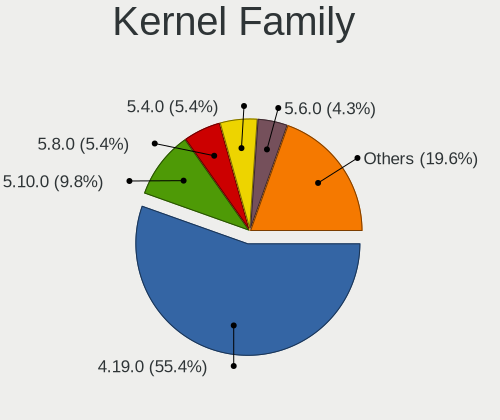

| Version  | Notebooks | Percent |
|----------|-----------|---------|
| 4.19.0   | 48        | 53.93%  |
| 5.10.0   | 9         | 10.11%  |
| 5.8.0    | 5         | 5.62%   |
| 5.4.0    | 5         | 5.62%   |
| 5.6.0    | 4         | 4.49%   |
| 5.6.10   | 2         | 2.25%   |
| 5.3.0    | 2         | 2.25%   |
| 5.2.21   | 2         | 2.25%   |
| 5.9.1    | 1         | 1.12%   |
| 5.8.16   | 1         | 1.12%   |
| 5.7.0    | 1         | 1.12%   |
| 5.3.10   | 1         | 1.12%   |
| 5.2.0    | 1         | 1.12%   |
| 5.15.0   | 1         | 1.12%   |
| 5.13.0   | 1         | 1.12%   |
| 5.11.0   | 1         | 1.12%   |
| 5.10.1   | 1         | 1.12%   |
| 4.9.246  | 1         | 1.12%   |
| 4.9.193  | 1         | 1.12%   |
| 4.19.174 | 1         | 1.12%   |

Kernel Major Ver.
-----------------

Linux kernel major version

| Version | Notebooks | Percent |
|---------|-----------|---------|
| 4.19    | 49        | 55.06%  |
| 5.10    | 10        | 11.24%  |
| 5.8     | 6         | 6.74%   |
| 5.6     | 6         | 6.74%   |
| 5.4     | 5         | 5.62%   |
| 5.3     | 3         | 3.37%   |
| 5.2     | 3         | 3.37%   |
| 4.9     | 2         | 2.25%   |
| 5.9     | 1         | 1.12%   |
| 5.7     | 1         | 1.12%   |
| 5.15    | 1         | 1.12%   |
| 5.13    | 1         | 1.12%   |
| 5.11    | 1         | 1.12%   |

Arch
----

OS architecture (x86_64, i586, etc.)

| Name   | Notebooks | Percent |
|--------|-----------|---------|
| x86_64 | 79        | 94.05%  |
| i686   | 5         | 5.95%   |

DE
--

Desktop Environment

| Name            | Notebooks | Percent |
|-----------------|-----------|---------|
| XFCE            | 60        | 71.43%  |
| KDE5            | 9         | 10.71%  |
| Unknown         | 4         | 4.76%   |
| MATE            | 2         | 2.38%   |
| Budgie          | 2         | 2.38%   |
| X-Cinnamon      | 1         | 1.19%   |
| LXQt            | 1         | 1.19%   |
| LXDE            | 1         | 1.19%   |
| i3              | 1         | 1.19%   |
| GNOME Flashback | 1         | 1.19%   |
| fluxbox         | 1         | 1.19%   |
| Cinnamon        | 1         | 1.19%   |

Display Server
--------------

X11 or Wayland

| Name | Notebooks | Percent |
|------|-----------|---------|
| X11  | 84        | 100%    |

Display Manager
---------------

SDDM, LightDM, etc.

| Name    | Notebooks | Percent |
|---------|-----------|---------|
| LightDM | 68        | 80%     |
| SDDM    | 8         | 9.41%   |
| SLiM    | 5         | 5.88%   |
| TDM     | 4         | 4.71%   |

OS Lang
-------

Language

| Lang    | Notebooks | Percent |
|---------|-----------|---------|
| en_US   | 29        | 32.95%  |
| Unknown | 18        | 20.45%  |
| de_DE   | 7         | 7.95%   |
| en_GB   | 6         | 6.82%   |
| sk_SK   | 5         | 5.68%   |
| ru_RU   | 5         | 5.68%   |
| pt_BR   | 3         | 3.41%   |
| pl_PL   | 2         | 2.27%   |
| it_IT   | 2         | 2.27%   |
| fr_FR   | 2         | 2.27%   |
| zh_CN   | 1         | 1.14%   |
| uk_UA   | 1         | 1.14%   |
| tr_TR   | 1         | 1.14%   |
| nl_NL   | 1         | 1.14%   |
| fr_BE   | 1         | 1.14%   |
| es_MX   | 1         | 1.14%   |
| en_IE   | 1         | 1.14%   |
| en_AU   | 1         | 1.14%   |
| cs_CZ   | 1         | 1.14%   |

Boot Mode
---------

EFI or BIOS

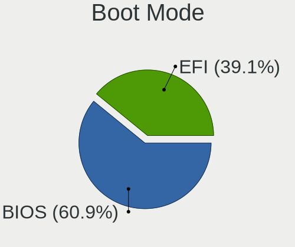

| Mode | Notebooks | Percent |
|------|-----------|---------|
| BIOS | 51        | 60.71%  |
| EFI  | 33        | 39.29%  |

Filesystem
----------

Type of filesystem

| Type    | Notebooks | Percent |
|---------|-----------|---------|
| Ext4    | 75        | 89.29%  |
| Overlay | 7         | 8.33%   |
| F2fs    | 1         | 1.19%   |
| Btrfs   | 1         | 1.19%   |

Part. scheme
------------

Scheme of partitioning

| Type    | Notebooks | Percent |
|---------|-----------|---------|
| GPT     | 43        | 51.19%  |
| MBR     | 39        | 46.43%  |
| Unknown | 2         | 2.38%   |

Dual Boot with Linux/BSD
------------------------

Hosting more than one Linux/BSD

| Dual boot | Notebooks | Percent |
|-----------|-----------|---------|
| No        | 72        | 84.71%  |
| Yes       | 13        | 15.29%  |

Dual Boot (Win)
---------------

Hosting Linux and Windows

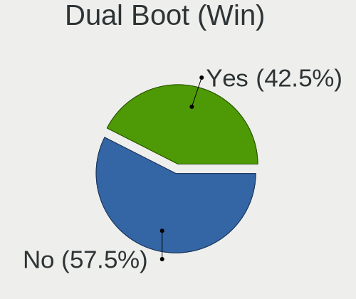

| Dual boot | Notebooks | Percent |
|-----------|-----------|---------|
| No        | 48        | 57.14%  |
| Yes       | 36        | 42.86%  |

Board
-----

Vendor
------

Motherboard manufacturer

| Name                | Notebooks | Percent |
|---------------------|-----------|---------|
| Lenovo              | 16        | 19.05%  |
| Hewlett-Packard     | 16        | 19.05%  |
| Dell                | 12        | 14.29%  |
| Acer                | 11        | 13.1%   |
| ASUSTek Computer    | 8         | 9.52%   |
| Toshiba             | 5         | 5.95%   |
| Sony                | 2         | 2.38%   |
| Samsung Electronics | 2         | 2.38%   |
| MSI                 | 2         | 2.38%   |
| Medion              | 2         | 2.38%   |
| Google              | 2         | 2.38%   |
| Fujitsu Siemens     | 2         | 2.38%   |
| Pixus               | 1         | 1.19%   |
| Intel               | 1         | 1.19%   |
| eMachines           | 1         | 1.19%   |
| Clevo               | 1         | 1.19%   |

Model
-----

Motherboard model

| Name                                     | Notebooks | Percent |
|------------------------------------------|-----------|---------|
| Toshiba Satellite P875                   | 1         | 1.19%   |
| Toshiba Satellite L850-CJK               | 1         | 1.19%   |
| Toshiba Satellite C50-A-12K              | 1         | 1.19%   |
| Toshiba Satellite A300                   | 1         | 1.19%   |
| Toshiba PORTEGE R705                     | 1         | 1.19%   |
| Sony VPCF23P1E                           | 1         | 1.19%   |
| Sony SVT13115FBS                         | 1         | 1.19%   |
| Samsung R780/R778                        | 1         | 1.19%   |
| Samsung 305E4A/305E5A/305E7A             | 1         | 1.19%   |
| Pixus Rise                               | 1         | 1.19%   |
| MSI MS-N033                              | 1         | 1.19%   |
| MSI GP63 Leopard 8RD                     | 1         | 1.19%   |
| Medion P6669 MD60147                     | 1         | 1.19%   |
| Medion E6234                             | 1         | 1.19%   |
| Lenovo V145-15AST 81MT                   | 1         | 1.19%   |
| Lenovo ThinkPad X301 2776LBU             | 1         | 1.19%   |
| Lenovo ThinkPad X270 W10DG 20K5S0YT00    | 1         | 1.19%   |
| Lenovo ThinkPad X250 20CLS4YA00          | 1         | 1.19%   |
| Lenovo ThinkPad X220 4291WMQ             | 1         | 1.19%   |
| Lenovo ThinkPad X201 3680MY9             | 1         | 1.19%   |
| Lenovo ThinkPad X1C 5th W10DG 20K4S0EC00 | 1         | 1.19%   |
| Lenovo ThinkPad W510 4875W17             | 1         | 1.19%   |
| Lenovo ThinkPad T440p 20AWS2T11D         | 1         | 1.19%   |
| Lenovo ThinkPad T440p 20AWA1NAUK         | 1         | 1.19%   |
| Lenovo ThinkPad T420 4236MBU             | 1         | 1.19%   |
| Lenovo ThinkPad T410 2537G99             | 1         | 1.19%   |
| Lenovo ThinkPad L412 0585W28             | 1         | 1.19%   |
| Lenovo ThinkPad E490 20N9S26G00          | 1         | 1.19%   |
| Lenovo IdeaPad 310-15ISK 80SM            | 1         | 1.19%   |
| Intel ChiefRiver                         | 1         | 1.19%   |
| HP ZBook 15 G4                           | 1         | 1.19%   |
| HP Stream Laptop 14-cb0XX                | 1         | 1.19%   |
| HP ProBook 650 G1                        | 1         | 1.19%   |
| HP ProBook 6460b                         | 1         | 1.19%   |
| HP ProBook 4440s                         | 1         | 1.19%   |
| HP Presario CQ57                         | 1         | 1.19%   |
| HP Pavilion Laptop 15-cw0xxx             | 1         | 1.19%   |
| HP Pavilion Laptop 14-ce3xxx             | 1         | 1.19%   |
| HP Pavilion g6                           | 1         | 1.19%   |
| HP Pavilion dv7                          | 1         | 1.19%   |
| HP Notebook                              | 1         | 1.19%   |
| HP Mini 110-3500                         | 1         | 1.19%   |
| HP Laptop 14-ck0xxx                      | 1         | 1.19%   |
| HP EliteBook 8560p                       | 1         | 1.19%   |
| HP EliteBook 8540w                       | 1         | 1.19%   |
| HP 15                                    | 1         | 1.19%   |
| Google Gnawty                            | 1         | 1.19%   |
| Google Akemi                             | 1         | 1.19%   |
| Fujitsu Siemens ESPRIMO Mobile D9500     | 1         | 1.19%   |
| Fujitsu Siemens AMILO Xa 1526            | 1         | 1.19%   |
| eMachines E727                           | 1         | 1.19%   |
| Dell Vostro 5515                         | 1         | 1.19%   |
| Dell Vostro 3460                         | 1         | 1.19%   |
| Dell Latitude E7450                      | 1         | 1.19%   |
| Dell Latitude E7440                      | 1         | 1.19%   |
| Dell Latitude E5520                      | 1         | 1.19%   |
| Dell Latitude E5470                      | 1         | 1.19%   |
| Dell Latitude D430                       | 1         | 1.19%   |
| Dell Latitude 3190                       | 1         | 1.19%   |
| Dell Inspiron N5010                      | 1         | 1.19%   |

Model Family
------------

Motherboard model prefix

| Name                    | Notebooks | Percent |
|-------------------------|-----------|---------|
| Lenovo ThinkPad         | 13        | 15.48%  |
| Dell Latitude           | 6         | 7.14%   |
| Acer Aspire             | 6         | 7.14%   |
| Toshiba Satellite       | 4         | 4.76%   |
| HP Pavilion             | 4         | 4.76%   |
| HP ProBook              | 3         | 3.57%   |
| Dell Inspiron           | 3         | 3.57%   |
| HP EliteBook            | 2         | 2.38%   |
| Dell Vostro             | 2         | 2.38%   |
| ASUS TUF                | 2         | 2.38%   |
| Acer Extensa            | 2         | 2.38%   |
| Toshiba PORTEGE         | 1         | 1.19%   |
| Sony VPCF23P1E          | 1         | 1.19%   |
| Sony SVT13115FBS        | 1         | 1.19%   |
| Samsung R780            | 1         | 1.19%   |
| Samsung 305E4A          | 1         | 1.19%   |
| Pixus Rise              | 1         | 1.19%   |
| MSI MS-N033             | 1         | 1.19%   |
| MSI GP63                | 1         | 1.19%   |
| Medion P6669            | 1         | 1.19%   |
| Medion E6234            | 1         | 1.19%   |
| Lenovo V145-15AST       | 1         | 1.19%   |
| Lenovo IdeaPad          | 1         | 1.19%   |
| Intel ChiefRiver        | 1         | 1.19%   |
| HP ZBook                | 1         | 1.19%   |
| HP Stream               | 1         | 1.19%   |
| HP Presario             | 1         | 1.19%   |
| HP Notebook             | 1         | 1.19%   |
| HP Mini                 | 1         | 1.19%   |
| HP Laptop               | 1         | 1.19%   |
| HP 15                   | 1         | 1.19%   |
| Google Gnawty           | 1         | 1.19%   |
| Google Akemi            | 1         | 1.19%   |
| Fujitsu Siemens ESPRIMO | 1         | 1.19%   |
| Fujitsu Siemens AMILO   | 1         | 1.19%   |
| eMachines E727          | 1         | 1.19%   |
| Dell 0UW744??????       | 1         | 1.19%   |
| Clevo P150HMx           | 1         | 1.19%   |
| ASUS ZenBook            | 1         | 1.19%   |
| ASUS X540UP             | 1         | 1.19%   |
| ASUS X200CA             | 1         | 1.19%   |
| ASUS X101CH             | 1         | 1.19%   |
| ASUS N56VZ              | 1         | 1.19%   |
| ASUS 1025C              | 1         | 1.19%   |
| Acer TravelMate         | 1         | 1.19%   |
| Acer Swift              | 1         | 1.19%   |
| Acer AOD255             | 1         | 1.19%   |
| Unknown                 | 1         | 1.19%   |

MFG Year
--------

Motherboard manufacture year

| Year | Notebooks | Percent |
|------|-----------|---------|
| 2011 | 11        | 13.1%   |
| 2010 | 11        | 13.1%   |
| 2012 | 10        | 11.9%   |
| 2018 | 8         | 9.52%   |
| 2016 | 6         | 7.14%   |
| 2019 | 5         | 5.95%   |
| 2014 | 5         | 5.95%   |
| 2013 | 5         | 5.95%   |
| 2015 | 4         | 4.76%   |
| 2008 | 4         | 4.76%   |
| 2007 | 4         | 4.76%   |
| 2021 | 3         | 3.57%   |
| 2009 | 3         | 3.57%   |
| 2020 | 2         | 2.38%   |
| 2017 | 2         | 2.38%   |
| 2006 | 1         | 1.19%   |

Form Factor
-----------

Physical design of the computer

| Name     | Notebooks | Percent |
|----------|-----------|---------|
| Notebook | 84        | 100%    |

Secure Boot
-----------

Enabled or disabled

| State    | Notebooks | Percent |
|----------|-----------|---------|
| Disabled | 84        | 100%    |

Coreboot
--------

Have coreboot on board

| Used | Notebooks | Percent |
|------|-----------|---------|
| No   | 82        | 97.62%  |
| Yes  | 2         | 2.38%   |

RAM Size
--------

Total RAM memory

| Size in GB | Notebooks | Percent |
|------------|-----------|---------|
| 4.01-8.0   | 22        | 25.88%  |
| 3.01-4.0   | 19        | 22.35%  |
| 8.01-16.0  | 19        | 22.35%  |
| 1.01-2.0   | 10        | 11.76%  |
| 16.01-24.0 | 8         | 9.41%   |
| 32.01-64.0 | 3         | 3.53%   |
| 2.01-3.0   | 2         | 2.35%   |
| 0.51-1.0   | 2         | 2.35%   |

RAM Used
--------

Used RAM memory

| Used GB   | Notebooks | Percent |
|-----------|-----------|---------|
| 1.01-2.0  | 37        | 42.05%  |
| 2.01-3.0  | 19        | 21.59%  |
| 0.51-1.0  | 14        | 15.91%  |
| 3.01-4.0  | 9         | 10.23%  |
| 4.01-8.0  | 6         | 6.82%   |
| 8.01-16.0 | 2         | 2.27%   |
| 0.01-0.5  | 1         | 1.14%   |

Total Drives
------------

Number of drives on board

| Drives | Notebooks | Percent |
|--------|-----------|---------|
| 1      | 63        | 74.12%  |
| 2      | 20        | 23.53%  |
| 3      | 1         | 1.18%   |
| 0      | 1         | 1.18%   |

Has CD-ROM
----------

Has CD-ROM on board

| Presented | Notebooks | Percent |
|-----------|-----------|---------|
| No        | 52        | 61.9%   |
| Yes       | 32        | 38.1%   |

Has Ethernet
------------

Has Ethernet on board

| Presented | Notebooks | Percent |
|-----------|-----------|---------|
| Yes       | 75        | 89.29%  |
| No        | 9         | 10.71%  |

Has WiFi
--------

Has WiFi module

| Presented | Notebooks | Percent |
|-----------|-----------|---------|
| Yes       | 83        | 98.81%  |
| No        | 1         | 1.19%   |

Has Bluetooth
-------------

Has Bluetooth module

| Presented | Notebooks | Percent |
|-----------|-----------|---------|
| Yes       | 63        | 75%     |
| No        | 21        | 25%     |

Location
--------

Country
-------

Geographic location (country)

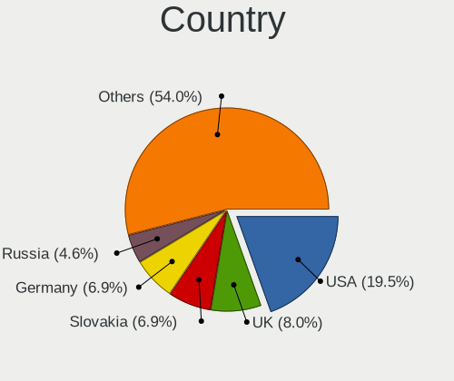

| Country     | Notebooks | Percent |
|-------------|-----------|---------|
| USA         | 17        | 20.24%  |
| UK          | 6         | 7.14%   |
| Slovakia    | 6         | 7.14%   |
| Germany     | 6         | 7.14%   |
| Russia      | 4         | 4.76%   |
| Austria     | 4         | 4.76%   |
| Ukraine     | 3         | 3.57%   |
| Poland      | 3         | 3.57%   |
| France      | 3         | 3.57%   |
| Brazil      | 3         | 3.57%   |
| Thailand    | 2         | 2.38%   |
| Spain       | 2         | 2.38%   |
| Netherlands | 2         | 2.38%   |
| Mexico      | 2         | 2.38%   |
| Italy       | 2         | 2.38%   |
| India       | 2         | 2.38%   |
| China       | 2         | 2.38%   |
| Canada      | 2         | 2.38%   |
| Turkey      | 1         | 1.19%   |
| Sweden      | 1         | 1.19%   |
| Romania     | 1         | 1.19%   |
| Philippines | 1         | 1.19%   |
| Nigeria     | 1         | 1.19%   |
| Latvia      | 1         | 1.19%   |
| Indonesia   | 1         | 1.19%   |
| Greece      | 1         | 1.19%   |
| Czechia     | 1         | 1.19%   |
| Chile       | 1         | 1.19%   |
| Belgium     | 1         | 1.19%   |
| Australia   | 1         | 1.19%   |
| Algeria     | 1         | 1.19%   |

City
----

Geographic location (city)

| City                      | Notebooks | Percent |
|---------------------------|-----------|---------|
| Bratislava                | 6         | 7.06%   |
| Vienna                    | 4         | 4.71%   |
| Berlin                    | 3         | 3.53%   |
| Warsaw                    | 2         | 2.35%   |
| Oxford                    | 2         | 2.35%   |
| Los Angeles               | 2         | 2.35%   |
| Dnipro                    | 2         | 2.35%   |
| Xalapa                    | 1         | 1.18%   |
| Wentzville                | 1         | 1.18%   |
| Valencia                  | 1         | 1.18%   |
| Tver                      | 1         | 1.18%   |
| Trzebinia                 | 1         | 1.18%   |
| Suzhou                    | 1         | 1.18%   |
| St Petersburg             | 1         | 1.18%   |
| Shenzhen                  | 1         | 1.18%   |
| Schiedam                  | 1         | 1.18%   |
| Santa Pola                | 1         | 1.18%   |
| San Giovanni in Persiceto | 1         | 1.18%   |
| Romulus                   | 1         | 1.18%   |
| Rivne                     | 1         | 1.18%   |
| Riga                      | 1         | 1.18%   |
| Relizane                  | 1         | 1.18%   |
| Puerto Vallarta           | 1         | 1.18%   |
| Portsmouth                | 1         | 1.18%   |
| Philadelphia              | 1         | 1.18%   |
| Pátrai                   | 1         | 1.18%   |
| Pasig                     | 1         | 1.18%   |
| Olinda                    | 1         | 1.18%   |
| Novoplastunovskaya        | 1         | 1.18%   |
| New Delhi                 | 1         | 1.18%   |
| Netolice                  | 1         | 1.18%   |
| Nashville                 | 1         | 1.18%   |
| Mount Laurel              | 1         | 1.18%   |
| Moscow                    | 1         | 1.18%   |
| Monument                  | 1         | 1.18%   |
| Mitcham                   | 1         | 1.18%   |
| Melbourne                 | 1         | 1.18%   |
| Mebane                    | 1         | 1.18%   |
| Makassar                  | 1         | 1.18%   |
| Macomb                    | 1         | 1.18%   |
| Longview                  | 1         | 1.18%   |
| Las Condes                | 1         | 1.18%   |
| Lagos                     | 1         | 1.18%   |
| Kollam                    | 1         | 1.18%   |
| Istanbul                  | 1         | 1.18%   |
| Henfield                  | 1         | 1.18%   |
| Hautrage                  | 1         | 1.18%   |
| Hastings                  | 1         | 1.18%   |
| Hartland                  | 1         | 1.18%   |
| Greven                    | 1         | 1.18%   |
| Grays                     | 1         | 1.18%   |
| Grand Rapids              | 1         | 1.18%   |
| Gothenburg                | 1         | 1.18%   |
| Gonneville-sur-Honfleur   | 1         | 1.18%   |
| Giethoorn                 | 1         | 1.18%   |
| Falkenstein               | 1         | 1.18%   |
| El Cajon                  | 1         | 1.18%   |
| Delve                     | 1         | 1.18%   |
| Conceicao                 | 1         | 1.18%   |
| Chiang Mai                | 1         | 1.18%   |

Drives
------

Drive Vendor
------------

Hard drive vendors

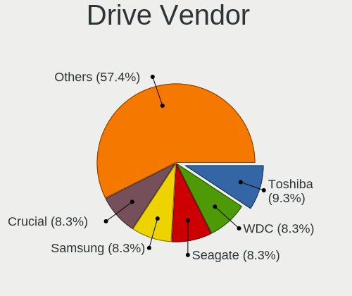

| Vendor              | Notebooks | Drives | Percent |
|---------------------|-----------|--------|---------|
| Toshiba             | 10        | 11     | 9.52%   |
| WDC                 | 9         | 9      | 8.57%   |
| Seagate             | 9         | 9      | 8.57%   |
| Samsung Electronics | 9         | 12     | 8.57%   |
| Kingston            | 8         | 8      | 7.62%   |
| Crucial             | 8         | 9      | 7.62%   |
| Unknown             | 7         | 10     | 6.67%   |
| SanDisk             | 6         | 6      | 5.71%   |
| HGST                | 6         | 7      | 5.71%   |
| Intel               | 4         | 5      | 3.81%   |
| SK hynix            | 3         | 3      | 2.86%   |
| Hitachi             | 3         | 3      | 2.86%   |
| PNY                 | 2         | 2      | 1.9%    |
| Micron Technology   | 2         | 3      | 1.9%    |
| KingSpec            | 2         | 2      | 1.9%    |
| KingDian            | 2         | 2      | 1.9%    |
| A-DATA Technology   | 2         | 2      | 1.9%    |
| ZTC                 | 1         | 1      | 0.95%   |
| Transcend           | 1         | 1      | 0.95%   |
| Team                | 1         | 1      | 0.95%   |
| Smart               | 1         | 1      | 0.95%   |
| Phison Electronics  | 1         | 2      | 0.95%   |
| Phison              | 1         | 1      | 0.95%   |
| Patriot             | 1         | 1      | 0.95%   |
| LITEONIT            | 1         | 1      | 0.95%   |
| Lexar               | 1         | 1      | 0.95%   |
| KingFast            | 1         | 1      | 0.95%   |
| Indilinx            | 1         | 1      | 0.95%   |
| Goodram             | 1         | 1      | 0.95%   |
| Corsair             | 1         | 1      | 0.95%   |

Drive Model
-----------

Hard drive models

| Model                                 | Notebooks | Percent |
|---------------------------------------|-----------|---------|
| Kingston SV300S37A120G 120GB SSD      | 3         | 2.83%   |
| Toshiba MQ01ABF050 500GB              | 2         | 1.89%   |
| Seagate ST1000LM048-2E7172 1TB        | 2         | 1.89%   |
| Seagate ST1000LM035-1RK172 1TB        | 2         | 1.89%   |
| Micron 1100_MTFDDAV256TBN 256GB SSD   | 2         | 1.89%   |
| Kingston SA400S37240G 240GB SSD       | 2         | 1.89%   |
| Kingston SA400S37120G 120GB SSD       | 2         | 1.89%   |
| Intel SSDSA2BW120G3H 120GB            | 2         | 1.89%   |
| Hitachi HTS543232A7A384 320GB         | 2         | 1.89%   |
| HGST HTS721010A9E630 1TB              | 2         | 1.89%   |
| HGST HTS541010A9E680 1TB              | 2         | 1.89%   |
| Crucial CT250MX500SSD1 250GB          | 2         | 1.89%   |
| ZTC SM201-256G                        | 1         | 0.94%   |
| WDC WDS240G2G0A-00JH30 240GB SSD      | 1         | 0.94%   |
| WDC WDS120G2G0A-00JH30 120GB SSD      | 1         | 0.94%   |
| WDC WD5000BPVT-60HXZT3 500GB          | 1         | 0.94%   |
| WDC WD3200LPVX-22V0TT0 320GB          | 1         | 0.94%   |
| WDC WD3200BEKT-60PVMT0 320GB          | 1         | 0.94%   |
| WDC WD2500BEVT-22A23T0 250GB          | 1         | 0.94%   |
| WDC WD10SPZX-60Z10T0 1TB              | 1         | 0.94%   |
| WDC WD10SPZX-00Z10T0 1TB              | 1         | 0.94%   |
| WDC WD10JPVX-22JC3T0 1TB              | 1         | 0.94%   |
| Unknown SS08G  8GB                    | 1         | 0.94%   |
| Unknown SLD64G  64GB                  | 1         | 0.94%   |
| Unknown SD16G  32GB                   | 1         | 0.94%   |
| Unknown SD04G  129GB                  | 1         | 0.94%   |
| Unknown SD  32GB                      | 1         | 0.94%   |
| Unknown HAG2e  16GB                   | 1         | 0.94%   |
| Unknown CWBC3R  64GB                  | 1         | 0.94%   |
| Unknown BJTD4R  32GB                  | 1         | 0.94%   |
| Transcend TS256GMTS430S 256GB SSD     | 1         | 0.94%   |
| Toshiba THNSNC128GMLJ 128GB SSD       | 1         | 0.94%   |
| Toshiba MQ02ABD100H 1TB               | 1         | 0.94%   |
| Toshiba MQ01ABD075 752GB              | 1         | 0.94%   |
| Toshiba MK7575GSX 752GB               | 1         | 0.94%   |
| Toshiba MK2565GSX 250GB               | 1         | 0.94%   |
| Toshiba MK1032GSX 100GB               | 1         | 0.94%   |
| Toshiba KXG60ZNV1T02 1TB              | 1         | 0.94%   |
| Toshiba KBG40ZMT128G MEMORY 128GB     | 1         | 0.94%   |
| Team T253LE240G 240GB SSD             | 1         | 0.94%   |
| Smart SSD XceedValue2 mSATA 32GB      | 1         | 0.94%   |
| SK hynix HFS128G3BMND-3210A 128GB SSD | 1         | 0.94%   |
| SK hynix HBG4e  32GB                  | 1         | 0.94%   |
| SK hynix BC711 NVMe 512GB             | 1         | 0.94%   |
| Seagate ST95005620AS 500GB            | 1         | 0.94%   |
| Seagate ST500LX012-1LM162-SSHD 500GB  | 1         | 0.94%   |
| Seagate ST500LT012-1DG142 500GB       | 1         | 0.94%   |
| Seagate ST500LM034-2GH17A 500GB       | 1         | 0.94%   |
| Seagate ST1500LM006 HN-M151RAD 1TB    | 1         | 0.94%   |
| SanDisk SSD U100 32GB                 | 1         | 0.94%   |
| SanDisk SSD PLUS 240GB                | 1         | 0.94%   |
| SanDisk SDSSDH3250G 250GB             | 1         | 0.94%   |
| SanDisk SDSSDA120G 120GB              | 1         | 0.94%   |
| SanDisk SDSSDA-1T00 1TB               | 1         | 0.94%   |
| SanDisk SD9SN8W-128G-1006 128GB SSD   | 1         | 0.94%   |
| Samsung MZVLW256HEHP-000L7 256GB      | 1         | 0.94%   |
| Samsung MZVLB512HAJQ-000L7 512GB      | 1         | 0.94%   |
| Samsung MZVLB256HAHQ-000H1 256GB      | 1         | 0.94%   |
| Samsung MZNLN256HAJQ-000L7 256GB SSD  | 1         | 0.94%   |
| Samsung MZ7LN256HAJQ-000L2 256GB SSD  | 1         | 0.94%   |

HDD Vendor
----------

Hard disk drive vendors

| Vendor              | Notebooks | Drives | Percent |
|---------------------|-----------|--------|---------|
| Seagate             | 9         | 9      | 26.47%  |
| WDC                 | 7         | 7      | 20.59%  |
| Toshiba             | 7         | 8      | 20.59%  |
| HGST                | 6         | 7      | 17.65%  |
| Hitachi             | 3         | 3      | 8.82%   |
| Samsung Electronics | 2         | 3      | 5.88%   |

SSD Vendor
----------

Solid state drive vendors

| Vendor              | Notebooks | Drives | Percent |
|---------------------|-----------|--------|---------|
| Kingston            | 8         | 8      | 14.81%  |
| Crucial             | 8         | 9      | 14.81%  |
| SanDisk             | 6         | 6      | 11.11%  |
| Samsung Electronics | 4         | 5      | 7.41%   |
| Intel               | 3         | 4      | 5.56%   |
| WDC                 | 2         | 2      | 3.7%    |
| PNY                 | 2         | 2      | 3.7%    |
| Micron Technology   | 2         | 3      | 3.7%    |
| KingSpec            | 2         | 2      | 3.7%    |
| KingDian            | 2         | 2      | 3.7%    |
| A-DATA Technology   | 2         | 2      | 3.7%    |
| ZTC                 | 1         | 1      | 1.85%   |
| Transcend           | 1         | 1      | 1.85%   |
| Toshiba             | 1         | 1      | 1.85%   |
| Team                | 1         | 1      | 1.85%   |
| Smart               | 1         | 1      | 1.85%   |
| SK hynix            | 1         | 1      | 1.85%   |
| Phison              | 1         | 1      | 1.85%   |
| Patriot             | 1         | 1      | 1.85%   |
| LITEONIT            | 1         | 1      | 1.85%   |
| KingFast            | 1         | 1      | 1.85%   |
| Indilinx            | 1         | 1      | 1.85%   |
| Goodram             | 1         | 1      | 1.85%   |
| Corsair             | 1         | 1      | 1.85%   |

Drive Kind
----------

HDD or SSD

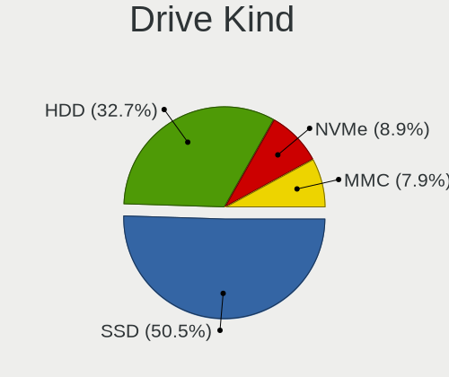

| Kind | Notebooks | Drives | Percent |
|------|-----------|--------|---------|
| SSD  | 49        | 58     | 50%     |
| HDD  | 33        | 37     | 33.67%  |
| MMC  | 8         | 11     | 8.16%   |
| NVMe | 8         | 11     | 8.16%   |

Drive Connector
---------------

SATA, SAS, NVMe, etc.

| Type | Notebooks | Drives | Percent |
|------|-----------|--------|---------|
| SATA | 70        | 95     | 81.4%   |
| NVMe | 8         | 11     | 9.3%    |
| MMC  | 8         | 11     | 9.3%    |

Drive Size
----------

Size of hard drive

| Size in TB | Notebooks | Drives | Percent |
|------------|-----------|--------|---------|
| 0.01-0.5   | 57        | 70     | 72.15%  |
| 0.51-1.0   | 22        | 25     | 27.85%  |

Space Total
-----------

Amount of disk space available on the file system

| Size in GB | Notebooks | Percent |
|------------|-----------|---------|
| 101-250    | 31        | 36.05%  |
| 51-100     | 17        | 19.77%  |
| 501-1000   | 13        | 15.12%  |
| 251-500    | 7         | 8.14%   |
| 21-50      | 7         | 8.14%   |
| 1-20       | 5         | 5.81%   |
| 1001-2000  | 4         | 4.65%   |
| Unknown    | 2         | 2.33%   |

Space Used
----------

Amount of used disk space

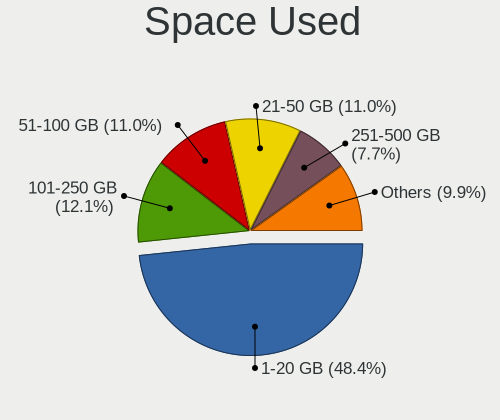

| Used GB   | Notebooks | Percent |
|-----------|-----------|---------|
| 1-20      | 44        | 50.57%  |
| 21-50     | 10        | 11.49%  |
| 101-250   | 10        | 11.49%  |
| 51-100    | 10        | 11.49%  |
| 251-500   | 5         | 5.75%   |
| 501-1000  | 5         | 5.75%   |
| Unknown   | 2         | 2.3%    |
| 1001-2000 | 1         | 1.15%   |

Malfunc. Drives
---------------

Drive models with a malfunction

| Model                               | Notebooks | Drives | Percent |
|-------------------------------------|-----------|--------|---------|
| WDC WD5000BPVT-60HXZT3 500GB        | 1         | 1      | 6.25%   |
| WDC WD3200LPVX-22V0TT0 320GB        | 1         | 1      | 6.25%   |
| WDC WD3200BEKT-60PVMT0 320GB        | 1         | 1      | 6.25%   |
| Toshiba MK7575GSX 752GB             | 1         | 2      | 6.25%   |
| Toshiba MK2565GSX 250GB             | 1         | 1      | 6.25%   |
| Seagate ST1000LM035-1RK172 1TB      | 1         | 1      | 6.25%   |
| SanDisk SD9SN8W-128G-1006 128GB SSD | 1         | 1      | 6.25%   |
| Samsung Electronics HS122JC 120GB   | 1         | 2      | 6.25%   |
| Kingston SV300S37A120G 120GB SSD    | 1         | 1      | 6.25%   |
| Indilinx IND-S325S120G 120GB SSD    | 1         | 1      | 6.25%   |
| Hitachi HTS547575A9E384 752GB       | 1         | 1      | 6.25%   |
| Hitachi HTS543232A7A384 320GB       | 1         | 1      | 6.25%   |
| HGST HTS545050A7E680 500GB          | 1         | 1      | 6.25%   |
| HGST HTS541010A9E680 1TB            | 1         | 1      | 6.25%   |
| Crucial CT512M550SSD1 512GB         | 1         | 1      | 6.25%   |
| A-DATA Technology SU650 240GB SSD   | 1         | 1      | 6.25%   |

Malfunc. Drive Vendor
---------------------

Vendors of faulty drives

| Vendor              | Notebooks | Drives | Percent |
|---------------------|-----------|--------|---------|
| WDC                 | 3         | 3      | 18.75%  |
| Toshiba             | 2         | 3      | 12.5%   |
| Hitachi             | 2         | 2      | 12.5%   |
| HGST                | 2         | 2      | 12.5%   |
| Seagate             | 1         | 1      | 6.25%   |
| SanDisk             | 1         | 1      | 6.25%   |
| Samsung Electronics | 1         | 2      | 6.25%   |
| Kingston            | 1         | 1      | 6.25%   |
| Indilinx            | 1         | 1      | 6.25%   |
| Crucial             | 1         | 1      | 6.25%   |
| A-DATA Technology   | 1         | 1      | 6.25%   |

Malfunc. HDD Vendor
-------------------

Vendors of faulty HDD drives

| Vendor              | Notebooks | Drives | Percent |
|---------------------|-----------|--------|---------|
| WDC                 | 3         | 3      | 27.27%  |
| Toshiba             | 2         | 3      | 18.18%  |
| Hitachi             | 2         | 2      | 18.18%  |
| HGST                | 2         | 2      | 18.18%  |
| Seagate             | 1         | 1      | 9.09%   |
| Samsung Electronics | 1         | 2      | 9.09%   |

Malfunc. Drive Kind
-------------------

Kinds of faulty drives

| Kind | Notebooks | Drives | Percent |
|------|-----------|--------|---------|
| HDD  | 11        | 13     | 68.75%  |
| SSD  | 5         | 5      | 31.25%  |

Failed Drives
-------------

Failed drive models

Zero info for selected period =(

Failed Drive Vendor
-------------------

Failed drive vendors

Zero info for selected period =(

Drive Status
------------

Number of failed and malfunc. drives

| Status   | Notebooks | Drives | Percent |
|----------|-----------|--------|---------|
| Works    | 65        | 88     | 73.03%  |
| Malfunc  | 15        | 18     | 16.85%  |
| Detected | 9         | 11     | 10.11%  |

Storage controller
------------------

Storage Vendor
--------------

Storage controller vendors

| Vendor                       | Notebooks | Percent |
|------------------------------|-----------|---------|
| Intel                        | 66        | 76.74%  |
| AMD                          | 10        | 11.63%  |
| Samsung Electronics          | 3         | 3.49%   |
| Nvidia                       | 2         | 2.33%   |
| Toshiba America Info Systems | 1         | 1.16%   |
| SK hynix                     | 1         | 1.16%   |
| Silicon Motion               | 1         | 1.16%   |
| Phison Electronics           | 1         | 1.16%   |
| KIOXIA                       | 1         | 1.16%   |

Storage Model
-------------

Storage controller models

| Model                                                                            | Notebooks | Percent |
|----------------------------------------------------------------------------------|-----------|---------|
| Intel 82801 Mobile SATA Controller [RAID mode]                                   | 8         | 8.79%   |
| Intel 7 Series Chipset Family 6-port SATA Controller [AHCI mode]                 | 8         | 8.79%   |
| Intel 6 Series/C200 Series Chipset Family 6 port Mobile SATA AHCI Controller     | 8         | 8.79%   |
| AMD FCH SATA Controller [AHCI mode]                                              | 8         | 8.79%   |
| Intel Sunrise Point-LP SATA Controller [AHCI mode]                               | 7         | 7.69%   |
| Intel 5 Series/3400 Series Chipset 6 port SATA AHCI Controller                   | 6         | 6.59%   |
| Intel NM10/ICH7 Family SATA Controller [AHCI mode]                               | 4         | 4.4%    |
| Intel 82801IBM/IEM (ICH9M/ICH9M-E) 4 port SATA Controller [AHCI mode]            | 3         | 3.3%    |
| Intel 8 Series/C220 Series Chipset Family 6-port SATA Controller 1 [AHCI mode]   | 3         | 3.3%    |
| Intel 5 Series/3400 Series Chipset 4 port SATA AHCI Controller                   | 3         | 3.3%    |
| Samsung NVMe SSD Controller SM981/PM981/PM983                                    | 2         | 2.2%    |
| Intel 82801HM/HEM (ICH8M/ICH8M-E) SATA Controller [AHCI mode]                    | 2         | 2.2%    |
| Intel 82801HM/HEM (ICH8M/ICH8M-E) IDE Controller                                 | 2         | 2.2%    |
| Toshiba America Info Systems XG6 NVMe SSD Controller                             | 1         | 1.1%    |
| SK hynix Gold P31 SSD                                                            | 1         | 1.1%    |
| Silicon Motion SM2263EN/SM2263XT SSD Controller                                  | 1         | 1.1%    |
| Samsung NVMe SSD Controller SM961/PM961/SM963                                    | 1         | 1.1%    |
| Phison E12 NVMe Controller                                                       | 1         | 1.1%    |
| Nvidia MCP67 AHCI Controller                                                     | 1         | 1.1%    |
| Nvidia MCP51 Serial ATA Controller                                               | 1         | 1.1%    |
| Nvidia MCP51 IDE                                                                 | 1         | 1.1%    |
| KIOXIA Non-Volatile memory controller                                            | 1         | 1.1%    |
| Intel Wildcat Point-LP SATA Controller [AHCI Mode]                               | 1         | 1.1%    |
| Intel Volume Management Device NVMe RAID Controller                              | 1         | 1.1%    |
| Intel SSD 660P Series                                                            | 1         | 1.1%    |
| Intel Q170/Q150/B150/H170/H110/Z170/CM236 Chipset SATA Controller [AHCI Mode]    | 1         | 1.1%    |
| Intel Comet Lake SATA AHCI Controller                                            | 1         | 1.1%    |
| Intel Celeron/Pentium Silver Processor SATA Controller                           | 1         | 1.1%    |
| Intel Celeron N3350/Pentium N4200/Atom E3900 Series SATA AHCI Controller         | 1         | 1.1%    |
| Intel Cannon Point-LP SATA Controller [AHCI Mode]                                | 1         | 1.1%    |
| Intel Cannon Lake Mobile PCH SATA AHCI Controller                                | 1         | 1.1%    |
| Intel Atom/Celeron/Pentium Processor x5-E8000/J3xxx/N3xxx Series SATA Controller | 1         | 1.1%    |
| Intel Atom Processor E3800 Series SATA AHCI Controller                           | 1         | 1.1%    |
| Intel 82801IBM/IEM (ICH9M/ICH9M-E) 2 port SATA Controller [IDE mode]             | 1         | 1.1%    |
| Intel 82801GBM/GHM (ICH7-M Family) SATA Controller [IDE mode]                    | 1         | 1.1%    |
| Intel 82801G (ICH7 Family) IDE Controller                                        | 1         | 1.1%    |
| Intel 8 Series SATA Controller 1 [AHCI mode]                                     | 1         | 1.1%    |
| AMD SB7x0/SB8x0/SB9x0 SATA Controller [AHCI mode]                                | 1         | 1.1%    |
| AMD SB600 Non-Raid-5 SATA                                                        | 1         | 1.1%    |
| AMD SB600 IDE                                                                    | 1         | 1.1%    |

Storage Kind
------------

Kind of storage controller (IDE, SATA, NVMe, SAS, ...)

| Kind | Notebooks | Percent |
|------|-----------|---------|
| SATA | 64        | 71.91%  |
| RAID | 9         | 10.11%  |
| NVMe | 8         | 8.99%   |
| IDE  | 8         | 8.99%   |

Processor
---------

CPU Vendor
----------

Processor vendors

| Vendor | Notebooks | Percent |
|--------|-----------|---------|
| Intel  | 72        | 85.71%  |
| AMD    | 12        | 14.29%  |

CPU Model
---------

Processor models

| Model                                       | Notebooks | Percent |
|---------------------------------------------|-----------|---------|
| Intel Core i5-6200U CPU @ 2.30GHz           | 4         | 4.76%   |
| Intel Core i5 CPU M 520 @ 2.40GHz           | 4         | 4.76%   |
| Intel Core i7-7500U CPU @ 2.70GHz           | 2         | 2.38%   |
| Intel Core i7-3610QM CPU @ 2.30GHz          | 2         | 2.38%   |
| Intel Core i7-2670QM CPU @ 2.20GHz          | 2         | 2.38%   |
| Intel Core i5-2540M CPU @ 2.60GHz           | 2         | 2.38%   |
| Intel Core i3-2310M CPU @ 2.10GHz           | 2         | 2.38%   |
| Intel Atom CPU N2600 @ 1.60GHz              | 2         | 2.38%   |
| Intel Pentium Silver N5000 CPU @ 1.10GHz    | 1         | 1.19%   |
| Intel Pentium Dual-Core CPU T4500 @ 2.30GHz | 1         | 1.19%   |
| Intel Pentium CPU N3710 @ 1.60GHz           | 1         | 1.19%   |
| Intel Pentium CPU B960 @ 2.20GHz            | 1         | 1.19%   |
| Intel Core i7-9750H CPU @ 2.60GHz           | 1         | 1.19%   |
| Intel Core i7-8750H CPU @ 2.20GHz           | 1         | 1.19%   |
| Intel Core i7-7700HQ CPU @ 2.80GHz          | 1         | 1.19%   |
| Intel Core i7-6500U CPU @ 2.50GHz           | 1         | 1.19%   |
| Intel Core i7-5600U CPU @ 2.60GHz           | 1         | 1.19%   |
| Intel Core i7-4710MQ CPU @ 2.50GHz          | 1         | 1.19%   |
| Intel Core i7-3632QM CPU @ 2.20GHz          | 1         | 1.19%   |
| Intel Core i7-3630QM CPU @ 2.40GHz          | 1         | 1.19%   |
| Intel Core i7-3537U CPU @ 2.00GHz           | 1         | 1.19%   |
| Intel Core i7-1065G7 CPU @ 1.30GHz          | 1         | 1.19%   |
| Intel Core i7 CPU Q 720 @ 1.60GHz           | 1         | 1.19%   |
| Intel Core i7 CPU M 640 @ 2.80GHz           | 1         | 1.19%   |
| Intel Core i7 CPU M 620 @ 2.67GHz           | 1         | 1.19%   |
| Intel Core i5-8265U CPU @ 1.60GHz           | 1         | 1.19%   |
| Intel Core i5-8250U CPU @ 1.60GHz           | 1         | 1.19%   |
| Intel Core i5-6300U CPU @ 2.40GHz           | 1         | 1.19%   |
| Intel Core i5-5300U CPU @ 2.30GHz           | 1         | 1.19%   |
| Intel Core i5-4310M CPU @ 2.70GHz           | 1         | 1.19%   |
| Intel Core i5-4300U CPU @ 1.90GHz           | 1         | 1.19%   |
| Intel Core i5-4300M CPU @ 2.60GHz           | 1         | 1.19%   |
| Intel Core i5-4210U CPU @ 1.70GHz           | 1         | 1.19%   |
| Intel Core i5-3317U CPU @ 1.70GHz           | 1         | 1.19%   |
| Intel Core i5-3210M CPU @ 2.50GHz           | 1         | 1.19%   |
| Intel Core i5-2520M CPU @ 2.50GHz           | 1         | 1.19%   |
| Intel Core i5-2450M CPU @ 2.50GHz           | 1         | 1.19%   |
| Intel Core i5-10210U CPU @ 1.60GHz          | 1         | 1.19%   |
| Intel Core i5 CPU M 450 @ 2.40GHz           | 1         | 1.19%   |
| Intel Core i3-7020U CPU @ 2.30GHz           | 1         | 1.19%   |
| Intel Core i3 CPU M 330 @ 2.13GHz           | 1         | 1.19%   |
| Intel Core 2 Duo CPU U9400 @ 1.40GHz        | 1         | 1.19%   |
| Intel Core 2 Duo CPU T9300 @ 2.50GHz        | 1         | 1.19%   |
| Intel Core 2 Duo CPU T6400 @ 2.00GHz        | 1         | 1.19%   |
| Intel Core 2 Duo CPU T5470 @ 1.60GHz        | 1         | 1.19%   |
| Intel Core 2 Duo CPU T5250 @ 1.50GHz        | 1         | 1.19%   |
| Intel Core 2 CPU U7600 @ 1.20GHz            | 1         | 1.19%   |
| Intel Celeron CPU N3350 @ 1.10GHz           | 1         | 1.19%   |
| Intel Celeron CPU N3060 @ 1.60GHz           | 1         | 1.19%   |
| Intel Celeron CPU N3050 @ 1.60GHz           | 1         | 1.19%   |
| Intel Celeron CPU N2840 @ 2.16GHz           | 1         | 1.19%   |
| Intel Celeron CPU N2830 @ 2.16GHz           | 1         | 1.19%   |
| Intel Celeron CPU B820 @ 1.70GHz            | 1         | 1.19%   |
| Intel Celeron CPU 1007U @ 1.50GHz           | 1         | 1.19%   |
| Intel Celeron CPU 1005M @ 1.90GHz           | 1         | 1.19%   |
| Intel Atom CPU Z3735F @ 1.33GHz             | 1         | 1.19%   |
| Intel Atom CPU N550 @ 1.50GHz               | 1         | 1.19%   |
| Intel Atom CPU N450 @ 1.66GHz               | 1         | 1.19%   |
| Intel Atom CPU N280 @ 1.66GHz               | 1         | 1.19%   |
| Intel 11th Gen Core i7-1165G7 @ 2.80GHz     | 1         | 1.19%   |

CPU Model Family
----------------

Processor model prefix

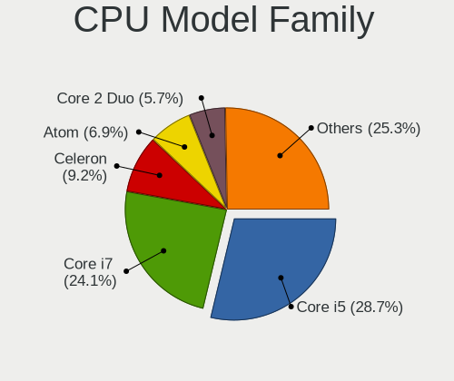

| Model                   | Notebooks | Percent |
|-------------------------|-----------|---------|
| Intel Core i5           | 24        | 28.57%  |
| Intel Core i7           | 19        | 22.62%  |
| Intel Celeron           | 8         | 9.52%   |
| Intel Atom              | 6         | 7.14%   |
| Intel Core 2 Duo        | 5         | 5.95%   |
| Intel Core i3           | 4         | 4.76%   |
| AMD A6                  | 3         | 3.57%   |
| Intel Pentium           | 2         | 2.38%   |
| AMD Turion 64 X2 Mobile | 2         | 2.38%   |
| AMD Ryzen 7             | 2         | 2.38%   |
| Other                   | 1         | 1.19%   |
| Intel Pentium Silver    | 1         | 1.19%   |
| Intel Pentium Dual-Core | 1         | 1.19%   |
| Intel Core 2            | 1         | 1.19%   |
| AMD Ryzen 5             | 1         | 1.19%   |
| AMD E1                  | 1         | 1.19%   |
| AMD E                   | 1         | 1.19%   |
| AMD Athlon 64 X2        | 1         | 1.19%   |
| AMD A8                  | 1         | 1.19%   |

CPU Cores
---------

Number of processor cores

| Number | Notebooks | Percent |
|--------|-----------|---------|
| 2      | 57        | 67.86%  |
| 4      | 20        | 23.81%  |
| 1      | 3         | 3.57%   |
| 8      | 2         | 2.38%   |
| 6      | 2         | 2.38%   |

CPU Sockets
-----------

Number of sockets

| Number | Notebooks | Percent |
|--------|-----------|---------|
| 1      | 84        | 100%    |

CPU Threads
-----------

Threads per core (Hyper-Threading)

| Number | Notebooks | Percent |
|--------|-----------|---------|
| 2      | 55        | 65.48%  |
| 1      | 29        | 34.52%  |

CPU Op-Modes
------------

CPU Operation Modes (32-bit, 64-bit)

| Op mode        | Notebooks | Percent |
|----------------|-----------|---------|
| 32-bit, 64-bit | 81        | 96.43%  |
| 32-bit         | 3         | 3.57%   |

CPU Microcode
-------------

Microcode number

| Number     | Notebooks | Percent |
|------------|-----------|---------|
| Unknown    | 11        | 12.94%  |
| 0x306a9    | 8         | 9.41%   |
| 0x206a7    | 7         | 8.24%   |
| 0x406e3    | 6         | 7.06%   |
| 0x20655    | 5         | 5.88%   |
| 0x306c3    | 3         | 3.53%   |
| 0x20652    | 3         | 3.53%   |
| 0x906ea    | 2         | 2.35%   |
| 0x806ec    | 2         | 2.35%   |
| 0x806e9    | 2         | 2.35%   |
| 0x6fd      | 2         | 2.35%   |
| 0x406c4    | 2         | 2.35%   |
| 0x40651    | 2         | 2.35%   |
| 0x306d4    | 2         | 2.35%   |
| 0x30678    | 2         | 2.35%   |
| 0x30661    | 2         | 2.35%   |
| 0x106ca    | 2         | 2.35%   |
| 0x10676    | 2         | 2.35%   |
| 0x03000027 | 2         | 2.35%   |
| 0x906e9    | 1         | 1.18%   |
| 0x806ea    | 1         | 1.18%   |
| 0x806c1    | 1         | 1.18%   |
| 0x706e5    | 1         | 1.18%   |
| 0x706a1    | 1         | 1.18%   |
| 0x6f2      | 1         | 1.18%   |
| 0x506c9    | 1         | 1.18%   |
| 0x406c3    | 1         | 1.18%   |
| 0x106e5    | 1         | 1.18%   |
| 0x106c2    | 1         | 1.18%   |
| 0x1067a    | 1         | 1.18%   |
| 0x08608103 | 1         | 1.18%   |
| 0x08600104 | 1         | 1.18%   |
| 0x0810100b | 1         | 1.18%   |
| 0x07030105 | 1         | 1.18%   |
| 0x0700010f | 1         | 1.18%   |
| 0x06006705 | 1         | 1.18%   |
| 0x05000119 | 1         | 1.18%   |

CPU Microarch
-------------

Microarchitecture

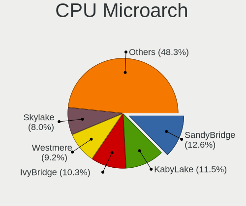

| Name          | Notebooks | Percent |
|---------------|-----------|---------|
| SandyBridge   | 10        | 11.9%   |
| KabyLake      | 9         | 10.71%  |
| IvyBridge     | 9         | 10.71%  |
| Westmere      | 8         | 9.52%   |
| Skylake       | 6         | 7.14%   |
| Silvermont    | 6         | 7.14%   |
| Haswell       | 5         | 5.95%   |
| Bonnell       | 5         | 5.95%   |
| Penryn        | 4         | 4.76%   |
| K8 Hammer     | 3         | 3.57%   |
| Core          | 3         | 3.57%   |
| K10 Llano     | 2         | 2.38%   |
| Broadwell     | 2         | 2.38%   |
| Zen 2         | 1         | 1.19%   |
| Zen           | 1         | 1.19%   |
| TigerLake     | 1         | 1.19%   |
| Puma          | 1         | 1.19%   |
| Nehalem       | 1         | 1.19%   |
| Jaguar        | 1         | 1.19%   |
| IceLake       | 1         | 1.19%   |
| Goldmont plus | 1         | 1.19%   |
| Goldmont      | 1         | 1.19%   |
| Excavator     | 1         | 1.19%   |
| Bobcat        | 1         | 1.19%   |
| Unknown       | 1         | 1.19%   |

Graphics
--------

GPU Vendor
----------

Vendors of graphics cards

| Vendor | Notebooks | Percent |
|--------|-----------|---------|
| Intel  | 61        | 62.24%  |
| AMD    | 19        | 19.39%  |
| Nvidia | 18        | 18.37%  |

GPU Model
---------

Graphics card models

| Model                                                                                    | Notebooks | Percent |
|------------------------------------------------------------------------------------------|-----------|---------|
| Intel 3rd Gen Core processor Graphics Controller                                         | 8         | 7.69%   |
| Intel 2nd Generation Core Processor Family Integrated Graphics Controller                | 7         | 6.73%   |
| Intel Skylake GT2 [HD Graphics 520]                                                      | 6         | 5.77%   |
| Intel Core Processor Integrated Graphics Controller                                      | 4         | 3.85%   |
| Intel Mobile 4 Series Chipset Integrated Graphics Controller                             | 3         | 2.88%   |
| Intel HD Graphics 620                                                                    | 3         | 2.88%   |
| Intel Atom/Celeron/Pentium Processor x5-E8000/J3xxx/N3xxx Integrated Graphics Controller | 3         | 2.88%   |
| Intel Atom Processor Z36xxx/Z37xxx Series Graphics & Display                             | 3         | 2.88%   |
| Intel 4th Gen Core Processor Integrated Graphics Controller                              | 3         | 2.88%   |
| AMD Seymour [Radeon HD 6400M/7400M Series]                                               | 3         | 2.88%   |
| Nvidia GT216GLM [Quadro FX 880M]                                                         | 2         | 1.92%   |
| Intel Mobile 945GM/GMS/GME, 943/940GML Express Integrated Graphics Controller            | 2         | 1.92%   |
| Intel HD Graphics 5500                                                                   | 2         | 1.92%   |
| Intel Haswell-ULT Integrated Graphics Controller                                         | 2         | 1.92%   |
| Intel CoffeeLake-H GT2 [UHD Graphics 630]                                                | 2         | 1.92%   |
| Intel Atom Processor D4xx/D5xx/N4xx/N5xx Integrated Graphics Controller                  | 2         | 1.92%   |
| Intel Atom Processor D2xxx/N2xxx Integrated Graphics Controller                          | 2         | 1.92%   |
| AMD Sun LE [Radeon HD 8550M / R5 M230]                                                   | 2         | 1.92%   |
| AMD Sumo [Radeon HD 6520G]                                                               | 2         | 1.92%   |
| Nvidia TU117M [GeForce GTX 1650 Mobile / Max-Q]                                          | 1         | 0.96%   |
| Nvidia TU116M [GeForce GTX 1660 Ti Mobile]                                               | 1         | 0.96%   |
| Nvidia GT216M [GeForce GT 330M]                                                          | 1         | 0.96%   |
| Nvidia GP108M [GeForce MX250]                                                            | 1         | 0.96%   |
| Nvidia GP108M [GeForce MX150]                                                            | 1         | 0.96%   |
| Nvidia GP107M [GeForce GTX 1050 Ti Mobile]                                               | 1         | 0.96%   |
| Nvidia GM108M [GeForce 940M]                                                             | 1         | 0.96%   |
| Nvidia GM108M [GeForce 940MX]                                                            | 1         | 0.96%   |
| Nvidia GM108M [GeForce 920MX]                                                            | 1         | 0.96%   |
| Nvidia GM107GLM [Quadro M1200 Mobile]                                                    | 1         | 0.96%   |
| Nvidia GK107M [GeForce GT 650M]                                                          | 1         | 0.96%   |
| Nvidia GF116M [GeForce GT 560M]                                                          | 1         | 0.96%   |
| Nvidia GF108M [GeForce GT 620M/630M/635M/640M LE]                                        | 1         | 0.96%   |
| Nvidia GF108M [GeForce GT 540M]                                                          | 1         | 0.96%   |
| Nvidia G73M [GeForce Go 7600]                                                            | 1         | 0.96%   |
| Nvidia C67 [GeForce 7000M / nForce 610M]                                                 | 1         | 0.96%   |
| Intel WhiskeyLake-U GT2 [UHD Graphics 620]                                               | 1         | 0.96%   |
| Intel UHD Graphics 620                                                                   | 1         | 0.96%   |
| Intel TigerLake-LP GT2 [Iris Xe Graphics]                                                | 1         | 0.96%   |
| Intel Mobile GM965/GL960 Integrated Graphics Controller (secondary)                      | 1         | 0.96%   |
| Intel Mobile GM965/GL960 Integrated Graphics Controller (primary)                        | 1         | 0.96%   |
| Intel Mobile 945GSE Express Integrated Graphics Controller                               | 1         | 0.96%   |
| Intel Mobile 945GM/GMS, 943/940GML Express Integrated Graphics Controller                | 1         | 0.96%   |
| Intel Iris Plus Graphics G7                                                              | 1         | 0.96%   |
| Intel HD Graphics 630                                                                    | 1         | 0.96%   |
| Intel HD Graphics 500                                                                    | 1         | 0.96%   |
| Intel GeminiLake [UHD Graphics 605]                                                      | 1         | 0.96%   |
| Intel CometLake-U GT2 [UHD Graphics]                                                     | 1         | 0.96%   |
| AMD Wrestler [Radeon HD 6320]                                                            | 1         | 0.96%   |
| AMD Thames [Radeon HD 7500M/7600M Series]                                                | 1         | 0.96%   |
| AMD Stoney [Radeon R2/R3/R4/R5 Graphics]                                                 | 1         | 0.96%   |
| AMD RV635/M86 [Mobility Radeon HD 3650]                                                  | 1         | 0.96%   |
| AMD RV630/M76 [Mobility Radeon HD 2600]                                                  | 1         | 0.96%   |
| AMD RS482M [Mobility Radeon Xpress 200]                                                  | 1         | 0.96%   |
| AMD Renoir                                                                               | 1         | 0.96%   |
| AMD Raven Ridge [Radeon Vega Series / Radeon Vega Mobile Series]                         | 1         | 0.96%   |
| AMD Park [Mobility Radeon HD 5430/5450/5470]                                             | 1         | 0.96%   |
| AMD Mullins [Radeon R4/R5 Graphics]                                                      | 1         | 0.96%   |
| AMD Mars [Radeon HD 8730M]                                                               | 1         | 0.96%   |
| AMD Madison [Mobility Radeon HD 5650/5750 / 6530M/6550M]                                 | 1         | 0.96%   |
| AMD Lucienne                                                                             | 1         | 0.96%   |

GPU Combo
---------

Combinations of graphics cards

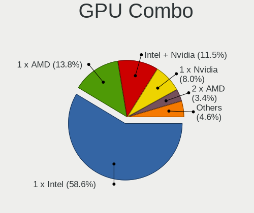

| Name           | Notebooks | Percent |
|----------------|-----------|---------|
| 1 x Intel      | 48        | 57.14%  |
| 1 x AMD        | 12        | 14.29%  |
| Intel + Nvidia | 10        | 11.9%   |
| 1 x Nvidia     | 7         | 8.33%   |
| 2 x AMD        | 3         | 3.57%   |
| Intel + AMD    | 3         | 3.57%   |
| AMD + Nvidia   | 1         | 1.19%   |

GPU Driver
----------

Free vs proprietary

| Driver      | Notebooks | Percent |
|-------------|-----------|---------|
| Free        | 80        | 95.24%  |
| Proprietary | 2         | 2.38%   |
| Unknown     | 2         | 2.38%   |

GPU Memory
----------

Total video memory

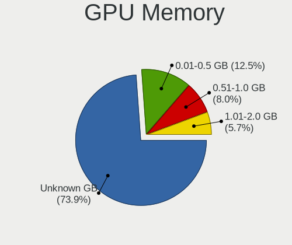

| Size in GB | Notebooks | Percent |
|------------|-----------|---------|
| Unknown    | 62        | 72.94%  |
| 0.01-0.5   | 11        | 12.94%  |
| 0.51-1.0   | 7         | 8.24%   |
| 1.01-2.0   | 5         | 5.88%   |

Monitor
-------

Monitor Vendor
--------------

Monitor vendors

| Vendor                  | Notebooks | Percent |
|-------------------------|-----------|---------|
| AU Optronics            | 21        | 23.6%   |
| Chimei Innolux          | 14        | 15.73%  |
| Samsung Electronics     | 13        | 14.61%  |
| LG Display              | 13        | 14.61%  |
| Lenovo                  | 5         | 5.62%   |
| BOE                     | 4         | 4.49%   |
| Chi Mei Optoelectronics | 3         | 3.37%   |
| LG Philips              | 2         | 2.25%   |
| InfoVision              | 2         | 2.25%   |
| HannStar                | 2         | 2.25%   |
| Dell                    | 2         | 2.25%   |
| Vizio                   | 1         | 1.12%   |
| PANDA                   | 1         | 1.12%   |
| InnoLux Display         | 1         | 1.12%   |
| Hewlett-Packard         | 1         | 1.12%   |
| CPT                     | 1         | 1.12%   |
| AOC                     | 1         | 1.12%   |
| Ancor Communications    | 1         | 1.12%   |
| Acer                    | 1         | 1.12%   |

Monitor Model
-------------

Monitor models

| Model                                                                     | Notebooks | Percent |
|---------------------------------------------------------------------------|-----------|---------|
| Samsung Electronics LCD Monitor SEC5441 1366x768 344x194mm 15.5-inch      | 2         | 2.25%   |
| Chimei Innolux LCD Monitor CMN15D5 1920x1080 344x193mm 15.5-inch          | 2         | 2.25%   |
| Chimei Innolux LCD Monitor CMN14D4 1920x1080 309x173mm 13.9-inch          | 2         | 2.25%   |
| Chimei Innolux LCD Monitor CMN1132 1366x768 256x144mm 11.6-inch           | 2         | 2.25%   |
| AU Optronics LCD Monitor AUO23EC 1366x768 344x193mm 15.5-inch             | 2         | 2.25%   |
| AU Optronics LCD Monitor AUO106C 1366x768 277x156mm 12.5-inch             | 2         | 2.25%   |
| AU Optronics LCD Monitor AUO01EE 1600x900 340x190mm 15.3-inch             | 2         | 2.25%   |
| Vizio E320VA VIZ0071 1360x768 697x392mm 31.5-inch                         | 1         | 1.12%   |
| Samsung Electronics SyncMaster SAM00B6 1280x1024 376x301mm 19.0-inch      | 1         | 1.12%   |
| Samsung Electronics SMB1630N SAM0630 1366x768 340x190mm 15.3-inch         | 1         | 1.12%   |
| Samsung Electronics S24F350 SAM0D20 1920x1080 521x293mm 23.5-inch         | 1         | 1.12%   |
| Samsung Electronics LCD Monitor SEC544B 1600x900 310x174mm 14.0-inch      | 1         | 1.12%   |
| Samsung Electronics LCD Monitor SEC504B 1600x900 382x215mm 17.3-inch      | 1         | 1.12%   |
| Samsung Electronics LCD Monitor SEC4251 1366x768 344x194mm 15.5-inch      | 1         | 1.12%   |
| Samsung Electronics LCD Monitor SEC4245 1280x800 331x207mm 15.4-inch      | 1         | 1.12%   |
| Samsung Electronics LCD Monitor SEC3945 1280x800 331x207mm 15.4-inch      | 1         | 1.12%   |
| Samsung Electronics LCD Monitor SEC3741 1366x768 309x174mm 14.0-inch      | 1         | 1.12%   |
| Samsung Electronics LCD Monitor SEC314C 1920x1080 344x194mm 15.5-inch     | 1         | 1.12%   |
| Samsung Electronics LCD Monitor SDC4C48 1920x1080 344x194mm 15.5-inch     | 1         | 1.12%   |
| PANDA LCD Monitor NCP0036 1920x1080 344x194mm 15.5-inch                   | 1         | 1.12%   |
| LG Philips LCD Monitor LPLA900 1280x800 331x207mm 15.4-inch               | 1         | 1.12%   |
| LG Philips LCD Monitor LPLA002 1440x900 367x230mm 17.1-inch               | 1         | 1.12%   |
| LG Display LCD Monitor LGDD801 1366x768 344x194mm 15.5-inch               | 1         | 1.12%   |
| LG Display LCD Monitor LGD057E 1920x1080 344x194mm 15.5-inch              | 1         | 1.12%   |
| LG Display LCD Monitor LGD0533 1920x1080 344x194mm 15.5-inch              | 1         | 1.12%   |
| LG Display LCD Monitor LGD04FC 1366x768 344x194mm 15.5-inch               | 1         | 1.12%   |
| LG Display LCD Monitor LGD04B1 1366x768 310x174mm 14.0-inch               | 1         | 1.12%   |
| LG Display LCD Monitor LGD04A7 1920x1080 344x194mm 15.5-inch              | 1         | 1.12%   |
| LG Display LCD Monitor LGD03E3 1366x768 309x174mm 14.0-inch               | 1         | 1.12%   |
| LG Display LCD Monitor LGD038E 1366x768 344x194mm 15.5-inch               | 1         | 1.12%   |
| LG Display LCD Monitor LGD0386 1366x768 309x174mm 14.0-inch               | 1         | 1.12%   |
| LG Display LCD Monitor LGD033A 1366x768 344x194mm 15.5-inch               | 1         | 1.12%   |
| LG Display LCD Monitor LGD02F2 1366x768 344x194mm 15.5-inch               | 1         | 1.12%   |
| LG Display LCD Monitor LGD02D9 1920x1080 344x194mm 15.5-inch              | 1         | 1.12%   |
| LG Display LCD Monitor LGD027A 1600x900 382x215mm 17.3-inch               | 1         | 1.12%   |
| Lenovo LCD Monitor LEN40B1 1600x900 344x194mm 15.5-inch                   | 1         | 1.12%   |
| Lenovo LCD Monitor LEN40A0 1366x768 310x170mm 13.9-inch                   | 1         | 1.12%   |
| Lenovo LCD Monitor LEN4074 1440x900 287x180mm 13.3-inch                   | 1         | 1.12%   |
| Lenovo LCD Monitor LEN4035 1280x800 303x190mm 14.1-inch                   | 1         | 1.12%   |
| Lenovo LCD Monitor LEN4011 1280x800 261x163mm 12.1-inch                   | 1         | 1.12%   |
| InnoLux Display LCD Monitor INL0028 1366x768 309x174mm 14.0-inch          | 1         | 1.12%   |
| InfoVision LCD Monitor IVO8C5F 1920x1080 309x174mm 14.0-inch              | 1         | 1.12%   |
| InfoVision LCD Monitor IVO03F4 1024x600 223x125mm 10.1-inch               | 1         | 1.12%   |
| Hewlett-Packard 32 QHD HPN360C 2560x1440 710x400mm 32.1-inch              | 1         | 1.12%   |
| HannStar LCD Monitor HSD03E9 1024x600 220x129mm 10.0-inch                 | 1         | 1.12%   |
| HannStar HSD101PFW4A HSD03ED 1024x600 223x125mm 10.1-inch                 | 1         | 1.12%   |
| Dell U2415 DELA0BA 1920x1200 518x324mm 24.1-inch                          | 1         | 1.12%   |
| Dell 1908FP DEL4026 1280x1024 376x301mm 19.0-inch                         | 1         | 1.12%   |
| CPT LCD Monitor CPT04C4 1024x600 222x130mm 10.1-inch                      | 1         | 1.12%   |
| Chimei Innolux LCD Monitor CMN15FD 1366x768 344x193mm 15.5-inch           | 1         | 1.12%   |
| Chimei Innolux LCD Monitor CMN15BE 1366x768 344x194mm 15.5-inch           | 1         | 1.12%   |
| Chimei Innolux LCD Monitor CMN15AB 1366x768 344x194mm 15.5-inch           | 1         | 1.12%   |
| Chimei Innolux LCD Monitor CMN152E 1920x1080 344x193mm 15.5-inch          | 1         | 1.12%   |
| Chimei Innolux LCD Monitor CMN14D2 1920x1080 309x173mm 13.9-inch          | 1         | 1.12%   |
| Chimei Innolux LCD Monitor CMN14C4 1366x768 309x173mm 13.9-inch           | 1         | 1.12%   |
| Chimei Innolux LCD Monitor CMN1492 1366x768 309x174mm 14.0-inch           | 1         | 1.12%   |
| Chimei Innolux LCD Monitor CMN1341 1366x768 293x165mm 13.2-inch           | 1         | 1.12%   |
| Chi Mei Optoelectronics LCD Monitor CMO1807 1920x1080 408x230mm 18.4-inch | 1         | 1.12%   |
| Chi Mei Optoelectronics LCD Monitor CMO1600 1920x1080 374x192mm 16.6-inch | 1         | 1.12%   |
| Chi Mei Optoelectronics LCD Monitor CMO1592 1366x768 344x193mm 15.5-inch  | 1         | 1.12%   |

Monitor Resolution
------------------

Monitor screen resolution

| Resolution        | Notebooks | Percent |
|-------------------|-----------|---------|
| 1366x768 (WXGA)   | 32        | 36.78%  |
| 1920x1080 (FHD)   | 30        | 34.48%  |
| 1600x900 (HD+)    | 8         | 9.2%    |
| 1280x800 (WXGA)   | 6         | 6.9%    |
| 1024x600          | 4         | 4.6%    |
| 2560x1440 (QHD)   | 2         | 2.3%    |
| 1440x900 (WXGA+)  | 2         | 2.3%    |
| 1280x1024 (SXGA)  | 2         | 2.3%    |
| 1920x1200 (WUXGA) | 1         | 1.15%   |

Monitor Diagonal
----------------

Diagonal size in inches

| Inches | Notebooks | Percent |
|--------|-----------|---------|
| 15     | 35        | 39.33%  |
| 14     | 13        | 14.61%  |
| 13     | 12        | 13.48%  |
| 17     | 5         | 5.62%   |
| 12     | 4         | 4.49%   |
| 10     | 4         | 4.49%   |
| 11     | 3         | 3.37%   |
| 23     | 2         | 2.25%   |
| 19     | 2         | 2.25%   |
| 18     | 2         | 2.25%   |
| 37     | 1         | 1.12%   |
| 32     | 1         | 1.12%   |
| 27     | 1         | 1.12%   |
| 24     | 1         | 1.12%   |
| 21     | 1         | 1.12%   |
| 20     | 1         | 1.12%   |
| 16     | 1         | 1.12%   |

Monitor Width
-------------

Physical width

| Width in mm | Notebooks | Percent |
|-------------|-----------|---------|
| 301-350     | 52        | 58.43%  |
| 201-300     | 16        | 17.98%  |
| 351-400     | 11        | 12.36%  |
| 501-600     | 4         | 4.49%   |
| 401-500     | 4         | 4.49%   |
| 801-900     | 1         | 1.12%   |
| 701-800     | 1         | 1.12%   |

Aspect Ratio
------------

Proportional relationship between the width and the height

| Ratio | Notebooks | Percent |
|-------|-----------|---------|
| 16/9  | 70        | 85.37%  |
| 16/10 | 9         | 10.98%  |
| 5/4   | 2         | 2.44%   |
| 3/2   | 1         | 1.22%   |

Monitor Area
------------

Area in inch²

| Area in inch² | Notebooks | Percent |
|----------------|-----------|---------|
| 101-110        | 35        | 39.33%  |
| 81-90          | 20        | 22.47%  |
| 71-80          | 5         | 5.62%   |
| 61-70          | 4         | 4.49%   |
| 41-50          | 4         | 4.49%   |
| 121-130        | 4         | 4.49%   |
| 51-60          | 3         | 3.37%   |
| 201-250        | 3         | 3.37%   |
| 151-200        | 3         | 3.37%   |
| 141-150        | 2         | 2.25%   |
| 351-500        | 1         | 1.12%   |
| 301-350        | 1         | 1.12%   |
| 251-300        | 1         | 1.12%   |
| 131-140        | 1         | 1.12%   |
| 111-120        | 1         | 1.12%   |
| 501-1000       | 1         | 1.12%   |

Pixel Density
-------------

Pixels per inch

| Density | Notebooks | Percent |
|---------|-----------|---------|
| 101-120 | 37        | 43.02%  |
| 121-160 | 28        | 32.56%  |
| 51-100  | 18        | 20.93%  |
| 161-240 | 3         | 3.49%   |

Multiple Monitors
-----------------

Total monitors connected

| Total | Notebooks | Percent |
|-------|-----------|---------|
| 1     | 73        | 86.9%   |
| 2     | 11        | 13.1%   |

Network
-------

Net Controller Vendor
---------------------

Controller vendors

| Vendor                   | Notebooks | Percent |
|--------------------------|-----------|---------|
| Intel                    | 48        | 35.29%  |
| Realtek Semiconductor    | 38        | 27.94%  |
| Qualcomm Atheros         | 26        | 19.12%  |
| Broadcom                 | 10        | 7.35%   |
| Ralink                   | 2         | 1.47%   |
| Nvidia                   | 2         | 1.47%   |
| Marvell Technology Group | 2         | 1.47%   |
| Huawei Technologies      | 2         | 1.47%   |
| Attansic Technology      | 2         | 1.47%   |
| Ralink Technology        | 1         | 0.74%   |
| MediaTek                 | 1         | 0.74%   |
| JMicron Technology       | 1         | 0.74%   |
| ASIX Electronics         | 1         | 0.74%   |

Net Controller Model
--------------------

Controller models

| Model                                                                                         | Notebooks | Percent |
|-----------------------------------------------------------------------------------------------|-----------|---------|
| Realtek RTL8111/8168/8411 PCI Express Gigabit Ethernet Controller                             | 23        | 13.86%  |
| Realtek RTL810xE PCI Express Fast Ethernet controller                                         | 9         | 5.42%   |
| Qualcomm Atheros AR9485 Wireless Network Adapter                                              | 8         | 4.82%   |
| Intel Wireless 7260                                                                           | 5         | 3.01%   |
| Intel Centrino Advanced-N 6205 [Taylor Peak]                                                  | 5         | 3.01%   |
| Intel 82577LM Gigabit Network Connection                                                      | 5         | 3.01%   |
| Qualcomm Atheros AR9285 Wireless Network Adapter (PCI-Express)                                | 4         | 2.41%   |
| Intel Wireless 7265                                                                           | 4         | 2.41%   |
| Intel Centrino Advanced-N 6200                                                                | 4         | 2.41%   |
| Realtek RTL8821CE 802.11ac PCIe Wireless Network Adapter                                      | 3         | 1.81%   |
| Intel Wireless 8260                                                                           | 3         | 1.81%   |
| Intel Wireless 3165                                                                           | 3         | 1.81%   |
| Intel Ethernet Connection I217-LM                                                             | 3         | 1.81%   |
| Intel Centrino Wireless-N 2230                                                                | 3         | 1.81%   |
| Intel 82579LM Gigabit Network Connection (Lewisville)                                         | 3         | 1.81%   |
| Realtek RTL8723BE PCIe Wireless Network Adapter                                               | 2         | 1.2%    |
| Realtek RTL8188EUS 802.11n Wireless Network Adapter                                           | 2         | 1.2%    |
| Qualcomm Atheros QCA9565 / AR9565 Wireless Network Adapter                                    | 2         | 1.2%    |
| Qualcomm Atheros QCA9377 802.11ac Wireless Network Adapter                                    | 2         | 1.2%    |
| Qualcomm Atheros QCA8172 Fast Ethernet                                                        | 2         | 1.2%    |
| Qualcomm Atheros AR8161 Gigabit Ethernet                                                      | 2         | 1.2%    |
| Intel Wireless 8265 / 8275                                                                    | 2         | 1.2%    |
| Intel PRO/Wireless 4965 AG or AGN [Kedron] Network Connection                                 | 2         | 1.2%    |
| Intel Ethernet Connection I219-V                                                              | 2         | 1.2%    |
| Intel Ethernet Connection (3) I218-LM                                                         | 2         | 1.2%    |
| Intel Centrino Ultimate-N 6300                                                                | 2         | 1.2%    |
| Intel Cannon Lake PCH CNVi WiFi                                                               | 2         | 1.2%    |
| Broadcom BCM4313 802.11bgn Wireless Network Adapter                                           | 2         | 1.2%    |
| Attansic AR8152 v2.0 Fast Ethernet                                                            | 2         | 1.2%    |
| Realtek RTL88x2bu [AC1200 Techkey]                                                            | 1         | 0.6%    |
| Realtek RTL8822CE 802.11ac PCIe Wireless Network Adapter                                      | 1         | 0.6%    |
| Realtek RTL8822BE 802.11a/b/g/n/ac WiFi adapter                                               | 1         | 0.6%    |
| Realtek RTL8188EE Wireless Network Adapter                                                    | 1         | 0.6%    |
| Realtek RTL8153 Gigabit Ethernet Adapter                                                      | 1         | 0.6%    |
| Realtek Realtek 8812AU/8821AU 802.11ac WLAN Adapter [USB Wireless Dual-Band Adapter 2.4/5Ghz] | 1         | 0.6%    |
| Ralink RT2870/RT3070 Wireless Adapter                                                         | 1         | 0.6%    |
| Ralink RT5390 Wireless 802.11n 1T/1R PCIe                                                     | 1         | 0.6%    |
| Ralink RT3290 Wireless 802.11n 1T/1R PCIe                                                     | 1         | 0.6%    |
| Qualcomm Atheros QCA6174 802.11ac Wireless Network Adapter                                    | 1         | 0.6%    |
| Qualcomm Atheros Killer E2400 Gigabit Ethernet Controller                                     | 1         | 0.6%    |
| Qualcomm Atheros AR928X Wireless Network Adapter (PCI-Express)                                | 1         | 0.6%    |
| Qualcomm Atheros AR9287 Wireless Network Adapter (PCI-Express)                                | 1         | 0.6%    |
| Qualcomm Atheros AR8162 Fast Ethernet                                                         | 1         | 0.6%    |
| Qualcomm Atheros AR8152 v1.1 Fast Ethernet                                                    | 1         | 0.6%    |
| Qualcomm Atheros AR8151 v2.0 Gigabit Ethernet                                                 | 1         | 0.6%    |
| Qualcomm Atheros AR8151 v1.0 Gigabit Ethernet                                                 | 1         | 0.6%    |
| Qualcomm Atheros AR8132 Fast Ethernet                                                         | 1         | 0.6%    |
| Qualcomm Atheros AR242x / AR542x Wireless Network Adapter (PCI-Express)                       | 1         | 0.6%    |
| Nvidia MCP67 Ethernet                                                                         | 1         | 0.6%    |
| Nvidia MCP51 Ethernet Controller                                                              | 1         | 0.6%    |
| MediaTek TECNO SPARK 6 Go                                                                     | 1         | 0.6%    |
| Marvell Group Yukon Optima 88E8059 [PCIe Gigabit Ethernet Controller with AVB]                | 1         | 0.6%    |
| Marvell Group 88E8055 PCI-E Gigabit Ethernet Controller                                       | 1         | 0.6%    |
| JMicron JMC250 PCI Express Gigabit Ethernet Controller                                        | 1         | 0.6%    |
| Intel Wireless-AC 9260                                                                        | 1         | 0.6%    |
| Intel WiFi Link 5100                                                                          | 1         | 0.6%    |
| Intel Wi-Fi 6 AX210/AX211/AX411 160MHz                                                        | 1         | 0.6%    |
| Intel Wi-Fi 6 AX201                                                                           | 1         | 0.6%    |
| Intel PRO/Wireless 5100 AGN [Shiloh] Network Connection                                       | 1         | 0.6%    |
| Intel PRO/Wireless 3945ABG [Golan] Network Connection                                         | 1         | 0.6%    |

Wireless Vendor
---------------

Wireless vendors

| Vendor                | Notebooks | Percent |
|-----------------------|-----------|---------|
| Intel                 | 46        | 53.49%  |
| Qualcomm Atheros      | 20        | 23.26%  |
| Realtek Semiconductor | 11        | 12.79%  |
| Broadcom              | 6         | 6.98%   |
| Ralink                | 2         | 2.33%   |
| Ralink Technology     | 1         | 1.16%   |

Wireless Model
--------------

Wireless models

| Model                                                                                         | Notebooks | Percent |
|-----------------------------------------------------------------------------------------------|-----------|---------|
| Qualcomm Atheros AR9485 Wireless Network Adapter                                              | 8         | 9.2%    |
| Intel Wireless 7260                                                                           | 5         | 5.75%   |
| Intel Centrino Advanced-N 6205 [Taylor Peak]                                                  | 5         | 5.75%   |
| Qualcomm Atheros AR9285 Wireless Network Adapter (PCI-Express)                                | 4         | 4.6%    |
| Intel Wireless 7265                                                                           | 4         | 4.6%    |
| Intel Centrino Advanced-N 6200                                                                | 4         | 4.6%    |
| Realtek RTL8821CE 802.11ac PCIe Wireless Network Adapter                                      | 3         | 3.45%   |
| Intel Wireless 8260                                                                           | 3         | 3.45%   |
| Intel Wireless 3165                                                                           | 3         | 3.45%   |
| Intel Centrino Wireless-N 2230                                                                | 3         | 3.45%   |
| Realtek RTL8723BE PCIe Wireless Network Adapter                                               | 2         | 2.3%    |
| Realtek RTL8188EUS 802.11n Wireless Network Adapter                                           | 2         | 2.3%    |
| Qualcomm Atheros QCA9565 / AR9565 Wireless Network Adapter                                    | 2         | 2.3%    |
| Qualcomm Atheros QCA9377 802.11ac Wireless Network Adapter                                    | 2         | 2.3%    |
| Intel Wireless 8265 / 8275                                                                    | 2         | 2.3%    |
| Intel PRO/Wireless 4965 AG or AGN [Kedron] Network Connection                                 | 2         | 2.3%    |
| Intel Centrino Ultimate-N 6300                                                                | 2         | 2.3%    |
| Intel Cannon Lake PCH CNVi WiFi                                                               | 2         | 2.3%    |
| Broadcom BCM4313 802.11bgn Wireless Network Adapter                                           | 2         | 2.3%    |
| Realtek RTL88x2bu [AC1200 Techkey]                                                            | 1         | 1.15%   |
| Realtek RTL8822CE 802.11ac PCIe Wireless Network Adapter                                      | 1         | 1.15%   |
| Realtek RTL8822BE 802.11a/b/g/n/ac WiFi adapter                                               | 1         | 1.15%   |
| Realtek RTL8188EE Wireless Network Adapter                                                    | 1         | 1.15%   |
| Realtek Realtek 8812AU/8821AU 802.11ac WLAN Adapter [USB Wireless Dual-Band Adapter 2.4/5Ghz] | 1         | 1.15%   |
| Ralink RT2870/RT3070 Wireless Adapter                                                         | 1         | 1.15%   |
| Ralink RT5390 Wireless 802.11n 1T/1R PCIe                                                     | 1         | 1.15%   |
| Ralink RT3290 Wireless 802.11n 1T/1R PCIe                                                     | 1         | 1.15%   |
| Qualcomm Atheros QCA6174 802.11ac Wireless Network Adapter                                    | 1         | 1.15%   |
| Qualcomm Atheros AR928X Wireless Network Adapter (PCI-Express)                                | 1         | 1.15%   |
| Qualcomm Atheros AR9287 Wireless Network Adapter (PCI-Express)                                | 1         | 1.15%   |
| Qualcomm Atheros AR242x / AR542x Wireless Network Adapter (PCI-Express)                       | 1         | 1.15%   |
| Intel Wireless-AC 9260                                                                        | 1         | 1.15%   |
| Intel WiFi Link 5100                                                                          | 1         | 1.15%   |
| Intel Wi-Fi 6 AX210/AX211/AX411 160MHz                                                        | 1         | 1.15%   |
| Intel Wi-Fi 6 AX201                                                                           | 1         | 1.15%   |
| Intel PRO/Wireless 5100 AGN [Shiloh] Network Connection                                       | 1         | 1.15%   |
| Intel PRO/Wireless 3945ABG [Golan] Network Connection                                         | 1         | 1.15%   |
| Intel Ice Lake-LP PCH CNVi WiFi                                                               | 1         | 1.15%   |
| Intel Dual Band Wireless-AC 3168NGW [Stone Peak]                                              | 1         | 1.15%   |
| Intel Dual Band Wireless-AC 3165 Plus Bluetooth                                               | 1         | 1.15%   |
| Intel Comet Lake PCH-LP CNVi WiFi                                                             | 1         | 1.15%   |
| Intel Centrino Wireless-N 2200                                                                | 1         | 1.15%   |
| Broadcom BCM43228 802.11a/b/g/n                                                               | 1         | 1.15%   |
| Broadcom BCM43225 802.11b/g/n                                                                 | 1         | 1.15%   |
| Broadcom BCM43142 802.11b/g/n                                                                 | 1         | 1.15%   |
| Broadcom BCM4311 802.11b/g WLAN                                                               | 1         | 1.15%   |

Ethernet Vendor
---------------

Ethernet vendors

| Vendor                   | Notebooks | Percent |
|--------------------------|-----------|---------|
| Realtek Semiconductor    | 33        | 42.31%  |
| Intel                    | 20        | 25.64%  |
| Qualcomm Atheros         | 10        | 12.82%  |
| Broadcom                 | 5         | 6.41%   |
| Nvidia                   | 2         | 2.56%   |
| Marvell Technology Group | 2         | 2.56%   |
| Attansic Technology      | 2         | 2.56%   |
| MediaTek                 | 1         | 1.28%   |
| JMicron Technology       | 1         | 1.28%   |
| Huawei Technologies      | 1         | 1.28%   |
| ASIX Electronics         | 1         | 1.28%   |

Ethernet Model
--------------

Ethernet models

| Model                                                                          | Notebooks | Percent |
|--------------------------------------------------------------------------------|-----------|---------|
| Realtek RTL8111/8168/8411 PCI Express Gigabit Ethernet Controller              | 23        | 29.49%  |
| Realtek RTL810xE PCI Express Fast Ethernet controller                          | 9         | 11.54%  |
| Intel 82577LM Gigabit Network Connection                                       | 5         | 6.41%   |
| Intel Ethernet Connection I217-LM                                              | 3         | 3.85%   |
| Intel 82579LM Gigabit Network Connection (Lewisville)                          | 3         | 3.85%   |
| Qualcomm Atheros QCA8172 Fast Ethernet                                         | 2         | 2.56%   |
| Qualcomm Atheros AR8161 Gigabit Ethernet                                       | 2         | 2.56%   |
| Intel Ethernet Connection I219-V                                               | 2         | 2.56%   |
| Intel Ethernet Connection (3) I218-LM                                          | 2         | 2.56%   |
| Attansic AR8152 v2.0 Fast Ethernet                                             | 2         | 2.56%   |
| Realtek RTL8153 Gigabit Ethernet Adapter                                       | 1         | 1.28%   |
| Qualcomm Atheros Killer E2400 Gigabit Ethernet Controller                      | 1         | 1.28%   |
| Qualcomm Atheros AR8162 Fast Ethernet                                          | 1         | 1.28%   |
| Qualcomm Atheros AR8152 v1.1 Fast Ethernet                                     | 1         | 1.28%   |
| Qualcomm Atheros AR8151 v2.0 Gigabit Ethernet                                  | 1         | 1.28%   |
| Qualcomm Atheros AR8151 v1.0 Gigabit Ethernet                                  | 1         | 1.28%   |
| Qualcomm Atheros AR8132 Fast Ethernet                                          | 1         | 1.28%   |
| Nvidia MCP67 Ethernet                                                          | 1         | 1.28%   |
| Nvidia MCP51 Ethernet Controller                                               | 1         | 1.28%   |
| MediaTek TECNO SPARK 6 Go                                                      | 1         | 1.28%   |
| Marvell Group Yukon Optima 88E8059 [PCIe Gigabit Ethernet Controller with AVB] | 1         | 1.28%   |
| Marvell Group 88E8055 PCI-E Gigabit Ethernet Controller                        | 1         | 1.28%   |
| JMicron JMC250 PCI Express Gigabit Ethernet Controller                         | 1         | 1.28%   |
| Intel Ethernet Connection I219-LM                                              | 1         | 1.28%   |
| Intel Ethernet Connection I218-LM                                              | 1         | 1.28%   |
| Intel Ethernet Connection (2) I219-LM                                          | 1         | 1.28%   |
| Intel 82579V Gigabit Network Connection                                        | 1         | 1.28%   |
| Intel 82567LM Gigabit Network Connection                                       | 1         | 1.28%   |
| Huawei COL-L29                                                                 | 1         | 1.28%   |
| Broadcom NetXtreme BCM5764M Gigabit Ethernet PCIe                              | 1         | 1.28%   |
| Broadcom NetXtreme BCM5761 Gigabit Ethernet PCIe                               | 1         | 1.28%   |
| Broadcom NetXtreme BCM5752 Gigabit Ethernet PCI Express                        | 1         | 1.28%   |
| Broadcom NetLink BCM5787M Gigabit Ethernet PCI Express                         | 1         | 1.28%   |
| Broadcom BCM4401-B0 100Base-TX                                                 | 1         | 1.28%   |
| ASIX AX88179 Gigabit Ethernet                                                  | 1         | 1.28%   |

Net Controller Kind
-------------------

Ethernet, WiFi or modem

| Kind     | Notebooks | Percent |
|----------|-----------|---------|
| WiFi     | 83        | 52.2%   |
| Ethernet | 75        | 47.17%  |
| Modem    | 1         | 0.63%   |

Used Controller
---------------

Currently used network controller

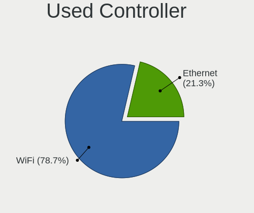

| Kind     | Notebooks | Percent |
|----------|-----------|---------|
| WiFi     | 67        | 78.82%  |
| Ethernet | 18        | 21.18%  |

NICs
----

Total network controllers on board

| Total | Notebooks | Percent |
|-------|-----------|---------|
| 2     | 72        | 85.71%  |
| 1     | 11        | 13.1%   |
| 0     | 1         | 1.19%   |

IPv6
----

IPv6 vs IPv4

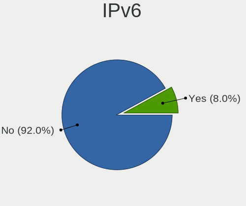

| Used | Notebooks | Percent |
|------|-----------|---------|
| No   | 79        | 92.94%  |
| Yes  | 6         | 7.06%   |

Bluetooth
---------

Bluetooth Vendor
----------------

Controller vendors

| Vendor                          | Notebooks | Percent |
|---------------------------------|-----------|---------|
| Intel                           | 27        | 40.91%  |
| Broadcom                        | 9         | 13.64%  |
| Realtek Semiconductor           | 6         | 9.09%   |
| Qualcomm Atheros Communications | 5         | 7.58%   |
| Cambridge Silicon Radio         | 4         | 6.06%   |
| Lite-On Technology              | 3         | 4.55%   |
| IMC Networks                    | 3         | 4.55%   |
| Hewlett-Packard                 | 3         | 4.55%   |
| Toshiba                         | 2         | 3.03%   |
| Dell                            | 2         | 3.03%   |
| Ralink                          | 1         | 1.52%   |
| Foxconn / Hon Hai               | 1         | 1.52%   |

Bluetooth Model
---------------

Controller models

| Model                                               | Notebooks | Percent |
|-----------------------------------------------------|-----------|---------|
| Intel Bluetooth wireless interface                  | 16        | 24.24%  |
| Cambridge Silicon Radio Bluetooth Dongle (HCI mode) | 4         | 6.06%   |
| Broadcom BCM2045B (BDC-2.1)                         | 4         | 6.06%   |
| Realtek  Bluetooth 4.2 Adapter                      | 3         | 4.55%   |
| Intel Centrino Bluetooth Wireless Transceiver       | 3         | 4.55%   |
| Intel Bluetooth Device                              | 3         | 4.55%   |
| HP Broadcom 2070 Bluetooth Combo                    | 3         | 4.55%   |
| Realtek Bluetooth Radio                             | 2         | 3.03%   |
| Qualcomm Atheros  Bluetooth Device                  | 2         | 3.03%   |
| Qualcomm Atheros Bluetooth                          | 2         | 3.03%   |
| Lite-On Qualcomm Atheros QCA9377 Bluetooth          | 2         | 3.03%   |
| Intel Bluetooth 9460/9560 Jefferson Peak (JfP)      | 2         | 3.03%   |
| IMC Networks Bluetooth Radio                        | 2         | 3.03%   |
| Toshiba Integrated Bluetooth (Taiyo Yuden)          | 1         | 1.52%   |
| Toshiba Bluetooth USB Host Controller               | 1         | 1.52%   |
| Realtek RTL8723B Bluetooth                          | 1         | 1.52%   |
| Ralink RT3290 Bluetooth                             | 1         | 1.52%   |
| Qualcomm Atheros AR3011 Bluetooth                   | 1         | 1.52%   |
| Lite-On Atheros AR3012 Bluetooth                    | 1         | 1.52%   |
| Intel Wireless-AC 9260 Bluetooth Adapter            | 1         | 1.52%   |
| Intel Wireless-AC 3168 Bluetooth                    | 1         | 1.52%   |
| Intel AX210 Bluetooth                               | 1         | 1.52%   |
| IMC Networks Atheros AR3012 Bluetooth 4.0 Adapter   | 1         | 1.52%   |
| Foxconn / Hon Hai Acer Bluetooth module             | 1         | 1.52%   |
| Dell Wireless 360 Bluetooth                         | 1         | 1.52%   |
| Dell DW375 Bluetooth Module                         | 1         | 1.52%   |
| Broadcom HP Portable Bumble Bee                     | 1         | 1.52%   |
| Broadcom Bluetooth 2.1 Device                       | 1         | 1.52%   |
| Broadcom BCM43142A0 Bluetooth 4.0                   | 1         | 1.52%   |
| Broadcom BCM2070 Bluetooth 2.1 + EDR                | 1         | 1.52%   |
| Broadcom BCM2045B (BDC-2.1) [Bluetooth Controller]  | 1         | 1.52%   |

Sound
-----

Sound Vendor
------------

Sound card vendors

| Vendor              | Notebooks | Percent |
|---------------------|-----------|---------|
| Intel               | 71        | 71%     |
| AMD                 | 16        | 16%     |
| Nvidia              | 11        | 11%     |
| GN Netcom           | 1         | 1%      |
| C-Media Electronics | 1         | 1%      |

Sound Model
-----------

Sound card models

| Model                                                                                             | Notebooks | Percent |
|---------------------------------------------------------------------------------------------------|-----------|---------|
| Intel 7 Series/C216 Chipset Family High Definition Audio Controller                               | 11        | 9.57%   |
| Intel Sunrise Point-LP HD Audio                                                                   | 10        | 8.7%    |
| Intel 5 Series/3400 Series Chipset High Definition Audio                                          | 9         | 7.83%   |
| Intel 6 Series/C200 Series Chipset Family High Definition Audio Controller                        | 8         | 6.96%   |
| Intel NM10/ICH7 Family High Definition Audio Controller                                           | 6         | 5.22%   |
| Intel 82801I (ICH9 Family) HD Audio Controller                                                    | 4         | 3.48%   |
| AMD FCH Azalia Controller                                                                         | 4         | 3.48%   |
| Nvidia GT216 HDMI Audio Controller                                                                | 3         | 2.61%   |
| Intel Xeon E3-1200 v3/4th Gen Core Processor HD Audio Controller                                  | 3         | 2.61%   |
| Intel Atom/Celeron/Pentium Processor x5-E8000/J3xxx/N3xxx Series High Definition Audio Controller | 3         | 2.61%   |
| Intel 8 Series/C220 Series Chipset High Definition Audio Controller                               | 3         | 2.61%   |
| AMD Family 17h/19h HD Audio Controller                                                            | 3         | 2.61%   |
| Nvidia TU116 High Definition Audio Controller                                                     | 2         | 1.74%   |
| Nvidia GF108 High Definition Audio Controller                                                     | 2         | 1.74%   |
| Intel Wildcat Point-LP High Definition Audio Controller                                           | 2         | 1.74%   |
| Intel Haswell-ULT HD Audio Controller                                                             | 2         | 1.74%   |
| Intel Cannon Lake PCH cAVS                                                                        | 2         | 1.74%   |
| Intel Broadwell-U Audio Controller                                                                | 2         | 1.74%   |
| Intel Atom Processor Z36xxx/Z37xxx Series High Definition Audio Controller                        | 2         | 1.74%   |
| Intel 82801H (ICH8 Family) HD Audio Controller                                                    | 2         | 1.74%   |
| Intel 8 Series HD Audio Controller                                                                | 2         | 1.74%   |
| AMD SBx00 Azalia (Intel HDA)                                                                      | 2         | 1.74%   |
| AMD Renoir Radeon High Definition Audio Controller                                                | 2         | 1.74%   |
| AMD Kabini HDMI/DP Audio                                                                          | 2         | 1.74%   |
| AMD BeaverCreek HDMI Audio [Radeon HD 6500D and 6400G-6600G series]                               | 2         | 1.74%   |
| Nvidia TU107 GeForce GTX 1650 High Definition Audio Controller                                    | 1         | 0.87%   |
| Nvidia MCP67 High Definition Audio                                                                | 1         | 0.87%   |
| Nvidia MCP51 High Definition Audio                                                                | 1         | 0.87%   |
| Nvidia GF116 High Definition Audio Controller                                                     | 1         | 0.87%   |
| Intel Tiger Lake-LP Smart Sound Technology Audio Controller                                       | 1         | 0.87%   |
| Intel Ice Lake-LP Smart Sound Technology Audio Controller                                         | 1         | 0.87%   |
| Intel Comet Lake PCH-LP cAVS                                                                      | 1         | 0.87%   |
| Intel CM238 HD Audio Controller                                                                   | 1         | 0.87%   |
| Intel Celeron/Pentium Silver Processor High Definition Audio                                      | 1         | 0.87%   |
| Intel Celeron N3350/Pentium N4200/Atom E3900 Series Audio Cluster                                 | 1         | 0.87%   |
| Intel Cannon Point-LP High Definition Audio Controller                                            | 1         | 0.87%   |
| GN Netcom Jabra UC VOICE 150a MS                                                                  | 1         | 0.87%   |
| C-Media Electronics USB Advanced Audio Device                                                     | 1         | 0.87%   |
| AMD Turks HDMI Audio [Radeon HD 6500/6600 / 6700M Series]                                         | 1         | 0.87%   |
| AMD RV635 HDMI Audio [Radeon HD 3650/3730/3750]                                                   | 1         | 0.87%   |
| AMD Redwood HDMI Audio [Radeon HD 5000 Series]                                                    | 1         | 0.87%   |
| AMD Raven/Raven2/Fenghuang HDMI/DP Audio Controller                                               | 1         | 0.87%   |
| AMD Oland/Hainan/Cape Verde/Pitcairn HDMI Audio [Radeon HD 7000 Series]                           | 1         | 0.87%   |
| AMD High Definition Audio Controller                                                              | 1         | 0.87%   |
| AMD Family 15h (Models 60h-6fh) Audio Controller                                                  | 1         | 0.87%   |
| AMD Cedar HDMI Audio [Radeon HD 5400/6300/7300 Series]                                            | 1         | 0.87%   |
| AMD Caicos HDMI Audio [Radeon HD 6450 / 7450/8450/8490 OEM / R5 230/235/235X OEM]                 | 1         | 0.87%   |

Memory
------

Memory Vendor
-------------

Memory module vendors

| Vendor              | Notebooks | Percent |
|---------------------|-----------|---------|
| Samsung Electronics | 25        | 24.27%  |
| SK hynix            | 21        | 20.39%  |
| Unknown             | 14        | 13.59%  |
| Micron Technology   | 13        | 12.62%  |
| Kingston            | 8         | 7.77%   |
| Elpida              | 3         | 2.91%   |
| A-DATA Technology   | 3         | 2.91%   |
| Unknown (ABCD)      | 2         | 1.94%   |
| Ramaxel Technology  | 2         | 1.94%   |
| Crucial             | 2         | 1.94%   |
| Unknown (F301)      | 1         | 0.97%   |
| TRS STAR            | 1         | 0.97%   |
| Teikon              | 1         | 0.97%   |
| Team                | 1         | 0.97%   |
| Smart               | 1         | 0.97%   |
| Patriot             | 1         | 0.97%   |
| High Bridge         | 1         | 0.97%   |
| Corsair             | 1         | 0.97%   |
| Apacer              | 1         | 0.97%   |
| Unknown             | 1         | 0.97%   |

Memory Model
------------

Memory module models

| Model                                                                        | Notebooks | Percent |
|------------------------------------------------------------------------------|-----------|---------|
| Samsung RAM M471B5273DH0-CH9 4GB SODIMM DDR3 1334MT/s                        | 3         | 2.65%   |
| Samsung RAM M471B5273CH0-CH9 4GB SODIMM DDR3 1334MT/s                        | 3         | 2.65%   |
| Samsung RAM M471A1K43DB1-CTD 8GB SODIMM DDR4 2667MT/s                        | 3         | 2.65%   |
| Micron RAM 16KTF51264HZ-1G6M1 4GB SODIMM DDR3 1600MT/s                       | 3         | 2.65%   |
| Unknown RAM Module 2048MB SODIMM DDR2                                        | 2         | 1.77%   |
| SK hynix RAM HMT325S6CFR8C-PB 2GB SODIMM DDR3 1600MT/s                       | 2         | 1.77%   |
| SK hynix RAM HMA81GS6AFR8N-UH 8GB SODIMM DDR4 2667MT/s                       | 2         | 1.77%   |
| SK hynix RAM HMA41GS6AFR8N-TF 8GB SODIMM DDR4 2667MT/s                       | 2         | 1.77%   |
| Samsung RAM M471B5773DH0-CH9 2GB SODIMM DDR3 1600MT/s                        | 2         | 1.77%   |
| Samsung RAM M471B5273DH0-CK0 4GB SODIMM DDR3 1600MT/s                        | 2         | 1.77%   |
| Samsung RAM M471B5273BH1-CF8 4GB SODIMM DDR3 1067MT/s                        | 2         | 1.77%   |
| Samsung RAM M471A5244CB0-CTD 4GB SODIMM DDR4 3266MT/s                        | 2         | 1.77%   |
| Micron RAM 16KTF1G64HZ-1G6N1 8GB SODIMM DDR3 1600MT/s                        | 2         | 1.77%   |
| Unknown RAM Module 8192MB SODIMM DDR3 1600MT/s                               | 1         | 0.88%   |
| Unknown RAM Module 4GB SODIMM DDR4 2667MT/s                                  | 1         | 0.88%   |
| Unknown RAM Module 4096MB SODIMM DDR3 1333MT/s                               | 1         | 0.88%   |
| Unknown RAM Module 4096MB SODIMM DDR3                                        | 1         | 0.88%   |
| Unknown RAM Module 2GB SODIMM DRAM                                           | 1         | 0.88%   |
| Unknown RAM Module 2GB SODIMM DDR2 667MT/s                                   | 1         | 0.88%   |
| Unknown RAM Module 2GB DIMM DDR3 1600MT/s                                    | 1         | 0.88%   |
| Unknown RAM Module 2048MB SODIMM DDR3 1333MT/s                               | 1         | 0.88%   |
| Unknown RAM Module 2048MB SODIMM DDR3                                        | 1         | 0.88%   |
| Unknown RAM Module 2048MB SODIMM DDR2 667MT/s                                | 1         | 0.88%   |
| Unknown RAM Module 2048MB SODIMM 800MT/s                                     | 1         | 0.88%   |
| Unknown RAM Module 1024MB SODIMM DRAM                                        | 1         | 0.88%   |
| Unknown RAM Module 1024MB Chip DDR 533MT/s                                   | 1         | 0.88%   |
| Unknown (F301) RAM G2BT-4AFP00 16384MB SODIMM DDR4 2133MT/s                  | 1         | 0.88%   |
| Unknown (ABCD) RAM 123456789012345678 2GB DIMM LPDDR4 2400MT/s               | 1         | 0.88%   |
| Unknown (ABCD) RAM 123456789012345678 2048MB SODIMM LPDDR4 2400MT/s          | 1         | 0.88%   |
| TRS STAR RAM Module 8GB SODIMM DDR3 1333MT/s                                 | 1         | 0.88%   |
| Teikon RAM TMT451S6BFR8A-PBHJ 4GB SODIMM DDR3 1600MT/s                       | 1         | 0.88%   |
| Team RAM TEAMGROUP-SD4-2400 16GB SODIMM DDR4 8400MT/s                        | 1         | 0.88%   |
| Smart RAM SH564128FH8NZPHSCG 4GB SODIMM DDR3 1334MT/s                        | 1         | 0.88%   |
| SK hynix RAM Module 16384MB SODIMM DDR4 2400MT/s                             | 1         | 0.88%   |
| SK hynix RAM HYMP112S64CP6-Y5 1024MB SODIMM DDR2 667MT/s                     | 1         | 0.88%   |
| SK hynix RAM HMT451S6MFR8C-H9 4GB SODIMM DDR3 1333MT/s                       | 1         | 0.88%   |
| SK hynix RAM HMT451S6BFR8A-PB 4GB SODIMM DDR3 1600MT/s                       | 1         | 0.88%   |
| SK hynix RAM HMT451S6BFR8A-PB 4096MB SODIMM DDR3 1600MT/s                    | 1         | 0.88%   |
| SK hynix RAM HMT41GS6BFR8A-PB 8192MB SODIMM DDR3 1600MT/s                    | 1         | 0.88%   |
| SK hynix RAM HMT351S6EFR8A-PB 4GB SODIMM DDR3 1600MT/s                       | 1         | 0.88%   |
| SK hynix RAM HMT351S6CFR8C-PB 4GB SODIMM DDR3 1600MT/s                       | 1         | 0.88%   |
| SK hynix RAM HMT351S6CFR8C-H9 4GB SODIMM DDR3 1333MT/s                       | 1         | 0.88%   |
| SK hynix RAM HMT351S6BFR8C-H9 4GB SODIMM DDR3 1333MT/s                       | 1         | 0.88%   |
| SK hynix RAM HMT351S6BFR8C-H9 4096MB SODIMM DDR3 1334MT/s                    | 1         | 0.88%   |
| SK hynix RAM HMT351S6BFR8C-G7 4GB SODIMM DDR3 1067MT/s                       | 1         | 0.88%   |
| SK hynix RAM HMT351S6AFR8C-G7 4GB SODIMM DDR3 1067MT/s                       | 1         | 0.88%   |
| SK hynix RAM HMT325S6BFR8C-H9 2GB SODIMM DDR3 1600MT/s                       | 1         | 0.88%   |
| SK hynix RAM HMT325S6BFR8C-H9 2GB SODIMM DDR3 1334MT/s                       | 1         | 0.88%   |
| SK hynix RAM 48594D503131325336344350362D53362020 1024MB SODIMM DDR2 667MT/s | 1         | 0.88%   |
| SK hynix RAM 0000000000-00000 8GB SODIMM DDR4 2400MT/s                       | 1         | 0.88%   |
| Samsung RAM M471B5773CHS-CH9 2GB SODIMM DDR3 4199MT/s                        | 1         | 0.88%   |
| Samsung RAM M471B5673FH0-CH9 2GB SODIMM DDR3 1334MT/s                        | 1         | 0.88%   |
| Samsung RAM M471B5173QH0-YK0 4GB SODIMM DDR3 1600MT/s                        | 1         | 0.88%   |
| Samsung RAM M471B5173BH0-CK0 4GB SODIMM DDR3 1600MT/s                        | 1         | 0.88%   |
| Samsung RAM M471B2873FHS-CH9 1GB SODIMM DDR3 1334MT/s                        | 1         | 0.88%   |
| Samsung RAM M471B1G73EB0-YK0 8GB SODIMM DDR3 1600MT/s                        | 1         | 0.88%   |
| Samsung RAM M471A5644EB0-CPB 2GB SODIMM DDR4 2133MT/s                        | 1         | 0.88%   |
| Samsung RAM M471A5244BB0-CPB 4GB SODIMM DDR4 2400MT/s                        | 1         | 0.88%   |
| Samsung RAM M471A2K43DB1-CWE 16GB SODIMM DDR4 3200MT/s                       | 1         | 0.88%   |
| Samsung RAM M471A1K43CB1-CRC 8192MB SODIMM DDR4 2667MT/s                     | 1         | 0.88%   |

Memory Kind
-----------

Memory module kinds

| Kind    | Notebooks | Percent |
|---------|-----------|---------|
| DDR3    | 49        | 56.98%  |
| DDR4    | 19        | 22.09%  |
| DDR2    | 8         | 9.3%    |
| LPDDR4  | 3         | 3.49%   |
| SDRAM   | 2         | 2.33%   |
| DRAM    | 2         | 2.33%   |
| LPDDR3  | 1         | 1.16%   |
| DDR     | 1         | 1.16%   |
| Unknown | 1         | 1.16%   |

Memory Form Factor
------------------

Physical design of the memory module

| Name         | Notebooks | Percent |
|--------------|-----------|---------|
| SODIMM       | 79        | 95.18%  |
| Row Of Chips | 2         | 2.41%   |
| DIMM         | 1         | 1.2%    |
| Chip         | 1         | 1.2%    |

Memory Size
-----------

Memory module size

| Size  | Notebooks | Percent |
|-------|-----------|---------|
| 4096  | 44        | 45.83%  |
| 2048  | 22        | 22.92%  |
| 8192  | 19        | 19.79%  |
| 16384 | 8         | 8.33%   |
| 1024  | 3         | 3.13%   |

Memory Speed
------------

Memory module speed

| Speed   | Notebooks | Percent |
|---------|-----------|---------|
| 1600    | 31        | 31.63%  |
| 1334    | 13        | 13.27%  |
| 2667    | 11        | 11.22%  |
| 2400    | 7         | 7.14%   |
| 1333    | 6         | 6.12%   |
| 667     | 5         | 5.1%    |
| Unknown | 5         | 5.1%    |
| 3200    | 3         | 3.06%   |
| 1067    | 3         | 3.06%   |
| 800     | 3         | 3.06%   |
| 4199    | 2         | 2.04%   |
| 3266    | 2         | 2.04%   |
| 2133    | 2         | 2.04%   |
| 8400    | 1         | 1.02%   |
| 4267    | 1         | 1.02%   |
| 1867    | 1         | 1.02%   |
| 1777    | 1         | 1.02%   |
| 533     | 1         | 1.02%   |

Printers & scanners
-------------------

Printer Vendor
--------------

Printer device vendors

Zero info for selected period =(

Printer Model
-------------

Printer device models

Zero info for selected period =(

Scanner Vendor
--------------

Scanner device vendors

| Vendor | Notebooks | Percent |
|--------|-----------|---------|
| Canon  | 1         | 100%    |

Scanner Model
-------------

Scanner device models

| Model                              | Notebooks | Percent |
|------------------------------------|-----------|---------|
| Canon CanoScan N670U/N676U/LiDE 20 | 1         | 100%    |

Camera
------

Camera Vendor
-------------

Camera device vendors

| Vendor                                 | Notebooks | Percent |
|----------------------------------------|-----------|---------|
| Chicony Electronics                    | 17        | 23.61%  |
| Realtek Semiconductor                  | 8         | 11.11%  |
| Microdia                               | 6         | 8.33%   |
| Sunplus Innovation Technology          | 5         | 6.94%   |
| Cheng Uei Precision Industry (Foxlink) | 5         | 6.94%   |
| Acer                                   | 5         | 6.94%   |
| Suyin                                  | 4         | 5.56%   |
| Lite-On Technology                     | 3         | 4.17%   |
| Lenovo                                 | 3         | 4.17%   |
| IMC Networks                           | 3         | 4.17%   |
| Z-Star Microelectronics                | 2         | 2.78%   |
| Syntek                                 | 2         | 2.78%   |
| Xiongmai                               | 1         | 1.39%   |
| WaveRider Communications               | 1         | 1.39%   |
| Silicon Motion                         | 1         | 1.39%   |
| Samsung Electronics                    | 1         | 1.39%   |
| Ricoh                                  | 1         | 1.39%   |
| Quanta                                 | 1         | 1.39%   |
| Importek                               | 1         | 1.39%   |
| Cubeternet                             | 1         | 1.39%   |
| Alcor Micro                            | 1         | 1.39%   |

Camera Model
------------

Camera device models

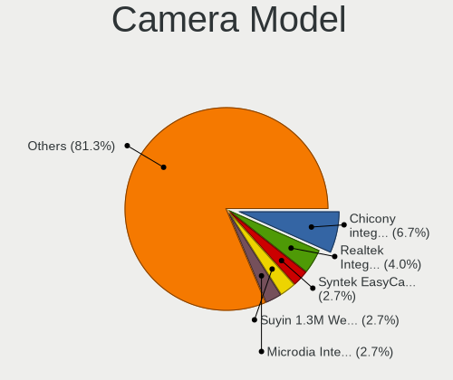

| Model                                                       | Notebooks | Percent |
|-------------------------------------------------------------|-----------|---------|
| Chicony Integrated Camera                                   | 4         | 5.56%   |
| Syntek EasyCamera                                           | 2         | 2.78%   |
| Suyin 1.3M WebCam (notebook emachines E730, Acer sub-brand) | 2         | 2.78%   |
| Realtek USB2.0 HD UVC WebCam                                | 2         | 2.78%   |
| Realtek Integrated_Webcam_HD                                | 2         | 2.78%   |
| Microdia Integrated Webcam                                  | 2         | 2.78%   |
| Lite-On Integrated Camera                                   | 2         | 2.78%   |
| Lenovo Integrated Webcam [R5U877]                           | 2         | 2.78%   |
| IMC Networks USB2.0 HD UVC WebCam                           | 2         | 2.78%   |
| Chicony USB 2.0 Camera                                      | 2         | 2.78%   |
| Chicony TOSHIBA Web Camera - HD                             | 2         | 2.78%   |
| Chicony HP Truevision HD camera                             | 2         | 2.78%   |
| Chicony HD WebCam                                           | 2         | 2.78%   |
| Z-Star WebCam SCB-1900N                                     | 1         | 1.39%   |
| Z-Star WebCam SC-03FFL11739P                                | 1         | 1.39%   |
| Xiongmai web camera                                         | 1         | 1.39%   |
| WaveRider USB 2.0 Camera                                    | 1         | 1.39%   |
| Suyin Acer/HP Integrated Webcam [CN0314]                    | 1         | 1.39%   |
| Suyin 1.3M HD WebCam                                        | 1         | 1.39%   |
| Sunplus Laptop_Integrated_Webcam_FHD                        | 1         | 1.39%   |
| Sunplus Integrated_Webcam_HD                                | 1         | 1.39%   |
| Sunplus HD WebCam                                           | 1         | 1.39%   |
| Sunplus Dell Integrated Webcam                              | 1         | 1.39%   |
| Sunplus Asus Webcam                                         | 1         | 1.39%   |
| Silicon Motion Silicon Motion Camera                        | 1         | 1.39%   |
| Samsung Galaxy series, misc. (MTP mode)                     | 1         | 1.39%   |
| Ricoh USB2.0 Camera                                         | 1         | 1.39%   |
| Realtek USB2.0 VGA UVC WebCam                               | 1         | 1.39%   |
| Realtek Integrated Webcam                                   | 1         | 1.39%   |
| Realtek HD Webcam - Realtek                                 | 1         | 1.39%   |
| Realtek 2SF001                                              | 1         | 1.39%   |
| Quanta HP Wide Vision HD Camera                             | 1         | 1.39%   |
| Microdia USB 2.0 Camera                                     | 1         | 1.39%   |
| Microdia Laptop_Integrated_Webcam_1.3M                      | 1         | 1.39%   |
| Microdia Integrated_Webcam_HD                               | 1         | 1.39%   |
| Microdia HP Webcam-101                                      | 1         | 1.39%   |
| Lite-On HP Wide Vision FHD Camera                           | 1         | 1.39%   |
| Lenovo UVC Camera                                           | 1         | 1.39%   |
| Importek TOSHIBA Web Camera - HD                            | 1         | 1.39%   |
| IMC Networks USB 2.0 UVC VGA WebCam                         | 1         | 1.39%   |
| Cubeternet GL-UPC822 UVC WebCam                             | 1         | 1.39%   |
| Chicony VGA Webcam                                          | 1         | 1.39%   |
| Chicony USB2.0 0.3M UVC WebCam                              | 1         | 1.39%   |
| Chicony Integrated HP HD Webcam                             | 1         | 1.39%   |
| Chicony HP Webcam [2 MP Macro]                              | 1         | 1.39%   |
| Chicony HP HD Webcam [Fixed]                                | 1         | 1.39%   |
| Cheng Uei Precision Industry (Foxlink) HP Webcam-101        | 1         | 1.39%   |
| Cheng Uei Precision Industry (Foxlink) HP Webcam            | 1         | 1.39%   |
| Cheng Uei Precision Industry (Foxlink) HP TrueVision HD     | 1         | 1.39%   |
| Cheng Uei Precision Industry (Foxlink) HP HD Webcam         | 1         | 1.39%   |
| Cheng Uei Precision Industry (Foxlink) HP HD Camera         | 1         | 1.39%   |
| Alcor Micro USB 2.0 Camera                                  | 1         | 1.39%   |
| Acer SunplusIT Integrated Camera                            | 1         | 1.39%   |
| Acer SunplusIT INC. Integrated Camera                       | 1         | 1.39%   |
| Acer Lenovo EasyCamera                                      | 1         | 1.39%   |
| Acer HP Webcam                                              | 1         | 1.39%   |
| Acer HD Webcam                                              | 1         | 1.39%   |

Security
--------

Fingerprint Vendor
------------------

Fingerprint sensor vendors

| Vendor                | Notebooks | Percent |
|-----------------------|-----------|---------|
| Validity Sensors      | 7         | 46.67%  |
| Upek                  | 4         | 26.67%  |
| LighTuning Technology | 2         | 13.33%  |
| Synaptics             | 1         | 6.67%   |
| AuthenTec             | 1         | 6.67%   |

Fingerprint Model
-----------------

Fingerprint sensor models

| Model                                                  | Notebooks | Percent |
|--------------------------------------------------------|-----------|---------|
| Upek Biometric Touchchip/Touchstrip Fingerprint Sensor | 3         | 20%     |
| Validity Sensors VFS471 Fingerprint Reader             | 2         | 13.33%  |
| Validity Sensors VFS5011 Fingerprint Reader            | 1         | 6.67%   |
| Validity Sensors VFS495 Fingerprint Reader             | 1         | 6.67%   |
| Validity Sensors VFS451 Fingerprint Reader             | 1         | 6.67%   |
| Validity Sensors Synaptics WBDI                        | 1         | 6.67%   |
| Validity Sensors Fingerprint scanner                   | 1         | 6.67%   |
| Upek TCS5B Fingerprint sensor                          | 1         | 6.67%   |
| Synaptics Metallica MOH Touch Fingerprint Reader       | 1         | 6.67%   |
| LighTuning Fingerprint Reader                          | 1         | 6.67%   |
| LighTuning EgisTec Touch Fingerprint Sensor            | 1         | 6.67%   |
| AuthenTec AES2810                                      | 1         | 6.67%   |

Chipcard Vendor
---------------

Chipcard module vendors

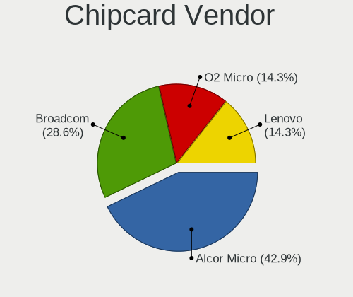

| Vendor      | Notebooks | Percent |
|-------------|-----------|---------|
| Alcor Micro | 3         | 50%     |
| O2 Micro    | 1         | 16.67%  |
| Lenovo      | 1         | 16.67%  |
| Broadcom    | 1         | 16.67%  |

Chipcard Model
--------------

Chipcard module models

| Model                                                                        | Notebooks | Percent |
|------------------------------------------------------------------------------|-----------|---------|
| Alcor Micro AU9540 Smartcard Reader                                          | 3         | 50%     |
| O2 Micro Oz776 SmartCard Reader                                              | 1         | 16.67%  |
| Lenovo Integrated Smart Card Reader                                          | 1         | 16.67%  |
| Broadcom BCM5880 Secure Applications Processor with fingerprint swipe sensor | 1         | 16.67%  |

Unsupported
-----------

Unsupported Devices
-------------------

Total unsupported devices on board

| Total | Notebooks | Percent |
|-------|-----------|---------|
| 0     | 49        | 57.65%  |
| 1     | 29        | 34.12%  |
| 2     | 7         | 8.24%   |

Unsupported Device Types
------------------------

Types of unsupported devices

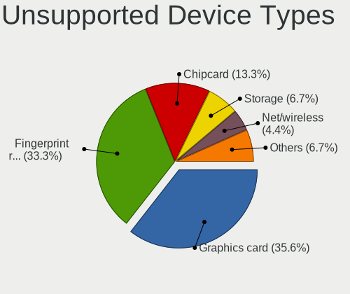

| Type                     | Notebooks | Percent |
|--------------------------|-----------|---------|
| Graphics card            | 15        | 34.88%  |
| Fingerprint reader       | 15        | 34.88%  |
| Chipcard                 | 5         | 11.63%  |
| Storage                  | 3         | 6.98%   |
| Net/wireless             | 2         | 4.65%   |
| Multimedia controller    | 1         | 2.33%   |
| Communication controller | 1         | 2.33%   |
| Bluetooth                | 1         | 2.33%   |

