MX 19 - Tested Hardware & Statistics (Notebooks)
------------------------------------------------

A project to collect tested hardware configurations for MX 19.

Anyone can contribute to this report by the [hw-probe](https://github.com/linuxhw/hw-probe) tool:

    sudo -E hw-probe -all -upload

Please submit a probe of your configuration if it's not presented on the page or is rare.

Full-feature report is available here: https://linux-hardware.org/?view=trends&rel=mx-19

Contents
--------

* [ Test Cases ](#test-cases)

* [ System ](#system)
  - [ Kernel                   ](#kernel)
  - [ Kernel Family            ](#kernel-family)
  - [ Kernel Major Ver.        ](#kernel-major-ver)
  - [ Arch                     ](#arch)
  - [ DE                       ](#de)
  - [ Display Server           ](#display-server)
  - [ Display Manager          ](#display-manager)
  - [ OS Lang                  ](#os-lang)
  - [ Boot Mode                ](#boot-mode)
  - [ Filesystem               ](#filesystem)
  - [ Part. scheme             ](#part-scheme)
  - [ Dual Boot with Linux/BSD ](#dual-boot-with-linuxbsd)
  - [ Dual Boot (Win)          ](#dual-boot-win)

* [ Board ](#board)
  - [ Vendor                   ](#vendor)
  - [ Model                    ](#model)
  - [ Model Family             ](#model-family)
  - [ MFG Year                 ](#mfg-year)
  - [ Form Factor              ](#form-factor)
  - [ Secure Boot              ](#secure-boot)
  - [ Coreboot                 ](#coreboot)
  - [ RAM Size                 ](#ram-size)
  - [ RAM Used                 ](#ram-used)
  - [ Total Drives             ](#total-drives)
  - [ Has CD-ROM               ](#has-cd-rom)
  - [ Has Ethernet             ](#has-ethernet)
  - [ Has WiFi                 ](#has-wifi)
  - [ Has Bluetooth            ](#has-bluetooth)

* [ Location ](#location)
  - [ Country                  ](#country)
  - [ City                     ](#city)

* [ Drives ](#drives)
  - [ Drive Vendor             ](#drive-vendor)
  - [ Drive Model              ](#drive-model)
  - [ HDD Vendor               ](#hdd-vendor)
  - [ SSD Vendor               ](#ssd-vendor)
  - [ Drive Kind               ](#drive-kind)
  - [ Drive Connector          ](#drive-connector)
  - [ Drive Size               ](#drive-size)
  - [ Space Total              ](#space-total)
  - [ Space Used               ](#space-used)
  - [ Malfunc. Drives          ](#malfunc-drives)
  - [ Malfunc. Drive Vendor    ](#malfunc-drive-vendor)
  - [ Malfunc. HDD Vendor      ](#malfunc-hdd-vendor)
  - [ Malfunc. Drive Kind      ](#malfunc-drive-kind)
  - [ Failed Drives            ](#failed-drives)
  - [ Failed Drive Vendor      ](#failed-drive-vendor)
  - [ Drive Status             ](#drive-status)

* [ Storage controller ](#storage-controller)
  - [ Storage Vendor           ](#storage-vendor)
  - [ Storage Model            ](#storage-model)
  - [ Storage Kind             ](#storage-kind)

* [ Processor ](#processor)
  - [ CPU Vendor               ](#cpu-vendor)
  - [ CPU Model                ](#cpu-model)
  - [ CPU Model Family         ](#cpu-model-family)
  - [ CPU Cores                ](#cpu-cores)
  - [ CPU Sockets              ](#cpu-sockets)
  - [ CPU Threads              ](#cpu-threads)
  - [ CPU Op-Modes             ](#cpu-op-modes)
  - [ CPU Microcode            ](#cpu-microcode)
  - [ CPU Microarch            ](#cpu-microarch)

* [ Graphics ](#graphics)
  - [ GPU Vendor               ](#gpu-vendor)
  - [ GPU Model                ](#gpu-model)
  - [ GPU Combo                ](#gpu-combo)
  - [ GPU Driver               ](#gpu-driver)
  - [ GPU Memory               ](#gpu-memory)

* [ Monitor ](#monitor)
  - [ Monitor Vendor           ](#monitor-vendor)
  - [ Monitor Model            ](#monitor-model)
  - [ Monitor Resolution       ](#monitor-resolution)
  - [ Monitor Diagonal         ](#monitor-diagonal)
  - [ Monitor Width            ](#monitor-width)
  - [ Aspect Ratio             ](#aspect-ratio)
  - [ Monitor Area             ](#monitor-area)
  - [ Pixel Density            ](#pixel-density)
  - [ Multiple Monitors        ](#multiple-monitors)

* [ Network ](#network)
  - [ Net Controller Vendor    ](#net-controller-vendor)
  - [ Net Controller Model     ](#net-controller-model)
  - [ Wireless Vendor          ](#wireless-vendor)
  - [ Wireless Model           ](#wireless-model)
  - [ Ethernet Vendor          ](#ethernet-vendor)
  - [ Ethernet Model           ](#ethernet-model)
  - [ Net Controller Kind      ](#net-controller-kind)
  - [ Used Controller          ](#used-controller)
  - [ NICs                     ](#nics)
  - [ IPv6                     ](#ipv6)

* [ Bluetooth ](#bluetooth)
  - [ Bluetooth Vendor         ](#bluetooth-vendor)
  - [ Bluetooth Model          ](#bluetooth-model)

* [ Sound ](#sound)
  - [ Sound Vendor             ](#sound-vendor)
  - [ Sound Model              ](#sound-model)

* [ Memory ](#memory)
  - [ Memory Vendor            ](#memory-vendor)
  - [ Memory Model             ](#memory-model)
  - [ Memory Kind              ](#memory-kind)
  - [ Memory Form Factor       ](#memory-form-factor)
  - [ Memory Size              ](#memory-size)
  - [ Memory Speed             ](#memory-speed)

* [ Printers & scanners ](#printers--scanners)
  - [ Printer Vendor           ](#printer-vendor)
  - [ Printer Model            ](#printer-model)
  - [ Scanner Vendor           ](#scanner-vendor)
  - [ Scanner Model            ](#scanner-model)

* [ Camera ](#camera)
  - [ Camera Vendor            ](#camera-vendor)
  - [ Camera Model             ](#camera-model)

* [ Security ](#security)
  - [ Fingerprint Vendor       ](#fingerprint-vendor)
  - [ Fingerprint Model        ](#fingerprint-model)
  - [ Chipcard Vendor          ](#chipcard-vendor)
  - [ Chipcard Model           ](#chipcard-model)

* [ Unsupported ](#unsupported)
  - [ Unsupported Devices      ](#unsupported-devices)
  - [ Unsupported Device Types ](#unsupported-device-types)

Test Cases
----------

| Vendor        | Model                       | Probe                                                      | Date         |
|---------------|-----------------------------|------------------------------------------------------------|--------------|
| Dell          | Latitude 3190               | [6a71754838](https://linux-hardware.org/?probe=6a71754838) | Sep 27, 2021 |
| Dell          | Latitude 3190               | [c5f29e40e9](https://linux-hardware.org/?probe=c5f29e40e9) | Sep 20, 2021 |
| ASUSTek       | TUF Gaming FA706IU_FA706... | [8c1a085f29](https://linux-hardware.org/?probe=8c1a085f29) | Sep 20, 2021 |
| Dell          | Latitude 3190               | [91b5632082](https://linux-hardware.org/?probe=91b5632082) | Sep 13, 2021 |
| GTZS          | Unknown                     | [3df799f341](https://linux-hardware.org/?probe=3df799f341) | Sep 05, 2021 |
| Acer          | Aspire V3-371               | [ddd7b7b87f](https://linux-hardware.org/?probe=ddd7b7b87f) | Sep 02, 2021 |
| Acer          | Aspire V3-371               | [16c3c01bcd](https://linux-hardware.org/?probe=16c3c01bcd) | Sep 02, 2021 |
| Dell          | Latitude 3190               | [76feb70b2f](https://linux-hardware.org/?probe=76feb70b2f) | Aug 30, 2021 |
| Dell          | Latitude 3190               | [bf62dc4914](https://linux-hardware.org/?probe=bf62dc4914) | Aug 23, 2021 |
| Dell          | Latitude 3190               | [1b11784345](https://linux-hardware.org/?probe=1b11784345) | Aug 16, 2021 |
| Pixus         | Rise                        | [4479b88c1c](https://linux-hardware.org/?probe=4479b88c1c) | Aug 12, 2021 |
| Acer          | TravelMate 5360             | [f444dec794](https://linux-hardware.org/?probe=f444dec794) | Aug 12, 2021 |
| Dell          | Latitude 3190               | [bbef2b9d97](https://linux-hardware.org/?probe=bbef2b9d97) | Aug 09, 2021 |
| Dell          | Latitude 3190               | [61b56c3bd9](https://linux-hardware.org/?probe=61b56c3bd9) | Aug 02, 2021 |
| Lenovo        | ThinkPad T420 4236MBU       | [7e0b868c64](https://linux-hardware.org/?probe=7e0b868c64) | Jul 29, 2021 |
| Dell          | Latitude 3190               | [520fb53552](https://linux-hardware.org/?probe=520fb53552) | Jul 26, 2021 |
| Acer          | Aspire E5-574G              | [b09280946d](https://linux-hardware.org/?probe=b09280946d) | Jul 21, 2021 |
| Dell          | Latitude 3190               | [dc44dffece](https://linux-hardware.org/?probe=dc44dffece) | Jul 19, 2021 |
| Dell          | Vostro 5515                 | [f4ae054fc8](https://linux-hardware.org/?probe=f4ae054fc8) | Jul 15, 2021 |
| Dell          | Latitude 3190               | [701b0f5439](https://linux-hardware.org/?probe=701b0f5439) | Jul 12, 2021 |
| Dell          | Latitude 3190               | [6ca8a34d23](https://linux-hardware.org/?probe=6ca8a34d23) | Jul 05, 2021 |
| Dell          | Latitude 3190               | [ec46d1beb2](https://linux-hardware.org/?probe=ec46d1beb2) | Jun 28, 2021 |
| Dell          | Latitude 3190               | [c4cdd3a43c](https://linux-hardware.org/?probe=c4cdd3a43c) | Jun 21, 2021 |
| Dell          | Latitude 3190               | [5a6254c4af](https://linux-hardware.org/?probe=5a6254c4af) | Jun 14, 2021 |
| Medion        | P6669 MD60147               | [3ed80daa7b](https://linux-hardware.org/?probe=3ed80daa7b) | Jun 10, 2021 |
| Dell          | Latitude 3190               | [e96a8c3e76](https://linux-hardware.org/?probe=e96a8c3e76) | Jun 07, 2021 |
| Dell          | Latitude 3190               | [7bdec3eb56](https://linux-hardware.org/?probe=7bdec3eb56) | May 31, 2021 |
| Dell          | Vostro 3460                 | [da200f9e64](https://linux-hardware.org/?probe=da200f9e64) | May 29, 2021 |
| Medion        | E6234                       | [313ec752ab](https://linux-hardware.org/?probe=313ec752ab) | May 24, 2021 |
| Dell          | Latitude 3190               | [8918c312ff](https://linux-hardware.org/?probe=8918c312ff) | May 24, 2021 |
| HP            | Stream Laptop 14-cb0XX      | [4ed89e1092](https://linux-hardware.org/?probe=4ed89e1092) | May 22, 2021 |
| HP            | Stream Laptop 14-cb0XX      | [57a69c7c0d](https://linux-hardware.org/?probe=57a69c7c0d) | May 20, 2021 |
| HP            | Mini 110-3500               | [f94c828225](https://linux-hardware.org/?probe=f94c828225) | May 19, 2021 |
| ASUSTek       | N56VZ                       | [c69cd5aceb](https://linux-hardware.org/?probe=c69cd5aceb) | May 18, 2021 |
| Dell          | Latitude 3190               | [5ffc389a2a](https://linux-hardware.org/?probe=5ffc389a2a) | May 17, 2021 |
| Dell          | Latitude 3190               | [4eeed413e6](https://linux-hardware.org/?probe=4eeed413e6) | May 10, 2021 |
| Dell          | Latitude 3190               | [5caeaa658b](https://linux-hardware.org/?probe=5caeaa658b) | May 03, 2021 |
| Dell          | Latitude 3190               | [a046e7b3f8](https://linux-hardware.org/?probe=a046e7b3f8) | Apr 26, 2021 |
| Acer          | Extensa 5620                | [a06636ba79](https://linux-hardware.org/?probe=a06636ba79) | Apr 24, 2021 |
| Dell          | 0UW744??????                | [32c3521a2e](https://linux-hardware.org/?probe=32c3521a2e) | Apr 22, 2021 |
| Dell          | Latitude 3190               | [c94ccb949b](https://linux-hardware.org/?probe=c94ccb949b) | Apr 19, 2021 |
| Intel         | ChiefRiver                  | [5e0db0f704](https://linux-hardware.org/?probe=5e0db0f704) | Apr 14, 2021 |
| eMachines     | E727                        | [048da4f23b](https://linux-hardware.org/?probe=048da4f23b) | Apr 12, 2021 |
| Dell          | Latitude 3190               | [d0e46bf61f](https://linux-hardware.org/?probe=d0e46bf61f) | Apr 12, 2021 |
| ASUSTek       | 1025C                       | [33d6531353](https://linux-hardware.org/?probe=33d6531353) | Apr 06, 2021 |
| Dell          | Latitude 3190               | [2ff832079d](https://linux-hardware.org/?probe=2ff832079d) | Apr 05, 2021 |
| Dell          | Latitude 3190               | [3afafda719](https://linux-hardware.org/?probe=3afafda719) | Mar 29, 2021 |
| Dell          | Latitude 3190               | [d00e8dc9e8](https://linux-hardware.org/?probe=d00e8dc9e8) | Mar 22, 2021 |
| Dell          | Latitude 3190               | [83f4f1e1f1](https://linux-hardware.org/?probe=83f4f1e1f1) | Mar 15, 2021 |
| Dell          | Latitude E5470              | [064cf2bccd](https://linux-hardware.org/?probe=064cf2bccd) | Mar 11, 2021 |
| Toshiba       | PORTEGE R705                | [f537f51a95](https://linux-hardware.org/?probe=f537f51a95) | Mar 09, 2021 |
| Dell          | Latitude 3190               | [8bb5c10a3c](https://linux-hardware.org/?probe=8bb5c10a3c) | Mar 08, 2021 |
| HP            | Notebook                    | [113644885d](https://linux-hardware.org/?probe=113644885d) | Mar 04, 2021 |
| Acer          | AOD255                      | [f8501e519f](https://linux-hardware.org/?probe=f8501e519f) | Mar 03, 2021 |
| Dell          | Latitude 3190               | [fb4469e67a](https://linux-hardware.org/?probe=fb4469e67a) | Mar 01, 2021 |
| Google        | Gnawty                      | [252bc4cb46](https://linux-hardware.org/?probe=252bc4cb46) | Feb 25, 2021 |
| Dell          | Latitude D430               | [63906404d0](https://linux-hardware.org/?probe=63906404d0) | Feb 25, 2021 |
| ASUSTek       | X200CA                      | [2817beb96d](https://linux-hardware.org/?probe=2817beb96d) | Feb 25, 2021 |
| HP            | Pavilion g6                 | [f23e85a87a](https://linux-hardware.org/?probe=f23e85a87a) | Feb 23, 2021 |
| Google        | Gnawty                      | [7614a9a19c](https://linux-hardware.org/?probe=7614a9a19c) | Feb 23, 2021 |
| Dell          | Latitude 3190               | [6708c8b87a](https://linux-hardware.org/?probe=6708c8b87a) | Feb 22, 2021 |
| Samsung       | 305E4A/305E5A/305E7A        | [6f34bc4f67](https://linux-hardware.org/?probe=6f34bc4f67) | Feb 19, 2021 |
| Lenovo        | IdeaPad 310-15ISK 80SM      | [7552dacfb9](https://linux-hardware.org/?probe=7552dacfb9) | Feb 17, 2021 |
| Google        | Gnawty                      | [2983bbfda3](https://linux-hardware.org/?probe=2983bbfda3) | Feb 11, 2021 |
| HP            | 15                          | [437cb08f68](https://linux-hardware.org/?probe=437cb08f68) | Feb 08, 2021 |
| Google        | Gnawty                      | [ee5279728d](https://linux-hardware.org/?probe=ee5279728d) | Feb 04, 2021 |
| Lenovo        | ThinkPad T440p 20AWA1NAU... | [b6ebe98655](https://linux-hardware.org/?probe=b6ebe98655) | Feb 01, 2021 |
| HP            | ProBook 650 G1              | [9021b90504](https://linux-hardware.org/?probe=9021b90504) | Jan 22, 2021 |
| ASUSTek       | ZenBook UX425EA_UX425EA     | [a147ddbe9d](https://linux-hardware.org/?probe=a147ddbe9d) | Jan 20, 2021 |
| HP            | Pavilion g6                 | [c4b4831246](https://linux-hardware.org/?probe=c4b4831246) | Jan 15, 2021 |
| Fujitsu Si... | ESPRIMO Mobile D9500        | [989e87e18e](https://linux-hardware.org/?probe=989e87e18e) | Jan 15, 2021 |
| Dell          | Latitude D430               | [874d8f3925](https://linux-hardware.org/?probe=874d8f3925) | Jan 14, 2021 |
| Dell          | Latitude E5520              | [1d46b26326](https://linux-hardware.org/?probe=1d46b26326) | Jan 03, 2021 |
| HP            | Presario CQ57               | [351ae067b6](https://linux-hardware.org/?probe=351ae067b6) | Dec 31, 2020 |
| HP            | Presario CQ57               | [16a2a0af55](https://linux-hardware.org/?probe=16a2a0af55) | Dec 31, 2020 |
| HP            | Presario CQ57               | [63b31db6e7](https://linux-hardware.org/?probe=63b31db6e7) | Dec 30, 2020 |
| HP            | Presario CQ57               | [94b74045cc](https://linux-hardware.org/?probe=94b74045cc) | Dec 30, 2020 |
| Acer          | Aspire ES1-511              | [7f351d7c49](https://linux-hardware.org/?probe=7f351d7c49) | Dec 30, 2020 |
| Lenovo        | ThinkPad X270 W10DG 20K5... | [5de3914984](https://linux-hardware.org/?probe=5de3914984) | Dec 15, 2020 |
| Lenovo        | V145-15AST 81MT             | [ebb2dc7bff](https://linux-hardware.org/?probe=ebb2dc7bff) | Dec 15, 2020 |
| Lenovo        | V145-15AST 81MT             | [5b5f1330c5](https://linux-hardware.org/?probe=5b5f1330c5) | Dec 13, 2020 |
| Lenovo        | ThinkPad X220 4291WMQ       | [165b895e27](https://linux-hardware.org/?probe=165b895e27) | Dec 01, 2020 |
| Toshiba       | Satellite A300              | [309a3f69e8](https://linux-hardware.org/?probe=309a3f69e8) | Nov 16, 2020 |
| Lenovo        | ThinkPad T410 2537G99       | [554dfc3cfe](https://linux-hardware.org/?probe=554dfc3cfe) | Nov 12, 2020 |
| Lenovo        | ThinkPad T410 2537G99       | [2dc30b7928](https://linux-hardware.org/?probe=2dc30b7928) | Nov 12, 2020 |
| Lenovo        | ThinkPad X270 W10DG 20K5... | [fe6cbf555a](https://linux-hardware.org/?probe=fe6cbf555a) | Nov 08, 2020 |
| Dell          | Inspiron 14-3452            | [96e87a665b](https://linux-hardware.org/?probe=96e87a665b) | Nov 01, 2020 |
| Acer          | Aspire SW5-015              | [b125bdb89e](https://linux-hardware.org/?probe=b125bdb89e) | Oct 07, 2020 |
| Lenovo        | V145-15AST 81MT             | [7155397289](https://linux-hardware.org/?probe=7155397289) | Oct 03, 2020 |
| HP            | ZBook 15 G4                 | [c36d170750](https://linux-hardware.org/?probe=c36d170750) | Aug 27, 2020 |
| HP            | ZBook 15 G4                 | [00d13faf2a](https://linux-hardware.org/?probe=00d13faf2a) | Aug 27, 2020 |
| Acer          | Aspire 7520                 | [d878dbb71e](https://linux-hardware.org/?probe=d878dbb71e) | Aug 13, 2020 |
| HP            | Pavilion dv7                | [3494105666](https://linux-hardware.org/?probe=3494105666) | Jul 28, 2020 |
| ASUSTek       | TUF Gaming FA706IU_TUF70... | [c0d166e020](https://linux-hardware.org/?probe=c0d166e020) | Jul 27, 2020 |
| Sony          | VPCF23P1E                   | [2e0915f8a9](https://linux-hardware.org/?probe=2e0915f8a9) | Jun 18, 2020 |
| HP            | Pavilion Laptop 15-cw0xx... | [b93dafce99](https://linux-hardware.org/?probe=b93dafce99) | Jun 09, 2020 |
| Lenovo        | ThinkPad X250 20CLS4YA00    | [72150af905](https://linux-hardware.org/?probe=72150af905) | Jun 06, 2020 |
| ASUSTek       | X540UP                      | [2ec9f9c770](https://linux-hardware.org/?probe=2ec9f9c770) | Jun 05, 2020 |
| Lenovo        | ThinkPad E490 20N9S26G00    | [a26e5790ce](https://linux-hardware.org/?probe=a26e5790ce) | May 06, 2020 |
| Samsung       | R780/R778                   | [eb0bb63c6d](https://linux-hardware.org/?probe=eb0bb63c6d) | Apr 09, 2020 |
| Clevo         | P150HMx                     | [196b689717](https://linux-hardware.org/?probe=196b689717) | Mar 27, 2020 |
| Dell          | Latitude E7440              | [c6fe81343e](https://linux-hardware.org/?probe=c6fe81343e) | Mar 26, 2020 |
| Dell          | Inspiron 13-5378            | [242a7e4fdc](https://linux-hardware.org/?probe=242a7e4fdc) | Mar 24, 2020 |
| Clevo         | P150HMx                     | [8f9823569b](https://linux-hardware.org/?probe=8f9823569b) | Mar 24, 2020 |
| Dell          | Inspiron N5010              | [8654fde26b](https://linux-hardware.org/?probe=8654fde26b) | Mar 24, 2020 |
| Dell          | Latitude 3190               | [1bab98d664](https://linux-hardware.org/?probe=1bab98d664) | Mar 20, 2020 |
| HP            | EliteBook 8560p             | [e5925f1349](https://linux-hardware.org/?probe=e5925f1349) | Mar 07, 2020 |
| Acer          | Aspire 8943G                | [f8e194e907](https://linux-hardware.org/?probe=f8e194e907) | Mar 01, 2020 |
| Lenovo        | ThinkPad T440p 20AWS2T11... | [9c888bfdde](https://linux-hardware.org/?probe=9c888bfdde) | Feb 11, 2020 |
| Lenovo        | ThinkPad X201 3680MY9       | [26a7c0e493](https://linux-hardware.org/?probe=26a7c0e493) | Feb 09, 2020 |
| Google        | Gnawty                      | [4a2e211ce1](https://linux-hardware.org/?probe=4a2e211ce1) | Feb 08, 2020 |
| Lenovo        | ThinkPad W510 4875W17       | [8865e9546b](https://linux-hardware.org/?probe=8865e9546b) | Feb 03, 2020 |
| Lenovo        | ThinkPad W510 4875W17       | [f4779c95ce](https://linux-hardware.org/?probe=f4779c95ce) | Feb 03, 2020 |
| Acer          | Swift SF314-54G             | [48912b8dc6](https://linux-hardware.org/?probe=48912b8dc6) | Jan 19, 2020 |
| ASUSTek       | TUF Gaming FX505GT_TUF50... | [0abd5b1d73](https://linux-hardware.org/?probe=0abd5b1d73) | Jan 18, 2020 |
| Toshiba       | Satellite P875              | [b267e93d40](https://linux-hardware.org/?probe=b267e93d40) | Jan 15, 2020 |
| Toshiba       | Satellite P875              | [7e579fcba2](https://linux-hardware.org/?probe=7e579fcba2) | Jan 15, 2020 |
| MSI           | GP63 Leopard 8RD            | [0a8865c437](https://linux-hardware.org/?probe=0a8865c437) | Jan 13, 2020 |
| Lenovo        | ThinkPad X1C 5th W10DG 2... | [ba3b839fa4](https://linux-hardware.org/?probe=ba3b839fa4) | Jan 12, 2020 |
| HP            | Pavilion Laptop 14-ce3xx... | [7f8e86e96b](https://linux-hardware.org/?probe=7f8e86e96b) | Jan 12, 2020 |
| HP            | Pavilion g6                 | [9c722b6763](https://linux-hardware.org/?probe=9c722b6763) | Dec 21, 2019 |
| Toshiba       | Satellite C50-A-12K         | [a413f419ef](https://linux-hardware.org/?probe=a413f419ef) | Dec 17, 2019 |
| HP            | Laptop 14-ck0xxx            | [ff52ea1b93](https://linux-hardware.org/?probe=ff52ea1b93) | Dec 03, 2019 |
| MSI           | MS-N033                     | [a5ee4c1dc1](https://linux-hardware.org/?probe=a5ee4c1dc1) | Nov 17, 2019 |
| Lenovo        | ThinkPad L412 0585W28       | [73073ac3f3](https://linux-hardware.org/?probe=73073ac3f3) | Nov 17, 2019 |
| Lenovo        | ThinkPad X301 2776LBU       | [993b5f104a](https://linux-hardware.org/?probe=993b5f104a) | Nov 17, 2019 |
| ASUSTek       | X101CH                      | [b17de4dbad](https://linux-hardware.org/?probe=b17de4dbad) | Nov 04, 2019 |
| HP            | Pavilion g6                 | [2cb09606ed](https://linux-hardware.org/?probe=2cb09606ed) | Nov 01, 2019 |
| HP            | ProBook 4440s               | [fc67acaa63](https://linux-hardware.org/?probe=fc67acaa63) | Oct 29, 2019 |
| MSI           | GP63 Leopard 8RD            | [df3af7b333](https://linux-hardware.org/?probe=df3af7b333) | Oct 23, 2019 |
| HP            | EliteBook 8540w             | [ea8ef5afc7](https://linux-hardware.org/?probe=ea8ef5afc7) | Oct 23, 2019 |
| HP            | Pavilion g6                 | [6bde777445](https://linux-hardware.org/?probe=6bde777445) | Oct 20, 2019 |

System
------

Kernel
------

Version of the Linux kernel

| Version                    | Notebooks | Percent |
|----------------------------|-----------|---------|
| 4.19.0-6-amd64             | 9         | 39.13%  |
| 5.6.10-antix.1-amd64-smp   | 1         | 4.35%   |
| 5.4.0-antix.1-amd64-smp    | 1         | 4.35%   |
| 5.4.0-13.3-liquorix-amd64  | 1         | 4.35%   |
| 5.4.0-11.2-liquorix-amd64  | 1         | 4.35%   |
| 5.4.0-10.2-liquorix-amd64  | 1         | 4.35%   |
| 5.3.10-antix.1-amd64-smp   | 1         | 4.35%   |
| 5.3.0-2-amd64              | 1         | 4.35%   |
| 5.3.0-10.1-liquorix-amd64  | 1         | 4.35%   |
| 5.2.21-antix.2-amd64-smp   | 1         | 4.35%   |
| 5.2.21-antix.2-686-smp-pae | 1         | 4.35%   |
| 5.2.0-21.2-liquorix-amd64  | 1         | 4.35%   |
| 4.9.246-0409246-lowlatency | 1         | 4.35%   |
| 4.9.193-antix.1-amd64-smp  | 1         | 4.35%   |
| 4.19.0-6-686-pae           | 1         | 4.35%   |

Kernel Family
-------------

Linux kernel without a distro release

| Version | Notebooks | Percent |
|---------|-----------|---------|
| 4.19.0  | 10        | 43.48%  |
| 5.4.0   | 4         | 17.39%  |
| 5.3.0   | 2         | 8.7%    |
| 5.2.21  | 2         | 8.7%    |
| 5.6.10  | 1         | 4.35%   |
| 5.3.10  | 1         | 4.35%   |
| 5.2.0   | 1         | 4.35%   |
| 4.9.246 | 1         | 4.35%   |
| 4.9.193 | 1         | 4.35%   |

Kernel Major Ver.
-----------------

Linux kernel major version

| Version | Notebooks | Percent |
|---------|-----------|---------|
| 4.19    | 10        | 43.48%  |
| 5.4     | 4         | 17.39%  |
| 5.3     | 3         | 13.04%  |
| 5.2     | 3         | 13.04%  |
| 4.9     | 2         | 8.7%    |
| 5.6     | 1         | 4.35%   |

Arch
----

OS architecture (x86_64, i586, etc.)

| Name   | Notebooks | Percent |
|--------|-----------|---------|
| x86_64 | 20        | 90.91%  |
| i686   | 2         | 9.09%   |

DE
--

Desktop Environment

| Name    | Notebooks | Percent |
|---------|-----------|---------|
| XFCE    | 15        | 68.18%  |
| Unknown | 3         | 13.64%  |
| MATE    | 1         | 4.55%   |
| KDE5    | 1         | 4.55%   |
| i3      | 1         | 4.55%   |
| Budgie  | 1         | 4.55%   |

Display Server
--------------

X11 or Wayland

| Name | Notebooks | Percent |
|------|-----------|---------|
| X11  | 22        | 100%    |

Display Manager
---------------

SDDM, LightDM, etc.

| Name    | Notebooks | Percent |
|---------|-----------|---------|
| LightDM | 17        | 77.27%  |
| SLiM    | 4         | 18.18%  |
| SDDM    | 1         | 4.55%   |

OS Lang
-------

Language

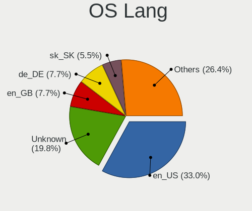

| Lang    | Notebooks | Percent |
|---------|-----------|---------|
| Unknown | 17        | 77.27%  |
| en_US   | 3         | 13.64%  |
| it_IT   | 1         | 4.55%   |
| cs_CZ   | 1         | 4.55%   |

Boot Mode
---------

EFI or BIOS

| Mode | Notebooks | Percent |
|------|-----------|---------|
| BIOS | 13        | 59.09%  |
| EFI  | 9         | 40.91%  |

Filesystem
----------

Type of filesystem

| Type    | Notebooks | Percent |
|---------|-----------|---------|
| Ext4    | 19        | 86.36%  |
| Overlay | 3         | 13.64%  |

Part. scheme
------------

Scheme of partitioning

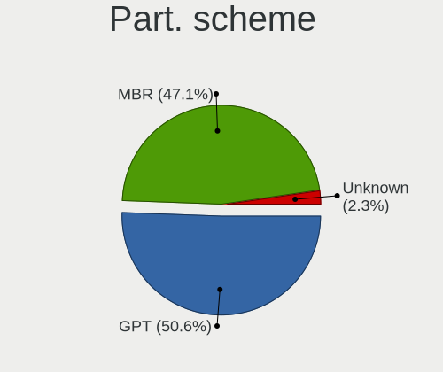

| Type | Notebooks | Percent |
|------|-----------|---------|
| GPT  | 13        | 59.09%  |
| MBR  | 9         | 40.91%  |

Dual Boot with Linux/BSD
------------------------

Hosting more than one Linux/BSD

| Dual boot | Notebooks | Percent |
|-----------|-----------|---------|
| No        | 16        | 72.73%  |
| Yes       | 6         | 27.27%  |

Dual Boot (Win)
---------------

Hosting Linux and Windows

| Dual boot | Notebooks | Percent |
|-----------|-----------|---------|
| Yes       | 14        | 63.64%  |
| No        | 8         | 36.36%  |

Board
-----

Vendor
------

Motherboard manufacturer

| Name             | Notebooks | Percent |
|------------------|-----------|---------|
| Lenovo           | 7         | 31.82%  |
| Hewlett-Packard  | 6         | 27.27%  |
| ASUSTek Computer | 3         | 13.64%  |
| Toshiba          | 2         | 9.09%   |
| MSI              | 2         | 9.09%   |
| Google           | 1         | 4.55%   |
| Acer             | 1         | 4.55%   |

Model
-----

Motherboard model

| Name                                     | Notebooks | Percent |
|------------------------------------------|-----------|---------|
| Toshiba Satellite P875                   | 1         | 4.55%   |
| Toshiba Satellite C50-A-12K              | 1         | 4.55%   |
| MSI MS-N033                              | 1         | 4.55%   |
| MSI GP63 Leopard 8RD                     | 1         | 4.55%   |
| Lenovo ThinkPad X301 2776LBU             | 1         | 4.55%   |
| Lenovo ThinkPad X220 4291WMQ             | 1         | 4.55%   |
| Lenovo ThinkPad X201 3680MY9             | 1         | 4.55%   |
| Lenovo ThinkPad X1C 5th W10DG 20K4S0EC00 | 1         | 4.55%   |
| Lenovo ThinkPad W510 4875W17             | 1         | 4.55%   |
| Lenovo ThinkPad T440p 20AWS2T11D         | 1         | 4.55%   |
| Lenovo ThinkPad L412 0585W28             | 1         | 4.55%   |
| HP ProBook 4440s                         | 1         | 4.55%   |
| HP Pavilion Laptop 14-ce3xxx             | 1         | 4.55%   |
| HP Pavilion g6                           | 1         | 4.55%   |
| HP Laptop 14-ck0xxx                      | 1         | 4.55%   |
| HP EliteBook 8560p                       | 1         | 4.55%   |
| HP EliteBook 8540w                       | 1         | 4.55%   |
| Google Gnawty                            | 1         | 4.55%   |
| ASUS X540UP                              | 1         | 4.55%   |
| ASUS X101CH                              | 1         | 4.55%   |
| ASUS TUF Gaming FX505GT_TUF505GT         | 1         | 4.55%   |
| Acer Swift SF314-54G                     | 1         | 4.55%   |

Model Family
------------

Motherboard model prefix

| Name              | Notebooks | Percent |
|-------------------|-----------|---------|
| Lenovo ThinkPad   | 7         | 31.82%  |
| Toshiba Satellite | 2         | 9.09%   |
| HP Pavilion       | 2         | 9.09%   |
| HP EliteBook      | 2         | 9.09%   |
| MSI MS-N033       | 1         | 4.55%   |
| MSI GP63          | 1         | 4.55%   |
| HP ProBook        | 1         | 4.55%   |
| HP Laptop         | 1         | 4.55%   |
| Google Gnawty     | 1         | 4.55%   |
| ASUS X540UP       | 1         | 4.55%   |
| ASUS X101CH       | 1         | 4.55%   |
| ASUS TUF          | 1         | 4.55%   |
| Acer Swift        | 1         | 4.55%   |

MFG Year
--------

Motherboard manufacture year

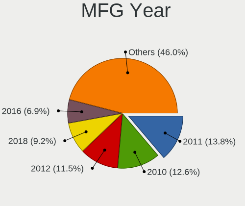

| Year | Notebooks | Percent |
|------|-----------|---------|
| 2019 | 5         | 22.73%  |
| 2018 | 5         | 22.73%  |
| 2013 | 3         | 13.64%  |
| 2010 | 3         | 13.64%  |
| 2012 | 2         | 9.09%   |
| 2016 | 1         | 4.55%   |
| 2015 | 1         | 4.55%   |
| 2014 | 1         | 4.55%   |
| 2009 | 1         | 4.55%   |

Form Factor
-----------

Physical design of the computer

| Name     | Notebooks | Percent |
|----------|-----------|---------|
| Notebook | 22        | 100%    |

Secure Boot
-----------

Enabled or disabled

| State    | Notebooks | Percent |
|----------|-----------|---------|
| Disabled | 22        | 100%    |

Coreboot
--------

Have coreboot on board

| Used | Notebooks | Percent |
|------|-----------|---------|
| No   | 21        | 95.45%  |
| Yes  | 1         | 4.55%   |

RAM Size
--------

Total RAM memory

| Size in GB | Notebooks | Percent |
|------------|-----------|---------|
| 8.01-16.0  | 8         | 36.36%  |
| 4.01-8.0   | 4         | 18.18%  |
| 3.01-4.0   | 3         | 13.64%  |
| 16.01-24.0 | 2         | 9.09%   |
| 1.01-2.0   | 2         | 9.09%   |
| 32.01-64.0 | 1         | 4.55%   |
| 2.01-3.0   | 1         | 4.55%   |
| 0.51-1.0   | 1         | 4.55%   |

RAM Used
--------

Used RAM memory

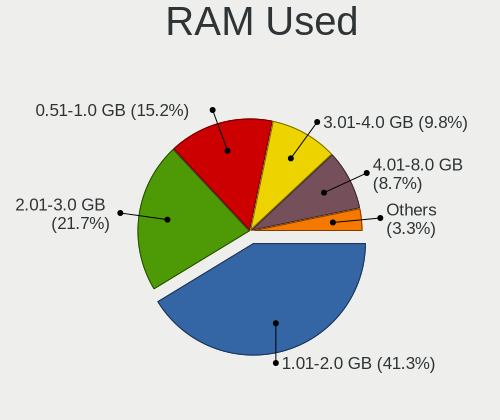

| Used GB   | Notebooks | Percent |
|-----------|-----------|---------|
| 1.01-2.0  | 10        | 43.48%  |
| 0.51-1.0  | 4         | 17.39%  |
| 2.01-3.0  | 3         | 13.04%  |
| 4.01-8.0  | 2         | 8.7%    |
| 3.01-4.0  | 2         | 8.7%    |
| 8.01-16.0 | 1         | 4.35%   |
| 0.01-0.5  | 1         | 4.35%   |

Total Drives
------------

Number of drives on board

| Drives | Notebooks | Percent |
|--------|-----------|---------|
| 1      | 16        | 69.57%  |
| 2      | 7         | 30.43%  |

Has CD-ROM
----------

Has CD-ROM on board

| Presented | Notebooks | Percent |
|-----------|-----------|---------|
| No        | 13        | 59.09%  |
| Yes       | 9         | 40.91%  |

Has Ethernet
------------

Has Ethernet on board

| Presented | Notebooks | Percent |
|-----------|-----------|---------|
| Yes       | 20        | 90.91%  |
| No        | 2         | 9.09%   |

Has WiFi
--------

Has WiFi module

| Presented | Notebooks | Percent |
|-----------|-----------|---------|
| Yes       | 22        | 100%    |

Has Bluetooth
-------------

Has Bluetooth module

| Presented | Notebooks | Percent |
|-----------|-----------|---------|
| Yes       | 18        | 81.82%  |
| No        | 4         | 18.18%  |

Location
--------

Country
-------

Geographic location (country)

| Country     | Notebooks | Percent |
|-------------|-----------|---------|
| USA         | 7         | 31.82%  |
| Slovakia    | 3         | 13.64%  |
| Germany     | 2         | 9.09%   |
| France      | 2         | 9.09%   |
| Thailand    | 1         | 4.55%   |
| Russia      | 1         | 4.55%   |
| Philippines | 1         | 4.55%   |
| Italy       | 1         | 4.55%   |
| India       | 1         | 4.55%   |
| Greece      | 1         | 4.55%   |
| Canada      | 1         | 4.55%   |
| Austria     | 1         | 4.55%   |

City
----

Geographic location (city)

| City         | Notebooks | Percent |
|--------------|-----------|---------|
| Bratislava   | 3         | 13.64%  |
| Vista        | 1         | 4.55%   |
| Vienna       | 1         | 4.55%   |
| Vertou       | 1         | 4.55%   |
| Romulus      | 1         | 4.55%   |
| Pelham       | 1         | 4.55%   |
| P??trai      | 1         | 4.55%   |
| Pateros      | 1         | 4.55%   |
| Ozark        | 1         | 4.55%   |
| New Delhi    | 1         | 4.55%   |
| Mount Laurel | 1         | 4.55%   |
| Los Angeles  | 1         | 4.55%   |
| Krasnodar    | 1         | 4.55%   |
| Kelso        | 1         | 4.55%   |
| Falkenstein  | 1         | 4.55%   |
| Edmonton     | 1         | 4.55%   |
| Chiang Mai   | 1         | 4.55%   |
| Catania      | 1         | 4.55%   |
| Berlin       | 1         | 4.55%   |
| Anglet       | 1         | 4.55%   |

Drives
------

Drive Vendor
------------

Hard drive vendors

| Vendor              | Notebooks | Drives | Percent |
|---------------------|-----------|--------|---------|
| Unknown             | 3         | 4      | 10.34%  |
| SanDisk             | 3         | 3      | 10.34%  |
| WDC                 | 2         | 2      | 6.9%    |
| Toshiba             | 2         | 2      | 6.9%    |
| Samsung Electronics | 2         | 2      | 6.9%    |
| Micron Technology   | 2         | 3      | 6.9%    |
| Kingston            | 2         | 2      | 6.9%    |
| KingDian            | 2         | 2      | 6.9%    |
| HGST                | 2         | 3      | 6.9%    |
| Transcend           | 1         | 1      | 3.45%   |
| Team                | 1         | 1      | 3.45%   |
| Seagate             | 1         | 1      | 3.45%   |
| PNY                 | 1         | 1      | 3.45%   |
| Patriot             | 1         | 1      | 3.45%   |
| KingSpec            | 1         | 1      | 3.45%   |
| Intel               | 1         | 2      | 3.45%   |
| Hitachi             | 1         | 1      | 3.45%   |
| A-DATA Technology   | 1         | 1      | 3.45%   |

Drive Model
-----------

Hard drive models

| Model                               | Notebooks | Percent |
|-------------------------------------|-----------|---------|
| Micron 1100_MTFDDAV256TBN 256GB SSD | 2         | 6.9%    |
| WDC WD3200BEKT-60PVMT0 320GB        | 1         | 3.45%   |
| WDC WD10SPZX-60Z10T0 1TB            | 1         | 3.45%   |
| Unknown SD16G  32GB                 | 1         | 3.45%   |
| Unknown SD  32GB                    | 1         | 3.45%   |
| Unknown HAG2e  16GB                 | 1         | 3.45%   |
| Transcend TS256GMTS430S 256GB SSD   | 1         | 3.45%   |
| Toshiba MQ01ABF050 500GB            | 1         | 3.45%   |
| Toshiba KXG60ZNV1T02 1TB            | 1         | 3.45%   |
| Team T253LE240G 240GB SSD           | 1         | 3.45%   |
| Seagate ST95005620AS 500GB          | 1         | 3.45%   |
| SanDisk SSD PLUS 240GB              | 1         | 3.45%   |
| SanDisk SDSSDA120G 120GB            | 1         | 3.45%   |
| SanDisk SDSSDA-1T00 1TB             | 1         | 3.45%   |
| Samsung MZVLB512HAJQ-000L7 512GB    | 1         | 3.45%   |
| Samsung MMCQE28G8MUP-0VA 128GB SSD  | 1         | 3.45%   |
| PNY CS900 240GB SSD                 | 1         | 3.45%   |
| Patriot Blast 480GB SSD             | 1         | 3.45%   |
| Kingston SA400S37240G 240GB SSD     | 1         | 3.45%   |
| Kingston SA400S37120G 120GB SSD     | 1         | 3.45%   |
| KingSpec P3-512 512GB SSD           | 1         | 3.45%   |
| KingDian S280 1TB SSD               | 1         | 3.45%   |
| KingDian S200 60GB SSD              | 1         | 3.45%   |
| Intel SSDSA2BW120G3H 120GB          | 1         | 3.45%   |
| Hitachi HTS543232A7A384 320GB       | 1         | 3.45%   |
| HGST HTS721010A9E630 1TB            | 1         | 3.45%   |
| HGST HTS541010A9E680 1TB            | 1         | 3.45%   |
| A-DATA SP600 32GB SSD               | 1         | 3.45%   |

HDD Vendor
----------

Hard disk drive vendors

| Vendor  | Notebooks | Drives | Percent |
|---------|-----------|--------|---------|
| WDC     | 2         | 2      | 28.57%  |
| HGST    | 2         | 3      | 28.57%  |
| Toshiba | 1         | 1      | 14.29%  |
| Seagate | 1         | 1      | 14.29%  |
| Hitachi | 1         | 1      | 14.29%  |

SSD Vendor
----------

Solid state drive vendors

| Vendor              | Notebooks | Drives | Percent |
|---------------------|-----------|--------|---------|
| SanDisk             | 3         | 3      | 17.65%  |
| Micron Technology   | 2         | 3      | 11.76%  |
| Kingston            | 2         | 2      | 11.76%  |
| KingDian            | 2         | 2      | 11.76%  |
| Transcend           | 1         | 1      | 5.88%   |
| Team                | 1         | 1      | 5.88%   |
| Samsung Electronics | 1         | 1      | 5.88%   |
| PNY                 | 1         | 1      | 5.88%   |
| Patriot             | 1         | 1      | 5.88%   |
| KingSpec            | 1         | 1      | 5.88%   |
| Intel               | 1         | 2      | 5.88%   |
| A-DATA Technology   | 1         | 1      | 5.88%   |

Drive Kind
----------

HDD or SSD

| Kind | Notebooks | Drives | Percent |
|------|-----------|--------|---------|
| SSD  | 15        | 19     | 55.56%  |
| HDD  | 7         | 8      | 25.93%  |
| MMC  | 3         | 4      | 11.11%  |
| NVMe | 2         | 2      | 7.41%   |

Drive Connector
---------------

SATA, SAS, NVMe, etc.

| Type | Notebooks | Drives | Percent |
|------|-----------|--------|---------|
| SATA | 19        | 27     | 79.17%  |
| MMC  | 3         | 4      | 12.5%   |
| NVMe | 2         | 2      | 8.33%   |

Drive Size
----------

Size of hard drive

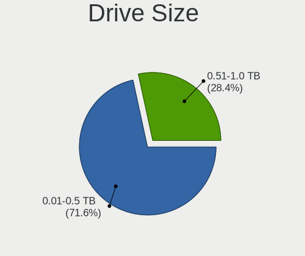

| Size in TB | Notebooks | Drives | Percent |
|------------|-----------|--------|---------|
| 0.01-0.5   | 16        | 20     | 72.73%  |
| 0.51-1.0   | 6         | 7      | 27.27%  |

Space Total
-----------

Amount of disk space available on the file system

| Size in GB | Notebooks | Percent |
|------------|-----------|---------|
| 101-250    | 8         | 34.78%  |
| 21-50      | 4         | 17.39%  |
| 51-100     | 4         | 17.39%  |
| 501-1000   | 3         | 13.04%  |
| 1-20       | 2         | 8.7%    |
| 251-500    | 1         | 4.35%   |
| 1001-2000  | 1         | 4.35%   |

Space Used
----------

Amount of used disk space

| Used GB  | Notebooks | Percent |
|----------|-----------|---------|
| 1-20     | 8         | 36.36%  |
| 101-250  | 5         | 22.73%  |
| 21-50    | 4         | 18.18%  |
| 51-100   | 4         | 18.18%  |
| 501-1000 | 1         | 4.55%   |

Malfunc. Drives
---------------

Drive models with a malfunction

| Model                        | Notebooks | Drives | Percent |
|------------------------------|-----------|--------|---------|
| WDC WD3200BEKT-60PVMT0 320GB | 1         | 1      | 100%    |

Malfunc. Drive Vendor
---------------------

Vendors of faulty drives

| Vendor | Notebooks | Drives | Percent |
|--------|-----------|--------|---------|
| WDC    | 1         | 1      | 100%    |

Malfunc. HDD Vendor
-------------------

Vendors of faulty HDD drives

| Vendor | Notebooks | Drives | Percent |
|--------|-----------|--------|---------|
| WDC    | 1         | 1      | 100%    |

Malfunc. Drive Kind
-------------------

Kinds of faulty drives

| Kind | Notebooks | Drives | Percent |
|------|-----------|--------|---------|
| HDD  | 1         | 1      | 100%    |

Failed Drives
-------------

Failed drive models

Zero info for selected period =(

Failed Drive Vendor
-------------------

Failed drive vendors

Zero info for selected period =(

Drive Status
------------

Number of failed and malfunc. drives

| Status   | Notebooks | Drives | Percent |
|----------|-----------|--------|---------|
| Works    | 20        | 28     | 83.33%  |
| Detected | 3         | 4      | 12.5%   |
| Malfunc  | 1         | 1      | 4.17%   |

Storage controller
------------------

Storage Vendor
--------------

Storage controller vendors

| Vendor                       | Notebooks | Percent |
|------------------------------|-----------|---------|
| Intel                        | 19        | 86.36%  |
| Toshiba America Info Systems | 1         | 4.55%   |
| Samsung Electronics          | 1         | 4.55%   |
| AMD                          | 1         | 4.55%   |

Storage Model
-------------

Storage controller models

| Model                                                                          | Notebooks | Percent |
|--------------------------------------------------------------------------------|-----------|---------|
| Intel 82801 Mobile SATA Controller [RAID mode]                                 | 3         | 13.64%  |
| Intel 7 Series Chipset Family 6-port SATA Controller [AHCI mode]               | 3         | 13.64%  |
| Intel 5 Series/3400 Series Chipset 6 port SATA AHCI Controller                 | 3         | 13.64%  |
| Intel Sunrise Point-LP SATA Controller [AHCI mode]                             | 2         | 9.09%   |
| Intel 6 Series/C200 Series Chipset Family 6 port Mobile SATA AHCI Controller   | 2         | 9.09%   |
| Toshiba America Info Systems XG6 NVMe SSD Controller                           | 1         | 4.55%   |
| Samsung NVMe SSD Controller SM981/PM981/PM983                                  | 1         | 4.55%   |
| Intel NM10/ICH7 Family SATA Controller [AHCI mode]                             | 1         | 4.55%   |
| Intel Cannon Lake Mobile PCH SATA AHCI Controller                              | 1         | 4.55%   |
| Intel 82801IBM/IEM (ICH9M/ICH9M-E) 4 port SATA Controller [AHCI mode]          | 1         | 4.55%   |
| Intel 82801GBM/GHM (ICH7-M Family) SATA Controller [IDE mode]                  | 1         | 4.55%   |
| Intel 8 Series/C220 Series Chipset Family 6-port SATA Controller 1 [AHCI mode] | 1         | 4.55%   |
| Intel 5 Series/3400 Series Chipset 4 port SATA AHCI Controller                 | 1         | 4.55%   |
| AMD FCH SATA Controller [AHCI mode]                                            | 1         | 4.55%   |

Storage Kind
------------

Kind of storage controller (IDE, SATA, NVMe, SAS, ...)

| Kind | Notebooks | Percent |
|------|-----------|---------|
| SATA | 16        | 72.73%  |
| RAID | 3         | 13.64%  |
| NVMe | 2         | 9.09%   |
| IDE  | 1         | 4.55%   |

Processor
---------

CPU Vendor
----------

Processor vendors

| Vendor | Notebooks | Percent |
|--------|-----------|---------|
| Intel  | 21        | 95.45%  |
| AMD    | 1         | 4.55%   |

CPU Model
---------

Processor models

| Model                                    | Notebooks | Percent |
|------------------------------------------|-----------|---------|
| Intel Core i5 CPU M 520 @ 2.40GHz        | 2         | 9.09%   |
| Intel Core i7-9750H CPU @ 2.60GHz        | 1         | 4.55%   |
| Intel Core i7-8750H CPU @ 2.20GHz        | 1         | 4.55%   |
| Intel Core i7-7500U CPU @ 2.70GHz        | 1         | 4.55%   |
| Intel Core i7-3630QM CPU @ 2.40GHz       | 1         | 4.55%   |
| Intel Core i7-1065G7 CPU @ 1.30GHz       | 1         | 4.55%   |
| Intel Core i7 CPU Q 720 @ 1.60GHz        | 1         | 4.55%   |
| Intel Core i7 CPU M 640 @ 2.80GHz        | 1         | 4.55%   |
| Intel Core i5-8250U CPU @ 1.60GHz        | 1         | 4.55%   |
| Intel Core i5-6200U CPU @ 2.30GHz        | 1         | 4.55%   |
| Intel Core i5-4300M CPU @ 2.60GHz        | 1         | 4.55%   |
| Intel Core i5-3210M CPU @ 2.50GHz        | 1         | 4.55%   |
| Intel Core i5-2540M CPU @ 2.60GHz        | 1         | 4.55%   |
| Intel Core i3-7020U CPU @ 2.30GHz        | 1         | 4.55%   |
| Intel Core i3-2310M CPU @ 2.10GHz        | 1         | 4.55%   |
| Intel Core 2 Duo CPU U9400 @ 1.40GHz     | 1         | 4.55%   |
| Intel Celeron CPU N2840 @ 2.16GHz        | 1         | 4.55%   |
| Intel Celeron CPU 1005M @ 1.90GHz        | 1         | 4.55%   |
| Intel Atom CPU N280 @ 1.66GHz            | 1         | 4.55%   |
| Intel Atom CPU N2600 @ 1.60GHz           | 1         | 4.55%   |
| AMD A6-3400M APU with Radeon HD Graphics | 1         | 4.55%   |

CPU Model Family
----------------

Processor model prefix

| Model            | Notebooks | Percent |
|------------------|-----------|---------|
| Intel Core i7    | 7         | 31.82%  |
| Intel Core i5    | 7         | 31.82%  |
| Intel Core i3    | 2         | 9.09%   |
| Intel Celeron    | 2         | 9.09%   |
| Intel Atom       | 2         | 9.09%   |
| Intel Core 2 Duo | 1         | 4.55%   |
| AMD A6           | 1         | 4.55%   |

CPU Cores
---------

Number of processor cores

| Number | Notebooks | Percent |
|--------|-----------|---------|
| 2      | 14        | 63.64%  |
| 4      | 5         | 22.73%  |
| 6      | 2         | 9.09%   |
| 1      | 1         | 4.55%   |

CPU Sockets
-----------

Number of sockets

| Number | Notebooks | Percent |
|--------|-----------|---------|
| 1      | 22        | 100%    |

CPU Threads
-----------

Threads per core (Hyper-Threading)

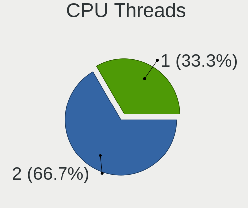

| Number | Notebooks | Percent |
|--------|-----------|---------|
| 2      | 18        | 81.82%  |
| 1      | 4         | 18.18%  |

CPU Op-Modes
------------

CPU Operation Modes (32-bit, 64-bit)

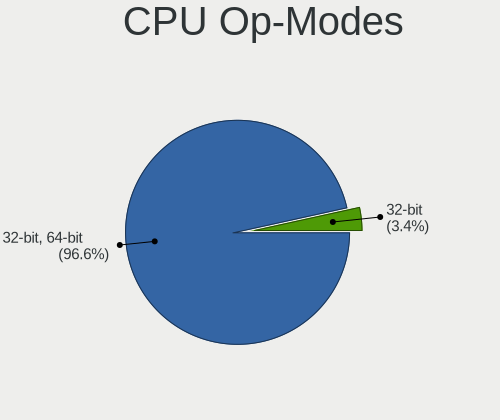

| Op mode        | Notebooks | Percent |
|----------------|-----------|---------|
| 32-bit, 64-bit | 20        | 90.91%  |
| 32-bit         | 2         | 9.09%   |

CPU Microcode
-------------

Microcode number

| Number     | Notebooks | Percent |
|------------|-----------|---------|
| 0x306a9    | 3         | 13.64%  |
| 0x906ea    | 2         | 9.09%   |
| 0x806e9    | 2         | 9.09%   |
| 0x20655    | 2         | 9.09%   |
| Unknown    | 2         | 9.09%   |
| 0x806ea    | 1         | 4.55%   |
| 0x706e5    | 1         | 4.55%   |
| 0x406e3    | 1         | 4.55%   |
| 0x306c3    | 1         | 4.55%   |
| 0x30678    | 1         | 4.55%   |
| 0x30661    | 1         | 4.55%   |
| 0x20652    | 1         | 4.55%   |
| 0x106e5    | 1         | 4.55%   |
| 0x106c2    | 1         | 4.55%   |
| 0x10676    | 1         | 4.55%   |
| 0x03000027 | 1         | 4.55%   |

CPU Microarch
-------------

Microarchitecture

| Name        | Notebooks | Percent |
|-------------|-----------|---------|
| KabyLake    | 5         | 22.73%  |
| Westmere    | 3         | 13.64%  |
| IvyBridge   | 3         | 13.64%  |
| SandyBridge | 2         | 9.09%   |
| Bonnell     | 2         | 9.09%   |
| Skylake     | 1         | 4.55%   |
| Silvermont  | 1         | 4.55%   |
| Penryn      | 1         | 4.55%   |
| Nehalem     | 1         | 4.55%   |
| K10 Llano   | 1         | 4.55%   |
| IceLake     | 1         | 4.55%   |
| Haswell     | 1         | 4.55%   |

Graphics
--------

GPU Vendor
----------

Vendors of graphics cards

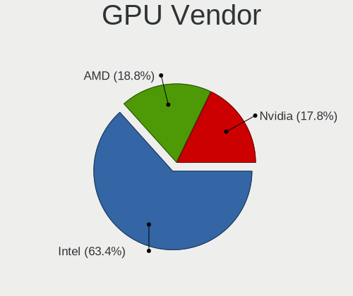

| Vendor | Notebooks | Percent |
|--------|-----------|---------|
| Intel  | 18        | 64.29%  |
| Nvidia | 6         | 21.43%  |
| AMD    | 4         | 14.29%  |

GPU Model
---------

Graphics card models

| Model                                                                         | Notebooks | Percent |
|-------------------------------------------------------------------------------|-----------|---------|
| Intel 3rd Gen Core processor Graphics Controller                              | 3         | 10%     |
| Nvidia GT216GLM [Quadro FX 880M]                                              | 2         | 6.67%   |
| Intel HD Graphics 620                                                         | 2         | 6.67%   |
| Intel Core Processor Integrated Graphics Controller                           | 2         | 6.67%   |
| Intel CoffeeLake-H GT2 [UHD Graphics 630]                                     | 2         | 6.67%   |
| AMD Seymour [Radeon HD 6400M/7400M Series]                                    | 2         | 6.67%   |
| Nvidia TU117M [GeForce GTX 1650 Mobile / Max-Q]                               | 1         | 3.33%   |
| Nvidia GP108M [GeForce MX250]                                                 | 1         | 3.33%   |
| Nvidia GP108M [GeForce MX150]                                                 | 1         | 3.33%   |
| Nvidia GP107M [GeForce GTX 1050 Ti Mobile]                                    | 1         | 3.33%   |
| Intel UHD Graphics 620                                                        | 1         | 3.33%   |
| Intel Skylake GT2 [HD Graphics 520]                                           | 1         | 3.33%   |
| Intel Mobile 945GSE Express Integrated Graphics Controller                    | 1         | 3.33%   |
| Intel Mobile 945GM/GMS/GME, 943/940GML Express Integrated Graphics Controller | 1         | 3.33%   |
| Intel Mobile 4 Series Chipset Integrated Graphics Controller                  | 1         | 3.33%   |
| Intel Iris Plus Graphics G7                                                   | 1         | 3.33%   |
| Intel Atom Processor Z36xxx/Z37xxx Series Graphics & Display                  | 1         | 3.33%   |
| Intel Atom Processor D2xxx/N2xxx Integrated Graphics Controller               | 1         | 3.33%   |
| Intel 4th Gen Core Processor Integrated Graphics Controller                   | 1         | 3.33%   |
| Intel 2nd Generation Core Processor Family Integrated Graphics Controller     | 1         | 3.33%   |
| AMD Sun LE [Radeon HD 8550M / R5 M230]                                        | 1         | 3.33%   |
| AMD Sumo [Radeon HD 6520G]                                                    | 1         | 3.33%   |
| AMD Jet PRO [Radeon R5 M230 / R7 M260DX / Radeon 520 Mobile]                  | 1         | 3.33%   |

GPU Combo
---------

Combinations of graphics cards

| Name           | Notebooks | Percent |
|----------------|-----------|---------|
| 1 x Intel      | 12        | 54.55%  |
| Intel + Nvidia | 4         | 18.18%  |
| 1 x Nvidia     | 2         | 9.09%   |
| Intel + AMD    | 2         | 9.09%   |
| 2 x AMD        | 1         | 4.55%   |
| 1 x AMD        | 1         | 4.55%   |

GPU Driver
----------

Free vs proprietary

| Driver      | Notebooks | Percent |
|-------------|-----------|---------|
| Free        | 20        | 90.91%  |
| Proprietary | 2         | 9.09%   |

GPU Memory
----------

Total video memory

| Size in GB | Notebooks | Percent |
|------------|-----------|---------|
| Unknown    | 16        | 72.73%  |
| 1.01-2.0   | 3         | 13.64%  |
| 0.51-1.0   | 2         | 9.09%   |
| 0.01-0.5   | 1         | 4.55%   |

Monitor
-------

Monitor Vendor
--------------

Monitor vendors

| Vendor              | Notebooks | Percent |
|---------------------|-----------|---------|
| AU Optronics        | 7         | 28%     |
| LG Display          | 4         | 16%     |
| Lenovo              | 4         | 16%     |
| Chimei Innolux      | 3         | 12%     |
| Samsung Electronics | 2         | 8%      |
| Vizio               | 1         | 4%      |
| PANDA               | 1         | 4%      |
| HannStar            | 1         | 4%      |
| Dell                | 1         | 4%      |
| CPT                 | 1         | 4%      |

Monitor Model
-------------

Monitor models

| Model                                                                | Notebooks | Percent |
|----------------------------------------------------------------------|-----------|---------|
| AU Optronics LCD Monitor AUO01EE 1600x900 344x193mm 15.5-inch        | 2         | 8%      |
| Vizio E320VA VIZ0071 1360x768 697x392mm 31.5-inch                    | 1         | 4%      |
| Samsung Electronics S24F350 SAM0D20 1920x1080 521x293mm 23.5-inch    | 1         | 4%      |
| Samsung Electronics LCD Monitor SEC504B 1600x900 382x215mm 17.3-inch | 1         | 4%      |
| PANDA LCD Monitor NCP0036 1920x1080 344x194mm 15.5-inch              | 1         | 4%      |
| LG Display LCD Monitor LGD0533 1920x1080 344x194mm 15.5-inch         | 1         | 4%      |
| LG Display LCD Monitor LGD0386 1366x768 309x174mm 14.0-inch          | 1         | 4%      |
| LG Display LCD Monitor LGD033A 1366x768 340x190mm 15.3-inch          | 1         | 4%      |
| LG Display LCD Monitor LGD02F2 1366x768 344x194mm 15.5-inch          | 1         | 4%      |
| Lenovo LCD Monitor LEN40B1 1600x900 344x194mm 15.5-inch              | 1         | 4%      |
| Lenovo LCD Monitor LEN40A0 1366x768 309x174mm 14.0-inch              | 1         | 4%      |
| Lenovo LCD Monitor LEN4074 1440x900 287x180mm 13.3-inch              | 1         | 4%      |
| Lenovo LCD Monitor LEN4011 1280x800 261x163mm 12.1-inch              | 1         | 4%      |
| HannStar HSD101PFW4A HSD03ED 1024x600 223x125mm 10.1-inch            | 1         | 4%      |
| Dell U2415 DELA0BA 1920x1080 518x324mm 24.1-inch                     | 1         | 4%      |
| CPT LCD Monitor CPT04C4 1024x600 222x130mm 10.1-inch                 | 1         | 4%      |
| Chimei Innolux LCD Monitor CMN15D5 1920x1080 340x190mm 15.3-inch     | 1         | 4%      |
| Chimei Innolux LCD Monitor CMN14D4 1920x1080 309x173mm 13.9-inch     | 1         | 4%      |
| Chimei Innolux LCD Monitor CMN1132 1366x768 260x140mm 11.6-inch      | 1         | 4%      |
| AU Optronics LCD Monitor AUO543D 1920x1080 309x174mm 14.0-inch       | 1         | 4%      |
| AU Optronics LCD Monitor AUO313D 1920x1080 309x174mm 14.0-inch       | 1         | 4%      |
| AU Optronics LCD Monitor AUO2D3C 1366x768 310x170mm 13.9-inch        | 1         | 4%      |
| AU Optronics LCD Monitor AUO213D 1920x1080 309x173mm 13.9-inch       | 1         | 4%      |
| AU Optronics LCD Monitor AUO106C 1366x768 277x156mm 12.5-inch        | 1         | 4%      |

Monitor Resolution
------------------

Monitor screen resolution

| Resolution       | Notebooks | Percent |
|------------------|-----------|---------|
| 1920x1080 (FHD)  | 10        | 40%     |
| 1366x768 (WXGA)  | 7         | 28%     |
| 1600x900 (HD+)   | 4         | 16%     |
| 1024x600         | 2         | 8%      |
| 1440x900 (WXGA+) | 1         | 4%      |
| 1280x800 (WXGA)  | 1         | 4%      |

Monitor Diagonal
----------------

Diagonal size in inches

| Inches | Notebooks | Percent |
|--------|-----------|---------|
| 15     | 8         | 32%     |
| 14     | 5         | 20%     |
| 13     | 3         | 12%     |
| 12     | 2         | 8%      |
| 10     | 2         | 8%      |
| 37     | 1         | 4%      |
| 24     | 1         | 4%      |
| 23     | 1         | 4%      |
| 17     | 1         | 4%      |
| 11     | 1         | 4%      |

Monitor Width
-------------

Physical width

| Width in mm | Notebooks | Percent |
|-------------|-----------|---------|
| 301-350     | 15        | 60%     |
| 201-300     | 6         | 24%     |
| 501-600     | 2         | 8%      |
| 801-900     | 1         | 4%      |
| 351-400     | 1         | 4%      |

Aspect Ratio
------------

Proportional relationship between the width and the height

| Ratio | Notebooks | Percent |
|-------|-----------|---------|
| 16/9  | 20        | 86.96%  |
| 16/10 | 2         | 8.7%    |
| 3/2   | 1         | 4.35%   |

Monitor Area
------------

Area in inch

| Area in inch | Notebooks | Percent |
|----------------|-----------|---------|
| 101-110        | 8         | 32%     |
| 81-90          | 7         | 28%     |
| 61-70          | 2         | 8%      |
| 41-50          | 2         | 8%      |
| 71-80          | 1         | 4%      |
| 51-60          | 1         | 4%      |
| 251-300        | 1         | 4%      |
| 201-250        | 1         | 4%      |
| 121-130        | 1         | 4%      |
| 501-1000       | 1         | 4%      |

Pixel Density
-------------

Pixels per inch

| Density | Notebooks | Percent |
|---------|-----------|---------|
| 121-160 | 11        | 44%     |
| 101-120 | 11        | 44%     |
| 51-100  | 3         | 12%     |

Multiple Monitors
-----------------

Total monitors connected

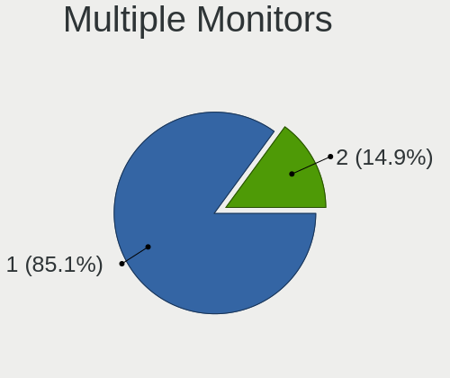

| Total | Notebooks | Percent |
|-------|-----------|---------|
| 1     | 19        | 86.36%  |
| 2     | 3         | 13.64%  |

Network
-------

Net Controller Vendor
---------------------

Controller vendors

| Vendor                | Notebooks | Percent |
|-----------------------|-----------|---------|
| Intel                 | 15        | 44.12%  |
| Realtek Semiconductor | 10        | 29.41%  |
| Qualcomm Atheros      | 7         | 20.59%  |
| Attansic Technology   | 1         | 2.94%   |
| ASIX Electronics      | 1         | 2.94%   |

Net Controller Model
--------------------

Controller models

| Model                                                             | Notebooks | Percent |
|-------------------------------------------------------------------|-----------|---------|
| Realtek RTL8111/8168/8411 PCI Express Gigabit Ethernet Controller | 5         | 11.36%  |
| Realtek RTL810xE PCI Express Fast Ethernet controller             | 3         | 6.82%   |
| Qualcomm Atheros AR9485 Wireless Network Adapter                  | 3         | 6.82%   |
| Intel 82577LM Gigabit Network Connection                          | 3         | 6.82%   |
| Intel Wireless 7265                                               | 2         | 4.55%   |
| Intel Centrino Ultimate-N 6300                                    | 2         | 4.55%   |
| Intel Centrino Advanced-N 6205 [Taylor Peak]                      | 2         | 4.55%   |
| Intel Centrino Advanced-N 6200                                    | 2         | 4.55%   |
| Intel Cannon Lake PCH CNVi WiFi                                   | 2         | 4.55%   |
| Intel 82579LM Gigabit Network Connection (Lewisville)             | 2         | 4.55%   |
| Realtek RTL8821CE 802.11ac PCIe Wireless Network Adapter          | 1         | 2.27%   |
| Realtek RTL8723BE PCIe Wireless Network Adapter                   | 1         | 2.27%   |
| Realtek RTL8188EE Wireless Network Adapter                        | 1         | 2.27%   |
| Realtek 802.11ac WLAN Adapter                                     | 1         | 2.27%   |
| Qualcomm Atheros QCA8172 Fast Ethernet                            | 1         | 2.27%   |
| Qualcomm Atheros Killer E2400 Gigabit Ethernet Controller         | 1         | 2.27%   |
| Qualcomm Atheros AR928X Wireless Network Adapter (PCI-Express)    | 1         | 2.27%   |
| Qualcomm Atheros AR8162 Fast Ethernet                             | 1         | 2.27%   |
| Intel Wireless 8260                                               | 1         | 2.27%   |
| Intel Wireless 7260                                               | 1         | 2.27%   |
| Intel PRO/Wireless 5100 AGN [Shiloh] Network Connection           | 1         | 2.27%   |
| Intel Ice Lake-LP PCH CNVi WiFi                                   | 1         | 2.27%   |
| Intel Ethernet Connection I219-V                                  | 1         | 2.27%   |
| Intel Ethernet Connection I217-LM                                 | 1         | 2.27%   |
| Intel Centrino Wireless-N 2200                                    | 1         | 2.27%   |
| Intel 82567LM Gigabit Network Connection                          | 1         | 2.27%   |
| Attansic AR8152 v2.0 Fast Ethernet                                | 1         | 2.27%   |
| ASIX AX88179 Gigabit Ethernet                                     | 1         | 2.27%   |

Wireless Vendor
---------------

Wireless vendors

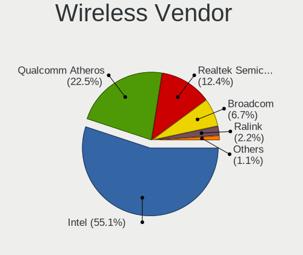

| Vendor                | Notebooks | Percent |
|-----------------------|-----------|---------|
| Intel                 | 15        | 65.22%  |
| Realtek Semiconductor | 4         | 17.39%  |
| Qualcomm Atheros      | 4         | 17.39%  |

Wireless Model
--------------

Wireless models

| Model                                                          | Notebooks | Percent |
|----------------------------------------------------------------|-----------|---------|
| Qualcomm Atheros AR9485 Wireless Network Adapter               | 3         | 13.04%  |
| Intel Wireless 7265                                            | 2         | 8.7%    |
| Intel Centrino Ultimate-N 6300                                 | 2         | 8.7%    |
| Intel Centrino Advanced-N 6205 [Taylor Peak]                   | 2         | 8.7%    |
| Intel Centrino Advanced-N 6200                                 | 2         | 8.7%    |
| Intel Cannon Lake PCH CNVi WiFi                                | 2         | 8.7%    |
| Realtek RTL8821CE 802.11ac PCIe Wireless Network Adapter       | 1         | 4.35%   |
| Realtek RTL8723BE PCIe Wireless Network Adapter                | 1         | 4.35%   |
| Realtek RTL8188EE Wireless Network Adapter                     | 1         | 4.35%   |
| Realtek 802.11ac WLAN Adapter                                  | 1         | 4.35%   |
| Qualcomm Atheros AR928X Wireless Network Adapter (PCI-Express) | 1         | 4.35%   |
| Intel Wireless 8260                                            | 1         | 4.35%   |
| Intel Wireless 7260                                            | 1         | 4.35%   |
| Intel PRO/Wireless 5100 AGN [Shiloh] Network Connection        | 1         | 4.35%   |
| Intel Ice Lake-LP PCH CNVi WiFi                                | 1         | 4.35%   |
| Intel Centrino Wireless-N 2200                                 | 1         | 4.35%   |

Ethernet Vendor
---------------

Ethernet vendors

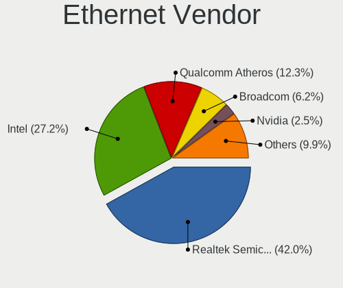

| Vendor                | Notebooks | Percent |
|-----------------------|-----------|---------|
| Realtek Semiconductor | 8         | 38.1%   |
| Intel                 | 8         | 38.1%   |
| Qualcomm Atheros      | 3         | 14.29%  |
| Attansic Technology   | 1         | 4.76%   |
| ASIX Electronics      | 1         | 4.76%   |

Ethernet Model
--------------

Ethernet models

| Model                                                             | Notebooks | Percent |
|-------------------------------------------------------------------|-----------|---------|
| Realtek RTL8111/8168/8411 PCI Express Gigabit Ethernet Controller | 5         | 23.81%  |
| Realtek RTL810xE PCI Express Fast Ethernet controller             | 3         | 14.29%  |
| Intel 82577LM Gigabit Network Connection                          | 3         | 14.29%  |
| Intel 82579LM Gigabit Network Connection (Lewisville)             | 2         | 9.52%   |
| Qualcomm Atheros QCA8172 Fast Ethernet                            | 1         | 4.76%   |
| Qualcomm Atheros Killer E2400 Gigabit Ethernet Controller         | 1         | 4.76%   |
| Qualcomm Atheros AR8162 Fast Ethernet                             | 1         | 4.76%   |
| Intel Ethernet Connection I219-V                                  | 1         | 4.76%   |
| Intel Ethernet Connection I217-LM                                 | 1         | 4.76%   |
| Intel 82567LM Gigabit Network Connection                          | 1         | 4.76%   |
| Attansic AR8152 v2.0 Fast Ethernet                                | 1         | 4.76%   |
| ASIX AX88179 Gigabit Ethernet                                     | 1         | 4.76%   |

Net Controller Kind
-------------------

Ethernet, WiFi or modem

| Kind     | Notebooks | Percent |
|----------|-----------|---------|
| WiFi     | 22        | 52.38%  |
| Ethernet | 20        | 47.62%  |

Used Controller
---------------

Currently used network controller

| Kind     | Notebooks | Percent |
|----------|-----------|---------|
| WiFi     | 20        | 57.14%  |
| Ethernet | 15        | 42.86%  |

NICs
----

Total network controllers on board

| Total | Notebooks | Percent |
|-------|-----------|---------|
| 2     | 20        | 90.91%  |
| 1     | 2         | 9.09%   |

IPv6
----

IPv6 vs IPv4

| Used | Notebooks | Percent |
|------|-----------|---------|
| No   | 22        | 100%    |

Bluetooth
---------

Bluetooth Vendor
----------------

Controller vendors

| Vendor                          | Notebooks | Percent |
|---------------------------------|-----------|---------|
| Intel                           | 7         | 36.84%  |
| Broadcom                        | 4         | 21.05%  |
| Realtek Semiconductor           | 2         | 10.53%  |
| Qualcomm Atheros Communications | 2         | 10.53%  |
| Hewlett-Packard                 | 2         | 10.53%  |
| Cambridge Silicon Radio         | 2         | 10.53%  |

Bluetooth Model
---------------

Controller models

| Model                                               | Notebooks | Percent |
|-----------------------------------------------------|-----------|---------|
| Intel Bluetooth Device                              | 5         | 26.32%  |
| Broadcom BCM2045B (BDC-2.1)                         | 3         | 15.79%  |
| Qualcomm Atheros Bluetooth USB Host Controller      | 2         | 10.53%  |
| Intel Bluetooth wireless interface                  | 2         | 10.53%  |
| HP Broadcom 2070 Bluetooth Combo                    | 2         | 10.53%  |
| Cambridge Silicon Radio Bluetooth Dongle (HCI mode) | 2         | 10.53%  |
| Realtek  Bluetooth 4.2 Adapter                      | 1         | 5.26%   |
| Realtek Bluetooth Radio                             | 1         | 5.26%   |
| Broadcom BCM2045B (BDC-2.1) [Bluetooth Controller]  | 1         | 5.26%   |

Sound
-----

Sound Vendor
------------

Sound card vendors

| Vendor | Notebooks | Percent |
|--------|-----------|---------|
| Intel  | 21        | 80.77%  |
| Nvidia | 3         | 11.54%  |
| AMD    | 2         | 7.69%   |

Sound Model
-----------

Sound card models

| Model                                                                             | Notebooks | Percent |
|-----------------------------------------------------------------------------------|-----------|---------|
| Intel Sunrise Point-LP HD Audio                                                   | 4         | 14.29%  |
| Intel 5 Series/3400 Series Chipset High Definition Audio                          | 4         | 14.29%  |
| Intel 7 Series/C216 Chipset Family High Definition Audio Controller               | 3         | 10.71%  |
| Nvidia GT216 HDMI Audio Controller                                                | 2         | 7.14%   |
| Intel NM10/ICH7 Family High Definition Audio Controller                           | 2         | 7.14%   |
| Intel Cannon Lake PCH cAVS                                                        | 2         | 7.14%   |
| Intel 6 Series/C200 Series Chipset Family High Definition Audio Controller        | 2         | 7.14%   |
| Nvidia TU107 GeForce GTX 1650 High Definition Audio Controller                    | 1         | 3.57%   |
| Intel Xeon E3-1200 v3/4th Gen Core Processor HD Audio Controller                  | 1         | 3.57%   |
| Intel Ice Lake-LP Smart Sound Technology Audio Controller                         | 1         | 3.57%   |
| Intel Atom Processor Z36xxx/Z37xxx Series High Definition Audio Controller        | 1         | 3.57%   |
| Intel 82801I (ICH9 Family) HD Audio Controller                                    | 1         | 3.57%   |
| Intel 8 Series/C220 Series Chipset High Definition Audio Controller               | 1         | 3.57%   |
| AMD FCH Azalia Controller                                                         | 1         | 3.57%   |
| AMD Caicos HDMI Audio [Radeon HD 6450 / 7450/8450/8490 OEM / R5 230/235/235X OEM] | 1         | 3.57%   |
| AMD BeaverCreek HDMI Audio [Radeon HD 6500D and 6400G-6600G series]               | 1         | 3.57%   |

Memory
------

Memory Vendor
-------------

Memory module vendors

| Vendor              | Notebooks | Percent |
|---------------------|-----------|---------|
| Samsung Electronics | 11        | 37.93%  |
| Micron Technology   | 6         | 20.69%  |
| SK Hynix            | 4         | 13.79%  |
| Kingston            | 2         | 6.9%    |
| A-DATA Technology   | 2         | 6.9%    |
| Unknown             | 1         | 3.45%   |
| Team                | 1         | 3.45%   |
| Elpida              | 1         | 3.45%   |
| Corsair             | 1         | 3.45%   |

Memory Model
------------

Memory module models

| Model                                                           | Notebooks | Percent |
|-----------------------------------------------------------------|-----------|---------|
| Samsung RAM M471B5773DH0-CH9 2048MB SODIMM DDR3 1600MT/s        | 2         | 6.06%   |
| Samsung RAM M471B5273CH0-CH9 4096MB SODIMM DDR3 1334MT/s        | 2         | 6.06%   |
| Unknown RAM Module 2048MB SODIMM DDR2                           | 1         | 3.03%   |
| Team RAM TEAMGROUP-SD4-2400 16384MB SODIMM DDR4 2667MT/s        | 1         | 3.03%   |
| SK Hynix RAM HMT351S6CFR8C-H9 4096MB SODIMM DDR3 1333MT/s       | 1         | 3.03%   |
| SK Hynix RAM HMT351S6BFR8C-H9 4096MB SODIMM DDR3 1333MT/s       | 1         | 3.03%   |
| SK Hynix RAM HMT351S6BFR8C-G7 4096MB SODIMM DDR3 1067MT/s       | 1         | 3.03%   |
| SK Hynix RAM HMT351S6AFR8C-G7 4096MB SODIMM DDR3 1067MT/s       | 1         | 3.03%   |
| SK Hynix RAM HMT325S6CFR8C-PB 2048MB SODIMM DDR3 1600MT/s       | 1         | 3.03%   |
| Samsung RAM M471B5673FH0-CH9 2048MB SODIMM 1334MT/s             | 1         | 3.03%   |
| Samsung RAM M471B5273DH0-CK0 4096MB SODIMM DDR3 1600MT/s        | 1         | 3.03%   |
| Samsung RAM M471B5273DH0-CH9 4096MB SODIMM DDR3 1334MT/s        | 1         | 3.03%   |
| Samsung RAM M471B5273BH1-CF8 4096MB SODIMM DDR3 1067MT/s        | 1         | 3.03%   |
| Samsung RAM M471B5173QH0-YK0 4GB SODIMM DDR3 1600MT/s           | 1         | 3.03%   |
| Samsung RAM M471B5173BH0-CK0 4096MB SODIMM DDR3 1600MT/s        | 1         | 3.03%   |
| Samsung RAM M471B2873FHS-CH9 1024MB SODIMM DDR3 1334MT/s        | 1         | 3.03%   |
| Samsung RAM M471A5244CB0-CTD 4096MB SODIMM DDR4 3266MT/s        | 1         | 3.03%   |
| Samsung RAM M471A1K43CB1-CRC 8192MB SODIMM DDR4 2667MT/s        | 1         | 3.03%   |
| Samsung RAM K4E6E304EB-EGCF 4096MB Row Of Chips LPDDR3 1867MT/s | 1         | 3.03%   |
| Micron RAM CT102464BF186D.C16 8192MB SODIMM DDR3 1777MT/s       | 1         | 3.03%   |
| Micron RAM 8ATF51264HZ-2G3B1 4096MB SODIMM DDR4 2400MT/s        | 1         | 3.03%   |
| Micron RAM 4ATF51264HZ-2G6E1 4096MB SODIMM DDR4 2667MT/s        | 1         | 3.03%   |
| Micron RAM 16KTF51264HZ-1G6M1 4096MB SODIMM DDR3 1600MT/s       | 1         | 3.03%   |
| Micron RAM 16JSF51264HZ-1G4D1 4096MB SODIMM DDR3 1334MT/s       | 1         | 3.03%   |
| Micron RAM 16ATF2G64HZ-3G2J1 16384MB SODIMM DDR4 3200MT/s       | 1         | 3.03%   |
| Kingston RAM TSB1600D3S1ELD/4GE 4096MB SODIMM DDR3 1600MT/s     | 1         | 3.03%   |
| Kingston RAM 99U5469-045.A00LF 4096MB SODIMM DDR3 1600MT/s      | 1         | 3.03%   |
| Elpida RAM EBJ41UF8BCS0-DJ-F 4096MB SODIMM DDR3 1334MT/s        | 1         | 3.03%   |
| Corsair RAM CMSX32GX4M2A2666C18 16384MB SODIMM DDR4 2667MT/s    | 1         | 3.03%   |
| A-DATA RAM AM1P24HC4U1-B9RS 4096MB SODIMM DDR4 2400MT/s         | 1         | 3.03%   |
| A-DATA RAM AD73I1C1674EV 4096MB SODIMM DDR3 1334MT/s            | 1         | 3.03%   |

Memory Kind
-----------

Memory module kinds

| Kind   | Notebooks | Percent |
|--------|-----------|---------|
| DDR3   | 12        | 60%     |
| DDR4   | 6         | 30%     |
| LPDDR3 | 1         | 5%      |
| DDR2   | 1         | 5%      |

Memory Form Factor
------------------

Physical design of the memory module

| Name         | Notebooks | Percent |
|--------------|-----------|---------|
| SODIMM       | 19        | 95%     |
| Row Of Chips | 1         | 5%      |

Memory Size
-----------

Memory module size

| Size  | Notebooks | Percent |
|-------|-----------|---------|
| 4096  | 16        | 64%     |
| 2048  | 4         | 16%     |
| 16384 | 3         | 12%     |
| 8192  | 2         | 8%      |

Memory Speed
------------

Memory module speed

| Speed   | Notebooks | Percent |
|---------|-----------|---------|
| 1600    | 6         | 23.08%  |
| 1334    | 6         | 23.08%  |
| 2667    | 4         | 15.38%  |
| 2400    | 2         | 7.69%   |
| 1067    | 2         | 7.69%   |
| 3266    | 1         | 3.85%   |
| 3200    | 1         | 3.85%   |
| 1867    | 1         | 3.85%   |
| 1777    | 1         | 3.85%   |
| 1333    | 1         | 3.85%   |
| Unknown | 1         | 3.85%   |

Printers & scanners
-------------------

Printer Vendor
--------------

Printer device vendors

Zero info for selected period =(

Printer Model
-------------

Printer device models

Zero info for selected period =(

Scanner Vendor
--------------

Scanner device vendors

Zero info for selected period =(

Scanner Model
-------------

Scanner device models

Zero info for selected period =(

Camera
------

Camera Vendor
-------------

Camera device vendors

| Vendor                                 | Notebooks | Percent |
|----------------------------------------|-----------|---------|
| Chicony Electronics                    | 8         | 44.44%  |
| Lenovo                                 | 2         | 11.11%  |
| Acer                                   | 2         | 11.11%  |
| Sunplus Innovation Technology          | 1         | 5.56%   |
| Realtek Semiconductor                  | 1         | 5.56%   |
| Lite-On Technology                     | 1         | 5.56%   |
| Importek                               | 1         | 5.56%   |
| IMC Networks                           | 1         | 5.56%   |
| Cheng Uei Precision Industry (Foxlink) | 1         | 5.56%   |

Camera Model
------------

Camera device models

| Model                                                | Notebooks | Percent |
|------------------------------------------------------|-----------|---------|
| Sunplus HD WebCam                                    | 1         | 5.56%   |
| Realtek USB2.0 VGA UVC WebCam                        | 1         | 5.56%   |
| Lite-On HP Wide Vision FHD Camera                    | 1         | 5.56%   |
| Lenovo UVC Camera                                    | 1         | 5.56%   |
| Lenovo Integrated Webcam [R5U877]                    | 1         | 5.56%   |
| Importek TOSHIBA Web Camera - HD                     | 1         | 5.56%   |
| IMC Networks USB2.0 HD UVC WebCam                    | 1         | 5.56%   |
| Chicony USB2.0 0.3M UVC WebCam                       | 1         | 5.56%   |
| Chicony TOSHIBA Web Camera - HD                      | 1         | 5.56%   |
| Chicony Integrated HP HD Webcam                      | 1         | 5.56%   |
| Chicony Integrated Camera                            | 1         | 5.56%   |
| Chicony HP Webcam [2 MP Macro]                       | 1         | 5.56%   |
| Chicony HP TrueVision HD Camera                      | 1         | 5.56%   |
| Chicony HP HD Webcam [Fixed]                         | 1         | 5.56%   |
| Chicony HD WebCam                                    | 1         | 5.56%   |
| Cheng Uei Precision Industry (Foxlink) HP Webcam-101 | 1         | 5.56%   |
| Acer SunplusIT INC. Integrated Camera                | 1         | 5.56%   |
| Acer HD Webcam                                       | 1         | 5.56%   |

Security
--------

Fingerprint Vendor
------------------

Fingerprint sensor vendors

| Vendor                | Notebooks | Percent |
|-----------------------|-----------|---------|
| Validity Sensors      | 3         | 42.86%  |
| Upek                  | 2         | 28.57%  |
| LighTuning Technology | 1         | 14.29%  |
| AuthenTec             | 1         | 14.29%  |

Fingerprint Model
-----------------

Fingerprint sensor models

| Model                                                  | Notebooks | Percent |
|--------------------------------------------------------|-----------|---------|
| Upek Biometric Touchchip/Touchstrip Fingerprint Sensor | 2         | 28.57%  |
| Validity Sensors VFS471 Fingerprint Reader             | 1         | 14.29%  |
| Validity Sensors VFS451 Fingerprint Reader             | 1         | 14.29%  |
| Validity Sensors Synaptics WBDI                        | 1         | 14.29%  |
| LighTuning EgisTec Touch Fingerprint Sensor            | 1         | 14.29%  |
| AuthenTec AES2810                                      | 1         | 14.29%  |

Chipcard Vendor
---------------

Chipcard module vendors

Zero info for selected period =(

Chipcard Model
--------------

Chipcard module models

Zero info for selected period =(

Unsupported
-----------

Unsupported Devices
-------------------

Total unsupported devices on board

| Total | Notebooks | Percent |
|-------|-----------|---------|
| 0     | 12        | 54.55%  |
| 1     | 9         | 40.91%  |
| 2     | 1         | 4.55%   |

Unsupported Device Types
------------------------

Types of unsupported devices

| Type               | Notebooks | Percent |
|--------------------|-----------|---------|
| Fingerprint reader | 7         | 63.64%  |
| Graphics card      | 4         | 36.36%  |

