MX 19 - Tested Hardware & Statistics
------------------------------------

A project to collect tested hardware configurations for MX 19.

Anyone can contribute to this report by the [hw-probe](https://github.com/linuxhw/hw-probe) tool:

    sudo -E hw-probe -all -upload

Please contribute! Especially if your hardware is rare.

This is a report for all computer types. See also reports for [desktops](/Dist/MX_19/Desktop/README.md) and [notebooks](/Dist/MX_19/Notebook/README.md).

Contents
--------

* [ Test Cases ](#test-cases)

* [ System ](#system)
  - [ Kernel                   ](#kernel)
  - [ Kernel Family            ](#kernel-family)
  - [ Kernel Major Ver.        ](#kernel-major-ver)
  - [ Arch                     ](#arch)
  - [ DE                       ](#de)
  - [ Display Server           ](#display-server)
  - [ Display Manager          ](#display-manager)
  - [ OS Lang                  ](#os-lang)
  - [ Boot Mode                ](#boot-mode)
  - [ Filesystem               ](#filesystem)
  - [ Part. scheme             ](#part-scheme)
  - [ Dual Boot with Linux/BSD ](#dual-boot-with-linuxbsd)
  - [ Dual Boot (Win)          ](#dual-boot-win)

* [ Board ](#board)
  - [ Vendor                   ](#vendor)
  - [ Model                    ](#model)
  - [ Model Family             ](#model-family)
  - [ MFG Year                 ](#mfg-year)
  - [ Form Factor              ](#form-factor)
  - [ Secure Boot              ](#secure-boot)
  - [ Coreboot                 ](#coreboot)
  - [ RAM Size                 ](#ram-size)
  - [ RAM Used                 ](#ram-used)
  - [ Total Drives             ](#total-drives)
  - [ Has CD-ROM               ](#has-cd-rom)
  - [ Has Ethernet             ](#has-ethernet)
  - [ Has WiFi                 ](#has-wifi)
  - [ Has Bluetooth            ](#has-bluetooth)

* [ Location ](#location)
  - [ Country                  ](#country)
  - [ City                     ](#city)

* [ Drives ](#drives)
  - [ Drive Vendor             ](#drive-vendor)
  - [ Drive Model              ](#drive-model)
  - [ HDD Vendor               ](#hdd-vendor)
  - [ SSD Vendor               ](#ssd-vendor)
  - [ Drive Kind               ](#drive-kind)
  - [ Drive Connector          ](#drive-connector)
  - [ Drive Size               ](#drive-size)
  - [ Space Total              ](#space-total)
  - [ Space Used               ](#space-used)
  - [ Malfunc. Drives          ](#malfunc-drives)
  - [ Malfunc. Drive Vendor    ](#malfunc-drive-vendor)
  - [ Malfunc. HDD Vendor      ](#malfunc-hdd-vendor)
  - [ Malfunc. Drive Kind      ](#malfunc-drive-kind)
  - [ Failed Drives            ](#failed-drives)
  - [ Failed Drive Vendor      ](#failed-drive-vendor)
  - [ Drive Status             ](#drive-status)

* [ Storage controller ](#storage-controller)
  - [ Storage Vendor           ](#storage-vendor)
  - [ Storage Model            ](#storage-model)
  - [ Storage Kind             ](#storage-kind)

* [ Processor ](#processor)
  - [ CPU Vendor               ](#cpu-vendor)
  - [ CPU Model                ](#cpu-model)
  - [ CPU Model Family         ](#cpu-model-family)
  - [ CPU Cores                ](#cpu-cores)
  - [ CPU Sockets              ](#cpu-sockets)
  - [ CPU Threads              ](#cpu-threads)
  - [ CPU Op-Modes             ](#cpu-op-modes)
  - [ CPU Microcode            ](#cpu-microcode)
  - [ CPU Microarch            ](#cpu-microarch)

* [ Graphics ](#graphics)
  - [ GPU Vendor               ](#gpu-vendor)
  - [ GPU Model                ](#gpu-model)
  - [ GPU Combo                ](#gpu-combo)
  - [ GPU Driver               ](#gpu-driver)
  - [ GPU Memory               ](#gpu-memory)

* [ Monitor ](#monitor)
  - [ Monitor Vendor           ](#monitor-vendor)
  - [ Monitor Model            ](#monitor-model)
  - [ Monitor Resolution       ](#monitor-resolution)
  - [ Monitor Diagonal         ](#monitor-diagonal)
  - [ Monitor Width            ](#monitor-width)
  - [ Aspect Ratio             ](#aspect-ratio)
  - [ Monitor Area             ](#monitor-area)
  - [ Pixel Density            ](#pixel-density)
  - [ Multiple Monitors        ](#multiple-monitors)

* [ Network ](#network)
  - [ Net Controller Vendor    ](#net-controller-vendor)
  - [ Net Controller Model     ](#net-controller-model)
  - [ Wireless Vendor          ](#wireless-vendor)
  - [ Wireless Model           ](#wireless-model)
  - [ Ethernet Vendor          ](#ethernet-vendor)
  - [ Ethernet Model           ](#ethernet-model)
  - [ Net Controller Kind      ](#net-controller-kind)
  - [ Used Controller          ](#used-controller)
  - [ NICs                     ](#nics)
  - [ IPv6                     ](#ipv6)

* [ Bluetooth ](#bluetooth)
  - [ Bluetooth Vendor         ](#bluetooth-vendor)
  - [ Bluetooth Model          ](#bluetooth-model)

* [ Sound ](#sound)
  - [ Sound Vendor             ](#sound-vendor)
  - [ Sound Model              ](#sound-model)

* [ Memory ](#memory)
  - [ Memory Vendor            ](#memory-vendor)
  - [ Memory Model             ](#memory-model)
  - [ Memory Kind              ](#memory-kind)
  - [ Memory Form Factor       ](#memory-form-factor)
  - [ Memory Size              ](#memory-size)
  - [ Memory Speed             ](#memory-speed)

* [ Printers & scanners ](#printers--scanners)
  - [ Printer Vendor           ](#printer-vendor)
  - [ Printer Model            ](#printer-model)
  - [ Scanner Vendor           ](#scanner-vendor)
  - [ Scanner Model            ](#scanner-model)

* [ Camera ](#camera)
  - [ Camera Vendor            ](#camera-vendor)
  - [ Camera Model             ](#camera-model)

* [ Security ](#security)
  - [ Fingerprint Vendor       ](#fingerprint-vendor)
  - [ Fingerprint Model        ](#fingerprint-model)
  - [ Chipcard Vendor          ](#chipcard-vendor)
  - [ Chipcard Model           ](#chipcard-model)

* [ Unsupported ](#unsupported)
  - [ Unsupported Devices      ](#unsupported-devices)
  - [ Unsupported Device Types ](#unsupported-device-types)

Test Cases
----------

Total: 187

| Vendor        | Model                       | Form-Factor | Probe                                                      | Date         |
|---------------|-----------------------------|-------------|------------------------------------------------------------|--------------|
| ASUSTek       | M4A785-M                    | Desktop     | [03878be4ec](https://linux-hardware.org/?probe=03878be4ec) | Apr 20, 2022 |
| Acer          | Extensa 5630                | Notebook    | [32cab1f9fc](https://linux-hardware.org/?probe=32cab1f9fc) | Mar 14, 2022 |
| ASUSTek       | T102HA                      | Tablet      | [ecc5ad7332](https://linux-hardware.org/?probe=ecc5ad7332) | Feb 25, 2022 |
| ASRock        | FM2A68M-HD+ R2.0            | Desktop     | [d0ba3786b2](https://linux-hardware.org/?probe=d0ba3786b2) | Feb 03, 2022 |
| HP            | ProBook 6460b               | Notebook    | [5f936a65be](https://linux-hardware.org/?probe=5f936a65be) | Feb 02, 2022 |
| Intel         | H81                         | Desktop     | [c1763fe2cf](https://linux-hardware.org/?probe=c1763fe2cf) | Jan 29, 2022 |
| ASUSTek       | TUF Gaming FA706IU_TUF70... | Notebook    | [63d7055c5e](https://linux-hardware.org/?probe=63d7055c5e) | Dec 18, 2021 |
| Toshiba       | Satellite L850-CJK          | Notebook    | [0dc076ad15](https://linux-hardware.org/?probe=0dc076ad15) | Dec 05, 2021 |
| Lenovo        | Unknown                     | Notebook    | [5b1b00738d](https://linux-hardware.org/?probe=5b1b00738d) | Nov 28, 2021 |
| ECS           | A55F-M3                     | Desktop     | [5439a8e37c](https://linux-hardware.org/?probe=5439a8e37c) | Nov 27, 2021 |
| Google        | Akemi                       | Notebook    | [7408ab9056](https://linux-hardware.org/?probe=7408ab9056) | Nov 06, 2021 |
| Google        | Akemi                       | Notebook    | [dc4808bd56](https://linux-hardware.org/?probe=dc4808bd56) | Nov 06, 2021 |
| MSI           | B460M PRO                   | Desktop     | [ae3e01fef8](https://linux-hardware.org/?probe=ae3e01fef8) | Oct 31, 2021 |
| ECS           | A55F-M3                     | Desktop     | [27e84aca95](https://linux-hardware.org/?probe=27e84aca95) | Oct 31, 2021 |
| Dell          | Latitude E7450              | Notebook    | [91837758ac](https://linux-hardware.org/?probe=91837758ac) | Oct 26, 2021 |
| Dell          | Latitude 3190               | Notebook    | [d08efa2ef3](https://linux-hardware.org/?probe=d08efa2ef3) | Oct 25, 2021 |
| ASUSTek       | Maximus VII HERO            | Desktop     | [cbff9b4baf](https://linux-hardware.org/?probe=cbff9b4baf) | Oct 21, 2021 |
| ASUSTek       | Maximus VII HERO            | Desktop     | [1e6b01d3bd](https://linux-hardware.org/?probe=1e6b01d3bd) | Oct 21, 2021 |
| Fujitsu Si... | AMILO Xa 1526               | Notebook    | [00863fcea8](https://linux-hardware.org/?probe=00863fcea8) | Oct 16, 2021 |
| Dell          | 0P611C A00                  | Desktop     | [c11bd1c981](https://linux-hardware.org/?probe=c11bd1c981) | Oct 11, 2021 |
| Sony          | SVT13115FBS                 | Notebook    | [381872f3b9](https://linux-hardware.org/?probe=381872f3b9) | Oct 09, 2021 |
| GreatWall     | U320                        | Desktop     | [483d23be23](https://linux-hardware.org/?probe=483d23be23) | Oct 06, 2021 |
| GreatWall     | U320                        | Desktop     | [043d1121f4](https://linux-hardware.org/?probe=043d1121f4) | Oct 06, 2021 |
| Dell          | 0M017G A00                  | Desktop     | [3549222788](https://linux-hardware.org/?probe=3549222788) | Oct 02, 2021 |
| Lenovo        | IdeaPadFlex 5 15ITL05 82... | Convertible | [536f6d67e3](https://linux-hardware.org/?probe=536f6d67e3) | Oct 02, 2021 |
| Intel         | Unknown                     | Desktop     | [e97eb92439](https://linux-hardware.org/?probe=e97eb92439) | Oct 01, 2021 |
| Dell          | 0M017G A00                  | Desktop     | [2bf98ef81c](https://linux-hardware.org/?probe=2bf98ef81c) | Sep 24, 2021 |
| ASUSTek       | TUF Gaming FA706IU_FA706... | Notebook    | [8c1a085f29](https://linux-hardware.org/?probe=8c1a085f29) | Sep 20, 2021 |
| GTZS          | Unknown                     | Notebook    | [3df799f341](https://linux-hardware.org/?probe=3df799f341) | Sep 05, 2021 |
| Acer          | Aspire V3-371               | Notebook    | [ddd7b7b87f](https://linux-hardware.org/?probe=ddd7b7b87f) | Sep 02, 2021 |
| Acer          | Aspire V3-371               | Notebook    | [16c3c01bcd](https://linux-hardware.org/?probe=16c3c01bcd) | Sep 02, 2021 |
| Dell          | 0P611C A00                  | Desktop     | [eadaa5e6cb](https://linux-hardware.org/?probe=eadaa5e6cb) | Aug 20, 2021 |
| Pixus         | Rise                        | Notebook    | [4479b88c1c](https://linux-hardware.org/?probe=4479b88c1c) | Aug 12, 2021 |
| Acer          | TravelMate 5360             | Notebook    | [f444dec794](https://linux-hardware.org/?probe=f444dec794) | Aug 12, 2021 |
| Apple         | Mac-F2238BAE iMac11,3       | All in one  | [6949bed845](https://linux-hardware.org/?probe=6949bed845) | Aug 05, 2021 |
| ASUSTek       | T102HA                      | Tablet      | [e94701caeb](https://linux-hardware.org/?probe=e94701caeb) | Aug 03, 2021 |
| Lenovo        | ThinkPad T420 4236MBU       | Notebook    | [7e0b868c64](https://linux-hardware.org/?probe=7e0b868c64) | Jul 29, 2021 |
| ASUSTek       | X79-DELUXE                  | Desktop     | [bc56fe50dd](https://linux-hardware.org/?probe=bc56fe50dd) | Jul 24, 2021 |
| Acer          | Aspire E5-574G              | Notebook    | [b09280946d](https://linux-hardware.org/?probe=b09280946d) | Jul 21, 2021 |
| Dell          | Vostro 5515                 | Notebook    | [f4ae054fc8](https://linux-hardware.org/?probe=f4ae054fc8) | Jul 15, 2021 |
| Medion        | P6669 MD60147               | Notebook    | [3ed80daa7b](https://linux-hardware.org/?probe=3ed80daa7b) | Jun 10, 2021 |
| Dell          | Vostro 3460                 | Notebook    | [da200f9e64](https://linux-hardware.org/?probe=da200f9e64) | May 29, 2021 |
| Medion        | E6234                       | Notebook    | [313ec752ab](https://linux-hardware.org/?probe=313ec752ab) | May 24, 2021 |
| HP            | Stream Laptop 14-cb0XX      | Notebook    | [4ed89e1092](https://linux-hardware.org/?probe=4ed89e1092) | May 22, 2021 |
| HP            | Stream Laptop 14-cb0XX      | Notebook    | [57a69c7c0d](https://linux-hardware.org/?probe=57a69c7c0d) | May 20, 2021 |
| HP            | Mini 110-3500               | Notebook    | [f94c828225](https://linux-hardware.org/?probe=f94c828225) | May 19, 2021 |
| ASUSTek       | N56VZ                       | Notebook    | [c69cd5aceb](https://linux-hardware.org/?probe=c69cd5aceb) | May 18, 2021 |
| Intel         | DZ77SL-50K AAG55115-300     | Desktop     | [bae9a4e960](https://linux-hardware.org/?probe=bae9a4e960) | May 16, 2021 |
| Acer          | Extensa 5620                | Notebook    | [a06636ba79](https://linux-hardware.org/?probe=a06636ba79) | Apr 24, 2021 |
| Dell          | 0UW744??????                | Notebook    | [32c3521a2e](https://linux-hardware.org/?probe=32c3521a2e) | Apr 22, 2021 |
| Intel         | ChiefRiver                  | Notebook    | [5e0db0f704](https://linux-hardware.org/?probe=5e0db0f704) | Apr 14, 2021 |
| eMachines     | E727                        | Notebook    | [048da4f23b](https://linux-hardware.org/?probe=048da4f23b) | Apr 12, 2021 |
| MSI           | MPG B550 GAMING PLUS        | Desktop     | [4959cfd244](https://linux-hardware.org/?probe=4959cfd244) | Apr 07, 2021 |
| ASUSTek       | 1025C                       | Notebook    | [33d6531353](https://linux-hardware.org/?probe=33d6531353) | Apr 06, 2021 |
| ASUSTek       | TUF B450-PRO GAMING         | Desktop     | [8d8771e1ef](https://linux-hardware.org/?probe=8d8771e1ef) | Mar 30, 2021 |
| MSI           | B350 TOMAHAWK               | Desktop     | [d77d6984e4](https://linux-hardware.org/?probe=d77d6984e4) | Mar 19, 2021 |
| ZOTAC         | ZBOX-BI320                  | Mini pc     | [dcc5bdef7d](https://linux-hardware.org/?probe=dcc5bdef7d) | Mar 12, 2021 |
| Dell          | Latitude E5470              | Notebook    | [064cf2bccd](https://linux-hardware.org/?probe=064cf2bccd) | Mar 11, 2021 |
| Toshiba       | PORTEGE R705                | Notebook    | [f537f51a95](https://linux-hardware.org/?probe=f537f51a95) | Mar 09, 2021 |
| HP            | Notebook                    | Notebook    | [113644885d](https://linux-hardware.org/?probe=113644885d) | Mar 04, 2021 |
| Acer          | AOD255                      | Notebook    | [f8501e519f](https://linux-hardware.org/?probe=f8501e519f) | Mar 03, 2021 |
| Google        | Gnawty                      | Notebook    | [252bc4cb46](https://linux-hardware.org/?probe=252bc4cb46) | Feb 25, 2021 |
| Dell          | Latitude D430               | Notebook    | [63906404d0](https://linux-hardware.org/?probe=63906404d0) | Feb 25, 2021 |
| ASUSTek       | X200CA                      | Notebook    | [2817beb96d](https://linux-hardware.org/?probe=2817beb96d) | Feb 25, 2021 |
| ASRock        | H81M-ITX                    | Desktop     | [d58331ce9b](https://linux-hardware.org/?probe=d58331ce9b) | Feb 23, 2021 |
| ASUSTek       | M2N-MX SE Plus              | Desktop     | [94f0202173](https://linux-hardware.org/?probe=94f0202173) | Feb 23, 2021 |
| ASRock        | K8A780LM                    | Desktop     | [6543fc448e](https://linux-hardware.org/?probe=6543fc448e) | Feb 23, 2021 |
| ASRock        | K8A780LM                    | Desktop     | [ce0076fd09](https://linux-hardware.org/?probe=ce0076fd09) | Feb 23, 2021 |
| HP            | Pavilion g6                 | Notebook    | [f23e85a87a](https://linux-hardware.org/?probe=f23e85a87a) | Feb 23, 2021 |
| Google        | Gnawty                      | Notebook    | [7614a9a19c](https://linux-hardware.org/?probe=7614a9a19c) | Feb 23, 2021 |
| Samsung       | 305E4A/305E5A/305E7A        | Notebook    | [6f34bc4f67](https://linux-hardware.org/?probe=6f34bc4f67) | Feb 19, 2021 |
| Medion        | E1235T MD99743              | Tablet      | [314aa4d200](https://linux-hardware.org/?probe=314aa4d200) | Feb 18, 2021 |
| Lenovo        | IdeaPad 310-15ISK 80SM      | Notebook    | [7552dacfb9](https://linux-hardware.org/?probe=7552dacfb9) | Feb 17, 2021 |
| HP            | 15                          | Notebook    | [437cb08f68](https://linux-hardware.org/?probe=437cb08f68) | Feb 08, 2021 |
| Lenovo        | ThinkPad T440p 20AWA1NAU... | Notebook    | [b6ebe98655](https://linux-hardware.org/?probe=b6ebe98655) | Feb 01, 2021 |
| HP            | ProBook 650 G1              | Notebook    | [9021b90504](https://linux-hardware.org/?probe=9021b90504) | Jan 22, 2021 |
| ASUSTek       | ZenBook UX425EA_UX425EA     | Notebook    | [a147ddbe9d](https://linux-hardware.org/?probe=a147ddbe9d) | Jan 20, 2021 |
| HP            | Pavilion g6                 | Notebook    | [c4b4831246](https://linux-hardware.org/?probe=c4b4831246) | Jan 15, 2021 |
| Fujitsu Si... | ESPRIMO Mobile D9500        | Notebook    | [989e87e18e](https://linux-hardware.org/?probe=989e87e18e) | Jan 15, 2021 |
| ASRock        | K8A780LM                    | Desktop     | [2e54aedb9e](https://linux-hardware.org/?probe=2e54aedb9e) | Jan 14, 2021 |
| Dell          | Latitude D430               | Notebook    | [874d8f3925](https://linux-hardware.org/?probe=874d8f3925) | Jan 14, 2021 |
| ASRock        | H81M-ITX                    | Desktop     | [50e5d36672](https://linux-hardware.org/?probe=50e5d36672) | Jan 14, 2021 |
| ASUSTek       | M2N-MX SE Plus              | Desktop     | [f6a8e9eaf5](https://linux-hardware.org/?probe=f6a8e9eaf5) | Jan 14, 2021 |
| Dell          | Latitude E5520              | Notebook    | [1d46b26326](https://linux-hardware.org/?probe=1d46b26326) | Jan 03, 2021 |
| HP            | Presario CQ57               | Notebook    | [351ae067b6](https://linux-hardware.org/?probe=351ae067b6) | Dec 31, 2020 |
| HP            | Presario CQ57               | Notebook    | [94b74045cc](https://linux-hardware.org/?probe=94b74045cc) | Dec 30, 2020 |
| Acer          | Aspire ES1-511              | Notebook    | [7f351d7c49](https://linux-hardware.org/?probe=7f351d7c49) | Dec 30, 2020 |
| HP            | Spectre x2 Detachable 12... | Tablet      | [98c8e4f3a6](https://linux-hardware.org/?probe=98c8e4f3a6) | Dec 20, 2020 |
| Lenovo        | ThinkPad X270 W10DG 20K5... | Notebook    | [5de3914984](https://linux-hardware.org/?probe=5de3914984) | Dec 15, 2020 |
| Lenovo        | V145-15AST 81MT             | Notebook    | [ebb2dc7bff](https://linux-hardware.org/?probe=ebb2dc7bff) | Dec 15, 2020 |
| HP            | Spectre x2 Detachable 12... | Tablet      | [5783b64146](https://linux-hardware.org/?probe=5783b64146) | Dec 11, 2020 |
| Lenovo        | ThinkPad X220 4291WMQ       | Notebook    | [165b895e27](https://linux-hardware.org/?probe=165b895e27) | Dec 01, 2020 |
| Intel         | MAHOBAY                     | Desktop     | [d3e3aa3011](https://linux-hardware.org/?probe=d3e3aa3011) | Nov 28, 2020 |
| Intel         | MAHOBAY                     | Desktop     | [b51d9808ea](https://linux-hardware.org/?probe=b51d9808ea) | Nov 28, 2020 |
| ASUSTek       | ROG STRIX B550-F GAMING     | Desktop     | [b7fec4788f](https://linux-hardware.org/?probe=b7fec4788f) | Nov 25, 2020 |
| ASUSTek       | PRIME B450M-A               | Desktop     | [d4f8648d28](https://linux-hardware.org/?probe=d4f8648d28) | Nov 24, 2020 |
| Intel         | MAHOBAY                     | Desktop     | [282590eccb](https://linux-hardware.org/?probe=282590eccb) | Nov 24, 2020 |
| Toshiba       | Satellite A300              | Notebook    | [309a3f69e8](https://linux-hardware.org/?probe=309a3f69e8) | Nov 16, 2020 |
| ASRock        | H110M-ITX                   | Desktop     | [e3ca7996d2](https://linux-hardware.org/?probe=e3ca7996d2) | Nov 13, 2020 |
| Lenovo        | ThinkPad T410 2537G99       | Notebook    | [554dfc3cfe](https://linux-hardware.org/?probe=554dfc3cfe) | Nov 12, 2020 |
| Lenovo        | ThinkPad T410 2537G99       | Notebook    | [2dc30b7928](https://linux-hardware.org/?probe=2dc30b7928) | Nov 12, 2020 |
| ASUSTek       | PRIME B450M-A               | Desktop     | [a7bb20fa67](https://linux-hardware.org/?probe=a7bb20fa67) | Nov 08, 2020 |
| Lenovo        | ThinkPad X270 W10DG 20K5... | Notebook    | [fe6cbf555a](https://linux-hardware.org/?probe=fe6cbf555a) | Nov 08, 2020 |
| Dell          | Inspiron 14-3452            | Notebook    | [96e87a665b](https://linux-hardware.org/?probe=96e87a665b) | Nov 01, 2020 |
| Dell          | 0D28YY A00                  | Desktop     | [584335af3e](https://linux-hardware.org/?probe=584335af3e) | Oct 29, 2020 |
| Acer          | Aspire SW5-015              | Notebook    | [b125bdb89e](https://linux-hardware.org/?probe=b125bdb89e) | Oct 07, 2020 |
| Lenovo        | V145-15AST 81MT             | Notebook    | [7155397289](https://linux-hardware.org/?probe=7155397289) | Oct 03, 2020 |
| Hometech      | Wi11T                       | Tablet      | [78d63aeadc](https://linux-hardware.org/?probe=78d63aeadc) | Sep 30, 2020 |
| Dell          | 0M9KCM A02                  | Desktop     | [3e66c830f8](https://linux-hardware.org/?probe=3e66c830f8) | Sep 22, 2020 |
| Gigabyte      | B450M DS3H-CF               | Desktop     | [a2151aadf5](https://linux-hardware.org/?probe=a2151aadf5) | Sep 14, 2020 |
| HP            | 838B 0100                   | All in one  | [c3133d1a1c](https://linux-hardware.org/?probe=c3133d1a1c) | Sep 09, 2020 |
| HP            | 8265                        | Desktop     | [38f924e8f9](https://linux-hardware.org/?probe=38f924e8f9) | Sep 07, 2020 |
| HP            | ZBook 15 G4                 | Notebook    | [c36d170750](https://linux-hardware.org/?probe=c36d170750) | Aug 27, 2020 |
| HP            | ZBook 15 G4                 | Notebook    | [00d13faf2a](https://linux-hardware.org/?probe=00d13faf2a) | Aug 27, 2020 |
| Acer          | Aspire 7520                 | Notebook    | [d878dbb71e](https://linux-hardware.org/?probe=d878dbb71e) | Aug 13, 2020 |
| Dell          | 0M5DCD A00                  | Desktop     | [f138fd7e0c](https://linux-hardware.org/?probe=f138fd7e0c) | Aug 09, 2020 |
| ASUSTek       | PRIME H310M-R R2.0          | Desktop     | [2f71e9b242](https://linux-hardware.org/?probe=2f71e9b242) | Aug 03, 2020 |
| HP            | 3031h                       | Desktop     | [205dd10b09](https://linux-hardware.org/?probe=205dd10b09) | Jul 29, 2020 |
| HP            | 3031h                       | Desktop     | [22ebc88fac](https://linux-hardware.org/?probe=22ebc88fac) | Jul 29, 2020 |
| HP            | Pavilion dv7                | Notebook    | [3494105666](https://linux-hardware.org/?probe=3494105666) | Jul 28, 2020 |
| ASUSTek       | TUF Gaming FA706IU_TUF70... | Notebook    | [c0d166e020](https://linux-hardware.org/?probe=c0d166e020) | Jul 27, 2020 |
| Fujitsu Si... | D2312-A3 S26361-D2312-A3    | Desktop     | [2233b1466b](https://linux-hardware.org/?probe=2233b1466b) | Jul 06, 2020 |
| Fujitsu Si... | D2312-A3 S26361-D2312-A3    | Desktop     | [c70f8ee92e](https://linux-hardware.org/?probe=c70f8ee92e) | Jul 06, 2020 |
| Sony          | VPCF23P1E                   | Notebook    | [2e0915f8a9](https://linux-hardware.org/?probe=2e0915f8a9) | Jun 18, 2020 |
| HP            | Pavilion Laptop 15-cw0xx... | Notebook    | [b93dafce99](https://linux-hardware.org/?probe=b93dafce99) | Jun 09, 2020 |
| Lenovo        | ThinkPad X250 20CLS4YA00    | Notebook    | [72150af905](https://linux-hardware.org/?probe=72150af905) | Jun 06, 2020 |
| ASUSTek       | X540UP                      | Notebook    | [2ec9f9c770](https://linux-hardware.org/?probe=2ec9f9c770) | Jun 05, 2020 |
| MSI           | 970A-G43                    | Desktop     | [ada20a047e](https://linux-hardware.org/?probe=ada20a047e) | May 27, 2020 |
| Lenovo        | ThinkPad E490 20N9S26G00    | Notebook    | [a26e5790ce](https://linux-hardware.org/?probe=a26e5790ce) | May 06, 2020 |
| Gigabyte      | GA-880GM-UD2H               | Desktop     | [a7d4e8b1e4](https://linux-hardware.org/?probe=a7d4e8b1e4) | Apr 10, 2020 |
| Samsung       | R780/R778                   | Notebook    | [eb0bb63c6d](https://linux-hardware.org/?probe=eb0bb63c6d) | Apr 09, 2020 |
| Intel         | DCP847SKE G80890-105        | Desktop     | [0357ef50d4](https://linux-hardware.org/?probe=0357ef50d4) | Apr 05, 2020 |
| Gigabyte      | A320M-DS2-CF                | Desktop     | [27d1900fba](https://linux-hardware.org/?probe=27d1900fba) | Mar 28, 2020 |
| Gigabyte      | Z68AP-D3                    | Desktop     | [617031b37d](https://linux-hardware.org/?probe=617031b37d) | Mar 28, 2020 |
| Clevo         | P150HMx                     | Notebook    | [196b689717](https://linux-hardware.org/?probe=196b689717) | Mar 27, 2020 |
| ASRock        | Z68 Pro3-M                  | Desktop     | [73690787f9](https://linux-hardware.org/?probe=73690787f9) | Mar 26, 2020 |
| Dell          | Latitude E7440              | Notebook    | [c6fe81343e](https://linux-hardware.org/?probe=c6fe81343e) | Mar 26, 2020 |
| Dell          | 0F373D A00                  | Desktop     | [2155b32aa1](https://linux-hardware.org/?probe=2155b32aa1) | Mar 25, 2020 |
| Dell          | Inspiron 13-5378            | Notebook    | [242a7e4fdc](https://linux-hardware.org/?probe=242a7e4fdc) | Mar 24, 2020 |
| Clevo         | P150HMx                     | Notebook    | [8f9823569b](https://linux-hardware.org/?probe=8f9823569b) | Mar 24, 2020 |
| Dell          | Inspiron N5010              | Notebook    | [8654fde26b](https://linux-hardware.org/?probe=8654fde26b) | Mar 24, 2020 |
| Dell          | Latitude 3190               | Notebook    | [1bab98d664](https://linux-hardware.org/?probe=1bab98d664) | Mar 20, 2020 |
| HP            | EliteBook 8560p             | Notebook    | [e5925f1349](https://linux-hardware.org/?probe=e5925f1349) | Mar 07, 2020 |
| Intel         | NUC8i7HVB J68196-504        | Mini pc     | [296f21e934](https://linux-hardware.org/?probe=296f21e934) | Mar 03, 2020 |
| Acer          | Aspire 8943G                | Notebook    | [f8e194e907](https://linux-hardware.org/?probe=f8e194e907) | Mar 01, 2020 |
| ASUSTek       | M4A77T                      | Desktop     | [75d0b42f08](https://linux-hardware.org/?probe=75d0b42f08) | Mar 01, 2020 |
| Lenovo        | ThinkPad T440p 20AWS2T11... | Notebook    | [9c888bfdde](https://linux-hardware.org/?probe=9c888bfdde) | Feb 11, 2020 |
| Lenovo        | ThinkPad X201 3680MY9       | Notebook    | [26a7c0e493](https://linux-hardware.org/?probe=26a7c0e493) | Feb 09, 2020 |
| Google        | Gnawty                      | Notebook    | [4a2e211ce1](https://linux-hardware.org/?probe=4a2e211ce1) | Feb 08, 2020 |
| Lenovo        | ThinkPad W510 4875W17       | Notebook    | [8865e9546b](https://linux-hardware.org/?probe=8865e9546b) | Feb 03, 2020 |
| Lenovo        | ThinkPad W510 4875W17       | Notebook    | [f4779c95ce](https://linux-hardware.org/?probe=f4779c95ce) | Feb 03, 2020 |
| ASUSTek       | PRIME H310M-K               | Desktop     | [ed464b4172](https://linux-hardware.org/?probe=ed464b4172) | Jan 23, 2020 |
| Intel         | NUC8i7HVB J68196-504        | Mini pc     | [f703814098](https://linux-hardware.org/?probe=f703814098) | Jan 23, 2020 |
| Acer          | Swift SF314-54G             | Notebook    | [48912b8dc6](https://linux-hardware.org/?probe=48912b8dc6) | Jan 19, 2020 |
| ASRock        | K8A780LM                    | Desktop     | [e0d3030787](https://linux-hardware.org/?probe=e0d3030787) | Jan 18, 2020 |
| ASUSTek       | TUF Gaming FX505GT_TUF50... | Notebook    | [0abd5b1d73](https://linux-hardware.org/?probe=0abd5b1d73) | Jan 18, 2020 |
| ASRock        | K8A780LM                    | Desktop     | [83dca94e72](https://linux-hardware.org/?probe=83dca94e72) | Jan 17, 2020 |
| ASRock        | K8A780LM                    | Desktop     | [a5e0479887](https://linux-hardware.org/?probe=a5e0479887) | Jan 16, 2020 |
| Toshiba       | Satellite P875              | Notebook    | [b267e93d40](https://linux-hardware.org/?probe=b267e93d40) | Jan 15, 2020 |
| Toshiba       | Satellite P875              | Notebook    | [7e579fcba2](https://linux-hardware.org/?probe=7e579fcba2) | Jan 15, 2020 |
| Intel         | NUC8i7HVB J68196-504        | Mini pc     | [811669dbdd](https://linux-hardware.org/?probe=811669dbdd) | Jan 13, 2020 |
| Gigabyte      | GA-880GA-UD3H               | Desktop     | [03401edcb4](https://linux-hardware.org/?probe=03401edcb4) | Jan 13, 2020 |
| ASRock        | X370 Gaming X               | Desktop     | [8a0171b4b0](https://linux-hardware.org/?probe=8a0171b4b0) | Jan 13, 2020 |
| Gateway       | SX2185                      | Desktop     | [74f9db3262](https://linux-hardware.org/?probe=74f9db3262) | Jan 13, 2020 |
| MSI           | GP63 Leopard 8RD            | Notebook    | [0a8865c437](https://linux-hardware.org/?probe=0a8865c437) | Jan 13, 2020 |
| HP            | Spectre x360 Convertible... | Convertible | [f10553e785](https://linux-hardware.org/?probe=f10553e785) | Jan 13, 2020 |
| Lenovo        | ThinkPad X1C 5th W10DG 2... | Notebook    | [ba3b839fa4](https://linux-hardware.org/?probe=ba3b839fa4) | Jan 12, 2020 |
| HP            | Pavilion Laptop 14-ce3xx... | Notebook    | [7f8e86e96b](https://linux-hardware.org/?probe=7f8e86e96b) | Jan 12, 2020 |
| Dell          | 088DT1 A01                  | Desktop     | [3c957a3758](https://linux-hardware.org/?probe=3c957a3758) | Dec 23, 2019 |
| HP            | Pavilion g6                 | Notebook    | [9c722b6763](https://linux-hardware.org/?probe=9c722b6763) | Dec 21, 2019 |
| Toshiba       | Satellite C50-A-12K         | Notebook    | [a413f419ef](https://linux-hardware.org/?probe=a413f419ef) | Dec 17, 2019 |
| HP            | Laptop 14-ck0xxx            | Notebook    | [ff52ea1b93](https://linux-hardware.org/?probe=ff52ea1b93) | Dec 03, 2019 |
| Intel         | NUC8i7HVB J68196-504        | Mini pc     | [c96e6bc37c](https://linux-hardware.org/?probe=c96e6bc37c) | Dec 02, 2019 |
| Intel         | NUC8i7HVB J68196-504        | Mini pc     | [02ae0c5f5b](https://linux-hardware.org/?probe=02ae0c5f5b) | Dec 02, 2019 |
| MSI           | MS-N033                     | Notebook    | [a5ee4c1dc1](https://linux-hardware.org/?probe=a5ee4c1dc1) | Nov 17, 2019 |
| Lenovo        | ThinkPad L412 0585W28       | Notebook    | [73073ac3f3](https://linux-hardware.org/?probe=73073ac3f3) | Nov 17, 2019 |
| Lenovo        | ThinkPad X301 2776LBU       | Notebook    | [993b5f104a](https://linux-hardware.org/?probe=993b5f104a) | Nov 17, 2019 |
| Gigabyte      | P43-ES3G                    | Desktop     | [96fa353482](https://linux-hardware.org/?probe=96fa353482) | Nov 07, 2019 |
| Radiant Sy... | P845                        | Mini pc     | [585b07ffaf](https://linux-hardware.org/?probe=585b07ffaf) | Nov 04, 2019 |
| ASUSTek       | X101CH                      | Notebook    | [b17de4dbad](https://linux-hardware.org/?probe=b17de4dbad) | Nov 04, 2019 |
| HP            | Pavilion g6                 | Notebook    | [2cb09606ed](https://linux-hardware.org/?probe=2cb09606ed) | Nov 01, 2019 |
| HP            | ProBook 4440s               | Notebook    | [fc67acaa63](https://linux-hardware.org/?probe=fc67acaa63) | Oct 29, 2019 |
| MSI           | GP63 Leopard 8RD            | Notebook    | [df3af7b333](https://linux-hardware.org/?probe=df3af7b333) | Oct 23, 2019 |
| HP            | EliteBook 8540w             | Notebook    | [ea8ef5afc7](https://linux-hardware.org/?probe=ea8ef5afc7) | Oct 23, 2019 |
| ASUSTek       | M2N-MX SE Plus              | Desktop     | [f4fcd6e28c](https://linux-hardware.org/?probe=f4fcd6e28c) | Oct 20, 2019 |
| ZOTAC         | ZBOX-BI320                  | Mini pc     | [71373d2071](https://linux-hardware.org/?probe=71373d2071) | Oct 20, 2019 |
| HP            | Pavilion g6                 | Notebook    | [6bde777445](https://linux-hardware.org/?probe=6bde777445) | Oct 20, 2019 |

System
------

Kernel
------

Version of the Linux kernel

| Version                    | Computers | Percent |
|----------------------------|-----------|---------|
| 4.19.0-6-amd64             | 39        | 25.49%  |
| 5.6.0-2-amd64              | 11        | 7.19%   |
| 5.10.0-5mx-amd64           | 10        | 6.54%   |
| 5.8.0-3-amd64              | 8         | 5.23%   |
| 4.19.0-14-amd64            | 8         | 5.23%   |
| 4.19.0-13-amd64            | 8         | 5.23%   |
| 4.19.0-18-amd64            | 4         | 2.61%   |
| 4.19.0-17-amd64            | 4         | 2.61%   |
| 5.8.16-antix.1-amd64-smp   | 3         | 1.96%   |
| 5.4.0-3-amd64              | 3         | 1.96%   |
| 5.2.21-antix.2-amd64-smp   | 3         | 1.96%   |
| 5.10.0-8mx-amd64           | 3         | 1.96%   |
| 4.19.0-16-amd64            | 3         | 1.96%   |
| 4.19.0-12-amd64            | 3         | 1.96%   |
| 5.6.10-antix.1-amd64-smp   | 2         | 1.31%   |
| 5.10.0-9mx-amd64           | 2         | 1.31%   |
| 4.19.0-9-amd64             | 2         | 1.31%   |
| 4.19.0-8-amd64             | 2         | 1.31%   |
| 5.9.1-rt20avl1             | 1         | 0.65%   |
| 5.7.0-19.1-liquorix-amd64  | 1         | 0.65%   |
| 5.6.10-antix.1-686-smp-pae | 1         | 0.65%   |
| 5.5.0-10.2-liquorix-amd64  | 1         | 0.65%   |
| 5.5.0-050500rc1-lowlatency | 1         | 0.65%   |
| 5.4.7-antix.1-amd64-smp    | 1         | 0.65%   |
| 5.4.10                     | 1         | 0.65%   |
| 5.4.0-antix.1-amd64-smp    | 1         | 0.65%   |
| 5.4.0-13.3-liquorix-amd64  | 1         | 0.65%   |
| 5.4.0-11.2-liquorix-amd64  | 1         | 0.65%   |
| 5.4.0-10.2-liquorix-amd64  | 1         | 0.65%   |
| 5.3.10-antix.1-amd64-smp   | 1         | 0.65%   |
| 5.3.0-2-amd64              | 1         | 0.65%   |
| 5.3.0-10.1-liquorix-amd64  | 1         | 0.65%   |
| 5.3.0-0.bpo.2-amd64        | 1         | 0.65%   |
| 5.2.21-antix.2-686-smp-pae | 1         | 0.65%   |
| 5.2.15-antix.1-amd64-smp   | 1         | 0.65%   |
| 5.2.0-21.2-liquorix-amd64  | 1         | 0.65%   |
| 5.15.0-1mx-amd64           | 1         | 0.65%   |
| 5.13.0-12.3-liquorix-amd64 | 1         | 0.65%   |
| 5.11.0-21.1-liquorix-amd64 | 1         | 0.65%   |
| 5.10.1-gnu                 | 1         | 0.65%   |
| 5.10.0-8mx-rt-amd64        | 1         | 0.65%   |
| 5.10.0-0.bpo.3-amd64       | 1         | 0.65%   |
| 4.9.246-0409246-lowlatency | 1         | 0.65%   |
| 4.9.193-antix.1-amd64-smp  | 1         | 0.65%   |
| 4.9.189-antix.1-486-smp    | 1         | 0.65%   |
| 4.19.174                   | 1         | 0.65%   |
| 4.19.0-6-686-pae           | 1         | 0.65%   |
| 4.19.0-20-amd64            | 1         | 0.65%   |
| 4.19.0-16-686-pae          | 1         | 0.65%   |
| 4.19.0-14-686-pae          | 1         | 0.65%   |
| 4.19.0-11-amd64            | 1         | 0.65%   |
| 4.19.0-11-686-pae          | 1         | 0.65%   |
| 4.19.0-10-686-pae          | 1         | 0.65%   |

Kernel Family
-------------

Linux kernel without a distro release

| Version  | Computers | Percent |
|----------|-----------|---------|
| 4.19.0   | 73        | 50%     |
| 5.10.0   | 17        | 11.64%  |
| 5.6.0    | 11        | 7.53%   |
| 5.8.0    | 8         | 5.48%   |
| 5.4.0    | 7         | 4.79%   |
| 5.2.21   | 4         | 2.74%   |
| 5.8.16   | 3         | 2.05%   |
| 5.6.10   | 3         | 2.05%   |
| 5.3.0    | 3         | 2.05%   |
| 5.5.0    | 2         | 1.37%   |
| 5.9.1    | 1         | 0.68%   |
| 5.7.0    | 1         | 0.68%   |
| 5.4.7    | 1         | 0.68%   |
| 5.4.10   | 1         | 0.68%   |
| 5.3.10   | 1         | 0.68%   |
| 5.2.15   | 1         | 0.68%   |
| 5.2.0    | 1         | 0.68%   |
| 5.15.0   | 1         | 0.68%   |
| 5.13.0   | 1         | 0.68%   |
| 5.11.0   | 1         | 0.68%   |
| 5.10.1   | 1         | 0.68%   |
| 4.9.246  | 1         | 0.68%   |
| 4.9.193  | 1         | 0.68%   |
| 4.9.189  | 1         | 0.68%   |
| 4.19.174 | 1         | 0.68%   |

Kernel Major Ver.
-----------------

Linux kernel major version

| Version | Computers | Percent |
|---------|-----------|---------|
| 4.19    | 74        | 50.68%  |
| 5.10    | 18        | 12.33%  |
| 5.6     | 14        | 9.59%   |
| 5.8     | 11        | 7.53%   |
| 5.4     | 9         | 6.16%   |
| 5.2     | 6         | 4.11%   |
| 5.3     | 4         | 2.74%   |
| 4.9     | 3         | 2.05%   |
| 5.5     | 2         | 1.37%   |
| 5.9     | 1         | 0.68%   |
| 5.7     | 1         | 0.68%   |
| 5.15    | 1         | 0.68%   |
| 5.13    | 1         | 0.68%   |
| 5.11    | 1         | 0.68%   |

Arch
----

OS architecture (x86_64, i586, etc.)

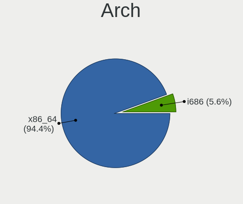

| Name   | Computers | Percent |
|--------|-----------|---------|
| x86_64 | 129       | 94.16%  |
| i686   | 8         | 5.84%   |

DE
--

Desktop Environment

| Name            | Computers | Percent |
|-----------------|-----------|---------|
| XFCE            | 104       | 75.36%  |
| KDE5            | 15        | 10.87%  |
| Unknown         | 5         | 3.62%   |
| MATE            | 3         | 2.17%   |
| Budgie          | 2         | 1.45%   |
| X-Cinnamon      | 1         | 0.72%   |
| LXQt            | 1         | 0.72%   |
| LXDE            | 1         | 0.72%   |
| KDE             | 1         | 0.72%   |
| i3              | 1         | 0.72%   |
| GNOME Flashback | 1         | 0.72%   |
| GNOME           | 1         | 0.72%   |
| fluxbox         | 1         | 0.72%   |
| Cinnamon        | 1         | 0.72%   |

Display Server
--------------

X11 or Wayland

| Name | Computers | Percent |
|------|-----------|---------|
| X11  | 137       | 100%    |

Display Manager
---------------

SDDM, LightDM, etc.

| Name    | Computers | Percent |
|---------|-----------|---------|
| LightDM | 114       | 82.61%  |
| SDDM    | 12        | 8.7%    |
| TDM     | 6         | 4.35%   |
| SLiM    | 6         | 4.35%   |

OS Lang
-------

Language

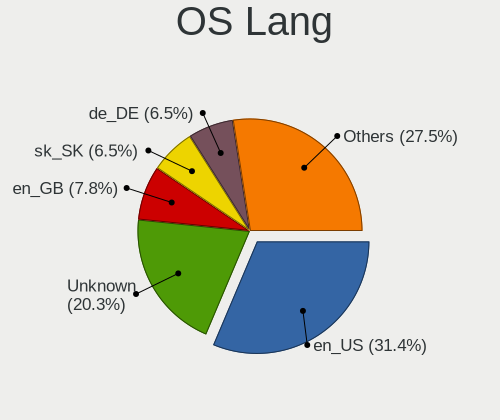

| Lang    | Computers | Percent |
|---------|-----------|---------|
| en_US   | 45        | 30.82%  |
| Unknown | 31        | 21.23%  |
| sk_SK   | 10        | 6.85%   |
| en_GB   | 10        | 6.85%   |
| de_DE   | 10        | 6.85%   |
| pt_BR   | 6         | 4.11%   |
| ru_RU   | 5         | 3.42%   |
| pl_PL   | 5         | 3.42%   |
| tr_TR   | 3         | 2.05%   |
| it_IT   | 3         | 2.05%   |
| fr_FR   | 3         | 2.05%   |
| uk_UA   | 2         | 1.37%   |
| es_ES   | 2         | 1.37%   |
| en_IE   | 2         | 1.37%   |
| en_AU   | 2         | 1.37%   |
| zh_CN   | 1         | 0.68%   |
| nl_NL   | 1         | 0.68%   |
| hu_HU   | 1         | 0.68%   |
| fr_CH   | 1         | 0.68%   |
| fr_BE   | 1         | 0.68%   |
| es_MX   | 1         | 0.68%   |
| cs_CZ   | 1         | 0.68%   |

Boot Mode
---------

EFI or BIOS

| Mode | Computers | Percent |
|------|-----------|---------|
| BIOS | 84        | 61.31%  |
| EFI  | 53        | 38.69%  |

Filesystem
----------

Type of filesystem

| Type    | Computers | Percent |
|---------|-----------|---------|
| Ext4    | 126       | 91.3%   |
| Overlay | 8         | 5.8%    |
| Btrfs   | 3         | 2.17%   |
| F2fs    | 1         | 0.72%   |

Part. scheme
------------

Scheme of partitioning

| Type    | Computers | Percent |
|---------|-----------|---------|
| GPT     | 72        | 52.55%  |
| MBR     | 62        | 45.26%  |
| Unknown | 3         | 2.19%   |

Dual Boot with Linux/BSD
------------------------

Hosting more than one Linux/BSD

| Dual boot | Computers | Percent |
|-----------|-----------|---------|
| No        | 111       | 78.72%  |
| Yes       | 30        | 21.28%  |

Dual Boot (Win)
---------------

Hosting Linux and Windows

| Dual boot | Computers | Percent |
|-----------|-----------|---------|
| No        | 70        | 50.72%  |
| Yes       | 68        | 49.28%  |

Board
-----

Vendor
------

Motherboard manufacturer

| Name                | Computers | Percent |
|---------------------|-----------|---------|
| Hewlett-Packard     | 20        | 14.6%   |
| Dell                | 20        | 14.6%   |
| ASUSTek Computer    | 19        | 13.87%  |
| Lenovo              | 17        | 12.41%  |
| Acer                | 11        | 8.03%   |
| MSI                 | 6         | 4.38%   |
| Intel               | 6         | 4.38%   |
| Gigabyte Technology | 6         | 4.38%   |
| ASRock              | 6         | 4.38%   |
| Toshiba             | 5         | 3.65%   |
| Medion              | 3         | 2.19%   |
| Fujitsu Siemens     | 3         | 2.19%   |
| Sony                | 2         | 1.46%   |
| Samsung Electronics | 2         | 1.46%   |
| Google              | 2         | 1.46%   |
| ZOTAC               | 1         | 0.73%   |
| Radiant Systems     | 1         | 0.73%   |
| Pixus               | 1         | 0.73%   |
| Hometech            | 1         | 0.73%   |
| GreatWall           | 1         | 0.73%   |
| Gateway             | 1         | 0.73%   |
| eMachines           | 1         | 0.73%   |
| ECS                 | 1         | 0.73%   |
| Clevo               | 1         | 0.73%   |

Model
-----

Motherboard model

| Name                                     | Computers | Percent |
|------------------------------------------|-----------|---------|
| Dell Studio 540                          | 2         | 1.46%   |
| ASRock K8A780LM                          | 2         | 1.46%   |
| Unknown                                  | 2         | 1.46%   |
| ZOTAC ZBOX-BI320                         | 1         | 0.73%   |
| Toshiba Satellite P875                   | 1         | 0.73%   |
| Toshiba Satellite L850-CJK               | 1         | 0.73%   |
| Toshiba Satellite C50-A-12K              | 1         | 0.73%   |
| Toshiba Satellite A300                   | 1         | 0.73%   |
| Toshiba PORTEGE R705                     | 1         | 0.73%   |
| Sony VPCF23P1E                           | 1         | 0.73%   |
| Sony SVT13115FBS                         | 1         | 0.73%   |
| Samsung R780/R778                        | 1         | 0.73%   |
| Samsung 305E4A/305E5A/305E7A             | 1         | 0.73%   |
| Radiant Systems P845                     | 1         | 0.73%   |
| Pixus Rise                               | 1         | 0.73%   |
| MSI MS-N033                              | 1         | 0.73%   |
| MSI MS-7C88                              | 1         | 0.73%   |
| MSI MS-7C56                              | 1         | 0.73%   |
| MSI MS-7A34                              | 1         | 0.73%   |
| MSI MS-7693                              | 1         | 0.73%   |
| MSI GP63 Leopard 8RD                     | 1         | 0.73%   |
| Medion P6669 MD60147                     | 1         | 0.73%   |
| Medion E6234                             | 1         | 0.73%   |
| Medion E1235T MD99743                    | 1         | 0.73%   |
| Lenovo V145-15AST 81MT                   | 1         | 0.73%   |
| Lenovo ThinkPad X301 2776LBU             | 1         | 0.73%   |
| Lenovo ThinkPad X270 W10DG 20K5S0YT00    | 1         | 0.73%   |
| Lenovo ThinkPad X250 20CLS4YA00          | 1         | 0.73%   |
| Lenovo ThinkPad X220 4291WMQ             | 1         | 0.73%   |
| Lenovo ThinkPad X201 3680MY9             | 1         | 0.73%   |
| Lenovo ThinkPad X1C 5th W10DG 20K4S0EC00 | 1         | 0.73%   |
| Lenovo ThinkPad W510 4875W17             | 1         | 0.73%   |
| Lenovo ThinkPad T440p 20AWS2T11D         | 1         | 0.73%   |
| Lenovo ThinkPad T440p 20AWA1NAUK         | 1         | 0.73%   |
| Lenovo ThinkPad T420 4236MBU             | 1         | 0.73%   |
| Lenovo ThinkPad T410 2537G99             | 1         | 0.73%   |
| Lenovo ThinkPad L412 0585W28             | 1         | 0.73%   |
| Lenovo ThinkPad E490 20N9S26G00          | 1         | 0.73%   |
| Lenovo IdeaPadFlex 5 15ITL05 82HT        | 1         | 0.73%   |
| Lenovo IdeaPad 310-15ISK 80SM            | 1         | 0.73%   |
| Intel NUC8i7HVK                          | 1         | 0.73%   |
| Intel MAHOBAY                            | 1         | 0.73%   |
| Intel H81                                | 1         | 0.73%   |
| Intel DCP847SKE G80890-105               | 1         | 0.73%   |
| Intel ChiefRiver                         | 1         | 0.73%   |
| Hometech Wi11T                           | 1         | 0.73%   |
| HP ZBook 15 G4                           | 1         | 0.73%   |
| HP Stream Laptop 14-cb0XX                | 1         | 0.73%   |
| HP Spectre x360 Convertible 15-df1xxx    | 1         | 0.73%   |
| HP Spectre x2 Detachable 12-c0XX         | 1         | 0.73%   |
| HP ProBook 650 G1                        | 1         | 0.73%   |
| HP ProBook 6460b                         | 1         | 0.73%   |
| HP ProBook 4440s                         | 1         | 0.73%   |
| HP Presario CQ57                         | 1         | 0.73%   |
| HP Pavilion Laptop 15-cw0xxx             | 1         | 0.73%   |
| HP Pavilion Laptop 14-ce3xxx             | 1         | 0.73%   |
| HP Pavilion g6                           | 1         | 0.73%   |
| HP Pavilion dv7                          | 1         | 0.73%   |
| HP Notebook                              | 1         | 0.73%   |
| HP Mini 110-3500                         | 1         | 0.73%   |

Model Family
------------

Motherboard model prefix

| Name                    | Computers | Percent |
|-------------------------|-----------|---------|
| Lenovo ThinkPad         | 13        | 9.49%   |
| Dell Latitude           | 6         | 4.38%   |
| Acer Aspire             | 6         | 4.38%   |
| Toshiba Satellite       | 4         | 2.92%   |
| HP Pavilion             | 4         | 2.92%   |
| Dell OptiPlex           | 4         | 2.92%   |
| Dell Inspiron           | 4         | 2.92%   |
| HP ProBook              | 3         | 2.19%   |
| ASUS TUF                | 3         | 2.19%   |
| ASUS PRIME              | 3         | 2.19%   |
| HP Spectre              | 2         | 1.46%   |
| HP EliteBook            | 2         | 1.46%   |
| Fujitsu Siemens ESPRIMO | 2         | 1.46%   |
| Dell Vostro             | 2         | 1.46%   |
| Dell Studio             | 2         | 1.46%   |
| ASRock K8A780LM         | 2         | 1.46%   |
| Acer Extensa            | 2         | 1.46%   |
| Unknown                 | 2         | 1.46%   |
| ZOTAC ZBOX-BI320        | 1         | 0.73%   |
| Toshiba PORTEGE         | 1         | 0.73%   |
| Sony VPCF23P1E          | 1         | 0.73%   |
| Sony SVT13115FBS        | 1         | 0.73%   |
| Samsung R780            | 1         | 0.73%   |
| Samsung 305E4A          | 1         | 0.73%   |
| Radiant Systems P845    | 1         | 0.73%   |
| Pixus Rise              | 1         | 0.73%   |
| MSI MS-N033             | 1         | 0.73%   |
| MSI MS-7C88             | 1         | 0.73%   |
| MSI MS-7C56             | 1         | 0.73%   |
| MSI MS-7A34             | 1         | 0.73%   |
| MSI MS-7693             | 1         | 0.73%   |
| MSI GP63                | 1         | 0.73%   |
| Medion P6669            | 1         | 0.73%   |
| Medion E6234            | 1         | 0.73%   |
| Medion E1235T           | 1         | 0.73%   |
| Lenovo V145-15AST       | 1         | 0.73%   |
| Lenovo IdeaPadFlex      | 1         | 0.73%   |
| Lenovo IdeaPad          | 1         | 0.73%   |
| Intel NUC8i7HVK         | 1         | 0.73%   |
| Intel MAHOBAY           | 1         | 0.73%   |
| Intel H81               | 1         | 0.73%   |
| Intel DCP847SKE         | 1         | 0.73%   |
| Intel ChiefRiver        | 1         | 0.73%   |
| Hometech Wi11T          | 1         | 0.73%   |
| HP ZBook                | 1         | 0.73%   |
| HP Stream               | 1         | 0.73%   |
| HP Presario             | 1         | 0.73%   |
| HP Notebook             | 1         | 0.73%   |
| HP Mini                 | 1         | 0.73%   |
| HP Laptop               | 1         | 0.73%   |
| HP 838B                 | 1         | 0.73%   |
| HP 3031h                | 1         | 0.73%   |
| HP 15                   | 1         | 0.73%   |
| GreatWall U320          | 1         | 0.73%   |
| Google Gnawty           | 1         | 0.73%   |
| Google Akemi            | 1         | 0.73%   |
| Gigabyte Z68AP-D3       | 1         | 0.73%   |
| Gigabyte P43-ES3G       | 1         | 0.73%   |
| Gigabyte GA-880GM-UD2H  | 1         | 0.73%   |
| Gigabyte GA-880GA-UD3H  | 1         | 0.73%   |

MFG Year
--------

Motherboard manufacture year

| Year | Computers | Percent |
|------|-----------|---------|
| 2011 | 18        | 13.14%  |
| 2018 | 15        | 10.95%  |
| 2010 | 14        | 10.22%  |
| 2012 | 12        | 8.76%   |
| 2013 | 11        | 8.03%   |
| 2019 | 9         | 6.57%   |
| 2016 | 9         | 6.57%   |
| 2008 | 9         | 6.57%   |
| 2017 | 7         | 5.11%   |
| 2020 | 6         | 4.38%   |
| 2015 | 6         | 4.38%   |
| 2014 | 6         | 4.38%   |
| 2009 | 5         | 3.65%   |
| 2007 | 5         | 3.65%   |
| 2021 | 3         | 2.19%   |
| 2006 | 2         | 1.46%   |

Form Factor
-----------

Physical design of the computer

| Name        | Computers | Percent |
|-------------|-----------|---------|
| Notebook    | 84        | 61.31%  |
| Desktop     | 43        | 31.39%  |
| Tablet      | 4         | 2.92%   |
| Mini pc     | 3         | 2.19%   |
| Convertible | 2         | 1.46%   |
| All in one  | 1         | 0.73%   |

Secure Boot
-----------

Enabled or disabled

| State    | Computers | Percent |
|----------|-----------|---------|
| Disabled | 137       | 100%    |

Coreboot
--------

Have coreboot on board

| Used | Computers | Percent |
|------|-----------|---------|
| No   | 135       | 98.54%  |
| Yes  | 2         | 1.46%   |

RAM Size
--------

Total RAM memory

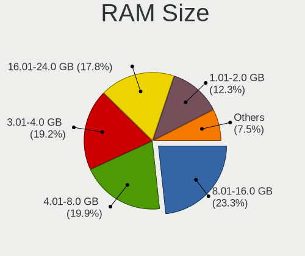

| Size in GB | Computers | Percent |
|------------|-----------|---------|
| 8.01-16.0  | 32        | 23.02%  |
| 4.01-8.0   | 28        | 20.14%  |
| 3.01-4.0   | 28        | 20.14%  |
| 16.01-24.0 | 23        | 16.55%  |
| 1.01-2.0   | 17        | 12.23%  |
| 32.01-64.0 | 6         | 4.32%   |
| 0.51-1.0   | 3         | 2.16%   |
| 2.01-3.0   | 2         | 1.44%   |

RAM Used
--------

Used RAM memory

| Used GB   | Computers | Percent |
|-----------|-----------|---------|
| 1.01-2.0  | 55        | 37.67%  |
| 2.01-3.0  | 34        | 23.29%  |
| 0.51-1.0  | 24        | 16.44%  |
| 3.01-4.0  | 17        | 11.64%  |
| 4.01-8.0  | 11        | 7.53%   |
| 8.01-16.0 | 3         | 2.05%   |
| 0.01-0.5  | 2         | 1.37%   |

Total Drives
------------

Number of drives on board

| Drives | Computers | Percent |
|--------|-----------|---------|
| 1      | 84        | 60%     |
| 2      | 44        | 31.43%  |
| 3      | 4         | 2.86%   |
| 5      | 3         | 2.14%   |
| 4      | 3         | 2.14%   |
| 0      | 2         | 1.43%   |

Has CD-ROM
----------

Has CD-ROM on board

| Presented | Computers | Percent |
|-----------|-----------|---------|
| No        | 78        | 56.93%  |
| Yes       | 59        | 43.07%  |

Has Ethernet
------------

Has Ethernet on board

| Presented | Computers | Percent |
|-----------|-----------|---------|
| Yes       | 124       | 90.51%  |
| No        | 13        | 9.49%   |

Has WiFi
--------

Has WiFi module

| Presented | Computers | Percent |
|-----------|-----------|---------|
| Yes       | 103       | 75.18%  |
| No        | 34        | 24.82%  |

Has Bluetooth
-------------

Has Bluetooth module

| Presented | Computers | Percent |
|-----------|-----------|---------|
| Yes       | 75        | 54.74%  |
| No        | 62        | 45.26%  |

Location
--------

Country
-------

Geographic location (country)

| Country     | Computers | Percent |
|-------------|-----------|---------|
| USA         | 29        | 21.17%  |
| Slovakia    | 12        | 8.76%   |
| UK          | 11        | 8.03%   |
| Germany     | 8         | 5.84%   |
| Poland      | 6         | 4.38%   |
| Brazil      | 6         | 4.38%   |
| Austria     | 5         | 3.65%   |
| Ukraine     | 4         | 2.92%   |
| Spain       | 4         | 2.92%   |
| Russia      | 4         | 2.92%   |
| India       | 4         | 2.92%   |
| France      | 4         | 2.92%   |
| Canada      | 4         | 2.92%   |
| Turkey      | 3         | 2.19%   |
| Netherlands | 3         | 2.19%   |
| Italy       | 3         | 2.19%   |
| Australia   | 3         | 2.19%   |
| Thailand    | 2         | 1.46%   |
| Serbia      | 2         | 1.46%   |
| Mexico      | 2         | 1.46%   |
| China       | 2         | 1.46%   |
| Chile       | 2         | 1.46%   |
| Switzerland | 1         | 0.73%   |
| Sweden      | 1         | 0.73%   |
| Romania     | 1         | 0.73%   |
| Philippines | 1         | 0.73%   |
| Nigeria     | 1         | 0.73%   |
| Latvia      | 1         | 0.73%   |
| Ireland     | 1         | 0.73%   |
| Indonesia   | 1         | 0.73%   |
| Hungary     | 1         | 0.73%   |
| Greece      | 1         | 0.73%   |
| Denmark     | 1         | 0.73%   |
| Czechia     | 1         | 0.73%   |
| Belgium     | 1         | 0.73%   |
| Algeria     | 1         | 0.73%   |

City
----

Geographic location (city)

| City                      | Computers | Percent |
|---------------------------|-----------|---------|
| Bratislava                | 12        | 8.57%   |
| Vienna                    | 5         | 3.57%   |
| Warsaw                    | 3         | 2.14%   |
| Oxford                    | 3         | 2.14%   |
| Berlin                    | 3         | 2.14%   |
| Valencia                  | 2         | 1.43%   |
| Melbourne                 | 2         | 1.43%   |
| Los Angeles               | 2         | 1.43%   |
| Dnipro                    | 2         | 1.43%   |
| Centreville               | 2         | 1.43%   |
| Calgary                   | 2         | 1.43%   |
| Belgrade                  | 2         | 1.43%   |
| Ankara                    | 2         | 1.43%   |
| Xalapa                    | 1         | 0.71%   |
| Williamsburg              | 1         | 0.71%   |
| Wentzville                | 1         | 0.71%   |
| Vitacura                  | 1         | 0.71%   |
| Virginia Beach            | 1         | 0.71%   |
| Tver                      | 1         | 0.71%   |
| Trzebinia                 | 1         | 0.71%   |
| Tilburg                   | 1         | 0.71%   |
| Sydney                    | 1         | 0.71%   |
| Suzhou                    | 1         | 0.71%   |
| St Petersburg             | 1         | 0.71%   |
| Springdale                | 1         | 0.71%   |
| Southsea                  | 1         | 0.71%   |
| Shenzhen                  | 1         | 0.71%   |
| Serrana                   | 1         | 0.71%   |
| Schiedam                  | 1         | 0.71%   |
| Santa Pola                | 1         | 0.71%   |
| San Giovanni in Persiceto | 1         | 0.71%   |
| Romulus                   | 1         | 0.71%   |
| Rivne                     | 1         | 0.71%   |
| Riga                      | 1         | 0.71%   |
| Relizane                  | 1         | 0.71%   |
| Puerto Vallarta           | 1         | 0.71%   |
| Portsmouth                | 1         | 0.71%   |
| Philadelphia              | 1         | 0.71%   |
| Ptrai                   | 1         | 0.71%   |
| Pasig                     | 1         | 0.71%   |
| Pabianice                 | 1         | 0.71%   |
| Olinda                    | 1         | 0.71%   |
| Novoplastunovskaya        | 1         | 0.71%   |
| Norwalk                   | 1         | 0.71%   |
| Newtownabbey              | 1         | 0.71%   |
| New Delhi                 | 1         | 0.71%   |
| Netolice                  | 1         | 0.71%   |
| Nashville                 | 1         | 0.71%   |
| Mount Laurel              | 1         | 0.71%   |
| Moscow                    | 1         | 0.71%   |
| Monument                  | 1         | 0.71%   |
| Mitcham                   | 1         | 0.71%   |
| Mebane                    | 1         | 0.71%   |
| McLoud                    | 1         | 0.71%   |
| Makassar                  | 1         | 0.71%   |
| Macomb                    | 1         | 0.71%   |
| Lyon                      | 1         | 0.71%   |
| Longview                  | 1         | 0.71%   |
| Lewisham                  | 1         | 0.71%   |
| Lee's Summit              | 1         | 0.71%   |

Drives
------

Drive Vendor
------------

Hard drive vendors

| Vendor                    | Computers | Drives | Percent |
|---------------------------|-----------|--------|---------|
| Seagate                   | 29        | 38     | 14.72%  |
| WDC                       | 28        | 31     | 14.21%  |
| Samsung Electronics       | 16        | 20     | 8.12%   |
| Toshiba                   | 15        | 17     | 7.61%   |
| Crucial                   | 15        | 21     | 7.61%   |
| Kingston                  | 13        | 14     | 6.6%    |
| Unknown                   | 11        | 16     | 5.58%   |
| Hitachi                   | 11        | 14     | 5.58%   |
| SanDisk                   | 10        | 11     | 5.08%   |
| Intel                     | 6         | 9      | 3.05%   |
| HGST                      | 6         | 7      | 3.05%   |
| A-DATA Technology         | 4         | 4      | 2.03%   |
| SK hynix                  | 3         | 3      | 1.52%   |
| GOODRAM                   | 3         | 4      | 1.52%   |
| PNY                       | 2         | 2      | 1.02%   |
| Mushkin                   | 2         | 2      | 1.02%   |
| Micron Technology         | 2         | 3      | 1.02%   |
| KingSpec                  | 2         | 2      | 1.02%   |
| KingFast                  | 2         | 2      | 1.02%   |
| KingDian                  | 2         | 2      | 1.02%   |
| Corsair                   | 2         | 2      | 1.02%   |
| ZTC                       | 1         | 1      | 0.51%   |
| Transcend                 | 1         | 1      | 0.51%   |
| Team                      | 1         | 1      | 0.51%   |
| Smart                     | 1         | 1      | 0.51%   |
| Phison Electronics        | 1         | 2      | 0.51%   |
| Phison                    | 1         | 1      | 0.51%   |
| Patriot                   | 1         | 1      | 0.51%   |
| Micron/Crucial Technology | 1         | 1      | 0.51%   |
| LITEONIT                  | 1         | 1      | 0.51%   |
| Lexar                     | 1         | 1      | 0.51%   |
| Indilinx                  | 1         | 1      | 0.51%   |
| Fujitsu                   | 1         | 1      | 0.51%   |
| ASMT                      | 1         | 3      | 0.51%   |

Drive Model
-----------

Hard drive models

| Model                               | Computers | Percent |
|-------------------------------------|-----------|---------|
| Kingston SV300S37A120G 120GB SSD    | 4         | 1.91%   |
| Hitachi HTS543232A7A384 320GB       | 4         | 1.91%   |
| Seagate ST500DM002-1BD142 500GB     | 3         | 1.44%   |
| Seagate ST1000LM048-2E7172 1TB      | 3         | 1.44%   |
| Seagate ST1000DM010-2EP102 1TB      | 3         | 1.44%   |
| Kingston SA400S37240G 240GB SSD     | 3         | 1.44%   |
| WDC WD30EZRX-00D8PB0 3TB            | 2         | 0.96%   |
| WDC WD15EARX-00PASB0 1TB            | 2         | 0.96%   |
| WDC WD10JPVX-22JC3T0 1TB            | 2         | 0.96%   |
| Toshiba MQ01ABF050 500GB            | 2         | 0.96%   |
| Toshiba MK5065GSX 500GB             | 2         | 0.96%   |
| Seagate ST4000DM004-2CV104 4TB      | 2         | 0.96%   |
| Seagate ST1000LM035-1RK172 1TB      | 2         | 0.96%   |
| SanDisk SDSSDP128G 128GB            | 2         | 0.96%   |
| Micron 1100_MTFDDAV256TBN 256GB SSD | 2         | 0.96%   |
| Kingston SA400S37120G 120GB SSD     | 2         | 0.96%   |
| Intel SSDSA2BW120G3H 120GB          | 2         | 0.96%   |
| HGST HTS721010A9E630 1TB            | 2         | 0.96%   |
| HGST HTS541010A9E680 1TB            | 2         | 0.96%   |
| Crucial CT250MX500SSD1 250GB        | 2         | 0.96%   |
| Crucial CT120BX500SSD1 120GB        | 2         | 0.96%   |
| Crucial CT1000MX500SSD1 1TB         | 2         | 0.96%   |
| A-DATA SP600 32GB SSD               | 2         | 0.96%   |
| ZTC SM201-256G                      | 1         | 0.48%   |
| WDC WDS500G2B0A-00SM50 500GB SSD    | 1         | 0.48%   |
| WDC WDS250G1B0A-00H9H0 250GB SSD    | 1         | 0.48%   |
| WDC WDS240G2G0A-00JH30 240GB SSD    | 1         | 0.48%   |
| WDC WDS120G2G0A-00JH30 120GB SSD    | 1         | 0.48%   |
| WDC WD80EZAZ-11TDBA0 8TB            | 1         | 0.48%   |
| WDC WD5003ABYX-01WERA1 500GB        | 1         | 0.48%   |
| WDC WD5000BPVT-60HXZT3 500GB        | 1         | 0.48%   |
| WDC WD5000AAKX-75U6AA0 500GB        | 1         | 0.48%   |
| WDC WD3200LPVX-22V0TT0 320GB        | 1         | 0.48%   |
| WDC WD3200BEKT-60PVMT0 320GB        | 1         | 0.48%   |
| WDC WD2500JS-75NCB3 250GB           | 1         | 0.48%   |
| WDC WD2500BEVT-22A23T0 250GB        | 1         | 0.48%   |
| WDC WD2500AAJS-00L7A0 250GB         | 1         | 0.48%   |
| WDC WD20EZRX-00D8PB0 2TB            | 1         | 0.48%   |
| WDC WD20EARX-00PASB0 2TB            | 1         | 0.48%   |
| WDC WD1600BEVT-22ZCT0 160GB         | 1         | 0.48%   |
| WDC WD1600AVVS-63L2B0 160GB         | 1         | 0.48%   |
| WDC WD10SPZX-60Z10T0 1TB            | 1         | 0.48%   |
| WDC WD10SPZX-00Z10T0 1TB            | 1         | 0.48%   |
| WDC WD10EZEX-75WN4A0 1TB            | 1         | 0.48%   |
| WDC WD10EZEX-60WN4A0 1TB            | 1         | 0.48%   |
| WDC WD10EZEX-00BN5A0 1TB            | 1         | 0.48%   |
| WDC WD10EARX-00N0YB0 1TB            | 1         | 0.48%   |
| WDC WD1003FZEX-00MK2A0 1TB          | 1         | 0.48%   |
| WDC PC SN730 SDBPNTY-1T00-1101 1TB  | 1         | 0.48%   |
| Unknown USD00  64GB                 | 1         | 0.48%   |
| Unknown SU08G  8GB                  | 1         | 0.48%   |
| Unknown SS08G  8GB                  | 1         | 0.48%   |
| Unknown SLD64G  64GB                | 1         | 0.48%   |
| Unknown SD16G  32GB                 | 1         | 0.48%   |
| Unknown SD128  128GB                | 1         | 0.48%   |
| Unknown SD04G  129GB                | 1         | 0.48%   |
| Unknown SD  32GB                    | 1         | 0.48%   |
| Unknown NCard  32GB                 | 1         | 0.48%   |
| Unknown HAG2e  16GB                 | 1         | 0.48%   |
| Unknown CWBC3R  64GB                | 1         | 0.48%   |

HDD Vendor
----------

Hard disk drive vendors

| Vendor              | Computers | Drives | Percent |
|---------------------|-----------|--------|---------|
| Seagate             | 29        | 38     | 33.72%  |
| WDC                 | 23        | 26     | 26.74%  |
| Toshiba             | 12        | 14     | 13.95%  |
| Hitachi             | 11        | 14     | 12.79%  |
| HGST                | 6         | 7      | 6.98%   |
| Samsung Electronics | 3         | 5      | 3.49%   |
| Fujitsu             | 1         | 1      | 1.16%   |
| ASMT                | 1         | 3      | 1.16%   |

SSD Vendor
----------

Solid state drive vendors

| Vendor              | Computers | Drives | Percent |
|---------------------|-----------|--------|---------|
| Crucial             | 14        | 15     | 17.72%  |
| Kingston            | 12        | 13     | 15.19%  |
| SanDisk             | 9         | 9      | 11.39%  |
| Samsung Electronics | 7         | 8      | 8.86%   |
| WDC                 | 4         | 4      | 5.06%   |
| Intel               | 4         | 6      | 5.06%   |
| A-DATA Technology   | 4         | 4      | 5.06%   |
| GOODRAM             | 3         | 4      | 3.8%    |
| PNY                 | 2         | 2      | 2.53%   |
| Micron Technology   | 2         | 3      | 2.53%   |
| KingSpec            | 2         | 2      | 2.53%   |
| KingFast            | 2         | 2      | 2.53%   |
| KingDian            | 2         | 2      | 2.53%   |
| ZTC                 | 1         | 1      | 1.27%   |
| Transcend           | 1         | 1      | 1.27%   |
| Toshiba             | 1         | 1      | 1.27%   |
| Team                | 1         | 1      | 1.27%   |
| Smart               | 1         | 1      | 1.27%   |
| SK hynix            | 1         | 1      | 1.27%   |
| Phison              | 1         | 1      | 1.27%   |
| Patriot             | 1         | 1      | 1.27%   |
| Mushkin             | 1         | 1      | 1.27%   |
| LITEONIT            | 1         | 1      | 1.27%   |
| Indilinx            | 1         | 1      | 1.27%   |
| Corsair             | 1         | 1      | 1.27%   |

Drive Kind
----------

HDD or SSD

| Kind | Computers | Drives | Percent |
|------|-----------|--------|---------|
| HDD  | 72        | 108    | 41.86%  |
| SSD  | 70        | 86     | 40.7%   |
| NVMe | 18        | 27     | 10.47%  |
| MMC  | 12        | 19     | 6.98%   |

Drive Connector
---------------

SATA, SAS, NVMe, etc.

| Type | Computers | Drives | Percent |
|------|-----------|--------|---------|
| SATA | 113       | 191    | 78.47%  |
| NVMe | 18        | 27     | 12.5%   |
| MMC  | 12        | 19     | 8.33%   |
| SAS  | 1         | 3      | 0.69%   |

Drive Size
----------

Size of hard drive

| Size in TB | Computers | Drives | Percent |
|------------|-----------|--------|---------|
| 0.01-0.5   | 91        | 122    | 61.9%   |
| 0.51-1.0   | 42        | 57     | 28.57%  |
| 1.01-2.0   | 6         | 7      | 4.08%   |
| 2.01-3.0   | 4         | 4      | 2.72%   |
| 3.01-4.0   | 2         | 2      | 1.36%   |
| 4.01-10.0  | 2         | 2      | 1.36%   |

Space Total
-----------

Amount of disk space available on the file system

| Size in GB     | Computers | Percent |
|----------------|-----------|---------|
| 101-250        | 41        | 28.28%  |
| 501-1000       | 23        | 15.86%  |
| 51-100         | 22        | 15.17%  |
| 251-500        | 18        | 12.41%  |
| 21-50          | 14        | 9.66%   |
| 1001-2000      | 12        | 8.28%   |
| More than 3000 | 5         | 3.45%   |
| 1-20           | 5         | 3.45%   |
| 2001-3000      | 3         | 2.07%   |
| Unknown        | 2         | 1.38%   |

Space Used
----------

Amount of used disk space

| Used GB        | Computers | Percent |
|----------------|-----------|---------|
| 1-20           | 62        | 43.06%  |
| 21-50          | 19        | 13.19%  |
| 101-250        | 18        | 12.5%   |
| 51-100         | 14        | 9.72%   |
| 251-500        | 13        | 9.03%   |
| 501-1000       | 9         | 6.25%   |
| 1001-2000      | 4         | 2.78%   |
| 2001-3000      | 2         | 1.39%   |
| Unknown        | 2         | 1.39%   |
| More than 3000 | 1         | 0.69%   |

Malfunc. Drives
---------------

Drive models with a malfunction

| Model                               | Computers | Drives | Percent |
|-------------------------------------|-----------|--------|---------|
| WDC WD5003ABYX-01WERA1 500GB        | 1         | 1      | 2.86%   |
| WDC WD5000BPVT-60HXZT3 500GB        | 1         | 1      | 2.86%   |
| WDC WD3200LPVX-22V0TT0 320GB        | 1         | 1      | 2.86%   |
| WDC WD3200BEKT-60PVMT0 320GB        | 1         | 1      | 2.86%   |
| WDC WD20EZRX-00D8PB0 2TB            | 1         | 1      | 2.86%   |
| WDC WD20EARX-00PASB0 2TB            | 1         | 1      | 2.86%   |
| WDC WD1600AVVS-63L2B0 160GB         | 1         | 1      | 2.86%   |
| WDC WD10EZEX-75WN4A0 1TB            | 1         | 1      | 2.86%   |
| WDC WD10EZEX-60WN4A0 1TB            | 1         | 1      | 2.86%   |
| Toshiba MK7575GSX 752GB             | 1         | 2      | 2.86%   |
| Toshiba MK6465GSX 640GB             | 1         | 1      | 2.86%   |
| Toshiba MK2565GSX 250GB             | 1         | 1      | 2.86%   |
| Seagate ST3500820AS 500GB           | 1         | 1      | 2.86%   |
| Seagate ST3320413CS 320GB           | 1         | 1      | 2.86%   |
| Seagate ST33000651NS 3TB            | 1         | 1      | 2.86%   |
| Seagate ST1000LM035-1RK172 1TB      | 1         | 1      | 2.86%   |
| Seagate ST1000DM010-2EP102 1TB      | 1         | 1      | 2.86%   |
| SanDisk SD9SN8W-128G-1006 128GB SSD | 1         | 1      | 2.86%   |
| Samsung Electronics HS122JC 120GB   | 1         | 2      | 2.86%   |
| Samsung Electronics HD322GJ 320GB   | 1         | 2      | 2.86%   |
| Kingston SV300S37A120G 120GB SSD    | 1         | 1      | 2.86%   |
| Indilinx IND-S325S120G 120GB SSD    | 1         | 1      | 2.86%   |
| Hitachi HUA722020ALA331 2TB         | 1         | 1      | 2.86%   |
| Hitachi HTS547575A9E384 752GB       | 1         | 1      | 2.86%   |
| Hitachi HTS543232A7A384 320GB       | 1         | 1      | 2.86%   |
| Hitachi HDT721010SLA360 1TB         | 1         | 1      | 2.86%   |
| Hitachi HDP725016GLA380 160GB       | 1         | 1      | 2.86%   |
| HGST HTS545050A7E680 500GB          | 1         | 1      | 2.86%   |
| HGST HTS541010A9E680 1TB            | 1         | 1      | 2.86%   |
| Fujitsu MHV2060BH PL 64GB           | 1         | 1      | 2.86%   |
| Crucial CT512M550SSD1 512GB         | 1         | 1      | 2.86%   |
| Crucial CT256M550SSD1 256GB         | 1         | 1      | 2.86%   |
| Crucial CT240M500SSD1 240GB         | 1         | 1      | 2.86%   |
| Crucial CT1000P1SSD8 1TB            | 1         | 6      | 2.86%   |
| A-DATA Technology SU650 240GB SSD   | 1         | 1      | 2.86%   |

Malfunc. Drive Vendor
---------------------

Vendors of faulty drives

| Vendor              | Computers | Drives | Percent |
|---------------------|-----------|--------|---------|
| WDC                 | 9         | 9      | 26.47%  |
| Hitachi             | 5         | 5      | 14.71%  |
| Seagate             | 4         | 5      | 11.76%  |
| Crucial             | 4         | 9      | 11.76%  |
| Toshiba             | 3         | 4      | 8.82%   |
| Samsung Electronics | 2         | 4      | 5.88%   |
| HGST                | 2         | 2      | 5.88%   |
| SanDisk             | 1         | 1      | 2.94%   |
| Kingston            | 1         | 1      | 2.94%   |
| Indilinx            | 1         | 1      | 2.94%   |
| Fujitsu             | 1         | 1      | 2.94%   |
| A-DATA Technology   | 1         | 1      | 2.94%   |

Malfunc. HDD Vendor
-------------------

Vendors of faulty HDD drives

| Vendor              | Computers | Drives | Percent |
|---------------------|-----------|--------|---------|
| WDC                 | 9         | 9      | 34.62%  |
| Hitachi             | 5         | 5      | 19.23%  |
| Seagate             | 4         | 5      | 15.38%  |
| Toshiba             | 3         | 4      | 11.54%  |
| Samsung Electronics | 2         | 4      | 7.69%   |
| HGST                | 2         | 2      | 7.69%   |
| Fujitsu             | 1         | 1      | 3.85%   |

Malfunc. Drive Kind
-------------------

Kinds of faulty drives

| Kind | Computers | Drives | Percent |
|------|-----------|--------|---------|
| HDD  | 24        | 30     | 75%     |
| SSD  | 7         | 7      | 21.88%  |
| NVMe | 1         | 6      | 3.13%   |

Failed Drives
-------------

Failed drive models

| Model                     | Computers | Drives | Percent |
|---------------------------|-----------|--------|---------|
| Toshiba MK5065GSX 500GB   | 2         | 2      | 66.67%  |
| Seagate ST3500418AS 500GB | 1         | 2      | 33.33%  |

Failed Drive Vendor
-------------------

Failed drive vendors

| Vendor  | Computers | Drives | Percent |
|---------|-----------|--------|---------|
| Toshiba | 2         | 2      | 66.67%  |
| Seagate | 1         | 2      | 33.33%  |

Drive Status
------------

Number of failed and malfunc. drives

| Status   | Computers | Drives | Percent |
|----------|-----------|--------|---------|
| Works    | 104       | 165    | 66.67%  |
| Malfunc  | 30        | 43     | 19.23%  |
| Detected | 19        | 28     | 12.18%  |
| Failed   | 3         | 4      | 1.92%   |

Storage controller
------------------

Storage Vendor
--------------

Storage controller vendors

| Vendor                       | Computers | Percent |
|------------------------------|-----------|---------|
| Intel                        | 93        | 63.27%  |
| AMD                          | 27        | 18.37%  |
| Samsung Electronics          | 6         | 4.08%   |
| Nvidia                       | 4         | 2.72%   |
| Silicon Motion               | 2         | 1.36%   |
| Phison Electronics           | 2         | 1.36%   |
| Micron/Crucial Technology    | 2         | 1.36%   |
| Marvell Technology Group     | 2         | 1.36%   |
| JMicron Technology           | 2         | 1.36%   |
| ASMedia Technology           | 2         | 1.36%   |
| Toshiba America Info Systems | 1         | 0.68%   |
| SK hynix                     | 1         | 0.68%   |
| SanDisk                      | 1         | 0.68%   |
| KIOXIA                       | 1         | 0.68%   |
| Kingston Technology Company  | 1         | 0.68%   |

Storage Model
-------------

Storage controller models

| Model                                                                          | Computers | Percent |
|--------------------------------------------------------------------------------|-----------|---------|
| AMD FCH SATA Controller [AHCI mode]                                            | 15        | 8.47%   |
| Intel 82801 Mobile SATA Controller [RAID mode]                                 | 9         | 5.08%   |
| Intel 7 Series Chipset Family 6-port SATA Controller [AHCI mode]               | 9         | 5.08%   |
| Intel 6 Series/C200 Series Chipset Family 6 port Mobile SATA AHCI Controller   | 9         | 5.08%   |
| Intel Sunrise Point-LP SATA Controller [AHCI mode]                             | 7         | 3.95%   |
| Intel 8 Series/C220 Series Chipset Family 6-port SATA Controller 1 [AHCI mode] | 6         | 3.39%   |
| Intel 5 Series/3400 Series Chipset 6 port SATA AHCI Controller                 | 6         | 3.39%   |
| AMD SB7x0/SB8x0/SB9x0 IDE Controller                                           | 6         | 3.39%   |
| AMD SB7x0/SB8x0/SB9x0 SATA Controller [AHCI mode]                              | 5         | 2.82%   |
| Samsung NVMe SSD Controller SM981/PM981/PM983                                  | 4         | 2.26%   |
| Intel NM10/ICH7 Family SATA Controller [AHCI mode]                             | 4         | 2.26%   |
| AMD SB7x0/SB8x0/SB9x0 SATA Controller [IDE mode]                               | 4         | 2.26%   |
| Intel 82801JI (ICH10 Family) 4 port SATA IDE Controller #1                     | 3         | 1.69%   |
| Intel 82801JI (ICH10 Family) 2 port SATA IDE Controller #2                     | 3         | 1.69%   |
| Intel 82801IBM/IEM (ICH9M/ICH9M-E) 4 port SATA Controller [AHCI mode]          | 3         | 1.69%   |
| Intel 6 Series/C200 Series Chipset Family 6 port Desktop SATA AHCI Controller  | 3         | 1.69%   |
| Intel 5 Series/3400 Series Chipset 4 port SATA AHCI Controller                 | 3         | 1.69%   |
| AMD 400 Series Chipset SATA Controller                                         | 3         | 1.69%   |
| Samsung NVMe SSD Controller SM961/PM961/SM963                                  | 2         | 1.13%   |
| Phison E12 NVMe Controller                                                     | 2         | 1.13%   |
| Intel Q170/Q150/B150/H170/H110/Z170/CM236 Chipset SATA Controller [AHCI Mode]  | 2         | 1.13%   |
| Intel 82801JD/DO (ICH10 Family) SATA AHCI Controller                           | 2         | 1.13%   |
| Intel 82801HM/HEM (ICH8M/ICH8M-E) SATA Controller [AHCI mode]                  | 2         | 1.13%   |
| Intel 82801HM/HEM (ICH8M/ICH8M-E) IDE Controller                               | 2         | 1.13%   |
| Intel 8 Series SATA Controller 1 [AHCI mode]                                   | 2         | 1.13%   |
| Intel 4 Series Chipset PT IDER Controller                                      | 2         | 1.13%   |
| Intel 200 Series PCH SATA controller [AHCI mode]                               | 2         | 1.13%   |
| ASMedia ASM1062 Serial ATA Controller                                          | 2         | 1.13%   |
| AMD 500 Series Chipset SATA Controller                                         | 2         | 1.13%   |
| Toshiba America Info Systems XG6 NVMe SSD Controller                           | 1         | 0.56%   |
| SK hynix Gold P31 SSD                                                          | 1         | 0.56%   |
| Silicon Motion SM2263EN/SM2263XT SSD Controller                                | 1         | 0.56%   |
| Silicon Motion SM2262/SM2262EN SSD Controller                                  | 1         | 0.56%   |
| SanDisk WD Black SN750 / PC SN730 NVMe SSD                                     | 1         | 0.56%   |
| Nvidia MCP67 AHCI Controller                                                   | 1         | 0.56%   |
| Nvidia MCP61 SATA Controller                                                   | 1         | 0.56%   |
| Nvidia MCP61 IDE                                                               | 1         | 0.56%   |
| Nvidia MCP55 SATA Controller                                                   | 1         | 0.56%   |
| Nvidia MCP55 IDE                                                               | 1         | 0.56%   |
| Nvidia MCP51 Serial ATA Controller                                             | 1         | 0.56%   |
| Nvidia MCP51 IDE                                                               | 1         | 0.56%   |
| Micron/Crucial P2 NVMe PCIe SSD                                                | 1         | 0.56%   |
| Micron/Crucial P1 NVMe PCIe SSD                                                | 1         | 0.56%   |
| Marvell Group 88SE9230 PCIe 2.0 x2 4-port SATA 6 Gb/s RAID Controller          | 1         | 0.56%   |
| Marvell Group 88SE9170 PCIe 2.0 x1 2-port SATA 6 Gb/s Controller               | 1         | 0.56%   |
| KIOXIA NVMe SSD Controller BG4                                                 | 1         | 0.56%   |
| Kingston Company KC2000 NVMe SSD                                               | 1         | 0.56%   |
| JMicron JMB368 IDE controller                                                  | 1         | 0.56%   |
| JMicron JMB363 SATA/IDE Controller                                             | 1         | 0.56%   |
| Intel Wildcat Point-LP SATA Controller [AHCI Mode]                             | 1         | 0.56%   |
| Intel Volume Management Device NVMe RAID Controller                            | 1         | 0.56%   |
| Intel SSD 660P Series                                                          | 1         | 0.56%   |
| Intel SATA Controller [RAID mode]                                              | 1         | 0.56%   |
| Intel Non-Volatile memory controller                                           | 1         | 0.56%   |
| Intel NM10/ICH7 Family SATA Controller [IDE mode]                              | 1         | 0.56%   |
| Intel Comet Lake SATA AHCI Controller                                          | 1         | 0.56%   |
| Intel Celeron/Pentium Silver Processor SATA Controller                         | 1         | 0.56%   |
| Intel Celeron N3350/Pentium N4200/Atom E3900 Series SATA AHCI Controller       | 1         | 0.56%   |
| Intel Cannon Point-LP SATA Controller [AHCI Mode]                              | 1         | 0.56%   |
| Intel Cannon Lake PCH SATA AHCI Controller                                     | 1         | 0.56%   |

Storage Kind
------------

Kind of storage controller (IDE, SATA, NVMe, SAS, ...)

| Kind | Computers | Percent |
|------|-----------|---------|
| SATA | 99        | 63.06%  |
| IDE  | 28        | 17.83%  |
| NVMe | 18        | 11.46%  |
| RAID | 12        | 7.64%   |

Processor
---------

CPU Vendor
----------

Processor vendors

| Vendor | Computers | Percent |
|--------|-----------|---------|
| Intel  | 107       | 78.1%   |
| AMD    | 30        | 21.9%   |

CPU Model
---------

Processor models

| Model                                       | Computers | Percent |
|---------------------------------------------|-----------|---------|
| Intel Core i5-6200U CPU @ 2.30GHz           | 4         | 2.92%   |
| Intel Core i5 CPU M 520 @ 2.40GHz           | 4         | 2.92%   |
| AMD Ryzen 5 1600X Six-Core Processor        | 3         | 2.19%   |
| Intel Pentium CPU G3240 @ 3.10GHz           | 2         | 1.46%   |
| Intel Core i7-7500U CPU @ 2.70GHz           | 2         | 1.46%   |
| Intel Core i7-3610QM CPU @ 2.30GHz          | 2         | 1.46%   |
| Intel Core i7-2670QM CPU @ 2.20GHz          | 2         | 1.46%   |
| Intel Core i5-2540M CPU @ 2.60GHz           | 2         | 1.46%   |
| Intel Core i3-2310M CPU @ 2.10GHz           | 2         | 1.46%   |
| Intel Core 2 Quad CPU Q8200 @ 2.33GHz       | 2         | 1.46%   |
| Intel Atom CPU Z3735F @ 1.33GHz             | 2         | 1.46%   |
| Intel Atom CPU N2600 @ 1.60GHz              | 2         | 1.46%   |
| Intel 11th Gen Core i7-1165G7 @ 2.80GHz     | 2         | 1.46%   |
| AMD Ryzen 7 3700X 8-Core Processor          | 2         | 1.46%   |
| Intel Pentium Silver N5000 CPU @ 1.10GHz    | 1         | 0.73%   |
| Intel Pentium Gold G6605 CPU @ 4.30GHz      | 1         | 0.73%   |
| Intel Pentium Dual-Core CPU T4500 @ 2.30GHz | 1         | 0.73%   |
| Intel Pentium Dual-Core CPU E5400 @ 2.70GHz | 1         | 0.73%   |
| Intel Pentium CPU N3710 @ 1.60GHz           | 1         | 0.73%   |
| Intel Pentium CPU B960 @ 2.20GHz            | 1         | 0.73%   |
| Intel Core i7-9750H CPU @ 2.60GHz           | 1         | 0.73%   |
| Intel Core i7-9700F CPU @ 3.00GHz           | 1         | 0.73%   |
| Intel Core i7-8809G CPU @ 3.10GHz           | 1         | 0.73%   |
| Intel Core i7-8750H CPU @ 2.20GHz           | 1         | 0.73%   |
| Intel Core i7-7700HQ CPU @ 2.80GHz          | 1         | 0.73%   |
| Intel Core i7-7560U CPU @ 2.40GHz           | 1         | 0.73%   |
| Intel Core i7-6500U CPU @ 2.50GHz           | 1         | 0.73%   |
| Intel Core i7-5600U CPU @ 2.60GHz           | 1         | 0.73%   |
| Intel Core i7-4820K CPU @ 3.70GHz           | 1         | 0.73%   |
| Intel Core i7-4790K CPU @ 4.00GHz           | 1         | 0.73%   |
| Intel Core i7-4710MQ CPU @ 2.50GHz          | 1         | 0.73%   |
| Intel Core i7-3770 CPU @ 3.40GHz            | 1         | 0.73%   |
| Intel Core i7-3632QM CPU @ 2.20GHz          | 1         | 0.73%   |
| Intel Core i7-3630QM CPU @ 2.40GHz          | 1         | 0.73%   |
| Intel Core i7-3537U CPU @ 2.00GHz           | 1         | 0.73%   |
| Intel Core i7-1065G7 CPU @ 1.30GHz          | 1         | 0.73%   |
| Intel Core i7-10510U CPU @ 1.80GHz          | 1         | 0.73%   |
| Intel Core i7 CPU Q 720 @ 1.60GHz           | 1         | 0.73%   |
| Intel Core i7 CPU M 640 @ 2.80GHz           | 1         | 0.73%   |
| Intel Core i7 CPU M 620 @ 2.67GHz           | 1         | 0.73%   |
| Intel Core i5-8265U CPU @ 1.60GHz           | 1         | 0.73%   |
| Intel Core i5-8250U CPU @ 1.60GHz           | 1         | 0.73%   |
| Intel Core i5-7400T CPU @ 2.40GHz           | 1         | 0.73%   |
| Intel Core i5-6300U CPU @ 2.40GHz           | 1         | 0.73%   |
| Intel Core i5-5300U CPU @ 2.30GHz           | 1         | 0.73%   |
| Intel Core i5-4430 CPU @ 3.00GHz            | 1         | 0.73%   |
| Intel Core i5-4310M CPU @ 2.70GHz           | 1         | 0.73%   |
| Intel Core i5-4300U CPU @ 1.90GHz           | 1         | 0.73%   |
| Intel Core i5-4300M CPU @ 2.60GHz           | 1         | 0.73%   |
| Intel Core i5-4210U CPU @ 1.70GHz           | 1         | 0.73%   |
| Intel Core i5-3470 CPU @ 3.20GHz            | 1         | 0.73%   |
| Intel Core i5-3317U CPU @ 1.70GHz           | 1         | 0.73%   |
| Intel Core i5-3210M CPU @ 2.50GHz           | 1         | 0.73%   |
| Intel Core i5-2520M CPU @ 2.50GHz           | 1         | 0.73%   |
| Intel Core i5-2500K CPU @ 3.30GHz           | 1         | 0.73%   |
| Intel Core i5-2450M CPU @ 2.50GHz           | 1         | 0.73%   |
| Intel Core i5-2430M CPU @ 2.40GHz           | 1         | 0.73%   |
| Intel Core i5-2400 CPU @ 3.10GHz            | 1         | 0.73%   |
| Intel Core i5-10210U CPU @ 1.60GHz          | 1         | 0.73%   |
| Intel Core i5 CPU M 450 @ 2.40GHz           | 1         | 0.73%   |

CPU Model Family
----------------

Processor model prefix

| Model                   | Computers | Percent |
|-------------------------|-----------|---------|
| Intel Core i5           | 31        | 22.63%  |
| Intel Core i7           | 26        | 18.98%  |
| Intel Celeron           | 10        | 7.3%    |
| Intel Atom              | 10        | 7.3%    |
| Intel Core i3           | 7         | 5.11%   |
| Intel Core 2 Duo        | 6         | 4.38%   |
| AMD Ryzen 7             | 5         | 3.65%   |
| AMD Ryzen 5             | 5         | 3.65%   |
| Intel Pentium           | 4         | 2.92%   |
| Intel Core 2 Quad       | 3         | 2.19%   |
| AMD A6                  | 3         | 2.19%   |
| Other                   | 2         | 1.46%   |
| Intel Pentium Dual-Core | 2         | 1.46%   |
| AMD Turion 64 X2 Mobile | 2         | 1.46%   |
| AMD Sempron             | 2         | 1.46%   |
| AMD Phenom II X4        | 2         | 1.46%   |
| AMD E1                  | 2         | 1.46%   |
| AMD Athlon II X2        | 2         | 1.46%   |
| Intel Pentium Silver    | 1         | 0.73%   |
| Intel Pentium Gold      | 1         | 0.73%   |
| Intel Core 2 Extreme    | 1         | 0.73%   |
| Intel Core 2            | 1         | 0.73%   |
| Intel Celeron M         | 1         | 0.73%   |
| Intel Celeron D         | 1         | 0.73%   |
| AMD Phenom II X6        | 1         | 0.73%   |
| AMD E                   | 1         | 0.73%   |
| AMD Athlon X4           | 1         | 0.73%   |
| AMD Athlon 64 X2        | 1         | 0.73%   |
| AMD Athlon              | 1         | 0.73%   |
| AMD A8                  | 1         | 0.73%   |
| AMD A4                  | 1         | 0.73%   |

CPU Cores
---------

Number of processor cores

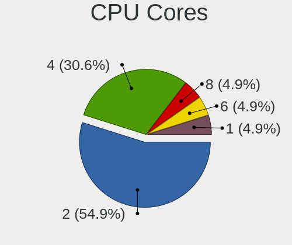

| Number | Computers | Percent |
|--------|-----------|---------|
| 2      | 76        | 55.47%  |
| 4      | 41        | 29.93%  |
| 6      | 7         | 5.11%   |
| 1      | 7         | 5.11%   |
| 8      | 6         | 4.38%   |

CPU Sockets
-----------

Number of sockets

| Number | Computers | Percent |
|--------|-----------|---------|
| 1      | 137       | 100%    |

CPU Threads
-----------

Threads per core (Hyper-Threading)

| Number | Computers | Percent |
|--------|-----------|---------|
| 2      | 76        | 55.47%  |
| 1      | 61        | 44.53%  |

CPU Op-Modes
------------

CPU Operation Modes (32-bit, 64-bit)

| Op mode        | Computers | Percent |
|----------------|-----------|---------|
| 32-bit, 64-bit | 133       | 97.08%  |
| 32-bit         | 4         | 2.92%   |

CPU Microcode
-------------

Microcode number

| Number     | Computers | Percent |
|------------|-----------|---------|
| Unknown    | 17        | 12.32%  |
| 0x206a7    | 12        | 8.7%    |
| 0x306a9    | 9         | 6.52%   |
| 0x306c3    | 7         | 5.07%   |
| 0x406e3    | 6         | 4.35%   |
| 0x20655    | 5         | 3.62%   |
| 0x20652    | 4         | 2.9%    |
| 0x906e9    | 3         | 2.17%   |
| 0x806e9    | 3         | 2.17%   |
| 0x406c4    | 3         | 2.17%   |
| 0x40651    | 3         | 2.17%   |
| 0x30678    | 3         | 2.17%   |
| 0x30661    | 3         | 2.17%   |
| 0x1067a    | 3         | 2.17%   |
| 0x03000027 | 3         | 2.17%   |
| 0x906ea    | 2         | 1.45%   |
| 0x806ec    | 2         | 1.45%   |
| 0x806c1    | 2         | 1.45%   |
| 0x6fd      | 2         | 1.45%   |
| 0x406c3    | 2         | 1.45%   |
| 0x306d4    | 2         | 1.45%   |
| 0x106ca    | 2         | 1.45%   |
| 0x10677    | 2         | 1.45%   |
| 0x10676    | 2         | 1.45%   |
| 0x08701021 | 2         | 1.45%   |
| 0x0800820d | 2         | 1.45%   |
| 0x0700010f | 2         | 1.45%   |
| 0x010000c8 | 2         | 1.45%   |
| 0xf65      | 1         | 0.72%   |
| 0xa0653    | 1         | 0.72%   |
| 0x906ed    | 1         | 0.72%   |
| 0x906eb    | 1         | 0.72%   |
| 0x806ea    | 1         | 0.72%   |
| 0x706e5    | 1         | 0.72%   |
| 0x706a1    | 1         | 0.72%   |
| 0x6fb      | 1         | 0.72%   |
| 0x6f2      | 1         | 0.72%   |
| 0x6d8      | 1         | 0.72%   |
| 0x506e3    | 1         | 0.72%   |
| 0x506c9    | 1         | 0.72%   |
| 0x306e4    | 1         | 0.72%   |
| 0x106e5    | 1         | 0.72%   |
| 0x106c2    | 1         | 0.72%   |
| 0x08608103 | 1         | 0.72%   |
| 0x08600104 | 1         | 0.72%   |
| 0x0810100b | 1         | 0.72%   |
| 0x08001138 | 1         | 0.72%   |
| 0x08001137 | 1         | 0.72%   |
| 0x08001126 | 1         | 0.72%   |
| 0x07030105 | 1         | 0.72%   |
| 0x06006705 | 1         | 0.72%   |
| 0x06006118 | 1         | 0.72%   |
| 0x05000119 | 1         | 0.72%   |
| 0x010000dc | 1         | 0.72%   |
| 0x010000db | 1         | 0.72%   |
| 0x01000083 | 1         | 0.72%   |

CPU Microarch
-------------

Microarchitecture

| Name          | Computers | Percent |
|---------------|-----------|---------|
| SandyBridge   | 15        | 10.95%  |
| KabyLake      | 15        | 10.95%  |
| IvyBridge     | 12        | 8.76%   |
| Haswell       | 10        | 7.3%    |
| Westmere      | 9         | 6.57%   |
| Silvermont    | 9         | 6.57%   |
| Penryn        | 9         | 6.57%   |
| Skylake       | 7         | 5.11%   |
| K10           | 6         | 4.38%   |
| Bonnell       | 6         | 4.38%   |
| K8 Hammer     | 5         | 3.65%   |
| Zen           | 4         | 2.92%   |
| Core          | 4         | 2.92%   |
| Zen 2         | 3         | 2.19%   |
| K10 Llano     | 3         | 2.19%   |
| Zen+          | 2         | 1.46%   |
| TigerLake     | 2         | 1.46%   |
| Jaguar        | 2         | 1.46%   |
| Excavator     | 2         | 1.46%   |
| Broadwell     | 2         | 1.46%   |
| Puma          | 1         | 0.73%   |
| P6            | 1         | 0.73%   |
| NetBurst      | 1         | 0.73%   |
| Nehalem       | 1         | 0.73%   |
| IceLake       | 1         | 0.73%   |
| Goldmont plus | 1         | 0.73%   |
| Goldmont      | 1         | 0.73%   |
| CometLake     | 1         | 0.73%   |
| Bobcat        | 1         | 0.73%   |
| Unknown       | 1         | 0.73%   |

Graphics
--------

GPU Vendor
----------

Vendors of graphics cards

| Vendor | Computers | Percent |
|--------|-----------|---------|
| Intel  | 85        | 53.46%  |
| Nvidia | 37        | 23.27%  |
| AMD    | 37        | 23.27%  |

GPU Model
---------

Graphics card models

| Model                                                                                    | Computers | Percent |
|------------------------------------------------------------------------------------------|-----------|---------|
| Intel 2nd Generation Core Processor Family Integrated Graphics Controller                | 12        | 7.1%    |
| Intel 3rd Gen Core processor Graphics Controller                                         | 8         | 4.73%   |
| Intel Skylake GT2 [HD Graphics 520]                                                      | 6         | 3.55%   |
| Intel Core Processor Integrated Graphics Controller                                      | 5         | 2.96%   |
| Intel Atom/Celeron/Pentium Processor x5-E8000/J3xxx/N3xxx Integrated Graphics Controller | 5         | 2.96%   |
| Intel Atom Processor Z36xxx/Z37xxx Series Graphics & Display                             | 4         | 2.37%   |
| Nvidia GK208B [GeForce GT 710]                                                           | 3         | 1.78%   |
| Intel Mobile 4 Series Chipset Integrated Graphics Controller                             | 3         | 1.78%   |
| Intel HD Graphics 630                                                                    | 3         | 1.78%   |
| Intel HD Graphics 620                                                                    | 3         | 1.78%   |
| Intel Haswell-ULT Integrated Graphics Controller                                         | 3         | 1.78%   |
| Intel Atom Processor D2xxx/N2xxx Integrated Graphics Controller                          | 3         | 1.78%   |
| Intel 4th Gen Core Processor Integrated Graphics Controller                              | 3         | 1.78%   |
| AMD Seymour [Radeon HD 6400M/7400M Series]                                               | 3         | 1.78%   |
| AMD Ellesmere [Radeon RX 470/480/570/570X/580/580X/590]                                  | 3         | 1.78%   |
| Nvidia GT218 [GeForce 210]                                                               | 2         | 1.18%   |
| Nvidia GT216GLM [Quadro FX 880M]                                                         | 2         | 1.18%   |
| Nvidia GP108M [GeForce MX250]                                                            | 2         | 1.18%   |
| Intel TigerLake-LP GT2 [Iris Xe Graphics]                                                | 2         | 1.18%   |
| Intel Mobile 945GM/GMS/GME, 943/940GML Express Integrated Graphics Controller            | 2         | 1.18%   |
| Intel HD Graphics 5500                                                                   | 2         | 1.18%   |
| Intel CometLake-U GT2 [UHD Graphics]                                                     | 2         | 1.18%   |
| Intel CoffeeLake-H GT2 [UHD Graphics 630]                                                | 2         | 1.18%   |
| Intel Atom Processor D4xx/D5xx/N4xx/N5xx Integrated Graphics Controller                  | 2         | 1.18%   |
| AMD Sun LE [Radeon HD 8550M / R5 M230]                                                   | 2         | 1.18%   |
| AMD Sumo [Radeon HD 6520G]                                                               | 2         | 1.18%   |
| AMD RV635 [Radeon HD 3650/3750/4570/4580]                                                | 2         | 1.18%   |
| AMD RV610 [Radeon HD 2400 PRO/XT]                                                        | 2         | 1.18%   |
| AMD RS780L [Radeon 3000]                                                                 | 2         | 1.18%   |
| Nvidia TU117M [GeForce MX450]                                                            | 1         | 0.59%   |
| Nvidia TU117M [GeForce GTX 1650 Mobile / Max-Q]                                          | 1         | 0.59%   |
| Nvidia TU116M [GeForce GTX 1660 Ti Mobile]                                               | 1         | 0.59%   |
| Nvidia TU106 [GeForce RTX 2070]                                                          | 1         | 0.59%   |
| Nvidia TU106 [GeForce RTX 2060 SUPER]                                                    | 1         | 0.59%   |
| Nvidia TU104 [GeForce RTX 2060]                                                          | 1         | 0.59%   |
| Nvidia GT218 [GeForce 8400 GS Rev. 3]                                                    | 1         | 0.59%   |
| Nvidia GT216M [GeForce GT 330M]                                                          | 1         | 0.59%   |
| Nvidia GP108M [GeForce MX150]                                                            | 1         | 0.59%   |
| Nvidia GP108 [GeForce GT 1030]                                                           | 1         | 0.59%   |
| Nvidia GP107M [GeForce GTX 1050 Ti Mobile]                                               | 1         | 0.59%   |
| Nvidia GP107 [GeForce GTX 1050]                                                          | 1         | 0.59%   |
| Nvidia GM108M [GeForce 940M]                                                             | 1         | 0.59%   |
| Nvidia GM108M [GeForce 940MX]                                                            | 1         | 0.59%   |
| Nvidia GM108M [GeForce 920MX]                                                            | 1         | 0.59%   |
| Nvidia GM107GLM [Quadro M1200 Mobile]                                                    | 1         | 0.59%   |
| Nvidia GK110 [GeForce GTX 780]                                                           | 1         | 0.59%   |
| Nvidia GK107M [GeForce GT 650M]                                                          | 1         | 0.59%   |
| Nvidia GK104 [GeForce GTX 660 Ti]                                                        | 1         | 0.59%   |
| Nvidia GF116M [GeForce GT 560M]                                                          | 1         | 0.59%   |
| Nvidia GF114 [GeForce GTX 560 SE]                                                        | 1         | 0.59%   |
| Nvidia GF110 [GeForce GTX 570]                                                           | 1         | 0.59%   |
| Nvidia GF108M [GeForce GT 620M/630M/635M/640M LE]                                        | 1         | 0.59%   |
| Nvidia GF108M [GeForce GT 540M]                                                          | 1         | 0.59%   |
| Nvidia GF108 [GeForce GT 630]                                                            | 1         | 0.59%   |
| Nvidia GF108 [GeForce GT 430]                                                            | 1         | 0.59%   |
| Nvidia GF104 [GeForce GTX 460]                                                           | 1         | 0.59%   |
| Nvidia G73M [GeForce Go 7600]                                                            | 1         | 0.59%   |
| Nvidia C67 [GeForce 7000M / nForce 610M]                                                 | 1         | 0.59%   |
| Intel Xeon E3-1200 v3/4th Gen Core Processor Integrated Graphics Controller              | 1         | 0.59%   |
| Intel Xeon E3-1200 v2/3rd Gen Core processor Graphics Controller                         | 1         | 0.59%   |

GPU Combo
---------

Combinations of graphics cards

| Name           | Computers | Percent |
|----------------|-----------|---------|
| 1 x Intel      | 66        | 47.14%  |
| 1 x AMD        | 29        | 20.71%  |
| 1 x Nvidia     | 24        | 17.14%  |
| Intel + Nvidia | 12        | 8.57%   |
| Intel + AMD    | 4         | 2.86%   |
| 2 x AMD        | 3         | 2.14%   |
| 3 x AMD        | 1         | 0.71%   |
| AMD + Nvidia   | 1         | 0.71%   |

GPU Driver
----------

Free vs proprietary

| Driver      | Computers | Percent |
|-------------|-----------|---------|
| Free        | 120       | 86.96%  |
| Proprietary | 15        | 10.87%  |
| Unknown     | 3         | 2.17%   |

GPU Memory
----------

Total video memory

| Size in GB | Computers | Percent |
|------------|-----------|---------|
| Unknown    | 84        | 59.57%  |
| 0.01-0.5   | 19        | 13.48%  |
| 1.01-2.0   | 15        | 10.64%  |
| 0.51-1.0   | 14        | 9.93%   |
| 3.01-4.0   | 4         | 2.84%   |
| 7.01-8.0   | 3         | 2.13%   |
| 5.01-6.0   | 1         | 0.71%   |
| 2.01-3.0   | 1         | 0.71%   |

Monitor
-------

Monitor Vendor
--------------

Monitor vendors

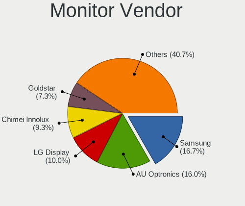

| Vendor                  | Computers | Percent |
|-------------------------|-----------|---------|
| Samsung Electronics     | 24        | 16.9%   |
| AU Optronics            | 23        | 16.2%   |
| LG Display              | 14        | 9.86%   |
| Chimei Innolux          | 14        | 9.86%   |
| Goldstar                | 9         | 6.34%   |
| Dell                    | 8         | 5.63%   |
| Lenovo                  | 5         | 3.52%   |
| BOE                     | 5         | 3.52%   |
| Acer                    | 5         | 3.52%   |
| ViewSonic               | 3         | 2.11%   |
| Chi Mei Optoelectronics | 3         | 2.11%   |
| Ancor Communications    | 3         | 2.11%   |
| Philips                 | 2         | 1.41%   |
| LG Philips              | 2         | 1.41%   |
| InfoVision              | 2         | 1.41%   |
| Hewlett-Packard         | 2         | 1.41%   |
| HannStar                | 2         | 1.41%   |
| BenQ                    | 2         | 1.41%   |
| AOC                     | 2         | 1.41%   |
| Vizio                   | 1         | 0.7%    |
| Vestel Elektronik       | 1         | 0.7%    |
| SANYO                   | 1         | 0.7%    |
| PANDA                   | 1         | 0.7%    |
| MSI                     | 1         | 0.7%    |
| InnoLux Display         | 1         | 0.7%    |
| IBM                     | 1         | 0.7%    |
| HYO                     | 1         | 0.7%    |
| Eizo                    | 1         | 0.7%    |
| DTV                     | 1         | 0.7%    |
| CPT                     | 1         | 0.7%    |
| CHR                     | 1         | 0.7%    |

Monitor Model
-------------

Monitor models

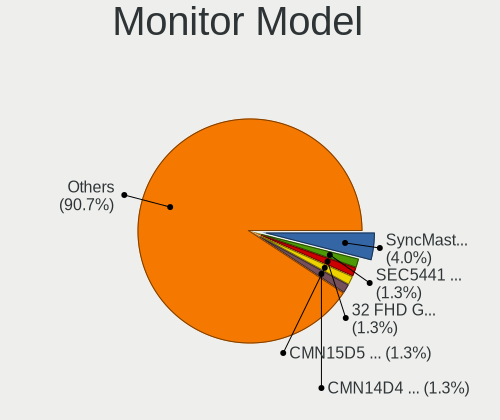

| Model                                                                 | Computers | Percent |
|-----------------------------------------------------------------------|-----------|---------|
| Samsung Electronics SyncMaster SAM0091 1600x1200 432x324mm 21.3-inch  | 6         | 4.2%    |
| Samsung Electronics LCD Monitor SEC5441 1366x768 344x194mm 15.5-inch  | 2         | 1.4%    |
| Goldstar 32 FHD GSM76FF 1920x1080 698x392mm 31.5-inch                 | 2         | 1.4%    |
| Chimei Innolux LCD Monitor CMN15D5 1920x1080 344x193mm 15.5-inch      | 2         | 1.4%    |
| Chimei Innolux LCD Monitor CMN14D4 1920x1080 309x173mm 13.9-inch      | 2         | 1.4%    |
| Chimei Innolux LCD Monitor CMN1132 1366x768 256x144mm 11.6-inch       | 2         | 1.4%    |
| AU Optronics LCD Monitor AUO23EC 1366x768 344x193mm 15.5-inch         | 2         | 1.4%    |
| AU Optronics LCD Monitor AUO106C 1366x768 277x156mm 12.5-inch         | 2         | 1.4%    |
| AU Optronics LCD Monitor AUO01EE 1600x900 344x193mm 15.5-inch         | 2         | 1.4%    |
| Vizio E320VA VIZ0071 1360x768 697x392mm 31.5-inch                     | 1         | 0.7%    |
| ViewSonic VX2757 VSCF931 1920x1080 598x336mm 27.0-inch                | 1         | 0.7%    |
| ViewSonic VX2453 Series VSC0C28 1920x1080 520x290mm 23.4-inch         | 1         | 0.7%    |
| ViewSonic VS2210-FHD VSC1939 1920x1080 476x268mm 21.5-inch            | 1         | 0.7%    |
| Vestel Elektronik 39FHD_LCD_TV VES3700 1920x1080 1280x720mm 57.8-inch | 1         | 0.7%    |
| SANYO Casper SAN2213 1600x900 304x228mm 15.0-inch                     | 1         | 0.7%    |
| Samsung Electronics SyncMaster SAM02FE 1680x1050 433x271mm 20.1-inch  | 1         | 0.7%    |
| Samsung Electronics SyncMaster SAM00B6 1280x1024 376x301mm 19.0-inch  | 1         | 0.7%    |
| Samsung Electronics SMB1930N SAM0632 1366x768 410x230mm 18.5-inch     | 1         | 0.7%    |
| Samsung Electronics SMB1630N SAM0630 1366x768 340x190mm 15.3-inch     | 1         | 0.7%    |
| Samsung Electronics SA300/SA350 SAM0791 1920x1080 510x287mm 23.0-inch | 1         | 0.7%    |
| Samsung Electronics S24F350 SAM0D20 1920x1080 521x293mm 23.5-inch     | 1         | 0.7%    |
| Samsung Electronics S22F350 SAM0D1A 1920x1080 477x268mm 21.5-inch     | 1         | 0.7%    |
| Samsung Electronics LCD Monitor SEC544B 1600x900 310x174mm 14.0-inch  | 1         | 0.7%    |
| Samsung Electronics LCD Monitor SEC504B 1600x900 382x215mm 17.3-inch  | 1         | 0.7%    |
| Samsung Electronics LCD Monitor SEC4251 1366x768 344x194mm 15.5-inch  | 1         | 0.7%    |
| Samsung Electronics LCD Monitor SEC4245 1280x800 331x207mm 15.4-inch  | 1         | 0.7%    |
| Samsung Electronics LCD Monitor SEC3945 1280x800 331x207mm 15.4-inch  | 1         | 0.7%    |
| Samsung Electronics LCD Monitor SEC3741 1366x768 309x174mm 14.0-inch  | 1         | 0.7%    |
| Samsung Electronics LCD Monitor SEC314C 1920x1080 344x194mm 15.5-inch | 1         | 0.7%    |
| Samsung Electronics LCD Monitor SDC4C48 1920x1080 309x174mm 14.0-inch | 1         | 0.7%    |
| Samsung Electronics LCD Monitor SAM0F13 3840x2160 890x500mm 40.2-inch | 1         | 0.7%    |
| Philips FTV PHL04C3 1920x1080 1440x810mm 65.0-inch                    | 1         | 0.7%    |
| Philips FTV PHL01EA 1920x1080 1440x810mm 65.0-inch                    | 1         | 0.7%    |
| PANDA LCD Monitor NCP0036 1920x1080 344x194mm 15.5-inch               | 1         | 0.7%    |
| MSI MAG271C MSI3FA6 1920x1080 600x340mm 27.2-inch                     | 1         | 0.7%    |
| LG Philips LCD Monitor LPLA900 1280x800 331x207mm 15.4-inch           | 1         | 0.7%    |
| LG Philips LCD Monitor LPLA002 1440x900 367x230mm 17.1-inch           | 1         | 0.7%    |
| LG Display LCD Monitor LGDD801 1366x768 344x194mm 15.5-inch           | 1         | 0.7%    |
| LG Display LCD Monitor LGD057E 1920x1080 344x194mm 15.5-inch          | 1         | 0.7%    |
| LG Display LCD Monitor LGD055D 3000x2000 260x173mm 12.3-inch          | 1         | 0.7%    |
| LG Display LCD Monitor LGD0533 1920x1080 344x194mm 15.5-inch          | 1         | 0.7%    |
| LG Display LCD Monitor LGD04FC 1366x768 344x194mm 15.5-inch           | 1         | 0.7%    |
| LG Display LCD Monitor LGD04B1 1366x768 310x174mm 14.0-inch           | 1         | 0.7%    |
| LG Display LCD Monitor LGD04A7 1920x1080 344x194mm 15.5-inch          | 1         | 0.7%    |
| LG Display LCD Monitor LGD03E3 1366x768 309x174mm 14.0-inch           | 1         | 0.7%    |
| LG Display LCD Monitor LGD038E 1366x768 344x194mm 15.5-inch           | 1         | 0.7%    |
| LG Display LCD Monitor LGD0386 1366x768 309x174mm 14.0-inch           | 1         | 0.7%    |
| LG Display LCD Monitor LGD033A 1366x768 344x194mm 15.5-inch           | 1         | 0.7%    |
| LG Display LCD Monitor LGD02F2 1366x768 344x194mm 15.5-inch           | 1         | 0.7%    |
| LG Display LCD Monitor LGD02D9 1920x1080 344x194mm 15.5-inch          | 1         | 0.7%    |
| LG Display LCD Monitor LGD027A 1600x900 382x215mm 17.3-inch           | 1         | 0.7%    |
| Lenovo LCD Monitor LEN40B1 1600x900 344x193mm 15.5-inch               | 1         | 0.7%    |
| Lenovo LCD Monitor LEN40A0 1366x768 309x174mm 14.0-inch               | 1         | 0.7%    |
| Lenovo LCD Monitor LEN4074 1440x900 287x180mm 13.3-inch               | 1         | 0.7%    |
| Lenovo LCD Monitor LEN4035 1280x800 303x190mm 14.1-inch               | 1         | 0.7%    |
| Lenovo LCD Monitor LEN4011 1280x800 261x163mm 12.1-inch               | 1         | 0.7%    |
| InnoLux Display LCD Monitor INL0028 1366x768 309x174mm 14.0-inch      | 1         | 0.7%    |
| InfoVision LCD Monitor IVO8C5F 1920x1080 309x174mm 14.0-inch          | 1         | 0.7%    |
| InfoVision LCD Monitor IVO03F4 1024x600 223x125mm 10.1-inch           | 1         | 0.7%    |
| IBM L191p IBM24CB 1280x1024 380x300mm 19.1-inch                       | 1         | 0.7%    |

Monitor Resolution
------------------

Monitor screen resolution

| Resolution         | Computers | Percent |
|--------------------|-----------|---------|
| 1920x1080 (FHD)    | 54        | 38.57%  |
| 1366x768 (WXGA)    | 36        | 25.71%  |
| 1600x900 (HD+)     | 10        | 7.14%   |
| 1600x1200          | 7         | 5%      |
| 3840x2160 (4K)     | 6         | 4.29%   |
| 1280x800 (WXGA)    | 6         | 4.29%   |
| 2560x1440 (QHD)    | 4         | 2.86%   |
| 1440x900 (WXGA+)   | 4         | 2.86%   |
| 1280x1024 (SXGA)   | 4         | 2.86%   |
| 1024x600           | 4         | 2.86%   |
| 1920x1200 (WUXGA)  | 2         | 1.43%   |
| 1680x1050 (WSXGA+) | 2         | 1.43%   |
| 3000x2000          | 1         | 0.71%   |

Monitor Diagonal
----------------

Diagonal size in inches

| Inches | Computers | Percent |
|--------|-----------|---------|
| 15     | 37        | 25.87%  |
| 14     | 13        | 9.09%   |
| 21     | 12        | 8.39%   |
| 13     | 12        | 8.39%   |
| 24     | 10        | 6.99%   |
| 23     | 7         | 4.9%    |
| 19     | 7         | 4.9%    |
| 18     | 6         | 4.2%    |
| 27     | 5         | 3.5%    |
| 17     | 5         | 3.5%    |
| 12     | 5         | 3.5%    |
| 11     | 4         | 2.8%    |
| 10     | 4         | 2.8%    |
| 31     | 3         | 2.1%    |
| 20     | 3         | 2.1%    |
| 84     | 2         | 1.4%    |
| 65     | 2         | 1.4%    |
| 42     | 1         | 0.7%    |
| 39     | 1         | 0.7%    |
| 37     | 1         | 0.7%    |
| 32     | 1         | 0.7%    |
| 22     | 1         | 0.7%    |
| 16     | 1         | 0.7%    |

Monitor Width
-------------

Physical width

| Width in mm | Computers | Percent |
|-------------|-----------|---------|
| 301-350     | 54        | 38.3%   |
| 401-500     | 24        | 17.02%  |
| 501-600     | 21        | 14.89%  |
| 201-300     | 18        | 12.77%  |
| 351-400     | 13        | 9.22%   |
| 601-700     | 3         | 2.13%   |
| 801-900     | 2         | 1.42%   |
| 1501-2000   | 2         | 1.42%   |
| 1001-1500   | 2         | 1.42%   |
| 701-800     | 1         | 0.71%   |
| 901-1000    | 1         | 0.71%   |

Aspect Ratio
------------

Proportional relationship between the width and the height

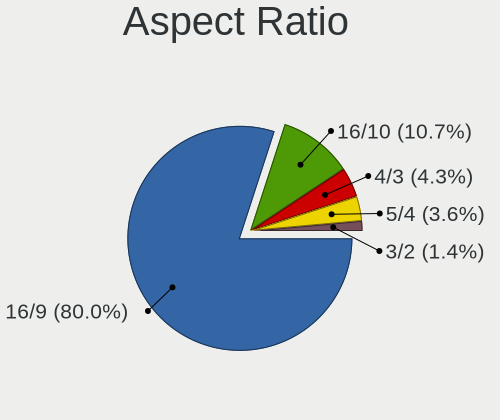

| Ratio | Computers | Percent |
|-------|-----------|---------|
| 16/9  | 106       | 80.3%   |
| 16/10 | 14        | 10.61%  |
| 4/3   | 6         | 4.55%   |
| 5/4   | 4         | 3.03%   |
| 3/2   | 2         | 1.52%   |

Monitor Area
------------

Area in inch

| Area in inch | Computers | Percent |
|----------------|-----------|---------|
| 101-110        | 37        | 26.24%  |
| 201-250        | 27        | 19.15%  |
| 81-90          | 20        | 14.18%  |
| 151-200        | 10        | 7.09%   |
| 71-80          | 5         | 3.55%   |
| 61-70          | 5         | 3.55%   |
| 301-350        | 5         | 3.55%   |
| 141-150        | 5         | 3.55%   |
| More than 1000 | 4         | 2.84%   |
| 51-60          | 4         | 2.84%   |
| 351-500        | 4         | 2.84%   |
| 41-50          | 4         | 2.84%   |
| 121-130        | 4         | 2.84%   |
| 501-1000       | 3         | 2.13%   |
| 251-300        | 2         | 1.42%   |
| 131-140        | 1         | 0.71%   |
| 111-120        | 1         | 0.71%   |

Pixel Density
-------------

Pixels per inch

| Density       | Computers | Percent |
|---------------|-----------|---------|
| 51-100        | 54        | 39.42%  |
| 101-120       | 45        | 32.85%  |
| 121-160       | 30        | 21.9%   |
| More than 240 | 3         | 2.19%   |
| 161-240       | 3         | 2.19%   |
| 1-50          | 2         | 1.46%   |

Multiple Monitors
-----------------

Total monitors connected

| Total | Computers | Percent |
|-------|-----------|---------|
| 1     | 122       | 87.77%  |
| 2     | 16        | 11.51%  |
| 0     | 1         | 0.72%   |

Network
-------

Net Controller Vendor
---------------------

Controller vendors

| Vendor                   | Computers | Percent |
|--------------------------|-----------|---------|
| Realtek Semiconductor    | 70        | 35.18%  |
| Intel                    | 64        | 32.16%  |
| Qualcomm Atheros         | 30        | 15.08%  |
| Broadcom                 | 13        | 6.53%   |
| Ralink                   | 5         | 2.51%   |
| Nvidia                   | 3         | 1.51%   |
| Marvell Technology Group | 2         | 1.01%   |
| Huawei Technologies      | 2         | 1.01%   |
| Attansic Technology      | 2         | 1.01%   |
| ASIX Electronics         | 2         | 1.01%   |
| Ralink Technology        | 1         | 0.5%    |
| MediaTek                 | 1         | 0.5%    |
| JMicron Technology       | 1         | 0.5%    |
| D-Link System            | 1         | 0.5%    |
| Broadcom Limited         | 1         | 0.5%    |
| ASUSTek Computer         | 1         | 0.5%    |

Net Controller Model
--------------------

Controller models

| Model                                                                                         | Computers | Percent |
|-----------------------------------------------------------------------------------------------|-----------|---------|
| Realtek RTL8111/8168/8411 PCI Express Gigabit Ethernet Controller                             | 51        | 21.43%  |
| Realtek RTL810xE PCI Express Fast Ethernet controller                                         | 12        | 5.04%   |
| Qualcomm Atheros AR9485 Wireless Network Adapter                                              | 8         | 3.36%   |
| Intel Wireless 7260                                                                           | 6         | 2.52%   |
| Intel Centrino Advanced-N 6205 [Taylor Peak]                                                  | 5         | 2.1%    |
| Intel 82579LM Gigabit Network Connection (Lewisville)                                         | 5         | 2.1%    |
| Intel 82577LM Gigabit Network Connection                                                      | 5         | 2.1%    |
| Qualcomm Atheros AR9285 Wireless Network Adapter (PCI-Express)                                | 4         | 1.68%   |
| Intel Wireless 8265 / 8275                                                                    | 4         | 1.68%   |
| Intel Wireless 7265                                                                           | 4         | 1.68%   |
| Intel Centrino Advanced-N 6200                                                                | 4         | 1.68%   |
| Realtek RTL8821CE 802.11ac PCIe Wireless Network Adapter                                      | 3         | 1.26%   |
| Realtek RTL8188EUS 802.11n Wireless Network Adapter                                           | 3         | 1.26%   |
| Qualcomm Atheros QCA9565 / AR9565 Wireless Network Adapter                                    | 3         | 1.26%   |
| Qualcomm Atheros QCA9377 802.11ac Wireless Network Adapter                                    | 3         | 1.26%   |
| Intel Wireless 8260                                                                           | 3         | 1.26%   |
| Intel Wireless 3165                                                                           | 3         | 1.26%   |
| Intel Ethernet Connection I217-LM                                                             | 3         | 1.26%   |
| Intel Centrino Wireless-N 2230                                                                | 3         | 1.26%   |
| Intel 82579V Gigabit Network Connection                                                       | 3         | 1.26%   |
| Realtek RTL8822BE 802.11a/b/g/n/ac WiFi adapter                                               | 2         | 0.84%   |
| Realtek RTL8723BE PCIe Wireless Network Adapter                                               | 2         | 0.84%   |
| Realtek RTL8153 Gigabit Ethernet Adapter                                                      | 2         | 0.84%   |
| Ralink RT5390 Wireless 802.11n 1T/1R PCIe                                                     | 2         | 0.84%   |
| Qualcomm Atheros QCA8172 Fast Ethernet                                                        | 2         | 0.84%   |
| Qualcomm Atheros AR8161 Gigabit Ethernet                                                      | 2         | 0.84%   |
| Intel Wi-Fi 6 AX201                                                                           | 2         | 0.84%   |
| Intel PRO/Wireless 4965 AG or AGN [Kedron] Network Connection                                 | 2         | 0.84%   |
| Intel Ethernet Connection I219-V                                                              | 2         | 0.84%   |
| Intel Ethernet Connection (3) I218-LM                                                         | 2         | 0.84%   |
| Intel Ethernet Connection (2) I219-LM                                                         | 2         | 0.84%   |
| Intel Comet Lake PCH-LP CNVi WiFi                                                             | 2         | 0.84%   |
| Intel Centrino Ultimate-N 6300                                                                | 2         | 0.84%   |
| Intel Cannon Lake PCH CNVi WiFi                                                               | 2         | 0.84%   |
| Intel 82567LM-3 Gigabit Network Connection                                                    | 2         | 0.84%   |
| Broadcom BCM43228 802.11a/b/g/n                                                               | 2         | 0.84%   |
| Broadcom BCM4313 802.11bgn Wireless Network Adapter                                           | 2         | 0.84%   |
| Attansic AR8152 v2.0 Fast Ethernet                                                            | 2         | 0.84%   |
| Realtek RTL88x2bu [AC1200 Techkey]                                                            | 1         | 0.42%   |
| Realtek RTL8822CE 802.11ac PCIe Wireless Network Adapter                                      | 1         | 0.42%   |
| Realtek RTL8192EU 802.11b/g/n WLAN Adapter                                                    | 1         | 0.42%   |
| Realtek RTL8192EE PCIe Wireless Network Adapter                                               | 1         | 0.42%   |
| Realtek RTL8188EE Wireless Network Adapter                                                    | 1         | 0.42%   |
| Realtek RTL-8100/8101L/8139 PCI Fast Ethernet Adapter                                         | 1         | 0.42%   |
| Realtek Realtek 8812AU/8821AU 802.11ac WLAN Adapter [USB Wireless Dual-Band Adapter 2.4/5Ghz] | 1         | 0.42%   |
| Realtek 802.11ac NIC                                                                          | 1         | 0.42%   |
| Ralink RT2870/RT3070 Wireless Adapter                                                         | 1         | 0.42%   |
| Ralink RT5392 PCIe Wireless Network Adapter                                                   | 1         | 0.42%   |
| Ralink RT3290 Wireless 802.11n 1T/1R PCIe                                                     | 1         | 0.42%   |
| Ralink RT2800 802.11n PCI                                                                     | 1         | 0.42%   |
| Qualcomm Atheros QCA8171 Gigabit Ethernet                                                     | 1         | 0.42%   |
| Qualcomm Atheros QCA6174 802.11ac Wireless Network Adapter                                    | 1         | 0.42%   |
| Qualcomm Atheros Killer E2400 Gigabit Ethernet Controller                                     | 1         | 0.42%   |
| Qualcomm Atheros AR928X Wireless Network Adapter (PCI-Express)                                | 1         | 0.42%   |
| Qualcomm Atheros AR9287 Wireless Network Adapter (PCI-Express)                                | 1         | 0.42%   |
| Qualcomm Atheros AR922X Wireless Network Adapter                                              | 1         | 0.42%   |
| Qualcomm Atheros AR8162 Fast Ethernet                                                         | 1         | 0.42%   |
| Qualcomm Atheros AR8152 v1.1 Fast Ethernet                                                    | 1         | 0.42%   |
| Qualcomm Atheros AR8151 v2.0 Gigabit Ethernet                                                 | 1         | 0.42%   |
| Qualcomm Atheros AR8151 v1.0 Gigabit Ethernet                                                 | 1         | 0.42%   |

Wireless Vendor
---------------

Wireless vendors

| Vendor                | Computers | Percent |
|-----------------------|-----------|---------|
| Intel                 | 52        | 49.06%  |
| Qualcomm Atheros      | 23        | 21.7%   |
| Realtek Semiconductor | 16        | 15.09%  |
| Broadcom              | 8         | 7.55%   |
| Ralink                | 5         | 4.72%   |
| Ralink Technology     | 1         | 0.94%   |
| ASUSTek Computer      | 1         | 0.94%   |

Wireless Model
--------------

Wireless models

| Model                                                                                         | Computers | Percent |
|-----------------------------------------------------------------------------------------------|-----------|---------|
| Qualcomm Atheros AR9485 Wireless Network Adapter                                              | 8         | 7.48%   |
| Intel Wireless 7260                                                                           | 6         | 5.61%   |
| Intel Centrino Advanced-N 6205 [Taylor Peak]                                                  | 5         | 4.67%   |
| Qualcomm Atheros AR9285 Wireless Network Adapter (PCI-Express)                                | 4         | 3.74%   |
| Intel Wireless 8265 / 8275                                                                    | 4         | 3.74%   |
| Intel Wireless 7265                                                                           | 4         | 3.74%   |
| Intel Centrino Advanced-N 6200                                                                | 4         | 3.74%   |
| Realtek RTL8821CE 802.11ac PCIe Wireless Network Adapter                                      | 3         | 2.8%    |
| Realtek RTL8188EUS 802.11n Wireless Network Adapter                                           | 3         | 2.8%    |
| Qualcomm Atheros QCA9565 / AR9565 Wireless Network Adapter                                    | 3         | 2.8%    |
| Qualcomm Atheros QCA9377 802.11ac Wireless Network Adapter                                    | 3         | 2.8%    |
| Intel Wireless 8260                                                                           | 3         | 2.8%    |
| Intel Wireless 3165                                                                           | 3         | 2.8%    |
| Intel Centrino Wireless-N 2230                                                                | 3         | 2.8%    |
| Realtek RTL8822BE 802.11a/b/g/n/ac WiFi adapter                                               | 2         | 1.87%   |
| Realtek RTL8723BE PCIe Wireless Network Adapter                                               | 2         | 1.87%   |
| Ralink RT5390 Wireless 802.11n 1T/1R PCIe                                                     | 2         | 1.87%   |
| Intel Wi-Fi 6 AX201                                                                           | 2         | 1.87%   |
| Intel PRO/Wireless 4965 AG or AGN [Kedron] Network Connection                                 | 2         | 1.87%   |
| Intel Comet Lake PCH-LP CNVi WiFi                                                             | 2         | 1.87%   |
| Intel Centrino Ultimate-N 6300                                                                | 2         | 1.87%   |
| Intel Cannon Lake PCH CNVi WiFi                                                               | 2         | 1.87%   |
| Broadcom BCM43228 802.11a/b/g/n                                                               | 2         | 1.87%   |
| Broadcom BCM4313 802.11bgn Wireless Network Adapter                                           | 2         | 1.87%   |
| Realtek RTL88x2bu [AC1200 Techkey]                                                            | 1         | 0.93%   |
| Realtek RTL8822CE 802.11ac PCIe Wireless Network Adapter                                      | 1         | 0.93%   |
| Realtek RTL8192EU 802.11b/g/n WLAN Adapter                                                    | 1         | 0.93%   |
| Realtek RTL8192EE PCIe Wireless Network Adapter                                               | 1         | 0.93%   |
| Realtek RTL8188EE Wireless Network Adapter                                                    | 1         | 0.93%   |
| Realtek Realtek 8812AU/8821AU 802.11ac WLAN Adapter [USB Wireless Dual-Band Adapter 2.4/5Ghz] | 1         | 0.93%   |
| Realtek 802.11ac NIC                                                                          | 1         | 0.93%   |
| Ralink RT2870/RT3070 Wireless Adapter                                                         | 1         | 0.93%   |
| Ralink RT5392 PCIe Wireless Network Adapter                                                   | 1         | 0.93%   |
| Ralink RT3290 Wireless 802.11n 1T/1R PCIe                                                     | 1         | 0.93%   |
| Ralink RT2800 802.11n PCI                                                                     | 1         | 0.93%   |
| Qualcomm Atheros QCA6174 802.11ac Wireless Network Adapter                                    | 1         | 0.93%   |
| Qualcomm Atheros AR928X Wireless Network Adapter (PCI-Express)                                | 1         | 0.93%   |
| Qualcomm Atheros AR9287 Wireless Network Adapter (PCI-Express)                                | 1         | 0.93%   |
| Qualcomm Atheros AR922X Wireless Network Adapter                                              | 1         | 0.93%   |
| Qualcomm Atheros AR242x / AR542x Wireless Network Adapter (PCI-Express)                       | 1         | 0.93%   |
| Intel Wireless-AC 9260                                                                        | 1         | 0.93%   |
| Intel WiFi Link 5100                                                                          | 1         | 0.93%   |
| Intel Wi-Fi 6 AX210/AX211/AX411 160MHz                                                        | 1         | 0.93%   |
| Intel Wi-Fi 6 AX200                                                                           | 1         | 0.93%   |
| Intel PRO/Wireless 5100 AGN [Shiloh] Network Connection                                       | 1         | 0.93%   |
| Intel PRO/Wireless 3945ABG [Golan] Network Connection                                         | 1         | 0.93%   |
| Intel Ice Lake-LP PCH CNVi WiFi                                                               | 1         | 0.93%   |
| Intel Dual Band Wireless-AC 3168NGW [Stone Peak]                                              | 1         | 0.93%   |
| Intel Dual Band Wireless-AC 3165 Plus Bluetooth                                               | 1         | 0.93%   |
| Intel Centrino Wireless-N 2200                                                                | 1         | 0.93%   |
| Broadcom BCM4352 802.11ac Wireless Network Adapter                                            | 1         | 0.93%   |
| Broadcom BCM43225 802.11b/g/n                                                                 | 1         | 0.93%   |
| Broadcom BCM43142 802.11b/g/n                                                                 | 1         | 0.93%   |
| Broadcom BCM4311 802.11b/g WLAN                                                               | 1         | 0.93%   |
| ASUS USB-N10 802.11n Network Adapter [Realtek RTL8188SU]                                      | 1         | 0.93%   |

Ethernet Vendor
---------------

Ethernet vendors

| Vendor                   | Computers | Percent |
|--------------------------|-----------|---------|
| Realtek Semiconductor    | 65        | 50.78%  |
| Intel                    | 32        | 25%     |
| Qualcomm Atheros         | 11        | 8.59%   |
| Broadcom                 | 6         | 4.69%   |
| Nvidia                   | 3         | 2.34%   |
| Marvell Technology Group | 2         | 1.56%   |
| Attansic Technology      | 2         | 1.56%   |
| ASIX Electronics         | 2         | 1.56%   |
| MediaTek                 | 1         | 0.78%   |
| JMicron Technology       | 1         | 0.78%   |
| Huawei Technologies      | 1         | 0.78%   |
| D-Link System            | 1         | 0.78%   |
| Broadcom Limited         | 1         | 0.78%   |

Ethernet Model
--------------

Ethernet models

| Model                                                                          | Computers | Percent |
|--------------------------------------------------------------------------------|-----------|---------|
| Realtek RTL8111/8168/8411 PCI Express Gigabit Ethernet Controller              | 51        | 39.23%  |
| Realtek RTL810xE PCI Express Fast Ethernet controller                          | 12        | 9.23%   |
| Intel 82579LM Gigabit Network Connection (Lewisville)                          | 5         | 3.85%   |
| Intel 82577LM Gigabit Network Connection                                       | 5         | 3.85%   |
| Intel Ethernet Connection I217-LM                                              | 3         | 2.31%   |
| Intel 82579V Gigabit Network Connection                                        | 3         | 2.31%   |
| Realtek RTL8153 Gigabit Ethernet Adapter                                       | 2         | 1.54%   |
| Qualcomm Atheros QCA8172 Fast Ethernet                                         | 2         | 1.54%   |
| Qualcomm Atheros AR8161 Gigabit Ethernet                                       | 2         | 1.54%   |
| Intel Ethernet Connection I219-V                                               | 2         | 1.54%   |
| Intel Ethernet Connection (3) I218-LM                                          | 2         | 1.54%   |
| Intel Ethernet Connection (2) I219-LM                                          | 2         | 1.54%   |
| Intel 82567LM-3 Gigabit Network Connection                                     | 2         | 1.54%   |
| Attansic AR8152 v2.0 Fast Ethernet                                             | 2         | 1.54%   |
| Realtek RTL-8100/8101L/8139 PCI Fast Ethernet Adapter                          | 1         | 0.77%   |
| Qualcomm Atheros QCA8171 Gigabit Ethernet                                      | 1         | 0.77%   |
| Qualcomm Atheros Killer E2400 Gigabit Ethernet Controller                      | 1         | 0.77%   |
| Qualcomm Atheros AR8162 Fast Ethernet                                          | 1         | 0.77%   |
| Qualcomm Atheros AR8152 v1.1 Fast Ethernet                                     | 1         | 0.77%   |
| Qualcomm Atheros AR8151 v2.0 Gigabit Ethernet                                  | 1         | 0.77%   |
| Qualcomm Atheros AR8151 v1.0 Gigabit Ethernet                                  | 1         | 0.77%   |
| Qualcomm Atheros AR8132 Fast Ethernet                                          | 1         | 0.77%   |
| Nvidia MCP67 Ethernet                                                          | 1         | 0.77%   |
| Nvidia MCP61 Ethernet                                                          | 1         | 0.77%   |
| Nvidia MCP51 Ethernet Controller                                               | 1         | 0.77%   |
| MediaTek RMX3085                                                               | 1         | 0.77%   |
| Marvell Group Yukon Optima 88E8059 [PCIe Gigabit Ethernet Controller with AVB] | 1         | 0.77%   |
| Marvell Group 88E8055 PCI-E Gigabit Ethernet Controller                        | 1         | 0.77%   |
| JMicron JMC250 PCI Express Gigabit Ethernet Controller                         | 1         | 0.77%   |
| Intel I211 Gigabit Network Connection                                          | 1         | 0.77%   |
| Intel I210 Gigabit Network Connection                                          | 1         | 0.77%   |
| Intel Ethernet Controller I225-V                                               | 1         | 0.77%   |
| Intel Ethernet Connection I219-LM                                              | 1         | 0.77%   |
| Intel Ethernet Connection I218-LM                                              | 1         | 0.77%   |
| Intel Ethernet Connection (2) I219-V                                           | 1         | 0.77%   |
| Intel Ethernet Connection (2) I218-V                                           | 1         | 0.77%   |
| Intel 82801DB PRO/100 VE (LOM) Ethernet Controller                             | 1         | 0.77%   |
| Intel 82567LM Gigabit Network Connection                                       | 1         | 0.77%   |
| Huawei LYA-L09                                                                 | 1         | 0.77%   |
| D-Link System DGE-528T Gigabit Ethernet Adapter                                | 1         | 0.77%   |
| Broadcom NetXtreme BCM5764M Gigabit Ethernet PCIe                              | 1         | 0.77%   |
| Broadcom NetXtreme BCM5761 Gigabit Ethernet PCIe                               | 1         | 0.77%   |
| Broadcom NetXtreme BCM5754 Gigabit Ethernet PCI Express                        | 1         | 0.77%   |
| Broadcom NetXtreme BCM5752 Gigabit Ethernet PCI Express                        | 1         | 0.77%   |
| Broadcom NetLink BCM5787M Gigabit Ethernet PCI Express                         | 1         | 0.77%   |
| Broadcom Limited NetXtreme BCM5755 Gigabit Ethernet PCI Express                | 1         | 0.77%   |
| Broadcom BCM4401-B0 100Base-TX                                                 | 1         | 0.77%   |
| ASIX AX88772A Fast Ethernet                                                    | 1         | 0.77%   |
| ASIX AX88179 Gigabit Ethernet                                                  | 1         | 0.77%   |

Net Controller Kind
-------------------

Ethernet, WiFi or modem

| Kind     | Computers | Percent |
|----------|-----------|---------|
| Ethernet | 124       | 54.39%  |
| WiFi     | 103       | 45.18%  |
| Modem    | 1         | 0.44%   |

Used Controller
---------------

Currently used network controller

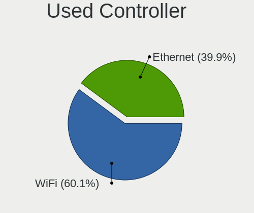

| Kind     | Computers | Percent |
|----------|-----------|---------|
| WiFi     | 84        | 60%     |
| Ethernet | 56        | 40%     |

NICs
----

Total network controllers on board

| Total | Computers | Percent |
|-------|-----------|---------|
| 2     | 84        | 61.31%  |
| 1     | 48        | 35.04%  |
| 0     | 3         | 2.19%   |
| 3     | 2         | 1.46%   |

IPv6
----

IPv6 vs IPv4

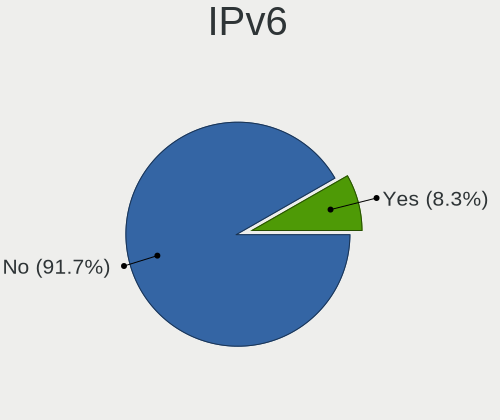

| Used | Computers | Percent |
|------|-----------|---------|
| No   | 129       | 93.48%  |
| Yes  | 9         | 6.52%   |

Bluetooth
---------

Bluetooth Vendor
----------------

Controller vendors

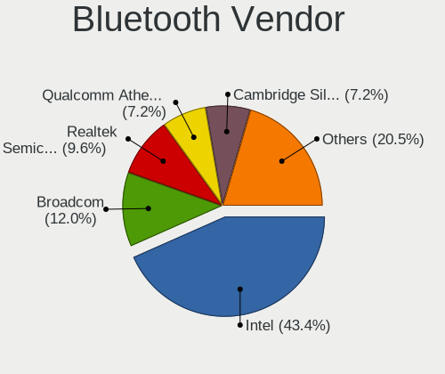

| Vendor                          | Computers | Percent |
|---------------------------------|-----------|---------|
| Intel                           | 32        | 41.03%  |
| Broadcom                        | 10        | 12.82%  |
| Realtek Semiconductor           | 7         | 8.97%   |
| Qualcomm Atheros Communications | 6         | 7.69%   |
| Cambridge Silicon Radio         | 6         | 7.69%   |
| IMC Networks                    | 4         | 5.13%   |
| Lite-On Technology              | 3         | 3.85%   |
| Hewlett-Packard                 | 3         | 3.85%   |
| Toshiba                         | 2         | 2.56%   |
| Dell                            | 2         | 2.56%   |
| Ralink                          | 1         | 1.28%   |
| Foxconn / Hon Hai               | 1         | 1.28%   |
| ASUSTek Computer                | 1         | 1.28%   |

Bluetooth Model
---------------

Controller models

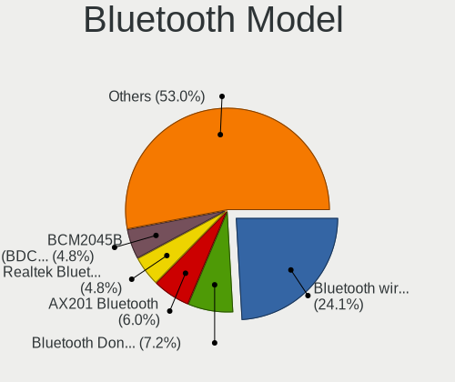

| Model                                               | Computers | Percent |
|-----------------------------------------------------|-----------|---------|
| Intel Bluetooth wireless interface                  | 19        | 24.36%  |
| Cambridge Silicon Radio Bluetooth Dongle (HCI mode) | 6         | 7.69%   |
| Realtek  Bluetooth 4.2 Adapter                      | 4         | 5.13%   |
| Intel AX201 Bluetooth                               | 4         | 5.13%   |
| Broadcom BCM2045B (BDC-2.1)                         | 4         | 5.13%   |
| Intel Centrino Bluetooth Wireless Transceiver       | 3         | 3.85%   |
| HP Broadcom 2070 Bluetooth Combo                    | 3         | 3.85%   |
| Realtek Bluetooth Radio                             | 2         | 2.56%   |
| Qualcomm Atheros  Bluetooth Device                  | 2         | 2.56%   |
| Qualcomm Atheros Bluetooth                          | 2         | 2.56%   |
| Lite-On Qualcomm Atheros QCA9377 Bluetooth          | 2         | 2.56%   |
| Intel Bluetooth 9460/9560 Jefferson Peak (JfP)      | 2         | 2.56%   |
| IMC Networks Bluetooth Radio                        | 2         | 2.56%   |
| Toshiba Integrated Bluetooth (Taiyo Yuden)          | 1         | 1.28%   |
| Toshiba Bluetooth USB Host Controller               | 1         | 1.28%   |
| Realtek RTL8723B Bluetooth                          | 1         | 1.28%   |
| Ralink RT3290 Bluetooth                             | 1         | 1.28%   |
| Qualcomm Atheros AR9462 Bluetooth                   | 1         | 1.28%   |
| Qualcomm Atheros AR3011 Bluetooth                   | 1         | 1.28%   |
| Lite-On Atheros AR3012 Bluetooth                    | 1         | 1.28%   |
| Intel Wireless-AC 3168 Bluetooth                    | 1         | 1.28%   |
| Intel Bluetooth Device                              | 1         | 1.28%   |
| Intel AX210 Bluetooth                               | 1         | 1.28%   |
| Intel AX200 Bluetooth                               | 1         | 1.28%   |
| IMC Networks Bluetooth Device                       | 1         | 1.28%   |
| IMC Networks Atheros AR3012 Bluetooth 4.0 Adapter   | 1         | 1.28%   |
| Foxconn / Hon Hai Acer Bluetooth module             | 1         | 1.28%   |
| Dell Wireless 360 Bluetooth                         | 1         | 1.28%   |
| Dell DW375 Bluetooth Module                         | 1         | 1.28%   |
| Broadcom HP Portable Bumble Bee                     | 1         | 1.28%   |
| Broadcom Bluetooth 2.1 Device                       | 1         | 1.28%   |
| Broadcom BCM43142A0 Bluetooth 4.0                   | 1         | 1.28%   |
| Broadcom BCM20702A0 Bluetooth 4.0                   | 1         | 1.28%   |
| Broadcom BCM2070 Bluetooth 2.1 + EDR                | 1         | 1.28%   |
| Broadcom BCM2045B (BDC-2.1) [Bluetooth Controller]  | 1         | 1.28%   |
| ASUS BCM20702A0                                     | 1         | 1.28%   |

Sound
-----

Sound Vendor
------------

Sound card vendors

| Vendor              | Computers | Percent |
|---------------------|-----------|---------|
| Intel               | 101       | 56.42%  |
| AMD                 | 39        | 21.79%  |
| Nvidia              | 28        | 15.64%  |
| Creative Labs       | 4         | 2.23%   |
| C-Media Electronics | 3         | 1.68%   |
| Tenx Technology     | 1         | 0.56%   |
| Logitech            | 1         | 0.56%   |
| JMTek               | 1         | 0.56%   |
| GN Netcom           | 1         | 0.56%   |

Sound Model
-----------

Sound card models

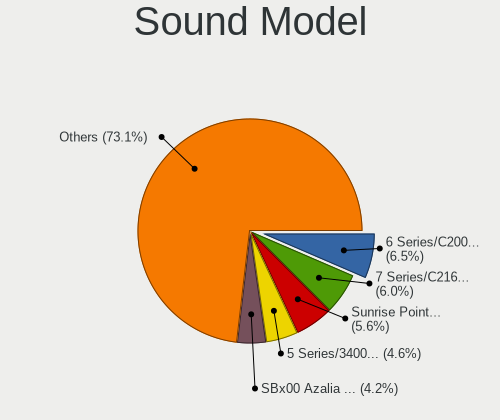

| Model                                                                                             | Computers | Percent |
|---------------------------------------------------------------------------------------------------|-----------|---------|
| Intel 7 Series/C216 Chipset Family High Definition Audio Controller                               | 13        | 6.28%   |
| Intel 6 Series/C200 Series Chipset Family High Definition Audio Controller                        | 13        | 6.28%   |
| Intel Sunrise Point-LP HD Audio                                                                   | 11        | 5.31%   |
| Intel 5 Series/3400 Series Chipset High Definition Audio                                          | 10        | 4.83%   |
| AMD SBx00 Azalia (Intel HDA)                                                                      | 9         | 4.35%   |
| Intel NM10/ICH7 Family High Definition Audio Controller                                           | 7         | 3.38%   |
| Intel 8 Series/C220 Series Chipset High Definition Audio Controller                               | 6         | 2.9%    |
| AMD FCH Azalia Controller                                                                         | 6         | 2.9%    |
| AMD Family 17h (Models 00h-0fh) HD Audio Controller                                               | 5         | 2.42%   |
| Nvidia GF108 High Definition Audio Controller                                                     | 4         | 1.93%   |
| Intel Xeon E3-1200 v3/4th Gen Core Processor HD Audio Controller                                  | 4         | 1.93%   |
| Intel 82801I (ICH9 Family) HD Audio Controller                                                    | 4         | 1.93%   |
| Nvidia High Definition Audio Controller                                                           | 3         | 1.45%   |
| Nvidia GT216 HDMI Audio Controller                                                                | 3         | 1.45%   |
| Nvidia GK208 HDMI/DP Audio Controller                                                             | 3         | 1.45%   |
| Intel Haswell-ULT HD Audio Controller                                                             | 3         | 1.45%   |
| Intel Cannon Lake PCH cAVS                                                                        | 3         | 1.45%   |
| Intel Atom/Celeron/Pentium Processor x5-E8000/J3xxx/N3xxx Series High Definition Audio Controller | 3         | 1.45%   |
| Intel 82801JI (ICH10 Family) HD Audio Controller                                                  | 3         | 1.45%   |
| Intel 82801H (ICH8 Family) HD Audio Controller                                                    | 3         | 1.45%   |
| Intel 8 Series HD Audio Controller                                                                | 3         | 1.45%   |
| AMD RV635 HDMI Audio [Radeon HD 3650/3730/3750]                                                   | 3         | 1.45%   |
| AMD Oland/Hainan/Cape Verde/Pitcairn HDMI Audio [Radeon HD 7000 Series]                           | 3         | 1.45%   |
| AMD Kabini HDMI/DP Audio                                                                          | 3         | 1.45%   |
| AMD Family 17h/19h HD Audio Controller                                                            | 3         | 1.45%   |
| AMD Ellesmere HDMI Audio [Radeon RX 470/480 / 570/580/590]                                        | 3         | 1.45%   |
| Nvidia TU116 High Definition Audio Controller                                                     | 2         | 0.97%   |
| Nvidia TU106 High Definition Audio Controller                                                     | 2         | 0.97%   |
| Intel Wildcat Point-LP High Definition Audio Controller                                           | 2         | 0.97%   |
| Intel Tiger Lake-LP Smart Sound Technology Audio Controller                                       | 2         | 0.97%   |
| Intel Comet Lake PCH-LP cAVS                                                                      | 2         | 0.97%   |
| Intel CM238 HD Audio Controller                                                                   | 2         | 0.97%   |
| Intel Broadwell-U Audio Controller                                                                | 2         | 0.97%   |
| Intel Atom Processor Z36xxx/Z37xxx Series High Definition Audio Controller                        | 2         | 0.97%   |
| Intel 82801JD/DO (ICH10 Family) HD Audio Controller                                               | 2         | 0.97%   |
| Intel 200 Series PCH HD Audio                                                                     | 2         | 0.97%   |
| Creative Labs EMU10k2/CA0100/CA0102/CA10200 [Sound Blaster Audigy Series]                         | 2         | 0.97%   |
| AMD Starship/Matisse HD Audio Controller                                                          | 2         | 0.97%   |
| AMD RV610 HDMI Audio [Radeon HD 2350 PRO / 2400 PRO/XT / HD 3410]                                 | 2         | 0.97%   |
| AMD Renoir Radeon High Definition Audio Controller                                                | 2         | 0.97%   |
| AMD Redwood HDMI Audio [Radeon HD 5000 Series]                                                    | 2         | 0.97%   |
| AMD Family 15h (Models 60h-6fh) Audio Controller                                                  | 2         | 0.97%   |
| AMD BeaverCreek HDMI Audio [Radeon HD 6500D and 6400G-6600G series]                               | 2         | 0.97%   |
| Tenx Technology USB AUDIO                                                                         | 1         | 0.48%   |
| Nvidia TU107 GeForce GTX 1650 High Definition Audio Controller                                    | 1         | 0.48%   |
| Nvidia TU104 HD Audio Controller                                                                  | 1         | 0.48%   |
| Nvidia MCP67 High Definition Audio                                                                | 1         | 0.48%   |
| Nvidia MCP61 High Definition Audio                                                                | 1         | 0.48%   |
| Nvidia MCP51 High Definition Audio                                                                | 1         | 0.48%   |
| Nvidia GP108 High Definition Audio Controller                                                     | 1         | 0.48%   |
| Nvidia GP107GL High Definition Audio Controller                                                   | 1         | 0.48%   |
| Nvidia GK110 High Definition Audio Controller                                                     | 1         | 0.48%   |
| Nvidia GK104 HDMI Audio Controller                                                                | 1         | 0.48%   |
| Nvidia GF116 High Definition Audio Controller                                                     | 1         | 0.48%   |
| Nvidia GF114 HDMI Audio Controller                                                                | 1         | 0.48%   |
| Nvidia GF110 High Definition Audio Controller                                                     | 1         | 0.48%   |
| Nvidia GF104 High Definition Audio Controller                                                     | 1         | 0.48%   |
| Logitech G432 Gaming Headset                                                                      | 1         | 0.48%   |
| JMTek iTalk-02                                                                                    | 1         | 0.48%   |
| Intel Ice Lake-LP Smart Sound Technology Audio Controller                                         | 1         | 0.48%   |

Memory
------

Memory Vendor
-------------

Memory module vendors

| Vendor              | Computers | Percent |
|---------------------|-----------|---------|
| Samsung Electronics | 31        | 19.38%  |
| Unknown             | 29        | 18.13%  |
| SK hynix            | 26        | 16.25%  |
| Kingston            | 18        | 11.25%  |
| Micron Technology   | 15        | 9.38%   |
| Corsair             | 8         | 5%      |
| Crucial             | 4         | 2.5%    |
| Patriot             | 3         | 1.88%   |
| G.Skill             | 3         | 1.88%   |
| Elpida              | 3         | 1.88%   |
| A-DATA Technology   | 3         | 1.88%   |
| Unknown (ABCD)      | 2         | 1.25%   |
| Smart               | 2         | 1.25%   |
| Ramaxel Technology  | 2         | 1.25%   |
| Apacer              | 2         | 1.25%   |
| Unknown (F301)      | 1         | 0.63%   |
| TRS STAR            | 1         | 0.63%   |
| Teikon              | 1         | 0.63%   |
| Team                | 1         | 0.63%   |
| RZX                 | 1         | 0.63%   |
| OCZ                 | 1         | 0.63%   |
| High Bridge         | 1         | 0.63%   |
| Axiom               | 1         | 0.63%   |
| Unknown             | 1         | 0.63%   |

Memory Model
------------

Memory module models

| Model                                                            | Computers | Percent |
|------------------------------------------------------------------|-----------|---------|
| Micron RAM 16KTF51264HZ-1G6M1 4GB SODIMM DDR3 1600MT/s           | 4         | 2.26%   |
| Unknown RAM Module 4096MB DIMM 1600MT/s                          | 3         | 1.69%   |
| Samsung RAM M471B5273DH0-CH9 4GB SODIMM DDR3 1334MT/s            | 3         | 1.69%   |
| Samsung RAM M471B5273CH0-CH9 4GB SODIMM DDR3 1334MT/s            | 3         | 1.69%   |
| Samsung RAM M471A1K43DB1-CTD 8192MB SODIMM DDR4 2667MT/s         | 3         | 1.69%   |
| Unknown RAM Module 2048MB SODIMM DDR3 1333MT/s                   | 2         | 1.13%   |
| Unknown RAM Module 2048MB SODIMM DDR2                            | 2         | 1.13%   |
| Unknown RAM Module 1024MB DIMM DDR 333MT/s                       | 2         | 1.13%   |
| SK hynix RAM HYMP125U64CP8-S6 2GB DIMM DDR2 49926MT/s            | 2         | 1.13%   |
| SK hynix RAM HMT451S6BFR8A-PB 4GB SODIMM DDR3 1600MT/s           | 2         | 1.13%   |
| SK hynix RAM HMA81GS6AFR8N-UH 8GB SODIMM DDR4 2667MT/s           | 2         | 1.13%   |
| SK hynix RAM HMA41GS6AFR8N-TF 8192MB SODIMM DDR4 2667MT/s        | 2         | 1.13%   |
| Samsung RAM M471B5773DH0-CH9 2GB SODIMM DDR3 1600MT/s            | 2         | 1.13%   |
| Samsung RAM M471B5273DH0-CK0 4GB SODIMM DDR3 1600MT/s            | 2         | 1.13%   |
| Samsung RAM M471B5273BH1-CF8 4GB SODIMM DDR3 1067MT/s            | 2         | 1.13%   |
| Samsung RAM M471A5244CB0-CTD 4096MB SODIMM DDR4 3266MT/s         | 2         | 1.13%   |
| Samsung RAM M471A1K43CB1-CRC 8GB SODIMM DDR4 2667MT/s            | 2         | 1.13%   |
| Micron RAM 16KTF1G64HZ-1G6N1 8GB SODIMM DDR3 1600MT/s            | 2         | 1.13%   |
| Apacer RAM 76.A302G.C4D0B 2048MB SODIMM DDR3 1600MT/s            | 2         | 1.13%   |
| Unknown RAM Module 8192MB SODIMM DDR3 1600MT/s                   | 1         | 0.56%   |
| Unknown RAM Module 512MB DIMM DDR 200MT/s                        | 1         | 0.56%   |
| Unknown RAM Module 4GB SODIMM DDR4 2667MT/s                      | 1         | 0.56%   |
| Unknown RAM Module 4GB DIMM SDRAM                                | 1         | 0.56%   |
| Unknown RAM Module 4GB DIMM DDR2 800MT/s                         | 1         | 0.56%   |
| Unknown RAM Module 4096MB SODIMM DDR3 1600MT/s                   | 1         | 0.56%   |
| Unknown RAM Module 4096MB SODIMM DDR3 1333MT/s                   | 1         | 0.56%   |
| Unknown RAM Module 4096MB SODIMM DDR3                            | 1         | 0.56%   |
| Unknown RAM Module 2GB SODIMM DRAM                               | 1         | 0.56%   |
| Unknown RAM Module 2GB SODIMM DDR2 667MT/s                       | 1         | 0.56%   |
| Unknown RAM Module 2GB DIMM DDR3 1600MT/s                        | 1         | 0.56%   |
| Unknown RAM Module 2048MB SODIMM DDR3 1600MT/s                   | 1         | 0.56%   |
| Unknown RAM Module 2048MB SODIMM DDR3                            | 1         | 0.56%   |
| Unknown RAM Module 2048MB SODIMM DDR2 667MT/s                    | 1         | 0.56%   |
| Unknown RAM Module 2048MB SODIMM 800MT/s                         | 1         | 0.56%   |
| Unknown RAM Module 2048MB DIMM DDR2 800MT/s                      | 1         | 0.56%   |
| Unknown RAM Module 2048MB DIMM 800MT/s                           | 1         | 0.56%   |
| Unknown RAM Module 2048MB DIMM 1333MT/s                          | 1         | 0.56%   |
| Unknown RAM Module 1024MB SODIMM DRAM                            | 1         | 0.56%   |
| Unknown RAM Module 1024MB SODIMM DDR                             | 1         | 0.56%   |
| Unknown RAM Module 1024MB DIMM DDR2 533MT/s                      | 1         | 0.56%   |
| Unknown RAM Module 1024MB DIMM DDR 400MT/s                       | 1         | 0.56%   |
| Unknown RAM Module 1024MB DIMM DDR 200MT/s                       | 1         | 0.56%   |
| Unknown RAM Module 1024MB DIMM 667MT/s                           | 1         | 0.56%   |
| Unknown RAM Module 1024MB Chip DDR 533MT/s                       | 1         | 0.56%   |
| Unknown (F301) RAM G2BT-4AFP00 16384MB SODIMM DDR4 2133MT/s      | 1         | 0.56%   |
| Unknown (ABCD) RAM 123456789012345678 4GB SODIMM LPDDR4 2400MT/s | 1         | 0.56%   |
| Unknown (ABCD) RAM 123456789012345678 4GB DIMM LPDDR4 2400MT/s   | 1         | 0.56%   |
| TRS STAR RAM Module 8GB SODIMM DDR3 1333MT/s                     | 1         | 0.56%   |
| Teikon RAM TMT451S6BFR8A-PBHJ 4GB SODIMM DDR3 1600MT/s           | 1         | 0.56%   |
| Team RAM TEAMGROUP-SD4-2400 16GB SODIMM DDR4 8400MT/s            | 1         | 0.56%   |
| Smart RAM SH564128FH8NZPHSCG 4GB SODIMM DDR3 1334MT/s            | 1         | 0.56%   |
| Smart RAM SH564128FH8N6TNSQG 4GB DIMM DDR3                       | 1         | 0.56%   |
| Smart RAM SH564128FH8N0QHSCG 4096MB DIMM DDR3 1333MT/s           | 1         | 0.56%   |
| SK hynix RAM Module 16384MB SODIMM DDR4 2400MT/s                 | 1         | 0.56%   |
| SK hynix RAM HYMP112S64CP6-Y5 1024MB SODIMM DDR2 667MT/s         | 1         | 0.56%   |
| SK hynix RAM HMT451S6MFR8C-H9 4GB SODIMM DDR3 1333MT/s           | 1         | 0.56%   |
| SK hynix RAM HMT41GS6BFR8A-PB 8192MB SODIMM DDR3 1600MT/s        | 1         | 0.56%   |
| SK hynix RAM HMT351U6CFR8C-H9 4GB DIMM DDR3 1600MT/s             | 1         | 0.56%   |
| SK hynix RAM HMT351S6EFR8A-PB 4GB SODIMM DDR3 1600MT/s           | 1         | 0.56%   |
| SK hynix RAM HMT351S6CFR8C-PB 4GB SODIMM DDR3 1600MT/s           | 1         | 0.56%   |

Memory Kind
-----------

Memory module kinds

| Kind    | Computers | Percent |
|---------|-----------|---------|
| DDR3    | 68        | 48.92%  |
| DDR4    | 34        | 24.46%  |
| DDR2    | 15        | 10.79%  |
| Unknown | 6         | 4.32%   |
| SDRAM   | 5         | 3.6%    |
| DDR     | 4         | 2.88%   |
| LPDDR4  | 3         | 2.16%   |
| LPDDR3  | 2         | 1.44%   |
| DRAM    | 2         | 1.44%   |

Memory Form Factor
------------------

Physical design of the memory module

| Name         | Computers | Percent |
|--------------|-----------|---------|
| SODIMM       | 91        | 66.91%  |
| DIMM         | 42        | 30.88%  |
| Row Of Chips | 2         | 1.47%   |
| Chip         | 1         | 0.74%   |

Memory Size
-----------

Memory module size

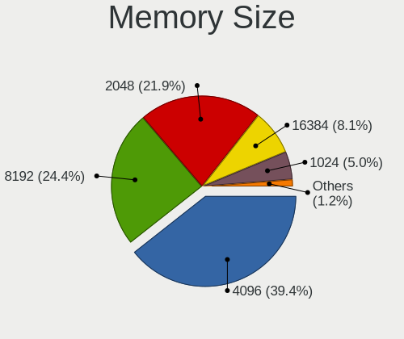

| Size  | Computers | Percent |
|-------|-----------|---------|
| 4096  | 62        | 40.26%  |
| 8192  | 35        | 22.73%  |
| 2048  | 35        | 22.73%  |
| 16384 | 12        | 7.79%   |
| 1024  | 8         | 5.19%   |
| 32768 | 1         | 0.65%   |
| 512   | 1         | 0.65%   |

Memory Speed
------------

Memory module speed

| Speed   | Computers | Percent |
|---------|-----------|---------|
| 1600    | 46        | 28.75%  |
| 1333    | 17        | 10.63%  |
| 2667    | 13        | 8.13%   |
| 1334    | 13        | 8.13%   |
| 2400    | 10        | 6.25%   |
| 800     | 7         | 4.38%   |
| 667     | 7         | 4.38%   |
| Unknown | 7         | 4.38%   |
| 3200    | 5         | 3.13%   |
| 3000    | 4         | 2.5%    |
| 2133    | 4         | 2.5%    |
| 1867    | 3         | 1.88%   |
| 1067    | 3         | 1.88%   |
| 49926   | 2         | 1.25%   |
| 4199    | 2         | 1.25%   |
| 3466    | 2         | 1.25%   |
| 3266    | 2         | 1.25%   |
| 533     | 2         | 1.25%   |
| 333     | 2         | 1.25%   |
| 8400    | 1         | 0.63%   |
| 4267    | 1         | 0.63%   |
| 3600    | 1         | 0.63%   |
| 2666    | 1         | 0.63%   |
| 2048    | 1         | 0.63%   |
| 1777    | 1         | 0.63%   |
| 1639    | 1         | 0.63%   |
| 400     | 1         | 0.63%   |
| 200     | 1         | 0.63%   |

Printers & scanners
-------------------

Printer Vendor
--------------

Printer device vendors

| Vendor          | Computers | Percent |
|-----------------|-----------|---------|
| Seiko Epson     | 1         | 33.33%  |
| Konica Minolta  | 1         | 33.33%  |
| Hewlett-Packard | 1         | 33.33%  |

Printer Model
-------------

Printer device models

| Model                   | Computers | Percent |
|-------------------------|-----------|---------|
| Seiko Epson L380 Series | 1         | 33.33%  |
| Konica Minolta 206      | 1         | 33.33%  |
| HP LaserJet M101-M106   | 1         | 33.33%  |

Scanner Vendor
--------------

Scanner device vendors

| Vendor | Computers | Percent |
|--------|-----------|---------|
| Canon  | 2         | 100%    |

Scanner Model
-------------

Scanner device models

| Model                              | Computers | Percent |
|------------------------------------|-----------|---------|
| Canon CanoScan N670U/N676U/LiDE 20 | 1         | 50%     |
| Canon CanoScan LiDE 700F           | 1         | 50%     |

Camera
------

Camera Vendor
-------------

Camera device vendors

| Vendor                                 | Computers | Percent |
|----------------------------------------|-----------|---------|
| Chicony Electronics                    | 17        | 20.48%  |
| Realtek Semiconductor                  | 8         | 9.64%   |
| Microdia                               | 6         | 7.23%   |
| Logitech                               | 6         | 7.23%   |
| Acer                                   | 6         | 7.23%   |
| Sunplus Innovation Technology          | 5         | 6.02%   |
| Cheng Uei Precision Industry (Foxlink) | 5         | 6.02%   |
| Suyin                                  | 4         | 4.82%   |
| Lite-On Technology                     | 3         | 3.61%   |
| Lenovo                                 | 3         | 3.61%   |
| IMC Networks                           | 3         | 3.61%   |
| Z-Star Microelectronics                | 2         | 2.41%   |
| Syntek                                 | 2         | 2.41%   |
| Quanta                                 | 2         | 2.41%   |
| Xiongmai                               | 1         | 1.2%    |
| WaveRider Communications               | 1         | 1.2%    |
| Silicon Motion                         | 1         | 1.2%    |
| Samsung Electronics                    | 1         | 1.2%    |
| Ricoh                                  | 1         | 1.2%    |
| Microsoft                              | 1         | 1.2%    |
| Importek                               | 1         | 1.2%    |
| Huawei Technologies                    | 1         | 1.2%    |
| Generalplus Technology                 | 1         | 1.2%    |
| Cubeternet                             | 1         | 1.2%    |
| Alcor Micro                            | 1         | 1.2%    |

Camera Model
------------

Camera device models

| Model                                                       | Computers | Percent |
|-------------------------------------------------------------|-----------|---------|
| Chicony Integrated Camera                                   | 4         | 4.82%   |
| Syntek EasyCamera                                           | 2         | 2.41%   |
| Suyin 1.3M WebCam (notebook emachines E730, Acer sub-brand) | 2         | 2.41%   |
| Realtek USB2.0 HD UVC WebCam                                | 2         | 2.41%   |
| Realtek Integrated_Webcam_HD                                | 2         | 2.41%   |
| Microdia Integrated Webcam                                  | 2         | 2.41%   |
| Logitech Webcam C200                                        | 2         | 2.41%   |
| Lite-On Integrated Camera                                   | 2         | 2.41%   |
| Lenovo Integrated Webcam [R5U877]                           | 2         | 2.41%   |
| IMC Networks USB2.0 HD UVC WebCam                           | 2         | 2.41%   |
| Chicony USB 2.0 Camera                                      | 2         | 2.41%   |
| Chicony TOSHIBA Web Camera - HD                             | 2         | 2.41%   |
| Chicony HP Truevision HD camera                             | 2         | 2.41%   |
| Chicony HD WebCam                                           | 2         | 2.41%   |
| Z-Star WebCam SCB-1900N                                     | 1         | 1.2%    |
| Z-Star WebCam SC-03FFL11739P                                | 1         | 1.2%    |
| Xiongmai web camera                                         | 1         | 1.2%    |
| WaveRider USB Live camera                                   | 1         | 1.2%    |
| Suyin Acer/HP Integrated Webcam [CN0314]                    | 1         | 1.2%    |
| Suyin 1.3M HD WebCam                                        | 1         | 1.2%    |
| Sunplus Laptop_Integrated_Webcam_FHD                        | 1         | 1.2%    |
| Sunplus Integrated_Webcam_HD                                | 1         | 1.2%    |
| Sunplus HD WebCam                                           | 1         | 1.2%    |
| Sunplus Dell Integrated Webcam                              | 1         | 1.2%    |
| Sunplus ASUS USB2.0 Webcam                                  | 1         | 1.2%    |
| Silicon Motion Silicon Motion Camera                        | 1         | 1.2%    |
| Samsung Galaxy A5 (MTP)                                     | 1         | 1.2%    |
| Ricoh USB2.0 Camera                                         | 1         | 1.2%    |
| Realtek USB2.0 VGA UVC WebCam                               | 1         | 1.2%    |
| Realtek Integrated Webcam                                   | 1         | 1.2%    |
| Realtek HD Webcam - Realtek                                 | 1         | 1.2%    |
| Realtek 2SF001                                              | 1         | 1.2%    |
| Quanta HP Wide Vision HD Camera                             | 1         | 1.2%    |
| Quanta HP 2.0MP High Definition Webcam                      | 1         | 1.2%    |
| Microsoft LifeCam HD-3000                                   | 1         | 1.2%    |
| Microdia USB 2.0 Camera                                     | 1         | 1.2%    |
| Microdia Laptop_Integrated_Webcam_1.3M                      | 1         | 1.2%    |
| Microdia Integrated_Webcam_HD                               | 1         | 1.2%    |
| Microdia HP Integrated Webcam                               | 1         | 1.2%    |
| Logitech Webcam Pro 9000                                    | 1         | 1.2%    |
| Logitech Webcam C270                                        | 1         | 1.2%    |
| Logitech HD Webcam C910                                     | 1         | 1.2%    |
| Logitech B525 HD Webcam                                     | 1         | 1.2%    |
| Lite-On HP Wide Vision FHD Camera                           | 1         | 1.2%    |
| Lenovo UVC Camera                                           | 1         | 1.2%    |
| Importek TOSHIBA Web Camera - HD                            | 1         | 1.2%    |
| IMC Networks USB 2.0 UVC VGA WebCam                         | 1         | 1.2%    |
| Huawei HiCamera                                             | 1         | 1.2%    |
| Generalplus 808 Camera                                      | 1         | 1.2%    |
| Cubeternet GL-UPC822 UVC WebCam                             | 1         | 1.2%    |
| Chicony VGA Webcam                                          | 1         | 1.2%    |
| Chicony USB2.0 0.3M UVC WebCam                              | 1         | 1.2%    |
| Chicony Integrated HP HD Webcam                             | 1         | 1.2%    |
| Chicony HP Webcam [2 MP Macro]                              | 1         | 1.2%    |
| Chicony HP HD Webcam [Fixed]                                | 1         | 1.2%    |
| Cheng Uei Precision Industry (Foxlink) HP Webcam-101        | 1         | 1.2%    |
| Cheng Uei Precision Industry (Foxlink) HP Webcam            | 1         | 1.2%    |
| Cheng Uei Precision Industry (Foxlink) HP TrueVision HD     | 1         | 1.2%    |
| Cheng Uei Precision Industry (Foxlink) HP HD Webcam         | 1         | 1.2%    |
| Cheng Uei Precision Industry (Foxlink) HP HD Camera         | 1         | 1.2%    |

Security
--------

Fingerprint Vendor
------------------

Fingerprint sensor vendors

| Vendor                | Computers | Percent |
|-----------------------|-----------|---------|
| Validity Sensors      | 7         | 41.18%  |
| Upek                  | 4         | 23.53%  |
| Synaptics             | 2         | 11.76%  |
| LighTuning Technology | 2         | 11.76%  |
| Elan Microelectronics | 1         | 5.88%   |
| AuthenTec             | 1         | 5.88%   |

Fingerprint Model
-----------------

Fingerprint sensor models

| Model                                                  | Computers | Percent |
|--------------------------------------------------------|-----------|---------|
| Upek Biometric Touchchip/Touchstrip Fingerprint Sensor | 3         | 17.65%  |
| Validity Sensors VFS471 Fingerprint Reader             | 2         | 11.76%  |
| Validity Sensors VFS5011 Fingerprint Reader            | 1         | 5.88%   |
| Validity Sensors VFS495 Fingerprint Reader             | 1         | 5.88%   |
| Validity Sensors VFS451 Fingerprint Reader             | 1         | 5.88%   |
| Validity Sensors Synaptics WBDI                        | 1         | 5.88%   |
| Validity Sensors Fingerprint scanner                   | 1         | 5.88%   |
| Upek TCS5B Fingerprint sensor                          | 1         | 5.88%   |
| Synaptics Metallica MOH Touch Fingerprint Reader       | 1         | 5.88%   |
| LighTuning Fingerprint Reader                          | 1         | 5.88%   |
| LighTuning EgisTec Touch Fingerprint Sensor            | 1         | 5.88%   |
| Elan ELAN:Fingerprint                                  | 1         | 5.88%   |
| AuthenTec AES2810                                      | 1         | 5.88%   |
| Unknown                                                | 1         | 5.88%   |

Chipcard Vendor
---------------

Chipcard module vendors

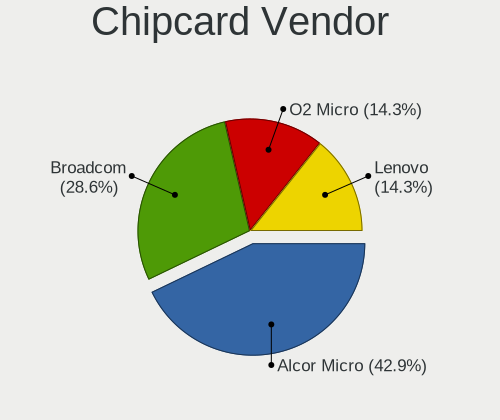

| Vendor      | Computers | Percent |
|-------------|-----------|---------|
| Alcor Micro | 3         | 50%     |
| O2 Micro    | 1         | 16.67%  |
| Lenovo      | 1         | 16.67%  |
| Broadcom    | 1         | 16.67%  |

Chipcard Model
--------------

Chipcard module models

| Model                                                                        | Computers | Percent |
|------------------------------------------------------------------------------|-----------|---------|
| Alcor Micro AU9540 Smartcard Reader                                          | 3         | 50%     |
| O2 Micro Oz776 SmartCard Reader                                              | 1         | 16.67%  |
| Lenovo Integrated Smart Card Reader                                          | 1         | 16.67%  |
| Broadcom BCM5880 Secure Applications Processor with fingerprint swipe sensor | 1         | 16.67%  |

Unsupported
-----------

Unsupported Devices
-------------------

Total unsupported devices on board

| Total | Computers | Percent |
|-------|-----------|---------|
| 0     | 97        | 70.29%  |
| 1     | 31        | 22.46%  |
| 2     | 7         | 5.07%   |
| 3     | 3         | 2.17%   |

Unsupported Device Types
------------------------

Types of unsupported devices

| Type                     | Computers | Percent |
|--------------------------|-----------|---------|
| Graphics card            | 17        | 32.08%  |
| Fingerprint reader       | 17        | 32.08%  |
| Chipcard                 | 5         | 9.43%   |
| Storage                  | 3         | 5.66%   |
| Net/wireless             | 3         | 5.66%   |
| Multimedia controller    | 3         | 5.66%   |
| Communication controller | 3         | 5.66%   |
| Camera                   | 1         | 1.89%   |
| Bluetooth                | 1         | 1.89%   |

