MX 19 - Tested Hardware & Statistics
------------------------------------

A project to collect tested hardware configurations for MX 19.

Anyone can contribute to this report by the [hw-probe](https://github.com/linuxhw/hw-probe) tool:

    sudo -E hw-probe -all -upload

Please submit a probe of your configuration if it's not presented on the page or is rare.

This is a report for all computer types. See also reports for [desktops](/Dist/MX_19/Desktop/README.md) and [notebooks](/Dist/MX_19/Notebook/README.md).

Full-feature report is available here: https://linux-hardware.org/?view=trends&rel=mx-19

Contents
--------

* [ Test Cases ](#test-cases)

* [ System ](#system)
  - [ Kernel                   ](#kernel)
  - [ Kernel Family            ](#kernel-family)
  - [ Kernel Major Ver.        ](#kernel-major-ver)
  - [ Arch                     ](#arch)
  - [ DE                       ](#de)
  - [ Display Server           ](#display-server)
  - [ Display Manager          ](#display-manager)
  - [ OS Lang                  ](#os-lang)
  - [ Boot Mode                ](#boot-mode)
  - [ Filesystem               ](#filesystem)
  - [ Part. scheme             ](#part-scheme)
  - [ Dual Boot with Linux/BSD ](#dual-boot-with-linuxbsd)
  - [ Dual Boot (Win)          ](#dual-boot-win)

* [ Board ](#board)
  - [ Vendor                   ](#vendor)
  - [ Model                    ](#model)
  - [ Model Family             ](#model-family)
  - [ MFG Year                 ](#mfg-year)
  - [ Form Factor              ](#form-factor)
  - [ Secure Boot              ](#secure-boot)
  - [ Coreboot                 ](#coreboot)
  - [ RAM Size                 ](#ram-size)
  - [ RAM Used                 ](#ram-used)
  - [ Total Drives             ](#total-drives)
  - [ Has CD-ROM               ](#has-cd-rom)
  - [ Has Ethernet             ](#has-ethernet)
  - [ Has WiFi                 ](#has-wifi)
  - [ Has Bluetooth            ](#has-bluetooth)

* [ Location ](#location)
  - [ Country                  ](#country)
  - [ City                     ](#city)

* [ Drives ](#drives)
  - [ Drive Vendor             ](#drive-vendor)
  - [ Drive Model              ](#drive-model)
  - [ HDD Vendor               ](#hdd-vendor)
  - [ SSD Vendor               ](#ssd-vendor)
  - [ Drive Kind               ](#drive-kind)
  - [ Drive Connector          ](#drive-connector)
  - [ Drive Size               ](#drive-size)
  - [ Space Total              ](#space-total)
  - [ Space Used               ](#space-used)
  - [ Malfunc. Drives          ](#malfunc-drives)
  - [ Malfunc. Drive Vendor    ](#malfunc-drive-vendor)
  - [ Malfunc. HDD Vendor      ](#malfunc-hdd-vendor)
  - [ Malfunc. Drive Kind      ](#malfunc-drive-kind)
  - [ Failed Drives            ](#failed-drives)
  - [ Failed Drive Vendor      ](#failed-drive-vendor)
  - [ Drive Status             ](#drive-status)

* [ Storage controller ](#storage-controller)
  - [ Storage Vendor           ](#storage-vendor)
  - [ Storage Model            ](#storage-model)
  - [ Storage Kind             ](#storage-kind)

* [ Processor ](#processor)
  - [ CPU Vendor               ](#cpu-vendor)
  - [ CPU Model                ](#cpu-model)
  - [ CPU Model Family         ](#cpu-model-family)
  - [ CPU Cores                ](#cpu-cores)
  - [ CPU Sockets              ](#cpu-sockets)
  - [ CPU Threads              ](#cpu-threads)
  - [ CPU Op-Modes             ](#cpu-op-modes)
  - [ CPU Microcode            ](#cpu-microcode)
  - [ CPU Microarch            ](#cpu-microarch)

* [ Graphics ](#graphics)
  - [ GPU Vendor               ](#gpu-vendor)
  - [ GPU Model                ](#gpu-model)
  - [ GPU Combo                ](#gpu-combo)
  - [ GPU Driver               ](#gpu-driver)
  - [ GPU Memory               ](#gpu-memory)

* [ Monitor ](#monitor)
  - [ Monitor Vendor           ](#monitor-vendor)
  - [ Monitor Model            ](#monitor-model)
  - [ Monitor Resolution       ](#monitor-resolution)
  - [ Monitor Diagonal         ](#monitor-diagonal)
  - [ Monitor Width            ](#monitor-width)
  - [ Aspect Ratio             ](#aspect-ratio)
  - [ Monitor Area             ](#monitor-area)
  - [ Pixel Density            ](#pixel-density)
  - [ Multiple Monitors        ](#multiple-monitors)

* [ Network ](#network)
  - [ Net Controller Vendor    ](#net-controller-vendor)
  - [ Net Controller Model     ](#net-controller-model)
  - [ Wireless Vendor          ](#wireless-vendor)
  - [ Wireless Model           ](#wireless-model)
  - [ Ethernet Vendor          ](#ethernet-vendor)
  - [ Ethernet Model           ](#ethernet-model)
  - [ Net Controller Kind      ](#net-controller-kind)
  - [ Used Controller          ](#used-controller)
  - [ NICs                     ](#nics)
  - [ IPv6                     ](#ipv6)

* [ Bluetooth ](#bluetooth)
  - [ Bluetooth Vendor         ](#bluetooth-vendor)
  - [ Bluetooth Model          ](#bluetooth-model)

* [ Sound ](#sound)
  - [ Sound Vendor             ](#sound-vendor)
  - [ Sound Model              ](#sound-model)

* [ Memory ](#memory)
  - [ Memory Vendor            ](#memory-vendor)
  - [ Memory Model             ](#memory-model)
  - [ Memory Kind              ](#memory-kind)
  - [ Memory Form Factor       ](#memory-form-factor)
  - [ Memory Size              ](#memory-size)
  - [ Memory Speed             ](#memory-speed)

* [ Printers & scanners ](#printers--scanners)
  - [ Printer Vendor           ](#printer-vendor)
  - [ Printer Model            ](#printer-model)
  - [ Scanner Vendor           ](#scanner-vendor)
  - [ Scanner Model            ](#scanner-model)

* [ Camera ](#camera)
  - [ Camera Vendor            ](#camera-vendor)
  - [ Camera Model             ](#camera-model)

* [ Security ](#security)
  - [ Fingerprint Vendor       ](#fingerprint-vendor)
  - [ Fingerprint Model        ](#fingerprint-model)
  - [ Chipcard Vendor          ](#chipcard-vendor)
  - [ Chipcard Model           ](#chipcard-model)

* [ Unsupported ](#unsupported)
  - [ Unsupported Devices      ](#unsupported-devices)
  - [ Unsupported Device Types ](#unsupported-device-types)

Test Cases
----------

| Vendor        | Model                       | Form-Factor | Probe                                                      | Date         |
|---------------|-----------------------------|-------------|------------------------------------------------------------|--------------|
| Dell          | Latitude 3190               | Notebook    | [6a71754838](https://linux-hardware.org/?probe=6a71754838) | Sep 27, 2021 |
| Dell          | 0M017G A00                  | Desktop     | [2bf98ef81c](https://linux-hardware.org/?probe=2bf98ef81c) | Sep 24, 2021 |
| Dell          | Latitude 3190               | Notebook    | [c5f29e40e9](https://linux-hardware.org/?probe=c5f29e40e9) | Sep 20, 2021 |
| ASUSTek       | TUF Gaming FA706IU_FA706... | Notebook    | [8c1a085f29](https://linux-hardware.org/?probe=8c1a085f29) | Sep 20, 2021 |
| Dell          | Latitude 3190               | Notebook    | [91b5632082](https://linux-hardware.org/?probe=91b5632082) | Sep 13, 2021 |
| GTZS          | Unknown                     | Notebook    | [3df799f341](https://linux-hardware.org/?probe=3df799f341) | Sep 05, 2021 |
| Acer          | Aspire V3-371               | Notebook    | [ddd7b7b87f](https://linux-hardware.org/?probe=ddd7b7b87f) | Sep 02, 2021 |
| Acer          | Aspire V3-371               | Notebook    | [16c3c01bcd](https://linux-hardware.org/?probe=16c3c01bcd) | Sep 02, 2021 |
| Dell          | Latitude 3190               | Notebook    | [76feb70b2f](https://linux-hardware.org/?probe=76feb70b2f) | Aug 30, 2021 |
| Dell          | Latitude 3190               | Notebook    | [bf62dc4914](https://linux-hardware.org/?probe=bf62dc4914) | Aug 23, 2021 |
| Dell          | 0P611C A00                  | Desktop     | [eadaa5e6cb](https://linux-hardware.org/?probe=eadaa5e6cb) | Aug 20, 2021 |
| Dell          | Latitude 3190               | Notebook    | [1b11784345](https://linux-hardware.org/?probe=1b11784345) | Aug 16, 2021 |
| Pixus         | Rise                        | Notebook    | [4479b88c1c](https://linux-hardware.org/?probe=4479b88c1c) | Aug 12, 2021 |
| Acer          | TravelMate 5360             | Notebook    | [f444dec794](https://linux-hardware.org/?probe=f444dec794) | Aug 12, 2021 |
| Dell          | Latitude 3190               | Notebook    | [bbef2b9d97](https://linux-hardware.org/?probe=bbef2b9d97) | Aug 09, 2021 |
| Apple         | Mac-F2238BAE iMac11,3       | All in one  | [6949bed845](https://linux-hardware.org/?probe=6949bed845) | Aug 05, 2021 |
| ASUSTek       | T102HA                      | Tablet      | [e94701caeb](https://linux-hardware.org/?probe=e94701caeb) | Aug 03, 2021 |
| Dell          | Latitude 3190               | Notebook    | [61b56c3bd9](https://linux-hardware.org/?probe=61b56c3bd9) | Aug 02, 2021 |
| Lenovo        | ThinkPad T420 4236MBU       | Notebook    | [7e0b868c64](https://linux-hardware.org/?probe=7e0b868c64) | Jul 29, 2021 |
| Dell          | Latitude 3190               | Notebook    | [520fb53552](https://linux-hardware.org/?probe=520fb53552) | Jul 26, 2021 |
| ASUSTek       | X79-DELUXE                  | Desktop     | [bc56fe50dd](https://linux-hardware.org/?probe=bc56fe50dd) | Jul 24, 2021 |
| Acer          | Aspire E5-574G              | Notebook    | [b09280946d](https://linux-hardware.org/?probe=b09280946d) | Jul 21, 2021 |
| Dell          | Latitude 3190               | Notebook    | [dc44dffece](https://linux-hardware.org/?probe=dc44dffece) | Jul 19, 2021 |
| Dell          | Vostro 5515                 | Notebook    | [f4ae054fc8](https://linux-hardware.org/?probe=f4ae054fc8) | Jul 15, 2021 |
| Dell          | Latitude 3190               | Notebook    | [701b0f5439](https://linux-hardware.org/?probe=701b0f5439) | Jul 12, 2021 |
| Dell          | Latitude 3190               | Notebook    | [6ca8a34d23](https://linux-hardware.org/?probe=6ca8a34d23) | Jul 05, 2021 |
| Dell          | Latitude 3190               | Notebook    | [ec46d1beb2](https://linux-hardware.org/?probe=ec46d1beb2) | Jun 28, 2021 |
| Dell          | Latitude 3190               | Notebook    | [c4cdd3a43c](https://linux-hardware.org/?probe=c4cdd3a43c) | Jun 21, 2021 |
| Dell          | Latitude 3190               | Notebook    | [5a6254c4af](https://linux-hardware.org/?probe=5a6254c4af) | Jun 14, 2021 |
| Medion        | P6669 MD60147               | Notebook    | [3ed80daa7b](https://linux-hardware.org/?probe=3ed80daa7b) | Jun 10, 2021 |
| Dell          | Latitude 3190               | Notebook    | [e96a8c3e76](https://linux-hardware.org/?probe=e96a8c3e76) | Jun 07, 2021 |
| Dell          | Latitude 3190               | Notebook    | [7bdec3eb56](https://linux-hardware.org/?probe=7bdec3eb56) | May 31, 2021 |
| Dell          | Vostro 3460                 | Notebook    | [da200f9e64](https://linux-hardware.org/?probe=da200f9e64) | May 29, 2021 |
| Medion        | E6234                       | Notebook    | [313ec752ab](https://linux-hardware.org/?probe=313ec752ab) | May 24, 2021 |
| Dell          | Latitude 3190               | Notebook    | [8918c312ff](https://linux-hardware.org/?probe=8918c312ff) | May 24, 2021 |
| HP            | Stream Laptop 14-cb0XX      | Notebook    | [4ed89e1092](https://linux-hardware.org/?probe=4ed89e1092) | May 22, 2021 |
| HP            | Stream Laptop 14-cb0XX      | Notebook    | [57a69c7c0d](https://linux-hardware.org/?probe=57a69c7c0d) | May 20, 2021 |
| HP            | Mini 110-3500               | Notebook    | [f94c828225](https://linux-hardware.org/?probe=f94c828225) | May 19, 2021 |
| ASUSTek       | N56VZ                       | Notebook    | [c69cd5aceb](https://linux-hardware.org/?probe=c69cd5aceb) | May 18, 2021 |
| Dell          | Latitude 3190               | Notebook    | [5ffc389a2a](https://linux-hardware.org/?probe=5ffc389a2a) | May 17, 2021 |
| Intel         | DZ77SL-50K AAG55115-300     | Desktop     | [bae9a4e960](https://linux-hardware.org/?probe=bae9a4e960) | May 16, 2021 |
| Dell          | Latitude 3190               | Notebook    | [4eeed413e6](https://linux-hardware.org/?probe=4eeed413e6) | May 10, 2021 |
| Dell          | Latitude 3190               | Notebook    | [5caeaa658b](https://linux-hardware.org/?probe=5caeaa658b) | May 03, 2021 |
| Dell          | Latitude 3190               | Notebook    | [a046e7b3f8](https://linux-hardware.org/?probe=a046e7b3f8) | Apr 26, 2021 |
| Acer          | Extensa 5620                | Notebook    | [a06636ba79](https://linux-hardware.org/?probe=a06636ba79) | Apr 24, 2021 |
| Dell          | 0UW744??????                | Notebook    | [32c3521a2e](https://linux-hardware.org/?probe=32c3521a2e) | Apr 22, 2021 |
| Dell          | Latitude 3190               | Notebook    | [c94ccb949b](https://linux-hardware.org/?probe=c94ccb949b) | Apr 19, 2021 |
| Intel         | ChiefRiver                  | Notebook    | [5e0db0f704](https://linux-hardware.org/?probe=5e0db0f704) | Apr 14, 2021 |
| eMachines     | E727                        | Notebook    | [048da4f23b](https://linux-hardware.org/?probe=048da4f23b) | Apr 12, 2021 |
| Dell          | Latitude 3190               | Notebook    | [d0e46bf61f](https://linux-hardware.org/?probe=d0e46bf61f) | Apr 12, 2021 |
| MSI           | MPG B550 GAMING PLUS        | Desktop     | [4959cfd244](https://linux-hardware.org/?probe=4959cfd244) | Apr 07, 2021 |
| ASUSTek       | 1025C                       | Notebook    | [33d6531353](https://linux-hardware.org/?probe=33d6531353) | Apr 06, 2021 |
| Dell          | Latitude 3190               | Notebook    | [2ff832079d](https://linux-hardware.org/?probe=2ff832079d) | Apr 05, 2021 |
| ASUSTek       | TUF B450-PRO GAMING         | Desktop     | [8d8771e1ef](https://linux-hardware.org/?probe=8d8771e1ef) | Mar 30, 2021 |
| Dell          | Latitude 3190               | Notebook    | [3afafda719](https://linux-hardware.org/?probe=3afafda719) | Mar 29, 2021 |
| Dell          | Latitude 3190               | Notebook    | [d00e8dc9e8](https://linux-hardware.org/?probe=d00e8dc9e8) | Mar 22, 2021 |
| MSI           | B350 TOMAHAWK               | Desktop     | [d77d6984e4](https://linux-hardware.org/?probe=d77d6984e4) | Mar 19, 2021 |
| Dell          | Latitude 3190               | Notebook    | [83f4f1e1f1](https://linux-hardware.org/?probe=83f4f1e1f1) | Mar 15, 2021 |
| ZOTAC         | ZBOX-BI320                  | Mini pc     | [dcc5bdef7d](https://linux-hardware.org/?probe=dcc5bdef7d) | Mar 12, 2021 |
| Dell          | Latitude E5470              | Notebook    | [064cf2bccd](https://linux-hardware.org/?probe=064cf2bccd) | Mar 11, 2021 |
| Toshiba       | PORTEGE R705                | Notebook    | [f537f51a95](https://linux-hardware.org/?probe=f537f51a95) | Mar 09, 2021 |
| Dell          | Latitude 3190               | Notebook    | [8bb5c10a3c](https://linux-hardware.org/?probe=8bb5c10a3c) | Mar 08, 2021 |
| HP            | Notebook                    | Notebook    | [113644885d](https://linux-hardware.org/?probe=113644885d) | Mar 04, 2021 |
| Acer          | AOD255                      | Notebook    | [f8501e519f](https://linux-hardware.org/?probe=f8501e519f) | Mar 03, 2021 |
| Dell          | Latitude 3190               | Notebook    | [fb4469e67a](https://linux-hardware.org/?probe=fb4469e67a) | Mar 01, 2021 |
| Google        | Gnawty                      | Notebook    | [252bc4cb46](https://linux-hardware.org/?probe=252bc4cb46) | Feb 25, 2021 |
| Dell          | Latitude D430               | Notebook    | [63906404d0](https://linux-hardware.org/?probe=63906404d0) | Feb 25, 2021 |
| ASUSTek       | X200CA                      | Notebook    | [2817beb96d](https://linux-hardware.org/?probe=2817beb96d) | Feb 25, 2021 |
| ASRock        | H81M-ITX                    | Desktop     | [d58331ce9b](https://linux-hardware.org/?probe=d58331ce9b) | Feb 23, 2021 |
| ASUSTek       | M2N-MX SE Plus              | Desktop     | [94f0202173](https://linux-hardware.org/?probe=94f0202173) | Feb 23, 2021 |
| ASRock        | K8A780LM                    | Desktop     | [6543fc448e](https://linux-hardware.org/?probe=6543fc448e) | Feb 23, 2021 |
| ASRock        | K8A780LM                    | Desktop     | [2340ea8f96](https://linux-hardware.org/?probe=2340ea8f96) | Feb 23, 2021 |
| ASRock        | K8A780LM                    | Desktop     | [ce0076fd09](https://linux-hardware.org/?probe=ce0076fd09) | Feb 23, 2021 |
| HP            | Pavilion g6                 | Notebook    | [f23e85a87a](https://linux-hardware.org/?probe=f23e85a87a) | Feb 23, 2021 |
| Google        | Gnawty                      | Notebook    | [7614a9a19c](https://linux-hardware.org/?probe=7614a9a19c) | Feb 23, 2021 |
| Dell          | Latitude 3190               | Notebook    | [6708c8b87a](https://linux-hardware.org/?probe=6708c8b87a) | Feb 22, 2021 |
| Samsung       | 305E4A/305E5A/305E7A        | Notebook    | [6f34bc4f67](https://linux-hardware.org/?probe=6f34bc4f67) | Feb 19, 2021 |
| Medion        | E1235T MD99743              | Tablet      | [314aa4d200](https://linux-hardware.org/?probe=314aa4d200) | Feb 18, 2021 |
| Lenovo        | IdeaPad 310-15ISK 80SM      | Notebook    | [7552dacfb9](https://linux-hardware.org/?probe=7552dacfb9) | Feb 17, 2021 |
| Google        | Gnawty                      | Notebook    | [2983bbfda3](https://linux-hardware.org/?probe=2983bbfda3) | Feb 11, 2021 |
| HP            | 15                          | Notebook    | [437cb08f68](https://linux-hardware.org/?probe=437cb08f68) | Feb 08, 2021 |
| Google        | Gnawty                      | Notebook    | [ee5279728d](https://linux-hardware.org/?probe=ee5279728d) | Feb 04, 2021 |
| Lenovo        | ThinkPad T440p 20AWA1NAU... | Notebook    | [b6ebe98655](https://linux-hardware.org/?probe=b6ebe98655) | Feb 01, 2021 |
| HP            | ProBook 650 G1              | Notebook    | [9021b90504](https://linux-hardware.org/?probe=9021b90504) | Jan 22, 2021 |
| ASUSTek       | ZenBook UX425EA_UX425EA     | Notebook    | [a147ddbe9d](https://linux-hardware.org/?probe=a147ddbe9d) | Jan 20, 2021 |
| HP            | Pavilion g6                 | Notebook    | [c4b4831246](https://linux-hardware.org/?probe=c4b4831246) | Jan 15, 2021 |
| Fujitsu Si... | ESPRIMO Mobile D9500        | Notebook    | [989e87e18e](https://linux-hardware.org/?probe=989e87e18e) | Jan 15, 2021 |
| ASRock        | K8A780LM                    | Desktop     | [2e54aedb9e](https://linux-hardware.org/?probe=2e54aedb9e) | Jan 14, 2021 |
| Dell          | Latitude D430               | Notebook    | [874d8f3925](https://linux-hardware.org/?probe=874d8f3925) | Jan 14, 2021 |
| ASRock        | H81M-ITX                    | Desktop     | [50e5d36672](https://linux-hardware.org/?probe=50e5d36672) | Jan 14, 2021 |
| ASRock        | K8A780LM                    | Desktop     | [ba37404fee](https://linux-hardware.org/?probe=ba37404fee) | Jan 14, 2021 |
| ASUSTek       | M2N-MX SE Plus              | Desktop     | [f6a8e9eaf5](https://linux-hardware.org/?probe=f6a8e9eaf5) | Jan 14, 2021 |
| Dell          | Latitude E5520              | Notebook    | [1d46b26326](https://linux-hardware.org/?probe=1d46b26326) | Jan 03, 2021 |
| HP            | Presario CQ57               | Notebook    | [351ae067b6](https://linux-hardware.org/?probe=351ae067b6) | Dec 31, 2020 |
| HP            | Presario CQ57               | Notebook    | [16a2a0af55](https://linux-hardware.org/?probe=16a2a0af55) | Dec 31, 2020 |
| HP            | Presario CQ57               | Notebook    | [63b31db6e7](https://linux-hardware.org/?probe=63b31db6e7) | Dec 30, 2020 |
| HP            | Presario CQ57               | Notebook    | [94b74045cc](https://linux-hardware.org/?probe=94b74045cc) | Dec 30, 2020 |
| Acer          | Aspire ES1-511              | Notebook    | [7f351d7c49](https://linux-hardware.org/?probe=7f351d7c49) | Dec 30, 2020 |
| HP            | Spectre x2 Detachable 12... | Tablet      | [98c8e4f3a6](https://linux-hardware.org/?probe=98c8e4f3a6) | Dec 20, 2020 |
| Lenovo        | ThinkPad X270 W10DG 20K5... | Notebook    | [5de3914984](https://linux-hardware.org/?probe=5de3914984) | Dec 15, 2020 |
| Lenovo        | V145-15AST 81MT             | Notebook    | [ebb2dc7bff](https://linux-hardware.org/?probe=ebb2dc7bff) | Dec 15, 2020 |
| Lenovo        | V145-15AST 81MT             | Notebook    | [5b5f1330c5](https://linux-hardware.org/?probe=5b5f1330c5) | Dec 13, 2020 |
| HP            | Spectre x2 Detachable 12... | Tablet      | [5783b64146](https://linux-hardware.org/?probe=5783b64146) | Dec 11, 2020 |
| Lenovo        | ThinkPad X220 4291WMQ       | Notebook    | [165b895e27](https://linux-hardware.org/?probe=165b895e27) | Dec 01, 2020 |
| Intel         | MAHOBAY                     | Desktop     | [d3e3aa3011](https://linux-hardware.org/?probe=d3e3aa3011) | Nov 28, 2020 |
| Intel         | MAHOBAY                     | Desktop     | [b51d9808ea](https://linux-hardware.org/?probe=b51d9808ea) | Nov 28, 2020 |
| ASUSTek       | ROG STRIX B550-F GAMING     | Desktop     | [b7fec4788f](https://linux-hardware.org/?probe=b7fec4788f) | Nov 25, 2020 |
| ASUSTek       | PRIME B450M-A               | Desktop     | [d4f8648d28](https://linux-hardware.org/?probe=d4f8648d28) | Nov 24, 2020 |
| Intel         | MAHOBAY                     | Desktop     | [282590eccb](https://linux-hardware.org/?probe=282590eccb) | Nov 24, 2020 |
| Toshiba       | Satellite A300              | Notebook    | [309a3f69e8](https://linux-hardware.org/?probe=309a3f69e8) | Nov 16, 2020 |
| ASRock        | H110M-ITX                   | Desktop     | [e3ca7996d2](https://linux-hardware.org/?probe=e3ca7996d2) | Nov 13, 2020 |
| Lenovo        | ThinkPad T410 2537G99       | Notebook    | [554dfc3cfe](https://linux-hardware.org/?probe=554dfc3cfe) | Nov 12, 2020 |
| Lenovo        | ThinkPad T410 2537G99       | Notebook    | [2dc30b7928](https://linux-hardware.org/?probe=2dc30b7928) | Nov 12, 2020 |
| ASUSTek       | PRIME B450M-A               | Desktop     | [a7bb20fa67](https://linux-hardware.org/?probe=a7bb20fa67) | Nov 08, 2020 |
| Lenovo        | ThinkPad X270 W10DG 20K5... | Notebook    | [fe6cbf555a](https://linux-hardware.org/?probe=fe6cbf555a) | Nov 08, 2020 |
| Dell          | Inspiron 14-3452            | Notebook    | [96e87a665b](https://linux-hardware.org/?probe=96e87a665b) | Nov 01, 2020 |
| Dell          | 0D28YY A00                  | Desktop     | [584335af3e](https://linux-hardware.org/?probe=584335af3e) | Oct 29, 2020 |
| Acer          | Aspire SW5-015              | Notebook    | [b125bdb89e](https://linux-hardware.org/?probe=b125bdb89e) | Oct 07, 2020 |
| Lenovo        | V145-15AST 81MT             | Notebook    | [7155397289](https://linux-hardware.org/?probe=7155397289) | Oct 03, 2020 |
| Hometech      | Wi11T                       | Tablet      | [78d63aeadc](https://linux-hardware.org/?probe=78d63aeadc) | Sep 30, 2020 |
| Dell          | 0M9KCM A02                  | Desktop     | [3e66c830f8](https://linux-hardware.org/?probe=3e66c830f8) | Sep 22, 2020 |
| Gigabyte      | B450M DS3H-CF               | Desktop     | [a2151aadf5](https://linux-hardware.org/?probe=a2151aadf5) | Sep 14, 2020 |
| HP            | 838B 0100                   | All in one  | [c3133d1a1c](https://linux-hardware.org/?probe=c3133d1a1c) | Sep 09, 2020 |
| HP            | 8265                        | Desktop     | [38f924e8f9](https://linux-hardware.org/?probe=38f924e8f9) | Sep 07, 2020 |
| HP            | ZBook 15 G4                 | Notebook    | [c36d170750](https://linux-hardware.org/?probe=c36d170750) | Aug 27, 2020 |
| HP            | ZBook 15 G4                 | Notebook    | [00d13faf2a](https://linux-hardware.org/?probe=00d13faf2a) | Aug 27, 2020 |
| Acer          | Aspire 7520                 | Notebook    | [d878dbb71e](https://linux-hardware.org/?probe=d878dbb71e) | Aug 13, 2020 |
| Dell          | 0M5DCD A00                  | Desktop     | [f138fd7e0c](https://linux-hardware.org/?probe=f138fd7e0c) | Aug 09, 2020 |
| ASUSTek       | PRIME H310M-R R2.0          | Desktop     | [2f71e9b242](https://linux-hardware.org/?probe=2f71e9b242) | Aug 03, 2020 |
| HP            | 3031h                       | Desktop     | [205dd10b09](https://linux-hardware.org/?probe=205dd10b09) | Jul 29, 2020 |
| HP            | 3031h                       | Desktop     | [22ebc88fac](https://linux-hardware.org/?probe=22ebc88fac) | Jul 29, 2020 |
| HP            | Pavilion dv7                | Notebook    | [3494105666](https://linux-hardware.org/?probe=3494105666) | Jul 28, 2020 |
| ASUSTek       | TUF Gaming FA706IU_TUF70... | Notebook    | [c0d166e020](https://linux-hardware.org/?probe=c0d166e020) | Jul 27, 2020 |
| Fujitsu Si... | D2312-A3 S26361-D2312-A3    | Desktop     | [2233b1466b](https://linux-hardware.org/?probe=2233b1466b) | Jul 06, 2020 |
| Fujitsu Si... | D2312-A3 S26361-D2312-A3    | Desktop     | [c70f8ee92e](https://linux-hardware.org/?probe=c70f8ee92e) | Jul 06, 2020 |
| Sony          | VPCF23P1E                   | Notebook    | [2e0915f8a9](https://linux-hardware.org/?probe=2e0915f8a9) | Jun 18, 2020 |
| HP            | Pavilion Laptop 15-cw0xx... | Notebook    | [b93dafce99](https://linux-hardware.org/?probe=b93dafce99) | Jun 09, 2020 |
| Lenovo        | ThinkPad X250 20CLS4YA00    | Notebook    | [72150af905](https://linux-hardware.org/?probe=72150af905) | Jun 06, 2020 |
| ASUSTek       | X540UP                      | Notebook    | [2ec9f9c770](https://linux-hardware.org/?probe=2ec9f9c770) | Jun 05, 2020 |
| MSI           | 970A-G43                    | Desktop     | [ada20a047e](https://linux-hardware.org/?probe=ada20a047e) | May 27, 2020 |
| Lenovo        | ThinkPad E490 20N9S26G00    | Notebook    | [a26e5790ce](https://linux-hardware.org/?probe=a26e5790ce) | May 06, 2020 |
| Gigabyte      | GA-880GM-UD2H               | Desktop     | [a7d4e8b1e4](https://linux-hardware.org/?probe=a7d4e8b1e4) | Apr 10, 2020 |
| Samsung       | R780/R778                   | Notebook    | [eb0bb63c6d](https://linux-hardware.org/?probe=eb0bb63c6d) | Apr 09, 2020 |
| Intel         | DCP847SKE G80890-105        | Desktop     | [0357ef50d4](https://linux-hardware.org/?probe=0357ef50d4) | Apr 05, 2020 |
| Gigabyte      | A320M-DS2-CF                | Desktop     | [27d1900fba](https://linux-hardware.org/?probe=27d1900fba) | Mar 28, 2020 |
| Gigabyte      | Z68AP-D3                    | Desktop     | [617031b37d](https://linux-hardware.org/?probe=617031b37d) | Mar 28, 2020 |
| Clevo         | P150HMx                     | Notebook    | [196b689717](https://linux-hardware.org/?probe=196b689717) | Mar 27, 2020 |
| ASRock        | Z68 Pro3-M                  | Desktop     | [73690787f9](https://linux-hardware.org/?probe=73690787f9) | Mar 26, 2020 |
| Dell          | Latitude E7440              | Notebook    | [c6fe81343e](https://linux-hardware.org/?probe=c6fe81343e) | Mar 26, 2020 |
| Dell          | 0F373D A00                  | Desktop     | [2155b32aa1](https://linux-hardware.org/?probe=2155b32aa1) | Mar 25, 2020 |
| Dell          | Inspiron 13-5378            | Notebook    | [242a7e4fdc](https://linux-hardware.org/?probe=242a7e4fdc) | Mar 24, 2020 |
| Clevo         | P150HMx                     | Notebook    | [8f9823569b](https://linux-hardware.org/?probe=8f9823569b) | Mar 24, 2020 |
| Dell          | Inspiron N5010              | Notebook    | [8654fde26b](https://linux-hardware.org/?probe=8654fde26b) | Mar 24, 2020 |
| Dell          | Latitude 3190               | Notebook    | [1bab98d664](https://linux-hardware.org/?probe=1bab98d664) | Mar 20, 2020 |
| HP            | EliteBook 8560p             | Notebook    | [e5925f1349](https://linux-hardware.org/?probe=e5925f1349) | Mar 07, 2020 |
| Intel         | NUC8i7HVB J68196-504        | Mini pc     | [296f21e934](https://linux-hardware.org/?probe=296f21e934) | Mar 03, 2020 |
| Acer          | Aspire 8943G                | Notebook    | [f8e194e907](https://linux-hardware.org/?probe=f8e194e907) | Mar 01, 2020 |
| ASUSTek       | M4A77T                      | Desktop     | [75d0b42f08](https://linux-hardware.org/?probe=75d0b42f08) | Mar 01, 2020 |
| Lenovo        | ThinkPad T440p 20AWS2T11... | Notebook    | [9c888bfdde](https://linux-hardware.org/?probe=9c888bfdde) | Feb 11, 2020 |
| Lenovo        | ThinkPad X201 3680MY9       | Notebook    | [26a7c0e493](https://linux-hardware.org/?probe=26a7c0e493) | Feb 09, 2020 |
| Google        | Gnawty                      | Notebook    | [4a2e211ce1](https://linux-hardware.org/?probe=4a2e211ce1) | Feb 08, 2020 |
| Lenovo        | ThinkPad W510 4875W17       | Notebook    | [8865e9546b](https://linux-hardware.org/?probe=8865e9546b) | Feb 03, 2020 |
| Lenovo        | ThinkPad W510 4875W17       | Notebook    | [f4779c95ce](https://linux-hardware.org/?probe=f4779c95ce) | Feb 03, 2020 |
| ASUSTek       | PRIME H310M-K               | Desktop     | [ed464b4172](https://linux-hardware.org/?probe=ed464b4172) | Jan 23, 2020 |
| Intel         | NUC8i7HVB J68196-504        | Mini pc     | [f703814098](https://linux-hardware.org/?probe=f703814098) | Jan 23, 2020 |
| Intel         | NUC8i7HVB J68196-504        | Mini pc     | [3c0686b801](https://linux-hardware.org/?probe=3c0686b801) | Jan 23, 2020 |
| Intel         | NUC8i7HVB J68196-504        | Mini pc     | [d2104c3416](https://linux-hardware.org/?probe=d2104c3416) | Jan 20, 2020 |
| Acer          | Swift SF314-54G             | Notebook    | [48912b8dc6](https://linux-hardware.org/?probe=48912b8dc6) | Jan 19, 2020 |
| ASRock        | K8A780LM                    | Desktop     | [e0d3030787](https://linux-hardware.org/?probe=e0d3030787) | Jan 18, 2020 |
| ASUSTek       | TUF Gaming FX505GT_TUF50... | Notebook    | [0abd5b1d73](https://linux-hardware.org/?probe=0abd5b1d73) | Jan 18, 2020 |
| ASRock        | K8A780LM                    | Desktop     | [83dca94e72](https://linux-hardware.org/?probe=83dca94e72) | Jan 17, 2020 |
| ASRock        | K8A780LM                    | Desktop     | [a5e0479887](https://linux-hardware.org/?probe=a5e0479887) | Jan 16, 2020 |
| Toshiba       | Satellite P875              | Notebook    | [b267e93d40](https://linux-hardware.org/?probe=b267e93d40) | Jan 15, 2020 |
| Toshiba       | Satellite P875              | Notebook    | [7e579fcba2](https://linux-hardware.org/?probe=7e579fcba2) | Jan 15, 2020 |
| Intel         | NUC8i7HVB J68196-504        | Mini pc     | [811669dbdd](https://linux-hardware.org/?probe=811669dbdd) | Jan 13, 2020 |
| Gigabyte      | GA-880GA-UD3H               | Desktop     | [03401edcb4](https://linux-hardware.org/?probe=03401edcb4) | Jan 13, 2020 |
| ASRock        | X370 Gaming X               | Desktop     | [8a0171b4b0](https://linux-hardware.org/?probe=8a0171b4b0) | Jan 13, 2020 |
| Gateway       | SX2185                      | Desktop     | [74f9db3262](https://linux-hardware.org/?probe=74f9db3262) | Jan 13, 2020 |
| MSI           | GP63 Leopard 8RD            | Notebook    | [0a8865c437](https://linux-hardware.org/?probe=0a8865c437) | Jan 13, 2020 |
| HP            | Spectre x360 Convertible... | Convertible | [f10553e785](https://linux-hardware.org/?probe=f10553e785) | Jan 13, 2020 |
| Lenovo        | ThinkPad X1C 5th W10DG 2... | Notebook    | [ba3b839fa4](https://linux-hardware.org/?probe=ba3b839fa4) | Jan 12, 2020 |
| HP            | Pavilion Laptop 14-ce3xx... | Notebook    | [7f8e86e96b](https://linux-hardware.org/?probe=7f8e86e96b) | Jan 12, 2020 |
| Dell          | 088DT1 A01                  | Desktop     | [3c957a3758](https://linux-hardware.org/?probe=3c957a3758) | Dec 23, 2019 |
| HP            | Pavilion g6                 | Notebook    | [9c722b6763](https://linux-hardware.org/?probe=9c722b6763) | Dec 21, 2019 |
| Toshiba       | Satellite C50-A-12K         | Notebook    | [a413f419ef](https://linux-hardware.org/?probe=a413f419ef) | Dec 17, 2019 |
| HP            | Laptop 14-ck0xxx            | Notebook    | [ff52ea1b93](https://linux-hardware.org/?probe=ff52ea1b93) | Dec 03, 2019 |
| Intel         | NUC8i7HVB J68196-504        | Mini pc     | [c96e6bc37c](https://linux-hardware.org/?probe=c96e6bc37c) | Dec 02, 2019 |
| Intel         | NUC8i7HVB J68196-504        | Mini pc     | [02ae0c5f5b](https://linux-hardware.org/?probe=02ae0c5f5b) | Dec 02, 2019 |
| MSI           | MS-N033                     | Notebook    | [a5ee4c1dc1](https://linux-hardware.org/?probe=a5ee4c1dc1) | Nov 17, 2019 |
| Lenovo        | ThinkPad L412 0585W28       | Notebook    | [73073ac3f3](https://linux-hardware.org/?probe=73073ac3f3) | Nov 17, 2019 |
| Lenovo        | ThinkPad X301 2776LBU       | Notebook    | [993b5f104a](https://linux-hardware.org/?probe=993b5f104a) | Nov 17, 2019 |
| Gigabyte      | P43-ES3G                    | Desktop     | [96fa353482](https://linux-hardware.org/?probe=96fa353482) | Nov 07, 2019 |
| Radiant Sy... | P845                        | Mini pc     | [585b07ffaf](https://linux-hardware.org/?probe=585b07ffaf) | Nov 04, 2019 |
| ASUSTek       | X101CH                      | Notebook    | [b17de4dbad](https://linux-hardware.org/?probe=b17de4dbad) | Nov 04, 2019 |
| HP            | Pavilion g6                 | Notebook    | [2cb09606ed](https://linux-hardware.org/?probe=2cb09606ed) | Nov 01, 2019 |
| HP            | ProBook 4440s               | Notebook    | [fc67acaa63](https://linux-hardware.org/?probe=fc67acaa63) | Oct 29, 2019 |
| MSI           | GP63 Leopard 8RD            | Notebook    | [df3af7b333](https://linux-hardware.org/?probe=df3af7b333) | Oct 23, 2019 |
| HP            | EliteBook 8540w             | Notebook    | [ea8ef5afc7](https://linux-hardware.org/?probe=ea8ef5afc7) | Oct 23, 2019 |
| ASUSTek       | M2N-MX SE Plus              | Desktop     | [f4fcd6e28c](https://linux-hardware.org/?probe=f4fcd6e28c) | Oct 20, 2019 |
| ZOTAC         | ZBOX-BI320                  | Mini pc     | [71373d2071](https://linux-hardware.org/?probe=71373d2071) | Oct 20, 2019 |
| HP            | Pavilion g6                 | Notebook    | [6bde777445](https://linux-hardware.org/?probe=6bde777445) | Oct 20, 2019 |

System
------

Kernel
------

Version of the Linux kernel

| Version                    | Computers | Percent |
|----------------------------|-----------|---------|
| 4.19.0-6-amd64             | 17        | 43.59%  |
| 5.2.21-antix.2-amd64-smp   | 3         | 7.69%   |
| 5.6.10-antix.1-amd64-smp   | 1         | 2.56%   |
| 5.5.0-050500rc1-lowlatency | 1         | 2.56%   |
| 5.4.7-antix.1-amd64-smp    | 1         | 2.56%   |
| 5.4.10                     | 1         | 2.56%   |
| 5.4.0-antix.1-amd64-smp    | 1         | 2.56%   |
| 5.4.0-13.3-liquorix-amd64  | 1         | 2.56%   |
| 5.4.0-11.2-liquorix-amd64  | 1         | 2.56%   |
| 5.4.0-10.2-liquorix-amd64  | 1         | 2.56%   |
| 5.3.10-antix.1-amd64-smp   | 1         | 2.56%   |
| 5.3.0-2-amd64              | 1         | 2.56%   |
| 5.3.0-10.1-liquorix-amd64  | 1         | 2.56%   |
| 5.3.0-0.bpo.2-amd64        | 1         | 2.56%   |
| 5.2.21-antix.2-686-smp-pae | 1         | 2.56%   |
| 5.2.15-antix.1-amd64-smp   | 1         | 2.56%   |
| 5.2.0-21.2-liquorix-amd64  | 1         | 2.56%   |
| 4.9.246-0409246-lowlatency | 1         | 2.56%   |
| 4.9.193-antix.1-amd64-smp  | 1         | 2.56%   |
| 4.9.189-antix.1-486-smp    | 1         | 2.56%   |
| 4.19.0-6-686-pae           | 1         | 2.56%   |

Kernel Family
-------------

Linux kernel without a distro release

| Version | Computers | Percent |
|---------|-----------|---------|
| 4.19.0  | 18        | 46.15%  |
| 5.4.0   | 4         | 10.26%  |
| 5.2.21  | 4         | 10.26%  |
| 5.3.0   | 3         | 7.69%   |
| 5.6.10  | 1         | 2.56%   |
| 5.5.0   | 1         | 2.56%   |
| 5.4.7   | 1         | 2.56%   |
| 5.4.10  | 1         | 2.56%   |
| 5.3.10  | 1         | 2.56%   |
| 5.2.15  | 1         | 2.56%   |
| 5.2.0   | 1         | 2.56%   |
| 4.9.246 | 1         | 2.56%   |
| 4.9.193 | 1         | 2.56%   |
| 4.9.189 | 1         | 2.56%   |

Kernel Major Ver.
-----------------

Linux kernel major version

| Version | Computers | Percent |
|---------|-----------|---------|
| 4.19    | 18        | 46.15%  |
| 5.4     | 6         | 15.38%  |
| 5.2     | 6         | 15.38%  |
| 5.3     | 4         | 10.26%  |
| 4.9     | 3         | 7.69%   |
| 5.6     | 1         | 2.56%   |
| 5.5     | 1         | 2.56%   |

Arch
----

OS architecture (x86_64, i586, etc.)

| Name   | Computers | Percent |
|--------|-----------|---------|
| x86_64 | 34        | 91.89%  |
| i686   | 3         | 8.11%   |

DE
--

Desktop Environment

| Name    | Computers | Percent |
|---------|-----------|---------|
| XFCE    | 29        | 78.38%  |
| Unknown | 4         | 10.81%  |
| MATE    | 1         | 2.7%    |
| KDE5    | 1         | 2.7%    |
| i3      | 1         | 2.7%    |
| Budgie  | 1         | 2.7%    |

Display Server
--------------

X11 or Wayland

| Name | Computers | Percent |
|------|-----------|---------|
| X11  | 37        | 100%    |

Display Manager
---------------

SDDM, LightDM, etc.

| Name    | Computers | Percent |
|---------|-----------|---------|
| LightDM | 31        | 83.78%  |
| SLiM    | 5         | 13.51%  |
| SDDM    | 1         | 2.7%    |

OS Lang
-------

Language

| Lang    | Computers | Percent |
|---------|-----------|---------|
| Unknown | 30        | 81.08%  |
| en_US   | 5         | 13.51%  |
| it_IT   | 1         | 2.7%    |
| cs_CZ   | 1         | 2.7%    |

Boot Mode
---------

EFI or BIOS

| Mode | Computers | Percent |
|------|-----------|---------|
| BIOS | 21        | 56.76%  |
| EFI  | 16        | 43.24%  |

Filesystem
----------

Type of filesystem

| Type    | Computers | Percent |
|---------|-----------|---------|
| Ext4    | 33        | 89.19%  |
| Overlay | 4         | 10.81%  |

Part. scheme
------------

Scheme of partitioning

| Type | Computers | Percent |
|------|-----------|---------|
| GPT  | 20        | 54.05%  |
| MBR  | 17        | 45.95%  |

Dual Boot with Linux/BSD
------------------------

Hosting more than one Linux/BSD

| Dual boot | Computers | Percent |
|-----------|-----------|---------|
| No        | 25        | 65.79%  |
| Yes       | 13        | 34.21%  |

Dual Boot (Win)
---------------

Hosting Linux and Windows

| Dual boot | Computers | Percent |
|-----------|-----------|---------|
| Yes       | 25        | 67.57%  |
| No        | 12        | 32.43%  |

Board
-----

Vendor
------

Motherboard manufacturer

| Name                | Computers | Percent |
|---------------------|-----------|---------|
| Lenovo              | 7         | 18.92%  |
| Hewlett-Packard     | 7         | 18.92%  |
| ASUSTek Computer    | 6         | 16.22%  |
| ASRock              | 3         | 8.11%   |
| Toshiba             | 2         | 5.41%   |
| MSI                 | 2         | 5.41%   |
| Gigabyte Technology | 2         | 5.41%   |
| Dell                | 2         | 5.41%   |
| ZOTAC               | 1         | 2.7%    |
| Radiant Systems     | 1         | 2.7%    |
| Intel               | 1         | 2.7%    |
| Google              | 1         | 2.7%    |
| Gateway             | 1         | 2.7%    |
| Acer                | 1         | 2.7%    |

Model
-----

Motherboard model

| Name                                     | Computers | Percent |
|------------------------------------------|-----------|---------|
| ASRock K8A780LM                          | 2         | 5.41%   |
| ZOTAC ZBOX-BI320                         | 1         | 2.7%    |
| Toshiba Satellite P875                   | 1         | 2.7%    |
| Toshiba Satellite C50-A-12K              | 1         | 2.7%    |
| Radiant Systems P845                     | 1         | 2.7%    |
| MSI MS-N033                              | 1         | 2.7%    |
| MSI GP63 Leopard 8RD                     | 1         | 2.7%    |
| Lenovo ThinkPad X301 2776LBU             | 1         | 2.7%    |
| Lenovo ThinkPad X220 4291WMQ             | 1         | 2.7%    |
| Lenovo ThinkPad X201 3680MY9             | 1         | 2.7%    |
| Lenovo ThinkPad X1C 5th W10DG 20K4S0EC00 | 1         | 2.7%    |
| Lenovo ThinkPad W510 4875W17             | 1         | 2.7%    |
| Lenovo ThinkPad T440p 20AWS2T11D         | 1         | 2.7%    |
| Lenovo ThinkPad L412 0585W28             | 1         | 2.7%    |
| Intel NUC8i7HVK                          | 1         | 2.7%    |
| HP Spectre x360 Convertible 15-df1xxx    | 1         | 2.7%    |
| HP ProBook 4440s                         | 1         | 2.7%    |
| HP Pavilion Laptop 14-ce3xxx             | 1         | 2.7%    |
| HP Pavilion g6                           | 1         | 2.7%    |
| HP Laptop 14-ck0xxx                      | 1         | 2.7%    |
| HP EliteBook 8560p                       | 1         | 2.7%    |
| HP EliteBook 8540w                       | 1         | 2.7%    |
| Google Gnawty                            | 1         | 2.7%    |
| Gigabyte P43-ES3G                        | 1         | 2.7%    |
| Gigabyte GA-880GA-UD3H                   | 1         | 2.7%    |
| Gateway SX2185                           | 1         | 2.7%    |
| Dell OptiPlex 9010                       | 1         | 2.7%    |
| Dell Inspiron 3847                       | 1         | 2.7%    |
| ASUS X540UP                              | 1         | 2.7%    |
| ASUS X101CH                              | 1         | 2.7%    |
| ASUS TUF Gaming FX505GT_TUF505GT         | 1         | 2.7%    |
| ASUS PRIME H310M-K                       | 1         | 2.7%    |
| ASUS M4A77T                              | 1         | 2.7%    |
| ASUS M2N-MX SE Plus                      | 1         | 2.7%    |
| ASRock X370 Gaming X                     | 1         | 2.7%    |
| Acer Swift SF314-54G                     | 1         | 2.7%    |

Model Family
------------

Motherboard model prefix

| Name                   | Computers | Percent |
|------------------------|-----------|---------|
| Lenovo ThinkPad        | 7         | 18.92%  |
| Toshiba Satellite      | 2         | 5.41%   |
| HP Pavilion            | 2         | 5.41%   |
| HP EliteBook           | 2         | 5.41%   |
| ASRock K8A780LM        | 2         | 5.41%   |
| ZOTAC ZBOX-BI320       | 1         | 2.7%    |
| Radiant Systems P845   | 1         | 2.7%    |
| MSI MS-N033            | 1         | 2.7%    |
| MSI GP63               | 1         | 2.7%    |
| Intel NUC8i7HVK        | 1         | 2.7%    |
| HP Spectre             | 1         | 2.7%    |
| HP ProBook             | 1         | 2.7%    |
| HP Laptop              | 1         | 2.7%    |
| Google Gnawty          | 1         | 2.7%    |
| Gigabyte P43-ES3G      | 1         | 2.7%    |
| Gigabyte GA-880GA-UD3H | 1         | 2.7%    |
| Gateway SX2185         | 1         | 2.7%    |
| Dell OptiPlex          | 1         | 2.7%    |
| Dell Inspiron          | 1         | 2.7%    |
| ASUS X540UP            | 1         | 2.7%    |
| ASUS X101CH            | 1         | 2.7%    |
| ASUS TUF               | 1         | 2.7%    |
| ASUS PRIME             | 1         | 2.7%    |
| ASUS M4A77T            | 1         | 2.7%    |
| ASUS M2N-MX            | 1         | 2.7%    |
| ASRock X370            | 1         | 2.7%    |
| Acer Swift             | 1         | 2.7%    |

MFG Year
--------

Motherboard manufacture year

| Year | Computers | Percent |
|------|-----------|---------|
| 2019 | 8         | 21.62%  |
| 2018 | 7         | 18.92%  |
| 2013 | 5         | 13.51%  |
| 2010 | 5         | 13.51%  |
| 2011 | 3         | 8.11%   |
| 2014 | 2         | 5.41%   |
| 2012 | 2         | 5.41%   |
| 2008 | 2         | 5.41%   |
| 2016 | 1         | 2.7%    |
| 2015 | 1         | 2.7%    |
| 2009 | 1         | 2.7%    |

Form Factor
-----------

Physical design of the computer

| Name        | Computers | Percent |
|-------------|-----------|---------|
| Notebook    | 22        | 59.46%  |
| Desktop     | 11        | 29.73%  |
| Mini pc     | 3         | 8.11%   |
| Convertible | 1         | 2.7%    |

Secure Boot
-----------

Enabled or disabled

| State    | Computers | Percent |
|----------|-----------|---------|
| Disabled | 37        | 100%    |

Coreboot
--------

Have coreboot on board

| Used | Computers | Percent |
|------|-----------|---------|
| No   | 36        | 97.3%   |
| Yes  | 1         | 2.7%    |

RAM Size
--------

Total RAM memory

| Size in GB | Computers | Percent |
|------------|-----------|---------|
| 8.01-16.0  | 10        | 27.03%  |
| 3.01-4.0   | 6         | 16.22%  |
| 16.01-24.0 | 6         | 16.22%  |
| 4.01-8.0   | 5         | 13.51%  |
| 1.01-2.0   | 5         | 13.51%  |
| 32.01-64.0 | 2         | 5.41%   |
| 0.51-1.0   | 2         | 5.41%   |
| 2.01-3.0   | 1         | 2.7%    |

RAM Used
--------

Used RAM memory

| Used GB   | Computers | Percent |
|-----------|-----------|---------|
| 1.01-2.0  | 14        | 35.9%   |
| 2.01-3.0  | 9         | 23.08%  |
| 0.51-1.0  | 8         | 20.51%  |
| 3.01-4.0  | 3         | 7.69%   |
| 4.01-8.0  | 2         | 5.13%   |
| 0.01-0.5  | 2         | 5.13%   |
| 8.01-16.0 | 1         | 2.56%   |

Total Drives
------------

Number of drives on board

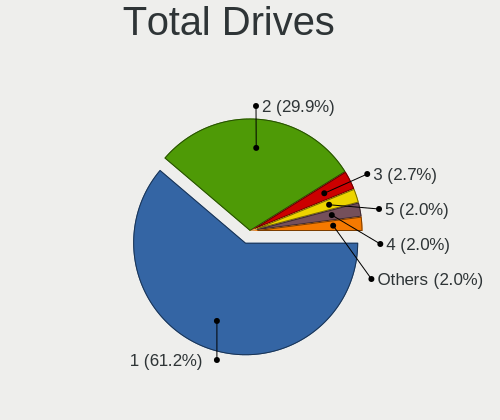

| Drives | Computers | Percent |
|--------|-----------|---------|
| 1      | 22        | 57.89%  |
| 2      | 12        | 31.58%  |
| 5      | 1         | 2.63%   |
| 4      | 1         | 2.63%   |
| 3      | 1         | 2.63%   |
| 0      | 1         | 2.63%   |

Has CD-ROM
----------

Has CD-ROM on board

| Presented | Computers | Percent |
|-----------|-----------|---------|
| No        | 20        | 54.05%  |
| Yes       | 17        | 45.95%  |

Has Ethernet
------------

Has Ethernet on board

| Presented | Computers | Percent |
|-----------|-----------|---------|
| Yes       | 34        | 91.89%  |
| No        | 3         | 8.11%   |

Has WiFi
--------

Has WiFi module

| Presented | Computers | Percent |
|-----------|-----------|---------|
| Yes       | 28        | 75.68%  |
| No        | 9         | 24.32%  |

Has Bluetooth
-------------

Has Bluetooth module

| Presented | Computers | Percent |
|-----------|-----------|---------|
| Yes       | 20        | 54.05%  |
| No        | 17        | 45.95%  |

Location
--------

Country
-------

Geographic location (country)

| Country     | Computers | Percent |
|-------------|-----------|---------|
| USA         | 12        | 32.43%  |
| Slovakia    | 8         | 21.62%  |
| India       | 2         | 5.41%   |
| Germany     | 2         | 5.41%   |
| France      | 2         | 5.41%   |
| Canada      | 2         | 5.41%   |
| UK          | 1         | 2.7%    |
| Thailand    | 1         | 2.7%    |
| Serbia      | 1         | 2.7%    |
| Russia      | 1         | 2.7%    |
| Philippines | 1         | 2.7%    |
| Italy       | 1         | 2.7%    |
| Greece      | 1         | 2.7%    |
| Austria     | 1         | 2.7%    |
| Australia   | 1         | 2.7%    |

City
----

Geographic location (city)

| City                 | Computers | Percent |
|----------------------|-----------|---------|
| Bratislava           | 8         | 21.62%  |
| Vista                | 1         | 2.7%    |
| Virginia Beach       | 1         | 2.7%    |
| Vienna               | 1         | 2.7%    |
| Vertou               | 1         | 2.7%    |
| Sydney               | 1         | 2.7%    |
| Romulus              | 1         | 2.7%    |
| Pleasant Hill        | 1         | 2.7%    |
| Pelham               | 1         | 2.7%    |
| P??trai              | 1         | 2.7%    |
| Pateros              | 1         | 2.7%    |
| Ozark                | 1         | 2.7%    |
| Newtownabbey         | 1         | 2.7%    |
| New Delhi            | 1         | 2.7%    |
| Mount Laurel         | 1         | 2.7%    |
| McLoud               | 1         | 2.7%    |
| Los Angeles          | 1         | 2.7%    |
| Krasnodar            | 1         | 2.7%    |
| Kharagpur            | 1         | 2.7%    |
| Kelso                | 1         | 2.7%    |
| Fort Wayne           | 1         | 2.7%    |
| Falkenstein          | 1         | 2.7%    |
| Edmonton             | 1         | 2.7%    |
| City of Saint Peters | 1         | 2.7%    |
| Chiang Mai           | 1         | 2.7%    |
| Catania              | 1         | 2.7%    |
| Calgary              | 1         | 2.7%    |
| Berlin               | 1         | 2.7%    |
| Belgrade             | 1         | 2.7%    |
| Anglet               | 1         | 2.7%    |

Drives
------

Drive Vendor
------------

Hard drive vendors

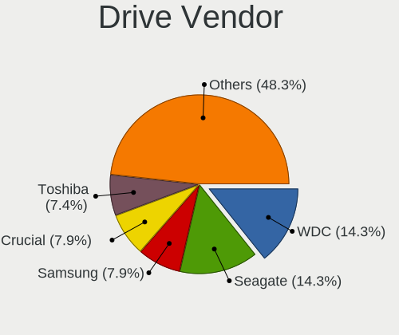

| Vendor              | Computers | Drives | Percent |
|---------------------|-----------|--------|---------|
| WDC                 | 6         | 6      | 11.76%  |
| Toshiba             | 6         | 6      | 11.76%  |
| Seagate             | 6         | 6      | 11.76%  |
| Unknown             | 3         | 4      | 5.88%   |
| SanDisk             | 3         | 3      | 5.88%   |
| Samsung Electronics | 3         | 3      | 5.88%   |
| Kingston            | 3         | 4      | 5.88%   |
| Intel               | 3         | 6      | 5.88%   |
| Hitachi             | 3         | 4      | 5.88%   |
| Micron Technology   | 2         | 3      | 3.92%   |
| KingDian            | 2         | 2      | 3.92%   |
| HGST                | 2         | 3      | 3.92%   |
| Transcend           | 1         | 1      | 1.96%   |
| Team                | 1         | 1      | 1.96%   |
| PNY                 | 1         | 1      | 1.96%   |
| Patriot             | 1         | 1      | 1.96%   |
| Mushkin             | 1         | 1      | 1.96%   |
| KingSpec            | 1         | 1      | 1.96%   |
| Crucial             | 1         | 4      | 1.96%   |
| ASMT                | 1         | 2      | 1.96%   |
| A-DATA Technology   | 1         | 1      | 1.96%   |

Drive Model
-----------

Hard drive models

| Model                               | Computers | Percent |
|-------------------------------------|-----------|---------|
| Toshiba MK5065GSX 500GB             | 2         | 3.77%   |
| Micron 1100_MTFDDAV256TBN 256GB SSD | 2         | 3.77%   |
| Hitachi HTS543232A7A384 320GB       | 2         | 3.77%   |
| WDC WDS500G2B0A-00SM50 500GB SSD    | 1         | 1.89%   |
| WDC WD5000AAKX-75U6AA0 500GB        | 1         | 1.89%   |
| WDC WD3200BEKT-60PVMT0 320GB        | 1         | 1.89%   |
| WDC WD2500AAJS-00L7A0 250GB         | 1         | 1.89%   |
| WDC WD1600BEVT-22ZCT0 160GB         | 1         | 1.89%   |
| WDC WD10SPZX-60Z10T0 1TB            | 1         | 1.89%   |
| Unknown SD16G  32GB                 | 1         | 1.89%   |
| Unknown SD  32GB                    | 1         | 1.89%   |
| Unknown HAG2e  16GB                 | 1         | 1.89%   |
| Transcend TS256GMTS430S 256GB SSD   | 1         | 1.89%   |
| Toshiba MQ01ABF050 500GB            | 1         | 1.89%   |
| Toshiba KXG60ZNV1T02 1TB            | 1         | 1.89%   |
| Toshiba DT01ACA300 3TB              | 1         | 1.89%   |
| Toshiba DT01ACA100 1TB              | 1         | 1.89%   |
| Team T253LE240G 240GB SSD           | 1         | 1.89%   |
| Seagate ST95005620AS 500GB          | 1         | 1.89%   |
| Seagate ST500DM002-1BD142 500GB     | 1         | 1.89%   |
| Seagate ST4000DM004-2CV104 4TB      | 1         | 1.89%   |
| Seagate ST3320413CS 320GB           | 1         | 1.89%   |
| Seagate ST1000LM048-2E7172 1TB      | 1         | 1.89%   |
| Seagate ST1000DM003-1ER162 1TB      | 1         | 1.89%   |
| SanDisk SSD PLUS 240GB              | 1         | 1.89%   |
| SanDisk SDSSDA120G 120GB            | 1         | 1.89%   |
| SanDisk SDSSDA-1T00 1TB             | 1         | 1.89%   |
| Samsung SSD 860 EVO 500GB           | 1         | 1.89%   |
| Samsung MZVLB512HAJQ-000L7 512GB    | 1         | 1.89%   |
| Samsung MMCQE28G8MUP-0VA 128GB SSD  | 1         | 1.89%   |
| PNY CS900 240GB SSD                 | 1         | 1.89%   |
| Patriot Blast 480GB SSD             | 1         | 1.89%   |
| Mushkin MKNSSDPL500GB-D8            | 1         | 1.89%   |
| Kingston SKC600512G 512GB SSD       | 1         | 1.89%   |
| Kingston SKC600256G 256GB SSD       | 1         | 1.89%   |
| Kingston SA400S37240G 240GB SSD     | 1         | 1.89%   |
| Kingston SA400S37120G 120GB SSD     | 1         | 1.89%   |
| KingSpec P3-512 512GB SSD           | 1         | 1.89%   |
| KingDian S280 1TB SSD               | 1         | 1.89%   |
| KingDian S200 60GB SSD              | 1         | 1.89%   |
| Intel SSDSC2KW256G8 256GB           | 1         | 1.89%   |
| Intel SSDSA2BW120G3H 120GB          | 1         | 1.89%   |
| Intel HBRPEKNX0202AHO 32GB          | 1         | 1.89%   |
| Intel HBRPEKNX0202AH 512GB          | 1         | 1.89%   |
| Hitachi HUA723020ALA641 2TB         | 1         | 1.89%   |
| HGST HTS721010A9E630 1TB            | 1         | 1.89%   |
| HGST HTS541010A9E680 1TB            | 1         | 1.89%   |
| Crucial CT1000P1SSD8 1TB            | 1         | 1.89%   |
| ASMT 2115 500GB                     | 1         | 1.89%   |
| A-DATA SP600 32GB SSD               | 1         | 1.89%   |

HDD Vendor
----------

Hard disk drive vendors

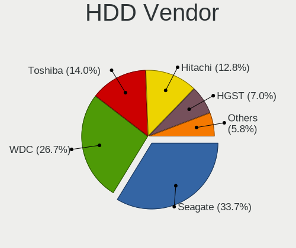

| Vendor  | Computers | Drives | Percent |
|---------|-----------|--------|---------|
| Seagate | 6         | 6      | 28.57%  |
| WDC     | 5         | 5      | 23.81%  |
| Toshiba | 5         | 5      | 23.81%  |
| Hitachi | 3         | 4      | 14.29%  |
| HGST    | 2         | 3      | 9.52%   |

SSD Vendor
----------

Solid state drive vendors

| Vendor              | Computers | Drives | Percent |
|---------------------|-----------|--------|---------|
| SanDisk             | 3         | 3      | 13.64%  |
| Kingston            | 3         | 4      | 13.64%  |
| Samsung Electronics | 2         | 2      | 9.09%   |
| Micron Technology   | 2         | 3      | 9.09%   |
| KingDian            | 2         | 2      | 9.09%   |
| Intel               | 2         | 4      | 9.09%   |
| WDC                 | 1         | 1      | 4.55%   |
| Transcend           | 1         | 1      | 4.55%   |
| Team                | 1         | 1      | 4.55%   |
| PNY                 | 1         | 1      | 4.55%   |
| Patriot             | 1         | 1      | 4.55%   |
| KingSpec            | 1         | 1      | 4.55%   |
| ASMT                | 1         | 2      | 4.55%   |
| A-DATA Technology   | 1         | 1      | 4.55%   |

Drive Kind
----------

HDD or SSD

| Kind | Computers | Drives | Percent |
|------|-----------|--------|---------|
| SSD  | 19        | 27     | 41.3%   |
| HDD  | 19        | 23     | 41.3%   |
| NVMe | 5         | 9      | 10.87%  |
| MMC  | 3         | 4      | 6.52%   |

Drive Connector
---------------

SATA, SAS, NVMe, etc.

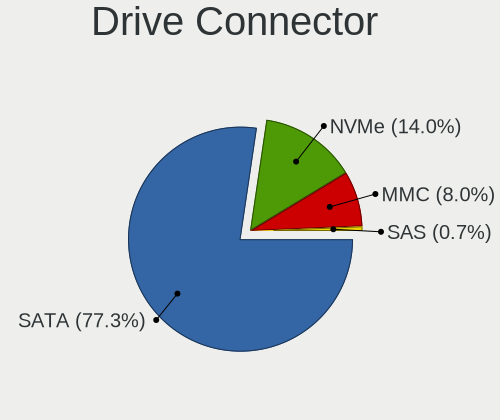

| Type | Computers | Drives | Percent |
|------|-----------|--------|---------|
| SATA | 31        | 48     | 77.5%   |
| NVMe | 5         | 9      | 12.5%   |
| MMC  | 3         | 4      | 7.5%    |
| SAS  | 1         | 2      | 2.5%    |

Drive Size
----------

Size of hard drive

| Size in TB | Computers | Drives | Percent |
|------------|-----------|--------|---------|
| 0.01-0.5   | 27        | 35     | 69.23%  |
| 0.51-1.0   | 9         | 11     | 23.08%  |
| 3.01-4.0   | 1         | 1      | 2.56%   |
| 2.01-3.0   | 1         | 1      | 2.56%   |
| 1.01-2.0   | 1         | 2      | 2.56%   |

Space Total
-----------

Amount of disk space available on the file system

| Size in GB     | Computers | Percent |
|----------------|-----------|---------|
| 101-250        | 12        | 30.77%  |
| 251-500        | 6         | 15.38%  |
| 21-50          | 5         | 12.82%  |
| 501-1000       | 5         | 12.82%  |
| 51-100         | 5         | 12.82%  |
| More than 3000 | 2         | 5.13%   |
| 1001-2000      | 2         | 5.13%   |
| 1-20           | 2         | 5.13%   |

Space Used
----------

Amount of used disk space

| Used GB   | Computers | Percent |
|-----------|-----------|---------|
| 1-20      | 16        | 42.11%  |
| 21-50     | 7         | 18.42%  |
| 51-100    | 6         | 15.79%  |
| 101-250   | 5         | 13.16%  |
| 501-1000  | 2         | 5.26%   |
| 251-500   | 1         | 2.63%   |
| 2001-3000 | 1         | 2.63%   |

Malfunc. Drives
---------------

Drive models with a malfunction

| Model                        | Computers | Drives | Percent |
|------------------------------|-----------|--------|---------|
| WDC WD3200BEKT-60PVMT0 320GB | 1         | 1      | 33.33%  |
| Seagate ST3320413CS 320GB    | 1         | 1      | 33.33%  |
| Crucial CT1000P1SSD8 1TB     | 1         | 4      | 33.33%  |

Malfunc. Drive Vendor
---------------------

Vendors of faulty drives

| Vendor  | Computers | Drives | Percent |
|---------|-----------|--------|---------|
| WDC     | 1         | 1      | 33.33%  |
| Seagate | 1         | 1      | 33.33%  |
| Crucial | 1         | 4      | 33.33%  |

Malfunc. HDD Vendor
-------------------

Vendors of faulty HDD drives

| Vendor  | Computers | Drives | Percent |
|---------|-----------|--------|---------|
| WDC     | 1         | 1      | 50%     |
| Seagate | 1         | 1      | 50%     |

Malfunc. Drive Kind
-------------------

Kinds of faulty drives

| Kind | Computers | Drives | Percent |
|------|-----------|--------|---------|
| HDD  | 2         | 2      | 66.67%  |
| NVMe | 1         | 4      | 33.33%  |

Failed Drives
-------------

Failed drive models

| Model                   | Computers | Drives | Percent |
|-------------------------|-----------|--------|---------|
| Toshiba MK5065GSX 500GB | 2         | 2      | 100%    |

Failed Drive Vendor
-------------------

Failed drive vendors

| Vendor  | Computers | Drives | Percent |
|---------|-----------|--------|---------|
| Toshiba | 2         | 2      | 100%    |

Drive Status
------------

Number of failed and malfunc. drives

| Status   | Computers | Drives | Percent |
|----------|-----------|--------|---------|
| Works    | 30        | 47     | 73.17%  |
| Detected | 6         | 8      | 14.63%  |
| Malfunc  | 3         | 6      | 7.32%   |
| Failed   | 2         | 2      | 4.88%   |

Storage controller
------------------

Storage Vendor
--------------

Storage controller vendors

| Vendor                       | Computers | Percent |
|------------------------------|-----------|---------|
| Intel                        | 26        | 65%     |
| AMD                          | 7         | 17.5%   |
| JMicron Technology           | 2         | 5%      |
| Toshiba America Info Systems | 1         | 2.5%    |
| Silicon Motion               | 1         | 2.5%    |
| Samsung Electronics          | 1         | 2.5%    |
| Nvidia                       | 1         | 2.5%    |
| Micron/Crucial Technology    | 1         | 2.5%    |

Storage Model
-------------

Storage controller models

| Model                                                                          | Computers | Percent |
|--------------------------------------------------------------------------------|-----------|---------|
| Intel 82801 Mobile SATA Controller [RAID mode]                                 | 4         | 8.51%   |
| AMD SB7x0/SB8x0/SB9x0 SATA Controller [AHCI mode]                              | 4         | 8.51%   |
| Intel 7 Series Chipset Family 6-port SATA Controller [AHCI mode]               | 3         | 6.38%   |
| Intel 5 Series/3400 Series Chipset 6 port SATA AHCI Controller                 | 3         | 6.38%   |
| AMD SB7x0/SB8x0/SB9x0 IDE Controller                                           | 3         | 6.38%   |
| AMD FCH SATA Controller [AHCI mode]                                            | 3         | 6.38%   |
| Intel Sunrise Point-LP SATA Controller [AHCI mode]                             | 2         | 4.26%   |
| Intel 8 Series/C220 Series Chipset Family 6-port SATA Controller 1 [AHCI mode] | 2         | 4.26%   |
| Intel 6 Series/C200 Series Chipset Family 6 port Mobile SATA AHCI Controller   | 2         | 4.26%   |
| Toshiba America Info Systems XG6 NVMe SSD Controller                           | 1         | 2.13%   |
| Silicon Motion SM2262/SM2262EN SSD Controller                                  | 1         | 2.13%   |
| Samsung NVMe SSD Controller SM981/PM981/PM983                                  | 1         | 2.13%   |
| Nvidia MCP61 SATA Controller                                                   | 1         | 2.13%   |
| Nvidia MCP61 IDE                                                               | 1         | 2.13%   |
| Micron/Crucial P1 NVMe PCIe SSD                                                | 1         | 2.13%   |
| JMicron JMB368 IDE controller                                                  | 1         | 2.13%   |
| JMicron JMB363 SATA/IDE Controller                                             | 1         | 2.13%   |
| Intel SATA Controller [RAID mode]                                              | 1         | 2.13%   |
| Intel Non-Volatile memory controller                                           | 1         | 2.13%   |
| Intel NM10/ICH7 Family SATA Controller [AHCI mode]                             | 1         | 2.13%   |
| Intel Cannon Lake PCH SATA AHCI Controller                                     | 1         | 2.13%   |
| Intel Cannon Lake Mobile PCH SATA AHCI Controller                              | 1         | 2.13%   |
| Intel 82801JI (ICH10 Family) 4 port SATA IDE Controller #1                     | 1         | 2.13%   |
| Intel 82801JI (ICH10 Family) 2 port SATA IDE Controller #2                     | 1         | 2.13%   |
| Intel 82801IBM/IEM (ICH9M/ICH9M-E) 4 port SATA Controller [AHCI mode]          | 1         | 2.13%   |
| Intel 82801GBM/GHM (ICH7-M Family) SATA Controller [IDE mode]                  | 1         | 2.13%   |
| Intel 82801DB (ICH4) IDE Controller                                            | 1         | 2.13%   |
| Intel 8 Series SATA Controller 1 [AHCI mode]                                   | 1         | 2.13%   |
| Intel 5 Series/3400 Series Chipset 4 port SATA AHCI Controller                 | 1         | 2.13%   |
| AMD X370 Series Chipset SATA Controller                                        | 1         | 2.13%   |

Storage Kind
------------

Kind of storage controller (IDE, SATA, NVMe, SAS, ...)

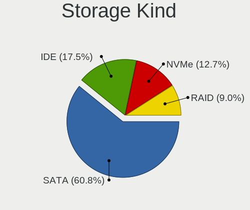

| Kind | Computers | Percent |
|------|-----------|---------|
| SATA | 25        | 58.14%  |
| IDE  | 8         | 18.6%   |
| RAID | 5         | 11.63%  |
| NVMe | 5         | 11.63%  |

Processor
---------

CPU Vendor
----------

Processor vendors

| Vendor | Computers | Percent |
|--------|-----------|---------|
| Intel  | 29        | 78.38%  |
| AMD    | 8         | 21.62%  |

CPU Model
---------

Processor models

| Model                                       | Computers | Percent |
|---------------------------------------------|-----------|---------|
| Intel Core i5 CPU M 520 @ 2.40GHz           | 2         | 5.41%   |
| Intel Pentium Dual-Core CPU E5400 @ 2.70GHz | 1         | 2.7%    |
| Intel Pentium CPU G3240 @ 3.10GHz           | 1         | 2.7%    |
| Intel Core i7-9750H CPU @ 2.60GHz           | 1         | 2.7%    |
| Intel Core i7-8809G CPU @ 3.10GHz           | 1         | 2.7%    |
| Intel Core i7-8750H CPU @ 2.20GHz           | 1         | 2.7%    |
| Intel Core i7-7500U CPU @ 2.70GHz           | 1         | 2.7%    |
| Intel Core i7-3630QM CPU @ 2.40GHz          | 1         | 2.7%    |
| Intel Core i7-1065G7 CPU @ 1.30GHz          | 1         | 2.7%    |
| Intel Core i7-10510U CPU @ 1.80GHz          | 1         | 2.7%    |
| Intel Core i7 CPU Q 720 @ 1.60GHz           | 1         | 2.7%    |
| Intel Core i7 CPU M 640 @ 2.80GHz           | 1         | 2.7%    |
| Intel Core i5-8250U CPU @ 1.60GHz           | 1         | 2.7%    |
| Intel Core i5-6200U CPU @ 2.30GHz           | 1         | 2.7%    |
| Intel Core i5-4300M CPU @ 2.60GHz           | 1         | 2.7%    |
| Intel Core i5-3470 CPU @ 3.20GHz            | 1         | 2.7%    |
| Intel Core i5-3210M CPU @ 2.50GHz           | 1         | 2.7%    |
| Intel Core i5-2540M CPU @ 2.60GHz           | 1         | 2.7%    |
| Intel Core i3-8100 CPU @ 3.60GHz            | 1         | 2.7%    |
| Intel Core i3-7020U CPU @ 2.30GHz           | 1         | 2.7%    |
| Intel Core i3-2310M CPU @ 2.10GHz           | 1         | 2.7%    |
| Intel Core 2 Duo CPU U9400 @ 1.40GHz        | 1         | 2.7%    |
| Intel Celeron M processor 900MHz            | 1         | 2.7%    |
| Intel Celeron CPU N2840 @ 2.16GHz           | 1         | 2.7%    |
| Intel Celeron CPU 1005M @ 1.90GHz           | 1         | 2.7%    |
| Intel Celeron 2957U @ 1.40GHz               | 1         | 2.7%    |
| Intel Atom CPU N280 @ 1.66GHz               | 1         | 2.7%    |
| Intel Atom CPU N2600 @ 1.60GHz              | 1         | 2.7%    |
| AMD Sempron Processor 3000+                 | 1         | 2.7%    |
| AMD Sempron Processor 2800+                 | 1         | 2.7%    |
| AMD Ryzen 5 1600X Six-Core Processor        | 1         | 2.7%    |
| AMD Phenom II X6 1090T Processor            | 1         | 2.7%    |
| AMD E1-2500 APU with Radeon HD Graphics     | 1         | 2.7%    |
| AMD Athlon II X2 260 Processor              | 1         | 2.7%    |
| AMD Athlon 7750 Dual-Core Processor         | 1         | 2.7%    |
| AMD A6-3400M APU with Radeon HD Graphics    | 1         | 2.7%    |

CPU Model Family
----------------

Processor model prefix

| Model                   | Computers | Percent |
|-------------------------|-----------|---------|
| Intel Core i7           | 9         | 24.32%  |
| Intel Core i5           | 8         | 21.62%  |
| Intel Core i3           | 3         | 8.11%   |
| Intel Celeron           | 3         | 8.11%   |
| Intel Atom              | 2         | 5.41%   |
| AMD Sempron             | 2         | 5.41%   |
| Intel Pentium Dual-Core | 1         | 2.7%    |
| Intel Pentium           | 1         | 2.7%    |
| Intel Core 2 Duo        | 1         | 2.7%    |
| Intel Celeron M         | 1         | 2.7%    |
| AMD Ryzen 5             | 1         | 2.7%    |
| AMD Phenom II X6        | 1         | 2.7%    |
| AMD E1                  | 1         | 2.7%    |
| AMD Athlon II X2        | 1         | 2.7%    |
| AMD Athlon              | 1         | 2.7%    |
| AMD A6                  | 1         | 2.7%    |

CPU Cores
---------

Number of processor cores

| Number | Computers | Percent |
|--------|-----------|---------|
| 2      | 20        | 54.05%  |
| 4      | 9         | 24.32%  |
| 6      | 4         | 10.81%  |
| 1      | 4         | 10.81%  |

CPU Sockets
-----------

Number of sockets

| Number | Computers | Percent |
|--------|-----------|---------|
| 1      | 37        | 100%    |

CPU Threads
-----------

Threads per core (Hyper-Threading)

| Number | Computers | Percent |
|--------|-----------|---------|
| 2      | 21        | 56.76%  |
| 1      | 16        | 43.24%  |

CPU Op-Modes
------------

CPU Operation Modes (32-bit, 64-bit)

| Op mode        | Computers | Percent |
|----------------|-----------|---------|
| 32-bit, 64-bit | 34        | 91.89%  |
| 32-bit         | 3         | 8.11%   |

CPU Microcode
-------------

Microcode number

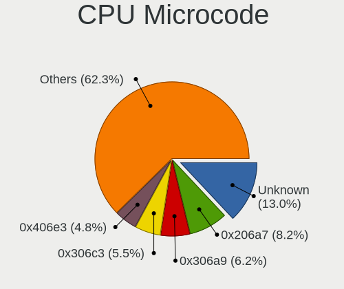

| Number     | Computers | Percent |
|------------|-----------|---------|
| Unknown    | 6         | 16.22%  |
| 0x306a9    | 4         | 10.81%  |
| 0x906ea    | 2         | 5.41%   |
| 0x806e9    | 2         | 5.41%   |
| 0x306c3    | 2         | 5.41%   |
| 0x20655    | 2         | 5.41%   |
| 0x906eb    | 1         | 2.7%    |
| 0x906e9    | 1         | 2.7%    |
| 0x806ea    | 1         | 2.7%    |
| 0x706e5    | 1         | 2.7%    |
| 0x6d8      | 1         | 2.7%    |
| 0x406e3    | 1         | 2.7%    |
| 0x40651    | 1         | 2.7%    |
| 0x30678    | 1         | 2.7%    |
| 0x30661    | 1         | 2.7%    |
| 0x20652    | 1         | 2.7%    |
| 0x106e5    | 1         | 2.7%    |
| 0x106c2    | 1         | 2.7%    |
| 0x1067a    | 1         | 2.7%    |
| 0x10676    | 1         | 2.7%    |
| 0x08001137 | 1         | 2.7%    |
| 0x0700010f | 1         | 2.7%    |
| 0x03000027 | 1         | 2.7%    |
| 0x010000dc | 1         | 2.7%    |
| 0x01000083 | 1         | 2.7%    |

CPU Microarch
-------------

Microarchitecture

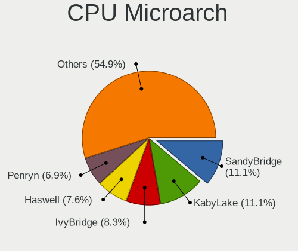

| Name        | Computers | Percent |
|-------------|-----------|---------|
| KabyLake    | 8         | 21.62%  |
| IvyBridge   | 4         | 10.81%  |
| Westmere    | 3         | 8.11%   |
| K10         | 3         | 8.11%   |
| Haswell     | 3         | 8.11%   |
| SandyBridge | 2         | 5.41%   |
| Penryn      | 2         | 5.41%   |
| K8 Hammer   | 2         | 5.41%   |
| Bonnell     | 2         | 5.41%   |
| Zen         | 1         | 2.7%    |
| Skylake     | 1         | 2.7%    |
| Silvermont  | 1         | 2.7%    |
| P6          | 1         | 2.7%    |
| Nehalem     | 1         | 2.7%    |
| K10 Llano   | 1         | 2.7%    |
| Jaguar      | 1         | 2.7%    |
| IceLake     | 1         | 2.7%    |

Graphics
--------

GPU Vendor
----------

Vendors of graphics cards

| Vendor | Computers | Percent |
|--------|-----------|---------|
| Intel  | 24        | 53.33%  |
| AMD    | 13        | 28.89%  |
| Nvidia | 8         | 17.78%  |

GPU Model
---------

Graphics card models

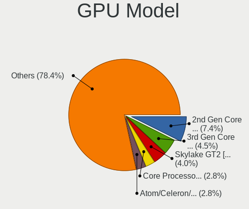

| Model                                                                         | Computers | Percent |
|-------------------------------------------------------------------------------|-----------|---------|
| Intel 3rd Gen Core processor Graphics Controller                              | 3         | 6.12%   |
| Nvidia GT216GLM [Quadro FX 880M]                                              | 2         | 4.08%   |
| Nvidia GP108M [GeForce MX250]                                                 | 2         | 4.08%   |
| Intel HD Graphics 620                                                         | 2         | 4.08%   |
| Intel Core Processor Integrated Graphics Controller                           | 2         | 4.08%   |
| Intel CoffeeLake-H GT2 [UHD Graphics 630]                                     | 2         | 4.08%   |
| AMD Seymour [Radeon HD 6400M/7400M Series]                                    | 2         | 4.08%   |
| AMD RS780L [Radeon 3000]                                                      | 2         | 4.08%   |
| Nvidia TU117M [GeForce GTX 1650 Mobile / Max-Q]                               | 1         | 2.04%   |
| Nvidia GP108M [GeForce MX150]                                                 | 1         | 2.04%   |
| Nvidia GP107M [GeForce GTX 1050 Ti Mobile]                                    | 1         | 2.04%   |
| Nvidia GF108 [GeForce GT 430]                                                 | 1         | 2.04%   |
| Intel Xeon E3-1200 v3/4th Gen Core Processor Integrated Graphics Controller   | 1         | 2.04%   |
| Intel Xeon E3-1200 v2/3rd Gen Core processor Graphics Controller              | 1         | 2.04%   |
| Intel UHD Graphics 620                                                        | 1         | 2.04%   |
| Intel Skylake GT2 [HD Graphics 520]                                           | 1         | 2.04%   |
| Intel Mobile 945GSE Express Integrated Graphics Controller                    | 1         | 2.04%   |
| Intel Mobile 945GM/GMS/GME, 943/940GML Express Integrated Graphics Controller | 1         | 2.04%   |
| Intel Mobile 4 Series Chipset Integrated Graphics Controller                  | 1         | 2.04%   |
| Intel Iris Plus Graphics G7                                                   | 1         | 2.04%   |
| Intel HD Graphics 630                                                         | 1         | 2.04%   |
| Intel Haswell-ULT Integrated Graphics Controller                              | 1         | 2.04%   |
| Intel CometLake-U GT2 [UHD Graphics]                                          | 1         | 2.04%   |
| Intel Atom Processor Z36xxx/Z37xxx Series Graphics & Display                  | 1         | 2.04%   |
| Intel Atom Processor D2xxx/N2xxx Integrated Graphics Controller               | 1         | 2.04%   |
| Intel 82852/855GM Integrated Graphics Device                                  | 1         | 2.04%   |
| Intel 4th Gen Core Processor Integrated Graphics Controller                   | 1         | 2.04%   |
| Intel 2nd Generation Core Processor Family Integrated Graphics Controller     | 1         | 2.04%   |
| AMD Sun LE [Radeon HD 8550M / R5 M230]                                        | 1         | 2.04%   |
| AMD Sumo [Radeon HD 6520G]                                                    | 1         | 2.04%   |
| AMD RV635 [Radeon HD 3650/3750/4570/4580]                                     | 1         | 2.04%   |
| AMD RV516 [Radeon X1300/X1550 Series] (Secondary)                             | 1         | 2.04%   |
| AMD RV516 [Radeon X1300/X1550 Series]                                         | 1         | 2.04%   |
| AMD Redwood PRO [Radeon HD 5550/5570/5630/6510/6610/7570]                     | 1         | 2.04%   |
| AMD Polaris 22 XT [Radeon RX Vega M GH]                                       | 1         | 2.04%   |
| AMD Kabini [Radeon HD 8240 / R3 Series]                                       | 1         | 2.04%   |
| AMD Jet PRO [Radeon R5 M230 / R7 M260DX / Radeon 520 Mobile]                  | 1         | 2.04%   |
| AMD Hawaii PRO [Radeon R9 290/390]                                            | 1         | 2.04%   |
| AMD Ellesmere [Radeon RX 470/480/570/570X/580/580X/590]                       | 1         | 2.04%   |
| AMD Curacao PRO [Radeon R7 370 / R9 270/370 OEM]                              | 1         | 2.04%   |

GPU Combo
---------

Combinations of graphics cards

| Name           | Computers | Percent |
|----------------|-----------|---------|
| 1 x Intel      | 16        | 43.24%  |
| 1 x AMD        | 9         | 24.32%  |
| Intel + Nvidia | 5         | 13.51%  |
| 1 x Nvidia     | 3         | 8.11%   |
| Intel + AMD    | 2         | 5.41%   |
| 3 x AMD        | 1         | 2.7%    |
| 2 x AMD        | 1         | 2.7%    |

GPU Driver
----------

Free vs proprietary

| Driver      | Computers | Percent |
|-------------|-----------|---------|
| Free        | 34        | 91.89%  |
| Proprietary | 2         | 5.41%   |
| Unknown     | 1         | 2.7%    |

GPU Memory
----------

Total video memory

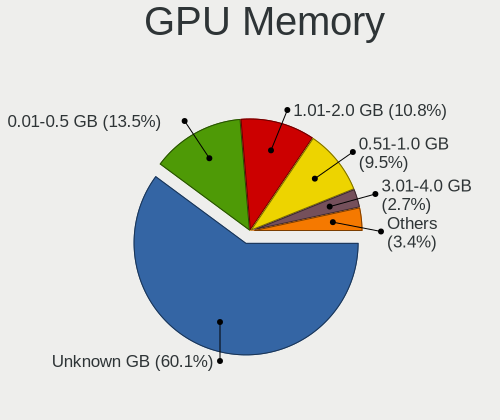

| Size in GB | Computers | Percent |
|------------|-----------|---------|
| Unknown    | 23        | 62.16%  |
| 0.01-0.5   | 5         | 13.51%  |
| 1.01-2.0   | 4         | 10.81%  |
| 0.51-1.0   | 3         | 8.11%   |
| 3.01-4.0   | 2         | 5.41%   |

Monitor
-------

Monitor Vendor
--------------

Monitor vendors

| Vendor              | Computers | Percent |
|---------------------|-----------|---------|
| AU Optronics        | 8         | 19.51%  |
| Samsung Electronics | 7         | 17.07%  |
| LG Display          | 4         | 9.76%   |
| Lenovo              | 4         | 9.76%   |
| Dell                | 3         | 7.32%   |
| Chimei Innolux      | 3         | 7.32%   |
| BenQ                | 2         | 4.88%   |
| Acer                | 2         | 4.88%   |
| Vizio               | 1         | 2.44%   |
| ViewSonic           | 1         | 2.44%   |
| Philips             | 1         | 2.44%   |
| PANDA               | 1         | 2.44%   |
| HannStar            | 1         | 2.44%   |
| Goldstar            | 1         | 2.44%   |
| CPT                 | 1         | 2.44%   |
| CHR                 | 1         | 2.44%   |

Monitor Model
-------------

Monitor models

| Model                                                                 | Computers | Percent |
|-----------------------------------------------------------------------|-----------|---------|
| Samsung Electronics SyncMaster SAM0091 1600x1200 432x324mm 21.3-inch  | 4         | 9.76%   |
| AU Optronics LCD Monitor AUO01EE 1600x900 344x193mm 15.5-inch         | 2         | 4.88%   |
| Vizio E320VA VIZ0071 1360x768 697x392mm 31.5-inch                     | 1         | 2.44%   |
| ViewSonic VX2757 VSCF931 1920x1080 598x336mm 27.0-inch                | 1         | 2.44%   |
| Samsung Electronics SA300/SA350 SAM0791 1920x1080 510x287mm 23.0-inch | 1         | 2.44%   |
| Samsung Electronics S24F350 SAM0D20 1920x1080 521x293mm 23.5-inch     | 1         | 2.44%   |
| Samsung Electronics LCD Monitor SEC504B 1600x900 382x215mm 17.3-inch  | 1         | 2.44%   |
| Philips FTV PHL04C3 1920x1080 1440x810mm 65.0-inch                    | 1         | 2.44%   |
| PANDA LCD Monitor NCP0036 1920x1080 344x194mm 15.5-inch               | 1         | 2.44%   |
| LG Display LCD Monitor LGD0533 1920x1080 344x194mm 15.5-inch          | 1         | 2.44%   |
| LG Display LCD Monitor LGD0386 1366x768 309x174mm 14.0-inch           | 1         | 2.44%   |
| LG Display LCD Monitor LGD033A 1366x768 340x190mm 15.3-inch           | 1         | 2.44%   |
| LG Display LCD Monitor LGD02F2 1366x768 344x194mm 15.5-inch           | 1         | 2.44%   |
| Lenovo LCD Monitor LEN40B1 1600x900 344x194mm 15.5-inch               | 1         | 2.44%   |
| Lenovo LCD Monitor LEN40A0 1366x768 309x174mm 14.0-inch               | 1         | 2.44%   |
| Lenovo LCD Monitor LEN4074 1440x900 287x180mm 13.3-inch               | 1         | 2.44%   |
| Lenovo LCD Monitor LEN4011 1280x800 261x163mm 12.1-inch               | 1         | 2.44%   |
| HannStar HSD101PFW4A HSD03ED 1024x600 223x125mm 10.1-inch             | 1         | 2.44%   |
| Goldstar IPS FULLHD GSM5AB8 1920x1080 480x270mm 21.7-inch             | 1         | 2.44%   |
| Dell U2415 DELA0BA 1920x1080 518x324mm 24.1-inch                      | 1         | 2.44%   |
| Dell SE2419H DELF109 1920x1080 527x296mm 23.8-inch                    | 1         | 2.44%   |
| Dell E1913 DELD051 1440x900 408x255mm 18.9-inch                       | 1         | 2.44%   |
| CPT LCD Monitor CPT04C4 1024x600 222x130mm 10.1-inch                  | 1         | 2.44%   |
| CHR VGA DISPLAY CHRC378 1920x1080 880x500mm 39.8-inch                 | 1         | 2.44%   |
| Chimei Innolux LCD Monitor CMN15D5 1920x1080 340x190mm 15.3-inch      | 1         | 2.44%   |
| Chimei Innolux LCD Monitor CMN14D4 1920x1080 309x173mm 13.9-inch      | 1         | 2.44%   |
| Chimei Innolux LCD Monitor CMN1132 1366x768 260x140mm 11.6-inch       | 1         | 2.44%   |
| BenQ LCD BNQ801B 2560x1440 527x296mm 23.8-inch                        | 1         | 2.44%   |
| BenQ GW2406Z BNQ78E1 1920x1080 530x300mm 24.0-inch                    | 1         | 2.44%   |
| AU Optronics LCD Monitor AUO543D 1920x1080 309x174mm 14.0-inch        | 1         | 2.44%   |
| AU Optronics LCD Monitor AUO313D 1920x1080 309x174mm 14.0-inch        | 1         | 2.44%   |
| AU Optronics LCD Monitor AUO30EB 3840x2160 344x193mm 15.5-inch        | 1         | 2.44%   |
| AU Optronics LCD Monitor AUO2D3C 1366x768 310x170mm 13.9-inch         | 1         | 2.44%   |
| AU Optronics LCD Monitor AUO213D 1920x1080 309x173mm 13.9-inch        | 1         | 2.44%   |
| AU Optronics LCD Monitor AUO106C 1366x768 277x156mm 12.5-inch         | 1         | 2.44%   |
| Acer XF240H ACR0472 1920x1080 531x299mm 24.0-inch                     | 1         | 2.44%   |
| Acer HX1953L ACR038C 1600x900 432x239mm 19.4-inch                     | 1         | 2.44%   |

Monitor Resolution
------------------

Monitor screen resolution

| Resolution       | Computers | Percent |
|------------------|-----------|---------|
| 1920x1080 (FHD)  | 17        | 42.5%   |
| 1366x768 (WXGA)  | 7         | 17.5%   |
| 1600x900 (HD+)   | 5         | 12.5%   |
| 1600x1200        | 4         | 10%     |
| 1440x900 (WXGA+) | 2         | 5%      |
| 1024x600         | 2         | 5%      |
| 3840x2160 (4K)   | 1         | 2.5%    |
| 2560x1440 (QHD)  | 1         | 2.5%    |
| 1280x800 (WXGA)  | 1         | 2.5%    |

Monitor Diagonal
----------------

Diagonal size in inches

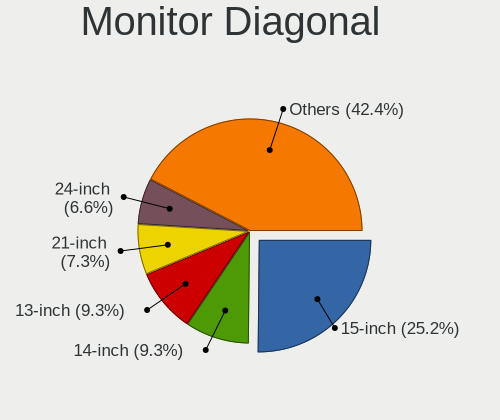

| Inches | Computers | Percent |
|--------|-----------|---------|
| 15     | 9         | 21.95%  |
| 24     | 5         | 12.2%   |
| 21     | 5         | 12.2%   |
| 14     | 5         | 12.2%   |
| 13     | 3         | 7.32%   |
| 23     | 2         | 4.88%   |
| 12     | 2         | 4.88%   |
| 10     | 2         | 4.88%   |
| 65     | 1         | 2.44%   |
| 39     | 1         | 2.44%   |
| 37     | 1         | 2.44%   |
| 27     | 1         | 2.44%   |
| 19     | 1         | 2.44%   |
| 18     | 1         | 2.44%   |
| 17     | 1         | 2.44%   |
| 11     | 1         | 2.44%   |

Monitor Width
-------------

Physical width

| Width in mm | Computers | Percent |
|-------------|-----------|---------|
| 301-350     | 16        | 40%     |
| 501-600     | 7         | 17.5%   |
| 401-500     | 7         | 17.5%   |
| 201-300     | 6         | 15%     |
| 801-900     | 2         | 5%      |
| 351-400     | 1         | 2.5%    |
| 1001-1500   | 1         | 2.5%    |

Aspect Ratio
------------

Proportional relationship between the width and the height

| Ratio | Computers | Percent |
|-------|-----------|---------|
| 16/9  | 29        | 78.38%  |
| 4/3   | 4         | 10.81%  |
| 16/10 | 3         | 8.11%   |
| 3/2   | 1         | 2.7%    |

Monitor Area
------------

Area in inch

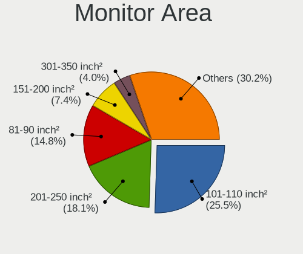

| Area in inch | Computers | Percent |
|----------------|-----------|---------|
| 201-250        | 10        | 25%     |
| 101-110        | 9         | 22.5%   |
| 81-90          | 7         | 17.5%   |
| 61-70          | 2         | 5%      |
| 41-50          | 2         | 5%      |
| 151-200        | 2         | 5%      |
| 501-1000       | 2         | 5%      |
| More than 1000 | 1         | 2.5%    |
| 71-80          | 1         | 2.5%    |
| 51-60          | 1         | 2.5%    |
| 301-350        | 1         | 2.5%    |
| 251-300        | 1         | 2.5%    |
| 121-130        | 1         | 2.5%    |

Pixel Density
-------------

Pixels per inch

| Density       | Computers | Percent |
|---------------|-----------|---------|
| 51-100        | 15        | 36.59%  |
| 121-160       | 12        | 29.27%  |
| 101-120       | 12        | 29.27%  |
| More than 240 | 1         | 2.44%   |
| 1-50          | 1         | 2.44%   |

Multiple Monitors
-----------------

Total monitors connected

| Total | Computers | Percent |
|-------|-----------|---------|
| 1     | 33        | 86.84%  |
| 2     | 5         | 13.16%  |

Network
-------

Net Controller Vendor
---------------------

Controller vendors

| Vendor                | Computers | Percent |
|-----------------------|-----------|---------|
| Intel                 | 20        | 38.46%  |
| Realtek Semiconductor | 18        | 34.62%  |
| Qualcomm Atheros      | 8         | 15.38%  |
| Ralink                | 1         | 1.92%   |
| Nvidia                | 1         | 1.92%   |
| D-Link System         | 1         | 1.92%   |
| Broadcom              | 1         | 1.92%   |
| Attansic Technology   | 1         | 1.92%   |
| ASIX Electronics      | 1         | 1.92%   |

Net Controller Model
--------------------

Controller models

| Model                                                             | Computers | Percent |
|-------------------------------------------------------------------|-----------|---------|
| Realtek RTL8111/8168/8411 PCI Express Gigabit Ethernet Controller | 13        | 20%     |
| Realtek RTL810xE PCI Express Fast Ethernet controller             | 3         | 4.62%   |
| Qualcomm Atheros AR9485 Wireless Network Adapter                  | 3         | 4.62%   |
| Intel 82579LM Gigabit Network Connection (Lewisville)             | 3         | 4.62%   |
| Intel 82577LM Gigabit Network Connection                          | 3         | 4.62%   |
| Intel Wireless 7265                                               | 2         | 3.08%   |
| Intel Centrino Ultimate-N 6300                                    | 2         | 3.08%   |
| Intel Centrino Advanced-N 6205 [Taylor Peak]                      | 2         | 3.08%   |
| Intel Centrino Advanced-N 6200                                    | 2         | 3.08%   |
| Intel Cannon Lake PCH CNVi WiFi                                   | 2         | 3.08%   |
| Realtek RTL8821CE 802.11ac PCIe Wireless Network Adapter          | 1         | 1.54%   |
| Realtek RTL8723BE PCIe Wireless Network Adapter                   | 1         | 1.54%   |
| Realtek RTL8188EUS 802.11n Wireless Network Adapter               | 1         | 1.54%   |
| Realtek RTL8188EE Wireless Network Adapter                        | 1         | 1.54%   |
| Realtek 802.11ac WLAN Adapter                                     | 1         | 1.54%   |
| Ralink RT2800 802.11n PCI                                         | 1         | 1.54%   |
| Qualcomm Atheros QCA9565 / AR9565 Wireless Network Adapter        | 1         | 1.54%   |
| Qualcomm Atheros QCA8172 Fast Ethernet                            | 1         | 1.54%   |
| Qualcomm Atheros Killer E2400 Gigabit Ethernet Controller         | 1         | 1.54%   |
| Qualcomm Atheros AR928X Wireless Network Adapter (PCI-Express)    | 1         | 1.54%   |
| Qualcomm Atheros AR8162 Fast Ethernet                             | 1         | 1.54%   |
| Nvidia MCP61 Ethernet                                             | 1         | 1.54%   |
| Intel Wireless 8265 / 8275                                        | 1         | 1.54%   |
| Intel Wireless 8260                                               | 1         | 1.54%   |
| Intel Wireless 7260                                               | 1         | 1.54%   |
| Intel PRO/Wireless 5100 AGN [Shiloh] Network Connection           | 1         | 1.54%   |
| Intel Ice Lake-LP PCH CNVi WiFi                                   | 1         | 1.54%   |
| Intel I211 Gigabit Network Connection                             | 1         | 1.54%   |
| Intel I210 Gigabit Network Connection                             | 1         | 1.54%   |
| Intel Ethernet Connection I219-V                                  | 1         | 1.54%   |
| Intel Ethernet Connection I217-LM                                 | 1         | 1.54%   |
| Intel Ethernet Connection (2) I219-LM                             | 1         | 1.54%   |
| Intel Comet Lake PCH-LP CNVi WiFi                                 | 1         | 1.54%   |
| Intel Centrino Wireless-N 2200                                    | 1         | 1.54%   |
| Intel 82801DB PRO/100 VE (LOM) Ethernet Controller                | 1         | 1.54%   |
| Intel 82567LM Gigabit Network Connection                          | 1         | 1.54%   |
| D-Link System DGE-528T Gigabit Ethernet Adapter                   | 1         | 1.54%   |
| Broadcom BCM43228 802.11a/b/g/n                                   | 1         | 1.54%   |
| Attansic AR8152 v2.0 Fast Ethernet                                | 1         | 1.54%   |
| ASIX AX88179 Gigabit Ethernet                                     | 1         | 1.54%   |

Wireless Vendor
---------------

Wireless vendors

| Vendor                | Computers | Percent |
|-----------------------|-----------|---------|
| Intel                 | 17        | 58.62%  |
| Realtek Semiconductor | 5         | 17.24%  |
| Qualcomm Atheros      | 5         | 17.24%  |
| Ralink                | 1         | 3.45%   |
| Broadcom              | 1         | 3.45%   |

Wireless Model
--------------

Wireless models

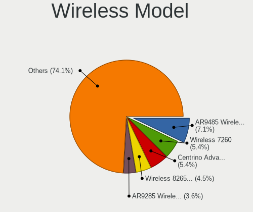

| Model                                                          | Computers | Percent |
|----------------------------------------------------------------|-----------|---------|
| Qualcomm Atheros AR9485 Wireless Network Adapter               | 3         | 10.34%  |
| Intel Wireless 7265                                            | 2         | 6.9%    |
| Intel Centrino Ultimate-N 6300                                 | 2         | 6.9%    |
| Intel Centrino Advanced-N 6205 [Taylor Peak]                   | 2         | 6.9%    |
| Intel Centrino Advanced-N 6200                                 | 2         | 6.9%    |
| Intel Cannon Lake PCH CNVi WiFi                                | 2         | 6.9%    |
| Realtek RTL8821CE 802.11ac PCIe Wireless Network Adapter       | 1         | 3.45%   |
| Realtek RTL8723BE PCIe Wireless Network Adapter                | 1         | 3.45%   |
| Realtek RTL8188EUS 802.11n Wireless Network Adapter            | 1         | 3.45%   |
| Realtek RTL8188EE Wireless Network Adapter                     | 1         | 3.45%   |
| Realtek 802.11ac WLAN Adapter                                  | 1         | 3.45%   |
| Ralink RT2800 802.11n PCI                                      | 1         | 3.45%   |
| Qualcomm Atheros QCA9565 / AR9565 Wireless Network Adapter     | 1         | 3.45%   |
| Qualcomm Atheros AR928X Wireless Network Adapter (PCI-Express) | 1         | 3.45%   |
| Intel Wireless 8265 / 8275                                     | 1         | 3.45%   |
| Intel Wireless 8260                                            | 1         | 3.45%   |
| Intel Wireless 7260                                            | 1         | 3.45%   |
| Intel PRO/Wireless 5100 AGN [Shiloh] Network Connection        | 1         | 3.45%   |
| Intel Ice Lake-LP PCH CNVi WiFi                                | 1         | 3.45%   |
| Intel Comet Lake PCH-LP CNVi WiFi                              | 1         | 3.45%   |
| Intel Centrino Wireless-N 2200                                 | 1         | 3.45%   |
| Broadcom BCM43228 802.11a/b/g/n                                | 1         | 3.45%   |

Ethernet Vendor
---------------

Ethernet vendors

| Vendor                | Computers | Percent |
|-----------------------|-----------|---------|
| Realtek Semiconductor | 16        | 45.71%  |
| Intel                 | 12        | 34.29%  |
| Qualcomm Atheros      | 3         | 8.57%   |
| Nvidia                | 1         | 2.86%   |
| D-Link System         | 1         | 2.86%   |
| Attansic Technology   | 1         | 2.86%   |
| ASIX Electronics      | 1         | 2.86%   |

Ethernet Model
--------------

Ethernet models

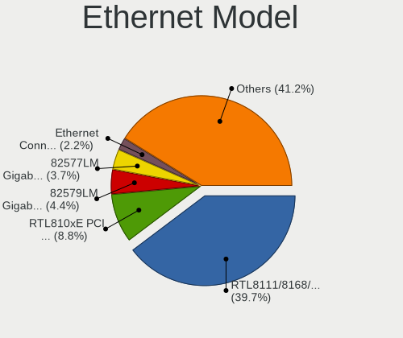

| Model                                                             | Computers | Percent |
|-------------------------------------------------------------------|-----------|---------|
| Realtek RTL8111/8168/8411 PCI Express Gigabit Ethernet Controller | 13        | 36.11%  |
| Realtek RTL810xE PCI Express Fast Ethernet controller             | 3         | 8.33%   |
| Intel 82579LM Gigabit Network Connection (Lewisville)             | 3         | 8.33%   |
| Intel 82577LM Gigabit Network Connection                          | 3         | 8.33%   |
| Qualcomm Atheros QCA8172 Fast Ethernet                            | 1         | 2.78%   |
| Qualcomm Atheros Killer E2400 Gigabit Ethernet Controller         | 1         | 2.78%   |
| Qualcomm Atheros AR8162 Fast Ethernet                             | 1         | 2.78%   |
| Nvidia MCP61 Ethernet                                             | 1         | 2.78%   |
| Intel I211 Gigabit Network Connection                             | 1         | 2.78%   |
| Intel I210 Gigabit Network Connection                             | 1         | 2.78%   |
| Intel Ethernet Connection I219-V                                  | 1         | 2.78%   |
| Intel Ethernet Connection I217-LM                                 | 1         | 2.78%   |
| Intel Ethernet Connection (2) I219-LM                             | 1         | 2.78%   |
| Intel 82801DB PRO/100 VE (LOM) Ethernet Controller                | 1         | 2.78%   |
| Intel 82567LM Gigabit Network Connection                          | 1         | 2.78%   |
| D-Link System DGE-528T Gigabit Ethernet Adapter                   | 1         | 2.78%   |
| Attansic AR8152 v2.0 Fast Ethernet                                | 1         | 2.78%   |
| ASIX AX88179 Gigabit Ethernet                                     | 1         | 2.78%   |

Net Controller Kind
-------------------

Ethernet, WiFi or modem

| Kind     | Computers | Percent |
|----------|-----------|---------|
| Ethernet | 34        | 54.84%  |
| WiFi     | 28        | 45.16%  |

Used Controller
---------------

Currently used network controller

| Kind     | Computers | Percent |
|----------|-----------|---------|
| Ethernet | 29        | 52.73%  |
| WiFi     | 26        | 47.27%  |

NICs
----

Total network controllers on board

| Total | Computers | Percent |
|-------|-----------|---------|
| 2     | 23        | 62.16%  |
| 1     | 13        | 35.14%  |
| 3     | 1         | 2.7%    |

IPv6
----

IPv6 vs IPv4

| Used | Computers | Percent |
|------|-----------|---------|
| No   | 37        | 100%    |

Bluetooth
---------

Bluetooth Vendor
----------------

Controller vendors

| Vendor                          | Computers | Percent |
|---------------------------------|-----------|---------|
| Intel                           | 8         | 38.1%   |
| Broadcom                        | 4         | 19.05%  |
| Qualcomm Atheros Communications | 3         | 14.29%  |
| Realtek Semiconductor           | 2         | 9.52%   |
| Hewlett-Packard                 | 2         | 9.52%   |
| Cambridge Silicon Radio         | 2         | 9.52%   |

Bluetooth Model
---------------

Controller models

| Model                                               | Computers | Percent |
|-----------------------------------------------------|-----------|---------|
| Intel Bluetooth Device                              | 5         | 23.81%  |
| Intel Bluetooth wireless interface                  | 3         | 14.29%  |
| Broadcom BCM2045B (BDC-2.1)                         | 3         | 14.29%  |
| Qualcomm Atheros Bluetooth USB Host Controller      | 2         | 9.52%   |
| HP Broadcom 2070 Bluetooth Combo                    | 2         | 9.52%   |
| Cambridge Silicon Radio Bluetooth Dongle (HCI mode) | 2         | 9.52%   |
| Realtek  Bluetooth 4.2 Adapter                      | 1         | 4.76%   |
| Realtek Bluetooth Radio                             | 1         | 4.76%   |
| Qualcomm Atheros AR9462 Bluetooth                   | 1         | 4.76%   |
| Broadcom BCM2045B (BDC-2.1) [Bluetooth Controller]  | 1         | 4.76%   |

Sound
-----

Sound Vendor
------------

Sound card vendors

| Vendor        | Computers | Percent |
|---------------|-----------|---------|
| Intel         | 28        | 63.64%  |
| AMD           | 11        | 25%     |
| Nvidia        | 4         | 9.09%   |
| Creative Labs | 1         | 2.27%   |

Sound Model
-----------

Sound card models

| Model                                                                             | Computers | Percent |
|-----------------------------------------------------------------------------------|-----------|---------|
| Intel Sunrise Point-LP HD Audio                                                   | 4         | 7.69%   |
| Intel 7 Series/C216 Chipset Family High Definition Audio Controller               | 4         | 7.69%   |
| Intel 5 Series/3400 Series Chipset High Definition Audio                          | 4         | 7.69%   |
| AMD SBx00 Azalia (Intel HDA)                                                      | 4         | 7.69%   |
| Intel Cannon Lake PCH cAVS                                                        | 3         | 5.77%   |
| Nvidia GT216 HDMI Audio Controller                                                | 2         | 3.85%   |
| Intel Xeon E3-1200 v3/4th Gen Core Processor HD Audio Controller                  | 2         | 3.85%   |
| Intel NM10/ICH7 Family High Definition Audio Controller                           | 2         | 3.85%   |
| Intel 8 Series/C220 Series Chipset High Definition Audio Controller               | 2         | 3.85%   |
| Intel 6 Series/C200 Series Chipset Family High Definition Audio Controller        | 2         | 3.85%   |
| AMD FCH Azalia Controller                                                         | 2         | 3.85%   |
| Nvidia TU107 GeForce GTX 1650 High Definition Audio Controller                    | 1         | 1.92%   |
| Nvidia GF108 High Definition Audio Controller                                     | 1         | 1.92%   |
| Intel Ice Lake-LP Smart Sound Technology Audio Controller                         | 1         | 1.92%   |
| Intel Haswell-ULT HD Audio Controller                                             | 1         | 1.92%   |
| Intel Comet Lake PCH-LP cAVS                                                      | 1         | 1.92%   |
| Intel CM238 HD Audio Controller                                                   | 1         | 1.92%   |
| Intel Atom Processor Z36xxx/Z37xxx Series High Definition Audio Controller        | 1         | 1.92%   |
| Intel 82801JI (ICH10 Family) HD Audio Controller                                  | 1         | 1.92%   |
| Intel 82801I (ICH9 Family) HD Audio Controller                                    | 1         | 1.92%   |
| Intel 8 Series HD Audio Controller                                                | 1         | 1.92%   |
| Creative Labs EMU10k2/CA0100/CA0102/CA10200 [Sound Blaster Audigy Series]         | 1         | 1.92%   |
| AMD RV635 HDMI Audio [Radeon HD 3650/3730/3750]                                   | 1         | 1.92%   |
| AMD Redwood HDMI Audio [Radeon HD 5000 Series]                                    | 1         | 1.92%   |
| AMD Polaris 22 HDMI Audio                                                         | 1         | 1.92%   |
| AMD Oland/Hainan/Cape Verde/Pitcairn HDMI Audio [Radeon HD 7000 Series]           | 1         | 1.92%   |
| AMD Kabini HDMI/DP Audio                                                          | 1         | 1.92%   |
| AMD Hawaii HDMI Audio [Radeon R9 290/290X / 390/390X]                             | 1         | 1.92%   |
| AMD Family 17h (Models 00h-0fh) HD Audio Controller                               | 1         | 1.92%   |
| AMD Ellesmere HDMI Audio [Radeon RX 470/480 / 570/580/590]                        | 1         | 1.92%   |
| AMD Caicos HDMI Audio [Radeon HD 6450 / 7450/8450/8490 OEM / R5 230/235/235X OEM] | 1         | 1.92%   |
| AMD BeaverCreek HDMI Audio [Radeon HD 6500D and 6400G-6600G series]               | 1         | 1.92%   |

Memory
------

Memory Vendor
-------------

Memory module vendors

| Vendor              | Computers | Percent |
|---------------------|-----------|---------|
| Samsung Electronics | 12        | 27.27%  |
| Unknown             | 8         | 18.18%  |
| Micron Technology   | 6         | 13.64%  |
| SK Hynix            | 5         | 11.36%  |
| Kingston            | 4         | 9.09%   |
| Corsair             | 2         | 4.55%   |
| A-DATA Technology   | 2         | 4.55%   |
| Team                | 1         | 2.27%   |
| Patriot             | 1         | 2.27%   |
| Elpida              | 1         | 2.27%   |
| Crucial             | 1         | 2.27%   |
| Apacer              | 1         | 2.27%   |

Memory Model
------------

Memory module models

| Model                                                           | Computers | Percent |
|-----------------------------------------------------------------|-----------|---------|
| Unknown RAM Module 4096MB DIMM 1600MT/s                         | 2         | 3.92%   |
| Unknown RAM Module 1024MB DIMM DDR 333MT/s                      | 2         | 3.92%   |
| Samsung RAM M471B5773DH0-CH9 2048MB SODIMM DDR3 1600MT/s        | 2         | 3.92%   |
| Samsung RAM M471B5273CH0-CH9 4096MB SODIMM DDR3 1334MT/s        | 2         | 3.92%   |
| Unknown RAM Module 512MB DIMM DDR 200MT/s                       | 1         | 1.96%   |
| Unknown RAM Module 2048MB SODIMM DDR2                           | 1         | 1.96%   |
| Unknown RAM Module 2048MB DIMM DDR2 800MT/s                     | 1         | 1.96%   |
| Unknown RAM Module 2048MB DIMM 800MT/s                          | 1         | 1.96%   |
| Unknown RAM Module 1024MB SODIMM DDR                            | 1         | 1.96%   |
| Unknown RAM Module 1024MB DIMM DDR 200MT/s                      | 1         | 1.96%   |
| Unknown RAM Module 1024MB DIMM 667MT/s                          | 1         | 1.96%   |
| Team RAM TEAMGROUP-SD4-2400 16384MB SODIMM DDR4 2667MT/s        | 1         | 1.96%   |
| SK Hynix RAM HMT351S6CFR8C-H9 4096MB SODIMM DDR3 1333MT/s       | 1         | 1.96%   |
| SK Hynix RAM HMT351S6BFR8C-H9 4096MB SODIMM DDR3 1333MT/s       | 1         | 1.96%   |
| SK Hynix RAM HMT351S6BFR8C-G7 4096MB SODIMM DDR3 1067MT/s       | 1         | 1.96%   |
| SK Hynix RAM HMT351S6AFR8C-G7 4096MB SODIMM DDR3 1067MT/s       | 1         | 1.96%   |
| SK Hynix RAM HMT325U6CFR8C-PB 2048MB DIMM DDR3 1600MT/s         | 1         | 1.96%   |
| SK Hynix RAM HMT325S6CFR8C-PB 2048MB SODIMM DDR3 1600MT/s       | 1         | 1.96%   |
| Samsung RAM M471B5673FH0-CH9 2048MB SODIMM 1334MT/s             | 1         | 1.96%   |
| Samsung RAM M471B5273DH0-CK0 4096MB SODIMM DDR3 1600MT/s        | 1         | 1.96%   |
| Samsung RAM M471B5273DH0-CH9 4096MB SODIMM DDR3 1334MT/s        | 1         | 1.96%   |
| Samsung RAM M471B5273BH1-CF8 4096MB SODIMM DDR3 1067MT/s        | 1         | 1.96%   |
| Samsung RAM M471B5173QH0-YK0 4GB SODIMM DDR3 1600MT/s           | 1         | 1.96%   |
| Samsung RAM M471B5173BH0-CK0 4096MB SODIMM DDR3 1600MT/s        | 1         | 1.96%   |
| Samsung RAM M471B2873FHS-CH9 1024MB SODIMM DDR3 1334MT/s        | 1         | 1.96%   |
| Samsung RAM M471A5244CB0-CTD 4096MB SODIMM DDR4 3266MT/s        | 1         | 1.96%   |
| Samsung RAM M471A1K43CB1-CTD 8192MB SODIMM DDR4 2667MT/s        | 1         | 1.96%   |
| Samsung RAM M471A1K43CB1-CRC 8192MB SODIMM DDR4 2667MT/s        | 1         | 1.96%   |
| Samsung RAM K4E6E304EB-EGCF 4096MB Row Of Chips LPDDR3 1867MT/s | 1         | 1.96%   |
| Patriot RAM 3000 C15 Series 8192MB DIMM DDR4 3000MT/s           | 1         | 1.96%   |
| Micron RAM CT102464BF186D.C16 8192MB SODIMM DDR3 1777MT/s       | 1         | 1.96%   |
| Micron RAM 8ATF51264HZ-2G3B1 4096MB SODIMM DDR4 2400MT/s        | 1         | 1.96%   |
| Micron RAM 4ATF51264HZ-2G6E1 4096MB SODIMM DDR4 2667MT/s        | 1         | 1.96%   |
| Micron RAM 16KTF51264HZ-1G6M1 4096MB SODIMM DDR3 1600MT/s       | 1         | 1.96%   |
| Micron RAM 16JSF51264HZ-1G4D1 4096MB SODIMM DDR3 1334MT/s       | 1         | 1.96%   |
| Micron RAM 16ATF2G64HZ-3G2J1 16384MB SODIMM DDR4 3200MT/s       | 1         | 1.96%   |
| Kingston RAM TSB1600D3S1ELD/4GE 4096MB SODIMM DDR3 1600MT/s     | 1         | 1.96%   |
| Kingston RAM Module 4096MB DIMM DDR3 1600MT/s                   | 1         | 1.96%   |
| Kingston RAM K531R8-ETB 4096MB DIMM DDR3 1600MT/s               | 1         | 1.96%   |
| Kingston RAM 99U5469-045.A00LF 4096MB SODIMM DDR3 1600MT/s      | 1         | 1.96%   |
| Elpida RAM EBJ41UF8BCS0-DJ-F 4096MB SODIMM DDR3 1334MT/s        | 1         | 1.96%   |
| Crucial RAM CT16G4SFD824A.C16FDD 16GB SODIMM DDR4 2400MT/s      | 1         | 1.96%   |
| Corsair RAM CMSX32GX4M2A2666C18 16384MB SODIMM DDR4 2667MT/s    | 1         | 1.96%   |
| Corsair RAM CMK16GX4M2A2133C13 8192MB DIMM DDR4 2400MT/s        | 1         | 1.96%   |
| Apacer RAM 76.A302G.C4D0B 2048MB SODIMM DDR3 1600MT/s           | 1         | 1.96%   |
| A-DATA RAM AM1P24HC4U1-B9RS 4096MB SODIMM DDR4 2400MT/s         | 1         | 1.96%   |
| A-DATA RAM AD73I1C1674EV 4096MB SODIMM DDR3 1334MT/s            | 1         | 1.96%   |

Memory Kind
-----------

Memory module kinds

| Kind    | Computers | Percent |
|---------|-----------|---------|
| DDR3    | 16        | 45.71%  |
| DDR4    | 10        | 28.57%  |
| DDR     | 3         | 8.57%   |
| Unknown | 3         | 8.57%   |
| DDR2    | 2         | 5.71%   |
| LPDDR3  | 1         | 2.86%   |

Memory Form Factor
------------------

Physical design of the memory module

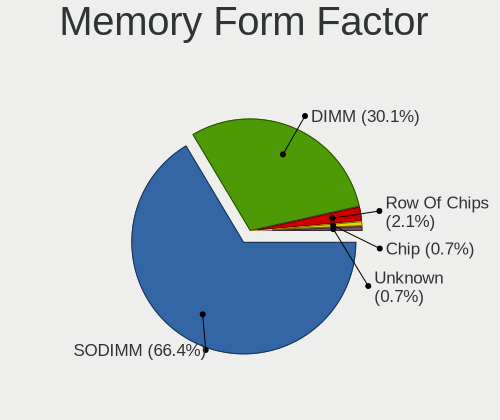

| Name         | Computers | Percent |
|--------------|-----------|---------|
| SODIMM       | 23        | 65.71%  |
| DIMM         | 11        | 31.43%  |
| Row Of Chips | 1         | 2.86%   |

Memory Size
-----------

Memory module size

| Size  | Computers | Percent |
|-------|-----------|---------|
| 4096  | 20        | 47.62%  |
| 2048  | 8         | 19.05%  |
| 8192  | 5         | 11.9%   |
| 16384 | 4         | 9.52%   |
| 1024  | 4         | 9.52%   |
| 512   | 1         | 2.38%   |

Memory Speed
------------

Memory module speed

| Speed   | Computers | Percent |
|---------|-----------|---------|
| 1600    | 12        | 27.91%  |
| 1334    | 6         | 13.95%  |
| 2667    | 5         | 11.63%  |
| 2400    | 4         | 9.3%    |
| 1067    | 2         | 4.65%   |
| 800     | 2         | 4.65%   |
| 333     | 2         | 4.65%   |
| Unknown | 2         | 4.65%   |
| 3266    | 1         | 2.33%   |
| 3200    | 1         | 2.33%   |
| 3000    | 1         | 2.33%   |
| 1867    | 1         | 2.33%   |
| 1777    | 1         | 2.33%   |
| 1333    | 1         | 2.33%   |
| 667     | 1         | 2.33%   |
| 200     | 1         | 2.33%   |

Printers & scanners
-------------------

Printer Vendor
--------------

Printer device vendors

Zero info for selected period =(

Printer Model
-------------

Printer device models

Zero info for selected period =(

Scanner Vendor
--------------

Scanner device vendors

| Vendor | Computers | Percent |
|--------|-----------|---------|
| Canon  | 1         | 100%    |

Scanner Model
-------------

Scanner device models

| Model                    | Computers | Percent |
|--------------------------|-----------|---------|
| Canon CanoScan LiDE 700F | 1         | 100%    |

Camera
------

Camera Vendor
-------------

Camera device vendors

| Vendor                                 | Computers | Percent |
|----------------------------------------|-----------|---------|
| Chicony Electronics                    | 8         | 42.11%  |
| Lenovo                                 | 2         | 10.53%  |
| Acer                                   | 2         | 10.53%  |
| Sunplus Innovation Technology          | 1         | 5.26%   |
| Realtek Semiconductor                  | 1         | 5.26%   |
| Logitech                               | 1         | 5.26%   |
| Lite-On Technology                     | 1         | 5.26%   |
| Importek                               | 1         | 5.26%   |
| IMC Networks                           | 1         | 5.26%   |
| Cheng Uei Precision Industry (Foxlink) | 1         | 5.26%   |

Camera Model
------------

Camera device models

| Model                                                | Computers | Percent |
|------------------------------------------------------|-----------|---------|
| Sunplus HD WebCam                                    | 1         | 5.26%   |
| Realtek USB2.0 VGA UVC WebCam                        | 1         | 5.26%   |
| Logitech HD Webcam C910                              | 1         | 5.26%   |
| Lite-On HP Wide Vision FHD Camera                    | 1         | 5.26%   |
| Lenovo UVC Camera                                    | 1         | 5.26%   |
| Lenovo Integrated Webcam [R5U877]                    | 1         | 5.26%   |
| Importek TOSHIBA Web Camera - HD                     | 1         | 5.26%   |
| IMC Networks USB2.0 HD UVC WebCam                    | 1         | 5.26%   |
| Chicony USB2.0 0.3M UVC WebCam                       | 1         | 5.26%   |
| Chicony TOSHIBA Web Camera - HD                      | 1         | 5.26%   |
| Chicony Integrated HP HD Webcam                      | 1         | 5.26%   |
| Chicony Integrated Camera                            | 1         | 5.26%   |
| Chicony HP Webcam [2 MP Macro]                       | 1         | 5.26%   |
| Chicony HP TrueVision HD Camera                      | 1         | 5.26%   |
| Chicony HP HD Webcam [Fixed]                         | 1         | 5.26%   |
| Chicony HD WebCam                                    | 1         | 5.26%   |
| Cheng Uei Precision Industry (Foxlink) HP Webcam-101 | 1         | 5.26%   |
| Acer SunplusIT INC. Integrated Camera                | 1         | 5.26%   |
| Acer HD Webcam                                       | 1         | 5.26%   |

Security
--------

Fingerprint Vendor
------------------

Fingerprint sensor vendors

| Vendor                | Computers | Percent |
|-----------------------|-----------|---------|
| Validity Sensors      | 3         | 37.5%   |
| Upek                  | 2         | 25%     |
| Synaptics             | 1         | 12.5%   |
| LighTuning Technology | 1         | 12.5%   |
| AuthenTec             | 1         | 12.5%   |

Fingerprint Model
-----------------

Fingerprint sensor models

| Model                                                  | Computers | Percent |
|--------------------------------------------------------|-----------|---------|
| Upek Biometric Touchchip/Touchstrip Fingerprint Sensor | 2         | 25%     |
| Validity Sensors VFS471 Fingerprint Reader             | 1         | 12.5%   |
| Validity Sensors VFS451 Fingerprint Reader             | 1         | 12.5%   |
| Validity Sensors Synaptics WBDI                        | 1         | 12.5%   |
| LighTuning EgisTec Touch Fingerprint Sensor            | 1         | 12.5%   |
| AuthenTec AES2810                                      | 1         | 12.5%   |
| Unknown                                                | 1         | 12.5%   |

Chipcard Vendor
---------------

Chipcard module vendors

Zero info for selected period =(

Chipcard Model
--------------

Chipcard module models

Zero info for selected period =(

Unsupported
-----------

Unsupported Devices
-------------------

Total unsupported devices on board

| Total | Computers | Percent |
|-------|-----------|---------|
| 0     | 25        | 67.57%  |
| 1     | 10        | 27.03%  |
| 3     | 1         | 2.7%    |
| 2     | 1         | 2.7%    |

Unsupported Device Types
------------------------

Types of unsupported devices

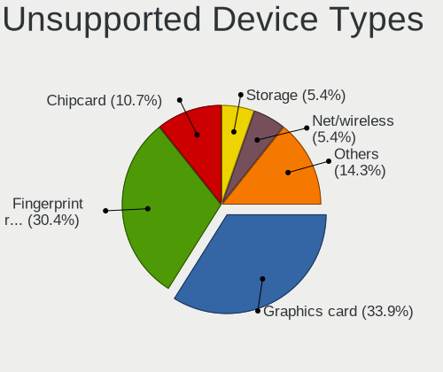

| Type                     | Computers | Percent |
|--------------------------|-----------|---------|
| Fingerprint reader       | 8         | 53.33%  |
| Graphics card            | 6         | 40%     |
| Communication controller | 1         | 6.67%   |

