MX 20 - Tested Hardware & Statistics (Desktops)
-----------------------------------------------

A project to collect tested hardware configurations for MX 20.

Anyone can contribute to this report by the [hw-probe](https://github.com/linuxhw/hw-probe) tool:

    sudo -E hw-probe -all -upload

Please contribute! Especially if your hardware is rare.

Contents
--------

* [ Test Cases ](#test-cases)

* [ System ](#system)
  - [ Kernel                   ](#kernel)
  - [ Kernel Family            ](#kernel-family)
  - [ Kernel Major Ver.        ](#kernel-major-ver)
  - [ Arch                     ](#arch)
  - [ DE                       ](#de)
  - [ Display Server           ](#display-server)
  - [ Display Manager          ](#display-manager)
  - [ OS Lang                  ](#os-lang)
  - [ Boot Mode                ](#boot-mode)
  - [ Filesystem               ](#filesystem)
  - [ Part. scheme             ](#part-scheme)
  - [ Dual Boot with Linux/BSD ](#dual-boot-with-linuxbsd)
  - [ Dual Boot (Win)          ](#dual-boot-win)

* [ Board ](#board)
  - [ Vendor                   ](#vendor)
  - [ Model                    ](#model)
  - [ Model Family             ](#model-family)
  - [ MFG Year                 ](#mfg-year)
  - [ Form Factor              ](#form-factor)
  - [ Secure Boot              ](#secure-boot)
  - [ Coreboot                 ](#coreboot)
  - [ RAM Size                 ](#ram-size)
  - [ RAM Used                 ](#ram-used)
  - [ Total Drives             ](#total-drives)
  - [ Has CD-ROM               ](#has-cd-rom)
  - [ Has Ethernet             ](#has-ethernet)
  - [ Has WiFi                 ](#has-wifi)
  - [ Has Bluetooth            ](#has-bluetooth)

* [ Location ](#location)
  - [ Country                  ](#country)
  - [ City                     ](#city)

* [ Drives ](#drives)
  - [ Drive Vendor             ](#drive-vendor)
  - [ Drive Model              ](#drive-model)
  - [ HDD Vendor               ](#hdd-vendor)
  - [ SSD Vendor               ](#ssd-vendor)
  - [ Drive Kind               ](#drive-kind)
  - [ Drive Connector          ](#drive-connector)
  - [ Drive Size               ](#drive-size)
  - [ Space Total              ](#space-total)
  - [ Space Used               ](#space-used)
  - [ Malfunc. Drives          ](#malfunc-drives)
  - [ Malfunc. Drive Vendor    ](#malfunc-drive-vendor)
  - [ Malfunc. HDD Vendor      ](#malfunc-hdd-vendor)
  - [ Malfunc. Drive Kind      ](#malfunc-drive-kind)
  - [ Failed Drives            ](#failed-drives)
  - [ Failed Drive Vendor      ](#failed-drive-vendor)
  - [ Drive Status             ](#drive-status)

* [ Storage controller ](#storage-controller)
  - [ Storage Vendor           ](#storage-vendor)
  - [ Storage Model            ](#storage-model)
  - [ Storage Kind             ](#storage-kind)

* [ Processor ](#processor)
  - [ CPU Vendor               ](#cpu-vendor)
  - [ CPU Model                ](#cpu-model)
  - [ CPU Model Family         ](#cpu-model-family)
  - [ CPU Cores                ](#cpu-cores)
  - [ CPU Sockets              ](#cpu-sockets)
  - [ CPU Threads              ](#cpu-threads)
  - [ CPU Op-Modes             ](#cpu-op-modes)
  - [ CPU Microcode            ](#cpu-microcode)
  - [ CPU Microarch            ](#cpu-microarch)

* [ Graphics ](#graphics)
  - [ GPU Vendor               ](#gpu-vendor)
  - [ GPU Model                ](#gpu-model)
  - [ GPU Combo                ](#gpu-combo)
  - [ GPU Driver               ](#gpu-driver)
  - [ GPU Memory               ](#gpu-memory)

* [ Monitor ](#monitor)
  - [ Monitor Vendor           ](#monitor-vendor)
  - [ Monitor Model            ](#monitor-model)
  - [ Monitor Resolution       ](#monitor-resolution)
  - [ Monitor Diagonal         ](#monitor-diagonal)
  - [ Monitor Width            ](#monitor-width)
  - [ Aspect Ratio             ](#aspect-ratio)
  - [ Monitor Area             ](#monitor-area)
  - [ Pixel Density            ](#pixel-density)
  - [ Multiple Monitors        ](#multiple-monitors)

* [ Network ](#network)
  - [ Net Controller Vendor    ](#net-controller-vendor)
  - [ Net Controller Model     ](#net-controller-model)
  - [ Wireless Vendor          ](#wireless-vendor)
  - [ Wireless Model           ](#wireless-model)
  - [ Ethernet Vendor          ](#ethernet-vendor)
  - [ Ethernet Model           ](#ethernet-model)
  - [ Net Controller Kind      ](#net-controller-kind)
  - [ Used Controller          ](#used-controller)
  - [ NICs                     ](#nics)
  - [ IPv6                     ](#ipv6)

* [ Bluetooth ](#bluetooth)
  - [ Bluetooth Vendor         ](#bluetooth-vendor)
  - [ Bluetooth Model          ](#bluetooth-model)

* [ Sound ](#sound)
  - [ Sound Vendor             ](#sound-vendor)
  - [ Sound Model              ](#sound-model)

* [ Memory ](#memory)
  - [ Memory Vendor            ](#memory-vendor)
  - [ Memory Model             ](#memory-model)
  - [ Memory Kind              ](#memory-kind)
  - [ Memory Form Factor       ](#memory-form-factor)
  - [ Memory Size              ](#memory-size)
  - [ Memory Speed             ](#memory-speed)

* [ Printers & scanners ](#printers--scanners)
  - [ Printer Vendor           ](#printer-vendor)
  - [ Printer Model            ](#printer-model)
  - [ Scanner Vendor           ](#scanner-vendor)
  - [ Scanner Model            ](#scanner-model)

* [ Camera ](#camera)
  - [ Camera Vendor            ](#camera-vendor)
  - [ Camera Model             ](#camera-model)

* [ Security ](#security)
  - [ Fingerprint Vendor       ](#fingerprint-vendor)
  - [ Fingerprint Model        ](#fingerprint-model)
  - [ Chipcard Vendor          ](#chipcard-vendor)
  - [ Chipcard Model           ](#chipcard-model)

* [ Unsupported ](#unsupported)
  - [ Unsupported Devices      ](#unsupported-devices)
  - [ Unsupported Device Types ](#unsupported-device-types)

Test Cases
----------

Total: 25

| Vendor   | Model                       | Probe                                                      | Date         |
|----------|-----------------------------|------------------------------------------------------------|--------------|
| ASRock   | H370M-ITX/ac                | [fa925dcefb](https://linux-hardware.org/?probe=fa925dcefb) | Oct 24, 2022 |
| ASRock   | H370M-ITX/ac                | [1a577be107](https://linux-hardware.org/?probe=1a577be107) | Sep 04, 2022 |
| ASUSTek  | PRIME H510M-A               | [4521c22268](https://linux-hardware.org/?probe=4521c22268) | Mar 06, 2022 |
| IBM      | 8183B2U                     | [d070680dfb](https://linux-hardware.org/?probe=d070680dfb) | Jan 14, 2022 |
| Gigabyte | F2A88X-UP4                  | [52e09bab91](https://linux-hardware.org/?probe=52e09bab91) | Jan 02, 2022 |
| Dell     | 00F82W A01                  | [08e803937e](https://linux-hardware.org/?probe=08e803937e) | Oct 18, 2021 |
| HP       | 21D0                        | [4cee9a5c3d](https://linux-hardware.org/?probe=4cee9a5c3d) | Oct 11, 2021 |
| ASRock   | H470M-ITX/ac                | [ad42fa5d08](https://linux-hardware.org/?probe=ad42fa5d08) | Oct 01, 2021 |
| ASRock   | H170M Pro4                  | [f291edbc4a](https://linux-hardware.org/?probe=f291edbc4a) | Jul 18, 2021 |
| Gigabyte | H110M-S2H-CF                | [192043ebbd](https://linux-hardware.org/?probe=192043ebbd) | Jul 12, 2021 |
| Dell     | 00F82W A01                  | [b85b636b73](https://linux-hardware.org/?probe=b85b636b73) | Jun 26, 2021 |
| ASUSTek  | TUF B450M-PRO GAMING        | [ac4ce770fc](https://linux-hardware.org/?probe=ac4ce770fc) | May 10, 2021 |
| MSI      | B450-A PRO MAX              | [506efba999](https://linux-hardware.org/?probe=506efba999) | May 02, 2021 |
| ASRock   | B560M Pro4                  | [d4484f50cd](https://linux-hardware.org/?probe=d4484f50cd) | Apr 08, 2021 |
| ASUSTek  | P5K-E                       | [f0c435ead1](https://linux-hardware.org/?probe=f0c435ead1) | Apr 01, 2021 |
| Dell     | 0XR1GT A00                  | [04145c0b36](https://linux-hardware.org/?probe=04145c0b36) | Mar 29, 2021 |
| ASUSTek  | TUF B450M-PRO GAMING        | [4c93424ea5](https://linux-hardware.org/?probe=4c93424ea5) | Mar 26, 2021 |
| MSI      | MS-7210 100                 | [e8723eb58b](https://linux-hardware.org/?probe=e8723eb58b) | Mar 17, 2021 |
| MSI      | MAG B550M MORTAR WIFI       | [4789c5df48](https://linux-hardware.org/?probe=4789c5df48) | Feb 06, 2021 |
| HP       | 1905                        | [03a91e7ecc](https://linux-hardware.org/?probe=03a91e7ecc) | Nov 27, 2020 |
| ASUSTek  | Z97-E                       | [42c2810369](https://linux-hardware.org/?probe=42c2810369) | Apr 03, 2020 |
| MSI      | 760GM-P23                   | [67de432cb4](https://linux-hardware.org/?probe=67de432cb4) | Apr 01, 2020 |
| Gigabyte | Z390 GAMING X-CF            | [104b035076](https://linux-hardware.org/?probe=104b035076) | Apr 01, 2020 |
| Gigabyte | X470 AORUS ULTRA GAMING-... | [1243c4a0d9](https://linux-hardware.org/?probe=1243c4a0d9) | Mar 24, 2020 |
| HP       | 1790                        | [68a167efd3](https://linux-hardware.org/?probe=68a167efd3) | Mar 24, 2020 |

System
------

Kernel
------

Version of the Linux kernel

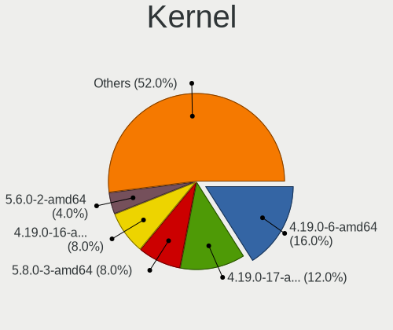

| Version                    | Desktops | Percent |
|----------------------------|----------|---------|
| 4.19.0-6-amd64             | 4        | 16%     |
| 4.19.0-17-amd64            | 3        | 12%     |
| 5.8.0-3-amd64              | 2        | 8%      |
| 4.19.0-16-amd64            | 2        | 8%      |
| 5.6.0-2-amd64              | 1        | 4%      |
| 5.5.0-9.1-liquorix-amd64   | 1        | 4%      |
| 5.5.0-5.1-liquorix-amd64   | 1        | 4%      |
| 5.15.0-1mx-amd64           | 1        | 4%      |
| 5.11.0-16.1-liquorix-amd64 | 1        | 4%      |
| 5.10.0-8mx-amd64           | 1        | 4%      |
| 5.10.0-5mx-amd64           | 1        | 4%      |
| 5.10.0-4mx-amd64           | 1        | 4%      |
| 4.19.0-9-686-pae           | 1        | 4%      |
| 4.19.0-22-amd64            | 1        | 4%      |
| 4.19.0-21-amd64            | 1        | 4%      |
| 4.19.0-18-amd64            | 1        | 4%      |
| 4.19.0-14-amd64            | 1        | 4%      |
| 4.19.0-12-amd64            | 1        | 4%      |

Kernel Family
-------------

Linux kernel without a distro release

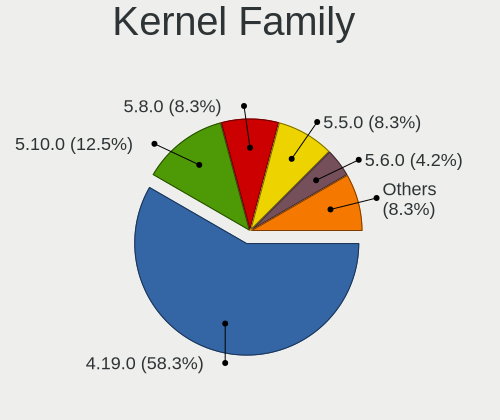

| Version | Desktops | Percent |
|---------|----------|---------|
| 4.19.0  | 14       | 58.33%  |
| 5.10.0  | 3        | 12.5%   |
| 5.8.0   | 2        | 8.33%   |
| 5.5.0   | 2        | 8.33%   |
| 5.6.0   | 1        | 4.17%   |
| 5.15.0  | 1        | 4.17%   |
| 5.11.0  | 1        | 4.17%   |

Kernel Major Ver.
-----------------

Linux kernel major version

| Version | Desktops | Percent |
|---------|----------|---------|
| 4.19    | 14       | 58.33%  |
| 5.10    | 3        | 12.5%   |
| 5.8     | 2        | 8.33%   |
| 5.5     | 2        | 8.33%   |
| 5.6     | 1        | 4.17%   |
| 5.15    | 1        | 4.17%   |
| 5.11    | 1        | 4.17%   |

Arch
----

OS architecture (x86_64, i586, etc.)

| Name   | Desktops | Percent |
|--------|----------|---------|
| x86_64 | 21       | 95.45%  |
| i686   | 1        | 4.55%   |

DE
--

Desktop Environment

| Name | Desktops | Percent |
|------|----------|---------|
| XFCE | 17       | 77.27%  |
| KDE5 | 4        | 18.18%  |
| MATE | 1        | 4.55%   |

Display Server
--------------

X11 or Wayland

| Name | Desktops | Percent |
|------|----------|---------|
| X11  | 22       | 100%    |

Display Manager
---------------

SDDM, LightDM, etc.

| Name    | Desktops | Percent |
|---------|----------|---------|
| LightDM | 20       | 90.91%  |
| SDDM    | 2        | 9.09%   |

OS Lang
-------

Language

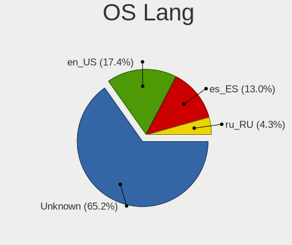

| Lang    | Desktops | Percent |
|---------|----------|---------|
| Unknown | 15       | 65.22%  |
| en_US   | 4        | 17.39%  |
| es_ES   | 3        | 13.04%  |
| ru_RU   | 1        | 4.35%   |

Boot Mode
---------

EFI or BIOS

| Mode | Desktops | Percent |
|------|----------|---------|
| BIOS | 12       | 54.55%  |
| EFI  | 10       | 45.45%  |

Filesystem
----------

Type of filesystem

| Type | Desktops | Percent |
|------|----------|---------|
| Ext4 | 22       | 100%    |

Part. scheme
------------

Scheme of partitioning

| Type | Desktops | Percent |
|------|----------|---------|
| GPT  | 14       | 60.87%  |
| MBR  | 9        | 39.13%  |

Dual Boot with Linux/BSD
------------------------

Hosting more than one Linux/BSD

| Dual boot | Desktops | Percent |
|-----------|----------|---------|
| No        | 14       | 58.33%  |
| Yes       | 10       | 41.67%  |

Dual Boot (Win)
---------------

Hosting Linux and Windows

| Dual boot | Desktops | Percent |
|-----------|----------|---------|
| Yes       | 12       | 54.55%  |
| No        | 10       | 45.45%  |

Board
-----

Vendor
------

Motherboard manufacturer

| Name                | Desktops | Percent |
|---------------------|----------|---------|
| MSI                 | 4        | 18.18%  |
| Gigabyte Technology | 4        | 18.18%  |
| ASUSTek Computer    | 4        | 18.18%  |
| ASRock              | 4        | 18.18%  |
| Hewlett-Packard     | 3        | 13.64%  |
| Dell                | 2        | 9.09%   |
| IBM                 | 1        | 4.55%   |

Model
-----

Motherboard model

| Name                             | Desktops | Percent |
|----------------------------------|----------|---------|
| MSI MS-7C94                      | 1        | 4.55%   |
| MSI MS-7B86                      | 1        | 4.55%   |
| MSI MS-7641                      | 1        | 4.55%   |
| MSI GEG                          | 1        | 4.55%   |
| IBM 8183B2U                      | 1        | 4.55%   |
| HP Z230 Tower Workstation        | 1        | 4.55%   |
| HP Z220 CMT Workstation          | 1        | 4.55%   |
| HP ProDesk 600 G1 DM             | 1        | 4.55%   |
| Gigabyte Z390 GAMING X           | 1        | 4.55%   |
| Gigabyte X470 AORUS ULTRA GAMING | 1        | 4.55%   |
| Gigabyte H110M-S2H               | 1        | 4.55%   |
| Gigabyte F2A88X-UP4              | 1        | 4.55%   |
| Dell OptiPlex 9010               | 1        | 4.55%   |
| Dell Inspiron 660                | 1        | 4.55%   |
| ASUS TUF B450M-PRO GAMING        | 1        | 4.55%   |
| ASUS PRIME H510M-A               | 1        | 4.55%   |
| ASUS P5K-E                       | 1        | 4.55%   |
| ASUS All Series                  | 1        | 4.55%   |
| ASRock H470M-ITX/ac              | 1        | 4.55%   |
| ASRock H370M-ITX/ac              | 1        | 4.55%   |
| ASRock H170M Pro4                | 1        | 4.55%   |
| ASRock B560M Pro4                | 1        | 4.55%   |

Model Family
------------

Motherboard model prefix

| Name                | Desktops | Percent |
|---------------------|----------|---------|
| MSI MS-7C94         | 1        | 4.55%   |
| MSI MS-7B86         | 1        | 4.55%   |
| MSI MS-7641         | 1        | 4.55%   |
| MSI GEG             | 1        | 4.55%   |
| IBM 8183B2U         | 1        | 4.55%   |
| HP Z230             | 1        | 4.55%   |
| HP Z220             | 1        | 4.55%   |
| HP ProDesk          | 1        | 4.55%   |
| Gigabyte Z390       | 1        | 4.55%   |
| Gigabyte X470       | 1        | 4.55%   |
| Gigabyte H110M-S2H  | 1        | 4.55%   |
| Gigabyte F2A88X-UP4 | 1        | 4.55%   |
| Dell OptiPlex       | 1        | 4.55%   |
| Dell Inspiron       | 1        | 4.55%   |
| ASUS TUF            | 1        | 4.55%   |
| ASUS PRIME          | 1        | 4.55%   |
| ASUS P5K-E          | 1        | 4.55%   |
| ASUS All            | 1        | 4.55%   |
| ASRock H470M-ITX    | 1        | 4.55%   |
| ASRock H370M-ITX    | 1        | 4.55%   |
| ASRock H170M        | 1        | 4.55%   |
| ASRock B560M        | 1        | 4.55%   |

MFG Year
--------

Motherboard manufacture year

| Year | Desktops | Percent |
|------|----------|---------|
| 2018 | 3        | 13.64%  |
| 2014 | 3        | 13.64%  |
| 2021 | 2        | 9.09%   |
| 2020 | 2        | 9.09%   |
| 2019 | 2        | 9.09%   |
| 2013 | 2        | 9.09%   |
| 2012 | 2        | 9.09%   |
| 2016 | 1        | 4.55%   |
| 2015 | 1        | 4.55%   |
| 2011 | 1        | 4.55%   |
| 2007 | 1        | 4.55%   |
| 2006 | 1        | 4.55%   |
| 2005 | 1        | 4.55%   |

Form Factor
-----------

Physical design of the computer

| Name    | Desktops | Percent |
|---------|----------|---------|
| Desktop | 22       | 100%    |

Secure Boot
-----------

Enabled or disabled

| State    | Desktops | Percent |
|----------|----------|---------|
| Disabled | 22       | 100%    |

Coreboot
--------

Have coreboot on board

| Used | Desktops | Percent |
|------|----------|---------|
| No   | 22       | 100%    |

RAM Size
--------

Total RAM memory

| Size in GB | Desktops | Percent |
|------------|----------|---------|
| 16.01-24.0 | 9        | 40.91%  |
| 8.01-16.0  | 5        | 22.73%  |
| 32.01-64.0 | 3        | 13.64%  |
| 24.01-32.0 | 2        | 9.09%   |
| 4.01-8.0   | 1        | 4.55%   |
| 3.01-4.0   | 1        | 4.55%   |
| 1.01-2.0   | 1        | 4.55%   |

RAM Used
--------

Used RAM memory

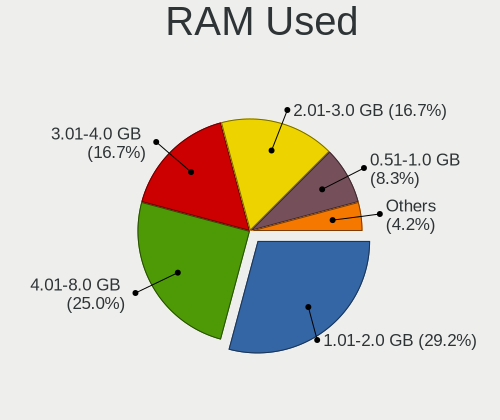

| Used GB   | Desktops | Percent |
|-----------|----------|---------|
| 1.01-2.0  | 7        | 29.17%  |
| 4.01-8.0  | 6        | 25%     |
| 3.01-4.0  | 4        | 16.67%  |
| 2.01-3.0  | 4        | 16.67%  |
| 0.51-1.0  | 2        | 8.33%   |
| 8.01-16.0 | 1        | 4.17%   |

Total Drives
------------

Number of drives on board

| Drives | Desktops | Percent |
|--------|----------|---------|
| 2      | 10       | 41.67%  |
| 3      | 6        | 25%     |
| 1      | 5        | 20.83%  |
| 5      | 2        | 8.33%   |
| 4      | 1        | 4.17%   |

Has CD-ROM
----------

Has CD-ROM on board

| Presented | Desktops | Percent |
|-----------|----------|---------|
| No        | 12       | 54.55%  |
| Yes       | 10       | 45.45%  |

Has Ethernet
------------

Has Ethernet on board

| Presented | Desktops | Percent |
|-----------|----------|---------|
| Yes       | 22       | 100%    |

Has WiFi
--------

Has WiFi module

| Presented | Desktops | Percent |
|-----------|----------|---------|
| Yes       | 11       | 50%     |
| No        | 11       | 50%     |

Has Bluetooth
-------------

Has Bluetooth module

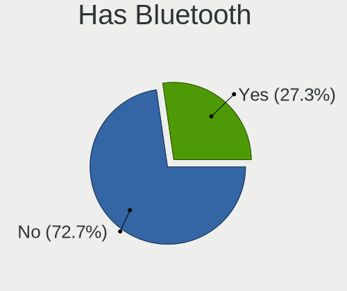

| Presented | Desktops | Percent |
|-----------|----------|---------|
| No        | 16       | 72.73%  |
| Yes       | 6        | 27.27%  |

Location
--------

Country
-------

Geographic location (country)

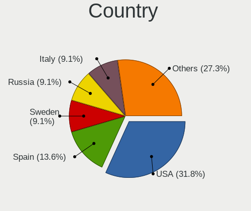

| Country     | Desktops | Percent |
|-------------|----------|---------|
| USA         | 7        | 31.82%  |
| Spain       | 3        | 13.64%  |
| Sweden      | 2        | 9.09%   |
| Russia      | 2        | 9.09%   |
| Italy       | 2        | 9.09%   |
| Serbia      | 1        | 4.55%   |
| Philippines | 1        | 4.55%   |
| Indonesia   | 1        | 4.55%   |
| Finland     | 1        | 4.55%   |
| Denmark     | 1        | 4.55%   |
| Canada      | 1        | 4.55%   |

City
----

Geographic location (city)

| City                     | Desktops | Percent |
|--------------------------|----------|---------|
| Tacoma                   | 1        | 4.17%   |
| Stockholm                | 1        | 4.17%   |
| Södertälje             | 1        | 4.17%   |
| Sibulan                  | 1        | 4.17%   |
| Podolsk                  | 1        | 4.17%   |
| Omsk                     | 1        | 4.17%   |
| Novi Knezevac            | 1        | 4.17%   |
| Mount Pocono             | 1        | 4.17%   |
| Mechanicsburg            | 1        | 4.17%   |
| Manado                   | 1        | 4.17%   |
| Madrid                   | 1        | 4.17%   |
| Lucca                    | 1        | 4.17%   |
| Livorno                  | 1        | 4.17%   |
| La Puebla                | 1        | 4.17%   |
| Huntsville               | 1        | 4.17%   |
| Franklin                 | 1        | 4.17%   |
| Fanny Bay                | 1        | 4.17%   |
| Espoo                    | 1        | 4.17%   |
| Chesapeake               | 1        | 4.17%   |
| Barcelona                | 1        | 4.17%   |
| Bacolod City             | 1        | 4.17%   |
| Ashburn                  | 1        | 4.17%   |
| Albertslund Municipality | 1        | 4.17%   |
| Albavilla                | 1        | 4.17%   |

Drives
------

Drive Vendor
------------

Hard drive vendors

| Vendor              | Desktops | Drives | Percent |
|---------------------|----------|--------|---------|
| WDC                 | 11       | 14     | 23.4%   |
| Seagate             | 10       | 13     | 21.28%  |
| Samsung Electronics | 6        | 9      | 12.77%  |
| Kingston            | 4        | 4      | 8.51%   |
| A-DATA Technology   | 3        | 3      | 6.38%   |
| SanDisk             | 2        | 2      | 4.26%   |
| Hitachi             | 2        | 3      | 4.26%   |
| Crucial             | 2        | 3      | 4.26%   |
| WDC WDS1            | 1        | 1      | 2.13%   |
| Toshiba             | 1        | 2      | 2.13%   |
| SPCC                | 1        | 1      | 2.13%   |
| PNY                 | 1        | 1      | 2.13%   |
| Intel               | 1        | 1      | 2.13%   |
| GOODRAM             | 1        | 1      | 2.13%   |
| Gigabyte Technology | 1        | 1      | 2.13%   |

Drive Model
-----------

Hard drive models

| Model                             | Desktops | Percent |
|-----------------------------------|----------|---------|
| WDC WD1002FAEX-00Z3A0 1TB         | 2        | 3.85%   |
| Seagate ST2000DM008-2FR102 2TB    | 2        | 3.85%   |
| WDC WDS500G2B0A 500GB SSD         | 1        | 1.92%   |
| WDC WDS500G1R0A-68A4W0 500GB SSD  | 1        | 1.92%   |
| WDC WDS250G2B0A-00SM50 250GB SSD  | 1        | 1.92%   |
| WDC WDS120G2G0A-00JH30 120GB SSD  | 1        | 1.92%   |
| WDC WDS1 20G2G0A-00JH30 120GB SSD | 1        | 1.92%   |
| WDC WD800JD-00MSA1 80GB           | 1        | 1.92%   |
| WDC WD5000AAKX-22ERMA0 500GB      | 1        | 1.92%   |
| WDC WD3200AAJS-00L7A0 320GB       | 1        | 1.92%   |
| WDC WD20EZRZ-00Z5HB0 2TB          | 1        | 1.92%   |
| WDC WD10TPVT-00U4RT1 1TB          | 1        | 1.92%   |
| WDC WD10EADS-65M2B0 1TB           | 1        | 1.92%   |
| Toshiba DT01ACA050 500GB          | 1        | 1.92%   |
| SPCC Solid State Disk 512GB       | 1        | 1.92%   |
| Seagate ST4000LM024-2U817V 4TB    | 1        | 1.92%   |
| Seagate ST4000DM004-2CV104 4TB    | 1        | 1.92%   |
| Seagate ST3750330NS 752GB         | 1        | 1.92%   |
| Seagate ST3500830AS 500GB         | 1        | 1.92%   |
| Seagate ST3320620AS 320GB         | 1        | 1.92%   |
| Seagate ST31500341AS 1TB          | 1        | 1.92%   |
| Seagate ST2000DX001-1CM164 2TB    | 1        | 1.92%   |
| Seagate ST2000DM001-1CH164 2TB    | 1        | 1.92%   |
| Seagate Backup+ Desk 4TB          | 1        | 1.92%   |
| SanDisk SSD PLUS 1000GB           | 1        | 1.92%   |
| SanDisk SSD G5 BICS4 500GB        | 1        | 1.92%   |
| Samsung SSD 970 EVO Plus 500GB    | 1        | 1.92%   |
| Samsung SSD 870 EVO 500GB         | 1        | 1.92%   |
| Samsung SSD 860 QVO 1TB           | 1        | 1.92%   |
| Samsung SSD 860 EVO M.2 250GB     | 1        | 1.92%   |
| Samsung SSD 860 EVO 500GB         | 1        | 1.92%   |
| Samsung SSD 860 EVO 250GB         | 1        | 1.92%   |
| Samsung SSD 860 EVO 1TB           | 1        | 1.92%   |
| Samsung SSD 850 EVO 250GB         | 1        | 1.92%   |
| Samsung SSD 830 Series 128GB      | 1        | 1.92%   |
| PNY CS900 480GB SSD               | 1        | 1.92%   |
| Kingston SKC400S37128G 128GB SSD  | 1        | 1.92%   |
| Kingston SH103S3120G 120GB SSD    | 1        | 1.92%   |
| Kingston SA400S37120G 120GB SSD   | 1        | 1.92%   |
| Kingston SA2000M81000G 1TB        | 1        | 1.92%   |

HDD Vendor
----------

Hard disk drive vendors

| Vendor  | Desktops | Drives | Percent |
|---------|----------|--------|---------|
| Seagate | 10       | 12     | 50%     |
| WDC     | 7        | 9      | 35%     |
| Hitachi | 2        | 3      | 10%     |
| Toshiba | 1        | 2      | 5%      |

SSD Vendor
----------

Solid state drive vendors

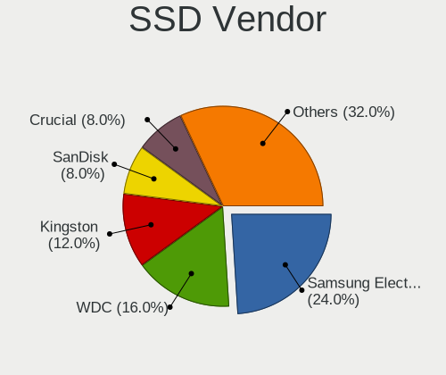

| Vendor              | Desktops | Drives | Percent |
|---------------------|----------|--------|---------|
| Samsung Electronics | 6        | 8      | 24%     |
| WDC                 | 4        | 5      | 16%     |
| Kingston            | 3        | 3      | 12%     |
| SanDisk             | 2        | 2      | 8%      |
| Crucial             | 2        | 3      | 8%      |
| A-DATA Technology   | 2        | 2      | 8%      |
| WDC WDS1            | 1        | 1      | 4%      |
| SPCC                | 1        | 1      | 4%      |
| PNY                 | 1        | 1      | 4%      |
| Intel               | 1        | 1      | 4%      |
| GOODRAM             | 1        | 1      | 4%      |
| Gigabyte Technology | 1        | 1      | 4%      |

Drive Kind
----------

HDD or SSD

| Kind    | Desktops | Drives | Percent |
|---------|----------|--------|---------|
| SSD     | 19       | 29     | 51.35%  |
| HDD     | 15       | 26     | 40.54%  |
| NVMe    | 2        | 3      | 5.41%   |
| Unknown | 1        | 1      | 2.7%    |

Drive Connector
---------------

SATA, SAS, NVMe, etc.

| Type | Desktops | Drives | Percent |
|------|----------|--------|---------|
| SATA | 22       | 54     | 84.62%  |
| SAS  | 2        | 2      | 7.69%   |
| NVMe | 2        | 3      | 7.69%   |

Drive Size
----------

Size of hard drive

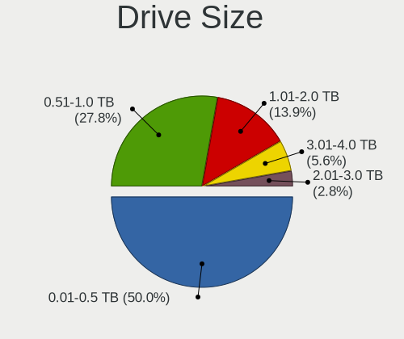

| Size in TB | Desktops | Drives | Percent |
|------------|----------|--------|---------|
| 0.01-0.5   | 18       | 31     | 51.43%  |
| 0.51-1.0   | 9        | 13     | 25.71%  |
| 1.01-2.0   | 5        | 6      | 14.29%  |
| 3.01-4.0   | 2        | 3      | 5.71%   |
| 2.01-3.0   | 1        | 2      | 2.86%   |

Space Total
-----------

Amount of disk space available on the file system

| Size in GB     | Desktops | Percent |
|----------------|----------|---------|
| 251-500        | 5        | 21.74%  |
| 101-250        | 4        | 17.39%  |
| 1001-2000      | 4        | 17.39%  |
| More than 3000 | 3        | 13.04%  |
| 501-1000       | 3        | 13.04%  |
| 51-100         | 3        | 13.04%  |
| 2001-3000      | 1        | 4.35%   |

Space Used
----------

Amount of used disk space

| Used GB        | Desktops | Percent |
|----------------|----------|---------|
| 1-20           | 5        | 21.74%  |
| 251-500        | 4        | 17.39%  |
| 101-250        | 3        | 13.04%  |
| 501-1000       | 3        | 13.04%  |
| More than 3000 | 2        | 8.7%    |
| 21-50          | 2        | 8.7%    |
| 51-100         | 2        | 8.7%    |
| 2001-3000      | 1        | 4.35%   |
| 1001-2000      | 1        | 4.35%   |

Malfunc. Drives
---------------

Drive models with a malfunction

| Model                       | Desktops | Drives | Percent |
|-----------------------------|----------|--------|---------|
| SPCC Solid State Disk 512GB | 1        | 1      | 33.33%  |
| Seagate ST3750330NS 752GB   | 1        | 1      | 33.33%  |
| Seagate ST31500341AS 1TB    | 1        | 1      | 33.33%  |

Malfunc. Drive Vendor
---------------------

Vendors of faulty drives

| Vendor  | Desktops | Drives | Percent |
|---------|----------|--------|---------|
| Seagate | 2        | 2      | 66.67%  |
| SPCC    | 1        | 1      | 33.33%  |

Malfunc. HDD Vendor
-------------------

Vendors of faulty HDD drives

| Vendor  | Desktops | Drives | Percent |
|---------|----------|--------|---------|
| Seagate | 2        | 2      | 100%    |

Malfunc. Drive Kind
-------------------

Kinds of faulty drives

| Kind | Desktops | Drives | Percent |
|------|----------|--------|---------|
| HDD  | 2        | 2      | 66.67%  |
| SSD  | 1        | 1      | 33.33%  |

Failed Drives
-------------

Failed drive models

Zero info for selected period =(

Failed Drive Vendor
-------------------

Failed drive vendors

Zero info for selected period =(

Drive Status
------------

Number of failed and malfunc. drives

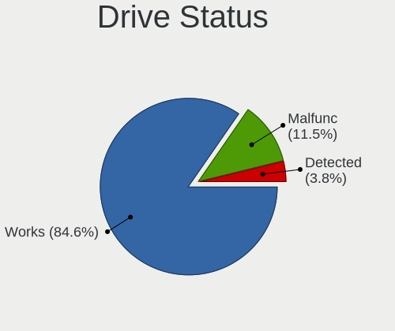

| Status   | Desktops | Drives | Percent |
|----------|----------|--------|---------|
| Works    | 22       | 55     | 84.62%  |
| Malfunc  | 3        | 3      | 11.54%  |
| Detected | 1        | 1      | 3.85%   |

Storage controller
------------------

Storage Vendor
--------------

Storage controller vendors

| Vendor                      | Desktops | Percent |
|-----------------------------|----------|---------|
| Intel                       | 16       | 61.54%  |
| AMD                         | 6        | 23.08%  |
| Samsung Electronics         | 1        | 3.85%   |
| Kingston Technology Company | 1        | 3.85%   |
| JMicron Technology          | 1        | 3.85%   |
| ADATA Technology            | 1        | 3.85%   |

Storage Model
-------------

Storage controller models

| Model                                                                          | Desktops | Percent |
|--------------------------------------------------------------------------------|----------|---------|
| AMD FCH SATA Controller [AHCI mode]                                            | 3        | 10%     |
| AMD 400 Series Chipset SATA Controller                                         | 3        | 10%     |
| Intel Q170/Q150/B150/H170/H110/Z170/CM236 Chipset SATA Controller [AHCI Mode]  | 2        | 6.67%   |
| Intel Cannon Lake PCH SATA AHCI Controller                                     | 2        | 6.67%   |
| Intel 8 Series/C220 Series Chipset Family 6-port SATA Controller 1 [AHCI mode] | 2        | 6.67%   |
| Intel 7 Series/C210 Series Chipset Family 6-port SATA Controller [AHCI mode]   | 2        | 6.67%   |
| Intel 500 Series Chipset Family SATA AHCI Controller                           | 2        | 6.67%   |
| Samsung NVMe SSD Controller SM981/PM981/PM983                                  | 1        | 3.33%   |
| Kingston Company A2000 NVMe SSD                                                | 1        | 3.33%   |
| JMicron JMB363 SATA/IDE Controller                                             | 1        | 3.33%   |
| Intel SATA Controller [RAID mode]                                              | 1        | 3.33%   |
| Intel NM10/ICH7 Family SATA Controller [IDE mode]                              | 1        | 3.33%   |
| Intel Comet Lake SATA AHCI Controller                                          | 1        | 3.33%   |
| Intel 9 Series Chipset Family SATA Controller [AHCI Mode]                      | 1        | 3.33%   |
| Intel 82801IR/IO/IH (ICH9R/DO/DH) 6 port SATA Controller [AHCI mode]           | 1        | 3.33%   |
| Intel 82801G (ICH7 Family) IDE Controller                                      | 1        | 3.33%   |
| Intel 82801EB (ICH5) SATA Controller                                           | 1        | 3.33%   |
| AMD SB7x0/SB8x0/SB9x0 SATA Controller [IDE mode]                               | 1        | 3.33%   |
| AMD SB7x0/SB8x0/SB9x0 IDE Controller                                           | 1        | 3.33%   |
| AMD 500 Series Chipset SATA Controller                                         | 1        | 3.33%   |
| ADATA XPG SX8200 Pro PCIe Gen3x4 M.2 2280 Solid State Drive                    | 1        | 3.33%   |

Storage Kind
------------

Kind of storage controller (IDE, SATA, NVMe, SAS, ...)

| Kind | Desktops | Percent |
|------|----------|---------|
| SATA | 19       | 73.08%  |
| IDE  | 4        | 15.38%  |
| NVMe | 2        | 7.69%   |
| RAID | 1        | 3.85%   |

Processor
---------

CPU Vendor
----------

Processor vendors

| Vendor | Desktops | Percent |
|--------|----------|---------|
| Intel  | 16       | 72.73%  |
| AMD    | 6        | 27.27%  |

CPU Model
---------

Processor models

| Model                                           | Desktops | Percent |
|-------------------------------------------------|----------|---------|
| Intel Xeon CPU E3-1225 v3 @ 3.20GHz             | 1        | 4.55%   |
| Intel Pentium D CPU 3.40GHz                     | 1        | 4.55%   |
| Intel Pentium CPU G3240T @ 2.70GHz              | 1        | 4.55%   |
| Intel Pentium 4 CPU 3.20GHz                     | 1        | 4.55%   |
| Intel Core i9-9900K CPU @ 3.60GHz               | 1        | 4.55%   |
| Intel Core i7-9700K CPU @ 3.60GHz               | 1        | 4.55%   |
| Intel Core i7-3770 CPU @ 3.40GHz                | 1        | 4.55%   |
| Intel Core i5-7400 CPU @ 3.00GHz                | 1        | 4.55%   |
| Intel Core i5-6600 CPU @ 3.30GHz                | 1        | 4.55%   |
| Intel Core i5-4590 CPU @ 3.30GHz                | 1        | 4.55%   |
| Intel Core i5-3570 CPU @ 3.40GHz                | 1        | 4.55%   |
| Intel Core i5-3330 CPU @ 3.00GHz                | 1        | 4.55%   |
| Intel Core i5-10400 CPU @ 2.90GHz               | 1        | 4.55%   |
| Intel Core 2 Duo CPU E6550 @ 2.33GHz            | 1        | 4.55%   |
| Intel 11th Gen Core i7-11700 @ 2.50GHz          | 1        | 4.55%   |
| Intel 11th Gen Core i5-11400 @ 2.60GHz          | 1        | 4.55%   |
| AMD Ryzen 7 3700X 8-Core Processor              | 1        | 4.55%   |
| AMD Ryzen 5 3600 6-Core Processor               | 1        | 4.55%   |
| AMD Ryzen 5 2600X Six-Core Processor            | 1        | 4.55%   |
| AMD Ryzen 5 1600 Six-Core Processor             | 1        | 4.55%   |
| AMD Athlon II X2 270 Processor                  | 1        | 4.55%   |
| AMD A10-7850K Radeon R7, 12 Compute Cores 4C+8G | 1        | 4.55%   |

CPU Model Family
----------------

Processor model prefix

| Model            | Desktops | Percent |
|------------------|----------|---------|
| Intel Core i5    | 6        | 27.27%  |
| AMD Ryzen 5      | 3        | 13.64%  |
| Other            | 2        | 9.09%   |
| Intel Core i7    | 2        | 9.09%   |
| Intel Xeon       | 1        | 4.55%   |
| Intel Pentium D  | 1        | 4.55%   |
| Intel Pentium 4  | 1        | 4.55%   |
| Intel Pentium    | 1        | 4.55%   |
| Intel Core i9    | 1        | 4.55%   |
| Intel Core 2 Duo | 1        | 4.55%   |
| AMD Ryzen 7      | 1        | 4.55%   |
| AMD Athlon II X2 | 1        | 4.55%   |
| AMD A10          | 1        | 4.55%   |

CPU Cores
---------

Number of processor cores

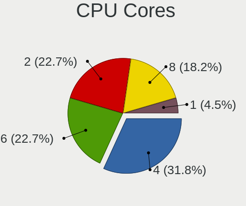

| Number | Desktops | Percent |
|--------|----------|---------|
| 4      | 7        | 31.82%  |
| 6      | 5        | 22.73%  |
| 2      | 5        | 22.73%  |
| 8      | 4        | 18.18%  |
| 1      | 1        | 4.55%   |

CPU Sockets
-----------

Number of sockets

| Number | Desktops | Percent |
|--------|----------|---------|
| 1      | 22       | 100%    |

CPU Threads
-----------

Threads per core (Hyper-Threading)

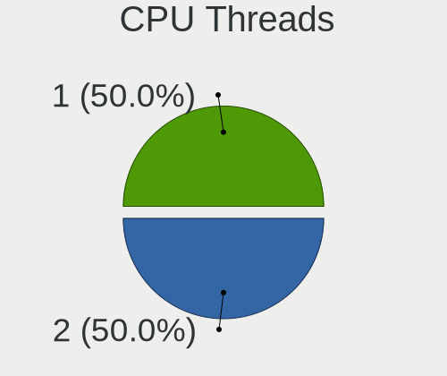

| Number | Desktops | Percent |
|--------|----------|---------|
| 2      | 11       | 50%     |
| 1      | 11       | 50%     |

CPU Op-Modes
------------

CPU Operation Modes (32-bit, 64-bit)

| Op mode        | Desktops | Percent |
|----------------|----------|---------|
| 32-bit, 64-bit | 21       | 95.45%  |
| 32-bit         | 1        | 4.55%   |

CPU Microcode
-------------

Microcode number

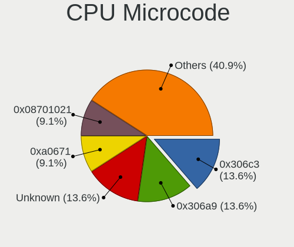

| Number     | Desktops | Percent |
|------------|----------|---------|
| 0x306c3    | 3        | 13.64%  |
| 0x306a9    | 3        | 13.64%  |
| Unknown    | 3        | 13.64%  |
| 0xa0671    | 2        | 9.09%   |
| 0x08701021 | 2        | 9.09%   |
| 0xf64      | 1        | 4.55%   |
| 0xf29      | 1        | 4.55%   |
| 0xa0653    | 1        | 4.55%   |
| 0x906ed    | 1        | 4.55%   |
| 0x6fb      | 1        | 4.55%   |
| 0x506e3    | 1        | 4.55%   |
| 0x0800820d | 1        | 4.55%   |
| 0x0800820b | 1        | 4.55%   |
| 0x010000c8 | 1        | 4.55%   |

CPU Microarch
-------------

Microarchitecture

| Name        | Desktops | Percent |
|-------------|----------|---------|
| KabyLake    | 3        | 13.64%  |
| IvyBridge   | 3        | 13.64%  |
| Haswell     | 3        | 13.64%  |
| Zen+        | 2        | 9.09%   |
| Zen 2       | 2        | 9.09%   |
| NetBurst    | 2        | 9.09%   |
| Steamroller | 1        | 4.55%   |
| Skylake     | 1        | 4.55%   |
| K10         | 1        | 4.55%   |
| Icelake     | 1        | 4.55%   |
| Core        | 1        | 4.55%   |
| CometLake   | 1        | 4.55%   |
| Unknown     | 1        | 4.55%   |

Graphics
--------

GPU Vendor
----------

Vendors of graphics cards

| Vendor | Desktops | Percent |
|--------|----------|---------|
| Nvidia | 12       | 48%     |
| Intel  | 8        | 32%     |
| AMD    | 5        | 20%     |

GPU Model
---------

Graphics card models

| Model                                                                       | Desktops | Percent |
|-----------------------------------------------------------------------------|----------|---------|
| Intel Xeon E3-1200 v2/3rd Gen Core processor Graphics Controller            | 2        | 8%      |
| Nvidia TU117 [GeForce GTX 1650]                                             | 1        | 4%      |
| Nvidia TU116 [GeForce GTX 1660 SUPER]                                       | 1        | 4%      |
| Nvidia GT216 [GeForce GT 220]                                               | 1        | 4%      |
| Nvidia GP107 [GeForce GTX 1050]                                             | 1        | 4%      |
| Nvidia GP106 [GeForce GTX 1060 6GB]                                         | 1        | 4%      |
| Nvidia GP104 [GeForce GTX 1070]                                             | 1        | 4%      |
| Nvidia GM204 [GeForce GTX 970]                                              | 1        | 4%      |
| Nvidia GK208B [GeForce GT 730]                                              | 1        | 4%      |
| Nvidia GK208B [GeForce GT 710]                                              | 1        | 4%      |
| Nvidia GK107GL [Quadro K600]                                                | 1        | 4%      |
| Nvidia GK107 [GeForce GT 640]                                               | 1        | 4%      |
| Nvidia GF119 [GeForce GT 620 OEM]                                           | 1        | 4%      |
| Intel Xeon E3-1200 v3/4th Gen Core Processor Integrated Graphics Controller | 1        | 4%      |
| Intel RocketLake-S GT1 [UHD Graphics 750]                                   | 1        | 4%      |
| Intel RocketLake-S GT1 [UHD Graphics 730]                                   | 1        | 4%      |
| Intel HD Graphics 630                                                       | 1        | 4%      |
| Intel CoffeeLake-S GT2 [UHD Graphics 630]                                   | 1        | 4%      |
| Intel 82865G Integrated Graphics Controller                                 | 1        | 4%      |
| AMD Navi 10 [Radeon RX 5600 OEM/5600 XT / 5700/5700 XT]                     | 1        | 4%      |
| AMD Lexa PRO [Radeon 540/540X/550/550X / RX 540X/550/550X]                  | 1        | 4%      |
| AMD Kaveri [Radeon R7 Graphics]                                             | 1        | 4%      |
| AMD Ellesmere [Radeon RX 470/480/570/570X/580/580X/590]                     | 1        | 4%      |
| AMD Baffin [Radeon RX 460/560D / Pro 450/455/460/555/555X/560/560X]         | 1        | 4%      |

GPU Combo
---------

Combinations of graphics cards

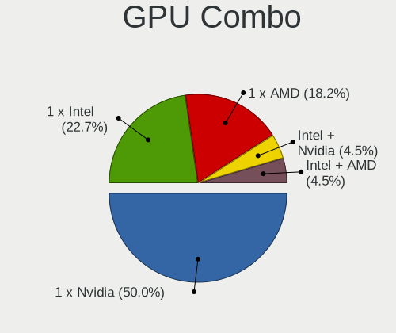

| Name           | Desktops | Percent |
|----------------|----------|---------|
| 1 x Nvidia     | 11       | 50%     |
| 1 x Intel      | 5        | 22.73%  |
| 1 x AMD        | 4        | 18.18%  |
| Intel + Nvidia | 1        | 4.55%   |
| Intel + AMD    | 1        | 4.55%   |

GPU Driver
----------

Free vs proprietary

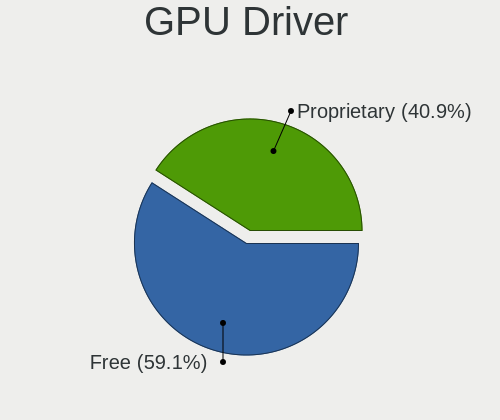

| Driver      | Desktops | Percent |
|-------------|----------|---------|
| Free        | 13       | 59.09%  |
| Proprietary | 9        | 40.91%  |

GPU Memory
----------

Total video memory

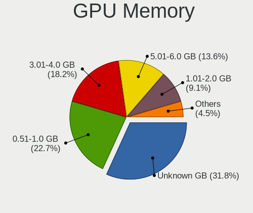

| Size in GB | Desktops | Percent |
|------------|----------|---------|
| Unknown    | 7        | 31.82%  |
| 0.51-1.0   | 5        | 22.73%  |
| 3.01-4.0   | 4        | 18.18%  |
| 5.01-6.0   | 3        | 13.64%  |
| 1.01-2.0   | 2        | 9.09%   |
| 7.01-8.0   | 1        | 4.55%   |

Monitor
-------

Monitor Vendor
--------------

Monitor vendors

| Vendor              | Desktops | Percent |
|---------------------|----------|---------|
| Goldstar            | 5        | 17.86%  |
| Samsung Electronics | 4        | 14.29%  |
| Acer                | 4        | 14.29%  |
| Hewlett-Packard     | 2        | 7.14%   |
| Dell                | 2        | 7.14%   |
| ASUSTek Computer    | 2        | 7.14%   |
| ViewSonic           | 1        | 3.57%   |
| Videoseven          | 1        | 3.57%   |
| Vestel Elektronik   | 1        | 3.57%   |
| Sony                | 1        | 3.57%   |
| RIS                 | 1        | 3.57%   |
| Philips             | 1        | 3.57%   |
| Lenovo              | 1        | 3.57%   |
| Iiyama              | 1        | 3.57%   |
| BenQ                | 1        | 3.57%   |

Monitor Model
-------------

Monitor models

| Model                                                                 | Desktops | Percent |
|-----------------------------------------------------------------------|----------|---------|
| ViewSonic XG2705 VSC0E39 1920x1080 598x336mm 27.0-inch                | 1        | 3.57%   |
| Videoseven D19W12C IGM19C1 1440x900 408x255mm 18.9-inch               | 1        | 3.57%   |
| Vestel Elektronik 40UHD_LCD_TV VES3700 3840x2160 890x500mm 40.2-inch  | 1        | 3.57%   |
| Sony TV SNY0801 1360x768                                              | 1        | 3.57%   |
| Samsung Electronics SyncMaster SAM0420 1680x1050 474x296mm 22.0-inch  | 1        | 3.57%   |
| Samsung Electronics LCD Monitor SAM0D3B 3840x2160 950x540mm 43.0-inch | 1        | 3.57%   |
| Samsung Electronics C27JG5x SAM0F57 1680x1050 600x340mm 27.2-inch     | 1        | 3.57%   |
| Samsung Electronics C24F390 SAM0D2C 1920x1080 521x293mm 23.5-inch     | 1        | 3.57%   |
| RIS photo19 RIS0839 1366x768 410x230mm 18.5-inch                      | 1        | 3.57%   |
| Philips PHL 246E9Q PHLC17C 1920x1080 527x296mm 23.8-inch              | 1        | 3.57%   |
| Lenovo LEN L192p LEN24CB 1280x1024 376x301mm 19.0-inch                | 1        | 3.57%   |
| Iiyama PL2792Q IVM6630 2560x1440 597x336mm 27.0-inch                  | 1        | 3.57%   |
| Hewlett-Packard L1506 HWP265B 1024x768 304x228mm 15.0-inch            | 1        | 3.57%   |
| Hewlett-Packard 22fw HPN3541 1920x1080 476x268mm 21.5-inch            | 1        | 3.57%   |
| Goldstar ULTRAWIDE GSM76F9 2560x1080 531x298mm 24.0-inch              | 1        | 3.57%   |
| Goldstar MP59G GSM5B35 1920x1080 480x270mm 21.7-inch                  | 1        | 3.57%   |
| Goldstar L1715S GSM436F 1280x1024 338x270mm 17.0-inch                 | 1        | 3.57%   |
| Goldstar FULL HD GSM5ABB 1920x1080 480x270mm 21.7-inch                | 1        | 3.57%   |
| Goldstar E1940 GSM4BD6 1360x768 406x229mm 18.4-inch                   | 1        | 3.57%   |
| Dell ST2220L DELA063 1920x1080 477x268mm 21.5-inch                    | 1        | 3.57%   |
| Dell P2217H DELA0D8 1920x1080 476x267mm 21.5-inch                     | 1        | 3.57%   |
| BenQ GL2760 BNQ78D5 1920x1080 598x336mm 27.0-inch                     | 1        | 3.57%   |
| ASUSTek Computer VP28U AUS28B1 3840x2160 621x341mm 27.9-inch          | 1        | 3.57%   |
| ASUSTek Computer VG279QL1A AUS2702 1920x1080 598x336mm 27.0-inch      | 1        | 3.57%   |
| Acer X34 P ACR054F 3440x1440 800x340mm 34.2-inch                      | 1        | 3.57%   |
| Acer S230HL ACR0280 1920x1080 509x286mm 23.0-inch                     | 1        | 3.57%   |
| Acer R240HY ACR046F 1920x1080 527x296mm 23.8-inch                     | 1        | 3.57%   |
| Acer G227HQL ACR03DE 1920x1080 476x267mm 21.5-inch                    | 1        | 3.57%   |

Monitor Resolution
------------------

Monitor screen resolution

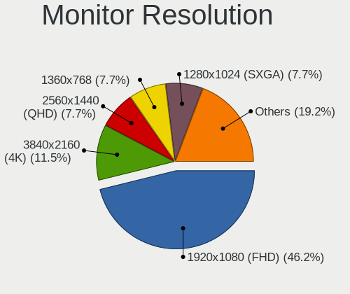

| Resolution         | Desktops | Percent |
|--------------------|----------|---------|
| 1920x1080 (FHD)    | 12       | 46.15%  |
| 3840x2160 (4K)     | 3        | 11.54%  |
| 2560x1440 (QHD)    | 2        | 7.69%   |
| 1360x768           | 2        | 7.69%   |
| 1280x1024 (SXGA)   | 2        | 7.69%   |
| 3440x1440          | 1        | 3.85%   |
| 2560x1080          | 1        | 3.85%   |
| 1680x1050 (WSXGA+) | 1        | 3.85%   |
| 1440x900 (WXGA+)   | 1        | 3.85%   |
| 1024x768 (XGA)     | 1        | 3.85%   |

Monitor Diagonal
----------------

Diagonal size in inches

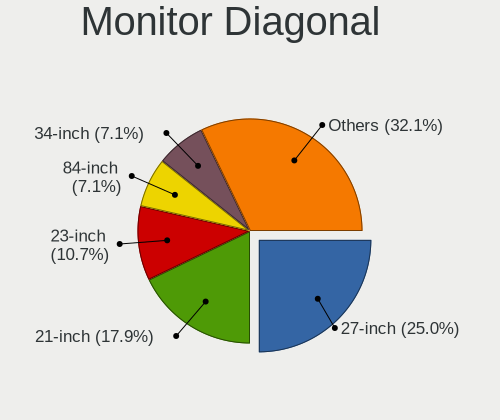

| Inches | Desktops | Percent |
|--------|----------|---------|
| 27     | 7        | 25%     |
| 21     | 5        | 17.86%  |
| 23     | 3        | 10.71%  |
| 84     | 2        | 7.14%   |
| 34     | 2        | 7.14%   |
| 24     | 2        | 7.14%   |
| 18     | 2        | 7.14%   |
| 72     | 1        | 3.57%   |
| 22     | 1        | 3.57%   |
| 20     | 1        | 3.57%   |
| 17     | 1        | 3.57%   |
| 15     | 1        | 3.57%   |

Monitor Width
-------------

Physical width

| Width in mm | Desktops | Percent |
|-------------|----------|---------|
| 501-600     | 9        | 34.62%  |
| 401-500     | 8        | 30.77%  |
| 1501-2000   | 3        | 11.54%  |
| 701-800     | 2        | 7.69%   |
| 301-350     | 2        | 7.69%   |
| 601-700     | 1        | 3.85%   |
| 351-400     | 1        | 3.85%   |

Aspect Ratio
------------

Proportional relationship between the width and the height

| Ratio | Desktops | Percent |
|-------|----------|---------|
| 16/9  | 19       | 73.08%  |
| 5/4   | 2        | 7.69%   |
| 21/9  | 2        | 7.69%   |
| 16/10 | 2        | 7.69%   |
| 4/3   | 1        | 3.85%   |

Monitor Area
------------

Area in inch²

| Area in inch² | Desktops | Percent |
|----------------|----------|---------|
| 201-250        | 9        | 33.33%  |
| 301-350        | 7        | 25.93%  |
| More than 1000 | 3        | 11.11%  |
| 151-200        | 3        | 11.11%  |
| 351-500        | 2        | 7.41%   |
| 141-150        | 2        | 7.41%   |
| 101-110        | 1        | 3.7%    |

Pixel Density
-------------

Pixels per inch

| Density | Desktops | Percent |
|---------|----------|---------|
| 51-100  | 14       | 58.33%  |
| 101-120 | 8        | 33.33%  |
| 1-50    | 1        | 4.17%   |
| 121-160 | 1        | 4.17%   |

Multiple Monitors
-----------------

Total monitors connected

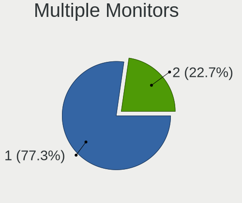

| Total | Desktops | Percent |
|-------|----------|---------|
| 1     | 17       | 77.27%  |
| 2     | 5        | 22.73%  |

Network
-------

Net Controller Vendor
---------------------

Controller vendors

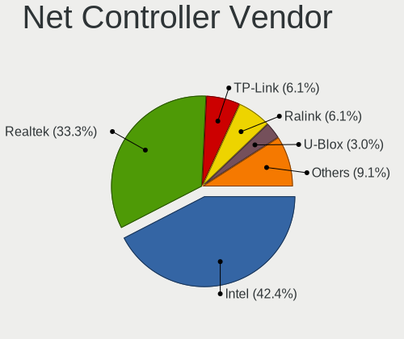

| Vendor                   | Desktops | Percent |
|--------------------------|----------|---------|
| Intel                    | 14       | 42.42%  |
| Realtek Semiconductor    | 11       | 33.33%  |
| TP-Link                  | 2        | 6.06%   |
| Ralink Technology        | 2        | 6.06%   |
| U-Blox                   | 1        | 3.03%   |
| Qualcomm Atheros         | 1        | 3.03%   |
| NetGear                  | 1        | 3.03%   |
| Marvell Technology Group | 1        | 3.03%   |

Net Controller Model
--------------------

Controller models

| Model                                                                                         | Desktops | Percent |
|-----------------------------------------------------------------------------------------------|----------|---------|
| Realtek RTL8111/8168/8411 PCI Express Gigabit Ethernet Controller                             | 6        | 16.22%  |
| Realtek RTL8125 2.5GbE Controller                                                             | 2        | 5.41%   |
| Intel I211 Gigabit Network Connection                                                         | 2        | 5.41%   |
| Intel Ethernet Connection I217-LM                                                             | 2        | 5.41%   |
| Intel Ethernet Connection (7) I219-V                                                          | 2        | 5.41%   |
| Intel Ethernet Connection (11) I219-V                                                         | 2        | 5.41%   |
| Intel Dual Band Wireless-AC 3168NGW [Stone Peak]                                              | 2        | 5.41%   |
| Intel 82579LM Gigabit Network Connection (Lewisville)                                         | 2        | 5.41%   |
| U-Blox [u-blox 8]                                                                             | 1        | 2.7%    |
| TP-Link TL-WN821N v5/v6 [RTL8192EU]                                                           | 1        | 2.7%    |
| TP-Link TL-WN722N v2/v3 [Realtek RTL8188EUS]                                                  | 1        | 2.7%    |
| Realtek RTL88x2bu [AC1200 Techkey]                                                            | 1        | 2.7%    |
| Realtek RTL8169 PCI Gigabit Ethernet Controller                                               | 1        | 2.7%    |
| Realtek Realtek 8812AU/8821AU 802.11ac WLAN Adapter [USB Wireless Dual-Band Adapter 2.4/5Ghz] | 1        | 2.7%    |
| Ralink RT5372 Wireless Adapter                                                                | 1        | 2.7%    |
| Ralink MT7601U Wireless Adapter                                                               | 1        | 2.7%    |
| Qualcomm Atheros AR9485 Wireless Network Adapter                                              | 1        | 2.7%    |
| NetGear A6210                                                                                 | 1        | 2.7%    |
| Marvell Group 88E8056 PCI-E Gigabit Ethernet Controller                                       | 1        | 2.7%    |
| Intel Wireless 8260                                                                           | 1        | 2.7%    |
| Intel Wi-Fi 6 AX200                                                                           | 1        | 2.7%    |
| Intel Ethernet Connection (2) I219-V                                                          | 1        | 2.7%    |
| Intel Ethernet Connection (2) I218-V                                                          | 1        | 2.7%    |
| Intel Ethernet Connection (14) I219-V                                                         | 1        | 2.7%    |
| Intel 82562EZ 10/100 Ethernet Controller                                                      | 1        | 2.7%    |

Wireless Vendor
---------------

Wireless vendors

| Vendor                | Desktops | Percent |
|-----------------------|----------|---------|
| Intel                 | 4        | 33.33%  |
| TP-Link               | 2        | 16.67%  |
| Realtek Semiconductor | 2        | 16.67%  |
| Ralink Technology     | 2        | 16.67%  |
| Qualcomm Atheros      | 1        | 8.33%   |
| NetGear               | 1        | 8.33%   |

Wireless Model
--------------

Wireless models

| Model                                                                                         | Desktops | Percent |
|-----------------------------------------------------------------------------------------------|----------|---------|
| Intel Dual Band Wireless-AC 3168NGW [Stone Peak]                                              | 2        | 16.67%  |
| TP-Link TL-WN821N v5/v6 [RTL8192EU]                                                           | 1        | 8.33%   |
| TP-Link TL-WN722N v2/v3 [Realtek RTL8188EUS]                                                  | 1        | 8.33%   |
| Realtek RTL88x2bu [AC1200 Techkey]                                                            | 1        | 8.33%   |
| Realtek Realtek 8812AU/8821AU 802.11ac WLAN Adapter [USB Wireless Dual-Band Adapter 2.4/5Ghz] | 1        | 8.33%   |
| Ralink RT5372 Wireless Adapter                                                                | 1        | 8.33%   |
| Ralink MT7601U Wireless Adapter                                                               | 1        | 8.33%   |
| Qualcomm Atheros AR9485 Wireless Network Adapter                                              | 1        | 8.33%   |
| NetGear A6210                                                                                 | 1        | 8.33%   |
| Intel Wireless 8260                                                                           | 1        | 8.33%   |
| Intel Wi-Fi 6 AX200                                                                           | 1        | 8.33%   |

Ethernet Vendor
---------------

Ethernet vendors

| Vendor                   | Desktops | Percent |
|--------------------------|----------|---------|
| Intel                    | 13       | 56.52%  |
| Realtek Semiconductor    | 9        | 39.13%  |
| Marvell Technology Group | 1        | 4.35%   |

Ethernet Model
--------------

Ethernet models

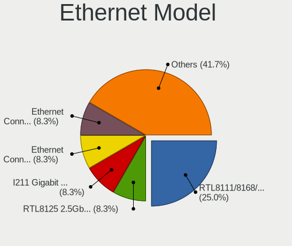

| Model                                                             | Desktops | Percent |
|-------------------------------------------------------------------|----------|---------|
| Realtek RTL8111/8168/8411 PCI Express Gigabit Ethernet Controller | 6        | 25%     |
| Realtek RTL8125 2.5GbE Controller                                 | 2        | 8.33%   |
| Intel I211 Gigabit Network Connection                             | 2        | 8.33%   |
| Intel Ethernet Connection I217-LM                                 | 2        | 8.33%   |
| Intel Ethernet Connection (7) I219-V                              | 2        | 8.33%   |
| Intel Ethernet Connection (11) I219-V                             | 2        | 8.33%   |
| Intel 82579LM Gigabit Network Connection (Lewisville)             | 2        | 8.33%   |
| Realtek RTL8169 PCI Gigabit Ethernet Controller                   | 1        | 4.17%   |
| Marvell Group 88E8056 PCI-E Gigabit Ethernet Controller           | 1        | 4.17%   |
| Intel Ethernet Connection (2) I219-V                              | 1        | 4.17%   |
| Intel Ethernet Connection (2) I218-V                              | 1        | 4.17%   |
| Intel Ethernet Connection (14) I219-V                             | 1        | 4.17%   |
| Intel 82562EZ 10/100 Ethernet Controller                          | 1        | 4.17%   |

Net Controller Kind
-------------------

Ethernet, WiFi or modem

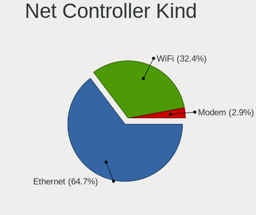

| Kind     | Desktops | Percent |
|----------|----------|---------|
| Ethernet | 22       | 64.71%  |
| WiFi     | 11       | 32.35%  |
| Modem    | 1        | 2.94%   |

Used Controller
---------------

Currently used network controller

| Kind     | Desktops | Percent |
|----------|----------|---------|
| Ethernet | 15       | 68.18%  |
| WiFi     | 7        | 31.82%  |

NICs
----

Total network controllers on board

| Total | Desktops | Percent |
|-------|----------|---------|
| 1     | 17       | 77.27%  |
| 2     | 3        | 13.64%  |
| 3     | 2        | 9.09%   |

IPv6
----

IPv6 vs IPv4

| Used | Desktops | Percent |
|------|----------|---------|
| No   | 22       | 95.65%  |
| Yes  | 1        | 4.35%   |

Bluetooth
---------

Bluetooth Vendor
----------------

Controller vendors

| Vendor                  | Desktops | Percent |
|-------------------------|----------|---------|
| Intel                   | 4        | 66.67%  |
| Realtek Semiconductor   | 1        | 16.67%  |
| Cambridge Silicon Radio | 1        | 16.67%  |

Bluetooth Model
---------------

Controller models

| Model                                               | Desktops | Percent |
|-----------------------------------------------------|----------|---------|
| Intel Wireless-AC 3168 Bluetooth                    | 2        | 33.33%  |
| Realtek Bluetooth Radio                             | 1        | 16.67%  |
| Intel Bluetooth wireless interface                  | 1        | 16.67%  |
| Intel AX200 Bluetooth                               | 1        | 16.67%  |
| Cambridge Silicon Radio Bluetooth Dongle (HCI mode) | 1        | 16.67%  |

Sound
-----

Sound Vendor
------------

Sound card vendors

| Vendor              | Desktops | Percent |
|---------------------|----------|---------|
| Intel               | 15       | 37.5%   |
| Nvidia              | 12       | 30%     |
| AMD                 | 7        | 17.5%   |
| Focusrite-Novation  | 2        | 5%      |
| Texas Instruments   | 1        | 2.5%    |
| Kingston Technology | 1        | 2.5%    |
| JMTek               | 1        | 2.5%    |
| Creative Labs       | 1        | 2.5%    |

Sound Model
-----------

Sound card models

| Model                                                               | Desktops | Percent |
|---------------------------------------------------------------------|----------|---------|
| Intel 7 Series/C216 Chipset Family High Definition Audio Controller | 3        | 6.82%   |
| Nvidia GK208 HDMI/DP Audio Controller                               | 2        | 4.55%   |
| Nvidia GK107 HDMI Audio Controller                                  | 2        | 4.55%   |
| Intel Tiger Lake-H HD Audio Controller                              | 2        | 4.55%   |
| Intel Cannon Lake PCH cAVS                                          | 2        | 4.55%   |
| Intel 100 Series/C230 Series Chipset Family HD Audio Controller     | 2        | 4.55%   |
| AMD Starship/Matisse HD Audio Controller                            | 2        | 4.55%   |
| AMD Family 17h (Models 00h-0fh) HD Audio Controller                 | 2        | 4.55%   |
| AMD Baffin HDMI/DP Audio [Radeon RX 550 640SP / RX 560/560X]        | 2        | 4.55%   |
| Texas Instruments PCM2704 16-bit stereo audio DAC                   | 1        | 2.27%   |
| Nvidia TU116 High Definition Audio Controller                       | 1        | 2.27%   |
| Nvidia TU107 GeForce GTX 1650 High Definition Audio Controller      | 1        | 2.27%   |
| Nvidia GT216 HDMI Audio Controller                                  | 1        | 2.27%   |
| Nvidia GP107GL High Definition Audio Controller                     | 1        | 2.27%   |
| Nvidia GP106 High Definition Audio Controller                       | 1        | 2.27%   |
| Nvidia GP104 High Definition Audio Controller                       | 1        | 2.27%   |
| Nvidia GM204 High Definition Audio Controller                       | 1        | 2.27%   |
| Nvidia GF119 HDMI Audio Controller                                  | 1        | 2.27%   |
| Kingston Technology HyperX 7.1 Audio                                | 1        | 2.27%   |
| JMTek HP-71                                                         | 1        | 2.27%   |
| Intel Xeon E3-1200 v3/4th Gen Core Processor HD Audio Controller    | 1        | 2.27%   |
| Intel NM10/ICH7 Family High Definition Audio Controller             | 1        | 2.27%   |
| Intel Comet Lake PCH cAVS                                           | 1        | 2.27%   |
| Intel 9 Series Chipset Family HD Audio Controller                   | 1        | 2.27%   |
| Intel 82801EB/ER (ICH5/ICH5R) AC'97 Audio Controller                | 1        | 2.27%   |
| Intel 8 Series/C220 Series Chipset High Definition Audio Controller | 1        | 2.27%   |
| Focusrite-Novation Scarlett Solo USB                                | 1        | 2.27%   |
| Focusrite-Novation Scarlett 2i4 USB                                 | 1        | 2.27%   |
| Creative Labs EMU20k2 [Sound Blaster X-Fi Titanium Series]          | 1        | 2.27%   |
| AMD SBx00 Azalia (Intel HDA)                                        | 1        | 2.27%   |
| AMD Navi 10 HDMI Audio                                              | 1        | 2.27%   |
| AMD Kaveri HDMI/DP Audio Controller                                 | 1        | 2.27%   |
| AMD FCH Azalia Controller                                           | 1        | 2.27%   |
| AMD Ellesmere HDMI Audio [Radeon RX 470/480 / 570/580/590]          | 1        | 2.27%   |

Memory
------

Memory Vendor
-------------

Memory module vendors

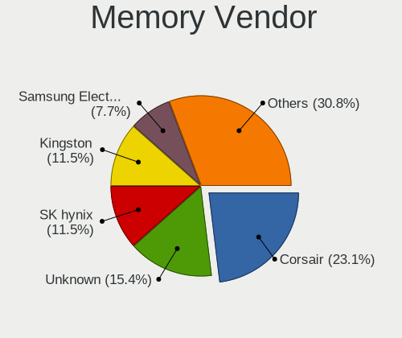

| Vendor                       | Desktops | Percent |
|------------------------------|----------|---------|
| Corsair                      | 6        | 23.08%  |
| Unknown                      | 4        | 15.38%  |
| SK hynix                     | 3        | 11.54%  |
| Kingston                     | 3        | 11.54%  |
| Samsung Electronics          | 2        | 7.69%   |
| G.Skill                      | 2        | 7.69%   |
| Crucial                      | 2        | 7.69%   |
| PNY                          | 1        | 3.85%   |
| Patriot Memory (PDP Systems) | 1        | 3.85%   |
| Nanya Technology             | 1        | 3.85%   |
| Micron Technology            | 1        | 3.85%   |

Memory Model
------------

Memory module models

| Model                                                                | Desktops | Percent |
|----------------------------------------------------------------------|----------|---------|
| SK hynix RAM HMT351U6CFR8C-PB 4096MB DIMM DDR3 1800MT/s              | 2        | 6.9%    |
| Unknown RAM Module 8192MB DIMM DDR4 2133MT/s                         | 1        | 3.45%   |
| Unknown RAM Module 512MB DIMM SDRAM                                  | 1        | 3.45%   |
| Unknown RAM Module 2048MB DIMM DDR 667MT/s                           | 1        | 3.45%   |
| Unknown RAM Module 1024MB DIMM SDRAM                                 | 1        | 3.45%   |
| Unknown RAM Module 1024MB DIMM DDR                                   | 1        | 3.45%   |
| SK hynix RAM HMT351U7EFR8C-PB 4096MB DIMM DDR3 1600MT/s              | 1        | 3.45%   |
| SK hynix RAM HMT351U6EFR8C-PB 4GB DIMM DDR3 1800MT/s                 | 1        | 3.45%   |
| Samsung RAM M471B1G73DB0-YK0 8GB SODIMM DDR3 1600MT/s                | 1        | 3.45%   |
| Samsung RAM M391B5273DH0-YK0 4GB DIMM DDR3 1600MT/s                  | 1        | 3.45%   |
| PNY RAM 16GF2X08QFHH36-135-K 16GB DIMM DDR4 3200MT/s                 | 1        | 3.45%   |
| Patriot Memory (PDP Systems) RAM PSD48G320081 8GB DIMM DDR4 3200MT/s | 1        | 3.45%   |
| Nanya RAM NT4GC64B8HG0NF-DI 4GB DIMM DDR3 1600MT/s                   | 1        | 3.45%   |
| Micron RAM 16JTF51264AZ-1G6M1 4GB DIMM DDR3 1600MT/s                 | 1        | 3.45%   |
| Kingston RAM KHX2666C16/16G 16GB DIMM DDR4 3200MT/s                  | 1        | 3.45%   |
| Kingston RAM KHX2133C13D4/8GX 8192MB DIMM DDR4 2133MT/s              | 1        | 3.45%   |
| Kingston RAM 99U5474-028.A00LF 4GB DIMM DDR3 1333MT/s                | 1        | 3.45%   |
| G.Skill RAM F4-3000C15-8GTZR 8GB DIMM DDR4 3000MT/s                  | 1        | 3.45%   |
| G.Skill RAM F3-2400C10-8G 8192MB DIMM DDR3 1333MT/s                  | 1        | 3.45%   |
| Crucial RAM CT8G4DFS824A.M8FE 8GB DIMM DDR4 2933MT/s                 | 1        | 3.45%   |
| Crucial RAM CT51264BA160B.C16F 4GB DIMM DDR3 1600MT/s                | 1        | 3.45%   |
| Corsair RAM CMW16GX4M2C3200C16 8GB DIMM DDR4 3733MT/s                | 1        | 3.45%   |
| Corsair RAM CML16GX3M2A1600C10 8GB DIMM DDR3 1600MT/s                | 1        | 3.45%   |
| Corsair RAM CMK8GX4M2A2133C13 4GB DIMM DDR4 2933MT/s                 | 1        | 3.45%   |
| Corsair RAM CMK32GX4M2A2666C16 16GB DIMM DDR4 3100MT/s               | 1        | 3.45%   |
| Corsair RAM CMK16GX4M2B3200C16 8GB DIMM DDR4 3600MT/s                | 1        | 3.45%   |
| Corsair RAM CMK16GX4M2B3000C15 8GB DIMM DDR4 3200MT/s                | 1        | 3.45%   |
| Corsair RAM CMK16GX4M2A2133C13 8GB DIMM DDR4 3000MT/s                | 1        | 3.45%   |

Memory Kind
-----------

Memory module kinds

| Kind  | Desktops | Percent |
|-------|----------|---------|
| DDR4  | 11       | 50%     |
| DDR3  | 8        | 36.36%  |
| DDR   | 2        | 9.09%   |
| SDRAM | 1        | 4.55%   |

Memory Form Factor
------------------

Physical design of the memory module

| Name   | Desktops | Percent |
|--------|----------|---------|
| DIMM   | 21       | 95.45%  |
| SODIMM | 1        | 4.55%   |

Memory Size
-----------

Memory module size

| Size  | Desktops | Percent |
|-------|----------|---------|
| 8192  | 11       | 45.83%  |
| 4096  | 6        | 25%     |
| 16384 | 3        | 12.5%   |
| 1024  | 2        | 8.33%   |
| 2048  | 1        | 4.17%   |
| 512   | 1        | 4.17%   |

Memory Speed
------------

Memory module speed

| Speed   | Desktops | Percent |
|---------|----------|---------|
| 1600    | 6        | 24%     |
| 3200    | 3        | 12%     |
| 3000    | 2        | 8%      |
| 2933    | 2        | 8%      |
| 2133    | 2        | 8%      |
| 1800    | 2        | 8%      |
| Unknown | 2        | 8%      |
| 3733    | 1        | 4%      |
| 3600    | 1        | 4%      |
| 3466    | 1        | 4%      |
| 3100    | 1        | 4%      |
| 1333    | 1        | 4%      |
| 667     | 1        | 4%      |

Printers & scanners
-------------------

Printer Vendor
--------------

Printer device vendors

| Vendor                | Desktops | Percent |
|-----------------------|----------|---------|
| Lexmark International | 1        | 50%     |
| Brother Industries    | 1        | 50%     |

Printer Model
-------------

Printer device models

| Model                         | Desktops | Percent |
|-------------------------------|----------|---------|
| Lexmark International CS417dn | 1        | 50%     |
| Brother DCP-L2540DW           | 1        | 50%     |

Scanner Vendor
--------------

Scanner device vendors

Zero info for selected period =(

Scanner Model
-------------

Scanner device models

Zero info for selected period =(

Camera
------

Camera Vendor
-------------

Camera device vendors

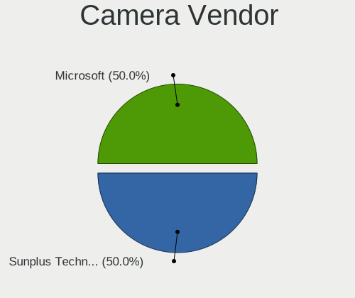

| Vendor             | Desktops | Percent |
|--------------------|----------|---------|
| Sunplus Technology | 1        | 50%     |
| Microsoft          | 1        | 50%     |

Camera Model
------------

Camera device models

| Model                                                   | Desktops | Percent |
|---------------------------------------------------------|----------|---------|
| Sunplus SPCA1527A/SPCA1528 SD card camera (webcam mode) | 1        | 50%     |
| Microsoft LifeCam HD-3000                               | 1        | 50%     |

Security
--------

Fingerprint Vendor
------------------

Fingerprint sensor vendors

Zero info for selected period =(

Fingerprint Model
-----------------

Fingerprint sensor models

Zero info for selected period =(

Chipcard Vendor
---------------

Chipcard module vendors

Zero info for selected period =(

Chipcard Model
--------------

Chipcard module models

Zero info for selected period =(

Unsupported
-----------

Unsupported Devices
-------------------

Total unsupported devices on board

| Total | Desktops | Percent |
|-------|----------|---------|
| 0     | 21       | 95.45%  |
| 1     | 1        | 4.55%   |

Unsupported Device Types
------------------------

Types of unsupported devices

| Type          | Desktops | Percent |
|---------------|----------|---------|
| Graphics card | 1        | 100%    |

