MX 20 - Tested Hardware & Statistics (Notebooks)
------------------------------------------------

A project to collect tested hardware configurations for MX 20.

Anyone can contribute to this report by the [hw-probe](https://github.com/linuxhw/hw-probe) tool:

    sudo -E hw-probe -all -upload

Please submit a probe of your configuration if it's not presented on the page or is rare.

Full-feature report is available here: https://linux-hardware.org/?view=trends&rel=mx-20

Contents
--------

* [ Test Cases ](#test-cases)

* [ System ](#system)
  - [ Kernel                   ](#kernel)
  - [ Kernel Family            ](#kernel-family)
  - [ Kernel Major Ver.        ](#kernel-major-ver)
  - [ Arch                     ](#arch)
  - [ DE                       ](#de)
  - [ Display Server           ](#display-server)
  - [ Display Manager          ](#display-manager)
  - [ OS Lang                  ](#os-lang)
  - [ Boot Mode                ](#boot-mode)
  - [ Filesystem               ](#filesystem)
  - [ Part. scheme             ](#part-scheme)
  - [ Dual Boot with Linux/BSD ](#dual-boot-with-linuxbsd)
  - [ Dual Boot (Win)          ](#dual-boot-win)

* [ Board ](#board)
  - [ Vendor                   ](#vendor)
  - [ Model                    ](#model)
  - [ Model Family             ](#model-family)
  - [ MFG Year                 ](#mfg-year)
  - [ Form Factor              ](#form-factor)
  - [ Secure Boot              ](#secure-boot)
  - [ Coreboot                 ](#coreboot)
  - [ RAM Size                 ](#ram-size)
  - [ RAM Used                 ](#ram-used)
  - [ Total Drives             ](#total-drives)
  - [ Has CD-ROM               ](#has-cd-rom)
  - [ Has Ethernet             ](#has-ethernet)
  - [ Has WiFi                 ](#has-wifi)
  - [ Has Bluetooth            ](#has-bluetooth)

* [ Location ](#location)
  - [ Country                  ](#country)
  - [ City                     ](#city)

* [ Drives ](#drives)
  - [ Drive Vendor             ](#drive-vendor)
  - [ Drive Model              ](#drive-model)
  - [ HDD Vendor               ](#hdd-vendor)
  - [ SSD Vendor               ](#ssd-vendor)
  - [ Drive Kind               ](#drive-kind)
  - [ Drive Connector          ](#drive-connector)
  - [ Drive Size               ](#drive-size)
  - [ Space Total              ](#space-total)
  - [ Space Used               ](#space-used)
  - [ Malfunc. Drives          ](#malfunc-drives)
  - [ Malfunc. Drive Vendor    ](#malfunc-drive-vendor)
  - [ Malfunc. HDD Vendor      ](#malfunc-hdd-vendor)
  - [ Malfunc. Drive Kind      ](#malfunc-drive-kind)
  - [ Failed Drives            ](#failed-drives)
  - [ Failed Drive Vendor      ](#failed-drive-vendor)
  - [ Drive Status             ](#drive-status)

* [ Storage controller ](#storage-controller)
  - [ Storage Vendor           ](#storage-vendor)
  - [ Storage Model            ](#storage-model)
  - [ Storage Kind             ](#storage-kind)

* [ Processor ](#processor)
  - [ CPU Vendor               ](#cpu-vendor)
  - [ CPU Model                ](#cpu-model)
  - [ CPU Model Family         ](#cpu-model-family)
  - [ CPU Cores                ](#cpu-cores)
  - [ CPU Sockets              ](#cpu-sockets)
  - [ CPU Threads              ](#cpu-threads)
  - [ CPU Op-Modes             ](#cpu-op-modes)
  - [ CPU Microcode            ](#cpu-microcode)
  - [ CPU Microarch            ](#cpu-microarch)

* [ Graphics ](#graphics)
  - [ GPU Vendor               ](#gpu-vendor)
  - [ GPU Model                ](#gpu-model)
  - [ GPU Combo                ](#gpu-combo)
  - [ GPU Driver               ](#gpu-driver)
  - [ GPU Memory               ](#gpu-memory)

* [ Monitor ](#monitor)
  - [ Monitor Vendor           ](#monitor-vendor)
  - [ Monitor Model            ](#monitor-model)
  - [ Monitor Resolution       ](#monitor-resolution)
  - [ Monitor Diagonal         ](#monitor-diagonal)
  - [ Monitor Width            ](#monitor-width)
  - [ Aspect Ratio             ](#aspect-ratio)
  - [ Monitor Area             ](#monitor-area)
  - [ Pixel Density            ](#pixel-density)
  - [ Multiple Monitors        ](#multiple-monitors)

* [ Network ](#network)
  - [ Net Controller Vendor    ](#net-controller-vendor)
  - [ Net Controller Model     ](#net-controller-model)
  - [ Wireless Vendor          ](#wireless-vendor)
  - [ Wireless Model           ](#wireless-model)
  - [ Ethernet Vendor          ](#ethernet-vendor)
  - [ Ethernet Model           ](#ethernet-model)
  - [ Net Controller Kind      ](#net-controller-kind)
  - [ Used Controller          ](#used-controller)
  - [ NICs                     ](#nics)
  - [ IPv6                     ](#ipv6)

* [ Bluetooth ](#bluetooth)
  - [ Bluetooth Vendor         ](#bluetooth-vendor)
  - [ Bluetooth Model          ](#bluetooth-model)

* [ Sound ](#sound)
  - [ Sound Vendor             ](#sound-vendor)
  - [ Sound Model              ](#sound-model)

* [ Memory ](#memory)
  - [ Memory Vendor            ](#memory-vendor)
  - [ Memory Model             ](#memory-model)
  - [ Memory Kind              ](#memory-kind)
  - [ Memory Form Factor       ](#memory-form-factor)
  - [ Memory Size              ](#memory-size)
  - [ Memory Speed             ](#memory-speed)

* [ Printers & scanners ](#printers--scanners)
  - [ Printer Vendor           ](#printer-vendor)
  - [ Printer Model            ](#printer-model)
  - [ Scanner Vendor           ](#scanner-vendor)
  - [ Scanner Model            ](#scanner-model)

* [ Camera ](#camera)
  - [ Camera Vendor            ](#camera-vendor)
  - [ Camera Model             ](#camera-model)

* [ Security ](#security)
  - [ Fingerprint Vendor       ](#fingerprint-vendor)
  - [ Fingerprint Model        ](#fingerprint-model)
  - [ Chipcard Vendor          ](#chipcard-vendor)
  - [ Chipcard Model           ](#chipcard-model)

* [ Unsupported ](#unsupported)
  - [ Unsupported Devices      ](#unsupported-devices)
  - [ Unsupported Device Types ](#unsupported-device-types)

Test Cases
----------

| Vendor   | Model                       | Probe                                                      | Date         |
|----------|-----------------------------|------------------------------------------------------------|--------------|
| Lenovo   | ThinkPad L520 78595VG       | [4aff5a6a0c](https://linux-hardware.org/?probe=4aff5a6a0c) | Oct 24, 2021 |
| Lenovo   | ThinkPad T530 2394CJ9       | [b36a94241d](https://linux-hardware.org/?probe=b36a94241d) | Oct 05, 2021 |
| Lenovo   | ThinkPad X1 Carbon 5th 2... | [c86e0b677e](https://linux-hardware.org/?probe=c86e0b677e) | Oct 03, 2021 |
| Lenovo   | ThinkPad L490 20Q5S0PR00    | [bbf6b89f02](https://linux-hardware.org/?probe=bbf6b89f02) | Oct 01, 2021 |
| Acer     | Aspire 4820T                | [a91911ca90](https://linux-hardware.org/?probe=a91911ca90) | Oct 01, 2021 |
| Lenovo   | ThinkPad P51 20HJS0TP00     | [2774c819ea](https://linux-hardware.org/?probe=2774c819ea) | Sep 18, 2021 |
| Lenovo   | B40-45 20394                | [627672a7ec](https://linux-hardware.org/?probe=627672a7ec) | Sep 16, 2021 |
| HP       | Pavilion Laptop 15-eg0xx... | [e76ffa7805](https://linux-hardware.org/?probe=e76ffa7805) | Sep 06, 2021 |
| Dell     | Latitude 3340               | [c47b83476b](https://linux-hardware.org/?probe=c47b83476b) | Jul 12, 2021 |
| Acer     | Aspire one                  | [2c266e91ae](https://linux-hardware.org/?probe=2c266e91ae) | Jul 09, 2021 |
| Irbis    | TW94                        | [dc56e23810](https://linux-hardware.org/?probe=dc56e23810) | May 15, 2021 |
| Dell     | Latitude E6320              | [fa8bcef5a9](https://linux-hardware.org/?probe=fa8bcef5a9) | May 09, 2021 |
| Lenovo   | ThinkPad T440s 20AQ007SG... | [73f2bd0075](https://linux-hardware.org/?probe=73f2bd0075) | Apr 16, 2021 |
| Lenovo   | ThinkPad T440s 20AQ007SG... | [75e60ebdf4](https://linux-hardware.org/?probe=75e60ebdf4) | Apr 16, 2021 |
| Lenovo   | ThinkPad E480 20KNCTO1WW    | [7159579bb8](https://linux-hardware.org/?probe=7159579bb8) | Apr 12, 2021 |
| ASUSTek  | G751JT                      | [4f88289a8c](https://linux-hardware.org/?probe=4f88289a8c) | Apr 08, 2021 |
| HP       | Falco                       | [9bb0bf9ac8](https://linux-hardware.org/?probe=9bb0bf9ac8) | Apr 07, 2021 |
| HP       | ZBook 17 G6                 | [046176e590](https://linux-hardware.org/?probe=046176e590) | Mar 16, 2021 |
| Lenovo   | ThinkPad E425 1198CTO       | [67304f1ffa](https://linux-hardware.org/?probe=67304f1ffa) | Feb 22, 2021 |
| HP       | Mini 110-3500               | [bb5cf4031b](https://linux-hardware.org/?probe=bb5cf4031b) | Feb 13, 2021 |
| HP       | Notebook                    | [69f70d7a09](https://linux-hardware.org/?probe=69f70d7a09) | Feb 10, 2021 |
| Apple    | MacBook7,1                  | [a6324a9e06](https://linux-hardware.org/?probe=a6324a9e06) | Feb 05, 2021 |
| Clevo    | P170EM                      | [eff7a04dad](https://linux-hardware.org/?probe=eff7a04dad) | Feb 02, 2021 |
| HP       | Mini 110-3500               | [3c2a01636e](https://linux-hardware.org/?probe=3c2a01636e) | Jan 19, 2021 |
| HP       | ENVY Laptop 13-ba0xxx       | [32692a5980](https://linux-hardware.org/?probe=32692a5980) | Nov 18, 2020 |
| Acer     | Aspire E5-571G              | [7f5f7e9fff](https://linux-hardware.org/?probe=7f5f7e9fff) | Nov 17, 2020 |
| Lenovo   | IdeaPad 110-15IBR 80T7      | [470c0ca72b](https://linux-hardware.org/?probe=470c0ca72b) | Oct 23, 2020 |
| HP       | Compaq 8510p (KM229AV)      | [30634ffde6](https://linux-hardware.org/?probe=30634ffde6) | Oct 12, 2020 |
| HP       | Pavilion 15                 | [8e6632f1a3](https://linux-hardware.org/?probe=8e6632f1a3) | Oct 06, 2020 |
| Lenovo   | ThinkPad T400 2768WGB       | [995b1a3a3d](https://linux-hardware.org/?probe=995b1a3a3d) | Sep 29, 2020 |
| Lenovo   | ThinkPad T60 20085TG        | [31cd0f06c2](https://linux-hardware.org/?probe=31cd0f06c2) | Sep 16, 2020 |
| Samsung  | 350V5C/351V5C/3540VC/344... | [356bacc97a](https://linux-hardware.org/?probe=356bacc97a) | Aug 27, 2020 |
| Samsung  | 350V5C/351V5C/3540VC/344... | [f16c9341a8](https://linux-hardware.org/?probe=f16c9341a8) | Aug 21, 2020 |
| Acer     | Aspire A114-32              | [7f178a7089](https://linux-hardware.org/?probe=7f178a7089) | Aug 20, 2020 |
| Samsung  | 350V5C/351V5C/3540VC/344... | [9b4d2c057e](https://linux-hardware.org/?probe=9b4d2c057e) | Aug 19, 2020 |
| ASUSTek  | VivoBook 15_ASUS Laptop ... | [57e274292b](https://linux-hardware.org/?probe=57e274292b) | Aug 16, 2020 |
| HP       | ProBook 650 G1              | [9a488079c3](https://linux-hardware.org/?probe=9a488079c3) | Jul 23, 2020 |
| Lenovo   | ThinkPad T440s 20AQ006HU... | [54a69351ae](https://linux-hardware.org/?probe=54a69351ae) | Jun 17, 2020 |
| Sony     | VGN-NR310FH                 | [c774d0a51a](https://linux-hardware.org/?probe=c774d0a51a) | Jun 05, 2020 |
| Acer     | Aspire A315-41              | [665b2837c7](https://linux-hardware.org/?probe=665b2837c7) | May 27, 2020 |
| ASUSTek  | VivoBook_ASUSLaptop X712... | [c85746245d](https://linux-hardware.org/?probe=c85746245d) | May 26, 2020 |
| Lenovo   | B590 20206                  | [8f4a7e2b6e](https://linux-hardware.org/?probe=8f4a7e2b6e) | May 26, 2020 |
| ASUSTek  | X455LAB                     | [4a5174a726](https://linux-hardware.org/?probe=4a5174a726) | Mar 24, 2020 |
| Notebook | W65_W67RZ1                  | [aaffd10ebf](https://linux-hardware.org/?probe=aaffd10ebf) | Mar 24, 2020 |
| Medion   | AKOYA E1318T                | [d6be35c8af](https://linux-hardware.org/?probe=d6be35c8af) | Mar 20, 2020 |

System
------

Kernel
------

Version of the Linux kernel

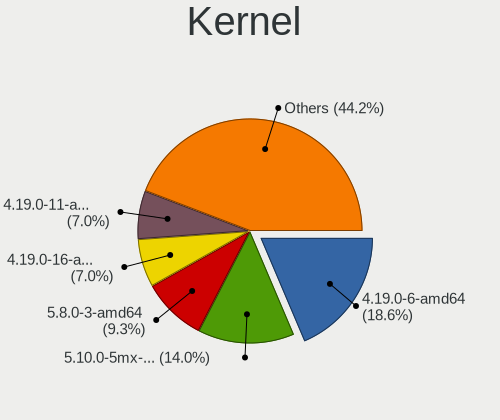

| Version                   | Notebooks | Percent |
|---------------------------|-----------|---------|
| 4.19.0-6-amd64            | 7         | 17.95%  |
| 5.10.0-5mx-amd64          | 4         | 10.26%  |
| 5.8.0-3-amd64             | 3         | 7.69%   |
| 4.19.0-16-amd64           | 3         | 7.69%   |
| 4.19.0-11-amd64           | 3         | 7.69%   |
| 4.19.0-17-amd64           | 2         | 5.13%   |
| 5.8.16-antix.1-amd64-smp  | 1         | 2.56%   |
| 5.6.0-2-amd64             | 1         | 2.56%   |
| 5.6.0-15.2-liquorix-amd64 | 1         | 2.56%   |
| 5.6.0-12.1-liquorix-amd64 | 1         | 2.56%   |
| 5.5.0-9.1-liquorix-amd64  | 1         | 2.56%   |
| 5.4.0-3-amd64             | 1         | 2.56%   |
| 5.10.0-8mx-amd64          | 1         | 2.56%   |
| 5.10.0-6.2-liquorix-amd64 | 1         | 2.56%   |
| 4.19.174                  | 1         | 2.56%   |
| 4.19.0-9-amd64            | 1         | 2.56%   |
| 4.19.0-17-686-pae         | 1         | 2.56%   |
| 4.19.0-16-686-pae         | 1         | 2.56%   |
| 4.19.0-14-amd64           | 1         | 2.56%   |
| 4.19.0-13-amd64           | 1         | 2.56%   |
| 4.19.0-12-amd64           | 1         | 2.56%   |
| 4.19.0-10-amd64           | 1         | 2.56%   |
| 4.19.0-10-686-pae         | 1         | 2.56%   |

Kernel Family
-------------

Linux kernel without a distro release

| Version  | Notebooks | Percent |
|----------|-----------|---------|
| 4.19.0   | 23        | 58.97%  |
| 5.10.0   | 6         | 15.38%  |
| 5.8.0    | 3         | 7.69%   |
| 5.6.0    | 3         | 7.69%   |
| 5.8.16   | 1         | 2.56%   |
| 5.5.0    | 1         | 2.56%   |
| 5.4.0    | 1         | 2.56%   |
| 4.19.174 | 1         | 2.56%   |

Kernel Major Ver.
-----------------

Linux kernel major version

| Version | Notebooks | Percent |
|---------|-----------|---------|
| 4.19    | 24        | 61.54%  |
| 5.10    | 6         | 15.38%  |
| 5.8     | 4         | 10.26%  |
| 5.6     | 3         | 7.69%   |
| 5.5     | 1         | 2.56%   |
| 5.4     | 1         | 2.56%   |

Arch
----

OS architecture (x86_64, i586, etc.)

| Name   | Notebooks | Percent |
|--------|-----------|---------|
| x86_64 | 36        | 92.31%  |
| i686   | 3         | 7.69%   |

DE
--

Desktop Environment

| Name     | Notebooks | Percent |
|----------|-----------|---------|
| XFCE     | 31        | 79.49%  |
| KDE5     | 3         | 7.69%   |
| i3       | 2         | 5.13%   |
| Trinity  | 1         | 2.56%   |
| spectrwm | 1         | 2.56%   |
| Budgie   | 1         | 2.56%   |

Display Server
--------------

X11 or Wayland

| Name | Notebooks | Percent |
|------|-----------|---------|
| X11  | 38        | 97.44%  |
| Tty  | 1         | 2.56%   |

Display Manager
---------------

SDDM, LightDM, etc.

| Name    | Notebooks | Percent |
|---------|-----------|---------|
| LightDM | 36        | 92.31%  |
| SDDM    | 3         | 7.69%   |

OS Lang
-------

Language

| Lang    | Notebooks | Percent |
|---------|-----------|---------|
| Unknown | 23        | 58.97%  |
| en_US   | 8         | 20.51%  |
| es_ES   | 2         | 5.13%   |
| en_GB   | 2         | 5.13%   |
| de_DE   | 2         | 5.13%   |
| es_CO   | 1         | 2.56%   |
| en_IE   | 1         | 2.56%   |

Boot Mode
---------

EFI or BIOS

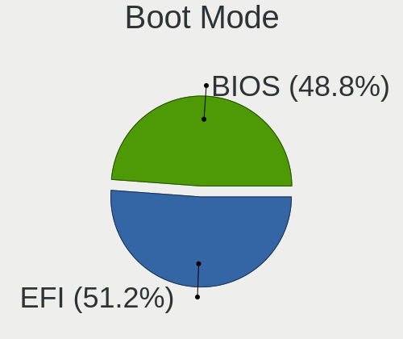

| Mode | Notebooks | Percent |
|------|-----------|---------|
| EFI  | 20        | 51.28%  |
| BIOS | 19        | 48.72%  |

Filesystem
----------

Type of filesystem

| Type    | Notebooks | Percent |
|---------|-----------|---------|
| Ext4    | 36        | 92.31%  |
| Overlay | 2         | 5.13%   |
| Xfs     | 1         | 2.56%   |

Part. scheme
------------

Scheme of partitioning

| Type | Notebooks | Percent |
|------|-----------|---------|
| GPT  | 22        | 56.41%  |
| MBR  | 17        | 43.59%  |

Dual Boot with Linux/BSD
------------------------

Hosting more than one Linux/BSD

| Dual boot | Notebooks | Percent |
|-----------|-----------|---------|
| No        | 34        | 85%     |
| Yes       | 6         | 15%     |

Dual Boot (Win)
---------------

Hosting Linux and Windows

| Dual boot | Notebooks | Percent |
|-----------|-----------|---------|
| No        | 29        | 74.36%  |
| Yes       | 10        | 25.64%  |

Board
-----

Vendor
------

Motherboard manufacturer

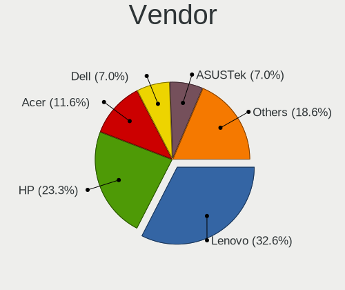

| Name             | Notebooks | Percent |
|------------------|-----------|---------|
| Lenovo           | 14        | 35.9%   |
| Hewlett-Packard  | 9         | 23.08%  |
| Acer             | 5         | 12.82%  |
| ASUSTek Computer | 3         | 7.69%   |
| Dell             | 2         | 5.13%   |
| Sony             | 1         | 2.56%   |
| Notebook         | 1         | 2.56%   |
| Medion           | 1         | 2.56%   |
| Irbis            | 1         | 2.56%   |
| Clevo            | 1         | 2.56%   |
| Apple            | 1         | 2.56%   |

Model
-----

Motherboard model

| Name                                     | Notebooks | Percent |
|------------------------------------------|-----------|---------|
| Sony VGN-NR310FH                         | 1         | 2.56%   |
| Notebook W65_W67RZ1                      | 1         | 2.56%   |
| Medion AKOYA E1318T                      | 1         | 2.56%   |
| Lenovo ThinkPad X1 Carbon 5th 20HR0013AU | 1         | 2.56%   |
| Lenovo ThinkPad T60 20085TG              | 1         | 2.56%   |
| Lenovo ThinkPad T530 2394CJ9             | 1         | 2.56%   |
| Lenovo ThinkPad T440s 20AQ007SGE         | 1         | 2.56%   |
| Lenovo ThinkPad T440s 20AQ006HUS         | 1         | 2.56%   |
| Lenovo ThinkPad T400 2768WGB             | 1         | 2.56%   |
| Lenovo ThinkPad P51 20HJS0TP00           | 1         | 2.56%   |
| Lenovo ThinkPad L520 78595VG             | 1         | 2.56%   |
| Lenovo ThinkPad L490 20Q5S0PR00          | 1         | 2.56%   |
| Lenovo ThinkPad E480 20KNCTO1WW          | 1         | 2.56%   |
| Lenovo ThinkPad E425 1198CTO             | 1         | 2.56%   |
| Lenovo IdeaPad 110-15IBR 80T7            | 1         | 2.56%   |
| Lenovo B590 20206                        | 1         | 2.56%   |
| Lenovo B40-45 20394                      | 1         | 2.56%   |
| Irbis TW94                               | 1         | 2.56%   |
| HP ZBook 17 G6                           | 1         | 2.56%   |
| HP ProBook 650 G1                        | 1         | 2.56%   |
| HP Pavilion Laptop 15-eg0xxx             | 1         | 2.56%   |
| HP Pavilion 15                           | 1         | 2.56%   |
| HP Notebook                              | 1         | 2.56%   |
| HP Mini 110-3500                         | 1         | 2.56%   |
| HP Falco                                 | 1         | 2.56%   |
| HP ENVY Laptop 13-ba0xxx                 | 1         | 2.56%   |
| HP Compaq 8510p (KM229AV)                | 1         | 2.56%   |
| Dell Latitude E6320                      | 1         | 2.56%   |
| Dell Latitude 3340                       | 1         | 2.56%   |
| Clevo P170EM                             | 1         | 2.56%   |
| ASUS X455LAB                             | 1         | 2.56%   |
| ASUS VivoBook_ASUSLaptop X712DA_M712DA   | 1         | 2.56%   |
| ASUS VivoBook 15_ASUS Laptop X542UF      | 1         | 2.56%   |
| Apple MacBook7,1                         | 1         | 2.56%   |
| Acer Aspire one                          | 1         | 2.56%   |
| Acer Aspire E5-571G                      | 1         | 2.56%   |
| Acer Aspire A315-41                      | 1         | 2.56%   |
| Acer Aspire A114-32                      | 1         | 2.56%   |
| Acer Aspire 4820T                        | 1         | 2.56%   |

Model Family
------------

Motherboard model prefix

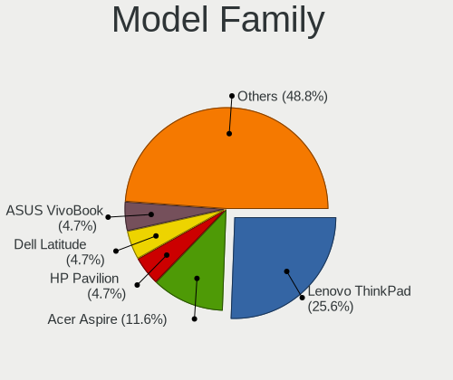

| Name             | Notebooks | Percent |
|------------------|-----------|---------|
| Lenovo ThinkPad  | 11        | 28.21%  |
| Acer Aspire      | 5         | 12.82%  |
| HP Pavilion      | 2         | 5.13%   |
| Dell Latitude    | 2         | 5.13%   |
| ASUS VivoBook    | 2         | 5.13%   |
| Sony VGN-NR310FH | 1         | 2.56%   |
| Notebook W65     | 1         | 2.56%   |
| Medion AKOYA     | 1         | 2.56%   |
| Lenovo IdeaPad   | 1         | 2.56%   |
| Lenovo B590      | 1         | 2.56%   |
| Lenovo B40-45    | 1         | 2.56%   |
| Irbis TW94       | 1         | 2.56%   |
| HP ZBook         | 1         | 2.56%   |
| HP ProBook       | 1         | 2.56%   |
| HP Notebook      | 1         | 2.56%   |
| HP Mini          | 1         | 2.56%   |
| HP Falco         | 1         | 2.56%   |
| HP ENVY          | 1         | 2.56%   |
| HP Compaq        | 1         | 2.56%   |
| Clevo P170EM     | 1         | 2.56%   |
| ASUS X455LAB     | 1         | 2.56%   |
| Apple MacBook7   | 1         | 2.56%   |

MFG Year
--------

Motherboard manufacture year

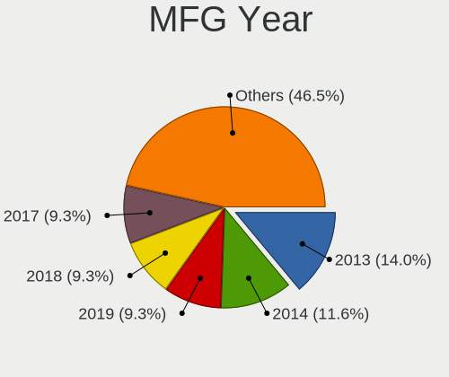

| Year | Notebooks | Percent |
|------|-----------|---------|
| 2019 | 7         | 17.95%  |
| 2020 | 6         | 15.38%  |
| 2014 | 5         | 12.82%  |
| 2021 | 3         | 7.69%   |
| 2018 | 3         | 7.69%   |
| 2015 | 3         | 7.69%   |
| 2012 | 3         | 7.69%   |
| 2011 | 2         | 5.13%   |
| 2008 | 2         | 5.13%   |
| 2016 | 1         | 2.56%   |
| 2013 | 1         | 2.56%   |
| 2010 | 1         | 2.56%   |
| 2009 | 1         | 2.56%   |
| 2006 | 1         | 2.56%   |

Form Factor
-----------

Physical design of the computer

| Name     | Notebooks | Percent |
|----------|-----------|---------|
| Notebook | 39        | 100%    |

Secure Boot
-----------

Enabled or disabled

| State    | Notebooks | Percent |
|----------|-----------|---------|
| Disabled | 39        | 100%    |

Coreboot
--------

Have coreboot on board

| Used | Notebooks | Percent |
|------|-----------|---------|
| No   | 38        | 97.44%  |
| Yes  | 1         | 2.56%   |

RAM Size
--------

Total RAM memory

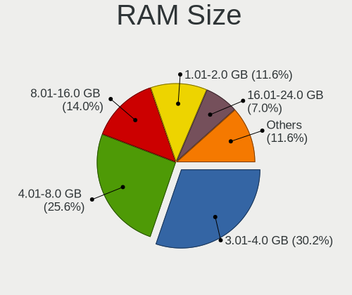

| Size in GB | Notebooks | Percent |
|------------|-----------|---------|
| 3.01-4.0   | 11        | 28.21%  |
| 4.01-8.0   | 9         | 23.08%  |
| 8.01-16.0  | 6         | 15.38%  |
| 1.01-2.0   | 5         | 12.82%  |
| 16.01-24.0 | 3         | 7.69%   |
| 32.01-64.0 | 2         | 5.13%   |
| 2.01-3.0   | 2         | 5.13%   |
| 24.01-32.0 | 1         | 2.56%   |

RAM Used
--------

Used RAM memory

| Used GB   | Notebooks | Percent |
|-----------|-----------|---------|
| 1.01-2.0  | 18        | 45%     |
| 2.01-3.0  | 8         | 20%     |
| 3.01-4.0  | 7         | 17.5%   |
| 0.51-1.0  | 5         | 12.5%   |
| 4.01-8.0  | 1         | 2.5%    |
| 8.01-16.0 | 1         | 2.5%    |

Total Drives
------------

Number of drives on board

| Drives | Notebooks | Percent |
|--------|-----------|---------|
| 1      | 33        | 84.62%  |
| 2      | 3         | 7.69%   |
| 3      | 2         | 5.13%   |
| 4      | 1         | 2.56%   |

Has CD-ROM
----------

Has CD-ROM on board

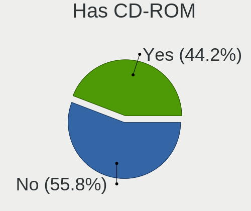

| Presented | Notebooks | Percent |
|-----------|-----------|---------|
| No        | 23        | 58.97%  |
| Yes       | 16        | 41.03%  |

Has Ethernet
------------

Has Ethernet on board

| Presented | Notebooks | Percent |
|-----------|-----------|---------|
| Yes       | 35        | 89.74%  |
| No        | 4         | 10.26%  |

Has WiFi
--------

Has WiFi module

| Presented | Notebooks | Percent |
|-----------|-----------|---------|
| Yes       | 38        | 97.44%  |
| No        | 1         | 2.56%   |

Has Bluetooth
-------------

Has Bluetooth module

| Presented | Notebooks | Percent |
|-----------|-----------|---------|
| Yes       | 28        | 71.79%  |
| No        | 11        | 28.21%  |

Location
--------

Country
-------

Geographic location (country)

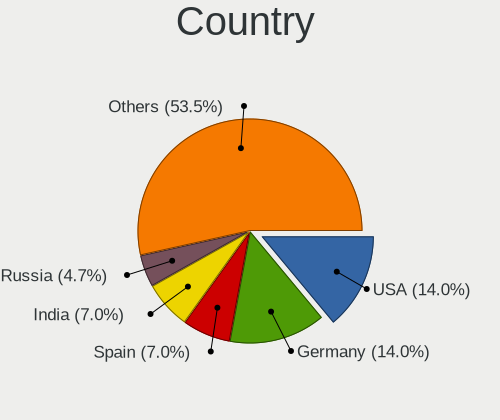

| Country     | Notebooks | Percent |
|-------------|-----------|---------|
| Germany     | 6         | 15.38%  |
| USA         | 5         | 12.82%  |
| Spain       | 3         | 7.69%   |
| India       | 3         | 7.69%   |
| Russia      | 2         | 5.13%   |
| Netherlands | 2         | 5.13%   |
| Mexico      | 2         | 5.13%   |
| Canada      | 2         | 5.13%   |
| Vietnam     | 1         | 2.56%   |
| UK          | 1         | 2.56%   |
| Turkey      | 1         | 2.56%   |
| Syria       | 1         | 2.56%   |
| Portugal    | 1         | 2.56%   |
| Poland      | 1         | 2.56%   |
| Norway      | 1         | 2.56%   |
| France      | 1         | 2.56%   |
| Finland     | 1         | 2.56%   |
| Czechia     | 1         | 2.56%   |
| Colombia    | 1         | 2.56%   |
| Brazil      | 1         | 2.56%   |
| Australia   | 1         | 2.56%   |
| Angola      | 1         | 2.56%   |

City
----

Geographic location (city)

| City              | Notebooks | Percent |
|-------------------|-----------|---------|
| Madrid            | 2         | 5%      |
| Asansol           | 2         | 5%      |
| Trivandrum        | 1         | 2.5%    |
| Torquay           | 1         | 2.5%    |
| Rensselaer        | 1         | 2.5%    |
| Prague            | 1         | 2.5%    |
| Porto             | 1         | 2.5%    |
| Piszczac          | 1         | 2.5%    |
| Perm              | 1         | 2.5%    |
| Nuremberg         | 1         | 2.5%    |
| Munich            | 1         | 2.5%    |
| Montreal          | 1         | 2.5%    |
| Monterrey         | 1         | 2.5%    |
| Mexico City       | 1         | 2.5%    |
| M??nster          | 1         | 2.5%    |
| Madison           | 1         | 2.5%    |
| Luanda            | 1         | 2.5%    |
| Los Angeles       | 1         | 2.5%    |
| Lobnya            | 1         | 2.5%    |
| Lille             | 1         | 2.5%    |
| Leipzig           | 1         | 2.5%    |
| Kreuztal          | 1         | 2.5%    |
| Kartal            | 1         | 2.5%    |
| Iowa City         | 1         | 2.5%    |
| Ho Chi Minh City  | 1         | 2.5%    |
| Helsinki          | 1         | 2.5%    |
| Gargan            | 1         | 2.5%    |
| Damascus          | 1         | 2.5%    |
| Carl Junction     | 1         | 2.5%    |
| Caldicot          | 1         | 2.5%    |
| Breedenbroek      | 1         | 2.5%    |
| Bogot??           | 1         | 2.5%    |
| Bergisch Gladbach | 1         | 2.5%    |
| Aurora            | 1         | 2.5%    |
| Aruj??            | 1         | 2.5%    |
| Arroyomolinos     | 1         | 2.5%    |
| Antakya           | 1         | 2.5%    |
| Amsterdam         | 1         | 2.5%    |

Drives
------

Drive Vendor
------------

Hard drive vendors

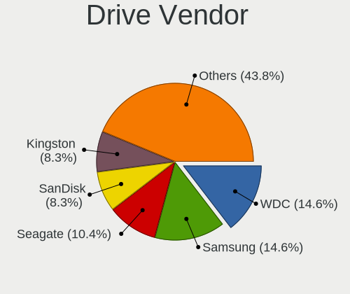

| Vendor              | Notebooks | Drives | Percent |
|---------------------|-----------|--------|---------|
| Samsung Electronics | 7         | 10     | 15.91%  |
| WDC                 | 6         | 7      | 13.64%  |
| Seagate             | 5         | 6      | 11.36%  |
| SanDisk             | 4         | 4      | 9.09%   |
| Kingston            | 4         | 4      | 9.09%   |
| Toshiba             | 3         | 3      | 6.82%   |
| Hitachi             | 3         | 3      | 6.82%   |
| HGST                | 2         | 2      | 4.55%   |
| Yeyian              | 1         | 1      | 2.27%   |
| Unknown             | 1         | 1      | 2.27%   |
| SPCC                | 1         | 1      | 2.27%   |
| Lenovo              | 1         | 1      | 2.27%   |
| Intenso             | 1         | 1      | 2.27%   |
| Intel               | 1         | 1      | 2.27%   |
| Indilinx            | 1         | 2      | 2.27%   |
| HUAWEI              | 1         | 1      | 2.27%   |
| Fujitsu             | 1         | 1      | 2.27%   |
| Crucial             | 1         | 1      | 2.27%   |

Drive Model
-----------

Hard drive models

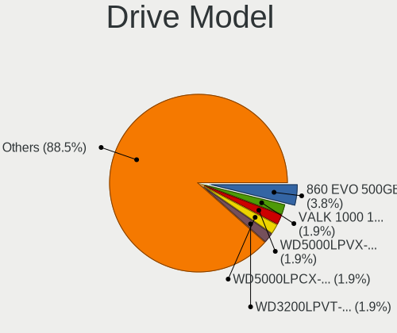

| Model                                | Notebooks | Percent |
|--------------------------------------|-----------|---------|
| Samsung SSD 860 EVO 500GB            | 2         | 4.17%   |
| Yeyian VALK 1000 120GB SSD           | 1         | 2.08%   |
| WDC WD5000LPCX-24VHAT0 500GB         | 1         | 2.08%   |
| WDC WD3200LPVT-08G33T1 320GB         | 1         | 2.08%   |
| WDC WD1600BEVT-22ZCT0 160GB          | 1         | 2.08%   |
| WDC WD10SPZX-80Z10T2 1TB             | 1         | 2.08%   |
| WDC PC SN730 SDBQNTY-512G-1001 512GB | 1         | 2.08%   |
| WDC PC SN520 SDAPNUW-512G-1006 512GB | 1         | 2.08%   |
| WDC PC SN520 SDAPNUW-256G-1102 256GB | 1         | 2.08%   |
| Unknown 064G30  64GB                 | 1         | 2.08%   |
| Toshiba THNSFJ256GCSU 256GB SSD      | 1         | 2.08%   |
| Toshiba MQ01ACF050 500GB             | 1         | 2.08%   |
| Toshiba KXG60ZNV512G KIOXIA 512GB    | 1         | 2.08%   |
| SPCC Solid State Disk 240GB          | 1         | 2.08%   |
| Seagate ST9500420AS 500GB            | 1         | 2.08%   |
| Seagate ST9500325AS 500GB            | 1         | 2.08%   |
| Seagate ST2000LM003 HN-M201RAD 2TB   | 1         | 2.08%   |
| Seagate ST1000LM035-1RK172 1TB       | 1         | 2.08%   |
| Seagate ST1000LM024 HN-M101MBB 1TB   | 1         | 2.08%   |
| Seagate BUP BK 4TB                   | 1         | 2.08%   |
| SanDisk SSD PLUS 480G                | 1         | 2.08%   |
| SanDisk SDSSDHII120G 120GB           | 1         | 2.08%   |
| SanDisk SDSSDA120G 120GB             | 1         | 2.08%   |
| SanDisk DF4064  64GB                 | 1         | 2.08%   |
| Samsung SSD 860 EVO mSATA 500GB      | 1         | 2.08%   |
| Samsung SSD 850 EVO 500GB            | 1         | 2.08%   |
| Samsung SSD 840 Series 500GB         | 1         | 2.08%   |
| Samsung SSD 840 EVO 250GB            | 1         | 2.08%   |
| Samsung MZVLW512HMJP-000L7 512GB     | 1         | 2.08%   |
| Samsung MZVKW512HMJP-000L7 512GB     | 1         | 2.08%   |
| Samsung MZAPF032HCFV-000H1 32GB SSD  | 1         | 2.08%   |
| Lenovo LENSE20256GMSP34MEAT2TA 256GB | 1         | 2.08%   |
| Kingston SMS200S3120G 120GB SSD      | 1         | 2.08%   |
| Kingston SA400S37480G 480GB SSD      | 1         | 2.08%   |
| Kingston SA400S37240G 240GB SSD      | 1         | 2.08%   |
| Kingston SA400M8240G 240GB SSD       | 1         | 2.08%   |
| Intenso SSD Sata III 256GB           | 1         | 2.08%   |
| Intel SSDPEKNW512G8H 512GB           | 1         | 2.08%   |
| Indilinx IND-S325S120G 120GB SSD     | 1         | 2.08%   |
| HUAWEI SD Storage 2GB                | 1         | 2.08%   |
| Hitachi HTS545025B9SA02 250GB        | 1         | 2.08%   |
| Hitachi HTS543225L9A300 250GB        | 1         | 2.08%   |
| Hitachi HTS542516K9SA00 160GB        | 1         | 2.08%   |
| HGST HTS545050A7E680 500GB           | 1         | 2.08%   |
| HGST HTS541010A9E680 1TB             | 1         | 2.08%   |
| Fujitsu MHZ2160BH G2 160GB           | 1         | 2.08%   |
| Crucial CT500MX500SSD1 500GB         | 1         | 2.08%   |

HDD Vendor
----------

Hard disk drive vendors

| Vendor  | Notebooks | Drives | Percent |
|---------|-----------|--------|---------|
| Seagate | 5         | 6      | 31.25%  |
| WDC     | 4         | 4      | 25%     |
| Hitachi | 3         | 3      | 18.75%  |
| HGST    | 2         | 2      | 12.5%   |
| Toshiba | 1         | 1      | 6.25%   |
| Fujitsu | 1         | 1      | 6.25%   |

SSD Vendor
----------

Solid state drive vendors

| Vendor              | Notebooks | Drives | Percent |
|---------------------|-----------|--------|---------|
| Samsung Electronics | 5         | 8      | 27.78%  |
| Kingston            | 4         | 4      | 22.22%  |
| SanDisk             | 3         | 3      | 16.67%  |
| Yeyian              | 1         | 1      | 5.56%   |
| Toshiba             | 1         | 1      | 5.56%   |
| SPCC                | 1         | 1      | 5.56%   |
| Intenso             | 1         | 1      | 5.56%   |
| Indilinx            | 1         | 2      | 5.56%   |
| Crucial             | 1         | 1      | 5.56%   |

Drive Kind
----------

HDD or SSD

| Kind    | Notebooks | Drives | Percent |
|---------|-----------|--------|---------|
| SSD     | 16        | 22     | 37.21%  |
| HDD     | 16        | 17     | 37.21%  |
| NVMe    | 8         | 8      | 18.6%   |
| MMC     | 2         | 2      | 4.65%   |
| Unknown | 1         | 1      | 2.33%   |

Drive Connector
---------------

SATA, SAS, NVMe, etc.

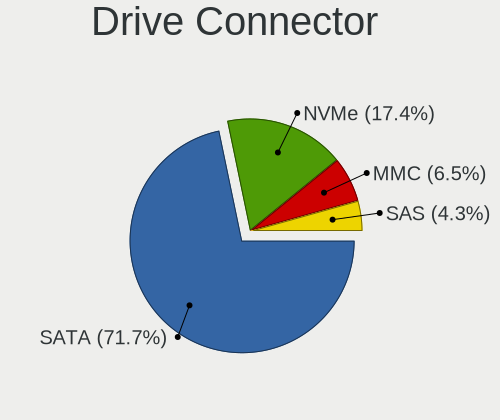

| Type | Notebooks | Drives | Percent |
|------|-----------|--------|---------|
| SATA | 30        | 38     | 71.43%  |
| NVMe | 8         | 8      | 19.05%  |
| SAS  | 2         | 2      | 4.76%   |
| MMC  | 2         | 2      | 4.76%   |

Drive Size
----------

Size of hard drive

| Size in TB | Notebooks | Drives | Percent |
|------------|-----------|--------|---------|
| 0.01-0.5   | 26        | 33     | 81.25%  |
| 0.51-1.0   | 4         | 4      | 12.5%   |
| 3.01-4.0   | 1         | 1      | 3.13%   |
| 1.01-2.0   | 1         | 1      | 3.13%   |

Space Total
-----------

Amount of disk space available on the file system

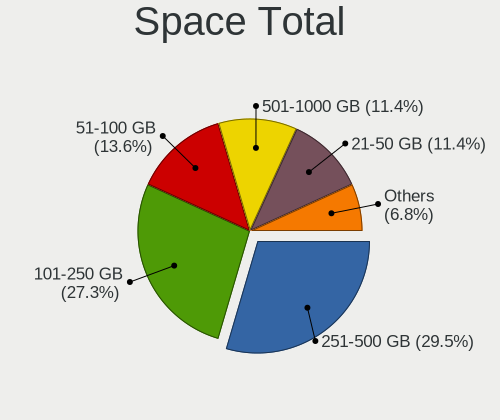

| Size in GB     | Notebooks | Percent |
|----------------|-----------|---------|
| 251-500        | 12        | 30%     |
| 101-250        | 11        | 27.5%   |
| 21-50          | 5         | 12.5%   |
| 501-1000       | 5         | 12.5%   |
| 51-100         | 5         | 12.5%   |
| More than 3000 | 1         | 2.5%    |
| 1-20           | 1         | 2.5%    |

Space Used
----------

Amount of used disk space

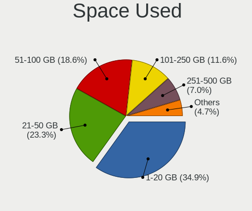

| Used GB        | Notebooks | Percent |
|----------------|-----------|---------|
| 1-20           | 13        | 33.33%  |
| 21-50          | 10        | 25.64%  |
| 51-100         | 8         | 20.51%  |
| 101-250        | 4         | 10.26%  |
| 251-500        | 2         | 5.13%   |
| More than 3000 | 1         | 2.56%   |
| 501-1000       | 1         | 2.56%   |

Malfunc. Drives
---------------

Drive models with a malfunction

| Model                            | Notebooks | Drives | Percent |
|----------------------------------|-----------|--------|---------|
| WDC WD1600BEVT-22ZCT0 160GB      | 1         | 1      | 12.5%   |
| Seagate ST9500420AS 500GB        | 1         | 1      | 12.5%   |
| Seagate ST9500325AS 500GB        | 1         | 1      | 12.5%   |
| Seagate ST1000LM035-1RK172 1TB   | 1         | 1      | 12.5%   |
| Indilinx IND-S325S120G 120GB SSD | 1         | 2      | 12.5%   |
| Hitachi HTS542516K9SA00 160GB    | 1         | 1      | 12.5%   |
| HGST HTS545050A7E680 500GB       | 1         | 1      | 12.5%   |
| Fujitsu MHZ2160BH G2 160GB       | 1         | 1      | 12.5%   |

Malfunc. Drive Vendor
---------------------

Vendors of faulty drives

| Vendor   | Notebooks | Drives | Percent |
|----------|-----------|--------|---------|
| Seagate  | 3         | 3      | 37.5%   |
| WDC      | 1         | 1      | 12.5%   |
| Indilinx | 1         | 2      | 12.5%   |
| Hitachi  | 1         | 1      | 12.5%   |
| HGST     | 1         | 1      | 12.5%   |
| Fujitsu  | 1         | 1      | 12.5%   |

Malfunc. HDD Vendor
-------------------

Vendors of faulty HDD drives

| Vendor  | Notebooks | Drives | Percent |
|---------|-----------|--------|---------|
| Seagate | 3         | 3      | 42.86%  |
| WDC     | 1         | 1      | 14.29%  |
| Hitachi | 1         | 1      | 14.29%  |
| HGST    | 1         | 1      | 14.29%  |
| Fujitsu | 1         | 1      | 14.29%  |

Malfunc. Drive Kind
-------------------

Kinds of faulty drives

| Kind | Notebooks | Drives | Percent |
|------|-----------|--------|---------|
| HDD  | 7         | 7      | 87.5%   |
| SSD  | 1         | 2      | 12.5%   |

Failed Drives
-------------

Failed drive models

Zero info for selected period =(

Failed Drive Vendor
-------------------

Failed drive vendors

Zero info for selected period =(

Drive Status
------------

Number of failed and malfunc. drives

| Status   | Notebooks | Drives | Percent |
|----------|-----------|--------|---------|
| Works    | 30        | 36     | 69.77%  |
| Malfunc  | 8         | 9      | 18.6%   |
| Detected | 5         | 5      | 11.63%  |

Storage controller
------------------

Storage Vendor
--------------

Storage controller vendors

| Vendor                       | Notebooks | Percent |
|------------------------------|-----------|---------|
| Intel                        | 27        | 65.85%  |
| AMD                          | 6         | 14.63%  |
| Sandisk                      | 3         | 7.32%   |
| Samsung Electronics          | 2         | 4.88%   |
| Toshiba America Info Systems | 1         | 2.44%   |
| Nvidia                       | 1         | 2.44%   |
| Lenovo                       | 1         | 2.44%   |

Storage Model
-------------

Storage controller models

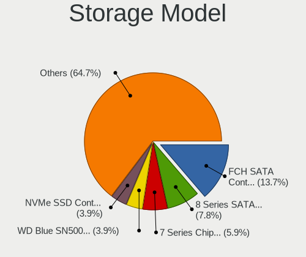

| Model                                                                            | Notebooks | Percent |
|----------------------------------------------------------------------------------|-----------|---------|
| AMD FCH SATA Controller [AHCI mode]                                              | 6         | 12.77%  |
| Intel 8 Series SATA Controller 1 [AHCI mode]                                     | 4         | 8.51%   |
| Intel 7 Series Chipset Family 6-port SATA Controller [AHCI mode]                 | 3         | 6.38%   |
| Sandisk WD Blue SN500 / PC SN520 NVMe SSD                                        | 2         | 4.26%   |
| Samsung NVMe SSD Controller SM961/PM961/SM963                                    | 2         | 4.26%   |
| Intel Wildcat Point-LP SATA Controller [AHCI Mode]                               | 2         | 4.26%   |
| Intel Atom/Celeron/Pentium Processor x5-E8000/J3xxx/N3xxx Series SATA Controller | 2         | 4.26%   |
| Intel 82801HM/HEM (ICH8M/ICH8M-E) SATA Controller [AHCI mode]                    | 2         | 4.26%   |
| Intel 82801HM/HEM (ICH8M/ICH8M-E) IDE Controller                                 | 2         | 4.26%   |
| Intel 82801GBM/GHM (ICH7-M Family) SATA Controller [AHCI mode]                   | 2         | 4.26%   |
| Intel 82801G (ICH7 Family) IDE Controller                                        | 2         | 4.26%   |
| Intel 82801 Mobile SATA Controller [RAID mode]                                   | 2         | 4.26%   |
| Toshiba America Info Systems XG6 NVMe SSD Controller                             | 1         | 2.13%   |
| Sandisk WD Black SN750 / PC SN730 NVMe SSD                                       | 1         | 2.13%   |
| Nvidia MCP89 SATA Controller (AHCI mode)                                         | 1         | 2.13%   |
| Lenovo Non-Volatile memory controller                                            | 1         | 2.13%   |
| Intel Volume Management Device NVMe RAID Controller                              | 1         | 2.13%   |
| Intel Sunrise Point-LP SATA Controller [AHCI mode]                               | 1         | 2.13%   |
| Intel SSD 660P Series                                                            | 1         | 2.13%   |
| Intel NM10/ICH7 Family SATA Controller [AHCI mode]                               | 1         | 2.13%   |
| Intel Mobile PM965/GM965 PT IDER Controller                                      | 1         | 2.13%   |
| Intel HM170/QM170 Chipset SATA Controller [AHCI Mode]                            | 1         | 2.13%   |
| Intel Celeron/Pentium Silver Processor SATA Controller                           | 1         | 2.13%   |
| Intel Cannon Lake Mobile PCH SATA AHCI Controller                                | 1         | 2.13%   |
| Intel 82801IBM/IEM (ICH9M/ICH9M-E) 4 port SATA Controller [AHCI mode]            | 1         | 2.13%   |
| Intel 8 Series/C220 Series Chipset Family 6-port SATA Controller 1 [AHCI mode]   | 1         | 2.13%   |
| Intel 6 Series/C200 Series Chipset Family 6 port Mobile SATA AHCI Controller     | 1         | 2.13%   |
| Intel 5 Series/3400 Series Chipset 4 port SATA AHCI Controller                   | 1         | 2.13%   |

Storage Kind
------------

Kind of storage controller (IDE, SATA, NVMe, SAS, ...)

| Kind | Notebooks | Percent |
|------|-----------|---------|
| SATA | 31        | 67.39%  |
| NVMe | 8         | 17.39%  |
| IDE  | 4         | 8.7%    |
| RAID | 3         | 6.52%   |

Processor
---------

CPU Vendor
----------

Processor vendors

| Vendor | Notebooks | Percent |
|--------|-----------|---------|
| Intel  | 33        | 84.62%  |
| AMD    | 6         | 15.38%  |

CPU Model
---------

Processor models

| Model                                         | Notebooks | Percent |
|-----------------------------------------------|-----------|---------|
| Intel Core i7-4600U CPU @ 2.10GHz             | 2         | 5.13%   |
| Intel Core 2 Duo CPU P8600 @ 2.40GHz          | 2         | 5.13%   |
| Intel Pentium CPU N3710 @ 1.60GHz             | 1         | 2.56%   |
| Intel Pentium CPU 2020M @ 2.40GHz             | 1         | 2.56%   |
| Intel Core i7-9850H CPU @ 2.60GHz             | 1         | 2.56%   |
| Intel Core i7-8550U CPU @ 1.80GHz             | 1         | 2.56%   |
| Intel Core i7-7820HQ CPU @ 2.90GHz            | 1         | 2.56%   |
| Intel Core i7-7500U CPU @ 2.70GHz             | 1         | 2.56%   |
| Intel Core i7-6700HQ CPU @ 2.60GHz            | 1         | 2.56%   |
| Intel Core i7-5500U CPU @ 2.40GHz             | 1         | 2.56%   |
| Intel Core i7-3720QM CPU @ 2.60GHz            | 1         | 2.56%   |
| Intel Core i5-8365U CPU @ 1.60GHz             | 1         | 2.56%   |
| Intel Core i5-8250U CPU @ 1.60GHz             | 1         | 2.56%   |
| Intel Core i5-5200U CPU @ 2.20GHz             | 1         | 2.56%   |
| Intel Core i5-4210U CPU @ 1.70GHz             | 1         | 2.56%   |
| Intel Core i5-3320M CPU @ 2.60GHz             | 1         | 2.56%   |
| Intel Core i5-2520M CPU @ 2.50GHz             | 1         | 2.56%   |
| Intel Core i5-1035G4 CPU @ 1.10GHz            | 1         | 2.56%   |
| Intel Core i3-4000M CPU @ 2.40GHz             | 1         | 2.56%   |
| Intel Core i3-2350M CPU @ 2.30GHz             | 1         | 2.56%   |
| Intel Core i3 CPU M 330 @ 2.13GHz             | 1         | 2.56%   |
| Intel Core Duo CPU T2500 @ 2.00GHz            | 1         | 2.56%   |
| Intel Core 2 Duo CPU T8100 @ 2.10GHz          | 1         | 2.56%   |
| Intel Celeron N4000 CPU @ 1.10GHz             | 1         | 2.56%   |
| Intel Celeron CPU N3060 @ 1.60GHz             | 1         | 2.56%   |
| Intel Celeron CPU 550 @ 2.00GHz               | 1         | 2.56%   |
| Intel Celeron 2955U @ 1.40GHz                 | 1         | 2.56%   |
| Intel Atom x5-Z8350 CPU @ 1.44GHz             | 1         | 2.56%   |
| Intel Atom CPU N550 @ 1.50GHz                 | 1         | 2.56%   |
| Intel Atom CPU N270 @ 1.60GHz                 | 1         | 2.56%   |
| Intel 11th Gen Core i7-1165G7 @ 2.80GHz       | 1         | 2.56%   |
| AMD Ryzen 7 3700U with Radeon Vega Mobile Gfx | 1         | 2.56%   |
| AMD Ryzen 5 2500U with Radeon Vega Mobile Gfx | 1         | 2.56%   |
| AMD E1-6010 APU with AMD Radeon R2 Graphics   | 1         | 2.56%   |
| AMD A8-6410 APU with AMD Radeon R5 Graphics   | 1         | 2.56%   |
| AMD A4-3300M APU with Radeon HD Graphics      | 1         | 2.56%   |
| AMD A4-1200 APU with Radeon HD Graphics       | 1         | 2.56%   |

CPU Model Family
----------------

Processor model prefix

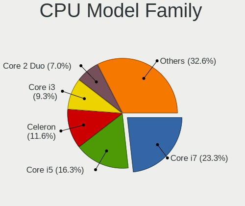

| Model            | Notebooks | Percent |
|------------------|-----------|---------|
| Intel Core i7    | 9         | 23.08%  |
| Intel Core i5    | 7         | 17.95%  |
| Intel Celeron    | 4         | 10.26%  |
| Intel Core i3    | 3         | 7.69%   |
| Intel Core 2 Duo | 3         | 7.69%   |
| Intel Atom       | 3         | 7.69%   |
| Intel Pentium    | 2         | 5.13%   |
| AMD A4           | 2         | 5.13%   |
| Other            | 1         | 2.56%   |
| Intel Core Duo   | 1         | 2.56%   |
| AMD Ryzen 7      | 1         | 2.56%   |
| AMD Ryzen 5      | 1         | 2.56%   |
| AMD E1           | 1         | 2.56%   |
| AMD A8           | 1         | 2.56%   |

CPU Cores
---------

Number of processor cores

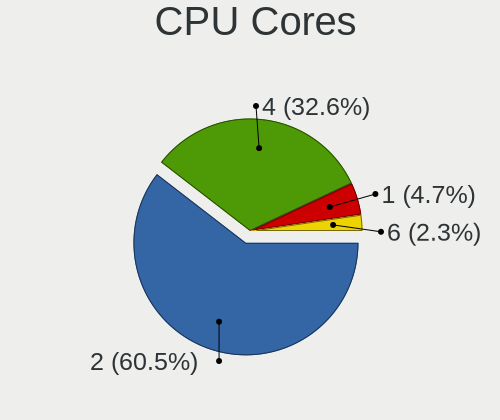

| Number | Notebooks | Percent |
|--------|-----------|---------|
| 2      | 23        | 58.97%  |
| 4      | 13        | 33.33%  |
| 1      | 2         | 5.13%   |
| 6      | 1         | 2.56%   |

CPU Sockets
-----------

Number of sockets

| Number | Notebooks | Percent |
|--------|-----------|---------|
| 1      | 39        | 100%    |

CPU Threads
-----------

Threads per core (Hyper-Threading)

| Number | Notebooks | Percent |
|--------|-----------|---------|
| 2      | 24        | 61.54%  |
| 1      | 15        | 38.46%  |

CPU Op-Modes
------------

CPU Operation Modes (32-bit, 64-bit)

| Op mode        | Notebooks | Percent |
|----------------|-----------|---------|
| 32-bit, 64-bit | 37        | 94.87%  |
| 32-bit         | 2         | 5.13%   |

CPU Microcode
-------------

Microcode number

| Number     | Notebooks | Percent |
|------------|-----------|---------|
| 0x40651    | 4         | 10.26%  |
| Unknown    | 4         | 10.26%  |
| 0x306a9    | 3         | 7.69%   |
| 0x406c4    | 2         | 5.13%   |
| 0x306d4    | 2         | 5.13%   |
| 0x206a7    | 2         | 5.13%   |
| 0x1067a    | 2         | 5.13%   |
| 0x906ed    | 1         | 2.56%   |
| 0x906e9    | 1         | 2.56%   |
| 0x806ea    | 1         | 2.56%   |
| 0x806e9    | 1         | 2.56%   |
| 0x806c1    | 1         | 2.56%   |
| 0x706e5    | 1         | 2.56%   |
| 0x706a1    | 1         | 2.56%   |
| 0x6ec      | 1         | 2.56%   |
| 0x306c3    | 1         | 2.56%   |
| 0x20652    | 1         | 2.56%   |
| 0x106ca    | 1         | 2.56%   |
| 0x106c2    | 1         | 2.56%   |
| 0x10676    | 1         | 2.56%   |
| 0x10661    | 1         | 2.56%   |
| 0x08108102 | 1         | 2.56%   |
| 0x0810100b | 1         | 2.56%   |
| 0x07030105 | 1         | 2.56%   |
| 0x07030104 | 1         | 2.56%   |
| 0x0700010f | 1         | 2.56%   |
| 0x03000027 | 1         | 2.56%   |

CPU Microarch
-------------

Microarchitecture

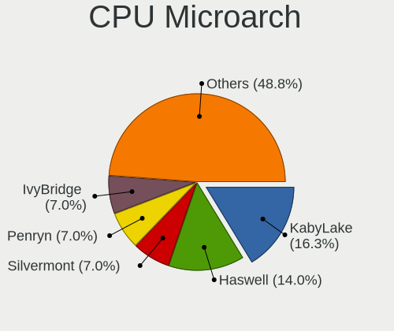

| Name          | Notebooks | Percent |
|---------------|-----------|---------|
| KabyLake      | 6         | 15.38%  |
| Haswell       | 5         | 12.82%  |
| Silvermont    | 3         | 7.69%   |
| Penryn        | 3         | 7.69%   |
| IvyBridge     | 3         | 7.69%   |
| SandyBridge   | 2         | 5.13%   |
| Puma          | 2         | 5.13%   |
| Broadwell     | 2         | 5.13%   |
| Bonnell       | 2         | 5.13%   |
| Zen+          | 1         | 2.56%   |
| Zen           | 1         | 2.56%   |
| Westmere      | 1         | 2.56%   |
| TigerLake     | 1         | 2.56%   |
| Skylake       | 1         | 2.56%   |
| P6            | 1         | 2.56%   |
| K10 Llano     | 1         | 2.56%   |
| Jaguar        | 1         | 2.56%   |
| IceLake       | 1         | 2.56%   |
| Goldmont plus | 1         | 2.56%   |
| Core          | 1         | 2.56%   |

Graphics
--------

GPU Vendor
----------

Vendors of graphics cards

| Vendor | Notebooks | Percent |
|--------|-----------|---------|
| Intel  | 30        | 63.83%  |
| AMD    | 10        | 21.28%  |
| Nvidia | 7         | 14.89%  |

GPU Model
---------

Graphics card models

| Model                                                                                    | Notebooks | Percent |
|------------------------------------------------------------------------------------------|-----------|---------|
| Intel Haswell-ULT Integrated Graphics Controller                                         | 4         | 8.16%   |
| Intel Atom/Celeron/Pentium Processor x5-E8000/J3xxx/N3xxx Integrated Graphics Controller | 3         | 6.12%   |
| Intel 3rd Gen Core processor Graphics Controller                                         | 3         | 6.12%   |
| Intel UHD Graphics 620                                                                   | 2         | 4.08%   |
| Intel HD Graphics 5500                                                                   | 2         | 4.08%   |
| Intel 2nd Generation Core Processor Family Integrated Graphics Controller                | 2         | 4.08%   |
| Nvidia TU117M [GeForce MX450]                                                            | 1         | 2.04%   |
| Nvidia TU106GLM [Quadro RTX 3000 Mobile / Max-Q]                                         | 1         | 2.04%   |
| Nvidia MCP89 [GeForce 320M]                                                              | 1         | 2.04%   |
| Nvidia GM206GLM [Quadro M2200 Mobile]                                                    | 1         | 2.04%   |
| Nvidia GM108M [GeForce MX130]                                                            | 1         | 2.04%   |
| Nvidia GF117M [GeForce 610M/710M/810M/820M / GT 620M/625M/630M/720M]                     | 1         | 2.04%   |
| Nvidia GF114M [GeForce GTX 675M]                                                         | 1         | 2.04%   |
| Intel WhiskeyLake-U GT2 [UHD Graphics 620]                                               | 1         | 2.04%   |
| Intel TigerLake-LP GT2 [Iris Xe Graphics]                                                | 1         | 2.04%   |
| Intel Mobile GM965/GL960 Integrated Graphics Controller (secondary)                      | 1         | 2.04%   |
| Intel Mobile GM965/GL960 Integrated Graphics Controller (primary)                        | 1         | 2.04%   |
| Intel Mobile 945GSE Express Integrated Graphics Controller                               | 1         | 2.04%   |
| Intel Mobile 945GM/GMS/GME, 943/940GML Express Integrated Graphics Controller            | 1         | 2.04%   |
| Intel Mobile 4 Series Chipset Integrated Graphics Controller                             | 1         | 2.04%   |
| Intel Iris Plus Graphics G4 (Ice Lake)                                                   | 1         | 2.04%   |
| Intel HD Graphics 630                                                                    | 1         | 2.04%   |
| Intel HD Graphics 620                                                                    | 1         | 2.04%   |
| Intel HD Graphics 530                                                                    | 1         | 2.04%   |
| Intel GeminiLake [UHD Graphics 600]                                                      | 1         | 2.04%   |
| Intel Core Processor Integrated Graphics Controller                                      | 1         | 2.04%   |
| Intel CoffeeLake-H GT2 [UHD Graphics 630]                                                | 1         | 2.04%   |
| Intel Atom Processor D4xx/D5xx/N4xx/N5xx Integrated Graphics Controller                  | 1         | 2.04%   |
| Intel 4th Gen Core Processor Integrated Graphics Controller                              | 1         | 2.04%   |
| AMD Sumo [Radeon HD 6480G]                                                               | 1         | 2.04%   |
| AMD RV630/M76 [Mobility Radeon HD 2600]                                                  | 1         | 2.04%   |
| AMD RV620/M82 [Mobility Radeon HD 3450/3470]                                             | 1         | 2.04%   |
| AMD RV515/M54 [Mobility Radeon X1400]                                                    | 1         | 2.04%   |
| AMD Raven Ridge [Radeon Vega Series / Radeon Vega Mobile Series]                         | 1         | 2.04%   |
| AMD Picasso                                                                              | 1         | 2.04%   |
| AMD Mullins [Radeon R4/R5 Graphics]                                                      | 1         | 2.04%   |
| AMD Mullins [Radeon R2 Graphics]                                                         | 1         | 2.04%   |
| AMD Lexa PRO [Radeon 540/540X/550/550X / RX 540X/550/550X]                               | 1         | 2.04%   |
| AMD Kabini [Radeon HD 8180]                                                              | 1         | 2.04%   |

GPU Combo
---------

Combinations of graphics cards

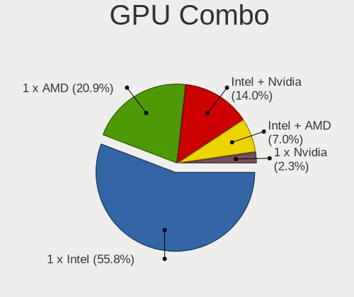

| Name           | Notebooks | Percent |
|----------------|-----------|---------|
| 1 x Intel      | 22        | 56.41%  |
| 1 x AMD        | 8         | 20.51%  |
| Intel + Nvidia | 6         | 15.38%  |
| Intel + AMD    | 2         | 5.13%   |
| 1 x Nvidia     | 1         | 2.56%   |

GPU Driver
----------

Free vs proprietary

| Driver  | Notebooks | Percent |
|---------|-----------|---------|
| Free    | 38        | 97.44%  |
| Unknown | 1         | 2.56%   |

GPU Memory
----------

Total video memory

| Size in GB | Notebooks | Percent |
|------------|-----------|---------|
| Unknown    | 30        | 76.92%  |
| 0.01-0.5   | 6         | 15.38%  |
| 0.51-1.0   | 2         | 5.13%   |
| 1.01-2.0   | 1         | 2.56%   |

Monitor
-------

Monitor Vendor
--------------

Monitor vendors

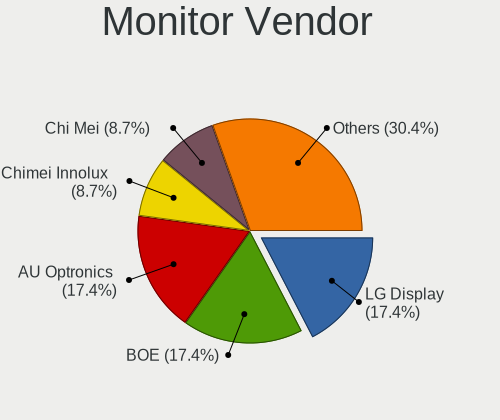

| Vendor                  | Notebooks | Percent |
|-------------------------|-----------|---------|
| LG Display              | 7         | 16.67%  |
| BOE                     | 7         | 16.67%  |
| AU Optronics            | 7         | 16.67%  |
| Chimei Innolux          | 4         | 9.52%   |
| Chi Mei Optoelectronics | 4         | 9.52%   |
| Lenovo                  | 3         | 7.14%   |
| Samsung Electronics     | 2         | 4.76%   |
| HannStar                | 2         | 4.76%   |
| Philips                 | 1         | 2.38%   |
| LG Philips              | 1         | 2.38%   |
| InfoVision              | 1         | 2.38%   |
| Goldstar                | 1         | 2.38%   |
| Dell                    | 1         | 2.38%   |
| Apple                   | 1         | 2.38%   |

Monitor Model
-------------

Monitor models

| Model                                                                     | Notebooks | Percent |
|---------------------------------------------------------------------------|-----------|---------|
| Chi Mei Optoelectronics LCD Monitor CMO15A3 1366x768 344x193mm 15.5-inch  | 2         | 4.76%   |
| Samsung Electronics LCD Monitor SEC5441 1366x768 344x194mm 15.5-inch      | 1         | 2.38%   |
| Samsung Electronics LCD Monitor SEC3152 1366x768 344x194mm 15.5-inch      | 1         | 2.38%   |
| Philips PHL BDM4350 PHL08FA 3840x2160 950x540mm 43.0-inch                 | 1         | 2.38%   |
| LG Philips LCD Monitor LPL1901 1680x1050 331x207mm 15.4-inch              | 1         | 2.38%   |
| LG Display LP156WH2-TLE1 LGDCF01 1366x768 344x194mm 15.5-inch             | 1         | 2.38%   |
| LG Display LCD Monitor LGD062E 1920x1080 344x194mm 15.5-inch              | 1         | 2.38%   |
| LG Display LCD Monitor LGD059E 1920x1080 382x215mm 17.3-inch              | 1         | 2.38%   |
| LG Display LCD Monitor LGD0590 1920x1080 344x194mm 15.5-inch              | 1         | 2.38%   |
| LG Display LCD Monitor LGD04A7 1920x1080 340x190mm 15.3-inch              | 1         | 2.38%   |
| LG Display LCD Monitor LGD045E 1366x768 309x174mm 14.0-inch               | 1         | 2.38%   |
| LG Display LCD Monitor LGD040A 1920x1080 310x170mm 13.9-inch              | 1         | 2.38%   |
| Lenovo LEN L27i-28 LEN65E0 1920x1080 598x336mm 27.0-inch                  | 1         | 2.38%   |
| Lenovo LCD Monitor LEN4043 1400x1050 305x228mm 15.0-inch                  | 1         | 2.38%   |
| Lenovo LCD Monitor LEN4036 1440x900 304x190mm 14.1-inch                   | 1         | 2.38%   |
| InfoVision LCD Monitor IVO03FA 1366x768 220x130mm 10.1-inch               | 1         | 2.38%   |
| HannStar LCD Monitor HSD03E9 1024x600 220x129mm 10.0-inch                 | 1         | 2.38%   |
| HannStar HL161ABB HSD61C7 1366x768 344x193mm 15.5-inch                    | 1         | 2.38%   |
| Goldstar HDR WFHD GSM7714 2560x1080 798x334mm 34.1-inch                   | 1         | 2.38%   |
| Dell S2409W DELA039 1920x1080 531x298mm 24.0-inch                         | 1         | 2.38%   |
| Chimei Innolux LCD Monitor CMN15DB 1366x768 344x193mm 15.5-inch           | 1         | 2.38%   |
| Chimei Innolux LCD Monitor CMN15BC 1366x768 350x190mm 15.7-inch           | 1         | 2.38%   |
| Chimei Innolux LCD Monitor CMN14A7 1920x1080 308x173mm 13.9-inch          | 1         | 2.38%   |
| Chimei Innolux LCD Monitor CMN1491 1366x768 309x174mm 14.0-inch           | 1         | 2.38%   |
| Chi Mei Optoelectronics LCD Monitor CMO1720 1920x1080 382x215mm 17.3-inch | 1         | 2.38%   |
| Chi Mei Optoelectronics LCD Monitor CMO1467 1366x768 309x174mm 14.0-inch  | 1         | 2.38%   |
| BOE LCD Monitor BOE089D 1280x800 261x163mm 12.1-inch                      | 1         | 2.38%   |
| BOE LCD Monitor BOE084E 1920x1080 382x215mm 17.3-inch                     | 1         | 2.38%   |
| BOE LCD Monitor BOE0791 1920x1080 309x173mm 13.9-inch                     | 1         | 2.38%   |
| BOE LCD Monitor BOE0742 1920x1080 309x173mm 13.9-inch                     | 1         | 2.38%   |
| BOE LCD Monitor BOE0675 1366x768 344x194mm 15.5-inch                      | 1         | 2.38%   |
| BOE LCD Monitor BOE0672 1366x768 344x194mm 15.5-inch                      | 1         | 2.38%   |
| BOE LCD Monitor BOE05DF 1366x768 293x165mm 13.2-inch                      | 1         | 2.38%   |
| AU Optronics LCD Monitor AUO45EC 1366x768 340x190mm 15.3-inch             | 1         | 2.38%   |
| AU Optronics LCD Monitor AUO40EC 1366x768 340x190mm 15.3-inch             | 1         | 2.38%   |
| AU Optronics LCD Monitor AUO34ED 1920x1080 340x190mm 15.3-inch            | 1         | 2.38%   |
| AU Optronics LCD Monitor AUO313D 1920x1080 309x174mm 14.0-inch            | 1         | 2.38%   |
| AU Optronics LCD Monitor AUO30D2 1024x600 223x125mm 10.1-inch             | 1         | 2.38%   |
| AU Optronics LCD Monitor AUO303C 1366x768 309x173mm 13.9-inch             | 1         | 2.38%   |
| AU Optronics LCD Monitor AUO123D 1920x1080 309x173mm 13.9-inch            | 1         | 2.38%   |
| Apple LCD Monitor APP9CD1 1280x800 286x179mm 13.3-inch                    | 1         | 2.38%   |

Monitor Resolution
------------------

Monitor screen resolution

| Resolution         | Notebooks | Percent |
|--------------------|-----------|---------|
| 1366x768 (WXGA)    | 18        | 43.9%   |
| 1920x1080 (FHD)    | 15        | 36.59%  |
| 1024x600           | 2         | 4.88%   |
| 3840x2160 (4K)     | 1         | 2.44%   |
| 2560x1080          | 1         | 2.44%   |
| 1680x1050 (WSXGA+) | 1         | 2.44%   |
| 1440x900 (WXGA+)   | 1         | 2.44%   |
| 1400x1050          | 1         | 2.44%   |
| 1280x800 (WXGA)    | 1         | 2.44%   |

Monitor Diagonal
----------------

Diagonal size in inches

| Inches | Notebooks | Percent |
|--------|-----------|---------|
| 15     | 17        | 41.46%  |
| 13     | 8         | 19.51%  |
| 14     | 6         | 14.63%  |
| 17     | 3         | 7.32%   |
| 10     | 3         | 7.32%   |
| 43     | 1         | 2.44%   |
| 34     | 1         | 2.44%   |
| 27     | 1         | 2.44%   |
| 24     | 1         | 2.44%   |

Monitor Width
-------------

Physical width

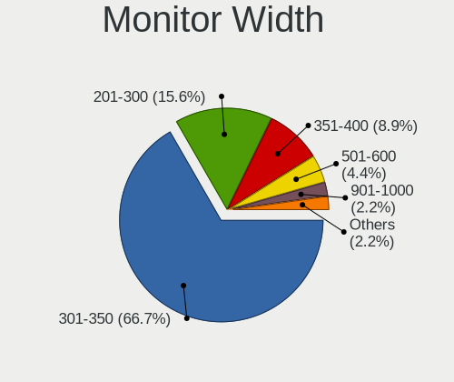

| Width in mm | Notebooks | Percent |
|-------------|-----------|---------|
| 301-350     | 27        | 65.85%  |
| 201-300     | 6         | 14.63%  |
| 351-400     | 4         | 9.76%   |
| 501-600     | 2         | 4.88%   |
| 701-800     | 1         | 2.44%   |
| 901-1000    | 1         | 2.44%   |

Aspect Ratio
------------

Proportional relationship between the width and the height

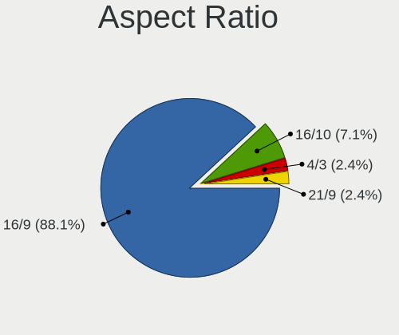

| Ratio | Notebooks | Percent |
|-------|-----------|---------|
| 16/9  | 33        | 86.84%  |
| 16/10 | 3         | 7.89%   |
| 4/3   | 1         | 2.63%   |
| 21/9  | 1         | 2.63%   |

Monitor Area
------------

Area in inch

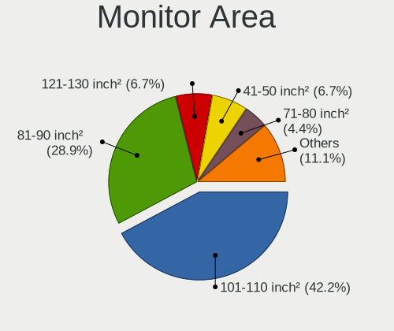

| Area in inch | Notebooks | Percent |
|----------------|-----------|---------|
| 101-110        | 17        | 41.46%  |
| 81-90          | 12        | 29.27%  |
| 41-50          | 3         | 7.32%   |
| 121-130        | 3         | 7.32%   |
| 71-80          | 2         | 4.88%   |
| 351-500        | 1         | 2.44%   |
| 301-350        | 1         | 2.44%   |
| 201-250        | 1         | 2.44%   |
| 501-1000       | 1         | 2.44%   |

Pixel Density
-------------

Pixels per inch

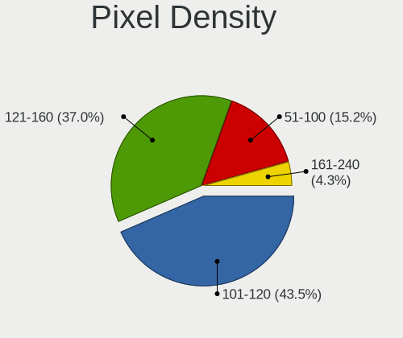

| Density | Notebooks | Percent |
|---------|-----------|---------|
| 101-120 | 18        | 42.86%  |
| 121-160 | 16        | 38.1%   |
| 51-100  | 7         | 16.67%  |
| 161-240 | 1         | 2.38%   |

Multiple Monitors
-----------------

Total monitors connected

| Total | Notebooks | Percent |
|-------|-----------|---------|
| 1     | 33        | 84.62%  |
| 2     | 5         | 12.82%  |
| 0     | 1         | 2.56%   |

Network
-------

Net Controller Vendor
---------------------

Controller vendors

| Vendor                   | Notebooks | Percent |
|--------------------------|-----------|---------|
| Intel                    | 20        | 31.75%  |
| Realtek Semiconductor    | 19        | 30.16%  |
| Qualcomm Atheros         | 9         | 14.29%  |
| Broadcom                 | 7         | 11.11%  |
| Sierra Wireless          | 2         | 3.17%   |
| TP-Link                  | 1         | 1.59%   |
| Nvidia                   | 1         | 1.59%   |
| Marvell Technology Group | 1         | 1.59%   |
| Huawei Technologies      | 1         | 1.59%   |
| Hewlett-Packard          | 1         | 1.59%   |
| Google                   | 1         | 1.59%   |

Net Controller Model
--------------------

Controller models

| Model                                                                   | Notebooks | Percent |
|-------------------------------------------------------------------------|-----------|---------|
| Realtek RTL8111/8168/8411 PCI Express Gigabit Ethernet Controller       | 12        | 14.81%  |
| Realtek RTL810xE PCI Express Fast Ethernet controller                   | 5         | 6.17%   |
| Intel Wireless 8265 / 8275                                              | 3         | 3.7%    |
| Intel Wireless 7260                                                     | 3         | 3.7%    |
| Intel Ethernet Connection I218-LM                                       | 3         | 3.7%    |
| Realtek RTL8723BE PCIe Wireless Network Adapter                         | 2         | 2.47%   |
| Realtek RTL8188CE 802.11b/g/n WiFi Adapter                              | 2         | 2.47%   |
| Realtek RTL8153 Gigabit Ethernet Adapter                                | 2         | 2.47%   |
| Qualcomm Atheros QCA9565 / AR9565 Wireless Network Adapter              | 2         | 2.47%   |
| Qualcomm Atheros QCA9377 802.11ac Wireless Network Adapter              | 2         | 2.47%   |
| Qualcomm Atheros AR242x / AR542x Wireless Network Adapter (PCI-Express) | 2         | 2.47%   |
| Intel Centrino Advanced-N 6235                                          | 2         | 2.47%   |
| Intel 82579LM Gigabit Network Connection (Lewisville)                   | 2         | 2.47%   |
| Broadcom BCM43142 802.11b/g/n                                           | 2         | 2.47%   |
| Broadcom BCM4313 802.11bgn Wireless Network Adapter                     | 2         | 2.47%   |
| TP-Link TL-WN722N v2/v3 [Realtek RTL8188EUS]                            | 1         | 1.23%   |
| Sierra Wireless EM7430 Qualcomm Snapdragon X7 LTE-A                     | 1         | 1.23%   |
| Sierra Wireless EM7345 4G LTE                                           | 1         | 1.23%   |
| Realtek RTL8821AE 802.11ac PCIe Wireless Network Adapter                | 1         | 1.23%   |
| Realtek RTL8188EUS 802.11n Wireless Network Adapter                     | 1         | 1.23%   |
| Realtek RTL8188CUS 802.11n WLAN Adapter                                 | 1         | 1.23%   |
| Qualcomm Atheros AR9462 Wireless Network Adapter                        | 1         | 1.23%   |
| Qualcomm Atheros AR9285 Wireless Network Adapter (PCI-Express)          | 1         | 1.23%   |
| Qualcomm Atheros AR8151 v1.0 Gigabit Ethernet                           | 1         | 1.23%   |
| Qualcomm Atheros AR8132 Fast Ethernet                                   | 1         | 1.23%   |
| Nvidia MCP89 Ethernet                                                   | 1         | 1.23%   |
| Marvell Group 88E8039 PCI-E Fast Ethernet Controller                    | 1         | 1.23%   |
| Intel Wireless-AC 9260                                                  | 1         | 1.23%   |
| Intel Wireless 3165                                                     | 1         | 1.23%   |
| Intel Wi-Fi 6 AX201                                                     | 1         | 1.23%   |
| Intel Wi-Fi 6 AX200                                                     | 1         | 1.23%   |
| Intel PRO/Wireless 5100 AGN [Shiloh] Network Connection                 | 1         | 1.23%   |
| Intel PRO/Wireless 3945ABG [Golan] Network Connection                   | 1         | 1.23%   |
| Intel Ice Lake-LP PCH CNVi WiFi                                         | 1         | 1.23%   |
| Intel Ethernet Connection I217-V                                        | 1         | 1.23%   |
| Intel Ethernet Connection (7) I219-LM                                   | 1         | 1.23%   |
| Intel Ethernet Connection (6) I219-LM                                   | 1         | 1.23%   |
| Intel Ethernet Connection (5) I219-LM                                   | 1         | 1.23%   |
| Intel Ethernet Connection (4) I219-V                                    | 1         | 1.23%   |
| Intel Dual Band Wireless-AC 3165 Plus Bluetooth                         | 1         | 1.23%   |
| Intel Centrino Wireless-N 1000 [Condor Peak]                            | 1         | 1.23%   |
| Intel 82573L Gigabit Ethernet Controller                                | 1         | 1.23%   |
| Intel 82567LM Gigabit Network Connection                                | 1         | 1.23%   |
| Intel 82566MM Gigabit Network Connection                                | 1         | 1.23%   |
| Huawei E220 HSDPA Modem / E230/E270/E870 HSDPA/HSUPA Modem              | 1         | 1.23%   |
| HP lt4112 Gobi 4G Module Network Device                                 | 1         | 1.23%   |
| Google Android                                                          | 1         | 1.23%   |
| Broadcom BCM43225 802.11b/g/n                                           | 1         | 1.23%   |
| Broadcom BCM43224 802.11a/b/g/n                                         | 1         | 1.23%   |
| Broadcom BCM4311 802.11a/b/g                                            | 1         | 1.23%   |

Wireless Vendor
---------------

Wireless vendors

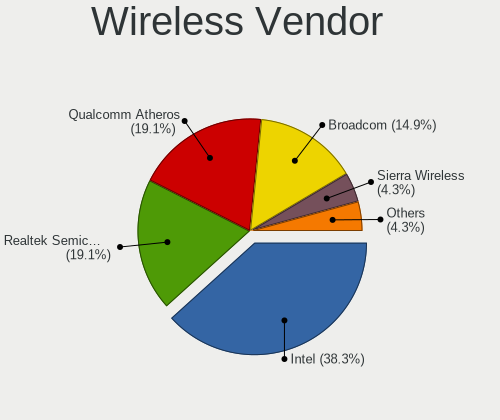

| Vendor                | Notebooks | Percent |
|-----------------------|-----------|---------|
| Intel                 | 17        | 39.53%  |
| Qualcomm Atheros      | 8         | 18.6%   |
| Realtek Semiconductor | 7         | 16.28%  |
| Broadcom              | 7         | 16.28%  |
| Sierra Wireless       | 2         | 4.65%   |
| TP-Link               | 1         | 2.33%   |
| Hewlett-Packard       | 1         | 2.33%   |

Wireless Model
--------------

Wireless models

| Model                                                                   | Notebooks | Percent |
|-------------------------------------------------------------------------|-----------|---------|
| Intel Wireless 8265 / 8275                                              | 3         | 6.98%   |
| Intel Wireless 7260                                                     | 3         | 6.98%   |
| Realtek RTL8723BE PCIe Wireless Network Adapter                         | 2         | 4.65%   |
| Realtek RTL8188CE 802.11b/g/n WiFi Adapter                              | 2         | 4.65%   |
| Qualcomm Atheros QCA9565 / AR9565 Wireless Network Adapter              | 2         | 4.65%   |
| Qualcomm Atheros QCA9377 802.11ac Wireless Network Adapter              | 2         | 4.65%   |
| Qualcomm Atheros AR242x / AR542x Wireless Network Adapter (PCI-Express) | 2         | 4.65%   |
| Intel Centrino Advanced-N 6235                                          | 2         | 4.65%   |
| Broadcom BCM43142 802.11b/g/n                                           | 2         | 4.65%   |
| Broadcom BCM4313 802.11bgn Wireless Network Adapter                     | 2         | 4.65%   |
| TP-Link TL-WN722N v2/v3 [Realtek RTL8188EUS]                            | 1         | 2.33%   |
| Sierra Wireless EM7430 Qualcomm Snapdragon X7 LTE-A                     | 1         | 2.33%   |
| Sierra Wireless EM7345 4G LTE                                           | 1         | 2.33%   |
| Realtek RTL8821AE 802.11ac PCIe Wireless Network Adapter                | 1         | 2.33%   |
| Realtek RTL8188EUS 802.11n Wireless Network Adapter                     | 1         | 2.33%   |
| Realtek RTL8188CUS 802.11n WLAN Adapter                                 | 1         | 2.33%   |
| Qualcomm Atheros AR9462 Wireless Network Adapter                        | 1         | 2.33%   |
| Qualcomm Atheros AR9285 Wireless Network Adapter (PCI-Express)          | 1         | 2.33%   |
| Intel Wireless-AC 9260                                                  | 1         | 2.33%   |
| Intel Wireless 3165                                                     | 1         | 2.33%   |
| Intel Wi-Fi 6 AX201                                                     | 1         | 2.33%   |
| Intel Wi-Fi 6 AX200                                                     | 1         | 2.33%   |
| Intel PRO/Wireless 5100 AGN [Shiloh] Network Connection                 | 1         | 2.33%   |
| Intel PRO/Wireless 3945ABG [Golan] Network Connection                   | 1         | 2.33%   |
| Intel Ice Lake-LP PCH CNVi WiFi                                         | 1         | 2.33%   |
| Intel Dual Band Wireless-AC 3165 Plus Bluetooth                         | 1         | 2.33%   |
| Intel Centrino Wireless-N 1000 [Condor Peak]                            | 1         | 2.33%   |
| HP lt4112 Gobi 4G Module Network Device                                 | 1         | 2.33%   |
| Broadcom BCM43225 802.11b/g/n                                           | 1         | 2.33%   |
| Broadcom BCM43224 802.11a/b/g/n                                         | 1         | 2.33%   |
| Broadcom BCM4311 802.11a/b/g                                            | 1         | 2.33%   |

Ethernet Vendor
---------------

Ethernet vendors

| Vendor                   | Notebooks | Percent |
|--------------------------|-----------|---------|
| Realtek Semiconductor    | 18        | 51.43%  |
| Intel                    | 13        | 37.14%  |
| Qualcomm Atheros         | 2         | 5.71%   |
| Nvidia                   | 1         | 2.86%   |
| Marvell Technology Group | 1         | 2.86%   |

Ethernet Model
--------------

Ethernet models

| Model                                                             | Notebooks | Percent |
|-------------------------------------------------------------------|-----------|---------|
| Realtek RTL8111/8168/8411 PCI Express Gigabit Ethernet Controller | 12        | 33.33%  |
| Realtek RTL810xE PCI Express Fast Ethernet controller             | 5         | 13.89%  |
| Intel Ethernet Connection I218-LM                                 | 3         | 8.33%   |
| Realtek RTL8153 Gigabit Ethernet Adapter                          | 2         | 5.56%   |
| Intel 82579LM Gigabit Network Connection (Lewisville)             | 2         | 5.56%   |
| Qualcomm Atheros AR8151 v1.0 Gigabit Ethernet                     | 1         | 2.78%   |
| Qualcomm Atheros AR8132 Fast Ethernet                             | 1         | 2.78%   |
| Nvidia MCP89 Ethernet                                             | 1         | 2.78%   |
| Marvell Group 88E8039 PCI-E Fast Ethernet Controller              | 1         | 2.78%   |
| Intel Ethernet Connection I217-V                                  | 1         | 2.78%   |
| Intel Ethernet Connection (7) I219-LM                             | 1         | 2.78%   |
| Intel Ethernet Connection (6) I219-LM                             | 1         | 2.78%   |
| Intel Ethernet Connection (5) I219-LM                             | 1         | 2.78%   |
| Intel Ethernet Connection (4) I219-V                              | 1         | 2.78%   |
| Intel 82573L Gigabit Ethernet Controller                          | 1         | 2.78%   |
| Intel 82567LM Gigabit Network Connection                          | 1         | 2.78%   |
| Intel 82566MM Gigabit Network Connection                          | 1         | 2.78%   |

Net Controller Kind
-------------------

Ethernet, WiFi or modem

| Kind     | Notebooks | Percent |
|----------|-----------|---------|
| WiFi     | 38        | 50.67%  |
| Ethernet | 35        | 46.67%  |
| Modem    | 1         | 1.33%   |
| Unknown  | 1         | 1.33%   |

Used Controller
---------------

Currently used network controller

| Kind     | Notebooks | Percent |
|----------|-----------|---------|
| WiFi     | 35        | 53.85%  |
| Ethernet | 29        | 44.62%  |
| Unknown  | 1         | 1.54%   |

NICs
----

Total network controllers on board

| Total | Notebooks | Percent |
|-------|-----------|---------|
| 2     | 33        | 84.62%  |
| 1     | 5         | 12.82%  |
| 0     | 1         | 2.56%   |

IPv6
----

IPv6 vs IPv4

| Used | Notebooks | Percent |
|------|-----------|---------|
| No   | 35        | 89.74%  |
| Yes  | 4         | 10.26%  |

Bluetooth
---------

Bluetooth Vendor
----------------

Controller vendors

| Vendor                          | Notebooks | Percent |
|---------------------------------|-----------|---------|
| Intel                           | 12        | 42.86%  |
| Broadcom                        | 5         | 17.86%  |
| Realtek Semiconductor           | 2         | 7.14%   |
| Qualcomm Atheros Communications | 2         | 7.14%   |
| Lite-On Technology              | 2         | 7.14%   |
| IMC Networks                    | 2         | 7.14%   |
| Hewlett-Packard                 | 1         | 3.57%   |
| Cambridge Silicon Radio         | 1         | 3.57%   |
| Apple                           | 1         | 3.57%   |

Bluetooth Model
---------------

Controller models

| Model                                               | Notebooks | Percent |
|-----------------------------------------------------|-----------|---------|
| Intel Bluetooth wireless interface                  | 5         | 17.86%  |
| Intel Bluetooth Device                              | 3         | 10.71%  |
| Intel AX201 Bluetooth                               | 2         | 7.14%   |
| Realtek RTL8821A Bluetooth                          | 1         | 3.57%   |
| Realtek Bluetooth Radio                             | 1         | 3.57%   |
| Qualcomm Atheros  Bluetooth Device                  | 1         | 3.57%   |
| Qualcomm Atheros AR3012 Bluetooth 4.0               | 1         | 3.57%   |
| Lite-On Bluetooth Device                            | 1         | 3.57%   |
| Lite-On Atheros AR3012 Bluetooth                    | 1         | 3.57%   |
| Intel Wireless-AC 9260 Bluetooth Adapter            | 1         | 3.57%   |
| Intel AX200 Bluetooth                               | 1         | 3.57%   |
| IMC Networks Bluetooth Radio                        | 1         | 3.57%   |
| IMC Networks Bluetooth Device                       | 1         | 3.57%   |
| HP Bluetooth 2.0 Interface [Broadcom BCM2045]       | 1         | 3.57%   |
| Cambridge Silicon Radio Bluetooth Dongle (HCI mode) | 1         | 3.57%   |
| Broadcom BCM43142A0 Bluetooth 4.0                   | 1         | 3.57%   |
| Broadcom BCM20702 Bluetooth 4.0 [ThinkPad]          | 1         | 3.57%   |
| Broadcom BCM2070 Bluetooth 2.1 + EDR                | 1         | 3.57%   |
| Broadcom BCM2045B (BDC-2.1)                         | 1         | 3.57%   |
| Broadcom BCM2045B (BDC-2) [Bluetooth Controller]    | 1         | 3.57%   |
| Apple Bluetooth Host Controller                     | 1         | 3.57%   |

Sound
-----

Sound Vendor
------------

Sound card vendors

| Vendor              | Notebooks | Percent |
|---------------------|-----------|---------|
| Intel               | 31        | 68.89%  |
| AMD                 | 7         | 15.56%  |
| Nvidia              | 4         | 8.89%   |
| SteelSeries ApS     | 1         | 2.22%   |
| Mark of the Unicorn | 1         | 2.22%   |
| GN Netcom           | 1         | 2.22%   |

Sound Model
-----------

Sound card models

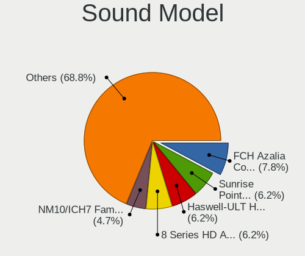

| Model                                                                                             | Notebooks | Percent |
|---------------------------------------------------------------------------------------------------|-----------|---------|
| Intel Haswell-ULT HD Audio Controller                                                             | 4         | 6.9%    |
| Intel 8 Series HD Audio Controller                                                                | 4         | 6.9%    |
| AMD FCH Azalia Controller                                                                         | 4         | 6.9%    |
| Intel Sunrise Point-LP HD Audio                                                                   | 3         | 5.17%   |
| Intel NM10/ICH7 Family High Definition Audio Controller                                           | 3         | 5.17%   |
| Intel 7 Series/C216 Chipset Family High Definition Audio Controller                               | 3         | 5.17%   |
| AMD Kabini HDMI/DP Audio                                                                          | 3         | 5.17%   |
| Intel Wildcat Point-LP High Definition Audio Controller                                           | 2         | 3.45%   |
| Intel Broadwell-U Audio Controller                                                                | 2         | 3.45%   |
| Intel Atom/Celeron/Pentium Processor x5-E8000/J3xxx/N3xxx Series High Definition Audio Controller | 2         | 3.45%   |
| Intel 82801H (ICH8 Family) HD Audio Controller                                                    | 2         | 3.45%   |
| Intel 6 Series/C200 Series Chipset Family High Definition Audio Controller                        | 2         | 3.45%   |
| AMD Raven/Raven2/Fenghuang HDMI/DP Audio Controller                                               | 2         | 3.45%   |
| AMD Family 17h (Models 10h-1fh) HD Audio Controller                                               | 2         | 3.45%   |
| SteelSeries ApS SteelSeries Arctis 7                                                              | 1         | 1.72%   |
| Nvidia TU106 High Definition Audio Controller                                                     | 1         | 1.72%   |
| Nvidia MCP89 High Definition Audio                                                                | 1         | 1.72%   |
| Nvidia GM206 High Definition Audio Controller                                                     | 1         | 1.72%   |
| Nvidia GF114 HDMI Audio Controller                                                                | 1         | 1.72%   |
| Mark of the Unicorn M2                                                                            | 1         | 1.72%   |
| Intel Xeon E3-1200 v3/4th Gen Core Processor HD Audio Controller                                  | 1         | 1.72%   |
| Intel Tiger Lake-LP Smart Sound Technology Audio Controller                                       | 1         | 1.72%   |
| Intel Ice Lake-LP Smart Sound Technology Audio Controller                                         | 1         | 1.72%   |
| Intel CM238 HD Audio Controller                                                                   | 1         | 1.72%   |
| Intel Celeron/Pentium Silver Processor High Definition Audio                                      | 1         | 1.72%   |
| Intel Cannon Point-LP High Definition Audio Controller                                            | 1         | 1.72%   |
| Intel Cannon Lake PCH cAVS                                                                        | 1         | 1.72%   |
| Intel 82801I (ICH9 Family) HD Audio Controller                                                    | 1         | 1.72%   |
| Intel 8 Series/C220 Series Chipset High Definition Audio Controller                               | 1         | 1.72%   |
| Intel 5 Series/3400 Series Chipset High Definition Audio                                          | 1         | 1.72%   |
| Intel 100 Series/C230 Series Chipset Family HD Audio Controller                                   | 1         | 1.72%   |
| GN Netcom Jabra Link 370                                                                          | 1         | 1.72%   |
| AMD RV630 HDMI Audio [Radeon HD 2600 PRO/XT / HD 3610]                                            | 1         | 1.72%   |
| AMD BeaverCreek HDMI Audio [Radeon HD 6500D and 6400G-6600G series]                               | 1         | 1.72%   |

Memory
------

Memory Vendor
-------------

Memory module vendors

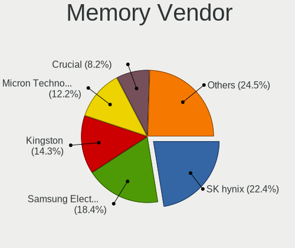

| Vendor              | Notebooks | Percent |
|---------------------|-----------|---------|
| SK Hynix            | 11        | 23.91%  |
| Samsung Electronics | 9         | 19.57%  |
| Kingston            | 6         | 13.04%  |
| Micron Technology   | 5         | 10.87%  |
| Crucial             | 4         | 8.7%    |
| Ramaxel Technology  | 3         | 6.52%   |
| Unknown             | 2         | 4.35%   |
| Nanya Technology    | 2         | 4.35%   |
| Transcend           | 1         | 2.17%   |
| Teikon              | 1         | 2.17%   |
| Smart               | 1         | 2.17%   |
| A-DATA Technology   | 1         | 2.17%   |

Memory Model
------------

Memory module models

| Model                                                               | Notebooks | Percent |
|---------------------------------------------------------------------|-----------|---------|
| SK Hynix RAM HMT851S6AMR6A-PB 4096MB Chip DDR3 1600MT/s             | 2         | 4.17%   |
| Crucial RAM CT102464BF160B.C16 8GB SODIMM DDR3 1600MT/s             | 2         | 4.17%   |
| Unknown RAM Module 2048MB SODIMM DDR2                               | 1         | 2.08%   |
| Unknown RAM Module 1024MB SODIMM DDR2                               | 1         | 2.08%   |
| Transcend RAM JM1333KSN-4G 4GB SODIMM DDR3 1334MT/s                 | 1         | 2.08%   |
| Teikon RAM TMT451S6BFR8A-PBHJ 4096MB SODIMM DDR3 1600MT/s           | 1         | 2.08%   |
| Smart RAM SH564128FJ8NWRNSQR 4GB SODIMM DDR3 1600MT/s               | 1         | 2.08%   |
| SK Hynix RAM Module 2048MB SODIMM DDR3 800MT/s                      | 1         | 2.08%   |
| SK Hynix RAM Module 16384MB SODIMM DDR4 2667MT/s                    | 1         | 2.08%   |
| SK Hynix RAM HMT451S6BFR8A-PB 4096MB SODIMM DDR3 1600MT/s           | 1         | 2.08%   |
| SK Hynix RAM HMT41GS6AFR8A-PB 8192MB SODIMM DDR3 1600MT/s           | 1         | 2.08%   |
| SK Hynix RAM HMT351S6CFR8C-PB 4096MB SODIMM DDR3 1600MT/s           | 1         | 2.08%   |
| SK Hynix RAM HMT325S6BFR8C-H9 2GB SODIMM DDR3 1334MT/s              | 1         | 2.08%   |
| SK Hynix RAM HMT325S6BFR8C-H9 2048MB SODIMM DDR3 1333MT/s           | 1         | 2.08%   |
| SK Hynix RAM HMT125S6BFR8C-H9 2048MB SODIMM DDR3 1333MT/s           | 1         | 2.08%   |
| SK Hynix RAM H9CCNNNBJTALAR-NUD 4096MB Row Of Chips LPDDR3 1867MT/s | 1         | 2.08%   |
| SK Hynix RAM H5AN8G6NCJR-XNC 4096MB SODIMM DDR4 3200MT/s            | 1         | 2.08%   |
| Samsung RAM Module 2048MB SODIMM DDR2 533MT/s                       | 1         | 2.08%   |
| Samsung RAM M471B5674QH0-YK0 2GB SODIMM DDR3 1600MT/s               | 1         | 2.08%   |
| Samsung RAM M471B5674EB0-YK0 2048MB SODIMM DDR3 1600MT/s            | 1         | 2.08%   |
| Samsung RAM M471B5673FH0-CF8 2GB SODIMM DDR3 1067MT/s               | 1         | 2.08%   |
| Samsung RAM M471B5273DH0-CH9 4GB SODIMM DDR3 1334MT/s               | 1         | 2.08%   |
| Samsung RAM M471B5273CH0-CH9 4096MB SODIMM DDR3 1334MT/s            | 1         | 2.08%   |
| Samsung RAM M471B5173QH0-YK0 4GB SODIMM DDR3 1600MT/s               | 1         | 2.08%   |
| Samsung RAM M471A2K43CB1-CRC 16384MB SODIMM DDR4 2667MT/s           | 1         | 2.08%   |
| Samsung RAM M471A2K43BB1-CPB 16384MB SODIMM DDR4 2133MT/s           | 1         | 2.08%   |
| Samsung RAM M471A1K43CB1-CRC 8GB SODIMM DDR4 2667MT/s               | 1         | 2.08%   |
| Ramaxel RAM RMT3150ED58E8W1600 2048MB SODIMM DDR3 1600MT/s          | 1         | 2.08%   |
| Ramaxel RAM RMSA3300ME78HBF-2666 16384MB SODIMM DDR4 2667MT/s       | 1         | 2.08%   |
| Ramaxel RAM RMSA3260ME78HAF-2666 8GB SODIMM DDR4 2667MT/s           | 1         | 2.08%   |
| Nanya RAM NT2GC64B88B0NS-CG 2GB SODIMM DDR3 1334MT/s                | 1         | 2.08%   |
| Nanya RAM NT1GT64UH8D0FN-3C 1024MB SODIMM DDR2 667MT/s              | 1         | 2.08%   |
| Micron RAM Module 4096MB SODIMM DDR4 2400MT/s                       | 1         | 2.08%   |
| Micron RAM Module 4096MB SODIMM DDR3 1600MT/s                       | 1         | 2.08%   |
| Micron RAM Module 1024MB SODIMM DDR3 1067MT/s                       | 1         | 2.08%   |
| Micron RAM 4ATF51264HZ-2G3E1 4096MB SODIMM DDR4 2667MT/s            | 1         | 2.08%   |
| Micron RAM 16KTF1G64HZ-1G6E1 8GB SODIMM DDR3 1600MT/s               | 1         | 2.08%   |
| Kingston RAM KNWMX1-ETB 4GB SODIMM DDR3 1600MT/s                    | 1         | 2.08%   |
| Kingston RAM KHX2400C14S4/8G 8GB SODIMM DDR4 2400MT/s               | 1         | 2.08%   |
| Kingston RAM KHX2133C13S4/8G 8192MB SODIMM DDR4 2133MT/s            | 1         | 2.08%   |
| Kingston RAM HP32D4S2S1ME-8 8192MB SODIMM DDR4 3200MT/s             | 1         | 2.08%   |
| Kingston RAM 99U5594-001.A00LF 2048MB SODIMM DDR3 1600MT/s          | 1         | 2.08%   |
| Kingston RAM 9905428-417.A00LF 8GB SODIMM DDR3 1600MT/s             | 1         | 2.08%   |
| Crucial RAM CT4G3S160BM.C16FKD 4GB SODIMM DDR3 1600MT/s             | 1         | 2.08%   |
| Crucial RAM CT102464BF160B.M16 8GB SODIMM DDR3 1600MT/s             | 1         | 2.08%   |
| A-DATA RAM Module 2048MB SODIMM DDR2 667MT/s                        | 1         | 2.08%   |

Memory Kind
-----------

Memory module kinds

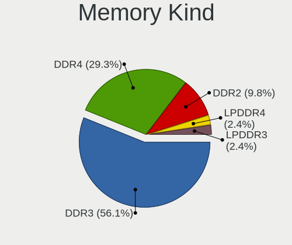

| Kind   | Notebooks | Percent |
|--------|-----------|---------|
| DDR3   | 22        | 57.89%  |
| DDR4   | 11        | 28.95%  |
| DDR2   | 4         | 10.53%  |
| LPDDR3 | 1         | 2.63%   |

Memory Form Factor
------------------

Physical design of the memory module

| Name         | Notebooks | Percent |
|--------------|-----------|---------|
| SODIMM       | 37        | 92.5%   |
| Chip         | 2         | 5%      |
| Row Of Chips | 1         | 2.5%    |

Memory Size
-----------

Memory module size

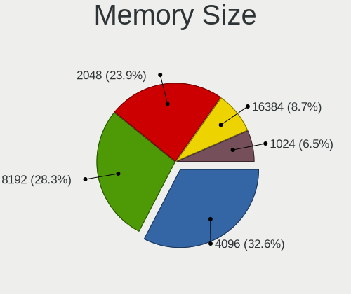

| Size  | Notebooks | Percent |
|-------|-----------|---------|
| 4096  | 14        | 32.56%  |
| 8192  | 11        | 25.58%  |
| 2048  | 11        | 25.58%  |
| 16384 | 4         | 9.3%    |
| 1024  | 3         | 6.98%   |

Memory Speed
------------

Memory module speed

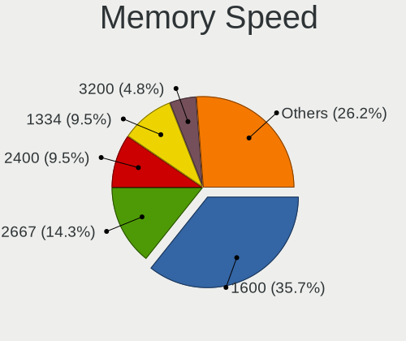

| Speed   | Notebooks | Percent |
|---------|-----------|---------|
| 1600    | 14        | 35.9%   |
| 2667    | 6         | 15.38%  |
| 1334    | 4         | 10.26%  |
| 3200    | 2         | 5.13%   |
| 2400    | 2         | 5.13%   |
| 2133    | 2         | 5.13%   |
| 1067    | 2         | 5.13%   |
| Unknown | 2         | 5.13%   |
| 1867    | 1         | 2.56%   |
| 1333    | 1         | 2.56%   |
| 800     | 1         | 2.56%   |
| 667     | 1         | 2.56%   |
| 533     | 1         | 2.56%   |

Printers & scanners
-------------------

Printer Vendor
--------------

Printer device vendors

Zero info for selected period =(

Printer Model
-------------

Printer device models

Zero info for selected period =(

Scanner Vendor
--------------

Scanner device vendors

Zero info for selected period =(

Scanner Model
-------------

Scanner device models

Zero info for selected period =(

Camera
------

Camera Vendor
-------------

Camera device vendors

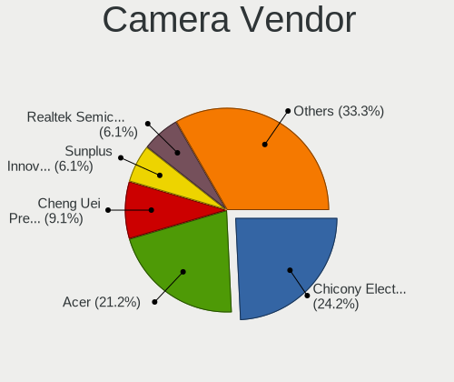

| Vendor                                 | Notebooks | Percent |
|----------------------------------------|-----------|---------|
| Chicony Electronics                    | 8         | 26.67%  |
| Acer                                   | 7         | 23.33%  |
| Realtek Semiconductor                  | 2         | 6.67%   |
| Quanta                                 | 2         | 6.67%   |
| Lite-On Technology                     | 2         | 6.67%   |
| IMC Networks                           | 2         | 6.67%   |
| Cheng Uei Precision Industry (Foxlink) | 2         | 6.67%   |
| Suyin                                  | 1         | 3.33%   |
| Sunplus Innovation Technology          | 1         | 3.33%   |
| Lenovo                                 | 1         | 3.33%   |
| DJKANA1RSF34LM                         | 1         | 3.33%   |
| Apple                                  | 1         | 3.33%   |

Camera Model
------------

Camera device models

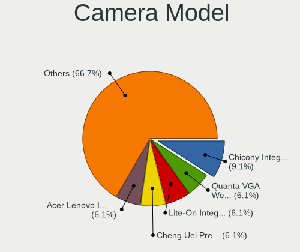

| Model                                                       | Notebooks | Percent |
|-------------------------------------------------------------|-----------|---------|
| Chicony Integrated Camera                                   | 3         | 10%     |
| Quanta VGA WebCam                                           | 2         | 6.67%   |
| Lite-On Integrated Camera                                   | 2         | 6.67%   |
| Acer Integrated Camera                                      | 2         | 6.67%   |
| Suyin 1.3M WebCam (notebook emachines E730, Acer sub-brand) | 1         | 3.33%   |
| Sunplus Laptop_Integrated_Webcam_HD                         | 1         | 3.33%   |
| Realtek USB Camera                                          | 1         | 3.33%   |
| Realtek HD WebCam                                           | 1         | 3.33%   |
| Lenovo Integrated Webcam                                    | 1         | 3.33%   |
| IMC Networks USB2.0 VGA UVC WebCam                          | 1         | 3.33%   |
| IMC Networks USB2.0 HD UVC WebCam                           | 1         | 3.33%   |
| DJKANA1RSF34LM HP Wide Vision HD Camera                     | 1         | 3.33%   |
| Chicony Webcam                                              | 1         | 3.33%   |
| Chicony USB 2.0 Camera                                      | 1         | 3.33%   |
| Chicony Integrated Camera (1280x720@30)                     | 1         | 3.33%   |
| Chicony HP Truevision HD                                    | 1         | 3.33%   |
| Chicony HP Full-HD Camera                                   | 1         | 3.33%   |
| Cheng Uei Precision Industry (Foxlink) Webcam               | 1         | 3.33%   |
| Cheng Uei Precision Industry (Foxlink) HP TrueVision HD     | 1         | 3.33%   |
| Apple Built-in iSight                                       | 1         | 3.33%   |
| Acer Lenovo Integrated Webcam                               | 1         | 3.33%   |
| Acer Lenovo EasyCamera                                      | 1         | 3.33%   |
| Acer HP Webcam                                              | 1         | 3.33%   |
| Acer EasyCamera                                             | 1         | 3.33%   |
| Acer BisonCam, NB Pro                                       | 1         | 3.33%   |

Security
--------

Fingerprint Vendor
------------------

Fingerprint sensor vendors

| Vendor                     | Notebooks | Percent |
|----------------------------|-----------|---------|
| Validity Sensors           | 3         | 30%     |
| Synaptics                  | 3         | 30%     |
| Upek                       | 1         | 10%     |
| STMicroelectronics         | 1         | 10%     |
| Shenzhen Goodix Technology | 1         | 10%     |
| AuthenTec                  | 1         | 10%     |

Fingerprint Model
-----------------

Fingerprint sensor models

| Model                                                      | Notebooks | Percent |
|------------------------------------------------------------|-----------|---------|
| Validity Sensors Synaptics WBDI                            | 2         | 20%     |
| Validity Sensors VFS 5011 fingerprint sensor               | 1         | 10%     |
| Upek Biometric Touchchip/Touchstrip Fingerprint Sensor     | 1         | 10%     |
| Synaptics  VFS7552 Touch Fingerprint Sensor with PurePrint | 1         | 10%     |
| Synaptics Metallica MOH Touch Fingerprint Reader           | 1         | 10%     |
| STMicroelectronics Fingerprint Reader                      | 1         | 10%     |
| Shenzhen Goodix Fingerprint Reader                         | 1         | 10%     |
| AuthenTec AES2501 Fingerprint Sensor                       | 1         | 10%     |
| Unknown                                                    | 1         | 10%     |

Chipcard Vendor
---------------

Chipcard module vendors

| Vendor      | Notebooks | Percent |
|-------------|-----------|---------|
| Lenovo      | 2         | 50%     |
| Broadcom    | 1         | 25%     |
| Alcor Micro | 1         | 25%     |

Chipcard Model
--------------

Chipcard module models

| Model                                          | Notebooks | Percent |
|------------------------------------------------|-----------|---------|
| Lenovo Integrated Smart Card Reader            | 2         | 50%     |
| Broadcom BCM5880 Secure Applications Processor | 1         | 25%     |
| Alcor Micro AU9540 Smartcard Reader            | 1         | 25%     |

Unsupported
-----------

Unsupported Devices
-------------------

Total unsupported devices on board

| Total | Notebooks | Percent |
|-------|-----------|---------|
| 0     | 22        | 56.41%  |
| 1     | 12        | 30.77%  |
| 2     | 5         | 12.82%  |

Unsupported Device Types
------------------------

Types of unsupported devices

| Type               | Notebooks | Percent |
|--------------------|-----------|---------|
| Fingerprint reader | 10        | 43.48%  |
| Graphics card      | 9         | 39.13%  |
| Chipcard           | 4         | 17.39%  |

