MX 20 - Tested Hardware & Statistics
------------------------------------

A project to collect tested hardware configurations for MX 20.

Anyone can contribute to this report by the [hw-probe](https://github.com/linuxhw/hw-probe) tool:

    sudo -E hw-probe -all -upload

Please submit a probe of your configuration if it's not presented on the page or is rare.

This is a report for all computer types. See also reports for [desktops](/Dist/MX_20/Desktop/README.md) and [notebooks](/Dist/MX_20/Notebook/README.md).

Full-feature report is available here: https://linux-hardware.org/?view=trends

Contents
--------

* [ Test Cases ](#test-cases)

* [ System ](#system)
  - [ Kernel                   ](#kernel)
  - [ Kernel Family            ](#kernel-family)
  - [ Kernel Major Ver.        ](#kernel-major-ver)
  - [ Arch                     ](#arch)
  - [ DE                       ](#de)
  - [ Display Server           ](#display-server)
  - [ Display Manager          ](#display-manager)
  - [ OS Lang                  ](#os-lang)
  - [ Boot Mode                ](#boot-mode)
  - [ Filesystem               ](#filesystem)
  - [ Part. scheme             ](#part-scheme)
  - [ Dual Boot with Linux/BSD ](#dual-boot-with-linuxbsd)
  - [ Dual Boot (Win)          ](#dual-boot-win)

* [ Board ](#board)
  - [ Vendor                   ](#vendor)
  - [ Model                    ](#model)
  - [ Model Family             ](#model-family)
  - [ MFG Year                 ](#mfg-year)
  - [ Form Factor              ](#form-factor)
  - [ Secure Boot              ](#secure-boot)
  - [ Coreboot                 ](#coreboot)
  - [ RAM Size                 ](#ram-size)
  - [ RAM Used                 ](#ram-used)
  - [ Total Drives             ](#total-drives)
  - [ Has CD-ROM               ](#has-cd-rom)
  - [ Has Ethernet             ](#has-ethernet)
  - [ Has WiFi                 ](#has-wifi)
  - [ Has Bluetooth            ](#has-bluetooth)

* [ Location ](#location)
  - [ Country                  ](#country)
  - [ City                     ](#city)

* [ Drives ](#drives)
  - [ Drive Vendor             ](#drive-vendor)
  - [ Drive Model              ](#drive-model)
  - [ HDD Vendor               ](#hdd-vendor)
  - [ SSD Vendor               ](#ssd-vendor)
  - [ Drive Kind               ](#drive-kind)
  - [ Drive Connector          ](#drive-connector)
  - [ Drive Size               ](#drive-size)
  - [ Space Total              ](#space-total)
  - [ Space Used               ](#space-used)
  - [ Malfunc. Drives          ](#malfunc-drives)
  - [ Malfunc. Drive Vendor    ](#malfunc-drive-vendor)
  - [ Malfunc. HDD Vendor      ](#malfunc-hdd-vendor)
  - [ Malfunc. Drive Kind      ](#malfunc-drive-kind)
  - [ Failed Drives            ](#failed-drives)
  - [ Failed Drive Vendor      ](#failed-drive-vendor)
  - [ Drive Status             ](#drive-status)

* [ Storage controller ](#storage-controller)
  - [ Storage Vendor           ](#storage-vendor)
  - [ Storage Model            ](#storage-model)
  - [ Storage Kind             ](#storage-kind)

* [ Processor ](#processor)
  - [ CPU Vendor               ](#cpu-vendor)
  - [ CPU Model                ](#cpu-model)
  - [ CPU Model Family         ](#cpu-model-family)
  - [ CPU Cores                ](#cpu-cores)
  - [ CPU Sockets              ](#cpu-sockets)
  - [ CPU Threads              ](#cpu-threads)
  - [ CPU Op-Modes             ](#cpu-op-modes)
  - [ CPU Microcode            ](#cpu-microcode)
  - [ CPU Microarch            ](#cpu-microarch)

* [ Graphics ](#graphics)
  - [ GPU Vendor               ](#gpu-vendor)
  - [ GPU Model                ](#gpu-model)
  - [ GPU Combo                ](#gpu-combo)
  - [ GPU Driver               ](#gpu-driver)
  - [ GPU Memory               ](#gpu-memory)

* [ Monitor ](#monitor)
  - [ Monitor Vendor           ](#monitor-vendor)
  - [ Monitor Model            ](#monitor-model)
  - [ Monitor Resolution       ](#monitor-resolution)
  - [ Monitor Diagonal         ](#monitor-diagonal)
  - [ Monitor Width            ](#monitor-width)
  - [ Aspect Ratio             ](#aspect-ratio)
  - [ Monitor Area             ](#monitor-area)
  - [ Pixel Density            ](#pixel-density)
  - [ Multiple Monitors        ](#multiple-monitors)

* [ Network ](#network)
  - [ Net Controller Vendor    ](#net-controller-vendor)
  - [ Net Controller Model     ](#net-controller-model)
  - [ Wireless Vendor          ](#wireless-vendor)
  - [ Wireless Model           ](#wireless-model)
  - [ Ethernet Vendor          ](#ethernet-vendor)
  - [ Ethernet Model           ](#ethernet-model)
  - [ Net Controller Kind      ](#net-controller-kind)
  - [ Used Controller          ](#used-controller)
  - [ NICs                     ](#nics)
  - [ IPv6                     ](#ipv6)

* [ Bluetooth ](#bluetooth)
  - [ Bluetooth Vendor         ](#bluetooth-vendor)
  - [ Bluetooth Model          ](#bluetooth-model)

* [ Sound ](#sound)
  - [ Sound Vendor             ](#sound-vendor)
  - [ Sound Model              ](#sound-model)

* [ Memory ](#memory)
  - [ Memory Vendor            ](#memory-vendor)
  - [ Memory Model             ](#memory-model)
  - [ Memory Kind              ](#memory-kind)
  - [ Memory Form Factor       ](#memory-form-factor)
  - [ Memory Size              ](#memory-size)
  - [ Memory Speed             ](#memory-speed)

* [ Printers & scanners ](#printers--scanners)
  - [ Printer Vendor           ](#printer-vendor)
  - [ Printer Model            ](#printer-model)
  - [ Scanner Vendor           ](#scanner-vendor)
  - [ Scanner Model            ](#scanner-model)

* [ Camera ](#camera)
  - [ Camera Vendor            ](#camera-vendor)
  - [ Camera Model             ](#camera-model)

* [ Security ](#security)
  - [ Fingerprint Vendor       ](#fingerprint-vendor)
  - [ Fingerprint Model        ](#fingerprint-model)
  - [ Chipcard Vendor          ](#chipcard-vendor)
  - [ Chipcard Model           ](#chipcard-model)

* [ Unsupported ](#unsupported)
  - [ Unsupported Devices      ](#unsupported-devices)
  - [ Unsupported Device Types ](#unsupported-device-types)

Test Cases
----------

| Vendor   | Model                       | Form-Factor | Probe                                                      | Date         |
|----------|-----------------------------|-------------|------------------------------------------------------------|--------------|
| Unknown  | Unknown                     | Notebook    | [381b31199f](https://linux-hardware.org/?probe=381b31199f) | Nov 18, 2021 |
| Dell     | Inspiron 3576               | Notebook    | [ad9fb758a6](https://linux-hardware.org/?probe=ad9fb758a6) | Nov 09, 2021 |
| Lenovo   | ThinkPad L520 78595VG       | Notebook    | [4aff5a6a0c](https://linux-hardware.org/?probe=4aff5a6a0c) | Oct 24, 2021 |
| Dell     | 00F82W A01                  | Desktop     | [08e803937e](https://linux-hardware.org/?probe=08e803937e) | Oct 18, 2021 |
| HP       | 21D0                        | Desktop     | [4cee9a5c3d](https://linux-hardware.org/?probe=4cee9a5c3d) | Oct 11, 2021 |
| Lenovo   | ThinkPad T530 2394CJ9       | Notebook    | [b36a94241d](https://linux-hardware.org/?probe=b36a94241d) | Oct 05, 2021 |
| Lenovo   | ThinkPad X1 Carbon 5th 2... | Notebook    | [c86e0b677e](https://linux-hardware.org/?probe=c86e0b677e) | Oct 03, 2021 |
| Apple    | Mac-F22C86C8                | Mini pc     | [8699437e9e](https://linux-hardware.org/?probe=8699437e9e) | Oct 01, 2021 |
| Lenovo   | ThinkPad L490 20Q5S0PR00    | Notebook    | [bbf6b89f02](https://linux-hardware.org/?probe=bbf6b89f02) | Oct 01, 2021 |
| Acer     | Aspire 4820T                | Notebook    | [a91911ca90](https://linux-hardware.org/?probe=a91911ca90) | Oct 01, 2021 |
| ASRock   | H470M-ITX/ac                | Desktop     | [ad42fa5d08](https://linux-hardware.org/?probe=ad42fa5d08) | Oct 01, 2021 |
| Lenovo   | ThinkPad P51 20HJS0TP00     | Notebook    | [2774c819ea](https://linux-hardware.org/?probe=2774c819ea) | Sep 18, 2021 |
| Lenovo   | B40-45 20394                | Notebook    | [627672a7ec](https://linux-hardware.org/?probe=627672a7ec) | Sep 16, 2021 |
| HP       | Pavilion Laptop 15-eg0xx... | Notebook    | [e76ffa7805](https://linux-hardware.org/?probe=e76ffa7805) | Sep 06, 2021 |
| HP       | Spectre x360 Convertible... | Convertible | [3c5ac88729](https://linux-hardware.org/?probe=3c5ac88729) | Aug 08, 2021 |
| ASRock   | H170M Pro4                  | Desktop     | [f291edbc4a](https://linux-hardware.org/?probe=f291edbc4a) | Jul 18, 2021 |
| Dell     | Latitude 3340               | Notebook    | [c47b83476b](https://linux-hardware.org/?probe=c47b83476b) | Jul 12, 2021 |
| Gigabyte | H110M-S2H-CF                | Desktop     | [192043ebbd](https://linux-hardware.org/?probe=192043ebbd) | Jul 12, 2021 |
| Acer     | Aspire one                  | Notebook    | [2c266e91ae](https://linux-hardware.org/?probe=2c266e91ae) | Jul 09, 2021 |
| Dell     | 00F82W A01                  | Desktop     | [b85b636b73](https://linux-hardware.org/?probe=b85b636b73) | Jun 26, 2021 |
| Irbis    | TW94                        | Notebook    | [dc56e23810](https://linux-hardware.org/?probe=dc56e23810) | May 15, 2021 |
| ASUSTek  | TUF B450M-PRO GAMING        | Desktop     | [ac4ce770fc](https://linux-hardware.org/?probe=ac4ce770fc) | May 10, 2021 |
| Dell     | Latitude E6320              | Notebook    | [fa8bcef5a9](https://linux-hardware.org/?probe=fa8bcef5a9) | May 09, 2021 |
| MSI      | B450-A PRO MAX              | Desktop     | [506efba999](https://linux-hardware.org/?probe=506efba999) | May 02, 2021 |
| Lenovo   | ThinkPad T440s 20AQ007SG... | Notebook    | [73f2bd0075](https://linux-hardware.org/?probe=73f2bd0075) | Apr 16, 2021 |
| Lenovo   | ThinkPad T440s 20AQ007SG... | Notebook    | [75e60ebdf4](https://linux-hardware.org/?probe=75e60ebdf4) | Apr 16, 2021 |
| Lenovo   | ThinkPad E480 20KNCTO1WW    | Notebook    | [7159579bb8](https://linux-hardware.org/?probe=7159579bb8) | Apr 12, 2021 |
| ASRock   | B560M Pro4                  | Desktop     | [d4484f50cd](https://linux-hardware.org/?probe=d4484f50cd) | Apr 08, 2021 |
| ASUSTek  | G751JT                      | Notebook    | [4f88289a8c](https://linux-hardware.org/?probe=4f88289a8c) | Apr 08, 2021 |
| Lenovo   | Yoga 7 14ITL5 82BH          | Convertible | [6d6b869b27](https://linux-hardware.org/?probe=6d6b869b27) | Apr 08, 2021 |
| HP       | Falco                       | Notebook    | [9bb0bf9ac8](https://linux-hardware.org/?probe=9bb0bf9ac8) | Apr 07, 2021 |
| ASUSTek  | P5K-E                       | Desktop     | [f0c435ead1](https://linux-hardware.org/?probe=f0c435ead1) | Apr 01, 2021 |
| Dell     | 0W7H8C A02                  | Server      | [1a32b081a7](https://linux-hardware.org/?probe=1a32b081a7) | Mar 30, 2021 |
| Dell     | 0XR1GT A00                  | Desktop     | [04145c0b36](https://linux-hardware.org/?probe=04145c0b36) | Mar 29, 2021 |
| ASUSTek  | TUF B450M-PRO GAMING        | Desktop     | [4c93424ea5](https://linux-hardware.org/?probe=4c93424ea5) | Mar 26, 2021 |
| MSI      | MS-7210 100                 | Desktop     | [e8723eb58b](https://linux-hardware.org/?probe=e8723eb58b) | Mar 17, 2021 |
| HP       | ZBook 17 G6                 | Notebook    | [046176e590](https://linux-hardware.org/?probe=046176e590) | Mar 16, 2021 |
| Lenovo   | ThinkPad E425 1198CTO       | Notebook    | [67304f1ffa](https://linux-hardware.org/?probe=67304f1ffa) | Feb 22, 2021 |
| HP       | Mini 110-3500               | Notebook    | [bb5cf4031b](https://linux-hardware.org/?probe=bb5cf4031b) | Feb 13, 2021 |
| HP       | Notebook                    | Notebook    | [69f70d7a09](https://linux-hardware.org/?probe=69f70d7a09) | Feb 10, 2021 |
| MSI      | MAG B550M MORTAR WIFI       | Desktop     | [4789c5df48](https://linux-hardware.org/?probe=4789c5df48) | Feb 06, 2021 |
| Apple    | MacBook7,1                  | Notebook    | [a6324a9e06](https://linux-hardware.org/?probe=a6324a9e06) | Feb 05, 2021 |
| Clevo    | P170EM                      | Notebook    | [eff7a04dad](https://linux-hardware.org/?probe=eff7a04dad) | Feb 02, 2021 |
| HP       | Mini 110-3500               | Notebook    | [3c2a01636e](https://linux-hardware.org/?probe=3c2a01636e) | Jan 19, 2021 |
| HP       | 1905                        | Desktop     | [03a91e7ecc](https://linux-hardware.org/?probe=03a91e7ecc) | Nov 27, 2020 |
| HP       | ENVY Laptop 13-ba0xxx       | Notebook    | [32692a5980](https://linux-hardware.org/?probe=32692a5980) | Nov 18, 2020 |
| Acer     | Aspire E5-571G              | Notebook    | [7f5f7e9fff](https://linux-hardware.org/?probe=7f5f7e9fff) | Nov 17, 2020 |
| Lenovo   | IdeaPad 110-15IBR 80T7      | Notebook    | [470c0ca72b](https://linux-hardware.org/?probe=470c0ca72b) | Oct 23, 2020 |
| Dell     | Latitude 5175               | Tablet      | [5144248c79](https://linux-hardware.org/?probe=5144248c79) | Oct 19, 2020 |
| HP       | Compaq 8510p (KM229AV)      | Notebook    | [30634ffde6](https://linux-hardware.org/?probe=30634ffde6) | Oct 12, 2020 |
| HP       | Pavilion 15                 | Notebook    | [8e6632f1a3](https://linux-hardware.org/?probe=8e6632f1a3) | Oct 06, 2020 |
| Lenovo   | ThinkPad T400 2768WGB       | Notebook    | [995b1a3a3d](https://linux-hardware.org/?probe=995b1a3a3d) | Sep 29, 2020 |
| Lenovo   | ThinkPad T60 20085TG        | Notebook    | [31cd0f06c2](https://linux-hardware.org/?probe=31cd0f06c2) | Sep 16, 2020 |
| Teclast  | F5                          | Convertible | [1003072bc5](https://linux-hardware.org/?probe=1003072bc5) | Sep 06, 2020 |
| Samsung  | 350V5C/351V5C/3540VC/344... | Notebook    | [356bacc97a](https://linux-hardware.org/?probe=356bacc97a) | Aug 27, 2020 |
| Samsung  | 350V5C/351V5C/3540VC/344... | Notebook    | [f16c9341a8](https://linux-hardware.org/?probe=f16c9341a8) | Aug 21, 2020 |
| Acer     | Aspire A114-32              | Notebook    | [7f178a7089](https://linux-hardware.org/?probe=7f178a7089) | Aug 20, 2020 |
| Samsung  | 350V5C/351V5C/3540VC/344... | Notebook    | [9b4d2c057e](https://linux-hardware.org/?probe=9b4d2c057e) | Aug 19, 2020 |
| ASUSTek  | VivoBook 15_ASUS Laptop ... | Notebook    | [57e274292b](https://linux-hardware.org/?probe=57e274292b) | Aug 16, 2020 |
| HP       | ProLiant DL380 G6           | Server      | [e01126d9bd](https://linux-hardware.org/?probe=e01126d9bd) | Aug 06, 2020 |
| HP       | ProLiant DL380 G6           | Server      | [7a48a3ced3](https://linux-hardware.org/?probe=7a48a3ced3) | Aug 06, 2020 |
| HP       | ProBook 650 G1              | Notebook    | [9a488079c3](https://linux-hardware.org/?probe=9a488079c3) | Jul 23, 2020 |
| Lenovo   | ThinkPad T440s 20AQ006HU... | Notebook    | [54a69351ae](https://linux-hardware.org/?probe=54a69351ae) | Jun 17, 2020 |
| Sony     | VGN-NR310FH                 | Notebook    | [c774d0a51a](https://linux-hardware.org/?probe=c774d0a51a) | Jun 05, 2020 |
| Acer     | Aspire A315-41              | Notebook    | [665b2837c7](https://linux-hardware.org/?probe=665b2837c7) | May 27, 2020 |
| ASUSTek  | VivoBook_ASUSLaptop X712... | Notebook    | [c85746245d](https://linux-hardware.org/?probe=c85746245d) | May 26, 2020 |
| Lenovo   | B590 20206                  | Notebook    | [8f4a7e2b6e](https://linux-hardware.org/?probe=8f4a7e2b6e) | May 26, 2020 |
| Lenovo   | MIIX 3-1030 80HV            | Tablet      | [34335c5fb5](https://linux-hardware.org/?probe=34335c5fb5) | Apr 24, 2020 |
| Dell     | Latitude 3390 2-in-1        | Convertible | [60ae29c5ac](https://linux-hardware.org/?probe=60ae29c5ac) | Apr 04, 2020 |
| ASUSTek  | Z97-E                       | Desktop     | [42c2810369](https://linux-hardware.org/?probe=42c2810369) | Apr 03, 2020 |
| MSI      | 760GM-P23                   | Desktop     | [67de432cb4](https://linux-hardware.org/?probe=67de432cb4) | Apr 01, 2020 |
| Gigabyte | Z390 GAMING X-CF            | Desktop     | [104b035076](https://linux-hardware.org/?probe=104b035076) | Apr 01, 2020 |
| ASUSTek  | X455LAB                     | Notebook    | [4a5174a726](https://linux-hardware.org/?probe=4a5174a726) | Mar 24, 2020 |
| Notebook | W65_W67RZ1                  | Notebook    | [aaffd10ebf](https://linux-hardware.org/?probe=aaffd10ebf) | Mar 24, 2020 |
| Gigabyte | X470 AORUS ULTRA GAMING-... | Desktop     | [1243c4a0d9](https://linux-hardware.org/?probe=1243c4a0d9) | Mar 24, 2020 |
| HP       | 1790                        | Desktop     | [68a167efd3](https://linux-hardware.org/?probe=68a167efd3) | Mar 24, 2020 |
| Medion   | AKOYA E1318T                | Notebook    | [d6be35c8af](https://linux-hardware.org/?probe=d6be35c8af) | Mar 20, 2020 |

System
------

Kernel
------

Version of the Linux kernel

| Version                    | Computers | Percent |
|----------------------------|-----------|---------|
| 4.19.0-6-amd64             | 13        | 18.84%  |
| 5.10.0-5mx-amd64           | 8         | 11.59%  |
| 5.8.0-3-amd64              | 6         | 8.7%    |
| 4.19.0-17-amd64            | 5         | 7.25%   |
| 4.19.0-16-amd64            | 5         | 7.25%   |
| 5.6.0-2-amd64              | 4         | 5.8%    |
| 4.19.0-11-amd64            | 3         | 4.35%   |
| 5.5.0-9.1-liquorix-amd64   | 2         | 2.9%    |
| 5.10.0-8mx-amd64           | 2         | 2.9%    |
| 4.19.0-14-amd64            | 2         | 2.9%    |
| 4.19.0-12-amd64            | 2         | 2.9%    |
| 4.19.0-10-amd64            | 2         | 2.9%    |
| 5.8.16-antix.1-amd64-smp   | 1         | 1.45%   |
| 5.6.0-15.2-liquorix-amd64  | 1         | 1.45%   |
| 5.6.0-12.1-liquorix-amd64  | 1         | 1.45%   |
| 5.5.0-5.1-liquorix-amd64   | 1         | 1.45%   |
| 5.4.7-antix.1-amd64-smp    | 1         | 1.45%   |
| 5.4.0-3-amd64              | 1         | 1.45%   |
| 5.11.0-16.1-liquorix-amd64 | 1         | 1.45%   |
| 5.10.0-6.2-liquorix-amd64  | 1         | 1.45%   |
| 5.10.0-4mx-amd64           | 1         | 1.45%   |
| 4.19.174                   | 1         | 1.45%   |
| 4.19.0-9-amd64             | 1         | 1.45%   |
| 4.19.0-17-686-pae          | 1         | 1.45%   |
| 4.19.0-16-686-pae          | 1         | 1.45%   |
| 4.19.0-13-amd64            | 1         | 1.45%   |
| 4.19.0-10-686-pae          | 1         | 1.45%   |

Kernel Family
-------------

Linux kernel without a distro release

| Version  | Computers | Percent |
|----------|-----------|---------|
| 4.19.0   | 37        | 53.62%  |
| 5.10.0   | 12        | 17.39%  |
| 5.8.0    | 6         | 8.7%    |
| 5.6.0    | 6         | 8.7%    |
| 5.5.0    | 3         | 4.35%   |
| 5.8.16   | 1         | 1.45%   |
| 5.4.7    | 1         | 1.45%   |
| 5.4.0    | 1         | 1.45%   |
| 5.11.0   | 1         | 1.45%   |
| 4.19.174 | 1         | 1.45%   |

Kernel Major Ver.
-----------------

Linux kernel major version

| Version | Computers | Percent |
|---------|-----------|---------|
| 4.19    | 38        | 55.07%  |
| 5.10    | 12        | 17.39%  |
| 5.8     | 7         | 10.14%  |
| 5.6     | 6         | 8.7%    |
| 5.5     | 3         | 4.35%   |
| 5.4     | 2         | 2.9%    |
| 5.11    | 1         | 1.45%   |

Arch
----

OS architecture (x86_64, i586, etc.)

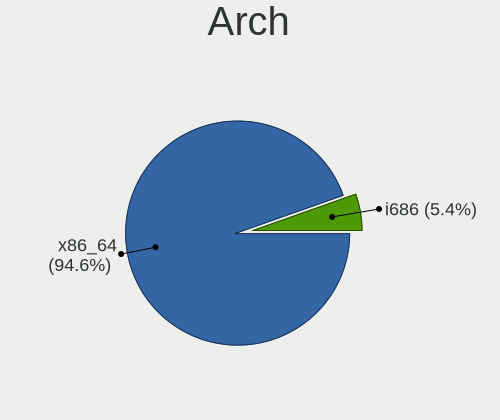

| Name   | Computers | Percent |
|--------|-----------|---------|
| x86_64 | 64        | 95.52%  |
| i686   | 3         | 4.48%   |

DE
--

Desktop Environment

| Name     | Computers | Percent |
|----------|-----------|---------|
| XFCE     | 53        | 79.1%   |
| KDE5     | 8         | 11.94%  |
| i3       | 2         | 2.99%   |
| Trinity  | 1         | 1.49%   |
| spectrwm | 1         | 1.49%   |
| LXQt     | 1         | 1.49%   |
| Budgie   | 1         | 1.49%   |

Display Server
--------------

X11 or Wayland

| Name | Computers | Percent |
|------|-----------|---------|
| X11  | 66        | 98.51%  |
| Tty  | 1         | 1.49%   |

Display Manager
---------------

SDDM, LightDM, etc.

| Name    | Computers | Percent |
|---------|-----------|---------|
| LightDM | 60        | 89.55%  |
| SDDM    | 6         | 8.96%   |
| TDM     | 1         | 1.49%   |

OS Lang
-------

Language

| Lang    | Computers | Percent |
|---------|-----------|---------|
| Unknown | 40        | 58.82%  |
| en_US   | 14        | 20.59%  |
| es_ES   | 5         | 7.35%   |
| en_GB   | 2         | 2.94%   |
| de_DE   | 2         | 2.94%   |
| ru_RU   | 1         | 1.47%   |
| it_IT   | 1         | 1.47%   |
| es_VE   | 1         | 1.47%   |
| es_CO   | 1         | 1.47%   |
| en_IE   | 1         | 1.47%   |

Boot Mode
---------

EFI or BIOS

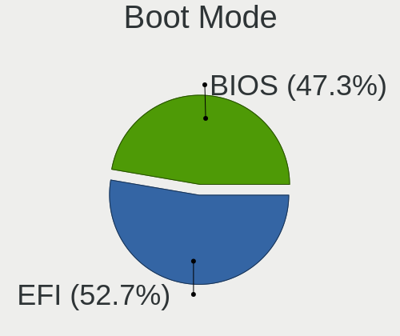

| Mode | Computers | Percent |
|------|-----------|---------|
| EFI  | 35        | 52.24%  |
| BIOS | 32        | 47.76%  |

Filesystem
----------

Type of filesystem

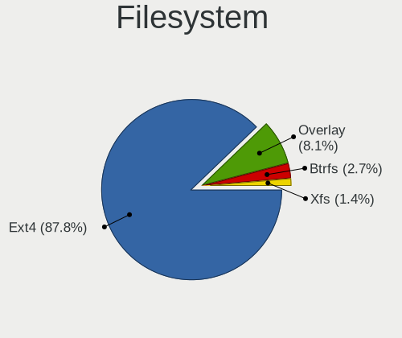

| Type    | Computers | Percent |
|---------|-----------|---------|
| Ext4    | 62        | 92.54%  |
| Overlay | 4         | 5.97%   |
| Xfs     | 1         | 1.49%   |

Part. scheme
------------

Scheme of partitioning

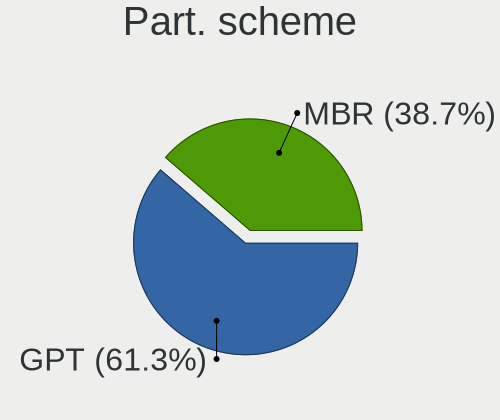

| Type | Computers | Percent |
|------|-----------|---------|
| GPT  | 41        | 61.19%  |
| MBR  | 26        | 38.81%  |

Dual Boot with Linux/BSD
------------------------

Hosting more than one Linux/BSD

| Dual boot | Computers | Percent |
|-----------|-----------|---------|
| No        | 56        | 81.16%  |
| Yes       | 13        | 18.84%  |

Dual Boot (Win)
---------------

Hosting Linux and Windows

| Dual boot | Computers | Percent |
|-----------|-----------|---------|
| No        | 44        | 65.67%  |
| Yes       | 23        | 34.33%  |

Board
-----

Vendor
------

Motherboard manufacturer

| Name                | Computers | Percent |
|---------------------|-----------|---------|
| Lenovo              | 15        | 22.39%  |
| Hewlett-Packard     | 14        | 20.9%   |
| Dell                | 8         | 11.94%  |
| ASUSTek Computer    | 6         | 8.96%   |
| Acer                | 5         | 7.46%   |
| MSI                 | 4         | 5.97%   |
| Gigabyte Technology | 3         | 4.48%   |
| ASRock              | 3         | 4.48%   |
| Apple               | 2         | 2.99%   |
| Teclast             | 1         | 1.49%   |
| Sony                | 1         | 1.49%   |
| Notebook            | 1         | 1.49%   |
| Medion              | 1         | 1.49%   |
| Irbis               | 1         | 1.49%   |
| Clevo               | 1         | 1.49%   |
| Unknown             | 1         | 1.49%   |

Model
-----

Motherboard model

| Name                                     | Computers | Percent |
|------------------------------------------|-----------|---------|
| Teclast F5                               | 1         | 1.49%   |
| Sony VGN-NR310FH                         | 1         | 1.49%   |
| Notebook W65_W67RZ1                      | 1         | 1.49%   |
| MSI MS-7C94                              | 1         | 1.49%   |
| MSI MS-7B86                              | 1         | 1.49%   |
| MSI MS-7641                              | 1         | 1.49%   |
| MSI GEG                                  | 1         | 1.49%   |
| Medion AKOYA E1318T                      | 1         | 1.49%   |
| Lenovo ThinkPad X1 Carbon 5th 20HR0013AU | 1         | 1.49%   |
| Lenovo ThinkPad T60 20085TG              | 1         | 1.49%   |
| Lenovo ThinkPad T530 2394CJ9             | 1         | 1.49%   |
| Lenovo ThinkPad T440s 20AQ007SGE         | 1         | 1.49%   |
| Lenovo ThinkPad T440s 20AQ006HUS         | 1         | 1.49%   |
| Lenovo ThinkPad T400 2768WGB             | 1         | 1.49%   |
| Lenovo ThinkPad P51 20HJS0TP00           | 1         | 1.49%   |
| Lenovo ThinkPad L520 78595VG             | 1         | 1.49%   |
| Lenovo ThinkPad L490 20Q5S0PR00          | 1         | 1.49%   |
| Lenovo ThinkPad E480 20KNCTO1WW          | 1         | 1.49%   |
| Lenovo ThinkPad E425 1198CTO             | 1         | 1.49%   |
| Lenovo MIIX 3-1030 80HV                  | 1         | 1.49%   |
| Lenovo IdeaPad 110-15IBR 80T7            | 1         | 1.49%   |
| Lenovo B590 20206                        | 1         | 1.49%   |
| Lenovo B40-45 20394                      | 1         | 1.49%   |
| Irbis TW94                               | 1         | 1.49%   |
| HP ZBook 17 G6                           | 1         | 1.49%   |
| HP Z230 Tower Workstation                | 1         | 1.49%   |
| HP Z220 CMT Workstation                  | 1         | 1.49%   |
| HP Spectre x360 Convertible 13-ae0xx     | 1         | 1.49%   |
| HP ProLiant DL380 G6                     | 1         | 1.49%   |
| HP ProDesk 600 G1 DM                     | 1         | 1.49%   |
| HP ProBook 650 G1                        | 1         | 1.49%   |
| HP Pavilion Laptop 15-eg0xxx             | 1         | 1.49%   |
| HP Pavilion 15                           | 1         | 1.49%   |
| HP Notebook                              | 1         | 1.49%   |
| HP Mini 110-3500                         | 1         | 1.49%   |
| HP Falco                                 | 1         | 1.49%   |
| HP ENVY Laptop 13-ba0xxx                 | 1         | 1.49%   |
| HP Compaq 8510p (KM229AV)                | 1         | 1.49%   |
| Gigabyte Z390 GAMING X                   | 1         | 1.49%   |
| Gigabyte X470 AORUS ULTRA GAMING         | 1         | 1.49%   |
| Gigabyte H110M-S2H                       | 1         | 1.49%   |
| Dell PowerEdge T320                      | 1         | 1.49%   |
| Dell OptiPlex 9010                       | 1         | 1.49%   |
| Dell Latitude E6320                      | 1         | 1.49%   |
| Dell Latitude 5175                       | 1         | 1.49%   |
| Dell Latitude 3390 2-in-1                | 1         | 1.49%   |
| Dell Latitude 3340                       | 1         | 1.49%   |
| Dell Inspiron 660                        | 1         | 1.49%   |
| Dell Inspiron 3576                       | 1         | 1.49%   |
| Clevo P170EM                             | 1         | 1.49%   |
| ASUS X455LAB                             | 1         | 1.49%   |
| ASUS VivoBook_ASUSLaptop X712DA_M712DA   | 1         | 1.49%   |
| ASUS VivoBook 15_ASUS Laptop X542UF      | 1         | 1.49%   |
| ASUS TUF B450M-PRO GAMING                | 1         | 1.49%   |
| ASUS P5K-E                               | 1         | 1.49%   |
| ASUS All Series                          | 1         | 1.49%   |
| ASRock H470M-ITX/ac                      | 1         | 1.49%   |
| ASRock H170M Pro4                        | 1         | 1.49%   |
| ASRock B560M Pro4                        | 1         | 1.49%   |
| Apple Macmini3,1                         | 1         | 1.49%   |

Model Family
------------

Motherboard model prefix

| Name               | Computers | Percent |
|--------------------|-----------|---------|
| Lenovo ThinkPad    | 11        | 16.42%  |
| Acer Aspire        | 5         | 7.46%   |
| Dell Latitude      | 4         | 5.97%   |
| HP Pavilion        | 2         | 2.99%   |
| Dell Inspiron      | 2         | 2.99%   |
| ASUS VivoBook      | 2         | 2.99%   |
| Teclast F5         | 1         | 1.49%   |
| Sony VGN-NR310FH   | 1         | 1.49%   |
| Notebook W65       | 1         | 1.49%   |
| MSI MS-7C94        | 1         | 1.49%   |
| MSI MS-7B86        | 1         | 1.49%   |
| MSI MS-7641        | 1         | 1.49%   |
| MSI GEG            | 1         | 1.49%   |
| Medion AKOYA       | 1         | 1.49%   |
| Lenovo MIIX        | 1         | 1.49%   |
| Lenovo IdeaPad     | 1         | 1.49%   |
| Lenovo B590        | 1         | 1.49%   |
| Lenovo B40-45      | 1         | 1.49%   |
| Irbis TW94         | 1         | 1.49%   |
| HP ZBook           | 1         | 1.49%   |
| HP Z230            | 1         | 1.49%   |
| HP Z220            | 1         | 1.49%   |
| HP Spectre         | 1         | 1.49%   |
| HP ProLiant        | 1         | 1.49%   |
| HP ProDesk         | 1         | 1.49%   |
| HP ProBook         | 1         | 1.49%   |
| HP Notebook        | 1         | 1.49%   |
| HP Mini            | 1         | 1.49%   |
| HP Falco           | 1         | 1.49%   |
| HP ENVY            | 1         | 1.49%   |
| HP Compaq          | 1         | 1.49%   |
| Gigabyte Z390      | 1         | 1.49%   |
| Gigabyte X470      | 1         | 1.49%   |
| Gigabyte H110M-S2H | 1         | 1.49%   |
| Dell PowerEdge     | 1         | 1.49%   |
| Dell OptiPlex      | 1         | 1.49%   |
| Clevo P170EM       | 1         | 1.49%   |
| ASUS X455LAB       | 1         | 1.49%   |
| ASUS TUF           | 1         | 1.49%   |
| ASUS P5K-E         | 1         | 1.49%   |
| ASUS All           | 1         | 1.49%   |
| ASRock H470M-ITX   | 1         | 1.49%   |
| ASRock H170M       | 1         | 1.49%   |
| ASRock B560M       | 1         | 1.49%   |
| Apple Macmini3     | 1         | 1.49%   |
| Apple MacBook7     | 1         | 1.49%   |
| Unknown            | 1         | 1.49%   |

MFG Year
--------

Motherboard manufacture year

| Year | Computers | Percent |
|------|-----------|---------|
| 2019 | 15        | 22.39%  |
| 2020 | 9         | 13.43%  |
| 2014 | 7         | 10.45%  |
| 2021 | 5         | 7.46%   |
| 2018 | 5         | 7.46%   |
| 2015 | 5         | 7.46%   |
| 2012 | 4         | 5.97%   |
| 2013 | 3         | 4.48%   |
| 2011 | 3         | 4.48%   |
| 2009 | 3         | 4.48%   |
| 2016 | 2         | 2.99%   |
| 2008 | 2         | 2.99%   |
| 2006 | 2         | 2.99%   |
| 2017 | 1         | 1.49%   |
| 2010 | 1         | 1.49%   |

Form Factor
-----------

Physical design of the computer

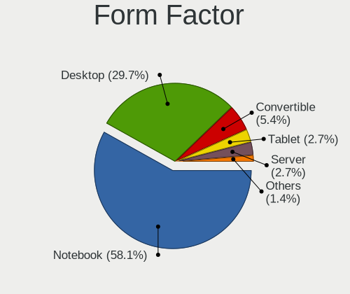

| Name        | Computers | Percent |
|-------------|-----------|---------|
| Notebook    | 41        | 61.19%  |
| Desktop     | 18        | 26.87%  |
| Convertible | 3         | 4.48%   |
| Tablet      | 2         | 2.99%   |
| Server      | 2         | 2.99%   |
| Mini pc     | 1         | 1.49%   |

Secure Boot
-----------

Enabled or disabled

| State    | Computers | Percent |
|----------|-----------|---------|
| Disabled | 67        | 100%    |

Coreboot
--------

Have coreboot on board

| Used | Computers | Percent |
|------|-----------|---------|
| No   | 66        | 98.51%  |
| Yes  | 1         | 1.49%   |

RAM Size
--------

Total RAM memory

| Size in GB | Computers | Percent |
|------------|-----------|---------|
| 4.01-8.0   | 15        | 22.39%  |
| 3.01-4.0   | 13        | 19.4%   |
| 16.01-24.0 | 12        | 17.91%  |
| 8.01-16.0  | 12        | 17.91%  |
| 1.01-2.0   | 6         | 8.96%   |
| 32.01-64.0 | 5         | 7.46%   |
| 24.01-32.0 | 2         | 2.99%   |
| 2.01-3.0   | 2         | 2.99%   |

RAM Used
--------

Used RAM memory

| Used GB   | Computers | Percent |
|-----------|-----------|---------|
| 1.01-2.0  | 27        | 39.13%  |
| 2.01-3.0  | 13        | 18.84%  |
| 3.01-4.0  | 12        | 17.39%  |
| 4.01-8.0  | 8         | 11.59%  |
| 0.51-1.0  | 7         | 10.14%  |
| 8.01-16.0 | 2         | 2.9%    |

Total Drives
------------

Number of drives on board

| Drives | Computers | Percent |
|--------|-----------|---------|
| 1      | 45        | 66.18%  |
| 2      | 12        | 17.65%  |
| 3      | 6         | 8.82%   |
| 5      | 2         | 2.94%   |
| 4      | 2         | 2.94%   |
| 0      | 1         | 1.47%   |

Has CD-ROM
----------

Has CD-ROM on board

| Presented | Computers | Percent |
|-----------|-----------|---------|
| No        | 39        | 58.21%  |
| Yes       | 28        | 41.79%  |

Has Ethernet
------------

Has Ethernet on board

| Presented | Computers | Percent |
|-----------|-----------|---------|
| Yes       | 59        | 88.06%  |
| No        | 8         | 11.94%  |

Has WiFi
--------

Has WiFi module

| Presented | Computers | Percent |
|-----------|-----------|---------|
| Yes       | 55        | 82.09%  |
| No        | 12        | 17.91%  |

Has Bluetooth
-------------

Has Bluetooth module

| Presented | Computers | Percent |
|-----------|-----------|---------|
| Yes       | 39        | 58.21%  |
| No        | 28        | 41.79%  |

Location
--------

Country
-------

Geographic location (country)

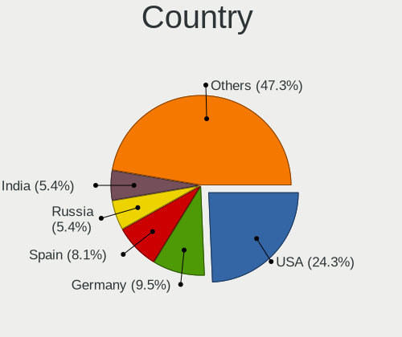

| Country     | Computers | Percent |
|-------------|-----------|---------|
| USA         | 15        | 22.39%  |
| Spain       | 6         | 8.96%   |
| Germany     | 6         | 8.96%   |
| Russia      | 4         | 5.97%   |
| India       | 4         | 5.97%   |
| Canada      | 3         | 4.48%   |
| UK          | 2         | 2.99%   |
| Sweden      | 2         | 2.99%   |
| Netherlands | 2         | 2.99%   |
| Mexico      | 2         | 2.99%   |
| Finland     | 2         | 2.99%   |
| Vietnam     | 1         | 1.49%   |
| Venezuela   | 1         | 1.49%   |
| Turkey      | 1         | 1.49%   |
| Syria       | 1         | 1.49%   |
| Serbia      | 1         | 1.49%   |
| Portugal    | 1         | 1.49%   |
| Poland      | 1         | 1.49%   |
| Philippines | 1         | 1.49%   |
| Norway      | 1         | 1.49%   |
| Italy       | 1         | 1.49%   |
| Indonesia   | 1         | 1.49%   |
| Hungary     | 1         | 1.49%   |
| France      | 1         | 1.49%   |
| Denmark     | 1         | 1.49%   |
| Czechia     | 1         | 1.49%   |
| Colombia    | 1         | 1.49%   |
| Brazil      | 1         | 1.49%   |
| Australia   | 1         | 1.49%   |
| Angola      | 1         | 1.49%   |

City
----

Geographic location (city)

| City                      | Computers | Percent |
|---------------------------|-----------|---------|
| Madrid                    | 3         | 4.35%   |
| Asansol                   | 3         | 4.35%   |
| Wadsworth                 | 1         | 1.45%   |
| Tuusula                   | 1         | 1.45%   |
| Trivandrum                | 1         | 1.45%   |
| Torrevieja                | 1         | 1.45%   |
| Torquay                   | 1         | 1.45%   |
| Tobyhanna                 | 1         | 1.45%   |
| Stockholm                 | 1         | 1.45%   |
| S?¶dert?¤lje              | 1         | 1.45%   |
| Rensselaer                | 1         | 1.45%   |
| Prague                    | 1         | 1.45%   |
| Porto                     | 1         | 1.45%   |
| Podolsk                   | 1         | 1.45%   |
| Pocono Summit             | 1         | 1.45%   |
| Piszczac                  | 1         | 1.45%   |
| Perm                      | 1         | 1.45%   |
| Ooltewah                  | 1         | 1.45%   |
| Omsk                      | 1         | 1.45%   |
| Oakland                   | 1         | 1.45%   |
| Nuremberg                 | 1         | 1.45%   |
| Novi Knezevac             | 1         | 1.45%   |
| Nashville                 | 1         | 1.45%   |
| Munich                    | 1         | 1.45%   |
| Montreal                  | 1         | 1.45%   |
| Monterrey                 | 1         | 1.45%   |
| Milan                     | 1         | 1.45%   |
| Mexico City               | 1         | 1.45%   |
| Meriden                   | 1         | 1.45%   |
| M??nster                  | 1         | 1.45%   |
| Marbella                  | 1         | 1.45%   |
| Manado                    | 1         | 1.45%   |
| Madison                   | 1         | 1.45%   |
| Luanda                    | 1         | 1.45%   |
| Los Puertos de Altagracia | 1         | 1.45%   |
| Los Angeles               | 1         | 1.45%   |
| Lobnya                    | 1         | 1.45%   |
| Lille                     | 1         | 1.45%   |
| Leipzig                   | 1         | 1.45%   |
| Lebanon                   | 1         | 1.45%   |
| Kreuztal                  | 1         | 1.45%   |
| Kartal                    | 1         | 1.45%   |
| Iowa City                 | 1         | 1.45%   |
| Huntsville                | 1         | 1.45%   |
| Ho Chi Minh City          | 1         | 1.45%   |
| Hendon                    | 1         | 1.45%   |
| Helsinki                  | 1         | 1.45%   |
| Gargan                    | 1         | 1.45%   |
| Damascus                  | 1         | 1.45%   |
| Comox                     | 1         | 1.45%   |
| Chesapeake                | 1         | 1.45%   |
| Cebu City                 | 1         | 1.45%   |
| Carl Junction             | 1         | 1.45%   |
| Caldicot                  | 1         | 1.45%   |
| Budapest                  | 1         | 1.45%   |
| Breedenbroek              | 1         | 1.45%   |
| Bogot??                   | 1         | 1.45%   |
| Bergisch Gladbach         | 1         | 1.45%   |
| Aurora                    | 1         | 1.45%   |
| Ashburn                   | 1         | 1.45%   |

Drives
------

Drive Vendor
------------

Hard drive vendors

| Vendor              | Computers | Drives | Percent |
|---------------------|-----------|--------|---------|
| WDC                 | 16        | 19     | 17.2%   |
| Samsung Electronics | 14        | 19     | 15.05%  |
| Seagate             | 13        | 18     | 13.98%  |
| Kingston            | 8         | 8      | 8.6%    |
| SanDisk             | 6         | 6      | 6.45%   |
| Hitachi             | 5         | 6      | 5.38%   |
| Toshiba             | 4         | 5      | 4.3%    |
| A-DATA Technology   | 3         | 3      | 3.23%   |
| Unknown             | 2         | 2      | 2.15%   |
| SK Hynix            | 2         | 2      | 2.15%   |
| Intel               | 2         | 2      | 2.15%   |
| HGST                | 2         | 2      | 2.15%   |
| Crucial             | 2         | 2      | 2.15%   |
| Yeyian              | 1         | 1      | 1.08%   |
| WDC WDS1            | 1         | 1      | 1.08%   |
| Teclast             | 1         | 1      | 1.08%   |
| SPCC                | 1         | 1      | 1.08%   |
| PNY                 | 1         | 1      | 1.08%   |
| LITEON              | 1         | 1      | 1.08%   |
| Lenovo              | 1         | 1      | 1.08%   |
| Intenso             | 1         | 1      | 1.08%   |
| Indilinx            | 1         | 2      | 1.08%   |
| HUAWEI              | 1         | 1      | 1.08%   |
| HS-SSD-C100         | 1         | 1      | 1.08%   |
| GOODRAM             | 1         | 1      | 1.08%   |
| Gigabyte Technology | 1         | 1      | 1.08%   |
| Fujitsu             | 1         | 1      | 1.08%   |

Drive Model
-----------

Hard drive models

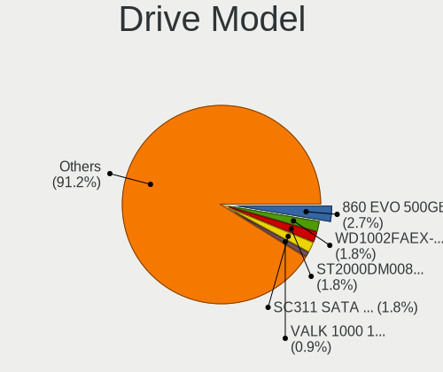

| Model                                | Computers | Percent |
|--------------------------------------|-----------|---------|
| Samsung SSD 860 EVO 500GB            | 3         | 2.97%   |
| WDC WD1002FAEX-00Z3A0 1TB            | 2         | 1.98%   |
| SK Hynix SC311 SATA 256GB SSD        | 2         | 1.98%   |
| Seagate ST2000DM008-2FR102 2TB       | 2         | 1.98%   |
| Yeyian VALK 1000 120GB               | 1         | 0.99%   |
| WDC WDS500G2B0A 500GB SSD            | 1         | 0.99%   |
| WDC WDS500G1R0A-68A4W0 500GB SSD     | 1         | 0.99%   |
| WDC WDS250G2B0A-00SM50 250GB SSD     | 1         | 0.99%   |
| WDC WDS120G2G0A-00JH30 120GB SSD     | 1         | 0.99%   |
| WDC WDS1 20G2G0A-00JH30 120GB SSD    | 1         | 0.99%   |
| WDC WD800JD-00MSA1 80GB              | 1         | 0.99%   |
| WDC WD5000LPVX-22V0TT0 500GB         | 1         | 0.99%   |
| WDC WD5000LPCX-24VHAT0 500GB         | 1         | 0.99%   |
| WDC WD5000AAKX-22ERMA0 500GB         | 1         | 0.99%   |
| WDC WD3200LPVT-08G33T1 320GB         | 1         | 0.99%   |
| WDC WD20EZRZ-00Z5HB0 2TB             | 1         | 0.99%   |
| WDC WD1600BEVT-22ZCT0 160GB          | 1         | 0.99%   |
| WDC WD10SPZX-80Z10T2 1TB             | 1         | 0.99%   |
| WDC WD10EADS-65M2B0 1TB              | 1         | 0.99%   |
| WDC PC SN730 SDBQNTY-512G-1001 512GB | 1         | 0.99%   |
| WDC PC SN520 SDAPNUW-512G-1006 512GB | 1         | 0.99%   |
| WDC PC SN520 SDAPNUW-256G-1102 256GB | 1         | 0.99%   |
| Unknown SDW32G  32GB                 | 1         | 0.99%   |
| Unknown 064G30  64GB                 | 1         | 0.99%   |
| Toshiba THNSFJ256GCSU 256GB SSD      | 1         | 0.99%   |
| Toshiba MQ01ACF050 500GB             | 1         | 0.99%   |
| Toshiba KXG60ZNV512G KIOXIA 512GB    | 1         | 0.99%   |
| Toshiba DT01ACA050 500GB             | 1         | 0.99%   |
| Teclast 256GB NS550-2242 SSD         | 1         | 0.99%   |
| SPCC Solid State Disk 240GB          | 1         | 0.99%   |
| Seagate ST9500420AS 500GB            | 1         | 0.99%   |
| Seagate ST9500325AS 500GB            | 1         | 0.99%   |
| Seagate ST500NM0011 500GB            | 1         | 0.99%   |
| Seagate ST4000DM004-2CV104 4TB       | 1         | 0.99%   |
| Seagate ST3750330NS 752GB            | 1         | 0.99%   |
| Seagate ST3500830AS 500GB            | 1         | 0.99%   |
| Seagate ST3320620AS 320GB            | 1         | 0.99%   |
| Seagate ST2000LM003 HN-M201RAD 2TB   | 1         | 0.99%   |
| Seagate ST2000DX001-1CM164 2TB       | 1         | 0.99%   |
| Seagate ST1000LM035-1RK172 1TB       | 1         | 0.99%   |
| Seagate ST1000LM024 HN-M101MBB 1TB   | 1         | 0.99%   |
| Seagate BUP BK 4TB                   | 1         | 0.99%   |
| Seagate Backup+ Desk 5TB             | 1         | 0.99%   |
| SanDisk SSD PLUS 480G                | 1         | 0.99%   |
| SanDisk SSD PLUS 1000GB              | 1         | 0.99%   |
| SanDisk SSD G5 BICS4 500GB           | 1         | 0.99%   |
| SanDisk SDSSDHII120G 120GB           | 1         | 0.99%   |
| SanDisk SDSSDA120G 120GB             | 1         | 0.99%   |
| SanDisk DF4064  64GB                 | 1         | 0.99%   |
| Samsung SSD 860 QVO 1TB              | 1         | 0.99%   |
| Samsung SSD 860 EVO mSATA 500GB      | 1         | 0.99%   |
| Samsung SSD 860 EVO M.2 250GB        | 1         | 0.99%   |
| Samsung SSD 860 EVO 250GB            | 1         | 0.99%   |
| Samsung SSD 860 EVO 1TB              | 1         | 0.99%   |
| Samsung SSD 850 EVO 500GB            | 1         | 0.99%   |
| Samsung SSD 850 EVO 250GB            | 1         | 0.99%   |
| Samsung SSD 840 Series 500GB         | 1         | 0.99%   |
| Samsung SSD 840 EVO 250GB            | 1         | 0.99%   |
| Samsung SSD 830 Series 128GB         | 1         | 0.99%   |
| Samsung MZVLW512HMJP-000L7 512GB     | 1         | 0.99%   |

HDD Vendor
----------

Hard disk drive vendors

| Vendor  | Computers | Drives | Percent |
|---------|-----------|--------|---------|
| Seagate | 13        | 17     | 39.39%  |
| WDC     | 10        | 11     | 30.3%   |
| Hitachi | 5         | 6      | 15.15%  |
| Toshiba | 2         | 3      | 6.06%   |
| HGST    | 2         | 2      | 6.06%   |
| Fujitsu | 1         | 1      | 3.03%   |

SSD Vendor
----------

Solid state drive vendors

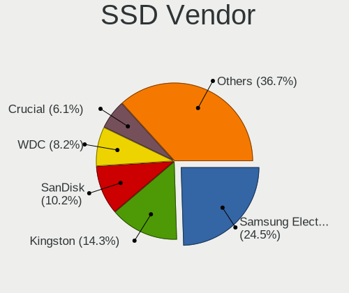

| Vendor              | Computers | Drives | Percent |
|---------------------|-----------|--------|---------|
| Samsung Electronics | 10        | 15     | 22.22%  |
| Kingston            | 7         | 7      | 15.56%  |
| SanDisk             | 5         | 5      | 11.11%  |
| WDC                 | 4         | 5      | 8.89%   |
| SK Hynix            | 2         | 2      | 4.44%   |
| Crucial             | 2         | 2      | 4.44%   |
| A-DATA Technology   | 2         | 2      | 4.44%   |
| Yeyian              | 1         | 1      | 2.22%   |
| WDC WDS1            | 1         | 1      | 2.22%   |
| Toshiba             | 1         | 1      | 2.22%   |
| Teclast             | 1         | 1      | 2.22%   |
| SPCC                | 1         | 1      | 2.22%   |
| PNY                 | 1         | 1      | 2.22%   |
| LITEON              | 1         | 1      | 2.22%   |
| Intenso             | 1         | 1      | 2.22%   |
| Intel               | 1         | 1      | 2.22%   |
| Indilinx            | 1         | 2      | 2.22%   |
| HS-SSD-C100         | 1         | 1      | 2.22%   |
| GOODRAM             | 1         | 1      | 2.22%   |
| Gigabyte Technology | 1         | 1      | 2.22%   |

Drive Kind
----------

HDD or SSD

| Kind    | Computers | Drives | Percent |
|---------|-----------|--------|---------|
| SSD     | 37        | 52     | 45.12%  |
| HDD     | 29        | 40     | 35.37%  |
| NVMe    | 11        | 12     | 13.41%  |
| MMC     | 3         | 3      | 3.66%   |
| Unknown | 2         | 2      | 2.44%   |

Drive Connector
---------------

SATA, SAS, NVMe, etc.

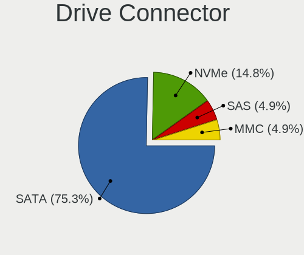

| Type | Computers | Drives | Percent |
|------|-----------|--------|---------|
| SATA | 55        | 90     | 75.34%  |
| NVMe | 11        | 12     | 15.07%  |
| SAS  | 4         | 4      | 5.48%   |
| MMC  | 3         | 3      | 4.11%   |

Drive Size
----------

Size of hard drive

| Size in TB | Computers | Drives | Percent |
|------------|-----------|--------|---------|
| 0.01-0.5   | 49        | 70     | 73.13%  |
| 0.51-1.0   | 10        | 11     | 14.93%  |
| 1.01-2.0   | 5         | 6      | 7.46%   |
| 3.01-4.0   | 2         | 3      | 2.99%   |
| 2.01-3.0   | 1         | 2      | 1.49%   |

Space Total
-----------

Amount of disk space available on the file system

| Size in GB     | Computers | Percent |
|----------------|-----------|---------|
| 251-500        | 18        | 26.47%  |
| 101-250        | 18        | 26.47%  |
| 51-100         | 10        | 14.71%  |
| 501-1000       | 7         | 10.29%  |
| 21-50          | 6         | 8.82%   |
| More than 3000 | 3         | 4.41%   |
| 1001-2000      | 3         | 4.41%   |
| 1-20           | 2         | 2.94%   |
| 2001-3000      | 1         | 1.47%   |

Space Used
----------

Amount of used disk space

| Used GB        | Computers | Percent |
|----------------|-----------|---------|
| 1-20           | 23        | 34.33%  |
| 21-50          | 12        | 17.91%  |
| 51-100         | 10        | 14.93%  |
| 101-250        | 9         | 13.43%  |
| 251-500        | 6         | 8.96%   |
| 501-1000       | 4         | 5.97%   |
| More than 3000 | 2         | 2.99%   |
| 2001-3000      | 1         | 1.49%   |

Malfunc. Drives
---------------

Drive models with a malfunction

| Model                            | Computers | Drives | Percent |
|----------------------------------|-----------|--------|---------|
| WDC WD1600BEVT-22ZCT0 160GB      | 1         | 1      | 11.11%  |
| Seagate ST9500420AS 500GB        | 1         | 1      | 11.11%  |
| Seagate ST9500325AS 500GB        | 1         | 1      | 11.11%  |
| Seagate ST3750330NS 752GB        | 1         | 1      | 11.11%  |
| Seagate ST1000LM035-1RK172 1TB   | 1         | 1      | 11.11%  |
| Indilinx IND-S325S120G 120GB SSD | 1         | 2      | 11.11%  |
| Hitachi HTS542516K9SA00 160GB    | 1         | 1      | 11.11%  |
| HGST HTS545050A7E680 500GB       | 1         | 1      | 11.11%  |
| Fujitsu MHZ2160BH G2 160GB       | 1         | 1      | 11.11%  |

Malfunc. Drive Vendor
---------------------

Vendors of faulty drives

| Vendor   | Computers | Drives | Percent |
|----------|-----------|--------|---------|
| Seagate  | 4         | 4      | 44.44%  |
| WDC      | 1         | 1      | 11.11%  |
| Indilinx | 1         | 2      | 11.11%  |
| Hitachi  | 1         | 1      | 11.11%  |
| HGST     | 1         | 1      | 11.11%  |
| Fujitsu  | 1         | 1      | 11.11%  |

Malfunc. HDD Vendor
-------------------

Vendors of faulty HDD drives

| Vendor  | Computers | Drives | Percent |
|---------|-----------|--------|---------|
| Seagate | 4         | 4      | 50%     |
| WDC     | 1         | 1      | 12.5%   |
| Hitachi | 1         | 1      | 12.5%   |
| HGST    | 1         | 1      | 12.5%   |
| Fujitsu | 1         | 1      | 12.5%   |

Malfunc. Drive Kind
-------------------

Kinds of faulty drives

| Kind | Computers | Drives | Percent |
|------|-----------|--------|---------|
| HDD  | 8         | 8      | 88.89%  |
| SSD  | 1         | 2      | 11.11%  |

Failed Drives
-------------

Failed drive models

Zero info for selected period =(

Failed Drive Vendor
-------------------

Failed drive vendors

Zero info for selected period =(

Drive Status
------------

Number of failed and malfunc. drives

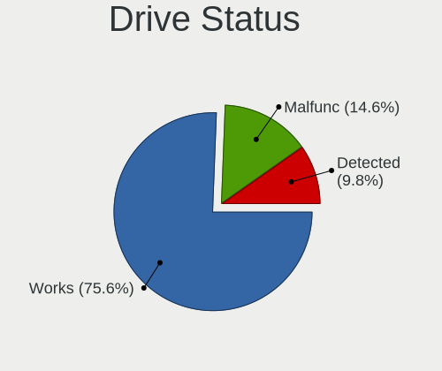

| Status   | Computers | Drives | Percent |
|----------|-----------|--------|---------|
| Works    | 57        | 92     | 78.08%  |
| Malfunc  | 9         | 10     | 12.33%  |
| Detected | 7         | 7      | 9.59%   |

Storage controller
------------------

Storage Vendor
--------------

Storage controller vendors

| Vendor                       | Computers | Percent |
|------------------------------|-----------|---------|
| Intel                        | 47        | 65.28%  |
| AMD                          | 11        | 15.28%  |
| Sandisk                      | 3         | 4.17%   |
| Samsung Electronics          | 3         | 4.17%   |
| Nvidia                       | 2         | 2.78%   |
| Toshiba America Info Systems | 1         | 1.39%   |
| Lenovo                       | 1         | 1.39%   |
| Kingston Technology Company  | 1         | 1.39%   |
| JMicron Technology           | 1         | 1.39%   |
| Hewlett-Packard              | 1         | 1.39%   |
| ADATA Technology             | 1         | 1.39%   |

Storage Model
-------------

Storage controller models

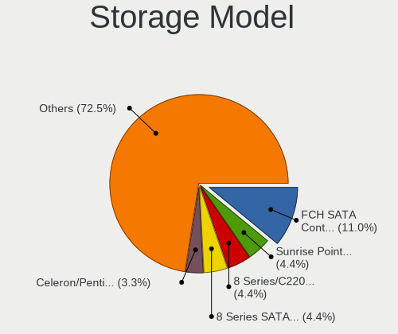

| Model                                                                            | Computers | Percent |
|----------------------------------------------------------------------------------|-----------|---------|
| AMD FCH SATA Controller [AHCI mode]                                              | 8         | 9.64%   |
| Intel Sunrise Point-LP SATA Controller [AHCI mode]                               | 4         | 4.82%   |
| Intel 8 Series/C220 Series Chipset Family 6-port SATA Controller 1 [AHCI mode]   | 4         | 4.82%   |
| Intel 8 Series SATA Controller 1 [AHCI mode]                                     | 4         | 4.82%   |
| Intel 82801G (ICH7 Family) IDE Controller                                        | 3         | 3.61%   |
| Intel 7 Series Chipset Family 6-port SATA Controller [AHCI mode]                 | 3         | 3.61%   |
| AMD 400 Series Chipset SATA Controller                                           | 3         | 3.61%   |
| Sandisk WD Blue SN500 / PC SN520 NVMe SSD                                        | 2         | 2.41%   |
| Samsung NVMe SSD Controller SM961/PM961/SM963                                    | 2         | 2.41%   |
| Intel Wildcat Point-LP SATA Controller [AHCI Mode]                               | 2         | 2.41%   |
| Intel Q170/Q150/B150/H170/H110/Z170/CM236 Chipset SATA Controller [AHCI Mode]    | 2         | 2.41%   |
| Intel Celeron/Pentium Silver Processor SATA Controller                           | 2         | 2.41%   |
| Intel Atom/Celeron/Pentium Processor x5-E8000/J3xxx/N3xxx Series SATA Controller | 2         | 2.41%   |
| Intel 82801HM/HEM (ICH8M/ICH8M-E) SATA Controller [AHCI mode]                    | 2         | 2.41%   |
| Intel 82801HM/HEM (ICH8M/ICH8M-E) IDE Controller                                 | 2         | 2.41%   |
| Intel 82801GBM/GHM (ICH7-M Family) SATA Controller [AHCI mode]                   | 2         | 2.41%   |
| Intel 82801 Mobile SATA Controller [RAID mode]                                   | 2         | 2.41%   |
| Intel 7 Series/C210 Series Chipset Family 6-port SATA Controller [AHCI mode]     | 2         | 2.41%   |
| Toshiba America Info Systems XG6 NVMe SSD Controller                             | 1         | 1.2%    |
| Sandisk WD Black SN750 / PC SN730 NVMe SSD                                       | 1         | 1.2%    |
| Samsung NVMe SSD Controller SM981/PM981/PM983                                    | 1         | 1.2%    |
| Nvidia MCP89 SATA Controller (AHCI mode)                                         | 1         | 1.2%    |
| Nvidia MCP79 AHCI Controller                                                     | 1         | 1.2%    |
| Lenovo Non-Volatile memory controller                                            | 1         | 1.2%    |
| Kingston Company A2000 NVMe SSD                                                  | 1         | 1.2%    |
| JMicron JMB363 SATA/IDE Controller                                               | 1         | 1.2%    |
| Intel Volume Management Device NVMe RAID Controller                              | 1         | 1.2%    |
| Intel SSD 660P Series                                                            | 1         | 1.2%    |
| Intel SATA Controller [RAID mode]                                                | 1         | 1.2%    |
| Intel NM10/ICH7 Family SATA Controller [IDE mode]                                | 1         | 1.2%    |
| Intel NM10/ICH7 Family SATA Controller [AHCI mode]                               | 1         | 1.2%    |
| Intel Mobile PM965/GM965 PT IDER Controller                                      | 1         | 1.2%    |
| Intel HM170/QM170 Chipset SATA Controller [AHCI Mode]                            | 1         | 1.2%    |
| Intel Comet Lake SATA AHCI Controller                                            | 1         | 1.2%    |
| Intel Cannon Lake PCH SATA AHCI Controller                                       | 1         | 1.2%    |
| Intel Cannon Lake Mobile PCH SATA AHCI Controller                                | 1         | 1.2%    |
| Intel C600/X79 series chipset 4-Port SATA IDE Controller                         | 1         | 1.2%    |
| Intel C600/X79 series chipset 2-Port SATA IDE Controller                         | 1         | 1.2%    |
| Intel 9 Series Chipset Family SATA Controller [AHCI Mode]                        | 1         | 1.2%    |
| Intel 82801JI (ICH10 Family) 4 port SATA IDE Controller #1                       | 1         | 1.2%    |
| Intel 82801IR/IO/IH (ICH9R/DO/DH) 6 port SATA Controller [AHCI mode]             | 1         | 1.2%    |
| Intel 82801IBM/IEM (ICH9M/ICH9M-E) 4 port SATA Controller [AHCI mode]            | 1         | 1.2%    |
| Intel 6 Series/C200 Series Chipset Family 6 port Mobile SATA AHCI Controller     | 1         | 1.2%    |
| Intel 500 Series Chipset Family SATA AHCI Controller                             | 1         | 1.2%    |
| Intel 5 Series/3400 Series Chipset 4 port SATA AHCI Controller                   | 1         | 1.2%    |
| HP Smart Array G6 controllers                                                    | 1         | 1.2%    |
| AMD Starship/Matisse Chipset SATA Controller [AHCI mode]                         | 1         | 1.2%    |
| AMD SB7x0/SB8x0/SB9x0 SATA Controller [IDE mode]                                 | 1         | 1.2%    |
| AMD SB7x0/SB8x0/SB9x0 IDE Controller                                             | 1         | 1.2%    |
| ADATA XPG SX8200 Pro PCIe Gen3x4 M.2 2280 Solid State Drive                      | 1         | 1.2%    |

Storage Kind
------------

Kind of storage controller (IDE, SATA, NVMe, SAS, ...)

| Kind | Computers | Percent |
|------|-----------|---------|
| SATA | 53        | 68.83%  |
| NVMe | 10        | 12.99%  |
| IDE  | 9         | 11.69%  |
| RAID | 5         | 6.49%   |

Processor
---------

CPU Vendor
----------

Processor vendors

| Vendor | Computers | Percent |
|--------|-----------|---------|
| Intel  | 56        | 83.58%  |
| AMD    | 11        | 16.42%  |

CPU Model
---------

Processor models

| Model                                         | Computers | Percent |
|-----------------------------------------------|-----------|---------|
| Intel Core i7-8550U CPU @ 1.80GHz             | 3         | 4.48%   |
| Intel Core i7-4600U CPU @ 2.10GHz             | 2         | 2.99%   |
| Intel Core i5-8250U CPU @ 1.60GHz             | 2         | 2.99%   |
| Intel Core i3-4000M CPU @ 2.40GHz             | 2         | 2.99%   |
| Intel Core 2 Duo CPU P8600 @ 2.40GHz          | 2         | 2.99%   |
| Intel Xeon CPU X5550 @ 2.67GHz                | 1         | 1.49%   |
| Intel Xeon CPU E5-2420 0 @ 1.90GHz            | 1         | 1.49%   |
| Intel Xeon CPU E3-1225 v3 @ 3.20GHz           | 1         | 1.49%   |
| Intel Pentium D CPU 3.40GHz                   | 1         | 1.49%   |
| Intel Pentium CPU N3710 @ 1.60GHz             | 1         | 1.49%   |
| Intel Pentium CPU G3240T @ 2.70GHz            | 1         | 1.49%   |
| Intel Pentium CPU 2020M @ 2.40GHz             | 1         | 1.49%   |
| Intel Core m5-6Y57 CPU @ 1.10GHz              | 1         | 1.49%   |
| Intel Core i7-9850H CPU @ 2.60GHz             | 1         | 1.49%   |
| Intel Core i7-9700K CPU @ 3.60GHz             | 1         | 1.49%   |
| Intel Core i7-7820HQ CPU @ 2.90GHz            | 1         | 1.49%   |
| Intel Core i7-7500U CPU @ 2.70GHz             | 1         | 1.49%   |
| Intel Core i7-6700HQ CPU @ 2.60GHz            | 1         | 1.49%   |
| Intel Core i7-5500U CPU @ 2.40GHz             | 1         | 1.49%   |
| Intel Core i7-3770 CPU @ 3.40GHz              | 1         | 1.49%   |
| Intel Core i7-3720QM CPU @ 2.60GHz            | 1         | 1.49%   |
| Intel Core i5-8365U CPU @ 1.60GHz             | 1         | 1.49%   |
| Intel Core i5-7400 CPU @ 3.00GHz              | 1         | 1.49%   |
| Intel Core i5-6600 CPU @ 3.30GHz              | 1         | 1.49%   |
| Intel Core i5-5200U CPU @ 2.20GHz             | 1         | 1.49%   |
| Intel Core i5-4590 CPU @ 3.30GHz              | 1         | 1.49%   |
| Intel Core i5-4210U CPU @ 1.70GHz             | 1         | 1.49%   |
| Intel Core i5-3570 CPU @ 3.40GHz              | 1         | 1.49%   |
| Intel Core i5-3330 CPU @ 3.00GHz              | 1         | 1.49%   |
| Intel Core i5-3320M CPU @ 2.60GHz             | 1         | 1.49%   |
| Intel Core i5-2520M CPU @ 2.50GHz             | 1         | 1.49%   |
| Intel Core i5-10400 CPU @ 2.90GHz             | 1         | 1.49%   |
| Intel Core i5-1035G4 CPU @ 1.10GHz            | 1         | 1.49%   |
| Intel Core i3-2350M CPU @ 2.30GHz             | 1         | 1.49%   |
| Intel Core i3 CPU M 330 @ 2.13GHz             | 1         | 1.49%   |
| Intel Core Duo CPU T2500 @ 2.00GHz            | 1         | 1.49%   |
| Intel Core 2 Duo CPU T8100 @ 2.10GHz          | 1         | 1.49%   |
| Intel Core 2 Duo CPU P8700 @ 2.53GHz          | 1         | 1.49%   |
| Intel Core 2 Duo CPU E6550 @ 2.33GHz          | 1         | 1.49%   |
| Intel Celeron N4100 CPU @ 1.10GHz             | 1         | 1.49%   |
| Intel Celeron N4000 CPU @ 1.10GHz             | 1         | 1.49%   |
| Intel Celeron CPU N3060 @ 1.60GHz             | 1         | 1.49%   |
| Intel Celeron CPU 550 @ 2.00GHz               | 1         | 1.49%   |
| Intel Celeron 2955U @ 1.40GHz                 | 1         | 1.49%   |
| Intel Atom x5-Z8350 CPU @ 1.44GHz             | 1         | 1.49%   |
| Intel Atom CPU Z3735F @ 1.33GHz               | 1         | 1.49%   |
| Intel Atom CPU N550 @ 1.50GHz                 | 1         | 1.49%   |
| Intel Atom CPU N270 @ 1.60GHz                 | 1         | 1.49%   |
| Intel 11th Gen Core i7-11700 @ 2.50GHz        | 1         | 1.49%   |
| Intel 11th Gen Core i7-1165G7 @ 2.80GHz       | 1         | 1.49%   |
| AMD Ryzen 7 3700X 8-Core Processor            | 1         | 1.49%   |
| AMD Ryzen 7 3700U with Radeon Vega Mobile Gfx | 1         | 1.49%   |
| AMD Ryzen 5 3600 6-Core Processor             | 1         | 1.49%   |
| AMD Ryzen 5 2600X Six-Core Processor          | 1         | 1.49%   |
| AMD Ryzen 5 2500U with Radeon Vega Mobile Gfx | 1         | 1.49%   |
| AMD Ryzen 5 1600 Six-Core Processor           | 1         | 1.49%   |
| AMD E1-6010 APU with AMD Radeon R2 Graphics   | 1         | 1.49%   |
| AMD Athlon II X2 270 Processor                | 1         | 1.49%   |
| AMD A8-6410 APU with AMD Radeon R5 Graphics   | 1         | 1.49%   |
| AMD A4-3300M APU with Radeon HD Graphics      | 1         | 1.49%   |

CPU Model Family
----------------

Processor model prefix

| Model            | Computers | Percent |
|------------------|-----------|---------|
| Intel Core i5    | 14        | 20.9%   |
| Intel Core i7    | 13        | 19.4%   |
| Intel Core 2 Duo | 5         | 7.46%   |
| Intel Celeron    | 5         | 7.46%   |
| Intel Core i3    | 4         | 5.97%   |
| Intel Atom       | 4         | 5.97%   |
| AMD Ryzen 5      | 4         | 5.97%   |
| Intel Xeon       | 3         | 4.48%   |
| Intel Pentium    | 3         | 4.48%   |
| Other            | 2         | 2.99%   |
| AMD Ryzen 7      | 2         | 2.99%   |
| AMD A4           | 2         | 2.99%   |
| Intel Pentium D  | 1         | 1.49%   |
| Intel Core m5    | 1         | 1.49%   |
| Intel Core Duo   | 1         | 1.49%   |
| AMD E1           | 1         | 1.49%   |
| AMD Athlon II X2 | 1         | 1.49%   |
| AMD A8           | 1         | 1.49%   |

CPU Cores
---------

Number of processor cores

| Number | Computers | Percent |
|--------|-----------|---------|
| 2      | 30        | 44.78%  |
| 4      | 25        | 37.31%  |
| 6      | 6         | 8.96%   |
| 8      | 4         | 5.97%   |
| 1      | 2         | 2.99%   |

CPU Sockets
-----------

Number of sockets

| Number | Computers | Percent |
|--------|-----------|---------|
| 1      | 66        | 98.51%  |
| 2      | 1         | 1.49%   |

CPU Threads
-----------

Threads per core (Hyper-Threading)

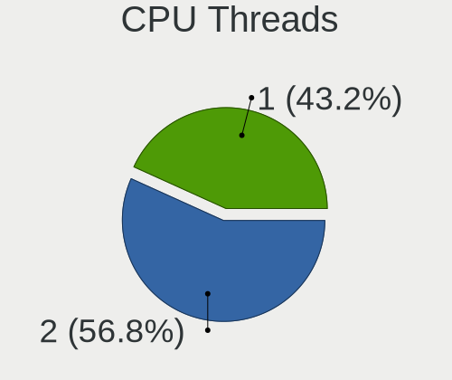

| Number | Computers | Percent |
|--------|-----------|---------|
| 2      | 38        | 56.72%  |
| 1      | 29        | 43.28%  |

CPU Op-Modes
------------

CPU Operation Modes (32-bit, 64-bit)

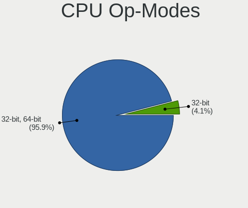

| Op mode        | Computers | Percent |
|----------------|-----------|---------|
| 32-bit, 64-bit | 65        | 97.01%  |
| 32-bit         | 2         | 2.99%   |

CPU Microcode
-------------

Microcode number

| Number     | Computers | Percent |
|------------|-----------|---------|
| 0x306a9    | 6         | 8.96%   |
| 0x306c3    | 5         | 7.46%   |
| Unknown    | 5         | 7.46%   |
| 0x806ea    | 4         | 5.97%   |
| 0x40651    | 4         | 5.97%   |
| 0x1067a    | 3         | 4.48%   |
| 0x906ed    | 2         | 2.99%   |
| 0x706a1    | 2         | 2.99%   |
| 0x406c4    | 2         | 2.99%   |
| 0x306d4    | 2         | 2.99%   |
| 0x206a7    | 2         | 2.99%   |
| 0x08701021 | 2         | 2.99%   |
| 0xf64      | 1         | 1.49%   |
| 0xa0671    | 1         | 1.49%   |
| 0xa0653    | 1         | 1.49%   |
| 0x906e9    | 1         | 1.49%   |
| 0x806e9    | 1         | 1.49%   |
| 0x806c1    | 1         | 1.49%   |
| 0x706e5    | 1         | 1.49%   |
| 0x6fb      | 1         | 1.49%   |
| 0x6ec      | 1         | 1.49%   |
| 0x506e3    | 1         | 1.49%   |
| 0x406e3    | 1         | 1.49%   |
| 0x30678    | 1         | 1.49%   |
| 0x206d7    | 1         | 1.49%   |
| 0x20652    | 1         | 1.49%   |
| 0x106ca    | 1         | 1.49%   |
| 0x106c2    | 1         | 1.49%   |
| 0x106a5    | 1         | 1.49%   |
| 0x10676    | 1         | 1.49%   |
| 0x10661    | 1         | 1.49%   |
| 0x08108102 | 1         | 1.49%   |
| 0x0810100b | 1         | 1.49%   |
| 0x0800820d | 1         | 1.49%   |
| 0x0800820b | 1         | 1.49%   |
| 0x07030105 | 1         | 1.49%   |
| 0x07030104 | 1         | 1.49%   |
| 0x0700010f | 1         | 1.49%   |
| 0x03000027 | 1         | 1.49%   |
| 0x010000c8 | 1         | 1.49%   |

CPU Microarch
-------------

Microarchitecture

| Name          | Computers | Percent |
|---------------|-----------|---------|
| KabyLake      | 11        | 16.42%  |
| Haswell       | 9         | 13.43%  |
| IvyBridge     | 6         | 8.96%   |
| Silvermont    | 4         | 5.97%   |
| Penryn        | 4         | 5.97%   |
| Zen+          | 3         | 4.48%   |
| Skylake       | 3         | 4.48%   |
| SandyBridge   | 3         | 4.48%   |
| Zen 2         | 2         | 2.99%   |
| Puma          | 2         | 2.99%   |
| Goldmont plus | 2         | 2.99%   |
| Core          | 2         | 2.99%   |
| Broadwell     | 2         | 2.99%   |
| Bonnell       | 2         | 2.99%   |
| Zen           | 1         | 1.49%   |
| Westmere      | 1         | 1.49%   |
| TigerLake     | 1         | 1.49%   |
| P6            | 1         | 1.49%   |
| NetBurst      | 1         | 1.49%   |
| Nehalem       | 1         | 1.49%   |
| K10 Llano     | 1         | 1.49%   |
| K10           | 1         | 1.49%   |
| Jaguar        | 1         | 1.49%   |
| IceLake       | 1         | 1.49%   |
| CometLake     | 1         | 1.49%   |
| Unknown       | 1         | 1.49%   |

Graphics
--------

GPU Vendor
----------

Vendors of graphics cards

| Vendor | Computers | Percent |
|--------|-----------|---------|
| Intel  | 42        | 53.85%  |
| Nvidia | 19        | 24.36%  |
| AMD    | 17        | 21.79%  |

GPU Model
---------

Graphics card models

| Model                                                                                    | Computers | Percent |
|------------------------------------------------------------------------------------------|-----------|---------|
| Intel UHD Graphics 620                                                                   | 5         | 6.25%   |
| Intel Haswell-ULT Integrated Graphics Controller                                         | 4         | 5%      |
| Intel Atom/Celeron/Pentium Processor x5-E8000/J3xxx/N3xxx Integrated Graphics Controller | 3         | 3.75%   |
| Intel 3rd Gen Core processor Graphics Controller                                         | 3         | 3.75%   |
| Intel Xeon E3-1200 v2/3rd Gen Core processor Graphics Controller                         | 2         | 2.5%    |
| Intel HD Graphics 630                                                                    | 2         | 2.5%    |
| Intel HD Graphics 5500                                                                   | 2         | 2.5%    |
| Intel GeminiLake [UHD Graphics 600]                                                      | 2         | 2.5%    |
| Intel 4th Gen Core Processor Integrated Graphics Controller                              | 2         | 2.5%    |
| Intel 2nd Generation Core Processor Family Integrated Graphics Controller                | 2         | 2.5%    |
| AMD Lexa PRO [Radeon 540/540X/550/550X / RX 540X/550/550X]                               | 2         | 2.5%    |
| Nvidia TU117M [GeForce MX450]                                                            | 1         | 1.25%   |
| Nvidia TU117 [GeForce GTX 1650]                                                          | 1         | 1.25%   |
| Nvidia TU116 [GeForce GTX 1660 SUPER]                                                    | 1         | 1.25%   |
| Nvidia TU106GLM [Quadro RTX 3000 Mobile / Max-Q]                                         | 1         | 1.25%   |
| Nvidia MCP89 [GeForce 320M]                                                              | 1         | 1.25%   |
| Nvidia GT216 [GeForce GT 220]                                                            | 1         | 1.25%   |
| Nvidia GP107 [GeForce GTX 1050]                                                          | 1         | 1.25%   |
| Nvidia GP106 [GeForce GTX 1060 6GB]                                                      | 1         | 1.25%   |
| Nvidia GP104 [GeForce GTX 1070]                                                          | 1         | 1.25%   |
| Nvidia GM206GLM [Quadro M2200 Mobile]                                                    | 1         | 1.25%   |
| Nvidia GM204 [GeForce GTX 970]                                                           | 1         | 1.25%   |
| Nvidia GM108M [GeForce MX130]                                                            | 1         | 1.25%   |
| Nvidia GK208B [GeForce GT 710]                                                           | 1         | 1.25%   |
| Nvidia GK107GL [Quadro K600]                                                             | 1         | 1.25%   |
| Nvidia GK107 [GeForce GT 640]                                                            | 1         | 1.25%   |
| Nvidia GF119 [GeForce GT 620 OEM]                                                        | 1         | 1.25%   |
| Nvidia GF117M [GeForce 610M/710M/810M/820M / GT 620M/625M/630M/720M]                     | 1         | 1.25%   |
| Nvidia GF114M [GeForce GTX 675M]                                                         | 1         | 1.25%   |
| Nvidia C79 [GeForce 9400]                                                                | 1         | 1.25%   |
| Intel Xeon E3-1200 v3/4th Gen Core Processor Integrated Graphics Controller              | 1         | 1.25%   |
| Intel WhiskeyLake-U GT2 [UHD Graphics 620]                                               | 1         | 1.25%   |
| Intel TigerLake-LP GT2 [Iris Xe Graphics]                                                | 1         | 1.25%   |
| Intel RocketLake-S GT1 [UHD Graphics 750]                                                | 1         | 1.25%   |
| Intel Mobile GM965/GL960 Integrated Graphics Controller (secondary)                      | 1         | 1.25%   |
| Intel Mobile GM965/GL960 Integrated Graphics Controller (primary)                        | 1         | 1.25%   |
| Intel Mobile 945GSE Express Integrated Graphics Controller                               | 1         | 1.25%   |
| Intel Mobile 945GM/GMS/GME, 943/940GML Express Integrated Graphics Controller            | 1         | 1.25%   |
| Intel Mobile 4 Series Chipset Integrated Graphics Controller                             | 1         | 1.25%   |
| Intel Iris Plus Graphics G4 (Ice Lake)                                                   | 1         | 1.25%   |
| Intel HD Graphics 620                                                                    | 1         | 1.25%   |
| Intel HD Graphics 530                                                                    | 1         | 1.25%   |
| Intel HD Graphics 515                                                                    | 1         | 1.25%   |
| Intel Core Processor Integrated Graphics Controller                                      | 1         | 1.25%   |
| Intel CoffeeLake-H GT2 [UHD Graphics 630]                                                | 1         | 1.25%   |
| Intel Atom Processor Z36xxx/Z37xxx Series Graphics & Display                             | 1         | 1.25%   |
| Intel Atom Processor D4xx/D5xx/N4xx/N5xx Integrated Graphics Controller                  | 1         | 1.25%   |
| AMD Sumo [Radeon HD 6480G]                                                               | 1         | 1.25%   |
| AMD RV630/M76 [Mobility Radeon HD 2600]                                                  | 1         | 1.25%   |
| AMD RV620/M82 [Mobility Radeon HD 3450/3470]                                             | 1         | 1.25%   |
| AMD RV515/M54 [Mobility Radeon X1400]                                                    | 1         | 1.25%   |
| AMD Raven Ridge [Radeon Vega Series / Radeon Vega Mobile Series]                         | 1         | 1.25%   |
| AMD Picasso/Raven 2 [Radeon Vega Series / Radeon Vega Mobile Series]                     | 1         | 1.25%   |
| AMD Oland [Radeon HD 8570 / R5 430 OEM / R7 240/340 / Radeon 520 OEM]                    | 1         | 1.25%   |
| AMD Navi 10 [Radeon RX 5600 OEM/5600 XT / 5700/5700 XT]                                  | 1         | 1.25%   |
| AMD Mullins [Radeon R4/R5 Graphics]                                                      | 1         | 1.25%   |
| AMD Mullins [Radeon R2 Graphics]                                                         | 1         | 1.25%   |
| AMD Kabini [Radeon HD 8180]                                                              | 1         | 1.25%   |
| AMD Jet PRO [Radeon R5 M230 / R7 M260DX / Radeon 520 Mobile]                             | 1         | 1.25%   |
| AMD ES1000                                                                               | 1         | 1.25%   |

GPU Combo
---------

Combinations of graphics cards

| Name           | Computers | Percent |
|----------------|-----------|---------|
| 1 x Intel      | 31        | 46.27%  |
| 1 x Nvidia     | 13        | 19.4%   |
| 1 x AMD        | 13        | 19.4%   |
| Intel + Nvidia | 6         | 8.96%   |
| Intel + AMD    | 4         | 5.97%   |

GPU Driver
----------

Free vs proprietary

| Driver      | Computers | Percent |
|-------------|-----------|---------|
| Free        | 57        | 85.07%  |
| Proprietary | 9         | 13.43%  |
| Unknown     | 1         | 1.49%   |

GPU Memory
----------

Total video memory

| Size in GB | Computers | Percent |
|------------|-----------|---------|
| Unknown    | 39        | 58.21%  |
| 0.51-1.0   | 8         | 11.94%  |
| 0.01-0.5   | 8         | 11.94%  |
| 3.01-4.0   | 4         | 5.97%   |
| 1.01-2.0   | 4         | 5.97%   |
| 5.01-6.0   | 3         | 4.48%   |
| 7.01-8.0   | 1         | 1.49%   |

Monitor
-------

Monitor Vendor
--------------

Monitor vendors

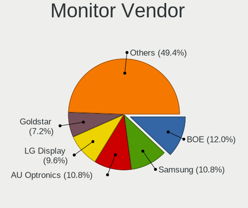

| Vendor                  | Computers | Percent |
|-------------------------|-----------|---------|
| BOE                     | 10        | 13.16%  |
| Samsung Electronics     | 8         | 10.53%  |
| LG Display              | 8         | 10.53%  |
| AU Optronics            | 7         | 9.21%   |
| Goldstar                | 5         | 6.58%   |
| Chimei Innolux          | 5         | 6.58%   |
| Lenovo                  | 4         | 5.26%   |
| Chi Mei Optoelectronics | 4         | 5.26%   |
| Acer                    | 4         | 5.26%   |
| Hewlett-Packard         | 3         | 3.95%   |
| Philips                 | 2         | 2.63%   |
| HannStar                | 2         | 2.63%   |
| Dell                    | 2         | 2.63%   |
| ViewSonic               | 1         | 1.32%   |
| Videoseven              | 1         | 1.32%   |
| Vestel Elektronik       | 1         | 1.32%   |
| Sony                    | 1         | 1.32%   |
| Sceptre Tech            | 1         | 1.32%   |
| RIS                     | 1         | 1.32%   |
| LG Philips              | 1         | 1.32%   |
| InfoVision              | 1         | 1.32%   |
| Iiyama                  | 1         | 1.32%   |
| BenQ                    | 1         | 1.32%   |
| ASUSTek Computer        | 1         | 1.32%   |
| Apple                   | 1         | 1.32%   |

Monitor Model
-------------

Monitor models

| Model                                                                     | Computers | Percent |
|---------------------------------------------------------------------------|-----------|---------|
| Chi Mei Optoelectronics LCD Monitor CMO15A3 1366x768 344x193mm 15.5-inch  | 2         | 2.63%   |
| ViewSonic XG2705 VSC0E39 1920x1080 600x340mm 27.2-inch                    | 1         | 1.32%   |
| Videoseven D19W12C IGM19C1 1440x900 408x255mm 18.9-inch                   | 1         | 1.32%   |
| Vestel Elektronik 50UHD_LCD_TV VES3700 3840x2160 1872x1053mm 84.6-inch    | 1         | 1.32%   |
| Sony TV SNY0801 1360x768 1600x900mm 72.3-inch                             | 1         | 1.32%   |
| Sceptre Tech E248W-1920 SPT099D 1920x1080 443x249mm 20.0-inch             | 1         | 1.32%   |
| Samsung Electronics SyncMaster SAM04E6 1920x1080 477x268mm 21.5-inch      | 1         | 1.32%   |
| Samsung Electronics SyncMaster SAM0420 1680x1050 474x296mm 22.0-inch      | 1         | 1.32%   |
| Samsung Electronics SyncMaster SAM03C2 1680x1050 459x296mm 21.5-inch      | 1         | 1.32%   |
| Samsung Electronics LCD Monitor SEC5441 1366x768 344x194mm 15.5-inch      | 1         | 1.32%   |
| Samsung Electronics LCD Monitor SEC3152 1366x768 344x194mm 15.5-inch      | 1         | 1.32%   |
| Samsung Electronics LCD Monitor SAM0D3B 4096x2160 950x540mm 43.0-inch     | 1         | 1.32%   |
| Samsung Electronics C27JG5x SAM0F57 2560x1440 600x340mm 27.2-inch         | 1         | 1.32%   |
| Samsung Electronics C24F390 SAM0D2C 1920x1080 520x290mm 23.4-inch         | 1         | 1.32%   |
| RIS photo19 RIS0839 1366x768 410x230mm 18.5-inch                          | 1         | 1.32%   |
| Philips PHL BDM4350 PHL08FA 3840x2160 950x540mm 43.0-inch                 | 1         | 1.32%   |
| Philips PHL 246E9Q PHLC17C 1920x1080 527x296mm 23.8-inch                  | 1         | 1.32%   |
| LG Philips LCD Monitor LPL1901 1680x1050 331x207mm 15.4-inch              | 1         | 1.32%   |
| LG Display LP156WH2-TLE1 LGDCF01 1366x768 344x194mm 15.5-inch             | 1         | 1.32%   |
| LG Display LCD Monitor LGD062E 1920x1080 344x194mm 15.5-inch              | 1         | 1.32%   |
| LG Display LCD Monitor LGD059E 1920x1080 382x215mm 17.3-inch              | 1         | 1.32%   |
| LG Display LCD Monitor LGD0590 1920x1080 344x194mm 15.5-inch              | 1         | 1.32%   |
| LG Display LCD Monitor LGD04A7 1920x1080 340x190mm 15.3-inch              | 1         | 1.32%   |
| LG Display LCD Monitor LGD045E 1366x768 309x174mm 14.0-inch               | 1         | 1.32%   |
| LG Display LCD Monitor LGD040A 1920x1080 310x170mm 13.9-inch              | 1         | 1.32%   |
| LG Display LCD Monitor LGD03B8 1366x768 310x174mm 14.0-inch               | 1         | 1.32%   |
| Lenovo LEN L27i-28 LEN65E0 1920x1080 598x336mm 27.0-inch                  | 1         | 1.32%   |
| Lenovo LEN L192p LEN24CB 1280x1024 376x301mm 19.0-inch                    | 1         | 1.32%   |
| Lenovo LCD Monitor LEN4043 1400x1050 305x228mm 15.0-inch                  | 1         | 1.32%   |
| Lenovo LCD Monitor LEN4036 1440x900 304x190mm 14.1-inch                   | 1         | 1.32%   |
| InfoVision LCD Monitor IVO03FA 1366x768 220x130mm 10.1-inch               | 1         | 1.32%   |
| Iiyama PL2792Q IVM6630 2560x1440 597x336mm 27.0-inch                      | 1         | 1.32%   |
| Hewlett-Packard L1506 HWP265B 1024x768 300x220mm 14.6-inch                | 1         | 1.32%   |
| Hewlett-Packard 22f HPN3541 1920x1080 500x300mm 23.0-inch                 | 1         | 1.32%   |
| Hewlett-Packard 2011 HWP2934 1600x900 443x249mm 20.0-inch                 | 1         | 1.32%   |
| HannStar LCD Monitor HSD03E9 1024x600 220x129mm 10.0-inch                 | 1         | 1.32%   |
| HannStar HL161ABB HSD61C7 1366x768 344x193mm 15.5-inch                    | 1         | 1.32%   |
| Goldstar MP59G GSM5B35 1920x1080 480x270mm 21.7-inch                      | 1         | 1.32%   |
| Goldstar LG FULL HD GSM5ABB 1920x1080 480x270mm 21.7-inch                 | 1         | 1.32%   |
| Goldstar L1715S GSM436F 1280x1024 338x270mm 17.0-inch                     | 1         | 1.32%   |
| Goldstar HDR WFHD GSM7714 2560x1080 798x334mm 34.1-inch                   | 1         | 1.32%   |
| Goldstar E1940 GSM4BD6 1360x768 406x229mm 18.4-inch                       | 1         | 1.32%   |
| Dell S2409W DELA039 1920x1080 531x298mm 24.0-inch                         | 1         | 1.32%   |
| Dell P2217H DELA0D8 1920x1080 476x267mm 21.5-inch                         | 1         | 1.32%   |
| Chimei Innolux LCD Monitor CMN15DB 1366x768 344x193mm 15.5-inch           | 1         | 1.32%   |
| Chimei Innolux LCD Monitor CMN15BC 1366x768 350x190mm 15.7-inch           | 1         | 1.32%   |
| Chimei Innolux LCD Monitor CMN14A7 1920x1080 308x173mm 13.9-inch          | 1         | 1.32%   |
| Chimei Innolux LCD Monitor CMN1491 1366x768 309x174mm 14.0-inch           | 1         | 1.32%   |
| Chimei Innolux LCD Monitor CMN1376 1920x1080 293x165mm 13.2-inch          | 1         | 1.32%   |
| Chi Mei Optoelectronics LCD Monitor CMO1720 1920x1080 382x215mm 17.3-inch | 1         | 1.32%   |
| Chi Mei Optoelectronics LCD Monitor CMO1467 1366x768 309x174mm 14.0-inch  | 1         | 1.32%   |
| BOE LCD Monitor BOE089D 1280x800 261x163mm 12.1-inch                      | 1         | 1.32%   |
| BOE LCD Monitor BOE084E 1920x1080 382x215mm 17.3-inch                     | 1         | 1.32%   |
| BOE LCD Monitor BOE0802 1920x1080 344x193mm 15.5-inch                     | 1         | 1.32%   |
| BOE LCD Monitor BOE0791 1920x1080 309x173mm 13.9-inch                     | 1         | 1.32%   |
| BOE LCD Monitor BOE0742 1920x1080 309x173mm 13.9-inch                     | 1         | 1.32%   |
| BOE LCD Monitor BOE06A7 1920x1080 294x165mm 13.3-inch                     | 1         | 1.32%   |
| BOE LCD Monitor BOE0675 1366x768 344x194mm 15.5-inch                      | 1         | 1.32%   |
| BOE LCD Monitor BOE0672 1366x768 344x194mm 15.5-inch                      | 1         | 1.32%   |
| BOE LCD Monitor BOE0657 1920x1080 344x194mm 15.5-inch                     | 1         | 1.32%   |

Monitor Resolution
------------------

Monitor screen resolution

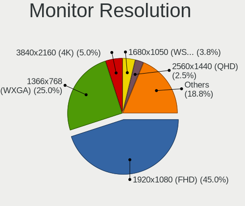

| Resolution         | Computers | Percent |
|--------------------|-----------|---------|
| 1920x1080 (FHD)    | 31        | 42.47%  |
| 1366x768 (WXGA)    | 19        | 26.03%  |
| 3840x2160 (4K)     | 4         | 5.48%   |
| 1680x1050 (WSXGA+) | 3         | 4.11%   |
| 2560x1440 (QHD)    | 2         | 2.74%   |
| 1440x900 (WXGA+)   | 2         | 2.74%   |
| 1360x768           | 2         | 2.74%   |
| 1280x1024 (SXGA)   | 2         | 2.74%   |
| 1024x600           | 2         | 2.74%   |
| 3440x1440          | 1         | 1.37%   |
| 2560x1080          | 1         | 1.37%   |
| 1600x900 (HD+)     | 1         | 1.37%   |
| 1400x1050          | 1         | 1.37%   |
| 1280x800 (WXGA)    | 1         | 1.37%   |
| 1024x768 (XGA)     | 1         | 1.37%   |

Monitor Diagonal
----------------

Diagonal size in inches

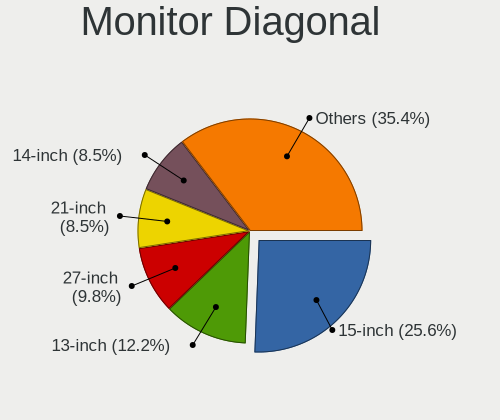

| Inches | Computers | Percent |
|--------|-----------|---------|
| 15     | 20        | 26.67%  |
| 13     | 10        | 13.33%  |
| 27     | 7         | 9.33%   |
| 14     | 7         | 9.33%   |
| 21     | 6         | 8%      |
| 24     | 4         | 5.33%   |
| 17     | 4         | 5.33%   |
| 23     | 3         | 4%      |
| 10     | 3         | 4%      |
| 84     | 2         | 2.67%   |
| 34     | 2         | 2.67%   |
| 20     | 2         | 2.67%   |
| 18     | 2         | 2.67%   |
| 72     | 1         | 1.33%   |
| 43     | 1         | 1.33%   |
| 22     | 1         | 1.33%   |

Monitor Width
-------------

Physical width

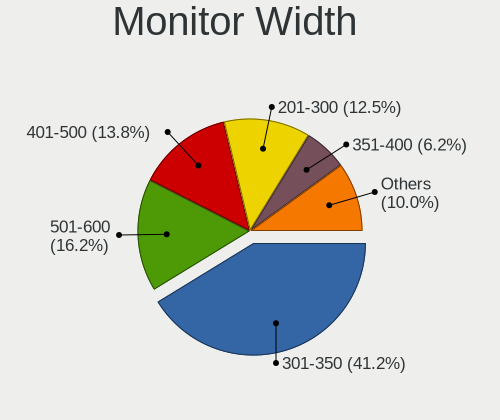

| Width in mm | Computers | Percent |
|-------------|-----------|---------|
| 301-350     | 32        | 43.84%  |
| 501-600     | 11        | 15.07%  |
| 401-500     | 10        | 13.7%   |
| 201-300     | 8         | 10.96%  |
| 351-400     | 5         | 6.85%   |
| 1501-2000   | 3         | 4.11%   |
| 701-800     | 2         | 2.74%   |
| 601-700     | 1         | 1.37%   |
| 901-1000    | 1         | 1.37%   |

Aspect Ratio
------------

Proportional relationship between the width and the height

| Ratio | Computers | Percent |
|-------|-----------|---------|
| 16/9  | 57        | 82.61%  |
| 16/10 | 6         | 8.7%    |
| 5/4   | 2         | 2.9%    |
| 4/3   | 2         | 2.9%    |
| 21/9  | 2         | 2.9%    |

Monitor Area
------------

Area in inch²

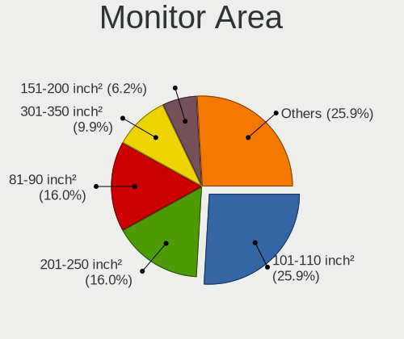

| Area in inch² | Computers | Percent |
|----------------|-----------|---------|
| 101-110        | 20        | 27.03%  |
| 81-90          | 13        | 17.57%  |
| 201-250        | 12        | 16.22%  |
| 301-350        | 7         | 9.46%   |
| 71-80          | 4         | 5.41%   |
| 151-200        | 4         | 5.41%   |
| More than 1000 | 3         | 4.05%   |
| 41-50          | 3         | 4.05%   |
| 121-130        | 3         | 4.05%   |
| 351-500        | 2         | 2.7%    |
| 141-150        | 2         | 2.7%    |
| 501-1000       | 1         | 1.35%   |

Pixel Density
-------------

Pixels per inch

| Density | Computers | Percent |
|---------|-----------|---------|
| 101-120 | 27        | 37.5%   |
| 51-100  | 22        | 30.56%  |
| 121-160 | 19        | 26.39%  |
| 161-240 | 3         | 4.17%   |
| 1-50    | 1         | 1.39%   |

Multiple Monitors
-----------------

Total monitors connected

| Total | Computers | Percent |
|-------|-----------|---------|
| 1     | 55        | 82.09%  |
| 2     | 11        | 16.42%  |
| 0     | 1         | 1.49%   |

Network
-------

Net Controller Vendor
---------------------

Controller vendors

| Vendor                   | Computers | Percent |
|--------------------------|-----------|---------|
| Intel                    | 36        | 33.96%  |
| Realtek Semiconductor    | 31        | 29.25%  |
| Qualcomm Atheros         | 12        | 11.32%  |
| Broadcom                 | 9         | 8.49%   |
| TP-Link                  | 3         | 2.83%   |
| Sierra Wireless          | 2         | 1.89%   |
| Nvidia                   | 2         | 1.89%   |
| Marvell Technology Group | 2         | 1.89%   |
| U-Blox                   | 1         | 0.94%   |
| Ralink Technology        | 1         | 0.94%   |
| NetGear                  | 1         | 0.94%   |
| Huawei Technologies      | 1         | 0.94%   |
| Hewlett-Packard          | 1         | 0.94%   |
| Google                   | 1         | 0.94%   |
| Edimax Technology        | 1         | 0.94%   |
| Broadcom Limited         | 1         | 0.94%   |
| ASIX Electronics         | 1         | 0.94%   |

Net Controller Model
--------------------

Controller models

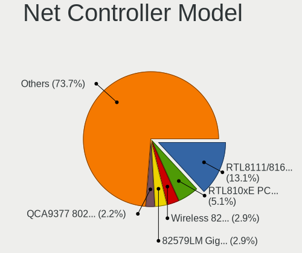

| Model                                                                   | Computers | Percent |
|-------------------------------------------------------------------------|-----------|---------|
| Realtek RTL8111/8168/8411 PCI Express Gigabit Ethernet Controller       | 17        | 13.49%  |
| Realtek RTL810xE PCI Express Fast Ethernet controller                   | 6         | 4.76%   |
| Intel Wireless 8265 / 8275                                              | 4         | 3.17%   |
| Intel 82579LM Gigabit Network Connection (Lewisville)                   | 4         | 3.17%   |
| Intel Wireless 7260                                                     | 3         | 2.38%   |
| Intel Wireless 3165                                                     | 3         | 2.38%   |
| Intel Ethernet Connection I218-LM                                       | 3         | 2.38%   |
| TP-Link TL-WN722N v2/v3 [Realtek RTL8188EUS]                            | 2         | 1.59%   |
| Realtek RTL8723BE PCIe Wireless Network Adapter                         | 2         | 1.59%   |
| Realtek RTL8188CE 802.11b/g/n WiFi Adapter                              | 2         | 1.59%   |
| Realtek RTL8153 Gigabit Ethernet Adapter                                | 2         | 1.59%   |
| Realtek RTL8125 2.5GbE Controller                                       | 2         | 1.59%   |
| Qualcomm Atheros QCA9565 / AR9565 Wireless Network Adapter              | 2         | 1.59%   |
| Qualcomm Atheros QCA9377 802.11ac Wireless Network Adapter              | 2         | 1.59%   |
| Qualcomm Atheros AR242x / AR542x Wireless Network Adapter (PCI-Express) | 2         | 1.59%   |
| Intel Wireless 8260                                                     | 2         | 1.59%   |
| Intel Wi-Fi 6 AX200                                                     | 2         | 1.59%   |
| Intel Ethernet Connection I217-LM                                       | 2         | 1.59%   |
| Intel Ethernet Connection (11) I219-V                                   | 2         | 1.59%   |
| Intel Centrino Advanced-N 6235                                          | 2         | 1.59%   |
| Broadcom BCM43142 802.11b/g/n                                           | 2         | 1.59%   |
| Broadcom BCM4313 802.11bgn Wireless Network Adapter                     | 2         | 1.59%   |
| U-Blox [u-blox 8]                                                       | 1         | 0.79%   |
| TP-Link TL-WN821N v5/v6 [RTL8192EU]                                     | 1         | 0.79%   |
| Sierra Wireless EM7430 Qualcomm Snapdragon X7 LTE-A                     | 1         | 0.79%   |
| Sierra Wireless EM7345 4G LTE                                           | 1         | 0.79%   |
| Realtek RTL88x2bu [AC1200 Techkey]                                      | 1         | 0.79%   |
| Realtek RTL8821AE 802.11ac PCIe Wireless Network Adapter                | 1         | 0.79%   |
| Realtek RTL8723AE PCIe Wireless Network Adapter                         | 1         | 0.79%   |
| Realtek RTL8188EUS 802.11n Wireless Network Adapter                     | 1         | 0.79%   |
| Realtek RTL8188CUS 802.11n WLAN Adapter                                 | 1         | 0.79%   |
| Realtek RTL8169 PCI Gigabit Ethernet Controller                         | 1         | 0.79%   |
| Realtek 802.11ac WLAN Adapter                                           | 1         | 0.79%   |
| Ralink MT7601U Wireless Adapter                                         | 1         | 0.79%   |
| Qualcomm Atheros QCA6174 802.11ac Wireless Network Adapter              | 1         | 0.79%   |
| Qualcomm Atheros AR9485 Wireless Network Adapter                        | 1         | 0.79%   |
| Qualcomm Atheros AR9462 Wireless Network Adapter                        | 1         | 0.79%   |
| Qualcomm Atheros AR9285 Wireless Network Adapter (PCI-Express)          | 1         | 0.79%   |
| Qualcomm Atheros AR8161 Gigabit Ethernet                                | 1         | 0.79%   |
| Qualcomm Atheros AR8151 v1.0 Gigabit Ethernet                           | 1         | 0.79%   |
| Qualcomm Atheros AR8132 Fast Ethernet                                   | 1         | 0.79%   |
| Nvidia MCP89 Ethernet                                                   | 1         | 0.79%   |
| Nvidia MCP79 Ethernet                                                   | 1         | 0.79%   |
| NetGear A6210                                                           | 1         | 0.79%   |
| Marvell Group 88E8056 PCI-E Gigabit Ethernet Controller                 | 1         | 0.79%   |
| Marvell Group 88E8039 PCI-E Fast Ethernet Controller                    | 1         | 0.79%   |
| Intel Wireless-AC 9260                                                  | 1         | 0.79%   |
| Intel Wi-Fi 6 AX201                                                     | 1         | 0.79%   |
| Intel PRO/Wireless 5100 AGN [Shiloh] Network Connection                 | 1         | 0.79%   |
| Intel PRO/Wireless 3945ABG [Golan] Network Connection                   | 1         | 0.79%   |
| Intel Ice Lake-LP PCH CNVi WiFi                                         | 1         | 0.79%   |
| Intel I211 Gigabit Network Connection                                   | 1         | 0.79%   |
| Intel Ethernet Connection I217-V                                        | 1         | 0.79%   |
| Intel Ethernet Connection (7) I219-V                                    | 1         | 0.79%   |
| Intel Ethernet Connection (7) I219-LM                                   | 1         | 0.79%   |
| Intel Ethernet Connection (6) I219-LM                                   | 1         | 0.79%   |
| Intel Ethernet Connection (5) I219-LM                                   | 1         | 0.79%   |
| Intel Ethernet Connection (4) I219-V                                    | 1         | 0.79%   |
| Intel Ethernet Connection (2) I219-V                                    | 1         | 0.79%   |
| Intel Ethernet Connection (2) I218-V                                    | 1         | 0.79%   |

Wireless Vendor
---------------

Wireless vendors

| Vendor                | Computers | Percent |
|-----------------------|-----------|---------|
| Intel                 | 24        | 39.34%  |
| Realtek Semiconductor | 10        | 16.39%  |
| Qualcomm Atheros      | 10        | 16.39%  |
| Broadcom              | 7         | 11.48%  |
| TP-Link               | 3         | 4.92%   |
| Sierra Wireless       | 2         | 3.28%   |
| Ralink Technology     | 1         | 1.64%   |
| NetGear               | 1         | 1.64%   |
| Hewlett-Packard       | 1         | 1.64%   |
| Edimax Technology     | 1         | 1.64%   |
| Broadcom Limited      | 1         | 1.64%   |

Wireless Model
--------------

Wireless models

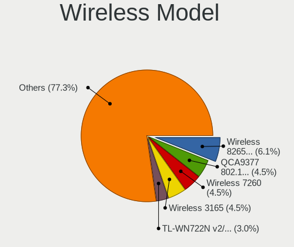

| Model                                                                   | Computers | Percent |
|-------------------------------------------------------------------------|-----------|---------|
| Intel Wireless 8265 / 8275                                              | 4         | 6.56%   |
| Intel Wireless 7260                                                     | 3         | 4.92%   |
| Intel Wireless 3165                                                     | 3         | 4.92%   |
| TP-Link TL-WN722N v2/v3 [Realtek RTL8188EUS]                            | 2         | 3.28%   |
| Realtek RTL8723BE PCIe Wireless Network Adapter                         | 2         | 3.28%   |
| Realtek RTL8188CE 802.11b/g/n WiFi Adapter                              | 2         | 3.28%   |
| Qualcomm Atheros QCA9565 / AR9565 Wireless Network Adapter              | 2         | 3.28%   |
| Qualcomm Atheros QCA9377 802.11ac Wireless Network Adapter              | 2         | 3.28%   |
| Qualcomm Atheros AR242x / AR542x Wireless Network Adapter (PCI-Express) | 2         | 3.28%   |
| Intel Wireless 8260                                                     | 2         | 3.28%   |
| Intel Wi-Fi 6 AX200                                                     | 2         | 3.28%   |
| Intel Centrino Advanced-N 6235                                          | 2         | 3.28%   |
| Broadcom BCM43142 802.11b/g/n                                           | 2         | 3.28%   |
| Broadcom BCM4313 802.11bgn Wireless Network Adapter                     | 2         | 3.28%   |
| TP-Link TL-WN821N v5/v6 [RTL8192EU]                                     | 1         | 1.64%   |
| Sierra Wireless EM7430 Qualcomm Snapdragon X7 LTE-A                     | 1         | 1.64%   |
| Sierra Wireless EM7345 4G LTE                                           | 1         | 1.64%   |
| Realtek RTL88x2bu [AC1200 Techkey]                                      | 1         | 1.64%   |
| Realtek RTL8821AE 802.11ac PCIe Wireless Network Adapter                | 1         | 1.64%   |
| Realtek RTL8723AE PCIe Wireless Network Adapter                         | 1         | 1.64%   |
| Realtek RTL8188EUS 802.11n Wireless Network Adapter                     | 1         | 1.64%   |
| Realtek RTL8188CUS 802.11n WLAN Adapter                                 | 1         | 1.64%   |
| Realtek 802.11ac WLAN Adapter                                           | 1         | 1.64%   |
| Ralink MT7601U Wireless Adapter                                         | 1         | 1.64%   |
| Qualcomm Atheros QCA6174 802.11ac Wireless Network Adapter              | 1         | 1.64%   |
| Qualcomm Atheros AR9485 Wireless Network Adapter                        | 1         | 1.64%   |
| Qualcomm Atheros AR9462 Wireless Network Adapter                        | 1         | 1.64%   |
| Qualcomm Atheros AR9285 Wireless Network Adapter (PCI-Express)          | 1         | 1.64%   |
| NetGear A6210                                                           | 1         | 1.64%   |
| Intel Wireless-AC 9260                                                  | 1         | 1.64%   |
| Intel Wi-Fi 6 AX201                                                     | 1         | 1.64%   |
| Intel PRO/Wireless 5100 AGN [Shiloh] Network Connection                 | 1         | 1.64%   |
| Intel PRO/Wireless 3945ABG [Golan] Network Connection                   | 1         | 1.64%   |
| Intel Ice Lake-LP PCH CNVi WiFi                                         | 1         | 1.64%   |
| Intel Dual Band Wireless-AC 3168NGW [Stone Peak]                        | 1         | 1.64%   |
| Intel Dual Band Wireless-AC 3165 Plus Bluetooth                         | 1         | 1.64%   |
| Intel Centrino Wireless-N 1000 [Condor Peak]                            | 1         | 1.64%   |
| HP lt4112 Gobi 4G Module Network Device                                 | 1         | 1.64%   |
| Edimax EW-7811Un 802.11n Wireless Adapter [Realtek RTL8188CUS]          | 1         | 1.64%   |
| Broadcom Limited BCM4321 802.11a/b/g/n                                  | 1         | 1.64%   |
| Broadcom BCM43225 802.11b/g/n                                           | 1         | 1.64%   |
| Broadcom BCM43224 802.11a/b/g/n                                         | 1         | 1.64%   |
| Broadcom BCM4311 802.11a/b/g                                            | 1         | 1.64%   |

Ethernet Vendor
---------------

Ethernet vendors

| Vendor                   | Computers | Percent |
|--------------------------|-----------|---------|
| Realtek Semiconductor    | 27        | 44.26%  |
| Intel                    | 24        | 39.34%  |
| Qualcomm Atheros         | 3         | 4.92%   |
| Nvidia                   | 2         | 3.28%   |
| Marvell Technology Group | 2         | 3.28%   |
| Broadcom                 | 2         | 3.28%   |
| ASIX Electronics         | 1         | 1.64%   |

Ethernet Model
--------------

Ethernet models

| Model                                                             | Computers | Percent |
|-------------------------------------------------------------------|-----------|---------|
| Realtek RTL8111/8168/8411 PCI Express Gigabit Ethernet Controller | 17        | 27.42%  |
| Realtek RTL810xE PCI Express Fast Ethernet controller             | 6         | 9.68%   |
| Intel 82579LM Gigabit Network Connection (Lewisville)             | 4         | 6.45%   |
| Intel Ethernet Connection I218-LM                                 | 3         | 4.84%   |
| Realtek RTL8153 Gigabit Ethernet Adapter                          | 2         | 3.23%   |
| Realtek RTL8125 2.5GbE Controller                                 | 2         | 3.23%   |
| Intel Ethernet Connection I217-LM                                 | 2         | 3.23%   |
| Intel Ethernet Connection (11) I219-V                             | 2         | 3.23%   |
| Realtek RTL8169 PCI Gigabit Ethernet Controller                   | 1         | 1.61%   |
| Qualcomm Atheros AR8161 Gigabit Ethernet                          | 1         | 1.61%   |
| Qualcomm Atheros AR8151 v1.0 Gigabit Ethernet                     | 1         | 1.61%   |
| Qualcomm Atheros AR8132 Fast Ethernet                             | 1         | 1.61%   |
| Nvidia MCP89 Ethernet                                             | 1         | 1.61%   |
| Nvidia MCP79 Ethernet                                             | 1         | 1.61%   |
| Marvell Group 88E8056 PCI-E Gigabit Ethernet Controller           | 1         | 1.61%   |
| Marvell Group 88E8039 PCI-E Fast Ethernet Controller              | 1         | 1.61%   |
| Intel I211 Gigabit Network Connection                             | 1         | 1.61%   |
| Intel Ethernet Connection I217-V                                  | 1         | 1.61%   |
| Intel Ethernet Connection (7) I219-V                              | 1         | 1.61%   |
| Intel Ethernet Connection (7) I219-LM                             | 1         | 1.61%   |
| Intel Ethernet Connection (6) I219-LM                             | 1         | 1.61%   |
| Intel Ethernet Connection (5) I219-LM                             | 1         | 1.61%   |
| Intel Ethernet Connection (4) I219-V                              | 1         | 1.61%   |
| Intel Ethernet Connection (2) I219-V                              | 1         | 1.61%   |
| Intel Ethernet Connection (2) I218-V                              | 1         | 1.61%   |
| Intel 82573L Gigabit Ethernet Controller                          | 1         | 1.61%   |
| Intel 82571EB/82571GB Gigabit Ethernet Controller (Copper)        | 1         | 1.61%   |
| Intel 82567LM Gigabit Network Connection                          | 1         | 1.61%   |
| Intel 82566MM Gigabit Network Connection                          | 1         | 1.61%   |
| Broadcom NetXtreme II BCM5709 Gigabit Ethernet                    | 1         | 1.61%   |
| Broadcom NetXtreme BCM5720 Gigabit Ethernet PCIe                  | 1         | 1.61%   |
| ASIX AX88772B                                                     | 1         | 1.61%   |

Net Controller Kind
-------------------

Ethernet, WiFi or modem

| Kind     | Computers | Percent |
|----------|-----------|---------|
| Ethernet | 59        | 50.43%  |
| WiFi     | 55        | 47.01%  |
| Modem    | 2         | 1.71%   |
| Unknown  | 1         | 0.85%   |

Used Controller
---------------

Currently used network controller

| Kind     | Computers | Percent |
|----------|-----------|---------|
| Ethernet | 51        | 51%     |
| WiFi     | 48        | 48%     |
| Unknown  | 1         | 1%      |

NICs
----

Total network controllers on board

| Total | Computers | Percent |
|-------|-----------|---------|
| 2     | 40        | 59.7%   |
| 1     | 23        | 34.33%  |
| 0     | 2         | 2.99%   |
| 12    | 1         | 1.49%   |
| 3     | 1         | 1.49%   |

IPv6
----

IPv6 vs IPv4

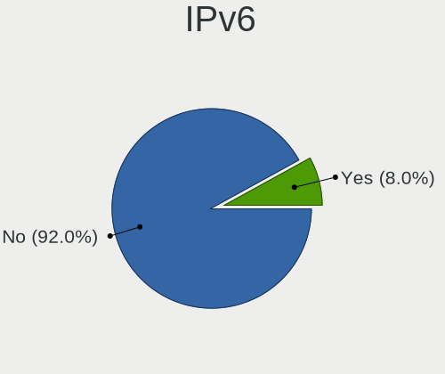

| Used | Computers | Percent |
|------|-----------|---------|
| No   | 63        | 92.65%  |
| Yes  | 5         | 7.35%   |

Bluetooth
---------

Bluetooth Vendor
----------------

Controller vendors

| Vendor                          | Computers | Percent |
|---------------------------------|-----------|---------|
| Intel                           | 19        | 48.72%  |
| Broadcom                        | 5         | 12.82%  |
| Realtek Semiconductor           | 3         | 7.69%   |
| Qualcomm Atheros Communications | 3         | 7.69%   |
| Lite-On Technology              | 2         | 5.13%   |
| IMC Networks                    | 2         | 5.13%   |
| Cambridge Silicon Radio         | 2         | 5.13%   |
| Apple                           | 2         | 5.13%   |
| Hewlett-Packard                 | 1         | 2.56%   |

Bluetooth Model
---------------

Controller models

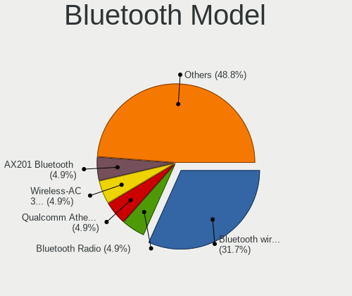

| Model                                               | Computers | Percent |
|-----------------------------------------------------|-----------|---------|
| Intel Bluetooth wireless interface                  | 13        | 33.33%  |
| Realtek Bluetooth Radio                             | 2         | 5.13%   |
| Qualcomm Atheros  Bluetooth Device                  | 2         | 5.13%   |
| Intel Bluetooth Device                              | 2         | 5.13%   |
| Intel AX200 Bluetooth                               | 2         | 5.13%   |
| Cambridge Silicon Radio Bluetooth Dongle (HCI mode) | 2         | 5.13%   |
| Realtek RTL8821A Bluetooth                          | 1         | 2.56%   |
| Qualcomm Atheros AR3012 Bluetooth 4.0               | 1         | 2.56%   |
| Lite-On Qualcomm Atheros QCA9377 Bluetooth          | 1         | 2.56%   |
| Lite-On Atheros AR3012 Bluetooth                    | 1         | 2.56%   |
| Intel Wireless-AC 9260 Bluetooth Adapter            | 1         | 2.56%   |
| Intel Wireless-AC 3168 Bluetooth                    | 1         | 2.56%   |
| IMC Networks Bluetooth Radio                        | 1         | 2.56%   |
| IMC Networks Bluetooth Device                       | 1         | 2.56%   |
| HP Bluetooth 2.0 Interface [Broadcom BCM2045]       | 1         | 2.56%   |
| Broadcom BCM43142A0 Bluetooth 4.0                   | 1         | 2.56%   |
| Broadcom BCM20702 Bluetooth 4.0 [ThinkPad]          | 1         | 2.56%   |
| Broadcom BCM2070 Bluetooth 2.1 + EDR                | 1         | 2.56%   |
| Broadcom BCM2045B (BDC-2.1)                         | 1         | 2.56%   |
| Broadcom BCM2045B (BDC-2) [Bluetooth Controller]    | 1         | 2.56%   |
| Apple Bluetooth USB Host Controller                 | 1         | 2.56%   |
| Apple Bluetooth Host Controller                     | 1         | 2.56%   |

Sound
-----

Sound Vendor
------------

Sound card vendors

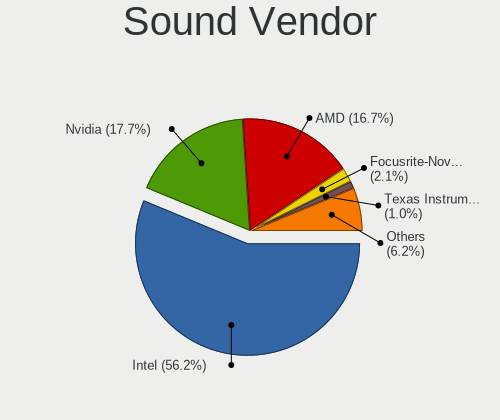

| Vendor              | Computers | Percent |
|---------------------|-----------|---------|
| Intel               | 49        | 55.68%  |
| Nvidia              | 16        | 18.18%  |
| AMD                 | 14        | 15.91%  |
| Focusrite-Novation  | 2         | 2.27%   |
| Texas Instruments   | 1         | 1.14%   |
| SteelSeries ApS     | 1         | 1.14%   |
| Mark of the Unicorn | 1         | 1.14%   |
| Kingston Technology | 1         | 1.14%   |
| JMTek               | 1         | 1.14%   |
| GN Netcom           | 1         | 1.14%   |
| Creative Labs       | 1         | 1.14%   |

Sound Model
-----------

Sound card models

| Model                                                                                             | Computers | Percent |
|---------------------------------------------------------------------------------------------------|-----------|---------|
| Intel Sunrise Point-LP HD Audio                                                                   | 7         | 6.67%   |
| Intel 7 Series/C216 Chipset Family High Definition Audio Controller                               | 6         | 5.71%   |
| Intel NM10/ICH7 Family High Definition Audio Controller                                           | 4         | 3.81%   |
| Intel Haswell-ULT HD Audio Controller                                                             | 4         | 3.81%   |
| Intel 8 Series HD Audio Controller                                                                | 4         | 3.81%   |
| AMD FCH Azalia Controller                                                                         | 4         | 3.81%   |
| Intel Xeon E3-1200 v3/4th Gen Core Processor HD Audio Controller                                  | 3         | 2.86%   |
| Intel 8 Series/C220 Series Chipset High Definition Audio Controller                               | 3         | 2.86%   |
| Intel 100 Series/C230 Series Chipset Family HD Audio Controller                                   | 3         | 2.86%   |
| AMD Kabini HDMI/DP Audio                                                                          | 3         | 2.86%   |
| Nvidia GK107 HDMI Audio Controller                                                                | 2         | 1.9%    |
| Intel Wildcat Point-LP High Definition Audio Controller                                           | 2         | 1.9%    |
| Intel Celeron/Pentium Silver Processor High Definition Audio                                      | 2         | 1.9%    |
| Intel Cannon Lake PCH cAVS                                                                        | 2         | 1.9%    |
| Intel Broadwell-U Audio Controller                                                                | 2         | 1.9%    |
| Intel Atom/Celeron/Pentium Processor x5-E8000/J3xxx/N3xxx Series High Definition Audio Controller | 2         | 1.9%    |
| Intel 82801H (ICH8 Family) HD Audio Controller                                                    | 2         | 1.9%    |
| Intel 6 Series/C200 Series Chipset Family High Definition Audio Controller                        | 2         | 1.9%    |
| AMD Starship/Matisse HD Audio Controller                                                          | 2         | 1.9%    |
| AMD Raven/Raven2/Fenghuang HDMI/DP Audio Controller                                               | 2         | 1.9%    |
| AMD Family 17h (Models 10h-1fh) HD Audio Controller                                               | 2         | 1.9%    |
| AMD Family 17h (Models 00h-0fh) HD Audio Controller                                               | 2         | 1.9%    |
| AMD Baffin HDMI/DP Audio [Radeon RX 550 640SP / RX 560/560X]                                      | 2         | 1.9%    |
| Texas Instruments PCM2704 16-bit stereo audio DAC                                                 | 1         | 0.95%   |
| SteelSeries ApS SteelSeries Arctis 7                                                              | 1         | 0.95%   |
| Nvidia TU116 High Definition Audio Controller                                                     | 1         | 0.95%   |
| Nvidia TU107 GeForce GTX 1650 High Definition Audio Controller                                    | 1         | 0.95%   |
| Nvidia TU106 High Definition Audio Controller                                                     | 1         | 0.95%   |
| Nvidia MCP89 High Definition Audio                                                                | 1         | 0.95%   |
| Nvidia MCP79 High Definition Audio                                                                | 1         | 0.95%   |
| Nvidia GT216 HDMI Audio Controller                                                                | 1         | 0.95%   |
| Nvidia GP107GL High Definition Audio Controller                                                   | 1         | 0.95%   |
| Nvidia GP106 High Definition Audio Controller                                                     | 1         | 0.95%   |
| Nvidia GP104 High Definition Audio Controller                                                     | 1         | 0.95%   |
| Nvidia GM206 High Definition Audio Controller                                                     | 1         | 0.95%   |
| Nvidia GM204 High Definition Audio Controller                                                     | 1         | 0.95%   |
| Nvidia GK208 HDMI/DP Audio Controller                                                             | 1         | 0.95%   |
| Nvidia GF119 HDMI Audio Controller                                                                | 1         | 0.95%   |
| Nvidia GF114 HDMI Audio Controller                                                                | 1         | 0.95%   |
| Mark of the Unicorn M Series                                                                      | 1         | 0.95%   |
| Kingston Technology HyperX 7.1 Audio                                                              | 1         | 0.95%   |
| JMTek USB PnP Audio Device                                                                        | 1         | 0.95%   |
| Intel Tiger Lake-LP Smart Sound Technology Audio Controller                                       | 1         | 0.95%   |
| Intel Tiger Lake-H HD Audio Controller                                                            | 1         | 0.95%   |
| Intel Ice Lake-LP Smart Sound Technology Audio Controller                                         | 1         | 0.95%   |
| Intel Comet Lake PCH cAVS                                                                         | 1         | 0.95%   |
| Intel CM238 HD Audio Controller                                                                   | 1         | 0.95%   |
| Intel Cannon Point-LP High Definition Audio Controller                                            | 1         | 0.95%   |
| Intel 9 Series Chipset Family HD Audio Controller                                                 | 1         | 0.95%   |
| Intel 82801I (ICH9 Family) HD Audio Controller                                                    | 1         | 0.95%   |
| Intel 5 Series/3400 Series Chipset High Definition Audio                                          | 1         | 0.95%   |
| GN Netcom Jabra Link 370                                                                          | 1         | 0.95%   |
| Focusrite-Novation Scarlett Solo USB                                                              | 1         | 0.95%   |
| Focusrite-Novation Scarlett 2i4 USB                                                               | 1         | 0.95%   |
| Creative Labs EMU20k2 [Sound Blaster X-Fi Titanium Series]                                        | 1         | 0.95%   |
| AMD SBx00 Azalia (Intel HDA)                                                                      | 1         | 0.95%   |
| AMD RV630 HDMI Audio [Radeon HD 2600 PRO/XT / HD 3610]                                            | 1         | 0.95%   |
| AMD Oland/Hainan/Cape Verde/Pitcairn HDMI Audio [Radeon HD 7000 Series]                           | 1         | 0.95%   |
| AMD Navi 10 HDMI Audio                                                                            | 1         | 0.95%   |
| AMD Ellesmere HDMI Audio [Radeon RX 470/480 / 570/580/590]                                        | 1         | 0.95%   |

Memory
------

Memory Vendor
-------------

Memory module vendors

| Vendor              | Computers | Percent |
|---------------------|-----------|---------|
| SK Hynix            | 15        | 19.23%  |
| Samsung Electronics | 12        | 15.38%  |
| Micron Technology   | 9         | 11.54%  |
| Kingston            | 9         | 11.54%  |
| Unknown             | 7         | 8.97%   |
| Crucial             | 6         | 7.69%   |
| Corsair             | 6         | 7.69%   |
| Ramaxel Technology  | 3         | 3.85%   |
| Nanya Technology    | 3         | 3.85%   |
| Unknown (ABCD)      | 1         | 1.28%   |
| Transcend           | 1         | 1.28%   |
| Teikon              | 1         | 1.28%   |
| Smart               | 1         | 1.28%   |
| PNY                 | 1         | 1.28%   |
| G.Skill             | 1         | 1.28%   |
| Elpida              | 1         | 1.28%   |
| A-DATA Technology   | 1         | 1.28%   |

Memory Model
------------

Memory module models

| Model                                                               | Computers | Percent |
|---------------------------------------------------------------------|-----------|---------|
| SK Hynix RAM HMT851S6AMR6A-PB 4096MB Chip DDR3 1600MT/s             | 2         | 2.38%   |
| SK Hynix RAM HMT351U6CFR8C-PB 4GB DIMM DDR3 1800MT/s                | 2         | 2.38%   |
| Crucial RAM CT102464BF160B.C16 8GB SODIMM DDR3 1600MT/s             | 2         | 2.38%   |
| Unknown RAM Module 8192MB DIMM DDR4 2133MT/s                        | 1         | 1.19%   |
| Unknown RAM Module 512MB DIMM SDRAM                                 | 1         | 1.19%   |
| Unknown RAM Module 4096MB DIMM DDR3 1333MT/s                        | 1         | 1.19%   |
| Unknown RAM Module 2048MB SODIMM DDR3 1333MT/s                      | 1         | 1.19%   |
| Unknown RAM Module 2048MB SODIMM DDR2                               | 1         | 1.19%   |
| Unknown RAM Module 2048MB DIMM DDR 667MT/s                          | 1         | 1.19%   |
| Unknown RAM Module 1024MB SODIMM DDR2                               | 1         | 1.19%   |
| Unknown RAM Module 1024MB DIMM SDRAM                                | 1         | 1.19%   |
| Unknown (ABCD) RAM 123456789012345678 2GB SODIMM DDR4 2400MT/s      | 1         | 1.19%   |
| Transcend RAM JM1333KSN-4G 4GB SODIMM DDR3 1334MT/s                 | 1         | 1.19%   |
| Teikon RAM TMT451S6BFR8A-PBHJ 4GB SODIMM DDR3 1600MT/s              | 1         | 1.19%   |
| Smart RAM SH564128FJ8NWRNSQR 4GB SODIMM DDR3 1600MT/s               | 1         | 1.19%   |
| SK Hynix RAM Module 2048MB SODIMM DDR3 800MT/s                      | 1         | 1.19%   |
| SK Hynix RAM Module 16384MB SODIMM DDR4 2667MT/s                    | 1         | 1.19%   |
| SK Hynix RAM HMT451S6BFR8A-PB 4GB SODIMM DDR3 1600MT/s              | 1         | 1.19%   |
| SK Hynix RAM HMT41GS6AFR8A-PB 8GB SODIMM DDR3 1600MT/s              | 1         | 1.19%   |
| SK Hynix RAM HMT351U7EFR8C-PB 4096MB DIMM DDR3 1600MT/s             | 1         | 1.19%   |
| SK Hynix RAM HMT351U6EFR8C-PB 4096MB DIMM DDR3 1800MT/s             | 1         | 1.19%   |
| SK Hynix RAM HMT351S6CFR8C-PB 4GB SODIMM DDR3 1600MT/s              | 1         | 1.19%   |
| SK Hynix RAM HMT325S6BFR8C-H9 2GB SODIMM DDR3 1334MT/s              | 1         | 1.19%   |
| SK Hynix RAM HMT325S6BFR8C-H9 2GB SODIMM DDR3 1333MT/s              | 1         | 1.19%   |
| SK Hynix RAM HMT125S6BFR8C-H9 2GB SODIMM DDR3 1333MT/s              | 1         | 1.19%   |
| SK Hynix RAM H9CCNNNCLGALAR-NVD 8GB Row Of Chips LPDDR3 2133MT/s    | 1         | 1.19%   |
| SK Hynix RAM H9CCNNNBJTALAR-NUD 4096MB Row Of Chips LPDDR3 1867MT/s | 1         | 1.19%   |
| SK Hynix RAM H5AN8G6NCJR-XNC 4096MB SODIMM DDR4 3200MT/s            | 1         | 1.19%   |
| Samsung RAM Module 2048MB SODIMM DDR2 533MT/s                       | 1         | 1.19%   |
| Samsung RAM M471B5674QH0-YK0 2GB SODIMM DDR3 1600MT/s               | 1         | 1.19%   |
| Samsung RAM M471B5674EB0-YK0 2048MB SODIMM DDR3 1600MT/s            | 1         | 1.19%   |
| Samsung RAM M471B5673FH0-CF8 2GB SODIMM 1067MT/s                    | 1         | 1.19%   |
| Samsung RAM M471B5273DH0-CH9 4096MB SODIMM DDR3 1334MT/s            | 1         | 1.19%   |
| Samsung RAM M471B5273CH0-CH9 4096MB SODIMM DDR3 1334MT/s            | 1         | 1.19%   |
| Samsung RAM M471B5173QH0-YK0 4096MB SODIMM DDR3 1600MT/s            | 1         | 1.19%   |
| Samsung RAM M471B1G73DB0-YK0 8GB SODIMM DDR3 1600MT/s               | 1         | 1.19%   |
| Samsung RAM M471A5244CB0-CRC 4GB SODIMM DDR4 2667MT/s               | 1         | 1.19%   |
| Samsung RAM M471A2K43CB1-CRC 16GB SODIMM DDR4 2667MT/s              | 1         | 1.19%   |
| Samsung RAM M471A2K43BB1-CPB 16GB SODIMM DDR4 2133MT/s              | 1         | 1.19%   |
| Samsung RAM M471A1K43CB1-CRC 8GB SODIMM DDR4 2667MT/s               | 1         | 1.19%   |
| Samsung RAM M391B5273DH0-YK0 4096MB DIMM DDR3 1600MT/s              | 1         | 1.19%   |
| Ramaxel RAM RMT3150ED58E8W1600 2048MB SODIMM DDR3 1600MT/s          | 1         | 1.19%   |
| Ramaxel RAM RMSA3300ME78HBF-2666 16384MB SODIMM DDR4 2667MT/s       | 1         | 1.19%   |
| Ramaxel RAM RMSA3260ME78HAF-2666 8GB SODIMM DDR4 2667MT/s           | 1         | 1.19%   |
| PNY RAM 16GF2X08QFHH36-135-K 16GB DIMM DDR4 3200MT/s                | 1         | 1.19%   |
| Nanya RAM NT4GC64B8HG0NF-DI 4GB DIMM DDR3 1600MT/s                  | 1         | 1.19%   |
| Nanya RAM NT2GC64B88B0NS-CG 2GB SODIMM DDR3 1334MT/s                | 1         | 1.19%   |
| Nanya RAM NT1GT64UH8D0FN-3C 1024MB SODIMM DDR2 667MT/s              | 1         | 1.19%   |
| Micron RAM Module 4GB SODIMM DDR3 1067MT/s                          | 1         | 1.19%   |
| Micron RAM Module 4096MB SODIMM DDR4 2400MT/s                       | 1         | 1.19%   |
| Micron RAM Module 4096MB SODIMM DDR3 1600MT/s                       | 1         | 1.19%   |
| Micron RAM Module 1024MB SODIMM DDR3 1067MT/s                       | 1         | 1.19%   |
| Micron RAM 8ATF1G64HZ-2G3E1 8192MB SODIMM DDR4 2400MT/s             | 1         | 1.19%   |
| Micron RAM 4ATF51264HZ-3G2J1 4GB Row Of Chips DDR4 3200MT/s         | 1         | 1.19%   |
| Micron RAM 4ATF51264HZ-2G3E1 4096MB SODIMM DDR4 2667MT/s            | 1         | 1.19%   |
| Micron RAM 4ATF1G64HZ-3G2E1 8192MB Row Of Chips DDR4 3200MT/s       | 1         | 1.19%   |
| Micron RAM 16KTF1G64HZ-1G6E1 8192MB SODIMM DDR3 1600MT/s            | 1         | 1.19%   |
| Micron RAM 16JTF51264AZ-1G6M1 4GB DIMM DDR3 1600MT/s                | 1         | 1.19%   |
| Kingston RAM KR1P74-HYC 4096MB DIMM DDR3 1333MT/s                   | 1         | 1.19%   |
| Kingston RAM KNWMX1-ETB 4GB SODIMM DDR3 1600MT/s                    | 1         | 1.19%   |

Memory Kind
-----------

Memory module kinds

| Kind   | Computers | Percent |
|--------|-----------|---------|
| DDR3   | 33        | 50%     |
| DDR4   | 23        | 34.85%  |
| DDR2   | 4         | 6.06%   |
| LPDDR3 | 3         | 4.55%   |
| SDRAM  | 1         | 1.52%   |
| LPDDR4 | 1         | 1.52%   |
| DDR    | 1         | 1.52%   |

Memory Form Factor
------------------

Physical design of the memory module

| Name         | Computers | Percent |
|--------------|-----------|---------|
| SODIMM       | 44        | 64.71%  |
| DIMM         | 19        | 27.94%  |
| Row Of Chips | 3         | 4.41%   |
| Chip         | 2         | 2.94%   |

Memory Size
-----------

Memory module size

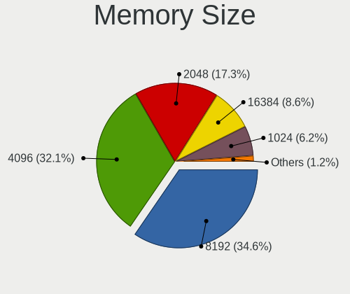

| Size  | Computers | Percent |
|-------|-----------|---------|
| 4096  | 26        | 35.14%  |
| 8192  | 23        | 31.08%  |
| 2048  | 14        | 18.92%  |
| 16384 | 6         | 8.11%   |
| 1024  | 4         | 5.41%   |
| 512   | 1         | 1.35%   |

Memory Speed
------------

Memory module speed

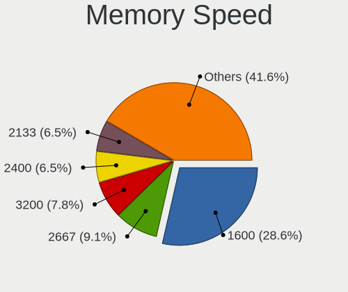

| Speed   | Computers | Percent |
|---------|-----------|---------|
| 1600    | 21        | 30%     |
| 2667    | 7         | 10%     |
| 2133    | 5         | 7.14%   |
| 3200    | 4         | 5.71%   |
| 2400    | 4         | 5.71%   |
| 1334    | 4         | 5.71%   |
| 1333    | 4         | 5.71%   |
| 1067    | 3         | 4.29%   |
| Unknown | 3         | 4.29%   |
| 3000    | 2         | 2.86%   |
| 2933    | 2         | 2.86%   |
| 1800    | 2         | 2.86%   |
| 667     | 2         | 2.86%   |
| 3600    | 1         | 1.43%   |
| 3466    | 1         | 1.43%   |
| 3266    | 1         | 1.43%   |
| 3100    | 1         | 1.43%   |
| 1867    | 1         | 1.43%   |
| 800     | 1         | 1.43%   |
| 533     | 1         | 1.43%   |

Printers & scanners
-------------------

Printer Vendor
--------------

Printer device vendors

| Vendor                | Computers | Percent |
|-----------------------|-----------|---------|
| Lexmark International | 1         | 50%     |
| Brother Industries    | 1         | 50%     |

Printer Model
-------------

Printer device models

| Model                         | Computers | Percent |
|-------------------------------|-----------|---------|
| Lexmark International CS417dn | 1         | 50%     |
| Brother DCP-L2540DW           | 1         | 50%     |

Scanner Vendor
--------------

Scanner device vendors

Zero info for selected period =(

Scanner Model
-------------

Scanner device models

Zero info for selected period =(

Camera
------

Camera Vendor
-------------

Camera device vendors

| Vendor                                 | Computers | Percent |
|----------------------------------------|-----------|---------|
| Chicony Electronics                    | 8         | 22.22%  |
| Acer                                   | 7         | 19.44%  |
| Realtek Semiconductor                  | 4         | 11.11%  |
| Quanta                                 | 3         | 8.33%   |
| Sunplus Innovation Technology          | 2         | 5.56%   |
| Lite-On Technology                     | 2         | 5.56%   |
| IMC Networks                           | 2         | 5.56%   |
| Cheng Uei Precision Industry (Foxlink) | 2         | 5.56%   |
| Suyin                                  | 1         | 2.78%   |
| Sunplus Technology                     | 1         | 2.78%   |
| Luxvisions Innotech Limited            | 1         | 2.78%   |
| Lenovo                                 | 1         | 2.78%   |
| GEMBIRD                                | 1         | 2.78%   |
| Apple                                  | 1         | 2.78%   |

Camera Model
------------

Camera device models

| Model                                                       | Computers | Percent |
|-------------------------------------------------------------|-----------|---------|
| Chicony Integrated Camera                                   | 3         | 8.33%   |
| Realtek USB Camera                                          | 2         | 5.56%   |
| Quanta VGA WebCam                                           | 2         | 5.56%   |
| Lite-On Integrated Camera                                   | 2         | 5.56%   |
| Acer Integrated Camera                                      | 2         | 5.56%   |
| Suyin 1.3M WebCam (notebook emachines E730, Acer sub-brand) | 1         | 2.78%   |
| Sunplus SPCA1527A/SPCA1528 SD card camera (webcam mode)     | 1         | 2.78%   |
| Sunplus Laptop_Integrated_Webcam_HD                         | 1         | 2.78%   |
| Sunplus Integrated_Webcam_HD                                | 1         | 2.78%   |
| Realtek Integrated_Webcam_HD                                | 1         | 2.78%   |
| Realtek HD WebCam                                           | 1         | 2.78%   |
| Quanta HP Wide Vision FHD Camera                            | 1         | 2.78%   |
| Luxvisions Innotech Limited HP Wide Vision HD Camera        | 1         | 2.78%   |
| Lenovo Integrated Webcam                                    | 1         | 2.78%   |
| IMC Networks USB2.0 VGA UVC WebCam                          | 1         | 2.78%   |
| IMC Networks USB2.0 HD UVC WebCam                           | 1         | 2.78%   |
| GEMBIRD Generic UVC 1.00 camera [AppoTech AX2311]           | 1         | 2.78%   |
| Chicony Webcam                                              | 1         | 2.78%   |
| Chicony USB 2.0 Camera                                      | 1         | 2.78%   |
| Chicony Integrated Camera (1280x720@30)                     | 1         | 2.78%   |
| Chicony HP Truevision HD                                    | 1         | 2.78%   |
| Chicony HP Full-HD Camera                                   | 1         | 2.78%   |
| Cheng Uei Precision Industry (Foxlink) Webcam               | 1         | 2.78%   |
| Cheng Uei Precision Industry (Foxlink) HP TrueVision HD     | 1         | 2.78%   |
| Apple Built-in iSight                                       | 1         | 2.78%   |
| Acer Lenovo Integrated Webcam                               | 1         | 2.78%   |
| Acer Lenovo EasyCamera                                      | 1         | 2.78%   |
| Acer HP Webcam                                              | 1         | 2.78%   |
| Acer EasyCamera                                             | 1         | 2.78%   |
| Acer BisonCam, NB Pro                                       | 1         | 2.78%   |

Security
--------

Fingerprint Vendor
------------------

Fingerprint sensor vendors

| Vendor                     | Computers | Percent |
|----------------------------|-----------|---------|
| Validity Sensors           | 3         | 30%     |
| Synaptics                  | 3         | 30%     |
| Upek                       | 1         | 10%     |
| STMicroelectronics         | 1         | 10%     |
| Shenzhen Goodix Technology | 1         | 10%     |
| AuthenTec                  | 1         | 10%     |

Fingerprint Model
-----------------

Fingerprint sensor models

| Model                                                      | Computers | Percent |
|------------------------------------------------------------|-----------|---------|
| Validity Sensors Synaptics WBDI                            | 2         | 20%     |
| Validity Sensors VFS 5011 fingerprint sensor               | 1         | 10%     |
| Upek Biometric Touchchip/Touchstrip Fingerprint Sensor     | 1         | 10%     |
| Synaptics  VFS7552 Touch Fingerprint Sensor with PurePrint | 1         | 10%     |
| Synaptics Metallica MOH Touch Fingerprint Reader           | 1         | 10%     |
| STMicroelectronics Fingerprint Reader                      | 1         | 10%     |
| Shenzhen Goodix Fingerprint Reader                         | 1         | 10%     |
| AuthenTec AES2501 Fingerprint Sensor                       | 1         | 10%     |
| Unknown                                                    | 1         | 10%     |

Chipcard Vendor
---------------

Chipcard module vendors

| Vendor      | Computers | Percent |
|-------------|-----------|---------|
| Lenovo      | 2         | 50%     |
| Broadcom    | 1         | 25%     |
| Alcor Micro | 1         | 25%     |

Chipcard Model
--------------

Chipcard module models

| Model                                          | Computers | Percent |
|------------------------------------------------|-----------|---------|
| Lenovo Integrated Smart Card Reader            | 2         | 50%     |
| Broadcom BCM5880 Secure Applications Processor | 1         | 25%     |
| Alcor Micro AU9540 Smartcard Reader            | 1         | 25%     |

Unsupported
-----------

Unsupported Devices
-------------------

Total unsupported devices on board

| Total | Computers | Percent |
|-------|-----------|---------|
| 0     | 48        | 71.64%  |
| 1     | 13        | 19.4%   |
| 2     | 6         | 8.96%   |

Unsupported Device Types
------------------------

Types of unsupported devices

| Type                     | Computers | Percent |
|--------------------------|-----------|---------|
| Fingerprint reader       | 10        | 40%     |
| Graphics card            | 9         | 36%     |
| Chipcard                 | 4         | 16%     |
| Multimedia controller    | 1         | 4%      |
| Communication controller | 1         | 4%      |

