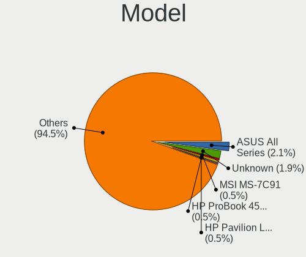
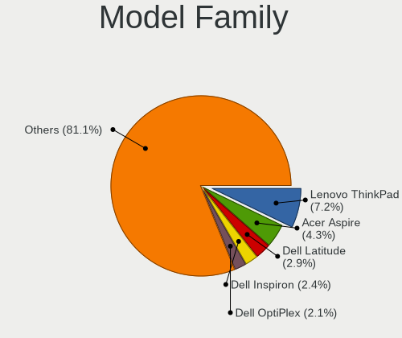
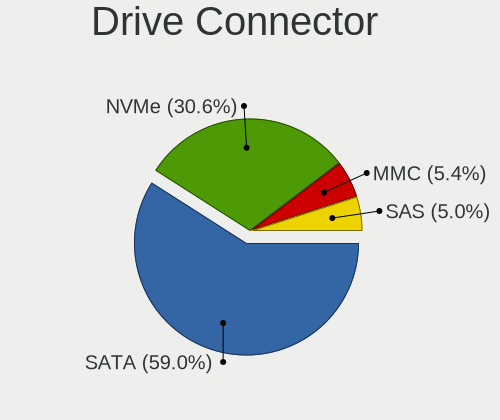
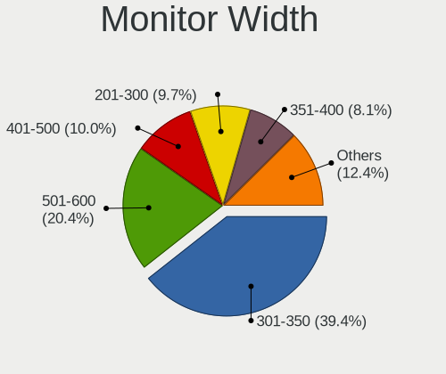
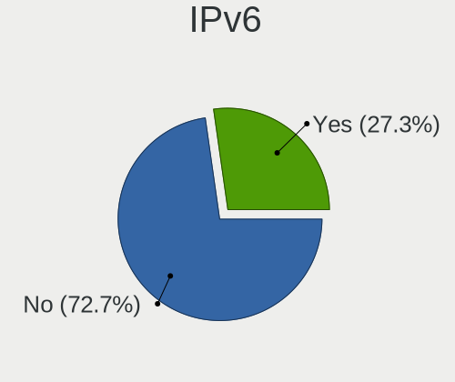

MX 21 - Tested Hardware & Statistics
------------------------------------

A project to collect tested hardware configurations for MX 21.

Anyone can contribute to this report by the [hw-probe](https://github.com/linuxhw/hw-probe) tool:

    sudo -E hw-probe -all -upload

Please submit a probe of your configuration if it's not presented on the page or is rare.

This is a report for all computer types. See also reports for [desktops](/Dist/MX_21/Desktop/README.md) and [notebooks](/Dist/MX_21/Notebook/README.md).

Full-feature report is available here: https://linux-hardware.org/?view=trends

Contents
--------

* [ Test Cases ](#test-cases)

* [ System ](#system)
  - [ Kernel                   ](#kernel)
  - [ Kernel Family            ](#kernel-family)
  - [ Kernel Major Ver.        ](#kernel-major-ver)
  - [ Arch                     ](#arch)
  - [ DE                       ](#de)
  - [ Display Server           ](#display-server)
  - [ Display Manager          ](#display-manager)
  - [ OS Lang                  ](#os-lang)
  - [ Boot Mode                ](#boot-mode)
  - [ Filesystem               ](#filesystem)
  - [ Part. scheme             ](#part-scheme)
  - [ Dual Boot with Linux/BSD ](#dual-boot-with-linuxbsd)
  - [ Dual Boot (Win)          ](#dual-boot-win)

* [ Board ](#board)
  - [ Vendor                   ](#vendor)
  - [ Model                    ](#model)
  - [ Model Family             ](#model-family)
  - [ MFG Year                 ](#mfg-year)
  - [ Form Factor              ](#form-factor)
  - [ Secure Boot              ](#secure-boot)
  - [ Coreboot                 ](#coreboot)
  - [ RAM Size                 ](#ram-size)
  - [ RAM Used                 ](#ram-used)
  - [ Total Drives             ](#total-drives)
  - [ Has CD-ROM               ](#has-cd-rom)
  - [ Has Ethernet             ](#has-ethernet)
  - [ Has WiFi                 ](#has-wifi)
  - [ Has Bluetooth            ](#has-bluetooth)

* [ Location ](#location)
  - [ Country                  ](#country)
  - [ City                     ](#city)

* [ Drives ](#drives)
  - [ Drive Vendor             ](#drive-vendor)
  - [ Drive Model              ](#drive-model)
  - [ HDD Vendor               ](#hdd-vendor)
  - [ SSD Vendor               ](#ssd-vendor)
  - [ Drive Kind               ](#drive-kind)
  - [ Drive Connector          ](#drive-connector)
  - [ Drive Size               ](#drive-size)
  - [ Space Total              ](#space-total)
  - [ Space Used               ](#space-used)
  - [ Malfunc. Drives          ](#malfunc-drives)
  - [ Malfunc. Drive Vendor    ](#malfunc-drive-vendor)
  - [ Malfunc. HDD Vendor      ](#malfunc-hdd-vendor)
  - [ Malfunc. Drive Kind      ](#malfunc-drive-kind)
  - [ Failed Drives            ](#failed-drives)
  - [ Failed Drive Vendor      ](#failed-drive-vendor)
  - [ Drive Status             ](#drive-status)

* [ Storage controller ](#storage-controller)
  - [ Storage Vendor           ](#storage-vendor)
  - [ Storage Model            ](#storage-model)
  - [ Storage Kind             ](#storage-kind)

* [ Processor ](#processor)
  - [ CPU Vendor               ](#cpu-vendor)
  - [ CPU Model                ](#cpu-model)
  - [ CPU Model Family         ](#cpu-model-family)
  - [ CPU Cores                ](#cpu-cores)
  - [ CPU Sockets              ](#cpu-sockets)
  - [ CPU Threads              ](#cpu-threads)
  - [ CPU Op-Modes             ](#cpu-op-modes)
  - [ CPU Microcode            ](#cpu-microcode)
  - [ CPU Microarch            ](#cpu-microarch)

* [ Graphics ](#graphics)
  - [ GPU Vendor               ](#gpu-vendor)
  - [ GPU Model                ](#gpu-model)
  - [ GPU Combo                ](#gpu-combo)
  - [ GPU Driver               ](#gpu-driver)
  - [ GPU Memory               ](#gpu-memory)

* [ Monitor ](#monitor)
  - [ Monitor Vendor           ](#monitor-vendor)
  - [ Monitor Model            ](#monitor-model)
  - [ Monitor Resolution       ](#monitor-resolution)
  - [ Monitor Diagonal         ](#monitor-diagonal)
  - [ Monitor Width            ](#monitor-width)
  - [ Aspect Ratio             ](#aspect-ratio)
  - [ Monitor Area             ](#monitor-area)
  - [ Pixel Density            ](#pixel-density)
  - [ Multiple Monitors        ](#multiple-monitors)

* [ Network ](#network)
  - [ Net Controller Vendor    ](#net-controller-vendor)
  - [ Net Controller Model     ](#net-controller-model)
  - [ Wireless Vendor          ](#wireless-vendor)
  - [ Wireless Model           ](#wireless-model)
  - [ Ethernet Vendor          ](#ethernet-vendor)
  - [ Ethernet Model           ](#ethernet-model)
  - [ Net Controller Kind      ](#net-controller-kind)
  - [ Used Controller          ](#used-controller)
  - [ NICs                     ](#nics)
  - [ IPv6                     ](#ipv6)

* [ Bluetooth ](#bluetooth)
  - [ Bluetooth Vendor         ](#bluetooth-vendor)
  - [ Bluetooth Model          ](#bluetooth-model)

* [ Sound ](#sound)
  - [ Sound Vendor             ](#sound-vendor)
  - [ Sound Model              ](#sound-model)

* [ Memory ](#memory)
  - [ Memory Vendor            ](#memory-vendor)
  - [ Memory Model             ](#memory-model)
  - [ Memory Kind              ](#memory-kind)
  - [ Memory Form Factor       ](#memory-form-factor)
  - [ Memory Size              ](#memory-size)
  - [ Memory Speed             ](#memory-speed)

* [ Printers & scanners ](#printers--scanners)
  - [ Printer Vendor           ](#printer-vendor)
  - [ Printer Model            ](#printer-model)
  - [ Scanner Vendor           ](#scanner-vendor)
  - [ Scanner Model            ](#scanner-model)

* [ Camera ](#camera)
  - [ Camera Vendor            ](#camera-vendor)
  - [ Camera Model             ](#camera-model)

* [ Security ](#security)
  - [ Fingerprint Vendor       ](#fingerprint-vendor)
  - [ Fingerprint Model        ](#fingerprint-model)
  - [ Chipcard Vendor          ](#chipcard-vendor)
  - [ Chipcard Model           ](#chipcard-model)

* [ Unsupported ](#unsupported)
  - [ Unsupported Devices      ](#unsupported-devices)
  - [ Unsupported Device Types ](#unsupported-device-types)

Test Cases
----------

| Vendor        | Model                       | Form-Factor | Probe                                                      | Date         |
|---------------|-----------------------------|-------------|------------------------------------------------------------|--------------|
| HP            | Spectre x360 Convertible... | Convertible | [7cc374183b](https://linux-hardware.org/?probe=7cc374183b) | Dec 30, 2021 |
| Dell          | Latitude 3190               | Notebook    | [67cba6d321](https://linux-hardware.org/?probe=67cba6d321) | Dec 27, 2021 |
| Lenovo        | IdeaPad Y700-15ISK 80NV     | Notebook    | [4fe24b4f44](https://linux-hardware.org/?probe=4fe24b4f44) | Dec 26, 2021 |
| Intel         | NUC10i7FNB K61360-302       | Mini pc     | [9147191a67](https://linux-hardware.org/?probe=9147191a67) | Dec 24, 2021 |
| ASUSTek       | X550CC                      | Notebook    | [b0cde813b9](https://linux-hardware.org/?probe=b0cde813b9) | Dec 23, 2021 |
| Dell          | Latitude 3190               | Notebook    | [1a96380872](https://linux-hardware.org/?probe=1a96380872) | Dec 20, 2021 |
| Fujitsu       | D3221-A1 S26361-D3221-A1    | Desktop     | [78d4e04363](https://linux-hardware.org/?probe=78d4e04363) | Dec 16, 2021 |
| Samsung       | 340XAA/350XAA/550XAA        | Notebook    | [49692045a2](https://linux-hardware.org/?probe=49692045a2) | Dec 16, 2021 |
| Dell          | Latitude 3190               | Notebook    | [5321909b8c](https://linux-hardware.org/?probe=5321909b8c) | Dec 13, 2021 |
| Dell          | Latitude 3190               | Notebook    | [9c532278f1](https://linux-hardware.org/?probe=9c532278f1) | Dec 06, 2021 |
| ASUSTek       | ASUS TUF Gaming A15 FA50... | Notebook    | [21180cbdad](https://linux-hardware.org/?probe=21180cbdad) | Dec 04, 2021 |
| GALAX         | B550M                       | Desktop     | [a6866c8a45](https://linux-hardware.org/?probe=a6866c8a45) | Dec 04, 2021 |
| Lenovo        | Yoga 7 14ITL5 82BH          | Convertible | [bc8359d097](https://linux-hardware.org/?probe=bc8359d097) | Dec 01, 2021 |
| Lenovo        | B590 20208                  | Notebook    | [ed08d6bdd9](https://linux-hardware.org/?probe=ed08d6bdd9) | Nov 30, 2021 |
| Dell          | Latitude 3190               | Notebook    | [700dd2459e](https://linux-hardware.org/?probe=700dd2459e) | Nov 29, 2021 |
| Lenovo        | ThinkBook 13s-IWL 20R9      | Notebook    | [649434f9b8](https://linux-hardware.org/?probe=649434f9b8) | Nov 23, 2021 |
| Dell          | Latitude 3190               | Notebook    | [7f020f1d1f](https://linux-hardware.org/?probe=7f020f1d1f) | Nov 22, 2021 |
| Apple         | Mac-942B5BF58194151B        | All in one  | [bb58f4914e](https://linux-hardware.org/?probe=bb58f4914e) | Nov 21, 2021 |
| ASUSTek       | N53SN                       | Notebook    | [67d66feb3e](https://linux-hardware.org/?probe=67d66feb3e) | Nov 20, 2021 |
| Dell          | Latitude 3190               | Notebook    | [f24ac635ba](https://linux-hardware.org/?probe=f24ac635ba) | Nov 15, 2021 |
| ASUSTek       | TUF Gaming FX505DT_FX505... | Notebook    | [791ae651bb](https://linux-hardware.org/?probe=791ae651bb) | Nov 14, 2021 |
| ASUSTek       | TUF Gaming FX505DT_FX505... | Notebook    | [b105aaabf5](https://linux-hardware.org/?probe=b105aaabf5) | Nov 14, 2021 |
| Lenovo        | SHARKBAY NO DPK             | Desktop     | [fd5f409df8](https://linux-hardware.org/?probe=fd5f409df8) | Nov 14, 2021 |
| Lenovo        | SHARKBAY NO DPK             | Desktop     | [a85cc99f78](https://linux-hardware.org/?probe=a85cc99f78) | Nov 14, 2021 |
| HP            | Compaq Presario CQ60        | Notebook    | [9d83baca33](https://linux-hardware.org/?probe=9d83baca33) | Nov 12, 2021 |
| Lenovo        | ThinkPad E15 Gen 3 20YG0... | Notebook    | [c277967769](https://linux-hardware.org/?probe=c277967769) | Nov 11, 2021 |
| ASRock        | X570 Steel Legend           | Desktop     | [18391015f7](https://linux-hardware.org/?probe=18391015f7) | Nov 11, 2021 |
| Apple         | MacBook3,1                  | Notebook    | [25964b9256](https://linux-hardware.org/?probe=25964b9256) | Nov 08, 2021 |
| HP            | EliteBook 850 G3            | Notebook    | [cd26ab6e8f](https://linux-hardware.org/?probe=cd26ab6e8f) | Nov 05, 2021 |
| Dell          | Latitude 3190               | Notebook    | [592b613273](https://linux-hardware.org/?probe=592b613273) | Nov 01, 2021 |
| Gigabyte      | X570 AORUS PRO              | Desktop     | [fbd2076eee](https://linux-hardware.org/?probe=fbd2076eee) | Oct 28, 2021 |
| ASUSTek       | E402MA                      | Notebook    | [4c2453c6a2](https://linux-hardware.org/?probe=4c2453c6a2) | Oct 26, 2021 |
| Sony          | VPCEC3S1E                   | Notebook    | [2af79ba873](https://linux-hardware.org/?probe=2af79ba873) | Oct 25, 2021 |
| Gigabyte      | B550M DS3H                  | Desktop     | [ee6a141211](https://linux-hardware.org/?probe=ee6a141211) | Oct 19, 2021 |
| Fujitsu Si... | ESPRIMO Mobile D9500        | Notebook    | [ee6fdf4608](https://linux-hardware.org/?probe=ee6fdf4608) | Oct 18, 2021 |
| Chuwi         | GemiBook Pro                | Notebook    | [f8735054b4](https://linux-hardware.org/?probe=f8735054b4) | Sep 02, 2021 |
| Gigabyte      | A320M-S2H V2-CF             | Desktop     | [5d136cb09b](https://linux-hardware.org/?probe=5d136cb09b) | Aug 13, 2021 |
| Samsung       | 350V5C/351V5C/3540VC/344... | Notebook    | [c4ebb4c114](https://linux-hardware.org/?probe=c4ebb4c114) | Jun 04, 2021 |

System
------

Kernel
------

Version of the Linux kernel

| Version                | Computers | Percent |
|------------------------|-----------|---------|
| 5.10.0-9-amd64         | 14        | 51.85%  |
| 5.14.0-4mx-amd64       | 4         | 14.81%  |
| 5.14.0-3mx-amd64       | 2         | 7.41%   |
| 5.10.0-8-amd64         | 2         | 7.41%   |
| 5.10.0-10-amd64        | 2         | 7.41%   |
| 5.16.0-rc5-hwmon-next+ | 1         | 3.7%    |
| 5.14.0-2mx-amd64       | 1         | 3.7%    |
| 5.10.0-5mx-amd64       | 1         | 3.7%    |

Kernel Family
-------------

Linux kernel without a distro release

| Version | Computers | Percent |
|---------|-----------|---------|
| 5.10.0  | 19        | 70.37%  |
| 5.14.0  | 7         | 25.93%  |
| 5.16.0  | 1         | 3.7%    |

Kernel Major Ver.
-----------------

Linux kernel major version

| Version | Computers | Percent |
|---------|-----------|---------|
| 5.10    | 19        | 70.37%  |
| 5.14    | 7         | 25.93%  |
| 5.16    | 1         | 3.7%    |

Arch
----

OS architecture (x86_64, i586, etc.)

| Name   | Computers | Percent |
|--------|-----------|---------|
| x86_64 | 27        | 100%    |

DE
--

Desktop Environment

| Name   | Computers | Percent |
|--------|-----------|---------|
| XFCE   | 16        | 59.26%  |
| KDE5   | 9         | 33.33%  |
| GNOME  | 1         | 3.7%    |
| Budgie | 1         | 3.7%    |

Display Server
--------------

X11 or Wayland

| Name | Computers | Percent |
|------|-----------|---------|
| X11  | 27        | 100%    |

Display Manager
---------------

SDDM, LightDM, etc.

| Name    | Computers | Percent |
|---------|-----------|---------|
| LightDM | 18        | 66.67%  |
| SDDM    | 9         | 33.33%  |

OS Lang
-------

Language

| Lang    | Computers | Percent |
|---------|-----------|---------|
| en_US   | 13        | 48.15%  |
| it_IT   | 2         | 7.41%   |
| de_DE   | 2         | 7.41%   |
| de_CH   | 2         | 7.41%   |
| Unknown | 2         | 7.41%   |
| tr_TR   | 1         | 3.7%    |
| sk_SK   | 1         | 3.7%    |
| ru_RU   | 1         | 3.7%    |
| pt_BR   | 1         | 3.7%    |
| fr_FR   | 1         | 3.7%    |
| en_GB   | 1         | 3.7%    |

Boot Mode
---------

EFI or BIOS

| Mode | Computers | Percent |
|------|-----------|---------|
| EFI  | 21        | 77.78%  |
| BIOS | 6         | 22.22%  |

Filesystem
----------

Type of filesystem

| Type    | Computers | Percent |
|---------|-----------|---------|
| Ext4    | 22        | 81.48%  |
| Overlay | 3         | 11.11%  |
| F2fs    | 1         | 3.7%    |
| Btrfs   | 1         | 3.7%    |

Part. scheme
------------

Scheme of partitioning

| Type | Computers | Percent |
|------|-----------|---------|
| GPT  | 23        | 85.19%  |
| MBR  | 4         | 14.81%  |

Dual Boot with Linux/BSD
------------------------

Hosting more than one Linux/BSD

| Dual boot | Computers | Percent |
|-----------|-----------|---------|
| No        | 16        | 59.26%  |
| Yes       | 11        | 40.74%  |

Dual Boot (Win)
---------------

Hosting Linux and Windows

| Dual boot | Computers | Percent |
|-----------|-----------|---------|
| Yes       | 14        | 51.85%  |
| No        | 13        | 48.15%  |

Board
-----

Vendor
------

Motherboard manufacturer

| Name                | Computers | Percent |
|---------------------|-----------|---------|
| Lenovo              | 6         | 22.22%  |
| ASUSTek Computer    | 5         | 18.52%  |
| Hewlett-Packard     | 3         | 11.11%  |
| Samsung Electronics | 2         | 7.41%   |
| Gigabyte Technology | 2         | 7.41%   |
| Apple               | 2         | 7.41%   |
| Sony                | 1         | 3.7%    |
| GALAX               | 1         | 3.7%    |
| Fujitsu Siemens     | 1         | 3.7%    |
| Fujitsu             | 1         | 3.7%    |
| Dell                | 1         | 3.7%    |
| Chuwi               | 1         | 3.7%    |
| ASRock              | 1         | 3.7%    |

Model
-----

Motherboard model

| Name                                      | Computers | Percent |
|-------------------------------------------|-----------|---------|
| Sony VPCEC3S1E                            | 1         | 3.7%    |
| Samsung 350V5C/351V5C/3540VC/3440VC       | 1         | 3.7%    |
| Samsung 340XAA/350XAA/550XAA              | 1         | 3.7%    |
| Lenovo Yoga 7 14ITL5 82BH                 | 1         | 3.7%    |
| Lenovo ThinkPad E15 Gen 3 20YG008CUS      | 1         | 3.7%    |
| Lenovo ThinkBook 13s-IWL 20R9             | 1         | 3.7%    |
| Lenovo IdeaPad Y700-15ISK 80NV            | 1         | 3.7%    |
| Lenovo B590 20208                         | 1         | 3.7%    |
| Lenovo 10AAS1QB0B                         | 1         | 3.7%    |
| HP Spectre x360 Convertible 15-df1xxx     | 1         | 3.7%    |
| HP EliteBook 850 G3                       | 1         | 3.7%    |
| HP Compaq Presario CQ60                   | 1         | 3.7%    |
| Gigabyte X570 AORUS PRO                   | 1         | 3.7%    |
| Gigabyte B550M DS3H                       | 1         | 3.7%    |
| GALAX B550M                               | 1         | 3.7%    |
| Fujitsu Siemens ESPRIMO Mobile D9500      | 1         | 3.7%    |
| Fujitsu ESPRIMO P720                      | 1         | 3.7%    |
| Dell Latitude 3190                        | 1         | 3.7%    |
| Chuwi GemiBook Pro                        | 1         | 3.7%    |
| ASUS X550CC                               | 1         | 3.7%    |
| ASUS TUF Gaming FX505DT_FX505DT           | 1         | 3.7%    |
| ASUS N53SN                                | 1         | 3.7%    |
| ASUS E402MA                               | 1         | 3.7%    |
| ASUS ASUS TUF Gaming A15 FA506QE_TUF506QE | 1         | 3.7%    |
| ASRock X570 Steel Legend                  | 1         | 3.7%    |
| Apple MacBook3,1                          | 1         | 3.7%    |
| Apple iMac12,1                            | 1         | 3.7%    |

Model Family
------------

Motherboard model prefix

| Name                    | Computers | Percent |
|-------------------------|-----------|---------|
| Sony VPCEC3S1E          | 1         | 3.7%    |
| Samsung 350V5C          | 1         | 3.7%    |
| Samsung 340XAA          | 1         | 3.7%    |
| Lenovo Yoga             | 1         | 3.7%    |
| Lenovo ThinkPad         | 1         | 3.7%    |
| Lenovo ThinkBook        | 1         | 3.7%    |
| Lenovo IdeaPad          | 1         | 3.7%    |
| Lenovo B590             | 1         | 3.7%    |
| Lenovo 10AAS1QB0B       | 1         | 3.7%    |
| HP Spectre              | 1         | 3.7%    |
| HP EliteBook            | 1         | 3.7%    |
| HP Compaq               | 1         | 3.7%    |
| Gigabyte X570           | 1         | 3.7%    |
| Gigabyte B550M          | 1         | 3.7%    |
| GALAX B550M             | 1         | 3.7%    |
| Fujitsu Siemens ESPRIMO | 1         | 3.7%    |
| Fujitsu ESPRIMO         | 1         | 3.7%    |
| Dell Latitude           | 1         | 3.7%    |
| Chuwi GemiBook          | 1         | 3.7%    |
| ASUS X550CC             | 1         | 3.7%    |
| ASUS TUF                | 1         | 3.7%    |
| ASUS N53SN              | 1         | 3.7%    |
| ASUS E402MA             | 1         | 3.7%    |
| ASUS ASUS               | 1         | 3.7%    |
| ASRock X570             | 1         | 3.7%    |
| Apple MacBook3          | 1         | 3.7%    |
| Apple iMac12            | 1         | 3.7%    |

MFG Year
--------

Motherboard manufacture year

| Year    | Computers | Percent |
|---------|-----------|---------|
| 2021    | 8         | 29.63%  |
| 2019    | 4         | 14.81%  |
| 2020    | 2         | 7.41%   |
| 2018    | 2         | 7.41%   |
| 2013    | 2         | 7.41%   |
| 2012    | 2         | 7.41%   |
| 2008    | 2         | 7.41%   |
| 2016    | 1         | 3.7%    |
| 2015    | 1         | 3.7%    |
| 2010    | 1         | 3.7%    |
| 2009    | 1         | 3.7%    |
| Unknown | 1         | 3.7%    |

Form Factor
-----------

Physical design of the computer

| Name        | Computers | Percent |
|-------------|-----------|---------|
| Notebook    | 18        | 66.67%  |
| Desktop     | 6         | 22.22%  |
| Convertible | 2         | 7.41%   |
| All in one  | 1         | 3.7%    |

Secure Boot
-----------

Enabled or disabled

| State    | Computers | Percent |
|----------|-----------|---------|
| Disabled | 26        | 96.3%   |
| Enabled  | 1         | 3.7%    |

Coreboot
--------

Have coreboot on board

| Used | Computers | Percent |
|------|-----------|---------|
| No   | 27        | 100%    |

RAM Size
--------

Total RAM memory

| Size in GB | Computers | Percent |
|------------|-----------|---------|
| 4.01-8.0   | 10        | 37.04%  |
| 8.01-16.0  | 9         | 33.33%  |
| 3.01-4.0   | 3         | 11.11%  |
| 32.01-64.0 | 2         | 7.41%   |
| 16.01-24.0 | 2         | 7.41%   |
| 1.01-2.0   | 1         | 3.7%    |

RAM Used
--------

Used RAM memory

| Used GB   | Computers | Percent |
|-----------|-----------|---------|
| 1.01-2.0  | 11        | 39.29%  |
| 2.01-3.0  | 9         | 32.14%  |
| 4.01-8.0  | 3         | 10.71%  |
| 3.01-4.0  | 3         | 10.71%  |
| 8.01-16.0 | 1         | 3.57%   |
| 0.51-1.0  | 1         | 3.57%   |

Total Drives
------------

Number of drives on board

| Drives | Computers | Percent |
|--------|-----------|---------|
| 1      | 16        | 59.26%  |
| 2      | 8         | 29.63%  |
| 3      | 2         | 7.41%   |
| 0      | 1         | 3.7%    |

Has CD-ROM
----------

Has CD-ROM on board

| Presented | Computers | Percent |
|-----------|-----------|---------|
| No        | 18        | 66.67%  |
| Yes       | 9         | 33.33%  |

Has Ethernet
------------

Has Ethernet on board

| Presented | Computers | Percent |
|-----------|-----------|---------|
| Yes       | 22        | 81.48%  |
| No        | 5         | 18.52%  |

Has WiFi
--------

Has WiFi module

| Presented | Computers | Percent |
|-----------|-----------|---------|
| Yes       | 20        | 74.07%  |
| No        | 7         | 25.93%  |

Has Bluetooth
-------------

Has Bluetooth module

| Presented | Computers | Percent |
|-----------|-----------|---------|
| Yes       | 16        | 59.26%  |
| No        | 11        | 40.74%  |

Location
--------

Country
-------

Geographic location (country)

| Country     | Computers | Percent |
|-------------|-----------|---------|
| USA         | 7         | 25.93%  |
| Switzerland | 2         | 7.41%   |
| Italy       | 2         | 7.41%   |
| Germany     | 2         | 7.41%   |
| Canada      | 2         | 7.41%   |
| Belgium     | 2         | 7.41%   |
| Turkey      | 1         | 3.7%    |
| Slovakia    | 1         | 3.7%    |
| Serbia      | 1         | 3.7%    |
| Russia      | 1         | 3.7%    |
| Poland      | 1         | 3.7%    |
| India       | 1         | 3.7%    |
| France      | 1         | 3.7%    |
| Finland     | 1         | 3.7%    |
| Brazil      | 1         | 3.7%    |
| Azerbaijan  | 1         | 3.7%    |

City
----

Geographic location (city)

| City           | Computers | Percent |
|----------------|-----------|---------|
| Lausen         | 2         | 7.41%   |
| Warsaw         | 1         | 3.7%    |
| Udine          | 1         | 3.7%    |
| St Petersburg  | 1         | 3.7%    |
| Saskatoon      | 1         | 3.7%    |
| Roseville      | 1         | 3.7%    |
| Powder Springs | 1         | 3.7%    |
| Portland       | 1         | 3.7%    |
| Ottawa         | 1         | 3.7%    |
| Osasco         | 1         | 3.7%    |
| Normal         | 1         | 3.7%    |
| Mussolente     | 1         | 3.7%    |
| Munster        | 1         | 3.7%    |
| Lannion        | 1         | 3.7%    |
| Istanbul       | 1         | 3.7%    |
| Helsinki       | 1         | 3.7%    |
| Glendale       | 1         | 3.7%    |
| Gilmer         | 1         | 3.7%    |
| Freital        | 1         | 3.7%    |
| Colfontaine    | 1         | 3.7%    |
| Brussels       | 1         | 3.7%    |
| Bratislava     | 1         | 3.7%    |
| Bradenton      | 1         | 3.7%    |
| Bengaluru      | 1         | 3.7%    |
| Belgrade       | 1         | 3.7%    |
| Baku           | 1         | 3.7%    |

Drives
------

Drive Vendor
------------

Hard drive vendors

| Vendor              | Computers | Drives | Percent |
|---------------------|-----------|--------|---------|
| WDC                 | 7         | 7      | 18.42%  |
| Samsung Electronics | 5         | 5      | 13.16%  |
| Kingston            | 5         | 5      | 13.16%  |
| Seagate             | 3         | 3      | 7.89%   |
| SK Hynix            | 2         | 2      | 5.26%   |
| LITEON              | 2         | 2      | 5.26%   |
| Crucial             | 2         | 3      | 5.26%   |
| Corsair             | 2         | 2      | 5.26%   |
| Unknown             | 1         | 1      | 2.63%   |
| Transcend           | 1         | 1      | 2.63%   |
| Toshiba             | 1         | 1      | 2.63%   |
| SanDisk             | 1         | 1      | 2.63%   |
| PNY                 | 1         | 1      | 2.63%   |
| Netac               | 1         | 1      | 2.63%   |
| Intel               | 1         | 1      | 2.63%   |
| GOODRAM             | 1         | 1      | 2.63%   |
| GeIL                | 1         | 1      | 2.63%   |
| Dogfish             | 1         | 1      | 2.63%   |

Drive Model
-----------

Hard drive models

| Model                                | Computers | Percent |
|--------------------------------------|-----------|---------|
| Kingston SA400S37480G 480GB SSD      | 3         | 7.89%   |
| Kingston SA400S37240G 240GB SSD      | 2         | 5.26%   |
| Corsair MP400 2TB                    | 2         | 5.26%   |
| WDC WDS500G2B0C-00PXH0 500GB         | 1         | 2.63%   |
| WDC WDS500G2B0B-00YS70 500GB SSD     | 1         | 2.63%   |
| WDC WD5000LPCX-22VHAT0 500GB         | 1         | 2.63%   |
| WDC WD1600BEVT-60ZCT1 160GB          | 1         | 2.63%   |
| WDC WD10EZEX-08M2NA0 1TB             | 1         | 2.63%   |
| WDC PC SN730 SDBPNTY-1T00-1101 1TB   | 1         | 2.63%   |
| WDC PC SN530 SDBPMPZ-512G-1001 512GB | 1         | 2.63%   |
| Unknown SDW32G  32GB                 | 1         | 2.63%   |
| Transcend TS128GSSD370S 128GB        | 1         | 2.63%   |
| Toshiba MQ01ABD075 752GB             | 1         | 2.63%   |
| SK Hynix HFM512GD3JX013N 512GB       | 1         | 2.63%   |
| SK Hynix HFM256GDJTNG-8310A 256GB    | 1         | 2.63%   |
| Seagate ST750LM022 HN-M750MBB 752GB  | 1         | 2.63%   |
| Seagate ST500LM021-1KJ152 500GB      | 1         | 2.63%   |
| Seagate ST1000LM035-1RK172 1TB       | 1         | 2.63%   |
| SanDisk SDSSDH3 1T00 1TB             | 1         | 2.63%   |
| Samsung SSD 970 EVO Plus 1TB         | 1         | 2.63%   |
| Samsung SSD 970 EVO 1TB              | 1         | 2.63%   |
| Samsung SSD 850 EVO 500GB            | 1         | 2.63%   |
| Samsung HM500JI 500GB                | 1         | 2.63%   |
| Samsung HD501LJ 500GB                | 1         | 2.63%   |
| PNY CS900 500GB SSD                  | 1         | 2.63%   |
| Netac SSD 256GB                      | 1         | 2.63%   |
| LITEON CV1-8B512-HP 512GB SSD        | 1         | 2.63%   |
| LITEON CV1-8B256 256GB SSD           | 1         | 2.63%   |
| Intel SSDSA2BW120G3H 120GB           | 1         | 2.63%   |
| GOODRAM SSDPR-CL100-480-G3 480GB     | 1         | 2.63%   |
| GeIL R3_128GB SSD                    | 1         | 2.63%   |
| Dogfish SSD 128GB                    | 1         | 2.63%   |
| Crucial CT500P2SSD8 500GB            | 1         | 2.63%   |
| Crucial CT1000MX500SSD4 1TB          | 1         | 2.63%   |

HDD Vendor
----------

Hard disk drive vendors

| Vendor              | Computers | Drives | Percent |
|---------------------|-----------|--------|---------|
| WDC                 | 3         | 3      | 33.33%  |
| Seagate             | 3         | 3      | 33.33%  |
| Samsung Electronics | 2         | 2      | 22.22%  |
| Toshiba             | 1         | 1      | 11.11%  |

SSD Vendor
----------

Solid state drive vendors

| Vendor              | Computers | Drives | Percent |
|---------------------|-----------|--------|---------|
| Kingston            | 5         | 5      | 27.78%  |
| LITEON              | 2         | 2      | 11.11%  |
| WDC                 | 1         | 1      | 5.56%   |
| Transcend           | 1         | 1      | 5.56%   |
| SanDisk             | 1         | 1      | 5.56%   |
| Samsung Electronics | 1         | 1      | 5.56%   |
| PNY                 | 1         | 1      | 5.56%   |
| Netac               | 1         | 1      | 5.56%   |
| Intel               | 1         | 1      | 5.56%   |
| GOODRAM             | 1         | 1      | 5.56%   |
| GeIL                | 1         | 1      | 5.56%   |
| Dogfish             | 1         | 1      | 5.56%   |
| Crucial             | 1         | 2      | 5.56%   |

Drive Kind
----------

HDD or SSD

| Kind | Computers | Drives | Percent |
|------|-----------|--------|---------|
| SSD  | 16        | 19     | 44.44%  |
| NVMe | 10        | 10     | 27.78%  |
| HDD  | 9         | 9      | 25%     |
| MMC  | 1         | 1      | 2.78%   |

Drive Connector
---------------

SATA, SAS, NVMe, etc.

| Type | Computers | Drives | Percent |
|------|-----------|--------|---------|
| SATA | 20        | 28     | 64.52%  |
| NVMe | 10        | 10     | 32.26%  |
| MMC  | 1         | 1      | 3.23%   |

Drive Size
----------

Size of hard drive

| Size in TB | Computers | Drives | Percent |
|------------|-----------|--------|---------|
| 0.01-0.5   | 16        | 20     | 72.73%  |
| 0.51-1.0   | 6         | 8      | 27.27%  |

Space Total
-----------

Amount of disk space available on the file system

| Size in GB | Computers | Percent |
|------------|-----------|---------|
| 251-500    | 9         | 33.33%  |
| 101-250    | 7         | 25.93%  |
| 501-1000   | 3         | 11.11%  |
| 21-50      | 2         | 7.41%   |
| 1001-2000  | 2         | 7.41%   |
| 1-20       | 2         | 7.41%   |
| 51-100     | 2         | 7.41%   |

Space Used
----------

Amount of used disk space

| Used GB  | Computers | Percent |
|----------|-----------|---------|
| 1-20     | 11        | 40.74%  |
| 21-50    | 5         | 18.52%  |
| 51-100   | 5         | 18.52%  |
| 101-250  | 3         | 11.11%  |
| 251-500  | 2         | 7.41%   |
| 501-1000 | 1         | 3.7%    |

Malfunc. Drives
---------------

Drive models with a malfunction

| Model                                 | Computers | Drives | Percent |
|---------------------------------------|-----------|--------|---------|
| Seagate ST750LM022 HN-M750MBB 752GB   | 1         | 1      | 25%     |
| Seagate ST500LM021-1KJ152 500GB       | 1         | 1      | 25%     |
| Samsung Electronics SSD 850 EVO 500GB | 1         | 1      | 25%     |
| GOODRAM SSDPR-CL100-480-G3 480GB      | 1         | 1      | 25%     |

Malfunc. Drive Vendor
---------------------

Vendors of faulty drives

| Vendor              | Computers | Drives | Percent |
|---------------------|-----------|--------|---------|
| Seagate             | 2         | 2      | 50%     |
| Samsung Electronics | 1         | 1      | 25%     |
| GOODRAM             | 1         | 1      | 25%     |

Malfunc. HDD Vendor
-------------------

Vendors of faulty HDD drives

| Vendor  | Computers | Drives | Percent |
|---------|-----------|--------|---------|
| Seagate | 2         | 2      | 100%    |

Malfunc. Drive Kind
-------------------

Kinds of faulty drives

| Kind | Computers | Drives | Percent |
|------|-----------|--------|---------|
| SSD  | 2         | 2      | 50%     |
| HDD  | 2         | 2      | 50%     |

Failed Drives
-------------

Failed drive models

Zero info for selected period =(

Failed Drive Vendor
-------------------

Failed drive vendors

Zero info for selected period =(

Drive Status
------------

Number of failed and malfunc. drives

| Status   | Computers | Drives | Percent |
|----------|-----------|--------|---------|
| Works    | 25        | 34     | 83.33%  |
| Malfunc  | 4         | 4      | 13.33%  |
| Detected | 1         | 1      | 3.33%   |

Storage controller
------------------

Storage Vendor
--------------

Storage controller vendors

| Vendor                    | Computers | Percent |
|---------------------------|-----------|---------|
| Intel                     | 17        | 53.13%  |
| AMD                       | 4         | 12.5%   |
| Sandisk                   | 3         | 9.38%   |
| SK Hynix                  | 2         | 6.25%   |
| Samsung Electronics       | 2         | 6.25%   |
| Phison Electronics        | 2         | 6.25%   |
| Nvidia                    | 1         | 3.13%   |
| Micron/Crucial Technology | 1         | 3.13%   |

Storage Model
-------------

Storage controller models

| Model                                                                          | Computers | Percent |
|--------------------------------------------------------------------------------|-----------|---------|
| Intel 7 Series Chipset Family 6-port SATA Controller [AHCI mode]               | 3         | 8.57%   |
| Samsung NVMe SSD Controller SM981/PM981/PM983                                  | 2         | 5.71%   |
| Phison E12 NVMe Controller                                                     | 2         | 5.71%   |
| Intel Sunrise Point-LP SATA Controller [AHCI mode]                             | 2         | 5.71%   |
| Intel Celeron/Pentium Silver Processor SATA Controller                         | 2         | 5.71%   |
| Intel 82801HM/HEM (ICH8M/ICH8M-E) SATA Controller [AHCI mode]                  | 2         | 5.71%   |
| Intel 82801HM/HEM (ICH8M/ICH8M-E) IDE Controller                               | 2         | 5.71%   |
| Intel 8 Series/C220 Series Chipset Family 6-port SATA Controller 1 [AHCI mode] | 2         | 5.71%   |
| AMD Starship/Matisse Chipset SATA Controller [AHCI mode]                       | 2         | 5.71%   |
| AMD FCH SATA Controller [AHCI mode]                                            | 2         | 5.71%   |
| SK Hynix Gold P31 SSD                                                          | 1         | 2.86%   |
| SK Hynix BC501 NVMe Solid State Drive                                          | 1         | 2.86%   |
| Sandisk WD Blue SN550 NVMe SSD                                                 | 1         | 2.86%   |
| Sandisk WD Black SN750 / PC SN730 NVMe SSD                                     | 1         | 2.86%   |
| Sandisk Non-Volatile memory controller                                         | 1         | 2.86%   |
| Nvidia MCP78S [GeForce 8200] SATA Controller (non-AHCI mode)                   | 1         | 2.86%   |
| Nvidia MCP78S [GeForce 8200] IDE                                               | 1         | 2.86%   |
| Micron/Crucial P2 NVMe PCIe SSD                                                | 1         | 2.86%   |
| Intel Volume Management Device NVMe RAID Controller                            | 1         | 2.86%   |
| Intel HM170/QM170 Chipset SATA Controller [AHCI Mode]                          | 1         | 2.86%   |
| Intel Atom Processor E3800 Series SATA AHCI Controller                         | 1         | 2.86%   |
| Intel 6 Series/C200 Series Chipset Family 6 port Mobile SATA AHCI Controller   | 1         | 2.86%   |
| Intel 6 Series/C200 Series Chipset Family 6 port Desktop SATA AHCI Controller  | 1         | 2.86%   |
| Intel 5 Series/3400 Series Chipset 4 port SATA AHCI Controller                 | 1         | 2.86%   |

Storage Kind
------------

Kind of storage controller (IDE, SATA, NVMe, SAS, ...)

| Kind | Computers | Percent |
|------|-----------|---------|
| SATA | 20        | 58.82%  |
| NVMe | 10        | 29.41%  |
| IDE  | 3         | 8.82%   |
| RAID | 1         | 2.94%   |

Processor
---------

CPU Vendor
----------

Processor vendors

| Vendor | Computers | Percent |
|--------|-----------|---------|
| Intel  | 19        | 70.37%  |
| AMD    | 8         | 29.63%  |

CPU Model
---------

Processor models

| Model                                         | Computers | Percent |
|-----------------------------------------------|-----------|---------|
| Intel Pentium Silver N5000 CPU @ 1.10GHz      | 1         | 3.7%    |
| Intel Core i7-8565U CPU @ 1.80GHz             | 1         | 3.7%    |
| Intel Core i7-8550U CPU @ 1.80GHz             | 1         | 3.7%    |
| Intel Core i7-6700HQ CPU @ 2.60GHz            | 1         | 3.7%    |
| Intel Core i7-6500U CPU @ 2.50GHz             | 1         | 3.7%    |
| Intel Core i7-3630QM CPU @ 2.40GHz            | 1         | 3.7%    |
| Intel Core i7-2670QM CPU @ 2.20GHz            | 1         | 3.7%    |
| Intel Core i7-10510U CPU @ 1.80GHz            | 1         | 3.7%    |
| Intel Core i5-4570T CPU @ 2.90GHz             | 1         | 3.7%    |
| Intel Core i5-2400S CPU @ 2.50GHz             | 1         | 3.7%    |
| Intel Core i5 CPU M 460 @ 2.53GHz             | 1         | 3.7%    |
| Intel Core i3-4130 CPU @ 3.40GHz              | 1         | 3.7%    |
| Intel Core i3-3217U CPU @ 1.80GHz             | 1         | 3.7%    |
| Intel Core i3-2328M CPU @ 2.20GHz             | 1         | 3.7%    |
| Intel Core 2 Duo CPU T7500 @ 2.20GHz          | 1         | 3.7%    |
| Intel Core 2 Duo CPU T5250 @ 1.50GHz          | 1         | 3.7%    |
| Intel Celeron J4125 CPU @ 2.00GHz             | 1         | 3.7%    |
| Intel Celeron CPU N2840 @ 2.16GHz             | 1         | 3.7%    |
| Intel 11th Gen Core i7-1165G7 @ 2.80GHz       | 1         | 3.7%    |
| AMD Sempron SI-42                             | 1         | 3.7%    |
| AMD Ryzen 7 5800X 8-Core Processor            | 1         | 3.7%    |
| AMD Ryzen 7 5800H with Radeon Graphics        | 1         | 3.7%    |
| AMD Ryzen 7 5700U with Radeon Graphics        | 1         | 3.7%    |
| AMD Ryzen 7 3750H with Radeon Vega Mobile Gfx | 1         | 3.7%    |
| AMD Ryzen 5 5600X 6-Core Processor            | 1         | 3.7%    |
| AMD Ryzen 5 1600 Six-Core Processor           | 1         | 3.7%    |
| AMD Ryzen 3 3100 4-Core Processor             | 1         | 3.7%    |

CPU Model Family
----------------

Processor model prefix

| Model                | Computers | Percent |
|----------------------|-----------|---------|
| Intel Core i7        | 7         | 25.93%  |
| AMD Ryzen 7          | 4         | 14.81%  |
| Intel Core i5        | 3         | 11.11%  |
| Intel Core i3        | 3         | 11.11%  |
| Intel Core 2 Duo     | 2         | 7.41%   |
| Intel Celeron        | 2         | 7.41%   |
| AMD Ryzen 5          | 2         | 7.41%   |
| Other                | 1         | 3.7%    |
| Intel Pentium Silver | 1         | 3.7%    |
| AMD Sempron          | 1         | 3.7%    |
| AMD Ryzen 3          | 1         | 3.7%    |

CPU Cores
---------

Number of processor cores

| Number | Computers | Percent |
|--------|-----------|---------|
| 4      | 12        | 44.44%  |
| 2      | 9         | 33.33%  |
| 8      | 3         | 11.11%  |
| 6      | 2         | 7.41%   |
| 1      | 1         | 3.7%    |

CPU Sockets
-----------

Number of sockets

| Number | Computers | Percent |
|--------|-----------|---------|
| 1      | 27        | 100%    |

CPU Threads
-----------

Threads per core (Hyper-Threading)

| Number | Computers | Percent |
|--------|-----------|---------|
| 2      | 20        | 74.07%  |
| 1      | 7         | 25.93%  |

CPU Op-Modes
------------

CPU Operation Modes (32-bit, 64-bit)

| Op mode        | Computers | Percent |
|----------------|-----------|---------|
| 32-bit, 64-bit | 27        | 100%    |

CPU Microcode
-------------

Microcode number

| Number     | Computers | Percent |
|------------|-----------|---------|
| 0x306a9    | 2         | 7.41%   |
| 0x206a7    | 2         | 7.41%   |
| Unknown    | 2         | 7.41%   |
| 0x806ec    | 1         | 3.7%    |
| 0x806eb    | 1         | 3.7%    |
| 0x806ea    | 1         | 3.7%    |
| 0x806c1    | 1         | 3.7%    |
| 0x706a8    | 1         | 3.7%    |
| 0x706a1    | 1         | 3.7%    |
| 0x6fd      | 1         | 3.7%    |
| 0x6fb      | 1         | 3.7%    |
| 0x506e3    | 1         | 3.7%    |
| 0x406e3    | 1         | 3.7%    |
| 0x306c3    | 1         | 3.7%    |
| 0x30678    | 1         | 3.7%    |
| 0x20655    | 1         | 3.7%    |
| 0x0a50000c | 1         | 3.7%    |
| 0x0a201016 | 1         | 3.7%    |
| 0x0a201009 | 1         | 3.7%    |
| 0x08701021 | 1         | 3.7%    |
| 0x08608103 | 1         | 3.7%    |
| 0x08108102 | 1         | 3.7%    |
| 0x0800820d | 1         | 3.7%    |
| 0x02000057 | 1         | 3.7%    |

CPU Microarch
-------------

Microarchitecture

| Name            | Computers | Percent |
|-----------------|-----------|---------|
| Zen 3           | 3         | 11.11%  |
| SandyBridge     | 3         | 11.11%  |
| KabyLake        | 3         | 11.11%  |
| Zen+            | 2         | 7.41%   |
| Skylake         | 2         | 7.41%   |
| IvyBridge       | 2         | 7.41%   |
| Haswell         | 2         | 7.41%   |
| Goldmont plus   | 2         | 7.41%   |
| Core            | 2         | 7.41%   |
| Zen 2           | 1         | 3.7%    |
| Westmere        | 1         | 3.7%    |
| TigerLake       | 1         | 3.7%    |
| Silvermont      | 1         | 3.7%    |
| K8 & K10 hybrid | 1         | 3.7%    |
| Unknown         | 1         | 3.7%    |

Graphics
--------

GPU Vendor
----------

Vendors of graphics cards

| Vendor | Computers | Percent |
|--------|-----------|---------|
| Intel  | 18        | 48.65%  |
| AMD    | 10        | 27.03%  |
| Nvidia | 9         | 24.32%  |

GPU Model
---------

Graphics card models

| Model                                                                       | Computers | Percent |
|-----------------------------------------------------------------------------|-----------|---------|
| Intel 2nd Generation Core Processor Family Integrated Graphics Controller   | 3         | 7.69%   |
| Intel Mobile GM965/GL960 Integrated Graphics Controller (secondary)         | 2         | 5.13%   |
| Intel Mobile GM965/GL960 Integrated Graphics Controller (primary)           | 2         | 5.13%   |
| Intel 3rd Gen Core processor Graphics Controller                            | 2         | 5.13%   |
| AMD Navi 22 [Radeon RX 6700/6700 XT / 6800M]                                | 2         | 5.13%   |
| Nvidia TU117M [GeForce GTX 1650 Mobile / Max-Q]                             | 1         | 2.56%   |
| Nvidia GP108M [GeForce MX250]                                               | 1         | 2.56%   |
| Nvidia GP104 [GeForce GTX 1080]                                             | 1         | 2.56%   |
| Nvidia GM108M [GeForce MX110]                                               | 1         | 2.56%   |
| Nvidia GM107M [GeForce GTX 960M]                                            | 1         | 2.56%   |
| Nvidia GF117M [GeForce 610M/710M/810M/820M / GT 620M/625M/630M/720M]        | 1         | 2.56%   |
| Nvidia GF108M [GeForce GT 550M]                                             | 1         | 2.56%   |
| Nvidia GA107M [GeForce RTX 3050 Ti Mobile]                                  | 1         | 2.56%   |
| Nvidia C77 [GeForce 8200M G]                                                | 1         | 2.56%   |
| Intel Xeon E3-1200 v3/4th Gen Core Processor Integrated Graphics Controller | 1         | 2.56%   |
| Intel WhiskeyLake-U GT2 [UHD Graphics 620]                                  | 1         | 2.56%   |
| Intel UHD Graphics 620                                                      | 1         | 2.56%   |
| Intel TigerLake-LP GT2 [Iris Xe Graphics]                                   | 1         | 2.56%   |
| Intel Skylake GT2 [HD Graphics 520]                                         | 1         | 2.56%   |
| Intel HD Graphics 530                                                       | 1         | 2.56%   |
| Intel GeminiLake [UHD Graphics 605]                                         | 1         | 2.56%   |
| Intel GeminiLake [UHD Graphics 600]                                         | 1         | 2.56%   |
| Intel CometLake-U GT2 [UHD Graphics]                                        | 1         | 2.56%   |
| Intel Atom Processor Z36xxx/Z37xxx Series Graphics & Display                | 1         | 2.56%   |
| Intel 4th Generation Core Processor Family Integrated Graphics Controller   | 1         | 2.56%   |
| AMD Whistler [Radeon HD 6630M/6650M/6750M/7670M/7690M]                      | 1         | 2.56%   |
| AMD Thames [Radeon HD 7500M/7600M Series]                                   | 1         | 2.56%   |
| AMD Picasso/Raven 2 [Radeon Vega Series / Radeon Vega Mobile Series]        | 1         | 2.56%   |
| AMD Madison [Mobility Radeon HD 5650/5750 / 6530M/6550M]                    | 1         | 2.56%   |
| AMD Lucienne                                                                | 1         | 2.56%   |
| AMD Lexa PRO [Radeon 540/540X/550/550X / RX 540X/550/550X]                  | 1         | 2.56%   |
| AMD Cezanne                                                                 | 1         | 2.56%   |
| AMD Cedar [Radeon HD 7350/8350 / R5 220]                                    | 1         | 2.56%   |

GPU Combo
---------

Combinations of graphics cards

| Name           | Computers | Percent |
|----------------|-----------|---------|
| 1 x Intel      | 10        | 37.04%  |
| 1 x AMD        | 6         | 22.22%  |
| Intel + Nvidia | 5         | 18.52%  |
| 1 x Nvidia     | 2         | 7.41%   |
| Intel + AMD    | 2         | 7.41%   |
| AMD + Nvidia   | 2         | 7.41%   |

GPU Driver
----------

Free vs proprietary

| Driver      | Computers | Percent |
|-------------|-----------|---------|
| Free        | 22        | 81.48%  |
| Proprietary | 5         | 18.52%  |

GPU Memory
----------

Total video memory

| Size in GB | Computers | Percent |
|------------|-----------|---------|
| Unknown    | 17        | 62.96%  |
| 0.01-0.5   | 3         | 11.11%  |
| 3.01-4.0   | 2         | 7.41%   |
| 8.01-16.0  | 2         | 7.41%   |
| 0.51-1.0   | 2         | 7.41%   |
| 7.01-8.0   | 1         | 3.7%    |

Monitor
-------

Monitor Vendor
--------------

Monitor vendors

| Vendor                  | Computers | Percent |
|-------------------------|-----------|---------|
| Chimei Innolux          | 5         | 14.71%  |
| AU Optronics            | 5         | 14.71%  |
| Samsung Electronics     | 3         | 8.82%   |
| LG Display              | 3         | 8.82%   |
| Ancor Communications    | 3         | 8.82%   |
| Medion                  | 2         | 5.88%   |
| Apple                   | 2         | 5.88%   |
| Sony                    | 1         | 2.94%   |
| Sharp                   | 1         | 2.94%   |
| Philips                 | 1         | 2.94%   |
| PANDA                   | 1         | 2.94%   |
| NEC Computers           | 1         | 2.94%   |
| Lenovo                  | 1         | 2.94%   |
| Grundig                 | 1         | 2.94%   |
| Gigabyte Technology     | 1         | 2.94%   |
| Fujitsu Siemens         | 1         | 2.94%   |
| Chi Mei Optoelectronics | 1         | 2.94%   |
| Acer                    | 1         | 2.94%   |

Monitor Model
-------------

Monitor models

| Model                                                                    | Computers | Percent |
|--------------------------------------------------------------------------|-----------|---------|
| Medion MD22322 MEB8101 2560x1440 699x393mm 31.6-inch                     | 2         | 5.88%   |
| Sony Nvidia Defaul t Flat Panel SNY06FA 1600x900 360x200mm 16.2-inch     | 1         | 2.94%   |
| Sharp LCD Monitor SHP1445 3840x2160 350x190mm 15.7-inch                  | 1         | 2.94%   |
| Samsung Electronics LCD Monitor SEC4245 1280x800 331x207mm 15.4-inch     | 1         | 2.94%   |
| Samsung Electronics LCD Monitor SEC314C 1920x1080 344x194mm 15.5-inch    | 1         | 2.94%   |
| Samsung Electronics C27F390 SAM0D32 1920x1080 600x340mm 27.2-inch        | 1         | 2.94%   |
| Philips PHL 276E9Q PHLC17B 1920x1080 598x336mm 27.0-inch                 | 1         | 2.94%   |
| PANDA LCD Monitor NCP004D 1920x1080 344x194mm 15.5-inch                  | 1         | 2.94%   |
| NEC Computers EA221WM NEC673D 1680x1050 474x296mm 22.0-inch              | 1         | 2.94%   |
| LG Display LP156WH1-TLA3 LGD01C2 1366x768 344x194mm 15.5-inch            | 1         | 2.94%   |
| LG Display LCD Monitor LGD04A7 1920x1080 340x190mm 15.3-inch             | 1         | 2.94%   |
| LG Display LCD Monitor LGD03DB 1366x768 345x194mm 15.6-inch              | 1         | 2.94%   |
| Lenovo LEN T2454pA LEN60C9 1920x1080 527x296mm 23.8-inch                 | 1         | 2.94%   |
| Grundig G2 1080p dig GRU4448 1920x1080 1600x900mm 72.3-inch              | 1         | 2.94%   |
| Gigabyte Technology G34WQC GBT3400 3440x1440 797x334mm 34.0-inch         | 1         | 2.94%   |
| Fujitsu Siemens B22W-7 LED FUS0838 1680x1050 474x296mm 22.0-inch         | 1         | 2.94%   |
| Chimei Innolux P140ZKA-BZ1 CMN8C03 2160x1440 296x197mm 14.0-inch         | 1         | 2.94%   |
| Chimei Innolux LCD Monitor CMN1521 1920x1080 344x193mm 15.5-inch         | 1         | 2.94%   |
| Chimei Innolux LCD Monitor CMN1493 1366x768 310x170mm 13.9-inch          | 1         | 2.94%   |
| Chimei Innolux LCD Monitor CMN1402 1920x1080 309x173mm 13.9-inch         | 1         | 2.94%   |
| Chimei Innolux LCD Monitor CMN1132 1366x768 260x140mm 11.6-inch          | 1         | 2.94%   |
| Chi Mei Optoelectronics LCD Monitor CMO15A3 1366x768 344x193mm 15.5-inch | 1         | 2.94%   |
| AU Optronics LCD Monitor AUOE48D 1920x1080 344x194mm 15.5-inch           | 1         | 2.94%   |
| AU Optronics LCD Monitor AUO5A2D 1920x1080 293x165mm 13.2-inch           | 1         | 2.94%   |
| AU Optronics LCD Monitor AUO38ED 1920x1080 340x190mm 15.3-inch           | 1         | 2.94%   |
| AU Optronics LCD Monitor AUO30EB 3840x2160 344x193mm 15.5-inch           | 1         | 2.94%   |
| AU Optronics LCD Monitor AUO21EC 1366x768 340x190mm 15.3-inch            | 1         | 2.94%   |
| Apple LCD Monitor APP9C5F 1280x800 286x179mm 13.3-inch                   | 1         | 2.94%   |
| Apple iMac APPA00C 1920x1080 480x270mm 21.7-inch                         | 1         | 2.94%   |
| Ancor Communications VG248 ACI24E1 1680x1050 530x300mm 24.0-inch         | 1         | 2.94%   |
| Ancor Communications BE24A ACI24AB 1920x1200 518x324mm 24.1-inch         | 1         | 2.94%   |
| Ancor Communications ASUS VW193S ACI19D4 1440x900 408x255mm 18.9-inch    | 1         | 2.94%   |
| Acer AL1717 ACRAD54 1280x1024 338x270mm 17.0-inch                        | 1         | 2.94%   |

Monitor Resolution
------------------

Monitor screen resolution

| Resolution         | Computers | Percent |
|--------------------|-----------|---------|
| 1920x1080 (FHD)    | 11        | 35.48%  |
| 1366x768 (WXGA)    | 6         | 19.35%  |
| 3840x2160 (4K)     | 3         | 9.68%   |
| 2560x1440 (QHD)    | 2         | 6.45%   |
| 1280x800 (WXGA)    | 2         | 6.45%   |
| 3440x1440          | 1         | 3.23%   |
| 2160x1440          | 1         | 3.23%   |
| 1920x1200 (WUXGA)  | 1         | 3.23%   |
| 1680x1050 (WSXGA+) | 1         | 3.23%   |
| 1600x900 (HD+)     | 1         | 3.23%   |
| 1440x900 (WXGA+)   | 1         | 3.23%   |
| 1280x1024 (SXGA)   | 1         | 3.23%   |

Monitor Diagonal
----------------

Diagonal size in inches

| Inches | Computers | Percent |
|--------|-----------|---------|
| 15     | 13        | 39.39%  |
| 24     | 3         | 9.09%   |
| 13     | 3         | 9.09%   |
| 31     | 2         | 6.06%   |
| 27     | 2         | 6.06%   |
| 17     | 2         | 6.06%   |
| 14     | 2         | 6.06%   |
| 72     | 1         | 3.03%   |
| 34     | 1         | 3.03%   |
| 22     | 1         | 3.03%   |
| 21     | 1         | 3.03%   |
| 19     | 1         | 3.03%   |
| 11     | 1         | 3.03%   |

Monitor Width
-------------

Physical width

| Width in mm | Computers | Percent |
|-------------|-----------|---------|
| 301-350     | 15        | 45.45%  |
| 501-600     | 5         | 15.15%  |
| 201-300     | 4         | 12.12%  |
| 401-500     | 3         | 9.09%   |
| 601-700     | 2         | 6.06%   |
| 351-400     | 2         | 6.06%   |
| 701-800     | 1         | 3.03%   |
| 1501-2000   | 1         | 3.03%   |

Aspect Ratio
------------

Proportional relationship between the width and the height

| Ratio | Computers | Percent |
|-------|-----------|---------|
| 16/9  | 22        | 70.97%  |
| 16/10 | 6         | 19.35%  |
| 5/4   | 1         | 3.23%   |
| 3/2   | 1         | 3.23%   |
| 21/9  | 1         | 3.23%   |

Monitor Area
------------

Area in inch

| Area in inch | Computers | Percent |
|----------------|-----------|---------|
| 101-110        | 13        | 39.39%  |
| 81-90          | 4         | 12.12%  |
| 351-500        | 3         | 9.09%   |
| 201-250        | 3         | 9.09%   |
| 301-350        | 2         | 6.06%   |
| 251-300        | 2         | 6.06%   |
| More than 1000 | 1         | 3.03%   |
| 71-80          | 1         | 3.03%   |
| 51-60          | 1         | 3.03%   |
| 151-200        | 1         | 3.03%   |
| 141-150        | 1         | 3.03%   |
| 121-130        | 1         | 3.03%   |

Pixel Density
-------------

Pixels per inch

| Density       | Computers | Percent |
|---------------|-----------|---------|
| 51-100        | 11        | 36.67%  |
| 121-160       | 7         | 23.33%  |
| 101-120       | 7         | 23.33%  |
| More than 240 | 2         | 6.67%   |
| 161-240       | 2         | 6.67%   |
| 1-50          | 1         | 3.33%   |

Multiple Monitors
-----------------

Total monitors connected

| Total | Computers | Percent |
|-------|-----------|---------|
| 1     | 19        | 70.37%  |
| 2     | 7         | 25.93%  |
| 3     | 1         | 3.7%    |

Network
-------

Net Controller Vendor
---------------------

Controller vendors

| Vendor                   | Computers | Percent |
|--------------------------|-----------|---------|
| Intel                    | 14        | 34.15%  |
| Realtek Semiconductor    | 12        | 29.27%  |
| Qualcomm Atheros         | 5         | 12.2%   |
| Marvell Technology Group | 3         | 7.32%   |
| TP-Link                  | 2         | 4.88%   |
| Broadcom                 | 2         | 4.88%   |
| Ralink Technology        | 1         | 2.44%   |
| Nvidia                   | 1         | 2.44%   |
| MEDIATEK                 | 1         | 2.44%   |

Net Controller Model
--------------------

Controller models

| Model                                                                          | Computers | Percent |
|--------------------------------------------------------------------------------|-----------|---------|
| Realtek RTL8111/8168/8411 PCI Express Gigabit Ethernet Controller              | 10        | 22.22%  |
| TP-Link TL-WN722N v2/v3 [Realtek RTL8188EUS]                                   | 2         | 4.44%   |
| Realtek RTL810xE PCI Express Fast Ethernet controller                          | 2         | 4.44%   |
| Intel Wireless 8260                                                            | 2         | 4.44%   |
| Intel Wi-Fi 6 AX200                                                            | 2         | 4.44%   |
| Intel I211 Gigabit Network Connection                                          | 2         | 4.44%   |
| Realtek RTL8822CE 802.11ac PCIe Wireless Network Adapter                       | 1         | 2.22%   |
| Realtek RTL8723BE PCIe Wireless Network Adapter                                | 1         | 2.22%   |
| Realtek RTL8153 Gigabit Ethernet Adapter                                       | 1         | 2.22%   |
| Ralink RT2070 Wireless Adapter                                                 | 1         | 2.22%   |
| Qualcomm Atheros QCA9377 802.11ac Wireless Network Adapter                     | 1         | 2.22%   |
| Qualcomm Atheros AR9485 Wireless Network Adapter                               | 1         | 2.22%   |
| Qualcomm Atheros AR93xx Wireless Network Adapter                               | 1         | 2.22%   |
| Qualcomm Atheros AR9285 Wireless Network Adapter (PCI-Express)                 | 1         | 2.22%   |
| Qualcomm Atheros AR242x / AR542x Wireless Network Adapter (PCI-Express)        | 1         | 2.22%   |
| Nvidia MCP77 Ethernet                                                          | 1         | 2.22%   |
| MEDIATEK Network controller                                                    | 1         | 2.22%   |
| Marvell Group Yukon Optima 88E8059 [PCIe Gigabit Ethernet Controller with AVB] | 1         | 2.22%   |
| Marvell Group 88E8058 PCI-E Gigabit Ethernet Controller                        | 1         | 2.22%   |
| Marvell Group 88E8055 PCI-E Gigabit Ethernet Controller                        | 1         | 2.22%   |
| Intel Wireless 8265 / 8275                                                     | 1         | 2.22%   |
| Intel Wi-Fi 6 AX201                                                            | 1         | 2.22%   |
| Intel PRO/Wireless 3945ABG [Golan] Network Connection                          | 1         | 2.22%   |
| Intel Ethernet Connection I219-V                                               | 1         | 2.22%   |
| Intel Ethernet Connection I217-V                                               | 1         | 2.22%   |
| Intel Ethernet Connection I217-LM                                              | 1         | 2.22%   |
| Intel Comet Lake PCH-LP CNVi WiFi                                              | 1         | 2.22%   |
| Intel Centrino Wireless-N 1000 [Condor Peak]                                   | 1         | 2.22%   |
| Intel Cannon Point-LP CNVi [Wireless-AC]                                       | 1         | 2.22%   |
| Broadcom NetXtreme BCM57765 Gigabit Ethernet PCIe                              | 1         | 2.22%   |
| Broadcom BCM4321 802.11a/b/g/n                                                 | 1         | 2.22%   |

Wireless Vendor
---------------

Wireless vendors

| Vendor                | Computers | Percent |
|-----------------------|-----------|---------|
| Intel                 | 10        | 45.45%  |
| Qualcomm Atheros      | 5         | 22.73%  |
| TP-Link               | 2         | 9.09%   |
| Realtek Semiconductor | 2         | 9.09%   |
| Ralink Technology     | 1         | 4.55%   |
| MEDIATEK              | 1         | 4.55%   |
| Broadcom              | 1         | 4.55%   |

Wireless Model
--------------

Wireless models

| Model                                                                   | Computers | Percent |
|-------------------------------------------------------------------------|-----------|---------|
| TP-Link TL-WN722N v2/v3 [Realtek RTL8188EUS]                            | 2         | 9.09%   |
| Intel Wireless 8260                                                     | 2         | 9.09%   |
| Intel Wi-Fi 6 AX200                                                     | 2         | 9.09%   |
| Realtek RTL8822CE 802.11ac PCIe Wireless Network Adapter                | 1         | 4.55%   |
| Realtek RTL8723BE PCIe Wireless Network Adapter                         | 1         | 4.55%   |
| Ralink RT2070 Wireless Adapter                                          | 1         | 4.55%   |
| Qualcomm Atheros QCA9377 802.11ac Wireless Network Adapter              | 1         | 4.55%   |
| Qualcomm Atheros AR9485 Wireless Network Adapter                        | 1         | 4.55%   |
| Qualcomm Atheros AR93xx Wireless Network Adapter                        | 1         | 4.55%   |
| Qualcomm Atheros AR9285 Wireless Network Adapter (PCI-Express)          | 1         | 4.55%   |
| Qualcomm Atheros AR242x / AR542x Wireless Network Adapter (PCI-Express) | 1         | 4.55%   |
| MEDIATEK Network controller                                             | 1         | 4.55%   |
| Intel Wireless 8265 / 8275                                              | 1         | 4.55%   |
| Intel Wi-Fi 6 AX201                                                     | 1         | 4.55%   |
| Intel PRO/Wireless 3945ABG [Golan] Network Connection                   | 1         | 4.55%   |
| Intel Comet Lake PCH-LP CNVi WiFi                                       | 1         | 4.55%   |
| Intel Centrino Wireless-N 1000 [Condor Peak]                            | 1         | 4.55%   |
| Intel Cannon Point-LP CNVi [Wireless-AC]                                | 1         | 4.55%   |
| Broadcom BCM4321 802.11a/b/g/n                                          | 1         | 4.55%   |

Ethernet Vendor
---------------

Ethernet vendors

| Vendor                   | Computers | Percent |
|--------------------------|-----------|---------|
| Realtek Semiconductor    | 12        | 54.55%  |
| Intel                    | 5         | 22.73%  |
| Marvell Technology Group | 3         | 13.64%  |
| Nvidia                   | 1         | 4.55%   |
| Broadcom                 | 1         | 4.55%   |

Ethernet Model
--------------

Ethernet models

| Model                                                                          | Computers | Percent |
|--------------------------------------------------------------------------------|-----------|---------|
| Realtek RTL8111/8168/8411 PCI Express Gigabit Ethernet Controller              | 10        | 43.48%  |
| Realtek RTL810xE PCI Express Fast Ethernet controller                          | 2         | 8.7%    |
| Intel I211 Gigabit Network Connection                                          | 2         | 8.7%    |
| Realtek RTL8153 Gigabit Ethernet Adapter                                       | 1         | 4.35%   |
| Nvidia MCP77 Ethernet                                                          | 1         | 4.35%   |
| Marvell Group Yukon Optima 88E8059 [PCIe Gigabit Ethernet Controller with AVB] | 1         | 4.35%   |
| Marvell Group 88E8058 PCI-E Gigabit Ethernet Controller                        | 1         | 4.35%   |
| Marvell Group 88E8055 PCI-E Gigabit Ethernet Controller                        | 1         | 4.35%   |
| Intel Ethernet Connection I219-V                                               | 1         | 4.35%   |
| Intel Ethernet Connection I217-V                                               | 1         | 4.35%   |
| Intel Ethernet Connection I217-LM                                              | 1         | 4.35%   |
| Broadcom NetXtreme BCM57765 Gigabit Ethernet PCIe                              | 1         | 4.35%   |

Net Controller Kind
-------------------

Ethernet, WiFi or modem

| Kind     | Computers | Percent |
|----------|-----------|---------|
| Ethernet | 22        | 52.38%  |
| WiFi     | 20        | 47.62%  |

Used Controller
---------------

Currently used network controller

| Kind     | Computers | Percent |
|----------|-----------|---------|
| WiFi     | 18        | 66.67%  |
| Ethernet | 9         | 33.33%  |

NICs
----

Total network controllers on board

| Total | Computers | Percent |
|-------|-----------|---------|
| 2     | 14        | 51.85%  |
| 1     | 13        | 48.15%  |

IPv6
----

IPv6 vs IPv4

| Used | Computers | Percent |
|------|-----------|---------|
| No   | 22        | 81.48%  |
| Yes  | 5         | 18.52%  |

Bluetooth
---------

Bluetooth Vendor
----------------

Controller vendors

| Vendor                          | Computers | Percent |
|---------------------------------|-----------|---------|
| Intel                           | 7         | 43.75%  |
| Qualcomm Atheros Communications | 2         | 12.5%   |
| IMC Networks                    | 2         | 12.5%   |
| Apple                           | 2         | 12.5%   |
| Realtek Semiconductor           | 1         | 6.25%   |
| Foxconn / Hon Hai               | 1         | 6.25%   |
| Cambridge Silicon Radio         | 1         | 6.25%   |

Bluetooth Model
---------------

Controller models

| Model                                                                               | Computers | Percent |
|-------------------------------------------------------------------------------------|-----------|---------|
| Intel Bluetooth Device                                                              | 5         | 31.25%  |
| Intel AX200 Bluetooth                                                               | 2         | 12.5%   |
| Realtek Bluetooth Radio                                                             | 1         | 6.25%   |
| Qualcomm Atheros  Bluetooth Device                                                  | 1         | 6.25%   |
| Qualcomm Atheros AR3012 Bluetooth 4.0                                               | 1         | 6.25%   |
| IMC Networks Wireless_Device                                                        | 1         | 6.25%   |
| IMC Networks Bluetooth Radio                                                        | 1         | 6.25%   |
| Foxconn / Hon Hai Foxconn T77H114 BCM2070 [Single-Chip Bluetooth 2.1 + EDR Adapter] | 1         | 6.25%   |
| Cambridge Silicon Radio Bluetooth Dongle (HCI mode)                                 | 1         | 6.25%   |
| Apple Built-in Bluetooth 2.0+EDR HCI                                                | 1         | 6.25%   |
| Apple Bluetooth HCI                                                                 | 1         | 6.25%   |

Sound
-----

Sound Vendor
------------

Sound card vendors

| Vendor      | Computers | Percent |
|-------------|-----------|---------|
| Intel       | 19        | 50%     |
| AMD         | 10        | 26.32%  |
| Nvidia      | 5         | 13.16%  |
| ROCCAT      | 2         | 5.26%   |
| Razer USA   | 1         | 2.63%   |
| Plantronics | 1         | 2.63%   |

Sound Model
-----------

Sound card models

| Model                                                                      | Computers | Percent |
|----------------------------------------------------------------------------|-----------|---------|
| Intel 7 Series/C216 Chipset Family High Definition Audio Controller        | 3         | 6.67%   |
| AMD Starship/Matisse HD Audio Controller                                   | 3         | 6.67%   |
| AMD Family 17h (Models 10h-1fh) HD Audio Controller                        | 3         | 6.67%   |
| ROCCAT Khan AIMO                                                           | 2         | 4.44%   |
| Intel Xeon E3-1200 v3/4th Gen Core Processor HD Audio Controller           | 2         | 4.44%   |
| Intel Sunrise Point-LP HD Audio                                            | 2         | 4.44%   |
| Intel Celeron/Pentium Silver Processor High Definition Audio               | 2         | 4.44%   |
| Intel 82801H (ICH8 Family) HD Audio Controller                             | 2         | 4.44%   |
| Intel 8 Series/C220 Series Chipset High Definition Audio Controller        | 2         | 4.44%   |
| Intel 6 Series/C200 Series Chipset Family High Definition Audio Controller | 2         | 4.44%   |
| AMD Renoir Radeon High Definition Audio Controller                         | 2         | 4.44%   |
| AMD Navi 21 HDMI Audio [Radeon RX 6800/6800 XT / 6900 XT]                  | 2         | 4.44%   |
| Razer USA Razer USB Audio Controller                                       | 1         | 2.22%   |
| Plantronics BT600                                                          | 1         | 2.22%   |
| Nvidia TU107 GeForce GTX 1650 High Definition Audio Controller             | 1         | 2.22%   |
| Nvidia MCP72XE/MCP72P/MCP78U/MCP78S High Definition Audio                  | 1         | 2.22%   |
| Nvidia GP104 High Definition Audio Controller                              | 1         | 2.22%   |
| Nvidia GF108 High Definition Audio Controller                              | 1         | 2.22%   |
| Nvidia Audio device                                                        | 1         | 2.22%   |
| Intel Tiger Lake-LP Smart Sound Technology Audio Controller                | 1         | 2.22%   |
| Intel Comet Lake PCH-LP cAVS                                               | 1         | 2.22%   |
| Intel Cannon Point-LP High Definition Audio Controller                     | 1         | 2.22%   |
| Intel Atom Processor Z36xxx/Z37xxx Series High Definition Audio Controller | 1         | 2.22%   |
| Intel 5 Series/3400 Series Chipset High Definition Audio                   | 1         | 2.22%   |
| Intel 100 Series/C230 Series Chipset Family HD Audio Controller            | 1         | 2.22%   |
| AMD Turks HDMI Audio [Radeon HD 6500/6600 / 6700M Series]                  | 1         | 2.22%   |
| AMD Redwood HDMI Audio [Radeon HD 5000 Series]                             | 1         | 2.22%   |
| AMD Family 17h (Models 00h-0fh) HD Audio Controller                        | 1         | 2.22%   |
| AMD Cedar HDMI Audio [Radeon HD 5400/6300/7300 Series]                     | 1         | 2.22%   |
| AMD Baffin HDMI/DP Audio [Radeon RX 550 640SP / RX 560/560X]               | 1         | 2.22%   |

Memory
------

Memory Vendor
-------------

Memory module vendors

| Vendor              | Computers | Percent |
|---------------------|-----------|---------|
| Samsung Electronics | 9         | 30%     |
| SK Hynix            | 7         | 23.33%  |
| Unknown             | 5         | 16.67%  |
| Corsair             | 3         | 10%     |
| Kingston            | 2         | 6.67%   |
| Unknown (ABCD)      | 1         | 3.33%   |
| Smart               | 1         | 3.33%   |
| PNY                 | 1         | 3.33%   |
| Elpida              | 1         | 3.33%   |

Memory Model
------------

Memory module models

| Model                                                            | Computers | Percent |
|------------------------------------------------------------------|-----------|---------|
| Samsung RAM M471A1G44AB0-CWE 8GB SODIMM DDR4 3200MT/s            | 2         | 6.06%   |
| Corsair RAM CMK32GX4M2B3200C16 16GB DIMM DDR4 3400MT/s           | 2         | 6.06%   |
| Unknown RAM Module 4GB SODIMM DDR3                               | 1         | 3.03%   |
| Unknown RAM Module 2GB SODIMM DRAM 667MT/s                       | 1         | 3.03%   |
| Unknown RAM Module 2GB SODIMM DDR3 1333MT/s                      | 1         | 3.03%   |
| Unknown RAM Module 2048MB SODIMM DDR2 667MT/s                    | 1         | 3.03%   |
| Unknown RAM Module 1GB SODIMM DDR2 667MT/s                       | 1         | 3.03%   |
| Unknown (ABCD) RAM 123456789012345678 2GB SODIMM LPDDR4 2400MT/s | 1         | 3.03%   |
| Smart RAM SF4641G8CK8IEGKSBG 8GB SODIMM DDR4 2400MT/s            | 1         | 3.03%   |
| SK Hynix RAM HMT451S6AFR8A-PB 4GB SODIMM DDR3 1600MT/s           | 1         | 3.03%   |
| SK Hynix RAM HMT425S6AFR6A-PB 2GB SODIMM DDR3 1600MT/s           | 1         | 3.03%   |
| SK Hynix RAM HMT351S6EFR8A 4GB SODIMM DDR3 1600MT/s              | 1         | 3.03%   |
| SK Hynix RAM HMT325S6BFR8C-H9 2GB SODIMM DDR3 1333MT/s           | 1         | 3.03%   |
| SK Hynix RAM HMT125S6BFR8C-H9 2GB SODIMM DDR3 1333MT/s           | 1         | 3.03%   |
| SK Hynix RAM HMAA1GS6CJR6N-XN 8192MB SODIMM DDR4 3200MT/s        | 1         | 3.03%   |
| SK Hynix RAM HMA81GS6JJR8N-VK 8GB SODIMM DDR4 2667MT/s           | 1         | 3.03%   |
| SK Hynix RAM HMA451S6AFR8N-TF 4GB SODIMM DDR4 2133MT/s           | 1         | 3.03%   |
| SK Hynix RAM 0000000000-00000 8GB SODIMM DDR4 2400MT/s           | 1         | 3.03%   |
| Samsung RAM Module 8GB SODIMM DDR4 2133MT/s                      | 1         | 3.03%   |
| Samsung RAM Module 4GB SODIMM DDR2 667MT/s                       | 1         | 3.03%   |
| Samsung RAM Module 2GB SODIMM DDR3 1333MT/s                      | 1         | 3.03%   |
| Samsung RAM M471B5773EB0-CK0 2048MB SODIMM DDR3 1600MT/s         | 1         | 3.03%   |
| Samsung RAM M471B5273EB0-CK0 4096MB SODIMM DDR3 4199MT/s         | 1         | 3.03%   |
| Samsung RAM M471A1K43DB1-CTD 8GB SODIMM DDR4 2667MT/s            | 1         | 3.03%   |
| Samsung RAM M471A1K43CB1-CTD 8192MB SODIMM DDR4 2667MT/s         | 1         | 3.03%   |
| Samsung RAM M471A1G44AB0-CWE 8GB Row Of Chips DDR4 3200MT/s      | 1         | 3.03%   |
| PNY RAM Module 8GB SODIMM DDR3 1333MT/s                          | 1         | 3.03%   |
| Kingston RAM KHX3200C16D4/4GX 4GB DIMM DDR4 3600MT/s             | 1         | 3.03%   |
| Kingston RAM HP594908-HR1-ELD 2GB SODIMM DDR3 1333MT/s           | 1         | 3.03%   |
| Elpida RAM Module 2GB SODIMM DDR3 1333MT/s                       | 1         | 3.03%   |
| Corsair RAM CMK16GX4M2B3200C16 8GB DIMM DDR4 3600MT/s            | 1         | 3.03%   |

Memory Kind
-----------

Memory module kinds

| Kind   | Computers | Percent |
|--------|-----------|---------|
| DDR4   | 14        | 51.85%  |
| DDR3   | 8         | 29.63%  |
| DDR2   | 2         | 7.41%   |
| SDRAM  | 1         | 3.7%    |
| LPDDR4 | 1         | 3.7%    |
| DRAM   | 1         | 3.7%    |

Memory Form Factor
------------------

Physical design of the memory module

| Name         | Computers | Percent |
|--------------|-----------|---------|
| SODIMM       | 21        | 80.77%  |
| DIMM         | 4         | 15.38%  |
| Row Of Chips | 1         | 3.85%   |

Memory Size
-----------

Memory module size

| Size  | Computers | Percent |
|-------|-----------|---------|
| 8192  | 11        | 37.93%  |
| 4096  | 8         | 27.59%  |
| 2048  | 7         | 24.14%  |
| 16384 | 2         | 6.9%    |
| 1024  | 1         | 3.45%   |

Memory Speed
------------

Memory module speed

| Speed   | Computers | Percent |
|---------|-----------|---------|
| 1333    | 4         | 14.81%  |
| 3200    | 3         | 11.11%  |
| 2667    | 3         | 11.11%  |
| 2400    | 3         | 11.11%  |
| 1600    | 3         | 11.11%  |
| 667     | 3         | 11.11%  |
| 3600    | 2         | 7.41%   |
| 3400    | 2         | 7.41%   |
| 2133    | 2         | 7.41%   |
| 4199    | 1         | 3.7%    |
| Unknown | 1         | 3.7%    |

Printers & scanners
-------------------

Printer Vendor
--------------

Printer device vendors

| Vendor          | Computers | Percent |
|-----------------|-----------|---------|
| Hewlett-Packard | 1         | 100%    |

Printer Model
-------------

Printer device models

| Model                    | Computers | Percent |
|--------------------------|-----------|---------|
| HP LaserJet P2055 series | 1         | 100%    |

Scanner Vendor
--------------

Scanner device vendors

Zero info for selected period =(

Scanner Model
-------------

Scanner device models

Zero info for selected period =(

Camera
------

Camera Vendor
-------------

Camera device vendors

| Vendor                      | Computers | Percent |
|-----------------------------|-----------|---------|
| Chicony Electronics         | 5         | 23.81%  |
| Microdia                    | 3         | 14.29%  |
| Realtek Semiconductor       | 2         | 9.52%   |
| Logitech                    | 2         | 9.52%   |
| Z-Star Microelectronics     | 1         | 4.76%   |
| Silicon Motion              | 1         | 4.76%   |
| Luxvisions Innotech Limited | 1         | 4.76%   |
| Lite-On Technology          | 1         | 4.76%   |
| IMC Networks                | 1         | 4.76%   |
| Goodong Industry            | 1         | 4.76%   |
| Generalplus Technology      | 1         | 4.76%   |
| Apple                       | 1         | 4.76%   |
| Acer                        | 1         | 4.76%   |

Camera Model
------------

Camera device models

| Model                                         | Computers | Percent |
|-----------------------------------------------|-----------|---------|
| Logitech Webcam C930e                         | 2         | 9.52%   |
| Z-Star Venus USB2.0 Camera                    | 1         | 4.76%   |
| Silicon Motion Web Camera                     | 1         | 4.76%   |
| Realtek USB Camera                            | 1         | 4.76%   |
| Realtek Integrated Webcam                     | 1         | 4.76%   |
| Microdia Webcam Vitade AF                     | 1         | 4.76%   |
| Microdia WebCam SC-13HDL12639P                | 1         | 4.76%   |
| Microdia Webcam                               | 1         | 4.76%   |
| Luxvisions Innotech Limited Integrated Camera | 1         | 4.76%   |
| Lite-On HP HD Camera                          | 1         | 4.76%   |
| IMC Networks USB2.0 HD UVC WebCam             | 1         | 4.76%   |
| Goodong Industry USB2.0 HD UVC WebCam         | 1         | 4.76%   |
| Generalplus GENERAL WEBCAM                    | 1         | 4.76%   |
| Chicony USB2.0 HD UVC WebCam                  | 1         | 4.76%   |
| Chicony USB2.0 2.0M UVC WebCam                | 1         | 4.76%   |
| Chicony Lenovo EasyCamera                     | 1         | 4.76%   |
| Chicony Integrated Camera                     | 1         | 4.76%   |
| Chicony HP Wide Vision FHD Camera             | 1         | 4.76%   |
| Apple FaceTime HD Camera (Built-in)           | 1         | 4.76%   |
| Acer Integrated Camera                        | 1         | 4.76%   |

Security
--------

Fingerprint Vendor
------------------

Fingerprint sensor vendors

| Vendor                     | Computers | Percent |
|----------------------------|-----------|---------|
| Shenzhen Goodix Technology | 3         | 60%     |
| Validity Sensors           | 1         | 20%     |
| Synaptics                  | 1         | 20%     |

Fingerprint Model
-----------------

Fingerprint sensor models

| Model                                      | Computers | Percent |
|--------------------------------------------|-----------|---------|
| Shenzhen Goodix  FingerPrint Device        | 2         | 40%     |
| Validity Sensors VFS495 Fingerprint Reader | 1         | 20%     |
| Shenzhen Goodix Fingerprint Reader         | 1         | 20%     |
| Unknown                                    | 1         | 20%     |

Chipcard Vendor
---------------

Chipcard module vendors

Zero info for selected period =(

Chipcard Model
--------------

Chipcard module models

Zero info for selected period =(

Unsupported
-----------

Unsupported Devices
-------------------

Total unsupported devices on board

| Total | Computers | Percent |
|-------|-----------|---------|
| 0     | 19        | 70.37%  |
| 1     | 6         | 22.22%  |
| 2     | 2         | 7.41%   |

Unsupported Device Types
------------------------

Types of unsupported devices

| Type               | Computers | Percent |
|--------------------|-----------|---------|
| Fingerprint reader | 5         | 55.56%  |
| Graphics card      | 4         | 44.44%  |

