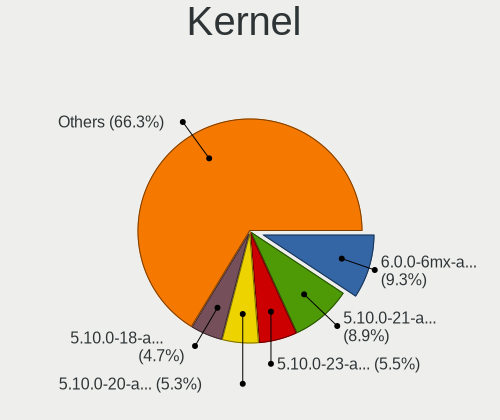
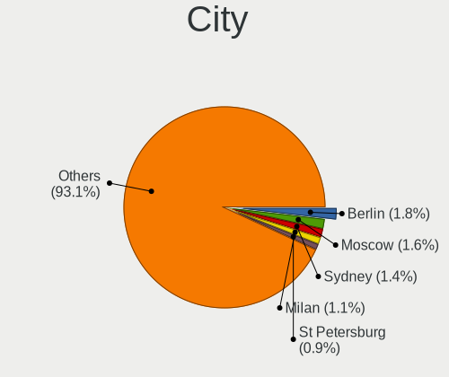
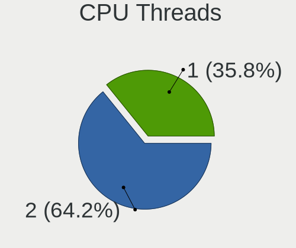
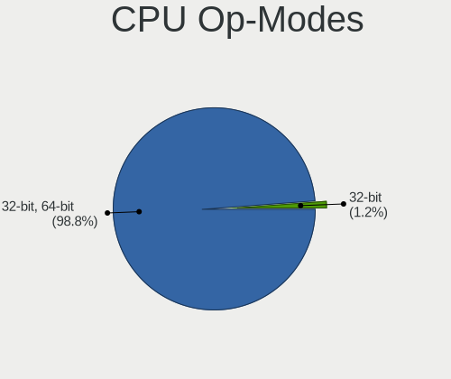
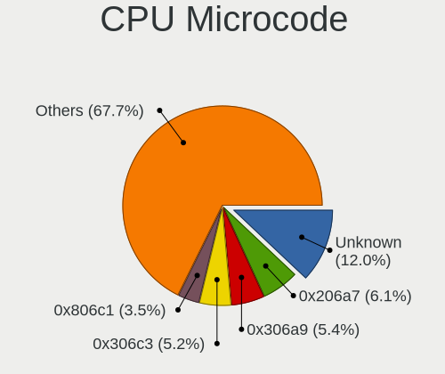

MX 21 - Tested Hardware & Statistics
------------------------------------

A project to collect tested hardware configurations for MX 21.

Anyone can contribute to this report by the [hw-probe](https://github.com/linuxhw/hw-probe) tool:

    sudo -E hw-probe -all -upload

Please contribute! Especially if your hardware is rare.

This is a report for all computer types. See also reports for [desktops](/Dist/MX_21/Desktop/README.md) and [notebooks](/Dist/MX_21/Notebook/README.md).

Contents
--------

* [ Test Cases ](#test-cases)

* [ System ](#system)
  - [ Kernel                   ](#kernel)
  - [ Kernel Family            ](#kernel-family)
  - [ Kernel Major Ver.        ](#kernel-major-ver)
  - [ Arch                     ](#arch)
  - [ DE                       ](#de)
  - [ Display Server           ](#display-server)
  - [ Display Manager          ](#display-manager)
  - [ OS Lang                  ](#os-lang)
  - [ Boot Mode                ](#boot-mode)
  - [ Filesystem               ](#filesystem)
  - [ Part. scheme             ](#part-scheme)
  - [ Dual Boot with Linux/BSD ](#dual-boot-with-linuxbsd)
  - [ Dual Boot (Win)          ](#dual-boot-win)

* [ Board ](#board)
  - [ Vendor                   ](#vendor)
  - [ Model                    ](#model)
  - [ Model Family             ](#model-family)
  - [ MFG Year                 ](#mfg-year)
  - [ Form Factor              ](#form-factor)
  - [ Secure Boot              ](#secure-boot)
  - [ Coreboot                 ](#coreboot)
  - [ RAM Size                 ](#ram-size)
  - [ RAM Used                 ](#ram-used)
  - [ Total Drives             ](#total-drives)
  - [ Has CD-ROM               ](#has-cd-rom)
  - [ Has Ethernet             ](#has-ethernet)
  - [ Has WiFi                 ](#has-wifi)
  - [ Has Bluetooth            ](#has-bluetooth)

* [ Location ](#location)
  - [ Country                  ](#country)
  - [ City                     ](#city)

* [ Drives ](#drives)
  - [ Drive Vendor             ](#drive-vendor)
  - [ Drive Model              ](#drive-model)
  - [ HDD Vendor               ](#hdd-vendor)
  - [ SSD Vendor               ](#ssd-vendor)
  - [ Drive Kind               ](#drive-kind)
  - [ Drive Connector          ](#drive-connector)
  - [ Drive Size               ](#drive-size)
  - [ Space Total              ](#space-total)
  - [ Space Used               ](#space-used)
  - [ Malfunc. Drives          ](#malfunc-drives)
  - [ Malfunc. Drive Vendor    ](#malfunc-drive-vendor)
  - [ Malfunc. HDD Vendor      ](#malfunc-hdd-vendor)
  - [ Malfunc. Drive Kind      ](#malfunc-drive-kind)
  - [ Failed Drives            ](#failed-drives)
  - [ Failed Drive Vendor      ](#failed-drive-vendor)
  - [ Drive Status             ](#drive-status)

* [ Storage controller ](#storage-controller)
  - [ Storage Vendor           ](#storage-vendor)
  - [ Storage Model            ](#storage-model)
  - [ Storage Kind             ](#storage-kind)

* [ Processor ](#processor)
  - [ CPU Vendor               ](#cpu-vendor)
  - [ CPU Model                ](#cpu-model)
  - [ CPU Model Family         ](#cpu-model-family)
  - [ CPU Cores                ](#cpu-cores)
  - [ CPU Sockets              ](#cpu-sockets)
  - [ CPU Threads              ](#cpu-threads)
  - [ CPU Op-Modes             ](#cpu-op-modes)
  - [ CPU Microcode            ](#cpu-microcode)
  - [ CPU Microarch            ](#cpu-microarch)

* [ Graphics ](#graphics)
  - [ GPU Vendor               ](#gpu-vendor)
  - [ GPU Model                ](#gpu-model)
  - [ GPU Combo                ](#gpu-combo)
  - [ GPU Driver               ](#gpu-driver)
  - [ GPU Memory               ](#gpu-memory)

* [ Monitor ](#monitor)
  - [ Monitor Vendor           ](#monitor-vendor)
  - [ Monitor Model            ](#monitor-model)
  - [ Monitor Resolution       ](#monitor-resolution)
  - [ Monitor Diagonal         ](#monitor-diagonal)
  - [ Monitor Width            ](#monitor-width)
  - [ Aspect Ratio             ](#aspect-ratio)
  - [ Monitor Area             ](#monitor-area)
  - [ Pixel Density            ](#pixel-density)
  - [ Multiple Monitors        ](#multiple-monitors)

* [ Network ](#network)
  - [ Net Controller Vendor    ](#net-controller-vendor)
  - [ Net Controller Model     ](#net-controller-model)
  - [ Wireless Vendor          ](#wireless-vendor)
  - [ Wireless Model           ](#wireless-model)
  - [ Ethernet Vendor          ](#ethernet-vendor)
  - [ Ethernet Model           ](#ethernet-model)
  - [ Net Controller Kind      ](#net-controller-kind)
  - [ Used Controller          ](#used-controller)
  - [ NICs                     ](#nics)
  - [ IPv6                     ](#ipv6)

* [ Bluetooth ](#bluetooth)
  - [ Bluetooth Vendor         ](#bluetooth-vendor)
  - [ Bluetooth Model          ](#bluetooth-model)

* [ Sound ](#sound)
  - [ Sound Vendor             ](#sound-vendor)
  - [ Sound Model              ](#sound-model)

* [ Memory ](#memory)
  - [ Memory Vendor            ](#memory-vendor)
  - [ Memory Model             ](#memory-model)
  - [ Memory Kind              ](#memory-kind)
  - [ Memory Form Factor       ](#memory-form-factor)
  - [ Memory Size              ](#memory-size)
  - [ Memory Speed             ](#memory-speed)

* [ Printers & scanners ](#printers--scanners)
  - [ Printer Vendor           ](#printer-vendor)
  - [ Printer Model            ](#printer-model)
  - [ Scanner Vendor           ](#scanner-vendor)
  - [ Scanner Model            ](#scanner-model)

* [ Camera ](#camera)
  - [ Camera Vendor            ](#camera-vendor)
  - [ Camera Model             ](#camera-model)

* [ Security ](#security)
  - [ Fingerprint Vendor       ](#fingerprint-vendor)
  - [ Fingerprint Model        ](#fingerprint-model)
  - [ Chipcard Vendor          ](#chipcard-vendor)
  - [ Chipcard Model           ](#chipcard-model)

* [ Unsupported ](#unsupported)
  - [ Unsupported Devices      ](#unsupported-devices)
  - [ Unsupported Device Types ](#unsupported-device-types)

Test Cases
----------

Total: 265

| Vendor        | Model                       | Form-Factor | Probe                                                      | Date         |
|---------------|-----------------------------|-------------|------------------------------------------------------------|--------------|
| MSI           | Z390-A PRO                  | Desktop     | [3a3375e173](https://linux-hardware.org/?probe=3a3375e173) | Dec 29, 2022 |
| Toshiba       | PORTEGE Z30-C               | Notebook    | [03dad182bb](https://linux-hardware.org/?probe=03dad182bb) | Dec 28, 2022 |
| MSI           | Z270 GAMING PRO CARBON      | Desktop     | [f422489705](https://linux-hardware.org/?probe=f422489705) | Dec 27, 2022 |
| Dell          | Latitude 3190               | Notebook    | [f395b56cec](https://linux-hardware.org/?probe=f395b56cec) | Dec 26, 2022 |
| Apple         | MacBookPro10,1              | Notebook    | [6c8ec40821](https://linux-hardware.org/?probe=6c8ec40821) | Dec 25, 2022 |
| Dell          | 0HY9JP A02                  | Desktop     | [c195f58592](https://linux-hardware.org/?probe=c195f58592) | Dec 24, 2022 |
| Apple         | Mac-FFE5EF870D7BA81A iMa... | All in one  | [148add29a4](https://linux-hardware.org/?probe=148add29a4) | Dec 24, 2022 |
| Lenovo        | 3741 SDK0T76461 WIN 3422... | Desktop     | [70e125f0d0](https://linux-hardware.org/?probe=70e125f0d0) | Dec 23, 2022 |
| Dell          | Latitude 3190               | Notebook    | [9227c8dbfb](https://linux-hardware.org/?probe=9227c8dbfb) | Dec 19, 2022 |
| Lenovo        | Y70-70 Touch 80DU           | Notebook    | [916375929d](https://linux-hardware.org/?probe=916375929d) | Dec 18, 2022 |
| Lenovo        | ThinkPad E15 Gen 3 20YGC... | Notebook    | [75126bccca](https://linux-hardware.org/?probe=75126bccca) | Dec 17, 2022 |
| Toshiba       | Satellite L650              | Notebook    | [7ea253aa11](https://linux-hardware.org/?probe=7ea253aa11) | Dec 17, 2022 |
| Gigabyte      | G5 KC                       | Notebook    | [e482b827aa](https://linux-hardware.org/?probe=e482b827aa) | Dec 17, 2022 |
| Lenovo        | ThinkPad X200s 74695XG      | Notebook    | [9bc0315222](https://linux-hardware.org/?probe=9bc0315222) | Dec 14, 2022 |
| HP            | 15 Notebook PC              | Notebook    | [06e7a6dfe7](https://linux-hardware.org/?probe=06e7a6dfe7) | Dec 12, 2022 |
| Dell          | Latitude 3190               | Notebook    | [c2c5f3feb3](https://linux-hardware.org/?probe=c2c5f3feb3) | Dec 12, 2022 |
| Apple         | MacBookPro14,3              | Notebook    | [7cefe54b56](https://linux-hardware.org/?probe=7cefe54b56) | Dec 12, 2022 |
| Dell          | Vostro 15-3568              | Notebook    | [a583a55071](https://linux-hardware.org/?probe=a583a55071) | Dec 10, 2022 |
| Dell          | Vostro 15-3568              | Notebook    | [2e76f24d6a](https://linux-hardware.org/?probe=2e76f24d6a) | Dec 09, 2022 |
| Dell          | Vostro 15-3568              | Notebook    | [36b349ff7f](https://linux-hardware.org/?probe=36b349ff7f) | Dec 08, 2022 |
| Fujitsu       | D3498-A1 S26361-D3498-A1    | Desktop     | [03cd265cef](https://linux-hardware.org/?probe=03cd265cef) | Dec 05, 2022 |
| ASUSTek       | PRIME A320M-K               | Desktop     | [6487bbd7b7](https://linux-hardware.org/?probe=6487bbd7b7) | Dec 05, 2022 |
| Dell          | Latitude 3190               | Notebook    | [12975376ba](https://linux-hardware.org/?probe=12975376ba) | Dec 05, 2022 |
| SIRAGON       | AIO-5150                    | Desktop     | [90476603fa](https://linux-hardware.org/?probe=90476603fa) | Dec 04, 2022 |
| Acer          | Aspire ES1-732              | Notebook    | [7000f5ee26](https://linux-hardware.org/?probe=7000f5ee26) | Dec 04, 2022 |
| MSI           | GF63 Thin 9SC               | Notebook    | [057b0039b7](https://linux-hardware.org/?probe=057b0039b7) | Dec 01, 2022 |
| HP            | 304Ah                       | Desktop     | [15db22accc](https://linux-hardware.org/?probe=15db22accc) | Nov 30, 2022 |
| Dell          | Latitude 3190               | Notebook    | [3c4756b965](https://linux-hardware.org/?probe=3c4756b965) | Nov 28, 2022 |
| Sony          | VPCYB3V1E                   | Notebook    | [8fc84889a5](https://linux-hardware.org/?probe=8fc84889a5) | Nov 28, 2022 |
| HP            | OMEN by Laptop 16-c0xxx     | Notebook    | [1620a1a2cb](https://linux-hardware.org/?probe=1620a1a2cb) | Nov 28, 2022 |
| Apple         | MacBookPro10,1              | Notebook    | [b47217fa0c](https://linux-hardware.org/?probe=b47217fa0c) | Nov 25, 2022 |
| Apple         | MacBookPro10,1              | Notebook    | [3f08c2fb11](https://linux-hardware.org/?probe=3f08c2fb11) | Nov 25, 2022 |
| Sony          | VGN-TZ3RXN_B                | Notebook    | [5986f007c8](https://linux-hardware.org/?probe=5986f007c8) | Nov 22, 2022 |
| TUXEDO        | N7x0WU                      | Notebook    | [614f59ceaf](https://linux-hardware.org/?probe=614f59ceaf) | Nov 22, 2022 |
| Dell          | Latitude 3190               | Notebook    | [1cfe937b0e](https://linux-hardware.org/?probe=1cfe937b0e) | Nov 21, 2022 |
| ASRock        | B365M Pro4                  | Desktop     | [0f0d4f70b0](https://linux-hardware.org/?probe=0f0d4f70b0) | Nov 20, 2022 |
| Foxconn       | 2ABF                        | Desktop     | [aa4bde7d79](https://linux-hardware.org/?probe=aa4bde7d79) | Nov 20, 2022 |
| GEO           | GeoFlex 340                 | Convertible | [6e930633c0](https://linux-hardware.org/?probe=6e930633c0) | Nov 18, 2022 |
| Dell          | 0J051K A00                  | Server      | [cb579ef51b](https://linux-hardware.org/?probe=cb579ef51b) | Nov 17, 2022 |
| ASUSTek       | TUF Gaming B450-PLUS II     | Desktop     | [1a0674de42](https://linux-hardware.org/?probe=1a0674de42) | Nov 14, 2022 |
| ASUSTek       | ASUS BR1100CKA BR1100CKA... | Notebook    | [9884754d7b](https://linux-hardware.org/?probe=9884754d7b) | Nov 14, 2022 |
| Dell          | Latitude 3190               | Notebook    | [0e09796a40](https://linux-hardware.org/?probe=0e09796a40) | Nov 14, 2022 |
| Dell          | Inspiron 3583               | Notebook    | [6fcf5c9bd6](https://linux-hardware.org/?probe=6fcf5c9bd6) | Nov 13, 2022 |
| Lenovo        | ThinkPad X1 Extreme 20MF... | Notebook    | [48e0868598](https://linux-hardware.org/?probe=48e0868598) | Nov 13, 2022 |
| Lenovo        | ThinkPad T14s Gen 2i 20W... | Notebook    | [cb36e9d15c](https://linux-hardware.org/?probe=cb36e9d15c) | Nov 09, 2022 |
| Dell          | Latitude 3190               | Notebook    | [0459e9f47e](https://linux-hardware.org/?probe=0459e9f47e) | Nov 06, 2022 |
| ASUSTek       | X200CA                      | Notebook    | [91d85f8376](https://linux-hardware.org/?probe=91d85f8376) | Nov 05, 2022 |
| ASRock        | B365M Pro4                  | Desktop     | [f5305c9730](https://linux-hardware.org/?probe=f5305c9730) | Nov 04, 2022 |
| Intel         | NUC12WSBi7 M46422-302       | Mini pc     | [9c72952af7](https://linux-hardware.org/?probe=9c72952af7) | Nov 04, 2022 |
| Intel         | NUC10i3FNB K61362-303       | Mini pc     | [c165c40a7e](https://linux-hardware.org/?probe=c165c40a7e) | Nov 03, 2022 |
| Lenovo        | ThinkPad X1 Extreme 20MF... | Notebook    | [9819da96f2](https://linux-hardware.org/?probe=9819da96f2) | Nov 02, 2022 |
| ASUSTek       | G74Sx                       | Notebook    | [4e69212184](https://linux-hardware.org/?probe=4e69212184) | Nov 01, 2022 |
| SANTECH       | X170KM-G                    | Notebook    | [073f9a1d24](https://linux-hardware.org/?probe=073f9a1d24) | Nov 01, 2022 |
| MSI           | X570-A PRO                  | Desktop     | [c60d9aa72d](https://linux-hardware.org/?probe=c60d9aa72d) | Oct 31, 2022 |
| Vulcan Ele... | Excursion XB                | Notebook    | [30ceac1216](https://linux-hardware.org/?probe=30ceac1216) | Oct 31, 2022 |
| Dell          | Latitude 3190               | Notebook    | [fe0d1261a6](https://linux-hardware.org/?probe=fe0d1261a6) | Oct 31, 2022 |
| Lenovo        | ThinkPad X1 Extreme 20MF... | Notebook    | [423ad57e72](https://linux-hardware.org/?probe=423ad57e72) | Oct 29, 2022 |
| Lenovo        | ThinkPad X1 Extreme 20MF... | Notebook    | [f8b4ce6c3f](https://linux-hardware.org/?probe=f8b4ce6c3f) | Oct 29, 2022 |
| Apple         | MacBookPro14,3              | Notebook    | [6383143b5b](https://linux-hardware.org/?probe=6383143b5b) | Oct 28, 2022 |
| Biostar       | H61MH                       | Desktop     | [f505de310c](https://linux-hardware.org/?probe=f505de310c) | Oct 27, 2022 |
| ASUSTek       | ZenBook UX363EA_UX363EA     | Convertible | [226e4471e1](https://linux-hardware.org/?probe=226e4471e1) | Oct 27, 2022 |
| Lenovo        | 318E NOK                    | Desktop     | [6b190bfb4f](https://linux-hardware.org/?probe=6b190bfb4f) | Oct 25, 2022 |
| Dell          | Latitude 3190               | Notebook    | [b116ac92f3](https://linux-hardware.org/?probe=b116ac92f3) | Oct 24, 2022 |
| HP            | ENVY x360 2-in-1 Laptop ... | Convertible | [59dabaff86](https://linux-hardware.org/?probe=59dabaff86) | Oct 23, 2022 |
| win elemen... | MoreFine S500+              | Notebook    | [d34df28814](https://linux-hardware.org/?probe=d34df28814) | Oct 22, 2022 |
| Apple         | MacBookPro7,1               | Notebook    | [aa571dded9](https://linux-hardware.org/?probe=aa571dded9) | Oct 22, 2022 |
| Intel         | NUC12WSBi7 M46422-302       | Mini pc     | [c389b44ab5](https://linux-hardware.org/?probe=c389b44ab5) | Oct 21, 2022 |
| Lenovo        | ThinkPad T480 20L50004MZ    | Notebook    | [7fe25296ef](https://linux-hardware.org/?probe=7fe25296ef) | Oct 21, 2022 |
| Shenzhen W... | AERO 2 Pro                  | Mini pc     | [95ca32a110](https://linux-hardware.org/?probe=95ca32a110) | Oct 21, 2022 |
| Lenovo        | IdeaPad 5 15ITL05 82FG      | Notebook    | [e33a95e0b0](https://linux-hardware.org/?probe=e33a95e0b0) | Oct 18, 2022 |
| Intel         | NUC12WSBi7 M46422-302       | Mini pc     | [b6c2cf5b2e](https://linux-hardware.org/?probe=b6c2cf5b2e) | Oct 17, 2022 |
| Dell          | Latitude 3190               | Notebook    | [342d7acb67](https://linux-hardware.org/?probe=342d7acb67) | Oct 17, 2022 |
| Intel         | NUC12WSBi7 M46422-302       | Mini pc     | [1f6ff0e213](https://linux-hardware.org/?probe=1f6ff0e213) | Oct 17, 2022 |
| Apple         | MacBookPro11,1              | Notebook    | [09af41cbf8](https://linux-hardware.org/?probe=09af41cbf8) | Oct 16, 2022 |
| HP            | Laptop 15-ef2xxx            | Notebook    | [b3267ce847](https://linux-hardware.org/?probe=b3267ce847) | Oct 15, 2022 |
| Apple         | MacBookPro11,1              | Notebook    | [209d243342](https://linux-hardware.org/?probe=209d243342) | Oct 15, 2022 |
| Pegatron      | NARRA3                      | Desktop     | [1588e60c57](https://linux-hardware.org/?probe=1588e60c57) | Oct 12, 2022 |
| HP            | Laptop 17-ak0xx             | Notebook    | [67fbbc4074](https://linux-hardware.org/?probe=67fbbc4074) | Oct 11, 2022 |
| Medion        | E7424 MD60750               | Notebook    | [7c9ea600ad](https://linux-hardware.org/?probe=7c9ea600ad) | Oct 11, 2022 |
| Dell          | Latitude 3190               | Notebook    | [bee132f486](https://linux-hardware.org/?probe=bee132f486) | Oct 10, 2022 |
| Apple         | MacBookAir7,2               | Notebook    | [e26911cff6](https://linux-hardware.org/?probe=e26911cff6) | Oct 08, 2022 |
| Lenovo        | ThinkPad T480 20L50004MZ    | Notebook    | [f2c440fdf6](https://linux-hardware.org/?probe=f2c440fdf6) | Oct 05, 2022 |
| Lenovo        | ThinkPad T480 20L50004MZ    | Notebook    | [8159009c50](https://linux-hardware.org/?probe=8159009c50) | Oct 05, 2022 |
| Google        | Setzer                      | Notebook    | [6bafaabd48](https://linux-hardware.org/?probe=6bafaabd48) | Oct 04, 2022 |
| Dell          | Vostro 3500                 | Notebook    | [396f61d294](https://linux-hardware.org/?probe=396f61d294) | Oct 03, 2022 |
| Dell          | Latitude 3190               | Notebook    | [29b38a4a94](https://linux-hardware.org/?probe=29b38a4a94) | Oct 03, 2022 |
| Dell          | Latitude 7490               | Notebook    | [872aafeb50](https://linux-hardware.org/?probe=872aafeb50) | Oct 02, 2022 |
| Apple         | Mac-F65AE981FFA204ED Mac... | Mini pc     | [f97d2b97ad](https://linux-hardware.org/?probe=f97d2b97ad) | Oct 01, 2022 |
| HP            | 250 G6 Notebook PC          | Notebook    | [992cf7d019](https://linux-hardware.org/?probe=992cf7d019) | Sep 30, 2022 |
| ASUSTek       | Z170-P                      | Desktop     | [2f3c79dd55](https://linux-hardware.org/?probe=2f3c79dd55) | Sep 29, 2022 |
| ASUSTek       | P5GC-MX/CKD/SI              | Desktop     | [72bb90ea71](https://linux-hardware.org/?probe=72bb90ea71) | Sep 28, 2022 |
| Lenovo        | ThinkPad T14s Gen 2i 20W... | Notebook    | [5b7d4c6b7a](https://linux-hardware.org/?probe=5b7d4c6b7a) | Sep 27, 2022 |
| Dell          | Precision 7520              | Notebook    | [a7b1df0888](https://linux-hardware.org/?probe=a7b1df0888) | Sep 26, 2022 |
| Dell          | Latitude 3190               | Notebook    | [27ac75e10c](https://linux-hardware.org/?probe=27ac75e10c) | Sep 26, 2022 |
| Apple         | MacBookAir7,2               | Notebook    | [93dd525100](https://linux-hardware.org/?probe=93dd525100) | Sep 25, 2022 |
| Acer          | Nitro AN515-54              | Notebook    | [6182e4ef84](https://linux-hardware.org/?probe=6182e4ef84) | Sep 25, 2022 |
| HP            | Pavilion g7                 | Notebook    | [22133612c0](https://linux-hardware.org/?probe=22133612c0) | Sep 25, 2022 |
| ASUSTek       | P5G41T-M LX                 | Desktop     | [8e429edcd6](https://linux-hardware.org/?probe=8e429edcd6) | Sep 25, 2022 |
| Lenovo        | V15-IGL 82C3                | Notebook    | [c2de0def85](https://linux-hardware.org/?probe=c2de0def85) | Sep 25, 2022 |
| ASUSTek       | PRIME B450M-A               | Desktop     | [bdb353fd2c](https://linux-hardware.org/?probe=bdb353fd2c) | Sep 20, 2022 |
| Dell          | Inspiron 5521               | Notebook    | [085558878e](https://linux-hardware.org/?probe=085558878e) | Sep 20, 2022 |
| Dell          | Latitude 3190               | Notebook    | [f96d782326](https://linux-hardware.org/?probe=f96d782326) | Sep 19, 2022 |
| HP            | EliteBook 850 G3            | Notebook    | [de3a2e822c](https://linux-hardware.org/?probe=de3a2e822c) | Sep 14, 2022 |
| Apple         | MacBookAir7,2               | Notebook    | [03ba2808d7](https://linux-hardware.org/?probe=03ba2808d7) | Sep 13, 2022 |
| Dell          | Latitude 3190               | Notebook    | [3c0abb17a9](https://linux-hardware.org/?probe=3c0abb17a9) | Sep 12, 2022 |
| HP            | 1632                        | Desktop     | [8309a8acf0](https://linux-hardware.org/?probe=8309a8acf0) | Sep 10, 2022 |
| Notebook      | PD5x_7xPNP_PNN_PNT          | Notebook    | [b4e36a92c7](https://linux-hardware.org/?probe=b4e36a92c7) | Sep 08, 2022 |
| Notebook      | PD5x_7xPNP_PNN_PNT          | Notebook    | [ac71ea732f](https://linux-hardware.org/?probe=ac71ea732f) | Sep 07, 2022 |
| Medion        | H110H4-EM                   | Desktop     | [1b22e5560d](https://linux-hardware.org/?probe=1b22e5560d) | Sep 07, 2022 |
| MSI           | Modern 14 B11MOL            | Notebook    | [1ce0bfd512](https://linux-hardware.org/?probe=1ce0bfd512) | Sep 06, 2022 |
| Lenovo        | ThinkPad T480 20L50004MZ    | Notebook    | [7702adff5d](https://linux-hardware.org/?probe=7702adff5d) | Sep 05, 2022 |
| Dell          | Latitude 3190               | Notebook    | [25c70ea2f3](https://linux-hardware.org/?probe=25c70ea2f3) | Sep 05, 2022 |
| Gigabyte      | B560M DS3H V2               | Desktop     | [c430bf0275](https://linux-hardware.org/?probe=c430bf0275) | Sep 03, 2022 |
| Dell          | Latitude 3190               | Notebook    | [0998f7a5d1](https://linux-hardware.org/?probe=0998f7a5d1) | Aug 29, 2022 |
| Lenovo        | ThinkPad T500 2241VL9       | Notebook    | [35c8369d91](https://linux-hardware.org/?probe=35c8369d91) | Aug 25, 2022 |
| Dell          | Latitude 3190               | Notebook    | [74fd1046be](https://linux-hardware.org/?probe=74fd1046be) | Aug 22, 2022 |
| win elemen... | MoreFine S500+              | Notebook    | [295b2926da](https://linux-hardware.org/?probe=295b2926da) | Aug 19, 2022 |
| Acer          | One Z1402                   | Notebook    | [d4b5a11843](https://linux-hardware.org/?probe=d4b5a11843) | Aug 18, 2022 |
| Apple         | MacBookPro11,3              | Notebook    | [4e9e089c1a](https://linux-hardware.org/?probe=4e9e089c1a) | Aug 18, 2022 |
| win elemen... | MoreFine S500+              | Notebook    | [abdf1d084a](https://linux-hardware.org/?probe=abdf1d084a) | Aug 18, 2022 |
| Dell          | Latitude 3190               | Notebook    | [5564506d3c](https://linux-hardware.org/?probe=5564506d3c) | Aug 15, 2022 |
| Biostar       | A780L3B                     | Desktop     | [62782d600f](https://linux-hardware.org/?probe=62782d600f) | Aug 14, 2022 |
| HP            | ProBook x360 11 G5 EE       | Convertible | [83e026f682](https://linux-hardware.org/?probe=83e026f682) | Aug 12, 2022 |
| Dell          | System XPS 15Z              | Notebook    | [45a22d4855](https://linux-hardware.org/?probe=45a22d4855) | Aug 11, 2022 |
| Lenovo        | ThinkPad T560 20FJS0EP00    | Notebook    | [dda2c8f199](https://linux-hardware.org/?probe=dda2c8f199) | Aug 11, 2022 |
| Lenovo        | ThinkPad L512 44444WG       | Notebook    | [e2a0bef6d4](https://linux-hardware.org/?probe=e2a0bef6d4) | Aug 10, 2022 |
| Lenovo        | ThinkPad L512 44444WG       | Notebook    | [fc0389fd3e](https://linux-hardware.org/?probe=fc0389fd3e) | Aug 10, 2022 |
| Dell          | Precision 7720              | Notebook    | [9f17ade16f](https://linux-hardware.org/?probe=9f17ade16f) | Aug 08, 2022 |
| Dell          | Latitude 3190               | Notebook    | [5818ff09cb](https://linux-hardware.org/?probe=5818ff09cb) | Aug 08, 2022 |
| HP            | Laptop 15-ef2xxx            | Notebook    | [68e632a5f6](https://linux-hardware.org/?probe=68e632a5f6) | Aug 08, 2022 |
| Samsung       | NC210/NC110                 | Notebook    | [438dc4ea93](https://linux-hardware.org/?probe=438dc4ea93) | Aug 05, 2022 |
| Dell          | Latitude 3190               | Notebook    | [1f86e5fa57](https://linux-hardware.org/?probe=1f86e5fa57) | Aug 01, 2022 |
| Intel         | DH55TC AAE70932-303         | Desktop     | [f275229d83](https://linux-hardware.org/?probe=f275229d83) | Jul 31, 2022 |
| Dell          | Vostro 3550                 | Notebook    | [d67c93b534](https://linux-hardware.org/?probe=d67c93b534) | Jul 29, 2022 |
| Acer          | Aspire 5520                 | Notebook    | [d49c27a24a](https://linux-hardware.org/?probe=d49c27a24a) | Jul 29, 2022 |
| Apple         | MacBookAir7,2               | Notebook    | [5e7b9f2b14](https://linux-hardware.org/?probe=5e7b9f2b14) | Jul 26, 2022 |
| Dell          | Latitude 3190               | Notebook    | [2ec6ff1812](https://linux-hardware.org/?probe=2ec6ff1812) | Jul 25, 2022 |
| MP            | MS-7848                     | Desktop     | [f7696965e0](https://linux-hardware.org/?probe=f7696965e0) | Jul 22, 2022 |
| MSI           | MAG B550 TOMAHAWK           | Desktop     | [85782181c7](https://linux-hardware.org/?probe=85782181c7) | Jul 21, 2022 |
| ASUSTek       | P8H61/USB3 R2.0             | Desktop     | [1076f6d59a](https://linux-hardware.org/?probe=1076f6d59a) | Jul 19, 2022 |
| Dell          | Latitude 3190               | Notebook    | [4fa9fe26c1](https://linux-hardware.org/?probe=4fa9fe26c1) | Jul 18, 2022 |
| HP            | ProBook 450 G4              | Notebook    | [b2e75a35a2](https://linux-hardware.org/?probe=b2e75a35a2) | Jul 17, 2022 |
| Apple         | MacBookAir7,2               | Notebook    | [a1a565d211](https://linux-hardware.org/?probe=a1a565d211) | Jul 16, 2022 |
| AOpen         | D1009 A1A4                  | Desktop     | [d8edf66887](https://linux-hardware.org/?probe=d8edf66887) | Jul 13, 2022 |
| Dell          | Latitude 3190               | Notebook    | [b3c7283cdb](https://linux-hardware.org/?probe=b3c7283cdb) | Jul 11, 2022 |
| Acer          | Swift SF314-59              | Notebook    | [56424874b7](https://linux-hardware.org/?probe=56424874b7) | Jul 11, 2022 |
| Dell          | 0DR845                      | Desktop     | [4c4a530cc5](https://linux-hardware.org/?probe=4c4a530cc5) | Jul 06, 2022 |
| Alienware     | 13 R2                       | Notebook    | [ec877e9a2e](https://linux-hardware.org/?probe=ec877e9a2e) | Jul 06, 2022 |
| Alienware     | m15                         | Notebook    | [9578c619e6](https://linux-hardware.org/?probe=9578c619e6) | Jul 06, 2022 |
| Dell          | Latitude 3190               | Notebook    | [f5c0f0798a](https://linux-hardware.org/?probe=f5c0f0798a) | Jul 04, 2022 |
| ZOTAC         | ZBOX-ECM73070C/53060C       | Mini pc     | [77c632ea8e](https://linux-hardware.org/?probe=77c632ea8e) | Jul 01, 2022 |
| Dell          | Latitude 3190               | Notebook    | [3bf5b47ea1](https://linux-hardware.org/?probe=3bf5b47ea1) | Jun 27, 2022 |
| MSI           | B350 TOMAHAWK               | Desktop     | [5a66940742](https://linux-hardware.org/?probe=5a66940742) | Jun 23, 2022 |
| MSI           | Z77A-G41                    | Desktop     | [d0f55f3c0b](https://linux-hardware.org/?probe=d0f55f3c0b) | Jun 22, 2022 |
| Dell          | 0200DY A01                  | Desktop     | [bc8030c1d5](https://linux-hardware.org/?probe=bc8030c1d5) | Jun 22, 2022 |
| Dell          | 0DR845                      | Desktop     | [56b4af8d26](https://linux-hardware.org/?probe=56b4af8d26) | Jun 20, 2022 |
| Dell          | Latitude 3190               | Notebook    | [bb05f51a63](https://linux-hardware.org/?probe=bb05f51a63) | Jun 20, 2022 |
| Unknown       | Unknown                     | Notebook    | [3b7ffa4a35](https://linux-hardware.org/?probe=3b7ffa4a35) | Jun 18, 2022 |
| Dell          | Inspiron 15-3552            | Notebook    | [d89b7877a0](https://linux-hardware.org/?probe=d89b7877a0) | Jun 17, 2022 |
| Lenovo        | Unknown                     | Notebook    | [cd2f32d91c](https://linux-hardware.org/?probe=cd2f32d91c) | Jun 16, 2022 |
| HP            | ProBook 450 G1              | Notebook    | [623bb542e3](https://linux-hardware.org/?probe=623bb542e3) | Jun 15, 2022 |
| Apple         | MacBookAir7,2               | Notebook    | [fc34430f8d](https://linux-hardware.org/?probe=fc34430f8d) | Jun 15, 2022 |
| Dell          | Latitude 3190               | Notebook    | [fb55b815b6](https://linux-hardware.org/?probe=fb55b815b6) | Jun 13, 2022 |
| Toshiba       | Satellite C845              | Notebook    | [12d9cc2076](https://linux-hardware.org/?probe=12d9cc2076) | Jun 11, 2022 |
| Lenovo        | S130-11IGM 81J1             | Notebook    | [851d5469e5](https://linux-hardware.org/?probe=851d5469e5) | Jun 08, 2022 |
| Dell          | Latitude 3190               | Notebook    | [190816b333](https://linux-hardware.org/?probe=190816b333) | Jun 06, 2022 |
| HP            | ENVY x360 Convertible 15... | Convertible | [c21cd1f8f3](https://linux-hardware.org/?probe=c21cd1f8f3) | Jun 03, 2022 |
| Lenovo        | IdeaPad 3 15IIL05 81WE      | Notebook    | [b7ff235a14](https://linux-hardware.org/?probe=b7ff235a14) | Jun 03, 2022 |
| Gigabyte      | H410M S2H V3                | Desktop     | [b57b3a635c](https://linux-hardware.org/?probe=b57b3a635c) | Jun 02, 2022 |
| Dell          | Latitude D520               | Notebook    | [285ab7b873](https://linux-hardware.org/?probe=285ab7b873) | Jun 01, 2022 |
| Dell          | Latitude 3190               | Notebook    | [e43c62a67a](https://linux-hardware.org/?probe=e43c62a67a) | May 30, 2022 |
| ASUSTek       | K55A                        | Notebook    | [0eb5e9ea50](https://linux-hardware.org/?probe=0eb5e9ea50) | May 29, 2022 |
| AZW           | SER                         | Mini pc     | [9da3c6ca34](https://linux-hardware.org/?probe=9da3c6ca34) | May 18, 2022 |
| Sony          | VPCSB1V9R                   | Notebook    | [e3b15e462d](https://linux-hardware.org/?probe=e3b15e462d) | May 16, 2022 |
| Sony          | VPCSB1V9R                   | Notebook    | [9dfafea956](https://linux-hardware.org/?probe=9dfafea956) | May 16, 2022 |
| Dell          | Latitude 3190               | Notebook    | [e80556f7d6](https://linux-hardware.org/?probe=e80556f7d6) | May 16, 2022 |
| Medion        | E14304                      | Notebook    | [8d1a922b7b](https://linux-hardware.org/?probe=8d1a922b7b) | May 15, 2022 |
| HP            | Stream Laptop 14-cb0XX      | Notebook    | [3b0408920d](https://linux-hardware.org/?probe=3b0408920d) | May 13, 2022 |
| ASUSTek       | SABERTOOTH X99              | Desktop     | [b627953ad4](https://linux-hardware.org/?probe=b627953ad4) | May 11, 2022 |
| Acer          | Aspire A515-56              | Notebook    | [b728fa5844](https://linux-hardware.org/?probe=b728fa5844) | May 01, 2022 |
| Intel         | V1.3                        | Desktop     | [a01993f2fa](https://linux-hardware.org/?probe=a01993f2fa) | Apr 30, 2022 |
| Acer          | Nitro AN515-55              | Notebook    | [04b51fe1cf](https://linux-hardware.org/?probe=04b51fe1cf) | Apr 25, 2022 |
| Alienware     | m15 R7                      | Notebook    | [77727a1731](https://linux-hardware.org/?probe=77727a1731) | Apr 24, 2022 |
| Lenovo        | Legion 5 15ACH6H 82JU       | Notebook    | [4e8b5f940a](https://linux-hardware.org/?probe=4e8b5f940a) | Apr 23, 2022 |
| ASUSTek       | SABERTOOTH X99              | Desktop     | [51cc264c62](https://linux-hardware.org/?probe=51cc264c62) | Apr 22, 2022 |
| HP            | ProBook 450 G4              | Notebook    | [77a6f92da0](https://linux-hardware.org/?probe=77a6f92da0) | Apr 22, 2022 |
| Gigabyte      | B550M S2H                   | Desktop     | [208972e3b5](https://linux-hardware.org/?probe=208972e3b5) | Apr 19, 2022 |
| ASRock        | N3150M                      | Desktop     | [0ee71f6582](https://linux-hardware.org/?probe=0ee71f6582) | Apr 19, 2022 |
| Gigabyte      | B550M S2H                   | Desktop     | [1127f26185](https://linux-hardware.org/?probe=1127f26185) | Apr 17, 2022 |
| Sun Micros... | Sun Ultra 40 M2 Workstat... | Server      | [7cc89d3cba](https://linux-hardware.org/?probe=7cc89d3cba) | Apr 14, 2022 |
| Sun Micros... | Sun Ultra 40 M2 Workstat... | Server      | [5cd6adf199](https://linux-hardware.org/?probe=5cd6adf199) | Apr 14, 2022 |
| Gigabyte      | G5 KC                       | Notebook    | [fc21d0150f](https://linux-hardware.org/?probe=fc21d0150f) | Apr 10, 2022 |
| Acer          | Aspire A515-56              | Notebook    | [db6408f394](https://linux-hardware.org/?probe=db6408f394) | Apr 07, 2022 |
| MSI           | GV62 8RD                    | Notebook    | [2e43728adb](https://linux-hardware.org/?probe=2e43728adb) | Apr 06, 2022 |
| Microsoft     | Surface Pro 7               | Tablet      | [084e2350e9](https://linux-hardware.org/?probe=084e2350e9) | Apr 05, 2022 |
| ASUSTek       | 1101HA                      | Notebook    | [c3d2458d59](https://linux-hardware.org/?probe=c3d2458d59) | Apr 04, 2022 |
| ASUSTek       | ROG Strix G712LU_G712LU     | Notebook    | [288629b95d](https://linux-hardware.org/?probe=288629b95d) | Apr 04, 2022 |
| Dell          | 0YXT71 A01                  | Desktop     | [5de0fab8f2](https://linux-hardware.org/?probe=5de0fab8f2) | Apr 04, 2022 |
| Lenovo        | ThinkPad T430 23427YU       | Notebook    | [07ada1e358](https://linux-hardware.org/?probe=07ada1e358) | Apr 03, 2022 |
| ASUSTek       | ROG Strix G513QC_G513QC     | Notebook    | [697f820432](https://linux-hardware.org/?probe=697f820432) | Apr 02, 2022 |
| Apple         | Mac-F65AE981FFA204ED Mac... | Mini pc     | [83dab83528](https://linux-hardware.org/?probe=83dab83528) | Apr 01, 2022 |
| TUXEDO        | N7x0WU                      | Notebook    | [cf4f31fe3c](https://linux-hardware.org/?probe=cf4f31fe3c) | Mar 30, 2022 |
| Lenovo        | ThinkPad T440p 20AW002VB... | Notebook    | [e3ec03ac31](https://linux-hardware.org/?probe=e3ec03ac31) | Mar 29, 2022 |
| Framework     | Laptop                      | Notebook    | [a9f49dfe70](https://linux-hardware.org/?probe=a9f49dfe70) | Mar 24, 2022 |
| Lenovo        | 1046 NO DPK                 | Desktop     | [561b1c3324](https://linux-hardware.org/?probe=561b1c3324) | Mar 17, 2022 |
| Gigabyte      | Z390 UD                     | Desktop     | [d0b555e0ba](https://linux-hardware.org/?probe=d0b555e0ba) | Mar 17, 2022 |
| Apple         | Mac-F2238AC8                | All in one  | [c8c2d7bba3](https://linux-hardware.org/?probe=c8c2d7bba3) | Mar 14, 2022 |
| HP            | 3647h                       | Desktop     | [fd6766aabb](https://linux-hardware.org/?probe=fd6766aabb) | Mar 11, 2022 |
| ASUSTek       | P5GC-MX/MEDION/SI           | Desktop     | [772e020316](https://linux-hardware.org/?probe=772e020316) | Mar 09, 2022 |
| MSI           | MS-7091                     | Desktop     | [71aaa6a920](https://linux-hardware.org/?probe=71aaa6a920) | Mar 09, 2022 |
| MSI           | MS-7091                     | Desktop     | [b08ddd1115](https://linux-hardware.org/?probe=b08ddd1115) | Mar 09, 2022 |
| Dell          | Latitude 3190               | Notebook    | [964420352c](https://linux-hardware.org/?probe=964420352c) | Feb 28, 2022 |
| Dell          | XPS 17 9710                 | Notebook    | [7147fe2d5c](https://linux-hardware.org/?probe=7147fe2d5c) | Feb 26, 2022 |
| ASUSTek       | 1101HA                      | Notebook    | [b234cc741f](https://linux-hardware.org/?probe=b234cc741f) | Feb 22, 2022 |
| Dell          | XPS 17 9710                 | Notebook    | [851badde2e](https://linux-hardware.org/?probe=851badde2e) | Feb 20, 2022 |
| ASUSTek       | ROG Maximus XIII HERO       | Desktop     | [e58223cc60](https://linux-hardware.org/?probe=e58223cc60) | Feb 18, 2022 |
| Huanan        | X99-F8 V2.0                 | Desktop     | [23c722f6cf](https://linux-hardware.org/?probe=23c722f6cf) | Feb 18, 2022 |
| Huanan        | X99-F8 V2.0                 | Desktop     | [f4fec6a5be](https://linux-hardware.org/?probe=f4fec6a5be) | Feb 17, 2022 |
| Sony          | VPCF119FX                   | Notebook    | [1e8448b824](https://linux-hardware.org/?probe=1e8448b824) | Feb 15, 2022 |
| MSI           | Z97 GAMING 5                | Desktop     | [7c66c1b404](https://linux-hardware.org/?probe=7c66c1b404) | Feb 09, 2022 |
| Sony          | SVE1513Q1ESI                | Notebook    | [77e599ef9f](https://linux-hardware.org/?probe=77e599ef9f) | Feb 08, 2022 |
| Dell          | Latitude E4310              | Notebook    | [50190cb420](https://linux-hardware.org/?probe=50190cb420) | Feb 06, 2022 |
| efirstview    | v01099                      | Notebook    | [ed22d3c2b6](https://linux-hardware.org/?probe=ed22d3c2b6) | Feb 04, 2022 |
| ASUSTek       | X99-DELUXE                  | Desktop     | [4ffe151e7a](https://linux-hardware.org/?probe=4ffe151e7a) | Jan 29, 2022 |
| Lenovo        | ThinkPad W541 20EG0005MS    | Notebook    | [f89a7895fc](https://linux-hardware.org/?probe=f89a7895fc) | Jan 23, 2022 |
| Sony          | VPCEH2N1E                   | Notebook    | [17a4bc1847](https://linux-hardware.org/?probe=17a4bc1847) | Jan 22, 2022 |
| Fujitsu Si... | LIFEBOOK E8010              | Notebook    | [82d1bc5db0](https://linux-hardware.org/?probe=82d1bc5db0) | Jan 22, 2022 |
| MSI           | Alpha 15 B5EEK              | Notebook    | [882906d968](https://linux-hardware.org/?probe=882906d968) | Jan 17, 2022 |
| Alienware     | 13 R2                       | Notebook    | [65c1ae9026](https://linux-hardware.org/?probe=65c1ae9026) | Jan 14, 2022 |
| HP            | EliteBook 840 G3            | Notebook    | [58cff543b5](https://linux-hardware.org/?probe=58cff543b5) | Jan 06, 2022 |
| HP            | 0B4Ch D                     | Desktop     | [ecaec39529](https://linux-hardware.org/?probe=ecaec39529) | Jan 05, 2022 |
| HP            | EliteBook 8440p             | Notebook    | [d0d2edf745](https://linux-hardware.org/?probe=d0d2edf745) | Jan 04, 2022 |
| Lenovo        | G400s VILG1                 | Notebook    | [1cd4b24f16](https://linux-hardware.org/?probe=1cd4b24f16) | Jan 04, 2022 |
| Gigabyte      | P15FV5                      | Notebook    | [164348e568](https://linux-hardware.org/?probe=164348e568) | Jan 03, 2022 |
| HP            | Spectre x360 Convertible... | Convertible | [7cc374183b](https://linux-hardware.org/?probe=7cc374183b) | Dec 30, 2021 |
| Lenovo        | IdeaPad Y700-15ISK 80NV     | Notebook    | [4fe24b4f44](https://linux-hardware.org/?probe=4fe24b4f44) | Dec 26, 2021 |
| Intel         | NUC10i7FNB K61360-302       | Mini pc     | [9147191a67](https://linux-hardware.org/?probe=9147191a67) | Dec 24, 2021 |
| ASUSTek       | X550CC                      | Notebook    | [b0cde813b9](https://linux-hardware.org/?probe=b0cde813b9) | Dec 23, 2021 |
| Fujitsu       | D3221-A1 S26361-D3221-A1    | Desktop     | [78d4e04363](https://linux-hardware.org/?probe=78d4e04363) | Dec 16, 2021 |
| Samsung       | 340XAA/350XAA/550XAA        | Notebook    | [49692045a2](https://linux-hardware.org/?probe=49692045a2) | Dec 16, 2021 |
| ASUSTek       | ASUS TUF Gaming A15 FA50... | Notebook    | [21180cbdad](https://linux-hardware.org/?probe=21180cbdad) | Dec 04, 2021 |
| GALAX         | B550M                       | Desktop     | [a6866c8a45](https://linux-hardware.org/?probe=a6866c8a45) | Dec 04, 2021 |
| Lenovo        | Yoga 7 14ITL5 82BH          | Convertible | [bc8359d097](https://linux-hardware.org/?probe=bc8359d097) | Dec 01, 2021 |
| Lenovo        | B590 20208                  | Notebook    | [ed08d6bdd9](https://linux-hardware.org/?probe=ed08d6bdd9) | Nov 30, 2021 |
| Lenovo        | ThinkBook 13s-IWL 20R9      | Notebook    | [649434f9b8](https://linux-hardware.org/?probe=649434f9b8) | Nov 23, 2021 |
| Apple         | Mac-942B5BF58194151B        | All in one  | [bb58f4914e](https://linux-hardware.org/?probe=bb58f4914e) | Nov 21, 2021 |
| ASUSTek       | N53SN                       | Notebook    | [67d66feb3e](https://linux-hardware.org/?probe=67d66feb3e) | Nov 20, 2021 |
| ASUSTek       | TUF Gaming FX505DT_FX505... | Notebook    | [791ae651bb](https://linux-hardware.org/?probe=791ae651bb) | Nov 14, 2021 |
| ASUSTek       | TUF Gaming FX505DT_FX505... | Notebook    | [b105aaabf5](https://linux-hardware.org/?probe=b105aaabf5) | Nov 14, 2021 |
| Lenovo        | SHARKBAY NO DPK             | Desktop     | [fd5f409df8](https://linux-hardware.org/?probe=fd5f409df8) | Nov 14, 2021 |
| Lenovo        | SHARKBAY NO DPK             | Desktop     | [a85cc99f78](https://linux-hardware.org/?probe=a85cc99f78) | Nov 14, 2021 |
| HP            | Compaq Presario CQ60        | Notebook    | [9d83baca33](https://linux-hardware.org/?probe=9d83baca33) | Nov 12, 2021 |
| Lenovo        | ThinkPad E15 Gen 3 20YG0... | Notebook    | [c277967769](https://linux-hardware.org/?probe=c277967769) | Nov 11, 2021 |
| ASRock        | X570 Steel Legend           | Desktop     | [18391015f7](https://linux-hardware.org/?probe=18391015f7) | Nov 11, 2021 |
| Apple         | MacBook3,1                  | Notebook    | [25964b9256](https://linux-hardware.org/?probe=25964b9256) | Nov 08, 2021 |
| HP            | EliteBook 850 G3            | Notebook    | [cd26ab6e8f](https://linux-hardware.org/?probe=cd26ab6e8f) | Nov 05, 2021 |
| Dell          | Latitude 3190               | Notebook    | [592b613273](https://linux-hardware.org/?probe=592b613273) | Nov 01, 2021 |
| Gigabyte      | X570 AORUS PRO              | Desktop     | [fbd2076eee](https://linux-hardware.org/?probe=fbd2076eee) | Oct 28, 2021 |
| ASUSTek       | E402MA                      | Notebook    | [4c2453c6a2](https://linux-hardware.org/?probe=4c2453c6a2) | Oct 26, 2021 |
| Sony          | VPCEC3S1E                   | Notebook    | [2af79ba873](https://linux-hardware.org/?probe=2af79ba873) | Oct 25, 2021 |
| Gigabyte      | B550M DS3H                  | Desktop     | [ee6a141211](https://linux-hardware.org/?probe=ee6a141211) | Oct 19, 2021 |
| Fujitsu Si... | ESPRIMO Mobile D9500        | Notebook    | [ee6fdf4608](https://linux-hardware.org/?probe=ee6fdf4608) | Oct 18, 2021 |
| Chuwi         | GemiBook Pro                | Notebook    | [f8735054b4](https://linux-hardware.org/?probe=f8735054b4) | Sep 02, 2021 |
| Gigabyte      | A320M-S2H V2-CF             | Desktop     | [5d136cb09b](https://linux-hardware.org/?probe=5d136cb09b) | Aug 13, 2021 |
| Samsung       | 350V5C/351V5C/3540VC/344... | Notebook    | [c4ebb4c114](https://linux-hardware.org/?probe=c4ebb4c114) | Jun 04, 2021 |

System
------

Kernel
------

Version of the Linux kernel

| Version                    | Computers | Percent |
|----------------------------|-----------|---------|
| 5.10.0-13-amd64            | 19        | 9.5%    |
| 5.10.0-9-amd64             | 18        | 9%      |
| 5.10.0-19-amd64            | 16        | 8%      |
| 5.14.0-4mx-amd64           | 15        | 7.5%    |
| 5.10.0-18-amd64            | 15        | 7.5%    |
| 5.10.0-16-amd64            | 13        | 6.5%    |
| 5.16.0-5mx-amd64           | 12        | 6%      |
| 5.10.0-11-amd64            | 8         | 4%      |
| 5.18.0-4mx-amd64           | 6         | 3%      |
| 5.10.0-15-amd64            | 6         | 3%      |
| 5.10.0-14-amd64            | 6         | 3%      |
| 6.0.0-4mx-amd64            | 4         | 2%      |
| 5.10.0-20-amd64            | 4         | 2%      |
| 5.10.0-17-amd64            | 4         | 2%      |
| 5.10.0-10-amd64            | 4         | 2%      |
| 6.0.0-3mx-amd64            | 3         | 1.5%    |
| 5.19.0-2mx-amd64           | 3         | 1.5%    |
| 5.16.0-6mx-amd64           | 3         | 1.5%    |
| 5.16.0-4mx-amd64           | 2         | 1%      |
| 5.16.0-18.1-liquorix-amd64 | 2         | 1%      |
| 5.14.0-3mx-amd64           | 2         | 1%      |
| 5.10.0-8-amd64             | 2         | 1%      |
| 5.10.0-18-686-pae          | 2         | 1%      |
| 5.10.0-13-686-pae          | 2         | 1%      |
| 5.10.0-12-amd64            | 2         | 1%      |
| 5.10.0-11-686-pae          | 2         | 1%      |
| 6.0.5-x64v1-xanmod1        | 1         | 0.5%    |
| 6.0.0-4mx-rt-amd64         | 1         | 0.5%    |
| 6.0.0-11.2-liquorix-amd64  | 1         | 0.5%    |
| 5.19.0-4.2-liquorix-amd64  | 1         | 0.5%    |
| 5.19.0-17.2-liquorix-amd64 | 1         | 0.5%    |
| 5.19.0-14.1-liquorix-amd64 | 1         | 0.5%    |
| 5.19.0-12.1-liquorix-amd64 | 1         | 0.5%    |
| 5.18.0-3-amd64             | 1         | 0.5%    |
| 5.18.0-0.deb11.4-amd64     | 1         | 0.5%    |
| 5.17.0-5.2-liquorix-amd64  | 1         | 0.5%    |
| 5.17.0-3mx-amd64           | 1         | 0.5%    |
| 5.17.0-2mx-amd64           | 1         | 0.5%    |
| 5.17.0-1mx-amd64           | 1         | 0.5%    |
| 5.17.0-1-amd64             | 1         | 0.5%    |

Kernel Family
-------------

Linux kernel without a distro release

| Version  | Computers | Percent |
|----------|-----------|---------|
| 5.10.0   | 117       | 60.94%  |
| 5.16.0   | 20        | 10.42%  |
| 5.14.0   | 18        | 9.38%   |
| 6.0.0    | 9         | 4.69%   |
| 5.18.0   | 8         | 4.17%   |
| 5.19.0   | 7         | 3.65%   |
| 5.17.0   | 5         | 2.6%    |
| 5.15.0   | 3         | 1.56%   |
| 6.0.5    | 1         | 0.52%   |
| 5.10.82  | 1         | 0.52%   |
| 5.10.52  | 1         | 0.52%   |
| 5.10.111 | 1         | 0.52%   |
| 4.19.0   | 1         | 0.52%   |

Kernel Major Ver.
-----------------

Linux kernel major version

| Version | Computers | Percent |
|---------|-----------|---------|
| 5.10    | 120       | 62.5%   |
| 5.16    | 20        | 10.42%  |
| 5.14    | 18        | 9.38%   |
| 6.0     | 10        | 5.21%   |
| 5.18    | 8         | 4.17%   |
| 5.19    | 7         | 3.65%   |
| 5.17    | 5         | 2.6%    |
| 5.15    | 3         | 1.56%   |
| 4.19    | 1         | 0.52%   |

Arch
----

OS architecture (x86_64, i586, etc.)

| Name   | Computers | Percent |
|--------|-----------|---------|
| x86_64 | 177       | 96.72%  |
| i686   | 6         | 3.28%   |

DE
--

Desktop Environment

| Name             | Computers | Percent |
|------------------|-----------|---------|
| XFCE             | 135       | 72.58%  |
| KDE5             | 38        | 20.43%  |
| Budgie           | 3         | 1.61%   |
| Unknown          | 3         | 1.61%   |
| lightdm-xsession | 2         | 1.08%   |
| GNOME            | 2         | 1.08%   |
| LXQt             | 1         | 0.54%   |
| i3               | 1         | 0.54%   |
| GNOME Classic    | 1         | 0.54%   |

Display Server
--------------

X11 or Wayland

| Name | Computers | Percent |
|------|-----------|---------|
| X11  | 181       | 98.91%  |
| Tty  | 2         | 1.09%   |

Display Manager
---------------

SDDM, LightDM, etc.

| Name    | Computers | Percent |
|---------|-----------|---------|
| LightDM | 143       | 77.3%   |
| SDDM    | 36        | 19.46%  |
| SLiM    | 4         | 2.16%   |
| GDM     | 1         | 0.54%   |
| Unknown | 1         | 0.54%   |

OS Lang
-------

Language

| Lang    | Computers | Percent |
|---------|-----------|---------|
| en_US   | 85        | 45.95%  |
| de_DE   | 29        | 15.68%  |
| it_IT   | 11        | 5.95%   |
| en_GB   | 9         | 4.86%   |
| ru_RU   | 5         | 2.7%    |
| pl_PL   | 4         | 2.16%   |
| fr_FR   | 4         | 2.16%   |
| es_ES   | 4         | 2.16%   |
| pt_BR   | 3         | 1.62%   |
| en_NZ   | 3         | 1.62%   |
| en_AU   | 3         | 1.62%   |
| de_CH   | 3         | 1.62%   |
| Unknown | 3         | 1.62%   |
| tr_TR   | 2         | 1.08%   |
| hu_HU   | 2         | 1.08%   |
| fi_FI   | 2         | 1.08%   |
| bg_BG   | 2         | 1.08%   |
| sv_SE   | 1         | 0.54%   |
| sk_SK   | 1         | 0.54%   |
| nl_NL   | 1         | 0.54%   |
| nb_NO   | 1         | 0.54%   |
| id_ID   | 1         | 0.54%   |
| es_VE   | 1         | 0.54%   |
| es_UY   | 1         | 0.54%   |
| es_PE   | 1         | 0.54%   |
| es_MX   | 1         | 0.54%   |
| es_CO   | 1         | 0.54%   |
| da_DK   | 1         | 0.54%   |

Boot Mode
---------

EFI or BIOS

| Mode | Computers | Percent |
|------|-----------|---------|
| EFI  | 120       | 65.57%  |
| BIOS | 63        | 34.43%  |

Filesystem
----------

Type of filesystem

| Type     | Computers | Percent |
|----------|-----------|---------|
| Ext4     | 154       | 83.24%  |
| Overlay  | 21        | 11.35%  |
| Btrfs    | 6         | 3.24%   |
| Xfs      | 1         | 0.54%   |
| Reiserfs | 1         | 0.54%   |
| F2fs     | 1         | 0.54%   |
| Ext3     | 1         | 0.54%   |

Part. scheme
------------

Scheme of partitioning

| Type    | Computers | Percent |
|---------|-----------|---------|
| GPT     | 133       | 72.68%  |
| MBR     | 48        | 26.23%  |
| Unknown | 2         | 1.09%   |

Dual Boot with Linux/BSD
------------------------

Hosting more than one Linux/BSD

| Dual boot | Computers | Percent |
|-----------|-----------|---------|
| No        | 128       | 68.82%  |
| Yes       | 58        | 31.18%  |

Dual Boot (Win)
---------------

Hosting Linux and Windows

| Dual boot | Computers | Percent |
|-----------|-----------|---------|
| Yes       | 96        | 51.89%  |
| No        | 89        | 48.11%  |

Board
-----

Vendor
------

Motherboard manufacturer

| Name                        | Computers | Percent |
|-----------------------------|-----------|---------|
| Lenovo                      | 27        | 14.75%  |
| ASUSTek Computer            | 24        | 13.11%  |
| Hewlett-Packard             | 20        | 10.93%  |
| Dell                        | 20        | 10.93%  |
| Apple                       | 12        | 6.56%   |
| MSI                         | 11        | 6.01%   |
| Gigabyte Technology         | 8         | 4.37%   |
| Sony                        | 7         | 3.83%   |
| Acer                        | 7         | 3.83%   |
| Intel                       | 4         | 2.19%   |
| Toshiba                     | 3         | 1.64%   |
| Samsung Electronics         | 3         | 1.64%   |
| Medion                      | 3         | 1.64%   |
| ASRock                      | 3         | 1.64%   |
| Alienware                   | 3         | 1.64%   |
| Fujitsu Siemens             | 2         | 1.09%   |
| Fujitsu                     | 2         | 1.09%   |
| Biostar                     | 2         | 1.09%   |
| ZOTAC                       | 1         | 0.55%   |
| win element                 | 1         | 0.55%   |
| Vulcan Electronics          | 1         | 0.55%   |
| TUXEDO                      | 1         | 0.55%   |
| Sun Microsystems            | 1         | 0.55%   |
| SIRAGON                     | 1         | 0.55%   |
| Shenzhen Wangang Technology | 1         | 0.55%   |
| SANTECH                     | 1         | 0.55%   |
| Pegatron                    | 1         | 0.55%   |
| Notebook                    | 1         | 0.55%   |
| MP                          | 1         | 0.55%   |
| Microsoft                   | 1         | 0.55%   |
| Huanan                      | 1         | 0.55%   |
| GEO                         | 1         | 0.55%   |
| GALAX                       | 1         | 0.55%   |
| Framework                   | 1         | 0.55%   |
| Foxconn                     | 1         | 0.55%   |
| efirstview                  | 1         | 0.55%   |
| Chuwi                       | 1         | 0.55%   |
| AZW                         | 1         | 0.55%   |
| AOpen                       | 1         | 0.55%   |
| Unknown                     | 1         | 0.55%   |

Model
-----

Motherboard model

| Name                                         | Computers | Percent |
|----------------------------------------------|-----------|---------|
| Dell OptiPlex 755                            | 2         | 1.09%   |
| ASUS All Series                              | 2         | 1.09%   |
| Apple MacBookAir7,2                          | 2         | 1.09%   |
| Unknown                                      | 2         | 1.09%   |
| ZOTAC ZBOX-ECM73070C/53060C                  | 1         | 0.55%   |
| win element MoreFine S500+                   | 1         | 0.55%   |
| Vulcan Excursion XB                          | 1         | 0.55%   |
| TUXEDO N7x0WU                                | 1         | 0.55%   |
| Toshiba Satellite L650                       | 1         | 0.55%   |
| Toshiba Satellite C845                       | 1         | 0.55%   |
| Toshiba PORTEGE Z30-C                        | 1         | 0.55%   |
| Sun Microsystems Sun Ultra 40 M2 Workstation | 1         | 0.55%   |
| Sony VPCYB3V1E                               | 1         | 0.55%   |
| Sony VPCSB1V9R                               | 1         | 0.55%   |
| Sony VPCF119FX                               | 1         | 0.55%   |
| Sony VPCEH2N1E                               | 1         | 0.55%   |
| Sony VPCEC3S1E                               | 1         | 0.55%   |
| Sony VGN-TZ3RXN_B                            | 1         | 0.55%   |
| Sony SVE1513Q1ESI                            | 1         | 0.55%   |
| SIRAGON AIO-5150                             | 1         | 0.55%   |
| Shenzhen Wangang AERO 2 Pro                  | 1         | 0.55%   |
| SANTECH X170KM-G                             | 1         | 0.55%   |
| Samsung NC210/NC110                          | 1         | 0.55%   |
| Samsung 350V5C/351V5C/3540VC/3440VC          | 1         | 0.55%   |
| Samsung 340XAA/350XAA/550XAA                 | 1         | 0.55%   |
| Pegatron FQ425AA-ABA a6655f                  | 1         | 0.55%   |
| Notebook PD5x_7xPNP_PNN_PNT                  | 1         | 0.55%   |
| MSI MS-7C91                                  | 1         | 0.55%   |
| MSI MS-7C37                                  | 1         | 0.55%   |
| MSI MS-7B98                                  | 1         | 0.55%   |
| MSI MS-7A63                                  | 1         | 0.55%   |
| MSI MS-7A34                                  | 1         | 0.55%   |
| MSI MS-7917                                  | 1         | 0.55%   |
| MSI MS-7758                                  | 1         | 0.55%   |
| MSI Modern 14 B11MOL                         | 1         | 0.55%   |
| MSI GV62 8RD                                 | 1         | 0.55%   |
| MSI GF63 Thin 9SC                            | 1         | 0.55%   |
| MSI Alpha 15 B5EEK                           | 1         | 0.55%   |
| MP MS-7848                                   | 1         | 0.55%   |
| Microsoft Surface Pro 7                      | 1         | 0.55%   |

Model Family
------------

Motherboard model prefix

| Name                  | Computers | Percent |
|-----------------------|-----------|---------|
| Lenovo ThinkPad       | 12        | 6.56%   |
| Dell OptiPlex         | 5         | 2.73%   |
| Dell Latitude         | 4         | 2.19%   |
| Lenovo IdeaPad        | 3         | 1.64%   |
| HP ProBook            | 3         | 1.64%   |
| HP EliteBook          | 3         | 1.64%   |
| HP Compaq             | 3         | 1.64%   |
| Dell Vostro           | 3         | 1.64%   |
| Dell Inspiron         | 3         | 1.64%   |
| ASUS ROG              | 3         | 1.64%   |
| Acer Aspire           | 3         | 1.64%   |
| Toshiba Satellite     | 2         | 1.09%   |
| HP Laptop             | 2         | 1.09%   |
| HP ENVY               | 2         | 1.09%   |
| Gigabyte B550M        | 2         | 1.09%   |
| Dell Precision        | 2         | 1.09%   |
| ASUS TUF              | 2         | 1.09%   |
| ASUS P5GC-MX          | 2         | 1.09%   |
| ASUS ASUS             | 2         | 1.09%   |
| ASUS All              | 2         | 1.09%   |
| Apple MacBookPro11    | 2         | 1.09%   |
| Apple MacBookAir7     | 2         | 1.09%   |
| Alienware m15         | 2         | 1.09%   |
| Acer Nitro            | 2         | 1.09%   |
| Unknown               | 2         | 1.09%   |
| ZOTAC ZBOX-ECM73070C  | 1         | 0.55%   |
| win element MoreFine  | 1         | 0.55%   |
| Vulcan Excursion      | 1         | 0.55%   |
| TUXEDO N7x0WU         | 1         | 0.55%   |
| Toshiba PORTEGE       | 1         | 0.55%   |
| Sun Microsystems Sun  | 1         | 0.55%   |
| Sony VPCYB3V1E        | 1         | 0.55%   |
| Sony VPCSB1V9R        | 1         | 0.55%   |
| Sony VPCF119FX        | 1         | 0.55%   |
| Sony VPCEH2N1E        | 1         | 0.55%   |
| Sony VPCEC3S1E        | 1         | 0.55%   |
| Sony VGN-TZ3RXN       | 1         | 0.55%   |
| Sony SVE1513Q1ESI     | 1         | 0.55%   |
| SIRAGON AIO-5150      | 1         | 0.55%   |
| Shenzhen Wangang AERO | 1         | 0.55%   |

MFG Year
--------

Motherboard manufacture year

| Year    | Computers | Percent |
|---------|-----------|---------|
| 2021    | 28        | 15.3%   |
| 2020    | 18        | 9.84%   |
| 2018    | 17        | 9.29%   |
| 2015    | 15        | 8.2%    |
| 2011    | 13        | 7.1%    |
| 2019    | 12        | 6.56%   |
| 2010    | 12        | 6.56%   |
| 2016    | 11        | 6.01%   |
| 2013    | 9         | 4.92%   |
| 2012    | 8         | 4.37%   |
| 2007    | 8         | 4.37%   |
| 2022    | 7         | 3.83%   |
| 2014    | 7         | 3.83%   |
| 2017    | 6         | 3.28%   |
| 2009    | 5         | 2.73%   |
| 2008    | 4         | 2.19%   |
| 2006    | 1         | 0.55%   |
| 2005    | 1         | 0.55%   |
| Unknown | 1         | 0.55%   |

Form Factor
-----------

Physical design of the computer

| Name        | Computers | Percent |
|-------------|-----------|---------|
| Notebook    | 111       | 60.66%  |
| Desktop     | 53        | 28.96%  |
| Convertible | 7         | 3.83%   |
| Mini pc     | 6         | 3.28%   |
| All in one  | 3         | 1.64%   |
| Server      | 2         | 1.09%   |
| Tablet      | 1         | 0.55%   |

Secure Boot
-----------

Enabled or disabled

| State    | Computers | Percent |
|----------|-----------|---------|
| Disabled | 181       | 98.91%  |
| Enabled  | 2         | 1.09%   |

Coreboot
--------

Have coreboot on board

| Used | Computers | Percent |
|------|-----------|---------|
| No   | 183       | 100%    |

RAM Size
--------

Total RAM memory

| Size in GB  | Computers | Percent |
|-------------|-----------|---------|
| 4.01-8.0    | 49        | 26.78%  |
| 8.01-16.0   | 37        | 20.22%  |
| 16.01-24.0  | 32        | 17.49%  |
| 3.01-4.0    | 25        | 13.66%  |
| 32.01-64.0  | 21        | 11.48%  |
| 1.01-2.0    | 6         | 3.28%   |
| 2.01-3.0    | 5         | 2.73%   |
| 64.01-256.0 | 5         | 2.73%   |
| 24.01-32.0  | 2         | 1.09%   |
| 0.51-1.0    | 1         | 0.55%   |

RAM Used
--------

Used RAM memory

| Used GB    | Computers | Percent |
|------------|-----------|---------|
| 1.01-2.0   | 63        | 32.47%  |
| 2.01-3.0   | 56        | 28.87%  |
| 3.01-4.0   | 30        | 15.46%  |
| 4.01-8.0   | 26        | 13.4%   |
| 0.51-1.0   | 10        | 5.15%   |
| 8.01-16.0  | 7         | 3.61%   |
| 16.01-24.0 | 1         | 0.52%   |
| 0.01-0.5   | 1         | 0.52%   |

Total Drives
------------

Number of drives on board

| Drives | Computers | Percent |
|--------|-----------|---------|
| 1      | 104       | 55.61%  |
| 2      | 45        | 24.06%  |
| 3      | 26        | 13.9%   |
| 4      | 5         | 2.67%   |
| 8      | 3         | 1.6%    |
| 5      | 2         | 1.07%   |
| 0      | 2         | 1.07%   |

Has CD-ROM
----------

Has CD-ROM on board

| Presented | Computers | Percent |
|-----------|-----------|---------|
| No        | 119       | 65.03%  |
| Yes       | 64        | 34.97%  |

Has Ethernet
------------

Has Ethernet on board

| Presented | Computers | Percent |
|-----------|-----------|---------|
| Yes       | 157       | 85.79%  |
| No        | 26        | 14.21%  |

Has WiFi
--------

Has WiFi module

| Presented | Computers | Percent |
|-----------|-----------|---------|
| Yes       | 147       | 79.89%  |
| No        | 37        | 20.11%  |

Has Bluetooth
-------------

Has Bluetooth module

| Presented | Computers | Percent |
|-----------|-----------|---------|
| Yes       | 114       | 62.3%   |
| No        | 69        | 37.7%   |

Location
--------

Country
-------

Geographic location (country)

| Country     | Computers | Percent |
|-------------|-----------|---------|
| USA         | 48        | 25.95%  |
| Germany     | 28        | 15.14%  |
| Italy       | 18        | 9.73%   |
| Canada      | 7         | 3.78%   |
| Poland      | 6         | 3.24%   |
| Russia      | 5         | 2.7%    |
| Netherlands | 5         | 2.7%    |
| France      | 5         | 2.7%    |
| Brazil      | 5         | 2.7%    |
| Spain       | 4         | 2.16%   |
| India       | 4         | 2.16%   |
| Australia   | 4         | 2.16%   |
| UK          | 3         | 1.62%   |
| Switzerland | 3         | 1.62%   |
| New Zealand | 3         | 1.62%   |
| Finland     | 3         | 1.62%   |
| Venezuela   | 2         | 1.08%   |
| Turkey      | 2         | 1.08%   |
| Serbia      | 2         | 1.08%   |
| Indonesia   | 2         | 1.08%   |
| Hungary     | 2         | 1.08%   |
| Bulgaria    | 2         | 1.08%   |
| Belgium     | 2         | 1.08%   |
| Austria     | 2         | 1.08%   |
| Vietnam     | 1         | 0.54%   |
| Uruguay     | 1         | 0.54%   |
| Sweden      | 1         | 0.54%   |
| Slovakia    | 1         | 0.54%   |
| Romania     | 1         | 0.54%   |
| Peru        | 1         | 0.54%   |
| Norway      | 1         | 0.54%   |
| Mexico      | 1         | 0.54%   |
| Malaysia    | 1         | 0.54%   |
| Greece      | 1         | 0.54%   |
| Ghana       | 1         | 0.54%   |
| Estonia     | 1         | 0.54%   |
| Egypt       | 1         | 0.54%   |
| Denmark     | 1         | 0.54%   |
| Czechia     | 1         | 0.54%   |
| Colombia    | 1         | 0.54%   |

City
----

Geographic location (city)

| City           | Computers | Percent |
|----------------|-----------|---------|
| St Petersburg  | 4         | 2.08%   |
| Cambridge      | 3         | 1.56%   |
| Berlin         | 3         | 1.56%   |
| Amsterdam      | 3         | 1.56%   |
| Walled Lake    | 2         | 1.04%   |
| Vienna         | 2         | 1.04%   |
| Vasco da Gama  | 2         | 1.04%   |
| Rome           | 2         | 1.04%   |
| Portland       | 2         | 1.04%   |
| Orange         | 2         | 1.04%   |
| Montreal       | 2         | 1.04%   |
| Istanbul       | 2         | 1.04%   |
| Helsinki       | 2         | 1.04%   |
| Florence       | 2         | 1.04%   |
| Ettingen       | 2         | 1.04%   |
| Doesburg       | 2         | 1.04%   |
| Casale Litta   | 2         | 1.04%   |
| Canberra       | 2         | 1.04%   |
| Buffalo        | 2         | 1.04%   |
| Budapest       | 2         | 1.04%   |
| Zurich         | 1         | 0.52%   |
| Wermelskirchen | 1         | 0.52%   |
| Waycross       | 1         | 0.52%   |
| Warsaw         | 1         | 0.52%   |
| Volos          | 1         | 0.52%   |
| Voghera        | 1         | 0.52%   |
| Vilhelmina     | 1         | 0.52%   |
| Vancouver      | 1         | 0.52%   |
| Vaidasoo       | 1         | 0.52%   |
| Uelzen         | 1         | 0.52%   |
| Twin Falls     | 1         | 0.52%   |
| Tupelo         | 1         | 0.52%   |
| Tuglie         | 1         | 0.52%   |
| Tucson         | 1         | 0.52%   |
| Toulouse       | 1         | 0.52%   |
| The Dalles     | 1         | 0.52%   |
| Taggia         | 1         | 0.52%   |
| Tacoma         | 1         | 0.52%   |
| Sydney         | 1         | 0.52%   |
| Surprise       | 1         | 0.52%   |

Drives
------

Drive Vendor
------------

Hard drive vendors

| Vendor              | Computers | Drives | Percent |
|---------------------|-----------|--------|---------|
| Samsung Electronics | 50        | 73     | 17.67%  |
| Seagate             | 38        | 53     | 13.43%  |
| WDC                 | 34        | 39     | 12.01%  |
| Kingston            | 20        | 21     | 7.07%   |
| Crucial             | 17        | 28     | 6.01%   |
| Toshiba             | 15        | 15     | 5.3%    |
| Unknown             | 12        | 15     | 4.24%   |
| SanDisk             | 10        | 11     | 3.53%   |
| SK hynix            | 9         | 10     | 3.18%   |
| Hitachi             | 9         | 11     | 3.18%   |
| Intel               | 7         | 9      | 2.47%   |
| Apple               | 7         | 11     | 2.47%   |
| PNY                 | 5         | 6      | 1.77%   |
| Transcend           | 4         | 4      | 1.41%   |
| Corsair             | 4         | 4      | 1.41%   |
| SPCC                | 3         | 3      | 1.06%   |
| Netac               | 3         | 3      | 1.06%   |
| LITEON              | 3         | 3      | 1.06%   |
| Dogfish             | 3         | 3      | 1.06%   |
| Phison              | 2         | 3      | 0.71%   |
| OCZ                 | 2         | 2      | 0.71%   |
| Micron Technology   | 2         | 2      | 0.71%   |
| KIOXIA              | 2         | 3      | 0.71%   |
| GOODRAM             | 2         | 2      | 0.71%   |
| Apacer              | 2         | 2      | 0.71%   |
| A-DATA Technology   | 2         | 2      | 0.71%   |
| Team                | 1         | 1      | 0.35%   |
| Silicon Motion      | 1         | 1      | 0.35%   |
| SABRENT             | 1         | 1      | 0.35%   |
| MMY                 | 1         | 1      | 0.35%   |
| Maxtor              | 1         | 1      | 0.35%   |
| JMicron Technology  | 1         | 1      | 0.35%   |
| Indilinx            | 1         | 1      | 0.35%   |
| HGST                | 1         | 1      | 0.35%   |
| Gigabyte Technology | 1         | 1      | 0.35%   |
| GeIL                | 1         | 1      | 0.35%   |
| Fujitsu             | 1         | 1      | 0.35%   |
| CT1000MX            | 1         | 1      | 0.35%   |
| Avant               | 1         | 1      | 0.35%   |
| ASMT                | 1         | 1      | 0.35%   |

Drive Model
-----------

Hard drive models

| Model                                | Computers | Percent |
|--------------------------------------|-----------|---------|
| Kingston SA400S37480G 480GB SSD      | 6         | 1.91%   |
| Samsung SSD 850 EVO 250GB            | 5         | 1.59%   |
| Samsung SSD 980 PRO 1TB              | 4         | 1.27%   |
| Samsung SSD 970 EVO Plus 1TB         | 4         | 1.27%   |
| Crucial CT120BX500SSD1 120GB         | 4         | 1.27%   |
| Unknown SD32G  32GB                  | 3         | 0.96%   |
| Seagate ST2000DM008-2FR102 2TB       | 3         | 0.96%   |
| SanDisk SDSSDA240G 240GB             | 3         | 0.96%   |
| Samsung SSD 860 EVO 500GB            | 3         | 0.96%   |
| Kingston SA400S37240G 240GB SSD      | 3         | 0.96%   |
| Crucial CT500MX500SSD1 500GB         | 3         | 0.96%   |
| Crucial CT240BX500SSD1 240GB         | 3         | 0.96%   |
| WDC WDS100T1X0E-00AFY0 1TB           | 2         | 0.64%   |
| WDC PC SN530 SDBPMPZ-512G-1101 512GB | 2         | 0.64%   |
| Toshiba MQ01ABF050 500GB             | 2         | 0.64%   |
| Toshiba DT01ACA100 1TB               | 2         | 0.64%   |
| SK hynix HFM512GDJTNI-82A0A 512GB    | 2         | 0.64%   |
| Seagate ST500LT012-9WS142 500GB      | 2         | 0.64%   |
| Seagate ST500LM021-1KJ152 500GB      | 2         | 0.64%   |
| Seagate ST3500413AS 500GB            | 2         | 0.64%   |
| Seagate ST1000LM035-1RK172 1TB       | 2         | 0.64%   |
| Samsung SSD 970 EVO Plus 500GB       | 2         | 0.64%   |
| Samsung SSD 970 EVO 1TB              | 2         | 0.64%   |
| Samsung SSD 860 EVO M.2 500GB        | 2         | 0.64%   |
| Samsung SSD 860 250GB                | 2         | 0.64%   |
| Samsung SSD 850 EVO 500GB            | 2         | 0.64%   |
| Samsung SSD 850 EVO 1TB              | 2         | 0.64%   |
| KIOXIA KBG40ZNV256G 256GB            | 2         | 0.64%   |
| Kingston SV300S37A240G 240GB SSD     | 2         | 0.64%   |
| Kingston OM8PCP3512F-AI1 512GB       | 2         | 0.64%   |
| Hitachi HTS54503 320GB               | 2         | 0.64%   |
| Dogfish SSD 128GB                    | 2         | 0.64%   |
| Crucial CT500P2SSD8 500GB            | 2         | 0.64%   |
| Crucial CT480BX500SSD1 480GB         | 2         | 0.64%   |
| Corsair MP400 2TB                    | 2         | 0.64%   |
| Apple SSD SM0128G 121GB              | 2         | 0.64%   |
| WDC WDS500G2B0C-00PXH0 500GB         | 1         | 0.32%   |
| WDC WDS500G2B0B-00YS70 500GB SSD     | 1         | 0.32%   |
| WDC WDS100T2B0A-00SM50 1TB SSD       | 1         | 0.32%   |
| WDC WD800AAJS-60M0A0 80GB            | 1         | 0.32%   |

HDD Vendor
----------

Hard disk drive vendors

| Vendor              | Computers | Drives | Percent |
|---------------------|-----------|--------|---------|
| Seagate             | 38        | 53     | 43.68%  |
| WDC                 | 21        | 25     | 24.14%  |
| Toshiba             | 10        | 10     | 11.49%  |
| Hitachi             | 9         | 11     | 10.34%  |
| Samsung Electronics | 4         | 4      | 4.6%    |
| Unknown             | 1         | 1      | 1.15%   |
| Maxtor              | 1         | 1      | 1.15%   |
| HGST                | 1         | 1      | 1.15%   |
| Fujitsu             | 1         | 1      | 1.15%   |
| Apple               | 1         | 1      | 1.15%   |

SSD Vendor
----------

Solid state drive vendors

| Vendor              | Computers | Drives | Percent |
|---------------------|-----------|--------|---------|
| Samsung Electronics | 30        | 38     | 25.42%  |
| Crucial             | 15        | 25     | 12.71%  |
| Kingston            | 14        | 14     | 11.86%  |
| SanDisk             | 10        | 11     | 8.47%   |
| Apple               | 6         | 9      | 5.08%   |
| Transcend           | 4         | 4      | 3.39%   |
| PNY                 | 4         | 4      | 3.39%   |
| SPCC                | 3         | 3      | 2.54%   |
| Netac               | 3         | 3      | 2.54%   |
| LITEON              | 3         | 3      | 2.54%   |
| Dogfish             | 3         | 3      | 2.54%   |
| WDC                 | 2         | 2      | 1.69%   |
| Toshiba             | 2         | 2      | 1.69%   |
| OCZ                 | 2         | 2      | 1.69%   |
| GOODRAM             | 2         | 2      | 1.69%   |
| A-DATA Technology   | 2         | 2      | 1.69%   |
| SK hynix            | 1         | 1      | 0.85%   |
| MMY                 | 1         | 1      | 0.85%   |
| Micron Technology   | 1         | 1      | 0.85%   |
| Intel               | 1         | 1      | 0.85%   |
| Indilinx            | 1         | 1      | 0.85%   |
| Gigabyte Technology | 1         | 1      | 0.85%   |
| GeIL                | 1         | 1      | 0.85%   |
| CT1000MX            | 1         | 1      | 0.85%   |
| Corsair             | 1         | 1      | 0.85%   |
| Avant               | 1         | 1      | 0.85%   |
| ASMT                | 1         | 1      | 0.85%   |
| Apacer              | 1         | 1      | 0.85%   |
| Acer                | 1         | 1      | 0.85%   |

Drive Kind
----------

HDD or SSD

| Kind    | Computers | Drives | Percent |
|---------|-----------|--------|---------|
| SSD     | 98        | 140    | 38.13%  |
| HDD     | 78        | 108    | 30.35%  |
| NVMe    | 68        | 90     | 26.46%  |
| MMC     | 11        | 13     | 4.28%   |
| Unknown | 2         | 3      | 0.78%   |

Drive Connector
---------------

SATA, SAS, NVMe, etc.

| Type | Computers | Drives | Percent |
|------|-----------|--------|---------|
| SATA | 135       | 239    | 60.81%  |
| NVMe | 68        | 89     | 30.63%  |
| MMC  | 11        | 13     | 4.95%   |
| SAS  | 8         | 13     | 3.6%    |

Drive Size
----------

Size of hard drive

| Size in TB | Computers | Drives | Percent |
|------------|-----------|--------|---------|
| 0.01-0.5   | 111       | 157    | 62.71%  |
| 0.51-1.0   | 45        | 59     | 25.42%  |
| 1.01-2.0   | 13        | 17     | 7.34%   |
| 3.01-4.0   | 3         | 3      | 1.69%   |
| 4.01-10.0  | 3         | 10     | 1.69%   |
| 2.01-3.0   | 1         | 1      | 0.56%   |
| 10.01-20.0 | 1         | 1      | 0.56%   |

Space Total
-----------

Amount of disk space available on the file system

| Size in GB     | Computers | Percent |
|----------------|-----------|---------|
| 101-250        | 54        | 28.42%  |
| 251-500        | 41        | 21.58%  |
| 501-1000       | 24        | 12.63%  |
| 21-50          | 16        | 8.42%   |
| 51-100         | 15        | 7.89%   |
| 1001-2000      | 14        | 7.37%   |
| 1-20           | 10        | 5.26%   |
| More than 3000 | 9         | 4.74%   |
| 2001-3000      | 7         | 3.68%   |

Space Used
----------

Amount of used disk space

| Used GB        | Computers | Percent |
|----------------|-----------|---------|
| 1-20           | 67        | 34.36%  |
| 21-50          | 36        | 18.46%  |
| 101-250        | 30        | 15.38%  |
| 51-100         | 24        | 12.31%  |
| 251-500        | 15        | 7.69%   |
| 1001-2000      | 11        | 5.64%   |
| 501-1000       | 6         | 3.08%   |
| More than 3000 | 4         | 2.05%   |
| 2001-3000      | 2         | 1.03%   |

Malfunc. Drives
---------------

Drive models with a malfunction

| Model                                        | Computers | Drives | Percent |
|----------------------------------------------|-----------|--------|---------|
| Seagate ST500LT012-9WS142 500GB              | 2         | 2      | 5.56%   |
| WDC WDS100T2B0A-00SM50 1TB SSD               | 1         | 1      | 2.78%   |
| WDC WD5000LPVX-22V0TT0 500GB                 | 1         | 1      | 2.78%   |
| WDC WD5000AAKS-40V6A0 500GB                  | 1         | 1      | 2.78%   |
| WDC WD3200BEVT-22ZCT0 320GB                  | 1         | 1      | 2.78%   |
| WDC WD10EADS-98M2B0 1TB                      | 1         | 1      | 2.78%   |
| WDC WD10EADS-00M2B0 1TB                      | 1         | 1      | 2.78%   |
| Toshiba THNSNK256GCS8 SATA 256GB SSD         | 1         | 1      | 2.78%   |
| Toshiba MQ01ABF050 500GB                     | 1         | 1      | 2.78%   |
| Seagate ST9320421AS 320GB                    | 1         | 1      | 2.78%   |
| Seagate ST9160821AS 160GB                    | 1         | 1      | 2.78%   |
| Seagate ST750LM022 HN-M750MBB 752GB          | 1         | 1      | 2.78%   |
| Seagate ST500LM021-1KJ152 500GB              | 1         | 1      | 2.78%   |
| Seagate ST380815AS 80GB                      | 1         | 1      | 2.78%   |
| Seagate ST3500413AS 500GB                    | 1         | 1      | 2.78%   |
| Seagate ST3360320AS 360GB                    | 1         | 1      | 2.78%   |
| Seagate ST320LT020-9YG142 320GB              | 1         | 1      | 2.78%   |
| Seagate ST320LT012-1DG14C 320GB              | 1         | 2      | 2.78%   |
| Seagate ST250DM000-1BD141 250GB              | 1         | 1      | 2.78%   |
| Seagate ST2000DM001-1ER164 2TB               | 1         | 1      | 2.78%   |
| Samsung Electronics SSD 850 EVO 500GB        | 1         | 1      | 2.78%   |
| Samsung Electronics SSD 850 EVO 1TB          | 1         | 2      | 2.78%   |
| Samsung Electronics SSD 840 Series 120GB     | 1         | 1      | 2.78%   |
| Samsung Electronics SSD 840 PRO Series 256GB | 1         | 1      | 2.78%   |
| Samsung Electronics SSD 830 Series 128GB     | 1         | 1      | 2.78%   |
| Maxtor 4K040H2 40GB                          | 1         | 1      | 2.78%   |
| Intel SSDPEKKF512G8L 512GB                   | 1         | 2      | 2.78%   |
| Indilinx IND-S325S120G 120GB SSD             | 1         | 1      | 2.78%   |
| Hitachi HTS545050A7E380 500GB                | 1         | 1      | 2.78%   |
| Hitachi HTS545032B9A300 320GB                | 1         | 1      | 2.78%   |
| Hitachi HTS543216L9SA00 160GB                | 1         | 1      | 2.78%   |
| Hitachi HDS721050CLA362 500GB                | 1         | 1      | 2.78%   |
| HGST HTS545050A7E380 500GB                   | 1         | 1      | 2.78%   |
| GOODRAM SSDPR-CL100-480-G3 480GB             | 1         | 1      | 2.78%   |
| Crucial CT1000MX500SSD4 1TB                  | 1         | 1      | 2.78%   |

Malfunc. Drive Vendor
---------------------

Vendors of faulty drives

| Vendor              | Computers | Drives | Percent |
|---------------------|-----------|--------|---------|
| Seagate             | 13        | 14     | 37.14%  |
| WDC                 | 6         | 6      | 17.14%  |
| Samsung Electronics | 5         | 6      | 14.29%  |
| Hitachi             | 3         | 4      | 8.57%   |
| Toshiba             | 2         | 2      | 5.71%   |
| Maxtor              | 1         | 1      | 2.86%   |
| Intel               | 1         | 2      | 2.86%   |
| Indilinx            | 1         | 1      | 2.86%   |
| HGST                | 1         | 1      | 2.86%   |
| GOODRAM             | 1         | 1      | 2.86%   |
| Crucial             | 1         | 1      | 2.86%   |

Malfunc. HDD Vendor
-------------------

Vendors of faulty HDD drives

| Vendor  | Computers | Drives | Percent |
|---------|-----------|--------|---------|
| Seagate | 13        | 14     | 54.17%  |
| WDC     | 5         | 5      | 20.83%  |
| Hitachi | 3         | 4      | 12.5%   |
| Toshiba | 1         | 1      | 4.17%   |
| Maxtor  | 1         | 1      | 4.17%   |
| HGST    | 1         | 1      | 4.17%   |

Malfunc. Drive Kind
-------------------

Kinds of faulty drives

| Kind | Computers | Drives | Percent |
|------|-----------|--------|---------|
| HDD  | 23        | 26     | 67.65%  |
| SSD  | 10        | 11     | 29.41%  |
| NVMe | 1         | 2      | 2.94%   |

Failed Drives
-------------

Failed drive models

Zero info for selected period =(

Failed Drive Vendor
-------------------

Failed drive vendors

Zero info for selected period =(

Drive Status
------------

Number of failed and malfunc. drives

| Status   | Computers | Drives | Percent |
|----------|-----------|--------|---------|
| Works    | 156       | 285    | 73.24%  |
| Malfunc  | 34        | 39     | 15.96%  |
| Detected | 23        | 30     | 10.8%   |

Storage controller
------------------

Storage Vendor
--------------

Storage controller vendors

| Vendor                       | Computers | Percent |
|------------------------------|-----------|---------|
| Intel                        | 128       | 54.47%  |
| Samsung Electronics          | 29        | 12.34%  |
| AMD                          | 22        | 9.36%   |
| SanDisk                      | 11        | 4.68%   |
| SK hynix                     | 8         | 3.4%    |
| Phison Electronics           | 8         | 3.4%    |
| Kingston Technology Company  | 6         | 2.55%   |
| Nvidia                       | 5         | 2.13%   |
| KIOXIA                       | 4         | 1.7%    |
| ASMedia Technology           | 4         | 1.7%    |
| Micron/Crucial Technology    | 2         | 0.85%   |
| Broadcom / LSI               | 2         | 0.85%   |
| ULi Electronics              | 1         | 0.43%   |
| Toshiba America Info Systems | 1         | 0.43%   |
| Silicon Motion               | 1         | 0.43%   |
| Silicon Image                | 1         | 0.43%   |
| Micron Technology            | 1         | 0.43%   |
| Marvell Technology Group     | 1         | 0.43%   |

Storage Model
-------------

Storage controller models

| Model                                                                          | Computers | Percent |
|--------------------------------------------------------------------------------|-----------|---------|
| Intel 7 Series Chipset Family 6-port SATA Controller [AHCI mode]               | 14        | 5.32%   |
| Samsung NVMe SSD Controller SM981/PM981/PM983                                  | 12        | 4.56%   |
| AMD FCH SATA Controller [AHCI mode]                                            | 12        | 4.56%   |
| Intel Sunrise Point-LP SATA Controller [AHCI mode]                             | 10        | 3.8%    |
| Samsung NVMe SSD Controller PM9A1/PM9A3/980PRO                                 | 7         | 2.66%   |
| Intel 8 Series/C220 Series Chipset Family 6-port SATA Controller 1 [AHCI mode] | 6         | 2.28%   |
| Intel 6 Series/C200 Series Chipset Family 6 port Mobile SATA AHCI Controller   | 6         | 2.28%   |
| Samsung NVMe SSD Controller SM961/PM961/SM963                                  | 5         | 1.9%    |
| Phison E12 NVMe Controller                                                     | 5         | 1.9%    |
| Intel Celeron/Pentium Silver Processor SATA Controller                         | 5         | 1.9%    |
| AMD 500 Series Chipset SATA Controller                                         | 5         | 1.9%    |
| SanDisk WD Black SN750 / PC SN730 NVMe SSD                                     | 4         | 1.52%   |
| Samsung NVMe SSD Controller 980                                                | 4         | 1.52%   |
| KIOXIA NVMe SSD Controller BG4                                                 | 4         | 1.52%   |
| Intel Volume Management Device NVMe RAID Controller                            | 4         | 1.52%   |
| Intel Q170/Q150/B150/H170/H110/Z170/CM236 Chipset SATA Controller [AHCI Mode]  | 4         | 1.52%   |
| Intel Cannon Lake Mobile PCH SATA AHCI Controller                              | 4         | 1.52%   |
| Intel 82801G (ICH7 Family) IDE Controller                                      | 4         | 1.52%   |
| Intel 6 Series/C200 Series Chipset Family 6 port Desktop SATA AHCI Controller  | 4         | 1.52%   |
| Intel 500 Series Chipset Family SATA AHCI Controller                           | 4         | 1.52%   |
| Intel 5 Series/3400 Series Chipset 6 port SATA AHCI Controller                 | 4         | 1.52%   |
| ASMedia ASM1062 Serial ATA Controller                                          | 4         | 1.52%   |
| SK hynix BC511                                                                 | 3         | 1.14%   |
| SanDisk Non-Volatile memory controller                                         | 3         | 1.14%   |
| Kingston Company Company Non-Volatile memory controller                        | 3         | 1.14%   |
| Intel Tiger Lake-LP SATA Controller                                            | 3         | 1.14%   |
| Intel NM10/ICH7 Family SATA Controller [IDE mode]                              | 3         | 1.14%   |
| Intel Comet Lake SATA AHCI Controller                                          | 3         | 1.14%   |
| Intel C610/X99 series chipset sSATA Controller [AHCI mode]                     | 3         | 1.14%   |
| Intel C610/X99 series chipset 6-Port SATA Controller [AHCI mode]               | 3         | 1.14%   |
| Intel 5 Series/3400 Series Chipset 4 port SATA AHCI Controller                 | 3         | 1.14%   |
| Intel 200 Series PCH SATA controller [AHCI mode]                               | 3         | 1.14%   |
| SK hynix Gold P31/PC711 NVMe Solid State Drive                                 | 2         | 0.76%   |
| SK hynix BC501 NVMe Solid State Drive                                          | 2         | 0.76%   |
| SanDisk WD PC SN810 / Black SN850 NVMe SSD                                     | 2         | 0.76%   |
| SanDisk WD Blue SN550 NVMe SSD                                                 | 2         | 0.76%   |
| Samsung Electronics SATA controller                                            | 2         | 0.76%   |
| Phison PS5013 E13 NVMe Controller                                              | 2         | 0.76%   |
| Micron/Crucial P2 NVMe PCIe SSD                                                | 2         | 0.76%   |
| Intel SSD Pro 7600p/760p/E 6100p Series                                        | 2         | 0.76%   |

Storage Kind
------------

Kind of storage controller (IDE, SATA, NVMe, SAS, ...)

| Kind | Computers | Percent |
|------|-----------|---------|
| SATA | 132       | 56.41%  |
| NVMe | 68        | 29.06%  |
| IDE  | 22        | 9.4%    |
| RAID | 11        | 4.7%    |
| SCSI | 1         | 0.43%   |

Processor
---------

CPU Vendor
----------

Processor vendors

| Vendor | Computers | Percent |
|--------|-----------|---------|
| Intel  | 147       | 80.33%  |
| AMD    | 36        | 19.67%  |

CPU Model
---------

Processor models

| Model                                         | Computers | Percent |
|-----------------------------------------------|-----------|---------|
| Intel 11th Gen Core i7-1165G7 @ 2.80GHz       | 4         | 2.19%   |
| Intel 11th Gen Core i5-1135G7 @ 2.40GHz       | 4         | 2.19%   |
| Intel Core i7-8550U CPU @ 1.80GHz             | 3         | 1.64%   |
| Intel Core 2 Duo CPU E8400 @ 3.00GHz          | 3         | 1.64%   |
| AMD Ryzen 7 5800H with Radeon Graphics        | 3         | 1.64%   |
| Intel Core i7-9750H CPU @ 2.60GHz             | 2         | 1.09%   |
| Intel Core i7-6820HQ CPU @ 2.70GHz            | 2         | 1.09%   |
| Intel Core i7-6700HQ CPU @ 2.60GHz            | 2         | 1.09%   |
| Intel Core i7-5820K CPU @ 3.30GHz             | 2         | 1.09%   |
| Intel Core i7-10750H CPU @ 2.60GHz            | 2         | 1.09%   |
| Intel Core i5-9600K CPU @ 3.70GHz             | 2         | 1.09%   |
| Intel Core i5-6200U CPU @ 2.30GHz             | 2         | 1.09%   |
| Intel Core i5-5350U CPU @ 1.80GHz             | 2         | 1.09%   |
| Intel Core i5-3350P CPU @ 3.10GHz             | 2         | 1.09%   |
| Intel Core i5-3230M CPU @ 2.60GHz             | 2         | 1.09%   |
| Intel Core i5 CPU M 520 @ 2.40GHz             | 2         | 1.09%   |
| Intel Core i3-2350M CPU @ 2.30GHz             | 2         | 1.09%   |
| Intel Core i3-10110U CPU @ 2.10GHz            | 2         | 1.09%   |
| Intel Celeron CPU N3450 @ 1.10GHz             | 2         | 1.09%   |
| Intel Celeron CPU N3060 @ 1.60GHz             | 2         | 1.09%   |
| Intel 12th Gen Core i7-12700H                 | 2         | 1.09%   |
| AMD Ryzen 9 5900HX with Radeon Graphics       | 2         | 1.09%   |
| AMD Ryzen 7 5700U with Radeon Graphics        | 2         | 1.09%   |
| AMD Ryzen 7 3750H with Radeon Vega Mobile Gfx | 2         | 1.09%   |
| Intel Xeon W-2123 CPU @ 3.60GHz               | 1         | 0.55%   |
| Intel Xeon CPU X5675 @ 3.07GHz                | 1         | 0.55%   |
| Intel Xeon CPU W3565 @ 3.20GHz                | 1         | 0.55%   |
| Intel Xeon CPU E5-2678 v3 @ 2.50GHz           | 1         | 0.55%   |
| Intel Pentium Silver N5030 CPU @ 1.10GHz      | 1         | 0.55%   |
| Intel Pentium Silver N5000 CPU @ 1.10GHz      | 1         | 0.55%   |
| Intel Pentium M processor 1.80GHz             | 1         | 0.55%   |
| Intel Pentium Dual-Core CPU E6600 @ 3.06GHz   | 1         | 0.55%   |
| Intel Pentium Dual CPU E2180 @ 2.00GHz        | 1         | 0.55%   |
| Intel Pentium CPU P6000 @ 1.87GHz             | 1         | 0.55%   |
| Intel Pentium CPU 2030M @ 2.50GHz             | 1         | 0.55%   |
| Intel Genuine CPU T2300 @ 1.66GHz             | 1         | 0.55%   |
| Intel Core i9-9900K CPU @ 3.60GHz             | 1         | 0.55%   |
| Intel Core i9-10850K CPU @ 3.60GHz            | 1         | 0.55%   |
| Intel Core i7-8750H CPU @ 2.20GHz             | 1         | 0.55%   |
| Intel Core i7-8565U CPU @ 1.80GHz             | 1         | 0.55%   |

CPU Model Family
----------------

Processor model prefix

| Model                   | Computers | Percent |
|-------------------------|-----------|---------|
| Intel Core i7           | 34        | 18.58%  |
| Intel Core i5           | 33        | 18.03%  |
| Intel Core i3           | 22        | 12.02%  |
| Other                   | 17        | 9.29%   |
| Intel Celeron           | 13        | 7.1%    |
| AMD Ryzen 7             | 13        | 7.1%    |
| Intel Core 2 Duo        | 11        | 6.01%   |
| AMD Ryzen 5             | 6         | 3.28%   |
| Intel Xeon              | 4         | 2.19%   |
| Intel Atom              | 4         | 2.19%   |
| AMD Ryzen 9             | 3         | 1.64%   |
| AMD Ryzen 3             | 3         | 1.64%   |
| Intel Pentium Silver    | 2         | 1.09%   |
| Intel Pentium           | 2         | 1.09%   |
| Intel Core i9           | 2         | 1.09%   |
| Intel Pentium M         | 1         | 0.55%   |
| Intel Pentium Dual-Core | 1         | 0.55%   |
| Intel Pentium Dual      | 1         | 0.55%   |
| Intel Genuine           | 1         | 0.55%   |
| AMD Turion 64 X2 Mobile | 1         | 0.55%   |
| AMD Sempron             | 1         | 0.55%   |
| AMD Ryzen Threadripper  | 1         | 0.55%   |
| AMD Ryzen 5 PRO         | 1         | 0.55%   |
| AMD Phenom II X4        | 1         | 0.55%   |
| AMD Phenom              | 1         | 0.55%   |
| AMD E                   | 1         | 0.55%   |
| AMD Athlon              | 1         | 0.55%   |
| AMD A8                  | 1         | 0.55%   |
| AMD A10                 | 1         | 0.55%   |

CPU Cores
---------

Number of processor cores

| Number | Computers | Percent |
|--------|-----------|---------|
| 2      | 73        | 39.89%  |
| 4      | 65        | 35.52%  |
| 8      | 18        | 9.84%   |
| 6      | 15        | 8.2%    |
| 12     | 6         | 3.28%   |
| 1      | 3         | 1.64%   |
| 14     | 2         | 1.09%   |
| 10     | 1         | 0.55%   |

CPU Sockets
-----------

Number of sockets

| Number | Computers | Percent |
|--------|-----------|---------|
| 1      | 181       | 98.91%  |
| 2      | 2         | 1.09%   |

CPU Threads
-----------

Threads per core (Hyper-Threading)

| Number | Computers | Percent |
|--------|-----------|---------|
| 2      | 123       | 67.21%  |
| 1      | 60        | 32.79%  |

CPU Op-Modes
------------

CPU Operation Modes (32-bit, 64-bit)

| Op mode        | Computers | Percent |
|----------------|-----------|---------|
| 32-bit, 64-bit | 180       | 98.36%  |
| 32-bit         | 3         | 1.64%   |

CPU Microcode
-------------

Microcode number

| Number     | Computers | Percent |
|------------|-----------|---------|
| Unknown    | 19        | 10.22%  |
| 0x306a9    | 13        | 6.99%   |
| 0x206a7    | 13        | 6.99%   |
| 0x806c1    | 8         | 4.3%    |
| 0x1067a    | 7         | 3.76%   |
| 0x506e3    | 6         | 3.23%   |
| 0x406e3    | 6         | 3.23%   |
| 0x20655    | 6         | 3.23%   |
| 0x306c3    | 5         | 2.69%   |
| 0x0a50000c | 5         | 2.69%   |
| 0x906ed    | 4         | 2.15%   |
| 0x906ea    | 4         | 2.15%   |
| 0x806ec    | 4         | 2.15%   |
| 0x806ea    | 4         | 2.15%   |
| 0x6fd      | 4         | 2.15%   |
| 0xa0652    | 3         | 1.61%   |
| 0x906a3    | 3         | 1.61%   |
| 0x706a8    | 3         | 1.61%   |
| 0x306d4    | 3         | 1.61%   |
| 0x30678    | 3         | 1.61%   |
| 0x08701021 | 3         | 1.61%   |
| 0x08608103 | 3         | 1.61%   |
| 0x08108109 | 3         | 1.61%   |
| 0xa0671    | 2         | 1.08%   |
| 0xa0653    | 2         | 1.08%   |
| 0x906e9    | 2         | 1.08%   |
| 0x906c0    | 2         | 1.08%   |
| 0x806e9    | 2         | 1.08%   |
| 0x706a1    | 2         | 1.08%   |
| 0x406c4    | 2         | 1.08%   |
| 0x306f2    | 2         | 1.08%   |
| 0x106e5    | 2         | 1.08%   |
| 0x08600106 | 2         | 1.08%   |
| 0x0800820d | 2         | 1.08%   |
| 0xa0655    | 1         | 0.54%   |
| 0x90672    | 1         | 0.54%   |
| 0x806eb    | 1         | 0.54%   |
| 0x806d1    | 1         | 0.54%   |
| 0x706e5    | 1         | 0.54%   |
| 0x6fb      | 1         | 0.54%   |

CPU Microarch
-------------

Microarchitecture

| Name             | Computers | Percent |
|------------------|-----------|---------|
| KabyLake         | 22        | 11.96%  |
| SandyBridge      | 14        | 7.61%   |
| IvyBridge        | 14        | 7.61%   |
| Skylake          | 13        | 7.07%   |
| Haswell          | 12        | 6.52%   |
| Zen 3            | 10        | 5.43%   |
| Westmere         | 9         | 4.89%   |
| TigerLake        | 9         | 4.89%   |
| Penryn           | 8         | 4.35%   |
| Zen+             | 7         | 3.8%    |
| Zen 2            | 6         | 3.26%   |
| Silvermont       | 6         | 3.26%   |
| CometLake        | 6         | 3.26%   |
| Unknown          | 6         | 3.26%   |
| Icelake          | 5         | 2.72%   |
| Goldmont plus    | 5         | 2.72%   |
| Core             | 5         | 2.72%   |
| Broadwell        | 4         | 2.17%   |
| Nehalem          | 3         | 1.63%   |
| Zen              | 2         | 1.09%   |
| Tremont          | 2         | 1.09%   |
| P6               | 2         | 1.09%   |
| K8 Hammer        | 2         | 1.09%   |
| K10              | 2         | 1.09%   |
| Goldmont         | 2         | 1.09%   |
| Bonnell          | 2         | 1.09%   |
| Alderlake Hybrid | 2         | 1.09%   |
| Puma             | 1         | 0.54%   |
| K8 & K10 hybrid  | 1         | 0.54%   |
| Excavator        | 1         | 0.54%   |
| Bobcat           | 1         | 0.54%   |

Graphics
--------

GPU Vendor
----------

Vendors of graphics cards

| Vendor                     | Computers | Percent |
|----------------------------|-----------|---------|
| Intel                      | 118       | 53.39%  |
| Nvidia                     | 60        | 27.15%  |
| AMD                        | 42        | 19%     |
| Matrox Electronics Systems | 1         | 0.45%   |

GPU Model
---------

Graphics card models

| Model                                                                                    | Computers | Percent |
|------------------------------------------------------------------------------------------|-----------|---------|
| Intel 2nd Generation Core Processor Family Integrated Graphics Controller                | 13        | 5.7%    |
| Intel 3rd Gen Core processor Graphics Controller                                         | 10        | 4.39%   |
| Intel TigerLake-LP GT2 [Iris Xe Graphics]                                                | 9         | 3.95%   |
| Intel Skylake GT2 [HD Graphics 520]                                                      | 6         | 2.63%   |
| Intel Core Processor Integrated Graphics Controller                                      | 6         | 2.63%   |
| AMD Cezanne [Radeon Vega Series / Radeon Vega Mobile Series]                             | 6         | 2.63%   |
| Intel HD Graphics 530                                                                    | 5         | 2.19%   |
| AMD Picasso/Raven 2 [Radeon Vega Series / Radeon Vega Mobile Series]                     | 5         | 2.19%   |
| Nvidia GA106M [GeForce RTX 3060 Mobile / Max-Q]                                          | 4         | 1.75%   |
| Intel UHD Graphics 620                                                                   | 4         | 1.75%   |
| Intel CoffeeLake-H GT2 [UHD Graphics 630]                                                | 4         | 1.75%   |
| Nvidia TU117M [GeForce GTX 1650 Mobile / Max-Q]                                          | 3         | 1.32%   |
| Nvidia GP107 [GeForce GTX 1050 Ti]                                                       | 3         | 1.32%   |
| Nvidia GP104 [GeForce GTX 1080]                                                          | 3         | 1.32%   |
| Intel HD Graphics 620                                                                    | 3         | 1.32%   |
| Intel GeminiLake [UHD Graphics 600]                                                      | 3         | 1.32%   |
| Intel CometLake-U GT2 [UHD Graphics]                                                     | 3         | 1.32%   |
| Intel CometLake-H GT2 [UHD Graphics]                                                     | 3         | 1.32%   |
| Intel Atom/Celeron/Pentium Processor x5-E8000/J3xxx/N3xxx Integrated Graphics Controller | 3         | 1.32%   |
| Intel Atom Processor Z36xxx/Z37xxx Series Graphics & Display                             | 3         | 1.32%   |
| Intel Alder Lake-P Integrated Graphics Controller                                        | 3         | 1.32%   |
| Intel 4th Gen Core Processor Integrated Graphics Controller                              | 3         | 1.32%   |
| AMD Lucienne                                                                             | 3         | 1.32%   |
| Nvidia GP107M [GeForce GTX 1050 Ti Mobile]                                               | 2         | 0.88%   |
| Nvidia GM107M [GeForce GTX 960M]                                                         | 2         | 0.88%   |
| Nvidia GM107 [GeForce GTX 750 Ti]                                                        | 2         | 0.88%   |
| Intel Xeon E3-1200 v3/4th Gen Core Processor Integrated Graphics Controller              | 2         | 0.88%   |
| Intel WhiskeyLake-U GT2 [UHD Graphics 620]                                               | 2         | 0.88%   |
| Intel Mobile GM965/GL960 Integrated Graphics Controller (secondary)                      | 2         | 0.88%   |
| Intel Mobile GM965/GL960 Integrated Graphics Controller (primary)                        | 2         | 0.88%   |
| Intel Mobile 945GM/GMS/GME, 943/940GML Express Integrated Graphics Controller            | 2         | 0.88%   |
| Intel Mobile 945GM/GMS, 943/940GML Express Integrated Graphics Controller                | 2         | 0.88%   |
| Intel Mobile 4 Series Chipset Integrated Graphics Controller                             | 2         | 0.88%   |
| Intel JasperLake [UHD Graphics]                                                          | 2         | 0.88%   |
| Intel HD Graphics 6000                                                                   | 2         | 0.88%   |
| Intel HD Graphics 500                                                                    | 2         | 0.88%   |
| Intel GeminiLake [UHD Graphics 605]                                                      | 2         | 0.88%   |
| Intel 4th Generation Core Processor Family Integrated Graphics Controller                | 2         | 0.88%   |
| Intel 4 Series Chipset Integrated Graphics Controller                                    | 2         | 0.88%   |
| AMD Whistler [Radeon HD 6630M/6650M/6750M/7670M/7690M]                                   | 2         | 0.88%   |

GPU Combo
---------

Combinations of graphics cards

| Name           | Computers | Percent |
|----------------|-----------|---------|
| 1 x Intel      | 83        | 45.36%  |
| 1 x Nvidia     | 33        | 18.03%  |
| 1 x AMD        | 31        | 16.94%  |
| Intel + Nvidia | 23        | 12.57%  |
| Intel + AMD    | 5         | 2.73%   |
| 2 x AMD        | 3         | 1.64%   |
| AMD + Nvidia   | 3         | 1.64%   |
| 2 x Intel      | 1         | 0.55%   |
| 1 x Matrox     | 1         | 0.55%   |

GPU Driver
----------

Free vs proprietary

| Driver      | Computers | Percent |
|-------------|-----------|---------|
| Free        | 147       | 78.19%  |
| Proprietary | 29        | 15.43%  |
| Unknown     | 12        | 6.38%   |

GPU Memory
----------

Total video memory

| Size in GB | Computers | Percent |
|------------|-----------|---------|
| Unknown    | 123       | 66.49%  |
| 0.01-0.5   | 14        | 7.57%   |
| 0.51-1.0   | 13        | 7.03%   |
| 7.01-8.0   | 12        | 6.49%   |
| 3.01-4.0   | 10        | 5.41%   |
| 1.01-2.0   | 9         | 4.86%   |
| 8.01-16.0  | 3         | 1.62%   |
| 2.01-3.0   | 1         | 0.54%   |

Monitor
-------

Monitor Vendor
--------------

Monitor vendors

| Vendor                  | Computers | Percent |
|-------------------------|-----------|---------|
| AU Optronics            | 26        | 13.07%  |
| Samsung Electronics     | 21        | 10.55%  |
| Chimei Innolux          | 19        | 9.55%   |
| LG Display              | 14        | 7.04%   |
| BOE                     | 14        | 7.04%   |
| Hewlett-Packard         | 10        | 5.03%   |
| Dell                    | 9         | 4.52%   |
| Apple                   | 9         | 4.52%   |
| Lenovo                  | 7         | 3.52%   |
| Goldstar                | 7         | 3.52%   |
| Chi Mei Optoelectronics | 6         | 3.02%   |
| Acer                    | 6         | 3.02%   |
| Ancor Communications    | 5         | 2.51%   |
| Sony                    | 4         | 2.01%   |
| Sharp                   | 4         | 2.01%   |
| PANDA                   | 4         | 2.01%   |
| Fujitsu Siemens         | 4         | 2.01%   |
| Eizo                    | 3         | 1.51%   |
| AOC                     | 3         | 1.51%   |
| Philips                 | 2         | 1.01%   |
| Medion                  | 2         | 1.01%   |
| Iiyama                  | 2         | 1.01%   |
| Vizio                   | 1         | 0.5%    |
| Vestel Elektronik       | 1         | 0.5%    |
| Sunplus                 | 1         | 0.5%    |
| STA                     | 1         | 0.5%    |
| SAC                     | 1         | 0.5%    |
| PRI                     | 1         | 0.5%    |
| Panasonic               | 1         | 0.5%    |
| Packard Bell            | 1         | 0.5%    |
| NEC Computers           | 1         | 0.5%    |
| MSI                     | 1         | 0.5%    |
| MiTAC                   | 1         | 0.5%    |
| LTM                     | 1         | 0.5%    |
| InfoVision              | 1         | 0.5%    |
| Hitachi                 | 1         | 0.5%    |
| Grundig                 | 1         | 0.5%    |
| Gigabyte Technology     | 1         | 0.5%    |
| CPT                     | 1         | 0.5%    |
| BenQ                    | 1         | 0.5%    |

Monitor Model
-------------

Monitor models

| Model                                                                    | Computers | Percent |
|--------------------------------------------------------------------------|-----------|---------|
| Samsung Electronics C27F390 SAM0D32 1920x1080 598x336mm 27.0-inch        | 2         | 0.99%   |
| PANDA LCD Monitor NCP004D 1920x1080 344x194mm 15.5-inch                  | 2         | 0.99%   |
| Medion MD22322 MEB8101 2560x1440 699x393mm 31.6-inch                     | 2         | 0.99%   |
| LG Display LCD Monitor LGD04A7 1920x1080 344x194mm 15.5-inch             | 2         | 0.99%   |
| Hewlett-Packard E240 HWP3265 1920x1080 527x296mm 23.8-inch               | 2         | 0.99%   |
| Goldstar FULL HD GSM5B55 1920x1080 480x270mm 21.7-inch                   | 2         | 0.99%   |
| Fujitsu Siemens B22W-7 LED FUS0838 1680x1050 474x296mm 22.0-inch         | 2         | 0.99%   |
| Chimei Innolux LCD Monitor CMN1521 1920x1080 344x193mm 15.5-inch         | 2         | 0.99%   |
| Chimei Innolux LCD Monitor CMN1493 1366x768 309x173mm 13.9-inch          | 2         | 0.99%   |
| Chi Mei Optoelectronics LCD Monitor CMO15A3 1366x768 344x193mm 15.5-inch | 2         | 0.99%   |
| AU Optronics LCD Monitor AUO21ED 1920x1080 344x193mm 15.5-inch           | 2         | 0.99%   |
| AU Optronics LCD Monitor AUO109D 1920x1080 381x214mm 17.2-inch           | 2         | 0.99%   |
| Vizio M220MV VIZ0062 1920x1080 509x286mm 23.0-inch                       | 1         | 0.49%   |
| Vestel Elektronik 40UHD_LCD_TV VES3700 3840x2160 890x500mm 40.2-inch     | 1         | 0.49%   |
| Sunplus Monitor TV SPVFFFF 1920x1080 376x301mm 19.0-inch                 | 1         | 0.49%   |
| STA LCD Monitor STA5DCA 1366x768 256x144mm 11.6-inch                     | 1         | 0.49%   |
| Sony SDM-HS74P SNY3170 1280x1024 338x270mm 17.0-inch                     | 1         | 0.49%   |
| Sony Nvidia Defaul t Flat Panel SNY06FA 1600x900 360x200mm 16.2-inch     | 1         | 0.49%   |
| Sony Nvidia Defaul t Flat Panel MS_0025 1920x1080 531x299mm 24.0-inch    | 1         | 0.49%   |
| Sony CPD-200SX SNY0570 1920x1080 698x392mm 31.5-inch                     | 1         | 0.49%   |
| Sharp LQ156M1JW03 SHP14C5 1920x1080 344x194mm 15.5-inch                  | 1         | 0.49%   |
| Sharp LCD Monitor SHP1517 3840x2400 366x229mm 17.0-inch                  | 1         | 0.49%   |
| Sharp LCD Monitor SHP1445 3840x2160 350x190mm 15.7-inch                  | 1         | 0.49%   |
| Sharp LCD Monitor SHP1430 3840x2160 350x190mm 15.7-inch                  | 1         | 0.49%   |
| Samsung Electronics SyncMaster SAM05CD 1920x1080                         | 1         | 0.49%   |
| Samsung Electronics SyncMaster SAM0458 1360x768                          | 1         | 0.49%   |
| Samsung Electronics SyncMaster SAM03E5 1680x1050 474x296mm 22.0-inch     | 1         | 0.49%   |
| Samsung Electronics SyncMaster SAM0286 1280x720 372x209mm 16.8-inch      | 1         | 0.49%   |
| Samsung Electronics SMB2030 SAM063C 1600x900 443x249mm 20.0-inch         | 1         | 0.49%   |
| Samsung Electronics S24H85x SAM0E0C 2560x1440 527x296mm 23.8-inch        | 1         | 0.49%   |
| Samsung Electronics S24F350 SAM0D20 1920x1080 520x290mm 23.4-inch        | 1         | 0.49%   |
| Samsung Electronics S24D340 SAM0BBB 1920x1080 530x300mm 24.0-inch        | 1         | 0.49%   |
| Samsung Electronics S23B550 SAM0919 1920x1080 510x290mm 23.1-inch        | 1         | 0.49%   |
| Samsung Electronics S23B300 SAM08AF 1920x1080 510x287mm 23.0-inch        | 1         | 0.49%   |
| Samsung Electronics LCD Monitor SEC544B 1600x900 382x214mm 17.2-inch     | 1         | 0.49%   |
| Samsung Electronics LCD Monitor SEC4650 1400x1050 304x228mm 15.0-inch    | 1         | 0.49%   |
| Samsung Electronics LCD Monitor SEC4245 1280x800 331x207mm 15.4-inch     | 1         | 0.49%   |
| Samsung Electronics LCD Monitor SEC3741 1280x800 331x207mm 15.4-inch     | 1         | 0.49%   |
| Samsung Electronics LCD Monitor SEC3541 1366x768 309x174mm 14.0-inch     | 1         | 0.49%   |
| Samsung Electronics LCD Monitor SEC314C 1920x1080 344x194mm 15.5-inch    | 1         | 0.49%   |

Monitor Resolution
------------------

Monitor screen resolution

| Resolution         | Computers | Percent |
|--------------------|-----------|---------|
| 1920x1080 (FHD)    | 86        | 45.26%  |
| 1366x768 (WXGA)    | 34        | 17.89%  |
| 3840x2160 (4K)     | 15        | 7.89%   |
| 2560x1440 (QHD)    | 8         | 4.21%   |
| 1680x1050 (WSXGA+) | 7         | 3.68%   |
| 1600x900 (HD+)     | 5         | 2.63%   |
| 1280x1024 (SXGA)   | 5         | 2.63%   |
| 1920x1200 (WUXGA)  | 4         | 2.11%   |
| 1280x800 (WXGA)    | 4         | 2.11%   |
| 2880x1800          | 3         | 1.58%   |
| 2560x1080          | 3         | 1.58%   |
| 1440x900 (WXGA+)   | 3         | 1.58%   |
| 1360x768           | 3         | 1.58%   |
| 3440x1440          | 2         | 1.05%   |
| 3840x2400          | 1         | 0.53%   |
| 2736x1824          | 1         | 0.53%   |
| 2560x1600          | 1         | 0.53%   |
| 2256x1504          | 1         | 0.53%   |
| 2160x1440          | 1         | 0.53%   |
| 1400x1050          | 1         | 0.53%   |
| 1280x720 (HD)      | 1         | 0.53%   |
| 1024x600           | 1         | 0.53%   |

Monitor Diagonal
----------------

Diagonal size in inches

| Inches  | Computers | Percent |
|---------|-----------|---------|
| 15      | 58        | 29.29%  |
| 23      | 16        | 8.08%   |
| 17      | 15        | 7.58%   |
| 13      | 15        | 7.58%   |
| 24      | 14        | 7.07%   |
| 27      | 13        | 6.57%   |
| 14      | 11        | 5.56%   |
| 21      | 9         | 4.55%   |
| 11      | 8         | 4.04%   |
| 31      | 6         | 3.03%   |
| 22      | 6         | 3.03%   |
| 34      | 5         | 2.53%   |
| 19      | 4         | 2.02%   |
| 84      | 3         | 1.52%   |
| 26      | 2         | 1.01%   |
| 16      | 2         | 1.01%   |
| 12      | 2         | 1.01%   |
| Unknown | 2         | 1.01%   |
| 54      | 1         | 0.51%   |
| 46      | 1         | 0.51%   |
| 40      | 1         | 0.51%   |
| 25      | 1         | 0.51%   |
| 20      | 1         | 0.51%   |
| 18      | 1         | 0.51%   |
| 10      | 1         | 0.51%   |

Monitor Width
-------------

Physical width

| Width in mm | Computers | Percent |
|-------------|-----------|---------|
| 301-350     | 76        | 38.97%  |
| 501-600     | 43        | 22.05%  |
| 201-300     | 21        | 10.77%  |
| 401-500     | 18        | 9.23%   |
| 351-400     | 18        | 9.23%   |
| 601-700     | 6         | 3.08%   |
| 701-800     | 5         | 2.56%   |
| 1501-2000   | 3         | 1.54%   |
| 1001-1500   | 2         | 1.03%   |
| Unknown     | 2         | 1.03%   |
| 801-900     | 1         | 0.51%   |

Aspect Ratio
------------

Proportional relationship between the width and the height

| Ratio | Computers | Percent |
|-------|-----------|---------|
| 16/9  | 140       | 76.5%   |
| 16/10 | 27        | 14.75%  |
| 5/4   | 6         | 3.28%   |
| 21/9  | 5         | 2.73%   |
| 3/2   | 3         | 1.64%   |
| 4/3   | 2         | 1.09%   |

Monitor Area
------------

Area in inch

| Area in inch | Computers | Percent |
|----------------|-----------|---------|
| 101-110        | 58        | 29.44%  |
| 201-250        | 35        | 17.77%  |
| 81-90          | 21        | 10.66%  |
| 301-350        | 14        | 7.11%   |
| 121-130        | 13        | 6.6%    |
| 351-500        | 11        | 5.58%   |
| 151-200        | 9         | 4.57%   |
| 51-60          | 8         | 4.06%   |
| 251-300        | 8         | 4.06%   |
| 71-80          | 6         | 3.05%   |
| More than 1000 | 4         | 2.03%   |
| 141-150        | 3         | 1.52%   |
| 501-1000       | 2         | 1.02%   |
| Unknown        | 2         | 1.02%   |
| 61-70          | 1         | 0.51%   |
| 41-50          | 1         | 0.51%   |
| 91-100         | 1         | 0.51%   |

Pixel Density
-------------

Pixels per inch

| Density       | Computers | Percent |
|---------------|-----------|---------|
| 51-100        | 70        | 36.65%  |
| 121-160       | 57        | 29.84%  |
| 101-120       | 41        | 21.47%  |
| 161-240       | 11        | 5.76%   |
| More than 240 | 7         | 3.66%   |
| 1-50          | 3         | 1.57%   |
| Unknown       | 2         | 1.05%   |

Multiple Monitors
-----------------

Total monitors connected

| Total | Computers | Percent |
|-------|-----------|---------|
| 1     | 143       | 76.06%  |
| 2     | 30        | 15.96%  |
| 0     | 10        | 5.32%   |
| 3     | 5         | 2.66%   |

Network
-------

Net Controller Vendor
---------------------

Controller vendors

| Vendor                            | Computers | Percent |
|-----------------------------------|-----------|---------|
| Realtek Semiconductor             | 97        | 33.45%  |
| Intel                             | 92        | 31.72%  |
| Qualcomm Atheros                  | 31        | 10.69%  |
| Broadcom                          | 16        | 5.52%   |
| TP-Link                           | 7         | 2.41%   |
| Ralink Technology                 | 6         | 2.07%   |
| MediaTek                          | 6         | 2.07%   |
| Broadcom Limited                  | 6         | 2.07%   |
| Marvell Technology Group          | 5         | 1.72%   |
| Nvidia                            | 4         | 1.38%   |
| Sierra Wireless                   | 2         | 0.69%   |
| Xiaomi                            | 1         | 0.34%   |
| Samsung Electronics               | 1         | 0.34%   |
| Ralink                            | 1         | 0.34%   |
| Qualcomm Atheros Communications   | 1         | 0.34%   |
| OPPO Electronics                  | 1         | 0.34%   |
| NetGear                           | 1         | 0.34%   |
| Microsoft                         | 1         | 0.34%   |
| Mercucys                          | 1         | 0.34%   |
| Linksys                           | 1         | 0.34%   |
| Lenovo                            | 1         | 0.34%   |
| JMicron Technology                | 1         | 0.34%   |
| Ericsson Business Mobile Networks | 1         | 0.34%   |
| Edimax Technology                 | 1         | 0.34%   |
| Dell                              | 1         | 0.34%   |
| AVM                               | 1         | 0.34%   |
| ASUSTek Computer                  | 1         | 0.34%   |
| ASIX Electronics                  | 1         | 0.34%   |
| Aquantia                          | 1         | 0.34%   |

Net Controller Model
--------------------

Controller models

| Model                                                             | Computers | Percent |
|-------------------------------------------------------------------|-----------|---------|
| Realtek RTL8111/8168/8411 PCI Express Gigabit Ethernet Controller | 66        | 19.58%  |
| Intel Wi-Fi 6 AX200                                               | 11        | 3.26%   |
| Realtek RTL8153 Gigabit Ethernet Adapter                          | 9         | 2.67%   |
| Realtek RTL810xE PCI Express Fast Ethernet controller             | 9         | 2.67%   |
| Intel Wi-Fi 6 AX201                                               | 7         | 2.08%   |
| Intel Wireless 8260                                               | 6         | 1.78%   |
| Qualcomm Atheros AR9485 Wireless Network Adapter                  | 5         | 1.48%   |
| Intel Wireless 8265 / 8275                                        | 5         | 1.48%   |
| Qualcomm Atheros AR9285 Wireless Network Adapter (PCI-Express)    | 4         | 1.19%   |
| MediaTek MT7921 802.11ax PCI Express Wireless Network Adapter     | 4         | 1.19%   |
| Intel Wireless 3165                                               | 4         | 1.19%   |
| Intel 82579LM Gigabit Network Connection (Lewisville)             | 4         | 1.19%   |
| Broadcom Limited BCM4360 802.11ac Wireless Network Adapter        | 4         | 1.19%   |
| TP-Link TL-WN722N v2/v3 [Realtek RTL8188EUS]                      | 3         | 0.89%   |
| Realtek RTL8125 2.5GbE Controller                                 | 3         | 0.89%   |
| Ralink MT7601U Wireless Adapter                                   | 3         | 0.89%   |
| Qualcomm Atheros QCA9377 802.11ac Wireless Network Adapter        | 3         | 0.89%   |
| Intel Wireless 7260                                               | 3         | 0.89%   |
| Intel PRO/Wireless 3945ABG [Golan] Network Connection             | 3         | 0.89%   |
| Intel I211 Gigabit Network Connection                             | 3         | 0.89%   |
| Intel Ethernet Connection I217-LM                                 | 3         | 0.89%   |
| Intel Dual Band Wireless-AC 3168NGW [Stone Peak]                  | 3         | 0.89%   |
| Intel Cannon Lake PCH CNVi WiFi                                   | 3         | 0.89%   |
| Broadcom NetXtreme BCM5764M Gigabit Ethernet PCIe                 | 3         | 0.89%   |
| Broadcom BCM4313 802.11bgn Wireless Network Adapter               | 3         | 0.89%   |
| TP-Link Archer T9UH v1 [Realtek RTL8814AU]                        | 2         | 0.59%   |
| Realtek RTL88x2bu [AC1200 Techkey]                                | 2         | 0.59%   |
| Realtek RTL8852AE 802.11ax PCIe Wireless Network Adapter          | 2         | 0.59%   |
| Realtek RTL8822CE 802.11ac PCIe Wireless Network Adapter          | 2         | 0.59%   |
| Realtek RTL8821CE 802.11ac PCIe Wireless Network Adapter          | 2         | 0.59%   |
| Realtek RTL8814AU 802.11a/b/g/n/ac Wireless Adapter               | 2         | 0.59%   |
| Realtek RTL8723BE PCIe Wireless Network Adapter                   | 2         | 0.59%   |
| Realtek RTL8192EE PCIe Wireless Network Adapter                   | 2         | 0.59%   |
| Realtek RTL8188EUS 802.11n Wireless Network Adapter               | 2         | 0.59%   |
| Realtek RTL8188EE Wireless Network Adapter                        | 2         | 0.59%   |
| Realtek Killer E3000 2.5GbE Controller                            | 2         | 0.59%   |
| Realtek 802.11n WLAN Adapter                                      | 2         | 0.59%   |
| Realtek 802.11ac NIC                                              | 2         | 0.59%   |
| Ralink RT2870/RT3070 Wireless Adapter                             | 2         | 0.59%   |
| Qualcomm Atheros QCA6174 802.11ac Wireless Network Adapter        | 2         | 0.59%   |

Wireless Vendor
---------------

Wireless vendors

| Vendor                          | Computers | Percent |
|---------------------------------|-----------|---------|
| Intel                           | 71        | 43.56%  |
| Realtek Semiconductor           | 28        | 17.18%  |
| Qualcomm Atheros                | 20        | 12.27%  |
| Broadcom                        | 10        | 6.13%   |
| TP-Link                         | 6         | 3.68%   |
| Ralink Technology               | 6         | 3.68%   |
| MediaTek                        | 6         | 3.68%   |
| Broadcom Limited                | 6         | 3.68%   |
| Sierra Wireless                 | 2         | 1.23%   |
| Ralink                          | 1         | 0.61%   |
| Qualcomm Atheros Communications | 1         | 0.61%   |
| NetGear                         | 1         | 0.61%   |
| Mercucys                        | 1         | 0.61%   |
| Linksys                         | 1         | 0.61%   |
| Edimax Technology               | 1         | 0.61%   |
| AVM                             | 1         | 0.61%   |
| ASUSTek Computer                | 1         | 0.61%   |

Wireless Model
--------------

Wireless models

| Model                                                                   | Computers | Percent |
|-------------------------------------------------------------------------|-----------|---------|
| Intel Wi-Fi 6 AX200                                                     | 11        | 6.75%   |
| Intel Wi-Fi 6 AX201                                                     | 7         | 4.29%   |
| Intel Wireless 8260                                                     | 6         | 3.68%   |
| Qualcomm Atheros AR9485 Wireless Network Adapter                        | 5         | 3.07%   |
| Intel Wireless 8265 / 8275                                              | 5         | 3.07%   |
| Qualcomm Atheros AR9285 Wireless Network Adapter (PCI-Express)          | 4         | 2.45%   |
| MediaTek MT7921 802.11ax PCI Express Wireless Network Adapter           | 4         | 2.45%   |
| Intel Wireless 3165                                                     | 4         | 2.45%   |
| Broadcom Limited BCM4360 802.11ac Wireless Network Adapter              | 4         | 2.45%   |
| TP-Link TL-WN722N v2/v3 [Realtek RTL8188EUS]                            | 3         | 1.84%   |
| Ralink MT7601U Wireless Adapter                                         | 3         | 1.84%   |
| Qualcomm Atheros QCA9377 802.11ac Wireless Network Adapter              | 3         | 1.84%   |
| Intel Wireless 7260                                                     | 3         | 1.84%   |
| Intel PRO/Wireless 3945ABG [Golan] Network Connection                   | 3         | 1.84%   |
| Intel Dual Band Wireless-AC 3168NGW [Stone Peak]                        | 3         | 1.84%   |
| Intel Cannon Lake PCH CNVi WiFi                                         | 3         | 1.84%   |
| Broadcom BCM4313 802.11bgn Wireless Network Adapter                     | 3         | 1.84%   |
| TP-Link Archer T9UH v1 [Realtek RTL8814AU]                              | 2         | 1.23%   |
| Realtek RTL88x2bu [AC1200 Techkey]                                      | 2         | 1.23%   |
| Realtek RTL8852AE 802.11ax PCIe Wireless Network Adapter                | 2         | 1.23%   |
| Realtek RTL8822CE 802.11ac PCIe Wireless Network Adapter                | 2         | 1.23%   |
| Realtek RTL8821CE 802.11ac PCIe Wireless Network Adapter                | 2         | 1.23%   |
| Realtek RTL8814AU 802.11a/b/g/n/ac Wireless Adapter                     | 2         | 1.23%   |
| Realtek RTL8723BE PCIe Wireless Network Adapter                         | 2         | 1.23%   |
| Realtek RTL8192EE PCIe Wireless Network Adapter                         | 2         | 1.23%   |
| Realtek RTL8188EUS 802.11n Wireless Network Adapter                     | 2         | 1.23%   |
| Realtek RTL8188EE Wireless Network Adapter                              | 2         | 1.23%   |
| Realtek 802.11n WLAN Adapter                                            | 2         | 1.23%   |
| Realtek 802.11ac NIC                                                    | 2         | 1.23%   |
| Ralink RT2870/RT3070 Wireless Adapter                                   | 2         | 1.23%   |
| Qualcomm Atheros QCA6174 802.11ac Wireless Network Adapter              | 2         | 1.23%   |
| Qualcomm Atheros AR242x / AR542x Wireless Network Adapter (PCI-Express) | 2         | 1.23%   |
| Intel Wireless 7265                                                     | 2         | 1.23%   |
| Intel Ultimate N WiFi Link 5300                                         | 2         | 1.23%   |
| Intel Ice Lake-LP PCH CNVi WiFi                                         | 2         | 1.23%   |
| Intel Comet Lake PCH-LP CNVi WiFi                                       | 2         | 1.23%   |
| Intel Comet Lake PCH CNVi WiFi                                          | 2         | 1.23%   |
| Intel Centrino Advanced-N 6200                                          | 2         | 1.23%   |
| Intel Alder Lake-P PCH CNVi WiFi                                        | 2         | 1.23%   |
| Broadcom BCM43602 802.11ac Wireless LAN SoC                             | 2         | 1.23%   |

Ethernet Vendor
---------------

Ethernet vendors

| Vendor                   | Computers | Percent |
|--------------------------|-----------|---------|
| Realtek Semiconductor    | 85        | 51.2%   |
| Intel                    | 40        | 24.1%   |
| Qualcomm Atheros         | 14        | 8.43%   |
| Broadcom                 | 9         | 5.42%   |
| Marvell Technology Group | 5         | 3.01%   |
| Nvidia                   | 4         | 2.41%   |
| Xiaomi                   | 1         | 0.6%    |
| TP-Link                  | 1         | 0.6%    |
| Samsung Electronics      | 1         | 0.6%    |
| OPPO Electronics         | 1         | 0.6%    |
| Microsoft                | 1         | 0.6%    |
| Lenovo                   | 1         | 0.6%    |
| JMicron Technology       | 1         | 0.6%    |
| ASIX Electronics         | 1         | 0.6%    |
| Aquantia                 | 1         | 0.6%    |

Ethernet Model
--------------

Ethernet models

| Model                                                             | Computers | Percent |
|-------------------------------------------------------------------|-----------|---------|
| Realtek RTL8111/8168/8411 PCI Express Gigabit Ethernet Controller | 66        | 38.37%  |
| Realtek RTL8153 Gigabit Ethernet Adapter                          | 9         | 5.23%   |
| Realtek RTL810xE PCI Express Fast Ethernet controller             | 9         | 5.23%   |
| Intel 82579LM Gigabit Network Connection (Lewisville)             | 4         | 2.33%   |
| Realtek RTL8125 2.5GbE Controller                                 | 3         | 1.74%   |
| Intel I211 Gigabit Network Connection                             | 3         | 1.74%   |
| Intel Ethernet Connection I217-LM                                 | 3         | 1.74%   |
| Broadcom NetXtreme BCM5764M Gigabit Ethernet PCIe                 | 3         | 1.74%   |
| Realtek Killer E3000 2.5GbE Controller                            | 2         | 1.16%   |
| Qualcomm Atheros Attansic L2 Fast Ethernet                        | 2         | 1.16%   |
| Qualcomm Atheros AR8131 Gigabit Ethernet                          | 2         | 1.16%   |
| Marvell Group 88E8055 PCI-E Gigabit Ethernet Controller           | 2         | 1.16%   |
| Intel Ethernet Controller I225-V                                  | 2         | 1.16%   |
| Intel Ethernet Connection I219-V                                  | 2         | 1.16%   |
| Intel Ethernet Connection I219-LM                                 | 2         | 1.16%   |
| Intel Ethernet Connection (7) I219-V                              | 2         | 1.16%   |
| Intel Ethernet Connection (5) I219-LM                             | 2         | 1.16%   |
| Intel Ethernet Connection (2) I219-V                              | 2         | 1.16%   |
| Intel Ethernet Connection (2) I218-V                              | 2         | 1.16%   |
| Intel 82577LM Gigabit Network Connection                          | 2         | 1.16%   |
| Intel 82567LM-3 Gigabit Network Connection                        | 2         | 1.16%   |
| Intel 82567LM Gigabit Network Connection                          | 2         | 1.16%   |
| Intel 82566DM-2 Gigabit Network Connection                        | 2         | 1.16%   |
| Broadcom NetXtreme BCM57766 Gigabit Ethernet PCIe                 | 2         | 1.16%   |
| Xiaomi Mi/Redmi series (RNDIS)                                    | 1         | 0.58%   |
| TP-Link UE300 10/100/1000 LAN (ethernet mode) [Realtek RTL8153]   | 1         | 0.58%   |
| Samsung Galaxy series, misc. (tethering mode)                     | 1         | 0.58%   |
| Realtek Killer E2600 Gigabit Ethernet Controller                  | 1         | 0.58%   |
| Qualcomm Atheros QCA8172 Fast Ethernet                            | 1         | 0.58%   |
| Qualcomm Atheros QCA8171 Gigabit Ethernet                         | 1         | 0.58%   |
| Qualcomm Atheros Killer E2500 Gigabit Ethernet Controller         | 1         | 0.58%   |
| Qualcomm Atheros Killer E2400 Gigabit Ethernet Controller         | 1         | 0.58%   |
| Qualcomm Atheros Killer E220x Gigabit Ethernet Controller         | 1         | 0.58%   |
| Qualcomm Atheros AR8162 Fast Ethernet                             | 1         | 0.58%   |
| Qualcomm Atheros AR8152 v2.0 Fast Ethernet                        | 1         | 0.58%   |
| Qualcomm Atheros AR8152 v1.1 Fast Ethernet                        | 1         | 0.58%   |
| Qualcomm Atheros AR8151 v2.0 Gigabit Ethernet                     | 1         | 0.58%   |
| Qualcomm Atheros AR8132 Fast Ethernet                             | 1         | 0.58%   |
| OPPO RMX3263                                                      | 1         | 0.58%   |
| Nvidia MCP77 Ethernet                                             | 1         | 0.58%   |

Net Controller Kind
-------------------

Ethernet, WiFi or modem

| Kind     | Computers | Percent |
|----------|-----------|---------|
| Ethernet | 157       | 51.31%  |
| WiFi     | 147       | 48.04%  |
| Modem    | 2         | 0.65%   |

Used Controller
---------------

Currently used network controller

| Kind     | Computers | Percent |
|----------|-----------|---------|
| WiFi     | 120       | 63.16%  |
| Ethernet | 70        | 36.84%  |

NICs
----

Total network controllers on board

| Total | Computers | Percent |
|-------|-----------|---------|
| 2     | 103       | 55.98%  |
| 1     | 74        | 40.22%  |
| 3     | 3         | 1.63%   |
| 0     | 3         | 1.63%   |
| 4     | 1         | 0.54%   |

IPv6
----

IPv6 vs IPv4

| Used | Computers | Percent |
|------|-----------|---------|
| No   | 135       | 72.97%  |
| Yes  | 50        | 27.03%  |

Bluetooth
---------

Bluetooth Vendor
----------------

Controller vendors

| Vendor                          | Computers | Percent |
|---------------------------------|-----------|---------|
| Intel                           | 56        | 48.28%  |
| Apple                           | 12        | 10.34%  |
| Qualcomm Atheros Communications | 10        | 8.62%   |
| Realtek Semiconductor           | 7         | 6.03%   |
| Cambridge Silicon Radio         | 7         | 6.03%   |
| Foxconn / Hon Hai               | 6         | 5.17%   |
| Broadcom                        | 6         | 5.17%   |
| IMC Networks                    | 3         | 2.59%   |
| ASUSTek Computer                | 3         | 2.59%   |
| Ralink                          | 1         | 0.86%   |
| MediaTek                        | 1         | 0.86%   |
| Lite-On Technology              | 1         | 0.86%   |
| Hewlett-Packard                 | 1         | 0.86%   |
| Dell                            | 1         | 0.86%   |
| Alps Electric                   | 1         | 0.86%   |

Bluetooth Model
---------------

Controller models

| Model                                                                               | Computers | Percent |
|-------------------------------------------------------------------------------------|-----------|---------|
| Intel Bluetooth wireless interface                                                  | 19        | 16.38%  |
| Intel AX201 Bluetooth                                                               | 11        | 9.48%   |
| Intel AX200 Bluetooth                                                               | 11        | 9.48%   |
| Intel Bluetooth 9460/9560 Jefferson Peak (JfP)                                      | 7         | 6.03%   |
| Cambridge Silicon Radio Bluetooth Dongle (HCI mode)                                 | 7         | 6.03%   |
| Realtek Bluetooth Radio                                                             | 6         | 5.17%   |
| Qualcomm Atheros  Bluetooth Device                                                  | 6         | 5.17%   |
| Apple Bluetooth USB Host Controller                                                 | 5         | 4.31%   |
| Apple Bluetooth Host Controller                                                     | 4         | 3.45%   |
| Intel Wireless-AC 3168 Bluetooth                                                    | 3         | 2.59%   |
| Intel Bluetooth Device                                                              | 3         | 2.59%   |
| Foxconn / Hon Hai Foxconn T77H114 BCM2070 [Single-Chip Bluetooth 2.1 + EDR Adapter] | 3         | 2.59%   |
| Qualcomm Atheros AR3011 Bluetooth                                                   | 2         | 1.72%   |
| IMC Networks Wireless_Device                                                        | 2         | 1.72%   |
| Foxconn / Hon Hai Wireless_Device                                                   | 2         | 1.72%   |
| Broadcom BCM2045B (BDC-2.1) [Bluetooth Controller]                                  | 2         | 1.72%   |
| Apple Built-in Bluetooth 2.0+EDR HCI                                                | 2         | 1.72%   |
| Realtek  Bluetooth 4.2 Adapter                                                      | 1         | 0.86%   |
| Ralink RT3290 Bluetooth                                                             | 1         | 0.86%   |
| Qualcomm Atheros Bluetooth USB Host Controller                                      | 1         | 0.86%   |
| Qualcomm Atheros AR3012 Bluetooth 4.0                                               | 1         | 0.86%   |
| MediaTek Wireless_Device                                                            | 1         | 0.86%   |
| Lite-On Wireless_Device                                                             | 1         | 0.86%   |
| Intel Centrino Advanced-N 6230 Bluetooth adapter                                    | 1         | 0.86%   |
| Intel AX210 Bluetooth                                                               | 1         | 0.86%   |
| IMC Networks Bluetooth Radio                                                        | 1         | 0.86%   |
| HP Broadcom 2070 Bluetooth Combo                                                    | 1         | 0.86%   |
| Foxconn / Hon Hai Bluetooth USB Host Controller                                     | 1         | 0.86%   |
| Dell DW375 Bluetooth Module                                                         | 1         | 0.86%   |
| Broadcom HP Portable Valentine                                                      | 1         | 0.86%   |
| Broadcom BCM2070 Bluetooth Device                                                   | 1         | 0.86%   |
| Broadcom BCM2070 Bluetooth 2.1 + EDR                                                | 1         | 0.86%   |
| Broadcom BCM2045B (BDC-2.1)                                                         | 1         | 0.86%   |
| ASUS Broadcom Bluetooth 2.1                                                         | 1         | 0.86%   |
| ASUS Broadcom BCM20702A0 Bluetooth                                                  | 1         | 0.86%   |
| ASUS Broadcom BCM20702 Single-Chip Bluetooth 4.0 + LE                               | 1         | 0.86%   |
| Apple Bluetooth HCI                                                                 | 1         | 0.86%   |
| Alps Electric BCM2046 Bluetooth Device                                              | 1         | 0.86%   |

Sound
-----

Sound Vendor
------------

Sound card vendors

| Vendor                     | Computers | Percent |
|----------------------------|-----------|---------|
| Intel                      | 142       | 53.99%  |
| Nvidia                     | 49        | 18.63%  |
| AMD                        | 42        | 15.97%  |
| C-Media Electronics        | 5         | 1.9%    |
| ROCCAT                     | 2         | 0.76%   |
| Realtek Semiconductor      | 2         | 0.76%   |
| Creative Labs              | 2         | 0.76%   |
| BEHRINGER International    | 2         | 0.76%   |
| Unknown                    | 1         | 0.38%   |
| Texas Instruments          | 1         | 0.38%   |
| TerraTec Electronic        | 1         | 0.38%   |
| Shenzhen Riitek Technology | 1         | 0.38%   |
| Schiit Audio               | 1         | 0.38%   |
| Razer USA                  | 1         | 0.38%   |
| Plantronics                | 1         | 0.38%   |
| Logitech                   | 1         | 0.38%   |
| LG Electronics             | 1         | 0.38%   |
| Lenovo                     | 1         | 0.38%   |
| JMTek                      | 1         | 0.38%   |
| GYROCOM C&C                | 1         | 0.38%   |
| GN Netcom                  | 1         | 0.38%   |
| Generalplus Technology     | 1         | 0.38%   |
| FIFINE 683 Microphone      | 1         | 0.38%   |
| Dell                       | 1         | 0.38%   |
| CMX Systems                | 1         | 0.38%   |

Sound Model
-----------

Sound card models

| Model                                                                                             | Computers | Percent |
|---------------------------------------------------------------------------------------------------|-----------|---------|
| AMD Family 17h/19h HD Audio Controller                                                            | 19        | 6.27%   |
| Intel 7 Series/C216 Chipset Family High Definition Audio Controller                               | 16        | 5.28%   |
| Intel Sunrise Point-LP HD Audio                                                                   | 13        | 4.29%   |
| Intel 6 Series/C200 Series Chipset Family High Definition Audio Controller                        | 12        | 3.96%   |
| AMD Renoir Radeon High Definition Audio Controller                                                | 12        | 3.96%   |
| Intel 5 Series/3400 Series Chipset High Definition Audio                                          | 10        | 3.3%    |
| Intel Tiger Lake-LP Smart Sound Technology Audio Controller                                       | 9         | 2.97%   |
| Intel Xeon E3-1200 v3/4th Gen Core Processor HD Audio Controller                                  | 7         | 2.31%   |
| Intel Cannon Lake PCH cAVS                                                                        | 7         | 2.31%   |
| Intel 8 Series/C220 Series Chipset High Definition Audio Controller                               | 7         | 2.31%   |
| Intel NM10/ICH7 Family High Definition Audio Controller                                           | 6         | 1.98%   |
| Nvidia GP107GL High Definition Audio Controller                                                   | 5         | 1.65%   |
| Nvidia GA106 High Definition Audio Controller                                                     | 5         | 1.65%   |
| Intel Celeron/Pentium Silver Processor High Definition Audio                                      | 5         | 1.65%   |
| Intel 100 Series/C230 Series Chipset Family HD Audio Controller                                   | 5         | 1.65%   |
| AMD Starship/Matisse HD Audio Controller                                                          | 5         | 1.65%   |
| AMD Raven/Raven2/Fenghuang HDMI/DP Audio Controller                                               | 5         | 1.65%   |
| Nvidia GP104 High Definition Audio Controller                                                     | 4         | 1.32%   |
| Nvidia GM107 High Definition Audio Controller [GeForce 940MX]                                     | 4         | 1.32%   |
| Intel Comet Lake PCH cAVS                                                                         | 4         | 1.32%   |
| Intel Broadwell-U Audio Controller                                                                | 4         | 1.32%   |
| Intel 82801I (ICH9 Family) HD Audio Controller                                                    | 4         | 1.32%   |
| AMD Navi 21/23 HDMI/DP Audio Controller                                                           | 4         | 1.32%   |
| Nvidia TU107 GeForce GTX 1650 High Definition Audio Controller                                    | 3         | 0.99%   |
| Nvidia TU106 High Definition Audio Controller                                                     | 3         | 0.99%   |
| Nvidia GK107 HDMI Audio Controller                                                                | 3         | 0.99%   |
| Nvidia Audio device                                                                               | 3         | 0.99%   |
| Intel Wildcat Point-LP High Definition Audio Controller                                           | 3         | 0.99%   |
| Intel Tiger Lake-H HD Audio Controller                                                            | 3         | 0.99%   |
| Intel Comet Lake PCH-LP cAVS                                                                      | 3         | 0.99%   |
| Intel C610/X99 series chipset HD Audio Controller                                                 | 3         | 0.99%   |
| Intel Atom/Celeron/Pentium Processor x5-E8000/J3xxx/N3xxx Series High Definition Audio Controller | 3         | 0.99%   |
| Intel Alder Lake PCH-P High Definition Audio Controller                                           | 3         | 0.99%   |
| Intel 200 Series PCH HD Audio                                                                     | 3         | 0.99%   |
| AMD Family 17h (Models 00h-0fh) HD Audio Controller                                               | 3         | 0.99%   |
| AMD Baffin HDMI/DP Audio [Radeon RX 550 640SP / RX 560/560X]                                      | 3         | 0.99%   |
| ROCCAT Khan AIMO                                                                                  | 2         | 0.66%   |
| Realtek Semiconductor USB Audio                                                                   | 2         | 0.66%   |
| Nvidia GM206 High Definition Audio Controller                                                     | 2         | 0.66%   |
| Nvidia GK208 HDMI/DP Audio Controller                                                             | 2         | 0.66%   |

Memory
------

Memory Vendor
-------------

Memory module vendors

| Vendor              | Computers | Percent |
|---------------------|-----------|---------|
| Samsung Electronics | 45        | 21.43%  |
| SK hynix            | 37        | 17.62%  |
| Kingston            | 27        | 12.86%  |
| Unknown             | 21        | 10%     |
| Micron Technology   | 17        | 8.1%    |
| Corsair             | 13        | 6.19%   |
| Crucial             | 11        | 5.24%   |
| Ramaxel Technology  | 5         | 2.38%   |
| G.Skill             | 5         | 2.38%   |
| Nanya Technology    | 4         | 1.9%    |
| Elpida              | 4         | 1.9%    |
| A-DATA Technology   | 4         | 1.9%    |
| Unknown             | 3         | 1.43%   |
| Unknown (ABCD)      | 2         | 0.95%   |
| Transcend           | 2         | 0.95%   |
| Smart               | 2         | 0.95%   |
| Team                | 1         | 0.48%   |
| PNY                 | 1         | 0.48%   |
| Patriot             | 1         | 0.48%   |
| Innodisk            | 1         | 0.48%   |
| Avant               | 1         | 0.48%   |
| ASint Technology    | 1         | 0.48%   |
| Apacer              | 1         | 0.48%   |
| 48spaces            | 1         | 0.48%   |

Memory Model
------------

Memory module models

| Model                                                            | Computers | Percent |
|------------------------------------------------------------------|-----------|---------|
| Unknown RAM Module 4GB SODIMM DDR3                               | 4         | 1.77%   |
| SK hynix RAM HMAA1GS6CJR6N-XN 8GB SODIMM DDR4 3200MT/s           | 4         | 1.77%   |
| Samsung RAM M471A1G44AB0-CWE 8GB SODIMM DDR4 3200MT/s            | 4         | 1.77%   |
| Corsair RAM CMK16GX4M2B3200C16 8GB DIMM DDR4 3600MT/s            | 4         | 1.77%   |
| SK hynix RAM HMA81GS6JJR8N-VK 8GB SODIMM DDR4 2667MT/s           | 3         | 1.33%   |
| Unknown                                                          | 3         | 1.33%   |
| Unknown RAM Module 8GB SODIMM DDR3                               | 2         | 0.88%   |
| Unknown RAM Module 2GB SODIMM DDR2                               | 2         | 0.88%   |
| Unknown RAM Module 2GB DIMM DDR3 1333MT/s                        | 2         | 0.88%   |
| Unknown RAM Module 2GB DIMM DDR2 333MT/s                         | 2         | 0.88%   |
| Unknown (ABCD) RAM 123456789012345678 2GB SODIMM LPDDR4 2400MT/s | 2         | 0.88%   |
| SK hynix RAM Module 8GB SODIMM DDR3 1600MT/s                     | 2         | 0.88%   |
| SK hynix RAM HMT351S6CFR8C-PB 4GB SODIMM DDR3 1600MT/s           | 2         | 0.88%   |
| SK hynix RAM HMA851S6DJR6N-XN 4GB SODIMM DDR4 3200MT/s           | 2         | 0.88%   |
| SK hynix RAM HMA81GS6AFR8N-UH 8GB SODIMM DDR4 2667MT/s           | 2         | 0.88%   |
| Samsung RAM Module 8GB SODIMM DDR4 2133MT/s                      | 2         | 0.88%   |
| Samsung RAM Module 2GB SODIMM DDR3 1333MT/s                      | 2         | 0.88%   |
| Samsung RAM M471B5173DB0-YK0 4GB SODIMM DDR3 1600MT/s            | 2         | 0.88%   |
| Samsung RAM M471A5244CB0-CWE 4GB SODIMM DDR4 3200MT/s            | 2         | 0.88%   |
| Samsung RAM M471A1K43EB1-CWE 8GB SODIMM DDR4 3200MT/s            | 2         | 0.88%   |
| Samsung RAM M471A1K43DB1-CWE 8GB SODIMM DDR4 3200MT/s            | 2         | 0.88%   |
| Micron RAM Module 4GB SODIMM DDR3 1600MT/s                       | 2         | 0.88%   |
| Crucial RAM CT102464BF160B.C16 8GB SODIMM DDR3 1600MT/s          | 2         | 0.88%   |
| Corsair RAM CMK32GX4M2B3200C16 16GB DIMM DDR4 3400MT/s           | 2         | 0.88%   |
| Unknown RAM Module 8GB SODIMM DDR3 1600MT/s                      | 1         | 0.44%   |
| Unknown RAM Module 4GB DIMM SDRAM                                | 1         | 0.44%   |
| Unknown RAM Module 4GB DIMM 667MT/s                              | 1         | 0.44%   |
| Unknown RAM Module 4GB DIMM                                      | 1         | 0.44%   |
| Unknown RAM Module 2GB SODIMM DRAM 667MT/s                       | 1         | 0.44%   |
| Unknown RAM Module 2GB SODIMM DDR3 1333MT/s                      | 1         | 0.44%   |
| Unknown RAM Module 2GB SODIMM DDR3                               | 1         | 0.44%   |
| Unknown RAM Module 2GB SODIMM DDR                                | 1         | 0.44%   |
| Unknown RAM Module 2048MB SODIMM DDR2 667MT/s                    | 1         | 0.44%   |
| Unknown RAM Module 1GB SODIMM DDR3 1333MT/s                      | 1         | 0.44%   |
| Unknown RAM Module 1GB SODIMM DDR2 667MT/s                       | 1         | 0.44%   |
| Transcend RAM TS128MSQ64V6J 1GB SODIMM DDR 667MT/s               | 1         | 0.44%   |
| Transcend RAM JM800QLU-2G 2048MB DIMM DDR 2048MT/s               | 1         | 0.44%   |
| Team RAM Elite-1600 4GB SODIMM DDR3 1600MT/s                     | 1         | 0.44%   |
| Smart RAM SH564128FJ8NWRNSQG 4GB SODIMM DDR3 1600MT/s            | 1         | 0.44%   |
| Smart RAM SF4641G8CK8IEGKSBG 8GB SODIMM DDR4 2400MT/s            | 1         | 0.44%   |

Memory Kind
-----------

Memory module kinds

| Kind    | Computers | Percent |
|---------|-----------|---------|
| DDR4    | 82        | 45.05%  |
| DDR3    | 71        | 39.01%  |
| DDR2    | 11        | 6.04%   |
| LPDDR4  | 8         | 4.4%    |
| DDR     | 3         | 1.65%   |
| SDRAM   | 2         | 1.1%    |
| Unknown | 2         | 1.1%    |
| LPDDR3  | 1         | 0.55%   |
| DRAM    | 1         | 0.55%   |
| DDR5    | 1         | 0.55%   |

Memory Form Factor
------------------

Physical design of the memory module

| Name         | Computers | Percent |
|--------------|-----------|---------|
| SODIMM       | 120       | 65.93%  |
| DIMM         | 52        | 28.57%  |
| Row Of Chips | 10        | 5.49%   |

Memory Size
-----------

Memory module size

| Size  | Computers | Percent |
|-------|-----------|---------|
| 8192  | 71        | 35.5%   |
| 4096  | 64        | 32%     |
| 2048  | 30        | 15%     |
| 16384 | 21        | 10.5%   |
| 32768 | 7         | 3.5%    |
| 1024  | 7         | 3.5%    |

Memory Speed
------------

Memory module speed

| Speed   | Computers | Percent |
|---------|-----------|---------|
| 1600    | 38        | 19.69%  |
| 3200    | 34        | 17.62%  |
| 1333    | 19        | 9.84%   |
| 2667    | 17        | 8.81%   |
| 2400    | 15        | 7.77%   |
| Unknown | 10        | 5.18%   |
| 2133    | 9         | 4.66%   |
| 3600    | 7         | 3.63%   |
| 667     | 7         | 3.63%   |
| 1334    | 6         | 3.11%   |
| 4267    | 3         | 1.55%   |
| 3400    | 3         | 1.55%   |
| 2666    | 3         | 1.55%   |
| 1067    | 3         | 1.55%   |
| 3733    | 2         | 1.04%   |
| 2933    | 2         | 1.04%   |
| 2048    | 2         | 1.04%   |
| 800     | 2         | 1.04%   |
| 333     | 2         | 1.04%   |
| 8400    | 1         | 0.52%   |
| 4800    | 1         | 0.52%   |
| 4199    | 1         | 0.52%   |
| 3466    | 1         | 0.52%   |
| 1867    | 1         | 0.52%   |
| 1866    | 1         | 0.52%   |
| 1800    | 1         | 0.52%   |
| 1639    | 1         | 0.52%   |
| 166     | 1         | 0.52%   |

Printers & scanners
-------------------

Printer Vendor
--------------

Printer device vendors

| Vendor             | Computers | Percent |
|--------------------|-----------|---------|
| Canon              | 3         | 37.5%   |
| Brother Industries | 3         | 37.5%   |
| Hewlett-Packard    | 2         | 25%     |

Printer Model
-------------

Printer device models

| Model                    | Computers | Percent |
|--------------------------|-----------|---------|
| HP LaserJet P2055 series | 1         | 12.5%   |
| HP LaserJet 1022         | 1         | 12.5%   |
| Canon MG5700 series      | 1         | 12.5%   |
| Canon MF641C             | 1         | 12.5%   |
| Canon LiDE 400           | 1         | 12.5%   |
| Brother MFC-7340         | 1         | 12.5%   |
| Brother HL-2150N series  | 1         | 12.5%   |
| Brother DCP-L2540DW      | 1         | 12.5%   |

Scanner Vendor
--------------

Scanner device vendors

| Vendor | Computers | Percent |
|--------|-----------|---------|
| Canon  | 1         | 100%    |

Scanner Model
-------------

Scanner device models

| Model                         | Computers | Percent |
|-------------------------------|-----------|---------|
| Canon CanoScan N1240U/LiDE 30 | 1         | 100%    |

Camera
------

Camera Vendor
-------------

Camera device vendors

| Vendor                                 | Computers | Percent |
|----------------------------------------|-----------|---------|
| Chicony Electronics                    | 23        | 19.83%  |
| Acer                                   | 12        | 10.34%  |
| Realtek Semiconductor                  | 11        | 9.48%   |
| Microdia                               | 11        | 9.48%   |
| Logitech                               | 7         | 6.03%   |
| IMC Networks                           | 6         | 5.17%   |
| Cheng Uei Precision Industry (Foxlink) | 6         | 5.17%   |
| Apple                                  | 6         | 5.17%   |
| Sunplus Innovation Technology          | 5         | 4.31%   |
| Quanta                                 | 4         | 3.45%   |
| Lite-On Technology                     | 4         | 3.45%   |
| Ricoh                                  | 3         | 2.59%   |
| Suyin                                  | 2         | 1.72%   |
| Silicon Motion                         | 2         | 1.72%   |
| Microsoft                              | 2         | 1.72%   |
| Lenovo                                 | 2         | 1.72%   |
| Z-Star Microelectronics                | 1         | 0.86%   |
| Y Media                                | 1         | 0.86%   |
| Sonix Technology                       | 1         | 0.86%   |
| Primax Electronics                     | 1         | 0.86%   |
| Luxvisions Innotech Limited            | 1         | 0.86%   |
| LG Electronics                         | 1         | 0.86%   |
| Goodong Industry                       | 1         | 0.86%   |
| Generalplus Technology                 | 1         | 0.86%   |
| Arkmicro Technologies                  | 1         | 0.86%   |
| Alcor Micro                            | 1         | 0.86%   |

Camera Model
------------

Camera device models

| Model                                               | Computers | Percent |
|-----------------------------------------------------|-----------|---------|
| Microdia Integrated_Webcam_HD                       | 5         | 4.27%   |
| IMC Networks USB2.0 HD UVC WebCam                   | 3         | 2.56%   |
| Chicony Integrated Camera                           | 3         | 2.56%   |
| Apple FaceTime HD Camera (Built-in)                 | 3         | 2.56%   |
| Acer Integrated Camera                              | 3         | 2.56%   |
| Acer BisonCam,NB Pro                                | 3         | 2.56%   |
| Sunplus Integrated_Webcam_HD                        | 2         | 1.71%   |
| Realtek USB Camera                                  | 2         | 1.71%   |
| Realtek Integrated_Webcam_HD                        | 2         | 1.71%   |
| Quanta HD User Facing                               | 2         | 1.71%   |
| Microsoft LifeCam HD-3000                           | 2         | 1.71%   |
| Logitech Webcam C930e                               | 2         | 1.71%   |
| Logitech Webcam C270                                | 2         | 1.71%   |
| IMC Networks Integrated Camera                      | 2         | 1.71%   |
| Chicony HD User Facing                              | 2         | 1.71%   |
| Cheng Uei Precision Industry (Foxlink) HP Webcam    | 2         | 1.71%   |
| Cheng Uei Precision Industry (Foxlink) HP HD Camera | 2         | 1.71%   |
| Apple Built-in iSight                               | 2         | 1.71%   |
| Acer HD Webcam                                      | 2         | 1.71%   |
| Acer BisonCam, NB Pro                               | 2         | 1.71%   |
| Z-Star Venus USB2.0 Camera                          | 1         | 0.85%   |
| Y Media USB Camera                                  | 1         | 0.85%   |
| Suyin Sony Visual Communication Camera              | 1         | 0.85%   |
| Suyin Acer CrystalEye Webcam                        | 1         | 0.85%   |
| Sunplus Integrated_Webcam_FHD                       | 1         | 0.85%   |
| Sunplus HD 720P webcam                              | 1         | 0.85%   |
| Sunplus ASUS Webcam                                 | 1         | 0.85%   |
| Sonix USB Camera                                    | 1         | 0.85%   |
| Silicon Motion WebCam SCB-0385N                     | 1         | 0.85%   |
| Silicon Motion Web Camera                           | 1         | 0.85%   |
| Ricoh Visual Communication Camera VGP-VCC7 [R5U870] | 1         | 0.85%   |
| Ricoh USB2.0 Camera                                 | 1         | 0.85%   |
| Ricoh Integrated Webcam                             | 1         | 0.85%   |
| Realtek USB2.0 HD UVC WebCam                        | 1         | 0.85%   |
| Realtek Realtek USB MIC                             | 1         | 0.85%   |
| Realtek Lenovo EasyCamera                           | 1         | 0.85%   |
| Realtek Integrated Webcam HD                        | 1         | 0.85%   |
| Realtek Integrated Webcam                           | 1         | 0.85%   |
| Realtek EasyCamera                                  | 1         | 0.85%   |
| Realtek Built-In Video Camera                       | 1         | 0.85%   |

Security
--------

Fingerprint Vendor
------------------

Fingerprint sensor vendors

| Vendor                     | Computers | Percent |
|----------------------------|-----------|---------|
| Validity Sensors           | 6         | 30%     |
| Synaptics                  | 4         | 20%     |
| Shenzhen Goodix Technology | 4         | 20%     |
| AuthenTec                  | 3         | 15%     |
| Upek                       | 2         | 10%     |
| Microsoft                  | 1         | 5%      |

Fingerprint Model
-----------------

Fingerprint sensor models

| Model                                                  | Computers | Percent |
|--------------------------------------------------------|-----------|---------|
| Validity Sensors VFS 5011 fingerprint sensor           | 3         | 15%     |
| Shenzhen Goodix  FingerPrint Device                    | 3         | 15%     |
| Validity Sensors VFS495 Fingerprint Reader             | 2         | 10%     |
| Synaptics Metallica MIS Touch Fingerprint Reader       | 2         | 10%     |
| AuthenTec AES2810                                      | 2         | 10%     |
| Unknown                                                | 2         | 10%     |
| Validity Sensors VFS Fingerprint sensor                | 1         | 5%      |
| Upek TCS5B Fingerprint sensor                          | 1         | 5%      |
| Upek Biometric Touchchip/Touchstrip Fingerprint Sensor | 1         | 5%      |
| Shenzhen Goodix Fingerprint Reader                     | 1         | 5%      |
| Microsoft Fingerprint Reader                           | 1         | 5%      |
| AuthenTec AES1660 Fingerprint Sensor                   | 1         | 5%      |

Chipcard Vendor
---------------

Chipcard module vendors

| Vendor                | Computers | Percent |
|-----------------------|-----------|---------|
| Broadcom              | 4         | 44.44%  |
| Alcor Micro           | 3         | 33.33%  |
| Advanced Card Systems | 2         | 22.22%  |

Chipcard Model
--------------

Chipcard module models

| Model                                          | Computers | Percent |
|------------------------------------------------|-----------|---------|
| Broadcom 5880                                  | 3         | 33.33%  |
| Alcor Micro AU9540 Smartcard Reader            | 3         | 33.33%  |
| Broadcom BCM5880 Secure Applications Processor | 1         | 11.11%  |
| Advanced Card Systems ACR38 SmartCard Reader   | 1         | 11.11%  |
| Advanced Card Systems ACR122U                  | 1         | 11.11%  |

Unsupported
-----------

Unsupported Devices
-------------------

Total unsupported devices on board

| Total | Computers | Percent |
|-------|-----------|---------|
| 0     | 127       | 66.84%  |
| 1     | 45        | 23.68%  |
| 2     | 16        | 8.42%   |
| 3     | 2         | 1.05%   |

Unsupported Device Types
------------------------

Types of unsupported devices

| Type                     | Computers | Percent |
|--------------------------|-----------|---------|
| Graphics card            | 34        | 44.16%  |
| Fingerprint reader       | 20        | 25.97%  |
| Chipcard                 | 7         | 9.09%   |
| Multimedia controller    | 5         | 6.49%   |
| Unassigned class         | 3         | 3.9%    |
| Net/wireless             | 2         | 2.6%    |
| Communication controller | 2         | 2.6%    |
| Sound                    | 1         | 1.3%    |
| Net/ethernet             | 1         | 1.3%    |
| Dvb card                 | 1         | 1.3%    |
| Camera                   | 1         | 1.3%    |

