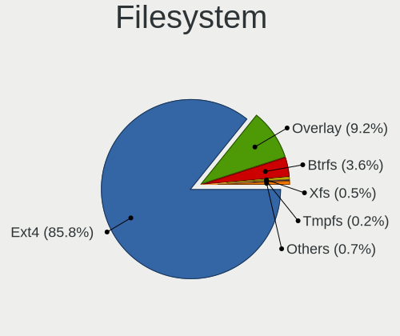
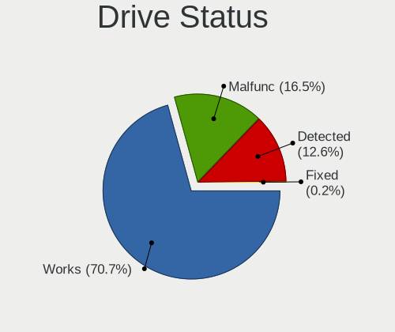
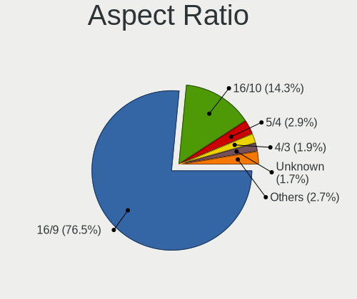

MX 21 - Tested Hardware & Statistics
------------------------------------

A project to collect tested hardware configurations for MX 21.

Anyone can contribute to this report by the [hw-probe](https://github.com/linuxhw/hw-probe) tool:

    sudo -E hw-probe -all -upload

Please submit a probe of your configuration if it's not presented on the page or is rare.

This is a report for all computer types. See also reports for [desktops](/Dist/MX_21/Desktop/README.md) and [notebooks](/Dist/MX_21/Notebook/README.md).

Full-feature report is available here: https://linux-hardware.org/?view=trends

Contents
--------

* [ Test Cases ](#test-cases)

* [ System ](#system)
  - [ Kernel                   ](#kernel)
  - [ Kernel Family            ](#kernel-family)
  - [ Kernel Major Ver.        ](#kernel-major-ver)
  - [ Arch                     ](#arch)
  - [ DE                       ](#de)
  - [ Display Server           ](#display-server)
  - [ Display Manager          ](#display-manager)
  - [ OS Lang                  ](#os-lang)
  - [ Boot Mode                ](#boot-mode)
  - [ Filesystem               ](#filesystem)
  - [ Part. scheme             ](#part-scheme)
  - [ Dual Boot with Linux/BSD ](#dual-boot-with-linuxbsd)
  - [ Dual Boot (Win)          ](#dual-boot-win)

* [ Board ](#board)
  - [ Vendor                   ](#vendor)
  - [ Model                    ](#model)
  - [ Model Family             ](#model-family)
  - [ MFG Year                 ](#mfg-year)
  - [ Form Factor              ](#form-factor)
  - [ Secure Boot              ](#secure-boot)
  - [ Coreboot                 ](#coreboot)
  - [ RAM Size                 ](#ram-size)
  - [ RAM Used                 ](#ram-used)
  - [ Total Drives             ](#total-drives)
  - [ Has CD-ROM               ](#has-cd-rom)
  - [ Has Ethernet             ](#has-ethernet)
  - [ Has WiFi                 ](#has-wifi)
  - [ Has Bluetooth            ](#has-bluetooth)

* [ Location ](#location)
  - [ Country                  ](#country)
  - [ City                     ](#city)

* [ Drives ](#drives)
  - [ Drive Vendor             ](#drive-vendor)
  - [ Drive Model              ](#drive-model)
  - [ HDD Vendor               ](#hdd-vendor)
  - [ SSD Vendor               ](#ssd-vendor)
  - [ Drive Kind               ](#drive-kind)
  - [ Drive Connector          ](#drive-connector)
  - [ Drive Size               ](#drive-size)
  - [ Space Total              ](#space-total)
  - [ Space Used               ](#space-used)
  - [ Malfunc. Drives          ](#malfunc-drives)
  - [ Malfunc. Drive Vendor    ](#malfunc-drive-vendor)
  - [ Malfunc. HDD Vendor      ](#malfunc-hdd-vendor)
  - [ Malfunc. Drive Kind      ](#malfunc-drive-kind)
  - [ Failed Drives            ](#failed-drives)
  - [ Failed Drive Vendor      ](#failed-drive-vendor)
  - [ Drive Status             ](#drive-status)

* [ Storage controller ](#storage-controller)
  - [ Storage Vendor           ](#storage-vendor)
  - [ Storage Model            ](#storage-model)
  - [ Storage Kind             ](#storage-kind)

* [ Processor ](#processor)
  - [ CPU Vendor               ](#cpu-vendor)
  - [ CPU Model                ](#cpu-model)
  - [ CPU Model Family         ](#cpu-model-family)
  - [ CPU Cores                ](#cpu-cores)
  - [ CPU Sockets              ](#cpu-sockets)
  - [ CPU Threads              ](#cpu-threads)
  - [ CPU Op-Modes             ](#cpu-op-modes)
  - [ CPU Microcode            ](#cpu-microcode)
  - [ CPU Microarch            ](#cpu-microarch)

* [ Graphics ](#graphics)
  - [ GPU Vendor               ](#gpu-vendor)
  - [ GPU Model                ](#gpu-model)
  - [ GPU Combo                ](#gpu-combo)
  - [ GPU Driver               ](#gpu-driver)
  - [ GPU Memory               ](#gpu-memory)

* [ Monitor ](#monitor)
  - [ Monitor Vendor           ](#monitor-vendor)
  - [ Monitor Model            ](#monitor-model)
  - [ Monitor Resolution       ](#monitor-resolution)
  - [ Monitor Diagonal         ](#monitor-diagonal)
  - [ Monitor Width            ](#monitor-width)
  - [ Aspect Ratio             ](#aspect-ratio)
  - [ Monitor Area             ](#monitor-area)
  - [ Pixel Density            ](#pixel-density)
  - [ Multiple Monitors        ](#multiple-monitors)

* [ Network ](#network)
  - [ Net Controller Vendor    ](#net-controller-vendor)
  - [ Net Controller Model     ](#net-controller-model)
  - [ Wireless Vendor          ](#wireless-vendor)
  - [ Wireless Model           ](#wireless-model)
  - [ Ethernet Vendor          ](#ethernet-vendor)
  - [ Ethernet Model           ](#ethernet-model)
  - [ Net Controller Kind      ](#net-controller-kind)
  - [ Used Controller          ](#used-controller)
  - [ NICs                     ](#nics)
  - [ IPv6                     ](#ipv6)

* [ Bluetooth ](#bluetooth)
  - [ Bluetooth Vendor         ](#bluetooth-vendor)
  - [ Bluetooth Model          ](#bluetooth-model)

* [ Sound ](#sound)
  - [ Sound Vendor             ](#sound-vendor)
  - [ Sound Model              ](#sound-model)

* [ Memory ](#memory)
  - [ Memory Vendor            ](#memory-vendor)
  - [ Memory Model             ](#memory-model)
  - [ Memory Kind              ](#memory-kind)
  - [ Memory Form Factor       ](#memory-form-factor)
  - [ Memory Size              ](#memory-size)
  - [ Memory Speed             ](#memory-speed)

* [ Printers & scanners ](#printers--scanners)
  - [ Printer Vendor           ](#printer-vendor)
  - [ Printer Model            ](#printer-model)
  - [ Scanner Vendor           ](#scanner-vendor)
  - [ Scanner Model            ](#scanner-model)

* [ Camera ](#camera)
  - [ Camera Vendor            ](#camera-vendor)
  - [ Camera Model             ](#camera-model)

* [ Security ](#security)
  - [ Fingerprint Vendor       ](#fingerprint-vendor)
  - [ Fingerprint Model        ](#fingerprint-model)
  - [ Chipcard Vendor          ](#chipcard-vendor)
  - [ Chipcard Model           ](#chipcard-model)

* [ Unsupported ](#unsupported)
  - [ Unsupported Devices      ](#unsupported-devices)
  - [ Unsupported Device Types ](#unsupported-device-types)

Test Cases
----------

| Vendor        | Model                       | Form-Factor | Probe                                                      | Date         |
|---------------|-----------------------------|-------------|------------------------------------------------------------|--------------|
| Dell          | Latitude 3190               | Notebook    | [964420352c](https://linux-hardware.org/?probe=964420352c) | Feb 28, 2022 |
| Dell          | XPS 17 9710                 | Notebook    | [7147fe2d5c](https://linux-hardware.org/?probe=7147fe2d5c) | Feb 26, 2022 |
| ASUSTek       | 1101HA                      | Notebook    | [b234cc741f](https://linux-hardware.org/?probe=b234cc741f) | Feb 22, 2022 |
| Dell          | Latitude 3190               | Notebook    | [9637b88602](https://linux-hardware.org/?probe=9637b88602) | Feb 21, 2022 |
| Dell          | XPS 17 9710                 | Notebook    | [851badde2e](https://linux-hardware.org/?probe=851badde2e) | Feb 20, 2022 |
| ASUSTek       | ROG Maximus XIII HERO       | Desktop     | [e58223cc60](https://linux-hardware.org/?probe=e58223cc60) | Feb 18, 2022 |
| Huanan        | X99-F8 V2.0                 | Desktop     | [23c722f6cf](https://linux-hardware.org/?probe=23c722f6cf) | Feb 18, 2022 |
| Huanan        | X99-F8 V2.0                 | Desktop     | [f4fec6a5be](https://linux-hardware.org/?probe=f4fec6a5be) | Feb 17, 2022 |
| Sony          | VPCF119FX                   | Notebook    | [1e8448b824](https://linux-hardware.org/?probe=1e8448b824) | Feb 15, 2022 |
| Dell          | Latitude 3190               | Notebook    | [6340f68567](https://linux-hardware.org/?probe=6340f68567) | Feb 14, 2022 |
| MSI           | Z97 GAMING 5                | Desktop     | [7c66c1b404](https://linux-hardware.org/?probe=7c66c1b404) | Feb 09, 2022 |
| Sony          | SVE1513Q1ESI                | Notebook    | [77e599ef9f](https://linux-hardware.org/?probe=77e599ef9f) | Feb 08, 2022 |
| Dell          | Latitude 3190               | Notebook    | [90df65f573](https://linux-hardware.org/?probe=90df65f573) | Feb 07, 2022 |
| Dell          | Latitude E4310              | Notebook    | [50190cb420](https://linux-hardware.org/?probe=50190cb420) | Feb 06, 2022 |
| efirstview    | v01099                      | Notebook    | [ed22d3c2b6](https://linux-hardware.org/?probe=ed22d3c2b6) | Feb 04, 2022 |
| Dell          | Latitude 3190               | Notebook    | [2e81dc022b](https://linux-hardware.org/?probe=2e81dc022b) | Jan 31, 2022 |
| ASUSTek       | X99-DELUXE                  | Desktop     | [4ffe151e7a](https://linux-hardware.org/?probe=4ffe151e7a) | Jan 29, 2022 |
| Dell          | Latitude 3190               | Notebook    | [9b8e8549fd](https://linux-hardware.org/?probe=9b8e8549fd) | Jan 24, 2022 |
| Lenovo        | ThinkPad W541 20EG0005MS    | Notebook    | [f89a7895fc](https://linux-hardware.org/?probe=f89a7895fc) | Jan 23, 2022 |
| Sony          | VPCEH2N1E                   | Notebook    | [17a4bc1847](https://linux-hardware.org/?probe=17a4bc1847) | Jan 22, 2022 |
| Fujitsu Si... | LIFEBOOK E8010              | Notebook    | [82d1bc5db0](https://linux-hardware.org/?probe=82d1bc5db0) | Jan 22, 2022 |
| MSI           | Alpha 15 B5EEK              | Notebook    | [882906d968](https://linux-hardware.org/?probe=882906d968) | Jan 17, 2022 |
| Alienware     | 13 R2                       | Notebook    | [65c1ae9026](https://linux-hardware.org/?probe=65c1ae9026) | Jan 14, 2022 |
| Dell          | Latitude 3190               | Notebook    | [3bb6a6428f](https://linux-hardware.org/?probe=3bb6a6428f) | Jan 10, 2022 |
| HP            | EliteBook 840 G3            | Notebook    | [58cff543b5](https://linux-hardware.org/?probe=58cff543b5) | Jan 06, 2022 |
| HP            | 0B4Ch D                     | Desktop     | [ecaec39529](https://linux-hardware.org/?probe=ecaec39529) | Jan 05, 2022 |
| HP            | EliteBook 8440p             | Notebook    | [d0d2edf745](https://linux-hardware.org/?probe=d0d2edf745) | Jan 04, 2022 |
| Lenovo        | G400s VILG1                 | Notebook    | [1cd4b24f16](https://linux-hardware.org/?probe=1cd4b24f16) | Jan 04, 2022 |
| Dell          | Latitude 3190               | Notebook    | [2c483dc59d](https://linux-hardware.org/?probe=2c483dc59d) | Jan 03, 2022 |
| Gigabyte      | P15FV5                      | Notebook    | [164348e568](https://linux-hardware.org/?probe=164348e568) | Jan 03, 2022 |
| HP            | Spectre x360 Convertible... | Convertible | [7cc374183b](https://linux-hardware.org/?probe=7cc374183b) | Dec 30, 2021 |
| Dell          | Latitude 3190               | Notebook    | [67cba6d321](https://linux-hardware.org/?probe=67cba6d321) | Dec 27, 2021 |
| Lenovo        | IdeaPad Y700-15ISK 80NV     | Notebook    | [4fe24b4f44](https://linux-hardware.org/?probe=4fe24b4f44) | Dec 26, 2021 |
| Intel         | NUC10i7FNB K61360-302       | Mini pc     | [9147191a67](https://linux-hardware.org/?probe=9147191a67) | Dec 24, 2021 |
| ASUSTek       | X550CC                      | Notebook    | [b0cde813b9](https://linux-hardware.org/?probe=b0cde813b9) | Dec 23, 2021 |
| Dell          | Latitude 3190               | Notebook    | [1a96380872](https://linux-hardware.org/?probe=1a96380872) | Dec 20, 2021 |
| Fujitsu       | D3221-A1 S26361-D3221-A1    | Desktop     | [78d4e04363](https://linux-hardware.org/?probe=78d4e04363) | Dec 16, 2021 |
| Samsung       | 340XAA/350XAA/550XAA        | Notebook    | [49692045a2](https://linux-hardware.org/?probe=49692045a2) | Dec 16, 2021 |
| Dell          | Latitude 3190               | Notebook    | [5321909b8c](https://linux-hardware.org/?probe=5321909b8c) | Dec 13, 2021 |
| Dell          | Latitude 3190               | Notebook    | [9c532278f1](https://linux-hardware.org/?probe=9c532278f1) | Dec 06, 2021 |
| ASUSTek       | ASUS TUF Gaming A15 FA50... | Notebook    | [21180cbdad](https://linux-hardware.org/?probe=21180cbdad) | Dec 04, 2021 |
| GALAX         | B550M                       | Desktop     | [a6866c8a45](https://linux-hardware.org/?probe=a6866c8a45) | Dec 04, 2021 |
| Lenovo        | Yoga 7 14ITL5 82BH          | Convertible | [bc8359d097](https://linux-hardware.org/?probe=bc8359d097) | Dec 01, 2021 |
| Lenovo        | B590 20208                  | Notebook    | [ed08d6bdd9](https://linux-hardware.org/?probe=ed08d6bdd9) | Nov 30, 2021 |
| Dell          | Latitude 3190               | Notebook    | [700dd2459e](https://linux-hardware.org/?probe=700dd2459e) | Nov 29, 2021 |
| Lenovo        | ThinkBook 13s-IWL 20R9      | Notebook    | [649434f9b8](https://linux-hardware.org/?probe=649434f9b8) | Nov 23, 2021 |
| Dell          | Latitude 3190               | Notebook    | [7f020f1d1f](https://linux-hardware.org/?probe=7f020f1d1f) | Nov 22, 2021 |
| Apple         | Mac-942B5BF58194151B        | All in one  | [bb58f4914e](https://linux-hardware.org/?probe=bb58f4914e) | Nov 21, 2021 |
| ASUSTek       | N53SN                       | Notebook    | [67d66feb3e](https://linux-hardware.org/?probe=67d66feb3e) | Nov 20, 2021 |
| Dell          | Latitude 3190               | Notebook    | [f24ac635ba](https://linux-hardware.org/?probe=f24ac635ba) | Nov 15, 2021 |
| ASUSTek       | TUF Gaming FX505DT_FX505... | Notebook    | [791ae651bb](https://linux-hardware.org/?probe=791ae651bb) | Nov 14, 2021 |
| ASUSTek       | TUF Gaming FX505DT_FX505... | Notebook    | [b105aaabf5](https://linux-hardware.org/?probe=b105aaabf5) | Nov 14, 2021 |
| Lenovo        | SHARKBAY NO DPK             | Desktop     | [fd5f409df8](https://linux-hardware.org/?probe=fd5f409df8) | Nov 14, 2021 |
| Lenovo        | SHARKBAY NO DPK             | Desktop     | [a85cc99f78](https://linux-hardware.org/?probe=a85cc99f78) | Nov 14, 2021 |
| HP            | Compaq Presario CQ60        | Notebook    | [9d83baca33](https://linux-hardware.org/?probe=9d83baca33) | Nov 12, 2021 |
| Lenovo        | ThinkPad E15 Gen 3 20YG0... | Notebook    | [c277967769](https://linux-hardware.org/?probe=c277967769) | Nov 11, 2021 |
| ASRock        | X570 Steel Legend           | Desktop     | [18391015f7](https://linux-hardware.org/?probe=18391015f7) | Nov 11, 2021 |
| Apple         | MacBook3,1                  | Notebook    | [25964b9256](https://linux-hardware.org/?probe=25964b9256) | Nov 08, 2021 |
| HP            | EliteBook 850 G3            | Notebook    | [cd26ab6e8f](https://linux-hardware.org/?probe=cd26ab6e8f) | Nov 05, 2021 |
| Dell          | Latitude 3190               | Notebook    | [592b613273](https://linux-hardware.org/?probe=592b613273) | Nov 01, 2021 |
| Gigabyte      | X570 AORUS PRO              | Desktop     | [fbd2076eee](https://linux-hardware.org/?probe=fbd2076eee) | Oct 28, 2021 |
| ASUSTek       | E402MA                      | Notebook    | [4c2453c6a2](https://linux-hardware.org/?probe=4c2453c6a2) | Oct 26, 2021 |
| Sony          | VPCEC3S1E                   | Notebook    | [2af79ba873](https://linux-hardware.org/?probe=2af79ba873) | Oct 25, 2021 |
| Gigabyte      | B550M DS3H                  | Desktop     | [ee6a141211](https://linux-hardware.org/?probe=ee6a141211) | Oct 19, 2021 |
| Fujitsu Si... | ESPRIMO Mobile D9500        | Notebook    | [ee6fdf4608](https://linux-hardware.org/?probe=ee6fdf4608) | Oct 18, 2021 |
| Chuwi         | GemiBook Pro                | Notebook    | [f8735054b4](https://linux-hardware.org/?probe=f8735054b4) | Sep 02, 2021 |
| Gigabyte      | A320M-S2H V2-CF             | Desktop     | [5d136cb09b](https://linux-hardware.org/?probe=5d136cb09b) | Aug 13, 2021 |
| Samsung       | 350V5C/351V5C/3540VC/344... | Notebook    | [c4ebb4c114](https://linux-hardware.org/?probe=c4ebb4c114) | Jun 04, 2021 |

System
------

Kernel
------

Version of the Linux kernel

| Version                   | Computers | Percent |
|---------------------------|-----------|---------|
| 5.10.0-9-amd64            | 16        | 32.65%  |
| 5.14.0-4mx-amd64          | 8         | 16.33%  |
| 5.10.0-11-amd64           | 8         | 16.33%  |
| 5.10.0-10-amd64           | 4         | 8.16%   |
| 5.14.0-3mx-amd64          | 2         | 4.08%   |
| 5.10.0-8-amd64            | 2         | 4.08%   |
| 5.10.0-11-686-pae         | 2         | 4.08%   |
| 5.16.0-rc5-hwmon-next+    | 1         | 2.04%   |
| 5.15.0-2-amd64            | 1         | 2.04%   |
| 5.15.0-0.bpo.2-amd64      | 1         | 2.04%   |
| 5.14.0-2mx-amd64          | 1         | 2.04%   |
| 5.10.52-antix.1-amd64-smp | 1         | 2.04%   |
| 5.10.0-5mx-amd64          | 1         | 2.04%   |
| 5.10.0-11-686             | 1         | 2.04%   |

Kernel Family
-------------

Linux kernel without a distro release

| Version | Computers | Percent |
|---------|-----------|---------|
| 5.10.0  | 32        | 68.09%  |
| 5.14.0  | 11        | 23.4%   |
| 5.15.0  | 2         | 4.26%   |
| 5.16.0  | 1         | 2.13%   |
| 5.10.52 | 1         | 2.13%   |

Kernel Major Ver.
-----------------

Linux kernel major version

| Version | Computers | Percent |
|---------|-----------|---------|
| 5.10    | 33        | 70.21%  |
| 5.14    | 11        | 23.4%   |
| 5.15    | 2         | 4.26%   |
| 5.16    | 1         | 2.13%   |

Arch
----

OS architecture (x86_64, i586, etc.)

| Name   | Computers | Percent |
|--------|-----------|---------|
| x86_64 | 44        | 93.62%  |
| i686   | 3         | 6.38%   |

DE
--

Desktop Environment

| Name   | Computers | Percent |
|--------|-----------|---------|
| XFCE   | 30        | 63.83%  |
| KDE5   | 15        | 31.91%  |
| GNOME  | 1         | 2.13%   |
| Budgie | 1         | 2.13%   |

Display Server
--------------

X11 or Wayland

| Name | Computers | Percent |
|------|-----------|---------|
| X11  | 46        | 97.87%  |
| Tty  | 1         | 2.13%   |

Display Manager
---------------

SDDM, LightDM, etc.

| Name    | Computers | Percent |
|---------|-----------|---------|
| LightDM | 31        | 65.96%  |
| SDDM    | 15        | 31.91%  |
| Unknown | 1         | 2.13%   |

OS Lang
-------

Language

| Lang    | Computers | Percent |
|---------|-----------|---------|
| en_US   | 22        | 46.81%  |
| de_DE   | 5         | 10.64%  |
| it_IT   | 3         | 6.38%   |
| de_CH   | 3         | 6.38%   |
| ru_RU   | 2         | 4.26%   |
| pt_BR   | 2         | 4.26%   |
| fr_FR   | 2         | 4.26%   |
| en_GB   | 2         | 4.26%   |
| Unknown | 2         | 4.26%   |
| tr_TR   | 1         | 2.13%   |
| sk_SK   | 1         | 2.13%   |
| es_PE   | 1         | 2.13%   |
| es_ES   | 1         | 2.13%   |

Boot Mode
---------

EFI or BIOS

| Mode | Computers | Percent |
|------|-----------|---------|
| EFI  | 32        | 68.09%  |
| BIOS | 15        | 31.91%  |

Filesystem
----------

Type of filesystem

| Type    | Computers | Percent |
|---------|-----------|---------|
| Ext4    | 37        | 78.72%  |
| Overlay | 6         | 12.77%  |
| Btrfs   | 3         | 6.38%   |
| F2fs    | 1         | 2.13%   |

Part. scheme
------------

Scheme of partitioning

| Type | Computers | Percent |
|------|-----------|---------|
| GPT  | 36        | 76.6%   |
| MBR  | 11        | 23.4%   |

Dual Boot with Linux/BSD
------------------------

Hosting more than one Linux/BSD

| Dual boot | Computers | Percent |
|-----------|-----------|---------|
| No        | 28        | 59.57%  |
| Yes       | 19        | 40.43%  |

Dual Boot (Win)
---------------

Hosting Linux and Windows

| Dual boot | Computers | Percent |
|-----------|-----------|---------|
| Yes       | 25        | 53.19%  |
| No        | 22        | 46.81%  |

Board
-----

Vendor
------

Motherboard manufacturer

| Name                | Computers | Percent |
|---------------------|-----------|---------|
| Lenovo              | 8         | 17.02%  |
| ASUSTek Computer    | 8         | 17.02%  |
| Hewlett-Packard     | 6         | 12.77%  |
| Sony                | 4         | 8.51%   |
| Gigabyte Technology | 3         | 6.38%   |
| Dell                | 3         | 6.38%   |
| Samsung Electronics | 2         | 4.26%   |
| MSI                 | 2         | 4.26%   |
| Fujitsu Siemens     | 2         | 4.26%   |
| Apple               | 2         | 4.26%   |
| Huanan              | 1         | 2.13%   |
| GALAX               | 1         | 2.13%   |
| Fujitsu             | 1         | 2.13%   |
| efirstview          | 1         | 2.13%   |
| Chuwi               | 1         | 2.13%   |
| ASRock              | 1         | 2.13%   |
| Alienware           | 1         | 2.13%   |

Model
-----

Motherboard model

| Name                                      | Computers | Percent |
|-------------------------------------------|-----------|---------|
| Sony VPCF119FX                            | 1         | 2.13%   |
| Sony VPCEH2N1E                            | 1         | 2.13%   |
| Sony VPCEC3S1E                            | 1         | 2.13%   |
| Sony SVE1513Q1ESI                         | 1         | 2.13%   |
| Samsung 350V5C/351V5C/3540VC/3440VC       | 1         | 2.13%   |
| Samsung 340XAA/350XAA/550XAA              | 1         | 2.13%   |
| MSI MS-7917                               | 1         | 2.13%   |
| MSI Alpha 15 B5EEK                        | 1         | 2.13%   |
| Lenovo Yoga 7 14ITL5 82BH                 | 1         | 2.13%   |
| Lenovo ThinkPad W541 20EG0005MS           | 1         | 2.13%   |
| Lenovo ThinkPad E15 Gen 3 20YG008CUS      | 1         | 2.13%   |
| Lenovo ThinkBook 13s-IWL 20R9             | 1         | 2.13%   |
| Lenovo IdeaPad Y700-15ISK 80NV            | 1         | 2.13%   |
| Lenovo G400s VILG1                        | 1         | 2.13%   |
| Lenovo B590 20208                         | 1         | 2.13%   |
| Lenovo 10AAS1QB0B                         | 1         | 2.13%   |
| Huanan X99-F8                             | 1         | 2.13%   |
| HP Z400 Workstation                       | 1         | 2.13%   |
| HP Spectre x360 Convertible 15-df1xxx     | 1         | 2.13%   |
| HP EliteBook 850 G3                       | 1         | 2.13%   |
| HP EliteBook 8440p                        | 1         | 2.13%   |
| HP EliteBook 840 G3                       | 1         | 2.13%   |
| HP Compaq Presario CQ60                   | 1         | 2.13%   |
| Gigabyte X570 AORUS PRO                   | 1         | 2.13%   |
| Gigabyte P15FV5                           | 1         | 2.13%   |
| Gigabyte B550M DS3H                       | 1         | 2.13%   |
| GALAX B550M                               | 1         | 2.13%   |
| Fujitsu Siemens LIFEBOOK E8010            | 1         | 2.13%   |
| Fujitsu Siemens ESPRIMO Mobile D9500      | 1         | 2.13%   |
| Fujitsu ESPRIMO P720                      | 1         | 2.13%   |
| efirstview v01099                         | 1         | 2.13%   |
| Dell XPS 17 9710                          | 1         | 2.13%   |
| Dell Latitude E4310                       | 1         | 2.13%   |
| Dell Latitude 3190                        | 1         | 2.13%   |
| Chuwi GemiBook Pro                        | 1         | 2.13%   |
| ASUS X550CC                               | 1         | 2.13%   |
| ASUS TUF Gaming FX505DT_FX505DT           | 1         | 2.13%   |
| ASUS ROG Maximus XIII HERO                | 1         | 2.13%   |
| ASUS N53SN                                | 1         | 2.13%   |
| ASUS E402MA                               | 1         | 2.13%   |
| ASUS ASUS TUF Gaming A15 FA506QE_TUF506QE | 1         | 2.13%   |
| ASUS All Series                           | 1         | 2.13%   |
| ASUS 1101HA                               | 1         | 2.13%   |
| ASRock X570 Steel Legend                  | 1         | 2.13%   |
| Apple MacBook3,1                          | 1         | 2.13%   |
| Apple iMac12,1                            | 1         | 2.13%   |
| Alienware 13 R2                           | 1         | 2.13%   |

Model Family
------------

Motherboard model prefix

| Name                     | Computers | Percent |
|--------------------------|-----------|---------|
| HP EliteBook             | 3         | 6.38%   |
| Lenovo ThinkPad          | 2         | 4.26%   |
| Dell Latitude            | 2         | 4.26%   |
| Sony VPCF119FX           | 1         | 2.13%   |
| Sony VPCEH2N1E           | 1         | 2.13%   |
| Sony VPCEC3S1E           | 1         | 2.13%   |
| Sony SVE1513Q1ESI        | 1         | 2.13%   |
| Samsung 350V5C           | 1         | 2.13%   |
| Samsung 340XAA           | 1         | 2.13%   |
| MSI MS-7917              | 1         | 2.13%   |
| MSI Alpha                | 1         | 2.13%   |
| Lenovo Yoga              | 1         | 2.13%   |
| Lenovo ThinkBook         | 1         | 2.13%   |
| Lenovo IdeaPad           | 1         | 2.13%   |
| Lenovo G400s             | 1         | 2.13%   |
| Lenovo B590              | 1         | 2.13%   |
| Lenovo 10AAS1QB0B        | 1         | 2.13%   |
| Huanan X99-F8            | 1         | 2.13%   |
| HP Z400                  | 1         | 2.13%   |
| HP Spectre               | 1         | 2.13%   |
| HP Compaq                | 1         | 2.13%   |
| Gigabyte X570            | 1         | 2.13%   |
| Gigabyte P15FV5          | 1         | 2.13%   |
| Gigabyte B550M           | 1         | 2.13%   |
| GALAX B550M              | 1         | 2.13%   |
| Fujitsu Siemens LIFEBOOK | 1         | 2.13%   |
| Fujitsu Siemens ESPRIMO  | 1         | 2.13%   |
| Fujitsu ESPRIMO          | 1         | 2.13%   |
| efirstview v01099        | 1         | 2.13%   |
| Dell XPS                 | 1         | 2.13%   |
| Chuwi GemiBook           | 1         | 2.13%   |
| ASUS X550CC              | 1         | 2.13%   |
| ASUS TUF                 | 1         | 2.13%   |
| ASUS ROG                 | 1         | 2.13%   |
| ASUS N53SN               | 1         | 2.13%   |
| ASUS E402MA              | 1         | 2.13%   |
| ASUS ASUS                | 1         | 2.13%   |
| ASUS All                 | 1         | 2.13%   |
| ASUS 1101HA              | 1         | 2.13%   |
| ASRock X570              | 1         | 2.13%   |
| Apple MacBook3           | 1         | 2.13%   |
| Apple iMac12             | 1         | 2.13%   |
| Alienware 13             | 1         | 2.13%   |

MFG Year
--------

Motherboard manufacture year

| Year    | Computers | Percent |
|---------|-----------|---------|
| 2021    | 6         | 12.77%  |
| 2019    | 5         | 10.64%  |
| 2015    | 5         | 10.64%  |
| 2010    | 5         | 10.64%  |
| 2020    | 4         | 8.51%   |
| 2013    | 4         | 8.51%   |
| 2016    | 3         | 6.38%   |
| 2014    | 3         | 6.38%   |
| 2011    | 3         | 6.38%   |
| 2018    | 2         | 4.26%   |
| 2008    | 2         | 4.26%   |
| 2012    | 1         | 2.13%   |
| 2009    | 1         | 2.13%   |
| 2007    | 1         | 2.13%   |
| 2005    | 1         | 2.13%   |
| Unknown | 1         | 2.13%   |

Form Factor
-----------

Physical design of the computer

| Name        | Computers | Percent |
|-------------|-----------|---------|
| Notebook    | 33        | 70.21%  |
| Desktop     | 11        | 23.4%   |
| Convertible | 2         | 4.26%   |
| All in one  | 1         | 2.13%   |

Secure Boot
-----------

Enabled or disabled

| State    | Computers | Percent |
|----------|-----------|---------|
| Disabled | 46        | 97.87%  |
| Enabled  | 1         | 2.13%   |

Coreboot
--------

Have coreboot on board

| Used | Computers | Percent |
|------|-----------|---------|
| No   | 47        | 100%    |

RAM Size
--------

Total RAM memory

| Size in GB  | Computers | Percent |
|-------------|-----------|---------|
| 4.01-8.0    | 15        | 31.91%  |
| 8.01-16.0   | 11        | 23.4%   |
| 16.01-24.0  | 6         | 12.77%  |
| 32.01-64.0  | 5         | 10.64%  |
| 3.01-4.0    | 4         | 8.51%   |
| 2.01-3.0    | 2         | 4.26%   |
| 24.01-32.0  | 1         | 2.13%   |
| 64.01-256.0 | 1         | 2.13%   |
| 1.01-2.0    | 1         | 2.13%   |
| 0.51-1.0    | 1         | 2.13%   |

RAM Used
--------

Used RAM memory

| Used GB    | Computers | Percent |
|------------|-----------|---------|
| 1.01-2.0   | 17        | 35.42%  |
| 2.01-3.0   | 12        | 25%     |
| 3.01-4.0   | 6         | 12.5%   |
| 4.01-8.0   | 5         | 10.42%  |
| 0.51-1.0   | 5         | 10.42%  |
| 8.01-16.0  | 2         | 4.17%   |
| 16.01-24.0 | 1         | 2.08%   |

Total Drives
------------

Number of drives on board

| Drives | Computers | Percent |
|--------|-----------|---------|
| 1      | 28        | 59.57%  |
| 2      | 12        | 25.53%  |
| 3      | 4         | 8.51%   |
| 8      | 1         | 2.13%   |
| 5      | 1         | 2.13%   |
| 0      | 1         | 2.13%   |

Has CD-ROM
----------

Has CD-ROM on board

| Presented | Computers | Percent |
|-----------|-----------|---------|
| No        | 31        | 65.96%  |
| Yes       | 16        | 34.04%  |

Has Ethernet
------------

Has Ethernet on board

| Presented | Computers | Percent |
|-----------|-----------|---------|
| Yes       | 39        | 82.98%  |
| No        | 8         | 17.02%  |

Has WiFi
--------

Has WiFi module

| Presented | Computers | Percent |
|-----------|-----------|---------|
| Yes       | 37        | 78.72%  |
| No        | 10        | 21.28%  |

Has Bluetooth
-------------

Has Bluetooth module

| Presented | Computers | Percent |
|-----------|-----------|---------|
| Yes       | 29        | 61.7%   |
| No        | 18        | 38.3%   |

Location
--------

Country
-------

Geographic location (country)

| Country     | Computers | Percent |
|-------------|-----------|---------|
| USA         | 12        | 25.53%  |
| Germany     | 6         | 12.77%  |
| Italy       | 5         | 10.64%  |
| Switzerland | 3         | 6.38%   |
| France      | 2         | 4.26%   |
| Canada      | 2         | 4.26%   |
| Brazil      | 2         | 4.26%   |
| Belgium     | 2         | 4.26%   |
| UK          | 1         | 2.13%   |
| Turkey      | 1         | 2.13%   |
| Spain       | 1         | 2.13%   |
| Slovakia    | 1         | 2.13%   |
| Serbia      | 1         | 2.13%   |
| Russia      | 1         | 2.13%   |
| Poland      | 1         | 2.13%   |
| Peru        | 1         | 2.13%   |
| Netherlands | 1         | 2.13%   |
| India       | 1         | 2.13%   |
| Finland     | 1         | 2.13%   |
| Belarus     | 1         | 2.13%   |
| Azerbaijan  | 1         | 2.13%   |

City
----

Geographic location (city)

| City           | Computers | Percent |
|----------------|-----------|---------|
| Lausen         | 2         | 4.26%   |
| Zurich         | 1         | 2.13%   |
| Warsaw         | 1         | 2.13%   |
| Udine          | 1         | 2.13%   |
| Taggia         | 1         | 2.13%   |
| St Petersburg  | 1         | 2.13%   |
| Saskatoon      | 1         | 2.13%   |
| San Diego      | 1         | 2.13%   |
| Saarlouis      | 1         | 2.13%   |
| Rosporden      | 1         | 2.13%   |
| Roseville      | 1         | 2.13%   |
| Powder Springs | 1         | 2.13%   |
| Portland       | 1         | 2.13%   |
| Ottawa         | 1         | 2.13%   |
| Osasco         | 1         | 2.13%   |
| Normal         | 1         | 2.13%   |
| Mussolente     | 1         | 2.13%   |
| Munster        | 1         | 2.13%   |
| Munich         | 1         | 2.13%   |
| Minsk          | 1         | 2.13%   |
| Milwaukee      | 1         | 2.13%   |
| Milan          | 1         | 2.13%   |
| London         | 1         | 2.13%   |
| Lima           | 1         | 2.13%   |
| Lannion        | 1         | 2.13%   |
| Kent           | 1         | 2.13%   |
| Istanbul       | 1         | 2.13%   |
| Huercal Overa  | 1         | 2.13%   |
| Houston        | 1         | 2.13%   |
| Helsinki       | 1         | 2.13%   |
| Graniteville   | 1         | 2.13%   |
| Glendale       | 1         | 2.13%   |
| Gilmer         | 1         | 2.13%   |
| Freital        | 1         | 2.13%   |
| Florence       | 1         | 2.13%   |
| Colfontaine    | 1         | 2.13%   |
| Brussels       | 1         | 2.13%   |
| Bratislava     | 1         | 2.13%   |
| Bradenton      | 1         | 2.13%   |
| Bindlach       | 1         | 2.13%   |
| Berlin         | 1         | 2.13%   |
| Bengaluru      | 1         | 2.13%   |
| Belo Horizonte | 1         | 2.13%   |
| Belgrade       | 1         | 2.13%   |
| Baku           | 1         | 2.13%   |
| Amsterdam      | 1         | 2.13%   |

Drives
------

Drive Vendor
------------

Hard drive vendors

| Vendor              | Computers | Drives | Percent |
|---------------------|-----------|--------|---------|
| WDC                 | 13        | 16     | 18.84%  |
| Samsung Electronics | 13        | 17     | 18.84%  |
| Kingston            | 7         | 7      | 10.14%  |
| Seagate             | 6         | 6      | 8.7%    |
| Crucial             | 5         | 8      | 7.25%   |
| Transcend           | 3         | 3      | 4.35%   |
| SK Hynix            | 2         | 2      | 2.9%    |
| SanDisk             | 2         | 2      | 2.9%    |
| PNY                 | 2         | 3      | 2.9%    |
| LITEON              | 2         | 2      | 2.9%    |
| DOGFISH             | 2         | 2      | 2.9%    |
| Corsair             | 2         | 2      | 2.9%    |
| Unknown             | 1         | 1      | 1.45%   |
| Toshiba             | 1         | 1      | 1.45%   |
| OCZ                 | 1         | 1      | 1.45%   |
| Netac               | 1         | 1      | 1.45%   |
| Intel               | 1         | 1      | 1.45%   |
| GOODRAM             | 1         | 1      | 1.45%   |
| Gigabyte Technology | 1         | 1      | 1.45%   |
| GeIL                | 1         | 1      | 1.45%   |
| Fujitsu             | 1         | 1      | 1.45%   |
| Unknown             | 1         | 1      | 1.45%   |

Drive Model
-----------

Hard drive models

| Model                                | Computers | Percent |
|--------------------------------------|-----------|---------|
| Kingston SA400S37480G 480GB SSD      | 3         | 3.95%   |
| Kingston SA400S37240G 240GB SSD      | 3         | 3.95%   |
| Corsair MP400 2TB                    | 2         | 2.63%   |
| WDC WDS500G2B0C-00PXH0 500GB         | 1         | 1.32%   |
| WDC WDS500G2B0B-00YS70 500GB SSD     | 1         | 1.32%   |
| WDC WDS100T2B0A-00SM50 1TB SSD       | 1         | 1.32%   |
| WDC WD60EZRZ-00RWYB1 6TB             | 1         | 1.32%   |
| WDC WD60EFRX-68L0BN1 6TB             | 1         | 1.32%   |
| WDC WD5000LPCX-22VHAT0 500GB         | 1         | 1.32%   |
| WDC WD40EFRX-68WT0N0 4TB             | 1         | 1.32%   |
| WDC WD30EFRX-68AX9N0 3TB             | 1         | 1.32%   |
| WDC WD1600BEVT-60ZCT1 160GB          | 1         | 1.32%   |
| WDC WD10JPVX-22JC3T0 1TB             | 1         | 1.32%   |
| WDC WD10EZEX-08M2NA0 1TB             | 1         | 1.32%   |
| WDC WD10EVDS-63U8B1 1TB              | 1         | 1.32%   |
| WDC PC SN730 SDBPNTY-1T00-1101 1TB   | 1         | 1.32%   |
| WDC PC SN730 NVMe 1024GB             | 1         | 1.32%   |
| WDC PC SN530 SDBPMPZ-512G-1001 512GB | 1         | 1.32%   |
| Unknown SDW32G  32GB                 | 1         | 1.32%   |
| Transcend TS256GSSD370S 256GB        | 1         | 1.32%   |
| Transcend TS128GSSD370S 128GB        | 1         | 1.32%   |
| Transcend TS128GMTS800 128GB SSD     | 1         | 1.32%   |
| Toshiba MQ01ABD075 752GB             | 1         | 1.32%   |
| SK Hynix HFM512GD3JX013N 512GB       | 1         | 1.32%   |
| SK Hynix HFM256GDJTNG-8310A 256GB    | 1         | 1.32%   |
| Seagate ST750LM022 HN-M750MBB 752GB  | 1         | 1.32%   |
| Seagate ST500LM021-1KJ152 500GB      | 1         | 1.32%   |
| Seagate ST500LM000-1EJ162 500GB      | 1         | 1.32%   |
| Seagate ST2000LM003 HN-M201RAD 2TB   | 1         | 1.32%   |
| Seagate ST1000LM035-1RK172 1TB       | 1         | 1.32%   |
| Seagate ST1000LM024 HN-M101MBB 1TB   | 1         | 1.32%   |
| SanDisk SDSSDH3 1T00 1TB             | 1         | 1.32%   |
| SanDisk SD8SN8U-512G-1006 512GB SSD  | 1         | 1.32%   |
| Samsung SSD 980 PRO 1TB              | 1         | 1.32%   |
| Samsung SSD 970 PRO 512GB            | 1         | 1.32%   |
| Samsung SSD 970 EVO Plus 1TB         | 1         | 1.32%   |
| Samsung SSD 970 EVO 1TB              | 1         | 1.32%   |
| Samsung SSD 870 EVO 500GB            | 1         | 1.32%   |
| Samsung SSD 860 EVO M.2 1TB          | 1         | 1.32%   |
| Samsung SSD 860 EVO 500GB            | 1         | 1.32%   |
| Samsung SSD 860 EVO 1TB              | 1         | 1.32%   |
| Samsung SSD 850 EVO 500GB            | 1         | 1.32%   |
| Samsung SSD 840 Series 120GB         | 1         | 1.32%   |
| Samsung SSD 840 PRO Series 256GB     | 1         | 1.32%   |
| Samsung SSD 840 EVO 250GB            | 1         | 1.32%   |
| Samsung MZVPW256HEGL-00000 256GB     | 1         | 1.32%   |
| Samsung MZVLW256HEHP-000L2 256GB     | 1         | 1.32%   |
| Samsung HM500JI 500GB                | 1         | 1.32%   |
| Samsung HD501LJ 500GB                | 1         | 1.32%   |
| Samsung HD204UI 2TB                  | 1         | 1.32%   |
| PNY CS900 500GB SSD                  | 1         | 1.32%   |
| PNY CS3030 1TB SSD                   | 1         | 1.32%   |
| PNY CS2130 2TB SSD                   | 1         | 1.32%   |
| OCZ VERTEX3 120GB SSD                | 1         | 1.32%   |
| Netac SSD 256GB                      | 1         | 1.32%   |
| LITEON CV1-8B512-HP 512GB SSD        | 1         | 1.32%   |
| LITEON CV1-8B256 256GB SSD           | 1         | 1.32%   |
| Kingston OM8PCP3512F-AI1 512GB       | 1         | 1.32%   |
| Intel SSDSA2BW120G3H 120GB           | 1         | 1.32%   |
| GOODRAM SSDPR-CL100-480-G3 480GB     | 1         | 1.32%   |

HDD Vendor
----------

Hard disk drive vendors

| Vendor              | Computers | Drives | Percent |
|---------------------|-----------|--------|---------|
| WDC                 | 7         | 10     | 38.89%  |
| Seagate             | 6         | 6      | 33.33%  |
| Samsung Electronics | 3         | 3      | 16.67%  |
| Toshiba             | 1         | 1      | 5.56%   |
| Fujitsu             | 1         | 1      | 5.56%   |

SSD Vendor
----------

Solid state drive vendors

| Vendor              | Computers | Drives | Percent |
|---------------------|-----------|--------|---------|
| Samsung Electronics | 8         | 8      | 22.22%  |
| Kingston            | 6         | 6      | 16.67%  |
| Crucial             | 4         | 7      | 11.11%  |
| Transcend           | 3         | 3      | 8.33%   |
| WDC                 | 2         | 2      | 5.56%   |
| SanDisk             | 2         | 2      | 5.56%   |
| LITEON              | 2         | 2      | 5.56%   |
| Dogfish             | 2         | 2      | 5.56%   |
| PNY                 | 1         | 1      | 2.78%   |
| OCZ                 | 1         | 1      | 2.78%   |
| Netac               | 1         | 1      | 2.78%   |
| Intel               | 1         | 1      | 2.78%   |
| GOODRAM             | 1         | 1      | 2.78%   |
| Gigabyte Technology | 1         | 1      | 2.78%   |
| GeIL                | 1         | 1      | 2.78%   |

Drive Kind
----------

HDD or SSD

| Kind | Computers | Drives | Percent |
|------|-----------|--------|---------|
| SSD  | 30        | 39     | 46.15%  |
| HDD  | 17        | 21     | 26.15%  |
| NVMe | 16        | 18     | 24.62%  |
| MMC  | 2         | 2      | 3.08%   |

Drive Connector
---------------

SATA, SAS, NVMe, etc.

| Type | Computers | Drives | Percent |
|------|-----------|--------|---------|
| SATA | 37        | 60     | 67.27%  |
| NVMe | 16        | 18     | 29.09%  |
| MMC  | 2         | 2      | 3.64%   |

Drive Size
----------

Size of hard drive

| Size in TB | Computers | Drives | Percent |
|------------|-----------|--------|---------|
| 0.01-0.5   | 28        | 34     | 58.33%  |
| 0.51-1.0   | 15        | 19     | 31.25%  |
| 1.01-2.0   | 2         | 2      | 4.17%   |
| 3.01-4.0   | 1         | 1      | 2.08%   |
| 2.01-3.0   | 1         | 1      | 2.08%   |
| 4.01-10.0  | 1         | 3      | 2.08%   |

Space Total
-----------

Amount of disk space available on the file system

| Size in GB     | Computers | Percent |
|----------------|-----------|---------|
| 251-500        | 11        | 23.4%   |
| 101-250        | 10        | 21.28%  |
| 501-1000       | 7         | 14.89%  |
| 21-50          | 5         | 10.64%  |
| 1001-2000      | 4         | 8.51%   |
| 1-20           | 3         | 6.38%   |
| 51-100         | 3         | 6.38%   |
| More than 3000 | 2         | 4.26%   |
| 2001-3000      | 2         | 4.26%   |

Space Used
----------

Amount of used disk space

| Used GB        | Computers | Percent |
|----------------|-----------|---------|
| 1-20           | 19        | 40.43%  |
| 21-50          | 7         | 14.89%  |
| 101-250        | 6         | 12.77%  |
| 51-100         | 6         | 12.77%  |
| 251-500        | 4         | 8.51%   |
| 1001-2000      | 3         | 6.38%   |
| More than 3000 | 1         | 2.13%   |
| 501-1000       | 1         | 2.13%   |

Malfunc. Drives
---------------

Drive models with a malfunction

| Model                                        | Computers | Drives | Percent |
|----------------------------------------------|-----------|--------|---------|
| WDC WDS100T2B0A-00SM50 1TB SSD               | 1         | 1      | 14.29%  |
| Seagate ST750LM022 HN-M750MBB 752GB          | 1         | 1      | 14.29%  |
| Seagate ST500LM021-1KJ152 500GB              | 1         | 1      | 14.29%  |
| Samsung Electronics SSD 850 EVO 500GB        | 1         | 1      | 14.29%  |
| Samsung Electronics SSD 840 Series 120GB     | 1         | 1      | 14.29%  |
| Samsung Electronics SSD 840 PRO Series 256GB | 1         | 1      | 14.29%  |
| GOODRAM SSDPR-CL100-480-G3 480GB             | 1         | 1      | 14.29%  |

Malfunc. Drive Vendor
---------------------

Vendors of faulty drives

| Vendor              | Computers | Drives | Percent |
|---------------------|-----------|--------|---------|
| Samsung Electronics | 3         | 3      | 42.86%  |
| Seagate             | 2         | 2      | 28.57%  |
| WDC                 | 1         | 1      | 14.29%  |
| GOODRAM             | 1         | 1      | 14.29%  |

Malfunc. HDD Vendor
-------------------

Vendors of faulty HDD drives

| Vendor  | Computers | Drives | Percent |
|---------|-----------|--------|---------|
| Seagate | 2         | 2      | 100%    |

Malfunc. Drive Kind
-------------------

Kinds of faulty drives

| Kind | Computers | Drives | Percent |
|------|-----------|--------|---------|
| SSD  | 5         | 5      | 71.43%  |
| HDD  | 2         | 2      | 28.57%  |

Failed Drives
-------------

Failed drive models

Zero info for selected period =(

Failed Drive Vendor
-------------------

Failed drive vendors

Zero info for selected period =(

Drive Status
------------

Number of failed and malfunc. drives

| Status   | Computers | Drives | Percent |
|----------|-----------|--------|---------|
| Works    | 43        | 71     | 82.69%  |
| Malfunc  | 7         | 7      | 13.46%  |
| Detected | 2         | 2      | 3.85%   |

Storage controller
------------------

Storage Vendor
--------------

Storage controller vendors

| Vendor                      | Computers | Percent |
|-----------------------------|-----------|---------|
| Intel                       | 34        | 59.65%  |
| Samsung Electronics         | 5         | 8.77%   |
| Sandisk                     | 4         | 7.02%   |
| AMD                         | 4         | 7.02%   |
| Phison Electronics          | 3         | 5.26%   |
| SK Hynix                    | 2         | 3.51%   |
| Silicon Image               | 1         | 1.75%   |
| Nvidia                      | 1         | 1.75%   |
| Micron/Crucial Technology   | 1         | 1.75%   |
| Kingston Technology Company | 1         | 1.75%   |
| ASMedia Technology          | 1         | 1.75%   |

Storage Model
-------------

Storage controller models

| Model                                                                          | Computers | Percent |
|--------------------------------------------------------------------------------|-----------|---------|
| Intel 7 Series Chipset Family 6-port SATA Controller [AHCI mode]               | 5         | 7.94%   |
| Samsung NVMe SSD Controller SM981/PM981/PM983                                  | 3         | 4.76%   |
| Phison E12 NVMe Controller                                                     | 3         | 4.76%   |
| Intel Sunrise Point-LP SATA Controller [AHCI mode]                             | 3         | 4.76%   |
| Intel 8 Series/C220 Series Chipset Family 6-port SATA Controller 1 [AHCI mode] | 3         | 4.76%   |
| Sandisk WD Black SN750 / PC SN730 NVMe SSD                                     | 2         | 3.17%   |
| Samsung NVMe SSD Controller SM961/PM961/SM963                                  | 2         | 3.17%   |
| Intel HM170/QM170 Chipset SATA Controller [AHCI Mode]                          | 2         | 3.17%   |
| Intel Celeron/Pentium Silver Processor SATA Controller                         | 2         | 3.17%   |
| Intel C610/X99 series chipset sSATA Controller [AHCI mode]                     | 2         | 3.17%   |
| Intel C610/X99 series chipset 6-Port SATA Controller [AHCI mode]               | 2         | 3.17%   |
| Intel 82801HM/HEM (ICH8M/ICH8M-E) SATA Controller [AHCI mode]                  | 2         | 3.17%   |
| Intel 82801HM/HEM (ICH8M/ICH8M-E) IDE Controller                               | 2         | 3.17%   |
| Intel 82801 Mobile SATA Controller [RAID mode]                                 | 2         | 3.17%   |
| Intel 6 Series/C200 Series Chipset Family 6 port Mobile SATA AHCI Controller   | 2         | 3.17%   |
| Intel 5 Series/3400 Series Chipset 6 port SATA AHCI Controller                 | 2         | 3.17%   |
| AMD Starship/Matisse Chipset SATA Controller [AHCI mode]                       | 2         | 3.17%   |
| AMD FCH SATA Controller [AHCI mode]                                            | 2         | 3.17%   |
| SK Hynix Gold P31 SSD                                                          | 1         | 1.59%   |
| SK Hynix BC501 NVMe Solid State Drive                                          | 1         | 1.59%   |
| Silicon Image SiI 3132 Serial ATA Raid II Controller                           | 1         | 1.59%   |
| Sandisk WD Blue SN550 NVMe SSD                                                 | 1         | 1.59%   |
| Sandisk Non-Volatile memory controller                                         | 1         | 1.59%   |
| Samsung NVMe SSD Controller PM9A1/PM9A3/980PRO                                 | 1         | 1.59%   |
| Nvidia MCP78S [GeForce 8200] SATA Controller (non-AHCI mode)                   | 1         | 1.59%   |
| Nvidia MCP78S [GeForce 8200] IDE                                               | 1         | 1.59%   |
| Micron/Crucial P2 NVMe PCIe SSD                                                | 1         | 1.59%   |
| Kingston Company Company Non-Volatile memory controller                        | 1         | 1.59%   |
| Intel Volume Management Device NVMe RAID Controller                            | 1         | 1.59%   |
| Intel US15W/US15X/US15L/UL11L SCH [Poulsbo] IDE Controller                     | 1         | 1.59%   |
| Intel SATA Controller [RAID mode]                                              | 1         | 1.59%   |
| Intel Atom Processor E3800 Series SATA AHCI Controller                         | 1         | 1.59%   |
| Intel 9 Series Chipset Family SATA Controller [AHCI Mode]                      | 1         | 1.59%   |
| Intel 82801DBM (ICH4-M) IDE Controller                                         | 1         | 1.59%   |
| Intel 6 Series/C200 Series Chipset Family 6 port Desktop SATA AHCI Controller  | 1         | 1.59%   |
| Intel 500 Series Chipset Family SATA AHCI Controller                           | 1         | 1.59%   |
| Intel 5 Series/3400 Series Chipset 4 port SATA AHCI Controller                 | 1         | 1.59%   |
| ASMedia ASM1062 Serial ATA Controller                                          | 1         | 1.59%   |

Storage Kind
------------

Kind of storage controller (IDE, SATA, NVMe, SAS, ...)

| Kind | Computers | Percent |
|------|-----------|---------|
| SATA | 32        | 55.17%  |
| NVMe | 16        | 27.59%  |
| RAID | 5         | 8.62%   |
| IDE  | 5         | 8.62%   |

Processor
---------

CPU Vendor
----------

Processor vendors

| Vendor | Computers | Percent |
|--------|-----------|---------|
| Intel  | 38        | 80.85%  |
| AMD    | 9         | 19.15%  |

CPU Model
---------

Processor models

| Model                                         | Computers | Percent |
|-----------------------------------------------|-----------|---------|
| Intel Core i7-6700HQ CPU @ 2.60GHz            | 2         | 4.26%   |
| Intel Core i5-6200U CPU @ 2.30GHz             | 2         | 4.26%   |
| Intel Core i5-3230M CPU @ 2.60GHz             | 2         | 4.26%   |
| AMD Ryzen 7 5800H with Radeon Graphics        | 2         | 4.26%   |
| Intel Xeon CPU W3565 @ 3.20GHz                | 1         | 2.13%   |
| Intel Xeon CPU E5-2678 v3 @ 2.50GHz           | 1         | 2.13%   |
| Intel Pentium Silver N5000 CPU @ 1.10GHz      | 1         | 2.13%   |
| Intel Pentium M processor 1.80GHz             | 1         | 2.13%   |
| Intel Core i9-10850K CPU @ 3.60GHz            | 1         | 2.13%   |
| Intel Core i7-8565U CPU @ 1.80GHz             | 1         | 2.13%   |
| Intel Core i7-8550U CPU @ 1.80GHz             | 1         | 2.13%   |
| Intel Core i7-6500U CPU @ 2.50GHz             | 1         | 2.13%   |
| Intel Core i7-5820K CPU @ 3.30GHz             | 1         | 2.13%   |
| Intel Core i7-4810MQ CPU @ 2.80GHz            | 1         | 2.13%   |
| Intel Core i7-3630QM CPU @ 2.40GHz            | 1         | 2.13%   |
| Intel Core i7-2670QM CPU @ 2.20GHz            | 1         | 2.13%   |
| Intel Core i7-10510U CPU @ 1.80GHz            | 1         | 2.13%   |
| Intel Core i7 CPU Q 720 @ 1.60GHz             | 1         | 2.13%   |
| Intel Core i7 CPU M 620 @ 2.67GHz             | 1         | 2.13%   |
| Intel Core i5-4690K CPU @ 3.50GHz             | 1         | 2.13%   |
| Intel Core i5-4570T CPU @ 2.90GHz             | 1         | 2.13%   |
| Intel Core i5-2430M CPU @ 2.40GHz             | 1         | 2.13%   |
| Intel Core i5-2400S CPU @ 2.50GHz             | 1         | 2.13%   |
| Intel Core i5 CPU M 520 @ 2.40GHz             | 1         | 2.13%   |
| Intel Core i5 CPU M 460 @ 2.53GHz             | 1         | 2.13%   |
| Intel Core i3-4130 CPU @ 3.40GHz              | 1         | 2.13%   |
| Intel Core i3-3217U CPU @ 1.80GHz             | 1         | 2.13%   |
| Intel Core i3-2328M CPU @ 2.20GHz             | 1         | 2.13%   |
| Intel Core 2 Duo CPU T7500 @ 2.20GHz          | 1         | 2.13%   |
| Intel Core 2 Duo CPU T5250 @ 1.50GHz          | 1         | 2.13%   |
| Intel Celeron J4125 CPU @ 2.00GHz             | 1         | 2.13%   |
| Intel Celeron CPU N2840 @ 2.16GHz             | 1         | 2.13%   |
| Intel Atom CPU Z520 @ 1.33GHz                 | 1         | 2.13%   |
| Intel Atom CPU Z3735G @ 1.33GHz               | 1         | 2.13%   |
| Intel 11th Gen Core i9-11980HK @ 2.60GHz      | 1         | 2.13%   |
| Intel 11th Gen Core i7-1165G7 @ 2.80GHz       | 1         | 2.13%   |
| AMD Sempron SI-42                             | 1         | 2.13%   |
| AMD Ryzen 7 5800X 8-Core Processor            | 1         | 2.13%   |
| AMD Ryzen 7 5700U with Radeon Graphics        | 1         | 2.13%   |
| AMD Ryzen 7 3750H with Radeon Vega Mobile Gfx | 1         | 2.13%   |
| AMD Ryzen 5 5600X 6-Core Processor            | 1         | 2.13%   |
| AMD Ryzen 5 1600 Six-Core Processor           | 1         | 2.13%   |
| AMD Ryzen 3 3100 4-Core Processor             | 1         | 2.13%   |

CPU Model Family
----------------

Processor model prefix

| Model                | Computers | Percent |
|----------------------|-----------|---------|
| Intel Core i7        | 12        | 25.53%  |
| Intel Core i5        | 10        | 21.28%  |
| AMD Ryzen 7          | 5         | 10.64%  |
| Intel Core i3        | 3         | 6.38%   |
| Other                | 2         | 4.26%   |
| Intel Xeon           | 2         | 4.26%   |
| Intel Core 2 Duo     | 2         | 4.26%   |
| Intel Celeron        | 2         | 4.26%   |
| Intel Atom           | 2         | 4.26%   |
| AMD Ryzen 5          | 2         | 4.26%   |
| Intel Pentium Silver | 1         | 2.13%   |
| Intel Pentium M      | 1         | 2.13%   |
| Intel Core i9        | 1         | 2.13%   |
| AMD Sempron          | 1         | 2.13%   |
| AMD Ryzen 3          | 1         | 2.13%   |

CPU Cores
---------

Number of processor cores

| Number | Computers | Percent |
|--------|-----------|---------|
| 4      | 18        | 38.3%   |
| 2      | 16        | 34.04%  |
| 8      | 5         | 10.64%  |
| 6      | 3         | 6.38%   |
| 1      | 3         | 6.38%   |
| 12     | 1         | 2.13%   |
| 10     | 1         | 2.13%   |

CPU Sockets
-----------

Number of sockets

| Number | Computers | Percent |
|--------|-----------|---------|
| 1      | 47        | 100%    |

CPU Threads
-----------

Threads per core (Hyper-Threading)

| Number | Computers | Percent |
|--------|-----------|---------|
| 2      | 36        | 76.6%   |
| 1      | 11        | 23.4%   |

CPU Op-Modes
------------

CPU Operation Modes (32-bit, 64-bit)

| Op mode        | Computers | Percent |
|----------------|-----------|---------|
| 32-bit, 64-bit | 45        | 95.74%  |
| 32-bit         | 2         | 4.26%   |

CPU Microcode
-------------

Microcode number

| Number     | Computers | Percent |
|------------|-----------|---------|
| Unknown    | 6         | 12.77%  |
| 0x306a9    | 4         | 8.51%   |
| 0x406e3    | 3         | 6.38%   |
| 0x206a7    | 3         | 6.38%   |
| 0x506e3    | 2         | 4.26%   |
| 0x306c3    | 2         | 4.26%   |
| 0x30678    | 2         | 4.26%   |
| 0x20655    | 2         | 4.26%   |
| 0x0a50000c | 2         | 4.26%   |
| 0xa0655    | 1         | 2.13%   |
| 0x806ec    | 1         | 2.13%   |
| 0x806eb    | 1         | 2.13%   |
| 0x806ea    | 1         | 2.13%   |
| 0x806d1    | 1         | 2.13%   |
| 0x806c1    | 1         | 2.13%   |
| 0x706a8    | 1         | 2.13%   |
| 0x706a1    | 1         | 2.13%   |
| 0x6fd      | 1         | 2.13%   |
| 0x6fb      | 1         | 2.13%   |
| 0x6d6      | 1         | 2.13%   |
| 0x306f2    | 1         | 2.13%   |
| 0x106e5    | 1         | 2.13%   |
| 0x106c2    | 1         | 2.13%   |
| 0x0a201016 | 1         | 2.13%   |
| 0x0a201009 | 1         | 2.13%   |
| 0x08701021 | 1         | 2.13%   |
| 0x08608103 | 1         | 2.13%   |
| 0x08108102 | 1         | 2.13%   |
| 0x0800820d | 1         | 2.13%   |
| 0x02000057 | 1         | 2.13%   |

CPU Microarch
-------------

Microarchitecture

| Name            | Computers | Percent |
|-----------------|-----------|---------|
| Haswell         | 6         | 12.77%  |
| Skylake         | 5         | 10.64%  |
| Zen 3           | 4         | 8.51%   |
| SandyBridge     | 4         | 8.51%   |
| IvyBridge       | 4         | 8.51%   |
| Westmere        | 3         | 6.38%   |
| KabyLake        | 3         | 6.38%   |
| Zen+            | 2         | 4.26%   |
| Silvermont      | 2         | 4.26%   |
| Nehalem         | 2         | 4.26%   |
| Goldmont plus   | 2         | 4.26%   |
| Core            | 2         | 4.26%   |
| Zen 2           | 1         | 2.13%   |
| TigerLake       | 1         | 2.13%   |
| P6              | 1         | 2.13%   |
| K8 & K10 hybrid | 1         | 2.13%   |
| Icelake         | 1         | 2.13%   |
| CometLake       | 1         | 2.13%   |
| Bonnell         | 1         | 2.13%   |
| Unknown         | 1         | 2.13%   |

Graphics
--------

GPU Vendor
----------

Vendors of graphics cards

| Vendor | Computers | Percent |
|--------|-----------|---------|
| Intel  | 31        | 50%     |
| Nvidia | 18        | 29.03%  |
| AMD    | 13        | 20.97%  |

GPU Model
---------

Graphics card models

| Model                                                                       | Computers | Percent |
|-----------------------------------------------------------------------------|-----------|---------|
| Intel 3rd Gen Core processor Graphics Controller                            | 4         | 6.15%   |
| Intel 2nd Generation Core Processor Family Integrated Graphics Controller   | 4         | 6.15%   |
| Intel Skylake GT2 [HD Graphics 520]                                         | 3         | 4.62%   |
| Nvidia GM107M [GeForce GTX 960M]                                            | 2         | 3.08%   |
| Intel Xeon E3-1200 v3/4th Gen Core Processor Integrated Graphics Controller | 2         | 3.08%   |
| Intel Mobile GM965/GL960 Integrated Graphics Controller (secondary)         | 2         | 3.08%   |
| Intel Mobile GM965/GL960 Integrated Graphics Controller (primary)           | 2         | 3.08%   |
| Intel HD Graphics 530                                                       | 2         | 3.08%   |
| Intel Core Processor Integrated Graphics Controller                         | 2         | 3.08%   |
| Intel Atom Processor Z36xxx/Z37xxx Series Graphics & Display                | 2         | 3.08%   |
| AMD Navi 22 [Radeon RX 6700/6700 XT / 6800M]                                | 2         | 3.08%   |
| AMD Cezanne                                                                 | 2         | 3.08%   |
| Nvidia TU117M [GeForce GTX 1650 Mobile / Max-Q]                             | 1         | 1.54%   |
| Nvidia TU104 [GeForce RTX 2070 SUPER]                                       | 1         | 1.54%   |
| Nvidia GT216M [GeForce GT 330M]                                             | 1         | 1.54%   |
| Nvidia GP108M [GeForce MX250]                                               | 1         | 1.54%   |
| Nvidia GP107 [GeForce GTX 1050 Ti]                                          | 1         | 1.54%   |
| Nvidia GP104 [GeForce GTX 1080]                                             | 1         | 1.54%   |
| Nvidia GP104 [GeForce GTX 1070]                                             | 1         | 1.54%   |
| Nvidia GM108M [GeForce MX110]                                               | 1         | 1.54%   |
| Nvidia GM107M [GeForce GTX 950M]                                            | 1         | 1.54%   |
| Nvidia GK106GLM [Quadro K2100M]                                             | 1         | 1.54%   |
| Nvidia GF117M [GeForce 610M/710M/810M/820M / GT 620M/625M/630M/720M]        | 1         | 1.54%   |
| Nvidia GF108M [GeForce GT 550M]                                             | 1         | 1.54%   |
| Nvidia GA107M [GeForce RTX 3050 Ti Mobile]                                  | 1         | 1.54%   |
| Nvidia GA106M [GeForce RTX 3060 Mobile / Max-Q]                             | 1         | 1.54%   |
| Nvidia G94GL [Quadro FX 1800]                                               | 1         | 1.54%   |
| Nvidia C77 [GeForce 8200M G]                                                | 1         | 1.54%   |
| Intel WhiskeyLake-U GT2 [UHD Graphics 620]                                  | 1         | 1.54%   |
| Intel US15W/US15X SCH [Poulsbo] Graphics Controller                         | 1         | 1.54%   |
| Intel UHD Graphics 620                                                      | 1         | 1.54%   |
| Intel TigerLake-LP GT2 [Iris Xe Graphics]                                   | 1         | 1.54%   |
| Intel TigerLake-H GT1 [UHD Graphics]                                        | 1         | 1.54%   |
| Intel GeminiLake [UHD Graphics 605]                                         | 1         | 1.54%   |
| Intel GeminiLake [UHD Graphics 600]                                         | 1         | 1.54%   |
| Intel CometLake-U GT2 [UHD Graphics]                                        | 1         | 1.54%   |
| Intel 4th Generation Core Processor Family Integrated Graphics Controller   | 1         | 1.54%   |
| Intel 4th Gen Core Processor Integrated Graphics Controller                 | 1         | 1.54%   |
| AMD Whistler [Radeon HD 6630M/6650M/6750M/7670M/7690M]                      | 1         | 1.54%   |
| AMD Thames [Radeon HD 7500M/7600M Series]                                   | 1         | 1.54%   |
| AMD RV350/M10 / RV360/M11 [Mobility Radeon 9600 (PRO) / 9700]               | 1         | 1.54%   |
| AMD Picasso/Raven 2 [Radeon Vega Series / Radeon Vega Mobile Series]        | 1         | 1.54%   |
| AMD Navi 23 [Radeon RX 6600/6600 XT/6600M]                                  | 1         | 1.54%   |
| AMD Madison [Mobility Radeon HD 5650/5750 / 6530M/6550M]                    | 1         | 1.54%   |
| AMD Lucienne                                                                | 1         | 1.54%   |
| AMD Lexa PRO [Radeon 540/540X/550/550X / RX 540X/550/550X]                  | 1         | 1.54%   |
| AMD Hawaii PRO [Radeon R9 290/390]                                          | 1         | 1.54%   |
| AMD Cedar [Radeon HD 7350/8350 / R5 220]                                    | 1         | 1.54%   |

GPU Combo
---------

Combinations of graphics cards

| Name           | Computers | Percent |
|----------------|-----------|---------|
| 1 x Intel      | 18        | 38.3%   |
| Intel + Nvidia | 9         | 19.15%  |
| 1 x AMD        | 8         | 17.02%  |
| 1 x Nvidia     | 7         | 14.89%  |
| Intel + AMD    | 2         | 4.26%   |
| AMD + Nvidia   | 2         | 4.26%   |
| 2 x AMD        | 1         | 2.13%   |

GPU Driver
----------

Free vs proprietary

| Driver      | Computers | Percent |
|-------------|-----------|---------|
| Free        | 37        | 78.72%  |
| Proprietary | 10        | 21.28%  |

GPU Memory
----------

Total video memory

| Size in GB | Computers | Percent |
|------------|-----------|---------|
| Unknown    | 29        | 61.7%   |
| 7.01-8.0   | 4         | 8.51%   |
| 3.01-4.0   | 4         | 8.51%   |
| 0.51-1.0   | 4         | 8.51%   |
| 0.01-0.5   | 4         | 8.51%   |
| 8.01-16.0  | 2         | 4.26%   |

Monitor
-------

Monitor Vendor
--------------

Monitor vendors

| Vendor                  | Computers | Percent |
|-------------------------|-----------|---------|
| Chimei Innolux          | 7         | 12.73%  |
| Samsung Electronics     | 6         | 10.91%  |
| AU Optronics            | 6         | 10.91%  |
| LG Display              | 5         | 9.09%   |
| Ancor Communications    | 3         | 5.45%   |
| Sony                    | 2         | 3.64%   |
| Sharp                   | 2         | 3.64%   |
| Philips                 | 2         | 3.64%   |
| Medion                  | 2         | 3.64%   |
| Dell                    | 2         | 3.64%   |
| Chi Mei Optoelectronics | 2         | 3.64%   |
| BOE                     | 2         | 3.64%   |
| Apple                   | 2         | 3.64%   |
| Vizio                   | 1         | 1.82%   |
| PANDA                   | 1         | 1.82%   |
| Panasonic               | 1         | 1.82%   |
| NEC Computers           | 1         | 1.82%   |
| Lenovo                  | 1         | 1.82%   |
| Iiyama                  | 1         | 1.82%   |
| Grundig                 | 1         | 1.82%   |
| Goldstar                | 1         | 1.82%   |
| Gigabyte Technology     | 1         | 1.82%   |
| Fujitsu Siemens         | 1         | 1.82%   |
| CPT                     | 1         | 1.82%   |
| Acer                    | 1         | 1.82%   |

Monitor Model
-------------

Monitor models

| Model                                                                    | Computers | Percent |
|--------------------------------------------------------------------------|-----------|---------|
| Medion MD22322 MEB8101 2560x1440 699x393mm 31.6-inch                     | 2         | 3.64%   |
| LG Display LCD Monitor LGD04A7 1920x1080 344x194mm 15.5-inch             | 2         | 3.64%   |
| Chimei Innolux LCD Monitor CMN1521 1920x1080 344x193mm 15.5-inch         | 2         | 3.64%   |
| Vizio E260MV VIZ0062 1920x1080 509x286mm 23.0-inch                       | 1         | 1.82%   |
| Sony LCD SNY06FA 1600x900 291x164mm 13.2-inch                            | 1         | 1.82%   |
| Sony LCD Monitor MS_0025 1920x1080 340x190mm 15.3-inch                   | 1         | 1.82%   |
| Sharp LCD Monitor SHP1517 3840x2400 366x229mm 17.0-inch                  | 1         | 1.82%   |
| Sharp LCD Monitor SHP1445 3840x2160 350x190mm 15.7-inch                  | 1         | 1.82%   |
| Samsung Electronics S23B300 SAM08AF 1920x1080 510x287mm 23.0-inch        | 1         | 1.82%   |
| Samsung Electronics LCD Monitor SEC4245 1280x800 331x207mm 15.4-inch     | 1         | 1.82%   |
| Samsung Electronics LCD Monitor SEC3541 1366x768 344x194mm 15.5-inch     | 1         | 1.82%   |
| Samsung Electronics LCD Monitor SEC314C 1920x1080 344x194mm 15.5-inch    | 1         | 1.82%   |
| Samsung Electronics C32JG5x SAM0FE0 2560x1440 700x390mm 31.5-inch        | 1         | 1.82%   |
| Samsung Electronics C27F390 SAM0D32 1920x1080 598x336mm 27.0-inch        | 1         | 1.82%   |
| Philips PHL 276E9Q PHLC17B 1920x1080 598x336mm 27.0-inch                 | 1         | 1.82%   |
| Philips PHL 243V5 PHLC0D1 1920x1080 521x293mm 23.5-inch                  | 1         | 1.82%   |
| PANDA LCD Monitor NCP004D 1920x1080 344x194mm 15.5-inch                  | 1         | 1.82%   |
| Panasonic VVX10T025J00 MEI96A2 2560x1600 223x125mm 10.1-inch             | 1         | 1.82%   |
| NEC Computers EA221WM NEC673D 1680x1050 474x296mm 22.0-inch              | 1         | 1.82%   |
| LG Display LP156WH1-TLA3 LGD01C2 1366x768 344x194mm 15.5-inch            | 1         | 1.82%   |
| LG Display LCD Monitor LGD03DB 1366x768 345x194mm 15.6-inch              | 1         | 1.82%   |
| LG Display LCD Monitor LGD024D 1366x768 294x166mm 13.3-inch              | 1         | 1.82%   |
| Lenovo LEN T2454pA LEN60C9 1920x1200 527x296mm 23.8-inch                 | 1         | 1.82%   |
| Iiyama PL2776HD IVM6605 1920x1080 598x336mm 27.0-inch                    | 1         | 1.82%   |
| Grundig UHD GRU4448 3840x2160 1210x680mm 54.6-inch                       | 1         | 1.82%   |
| Goldstar HDR WFHD GSM7714 2560x1080 798x334mm 34.1-inch                  | 1         | 1.82%   |
| Gigabyte Technology G34WQC GBT3400 3440x1440 800x330mm 34.1-inch         | 1         | 1.82%   |
| Fujitsu Siemens B22W-7 LED FUS0838 1680x1050 474x296mm 22.0-inch         | 1         | 1.82%   |
| Dell SR2320L DELF03A 1920x1080 510x290mm 23.1-inch                       | 1         | 1.82%   |
| Dell S3422DW DELD103 3440x1440 800x330mm 34.1-inch                       | 1         | 1.82%   |
| CPT LCD Monitor CPT1C21 1366x768 256x144mm 11.6-inch                     | 1         | 1.82%   |
| Chimei Innolux P140ZKA-BZ1 CMN8C03 2160x1440 296x197mm 14.0-inch         | 1         | 1.82%   |
| Chimei Innolux LCD Monitor CMN1493 1366x768 309x173mm 13.9-inch          | 1         | 1.82%   |
| Chimei Innolux LCD Monitor CMN1491 1366x768 309x174mm 14.0-inch          | 1         | 1.82%   |
| Chimei Innolux LCD Monitor CMN1402 1920x1080 309x173mm 13.9-inch         | 1         | 1.82%   |
| Chimei Innolux LCD Monitor CMN1132 1366x768 256x144mm 11.6-inch          | 1         | 1.82%   |
| Chi Mei Optoelectronics LCD Monitor CMO15A7 1366x768 344x193mm 15.5-inch | 1         | 1.82%   |
| Chi Mei Optoelectronics LCD Monitor CMO15A3 1366x768 344x193mm 15.5-inch | 1         | 1.82%   |
| BOE LCD Monitor BOE0714 1920x1080 344x193mm 15.5-inch                    | 1         | 1.82%   |
| BOE LCD Monitor BOE05DF 1366x768 293x165mm 13.2-inch                     | 1         | 1.82%   |
| AU Optronics LCD Monitor AUOE48D 1920x1080 344x194mm 15.5-inch           | 1         | 1.82%   |
| AU Optronics LCD Monitor AUO5A2D 1920x1080 293x165mm 13.2-inch           | 1         | 1.82%   |
| AU Optronics LCD Monitor AUO38ED 1920x1080 344x193mm 15.5-inch           | 1         | 1.82%   |
| AU Optronics LCD Monitor AUO30EB 3840x2160 344x193mm 15.5-inch           | 1         | 1.82%   |
| AU Optronics LCD Monitor AUO21EC 1366x768 344x193mm 15.5-inch            | 1         | 1.82%   |
| AU Optronics LCD Monitor AUO123E 1600x900 309x174mm 14.0-inch            | 1         | 1.82%   |
| Apple LCD Monitor APP9C5F 1280x800 286x179mm 13.3-inch                   | 1         | 1.82%   |
| Apple iMac APPA00C 1920x1080 475x267mm 21.5-inch                         | 1         | 1.82%   |
| Ancor Communications VG248 ACI24E1 1920x1080 531x299mm 24.0-inch         | 1         | 1.82%   |
| Ancor Communications BE24A ACI24AB 1920x1200 520x320mm 24.0-inch         | 1         | 1.82%   |
| Ancor Communications ASUS VW193S ACI19D4 1440x900 408x255mm 18.9-inch    | 1         | 1.82%   |
| Acer AL1717 ACRAD54 1280x1024 338x270mm 17.0-inch                        | 1         | 1.82%   |

Monitor Resolution
------------------

Monitor screen resolution

| Resolution         | Computers | Percent |
|--------------------|-----------|---------|
| 1920x1080 (FHD)    | 19        | 37.25%  |
| 1366x768 (WXGA)    | 11        | 21.57%  |
| 3840x2160 (4K)     | 5         | 9.8%    |
| 2560x1440 (QHD)    | 3         | 5.88%   |
| 3440x1440          | 2         | 3.92%   |
| 1600x900 (HD+)     | 2         | 3.92%   |
| 1280x800 (WXGA)    | 2         | 3.92%   |
| 3840x2400          | 1         | 1.96%   |
| 2560x1080          | 1         | 1.96%   |
| 2160x1440          | 1         | 1.96%   |
| 1920x1200 (WUXGA)  | 1         | 1.96%   |
| 1680x1050 (WSXGA+) | 1         | 1.96%   |
| 1440x900 (WXGA+)   | 1         | 1.96%   |
| 1280x1024 (SXGA)   | 1         | 1.96%   |

Monitor Diagonal
----------------

Diagonal size in inches

| Inches | Computers | Percent |
|--------|-----------|---------|
| 15     | 18        | 33.33%  |
| 27     | 4         | 7.41%   |
| 24     | 4         | 7.41%   |
| 17     | 4         | 7.41%   |
| 14     | 4         | 7.41%   |
| 13     | 4         | 7.41%   |
| 34     | 3         | 5.56%   |
| 31     | 3         | 5.56%   |
| 23     | 3         | 5.56%   |
| 11     | 2         | 3.7%    |
| 54     | 1         | 1.85%   |
| 26     | 1         | 1.85%   |
| 22     | 1         | 1.85%   |
| 21     | 1         | 1.85%   |
| 19     | 1         | 1.85%   |

Monitor Width
-------------

Physical width

| Width in mm | Computers | Percent |
|-------------|-----------|---------|
| 301-350     | 22        | 40.74%  |
| 501-600     | 12        | 22.22%  |
| 201-300     | 6         | 11.11%  |
| 351-400     | 4         | 7.41%   |
| 701-800     | 3         | 5.56%   |
| 601-700     | 3         | 5.56%   |
| 401-500     | 3         | 5.56%   |
| 1001-1500   | 1         | 1.85%   |

Aspect Ratio
------------

Proportional relationship between the width and the height

| Ratio | Computers | Percent |
|-------|-----------|---------|
| 16/9  | 38        | 76%     |
| 16/10 | 7         | 14%     |
| 21/9  | 3         | 6%      |
| 5/4   | 1         | 2%      |
| 3/2   | 1         | 2%      |

Monitor Area
------------

Area in inch

| Area in inch | Computers | Percent |
|----------------|-----------|---------|
| 101-110        | 18        | 33.33%  |
| 201-250        | 7         | 12.96%  |
| 81-90          | 6         | 11.11%  |
| 351-500        | 6         | 11.11%  |
| 301-350        | 4         | 7.41%   |
| 251-300        | 3         | 5.56%   |
| 121-130        | 3         | 5.56%   |
| 71-80          | 2         | 3.7%    |
| 51-60          | 2         | 3.7%    |
| More than 1000 | 1         | 1.85%   |
| 151-200        | 1         | 1.85%   |
| 141-150        | 1         | 1.85%   |

Pixel Density
-------------

Pixels per inch

| Density       | Computers | Percent |
|---------------|-----------|---------|
| 51-100        | 20        | 40%     |
| 121-160       | 12        | 24%     |
| 101-120       | 11        | 22%     |
| More than 240 | 4         | 8%      |
| 161-240       | 3         | 6%      |

Multiple Monitors
-----------------

Total monitors connected

| Total | Computers | Percent |
|-------|-----------|---------|
| 1     | 35        | 74.47%  |
| 2     | 10        | 21.28%  |
| 3     | 2         | 4.26%   |

Network
-------

Net Controller Vendor
---------------------

Controller vendors

| Vendor                   | Computers | Percent |
|--------------------------|-----------|---------|
| Intel                    | 24        | 34.29%  |
| Realtek Semiconductor    | 18        | 25.71%  |
| Qualcomm Atheros         | 12        | 17.14%  |
| Marvell Technology Group | 4         | 5.71%   |
| Broadcom                 | 4         | 5.71%   |
| TP-Link                  | 3         | 4.29%   |
| Ralink Technology        | 1         | 1.43%   |
| Nvidia                   | 1         | 1.43%   |
| MEDIATEK                 | 1         | 1.43%   |
| Edimax Technology        | 1         | 1.43%   |
| Dell                     | 1         | 1.43%   |

Net Controller Model
--------------------

Controller models

| Model                                                                          | Computers | Percent |
|--------------------------------------------------------------------------------|-----------|---------|
| Realtek RTL8111/8168/8411 PCI Express Gigabit Ethernet Controller              | 15        | 18.07%  |
| Qualcomm Atheros AR9485 Wireless Network Adapter                               | 3         | 3.61%   |
| Intel Wireless 8260                                                            | 3         | 3.61%   |
| Intel Wi-Fi 6 AX200                                                            | 3         | 3.61%   |
| Intel I211 Gigabit Network Connection                                          | 3         | 3.61%   |
| TP-Link TL-WN722N v2/v3 [Realtek RTL8188EUS]                                   | 2         | 2.41%   |
| Realtek RTL8723BE PCIe Wireless Network Adapter                                | 2         | 2.41%   |
| Realtek RTL810xE PCI Express Fast Ethernet controller                          | 2         | 2.41%   |
| Qualcomm Atheros AR9285 Wireless Network Adapter (PCI-Express)                 | 2         | 2.41%   |
| Intel Ethernet Connection I219-V                                               | 2         | 2.41%   |
| Intel Ethernet Connection I217-LM                                              | 2         | 2.41%   |
| Intel Centrino Advanced-N 6200                                                 | 2         | 2.41%   |
| Intel 82577LM Gigabit Network Connection                                       | 2         | 2.41%   |
| TP-Link UE300 10/100/1000 LAN (ethernet mode) [Realtek RTL8153]                | 1         | 1.2%    |
| Realtek RTL88x2bu [AC1200 Techkey]                                             | 1         | 1.2%    |
| Realtek RTL8822CE 802.11ac PCIe Wireless Network Adapter                       | 1         | 1.2%    |
| Realtek RTL8814AU 802.11a/b/g/n/ac Wireless Adapter                            | 1         | 1.2%    |
| Realtek RTL8153 Gigabit Ethernet Adapter                                       | 1         | 1.2%    |
| Ralink RT2070 Wireless Adapter                                                 | 1         | 1.2%    |
| Qualcomm Atheros QCA9377 802.11ac Wireless Network Adapter                     | 1         | 1.2%    |
| Qualcomm Atheros QCA6174 802.11ac Wireless Network Adapter                     | 1         | 1.2%    |
| Qualcomm Atheros Killer E2400 Gigabit Ethernet Controller                      | 1         | 1.2%    |
| Qualcomm Atheros Killer E220x Gigabit Ethernet Controller                      | 1         | 1.2%    |
| Qualcomm Atheros AR93xx Wireless Network Adapter                               | 1         | 1.2%    |
| Qualcomm Atheros AR9287 Wireless Network Adapter (PCI-Express)                 | 1         | 1.2%    |
| Qualcomm Atheros AR8162 Fast Ethernet                                          | 1         | 1.2%    |
| Qualcomm Atheros AR8132 Fast Ethernet                                          | 1         | 1.2%    |
| Qualcomm Atheros AR242x / AR542x Wireless Network Adapter (PCI-Express)        | 1         | 1.2%    |
| Nvidia MCP77 Ethernet                                                          | 1         | 1.2%    |
| MEDIATEK MT7921 802.11ax PCI Express Wireless Network Adapter                  | 1         | 1.2%    |
| Marvell Group Yukon Optima 88E8059 [PCIe Gigabit Ethernet Controller with AVB] | 1         | 1.2%    |
| Marvell Group 88E8058 PCI-E Gigabit Ethernet Controller                        | 1         | 1.2%    |
| Marvell Group 88E8057 PCI-E Gigabit Ethernet Controller                        | 1         | 1.2%    |
| Marvell Group 88E8055 PCI-E Gigabit Ethernet Controller                        | 1         | 1.2%    |
| Intel Wireless 8265 / 8275                                                     | 1         | 1.2%    |
| Intel Wireless 7260                                                            | 1         | 1.2%    |
| Intel Wi-Fi 6 AX201                                                            | 1         | 1.2%    |
| Intel Tiger Lake PCH CNVi WiFi                                                 | 1         | 1.2%    |
| Intel PRO/Wireless 3945ABG [Golan] Network Connection                          | 1         | 1.2%    |
| Intel PRO/Wireless 2200BG [Calexico2] Network Connection                       | 1         | 1.2%    |
| Intel Ethernet Controller I225-V                                               | 1         | 1.2%    |
| Intel Ethernet Connection I217-V                                               | 1         | 1.2%    |
| Intel Ethernet Connection (2) I218-V                                           | 1         | 1.2%    |
| Intel Comet Lake PCH-LP CNVi WiFi                                              | 1         | 1.2%    |
| Intel Centrino Wireless-N 1000 [Condor Peak]                                   | 1         | 1.2%    |
| Intel Centrino Advanced-N 6235                                                 | 1         | 1.2%    |
| Intel Cannon Point-LP CNVi [Wireless-AC]                                       | 1         | 1.2%    |
| Edimax RTL8192S WLAN Adapter                                                   | 1         | 1.2%    |
| Dell F3607gw v2 Mobile Broadband Module                                        | 1         | 1.2%    |
| Broadcom NetXtreme BCM57765 Gigabit Ethernet PCIe                              | 1         | 1.2%    |
| Broadcom NetXtreme BCM5764M Gigabit Ethernet PCIe                              | 1         | 1.2%    |
| Broadcom BCM4360 802.11ac Wireless Network Adapter                             | 1         | 1.2%    |
| Broadcom BCM4321 802.11a/b/g/n                                                 | 1         | 1.2%    |

Wireless Vendor
---------------

Wireless vendors

| Vendor                | Computers | Percent |
|-----------------------|-----------|---------|
| Intel                 | 18        | 45%     |
| Qualcomm Atheros      | 10        | 25%     |
| Realtek Semiconductor | 5         | 12.5%   |
| TP-Link               | 2         | 5%      |
| Broadcom              | 2         | 5%      |
| Ralink Technology     | 1         | 2.5%    |
| MEDIATEK              | 1         | 2.5%    |
| Edimax Technology     | 1         | 2.5%    |

Wireless Model
--------------

Wireless models

| Model                                                                   | Computers | Percent |
|-------------------------------------------------------------------------|-----------|---------|
| Qualcomm Atheros AR9485 Wireless Network Adapter                        | 3         | 7.5%    |
| Intel Wireless 8260                                                     | 3         | 7.5%    |
| Intel Wi-Fi 6 AX200                                                     | 3         | 7.5%    |
| TP-Link TL-WN722N v2/v3 [Realtek RTL8188EUS]                            | 2         | 5%      |
| Realtek RTL8723BE PCIe Wireless Network Adapter                         | 2         | 5%      |
| Qualcomm Atheros AR9285 Wireless Network Adapter (PCI-Express)          | 2         | 5%      |
| Intel Centrino Advanced-N 6200                                          | 2         | 5%      |
| Realtek RTL88x2bu [AC1200 Techkey]                                      | 1         | 2.5%    |
| Realtek RTL8822CE 802.11ac PCIe Wireless Network Adapter                | 1         | 2.5%    |
| Realtek RTL8814AU 802.11a/b/g/n/ac Wireless Adapter                     | 1         | 2.5%    |
| Ralink RT2070 Wireless Adapter                                          | 1         | 2.5%    |
| Qualcomm Atheros QCA9377 802.11ac Wireless Network Adapter              | 1         | 2.5%    |
| Qualcomm Atheros QCA6174 802.11ac Wireless Network Adapter              | 1         | 2.5%    |
| Qualcomm Atheros AR93xx Wireless Network Adapter                        | 1         | 2.5%    |
| Qualcomm Atheros AR9287 Wireless Network Adapter (PCI-Express)          | 1         | 2.5%    |
| Qualcomm Atheros AR242x / AR542x Wireless Network Adapter (PCI-Express) | 1         | 2.5%    |
| MEDIATEK MT7921 802.11ax PCI Express Wireless Network Adapter           | 1         | 2.5%    |
| Intel Wireless 8265 / 8275                                              | 1         | 2.5%    |
| Intel Wireless 7260                                                     | 1         | 2.5%    |
| Intel Wi-Fi 6 AX201                                                     | 1         | 2.5%    |
| Intel Tiger Lake PCH CNVi WiFi                                          | 1         | 2.5%    |
| Intel PRO/Wireless 3945ABG [Golan] Network Connection                   | 1         | 2.5%    |
| Intel PRO/Wireless 2200BG [Calexico2] Network Connection                | 1         | 2.5%    |
| Intel Comet Lake PCH-LP CNVi WiFi                                       | 1         | 2.5%    |
| Intel Centrino Wireless-N 1000 [Condor Peak]                            | 1         | 2.5%    |
| Intel Centrino Advanced-N 6235                                          | 1         | 2.5%    |
| Intel Cannon Point-LP CNVi [Wireless-AC]                                | 1         | 2.5%    |
| Edimax RTL8192S WLAN Adapter                                            | 1         | 2.5%    |
| Broadcom BCM4360 802.11ac Wireless Network Adapter                      | 1         | 2.5%    |
| Broadcom BCM4321 802.11a/b/g/n                                          | 1         | 2.5%    |

Ethernet Vendor
---------------

Ethernet vendors

| Vendor                   | Computers | Percent |
|--------------------------|-----------|---------|
| Realtek Semiconductor    | 17        | 42.5%   |
| Intel                    | 11        | 27.5%   |
| Qualcomm Atheros         | 4         | 10%     |
| Marvell Technology Group | 4         | 10%     |
| Broadcom                 | 2         | 5%      |
| TP-Link                  | 1         | 2.5%    |
| Nvidia                   | 1         | 2.5%    |

Ethernet Model
--------------

Ethernet models

| Model                                                                          | Computers | Percent |
|--------------------------------------------------------------------------------|-----------|---------|
| Realtek RTL8111/8168/8411 PCI Express Gigabit Ethernet Controller              | 15        | 35.71%  |
| Intel I211 Gigabit Network Connection                                          | 3         | 7.14%   |
| Realtek RTL810xE PCI Express Fast Ethernet controller                          | 2         | 4.76%   |
| Intel Ethernet Connection I219-V                                               | 2         | 4.76%   |
| Intel Ethernet Connection I217-LM                                              | 2         | 4.76%   |
| Intel 82577LM Gigabit Network Connection                                       | 2         | 4.76%   |
| TP-Link UE300 10/100/1000 LAN (ethernet mode) [Realtek RTL8153]                | 1         | 2.38%   |
| Realtek RTL8153 Gigabit Ethernet Adapter                                       | 1         | 2.38%   |
| Qualcomm Atheros Killer E2400 Gigabit Ethernet Controller                      | 1         | 2.38%   |
| Qualcomm Atheros Killer E220x Gigabit Ethernet Controller                      | 1         | 2.38%   |
| Qualcomm Atheros AR8162 Fast Ethernet                                          | 1         | 2.38%   |
| Qualcomm Atheros AR8132 Fast Ethernet                                          | 1         | 2.38%   |
| Nvidia MCP77 Ethernet                                                          | 1         | 2.38%   |
| Marvell Group Yukon Optima 88E8059 [PCIe Gigabit Ethernet Controller with AVB] | 1         | 2.38%   |
| Marvell Group 88E8058 PCI-E Gigabit Ethernet Controller                        | 1         | 2.38%   |
| Marvell Group 88E8057 PCI-E Gigabit Ethernet Controller                        | 1         | 2.38%   |
| Marvell Group 88E8055 PCI-E Gigabit Ethernet Controller                        | 1         | 2.38%   |
| Intel Ethernet Controller I225-V                                               | 1         | 2.38%   |
| Intel Ethernet Connection I217-V                                               | 1         | 2.38%   |
| Intel Ethernet Connection (2) I218-V                                           | 1         | 2.38%   |
| Broadcom NetXtreme BCM57765 Gigabit Ethernet PCIe                              | 1         | 2.38%   |
| Broadcom NetXtreme BCM5764M Gigabit Ethernet PCIe                              | 1         | 2.38%   |

Net Controller Kind
-------------------

Ethernet, WiFi or modem

| Kind     | Computers | Percent |
|----------|-----------|---------|
| Ethernet | 39        | 50.65%  |
| WiFi     | 37        | 48.05%  |
| Modem    | 1         | 1.3%    |

Used Controller
---------------

Currently used network controller

| Kind     | Computers | Percent |
|----------|-----------|---------|
| WiFi     | 31        | 60.78%  |
| Ethernet | 19        | 37.25%  |
| Modem    | 1         | 1.96%   |

NICs
----

Total network controllers on board

| Total | Computers | Percent |
|-------|-----------|---------|
| 2     | 27        | 57.45%  |
| 1     | 18        | 38.3%   |
| 3     | 1         | 2.13%   |
| 0     | 1         | 2.13%   |

IPv6
----

IPv6 vs IPv4

| Used | Computers | Percent |
|------|-----------|---------|
| No   | 36        | 76.6%   |
| Yes  | 11        | 23.4%   |

Bluetooth
---------

Bluetooth Vendor
----------------

Controller vendors

| Vendor                          | Computers | Percent |
|---------------------------------|-----------|---------|
| Intel                           | 11        | 36.67%  |
| Qualcomm Atheros Communications | 3         | 10%     |
| Foxconn / Hon Hai               | 3         | 10%     |
| Realtek Semiconductor           | 2         | 6.67%   |
| IMC Networks                    | 2         | 6.67%   |
| Cambridge Silicon Radio         | 2         | 6.67%   |
| ASUSTek Computer                | 2         | 6.67%   |
| Apple                           | 2         | 6.67%   |
| Qualcomm Atheros                | 1         | 3.33%   |
| Hewlett-Packard                 | 1         | 3.33%   |
| Dell                            | 1         | 3.33%   |

Bluetooth Model
---------------

Controller models

| Model                                                                               | Computers | Percent |
|-------------------------------------------------------------------------------------|-----------|---------|
| Intel Bluetooth Device                                                              | 5         | 16.67%  |
| Intel AX200 Bluetooth                                                               | 3         | 10%     |
| Realtek Bluetooth Radio                                                             | 2         | 6.67%   |
| Qualcomm Atheros  Bluetooth Device                                                  | 2         | 6.67%   |
| Intel AX201 Bluetooth                                                               | 2         | 6.67%   |
| Foxconn / Hon Hai Foxconn T77H114 BCM2070 [Single-Chip Bluetooth 2.1 + EDR Adapter] | 2         | 6.67%   |
| Cambridge Silicon Radio Bluetooth Dongle (HCI mode)                                 | 2         | 6.67%   |
| Qualcomm Atheros AR3011 Bluetooth                                                   | 1         | 3.33%   |
| Qualcomm Atheros AR3012 Bluetooth 4.0                                               | 1         | 3.33%   |
| Intel Bluetooth wireless interface                                                  | 1         | 3.33%   |
| IMC Networks Wireless_Device                                                        | 1         | 3.33%   |
| IMC Networks Bluetooth Radio                                                        | 1         | 3.33%   |
| HP Broadcom 2070 Bluetooth Combo                                                    | 1         | 3.33%   |
| Foxconn / Hon Hai Bluetooth USB Host Controller                                     | 1         | 3.33%   |
| Dell DW375 Bluetooth Module                                                         | 1         | 3.33%   |
| ASUS Broadcom Bluetooth 2.1                                                         | 1         | 3.33%   |
| ASUS Broadcom BCM20702 Single-Chip Bluetooth 4.0 + LE                               | 1         | 3.33%   |
| Apple Built-in Bluetooth 2.0+EDR HCI                                                | 1         | 3.33%   |
| Apple Bluetooth HCI                                                                 | 1         | 3.33%   |

Sound
-----

Sound Vendor
------------

Sound card vendors

| Vendor              | Computers | Percent |
|---------------------|-----------|---------|
| Intel               | 36        | 52.94%  |
| Nvidia              | 12        | 17.65%  |
| AMD                 | 12        | 17.65%  |
| ROCCAT              | 2         | 2.94%   |
| Creative Labs       | 2         | 2.94%   |
| Razer USA           | 1         | 1.47%   |
| Plantronics         | 1         | 1.47%   |
| C-Media Electronics | 1         | 1.47%   |
| Unknown             | 1         | 1.47%   |

Sound Model
-----------

Sound card models

| Model                                                                      | Computers | Percent |
|----------------------------------------------------------------------------|-----------|---------|
| Intel 7 Series/C216 Chipset Family High Definition Audio Controller        | 5         | 6.33%   |
| Intel Xeon E3-1200 v3/4th Gen Core Processor HD Audio Controller           | 4         | 5.06%   |
| Intel Sunrise Point-LP HD Audio                                            | 4         | 5.06%   |
| Intel 5 Series/3400 Series Chipset High Definition Audio                   | 4         | 5.06%   |
| AMD Family 17h/19h HD Audio Controller                                     | 4         | 5.06%   |
| Intel 8 Series/C220 Series Chipset High Definition Audio Controller        | 3         | 3.8%    |
| Intel 6 Series/C200 Series Chipset Family High Definition Audio Controller | 3         | 3.8%    |
| AMD Starship/Matisse HD Audio Controller                                   | 3         | 3.8%    |
| AMD Renoir Radeon High Definition Audio Controller                         | 3         | 3.8%    |
| AMD Navi 21 HDMI Audio [Radeon RX 6800/6800 XT / 6900 XT]                  | 3         | 3.8%    |
| ROCCAT Khan AIMO                                                           | 2         | 2.53%   |
| Nvidia GP104 High Definition Audio Controller                              | 2         | 2.53%   |
| Nvidia Audio device                                                        | 2         | 2.53%   |
| Intel Celeron/Pentium Silver Processor High Definition Audio               | 2         | 2.53%   |
| Intel C610/X99 series chipset HD Audio Controller                          | 2         | 2.53%   |
| Intel 82801H (ICH8 Family) HD Audio Controller                             | 2         | 2.53%   |
| Intel 100 Series/C230 Series Chipset Family HD Audio Controller            | 2         | 2.53%   |
| Creative Labs Sound Core3D [Sound Blaster Recon3D / Z-Series]              | 2         | 2.53%   |
| Razer USA Razer Kraken Tournament Edition                                  | 1         | 1.27%   |
| Plantronics BT600                                                          | 1         | 1.27%   |
| Nvidia TU107 GeForce GTX 1650 High Definition Audio Controller             | 1         | 1.27%   |
| Nvidia TU104 HD Audio Controller                                           | 1         | 1.27%   |
| Nvidia MCP72XE/MCP72P/MCP78U/MCP78S High Definition Audio                  | 1         | 1.27%   |
| Nvidia GT216 HDMI Audio Controller                                         | 1         | 1.27%   |
| Nvidia GP107GL High Definition Audio Controller                            | 1         | 1.27%   |
| Nvidia GM107 High Definition Audio Controller [GeForce 940MX]              | 1         | 1.27%   |
| Nvidia GK106 HDMI Audio Controller                                         | 1         | 1.27%   |
| Nvidia GF108 High Definition Audio Controller                              | 1         | 1.27%   |
| Intel US15W/US15X/US15L/UL11L SCH [Poulsbo] HD Audio Controller            | 1         | 1.27%   |
| Intel Tiger Lake-LP Smart Sound Technology Audio Controller                | 1         | 1.27%   |
| Intel Tiger Lake-H HD Audio Controller                                     | 1         | 1.27%   |
| Intel Comet Lake PCH-LP cAVS                                               | 1         | 1.27%   |
| Intel Cannon Point-LP High Definition Audio Controller                     | 1         | 1.27%   |
| Intel Atom Processor Z36xxx/Z37xxx Series High Definition Audio Controller | 1         | 1.27%   |
| Intel 9 Series Chipset Family HD Audio Controller                          | 1         | 1.27%   |
| Intel 82801JI (ICH10 Family) HD Audio Controller                           | 1         | 1.27%   |
| Intel 82801DB/DBL/DBM (ICH4/ICH4-L/ICH4-M) AC'97 Audio Controller          | 1         | 1.27%   |
| C-Media Electronics USB Advanced Audio Device                              | 1         | 1.27%   |
| AMD Turks HDMI Audio [Radeon HD 6500/6600 / 6700M Series]                  | 1         | 1.27%   |
| AMD Redwood HDMI Audio [Radeon HD 5000 Series]                             | 1         | 1.27%   |
| AMD Hawaii HDMI Audio [Radeon R9 290/290X / 390/390X]                      | 1         | 1.27%   |
| AMD Family 17h (Models 00h-0fh) HD Audio Controller                        | 1         | 1.27%   |
| AMD Cedar HDMI Audio [Radeon HD 5400/6300/7300 Series]                     | 1         | 1.27%   |
| AMD Baffin HDMI/DP Audio [Radeon RX 550 640SP / RX 560/560X]               | 1         | 1.27%   |
| Unknown                                                                    | 1         | 1.27%   |

Memory
------

Memory Vendor
-------------

Memory module vendors

| Vendor              | Computers | Percent |
|---------------------|-----------|---------|
| Samsung Electronics | 12        | 23.08%  |
| Unknown             | 10        | 19.23%  |
| SK Hynix            | 10        | 19.23%  |
| Kingston            | 4         | 7.69%   |
| Corsair             | 4         | 7.69%   |
| Micron Technology   | 3         | 5.77%   |
| Smart               | 2         | 3.85%   |
| G.Skill             | 2         | 3.85%   |
| Unknown (ABCD)      | 1         | 1.92%   |
| PNY                 | 1         | 1.92%   |
| Elpida              | 1         | 1.92%   |
| Crucial             | 1         | 1.92%   |
| Unknown             | 1         | 1.92%   |

Memory Model
------------

Memory module models

| Model                                                            | Computers | Percent |
|------------------------------------------------------------------|-----------|---------|
| Unknown RAM Module 4GB SODIMM DDR3                               | 3         | 5.26%   |
| SK Hynix RAM HMAA1GS6CJR6N-XN 8GB SODIMM DDR4 3200MT/s           | 2         | 3.51%   |
| Samsung RAM Module 8GB SODIMM DDR4 2133MT/s                      | 2         | 3.51%   |
| Samsung RAM M471A1G44AB0-CWE 8GB SODIMM DDR4 3200MT/s            | 2         | 3.51%   |
| Corsair RAM CMK32GX4M2B3200C16 16GB DIMM DDR4 3400MT/s           | 2         | 3.51%   |
| Unknown RAM Module 8GB SODIMM DDR3                               | 1         | 1.75%   |
| Unknown RAM Module 2GB SODIMM DRAM 667MT/s                       | 1         | 1.75%   |
| Unknown RAM Module 2GB SODIMM DDR3 1333MT/s                      | 1         | 1.75%   |
| Unknown RAM Module 2GB SODIMM DDR3                               | 1         | 1.75%   |
| Unknown RAM Module 2GB SODIMM DDR2                               | 1         | 1.75%   |
| Unknown RAM Module 2048MB SODIMM DDR2 667MT/s                    | 1         | 1.75%   |
| Unknown RAM Module 1GB SODIMM DDR3 1333MT/s                      | 1         | 1.75%   |
| Unknown RAM Module 1GB SODIMM DDR2 667MT/s                       | 1         | 1.75%   |
| Unknown (ABCD) RAM 123456789012345678 2GB SODIMM LPDDR4 2400MT/s | 1         | 1.75%   |
| Smart RAM SH564128FJ8NWRNSQG 4GB SODIMM DDR3 1600MT/s            | 1         | 1.75%   |
| Smart RAM SF4641G8CK8IEGKSBG 8GB SODIMM DDR4 2400MT/s            | 1         | 1.75%   |
| SK Hynix RAM HMT451S6AFR8A-PB 4GB SODIMM DDR3 1600MT/s           | 1         | 1.75%   |
| SK Hynix RAM HMT425S6AFR6A-PB 2GB SODIMM DDR3 1600MT/s           | 1         | 1.75%   |
| SK Hynix RAM HMT41GS6BFR8A-PB 8192MB SODIMM DDR3 1600MT/s        | 1         | 1.75%   |
| SK Hynix RAM HMT351S6EFR8A 4096MB SODIMM DDR3 1600MT/s           | 1         | 1.75%   |
| SK Hynix RAM HMT351S6AFR8C-H9 4GB SODIMM DDR3 1333MT/s           | 1         | 1.75%   |
| SK Hynix RAM HMT325S6BFR8C-H9 2048MB SODIMM DDR3 1333MT/s        | 1         | 1.75%   |
| SK Hynix RAM HMT125S6BFR8C-H9 2GB SODIMM DDR3 1333MT/s           | 1         | 1.75%   |
| SK Hynix RAM HMA81GS6JJR8N-VK 8192MB SODIMM DDR4 2667MT/s        | 1         | 1.75%   |
| SK Hynix RAM HMA451S6AFR8N-TF 4GB SODIMM DDR4 2133MT/s           | 1         | 1.75%   |
| SK Hynix RAM 0000000000-00000 8GB SODIMM DDR4 2400MT/s           | 1         | 1.75%   |
| Samsung RAM Module 4GB SODIMM DDR2 667MT/s                       | 1         | 1.75%   |
| Samsung RAM Module 2GB SODIMM DDR3 1333MT/s                      | 1         | 1.75%   |
| Samsung RAM M471B5773EB0-CK0 2048MB SODIMM DDR3 1600MT/s         | 1         | 1.75%   |
| Samsung RAM M471B5273EB0-CK0 4GB SODIMM DDR3 4199MT/s            | 1         | 1.75%   |
| Samsung RAM M471A1K43DB1-CWE 8GB SODIMM DDR4 3200MT/s            | 1         | 1.75%   |
| Samsung RAM M471A1K43DB1-CTD 8GB SODIMM DDR4 2667MT/s            | 1         | 1.75%   |
| Samsung RAM M471A1K43CB1-CTD 8192MB SODIMM DDR4 2667MT/s         | 1         | 1.75%   |
| Samsung RAM M471A1G44AB0-CWE 8GB Row Of Chips DDR4 3200MT/s      | 1         | 1.75%   |
| Samsung RAM M386A4G40DM0-CPB 32GB DIMM DDR4 2133MT/s             | 1         | 1.75%   |
| PNY RAM Module 8GB SODIMM DDR3 1333MT/s                          | 1         | 1.75%   |
| Micron RAM 16KTF51264HZ-1G6M1 4096MB SODIMM DDR3 1600MT/s        | 1         | 1.75%   |
| Micron RAM 16KTF1G64HZ-1G6E1 8GB SODIMM DDR3 1600MT/s            | 1         | 1.75%   |
| Micron RAM 16JSF51264HZ-1G4D1 4GB SODIMM DDR3 1334MT/s           | 1         | 1.75%   |
| Kingston RAM KHX3200C16D4/4GX 4GB DIMM DDR4 3600MT/s             | 1         | 1.75%   |
| Kingston RAM HP594908-HR1-ELD 2GB SODIMM DDR3 1333MT/s           | 1         | 1.75%   |
| Kingston RAM 99U5471-033.A00LF 4GB DIMM DDR3 1600MT/s            | 1         | 1.75%   |
| Kingston RAM 99U5428-063.A00LF 8GB SODIMM DDR3 1600MT/s          | 1         | 1.75%   |
| Kingston RAM 99U5428-041.A01LF 4GB SODIMM DDR3 1067MT/s          | 1         | 1.75%   |
| G.Skill RAM F4-4000C18-16GTZR 16GB DIMM DDR4 2133MT/s            | 1         | 1.75%   |
| G.Skill RAM F3-2133C11-8GAR 8GB DIMM DDR3 2133MT/s               | 1         | 1.75%   |
| Elpida RAM Module 2GB SODIMM DDR3 1333MT/s                       | 1         | 1.75%   |
| Crucial RAM CT102464BF160B.C16 8GB SODIMM DDR3 1600MT/s          | 1         | 1.75%   |
| Corsair RAM CMK32GX4M4A2666C16 8192MB DIMM 2667MT/s              | 1         | 1.75%   |
| Corsair RAM CMK16GX4M2B3200C16 8192MB DIMM DDR4 3600MT/s         | 1         | 1.75%   |
| Unknown                                                          | 1         | 1.75%   |

Memory Kind
-----------

Memory module kinds

| Kind   | Computers | Percent |
|--------|-----------|---------|
| DDR4   | 20        | 43.48%  |
| DDR3   | 19        | 41.3%   |
| DDR2   | 3         | 6.52%   |
| SDRAM  | 1         | 2.17%   |
| LPDDR4 | 1         | 2.17%   |
| DRAM   | 1         | 2.17%   |
| DDR    | 1         | 2.17%   |

Memory Form Factor
------------------

Physical design of the memory module

| Name         | Computers | Percent |
|--------------|-----------|---------|
| SODIMM       | 35        | 77.78%  |
| DIMM         | 9         | 20%     |
| Row Of Chips | 1         | 2.22%   |

Memory Size
-----------

Memory module size

| Size  | Computers | Percent |
|-------|-----------|---------|
| 8192  | 20        | 40%     |
| 4096  | 14        | 28%     |
| 2048  | 9         | 18%     |
| 16384 | 3         | 6%      |
| 1024  | 3         | 6%      |
| 32768 | 1         | 2%      |

Memory Speed
------------

Memory module speed

| Speed   | Computers | Percent |
|---------|-----------|---------|
| 1600    | 8         | 16.67%  |
| 2133    | 6         | 12.5%   |
| 1333    | 6         | 12.5%   |
| 3200    | 5         | 10.42%  |
| Unknown | 5         | 10.42%  |
| 2667    | 4         | 8.33%   |
| 2400    | 3         | 6.25%   |
| 667     | 3         | 6.25%   |
| 3600    | 2         | 4.17%   |
| 3400    | 2         | 4.17%   |
| 4199    | 1         | 2.08%   |
| 1334    | 1         | 2.08%   |
| 1067    | 1         | 2.08%   |
| 166     | 1         | 2.08%   |

Printers & scanners
-------------------

Printer Vendor
--------------

Printer device vendors

| Vendor          | Computers | Percent |
|-----------------|-----------|---------|
| Hewlett-Packard | 1         | 50%     |
| Canon           | 1         | 50%     |

Printer Model
-------------

Printer device models

| Model                    | Computers | Percent |
|--------------------------|-----------|---------|
| HP LaserJet P2055 series | 1         | 50%     |
| Canon MF641C             | 1         | 50%     |

Scanner Vendor
--------------

Scanner device vendors

Zero info for selected period =(

Scanner Model
-------------

Scanner device models

Zero info for selected period =(

Camera
------

Camera Vendor
-------------

Camera device vendors

| Vendor                        | Computers | Percent |
|-------------------------------|-----------|---------|
| Chicony Electronics           | 8         | 24.24%  |
| Logitech                      | 4         | 12.12%  |
| Realtek Semiconductor         | 3         | 9.09%   |
| Microdia                      | 3         | 9.09%   |
| Lite-On Technology            | 2         | 6.06%   |
| IMC Networks                  | 2         | 6.06%   |
| Z-Star Microelectronics       | 1         | 3.03%   |
| Suyin                         | 1         | 3.03%   |
| Sunplus Innovation Technology | 1         | 3.03%   |
| Silicon Motion                | 1         | 3.03%   |
| Ricoh                         | 1         | 3.03%   |
| Primax Electronics            | 1         | 3.03%   |
| Goodong Industry              | 1         | 3.03%   |
| Generalplus Technology        | 1         | 3.03%   |
| Apple                         | 1         | 3.03%   |
| Acer                          | 1         | 3.03%   |
| 8SSC20F27145V1SR18P0H10       | 1         | 3.03%   |

Camera Model
------------

Camera device models

| Model                                      | Computers | Percent |
|--------------------------------------------|-----------|---------|
| Logitech Webcam C930e                      | 2         | 6.06%   |
| Z-Star Venus USB2.0 Camera                 | 1         | 3.03%   |
| Suyin Sony Visual Communication Camera     | 1         | 3.03%   |
| Sunplus Integrated_Webcam_HD               | 1         | 3.03%   |
| Silicon Motion Web Camera                  | 1         | 3.03%   |
| Ricoh USB2.0 Camera                        | 1         | 3.03%   |
| Realtek USB Camera                         | 1         | 3.03%   |
| Realtek Lenovo EasyCamera                  | 1         | 3.03%   |
| Realtek Integrated Webcam                  | 1         | 3.03%   |
| Primax Dell Laptop Integrated Webcam 2Mpix | 1         | 3.03%   |
| Microdia Webcam Vitade AF                  | 1         | 3.03%   |
| Microdia WebCam SC-13HDL12639P             | 1         | 3.03%   |
| Microdia Webcam                            | 1         | 3.03%   |
| Logitech Webcam C270                       | 1         | 3.03%   |
| Logitech StreamCam                         | 1         | 3.03%   |
| Lite-On HP HD Webcam                       | 1         | 3.03%   |
| Lite-On HP HD Camera                       | 1         | 3.03%   |
| IMC Networks USB2.0 UVC 1.3M WebCam        | 1         | 3.03%   |
| IMC Networks USB2.0 HD UVC WebCam          | 1         | 3.03%   |
| Goodong Industry USB2.0 HD UVC WebCam      | 1         | 3.03%   |
| Generalplus GENERAL WEBCAM                 | 1         | 3.03%   |
| Chicony USB2.0 HD UVC WebCam               | 1         | 3.03%   |
| Chicony USB 2.0 Camera                     | 1         | 3.03%   |
| Chicony Sony Visual Communication Camera   | 1         | 3.03%   |
| Chicony Lenovo EasyCamera                  | 1         | 3.03%   |
| Chicony Integrated Camera                  | 1         | 3.03%   |
| Chicony HP Wide Vision FHD Camera          | 1         | 3.03%   |
| Chicony HP Webcam [2 MP Macro]             | 1         | 3.03%   |
| Chicony 2.0M UVC WebCam                    | 1         | 3.03%   |
| Apple FaceTime HD Camera (Built-in)        | 1         | 3.03%   |
| Acer Integrated Camera                     | 1         | 3.03%   |
| 8SSC20F27145V1SR18P0H10 Integrated Camera  | 1         | 3.03%   |

Security
--------

Fingerprint Vendor
------------------

Fingerprint sensor vendors

| Vendor                     | Computers | Percent |
|----------------------------|-----------|---------|
| Shenzhen Goodix Technology | 3         | 50%     |
| Validity Sensors           | 2         | 33.33%  |
| Synaptics                  | 1         | 16.67%  |

Fingerprint Model
-----------------

Fingerprint sensor models

| Model                                        | Computers | Percent |
|----------------------------------------------|-----------|---------|
| Shenzhen Goodix  FingerPrint Device          | 2         | 33.33%  |
| Validity Sensors VFS495 Fingerprint Reader   | 1         | 16.67%  |
| Validity Sensors VFS 5011 fingerprint sensor | 1         | 16.67%  |
| Shenzhen Goodix Fingerprint Reader           | 1         | 16.67%  |
| Unknown                                      | 1         | 16.67%  |

Chipcard Vendor
---------------

Chipcard module vendors

| Vendor   | Computers | Percent |
|----------|-----------|---------|
| Broadcom | 1         | 100%    |

Chipcard Model
--------------

Chipcard module models

| Model                                          | Computers | Percent |
|------------------------------------------------|-----------|---------|
| Broadcom BCM5880 Secure Applications Processor | 1         | 100%    |

Unsupported
-----------

Unsupported Devices
-------------------

Total unsupported devices on board

| Total | Computers | Percent |
|-------|-----------|---------|
| 0     | 31        | 65.96%  |
| 1     | 13        | 27.66%  |
| 2     | 3         | 6.38%   |

Unsupported Device Types
------------------------

Types of unsupported devices

| Type               | Computers | Percent |
|--------------------|-----------|---------|
| Graphics card      | 8         | 47.06%  |
| Fingerprint reader | 6         | 35.29%  |
| Unassigned class   | 2         | 11.76%  |
| Chipcard           | 1         | 5.88%   |

