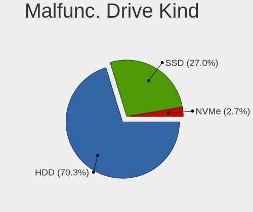
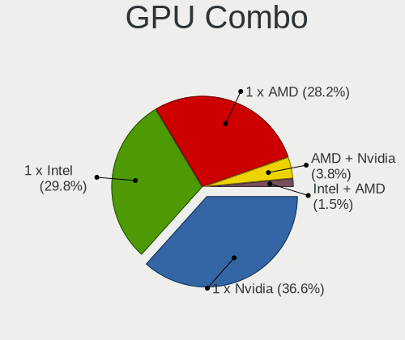
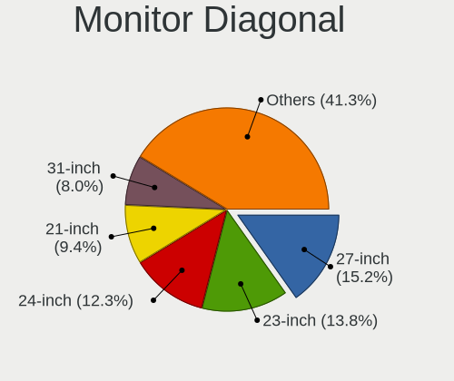
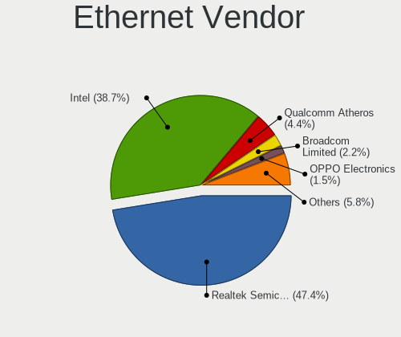

MX 21 - Tested Hardware & Statistics (Desktops)
-----------------------------------------------

A project to collect tested hardware configurations for MX 21.

Anyone can contribute to this report by the [hw-probe](https://github.com/linuxhw/hw-probe) tool:

    sudo -E hw-probe -all -upload

Please contribute! Especially if your hardware is rare.

Contents
--------

* [ Test Cases ](#test-cases)

* [ System ](#system)
  - [ Kernel                   ](#kernel)
  - [ Kernel Family            ](#kernel-family)
  - [ Kernel Major Ver.        ](#kernel-major-ver)
  - [ Arch                     ](#arch)
  - [ DE                       ](#de)
  - [ Display Server           ](#display-server)
  - [ Display Manager          ](#display-manager)
  - [ OS Lang                  ](#os-lang)
  - [ Boot Mode                ](#boot-mode)
  - [ Filesystem               ](#filesystem)
  - [ Part. scheme             ](#part-scheme)
  - [ Dual Boot with Linux/BSD ](#dual-boot-with-linuxbsd)
  - [ Dual Boot (Win)          ](#dual-boot-win)

* [ Board ](#board)
  - [ Vendor                   ](#vendor)
  - [ Model                    ](#model)
  - [ Model Family             ](#model-family)
  - [ MFG Year                 ](#mfg-year)
  - [ Form Factor              ](#form-factor)
  - [ Secure Boot              ](#secure-boot)
  - [ Coreboot                 ](#coreboot)
  - [ RAM Size                 ](#ram-size)
  - [ RAM Used                 ](#ram-used)
  - [ Total Drives             ](#total-drives)
  - [ Has CD-ROM               ](#has-cd-rom)
  - [ Has Ethernet             ](#has-ethernet)
  - [ Has WiFi                 ](#has-wifi)
  - [ Has Bluetooth            ](#has-bluetooth)

* [ Location ](#location)
  - [ Country                  ](#country)
  - [ City                     ](#city)

* [ Drives ](#drives)
  - [ Drive Vendor             ](#drive-vendor)
  - [ Drive Model              ](#drive-model)
  - [ HDD Vendor               ](#hdd-vendor)
  - [ SSD Vendor               ](#ssd-vendor)
  - [ Drive Kind               ](#drive-kind)
  - [ Drive Connector          ](#drive-connector)
  - [ Drive Size               ](#drive-size)
  - [ Space Total              ](#space-total)
  - [ Space Used               ](#space-used)
  - [ Malfunc. Drives          ](#malfunc-drives)
  - [ Malfunc. Drive Vendor    ](#malfunc-drive-vendor)
  - [ Malfunc. HDD Vendor      ](#malfunc-hdd-vendor)
  - [ Malfunc. Drive Kind      ](#malfunc-drive-kind)
  - [ Failed Drives            ](#failed-drives)
  - [ Failed Drive Vendor      ](#failed-drive-vendor)
  - [ Drive Status             ](#drive-status)

* [ Storage controller ](#storage-controller)
  - [ Storage Vendor           ](#storage-vendor)
  - [ Storage Model            ](#storage-model)
  - [ Storage Kind             ](#storage-kind)

* [ Processor ](#processor)
  - [ CPU Vendor               ](#cpu-vendor)
  - [ CPU Model                ](#cpu-model)
  - [ CPU Model Family         ](#cpu-model-family)
  - [ CPU Cores                ](#cpu-cores)
  - [ CPU Sockets              ](#cpu-sockets)
  - [ CPU Threads              ](#cpu-threads)
  - [ CPU Op-Modes             ](#cpu-op-modes)
  - [ CPU Microcode            ](#cpu-microcode)
  - [ CPU Microarch            ](#cpu-microarch)

* [ Graphics ](#graphics)
  - [ GPU Vendor               ](#gpu-vendor)
  - [ GPU Model                ](#gpu-model)
  - [ GPU Combo                ](#gpu-combo)
  - [ GPU Driver               ](#gpu-driver)
  - [ GPU Memory               ](#gpu-memory)

* [ Monitor ](#monitor)
  - [ Monitor Vendor           ](#monitor-vendor)
  - [ Monitor Model            ](#monitor-model)
  - [ Monitor Resolution       ](#monitor-resolution)
  - [ Monitor Diagonal         ](#monitor-diagonal)
  - [ Monitor Width            ](#monitor-width)
  - [ Aspect Ratio             ](#aspect-ratio)
  - [ Monitor Area             ](#monitor-area)
  - [ Pixel Density            ](#pixel-density)
  - [ Multiple Monitors        ](#multiple-monitors)

* [ Network ](#network)
  - [ Net Controller Vendor    ](#net-controller-vendor)
  - [ Net Controller Model     ](#net-controller-model)
  - [ Wireless Vendor          ](#wireless-vendor)
  - [ Wireless Model           ](#wireless-model)
  - [ Ethernet Vendor          ](#ethernet-vendor)
  - [ Ethernet Model           ](#ethernet-model)
  - [ Net Controller Kind      ](#net-controller-kind)
  - [ Used Controller          ](#used-controller)
  - [ NICs                     ](#nics)
  - [ IPv6                     ](#ipv6)

* [ Bluetooth ](#bluetooth)
  - [ Bluetooth Vendor         ](#bluetooth-vendor)
  - [ Bluetooth Model          ](#bluetooth-model)

* [ Sound ](#sound)
  - [ Sound Vendor             ](#sound-vendor)
  - [ Sound Model              ](#sound-model)

* [ Memory ](#memory)
  - [ Memory Vendor            ](#memory-vendor)
  - [ Memory Model             ](#memory-model)
  - [ Memory Kind              ](#memory-kind)
  - [ Memory Form Factor       ](#memory-form-factor)
  - [ Memory Size              ](#memory-size)
  - [ Memory Speed             ](#memory-speed)

* [ Printers & scanners ](#printers--scanners)
  - [ Printer Vendor           ](#printer-vendor)
  - [ Printer Model            ](#printer-model)
  - [ Scanner Vendor           ](#scanner-vendor)
  - [ Scanner Model            ](#scanner-model)

* [ Camera ](#camera)
  - [ Camera Vendor            ](#camera-vendor)
  - [ Camera Model             ](#camera-model)

* [ Security ](#security)
  - [ Fingerprint Vendor       ](#fingerprint-vendor)
  - [ Fingerprint Model        ](#fingerprint-model)
  - [ Chipcard Vendor          ](#chipcard-vendor)
  - [ Chipcard Model           ](#chipcard-model)

* [ Unsupported ](#unsupported)
  - [ Unsupported Devices      ](#unsupported-devices)
  - [ Unsupported Device Types ](#unsupported-device-types)

Test Cases
----------

Total: 138

| Vendor        | Model                       | Probe                                                      | Date         |
|---------------|-----------------------------|------------------------------------------------------------|--------------|
| MSI           | A68HM-E33 V2                | [af96cda252](https://linux-hardware.org/?probe=af96cda252) | Sep 02, 2023 |
| Foxconn       | 2A92                        | [50ca8342d7](https://linux-hardware.org/?probe=50ca8342d7) | Sep 01, 2023 |
| ASUSTek       | F1A75-M LE                  | [f059d25382](https://linux-hardware.org/?probe=f059d25382) | Aug 14, 2023 |
| MSI           | A68HM-E33 V2                | [44556227ff](https://linux-hardware.org/?probe=44556227ff) | Aug 05, 2023 |
| OEM           | Intel H81                   | [82606b5050](https://linux-hardware.org/?probe=82606b5050) | Aug 03, 2023 |
| Gigabyte      | B560 AORUS PRO AX           | [c7e057da76](https://linux-hardware.org/?probe=c7e057da76) | Aug 02, 2023 |
| Intel         | JSL MRD                     | [feb19ee725](https://linux-hardware.org/?probe=feb19ee725) | Jul 29, 2023 |
| Intel         | JSL MRD                     | [ca5990cfa3](https://linux-hardware.org/?probe=ca5990cfa3) | Jul 29, 2023 |
| ASUSTek       | LEUCITE3                    | [bb2046286f](https://linux-hardware.org/?probe=bb2046286f) | Jul 26, 2023 |
| ASUSTek       | LEUCITE3                    | [6ced09890f](https://linux-hardware.org/?probe=6ced09890f) | Jul 26, 2023 |
| ASRock        | B660M-HDV                   | [3a0685bcf0](https://linux-hardware.org/?probe=3a0685bcf0) | Jul 18, 2023 |
| Medion        | MS-7667                     | [52ff08b634](https://linux-hardware.org/?probe=52ff08b634) | Jul 09, 2023 |
| AOpen         | D1009 A1A4                  | [2819e086aa](https://linux-hardware.org/?probe=2819e086aa) | Jul 02, 2023 |
| ASRock        | A620M Pro RS WiFi           | [d04862302e](https://linux-hardware.org/?probe=d04862302e) | Jul 01, 2023 |
| MSI           | B350M MORTAR                | [6e5323aa42](https://linux-hardware.org/?probe=6e5323aa42) | Jun 09, 2023 |
| MSI           | B350M MORTAR                | [fc4b07cbb0](https://linux-hardware.org/?probe=fc4b07cbb0) | Jun 09, 2023 |
| Lenovo        | 3188 SDK0J40697 WIN 3305... | [c64fbbcad9](https://linux-hardware.org/?probe=c64fbbcad9) | Jun 02, 2023 |
| MSI           | MAG X670E TOMAHAWK WIFI     | [7070e55aa0](https://linux-hardware.org/?probe=7070e55aa0) | Jun 01, 2023 |
| Gigabyte      | B650 AORUS ELITE AX         | [5ae19394fc](https://linux-hardware.org/?probe=5ae19394fc) | May 20, 2023 |
| Gigabyte      | B650 AORUS ELITE AX         | [14548bc77a](https://linux-hardware.org/?probe=14548bc77a) | May 20, 2023 |
| ASRock        | Z390 Phantom Gaming 9       | [5ca1acbf9b](https://linux-hardware.org/?probe=5ca1acbf9b) | May 19, 2023 |
| Unknown       | Unknown                     | [58066198c4](https://linux-hardware.org/?probe=58066198c4) | May 18, 2023 |
| Dell          | 06X1TJ A00                  | [d3107c9603](https://linux-hardware.org/?probe=d3107c9603) | May 14, 2023 |
| Gigabyte      | 990FXA-UD3                  | [3bc96663a8](https://linux-hardware.org/?probe=3bc96663a8) | May 14, 2023 |
| Gigabyte      | X670 GAMING X AX            | [ebd2a32ce2](https://linux-hardware.org/?probe=ebd2a32ce2) | May 12, 2023 |
| Gigabyte      | X670 GAMING X AX            | [352c0902e9](https://linux-hardware.org/?probe=352c0902e9) | May 11, 2023 |
| ASUSTek       | ROG STRIX B650E-F GAMING... | [f894b9a2c4](https://linux-hardware.org/?probe=f894b9a2c4) | May 07, 2023 |
| ASRock        | P55 Extreme                 | [e8721751c6](https://linux-hardware.org/?probe=e8721751c6) | May 03, 2023 |
| ASRock        | P55 Extreme                 | [e426e8e40b](https://linux-hardware.org/?probe=e426e8e40b) | May 03, 2023 |
| ASRock        | N68-S UCC                   | [f62abcbed6](https://linux-hardware.org/?probe=f62abcbed6) | May 02, 2023 |
| Dell          | 0PC5F7 A02                  | [2d1086090c](https://linux-hardware.org/?probe=2d1086090c) | May 01, 2023 |
| ASUSTek       | Z97-P                       | [8d94344086](https://linux-hardware.org/?probe=8d94344086) | Apr 26, 2023 |
| ASUSTek       | ROG STRIX B550-F GAMING ... | [4939e609de](https://linux-hardware.org/?probe=4939e609de) | Apr 24, 2023 |
| HP            | 090Ch                       | [01d609bbab](https://linux-hardware.org/?probe=01d609bbab) | Apr 23, 2023 |
| ASRock        | Z690 Pro RS                 | [acb9cde3d7](https://linux-hardware.org/?probe=acb9cde3d7) | Apr 23, 2023 |
| Gateway       | DX4860                      | [5583641f1b](https://linux-hardware.org/?probe=5583641f1b) | Apr 22, 2023 |
| ASUSTek       | GRYPHON Z87                 | [045a79a6e4](https://linux-hardware.org/?probe=045a79a6e4) | Apr 18, 2023 |
| HP            | 3646h                       | [c36653d824](https://linux-hardware.org/?probe=c36653d824) | Apr 12, 2023 |
| HP            | 18E5                        | [441d2678ff](https://linux-hardware.org/?probe=441d2678ff) | Apr 07, 2023 |
| ASUSTek       | P8P67 LE                    | [aea33c89a1](https://linux-hardware.org/?probe=aea33c89a1) | Apr 05, 2023 |
| ASUSTek       | Z97-P                       | [86d8d7f80f](https://linux-hardware.org/?probe=86d8d7f80f) | Apr 05, 2023 |
| HP            | 3029h                       | [153b913406](https://linux-hardware.org/?probe=153b913406) | Mar 27, 2023 |
| Unknown       | GB01                        | [ad0e76307c](https://linux-hardware.org/?probe=ad0e76307c) | Mar 24, 2023 |
| MSI           | B360M PRO-VH                | [2706ed39b7](https://linux-hardware.org/?probe=2706ed39b7) | Mar 23, 2023 |
| HP            | 3048h                       | [cd326ce9fa](https://linux-hardware.org/?probe=cd326ce9fa) | Mar 22, 2023 |
| ASRock        | AB350 Pro4                  | [4a452568eb](https://linux-hardware.org/?probe=4a452568eb) | Mar 16, 2023 |
| Shenzhen M... | F6BFC                       | [46cb84be25](https://linux-hardware.org/?probe=46cb84be25) | Mar 14, 2023 |
| MSI           | CSM-H87M-G43                | [9df13e200e](https://linux-hardware.org/?probe=9df13e200e) | Mar 14, 2023 |
| Lenovo        | ThinkCentre M58 7638CB8     | [d303f78e26](https://linux-hardware.org/?probe=d303f78e26) | Mar 14, 2023 |
| Gigabyte      | PH67A-D3-B3                 | [145a0a3b7d](https://linux-hardware.org/?probe=145a0a3b7d) | Mar 05, 2023 |
| HP            | 8184 X4                     | [b42f6862c7](https://linux-hardware.org/?probe=b42f6862c7) | Mar 04, 2023 |
| Unknown       | 1.0                         | [bab30a1ac1](https://linux-hardware.org/?probe=bab30a1ac1) | Feb 24, 2023 |
| Dell          | 0D441T A03                  | [351a527308](https://linux-hardware.org/?probe=351a527308) | Feb 18, 2023 |
| ASUSTek       | TUF Gaming X570-PLUS        | [482c922bbc](https://linux-hardware.org/?probe=482c922bbc) | Feb 14, 2023 |
| MSI           | MAG B550 TOMAHAWK           | [13492935fd](https://linux-hardware.org/?probe=13492935fd) | Feb 09, 2023 |
| Gigabyte      | GA-MA785GM-US2H             | [11f3874a6f](https://linux-hardware.org/?probe=11f3874a6f) | Feb 07, 2023 |
| ASUSTek       | Z97M-PLUS                   | [99a4bb9e50](https://linux-hardware.org/?probe=99a4bb9e50) | Feb 05, 2023 |
| Gigabyte      | GA-MA785GM-US2H             | [42e242e6bf](https://linux-hardware.org/?probe=42e242e6bf) | Feb 04, 2023 |
| Unknown       | Unknown                     | [793f52c99a](https://linux-hardware.org/?probe=793f52c99a) | Feb 03, 2023 |
| ECS           | P4M800PRO-M                 | [f446d61863](https://linux-hardware.org/?probe=f446d61863) | Feb 02, 2023 |
| Intel         | D34010WYK H14771-303        | [31485ae6ec](https://linux-hardware.org/?probe=31485ae6ec) | Feb 01, 2023 |
| Gigabyte      | GA-MA785GM-US2H             | [dd017ac78a](https://linux-hardware.org/?probe=dd017ac78a) | Jan 31, 2023 |
| ASUSTek       | ROG Maximus XIII HERO       | [a32a9ba13a](https://linux-hardware.org/?probe=a32a9ba13a) | Jan 30, 2023 |
| Gigabyte      | GA-MA770-UD3                | [554aa8592c](https://linux-hardware.org/?probe=554aa8592c) | Jan 28, 2023 |
| BESSTAR Te... | UM340                       | [77efbbb270](https://linux-hardware.org/?probe=77efbbb270) | Jan 27, 2023 |
| MSI           | Z390-A PRO                  | [28c31b639b](https://linux-hardware.org/?probe=28c31b639b) | Jan 25, 2023 |
| Gigabyte      | Z77X-D3H                    | [e81c0bcfc4](https://linux-hardware.org/?probe=e81c0bcfc4) | Jan 22, 2023 |
| Dell          | 0PC5F7 A02                  | [7671c99c3c](https://linux-hardware.org/?probe=7671c99c3c) | Jan 19, 2023 |
| HP            | 3396                        | [2085b91098](https://linux-hardware.org/?probe=2085b91098) | Jan 15, 2023 |
| Pegatron      | 2AD5                        | [d41fde4498](https://linux-hardware.org/?probe=d41fde4498) | Jan 15, 2023 |
| ASRock        | X370 Taichi                 | [9c3ea14006](https://linux-hardware.org/?probe=9c3ea14006) | Jan 09, 2023 |
| ASUSTek       | H81M-E                      | [165bb4a9ab](https://linux-hardware.org/?probe=165bb4a9ab) | Jan 06, 2023 |
| Dell          | 0D881F A06                  | [21e5ad204d](https://linux-hardware.org/?probe=21e5ad204d) | Jan 04, 2023 |
| Dell          | 0D881F A06                  | [00dddfca31](https://linux-hardware.org/?probe=00dddfca31) | Jan 03, 2023 |
| Gigabyte      | B550M DS3H                  | [677feeeca9](https://linux-hardware.org/?probe=677feeeca9) | Jan 03, 2023 |
| ZOTAC         | Unknown                     | [c3d5155637](https://linux-hardware.org/?probe=c3d5155637) | Jan 01, 2023 |
| MSI           | Z390-A PRO                  | [3a3375e173](https://linux-hardware.org/?probe=3a3375e173) | Dec 29, 2022 |
| MSI           | Z270 GAMING PRO CARBON      | [f422489705](https://linux-hardware.org/?probe=f422489705) | Dec 27, 2022 |
| Dell          | 0HY9JP A02                  | [c195f58592](https://linux-hardware.org/?probe=c195f58592) | Dec 24, 2022 |
| Lenovo        | 3741 SDK0T76461 WIN 3422... | [70e125f0d0](https://linux-hardware.org/?probe=70e125f0d0) | Dec 23, 2022 |
| Fujitsu       | D3498-A1 S26361-D3498-A1    | [03cd265cef](https://linux-hardware.org/?probe=03cd265cef) | Dec 05, 2022 |
| ASUSTek       | PRIME A320M-K               | [6487bbd7b7](https://linux-hardware.org/?probe=6487bbd7b7) | Dec 05, 2022 |
| SIRAGON       | AIO-5150                    | [90476603fa](https://linux-hardware.org/?probe=90476603fa) | Dec 04, 2022 |
| HP            | 304Ah                       | [15db22accc](https://linux-hardware.org/?probe=15db22accc) | Nov 30, 2022 |
| ASRock        | B365M Pro4                  | [0f0d4f70b0](https://linux-hardware.org/?probe=0f0d4f70b0) | Nov 20, 2022 |
| Foxconn       | 2ABF                        | [aa4bde7d79](https://linux-hardware.org/?probe=aa4bde7d79) | Nov 20, 2022 |
| ASUSTek       | TUF Gaming B450-PLUS II     | [1a0674de42](https://linux-hardware.org/?probe=1a0674de42) | Nov 14, 2022 |
| ASRock        | B365M Pro4                  | [f5305c9730](https://linux-hardware.org/?probe=f5305c9730) | Nov 04, 2022 |
| MSI           | X570-A PRO                  | [c60d9aa72d](https://linux-hardware.org/?probe=c60d9aa72d) | Oct 31, 2022 |
| Biostar       | H61MH                       | [f505de310c](https://linux-hardware.org/?probe=f505de310c) | Oct 27, 2022 |
| Lenovo        | 318E NOK                    | [6b190bfb4f](https://linux-hardware.org/?probe=6b190bfb4f) | Oct 25, 2022 |
| Pegatron      | NARRA3                      | [1588e60c57](https://linux-hardware.org/?probe=1588e60c57) | Oct 12, 2022 |
| ASUSTek       | Z170-P                      | [2f3c79dd55](https://linux-hardware.org/?probe=2f3c79dd55) | Sep 29, 2022 |
| ASUSTek       | P5GC-MX/CKD/SI              | [72bb90ea71](https://linux-hardware.org/?probe=72bb90ea71) | Sep 28, 2022 |
| ASUSTek       | P5G41T-M LX                 | [8e429edcd6](https://linux-hardware.org/?probe=8e429edcd6) | Sep 25, 2022 |
| ASUSTek       | PRIME B450M-A               | [bdb353fd2c](https://linux-hardware.org/?probe=bdb353fd2c) | Sep 20, 2022 |
| HP            | 1632                        | [8309a8acf0](https://linux-hardware.org/?probe=8309a8acf0) | Sep 10, 2022 |
| Medion        | H110H4-EM                   | [1b22e5560d](https://linux-hardware.org/?probe=1b22e5560d) | Sep 07, 2022 |
| Gigabyte      | B560M DS3H V2               | [c430bf0275](https://linux-hardware.org/?probe=c430bf0275) | Sep 03, 2022 |
| Biostar       | A780L3B                     | [62782d600f](https://linux-hardware.org/?probe=62782d600f) | Aug 14, 2022 |
| Intel         | DH55TC AAE70932-303         | [f275229d83](https://linux-hardware.org/?probe=f275229d83) | Jul 31, 2022 |
| MP            | MS-7848                     | [f7696965e0](https://linux-hardware.org/?probe=f7696965e0) | Jul 22, 2022 |
| MSI           | MAG B550 TOMAHAWK           | [85782181c7](https://linux-hardware.org/?probe=85782181c7) | Jul 21, 2022 |
| ASUSTek       | P8H61/USB3 R2.0             | [1076f6d59a](https://linux-hardware.org/?probe=1076f6d59a) | Jul 19, 2022 |
| AOpen         | D1009 A1A4                  | [d8edf66887](https://linux-hardware.org/?probe=d8edf66887) | Jul 13, 2022 |
| Dell          | 0DR845                      | [4c4a530cc5](https://linux-hardware.org/?probe=4c4a530cc5) | Jul 06, 2022 |
| MSI           | B350 TOMAHAWK               | [5a66940742](https://linux-hardware.org/?probe=5a66940742) | Jun 23, 2022 |
| MSI           | Z77A-G41                    | [d0f55f3c0b](https://linux-hardware.org/?probe=d0f55f3c0b) | Jun 22, 2022 |
| Dell          | 0200DY A01                  | [bc8030c1d5](https://linux-hardware.org/?probe=bc8030c1d5) | Jun 22, 2022 |
| Dell          | 0DR845                      | [56b4af8d26](https://linux-hardware.org/?probe=56b4af8d26) | Jun 20, 2022 |
| Gigabyte      | H410M S2H V3                | [b57b3a635c](https://linux-hardware.org/?probe=b57b3a635c) | Jun 02, 2022 |
| ASUSTek       | SABERTOOTH X99              | [b627953ad4](https://linux-hardware.org/?probe=b627953ad4) | May 11, 2022 |
| Intel         | V1.3                        | [a01993f2fa](https://linux-hardware.org/?probe=a01993f2fa) | Apr 30, 2022 |
| ASUSTek       | SABERTOOTH X99              | [51cc264c62](https://linux-hardware.org/?probe=51cc264c62) | Apr 22, 2022 |
| Gigabyte      | B550M S2H                   | [208972e3b5](https://linux-hardware.org/?probe=208972e3b5) | Apr 19, 2022 |
| ASRock        | N3150M                      | [0ee71f6582](https://linux-hardware.org/?probe=0ee71f6582) | Apr 19, 2022 |
| Gigabyte      | B550M S2H                   | [1127f26185](https://linux-hardware.org/?probe=1127f26185) | Apr 17, 2022 |
| Dell          | 0YXT71 A01                  | [5de0fab8f2](https://linux-hardware.org/?probe=5de0fab8f2) | Apr 04, 2022 |
| Lenovo        | 1046 NO DPK                 | [561b1c3324](https://linux-hardware.org/?probe=561b1c3324) | Mar 17, 2022 |
| Gigabyte      | Z390 UD                     | [d0b555e0ba](https://linux-hardware.org/?probe=d0b555e0ba) | Mar 17, 2022 |
| HP            | 3647h                       | [fd6766aabb](https://linux-hardware.org/?probe=fd6766aabb) | Mar 11, 2022 |
| ASUSTek       | P5GC-MX/MEDION/SI           | [772e020316](https://linux-hardware.org/?probe=772e020316) | Mar 09, 2022 |
| MSI           | MS-7091                     | [71aaa6a920](https://linux-hardware.org/?probe=71aaa6a920) | Mar 09, 2022 |
| MSI           | MS-7091                     | [b08ddd1115](https://linux-hardware.org/?probe=b08ddd1115) | Mar 09, 2022 |
| ASUSTek       | ROG Maximus XIII HERO       | [e58223cc60](https://linux-hardware.org/?probe=e58223cc60) | Feb 18, 2022 |
| Huanan        | X99-F8 V2.0                 | [23c722f6cf](https://linux-hardware.org/?probe=23c722f6cf) | Feb 18, 2022 |
| Huanan        | X99-F8 V2.0                 | [f4fec6a5be](https://linux-hardware.org/?probe=f4fec6a5be) | Feb 17, 2022 |
| MSI           | Z97 GAMING 5                | [7c66c1b404](https://linux-hardware.org/?probe=7c66c1b404) | Feb 09, 2022 |
| ASUSTek       | X99-DELUXE                  | [4ffe151e7a](https://linux-hardware.org/?probe=4ffe151e7a) | Jan 29, 2022 |
| HP            | 0B4Ch D                     | [ecaec39529](https://linux-hardware.org/?probe=ecaec39529) | Jan 05, 2022 |
| Fujitsu       | D3221-A1 S26361-D3221-A1    | [78d4e04363](https://linux-hardware.org/?probe=78d4e04363) | Dec 16, 2021 |
| GALAX         | B550M                       | [a6866c8a45](https://linux-hardware.org/?probe=a6866c8a45) | Dec 04, 2021 |
| Lenovo        | SHARKBAY NO DPK             | [fd5f409df8](https://linux-hardware.org/?probe=fd5f409df8) | Nov 14, 2021 |
| Lenovo        | SHARKBAY NO DPK             | [a85cc99f78](https://linux-hardware.org/?probe=a85cc99f78) | Nov 14, 2021 |
| ASRock        | X570 Steel Legend           | [18391015f7](https://linux-hardware.org/?probe=18391015f7) | Nov 11, 2021 |
| Gigabyte      | X570 AORUS PRO              | [fbd2076eee](https://linux-hardware.org/?probe=fbd2076eee) | Oct 28, 2021 |
| Gigabyte      | B550M DS3H                  | [ee6a141211](https://linux-hardware.org/?probe=ee6a141211) | Oct 19, 2021 |
| Gigabyte      | A320M-S2H V2-CF             | [5d136cb09b](https://linux-hardware.org/?probe=5d136cb09b) | Aug 13, 2021 |

System
------

Kernel
------

Version of the Linux kernel

| Version                    | Desktops | Percent |
|----------------------------|----------|---------|
| 5.10.0-21-amd64            | 14       | 12.17%  |
| 5.10.0-20-amd64            | 13       | 11.3%   |
| 6.0.0-6mx-amd64            | 10       | 8.7%    |
| 5.14.0-4mx-amd64           | 6        | 5.22%   |
| 5.10.0-23-amd64            | 6        | 5.22%   |
| 5.10.0-19-amd64            | 6        | 5.22%   |
| 5.10.0-18-amd64            | 6        | 5.22%   |
| 5.10.0-13-amd64            | 5        | 4.35%   |
| 5.18.0-4mx-amd64           | 4        | 3.48%   |
| 5.10.0-16-amd64            | 4        | 3.48%   |
| 5.10.0-15-amd64            | 4        | 3.48%   |
| 6.0.0-10.1-liquorix-amd64  | 3        | 2.61%   |
| 5.16.0-5mx-amd64           | 3        | 2.61%   |
| 5.14.0-3mx-amd64           | 2        | 1.74%   |
| 5.10.0-9-amd64             | 2        | 1.74%   |
| 5.10.0-11-amd64            | 2        | 1.74%   |
| 6.2.14-1-liquorix-amd64    | 1        | 0.87%   |
| 6.1.15-2-liquorix-amd64    | 1        | 0.87%   |
| 6.1.0-2mx-amd64            | 1        | 0.87%   |
| 6.0.5-x64v1-xanmod1        | 1        | 0.87%   |
| 6.0.0-4mx-rt-amd64         | 1        | 0.87%   |
| 6.0.0-13.3-liquorix-amd64  | 1        | 0.87%   |
| 5.19.0-4.2-liquorix-amd64  | 1        | 0.87%   |
| 5.19.0-17.2-liquorix-amd64 | 1        | 0.87%   |
| 5.19.0-14.1-liquorix-amd64 | 1        | 0.87%   |
| 5.17.0-3mx-amd64           | 1        | 0.87%   |
| 5.16.0-rc5-hwmon-next+     | 1        | 0.87%   |
| 5.16.0-6mx-amd64           | 1        | 0.87%   |
| 5.15.0-2-amd64             | 1        | 0.87%   |
| 5.15.0-0.bpo.2-amd64       | 1        | 0.87%   |
| 5.14.0-2mx-amd64           | 1        | 0.87%   |
| 5.10.52-antix.1-amd64-smp  | 1        | 0.87%   |
| 5.10.113-lkdtm-i386pae     | 1        | 0.87%   |
| 5.10.111-tkg-cfs           | 1        | 0.87%   |
| 5.10.0-25-amd64            | 1        | 0.87%   |
| 5.10.0-22-amd64            | 1        | 0.87%   |
| 5.10.0-20-686-pae          | 1        | 0.87%   |
| 5.10.0-18-686-pae          | 1        | 0.87%   |
| 5.10.0-17-amd64            | 1        | 0.87%   |
| 5.10.0-10-amd64            | 1        | 0.87%   |

Kernel Family
-------------

Linux kernel without a distro release

| Version  | Desktops | Percent |
|----------|----------|---------|
| 5.10.0   | 66       | 58.41%  |
| 6.0.0    | 15       | 13.27%  |
| 5.14.0   | 9        | 7.96%   |
| 5.16.0   | 5        | 4.42%   |
| 5.18.0   | 4        | 3.54%   |
| 5.19.0   | 3        | 2.65%   |
| 5.15.0   | 2        | 1.77%   |
| 6.2.14   | 1        | 0.88%   |
| 6.1.15   | 1        | 0.88%   |
| 6.1.0    | 1        | 0.88%   |
| 6.0.5    | 1        | 0.88%   |
| 5.17.0   | 1        | 0.88%   |
| 5.10.52  | 1        | 0.88%   |
| 5.10.113 | 1        | 0.88%   |
| 5.10.111 | 1        | 0.88%   |
| 4.19.0   | 1        | 0.88%   |

Kernel Major Ver.
-----------------

Linux kernel major version

| Version | Desktops | Percent |
|---------|----------|---------|
| 5.10    | 69       | 61.06%  |
| 6.0     | 16       | 14.16%  |
| 5.14    | 9        | 7.96%   |
| 5.16    | 5        | 4.42%   |
| 5.18    | 4        | 3.54%   |
| 5.19    | 3        | 2.65%   |
| 6.1     | 2        | 1.77%   |
| 5.15    | 2        | 1.77%   |
| 6.2     | 1        | 0.88%   |
| 5.17    | 1        | 0.88%   |
| 4.19    | 1        | 0.88%   |

Arch
----

OS architecture (x86_64, i586, etc.)

| Name   | Desktops | Percent |
|--------|----------|---------|
| x86_64 | 110      | 97.35%  |
| i686   | 3        | 2.65%   |

DE
--

Desktop Environment

| Name             | Desktops | Percent |
|------------------|----------|---------|
| XFCE             | 87       | 76.99%  |
| KDE5             | 23       | 20.35%  |
| lightdm-xsession | 2        | 1.77%   |
| Unknown          | 1        | 0.88%   |

Display Server
--------------

X11 or Wayland

| Name | Desktops | Percent |
|------|----------|---------|
| X11  | 113      | 100%    |

Display Manager
---------------

SDDM, LightDM, etc.

| Name    | Desktops | Percent |
|---------|----------|---------|
| LightDM | 87       | 76.99%  |
| SDDM    | 22       | 19.47%  |
| SLiM    | 3        | 2.65%   |
| GDM     | 1        | 0.88%   |

OS Lang
-------

Language

| Lang  | Desktops | Percent |
|-------|----------|---------|
| en_US | 51       | 45.13%  |
| de_DE | 15       | 13.27%  |
| it_IT | 8        | 7.08%   |
| es_AR | 5        | 4.42%   |
| en_GB | 5        | 4.42%   |
| ru_RU | 4        | 3.54%   |
| pl_PL | 4        | 3.54%   |
| de_CH | 3        | 2.65%   |
| sv_SE | 2        | 1.77%   |
| fr_FR | 2        | 1.77%   |
| es_MX | 2        | 1.77%   |
| es_ES | 2        | 1.77%   |
| en_AU | 2        | 1.77%   |
| pt_BR | 1        | 0.88%   |
| hu_HU | 1        | 0.88%   |
| hr_HR | 1        | 0.88%   |
| fi_FI | 1        | 0.88%   |
| es_VE | 1        | 0.88%   |
| es_CO | 1        | 0.88%   |
| en_NZ | 1        | 0.88%   |
| en_CA | 1        | 0.88%   |

Boot Mode
---------

EFI or BIOS

| Mode | Desktops | Percent |
|------|----------|---------|
| BIOS | 65       | 57.52%  |
| EFI  | 48       | 42.48%  |

Filesystem
----------

Type of filesystem

| Type     | Desktops | Percent |
|----------|----------|---------|
| Ext4     | 97       | 85.84%  |
| Overlay  | 10       | 8.85%   |
| Btrfs    | 2        | 1.77%   |
| Xfs      | 1        | 0.88%   |
| Tmpfs    | 1        | 0.88%   |
| Reiserfs | 1        | 0.88%   |
| Ext3     | 1        | 0.88%   |

Part. scheme
------------

Scheme of partitioning

| Type | Desktops | Percent |
|------|----------|---------|
| GPT  | 66       | 57.89%  |
| MBR  | 48       | 42.11%  |

Dual Boot with Linux/BSD
------------------------

Hosting more than one Linux/BSD

| Dual boot | Desktops | Percent |
|-----------|----------|---------|
| No        | 70       | 61.4%   |
| Yes       | 44       | 38.6%   |

Dual Boot (Win)
---------------

Hosting Linux and Windows

| Dual boot | Desktops | Percent |
|-----------|----------|---------|
| Yes       | 63       | 55.75%  |
| No        | 50       | 44.25%  |

Board
-----

Vendor
------

Motherboard manufacturer

| Name                                 | Desktops | Percent |
|--------------------------------------|----------|---------|
| ASUSTek Computer                     | 22       | 19.47%  |
| Gigabyte Technology                  | 15       | 13.27%  |
| MSI                                  | 12       | 10.62%  |
| ASRock                               | 11       | 9.73%   |
| Hewlett-Packard                      | 9        | 7.96%   |
| Dell                                 | 9        | 7.96%   |
| Lenovo                               | 6        | 5.31%   |
| Intel                                | 4        | 3.54%   |
| Unknown                              | 4        | 3.54%   |
| Pegatron                             | 2        | 1.77%   |
| Medion                               | 2        | 1.77%   |
| Fujitsu                              | 2        | 1.77%   |
| Foxconn                              | 2        | 1.77%   |
| Biostar                              | 2        | 1.77%   |
| ZOTAC                                | 1        | 0.88%   |
| SIRAGON                              | 1        | 0.88%   |
| Shenzhen Meigao Electronic Equipment | 1        | 0.88%   |
| OEM                                  | 1        | 0.88%   |
| MP                                   | 1        | 0.88%   |
| Huanan                               | 1        | 0.88%   |
| Gateway                              | 1        | 0.88%   |
| GALAX                                | 1        | 0.88%   |
| ECS                                  | 1        | 0.88%   |
| BESSTAR Tech                         | 1        | 0.88%   |
| AOpen                                | 1        | 0.88%   |

Model
-----

Motherboard model

| Name                                        | Desktops | Percent |
|---------------------------------------------|----------|---------|
| ASUS All Series                             | 7        | 6.19%   |
| Unknown                                     | 5        | 4.42%   |
| MSI MS-7C91                                 | 2        | 1.77%   |
| Gigabyte GA-MA785GM-US2H                    | 2        | 1.77%   |
| Dell OptiPlex 9020                          | 2        | 1.77%   |
| Dell OptiPlex 755                           | 2        | 1.77%   |
| ASUS ROG Maximus XIII HERO                  | 2        | 1.77%   |
| SIRAGON AIO-5150                            | 1        | 0.88%   |
| Shenzhen Meigao Electronic Equipment UM450  | 1        | 0.88%   |
| Pegatron FQ425AA-ABA a6655f                 | 1        | 0.88%   |
| Pegatron 2AD5                               | 1        | 0.88%   |
| OEM Intel H81                               | 1        | 0.88%   |
| MSI MS-7E12                                 | 1        | 0.88%   |
| MSI MS-7C37                                 | 1        | 0.88%   |
| MSI MS-7B98                                 | 1        | 0.88%   |
| MSI MS-7B53                                 | 1        | 0.88%   |
| MSI MS-7A63                                 | 1        | 0.88%   |
| MSI MS-7A34                                 | 1        | 0.88%   |
| MSI MS-7917                                 | 1        | 0.88%   |
| MSI MS-7823                                 | 1        | 0.88%   |
| MSI MS-7758                                 | 1        | 0.88%   |
| MSI MS-7721                                 | 1        | 0.88%   |
| MP MS-7848                                  | 1        | 0.88%   |
| Medion MS-7667                              | 1        | 0.88%   |
| Medion Akoya P5330 E MD8876/2458            | 1        | 0.88%   |
| Lenovo V50s-07IMB 11HB002AFR                | 1        | 0.88%   |
| Lenovo ThinkStation P620 30E0CTO1WW         | 1        | 0.88%   |
| Lenovo ThinkCentre M75s Gen 2 11JAS0CJ00    | 1        | 0.88%   |
| Lenovo ThinkCentre M58 7638CB8              | 1        | 0.88%   |
| Lenovo IdeaCentre Gaming5 17IAB7 90T00007US | 1        | 0.88%   |
| Lenovo 10AAS1QB0B                           | 1        | 0.88%   |
| Intel V1.3                                  | 1        | 0.88%   |
| Intel Jasper Lake Client Platform           | 1        | 0.88%   |
| Intel DH55TC AAE70932-303                   | 1        | 0.88%   |
| Intel D34010WYK H14771-303                  | 1        | 0.88%   |
| Huanan X99-F8                               | 1        | 0.88%   |
| HP Z400 Workstation                         | 1        | 0.88%   |
| HP EliteDesk 800 G1 USDT                    | 1        | 0.88%   |
| HP dc5000 uT(PB647A)                        | 1        | 0.88%   |
| HP Compaq Elite 8300 CMT                    | 1        | 0.88%   |

Model Family
------------

Motherboard model prefix

| Name                                       | Desktops | Percent |
|--------------------------------------------|----------|---------|
| Dell OptiPlex                              | 8        | 7.08%   |
| ASUS All                                   | 7        | 6.19%   |
| Unknown                                    | 5        | 4.42%   |
| HP Compaq                                  | 4        | 3.54%   |
| ASUS ROG                                   | 3        | 2.65%   |
| MSI MS-7C91                                | 2        | 1.77%   |
| Lenovo ThinkCentre                         | 2        | 1.77%   |
| Gigabyte GA-MA785GM-US2H                   | 2        | 1.77%   |
| Gigabyte B550M                             | 2        | 1.77%   |
| ASUS TUF                                   | 2        | 1.77%   |
| ASUS P5GC-MX                               | 2        | 1.77%   |
| SIRAGON AIO-5150                           | 1        | 0.88%   |
| Shenzhen Meigao Electronic Equipment UM450 | 1        | 0.88%   |
| Pegatron FQ425AA-ABA                       | 1        | 0.88%   |
| Pegatron 2AD5                              | 1        | 0.88%   |
| OEM Intel                                  | 1        | 0.88%   |
| MSI MS-7E12                                | 1        | 0.88%   |
| MSI MS-7C37                                | 1        | 0.88%   |
| MSI MS-7B98                                | 1        | 0.88%   |
| MSI MS-7B53                                | 1        | 0.88%   |
| MSI MS-7A63                                | 1        | 0.88%   |
| MSI MS-7A34                                | 1        | 0.88%   |
| MSI MS-7917                                | 1        | 0.88%   |
| MSI MS-7823                                | 1        | 0.88%   |
| MSI MS-7758                                | 1        | 0.88%   |
| MSI MS-7721                                | 1        | 0.88%   |
| MP MS-7848                                 | 1        | 0.88%   |
| Medion MS-7667                             | 1        | 0.88%   |
| Medion Akoya                               | 1        | 0.88%   |
| Lenovo V50s-07IMB                          | 1        | 0.88%   |
| Lenovo ThinkStation                        | 1        | 0.88%   |
| Lenovo IdeaCentre                          | 1        | 0.88%   |
| Lenovo 10AAS1QB0B                          | 1        | 0.88%   |
| Intel V1.3                                 | 1        | 0.88%   |
| Intel Jasper                               | 1        | 0.88%   |
| Intel DH55TC                               | 1        | 0.88%   |
| Intel D34010WYK                            | 1        | 0.88%   |
| Huanan X99-F8                              | 1        | 0.88%   |
| HP Z400                                    | 1        | 0.88%   |
| HP EliteDesk                               | 1        | 0.88%   |

MFG Year
--------

Motherboard manufacture year

| Year | Desktops | Percent |
|------|----------|---------|
| 2022 | 11       | 9.73%   |
| 2021 | 10       | 8.85%   |
| 2020 | 9        | 7.96%   |
| 2014 | 9        | 7.96%   |
| 2013 | 9        | 7.96%   |
| 2011 | 9        | 7.96%   |
| 2018 | 8        | 7.08%   |
| 2009 | 7        | 6.19%   |
| 2016 | 6        | 5.31%   |
| 2012 | 6        | 5.31%   |
| 2010 | 6        | 5.31%   |
| 2019 | 5        | 4.42%   |
| 2007 | 5        | 4.42%   |
| 2008 | 4        | 3.54%   |
| 2015 | 3        | 2.65%   |
| 2023 | 2        | 1.77%   |
| 2017 | 2        | 1.77%   |
| 2006 | 1        | 0.88%   |
| 2004 | 1        | 0.88%   |

Form Factor
-----------

Physical design of the computer

| Name    | Desktops | Percent |
|---------|----------|---------|
| Desktop | 113      | 100%    |

Secure Boot
-----------

Enabled or disabled

| State    | Desktops | Percent |
|----------|----------|---------|
| Disabled | 113      | 100%    |

Coreboot
--------

Have coreboot on board

| Used | Desktops | Percent |
|------|----------|---------|
| No   | 113      | 100%    |

RAM Size
--------

Total RAM memory

| Size in GB  | Desktops | Percent |
|-------------|----------|---------|
| 8.01-16.0   | 29       | 25.66%  |
| 4.01-8.0    | 24       | 21.24%  |
| 32.01-64.0  | 19       | 16.81%  |
| 16.01-24.0  | 17       | 15.04%  |
| 3.01-4.0    | 11       | 9.73%   |
| 24.01-32.0  | 6        | 5.31%   |
| 64.01-256.0 | 3        | 2.65%   |
| 2.01-3.0    | 2        | 1.77%   |
| 0.51-1.0    | 2        | 1.77%   |

RAM Used
--------

Used RAM memory

| Used GB    | Desktops | Percent |
|------------|----------|---------|
| 1.01-2.0   | 46       | 39.66%  |
| 2.01-3.0   | 30       | 25.86%  |
| 3.01-4.0   | 15       | 12.93%  |
| 4.01-8.0   | 14       | 12.07%  |
| 8.01-16.0  | 5        | 4.31%   |
| 0.51-1.0   | 5        | 4.31%   |
| 16.01-24.0 | 1        | 0.86%   |

Total Drives
------------

Number of drives on board

| Drives | Desktops | Percent |
|--------|----------|---------|
| 1      | 42       | 37.17%  |
| 2      | 26       | 23.01%  |
| 3      | 24       | 21.24%  |
| 4      | 11       | 9.73%   |
| 5      | 5        | 4.42%   |
| 8      | 3        | 2.65%   |
| 9      | 1        | 0.88%   |
| 7      | 1        | 0.88%   |

Has CD-ROM
----------

Has CD-ROM on board

| Presented | Desktops | Percent |
|-----------|----------|---------|
| Yes       | 57       | 50.44%  |
| No        | 56       | 49.56%  |

Has Ethernet
------------

Has Ethernet on board

| Presented | Desktops | Percent |
|-----------|----------|---------|
| Yes       | 112      | 99.12%  |
| No        | 1        | 0.88%   |

Has WiFi
--------

Has WiFi module

| Presented | Desktops | Percent |
|-----------|----------|---------|
| Yes       | 61       | 53.98%  |
| No        | 52       | 46.02%  |

Has Bluetooth
-------------

Has Bluetooth module

| Presented | Desktops | Percent |
|-----------|----------|---------|
| No        | 80       | 70.8%   |
| Yes       | 33       | 29.2%   |

Location
--------

Country
-------

Geographic location (country)

| Country                | Desktops | Percent |
|------------------------|----------|---------|
| USA                    | 27       | 23.89%  |
| Germany                | 15       | 13.27%  |
| Italy                  | 8        | 7.08%   |
| Poland                 | 5        | 4.42%   |
| Canada                 | 5        | 4.42%   |
| Argentina              | 5        | 4.42%   |
| Russia                 | 4        | 3.54%   |
| Australia              | 4        | 3.54%   |
| UK                     | 3        | 2.65%   |
| Switzerland            | 3        | 2.65%   |
| Sweden                 | 3        | 2.65%   |
| India                  | 3        | 2.65%   |
| France                 | 3        | 2.65%   |
| Finland                | 3        | 2.65%   |
| Venezuela              | 2        | 1.77%   |
| Spain                  | 2        | 1.77%   |
| Singapore              | 2        | 1.77%   |
| Mexico                 | 2        | 1.77%   |
| South Africa           | 1        | 0.88%   |
| Romania                | 1        | 0.88%   |
| New Zealand            | 1        | 0.88%   |
| Netherlands            | 1        | 0.88%   |
| Indonesia              | 1        | 0.88%   |
| Hungary                | 1        | 0.88%   |
| Greece                 | 1        | 0.88%   |
| French Guiana          | 1        | 0.88%   |
| Estonia                | 1        | 0.88%   |
| Croatia                | 1        | 0.88%   |
| Colombia               | 1        | 0.88%   |
| Brazil                 | 1        | 0.88%   |
| Bosnia and Herzegovina | 1        | 0.88%   |
| Belgium                | 1        | 0.88%   |

City
----

Geographic location (city)

| City          | Desktops | Percent |
|---------------|----------|---------|
| Sydney        | 3        | 2.65%   |
| Moscow        | 3        | 2.65%   |
| Toronto       | 2        | 1.77%   |
| Singapore     | 2        | 1.77%   |
| Mesquite      | 2        | 1.77%   |
| Krakow        | 2        | 1.77%   |
| Houston       | 2        | 1.77%   |
| Ettingen      | 2        | 1.77%   |
| Córdoba      | 2        | 1.77%   |
| Berlin        | 2        | 1.77%   |
| Bengaluru     | 2        | 1.77%   |
| Alma          | 2        | 1.77%   |
| Zagreb        | 1        | 0.88%   |
| Volos         | 1        | 0.88%   |
| Voghera       | 1        | 0.88%   |
| Vilhelmina    | 1        | 0.88%   |
| Vasco da Gama | 1        | 0.88%   |
| Vaidasoo      | 1        | 0.88%   |
| Tuglie        | 1        | 0.88%   |
| Tlalnepantla  | 1        | 0.88%   |
| Tampere       | 1        | 0.88%   |
| Surrey        | 1        | 0.88%   |
| Stevens Point | 1        | 0.88%   |
| Stafford      | 1        | 0.88%   |
| St Petersburg | 1        | 0.88%   |
| Sollentuna    | 1        | 0.88%   |
| Seelbach      | 1        | 0.88%   |
| Seattle       | 1        | 0.88%   |
| San Fernando  | 1        | 0.88%   |
| San Diego     | 1        | 0.88%   |
| Rzeszów      | 1        | 0.88%   |
| Rosporden     | 1        | 0.88%   |
| Reno          | 1        | 0.88%   |
| Rathenow      | 1        | 0.88%   |
| Puebla City   | 1        | 0.88%   |
| Portland      | 1        | 0.88%   |
| Portage       | 1        | 0.88%   |
| Pompano Beach | 1        | 0.88%   |
| Pila          | 1        | 0.88%   |
| Piedmont      | 1        | 0.88%   |

Drives
------

Drive Vendor
------------

Hard drive vendors

| Vendor                    | Desktops | Drives | Percent |
|---------------------------|----------|--------|---------|
| Samsung Electronics       | 39       | 66     | 17.73%  |
| Seagate                   | 37       | 54     | 16.82%  |
| WDC                       | 35       | 43     | 15.91%  |
| Kingston                  | 21       | 22     | 9.55%   |
| SanDisk                   | 12       | 14     | 5.45%   |
| Toshiba                   | 11       | 12     | 5%      |
| China                     | 10       | 11     | 4.55%   |
| Crucial                   | 6        | 6      | 2.73%   |
| Hitachi                   | 5        | 6      | 2.27%   |
| Unknown                   | 4        | 6      | 1.82%   |
| PNY                       | 3        | 4      | 1.36%   |
| Corsair                   | 3        | 3      | 1.36%   |
| Transcend                 | 2        | 2      | 0.91%   |
| Team                      | 2        | 2      | 0.91%   |
| Silicon Motion            | 2        | 2      | 0.91%   |
| Intel                     | 2        | 2      | 0.91%   |
| GOODRAM                   | 2        | 2      | 0.91%   |
| Apacer                    | 2        | 2      | 0.91%   |
| A-DATA Technology         | 2        | 2      | 0.91%   |
| XPG                       | 1        | 1      | 0.45%   |
| WALRAM                    | 1        | 1      | 0.45%   |
| Vaseky                    | 1        | 1      | 0.45%   |
| SPCC                      | 1        | 1      | 0.45%   |
| Rogueware                 | 1        | 2      | 0.45%   |
| Phison Electronics        | 1        | 1      | 0.45%   |
| Phison                    | 1        | 1      | 0.45%   |
| OCZ                       | 1        | 1      | 0.45%   |
| Mushkin                   | 1        | 1      | 0.45%   |
| Micron/Crucial Technology | 1        | 1      | 0.45%   |
| Micron Technology         | 1        | 1      | 0.45%   |
| Maxtor                    | 1        | 1      | 0.45%   |
| Lexar                     | 1        | 1      | 0.45%   |
| KingSpec                  | 1        | 1      | 0.45%   |
| JMicron Technology        | 1        | 1      | 0.45%   |
| HGST                      | 1        | 1      | 0.45%   |
| External                  | 1        | 1      | 0.45%   |
| CT1000P3                  | 1        | 1      | 0.45%   |
| Avant                     | 1        | 1      | 0.45%   |
| Acer                      | 1        | 1      | 0.45%   |

Drive Model
-----------

Hard drive models

| Model                            | Desktops | Percent |
|----------------------------------|----------|---------|
| Kingston SA400S37480G 480GB SSD  | 7        | 2.7%    |
| Kingston SV300S37A240G 240GB SSD | 5        | 1.93%   |
| Seagate ST2000DM008-2FR102 2TB   | 4        | 1.54%   |
| Samsung SSD 970 EVO Plus 1TB     | 4        | 1.54%   |
| Samsung SSD 850 EVO 250GB        | 4        | 1.54%   |
| Seagate ST4000DM004-2CV104 4TB   | 3        | 1.16%   |
| Seagate ST3500413AS 500GB        | 3        | 1.16%   |
| SanDisk SDSSDA240G 240GB         | 3        | 1.16%   |
| SanDisk NVMe SSD Drive 1TB       | 3        | 1.16%   |
| Samsung SSD 980 PRO 1TB          | 3        | 1.16%   |
| Samsung SSD 850 EVO 1TB          | 3        | 1.16%   |
| Samsung SSD 840 Series 120GB     | 3        | 1.16%   |
| WDC WD3200AAKS-75B3A0 320GB      | 2        | 0.77%   |
| WDC WD10EZEX-00BN5A0 1TB         | 2        | 0.77%   |
| Unknown SD/MMC 2GB               | 2        | 0.77%   |
| Unknown M.S./M.S.Pro/HG 16GB     | 2        | 0.77%   |
| Toshiba HDWD110 1TB              | 2        | 0.77%   |
| Toshiba DT01ACA100 1TB           | 2        | 0.77%   |
| Seagate ST500LM021-1KJ152 500GB  | 2        | 0.77%   |
| Seagate ST250DM000-1BD141 250GB  | 2        | 0.77%   |
| Seagate ST2000DM001-1ER164 2TB   | 2        | 0.77%   |
| SanDisk SDSSDA120G 120GB         | 2        | 0.77%   |
| Samsung SSD 980 500GB            | 2        | 0.77%   |
| Samsung SSD 970 PRO 512GB        | 2        | 0.77%   |
| Samsung SSD 970 EVO Plus 500GB   | 2        | 0.77%   |
| Samsung SSD 870 QVO 1TB          | 2        | 0.77%   |
| Samsung SSD 870 EVO 500GB        | 2        | 0.77%   |
| Samsung SSD 860 EVO 500GB        | 2        | 0.77%   |
| Samsung SSD 860 EVO 250GB        | 2        | 0.77%   |
| Samsung SSD 850 EVO 500GB        | 2        | 0.77%   |
| Samsung HD501LJ 500GB            | 2        | 0.77%   |
| Kingston SA400S37120G 120GB SSD  | 2        | 0.77%   |
| Corsair MP400 2TB                | 2        | 0.77%   |
| China SSD 512GB                  | 2        | 0.77%   |
| China SATA SSD 512GB             | 2        | 0.77%   |
| XPG GAMMIX S50 Lite 512GB        | 1        | 0.39%   |
| WDC WDS500G2B0C-00PXH0 500GB     | 1        | 0.39%   |
| WDC WDS250G2B0A-00SM50 250GB SSD | 1        | 0.39%   |
| WDC WDS100T2B0A-00SM50 1TB SSD   | 1        | 0.39%   |
| WDC WD800AAJS-60M0A0 80GB        | 1        | 0.39%   |

HDD Vendor
----------

Hard disk drive vendors

| Vendor              | Desktops | Drives | Percent |
|---------------------|----------|--------|---------|
| Seagate             | 37       | 54     | 39.36%  |
| WDC                 | 32       | 40     | 34.04%  |
| Toshiba             | 11       | 12     | 11.7%   |
| Samsung Electronics | 5        | 6      | 5.32%   |
| Hitachi             | 5        | 6      | 5.32%   |
| Unknown             | 1        | 1      | 1.06%   |
| Maxtor              | 1        | 1      | 1.06%   |
| HGST                | 1        | 1      | 1.06%   |
| External            | 1        | 1      | 1.06%   |

SSD Vendor
----------

Solid state drive vendors

| Vendor              | Desktops | Drives | Percent |
|---------------------|----------|--------|---------|
| Samsung Electronics | 27       | 35     | 29.67%  |
| Kingston            | 18       | 19     | 19.78%  |
| China               | 10       | 11     | 10.99%  |
| SanDisk             | 7        | 8      | 7.69%   |
| Crucial             | 4        | 4      | 4.4%    |
| WDC                 | 2        | 2      | 2.2%    |
| Transcend           | 2        | 2      | 2.2%    |
| Team                | 2        | 2      | 2.2%    |
| PNY                 | 2        | 2      | 2.2%    |
| GOODRAM             | 2        | 2      | 2.2%    |
| A-DATA Technology   | 2        | 2      | 2.2%    |
| WALRAM              | 1        | 1      | 1.1%    |
| Vaseky              | 1        | 1      | 1.1%    |
| SPCC                | 1        | 1      | 1.1%    |
| Rogueware           | 1        | 2      | 1.1%    |
| OCZ                 | 1        | 1      | 1.1%    |
| Mushkin             | 1        | 1      | 1.1%    |
| Micron Technology   | 1        | 1      | 1.1%    |
| KingSpec            | 1        | 1      | 1.1%    |
| Intel               | 1        | 1      | 1.1%    |
| CT1000P3            | 1        | 1      | 1.1%    |
| Avant               | 1        | 1      | 1.1%    |
| Apacer              | 1        | 1      | 1.1%    |
| Acer                | 1        | 1      | 1.1%    |

Drive Kind
----------

HDD or SSD

| Kind    | Desktops | Drives | Percent |
|---------|----------|--------|---------|
| HDD     | 74       | 122    | 39.15%  |
| SSD     | 73       | 103    | 38.62%  |
| NVMe    | 38       | 51     | 20.11%  |
| Unknown | 3        | 5      | 1.59%   |
| MMC     | 1        | 1      | 0.53%   |

Drive Connector
---------------

SATA, SAS, NVMe, etc.

| Type | Desktops | Drives | Percent |
|------|----------|--------|---------|
| SATA | 101      | 215    | 67.33%  |
| NVMe | 38       | 51     | 25.33%  |
| SAS  | 10       | 15     | 6.67%   |
| MMC  | 1        | 1      | 0.67%   |

Drive Size
----------

Size of hard drive

| Size in TB | Desktops | Drives | Percent |
|------------|----------|--------|---------|
| 0.01-0.5   | 79       | 126    | 50.32%  |
| 0.51-1.0   | 44       | 52     | 28.03%  |
| 1.01-2.0   | 19       | 24     | 12.1%   |
| 3.01-4.0   | 5        | 5      | 3.18%   |
| 4.01-10.0  | 5        | 12     | 3.18%   |
| 2.01-3.0   | 4        | 5      | 2.55%   |
| 10.01-20.0 | 1        | 1      | 0.64%   |

Space Total
-----------

Amount of disk space available on the file system

| Size in GB     | Desktops | Percent |
|----------------|----------|---------|
| 101-250        | 27       | 23.89%  |
| 251-500        | 24       | 21.24%  |
| 1001-2000      | 14       | 12.39%  |
| 501-1000       | 14       | 12.39%  |
| 2001-3000      | 10       | 8.85%   |
| 51-100         | 9        | 7.96%   |
| More than 3000 | 8        | 7.08%   |
| 1-20           | 5        | 4.42%   |
| 21-50          | 2        | 1.77%   |

Space Used
----------

Amount of used disk space

| Used GB        | Desktops | Percent |
|----------------|----------|---------|
| 1-20           | 30       | 26.32%  |
| 21-50          | 21       | 18.42%  |
| 101-250        | 20       | 17.54%  |
| 51-100         | 14       | 12.28%  |
| 251-500        | 8        | 7.02%   |
| 1001-2000      | 8        | 7.02%   |
| 501-1000       | 7        | 6.14%   |
| More than 3000 | 4        | 3.51%   |
| 2001-3000      | 2        | 1.75%   |

Malfunc. Drives
---------------

Drive models with a malfunction

| Model                                    | Desktops | Drives | Percent |
|------------------------------------------|----------|--------|---------|
| China SSD 512GB                          | 2        | 2      | 5.56%   |
| WDC WDS100T2B0A-00SM50 1TB SSD           | 1        | 1      | 2.78%   |
| WDC WD3200AAKS-00UU3A0 320GB             | 1        | 1      | 2.78%   |
| WDC WD3200AAJS-00B4A0 320GB              | 1        | 1      | 2.78%   |
| WDC WD2500AAJS-00B4A0 250GB              | 1        | 1      | 2.78%   |
| WDC WD20EARS-00J99B0 2TB                 | 1        | 1      | 2.78%   |
| WDC WD10EZRZ-00HTKB0 1TB                 | 1        | 1      | 2.78%   |
| WDC WD10EADS-98M2B0 1TB                  | 1        | 1      | 2.78%   |
| WDC WD10EADS-00M2B0 1TB                  | 1        | 1      | 2.78%   |
| Toshiba MQ01ABF050 500GB                 | 1        | 1      | 2.78%   |
| Toshiba MK1234GSX 120GB                  | 1        | 1      | 2.78%   |
| Seagate ST500LT012-9WS142 500GB          | 1        | 1      | 2.78%   |
| Seagate ST500LM021-1KJ152 500GB          | 1        | 1      | 2.78%   |
| Seagate ST380815AS 80GB                  | 1        | 1      | 2.78%   |
| Seagate ST3500413AS 500GB                | 1        | 1      | 2.78%   |
| Seagate ST3360320AS 360GB                | 1        | 1      | 2.78%   |
| Seagate ST3320418AS 320GB                | 1        | 1      | 2.78%   |
| Seagate ST320LT020-9YG142 320GB          | 1        | 1      | 2.78%   |
| Seagate ST320LT012-1DG14C 320GB          | 1        | 2      | 2.78%   |
| Seagate ST250DM000-1BD141 250GB          | 1        | 1      | 2.78%   |
| Seagate ST2000DM001-1ER164 2TB           | 1        | 1      | 2.78%   |
| Seagate ST1000VM002-1CT162 1TB           | 1        | 1      | 2.78%   |
| Seagate ST1000DM003-9YN162 1TB           | 1        | 1      | 2.78%   |
| Samsung Electronics SSD 870 EVO 500GB    | 1        | 2      | 2.78%   |
| Samsung Electronics SSD 850 EVO 500GB    | 1        | 1      | 2.78%   |
| Samsung Electronics SSD 850 EVO 1TB      | 1        | 2      | 2.78%   |
| Samsung Electronics SSD 840 Series 120GB | 1        | 1      | 2.78%   |
| Maxtor 4K040H2 40GB                      | 1        | 1      | 2.78%   |
| Lexar 500GB SSD                          | 1        | 1      | 2.78%   |
| Kingston SA400S37480G 480GB SSD          | 1        | 1      | 2.78%   |
| KingSpec P4-960 960GB SSD                | 1        | 1      | 2.78%   |
| Hitachi HTS545050A7E380 500GB            | 1        | 1      | 2.78%   |
| Hitachi HDS721050CLA362 500GB            | 1        | 1      | 2.78%   |
| HGST HTS545050A7E380 500GB               | 1        | 1      | 2.78%   |
| GOODRAM SSDPR-CL100-480-G3 480GB         | 1        | 1      | 2.78%   |

Malfunc. Drive Vendor
---------------------

Vendors of faulty drives

| Vendor              | Desktops | Drives | Percent |
|---------------------|----------|--------|---------|
| Seagate             | 12       | 13     | 34.29%  |
| WDC                 | 8        | 8      | 22.86%  |
| Samsung Electronics | 4        | 6      | 11.43%  |
| Toshiba             | 2        | 2      | 5.71%   |
| China               | 2        | 2      | 5.71%   |
| Maxtor              | 1        | 1      | 2.86%   |
| Lexar               | 1        | 1      | 2.86%   |
| Kingston            | 1        | 1      | 2.86%   |
| KingSpec            | 1        | 1      | 2.86%   |
| Hitachi             | 1        | 2      | 2.86%   |
| HGST                | 1        | 1      | 2.86%   |
| GOODRAM             | 1        | 1      | 2.86%   |

Malfunc. HDD Vendor
-------------------

Vendors of faulty HDD drives

| Vendor  | Desktops | Drives | Percent |
|---------|----------|--------|---------|
| Seagate | 12       | 13     | 50%     |
| WDC     | 7        | 7      | 29.17%  |
| Toshiba | 2        | 2      | 8.33%   |
| Maxtor  | 1        | 1      | 4.17%   |
| Hitachi | 1        | 2      | 4.17%   |
| HGST    | 1        | 1      | 4.17%   |

Malfunc. Drive Kind
-------------------

Kinds of faulty drives

| Kind | Desktops | Drives | Percent |
|------|----------|--------|---------|
| HDD  | 23       | 26     | 69.7%   |
| SSD  | 9        | 12     | 27.27%  |
| NVMe | 1        | 1      | 3.03%   |

Failed Drives
-------------

Failed drive models

Zero info for selected period =(

Failed Drive Vendor
-------------------

Failed drive vendors

Zero info for selected period =(

Drive Status
------------

Number of failed and malfunc. drives

| Status   | Desktops | Drives | Percent |
|----------|----------|--------|---------|
| Works    | 102      | 216    | 67.55%  |
| Malfunc  | 33       | 39     | 21.85%  |
| Detected | 16       | 27     | 10.6%   |

Storage controller
------------------

Storage Vendor
--------------

Storage controller vendors

| Vendor                      | Desktops | Percent |
|-----------------------------|----------|---------|
| Intel                       | 77       | 45.03%  |
| AMD                         | 33       | 19.3%   |
| Samsung Electronics         | 15       | 8.77%   |
| ASMedia Technology          | 9        | 5.26%   |
| Phison Electronics          | 7        | 4.09%   |
| SanDisk                     | 6        | 3.51%   |
| Marvell Technology Group    | 4        | 2.34%   |
| Silicon Motion              | 3        | 1.75%   |
| Micron/Crucial Technology   | 3        | 1.75%   |
| Kingston Technology Company | 3        | 1.75%   |
| VIA Technologies            | 2        | 1.17%   |
| Nvidia                      | 2        | 1.17%   |
| JMicron Technology          | 2        | 1.17%   |
| ULi Electronics             | 1        | 0.58%   |
| Silicon Image               | 1        | 0.58%   |
| MAXIO Technology (Hangzhou) | 1        | 0.58%   |
| LSI Logic / Symbios Logic   | 1        | 0.58%   |
| ADATA Technology            | 1        | 0.58%   |

Storage Model
-------------

Storage controller models

| Model                                                                                   | Desktops | Percent |
|-----------------------------------------------------------------------------------------|----------|---------|
| AMD FCH SATA Controller [AHCI mode]                                                     | 14       | 6.7%    |
| Samsung NVMe SSD Controller SM981/PM981/PM983                                           | 9        | 4.31%   |
| Intel 8 Series/C220 Series Chipset Family 6-port SATA Controller 1 [AHCI mode]          | 9        | 4.31%   |
| ASMedia ASM1062 Serial ATA Controller                                                   | 9        | 4.31%   |
| AMD 500 Series Chipset SATA Controller                                                  | 7        | 3.35%   |
| Intel 7 Series/C210 Series Chipset Family 6-port SATA Controller [AHCI mode]            | 5        | 2.39%   |
| Intel 6 Series/C200 Series Chipset Family 6 port Desktop SATA AHCI Controller           | 5        | 2.39%   |
| Intel 500 Series Chipset Family SATA AHCI Controller                                    | 5        | 2.39%   |
| AMD SB7x0/SB8x0/SB9x0 SATA Controller [AHCI mode]                                       | 5        | 2.39%   |
| AMD SB7x0/SB8x0/SB9x0 IDE Controller                                                    | 5        | 2.39%   |
| Samsung NVMe SSD Controller PM9A1/PM9A3/980PRO                                          | 4        | 1.91%   |
| Intel Cannon Lake PCH SATA AHCI Controller                                              | 4        | 1.91%   |
| Intel 9 Series Chipset Family SATA Controller [AHCI Mode]                               | 4        | 1.91%   |
| Intel 82801G (ICH7 Family) IDE Controller                                               | 4        | 1.91%   |
| Silicon Motion SM2263EN/SM2263XT (DRAM-less) NVMe SSD Controllers                       | 3        | 1.44%   |
| SanDisk WD Blue SN570 NVMe SSD 1TB                                                      | 3        | 1.44%   |
| Samsung NVMe SSD Controller 980                                                         | 3        | 1.44%   |
| Phison E12 NVMe Controller                                                              | 3        | 1.44%   |
| Micron/Crucial P2 [Nick P2] / P3 / P3 Plus NVMe PCIe SSD (DRAM-less)                    | 3        | 1.44%   |
| Intel SATA Controller [RAID mode]                                                       | 3        | 1.44%   |
| Intel NM10/ICH7 Family SATA Controller [IDE mode]                                       | 3        | 1.44%   |
| Intel C610/X99 series chipset sSATA Controller [AHCI mode]                              | 3        | 1.44%   |
| Intel C610/X99 series chipset 6-Port SATA Controller [AHCI mode]                        | 3        | 1.44%   |
| Intel Alder Lake-S PCH SATA Controller [AHCI Mode]                                      | 3        | 1.44%   |
| Intel 82801JD/DO (ICH10 Family) SATA AHCI Controller                                    | 3        | 1.44%   |
| Intel 6 Series/C200 Series Chipset Family Desktop SATA Controller (IDE mode, ports 4-5) | 3        | 1.44%   |
| Intel 6 Series/C200 Series Chipset Family Desktop SATA Controller (IDE mode, ports 0-3) | 3        | 1.44%   |
| Intel 5 Series/3400 Series Chipset 4 port SATA IDE Controller                           | 3        | 1.44%   |
| Intel 5 Series/3400 Series Chipset 2 port SATA IDE Controller                           | 3        | 1.44%   |
| Intel 200 Series PCH SATA controller [AHCI mode]                                        | 3        | 1.44%   |
| Samsung NVMe SSD Controller SM961/PM961/SM963                                           | 2        | 0.96%   |
| Phison PS5013 E13 NVMe Controller                                                       | 2        | 0.96%   |
| Nvidia MCP61 SATA Controller                                                            | 2        | 0.96%   |
| Nvidia MCP61 IDE                                                                        | 2        | 0.96%   |
| Marvell Group 88SE9172 SATA 6Gb/s Controller                                            | 2        | 0.96%   |
| Intel Q170/Q150/B150/H170/H110/Z170/CM236 Chipset SATA Controller [AHCI Mode]           | 2        | 0.96%   |
| Intel Celeron/Pentium Silver Processor SATA Controller                                  | 2        | 0.96%   |
| Intel 82Q35 Express PT IDER Controller                                                  | 2        | 0.96%   |
| Intel 82801IR/IO/IH (ICH9R/DO/DH) 6 port SATA Controller [AHCI mode]                    | 2        | 0.96%   |
| Intel 5 Series/3400 Series Chipset PT IDER Controller                                   | 2        | 0.96%   |

Storage Kind
------------

Kind of storage controller (IDE, SATA, NVMe, SAS, ...)

| Kind | Desktops | Percent |
|------|----------|---------|
| SATA | 99       | 58.93%  |
| NVMe | 37       | 22.02%  |
| IDE  | 25       | 14.88%  |
| RAID | 6        | 3.57%   |
| SCSI | 1        | 0.6%    |

Processor
---------

CPU Vendor
----------

Processor vendors

| Vendor | Desktops | Percent |
|--------|----------|---------|
| Intel  | 78       | 69.03%  |
| AMD    | 35       | 30.97%  |

CPU Model
---------

Processor models

| Model                                       | Desktops | Percent |
|---------------------------------------------|----------|---------|
| Intel Core 2 Duo CPU E8400 @ 3.00GHz        | 4        | 3.54%   |
| Intel Core i7-3770 CPU @ 3.40GHz            | 3        | 2.65%   |
| Intel Core i3-4160 CPU @ 3.60GHz            | 3        | 2.65%   |
| Intel Core i7-5820K CPU @ 3.30GHz           | 2        | 1.77%   |
| Intel Core i7-4790 CPU @ 3.60GHz            | 2        | 1.77%   |
| Intel Core i7-2600K CPU @ 3.40GHz           | 2        | 1.77%   |
| Intel Core i7-2600 CPU @ 3.40GHz            | 2        | 1.77%   |
| Intel Core i5-9600K CPU @ 3.70GHz           | 2        | 1.77%   |
| Intel Core i5-4690K CPU @ 3.50GHz           | 2        | 1.77%   |
| Intel Core i5-4460 CPU @ 3.20GHz            | 2        | 1.77%   |
| Intel Core i5-3350P CPU @ 3.10GHz           | 2        | 1.77%   |
| Intel Core i3-10100 CPU @ 3.60GHz           | 2        | 1.77%   |
| Intel 11th Gen Core i7-11700 @ 2.50GHz      | 2        | 1.77%   |
| AMD Ryzen 9 7900X 12-Core Processor         | 2        | 1.77%   |
| AMD Ryzen 7 5800X 8-Core Processor          | 2        | 1.77%   |
| AMD Ryzen 5 5600G with Radeon Graphics      | 2        | 1.77%   |
| AMD Ryzen 5 1600 Six-Core Processor         | 2        | 1.77%   |
| AMD Athlon II X4 630 Processor              | 2        | 1.77%   |
| Intel Xeon W-2123 CPU @ 3.60GHz             | 1        | 0.88%   |
| Intel Xeon CPU W3565 @ 3.20GHz              | 1        | 0.88%   |
| Intel Xeon CPU E5520 @ 2.27GHz              | 1        | 0.88%   |
| Intel Xeon CPU E5-2678 v3 @ 2.50GHz         | 1        | 0.88%   |
| Intel Pentium Gold G7400                    | 1        | 0.88%   |
| Intel Pentium Dual-Core CPU E6600 @ 3.06GHz | 1        | 0.88%   |
| Intel Pentium Dual CPU E2180 @ 2.00GHz      | 1        | 0.88%   |
| Intel Pentium D CPU 2.80GHz                 | 1        | 0.88%   |
| Intel Pentium CPU 2030M @ 2.50GHz           | 1        | 0.88%   |
| Intel Pentium 4 CPU 3.00GHz                 | 1        | 0.88%   |
| Intel Pentium 4 CPU 2.80GHz                 | 1        | 0.88%   |
| Intel Core M-5Y10c CPU @ 0.80GHz            | 1        | 0.88%   |
| Intel Core i9-9900K CPU @ 3.60GHz           | 1        | 0.88%   |
| Intel Core i9-10850K CPU @ 3.60GHz          | 1        | 0.88%   |
| Intel Core i7-9700K CPU @ 3.60GHz           | 1        | 0.88%   |
| Intel Core i7-7700K CPU @ 4.20GHz           | 1        | 0.88%   |
| Intel Core i7 CPU 870 @ 2.93GHz             | 1        | 0.88%   |
| Intel Core i7 CPU 860 @ 2.80GHz             | 1        | 0.88%   |
| Intel Core i5-8400 CPU @ 2.80GHz            | 1        | 0.88%   |
| Intel Core i5-6600K CPU @ 3.50GHz           | 1        | 0.88%   |
| Intel Core i5-6402P CPU @ 2.80GHz           | 1        | 0.88%   |
| Intel Core i5-6200U CPU @ 2.30GHz           | 1        | 0.88%   |

CPU Model Family
----------------

Processor model prefix

| Model                   | Desktops | Percent |
|-------------------------|----------|---------|
| Intel Core i5           | 20       | 17.7%   |
| Intel Core i7           | 15       | 13.27%  |
| Intel Core i3           | 11       | 9.73%   |
| AMD Ryzen 5             | 9        | 7.96%   |
| Intel Core 2 Duo        | 7        | 6.19%   |
| AMD Ryzen 7             | 7        | 6.19%   |
| Other                   | 6        | 5.31%   |
| Intel Celeron           | 5        | 4.42%   |
| Intel Xeon              | 4        | 3.54%   |
| AMD Ryzen 9             | 3        | 2.65%   |
| AMD Phenom II X4        | 3        | 2.65%   |
| AMD Athlon II X4        | 3        | 2.65%   |
| Intel Pentium 4         | 2        | 1.77%   |
| Intel Core i9           | 2        | 1.77%   |
| AMD Ryzen 3             | 2        | 1.77%   |
| AMD Phenom              | 2        | 1.77%   |
| Intel Pentium Gold      | 1        | 0.88%   |
| Intel Pentium Dual-Core | 1        | 0.88%   |
| Intel Pentium Dual      | 1        | 0.88%   |
| Intel Pentium D         | 1        | 0.88%   |
| Intel Pentium           | 1        | 0.88%   |
| Intel Core M            | 1        | 0.88%   |
| AMD Ryzen Threadripper  | 1        | 0.88%   |
| AMD Ryzen 5 PRO         | 1        | 0.88%   |
| AMD FX                  | 1        | 0.88%   |
| AMD Athlon              | 1        | 0.88%   |
| AMD A8                  | 1        | 0.88%   |
| AMD A4                  | 1        | 0.88%   |

CPU Cores
---------

Number of processor cores

| Number | Desktops | Percent |
|--------|----------|---------|
| 4      | 45       | 39.82%  |
| 2      | 29       | 25.66%  |
| 8      | 13       | 11.5%   |
| 6      | 13       | 11.5%   |
| 12     | 6        | 5.31%   |
| 1      | 3        | 2.65%   |
| 10     | 2        | 1.77%   |
| 16     | 1        | 0.88%   |
| 3      | 1        | 0.88%   |

CPU Sockets
-----------

Number of sockets

| Number | Desktops | Percent |
|--------|----------|---------|
| 1      | 112      | 99.12%  |
| 2      | 1        | 0.88%   |

CPU Threads
-----------

Threads per core (Hyper-Threading)

| Number | Desktops | Percent |
|--------|----------|---------|
| 2      | 61       | 53.98%  |
| 1      | 52       | 46.02%  |

CPU Op-Modes
------------

CPU Operation Modes (32-bit, 64-bit)

| Op mode        | Desktops | Percent |
|----------------|----------|---------|
| 32-bit, 64-bit | 112      | 99.12%  |
| 32-bit         | 1        | 0.88%   |

CPU Microcode
-------------

Microcode number

| Number     | Desktops | Percent |
|------------|----------|---------|
| 0x306c3    | 12       | 10.62%  |
| Unknown    | 12       | 10.62%  |
| 0x306a9    | 7        | 6.19%   |
| 0x206a7    | 7        | 6.19%   |
| 0x1067a    | 5        | 4.42%   |
| 0x906ed    | 4        | 3.54%   |
| 0x106e5    | 3        | 2.65%   |
| 0x0a601203 | 3        | 2.65%   |
| 0x08701021 | 3        | 2.65%   |
| 0x08108109 | 3        | 2.65%   |
| 0x0800820d | 3        | 2.65%   |
| 0x010000db | 3        | 2.65%   |
| 0xa0671    | 2        | 1.77%   |
| 0xa0653    | 2        | 1.77%   |
| 0x6fd      | 2        | 1.77%   |
| 0x506e3    | 2        | 1.77%   |
| 0x306f2    | 2        | 1.77%   |
| 0x20655    | 2        | 1.77%   |
| 0x0a20120a | 2        | 1.77%   |
| 0x01000083 | 2        | 1.77%   |
| 0xf49      | 1        | 0.88%   |
| 0xf47      | 1        | 0.88%   |
| 0xf34      | 1        | 0.88%   |
| 0xb0671    | 1        | 0.88%   |
| 0xa0655    | 1        | 0.88%   |
| 0x906ea    | 1        | 0.88%   |
| 0x906e9    | 1        | 0.88%   |
| 0x906c0    | 1        | 0.88%   |
| 0x906a4    | 1        | 0.88%   |
| 0x90675    | 1        | 0.88%   |
| 0x90672    | 1        | 0.88%   |
| 0x706a8    | 1        | 0.88%   |
| 0x706a1    | 1        | 0.88%   |
| 0x506c9    | 1        | 0.88%   |
| 0x50654    | 1        | 0.88%   |
| 0x406c3    | 1        | 0.88%   |
| 0x40651    | 1        | 0.88%   |
| 0x306d4    | 1        | 0.88%   |
| 0x106a5    | 1        | 0.88%   |
| 0x10676    | 1        | 0.88%   |

CPU Microarch
-------------

Microarchitecture

| Name             | Desktops | Percent |
|------------------|----------|---------|
| Haswell          | 18       | 15.93%  |
| SandyBridge      | 8        | 7.08%   |
| K10              | 8        | 7.08%   |
| Penryn           | 7        | 6.19%   |
| IvyBridge        | 7        | 6.19%   |
| Unknown          | 7        | 6.19%   |
| Zen+             | 6        | 5.31%   |
| Zen 3            | 6        | 5.31%   |
| KabyLake         | 6        | 5.31%   |
| Zen 2            | 5        | 4.42%   |
| Nehalem          | 5        | 4.42%   |
| Skylake          | 4        | 3.54%   |
| Zen              | 3        | 2.65%   |
| NetBurst         | 3        | 2.65%   |
| CometLake        | 3        | 2.65%   |
| Westmere         | 2        | 1.77%   |
| Icelake          | 2        | 1.77%   |
| Goldmont plus    | 2        | 1.77%   |
| Core             | 2        | 1.77%   |
| Alderlake Hybrid | 2        | 1.77%   |
| Tremont          | 1        | 0.88%   |
| Steamroller      | 1        | 0.88%   |
| Silvermont       | 1        | 0.88%   |
| Piledriver       | 1        | 0.88%   |
| K10 Llano        | 1        | 0.88%   |
| Goldmont         | 1        | 0.88%   |
| Broadwell        | 1        | 0.88%   |

Graphics
--------

GPU Vendor
----------

Vendors of graphics cards

| Vendor | Desktops | Percent |
|--------|----------|---------|
| Nvidia | 47       | 37.01%  |
| Intel  | 41       | 32.28%  |
| AMD    | 39       | 30.71%  |

GPU Model
---------

Graphics card models

| Model                                                                       | Desktops | Percent |
|-----------------------------------------------------------------------------|----------|---------|
| Nvidia GP107 [GeForce GTX 1050 Ti]                                          | 5        | 3.91%   |
| Intel Xeon E3-1200 v3/4th Gen Core Processor Integrated Graphics Controller | 5        | 3.91%   |
| AMD Ellesmere [Radeon RX 470/480/570/570X/580/580X/590]                     | 5        | 3.91%   |
| Nvidia GP104 [GeForce GTX 1080]                                             | 4        | 3.13%   |
| Intel 4 Series Chipset Integrated Graphics Controller                       | 4        | 3.13%   |
| AMD Raphael                                                                 | 4        | 3.13%   |
| Nvidia GP108 [GeForce GT 1030]                                              | 3        | 2.34%   |
| Nvidia GM107 [GeForce GTX 750 Ti]                                           | 3        | 2.34%   |
| Intel CoffeeLake-S GT2 [UHD Graphics 630]                                   | 3        | 2.34%   |
| Intel 4th Generation Core Processor Family Integrated Graphics Controller   | 3        | 2.34%   |
| Intel 2nd Generation Core Processor Family Integrated Graphics Controller   | 3        | 2.34%   |
| AMD Picasso/Raven 2 [Radeon Vega Series / Radeon Vega Mobile Series]        | 3        | 2.34%   |
| AMD Navi 22 [Radeon RX 6700/6700 XT/6750 XT / 6800M/6850M XT]               | 3        | 2.34%   |
| Nvidia TU104 [GeForce RTX 2070 SUPER]                                       | 2        | 1.56%   |
| Nvidia GP104 [GeForce GTX 1070]                                             | 2        | 1.56%   |
| Nvidia GM206 [GeForce GTX 960]                                              | 2        | 1.56%   |
| Nvidia GK208B [GeForce GT 710]                                              | 2        | 1.56%   |
| Nvidia GK106 [GeForce GTX 650 Ti]                                           | 2        | 1.56%   |
| Nvidia GA106 [GeForce RTX 3060 Lite Hash Rate]                              | 2        | 1.56%   |
| Intel GeminiLake [UHD Graphics 600]                                         | 2        | 1.56%   |
| Intel Core Processor Integrated Graphics Controller                         | 2        | 1.56%   |
| Intel CometLake-S GT2 [UHD Graphics 630]                                    | 2        | 1.56%   |
| Intel 82945G/GZ Integrated Graphics Controller                              | 2        | 1.56%   |
| AMD RS880 [Radeon HD 4200]                                                  | 2        | 1.56%   |
| AMD Cezanne [Radeon Vega Series / Radeon Vega Mobile Series]                | 2        | 1.56%   |
| AMD Cedar [Radeon HD 5000/6000/7350/8350 Series]                            | 2        | 1.56%   |
| Nvidia TU106 [GeForce RTX 2060 SUPER]                                       | 1        | 0.78%   |
| Nvidia NV44A [GeForce 6200]                                                 | 1        | 0.78%   |
| Nvidia GT218 [GeForce 210]                                                  | 1        | 0.78%   |
| Nvidia GP107GL [Quadro P1000]                                               | 1        | 0.78%   |
| Nvidia GM107GL [Quadro K620]                                                | 1        | 0.78%   |
| Nvidia GK208 [GeForce GT 635]                                               | 1        | 0.78%   |
| Nvidia GK110 [GeForce GTX 780]                                              | 1        | 0.78%   |
| Nvidia GK107GL [Quadro K600]                                                | 1        | 0.78%   |
| Nvidia GF119 [GeForce GT 610]                                               | 1        | 0.78%   |
| Nvidia GF116 [GeForce GT 640 OEM]                                           | 1        | 0.78%   |
| Nvidia GF114 [GeForce GTX 560 Ti]                                           | 1        | 0.78%   |
| Nvidia GF108 [GeForce GT 630]                                               | 1        | 0.78%   |
| Nvidia GF106 [GeForce GTS 450]                                              | 1        | 0.78%   |
| Nvidia GA104 [GeForce RTX 3060 Ti Lite Hash Rate]                           | 1        | 0.78%   |

GPU Combo
---------

Combinations of graphics cards

| Name         | Desktops | Percent |
|--------------|----------|---------|
| 1 x Nvidia   | 42       | 36.84%  |
| 1 x AMD      | 33       | 28.95%  |
| 1 x Intel    | 32       | 28.07%  |
| AMD + Nvidia | 5        | 4.39%   |
| Intel + AMD  | 2        | 1.75%   |

GPU Driver
----------

Free vs proprietary

| Driver      | Desktops | Percent |
|-------------|----------|---------|
| Free        | 80       | 70.8%   |
| Proprietary | 27       | 23.89%  |
| Unknown     | 6        | 5.31%   |

GPU Memory
----------

Total video memory

| Size in GB | Desktops | Percent |
|------------|----------|---------|
| Unknown    | 41       | 35.96%  |
| 1.01-2.0   | 18       | 15.79%  |
| 3.01-4.0   | 14       | 12.28%  |
| 7.01-8.0   | 12       | 10.53%  |
| 0.51-1.0   | 11       | 9.65%   |
| 0.01-0.5   | 10       | 8.77%   |
| 8.01-16.0  | 6        | 5.26%   |
| 2.01-3.0   | 2        | 1.75%   |

Monitor
-------

Monitor Vendor
--------------

Monitor vendors

| Vendor               | Desktops | Percent |
|----------------------|----------|---------|
| Samsung Electronics  | 17       | 14.17%  |
| Dell                 | 13       | 10.83%  |
| Acer                 | 12       | 10%     |
| Hewlett-Packard      | 9        | 7.5%    |
| Goldstar             | 6        | 5%      |
| Ancor Communications | 6        | 5%      |
| Sony                 | 5        | 4.17%   |
| Philips              | 5        | 4.17%   |
| BenQ                 | 5        | 4.17%   |
| AOC                  | 5        | 4.17%   |
| Fujitsu Siemens      | 4        | 3.33%   |
| ViewSonic            | 3        | 2.5%    |
| Medion               | 3        | 2.5%    |
| Lenovo               | 3        | 2.5%    |
| Iiyama               | 3        | 2.5%    |
| Eizo                 | 3        | 2.5%    |
| MSI                  | 2        | 1.67%   |
| ASUSTek Computer     | 2        | 1.67%   |
| Xiaomi               | 1        | 0.83%   |
| Vizio                | 1        | 0.83%   |
| Vestel Elektronik    | 1        | 0.83%   |
| Sangyo               | 1        | 0.83%   |
| SAC                  | 1        | 0.83%   |
| RTK                  | 1        | 0.83%   |
| Panasonic            | 1        | 0.83%   |
| NEC Computers        | 1        | 0.83%   |
| MiTAC                | 1        | 0.83%   |
| LG Electronics       | 1        | 0.83%   |
| Hitachi              | 1        | 0.83%   |
| Grundig              | 1        | 0.83%   |
| Gigabyte Technology  | 1        | 0.83%   |
| CTV                  | 1        | 0.83%   |

Monitor Model
-------------

Monitor models

| Model                                                                 | Desktops | Percent |
|-----------------------------------------------------------------------|----------|---------|
| ViewSonic VX1935wm-3 VSCB81E 1440x900 410x256mm 19.0-inch             | 2        | 1.59%   |
| Sony SDM-M81 SNY0480 1280x1024 359x287mm 18.1-inch                    | 2        | 1.59%   |
| Samsung Electronics C32JG5x SAM0FE0 2560x1440 697x392mm 31.5-inch     | 2        | 1.59%   |
| MSI G27C6 MSI5CA9 1920x1080 598x336mm 27.0-inch                       | 2        | 1.59%   |
| Medion MD22322 MEB8101 2560x1440 699x393mm 31.6-inch                  | 2        | 1.59%   |
| Fujitsu Siemens B22W-7 LED FUS0838 1680x1050 474x296mm 22.0-inch      | 2        | 1.59%   |
| Xiaomi Mi TV XMD004A 1920x1080 890x500mm 40.2-inch                    | 1        | 0.79%   |
| Vizio E260MV VIZ0062 1920x1080 580x320mm 26.1-inch                    | 1        | 0.79%   |
| ViewSonic VX2433wm VSC3822 1920x1080 520x290mm 23.4-inch              | 1        | 0.79%   |
| Vestel Elektronik 40W_LCD_TV VES3700 1920x540                         | 1        | 0.79%   |
| Sony TV *00 SNY7105 3840x2160 1218x685mm 55.0-inch                    | 1        | 0.79%   |
| Sony SDM-HS74P SNY3170 1280x1024 338x270mm 17.0-inch                  | 1        | 0.79%   |
| Sony SDM-HS53 SNY2250 1024x768 304x228mm 15.0-inch                    | 1        | 0.79%   |
| Sangyo LCD Monitor M27A3 1920x1080                                    | 1        | 0.79%   |
| Samsung Electronics U32J59x SAM0F35 3840x2160 697x392mm 31.5-inch     | 1        | 0.79%   |
| Samsung Electronics U28H75x SAM0DFE 3840x2160 608x345mm 27.5-inch     | 1        | 0.79%   |
| Samsung Electronics U28E590 SAM0C4D 3840x2160 607x345mm 27.5-inch     | 1        | 0.79%   |
| Samsung Electronics SyncMaster SAM05CD 1920x1080                      | 1        | 0.79%   |
| Samsung Electronics SyncMaster SAM0594 1680x1050 459x296mm 21.5-inch  | 1        | 0.79%   |
| Samsung Electronics SyncMaster SAM03E5 1680x1050 474x296mm 22.0-inch  | 1        | 0.79%   |
| Samsung Electronics SyncMaster SAM02AD 1440x900 410x257mm 19.1-inch   | 1        | 0.79%   |
| Samsung Electronics SyncMaster SAM0286 1280x720 372x209mm 16.8-inch   | 1        | 0.79%   |
| Samsung Electronics SyncMaster SAM01E1 1280x1024 376x301mm 19.0-inch  | 1        | 0.79%   |
| Samsung Electronics SMB2030 SAM063C 1600x900 443x249mm 20.0-inch      | 1        | 0.79%   |
| Samsung Electronics S24F350 SAM0D20 1920x1080 521x293mm 23.5-inch     | 1        | 0.79%   |
| Samsung Electronics S23B550 SAM0919 1920x1080 510x287mm 23.0-inch     | 1        | 0.79%   |
| Samsung Electronics LCD Monitor SMT24A550                             | 1        | 0.79%   |
| Samsung Electronics LCD Monitor SAM0C39 1920x1080 885x498mm 40.0-inch | 1        | 0.79%   |
| Samsung Electronics LCD Monitor C32R50x 3840x1080                     | 1        | 0.79%   |
| Samsung Electronics C27F390 SAM0D32 1920x1080 598x336mm 27.0-inch     | 1        | 0.79%   |
| SAC HDMI SAC2700 2560x1440 596x335mm 26.9-inch                        | 1        | 0.79%   |
| RTK FHD HDR RTKBC32 1920x1080 597x336mm 27.0-inch                     | 1        | 0.79%   |
| Philips PHL 276E9Q PHLC17B 1920x1080 598x336mm 27.0-inch              | 1        | 0.79%   |
| Philips PHL 276E8V PHLC18F 3840x2160 600x340mm 27.2-inch              | 1        | 0.79%   |
| Philips 226VL PHLC081 1920x1080 480x268mm 21.6-inch                   | 1        | 0.79%   |
| Philips 170C PHL0848 1280x1024 338x270mm 17.0-inch                    | 1        | 0.79%   |
| Philips 109E5 PHL000E 1920x1440 360x270mm 17.7-inch                   | 1        | 0.79%   |
| Panasonic TV MEIA09B 1280x720 698x392mm 31.5-inch                     | 1        | 0.79%   |
| NEC Computers EA221WM NEC673D 1680x1050 474x296mm 22.0-inch           | 1        | 0.79%   |
| MSI G27C6 MSI5CA9 1920x1080 600x340mm 27.2-inch                       | 1        | 0.79%   |

Monitor Resolution
------------------

Monitor screen resolution

| Resolution         | Desktops | Percent |
|--------------------|----------|---------|
| 1920x1080 (FHD)    | 52       | 44.07%  |
| 3840x2160 (4K)     | 11       | 9.32%   |
| 2560x1440 (QHD)    | 11       | 9.32%   |
| 1680x1050 (WSXGA+) | 11       | 9.32%   |
| 1280x1024 (SXGA)   | 10       | 8.47%   |
| 1440x900 (WXGA+)   | 4        | 3.39%   |
| 1366x768 (WXGA)    | 4        | 3.39%   |
| 3440x1440          | 2        | 1.69%   |
| 1920x1200 (WUXGA)  | 2        | 1.69%   |
| 1280x720 (HD)      | 2        | 1.69%   |
| Unknown            | 2        | 1.69%   |
| 3840x1080          | 1        | 0.85%   |
| 2560x1600          | 1        | 0.85%   |
| 2560x1080          | 1        | 0.85%   |
| 1920x1440          | 1        | 0.85%   |
| 1600x900 (HD+)     | 1        | 0.85%   |
| 1360x768           | 1        | 0.85%   |
| 1024x768 (XGA)     | 1        | 0.85%   |

Monitor Diagonal
----------------

Diagonal size in inches

| Inches  | Desktops | Percent |
|---------|----------|---------|
| 23      | 20       | 17.09%  |
| 27      | 18       | 15.38%  |
| 24      | 11       | 9.4%    |
| 21      | 11       | 9.4%    |
| 22      | 10       | 8.55%   |
| 31      | 9        | 7.69%   |
| Unknown | 7        | 5.98%   |
| 17      | 6        | 5.13%   |
| 19      | 5        | 4.27%   |
| 18      | 4        | 3.42%   |
| 34      | 3        | 2.56%   |
| 65      | 2        | 1.71%   |
| 54      | 2        | 1.71%   |
| 15      | 2        | 1.71%   |
| 84      | 1        | 0.85%   |
| 61      | 1        | 0.85%   |
| 52      | 1        | 0.85%   |
| 40      | 1        | 0.85%   |
| 26      | 1        | 0.85%   |
| 20      | 1        | 0.85%   |
| 16      | 1        | 0.85%   |

Monitor Width
-------------

Physical width

| Width in mm | Desktops | Percent |
|-------------|----------|---------|
| 501-600     | 45       | 39.13%  |
| 401-500     | 27       | 23.48%  |
| 601-700     | 11       | 9.57%   |
| 351-400     | 7        | 6.09%   |
| 301-350     | 7        | 6.09%   |
| Unknown     | 7        | 6.09%   |
| 1001-1500   | 6        | 5.22%   |
| 701-800     | 3        | 2.61%   |
| 801-900     | 1        | 0.87%   |
| 1501-2000   | 1        | 0.87%   |

Aspect Ratio
------------

Proportional relationship between the width and the height

| Ratio   | Desktops | Percent |
|---------|----------|---------|
| 16/9    | 74       | 65.49%  |
| 16/10   | 17       | 15.04%  |
| 5/4     | 10       | 8.85%   |
| Unknown | 6        | 5.31%   |
| 21/9    | 3        | 2.65%   |
| 4/3     | 2        | 1.77%   |
| 3/2     | 1        | 0.88%   |

Monitor Area
------------

Area in inch²

| Area in inch² | Desktops | Percent |
|----------------|----------|---------|
| 201-250        | 42       | 36.52%  |
| 301-350        | 18       | 15.65%  |
| 151-200        | 15       | 13.04%  |
| 351-500        | 12       | 10.43%  |
| More than 1000 | 7        | 6.09%   |
| Unknown        | 7        | 6.09%   |
| 141-150        | 6        | 5.22%   |
| 251-300        | 4        | 3.48%   |
| 121-130        | 1        | 0.87%   |
| 101-110        | 1        | 0.87%   |
| 501-1000       | 1        | 0.87%   |
| 91-100         | 1        | 0.87%   |

Pixel Density
-------------

Pixels per inch

| Density | Desktops | Percent |
|---------|----------|---------|
| 51-100  | 75       | 65.79%  |
| 101-120 | 19       | 16.67%  |
| 1-50    | 7        | 6.14%   |
| Unknown | 7        | 6.14%   |
| 121-160 | 4        | 3.51%   |
| 161-240 | 2        | 1.75%   |

Multiple Monitors
-----------------

Total monitors connected

| Total | Desktops | Percent |
|-------|----------|---------|
| 1     | 90       | 79.65%  |
| 2     | 17       | 15.04%  |
| 0     | 4        | 3.54%   |
| 3     | 2        | 1.77%   |

Network
-------

Net Controller Vendor
---------------------

Controller vendors

| Vendor                          | Desktops | Percent |
|---------------------------------|----------|---------|
| Realtek Semiconductor           | 69       | 39.88%  |
| Intel                           | 47       | 27.17%  |
| Qualcomm Atheros                | 11       | 6.36%   |
| MediaTek                        | 7        | 4.05%   |
| TP-Link                         | 6        | 3.47%   |
| Ralink Technology               | 6        | 3.47%   |
| Broadcom Limited                | 3        | 1.73%   |
| Broadcom                        | 3        | 1.73%   |
| Ralink                          | 2        | 1.16%   |
| Nvidia                          | 2        | 1.16%   |
| Microsoft                       | 2        | 1.16%   |
| Linksys                         | 2        | 1.16%   |
| Xiaomi                          | 1        | 0.58%   |
| VIA Technologies                | 1        | 0.58%   |
| Samsung Electronics             | 1        | 0.58%   |
| Qualcomm Atheros Communications | 1        | 0.58%   |
| OPPO Electronics                | 1        | 0.58%   |
| Mercucys                        | 1        | 0.58%   |
| JMicron Technology              | 1        | 0.58%   |
| IMC Networks                    | 1        | 0.58%   |
| Edimax Technology               | 1        | 0.58%   |
| D-Link System                   | 1        | 0.58%   |
| D-Link                          | 1        | 0.58%   |
| AVM                             | 1        | 0.58%   |
| Aquantia                        | 1        | 0.58%   |

Net Controller Model
--------------------

Controller models

| Model                                                             | Desktops | Percent |
|-------------------------------------------------------------------|----------|---------|
| Realtek RTL8111/8168/8411 PCI Express Gigabit Ethernet Controller | 49       | 25.26%  |
| Intel Ethernet Controller I225-V                                  | 9        | 4.64%   |
| Realtek RTL8125 2.5GbE Controller                                 | 8        | 4.12%   |
| Ralink MT7601U Wireless Adapter                                   | 4        | 2.06%   |
| MediaTek MT7922 802.11ax PCI Express Wireless Network Adapter     | 4        | 2.06%   |
| Intel I211 Gigabit Network Connection                             | 4        | 2.06%   |
| Intel Ethernet Connection I217-LM                                 | 4        | 2.06%   |
| Intel 82579LM Gigabit Network Connection (Lewisville)             | 4        | 2.06%   |
| Intel 82567LM-3 Gigabit Network Connection                        | 4        | 2.06%   |
| Realtek RTL88x2bu [AC1200 Techkey]                                | 3        | 1.55%   |
| Realtek RTL8821CE 802.11ac PCIe Wireless Network Adapter          | 3        | 1.55%   |
| Realtek RTL8188EUS 802.11n Wireless Network Adapter               | 3        | 1.55%   |
| Realtek RTL810xE PCI Express Fast Ethernet controller             | 3        | 1.55%   |
| Intel Wireless-AC 9260                                            | 3        | 1.55%   |
| Intel Ethernet Connection (2) I218-V                              | 3        | 1.55%   |
| TP-Link TL-WN722N v2/v3 [Realtek RTL8188EUS]                      | 2        | 1.03%   |
| TP-Link Archer T3U [Realtek RTL8812BU]                            | 2        | 1.03%   |
| Realtek RTL8192EE PCIe Wireless Network Adapter                   | 2        | 1.03%   |
| Realtek 802.11ac NIC                                              | 2        | 1.03%   |
| Qualcomm Atheros Attansic L2 Fast Ethernet                        | 2        | 1.03%   |
| Qualcomm Atheros AR9462 Wireless Network Adapter                  | 2        | 1.03%   |
| Qualcomm Atheros AR8161 Gigabit Ethernet                          | 2        | 1.03%   |
| Nvidia MCP61 Ethernet                                             | 2        | 1.03%   |
| MediaTek MT7921K (RZ608) Wi-Fi 6E 80MHz                           | 2        | 1.03%   |
| Intel Wi-Fi 6 AX210/AX211/AX411 160MHz                            | 2        | 1.03%   |
| Intel Ethernet Connection I217-V                                  | 2        | 1.03%   |
| Intel Ethernet Connection (2) I219-V                              | 2        | 1.03%   |
| Intel 82578DM Gigabit Network Connection                          | 2        | 1.03%   |
| Intel 82566DM-2 Gigabit Network Connection                        | 2        | 1.03%   |
| Xiaomi Mi/Redmi series (RNDIS)                                    | 1        | 0.52%   |
| VIA VT6102/VT6103 [Rhine-II]                                      | 1        | 0.52%   |
| TP-Link RTL8812AU Archer T4U 802.11ac                             | 1        | 0.52%   |
| TP-Link 802.11n NIC                                               | 1        | 0.52%   |
| Samsung GT-I9070 (network tethering, USB debugging enabled)       | 1        | 0.52%   |
| Realtek RTL8814AU 802.11a/b/g/n/ac Wireless Adapter               | 1        | 0.52%   |
| Realtek RTL8812AU 802.11a/b/g/n/ac 2T2R DB WLAN Adapter           | 1        | 0.52%   |
| Realtek RTL8811AU 802.11a/b/g/n/ac WLAN Adapter                   | 1        | 0.52%   |
| Realtek RTL8723BE PCIe Wireless Network Adapter                   | 1        | 0.52%   |
| Realtek RTL8188FTV 802.11b/g/n 1T1R 2.4G WLAN Adapter             | 1        | 0.52%   |
| Realtek RTL8188EE Wireless Network Adapter                        | 1        | 0.52%   |

Wireless Vendor
---------------

Wireless vendors

| Vendor                          | Desktops | Percent |
|---------------------------------|----------|---------|
| Realtek Semiconductor           | 20       | 27.78%  |
| Intel                           | 13       | 18.06%  |
| MediaTek                        | 7        | 9.72%   |
| TP-Link                         | 6        | 8.33%   |
| Ralink Technology               | 6        | 8.33%   |
| Qualcomm Atheros                | 5        | 6.94%   |
| Ralink                          | 2        | 2.78%   |
| Microsoft                       | 2        | 2.78%   |
| Linksys                         | 2        | 2.78%   |
| Qualcomm Atheros Communications | 1        | 1.39%   |
| Mercucys                        | 1        | 1.39%   |
| IMC Networks                    | 1        | 1.39%   |
| Edimax Technology               | 1        | 1.39%   |
| D-Link System                   | 1        | 1.39%   |
| D-Link                          | 1        | 1.39%   |
| Broadcom Limited                | 1        | 1.39%   |
| Broadcom                        | 1        | 1.39%   |
| AVM                             | 1        | 1.39%   |

Wireless Model
--------------

Wireless models

| Model                                                                          | Desktops | Percent |
|--------------------------------------------------------------------------------|----------|---------|
| Ralink MT7601U Wireless Adapter                                                | 4        | 5.48%   |
| MediaTek MT7922 802.11ax PCI Express Wireless Network Adapter                  | 4        | 5.48%   |
| Realtek RTL88x2bu [AC1200 Techkey]                                             | 3        | 4.11%   |
| Realtek RTL8821CE 802.11ac PCIe Wireless Network Adapter                       | 3        | 4.11%   |
| Realtek RTL8188EUS 802.11n Wireless Network Adapter                            | 3        | 4.11%   |
| Intel Wireless-AC 9260                                                         | 3        | 4.11%   |
| TP-Link TL-WN722N v2/v3 [Realtek RTL8188EUS]                                   | 2        | 2.74%   |
| TP-Link Archer T3U [Realtek RTL8812BU]                                         | 2        | 2.74%   |
| Realtek RTL8192EE PCIe Wireless Network Adapter                                | 2        | 2.74%   |
| Realtek 802.11ac NIC                                                           | 2        | 2.74%   |
| Qualcomm Atheros AR9462 Wireless Network Adapter                               | 2        | 2.74%   |
| MediaTek MT7921K (RZ608) Wi-Fi 6E 80MHz                                        | 2        | 2.74%   |
| Intel Wi-Fi 6 AX210/AX211/AX411 160MHz                                         | 2        | 2.74%   |
| TP-Link RTL8812AU Archer T4U 802.11ac                                          | 1        | 1.37%   |
| TP-Link 802.11n NIC                                                            | 1        | 1.37%   |
| Realtek RTL8814AU 802.11a/b/g/n/ac Wireless Adapter                            | 1        | 1.37%   |
| Realtek RTL8812AU 802.11a/b/g/n/ac 2T2R DB WLAN Adapter                        | 1        | 1.37%   |
| Realtek RTL8811AU 802.11a/b/g/n/ac WLAN Adapter                                | 1        | 1.37%   |
| Realtek RTL8723BE PCIe Wireless Network Adapter                                | 1        | 1.37%   |
| Realtek RTL8188FTV 802.11b/g/n 1T1R 2.4G WLAN Adapter                          | 1        | 1.37%   |
| Realtek RTL8188EE Wireless Network Adapter                                     | 1        | 1.37%   |
| Realtek B1610311068                                                            | 1        | 1.37%   |
| Realtek 8821CE PCIe 802.11ac Wireless Network Controller                       | 1        | 1.37%   |
| Ralink RT3572 Wireless Adapter                                                 | 1        | 1.37%   |
| Ralink RT2870/RT3070 Wireless Adapter                                          | 1        | 1.37%   |
| Ralink RT2790 Wireless 802.11n 1T/2R PCIe                                      | 1        | 1.37%   |
| Ralink RT2561/RT61 802.11g PCI                                                 | 1        | 1.37%   |
| Qualcomm Atheros AR9271 802.11n                                                | 1        | 1.37%   |
| Qualcomm Atheros AR93xx Wireless Network Adapter                               | 1        | 1.37%   |
| Qualcomm Atheros AR9285 Wireless Network Adapter (PCI-Express)                 | 1        | 1.37%   |
| Qualcomm Atheros AR5413/AR5414 Wireless Network Adapter [AR5006X(S) 802.11abg] | 1        | 1.37%   |
| Microsoft Xbox Wireless Adapter for Windows                                    | 1        | 1.37%   |
| Microsoft Xbox 360 Wireless Adapter                                            | 1        | 1.37%   |
| Mercucys MW300UM RTL8192EU wifi                                                | 1        | 1.37%   |
| MediaTek WiFi                                                                  | 1        | 1.37%   |
| Linksys WUSB6300 V2                                                            | 1        | 1.37%   |
| Linksys AE6000 802.11a/b/g/n/ac Wireless Adapter [MediaTek MT7610U]            | 1        | 1.37%   |
| Intel Wireless 8260                                                            | 1        | 1.37%   |
| Intel Wireless 7265                                                            | 1        | 1.37%   |
| Intel Wireless 7260                                                            | 1        | 1.37%   |

Ethernet Vendor
---------------

Ethernet vendors

| Vendor                | Desktops | Percent |
|-----------------------|----------|---------|
| Realtek Semiconductor | 58       | 49.15%  |
| Intel                 | 42       | 35.59%  |
| Qualcomm Atheros      | 6        | 5.08%   |
| Nvidia                | 2        | 1.69%   |
| Broadcom Limited      | 2        | 1.69%   |
| Broadcom              | 2        | 1.69%   |
| Xiaomi                | 1        | 0.85%   |
| VIA Technologies      | 1        | 0.85%   |
| Samsung Electronics   | 1        | 0.85%   |
| OPPO Electronics      | 1        | 0.85%   |
| JMicron Technology    | 1        | 0.85%   |
| Aquantia              | 1        | 0.85%   |

Ethernet Model
--------------

Ethernet models

| Model                                                             | Desktops | Percent |
|-------------------------------------------------------------------|----------|---------|
| Realtek RTL8111/8168/8411 PCI Express Gigabit Ethernet Controller | 49       | 40.5%   |
| Intel Ethernet Controller I225-V                                  | 9        | 7.44%   |
| Realtek RTL8125 2.5GbE Controller                                 | 8        | 6.61%   |
| Intel I211 Gigabit Network Connection                             | 4        | 3.31%   |
| Intel Ethernet Connection I217-LM                                 | 4        | 3.31%   |
| Intel 82579LM Gigabit Network Connection (Lewisville)             | 4        | 3.31%   |
| Intel 82567LM-3 Gigabit Network Connection                        | 4        | 3.31%   |
| Realtek RTL810xE PCI Express Fast Ethernet controller             | 3        | 2.48%   |
| Intel Ethernet Connection (2) I218-V                              | 3        | 2.48%   |
| Qualcomm Atheros Attansic L2 Fast Ethernet                        | 2        | 1.65%   |
| Qualcomm Atheros AR8161 Gigabit Ethernet                          | 2        | 1.65%   |
| Nvidia MCP61 Ethernet                                             | 2        | 1.65%   |
| Intel Ethernet Connection I217-V                                  | 2        | 1.65%   |
| Intel Ethernet Connection (2) I219-V                              | 2        | 1.65%   |
| Intel 82578DM Gigabit Network Connection                          | 2        | 1.65%   |
| Intel 82566DM-2 Gigabit Network Connection                        | 2        | 1.65%   |
| Xiaomi Mi/Redmi series (RNDIS)                                    | 1        | 0.83%   |
| VIA VT6102/VT6103 [Rhine-II]                                      | 1        | 0.83%   |
| Samsung GT-I9070 (network tethering, USB debugging enabled)       | 1        | 0.83%   |
| Qualcomm Atheros Killer E220x Gigabit Ethernet Controller         | 1        | 0.83%   |
| Qualcomm Atheros AR8131 Gigabit Ethernet                          | 1        | 0.83%   |
| OPPO OnePlus Nord                                                 | 1        | 0.83%   |
| JMicron JMC250 PCI Express Gigabit Ethernet Controller            | 1        | 0.83%   |
| Intel NM10/ICH7 Family LAN Controller                             | 1        | 0.83%   |
| Intel Ethernet Connection I218-V                                  | 1        | 0.83%   |
| Intel Ethernet Connection (7) I219-V                              | 1        | 0.83%   |
| Intel Ethernet Connection (2) I219-LM                             | 1        | 0.83%   |
| Intel Ethernet Connection (17) I219-V                             | 1        | 0.83%   |
| Intel Ethernet Connection (14) I219-V                             | 1        | 0.83%   |
| Intel 82578DC Gigabit Network Connection                          | 1        | 0.83%   |
| Broadcom NetXtreme BCM5764M Gigabit Ethernet PCIe                 | 1        | 0.83%   |
| Broadcom NetXtreme BCM5761 Gigabit Ethernet PCIe                  | 1        | 0.83%   |
| Broadcom Limited NetXtreme BCM5782 Gigabit Ethernet               | 1        | 0.83%   |
| Broadcom Limited NetXtreme BCM5754 Gigabit Ethernet PCI Express   | 1        | 0.83%   |
| Aquantia AQC107 NBase-T/IEEE 802.3bz Ethernet Controller [AQtion] | 1        | 0.83%   |

Net Controller Kind
-------------------

Ethernet, WiFi or modem

| Kind     | Desktops | Percent |
|----------|----------|---------|
| Ethernet | 112      | 64.74%  |
| WiFi     | 61       | 35.26%  |

Used Controller
---------------

Currently used network controller

| Kind     | Desktops | Percent |
|----------|----------|---------|
| Ethernet | 75       | 64.66%  |
| WiFi     | 41       | 35.34%  |

NICs
----

Total network controllers on board

| Total | Desktops | Percent |
|-------|----------|---------|
| 1     | 73       | 64.6%   |
| 2     | 35       | 30.97%  |
| 3     | 5        | 4.42%   |

IPv6
----

IPv6 vs IPv4

| Used | Desktops | Percent |
|------|----------|---------|
| No   | 80       | 70.8%   |
| Yes  | 33       | 29.2%   |

Bluetooth
---------

Bluetooth Vendor
----------------

Controller vendors

| Vendor                  | Desktops | Percent |
|-------------------------|----------|---------|
| Intel                   | 10       | 30.3%   |
| Cambridge Silicon Radio | 6        | 18.18%  |
| MediaTek                | 5        | 15.15%  |
| Realtek Semiconductor   | 4        | 12.12%  |
| Foxconn / Hon Hai       | 2        | 6.06%   |
| Broadcom                | 2        | 6.06%   |
| ASUSTek Computer        | 2        | 6.06%   |
| TP-Link                 | 1        | 3.03%   |
| Apple                   | 1        | 3.03%   |

Bluetooth Model
---------------

Controller models

| Model                                                 | Desktops | Percent |
|-------------------------------------------------------|----------|---------|
| Cambridge Silicon Radio Bluetooth Dongle (HCI mode)   | 6        | 18.18%  |
| MediaTek Wireless_Device                              | 5        | 15.15%  |
| Realtek Bluetooth Radio                               | 4        | 12.12%  |
| Intel Wireless-AC 9260 Bluetooth Adapter              | 3        | 9.09%   |
| Intel Bluetooth wireless interface                    | 3        | 9.09%   |
| Foxconn / Hon Hai Bluetooth Device                    | 2        | 6.06%   |
| Broadcom BCM20702A0 Bluetooth 4.0                     | 2        | 6.06%   |
| TP-Link UB5A Adapter                                  | 1        | 3.03%   |
| Intel Bluetooth Device                                | 1        | 3.03%   |
| Intel Bluetooth 9460/9560 Jefferson Peak (JfP)        | 1        | 3.03%   |
| Intel AX210 Bluetooth                                 | 1        | 3.03%   |
| Intel AX200 Bluetooth                                 | 1        | 3.03%   |
| ASUS Broadcom BCM20702A0 Bluetooth                    | 1        | 3.03%   |
| ASUS Broadcom BCM20702 Single-Chip Bluetooth 4.0 + LE | 1        | 3.03%   |
| Apple Bluetooth Host Controller                       | 1        | 3.03%   |

Sound
-----

Sound Vendor
------------

Sound card vendors

| Vendor                  | Desktops | Percent |
|-------------------------|----------|---------|
| Intel                   | 75       | 38.07%  |
| AMD                     | 47       | 23.86%  |
| Nvidia                  | 41       | 20.81%  |
| C-Media Electronics     | 7        | 3.55%   |
| Creative Labs           | 5        | 2.54%   |
| VIA Technologies        | 2        | 1.02%   |
| Texas Instruments       | 2        | 1.02%   |
| ROCCAT                  | 2        | 1.02%   |
| TerraTec Electronic     | 1        | 0.51%   |
| Setek Elektronik        | 1        | 0.51%   |
| Schiit Audio            | 1        | 0.51%   |
| Razer USA               | 1        | 0.51%   |
| M-Audio                 | 1        | 0.51%   |
| Kingston Technology     | 1        | 0.51%   |
| JMTek                   | 1        | 0.51%   |
| Jieli Technology        | 1        | 0.51%   |
| GYROCOM C&C             | 1        | 0.51%   |
| GN Netcom               | 1        | 0.51%   |
| Giga-Byte Technology    | 1        | 0.51%   |
| Generalplus Technology  | 1        | 0.51%   |
| Ensoniq                 | 1        | 0.51%   |
| Digidesign              | 1        | 0.51%   |
| Cambridge Silicon Radio | 1        | 0.51%   |
| BEHRINGER International | 1        | 0.51%   |

Sound Model
-----------

Sound card models

| Model                                                                                           | Desktops | Percent |
|-------------------------------------------------------------------------------------------------|----------|---------|
| AMD Family 17h/19h HD Audio Controller                                                          | 11       | 4.82%   |
| Intel 8 Series/C220 Series Chipset High Definition Audio Controller                             | 9        | 3.95%   |
| Intel 6 Series/C200 Series Chipset Family High Definition Audio Controller                      | 9        | 3.95%   |
| Intel Xeon E3-1200 v3/4th Gen Core Processor HD Audio Controller                                | 8        | 3.51%   |
| AMD Starship/Matisse HD Audio Controller                                                        | 7        | 3.07%   |
| AMD SBx00 Azalia (Intel HDA)                                                                    | 7        | 3.07%   |
| Nvidia GP107GL High Definition Audio Controller                                                 | 6        | 2.63%   |
| Nvidia GP104 High Definition Audio Controller                                                   | 6        | 2.63%   |
| Intel 7 Series/C216 Chipset Family High Definition Audio Controller                             | 6        | 2.63%   |
| Intel 5 Series/3400 Series Chipset High Definition Audio                                        | 5        | 2.19%   |
| AMD Family 17h (Models 00h-0fh) HD Audio Controller                                             | 5        | 2.19%   |
| AMD Ellesmere HDMI Audio [Radeon RX 470/480 / 570/580/590]                                      | 5        | 2.19%   |
| Nvidia GM107 High Definition Audio Controller [GeForce 940MX]                                   | 4        | 1.75%   |
| Intel NM10/ICH7 Family High Definition Audio Controller                                         | 4        | 1.75%   |
| Intel Cannon Lake PCH cAVS                                                                      | 4        | 1.75%   |
| Intel 82801JD/DO (ICH10 Family) HD Audio Controller                                             | 4        | 1.75%   |
| C-Media Electronics Audio Adapter (Unitek Y-247A)                                               | 4        | 1.75%   |
| AMD Rembrandt Radeon High Definition Audio Controller                                           | 4        | 1.75%   |
| AMD Raven/Raven2/Fenghuang HDMI/DP Audio Controller                                             | 4        | 1.75%   |
| AMD Oland/Hainan/Cape Verde/Pitcairn HDMI Audio [Radeon HD 7000 Series]                         | 4        | 1.75%   |
| Nvidia GP108 High Definition Audio Controller                                                   | 3        | 1.32%   |
| Nvidia GK208 HDMI/DP Audio Controller                                                           | 3        | 1.32%   |
| Intel C610/X99 series chipset HD Audio Controller                                               | 3        | 1.32%   |
| Intel Alder Lake-S HD Audio Controller                                                          | 3        | 1.32%   |
| Intel 9 Series Chipset Family HD Audio Controller                                               | 3        | 1.32%   |
| Intel 200 Series PCH HD Audio                                                                   | 3        | 1.32%   |
| Creative Labs CA0132 Sound Core3D [Sound Blaster Recon3D / Z-Series / Sound BlasterX AE-5 Plus] | 3        | 1.32%   |
| AMD Renoir Radeon High Definition Audio Controller                                              | 3        | 1.32%   |
| AMD Navi 21/23 HDMI/DP Audio Controller                                                         | 3        | 1.32%   |
| AMD Cedar HDMI Audio [Radeon HD 5400/6300/7300 Series]                                          | 3        | 1.32%   |
| AMD Baffin HDMI/DP Audio [Radeon RX 550 640SP / RX 560/560X]                                    | 3        | 1.32%   |
| Texas Instruments PCM2902 Audio Codec                                                           | 2        | 0.88%   |
| ROCCAT Khan AIMO                                                                                | 2        | 0.88%   |
| Nvidia TU104 HD Audio Controller                                                                | 2        | 0.88%   |
| Nvidia MCP61 High Definition Audio                                                              | 2        | 0.88%   |
| Nvidia GM206 High Definition Audio Controller                                                   | 2        | 0.88%   |
| Nvidia GK106 HDMI Audio Controller                                                              | 2        | 0.88%   |
| Nvidia GA106 High Definition Audio Controller                                                   | 2        | 0.88%   |
| Intel Tiger Lake-H HD Audio Controller                                                          | 2        | 0.88%   |
| Intel Celeron/Pentium Silver Processor High Definition Audio                                    | 2        | 0.88%   |

Memory
------

Memory Vendor
-------------

Memory module vendors

| Vendor              | Desktops | Percent |
|---------------------|----------|---------|
| Unknown             | 18       | 14.17%  |
| Kingston            | 18       | 14.17%  |
| Corsair             | 17       | 13.39%  |
| Samsung Electronics | 15       | 11.81%  |
| G.Skill             | 9        | 7.09%   |
| SK hynix            | 8        | 6.3%    |
| A-DATA Technology   | 7        | 5.51%   |
| Ramaxel Technology  | 6        | 4.72%   |
| Crucial             | 5        | 3.94%   |
| Nanya Technology    | 4        | 3.15%   |
| Unknown (ABCD)      | 3        | 2.36%   |
| Micron Technology   | 3        | 2.36%   |
| Transcend           | 2        | 1.57%   |
| Unknown             | 2        | 1.57%   |
| Unknown (AB)        | 1        | 0.79%   |
| Unknown (0x0E9D)    | 1        | 0.79%   |
| Unifosa             | 1        | 0.79%   |
| Patriot             | 1        | 0.79%   |
| Lexar Co Limited    | 1        | 0.79%   |
| Golden Empire       | 1        | 0.79%   |
| Elpida              | 1        | 0.79%   |
| CSX                 | 1        | 0.79%   |
| Avant               | 1        | 0.79%   |
| Apacer              | 1        | 0.79%   |

Memory Model
------------

Memory module models

| Model                                                            | Desktops | Percent |
|------------------------------------------------------------------|----------|---------|
| Corsair RAM CMK16GX4M2B3200C16 8GB DIMM DDR4 3600MT/s            | 4        | 2.94%   |
| Unknown (ABCD) RAM 123456789012345678 2GB DIMM LPDDR4 2400MT/s   | 3        | 2.21%   |
| Unknown RAM Module 4GB DIMM SDRAM                                | 2        | 1.47%   |
| Unknown RAM Module 2GB DIMM DDR2 333MT/s                         | 2        | 1.47%   |
| Unknown RAM Module 2GB DIMM 667MT/s                              | 2        | 1.47%   |
| SK hynix RAM HMT125U6TFR8C-H9 2GB DIMM DDR3 1333MT/s             | 2        | 1.47%   |
| Samsung RAM M378B5673FH0-CH9 2GB DIMM DDR3 1600MT/s              | 2        | 1.47%   |
| G.Skill RAM F4-4000C18-16GTZR 16GB DIMM DDR4 2667MT/s            | 2        | 1.47%   |
| Crucial RAM BLS8G4D32AESBK.M8FE1 8GB DIMM DDR4 3600MT/s          | 2        | 1.47%   |
| Corsair RAM CMK32GX4M2B3200C16 16GB DIMM DDR4 3400MT/s           | 2        | 1.47%   |
| Unknown                                                          | 2        | 1.47%   |
| Unknown RAM Module 8GB DIMM DDR3 1333MT/s                        | 1        | 0.74%   |
| Unknown RAM Module 4GB DIMM DDR3 1333MT/s                        | 1        | 0.74%   |
| Unknown RAM Module 4GB DIMM DDR3 1066MT/s                        | 1        | 0.74%   |
| Unknown RAM Module 4GB DIMM DDR2 533MT/s                         | 1        | 0.74%   |
| Unknown RAM Module 4GB DIMM 667MT/s                              | 1        | 0.74%   |
| Unknown RAM Module 4GB DIMM                                      | 1        | 0.74%   |
| Unknown RAM Module 2GB DIMM DDR3 1333MT/s                        | 1        | 0.74%   |
| Unknown RAM Module 2GB DIMM DDR2 1067MT/s                        | 1        | 0.74%   |
| Unknown RAM Module 2GB DIMM 800MT/s                              | 1        | 0.74%   |
| Unknown RAM Module 2GB DIMM 1333MT/s                             | 1        | 0.74%   |
| Unknown RAM Module 1GB DIMM SDRAM                                | 1        | 0.74%   |
| Unknown RAM Module 1GB DIMM DDR2 533MT/s                         | 1        | 0.74%   |
| Unknown (AB) RAM Module 2GB DIMM LPDDR3 1333MT/s                 | 1        | 0.74%   |
| Unknown (0x0E9D) RAM KINSOTIN8GB2666MHZ 8GB SODIMM DDR4 2667MT/s | 1        | 0.74%   |
| Unifosa RAM Module 2GB DIMM DDR3 1333MT/s                        | 1        | 0.74%   |
| Transcend RAM JM800QLU-2G 2GB DIMM DDR2 2048MT/s                 | 1        | 0.74%   |
| Transcend RAM JM1333KLN-8GK 4GB DIMM DDR3 1333MT/s               | 1        | 0.74%   |
| SK hynix RAM HMT451U6AFR8A-PB 4096MB DIMM DDR3 1600MT/s          | 1        | 0.74%   |
| SK hynix RAM HMT451S6AFR8A-PB 4GB SODIMM DDR3 1600MT/s           | 1        | 0.74%   |
| SK hynix RAM HMT41GU6MFR8C 8GB DIMM DDR3 1866MT/s                | 1        | 0.74%   |
| SK hynix RAM HMT41GU6BFR8C-PB 8GB DIMM DDR3 1600MT/s             | 1        | 0.74%   |
| SK hynix RAM HMT351U6EFR8C-PB 4GB DIMM DDR3 1800MT/s             | 1        | 0.74%   |
| SK hynix RAM HMT351U6CFR8C-PB 4GB DIMM DDR3 1600MT/s             | 1        | 0.74%   |
| SK hynix RAM HMT125U6DFR8C-H9 2048MB DIMM DDR3 1333MT/s          | 1        | 0.74%   |
| SK hynix RAM HMA851U6DJR6N-WM 4GB DIMM DDR4 2933MT/s             | 1        | 0.74%   |
| Samsung RAM Module 8GB DIMM DDR3 1600MT/s                        | 1        | 0.74%   |
| Samsung RAM M471A1K43CB1-CTD 8GB SODIMM DDR4 2667MT/s            | 1        | 0.74%   |
| Samsung RAM M393B5170DZ1-CF8 4GB DIMM DDR3 1066MT/s              | 1        | 0.74%   |
| Samsung RAM M393A4K40DB3-CWE 32GB DIMM DDR4 3200MT/s             | 1        | 0.74%   |

Memory Kind
-----------

Memory module kinds

| Kind    | Desktops | Percent |
|---------|----------|---------|
| DDR4    | 45       | 38.79%  |
| DDR3    | 39       | 33.62%  |
| SDRAM   | 8        | 6.9%    |
| DDR2    | 8        | 6.9%    |
| Unknown | 7        | 6.03%   |
| DDR5    | 4        | 3.45%   |
| LPDDR4  | 3        | 2.59%   |
| LPDDR3  | 1        | 0.86%   |
| DDR     | 1        | 0.86%   |

Memory Form Factor
------------------

Physical design of the memory module

| Name   | Desktops | Percent |
|--------|----------|---------|
| DIMM   | 102      | 91.89%  |
| SODIMM | 9        | 8.11%   |

Memory Size
-----------

Memory module size

| Size  | Desktops | Percent |
|-------|----------|---------|
| 4096  | 35       | 29.17%  |
| 8192  | 29       | 24.17%  |
| 16384 | 22       | 18.33%  |
| 2048  | 21       | 17.5%   |
| 32768 | 6        | 5%      |
| 1024  | 6        | 5%      |
| 256   | 1        | 0.83%   |

Memory Speed
------------

Memory module speed

| Speed   | Desktops | Percent |
|---------|----------|---------|
| 1333    | 19       | 15.7%   |
| 1600    | 16       | 13.22%  |
| 3600    | 11       | 9.09%   |
| 3200    | 10       | 8.26%   |
| 2667    | 8        | 6.61%   |
| 2400    | 6        | 4.96%   |
| 800     | 4        | 3.31%   |
| 667     | 4        | 3.31%   |
| Unknown | 4        | 3.31%   |
| 2666    | 3        | 2.48%   |
| 2133    | 3        | 2.48%   |
| 1800    | 3        | 2.48%   |
| 6000    | 2        | 1.65%   |
| 3400    | 2        | 1.65%   |
| 3000    | 2        | 1.65%   |
| 2933    | 2        | 1.65%   |
| 2048    | 2        | 1.65%   |
| 1866    | 2        | 1.65%   |
| 1067    | 2        | 1.65%   |
| 533     | 2        | 1.65%   |
| 333     | 2        | 1.65%   |
| 5800    | 1        | 0.83%   |
| 4800    | 1        | 0.83%   |
| 4133    | 1        | 0.83%   |
| 3866    | 1        | 0.83%   |
| 3533    | 1        | 0.83%   |
| 3266    | 1        | 0.83%   |
| 2800    | 1        | 0.83%   |
| 2200    | 1        | 0.83%   |
| 2000    | 1        | 0.83%   |
| 1867    | 1        | 0.83%   |
| 1066    | 1        | 0.83%   |
| 400     | 1        | 0.83%   |

Printers & scanners
-------------------

Printer Vendor
--------------

Printer device vendors

| Vendor             | Desktops | Percent |
|--------------------|----------|---------|
| Canon              | 3        | 50%     |
| Hewlett-Packard    | 2        | 33.33%  |
| Brother Industries | 1        | 16.67%  |

Printer Model
-------------

Printer device models

| Model               | Desktops | Percent |
|---------------------|----------|---------|
| Canon MF641C        | 2        | 33.33%  |
| HP ENVY 4500 series | 1        | 16.67%  |
| HP Deskjet 1510     | 1        | 16.67%  |
| Canon MG5700 series | 1        | 16.67%  |
| Brother MFC-7340    | 1        | 16.67%  |

Scanner Vendor
--------------

Scanner device vendors

| Vendor | Desktops | Percent |
|--------|----------|---------|
| Canon  | 1        | 100%    |

Scanner Model
-------------

Scanner device models

| Model                   | Desktops | Percent |
|-------------------------|----------|---------|
| Canon CanoScan LiDE 210 | 1        | 100%    |

Camera
------

Camera Vendor
-------------

Camera device vendors

| Vendor                        | Desktops | Percent |
|-------------------------------|----------|---------|
| Logitech                      | 6        | 28.57%  |
| Sunplus Innovation Technology | 3        | 14.29%  |
| Microsoft                     | 3        | 14.29%  |
| Microdia                      | 2        | 9.52%   |
| Chicony Electronics           | 2        | 9.52%   |
| Sonix Technology              | 1        | 4.76%   |
| Pixart Imaging                | 1        | 4.76%   |
| Hewlett-Packard               | 1        | 4.76%   |
| Generalplus Technology        | 1        | 4.76%   |
| Arkmicro Technologies         | 1        | 4.76%   |

Camera Model
------------

Camera device models

| Model                                | Desktops | Percent |
|--------------------------------------|----------|---------|
| Sunplus HD 720P webcam               | 2        | 9.52%   |
| Microsoft LifeCam HD-3000            | 2        | 9.52%   |
| Logitech Webcam C930e                | 2        | 9.52%   |
| Logitech Webcam C270                 | 2        | 9.52%   |
| Sunplus Aukey-PC-LM1E Camera         | 1        | 4.76%   |
| Sonix HDF Webcam USB                 | 1        | 4.76%   |
| Pixart Imaging GE 1.3 MP MiniCam Pro | 1        | 4.76%   |
| Microsoft LifeCam VX-500 [1357]      | 1        | 4.76%   |
| Microdia GC02M2                      | 1        | 4.76%   |
| Microdia Camera                      | 1        | 4.76%   |
| Logitech Webcam C110                 | 1        | 4.76%   |
| Logitech HD Webcam C615              | 1        | 4.76%   |
| HP Webcam HD 2300                    | 1        | 4.76%   |
| Generalplus CAMERA - UVC             | 1        | 4.76%   |
| Chicony HP Prem AF Webcam KQ245AA    | 1        | 4.76%   |
| Chicony HD Webcam                    | 1        | 4.76%   |
| Arkmicro USB2.0 PC CAMERA            | 1        | 4.76%   |

Security
--------

Fingerprint Vendor
------------------

Fingerprint sensor vendors

| Vendor    | Desktops | Percent |
|-----------|----------|---------|
| Microsoft | 1        | 100%    |

Fingerprint Model
-----------------

Fingerprint sensor models

| Model                        | Desktops | Percent |
|------------------------------|----------|---------|
| Microsoft Fingerprint Reader | 1        | 100%    |

Chipcard Vendor
---------------

Chipcard module vendors

Zero info for selected period =(

Chipcard Model
--------------

Chipcard module models

Zero info for selected period =(

Unsupported
-----------

Unsupported Devices
-------------------

Total unsupported devices on board

| Total | Desktops | Percent |
|-------|----------|---------|
| 0     | 92       | 81.42%  |
| 1     | 18       | 15.93%  |
| 2     | 2        | 1.77%   |
| 3     | 1        | 0.88%   |

Unsupported Device Types
------------------------

Types of unsupported devices

| Type                     | Desktops | Percent |
|--------------------------|----------|---------|
| Graphics card            | 9        | 39.13%  |
| Net/wireless             | 6        | 26.09%  |
| Unassigned class         | 3        | 13.04%  |
| Communication controller | 3        | 13.04%  |
| Fingerprint reader       | 1        | 4.35%   |
| Dvb card                 | 1        | 4.35%   |

