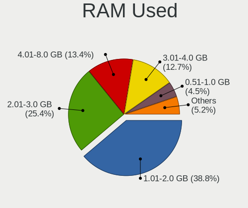
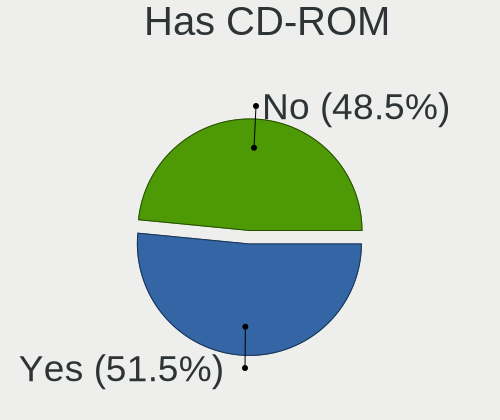
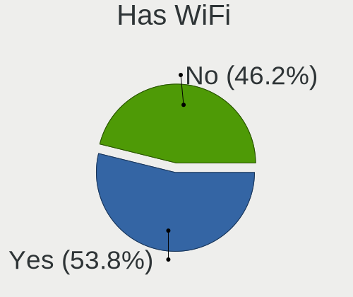
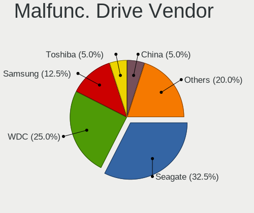
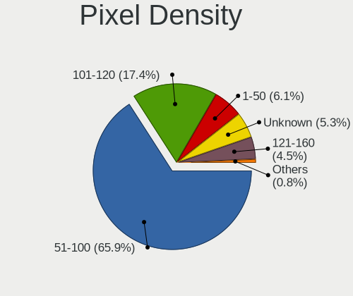
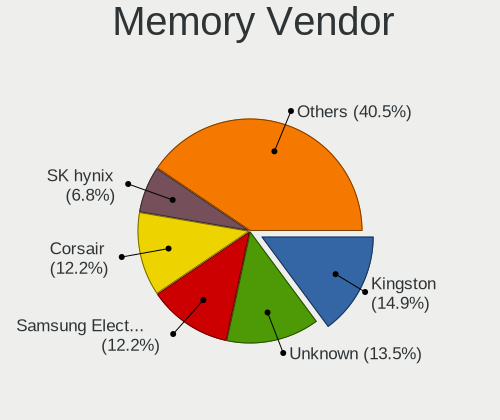

MX 21 - Tested Hardware & Statistics (Desktops)
-----------------------------------------------

A project to collect tested hardware configurations for MX 21.

Anyone can contribute to this report by the [hw-probe](https://github.com/linuxhw/hw-probe) tool:

    sudo -E hw-probe -all -upload

Please contribute! Especially if your hardware is rare.

Contents
--------

* [ Test Cases ](#test-cases)

* [ System ](#system)
  - [ Kernel                   ](#kernel)
  - [ Kernel Family            ](#kernel-family)
  - [ Kernel Major Ver.        ](#kernel-major-ver)
  - [ Arch                     ](#arch)
  - [ DE                       ](#de)
  - [ Display Server           ](#display-server)
  - [ Display Manager          ](#display-manager)
  - [ OS Lang                  ](#os-lang)
  - [ Boot Mode                ](#boot-mode)
  - [ Filesystem               ](#filesystem)
  - [ Part. scheme             ](#part-scheme)
  - [ Dual Boot with Linux/BSD ](#dual-boot-with-linuxbsd)
  - [ Dual Boot (Win)          ](#dual-boot-win)

* [ Board ](#board)
  - [ Vendor                   ](#vendor)
  - [ Model                    ](#model)
  - [ Model Family             ](#model-family)
  - [ MFG Year                 ](#mfg-year)
  - [ Form Factor              ](#form-factor)
  - [ Secure Boot              ](#secure-boot)
  - [ Coreboot                 ](#coreboot)
  - [ RAM Size                 ](#ram-size)
  - [ RAM Used                 ](#ram-used)
  - [ Total Drives             ](#total-drives)
  - [ Has CD-ROM               ](#has-cd-rom)
  - [ Has Ethernet             ](#has-ethernet)
  - [ Has WiFi                 ](#has-wifi)
  - [ Has Bluetooth            ](#has-bluetooth)

* [ Location ](#location)
  - [ Country                  ](#country)
  - [ City                     ](#city)

* [ Drives ](#drives)
  - [ Drive Vendor             ](#drive-vendor)
  - [ Drive Model              ](#drive-model)
  - [ HDD Vendor               ](#hdd-vendor)
  - [ SSD Vendor               ](#ssd-vendor)
  - [ Drive Kind               ](#drive-kind)
  - [ Drive Connector          ](#drive-connector)
  - [ Drive Size               ](#drive-size)
  - [ Space Total              ](#space-total)
  - [ Space Used               ](#space-used)
  - [ Malfunc. Drives          ](#malfunc-drives)
  - [ Malfunc. Drive Vendor    ](#malfunc-drive-vendor)
  - [ Malfunc. HDD Vendor      ](#malfunc-hdd-vendor)
  - [ Malfunc. Drive Kind      ](#malfunc-drive-kind)
  - [ Failed Drives            ](#failed-drives)
  - [ Failed Drive Vendor      ](#failed-drive-vendor)
  - [ Drive Status             ](#drive-status)

* [ Storage controller ](#storage-controller)
  - [ Storage Vendor           ](#storage-vendor)
  - [ Storage Model            ](#storage-model)
  - [ Storage Kind             ](#storage-kind)

* [ Processor ](#processor)
  - [ CPU Vendor               ](#cpu-vendor)
  - [ CPU Model                ](#cpu-model)
  - [ CPU Model Family         ](#cpu-model-family)
  - [ CPU Cores                ](#cpu-cores)
  - [ CPU Sockets              ](#cpu-sockets)
  - [ CPU Threads              ](#cpu-threads)
  - [ CPU Op-Modes             ](#cpu-op-modes)
  - [ CPU Microcode            ](#cpu-microcode)
  - [ CPU Microarch            ](#cpu-microarch)

* [ Graphics ](#graphics)
  - [ GPU Vendor               ](#gpu-vendor)
  - [ GPU Model                ](#gpu-model)
  - [ GPU Combo                ](#gpu-combo)
  - [ GPU Driver               ](#gpu-driver)
  - [ GPU Memory               ](#gpu-memory)

* [ Monitor ](#monitor)
  - [ Monitor Vendor           ](#monitor-vendor)
  - [ Monitor Model            ](#monitor-model)
  - [ Monitor Resolution       ](#monitor-resolution)
  - [ Monitor Diagonal         ](#monitor-diagonal)
  - [ Monitor Width            ](#monitor-width)
  - [ Aspect Ratio             ](#aspect-ratio)
  - [ Monitor Area             ](#monitor-area)
  - [ Pixel Density            ](#pixel-density)
  - [ Multiple Monitors        ](#multiple-monitors)

* [ Network ](#network)
  - [ Net Controller Vendor    ](#net-controller-vendor)
  - [ Net Controller Model     ](#net-controller-model)
  - [ Wireless Vendor          ](#wireless-vendor)
  - [ Wireless Model           ](#wireless-model)
  - [ Ethernet Vendor          ](#ethernet-vendor)
  - [ Ethernet Model           ](#ethernet-model)
  - [ Net Controller Kind      ](#net-controller-kind)
  - [ Used Controller          ](#used-controller)
  - [ NICs                     ](#nics)
  - [ IPv6                     ](#ipv6)

* [ Bluetooth ](#bluetooth)
  - [ Bluetooth Vendor         ](#bluetooth-vendor)
  - [ Bluetooth Model          ](#bluetooth-model)

* [ Sound ](#sound)
  - [ Sound Vendor             ](#sound-vendor)
  - [ Sound Model              ](#sound-model)

* [ Memory ](#memory)
  - [ Memory Vendor            ](#memory-vendor)
  - [ Memory Model             ](#memory-model)
  - [ Memory Kind              ](#memory-kind)
  - [ Memory Form Factor       ](#memory-form-factor)
  - [ Memory Size              ](#memory-size)
  - [ Memory Speed             ](#memory-speed)

* [ Printers & scanners ](#printers--scanners)
  - [ Printer Vendor           ](#printer-vendor)
  - [ Printer Model            ](#printer-model)
  - [ Scanner Vendor           ](#scanner-vendor)
  - [ Scanner Model            ](#scanner-model)

* [ Camera ](#camera)
  - [ Camera Vendor            ](#camera-vendor)
  - [ Camera Model             ](#camera-model)

* [ Security ](#security)
  - [ Fingerprint Vendor       ](#fingerprint-vendor)
  - [ Fingerprint Model        ](#fingerprint-model)
  - [ Chipcard Vendor          ](#chipcard-vendor)
  - [ Chipcard Model           ](#chipcard-model)

* [ Unsupported ](#unsupported)
  - [ Unsupported Devices      ](#unsupported-devices)
  - [ Unsupported Device Types ](#unsupported-device-types)

Test Cases
----------

Total: 62

| Vendor   | Model                       | Probe                                                      | Date         |
|----------|-----------------------------|------------------------------------------------------------|--------------|
| MSI      | Z390-A PRO                  | [3a3375e173](https://linux-hardware.org/?probe=3a3375e173) | Dec 29, 2022 |
| MSI      | Z270 GAMING PRO CARBON      | [f422489705](https://linux-hardware.org/?probe=f422489705) | Dec 27, 2022 |
| Dell     | 0HY9JP A02                  | [c195f58592](https://linux-hardware.org/?probe=c195f58592) | Dec 24, 2022 |
| Lenovo   | 3741 SDK0T76461 WIN 3422... | [70e125f0d0](https://linux-hardware.org/?probe=70e125f0d0) | Dec 23, 2022 |
| Fujitsu  | D3498-A1 S26361-D3498-A1    | [03cd265cef](https://linux-hardware.org/?probe=03cd265cef) | Dec 05, 2022 |
| ASUSTek  | PRIME A320M-K               | [6487bbd7b7](https://linux-hardware.org/?probe=6487bbd7b7) | Dec 05, 2022 |
| SIRAGON  | AIO-5150                    | [90476603fa](https://linux-hardware.org/?probe=90476603fa) | Dec 04, 2022 |
| HP       | 304Ah                       | [15db22accc](https://linux-hardware.org/?probe=15db22accc) | Nov 30, 2022 |
| ASRock   | B365M Pro4                  | [0f0d4f70b0](https://linux-hardware.org/?probe=0f0d4f70b0) | Nov 20, 2022 |
| Foxconn  | 2ABF                        | [aa4bde7d79](https://linux-hardware.org/?probe=aa4bde7d79) | Nov 20, 2022 |
| ASUSTek  | TUF Gaming B450-PLUS II     | [1a0674de42](https://linux-hardware.org/?probe=1a0674de42) | Nov 14, 2022 |
| ASRock   | B365M Pro4                  | [f5305c9730](https://linux-hardware.org/?probe=f5305c9730) | Nov 04, 2022 |
| MSI      | X570-A PRO                  | [c60d9aa72d](https://linux-hardware.org/?probe=c60d9aa72d) | Oct 31, 2022 |
| Biostar  | H61MH                       | [f505de310c](https://linux-hardware.org/?probe=f505de310c) | Oct 27, 2022 |
| Lenovo   | 318E NOK                    | [6b190bfb4f](https://linux-hardware.org/?probe=6b190bfb4f) | Oct 25, 2022 |
| Pegatron | NARRA3                      | [1588e60c57](https://linux-hardware.org/?probe=1588e60c57) | Oct 12, 2022 |
| ASUSTek  | Z170-P                      | [2f3c79dd55](https://linux-hardware.org/?probe=2f3c79dd55) | Sep 29, 2022 |
| ASUSTek  | P5GC-MX/CKD/SI              | [72bb90ea71](https://linux-hardware.org/?probe=72bb90ea71) | Sep 28, 2022 |
| ASUSTek  | P5G41T-M LX                 | [8e429edcd6](https://linux-hardware.org/?probe=8e429edcd6) | Sep 25, 2022 |
| ASUSTek  | PRIME B450M-A               | [bdb353fd2c](https://linux-hardware.org/?probe=bdb353fd2c) | Sep 20, 2022 |
| HP       | 1632                        | [8309a8acf0](https://linux-hardware.org/?probe=8309a8acf0) | Sep 10, 2022 |
| Medion   | H110H4-EM                   | [1b22e5560d](https://linux-hardware.org/?probe=1b22e5560d) | Sep 07, 2022 |
| Gigabyte | B560M DS3H V2               | [c430bf0275](https://linux-hardware.org/?probe=c430bf0275) | Sep 03, 2022 |
| Biostar  | A780L3B                     | [62782d600f](https://linux-hardware.org/?probe=62782d600f) | Aug 14, 2022 |
| Intel    | DH55TC AAE70932-303         | [f275229d83](https://linux-hardware.org/?probe=f275229d83) | Jul 31, 2022 |
| MP       | MS-7848                     | [f7696965e0](https://linux-hardware.org/?probe=f7696965e0) | Jul 22, 2022 |
| MSI      | MAG B550 TOMAHAWK           | [85782181c7](https://linux-hardware.org/?probe=85782181c7) | Jul 21, 2022 |
| ASUSTek  | P8H61/USB3 R2.0             | [1076f6d59a](https://linux-hardware.org/?probe=1076f6d59a) | Jul 19, 2022 |
| AOpen    | D1009 A1A4                  | [d8edf66887](https://linux-hardware.org/?probe=d8edf66887) | Jul 13, 2022 |
| Dell     | 0DR845                      | [4c4a530cc5](https://linux-hardware.org/?probe=4c4a530cc5) | Jul 06, 2022 |
| MSI      | B350 TOMAHAWK               | [5a66940742](https://linux-hardware.org/?probe=5a66940742) | Jun 23, 2022 |
| MSI      | Z77A-G41                    | [d0f55f3c0b](https://linux-hardware.org/?probe=d0f55f3c0b) | Jun 22, 2022 |
| Dell     | 0200DY A01                  | [bc8030c1d5](https://linux-hardware.org/?probe=bc8030c1d5) | Jun 22, 2022 |
| Dell     | 0DR845                      | [56b4af8d26](https://linux-hardware.org/?probe=56b4af8d26) | Jun 20, 2022 |
| Gigabyte | H410M S2H V3                | [b57b3a635c](https://linux-hardware.org/?probe=b57b3a635c) | Jun 02, 2022 |
| ASUSTek  | SABERTOOTH X99              | [b627953ad4](https://linux-hardware.org/?probe=b627953ad4) | May 11, 2022 |
| Intel    | V1.3                        | [a01993f2fa](https://linux-hardware.org/?probe=a01993f2fa) | Apr 30, 2022 |
| ASUSTek  | SABERTOOTH X99              | [51cc264c62](https://linux-hardware.org/?probe=51cc264c62) | Apr 22, 2022 |
| Gigabyte | B550M S2H                   | [208972e3b5](https://linux-hardware.org/?probe=208972e3b5) | Apr 19, 2022 |
| ASRock   | N3150M                      | [0ee71f6582](https://linux-hardware.org/?probe=0ee71f6582) | Apr 19, 2022 |
| Gigabyte | B550M S2H                   | [1127f26185](https://linux-hardware.org/?probe=1127f26185) | Apr 17, 2022 |
| Dell     | 0YXT71 A01                  | [5de0fab8f2](https://linux-hardware.org/?probe=5de0fab8f2) | Apr 04, 2022 |
| Lenovo   | 1046 NO DPK                 | [561b1c3324](https://linux-hardware.org/?probe=561b1c3324) | Mar 17, 2022 |
| Gigabyte | Z390 UD                     | [d0b555e0ba](https://linux-hardware.org/?probe=d0b555e0ba) | Mar 17, 2022 |
| HP       | 3647h                       | [fd6766aabb](https://linux-hardware.org/?probe=fd6766aabb) | Mar 11, 2022 |
| ASUSTek  | P5GC-MX/MEDION/SI           | [772e020316](https://linux-hardware.org/?probe=772e020316) | Mar 09, 2022 |
| MSI      | MS-7091                     | [71aaa6a920](https://linux-hardware.org/?probe=71aaa6a920) | Mar 09, 2022 |
| MSI      | MS-7091                     | [b08ddd1115](https://linux-hardware.org/?probe=b08ddd1115) | Mar 09, 2022 |
| ASUSTek  | ROG Maximus XIII HERO       | [e58223cc60](https://linux-hardware.org/?probe=e58223cc60) | Feb 18, 2022 |
| Huanan   | X99-F8 V2.0                 | [23c722f6cf](https://linux-hardware.org/?probe=23c722f6cf) | Feb 18, 2022 |
| Huanan   | X99-F8 V2.0                 | [f4fec6a5be](https://linux-hardware.org/?probe=f4fec6a5be) | Feb 17, 2022 |
| MSI      | Z97 GAMING 5                | [7c66c1b404](https://linux-hardware.org/?probe=7c66c1b404) | Feb 09, 2022 |
| ASUSTek  | X99-DELUXE                  | [4ffe151e7a](https://linux-hardware.org/?probe=4ffe151e7a) | Jan 29, 2022 |
| HP       | 0B4Ch D                     | [ecaec39529](https://linux-hardware.org/?probe=ecaec39529) | Jan 05, 2022 |
| Fujitsu  | D3221-A1 S26361-D3221-A1    | [78d4e04363](https://linux-hardware.org/?probe=78d4e04363) | Dec 16, 2021 |
| GALAX    | B550M                       | [a6866c8a45](https://linux-hardware.org/?probe=a6866c8a45) | Dec 04, 2021 |
| Lenovo   | SHARKBAY NO DPK             | [fd5f409df8](https://linux-hardware.org/?probe=fd5f409df8) | Nov 14, 2021 |
| Lenovo   | SHARKBAY NO DPK             | [a85cc99f78](https://linux-hardware.org/?probe=a85cc99f78) | Nov 14, 2021 |
| ASRock   | X570 Steel Legend           | [18391015f7](https://linux-hardware.org/?probe=18391015f7) | Nov 11, 2021 |
| Gigabyte | X570 AORUS PRO              | [fbd2076eee](https://linux-hardware.org/?probe=fbd2076eee) | Oct 28, 2021 |
| Gigabyte | B550M DS3H                  | [ee6a141211](https://linux-hardware.org/?probe=ee6a141211) | Oct 19, 2021 |
| Gigabyte | A320M-S2H V2-CF             | [5d136cb09b](https://linux-hardware.org/?probe=5d136cb09b) | Aug 13, 2021 |

System
------

Kernel
------

Version of the Linux kernel

| Version                    | Desktops | Percent |
|----------------------------|----------|---------|
| 5.10.0-19-amd64            | 6        | 11.32%  |
| 5.14.0-4mx-amd64           | 5        | 9.43%   |
| 5.10.0-13-amd64            | 5        | 9.43%   |
| 5.10.0-16-amd64            | 4        | 7.55%   |
| 5.10.0-15-amd64            | 4        | 7.55%   |
| 5.16.0-5mx-amd64           | 3        | 5.66%   |
| 5.10.0-18-amd64            | 3        | 5.66%   |
| 5.14.0-3mx-amd64           | 2        | 3.77%   |
| 5.10.0-9-amd64             | 2        | 3.77%   |
| 5.10.0-20-amd64            | 2        | 3.77%   |
| 5.10.0-11-amd64            | 2        | 3.77%   |
| 6.0.5-x64v1-xanmod1        | 1        | 1.89%   |
| 6.0.0-4mx-rt-amd64         | 1        | 1.89%   |
| 5.19.0-4.2-liquorix-amd64  | 1        | 1.89%   |
| 5.19.0-17.2-liquorix-amd64 | 1        | 1.89%   |
| 5.19.0-14.1-liquorix-amd64 | 1        | 1.89%   |
| 5.16.0-rc5-hwmon-next+     | 1        | 1.89%   |
| 5.16.0-6mx-amd64           | 1        | 1.89%   |
| 5.15.0-2-amd64             | 1        | 1.89%   |
| 5.15.0-0.bpo.2-amd64       | 1        | 1.89%   |
| 5.14.0-2mx-amd64           | 1        | 1.89%   |
| 5.10.52-antix.1-amd64-smp  | 1        | 1.89%   |
| 5.10.111-tkg-cfs           | 1        | 1.89%   |
| 5.10.0-18-686-pae          | 1        | 1.89%   |
| 5.10.0-17-amd64            | 1        | 1.89%   |
| 5.10.0-10-amd64            | 1        | 1.89%   |

Kernel Family
-------------

Linux kernel without a distro release

| Version  | Desktops | Percent |
|----------|----------|---------|
| 5.10.0   | 31       | 58.49%  |
| 5.14.0   | 8        | 15.09%  |
| 5.16.0   | 5        | 9.43%   |
| 5.19.0   | 3        | 5.66%   |
| 5.15.0   | 2        | 3.77%   |
| 6.0.5    | 1        | 1.89%   |
| 6.0.0    | 1        | 1.89%   |
| 5.10.52  | 1        | 1.89%   |
| 5.10.111 | 1        | 1.89%   |

Kernel Major Ver.
-----------------

Linux kernel major version

| Version | Desktops | Percent |
|---------|----------|---------|
| 5.10    | 33       | 62.26%  |
| 5.14    | 8        | 15.09%  |
| 5.16    | 5        | 9.43%   |
| 5.19    | 3        | 5.66%   |
| 6.0     | 2        | 3.77%   |
| 5.15    | 2        | 3.77%   |

Arch
----

OS architecture (x86_64, i586, etc.)

| Name   | Desktops | Percent |
|--------|----------|---------|
| x86_64 | 52       | 98.11%  |
| i686   | 1        | 1.89%   |

DE
--

Desktop Environment

| Name             | Desktops | Percent |
|------------------|----------|---------|
| XFCE             | 41       | 77.36%  |
| KDE5             | 9        | 16.98%  |
| lightdm-xsession | 2        | 3.77%   |
| Unknown          | 1        | 1.89%   |

Display Server
--------------

X11 or Wayland

| Name | Desktops | Percent |
|------|----------|---------|
| X11  | 53       | 100%    |

Display Manager
---------------

SDDM, LightDM, etc.

| Name    | Desktops | Percent |
|---------|----------|---------|
| LightDM | 41       | 77.36%  |
| SDDM    | 9        | 16.98%  |
| SLiM    | 2        | 3.77%   |
| GDM     | 1        | 1.89%   |

OS Lang
-------

Language

| Lang  | Desktops | Percent |
|-------|----------|---------|
| en_US | 21       | 39.62%  |
| de_DE | 9        | 16.98%  |
| it_IT | 5        | 9.43%   |
| pl_PL | 3        | 5.66%   |
| en_GB | 2        | 3.77%   |
| de_CH | 2        | 3.77%   |
| sv_SE | 1        | 1.89%   |
| ru_RU | 1        | 1.89%   |
| pt_BR | 1        | 1.89%   |
| hu_HU | 1        | 1.89%   |
| fr_FR | 1        | 1.89%   |
| fi_FI | 1        | 1.89%   |
| es_VE | 1        | 1.89%   |
| es_MX | 1        | 1.89%   |
| es_ES | 1        | 1.89%   |
| es_CO | 1        | 1.89%   |
| en_NZ | 1        | 1.89%   |

Boot Mode
---------

EFI or BIOS

| Mode | Desktops | Percent |
|------|----------|---------|
| BIOS | 33       | 62.26%  |
| EFI  | 20       | 37.74%  |

Filesystem
----------

Type of filesystem

| Type     | Desktops | Percent |
|----------|----------|---------|
| Ext4     | 46       | 86.79%  |
| Overlay  | 3        | 5.66%   |
| Xfs      | 1        | 1.89%   |
| Reiserfs | 1        | 1.89%   |
| Ext3     | 1        | 1.89%   |
| Btrfs    | 1        | 1.89%   |

Part. scheme
------------

Scheme of partitioning

| Type | Desktops | Percent |
|------|----------|---------|
| GPT  | 30       | 56.6%   |
| MBR  | 23       | 43.4%   |

Dual Boot with Linux/BSD
------------------------

Hosting more than one Linux/BSD

| Dual boot | Desktops | Percent |
|-----------|----------|---------|
| No        | 31       | 58.49%  |
| Yes       | 22       | 41.51%  |

Dual Boot (Win)
---------------

Hosting Linux and Windows

| Dual boot | Desktops | Percent |
|-----------|----------|---------|
| Yes       | 31       | 58.49%  |
| No        | 22       | 41.51%  |

Board
-----

Vendor
------

Motherboard manufacturer

| Name                | Desktops | Percent |
|---------------------|----------|---------|
| ASUSTek Computer    | 11       | 20.75%  |
| MSI                 | 7        | 13.21%  |
| Gigabyte Technology | 6        | 11.32%  |
| Dell                | 5        | 9.43%   |
| Lenovo              | 4        | 7.55%   |
| Hewlett-Packard     | 3        | 5.66%   |
| ASRock              | 3        | 5.66%   |
| Intel               | 2        | 3.77%   |
| Fujitsu             | 2        | 3.77%   |
| Biostar             | 2        | 3.77%   |
| SIRAGON             | 1        | 1.89%   |
| Pegatron            | 1        | 1.89%   |
| MP                  | 1        | 1.89%   |
| Medion              | 1        | 1.89%   |
| Huanan              | 1        | 1.89%   |
| GALAX               | 1        | 1.89%   |
| Foxconn             | 1        | 1.89%   |
| AOpen               | 1        | 1.89%   |

Model
-----

Motherboard model

| Name                                        | Desktops | Percent |
|---------------------------------------------|----------|---------|
| Dell OptiPlex 755                           | 2        | 3.77%   |
| ASUS All Series                             | 2        | 3.77%   |
| SIRAGON AIO-5150                            | 1        | 1.89%   |
| Pegatron FQ425AA-ABA a6655f                 | 1        | 1.89%   |
| MSI MS-7C91                                 | 1        | 1.89%   |
| MSI MS-7C37                                 | 1        | 1.89%   |
| MSI MS-7B98                                 | 1        | 1.89%   |
| MSI MS-7A63                                 | 1        | 1.89%   |
| MSI MS-7A34                                 | 1        | 1.89%   |
| MSI MS-7917                                 | 1        | 1.89%   |
| MSI MS-7758                                 | 1        | 1.89%   |
| MP MS-7848                                  | 1        | 1.89%   |
| Medion Akoya P5330 E MD8876/2458            | 1        | 1.89%   |
| Lenovo ThinkStation P620 30E0CTO1WW         | 1        | 1.89%   |
| Lenovo ThinkCentre M75s Gen 2 11JAS0CJ00    | 1        | 1.89%   |
| Lenovo IdeaCentre Gaming5 17IAB7 90T00007US | 1        | 1.89%   |
| Lenovo 10AAS1QB0B                           | 1        | 1.89%   |
| Intel V1.3                                  | 1        | 1.89%   |
| Intel DH55TC AAE70932-303                   | 1        | 1.89%   |
| Huanan X99-F8                               | 1        | 1.89%   |
| HP Z400 Workstation                         | 1        | 1.89%   |
| HP Compaq 8100 Elite SFF PC                 | 1        | 1.89%   |
| HP Compaq 8000 Elite CMT PC                 | 1        | 1.89%   |
| Gigabyte Z390 UD                            | 1        | 1.89%   |
| Gigabyte X570 AORUS PRO                     | 1        | 1.89%   |
| Gigabyte H410M S2H V3                       | 1        | 1.89%   |
| Gigabyte B560M DS3H V2                      | 1        | 1.89%   |
| Gigabyte B550M S2H                          | 1        | 1.89%   |
| Gigabyte B550M DS3H                         | 1        | 1.89%   |
| GALAX B550M                                 | 1        | 1.89%   |
| Fujitsu ESPRIMO P720                        | 1        | 1.89%   |
| Fujitsu CELSIUS M770                        | 1        | 1.89%   |
| Foxconn Pro3500 Series                      | 1        | 1.89%   |
| Dell OptiPlex 790                           | 1        | 1.89%   |
| Dell OptiPlex 780                           | 1        | 1.89%   |
| Dell OptiPlex 7010                          | 1        | 1.89%   |
| Biostar H61MH                               | 1        | 1.89%   |
| Biostar A780L3B                             | 1        | 1.89%   |
| ASUS Z170-P                                 | 1        | 1.89%   |
| ASUS TUF Gaming B450-PLUS II                | 1        | 1.89%   |

Model Family
------------

Motherboard model prefix

| Name                 | Desktops | Percent |
|----------------------|----------|---------|
| Dell OptiPlex        | 5        | 9.43%   |
| HP Compaq            | 2        | 3.77%   |
| Gigabyte B550M       | 2        | 3.77%   |
| ASUS P5GC-MX         | 2        | 3.77%   |
| ASUS All             | 2        | 3.77%   |
| SIRAGON AIO-5150     | 1        | 1.89%   |
| Pegatron FQ425AA-ABA | 1        | 1.89%   |
| MSI MS-7C91          | 1        | 1.89%   |
| MSI MS-7C37          | 1        | 1.89%   |
| MSI MS-7B98          | 1        | 1.89%   |
| MSI MS-7A63          | 1        | 1.89%   |
| MSI MS-7A34          | 1        | 1.89%   |
| MSI MS-7917          | 1        | 1.89%   |
| MSI MS-7758          | 1        | 1.89%   |
| MP MS-7848           | 1        | 1.89%   |
| Medion Akoya         | 1        | 1.89%   |
| Lenovo ThinkStation  | 1        | 1.89%   |
| Lenovo ThinkCentre   | 1        | 1.89%   |
| Lenovo IdeaCentre    | 1        | 1.89%   |
| Lenovo 10AAS1QB0B    | 1        | 1.89%   |
| Intel V1.3           | 1        | 1.89%   |
| Intel DH55TC         | 1        | 1.89%   |
| Huanan X99-F8        | 1        | 1.89%   |
| HP Z400              | 1        | 1.89%   |
| Gigabyte Z390        | 1        | 1.89%   |
| Gigabyte X570        | 1        | 1.89%   |
| Gigabyte H410M       | 1        | 1.89%   |
| Gigabyte B560M       | 1        | 1.89%   |
| GALAX B550M          | 1        | 1.89%   |
| Fujitsu ESPRIMO      | 1        | 1.89%   |
| Fujitsu CELSIUS      | 1        | 1.89%   |
| Foxconn Pro3500      | 1        | 1.89%   |
| Biostar H61MH        | 1        | 1.89%   |
| Biostar A780L3B      | 1        | 1.89%   |
| ASUS Z170-P          | 1        | 1.89%   |
| ASUS TUF             | 1        | 1.89%   |
| ASUS ROG             | 1        | 1.89%   |
| ASUS PRIME           | 1        | 1.89%   |
| ASUS P8H61           | 1        | 1.89%   |
| ASUS P5G41T-M        | 1        | 1.89%   |

MFG Year
--------

Motherboard manufacture year

| Year | Desktops | Percent |
|------|----------|---------|
| 2020 | 7        | 13.21%  |
| 2018 | 6        | 11.32%  |
| 2021 | 4        | 7.55%   |
| 2019 | 4        | 7.55%   |
| 2014 | 4        | 7.55%   |
| 2007 | 4        | 7.55%   |
| 2016 | 3        | 5.66%   |
| 2013 | 3        | 5.66%   |
| 2012 | 3        | 5.66%   |
| 2011 | 3        | 5.66%   |
| 2010 | 3        | 5.66%   |
| 2009 | 3        | 5.66%   |
| 2022 | 2        | 3.77%   |
| 2015 | 2        | 3.77%   |
| 2017 | 1        | 1.89%   |
| 2008 | 1        | 1.89%   |

Form Factor
-----------

Physical design of the computer

| Name    | Desktops | Percent |
|---------|----------|---------|
| Desktop | 53       | 100%    |

Secure Boot
-----------

Enabled or disabled

| State    | Desktops | Percent |
|----------|----------|---------|
| Disabled | 53       | 100%    |

Coreboot
--------

Have coreboot on board

| Used | Desktops | Percent |
|------|----------|---------|
| No   | 53       | 100%    |

RAM Size
--------

Total RAM memory

| Size in GB  | Desktops | Percent |
|-------------|----------|---------|
| 8.01-16.0   | 15       | 28.3%   |
| 32.01-64.0  | 12       | 22.64%  |
| 4.01-8.0    | 9        | 16.98%  |
| 3.01-4.0    | 7        | 13.21%  |
| 16.01-24.0  | 6        | 11.32%  |
| 64.01-256.0 | 2        | 3.77%   |
| 24.01-32.0  | 1        | 1.89%   |
| 2.01-3.0    | 1        | 1.89%   |

RAM Used
--------

Used RAM memory

| Used GB    | Desktops | Percent |
|------------|----------|---------|
| 1.01-2.0   | 20       | 37.74%  |
| 2.01-3.0   | 13       | 24.53%  |
| 3.01-4.0   | 8        | 15.09%  |
| 4.01-8.0   | 7        | 13.21%  |
| 8.01-16.0  | 3        | 5.66%   |
| 16.01-24.0 | 1        | 1.89%   |
| 0.51-1.0   | 1        | 1.89%   |

Total Drives
------------

Number of drives on board

| Drives | Desktops | Percent |
|--------|----------|---------|
| 3      | 15       | 28.3%   |
| 2      | 15       | 28.3%   |
| 1      | 15       | 28.3%   |
| 4      | 4        | 7.55%   |
| 8      | 2        | 3.77%   |
| 5      | 2        | 3.77%   |

Has CD-ROM
----------

Has CD-ROM on board

| Presented | Desktops | Percent |
|-----------|----------|---------|
| Yes       | 27       | 50.94%  |
| No        | 26       | 49.06%  |

Has Ethernet
------------

Has Ethernet on board

| Presented | Desktops | Percent |
|-----------|----------|---------|
| Yes       | 53       | 100%    |

Has WiFi
--------

Has WiFi module

| Presented | Desktops | Percent |
|-----------|----------|---------|
| No        | 31       | 58.49%  |
| Yes       | 22       | 41.51%  |

Has Bluetooth
-------------

Has Bluetooth module

| Presented | Desktops | Percent |
|-----------|----------|---------|
| No        | 45       | 84.91%  |
| Yes       | 8        | 15.09%  |

Location
--------

Country
-------

Geographic location (country)

| Country     | Desktops | Percent |
|-------------|----------|---------|
| USA         | 13       | 24.53%  |
| Germany     | 8        | 15.09%  |
| Italy       | 5        | 9.43%   |
| Poland      | 3        | 5.66%   |
| Venezuela   | 2        | 3.77%   |
| Switzerland | 2        | 3.77%   |
| India       | 2        | 3.77%   |
| France      | 2        | 3.77%   |
| UK          | 1        | 1.89%   |
| Sweden      | 1        | 1.89%   |
| Spain       | 1        | 1.89%   |
| Russia      | 1        | 1.89%   |
| New Zealand | 1        | 1.89%   |
| Netherlands | 1        | 1.89%   |
| Mexico      | 1        | 1.89%   |
| Indonesia   | 1        | 1.89%   |
| Hungary     | 1        | 1.89%   |
| Greece      | 1        | 1.89%   |
| Finland     | 1        | 1.89%   |
| Estonia     | 1        | 1.89%   |
| Colombia    | 1        | 1.89%   |
| Canada      | 1        | 1.89%   |
| Brazil      | 1        | 1.89%   |
| Australia   | 1        | 1.89%   |

City
----

Geographic location (city)

| City                | Desktops | Percent |
|---------------------|----------|---------|
| Ettingen            | 2        | 3.77%   |
| Volos               | 1        | 1.89%   |
| Voghera             | 1        | 1.89%   |
| Vilhelmina          | 1        | 1.89%   |
| Vasco da Gama       | 1        | 1.89%   |
| Vaidasoo            | 1        | 1.89%   |
| Tuglie              | 1        | 1.89%   |
| Stevens Point       | 1        | 1.89%   |
| St Petersburg       | 1        | 1.89%   |
| Seelbach            | 1        | 1.89%   |
| San Diego           | 1        | 1.89%   |
| Rzeszów            | 1        | 1.89%   |
| Rosporden           | 1        | 1.89%   |
| Reno                | 1        | 1.89%   |
| Rathenow            | 1        | 1.89%   |
| Puebla City         | 1        | 1.89%   |
| Portland            | 1        | 1.89%   |
| Pompano Beach       | 1        | 1.89%   |
| Pila                | 1        | 1.89%   |
| Piedmont            | 1        | 1.89%   |
| Normal              | 1        | 1.89%   |
| Narbonne            | 1        | 1.89%   |
| Milwaukee           | 1        | 1.89%   |
| Maringá            | 1        | 1.89%   |
| Lodi                | 1        | 1.89%   |
| Krakow              | 1        | 1.89%   |
| Katonah             | 1        | 1.89%   |
| Kamiah              | 1        | 1.89%   |
| Houston             | 1        | 1.89%   |
| Herzogenrath        | 1        | 1.89%   |
| Helsinki            | 1        | 1.89%   |
| Granadilla de Abona | 1        | 1.89%   |
| Gouda               | 1        | 1.89%   |
| Göttingen          | 1        | 1.89%   |
| Freital             | 1        | 1.89%   |
| Düsseldorf         | 1        | 1.89%   |
| Dieburg             | 1        | 1.89%   |
| Denpasar            | 1        | 1.89%   |
| Chingford           | 1        | 1.89%   |
| Charlotte           | 1        | 1.89%   |

Drives
------

Drive Vendor
------------

Hard drive vendors

| Vendor              | Desktops | Drives | Percent |
|---------------------|----------|--------|---------|
| Samsung Electronics | 22       | 36     | 20.95%  |
| Seagate             | 21       | 28     | 20%     |
| WDC                 | 13       | 17     | 12.38%  |
| Kingston            | 10       | 10     | 9.52%   |
| Toshiba             | 6        | 6      | 5.71%   |
| SanDisk             | 4        | 4      | 3.81%   |
| Hitachi             | 4        | 5      | 3.81%   |
| Crucial             | 3        | 3      | 2.86%   |
| Corsair             | 3        | 3      | 2.86%   |
| PNY                 | 2        | 3      | 1.9%    |
| GOODRAM             | 2        | 2      | 1.9%    |
| Apacer              | 2        | 2      | 1.9%    |
| A-DATA Technology   | 2        | 2      | 1.9%    |
| Unknown             | 1        | 2      | 0.95%   |
| Transcend           | 1        | 1      | 0.95%   |
| SPCC                | 1        | 1      | 0.95%   |
| OCZ                 | 1        | 1      | 0.95%   |
| Micron Technology   | 1        | 1      | 0.95%   |
| Maxtor              | 1        | 1      | 0.95%   |
| JMicron Technology  | 1        | 1      | 0.95%   |
| Intel               | 1        | 1      | 0.95%   |
| HGST                | 1        | 1      | 0.95%   |
| Avant               | 1        | 1      | 0.95%   |
| Acer                | 1        | 1      | 0.95%   |

Drive Model
-----------

Hard drive models

| Model                            | Desktops | Percent |
|----------------------------------|----------|---------|
| Kingston SA400S37480G 480GB SSD  | 4        | 3.15%   |
| Seagate ST2000DM008-2FR102 2TB   | 3        | 2.36%   |
| SanDisk SDSSDA240G 240GB         | 3        | 2.36%   |
| Samsung SSD 850 EVO 250GB        | 3        | 2.36%   |
| Toshiba DT01ACA100 1TB           | 2        | 1.57%   |
| Seagate ST3500413AS 500GB        | 2        | 1.57%   |
| Samsung SSD 970 EVO Plus 500GB   | 2        | 1.57%   |
| Samsung SSD 970 EVO Plus 1TB     | 2        | 1.57%   |
| Samsung SSD 850 EVO 500GB        | 2        | 1.57%   |
| Samsung SSD 850 EVO 1TB          | 2        | 1.57%   |
| Kingston SV300S37A240G 240GB SSD | 2        | 1.57%   |
| Corsair MP400 2TB                | 2        | 1.57%   |
| WDC WDS500G2B0C-00PXH0 500GB     | 1        | 0.79%   |
| WDC WDS100T2B0A-00SM50 1TB SSD   | 1        | 0.79%   |
| WDC WD800AAJS-60M0A0 80GB        | 1        | 0.79%   |
| WDC WD60EZRZ-00RWYB1 6TB         | 1        | 0.79%   |
| WDC WD60EFRX-68L0BN1 6TB         | 1        | 0.79%   |
| WDC WD5002AALX-00J37A0 500GB     | 1        | 0.79%   |
| WDC WD5000AVCS-632DY1 500GB      | 1        | 0.79%   |
| WDC WD40EFRX-68WT0N0 4TB         | 1        | 0.79%   |
| WDC WD30EFRX-68AX9N0 3TB         | 1        | 0.79%   |
| WDC WD20EZRX-22D8PB0 2TB         | 1        | 0.79%   |
| WDC WD10EZEX-75WN4A0 1TB         | 1        | 0.79%   |
| WDC WD10EZEX-08M2NA0 1TB         | 1        | 0.79%   |
| WDC WD10EZEX-00BBHA0 1TB         | 1        | 0.79%   |
| WDC WD10EVDS-63U8B1 1TB          | 1        | 0.79%   |
| WDC WD10EADS-98M2B0 1TB          | 1        | 0.79%   |
| WDC WD10EADS-00M2B0 1TB          | 1        | 0.79%   |
| Unknown SD/MMC 2GB               | 1        | 0.79%   |
| Unknown M.S./M.S.Pro/HG 16GB     | 1        | 0.79%   |
| Transcend TS128GSSD370S 128GB    | 1        | 0.79%   |
| Toshiba MQ01ABF050 500GB         | 1        | 0.79%   |
| Toshiba MG09ACA18TE 18TB         | 1        | 0.79%   |
| Toshiba DT01ACA200 2TB           | 1        | 0.79%   |
| Toshiba DT01ACA100 LENOVO 1TB    | 1        | 0.79%   |
| SPCC Solid State Disk 256GB      | 1        | 0.79%   |
| Seagate ST500LT012-9WS142 500GB  | 1        | 0.79%   |
| Seagate ST500LM021-1KJ152 500GB  | 1        | 0.79%   |
| Seagate ST500DM002-1BD142 500GB  | 1        | 0.79%   |
| Seagate ST4000NE0025-2EW107 4TB  | 1        | 0.79%   |

HDD Vendor
----------

Hard disk drive vendors

| Vendor              | Desktops | Drives | Percent |
|---------------------|----------|--------|---------|
| Seagate             | 21       | 28     | 44.68%  |
| WDC                 | 11       | 15     | 23.4%   |
| Toshiba             | 6        | 6      | 12.77%  |
| Hitachi             | 4        | 5      | 8.51%   |
| Samsung Electronics | 3        | 3      | 6.38%   |
| Maxtor              | 1        | 1      | 2.13%   |
| HGST                | 1        | 1      | 2.13%   |

SSD Vendor
----------

Solid state drive vendors

| Vendor              | Desktops | Drives | Percent |
|---------------------|----------|--------|---------|
| Samsung Electronics | 16       | 20     | 36.36%  |
| Kingston            | 9        | 9      | 20.45%  |
| SanDisk             | 4        | 4      | 9.09%   |
| GOODRAM             | 2        | 2      | 4.55%   |
| Crucial             | 2        | 2      | 4.55%   |
| A-DATA Technology   | 2        | 2      | 4.55%   |
| WDC                 | 1        | 1      | 2.27%   |
| Transcend           | 1        | 1      | 2.27%   |
| SPCC                | 1        | 1      | 2.27%   |
| PNY                 | 1        | 1      | 2.27%   |
| OCZ                 | 1        | 1      | 2.27%   |
| Micron Technology   | 1        | 1      | 2.27%   |
| Avant               | 1        | 1      | 2.27%   |
| Apacer              | 1        | 1      | 2.27%   |
| Acer                | 1        | 1      | 2.27%   |

Drive Kind
----------

HDD or SSD

| Kind    | Desktops | Drives | Percent |
|---------|----------|--------|---------|
| HDD     | 39       | 59     | 40.21%  |
| SSD     | 36       | 48     | 37.11%  |
| NVMe    | 20       | 23     | 20.62%  |
| Unknown | 2        | 3      | 2.06%   |

Drive Connector
---------------

SATA, SAS, NVMe, etc.

| Type | Desktops | Drives | Percent |
|------|----------|--------|---------|
| SATA | 51       | 104    | 68%     |
| NVMe | 20       | 23     | 26.67%  |
| SAS  | 4        | 6      | 5.33%   |

Drive Size
----------

Size of hard drive

| Size in TB | Desktops | Drives | Percent |
|------------|----------|--------|---------|
| 0.01-0.5   | 40       | 63     | 51.95%  |
| 0.51-1.0   | 21       | 23     | 27.27%  |
| 1.01-2.0   | 9        | 12     | 11.69%  |
| 3.01-4.0   | 3        | 3      | 3.9%    |
| 4.01-10.0  | 2        | 4      | 2.6%    |
| 2.01-3.0   | 1        | 1      | 1.3%    |
| 10.01-20.0 | 1        | 1      | 1.3%    |

Space Total
-----------

Amount of disk space available on the file system

| Size in GB     | Desktops | Percent |
|----------------|----------|---------|
| 101-250        | 13       | 24.53%  |
| 251-500        | 12       | 22.64%  |
| 1001-2000      | 8        | 15.09%  |
| More than 3000 | 5        | 9.43%   |
| 2001-3000      | 5        | 9.43%   |
| 501-1000       | 5        | 9.43%   |
| 51-100         | 4        | 7.55%   |
| 1-20           | 1        | 1.89%   |

Space Used
----------

Amount of used disk space

| Used GB        | Desktops | Percent |
|----------------|----------|---------|
| 101-250        | 12       | 22.22%  |
| 21-50          | 11       | 20.37%  |
| 1-20           | 8        | 14.81%  |
| 51-100         | 7        | 12.96%  |
| 1001-2000      | 6        | 11.11%  |
| 251-500        | 4        | 7.41%   |
| More than 3000 | 2        | 3.7%    |
| 2001-3000      | 2        | 3.7%    |
| 501-1000       | 2        | 3.7%    |

Malfunc. Drives
---------------

Drive models with a malfunction

| Model                                    | Desktops | Drives | Percent |
|------------------------------------------|----------|--------|---------|
| WDC WDS100T2B0A-00SM50 1TB SSD           | 1        | 1      | 4.76%   |
| WDC WD10EADS-98M2B0 1TB                  | 1        | 1      | 4.76%   |
| WDC WD10EADS-00M2B0 1TB                  | 1        | 1      | 4.76%   |
| Toshiba MQ01ABF050 500GB                 | 1        | 1      | 4.76%   |
| Seagate ST500LT012-9WS142 500GB          | 1        | 1      | 4.76%   |
| Seagate ST500LM021-1KJ152 500GB          | 1        | 1      | 4.76%   |
| Seagate ST380815AS 80GB                  | 1        | 1      | 4.76%   |
| Seagate ST3500413AS 500GB                | 1        | 1      | 4.76%   |
| Seagate ST3360320AS 360GB                | 1        | 1      | 4.76%   |
| Seagate ST320LT020-9YG142 320GB          | 1        | 1      | 4.76%   |
| Seagate ST320LT012-1DG14C 320GB          | 1        | 2      | 4.76%   |
| Seagate ST250DM000-1BD141 250GB          | 1        | 1      | 4.76%   |
| Seagate ST2000DM001-1ER164 2TB           | 1        | 1      | 4.76%   |
| Samsung Electronics SSD 850 EVO 500GB    | 1        | 1      | 4.76%   |
| Samsung Electronics SSD 850 EVO 1TB      | 1        | 2      | 4.76%   |
| Samsung Electronics SSD 840 Series 120GB | 1        | 1      | 4.76%   |
| Maxtor 4K040H2 40GB                      | 1        | 1      | 4.76%   |
| Hitachi HTS545050A7E380 500GB            | 1        | 1      | 4.76%   |
| Hitachi HDS721050CLA362 500GB            | 1        | 1      | 4.76%   |
| HGST HTS545050A7E380 500GB               | 1        | 1      | 4.76%   |
| GOODRAM SSDPR-CL100-480-G3 480GB         | 1        | 1      | 4.76%   |

Malfunc. Drive Vendor
---------------------

Vendors of faulty drives

| Vendor              | Desktops | Drives | Percent |
|---------------------|----------|--------|---------|
| Seagate             | 9        | 10     | 45%     |
| WDC                 | 3        | 3      | 15%     |
| Samsung Electronics | 3        | 4      | 15%     |
| Toshiba             | 1        | 1      | 5%      |
| Maxtor              | 1        | 1      | 5%      |
| Hitachi             | 1        | 2      | 5%      |
| HGST                | 1        | 1      | 5%      |
| GOODRAM             | 1        | 1      | 5%      |

Malfunc. HDD Vendor
-------------------

Vendors of faulty HDD drives

| Vendor  | Desktops | Drives | Percent |
|---------|----------|--------|---------|
| Seagate | 9        | 10     | 60%     |
| WDC     | 2        | 2      | 13.33%  |
| Toshiba | 1        | 1      | 6.67%   |
| Maxtor  | 1        | 1      | 6.67%   |
| Hitachi | 1        | 2      | 6.67%   |
| HGST    | 1        | 1      | 6.67%   |

Malfunc. Drive Kind
-------------------

Kinds of faulty drives

| Kind | Desktops | Drives | Percent |
|------|----------|--------|---------|
| HDD  | 14       | 17     | 73.68%  |
| SSD  | 5        | 6      | 26.32%  |

Failed Drives
-------------

Failed drive models

Zero info for selected period =(

Failed Drive Vendor
-------------------

Failed drive vendors

Zero info for selected period =(

Drive Status
------------

Number of failed and malfunc. drives

| Status   | Desktops | Drives | Percent |
|----------|----------|--------|---------|
| Works    | 47       | 104    | 67.14%  |
| Malfunc  | 19       | 23     | 27.14%  |
| Detected | 4        | 6      | 5.71%   |

Storage controller
------------------

Storage Vendor
--------------

Storage controller vendors

| Vendor                      | Desktops | Percent |
|-----------------------------|----------|---------|
| Intel                       | 38       | 49.35%  |
| AMD                         | 14       | 18.18%  |
| Samsung Electronics         | 11       | 14.29%  |
| Phison Electronics          | 5        | 6.49%   |
| ASMedia Technology          | 4        | 5.19%   |
| ULi Electronics             | 1        | 1.3%    |
| SanDisk                     | 1        | 1.3%    |
| Nvidia                      | 1        | 1.3%    |
| Micron/Crucial Technology   | 1        | 1.3%    |
| Kingston Technology Company | 1        | 1.3%    |

Storage Model
-------------

Storage controller models

| Model                                                                                   | Desktops | Percent |
|-----------------------------------------------------------------------------------------|----------|---------|
| Samsung NVMe SSD Controller SM981/PM981/PM983                                           | 6        | 6.25%   |
| AMD FCH SATA Controller [AHCI mode]                                                     | 5        | 5.21%   |
| AMD 500 Series Chipset SATA Controller                                                  | 5        | 5.21%   |
| ASMedia ASM1062 Serial ATA Controller                                                   | 4        | 4.17%   |
| Phison E12 NVMe Controller                                                              | 3        | 3.13%   |
| Intel NM10/ICH7 Family SATA Controller [IDE mode]                                       | 3        | 3.13%   |
| Intel C610/X99 series chipset sSATA Controller [AHCI mode]                              | 3        | 3.13%   |
| Intel C610/X99 series chipset 6-Port SATA Controller [AHCI mode]                        | 3        | 3.13%   |
| Intel 82801G (ICH7 Family) IDE Controller                                               | 3        | 3.13%   |
| Intel 8 Series/C220 Series Chipset Family 6-port SATA Controller 1 [AHCI mode]          | 3        | 3.13%   |
| Intel 6 Series/C200 Series Chipset Family 6 port Desktop SATA AHCI Controller           | 3        | 3.13%   |
| Intel 500 Series Chipset Family SATA AHCI Controller                                    | 3        | 3.13%   |
| Intel 200 Series PCH SATA controller [AHCI mode]                                        | 3        | 3.13%   |
| Samsung NVMe SSD Controller SM961/PM961/SM963                                           | 2        | 2.08%   |
| Samsung NVMe SSD Controller PM9A1/PM9A3/980PRO                                          | 2        | 2.08%   |
| Samsung NVMe SSD Controller 980                                                         | 2        | 2.08%   |
| Intel SATA Controller [RAID mode]                                                       | 2        | 2.08%   |
| Intel Q170/Q150/B150/H170/H110/Z170/CM236 Chipset SATA Controller [AHCI Mode]           | 2        | 2.08%   |
| Intel Cannon Lake PCH SATA AHCI Controller                                              | 2        | 2.08%   |
| Intel 82Q35 Express PT IDER Controller                                                  | 2        | 2.08%   |
| Intel 82801IR/IO/IH (ICH9R/DO/DH) 6 port SATA Controller [AHCI mode]                    | 2        | 2.08%   |
| Intel 7 Series/C210 Series Chipset Family 6-port SATA Controller [AHCI mode]            | 2        | 2.08%   |
| Intel 5 Series/3400 Series Chipset 4 port SATA IDE Controller                           | 2        | 2.08%   |
| Intel 5 Series/3400 Series Chipset 2 port SATA IDE Controller                           | 2        | 2.08%   |
| AMD 400 Series Chipset SATA Controller                                                  | 2        | 2.08%   |
| ULi M5229 IDE                                                                           | 1        | 1.04%   |
| SanDisk WD Blue SN550 NVMe SSD                                                          | 1        | 1.04%   |
| Phison PS5013 E13 NVMe Controller                                                       | 1        | 1.04%   |
| Phison E16 PCIe4 NVMe Controller                                                        | 1        | 1.04%   |
| Nvidia MCP61 SATA Controller                                                            | 1        | 1.04%   |
| Nvidia MCP61 IDE                                                                        | 1        | 1.04%   |
| Micron/Crucial P2 NVMe PCIe SSD                                                         | 1        | 1.04%   |
| Kingston Company Company Non-Volatile memory controller                                 | 1        | 1.04%   |
| Intel Non-Volatile memory controller                                                    | 1        | 1.04%   |
| Intel Atom/Celeron/Pentium Processor x5-E8000/J3xxx/N3xxx Series SATA Controller        | 1        | 1.04%   |
| Intel Alder Lake-S PCH SATA Controller [AHCI Mode]                                      | 1        | 1.04%   |
| Intel 9 Series Chipset Family SATA Controller [AHCI Mode]                               | 1        | 1.04%   |
| Intel 82801JD/DO (ICH10 Family) SATA AHCI Controller                                    | 1        | 1.04%   |
| Intel 7 Series Chipset Family 6-port SATA Controller [AHCI mode]                        | 1        | 1.04%   |
| Intel 6 Series/C200 Series Chipset Family Desktop SATA Controller (IDE mode, ports 4-5) | 1        | 1.04%   |

Storage Kind
------------

Kind of storage controller (IDE, SATA, NVMe, SAS, ...)

| Kind | Desktops | Percent |
|------|----------|---------|
| SATA | 44       | 56.41%  |
| NVMe | 20       | 25.64%  |
| IDE  | 11       | 14.1%   |
| RAID | 3        | 3.85%   |

Processor
---------

CPU Vendor
----------

Processor vendors

| Vendor | Desktops | Percent |
|--------|----------|---------|
| Intel  | 38       | 71.7%   |
| AMD    | 15       | 28.3%   |

CPU Model
---------

Processor models

| Model                                           | Desktops | Percent |
|-------------------------------------------------|----------|---------|
| Intel Core 2 Duo CPU E8400 @ 3.00GHz            | 3        | 5.66%   |
| Intel Core i7-5820K CPU @ 3.30GHz               | 2        | 3.77%   |
| Intel Core i5-9600K CPU @ 3.70GHz               | 2        | 3.77%   |
| Intel Core i5-3350P CPU @ 3.10GHz               | 2        | 3.77%   |
| Intel Xeon W-2123 CPU @ 3.60GHz                 | 1        | 1.89%   |
| Intel Xeon CPU W3565 @ 3.20GHz                  | 1        | 1.89%   |
| Intel Xeon CPU E5-2678 v3 @ 2.50GHz             | 1        | 1.89%   |
| Intel Pentium Dual-Core CPU E6600 @ 3.06GHz     | 1        | 1.89%   |
| Intel Pentium Dual CPU E2180 @ 2.00GHz          | 1        | 1.89%   |
| Intel Pentium CPU 2030M @ 2.50GHz               | 1        | 1.89%   |
| Intel Core i9-9900K CPU @ 3.60GHz               | 1        | 1.89%   |
| Intel Core i9-10850K CPU @ 3.60GHz              | 1        | 1.89%   |
| Intel Core i7-7700K CPU @ 4.20GHz               | 1        | 1.89%   |
| Intel Core i7-3770 CPU @ 3.40GHz                | 1        | 1.89%   |
| Intel Core i7 CPU 870 @ 2.93GHz                 | 1        | 1.89%   |
| Intel Core i5-6600K CPU @ 3.50GHz               | 1        | 1.89%   |
| Intel Core i5-6402P CPU @ 2.80GHz               | 1        | 1.89%   |
| Intel Core i5-4690K CPU @ 3.50GHz               | 1        | 1.89%   |
| Intel Core i5-4570T CPU @ 2.90GHz               | 1        | 1.89%   |
| Intel Core i5-3470 CPU @ 3.20GHz                | 1        | 1.89%   |
| Intel Core i5 CPU M 520 @ 2.40GHz               | 1        | 1.89%   |
| Intel Core i3-4160 CPU @ 3.60GHz                | 1        | 1.89%   |
| Intel Core i3-4130 CPU @ 3.40GHz                | 1        | 1.89%   |
| Intel Core i3-2350M CPU @ 2.30GHz               | 1        | 1.89%   |
| Intel Core i3-2120 CPU @ 3.30GHz                | 1        | 1.89%   |
| Intel Core i3-2100 CPU @ 3.10GHz                | 1        | 1.89%   |
| Intel Core i3-10100 CPU @ 3.60GHz               | 1        | 1.89%   |
| Intel Core i3 CPU 550 @ 3.20GHz                 | 1        | 1.89%   |
| Intel Core 2 Duo CPU E7200 @ 2.53GHz            | 1        | 1.89%   |
| Intel Core 2 Duo CPU E4500 @ 2.20GHz            | 1        | 1.89%   |
| Intel Celeron CPU N3150 @ 1.60GHz               | 1        | 1.89%   |
| Intel 12th Gen Core i7-12700                    | 1        | 1.89%   |
| Intel 11th Gen Core i7-11700 @ 2.50GHz          | 1        | 1.89%   |
| AMD Ryzen Threadripper PRO 3945WX 12-Cores      | 1        | 1.89%   |
| AMD Ryzen 9 3900X 12-Core Processor             | 1        | 1.89%   |
| AMD Ryzen 7 5800X 8-Core Processor              | 1        | 1.89%   |
| AMD Ryzen 7 3700X 8-Core Processor              | 1        | 1.89%   |
| AMD Ryzen 7 2700X Eight-Core Processor          | 1        | 1.89%   |
| AMD Ryzen 7 1800X Eight-Core Processor          | 1        | 1.89%   |
| AMD Ryzen 5 PRO 3400G with Radeon Vega Graphics | 1        | 1.89%   |

CPU Model Family
----------------

Processor model prefix

| Model                   | Desktops | Percent |
|-------------------------|----------|---------|
| Intel Core i5           | 10       | 18.87%  |
| Intel Core i3           | 7        | 13.21%  |
| Intel Core i7           | 5        | 9.43%   |
| Intel Core 2 Duo        | 5        | 9.43%   |
| AMD Ryzen 7             | 4        | 7.55%   |
| Intel Xeon              | 3        | 5.66%   |
| AMD Ryzen 5             | 3        | 5.66%   |
| Other                   | 2        | 3.77%   |
| Intel Core i9           | 2        | 3.77%   |
| AMD Ryzen 3             | 2        | 3.77%   |
| Intel Pentium Dual-Core | 1        | 1.89%   |
| Intel Pentium Dual      | 1        | 1.89%   |
| Intel Pentium           | 1        | 1.89%   |
| Intel Celeron           | 1        | 1.89%   |
| AMD Ryzen Threadripper  | 1        | 1.89%   |
| AMD Ryzen 9             | 1        | 1.89%   |
| AMD Ryzen 5 PRO         | 1        | 1.89%   |
| AMD Phenom II X4        | 1        | 1.89%   |
| AMD Phenom              | 1        | 1.89%   |
| AMD Athlon              | 1        | 1.89%   |

CPU Cores
---------

Number of processor cores

| Number | Desktops | Percent |
|--------|----------|---------|
| 4      | 18       | 33.96%  |
| 2      | 17       | 32.08%  |
| 6      | 7        | 13.21%  |
| 8      | 6        | 11.32%  |
| 12     | 4        | 7.55%   |
| 10     | 1        | 1.89%   |

CPU Sockets
-----------

Number of sockets

| Number | Desktops | Percent |
|--------|----------|---------|
| 1      | 53       | 100%    |

CPU Threads
-----------

Threads per core (Hyper-Threading)

| Number | Desktops | Percent |
|--------|----------|---------|
| 2      | 31       | 58.49%  |
| 1      | 22       | 41.51%  |

CPU Op-Modes
------------

CPU Operation Modes (32-bit, 64-bit)

| Op mode        | Desktops | Percent |
|----------------|----------|---------|
| 32-bit, 64-bit | 53       | 100%    |

CPU Microcode
-------------

Microcode number

| Number     | Desktops | Percent |
|------------|----------|---------|
| 0x306a9    | 5        | 9.43%   |
| Unknown    | 5        | 9.43%   |
| 0x1067a    | 4        | 7.55%   |
| 0x906ed    | 3        | 5.66%   |
| 0x206a7    | 3        | 5.66%   |
| 0x08701021 | 3        | 5.66%   |
| 0x6fd      | 2        | 3.77%   |
| 0x506e3    | 2        | 3.77%   |
| 0x306f2    | 2        | 3.77%   |
| 0x306c3    | 2        | 3.77%   |
| 0x20655    | 2        | 3.77%   |
| 0x08108109 | 2        | 3.77%   |
| 0x0800820d | 2        | 3.77%   |
| 0xa0671    | 1        | 1.89%   |
| 0xa0655    | 1        | 1.89%   |
| 0xa0653    | 1        | 1.89%   |
| 0x906e9    | 1        | 1.89%   |
| 0x90672    | 1        | 1.89%   |
| 0x50654    | 1        | 1.89%   |
| 0x406c3    | 1        | 1.89%   |
| 0x106e5    | 1        | 1.89%   |
| 0x10676    | 1        | 1.89%   |
| 0x0a201016 | 1        | 1.89%   |
| 0x0a201009 | 1        | 1.89%   |
| 0x08301039 | 1        | 1.89%   |
| 0x08101016 | 1        | 1.89%   |
| 0x08001138 | 1        | 1.89%   |
| 0x010000db | 1        | 1.89%   |
| 0x01000083 | 1        | 1.89%   |

CPU Microarch
-------------

Microarchitecture

| Name        | Desktops | Percent |
|-------------|----------|---------|
| Haswell     | 7        | 13.21%  |
| Penryn      | 5        | 9.43%   |
| IvyBridge   | 5        | 9.43%   |
| Zen+        | 4        | 7.55%   |
| Zen 2       | 4        | 7.55%   |
| KabyLake    | 4        | 7.55%   |
| Zen 3       | 3        | 5.66%   |
| Skylake     | 3        | 5.66%   |
| SandyBridge | 3        | 5.66%   |
| Zen         | 2        | 3.77%   |
| Westmere    | 2        | 3.77%   |
| Nehalem     | 2        | 3.77%   |
| K10         | 2        | 3.77%   |
| Core        | 2        | 3.77%   |
| CometLake   | 2        | 3.77%   |
| Silvermont  | 1        | 1.89%   |
| Icelake     | 1        | 1.89%   |
| Unknown     | 1        | 1.89%   |

Graphics
--------

GPU Vendor
----------

Vendors of graphics cards

| Vendor | Desktops | Percent |
|--------|----------|---------|
| Nvidia | 22       | 37.29%  |
| Intel  | 21       | 35.59%  |
| AMD    | 16       | 27.12%  |

GPU Model
---------

Graphics card models

| Model                                                                                    | Desktops | Percent |
|------------------------------------------------------------------------------------------|----------|---------|
| Nvidia GP107 [GeForce GTX 1050 Ti]                                                       | 3        | 5.08%   |
| Nvidia GP104 [GeForce GTX 1080]                                                          | 3        | 5.08%   |
| Intel 2nd Generation Core Processor Family Integrated Graphics Controller                | 3        | 5.08%   |
| Nvidia GM107 [GeForce GTX 750 Ti]                                                        | 2        | 3.39%   |
| Intel Xeon E3-1200 v3/4th Gen Core Processor Integrated Graphics Controller              | 2        | 3.39%   |
| Intel Core Processor Integrated Graphics Controller                                      | 2        | 3.39%   |
| Intel 4th Generation Core Processor Family Integrated Graphics Controller                | 2        | 3.39%   |
| Intel 4 Series Chipset Integrated Graphics Controller                                    | 2        | 3.39%   |
| AMD Picasso/Raven 2 [Radeon Vega Series / Radeon Vega Mobile Series]                     | 2        | 3.39%   |
| AMD Navi 22 [Radeon RX 6700/6700 XT/6750 XT / 6800M]                                     | 2        | 3.39%   |
| Nvidia TU106 [GeForce RTX 2060 SUPER]                                                    | 1        | 1.69%   |
| Nvidia TU104 [GeForce RTX 2070 SUPER]                                                    | 1        | 1.69%   |
| Nvidia GT218 [GeForce 210]                                                               | 1        | 1.69%   |
| Nvidia GP108 [GeForce GT 1030]                                                           | 1        | 1.69%   |
| Nvidia GP107GL [Quadro P1000]                                                            | 1        | 1.69%   |
| Nvidia GP104 [GeForce GTX 1070]                                                          | 1        | 1.69%   |
| Nvidia GM206 [GeForce GTX 960]                                                           | 1        | 1.69%   |
| Nvidia GK208B [GeForce GT 710]                                                           | 1        | 1.69%   |
| Nvidia GK208 [GeForce GT 635]                                                            | 1        | 1.69%   |
| Nvidia GK107GL [Quadro K600]                                                             | 1        | 1.69%   |
| Nvidia GA106 [GeForce RTX 3060 Lite Hash Rate]                                           | 1        | 1.69%   |
| Nvidia G94GL [Quadro FX 1800]                                                            | 1        | 1.69%   |
| Nvidia G86 [GeForce 8500 GT]                                                             | 1        | 1.69%   |
| Nvidia C61 [GeForce 6150SE nForce 430]                                                   | 1        | 1.69%   |
| Intel Xeon E3-1200 v2/3rd Gen Core processor Graphics Controller                         | 1        | 1.69%   |
| Intel RocketLake-S GT1 [UHD Graphics 750]                                                | 1        | 1.69%   |
| Intel IvyBridge GT2 [HD Graphics 4000]                                                   | 1        | 1.69%   |
| Intel HD Graphics 530                                                                    | 1        | 1.69%   |
| Intel CometLake-S GT2 [UHD Graphics 630]                                                 | 1        | 1.69%   |
| Intel CoffeeLake-S GT2 [UHD Graphics 630]                                                | 1        | 1.69%   |
| Intel Atom/Celeron/Pentium Processor x5-E8000/J3xxx/N3xxx Integrated Graphics Controller | 1        | 1.69%   |
| Intel AlderLake-S GT1                                                                    | 1        | 1.69%   |
| Intel 82945G/GZ Integrated Graphics Controller                                           | 1        | 1.69%   |
| Intel 3rd Gen Core processor Graphics Controller                                         | 1        | 1.69%   |
| AMD RV610 [Radeon HD 2400 PRO/XT]                                                        | 1        | 1.69%   |
| AMD Raven Ridge [Radeon Vega Series / Radeon Vega Mobile Series]                         | 1        | 1.69%   |
| AMD Oland [Radeon HD 8570 / R5 430 OEM / R7 240/340 / Radeon 520 OEM]                    | 1        | 1.69%   |
| AMD Navi 10 [Radeon RX 5600 OEM/5600 XT / 5700/5700 XT]                                  | 1        | 1.69%   |
| AMD Lexa XT [Radeon PRO WX 3200]                                                         | 1        | 1.69%   |
| AMD Lexa PRO [Radeon 540/540X/550/550X / RX 540X/550/550X]                               | 1        | 1.69%   |

GPU Combo
---------

Combinations of graphics cards

| Name        | Desktops | Percent |
|-------------|----------|---------|
| 1 x Nvidia  | 22       | 41.51%  |
| 1 x Intel   | 15       | 28.3%   |
| 1 x AMD     | 15       | 28.3%   |
| Intel + AMD | 1        | 1.89%   |

GPU Driver
----------

Free vs proprietary

| Driver      | Desktops | Percent |
|-------------|----------|---------|
| Free        | 34       | 64.15%  |
| Proprietary | 15       | 28.3%   |
| Unknown     | 4        | 7.55%   |

GPU Memory
----------

Total video memory

| Size in GB | Desktops | Percent |
|------------|----------|---------|
| Unknown    | 19       | 35.85%  |
| 7.01-8.0   | 8        | 15.09%  |
| 3.01-4.0   | 7        | 13.21%  |
| 1.01-2.0   | 7        | 13.21%  |
| 0.51-1.0   | 7        | 13.21%  |
| 8.01-16.0  | 3        | 5.66%   |
| 0.01-0.5   | 2        | 3.77%   |

Monitor
-------

Monitor Vendor
--------------

Monitor vendors

| Vendor               | Desktops | Percent |
|----------------------|----------|---------|
| Samsung Electronics  | 8        | 14.04%  |
| Dell                 | 7        | 12.28%  |
| Hewlett-Packard      | 5        | 8.77%   |
| Acer                 | 5        | 8.77%   |
| Fujitsu Siemens      | 4        | 7.02%   |
| Lenovo               | 3        | 5.26%   |
| Goldstar             | 3        | 5.26%   |
| AOC                  | 3        | 5.26%   |
| Ancor Communications | 3        | 5.26%   |
| Medion               | 2        | 3.51%   |
| Iiyama               | 2        | 3.51%   |
| Eizo                 | 2        | 3.51%   |
| Vizio                | 1        | 1.75%   |
| Vestel Elektronik    | 1        | 1.75%   |
| Sony                 | 1        | 1.75%   |
| SAC                  | 1        | 1.75%   |
| Philips              | 1        | 1.75%   |
| NEC Computers        | 1        | 1.75%   |
| MSI                  | 1        | 1.75%   |
| MiTAC                | 1        | 1.75%   |
| Grundig              | 1        | 1.75%   |
| Gigabyte Technology  | 1        | 1.75%   |

Monitor Model
-------------

Monitor models

| Model                                                                | Desktops | Percent |
|----------------------------------------------------------------------|----------|---------|
| Medion MD22322 MEB8101 2560x1440 699x393mm 31.6-inch                 | 2        | 3.28%   |
| Fujitsu Siemens B22W-7 LED FUS0838 1680x1050 474x296mm 22.0-inch     | 2        | 3.28%   |
| Vizio M220MV VIZ0062 1920x1080 509x286mm 23.0-inch                   | 1        | 1.64%   |
| Vestel Elektronik 40UHD_LCD_TV VES3700 3840x2160 890x500mm 40.2-inch | 1        | 1.64%   |
| Sony SDM-HS74P SNY3170 1280x1024 338x270mm 17.0-inch                 | 1        | 1.64%   |
| Samsung Electronics SyncMaster SAM05CD 1920x1080                     | 1        | 1.64%   |
| Samsung Electronics SyncMaster SAM03E5 1680x1050 474x296mm 22.0-inch | 1        | 1.64%   |
| Samsung Electronics SyncMaster SAM0286 1280x720 372x209mm 16.8-inch  | 1        | 1.64%   |
| Samsung Electronics SMB2030 SAM063C 1600x900 443x249mm 20.0-inch     | 1        | 1.64%   |
| Samsung Electronics S24F350 SAM0D20 1920x1080 520x290mm 23.4-inch    | 1        | 1.64%   |
| Samsung Electronics S23B550 SAM0919 1920x1080 510x290mm 23.1-inch    | 1        | 1.64%   |
| Samsung Electronics C32JG5x SAM0FE0 2560x1440 697x392mm 31.5-inch    | 1        | 1.64%   |
| Samsung Electronics C27F390 SAM0D32 1920x1080 598x336mm 27.0-inch    | 1        | 1.64%   |
| SAC DP_FREESYNC SAC2700 2560x1440 597x336mm 27.0-inch                | 1        | 1.64%   |
| Philips PHL 276E9Q PHLC17B 1920x1080 598x336mm 27.0-inch             | 1        | 1.64%   |
| NEC Computers EA221WM NEC673D 1680x1050 474x296mm 22.0-inch          | 1        | 1.64%   |
| MSI G27C6 MSI5CA9 1920x1080 600x340mm 27.2-inch                      | 1        | 1.64%   |
| MSI G27C6 MSI5CA9 1920x1080 598x336mm 27.0-inch                      | 1        | 1.64%   |
| MiTAC KOGAN TV MTC6306 1366x768 700x400mm 31.7-inch                  | 1        | 1.64%   |
| Lenovo T22v-10 LEN61BB 1920x1080 476x267mm 21.5-inch                 | 1        | 1.64%   |
| Lenovo LEN LT2452pwC LEN1144 1920x1200 518x324mm 24.1-inch           | 1        | 1.64%   |
| Lenovo E24-20 LEN62A5 1920x1080 527x296mm 23.8-inch                  | 1        | 1.64%   |
| Iiyama PLE430 IVM46B4 1280x1024 340x270mm 17.1-inch                  | 1        | 1.64%   |
| Iiyama PL2776HD IVM6605 1920x1080 598x336mm 27.0-inch                | 1        | 1.64%   |
| Hewlett-Packard ZR2330w HWP3069 1920x1080 509x286mm 23.0-inch        | 1        | 1.64%   |
| Hewlett-Packard X27q HPN3725 2560x1440 597x336mm 27.0-inch           | 1        | 1.64%   |
| Hewlett-Packard X27q HPN3724 2560x1440 597x336mm 27.0-inch           | 1        | 1.64%   |
| Hewlett-Packard w2207 HWP26A8 1680x1050 473x296mm 22.0-inch          | 1        | 1.64%   |
| Hewlett-Packard w17e HWP26E0 1440x900 408x255mm 18.9-inch            | 1        | 1.64%   |
| Hewlett-Packard 27es HWP3325 1920x1080 598x336mm 27.0-inch           | 1        | 1.64%   |
| Grundig WXGA GRU4448 1600x1200                                       | 1        | 1.64%   |
| Goldstar ULTRAWIDE GSM59F2 2560x1080 798x334mm 34.1-inch             | 1        | 1.64%   |
| Goldstar FULL HD GSM5B55 1920x1080 480x270mm 21.7-inch               | 1        | 1.64%   |
| Goldstar E2350 GSM578F 1920x1080 510x290mm 23.1-inch                 | 1        | 1.64%   |
| Gigabyte Technology G34WQC GBT3400 3440x1440 800x330mm 34.1-inch     | 1        | 1.64%   |
| Fujitsu Siemens L24W-2 FUS077A 1920x1200 518x324mm 24.1-inch         | 1        | 1.64%   |
| Fujitsu Siemens B22W-5 ECO FUS07C3 1680x1050 474x296mm 22.0-inch     | 1        | 1.64%   |
| Eizo EV2736W ENC2382 2560x1440 597x336mm 27.0-inch                   | 1        | 1.64%   |
| Eizo EV2333W ENC2069 1920x1080 510x287mm 23.0-inch                   | 1        | 1.64%   |
| Dell U2719D DEL415A 2560x1440 597x336mm 27.0-inch                    | 1        | 1.64%   |

Monitor Resolution
------------------

Monitor screen resolution

| Resolution         | Desktops | Percent |
|--------------------|----------|---------|
| 1920x1080 (FHD)    | 23       | 41.82%  |
| 2560x1440 (QHD)    | 7        | 12.73%  |
| 1680x1050 (WSXGA+) | 6        | 10.91%  |
| 3840x2160 (4K)     | 4        | 7.27%   |
| 1280x1024 (SXGA)   | 4        | 7.27%   |
| 3440x1440          | 2        | 3.64%   |
| 1920x1200 (WUXGA)  | 2        | 3.64%   |
| 1366x768 (WXGA)    | 2        | 3.64%   |
| 2560x1080          | 1        | 1.82%   |
| 1600x900 (HD+)     | 1        | 1.82%   |
| 1440x900 (WXGA+)   | 1        | 1.82%   |
| 1360x768           | 1        | 1.82%   |
| 1280x720 (HD)      | 1        | 1.82%   |

Monitor Diagonal
----------------

Diagonal size in inches

| Inches  | Desktops | Percent |
|---------|----------|---------|
| 23      | 12       | 21.43%  |
| 27      | 10       | 17.86%  |
| 22      | 6        | 10.71%  |
| 31      | 5        | 8.93%   |
| 24      | 4        | 7.14%   |
| 21      | 4        | 7.14%   |
| 34      | 3        | 5.36%   |
| 17      | 3        | 5.36%   |
| 84      | 1        | 1.79%   |
| 54      | 1        | 1.79%   |
| 26      | 1        | 1.79%   |
| 20      | 1        | 1.79%   |
| 19      | 1        | 1.79%   |
| 18      | 1        | 1.79%   |
| 16      | 1        | 1.79%   |
| 15      | 1        | 1.79%   |
| Unknown | 1        | 1.79%   |

Monitor Width
-------------

Physical width

| Width in mm | Desktops | Percent |
|-------------|----------|---------|
| 501-600     | 25       | 46.3%   |
| 401-500     | 12       | 22.22%  |
| 601-700     | 5        | 9.26%   |
| 301-350     | 4        | 7.41%   |
| 701-800     | 3        | 5.56%   |
| 351-400     | 2        | 3.7%    |
| 1501-2000   | 1        | 1.85%   |
| 1001-1500   | 1        | 1.85%   |
| Unknown     | 1        | 1.85%   |

Aspect Ratio
------------

Proportional relationship between the width and the height

| Ratio | Desktops | Percent |
|-------|----------|---------|
| 16/9  | 37       | 68.52%  |
| 16/10 | 10       | 18.52%  |
| 5/4   | 4        | 7.41%   |
| 21/9  | 3        | 5.56%   |

Monitor Area
------------

Area in inch²

| Area in inch² | Desktops | Percent |
|----------------|----------|---------|
| 201-250        | 20       | 36.36%  |
| 301-350        | 10       | 18.18%  |
| 351-500        | 8        | 14.55%  |
| 151-200        | 5        | 9.09%   |
| 251-300        | 4        | 7.27%   |
| 141-150        | 3        | 5.45%   |
| More than 1000 | 2        | 3.64%   |
| 121-130        | 1        | 1.82%   |
| 91-100         | 1        | 1.82%   |
| Unknown        | 1        | 1.82%   |

Pixel Density
-------------

Pixels per inch

| Density | Desktops | Percent |
|---------|----------|---------|
| 51-100  | 39       | 73.58%  |
| 101-120 | 11       | 20.75%  |
| 1-50    | 2        | 3.77%   |
| Unknown | 1        | 1.89%   |

Multiple Monitors
-----------------

Total monitors connected

| Total | Desktops | Percent |
|-------|----------|---------|
| 1     | 39       | 73.58%  |
| 2     | 10       | 18.87%  |
| 3     | 2        | 3.77%   |
| 0     | 2        | 3.77%   |

Network
-------

Net Controller Vendor
---------------------

Controller vendors

| Vendor                | Desktops | Percent |
|-----------------------|----------|---------|
| Realtek Semiconductor | 31       | 40.79%  |
| Intel                 | 22       | 28.95%  |
| Ralink Technology     | 4        | 5.26%   |
| Qualcomm Atheros      | 4        | 5.26%   |
| TP-Link               | 3        | 3.95%   |
| Broadcom              | 2        | 2.63%   |
| Xiaomi                | 1        | 1.32%   |
| OPPO Electronics      | 1        | 1.32%   |
| Nvidia                | 1        | 1.32%   |
| Mercucys              | 1        | 1.32%   |
| Linksys               | 1        | 1.32%   |
| JMicron Technology    | 1        | 1.32%   |
| Edimax Technology     | 1        | 1.32%   |
| Broadcom Limited      | 1        | 1.32%   |
| AVM                   | 1        | 1.32%   |
| Aquantia              | 1        | 1.32%   |

Net Controller Model
--------------------

Controller models

| Model                                                             | Desktops | Percent |
|-------------------------------------------------------------------|----------|---------|
| Realtek RTL8111/8168/8411 PCI Express Gigabit Ethernet Controller | 22       | 26.83%  |
| Ralink MT7601U Wireless Adapter                                   | 3        | 3.66%   |
| Intel I211 Gigabit Network Connection                             | 3        | 3.66%   |
| Intel 82579LM Gigabit Network Connection (Lewisville)             | 3        | 3.66%   |
| TP-Link TL-WN722N v2/v3 [Realtek RTL8188EUS]                      | 2        | 2.44%   |
| Realtek RTL8192EE PCIe Wireless Network Adapter                   | 2        | 2.44%   |
| Realtek RTL8125 2.5GbE Controller                                 | 2        | 2.44%   |
| Realtek RTL810xE PCI Express Fast Ethernet controller             | 2        | 2.44%   |
| Qualcomm Atheros Attansic L2 Fast Ethernet                        | 2        | 2.44%   |
| Intel Ethernet Connection (2) I219-V                              | 2        | 2.44%   |
| Intel Ethernet Connection (2) I218-V                              | 2        | 2.44%   |
| Intel 82567LM-3 Gigabit Network Connection                        | 2        | 2.44%   |
| Intel 82566DM-2 Gigabit Network Connection                        | 2        | 2.44%   |
| Xiaomi Mi/Redmi series (RNDIS)                                    | 1        | 1.22%   |
| TP-Link Archer T3U [Realtek RTL8812BU]                            | 1        | 1.22%   |
| Realtek RTL8814AU 802.11a/b/g/n/ac Wireless Adapter               | 1        | 1.22%   |
| Realtek RTL8811AU 802.11a/b/g/n/ac WLAN Adapter                   | 1        | 1.22%   |
| Realtek RTL8188FTV 802.11b/g/n 1T1R 2.4G WLAN Adapter             | 1        | 1.22%   |
| Realtek RTL8188EUS 802.11n Wireless Network Adapter               | 1        | 1.22%   |
| Realtek RTL8188EE Wireless Network Adapter                        | 1        | 1.22%   |
| Realtek B1680188186                                               | 1        | 1.22%   |
| Realtek 802.11ac NIC                                              | 1        | 1.22%   |
| Ralink RT2870/RT3070 Wireless Adapter                             | 1        | 1.22%   |
| Qualcomm Atheros Killer E220x Gigabit Ethernet Controller         | 1        | 1.22%   |
| Qualcomm Atheros AR8131 Gigabit Ethernet                          | 1        | 1.22%   |
| OPPO RMX3263                                                      | 1        | 1.22%   |
| Nvidia MCP61 Ethernet                                             | 1        | 1.22%   |
| Mercucys MW300UM RTL8192EU wifi                                   | 1        | 1.22%   |
| Linksys WUSB6300 V2                                               | 1        | 1.22%   |
| JMicron JMC250 PCI Express Gigabit Ethernet Controller            | 1        | 1.22%   |
| Intel Wireless 8260                                               | 1        | 1.22%   |
| Intel Ethernet Controller I225-V                                  | 1        | 1.22%   |
| Intel Ethernet Connection I217-V                                  | 1        | 1.22%   |
| Intel Ethernet Connection I217-LM                                 | 1        | 1.22%   |
| Intel Ethernet Connection (7) I219-V                              | 1        | 1.22%   |
| Intel Ethernet Connection (2) I219-LM                             | 1        | 1.22%   |
| Intel Ethernet Connection (14) I219-V                             | 1        | 1.22%   |
| Intel Alder Lake-S PCH CNVi WiFi                                  | 1        | 1.22%   |
| Intel 82578DM Gigabit Network Connection                          | 1        | 1.22%   |
| Intel 82578DC Gigabit Network Connection                          | 1        | 1.22%   |

Wireless Vendor
---------------

Wireless vendors

| Vendor                | Desktops | Percent |
|-----------------------|----------|---------|
| Realtek Semiconductor | 9        | 37.5%   |
| Ralink Technology     | 4        | 16.67%  |
| TP-Link               | 3        | 12.5%   |
| Intel                 | 2        | 8.33%   |
| Mercucys              | 1        | 4.17%   |
| Linksys               | 1        | 4.17%   |
| Edimax Technology     | 1        | 4.17%   |
| Broadcom Limited      | 1        | 4.17%   |
| Broadcom              | 1        | 4.17%   |
| AVM                   | 1        | 4.17%   |

Wireless Model
--------------

Wireless models

| Model                                                      | Desktops | Percent |
|------------------------------------------------------------|----------|---------|
| Ralink MT7601U Wireless Adapter                            | 3        | 12.5%   |
| TP-Link TL-WN722N v2/v3 [Realtek RTL8188EUS]               | 2        | 8.33%   |
| Realtek RTL8192EE PCIe Wireless Network Adapter            | 2        | 8.33%   |
| TP-Link Archer T3U [Realtek RTL8812BU]                     | 1        | 4.17%   |
| Realtek RTL8814AU 802.11a/b/g/n/ac Wireless Adapter        | 1        | 4.17%   |
| Realtek RTL8811AU 802.11a/b/g/n/ac WLAN Adapter            | 1        | 4.17%   |
| Realtek RTL8188FTV 802.11b/g/n 1T1R 2.4G WLAN Adapter      | 1        | 4.17%   |
| Realtek RTL8188EUS 802.11n Wireless Network Adapter        | 1        | 4.17%   |
| Realtek RTL8188EE Wireless Network Adapter                 | 1        | 4.17%   |
| Realtek B1680188186                                        | 1        | 4.17%   |
| Realtek 802.11ac NIC                                       | 1        | 4.17%   |
| Ralink RT2870/RT3070 Wireless Adapter                      | 1        | 4.17%   |
| Mercucys MW300UM RTL8192EU wifi                            | 1        | 4.17%   |
| Linksys WUSB6300 V2                                        | 1        | 4.17%   |
| Intel Wireless 8260                                        | 1        | 4.17%   |
| Intel Alder Lake-S PCH CNVi WiFi                           | 1        | 4.17%   |
| Edimax RTL8192S WLAN Adapter                               | 1        | 4.17%   |
| Broadcom Limited BCM4360 802.11ac Wireless Network Adapter | 1        | 4.17%   |
| Broadcom BCM4360 802.11ac Wireless Network Adapter         | 1        | 4.17%   |
| AVM FRITZ!WLAN AC 860                                      | 1        | 4.17%   |

Ethernet Vendor
---------------

Ethernet vendors

| Vendor                | Desktops | Percent |
|-----------------------|----------|---------|
| Realtek Semiconductor | 25       | 44.64%  |
| Intel                 | 21       | 37.5%   |
| Qualcomm Atheros      | 4        | 7.14%   |
| Xiaomi                | 1        | 1.79%   |
| OPPO Electronics      | 1        | 1.79%   |
| Nvidia                | 1        | 1.79%   |
| JMicron Technology    | 1        | 1.79%   |
| Broadcom              | 1        | 1.79%   |
| Aquantia              | 1        | 1.79%   |

Ethernet Model
--------------

Ethernet models

| Model                                                             | Desktops | Percent |
|-------------------------------------------------------------------|----------|---------|
| Realtek RTL8111/8168/8411 PCI Express Gigabit Ethernet Controller | 22       | 37.93%  |
| Intel I211 Gigabit Network Connection                             | 3        | 5.17%   |
| Intel 82579LM Gigabit Network Connection (Lewisville)             | 3        | 5.17%   |
| Realtek RTL8125 2.5GbE Controller                                 | 2        | 3.45%   |
| Realtek RTL810xE PCI Express Fast Ethernet controller             | 2        | 3.45%   |
| Qualcomm Atheros Attansic L2 Fast Ethernet                        | 2        | 3.45%   |
| Intel Ethernet Connection (2) I219-V                              | 2        | 3.45%   |
| Intel Ethernet Connection (2) I218-V                              | 2        | 3.45%   |
| Intel 82567LM-3 Gigabit Network Connection                        | 2        | 3.45%   |
| Intel 82566DM-2 Gigabit Network Connection                        | 2        | 3.45%   |
| Xiaomi Mi/Redmi series (RNDIS)                                    | 1        | 1.72%   |
| Qualcomm Atheros Killer E220x Gigabit Ethernet Controller         | 1        | 1.72%   |
| Qualcomm Atheros AR8131 Gigabit Ethernet                          | 1        | 1.72%   |
| OPPO RMX3263                                                      | 1        | 1.72%   |
| Nvidia MCP61 Ethernet                                             | 1        | 1.72%   |
| JMicron JMC250 PCI Express Gigabit Ethernet Controller            | 1        | 1.72%   |
| Intel Ethernet Controller I225-V                                  | 1        | 1.72%   |
| Intel Ethernet Connection I217-V                                  | 1        | 1.72%   |
| Intel Ethernet Connection I217-LM                                 | 1        | 1.72%   |
| Intel Ethernet Connection (7) I219-V                              | 1        | 1.72%   |
| Intel Ethernet Connection (2) I219-LM                             | 1        | 1.72%   |
| Intel Ethernet Connection (14) I219-V                             | 1        | 1.72%   |
| Intel 82578DM Gigabit Network Connection                          | 1        | 1.72%   |
| Intel 82578DC Gigabit Network Connection                          | 1        | 1.72%   |
| Broadcom NetXtreme BCM5764M Gigabit Ethernet PCIe                 | 1        | 1.72%   |
| Aquantia AQC107 NBase-T/IEEE 802.3bz Ethernet Controller [AQtion] | 1        | 1.72%   |

Net Controller Kind
-------------------

Ethernet, WiFi or modem

| Kind     | Desktops | Percent |
|----------|----------|---------|
| Ethernet | 53       | 70.67%  |
| WiFi     | 22       | 29.33%  |

Used Controller
---------------

Currently used network controller

| Kind     | Desktops | Percent |
|----------|----------|---------|
| Ethernet | 38       | 70.37%  |
| WiFi     | 16       | 29.63%  |

NICs
----

Total network controllers on board

| Total | Desktops | Percent |
|-------|----------|---------|
| 1     | 42       | 79.25%  |
| 2     | 10       | 18.87%  |
| 3     | 1        | 1.89%   |

IPv6
----

IPv6 vs IPv4

| Used | Desktops | Percent |
|------|----------|---------|
| No   | 39       | 73.58%  |
| Yes  | 14       | 26.42%  |

Bluetooth
---------

Bluetooth Vendor
----------------

Controller vendors

| Vendor                  | Desktops | Percent |
|-------------------------|----------|---------|
| Cambridge Silicon Radio | 4        | 50%     |
| ASUSTek Computer        | 2        | 25%     |
| Intel                   | 1        | 12.5%   |
| Apple                   | 1        | 12.5%   |

Bluetooth Model
---------------

Controller models

| Model                                                 | Desktops | Percent |
|-------------------------------------------------------|----------|---------|
| Cambridge Silicon Radio Bluetooth Dongle (HCI mode)   | 4        | 50%     |
| Intel Bluetooth Device                                | 1        | 12.5%   |
| ASUS Broadcom BCM20702A0 Bluetooth                    | 1        | 12.5%   |
| ASUS Broadcom BCM20702 Single-Chip Bluetooth 4.0 + LE | 1        | 12.5%   |
| Apple Bluetooth USB Host Controller                   | 1        | 12.5%   |

Sound
-----

Sound Vendor
------------

Sound card vendors

| Vendor                  | Desktops | Percent |
|-------------------------|----------|---------|
| Intel                   | 37       | 39.36%  |
| Nvidia                  | 20       | 21.28%  |
| AMD                     | 20       | 21.28%  |
| C-Media Electronics     | 4        | 4.26%   |
| ROCCAT                  | 2        | 2.13%   |
| Creative Labs           | 2        | 2.13%   |
| Unknown                 | 1        | 1.06%   |
| TerraTec Electronic     | 1        | 1.06%   |
| Schiit Audio            | 1        | 1.06%   |
| Razer USA               | 1        | 1.06%   |
| JMTek                   | 1        | 1.06%   |
| GYROCOM C&C             | 1        | 1.06%   |
| GN Netcom               | 1        | 1.06%   |
| Generalplus Technology  | 1        | 1.06%   |
| BEHRINGER International | 1        | 1.06%   |

Sound Model
-----------

Sound card models

| Model                                                                                           | Desktops | Percent |
|-------------------------------------------------------------------------------------------------|----------|---------|
| Intel 6 Series/C200 Series Chipset Family High Definition Audio Controller                      | 5        | 4.63%   |
| AMD Starship/Matisse HD Audio Controller                                                        | 5        | 4.63%   |
| Nvidia GP107GL High Definition Audio Controller                                                 | 4        | 3.7%    |
| Nvidia GP104 High Definition Audio Controller                                                   | 4        | 3.7%    |
| Intel Xeon E3-1200 v3/4th Gen Core Processor HD Audio Controller                                | 4        | 3.7%    |
| AMD Family 17h/19h HD Audio Controller                                                          | 4        | 3.7%    |
| Intel NM10/ICH7 Family High Definition Audio Controller                                         | 3        | 2.78%   |
| Intel C610/X99 series chipset HD Audio Controller                                               | 3        | 2.78%   |
| Intel 8 Series/C220 Series Chipset High Definition Audio Controller                             | 3        | 2.78%   |
| Intel 7 Series/C216 Chipset Family High Definition Audio Controller                             | 3        | 2.78%   |
| Intel 5 Series/3400 Series Chipset High Definition Audio                                        | 3        | 2.78%   |
| Intel 200 Series PCH HD Audio                                                                   | 3        | 2.78%   |
| AMD Raven/Raven2/Fenghuang HDMI/DP Audio Controller                                             | 3        | 2.78%   |
| AMD Family 17h (Models 00h-0fh) HD Audio Controller                                             | 3        | 2.78%   |
| ROCCAT Khan AIMO                                                                                | 2        | 1.85%   |
| Nvidia GM107 High Definition Audio Controller [GeForce 940MX]                                   | 2        | 1.85%   |
| Nvidia GK208 HDMI/DP Audio Controller                                                           | 2        | 1.85%   |
| Intel Cannon Lake PCH cAVS                                                                      | 2        | 1.85%   |
| Intel 82801JD/DO (ICH10 Family) HD Audio Controller                                             | 2        | 1.85%   |
| Intel 82801I (ICH9 Family) HD Audio Controller                                                  | 2        | 1.85%   |
| Intel 100 Series/C230 Series Chipset Family HD Audio Controller                                 | 2        | 1.85%   |
| Creative Labs CA0132 Sound Core3D [Sound Blaster Recon3D / Z-Series / Sound BlasterX AE-5 Plus] | 2        | 1.85%   |
| AMD Navi 21/23 HDMI/DP Audio Controller                                                         | 2        | 1.85%   |
| AMD Cedar HDMI Audio [Radeon HD 5400/6300/7300 Series]                                          | 2        | 1.85%   |
| AMD Baffin HDMI/DP Audio [Radeon RX 550 640SP / RX 560/560X]                                    | 2        | 1.85%   |
| Unknown Realtek USB Audio Rear                                                                  | 1        | 0.93%   |
| Unknown Realtek USB Audio Front                                                                 | 1        | 0.93%   |
| TerraTec Electronic Aureon Dual USB                                                             | 1        | 0.93%   |
| Schiit Audio I'm Fulla Schiit                                                                   | 1        | 0.93%   |
| Razer USA Kraken Tournament Edition                                                             | 1        | 0.93%   |
| Nvidia TU106 High Definition Audio Controller                                                   | 1        | 0.93%   |
| Nvidia TU104 HD Audio Controller                                                                | 1        | 0.93%   |
| Nvidia MCP61 High Definition Audio                                                              | 1        | 0.93%   |
| Nvidia High Definition Audio Controller                                                         | 1        | 0.93%   |
| Nvidia GP108 High Definition Audio Controller                                                   | 1        | 0.93%   |
| Nvidia GM206 High Definition Audio Controller                                                   | 1        | 0.93%   |
| Nvidia GK107 HDMI Audio Controller                                                              | 1        | 0.93%   |
| Nvidia GA106 High Definition Audio Controller                                                   | 1        | 0.93%   |
| JMTek USB PnP Audio Device                                                                      | 1        | 0.93%   |
| Intel Tiger Lake-H HD Audio Controller                                                          | 1        | 0.93%   |

Memory
------

Memory Vendor
-------------

Memory module vendors

| Vendor              | Desktops | Percent |
|---------------------|----------|---------|
| Kingston            | 10       | 17.24%  |
| Corsair             | 10       | 17.24%  |
| Unknown             | 6        | 10.34%  |
| Samsung Electronics | 6        | 10.34%  |
| G.Skill             | 5        | 8.62%   |
| SK hynix            | 4        | 6.9%    |
| Ramaxel Technology  | 3        | 5.17%   |
| Nanya Technology    | 3        | 5.17%   |
| A-DATA Technology   | 3        | 5.17%   |
| Micron Technology   | 2        | 3.45%   |
| Transcend           | 1        | 1.72%   |
| Patriot             | 1        | 1.72%   |
| Elpida              | 1        | 1.72%   |
| Crucial             | 1        | 1.72%   |
| Apacer              | 1        | 1.72%   |
| Unknown             | 1        | 1.72%   |

Memory Model
------------

Memory module models

| Model                                                   | Desktops | Percent |
|---------------------------------------------------------|----------|---------|
| Corsair RAM CMK16GX4M2B3200C16 8GB DIMM DDR4 3600MT/s   | 4        | 6.45%   |
| Unknown RAM Module 2GB DIMM DDR2 333MT/s                | 2        | 3.23%   |
| Corsair RAM CMK32GX4M2B3200C16 16GB DIMM DDR4 3400MT/s  | 2        | 3.23%   |
| Unknown RAM Module 4GB DIMM SDRAM                       | 1        | 1.61%   |
| Unknown RAM Module 4GB DIMM 667MT/s                     | 1        | 1.61%   |
| Unknown RAM Module 4GB DIMM                             | 1        | 1.61%   |
| Unknown RAM Module 2GB DIMM DDR3 1333MT/s               | 1        | 1.61%   |
| Transcend RAM JM800QLU-2G 2048MB DIMM DDR 2048MT/s      | 1        | 1.61%   |
| SK hynix RAM HMT451U6AFR8A-PB 4GB DIMM DDR3 1600MT/s    | 1        | 1.61%   |
| SK hynix RAM HMT451S6AFR8A-PB 4GB SODIMM DDR3 1600MT/s  | 1        | 1.61%   |
| SK hynix RAM HMT351U6EFR8C-PB 4GB DIMM DDR3 1800MT/s    | 1        | 1.61%   |
| SK hynix RAM HMT125U6TFR8C-H9 2GB DIMM DDR3 1333MT/s    | 1        | 1.61%   |
| SK hynix RAM HMT125U6DFR8C-H9 2048MB DIMM DDR3 1333MT/s | 1        | 1.61%   |
| Samsung RAM M393A4K40DB3-CWE 32GB DIMM DDR4 3200MT/s    | 1        | 1.61%   |
| Samsung RAM M393A2K43CB2-CTD 16GB DIMM DDR4 2666MT/s    | 1        | 1.61%   |
| Samsung RAM M386A4G40DM0-CPB 32GB DIMM DDR4 2133MT/s    | 1        | 1.61%   |
| Samsung RAM M378A1K43EB2-CWE 8GB DIMM DDR4 3200MT/s     | 1        | 1.61%   |
| Samsung RAM M378A1G43DB0-CPB 8GB DIMM DDR4 2133MT/s     | 1        | 1.61%   |
| Samsung RAM DDR3 1600 8G 8GB DIMM DDR3 1333MT/s         | 1        | 1.61%   |
| Ramaxel RAM RMUA5200ME78HAF-3200 8GB DIMM DDR4 3200MT/s | 1        | 1.61%   |
| Ramaxel RAM RMT3160ED58E9W1600 4GB SODIMM DDR3 1600MT/s | 1        | 1.61%   |
| Ramaxel RAM RMR5030MN68F9F160 4GB DIMM DDR3 1333MT/s    | 1        | 1.61%   |
| Ramaxel RAM RMR5030ME68F9F160 4GB DIMM DDR3 1333MT/s    | 1        | 1.61%   |
| Ramaxel RAM RMR5030KD68F9F160 4GB DIMM DDR3 1333MT/s    | 1        | 1.61%   |
| Patriot RAM 3200 C16 Series 16GB DIMM DDR4 3200MT/s     | 1        | 1.61%   |
| Nanya RAM NT2GT64U8HD0BY-AD 2GB DIMM DDR2 2048MT/s      | 1        | 1.61%   |
| Nanya RAM NT2GC64B88G0NF-CG 2GB DIMM DDR3 1333MT/s      | 1        | 1.61%   |
| Nanya RAM NT2GC64B88B0NF-CG 2GB DIMM DDR3 1333MT/s      | 1        | 1.61%   |
| Micron RAM Module 8GB SODIMM DDR3 1333MT/s              | 1        | 1.61%   |
| Micron RAM Module 4GB SODIMM DDR3 1333MT/s              | 1        | 1.61%   |
| Micron RAM 8JTF51264AZ-1G6E1 4GB DIMM DDR3 1600MT/s     | 1        | 1.61%   |
| Kingston RAM Module 2GB DIMM DDR2 667MT/s               | 1        | 1.61%   |
| Kingston RAM KHX3200C16D4/4GX 4GB DIMM DDR4 3600MT/s    | 1        | 1.61%   |
| Kingston RAM KHX3200C16D4/16GX 16GB DIMM DDR4 3600MT/s  | 1        | 1.61%   |
| Kingston RAM KHX2666C15D4/8G 8GB DIMM DDR4 3200MT/s     | 1        | 1.61%   |
| Kingston RAM KHX2133C14D4/4G 4GB DIMM DDR4 2933MT/s     | 1        | 1.61%   |
| Kingston RAM KF3200C16D4/16GX 16GB DIMM DDR4 3200MT/s   | 1        | 1.61%   |
| Kingston RAM K1N7HK-HYC 2GB DIMM DDR3 1333MT/s          | 1        | 1.61%   |
| Kingston RAM 99U5474-026.A00LF 4GB DIMM DDR3 1333MT/s   | 1        | 1.61%   |
| Kingston RAM 99U5471-033.A00LF 4GB DIMM DDR3 1333MT/s   | 1        | 1.61%   |

Memory Kind
-----------

Memory module kinds

| Kind    | Desktops | Percent |
|---------|----------|---------|
| DDR4    | 27       | 51.92%  |
| DDR3    | 17       | 32.69%  |
| DDR2    | 5        | 9.62%   |
| Unknown | 2        | 3.85%   |
| SDRAM   | 1        | 1.92%   |

Memory Form Factor
------------------

Physical design of the memory module

| Name   | Desktops | Percent |
|--------|----------|---------|
| DIMM   | 49       | 94.23%  |
| SODIMM | 3        | 5.77%   |

Memory Size
-----------

Memory module size

| Size  | Desktops | Percent |
|-------|----------|---------|
| 4096  | 18       | 32.14%  |
| 8192  | 14       | 25%     |
| 16384 | 10       | 17.86%  |
| 2048  | 8        | 14.29%  |
| 32768 | 4        | 7.14%   |
| 1024  | 2        | 3.57%   |

Memory Speed
------------

Memory module speed

| Speed   | Desktops | Percent |
|---------|----------|---------|
| 1333    | 8        | 14.55%  |
| 3600    | 7        | 12.73%  |
| 3200    | 7        | 12.73%  |
| 1600    | 6        | 10.91%  |
| 2133    | 4        | 7.27%   |
| 3400    | 3        | 5.45%   |
| 2667    | 3        | 5.45%   |
| 2666    | 3        | 5.45%   |
| 2048    | 2        | 3.64%   |
| 800     | 2        | 3.64%   |
| 667     | 2        | 3.64%   |
| 333     | 2        | 3.64%   |
| Unknown | 2        | 3.64%   |
| 3466    | 1        | 1.82%   |
| 2933    | 1        | 1.82%   |
| 1866    | 1        | 1.82%   |
| 1800    | 1        | 1.82%   |

Printers & scanners
-------------------

Printer Vendor
--------------

Printer device vendors

| Vendor             | Desktops | Percent |
|--------------------|----------|---------|
| Canon              | 2        | 66.67%  |
| Brother Industries | 1        | 33.33%  |

Printer Model
-------------

Printer device models

| Model               | Desktops | Percent |
|---------------------|----------|---------|
| Canon MG5700 series | 1        | 33.33%  |
| Canon MF641C        | 1        | 33.33%  |
| Brother MFC-7340    | 1        | 33.33%  |

Scanner Vendor
--------------

Scanner device vendors

Zero info for selected period =(

Scanner Model
-------------

Scanner device models

Zero info for selected period =(

Camera
------

Camera Vendor
-------------

Camera device vendors

| Vendor                        | Desktops | Percent |
|-------------------------------|----------|---------|
| Logitech                      | 6        | 42.86%  |
| Microsoft                     | 2        | 14.29%  |
| Chicony Electronics           | 2        | 14.29%  |
| Sunplus Innovation Technology | 1        | 7.14%   |
| Sonix Technology              | 1        | 7.14%   |
| Generalplus Technology        | 1        | 7.14%   |
| Arkmicro Technologies         | 1        | 7.14%   |

Camera Model
------------

Camera device models

| Model                             | Desktops | Percent |
|-----------------------------------|----------|---------|
| Microsoft LifeCam HD-3000         | 2        | 14.29%  |
| Logitech Webcam C930e             | 2        | 14.29%  |
| Logitech Webcam C270              | 2        | 14.29%  |
| Sunplus HD 720P webcam            | 1        | 7.14%   |
| Sonix USB Camera                  | 1        | 7.14%   |
| Logitech Webcam C110              | 1        | 7.14%   |
| Logitech HD Webcam C615           | 1        | 7.14%   |
| Generalplus GENERAL WEBCAM        | 1        | 7.14%   |
| Chicony HP Prem AF Webcam KQ245AA | 1        | 7.14%   |
| Chicony HD Webcam                 | 1        | 7.14%   |
| Arkmicro USB2.0 PC CAMERA         | 1        | 7.14%   |

Security
--------

Fingerprint Vendor
------------------

Fingerprint sensor vendors

| Vendor    | Desktops | Percent |
|-----------|----------|---------|
| Microsoft | 1        | 100%    |

Fingerprint Model
-----------------

Fingerprint sensor models

| Model                        | Desktops | Percent |
|------------------------------|----------|---------|
| Microsoft Fingerprint Reader | 1        | 100%    |

Chipcard Vendor
---------------

Chipcard module vendors

Zero info for selected period =(

Chipcard Model
--------------

Chipcard module models

Zero info for selected period =(

Unsupported
-----------

Unsupported Devices
-------------------

Total unsupported devices on board

| Total | Desktops | Percent |
|-------|----------|---------|
| 0     | 42       | 79.25%  |
| 1     | 10       | 18.87%  |
| 2     | 1        | 1.89%   |

Unsupported Device Types
------------------------

Types of unsupported devices

| Type                     | Desktops | Percent |
|--------------------------|----------|---------|
| Graphics card            | 4        | 33.33%  |
| Unassigned class         | 3        | 25%     |
| Net/wireless             | 2        | 16.67%  |
| Fingerprint reader       | 1        | 8.33%   |
| Dvb card                 | 1        | 8.33%   |
| Communication controller | 1        | 8.33%   |

