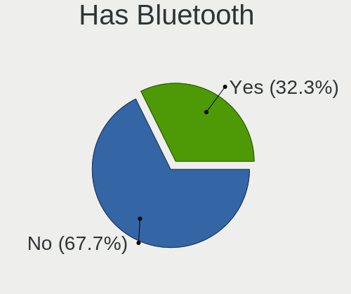
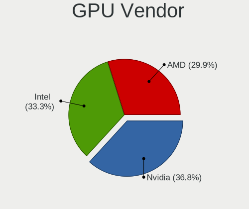
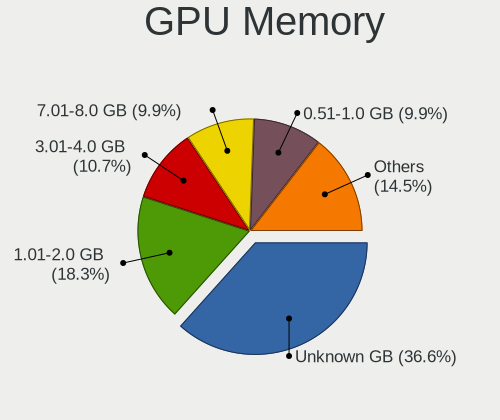
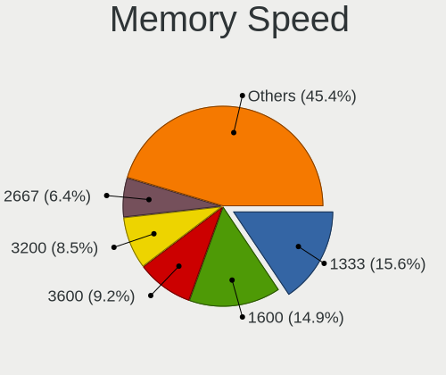

MX 21 - Tested Hardware & Statistics (Desktops)
-----------------------------------------------

A project to collect tested hardware configurations for MX 21.

Anyone can contribute to this report by the [hw-probe](https://github.com/linuxhw/hw-probe) tool:

    sudo -E hw-probe -all -upload

Please contribute! Especially if your hardware is rare.

Contents
--------

* [ Test Cases ](#test-cases)

* [ System ](#system)
  - [ Kernel                   ](#kernel)
  - [ Kernel Family            ](#kernel-family)
  - [ Kernel Major Ver.        ](#kernel-major-ver)
  - [ Arch                     ](#arch)
  - [ DE                       ](#de)
  - [ Display Server           ](#display-server)
  - [ Display Manager          ](#display-manager)
  - [ OS Lang                  ](#os-lang)
  - [ Boot Mode                ](#boot-mode)
  - [ Filesystem               ](#filesystem)
  - [ Part. scheme             ](#part-scheme)
  - [ Dual Boot with Linux/BSD ](#dual-boot-with-linuxbsd)
  - [ Dual Boot (Win)          ](#dual-boot-win)

* [ Board ](#board)
  - [ Vendor                   ](#vendor)
  - [ Model                    ](#model)
  - [ Model Family             ](#model-family)
  - [ MFG Year                 ](#mfg-year)
  - [ Form Factor              ](#form-factor)
  - [ Secure Boot              ](#secure-boot)
  - [ Coreboot                 ](#coreboot)
  - [ RAM Size                 ](#ram-size)
  - [ RAM Used                 ](#ram-used)
  - [ Total Drives             ](#total-drives)
  - [ Has CD-ROM               ](#has-cd-rom)
  - [ Has Ethernet             ](#has-ethernet)
  - [ Has WiFi                 ](#has-wifi)
  - [ Has Bluetooth            ](#has-bluetooth)

* [ Location ](#location)
  - [ Country                  ](#country)
  - [ City                     ](#city)

* [ Drives ](#drives)
  - [ Drive Vendor             ](#drive-vendor)
  - [ Drive Model              ](#drive-model)
  - [ HDD Vendor               ](#hdd-vendor)
  - [ SSD Vendor               ](#ssd-vendor)
  - [ Drive Kind               ](#drive-kind)
  - [ Drive Connector          ](#drive-connector)
  - [ Drive Size               ](#drive-size)
  - [ Space Total              ](#space-total)
  - [ Space Used               ](#space-used)
  - [ Malfunc. Drives          ](#malfunc-drives)
  - [ Malfunc. Drive Vendor    ](#malfunc-drive-vendor)
  - [ Malfunc. HDD Vendor      ](#malfunc-hdd-vendor)
  - [ Malfunc. Drive Kind      ](#malfunc-drive-kind)
  - [ Failed Drives            ](#failed-drives)
  - [ Failed Drive Vendor      ](#failed-drive-vendor)
  - [ Drive Status             ](#drive-status)

* [ Storage controller ](#storage-controller)
  - [ Storage Vendor           ](#storage-vendor)
  - [ Storage Model            ](#storage-model)
  - [ Storage Kind             ](#storage-kind)

* [ Processor ](#processor)
  - [ CPU Vendor               ](#cpu-vendor)
  - [ CPU Model                ](#cpu-model)
  - [ CPU Model Family         ](#cpu-model-family)
  - [ CPU Cores                ](#cpu-cores)
  - [ CPU Sockets              ](#cpu-sockets)
  - [ CPU Threads              ](#cpu-threads)
  - [ CPU Op-Modes             ](#cpu-op-modes)
  - [ CPU Microcode            ](#cpu-microcode)
  - [ CPU Microarch            ](#cpu-microarch)

* [ Graphics ](#graphics)
  - [ GPU Vendor               ](#gpu-vendor)
  - [ GPU Model                ](#gpu-model)
  - [ GPU Combo                ](#gpu-combo)
  - [ GPU Driver               ](#gpu-driver)
  - [ GPU Memory               ](#gpu-memory)

* [ Monitor ](#monitor)
  - [ Monitor Vendor           ](#monitor-vendor)
  - [ Monitor Model            ](#monitor-model)
  - [ Monitor Resolution       ](#monitor-resolution)
  - [ Monitor Diagonal         ](#monitor-diagonal)
  - [ Monitor Width            ](#monitor-width)
  - [ Aspect Ratio             ](#aspect-ratio)
  - [ Monitor Area             ](#monitor-area)
  - [ Pixel Density            ](#pixel-density)
  - [ Multiple Monitors        ](#multiple-monitors)

* [ Network ](#network)
  - [ Net Controller Vendor    ](#net-controller-vendor)
  - [ Net Controller Model     ](#net-controller-model)
  - [ Wireless Vendor          ](#wireless-vendor)
  - [ Wireless Model           ](#wireless-model)
  - [ Ethernet Vendor          ](#ethernet-vendor)
  - [ Ethernet Model           ](#ethernet-model)
  - [ Net Controller Kind      ](#net-controller-kind)
  - [ Used Controller          ](#used-controller)
  - [ NICs                     ](#nics)
  - [ IPv6                     ](#ipv6)

* [ Bluetooth ](#bluetooth)
  - [ Bluetooth Vendor         ](#bluetooth-vendor)
  - [ Bluetooth Model          ](#bluetooth-model)

* [ Sound ](#sound)
  - [ Sound Vendor             ](#sound-vendor)
  - [ Sound Model              ](#sound-model)

* [ Memory ](#memory)
  - [ Memory Vendor            ](#memory-vendor)
  - [ Memory Model             ](#memory-model)
  - [ Memory Kind              ](#memory-kind)
  - [ Memory Form Factor       ](#memory-form-factor)
  - [ Memory Size              ](#memory-size)
  - [ Memory Speed             ](#memory-speed)

* [ Printers & scanners ](#printers--scanners)
  - [ Printer Vendor           ](#printer-vendor)
  - [ Printer Model            ](#printer-model)
  - [ Scanner Vendor           ](#scanner-vendor)
  - [ Scanner Model            ](#scanner-model)

* [ Camera ](#camera)
  - [ Camera Vendor            ](#camera-vendor)
  - [ Camera Model             ](#camera-model)

* [ Security ](#security)
  - [ Fingerprint Vendor       ](#fingerprint-vendor)
  - [ Fingerprint Model        ](#fingerprint-model)
  - [ Chipcard Vendor          ](#chipcard-vendor)
  - [ Chipcard Model           ](#chipcard-model)

* [ Unsupported ](#unsupported)
  - [ Unsupported Devices      ](#unsupported-devices)
  - [ Unsupported Device Types ](#unsupported-device-types)

Test Cases
----------

Total: 39

| Vendor   | Model                    | Probe                                                      | Date         |
|----------|--------------------------|------------------------------------------------------------|--------------|
| Biostar  | A780L3B                  | [62782d600f](https://linux-hardware.org/?probe=62782d600f) | Aug 14, 2022 |
| Intel    | DH55TC AAE70932-303      | [f275229d83](https://linux-hardware.org/?probe=f275229d83) | Jul 31, 2022 |
| MP       | MS-7848                  | [f7696965e0](https://linux-hardware.org/?probe=f7696965e0) | Jul 22, 2022 |
| MSI      | MAG B550 TOMAHAWK        | [85782181c7](https://linux-hardware.org/?probe=85782181c7) | Jul 21, 2022 |
| ASUSTek  | P8H61/USB3 R2.0          | [1076f6d59a](https://linux-hardware.org/?probe=1076f6d59a) | Jul 19, 2022 |
| AOpen    | D1009 A1A4               | [d8edf66887](https://linux-hardware.org/?probe=d8edf66887) | Jul 13, 2022 |
| Dell     | 0DR845                   | [4c4a530cc5](https://linux-hardware.org/?probe=4c4a530cc5) | Jul 06, 2022 |
| MSI      | B350 TOMAHAWK            | [5a66940742](https://linux-hardware.org/?probe=5a66940742) | Jun 23, 2022 |
| MSI      | Z77A-G41                 | [d0f55f3c0b](https://linux-hardware.org/?probe=d0f55f3c0b) | Jun 22, 2022 |
| Dell     | 0200DY A01               | [bc8030c1d5](https://linux-hardware.org/?probe=bc8030c1d5) | Jun 22, 2022 |
| Dell     | 0DR845                   | [56b4af8d26](https://linux-hardware.org/?probe=56b4af8d26) | Jun 20, 2022 |
| Gigabyte | H410M S2H V3             | [b57b3a635c](https://linux-hardware.org/?probe=b57b3a635c) | Jun 02, 2022 |
| ASUSTek  | SABERTOOTH X99           | [b627953ad4](https://linux-hardware.org/?probe=b627953ad4) | May 11, 2022 |
| Intel    | V1.3                     | [a01993f2fa](https://linux-hardware.org/?probe=a01993f2fa) | Apr 30, 2022 |
| ASUSTek  | SABERTOOTH X99           | [51cc264c62](https://linux-hardware.org/?probe=51cc264c62) | Apr 22, 2022 |
| Gigabyte | B550M S2H                | [208972e3b5](https://linux-hardware.org/?probe=208972e3b5) | Apr 19, 2022 |
| ASRock   | N3150M                   | [0ee71f6582](https://linux-hardware.org/?probe=0ee71f6582) | Apr 19, 2022 |
| Gigabyte | B550M S2H                | [1127f26185](https://linux-hardware.org/?probe=1127f26185) | Apr 17, 2022 |
| Dell     | 0YXT71 A01               | [5de0fab8f2](https://linux-hardware.org/?probe=5de0fab8f2) | Apr 04, 2022 |
| Lenovo   | 1046 NO DPK              | [561b1c3324](https://linux-hardware.org/?probe=561b1c3324) | Mar 17, 2022 |
| Gigabyte | Z390 UD                  | [d0b555e0ba](https://linux-hardware.org/?probe=d0b555e0ba) | Mar 17, 2022 |
| HP       | 3647h                    | [fd6766aabb](https://linux-hardware.org/?probe=fd6766aabb) | Mar 11, 2022 |
| ASUSTek  | P5GC-MX/MEDION/SI        | [772e020316](https://linux-hardware.org/?probe=772e020316) | Mar 09, 2022 |
| MSI      | MS-7091                  | [71aaa6a920](https://linux-hardware.org/?probe=71aaa6a920) | Mar 09, 2022 |
| MSI      | MS-7091                  | [b08ddd1115](https://linux-hardware.org/?probe=b08ddd1115) | Mar 09, 2022 |
| ASUSTek  | ROG Maximus XIII HERO    | [e58223cc60](https://linux-hardware.org/?probe=e58223cc60) | Feb 18, 2022 |
| Huanan   | X99-F8 V2.0              | [23c722f6cf](https://linux-hardware.org/?probe=23c722f6cf) | Feb 18, 2022 |
| Huanan   | X99-F8 V2.0              | [f4fec6a5be](https://linux-hardware.org/?probe=f4fec6a5be) | Feb 17, 2022 |
| MSI      | Z97 GAMING 5             | [7c66c1b404](https://linux-hardware.org/?probe=7c66c1b404) | Feb 09, 2022 |
| ASUSTek  | X99-DELUXE               | [4ffe151e7a](https://linux-hardware.org/?probe=4ffe151e7a) | Jan 29, 2022 |
| HP       | 0B4Ch D                  | [ecaec39529](https://linux-hardware.org/?probe=ecaec39529) | Jan 05, 2022 |
| Fujitsu  | D3221-A1 S26361-D3221-A1 | [78d4e04363](https://linux-hardware.org/?probe=78d4e04363) | Dec 16, 2021 |
| GALAX    | B550M                    | [a6866c8a45](https://linux-hardware.org/?probe=a6866c8a45) | Dec 04, 2021 |
| Lenovo   | SHARKBAY NO DPK          | [fd5f409df8](https://linux-hardware.org/?probe=fd5f409df8) | Nov 14, 2021 |
| Lenovo   | SHARKBAY NO DPK          | [a85cc99f78](https://linux-hardware.org/?probe=a85cc99f78) | Nov 14, 2021 |
| ASRock   | X570 Steel Legend        | [18391015f7](https://linux-hardware.org/?probe=18391015f7) | Nov 11, 2021 |
| Gigabyte | X570 AORUS PRO           | [fbd2076eee](https://linux-hardware.org/?probe=fbd2076eee) | Oct 28, 2021 |
| Gigabyte | B550M DS3H               | [ee6a141211](https://linux-hardware.org/?probe=ee6a141211) | Oct 19, 2021 |
| Gigabyte | A320M-S2H V2-CF          | [5d136cb09b](https://linux-hardware.org/?probe=5d136cb09b) | Aug 13, 2021 |

System
------

Kernel
------

Version of the Linux kernel

| Version                   | Desktops | Percent |
|---------------------------|----------|---------|
| 5.10.0-13-amd64           | 5        | 15.63%  |
| 5.10.0-16-amd64           | 4        | 12.5%   |
| 5.10.0-15-amd64           | 4        | 12.5%   |
| 5.14.0-4mx-amd64          | 3        | 9.38%   |
| 5.16.0-5mx-amd64          | 2        | 6.25%   |
| 5.14.0-3mx-amd64          | 2        | 6.25%   |
| 5.10.0-9-amd64            | 2        | 6.25%   |
| 5.10.0-11-amd64           | 2        | 6.25%   |
| 5.16.0-rc5-hwmon-next+    | 1        | 3.13%   |
| 5.16.0-6mx-amd64          | 1        | 3.13%   |
| 5.15.0-2-amd64            | 1        | 3.13%   |
| 5.15.0-0.bpo.2-amd64      | 1        | 3.13%   |
| 5.14.0-2mx-amd64          | 1        | 3.13%   |
| 5.10.52-antix.1-amd64-smp | 1        | 3.13%   |
| 5.10.111-tkg-cfs          | 1        | 3.13%   |
| 5.10.0-10-amd64           | 1        | 3.13%   |

Kernel Family
-------------

Linux kernel without a distro release

| Version  | Desktops | Percent |
|----------|----------|---------|
| 5.10.0   | 18       | 56.25%  |
| 5.14.0   | 6        | 18.75%  |
| 5.16.0   | 4        | 12.5%   |
| 5.15.0   | 2        | 6.25%   |
| 5.10.52  | 1        | 3.13%   |
| 5.10.111 | 1        | 3.13%   |

Kernel Major Ver.
-----------------

Linux kernel major version

| Version | Desktops | Percent |
|---------|----------|---------|
| 5.10    | 20       | 62.5%   |
| 5.14    | 6        | 18.75%  |
| 5.16    | 4        | 12.5%   |
| 5.15    | 2        | 6.25%   |

Arch
----

OS architecture (x86_64, i586, etc.)

| Name   | Desktops | Percent |
|--------|----------|---------|
| x86_64 | 32       | 100%    |

DE
--

Desktop Environment

| Name             | Desktops | Percent |
|------------------|----------|---------|
| XFCE             | 24       | 75%     |
| KDE5             | 5        | 15.63%  |
| lightdm-xsession | 2        | 6.25%   |
| Unknown          | 1        | 3.13%   |

Display Server
--------------

X11 or Wayland

| Name | Desktops | Percent |
|------|----------|---------|
| X11  | 32       | 100%    |

Display Manager
---------------

SDDM, LightDM, etc.

| Name    | Desktops | Percent |
|---------|----------|---------|
| LightDM | 27       | 84.38%  |
| SDDM    | 5        | 15.63%  |

OS Lang
-------

Language

| Lang  | Desktops | Percent |
|-------|----------|---------|
| en_US | 14       | 43.75%  |
| de_DE | 8        | 25%     |
| en_GB | 2        | 6.25%   |
| de_CH | 2        | 6.25%   |
| sv_SE | 1        | 3.13%   |
| pl_PL | 1        | 3.13%   |
| hu_HU | 1        | 3.13%   |
| fr_FR | 1        | 3.13%   |
| es_MX | 1        | 3.13%   |
| es_ES | 1        | 3.13%   |

Boot Mode
---------

EFI or BIOS

| Mode | Desktops | Percent |
|------|----------|---------|
| BIOS | 21       | 65.63%  |
| EFI  | 11       | 34.38%  |

Filesystem
----------

Type of filesystem

| Type     | Desktops | Percent |
|----------|----------|---------|
| Ext4     | 26       | 81.25%  |
| Overlay  | 3        | 9.38%   |
| Reiserfs | 1        | 3.13%   |
| Ext3     | 1        | 3.13%   |
| Btrfs    | 1        | 3.13%   |

Part. scheme
------------

Scheme of partitioning

| Type | Desktops | Percent |
|------|----------|---------|
| GPT  | 20       | 62.5%   |
| MBR  | 12       | 37.5%   |

Dual Boot with Linux/BSD
------------------------

Hosting more than one Linux/BSD

| Dual boot | Desktops | Percent |
|-----------|----------|---------|
| Yes       | 17       | 53.13%  |
| No        | 15       | 46.88%  |

Dual Boot (Win)
---------------

Hosting Linux and Windows

| Dual boot | Desktops | Percent |
|-----------|----------|---------|
| Yes       | 17       | 53.13%  |
| No        | 15       | 46.88%  |

Board
-----

Vendor
------

Motherboard manufacturer

| Name                | Desktops | Percent |
|---------------------|----------|---------|
| Gigabyte Technology | 5        | 15.63%  |
| ASUSTek Computer    | 5        | 15.63%  |
| MSI                 | 4        | 12.5%   |
| Dell                | 4        | 12.5%   |
| Lenovo              | 2        | 6.25%   |
| Intel               | 2        | 6.25%   |
| Hewlett-Packard     | 2        | 6.25%   |
| ASRock              | 2        | 6.25%   |
| MP                  | 1        | 3.13%   |
| Huanan              | 1        | 3.13%   |
| GALAX               | 1        | 3.13%   |
| Fujitsu             | 1        | 3.13%   |
| Biostar             | 1        | 3.13%   |
| AOpen               | 1        | 3.13%   |

Model
-----

Motherboard model

| Name                                | Desktops | Percent |
|-------------------------------------|----------|---------|
| Dell OptiPlex 755                   | 2        | 6.25%   |
| ASUS All Series                     | 2        | 6.25%   |
| MSI MS-7C91                         | 1        | 3.13%   |
| MSI MS-7A34                         | 1        | 3.13%   |
| MSI MS-7917                         | 1        | 3.13%   |
| MSI MS-7758                         | 1        | 3.13%   |
| MP MS-7848                          | 1        | 3.13%   |
| Lenovo ThinkStation P620 30E0CTO1WW | 1        | 3.13%   |
| Lenovo 10AAS1QB0B                   | 1        | 3.13%   |
| Intel V1.3                          | 1        | 3.13%   |
| Intel DH55TC AAE70932-303           | 1        | 3.13%   |
| Huanan X99-F8                       | 1        | 3.13%   |
| HP Z400 Workstation                 | 1        | 3.13%   |
| HP Compaq 8000 Elite CMT PC         | 1        | 3.13%   |
| Gigabyte Z390 UD                    | 1        | 3.13%   |
| Gigabyte X570 AORUS PRO             | 1        | 3.13%   |
| Gigabyte H410M S2H V3               | 1        | 3.13%   |
| Gigabyte B550M S2H                  | 1        | 3.13%   |
| Gigabyte B550M DS3H                 | 1        | 3.13%   |
| GALAX B550M                         | 1        | 3.13%   |
| Fujitsu ESPRIMO P720                | 1        | 3.13%   |
| Dell OptiPlex 780                   | 1        | 3.13%   |
| Dell OptiPlex 7010                  | 1        | 3.13%   |
| Biostar A780L3B                     | 1        | 3.13%   |
| ASUS ROG Maximus XIII HERO          | 1        | 3.13%   |
| ASUS P8H61/USB3 R2.0                | 1        | 3.13%   |
| ASUS P5GC-MX/MEDION/SI              | 1        | 3.13%   |
| ASRock X570 Steel Legend            | 1        | 3.13%   |
| ASRock N3150M                       | 1        | 3.13%   |
| AOpen ESPRIMO Q900                  | 1        | 3.13%   |

Model Family
------------

Motherboard model prefix

| Name                | Desktops | Percent |
|---------------------|----------|---------|
| Dell OptiPlex       | 4        | 12.5%   |
| Gigabyte B550M      | 2        | 6.25%   |
| ASUS All            | 2        | 6.25%   |
| MSI MS-7C91         | 1        | 3.13%   |
| MSI MS-7A34         | 1        | 3.13%   |
| MSI MS-7917         | 1        | 3.13%   |
| MSI MS-7758         | 1        | 3.13%   |
| MP MS-7848          | 1        | 3.13%   |
| Lenovo ThinkStation | 1        | 3.13%   |
| Lenovo 10AAS1QB0B   | 1        | 3.13%   |
| Intel V1.3          | 1        | 3.13%   |
| Intel DH55TC        | 1        | 3.13%   |
| Huanan X99-F8       | 1        | 3.13%   |
| HP Z400             | 1        | 3.13%   |
| HP Compaq           | 1        | 3.13%   |
| Gigabyte Z390       | 1        | 3.13%   |
| Gigabyte X570       | 1        | 3.13%   |
| Gigabyte H410M      | 1        | 3.13%   |
| GALAX B550M         | 1        | 3.13%   |
| Fujitsu ESPRIMO     | 1        | 3.13%   |
| Biostar A780L3B     | 1        | 3.13%   |
| ASUS ROG            | 1        | 3.13%   |
| ASUS P8H61          | 1        | 3.13%   |
| ASUS P5GC-MX        | 1        | 3.13%   |
| ASRock X570         | 1        | 3.13%   |
| ASRock N3150M       | 1        | 3.13%   |
| AOpen ESPRIMO       | 1        | 3.13%   |

MFG Year
--------

Motherboard manufacture year

| Year | Desktops | Percent |
|------|----------|---------|
| 2020 | 6        | 18.75%  |
| 2014 | 3        | 9.38%   |
| 2012 | 3        | 9.38%   |
| 2007 | 3        | 9.38%   |
| 2021 | 2        | 6.25%   |
| 2019 | 2        | 6.25%   |
| 2018 | 2        | 6.25%   |
| 2016 | 2        | 6.25%   |
| 2013 | 2        | 6.25%   |
| 2010 | 2        | 6.25%   |
| 2009 | 2        | 6.25%   |
| 2017 | 1        | 3.13%   |
| 2015 | 1        | 3.13%   |
| 2011 | 1        | 3.13%   |

Form Factor
-----------

Physical design of the computer

| Name    | Desktops | Percent |
|---------|----------|---------|
| Desktop | 32       | 100%    |

Secure Boot
-----------

Enabled or disabled

| State    | Desktops | Percent |
|----------|----------|---------|
| Disabled | 32       | 100%    |

Coreboot
--------

Have coreboot on board

| Used | Desktops | Percent |
|------|----------|---------|
| No   | 32       | 100%    |

RAM Size
--------

Total RAM memory

| Size in GB  | Desktops | Percent |
|-------------|----------|---------|
| 32.01-64.0  | 8        | 25%     |
| 8.01-16.0   | 8        | 25%     |
| 4.01-8.0    | 6        | 18.75%  |
| 3.01-4.0    | 5        | 15.63%  |
| 16.01-24.0  | 2        | 6.25%   |
| 24.01-32.0  | 1        | 3.13%   |
| 2.01-3.0    | 1        | 3.13%   |
| 64.01-256.0 | 1        | 3.13%   |

RAM Used
--------

Used RAM memory

| Used GB    | Desktops | Percent |
|------------|----------|---------|
| 1.01-2.0   | 16       | 50%     |
| 2.01-3.0   | 5        | 15.63%  |
| 3.01-4.0   | 4        | 12.5%   |
| 8.01-16.0  | 3        | 9.38%   |
| 4.01-8.0   | 2        | 6.25%   |
| 16.01-24.0 | 1        | 3.13%   |
| 0.51-1.0   | 1        | 3.13%   |

Total Drives
------------

Number of drives on board

| Drives | Desktops | Percent |
|--------|----------|---------|
| 3      | 9        | 28.13%  |
| 1      | 9        | 28.13%  |
| 2      | 8        | 25%     |
| 4      | 3        | 9.38%   |
| 5      | 2        | 6.25%   |
| 8      | 1        | 3.13%   |

Has CD-ROM
----------

Has CD-ROM on board

| Presented | Desktops | Percent |
|-----------|----------|---------|
| No        | 17       | 53.13%  |
| Yes       | 15       | 46.88%  |

Has Ethernet
------------

Has Ethernet on board

| Presented | Desktops | Percent |
|-----------|----------|---------|
| Yes       | 32       | 100%    |

Has WiFi
--------

Has WiFi module

| Presented | Desktops | Percent |
|-----------|----------|---------|
| No        | 20       | 62.5%   |
| Yes       | 12       | 37.5%   |

Has Bluetooth
-------------

Has Bluetooth module

| Presented | Desktops | Percent |
|-----------|----------|---------|
| No        | 28       | 87.5%   |
| Yes       | 4        | 12.5%   |

Location
--------

Country
-------

Geographic location (country)

| Country     | Desktops | Percent |
|-------------|----------|---------|
| USA         | 10       | 31.25%  |
| Germany     | 6        | 18.75%  |
| Switzerland | 2        | 6.25%   |
| India       | 2        | 6.25%   |
| Venezuela   | 1        | 3.13%   |
| UK          | 1        | 3.13%   |
| Sweden      | 1        | 3.13%   |
| Spain       | 1        | 3.13%   |
| Poland      | 1        | 3.13%   |
| Netherlands | 1        | 3.13%   |
| Mexico      | 1        | 3.13%   |
| Hungary     | 1        | 3.13%   |
| Greece      | 1        | 3.13%   |
| France      | 1        | 3.13%   |
| Estonia     | 1        | 3.13%   |
| Australia   | 1        | 3.13%   |

City
----

Geographic location (city)

| City                | Desktops | Percent |
|---------------------|----------|---------|
| Ettingen            | 2        | 6.25%   |
| Volos               | 1        | 3.13%   |
| Vilhelmina          | 1        | 3.13%   |
| Vasco da Gama       | 1        | 3.13%   |
| Vaidasoo            | 1        | 3.13%   |
| Stevens Point       | 1        | 3.13%   |
| Seelbach            | 1        | 3.13%   |
| San Diego           | 1        | 3.13%   |
| Rosporden           | 1        | 3.13%   |
| Rathenow            | 1        | 3.13%   |
| Puebla City         | 1        | 3.13%   |
| Portland            | 1        | 3.13%   |
| Pompano Beach       | 1        | 3.13%   |
| Pila                | 1        | 3.13%   |
| Piedmont            | 1        | 3.13%   |
| Normal              | 1        | 3.13%   |
| Milwaukee           | 1        | 3.13%   |
| Kamiah              | 1        | 3.13%   |
| Houston             | 1        | 3.13%   |
| Granadilla de Abona | 1        | 3.13%   |
| Gouda               | 1        | 3.13%   |
| Göttingen          | 1        | 3.13%   |
| Freital             | 1        | 3.13%   |
| Dieburg             | 1        | 3.13%   |
| Chingford           | 1        | 3.13%   |
| Budapest            | 1        | 3.13%   |
| Brisbane            | 1        | 3.13%   |
| Berlin              | 1        | 3.13%   |
| Bengaluru           | 1        | 3.13%   |
| Belmont             | 1        | 3.13%   |
| Barcelona           | 1        | 3.13%   |

Drives
------

Drive Vendor
------------

Hard drive vendors

| Vendor              | Desktops | Drives | Percent |
|---------------------|----------|--------|---------|
| Samsung Electronics | 14       | 27     | 22.95%  |
| Seagate             | 13       | 18     | 21.31%  |
| WDC                 | 9        | 13     | 14.75%  |
| Kingston            | 5        | 5      | 8.2%    |
| Toshiba             | 2        | 2      | 3.28%   |
| PNY                 | 2        | 3      | 3.28%   |
| Hitachi             | 2        | 2      | 3.28%   |
| GOODRAM             | 2        | 2      | 3.28%   |
| Crucial             | 2        | 2      | 3.28%   |
| Corsair             | 2        | 2      | 3.28%   |
| Transcend           | 1        | 1      | 1.64%   |
| SPCC                | 1        | 1      | 1.64%   |
| OCZ                 | 1        | 1      | 1.64%   |
| Micron Technology   | 1        | 1      | 1.64%   |
| Maxtor              | 1        | 1      | 1.64%   |
| Avant               | 1        | 1      | 1.64%   |
| Acer                | 1        | 1      | 1.64%   |
| A-DATA Technology   | 1        | 1      | 1.64%   |

Drive Model
-----------

Hard drive models

| Model                                    | Desktops | Percent |
|------------------------------------------|----------|---------|
| Seagate ST2000DM008-2FR102 2TB           | 3        | 3.85%   |
| Samsung SSD 850 EVO 250GB                | 3        | 3.85%   |
| Kingston SA400S37480G 480GB SSD          | 3        | 3.85%   |
| Toshiba DT01ACA100 1TB                   | 2        | 2.56%   |
| Samsung SSD 970 EVO Plus 1TB             | 2        | 2.56%   |
| Samsung SSD 850 EVO 1TB                  | 2        | 2.56%   |
| Corsair MP400 2TB                        | 2        | 2.56%   |
| WDC WDS500G2B0C-00PXH0 500GB             | 1        | 1.28%   |
| WDC WDS100T2B0A-00SM50 1TB SSD           | 1        | 1.28%   |
| WDC WD60EZRZ-00RWYB1 6TB                 | 1        | 1.28%   |
| WDC WD60EFRX-68L0BN1 6TB                 | 1        | 1.28%   |
| WDC WD5002AALX-00J37A0 500GB             | 1        | 1.28%   |
| WDC WD5000AVCS-632DY1 500GB              | 1        | 1.28%   |
| WDC WD40EFRX-68WT0N0 4TB                 | 1        | 1.28%   |
| WDC WD30EFRX-68AX9N0 3TB                 | 1        | 1.28%   |
| WDC WD10EZEX-08M2NA0 1TB                 | 1        | 1.28%   |
| WDC WD10EVDS-63U8B1 1TB                  | 1        | 1.28%   |
| WDC WD10EADS-98M2B0 1TB                  | 1        | 1.28%   |
| WDC WD10EADS-00M2B0 1TB                  | 1        | 1.28%   |
| Transcend TS128GSSD370S 128GB            | 1        | 1.28%   |
| SPCC Solid State Disk 256GB              | 1        | 1.28%   |
| Seagate ST500LM021-1KJ152 500GB          | 1        | 1.28%   |
| Seagate ST4000DM004-2CV104 4TB           | 1        | 1.28%   |
| Seagate ST3500413AS 500GB                | 1        | 1.28%   |
| Seagate ST3360320AS 360GB                | 1        | 1.28%   |
| Seagate ST320LT020-9YG142 320GB          | 1        | 1.28%   |
| Seagate ST320LT012-1DG14C 320GB          | 1        | 1.28%   |
| Seagate ST320LM001 HN-M320MBB 320GB      | 1        | 1.28%   |
| Seagate ST3160815AS 160GB                | 1        | 1.28%   |
| Seagate ST250DM000-1BD141 250GB          | 1        | 1.28%   |
| Seagate ST2000DL004 HD204UI 2TB          | 1        | 1.28%   |
| Seagate ST1000DM010-2EP102 1TB           | 1        | 1.28%   |
| Seagate ST1000DM003-1CH162 1TB           | 1        | 1.28%   |
| Samsung SSD 980 PRO 1TB                  | 1        | 1.28%   |
| Samsung SSD 980 1TB                      | 1        | 1.28%   |
| Samsung SSD 970 PRO 512GB                | 1        | 1.28%   |
| Samsung SSD 870 QVO 2TB                  | 1        | 1.28%   |
| Samsung SSD 870 EVO 500GB                | 1        | 1.28%   |
| Samsung SSD 860 QVO 1TB                  | 1        | 1.28%   |
| Samsung SSD 860 EVO 500GB                | 1        | 1.28%   |
| Samsung SSD 860 EVO 500G                 | 1        | 1.28%   |
| Samsung SSD 860 EVO 250GB                | 1        | 1.28%   |
| Samsung SSD 850 EVO 500GB                | 1        | 1.28%   |
| Samsung SSD 840 Series 120GB             | 1        | 1.28%   |
| Samsung SSD 840 EVO 250GB                | 1        | 1.28%   |
| Samsung MZVPW256HEGL-00000 256GB         | 1        | 1.28%   |
| Samsung MZVLW256HEHP-000L2 256GB         | 1        | 1.28%   |
| Samsung MZVL21T0HCLR-00BL7 1TB           | 1        | 1.28%   |
| Samsung HD501LJ 500GB                    | 1        | 1.28%   |
| Samsung HD204UI 2TB                      | 1        | 1.28%   |
| Samsung HD103SI 1TB                      | 1        | 1.28%   |
| PNY CS900 250GB SSD                      | 1        | 1.28%   |
| PNY CS3030 1TB SSD                       | 1        | 1.28%   |
| PNY CS2130 2TB SSD                       | 1        | 1.28%   |
| OCZ VERTEX3 120GB SSD                    | 1        | 1.28%   |
| Micron MTFDDAV256TBN-1AR15ABHA 256GB SSD | 1        | 1.28%   |
| Maxtor 4K040H2 40GB                      | 1        | 1.28%   |
| Kingston SV300S37A240G 240GB SSD         | 1        | 1.28%   |
| Kingston SA400S37120G 120GB SSD          | 1        | 1.28%   |
| Hitachi HUA722010CLA330 1TB              | 1        | 1.28%   |

HDD Vendor
----------

Hard disk drive vendors

| Vendor              | Desktops | Drives | Percent |
|---------------------|----------|--------|---------|
| Seagate             | 13       | 18     | 46.43%  |
| WDC                 | 7        | 11     | 25%     |
| Samsung Electronics | 3        | 3      | 10.71%  |
| Toshiba             | 2        | 2      | 7.14%   |
| Hitachi             | 2        | 2      | 7.14%   |
| Maxtor              | 1        | 1      | 3.57%   |

SSD Vendor
----------

Solid state drive vendors

| Vendor              | Desktops | Drives | Percent |
|---------------------|----------|--------|---------|
| Samsung Electronics | 11       | 15     | 39.29%  |
| Kingston            | 5        | 5      | 17.86%  |
| Goodram             | 2        | 2      | 7.14%   |
| WDC                 | 1        | 1      | 3.57%   |
| Transcend           | 1        | 1      | 3.57%   |
| SPCC                | 1        | 1      | 3.57%   |
| PNY                 | 1        | 1      | 3.57%   |
| OCZ                 | 1        | 1      | 3.57%   |
| Micron Technology   | 1        | 1      | 3.57%   |
| Crucial             | 1        | 1      | 3.57%   |
| Avant               | 1        | 1      | 3.57%   |
| Acer                | 1        | 1      | 3.57%   |
| A-DATA Technology   | 1        | 1      | 3.57%   |

Drive Kind
----------

HDD or SSD

| Kind | Desktops | Drives | Percent |
|------|----------|--------|---------|
| HDD  | 24       | 37     | 41.38%  |
| SSD  | 22       | 32     | 37.93%  |
| NVMe | 12       | 15     | 20.69%  |

Drive Connector
---------------

SATA, SAS, NVMe, etc.

| Type | Desktops | Drives | Percent |
|------|----------|--------|---------|
| SATA | 31       | 67     | 70.45%  |
| NVMe | 12       | 15     | 27.27%  |
| SAS  | 1        | 2      | 2.27%   |

Drive Size
----------

Size of hard drive

| Size in TB | Desktops | Drives | Percent |
|------------|----------|--------|---------|
| 0.01-0.5   | 25       | 40     | 53.19%  |
| 0.51-1.0   | 13       | 15     | 27.66%  |
| 1.01-2.0   | 5        | 8      | 10.64%  |
| 3.01-4.0   | 2        | 2      | 4.26%   |
| 2.01-3.0   | 1        | 1      | 2.13%   |
| 4.01-10.0  | 1        | 3      | 2.13%   |

Space Total
-----------

Amount of disk space available on the file system

| Size in GB     | Desktops | Percent |
|----------------|----------|---------|
| 251-500        | 9        | 28.13%  |
| More than 3000 | 5        | 15.63%  |
| 101-250        | 5        | 15.63%  |
| 1001-2000      | 4        | 12.5%   |
| 501-1000       | 4        | 12.5%   |
| 2001-3000      | 2        | 6.25%   |
| 51-100         | 2        | 6.25%   |
| 1-20           | 1        | 3.13%   |

Space Used
----------

Amount of used disk space

| Used GB        | Desktops | Percent |
|----------------|----------|---------|
| 21-50          | 8        | 24.24%  |
| 101-250        | 6        | 18.18%  |
| 1-20           | 5        | 15.15%  |
| 51-100         | 5        | 15.15%  |
| 1001-2000      | 3        | 9.09%   |
| More than 3000 | 2        | 6.06%   |
| 251-500        | 2        | 6.06%   |
| 2001-3000      | 1        | 3.03%   |
| 501-1000       | 1        | 3.03%   |

Malfunc. Drives
---------------

Drive models with a malfunction

| Model                                    | Desktops | Drives | Percent |
|------------------------------------------|----------|--------|---------|
| WDC WDS100T2B0A-00SM50 1TB SSD           | 1        | 1      | 7.14%   |
| WDC WD10EADS-98M2B0 1TB                  | 1        | 1      | 7.14%   |
| WDC WD10EADS-00M2B0 1TB                  | 1        | 1      | 7.14%   |
| Seagate ST500LM021-1KJ152 500GB          | 1        | 1      | 7.14%   |
| Seagate ST3500413AS 500GB                | 1        | 1      | 7.14%   |
| Seagate ST3360320AS 360GB                | 1        | 1      | 7.14%   |
| Seagate ST320LT020-9YG142 320GB          | 1        | 1      | 7.14%   |
| Seagate ST320LT012-1DG14C 320GB          | 1        | 2      | 7.14%   |
| Seagate ST250DM000-1BD141 250GB          | 1        | 1      | 7.14%   |
| Samsung Electronics SSD 850 EVO 500GB    | 1        | 1      | 7.14%   |
| Samsung Electronics SSD 850 EVO 1TB      | 1        | 2      | 7.14%   |
| Samsung Electronics SSD 840 Series 120GB | 1        | 1      | 7.14%   |
| Maxtor 4K040H2 40GB                      | 1        | 1      | 7.14%   |
| Goodram SSDPR-CL100-480-G3 480GB         | 1        | 1      | 7.14%   |

Malfunc. Drive Vendor
---------------------

Vendors of faulty drives

| Vendor              | Desktops | Drives | Percent |
|---------------------|----------|--------|---------|
| Seagate             | 6        | 7      | 42.86%  |
| WDC                 | 3        | 3      | 21.43%  |
| Samsung Electronics | 3        | 4      | 21.43%  |
| Maxtor              | 1        | 1      | 7.14%   |
| Goodram             | 1        | 1      | 7.14%   |

Malfunc. HDD Vendor
-------------------

Vendors of faulty HDD drives

| Vendor  | Desktops | Drives | Percent |
|---------|----------|--------|---------|
| Seagate | 6        | 7      | 66.67%  |
| WDC     | 2        | 2      | 22.22%  |
| Maxtor  | 1        | 1      | 11.11%  |

Malfunc. Drive Kind
-------------------

Kinds of faulty drives

| Kind | Desktops | Drives | Percent |
|------|----------|--------|---------|
| HDD  | 8        | 10     | 61.54%  |
| SSD  | 5        | 6      | 38.46%  |

Failed Drives
-------------

Failed drive models

Zero info for selected period =(

Failed Drive Vendor
-------------------

Failed drive vendors

Zero info for selected period =(

Drive Status
------------

Number of failed and malfunc. drives

| Status   | Desktops | Drives | Percent |
|----------|----------|--------|---------|
| Works    | 27       | 66     | 65.85%  |
| Malfunc  | 13       | 16     | 31.71%  |
| Detected | 1        | 2      | 2.44%   |

Storage controller
------------------

Storage Vendor
--------------

Storage controller vendors

| Vendor                    | Desktops | Percent |
|---------------------------|----------|---------|
| Intel                     | 23       | 48.94%  |
| AMD                       | 9        | 19.15%  |
| Samsung Electronics       | 7        | 14.89%  |
| Phison Electronics        | 3        | 6.38%   |
| ASMedia Technology        | 3        | 6.38%   |
| SanDisk                   | 1        | 2.13%   |
| Micron/Crucial Technology | 1        | 2.13%   |

Storage Model
-------------

Storage controller models

| Model                                                                                   | Desktops | Percent |
|-----------------------------------------------------------------------------------------|----------|---------|
| AMD FCH SATA Controller [AHCI mode]                                                     | 4        | 6.56%   |
| AMD 500 Series Chipset SATA Controller                                                  | 4        | 6.56%   |
| Samsung NVMe SSD Controller SM981/PM981/PM983                                           | 3        | 4.92%   |
| Phison E12 NVMe Controller                                                              | 3        | 4.92%   |
| Intel C610/X99 series chipset sSATA Controller [AHCI mode]                              | 3        | 4.92%   |
| Intel C610/X99 series chipset 6-Port SATA Controller [AHCI mode]                        | 3        | 4.92%   |
| Intel 8 Series/C220 Series Chipset Family 6-port SATA Controller 1 [AHCI mode]          | 3        | 4.92%   |
| ASMedia ASM1062 Serial ATA Controller                                                   | 3        | 4.92%   |
| Samsung NVMe SSD Controller SM961/PM961/SM963                                           | 2        | 3.28%   |
| Samsung NVMe SSD Controller PM9A1/PM9A3/980PRO                                          | 2        | 3.28%   |
| Intel SATA Controller [RAID mode]                                                       | 2        | 3.28%   |
| Intel 82Q35 Express PT IDER Controller                                                  | 2        | 3.28%   |
| Intel 82801IR/IO/IH (ICH9R/DO/DH) 6 port SATA Controller [AHCI mode]                    | 2        | 3.28%   |
| Intel 7 Series/C210 Series Chipset Family 6-port SATA Controller [AHCI mode]            | 2        | 3.28%   |
| Intel 500 Series Chipset Family SATA AHCI Controller                                    | 2        | 3.28%   |
| Intel 5 Series/3400 Series Chipset 4 port SATA IDE Controller                           | 2        | 3.28%   |
| Intel 5 Series/3400 Series Chipset 2 port SATA IDE Controller                           | 2        | 3.28%   |
| SanDisk WD Blue SN550 NVMe SSD                                                          | 1        | 1.64%   |
| Samsung NVMe SSD Controller 980                                                         | 1        | 1.64%   |
| Micron/Crucial P2 NVMe PCIe SSD                                                         | 1        | 1.64%   |
| Intel NM10/ICH7 Family SATA Controller [IDE mode]                                       | 1        | 1.64%   |
| Intel Cannon Lake PCH SATA AHCI Controller                                              | 1        | 1.64%   |
| Intel Atom/Celeron/Pentium Processor x5-E8000/J3xxx/N3xxx Series SATA Controller        | 1        | 1.64%   |
| Intel 9 Series Chipset Family SATA Controller [AHCI Mode]                               | 1        | 1.64%   |
| Intel 82801JD/DO (ICH10 Family) SATA AHCI Controller                                    | 1        | 1.64%   |
| Intel 82801G (ICH7 Family) IDE Controller                                               | 1        | 1.64%   |
| Intel 6 Series/C200 Series Chipset Family Desktop SATA Controller (IDE mode, ports 4-5) | 1        | 1.64%   |
| Intel 6 Series/C200 Series Chipset Family Desktop SATA Controller (IDE mode, ports 0-3) | 1        | 1.64%   |
| Intel 6 Series/C200 Series Chipset Family 6 port Mobile SATA AHCI Controller            | 1        | 1.64%   |
| Intel 5 Series/3400 Series Chipset PT IDER Controller                                   | 1        | 1.64%   |
| Intel 4 Series Chipset PT IDER Controller                                               | 1        | 1.64%   |
| AMD SB7x0/SB8x0/SB9x0 SATA Controller [IDE mode]                                        | 1        | 1.64%   |
| AMD SB7x0/SB8x0/SB9x0 IDE Controller                                                    | 1        | 1.64%   |
| AMD 300 Series Chipset SATA Controller                                                  | 1        | 1.64%   |

Storage Kind
------------

Kind of storage controller (IDE, SATA, NVMe, SAS, ...)

| Kind | Desktops | Percent |
|------|----------|---------|
| SATA | 26       | 54.17%  |
| NVMe | 12       | 25%     |
| IDE  | 8        | 16.67%  |
| RAID | 2        | 4.17%   |

Processor
---------

CPU Vendor
----------

Processor vendors

| Vendor | Desktops | Percent |
|--------|----------|---------|
| Intel  | 23       | 71.88%  |
| AMD    | 9        | 28.13%  |

CPU Model
---------

Processor models

| Model                                      | Desktops | Percent |
|--------------------------------------------|----------|---------|
| Intel Core 2 Duo CPU E8400 @ 3.00GHz       | 3        | 9.38%   |
| Intel Core i7-5820K CPU @ 3.30GHz          | 2        | 6.25%   |
| Intel Core i5-3350P CPU @ 3.10GHz          | 2        | 6.25%   |
| Intel Xeon CPU W3565 @ 3.20GHz             | 1        | 3.13%   |
| Intel Xeon CPU E5-2678 v3 @ 2.50GHz        | 1        | 3.13%   |
| Intel Core i9-10850K CPU @ 3.60GHz         | 1        | 3.13%   |
| Intel Core i5-9600K CPU @ 3.70GHz          | 1        | 3.13%   |
| Intel Core i5-4690K CPU @ 3.50GHz          | 1        | 3.13%   |
| Intel Core i5-4570T CPU @ 2.90GHz          | 1        | 3.13%   |
| Intel Core i5-3470 CPU @ 3.20GHz           | 1        | 3.13%   |
| Intel Core i5 CPU M 520 @ 2.40GHz          | 1        | 3.13%   |
| Intel Core i3-4160 CPU @ 3.60GHz           | 1        | 3.13%   |
| Intel Core i3-4130 CPU @ 3.40GHz           | 1        | 3.13%   |
| Intel Core i3-2350M CPU @ 2.30GHz          | 1        | 3.13%   |
| Intel Core i3-10100 CPU @ 3.60GHz          | 1        | 3.13%   |
| Intel Core i3 CPU 550 @ 3.20GHz            | 1        | 3.13%   |
| Intel Core 2 Duo CPU E7200 @ 2.53GHz       | 1        | 3.13%   |
| Intel Core 2 Duo CPU E4500 @ 2.20GHz       | 1        | 3.13%   |
| Intel Celeron CPU N3150 @ 1.60GHz          | 1        | 3.13%   |
| AMD Ryzen Threadripper PRO 3945WX 12-Cores | 1        | 3.13%   |
| AMD Ryzen 9 3900X 12-Core Processor        | 1        | 3.13%   |
| AMD Ryzen 7 5800X 8-Core Processor         | 1        | 3.13%   |
| AMD Ryzen 7 2700X Eight-Core Processor     | 1        | 3.13%   |
| AMD Ryzen 5 5600X 6-Core Processor         | 1        | 3.13%   |
| AMD Ryzen 5 5600G with Radeon Graphics     | 1        | 3.13%   |
| AMD Ryzen 5 1600 Six-Core Processor        | 1        | 3.13%   |
| AMD Ryzen 3 3100 4-Core Processor          | 1        | 3.13%   |
| AMD Phenom II X4 925 Processor             | 1        | 3.13%   |

CPU Model Family
----------------

Processor model prefix

| Model                  | Desktops | Percent |
|------------------------|----------|---------|
| Intel Core i5          | 7        | 21.88%  |
| Intel Core i3          | 5        | 15.63%  |
| Intel Core 2 Duo       | 5        | 15.63%  |
| AMD Ryzen 5            | 3        | 9.38%   |
| Intel Xeon             | 2        | 6.25%   |
| Intel Core i7          | 2        | 6.25%   |
| AMD Ryzen 7            | 2        | 6.25%   |
| Intel Core i9          | 1        | 3.13%   |
| Intel Celeron          | 1        | 3.13%   |
| AMD Ryzen Threadripper | 1        | 3.13%   |
| AMD Ryzen 9            | 1        | 3.13%   |
| AMD Ryzen 3            | 1        | 3.13%   |
| AMD Phenom II X4       | 1        | 3.13%   |

CPU Cores
---------

Number of processor cores

| Number | Desktops | Percent |
|--------|----------|---------|
| 2      | 11       | 34.38%  |
| 4      | 9        | 28.13%  |
| 6      | 6        | 18.75%  |
| 12     | 3        | 9.38%   |
| 8      | 2        | 6.25%   |
| 10     | 1        | 3.13%   |

CPU Sockets
-----------

Number of sockets

| Number | Desktops | Percent |
|--------|----------|---------|
| 1      | 32       | 100%    |

CPU Threads
-----------

Threads per core (Hyper-Threading)

| Number | Desktops | Percent |
|--------|----------|---------|
| 2      | 19       | 59.38%  |
| 1      | 13       | 40.63%  |

CPU Op-Modes
------------

CPU Operation Modes (32-bit, 64-bit)

| Op mode        | Desktops | Percent |
|----------------|----------|---------|
| 32-bit, 64-bit | 32       | 100%    |

CPU Microcode
-------------

Microcode number

| Number     | Desktops | Percent |
|------------|----------|---------|
| Unknown    | 5        | 15.63%  |
| 0x306a9    | 3        | 9.38%   |
| 0x1067a    | 3        | 9.38%   |
| 0x306f2    | 2        | 6.25%   |
| 0x306c3    | 2        | 6.25%   |
| 0x20655    | 2        | 6.25%   |
| 0x08701021 | 2        | 6.25%   |
| 0x0800820d | 2        | 6.25%   |
| 0xa0655    | 1        | 3.13%   |
| 0xa0653    | 1        | 3.13%   |
| 0x906ed    | 1        | 3.13%   |
| 0x6fd      | 1        | 3.13%   |
| 0x406c3    | 1        | 3.13%   |
| 0x206a7    | 1        | 3.13%   |
| 0x10676    | 1        | 3.13%   |
| 0x0a201016 | 1        | 3.13%   |
| 0x0a201009 | 1        | 3.13%   |
| 0x08301039 | 1        | 3.13%   |
| 0x010000db | 1        | 3.13%   |

CPU Microarch
-------------

Microarchitecture

| Name        | Desktops | Percent |
|-------------|----------|---------|
| Haswell     | 7        | 21.88%  |
| Penryn      | 4        | 12.5%   |
| Zen 3       | 3        | 9.38%   |
| Zen 2       | 3        | 9.38%   |
| IvyBridge   | 3        | 9.38%   |
| Zen+        | 2        | 6.25%   |
| Westmere    | 2        | 6.25%   |
| CometLake   | 2        | 6.25%   |
| Silvermont  | 1        | 3.13%   |
| SandyBridge | 1        | 3.13%   |
| Nehalem     | 1        | 3.13%   |
| KabyLake    | 1        | 3.13%   |
| K10         | 1        | 3.13%   |
| Core        | 1        | 3.13%   |

Graphics
--------

GPU Vendor
----------

Vendors of graphics cards

| Vendor | Desktops | Percent |
|--------|----------|---------|
| Nvidia | 13       | 37.14%  |
| Intel  | 12       | 34.29%  |
| AMD    | 10       | 28.57%  |

GPU Model
---------

Graphics card models

| Model                                                                                    | Desktops | Percent |
|------------------------------------------------------------------------------------------|----------|---------|
| Nvidia GP104 [GeForce GTX 1080]                                                          | 3        | 8.57%   |
| Nvidia GP107 [GeForce GTX 1050 Ti]                                                       | 2        | 5.71%   |
| Intel Xeon E3-1200 v3/4th Gen Core Processor Integrated Graphics Controller              | 2        | 5.71%   |
| Intel Core Processor Integrated Graphics Controller                                      | 2        | 5.71%   |
| Intel 4th Generation Core Processor Family Integrated Graphics Controller                | 2        | 5.71%   |
| Intel 4 Series Chipset Integrated Graphics Controller                                    | 2        | 5.71%   |
| AMD Navi 22 [Radeon RX 6700/6700 XT/6750 XT / 6800M]                                     | 2        | 5.71%   |
| Nvidia TU104 [GeForce RTX 2070 SUPER]                                                    | 1        | 2.86%   |
| Nvidia GT218 [GeForce 210]                                                               | 1        | 2.86%   |
| Nvidia GP104 [GeForce GTX 1070]                                                          | 1        | 2.86%   |
| Nvidia GM107 [GeForce GTX 750 Ti]                                                        | 1        | 2.86%   |
| Nvidia GK208B [GeForce GT 710]                                                           | 1        | 2.86%   |
| Nvidia GK208 [GeForce GT 635]                                                            | 1        | 2.86%   |
| Nvidia G94GL [Quadro FX 1800]                                                            | 1        | 2.86%   |
| Nvidia G86 [GeForce 8500 GT]                                                             | 1        | 2.86%   |
| Intel Xeon E3-1200 v2/3rd Gen Core processor Graphics Controller                         | 1        | 2.86%   |
| Intel CometLake-S GT2 [UHD Graphics 630]                                                 | 1        | 2.86%   |
| Intel Atom/Celeron/Pentium Processor x5-E8000/J3xxx/N3xxx Integrated Graphics Controller | 1        | 2.86%   |
| Intel 2nd Generation Core Processor Family Integrated Graphics Controller                | 1        | 2.86%   |
| AMD RV610 [Radeon HD 2400 PRO/XT]                                                        | 1        | 2.86%   |
| AMD Lexa XT [Radeon PRO WX 3200]                                                         | 1        | 2.86%   |
| AMD Lexa PRO [Radeon 540/540X/550/550X / RX 540X/550/550X]                               | 1        | 2.86%   |
| AMD Hawaii PRO [Radeon R9 290/390]                                                       | 1        | 2.86%   |
| AMD Ellesmere [Radeon RX 470/480/570/570X/580/580X/590]                                  | 1        | 2.86%   |
| AMD Cezanne                                                                              | 1        | 2.86%   |
| AMD Cedar [Radeon HD 7350/8350 / R5 220]                                                 | 1        | 2.86%   |
| AMD Cedar [Radeon HD 5000/6000/7350/8350 Series]                                         | 1        | 2.86%   |

GPU Combo
---------

Combinations of graphics cards

| Name        | Desktops | Percent |
|-------------|----------|---------|
| 1 x Nvidia  | 13       | 40.63%  |
| 1 x Intel   | 9        | 28.13%  |
| 1 x AMD     | 9        | 28.13%  |
| Intel + AMD | 1        | 3.13%   |

GPU Driver
----------

Free vs proprietary

| Driver      | Desktops | Percent |
|-------------|----------|---------|
| Free        | 21       | 65.63%  |
| Proprietary | 10       | 31.25%  |
| Unknown     | 1        | 3.13%   |

GPU Memory
----------

Total video memory

| Size in GB | Desktops | Percent |
|------------|----------|---------|
| Unknown    | 11       | 34.38%  |
| 7.01-8.0   | 6        | 18.75%  |
| 3.01-4.0   | 5        | 15.63%  |
| 0.51-1.0   | 4        | 12.5%   |
| 1.01-2.0   | 2        | 6.25%   |
| 8.01-16.0  | 2        | 6.25%   |
| 0.01-0.5   | 2        | 6.25%   |

Monitor
-------

Monitor Vendor
--------------

Monitor vendors

| Vendor               | Desktops | Percent |
|----------------------|----------|---------|
| Samsung Electronics  | 5        | 13.51%  |
| Hewlett-Packard      | 4        | 10.81%  |
| Fujitsu Siemens      | 4        | 10.81%  |
| Dell                 | 4        | 10.81%  |
| Acer                 | 3        | 8.11%   |
| Medion               | 2        | 5.41%   |
| Goldstar             | 2        | 5.41%   |
| AOC                  | 2        | 5.41%   |
| Ancor Communications | 2        | 5.41%   |
| Vizio                | 1        | 2.7%    |
| Vestel Elektronik    | 1        | 2.7%    |
| SAC                  | 1        | 2.7%    |
| Philips              | 1        | 2.7%    |
| NEC Computers        | 1        | 2.7%    |
| Iiyama               | 1        | 2.7%    |
| Grundig              | 1        | 2.7%    |
| Gigabyte Technology  | 1        | 2.7%    |
| Eizo                 | 1        | 2.7%    |

Monitor Model
-------------

Monitor models

| Model                                                                  | Desktops | Percent |
|------------------------------------------------------------------------|----------|---------|
| Medion MD22322 MEB8101 2560x1440 699x393mm 31.6-inch                   | 2        | 5.13%   |
| Fujitsu Siemens B22W-7 LED FUS0838 1680x1050 474x296mm 22.0-inch       | 2        | 5.13%   |
| Vizio M220MV VIZ0062 1920x1080 480x270mm 21.7-inch                     | 1        | 2.56%   |
| Vestel Elektronik 50UHD_LCD_TV VES3700 3840x2160 1872x1053mm 84.6-inch | 1        | 2.56%   |
| Samsung Electronics SyncMaster SAM05CD 1920x1080                       | 1        | 2.56%   |
| Samsung Electronics SyncMaster SAM0286 1280x720 372x209mm 16.8-inch    | 1        | 2.56%   |
| Samsung Electronics SMB2030 SAM063C 1600x900 443x249mm 20.0-inch       | 1        | 2.56%   |
| Samsung Electronics S23B550 SAM0919 1920x1080 510x287mm 23.0-inch      | 1        | 2.56%   |
| Samsung Electronics C32JG5x SAM0FE0 2560x1440 700x390mm 31.5-inch      | 1        | 2.56%   |
| SAC DP_FREESYNC SAC2700 2560x1440 597x336mm 27.0-inch                  | 1        | 2.56%   |
| Philips PHL 276E9Q PHLC17B 1920x1080 598x336mm 27.0-inch               | 1        | 2.56%   |
| NEC Computers EA221WM NEC673D 1680x1050 474x296mm 22.0-inch            | 1        | 2.56%   |
| Iiyama PL2776HD IVM6605 1920x1080 598x336mm 27.0-inch                  | 1        | 2.56%   |
| Hewlett-Packard X27q HPN3725 2560x1440 600x340mm 27.2-inch             | 1        | 2.56%   |
| Hewlett-Packard X27q HPN3724 2560x1440 600x340mm 27.2-inch             | 1        | 2.56%   |
| Hewlett-Packard w2207 HWP26A8 1680x1050 473x296mm 22.0-inch            | 1        | 2.56%   |
| Hewlett-Packard w17e HWP26E0 1440x900 370x230mm 17.2-inch              | 1        | 2.56%   |
| Hewlett-Packard 27er HWP3325 1920x1080 598x336mm 27.0-inch             | 1        | 2.56%   |
| Grundig WUXGA GRU4448 1920x1080 1210x680mm 54.6-inch                   | 1        | 2.56%   |
| Goldstar ULTRAWIDE GSM59F2 2560x1080 798x334mm 34.1-inch               | 1        | 2.56%   |
| Goldstar E2350 GSM578F 1920x1080 510x290mm 23.1-inch                   | 1        | 2.56%   |
| Gigabyte Technology G34WQC GBT3400 3440x1440 800x330mm 34.1-inch       | 1        | 2.56%   |
| Fujitsu Siemens L24W-2 FUS077A 1920x1200 518x324mm 24.1-inch           | 1        | 2.56%   |
| Fujitsu Siemens B22W-5 ECO FUS07C3 1680x1050 474x296mm 22.0-inch       | 1        | 2.56%   |
| Eizo EV2333W ENC2069 1920x1080 510x287mm 23.0-inch                     | 1        | 2.56%   |
| Dell U2719D DEL415A 2560x1440 597x336mm 27.0-inch                      | 1        | 2.56%   |
| Dell SR2320L DELF03A 1920x1080 510x290mm 23.1-inch                     | 1        | 2.56%   |
| Dell S3422DW DELD103 3440x1440 800x330mm 34.1-inch                     | 1        | 2.56%   |
| Dell E190S DELA04B 1280x1024 376x301mm 19.0-inch                       | 1        | 2.56%   |
| Dell 1908FP DEL4025 1280x1024 380x300mm 19.1-inch                      | 1        | 2.56%   |
| AOC L32W961 AOC3296 1360x768 700x390mm 31.5-inch                       | 1        | 2.56%   |
| AOC G2790G4 AOC2790 1920x1080 598x336mm 27.0-inch                      | 1        | 2.56%   |
| Ancor Communications BE24A ACI24AB 1920x1200 520x320mm 24.0-inch       | 1        | 2.56%   |
| Ancor Communications ASUS VC239 ACI23C4 1920x1080 509x286mm 23.0-inch  | 1        | 2.56%   |
| Acer S231HL ACR01A6 1920x1080 510x287mm 23.0-inch                      | 1        | 2.56%   |
| Acer K272HL ACR0523 1920x1080 598x336mm 27.0-inch                      | 1        | 2.56%   |
| Acer AL1717 ACRAD54 1280x1024 338x270mm 17.0-inch                      | 1        | 2.56%   |

Monitor Resolution
------------------

Monitor screen resolution

| Resolution         | Desktops | Percent |
|--------------------|----------|---------|
| 1920x1080 (FHD)    | 12       | 33.33%  |
| 2560x1440 (QHD)    | 6        | 16.67%  |
| 1680x1050 (WSXGA+) | 4        | 11.11%  |
| 3840x2160 (4K)     | 3        | 8.33%   |
| 3440x1440          | 2        | 5.56%   |
| 1920x1200 (WUXGA)  | 2        | 5.56%   |
| 1280x1024 (SXGA)   | 2        | 5.56%   |
| 2560x1080          | 1        | 2.78%   |
| 1600x900 (HD+)     | 1        | 2.78%   |
| 1440x900 (WXGA+)   | 1        | 2.78%   |
| 1360x768           | 1        | 2.78%   |
| 1280x720 (HD)      | 1        | 2.78%   |

Monitor Diagonal
----------------

Diagonal size in inches

| Inches  | Desktops | Percent |
|---------|----------|---------|
| 27      | 7        | 20%     |
| 23      | 6        | 17.14%  |
| 31      | 4        | 11.43%  |
| 22      | 4        | 11.43%  |
| 34      | 3        | 8.57%   |
| 24      | 2        | 5.71%   |
| 84      | 1        | 2.86%   |
| 54      | 1        | 2.86%   |
| 26      | 1        | 2.86%   |
| 20      | 1        | 2.86%   |
| 19      | 1        | 2.86%   |
| 18      | 1        | 2.86%   |
| 17      | 1        | 2.86%   |
| 16      | 1        | 2.86%   |
| Unknown | 1        | 2.86%   |

Monitor Width
-------------

Physical width

| Width in mm | Desktops | Percent |
|-------------|----------|---------|
| 501-600     | 15       | 44.12%  |
| 401-500     | 6        | 17.65%  |
| 601-700     | 4        | 11.76%  |
| 701-800     | 3        | 8.82%   |
| 351-400     | 2        | 5.88%   |
| 301-350     | 1        | 2.94%   |
| 1501-2000   | 1        | 2.94%   |
| 1001-1500   | 1        | 2.94%   |
| Unknown     | 1        | 2.94%   |

Aspect Ratio
------------

Proportional relationship between the width and the height

| Ratio | Desktops | Percent |
|-------|----------|---------|
| 16/9  | 22       | 64.71%  |
| 16/10 | 7        | 20.59%  |
| 21/9  | 3        | 8.82%   |
| 5/4   | 2        | 5.88%   |

Monitor Area
------------

Area in inch²

| Area in inch² | Desktops | Percent |
|----------------|----------|---------|
| 201-250        | 10       | 28.57%  |
| 351-500        | 7        | 20%     |
| 301-350        | 7        | 20%     |
| 251-300        | 3        | 8.57%   |
| 151-200        | 3        | 8.57%   |
| More than 1000 | 2        | 5.71%   |
| 141-150        | 1        | 2.86%   |
| 121-130        | 1        | 2.86%   |
| Unknown        | 1        | 2.86%   |

Pixel Density
-------------

Pixels per inch

| Density | Desktops | Percent |
|---------|----------|---------|
| 51-100  | 26       | 78.79%  |
| 101-120 | 5        | 15.15%  |
| 1-50    | 1        | 3.03%   |
| Unknown | 1        | 3.03%   |

Multiple Monitors
-----------------

Total monitors connected

| Total | Desktops | Percent |
|-------|----------|---------|
| 1     | 23       | 71.88%  |
| 2     | 6        | 18.75%  |
| 3     | 2        | 6.25%   |
| 0     | 1        | 3.13%   |

Network
-------

Net Controller Vendor
---------------------

Controller vendors

| Vendor                | Desktops | Percent |
|-----------------------|----------|---------|
| Realtek Semiconductor | 18       | 39.13%  |
| Intel                 | 15       | 32.61%  |
| TP-Link               | 2        | 4.35%   |
| Qualcomm Atheros      | 2        | 4.35%   |
| Broadcom              | 2        | 4.35%   |
| Xiaomi                | 1        | 2.17%   |
| Ralink Technology     | 1        | 2.17%   |
| Mercucys              | 1        | 2.17%   |
| Edimax Technology     | 1        | 2.17%   |
| Broadcom Limited      | 1        | 2.17%   |
| AVM                   | 1        | 2.17%   |
| Aquantia              | 1        | 2.17%   |

Net Controller Model
--------------------

Controller models

| Model                                                             | Desktops | Percent |
|-------------------------------------------------------------------|----------|---------|
| Realtek RTL8111/8168/8411 PCI Express Gigabit Ethernet Controller | 12       | 24.49%  |
| Intel I211 Gigabit Network Connection                             | 3        | 6.12%   |
| Realtek RTL810xE PCI Express Fast Ethernet controller             | 2        | 4.08%   |
| Intel Ethernet Connection (2) I218-V                              | 2        | 4.08%   |
| Intel 82579LM Gigabit Network Connection (Lewisville)             | 2        | 4.08%   |
| Intel 82567LM-3 Gigabit Network Connection                        | 2        | 4.08%   |
| Intel 82566DM-2 Gigabit Network Connection                        | 2        | 4.08%   |
| Xiaomi Mi/Redmi series (RNDIS)                                    | 1        | 2.04%   |
| TP-Link TL-WN722N v2                                              | 1        | 2.04%   |
| TP-Link Archer T3U [Realtek RTL8812BU]                            | 1        | 2.04%   |
| Realtek RTL8814AU 802.11a/b/g/n/ac Wireless Adapter               | 1        | 2.04%   |
| Realtek RTL8811AU 802.11a/b/g/n/ac WLAN Adapter                   | 1        | 2.04%   |
| Realtek RTL8188FTV 802.11b/g/n 1T1R 2.4G WLAN Adapter             | 1        | 2.04%   |
| Realtek RTL8125 2.5GbE Controller                                 | 1        | 2.04%   |
| Realtek 802.11ac NIC                                              | 1        | 2.04%   |
| Ralink MT7601U Wireless Adapter                                   | 1        | 2.04%   |
| Qualcomm Atheros Killer E220x Gigabit Ethernet Controller         | 1        | 2.04%   |
| Qualcomm Atheros Attansic L2 Fast Ethernet                        | 1        | 2.04%   |
| Mercucys MW300UM RTL8192EU wifi                                   | 1        | 2.04%   |
| Intel Wireless 8260                                               | 1        | 2.04%   |
| Intel Ethernet Controller I225-V                                  | 1        | 2.04%   |
| Intel Ethernet Connection I217-V                                  | 1        | 2.04%   |
| Intel Ethernet Connection I217-LM                                 | 1        | 2.04%   |
| Intel Ethernet Connection (14) I219-V                             | 1        | 2.04%   |
| Intel 82578DC Gigabit Network Connection                          | 1        | 2.04%   |
| Edimax RTL8192S WLAN Adapter                                      | 1        | 2.04%   |
| Broadcom NetXtreme BCM5764M Gigabit Ethernet PCIe                 | 1        | 2.04%   |
| Broadcom Limited BCM4360 802.11ac Wireless Network Adapter        | 1        | 2.04%   |
| Broadcom BCM4360 802.11ac Wireless Network Adapter                | 1        | 2.04%   |
| AVM FRITZ!WLAN AC 860                                             | 1        | 2.04%   |
| Aquantia AQC107 NBase-T/IEEE 802.3bz Ethernet Controller [AQtion] | 1        | 2.04%   |

Wireless Vendor
---------------

Wireless vendors

| Vendor                | Desktops | Percent |
|-----------------------|----------|---------|
| Realtek Semiconductor | 4        | 30.77%  |
| TP-Link               | 2        | 15.38%  |
| Ralink Technology     | 1        | 7.69%   |
| Mercucys              | 1        | 7.69%   |
| Intel                 | 1        | 7.69%   |
| Edimax Technology     | 1        | 7.69%   |
| Broadcom Limited      | 1        | 7.69%   |
| Broadcom              | 1        | 7.69%   |
| AVM                   | 1        | 7.69%   |

Wireless Model
--------------

Wireless models

| Model                                                      | Desktops | Percent |
|------------------------------------------------------------|----------|---------|
| TP-Link TL-WN722N v2                                       | 1        | 7.69%   |
| TP-Link Archer T3U [Realtek RTL8812BU]                     | 1        | 7.69%   |
| Realtek RTL8814AU 802.11a/b/g/n/ac Wireless Adapter        | 1        | 7.69%   |
| Realtek RTL8811AU 802.11a/b/g/n/ac WLAN Adapter            | 1        | 7.69%   |
| Realtek RTL8188FTV 802.11b/g/n 1T1R 2.4G WLAN Adapter      | 1        | 7.69%   |
| Realtek 802.11ac NIC                                       | 1        | 7.69%   |
| Ralink MT7601U Wireless Adapter                            | 1        | 7.69%   |
| Mercucys MW300UM RTL8192EU wifi                            | 1        | 7.69%   |
| Intel Wireless 8260                                        | 1        | 7.69%   |
| Edimax RTL8192S WLAN Adapter                               | 1        | 7.69%   |
| Broadcom Limited BCM4360 802.11ac Wireless Network Adapter | 1        | 7.69%   |
| Broadcom BCM4360 802.11ac Wireless Network Adapter         | 1        | 7.69%   |
| AVM FRITZ!WLAN AC 860                                      | 1        | 7.69%   |

Ethernet Vendor
---------------

Ethernet vendors

| Vendor                | Desktops | Percent |
|-----------------------|----------|---------|
| Intel                 | 15       | 44.12%  |
| Realtek Semiconductor | 14       | 41.18%  |
| Qualcomm Atheros      | 2        | 5.88%   |
| Xiaomi                | 1        | 2.94%   |
| Broadcom              | 1        | 2.94%   |
| Aquantia              | 1        | 2.94%   |

Ethernet Model
--------------

Ethernet models

| Model                                                             | Desktops | Percent |
|-------------------------------------------------------------------|----------|---------|
| Realtek RTL8111/8168/8411 PCI Express Gigabit Ethernet Controller | 12       | 33.33%  |
| Intel I211 Gigabit Network Connection                             | 3        | 8.33%   |
| Realtek RTL810xE PCI Express Fast Ethernet controller             | 2        | 5.56%   |
| Intel Ethernet Connection (2) I218-V                              | 2        | 5.56%   |
| Intel 82579LM Gigabit Network Connection (Lewisville)             | 2        | 5.56%   |
| Intel 82567LM-3 Gigabit Network Connection                        | 2        | 5.56%   |
| Intel 82566DM-2 Gigabit Network Connection                        | 2        | 5.56%   |
| Xiaomi Mi/Redmi series (RNDIS)                                    | 1        | 2.78%   |
| Realtek RTL8125 2.5GbE Controller                                 | 1        | 2.78%   |
| Qualcomm Atheros Killer E220x Gigabit Ethernet Controller         | 1        | 2.78%   |
| Qualcomm Atheros Attansic L2 Fast Ethernet                        | 1        | 2.78%   |
| Intel Ethernet Controller I225-V                                  | 1        | 2.78%   |
| Intel Ethernet Connection I217-V                                  | 1        | 2.78%   |
| Intel Ethernet Connection I217-LM                                 | 1        | 2.78%   |
| Intel Ethernet Connection (14) I219-V                             | 1        | 2.78%   |
| Intel 82578DC Gigabit Network Connection                          | 1        | 2.78%   |
| Broadcom NetXtreme BCM5764M Gigabit Ethernet PCIe                 | 1        | 2.78%   |
| Aquantia AQC107 NBase-T/IEEE 802.3bz Ethernet Controller [AQtion] | 1        | 2.78%   |

Net Controller Kind
-------------------

Ethernet, WiFi or modem

| Kind     | Desktops | Percent |
|----------|----------|---------|
| Ethernet | 32       | 72.73%  |
| WiFi     | 12       | 27.27%  |

Used Controller
---------------

Currently used network controller

| Kind     | Desktops | Percent |
|----------|----------|---------|
| Ethernet | 23       | 69.7%   |
| WiFi     | 10       | 30.3%   |

NICs
----

Total network controllers on board

| Total | Desktops | Percent |
|-------|----------|---------|
| 1     | 26       | 81.25%  |
| 2     | 5        | 15.63%  |
| 3     | 1        | 3.13%   |

IPv6
----

IPv6 vs IPv4

| Used | Desktops | Percent |
|------|----------|---------|
| No   | 22       | 68.75%  |
| Yes  | 10       | 31.25%  |

Bluetooth
---------

Bluetooth Vendor
----------------

Controller vendors

| Vendor                  | Desktops | Percent |
|-------------------------|----------|---------|
| ASUSTek Computer        | 2        | 50%     |
| Cambridge Silicon Radio | 1        | 25%     |
| Apple                   | 1        | 25%     |

Bluetooth Model
---------------

Controller models

| Model                                                 | Desktops | Percent |
|-------------------------------------------------------|----------|---------|
| Cambridge Silicon Radio Bluetooth Dongle (HCI mode)   | 1        | 25%     |
| ASUS Broadcom BCM20702A0 Bluetooth                    | 1        | 25%     |
| ASUS Broadcom BCM20702 Single-Chip Bluetooth 4.0 + LE | 1        | 25%     |
| Apple Bluetooth USB Host Controller                   | 1        | 25%     |

Sound
-----

Sound Vendor
------------

Sound card vendors

| Vendor              | Desktops | Percent |
|---------------------|----------|---------|
| Intel               | 22       | 37.29%  |
| AMD                 | 13       | 22.03%  |
| Nvidia              | 11       | 18.64%  |
| C-Media Electronics | 3        | 5.08%   |
| ROCCAT              | 2        | 3.39%   |
| Creative Labs       | 2        | 3.39%   |
| Unknown             | 1        | 1.69%   |
| TerraTec Electronic | 1        | 1.69%   |
| Schiit Audio        | 1        | 1.69%   |
| Razer USA           | 1        | 1.69%   |
| JMTek               | 1        | 1.69%   |
| GN Netcom           | 1        | 1.69%   |

Sound Model
-----------

Sound card models

| Model                                                                                             | Desktops | Percent |
|---------------------------------------------------------------------------------------------------|----------|---------|
| Nvidia GP104 High Definition Audio Controller                                                     | 4        | 5.88%   |
| Intel Xeon E3-1200 v3/4th Gen Core Processor HD Audio Controller                                  | 4        | 5.88%   |
| AMD Starship/Matisse HD Audio Controller                                                          | 4        | 5.88%   |
| Intel C610/X99 series chipset HD Audio Controller                                                 | 3        | 4.41%   |
| Intel 8 Series/C220 Series Chipset High Definition Audio Controller                               | 3        | 4.41%   |
| ROCCAT Khan AIMO                                                                                  | 2        | 2.94%   |
| Nvidia GP107GL High Definition Audio Controller                                                   | 2        | 2.94%   |
| Nvidia GK208 HDMI/DP Audio Controller                                                             | 2        | 2.94%   |
| Intel 82801JD/DO (ICH10 Family) HD Audio Controller                                               | 2        | 2.94%   |
| Intel 82801I (ICH9 Family) HD Audio Controller                                                    | 2        | 2.94%   |
| Intel 7 Series/C216 Chipset Family High Definition Audio Controller                               | 2        | 2.94%   |
| Intel 6 Series/C200 Series Chipset Family High Definition Audio Controller                        | 2        | 2.94%   |
| Intel 5 Series/3400 Series Chipset High Definition Audio                                          | 2        | 2.94%   |
| Creative Labs Sound Core3D [Sound Blaster Recon3D / Z-Series]                                     | 2        | 2.94%   |
| AMD Navi 21/23 HDMI/DP Audio Controller                                                           | 2        | 2.94%   |
| AMD Family 17h (Models 00h-0fh) HD Audio Controller                                               | 2        | 2.94%   |
| AMD Cedar HDMI Audio [Radeon HD 5400/6300/7300 Series]                                            | 2        | 2.94%   |
| AMD Baffin HDMI/DP Audio [Radeon RX 550 640SP / RX 560/560X]                                      | 2        | 2.94%   |
| Unknown Realtek USB Audio Rear                                                                    | 1        | 1.47%   |
| Unknown Realtek USB Audio Front                                                                   | 1        | 1.47%   |
| TerraTec Electronic Aureon Dual USB                                                               | 1        | 1.47%   |
| Schiit Audio I'm Fulla Schiit                                                                     | 1        | 1.47%   |
| Razer USA Kraken Tournament Edition                                                               | 1        | 1.47%   |
| Nvidia TU104 HD Audio Controller                                                                  | 1        | 1.47%   |
| Nvidia High Definition Audio Controller                                                           | 1        | 1.47%   |
| Nvidia GM107 High Definition Audio Controller [GeForce 940MX]                                     | 1        | 1.47%   |
| JMTek USB PnP Audio Device                                                                        | 1        | 1.47%   |
| Intel NM10/ICH7 Family High Definition Audio Controller                                           | 1        | 1.47%   |
| Intel Cannon Lake PCH cAVS                                                                        | 1        | 1.47%   |
| Intel Audio device                                                                                | 1        | 1.47%   |
| Intel Atom/Celeron/Pentium Processor x5-E8000/J3xxx/N3xxx Series High Definition Audio Controller | 1        | 1.47%   |
| Intel 9 Series Chipset Family HD Audio Controller                                                 | 1        | 1.47%   |
| Intel 82801JI (ICH10 Family) HD Audio Controller                                                  | 1        | 1.47%   |
| GN Netcom Jabra BIZ 2300                                                                          | 1        | 1.47%   |
| C-Media Electronics Blue Snowball                                                                 | 1        | 1.47%   |
| C-Media Electronics Audio Adapter (Unitek Y-247A)                                                 | 1        | 1.47%   |
| C-Media Electronics Audio Adapter                                                                 | 1        | 1.47%   |
| AMD SBx00 Azalia (Intel HDA)                                                                      | 1        | 1.47%   |
| AMD Renoir Radeon High Definition Audio Controller                                                | 1        | 1.47%   |
| AMD Hawaii HDMI Audio [Radeon R9 290/290X / 390/390X]                                             | 1        | 1.47%   |
| AMD Family 17h/19h HD Audio Controller                                                            | 1        | 1.47%   |
| AMD Ellesmere HDMI Audio [Radeon RX 470/480 / 570/580/590]                                        | 1        | 1.47%   |

Memory
------

Memory Vendor
-------------

Memory module vendors

| Vendor              | Desktops | Percent |
|---------------------|----------|---------|
| Corsair             | 7        | 20.59%  |
| Kingston            | 5        | 14.71%  |
| G.Skill             | 5        | 14.71%  |
| Unknown             | 4        | 11.76%  |
| SK hynix            | 3        | 8.82%   |
| Samsung Electronics | 2        | 5.88%   |
| Nanya Technology    | 2        | 5.88%   |
| Micron Technology   | 2        | 5.88%   |
| Transcend           | 1        | 2.94%   |
| Crucial             | 1        | 2.94%   |
| A-DATA Technology   | 1        | 2.94%   |
| Unknown             | 1        | 2.94%   |

Memory Model
------------

Memory module models

| Model                                                     | Desktops | Percent |
|-----------------------------------------------------------|----------|---------|
| Corsair RAM CMK32GX4M2B3200C16 16GB DIMM DDR4 3400MT/s    | 2        | 5.56%   |
| Corsair RAM CMK16GX4M2B3200C16 8GB DIMM DDR4 3600MT/s     | 2        | 5.56%   |
| Unknown RAM Module 4GB DIMM SDRAM                         | 1        | 2.78%   |
| Unknown RAM Module 4GB DIMM 667MT/s                       | 1        | 2.78%   |
| Unknown RAM Module 2GB DIMM DDR3 1333MT/s                 | 1        | 2.78%   |
| Unknown RAM Module 2GB DIMM DDR2 333MT/s                  | 1        | 2.78%   |
| Transcend RAM JM800QLU-2G 2GB DIMM DDR2 2048MT/s          | 1        | 2.78%   |
| SK hynix RAM HMT451S6AFR8A-PB 4096MB SODIMM DDR3 1600MT/s | 1        | 2.78%   |
| SK hynix RAM HMT351U6EFR8C-PB 4GB DIMM DDR3 1800MT/s      | 1        | 2.78%   |
| SK hynix RAM HMT125U6TFR8C-H9 2GB DIMM DDR3 1333MT/s      | 1        | 2.78%   |
| SK hynix RAM HMT125U6DFR8C-H9 2GB DIMM DDR3 1066MT/s      | 1        | 2.78%   |
| Samsung RAM M393A4K40DB3-CWE 32GB DIMM DDR4 3200MT/s      | 1        | 2.78%   |
| Samsung RAM M386A4G40DM0-CPB 32GB DIMM DDR4 2133MT/s      | 1        | 2.78%   |
| Nanya RAM NT2GT64U8HD0BY-AD 2GB DIMM DDR2 2048MT/s        | 1        | 2.78%   |
| Nanya RAM NT2GC64B88B0NF-CG 2GB DIMM DDR3 1333MT/s        | 1        | 2.78%   |
| Micron RAM Module 8GB SODIMM DDR3 1333MT/s                | 1        | 2.78%   |
| Micron RAM Module 4GB SODIMM DDR3 1333MT/s                | 1        | 2.78%   |
| Micron RAM 8JTF51264AZ-1G6E1 4096MB DIMM DDR3 1600MT/s    | 1        | 2.78%   |
| Kingston RAM KHX3200C16D4/4GX 4GB DIMM DDR4 3600MT/s      | 1        | 2.78%   |
| Kingston RAM KHX2133C14D4/4G 4GB DIMM DDR4 2933MT/s       | 1        | 2.78%   |
| Kingston RAM 99U5474-026.A00LF 4GB DIMM DDR3 1333MT/s     | 1        | 2.78%   |
| Kingston RAM 99U5471-033.A00LF 4GB DIMM DDR3 1333MT/s     | 1        | 2.78%   |
| Kingston RAM 9905471-006.A00LF 4GB DIMM DDR3 1333MT/s     | 1        | 2.78%   |
| G.Skill RAM F4-4000C18-16GTZR 16GB DIMM DDR4 2133MT/s     | 1        | 2.78%   |
| G.Skill RAM F4-3600C19-16GSXWB 16GB DIMM DDR4 3600MT/s    | 1        | 2.78%   |
| G.Skill RAM F3-2133C11-8GAR 8GB DIMM DDR3 2133MT/s        | 1        | 2.78%   |
| G.Skill RAM F3-12800CL9-4GBRL 4GB DIMM DDR3 1866MT/s      | 1        | 2.78%   |
| G.Skill RAM F3-10666CL9-4GBNT 4GB DIMM DDR3 1400MT/s      | 1        | 2.78%   |
| Crucial RAM BLS4G4D26BFSB.8FE 4GB DIMM DDR4 2667MT/s      | 1        | 2.78%   |
| Corsair RAM CMK32GX4M4A2666C16 8GB DIMM DDR4 2667MT/s     | 1        | 2.78%   |
| Corsair RAM CMK16GX4M2B3000C15 8GB DIMM DDR4 3000MT/s     | 1        | 2.78%   |
| Corsair RAM CM2X1024-6400 1024MB DIMM DDR2 800MT/s        | 1        | 2.78%   |
| A-DATA RAM Module 4GB DIMM DDR4 2666MT/s                  | 1        | 2.78%   |
| Unknown                                                   | 1        | 2.78%   |

Memory Kind
-----------

Memory module kinds

| Kind    | Desktops | Percent |
|---------|----------|---------|
| DDR4    | 14       | 45.16%  |
| DDR3    | 12       | 38.71%  |
| DDR2    | 3        | 9.68%   |
| SDRAM   | 1        | 3.23%   |
| Unknown | 1        | 3.23%   |

Memory Form Factor
------------------

Physical design of the memory module

| Name   | Desktops | Percent |
|--------|----------|---------|
| DIMM   | 29       | 93.55%  |
| SODIMM | 2        | 6.45%   |

Memory Size
-----------

Memory module size

| Size  | Desktops | Percent |
|-------|----------|---------|
| 4096  | 14       | 42.42%  |
| 8192  | 6        | 18.18%  |
| 16384 | 5        | 15.15%  |
| 2048  | 5        | 15.15%  |
| 32768 | 2        | 6.06%   |
| 1024  | 1        | 3.03%   |

Memory Speed
------------

Memory module speed

| Speed   | Desktops | Percent |
|---------|----------|---------|
| 1333    | 5        | 14.71%  |
| 3600    | 4        | 11.76%  |
| 2667    | 3        | 8.82%   |
| 2133    | 3        | 8.82%   |
| 1600    | 3        | 8.82%   |
| 3400    | 2        | 5.88%   |
| 2048    | 2        | 5.88%   |
| 3466    | 1        | 2.94%   |
| 3200    | 1        | 2.94%   |
| 2933    | 1        | 2.94%   |
| 2666    | 1        | 2.94%   |
| 1866    | 1        | 2.94%   |
| 1800    | 1        | 2.94%   |
| 1400    | 1        | 2.94%   |
| 1066    | 1        | 2.94%   |
| 800     | 1        | 2.94%   |
| 667     | 1        | 2.94%   |
| 333     | 1        | 2.94%   |
| Unknown | 1        | 2.94%   |

Printers & scanners
-------------------

Printer Vendor
--------------

Printer device vendors

| Vendor | Desktops | Percent |
|--------|----------|---------|
| Canon  | 1        | 100%    |

Printer Model
-------------

Printer device models

| Model        | Desktops | Percent |
|--------------|----------|---------|
| Canon MF641C | 1        | 100%    |

Scanner Vendor
--------------

Scanner device vendors

Zero info for selected period =(

Scanner Model
-------------

Scanner device models

Zero info for selected period =(

Camera
------

Camera Vendor
-------------

Camera device vendors

| Vendor                 | Desktops | Percent |
|------------------------|----------|---------|
| Logitech               | 4        | 57.14%  |
| Microsoft              | 2        | 28.57%  |
| Generalplus Technology | 1        | 14.29%  |

Camera Model
------------

Camera device models

| Model                      | Desktops | Percent |
|----------------------------|----------|---------|
| Microsoft LifeCam HD-3000  | 2        | 28.57%  |
| Logitech Webcam C930e      | 2        | 28.57%  |
| Logitech Webcam C270       | 2        | 28.57%  |
| Generalplus GENERAL WEBCAM | 1        | 14.29%  |

Security
--------

Fingerprint Vendor
------------------

Fingerprint sensor vendors

Zero info for selected period =(

Fingerprint Model
-----------------

Fingerprint sensor models

Zero info for selected period =(

Chipcard Vendor
---------------

Chipcard module vendors

Zero info for selected period =(

Chipcard Model
--------------

Chipcard module models

Zero info for selected period =(

Unsupported
-----------

Unsupported Devices
-------------------

Total unsupported devices on board

| Total | Desktops | Percent |
|-------|----------|---------|
| 0     | 27       | 84.38%  |
| 1     | 5        | 15.63%  |

Unsupported Device Types
------------------------

Types of unsupported devices

| Type             | Desktops | Percent |
|------------------|----------|---------|
| Unassigned class | 3        | 60%     |
| Net/wireless     | 1        | 20%     |
| Graphics card    | 1        | 20%     |

