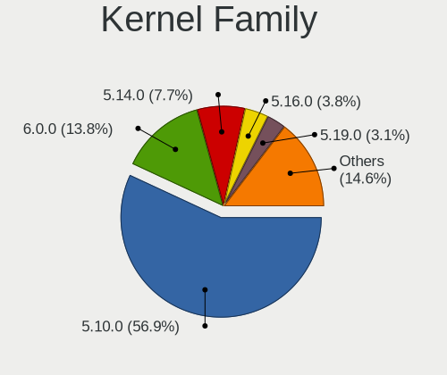
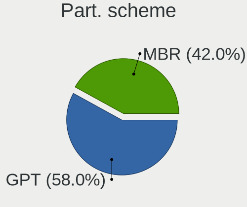
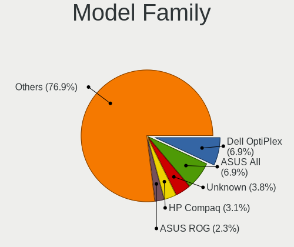
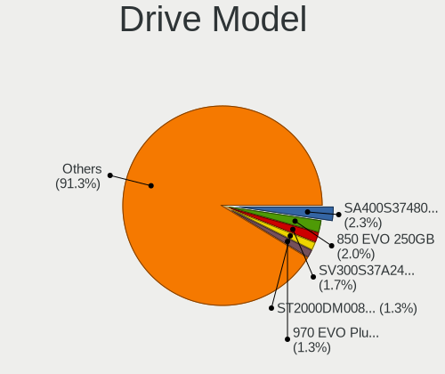
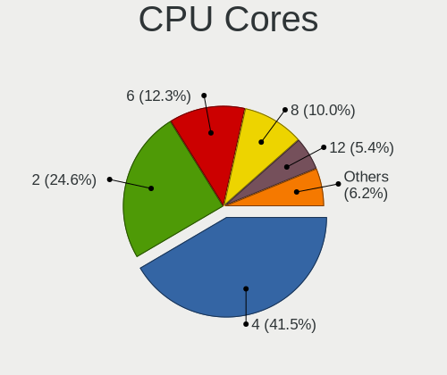
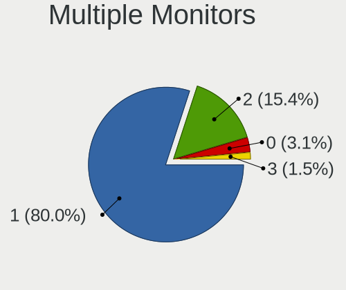
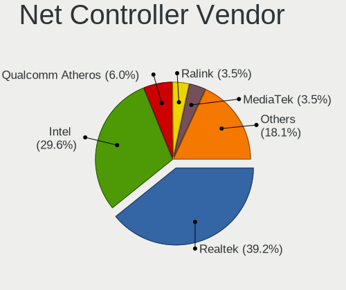
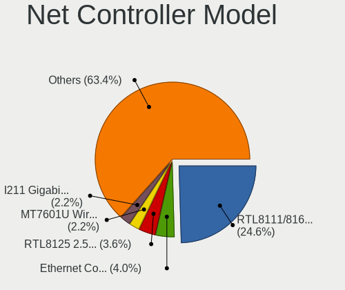
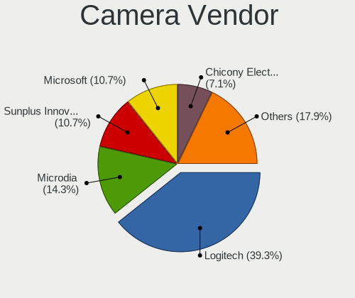

MX 21 - Tested Hardware & Statistics (Desktops)
-----------------------------------------------

A project to collect tested hardware configurations for MX 21.

Anyone can contribute to this report by the [hw-probe](https://github.com/linuxhw/hw-probe) tool:

    sudo -E hw-probe -all -upload

Please submit a probe of your configuration if it's not presented on the page or is rare.

Full-feature report is available here: https://linux-hardware.org/?view=trends

Contents
--------

* [ Test Cases ](#test-cases)

* [ System ](#system)
  - [ Kernel                   ](#kernel)
  - [ Kernel Family            ](#kernel-family)
  - [ Kernel Major Ver.        ](#kernel-major-ver)
  - [ Arch                     ](#arch)
  - [ DE                       ](#de)
  - [ Display Server           ](#display-server)
  - [ Display Manager          ](#display-manager)
  - [ OS Lang                  ](#os-lang)
  - [ Boot Mode                ](#boot-mode)
  - [ Filesystem               ](#filesystem)
  - [ Part. scheme             ](#part-scheme)
  - [ Dual Boot with Linux/BSD ](#dual-boot-with-linuxbsd)
  - [ Dual Boot (Win)          ](#dual-boot-win)

* [ Board ](#board)
  - [ Vendor                   ](#vendor)
  - [ Model                    ](#model)
  - [ Model Family             ](#model-family)
  - [ MFG Year                 ](#mfg-year)
  - [ Form Factor              ](#form-factor)
  - [ Secure Boot              ](#secure-boot)
  - [ Coreboot                 ](#coreboot)
  - [ RAM Size                 ](#ram-size)
  - [ RAM Used                 ](#ram-used)
  - [ Total Drives             ](#total-drives)
  - [ Has CD-ROM               ](#has-cd-rom)
  - [ Has Ethernet             ](#has-ethernet)
  - [ Has WiFi                 ](#has-wifi)
  - [ Has Bluetooth            ](#has-bluetooth)

* [ Location ](#location)
  - [ Country                  ](#country)
  - [ City                     ](#city)

* [ Drives ](#drives)
  - [ Drive Vendor             ](#drive-vendor)
  - [ Drive Model              ](#drive-model)
  - [ HDD Vendor               ](#hdd-vendor)
  - [ SSD Vendor               ](#ssd-vendor)
  - [ Drive Kind               ](#drive-kind)
  - [ Drive Connector          ](#drive-connector)
  - [ Drive Size               ](#drive-size)
  - [ Space Total              ](#space-total)
  - [ Space Used               ](#space-used)
  - [ Malfunc. Drives          ](#malfunc-drives)
  - [ Malfunc. Drive Vendor    ](#malfunc-drive-vendor)
  - [ Malfunc. HDD Vendor      ](#malfunc-hdd-vendor)
  - [ Malfunc. Drive Kind      ](#malfunc-drive-kind)
  - [ Failed Drives            ](#failed-drives)
  - [ Failed Drive Vendor      ](#failed-drive-vendor)
  - [ Drive Status             ](#drive-status)

* [ Storage controller ](#storage-controller)
  - [ Storage Vendor           ](#storage-vendor)
  - [ Storage Model            ](#storage-model)
  - [ Storage Kind             ](#storage-kind)

* [ Processor ](#processor)
  - [ CPU Vendor               ](#cpu-vendor)
  - [ CPU Model                ](#cpu-model)
  - [ CPU Model Family         ](#cpu-model-family)
  - [ CPU Cores                ](#cpu-cores)
  - [ CPU Sockets              ](#cpu-sockets)
  - [ CPU Threads              ](#cpu-threads)
  - [ CPU Op-Modes             ](#cpu-op-modes)
  - [ CPU Microcode            ](#cpu-microcode)
  - [ CPU Microarch            ](#cpu-microarch)

* [ Graphics ](#graphics)
  - [ GPU Vendor               ](#gpu-vendor)
  - [ GPU Model                ](#gpu-model)
  - [ GPU Combo                ](#gpu-combo)
  - [ GPU Driver               ](#gpu-driver)
  - [ GPU Memory               ](#gpu-memory)

* [ Monitor ](#monitor)
  - [ Monitor Vendor           ](#monitor-vendor)
  - [ Monitor Model            ](#monitor-model)
  - [ Monitor Resolution       ](#monitor-resolution)
  - [ Monitor Diagonal         ](#monitor-diagonal)
  - [ Monitor Width            ](#monitor-width)
  - [ Aspect Ratio             ](#aspect-ratio)
  - [ Monitor Area             ](#monitor-area)
  - [ Pixel Density            ](#pixel-density)
  - [ Multiple Monitors        ](#multiple-monitors)

* [ Network ](#network)
  - [ Net Controller Vendor    ](#net-controller-vendor)
  - [ Net Controller Model     ](#net-controller-model)
  - [ Wireless Vendor          ](#wireless-vendor)
  - [ Wireless Model           ](#wireless-model)
  - [ Ethernet Vendor          ](#ethernet-vendor)
  - [ Ethernet Model           ](#ethernet-model)
  - [ Net Controller Kind      ](#net-controller-kind)
  - [ Used Controller          ](#used-controller)
  - [ NICs                     ](#nics)
  - [ IPv6                     ](#ipv6)

* [ Bluetooth ](#bluetooth)
  - [ Bluetooth Vendor         ](#bluetooth-vendor)
  - [ Bluetooth Model          ](#bluetooth-model)

* [ Sound ](#sound)
  - [ Sound Vendor             ](#sound-vendor)
  - [ Sound Model              ](#sound-model)

* [ Memory ](#memory)
  - [ Memory Vendor            ](#memory-vendor)
  - [ Memory Model             ](#memory-model)
  - [ Memory Kind              ](#memory-kind)
  - [ Memory Form Factor       ](#memory-form-factor)
  - [ Memory Size              ](#memory-size)
  - [ Memory Speed             ](#memory-speed)

* [ Printers & scanners ](#printers--scanners)
  - [ Printer Vendor           ](#printer-vendor)
  - [ Printer Model            ](#printer-model)
  - [ Scanner Vendor           ](#scanner-vendor)
  - [ Scanner Model            ](#scanner-model)

* [ Camera ](#camera)
  - [ Camera Vendor            ](#camera-vendor)
  - [ Camera Model             ](#camera-model)

* [ Security ](#security)
  - [ Fingerprint Vendor       ](#fingerprint-vendor)
  - [ Fingerprint Model        ](#fingerprint-model)
  - [ Chipcard Vendor          ](#chipcard-vendor)
  - [ Chipcard Model           ](#chipcard-model)

* [ Unsupported ](#unsupported)
  - [ Unsupported Devices      ](#unsupported-devices)
  - [ Unsupported Device Types ](#unsupported-device-types)

Test Cases
----------

| Vendor   | Model                    | Probe                                                      | Date         |
|----------|--------------------------|------------------------------------------------------------|--------------|
| Fujitsu  | D3221-A1 S26361-D3221-A1 | [78d4e04363](https://linux-hardware.org/?probe=78d4e04363) | Dec 16, 2021 |
| GALAX    | B550M                    | [a6866c8a45](https://linux-hardware.org/?probe=a6866c8a45) | Dec 04, 2021 |
| Lenovo   | SHARKBAY NO DPK          | [fd5f409df8](https://linux-hardware.org/?probe=fd5f409df8) | Nov 14, 2021 |
| Lenovo   | SHARKBAY NO DPK          | [a85cc99f78](https://linux-hardware.org/?probe=a85cc99f78) | Nov 14, 2021 |
| ASRock   | X570 Steel Legend        | [18391015f7](https://linux-hardware.org/?probe=18391015f7) | Nov 11, 2021 |
| Gigabyte | X570 AORUS PRO           | [fbd2076eee](https://linux-hardware.org/?probe=fbd2076eee) | Oct 28, 2021 |
| Gigabyte | B550M DS3H               | [ee6a141211](https://linux-hardware.org/?probe=ee6a141211) | Oct 19, 2021 |
| Gigabyte | A320M-S2H V2-CF          | [5d136cb09b](https://linux-hardware.org/?probe=5d136cb09b) | Aug 13, 2021 |

System
------

Kernel
------

Version of the Linux kernel

| Version                | Desktops | Percent |
|------------------------|----------|---------|
| 5.14.0-4mx-amd64       | 2        | 33.33%  |
| 5.14.0-3mx-amd64       | 2        | 33.33%  |
| 5.16.0-rc5-hwmon-next+ | 1        | 16.67%  |
| 5.14.0-2mx-amd64       | 1        | 16.67%  |

Kernel Family
-------------

Linux kernel without a distro release

| Version | Desktops | Percent |
|---------|----------|---------|
| 5.14.0  | 5        | 83.33%  |
| 5.16.0  | 1        | 16.67%  |

Kernel Major Ver.
-----------------

Linux kernel major version

| Version | Desktops | Percent |
|---------|----------|---------|
| 5.14    | 5        | 83.33%  |
| 5.16    | 1        | 16.67%  |

Arch
----

OS architecture (x86_64, i586, etc.)

| Name   | Desktops | Percent |
|--------|----------|---------|
| x86_64 | 6        | 100%    |

DE
--

Desktop Environment

| Name | Desktops | Percent |
|------|----------|---------|
| XFCE | 5        | 83.33%  |
| KDE5 | 1        | 16.67%  |

Display Server
--------------

X11 or Wayland

| Name | Desktops | Percent |
|------|----------|---------|
| X11  | 6        | 100%    |

Display Manager
---------------

SDDM, LightDM, etc.

| Name    | Desktops | Percent |
|---------|----------|---------|
| LightDM | 5        | 83.33%  |
| SDDM    | 1        | 16.67%  |

OS Lang
-------

Language

| Lang  | Desktops | Percent |
|-------|----------|---------|
| en_US | 2        | 33.33%  |
| de_DE | 2        | 33.33%  |
| de_CH | 2        | 33.33%  |

Boot Mode
---------

EFI or BIOS

| Mode | Desktops | Percent |
|------|----------|---------|
| EFI  | 5        | 83.33%  |
| BIOS | 1        | 16.67%  |

Filesystem
----------

Type of filesystem

| Type  | Desktops | Percent |
|-------|----------|---------|
| Ext4  | 5        | 83.33%  |
| Btrfs | 1        | 16.67%  |

Part. scheme
------------

Scheme of partitioning

| Type | Desktops | Percent |
|------|----------|---------|
| GPT  | 6        | 100%    |

Dual Boot with Linux/BSD
------------------------

Hosting more than one Linux/BSD

| Dual boot | Desktops | Percent |
|-----------|----------|---------|
| Yes       | 3        | 50%     |
| No        | 3        | 50%     |

Dual Boot (Win)
---------------

Hosting Linux and Windows

| Dual boot | Desktops | Percent |
|-----------|----------|---------|
| Yes       | 4        | 66.67%  |
| No        | 2        | 33.33%  |

Board
-----

Vendor
------

Motherboard manufacturer

| Name                | Desktops | Percent |
|---------------------|----------|---------|
| Gigabyte Technology | 2        | 33.33%  |
| Lenovo              | 1        | 16.67%  |
| GALAX               | 1        | 16.67%  |
| Fujitsu             | 1        | 16.67%  |
| ASRock              | 1        | 16.67%  |

Model
-----

Motherboard model

| Name                     | Desktops | Percent |
|--------------------------|----------|---------|
| Lenovo 10AAS1QB0B        | 1        | 16.67%  |
| Gigabyte X570 AORUS PRO  | 1        | 16.67%  |
| Gigabyte B550M DS3H      | 1        | 16.67%  |
| GALAX B550M              | 1        | 16.67%  |
| Fujitsu ESPRIMO P720     | 1        | 16.67%  |
| ASRock X570 Steel Legend | 1        | 16.67%  |

Model Family
------------

Motherboard model prefix

| Name              | Desktops | Percent |
|-------------------|----------|---------|
| Lenovo 10AAS1QB0B | 1        | 16.67%  |
| Gigabyte X570     | 1        | 16.67%  |
| Gigabyte B550M    | 1        | 16.67%  |
| GALAX B550M       | 1        | 16.67%  |
| Fujitsu ESPRIMO   | 1        | 16.67%  |
| ASRock X570       | 1        | 16.67%  |

MFG Year
--------

Motherboard manufacture year

| Year | Desktops | Percent |
|------|----------|---------|
| 2021 | 3        | 50%     |
| 2020 | 1        | 16.67%  |
| 2019 | 1        | 16.67%  |
| 2018 | 1        | 16.67%  |

Form Factor
-----------

Physical design of the computer

| Name    | Desktops | Percent |
|---------|----------|---------|
| Desktop | 6        | 100%    |

Secure Boot
-----------

Enabled or disabled

| State    | Desktops | Percent |
|----------|----------|---------|
| Disabled | 6        | 100%    |

Coreboot
--------

Have coreboot on board

| Used | Desktops | Percent |
|------|----------|---------|
| No   | 6        | 100%    |

RAM Size
--------

Total RAM memory

| Size in GB | Desktops | Percent |
|------------|----------|---------|
| 32.01-64.0 | 2        | 33.33%  |
| 4.01-8.0   | 1        | 16.67%  |
| 3.01-4.0   | 1        | 16.67%  |
| 16.01-24.0 | 1        | 16.67%  |
| 8.01-16.0  | 1        | 16.67%  |

RAM Used
--------

Used RAM memory

| Used GB  | Desktops | Percent |
|----------|----------|---------|
| 1.01-2.0 | 3        | 50%     |
| 4.01-8.0 | 1        | 16.67%  |
| 3.01-4.0 | 1        | 16.67%  |
| 2.01-3.0 | 1        | 16.67%  |

Total Drives
------------

Number of drives on board

| Drives | Desktops | Percent |
|--------|----------|---------|
| 2      | 3        | 50%     |
| 3      | 2        | 33.33%  |
| 1      | 1        | 16.67%  |

Has CD-ROM
----------

Has CD-ROM on board

| Presented | Desktops | Percent |
|-----------|----------|---------|
| No        | 5        | 83.33%  |
| Yes       | 1        | 16.67%  |

Has Ethernet
------------

Has Ethernet on board

| Presented | Desktops | Percent |
|-----------|----------|---------|
| Yes       | 6        | 100%    |

Has WiFi
--------

Has WiFi module

| Presented | Desktops | Percent |
|-----------|----------|---------|
| No        | 5        | 83.33%  |
| Yes       | 1        | 16.67%  |

Has Bluetooth
-------------

Has Bluetooth module

| Presented | Desktops | Percent |
|-----------|----------|---------|
| No        | 6        | 100%    |

Location
--------

Country
-------

Geographic location (country)

| Country     | Desktops | Percent |
|-------------|----------|---------|
| Switzerland | 2        | 33.33%  |
| Germany     | 2        | 33.33%  |
| USA         | 1        | 16.67%  |
| India       | 1        | 16.67%  |

City
----

Geographic location (city)

| City      | Desktops | Percent |
|-----------|----------|---------|
| Lausen    | 2        | 33.33%  |
| Normal    | 1        | 16.67%  |
| Munster   | 1        | 16.67%  |
| Freital   | 1        | 16.67%  |
| Bengaluru | 1        | 16.67%  |

Drives
------

Drive Vendor
------------

Hard drive vendors

| Vendor              | Desktops | Drives | Percent |
|---------------------|----------|--------|---------|
| Kingston            | 3        | 3      | 23.08%  |
| WDC                 | 2        | 2      | 15.38%  |
| Samsung Electronics | 2        | 2      | 15.38%  |
| Corsair             | 2        | 2      | 15.38%  |
| Transcend           | 1        | 1      | 7.69%   |
| Seagate             | 1        | 1      | 7.69%   |
| GOODRAM             | 1        | 1      | 7.69%   |
| Crucial             | 1        | 1      | 7.69%   |

Drive Model
-----------

Hard drive models

| Model                            | Desktops | Percent |
|----------------------------------|----------|---------|
| Kingston SA400S37480G 480GB SSD  | 3        | 23.08%  |
| Corsair MP400 2TB                | 2        | 15.38%  |
| WDC WDS500G2B0C-00PXH0 500GB     | 1        | 7.69%   |
| WDC WD10EZEX-08M2NA0 1TB         | 1        | 7.69%   |
| Transcend TS128GSSD370S 128GB    | 1        | 7.69%   |
| Seagate ST500LM021-1KJ152 500GB  | 1        | 7.69%   |
| Samsung SSD 850 EVO 500GB        | 1        | 7.69%   |
| Samsung HD501LJ 500GB            | 1        | 7.69%   |
| GOODRAM SSDPR-CL100-480-G3 480GB | 1        | 7.69%   |
| Crucial CT500P2SSD8 500GB        | 1        | 7.69%   |

HDD Vendor
----------

Hard disk drive vendors

| Vendor              | Desktops | Drives | Percent |
|---------------------|----------|--------|---------|
| WDC                 | 1        | 1      | 33.33%  |
| Seagate             | 1        | 1      | 33.33%  |
| Samsung Electronics | 1        | 1      | 33.33%  |

SSD Vendor
----------

Solid state drive vendors

| Vendor              | Desktops | Drives | Percent |
|---------------------|----------|--------|---------|
| Kingston            | 3        | 3      | 50%     |
| Transcend           | 1        | 1      | 16.67%  |
| Samsung Electronics | 1        | 1      | 16.67%  |
| GOODRAM             | 1        | 1      | 16.67%  |

Drive Kind
----------

HDD or SSD

| Kind | Desktops | Drives | Percent |
|------|----------|--------|---------|
| SSD  | 5        | 6      | 41.67%  |
| NVMe | 4        | 4      | 33.33%  |
| HDD  | 3        | 3      | 25%     |

Drive Connector
---------------

SATA, SAS, NVMe, etc.

| Type | Desktops | Drives | Percent |
|------|----------|--------|---------|
| SATA | 6        | 9      | 60%     |
| NVMe | 4        | 4      | 40%     |

Drive Size
----------

Size of hard drive

| Size in TB | Desktops | Drives | Percent |
|------------|----------|--------|---------|
| 0.01-0.5   | 6        | 8      | 85.71%  |
| 0.51-1.0   | 1        | 1      | 14.29%  |

Space Total
-----------

Amount of disk space available on the file system

| Size in GB | Desktops | Percent |
|------------|----------|---------|
| 251-500    | 3        | 50%     |
| 1001-2000  | 2        | 33.33%  |
| 501-1000   | 1        | 16.67%  |

Space Used
----------

Amount of used disk space

| Used GB | Desktops | Percent |
|---------|----------|---------|
| 21-50   | 3        | 50%     |
| 51-100  | 2        | 33.33%  |
| 101-250 | 1        | 16.67%  |

Malfunc. Drives
---------------

Drive models with a malfunction

| Model                                 | Desktops | Drives | Percent |
|---------------------------------------|----------|--------|---------|
| Seagate ST500LM021-1KJ152 500GB       | 1        | 1      | 33.33%  |
| Samsung Electronics SSD 850 EVO 500GB | 1        | 1      | 33.33%  |
| GOODRAM SSDPR-CL100-480-G3 480GB      | 1        | 1      | 33.33%  |

Malfunc. Drive Vendor
---------------------

Vendors of faulty drives

| Vendor              | Desktops | Drives | Percent |
|---------------------|----------|--------|---------|
| Seagate             | 1        | 1      | 33.33%  |
| Samsung Electronics | 1        | 1      | 33.33%  |
| GOODRAM             | 1        | 1      | 33.33%  |

Malfunc. HDD Vendor
-------------------

Vendors of faulty HDD drives

| Vendor  | Desktops | Drives | Percent |
|---------|----------|--------|---------|
| Seagate | 1        | 1      | 100%    |

Malfunc. Drive Kind
-------------------

Kinds of faulty drives

| Kind | Desktops | Drives | Percent |
|------|----------|--------|---------|
| SSD  | 2        | 2      | 66.67%  |
| HDD  | 1        | 1      | 33.33%  |

Failed Drives
-------------

Failed drive models

Zero info for selected period =(

Failed Drive Vendor
-------------------

Failed drive vendors

Zero info for selected period =(

Drive Status
------------

Number of failed and malfunc. drives

| Status  | Desktops | Drives | Percent |
|---------|----------|--------|---------|
| Works   | 5        | 10     | 62.5%   |
| Malfunc | 3        | 3      | 37.5%   |

Storage controller
------------------

Storage Vendor
--------------

Storage controller vendors

| Vendor                    | Desktops | Percent |
|---------------------------|----------|---------|
| AMD                       | 4        | 40%     |
| Phison Electronics        | 2        | 20%     |
| Intel                     | 2        | 20%     |
| Sandisk                   | 1        | 10%     |
| Micron/Crucial Technology | 1        | 10%     |

Storage Model
-------------

Storage controller models

| Model                                                                          | Desktops | Percent |
|--------------------------------------------------------------------------------|----------|---------|
| Phison E12 NVMe Controller                                                     | 2        | 20%     |
| Intel 8 Series/C220 Series Chipset Family 6-port SATA Controller 1 [AHCI mode] | 2        | 20%     |
| AMD Starship/Matisse Chipset SATA Controller [AHCI mode]                       | 2        | 20%     |
| AMD FCH SATA Controller [AHCI mode]                                            | 2        | 20%     |
| Sandisk WD Blue SN550 NVMe SSD                                                 | 1        | 10%     |
| Micron/Crucial P2 NVMe PCIe SSD                                                | 1        | 10%     |

Storage Kind
------------

Kind of storage controller (IDE, SATA, NVMe, SAS, ...)

| Kind | Desktops | Percent |
|------|----------|---------|
| SATA | 6        | 60%     |
| NVMe | 4        | 40%     |

Processor
---------

CPU Vendor
----------

Processor vendors

| Vendor | Desktops | Percent |
|--------|----------|---------|
| AMD    | 4        | 66.67%  |
| Intel  | 2        | 33.33%  |

CPU Model
---------

Processor models

| Model                               | Desktops | Percent |
|-------------------------------------|----------|---------|
| Intel Core i5-4570T CPU @ 2.90GHz   | 1        | 16.67%  |
| Intel Core i3-4130 CPU @ 3.40GHz    | 1        | 16.67%  |
| AMD Ryzen 7 5800X 8-Core Processor  | 1        | 16.67%  |
| AMD Ryzen 5 5600X 6-Core Processor  | 1        | 16.67%  |
| AMD Ryzen 5 1600 Six-Core Processor | 1        | 16.67%  |
| AMD Ryzen 3 3100 4-Core Processor   | 1        | 16.67%  |

CPU Model Family
----------------

Processor model prefix

| Model         | Desktops | Percent |
|---------------|----------|---------|
| AMD Ryzen 5   | 2        | 33.33%  |
| Intel Core i5 | 1        | 16.67%  |
| Intel Core i3 | 1        | 16.67%  |
| AMD Ryzen 7   | 1        | 16.67%  |
| AMD Ryzen 3   | 1        | 16.67%  |

CPU Cores
---------

Number of processor cores

| Number | Desktops | Percent |
|--------|----------|---------|
| 6      | 2        | 33.33%  |
| 2      | 2        | 33.33%  |
| 8      | 1        | 16.67%  |
| 4      | 1        | 16.67%  |

CPU Sockets
-----------

Number of sockets

| Number | Desktops | Percent |
|--------|----------|---------|
| 1      | 6        | 100%    |

CPU Threads
-----------

Threads per core (Hyper-Threading)

| Number | Desktops | Percent |
|--------|----------|---------|
| 2      | 6        | 100%    |

CPU Op-Modes
------------

CPU Operation Modes (32-bit, 64-bit)

| Op mode        | Desktops | Percent |
|----------------|----------|---------|
| 32-bit, 64-bit | 6        | 100%    |

CPU Microcode
-------------

Microcode number

| Number     | Desktops | Percent |
|------------|----------|---------|
| 0x306c3    | 1        | 16.67%  |
| 0x0a201016 | 1        | 16.67%  |
| 0x0a201009 | 1        | 16.67%  |
| 0x08701021 | 1        | 16.67%  |
| 0x0800820d | 1        | 16.67%  |
| Unknown    | 1        | 16.67%  |

CPU Microarch
-------------

Microarchitecture

| Name    | Desktops | Percent |
|---------|----------|---------|
| Zen 3   | 2        | 33.33%  |
| Haswell | 2        | 33.33%  |
| Zen+    | 1        | 16.67%  |
| Zen 2   | 1        | 16.67%  |

Graphics
--------

GPU Vendor
----------

Vendors of graphics cards

| Vendor | Desktops | Percent |
|--------|----------|---------|
| AMD    | 4        | 57.14%  |
| Intel  | 2        | 28.57%  |
| Nvidia | 1        | 14.29%  |

GPU Model
---------

Graphics card models

| Model                                                                       | Desktops | Percent |
|-----------------------------------------------------------------------------|----------|---------|
| AMD Navi 22 [Radeon RX 6700/6700 XT / 6800M]                                | 2        | 28.57%  |
| Nvidia GP104 [GeForce GTX 1080]                                             | 1        | 14.29%  |
| Intel Xeon E3-1200 v3/4th Gen Core Processor Integrated Graphics Controller | 1        | 14.29%  |
| Intel 4th Generation Core Processor Family Integrated Graphics Controller   | 1        | 14.29%  |
| AMD Lexa PRO [Radeon 540/540X/550/550X / RX 540X/550/550X]                  | 1        | 14.29%  |
| AMD Cedar [Radeon HD 7350/8350 / R5 220]                                    | 1        | 14.29%  |

GPU Combo
---------

Combinations of graphics cards

| Name        | Desktops | Percent |
|-------------|----------|---------|
| 1 x AMD     | 3        | 50%     |
| 1 x Nvidia  | 1        | 16.67%  |
| Intel + AMD | 1        | 16.67%  |
| 1 x Intel   | 1        | 16.67%  |

GPU Driver
----------

Free vs proprietary

| Driver      | Desktops | Percent |
|-------------|----------|---------|
| Free        | 5        | 83.33%  |
| Proprietary | 1        | 16.67%  |

GPU Memory
----------

Total video memory

| Size in GB | Desktops | Percent |
|------------|----------|---------|
| 8.01-16.0  | 2        | 33.33%  |
| Unknown    | 2        | 33.33%  |
| 7.01-8.0   | 1        | 16.67%  |
| 3.01-4.0   | 1        | 16.67%  |

Monitor
-------

Monitor Vendor
--------------

Monitor vendors

| Vendor               | Desktops | Percent |
|----------------------|----------|---------|
| Medion               | 2        | 22.22%  |
| Philips              | 1        | 11.11%  |
| NEC Computers        | 1        | 11.11%  |
| Grundig              | 1        | 11.11%  |
| Gigabyte Technology  | 1        | 11.11%  |
| Fujitsu Siemens      | 1        | 11.11%  |
| Ancor Communications | 1        | 11.11%  |
| Acer                 | 1        | 11.11%  |

Monitor Model
-------------

Monitor models

| Model                                                            | Desktops | Percent |
|------------------------------------------------------------------|----------|---------|
| Medion MD22322 MEB8101 2560x1440 699x393mm 31.6-inch             | 2        | 22.22%  |
| Philips PHL 276E9Q PHLC17B 1920x1080 598x336mm 27.0-inch         | 1        | 11.11%  |
| NEC Computers EA221WM NEC673D 1680x1050 474x296mm 22.0-inch      | 1        | 11.11%  |
| Grundig G2 1080p dig GRU4448 1920x1080 1600x900mm 72.3-inch      | 1        | 11.11%  |
| Gigabyte Technology G34WQC GBT3400 3440x1440 797x334mm 34.0-inch | 1        | 11.11%  |
| Fujitsu Siemens B22W-7 LED FUS0838 1680x1050 474x296mm 22.0-inch | 1        | 11.11%  |
| Ancor Communications BE24A ACI24AB 1920x1200 518x324mm 24.1-inch | 1        | 11.11%  |
| Acer AL1717 ACRAD54 1280x1024 338x270mm 17.0-inch                | 1        | 11.11%  |

Monitor Resolution
------------------

Monitor screen resolution

| Resolution         | Desktops | Percent |
|--------------------|----------|---------|
| 2560x1440 (QHD)    | 2        | 25%     |
| 3840x2160 (4K)     | 1        | 12.5%   |
| 3440x1440          | 1        | 12.5%   |
| 1920x1200 (WUXGA)  | 1        | 12.5%   |
| 1920x1080 (FHD)    | 1        | 12.5%   |
| 1680x1050 (WSXGA+) | 1        | 12.5%   |
| 1280x1024 (SXGA)   | 1        | 12.5%   |

Monitor Diagonal
----------------

Diagonal size in inches

| Inches | Desktops | Percent |
|--------|----------|---------|
| 31     | 2        | 25%     |
| 72     | 1        | 12.5%   |
| 34     | 1        | 12.5%   |
| 27     | 1        | 12.5%   |
| 24     | 1        | 12.5%   |
| 22     | 1        | 12.5%   |
| 17     | 1        | 12.5%   |

Monitor Width
-------------

Physical width

| Width in mm | Desktops | Percent |
|-------------|----------|---------|
| 601-700     | 2        | 25%     |
| 501-600     | 2        | 25%     |
| 701-800     | 1        | 12.5%   |
| 401-500     | 1        | 12.5%   |
| 301-350     | 1        | 12.5%   |
| 1501-2000   | 1        | 12.5%   |

Aspect Ratio
------------

Proportional relationship between the width and the height

| Ratio | Desktops | Percent |
|-------|----------|---------|
| 16/9  | 4        | 50%     |
| 16/10 | 2        | 25%     |
| 5/4   | 1        | 12.5%   |
| 21/9  | 1        | 12.5%   |

Monitor Area
------------

Area in inch²

| Area in inch² | Desktops | Percent |
|----------------|----------|---------|
| 351-500        | 3        | 37.5%   |
| More than 1000 | 1        | 12.5%   |
| 301-350        | 1        | 12.5%   |
| 251-300        | 1        | 12.5%   |
| 201-250        | 1        | 12.5%   |
| 141-150        | 1        | 12.5%   |

Pixel Density
-------------

Pixels per inch

| Density | Desktops | Percent |
|---------|----------|---------|
| 51-100  | 5        | 71.43%  |
| 1-50    | 1        | 14.29%  |
| 101-120 | 1        | 14.29%  |

Multiple Monitors
-----------------

Total monitors connected

| Total | Desktops | Percent |
|-------|----------|---------|
| 1     | 4        | 66.67%  |
| 3     | 1        | 16.67%  |
| 2     | 1        | 16.67%  |

Network
-------

Net Controller Vendor
---------------------

Controller vendors

| Vendor                | Desktops | Percent |
|-----------------------|----------|---------|
| Intel                 | 4        | 57.14%  |
| Realtek Semiconductor | 2        | 28.57%  |
| TP-Link               | 1        | 14.29%  |

Net Controller Model
--------------------

Controller models

| Model                                                             | Desktops | Percent |
|-------------------------------------------------------------------|----------|---------|
| Realtek RTL8111/8168/8411 PCI Express Gigabit Ethernet Controller | 2        | 28.57%  |
| Intel I211 Gigabit Network Connection                             | 2        | 28.57%  |
| TP-Link TL-WN722N v2/v3 [Realtek RTL8188EUS]                      | 1        | 14.29%  |
| Intel Ethernet Connection I217-V                                  | 1        | 14.29%  |
| Intel Ethernet Connection I217-LM                                 | 1        | 14.29%  |

Wireless Vendor
---------------

Wireless vendors

| Vendor  | Desktops | Percent |
|---------|----------|---------|
| TP-Link | 1        | 100%    |

Wireless Model
--------------

Wireless models

| Model                                        | Desktops | Percent |
|----------------------------------------------|----------|---------|
| TP-Link TL-WN722N v2/v3 [Realtek RTL8188EUS] | 1        | 100%    |

Ethernet Vendor
---------------

Ethernet vendors

| Vendor                | Desktops | Percent |
|-----------------------|----------|---------|
| Intel                 | 4        | 66.67%  |
| Realtek Semiconductor | 2        | 33.33%  |

Ethernet Model
--------------

Ethernet models

| Model                                                             | Desktops | Percent |
|-------------------------------------------------------------------|----------|---------|
| Realtek RTL8111/8168/8411 PCI Express Gigabit Ethernet Controller | 2        | 33.33%  |
| Intel I211 Gigabit Network Connection                             | 2        | 33.33%  |
| Intel Ethernet Connection I217-V                                  | 1        | 16.67%  |
| Intel Ethernet Connection I217-LM                                 | 1        | 16.67%  |

Net Controller Kind
-------------------

Ethernet, WiFi or modem

| Kind     | Desktops | Percent |
|----------|----------|---------|
| Ethernet | 6        | 85.71%  |
| WiFi     | 1        | 14.29%  |

Used Controller
---------------

Currently used network controller

| Kind     | Desktops | Percent |
|----------|----------|---------|
| Ethernet | 5        | 83.33%  |
| WiFi     | 1        | 16.67%  |

NICs
----

Total network controllers on board

| Total | Desktops | Percent |
|-------|----------|---------|
| 1     | 6        | 100%    |

IPv6
----

IPv6 vs IPv4

| Used | Desktops | Percent |
|------|----------|---------|
| Yes  | 3        | 50%     |
| No   | 3        | 50%     |

Bluetooth
---------

Bluetooth Vendor
----------------

Controller vendors

Zero info for selected period =(

Bluetooth Model
---------------

Controller models

Zero info for selected period =(

Sound
-----

Sound Vendor
------------

Sound card vendors

| Vendor    | Desktops | Percent |
|-----------|----------|---------|
| AMD       | 5        | 45.45%  |
| ROCCAT    | 2        | 18.18%  |
| Intel     | 2        | 18.18%  |
| Razer USA | 1        | 9.09%   |
| Nvidia    | 1        | 9.09%   |

Sound Model
-----------

Sound card models

| Model                                                               | Desktops | Percent |
|---------------------------------------------------------------------|----------|---------|
| AMD Starship/Matisse HD Audio Controller                            | 3        | 18.75%  |
| ROCCAT Khan AIMO                                                    | 2        | 12.5%   |
| Intel Xeon E3-1200 v3/4th Gen Core Processor HD Audio Controller    | 2        | 12.5%   |
| Intel 8 Series/C220 Series Chipset High Definition Audio Controller | 2        | 12.5%   |
| AMD Navi 21 HDMI Audio [Radeon RX 6800/6800 XT / 6900 XT]           | 2        | 12.5%   |
| Razer USA Razer USB Audio Controller                                | 1        | 6.25%   |
| Nvidia GP104 High Definition Audio Controller                       | 1        | 6.25%   |
| AMD Family 17h (Models 00h-0fh) HD Audio Controller                 | 1        | 6.25%   |
| AMD Cedar HDMI Audio [Radeon HD 5400/6300/7300 Series]              | 1        | 6.25%   |
| AMD Baffin HDMI/DP Audio [Radeon RX 550 640SP / RX 560/560X]        | 1        | 6.25%   |

Memory
------

Memory Vendor
-------------

Memory module vendors

| Vendor   | Desktops | Percent |
|----------|----------|---------|
| Corsair  | 3        | 60%     |
| SK Hynix | 1        | 20%     |
| Kingston | 1        | 20%     |

Memory Model
------------

Memory module models

| Model                                                  | Desktops | Percent |
|--------------------------------------------------------|----------|---------|
| Corsair RAM CMK32GX4M2B3200C16 16GB DIMM DDR4 3400MT/s | 2        | 40%     |
| SK Hynix RAM HMT451S6AFR8A-PB 4GB SODIMM DDR3 1600MT/s | 1        | 20%     |
| Kingston RAM KHX3200C16D4/4GX 4GB DIMM DDR4 3600MT/s   | 1        | 20%     |
| Corsair RAM CMK16GX4M2B3200C16 8GB DIMM DDR4 3600MT/s  | 1        | 20%     |

Memory Kind
-----------

Memory module kinds

| Kind | Desktops | Percent |
|------|----------|---------|
| DDR4 | 4        | 80%     |
| DDR3 | 1        | 20%     |

Memory Form Factor
------------------

Physical design of the memory module

| Name   | Desktops | Percent |
|--------|----------|---------|
| DIMM   | 4        | 80%     |
| SODIMM | 1        | 20%     |

Memory Size
-----------

Memory module size

| Size  | Desktops | Percent |
|-------|----------|---------|
| 16384 | 2        | 40%     |
| 4096  | 2        | 40%     |
| 8192  | 1        | 20%     |

Memory Speed
------------

Memory module speed

| Speed | Desktops | Percent |
|-------|----------|---------|
| 3600  | 2        | 40%     |
| 3400  | 2        | 40%     |
| 1600  | 1        | 20%     |

Printers & scanners
-------------------

Printer Vendor
--------------

Printer device vendors

Zero info for selected period =(

Printer Model
-------------

Printer device models

Zero info for selected period =(

Scanner Vendor
--------------

Scanner device vendors

Zero info for selected period =(

Scanner Model
-------------

Scanner device models

Zero info for selected period =(

Camera
------

Camera Vendor
-------------

Camera device vendors

| Vendor                 | Desktops | Percent |
|------------------------|----------|---------|
| Logitech               | 2        | 66.67%  |
| Generalplus Technology | 1        | 33.33%  |

Camera Model
------------

Camera device models

| Model                      | Desktops | Percent |
|----------------------------|----------|---------|
| Logitech Webcam C930e      | 2        | 66.67%  |
| Generalplus GENERAL WEBCAM | 1        | 33.33%  |

Security
--------

Fingerprint Vendor
------------------

Fingerprint sensor vendors

Zero info for selected period =(

Fingerprint Model
-----------------

Fingerprint sensor models

Zero info for selected period =(

Chipcard Vendor
---------------

Chipcard module vendors

Zero info for selected period =(

Chipcard Model
--------------

Chipcard module models

Zero info for selected period =(

Unsupported
-----------

Unsupported Devices
-------------------

Total unsupported devices on board

| Total | Desktops | Percent |
|-------|----------|---------|
| 0     | 6        | 100%    |

Unsupported Device Types
------------------------

Types of unsupported devices

Zero info for selected period =(

