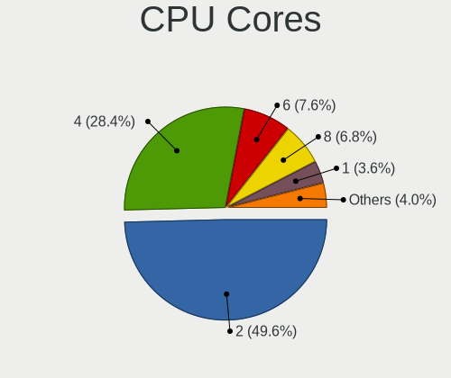
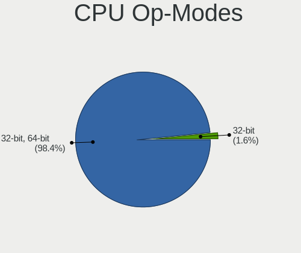
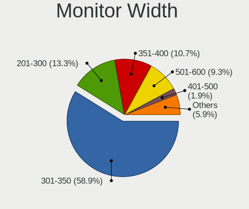
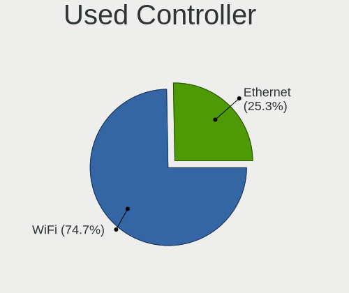
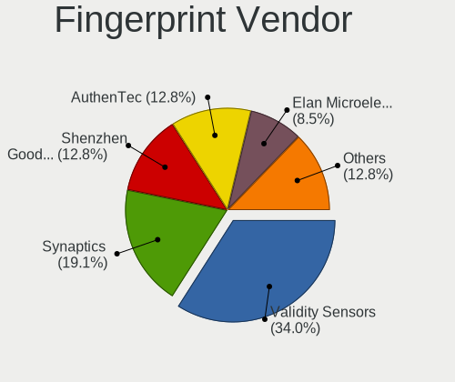
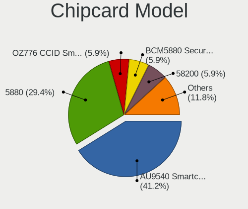

MX 21 - Tested Hardware & Statistics (Notebooks)
------------------------------------------------

A project to collect tested hardware configurations for MX 21.

Anyone can contribute to this report by the [hw-probe](https://github.com/linuxhw/hw-probe) tool:

    sudo -E hw-probe -all -upload

Please contribute! Especially if your hardware is rare.

Contents
--------

* [ Test Cases ](#test-cases)

* [ System ](#system)
  - [ Kernel                   ](#kernel)
  - [ Kernel Family            ](#kernel-family)
  - [ Kernel Major Ver.        ](#kernel-major-ver)
  - [ Arch                     ](#arch)
  - [ DE                       ](#de)
  - [ Display Server           ](#display-server)
  - [ Display Manager          ](#display-manager)
  - [ OS Lang                  ](#os-lang)
  - [ Boot Mode                ](#boot-mode)
  - [ Filesystem               ](#filesystem)
  - [ Part. scheme             ](#part-scheme)
  - [ Dual Boot with Linux/BSD ](#dual-boot-with-linuxbsd)
  - [ Dual Boot (Win)          ](#dual-boot-win)

* [ Board ](#board)
  - [ Vendor                   ](#vendor)
  - [ Model                    ](#model)
  - [ Model Family             ](#model-family)
  - [ MFG Year                 ](#mfg-year)
  - [ Form Factor              ](#form-factor)
  - [ Secure Boot              ](#secure-boot)
  - [ Coreboot                 ](#coreboot)
  - [ RAM Size                 ](#ram-size)
  - [ RAM Used                 ](#ram-used)
  - [ Total Drives             ](#total-drives)
  - [ Has CD-ROM               ](#has-cd-rom)
  - [ Has Ethernet             ](#has-ethernet)
  - [ Has WiFi                 ](#has-wifi)
  - [ Has Bluetooth            ](#has-bluetooth)

* [ Location ](#location)
  - [ Country                  ](#country)
  - [ City                     ](#city)

* [ Drives ](#drives)
  - [ Drive Vendor             ](#drive-vendor)
  - [ Drive Model              ](#drive-model)
  - [ HDD Vendor               ](#hdd-vendor)
  - [ SSD Vendor               ](#ssd-vendor)
  - [ Drive Kind               ](#drive-kind)
  - [ Drive Connector          ](#drive-connector)
  - [ Drive Size               ](#drive-size)
  - [ Space Total              ](#space-total)
  - [ Space Used               ](#space-used)
  - [ Malfunc. Drives          ](#malfunc-drives)
  - [ Malfunc. Drive Vendor    ](#malfunc-drive-vendor)
  - [ Malfunc. HDD Vendor      ](#malfunc-hdd-vendor)
  - [ Malfunc. Drive Kind      ](#malfunc-drive-kind)
  - [ Failed Drives            ](#failed-drives)
  - [ Failed Drive Vendor      ](#failed-drive-vendor)
  - [ Drive Status             ](#drive-status)

* [ Storage controller ](#storage-controller)
  - [ Storage Vendor           ](#storage-vendor)
  - [ Storage Model            ](#storage-model)
  - [ Storage Kind             ](#storage-kind)

* [ Processor ](#processor)
  - [ CPU Vendor               ](#cpu-vendor)
  - [ CPU Model                ](#cpu-model)
  - [ CPU Model Family         ](#cpu-model-family)
  - [ CPU Cores                ](#cpu-cores)
  - [ CPU Sockets              ](#cpu-sockets)
  - [ CPU Threads              ](#cpu-threads)
  - [ CPU Op-Modes             ](#cpu-op-modes)
  - [ CPU Microcode            ](#cpu-microcode)
  - [ CPU Microarch            ](#cpu-microarch)

* [ Graphics ](#graphics)
  - [ GPU Vendor               ](#gpu-vendor)
  - [ GPU Model                ](#gpu-model)
  - [ GPU Combo                ](#gpu-combo)
  - [ GPU Driver               ](#gpu-driver)
  - [ GPU Memory               ](#gpu-memory)

* [ Monitor ](#monitor)
  - [ Monitor Vendor           ](#monitor-vendor)
  - [ Monitor Model            ](#monitor-model)
  - [ Monitor Resolution       ](#monitor-resolution)
  - [ Monitor Diagonal         ](#monitor-diagonal)
  - [ Monitor Width            ](#monitor-width)
  - [ Aspect Ratio             ](#aspect-ratio)
  - [ Monitor Area             ](#monitor-area)
  - [ Pixel Density            ](#pixel-density)
  - [ Multiple Monitors        ](#multiple-monitors)

* [ Network ](#network)
  - [ Net Controller Vendor    ](#net-controller-vendor)
  - [ Net Controller Model     ](#net-controller-model)
  - [ Wireless Vendor          ](#wireless-vendor)
  - [ Wireless Model           ](#wireless-model)
  - [ Ethernet Vendor          ](#ethernet-vendor)
  - [ Ethernet Model           ](#ethernet-model)
  - [ Net Controller Kind      ](#net-controller-kind)
  - [ Used Controller          ](#used-controller)
  - [ NICs                     ](#nics)
  - [ IPv6                     ](#ipv6)

* [ Bluetooth ](#bluetooth)
  - [ Bluetooth Vendor         ](#bluetooth-vendor)
  - [ Bluetooth Model          ](#bluetooth-model)

* [ Sound ](#sound)
  - [ Sound Vendor             ](#sound-vendor)
  - [ Sound Model              ](#sound-model)

* [ Memory ](#memory)
  - [ Memory Vendor            ](#memory-vendor)
  - [ Memory Model             ](#memory-model)
  - [ Memory Kind              ](#memory-kind)
  - [ Memory Form Factor       ](#memory-form-factor)
  - [ Memory Size              ](#memory-size)
  - [ Memory Speed             ](#memory-speed)

* [ Printers & scanners ](#printers--scanners)
  - [ Printer Vendor           ](#printer-vendor)
  - [ Printer Model            ](#printer-model)
  - [ Scanner Vendor           ](#scanner-vendor)
  - [ Scanner Model            ](#scanner-model)

* [ Camera ](#camera)
  - [ Camera Vendor            ](#camera-vendor)
  - [ Camera Model             ](#camera-model)

* [ Security ](#security)
  - [ Fingerprint Vendor       ](#fingerprint-vendor)
  - [ Fingerprint Model        ](#fingerprint-model)
  - [ Chipcard Vendor          ](#chipcard-vendor)
  - [ Chipcard Model           ](#chipcard-model)

* [ Unsupported ](#unsupported)
  - [ Unsupported Devices      ](#unsupported-devices)
  - [ Unsupported Device Types ](#unsupported-device-types)

Test Cases
----------

Total: 178

| Vendor        | Model                       | Probe                                                      | Date         |
|---------------|-----------------------------|------------------------------------------------------------|--------------|
| Toshiba       | PORTEGE Z30-C               | [03dad182bb](https://linux-hardware.org/?probe=03dad182bb) | Dec 28, 2022 |
| Dell          | Latitude 3190               | [f395b56cec](https://linux-hardware.org/?probe=f395b56cec) | Dec 26, 2022 |
| Apple         | MacBookPro10,1              | [6c8ec40821](https://linux-hardware.org/?probe=6c8ec40821) | Dec 25, 2022 |
| Dell          | Latitude 3190               | [9227c8dbfb](https://linux-hardware.org/?probe=9227c8dbfb) | Dec 19, 2022 |
| Lenovo        | Y70-70 Touch 80DU           | [916375929d](https://linux-hardware.org/?probe=916375929d) | Dec 18, 2022 |
| Lenovo        | ThinkPad E15 Gen 3 20YGC... | [75126bccca](https://linux-hardware.org/?probe=75126bccca) | Dec 17, 2022 |
| Toshiba       | Satellite L650              | [7ea253aa11](https://linux-hardware.org/?probe=7ea253aa11) | Dec 17, 2022 |
| Gigabyte      | G5 KC                       | [e482b827aa](https://linux-hardware.org/?probe=e482b827aa) | Dec 17, 2022 |
| Lenovo        | ThinkPad X200s 74695XG      | [9bc0315222](https://linux-hardware.org/?probe=9bc0315222) | Dec 14, 2022 |
| HP            | 15 Notebook PC              | [06e7a6dfe7](https://linux-hardware.org/?probe=06e7a6dfe7) | Dec 12, 2022 |
| Dell          | Latitude 3190               | [c2c5f3feb3](https://linux-hardware.org/?probe=c2c5f3feb3) | Dec 12, 2022 |
| Apple         | MacBookPro14,3              | [7cefe54b56](https://linux-hardware.org/?probe=7cefe54b56) | Dec 12, 2022 |
| Dell          | Vostro 15-3568              | [a583a55071](https://linux-hardware.org/?probe=a583a55071) | Dec 10, 2022 |
| Dell          | Vostro 15-3568              | [2e76f24d6a](https://linux-hardware.org/?probe=2e76f24d6a) | Dec 09, 2022 |
| Dell          | Vostro 15-3568              | [36b349ff7f](https://linux-hardware.org/?probe=36b349ff7f) | Dec 08, 2022 |
| Dell          | Latitude 3190               | [12975376ba](https://linux-hardware.org/?probe=12975376ba) | Dec 05, 2022 |
| Acer          | Aspire ES1-732              | [7000f5ee26](https://linux-hardware.org/?probe=7000f5ee26) | Dec 04, 2022 |
| MSI           | GF63 Thin 9SC               | [057b0039b7](https://linux-hardware.org/?probe=057b0039b7) | Dec 01, 2022 |
| Dell          | Latitude 3190               | [3c4756b965](https://linux-hardware.org/?probe=3c4756b965) | Nov 28, 2022 |
| Sony          | VPCYB3V1E                   | [8fc84889a5](https://linux-hardware.org/?probe=8fc84889a5) | Nov 28, 2022 |
| HP            | OMEN by Laptop 16-c0xxx     | [1620a1a2cb](https://linux-hardware.org/?probe=1620a1a2cb) | Nov 28, 2022 |
| Apple         | MacBookPro10,1              | [b47217fa0c](https://linux-hardware.org/?probe=b47217fa0c) | Nov 25, 2022 |
| Apple         | MacBookPro10,1              | [3f08c2fb11](https://linux-hardware.org/?probe=3f08c2fb11) | Nov 25, 2022 |
| Sony          | VGN-TZ3RXN_B                | [5986f007c8](https://linux-hardware.org/?probe=5986f007c8) | Nov 22, 2022 |
| TUXEDO        | N7x0WU                      | [614f59ceaf](https://linux-hardware.org/?probe=614f59ceaf) | Nov 22, 2022 |
| Dell          | Latitude 3190               | [1cfe937b0e](https://linux-hardware.org/?probe=1cfe937b0e) | Nov 21, 2022 |
| ASUSTek       | ASUS BR1100CKA BR1100CKA... | [9884754d7b](https://linux-hardware.org/?probe=9884754d7b) | Nov 14, 2022 |
| Dell          | Latitude 3190               | [0e09796a40](https://linux-hardware.org/?probe=0e09796a40) | Nov 14, 2022 |
| Dell          | Inspiron 3583               | [6fcf5c9bd6](https://linux-hardware.org/?probe=6fcf5c9bd6) | Nov 13, 2022 |
| Lenovo        | ThinkPad X1 Extreme 20MF... | [48e0868598](https://linux-hardware.org/?probe=48e0868598) | Nov 13, 2022 |
| Lenovo        | ThinkPad T14s Gen 2i 20W... | [cb36e9d15c](https://linux-hardware.org/?probe=cb36e9d15c) | Nov 09, 2022 |
| Dell          | Latitude 3190               | [0459e9f47e](https://linux-hardware.org/?probe=0459e9f47e) | Nov 06, 2022 |
| ASUSTek       | X200CA                      | [91d85f8376](https://linux-hardware.org/?probe=91d85f8376) | Nov 05, 2022 |
| Lenovo        | ThinkPad X1 Extreme 20MF... | [9819da96f2](https://linux-hardware.org/?probe=9819da96f2) | Nov 02, 2022 |
| ASUSTek       | G74Sx                       | [4e69212184](https://linux-hardware.org/?probe=4e69212184) | Nov 01, 2022 |
| SANTECH       | X170KM-G                    | [073f9a1d24](https://linux-hardware.org/?probe=073f9a1d24) | Nov 01, 2022 |
| Vulcan Ele... | Excursion XB                | [30ceac1216](https://linux-hardware.org/?probe=30ceac1216) | Oct 31, 2022 |
| Dell          | Latitude 3190               | [fe0d1261a6](https://linux-hardware.org/?probe=fe0d1261a6) | Oct 31, 2022 |
| Lenovo        | ThinkPad X1 Extreme 20MF... | [423ad57e72](https://linux-hardware.org/?probe=423ad57e72) | Oct 29, 2022 |
| Lenovo        | ThinkPad X1 Extreme 20MF... | [f8b4ce6c3f](https://linux-hardware.org/?probe=f8b4ce6c3f) | Oct 29, 2022 |
| Apple         | MacBookPro14,3              | [6383143b5b](https://linux-hardware.org/?probe=6383143b5b) | Oct 28, 2022 |
| Dell          | Latitude 3190               | [b116ac92f3](https://linux-hardware.org/?probe=b116ac92f3) | Oct 24, 2022 |
| win elemen... | MoreFine S500+              | [d34df28814](https://linux-hardware.org/?probe=d34df28814) | Oct 22, 2022 |
| Apple         | MacBookPro7,1               | [aa571dded9](https://linux-hardware.org/?probe=aa571dded9) | Oct 22, 2022 |
| Lenovo        | ThinkPad T480 20L50004MZ    | [7fe25296ef](https://linux-hardware.org/?probe=7fe25296ef) | Oct 21, 2022 |
| Lenovo        | IdeaPad 5 15ITL05 82FG      | [e33a95e0b0](https://linux-hardware.org/?probe=e33a95e0b0) | Oct 18, 2022 |
| Dell          | Latitude 3190               | [342d7acb67](https://linux-hardware.org/?probe=342d7acb67) | Oct 17, 2022 |
| Apple         | MacBookPro11,1              | [09af41cbf8](https://linux-hardware.org/?probe=09af41cbf8) | Oct 16, 2022 |
| HP            | Laptop 15-ef2xxx            | [b3267ce847](https://linux-hardware.org/?probe=b3267ce847) | Oct 15, 2022 |
| Apple         | MacBookPro11,1              | [209d243342](https://linux-hardware.org/?probe=209d243342) | Oct 15, 2022 |
| HP            | Laptop 17-ak0xx             | [67fbbc4074](https://linux-hardware.org/?probe=67fbbc4074) | Oct 11, 2022 |
| Medion        | E7424 MD60750               | [7c9ea600ad](https://linux-hardware.org/?probe=7c9ea600ad) | Oct 11, 2022 |
| Dell          | Latitude 3190               | [bee132f486](https://linux-hardware.org/?probe=bee132f486) | Oct 10, 2022 |
| Apple         | MacBookAir7,2               | [e26911cff6](https://linux-hardware.org/?probe=e26911cff6) | Oct 08, 2022 |
| Lenovo        | ThinkPad T480 20L50004MZ    | [f2c440fdf6](https://linux-hardware.org/?probe=f2c440fdf6) | Oct 05, 2022 |
| Lenovo        | ThinkPad T480 20L50004MZ    | [8159009c50](https://linux-hardware.org/?probe=8159009c50) | Oct 05, 2022 |
| Google        | Setzer                      | [6bafaabd48](https://linux-hardware.org/?probe=6bafaabd48) | Oct 04, 2022 |
| Dell          | Vostro 3500                 | [396f61d294](https://linux-hardware.org/?probe=396f61d294) | Oct 03, 2022 |
| Dell          | Latitude 3190               | [29b38a4a94](https://linux-hardware.org/?probe=29b38a4a94) | Oct 03, 2022 |
| Dell          | Latitude 7490               | [872aafeb50](https://linux-hardware.org/?probe=872aafeb50) | Oct 02, 2022 |
| HP            | 250 G6 Notebook PC          | [992cf7d019](https://linux-hardware.org/?probe=992cf7d019) | Sep 30, 2022 |
| Lenovo        | ThinkPad T14s Gen 2i 20W... | [5b7d4c6b7a](https://linux-hardware.org/?probe=5b7d4c6b7a) | Sep 27, 2022 |
| Dell          | Precision 7520              | [a7b1df0888](https://linux-hardware.org/?probe=a7b1df0888) | Sep 26, 2022 |
| Dell          | Latitude 3190               | [27ac75e10c](https://linux-hardware.org/?probe=27ac75e10c) | Sep 26, 2022 |
| Apple         | MacBookAir7,2               | [93dd525100](https://linux-hardware.org/?probe=93dd525100) | Sep 25, 2022 |
| Acer          | Nitro AN515-54              | [6182e4ef84](https://linux-hardware.org/?probe=6182e4ef84) | Sep 25, 2022 |
| HP            | Pavilion g7                 | [22133612c0](https://linux-hardware.org/?probe=22133612c0) | Sep 25, 2022 |
| Lenovo        | V15-IGL 82C3                | [c2de0def85](https://linux-hardware.org/?probe=c2de0def85) | Sep 25, 2022 |
| Dell          | Inspiron 5521               | [085558878e](https://linux-hardware.org/?probe=085558878e) | Sep 20, 2022 |
| Dell          | Latitude 3190               | [f96d782326](https://linux-hardware.org/?probe=f96d782326) | Sep 19, 2022 |
| HP            | EliteBook 850 G3            | [de3a2e822c](https://linux-hardware.org/?probe=de3a2e822c) | Sep 14, 2022 |
| Apple         | MacBookAir7,2               | [03ba2808d7](https://linux-hardware.org/?probe=03ba2808d7) | Sep 13, 2022 |
| Dell          | Latitude 3190               | [3c0abb17a9](https://linux-hardware.org/?probe=3c0abb17a9) | Sep 12, 2022 |
| Notebook      | PD5x_7xPNP_PNN_PNT          | [b4e36a92c7](https://linux-hardware.org/?probe=b4e36a92c7) | Sep 08, 2022 |
| Notebook      | PD5x_7xPNP_PNN_PNT          | [ac71ea732f](https://linux-hardware.org/?probe=ac71ea732f) | Sep 07, 2022 |
| MSI           | Modern 14 B11MOL            | [1ce0bfd512](https://linux-hardware.org/?probe=1ce0bfd512) | Sep 06, 2022 |
| Lenovo        | ThinkPad T480 20L50004MZ    | [7702adff5d](https://linux-hardware.org/?probe=7702adff5d) | Sep 05, 2022 |
| Dell          | Latitude 3190               | [25c70ea2f3](https://linux-hardware.org/?probe=25c70ea2f3) | Sep 05, 2022 |
| Dell          | Latitude 3190               | [0998f7a5d1](https://linux-hardware.org/?probe=0998f7a5d1) | Aug 29, 2022 |
| Lenovo        | ThinkPad T500 2241VL9       | [35c8369d91](https://linux-hardware.org/?probe=35c8369d91) | Aug 25, 2022 |
| Dell          | Latitude 3190               | [74fd1046be](https://linux-hardware.org/?probe=74fd1046be) | Aug 22, 2022 |
| win elemen... | MoreFine S500+              | [295b2926da](https://linux-hardware.org/?probe=295b2926da) | Aug 19, 2022 |
| Acer          | One Z1402                   | [d4b5a11843](https://linux-hardware.org/?probe=d4b5a11843) | Aug 18, 2022 |
| Apple         | MacBookPro11,3              | [4e9e089c1a](https://linux-hardware.org/?probe=4e9e089c1a) | Aug 18, 2022 |
| win elemen... | MoreFine S500+              | [abdf1d084a](https://linux-hardware.org/?probe=abdf1d084a) | Aug 18, 2022 |
| Dell          | Latitude 3190               | [5564506d3c](https://linux-hardware.org/?probe=5564506d3c) | Aug 15, 2022 |
| Dell          | System XPS 15Z              | [45a22d4855](https://linux-hardware.org/?probe=45a22d4855) | Aug 11, 2022 |
| Lenovo        | ThinkPad T560 20FJS0EP00    | [dda2c8f199](https://linux-hardware.org/?probe=dda2c8f199) | Aug 11, 2022 |
| Lenovo        | ThinkPad L512 44444WG       | [e2a0bef6d4](https://linux-hardware.org/?probe=e2a0bef6d4) | Aug 10, 2022 |
| Lenovo        | ThinkPad L512 44444WG       | [fc0389fd3e](https://linux-hardware.org/?probe=fc0389fd3e) | Aug 10, 2022 |
| Dell          | Precision 7720              | [9f17ade16f](https://linux-hardware.org/?probe=9f17ade16f) | Aug 08, 2022 |
| Dell          | Latitude 3190               | [5818ff09cb](https://linux-hardware.org/?probe=5818ff09cb) | Aug 08, 2022 |
| HP            | Laptop 15-ef2xxx            | [68e632a5f6](https://linux-hardware.org/?probe=68e632a5f6) | Aug 08, 2022 |
| Samsung       | NC210/NC110                 | [438dc4ea93](https://linux-hardware.org/?probe=438dc4ea93) | Aug 05, 2022 |
| Dell          | Latitude 3190               | [1f86e5fa57](https://linux-hardware.org/?probe=1f86e5fa57) | Aug 01, 2022 |
| Dell          | Vostro 3550                 | [d67c93b534](https://linux-hardware.org/?probe=d67c93b534) | Jul 29, 2022 |
| Acer          | Aspire 5520                 | [d49c27a24a](https://linux-hardware.org/?probe=d49c27a24a) | Jul 29, 2022 |
| Apple         | MacBookAir7,2               | [5e7b9f2b14](https://linux-hardware.org/?probe=5e7b9f2b14) | Jul 26, 2022 |
| Dell          | Latitude 3190               | [2ec6ff1812](https://linux-hardware.org/?probe=2ec6ff1812) | Jul 25, 2022 |
| Dell          | Latitude 3190               | [4fa9fe26c1](https://linux-hardware.org/?probe=4fa9fe26c1) | Jul 18, 2022 |
| HP            | ProBook 450 G4              | [b2e75a35a2](https://linux-hardware.org/?probe=b2e75a35a2) | Jul 17, 2022 |
| Apple         | MacBookAir7,2               | [a1a565d211](https://linux-hardware.org/?probe=a1a565d211) | Jul 16, 2022 |
| Dell          | Latitude 3190               | [b3c7283cdb](https://linux-hardware.org/?probe=b3c7283cdb) | Jul 11, 2022 |
| Acer          | Swift SF314-59              | [56424874b7](https://linux-hardware.org/?probe=56424874b7) | Jul 11, 2022 |
| Alienware     | 13 R2                       | [ec877e9a2e](https://linux-hardware.org/?probe=ec877e9a2e) | Jul 06, 2022 |
| Alienware     | m15                         | [9578c619e6](https://linux-hardware.org/?probe=9578c619e6) | Jul 06, 2022 |
| Dell          | Latitude 3190               | [f5c0f0798a](https://linux-hardware.org/?probe=f5c0f0798a) | Jul 04, 2022 |
| Dell          | Latitude 3190               | [3bf5b47ea1](https://linux-hardware.org/?probe=3bf5b47ea1) | Jun 27, 2022 |
| Dell          | Latitude 3190               | [bb05f51a63](https://linux-hardware.org/?probe=bb05f51a63) | Jun 20, 2022 |
| Unknown       | Unknown                     | [3b7ffa4a35](https://linux-hardware.org/?probe=3b7ffa4a35) | Jun 18, 2022 |
| Dell          | Inspiron 15-3552            | [d89b7877a0](https://linux-hardware.org/?probe=d89b7877a0) | Jun 17, 2022 |
| Lenovo        | Unknown                     | [cd2f32d91c](https://linux-hardware.org/?probe=cd2f32d91c) | Jun 16, 2022 |
| HP            | ProBook 450 G1              | [623bb542e3](https://linux-hardware.org/?probe=623bb542e3) | Jun 15, 2022 |
| Apple         | MacBookAir7,2               | [fc34430f8d](https://linux-hardware.org/?probe=fc34430f8d) | Jun 15, 2022 |
| Dell          | Latitude 3190               | [fb55b815b6](https://linux-hardware.org/?probe=fb55b815b6) | Jun 13, 2022 |
| Toshiba       | Satellite C845              | [12d9cc2076](https://linux-hardware.org/?probe=12d9cc2076) | Jun 11, 2022 |
| Lenovo        | S130-11IGM 81J1             | [851d5469e5](https://linux-hardware.org/?probe=851d5469e5) | Jun 08, 2022 |
| Dell          | Latitude 3190               | [190816b333](https://linux-hardware.org/?probe=190816b333) | Jun 06, 2022 |
| Lenovo        | IdeaPad 3 15IIL05 81WE      | [b7ff235a14](https://linux-hardware.org/?probe=b7ff235a14) | Jun 03, 2022 |
| Dell          | Latitude D520               | [285ab7b873](https://linux-hardware.org/?probe=285ab7b873) | Jun 01, 2022 |
| Dell          | Latitude 3190               | [e43c62a67a](https://linux-hardware.org/?probe=e43c62a67a) | May 30, 2022 |
| ASUSTek       | K55A                        | [0eb5e9ea50](https://linux-hardware.org/?probe=0eb5e9ea50) | May 29, 2022 |
| Sony          | VPCSB1V9R                   | [e3b15e462d](https://linux-hardware.org/?probe=e3b15e462d) | May 16, 2022 |
| Sony          | VPCSB1V9R                   | [9dfafea956](https://linux-hardware.org/?probe=9dfafea956) | May 16, 2022 |
| Dell          | Latitude 3190               | [e80556f7d6](https://linux-hardware.org/?probe=e80556f7d6) | May 16, 2022 |
| Medion        | E14304                      | [8d1a922b7b](https://linux-hardware.org/?probe=8d1a922b7b) | May 15, 2022 |
| HP            | Stream Laptop 14-cb0XX      | [3b0408920d](https://linux-hardware.org/?probe=3b0408920d) | May 13, 2022 |
| Acer          | Aspire A515-56              | [b728fa5844](https://linux-hardware.org/?probe=b728fa5844) | May 01, 2022 |
| Acer          | Nitro AN515-55              | [04b51fe1cf](https://linux-hardware.org/?probe=04b51fe1cf) | Apr 25, 2022 |
| Alienware     | m15 R7                      | [77727a1731](https://linux-hardware.org/?probe=77727a1731) | Apr 24, 2022 |
| Lenovo        | Legion 5 15ACH6H 82JU       | [4e8b5f940a](https://linux-hardware.org/?probe=4e8b5f940a) | Apr 23, 2022 |
| HP            | ProBook 450 G4              | [77a6f92da0](https://linux-hardware.org/?probe=77a6f92da0) | Apr 22, 2022 |
| Gigabyte      | G5 KC                       | [fc21d0150f](https://linux-hardware.org/?probe=fc21d0150f) | Apr 10, 2022 |
| Acer          | Aspire A515-56              | [db6408f394](https://linux-hardware.org/?probe=db6408f394) | Apr 07, 2022 |
| MSI           | GV62 8RD                    | [2e43728adb](https://linux-hardware.org/?probe=2e43728adb) | Apr 06, 2022 |
| ASUSTek       | 1101HA                      | [c3d2458d59](https://linux-hardware.org/?probe=c3d2458d59) | Apr 04, 2022 |
| ASUSTek       | ROG Strix G712LU_G712LU     | [288629b95d](https://linux-hardware.org/?probe=288629b95d) | Apr 04, 2022 |
| Lenovo        | ThinkPad T430 23427YU       | [07ada1e358](https://linux-hardware.org/?probe=07ada1e358) | Apr 03, 2022 |
| ASUSTek       | ROG Strix G513QC_G513QC     | [697f820432](https://linux-hardware.org/?probe=697f820432) | Apr 02, 2022 |
| TUXEDO        | N7x0WU                      | [cf4f31fe3c](https://linux-hardware.org/?probe=cf4f31fe3c) | Mar 30, 2022 |
| Lenovo        | ThinkPad T440p 20AW002VB... | [e3ec03ac31](https://linux-hardware.org/?probe=e3ec03ac31) | Mar 29, 2022 |
| Framework     | Laptop                      | [a9f49dfe70](https://linux-hardware.org/?probe=a9f49dfe70) | Mar 24, 2022 |
| Dell          | Latitude 3190               | [964420352c](https://linux-hardware.org/?probe=964420352c) | Feb 28, 2022 |
| Dell          | XPS 17 9710                 | [7147fe2d5c](https://linux-hardware.org/?probe=7147fe2d5c) | Feb 26, 2022 |
| ASUSTek       | 1101HA                      | [b234cc741f](https://linux-hardware.org/?probe=b234cc741f) | Feb 22, 2022 |
| Dell          | XPS 17 9710                 | [851badde2e](https://linux-hardware.org/?probe=851badde2e) | Feb 20, 2022 |
| Sony          | VPCF119FX                   | [1e8448b824](https://linux-hardware.org/?probe=1e8448b824) | Feb 15, 2022 |
| Sony          | SVE1513Q1ESI                | [77e599ef9f](https://linux-hardware.org/?probe=77e599ef9f) | Feb 08, 2022 |
| Dell          | Latitude E4310              | [50190cb420](https://linux-hardware.org/?probe=50190cb420) | Feb 06, 2022 |
| efirstview    | v01099                      | [ed22d3c2b6](https://linux-hardware.org/?probe=ed22d3c2b6) | Feb 04, 2022 |
| Lenovo        | ThinkPad W541 20EG0005MS    | [f89a7895fc](https://linux-hardware.org/?probe=f89a7895fc) | Jan 23, 2022 |
| Sony          | VPCEH2N1E                   | [17a4bc1847](https://linux-hardware.org/?probe=17a4bc1847) | Jan 22, 2022 |
| Fujitsu Si... | LIFEBOOK E8010              | [82d1bc5db0](https://linux-hardware.org/?probe=82d1bc5db0) | Jan 22, 2022 |
| MSI           | Alpha 15 B5EEK              | [882906d968](https://linux-hardware.org/?probe=882906d968) | Jan 17, 2022 |
| Alienware     | 13 R2                       | [65c1ae9026](https://linux-hardware.org/?probe=65c1ae9026) | Jan 14, 2022 |
| HP            | EliteBook 840 G3            | [58cff543b5](https://linux-hardware.org/?probe=58cff543b5) | Jan 06, 2022 |
| HP            | EliteBook 8440p             | [d0d2edf745](https://linux-hardware.org/?probe=d0d2edf745) | Jan 04, 2022 |
| Lenovo        | G400s VILG1                 | [1cd4b24f16](https://linux-hardware.org/?probe=1cd4b24f16) | Jan 04, 2022 |
| Gigabyte      | P15FV5                      | [164348e568](https://linux-hardware.org/?probe=164348e568) | Jan 03, 2022 |
| Lenovo        | IdeaPad Y700-15ISK 80NV     | [4fe24b4f44](https://linux-hardware.org/?probe=4fe24b4f44) | Dec 26, 2021 |
| ASUSTek       | X550CC                      | [b0cde813b9](https://linux-hardware.org/?probe=b0cde813b9) | Dec 23, 2021 |
| Samsung       | 340XAA/350XAA/550XAA        | [49692045a2](https://linux-hardware.org/?probe=49692045a2) | Dec 16, 2021 |
| ASUSTek       | ASUS TUF Gaming A15 FA50... | [21180cbdad](https://linux-hardware.org/?probe=21180cbdad) | Dec 04, 2021 |
| Lenovo        | B590 20208                  | [ed08d6bdd9](https://linux-hardware.org/?probe=ed08d6bdd9) | Nov 30, 2021 |
| Lenovo        | ThinkBook 13s-IWL 20R9      | [649434f9b8](https://linux-hardware.org/?probe=649434f9b8) | Nov 23, 2021 |
| ASUSTek       | N53SN                       | [67d66feb3e](https://linux-hardware.org/?probe=67d66feb3e) | Nov 20, 2021 |
| ASUSTek       | TUF Gaming FX505DT_FX505... | [791ae651bb](https://linux-hardware.org/?probe=791ae651bb) | Nov 14, 2021 |
| ASUSTek       | TUF Gaming FX505DT_FX505... | [b105aaabf5](https://linux-hardware.org/?probe=b105aaabf5) | Nov 14, 2021 |
| HP            | Compaq Presario CQ60        | [9d83baca33](https://linux-hardware.org/?probe=9d83baca33) | Nov 12, 2021 |
| Lenovo        | ThinkPad E15 Gen 3 20YG0... | [c277967769](https://linux-hardware.org/?probe=c277967769) | Nov 11, 2021 |
| Apple         | MacBook3,1                  | [25964b9256](https://linux-hardware.org/?probe=25964b9256) | Nov 08, 2021 |
| HP            | EliteBook 850 G3            | [cd26ab6e8f](https://linux-hardware.org/?probe=cd26ab6e8f) | Nov 05, 2021 |
| Dell          | Latitude 3190               | [592b613273](https://linux-hardware.org/?probe=592b613273) | Nov 01, 2021 |
| ASUSTek       | E402MA                      | [4c2453c6a2](https://linux-hardware.org/?probe=4c2453c6a2) | Oct 26, 2021 |
| Sony          | VPCEC3S1E                   | [2af79ba873](https://linux-hardware.org/?probe=2af79ba873) | Oct 25, 2021 |
| Fujitsu Si... | ESPRIMO Mobile D9500        | [ee6fdf4608](https://linux-hardware.org/?probe=ee6fdf4608) | Oct 18, 2021 |
| Chuwi         | GemiBook Pro                | [f8735054b4](https://linux-hardware.org/?probe=f8735054b4) | Sep 02, 2021 |
| Samsung       | 350V5C/351V5C/3540VC/344... | [c4ebb4c114](https://linux-hardware.org/?probe=c4ebb4c114) | Jun 04, 2021 |

System
------

Kernel
------

Version of the Linux kernel

| Version                      | Notebooks | Percent |
|------------------------------|-----------|---------|
| 5.10.0-9-amd64               | 14        | 11.02%  |
| 5.10.0-13-amd64              | 14        | 11.02%  |
| 5.10.0-18-amd64              | 11        | 8.66%   |
| 5.10.0-16-amd64              | 9         | 7.09%   |
| 5.14.0-4mx-amd64             | 8         | 6.3%    |
| 5.10.0-19-amd64              | 7         | 5.51%   |
| 5.16.0-5mx-amd64             | 6         | 4.72%   |
| 5.10.0-14-amd64              | 6         | 4.72%   |
| 5.10.0-11-amd64              | 6         | 4.72%   |
| 5.18.0-4mx-amd64             | 5         | 3.94%   |
| 6.0.0-4mx-amd64              | 4         | 3.15%   |
| 5.10.0-17-amd64              | 3         | 2.36%   |
| 6.0.0-3mx-amd64              | 2         | 1.57%   |
| 5.16.0-6mx-amd64             | 2         | 1.57%   |
| 5.10.0-8-amd64               | 2         | 1.57%   |
| 5.10.0-20-amd64              | 2         | 1.57%   |
| 5.10.0-15-amd64              | 2         | 1.57%   |
| 5.10.0-13-686-pae            | 2         | 1.57%   |
| 5.10.0-11-686-pae            | 2         | 1.57%   |
| 5.10.0-10-amd64              | 2         | 1.57%   |
| 6.0.0-11.2-liquorix-amd64    | 1         | 0.79%   |
| 5.19.0-2mx-amd64             | 1         | 0.79%   |
| 5.19.0-12.1-liquorix-amd64   | 1         | 0.79%   |
| 5.18.0-3-amd64               | 1         | 0.79%   |
| 5.18.0-0.deb11.4-amd64       | 1         | 0.79%   |
| 5.17.0-5.2-liquorix-amd64    | 1         | 0.79%   |
| 5.17.0-3mx-amd64             | 1         | 0.79%   |
| 5.17.0-2mx-amd64             | 1         | 0.79%   |
| 5.17.0-1-amd64               | 1         | 0.79%   |
| 5.16.0-4mx-amd64             | 1         | 0.79%   |
| 5.16.0-18.1-liquorix-amd64   | 1         | 0.79%   |
| 5.15.0-3mx-amd64             | 1         | 0.79%   |
| 5.10.82-hardened1-Rukhazon-0 | 1         | 0.79%   |
| 5.10.0-5mx-amd64             | 1         | 0.79%   |
| 5.10.0-18-686-pae            | 1         | 0.79%   |
| 5.10.0-12-amd64              | 1         | 0.79%   |
| 5.10.0-11-686                | 1         | 0.79%   |
| 4.19.0-6-amd64               | 1         | 0.79%   |

Kernel Family
-------------

Linux kernel without a distro release

| Version | Notebooks | Percent |
|---------|-----------|---------|
| 5.10.0  | 78        | 65.55%  |
| 5.16.0  | 10        | 8.4%    |
| 5.14.0  | 8         | 6.72%   |
| 6.0.0   | 7         | 5.88%   |
| 5.18.0  | 7         | 5.88%   |
| 5.17.0  | 4         | 3.36%   |
| 5.19.0  | 2         | 1.68%   |
| 5.15.0  | 1         | 0.84%   |
| 5.10.82 | 1         | 0.84%   |
| 4.19.0  | 1         | 0.84%   |

Kernel Major Ver.
-----------------

Linux kernel major version

| Version | Notebooks | Percent |
|---------|-----------|---------|
| 5.10    | 79        | 66.39%  |
| 5.16    | 10        | 8.4%    |
| 5.14    | 8         | 6.72%   |
| 6.0     | 7         | 5.88%   |
| 5.18    | 7         | 5.88%   |
| 5.17    | 4         | 3.36%   |
| 5.19    | 2         | 1.68%   |
| 5.15    | 1         | 0.84%   |
| 4.19    | 1         | 0.84%   |

Arch
----

OS architecture (x86_64, i586, etc.)

| Name   | Notebooks | Percent |
|--------|-----------|---------|
| x86_64 | 106       | 95.5%   |
| i686   | 5         | 4.5%    |

DE
--

Desktop Environment

| Name          | Notebooks | Percent |
|---------------|-----------|---------|
| XFCE          | 79        | 69.3%   |
| KDE5          | 25        | 21.93%  |
| Budgie        | 3         | 2.63%   |
| GNOME         | 2         | 1.75%   |
| Unknown       | 2         | 1.75%   |
| LXQt          | 1         | 0.88%   |
| i3            | 1         | 0.88%   |
| GNOME Classic | 1         | 0.88%   |

Display Server
--------------

X11 or Wayland

| Name | Notebooks | Percent |
|------|-----------|---------|
| X11  | 109       | 98.2%   |
| Tty  | 2         | 1.8%    |

Display Manager
---------------

SDDM, LightDM, etc.

| Name    | Notebooks | Percent |
|---------|-----------|---------|
| LightDM | 88        | 77.88%  |
| SDDM    | 23        | 20.35%  |
| SLiM    | 1         | 0.88%   |
| Unknown | 1         | 0.88%   |

OS Lang
-------

Language

| Lang    | Notebooks | Percent |
|---------|-----------|---------|
| en_US   | 53        | 46.9%   |
| de_DE   | 17        | 15.04%  |
| it_IT   | 6         | 5.31%   |
| en_GB   | 6         | 5.31%   |
| ru_RU   | 4         | 3.54%   |
| fr_FR   | 3         | 2.65%   |
| en_AU   | 3         | 2.65%   |
| Unknown | 3         | 2.65%   |
| pt_BR   | 2         | 1.77%   |
| es_ES   | 2         | 1.77%   |
| en_NZ   | 2         | 1.77%   |
| bg_BG   | 2         | 1.77%   |
| tr_TR   | 1         | 0.88%   |
| sk_SK   | 1         | 0.88%   |
| pl_PL   | 1         | 0.88%   |
| nb_NO   | 1         | 0.88%   |
| id_ID   | 1         | 0.88%   |
| hu_HU   | 1         | 0.88%   |
| fi_FI   | 1         | 0.88%   |
| es_UY   | 1         | 0.88%   |
| es_PE   | 1         | 0.88%   |
| de_CH   | 1         | 0.88%   |

Boot Mode
---------

EFI or BIOS

| Mode | Notebooks | Percent |
|------|-----------|---------|
| EFI  | 83        | 74.77%  |
| BIOS | 28        | 25.23%  |

Filesystem
----------

Type of filesystem

| Type    | Notebooks | Percent |
|---------|-----------|---------|
| Ext4    | 92        | 81.42%  |
| Overlay | 16        | 14.16%  |
| Btrfs   | 4         | 3.54%   |
| F2fs    | 1         | 0.88%   |

Part. scheme
------------

Scheme of partitioning

| Type    | Notebooks | Percent |
|---------|-----------|---------|
| GPT     | 85        | 76.58%  |
| MBR     | 25        | 22.52%  |
| Unknown | 1         | 0.9%    |

Dual Boot with Linux/BSD
------------------------

Hosting more than one Linux/BSD

| Dual boot | Notebooks | Percent |
|-----------|-----------|---------|
| No        | 82        | 72.57%  |
| Yes       | 31        | 27.43%  |

Dual Boot (Win)
---------------

Hosting Linux and Windows

| Dual boot | Notebooks | Percent |
|-----------|-----------|---------|
| No        | 57        | 50.89%  |
| Yes       | 55        | 49.11%  |

Board
-----

Vendor
------

Motherboard manufacturer

| Name                | Notebooks | Percent |
|---------------------|-----------|---------|
| Lenovo              | 22        | 19.82%  |
| Dell                | 14        | 12.61%  |
| Hewlett-Packard     | 13        | 11.71%  |
| ASUSTek Computer    | 12        | 10.81%  |
| Apple               | 8         | 7.21%   |
| Sony                | 7         | 6.31%   |
| Acer                | 7         | 6.31%   |
| MSI                 | 4         | 3.6%    |
| Toshiba             | 3         | 2.7%    |
| Samsung Electronics | 3         | 2.7%    |
| Alienware           | 3         | 2.7%    |
| Medion              | 2         | 1.8%    |
| Gigabyte Technology | 2         | 1.8%    |
| Fujitsu Siemens     | 2         | 1.8%    |
| win element         | 1         | 0.9%    |
| Vulcan Electronics  | 1         | 0.9%    |
| TUXEDO              | 1         | 0.9%    |
| SANTECH             | 1         | 0.9%    |
| Notebook            | 1         | 0.9%    |
| Framework           | 1         | 0.9%    |
| efirstview          | 1         | 0.9%    |
| Chuwi               | 1         | 0.9%    |
| Unknown             | 1         | 0.9%    |

Model
-----

Motherboard model

| Name                                   | Notebooks | Percent |
|----------------------------------------|-----------|---------|
| Apple MacBookAir7,2                    | 2         | 1.8%    |
| Unknown                                | 2         | 1.8%    |
| win element MoreFine S500+             | 1         | 0.9%    |
| Vulcan Excursion XB                    | 1         | 0.9%    |
| TUXEDO N7x0WU                          | 1         | 0.9%    |
| Toshiba Satellite L650                 | 1         | 0.9%    |
| Toshiba Satellite C845                 | 1         | 0.9%    |
| Toshiba PORTEGE Z30-C                  | 1         | 0.9%    |
| Sony VPCYB3V1E                         | 1         | 0.9%    |
| Sony VPCSB1V9R                         | 1         | 0.9%    |
| Sony VPCF119FX                         | 1         | 0.9%    |
| Sony VPCEH2N1E                         | 1         | 0.9%    |
| Sony VPCEC3S1E                         | 1         | 0.9%    |
| Sony VGN-TZ3RXN_B                      | 1         | 0.9%    |
| Sony SVE1513Q1ESI                      | 1         | 0.9%    |
| SANTECH X170KM-G                       | 1         | 0.9%    |
| Samsung NC210/NC110                    | 1         | 0.9%    |
| Samsung 350V5C/351V5C/3540VC/3440VC    | 1         | 0.9%    |
| Samsung 340XAA/350XAA/550XAA           | 1         | 0.9%    |
| Notebook PD5x_7xPNP_PNN_PNT            | 1         | 0.9%    |
| MSI Modern 14 B11MOL                   | 1         | 0.9%    |
| MSI GV62 8RD                           | 1         | 0.9%    |
| MSI GF63 Thin 9SC                      | 1         | 0.9%    |
| MSI Alpha 15 B5EEK                     | 1         | 0.9%    |
| Medion E7424 MD60750                   | 1         | 0.9%    |
| Medion E14304                          | 1         | 0.9%    |
| Lenovo V15-IGL 82C3                    | 1         | 0.9%    |
| Lenovo ThinkPad X200s 74695XG          | 1         | 0.9%    |
| Lenovo ThinkPad X1 Extreme 20MF000TIX  | 1         | 0.9%    |
| Lenovo ThinkPad W541 20EG0005MS        | 1         | 0.9%    |
| Lenovo ThinkPad T560 20FJS0EP00        | 1         | 0.9%    |
| Lenovo ThinkPad T500 2241VL9           | 1         | 0.9%    |
| Lenovo ThinkPad T480 20L50004MZ        | 1         | 0.9%    |
| Lenovo ThinkPad T440p 20AW002VBR       | 1         | 0.9%    |
| Lenovo ThinkPad T430 23427YU           | 1         | 0.9%    |
| Lenovo ThinkPad T14s Gen 2i 20WM00A8GE | 1         | 0.9%    |
| Lenovo ThinkPad L512 44444WG           | 1         | 0.9%    |
| Lenovo ThinkPad E15 Gen 3 20YGCTO1WW   | 1         | 0.9%    |
| Lenovo ThinkPad E15 Gen 3 20YG008CUS   | 1         | 0.9%    |
| Lenovo ThinkBook 13s-IWL 20R9          | 1         | 0.9%    |

Model Family
------------

Motherboard model prefix

| Name                 | Notebooks | Percent |
|----------------------|-----------|---------|
| Lenovo ThinkPad      | 12        | 10.81%  |
| Dell Latitude        | 4         | 3.6%    |
| Lenovo IdeaPad       | 3         | 2.7%    |
| HP EliteBook         | 3         | 2.7%    |
| Dell Vostro          | 3         | 2.7%    |
| Dell Inspiron        | 3         | 2.7%    |
| Acer Aspire          | 3         | 2.7%    |
| Toshiba Satellite    | 2         | 1.8%    |
| HP ProBook           | 2         | 1.8%    |
| HP Laptop            | 2         | 1.8%    |
| Dell Precision       | 2         | 1.8%    |
| ASUS ROG             | 2         | 1.8%    |
| ASUS ASUS            | 2         | 1.8%    |
| Apple MacBookPro11   | 2         | 1.8%    |
| Apple MacBookAir7    | 2         | 1.8%    |
| Alienware m15        | 2         | 1.8%    |
| Acer Nitro           | 2         | 1.8%    |
| Unknown              | 2         | 1.8%    |
| win element MoreFine | 1         | 0.9%    |
| Vulcan Excursion     | 1         | 0.9%    |
| TUXEDO N7x0WU        | 1         | 0.9%    |
| Toshiba PORTEGE      | 1         | 0.9%    |
| Sony VPCYB3V1E       | 1         | 0.9%    |
| Sony VPCSB1V9R       | 1         | 0.9%    |
| Sony VPCF119FX       | 1         | 0.9%    |
| Sony VPCEH2N1E       | 1         | 0.9%    |
| Sony VPCEC3S1E       | 1         | 0.9%    |
| Sony VGN-TZ3RXN      | 1         | 0.9%    |
| Sony SVE1513Q1ESI    | 1         | 0.9%    |
| SANTECH X170KM-G     | 1         | 0.9%    |
| Samsung NC210        | 1         | 0.9%    |
| Samsung 350V5C       | 1         | 0.9%    |
| Samsung 340XAA       | 1         | 0.9%    |
| Notebook PD5x        | 1         | 0.9%    |
| MSI Modern           | 1         | 0.9%    |
| MSI GV62             | 1         | 0.9%    |
| MSI GF63             | 1         | 0.9%    |
| MSI Alpha            | 1         | 0.9%    |
| Medion E7424         | 1         | 0.9%    |
| Medion E14304        | 1         | 0.9%    |

MFG Year
--------

Motherboard manufacture year

| Year    | Notebooks | Percent |
|---------|-----------|---------|
| 2021    | 19        | 17.12%  |
| 2015    | 12        | 10.81%  |
| 2018    | 9         | 8.11%   |
| 2011    | 9         | 8.11%   |
| 2016    | 8         | 7.21%   |
| 2010    | 8         | 7.21%   |
| 2020    | 7         | 6.31%   |
| 2019    | 6         | 5.41%   |
| 2013    | 6         | 5.41%   |
| 2017    | 5         | 4.5%    |
| 2012    | 5         | 4.5%    |
| 2022    | 3         | 2.7%    |
| 2014    | 3         | 2.7%    |
| 2008    | 3         | 2.7%    |
| 2007    | 3         | 2.7%    |
| 2009    | 2         | 1.8%    |
| 2006    | 1         | 0.9%    |
| 2005    | 1         | 0.9%    |
| Unknown | 1         | 0.9%    |

Form Factor
-----------

Physical design of the computer

| Name     | Notebooks | Percent |
|----------|-----------|---------|
| Notebook | 111       | 100%    |

Secure Boot
-----------

Enabled or disabled

| State    | Notebooks | Percent |
|----------|-----------|---------|
| Disabled | 110       | 99.1%   |
| Enabled  | 1         | 0.9%    |

Coreboot
--------

Have coreboot on board

| Used | Notebooks | Percent |
|------|-----------|---------|
| No   | 111       | 100%    |

RAM Size
--------

Total RAM memory

| Size in GB  | Notebooks | Percent |
|-------------|-----------|---------|
| 4.01-8.0    | 35        | 31.53%  |
| 16.01-24.0  | 22        | 19.82%  |
| 8.01-16.0   | 17        | 15.32%  |
| 3.01-4.0    | 16        | 14.41%  |
| 32.01-64.0  | 7         | 6.31%   |
| 1.01-2.0    | 6         | 5.41%   |
| 2.01-3.0    | 4         | 3.6%    |
| 64.01-256.0 | 2         | 1.8%    |
| 24.01-32.0  | 1         | 0.9%    |
| 0.51-1.0    | 1         | 0.9%    |

RAM Used
--------

Used RAM memory

| Used GB   | Notebooks | Percent |
|-----------|-----------|---------|
| 1.01-2.0  | 39        | 31.97%  |
| 2.01-3.0  | 33        | 27.05%  |
| 3.01-4.0  | 21        | 17.21%  |
| 4.01-8.0  | 16        | 13.11%  |
| 0.51-1.0  | 9         | 7.38%   |
| 8.01-16.0 | 3         | 2.46%   |
| 0.01-0.5  | 1         | 0.82%   |

Total Drives
------------

Number of drives on board

| Drives | Notebooks | Percent |
|--------|-----------|---------|
| 1      | 75        | 65.79%  |
| 2      | 27        | 23.68%  |
| 3      | 9         | 7.89%   |
| 0      | 2         | 1.75%   |
| 4      | 1         | 0.88%   |

Has CD-ROM
----------

Has CD-ROM on board

| Presented | Notebooks | Percent |
|-----------|-----------|---------|
| No        | 78        | 70.27%  |
| Yes       | 33        | 29.73%  |

Has Ethernet
------------

Has Ethernet on board

| Presented | Notebooks | Percent |
|-----------|-----------|---------|
| Yes       | 91        | 81.98%  |
| No        | 20        | 18.02%  |

Has WiFi
--------

Has WiFi module

| Presented | Notebooks | Percent |
|-----------|-----------|---------|
| Yes       | 107       | 95.54%  |
| No        | 5         | 4.46%   |

Has Bluetooth
-------------

Has Bluetooth module

| Presented | Notebooks | Percent |
|-----------|-----------|---------|
| Yes       | 91        | 81.98%  |
| No        | 20        | 18.02%  |

Location
--------

Country
-------

Geographic location (country)

| Country     | Notebooks | Percent |
|-------------|-----------|---------|
| USA         | 26        | 23.01%  |
| Germany     | 17        | 15.04%  |
| Italy       | 13        | 11.5%   |
| Canada      | 6         | 5.31%   |
| Brazil      | 4         | 3.54%   |
| Russia      | 3         | 2.65%   |
| Poland      | 3         | 2.65%   |
| Netherlands | 3         | 2.65%   |
| France      | 3         | 2.65%   |
| Australia   | 3         | 2.65%   |
| Spain       | 2         | 1.77%   |
| Serbia      | 2         | 1.77%   |
| New Zealand | 2         | 1.77%   |
| India       | 2         | 1.77%   |
| Bulgaria    | 2         | 1.77%   |
| Belgium     | 2         | 1.77%   |
| Austria     | 2         | 1.77%   |
| Vietnam     | 1         | 0.88%   |
| Uruguay     | 1         | 0.88%   |
| UK          | 1         | 0.88%   |
| Turkey      | 1         | 0.88%   |
| Switzerland | 1         | 0.88%   |
| Slovakia    | 1         | 0.88%   |
| Romania     | 1         | 0.88%   |
| Peru        | 1         | 0.88%   |
| Norway      | 1         | 0.88%   |
| Malaysia    | 1         | 0.88%   |
| Indonesia   | 1         | 0.88%   |
| Hungary     | 1         | 0.88%   |
| Ghana       | 1         | 0.88%   |
| Finland     | 1         | 0.88%   |
| Egypt       | 1         | 0.88%   |
| Czechia     | 1         | 0.88%   |
| Belarus     | 1         | 0.88%   |
| Azerbaijan  | 1         | 0.88%   |

City
----

Geographic location (city)

| City           | Notebooks | Percent |
|----------------|-----------|---------|
| Walled Lake    | 2         | 1.67%   |
| Vienna         | 2         | 1.67%   |
| St Petersburg  | 2         | 1.67%   |
| Rome           | 2         | 1.67%   |
| Orange         | 2         | 1.67%   |
| Montreal       | 2         | 1.67%   |
| Florence       | 2         | 1.67%   |
| Doesburg       | 2         | 1.67%   |
| Casale Litta   | 2         | 1.67%   |
| Canberra       | 2         | 1.67%   |
| Cambridge      | 2         | 1.67%   |
| Amsterdam      | 2         | 1.67%   |
| Zurich         | 1         | 0.83%   |
| Wermelskirchen | 1         | 0.83%   |
| Waycross       | 1         | 0.83%   |
| Warsaw         | 1         | 0.83%   |
| Vasco da Gama  | 1         | 0.83%   |
| Vancouver      | 1         | 0.83%   |
| Uelzen         | 1         | 0.83%   |
| Tucson         | 1         | 0.83%   |
| Toulouse       | 1         | 0.83%   |
| The Dalles     | 1         | 0.83%   |
| Taggia         | 1         | 0.83%   |
| Tacoma         | 1         | 0.83%   |
| Sydney         | 1         | 0.83%   |
| Surprise       | 1         | 0.83%   |
| Stadtilm       | 1         | 0.83%   |
| Soest          | 1         | 0.83%   |
| Schaarbeek     | 1         | 0.83%   |
| Saskatoon      | 1         | 0.83%   |
| Saarlouis      | 1         | 0.83%   |
| Ruda Śląska  | 1         | 0.83%   |
| Roseville      | 1         | 0.83%   |
| Rochester      | 1         | 0.83%   |
| Reinbek        | 1         | 0.83%   |
| Raleigh        | 1         | 0.83%   |
| Prague         | 1         | 0.83%   |
| Powder Springs | 1         | 0.83%   |
| Postbauer-Heng | 1         | 0.83%   |
| Portland       | 1         | 0.83%   |

Drives
------

Drive Vendor
------------

Hard drive vendors

| Vendor              | Notebooks | Drives | Percent |
|---------------------|-----------|--------|---------|
| Samsung Electronics | 23        | 32     | 15.13%  |
| WDC                 | 17        | 17     | 11.18%  |
| Seagate             | 15        | 17     | 9.87%   |
| Crucial             | 12        | 23     | 7.89%   |
| Unknown             | 10        | 12     | 6.58%   |
| Kingston            | 10        | 11     | 6.58%   |
| Toshiba             | 9         | 9      | 5.92%   |
| SK hynix            | 8         | 9      | 5.26%   |
| Intel               | 6         | 8      | 3.95%   |
| Apple               | 6         | 9      | 3.95%   |
| Hitachi             | 4         | 5      | 2.63%   |
| Transcend           | 3         | 3      | 1.97%   |
| SanDisk             | 3         | 4      | 1.97%   |
| PNY                 | 3         | 3      | 1.97%   |
| LITEON              | 3         | 3      | 1.97%   |
| Dogfish             | 3         | 3      | 1.97%   |
| SPCC                | 2         | 2      | 1.32%   |
| Phison              | 2         | 3      | 1.32%   |
| Netac               | 2         | 2      | 1.32%   |
| Team                | 1         | 1      | 0.66%   |
| SABRENT             | 1         | 1      | 0.66%   |
| OCZ                 | 1         | 1      | 0.66%   |
| Micron Technology   | 1         | 1      | 0.66%   |
| KIOXIA              | 1         | 2      | 0.66%   |
| Indilinx            | 1         | 1      | 0.66%   |
| Gigabyte Technology | 1         | 1      | 0.66%   |
| GeIL                | 1         | 1      | 0.66%   |
| Fujitsu             | 1         | 1      | 0.66%   |
| Corsair             | 1         | 1      | 0.66%   |
| Unknown             | 1         | 1      | 0.66%   |

Drive Model
-----------

Hard drive models

| Model                                | Notebooks | Percent |
|--------------------------------------|-----------|---------|
| Unknown SD32G  32GB                  | 3         | 1.89%   |
| Samsung SSD 980 PRO 1TB              | 3         | 1.89%   |
| Kingston SA400S37240G 240GB SSD      | 3         | 1.89%   |
| Crucial CT120BX500SSD1 120GB         | 3         | 1.89%   |
| WDC PC SN530 SDBPMPZ-512G-1101 512GB | 2         | 1.26%   |
| SK hynix HFM512GDJTNI-82A0A 512GB    | 2         | 1.26%   |
| Seagate ST1000LM035-1RK172 1TB       | 2         | 1.26%   |
| Samsung SSD 860 EVO 500GB            | 2         | 1.26%   |
| Samsung SSD 860 250GB                | 2         | 1.26%   |
| Samsung SSD 850 EVO 250GB            | 2         | 1.26%   |
| Kingston SA400S37480G 480GB SSD      | 2         | 1.26%   |
| Kingston OM8PCP3512F-AI1 512GB       | 2         | 1.26%   |
| Hitachi HTS54503 320GB               | 2         | 1.26%   |
| Dogfish SSD 128GB                    | 2         | 1.26%   |
| Crucial CT500MX500SSD1 500GB         | 2         | 1.26%   |
| Crucial CT480BX500SSD1 480GB         | 2         | 1.26%   |
| Crucial CT240BX500SSD1 240GB         | 2         | 1.26%   |
| Apple SSD SM0128G 121GB              | 2         | 1.26%   |
| WDC WDS500G2B0B-00YS70 500GB SSD     | 1         | 0.63%   |
| WDC WDS100T1X0E-00AFY0 1TB           | 1         | 0.63%   |
| WDC WD7500BPVT-75HXZT3 752GB         | 1         | 0.63%   |
| WDC WD5000LPVX-22V0TT0 500GB         | 1         | 0.63%   |
| WDC WD5000LPVX-08V0TT5 500GB         | 1         | 0.63%   |
| WDC WD5000LPLX-08ZNTT0 500GB         | 1         | 0.63%   |
| WDC WD5000LPCX-22VHAT0 500GB         | 1         | 0.63%   |
| WDC WD3200BEVT-22ZCT0 320GB          | 1         | 0.63%   |
| WDC WD3200BEKT-75PVMT1 320GB         | 1         | 0.63%   |
| WDC WD1600BEVT-60ZCT1 160GB          | 1         | 0.63%   |
| WDC WD10JPVX-22JC3T0 1TB             | 1         | 0.63%   |
| WDC PC SN730 SDBPNTY-1T00-1006 1TB   | 1         | 0.63%   |
| WDC PC SN730 NVMe 1024GB             | 1         | 0.63%   |
| WDC PC SN530 SDBPNPZ-1T00-1032 1TB   | 1         | 0.63%   |
| WDC PC SN530 SDBPMPZ-512G-1001 512GB | 1         | 0.63%   |
| Unknown SDW32G  32GB                 | 1         | 0.63%   |
| Unknown SD08G  8GB                   | 1         | 0.63%   |
| Unknown SC64G  64GB                  | 1         | 0.63%   |
| Unknown NCard  32GB                  | 1         | 0.63%   |
| Unknown ISOCOM  64GB                 | 1         | 0.63%   |
| Unknown G1J38E  64GB                 | 1         | 0.63%   |
| Unknown ED2S5  128GB                 | 1         | 0.63%   |

HDD Vendor
----------

Hard disk drive vendors

| Vendor              | Notebooks | Drives | Percent |
|---------------------|-----------|--------|---------|
| Seagate             | 15        | 17     | 44.12%  |
| WDC                 | 9         | 9      | 26.47%  |
| Toshiba             | 4         | 4      | 11.76%  |
| Hitachi             | 4         | 5      | 11.76%  |
| Samsung Electronics | 1         | 1      | 2.94%   |
| Fujitsu             | 1         | 1      | 2.94%   |

SSD Vendor
----------

Solid state drive vendors

| Vendor              | Notebooks | Drives | Percent |
|---------------------|-----------|--------|---------|
| Samsung Electronics | 13        | 17     | 20.63%  |
| Crucial             | 11        | 21     | 17.46%  |
| Kingston            | 5         | 5      | 7.94%   |
| Apple               | 5         | 8      | 7.94%   |
| Transcend           | 3         | 3      | 4.76%   |
| SanDisk             | 3         | 4      | 4.76%   |
| PNY                 | 3         | 3      | 4.76%   |
| LITEON              | 3         | 3      | 4.76%   |
| Dogfish             | 3         | 3      | 4.76%   |
| Toshiba             | 2         | 2      | 3.17%   |
| SPCC                | 2         | 2      | 3.17%   |
| Netac               | 2         | 2      | 3.17%   |
| WDC                 | 1         | 1      | 1.59%   |
| SK hynix            | 1         | 1      | 1.59%   |
| OCZ                 | 1         | 1      | 1.59%   |
| Intel               | 1         | 1      | 1.59%   |
| Indilinx            | 1         | 1      | 1.59%   |
| Gigabyte Technology | 1         | 1      | 1.59%   |
| GeIL                | 1         | 1      | 1.59%   |
| Corsair             | 1         | 1      | 1.59%   |

Drive Kind
----------

HDD or SSD

| Kind | Notebooks | Drives | Percent |
|------|-----------|--------|---------|
| SSD  | 53        | 81     | 38.69%  |
| NVMe | 39        | 56     | 28.47%  |
| HDD  | 34        | 37     | 24.82%  |
| MMC  | 11        | 13     | 8.03%   |

Drive Connector
---------------

SATA, SAS, NVMe, etc.

| Type | Notebooks | Drives | Percent |
|------|-----------|--------|---------|
| SATA | 74        | 118    | 59.2%   |
| NVMe | 39        | 55     | 31.2%   |
| MMC  | 11        | 13     | 8.8%    |
| SAS  | 1         | 1      | 0.8%    |

Drive Size
----------

Size of hard drive

| Size in TB | Notebooks | Drives | Percent |
|------------|-----------|--------|---------|
| 0.01-0.5   | 62        | 84     | 73.81%  |
| 0.51-1.0   | 20        | 32     | 23.81%  |
| 1.01-2.0   | 2         | 2      | 2.38%   |

Space Total
-----------

Amount of disk space available on the file system

| Size in GB     | Notebooks | Percent |
|----------------|-----------|---------|
| 101-250        | 34        | 28.81%  |
| 251-500        | 27        | 22.88%  |
| 501-1000       | 16        | 13.56%  |
| 21-50          | 13        | 11.02%  |
| 51-100         | 10        | 8.47%   |
| 1-20           | 8         | 6.78%   |
| 1001-2000      | 6         | 5.08%   |
| More than 3000 | 2         | 1.69%   |
| 2001-3000      | 2         | 1.69%   |

Space Used
----------

Amount of used disk space

| Used GB        | Notebooks | Percent |
|----------------|-----------|---------|
| 1-20           | 51        | 41.8%   |
| 21-50          | 21        | 17.21%  |
| 51-100         | 16        | 13.11%  |
| 101-250        | 14        | 11.48%  |
| 251-500        | 11        | 9.02%   |
| 1001-2000      | 4         | 3.28%   |
| 501-1000       | 4         | 3.28%   |
| More than 3000 | 1         | 0.82%   |

Malfunc. Drives
---------------

Drive models with a malfunction

| Model                                        | Notebooks | Drives | Percent |
|----------------------------------------------|-----------|--------|---------|
| WDC WD5000LPVX-22V0TT0 500GB                 | 1         | 1      | 7.14%   |
| WDC WD3200BEVT-22ZCT0 320GB                  | 1         | 1      | 7.14%   |
| Toshiba THNSNK256GCS8 SATA 256GB SSD         | 1         | 1      | 7.14%   |
| Seagate ST9320421AS 320GB                    | 1         | 1      | 7.14%   |
| Seagate ST9160821AS 160GB                    | 1         | 1      | 7.14%   |
| Seagate ST750LM022 HN-M750MBB 752GB          | 1         | 1      | 7.14%   |
| Seagate ST500LT012-9WS142 500GB              | 1         | 1      | 7.14%   |
| Samsung Electronics SSD 840 PRO Series 256GB | 1         | 1      | 7.14%   |
| Samsung Electronics SSD 830 Series 128GB     | 1         | 1      | 7.14%   |
| Intel SSDPEKKF512G8L 512GB                   | 1         | 2      | 7.14%   |
| Indilinx IND-S325S120G 120GB SSD             | 1         | 1      | 7.14%   |
| Hitachi HTS545032B9A300 320GB                | 1         | 1      | 7.14%   |
| Hitachi HTS543216L9SA00 160GB                | 1         | 1      | 7.14%   |
| Crucial CT1000MX500SSD4 1TB                  | 1         | 1      | 7.14%   |

Malfunc. Drive Vendor
---------------------

Vendors of faulty drives

| Vendor              | Notebooks | Drives | Percent |
|---------------------|-----------|--------|---------|
| Seagate             | 4         | 4      | 28.57%  |
| WDC                 | 2         | 2      | 14.29%  |
| Samsung Electronics | 2         | 2      | 14.29%  |
| Hitachi             | 2         | 2      | 14.29%  |
| Toshiba             | 1         | 1      | 7.14%   |
| Intel               | 1         | 2      | 7.14%   |
| Indilinx            | 1         | 1      | 7.14%   |
| Crucial             | 1         | 1      | 7.14%   |

Malfunc. HDD Vendor
-------------------

Vendors of faulty HDD drives

| Vendor  | Notebooks | Drives | Percent |
|---------|-----------|--------|---------|
| Seagate | 4         | 4      | 50%     |
| WDC     | 2         | 2      | 25%     |
| Hitachi | 2         | 2      | 25%     |

Malfunc. Drive Kind
-------------------

Kinds of faulty drives

| Kind | Notebooks | Drives | Percent |
|------|-----------|--------|---------|
| HDD  | 8         | 8      | 57.14%  |
| SSD  | 5         | 5      | 35.71%  |
| NVMe | 1         | 2      | 7.14%   |

Failed Drives
-------------

Failed drive models

Zero info for selected period =(

Failed Drive Vendor
-------------------

Failed drive vendors

Zero info for selected period =(

Drive Status
------------

Number of failed and malfunc. drives

| Status   | Notebooks | Drives | Percent |
|----------|-----------|--------|---------|
| Works    | 94        | 156    | 77.05%  |
| Detected | 14        | 16     | 11.48%  |
| Malfunc  | 14        | 15     | 11.48%  |

Storage controller
------------------

Storage Vendor
--------------

Storage controller vendors

| Vendor                       | Notebooks | Percent |
|------------------------------|-----------|---------|
| Intel                        | 77        | 59.23%  |
| Samsung Electronics          | 14        | 10.77%  |
| SK hynix                     | 7         | 5.38%   |
| SanDisk                      | 7         | 5.38%   |
| AMD                          | 6         | 4.62%   |
| Kingston Technology Company  | 5         | 3.85%   |
| Phison Electronics           | 3         | 2.31%   |
| Nvidia                       | 3         | 2.31%   |
| KIOXIA                       | 3         | 2.31%   |
| Toshiba America Info Systems | 1         | 0.77%   |
| Silicon Image                | 1         | 0.77%   |
| Micron/Crucial Technology    | 1         | 0.77%   |
| Micron Technology            | 1         | 0.77%   |
| Marvell Technology Group     | 1         | 0.77%   |

Storage Model
-------------

Storage controller models

| Model                                                                          | Notebooks | Percent |
|--------------------------------------------------------------------------------|-----------|---------|
| Intel 7 Series Chipset Family 6-port SATA Controller [AHCI mode]               | 12        | 8.7%    |
| Intel Sunrise Point-LP SATA Controller [AHCI mode]                             | 10        | 7.25%   |
| Intel 6 Series/C200 Series Chipset Family 6 port Mobile SATA AHCI Controller   | 5         | 3.62%   |
| AMD FCH SATA Controller [AHCI mode]                                            | 5         | 3.62%   |
| Samsung NVMe SSD Controller SM981/PM981/PM983                                  | 4         | 2.9%    |
| Samsung NVMe SSD Controller PM9A1/PM9A3/980PRO                                 | 4         | 2.9%    |
| Intel Celeron/Pentium Silver Processor SATA Controller                         | 4         | 2.9%    |
| Intel Cannon Lake Mobile PCH SATA AHCI Controller                              | 4         | 2.9%    |
| SK hynix BC511                                                                 | 3         | 2.17%   |
| SanDisk Non-Volatile memory controller                                         | 3         | 2.17%   |
| Samsung NVMe SSD Controller SM961/PM961/SM963                                  | 3         | 2.17%   |
| KIOXIA NVMe SSD Controller BG4                                                 | 3         | 2.17%   |
| Intel Tiger Lake-LP SATA Controller                                            | 3         | 2.17%   |
| Intel 8 Series/C220 Series Chipset Family 6-port SATA Controller 1 [AHCI mode] | 3         | 2.17%   |
| Intel 5 Series/3400 Series Chipset 4 port SATA AHCI Controller                 | 3         | 2.17%   |
| SK hynix Gold P31/PC711 NVMe Solid State Drive                                 | 2         | 1.45%   |
| SanDisk WD Black SN750 / PC SN730 NVMe SSD                                     | 2         | 1.45%   |
| Samsung Electronics SATA controller                                            | 2         | 1.45%   |
| Phison E12 NVMe Controller                                                     | 2         | 1.45%   |
| Kingston Company Company Non-Volatile memory controller                        | 2         | 1.45%   |
| Intel Volume Management Device NVMe RAID Controller                            | 2         | 1.45%   |
| Intel SSD Pro 7600p/760p/E 6100p Series                                        | 2         | 1.45%   |
| Intel Q170/Q150/B150/H170/H110/Z170/CM236 Chipset SATA Controller [AHCI Mode]  | 2         | 1.45%   |
| Intel HM170/QM170 Chipset SATA Controller [AHCI Mode]                          | 2         | 1.45%   |
| Intel Celeron N3350/Pentium N4200/Atom E3900 Series SATA AHCI Controller       | 2         | 1.45%   |
| Intel 82801IBM/IEM (ICH9M/ICH9M-E) 4 port SATA Controller [AHCI mode]          | 2         | 1.45%   |
| Intel 82801HM/HEM (ICH8M/ICH8M-E) SATA Controller [AHCI mode]                  | 2         | 1.45%   |
| Intel 82801HM/HEM (ICH8M/ICH8M-E) IDE Controller                               | 2         | 1.45%   |
| Intel 82801 Mobile SATA Controller [RAID mode]                                 | 2         | 1.45%   |
| Intel 5 Series/3400 Series Chipset 6 port SATA AHCI Controller                 | 2         | 1.45%   |
| Intel 400 Series Chipset Family SATA AHCI Controller                           | 2         | 1.45%   |
| Toshiba America Info Systems XG5 NVMe SSD Controller                           | 1         | 0.72%   |
| SK hynix Non-Volatile memory controller                                        | 1         | 0.72%   |
| SK hynix BC501 NVMe Solid State Drive                                          | 1         | 0.72%   |
| Silicon Image SiI 3132 Serial ATA Raid II Controller                           | 1         | 0.72%   |
| SanDisk WD PC SN810 / Black SN850 NVMe SSD                                     | 1         | 0.72%   |
| SanDisk WD Blue SN550 NVMe SSD                                                 | 1         | 0.72%   |
| Samsung NVMe SSD Controller 980                                                | 1         | 0.72%   |
| Samsung Apple PCIe SSD                                                         | 1         | 0.72%   |
| Phison PS5013 E13 NVMe Controller                                              | 1         | 0.72%   |

Storage Kind
------------

Kind of storage controller (IDE, SATA, NVMe, SAS, ...)

| Kind | Notebooks | Percent |
|------|-----------|---------|
| SATA | 76        | 58.91%  |
| NVMe | 39        | 30.23%  |
| IDE  | 9         | 6.98%   |
| RAID | 5         | 3.88%   |

Processor
---------

CPU Vendor
----------

Processor vendors

| Vendor | Notebooks | Percent |
|--------|-----------|---------|
| Intel  | 94        | 84.68%  |
| AMD    | 17        | 15.32%  |

CPU Model
---------

Processor models

| Model                                    | Notebooks | Percent |
|------------------------------------------|-----------|---------|
| Intel 11th Gen Core i5-1135G7 @ 2.40GHz  | 4         | 3.6%    |
| Intel Core i7-8550U CPU @ 1.80GHz        | 3         | 2.7%    |
| AMD Ryzen 7 5800H with Radeon Graphics   | 3         | 2.7%    |
| Intel Core i7-9750H CPU @ 2.60GHz        | 2         | 1.8%    |
| Intel Core i7-6820HQ CPU @ 2.70GHz       | 2         | 1.8%    |
| Intel Core i7-6700HQ CPU @ 2.60GHz       | 2         | 1.8%    |
| Intel Core i7-10750H CPU @ 2.60GHz       | 2         | 1.8%    |
| Intel Core i5-6200U CPU @ 2.30GHz        | 2         | 1.8%    |
| Intel Core i5-5350U CPU @ 1.80GHz        | 2         | 1.8%    |
| Intel Core i5-3230M CPU @ 2.60GHz        | 2         | 1.8%    |
| Intel Celeron CPU N3450 @ 1.10GHz        | 2         | 1.8%    |
| Intel Celeron CPU N3060 @ 1.60GHz        | 2         | 1.8%    |
| Intel 12th Gen Core i7-12700H            | 2         | 1.8%    |
| Intel 11th Gen Core i7-1165G7 @ 2.80GHz  | 2         | 1.8%    |
| AMD Ryzen 9 5900HX with Radeon Graphics  | 2         | 1.8%    |
| AMD Ryzen 7 5700U with Radeon Graphics   | 2         | 1.8%    |
| Intel Pentium Silver N5000 CPU @ 1.10GHz | 1         | 0.9%    |
| Intel Pentium M processor 1.80GHz        | 1         | 0.9%    |
| Intel Pentium CPU P6000 @ 1.87GHz        | 1         | 0.9%    |
| Intel Genuine CPU T2300 @ 1.66GHz        | 1         | 0.9%    |
| Intel Core i7-8750H CPU @ 2.20GHz        | 1         | 0.9%    |
| Intel Core i7-8565U CPU @ 1.80GHz        | 1         | 0.9%    |
| Intel Core i7-7820HQ CPU @ 2.90GHz       | 1         | 0.9%    |
| Intel Core i7-7500U CPU @ 2.70GHz        | 1         | 0.9%    |
| Intel Core i7-6600U CPU @ 2.60GHz        | 1         | 0.9%    |
| Intel Core i7-6500U CPU @ 2.50GHz        | 1         | 0.9%    |
| Intel Core i7-4980HQ CPU @ 2.80GHz       | 1         | 0.9%    |
| Intel Core i7-4810MQ CPU @ 2.80GHz       | 1         | 0.9%    |
| Intel Core i7-3630QM CPU @ 2.40GHz       | 1         | 0.9%    |
| Intel Core i7-3615QM CPU @ 2.30GHz       | 1         | 0.9%    |
| Intel Core i7-2670QM CPU @ 2.20GHz       | 1         | 0.9%    |
| Intel Core i7-2640M CPU @ 2.80GHz        | 1         | 0.9%    |
| Intel Core i7-2630QM CPU @ 2.00GHz       | 1         | 0.9%    |
| Intel Core i7 CPU Q 720 @ 1.60GHz        | 1         | 0.9%    |
| Intel Core i7 CPU M 620 @ 2.67GHz        | 1         | 0.9%    |
| Intel Core i5-9300H CPU @ 2.40GHz        | 1         | 0.9%    |
| Intel Core i5-8350U CPU @ 1.70GHz        | 1         | 0.9%    |
| Intel Core i5-8300H CPU @ 2.30GHz        | 1         | 0.9%    |
| Intel Core i5-7200U CPU @ 2.50GHz        | 1         | 0.9%    |
| Intel Core i5-6300U CPU @ 2.40GHz        | 1         | 0.9%    |

CPU Model Family
----------------

Processor model prefix

| Model                   | Notebooks | Percent |
|-------------------------|-----------|---------|
| Intel Core i7           | 26        | 23.42%  |
| Intel Core i5           | 21        | 18.92%  |
| Other                   | 11        | 9.91%   |
| Intel Core i3           | 11        | 9.91%   |
| Intel Celeron           | 11        | 9.91%   |
| AMD Ryzen 7             | 7         | 6.31%   |
| Intel Core 2 Duo        | 6         | 5.41%   |
| Intel Atom              | 4         | 3.6%    |
| AMD Ryzen 9             | 2         | 1.8%    |
| AMD Ryzen 5             | 2         | 1.8%    |
| Intel Pentium Silver    | 1         | 0.9%    |
| Intel Pentium M         | 1         | 0.9%    |
| Intel Pentium           | 1         | 0.9%    |
| Intel Genuine           | 1         | 0.9%    |
| AMD Turion 64 X2 Mobile | 1         | 0.9%    |
| AMD Sempron             | 1         | 0.9%    |
| AMD Ryzen 3             | 1         | 0.9%    |
| AMD E                   | 1         | 0.9%    |
| AMD A8                  | 1         | 0.9%    |
| AMD A10                 | 1         | 0.9%    |

CPU Cores
---------

Number of processor cores

| Number | Notebooks | Percent |
|--------|-----------|---------|
| 2      | 53        | 47.75%  |
| 4      | 36        | 32.43%  |
| 8      | 10        | 9.01%   |
| 6      | 7         | 6.31%   |
| 1      | 3         | 2.7%    |
| 14     | 2         | 1.8%    |

CPU Sockets
-----------

Number of sockets

| Number | Notebooks | Percent |
|--------|-----------|---------|
| 1      | 111       | 100%    |

CPU Threads
-----------

Threads per core (Hyper-Threading)

| Number | Notebooks | Percent |
|--------|-----------|---------|
| 2      | 81        | 72.97%  |
| 1      | 30        | 27.03%  |

CPU Op-Modes
------------

CPU Operation Modes (32-bit, 64-bit)

| Op mode        | Notebooks | Percent |
|----------------|-----------|---------|
| 32-bit, 64-bit | 108       | 97.3%   |
| 32-bit         | 3         | 2.7%    |

CPU Microcode
-------------

Microcode number

| Number     | Notebooks | Percent |
|------------|-----------|---------|
| Unknown    | 12        | 10.53%  |
| 0x206a7    | 9         | 7.89%   |
| 0x306a9    | 7         | 6.14%   |
| 0x806c1    | 6         | 5.26%   |
| 0x406e3    | 6         | 5.26%   |
| 0x0a50000c | 5         | 4.39%   |
| 0x906ea    | 4         | 3.51%   |
| 0x806ea    | 4         | 3.51%   |
| 0x506e3    | 4         | 3.51%   |
| 0xa0652    | 3         | 2.63%   |
| 0x306d4    | 3         | 2.63%   |
| 0x306c3    | 3         | 2.63%   |
| 0x30678    | 3         | 2.63%   |
| 0x20655    | 3         | 2.63%   |
| 0x1067a    | 3         | 2.63%   |
| 0x08608103 | 3         | 2.63%   |
| 0x906a3    | 2         | 1.75%   |
| 0x806e9    | 2         | 1.75%   |
| 0x706a8    | 2         | 1.75%   |
| 0x706a1    | 2         | 1.75%   |
| 0x6fd      | 2         | 1.75%   |
| 0x406c4    | 2         | 1.75%   |
| 0xa0671    | 1         | 0.88%   |
| 0x906ed    | 1         | 0.88%   |
| 0x906e9    | 1         | 0.88%   |
| 0x906c0    | 1         | 0.88%   |
| 0x806ec    | 1         | 0.88%   |
| 0x806eb    | 1         | 0.88%   |
| 0x806d1    | 1         | 0.88%   |
| 0x6fb      | 1         | 0.88%   |
| 0x6e8      | 1         | 0.88%   |
| 0x6d6      | 1         | 0.88%   |
| 0x506c9    | 1         | 0.88%   |
| 0x40661    | 1         | 0.88%   |
| 0x40651    | 1         | 0.88%   |
| 0x20652    | 1         | 0.88%   |
| 0x106e5    | 1         | 0.88%   |
| 0x106ca    | 1         | 0.88%   |
| 0x106c2    | 1         | 0.88%   |
| 0x0a50000b | 1         | 0.88%   |

CPU Microarch
-------------

Microarchitecture

| Name             | Notebooks | Percent |
|------------------|-----------|---------|
| KabyLake         | 15        | 13.51%  |
| Skylake          | 10        | 9.01%   |
| SandyBridge      | 10        | 9.01%   |
| IvyBridge        | 8         | 7.21%   |
| TigerLake        | 7         | 6.31%   |
| Zen 3            | 6         | 5.41%   |
| Westmere         | 5         | 4.5%    |
| Silvermont       | 5         | 4.5%    |
| Haswell          | 5         | 4.5%    |
| Goldmont plus    | 4         | 3.6%    |
| Unknown          | 4         | 3.6%    |
| Penryn           | 3         | 2.7%    |
| Icelake          | 3         | 2.7%    |
| Core             | 3         | 2.7%    |
| CometLake        | 3         | 2.7%    |
| Broadwell        | 3         | 2.7%    |
| Zen+             | 2         | 1.8%    |
| P6               | 2         | 1.8%    |
| Goldmont         | 2         | 1.8%    |
| Bonnell          | 2         | 1.8%    |
| Zen 2            | 1         | 0.9%    |
| Tremont          | 1         | 0.9%    |
| Puma             | 1         | 0.9%    |
| Nehalem          | 1         | 0.9%    |
| K8 Hammer        | 1         | 0.9%    |
| K8 & K10 hybrid  | 1         | 0.9%    |
| Excavator        | 1         | 0.9%    |
| Bobcat           | 1         | 0.9%    |
| Alderlake Hybrid | 1         | 0.9%    |

Graphics
--------

GPU Vendor
----------

Vendors of graphics cards

| Vendor | Notebooks | Percent |
|--------|-----------|---------|
| Intel  | 85        | 60.28%  |
| Nvidia | 35        | 24.82%  |
| AMD    | 21        | 14.89%  |

GPU Model
---------

Graphics card models

| Model                                                                                    | Notebooks | Percent |
|------------------------------------------------------------------------------------------|-----------|---------|
| Intel 2nd Generation Core Processor Family Integrated Graphics Controller                | 9         | 6.08%   |
| Intel 3rd Gen Core processor Graphics Controller                                         | 8         | 5.41%   |
| Intel TigerLake-LP GT2 [Iris Xe Graphics]                                                | 7         | 4.73%   |
| Intel Skylake GT2 [HD Graphics 520]                                                      | 6         | 4.05%   |
| AMD Cezanne [Radeon Vega Series / Radeon Vega Mobile Series]                             | 5         | 3.38%   |
| Nvidia GA106M [GeForce RTX 3060 Mobile / Max-Q]                                          | 4         | 2.7%    |
| Intel UHD Graphics 620                                                                   | 4         | 2.7%    |
| Intel HD Graphics 530                                                                    | 4         | 2.7%    |
| Intel Core Processor Integrated Graphics Controller                                      | 4         | 2.7%    |
| Intel CoffeeLake-H GT2 [UHD Graphics 630]                                                | 4         | 2.7%    |
| Nvidia TU117M [GeForce GTX 1650 Mobile / Max-Q]                                          | 3         | 2.03%   |
| Intel HD Graphics 620                                                                    | 3         | 2.03%   |
| Intel GeminiLake [UHD Graphics 600]                                                      | 3         | 2.03%   |
| Intel CometLake-H GT2 [UHD Graphics]                                                     | 3         | 2.03%   |
| Intel Atom Processor Z36xxx/Z37xxx Series Graphics & Display                             | 3         | 2.03%   |
| Intel 4th Gen Core Processor Integrated Graphics Controller                              | 3         | 2.03%   |
| AMD Lucienne                                                                             | 3         | 2.03%   |
| Nvidia GP107M [GeForce GTX 1050 Ti Mobile]                                               | 2         | 1.35%   |
| Nvidia GM107M [GeForce GTX 960M]                                                         | 2         | 1.35%   |
| Intel WhiskeyLake-U GT2 [UHD Graphics 620]                                               | 2         | 1.35%   |
| Intel Mobile GM965/GL960 Integrated Graphics Controller (secondary)                      | 2         | 1.35%   |
| Intel Mobile GM965/GL960 Integrated Graphics Controller (primary)                        | 2         | 1.35%   |
| Intel Mobile 945GM/GMS/GME, 943/940GML Express Integrated Graphics Controller            | 2         | 1.35%   |
| Intel Mobile 945GM/GMS, 943/940GML Express Integrated Graphics Controller                | 2         | 1.35%   |
| Intel Mobile 4 Series Chipset Integrated Graphics Controller                             | 2         | 1.35%   |
| Intel HD Graphics 6000                                                                   | 2         | 1.35%   |
| Intel HD Graphics 500                                                                    | 2         | 1.35%   |
| Intel Atom/Celeron/Pentium Processor x5-E8000/J3xxx/N3xxx Integrated Graphics Controller | 2         | 1.35%   |
| Intel Alder Lake-P Integrated Graphics Controller                                        | 2         | 1.35%   |
| AMD Picasso/Raven 2 [Radeon Vega Series / Radeon Vega Mobile Series]                     | 2         | 1.35%   |
| AMD Navi 23 [Radeon RX 6600/6600 XT/6600M]                                               | 2         | 1.35%   |
| Nvidia TU117M                                                                            | 1         | 0.68%   |
| Nvidia TU116M [GeForce GTX 1660 Ti Mobile]                                               | 1         | 0.68%   |
| Nvidia TU106M [GeForce RTX 2070 Mobile]                                                  | 1         | 0.68%   |
| Nvidia MCP89 [GeForce 320M]                                                              | 1         | 0.68%   |
| Nvidia GT216M [GeForce GT 330M]                                                          | 1         | 0.68%   |
| Nvidia GM206GLM [Quadro M2200 Mobile]                                                    | 1         | 0.68%   |
| Nvidia GM108M [GeForce MX110]                                                            | 1         | 0.68%   |
| Nvidia GM108M [GeForce 940MX]                                                            | 1         | 0.68%   |
| Nvidia GM107M [GeForce GTX 950M]                                                         | 1         | 0.68%   |

GPU Combo
---------

Combinations of graphics cards

| Name           | Notebooks | Percent |
|----------------|-----------|---------|
| 1 x Intel      | 58        | 52.25%  |
| Intel + Nvidia | 22        | 19.82%  |
| 1 x AMD        | 11        | 9.91%   |
| 1 x Nvidia     | 9         | 8.11%   |
| Intel + AMD    | 4         | 3.6%    |
| 2 x AMD        | 3         | 2.7%    |
| AMD + Nvidia   | 3         | 2.7%    |
| 2 x Intel      | 1         | 0.9%    |

GPU Driver
----------

Free vs proprietary

| Driver      | Notebooks | Percent |
|-------------|-----------|---------|
| Free        | 96        | 83.48%  |
| Proprietary | 14        | 12.17%  |
| Unknown     | 5         | 4.35%   |

GPU Memory
----------

Total video memory

| Size in GB | Notebooks | Percent |
|------------|-----------|---------|
| Unknown    | 89        | 78.76%  |
| 0.01-0.5   | 9         | 7.96%   |
| 0.51-1.0   | 6         | 5.31%   |
| 7.01-8.0   | 3         | 2.65%   |
| 3.01-4.0   | 3         | 2.65%   |
| 1.01-2.0   | 2         | 1.77%   |
| 2.01-3.0   | 1         | 0.88%   |

Monitor
-------

Monitor Vendor
--------------

Monitor vendors

| Vendor                  | Notebooks | Percent |
|-------------------------|-----------|---------|
| AU Optronics            | 24        | 19.2%   |
| Chimei Innolux          | 17        | 13.6%   |
| Samsung Electronics     | 13        | 10.4%   |
| LG Display              | 12        | 9.6%    |
| BOE                     | 12        | 9.6%    |
| Apple                   | 7         | 5.6%    |
| Chi Mei Optoelectronics | 6         | 4.8%    |
| Hewlett-Packard         | 5         | 4%      |
| Sharp                   | 4         | 3.2%    |
| PANDA                   | 4         | 3.2%    |
| Lenovo                  | 4         | 3.2%    |
| Goldstar                | 3         | 2.4%    |
| Sony                    | 2         | 1.6%    |
| Ancor Communications    | 2         | 1.6%    |
| Sunplus                 | 1         | 0.8%    |
| STA                     | 1         | 0.8%    |
| Philips                 | 1         | 0.8%    |
| Panasonic               | 1         | 0.8%    |
| Packard Bell            | 1         | 0.8%    |
| LTM                     | 1         | 0.8%    |
| InfoVision              | 1         | 0.8%    |
| Eizo                    | 1         | 0.8%    |
| Dell                    | 1         | 0.8%    |
| CPT                     | 1         | 0.8%    |

Monitor Model
-------------

Monitor models

| Model                                                                    | Notebooks | Percent |
|--------------------------------------------------------------------------|-----------|---------|
| PANDA LCD Monitor NCP004D 1920x1080 344x194mm 15.5-inch                  | 2         | 1.6%    |
| LG Display LCD Monitor LGD04A7 1920x1080 344x194mm 15.5-inch             | 2         | 1.6%    |
| Hewlett-Packard E240 HWP3265 1920x1080 527x296mm 23.8-inch               | 2         | 1.6%    |
| Chimei Innolux LCD Monitor CMN1521 1920x1080 344x193mm 15.5-inch         | 2         | 1.6%    |
| Chimei Innolux LCD Monitor CMN1493 1366x768 309x173mm 13.9-inch          | 2         | 1.6%    |
| Chi Mei Optoelectronics LCD Monitor CMO15A3 1366x768 344x193mm 15.5-inch | 2         | 1.6%    |
| AU Optronics LCD Monitor AUO21ED 1920x1080 344x193mm 15.5-inch           | 2         | 1.6%    |
| AU Optronics LCD Monitor AUO109D 1920x1080 381x214mm 17.2-inch           | 2         | 1.6%    |
| Sunplus Monitor TV SPVFFFF 1920x1080 376x301mm 19.0-inch                 | 1         | 0.8%    |
| STA LCD Monitor STA5DCA 1366x768 256x144mm 11.6-inch                     | 1         | 0.8%    |
| Sony Nvidia Defaul t Flat Panel SNY06FA 1600x900 360x200mm 16.2-inch     | 1         | 0.8%    |
| Sony Nvidia Defaul t Flat Panel MS_0025 1920x1080 531x299mm 24.0-inch    | 1         | 0.8%    |
| Sharp LQ156M1JW03 SHP14C5 1920x1080 344x194mm 15.5-inch                  | 1         | 0.8%    |
| Sharp LCD Monitor SHP1517 3840x2400 366x229mm 17.0-inch                  | 1         | 0.8%    |
| Sharp LCD Monitor SHP1445 3840x2160 350x190mm 15.7-inch                  | 1         | 0.8%    |
| Sharp LCD Monitor SHP1430 3840x2160 350x190mm 15.7-inch                  | 1         | 0.8%    |
| Samsung Electronics SyncMaster SAM0458 1360x768                          | 1         | 0.8%    |
| Samsung Electronics S24H85x SAM0E0C 2560x1440 527x296mm 23.8-inch        | 1         | 0.8%    |
| Samsung Electronics S24D340 SAM0BBB 1920x1080 530x300mm 24.0-inch        | 1         | 0.8%    |
| Samsung Electronics S23B300 SAM08AF 1920x1080 510x287mm 23.0-inch        | 1         | 0.8%    |
| Samsung Electronics LCD Monitor SEC544B 1600x900 382x214mm 17.2-inch     | 1         | 0.8%    |
| Samsung Electronics LCD Monitor SEC4650 1400x1050 304x228mm 15.0-inch    | 1         | 0.8%    |
| Samsung Electronics LCD Monitor SEC4245 1280x800 331x207mm 15.4-inch     | 1         | 0.8%    |
| Samsung Electronics LCD Monitor SEC3741 1280x800 331x207mm 15.4-inch     | 1         | 0.8%    |
| Samsung Electronics LCD Monitor SEC3541 1366x768 309x174mm 14.0-inch     | 1         | 0.8%    |
| Samsung Electronics LCD Monitor SEC314C 1920x1080 344x194mm 15.5-inch    | 1         | 0.8%    |
| Samsung Electronics LCD Monitor SAM7002 3840x2160 1872x1053mm 84.6-inch  | 1         | 0.8%    |
| Samsung Electronics LCD Monitor SAM07BA 1920x1080 820x460mm 37.0-inch    | 1         | 0.8%    |
| Samsung Electronics C27F390 SAM0D32 1920x1080 598x336mm 27.0-inch        | 1         | 0.8%    |
| Philips PHL 243V5 PHLC0D1 1920x1080 521x293mm 23.5-inch                  | 1         | 0.8%    |
| PANDA LCD Monitor NCP0052 1920x1080 309x174mm 14.0-inch                  | 1         | 0.8%    |
| PANDA LCD Monitor NCP0036 1920x1080 344x194mm 15.5-inch                  | 1         | 0.8%    |
| Panasonic LCD Monitor MEI96A2 2880x1620 344x193mm 15.5-inch              | 1         | 0.8%    |
| Packard Bell Viseo 230Ws PKB00C1 1920x1080 509x286mm 23.0-inch           | 1         | 0.8%    |
| LTM LCD_VGA LTM0659 1920x1080 886x498mm 40.0-inch                        | 1         | 0.8%    |
| LG Display LP156WH1-TLA3 LGD01C2 1366x768 344x194mm 15.5-inch            | 1         | 0.8%    |
| LG Display LCD Monitor LGD06E2 1920x1080 344x194mm 15.5-inch             | 1         | 0.8%    |
| LG Display LCD Monitor LGD069A 1920x1080 344x194mm 15.5-inch             | 1         | 0.8%    |
| LG Display LCD Monitor LGD065B 1920x1080 382x215mm 17.3-inch             | 1         | 0.8%    |
| LG Display LCD Monitor LGD05E5 1920x1080 340x190mm 15.3-inch             | 1         | 0.8%    |

Monitor Resolution
------------------

Monitor screen resolution

| Resolution         | Notebooks | Percent |
|--------------------|-----------|---------|
| 1920x1080 (FHD)    | 52        | 44.07%  |
| 1366x768 (WXGA)    | 31        | 26.27%  |
| 3840x2160 (4K)     | 8         | 6.78%   |
| 1600x900 (HD+)     | 4         | 3.39%   |
| 1280x800 (WXGA)    | 4         | 3.39%   |
| 2880x1800          | 3         | 2.54%   |
| 2560x1080          | 2         | 1.69%   |
| 1920x1200 (WUXGA)  | 2         | 1.69%   |
| 1440x900 (WXGA+)   | 2         | 1.69%   |
| 3840x2400          | 1         | 0.85%   |
| 2560x1600          | 1         | 0.85%   |
| 2560x1440 (QHD)    | 1         | 0.85%   |
| 2256x1504          | 1         | 0.85%   |
| 2160x1440          | 1         | 0.85%   |
| 1680x1050 (WSXGA+) | 1         | 0.85%   |
| 1400x1050          | 1         | 0.85%   |
| 1360x768           | 1         | 0.85%   |
| 1280x1024 (SXGA)   | 1         | 0.85%   |
| 1024x600           | 1         | 0.85%   |

Monitor Diagonal
----------------

Diagonal size in inches

| Inches  | Notebooks | Percent |
|---------|-----------|---------|
| 15      | 54        | 43.2%   |
| 13      | 13        | 10.4%   |
| 17      | 12        | 9.6%    |
| 14      | 10        | 8%      |
| 24      | 8         | 6.4%    |
| 11      | 7         | 5.6%    |
| 23      | 4         | 3.2%    |
| 19      | 3         | 2.4%    |
| 34      | 2         | 1.6%    |
| 27      | 2         | 1.6%    |
| 21      | 2         | 1.6%    |
| 84      | 1         | 0.8%    |
| 46      | 1         | 0.8%    |
| 40      | 1         | 0.8%    |
| 25      | 1         | 0.8%    |
| 16      | 1         | 0.8%    |
| 12      | 1         | 0.8%    |
| 10      | 1         | 0.8%    |
| Unknown | 1         | 0.8%    |

Monitor Width
-------------

Physical width

| Width in mm | Notebooks | Percent |
|-------------|-----------|---------|
| 301-350     | 67        | 54.03%  |
| 201-300     | 18        | 14.52%  |
| 351-400     | 16        | 12.9%   |
| 501-600     | 14        | 11.29%  |
| 401-500     | 3         | 2.42%   |
| 701-800     | 2         | 1.61%   |
| 801-900     | 1         | 0.81%   |
| 1501-2000   | 1         | 0.81%   |
| 1001-1500   | 1         | 0.81%   |
| Unknown     | 1         | 0.81%   |

Aspect Ratio
------------

Proportional relationship between the width and the height

| Ratio | Notebooks | Percent |
|-------|-----------|---------|
| 16/9  | 89        | 79.46%  |
| 16/10 | 16        | 14.29%  |
| 5/4   | 2         | 1.79%   |
| 3/2   | 2         | 1.79%   |
| 21/9  | 2         | 1.79%   |
| 4/3   | 1         | 0.89%   |

Monitor Area
------------

Area in inch²

| Area in inch² | Notebooks | Percent |
|----------------|-----------|---------|
| 101-110        | 55        | 44%     |
| 81-90          | 19        | 15.2%   |
| 121-130        | 12        | 9.6%    |
| 201-250        | 11        | 8.8%    |
| 51-60          | 7         | 5.6%    |
| 71-80          | 4         | 3.2%    |
| 151-200        | 4         | 3.2%    |
| 251-300        | 3         | 2.4%    |
| 351-500        | 2         | 1.6%    |
| 301-350        | 2         | 1.6%    |
| 501-1000       | 2         | 1.6%    |
| More than 1000 | 1         | 0.8%    |
| 61-70          | 1         | 0.8%    |
| 41-50          | 1         | 0.8%    |
| Unknown        | 1         | 0.8%    |

Pixel Density
-------------

Pixels per inch

| Density       | Notebooks | Percent |
|---------------|-----------|---------|
| 121-160       | 51        | 42.15%  |
| 101-120       | 27        | 22.31%  |
| 51-100        | 26        | 21.49%  |
| 161-240       | 9         | 7.44%   |
| More than 240 | 6         | 4.96%   |
| 1-50          | 1         | 0.83%   |
| Unknown       | 1         | 0.83%   |

Multiple Monitors
-----------------

Total monitors connected

| Total | Notebooks | Percent |
|-------|-----------|---------|
| 1     | 88        | 76.52%  |
| 2     | 19        | 16.52%  |
| 0     | 5         | 4.35%   |
| 3     | 3         | 2.61%   |

Network
-------

Net Controller Vendor
---------------------

Controller vendors

| Vendor                            | Notebooks | Percent |
|-----------------------------------|-----------|---------|
| Realtek Semiconductor             | 61        | 32.8%   |
| Intel                             | 58        | 31.18%  |
| Qualcomm Atheros                  | 25        | 13.44%  |
| Broadcom                          | 9         | 4.84%   |
| MediaTek                          | 5         | 2.69%   |
| Marvell Technology Group          | 5         | 2.69%   |
| Broadcom Limited                  | 5         | 2.69%   |
| TP-Link                           | 4         | 2.15%   |
| Sierra Wireless                   | 2         | 1.08%   |
| Nvidia                            | 2         | 1.08%   |
| Samsung Electronics               | 1         | 0.54%   |
| Ralink Technology                 | 1         | 0.54%   |
| Ralink                            | 1         | 0.54%   |
| Qualcomm Atheros Communications   | 1         | 0.54%   |
| NetGear                           | 1         | 0.54%   |
| Lenovo                            | 1         | 0.54%   |
| Ericsson Business Mobile Networks | 1         | 0.54%   |
| Dell                              | 1         | 0.54%   |
| ASUSTek Computer                  | 1         | 0.54%   |
| ASIX Electronics                  | 1         | 0.54%   |

Net Controller Model
--------------------

Controller models

| Model                                                                   | Notebooks | Percent |
|-------------------------------------------------------------------------|-----------|---------|
| Realtek RTL8111/8168/8411 PCI Express Gigabit Ethernet Controller       | 40        | 18.18%  |
| Intel Wi-Fi 6 AX200                                                     | 8         | 3.64%   |
| Realtek RTL8153 Gigabit Ethernet Adapter                                | 7         | 3.18%   |
| Realtek RTL810xE PCI Express Fast Ethernet controller                   | 7         | 3.18%   |
| Qualcomm Atheros AR9485 Wireless Network Adapter                        | 5         | 2.27%   |
| Intel Wireless 8265 / 8275                                              | 5         | 2.27%   |
| Intel Wireless 8260                                                     | 5         | 2.27%   |
| Intel Wi-Fi 6 AX201                                                     | 5         | 2.27%   |
| Qualcomm Atheros AR9285 Wireless Network Adapter (PCI-Express)          | 4         | 1.82%   |
| MediaTek MT7921 802.11ax PCI Express Wireless Network Adapter           | 4         | 1.82%   |
| Qualcomm Atheros QCA9377 802.11ac Wireless Network Adapter              | 3         | 1.36%   |
| Intel Wireless 7260                                                     | 3         | 1.36%   |
| Intel PRO/Wireless 3945ABG [Golan] Network Connection                   | 3         | 1.36%   |
| Intel Dual Band Wireless-AC 3168NGW [Stone Peak]                        | 3         | 1.36%   |
| Intel Cannon Lake PCH CNVi WiFi                                         | 3         | 1.36%   |
| Broadcom Limited BCM4360 802.11ac Wireless Network Adapter              | 3         | 1.36%   |
| Broadcom BCM4313 802.11bgn Wireless Network Adapter                     | 3         | 1.36%   |
| TP-Link Archer T9UH v1 [Realtek RTL8814AU]                              | 2         | 0.91%   |
| Realtek RTL88x2bu [AC1200 Techkey]                                      | 2         | 0.91%   |
| Realtek RTL8852AE 802.11ax PCIe Wireless Network Adapter                | 2         | 0.91%   |
| Realtek RTL8822CE 802.11ac PCIe Wireless Network Adapter                | 2         | 0.91%   |
| Realtek RTL8821CE 802.11ac PCIe Wireless Network Adapter                | 2         | 0.91%   |
| Realtek RTL8723BE PCIe Wireless Network Adapter                         | 2         | 0.91%   |
| Realtek 802.11n WLAN Adapter                                            | 2         | 0.91%   |
| Qualcomm Atheros QCA6174 802.11ac Wireless Network Adapter              | 2         | 0.91%   |
| Qualcomm Atheros AR242x / AR542x Wireless Network Adapter (PCI-Express) | 2         | 0.91%   |
| Marvell Group 88E8055 PCI-E Gigabit Ethernet Controller                 | 2         | 0.91%   |
| Intel Wireless 3165                                                     | 2         | 0.91%   |
| Intel Ultimate N WiFi Link 5300                                         | 2         | 0.91%   |
| Intel Ethernet Connection I219-V                                        | 2         | 0.91%   |
| Intel Ethernet Connection I219-LM                                       | 2         | 0.91%   |
| Intel Ethernet Connection I217-LM                                       | 2         | 0.91%   |
| Intel Ethernet Connection (5) I219-LM                                   | 2         | 0.91%   |
| Intel Comet Lake PCH CNVi WiFi                                          | 2         | 0.91%   |
| Intel Centrino Advanced-N 6200                                          | 2         | 0.91%   |
| Intel 82577LM Gigabit Network Connection                                | 2         | 0.91%   |
| Intel 82567LM Gigabit Network Connection                                | 2         | 0.91%   |
| TP-Link UE300 10/100/1000 LAN (ethernet mode) [Realtek RTL8153]         | 1         | 0.45%   |
| TP-Link TL-WN722N v2/v3 [Realtek RTL8188EUS]                            | 1         | 0.45%   |
| Sierra Wireless EM7455                                                  | 1         | 0.45%   |

Wireless Vendor
---------------

Wireless vendors

| Vendor                          | Notebooks | Percent |
|---------------------------------|-----------|---------|
| Intel                           | 57        | 47.5%   |
| Realtek Semiconductor           | 18        | 15%     |
| Qualcomm Atheros                | 18        | 15%     |
| Broadcom                        | 7         | 5.83%   |
| MediaTek                        | 5         | 4.17%   |
| Broadcom Limited                | 5         | 4.17%   |
| TP-Link                         | 3         | 2.5%    |
| Sierra Wireless                 | 2         | 1.67%   |
| Ralink Technology               | 1         | 0.83%   |
| Ralink                          | 1         | 0.83%   |
| Qualcomm Atheros Communications | 1         | 0.83%   |
| NetGear                         | 1         | 0.83%   |
| ASUSTek Computer                | 1         | 0.83%   |

Wireless Model
--------------

Wireless models

| Model                                                                   | Notebooks | Percent |
|-------------------------------------------------------------------------|-----------|---------|
| Intel Wi-Fi 6 AX200                                                     | 8         | 6.67%   |
| Qualcomm Atheros AR9485 Wireless Network Adapter                        | 5         | 4.17%   |
| Intel Wireless 8265 / 8275                                              | 5         | 4.17%   |
| Intel Wireless 8260                                                     | 5         | 4.17%   |
| Intel Wi-Fi 6 AX201                                                     | 5         | 4.17%   |
| Qualcomm Atheros AR9285 Wireless Network Adapter (PCI-Express)          | 4         | 3.33%   |
| MediaTek MT7921 802.11ax PCI Express Wireless Network Adapter           | 4         | 3.33%   |
| Qualcomm Atheros QCA9377 802.11ac Wireless Network Adapter              | 3         | 2.5%    |
| Intel Wireless 7260                                                     | 3         | 2.5%    |
| Intel PRO/Wireless 3945ABG [Golan] Network Connection                   | 3         | 2.5%    |
| Intel Dual Band Wireless-AC 3168NGW [Stone Peak]                        | 3         | 2.5%    |
| Intel Cannon Lake PCH CNVi WiFi                                         | 3         | 2.5%    |
| Broadcom Limited BCM4360 802.11ac Wireless Network Adapter              | 3         | 2.5%    |
| Broadcom BCM4313 802.11bgn Wireless Network Adapter                     | 3         | 2.5%    |
| TP-Link Archer T9UH v1 [Realtek RTL8814AU]                              | 2         | 1.67%   |
| Realtek RTL88x2bu [AC1200 Techkey]                                      | 2         | 1.67%   |
| Realtek RTL8852AE 802.11ax PCIe Wireless Network Adapter                | 2         | 1.67%   |
| Realtek RTL8822CE 802.11ac PCIe Wireless Network Adapter                | 2         | 1.67%   |
| Realtek RTL8821CE 802.11ac PCIe Wireless Network Adapter                | 2         | 1.67%   |
| Realtek RTL8723BE PCIe Wireless Network Adapter                         | 2         | 1.67%   |
| Realtek 802.11n WLAN Adapter                                            | 2         | 1.67%   |
| Qualcomm Atheros QCA6174 802.11ac Wireless Network Adapter              | 2         | 1.67%   |
| Qualcomm Atheros AR242x / AR542x Wireless Network Adapter (PCI-Express) | 2         | 1.67%   |
| Intel Wireless 3165                                                     | 2         | 1.67%   |
| Intel Ultimate N WiFi Link 5300                                         | 2         | 1.67%   |
| Intel Comet Lake PCH CNVi WiFi                                          | 2         | 1.67%   |
| Intel Centrino Advanced-N 6200                                          | 2         | 1.67%   |
| TP-Link TL-WN722N v2/v3 [Realtek RTL8188EUS]                            | 1         | 0.83%   |
| Sierra Wireless EM7455                                                  | 1         | 0.83%   |
| Sierra Wireless EM7305                                                  | 1         | 0.83%   |
| Realtek RTL8822BE 802.11a/b/g/n/ac WiFi adapter                         | 1         | 0.83%   |
| Realtek RTL8814AU 802.11a/b/g/n/ac Wireless Adapter                     | 1         | 0.83%   |
| Realtek RTL8191SEvB Wireless LAN Controller                             | 1         | 0.83%   |
| Realtek RTL8188EUS 802.11n Wireless Network Adapter                     | 1         | 0.83%   |
| Realtek RTL8188EE Wireless Network Adapter                              | 1         | 0.83%   |
| Realtek RTL8188CE 802.11b/g/n WiFi Adapter                              | 1         | 0.83%   |
| Ralink RT2070 Wireless Adapter                                          | 1         | 0.83%   |
| Ralink RT3290 Wireless 802.11n 1T/1R PCIe                               | 1         | 0.83%   |
| Qualcomm Atheros QCA9565 / AR9565 Wireless Network Adapter              | 1         | 0.83%   |
| Qualcomm Atheros AR9271 802.11n                                         | 1         | 0.83%   |

Ethernet Vendor
---------------

Ethernet vendors

| Vendor                   | Notebooks | Percent |
|--------------------------|-----------|---------|
| Realtek Semiconductor    | 55        | 57.29%  |
| Intel                    | 17        | 17.71%  |
| Qualcomm Atheros         | 10        | 10.42%  |
| Marvell Technology Group | 5         | 5.21%   |
| Broadcom                 | 3         | 3.13%   |
| Nvidia                   | 2         | 2.08%   |
| TP-Link                  | 1         | 1.04%   |
| Samsung Electronics      | 1         | 1.04%   |
| Lenovo                   | 1         | 1.04%   |
| ASIX Electronics         | 1         | 1.04%   |

Ethernet Model
--------------

Ethernet models

| Model                                                                          | Notebooks | Percent |
|--------------------------------------------------------------------------------|-----------|---------|
| Realtek RTL8111/8168/8411 PCI Express Gigabit Ethernet Controller              | 40        | 40.82%  |
| Realtek RTL8153 Gigabit Ethernet Adapter                                       | 7         | 7.14%   |
| Realtek RTL810xE PCI Express Fast Ethernet controller                          | 7         | 7.14%   |
| Marvell Group 88E8055 PCI-E Gigabit Ethernet Controller                        | 2         | 2.04%   |
| Intel Ethernet Connection I219-V                                               | 2         | 2.04%   |
| Intel Ethernet Connection I219-LM                                              | 2         | 2.04%   |
| Intel Ethernet Connection I217-LM                                              | 2         | 2.04%   |
| Intel Ethernet Connection (5) I219-LM                                          | 2         | 2.04%   |
| Intel 82577LM Gigabit Network Connection                                       | 2         | 2.04%   |
| Intel 82567LM Gigabit Network Connection                                       | 2         | 2.04%   |
| TP-Link UE300 10/100/1000 LAN (ethernet mode) [Realtek RTL8153]                | 1         | 1.02%   |
| Samsung Galaxy series, misc. (tethering mode)                                  | 1         | 1.02%   |
| Realtek RTL8125 2.5GbE Controller                                              | 1         | 1.02%   |
| Realtek Killer E3000 2.5GbE Controller                                         | 1         | 1.02%   |
| Realtek Killer E2600 Gigabit Ethernet Controller                               | 1         | 1.02%   |
| Qualcomm Atheros QCA8172 Fast Ethernet                                         | 1         | 1.02%   |
| Qualcomm Atheros QCA8171 Gigabit Ethernet                                      | 1         | 1.02%   |
| Qualcomm Atheros Killer E2500 Gigabit Ethernet Controller                      | 1         | 1.02%   |
| Qualcomm Atheros Killer E2400 Gigabit Ethernet Controller                      | 1         | 1.02%   |
| Qualcomm Atheros AR8162 Fast Ethernet                                          | 1         | 1.02%   |
| Qualcomm Atheros AR8152 v2.0 Fast Ethernet                                     | 1         | 1.02%   |
| Qualcomm Atheros AR8152 v1.1 Fast Ethernet                                     | 1         | 1.02%   |
| Qualcomm Atheros AR8151 v2.0 Gigabit Ethernet                                  | 1         | 1.02%   |
| Qualcomm Atheros AR8132 Fast Ethernet                                          | 1         | 1.02%   |
| Qualcomm Atheros AR8131 Gigabit Ethernet                                       | 1         | 1.02%   |
| Nvidia MCP77 Ethernet                                                          | 1         | 1.02%   |
| Nvidia MCP67 Ethernet                                                          | 1         | 1.02%   |
| Marvell Group Yukon Optima 88E8059 [PCIe Gigabit Ethernet Controller with AVB] | 1         | 1.02%   |
| Marvell Group 88E8058 PCI-E Gigabit Ethernet Controller                        | 1         | 1.02%   |
| Marvell Group 88E8057 PCI-E Gigabit Ethernet Controller                        | 1         | 1.02%   |
| Lenovo ThinkPad TBT3 LAN                                                       | 1         | 1.02%   |
| Intel Ethernet Connection (7) I219-V                                           | 1         | 1.02%   |
| Intel Ethernet Connection (4) I219-V                                           | 1         | 1.02%   |
| Intel Ethernet Connection (4) I219-LM                                          | 1         | 1.02%   |
| Intel Ethernet Connection (13) I219-V                                          | 1         | 1.02%   |
| Intel 82579LM Gigabit Network Connection (Lewisville)                          | 1         | 1.02%   |
| Broadcom NetXtreme BCM57786 Gigabit Ethernet PCIe                              | 1         | 1.02%   |
| Broadcom NetXtreme BCM5764M Gigabit Ethernet PCIe                              | 1         | 1.02%   |
| Broadcom BCM4401-B0 100Base-TX                                                 | 1         | 1.02%   |
| ASIX AX88179 Gigabit Ethernet                                                  | 1         | 1.02%   |

Net Controller Kind
-------------------

Ethernet, WiFi or modem

| Kind     | Notebooks | Percent |
|----------|-----------|---------|
| WiFi     | 107       | 53.5%   |
| Ethernet | 91        | 45.5%   |
| Modem    | 2         | 1%      |

Used Controller
---------------

Currently used network controller

| Kind     | Notebooks | Percent |
|----------|-----------|---------|
| WiFi     | 89        | 76.72%  |
| Ethernet | 27        | 23.28%  |

NICs
----

Total network controllers on board

| Total | Notebooks | Percent |
|-------|-----------|---------|
| 2     | 83        | 74.11%  |
| 1     | 25        | 22.32%  |
| 0     | 3         | 2.68%   |
| 3     | 1         | 0.89%   |

IPv6
----

IPv6 vs IPv4

| Used | Notebooks | Percent |
|------|-----------|---------|
| No   | 82        | 72.57%  |
| Yes  | 31        | 27.43%  |

Bluetooth
---------

Bluetooth Vendor
----------------

Controller vendors

| Vendor                          | Notebooks | Percent |
|---------------------------------|-----------|---------|
| Intel                           | 45        | 48.39%  |
| Qualcomm Atheros Communications | 10        | 10.75%  |
| Realtek Semiconductor           | 7         | 7.53%   |
| Apple                           | 7         | 7.53%   |
| Broadcom                        | 6         | 6.45%   |
| Foxconn / Hon Hai               | 5         | 5.38%   |
| IMC Networks                    | 3         | 3.23%   |
| Cambridge Silicon Radio         | 3         | 3.23%   |
| Ralink                          | 1         | 1.08%   |
| MediaTek                        | 1         | 1.08%   |
| Lite-On Technology              | 1         | 1.08%   |
| Hewlett-Packard                 | 1         | 1.08%   |
| Dell                            | 1         | 1.08%   |
| ASUSTek Computer                | 1         | 1.08%   |
| Alps Electric                   | 1         | 1.08%   |

Bluetooth Model
---------------

Controller models

| Model                                                                               | Notebooks | Percent |
|-------------------------------------------------------------------------------------|-----------|---------|
| Intel Bluetooth wireless interface                                                  | 16        | 17.2%   |
| Intel AX201 Bluetooth                                                               | 8         | 8.6%    |
| Intel AX200 Bluetooth                                                               | 8         | 8.6%    |
| Intel Bluetooth 9460/9560 Jefferson Peak (JfP)                                      | 7         | 7.53%   |
| Realtek Bluetooth Radio                                                             | 6         | 6.45%   |
| Qualcomm Atheros  Bluetooth Device                                                  | 6         | 6.45%   |
| Apple Bluetooth Host Controller                                                     | 4         | 4.3%    |
| Intel Wireless-AC 3168 Bluetooth                                                    | 3         | 3.23%   |
| Foxconn / Hon Hai Foxconn T77H114 BCM2070 [Single-Chip Bluetooth 2.1 + EDR Adapter] | 3         | 3.23%   |
| Cambridge Silicon Radio Bluetooth Dongle (HCI mode)                                 | 3         | 3.23%   |
| Qualcomm Atheros AR3011 Bluetooth                                                   | 2         | 2.15%   |
| IMC Networks Wireless_Device                                                        | 2         | 2.15%   |
| Broadcom BCM2045B (BDC-2.1) [Bluetooth Controller]                                  | 2         | 2.15%   |
| Apple Bluetooth USB Host Controller                                                 | 2         | 2.15%   |
| Realtek  Bluetooth 4.2 Adapter                                                      | 1         | 1.08%   |
| Ralink RT3290 Bluetooth                                                             | 1         | 1.08%   |
| Qualcomm Atheros Bluetooth USB Host Controller                                      | 1         | 1.08%   |
| Qualcomm Atheros AR3012 Bluetooth 4.0                                               | 1         | 1.08%   |
| MediaTek Wireless_Device                                                            | 1         | 1.08%   |
| Lite-On Wireless_Device                                                             | 1         | 1.08%   |
| Intel Centrino Advanced-N 6230 Bluetooth adapter                                    | 1         | 1.08%   |
| Intel Bluetooth Device                                                              | 1         | 1.08%   |
| Intel AX210 Bluetooth                                                               | 1         | 1.08%   |
| IMC Networks Bluetooth Radio                                                        | 1         | 1.08%   |
| HP Broadcom 2070 Bluetooth Combo                                                    | 1         | 1.08%   |
| Foxconn / Hon Hai Wireless_Device                                                   | 1         | 1.08%   |
| Foxconn / Hon Hai Bluetooth USB Host Controller                                     | 1         | 1.08%   |
| Dell DW375 Bluetooth Module                                                         | 1         | 1.08%   |
| Broadcom HP Portable Valentine                                                      | 1         | 1.08%   |
| Broadcom BCM2070 Bluetooth Device                                                   | 1         | 1.08%   |
| Broadcom BCM2070 Bluetooth 2.1 + EDR                                                | 1         | 1.08%   |
| Broadcom BCM2045B (BDC-2.1)                                                         | 1         | 1.08%   |
| ASUS Broadcom Bluetooth 2.1                                                         | 1         | 1.08%   |
| Apple Bluetooth HCI                                                                 | 1         | 1.08%   |
| Alps Electric BCM2046 Bluetooth Device                                              | 1         | 1.08%   |

Sound
-----

Sound Vendor
------------

Sound card vendors

| Vendor                  | Notebooks | Percent |
|-------------------------|-----------|---------|
| Intel                   | 91        | 62.76%  |
| Nvidia                  | 27        | 18.62%  |
| AMD                     | 17        | 11.72%  |
| Realtek Semiconductor   | 2         | 1.38%   |
| Texas Instruments       | 1         | 0.69%   |
| Plantronics             | 1         | 0.69%   |
| Logitech                | 1         | 0.69%   |
| Lenovo                  | 1         | 0.69%   |
| FIFINE 683 Microphone   | 1         | 0.69%   |
| CMX Systems             | 1         | 0.69%   |
| C-Media Electronics     | 1         | 0.69%   |
| BEHRINGER International | 1         | 0.69%   |

Sound Model
-----------

Sound card models

| Model                                                                                             | Notebooks | Percent |
|---------------------------------------------------------------------------------------------------|-----------|---------|
| Intel Sunrise Point-LP HD Audio                                                                   | 13        | 7.78%   |
| Intel 7 Series/C216 Chipset Family High Definition Audio Controller                               | 12        | 7.19%   |
| AMD Family 17h/19h HD Audio Controller                                                            | 12        | 7.19%   |
| AMD Renoir Radeon High Definition Audio Controller                                                | 9         | 5.39%   |
| Intel Tiger Lake-LP Smart Sound Technology Audio Controller                                       | 7         | 4.19%   |
| Intel 6 Series/C200 Series Chipset Family High Definition Audio Controller                        | 6         | 3.59%   |
| Intel 5 Series/3400 Series Chipset High Definition Audio                                          | 6         | 3.59%   |
| Intel Cannon Lake PCH cAVS                                                                        | 5         | 2.99%   |
| Nvidia GA106 High Definition Audio Controller                                                     | 4         | 2.4%    |
| Intel Celeron/Pentium Silver Processor High Definition Audio                                      | 4         | 2.4%    |
| Intel 8 Series/C220 Series Chipset High Definition Audio Controller                               | 4         | 2.4%    |
| Nvidia TU107 GeForce GTX 1650 High Definition Audio Controller                                    | 3         | 1.8%    |
| Nvidia Audio device                                                                               | 3         | 1.8%    |
| Intel Xeon E3-1200 v3/4th Gen Core Processor HD Audio Controller                                  | 3         | 1.8%    |
| Intel Wildcat Point-LP High Definition Audio Controller                                           | 3         | 1.8%    |
| Intel NM10/ICH7 Family High Definition Audio Controller                                           | 3         | 1.8%    |
| Intel Comet Lake PCH cAVS                                                                         | 3         | 1.8%    |
| Intel Broadwell-U Audio Controller                                                                | 3         | 1.8%    |
| Intel 100 Series/C230 Series Chipset Family HD Audio Controller                                   | 3         | 1.8%    |
| Realtek Semiconductor USB Audio                                                                   | 2         | 1.2%    |
| Nvidia GM107 High Definition Audio Controller [GeForce 940MX]                                     | 2         | 1.2%    |
| Nvidia GK107 HDMI Audio Controller                                                                | 2         | 1.2%    |
| Nvidia GF108 High Definition Audio Controller                                                     | 2         | 1.2%    |
| Intel Tiger Lake-H HD Audio Controller                                                            | 2         | 1.2%    |
| Intel CM238 HD Audio Controller                                                                   | 2         | 1.2%    |
| Intel Celeron N3350/Pentium N4200/Atom E3900 Series Audio Cluster                                 | 2         | 1.2%    |
| Intel Cannon Point-LP High Definition Audio Controller                                            | 2         | 1.2%    |
| Intel Atom/Celeron/Pentium Processor x5-E8000/J3xxx/N3xxx Series High Definition Audio Controller | 2         | 1.2%    |
| Intel Alder Lake PCH-P High Definition Audio Controller                                           | 2         | 1.2%    |
| Intel 82801I (ICH9 Family) HD Audio Controller                                                    | 2         | 1.2%    |
| Intel 82801H (ICH8 Family) HD Audio Controller                                                    | 2         | 1.2%    |
| AMD Navi 21/23 HDMI/DP Audio Controller                                                           | 2         | 1.2%    |
| AMD Kabini HDMI/DP Audio                                                                          | 2         | 1.2%    |
| Texas Instruments PCM2704 16-bit stereo audio DAC                                                 | 1         | 0.6%    |
| Plantronics BT600                                                                                 | 1         | 0.6%    |
| Nvidia TU116 High Definition Audio Controller                                                     | 1         | 0.6%    |
| Nvidia TU106 High Definition Audio Controller                                                     | 1         | 0.6%    |
| Nvidia MCP89 High Definition Audio                                                                | 1         | 0.6%    |
| Nvidia MCP72XE/MCP72P/MCP78U/MCP78S High Definition Audio                                         | 1         | 0.6%    |
| Nvidia MCP67 High Definition Audio                                                                | 1         | 0.6%    |

Memory
------

Memory Vendor
-------------

Memory module vendors

| Vendor              | Notebooks | Percent |
|---------------------|-----------|---------|
| Samsung Electronics | 32        | 24.06%  |
| SK hynix            | 31        | 23.31%  |
| Unknown             | 15        | 11.28%  |
| Kingston            | 15        | 11.28%  |
| Micron Technology   | 11        | 8.27%   |
| Crucial             | 8         | 6.02%   |
| Corsair             | 3         | 2.26%   |
| Unknown (ABCD)      | 2         | 1.5%    |
| Smart               | 2         | 1.5%    |
| Ramaxel Technology  | 2         | 1.5%    |
| Elpida              | 2         | 1.5%    |
| Transcend           | 1         | 0.75%   |
| Team                | 1         | 0.75%   |
| PNY                 | 1         | 0.75%   |
| Nanya Technology    | 1         | 0.75%   |
| Innodisk            | 1         | 0.75%   |
| Avant               | 1         | 0.75%   |
| ASint Technology    | 1         | 0.75%   |
| A-DATA Technology   | 1         | 0.75%   |
| 48spaces            | 1         | 0.75%   |
| Unknown             | 1         | 0.75%   |

Memory Model
------------

Memory module models

| Model                                                            | Notebooks | Percent |
|------------------------------------------------------------------|-----------|---------|
| Unknown RAM Module 4GB SODIMM DDR3                               | 4         | 2.78%   |
| SK hynix RAM HMAA1GS6CJR6N-XN 8GB SODIMM DDR4 3200MT/s           | 4         | 2.78%   |
| Samsung RAM M471A1G44AB0-CWE 8GB SODIMM DDR4 3200MT/s            | 4         | 2.78%   |
| SK hynix RAM HMA81GS6JJR8N-VK 8GB SODIMM DDR4 2667MT/s           | 3         | 2.08%   |
| Unknown RAM Module 8GB SODIMM DDR3                               | 2         | 1.39%   |
| Unknown RAM Module 2GB SODIMM DDR2                               | 2         | 1.39%   |
| Unknown (ABCD) RAM 123456789012345678 2GB SODIMM LPDDR4 2400MT/s | 2         | 1.39%   |
| SK hynix RAM Module 8GB SODIMM DDR3 1600MT/s                     | 2         | 1.39%   |
| SK hynix RAM HMT351S6CFR8C-PB 4GB SODIMM DDR3 1600MT/s           | 2         | 1.39%   |
| SK hynix RAM HMA851S6DJR6N-XN 4GB SODIMM DDR4 3200MT/s           | 2         | 1.39%   |
| SK hynix RAM HMA81GS6AFR8N-UH 8GB SODIMM DDR4 2667MT/s           | 2         | 1.39%   |
| Samsung RAM Module 8GB SODIMM DDR4 2133MT/s                      | 2         | 1.39%   |
| Samsung RAM M471B5173DB0-YK0 4GB SODIMM DDR3 1600MT/s            | 2         | 1.39%   |
| Samsung RAM M471A1K43EB1-CWE 8GB SODIMM DDR4 3200MT/s            | 2         | 1.39%   |
| Samsung RAM M471A1K43DB1-CWE 8GB SODIMM DDR4 3200MT/s            | 2         | 1.39%   |
| Micron RAM Module 4GB SODIMM DDR3 1600MT/s                       | 2         | 1.39%   |
| Crucial RAM CT102464BF160B.C16 8GB SODIMM DDR3 1600MT/s          | 2         | 1.39%   |
| Unknown RAM Module 8GB SODIMM DDR3 1600MT/s                      | 1         | 0.69%   |
| Unknown RAM Module 2GB SODIMM DRAM 667MT/s                       | 1         | 0.69%   |
| Unknown RAM Module 2GB SODIMM DDR3 1333MT/s                      | 1         | 0.69%   |
| Unknown RAM Module 2GB SODIMM DDR3                               | 1         | 0.69%   |
| Unknown RAM Module 2GB SODIMM DDR                                | 1         | 0.69%   |
| Unknown RAM Module 2GB DIMM DDR3 1333MT/s                        | 1         | 0.69%   |
| Unknown RAM Module 2048MB SODIMM DDR2 667MT/s                    | 1         | 0.69%   |
| Unknown RAM Module 1GB SODIMM DDR3 1333MT/s                      | 1         | 0.69%   |
| Unknown RAM Module 1GB SODIMM DDR2 667MT/s                       | 1         | 0.69%   |
| Transcend RAM TS128MSQ64V6J 1GB SODIMM DDR 667MT/s               | 1         | 0.69%   |
| Team RAM Elite-1600 4GB SODIMM DDR3 1600MT/s                     | 1         | 0.69%   |
| Smart RAM SH564128FJ8NWRNSQG 4GB SODIMM DDR3 1600MT/s            | 1         | 0.69%   |
| Smart RAM SF4641G8CK8IEGKSBG 8GB SODIMM DDR4 2400MT/s            | 1         | 0.69%   |
| SK hynix RAM Module 8GB SODIMM DDR4 2133MT/s                     | 1         | 0.69%   |
| SK hynix RAM HMT425S6AFR6A-PB 2GB SODIMM DDR3 3200MT/s           | 1         | 0.69%   |
| SK hynix RAM HMT41GS6DFR8A-PB 8GB SODIMM DDR3 1600MT/s           | 1         | 0.69%   |
| SK hynix RAM HMT41GS6BFR8A-PB 8GB SODIMM DDR3 1600MT/s           | 1         | 0.69%   |
| SK hynix RAM HMT351S6EFR8A-PB 4GB SODIMM DDR3 1600MT/s           | 1         | 0.69%   |
| SK hynix RAM HMT351S6EFR8A 4096MB SODIMM DDR3 1600MT/s           | 1         | 0.69%   |
| SK hynix RAM HMT351S6CFR8C-H9 4GB SODIMM DDR3 1333MT/s           | 1         | 0.69%   |
| SK hynix RAM HMT351S6AFR8C-H9 4GB SODIMM DDR3 1333MT/s           | 1         | 0.69%   |
| SK hynix RAM HMT325S6CFR8C-PB 2GB SODIMM DDR3 1600MT/s           | 1         | 0.69%   |
| SK hynix RAM HMT325S6CFR8C-H9 2GB SODIMM DDR3 1334MT/s           | 1         | 0.69%   |

Memory Kind
-----------

Memory module kinds

| Kind   | Notebooks | Percent |
|--------|-----------|---------|
| DDR3   | 49        | 43.36%  |
| DDR4   | 47        | 41.59%  |
| LPDDR4 | 5         | 4.42%   |
| DDR2   | 5         | 4.42%   |
| DDR    | 3         | 2.65%   |
| SDRAM  | 1         | 0.88%   |
| LPDDR3 | 1         | 0.88%   |
| DRAM   | 1         | 0.88%   |
| DDR5   | 1         | 0.88%   |

Memory Form Factor
------------------

Physical design of the memory module

| Name         | Notebooks | Percent |
|--------------|-----------|---------|
| SODIMM       | 106       | 93.81%  |
| Row Of Chips | 6         | 5.31%   |
| DIMM         | 1         | 0.88%   |

Memory Size
-----------

Memory module size

| Size  | Notebooks | Percent |
|-------|-----------|---------|
| 8192  | 51        | 40.48%  |
| 4096  | 40        | 31.75%  |
| 2048  | 19        | 15.08%  |
| 16384 | 9         | 7.14%   |
| 1024  | 5         | 3.97%   |
| 32768 | 2         | 1.59%   |

Memory Speed
------------

Memory module speed

| Speed   | Notebooks | Percent |
|---------|-----------|---------|
| 1600    | 30        | 24.79%  |
| 3200    | 22        | 18.18%  |
| 2667    | 13        | 10.74%  |
| 2400    | 13        | 10.74%  |
| 1333    | 9         | 7.44%   |
| Unknown | 8         | 6.61%   |
| 1334    | 6         | 4.96%   |
| 2133    | 5         | 4.13%   |
| 667     | 5         | 4.13%   |
| 1067    | 3         | 2.48%   |
| 4267    | 2         | 1.65%   |
| 8400    | 1         | 0.83%   |
| 4800    | 1         | 0.83%   |
| 4199    | 1         | 0.83%   |
| 2933    | 1         | 0.83%   |
| 166     | 1         | 0.83%   |

Printers & scanners
-------------------

Printer Vendor
--------------

Printer device vendors

| Vendor             | Notebooks | Percent |
|--------------------|-----------|---------|
| Hewlett-Packard    | 2         | 50%     |
| Canon              | 1         | 25%     |
| Brother Industries | 1         | 25%     |

Printer Model
-------------

Printer device models

| Model                    | Notebooks | Percent |
|--------------------------|-----------|---------|
| HP LaserJet P2055 series | 1         | 25%     |
| HP LaserJet 1022         | 1         | 25%     |
| Canon LiDE 400           | 1         | 25%     |
| Brother DCP-L2540DW      | 1         | 25%     |

Scanner Vendor
--------------

Scanner device vendors

| Vendor | Notebooks | Percent |
|--------|-----------|---------|
| Canon  | 1         | 100%    |

Scanner Model
-------------

Scanner device models

| Model                         | Notebooks | Percent |
|-------------------------------|-----------|---------|
| Canon CanoScan N1240U/LiDE 30 | 1         | 100%    |

Camera
------

Camera Vendor
-------------

Camera device vendors

| Vendor                                 | Notebooks | Percent |
|----------------------------------------|-----------|---------|
| Chicony Electronics                    | 18        | 20%     |
| Microdia                               | 11        | 12.22%  |
| Acer                                   | 11        | 12.22%  |
| Realtek Semiconductor                  | 10        | 11.11%  |
| IMC Networks                           | 5         | 5.56%   |
| Cheng Uei Precision Industry (Foxlink) | 5         | 5.56%   |
| Sunplus Innovation Technology          | 4         | 4.44%   |
| Quanta                                 | 4         | 4.44%   |
| Ricoh                                  | 3         | 3.33%   |
| Lite-On Technology                     | 3         | 3.33%   |
| Apple                                  | 3         | 3.33%   |
| Suyin                                  | 2         | 2.22%   |
| Silicon Motion                         | 2         | 2.22%   |
| Lenovo                                 | 2         | 2.22%   |
| Z-Star Microelectronics                | 1         | 1.11%   |
| Y Media                                | 1         | 1.11%   |
| Primax Electronics                     | 1         | 1.11%   |
| Luxvisions Innotech Limited            | 1         | 1.11%   |
| Logitech                               | 1         | 1.11%   |
| Goodong Industry                       | 1         | 1.11%   |
| Alcor Micro                            | 1         | 1.11%   |

Camera Model
------------

Camera device models

| Model                                               | Notebooks | Percent |
|-----------------------------------------------------|-----------|---------|
| Microdia Integrated_Webcam_HD                       | 5         | 5.49%   |
| Chicony Integrated Camera                           | 3         | 3.3%    |
| Acer BisonCam,NB Pro                                | 3         | 3.3%    |
| Sunplus Integrated_Webcam_HD                        | 2         | 2.2%    |
| Realtek USB Camera                                  | 2         | 2.2%    |
| Realtek Integrated_Webcam_HD                        | 2         | 2.2%    |
| Quanta HD User Facing                               | 2         | 2.2%    |
| IMC Networks USB2.0 HD UVC WebCam                   | 2         | 2.2%    |
| IMC Networks Integrated Camera                      | 2         | 2.2%    |
| Chicony HD User Facing                              | 2         | 2.2%    |
| Cheng Uei Precision Industry (Foxlink) HP Webcam    | 2         | 2.2%    |
| Acer Integrated Camera                              | 2         | 2.2%    |
| Acer HD Webcam                                      | 2         | 2.2%    |
| Acer BisonCam, NB Pro                               | 2         | 2.2%    |
| Z-Star Venus USB2.0 Camera                          | 1         | 1.1%    |
| Y Media USB Camera                                  | 1         | 1.1%    |
| Suyin Sony Visual Communication Camera              | 1         | 1.1%    |
| Suyin Acer CrystalEye Webcam                        | 1         | 1.1%    |
| Sunplus Integrated_Webcam_FHD                       | 1         | 1.1%    |
| Sunplus ASUS Webcam                                 | 1         | 1.1%    |
| Silicon Motion WebCam SCB-0385N                     | 1         | 1.1%    |
| Silicon Motion Web Camera                           | 1         | 1.1%    |
| Ricoh Visual Communication Camera VGP-VCC7 [R5U870] | 1         | 1.1%    |
| Ricoh USB2.0 Camera                                 | 1         | 1.1%    |
| Ricoh Integrated Webcam                             | 1         | 1.1%    |
| Realtek USB2.0 HD UVC WebCam                        | 1         | 1.1%    |
| Realtek Lenovo EasyCamera                           | 1         | 1.1%    |
| Realtek Integrated Webcam HD                        | 1         | 1.1%    |
| Realtek Integrated Webcam                           | 1         | 1.1%    |
| Realtek EasyCamera                                  | 1         | 1.1%    |
| Realtek Built-In Video Camera                       | 1         | 1.1%    |
| Quanta HP Wide Vision HD Camera                     | 1         | 1.1%    |
| Quanta HP TrueVision HD Camera                      | 1         | 1.1%    |
| Primax Dell Laptop Integrated Webcam 2Mpix          | 1         | 1.1%    |
| Microdia Webcam Vitade AF                           | 1         | 1.1%    |
| Microdia WebCam SC-13HDL12639P                      | 1         | 1.1%    |
| Microdia Webcam                                     | 1         | 1.1%    |
| Microdia USB 2.0 Camera                             | 1         | 1.1%    |
| Microdia Sony Visual Communication Camera           | 1         | 1.1%    |
| Microdia Laptop_Integrated_Webcam_2HDM              | 1         | 1.1%    |

Security
--------

Fingerprint Vendor
------------------

Fingerprint sensor vendors

| Vendor                     | Notebooks | Percent |
|----------------------------|-----------|---------|
| Validity Sensors           | 6         | 35.29%  |
| Synaptics                  | 3         | 17.65%  |
| Shenzhen Goodix Technology | 3         | 17.65%  |
| AuthenTec                  | 3         | 17.65%  |
| Upek                       | 2         | 11.76%  |

Fingerprint Model
-----------------

Fingerprint sensor models

| Model                                                  | Notebooks | Percent |
|--------------------------------------------------------|-----------|---------|
| Validity Sensors VFS 5011 fingerprint sensor           | 3         | 17.65%  |
| Shenzhen Goodix  FingerPrint Device                    | 3         | 17.65%  |
| Validity Sensors VFS495 Fingerprint Reader             | 2         | 11.76%  |
| Synaptics Metallica MIS Touch Fingerprint Reader       | 2         | 11.76%  |
| AuthenTec AES2810                                      | 2         | 11.76%  |
| Validity Sensors VFS Fingerprint sensor                | 1         | 5.88%   |
| Upek TCS5B Fingerprint sensor                          | 1         | 5.88%   |
| Upek Biometric Touchchip/Touchstrip Fingerprint Sensor | 1         | 5.88%   |
| AuthenTec AES1660 Fingerprint Sensor                   | 1         | 5.88%   |
| Unknown                                                | 1         | 5.88%   |

Chipcard Vendor
---------------

Chipcard module vendors

| Vendor                | Notebooks | Percent |
|-----------------------|-----------|---------|
| Broadcom              | 4         | 44.44%  |
| Alcor Micro           | 3         | 33.33%  |
| Advanced Card Systems | 2         | 22.22%  |

Chipcard Model
--------------

Chipcard module models

| Model                                          | Notebooks | Percent |
|------------------------------------------------|-----------|---------|
| Broadcom 5880                                  | 3         | 33.33%  |
| Alcor Micro AU9540 Smartcard Reader            | 3         | 33.33%  |
| Broadcom BCM5880 Secure Applications Processor | 1         | 11.11%  |
| Advanced Card Systems ACR38 SmartCard Reader   | 1         | 11.11%  |
| Advanced Card Systems ACR122U                  | 1         | 11.11%  |

Unsupported
-----------

Unsupported Devices
-------------------

Total unsupported devices on board

| Total | Notebooks | Percent |
|-------|-----------|---------|
| 0     | 71        | 60.68%  |
| 1     | 32        | 27.35%  |
| 2     | 13        | 11.11%  |
| 3     | 1         | 0.85%   |

Unsupported Device Types
------------------------

Types of unsupported devices

| Type                  | Notebooks | Percent |
|-----------------------|-----------|---------|
| Graphics card         | 27        | 48.21%  |
| Fingerprint reader    | 17        | 30.36%  |
| Chipcard              | 7         | 12.5%   |
| Multimedia controller | 3         | 5.36%   |
| Net/ethernet          | 1         | 1.79%   |
| Camera                | 1         | 1.79%   |

