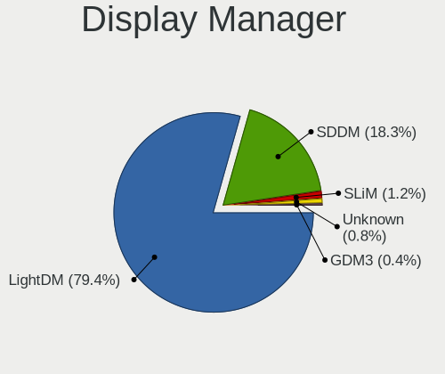
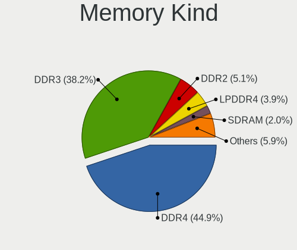
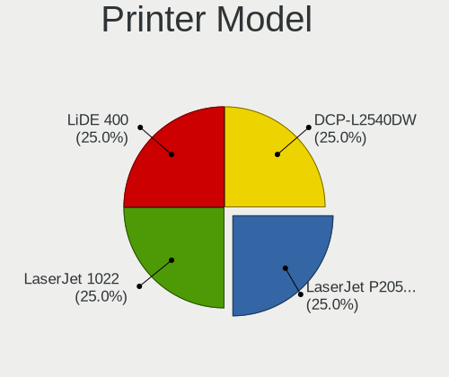

MX 21 - Tested Hardware & Statistics (Notebooks)
------------------------------------------------

A project to collect tested hardware configurations for MX 21.

Anyone can contribute to this report by the [hw-probe](https://github.com/linuxhw/hw-probe) tool:

    sudo -E hw-probe -all -upload

Please contribute! Especially if your hardware is rare.

Contents
--------

* [ Test Cases ](#test-cases)

* [ System ](#system)
  - [ Kernel                   ](#kernel)
  - [ Kernel Family            ](#kernel-family)
  - [ Kernel Major Ver.        ](#kernel-major-ver)
  - [ Arch                     ](#arch)
  - [ DE                       ](#de)
  - [ Display Server           ](#display-server)
  - [ Display Manager          ](#display-manager)
  - [ OS Lang                  ](#os-lang)
  - [ Boot Mode                ](#boot-mode)
  - [ Filesystem               ](#filesystem)
  - [ Part. scheme             ](#part-scheme)
  - [ Dual Boot with Linux/BSD ](#dual-boot-with-linuxbsd)
  - [ Dual Boot (Win)          ](#dual-boot-win)

* [ Board ](#board)
  - [ Vendor                   ](#vendor)
  - [ Model                    ](#model)
  - [ Model Family             ](#model-family)
  - [ MFG Year                 ](#mfg-year)
  - [ Form Factor              ](#form-factor)
  - [ Secure Boot              ](#secure-boot)
  - [ Coreboot                 ](#coreboot)
  - [ RAM Size                 ](#ram-size)
  - [ RAM Used                 ](#ram-used)
  - [ Total Drives             ](#total-drives)
  - [ Has CD-ROM               ](#has-cd-rom)
  - [ Has Ethernet             ](#has-ethernet)
  - [ Has WiFi                 ](#has-wifi)
  - [ Has Bluetooth            ](#has-bluetooth)

* [ Location ](#location)
  - [ Country                  ](#country)
  - [ City                     ](#city)

* [ Drives ](#drives)
  - [ Drive Vendor             ](#drive-vendor)
  - [ Drive Model              ](#drive-model)
  - [ HDD Vendor               ](#hdd-vendor)
  - [ SSD Vendor               ](#ssd-vendor)
  - [ Drive Kind               ](#drive-kind)
  - [ Drive Connector          ](#drive-connector)
  - [ Drive Size               ](#drive-size)
  - [ Space Total              ](#space-total)
  - [ Space Used               ](#space-used)
  - [ Malfunc. Drives          ](#malfunc-drives)
  - [ Malfunc. Drive Vendor    ](#malfunc-drive-vendor)
  - [ Malfunc. HDD Vendor      ](#malfunc-hdd-vendor)
  - [ Malfunc. Drive Kind      ](#malfunc-drive-kind)
  - [ Failed Drives            ](#failed-drives)
  - [ Failed Drive Vendor      ](#failed-drive-vendor)
  - [ Drive Status             ](#drive-status)

* [ Storage controller ](#storage-controller)
  - [ Storage Vendor           ](#storage-vendor)
  - [ Storage Model            ](#storage-model)
  - [ Storage Kind             ](#storage-kind)

* [ Processor ](#processor)
  - [ CPU Vendor               ](#cpu-vendor)
  - [ CPU Model                ](#cpu-model)
  - [ CPU Model Family         ](#cpu-model-family)
  - [ CPU Cores                ](#cpu-cores)
  - [ CPU Sockets              ](#cpu-sockets)
  - [ CPU Threads              ](#cpu-threads)
  - [ CPU Op-Modes             ](#cpu-op-modes)
  - [ CPU Microcode            ](#cpu-microcode)
  - [ CPU Microarch            ](#cpu-microarch)

* [ Graphics ](#graphics)
  - [ GPU Vendor               ](#gpu-vendor)
  - [ GPU Model                ](#gpu-model)
  - [ GPU Combo                ](#gpu-combo)
  - [ GPU Driver               ](#gpu-driver)
  - [ GPU Memory               ](#gpu-memory)

* [ Monitor ](#monitor)
  - [ Monitor Vendor           ](#monitor-vendor)
  - [ Monitor Model            ](#monitor-model)
  - [ Monitor Resolution       ](#monitor-resolution)
  - [ Monitor Diagonal         ](#monitor-diagonal)
  - [ Monitor Width            ](#monitor-width)
  - [ Aspect Ratio             ](#aspect-ratio)
  - [ Monitor Area             ](#monitor-area)
  - [ Pixel Density            ](#pixel-density)
  - [ Multiple Monitors        ](#multiple-monitors)

* [ Network ](#network)
  - [ Net Controller Vendor    ](#net-controller-vendor)
  - [ Net Controller Model     ](#net-controller-model)
  - [ Wireless Vendor          ](#wireless-vendor)
  - [ Wireless Model           ](#wireless-model)
  - [ Ethernet Vendor          ](#ethernet-vendor)
  - [ Ethernet Model           ](#ethernet-model)
  - [ Net Controller Kind      ](#net-controller-kind)
  - [ Used Controller          ](#used-controller)
  - [ NICs                     ](#nics)
  - [ IPv6                     ](#ipv6)

* [ Bluetooth ](#bluetooth)
  - [ Bluetooth Vendor         ](#bluetooth-vendor)
  - [ Bluetooth Model          ](#bluetooth-model)

* [ Sound ](#sound)
  - [ Sound Vendor             ](#sound-vendor)
  - [ Sound Model              ](#sound-model)

* [ Memory ](#memory)
  - [ Memory Vendor            ](#memory-vendor)
  - [ Memory Model             ](#memory-model)
  - [ Memory Kind              ](#memory-kind)
  - [ Memory Form Factor       ](#memory-form-factor)
  - [ Memory Size              ](#memory-size)
  - [ Memory Speed             ](#memory-speed)

* [ Printers & scanners ](#printers--scanners)
  - [ Printer Vendor           ](#printer-vendor)
  - [ Printer Model            ](#printer-model)
  - [ Scanner Vendor           ](#scanner-vendor)
  - [ Scanner Model            ](#scanner-model)

* [ Camera ](#camera)
  - [ Camera Vendor            ](#camera-vendor)
  - [ Camera Model             ](#camera-model)

* [ Security ](#security)
  - [ Fingerprint Vendor       ](#fingerprint-vendor)
  - [ Fingerprint Model        ](#fingerprint-model)
  - [ Chipcard Vendor          ](#chipcard-vendor)
  - [ Chipcard Model           ](#chipcard-model)

* [ Unsupported ](#unsupported)
  - [ Unsupported Devices      ](#unsupported-devices)
  - [ Unsupported Device Types ](#unsupported-device-types)

Test Cases
----------

Total: 311

| Vendor        | Model                       | Probe                                                      | Date         |
|---------------|-----------------------------|------------------------------------------------------------|--------------|
| HP            | Laptop 15-dw1xxx            | [bfde2cf63d](https://linux-hardware.org/?probe=bfde2cf63d) | Jun 10, 2023 |
| HP            | Laptop 15-dw1xxx            | [7c79725474](https://linux-hardware.org/?probe=7c79725474) | Jun 10, 2023 |
| Dell          | Latitude E6540              | [85520c9a0b](https://linux-hardware.org/?probe=85520c9a0b) | Jun 08, 2023 |
| Dell          | Latitude E6540              | [30f20f78ac](https://linux-hardware.org/?probe=30f20f78ac) | Jun 08, 2023 |
| ASUSTek       | X205TA                      | [4c56663011](https://linux-hardware.org/?probe=4c56663011) | Jun 07, 2023 |
| Dell          | Latitude 3190               | [fa8eba55f0](https://linux-hardware.org/?probe=fa8eba55f0) | Jun 05, 2023 |
| Dell          | Latitude E6510              | [49743c8db7](https://linux-hardware.org/?probe=49743c8db7) | Jun 04, 2023 |
| Dell          | Latitude E6510              | [51c45b0aa7](https://linux-hardware.org/?probe=51c45b0aa7) | Jun 04, 2023 |
| MSI           | U200                        | [01900b8117](https://linux-hardware.org/?probe=01900b8117) | Jun 04, 2023 |
| ASUSTek       | VivoBook_ASUSLaptop K340... | [51d10ac11e](https://linux-hardware.org/?probe=51d10ac11e) | Jun 02, 2023 |
| HP            | EliteBook 8460p             | [c46684adac](https://linux-hardware.org/?probe=c46684adac) | Jun 02, 2023 |
| Dell          | Latitude 5540               | [98ec8ec8bf](https://linux-hardware.org/?probe=98ec8ec8bf) | Jun 01, 2023 |
| ASUSTek       | GL553VD                     | [4a2e70149f](https://linux-hardware.org/?probe=4a2e70149f) | Jun 01, 2023 |
| ASUSTek       | GL553VD                     | [b8fb5e55bc](https://linux-hardware.org/?probe=b8fb5e55bc) | Jun 01, 2023 |
| Unknown       | Unknown                     | [351ca28b27](https://linux-hardware.org/?probe=351ca28b27) | May 29, 2023 |
| Dell          | Latitude 3190               | [fe4a8422c8](https://linux-hardware.org/?probe=fe4a8422c8) | May 29, 2023 |
| Lenovo        | IdeaPad 3 14ABA7 82RM       | [d83ee3fda2](https://linux-hardware.org/?probe=d83ee3fda2) | May 28, 2023 |
| Dell          | Latitude E6510              | [9edaeb2ffa](https://linux-hardware.org/?probe=9edaeb2ffa) | May 25, 2023 |
| Sony          | SVE1513Q1ESI                | [422e8954f2](https://linux-hardware.org/?probe=422e8954f2) | May 24, 2023 |
| Casper        | EXCALIBUR G770              | [ef088af2df](https://linux-hardware.org/?probe=ef088af2df) | May 23, 2023 |
| HUAWEI        | HLYL-WXX9                   | [28a8978593](https://linux-hardware.org/?probe=28a8978593) | May 22, 2023 |
| Dell          | Latitude 3190               | [adf9fc9bdb](https://linux-hardware.org/?probe=adf9fc9bdb) | May 22, 2023 |
| Dell          | Latitude E6510              | [342b8d094e](https://linux-hardware.org/?probe=342b8d094e) | May 20, 2023 |
| Dell          | Latitude E6510              | [4d606396f8](https://linux-hardware.org/?probe=4d606396f8) | May 20, 2023 |
| HP            | Pavilion Gaming Laptop 1... | [e6746606b4](https://linux-hardware.org/?probe=e6746606b4) | May 19, 2023 |
| Dell          | Latitude 3190               | [1d867407a6](https://linux-hardware.org/?probe=1d867407a6) | May 15, 2023 |
| Acer          | Aspire A315-59              | [4c33c99aab](https://linux-hardware.org/?probe=4c33c99aab) | May 14, 2023 |
| ASUSTek       | X202E                       | [d6b7617a17](https://linux-hardware.org/?probe=d6b7617a17) | May 14, 2023 |
| Lenovo        | Yoga 3 Pro-1370 80HE        | [08afd40365](https://linux-hardware.org/?probe=08afd40365) | May 13, 2023 |
| Acer          | Extensa 5220                | [935b52f12c](https://linux-hardware.org/?probe=935b52f12c) | May 12, 2023 |
| Acer          | Aspire 5715Z                | [81c255952d](https://linux-hardware.org/?probe=81c255952d) | May 10, 2023 |
| Lenovo        | ThinkPad T440p 20AWS0GK0... | [177f30243c](https://linux-hardware.org/?probe=177f30243c) | May 08, 2023 |
| Dell          | Latitude 3190               | [fb4df1325b](https://linux-hardware.org/?probe=fb4df1325b) | May 08, 2023 |
| HP            | 250 15.6 inch G9 Noteboo... | [af9c3172bc](https://linux-hardware.org/?probe=af9c3172bc) | May 05, 2023 |
| HP            | Pro Tablet 10 EE G1         | [6af53fb237](https://linux-hardware.org/?probe=6af53fb237) | May 05, 2023 |
| Lenovo        | ThinkPad T460s 20F9003GU... | [7a570efe74](https://linux-hardware.org/?probe=7a570efe74) | May 05, 2023 |
| Apple         | MacBookPro7,1               | [8349b363f4](https://linux-hardware.org/?probe=8349b363f4) | May 03, 2023 |
| Apple         | MacBookPro7,1               | [49971d9c29](https://linux-hardware.org/?probe=49971d9c29) | May 03, 2023 |
| Apple         | MacBookAir3,1               | [97d802a5d6](https://linux-hardware.org/?probe=97d802a5d6) | May 03, 2023 |
| ASUSTek       | VivoBook_ASUSLaptop X510... | [6d2d5b74d2](https://linux-hardware.org/?probe=6d2d5b74d2) | May 03, 2023 |
| Lenovo        | ThinkPad X260 20F5S89L02    | [4e2f57ccc3](https://linux-hardware.org/?probe=4e2f57ccc3) | May 02, 2023 |
| HP            | Pavilion Laptop 15-eh1xx... | [a36c4e671d](https://linux-hardware.org/?probe=a36c4e671d) | May 02, 2023 |
| Dell          | Latitude 3190               | [59c654b2ec](https://linux-hardware.org/?probe=59c654b2ec) | May 01, 2023 |
| Apple         | MacBookPro6,2               | [3e154e4ccc](https://linux-hardware.org/?probe=3e154e4ccc) | Apr 28, 2023 |
| Apple         | MacBookPro6,2               | [2628c3040f](https://linux-hardware.org/?probe=2628c3040f) | Apr 28, 2023 |
| F-Plus Mob... | FLAPTOP r                   | [539369db0e](https://linux-hardware.org/?probe=539369db0e) | Apr 28, 2023 |
| HP            | EliteBook 6930p             | [014215365a](https://linux-hardware.org/?probe=014215365a) | Apr 27, 2023 |
| Dell          | Latitude 3190               | [2c21a51932](https://linux-hardware.org/?probe=2c21a51932) | Apr 24, 2023 |
| HP            | G42                         | [58b0a0981e](https://linux-hardware.org/?probe=58b0a0981e) | Apr 23, 2023 |
| Compal        | HEL81I                      | [426788b00c](https://linux-hardware.org/?probe=426788b00c) | Apr 22, 2023 |
| Google        | Akali 360                   | [2d18714bb2](https://linux-hardware.org/?probe=2d18714bb2) | Apr 20, 2023 |
| Lenovo        | ThinkPad T440p 20AWS1B30... | [c0207e5f9a](https://linux-hardware.org/?probe=c0207e5f9a) | Apr 19, 2023 |
| HP            | Laptop 17-cn0xxx            | [843dd1e105](https://linux-hardware.org/?probe=843dd1e105) | Apr 18, 2023 |
| ASUSTek       | 1015PX                      | [c271ba95b9](https://linux-hardware.org/?probe=c271ba95b9) | Apr 16, 2023 |
| ASUSTek       | 1015PX                      | [494fc3e648](https://linux-hardware.org/?probe=494fc3e648) | Apr 16, 2023 |
| ASUSTek       | TUF Gaming FX505DY_FX505... | [aa571700ad](https://linux-hardware.org/?probe=aa571700ad) | Apr 13, 2023 |
| Lenovo        | V17 G3 IAP 82U1             | [3d53b9ee9e](https://linux-hardware.org/?probe=3d53b9ee9e) | Apr 12, 2023 |
| Dell          | Latitude 3190               | [c2a70674ac](https://linux-hardware.org/?probe=c2a70674ac) | Apr 10, 2023 |
| Lenovo        | ThinkPad X220 4290WC7       | [07ed4faaa0](https://linux-hardware.org/?probe=07ed4faaa0) | Apr 10, 2023 |
| Dell          | Latitude 3190               | [a1fa664431](https://linux-hardware.org/?probe=a1fa664431) | Apr 03, 2023 |
| HP            | Pavilion Laptop 15-eh1xx... | [9a5c9ee256](https://linux-hardware.org/?probe=9a5c9ee256) | Apr 02, 2023 |
| Sony          | VPCCB32FD                   | [ef684c34bb](https://linux-hardware.org/?probe=ef684c34bb) | Mar 28, 2023 |
| Dell          | Latitude 3190               | [757f1fc2e7](https://linux-hardware.org/?probe=757f1fc2e7) | Mar 27, 2023 |
| Sony          | VPCCB32FD                   | [20d8516896](https://linux-hardware.org/?probe=20d8516896) | Mar 26, 2023 |
| HP            | Pavilion Laptop 15-eh2xx... | [498bb39808](https://linux-hardware.org/?probe=498bb39808) | Mar 24, 2023 |
| Acer          | Aspire F5-573G              | [0550174a08](https://linux-hardware.org/?probe=0550174a08) | Mar 23, 2023 |
| Dell          | Latitude 3190               | [f4bea67dcc](https://linux-hardware.org/?probe=f4bea67dcc) | Mar 20, 2023 |
| Lenovo        | ThinkPad L14 Gen 3 21C10... | [978df2886a](https://linux-hardware.org/?probe=978df2886a) | Mar 20, 2023 |
| ASUSTek       | VivoBook_ASUSLaptop X515... | [ac5495bdb4](https://linux-hardware.org/?probe=ac5495bdb4) | Mar 19, 2023 |
| ASUSTek       | VivoBook_ASUSLaptop X515... | [45d6f54263](https://linux-hardware.org/?probe=45d6f54263) | Mar 19, 2023 |
| Dell          | Latitude E5570              | [dc6436b8b2](https://linux-hardware.org/?probe=dc6436b8b2) | Mar 16, 2023 |
| HP            | EliteBook 840 G8 Noteboo... | [9f3f315f73](https://linux-hardware.org/?probe=9f3f315f73) | Mar 14, 2023 |
| HP            | EliteBook 840 G8 Noteboo... | [42653f8c2a](https://linux-hardware.org/?probe=42653f8c2a) | Mar 14, 2023 |
| TUXEDO        | InfinityBook Pro Gen7 (M... | [7ccc0f584e](https://linux-hardware.org/?probe=7ccc0f584e) | Mar 14, 2023 |
| Dell          | Latitude 3190               | [97cc3ffc79](https://linux-hardware.org/?probe=97cc3ffc79) | Mar 13, 2023 |
| HP            | Laptop 17-ak0xx             | [7d35815562](https://linux-hardware.org/?probe=7d35815562) | Mar 13, 2023 |
| Lenovo        | ThinkPad E490 20N9S21H00    | [0bb64aee2c](https://linux-hardware.org/?probe=0bb64aee2c) | Mar 08, 2023 |
| Dell          | Inspiron 15 3511            | [153652da71](https://linux-hardware.org/?probe=153652da71) | Mar 07, 2023 |
| Dell          | Latitude 3190               | [a3a4113ab4](https://linux-hardware.org/?probe=a3a4113ab4) | Mar 06, 2023 |
| HP            | 255 G3                      | [9ccab85062](https://linux-hardware.org/?probe=9ccab85062) | Mar 04, 2023 |
| Dell          | Inspiron 15 3511            | [a84948f124](https://linux-hardware.org/?probe=a84948f124) | Mar 04, 2023 |
| HP            | ZBook Fury 15.6 inch G8 ... | [1a0011a745](https://linux-hardware.org/?probe=1a0011a745) | Mar 03, 2023 |
| HP            | 620                         | [421e31de43](https://linux-hardware.org/?probe=421e31de43) | Mar 02, 2023 |
| Dell          | Inspiron 15 3511            | [5718d685e4](https://linux-hardware.org/?probe=5718d685e4) | Mar 02, 2023 |
| Chuwi         | GemiBook Pro                | [1b68738664](https://linux-hardware.org/?probe=1b68738664) | Mar 02, 2023 |
| Dell          | Inspiron 15 3511            | [5fe3c354ff](https://linux-hardware.org/?probe=5fe3c354ff) | Mar 02, 2023 |
| Dell          | Inspiron 15 3511            | [a15227fc75](https://linux-hardware.org/?probe=a15227fc75) | Mar 02, 2023 |
| Dell          | Latitude 3190               | [279b385865](https://linux-hardware.org/?probe=279b385865) | Feb 27, 2023 |
| HP            | 255 G3                      | [49dccf5753](https://linux-hardware.org/?probe=49dccf5753) | Feb 26, 2023 |
| Dell          | Inspiron 3521               | [b6321ee5a4](https://linux-hardware.org/?probe=b6321ee5a4) | Feb 25, 2023 |
| Dell          | Inspiron 3521               | [efc95d4697](https://linux-hardware.org/?probe=efc95d4697) | Feb 25, 2023 |
| HP            | 250 G7 Notebook PC          | [182cdb3772](https://linux-hardware.org/?probe=182cdb3772) | Feb 24, 2023 |
| Acer          | Aspire 7750                 | [0608ea56d7](https://linux-hardware.org/?probe=0608ea56d7) | Feb 24, 2023 |
| ASUSTek       | UX330CAK                    | [419493491e](https://linux-hardware.org/?probe=419493491e) | Feb 23, 2023 |
| HP            | EliteBook 840 G8 Noteboo... | [0e9172bdd5](https://linux-hardware.org/?probe=0e9172bdd5) | Feb 21, 2023 |
| HP            | EliteBook 840 G8 Noteboo... | [adc356a0a8](https://linux-hardware.org/?probe=adc356a0a8) | Feb 21, 2023 |
| Lenovo        | ThinkBook 15 G3 ACL 21A4    | [d09dc2494a](https://linux-hardware.org/?probe=d09dc2494a) | Feb 21, 2023 |
| Dell          | Latitude 3190               | [c05229588b](https://linux-hardware.org/?probe=c05229588b) | Feb 20, 2023 |
| Medion        | E1239T MD60139              | [033908dc21](https://linux-hardware.org/?probe=033908dc21) | Feb 19, 2023 |
| Lenovo        | ThinkPad E14 Gen 2 20TA0... | [d4663db4e0](https://linux-hardware.org/?probe=d4663db4e0) | Feb 19, 2023 |
| HP            | ProBook 445 G1              | [bcd5c952f1](https://linux-hardware.org/?probe=bcd5c952f1) | Feb 18, 2023 |
| Lenovo        | IdeaPad 5 15ABA7 82SG       | [aba30bb2d8](https://linux-hardware.org/?probe=aba30bb2d8) | Feb 17, 2023 |
| RTD Embedd... | CMA34CR                     | [dd8527bd65](https://linux-hardware.org/?probe=dd8527bd65) | Feb 16, 2023 |
| HP            | ProBook 450 G3              | [9d060a9cc6](https://linux-hardware.org/?probe=9d060a9cc6) | Feb 15, 2023 |
| HP            | ProBook 450 G3              | [0cbe95253a](https://linux-hardware.org/?probe=0cbe95253a) | Feb 15, 2023 |
| Linx          | LINX1010B                   | [5ca377461f](https://linux-hardware.org/?probe=5ca377461f) | Feb 14, 2023 |
| Dell          | Latitude 3190               | [f2fd97186c](https://linux-hardware.org/?probe=f2fd97186c) | Feb 13, 2023 |
| HP            | ProBook 455 G8 Notebook ... | [3cccebc1ef](https://linux-hardware.org/?probe=3cccebc1ef) | Feb 12, 2023 |
| Dell          | Inspiron 5559               | [dcb95dba09](https://linux-hardware.org/?probe=dcb95dba09) | Feb 12, 2023 |
| Insyde        | CherryTrail                 | [86103b5293](https://linux-hardware.org/?probe=86103b5293) | Feb 12, 2023 |
| Medion        | P6634                       | [ec0002869f](https://linux-hardware.org/?probe=ec0002869f) | Feb 11, 2023 |
| Medion        | P6634                       | [15c3260ecf](https://linux-hardware.org/?probe=15c3260ecf) | Feb 11, 2023 |
| Acer          | Nitro AN515-55              | [b4b0bee06c](https://linux-hardware.org/?probe=b4b0bee06c) | Feb 08, 2023 |
| HP            | 450                         | [26d3505372](https://linux-hardware.org/?probe=26d3505372) | Feb 06, 2023 |
| Dell          | Latitude 3190               | [eafbc050e8](https://linux-hardware.org/?probe=eafbc050e8) | Feb 06, 2023 |
| ASUSTek       | GL752VW                     | [48f423dfae](https://linux-hardware.org/?probe=48f423dfae) | Feb 05, 2023 |
| HP            | Laptop 17-ak0xx             | [ed6c6cc366](https://linux-hardware.org/?probe=ed6c6cc366) | Feb 05, 2023 |
| HP            | ZBook 17 G3                 | [7e94a2328d](https://linux-hardware.org/?probe=7e94a2328d) | Feb 05, 2023 |
| Acer          | Aspire 4736Z                | [a2ab102eeb](https://linux-hardware.org/?probe=a2ab102eeb) | Feb 04, 2023 |
| ASUSTek       | VivoBook_ASUSLaptop X415... | [ddb7f53b34](https://linux-hardware.org/?probe=ddb7f53b34) | Feb 03, 2023 |
| HP            | EliteBook 2570p             | [43101dad89](https://linux-hardware.org/?probe=43101dad89) | Feb 02, 2023 |
| Dell          | Latitude 3190               | [a53530646a](https://linux-hardware.org/?probe=a53530646a) | Jan 30, 2023 |
| ASUSTek       | VivoBook_ASUSLaptop X412... | [1d28352c0f](https://linux-hardware.org/?probe=1d28352c0f) | Jan 28, 2023 |
| HP            | Compaq nc6320 (RH569ET#A... | [bf4432a140](https://linux-hardware.org/?probe=bf4432a140) | Jan 28, 2023 |
| Dell          | Latitude 3190               | [7d38c480af](https://linux-hardware.org/?probe=7d38c480af) | Jan 23, 2023 |
| Acer          | Swift SF314-43              | [3d1f5b0ee9](https://linux-hardware.org/?probe=3d1f5b0ee9) | Jan 23, 2023 |
| AMI           | Intel                       | [53a3ba4e8a](https://linux-hardware.org/?probe=53a3ba4e8a) | Jan 21, 2023 |
| Dell          | Latitude 3190               | [96d1e3a219](https://linux-hardware.org/?probe=96d1e3a219) | Jan 16, 2023 |
| Lenovo        | ThinkPad X1 Extreme 2nd ... | [cb84c73399](https://linux-hardware.org/?probe=cb84c73399) | Jan 15, 2023 |
| Dell          | Latitude 3190               | [055e045e52](https://linux-hardware.org/?probe=055e045e52) | Jan 09, 2023 |
| Lenovo        | ThinkPad Edge 031925U       | [95feaf21b4](https://linux-hardware.org/?probe=95feaf21b4) | Jan 07, 2023 |
| Toshiba       | Satellite M70               | [616dbdfa63](https://linux-hardware.org/?probe=616dbdfa63) | Jan 05, 2023 |
| Dell          | Latitude 3190               | [19f42109a3](https://linux-hardware.org/?probe=19f42109a3) | Jan 02, 2023 |
| Toshiba       | PORTEGE Z30-C               | [03dad182bb](https://linux-hardware.org/?probe=03dad182bb) | Dec 28, 2022 |
| Dell          | Latitude 3190               | [f395b56cec](https://linux-hardware.org/?probe=f395b56cec) | Dec 26, 2022 |
| Apple         | MacBookPro10,1              | [6c8ec40821](https://linux-hardware.org/?probe=6c8ec40821) | Dec 25, 2022 |
| Dell          | Latitude 3190               | [9227c8dbfb](https://linux-hardware.org/?probe=9227c8dbfb) | Dec 19, 2022 |
| Lenovo        | Y70-70 Touch 80DU           | [916375929d](https://linux-hardware.org/?probe=916375929d) | Dec 18, 2022 |
| Lenovo        | ThinkPad E15 Gen 3 20YGC... | [75126bccca](https://linux-hardware.org/?probe=75126bccca) | Dec 17, 2022 |
| Toshiba       | Satellite L650              | [7ea253aa11](https://linux-hardware.org/?probe=7ea253aa11) | Dec 17, 2022 |
| Gigabyte      | G5 KC                       | [e482b827aa](https://linux-hardware.org/?probe=e482b827aa) | Dec 17, 2022 |
| Lenovo        | ThinkPad X200s 74695XG      | [9bc0315222](https://linux-hardware.org/?probe=9bc0315222) | Dec 14, 2022 |
| HP            | 15 Notebook PC              | [06e7a6dfe7](https://linux-hardware.org/?probe=06e7a6dfe7) | Dec 12, 2022 |
| Dell          | Latitude 3190               | [c2c5f3feb3](https://linux-hardware.org/?probe=c2c5f3feb3) | Dec 12, 2022 |
| Apple         | MacBookPro14,3              | [7cefe54b56](https://linux-hardware.org/?probe=7cefe54b56) | Dec 12, 2022 |
| Dell          | Vostro 15-3568              | [a583a55071](https://linux-hardware.org/?probe=a583a55071) | Dec 10, 2022 |
| Dell          | Vostro 15-3568              | [2e76f24d6a](https://linux-hardware.org/?probe=2e76f24d6a) | Dec 09, 2022 |
| Dell          | Vostro 15-3568              | [36b349ff7f](https://linux-hardware.org/?probe=36b349ff7f) | Dec 08, 2022 |
| Dell          | Latitude 3190               | [12975376ba](https://linux-hardware.org/?probe=12975376ba) | Dec 05, 2022 |
| Acer          | Aspire ES1-732              | [7000f5ee26](https://linux-hardware.org/?probe=7000f5ee26) | Dec 04, 2022 |
| MSI           | GF63 Thin 9SC               | [057b0039b7](https://linux-hardware.org/?probe=057b0039b7) | Dec 01, 2022 |
| Dell          | Latitude 3190               | [3c4756b965](https://linux-hardware.org/?probe=3c4756b965) | Nov 28, 2022 |
| Sony          | VPCYB3V1E                   | [8fc84889a5](https://linux-hardware.org/?probe=8fc84889a5) | Nov 28, 2022 |
| HP            | OMEN by Laptop 16-c0xxx     | [1620a1a2cb](https://linux-hardware.org/?probe=1620a1a2cb) | Nov 28, 2022 |
| Apple         | MacBookPro10,1              | [b47217fa0c](https://linux-hardware.org/?probe=b47217fa0c) | Nov 25, 2022 |
| Apple         | MacBookPro10,1              | [3f08c2fb11](https://linux-hardware.org/?probe=3f08c2fb11) | Nov 25, 2022 |
| Sony          | VGN-TZ3RXN_B                | [5986f007c8](https://linux-hardware.org/?probe=5986f007c8) | Nov 22, 2022 |
| TUXEDO        | N7x0WU                      | [614f59ceaf](https://linux-hardware.org/?probe=614f59ceaf) | Nov 22, 2022 |
| Dell          | Latitude 3190               | [1cfe937b0e](https://linux-hardware.org/?probe=1cfe937b0e) | Nov 21, 2022 |
| ASUSTek       | ASUS BR1100CKA BR1100CKA... | [9884754d7b](https://linux-hardware.org/?probe=9884754d7b) | Nov 14, 2022 |
| Dell          | Latitude 3190               | [0e09796a40](https://linux-hardware.org/?probe=0e09796a40) | Nov 14, 2022 |
| Dell          | Inspiron 3583               | [6fcf5c9bd6](https://linux-hardware.org/?probe=6fcf5c9bd6) | Nov 13, 2022 |
| Lenovo        | ThinkPad X1 Extreme 20MF... | [48e0868598](https://linux-hardware.org/?probe=48e0868598) | Nov 13, 2022 |
| Lenovo        | ThinkPad T14s Gen 2i 20W... | [cb36e9d15c](https://linux-hardware.org/?probe=cb36e9d15c) | Nov 09, 2022 |
| Dell          | Latitude 3190               | [0459e9f47e](https://linux-hardware.org/?probe=0459e9f47e) | Nov 06, 2022 |
| ASUSTek       | X200CA                      | [91d85f8376](https://linux-hardware.org/?probe=91d85f8376) | Nov 05, 2022 |
| Lenovo        | ThinkPad X1 Extreme 20MF... | [9819da96f2](https://linux-hardware.org/?probe=9819da96f2) | Nov 02, 2022 |
| ASUSTek       | G74Sx                       | [4e69212184](https://linux-hardware.org/?probe=4e69212184) | Nov 01, 2022 |
| SANTECH       | X170KM-G                    | [073f9a1d24](https://linux-hardware.org/?probe=073f9a1d24) | Nov 01, 2022 |
| Vulcan Ele... | Excursion XB                | [30ceac1216](https://linux-hardware.org/?probe=30ceac1216) | Oct 31, 2022 |
| Dell          | Latitude 3190               | [fe0d1261a6](https://linux-hardware.org/?probe=fe0d1261a6) | Oct 31, 2022 |
| Lenovo        | ThinkPad X1 Extreme 20MF... | [423ad57e72](https://linux-hardware.org/?probe=423ad57e72) | Oct 29, 2022 |
| Lenovo        | ThinkPad X1 Extreme 20MF... | [f8b4ce6c3f](https://linux-hardware.org/?probe=f8b4ce6c3f) | Oct 29, 2022 |
| Apple         | MacBookPro14,3              | [6383143b5b](https://linux-hardware.org/?probe=6383143b5b) | Oct 28, 2022 |
| Dell          | Latitude 3190               | [b116ac92f3](https://linux-hardware.org/?probe=b116ac92f3) | Oct 24, 2022 |
| win elemen... | MoreFine S500+              | [d34df28814](https://linux-hardware.org/?probe=d34df28814) | Oct 22, 2022 |
| Apple         | MacBookPro7,1               | [aa571dded9](https://linux-hardware.org/?probe=aa571dded9) | Oct 22, 2022 |
| Lenovo        | ThinkPad T480 20L50004MZ    | [7fe25296ef](https://linux-hardware.org/?probe=7fe25296ef) | Oct 21, 2022 |
| Lenovo        | IdeaPad 5 15ITL05 82FG      | [e33a95e0b0](https://linux-hardware.org/?probe=e33a95e0b0) | Oct 18, 2022 |
| Dell          | Latitude 3190               | [342d7acb67](https://linux-hardware.org/?probe=342d7acb67) | Oct 17, 2022 |
| Apple         | MacBookPro11,1              | [09af41cbf8](https://linux-hardware.org/?probe=09af41cbf8) | Oct 16, 2022 |
| HP            | Laptop 15-ef2xxx            | [b3267ce847](https://linux-hardware.org/?probe=b3267ce847) | Oct 15, 2022 |
| Apple         | MacBookPro11,1              | [209d243342](https://linux-hardware.org/?probe=209d243342) | Oct 15, 2022 |
| HP            | Laptop 17-ak0xx             | [67fbbc4074](https://linux-hardware.org/?probe=67fbbc4074) | Oct 11, 2022 |
| Medion        | E7424 MD60750               | [7c9ea600ad](https://linux-hardware.org/?probe=7c9ea600ad) | Oct 11, 2022 |
| Dell          | Latitude 3190               | [bee132f486](https://linux-hardware.org/?probe=bee132f486) | Oct 10, 2022 |
| Apple         | MacBookAir7,2               | [e26911cff6](https://linux-hardware.org/?probe=e26911cff6) | Oct 08, 2022 |
| Lenovo        | ThinkPad T480 20L50004MZ    | [f2c440fdf6](https://linux-hardware.org/?probe=f2c440fdf6) | Oct 05, 2022 |
| Lenovo        | ThinkPad T480 20L50004MZ    | [8159009c50](https://linux-hardware.org/?probe=8159009c50) | Oct 05, 2022 |
| Google        | Setzer                      | [6bafaabd48](https://linux-hardware.org/?probe=6bafaabd48) | Oct 04, 2022 |
| Dell          | Vostro 3500                 | [396f61d294](https://linux-hardware.org/?probe=396f61d294) | Oct 03, 2022 |
| Dell          | Latitude 3190               | [29b38a4a94](https://linux-hardware.org/?probe=29b38a4a94) | Oct 03, 2022 |
| Dell          | Latitude 7490               | [872aafeb50](https://linux-hardware.org/?probe=872aafeb50) | Oct 02, 2022 |
| HP            | 250 G6 Notebook PC          | [992cf7d019](https://linux-hardware.org/?probe=992cf7d019) | Sep 30, 2022 |
| Lenovo        | ThinkPad T14s Gen 2i 20W... | [5b7d4c6b7a](https://linux-hardware.org/?probe=5b7d4c6b7a) | Sep 27, 2022 |
| Dell          | Precision 7520              | [a7b1df0888](https://linux-hardware.org/?probe=a7b1df0888) | Sep 26, 2022 |
| Dell          | Latitude 3190               | [27ac75e10c](https://linux-hardware.org/?probe=27ac75e10c) | Sep 26, 2022 |
| Apple         | MacBookAir7,2               | [93dd525100](https://linux-hardware.org/?probe=93dd525100) | Sep 25, 2022 |
| Acer          | Nitro AN515-54              | [6182e4ef84](https://linux-hardware.org/?probe=6182e4ef84) | Sep 25, 2022 |
| HP            | Pavilion g7                 | [22133612c0](https://linux-hardware.org/?probe=22133612c0) | Sep 25, 2022 |
| Lenovo        | V15-IGL 82C3                | [c2de0def85](https://linux-hardware.org/?probe=c2de0def85) | Sep 25, 2022 |
| Dell          | Inspiron 5521               | [085558878e](https://linux-hardware.org/?probe=085558878e) | Sep 20, 2022 |
| Dell          | Latitude 3190               | [f96d782326](https://linux-hardware.org/?probe=f96d782326) | Sep 19, 2022 |
| HP            | EliteBook 850 G3            | [de3a2e822c](https://linux-hardware.org/?probe=de3a2e822c) | Sep 14, 2022 |
| Apple         | MacBookAir7,2               | [03ba2808d7](https://linux-hardware.org/?probe=03ba2808d7) | Sep 13, 2022 |
| Dell          | Latitude 3190               | [3c0abb17a9](https://linux-hardware.org/?probe=3c0abb17a9) | Sep 12, 2022 |
| Notebook      | PD5x_7xPNP_PNN_PNT          | [b4e36a92c7](https://linux-hardware.org/?probe=b4e36a92c7) | Sep 08, 2022 |
| Notebook      | PD5x_7xPNP_PNN_PNT          | [ac71ea732f](https://linux-hardware.org/?probe=ac71ea732f) | Sep 07, 2022 |
| MSI           | Modern 14 B11MOL            | [1ce0bfd512](https://linux-hardware.org/?probe=1ce0bfd512) | Sep 06, 2022 |
| Lenovo        | ThinkPad T480 20L50004MZ    | [7702adff5d](https://linux-hardware.org/?probe=7702adff5d) | Sep 05, 2022 |
| Dell          | Latitude 3190               | [25c70ea2f3](https://linux-hardware.org/?probe=25c70ea2f3) | Sep 05, 2022 |
| Dell          | Latitude 3190               | [0998f7a5d1](https://linux-hardware.org/?probe=0998f7a5d1) | Aug 29, 2022 |
| Lenovo        | ThinkPad T500 2241VL9       | [35c8369d91](https://linux-hardware.org/?probe=35c8369d91) | Aug 25, 2022 |
| Dell          | Latitude 3190               | [74fd1046be](https://linux-hardware.org/?probe=74fd1046be) | Aug 22, 2022 |
| win elemen... | MoreFine S500+              | [295b2926da](https://linux-hardware.org/?probe=295b2926da) | Aug 19, 2022 |
| Acer          | One Z1402                   | [d4b5a11843](https://linux-hardware.org/?probe=d4b5a11843) | Aug 18, 2022 |
| Apple         | MacBookPro11,3              | [4e9e089c1a](https://linux-hardware.org/?probe=4e9e089c1a) | Aug 18, 2022 |
| win elemen... | MoreFine S500+              | [abdf1d084a](https://linux-hardware.org/?probe=abdf1d084a) | Aug 18, 2022 |
| Dell          | Latitude 3190               | [5564506d3c](https://linux-hardware.org/?probe=5564506d3c) | Aug 15, 2022 |
| Dell          | System XPS 15Z              | [45a22d4855](https://linux-hardware.org/?probe=45a22d4855) | Aug 11, 2022 |
| Lenovo        | ThinkPad T560 20FJS0EP00    | [dda2c8f199](https://linux-hardware.org/?probe=dda2c8f199) | Aug 11, 2022 |
| Lenovo        | ThinkPad L512 44444WG       | [e2a0bef6d4](https://linux-hardware.org/?probe=e2a0bef6d4) | Aug 10, 2022 |
| Lenovo        | ThinkPad L512 44444WG       | [fc0389fd3e](https://linux-hardware.org/?probe=fc0389fd3e) | Aug 10, 2022 |
| Dell          | Precision 7720              | [9f17ade16f](https://linux-hardware.org/?probe=9f17ade16f) | Aug 08, 2022 |
| Dell          | Latitude 3190               | [5818ff09cb](https://linux-hardware.org/?probe=5818ff09cb) | Aug 08, 2022 |
| HP            | Laptop 15-ef2xxx            | [68e632a5f6](https://linux-hardware.org/?probe=68e632a5f6) | Aug 08, 2022 |
| Samsung       | NC210/NC110                 | [438dc4ea93](https://linux-hardware.org/?probe=438dc4ea93) | Aug 05, 2022 |
| Dell          | Latitude 3190               | [1f86e5fa57](https://linux-hardware.org/?probe=1f86e5fa57) | Aug 01, 2022 |
| Dell          | Vostro 3550                 | [d67c93b534](https://linux-hardware.org/?probe=d67c93b534) | Jul 29, 2022 |
| Acer          | Aspire 5520                 | [d49c27a24a](https://linux-hardware.org/?probe=d49c27a24a) | Jul 29, 2022 |
| Apple         | MacBookAir7,2               | [5e7b9f2b14](https://linux-hardware.org/?probe=5e7b9f2b14) | Jul 26, 2022 |
| Dell          | Latitude 3190               | [2ec6ff1812](https://linux-hardware.org/?probe=2ec6ff1812) | Jul 25, 2022 |
| Dell          | Latitude 3190               | [4fa9fe26c1](https://linux-hardware.org/?probe=4fa9fe26c1) | Jul 18, 2022 |
| HP            | ProBook 450 G4              | [b2e75a35a2](https://linux-hardware.org/?probe=b2e75a35a2) | Jul 17, 2022 |
| Apple         | MacBookAir7,2               | [a1a565d211](https://linux-hardware.org/?probe=a1a565d211) | Jul 16, 2022 |
| Dell          | Latitude 3190               | [b3c7283cdb](https://linux-hardware.org/?probe=b3c7283cdb) | Jul 11, 2022 |
| Acer          | Swift SF314-59              | [56424874b7](https://linux-hardware.org/?probe=56424874b7) | Jul 11, 2022 |
| Alienware     | 13 R2                       | [ec877e9a2e](https://linux-hardware.org/?probe=ec877e9a2e) | Jul 06, 2022 |
| Alienware     | m15                         | [9578c619e6](https://linux-hardware.org/?probe=9578c619e6) | Jul 06, 2022 |
| Dell          | Latitude 3190               | [f5c0f0798a](https://linux-hardware.org/?probe=f5c0f0798a) | Jul 04, 2022 |
| Dell          | Latitude 3190               | [3bf5b47ea1](https://linux-hardware.org/?probe=3bf5b47ea1) | Jun 27, 2022 |
| Dell          | Latitude 3190               | [bb05f51a63](https://linux-hardware.org/?probe=bb05f51a63) | Jun 20, 2022 |
| Unknown       | Unknown                     | [3b7ffa4a35](https://linux-hardware.org/?probe=3b7ffa4a35) | Jun 18, 2022 |
| Dell          | Inspiron 15-3552            | [d89b7877a0](https://linux-hardware.org/?probe=d89b7877a0) | Jun 17, 2022 |
| Lenovo        | Unknown                     | [cd2f32d91c](https://linux-hardware.org/?probe=cd2f32d91c) | Jun 16, 2022 |
| HP            | ProBook 450 G1              | [623bb542e3](https://linux-hardware.org/?probe=623bb542e3) | Jun 15, 2022 |
| Apple         | MacBookAir7,2               | [fc34430f8d](https://linux-hardware.org/?probe=fc34430f8d) | Jun 15, 2022 |
| Dell          | Latitude 3190               | [fb55b815b6](https://linux-hardware.org/?probe=fb55b815b6) | Jun 13, 2022 |
| Toshiba       | Satellite C845              | [12d9cc2076](https://linux-hardware.org/?probe=12d9cc2076) | Jun 11, 2022 |
| Lenovo        | S130-11IGM 81J1             | [851d5469e5](https://linux-hardware.org/?probe=851d5469e5) | Jun 08, 2022 |
| Dell          | Latitude 3190               | [190816b333](https://linux-hardware.org/?probe=190816b333) | Jun 06, 2022 |
| Lenovo        | IdeaPad 3 15IIL05 81WE      | [b7ff235a14](https://linux-hardware.org/?probe=b7ff235a14) | Jun 03, 2022 |
| Dell          | Latitude D520               | [285ab7b873](https://linux-hardware.org/?probe=285ab7b873) | Jun 01, 2022 |
| Dell          | Latitude 3190               | [e43c62a67a](https://linux-hardware.org/?probe=e43c62a67a) | May 30, 2022 |
| ASUSTek       | K55A                        | [0eb5e9ea50](https://linux-hardware.org/?probe=0eb5e9ea50) | May 29, 2022 |
| Sony          | VPCSB1V9R                   | [e3b15e462d](https://linux-hardware.org/?probe=e3b15e462d) | May 16, 2022 |
| Sony          | VPCSB1V9R                   | [9dfafea956](https://linux-hardware.org/?probe=9dfafea956) | May 16, 2022 |
| Dell          | Latitude 3190               | [e80556f7d6](https://linux-hardware.org/?probe=e80556f7d6) | May 16, 2022 |
| Medion        | E14304                      | [8d1a922b7b](https://linux-hardware.org/?probe=8d1a922b7b) | May 15, 2022 |
| HP            | Stream Laptop 14-cb0XX      | [3b0408920d](https://linux-hardware.org/?probe=3b0408920d) | May 13, 2022 |
| Acer          | Aspire A515-56              | [b728fa5844](https://linux-hardware.org/?probe=b728fa5844) | May 01, 2022 |
| Acer          | Nitro AN515-55              | [04b51fe1cf](https://linux-hardware.org/?probe=04b51fe1cf) | Apr 25, 2022 |
| Alienware     | m15 R7                      | [77727a1731](https://linux-hardware.org/?probe=77727a1731) | Apr 24, 2022 |
| Lenovo        | Legion 5 15ACH6H 82JU       | [4e8b5f940a](https://linux-hardware.org/?probe=4e8b5f940a) | Apr 23, 2022 |
| HP            | ProBook 450 G4              | [77a6f92da0](https://linux-hardware.org/?probe=77a6f92da0) | Apr 22, 2022 |
| Gigabyte      | G5 KC                       | [fc21d0150f](https://linux-hardware.org/?probe=fc21d0150f) | Apr 10, 2022 |
| Acer          | Aspire A515-56              | [db6408f394](https://linux-hardware.org/?probe=db6408f394) | Apr 07, 2022 |
| MSI           | GV62 8RD                    | [2e43728adb](https://linux-hardware.org/?probe=2e43728adb) | Apr 06, 2022 |
| ASUSTek       | 1101HA                      | [c3d2458d59](https://linux-hardware.org/?probe=c3d2458d59) | Apr 04, 2022 |
| ASUSTek       | ROG Strix G712LU_G712LU     | [288629b95d](https://linux-hardware.org/?probe=288629b95d) | Apr 04, 2022 |
| Lenovo        | ThinkPad T430 23427YU       | [07ada1e358](https://linux-hardware.org/?probe=07ada1e358) | Apr 03, 2022 |
| ASUSTek       | ROG Strix G513QC_G513QC     | [697f820432](https://linux-hardware.org/?probe=697f820432) | Apr 02, 2022 |
| TUXEDO        | N7x0WU                      | [cf4f31fe3c](https://linux-hardware.org/?probe=cf4f31fe3c) | Mar 30, 2022 |
| Lenovo        | ThinkPad T440p 20AW002VB... | [e3ec03ac31](https://linux-hardware.org/?probe=e3ec03ac31) | Mar 29, 2022 |
| Framework     | Laptop                      | [a9f49dfe70](https://linux-hardware.org/?probe=a9f49dfe70) | Mar 24, 2022 |
| Dell          | Latitude 3190               | [964420352c](https://linux-hardware.org/?probe=964420352c) | Feb 28, 2022 |
| Dell          | XPS 17 9710                 | [7147fe2d5c](https://linux-hardware.org/?probe=7147fe2d5c) | Feb 26, 2022 |
| ASUSTek       | 1101HA                      | [b234cc741f](https://linux-hardware.org/?probe=b234cc741f) | Feb 22, 2022 |
| Dell          | XPS 17 9710                 | [851badde2e](https://linux-hardware.org/?probe=851badde2e) | Feb 20, 2022 |
| Sony          | VPCF119FX                   | [1e8448b824](https://linux-hardware.org/?probe=1e8448b824) | Feb 15, 2022 |
| Sony          | SVE1513Q1ESI                | [77e599ef9f](https://linux-hardware.org/?probe=77e599ef9f) | Feb 08, 2022 |
| Dell          | Latitude E4310              | [50190cb420](https://linux-hardware.org/?probe=50190cb420) | Feb 06, 2022 |
| efirstview    | v01099                      | [ed22d3c2b6](https://linux-hardware.org/?probe=ed22d3c2b6) | Feb 04, 2022 |
| Lenovo        | ThinkPad W541 20EG0005MS    | [f89a7895fc](https://linux-hardware.org/?probe=f89a7895fc) | Jan 23, 2022 |
| Sony          | VPCEH2N1E                   | [17a4bc1847](https://linux-hardware.org/?probe=17a4bc1847) | Jan 22, 2022 |
| Fujitsu Si... | LIFEBOOK E8010              | [82d1bc5db0](https://linux-hardware.org/?probe=82d1bc5db0) | Jan 22, 2022 |
| MSI           | Alpha 15 B5EEK              | [882906d968](https://linux-hardware.org/?probe=882906d968) | Jan 17, 2022 |
| Alienware     | 13 R2                       | [65c1ae9026](https://linux-hardware.org/?probe=65c1ae9026) | Jan 14, 2022 |
| HP            | EliteBook 840 G3            | [58cff543b5](https://linux-hardware.org/?probe=58cff543b5) | Jan 06, 2022 |
| HP            | EliteBook 8440p             | [d0d2edf745](https://linux-hardware.org/?probe=d0d2edf745) | Jan 04, 2022 |
| Lenovo        | G400s VILG1                 | [1cd4b24f16](https://linux-hardware.org/?probe=1cd4b24f16) | Jan 04, 2022 |
| Gigabyte      | P15FV5                      | [164348e568](https://linux-hardware.org/?probe=164348e568) | Jan 03, 2022 |
| Lenovo        | IdeaPad Y700-15ISK 80NV     | [4fe24b4f44](https://linux-hardware.org/?probe=4fe24b4f44) | Dec 26, 2021 |
| ASUSTek       | X550CC                      | [b0cde813b9](https://linux-hardware.org/?probe=b0cde813b9) | Dec 23, 2021 |
| Samsung       | 340XAA/350XAA/550XAA        | [49692045a2](https://linux-hardware.org/?probe=49692045a2) | Dec 16, 2021 |
| ASUSTek       | ASUS TUF Gaming A15 FA50... | [21180cbdad](https://linux-hardware.org/?probe=21180cbdad) | Dec 04, 2021 |
| Lenovo        | B590 20208                  | [ed08d6bdd9](https://linux-hardware.org/?probe=ed08d6bdd9) | Nov 30, 2021 |
| Lenovo        | ThinkBook 13s-IWL 20R9      | [649434f9b8](https://linux-hardware.org/?probe=649434f9b8) | Nov 23, 2021 |
| ASUSTek       | N53SN                       | [67d66feb3e](https://linux-hardware.org/?probe=67d66feb3e) | Nov 20, 2021 |
| ASUSTek       | TUF Gaming FX505DT_FX505... | [791ae651bb](https://linux-hardware.org/?probe=791ae651bb) | Nov 14, 2021 |
| ASUSTek       | TUF Gaming FX505DT_FX505... | [b105aaabf5](https://linux-hardware.org/?probe=b105aaabf5) | Nov 14, 2021 |
| HP            | Compaq Presario CQ60        | [9d83baca33](https://linux-hardware.org/?probe=9d83baca33) | Nov 12, 2021 |
| Lenovo        | ThinkPad E15 Gen 3 20YG0... | [c277967769](https://linux-hardware.org/?probe=c277967769) | Nov 11, 2021 |
| Apple         | MacBook3,1                  | [25964b9256](https://linux-hardware.org/?probe=25964b9256) | Nov 08, 2021 |
| HP            | EliteBook 850 G3            | [cd26ab6e8f](https://linux-hardware.org/?probe=cd26ab6e8f) | Nov 05, 2021 |
| Dell          | Latitude 3190               | [592b613273](https://linux-hardware.org/?probe=592b613273) | Nov 01, 2021 |
| ASUSTek       | E402MA                      | [4c2453c6a2](https://linux-hardware.org/?probe=4c2453c6a2) | Oct 26, 2021 |
| Sony          | VPCEC3S1E                   | [2af79ba873](https://linux-hardware.org/?probe=2af79ba873) | Oct 25, 2021 |
| Fujitsu Si... | ESPRIMO Mobile D9500        | [ee6fdf4608](https://linux-hardware.org/?probe=ee6fdf4608) | Oct 18, 2021 |
| Chuwi         | GemiBook Pro                | [f8735054b4](https://linux-hardware.org/?probe=f8735054b4) | Sep 02, 2021 |
| Samsung       | 350V5C/351V5C/3540VC/344... | [c4ebb4c114](https://linux-hardware.org/?probe=c4ebb4c114) | Jun 04, 2021 |

System
------

Kernel
------

Version of the Linux kernel

| Version                    | Notebooks | Percent |
|----------------------------|-----------|---------|
| 5.10.0-21-amd64            | 25        | 11.79%  |
| 6.0.0-6mx-amd64            | 18        | 8.49%   |
| 5.10.0-13-amd64            | 15        | 7.08%   |
| 5.10.0-9-amd64             | 14        | 6.6%    |
| 5.10.0-18-amd64            | 13        | 6.13%   |
| 5.10.0-16-amd64            | 9         | 4.25%   |
| 5.14.0-4mx-amd64           | 8         | 3.77%   |
| 5.10.0-19-amd64            | 8         | 3.77%   |
| 5.16.0-5mx-amd64           | 7         | 3.3%    |
| 5.10.0-23-amd64            | 7         | 3.3%    |
| 5.10.0-14-amd64            | 6         | 2.83%   |
| 5.10.0-11-amd64            | 6         | 2.83%   |
| 6.0.0-4mx-amd64            | 5         | 2.36%   |
| 5.18.0-4mx-amd64           | 5         | 2.36%   |
| 5.10.0-22-amd64            | 5         | 2.36%   |
| 5.10.0-20-amd64            | 5         | 2.36%   |
| 5.10.0-17-amd64            | 3         | 1.42%   |
| 6.1.0-8mx-ahs-amd64        | 2         | 0.94%   |
| 6.1.0-4mx-amd64            | 2         | 0.94%   |
| 6.0.0-3mx-amd64            | 2         | 0.94%   |
| 6.0.0-10.1-liquorix-amd64  | 2         | 0.94%   |
| 5.19.0-2mx-amd64           | 2         | 0.94%   |
| 5.16.0-6mx-amd64           | 2         | 0.94%   |
| 5.10.0-8-amd64             | 2         | 0.94%   |
| 5.10.0-20-686-pae          | 2         | 0.94%   |
| 5.10.0-15-amd64            | 2         | 0.94%   |
| 5.10.0-13-686-pae          | 2         | 0.94%   |
| 5.10.0-11-686-pae          | 2         | 0.94%   |
| 5.10.0-10-amd64            | 2         | 0.94%   |
| 6.2.7-x64v4-xanmod1        | 1         | 0.47%   |
| 6.1.15-2-liquorix-amd64    | 1         | 0.47%   |
| 6.1.12-3-liquorix-amd64    | 1         | 0.47%   |
| 6.1.0-9mx-ahs-amd64        | 1         | 0.47%   |
| 6.1.0-7mx-ahs-amd64        | 1         | 0.47%   |
| 6.1.0-2mx-amd64            | 1         | 0.47%   |
| 6.0.0-11.2-liquorix-amd64  | 1         | 0.47%   |
| 5.19.0-2mx-rt-amd64        | 1         | 0.47%   |
| 5.19.0-17.2-liquorix-amd64 | 1         | 0.47%   |
| 5.19.0-12.1-liquorix-amd64 | 1         | 0.47%   |
| 5.18.0-3-amd64             | 1         | 0.47%   |

Kernel Family
-------------

Linux kernel without a distro release

| Version  | Notebooks | Percent |
|----------|-----------|---------|
| 5.10.0   | 123       | 61.19%  |
| 6.0.0    | 28        | 13.93%  |
| 5.16.0   | 11        | 5.47%   |
| 5.14.0   | 8         | 3.98%   |
| 6.1.0    | 7         | 3.48%   |
| 5.18.0   | 7         | 3.48%   |
| 5.19.0   | 5         | 2.49%   |
| 5.17.0   | 4         | 1.99%   |
| 6.2.7    | 1         | 0.5%    |
| 6.1.15   | 1         | 0.5%    |
| 6.1.12   | 1         | 0.5%    |
| 5.15.0   | 1         | 0.5%    |
| 5.10.82  | 1         | 0.5%    |
| 5.10.142 | 1         | 0.5%    |
| 4.19.0   | 1         | 0.5%    |
| Unknown  | 1         | 0.5%    |

Kernel Major Ver.
-----------------

Linux kernel major version

| Version | Notebooks | Percent |
|---------|-----------|---------|
| 5.10    | 125       | 62.19%  |
| 6.0     | 28        | 13.93%  |
| 5.16    | 11        | 5.47%   |
| 6.1     | 9         | 4.48%   |
| 5.14    | 8         | 3.98%   |
| 5.18    | 7         | 3.48%   |
| 5.19    | 5         | 2.49%   |
| 5.17    | 4         | 1.99%   |
| 6.2     | 1         | 0.5%    |
| 5.15    | 1         | 0.5%    |
| 4.19    | 1         | 0.5%    |
| Unknown | 1         | 0.5%    |

Arch
----

OS architecture (x86_64, i586, etc.)

| Name   | Notebooks | Percent |
|--------|-----------|---------|
| x86_64 | 181       | 95.26%  |
| i686   | 9         | 4.74%   |

DE
--

Desktop Environment

| Name             | Notebooks | Percent |
|------------------|-----------|---------|
| XFCE             | 136       | 70.1%   |
| KDE5             | 41        | 21.13%  |
| GNOME            | 4         | 2.06%   |
| Budgie           | 3         | 1.55%   |
| Unknown          | 3         | 1.55%   |
| lightdm-xsession | 2         | 1.03%   |
| X-Cinnamon       | 1         | 0.52%   |
| LXQt             | 1         | 0.52%   |
| i3               | 1         | 0.52%   |
| GNOME Classic    | 1         | 0.52%   |
| fluxbox          | 1         | 0.52%   |

Display Server
--------------

X11 or Wayland

| Name    | Notebooks | Percent |
|---------|-----------|---------|
| X11     | 187       | 98.42%  |
| Tty     | 2         | 1.05%   |
| Wayland | 1         | 0.53%   |

Display Manager
---------------

SDDM, LightDM, etc.

| Name    | Notebooks | Percent |
|---------|-----------|---------|
| LightDM | 150       | 78.13%  |
| SDDM    | 39        | 20.31%  |
| SLiM    | 2         | 1.04%   |
| Unknown | 1         | 0.52%   |

OS Lang
-------

Language

| Lang    | Notebooks | Percent |
|---------|-----------|---------|
| en_US   | 95        | 49.48%  |
| de_DE   | 25        | 13.02%  |
| en_GB   | 11        | 5.73%   |
| it_IT   | 9         | 4.69%   |
| fr_FR   | 7         | 3.65%   |
| ru_RU   | 6         | 3.13%   |
| Unknown | 4         | 2.08%   |
| pl_PL   | 3         | 1.56%   |
| en_AU   | 3         | 1.56%   |
| de_CH   | 3         | 1.56%   |
| tr_TR   | 2         | 1.04%   |
| pt_BR   | 2         | 1.04%   |
| es_ES   | 2         | 1.04%   |
| es_AR   | 2         | 1.04%   |
| en_NZ   | 2         | 1.04%   |
| bg_BG   | 2         | 1.04%   |
| sk_SK   | 1         | 0.52%   |
| ro_RO   | 1         | 0.52%   |
| nl_NL   | 1         | 0.52%   |
| nb_NO   | 1         | 0.52%   |
| id_ID   | 1         | 0.52%   |
| hu_HU   | 1         | 0.52%   |
| fr_CA   | 1         | 0.52%   |
| fr_BE   | 1         | 0.52%   |
| fi_FI   | 1         | 0.52%   |
| es_UY   | 1         | 0.52%   |
| es_PE   | 1         | 0.52%   |
| es_MX   | 1         | 0.52%   |
| es_CO   | 1         | 0.52%   |
| en_CA   | 1         | 0.52%   |

Boot Mode
---------

EFI or BIOS

| Mode | Notebooks | Percent |
|------|-----------|---------|
| EFI  | 141       | 74.21%  |
| BIOS | 49        | 25.79%  |

Filesystem
----------

Type of filesystem

| Type    | Notebooks | Percent |
|---------|-----------|---------|
| Ext4    | 160       | 82.9%   |
| Overlay | 25        | 12.95%  |
| Btrfs   | 6         | 3.11%   |
| Xfs     | 1         | 0.52%   |
| F2fs    | 1         | 0.52%   |

Part. scheme
------------

Scheme of partitioning

| Type    | Notebooks | Percent |
|---------|-----------|---------|
| GPT     | 144       | 75.79%  |
| MBR     | 45        | 23.68%  |
| Unknown | 1         | 0.53%   |

Dual Boot with Linux/BSD
------------------------

Hosting more than one Linux/BSD

| Dual boot | Notebooks | Percent |
|-----------|-----------|---------|
| No        | 149       | 77.6%   |
| Yes       | 43        | 22.4%   |

Dual Boot (Win)
---------------

Hosting Linux and Windows

| Dual boot | Notebooks | Percent |
|-----------|-----------|---------|
| No        | 113       | 59.16%  |
| Yes       | 78        | 40.84%  |

Board
-----

Vendor
------

Motherboard manufacturer

| Name                      | Notebooks | Percent |
|---------------------------|-----------|---------|
| Lenovo                    | 37        | 19.47%  |
| Hewlett-Packard           | 35        | 18.42%  |
| ASUSTek Computer          | 23        | 12.11%  |
| Dell                      | 19        | 10%     |
| Acer                      | 15        | 7.89%   |
| Apple                     | 10        | 5.26%   |
| Sony                      | 8         | 4.21%   |
| MSI                       | 5         | 2.63%   |
| Toshiba                   | 4         | 2.11%   |
| Medion                    | 4         | 2.11%   |
| Samsung Electronics       | 3         | 1.58%   |
| Alienware                 | 3         | 1.58%   |
| TUXEDO                    | 2         | 1.05%   |
| Gigabyte Technology       | 2         | 1.05%   |
| Fujitsu Siemens           | 2         | 1.05%   |
| Chuwi                     | 2         | 1.05%   |
| Unknown                   | 2         | 1.05%   |
| win element               | 1         | 0.53%   |
| Vulcan Electronics        | 1         | 0.53%   |
| SANTECH                   | 1         | 0.53%   |
| RTD Embedded Technologies | 1         | 0.53%   |
| Notebook                  | 1         | 0.53%   |
| Linx                      | 1         | 0.53%   |
| HUAWEI                    | 1         | 0.53%   |
| Google                    | 1         | 0.53%   |
| Framework                 | 1         | 0.53%   |
| F-Plus Mobile             | 1         | 0.53%   |
| efirstview                | 1         | 0.53%   |
| Compal                    | 1         | 0.53%   |
| Casper                    | 1         | 0.53%   |
| AMI                       | 1         | 0.53%   |

Model
-----

Motherboard model

| Name                                | Notebooks | Percent |
|-------------------------------------|-----------|---------|
| Unknown                             | 3         | 1.58%   |
| HP Pavilion Laptop 15-eh1xxx        | 2         | 1.05%   |
| HP Laptop 17-ak0xx                  | 2         | 1.05%   |
| Chuwi GemiBook Pro                  | 2         | 1.05%   |
| Apple MacBookAir7,2                 | 2         | 1.05%   |
| Acer Nitro AN515-55                 | 2         | 1.05%   |
| win element MoreFine S500+          | 1         | 0.53%   |
| Vulcan Excursion XB                 | 1         | 0.53%   |
| TUXEDO N7x0WU                       | 1         | 0.53%   |
| TUXEDO InfinityBook Pro Gen7 (MK1)  | 1         | 0.53%   |
| Toshiba Satellite M70               | 1         | 0.53%   |
| Toshiba Satellite L650              | 1         | 0.53%   |
| Toshiba Satellite C845              | 1         | 0.53%   |
| Toshiba PORTEGE Z30-C               | 1         | 0.53%   |
| Sony VPCYB3V1E                      | 1         | 0.53%   |
| Sony VPCSB1V9R                      | 1         | 0.53%   |
| Sony VPCF119FX                      | 1         | 0.53%   |
| Sony VPCEH2N1E                      | 1         | 0.53%   |
| Sony VPCEC3S1E                      | 1         | 0.53%   |
| Sony VPCCB32FD                      | 1         | 0.53%   |
| Sony VGN-TZ3RXN_B                   | 1         | 0.53%   |
| Sony SVE1513Q1ESI                   | 1         | 0.53%   |
| SANTECH X170KM-G                    | 1         | 0.53%   |
| Samsung NC210/NC110                 | 1         | 0.53%   |
| Samsung 350V5C/351V5C/3540VC/3440VC | 1         | 0.53%   |
| Samsung 340XAA/350XAA/550XAA        | 1         | 0.53%   |
| RTD Embedded CMA34CR                | 1         | 0.53%   |
| Notebook PD5x_7xPNP_PNN_PNT         | 1         | 0.53%   |
| MSI U200                            | 1         | 0.53%   |
| MSI Modern 14 B11MOL                | 1         | 0.53%   |
| MSI GV62 8RD                        | 1         | 0.53%   |
| MSI GF63 Thin 9SC                   | 1         | 0.53%   |
| MSI Alpha 15 B5EEK                  | 1         | 0.53%   |
| Medion P6634                        | 1         | 0.53%   |
| Medion E7424 MD60750                | 1         | 0.53%   |
| Medion E14304                       | 1         | 0.53%   |
| Medion E1239T MD60139               | 1         | 0.53%   |
| Linx LINX1010B                      | 1         | 0.53%   |
| Lenovo Yoga 3 Pro-1370 80HE         | 1         | 0.53%   |
| Lenovo V17 G3 IAP 82U1              | 1         | 0.53%   |

Model Family
------------

Motherboard model prefix

| Name                 | Notebooks | Percent |
|----------------------|-----------|---------|
| Lenovo ThinkPad      | 22        | 11.58%  |
| Acer Aspire          | 8         | 4.21%   |
| HP EliteBook         | 7         | 3.68%   |
| Dell Latitude        | 7         | 3.68%   |
| Lenovo IdeaPad       | 5         | 2.63%   |
| HP ProBook           | 5         | 2.63%   |
| HP Laptop            | 5         | 2.63%   |
| Dell Inspiron        | 5         | 2.63%   |
| HP Pavilion          | 4         | 2.11%   |
| ASUS VivoBook        | 4         | 2.11%   |
| Toshiba Satellite    | 3         | 1.58%   |
| Dell Vostro          | 3         | 1.58%   |
| Acer Nitro           | 3         | 1.58%   |
| Unknown              | 3         | 1.58%   |
| Lenovo ThinkBook     | 2         | 1.05%   |
| HP ZBook             | 2         | 1.05%   |
| HP Compaq            | 2         | 1.05%   |
| HP 250               | 2         | 1.05%   |
| Dell Precision       | 2         | 1.05%   |
| Chuwi GemiBook       | 2         | 1.05%   |
| ASUS TUF             | 2         | 1.05%   |
| ASUS ROG             | 2         | 1.05%   |
| ASUS ASUS            | 2         | 1.05%   |
| Apple MacBookPro11   | 2         | 1.05%   |
| Apple MacBookAir7    | 2         | 1.05%   |
| Alienware m15        | 2         | 1.05%   |
| Acer Swift           | 2         | 1.05%   |
| win element MoreFine | 1         | 0.53%   |
| Vulcan Excursion     | 1         | 0.53%   |
| TUXEDO N7x0WU        | 1         | 0.53%   |
| TUXEDO InfinityBook  | 1         | 0.53%   |
| Toshiba PORTEGE      | 1         | 0.53%   |
| Sony VPCYB3V1E       | 1         | 0.53%   |
| Sony VPCSB1V9R       | 1         | 0.53%   |
| Sony VPCF119FX       | 1         | 0.53%   |
| Sony VPCEH2N1E       | 1         | 0.53%   |
| Sony VPCEC3S1E       | 1         | 0.53%   |
| Sony VPCCB32FD       | 1         | 0.53%   |
| Sony VGN-TZ3RXN      | 1         | 0.53%   |
| Sony SVE1513Q1ESI    | 1         | 0.53%   |

MFG Year
--------

Motherboard manufacture year

| Year    | Notebooks | Percent |
|---------|-----------|---------|
| 2021    | 32        | 16.84%  |
| 2016    | 15        | 7.89%   |
| 2015    | 15        | 7.89%   |
| 2011    | 15        | 7.89%   |
| 2020    | 13        | 6.84%   |
| 2010    | 13        | 6.84%   |
| 2022    | 12        | 6.32%   |
| 2019    | 11        | 5.79%   |
| 2013    | 11        | 5.79%   |
| 2018    | 10        | 5.26%   |
| 2012    | 10        | 5.26%   |
| 2017    | 7         | 3.68%   |
| 2014    | 6         | 3.16%   |
| 2007    | 5         | 2.63%   |
| 2009    | 4         | 2.11%   |
| 2008    | 4         | 2.11%   |
| 2006    | 3         | 1.58%   |
| 2005    | 2         | 1.05%   |
| 2023    | 1         | 0.53%   |
| Unknown | 1         | 0.53%   |

Form Factor
-----------

Physical design of the computer

| Name     | Notebooks | Percent |
|----------|-----------|---------|
| Notebook | 190       | 100%    |

Secure Boot
-----------

Enabled or disabled

| State    | Notebooks | Percent |
|----------|-----------|---------|
| Disabled | 188       | 98.95%  |
| Enabled  | 2         | 1.05%   |

Coreboot
--------

Have coreboot on board

| Used | Notebooks | Percent |
|------|-----------|---------|
| No   | 189       | 99.47%  |
| Yes  | 1         | 0.53%   |

RAM Size
--------

Total RAM memory

| Size in GB  | Notebooks | Percent |
|-------------|-----------|---------|
| 4.01-8.0    | 59        | 31.05%  |
| 8.01-16.0   | 34        | 17.89%  |
| 16.01-24.0  | 30        | 15.79%  |
| 3.01-4.0    | 26        | 13.68%  |
| 1.01-2.0    | 15        | 7.89%   |
| 32.01-64.0  | 14        | 7.37%   |
| 2.01-3.0    | 6         | 3.16%   |
| 24.01-32.0  | 2         | 1.05%   |
| 64.01-256.0 | 2         | 1.05%   |
| 0.51-1.0    | 2         | 1.05%   |

RAM Used
--------

Used RAM memory

| Used GB   | Notebooks | Percent |
|-----------|-----------|---------|
| 1.01-2.0  | 72        | 35.47%  |
| 2.01-3.0  | 53        | 26.11%  |
| 3.01-4.0  | 35        | 17.24%  |
| 4.01-8.0  | 22        | 10.84%  |
| 0.51-1.0  | 14        | 6.9%    |
| 8.01-16.0 | 5         | 2.46%   |
| 0.01-0.5  | 2         | 0.99%   |

Total Drives
------------

Number of drives on board

| Drives | Notebooks | Percent |
|--------|-----------|---------|
| 1      | 135       | 69.95%  |
| 2      | 42        | 21.76%  |
| 3      | 13        | 6.74%   |
| 0      | 2         | 1.04%   |
| 4      | 1         | 0.52%   |

Has CD-ROM
----------

Has CD-ROM on board

| Presented | Notebooks | Percent |
|-----------|-----------|---------|
| No        | 133       | 70%     |
| Yes       | 57        | 30%     |

Has Ethernet
------------

Has Ethernet on board

| Presented | Notebooks | Percent |
|-----------|-----------|---------|
| Yes       | 150       | 78.95%  |
| No        | 40        | 21.05%  |

Has WiFi
--------

Has WiFi module

| Presented | Notebooks | Percent |
|-----------|-----------|---------|
| Yes       | 183       | 95.81%  |
| No        | 8         | 4.19%   |

Has Bluetooth
-------------

Has Bluetooth module

| Presented | Notebooks | Percent |
|-----------|-----------|---------|
| Yes       | 148       | 77.89%  |
| No        | 42        | 22.11%  |

Location
--------

Country
-------

Geographic location (country)

| Country     | Notebooks | Percent |
|-------------|-----------|---------|
| USA         | 43        | 22.4%   |
| Germany     | 26        | 13.54%  |
| Italy       | 18        | 9.38%   |
| Canada      | 10        | 5.21%   |
| Russia      | 7         | 3.65%   |
| France      | 7         | 3.65%   |
| Poland      | 5         | 2.6%    |
| India       | 5         | 2.6%    |
| Australia   | 5         | 2.6%    |
| UK          | 4         | 2.08%   |
| Romania     | 4         | 2.08%   |
| Netherlands | 4         | 2.08%   |
| Brazil      | 4         | 2.08%   |
| Switzerland | 3         | 1.56%   |
| Serbia      | 3         | 1.56%   |
| New Zealand | 3         | 1.56%   |
| Belgium     | 3         | 1.56%   |
| Turkey      | 2         | 1.04%   |
| Spain       | 2         | 1.04%   |
| Egypt       | 2         | 1.04%   |
| Czechia     | 2         | 1.04%   |
| Bulgaria    | 2         | 1.04%   |
| Bangladesh  | 2         | 1.04%   |
| Austria     | 2         | 1.04%   |
| Vietnam     | 1         | 0.52%   |
| Uzbekistan  | 1         | 0.52%   |
| Uruguay     | 1         | 0.52%   |
| Tunisia     | 1         | 0.52%   |
| Sweden      | 1         | 0.52%   |
| Slovakia    | 1         | 0.52%   |
| Peru        | 1         | 0.52%   |
| Norway      | 1         | 0.52%   |
| Nepal       | 1         | 0.52%   |
| Malaysia    | 1         | 0.52%   |
| Ireland     | 1         | 0.52%   |
| Iran        | 1         | 0.52%   |
| Indonesia   | 1         | 0.52%   |
| Hungary     | 1         | 0.52%   |
| Greece      | 1         | 0.52%   |
| Ghana       | 1         | 0.52%   |

City
----

Geographic location (city)

| City           | Notebooks | Percent |
|----------------|-----------|---------|
| Rome           | 3         | 1.47%   |
| Moscow         | 3         | 1.47%   |
| Milan          | 3         | 1.47%   |
| Warsaw         | 2         | 0.98%   |
| Walled Lake    | 2         | 0.98%   |
| Vienna         | 2         | 0.98%   |
| St Petersburg  | 2         | 0.98%   |
| Perth          | 2         | 0.98%   |
| Orange         | 2         | 0.98%   |
| New York       | 2         | 0.98%   |
| Montreal       | 2         | 0.98%   |
| Florence       | 2         | 0.98%   |
| Doesburg       | 2         | 0.98%   |
| Dhaka          | 2         | 0.98%   |
| Casale Litta   | 2         | 0.98%   |
| Canberra       | 2         | 0.98%   |
| Cambridge      | 2         | 0.98%   |
| Cairo          | 2         | 0.98%   |
| Berlin         | 2         | 0.98%   |
| Belgrade       | 2         | 0.98%   |
| Amsterdam      | 2         | 0.98%   |
| Zurich         | 1         | 0.49%   |
| Zeven          | 1         | 0.49%   |
| Yekaterinburg  | 1         | 0.49%   |
| Workington     | 1         | 0.49%   |
| Wola           | 1         | 0.49%   |
| Westland       | 1         | 0.49%   |
| Wermelskirchen | 1         | 0.49%   |
| Waycross       | 1         | 0.49%   |
| Vasco da Gama  | 1         | 0.49%   |
| Vancouver      | 1         | 0.49%   |
| Uelzen         | 1         | 0.49%   |
| Tunis          | 1         | 0.49%   |
| Tulsa          | 1         | 0.49%   |
| Tucson         | 1         | 0.49%   |
| Toulouse       | 1         | 0.49%   |
| The Dalles     | 1         | 0.49%   |
| Temuco         | 1         | 0.49%   |
| Tashkent       | 1         | 0.49%   |
| Taggia         | 1         | 0.49%   |

Drives
------

Drive Vendor
------------

Hard drive vendors

| Vendor              | Notebooks | Drives | Percent |
|---------------------|-----------|--------|---------|
| Samsung Electronics | 38        | 49     | 15.02%  |
| WDC                 | 31        | 31     | 12.25%  |
| Seagate             | 20        | 22     | 7.91%   |
| Kingston            | 18        | 20     | 7.11%   |
| Unknown             | 17        | 19     | 6.72%   |
| Crucial             | 15        | 33     | 5.93%   |
| SK hynix            | 13        | 14     | 5.14%   |
| Toshiba             | 11        | 11     | 4.35%   |
| SanDisk             | 8         | 9      | 3.16%   |
| Intel               | 8         | 10     | 3.16%   |
| Apple               | 7         | 10     | 2.77%   |
| Micron Technology   | 5         | 5      | 1.98%   |
| LITEON              | 5         | 5      | 1.98%   |
| Hitachi             | 5         | 6      | 1.98%   |
| HGST                | 5         | 5      | 1.98%   |
| SPCC                | 4         | 4      | 1.58%   |
| KIOXIA              | 4         | 6      | 1.58%   |
| Transcend           | 3         | 3      | 1.19%   |
| PNY                 | 3         | 3      | 1.19%   |
| Netac               | 3         | 3      | 1.19%   |
| Dogfish             | 3         | 3      | 1.19%   |
| Unknown             | 3         | 3      | 1.19%   |
| Team                | 2         | 2      | 0.79%   |
| Phison              | 2         | 3      | 0.79%   |
| OCZ                 | 2         | 2      | 0.79%   |
| Corsair             | 2         | 2      | 0.79%   |
| Teclast             | 1         | 1      | 0.4%    |
| SWORDBILL           | 1         | 2      | 0.4%    |
| SABRENT             | 1         | 1      | 0.4%    |
| RENICE              | 1         | 1      | 0.4%    |
| Patriot             | 1         | 1      | 0.4%    |
| Indilinx            | 1         | 1      | 0.4%    |
| Hewlett-Packard     | 1         | 1      | 0.4%    |
| Gigabyte Technology | 1         | 1      | 0.4%    |
| GeIL                | 1         | 1      | 0.4%    |
| G-TECH              | 1         | 1      | 0.4%    |
| Fujitsu             | 1         | 1      | 0.4%    |
| FORESEE             | 1         | 1      | 0.4%    |
| CT500MX5            | 1         | 1      | 0.4%    |
| China               | 1         | 1      | 0.4%    |

Drive Model
-----------

Hard drive models

| Model                                  | Notebooks | Percent |
|----------------------------------------|-----------|---------|
| Samsung SSD 860 EVO 500GB              | 4         | 1.54%   |
| Unknown SD32G  32GB                    | 3         | 1.15%   |
| SK hynix SKHynix_HFM512GD3HX015N 512GB | 3         | 1.15%   |
| Samsung SSD 980 PRO 1TB                | 3         | 1.15%   |
| Kingston SA400S37480G 480GB SSD        | 3         | 1.15%   |
| Kingston SA400S37240G 240GB SSD        | 3         | 1.15%   |
| HGST HTS721010A9E630 1TB               | 3         | 1.15%   |
| Crucial CT480BX500SSD1 480GB           | 3         | 1.15%   |
| Crucial CT120BX500SSD1 120GB           | 3         | 1.15%   |
| Unknown                                | 3         | 1.15%   |
| WDC WDS500G2B0B-00YS70 500GB SSD       | 2         | 0.77%   |
| WDC PC SN530 SDBPMPZ-512G-1101 512GB   | 2         | 0.77%   |
| Unknown SDW32G  32GB                   | 2         | 0.77%   |
| Unknown DA4064  64GB                   | 2         | 0.77%   |
| Toshiba KBG40ZNT256G MEMORY 256GB      | 2         | 0.77%   |
| SPCC Solid State Disk 1TB              | 2         | 0.77%   |
| SK hynix HFS128G39TND-N210A 128GB SSD  | 2         | 0.77%   |
| SK hynix HFM512GDJTNI-82A0A 512GB      | 2         | 0.77%   |
| Seagate ST500LM021-1KJ152 500GB        | 2         | 0.77%   |
| Seagate ST500LM000-1EJ162 500GB        | 2         | 0.77%   |
| Seagate ST1000LM048-2E7172 1TB         | 2         | 0.77%   |
| Seagate ST1000LM035-1RK172 1TB         | 2         | 0.77%   |
| SanDisk NVMe SSD Drive 512GB           | 2         | 0.77%   |
| Samsung SSD 860 250GB                  | 2         | 0.77%   |
| Samsung SSD 850 EVO 250GB              | 2         | 0.77%   |
| Samsung MZVLB512HBJQ-000L7 512GB       | 2         | 0.77%   |
| Samsung MZALQ256HBJD-00BL2 256GB       | 2         | 0.77%   |
| Kingston SA400S37120G 120GB SSD        | 2         | 0.77%   |
| Kingston OM8PCP3512F-AI1 512GB         | 2         | 0.77%   |
| Intel SSDPEKNU512GZ 512GB              | 2         | 0.77%   |
| Hitachi HTS54503 320GB                 | 2         | 0.77%   |
| Dogfish SSD 128GB                      | 2         | 0.77%   |
| Crucial CT500MX500SSD1 500GB           | 2         | 0.77%   |
| Crucial CT240BX500SSD1 240GB           | 2         | 0.77%   |
| Crucial CT1000P2SSD8 1TB               | 2         | 0.77%   |
| Apple SSD SM0128G 121GB                | 2         | 0.77%   |
| WDC WDS120G1G0A-00SS50 120GB SSD       | 1         | 0.38%   |
| WDC WDS100T1X0E-00AFY0 1TB             | 1         | 0.38%   |
| WDC WD7500BPVT-75HXZT3 752GB           | 1         | 0.38%   |
| WDC WD5000LPVX-75V0TT0 500GB           | 1         | 0.38%   |

HDD Vendor
----------

Hard disk drive vendors

| Vendor              | Notebooks | Drives | Percent |
|---------------------|-----------|--------|---------|
| Seagate             | 20        | 22     | 35.71%  |
| WDC                 | 18        | 18     | 32.14%  |
| Toshiba             | 5         | 5      | 8.93%   |
| Hitachi             | 5         | 6      | 8.93%   |
| HGST                | 5         | 5      | 8.93%   |
| Samsung Electronics | 2         | 2      | 3.57%   |
| Fujitsu             | 1         | 1      | 1.79%   |

SSD Vendor
----------

Solid state drive vendors

| Vendor              | Notebooks | Drives | Percent |
|---------------------|-----------|--------|---------|
| Samsung Electronics | 18        | 24     | 18%     |
| Crucial             | 12        | 29     | 12%     |
| Kingston            | 10        | 11     | 10%     |
| Apple               | 6         | 9      | 6%      |
| SanDisk             | 5         | 6      | 5%      |
| WDC                 | 4         | 4      | 4%      |
| SPCC                | 4         | 4      | 4%      |
| LITEON              | 4         | 4      | 4%      |
| Transcend           | 3         | 3      | 3%      |
| PNY                 | 3         | 3      | 3%      |
| Netac               | 3         | 3      | 3%      |
| Dogfish             | 3         | 3      | 3%      |
| Toshiba             | 2         | 2      | 2%      |
| SK hynix            | 2         | 2      | 2%      |
| OCZ                 | 2         | 2      | 2%      |
| Intel               | 2         | 2      | 2%      |
| Unknown             | 2         | 2      | 2%      |
| Teclast             | 1         | 1      | 1%      |
| Team                | 1         | 1      | 1%      |
| SWORDBILL           | 1         | 2      | 1%      |
| SABRENT             | 1         | 1      | 1%      |
| RENICE              | 1         | 1      | 1%      |
| Patriot             | 1         | 1      | 1%      |
| Micron Technology   | 1         | 1      | 1%      |
| Indilinx            | 1         | 1      | 1%      |
| Hewlett-Packard     | 1         | 1      | 1%      |
| Gigabyte Technology | 1         | 1      | 1%      |
| GeIL                | 1         | 1      | 1%      |
| CT500MX5            | 1         | 1      | 1%      |
| Corsair             | 1         | 1      | 1%      |
| China               | 1         | 1      | 1%      |
| Apacer              | 1         | 1      | 1%      |

Drive Kind
----------

HDD or SSD

| Kind    | Notebooks | Drives | Percent |
|---------|-----------|--------|---------|
| SSD     | 86        | 129    | 37.07%  |
| NVMe    | 72        | 90     | 31.03%  |
| HDD     | 55        | 59     | 23.71%  |
| MMC     | 18        | 21     | 7.76%   |
| Unknown | 1         | 1      | 0.43%   |

Drive Connector
---------------

SATA, SAS, NVMe, etc.

| Type | Notebooks | Drives | Percent |
|------|-----------|--------|---------|
| SATA | 121       | 184    | 56.28%  |
| NVMe | 72        | 90     | 33.49%  |
| MMC  | 18        | 21     | 8.37%   |
| SAS  | 4         | 5      | 1.86%   |

Drive Size
----------

Size of hard drive

| Size in TB | Notebooks | Drives | Percent |
|------------|-----------|--------|---------|
| 0.01-0.5   | 104       | 135    | 75.36%  |
| 0.51-1.0   | 29        | 48     | 21.01%  |
| 1.01-2.0   | 3         | 3      | 2.17%   |
| 3.01-4.0   | 1         | 1      | 0.72%   |
| 10.01-20.0 | 1         | 1      | 0.72%   |

Space Total
-----------

Amount of disk space available on the file system

| Size in GB     | Notebooks | Percent |
|----------------|-----------|---------|
| 101-250        | 52        | 26.26%  |
| 251-500        | 49        | 24.75%  |
| 21-50          | 25        | 12.63%  |
| 501-1000       | 24        | 12.12%  |
| 51-100         | 22        | 11.11%  |
| 1-20           | 12        | 6.06%   |
| 1001-2000      | 8         | 4.04%   |
| More than 3000 | 4         | 2.02%   |
| 2001-3000      | 2         | 1.01%   |

Space Used
----------

Amount of used disk space

| Used GB        | Notebooks | Percent |
|----------------|-----------|---------|
| 1-20           | 95        | 46.57%  |
| 21-50          | 32        | 15.69%  |
| 51-100         | 26        | 12.75%  |
| 101-250        | 21        | 10.29%  |
| 251-500        | 15        | 7.35%   |
| 501-1000       | 7         | 3.43%   |
| 1001-2000      | 5         | 2.45%   |
| More than 3000 | 2         | 0.98%   |
| 2001-3000      | 1         | 0.49%   |

Malfunc. Drives
---------------

Drive models with a malfunction

| Model                                        | Notebooks | Drives | Percent |
|----------------------------------------------|-----------|--------|---------|
| WDC WD5000LPVX-22V0TT0 500GB                 | 1         | 1      | 3.7%    |
| WDC WD3200BPVT-80ZEST0 320GB                 | 1         | 1      | 3.7%    |
| WDC WD3200BEVT-22ZCT0 320GB                  | 1         | 1      | 3.7%    |
| Toshiba THNSNK256GCS8 SATA 256GB SSD         | 1         | 1      | 3.7%    |
| SK hynix BC711 HFM512GD3JX013N 512GB         | 1         | 1      | 3.7%    |
| Seagate ST9500325AS 500GB                    | 1         | 1      | 3.7%    |
| Seagate ST9320421AS 320GB                    | 1         | 1      | 3.7%    |
| Seagate ST9160821AS 160GB                    | 1         | 1      | 3.7%    |
| Seagate ST750LM022 HN-M750MBB 752GB          | 1         | 1      | 3.7%    |
| Seagate ST500LT012-9WS142 500GB              | 1         | 1      | 3.7%    |
| Seagate ST500LM000-1EJ162 500GB              | 1         | 1      | 3.7%    |
| Seagate ST320LT007-9ZV142 320GB              | 1         | 1      | 3.7%    |
| Samsung Electronics SSD 840 PRO Series 256GB | 1         | 1      | 3.7%    |
| Samsung Electronics SSD 830 Series 128GB     | 1         | 2      | 3.7%    |
| Samsung Electronics HM080HC 80GB             | 1         | 1      | 3.7%    |
| RENICE X2 64GB SSD                           | 1         | 1      | 3.7%    |
| OCZ VERTEX2 64GB SSD                         | 1         | 1      | 3.7%    |
| Kingston SA400S37120G 120GB SSD              | 1         | 1      | 3.7%    |
| Intel SSDPEKKF512G8L 512GB                   | 1         | 2      | 3.7%    |
| Indilinx IND-S325S120G 120GB SSD             | 1         | 1      | 3.7%    |
| Hitachi HTS545032B9A300 320GB                | 1         | 1      | 3.7%    |
| Hitachi HTS543216L9SA00 160GB                | 1         | 1      | 3.7%    |
| Hitachi HTS541080G9SA00 80GB                 | 1         | 1      | 3.7%    |
| HGST HTS725050A7E630 500GB                   | 1         | 1      | 3.7%    |
| HGST HTS721010A9E630 1TB                     | 1         | 1      | 3.7%    |
| HGST HTS541075A9E680 752GB                   | 1         | 1      | 3.7%    |
| Crucial CT1000MX500SSD4 1TB                  | 1         | 7      | 3.7%    |

Malfunc. Drive Vendor
---------------------

Vendors of faulty drives

| Vendor              | Notebooks | Drives | Percent |
|---------------------|-----------|--------|---------|
| Seagate             | 7         | 7      | 25.93%  |
| WDC                 | 3         | 3      | 11.11%  |
| Samsung Electronics | 3         | 4      | 11.11%  |
| Hitachi             | 3         | 3      | 11.11%  |
| HGST                | 3         | 3      | 11.11%  |
| Toshiba             | 1         | 1      | 3.7%    |
| SK hynix            | 1         | 1      | 3.7%    |
| RENICE              | 1         | 1      | 3.7%    |
| OCZ                 | 1         | 1      | 3.7%    |
| Kingston            | 1         | 1      | 3.7%    |
| Intel               | 1         | 2      | 3.7%    |
| Indilinx            | 1         | 1      | 3.7%    |
| Crucial             | 1         | 7      | 3.7%    |

Malfunc. HDD Vendor
-------------------

Vendors of faulty HDD drives

| Vendor              | Notebooks | Drives | Percent |
|---------------------|-----------|--------|---------|
| Seagate             | 7         | 7      | 41.18%  |
| WDC                 | 3         | 3      | 17.65%  |
| Hitachi             | 3         | 3      | 17.65%  |
| HGST                | 3         | 3      | 17.65%  |
| Samsung Electronics | 1         | 1      | 5.88%   |

Malfunc. Drive Kind
-------------------

Kinds of faulty drives

| Kind | Notebooks | Drives | Percent |
|------|-----------|--------|---------|
| HDD  | 17        | 17     | 62.96%  |
| SSD  | 8         | 15     | 29.63%  |
| NVMe | 2         | 3      | 7.41%   |

Failed Drives
-------------

Failed drive models

Zero info for selected period =(

Failed Drive Vendor
-------------------

Failed drive vendors

Zero info for selected period =(

Drive Status
------------

Number of failed and malfunc. drives

| Status   | Notebooks | Drives | Percent |
|----------|-----------|--------|---------|
| Works    | 156       | 236    | 74.64%  |
| Malfunc  | 27        | 35     | 12.92%  |
| Detected | 26        | 29     | 12.44%  |

Storage controller
------------------

Storage Vendor
--------------

Storage controller vendors

| Vendor                       | Notebooks | Percent |
|------------------------------|-----------|---------|
| Intel                        | 125       | 56.05%  |
| Samsung Electronics          | 23        | 10.31%  |
| AMD                          | 18        | 8.07%   |
| SanDisk                      | 11        | 4.93%   |
| SK hynix                     | 10        | 4.48%   |
| Kingston Technology Company  | 8         | 3.59%   |
| KIOXIA                       | 6         | 2.69%   |
| Phison Electronics           | 4         | 1.79%   |
| Nvidia                       | 4         | 1.79%   |
| Micron Technology            | 4         | 1.79%   |
| Micron/Crucial Technology    | 3         | 1.35%   |
| Toshiba America Info Systems | 2         | 0.9%    |
| Silicon Motion               | 1         | 0.45%   |
| Silicon Image                | 1         | 0.45%   |
| Shenzhen Longsys Electronics | 1         | 0.45%   |
| Marvell Technology Group     | 1         | 0.45%   |
| Lite-On Technology           | 1         | 0.45%   |

Storage Model
-------------

Storage controller models

| Model                                                                          | Notebooks | Percent |
|--------------------------------------------------------------------------------|-----------|---------|
| Intel 7 Series Chipset Family 6-port SATA Controller [AHCI mode]               | 17        | 7.14%   |
| Intel Sunrise Point-LP SATA Controller [AHCI mode]                             | 15        | 6.3%    |
| AMD FCH SATA Controller [AHCI mode]                                            | 15        | 6.3%    |
| Intel 6 Series/C200 Series Chipset Family 6 port Mobile SATA AHCI Controller   | 10        | 4.2%    |
| Samsung NVMe SSD Controller 980                                                | 7         | 2.94%   |
| Intel Celeron/Pentium Silver Processor SATA Controller                         | 7         | 2.94%   |
| Samsung NVMe SSD Controller SM981/PM981/PM983                                  | 6         | 2.52%   |
| Intel Volume Management Device NVMe RAID Controller                            | 6         | 2.52%   |
| Intel 82801IBM/IEM (ICH9M/ICH9M-E) 4 port SATA Controller [AHCI mode]          | 6         | 2.52%   |
| SK hynix Gold P31/PC711 NVMe Solid State Drive                                 | 5         | 2.1%    |
| Samsung NVMe SSD Controller PM9A1/PM9A3/980PRO                                 | 5         | 2.1%    |
| Intel Tiger Lake-LP SATA Controller                                            | 5         | 2.1%    |
| Intel 8 Series/C220 Series Chipset Family 6-port SATA Controller 1 [AHCI mode] | 5         | 2.1%    |
| Micron NVMe Storage Controller                                                 | 4         | 1.68%   |
| KIOXIA NVMe SSD Controller BG4                                                 | 4         | 1.68%   |
| Intel Q170/Q150/B150/H170/H110/Z170/CM236 Chipset SATA Controller [AHCI Mode]  | 4         | 1.68%   |
| Intel HM170/QM170 Chipset SATA Controller [AHCI Mode]                          | 4         | 1.68%   |
| Intel Cannon Lake Mobile PCH SATA AHCI Controller                              | 4         | 1.68%   |
| Intel 82801HM/HEM (ICH8M/ICH8M-E) SATA Controller [AHCI mode]                  | 4         | 1.68%   |
| Intel 82801HM/HEM (ICH8M/ICH8M-E) IDE Controller                               | 4         | 1.68%   |
| Intel 82801 Mobile SATA Controller [RAID mode]                                 | 4         | 1.68%   |
| Intel 5 Series/3400 Series Chipset 4 port SATA AHCI Controller                 | 4         | 1.68%   |
| SK hynix BC511                                                                 | 3         | 1.26%   |
| SanDisk WD Black SN750 / PC SN730 NVMe SSD                                     | 3         | 1.26%   |
| SanDisk NVMe Controller                                                        | 3         | 1.26%   |
| Samsung NVMe SSD Controller SM961/PM961/SM963                                  | 3         | 1.26%   |
| Phison E12 NVMe Controller                                                     | 3         | 1.26%   |
| Kingston Company OM3PDP3 NVMe SSD                                              | 3         | 1.26%   |
| Intel Alder Lake-P SATA AHCI Controller                                        | 3         | 1.26%   |
| Intel 82801G (ICH7 Family) IDE Controller                                      | 3         | 1.26%   |
| Intel 400 Series Chipset Family SATA AHCI Controller                           | 3         | 1.26%   |
| SanDisk WD Blue SN550 NVMe SSD                                                 | 2         | 0.84%   |
| Samsung Electronics SATA controller                                            | 2         | 0.84%   |
| Nvidia MCP89 SATA Controller (AHCI mode)                                       | 2         | 0.84%   |
| Micron/Crucial P2 NVMe PCIe SSD                                                | 2         | 0.84%   |
| KIOXIA Non-Volatile memory controller                                          | 2         | 0.84%   |
| Kingston Company Company Non-Volatile memory controller                        | 2         | 0.84%   |
| Intel Wildcat Point-LP SATA Controller [AHCI Mode]                             | 2         | 0.84%   |
| Intel SSD Pro 7600p/760p/E 6100p Series                                        | 2         | 0.84%   |
| Intel Non-Volatile memory controller                                           | 2         | 0.84%   |

Storage Kind
------------

Kind of storage controller (IDE, SATA, NVMe, SAS, ...)

| Kind | Notebooks | Percent |
|------|-----------|---------|
| SATA | 129       | 56.83%  |
| NVMe | 71        | 31.28%  |
| IDE  | 16        | 7.05%   |
| RAID | 11        | 4.85%   |

Processor
---------

CPU Vendor
----------

Processor vendors

| Vendor | Notebooks | Percent |
|--------|-----------|---------|
| Intel  | 156       | 82.11%  |
| AMD    | 34        | 17.89%  |

CPU Model
---------

Processor models

| Model                                    | Notebooks | Percent |
|------------------------------------------|-----------|---------|
| Intel 11th Gen Core i5-1135G7 @ 2.40GHz  | 7         | 3.68%   |
| AMD Ryzen 7 5700U with Radeon Graphics   | 5         | 2.63%   |
| Intel Core i7-6820HQ CPU @ 2.70GHz       | 4         | 2.11%   |
| Intel Core i5-6200U CPU @ 2.30GHz        | 4         | 2.11%   |
| Intel Atom CPU Z3735F @ 1.33GHz          | 4         | 2.11%   |
| Intel Core i7-9750H CPU @ 2.60GHz        | 3         | 1.58%   |
| Intel Core i7-8550U CPU @ 1.80GHz        | 3         | 1.58%   |
| Intel Core i7-6700HQ CPU @ 2.60GHz       | 3         | 1.58%   |
| Intel Core i5-6300U CPU @ 2.40GHz        | 3         | 1.58%   |
| Intel 12th Gen Core i7-12700H            | 3         | 1.58%   |
| Intel 12th Gen Core i5-1235U             | 3         | 1.58%   |
| AMD Ryzen 7 5800H with Radeon Graphics   | 3         | 1.58%   |
| Intel Core i7-2640M CPU @ 2.80GHz        | 2         | 1.05%   |
| Intel Core i7-10750H CPU @ 2.60GHz       | 2         | 1.05%   |
| Intel Core i5-7200U CPU @ 2.50GHz        | 2         | 1.05%   |
| Intel Core i5-5350U CPU @ 1.80GHz        | 2         | 1.05%   |
| Intel Core i5-4300M CPU @ 2.60GHz        | 2         | 1.05%   |
| Intel Core i5-3320M CPU @ 2.60GHz        | 2         | 1.05%   |
| Intel Core i5-3230M CPU @ 2.60GHz        | 2         | 1.05%   |
| Intel Core i5-2450M CPU @ 2.50GHz        | 2         | 1.05%   |
| Intel Core i5-2430M CPU @ 2.40GHz        | 2         | 1.05%   |
| Intel Core i5 CPU M 520 @ 2.40GHz        | 2         | 1.05%   |
| Intel Core i3-3217U CPU @ 1.80GHz        | 2         | 1.05%   |
| Intel Core i3-2350M CPU @ 2.30GHz        | 2         | 1.05%   |
| Intel Core 2 CPU T5500 @ 1.66GHz         | 2         | 1.05%   |
| Intel Celeron N4120 CPU @ 1.10GHz        | 2         | 1.05%   |
| Intel Celeron J4125 CPU @ 2.00GHz        | 2         | 1.05%   |
| Intel Celeron CPU N3450 @ 1.10GHz        | 2         | 1.05%   |
| Intel Celeron CPU N3060 @ 1.60GHz        | 2         | 1.05%   |
| Intel Atom CPU N570 @ 1.66GHz            | 2         | 1.05%   |
| Intel 11th Gen Core i7-1165G7 @ 2.80GHz  | 2         | 1.05%   |
| AMD Ryzen 9 5900HX with Radeon Graphics  | 2         | 1.05%   |
| AMD Ryzen 5 5625U with Radeon Graphics   | 2         | 1.05%   |
| AMD Ryzen 5 5600U with Radeon Graphics   | 2         | 1.05%   |
| AMD Ryzen 5 5500U with Radeon Graphics   | 2         | 1.05%   |
| Intel Processor 5Y70 CPU @ 1.10GHz       | 1         | 0.53%   |
| Intel Pentium Silver N5000 CPU @ 1.10GHz | 1         | 0.53%   |
| Intel Pentium M processor 1.80GHz        | 1         | 0.53%   |
| Intel Pentium M processor 1.73GHz        | 1         | 0.53%   |
| Intel Pentium Gold 8505                  | 1         | 0.53%   |

CPU Model Family
----------------

Processor model prefix

| Model                   | Notebooks | Percent |
|-------------------------|-----------|---------|
| Intel Core i5           | 36        | 18.95%  |
| Intel Core i7           | 34        | 17.89%  |
| Other                   | 24        | 12.63%  |
| Intel Core i3           | 16        | 8.42%   |
| Intel Celeron           | 15        | 7.89%   |
| AMD Ryzen 7             | 10        | 5.26%   |
| AMD Ryzen 5             | 10        | 5.26%   |
| Intel Atom              | 9         | 4.74%   |
| Intel Core 2 Duo        | 8         | 4.21%   |
| Intel Pentium           | 3         | 1.58%   |
| Intel Pentium M         | 2         | 1.05%   |
| Intel Pentium Dual-Core | 2         | 1.05%   |
| Intel Genuine           | 2         | 1.05%   |
| Intel Core 2            | 2         | 1.05%   |
| AMD Ryzen 9             | 2         | 1.05%   |
| AMD Ryzen 3             | 2         | 1.05%   |
| Intel Pentium Silver    | 1         | 0.53%   |
| Intel Pentium Gold      | 1         | 0.53%   |
| Intel Pentium Dual      | 1         | 0.53%   |
| AMD Turion 64 X2 Mobile | 1         | 0.53%   |
| AMD Sempron             | 1         | 0.53%   |
| AMD Phenom II           | 1         | 0.53%   |
| AMD E2                  | 1         | 0.53%   |
| AMD E1                  | 1         | 0.53%   |
| AMD E                   | 1         | 0.53%   |
| AMD A8                  | 1         | 0.53%   |
| AMD A6                  | 1         | 0.53%   |
| AMD A12                 | 1         | 0.53%   |
| AMD A10                 | 1         | 0.53%   |

CPU Cores
---------

Number of processor cores

| Number | Notebooks | Percent |
|--------|-----------|---------|
| 2      | 89        | 46.84%  |
| 4      | 55        | 28.95%  |
| 8      | 15        | 7.89%   |
| 6      | 15        | 7.89%   |
| 1      | 7         | 3.68%   |
| 10     | 4         | 2.11%   |
| 14     | 3         | 1.58%   |
| 12     | 1         | 0.53%   |
| 5      | 1         | 0.53%   |

CPU Sockets
-----------

Number of sockets

| Number | Notebooks | Percent |
|--------|-----------|---------|
| 1      | 190       | 100%    |

CPU Threads
-----------

Threads per core (Hyper-Threading)

| Number | Notebooks | Percent |
|--------|-----------|---------|
| 2      | 131       | 68.95%  |
| 1      | 59        | 31.05%  |

CPU Op-Modes
------------

CPU Operation Modes (32-bit, 64-bit)

| Op mode        | Notebooks | Percent |
|----------------|-----------|---------|
| 32-bit, 64-bit | 186       | 97.89%  |
| 32-bit         | 4         | 2.11%   |

CPU Microcode
-------------

Microcode number

| Number     | Notebooks | Percent |
|------------|-----------|---------|
| Unknown    | 17        | 8.72%   |
| 0x206a7    | 15        | 7.69%   |
| 0x306a9    | 11        | 5.64%   |
| 0x806c1    | 10        | 5.13%   |
| 0x406e3    | 10        | 5.13%   |
| 0x0a50000c | 9         | 4.62%   |
| 0x506e3    | 7         | 3.59%   |
| 0x1067a    | 7         | 3.59%   |
| 0x30678    | 6         | 3.08%   |
| 0x08608103 | 6         | 3.08%   |
| 0x906ea    | 5         | 2.56%   |
| 0x906a3    | 5         | 2.56%   |
| 0x806e9    | 5         | 2.56%   |
| 0x706a8    | 5         | 2.56%   |
| 0x306c3    | 5         | 2.56%   |
| 0x20655    | 5         | 2.56%   |
| 0xa0652    | 4         | 2.05%   |
| 0x906a4    | 4         | 2.05%   |
| 0x806ea    | 4         | 2.05%   |
| 0x306d4    | 4         | 2.05%   |
| 0x806ec    | 3         | 1.54%   |
| 0x6fd      | 3         | 1.54%   |
| 0x406c4    | 3         | 1.54%   |
| 0x906e9    | 2         | 1.03%   |
| 0x806d1    | 2         | 1.03%   |
| 0x706a1    | 2         | 1.03%   |
| 0x106ca    | 2         | 1.03%   |
| 0x08108102 | 2         | 1.03%   |
| 0x07030106 | 2         | 1.03%   |
| 0x0600611a | 2         | 1.03%   |
| 0xb06a3    | 1         | 0.51%   |
| 0xa0671    | 1         | 0.51%   |
| 0x906ed    | 1         | 0.51%   |
| 0x906c0    | 1         | 0.51%   |
| 0x806eb    | 1         | 0.51%   |
| 0x6fb      | 1         | 0.51%   |
| 0x6f6      | 1         | 0.51%   |
| 0x6e8      | 1         | 0.51%   |
| 0x6d8      | 1         | 0.51%   |
| 0x6d6      | 1         | 0.51%   |

CPU Microarch
-------------

Microarchitecture

| Name             | Notebooks | Percent |
|------------------|-----------|---------|
| KabyLake         | 22        | 11.58%  |
| Skylake          | 17        | 8.95%   |
| SandyBridge      | 16        | 8.42%   |
| Unknown          | 13        | 6.84%   |
| IvyBridge        | 12        | 6.32%   |
| Zen 3            | 11        | 5.79%   |
| TigerLake        | 11        | 5.79%   |
| Silvermont       | 9         | 4.74%   |
| Penryn           | 8         | 4.21%   |
| Haswell          | 8         | 4.21%   |
| Westmere         | 7         | 3.68%   |
| Goldmont plus    | 7         | 3.68%   |
| Core             | 7         | 3.68%   |
| Zen+             | 4         | 2.11%   |
| Icelake          | 4         | 2.11%   |
| CometLake        | 4         | 2.11%   |
| Broadwell        | 4         | 2.11%   |
| Alderlake Hybrid | 4         | 2.11%   |
| P6               | 3         | 1.58%   |
| Excavator        | 3         | 1.58%   |
| Bonnell          | 3         | 1.58%   |
| Zen 2            | 2         | 1.05%   |
| Puma             | 2         | 1.05%   |
| Goldmont         | 2         | 1.05%   |
| Tremont          | 1         | 0.53%   |
| Piledriver       | 1         | 0.53%   |
| Nehalem          | 1         | 0.53%   |
| K8 Hammer        | 1         | 0.53%   |
| K8 & K10 hybrid  | 1         | 0.53%   |
| K10              | 1         | 0.53%   |
| Bobcat           | 1         | 0.53%   |

Graphics
--------

GPU Vendor
----------

Vendors of graphics cards

| Vendor | Notebooks | Percent |
|--------|-----------|---------|
| Intel  | 143       | 61.64%  |
| Nvidia | 47        | 20.26%  |
| AMD    | 42        | 18.1%   |

GPU Model
---------

Graphics card models

| Model                                                                                    | Notebooks | Percent |
|------------------------------------------------------------------------------------------|-----------|---------|
| Intel 2nd Generation Core Processor Family Integrated Graphics Controller                | 15        | 6.15%   |
| Intel 3rd Gen Core processor Graphics Controller                                         | 12        | 4.92%   |
| Intel TigerLake-LP GT2 [Iris Xe Graphics]                                                | 11        | 4.51%   |
| Intel Skylake GT2 [HD Graphics 520]                                                      | 10        | 4.1%    |
| AMD Cezanne [Radeon Vega Series / Radeon Vega Mobile Series]                             | 8         | 3.28%   |
| AMD Lucienne                                                                             | 7         | 2.87%   |
| Intel HD Graphics 530                                                                    | 6         | 2.46%   |
| Intel GeminiLake [UHD Graphics 600]                                                      | 6         | 2.46%   |
| Intel Atom Processor Z36xxx/Z37xxx Series Graphics & Display                             | 6         | 2.46%   |
| Intel 4th Gen Core Processor Integrated Graphics Controller                              | 6         | 2.46%   |
| Nvidia TU117M [GeForce GTX 1650 Mobile / Max-Q]                                          | 5         | 2.05%   |
| Intel Mobile 4 Series Chipset Integrated Graphics Controller                             | 5         | 2.05%   |
| Intel Core Processor Integrated Graphics Controller                                      | 5         | 2.05%   |
| Intel CoffeeLake-H GT2 [UHD Graphics 630]                                                | 5         | 2.05%   |
| Nvidia GA106M [GeForce RTX 3060 Mobile / Max-Q]                                          | 4         | 1.64%   |
| Intel UHD Graphics 620                                                                   | 4         | 1.64%   |
| Intel Mobile GM965/GL960 Integrated Graphics Controller (secondary)                      | 4         | 1.64%   |
| Intel Mobile GM965/GL960 Integrated Graphics Controller (primary)                        | 4         | 1.64%   |
| Intel Mobile 945GM/GMS/GME, 943/940GML Express Integrated Graphics Controller            | 4         | 1.64%   |
| Intel Mobile 945GM/GMS, 943/940GML Express Integrated Graphics Controller                | 4         | 1.64%   |
| Intel HD Graphics 620                                                                    | 4         | 1.64%   |
| Intel CometLake-H GT2 [UHD Graphics]                                                     | 4         | 1.64%   |
| Intel Alder Lake-P Integrated Graphics Controller                                        | 4         | 1.64%   |
| AMD Picasso/Raven 2 [Radeon Vega Series / Radeon Vega Mobile Series]                     | 4         | 1.64%   |
| Nvidia GM107M [GeForce GTX 960M]                                                         | 3         | 1.23%   |
| Intel WhiskeyLake-U GT2 [UHD Graphics 620]                                               | 3         | 1.23%   |
| Intel Atom/Celeron/Pentium Processor x5-E8000/J3xxx/N3xxx Integrated Graphics Controller | 3         | 1.23%   |
| Nvidia TU117M                                                                            | 2         | 0.82%   |
| Nvidia MCP89 [GeForce 320M]                                                              | 2         | 0.82%   |
| Nvidia GT216M [GeForce GT 330M]                                                          | 2         | 0.82%   |
| Nvidia GP107M [GeForce GTX 1050 Ti Mobile]                                               | 2         | 0.82%   |
| Nvidia GA107M [GeForce RTX 3050 Mobile]                                                  | 2         | 0.82%   |
| Intel TigerLake-H GT1 [UHD Graphics]                                                     | 2         | 0.82%   |
| Intel HD Graphics 6000                                                                   | 2         | 0.82%   |
| Intel HD Graphics 500                                                                    | 2         | 0.82%   |
| Intel Atom Processor D4xx/D5xx/N4xx/N5xx Integrated Graphics Controller                  | 2         | 0.82%   |
| Intel Alder Lake-UP3 GT2 [Iris Xe Graphics]                                              | 2         | 0.82%   |
| AMD Wani [Radeon R5/R6/R7 Graphics]                                                      | 2         | 0.82%   |
| AMD Renoir                                                                               | 2         | 0.82%   |
| AMD Navi 23 [Radeon RX 6600/6600 XT/6600M]                                               | 2         | 0.82%   |

GPU Combo
---------

Combinations of graphics cards

| Name           | Notebooks | Percent |
|----------------|-----------|---------|
| 1 x Intel      | 105       | 55.26%  |
| Intel + Nvidia | 30        | 15.79%  |
| 1 x AMD        | 27        | 14.21%  |
| 1 x Nvidia     | 12        | 6.32%   |
| Intel + AMD    | 7         | 3.68%   |
| 2 x AMD        | 4         | 2.11%   |
| AMD + Nvidia   | 4         | 2.11%   |
| 2 x Intel      | 1         | 0.53%   |

GPU Driver
----------

Free vs proprietary

| Driver      | Notebooks | Percent |
|-------------|-----------|---------|
| Free        | 164       | 84.54%  |
| Proprietary | 19        | 9.79%   |
| Unknown     | 11        | 5.67%   |

GPU Memory
----------

Total video memory

| Size in GB | Notebooks | Percent |
|------------|-----------|---------|
| Unknown    | 146       | 75.65%  |
| 0.01-0.5   | 23        | 11.92%  |
| 3.01-4.0   | 7         | 3.63%   |
| 0.51-1.0   | 7         | 3.63%   |
| 1.01-2.0   | 6         | 3.11%   |
| 7.01-8.0   | 3         | 1.55%   |
| 2.01-3.0   | 1         | 0.52%   |

Monitor
-------

Monitor Vendor
--------------

Monitor vendors

| Vendor                  | Notebooks | Percent |
|-------------------------|-----------|---------|
| Chimei Innolux          | 36        | 17.48%  |
| AU Optronics            | 36        | 17.48%  |
| BOE                     | 21        | 10.19%  |
| Samsung Electronics     | 19        | 9.22%   |
| LG Display              | 18        | 8.74%   |
| Chi Mei Optoelectronics | 9         | 4.37%   |
| Apple                   | 9         | 4.37%   |
| PANDA                   | 8         | 3.88%   |
| Hewlett-Packard         | 7         | 3.4%    |
| Lenovo                  | 5         | 2.43%   |
| Goldstar                | 5         | 2.43%   |
| Sharp                   | 4         | 1.94%   |
| Ancor Communications    | 4         | 1.94%   |
| Sony                    | 3         | 1.46%   |
| InfoVision              | 2         | 0.97%   |
| HannStar                | 2         | 0.97%   |
| Dell                    | 2         | 0.97%   |
| CPT                     | 2         | 0.97%   |
| TMX                     | 1         | 0.49%   |
| Sunplus                 | 1         | 0.49%   |
| STA                     | 1         | 0.49%   |
| Philips                 | 1         | 0.49%   |
| Panasonic               | 1         | 0.49%   |
| Packard Bell            | 1         | 0.49%   |
| ONN                     | 1         | 0.49%   |
| NEC Computers           | 1         | 0.49%   |
| LTM                     | 1         | 0.49%   |
| LG Philips              | 1         | 0.49%   |
| KDC                     | 1         | 0.49%   |
| HKC                     | 1         | 0.49%   |
| Eizo                    | 1         | 0.49%   |
| ASUSTek Computer        | 1         | 0.49%   |

Monitor Model
-------------

Monitor models

| Model                                                                    | Notebooks | Percent |
|--------------------------------------------------------------------------|-----------|---------|
| Chimei Innolux LCD Monitor CMN14D4 1920x1080 309x173mm 13.9-inch         | 4         | 1.94%   |
| PANDA LCD Monitor NCP004D 1920x1080 344x194mm 15.5-inch                  | 3         | 1.46%   |
| LG Display LCD Monitor LGD04A7 1920x1080 344x194mm 15.5-inch             | 2         | 0.97%   |
| Lenovo LCD Monitor LEN40B0 1366x768 345x194mm 15.6-inch                  | 2         | 0.97%   |
| Hewlett-Packard E240 HWP3265 1920x1080 527x296mm 23.8-inch               | 2         | 0.97%   |
| Goldstar FULL HD GSM5B55 1920x1080 480x270mm 21.7-inch                   | 2         | 0.97%   |
| Chimei Innolux LCD Monitor CMN1521 1920x1080 344x193mm 15.5-inch         | 2         | 0.97%   |
| Chimei Innolux LCD Monitor CMN1493 1366x768 309x173mm 13.9-inch          | 2         | 0.97%   |
| Chi Mei Optoelectronics LCD Monitor CMO15A7 1366x768 344x193mm 15.5-inch | 2         | 0.97%   |
| Chi Mei Optoelectronics LCD Monitor CMO15A3 1366x768 344x193mm 15.5-inch | 2         | 0.97%   |
| AU Optronics LCD Monitor AUO313C 1366x768 309x173mm 13.9-inch            | 2         | 0.97%   |
| AU Optronics LCD Monitor AUO305C 1366x768 256x144mm 11.6-inch            | 2         | 0.97%   |
| AU Optronics LCD Monitor AUO21ED 1920x1080 344x194mm 15.5-inch           | 2         | 0.97%   |
| AU Optronics LCD Monitor AUO109D 1920x1080 381x214mm 17.2-inch           | 2         | 0.97%   |
| Ancor Communications VE247 ACI2493 1920x1080 531x299mm 24.0-inch         | 2         | 0.97%   |
| TMX TL156MDMP11-0 TMX1560 3200x2000 336x210mm 15.6-inch                  | 1         | 0.49%   |
| Sunplus Monitor TV SPVFFFF 1360x768 708x398mm 32.0-inch                  | 1         | 0.49%   |
| STA LCD Monitor STA5DCA 1366x768 256x144mm 11.6-inch                     | 1         | 0.49%   |
| Sony TV SNY3001 1920x1080                                                | 1         | 0.49%   |
| Sony Nvidia Defaul t Flat Panel SNY06FA 1600x900 360x200mm 16.2-inch     | 1         | 0.49%   |
| Sony Nvidia Defaul t Flat Panel MS_0025 1920x1080 360x200mm 16.2-inch    | 1         | 0.49%   |
| Sharp LQ156M1JW03 SHP14C5 1920x1080 344x194mm 15.5-inch                  | 1         | 0.49%   |
| Sharp LCD Monitor SHP1517 3840x2400 366x229mm 17.0-inch                  | 1         | 0.49%   |
| Sharp LCD Monitor SHP1445 3840x2160 346x194mm 15.6-inch                  | 1         | 0.49%   |
| Sharp LCD Monitor SHP1430 3840x2160 350x190mm 15.7-inch                  | 1         | 0.49%   |
| Samsung Electronics SyncMaster SAM0458 1360x768                          | 1         | 0.49%   |
| Samsung Electronics S24H85x SAM0E0C 2560x1440 527x296mm 23.8-inch        | 1         | 0.49%   |
| Samsung Electronics S24D340 SAM0BBB 1920x1080 531x299mm 24.0-inch        | 1         | 0.49%   |
| Samsung Electronics S23B300 SAM08AF 1920x1080 510x287mm 23.0-inch        | 1         | 0.49%   |
| Samsung Electronics S22B300 SAM08C8 1920x1080 477x268mm 21.5-inch        | 1         | 0.49%   |
| Samsung Electronics LCD Monitor SEC5742 1366x768 309x174mm 14.0-inch     | 1         | 0.49%   |
| Samsung Electronics LCD Monitor SEC544B 1600x900 310x174mm 14.0-inch     | 1         | 0.49%   |
| Samsung Electronics LCD Monitor SEC4650 1400x1050 304x228mm 15.0-inch    | 1         | 0.49%   |
| Samsung Electronics LCD Monitor SEC4245 1280x800 331x207mm 15.4-inch     | 1         | 0.49%   |
| Samsung Electronics LCD Monitor SEC3741 1280x800 331x207mm 15.4-inch     | 1         | 0.49%   |
| Samsung Electronics LCD Monitor SEC3541 1366x768 344x193mm 15.5-inch     | 1         | 0.49%   |
| Samsung Electronics LCD Monitor SEC314C 1920x1080 344x194mm 15.5-inch    | 1         | 0.49%   |
| Samsung Electronics LCD Monitor SEC3050 1366x768 309x174mm 14.0-inch     | 1         | 0.49%   |
| Samsung Electronics LCD Monitor SDC434A 3200x1800 293x165mm 13.2-inch    | 1         | 0.49%   |
| Samsung Electronics LCD Monitor SDC3854 1920x1080 382x215mm 17.3-inch    | 1         | 0.49%   |

Monitor Resolution
------------------

Monitor screen resolution

| Resolution         | Notebooks | Percent |
|--------------------|-----------|---------|
| 1920x1080 (FHD)    | 85        | 43.59%  |
| 1366x768 (WXGA)    | 51        | 26.15%  |
| 3840x2160 (4K)     | 11        | 5.64%   |
| 1280x800 (WXGA)    | 9         | 4.62%   |
| 1600x900 (HD+)     | 8         | 4.1%    |
| 1920x1200 (WUXGA)  | 4         | 2.05%   |
| 2880x1800          | 3         | 1.54%   |
| 1440x900 (WXGA+)   | 3         | 1.54%   |
| 2560x1600          | 2         | 1.03%   |
| 2560x1440 (QHD)    | 2         | 1.03%   |
| 2560x1080          | 2         | 1.03%   |
| 2256x1504          | 2         | 1.03%   |
| 2160x1440          | 2         | 1.03%   |
| 1280x1024 (SXGA)   | 2         | 1.03%   |
| 1024x600           | 2         | 1.03%   |
| 3840x2400          | 1         | 0.51%   |
| 3200x2000          | 1         | 0.51%   |
| 3200x1800 (QHD+)   | 1         | 0.51%   |
| 1680x1050 (WSXGA+) | 1         | 0.51%   |
| 1400x1050          | 1         | 0.51%   |
| 1360x768           | 1         | 0.51%   |
| 1024x768 (XGA)     | 1         | 0.51%   |

Monitor Diagonal
----------------

Diagonal size in inches

| Inches  | Notebooks | Percent |
|---------|-----------|---------|
| 15      | 84        | 40.78%  |
| 13      | 25        | 12.14%  |
| 14      | 18        | 8.74%   |
| 17      | 17        | 8.25%   |
| 24      | 11        | 5.34%   |
| 11      | 10        | 4.85%   |
| 23      | 7         | 3.4%    |
| 12      | 5         | 2.43%   |
| 21      | 4         | 1.94%   |
| 10      | 4         | 1.94%   |
| 19      | 3         | 1.46%   |
| 16      | 3         | 1.46%   |
| Unknown | 3         | 1.46%   |
| 40      | 2         | 0.97%   |
| 34      | 2         | 0.97%   |
| 27      | 2         | 0.97%   |
| 84      | 1         | 0.49%   |
| 46      | 1         | 0.49%   |
| 43      | 1         | 0.49%   |
| 36      | 1         | 0.49%   |
| 32      | 1         | 0.49%   |
| 25      | 1         | 0.49%   |

Monitor Width
-------------

Physical width

| Width in mm | Notebooks | Percent |
|-------------|-----------|---------|
| 301-350     | 114       | 55.61%  |
| 201-300     | 32        | 15.61%  |
| 351-400     | 22        | 10.73%  |
| 501-600     | 20        | 9.76%   |
| 401-500     | 5         | 2.44%   |
| 701-800     | 4         | 1.95%   |
| Unknown     | 3         | 1.46%   |
| 801-900     | 2         | 0.98%   |
| 1501-2000   | 1         | 0.49%   |
| 1001-1500   | 1         | 0.49%   |
| 901-1000    | 1         | 0.49%   |

Aspect Ratio
------------

Proportional relationship between the width and the height

| Ratio   | Notebooks | Percent |
|---------|-----------|---------|
| 16/9    | 149       | 80.54%  |
| 16/10   | 25        | 13.51%  |
| 3/2     | 4         | 2.16%   |
| 5/4     | 2         | 1.08%   |
| 4/3     | 2         | 1.08%   |
| 21/9    | 2         | 1.08%   |
| Unknown | 1         | 0.54%   |

Monitor Area
------------

Area in inch

| Area in inch | Notebooks | Percent |
|----------------|-----------|---------|
| 101-110        | 85        | 41.26%  |
| 81-90          | 35        | 16.99%  |
| 201-250        | 18        | 8.74%   |
| 121-130        | 17        | 8.25%   |
| 51-60          | 10        | 4.85%   |
| 71-80          | 7         | 3.4%    |
| 61-70          | 5         | 2.43%   |
| 501-1000       | 5         | 2.43%   |
| 41-50          | 4         | 1.94%   |
| 251-300        | 4         | 1.94%   |
| 151-200        | 4         | 1.94%   |
| 351-500        | 3         | 1.46%   |
| Unknown        | 3         | 1.46%   |
| 301-350        | 2         | 0.97%   |
| 111-120        | 2         | 0.97%   |
| More than 1000 | 1         | 0.49%   |
| 91-100         | 1         | 0.49%   |

Pixel Density
-------------

Pixels per inch

| Density       | Notebooks | Percent |
|---------------|-----------|---------|
| 121-160       | 90        | 44.78%  |
| 101-120       | 44        | 21.89%  |
| 51-100        | 40        | 19.9%   |
| 161-240       | 14        | 6.97%   |
| More than 240 | 8         | 3.98%   |
| Unknown       | 3         | 1.49%   |
| 1-50          | 2         | 1%      |

Multiple Monitors
-----------------

Total monitors connected

| Total | Notebooks | Percent |
|-------|-----------|---------|
| 1     | 151       | 77.44%  |
| 2     | 29        | 14.87%  |
| 0     | 12        | 6.15%   |
| 3     | 3         | 1.54%   |

Network
-------

Net Controller Vendor
---------------------

Controller vendors

| Vendor                            | Notebooks | Percent |
|-----------------------------------|-----------|---------|
| Intel                             | 99        | 32.46%  |
| Realtek Semiconductor             | 96        | 31.48%  |
| Qualcomm Atheros                  | 35        | 11.48%  |
| Broadcom                          | 17        | 5.57%   |
| Broadcom Limited                  | 9         | 2.95%   |
| MediaTek                          | 8         | 2.62%   |
| TP-Link                           | 6         | 1.97%   |
| Marvell Technology Group          | 5         | 1.64%   |
| Samsung Electronics               | 4         | 1.31%   |
| ASIX Electronics                  | 4         | 1.31%   |
| Ralink                            | 3         | 0.98%   |
| Motorola PCS                      | 3         | 0.98%   |
| Sierra Wireless                   | 2         | 0.66%   |
| Qualcomm Atheros Communications   | 2         | 0.66%   |
| Nvidia                            | 2         | 0.66%   |
| Sweex                             | 1         | 0.33%   |
| Ralink Technology                 | 1         | 0.33%   |
| OPPO Electronics                  | 1         | 0.33%   |
| NetGear                           | 1         | 0.33%   |
| Lenovo                            | 1         | 0.33%   |
| Ericsson Business Mobile Networks | 1         | 0.33%   |
| Dell                              | 1         | 0.33%   |
| D-Link                            | 1         | 0.33%   |
| Attansic Technology               | 1         | 0.33%   |
| ASUSTek Computer                  | 1         | 0.33%   |

Net Controller Model
--------------------

Controller models

| Model                                                                   | Notebooks | Percent |
|-------------------------------------------------------------------------|-----------|---------|
| Realtek RTL8111/8168/8411 PCI Express Gigabit Ethernet Controller       | 58        | 15.93%  |
| Realtek RTL810xE PCI Express Fast Ethernet controller                   | 12        | 3.3%    |
| Intel Wireless 8260                                                     | 10        | 2.75%   |
| Intel Wi-Fi 6 AX200                                                     | 10        | 2.75%   |
| Realtek RTL8153 Gigabit Ethernet Adapter                                | 8         | 2.2%    |
| Intel Wi-Fi 6 AX201                                                     | 8         | 2.2%    |
| Qualcomm Atheros AR9485 Wireless Network Adapter                        | 7         | 1.92%   |
| MediaTek MT7921 802.11ax PCI Express Wireless Network Adapter           | 6         | 1.65%   |
| Intel Alder Lake-P PCH CNVi WiFi                                        | 6         | 1.65%   |
| Realtek RTL8852AE 802.11ax PCIe Wireless Network Adapter                | 5         | 1.37%   |
| Realtek RTL8822CE 802.11ac PCIe Wireless Network Adapter                | 5         | 1.37%   |
| Realtek RTL8821CE 802.11ac PCIe Wireless Network Adapter                | 5         | 1.37%   |
| Intel Wireless 8265 / 8275                                              | 5         | 1.37%   |
| Intel Wireless 3165                                                     | 5         | 1.37%   |
| Intel PRO/Wireless 3945ABG [Golan] Network Connection                   | 5         | 1.37%   |
| Intel Ethernet Connection I217-LM                                       | 5         | 1.37%   |
| Broadcom BCM4313 802.11bgn Wireless Network Adapter                     | 5         | 1.37%   |
| Qualcomm Atheros QCA9377 802.11ac Wireless Network Adapter              | 4         | 1.1%    |
| Qualcomm Atheros AR9285 Wireless Network Adapter (PCI-Express)          | 4         | 1.1%    |
| Qualcomm Atheros AR8151 v2.0 Gigabit Ethernet                           | 4         | 1.1%    |
| Intel Wireless 7265                                                     | 4         | 1.1%    |
| Intel Wireless 7260                                                     | 4         | 1.1%    |
| Intel Ethernet Connection I219-LM                                       | 4         | 1.1%    |
| Intel 82579LM Gigabit Network Connection (Lewisville)                   | 4         | 1.1%    |
| ASIX AX88179 Gigabit Ethernet                                           | 4         | 1.1%    |
| TP-Link TL-WN722N v2/v3 [Realtek RTL8188EUS]                            | 3         | 0.82%   |
| Samsung Galaxy series, misc. (tethering mode)                           | 3         | 0.82%   |
| Realtek RTL8852BE PCIe 802.11ax Wireless Network Controller             | 3         | 0.82%   |
| Realtek RTL8723BE PCIe Wireless Network Adapter                         | 3         | 0.82%   |
| Qualcomm Atheros QCA9565 / AR9565 Wireless Network Adapter              | 3         | 0.82%   |
| Qualcomm Atheros AR242x / AR542x Wireless Network Adapter (PCI-Express) | 3         | 0.82%   |
| Intel Dual Band Wireless-AC 3168NGW [Stone Peak]                        | 3         | 0.82%   |
| Intel Comet Lake PCH CNVi WiFi                                          | 3         | 0.82%   |
| Intel Centrino Advanced-N 6235                                          | 3         | 0.82%   |
| Intel Centrino Advanced-N 6205 [Taylor Peak]                            | 3         | 0.82%   |
| Intel Cannon Lake PCH CNVi WiFi                                         | 3         | 0.82%   |
| Intel 82567LM Gigabit Network Connection                                | 3         | 0.82%   |
| Broadcom Limited BCM4360 802.11ac Wireless Network Adapter              | 3         | 0.82%   |
| TP-Link Archer T9UH v1 [Realtek RTL8814AU]                              | 2         | 0.55%   |
| Realtek RTL88x2bu [AC1200 Techkey]                                      | 2         | 0.55%   |

Wireless Vendor
---------------

Wireless vendors

| Vendor                          | Notebooks | Percent |
|---------------------------------|-----------|---------|
| Intel                           | 96        | 48%     |
| Realtek Semiconductor           | 34        | 17%     |
| Qualcomm Atheros                | 25        | 12.5%   |
| Broadcom                        | 12        | 6%      |
| MediaTek                        | 8         | 4%      |
| Broadcom Limited                | 8         | 4%      |
| TP-Link                         | 5         | 2.5%    |
| Ralink                          | 3         | 1.5%    |
| Sierra Wireless                 | 2         | 1%      |
| Qualcomm Atheros Communications | 2         | 1%      |
| Sweex                           | 1         | 0.5%    |
| Ralink Technology               | 1         | 0.5%    |
| NetGear                         | 1         | 0.5%    |
| D-Link                          | 1         | 0.5%    |
| ASUSTek Computer                | 1         | 0.5%    |

Wireless Model
--------------

Wireless models

| Model                                                                   | Notebooks | Percent |
|-------------------------------------------------------------------------|-----------|---------|
| Intel Wireless 8260                                                     | 10        | 5%      |
| Intel Wi-Fi 6 AX200                                                     | 10        | 5%      |
| Intel Wi-Fi 6 AX201                                                     | 8         | 4%      |
| Qualcomm Atheros AR9485 Wireless Network Adapter                        | 7         | 3.5%    |
| MediaTek MT7921 802.11ax PCI Express Wireless Network Adapter           | 6         | 3%      |
| Intel Alder Lake-P PCH CNVi WiFi                                        | 6         | 3%      |
| Realtek RTL8852AE 802.11ax PCIe Wireless Network Adapter                | 5         | 2.5%    |
| Realtek RTL8822CE 802.11ac PCIe Wireless Network Adapter                | 5         | 2.5%    |
| Realtek RTL8821CE 802.11ac PCIe Wireless Network Adapter                | 5         | 2.5%    |
| Intel Wireless 8265 / 8275                                              | 5         | 2.5%    |
| Intel Wireless 3165                                                     | 5         | 2.5%    |
| Intel PRO/Wireless 3945ABG [Golan] Network Connection                   | 5         | 2.5%    |
| Broadcom BCM4313 802.11bgn Wireless Network Adapter                     | 5         | 2.5%    |
| Qualcomm Atheros QCA9377 802.11ac Wireless Network Adapter              | 4         | 2%      |
| Qualcomm Atheros AR9285 Wireless Network Adapter (PCI-Express)          | 4         | 2%      |
| Intel Wireless 7265                                                     | 4         | 2%      |
| Intel Wireless 7260                                                     | 4         | 2%      |
| TP-Link TL-WN722N v2/v3 [Realtek RTL8188EUS]                            | 3         | 1.5%    |
| Realtek RTL8852BE PCIe 802.11ax Wireless Network Controller             | 3         | 1.5%    |
| Realtek RTL8723BE PCIe Wireless Network Adapter                         | 3         | 1.5%    |
| Qualcomm Atheros QCA9565 / AR9565 Wireless Network Adapter              | 3         | 1.5%    |
| Qualcomm Atheros AR242x / AR542x Wireless Network Adapter (PCI-Express) | 3         | 1.5%    |
| Intel Dual Band Wireless-AC 3168NGW [Stone Peak]                        | 3         | 1.5%    |
| Intel Comet Lake PCH CNVi WiFi                                          | 3         | 1.5%    |
| Intel Centrino Advanced-N 6235                                          | 3         | 1.5%    |
| Intel Centrino Advanced-N 6205 [Taylor Peak]                            | 3         | 1.5%    |
| Intel Cannon Lake PCH CNVi WiFi                                         | 3         | 1.5%    |
| Broadcom Limited BCM4360 802.11ac Wireless Network Adapter              | 3         | 1.5%    |
| TP-Link Archer T9UH v1 [Realtek RTL8814AU]                              | 2         | 1%      |
| Realtek RTL88x2bu [AC1200 Techkey]                                      | 2         | 1%      |
| Realtek RTL8822BE 802.11a/b/g/n/ac WiFi adapter                         | 2         | 1%      |
| Realtek RTL8188CE 802.11b/g/n WiFi Adapter                              | 2         | 1%      |
| Ralink RT3290 Wireless 802.11n 1T/1R PCIe                               | 2         | 1%      |
| Qualcomm Atheros QCA6174 802.11ac Wireless Network Adapter              | 2         | 1%      |
| Qualcomm Atheros AR9271 802.11n                                         | 2         | 1%      |
| Intel Wireless 3160                                                     | 2         | 1%      |
| Intel Ultimate N WiFi Link 5300                                         | 2         | 1%      |
| Intel Tiger Lake PCH CNVi WiFi                                          | 2         | 1%      |
| Intel PRO/Wireless 2200BG [Calexico2] Network Connection                | 2         | 1%      |
| Intel Gemini Lake PCH CNVi WiFi                                         | 2         | 1%      |

Ethernet Vendor
---------------

Ethernet vendors

| Vendor                   | Notebooks | Percent |
|--------------------------|-----------|---------|
| Realtek Semiconductor    | 82        | 52.23%  |
| Intel                    | 32        | 20.38%  |
| Qualcomm Atheros         | 15        | 9.55%   |
| Broadcom                 | 7         | 4.46%   |
| Marvell Technology Group | 5         | 3.18%   |
| ASIX Electronics         | 4         | 2.55%   |
| Samsung Electronics      | 3         | 1.91%   |
| Nvidia                   | 2         | 1.27%   |
| Motorola PCS             | 2         | 1.27%   |
| TP-Link                  | 1         | 0.64%   |
| OPPO Electronics         | 1         | 0.64%   |
| Lenovo                   | 1         | 0.64%   |
| Broadcom Limited         | 1         | 0.64%   |
| Attansic Technology      | 1         | 0.64%   |

Ethernet Model
--------------

Ethernet models

| Model                                                                          | Notebooks | Percent |
|--------------------------------------------------------------------------------|-----------|---------|
| Realtek RTL8111/8168/8411 PCI Express Gigabit Ethernet Controller              | 58        | 36.48%  |
| Realtek RTL810xE PCI Express Fast Ethernet controller                          | 12        | 7.55%   |
| Realtek RTL8153 Gigabit Ethernet Adapter                                       | 8         | 5.03%   |
| Intel Ethernet Connection I217-LM                                              | 5         | 3.14%   |
| Qualcomm Atheros AR8151 v2.0 Gigabit Ethernet                                  | 4         | 2.52%   |
| Intel Ethernet Connection I219-LM                                              | 4         | 2.52%   |
| Intel 82579LM Gigabit Network Connection (Lewisville)                          | 4         | 2.52%   |
| ASIX AX88179 Gigabit Ethernet                                                  | 4         | 2.52%   |
| Samsung Galaxy series, misc. (tethering mode)                                  | 3         | 1.89%   |
| Intel 82567LM Gigabit Network Connection                                       | 3         | 1.89%   |
| Realtek RTL8125 2.5GbE Controller                                              | 2         | 1.26%   |
| Realtek Killer E2600 Gigabit Ethernet Controller                               | 2         | 1.26%   |
| Qualcomm Atheros AR8162 Fast Ethernet                                          | 2         | 1.26%   |
| Qualcomm Atheros AR8131 Gigabit Ethernet                                       | 2         | 1.26%   |
| Motorola PCS moto g(40) fusion                                                 | 2         | 1.26%   |
| Marvell Group 88E8055 PCI-E Gigabit Ethernet Controller                        | 2         | 1.26%   |
| Intel Ethernet Connection I219-V                                               | 2         | 1.26%   |
| Intel Ethernet Connection (7) I219-V                                           | 2         | 1.26%   |
| Intel Ethernet Connection (5) I219-LM                                          | 2         | 1.26%   |
| Intel Ethernet Connection (2) I219-LM                                          | 2         | 1.26%   |
| Intel 82577LM Gigabit Network Connection                                       | 2         | 1.26%   |
| Broadcom NetXtreme BCM5764M Gigabit Ethernet PCIe                              | 2         | 1.26%   |
| TP-Link UE300 10/100/1000 LAN (ethernet mode) [Realtek RTL8153]                | 1         | 0.63%   |
| Realtek RTL-8100/8101L/8139 PCI Fast Ethernet Adapter                          | 1         | 0.63%   |
| Realtek Killer E3000 2.5GbE Controller                                         | 1         | 0.63%   |
| Qualcomm Atheros QCA8172 Fast Ethernet                                         | 1         | 0.63%   |
| Qualcomm Atheros QCA8171 Gigabit Ethernet                                      | 1         | 0.63%   |
| Qualcomm Atheros Killer E2500 Gigabit Ethernet Controller                      | 1         | 0.63%   |
| Qualcomm Atheros Killer E2400 Gigabit Ethernet Controller                      | 1         | 0.63%   |
| Qualcomm Atheros AR8152 v2.0 Fast Ethernet                                     | 1         | 0.63%   |
| Qualcomm Atheros AR8152 v1.1 Fast Ethernet                                     | 1         | 0.63%   |
| Qualcomm Atheros AR8132 Fast Ethernet                                          | 1         | 0.63%   |
| OPPO SM8350-MTP _SN:1518BD09                                                   | 1         | 0.63%   |
| Nvidia MCP77 Ethernet                                                          | 1         | 0.63%   |
| Nvidia MCP67 Ethernet                                                          | 1         | 0.63%   |
| Marvell Group Yukon Optima 88E8059 [PCIe Gigabit Ethernet Controller with AVB] | 1         | 0.63%   |
| Marvell Group 88E8058 PCI-E Gigabit Ethernet Controller                        | 1         | 0.63%   |
| Marvell Group 88E8057 PCI-E Gigabit Ethernet Controller                        | 1         | 0.63%   |
| Lenovo ThinkPad TBT3 LAN                                                       | 1         | 0.63%   |
| Intel Ethernet Controller I219-LM                                              | 1         | 0.63%   |

Net Controller Kind
-------------------

Ethernet, WiFi or modem

| Kind     | Notebooks | Percent |
|----------|-----------|---------|
| WiFi     | 183       | 54.3%   |
| Ethernet | 149       | 44.21%  |
| Modem    | 4         | 1.19%   |
| Unknown  | 1         | 0.3%    |

Used Controller
---------------

Currently used network controller

| Kind     | Notebooks | Percent |
|----------|-----------|---------|
| WiFi     | 147       | 76.56%  |
| Ethernet | 45        | 23.44%  |

NICs
----

Total network controllers on board

| Total | Notebooks | Percent |
|-------|-----------|---------|
| 2     | 133       | 69.63%  |
| 1     | 50        | 26.18%  |
| 0     | 6         | 3.14%   |
| 3     | 2         | 1.05%   |

IPv6
----

IPv6 vs IPv4

| Used | Notebooks | Percent |
|------|-----------|---------|
| No   | 140       | 72.54%  |
| Yes  | 53        | 27.46%  |

Bluetooth
---------

Bluetooth Vendor
----------------

Controller vendors

| Vendor                          | Notebooks | Percent |
|---------------------------------|-----------|---------|
| Intel                           | 70        | 46.05%  |
| Realtek Semiconductor           | 17        | 11.18%  |
| Qualcomm Atheros Communications | 13        | 8.55%   |
| Apple                           | 9         | 5.92%   |
| IMC Networks                    | 7         | 4.61%   |
| Foxconn / Hon Hai               | 7         | 4.61%   |
| Broadcom                        | 7         | 4.61%   |
| Cambridge Silicon Radio         | 6         | 3.95%   |
| Lite-On Technology              | 5         | 3.29%   |
| Hewlett-Packard                 | 4         | 2.63%   |
| Ralink                          | 2         | 1.32%   |
| Realtek                         | 1         | 0.66%   |
| MediaTek                        | 1         | 0.66%   |
| Dell                            | 1         | 0.66%   |
| ASUSTek Computer                | 1         | 0.66%   |
| Alps Electric                   | 1         | 0.66%   |

Bluetooth Model
---------------

Controller models

| Model                                                                               | Notebooks | Percent |
|-------------------------------------------------------------------------------------|-----------|---------|
| Intel Bluetooth wireless interface                                                  | 28        | 18.42%  |
| Realtek Bluetooth Radio                                                             | 15        | 9.87%   |
| Intel AX201 Bluetooth                                                               | 12        | 7.89%   |
| Intel AX200 Bluetooth                                                               | 10        | 6.58%   |
| Intel Bluetooth 9460/9560 Jefferson Peak (JfP)                                      | 9         | 5.92%   |
| Qualcomm Atheros  Bluetooth Device                                                  | 7         | 4.61%   |
| Cambridge Silicon Radio Bluetooth Dongle (HCI mode)                                 | 6         | 3.95%   |
| Apple Bluetooth Host Controller                                                     | 5         | 3.29%   |
| Intel Bluetooth Device                                                              | 4         | 2.63%   |
| IMC Networks Wireless_Device                                                        | 4         | 2.63%   |
| Foxconn / Hon Hai Foxconn T77H114 BCM2070 [Single-Chip Bluetooth 2.1 + EDR Adapter] | 4         | 2.63%   |
| Intel Wireless-AC 3168 Bluetooth                                                    | 3         | 1.97%   |
| IMC Networks Bluetooth Radio                                                        | 3         | 1.97%   |
| Apple Bluetooth USB Host Controller                                                 | 3         | 1.97%   |
| Realtek  Bluetooth 4.2 Adapter                                                      | 2         | 1.32%   |
| Ralink RT3290 Bluetooth                                                             | 2         | 1.32%   |
| Qualcomm Atheros AR3011 Bluetooth                                                   | 2         | 1.32%   |
| Lite-On Wireless_Device                                                             | 2         | 1.32%   |
| Intel Centrino Bluetooth Wireless Transceiver                                       | 2         | 1.32%   |
| HP Broadcom 2070 Bluetooth Combo                                                    | 2         | 1.32%   |
| HP Bluetooth 2.0 Interface [Broadcom BCM2045]                                       | 2         | 1.32%   |
| Broadcom BCM2045B (BDC-2.1) [Bluetooth Controller]                                  | 2         | 1.32%   |
| Realtek Bluetooth Radio                                                             | 1         | 0.66%   |
| Qualcomm Atheros Bluetooth USB Host Controller                                      | 1         | 0.66%   |
| Qualcomm Atheros Bluetooth                                                          | 1         | 0.66%   |
| Qualcomm Atheros AR9462 Bluetooth                                                   | 1         | 0.66%   |
| Qualcomm Atheros AR3012 Bluetooth 4.0                                               | 1         | 0.66%   |
| MediaTek Wireless_Device                                                            | 1         | 0.66%   |
| Lite-On Qualcomm Atheros QCA9377 Bluetooth                                          | 1         | 0.66%   |
| Lite-On Bluetooth Radio                                                             | 1         | 0.66%   |
| Lite-On Atheros Bluetooth                                                           | 1         | 0.66%   |
| Intel Wireless-AC 9260 Bluetooth Adapter                                            | 1         | 0.66%   |
| Intel AX210 Bluetooth                                                               | 1         | 0.66%   |
| Foxconn / Hon Hai MediaTek Bluetooth Adapter                                        | 1         | 0.66%   |
| Foxconn / Hon Hai Broadcom BCM20702A1 Bluetooth                                     | 1         | 0.66%   |
| Foxconn / Hon Hai Bluetooth USB Host Controller                                     | 1         | 0.66%   |
| Dell DW375 Bluetooth Module                                                         | 1         | 0.66%   |
| Broadcom HP Portable Valentine                                                      | 1         | 0.66%   |
| Broadcom HP Portable SoftSailing                                                    | 1         | 0.66%   |
| Broadcom BCM2070 Bluetooth Device                                                   | 1         | 0.66%   |

Sound
-----

Sound Vendor
------------

Sound card vendors

| Vendor                  | Notebooks | Percent |
|-------------------------|-----------|---------|
| Intel                   | 146       | 62.39%  |
| Nvidia                  | 37        | 15.81%  |
| AMD                     | 34        | 14.53%  |
| Realtek Semiconductor   | 2         | 0.85%   |
| JMTek                   | 2         | 0.85%   |
| VIA Technologies        | 1         | 0.43%   |
| Texas Instruments       | 1         | 0.43%   |
| Plantronics             | 1         | 0.43%   |
| Logitech                | 1         | 0.43%   |
| Lenovo                  | 1         | 0.43%   |
| Guillemot               | 1         | 0.43%   |
| Generalplus Technology  | 1         | 0.43%   |
| Focusrite-Novation      | 1         | 0.43%   |
| FIFINE 683 Microphone   | 1         | 0.43%   |
| Conexant Systems        | 1         | 0.43%   |
| CMX Systems             | 1         | 0.43%   |
| C-Media Electronics     | 1         | 0.43%   |
| BEHRINGER International | 1         | 0.43%   |

Sound Model
-----------

Sound card models

| Model                                                                                             | Notebooks | Percent |
|---------------------------------------------------------------------------------------------------|-----------|---------|
| AMD Family 17h/19h HD Audio Controller                                                            | 24        | 8.7%    |
| Intel Sunrise Point-LP HD Audio                                                                   | 20        | 7.25%   |
| AMD Renoir Radeon High Definition Audio Controller                                                | 18        | 6.52%   |
| Intel 7 Series/C216 Chipset Family High Definition Audio Controller                               | 16        | 5.8%    |
| Intel 6 Series/C200 Series Chipset Family High Definition Audio Controller                        | 11        | 3.99%   |
| Intel Tiger Lake-LP Smart Sound Technology Audio Controller                                       | 10        | 3.62%   |
| Intel Alder Lake PCH-P High Definition Audio Controller                                           | 9         | 3.26%   |
| Intel 5 Series/3400 Series Chipset High Definition Audio                                          | 8         | 2.9%    |
| Intel Celeron/Pentium Silver Processor High Definition Audio                                      | 7         | 2.54%   |
| Intel 8 Series/C220 Series Chipset High Definition Audio Controller                               | 7         | 2.54%   |
| Nvidia TU107 GeForce GTX 1650 High Definition Audio Controller                                    | 6         | 2.17%   |
| Intel Xeon E3-1200 v3/4th Gen Core Processor HD Audio Controller                                  | 6         | 2.17%   |
| Intel NM10/ICH7 Family High Definition Audio Controller                                           | 6         | 2.17%   |
| Intel Cannon Lake PCH cAVS                                                                        | 6         | 2.17%   |
| Intel 82801I (ICH9 Family) HD Audio Controller                                                    | 6         | 2.17%   |
| Intel 100 Series/C230 Series Chipset Family HD Audio Controller                                   | 6         | 2.17%   |
| Nvidia Audio device                                                                               | 5         | 1.81%   |
| Nvidia GA106 High Definition Audio Controller                                                     | 4         | 1.45%   |
| Intel Wildcat Point-LP High Definition Audio Controller                                           | 4         | 1.45%   |
| Intel Comet Lake PCH cAVS                                                                         | 4         | 1.45%   |
| Intel Broadwell-U Audio Controller                                                                | 4         | 1.45%   |
| Intel 82801H (ICH8 Family) HD Audio Controller                                                    | 4         | 1.45%   |
| AMD Kabini HDMI/DP Audio                                                                          | 4         | 1.45%   |
| Nvidia GM107 High Definition Audio Controller [GeForce 940MX]                                     | 3         | 1.09%   |
| Nvidia GF108 High Definition Audio Controller                                                     | 3         | 1.09%   |
| Intel Tiger Lake-H HD Audio Controller                                                            | 3         | 1.09%   |
| Intel CM238 HD Audio Controller                                                                   | 3         | 1.09%   |
| Intel Cannon Point-LP High Definition Audio Controller                                            | 3         | 1.09%   |
| AMD Raven/Raven2/Fenghuang HDMI/DP Audio Controller                                               | 3         | 1.09%   |
| AMD FCH Azalia Controller                                                                         | 3         | 1.09%   |
| AMD Family 15h (Models 60h-6fh) Audio Controller                                                  | 3         | 1.09%   |
| Realtek Semiconductor USB Audio                                                                   | 2         | 0.72%   |
| Nvidia MCP89 High Definition Audio                                                                | 2         | 0.72%   |
| Nvidia GT216 HDMI Audio Controller                                                                | 2         | 0.72%   |
| Nvidia GK107 HDMI Audio Controller                                                                | 2         | 0.72%   |
| JMTek USB PnP Audio Device                                                                        | 2         | 0.72%   |
| Intel Celeron N3350/Pentium N4200/Atom E3900 Series Audio Cluster                                 | 2         | 0.72%   |
| Intel Atom/Celeron/Pentium Processor x5-E8000/J3xxx/N3xxx Series High Definition Audio Controller | 2         | 0.72%   |
| AMD SBx00 Azalia (Intel HDA)                                                                      | 2         | 0.72%   |
| AMD Navi 21/23 HDMI/DP Audio Controller                                                           | 2         | 0.72%   |

Memory
------

Memory Vendor
-------------

Memory module vendors

| Vendor              | Notebooks | Percent |
|---------------------|-----------|---------|
| Samsung Electronics | 54        | 23.28%  |
| SK hynix            | 51        | 21.98%  |
| Unknown             | 28        | 12.07%  |
| Micron Technology   | 22        | 9.48%   |
| Kingston            | 18        | 7.76%   |
| Crucial             | 12        | 5.17%   |
| Elpida              | 7         | 3.02%   |
| Unknown (ABCD)      | 5         | 2.16%   |
| Corsair             | 5         | 2.16%   |
| A-DATA Technology   | 5         | 2.16%   |
| Transcend           | 3         | 1.29%   |
| Ramaxel Technology  | 3         | 1.29%   |
| Smart               | 2         | 0.86%   |
| G.Skill             | 2         | 0.86%   |
| Unknown             | 2         | 0.86%   |
| Wilk                | 1         | 0.43%   |
| Team                | 1         | 0.43%   |
| PNY                 | 1         | 0.43%   |
| Patriot             | 1         | 0.43%   |
| Nanya Technology    | 1         | 0.43%   |
| Lexar Co Limited    | 1         | 0.43%   |
| Innodisk            | 1         | 0.43%   |
| Hewlett-Packard     | 1         | 0.43%   |
| Essencore           | 1         | 0.43%   |
| CSX                 | 1         | 0.43%   |
| Avant               | 1         | 0.43%   |
| ASint Technology    | 1         | 0.43%   |
| 48spaces            | 1         | 0.43%   |

Memory Model
------------

Memory module models

| Model                                                            | Notebooks | Percent |
|------------------------------------------------------------------|-----------|---------|
| Samsung RAM M471A1G44AB0-CWE 8GB SODIMM DDR4 3200MT/s            | 6         | 2.44%   |
| Unknown RAM Module 4GB SODIMM DDR3                               | 5         | 2.03%   |
| Unknown (ABCD) RAM 123456789012345678 2GB SODIMM LPDDR4 2400MT/s | 5         | 2.03%   |
| Unknown RAM Module 2GB SODIMM DDR3 1333MT/s                      | 4         | 1.63%   |
| SK hynix RAM HMA81GS6JJR8N-VK 8GB SODIMM DDR4 2667MT/s           | 4         | 1.63%   |
| SK hynix RAM HMA81GS6AFR8N-UH 8GB SODIMM DDR4 2667MT/s           | 4         | 1.63%   |
| Samsung RAM M471A1K43EB1-CWE 8GB SODIMM DDR4 3200MT/s            | 4         | 1.63%   |
| SK hynix RAM HMAA1GS6CJR6N-XN 8192MB SODIMM DDR4 3200MT/s        | 3         | 1.22%   |
| Samsung RAM M471B5173DB0-YK0 4GB SODIMM DDR3 1600MT/s            | 3         | 1.22%   |
| Elpida RAM EBJ41UF8BCS0-DJ-F 4GB SODIMM DDR3 1334MT/s            | 3         | 1.22%   |
| Unknown RAM Module 8GB SODIMM DDR3 1600MT/s                      | 2         | 0.81%   |
| Unknown RAM Module 8GB SODIMM DDR3                               | 2         | 0.81%   |
| Unknown RAM Module 2GB SODIMM DDR3                               | 2         | 0.81%   |
| Unknown RAM Module 2GB SODIMM DDR2                               | 2         | 0.81%   |
| SK hynix RAM Module 8GB SODIMM DDR3 1600MT/s                     | 2         | 0.81%   |
| SK hynix RAM Module 16GB SODIMM DDR4 3200MT/s                    | 2         | 0.81%   |
| SK hynix RAM HMT451S6BFR8A-PB 4GB SODIMM DDR3 1600MT/s           | 2         | 0.81%   |
| SK hynix RAM HMT351S6CFR8C-PB 4GB SODIMM DDR3 1600MT/s           | 2         | 0.81%   |
| SK hynix RAM HMAA1GS6CJR6N-XN 8GB SODIMM DDR4 3200MT/s           | 2         | 0.81%   |
| SK hynix RAM HMA851S6DJR6N-XN 4GB SODIMM DDR4 3200MT/s           | 2         | 0.81%   |
| Samsung RAM Module 8GB SODIMM DDR4 2133MT/s                      | 2         | 0.81%   |
| Samsung RAM M471B5773CHS-CH9 2GB SODIMM DDR3 4199MT/s            | 2         | 0.81%   |
| Samsung RAM M471B5173QH0-YK0 4GB SODIMM DDR3 1600MT/s            | 2         | 0.81%   |
| Samsung RAM M471A2K43DB1-CTD 16GB SODIMM DDR4 2667MT/s           | 2         | 0.81%   |
| Samsung RAM M471A1K43DB1-CWE 8GB SODIMM DDR4 3200MT/s            | 2         | 0.81%   |
| Micron RAM Module 4GB SODIMM DDR3 1600MT/s                       | 2         | 0.81%   |
| Micron RAM 8ATF1G64HZ-3G2R1 8GB SODIMM DDR4 3200MT/s             | 2         | 0.81%   |
| Micron RAM 4ATF51264HZ-3G2J1 4GB SODIMM DDR4 3200MT/s            | 2         | 0.81%   |
| Crucial RAM CT16G4SFRA32A.C16FR 16GB SODIMM DDR4 3200MT/s        | 2         | 0.81%   |
| Crucial RAM CT102464BF160B.C16 8GB SODIMM DDR3 1600MT/s          | 2         | 0.81%   |
| A-DATA RAM Module 4GB SODIMM DDR3 1333MT/s                       | 2         | 0.81%   |
| Unknown                                                          | 2         | 0.81%   |
| Wilk RAM GR2666S464L19/16G 16GB SODIMM DDR4 2667MT/s             | 1         | 0.41%   |
| Unknown RAM Module 512MB SODIMM DDR                              | 1         | 0.41%   |
| Unknown RAM Module 4GB SODIMM LPDDR3 1600MT/s                    | 1         | 0.41%   |
| Unknown RAM Module 4GB SODIMM DDR3 1600MT/s                      | 1         | 0.41%   |
| Unknown RAM Module 4GB Chip DDR4 2133MT/s                        | 1         | 0.41%   |
| Unknown RAM Module 2GB SODIMM DRAM 667MT/s                       | 1         | 0.41%   |
| Unknown RAM Module 2GB SODIMM DDR3 1600MT/s                      | 1         | 0.41%   |
| Unknown RAM Module 2GB SODIMM DDR                                | 1         | 0.41%   |

Memory Kind
-----------

Memory module kinds

| Kind    | Notebooks | Percent |
|---------|-----------|---------|
| DDR4    | 86        | 44.1%   |
| DDR3    | 75        | 38.46%  |
| LPDDR4  | 9         | 4.62%   |
| DDR2    | 9         | 4.62%   |
| DDR     | 5         | 2.56%   |
| SDRAM   | 4         | 2.05%   |
| LPDDR3  | 4         | 2.05%   |
| DRAM    | 1         | 0.51%   |
| DDR5    | 1         | 0.51%   |
| Unknown | 1         | 0.51%   |

Memory Form Factor
------------------

Physical design of the memory module

| Name         | Notebooks | Percent |
|--------------|-----------|---------|
| SODIMM       | 181       | 91.88%  |
| Row Of Chips | 12        | 6.09%   |
| DIMM         | 2         | 1.02%   |
| Chip         | 1         | 0.51%   |
| Unknown      | 1         | 0.51%   |

Memory Size
-----------

Memory module size

| Size  | Notebooks | Percent |
|-------|-----------|---------|
| 8192  | 78        | 36.45%  |
| 4096  | 66        | 30.84%  |
| 2048  | 31        | 14.49%  |
| 16384 | 25        | 11.68%  |
| 1024  | 10        | 4.67%   |
| 32768 | 3         | 1.4%    |
| 512   | 1         | 0.47%   |

Memory Speed
------------

Memory module speed

| Speed   | Notebooks | Percent |
|---------|-----------|---------|
| 1600    | 46        | 21.9%   |
| 3200    | 45        | 21.43%  |
| 2667    | 25        | 11.9%   |
| 2400    | 17        | 8.1%    |
| 1334    | 13        | 6.19%   |
| 1333    | 13        | 6.19%   |
| Unknown | 11        | 5.24%   |
| 2133    | 9         | 4.29%   |
| 667     | 7         | 3.33%   |
| 1067    | 6         | 2.86%   |
| 4199    | 3         | 1.43%   |
| 533     | 3         | 1.43%   |
| 4267    | 2         | 0.95%   |
| 1867    | 2         | 0.95%   |
| 975     | 2         | 0.95%   |
| 8400    | 1         | 0.48%   |
| 4800    | 1         | 0.48%   |
| 4266    | 1         | 0.48%   |
| 3266    | 1         | 0.48%   |
| 2933    | 1         | 0.48%   |
| 166     | 1         | 0.48%   |

Printers & scanners
-------------------

Printer Vendor
--------------

Printer device vendors

| Vendor             | Notebooks | Percent |
|--------------------|-----------|---------|
| Hewlett-Packard    | 2         | 50%     |
| Canon              | 1         | 25%     |
| Brother Industries | 1         | 25%     |

Printer Model
-------------

Printer device models

| Model                    | Notebooks | Percent |
|--------------------------|-----------|---------|
| HP LaserJet P2055 series | 1         | 25%     |
| HP LaserJet 1022         | 1         | 25%     |
| Canon LiDE 400           | 1         | 25%     |
| Brother DCP-L2540DW      | 1         | 25%     |

Scanner Vendor
--------------

Scanner device vendors

| Vendor | Notebooks | Percent |
|--------|-----------|---------|
| Canon  | 1         | 100%    |

Scanner Model
-------------

Scanner device models

| Model                         | Notebooks | Percent |
|-------------------------------|-----------|---------|
| Canon CanoScan N1240U/LiDE 30 | 1         | 100%    |

Camera
------

Camera Vendor
-------------

Camera device vendors

| Vendor                                 | Notebooks | Percent |
|----------------------------------------|-----------|---------|
| Chicony Electronics                    | 38        | 23.75%  |
| IMC Networks                           | 15        | 9.38%   |
| Microdia                               | 14        | 8.75%   |
| Realtek Semiconductor                  | 13        | 8.13%   |
| Quanta                                 | 11        | 6.88%   |
| Cheng Uei Precision Industry (Foxlink) | 10        | 6.25%   |
| Acer                                   | 9         | 5.63%   |
| Suyin                                  | 6         | 3.75%   |
| Bison Electronics                      | 6         | 3.75%   |
| Apple                                  | 6         | 3.75%   |
| Luxvisions Innotech Limited            | 5         | 3.13%   |
| Sunplus Innovation Technology          | 4         | 2.5%    |
| Ricoh                                  | 4         | 2.5%    |
| Lite-On Technology                     | 4         | 2.5%    |
| Lenovo                                 | 3         | 1.88%   |
| Silicon Motion                         | 2         | 1.25%   |
| Logitech                               | 2         | 1.25%   |
| Alcor Micro                            | 2         | 1.25%   |
| Z-Star Microelectronics                | 1         | 0.63%   |
| Y Media                                | 1         | 0.63%   |
| Primax Electronics                     | 1         | 0.63%   |
| Novatek Microelectronics               | 1         | 0.63%   |
| Hewlett-Packard                        | 1         | 0.63%   |
| Goodong Industry                       | 1         | 0.63%   |

Camera Model
------------

Camera device models

| Model                                                | Notebooks | Percent |
|------------------------------------------------------|-----------|---------|
| Chicony Integrated Camera                            | 9         | 5.63%   |
| Microdia Integrated_Webcam_HD                        | 5         | 3.13%   |
| IMC Networks USB2.0 HD UVC WebCam                    | 5         | 3.13%   |
| Quanta HD User Facing                                | 4         | 2.5%    |
| Realtek Integrated_Webcam_HD                         | 3         | 1.88%   |
| Quanta HP TrueVision HD Camera                       | 3         | 1.88%   |
| Lite-On HP HD Camera                                 | 3         | 1.88%   |
| IMC Networks Integrated Camera                       | 3         | 1.88%   |
| Chicony USB2.0 HD UVC WebCam                         | 3         | 1.88%   |
| Chicony HD User Facing                               | 3         | 1.88%   |
| Cheng Uei Precision Industry (Foxlink) HP Webcam     | 3         | 1.88%   |
| Acer BisonCam,NB Pro                                 | 3         | 1.88%   |
| Suyin Acer CrystalEye Webcam                         | 2         | 1.25%   |
| Sunplus Integrated_Webcam_HD                         | 2         | 1.25%   |
| Ricoh USB2.0 Camera                                  | 2         | 1.25%   |
| Realtek USB2.0 HD UVC WebCam                         | 2         | 1.25%   |
| Realtek USB Camera                                   | 2         | 1.25%   |
| Microdia Webcam Vitade AF                            | 2         | 1.25%   |
| Luxvisions Innotech Limited HP Wide Vision HD Camera | 2         | 1.25%   |
| Lenovo Integrated Webcam [R5U877]                    | 2         | 1.25%   |
| Cheng Uei Precision Industry (Foxlink) HP HD Camera  | 2         | 1.25%   |
| Bison Integrated Camera                              | 2         | 1.25%   |
| Apple Built-in iSight                                | 2         | 1.25%   |
| Alcor Micro USB 2.0 Camera                           | 2         | 1.25%   |
| Acer HD Webcam                                       | 2         | 1.25%   |
| Z-Star Venus USB2.0 Camera                           | 1         | 0.63%   |
| Y Media USB Camera                                   | 1         | 0.63%   |
| Suyin Sony Visual Communication Camera               | 1         | 0.63%   |
| Suyin Integrated_Webcam_HD                           | 1         | 0.63%   |
| Suyin HP Webcam-101                                  | 1         | 0.63%   |
| Suyin HP Webcam                                      | 1         | 0.63%   |
| Sunplus Integrated_Webcam_FHD                        | 1         | 0.63%   |
| Sunplus ASUS Webcam                                  | 1         | 0.63%   |
| Silicon Motion WebCam SCB-0385N                      | 1         | 0.63%   |
| Silicon Motion Web Camera                            | 1         | 0.63%   |
| Ricoh Visual Communication Camera VGP-VCC7 [R5U870]  | 1         | 0.63%   |
| Ricoh Integrated Webcam                              | 1         | 0.63%   |
| Realtek Lenovo EasyCamera                            | 1         | 0.63%   |
| Realtek Integrated_Webcam_FHD                        | 1         | 0.63%   |
| Realtek Integrated Webcam HD                         | 1         | 0.63%   |

Security
--------

Fingerprint Vendor
------------------

Fingerprint sensor vendors

| Vendor                             | Notebooks | Percent |
|------------------------------------|-----------|---------|
| Validity Sensors                   | 10        | 27.78%  |
| Synaptics                          | 6         | 16.67%  |
| Shenzhen Goodix Technology         | 6         | 16.67%  |
| AuthenTec                          | 5         | 13.89%  |
| Elan Microelectronics              | 4         | 11.11%  |
| Upek                               | 3         | 8.33%   |
| Realtek USB2.0 Finger Print Bridge | 1         | 2.78%   |
| Focal-systems.Corp                 | 1         | 2.78%   |

Fingerprint Model
-----------------

Fingerprint sensor models

| Model                                                           | Notebooks | Percent |
|-----------------------------------------------------------------|-----------|---------|
| Shenzhen Goodix  FingerPrint Device                             | 5         | 13.89%  |
| Validity Sensors VFS 5011 fingerprint sensor                    | 4         | 11.11%  |
| Validity Sensors VFS495 Fingerprint Reader                      | 3         | 8.33%   |
| AuthenTec AES2810                                               | 3         | 8.33%   |
| Upek Biometric Touchchip/Touchstrip Fingerprint Sensor          | 2         | 5.56%   |
| Synaptics Metallica MIS Touch Fingerprint Reader                | 2         | 5.56%   |
| Elan ELAN:Fingerprint                                           | 2         | 5.56%   |
| Elan ELAN:ARM-M4                                                | 2         | 5.56%   |
| Validity Sensors VFS7500 Touch Fingerprint Sensor               | 1         | 2.78%   |
| Validity Sensors VFS471 Fingerprint Reader                      | 1         | 2.78%   |
| Validity Sensors VFS Fingerprint sensor                         | 1         | 2.78%   |
| Upek TCS5B Fingerprint sensor                                   | 1         | 2.78%   |
| Synaptics UWP WBDI Device                                       | 1         | 2.78%   |
| Synaptics Prometheus MIS Touch Fingerprint Reader               | 1         | 2.78%   |
| Synaptics FS7604 Touch Fingerprint Sensor with PurePrint        | 1         | 2.78%   |
| Shenzhen Goodix Fingerprint Reader                              | 1         | 2.78%   |
| Realtek USB2.0 Finger Print Bridge FocalTech Fingerprint Device | 1         | 2.78%   |
| Focal-systems.Corp FT9201Fingerprint.                           | 1         | 2.78%   |
| AuthenTec AES2501 Fingerprint Sensor                            | 1         | 2.78%   |
| AuthenTec AES1660 Fingerprint Sensor                            | 1         | 2.78%   |
| Unknown                                                         | 1         | 2.78%   |

Chipcard Vendor
---------------

Chipcard module vendors

| Vendor                | Notebooks | Percent |
|-----------------------|-----------|---------|
| Broadcom              | 6         | 46.15%  |
| Alcor Micro           | 5         | 38.46%  |
| Advanced Card Systems | 2         | 15.38%  |

Chipcard Model
--------------

Chipcard module models

| Model                                          | Notebooks | Percent |
|------------------------------------------------|-----------|---------|
| Alcor Micro AU9540 Smartcard Reader            | 5         | 38.46%  |
| Broadcom 5880                                  | 4         | 30.77%  |
| Broadcom BCM5880 Secure Applications Processor | 1         | 7.69%   |
| Broadcom 58200                                 | 1         | 7.69%   |
| Advanced Card Systems ACR38 SmartCard Reader   | 1         | 7.69%   |
| Advanced Card Systems ACR122U                  | 1         | 7.69%   |

Unsupported
-----------

Unsupported Devices
-------------------

Total unsupported devices on board

| Total | Notebooks | Percent |
|-------|-----------|---------|
| 0     | 115       | 58.67%  |
| 1     | 61        | 31.12%  |
| 2     | 18        | 9.18%   |
| 3     | 2         | 1.02%   |

Unsupported Device Types
------------------------

Types of unsupported devices

| Type                     | Notebooks | Percent |
|--------------------------|-----------|---------|
| Graphics card            | 37        | 38.14%  |
| Fingerprint reader       | 36        | 37.11%  |
| Chipcard                 | 11        | 11.34%  |
| Net/wireless             | 3         | 3.09%   |
| Multimedia controller    | 3         | 3.09%   |
| Camera                   | 3         | 3.09%   |
| Net/ethernet             | 1         | 1.03%   |
| Flash memory             | 1         | 1.03%   |
| Communication controller | 1         | 1.03%   |
| Bluetooth                | 1         | 1.03%   |

